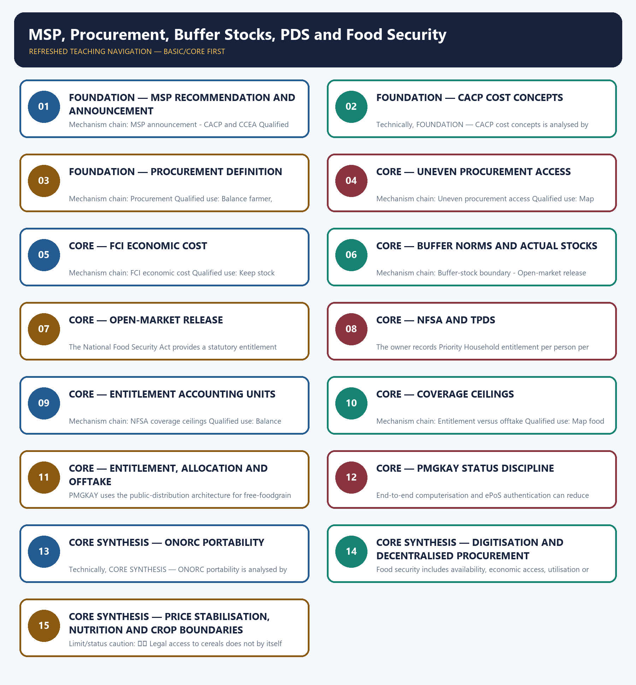

# MSP, Procurement, Buffer Stocks, PDS and Food Security — Learner-v2 Complete Learning Session

> **Authoring-only generation:** 2026-09-03. No PDF was rendered and no tracker or index was mutated.

### SOURCE, PROGRESSION AND CURRENT-LINKAGE AUDIT

- **Generation date:** 2026-09-03.
- **Repository-first evidence:** the Basic owner is taught first and preserved in full; the Advanced owner is retained only in the optional final teaching block.
- **OCR evidence:** Repository Markdown was primary. OCR-searchable local official General Studies papers were used only to confirm printed routed demands. No answer key, marking scheme, unsupported page precision or current macroeconomic statistic was inferred from them.
- **Qdrant:** not used; repository Markdown and available OCR context were sufficient.
- **PYQ integrity:** Audited ledgers route Mains demands on MSP and low farm income, food-distribution reform, NFSA, PDS transparency, buffer-stock stabilisation and millets. Objective demands test the CCEA announcement role, FCI economic cost, rice-price drivers, limits of oilseed procurement and niger seed; no answer letter is inferred.
- **Live-link boundary:** The live DFPD pages were stubs and the CACP host did not resolve. All rates, quantities, stocks, procurement volumes and continuation periods are therefore deliberately omitted from the authored anchors unless the repository owner states a stable legal distinction.
- **Fact/inference discipline:** no current-affairs item, PYQ wording, figure or quotation is invented.

### LIVE OFFICIAL-SOURCE ATTEMPT LOG

The checks below were made on 2026-09-03. Substantive official text is used only for the proposition it actually supports; binary files, dynamic shells, stubs and undated dashboard snippets are recorded but not converted into current claims.

- https://dfpd.gov.in/procurement-policy/en — retrieved 2026-09-03; the official page exposed only the toll-free number 1967 to the live fetcher, so no procurement quantity, season, crop or state claim was imported.
- https://dfpd.gov.in/allocation-of-food-grains/en — retrieved 2026-09-03; the official page likewise exposed only the toll-free number, so no allocation, beneficiary or offtake figure was imported.
- https://cacp.dacnet.nic.in/ — attempted 2026-09-03; DNS resolution failed in the live fetcher, so no current MSP rate, crop list or cost estimate was imported.

## BASIC LEARNING SESSION



*Distinct embedded teaching-navigation image. The separate continuous Cārvāka-style flowchart package remains an independent at-a-glance artifact.*

### SESSION 1 — FOUNDATION — MSP RECOMMENDATION AND ANNOUNCEMENT

#### DEFINITION / WHAT THIS IS CALLED

**Plain-language definition:** Minimum Support Price is an announced price signal and downside-support instrument; announcement alone is not a universal legal purchase or income guarantee.

**Technical definition:** Mechanism chain: MSP announcement - CACP and CCEA Qualified use: Map food policy as announcement, purchase, storage, release and household outcome.

#### ANSWER-GRABBING OPENING — WRITE/ADAPT IN THE EXAM

> The Commission for Agricultural Costs and Prices recommends MSPs, while the Cabinet Committee on Economic Affairs takes the Union-level announcement decision; recommendation and decision are distinct stages.

#### MUST-WRITE KEYWORDS

- **FOUNDATION**
- **MSP recommendation**
- **announcement**
- **Mechanism chain**
- **Qualified use**
- **Minimum Support Price**

**How to use them:** Frame the answer through FOUNDATION; define MSP recommendation, connect announcement with Mechanism chain to explain the mechanism, and use Qualified use for the decisive comparison or qualification.

#### VISUAL FIRST

```text
MSP RECOMMENDATION AND ANNOUNCEMENT
01. MSP announcement
    |
    v
02. CACP and CCEA
BOUNDARY -> Do not equate MSP announcement with procurement or a universal income guarantee.
```

*This topic-specific rail fixes the evidence sequence and its exam boundary before analysis.*

#### CORE EXPLANATION

Minimum Support Price is an announced price signal and downside-support instrument; announcement alone is not a universal legal purchase or income guarantee. The Commission for Agricultural Costs and Prices recommends MSPs, while the Cabinet Committee on Economic Affairs takes the Union-level announcement decision; recommendation and decision are distinct stages.

#### NAMED EVIDENCE AND MECHANISM

- Minimum Support Price is an announced price signal and downside-support instrument; announcement alone is not a universal legal purchase or income guarantee.
- The Commission for Agricultural Costs and Prices recommends MSPs, while the Cabinet Committee on Economic Affairs takes the Union-level announcement decision; recommendation and decision are distinct stages.

#### EXAMINER CAUTION

- Do not equate MSP announcement with procurement or a universal income guarantee.

#### EXAM LINK

- **Prelims:** Preserve the exact formula, territorial or resident boundary, price basis, base year, index basket, eligible counterparty, institution and legal status; never upgrade a projection into an actual or a regulatory direction into a universal rule.
- **Mains:** Map food policy as announcement, purchase, storage, release and household outcome.

#### MINI RECAP

- **Mechanism chain:** MSP announcement -> CACP and CCEA
- **Qualified use:** Map food policy as announcement, purchase, storage, release and household outcome.

#### CLOSING RECALL FLOW — FOUNDATION — MSP RECOMMENDATION AND ANNOUNCEMENT

```text
START / CONCEPT: FOUNDATION — MSP recommendation and announcement
        |
        v
EXACT TERMS: FOUNDATION · MSP recommendation · announcement · Mechanism chain · Qualified use · Minimum Support Price
        |
        v
MECHANISM / ARGUMENT: Mechanism chain: MSP announcement - CACP and CCEA Qualified use: Map food policy as announcement, purchase, storage, release and household outcome.
        |
        v
CONSEQUENCE / CONTRAST: Minimum Support Price is an announced price signal and downside-support instrument; announcement alone is not a universal legal purchase or income guarantee.
        |
        v
UPSC TRAP / ANSWER-USE: Do not equate MSP announcement with procurement or a universal income guarantee.
        |
        v
ANSWER-GRABBING FORMULATION: The Commission for Agricultural Costs and Prices recommends MSPs, while the Cabinet Committee on Economic Affairs takes the Union-level announcement decision; recommendation and decision are distinct stages.
```
### SESSION 2 — FOUNDATION — CACP COST CONCEPTS

#### DEFINITION / WHAT THIS IS CALLED

**Plain-language definition:** Mechanism chain: Cost concepts Qualified use: Keep stock norms, actual inventory, releases and offtake on separate accounting lines.

**Technical definition:** Technically, FOUNDATION — CACP cost concepts is analysed by relating FOUNDATION to CACP cost concepts, then testing the relationship through Mechanism chain and Qualified use.

#### ANSWER-GRABBING OPENING — WRITE/ADAPT IN THE EXAM

> Do not quote a margin over cost without naming A2, A2+FL or C2.

#### MUST-WRITE KEYWORDS

- **FOUNDATION**
- **CACP cost concepts**
- **Mechanism chain**
- **Qualified use**
- **FL**
- **Cost**

**How to use them:** Frame the answer through FOUNDATION; define CACP cost concepts, connect Mechanism chain with Qualified use to explain the mechanism, and use FL for the decisive comparison or qualification.

#### VISUAL FIRST

```text
CACP COST CONCEPTS
01. Cost concepts
BOUNDARY -> Do not quote a margin over cost without naming A2, A2+FL or C2.
```

*This topic-specific rail fixes the evidence sequence and its exam boundary before analysis.*

#### CORE EXPLANATION

A2 records paid-out expenses, A2+FL adds imputed family labour, and C2 further includes imputed rent on owned land and interest on owned fixed capital; the named base matters to any margin claim.

#### NAMED EVIDENCE AND MECHANISM

- A2 records paid-out expenses, A2+FL adds imputed family labour, and C2 further includes imputed rent on owned land and interest on owned fixed capital; the named base matters to any margin claim.

#### EXAMINER CAUTION

- Do not quote a margin over cost without naming A2, A2+FL or C2.

#### EXAM LINK

- **Prelims:** Preserve the exact formula, territorial or resident boundary, price basis, base year, index basket, eligible counterparty, institution and legal status; never upgrade a projection into an actual or a regulatory direction into a universal rule.
- **Mains:** Keep stock norms, actual inventory, releases and offtake on separate accounting lines.

#### MINI RECAP

- **Mechanism chain:** Cost concepts
- **Qualified use:** Keep stock norms, actual inventory, releases and offtake on separate accounting lines.

#### CLOSING RECALL FLOW — FOUNDATION — CACP COST CONCEPTS

```text
START / CONCEPT: FOUNDATION — CACP cost concepts
        |
        v
EXACT TERMS: FOUNDATION · CACP cost concepts · Mechanism chain · Qualified use · FL · Cost
        |
        v
MECHANISM / ARGUMENT: Mechanism chain: Cost concepts Qualified use: Keep stock norms, actual inventory, releases and offtake on separate accounting lines.
        |
        v
CONSEQUENCE / CONTRAST: A2 records paid-out expenses, A2+FL adds imputed family labour, and C2 further includes imputed rent on owned land and interest on owned fixed capital; the named base matters to any margin claim.
        |
        v
UPSC TRAP / ANSWER-USE: Do not miss this limiting distinction: do not quote a margin over cost without naming A2, A2+FL or C2.
        |
        v
ANSWER-GRABBING FORMULATION: Do not quote a margin over cost without naming A2, A2+FL or C2.
```
### SESSION 3 — FOUNDATION — PROCUREMENT DEFINITION

#### DEFINITION / WHAT THIS IS CALLED

**Plain-language definition:** Procurement is actual agency purchase of eligible produce under specified crop, grade, season, geography and operational conditions; it must not be inferred from MSP notification.

**Technical definition:** Mechanism chain: Procurement Qualified use: Balance farmer, consumer, nutrition, fiscal and ecological objectives explicitly.

#### ANSWER-GRABBING OPENING — WRITE/ADAPT IN THE EXAM

> Procurement is actual agency purchase of eligible produce under specified crop, grade, season, geography and operational conditions; it must not be inferred from MSP notification.

#### MUST-WRITE KEYWORDS

- **FOUNDATION**
- **Procurement definition**
- **Mechanism chain**
- **Qualified use**
- **Procurement**
- **MSP**

**How to use them:** Frame the answer through FOUNDATION; define Procurement definition, connect Mechanism chain with Qualified use to explain the mechanism, and use Procurement for the decisive comparison or qualification.

#### VISUAL FIRST

```text
PROCUREMENT DEFINITION
01. Procurement
BOUNDARY -> Do not treat notified crop coverage as actual purchase in every state.
```

*This topic-specific rail fixes the evidence sequence and its exam boundary before analysis.*

#### CORE EXPLANATION

Procurement is actual agency purchase of eligible produce under specified crop, grade, season, geography and operational conditions; it must not be inferred from MSP notification.

#### NAMED EVIDENCE AND MECHANISM

- Procurement is actual agency purchase of eligible produce under specified crop, grade, season, geography and operational conditions; it must not be inferred from MSP notification.

#### EXAMINER CAUTION

- Do not treat notified crop coverage as actual purchase in every state.

#### EXAM LINK

- **Prelims:** Preserve the exact formula, territorial or resident boundary, price basis, base year, index basket, eligible counterparty, institution and legal status; never upgrade a projection into an actual or a regulatory direction into a universal rule.
- **Mains:** Balance farmer, consumer, nutrition, fiscal and ecological objectives explicitly.

#### MINI RECAP

- **Mechanism chain:** Procurement
- **Qualified use:** Balance farmer, consumer, nutrition, fiscal and ecological objectives explicitly.

#### CLOSING RECALL FLOW — FOUNDATION — PROCUREMENT DEFINITION

```text
START / CONCEPT: FOUNDATION — Procurement definition
        |
        v
EXACT TERMS: FOUNDATION · Procurement definition · Mechanism chain · Qualified use · Procurement · MSP
        |
        v
MECHANISM / ARGUMENT: Mechanism chain: Procurement Qualified use: Balance farmer, consumer, nutrition, fiscal and ecological objectives explicitly.
        |
        v
CONSEQUENCE / CONTRAST: Do not treat notified crop coverage as actual purchase in every state.
        |
        v
UPSC TRAP / ANSWER-USE: Do not miss this limiting distinction: procurement is actual agency purchase of eligible produce under specified crop, grade, season, geography...
        |
        v
ANSWER-GRABBING FORMULATION: Procurement is actual agency purchase of eligible produce under specified crop, grade, season, geography and operational conditions; it must not be inferred from MSP notification.
```
### SESSION 4 — CORE — UNEVEN PROCUREMENT ACCESS

#### DEFINITION / WHAT THIS IS CALLED

**Plain-language definition:** Effective support varies by crop, state, market arrivals, agency presence and quality compliance, so announced coverage and realised procurement are different measures.

**Technical definition:** Mechanism chain: Uneven procurement access Qualified use: Map food policy as announcement, purchase, storage, release and household outcome.

#### ANSWER-GRABBING OPENING — WRITE/ADAPT IN THE EXAM

> Mechanism chain: Uneven procurement access Qualified use: Map food policy as announcement, purchase, storage, release and household outcome.

#### MUST-WRITE KEYWORDS

- **Uneven procurement access**
- **Mechanism chain**
- **Qualified use**
- **Effective**
- **FCI**
- **MSP**

**How to use them:** Frame the answer through Uneven procurement access; define Mechanism chain, connect Qualified use with Effective to explain the mechanism, and use FCI for the decisive comparison or qualification.

#### VISUAL FIRST

```text
UNEVEN PROCUREMENT ACCESS
01. Uneven procurement access
BOUNDARY -> Do not reduce FCI economic cost to MSP alone.
```

*This topic-specific rail fixes the evidence sequence and its exam boundary before analysis.*

#### CORE EXPLANATION

Effective support varies by crop, state, market arrivals, agency presence and quality compliance, so announced coverage and realised procurement are different measures.

#### NAMED EVIDENCE AND MECHANISM

- Effective support varies by crop, state, market arrivals, agency presence and quality compliance, so announced coverage and realised procurement are different measures.

#### EXAMINER CAUTION

- Do not reduce FCI economic cost to MSP alone.

#### EXAM LINK

- **Prelims:** Preserve the exact formula, territorial or resident boundary, price basis, base year, index basket, eligible counterparty, institution and legal status; never upgrade a projection into an actual or a regulatory direction into a universal rule.
- **Mains:** Map food policy as announcement, purchase, storage, release and household outcome.

#### MINI RECAP

- **Mechanism chain:** Uneven procurement access
- **Qualified use:** Map food policy as announcement, purchase, storage, release and household outcome.

#### CLOSING RECALL FLOW — CORE — UNEVEN PROCUREMENT ACCESS

```text
START / CONCEPT: CORE — Uneven procurement access
        |
        v
EXACT TERMS: Uneven procurement access · Mechanism chain · Qualified use · Effective · FCI · MSP
        |
        v
MECHANISM / ARGUMENT: Effective support varies by crop, state, market arrivals, agency presence and quality compliance, so announced coverage and realised procurement are different measures.
        |
        v
CONSEQUENCE / CONTRAST: Do not reduce FCI economic cost to MSP alone.
        |
        v
UPSC TRAP / ANSWER-USE: Do not miss this limiting distinction: map food policy as announcement, purchase, storage, release and household outcome.
        |
        v
ANSWER-GRABBING FORMULATION: Mechanism chain: Uneven procurement access Qualified use: Map food policy as announcement, purchase, storage, release and household outcome.
```
### SESSION 5 — CORE — FCI ECONOMIC COST

#### DEFINITION / WHAT THIS IS CALLED

**Plain-language definition:** FCI's economic cost is broader than MSP because procurement incidentals, movement, storage, carrying and distribution-related costs enter the public food-management chain.

**Technical definition:** Mechanism chain: FCI economic cost Qualified use: Keep stock norms, actual inventory, releases and offtake on separate accounting lines.

#### ANSWER-GRABBING OPENING — WRITE/ADAPT IN THE EXAM

> FCI's economic cost is broader than MSP because procurement incidentals, movement, storage, carrying and distribution-related costs enter the public food-management chain.

#### MUST-WRITE KEYWORDS

- **FCI economic cost**
- **Mechanism chain**
- **Qualified use**
- **FCI's economic cost**
- **FCI's**
- **MSP**

**How to use them:** Frame the answer through FCI economic cost; define Mechanism chain, connect Qualified use with FCI's economic cost to explain the mechanism, and use FCI's for the decisive comparison or qualification.

#### VISUAL FIRST

```text
FCI ECONOMIC COST
01. FCI economic cost
BOUNDARY -> Do not equate buffer norms, actual stocks, operational stock and strategic stock.
```

*This topic-specific rail fixes the evidence sequence and its exam boundary before analysis.*

#### CORE EXPLANATION

FCI's economic cost is broader than MSP because procurement incidentals, movement, storage, carrying and distribution-related costs enter the public food-management chain.

#### NAMED EVIDENCE AND MECHANISM

- FCI's economic cost is broader than MSP because procurement incidentals, movement, storage, carrying and distribution-related costs enter the public food-management chain.

#### EXAMINER CAUTION

- Do not equate buffer norms, actual stocks, operational stock and strategic stock.

#### EXAM LINK

- **Prelims:** Preserve the exact formula, territorial or resident boundary, price basis, base year, index basket, eligible counterparty, institution and legal status; never upgrade a projection into an actual or a regulatory direction into a universal rule.
- **Mains:** Keep stock norms, actual inventory, releases and offtake on separate accounting lines.

#### MINI RECAP

- **Mechanism chain:** FCI economic cost
- **Qualified use:** Keep stock norms, actual inventory, releases and offtake on separate accounting lines.

#### CLOSING RECALL FLOW — CORE — FCI ECONOMIC COST

```text
START / CONCEPT: CORE — FCI economic cost
        |
        v
EXACT TERMS: FCI economic cost · Mechanism chain · Qualified use · FCI's economic cost · FCI's · MSP
        |
        v
MECHANISM / ARGUMENT: Mechanism chain: FCI economic cost Qualified use: Keep stock norms, actual inventory, releases and offtake on separate accounting lines.
        |
        v
CONSEQUENCE / CONTRAST: Do not equate buffer norms, actual stocks, operational stock and strategic stock.
        |
        v
UPSC TRAP / ANSWER-USE: Do not miss this limiting distinction: fCI's economic cost is broader than MSP because procurement incidentals, movement, storage, carrying and...
        |
        v
ANSWER-GRABBING FORMULATION: FCI's economic cost is broader than MSP because procurement incidentals, movement, storage, carrying and distribution-related costs enter the public food-management chain.
```
### SESSION 6 — CORE — BUFFER NORMS AND ACTUAL STOCKS

#### DEFINITION / WHAT THIS IS CALLED

**Plain-language definition:** Buffer stock is publicly held inventory for operational distribution, strategic security and stabilisation; buffer norms are desired benchmarks, not the actual stock on every date.

**Technical definition:** Mechanism chain: Buffer-stock boundary - Open-market release Qualified use: Balance farmer, consumer, nutrition, fiscal and ecological objectives explicitly.

#### ANSWER-GRABBING OPENING — WRITE/ADAPT IN THE EXAM

> Buffer stock is publicly held inventory for operational distribution, strategic security and stabilisation; buffer norms are desired benchmarks, not the actual stock on every date.

#### MUST-WRITE KEYWORDS

- **Buffer norms**
- **actual stocks**
- **Mechanism chain**
- **Qualified use**
- **Buffer stock**
- **Buffer**

**How to use them:** Frame the answer through Buffer norms; define actual stocks, connect Mechanism chain with Qualified use to explain the mechanism, and use Buffer stock for the decisive comparison or qualification.

#### VISUAL FIRST

```text
BUFFER NORMS AND ACTUAL STOCKS
01. Buffer-stock boundary
    |
    v
02. Open-market release
BOUNDARY -> Do not merge OMSS market release with PDS entitlement delivery.
```

*This topic-specific rail fixes the evidence sequence and its exam boundary before analysis.*

#### CORE EXPLANATION

Buffer stock is publicly held inventory for operational distribution, strategic security and stabilisation; buffer norms are desired benchmarks, not the actual stock on every date. Open Market Sale Scheme releases address broader market supply and price conditions, while PDS releases serve household entitlements; the channels and purposes must remain distinct.

#### NAMED EVIDENCE AND MECHANISM

- Buffer stock is publicly held inventory for operational distribution, strategic security and stabilisation; buffer norms are desired benchmarks, not the actual stock on every date.
- Open Market Sale Scheme releases address broader market supply and price conditions, while PDS releases serve household entitlements; the channels and purposes must remain distinct.

#### EXAMINER CAUTION

- Do not merge OMSS market release with PDS entitlement delivery.

#### EXAM LINK

- **Prelims:** Preserve the exact formula, territorial or resident boundary, price basis, base year, index basket, eligible counterparty, institution and legal status; never upgrade a projection into an actual or a regulatory direction into a universal rule.
- **Mains:** Balance farmer, consumer, nutrition, fiscal and ecological objectives explicitly.

#### MINI RECAP

- **Mechanism chain:** Buffer-stock boundary -> Open-market release
- **Qualified use:** Balance farmer, consumer, nutrition, fiscal and ecological objectives explicitly.

#### CLOSING RECALL FLOW — CORE — BUFFER NORMS AND ACTUAL STOCKS

```text
START / CONCEPT: CORE — Buffer norms and actual stocks
        |
        v
EXACT TERMS: Buffer norms · actual stocks · Mechanism chain · Qualified use · Buffer stock · Buffer
        |
        v
MECHANISM / ARGUMENT: Mechanism chain: Buffer-stock boundary - Open-market release Qualified use: Balance farmer, consumer, nutrition, fiscal and ecological objectives explicitly.
        |
        v
CONSEQUENCE / CONTRAST: Open Market Sale Scheme releases address broader market supply and price conditions, while PDS releases serve household entitlements; the channels and purposes must remain distinct.
        |
        v
UPSC TRAP / ANSWER-USE: Do not merge OMSS market release with PDS entitlement delivery.
        |
        v
ANSWER-GRABBING FORMULATION: Buffer stock is publicly held inventory for operational distribution, strategic security and stabilisation; buffer norms are desired benchmarks, not the actual stock on every date.
```
### SESSION 7 — CORE — OPEN-MARKET RELEASE

#### DEFINITION / WHAT THIS IS CALLED

**Plain-language definition:** Mechanism chain: NFSA and TPDS Qualified use: Map food policy as announcement, purchase, storage, release and household outcome.

**Technical definition:** The National Food Security Act provides a statutory entitlement architecture, while the Targeted Public Distribution System is the principal delivery network; law and delivery operation are not identical.

#### ANSWER-GRABBING OPENING — WRITE/ADAPT IN THE EXAM

> Mechanism chain: NFSA and TPDS Qualified use: Map food policy as announcement, purchase, storage, release and household outcome.

#### MUST-WRITE KEYWORDS

- **Open-market release**
- **Mechanism chain**
- **Qualified use**
- **The National Food Security Act**
- **Targeted Public Distribution System**
- **NFSA**

**How to use them:** Frame the answer through Open-market release; define Mechanism chain, connect Qualified use with The National Food Security Act to explain the mechanism, and use Targeted Public Distribution System for the decisive comparison or qualification.

#### VISUAL FIRST

```text
OPEN-MARKET RELEASE
01. NFSA and TPDS
BOUNDARY -> Do not equate NFSA entitlement, allocation, offtake and nutritional utilisation.
```

*This topic-specific rail fixes the evidence sequence and its exam boundary before analysis.*

#### CORE EXPLANATION

The National Food Security Act provides a statutory entitlement architecture, while the Targeted Public Distribution System is the principal delivery network; law and delivery operation are not identical.

#### NAMED EVIDENCE AND MECHANISM

- The National Food Security Act provides a statutory entitlement architecture, while the Targeted Public Distribution System is the principal delivery network; law and delivery operation are not identical.

#### EXAMINER CAUTION

- Do not equate NFSA entitlement, allocation, offtake and nutritional utilisation.

#### EXAM LINK

- **Prelims:** Preserve the exact formula, territorial or resident boundary, price basis, base year, index basket, eligible counterparty, institution and legal status; never upgrade a projection into an actual or a regulatory direction into a universal rule.
- **Mains:** Map food policy as announcement, purchase, storage, release and household outcome.

#### MINI RECAP

- **Mechanism chain:** NFSA and TPDS
- **Qualified use:** Map food policy as announcement, purchase, storage, release and household outcome.

#### CLOSING RECALL FLOW — CORE — OPEN-MARKET RELEASE

```text
START / CONCEPT: CORE — Open-market release
        |
        v
EXACT TERMS: Open-market release · Mechanism chain · Qualified use · The National Food Security Act · Targeted Public Distribution System · NFSA
        |
        v
MECHANISM / ARGUMENT: The National Food Security Act provides a statutory entitlement architecture, while the Targeted Public Distribution System is the principal delivery network; law and delivery operation are not identical.
        |
        v
CONSEQUENCE / CONTRAST: Do not equate NFSA entitlement, allocation, offtake and nutritional utilisation.
        |
        v
UPSC TRAP / ANSWER-USE: Do not miss this limiting distinction: the National Food Security Act provides a statutory entitlement architecture.
        |
        v
ANSWER-GRABBING FORMULATION: Mechanism chain: NFSA and TPDS Qualified use: Map food policy as announcement, purchase, storage, release and household outcome.
```
### SESSION 8 — CORE — NFSA AND TPDS

#### DEFINITION / WHAT THIS IS CALLED

**Plain-language definition:** Mechanism chain: NFSA entitlement units Qualified use: Keep stock norms, actual inventory, releases and offtake on separate accounting lines.

**Technical definition:** The owner records Priority Household entitlement per person per month and Antyodaya Anna Yojana entitlement per household per month, so beneficiary category and accounting unit must not be mixed.

#### ANSWER-GRABBING OPENING — WRITE/ADAPT IN THE EXAM

> Mechanism chain: NFSA entitlement units Qualified use: Keep stock norms, actual inventory, releases and offtake on separate accounting lines.

#### MUST-WRITE KEYWORDS

- **NFSA**
- **TPDS**
- **Mechanism chain**
- **Qualified use**
- **Priority Household**
- **Antyodaya Anna Yojana**

**How to use them:** Frame the answer through NFSA; define TPDS, connect Mechanism chain with Qualified use to explain the mechanism, and use Priority Household for the decisive comparison or qualification.

#### VISUAL FIRST

```text
NFSA AND TPDS
01. NFSA entitlement units
BOUNDARY -> Do not quote PMGKAY continuation or free-food status without a dated official source.
```

*This topic-specific rail fixes the evidence sequence and its exam boundary before analysis.*

#### CORE EXPLANATION

The owner records Priority Household entitlement per person per month and Antyodaya Anna Yojana entitlement per household per month, so beneficiary category and accounting unit must not be mixed.

#### NAMED EVIDENCE AND MECHANISM

- The owner records Priority Household entitlement per person per month and Antyodaya Anna Yojana entitlement per household per month, so beneficiary category and accounting unit must not be mixed.

#### EXAMINER CAUTION

- Do not quote PMGKAY continuation or free-food status without a dated official source.

#### EXAM LINK

- **Prelims:** Preserve the exact formula, territorial or resident boundary, price basis, base year, index basket, eligible counterparty, institution and legal status; never upgrade a projection into an actual or a regulatory direction into a universal rule.
- **Mains:** Keep stock norms, actual inventory, releases and offtake on separate accounting lines.

#### MINI RECAP

- **Mechanism chain:** NFSA entitlement units
- **Qualified use:** Keep stock norms, actual inventory, releases and offtake on separate accounting lines.

#### CLOSING RECALL FLOW — CORE — NFSA AND TPDS

```text
START / CONCEPT: CORE — NFSA and TPDS
        |
        v
EXACT TERMS: NFSA · TPDS · Mechanism chain · Qualified use · Priority Household · Antyodaya Anna Yojana
        |
        v
MECHANISM / ARGUMENT: The owner records Priority Household entitlement per person per month and Antyodaya Anna Yojana entitlement per household per month, so beneficiary category and accounting unit must not be mixed.
        |
        v
CONSEQUENCE / CONTRAST: Do not quote PMGKAY continuation or free-food status without a dated official source.
        |
        v
UPSC TRAP / ANSWER-USE: Do not miss this limiting distinction: the owner records Priority Household entitlement per person per month and Antyodaya Anna Yojana...
        |
        v
ANSWER-GRABBING FORMULATION: Mechanism chain: NFSA entitlement units Qualified use: Keep stock norms, actual inventory, releases and offtake on separate accounting lines.
```
### SESSION 9 — CORE — ENTITLEMENT ACCOUNTING UNITS

#### DEFINITION / WHAT THIS IS CALLED

**Plain-language definition:** The owner records NFSA coverage ceilings of up to 75 per cent of rural population and 50 per cent of urban population; ceilings are not identical to actual enrolled beneficiaries in each state.

**Technical definition:** Mechanism chain: NFSA coverage ceilings Qualified use: Balance farmer, consumer, nutrition, fiscal and ecological objectives explicitly.

#### ANSWER-GRABBING OPENING — WRITE/ADAPT IN THE EXAM

> The owner records NFSA coverage ceilings of up to 75 per cent of rural population and 50 per cent of urban population; ceilings are not identical to actual enrolled beneficiaries in each state.

#### MUST-WRITE KEYWORDS

- **Entitlement accounting units**
- **Mechanism chain**
- **Qualified use**
- **NFSA**
- **Qualified**
- **Balance**

**How to use them:** Frame the answer through Entitlement accounting units; define Mechanism chain, connect Qualified use with NFSA to explain the mechanism, and use Qualified for the decisive comparison or qualification.

#### VISUAL FIRST

```text
ENTITLEMENT ACCOUNTING UNITS
01. NFSA coverage ceilings
BOUNDARY -> Do not call authentication reform costless when exclusion failures remain possible.
```

*This topic-specific rail fixes the evidence sequence and its exam boundary before analysis.*

#### CORE EXPLANATION

The owner records NFSA coverage ceilings of up to 75 per cent of rural population and 50 per cent of urban population; ceilings are not identical to actual enrolled beneficiaries in each state.

#### NAMED EVIDENCE AND MECHANISM

- The owner records NFSA coverage ceilings of up to 75 per cent of rural population and 50 per cent of urban population; ceilings are not identical to actual enrolled beneficiaries in each state.

#### EXAMINER CAUTION

- Do not call authentication reform costless when exclusion failures remain possible.

#### EXAM LINK

- **Prelims:** Preserve the exact formula, territorial or resident boundary, price basis, base year, index basket, eligible counterparty, institution and legal status; never upgrade a projection into an actual or a regulatory direction into a universal rule.
- **Mains:** Balance farmer, consumer, nutrition, fiscal and ecological objectives explicitly.

#### MINI RECAP

- **Mechanism chain:** NFSA coverage ceilings
- **Qualified use:** Balance farmer, consumer, nutrition, fiscal and ecological objectives explicitly.

#### CLOSING RECALL FLOW — CORE — ENTITLEMENT ACCOUNTING UNITS

```text
START / CONCEPT: CORE — Entitlement accounting units
        |
        v
EXACT TERMS: Entitlement accounting units · Mechanism chain · Qualified use · NFSA · Qualified · Balance
        |
        v
MECHANISM / ARGUMENT: Mechanism chain: NFSA coverage ceilings Qualified use: Balance farmer, consumer, nutrition, fiscal and ecological objectives explicitly.
        |
        v
CONSEQUENCE / CONTRAST: Do not call authentication reform costless when exclusion failures remain possible.
        |
        v
UPSC TRAP / ANSWER-USE: Do not miss this limiting distinction: the owner records NFSA coverage ceilings of up to 75 per cent of rural...
        |
        v
ANSWER-GRABBING FORMULATION: The owner records NFSA coverage ceilings of up to 75 per cent of rural population and 50 per cent of urban population; ceilings are not identical to actual enrolled beneficiaries in each state.
```
### SESSION 10 — CORE — COVERAGE CEILINGS

#### DEFINITION / WHAT THIS IS CALLED

**Plain-language definition:** A legal allocation or entitlement does not prove household offtake, consumption, nutritional utilisation or error-free delivery; each is a separate outcome measure.

**Technical definition:** Mechanism chain: Entitlement versus offtake Qualified use: Map food policy as announcement, purchase, storage, release and household outcome.

#### ANSWER-GRABBING OPENING — WRITE/ADAPT IN THE EXAM

> Do not infer objective PYQ answer letters for MSP, economic cost or niger seed.

#### MUST-WRITE KEYWORDS

- **Coverage ceilings**
- **Mechanism chain**
- **Qualified use**
- **PYQ**
- **MSP**
- **Entitlement**

**How to use them:** Frame the answer through Coverage ceilings; define Mechanism chain, connect Qualified use with PYQ to explain the mechanism, and use MSP for the decisive comparison or qualification.

#### VISUAL FIRST

```text
COVERAGE CEILINGS
01. Entitlement versus offtake
BOUNDARY -> Do not infer objective PYQ answer letters for MSP, economic cost or niger seed.
```

*This topic-specific rail fixes the evidence sequence and its exam boundary before analysis.*

#### CORE EXPLANATION

A legal allocation or entitlement does not prove household offtake, consumption, nutritional utilisation or error-free delivery; each is a separate outcome measure.

#### NAMED EVIDENCE AND MECHANISM

- A legal allocation or entitlement does not prove household offtake, consumption, nutritional utilisation or error-free delivery; each is a separate outcome measure.

#### EXAMINER CAUTION

- Do not infer objective PYQ answer letters for MSP, economic cost or niger seed.

#### EXAM LINK

- **Prelims:** Preserve the exact formula, territorial or resident boundary, price basis, base year, index basket, eligible counterparty, institution and legal status; never upgrade a projection into an actual or a regulatory direction into a universal rule.
- **Mains:** Map food policy as announcement, purchase, storage, release and household outcome.

#### MINI RECAP

- **Mechanism chain:** Entitlement versus offtake
- **Qualified use:** Map food policy as announcement, purchase, storage, release and household outcome.

#### CLOSING RECALL FLOW — CORE — COVERAGE CEILINGS

```text
START / CONCEPT: CORE — Coverage ceilings
        |
        v
EXACT TERMS: Coverage ceilings · Mechanism chain · Qualified use · PYQ · MSP · Entitlement
        |
        v
MECHANISM / ARGUMENT: Mechanism chain: Entitlement versus offtake Qualified use: Map food policy as announcement, purchase, storage, release and household outcome.
        |
        v
CONSEQUENCE / CONTRAST: A legal allocation or entitlement does not prove household offtake, consumption, nutritional utilisation or error-free delivery; each is a separate outcome measure.
        |
        v
UPSC TRAP / ANSWER-USE: Do not miss this limiting distinction: do not infer objective PYQ answer letters for MSP, economic cost or niger seed.
        |
        v
ANSWER-GRABBING FORMULATION: Do not infer objective PYQ answer letters for MSP, economic cost or niger seed.
```
### SESSION 11 — CORE — ENTITLEMENT, ALLOCATION AND OFFTAKE

#### DEFINITION / WHAT THIS IS CALLED

**Plain-language definition:** Mechanism chain: PMGKAY status - ONORC portability Qualified use: Keep stock norms, actual inventory, releases and offtake on separate accounting lines.

**Technical definition:** PMGKAY uses the public-distribution architecture for free-foodgrain support, but continuation, merger and beneficiary-period claims are executive-status questions that require a dated notification.

#### ANSWER-GRABBING OPENING — WRITE/ADAPT IN THE EXAM

> Mechanism chain: PMGKAY status - ONORC portability Qualified use: Keep stock norms, actual inventory, releases and offtake on separate accounting lines.

#### MUST-WRITE KEYWORDS

- **Entitlement**
- **allocation**
- **offtake**
- **Mechanism chain**
- **Qualified use**
- **PMGKAY**

**How to use them:** Frame the answer through Entitlement; define allocation, connect offtake with Mechanism chain to explain the mechanism, and use Qualified use for the decisive comparison or qualification.

#### VISUAL FIRST

```text
ENTITLEMENT, ALLOCATION AND OFFTAKE
01. PMGKAY status
    |
    v
02. ONORC portability
BOUNDARY -> Do not equate MSP announcement with procurement or a universal income guarantee.
```

*This topic-specific rail fixes the evidence sequence and its exam boundary before analysis.*

#### CORE EXPLANATION

PMGKAY uses the public-distribution architecture for free-foodgrain support, but continuation, merger and beneficiary-period claims are executive-status questions that require a dated notification. One Nation One Ration Card enables portability within the NFSA delivery architecture, but portability use depends on beneficiary awareness, identity matching, ePoS connectivity and stock availability.

#### NAMED EVIDENCE AND MECHANISM

- PMGKAY uses the public-distribution architecture for free-foodgrain support, but continuation, merger and beneficiary-period claims are executive-status questions that require a dated notification.
- One Nation One Ration Card enables portability within the NFSA delivery architecture, but portability use depends on beneficiary awareness, identity matching, ePoS connectivity and stock availability.

#### EXAMINER CAUTION

- Do not equate MSP announcement with procurement or a universal income guarantee.

#### EXAM LINK

- **Prelims:** Preserve the exact formula, territorial or resident boundary, price basis, base year, index basket, eligible counterparty, institution and legal status; never upgrade a projection into an actual or a regulatory direction into a universal rule.
- **Mains:** Keep stock norms, actual inventory, releases and offtake on separate accounting lines.

#### MINI RECAP

- **Mechanism chain:** PMGKAY status -> ONORC portability
- **Qualified use:** Keep stock norms, actual inventory, releases and offtake on separate accounting lines.

#### CLOSING RECALL FLOW — CORE — ENTITLEMENT, ALLOCATION AND OFFTAKE

```text
START / CONCEPT: CORE — Entitlement, allocation and offtake
        |
        v
EXACT TERMS: Entitlement · allocation · offtake · Mechanism chain · Qualified use · PMGKAY
        |
        v
MECHANISM / ARGUMENT: One Nation One Ration Card enables portability within the NFSA delivery architecture, but portability use depends on beneficiary awareness, identity matching, ePoS connectivity and stock availability.
        |
        v
CONSEQUENCE / CONTRAST: PMGKAY uses the public-distribution architecture for free-foodgrain support, but continuation, merger and beneficiary-period claims are executive-status questions that require a dated notification.
        |
        v
UPSC TRAP / ANSWER-USE: Do not equate MSP announcement with procurement or a universal income guarantee.
        |
        v
ANSWER-GRABBING FORMULATION: Mechanism chain: PMGKAY status - ONORC portability Qualified use: Keep stock norms, actual inventory, releases and offtake on separate accounting lines.
```
### SESSION 12 — CORE — PMGKAY STATUS DISCIPLINE

#### DEFINITION / WHAT THIS IS CALLED

**Plain-language definition:** Mechanism chain: Digitisation trade-off Qualified use: Balance farmer, consumer, nutrition, fiscal and ecological objectives explicitly.

**Technical definition:** End-to-end computerisation and ePoS authentication can reduce duplicate records and diversion, while device, connectivity, seeding or biometric failure can exclude genuine beneficiaries.

#### ANSWER-GRABBING OPENING — WRITE/ADAPT IN THE EXAM

> End-to-end computerisation and ePoS authentication can reduce duplicate records and diversion, while device, connectivity, seeding or biometric failure can exclude genuine beneficiaries.

#### MUST-WRITE KEYWORDS

- **PMGKAY status discipline**
- **Mechanism chain**
- **Qualified use**
- **End-to-end**
- **FL**
- **Digitisation**

**How to use them:** Frame the answer through PMGKAY status discipline; define Mechanism chain, connect Qualified use with End-to-end to explain the mechanism, and use FL for the decisive comparison or qualification.

#### VISUAL FIRST

```text
PMGKAY STATUS DISCIPLINE
01. Digitisation trade-off
BOUNDARY -> Do not quote a margin over cost without naming A2, A2+FL or C2.
```

*This topic-specific rail fixes the evidence sequence and its exam boundary before analysis.*

#### CORE EXPLANATION

End-to-end computerisation and ePoS authentication can reduce duplicate records and diversion, while device, connectivity, seeding or biometric failure can exclude genuine beneficiaries.

#### NAMED EVIDENCE AND MECHANISM

- End-to-end computerisation and ePoS authentication can reduce duplicate records and diversion, while device, connectivity, seeding or biometric failure can exclude genuine beneficiaries.

#### EXAMINER CAUTION

- Do not quote a margin over cost without naming A2, A2+FL or C2.

#### EXAM LINK

- **Prelims:** Preserve the exact formula, territorial or resident boundary, price basis, base year, index basket, eligible counterparty, institution and legal status; never upgrade a projection into an actual or a regulatory direction into a universal rule.
- **Mains:** Balance farmer, consumer, nutrition, fiscal and ecological objectives explicitly.

#### MINI RECAP

- **Mechanism chain:** Digitisation trade-off
- **Qualified use:** Balance farmer, consumer, nutrition, fiscal and ecological objectives explicitly.

#### CLOSING RECALL FLOW — CORE — PMGKAY STATUS DISCIPLINE

```text
START / CONCEPT: CORE — PMGKAY status discipline
        |
        v
EXACT TERMS: PMGKAY status discipline · Mechanism chain · Qualified use · End-to-end · FL · Digitisation
        |
        v
MECHANISM / ARGUMENT: Mechanism chain: Digitisation trade-off Qualified use: Balance farmer, consumer, nutrition, fiscal and ecological objectives explicitly.
        |
        v
CONSEQUENCE / CONTRAST: Do not quote a margin over cost without naming A2, A2+FL or C2.
        |
        v
UPSC TRAP / ANSWER-USE: Do not miss this limiting distinction: end-to-end computerisation and ePoS authentication can reduce duplicate records and diversion.
        |
        v
ANSWER-GRABBING FORMULATION: End-to-end computerisation and ePoS authentication can reduce duplicate records and diversion, while device, connectivity, seeding or biometric failure can exclude genuine beneficiaries.
```
### SESSION 13 — CORE SYNTHESIS — ONORC PORTABILITY

#### DEFINITION / WHAT THIS IS CALLED

**Plain-language definition:** Mechanism chain: Decentralised procurement Qualified use: Map food policy as announcement, purchase, storage, release and household outcome.

**Technical definition:** Technically, CORE SYNTHESIS — ONORC portability is analysed by relating CORE SYNTHESIS to ONORC portability, then testing the relationship through Mechanism chain and Qualified use.

#### ANSWER-GRABBING OPENING — WRITE/ADAPT IN THE EXAM

> Mechanism chain: Decentralised procurement Qualified use: Map food policy as announcement, purchase, storage, release and household outcome.

#### MUST-WRITE KEYWORDS

- **CORE SYNTHESIS**
- **ONORC portability**
- **Mechanism chain**
- **Qualified use**
- **Decentralised**
- **Qualified**

**How to use them:** Frame the answer through CORE SYNTHESIS; define ONORC portability, connect Mechanism chain with Qualified use to explain the mechanism, and use Decentralised for the decisive comparison or qualification.

#### VISUAL FIRST

```text
ONORC PORTABILITY
01. Decentralised procurement
BOUNDARY -> Do not treat notified crop coverage as actual purchase in every state.
```

*This topic-specific rail fixes the evidence sequence and its exam boundary before analysis.*

#### CORE EXPLANATION

Decentralised procurement gives participating states a larger operational role in purchase, storage and distribution, without eliminating Union financing, stock-transfer or quality questions.

#### NAMED EVIDENCE AND MECHANISM

- Decentralised procurement gives participating states a larger operational role in purchase, storage and distribution, without eliminating Union financing, stock-transfer or quality questions.

#### EXAMINER CAUTION

- Do not treat notified crop coverage as actual purchase in every state.

#### EXAM LINK

- **Prelims:** Preserve the exact formula, territorial or resident boundary, price basis, base year, index basket, eligible counterparty, institution and legal status; never upgrade a projection into an actual or a regulatory direction into a universal rule.
- **Mains:** Map food policy as announcement, purchase, storage, release and household outcome.

#### MINI RECAP

- **Mechanism chain:** Decentralised procurement
- **Qualified use:** Map food policy as announcement, purchase, storage, release and household outcome.

#### CLOSING RECALL FLOW — CORE SYNTHESIS — ONORC PORTABILITY

```text
START / CONCEPT: CORE SYNTHESIS — ONORC portability
        |
        v
EXACT TERMS: CORE SYNTHESIS · ONORC portability · Mechanism chain · Qualified use · Decentralised · Qualified
        |
        v
MECHANISM / ARGUMENT: The operative mechanism is that map food policy as announcement, purchase, storage, release and household outcome.
        |
        v
CONSEQUENCE / CONTRAST: Do not treat notified crop coverage as actual purchase in every state.
        |
        v
UPSC TRAP / ANSWER-USE: Do not miss this limiting distinction: do not treat notified crop coverage as actual purchase in every state.
        |
        v
ANSWER-GRABBING FORMULATION: Mechanism chain: Decentralised procurement Qualified use: Map food policy as announcement, purchase, storage, release and household outcome.
```
### SESSION 14 — CORE SYNTHESIS — DIGITISATION AND DECENTRALISED PROCUREMENT

#### DEFINITION / WHAT THIS IS CALLED

**Plain-language definition:** Mechanism chain: Price stabilisation - Nutrition dimensions Qualified use: Keep stock norms, actual inventory, releases and offtake on separate accounting lines.

**Technical definition:** Food security includes availability, economic access, utilisation or nutrition and stability; cereal distribution alone cannot substitute for diverse diets, sanitation, health and care.

#### ANSWER-GRABBING OPENING — WRITE/ADAPT IN THE EXAM

> Mechanism chain: Price stabilisation - Nutrition dimensions Qualified use: Keep stock norms, actual inventory, releases and offtake on separate accounting lines.

#### MUST-WRITE KEYWORDS

- **CORE SYNTHESIS**
- **Digitisation**
- **decentralised procurement**
- **Mechanism chain**
- **Qualified use**
- **Food**

**How to use them:** Frame the answer through CORE SYNTHESIS; define Digitisation, connect decentralised procurement with Mechanism chain to explain the mechanism, and use Qualified use for the decisive comparison or qualification.

#### VISUAL FIRST

```text
DIGITISATION AND DECENTRALISED PROCUREMENT
01. Price stabilisation
    |
    v
02. Nutrition dimensions
BOUNDARY -> Do not reduce FCI economic cost to MSP alone.
```

*This topic-specific rail fixes the evidence sequence and its exam boundary before analysis.*

#### CORE EXPLANATION

Public purchase can support farm prices and later stock release can moderate consumer prices, but excessive or unpredictable intervention can crowd private storage and distort crop choice. Food security includes availability, economic access, utilisation or nutrition and stability; cereal distribution alone cannot substitute for diverse diets, sanitation, health and care.

#### NAMED EVIDENCE AND MECHANISM

- Public purchase can support farm prices and later stock release can moderate consumer prices, but excessive or unpredictable intervention can crowd private storage and distort crop choice.
- Food security includes availability, economic access, utilisation or nutrition and stability; cereal distribution alone cannot substitute for diverse diets, sanitation, health and care.

#### EXAMINER CAUTION

- Do not reduce FCI economic cost to MSP alone.

#### EXAM LINK

- **Prelims:** Preserve the exact formula, territorial or resident boundary, price basis, base year, index basket, eligible counterparty, institution and legal status; never upgrade a projection into an actual or a regulatory direction into a universal rule.
- **Mains:** Keep stock norms, actual inventory, releases and offtake on separate accounting lines.

#### MINI RECAP

- **Mechanism chain:** Price stabilisation -> Nutrition dimensions
- **Qualified use:** Keep stock norms, actual inventory, releases and offtake on separate accounting lines.

#### CLOSING RECALL FLOW — CORE SYNTHESIS — DIGITISATION AND DECENTRALISED PROCUREMENT

```text
START / CONCEPT: CORE SYNTHESIS — Digitisation and decentralised procurement
        |
        v
EXACT TERMS: CORE SYNTHESIS · Digitisation · decentralised procurement · Mechanism chain · Qualified use · Food
        |
        v
MECHANISM / ARGUMENT: The operative mechanism is that price stabilisation - Nutrition dimensions Qualified use.
        |
        v
CONSEQUENCE / CONTRAST: Do not reduce FCI economic cost to MSP alone.
        |
        v
UPSC TRAP / ANSWER-USE: Food security includes availability, economic access, utilisation or nutrition and stability; cereal distribution alone cannot substitute for diverse diets, sanitation, health and care.
        |
        v
ANSWER-GRABBING FORMULATION: Mechanism chain: Price stabilisation - Nutrition dimensions Qualified use: Keep stock norms, actual inventory, releases and offtake on separate accounting lines.
```
### SESSION 15 — CORE SYNTHESIS — PRICE STABILISATION, NUTRITION AND CROP BOUNDARIES

#### DEFINITION / WHAT THIS IS CALLED

**Plain-language definition:** ❌ MSP is a universal legal purchase guarantee. - Actual procurement depends on crop, region, quality and operational reach. ❌ CACP and FCI perform the same function. - One recommends prices; the other helps operationalise procurement, storage and movement. ❌ Higher buffer stocks are always better. - Excess stocks raise carrying costs, losses and market distortion risks. ❌ Food security equals cereal availability. - Nutrition, affordability, portability, sanitation and dietary diversity also matter. ❌ PMGKAY and the NFSA are identical. - PMGKAY is a free-foodgrain support layer delivered through the wider public-distribution architecture. ❌ Oilseed MSP implies unlimited procurement everywhere. - Oilseed procurement is far more contingent than the classic cereal system. ❌ MSP is announced for every crop grown in India. - It is notified for a fixed, countable list (23 crops); most fruits, vegetables and many minor crops have no MSP. ❌ A2, A2+FL and C2 are interchangeable cost figures. - They are progressively wider cost bases, and the choice of base changes whether MSP looks adequate or inadequate. ❌ NFSA guarantees the same quantity to every household. - Priority Households (5 kg/person/month) and AAY households (35 kg/household/month) have different entitlements under the same Act. ❌ ONORC/ePoS digitisation has eliminated all PDS exclusion errors. - Authentication failures (connectivity, device, worn-fingerprint or seeding issues) still exclude some genuine beneficiaries even as leakage falls. ❌ Fortified rice's safety for thalassemia/sickle-cell patients is scientifically closed. - FSSAI removed the advisory label after an ICMR-linked review, but civil-society/medical concerns and judicial scrutiny continue; treat it as contested, not settled. ❌ DBT/cash transfer is a strictly superior replacement for in-kind PDS. - It lowers handling/leakage cost but shifts food-price-inflation, banking-access and diversion risk onto beneficiaries; it remains a pilot-stage trade-off.

**Technical definition:** Limit/status caution: ⚠️ Legal access to cereals does not by itself solve nutrition, targeting, portability or exclusion problems. ⚠️ Claim: NFSA's entitlement architecture is defined by named quantities and named coverage ceilings, not an open-ended promise.

#### ANSWER-GRABBING OPENING — WRITE/ADAPT IN THE EXAM

> ⚠️ Open-ended procurement can stabilise farm incentives, but it also concentrates public spending and storage on a few crops and regions. ⚠️ Large buffer stocks help price stabilisation and emergency distribution, yet they raise carrying, storage and quality-maintenance costs. ⚠️ A broad food subsidy protects consumption, but it also creates a persistent fiscal burden and may crowd out spending on nutrition diversification or infrastructure. ⚠️ Tighter targeting can reduce leakage, while broader coverage can reduce exclusion; PDS design always balances administrative efficiency against welfare assurance. ⚠️ Digitisation, portability and authentication can curb ghost beneficiaries, but they may also create exclusion risks for vulnerable households when records or connectivity fail. ⚠️ ONORC portability improves migrant food security, but it depends on the receiving state's ePoS/stock readiness and beneficiary awareness; fortified-rice safety for thalassemia/sickle-cell patients remains contested despite the FSSAI advisory-label removal; and DBT/cash-transfer pilots reduce leakage/handling cost while shifting price-inflation and diversion risk onto households. ⚠️ Cereal-heavy procurement improves staple availability, yet it can discourage crop diversification and reinforce water-stressed production systems. ⚠️ Pegging MSP to A2+FL keeps the fiscal/procurement cost lower, but it structurally under-delivers against the farmer-movement C2+50% demand; moving to a C2-based MSP would raise farmer remuneration but also raise the fiscal and market-distortion cost of price support. ⚠️ A fixed 23-crop MSP list gives price-policy predictability, but it also concentrates the incentive structure on a narrow basket, reinforcing the same cereal/water-intensive bias that food-security and diversification goals are trying to correct.

#### MUST-WRITE KEYWORDS

- **CORE SYNTHESIS**
- **Price stabilisation**
- **nutrition**
- **crop boundaries**
- **Mechanism chain**
- **Qualified use**

**How to use them:** Frame the answer through CORE SYNTHESIS; define Price stabilisation, connect nutrition with crop boundaries to explain the mechanism, and use Mechanism chain for the decisive comparison or qualification.

#### VISUAL FIRST

```text
PRICE STABILISATION, NUTRITION AND CROP BOUNDARIES
01. Oilseed procurement boundary
    |
    v
02. Crop-list and millet caution
BOUNDARY -> Do not equate buffer norms, actual stocks, operational stock and strategic stock.
```

*This topic-specific rail fixes the evidence sequence and its exam boundary before analysis.*

#### CORE EXPLANATION

Oilseed procurement is not an everywhere-unlimited operation equivalent to classic paddy-wheat procurement; agency operations, arrivals and scheme conditions determine actual purchase. The owner distinguishes notified price-support crops, sugarcane's separate FRP mechanism and millet or niger-seed questions; exact current lists, rates and season claims require the relevant notification.

#### NAMED EVIDENCE AND MECHANISM

- Oilseed procurement is not an everywhere-unlimited operation equivalent to classic paddy-wheat procurement; agency operations, arrivals and scheme conditions determine actual purchase.
- The owner distinguishes notified price-support crops, sugarcane's separate FRP mechanism and millet or niger-seed questions; exact current lists, rates and season claims require the relevant notification.

#### EXAMINER CAUTION

- Do not equate buffer norms, actual stocks, operational stock and strategic stock.

#### EXAM LINK

- **Prelims:** Preserve the exact formula, territorial or resident boundary, price basis, base year, index basket, eligible counterparty, institution and legal status; never upgrade a projection into an actual or a regulatory direction into a universal rule.
- **Mains:** Balance farmer, consumer, nutrition, fiscal and ecological objectives explicitly.

#### MINI RECAP

- **Mechanism chain:** Oilseed procurement boundary -> Crop-list and millet caution
- **Qualified use:** Balance farmer, consumer, nutrition, fiscal and ecological objectives explicitly.
#### COMPLETE BASIC OWNER EVIDENCE BANK

> **Subject:** Economy | **Tier:** Must-Do (foundation) | **GS Paper:** GS-III + Prelims.
> **Core area:** Food management.
> **Grounded in:** Ramesh Singh, relevant chapters; Economic Survey 2025-26; audited UPSC Economy PYQs (2024-2026 Prelims and 2024-2025 Mains).
> ✅ = source-grounded | ⚠️ = analytical linkage | 📰 = current Survey/current-affairs hook.
> *Companion: `../advanced/12_MSP-Procurement-Buffer-Stocks-PDS-and-Food-Security.md`.*

#### 1. Visual foundation

```text
1. PRICE ANNOUNCEMENT AND PRODUCTION
   |
   v
2. PROCUREMENT
   |
   v
3. STORAGE AND BUFFER MANAGEMENT
   |
   v
4. PDS OR MARKET RELEASE
   |
   v
5. AVAILABILITY, ACCESS AND STABILISATION
```

**Core proposition:** Separate price assurance, physical procurement, strategic storage and
household distribution before evaluating food policy.

#### 2. Essential definitions

| Concept | Exam-ready meaning |
|---|---|
| ✅ **MSP** | Announced minimum support price intended to provide a price signal and downside protection. |
| ✅ **Procurement** | Government or agency purchase of eligible produce under specified operations. |
| ✅ **Buffer stock** | Publicly held foodgrain inventory for distribution, emergencies and stabilisation. |
| ✅ **PDS** | Public distribution network supplying entitled households through fair-price shops. |
| ✅ **Food security** | Reliable physical and economic access to sufficient, safe and nutritious food. |
| ✅ **A2 cost** | CACP cost concept covering actual **paid-out expenses** by the farmer (seed, fertiliser, hired labour, irrigation, fuel, etc.). |
| ✅ **A2+FL cost** | A2 plus the **imputed value of unpaid family labour** used on the farm. |
| ✅ **C2 cost** | The most comprehensive CACP cost concept: A2+FL plus **imputed rent on owned land** and **imputed interest on owned fixed capital**. |

#### 3. Topic mechanism

1. MSP announcements influence expected returns before sowing, but credibility depends on
   market and procurement conditions.
2. Procurement converts a price signal into physical public stocks for selected crops,
   grades and locations.
3. Storage protects availability across seasons but creates carrying, quality and fiscal
   costs.
4. PDS releases stocks to entitled households, while open-market sales target broader price
   conditions.
5. Diversified production, nutrition policy and transparent stock rules determine whether
   food management supports both farmers and consumers.

#### 4. Institutions and policy tools

- ✅ **Commission for Agricultural Costs and Prices (CACP):** recommends MSPs using cost, demand, supply and policy considerations.
- ✅ **Cabinet Committee on Economic Affairs (CCEA):** takes the formal decision on MSP announcements at the Union level.
- ✅ **Food Corporation of India (FCI) and state agencies:** procure, store, move and release foodgrains through buffer and distribution operations.
- ✅ **National Food Security Act (NFSA) framework and Targeted Public Distribution System (TPDS):** provide the legal-entitlement and delivery architecture for subsidised foodgrain access.
- ✅ **Buffer-stock norms, open-ended procurement practices and open-market release tools:** determine how price support, stockholding and consumer stabilisation interact.
- ✅ **Shanta Kumar Committee:** remains a named reform anchor in debates on FCI efficiency, subsidy burden and PDS targeting.

#### 5. Indian applications and examples

- ⚠️ **Claim:** MSP matters most when an advisory price signal is backed by a recognisable institutional process. **Named evidence:** ✅ **CACP** recommends MSPs and the **CCEA** announces them. **Why it supports the claim:** ⚠️ This distinction helps explain why MSP is a policy instrument, not a self-executing universal purchase guarantee. **Limit/status caution:** ⚠️ A recommended or announced MSP is still of limited value where procurement access, crop coverage or market arrivals are weak.
- ⚠️ **Claim:** Price support becomes materially real only when an agency converts it into procurement and stock operations. **Named evidence:** ✅ **Food Corporation of India (FCI)** is the classic institution for procurement, storage, movement and release of foodgrains. **Why it supports the claim:** ⚠️ FCI shows how food policy links farmer remuneration with public distribution and buffer management. **Limit/status caution:** ⚠️ FCI-centred operations have been criticised for cereal concentration, high carrying costs and uneven regional spread.
- ⚠️ **Claim:** "Remunerative price" is contested precisely because CACP cost concepts differ, and the farmer-movement demand for MSP at "C2 plus 50%" only makes sense once the cost base is named. **Named evidence:** ✅ CACP computes three cost concepts for every notified crop — **A2** (actual paid-out cost: seed, fertiliser, hired labour, irrigation, fuel), **A2+FL** (A2 plus the imputed value of unpaid family labour), and **C2** (the most comprehensive concept: A2+FL plus imputed rent on owned land and imputed interest on owned fixed capital). Government MSP has generally been pegged to a margin over **A2+FL**, whereas farmer bodies and the M.S. Swaminathan-linked "C2+50%" demand use the wider **C2** base. **Why it supports the claim:** ⚠️ Naming the exact cost concept explains why the "MSP already gives 50% margin" claim and the "MSP still under-compensates" claim can both be textually true depending on which cost base (A2+FL or C2) is used. **Limit/status caution:** ⚠️ Cost estimates are state- and crop-specific averages from CACP surveys; treat any single all-India cost or margin figure as illustrative and verify the year before quoting it.
- ⚠️ **Claim:** MSP policy covers a specific, named and countable set of crops — it is not a blanket assurance for Indian agriculture. **Named evidence:** ✅ CACP recommends and the CCEA notifies MSPs for **23 crops**: **7 cereals** (paddy, wheat, maize, bajra, jowar, ragi, barley), **5 pulses** (gram/chana, tur/arhar, moong, urad, masur/lentil), **7 oilseeds** (groundnut, rapeseed-mustard, soybean, sunflower seed, sesamum, safflower, nigerseed) and **4 commercial crops** (cotton, jute, copra, sugarcane — sugarcane's price is technically a **Fair and Remunerative Price (FRP)** fixed by the Union under a separate mechanism, not a CACP-style MSP). **Why it supports the claim:** ⚠️ The exact list shows why "MSP for all crops" is not current policy and clarifies which crops carry a Union-level price floor at all. **Limit/status caution:** ⚠️ The crop list and count are fixed by the CACP/Ministry of Agriculture for the relevant Kharif/Rabi marketing season; verify the current official notification before citing an exact count, since minor list or classification changes are possible across years.
- ⚠️ **Claim:** Food security in India is not only a market outcome; it has been partly converted into an entitlement architecture. **Named evidence:** ✅ The **National Food Security Act (NFSA)** operating through the **TPDS** institutionalised subsidised foodgrain access for eligible households. **Why it supports the claim:** ⚠️ It allows an answer to distinguish rights-based access from mere availability in open markets. **Limit/status caution:** ⚠️ Legal access to cereals does not by itself solve nutrition, targeting, portability or exclusion problems.
- ⚠️ **Claim:** NFSA's entitlement architecture is defined by named quantities and named coverage ceilings, not an open-ended promise. **Named evidence:** ✅ Under NFSA, **Priority Households** are entitled to **5 kg of foodgrain per person per month**, while **Antyodaya Anna Yojana (AAY)** households (the poorest identified households) are entitled to **35 kg per household per month**; NFSA coverage is capped at up to **75% of the rural population** and up to **50% of the urban population** (roughly two-thirds of the national population). The originally legislated per-kg prices (₹3/₹2/₹1 for rice/wheat/coarse grains) have been superseded since **January 2023** by a Cabinet decision to supply the entire NFSA quota **free of cost**. **Why it supports the claim:** ⚠️ Naming the exact per-person/per-household quantities and the rural/urban coverage ceilings shows why NFSA is a targeted legal entitlement, not universal free food, and lets an answer distinguish "coverage" (who is eligible) from "entitlement" (how much they get). **Limit/status caution:** ⚠️ The free-of-cost distribution decision and its continuation period are executive decisions that have been periodically extended/reviewed; verify the current continuation date and any proposed NFSA amendment against the latest official (Department of Food and Public Distribution) notification before citing an end date, and do not treat the 75%/50% coverage ceiling as identical to actual enrolled beneficiaries in every state.
- ⚠️ **Claim:** In crisis periods, India has used the PDS platform as a shock absorber beyond normal entitlements. **Named evidence:** ✅ **Pradhan Mantri Garib Kalyan Anna Yojana (PMGKAY)** is the standard example of extended free-foodgrain support using the public-distribution architecture. **Why it supports the claim:** ⚠️ It demonstrates how existing delivery networks can be scaled for emergency welfare and food security assurance. **Limit/status caution:** ⚠️ Treat the exact continuation, merger or extension date as status-sensitive and verify the latest Union notification before quoting it in an exam answer.
- ⚠️ **Claim:** Reform debates around procurement and distribution focus on efficiency, targeting and fiscal sustainability rather than on abolishing food security altogether. **Named evidence:** ✅ The **Shanta Kumar Committee** explicitly entered this debate through recommendations on FCI reform, procurement rationalisation and PDS targeting. **Why it supports the claim:** ⚠️ It gives a named committee anchor for answers on subsidy burden, open-ended procurement and operational reform. **Limit/status caution:** ⚠️ Committee recommendations are contested because food policy also has federal, political and welfare dimensions.
- ⚠️ **Claim:** Food security is stronger when cereal policy is linked to nutritional diversification. **Named evidence:** ✅ The official promotion of **millets as "Shree Anna"** and the wider policy attention after the **International Year of Millets 2023** show this shift. **Why it supports the claim:** ⚠️ This supports answers linking food policy with health, climate resilience and dietary diversity. **Limit/status caution:** ⚠️ Millet expansion still faces procurement, processing, consumer-demand and region-specific productivity constraints.

#### 5A. PDS reform and transparency instruments (named reform bank)

- ⚠️ **Claim:** Portability was the missing link that converted a state-bound ration card into a genuinely national entitlement. **Named evidence:** ✅ **One Nation One Ration Card (ONORC)** now operates across **all States/UTs**, letting an NFSA beneficiary draw their entitlement (or a defined share of it) from any ePoS-enabled fair-price shop nationally or intra-state, using Aadhaar-based authentication for identity matching. **Why it supports the claim:** ⚠️ It directly answers migrant-worker food-security exclusion, which was a standing PDS design gap before portability existed. **Limit/status caution:** ⚠️ Portability requires the receiving state to have matching ePoS/stock infrastructure and depends on the migrant knowing and using the facility; usage rates and last-mile awareness vary and should be verified from the Department of Food and Public Distribution/IMPDS dashboard rather than assumed uniform.
- ⚠️ **Claim:** End-to-end computerisation of the supply chain, not portability alone, is what makes leakage detection and entitlement verification possible. **Named evidence:** ✅ The **End-to-End Computerisation of TPDS Operations** scheme digitised the supply chain from allocation to fair-price-shop sale, and virtually all fair-price shops are now **ePoS-enabled**, recording each transaction and authenticating beneficiaries through **Aadhaar-based biometric (fingerprint/iris) authentication**, tracked on the **IMPDS/Annavitran** portals. **Why it supports the claim:** ⚠️ Digitised, authenticated transactions are the technical precondition for detecting ghost/duplicate cards and diversion, converting PDS reform from a legal-entitlement question into a verifiable-delivery question. **Limit/status caution:** ⚠️ Aadhaar/biometric authentication can fail for genuine beneficiaries because of connectivity gaps, device failure, worn fingerprints (common among elderly/manual labourers) or seeding errors — a real exclusion risk that must be weighed against the leakage-reduction gain (see Section 6A).
- ⚠️ **Claim:** Nutritional fortification has been layered onto the same PDS delivery pipeline as a distinct policy instrument from quantity-entitlement reform. **Named evidence:** ✅ **Fortified rice** (rice fortified with iron, folic acid and vitamin B12, via FSSAI-standardised blending at rice mills) is being supplied through PDS/ICDS/mid-day-meal channels, with government continuation of universal supply approved through **December 2028**. **Why it supports the claim:** ⚠️ It shows PDS reform addressing "hidden hunger" (micronutrient deficiency), not only calorie/quantity access. **Limit/status caution:** ⚠️ A contested quality/safety debate persists — FSSAI removed an earlier advisory label cautioning thalassemia/sickle-cell-anaemia patients on iron intake after an ICMR-linked scientific review found no significant added risk, but some civil-society and medical voices still flag insufficient large-scale, diverse-population evidence and have raised the issue judicially; an answer should note this contested status rather than treat fortified-rice safety as settled beyond dispute.
- ⚠️ **Claim:** The state has debated substituting in-kind PDS delivery with Direct Benefit Transfer (DBT)/cash transfers, and this is a genuine trade-off, not a strict efficiency upgrade. **Named evidence:** ✅ Cash-transfer PDS pilots (e.g., in Union Territories such as Puducherry, Chandigarh and Dadra & Nagar Haveli) have tested replacing physical foodgrain with a cash entitlement credited to beneficiary bank accounts. **Why it supports the claim:** ⚠️ DBT can cut storage/transport/leakage costs and let households choose their consumption basket, directly engaging the Shanta Kumar Committee-style efficiency argument. **Limit/status caution:** ⚠️ Cash transfers expose beneficiaries to food-price inflation risk, banking-access and financial-literacy gaps, and possible diversion of cash to non-food spending — so DBT is a contested alternative with real welfare trade-offs, not a proven nationwide replacement for in-kind PDS.

#### 6A. Limitations and trade-offs

- ⚠️ Open-ended procurement can stabilise farm incentives, but it also concentrates public spending and storage on a few crops and regions.
- ⚠️ Large buffer stocks help price stabilisation and emergency distribution, yet they raise carrying, storage and quality-maintenance costs.
- ⚠️ A broad food subsidy protects consumption, but it also creates a persistent fiscal burden and may crowd out spending on nutrition diversification or infrastructure.
- ⚠️ Tighter targeting can reduce leakage, while broader coverage can reduce exclusion; PDS design always balances administrative efficiency against welfare assurance.
- ⚠️ Digitisation, portability and authentication can curb ghost beneficiaries, but they may also create exclusion risks for vulnerable households when records or connectivity fail.
- ⚠️ ONORC portability improves migrant food security, but it depends on the receiving state's ePoS/stock readiness and beneficiary awareness; fortified-rice safety for thalassemia/sickle-cell patients remains contested despite the FSSAI advisory-label removal; and DBT/cash-transfer pilots reduce leakage/handling cost while shifting price-inflation and diversion risk onto households.
- ⚠️ Cereal-heavy procurement improves staple availability, yet it can discourage crop diversification and reinforce water-stressed production systems.
- ⚠️ Pegging MSP to A2+FL keeps the fiscal/procurement cost lower, but it structurally under-delivers against the farmer-movement C2+50% demand; moving to a C2-based MSP would raise farmer remuneration but also raise the fiscal and market-distortion cost of price support.
- ⚠️ A fixed 23-crop MSP list gives price-policy predictability, but it also concentrates the incentive structure on a narrow basket, reinforcing the same cereal/water-intensive bias that food-security and diversification goals are trying to correct.

#### 6. Must-Know Facts for Prelims

- ✅ MSP recommendations are made by **CACP**, while final MSP announcements are made by the **CCEA**.
- ✅ MSP announcement, procurement, buffer stocking, TPDS delivery and open-market release are related but operationally distinct functions.
- ✅ CACP uses three cost concepts — **A2** (paid-out cost), **A2+FL** (A2 plus imputed family labour) and **C2** (A2+FL plus imputed land rent and capital interest); MSP is generally benchmarked to a margin over A2+FL, while the farmer-movement demand is for C2+50%.
- ✅ MSP is currently notified for **23 crops** — 7 cereals, 5 pulses, 7 oilseeds and 4 commercial crops (sugarcane's price is an FRP, not a CACP MSP) — verify the exact list against the latest official CACP/Ministry of Agriculture notification.
- ✅ NFSA entitles **Priority Households to 5 kg/person/month** and **AAY households to 35 kg/household/month**, with coverage capped at **75% rural / 50% urban** population; since January 2023 the entire NFSA quota has been supplied free of cost (verify the current continuation period officially).
- ✅ The **economic cost** of foodgrains to **FCI** is broader than MSP alone; it includes procurement incidentals, storage, movement, carrying and distribution-related costs.
- ✅ **NFSA** converted much of foodgrain access into a legal entitlement architecture delivered mainly through the **TPDS**.
- ✅ Buffer-stock norms guide desirable operational and strategic stock levels; actual public stocks can be higher or lower at a given moment.
- ✅ **PMGKAY** is best described as an extended free-foodgrain support arrangement layered onto the public-distribution architecture; verify the latest status before citing dates.
- ✅ Oilseed procurement is not a universally unlimited nationwide operation on the same practical scale as the classic paddy-wheat procurement system; it depends on agency operations, crop arrivals and market conditions.
- ✅ **Niger seed** is a minor oilseed associated with rainfed and often tribal cultivation zones and is commonly linked with kharif conditions, though agro-climatic variation matters.
- ✅ Rice prices are shaped by production, monsoon conditions, public stocks, procurement intensity, export policy, transport and input costs.
- ✅ Food security has availability, access, utilisation or nutrition and stability dimensions; cereal access alone is not enough.
- ✅ Millets and pulses matter because nutritional security is broader than calorie security.
- ✅ Decentralised procurement can involve states more directly in purchase and distribution, but that does not eliminate fiscal and storage questions.
- ✅ **ONORC** now covers all States/UTs, enabling ration-entitlement portability via Aadhaar-authenticated **ePoS** transactions logged on **IMPDS/Annavitran**; nearly all fair-price shops are ePoS-enabled under the **End-to-End Computerisation of TPDS** scheme.
- ✅ **Fortified rice** universal PDS/ICDS/mid-day-meal supply has been continued through **December 2028**; FSSAI removed its earlier thalassemia/sickle-cell advisory label after ICMR-linked review, though the safety debate is not fully settled.
- ✅ **DBT/cash-transfer PDS pilots** (e.g., Puducherry, Chandigarh, Dadra & Nagar Haveli) test replacing in-kind foodgrain with a cash entitlement — a contested efficiency-versus-price-risk trade-off, not a proven national alternative.

#### 7. UPSC traps

- ❌ MSP is a universal legal purchase guarantee. -> Actual procurement depends on crop, region, quality and operational reach.
- ❌ CACP and FCI perform the same function. -> One recommends prices; the other helps operationalise procurement, storage and movement.
- ❌ Higher buffer stocks are always better. -> Excess stocks raise carrying costs, losses and market distortion risks.
- ❌ Food security equals cereal availability. -> Nutrition, affordability, portability, sanitation and dietary diversity also matter.
- ❌ PMGKAY and the NFSA are identical. -> PMGKAY is a free-foodgrain support layer delivered through the wider public-distribution architecture.
- ❌ Oilseed MSP implies unlimited procurement everywhere. -> Oilseed procurement is far more contingent than the classic cereal system.
- ❌ MSP is announced for every crop grown in India. -> It is notified for a fixed, countable list (23 crops); most fruits, vegetables and many minor crops have no MSP.
- ❌ A2, A2+FL and C2 are interchangeable cost figures. -> They are progressively wider cost bases, and the choice of base changes whether MSP looks adequate or inadequate.
- ❌ NFSA guarantees the same quantity to every household. -> Priority Households (5 kg/person/month) and AAY households (35 kg/household/month) have different entitlements under the same Act.
- ❌ ONORC/ePoS digitisation has eliminated all PDS exclusion errors. -> Authentication failures (connectivity, device, worn-fingerprint or seeding issues) still exclude some genuine beneficiaries even as leakage falls.
- ❌ Fortified rice's safety for thalassemia/sickle-cell patients is scientifically closed. -> FSSAI removed the advisory label after an ICMR-linked review, but civil-society/medical concerns and judicial scrutiny continue; treat it as contested, not settled.
- ❌ DBT/cash transfer is a strictly superior replacement for in-kind PDS. -> It lowers handling/leakage cost but shifts food-price-inflation, banking-access and diversion risk onto beneficiaries; it remains a pilot-stage trade-off.

#### 8. 📰 Economic Survey 2025-26 / current anchor

- 📰 The Survey emphasises storage, market linkages, productivity and climate-risk management in food policy.
- 📰 It highlights the **Agriculture Infrastructure Fund (AIF)** as supporting a large and growing pipeline of post-harvest and storage-related infrastructure projects; any exact project count should be verified against the latest official AIF dashboard before being quoted in an answer.
- 📰 The 2024 GS-III PYQ asked the role and storage challenges of buffer stocks.

⚠️ **Interpretation caution:** Expanding procurement without crop and regional diversification can intensify water stress, stock imbalance and subsidy pressure even when short-run food security improves.

#### 9. PYQ application

- ⚠️ 2024 GS-III: Importance of buffer stocks for price stabilisation and storage challenges.
- ⚠️ 2024 GS-III: Millets as a route to health and nutritional security.
- ⚠️ **Buffer-stock answer route:** separate MSP signal, procurement operations, buffer norms, storage cost, open-market release and PDS delivery; then show why excess or badly composed stocks create fiscal and logistical stress.
- ⚠️ **Millet answer route:** connect nutrition diversification, climate resilience and local suitability with procurement, processing, consumer demand and public-distribution constraints.
- ⚠️ **Unfamiliar-question route:** if asked about subsidy burden or FCI reform, pivot to CACP, FCI, NFSA, PMGKAY, Shanta Kumar Committee and the leakage-versus-guarantee trade-off.
- ⚠️ **PDS reform/transparency route (15-mark scale):** use the Section 5A reform bank — ONORC portability, end-to-end computerisation/ePoS-Aadhaar authentication, fortified rice, and the DBT/cash-transfer trade-off — each with its named limitation, rather than describing "digitisation" generically.

#### 10. Mains angles

- ⚠️ Frame reform around remunerative production, efficient procurement, scientific storage and nutritional access.
- ⚠️ Distinguish price support from physical procurement and physical procurement from household distribution.
- ⚠️ Evaluate food policy through three lenses together: farmer incentives, consumer security and fiscal sustainability.
- ⚠️ Recommend diversified procurement, modern storage, transparent stock release and nutrition-sensitive food policy.

> **Answer thesis:** Separate price assurance, physical procurement, strategic storage and household distribution before evaluating food policy.

#### 11. Probable questions

- ⚠️ **Prelims:** Distinguish CACP, CCEA, FCI, NFSA, TPDS and PMGKAY.
- ⚠️ **Mains (10 marks):** How can buffer stocks stabilise prices while also creating market distortion?
- ⚠️ **Mains (15 marks):** Evaluate open-ended procurement as an instrument of farm support and food security.
- ⚠️ **Mains (15 marks):** Why does PDS reform involve a leakage-versus-guarantee trade-off?

#### 11A. Answer architecture (10/15/20-mark support)

- ⚠️ **Directive decoder — Discuss:** lay out the chain from MSP to procurement to storage to PDS; do not collapse all functions into a single paragraph on "food policy".
- ⚠️ **Directive decoder — Examine / Analyse:** trace how CACP, FCI, NFSA and stock norms interact and where fiscal or logistical strain enters.
- ⚠️ **Directive decoder — Critically examine / Evaluate:** weigh food-security assurance against leakage, cereal bias, carrying cost and subsidy burden.
- ⚠️ **Directive decoder — Compare / Justify:** compare entitlement-based food security with price-support logic, or compare universal-style guarantee instincts with targeted PDS design.
- ⚠️ **Evidence chain:** CACP/CCEA -> A2/A2+FL/C2 cost concepts -> 23-crop MSP list -> FCI -> NFSA entitlement/coverage architecture -> TPDS -> PMGKAY -> Shanta Kumar Committee -> millet diversification push -> ONORC/ePoS-Aadhaar/fortified rice/DBT reform bank (Section 5A) for delivery-transparency questions.
- ⚠️ **Counter-evidence:** use Section 6A for storage cost, subsidy pressure, targeting errors and crop-concentration risks.
- ⚠️ **10-mark scaling:** use one thesis plus 2-3 named institutions or examples.
- ⚠️ **15-mark scaling:** use 4-5 evidence units and add one counter-dimension such as fiscal cost or nutritional limitation.
- ⚠️ **20-mark scaling:** use 5-6 evidence units, distinguish farmer and consumer lenses separately, and finish with a qualified reform verdict.
- ⚠️ **Reasoned verdict template:** India's food-management system is strongest when MSP, procurement, storage and distribution are aligned, but it becomes fiscally and ecologically costly when cereal-heavy support operates without better targeting, diversification and storage discipline.

#### 12. Study links

- ✅ Advanced companion: `../advanced/12_MSP-Procurement-Buffer-Stocks-PDS-and-Food-Security.md`.
- ✅ `11_Land-Reforms-Green-Revolution-and-Cropping-Systems.md` — cropping incentives.
- ✅ `13_APMC-e-NAM-FPOs-and-Agricultural-Supply-Chains.md` — alternatives and market
  competition.
- ✅ `15_Food-Processing-Cold-Chains-and-Value-Addition.md` — storage and diversified food
  value chains.
- ✅ `28_Direct-and-Indirect-Farm-Subsidies-and-WTO-Rules.md` — price support versus
  subsidy, incidence and WTO treatment.
<!-- BEGIN GENERATED PYQ INTEGRATION: 2024-2025 -->

#### Recent PYQ Integration (2024-2025)

> **Status:** 2024-2025 question-level PYQ demand is integrated into this owner.
> **Provenance:** Audited local official-paper routing ledgers: `_PYQ-ROUTING-MAINS-GS3-GS4-2024-2025.md`.

- **Years represented:** 2024
- **Paper(s):** GS-III
- **Routed question demands:** 2

| Year | Paper | Q | PYQ demand (neutral rendering) | Directive / format | Source status | Owner requirement |
|---:|---|---|---|---|---|---|
| 2024 | GS-III | 4 | Role of millets in health and nutritional security | Explain · 10 marks · 150 words | Routed to owning topic | Prepare context, core dimensions, evidence/examples, counterpoint and a concise conclusion. |
| 2024 | GS-III | 14 | Importance of buffer stocks for price stabilization; storage challenges | Elucidate · 15 marks · 250 words | Routed to owning topic | Prepare context, core dimensions, evidence/examples, counterpoint and a concise conclusion. |

##### What this owner must now support

- Role of millets in health and nutritional security
- Importance of buffer stocks for price stabilization; storage challenges

> This block integrates the 2024-2025 examinable demand and paper metadata. It is kept separate from the 2018-2023 block and does not convert an unkeyed/answer-free objective question into a solved answer.
<!-- END GENERATED PYQ INTEGRATION: 2024-2025 -->

<!-- BEGIN GENERATED PYQ INTEGRATION: 2018-2023 -->

#### Historical PYQ Integration (2018-2023)

> **Status:** Question-level PYQ demand is integrated into this owner.
> **Provenance:** Audited local official-paper routing ledgers: `_PYQ-ROUTING-MAINS-GS3-GS4-2018-2023.md`, `_PYQ-ROUTING-PRELIMS-2018-2023.md`.
> **Answer-key rule:** The official 2018-2023 Prelims/CSAT keys are not held locally; no option or answer has been inferred.

- **Years represented:** 2018, 2019, 2020, 2021, 2022, 2023
- **Paper(s):** GS-III, Prelims GS-I
- **Routed question demands:** 9

| Year | Paper | Q | PYQ demand (neutral rendering) | Directive / format | Source status | Owner requirement |
|---:|---|---:|---|---|---|---|
| 2018 | GS-III | 3 | Minimum Support Price and farmer low income protection | Discuss · 10 marks · 150 words | Routed to owning topic | Prepare context, core dimensions, evidence/examples, counterpoint and a concise conclusion. |
| 2018 | Prelims GS-I | 93 | MSP for crops announced by Cabinet Committee Economic Affairs | Objective question; official key unavailable locally | Routed; key unavailable locally | Cover the named fact/concept and its likely statement-level distinctions. |
| 2019 | GS-III | 13 | Reformative steps to make food grain distribution system effective | Discuss · 15 marks · 250 words | Routed to owning topic | Prepare context, core dimensions, evidence/examples, counterpoint and a concise conclusion. |
| 2019 | Prelims GS-I | 79 | Economic cost formula for food grains to FCI | Objective question; official key unavailable locally | Routed; key unavailable locally | Cover the named fact/concept and its likely statement-level distinctions. |
| 2020 | Prelims GS-I | 63 | Factors affecting rice price in India recently | Objective question; official key unavailable locally | Routed; key unavailable locally | Cover the named fact/concept and its likely statement-level distinctions. |
| 2020 | Prelims GS-I | 69 | MSP procurement unlimited status in Indian states oilseeds | Objective question; official key unavailable locally | Routed; key unavailable locally | Cover the named fact/concept and its likely statement-level distinctions. |
| 2021 | GS-III | 13 | National Food Security Act 2013 features and hunger impact | What are · 15 marks · 250 words | Routed to owning topic | Prepare context, core dimensions, evidence/examples, counterpoint and a concise conclusion. |
| 2022 | GS-III | 3 | Challenges of PDS and improving its effectiveness and transparency | Discuss · 10 marks · 150 words | Routed to owning topic | Prepare context, core dimensions, evidence/examples, counterpoint and a concise conclusion. |
| 2023 | Prelims GS-I | 27 | Niger seed MSP cultivation season tribal communities | Objective question; official key unavailable locally | Routed; key unavailable locally | Cover the named fact/concept and its likely statement-level distinctions. |

##### What this owner must now support

- Minimum Support Price and farmer low income protection
- MSP for crops announced by Cabinet Committee Economic Affairs
- Reformative steps to make food grain distribution system effective
- Economic cost formula for food grains to FCI
- Factors affecting rice price in India recently
- MSP procurement unlimited status in Indian states oilseeds
- National Food Security Act 2013 features and hunger impact
- Challenges of PDS and improving its effectiveness and transparency
- Niger seed MSP cultivation season tribal communities

> The table integrates the examinable demand and paper metadata. It does not turn an unkeyed objective question into a solved answer, and it does not claim that lexical presence alone proves full conceptual sufficiency.
<!-- END GENERATED PYQ INTEGRATION: 2018-2023 -->

#### CLOSING RECALL FLOW — CORE SYNTHESIS — PRICE STABILISATION, NUTRITION AND CROP BOUNDARIES

```text
START / CONCEPT: CORE SYNTHESIS — Price stabilisation, nutrition and crop boundaries
        |
        v
EXACT TERMS: CORE SYNTHESIS · Price stabilisation · nutrition · crop boundaries · Mechanism chain · Qualified use
        |
        v
MECHANISM / ARGUMENT: Mechanism chain: Oilseed procurement boundary - Crop-list and millet caution Qualified use: Balance farmer, consumer, nutrition, fiscal and ecological objectives explicitly.
        |
        v
CONSEQUENCE / CONTRAST: ✅ MSP recommendations are made by CACP, while final MSP announcements are made by the CCEA. ✅ MSP announcement, procurement, buffer stocking, TPDS delivery and open-market release are related but operationally distinct functions. ✅ CACP uses three cost concepts — A2 (paid-out cost), A2+FL (A2 plus imputed family labour) and C2 (A2+FL plus imputed land rent and capital interest); MSP is generally benchmarked to a margin over A2+FL, while the farmer-movement demand is for C2+50%. ✅ MSP is currently notified for 23 crops — 7 cereals, 5 pulses, 7 oilseeds and 4 commercial crops (sugarcane's price is an FRP, not a CACP MSP) — verify the exact list against the latest official CACP/Ministry of Agriculture notification. ✅ NFSA entitles Priority Households to 5 kg/person/month and AAY households to 35 kg/household/month, with coverage capped at 75% rural / 50% urban population; since January 2023 the entire NFSA quota has been supplied free of cost (verify the current continuation period officially). ✅ The economic cost of foodgrains to FCI is broader than MSP alone; it includes procurement incidentals, storage, movement, carrying and distribution-related costs. ✅ NFSA converted much of foodgrain access into a legal entitlement architecture delivered mainly through the TPDS. ✅ Buffer-stock norms guide desirable operational and strategic stock levels; actual public stocks can be higher or lower at a given moment. ✅ PMGKAY is best described as an extended free-foodgrain support arrangement layered onto the public-distribution architecture; verify the latest status before citing dates. ✅ Oilseed procurement is not a universally unlimited nationwide operation on the same practical scale as the classic paddy-wheat procurement system; it depends on agency operations, crop arrivals and market conditions. ✅ Niger seed is a minor oilseed associated with rainfed and often tribal cultivation zones and is commonly linked with kharif conditions, though agro-climatic variation matters. ✅ Rice prices are shaped by production, monsoon conditions, public stocks, procurement intensity, export policy, transport and input costs. ✅ Food security has availability, access, utilisation or nutrition and stability dimensions; cereal access alone is not enough. ✅ Millets and pulses matter because nutritional security is broader than calorie security. ✅ Decentralised procurement can involve states more directly in purchase and distribution, but that does not eliminate fiscal and storage questions. ✅ ONORC now covers all States/UTs, enabling ration-entitlement portability via Aadhaar-authenticated ePoS transactions logged on IMPDS/Annavitran; nearly all fair-price shops are ePoS-enabled under the End-to-End Computerisation of TPDS scheme. ✅ Fortified rice universal PDS/ICDS/mid-day-meal supply has been continued through December 2028; FSSAI removed its earlier thalassemia/sickle-cell advisory label after ICMR-linked review, though the safety debate is not fully settled. ✅ DBT/cash-transfer PDS pilots (e.g., Puducherry, Chandigarh, Dadra & Nagar Haveli) test replacing in-kind foodgrain with a cash entitlement — a contested efficiency-versus-price-risk trade-off, not a proven national alternative.
        |
        v
UPSC TRAP / ANSWER-USE: ❌ MSP is a universal legal purchase guarantee. - Actual procurement depends on crop, region, quality and operational reach. ❌ CACP and FCI perform the same function. - One recommends prices; the other helps operationalise procurement, storage and movement. ❌ Higher buffer stocks are always better. - Excess stocks raise carrying costs, losses and market distortion risks. ❌ Food security equals cereal availability. - Nutrition, affordability, portability, sanitation and dietary diversity also matter. ❌ PMGKAY and the NFSA are identical. - PMGKAY is a free-foodgrain support layer delivered through the wider public-distribution architecture. ❌ Oilseed MSP implies unlimited procurement everywhere. - Oilseed procurement is far more contingent than the classic cereal system. ❌ MSP is announced for every crop grown in India. - It is notified for a fixed, countable list (23 crops); most fruits, vegetables and many minor crops have no MSP. ❌ A2, A2+FL and C2 are interchangeable cost figures. - They are progressively wider cost bases, and the choice of base changes whether MSP looks adequate or inadequate. ❌ NFSA guarantees the same quantity to every household. - Priority Households (5 kg/person/month) and AAY households (35 kg/household/month) have different entitlements under the same Act. ❌ ONORC/ePoS digitisation has eliminated all PDS exclusion errors. - Authentication failures (connectivity, device, worn-fingerprint or seeding issues) still exclude some genuine beneficiaries even as leakage falls. ❌ Fortified rice's safety for thalassemia/sickle-cell patients is scientifically closed. - FSSAI removed the advisory label after an ICMR-linked review, but civil-society/medical concerns and judicial scrutiny continue; treat it as contested, not settled. ❌ DBT/cash transfer is a strictly superior replacement for in-kind PDS. - It lowers handling/leakage cost but shifts food-price-inflation, banking-access and diversion risk onto beneficiaries; it remains a pilot-stage trade-off.
        |
        v
ANSWER-GRABBING FORMULATION: ⚠️ Open-ended procurement can stabilise farm incentives, but it also concentrates public spending and storage on a few crops and regions. ⚠️ Large buffer stocks help price stabilisation and emergency distribution, yet they raise carrying, storage and quality-maintenance costs. ⚠️ A broad food subsidy protects consumption, but it also creates a persistent fiscal burden and may crowd out spending on nutrition diversification or infrastructure. ⚠️ Tighter targeting can reduce leakage, while broader coverage can reduce exclusion; PDS design always balances administrative efficiency against welfare assurance. ⚠️ Digitisation, portability and authentication can curb ghost beneficiaries, but they may also create exclusion risks for vulnerable households when records or connectivity fail. ⚠️ ONORC portability improves migrant food security, but it depends on the receiving state's ePoS/stock readiness and beneficiary awareness; fortified-rice safety for thalassemia/sickle-cell patients remains contested despite the FSSAI advisory-label removal; and DBT/cash-transfer pilots reduce leakage/handling cost while shifting price-inflation and diversion risk onto households. ⚠️ Cereal-heavy procurement improves staple availability, yet it can discourage crop diversification and reinforce water-stressed production systems. ⚠️ Pegging MSP to A2+FL keeps the fiscal/procurement cost lower, but it structurally under-delivers against the farmer-movement C2+50% demand; moving to a C2-based MSP would raise farmer remuneration but also raise the fiscal and market-distortion cost of price support. ⚠️ A fixed 23-crop MSP list gives price-policy predictability, but it also concentrates the incentive structure on a narrow basket, reinforcing the same cereal/water-intensive bias that food-security and diversification goals are trying to correct.
```
## BASIC MCQS / REMEDIATION

### Q1. Which statement correctly identifies MSP announcement?

A. Minimum Support Price is an announced price signal and downside-support instrument; announcement alone is not a universal legal purchase or income guarantee.
B. Procurement is actual agency purchase of eligible produce under specified crop, grade, season, geography and operational conditions; it must not be inferred from MSP notification.
C. The Commission for Agricultural Costs and Prices recommends MSPs, while the Cabinet Committee on Economic Affairs takes the Union-level announcement decision; recommendation and decision are distinct stages.
D. A2 records paid-out expenses, A2+FL adds imputed family labour, and C2 further includes imputed rent on owned land and interest on owned fixed capital; the named base matters to any margin claim.

**Answer: A.**
**Explanation:** Minimum Support Price is an announced price signal and downside-support instrument; announcement alone is not a universal legal purchase or income guarantee. The other options belong to different measures, vintages, baskets, instruments, institutions or legal perimeters.

### Q2. Which option preserves the accounting or regulatory boundary of MSP announcement?

A. Procurement is actual agency purchase of eligible produce under specified crop, grade, season, geography and operational conditions; it must not be inferred from MSP notification.
B. Minimum Support Price is an announced price signal and downside-support instrument; announcement alone is not a universal legal purchase or income guarantee.
C. Effective support varies by crop, state, market arrivals, agency presence and quality compliance, so announced coverage and realised procurement are different measures.
D. A2 records paid-out expenses, A2+FL adds imputed family labour, and C2 further includes imputed rent on owned land and interest on owned fixed capital; the named base matters to any margin claim.

**Answer: B.**
**Explanation:** Minimum Support Price is an announced price signal and downside-support instrument; announcement alone is not a universal legal purchase or income guarantee. The other options belong to different measures, vintages, baskets, instruments, institutions or legal perimeters.

### Q3. Which statement uses MSP announcement without losing its vintage, basket or legal status?

A. Effective support varies by crop, state, market arrivals, agency presence and quality compliance, so announced coverage and realised procurement are different measures.
B. Procurement is actual agency purchase of eligible produce under specified crop, grade, season, geography and operational conditions; it must not be inferred from MSP notification.
C. Minimum Support Price is an announced price signal and downside-support instrument; announcement alone is not a universal legal purchase or income guarantee.
D. FCI's economic cost is broader than MSP because procurement incidentals, movement, storage, carrying and distribution-related costs enter the public food-management chain.

**Answer: C.**
**Explanation:** Minimum Support Price is an announced price signal and downside-support instrument; announcement alone is not a universal legal purchase or income guarantee. The other options belong to different measures, vintages, baskets, instruments, institutions or legal perimeters.

### Q4. Which option avoids the standard UPSC close-option trap about MSP announcement?

A. Effective support varies by crop, state, market arrivals, agency presence and quality compliance, so announced coverage and realised procurement are different measures.
B. Buffer stock is publicly held inventory for operational distribution, strategic security and stabilisation; buffer norms are desired benchmarks, not the actual stock on every date.
C. FCI's economic cost is broader than MSP because procurement incidentals, movement, storage, carrying and distribution-related costs enter the public food-management chain.
D. Minimum Support Price is an announced price signal and downside-support instrument; announcement alone is not a universal legal purchase or income guarantee.

**Answer: D.**
**Explanation:** Minimum Support Price is an announced price signal and downside-support instrument; announcement alone is not a universal legal purchase or income guarantee. The other options belong to different measures, vintages, baskets, instruments, institutions or legal perimeters.

### Q5. Which statement correctly identifies CACP and CCEA?

A. The Commission for Agricultural Costs and Prices recommends MSPs, while the Cabinet Committee on Economic Affairs takes the Union-level announcement decision; recommendation and decision are distinct stages.
B. Effective support varies by crop, state, market arrivals, agency presence and quality compliance, so announced coverage and realised procurement are different measures.
C. Procurement is actual agency purchase of eligible produce under specified crop, grade, season, geography and operational conditions; it must not be inferred from MSP notification.
D. A2 records paid-out expenses, A2+FL adds imputed family labour, and C2 further includes imputed rent on owned land and interest on owned fixed capital; the named base matters to any margin claim.

**Answer: A.**
**Explanation:** The Commission for Agricultural Costs and Prices recommends MSPs, while the Cabinet Committee on Economic Affairs takes the Union-level announcement decision; recommendation and decision are distinct stages. The other options belong to different measures, vintages, baskets, instruments, institutions or legal perimeters.

### Q6. Which option preserves the accounting or regulatory boundary of CACP and CCEA?

A. Procurement is actual agency purchase of eligible produce under specified crop, grade, season, geography and operational conditions; it must not be inferred from MSP notification.
B. The Commission for Agricultural Costs and Prices recommends MSPs, while the Cabinet Committee on Economic Affairs takes the Union-level announcement decision; recommendation and decision are distinct stages.
C. Effective support varies by crop, state, market arrivals, agency presence and quality compliance, so announced coverage and realised procurement are different measures.
D. FCI's economic cost is broader than MSP because procurement incidentals, movement, storage, carrying and distribution-related costs enter the public food-management chain.

**Answer: B.**
**Explanation:** The Commission for Agricultural Costs and Prices recommends MSPs, while the Cabinet Committee on Economic Affairs takes the Union-level announcement decision; recommendation and decision are distinct stages. The other options belong to different measures, vintages, baskets, instruments, institutions or legal perimeters.

### Q7. Which statement uses CACP and CCEA without losing its vintage, basket or legal status?

A. Buffer stock is publicly held inventory for operational distribution, strategic security and stabilisation; buffer norms are desired benchmarks, not the actual stock on every date.
B. Effective support varies by crop, state, market arrivals, agency presence and quality compliance, so announced coverage and realised procurement are different measures.
C. The Commission for Agricultural Costs and Prices recommends MSPs, while the Cabinet Committee on Economic Affairs takes the Union-level announcement decision; recommendation and decision are distinct stages.
D. FCI's economic cost is broader than MSP because procurement incidentals, movement, storage, carrying and distribution-related costs enter the public food-management chain.

**Answer: C.**
**Explanation:** The Commission for Agricultural Costs and Prices recommends MSPs, while the Cabinet Committee on Economic Affairs takes the Union-level announcement decision; recommendation and decision are distinct stages. The other options belong to different measures, vintages, baskets, instruments, institutions or legal perimeters.

### Q8. Which option avoids the standard UPSC close-option trap about CACP and CCEA?

A. Buffer stock is publicly held inventory for operational distribution, strategic security and stabilisation; buffer norms are desired benchmarks, not the actual stock on every date.
B. Open Market Sale Scheme releases address broader market supply and price conditions, while PDS releases serve household entitlements; the channels and purposes must remain distinct.
C. FCI's economic cost is broader than MSP because procurement incidentals, movement, storage, carrying and distribution-related costs enter the public food-management chain.
D. The Commission for Agricultural Costs and Prices recommends MSPs, while the Cabinet Committee on Economic Affairs takes the Union-level announcement decision; recommendation and decision are distinct stages.

**Answer: D.**
**Explanation:** The Commission for Agricultural Costs and Prices recommends MSPs, while the Cabinet Committee on Economic Affairs takes the Union-level announcement decision; recommendation and decision are distinct stages. The other options belong to different measures, vintages, baskets, instruments, institutions or legal perimeters.

### Q9. Which statement correctly identifies Cost concepts?

A. A2 records paid-out expenses, A2+FL adds imputed family labour, and C2 further includes imputed rent on owned land and interest on owned fixed capital; the named base matters to any margin claim.
B. FCI's economic cost is broader than MSP because procurement incidentals, movement, storage, carrying and distribution-related costs enter the public food-management chain.
C. Procurement is actual agency purchase of eligible produce under specified crop, grade, season, geography and operational conditions; it must not be inferred from MSP notification.
D. Effective support varies by crop, state, market arrivals, agency presence and quality compliance, so announced coverage and realised procurement are different measures.

**Answer: A.**
**Explanation:** A2 records paid-out expenses, A2+FL adds imputed family labour, and C2 further includes imputed rent on owned land and interest on owned fixed capital; the named base matters to any margin claim. The other options belong to different measures, vintages, baskets, instruments, institutions or legal perimeters.

### Q10. Which option preserves the accounting or regulatory boundary of Cost concepts?

A. Effective support varies by crop, state, market arrivals, agency presence and quality compliance, so announced coverage and realised procurement are different measures.
B. A2 records paid-out expenses, A2+FL adds imputed family labour, and C2 further includes imputed rent on owned land and interest on owned fixed capital; the named base matters to any margin claim.
C. Buffer stock is publicly held inventory for operational distribution, strategic security and stabilisation; buffer norms are desired benchmarks, not the actual stock on every date.
D. FCI's economic cost is broader than MSP because procurement incidentals, movement, storage, carrying and distribution-related costs enter the public food-management chain.

**Answer: B.**
**Explanation:** A2 records paid-out expenses, A2+FL adds imputed family labour, and C2 further includes imputed rent on owned land and interest on owned fixed capital; the named base matters to any margin claim. The other options belong to different measures, vintages, baskets, instruments, institutions or legal perimeters.

### Q11. Which statement uses Cost concepts without losing its vintage, basket or legal status?

A. Buffer stock is publicly held inventory for operational distribution, strategic security and stabilisation; buffer norms are desired benchmarks, not the actual stock on every date.
B. Open Market Sale Scheme releases address broader market supply and price conditions, while PDS releases serve household entitlements; the channels and purposes must remain distinct.
C. A2 records paid-out expenses, A2+FL adds imputed family labour, and C2 further includes imputed rent on owned land and interest on owned fixed capital; the named base matters to any margin claim.
D. FCI's economic cost is broader than MSP because procurement incidentals, movement, storage, carrying and distribution-related costs enter the public food-management chain.

**Answer: C.**
**Explanation:** A2 records paid-out expenses, A2+FL adds imputed family labour, and C2 further includes imputed rent on owned land and interest on owned fixed capital; the named base matters to any margin claim. The other options belong to different measures, vintages, baskets, instruments, institutions or legal perimeters.

### Q12. Which option avoids the standard UPSC close-option trap about Cost concepts?

A. Buffer stock is publicly held inventory for operational distribution, strategic security and stabilisation; buffer norms are desired benchmarks, not the actual stock on every date.
B. The National Food Security Act provides a statutory entitlement architecture, while the Targeted Public Distribution System is the principal delivery network; law and delivery operation are not identical.
C. Open Market Sale Scheme releases address broader market supply and price conditions, while PDS releases serve household entitlements; the channels and purposes must remain distinct.
D. A2 records paid-out expenses, A2+FL adds imputed family labour, and C2 further includes imputed rent on owned land and interest on owned fixed capital; the named base matters to any margin claim.

**Answer: D.**
**Explanation:** A2 records paid-out expenses, A2+FL adds imputed family labour, and C2 further includes imputed rent on owned land and interest on owned fixed capital; the named base matters to any margin claim. The other options belong to different measures, vintages, baskets, instruments, institutions or legal perimeters.

### Q13. Which statement correctly identifies Procurement?

A. Procurement is actual agency purchase of eligible produce under specified crop, grade, season, geography and operational conditions; it must not be inferred from MSP notification.
B. Effective support varies by crop, state, market arrivals, agency presence and quality compliance, so announced coverage and realised procurement are different measures.
C. FCI's economic cost is broader than MSP because procurement incidentals, movement, storage, carrying and distribution-related costs enter the public food-management chain.
D. Buffer stock is publicly held inventory for operational distribution, strategic security and stabilisation; buffer norms are desired benchmarks, not the actual stock on every date.

**Answer: A.**
**Explanation:** Procurement is actual agency purchase of eligible produce under specified crop, grade, season, geography and operational conditions; it must not be inferred from MSP notification. The other options belong to different measures, vintages, baskets, instruments, institutions or legal perimeters.

### Q14. Which option preserves the accounting or regulatory boundary of Procurement?

A. Open Market Sale Scheme releases address broader market supply and price conditions, while PDS releases serve household entitlements; the channels and purposes must remain distinct.
B. Procurement is actual agency purchase of eligible produce under specified crop, grade, season, geography and operational conditions; it must not be inferred from MSP notification.
C. FCI's economic cost is broader than MSP because procurement incidentals, movement, storage, carrying and distribution-related costs enter the public food-management chain.
D. Buffer stock is publicly held inventory for operational distribution, strategic security and stabilisation; buffer norms are desired benchmarks, not the actual stock on every date.

**Answer: B.**
**Explanation:** Procurement is actual agency purchase of eligible produce under specified crop, grade, season, geography and operational conditions; it must not be inferred from MSP notification. The other options belong to different measures, vintages, baskets, instruments, institutions or legal perimeters.

### Q15. Which statement uses Procurement without losing its vintage, basket or legal status?

A. Open Market Sale Scheme releases address broader market supply and price conditions, while PDS releases serve household entitlements; the channels and purposes must remain distinct.
B. The National Food Security Act provides a statutory entitlement architecture, while the Targeted Public Distribution System is the principal delivery network; law and delivery operation are not identical.
C. Procurement is actual agency purchase of eligible produce under specified crop, grade, season, geography and operational conditions; it must not be inferred from MSP notification.
D. Buffer stock is publicly held inventory for operational distribution, strategic security and stabilisation; buffer norms are desired benchmarks, not the actual stock on every date.

**Answer: C.**
**Explanation:** Procurement is actual agency purchase of eligible produce under specified crop, grade, season, geography and operational conditions; it must not be inferred from MSP notification. The other options belong to different measures, vintages, baskets, instruments, institutions or legal perimeters.

### Q16. Which option avoids the standard UPSC close-option trap about Procurement?

A. Open Market Sale Scheme releases address broader market supply and price conditions, while PDS releases serve household entitlements; the channels and purposes must remain distinct.
B. The National Food Security Act provides a statutory entitlement architecture, while the Targeted Public Distribution System is the principal delivery network; law and delivery operation are not identical.
C. The owner records Priority Household entitlement per person per month and Antyodaya Anna Yojana entitlement per household per month, so beneficiary category and accounting unit must not be mixed.
D. Procurement is actual agency purchase of eligible produce under specified crop, grade, season, geography and operational conditions; it must not be inferred from MSP notification.

**Answer: D.**
**Explanation:** Procurement is actual agency purchase of eligible produce under specified crop, grade, season, geography and operational conditions; it must not be inferred from MSP notification. The other options belong to different measures, vintages, baskets, instruments, institutions or legal perimeters.

### Q17. Which statement correctly identifies Uneven procurement access?

A. Effective support varies by crop, state, market arrivals, agency presence and quality compliance, so announced coverage and realised procurement are different measures.
B. FCI's economic cost is broader than MSP because procurement incidentals, movement, storage, carrying and distribution-related costs enter the public food-management chain.
C. Buffer stock is publicly held inventory for operational distribution, strategic security and stabilisation; buffer norms are desired benchmarks, not the actual stock on every date.
D. Open Market Sale Scheme releases address broader market supply and price conditions, while PDS releases serve household entitlements; the channels and purposes must remain distinct.

**Answer: A.**
**Explanation:** Effective support varies by crop, state, market arrivals, agency presence and quality compliance, so announced coverage and realised procurement are different measures. The other options belong to different measures, vintages, baskets, instruments, institutions or legal perimeters.

### Q18. Which option preserves the accounting or regulatory boundary of Uneven procurement access?

A. Open Market Sale Scheme releases address broader market supply and price conditions, while PDS releases serve household entitlements; the channels and purposes must remain distinct.
B. Effective support varies by crop, state, market arrivals, agency presence and quality compliance, so announced coverage and realised procurement are different measures.
C. Buffer stock is publicly held inventory for operational distribution, strategic security and stabilisation; buffer norms are desired benchmarks, not the actual stock on every date.
D. The National Food Security Act provides a statutory entitlement architecture, while the Targeted Public Distribution System is the principal delivery network; law and delivery operation are not identical.

**Answer: B.**
**Explanation:** Effective support varies by crop, state, market arrivals, agency presence and quality compliance, so announced coverage and realised procurement are different measures. The other options belong to different measures, vintages, baskets, instruments, institutions or legal perimeters.

### Q19. Which statement uses Uneven procurement access without losing its vintage, basket or legal status?

A. Open Market Sale Scheme releases address broader market supply and price conditions, while PDS releases serve household entitlements; the channels and purposes must remain distinct.
B. The owner records Priority Household entitlement per person per month and Antyodaya Anna Yojana entitlement per household per month, so beneficiary category and accounting unit must not be mixed.
C. Effective support varies by crop, state, market arrivals, agency presence and quality compliance, so announced coverage and realised procurement are different measures.
D. The National Food Security Act provides a statutory entitlement architecture, while the Targeted Public Distribution System is the principal delivery network; law and delivery operation are not identical.

**Answer: C.**
**Explanation:** Effective support varies by crop, state, market arrivals, agency presence and quality compliance, so announced coverage and realised procurement are different measures. The other options belong to different measures, vintages, baskets, instruments, institutions or legal perimeters.

### Q20. Which option avoids the standard UPSC close-option trap about Uneven procurement access?

A. The National Food Security Act provides a statutory entitlement architecture, while the Targeted Public Distribution System is the principal delivery network; law and delivery operation are not identical.
B. The owner records NFSA coverage ceilings of up to 75 per cent of rural population and 50 per cent of urban population; ceilings are not identical to actual enrolled beneficiaries in each state.
C. The owner records Priority Household entitlement per person per month and Antyodaya Anna Yojana entitlement per household per month, so beneficiary category and accounting unit must not be mixed.
D. Effective support varies by crop, state, market arrivals, agency presence and quality compliance, so announced coverage and realised procurement are different measures.

**Answer: D.**
**Explanation:** Effective support varies by crop, state, market arrivals, agency presence and quality compliance, so announced coverage and realised procurement are different measures. The other options belong to different measures, vintages, baskets, instruments, institutions or legal perimeters.

### Q21. Which statement correctly identifies FCI economic cost?

A. FCI's economic cost is broader than MSP because procurement incidentals, movement, storage, carrying and distribution-related costs enter the public food-management chain.
B. The National Food Security Act provides a statutory entitlement architecture, while the Targeted Public Distribution System is the principal delivery network; law and delivery operation are not identical.
C. Open Market Sale Scheme releases address broader market supply and price conditions, while PDS releases serve household entitlements; the channels and purposes must remain distinct.
D. Buffer stock is publicly held inventory for operational distribution, strategic security and stabilisation; buffer norms are desired benchmarks, not the actual stock on every date.

**Answer: A.**
**Explanation:** FCI's economic cost is broader than MSP because procurement incidentals, movement, storage, carrying and distribution-related costs enter the public food-management chain. The other options belong to different measures, vintages, baskets, instruments, institutions or legal perimeters.

### Q22. Which option preserves the accounting or regulatory boundary of FCI economic cost?

A. Open Market Sale Scheme releases address broader market supply and price conditions, while PDS releases serve household entitlements; the channels and purposes must remain distinct.
B. FCI's economic cost is broader than MSP because procurement incidentals, movement, storage, carrying and distribution-related costs enter the public food-management chain.
C. The owner records Priority Household entitlement per person per month and Antyodaya Anna Yojana entitlement per household per month, so beneficiary category and accounting unit must not be mixed.
D. The National Food Security Act provides a statutory entitlement architecture, while the Targeted Public Distribution System is the principal delivery network; law and delivery operation are not identical.

**Answer: B.**
**Explanation:** FCI's economic cost is broader than MSP because procurement incidentals, movement, storage, carrying and distribution-related costs enter the public food-management chain. The other options belong to different measures, vintages, baskets, instruments, institutions or legal perimeters.

### Q23. Which statement uses FCI economic cost without losing its vintage, basket or legal status?

A. The owner records NFSA coverage ceilings of up to 75 per cent of rural population and 50 per cent of urban population; ceilings are not identical to actual enrolled beneficiaries in each state.
B. The National Food Security Act provides a statutory entitlement architecture, while the Targeted Public Distribution System is the principal delivery network; law and delivery operation are not identical.
C. FCI's economic cost is broader than MSP because procurement incidentals, movement, storage, carrying and distribution-related costs enter the public food-management chain.
D. The owner records Priority Household entitlement per person per month and Antyodaya Anna Yojana entitlement per household per month, so beneficiary category and accounting unit must not be mixed.

**Answer: C.**
**Explanation:** FCI's economic cost is broader than MSP because procurement incidentals, movement, storage, carrying and distribution-related costs enter the public food-management chain. The other options belong to different measures, vintages, baskets, instruments, institutions or legal perimeters.

### Q24. Which option avoids the standard UPSC close-option trap about FCI economic cost?

A. A legal allocation or entitlement does not prove household offtake, consumption, nutritional utilisation or error-free delivery; each is a separate outcome measure.
B. The owner records Priority Household entitlement per person per month and Antyodaya Anna Yojana entitlement per household per month, so beneficiary category and accounting unit must not be mixed.
C. The owner records NFSA coverage ceilings of up to 75 per cent of rural population and 50 per cent of urban population; ceilings are not identical to actual enrolled beneficiaries in each state.
D. FCI's economic cost is broader than MSP because procurement incidentals, movement, storage, carrying and distribution-related costs enter the public food-management chain.

**Answer: D.**
**Explanation:** FCI's economic cost is broader than MSP because procurement incidentals, movement, storage, carrying and distribution-related costs enter the public food-management chain. The other options belong to different measures, vintages, baskets, instruments, institutions or legal perimeters.

### Q25. Which statement correctly identifies Buffer-stock boundary?

A. Buffer stock is publicly held inventory for operational distribution, strategic security and stabilisation; buffer norms are desired benchmarks, not the actual stock on every date.
B. Open Market Sale Scheme releases address broader market supply and price conditions, while PDS releases serve household entitlements; the channels and purposes must remain distinct.
C. The owner records Priority Household entitlement per person per month and Antyodaya Anna Yojana entitlement per household per month, so beneficiary category and accounting unit must not be mixed.
D. The National Food Security Act provides a statutory entitlement architecture, while the Targeted Public Distribution System is the principal delivery network; law and delivery operation are not identical.

**Answer: A.**
**Explanation:** Buffer stock is publicly held inventory for operational distribution, strategic security and stabilisation; buffer norms are desired benchmarks, not the actual stock on every date. The other options belong to different measures, vintages, baskets, instruments, institutions or legal perimeters.

### Q26. Which option preserves the accounting or regulatory boundary of Buffer-stock boundary?

A. The owner records NFSA coverage ceilings of up to 75 per cent of rural population and 50 per cent of urban population; ceilings are not identical to actual enrolled beneficiaries in each state.
B. Buffer stock is publicly held inventory for operational distribution, strategic security and stabilisation; buffer norms are desired benchmarks, not the actual stock on every date.
C. The owner records Priority Household entitlement per person per month and Antyodaya Anna Yojana entitlement per household per month, so beneficiary category and accounting unit must not be mixed.
D. The National Food Security Act provides a statutory entitlement architecture, while the Targeted Public Distribution System is the principal delivery network; law and delivery operation are not identical.

**Answer: B.**
**Explanation:** Buffer stock is publicly held inventory for operational distribution, strategic security and stabilisation; buffer norms are desired benchmarks, not the actual stock on every date. The other options belong to different measures, vintages, baskets, instruments, institutions or legal perimeters.

### Q27. Which statement uses Buffer-stock boundary without losing its vintage, basket or legal status?

A. The owner records NFSA coverage ceilings of up to 75 per cent of rural population and 50 per cent of urban population; ceilings are not identical to actual enrolled beneficiaries in each state.
B. A legal allocation or entitlement does not prove household offtake, consumption, nutritional utilisation or error-free delivery; each is a separate outcome measure.
C. Buffer stock is publicly held inventory for operational distribution, strategic security and stabilisation; buffer norms are desired benchmarks, not the actual stock on every date.
D. The owner records Priority Household entitlement per person per month and Antyodaya Anna Yojana entitlement per household per month, so beneficiary category and accounting unit must not be mixed.

**Answer: C.**
**Explanation:** Buffer stock is publicly held inventory for operational distribution, strategic security and stabilisation; buffer norms are desired benchmarks, not the actual stock on every date. The other options belong to different measures, vintages, baskets, instruments, institutions or legal perimeters.

### Q28. Which option avoids the standard UPSC close-option trap about Buffer-stock boundary?

A. A legal allocation or entitlement does not prove household offtake, consumption, nutritional utilisation or error-free delivery; each is a separate outcome measure.
B. The owner records NFSA coverage ceilings of up to 75 per cent of rural population and 50 per cent of urban population; ceilings are not identical to actual enrolled beneficiaries in each state.
C. PMGKAY uses the public-distribution architecture for free-foodgrain support, but continuation, merger and beneficiary-period claims are executive-status questions that require a dated notification.
D. Buffer stock is publicly held inventory for operational distribution, strategic security and stabilisation; buffer norms are desired benchmarks, not the actual stock on every date.

**Answer: D.**
**Explanation:** Buffer stock is publicly held inventory for operational distribution, strategic security and stabilisation; buffer norms are desired benchmarks, not the actual stock on every date. The other options belong to different measures, vintages, baskets, instruments, institutions or legal perimeters.

### Q29. Which statement correctly identifies Open-market release?

A. Open Market Sale Scheme releases address broader market supply and price conditions, while PDS releases serve household entitlements; the channels and purposes must remain distinct.
B. The owner records Priority Household entitlement per person per month and Antyodaya Anna Yojana entitlement per household per month, so beneficiary category and accounting unit must not be mixed.
C. The National Food Security Act provides a statutory entitlement architecture, while the Targeted Public Distribution System is the principal delivery network; law and delivery operation are not identical.
D. The owner records NFSA coverage ceilings of up to 75 per cent of rural population and 50 per cent of urban population; ceilings are not identical to actual enrolled beneficiaries in each state.

**Answer: A.**
**Explanation:** Open Market Sale Scheme releases address broader market supply and price conditions, while PDS releases serve household entitlements; the channels and purposes must remain distinct. The other options belong to different measures, vintages, baskets, instruments, institutions or legal perimeters.

### Q30. Which option preserves the accounting or regulatory boundary of Open-market release?

A. The owner records Priority Household entitlement per person per month and Antyodaya Anna Yojana entitlement per household per month, so beneficiary category and accounting unit must not be mixed.
B. Open Market Sale Scheme releases address broader market supply and price conditions, while PDS releases serve household entitlements; the channels and purposes must remain distinct.
C. The owner records NFSA coverage ceilings of up to 75 per cent of rural population and 50 per cent of urban population; ceilings are not identical to actual enrolled beneficiaries in each state.
D. A legal allocation or entitlement does not prove household offtake, consumption, nutritional utilisation or error-free delivery; each is a separate outcome measure.

**Answer: B.**
**Explanation:** Open Market Sale Scheme releases address broader market supply and price conditions, while PDS releases serve household entitlements; the channels and purposes must remain distinct. The other options belong to different measures, vintages, baskets, instruments, institutions or legal perimeters.

### Q31. Which statement uses Open-market release without losing its vintage, basket or legal status?

A. A legal allocation or entitlement does not prove household offtake, consumption, nutritional utilisation or error-free delivery; each is a separate outcome measure.
B. PMGKAY uses the public-distribution architecture for free-foodgrain support, but continuation, merger and beneficiary-period claims are executive-status questions that require a dated notification.
C. Open Market Sale Scheme releases address broader market supply and price conditions, while PDS releases serve household entitlements; the channels and purposes must remain distinct.
D. The owner records NFSA coverage ceilings of up to 75 per cent of rural population and 50 per cent of urban population; ceilings are not identical to actual enrolled beneficiaries in each state.

**Answer: C.**
**Explanation:** Open Market Sale Scheme releases address broader market supply and price conditions, while PDS releases serve household entitlements; the channels and purposes must remain distinct. The other options belong to different measures, vintages, baskets, instruments, institutions or legal perimeters.

### Q32. Which option avoids the standard UPSC close-option trap about Open-market release?

A. One Nation One Ration Card enables portability within the NFSA delivery architecture, but portability use depends on beneficiary awareness, identity matching, ePoS connectivity and stock availability.
B. A legal allocation or entitlement does not prove household offtake, consumption, nutritional utilisation or error-free delivery; each is a separate outcome measure.
C. PMGKAY uses the public-distribution architecture for free-foodgrain support, but continuation, merger and beneficiary-period claims are executive-status questions that require a dated notification.
D. Open Market Sale Scheme releases address broader market supply and price conditions, while PDS releases serve household entitlements; the channels and purposes must remain distinct.

**Answer: D.**
**Explanation:** Open Market Sale Scheme releases address broader market supply and price conditions, while PDS releases serve household entitlements; the channels and purposes must remain distinct. The other options belong to different measures, vintages, baskets, instruments, institutions or legal perimeters.

### Q33. Which statement correctly identifies NFSA and TPDS?

A. The National Food Security Act provides a statutory entitlement architecture, while the Targeted Public Distribution System is the principal delivery network; law and delivery operation are not identical.
B. The owner records Priority Household entitlement per person per month and Antyodaya Anna Yojana entitlement per household per month, so beneficiary category and accounting unit must not be mixed.
C. The owner records NFSA coverage ceilings of up to 75 per cent of rural population and 50 per cent of urban population; ceilings are not identical to actual enrolled beneficiaries in each state.
D. A legal allocation or entitlement does not prove household offtake, consumption, nutritional utilisation or error-free delivery; each is a separate outcome measure.

**Answer: A.**
**Explanation:** The National Food Security Act provides a statutory entitlement architecture, while the Targeted Public Distribution System is the principal delivery network; law and delivery operation are not identical. The other options belong to different measures, vintages, baskets, instruments, institutions or legal perimeters.

### Q34. Which option preserves the accounting or regulatory boundary of NFSA and TPDS?

A. The owner records NFSA coverage ceilings of up to 75 per cent of rural population and 50 per cent of urban population; ceilings are not identical to actual enrolled beneficiaries in each state.
B. The National Food Security Act provides a statutory entitlement architecture, while the Targeted Public Distribution System is the principal delivery network; law and delivery operation are not identical.
C. A legal allocation or entitlement does not prove household offtake, consumption, nutritional utilisation or error-free delivery; each is a separate outcome measure.
D. PMGKAY uses the public-distribution architecture for free-foodgrain support, but continuation, merger and beneficiary-period claims are executive-status questions that require a dated notification.

**Answer: B.**
**Explanation:** The National Food Security Act provides a statutory entitlement architecture, while the Targeted Public Distribution System is the principal delivery network; law and delivery operation are not identical. The other options belong to different measures, vintages, baskets, instruments, institutions or legal perimeters.

### Q35. Which statement uses NFSA and TPDS without losing its vintage, basket or legal status?

A. A legal allocation or entitlement does not prove household offtake, consumption, nutritional utilisation or error-free delivery; each is a separate outcome measure.
B. PMGKAY uses the public-distribution architecture for free-foodgrain support, but continuation, merger and beneficiary-period claims are executive-status questions that require a dated notification.
C. The National Food Security Act provides a statutory entitlement architecture, while the Targeted Public Distribution System is the principal delivery network; law and delivery operation are not identical.
D. One Nation One Ration Card enables portability within the NFSA delivery architecture, but portability use depends on beneficiary awareness, identity matching, ePoS connectivity and stock availability.

**Answer: C.**
**Explanation:** The National Food Security Act provides a statutory entitlement architecture, while the Targeted Public Distribution System is the principal delivery network; law and delivery operation are not identical. The other options belong to different measures, vintages, baskets, instruments, institutions or legal perimeters.

### Q36. Which option avoids the standard UPSC close-option trap about NFSA and TPDS?

A. PMGKAY uses the public-distribution architecture for free-foodgrain support, but continuation, merger and beneficiary-period claims are executive-status questions that require a dated notification.
B. End-to-end computerisation and ePoS authentication can reduce duplicate records and diversion, while device, connectivity, seeding or biometric failure can exclude genuine beneficiaries.
C. One Nation One Ration Card enables portability within the NFSA delivery architecture, but portability use depends on beneficiary awareness, identity matching, ePoS connectivity and stock availability.
D. The National Food Security Act provides a statutory entitlement architecture, while the Targeted Public Distribution System is the principal delivery network; law and delivery operation are not identical.

**Answer: D.**
**Explanation:** The National Food Security Act provides a statutory entitlement architecture, while the Targeted Public Distribution System is the principal delivery network; law and delivery operation are not identical. The other options belong to different measures, vintages, baskets, instruments, institutions or legal perimeters.

### Q37. Which statement correctly identifies NFSA entitlement units?

A. The owner records Priority Household entitlement per person per month and Antyodaya Anna Yojana entitlement per household per month, so beneficiary category and accounting unit must not be mixed.
B. PMGKAY uses the public-distribution architecture for free-foodgrain support, but continuation, merger and beneficiary-period claims are executive-status questions that require a dated notification.
C. A legal allocation or entitlement does not prove household offtake, consumption, nutritional utilisation or error-free delivery; each is a separate outcome measure.
D. The owner records NFSA coverage ceilings of up to 75 per cent of rural population and 50 per cent of urban population; ceilings are not identical to actual enrolled beneficiaries in each state.

**Answer: A.**
**Explanation:** The owner records Priority Household entitlement per person per month and Antyodaya Anna Yojana entitlement per household per month, so beneficiary category and accounting unit must not be mixed. The other options belong to different measures, vintages, baskets, instruments, institutions or legal perimeters.

### Q38. Which option preserves the accounting or regulatory boundary of NFSA entitlement units?

A. PMGKAY uses the public-distribution architecture for free-foodgrain support, but continuation, merger and beneficiary-period claims are executive-status questions that require a dated notification.
B. The owner records Priority Household entitlement per person per month and Antyodaya Anna Yojana entitlement per household per month, so beneficiary category and accounting unit must not be mixed.
C. A legal allocation or entitlement does not prove household offtake, consumption, nutritional utilisation or error-free delivery; each is a separate outcome measure.
D. One Nation One Ration Card enables portability within the NFSA delivery architecture, but portability use depends on beneficiary awareness, identity matching, ePoS connectivity and stock availability.

**Answer: B.**
**Explanation:** The owner records Priority Household entitlement per person per month and Antyodaya Anna Yojana entitlement per household per month, so beneficiary category and accounting unit must not be mixed. The other options belong to different measures, vintages, baskets, instruments, institutions or legal perimeters.

### Q39. Which statement uses NFSA entitlement units without losing its vintage, basket or legal status?

A. One Nation One Ration Card enables portability within the NFSA delivery architecture, but portability use depends on beneficiary awareness, identity matching, ePoS connectivity and stock availability.
B. PMGKAY uses the public-distribution architecture for free-foodgrain support, but continuation, merger and beneficiary-period claims are executive-status questions that require a dated notification.
C. The owner records Priority Household entitlement per person per month and Antyodaya Anna Yojana entitlement per household per month, so beneficiary category and accounting unit must not be mixed.
D. End-to-end computerisation and ePoS authentication can reduce duplicate records and diversion, while device, connectivity, seeding or biometric failure can exclude genuine beneficiaries.

**Answer: C.**
**Explanation:** The owner records Priority Household entitlement per person per month and Antyodaya Anna Yojana entitlement per household per month, so beneficiary category and accounting unit must not be mixed. The other options belong to different measures, vintages, baskets, instruments, institutions or legal perimeters.

### Q40. Which option avoids the standard UPSC close-option trap about NFSA entitlement units?

A. End-to-end computerisation and ePoS authentication can reduce duplicate records and diversion, while device, connectivity, seeding or biometric failure can exclude genuine beneficiaries.
B. One Nation One Ration Card enables portability within the NFSA delivery architecture, but portability use depends on beneficiary awareness, identity matching, ePoS connectivity and stock availability.
C. Decentralised procurement gives participating states a larger operational role in purchase, storage and distribution, without eliminating Union financing, stock-transfer or quality questions.
D. The owner records Priority Household entitlement per person per month and Antyodaya Anna Yojana entitlement per household per month, so beneficiary category and accounting unit must not be mixed.

**Answer: D.**
**Explanation:** The owner records Priority Household entitlement per person per month and Antyodaya Anna Yojana entitlement per household per month, so beneficiary category and accounting unit must not be mixed. The other options belong to different measures, vintages, baskets, instruments, institutions or legal perimeters.

### Q41. Which statement correctly identifies NFSA coverage ceilings?

A. The owner records NFSA coverage ceilings of up to 75 per cent of rural population and 50 per cent of urban population; ceilings are not identical to actual enrolled beneficiaries in each state.
B. One Nation One Ration Card enables portability within the NFSA delivery architecture, but portability use depends on beneficiary awareness, identity matching, ePoS connectivity and stock availability.
C. A legal allocation or entitlement does not prove household offtake, consumption, nutritional utilisation or error-free delivery; each is a separate outcome measure.
D. PMGKAY uses the public-distribution architecture for free-foodgrain support, but continuation, merger and beneficiary-period claims are executive-status questions that require a dated notification.

**Answer: A.**
**Explanation:** The owner records NFSA coverage ceilings of up to 75 per cent of rural population and 50 per cent of urban population; ceilings are not identical to actual enrolled beneficiaries in each state. The other options belong to different measures, vintages, baskets, instruments, institutions or legal perimeters.

### Q42. Which option preserves the accounting or regulatory boundary of NFSA coverage ceilings?

A. PMGKAY uses the public-distribution architecture for free-foodgrain support, but continuation, merger and beneficiary-period claims are executive-status questions that require a dated notification.
B. The owner records NFSA coverage ceilings of up to 75 per cent of rural population and 50 per cent of urban population; ceilings are not identical to actual enrolled beneficiaries in each state.
C. End-to-end computerisation and ePoS authentication can reduce duplicate records and diversion, while device, connectivity, seeding or biometric failure can exclude genuine beneficiaries.
D. One Nation One Ration Card enables portability within the NFSA delivery architecture, but portability use depends on beneficiary awareness, identity matching, ePoS connectivity and stock availability.

**Answer: B.**
**Explanation:** The owner records NFSA coverage ceilings of up to 75 per cent of rural population and 50 per cent of urban population; ceilings are not identical to actual enrolled beneficiaries in each state. The other options belong to different measures, vintages, baskets, instruments, institutions or legal perimeters.

### Q43. Which statement uses NFSA coverage ceilings without losing its vintage, basket or legal status?

A. End-to-end computerisation and ePoS authentication can reduce duplicate records and diversion, while device, connectivity, seeding or biometric failure can exclude genuine beneficiaries.
B. One Nation One Ration Card enables portability within the NFSA delivery architecture, but portability use depends on beneficiary awareness, identity matching, ePoS connectivity and stock availability.
C. The owner records NFSA coverage ceilings of up to 75 per cent of rural population and 50 per cent of urban population; ceilings are not identical to actual enrolled beneficiaries in each state.
D. Decentralised procurement gives participating states a larger operational role in purchase, storage and distribution, without eliminating Union financing, stock-transfer or quality questions.

**Answer: C.**
**Explanation:** The owner records NFSA coverage ceilings of up to 75 per cent of rural population and 50 per cent of urban population; ceilings are not identical to actual enrolled beneficiaries in each state. The other options belong to different measures, vintages, baskets, instruments, institutions or legal perimeters.

### Q44. Which option avoids the standard UPSC close-option trap about NFSA coverage ceilings?

A. Public purchase can support farm prices and later stock release can moderate consumer prices, but excessive or unpredictable intervention can crowd private storage and distort crop choice.
B. Decentralised procurement gives participating states a larger operational role in purchase, storage and distribution, without eliminating Union financing, stock-transfer or quality questions.
C. End-to-end computerisation and ePoS authentication can reduce duplicate records and diversion, while device, connectivity, seeding or biometric failure can exclude genuine beneficiaries.
D. The owner records NFSA coverage ceilings of up to 75 per cent of rural population and 50 per cent of urban population; ceilings are not identical to actual enrolled beneficiaries in each state.

**Answer: D.**
**Explanation:** The owner records NFSA coverage ceilings of up to 75 per cent of rural population and 50 per cent of urban population; ceilings are not identical to actual enrolled beneficiaries in each state. The other options belong to different measures, vintages, baskets, instruments, institutions or legal perimeters.

### Q45. Which statement correctly identifies Entitlement versus offtake?

A. A legal allocation or entitlement does not prove household offtake, consumption, nutritional utilisation or error-free delivery; each is a separate outcome measure.
B. End-to-end computerisation and ePoS authentication can reduce duplicate records and diversion, while device, connectivity, seeding or biometric failure can exclude genuine beneficiaries.
C. One Nation One Ration Card enables portability within the NFSA delivery architecture, but portability use depends on beneficiary awareness, identity matching, ePoS connectivity and stock availability.
D. PMGKAY uses the public-distribution architecture for free-foodgrain support, but continuation, merger and beneficiary-period claims are executive-status questions that require a dated notification.

**Answer: A.**
**Explanation:** A legal allocation or entitlement does not prove household offtake, consumption, nutritional utilisation or error-free delivery; each is a separate outcome measure. The other options belong to different measures, vintages, baskets, instruments, institutions or legal perimeters.

### Q46. Which option preserves the accounting or regulatory boundary of Entitlement versus offtake?

A. One Nation One Ration Card enables portability within the NFSA delivery architecture, but portability use depends on beneficiary awareness, identity matching, ePoS connectivity and stock availability.
B. A legal allocation or entitlement does not prove household offtake, consumption, nutritional utilisation or error-free delivery; each is a separate outcome measure.
C. End-to-end computerisation and ePoS authentication can reduce duplicate records and diversion, while device, connectivity, seeding or biometric failure can exclude genuine beneficiaries.
D. Decentralised procurement gives participating states a larger operational role in purchase, storage and distribution, without eliminating Union financing, stock-transfer or quality questions.

**Answer: B.**
**Explanation:** A legal allocation or entitlement does not prove household offtake, consumption, nutritional utilisation or error-free delivery; each is a separate outcome measure. The other options belong to different measures, vintages, baskets, instruments, institutions or legal perimeters.

### Q47. Which statement uses Entitlement versus offtake without losing its vintage, basket or legal status?

A. End-to-end computerisation and ePoS authentication can reduce duplicate records and diversion, while device, connectivity, seeding or biometric failure can exclude genuine beneficiaries.
B. Public purchase can support farm prices and later stock release can moderate consumer prices, but excessive or unpredictable intervention can crowd private storage and distort crop choice.
C. A legal allocation or entitlement does not prove household offtake, consumption, nutritional utilisation or error-free delivery; each is a separate outcome measure.
D. Decentralised procurement gives participating states a larger operational role in purchase, storage and distribution, without eliminating Union financing, stock-transfer or quality questions.

**Answer: C.**
**Explanation:** A legal allocation or entitlement does not prove household offtake, consumption, nutritional utilisation or error-free delivery; each is a separate outcome measure. The other options belong to different measures, vintages, baskets, instruments, institutions or legal perimeters.

### Q48. Which option avoids the standard UPSC close-option trap about Entitlement versus offtake?

A. Public purchase can support farm prices and later stock release can moderate consumer prices, but excessive or unpredictable intervention can crowd private storage and distort crop choice.
B. Food security includes availability, economic access, utilisation or nutrition and stability; cereal distribution alone cannot substitute for diverse diets, sanitation, health and care.
C. Decentralised procurement gives participating states a larger operational role in purchase, storage and distribution, without eliminating Union financing, stock-transfer or quality questions.
D. A legal allocation or entitlement does not prove household offtake, consumption, nutritional utilisation or error-free delivery; each is a separate outcome measure.

**Answer: D.**
**Explanation:** A legal allocation or entitlement does not prove household offtake, consumption, nutritional utilisation or error-free delivery; each is a separate outcome measure. The other options belong to different measures, vintages, baskets, instruments, institutions or legal perimeters.

### Q49. Which statement correctly identifies PMGKAY status?

A. PMGKAY uses the public-distribution architecture for free-foodgrain support, but continuation, merger and beneficiary-period claims are executive-status questions that require a dated notification.
B. Decentralised procurement gives participating states a larger operational role in purchase, storage and distribution, without eliminating Union financing, stock-transfer or quality questions.
C. End-to-end computerisation and ePoS authentication can reduce duplicate records and diversion, while device, connectivity, seeding or biometric failure can exclude genuine beneficiaries.
D. One Nation One Ration Card enables portability within the NFSA delivery architecture, but portability use depends on beneficiary awareness, identity matching, ePoS connectivity and stock availability.

**Answer: A.**
**Explanation:** PMGKAY uses the public-distribution architecture for free-foodgrain support, but continuation, merger and beneficiary-period claims are executive-status questions that require a dated notification. The other options belong to different measures, vintages, baskets, instruments, institutions or legal perimeters.

### Q50. Which option preserves the accounting or regulatory boundary of PMGKAY status?

A. Public purchase can support farm prices and later stock release can moderate consumer prices, but excessive or unpredictable intervention can crowd private storage and distort crop choice.
B. PMGKAY uses the public-distribution architecture for free-foodgrain support, but continuation, merger and beneficiary-period claims are executive-status questions that require a dated notification.
C. Decentralised procurement gives participating states a larger operational role in purchase, storage and distribution, without eliminating Union financing, stock-transfer or quality questions.
D. End-to-end computerisation and ePoS authentication can reduce duplicate records and diversion, while device, connectivity, seeding or biometric failure can exclude genuine beneficiaries.

**Answer: B.**
**Explanation:** PMGKAY uses the public-distribution architecture for free-foodgrain support, but continuation, merger and beneficiary-period claims are executive-status questions that require a dated notification. The other options belong to different measures, vintages, baskets, instruments, institutions or legal perimeters.

### Q51. Which statement uses PMGKAY status without losing its vintage, basket or legal status?

A. Food security includes availability, economic access, utilisation or nutrition and stability; cereal distribution alone cannot substitute for diverse diets, sanitation, health and care.
B. Public purchase can support farm prices and later stock release can moderate consumer prices, but excessive or unpredictable intervention can crowd private storage and distort crop choice.
C. PMGKAY uses the public-distribution architecture for free-foodgrain support, but continuation, merger and beneficiary-period claims are executive-status questions that require a dated notification.
D. Decentralised procurement gives participating states a larger operational role in purchase, storage and distribution, without eliminating Union financing, stock-transfer or quality questions.

**Answer: C.**
**Explanation:** PMGKAY uses the public-distribution architecture for free-foodgrain support, but continuation, merger and beneficiary-period claims are executive-status questions that require a dated notification. The other options belong to different measures, vintages, baskets, instruments, institutions or legal perimeters.

### Q52. Which option avoids the standard UPSC close-option trap about PMGKAY status?

A. Public purchase can support farm prices and later stock release can moderate consumer prices, but excessive or unpredictable intervention can crowd private storage and distort crop choice.
B. Food security includes availability, economic access, utilisation or nutrition and stability; cereal distribution alone cannot substitute for diverse diets, sanitation, health and care.
C. Oilseed procurement is not an everywhere-unlimited operation equivalent to classic paddy-wheat procurement; agency operations, arrivals and scheme conditions determine actual purchase.
D. PMGKAY uses the public-distribution architecture for free-foodgrain support, but continuation, merger and beneficiary-period claims are executive-status questions that require a dated notification.

**Answer: D.**
**Explanation:** PMGKAY uses the public-distribution architecture for free-foodgrain support, but continuation, merger and beneficiary-period claims are executive-status questions that require a dated notification. The other options belong to different measures, vintages, baskets, instruments, institutions or legal perimeters.

### Q53. Which statement correctly identifies ONORC portability?

A. One Nation One Ration Card enables portability within the NFSA delivery architecture, but portability use depends on beneficiary awareness, identity matching, ePoS connectivity and stock availability.
B. Decentralised procurement gives participating states a larger operational role in purchase, storage and distribution, without eliminating Union financing, stock-transfer or quality questions.
C. Public purchase can support farm prices and later stock release can moderate consumer prices, but excessive or unpredictable intervention can crowd private storage and distort crop choice.
D. End-to-end computerisation and ePoS authentication can reduce duplicate records and diversion, while device, connectivity, seeding or biometric failure can exclude genuine beneficiaries.

**Answer: A.**
**Explanation:** One Nation One Ration Card enables portability within the NFSA delivery architecture, but portability use depends on beneficiary awareness, identity matching, ePoS connectivity and stock availability. The other options belong to different measures, vintages, baskets, instruments, institutions or legal perimeters.

### Q54. Which option preserves the accounting or regulatory boundary of ONORC portability?

A. Decentralised procurement gives participating states a larger operational role in purchase, storage and distribution, without eliminating Union financing, stock-transfer or quality questions.
B. One Nation One Ration Card enables portability within the NFSA delivery architecture, but portability use depends on beneficiary awareness, identity matching, ePoS connectivity and stock availability.
C. Food security includes availability, economic access, utilisation or nutrition and stability; cereal distribution alone cannot substitute for diverse diets, sanitation, health and care.
D. Public purchase can support farm prices and later stock release can moderate consumer prices, but excessive or unpredictable intervention can crowd private storage and distort crop choice.

**Answer: B.**
**Explanation:** One Nation One Ration Card enables portability within the NFSA delivery architecture, but portability use depends on beneficiary awareness, identity matching, ePoS connectivity and stock availability. The other options belong to different measures, vintages, baskets, instruments, institutions or legal perimeters.

### Q55. Which statement uses ONORC portability without losing its vintage, basket or legal status?

A. Oilseed procurement is not an everywhere-unlimited operation equivalent to classic paddy-wheat procurement; agency operations, arrivals and scheme conditions determine actual purchase.
B. Public purchase can support farm prices and later stock release can moderate consumer prices, but excessive or unpredictable intervention can crowd private storage and distort crop choice.
C. One Nation One Ration Card enables portability within the NFSA delivery architecture, but portability use depends on beneficiary awareness, identity matching, ePoS connectivity and stock availability.
D. Food security includes availability, economic access, utilisation or nutrition and stability; cereal distribution alone cannot substitute for diverse diets, sanitation, health and care.

**Answer: C.**
**Explanation:** One Nation One Ration Card enables portability within the NFSA delivery architecture, but portability use depends on beneficiary awareness, identity matching, ePoS connectivity and stock availability. The other options belong to different measures, vintages, baskets, instruments, institutions or legal perimeters.

### Q56. Which option avoids the standard UPSC close-option trap about ONORC portability?

A. Food security includes availability, economic access, utilisation or nutrition and stability; cereal distribution alone cannot substitute for diverse diets, sanitation, health and care.
B. The owner distinguishes notified price-support crops, sugarcane's separate FRP mechanism and millet or niger-seed questions; exact current lists, rates and season claims require the relevant notification.
C. Oilseed procurement is not an everywhere-unlimited operation equivalent to classic paddy-wheat procurement; agency operations, arrivals and scheme conditions determine actual purchase.
D. One Nation One Ration Card enables portability within the NFSA delivery architecture, but portability use depends on beneficiary awareness, identity matching, ePoS connectivity and stock availability.

**Answer: D.**
**Explanation:** One Nation One Ration Card enables portability within the NFSA delivery architecture, but portability use depends on beneficiary awareness, identity matching, ePoS connectivity and stock availability. The other options belong to different measures, vintages, baskets, instruments, institutions or legal perimeters.

### Q57. Which statement correctly identifies Digitisation trade-off?

A. End-to-end computerisation and ePoS authentication can reduce duplicate records and diversion, while device, connectivity, seeding or biometric failure can exclude genuine beneficiaries.
B. Decentralised procurement gives participating states a larger operational role in purchase, storage and distribution, without eliminating Union financing, stock-transfer or quality questions.
C. Food security includes availability, economic access, utilisation or nutrition and stability; cereal distribution alone cannot substitute for diverse diets, sanitation, health and care.
D. Public purchase can support farm prices and later stock release can moderate consumer prices, but excessive or unpredictable intervention can crowd private storage and distort crop choice.

**Answer: A.**
**Explanation:** End-to-end computerisation and ePoS authentication can reduce duplicate records and diversion, while device, connectivity, seeding or biometric failure can exclude genuine beneficiaries. The other options belong to different measures, vintages, baskets, instruments, institutions or legal perimeters.

### Q58. Which option preserves the accounting or regulatory boundary of Digitisation trade-off?

A. Oilseed procurement is not an everywhere-unlimited operation equivalent to classic paddy-wheat procurement; agency operations, arrivals and scheme conditions determine actual purchase.
B. End-to-end computerisation and ePoS authentication can reduce duplicate records and diversion, while device, connectivity, seeding or biometric failure can exclude genuine beneficiaries.
C. Food security includes availability, economic access, utilisation or nutrition and stability; cereal distribution alone cannot substitute for diverse diets, sanitation, health and care.
D. Public purchase can support farm prices and later stock release can moderate consumer prices, but excessive or unpredictable intervention can crowd private storage and distort crop choice.

**Answer: B.**
**Explanation:** End-to-end computerisation and ePoS authentication can reduce duplicate records and diversion, while device, connectivity, seeding or biometric failure can exclude genuine beneficiaries. The other options belong to different measures, vintages, baskets, instruments, institutions or legal perimeters.

### Q59. Which statement uses Digitisation trade-off without losing its vintage, basket or legal status?

A. The owner distinguishes notified price-support crops, sugarcane's separate FRP mechanism and millet or niger-seed questions; exact current lists, rates and season claims require the relevant notification.
B. Food security includes availability, economic access, utilisation or nutrition and stability; cereal distribution alone cannot substitute for diverse diets, sanitation, health and care.
C. End-to-end computerisation and ePoS authentication can reduce duplicate records and diversion, while device, connectivity, seeding or biometric failure can exclude genuine beneficiaries.
D. Oilseed procurement is not an everywhere-unlimited operation equivalent to classic paddy-wheat procurement; agency operations, arrivals and scheme conditions determine actual purchase.

**Answer: C.**
**Explanation:** End-to-end computerisation and ePoS authentication can reduce duplicate records and diversion, while device, connectivity, seeding or biometric failure can exclude genuine beneficiaries. The other options belong to different measures, vintages, baskets, instruments, institutions or legal perimeters.

### Q60. Which option avoids the standard UPSC close-option trap about Digitisation trade-off?

A. Minimum Support Price is an announced price signal and downside-support instrument; announcement alone is not a universal legal purchase or income guarantee.
B. The owner distinguishes notified price-support crops, sugarcane's separate FRP mechanism and millet or niger-seed questions; exact current lists, rates and season claims require the relevant notification.
C. Oilseed procurement is not an everywhere-unlimited operation equivalent to classic paddy-wheat procurement; agency operations, arrivals and scheme conditions determine actual purchase.
D. End-to-end computerisation and ePoS authentication can reduce duplicate records and diversion, while device, connectivity, seeding or biometric failure can exclude genuine beneficiaries.

**Answer: D.**
**Explanation:** End-to-end computerisation and ePoS authentication can reduce duplicate records and diversion, while device, connectivity, seeding or biometric failure can exclude genuine beneficiaries. The other options belong to different measures, vintages, baskets, instruments, institutions or legal perimeters.

### Q61. Which statement correctly identifies Decentralised procurement?

A. Decentralised procurement gives participating states a larger operational role in purchase, storage and distribution, without eliminating Union financing, stock-transfer or quality questions.
B. Food security includes availability, economic access, utilisation or nutrition and stability; cereal distribution alone cannot substitute for diverse diets, sanitation, health and care.
C. Oilseed procurement is not an everywhere-unlimited operation equivalent to classic paddy-wheat procurement; agency operations, arrivals and scheme conditions determine actual purchase.
D. Public purchase can support farm prices and later stock release can moderate consumer prices, but excessive or unpredictable intervention can crowd private storage and distort crop choice.

**Answer: A.**
**Explanation:** Decentralised procurement gives participating states a larger operational role in purchase, storage and distribution, without eliminating Union financing, stock-transfer or quality questions. The other options belong to different measures, vintages, baskets, instruments, institutions or legal perimeters.

### Q62. Which option preserves the accounting or regulatory boundary of Decentralised procurement?

A. Oilseed procurement is not an everywhere-unlimited operation equivalent to classic paddy-wheat procurement; agency operations, arrivals and scheme conditions determine actual purchase.
B. Decentralised procurement gives participating states a larger operational role in purchase, storage and distribution, without eliminating Union financing, stock-transfer or quality questions.
C. The owner distinguishes notified price-support crops, sugarcane's separate FRP mechanism and millet or niger-seed questions; exact current lists, rates and season claims require the relevant notification.
D. Food security includes availability, economic access, utilisation or nutrition and stability; cereal distribution alone cannot substitute for diverse diets, sanitation, health and care.

**Answer: B.**
**Explanation:** Decentralised procurement gives participating states a larger operational role in purchase, storage and distribution, without eliminating Union financing, stock-transfer or quality questions. The other options belong to different measures, vintages, baskets, instruments, institutions or legal perimeters.

### Q63. Which statement uses Decentralised procurement without losing its vintage, basket or legal status?

A. The owner distinguishes notified price-support crops, sugarcane's separate FRP mechanism and millet or niger-seed questions; exact current lists, rates and season claims require the relevant notification.
B. Minimum Support Price is an announced price signal and downside-support instrument; announcement alone is not a universal legal purchase or income guarantee.
C. Decentralised procurement gives participating states a larger operational role in purchase, storage and distribution, without eliminating Union financing, stock-transfer or quality questions.
D. Oilseed procurement is not an everywhere-unlimited operation equivalent to classic paddy-wheat procurement; agency operations, arrivals and scheme conditions determine actual purchase.

**Answer: C.**
**Explanation:** Decentralised procurement gives participating states a larger operational role in purchase, storage and distribution, without eliminating Union financing, stock-transfer or quality questions. The other options belong to different measures, vintages, baskets, instruments, institutions or legal perimeters.

### Q64. Which option avoids the standard UPSC close-option trap about Decentralised procurement?

A. Minimum Support Price is an announced price signal and downside-support instrument; announcement alone is not a universal legal purchase or income guarantee.
B. The Commission for Agricultural Costs and Prices recommends MSPs, while the Cabinet Committee on Economic Affairs takes the Union-level announcement decision; recommendation and decision are distinct stages.
C. The owner distinguishes notified price-support crops, sugarcane's separate FRP mechanism and millet or niger-seed questions; exact current lists, rates and season claims require the relevant notification.
D. Decentralised procurement gives participating states a larger operational role in purchase, storage and distribution, without eliminating Union financing, stock-transfer or quality questions.

**Answer: D.**
**Explanation:** Decentralised procurement gives participating states a larger operational role in purchase, storage and distribution, without eliminating Union financing, stock-transfer or quality questions. The other options belong to different measures, vintages, baskets, instruments, institutions or legal perimeters.

### Q65. Which statement correctly identifies Price stabilisation?

A. Public purchase can support farm prices and later stock release can moderate consumer prices, but excessive or unpredictable intervention can crowd private storage and distort crop choice.
B. Food security includes availability, economic access, utilisation or nutrition and stability; cereal distribution alone cannot substitute for diverse diets, sanitation, health and care.
C. The owner distinguishes notified price-support crops, sugarcane's separate FRP mechanism and millet or niger-seed questions; exact current lists, rates and season claims require the relevant notification.
D. Oilseed procurement is not an everywhere-unlimited operation equivalent to classic paddy-wheat procurement; agency operations, arrivals and scheme conditions determine actual purchase.

**Answer: A.**
**Explanation:** Public purchase can support farm prices and later stock release can moderate consumer prices, but excessive or unpredictable intervention can crowd private storage and distort crop choice. The other options belong to different measures, vintages, baskets, instruments, institutions or legal perimeters.

### Q66. Which option preserves the accounting or regulatory boundary of Price stabilisation?

A. Oilseed procurement is not an everywhere-unlimited operation equivalent to classic paddy-wheat procurement; agency operations, arrivals and scheme conditions determine actual purchase.
B. Public purchase can support farm prices and later stock release can moderate consumer prices, but excessive or unpredictable intervention can crowd private storage and distort crop choice.
C. Minimum Support Price is an announced price signal and downside-support instrument; announcement alone is not a universal legal purchase or income guarantee.
D. The owner distinguishes notified price-support crops, sugarcane's separate FRP mechanism and millet or niger-seed questions; exact current lists, rates and season claims require the relevant notification.

**Answer: B.**
**Explanation:** Public purchase can support farm prices and later stock release can moderate consumer prices, but excessive or unpredictable intervention can crowd private storage and distort crop choice. The other options belong to different measures, vintages, baskets, instruments, institutions or legal perimeters.

### Q67. Which statement uses Price stabilisation without losing its vintage, basket or legal status?

A. The owner distinguishes notified price-support crops, sugarcane's separate FRP mechanism and millet or niger-seed questions; exact current lists, rates and season claims require the relevant notification.
B. Minimum Support Price is an announced price signal and downside-support instrument; announcement alone is not a universal legal purchase or income guarantee.
C. Public purchase can support farm prices and later stock release can moderate consumer prices, but excessive or unpredictable intervention can crowd private storage and distort crop choice.
D. The Commission for Agricultural Costs and Prices recommends MSPs, while the Cabinet Committee on Economic Affairs takes the Union-level announcement decision; recommendation and decision are distinct stages.

**Answer: C.**
**Explanation:** Public purchase can support farm prices and later stock release can moderate consumer prices, but excessive or unpredictable intervention can crowd private storage and distort crop choice. The other options belong to different measures, vintages, baskets, instruments, institutions or legal perimeters.

### Q68. Which option avoids the standard UPSC close-option trap about Price stabilisation?

A. A2 records paid-out expenses, A2+FL adds imputed family labour, and C2 further includes imputed rent on owned land and interest on owned fixed capital; the named base matters to any margin claim.
B. The Commission for Agricultural Costs and Prices recommends MSPs, while the Cabinet Committee on Economic Affairs takes the Union-level announcement decision; recommendation and decision are distinct stages.
C. Minimum Support Price is an announced price signal and downside-support instrument; announcement alone is not a universal legal purchase or income guarantee.
D. Public purchase can support farm prices and later stock release can moderate consumer prices, but excessive or unpredictable intervention can crowd private storage and distort crop choice.

**Answer: D.**
**Explanation:** Public purchase can support farm prices and later stock release can moderate consumer prices, but excessive or unpredictable intervention can crowd private storage and distort crop choice. The other options belong to different measures, vintages, baskets, instruments, institutions or legal perimeters.

### Q69. Which statement correctly identifies Nutrition dimensions?

A. Food security includes availability, economic access, utilisation or nutrition and stability; cereal distribution alone cannot substitute for diverse diets, sanitation, health and care.
B. Oilseed procurement is not an everywhere-unlimited operation equivalent to classic paddy-wheat procurement; agency operations, arrivals and scheme conditions determine actual purchase.
C. Minimum Support Price is an announced price signal and downside-support instrument; announcement alone is not a universal legal purchase or income guarantee.
D. The owner distinguishes notified price-support crops, sugarcane's separate FRP mechanism and millet or niger-seed questions; exact current lists, rates and season claims require the relevant notification.

**Answer: A.**
**Explanation:** Food security includes availability, economic access, utilisation or nutrition and stability; cereal distribution alone cannot substitute for diverse diets, sanitation, health and care. The other options belong to different measures, vintages, baskets, instruments, institutions or legal perimeters.

### Q70. Which option preserves the accounting or regulatory boundary of Nutrition dimensions?

A. The Commission for Agricultural Costs and Prices recommends MSPs, while the Cabinet Committee on Economic Affairs takes the Union-level announcement decision; recommendation and decision are distinct stages.
B. Food security includes availability, economic access, utilisation or nutrition and stability; cereal distribution alone cannot substitute for diverse diets, sanitation, health and care.
C. Minimum Support Price is an announced price signal and downside-support instrument; announcement alone is not a universal legal purchase or income guarantee.
D. The owner distinguishes notified price-support crops, sugarcane's separate FRP mechanism and millet or niger-seed questions; exact current lists, rates and season claims require the relevant notification.

**Answer: B.**
**Explanation:** Food security includes availability, economic access, utilisation or nutrition and stability; cereal distribution alone cannot substitute for diverse diets, sanitation, health and care. The other options belong to different measures, vintages, baskets, instruments, institutions or legal perimeters.

### Q71. Which statement uses Nutrition dimensions without losing its vintage, basket or legal status?

A. Minimum Support Price is an announced price signal and downside-support instrument; announcement alone is not a universal legal purchase or income guarantee.
B. The Commission for Agricultural Costs and Prices recommends MSPs, while the Cabinet Committee on Economic Affairs takes the Union-level announcement decision; recommendation and decision are distinct stages.
C. Food security includes availability, economic access, utilisation or nutrition and stability; cereal distribution alone cannot substitute for diverse diets, sanitation, health and care.
D. A2 records paid-out expenses, A2+FL adds imputed family labour, and C2 further includes imputed rent on owned land and interest on owned fixed capital; the named base matters to any margin claim.

**Answer: C.**
**Explanation:** Food security includes availability, economic access, utilisation or nutrition and stability; cereal distribution alone cannot substitute for diverse diets, sanitation, health and care. The other options belong to different measures, vintages, baskets, instruments, institutions or legal perimeters.

### Q72. Which option avoids the standard UPSC close-option trap about Nutrition dimensions?

A. The Commission for Agricultural Costs and Prices recommends MSPs, while the Cabinet Committee on Economic Affairs takes the Union-level announcement decision; recommendation and decision are distinct stages.
B. Procurement is actual agency purchase of eligible produce under specified crop, grade, season, geography and operational conditions; it must not be inferred from MSP notification.
C. A2 records paid-out expenses, A2+FL adds imputed family labour, and C2 further includes imputed rent on owned land and interest on owned fixed capital; the named base matters to any margin claim.
D. Food security includes availability, economic access, utilisation or nutrition and stability; cereal distribution alone cannot substitute for diverse diets, sanitation, health and care.

**Answer: D.**
**Explanation:** Food security includes availability, economic access, utilisation or nutrition and stability; cereal distribution alone cannot substitute for diverse diets, sanitation, health and care. The other options belong to different measures, vintages, baskets, instruments, institutions or legal perimeters.

### Q73. Which statement correctly identifies Oilseed procurement boundary?

A. Oilseed procurement is not an everywhere-unlimited operation equivalent to classic paddy-wheat procurement; agency operations, arrivals and scheme conditions determine actual purchase.
B. Minimum Support Price is an announced price signal and downside-support instrument; announcement alone is not a universal legal purchase or income guarantee.
C. The owner distinguishes notified price-support crops, sugarcane's separate FRP mechanism and millet or niger-seed questions; exact current lists, rates and season claims require the relevant notification.
D. The Commission for Agricultural Costs and Prices recommends MSPs, while the Cabinet Committee on Economic Affairs takes the Union-level announcement decision; recommendation and decision are distinct stages.

**Answer: A.**
**Explanation:** Oilseed procurement is not an everywhere-unlimited operation equivalent to classic paddy-wheat procurement; agency operations, arrivals and scheme conditions determine actual purchase. The other options belong to different measures, vintages, baskets, instruments, institutions or legal perimeters.

### Q74. Which option preserves the accounting or regulatory boundary of Oilseed procurement boundary?

A. A2 records paid-out expenses, A2+FL adds imputed family labour, and C2 further includes imputed rent on owned land and interest on owned fixed capital; the named base matters to any margin claim.
B. Oilseed procurement is not an everywhere-unlimited operation equivalent to classic paddy-wheat procurement; agency operations, arrivals and scheme conditions determine actual purchase.
C. Minimum Support Price is an announced price signal and downside-support instrument; announcement alone is not a universal legal purchase or income guarantee.
D. The Commission for Agricultural Costs and Prices recommends MSPs, while the Cabinet Committee on Economic Affairs takes the Union-level announcement decision; recommendation and decision are distinct stages.

**Answer: B.**
**Explanation:** Oilseed procurement is not an everywhere-unlimited operation equivalent to classic paddy-wheat procurement; agency operations, arrivals and scheme conditions determine actual purchase. The other options belong to different measures, vintages, baskets, instruments, institutions or legal perimeters.

### Q75. Which statement uses Oilseed procurement boundary without losing its vintage, basket or legal status?

A. A2 records paid-out expenses, A2+FL adds imputed family labour, and C2 further includes imputed rent on owned land and interest on owned fixed capital; the named base matters to any margin claim.
B. The Commission for Agricultural Costs and Prices recommends MSPs, while the Cabinet Committee on Economic Affairs takes the Union-level announcement decision; recommendation and decision are distinct stages.
C. Oilseed procurement is not an everywhere-unlimited operation equivalent to classic paddy-wheat procurement; agency operations, arrivals and scheme conditions determine actual purchase.
D. Procurement is actual agency purchase of eligible produce under specified crop, grade, season, geography and operational conditions; it must not be inferred from MSP notification.

**Answer: C.**
**Explanation:** Oilseed procurement is not an everywhere-unlimited operation equivalent to classic paddy-wheat procurement; agency operations, arrivals and scheme conditions determine actual purchase. The other options belong to different measures, vintages, baskets, instruments, institutions or legal perimeters.

### Q76. Which option avoids the standard UPSC close-option trap about Oilseed procurement boundary?

A. Procurement is actual agency purchase of eligible produce under specified crop, grade, season, geography and operational conditions; it must not be inferred from MSP notification.
B. Effective support varies by crop, state, market arrivals, agency presence and quality compliance, so announced coverage and realised procurement are different measures.
C. A2 records paid-out expenses, A2+FL adds imputed family labour, and C2 further includes imputed rent on owned land and interest on owned fixed capital; the named base matters to any margin claim.
D. Oilseed procurement is not an everywhere-unlimited operation equivalent to classic paddy-wheat procurement; agency operations, arrivals and scheme conditions determine actual purchase.

**Answer: D.**
**Explanation:** Oilseed procurement is not an everywhere-unlimited operation equivalent to classic paddy-wheat procurement; agency operations, arrivals and scheme conditions determine actual purchase. The other options belong to different measures, vintages, baskets, instruments, institutions or legal perimeters.

### Q77. Which statement correctly identifies Crop-list and millet caution?

A. The owner distinguishes notified price-support crops, sugarcane's separate FRP mechanism and millet or niger-seed questions; exact current lists, rates and season claims require the relevant notification.
B. The Commission for Agricultural Costs and Prices recommends MSPs, while the Cabinet Committee on Economic Affairs takes the Union-level announcement decision; recommendation and decision are distinct stages.
C. A2 records paid-out expenses, A2+FL adds imputed family labour, and C2 further includes imputed rent on owned land and interest on owned fixed capital; the named base matters to any margin claim.
D. Minimum Support Price is an announced price signal and downside-support instrument; announcement alone is not a universal legal purchase or income guarantee.

**Answer: A.**
**Explanation:** The owner distinguishes notified price-support crops, sugarcane's separate FRP mechanism and millet or niger-seed questions; exact current lists, rates and season claims require the relevant notification. The other options belong to different measures, vintages, baskets, instruments, institutions or legal perimeters.

### Q78. Which option preserves the accounting or regulatory boundary of Crop-list and millet caution?

A. The Commission for Agricultural Costs and Prices recommends MSPs, while the Cabinet Committee on Economic Affairs takes the Union-level announcement decision; recommendation and decision are distinct stages.
B. The owner distinguishes notified price-support crops, sugarcane's separate FRP mechanism and millet or niger-seed questions; exact current lists, rates and season claims require the relevant notification.
C. A2 records paid-out expenses, A2+FL adds imputed family labour, and C2 further includes imputed rent on owned land and interest on owned fixed capital; the named base matters to any margin claim.
D. Procurement is actual agency purchase of eligible produce under specified crop, grade, season, geography and operational conditions; it must not be inferred from MSP notification.

**Answer: B.**
**Explanation:** The owner distinguishes notified price-support crops, sugarcane's separate FRP mechanism and millet or niger-seed questions; exact current lists, rates and season claims require the relevant notification. The other options belong to different measures, vintages, baskets, instruments, institutions or legal perimeters.

### Q79. Which statement uses Crop-list and millet caution without losing its vintage, basket or legal status?

A. A2 records paid-out expenses, A2+FL adds imputed family labour, and C2 further includes imputed rent on owned land and interest on owned fixed capital; the named base matters to any margin claim.
B. Procurement is actual agency purchase of eligible produce under specified crop, grade, season, geography and operational conditions; it must not be inferred from MSP notification.
C. The owner distinguishes notified price-support crops, sugarcane's separate FRP mechanism and millet or niger-seed questions; exact current lists, rates and season claims require the relevant notification.
D. Effective support varies by crop, state, market arrivals, agency presence and quality compliance, so announced coverage and realised procurement are different measures.

**Answer: C.**
**Explanation:** The owner distinguishes notified price-support crops, sugarcane's separate FRP mechanism and millet or niger-seed questions; exact current lists, rates and season claims require the relevant notification. The other options belong to different measures, vintages, baskets, instruments, institutions or legal perimeters.

### Q80. Which option avoids the standard UPSC close-option trap about Crop-list and millet caution?

A. FCI's economic cost is broader than MSP because procurement incidentals, movement, storage, carrying and distribution-related costs enter the public food-management chain.
B. Effective support varies by crop, state, market arrivals, agency presence and quality compliance, so announced coverage and realised procurement are different measures.
C. Procurement is actual agency purchase of eligible produce under specified crop, grade, season, geography and operational conditions; it must not be inferred from MSP notification.
D. The owner distinguishes notified price-support crops, sugarcane's separate FRP mechanism and millet or niger-seed questions; exact current lists, rates and season claims require the relevant notification.

**Answer: D.**
**Explanation:** The owner distinguishes notified price-support crops, sugarcane's separate FRP mechanism and millet or niger-seed questions; exact current lists, rates and season claims require the relevant notification. The other options belong to different measures, vintages, baskets, instruments, institutions or legal perimeters.

## PYQS AND ANSWER PRACTICE

### VERIFIED PYQ OWNERSHIP AUDIT

Audited ledgers route Mains demands on MSP and low farm income, food-distribution reform, NFSA, PDS transparency, buffer-stock stabilisation and millets. Objective demands test the CCEA announcement role, FCI economic cost, rice-price drivers, limits of oilseed procurement and niger seed; no answer letter is inferred.

### OWNER PYQ LEDGER EXTRACTS

#### 9. PYQ application

- ⚠️ 2024 GS-III: Importance of buffer stocks for price stabilisation and storage challenges.
- ⚠️ 2024 GS-III: Millets as a route to health and nutritional security.
- ⚠️ **Buffer-stock answer route:** separate MSP signal, procurement operations, buffer norms, storage cost, open-market release and PDS delivery; then show why excess or badly composed stocks create fiscal and logistical stress.
- ⚠️ **Millet answer route:** connect nutrition diversification, climate resilience and local suitability with procurement, processing, consumer demand and public-distribution constraints.
- ⚠️ **Unfamiliar-question route:** if asked about subsidy burden or FCI reform, pivot to CACP, FCI, NFSA, PMGKAY, Shanta Kumar Committee and the leakage-versus-guarantee trade-off.
- ⚠️ **PDS reform/transparency route (15-mark scale):** use the Section 5A reform bank — ONORC portability, end-to-end computerisation/ePoS-Aadhaar authentication, fortified rice, and the DBT/cash-transfer trade-off — each with its named limitation, rather than describing "digitisation" generically.

#### Recent PYQ Integration (2024-2025)

> **Status:** 2024-2025 question-level PYQ demand is integrated into this owner.
> **Provenance:** Audited local official-paper routing ledgers: `_PYQ-ROUTING-MAINS-GS3-GS4-2024-2025.md`.

- **Years represented:** 2024
- **Paper(s):** GS-III
- **Routed question demands:** 2

| Year | Paper | Q | PYQ demand (neutral rendering) | Directive / format | Source status | Owner requirement |
|---:|---|---|---|---|---|---|
| 2024 | GS-III | 4 | Role of millets in health and nutritional security | Explain · 10 marks · 150 words | Routed to owning topic | Prepare context, core dimensions, evidence/examples, counterpoint and a concise conclusion. |
| 2024 | GS-III | 14 | Importance of buffer stocks for price stabilization; storage challenges | Elucidate · 15 marks · 250 words | Routed to owning topic | Prepare context, core dimensions, evidence/examples, counterpoint and a concise conclusion. |

##### What this owner must now support

- Role of millets in health and nutritional security
- Importance of buffer stocks for price stabilization; storage challenges

> This block integrates the 2024-2025 examinable demand and paper metadata. It is kept separate from the 2018-2023 block and does not convert an unkeyed/answer-free objective question into a solved answer.
<!-- END GENERATED PYQ INTEGRATION: 2024-2025 -->

<!-- BEGIN GENERATED PYQ INTEGRATION: 2018-2023 -->

#### Historical PYQ Integration (2018-2023)

> **Status:** Question-level PYQ demand is integrated into this owner.
> **Provenance:** Audited local official-paper routing ledgers: `_PYQ-ROUTING-MAINS-GS3-GS4-2018-2023.md`, `_PYQ-ROUTING-PRELIMS-2018-2023.md`.
> **Answer-key rule:** The official 2018-2023 Prelims/CSAT keys are not held locally; no option or answer has been inferred.

- **Years represented:** 2018, 2019, 2020, 2021, 2022, 2023
- **Paper(s):** GS-III, Prelims GS-I
- **Routed question demands:** 9

| Year | Paper | Q | PYQ demand (neutral rendering) | Directive / format | Source status | Owner requirement |
|---:|---|---:|---|---|---|---|
| 2018 | GS-III | 3 | Minimum Support Price and farmer low income protection | Discuss · 10 marks · 150 words | Routed to owning topic | Prepare context, core dimensions, evidence/examples, counterpoint and a concise conclusion. |
| 2018 | Prelims GS-I | 93 | MSP for crops announced by Cabinet Committee Economic Affairs | Objective question; official key unavailable locally | Routed; key unavailable locally | Cover the named fact/concept and its likely statement-level distinctions. |
| 2019 | GS-III | 13 | Reformative steps to make food grain distribution system effective | Discuss · 15 marks · 250 words | Routed to owning topic | Prepare context, core dimensions, evidence/examples, counterpoint and a concise conclusion. |
| 2019 | Prelims GS-I | 79 | Economic cost formula for food grains to FCI | Objective question; official key unavailable locally | Routed; key unavailable locally | Cover the named fact/concept and its likely statement-level distinctions. |
| 2020 | Prelims GS-I | 63 | Factors affecting rice price in India recently | Objective question; official key unavailable locally | Routed; key unavailable locally | Cover the named fact/concept and its likely statement-level distinctions. |
| 2020 | Prelims GS-I | 69 | MSP procurement unlimited status in Indian states oilseeds | Objective question; official key unavailable locally | Routed; key unavailable locally | Cover the named fact/concept and its likely statement-level distinctions. |
| 2021 | GS-III | 13 | National Food Security Act 2013 features and hunger impact | What are · 15 marks · 250 words | Routed to owning topic | Prepare context, core dimensions, evidence/examples, counterpoint and a concise conclusion. |
| 2022 | GS-III | 3 | Challenges of PDS and improving its effectiveness and transparency | Discuss · 10 marks · 150 words | Routed to owning topic | Prepare context, core dimensions, evidence/examples, counterpoint and a concise conclusion. |
| 2023 | Prelims GS-I | 27 | Niger seed MSP cultivation season tribal communities | Objective question; official key unavailable locally | Routed; key unavailable locally | Cover the named fact/concept and its likely statement-level distinctions. |

##### What this owner must now support

- Minimum Support Price and farmer low income protection
- MSP for crops announced by Cabinet Committee Economic Affairs
- Reformative steps to make food grain distribution system effective
- Economic cost formula for food grains to FCI
- Factors affecting rice price in India recently
- MSP procurement unlimited status in Indian states oilseeds
- National Food Security Act 2013 features and hunger impact
- Challenges of PDS and improving its effectiveness and transparency
- Niger seed MSP cultivation season tribal communities

> The table integrates the examinable demand and paper metadata. It does not turn an unkeyed objective question into a solved answer, and it does not claim that lexical presence alone proves full conceptual sufficiency.
<!-- END GENERATED PYQ INTEGRATION: 2018-2023 -->

#### 10. PYQ-based analytical application

- ⚠️ 2024 GS-III: Importance of buffer stocks for price stabilisation and storage
  challenges.
- ⚠️ 2024 GS-III: Millets as a route to health and nutritional security.
- ⚠️ **Millet answer engine:** nutrition and dietary diversity; climate/rainfed
  suitability where applicable; lower input or water pressure relative to local
  alternatives; then constraints in seed, yields, processing, procurement, consumer
  demand and value chains.

#### Historical PYQ Integration (2018-2023)

> **Status:** Question-level PYQ demand is integrated into this owner.
> **Provenance:** Audited local official-paper routing ledgers: `_PYQ-ROUTING-MAINS-GS3-GS4-2018-2023.md`.

- **Years represented:** 2018, 2019, 2021, 2022
- **Paper(s):** GS-III
- **Routed question demands:** 4

| Year | Paper | Q | PYQ demand (neutral rendering) | Directive / format | Source status | Owner requirement |
|---:|---|---:|---|---|---|---|
| 2018 | GS-III | 3 | Minimum Support Price and farmer low income protection | Discuss · 10 marks · 150 words | Routed to owning topic | Prepare context, core dimensions, evidence/examples, counterpoint and a concise conclusion. |
| 2019 | GS-III | 13 | Reformative steps to make food grain distribution system effective | Discuss · 15 marks · 250 words | Routed to owning topic | Prepare context, core dimensions, evidence/examples, counterpoint and a concise conclusion. |
| 2021 | GS-III | 13 | National Food Security Act 2013 features and hunger impact | What are · 15 marks · 250 words | Routed to owning topic | Prepare context, core dimensions, evidence/examples, counterpoint and a concise conclusion. |
| 2022 | GS-III | 3 | Challenges of PDS and improving its effectiveness and transparency | Discuss · 10 marks · 150 words | Routed to owning topic | Prepare context, core dimensions, evidence/examples, counterpoint and a concise conclusion. |

##### What this owner must now support

- Minimum Support Price and farmer low income protection
- Reformative steps to make food grain distribution system effective
- National Food Security Act 2013 features and hunger impact
- Challenges of PDS and improving its effectiveness and transparency

> The table integrates the examinable demand and paper metadata. It does not turn an unkeyed objective question into a solved answer, and it does not claim that lexical presence alone proves full conceptual sufficiency.
<!-- END GENERATED PYQ INTEGRATION: 2018-2023 -->

### PYQ DEMAND CARD 1 — 2018 GS-III

**Demand:** Discuss MSP as an instrument for protecting farmers from low income.

**Status:** Verified routed Mains demand; original model solution, not an official answer.

**Model solution:** **MSP announcement:** Minimum Support Price is an announced price signal and downside-support instrument; announcement alone is not a universal legal purchase or income guarantee. **CACP and CCEA:** The Commission for Agricultural Costs and Prices recommends MSPs, while the Cabinet Committee on Economic Affairs takes the Union-level announcement decision; recommendation and decision are distinct stages. **Cost concepts:** A2 records paid-out expenses, A2+FL adds imputed family labour, and C2 further includes imputed rent on owned land and interest on owned fixed capital; the named base matters to any margin claim. **Procurement:** Procurement is actual agency purchase of eligible produce under specified crop, grade, season, geography and operational conditions; it must not be inferred from MSP notification. **Uneven procurement access:** Effective support varies by crop, state, market arrivals, agency presence and quality compliance, so announced coverage and realised procurement are different measures. The answer therefore separates definition, mechanism, evidence and limitation, and does not infer an official model answer or objective key.

### PYQ DEMAND CARD 2 — 2019 GS-III

**Demand:** Suggest reforms to make foodgrain distribution more effective.

**Status:** Verified routed Mains demand; original model solution, not an official answer.

**Model solution:** **NFSA and TPDS:** The National Food Security Act provides a statutory entitlement architecture, while the Targeted Public Distribution System is the principal delivery network; law and delivery operation are not identical. **Entitlement versus offtake:** A legal allocation or entitlement does not prove household offtake, consumption, nutritional utilisation or error-free delivery; each is a separate outcome measure. **ONORC portability:** One Nation One Ration Card enables portability within the NFSA delivery architecture, but portability use depends on beneficiary awareness, identity matching, ePoS connectivity and stock availability. **Digitisation trade-off:** End-to-end computerisation and ePoS authentication can reduce duplicate records and diversion, while device, connectivity, seeding or biometric failure can exclude genuine beneficiaries. The answer therefore separates definition, mechanism, evidence and limitation, and does not infer an official model answer or objective key.

### PYQ DEMAND CARD 3 — 2021 GS-III

**Demand:** Explain the NFSA architecture and assess its effect on hunger.

**Status:** Verified routed Mains demand; original model solution, not an official answer.

**Model solution:** **NFSA and TPDS:** The National Food Security Act provides a statutory entitlement architecture, while the Targeted Public Distribution System is the principal delivery network; law and delivery operation are not identical. **NFSA entitlement units:** The owner records Priority Household entitlement per person per month and Antyodaya Anna Yojana entitlement per household per month, so beneficiary category and accounting unit must not be mixed. **NFSA coverage ceilings:** The owner records NFSA coverage ceilings of up to 75 per cent of rural population and 50 per cent of urban population; ceilings are not identical to actual enrolled beneficiaries in each state. **Entitlement versus offtake:** A legal allocation or entitlement does not prove household offtake, consumption, nutritional utilisation or error-free delivery; each is a separate outcome measure. **Nutrition dimensions:** Food security includes availability, economic access, utilisation or nutrition and stability; cereal distribution alone cannot substitute for diverse diets, sanitation, health and care. The answer therefore separates definition, mechanism, evidence and limitation, and does not infer an official model answer or objective key.

### PYQ DEMAND CARD 4 — 2022 GS-III

**Demand:** Discuss PDS challenges and measures for effectiveness and transparency.

**Status:** Verified routed Mains demand; original model solution, not an official answer.

**Model solution:** **NFSA and TPDS:** The National Food Security Act provides a statutory entitlement architecture, while the Targeted Public Distribution System is the principal delivery network; law and delivery operation are not identical. **Entitlement versus offtake:** A legal allocation or entitlement does not prove household offtake, consumption, nutritional utilisation or error-free delivery; each is a separate outcome measure. **ONORC portability:** One Nation One Ration Card enables portability within the NFSA delivery architecture, but portability use depends on beneficiary awareness, identity matching, ePoS connectivity and stock availability. **Digitisation trade-off:** End-to-end computerisation and ePoS authentication can reduce duplicate records and diversion, while device, connectivity, seeding or biometric failure can exclude genuine beneficiaries. The answer therefore separates definition, mechanism, evidence and limitation, and does not infer an official model answer or objective key.

### PYQ DEMAND CARD 5 — 2024 GS-III

**Demand:** Elucidate the importance of buffer stocks for price stabilisation and the storage challenge.

**Status:** Verified routed Mains demand; original model solution, not an official answer.

**Model solution:** **FCI economic cost:** FCI's economic cost is broader than MSP because procurement incidentals, movement, storage, carrying and distribution-related costs enter the public food-management chain. **Buffer-stock boundary:** Buffer stock is publicly held inventory for operational distribution, strategic security and stabilisation; buffer norms are desired benchmarks, not the actual stock on every date. **Open-market release:** Open Market Sale Scheme releases address broader market supply and price conditions, while PDS releases serve household entitlements; the channels and purposes must remain distinct. **Price stabilisation:** Public purchase can support farm prices and later stock release can moderate consumer prices, but excessive or unpredictable intervention can crowd private storage and distort crop choice. The answer therefore separates definition, mechanism, evidence and limitation, and does not infer an official model answer or objective key.

### PYQ DEMAND CARD 6 — 2024 GS-III

**Demand:** Explain the role of millets in health and nutritional security.

**Status:** Verified routed Mains demand; original model solution, not an official answer.

**Model solution:** **Nutrition dimensions:** Food security includes availability, economic access, utilisation or nutrition and stability; cereal distribution alone cannot substitute for diverse diets, sanitation, health and care. **Crop-list and millet caution:** The owner distinguishes notified price-support crops, sugarcane's separate FRP mechanism and millet or niger-seed questions; exact current lists, rates and season claims require the relevant notification. The answer therefore separates definition, mechanism, evidence and limitation, and does not infer an official model answer or objective key.

### ORIGINAL MAINS 1 — 10 MARKS

**Question:** Distinguish MSP recommendation, announcement and procurement. Answer in about 150 words.

**Model thesis:** **Claim:** MSP announcement. **Named evidence/example:** Minimum Support Price is an announced price signal and downside-support instrument; announcement alone is not a universal legal purchase or income guarantee. **Analysis:** This identifies the economic mechanism, the relevant institution or accounting boundary, and the effect on output, prices, distribution or financial stability. **Qualification:** The conclusion must retain the stated period, estimate vintage, base year, basket, instrument eligibility, crop and geography scope, implementation stage, stock-flow distinction or legal perimeter rather than generalise beyond the source. **Claim:** CACP and CCEA. **Named evidence/example:** The Commission for Agricultural Costs and Prices recommends MSPs, while the Cabinet Committee on Economic Affairs takes the Union-level announcement decision; recommendation and decision are distinct stages. **Analysis:** This identifies the economic mechanism, the relevant institution or accounting boundary, and the effect on output, prices, distribution or financial stability. **Qualification:** The conclusion must retain the stated period, estimate vintage, base year, basket, instrument eligibility, crop and geography scope, implementation stage, stock-flow distinction or legal perimeter rather than generalise beyond the source. **Claim:** Procurement. **Named evidence/example:** Procurement is actual agency purchase of eligible produce under specified crop, grade, season, geography and operational conditions; it must not be inferred from MSP notification. **Analysis:** This identifies the economic mechanism, the relevant institution or accounting boundary, and the effect on output, prices, distribution or financial stability. **Qualification:** The conclusion must retain the stated period, estimate vintage, base year, basket, instrument eligibility, crop and geography scope, implementation stage, stock-flow distinction or legal perimeter rather than generalise beyond the source. **Claim:** Uneven procurement access. **Named evidence/example:** Effective support varies by crop, state, market arrivals, agency presence and quality compliance, so announced coverage and realised procurement are different measures. **Analysis:** This identifies the economic mechanism, the relevant institution or accounting boundary, and the effect on output, prices, distribution or financial stability. **Qualification:** The conclusion must retain the stated period, estimate vintage, base year, basket, instrument eligibility, crop and geography scope, implementation stage, stock-flow distinction or legal perimeter rather than generalise beyond the source.

**Claim → named evidence → analysis → qualification:**

- Minimum Support Price is an announced price signal and downside-support instrument; announcement alone is not a universal legal purchase or income guarantee.
- The Commission for Agricultural Costs and Prices recommends MSPs, while the Cabinet Committee on Economic Affairs takes the Union-level announcement decision; recommendation and decision are distinct stages.
- Procurement is actual agency purchase of eligible produce under specified crop, grade, season, geography and operational conditions; it must not be inferred from MSP notification.
- Effective support varies by crop, state, market arrivals, agency presence and quality compliance, so announced coverage and realised procurement are different measures.

**Qualified conclusion:** **Claim:** MSP announcement. **Named evidence/example:** Minimum Support Price is an announced price signal and downside-support instrument; announcement alone is not a universal legal purchase or income guarantee. **Analysis:** This identifies the economic mechanism, the relevant institution or accounting boundary, and the effect on output, prices, distribution or financial stability. **Qualification:** The conclusion must retain the stated period, estimate vintage, base year, basket, instrument eligibility, crop and geography scope, implementation stage, stock-flow distinction or legal perimeter rather than generalise beyond the source. **Claim:** CACP and CCEA. **Named evidence/example:** The Commission for Agricultural Costs and Prices recommends MSPs, while the Cabinet Committee on Economic Affairs takes the Union-level announcement decision; recommendation and decision are distinct stages. **Analysis:** This identifies the economic mechanism, the relevant institution or accounting boundary, and the effect on output, prices, distribution or financial stability. **Qualification:** The conclusion must retain the stated period, estimate vintage, base year, basket, instrument eligibility, crop and geography scope, implementation stage, stock-flow distinction or legal perimeter rather than generalise beyond the source. **Claim:** Procurement. **Named evidence/example:** Procurement is actual agency purchase of eligible produce under specified crop, grade, season, geography and operational conditions; it must not be inferred from MSP notification. **Analysis:** This identifies the economic mechanism, the relevant institution or accounting boundary, and the effect on output, prices, distribution or financial stability. **Qualification:** The conclusion must retain the stated period, estimate vintage, base year, basket, instrument eligibility, crop and geography scope, implementation stage, stock-flow distinction or legal perimeter rather than generalise beyond the source. **Claim:** Uneven procurement access. **Named evidence/example:** Effective support varies by crop, state, market arrivals, agency presence and quality compliance, so announced coverage and realised procurement are different measures. **Analysis:** This identifies the economic mechanism, the relevant institution or accounting boundary, and the effect on output, prices, distribution or financial stability. **Qualification:** The conclusion must retain the stated period, estimate vintage, base year, basket, instrument eligibility, crop and geography scope, implementation stage, stock-flow distinction or legal perimeter rather than generalise beyond the source.

### ORIGINAL MAINS 2 — 10 MARKS

**Question:** Explain why the cost concept changes an MSP-margin claim. Answer in about 150 words.

**Model thesis:** **Claim:** Cost concepts. **Named evidence/example:** A2 records paid-out expenses, A2+FL adds imputed family labour, and C2 further includes imputed rent on owned land and interest on owned fixed capital; the named base matters to any margin claim. **Analysis:** This identifies the economic mechanism, the relevant institution or accounting boundary, and the effect on output, prices, distribution or financial stability. **Qualification:** The conclusion must retain the stated period, estimate vintage, base year, basket, instrument eligibility, crop and geography scope, implementation stage, stock-flow distinction or legal perimeter rather than generalise beyond the source.

**Claim → named evidence → analysis → qualification:**

- A2 records paid-out expenses, A2+FL adds imputed family labour, and C2 further includes imputed rent on owned land and interest on owned fixed capital; the named base matters to any margin claim.

**Qualified conclusion:** **Claim:** Cost concepts. **Named evidence/example:** A2 records paid-out expenses, A2+FL adds imputed family labour, and C2 further includes imputed rent on owned land and interest on owned fixed capital; the named base matters to any margin claim. **Analysis:** This identifies the economic mechanism, the relevant institution or accounting boundary, and the effect on output, prices, distribution or financial stability. **Qualification:** The conclusion must retain the stated period, estimate vintage, base year, basket, instrument eligibility, crop and geography scope, implementation stage, stock-flow distinction or legal perimeter rather than generalise beyond the source.

### ORIGINAL MAINS 3 — 15 MARKS

**Question:** Trace FCI economic cost and the public-stock cycle. Answer in about 250 words.

**Model thesis:** **Claim:** FCI economic cost. **Named evidence/example:** FCI's economic cost is broader than MSP because procurement incidentals, movement, storage, carrying and distribution-related costs enter the public food-management chain. **Analysis:** This identifies the economic mechanism, the relevant institution or accounting boundary, and the effect on output, prices, distribution or financial stability. **Qualification:** The conclusion must retain the stated period, estimate vintage, base year, basket, instrument eligibility, crop and geography scope, implementation stage, stock-flow distinction or legal perimeter rather than generalise beyond the source. **Claim:** Buffer-stock boundary. **Named evidence/example:** Buffer stock is publicly held inventory for operational distribution, strategic security and stabilisation; buffer norms are desired benchmarks, not the actual stock on every date. **Analysis:** This identifies the economic mechanism, the relevant institution or accounting boundary, and the effect on output, prices, distribution or financial stability. **Qualification:** The conclusion must retain the stated period, estimate vintage, base year, basket, instrument eligibility, crop and geography scope, implementation stage, stock-flow distinction or legal perimeter rather than generalise beyond the source. **Claim:** Open-market release. **Named evidence/example:** Open Market Sale Scheme releases address broader market supply and price conditions, while PDS releases serve household entitlements; the channels and purposes must remain distinct. **Analysis:** This identifies the economic mechanism, the relevant institution or accounting boundary, and the effect on output, prices, distribution or financial stability. **Qualification:** The conclusion must retain the stated period, estimate vintage, base year, basket, instrument eligibility, crop and geography scope, implementation stage, stock-flow distinction or legal perimeter rather than generalise beyond the source.

**Claim → named evidence → analysis → qualification:**

- FCI's economic cost is broader than MSP because procurement incidentals, movement, storage, carrying and distribution-related costs enter the public food-management chain.
- Buffer stock is publicly held inventory for operational distribution, strategic security and stabilisation; buffer norms are desired benchmarks, not the actual stock on every date.
- Open Market Sale Scheme releases address broader market supply and price conditions, while PDS releases serve household entitlements; the channels and purposes must remain distinct.

**Qualified conclusion:** **Claim:** FCI economic cost. **Named evidence/example:** FCI's economic cost is broader than MSP because procurement incidentals, movement, storage, carrying and distribution-related costs enter the public food-management chain. **Analysis:** This identifies the economic mechanism, the relevant institution or accounting boundary, and the effect on output, prices, distribution or financial stability. **Qualification:** The conclusion must retain the stated period, estimate vintage, base year, basket, instrument eligibility, crop and geography scope, implementation stage, stock-flow distinction or legal perimeter rather than generalise beyond the source. **Claim:** Buffer-stock boundary. **Named evidence/example:** Buffer stock is publicly held inventory for operational distribution, strategic security and stabilisation; buffer norms are desired benchmarks, not the actual stock on every date. **Analysis:** This identifies the economic mechanism, the relevant institution or accounting boundary, and the effect on output, prices, distribution or financial stability. **Qualification:** The conclusion must retain the stated period, estimate vintage, base year, basket, instrument eligibility, crop and geography scope, implementation stage, stock-flow distinction or legal perimeter rather than generalise beyond the source. **Claim:** Open-market release. **Named evidence/example:** Open Market Sale Scheme releases address broader market supply and price conditions, while PDS releases serve household entitlements; the channels and purposes must remain distinct. **Analysis:** This identifies the economic mechanism, the relevant institution or accounting boundary, and the effect on output, prices, distribution or financial stability. **Qualification:** The conclusion must retain the stated period, estimate vintage, base year, basket, instrument eligibility, crop and geography scope, implementation stage, stock-flow distinction or legal perimeter rather than generalise beyond the source.

### ORIGINAL MAINS 4 — 15 MARKS

**Question:** Distinguish NFSA entitlement, TPDS delivery and actual offtake. Answer in about 250 words.

**Model thesis:** **Claim:** NFSA and TPDS. **Named evidence/example:** The National Food Security Act provides a statutory entitlement architecture, while the Targeted Public Distribution System is the principal delivery network; law and delivery operation are not identical. **Analysis:** This identifies the economic mechanism, the relevant institution or accounting boundary, and the effect on output, prices, distribution or financial stability. **Qualification:** The conclusion must retain the stated period, estimate vintage, base year, basket, instrument eligibility, crop and geography scope, implementation stage, stock-flow distinction or legal perimeter rather than generalise beyond the source. **Claim:** NFSA entitlement units. **Named evidence/example:** The owner records Priority Household entitlement per person per month and Antyodaya Anna Yojana entitlement per household per month, so beneficiary category and accounting unit must not be mixed. **Analysis:** This identifies the economic mechanism, the relevant institution or accounting boundary, and the effect on output, prices, distribution or financial stability. **Qualification:** The conclusion must retain the stated period, estimate vintage, base year, basket, instrument eligibility, crop and geography scope, implementation stage, stock-flow distinction or legal perimeter rather than generalise beyond the source. **Claim:** NFSA coverage ceilings. **Named evidence/example:** The owner records NFSA coverage ceilings of up to 75 per cent of rural population and 50 per cent of urban population; ceilings are not identical to actual enrolled beneficiaries in each state. **Analysis:** This identifies the economic mechanism, the relevant institution or accounting boundary, and the effect on output, prices, distribution or financial stability. **Qualification:** The conclusion must retain the stated period, estimate vintage, base year, basket, instrument eligibility, crop and geography scope, implementation stage, stock-flow distinction or legal perimeter rather than generalise beyond the source. **Claim:** Entitlement versus offtake. **Named evidence/example:** A legal allocation or entitlement does not prove household offtake, consumption, nutritional utilisation or error-free delivery; each is a separate outcome measure. **Analysis:** This identifies the economic mechanism, the relevant institution or accounting boundary, and the effect on output, prices, distribution or financial stability. **Qualification:** The conclusion must retain the stated period, estimate vintage, base year, basket, instrument eligibility, crop and geography scope, implementation stage, stock-flow distinction or legal perimeter rather than generalise beyond the source.

**Claim → named evidence → analysis → qualification:**

- The National Food Security Act provides a statutory entitlement architecture, while the Targeted Public Distribution System is the principal delivery network; law and delivery operation are not identical.
- The owner records Priority Household entitlement per person per month and Antyodaya Anna Yojana entitlement per household per month, so beneficiary category and accounting unit must not be mixed.
- The owner records NFSA coverage ceilings of up to 75 per cent of rural population and 50 per cent of urban population; ceilings are not identical to actual enrolled beneficiaries in each state.
- A legal allocation or entitlement does not prove household offtake, consumption, nutritional utilisation or error-free delivery; each is a separate outcome measure.

**Qualified conclusion:** **Claim:** NFSA and TPDS. **Named evidence/example:** The National Food Security Act provides a statutory entitlement architecture, while the Targeted Public Distribution System is the principal delivery network; law and delivery operation are not identical. **Analysis:** This identifies the economic mechanism, the relevant institution or accounting boundary, and the effect on output, prices, distribution or financial stability. **Qualification:** The conclusion must retain the stated period, estimate vintage, base year, basket, instrument eligibility, crop and geography scope, implementation stage, stock-flow distinction or legal perimeter rather than generalise beyond the source. **Claim:** NFSA entitlement units. **Named evidence/example:** The owner records Priority Household entitlement per person per month and Antyodaya Anna Yojana entitlement per household per month, so beneficiary category and accounting unit must not be mixed. **Analysis:** This identifies the economic mechanism, the relevant institution or accounting boundary, and the effect on output, prices, distribution or financial stability. **Qualification:** The conclusion must retain the stated period, estimate vintage, base year, basket, instrument eligibility, crop and geography scope, implementation stage, stock-flow distinction or legal perimeter rather than generalise beyond the source. **Claim:** NFSA coverage ceilings. **Named evidence/example:** The owner records NFSA coverage ceilings of up to 75 per cent of rural population and 50 per cent of urban population; ceilings are not identical to actual enrolled beneficiaries in each state. **Analysis:** This identifies the economic mechanism, the relevant institution or accounting boundary, and the effect on output, prices, distribution or financial stability. **Qualification:** The conclusion must retain the stated period, estimate vintage, base year, basket, instrument eligibility, crop and geography scope, implementation stage, stock-flow distinction or legal perimeter rather than generalise beyond the source. **Claim:** Entitlement versus offtake. **Named evidence/example:** A legal allocation or entitlement does not prove household offtake, consumption, nutritional utilisation or error-free delivery; each is a separate outcome measure. **Analysis:** This identifies the economic mechanism, the relevant institution or accounting boundary, and the effect on output, prices, distribution or financial stability. **Qualification:** The conclusion must retain the stated period, estimate vintage, base year, basket, instrument eligibility, crop and geography scope, implementation stage, stock-flow distinction or legal perimeter rather than generalise beyond the source.

### ORIGINAL MAINS 5 — 20 MARKS

**Question:** Evaluate India's food-management system from procurement to price stabilisation. Answer in about 300 words.

**Model thesis:** **Claim:** Procurement. **Named evidence/example:** Procurement is actual agency purchase of eligible produce under specified crop, grade, season, geography and operational conditions; it must not be inferred from MSP notification. **Analysis:** This identifies the economic mechanism, the relevant institution or accounting boundary, and the effect on output, prices, distribution or financial stability. **Qualification:** The conclusion must retain the stated period, estimate vintage, base year, basket, instrument eligibility, crop and geography scope, implementation stage, stock-flow distinction or legal perimeter rather than generalise beyond the source. **Claim:** FCI economic cost. **Named evidence/example:** FCI's economic cost is broader than MSP because procurement incidentals, movement, storage, carrying and distribution-related costs enter the public food-management chain. **Analysis:** This identifies the economic mechanism, the relevant institution or accounting boundary, and the effect on output, prices, distribution or financial stability. **Qualification:** The conclusion must retain the stated period, estimate vintage, base year, basket, instrument eligibility, crop and geography scope, implementation stage, stock-flow distinction or legal perimeter rather than generalise beyond the source. **Claim:** Buffer-stock boundary. **Named evidence/example:** Buffer stock is publicly held inventory for operational distribution, strategic security and stabilisation; buffer norms are desired benchmarks, not the actual stock on every date. **Analysis:** This identifies the economic mechanism, the relevant institution or accounting boundary, and the effect on output, prices, distribution or financial stability. **Qualification:** The conclusion must retain the stated period, estimate vintage, base year, basket, instrument eligibility, crop and geography scope, implementation stage, stock-flow distinction or legal perimeter rather than generalise beyond the source. **Claim:** Open-market release. **Named evidence/example:** Open Market Sale Scheme releases address broader market supply and price conditions, while PDS releases serve household entitlements; the channels and purposes must remain distinct. **Analysis:** This identifies the economic mechanism, the relevant institution or accounting boundary, and the effect on output, prices, distribution or financial stability. **Qualification:** The conclusion must retain the stated period, estimate vintage, base year, basket, instrument eligibility, crop and geography scope, implementation stage, stock-flow distinction or legal perimeter rather than generalise beyond the source. **Claim:** Decentralised procurement. **Named evidence/example:** Decentralised procurement gives participating states a larger operational role in purchase, storage and distribution, without eliminating Union financing, stock-transfer or quality questions. **Analysis:** This identifies the economic mechanism, the relevant institution or accounting boundary, and the effect on output, prices, distribution or financial stability. **Qualification:** The conclusion must retain the stated period, estimate vintage, base year, basket, instrument eligibility, crop and geography scope, implementation stage, stock-flow distinction or legal perimeter rather than generalise beyond the source. **Claim:** Price stabilisation. **Named evidence/example:** Public purchase can support farm prices and later stock release can moderate consumer prices, but excessive or unpredictable intervention can crowd private storage and distort crop choice. **Analysis:** This identifies the economic mechanism, the relevant institution or accounting boundary, and the effect on output, prices, distribution or financial stability. **Qualification:** The conclusion must retain the stated period, estimate vintage, base year, basket, instrument eligibility, crop and geography scope, implementation stage, stock-flow distinction or legal perimeter rather than generalise beyond the source.

**Claim → named evidence → analysis → qualification:**

- Procurement is actual agency purchase of eligible produce under specified crop, grade, season, geography and operational conditions; it must not be inferred from MSP notification.
- FCI's economic cost is broader than MSP because procurement incidentals, movement, storage, carrying and distribution-related costs enter the public food-management chain.
- Buffer stock is publicly held inventory for operational distribution, strategic security and stabilisation; buffer norms are desired benchmarks, not the actual stock on every date.
- Open Market Sale Scheme releases address broader market supply and price conditions, while PDS releases serve household entitlements; the channels and purposes must remain distinct.
- Decentralised procurement gives participating states a larger operational role in purchase, storage and distribution, without eliminating Union financing, stock-transfer or quality questions.
- Public purchase can support farm prices and later stock release can moderate consumer prices, but excessive or unpredictable intervention can crowd private storage and distort crop choice.

**Qualified conclusion:** **Claim:** Procurement. **Named evidence/example:** Procurement is actual agency purchase of eligible produce under specified crop, grade, season, geography and operational conditions; it must not be inferred from MSP notification. **Analysis:** This identifies the economic mechanism, the relevant institution or accounting boundary, and the effect on output, prices, distribution or financial stability. **Qualification:** The conclusion must retain the stated period, estimate vintage, base year, basket, instrument eligibility, crop and geography scope, implementation stage, stock-flow distinction or legal perimeter rather than generalise beyond the source. **Claim:** FCI economic cost. **Named evidence/example:** FCI's economic cost is broader than MSP because procurement incidentals, movement, storage, carrying and distribution-related costs enter the public food-management chain. **Analysis:** This identifies the economic mechanism, the relevant institution or accounting boundary, and the effect on output, prices, distribution or financial stability. **Qualification:** The conclusion must retain the stated period, estimate vintage, base year, basket, instrument eligibility, crop and geography scope, implementation stage, stock-flow distinction or legal perimeter rather than generalise beyond the source. **Claim:** Buffer-stock boundary. **Named evidence/example:** Buffer stock is publicly held inventory for operational distribution, strategic security and stabilisation; buffer norms are desired benchmarks, not the actual stock on every date. **Analysis:** This identifies the economic mechanism, the relevant institution or accounting boundary, and the effect on output, prices, distribution or financial stability. **Qualification:** The conclusion must retain the stated period, estimate vintage, base year, basket, instrument eligibility, crop and geography scope, implementation stage, stock-flow distinction or legal perimeter rather than generalise beyond the source. **Claim:** Open-market release. **Named evidence/example:** Open Market Sale Scheme releases address broader market supply and price conditions, while PDS releases serve household entitlements; the channels and purposes must remain distinct. **Analysis:** This identifies the economic mechanism, the relevant institution or accounting boundary, and the effect on output, prices, distribution or financial stability. **Qualification:** The conclusion must retain the stated period, estimate vintage, base year, basket, instrument eligibility, crop and geography scope, implementation stage, stock-flow distinction or legal perimeter rather than generalise beyond the source. **Claim:** Decentralised procurement. **Named evidence/example:** Decentralised procurement gives participating states a larger operational role in purchase, storage and distribution, without eliminating Union financing, stock-transfer or quality questions. **Analysis:** This identifies the economic mechanism, the relevant institution or accounting boundary, and the effect on output, prices, distribution or financial stability. **Qualification:** The conclusion must retain the stated period, estimate vintage, base year, basket, instrument eligibility, crop and geography scope, implementation stage, stock-flow distinction or legal perimeter rather than generalise beyond the source. **Claim:** Price stabilisation. **Named evidence/example:** Public purchase can support farm prices and later stock release can moderate consumer prices, but excessive or unpredictable intervention can crowd private storage and distort crop choice. **Analysis:** This identifies the economic mechanism, the relevant institution or accounting boundary, and the effect on output, prices, distribution or financial stability. **Qualification:** The conclusion must retain the stated period, estimate vintage, base year, basket, instrument eligibility, crop and geography scope, implementation stage, stock-flow distinction or legal perimeter rather than generalise beyond the source.

### ORIGINAL MAINS 6 — 20 MARKS

**Question:** How can food security balance farmer support, consumer access, nutrition and fiscal discipline? Answer in about 300 words.

**Model thesis:** **Claim:** MSP announcement. **Named evidence/example:** Minimum Support Price is an announced price signal and downside-support instrument; announcement alone is not a universal legal purchase or income guarantee. **Analysis:** This identifies the economic mechanism, the relevant institution or accounting boundary, and the effect on output, prices, distribution or financial stability. **Qualification:** The conclusion must retain the stated period, estimate vintage, base year, basket, instrument eligibility, crop and geography scope, implementation stage, stock-flow distinction or legal perimeter rather than generalise beyond the source. **Claim:** Uneven procurement access. **Named evidence/example:** Effective support varies by crop, state, market arrivals, agency presence and quality compliance, so announced coverage and realised procurement are different measures. **Analysis:** This identifies the economic mechanism, the relevant institution or accounting boundary, and the effect on output, prices, distribution or financial stability. **Qualification:** The conclusion must retain the stated period, estimate vintage, base year, basket, instrument eligibility, crop and geography scope, implementation stage, stock-flow distinction or legal perimeter rather than generalise beyond the source. **Claim:** NFSA and TPDS. **Named evidence/example:** The National Food Security Act provides a statutory entitlement architecture, while the Targeted Public Distribution System is the principal delivery network; law and delivery operation are not identical. **Analysis:** This identifies the economic mechanism, the relevant institution or accounting boundary, and the effect on output, prices, distribution or financial stability. **Qualification:** The conclusion must retain the stated period, estimate vintage, base year, basket, instrument eligibility, crop and geography scope, implementation stage, stock-flow distinction or legal perimeter rather than generalise beyond the source. **Claim:** Entitlement versus offtake. **Named evidence/example:** A legal allocation or entitlement does not prove household offtake, consumption, nutritional utilisation or error-free delivery; each is a separate outcome measure. **Analysis:** This identifies the economic mechanism, the relevant institution or accounting boundary, and the effect on output, prices, distribution or financial stability. **Qualification:** The conclusion must retain the stated period, estimate vintage, base year, basket, instrument eligibility, crop and geography scope, implementation stage, stock-flow distinction or legal perimeter rather than generalise beyond the source. **Claim:** Nutrition dimensions. **Named evidence/example:** Food security includes availability, economic access, utilisation or nutrition and stability; cereal distribution alone cannot substitute for diverse diets, sanitation, health and care. **Analysis:** This identifies the economic mechanism, the relevant institution or accounting boundary, and the effect on output, prices, distribution or financial stability. **Qualification:** The conclusion must retain the stated period, estimate vintage, base year, basket, instrument eligibility, crop and geography scope, implementation stage, stock-flow distinction or legal perimeter rather than generalise beyond the source. **Claim:** Crop-list and millet caution. **Named evidence/example:** The owner distinguishes notified price-support crops, sugarcane's separate FRP mechanism and millet or niger-seed questions; exact current lists, rates and season claims require the relevant notification. **Analysis:** This identifies the economic mechanism, the relevant institution or accounting boundary, and the effect on output, prices, distribution or financial stability. **Qualification:** The conclusion must retain the stated period, estimate vintage, base year, basket, instrument eligibility, crop and geography scope, implementation stage, stock-flow distinction or legal perimeter rather than generalise beyond the source.

**Claim → named evidence → analysis → qualification:**

- Minimum Support Price is an announced price signal and downside-support instrument; announcement alone is not a universal legal purchase or income guarantee.
- Effective support varies by crop, state, market arrivals, agency presence and quality compliance, so announced coverage and realised procurement are different measures.
- The National Food Security Act provides a statutory entitlement architecture, while the Targeted Public Distribution System is the principal delivery network; law and delivery operation are not identical.
- A legal allocation or entitlement does not prove household offtake, consumption, nutritional utilisation or error-free delivery; each is a separate outcome measure.
- Food security includes availability, economic access, utilisation or nutrition and stability; cereal distribution alone cannot substitute for diverse diets, sanitation, health and care.
- The owner distinguishes notified price-support crops, sugarcane's separate FRP mechanism and millet or niger-seed questions; exact current lists, rates and season claims require the relevant notification.

**Qualified conclusion:** **Claim:** MSP announcement. **Named evidence/example:** Minimum Support Price is an announced price signal and downside-support instrument; announcement alone is not a universal legal purchase or income guarantee. **Analysis:** This identifies the economic mechanism, the relevant institution or accounting boundary, and the effect on output, prices, distribution or financial stability. **Qualification:** The conclusion must retain the stated period, estimate vintage, base year, basket, instrument eligibility, crop and geography scope, implementation stage, stock-flow distinction or legal perimeter rather than generalise beyond the source. **Claim:** Uneven procurement access. **Named evidence/example:** Effective support varies by crop, state, market arrivals, agency presence and quality compliance, so announced coverage and realised procurement are different measures. **Analysis:** This identifies the economic mechanism, the relevant institution or accounting boundary, and the effect on output, prices, distribution or financial stability. **Qualification:** The conclusion must retain the stated period, estimate vintage, base year, basket, instrument eligibility, crop and geography scope, implementation stage, stock-flow distinction or legal perimeter rather than generalise beyond the source. **Claim:** NFSA and TPDS. **Named evidence/example:** The National Food Security Act provides a statutory entitlement architecture, while the Targeted Public Distribution System is the principal delivery network; law and delivery operation are not identical. **Analysis:** This identifies the economic mechanism, the relevant institution or accounting boundary, and the effect on output, prices, distribution or financial stability. **Qualification:** The conclusion must retain the stated period, estimate vintage, base year, basket, instrument eligibility, crop and geography scope, implementation stage, stock-flow distinction or legal perimeter rather than generalise beyond the source. **Claim:** Entitlement versus offtake. **Named evidence/example:** A legal allocation or entitlement does not prove household offtake, consumption, nutritional utilisation or error-free delivery; each is a separate outcome measure. **Analysis:** This identifies the economic mechanism, the relevant institution or accounting boundary, and the effect on output, prices, distribution or financial stability. **Qualification:** The conclusion must retain the stated period, estimate vintage, base year, basket, instrument eligibility, crop and geography scope, implementation stage, stock-flow distinction or legal perimeter rather than generalise beyond the source. **Claim:** Nutrition dimensions. **Named evidence/example:** Food security includes availability, economic access, utilisation or nutrition and stability; cereal distribution alone cannot substitute for diverse diets, sanitation, health and care. **Analysis:** This identifies the economic mechanism, the relevant institution or accounting boundary, and the effect on output, prices, distribution or financial stability. **Qualification:** The conclusion must retain the stated period, estimate vintage, base year, basket, instrument eligibility, crop and geography scope, implementation stage, stock-flow distinction or legal perimeter rather than generalise beyond the source. **Claim:** Crop-list and millet caution. **Named evidence/example:** The owner distinguishes notified price-support crops, sugarcane's separate FRP mechanism and millet or niger-seed questions; exact current lists, rates and season claims require the relevant notification. **Analysis:** This identifies the economic mechanism, the relevant institution or accounting boundary, and the effect on output, prices, distribution or financial stability. **Qualification:** The conclusion must retain the stated period, estimate vintage, base year, basket, instrument eligibility, crop and geography scope, implementation stage, stock-flow distinction or legal perimeter rather than generalise beyond the source.

## OPTIONAL ADVANCED DEPTH — NOT REQUIRED FOR A CORE ANSWER

> **Subject:** Economy | **Tier:** Advanced | **GS Paper:** GS-III + Prelims.
> **Core area:** Food management.
> **Grounded in:** Ramesh Singh, relevant chapters; Economic Survey 2025-26; audited UPSC Economy PYQs (2024-2026 Prelims and 2024-2025 Mains).
> ✅ = source-grounded | ⚠️ = inference/analysis | 📰 = current Survey/current-affairs hook.
> *Companion: `../basic/12_MSP-Procurement-Buffer-Stocks-PDS-and-Food-Security.md`.*

#### 1. Architecture

```text
1. price announcement and production
   |
   v
  2. procurement
     |
     v
    3. storage and buffer management
       |
       v
      4. PDS or market release
         |
         v
        5. availability, access and stabilisation
```

**Analytical claim:** Separate price assurance, physical procurement, strategic storage and
household distribution before evaluating food policy.

#### 2. Concepts and distinctions

| Concept | Precise meaning |
|---|---|
| ✅ **MSP** | Announced minimum support price intended to provide a price signal and downside protection. |
| ✅ **Procurement** | Government or agency purchase of eligible produce under specified operations. |
| ✅ **Buffer stock** | Publicly held foodgrain inventory for distribution, emergencies and stabilisation. |
| ✅ **PDS** | Public distribution network supplying entitled households through fair-price shops. |
| ✅ **Food security** | Reliable physical and economic access to sufficient, safe and nutritious food. |

#### 3. Detailed transmission

1. MSP announcements influence expected returns before sowing, but credibility depends on
   market and procurement conditions.
2. Procurement converts a price signal into physical public stocks for selected crops,
   grades and locations.
3. Storage protects availability across seasons but creates carrying, quality and fiscal
   costs.
4. PDS releases stocks to entitled households, while open-market sales target broader price
   conditions.
5. Diversified production, nutrition policy and transparent stock rules determine whether
   food management supports both farmers and consumers.

##### Deeper analytical layers

- ⚠️ MSP influences expectations even beyond procured quantities, but strength varies with
  market credibility.
- ⚠️ Procurement concentration can lock cropping patterns into water-intensive cereals.
- ⚠️ Buffer optimisation balances strategic needs, seasonal operations, PDS demand and
  carrying cost.
- ⚠️ Price stabilisation requires transparent release rules so private storage is not
  unpredictably crowded out.
- ⚠️ Nutritional security requires pulses, millets, edible oils and diverse diets alongside
  cereals.
- ⚠️ End-to-end digitisation can reduce diversion but authentication failures require robust
  fallback systems.

#### 4. Institutional architecture

- ✅ **Commission for Agricultural Costs and Prices:** recommends MSPs using cost, demand,
  supply and policy considerations.
- ✅ **Union government:** announces MSPs and sets broad food-management policy.
- ✅ **FCI and state agencies:** procure, store, move and release foodgrains.
- ✅ **State PDS systems and fair-price shops:** identify or serve beneficiaries and deliver
  entitlements.

#### 5. Indian applications and boundary cases

- ⚠️ An MSP announcement without a nearby buyer may offer little effective protection to a
  small producer.
- ⚠️ Stocks above operational and strategic needs can raise carrying cost and crowd private
  storage.
- ⚠️ PDS improves cereal access, but nutrition also depends on pulses, diverse foods,
  health, water and sanitation.

#### 6. Limitations and trade-offs

- ⚠️ Price assurance supports income but can distort crop and regional choices.
- ⚠️ Large public stocks improve resilience yet impose storage and fiscal costs.
- ⚠️ Universal systems reduce exclusion but cost more; targeting lowers cost but risks
  exclusion errors.
- ⚠️ Cheap food protects consumers while low farm-gate prices hurt producers.
- ⚠️ Trade interventions cool prices quickly but policy unpredictability weakens investment
  incentives.

⚠️ **Boundary condition:** Expanding procurement without crop and regional diversification
can intensify water stress and stock imbalance.

#### 7. Must-Know Facts for Advanced Prelims

- ✅ MSP announcement does not mean every crop or every farmer is procured everywhere.
- ✅ Procurement, buffer stocking and PDS are connected but legally and operationally
  distinct.
- ✅ Buffer norms guide desirable stocks; actual stocks can differ.
- ✅ Open-market releases can moderate prices, while PDS addresses household access.
- ✅ Food security has availability, access, utilisation or nutrition and stability
  dimensions.
- ✅ CACP cost concepts have different coverage: C2 is broader than A2+FL. Do not turn
  a cost concept, an MSP announcement and a procurement guarantee into the same claim.
- ✅ Decentralised procurement can involve states more directly in purchase and distribution.

#### 8. Advanced Prelims traps

- ❌ MSP is a universal legal purchase guarantee. -> Actual procurement depends on crop,
  region, quality and operations.
- ❌ Buffer stocks exist only for famine relief. -> They also support PDS and price
  stabilisation.
- ❌ Higher stocks are always better. -> Excess stocks raise carrying costs, losses and
  market distortion.
- ❌ Food security equals cereal availability. -> Nutrition, affordability, sanitation and
  dietary diversity matter.
- ❌ PDS release and open-market sale have identical beneficiaries. -> One is entitlement-
  oriented; the other influences market supply.

#### 9. 📰 Survey 2025-26 analytical application

| Verified current anchor | Topic-specific analytical use |
|---|---|
| 📰 The Survey highlights the Agriculture Infrastructure Fund as supporting a large pipeline of post-harvest and storage-related projects; verify any exact count against the latest official AIF dashboard. | Storage expansion matters only when projects are operationally linked to procurement, movement and quality control. |
| 📰 The Survey emphasises storage, market linkages, productivity and climate-risk management in food policy. | Connect food management with productivity, climate resilience and diversified market access. |
| 📰 The 2024 GS-III PYQ asked the role and storage challenges of buffer stocks. | Evaluate buffer stocks through stabilisation benefits, carrying cost, wastage and release rules. |

#### 10. PYQ-based analytical application

- ⚠️ 2024 GS-III: Importance of buffer stocks for price stabilisation and storage
  challenges.
- ⚠️ 2024 GS-III: Millets as a route to health and nutritional security.
- ⚠️ **Millet answer engine:** nutrition and dietary diversity; climate/rainfed
  suitability where applicable; lower input or water pressure relative to local
  alternatives; then constraints in seed, yields, processing, procurement, consumer
  demand and value chains.

#### 11. Mains-ready framework

**Central thesis:** Separate price assurance, physical procurement, strategic storage and household distribution before evaluating food policy.

1. Define **MSP** and distinguish it from **Procurement**.
2. Procurement converts a price signal into physical public stocks for selected crops,
   grades and locations.
3. Commission for Agricultural Costs and Prices: recommends MSPs using cost, demand, supply
   and policy considerations.
4. Price assurance supports income but can distort crop and regional choices.
5. Recommend diversified procurement, modern silos, transparent releases and nutrition-
   sensitive PDS.

#### 12. Probable questions

- ⚠️ **Prelims:** Distinguish MSP announcement, procurement, buffer norms, PDS release and
  open-market sale.
- ⚠️ **Mains (10 marks):** How can buffer stocks stabilise prices while also creating market
  distortion?
- ⚠️ **Mains (15 marks):** Reform India's food-management system to balance farm
  remuneration, fiscal cost and nutritional security.

#### 13. Study links

- ✅ Foundation companion: `../basic/12_MSP-Procurement-Buffer-Stocks-PDS-and-Food-Security.md`.
- ✅ `11_Land-Reforms-Green-Revolution-and-Cropping-Systems.md` — cropping incentives.
- ✅ `13_APMC-e-NAM-FPOs-and-Agricultural-Supply-Chains.md` — alternatives and market
  competition.
- ✅ `15_Food-Processing-Cold-Chains-and-Value-Addition.md` — storage and diversified food
  value chains.
- ✅ `28_Direct-and-Indirect-Farm-Subsidies-and-WTO-Rules.md` — dedicated subsidy/WTO
  architecture.

<!-- BEGIN GENERATED PYQ INTEGRATION: 2018-2023 -->

#### Historical PYQ Integration (2018-2023)

> **Status:** Question-level PYQ demand is integrated into this owner.
> **Provenance:** Audited local official-paper routing ledgers: `_PYQ-ROUTING-MAINS-GS3-GS4-2018-2023.md`.

- **Years represented:** 2018, 2019, 2021, 2022
- **Paper(s):** GS-III
- **Routed question demands:** 4

| Year | Paper | Q | PYQ demand (neutral rendering) | Directive / format | Source status | Owner requirement |
|---:|---|---:|---|---|---|---|
| 2018 | GS-III | 3 | Minimum Support Price and farmer low income protection | Discuss · 10 marks · 150 words | Routed to owning topic | Prepare context, core dimensions, evidence/examples, counterpoint and a concise conclusion. |
| 2019 | GS-III | 13 | Reformative steps to make food grain distribution system effective | Discuss · 15 marks · 250 words | Routed to owning topic | Prepare context, core dimensions, evidence/examples, counterpoint and a concise conclusion. |
| 2021 | GS-III | 13 | National Food Security Act 2013 features and hunger impact | What are · 15 marks · 250 words | Routed to owning topic | Prepare context, core dimensions, evidence/examples, counterpoint and a concise conclusion. |
| 2022 | GS-III | 3 | Challenges of PDS and improving its effectiveness and transparency | Discuss · 10 marks · 150 words | Routed to owning topic | Prepare context, core dimensions, evidence/examples, counterpoint and a concise conclusion. |

##### What this owner must now support

- Minimum Support Price and farmer low income protection
- Reformative steps to make food grain distribution system effective
- National Food Security Act 2013 features and hunger impact
- Challenges of PDS and improving its effectiveness and transparency

> The table integrates the examinable demand and paper metadata. It does not turn an unkeyed objective question into a solved answer, and it does not claim that lexical presence alone proves full conceptual sufficiency.
<!-- END GENERATED PYQ INTEGRATION: 2018-2023 -->

## CONSOLIDATED REGISTER NOTES

### MSP, Procurement, Buffer Stocks, PDS and Food Security: RAPID CONCEPT, INSTITUTION AND STATUS MAP

1. **MSP announcement:** Minimum Support Price is an announced price signal and downside-support instrument; announcement alone is not a universal legal purchase or income guarantee.
2. **CACP and CCEA:** The Commission for Agricultural Costs and Prices recommends MSPs, while the Cabinet Committee on Economic Affairs takes the Union-level announcement decision; recommendation and decision are distinct stages.
3. **Cost concepts:** A2 records paid-out expenses, A2+FL adds imputed family labour, and C2 further includes imputed rent on owned land and interest on owned fixed capital; the named base matters to any margin claim.
4. **Procurement:** Procurement is actual agency purchase of eligible produce under specified crop, grade, season, geography and operational conditions; it must not be inferred from MSP notification.
5. **Uneven procurement access:** Effective support varies by crop, state, market arrivals, agency presence and quality compliance, so announced coverage and realised procurement are different measures.
6. **FCI economic cost:** FCI's economic cost is broader than MSP because procurement incidentals, movement, storage, carrying and distribution-related costs enter the public food-management chain.
7. **Buffer-stock boundary:** Buffer stock is publicly held inventory for operational distribution, strategic security and stabilisation; buffer norms are desired benchmarks, not the actual stock on every date.
8. **Open-market release:** Open Market Sale Scheme releases address broader market supply and price conditions, while PDS releases serve household entitlements; the channels and purposes must remain distinct.
9. **NFSA and TPDS:** The National Food Security Act provides a statutory entitlement architecture, while the Targeted Public Distribution System is the principal delivery network; law and delivery operation are not identical.
10. **NFSA entitlement units:** The owner records Priority Household entitlement per person per month and Antyodaya Anna Yojana entitlement per household per month, so beneficiary category and accounting unit must not be mixed.
11. **NFSA coverage ceilings:** The owner records NFSA coverage ceilings of up to 75 per cent of rural population and 50 per cent of urban population; ceilings are not identical to actual enrolled beneficiaries in each state.
12. **Entitlement versus offtake:** A legal allocation or entitlement does not prove household offtake, consumption, nutritional utilisation or error-free delivery; each is a separate outcome measure.
13. **PMGKAY status:** PMGKAY uses the public-distribution architecture for free-foodgrain support, but continuation, merger and beneficiary-period claims are executive-status questions that require a dated notification.
14. **ONORC portability:** One Nation One Ration Card enables portability within the NFSA delivery architecture, but portability use depends on beneficiary awareness, identity matching, ePoS connectivity and stock availability.
15. **Digitisation trade-off:** End-to-end computerisation and ePoS authentication can reduce duplicate records and diversion, while device, connectivity, seeding or biometric failure can exclude genuine beneficiaries.
16. **Decentralised procurement:** Decentralised procurement gives participating states a larger operational role in purchase, storage and distribution, without eliminating Union financing, stock-transfer or quality questions.
17. **Price stabilisation:** Public purchase can support farm prices and later stock release can moderate consumer prices, but excessive or unpredictable intervention can crowd private storage and distort crop choice.
18. **Nutrition dimensions:** Food security includes availability, economic access, utilisation or nutrition and stability; cereal distribution alone cannot substitute for diverse diets, sanitation, health and care.
19. **Oilseed procurement boundary:** Oilseed procurement is not an everywhere-unlimited operation equivalent to classic paddy-wheat procurement; agency operations, arrivals and scheme conditions determine actual purchase.
20. **Crop-list and millet caution:** The owner distinguishes notified price-support crops, sugarcane's separate FRP mechanism and millet or niger-seed questions; exact current lists, rates and season claims require the relevant notification.

### MSP, Procurement, Buffer Stocks, PDS and Food Security: SCOPE, ELIGIBILITY, STOCK-FLOW AND IMPLEMENTATION TRAPS

- Do not equate MSP announcement with procurement or a universal income guarantee.
- Do not quote a margin over cost without naming A2, A2+FL or C2.
- Do not treat notified crop coverage as actual purchase in every state.
- Do not reduce FCI economic cost to MSP alone.
- Do not equate buffer norms, actual stocks, operational stock and strategic stock.
- Do not merge OMSS market release with PDS entitlement delivery.
- Do not equate NFSA entitlement, allocation, offtake and nutritional utilisation.
- Do not quote PMGKAY continuation or free-food status without a dated official source.
- Do not call authentication reform costless when exclusion failures remain possible.
- Do not infer objective PYQ answer letters for MSP, economic cost or niger seed.

### MSP, Procurement, Buffer Stocks, PDS and Food Security: ANSWER-WRITING SPINE

```text
DEFINE THE MEASURE OR INSTITUTION AND FIX ITS COVERAGE
-> STATE FORMULA, CROP, GEOGRAPHY, ELIGIBILITY OR LEGAL POWER
-> NAME THE PERIOD, ESTIMATE VINTAGE AND ISSUING BODY
-> SEPARATE ANNOUNCEMENT, IMPLEMENTATION, STOCK AND FLOW OUTCOMES
-> ADD ONE INDIA-SPECIFIC EVIDENCE UNIT AND ITS LIMIT
-> TEST DISTRIBUTION, OUTPUT, PRICE OR FINANCIAL-STABILITY EFFECTS
-> CONCLUDE WITH A GRADED VERDICT, NOT A TIMELESS NUMBER
```

### MSP, Procurement, Buffer Stocks, PDS and Food Security: LIVE-SOURCE, VINTAGE AND EVIDENCE BOUNDARY

The live DFPD pages were stubs and the CACP host did not resolve. All rates, quantities, stocks, procurement volumes and continuation periods are therefore deliberately omitted from the authored anchors unless the repository owner states a stable legal distinction.

### COMPLETE TOPIC ASCII MASTER FLOW DIAGRAM

**High-yield use:** Follow the panels as one topic-specific conceptual atlas: root question, classifications, processes or arguments, comparisons, objections and a final answer-writing spine. This text-native master is separate from both graphical flowchart artifacts.

#### ASCII MASTER FLOW — PANEL 1/12: Price-to-food rail

```ascii-master
CACP RECOMMENDATION
-> CCEA MSP ANNOUNCEMENT
-> AGENCY PROCUREMENT
-> STOCK / PDS / MARKET RELEASE
```

#### ASCII MASTER FLOW — PANEL 2/12: Cost-concept ladder

```ascii-master
A2 -> paid-out cultivation expense
A2+FL -> A2 + imputed family labour
C2 -> A2+FL + owned-land rent + fixed-capital interest
MARGIN CLAIM -> always name the base
```

#### ASCII MASTER FLOW — PANEL 3/12: Announcement-procurement fork

```ascii-master
MSP -> announced signal
PROCUREMENT -> actual eligible purchase
SCOPE -> crop + grade + season + place
REALISATION -> agency access + arrivals
```

#### ASCII MASTER FLOW — PANEL 4/12: FCI cost chain

```ascii-master
PURCHASE PRICE
+ PROCUREMENT INCIDENTALS
+ MOVEMENT + STORAGE + CARRYING
-> ECONOMIC COST; not MSP alone
```

#### ASCII MASTER FLOW — PANEL 5/12: Public-stock board

```ascii-master
BUFFER NORM -> desired benchmark
ACTUAL STOCK -> dated inventory
OPERATIONAL -> distribution need
STRATEGIC -> emergency / stabilisation reserve
```

#### ASCII MASTER FLOW — PANEL 6/12: Release-channel fork

```ascii-master
PDS -> entitled household access
OMSS -> wider market supply
PROCUREMENT -> stock inflow
OFFTAKE / RELEASE -> stock outflow
```

#### ASCII MASTER FLOW — PANEL 7/12: NFSA architecture

```ascii-master
NFSA -> legal entitlement
TPDS -> delivery network
PHH -> person-based entitlement unit
AAY -> household-based entitlement unit
```

#### ASCII MASTER FLOW — PANEL 8/12: Delivery-outcome ladder

```ascii-master
ENTITLEMENT
-> ALLOCATION
-> OFFTAKE
-> HOUSEHOLD RECEIPT -> NUTRITIONAL USE
```

#### ASCII MASTER FLOW — PANEL 9/12: Portability and authentication

```ascii-master
ONORC -> portable entitlement
ePoS -> transaction record
AADHAAR MATCH -> identity check
FAILURE RISK -> connectivity / device / seeding
```

#### ASCII MASTER FLOW — PANEL 10/12: Farmer-consumer balance

```ascii-master
FARMER -> price assurance + purchase access
CONSUMER -> affordable access + stability
STATE -> fiscal + storage cost
ECOLOGY -> crop / water incentive
```

#### ASCII MASTER FLOW — PANEL 11/12: Nutrition diversification

```ascii-master
AVAILABILITY
ACCESS
UTILISATION / NUTRITION
STABILITY -> cereals alone are insufficient
```

#### ASCII MASTER FLOW — PANEL 12/12: Food-policy answer spine

```ascii-master
SEPARATE announcement, purchase and stock
TRACE inflow, carrying and release
TEST entitlement against actual delivery
BALANCE farm, consumer, fiscal and ecology
```
