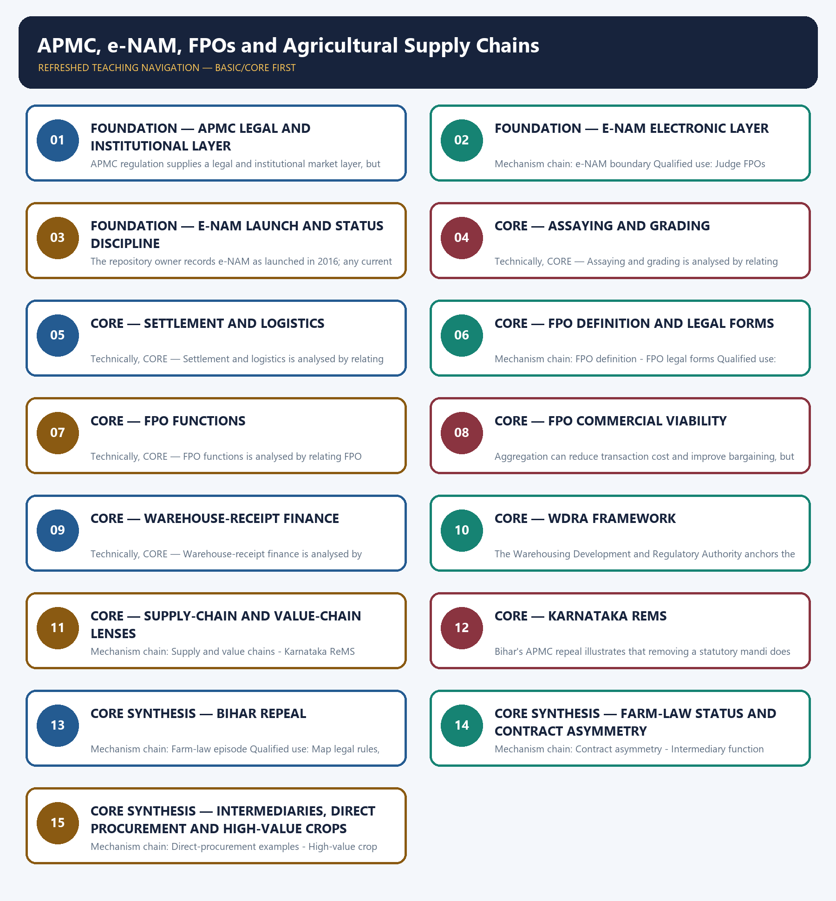

# APMC, e-NAM, FPOs and Agricultural Supply Chains — Learner-v2 Complete Learning Session

> **Authoring-only generation:** 2026-09-03. No PDF was rendered and no tracker or index was mutated.

### SOURCE, PROGRESSION AND CURRENT-LINKAGE AUDIT

- **Generation date:** 2026-09-03.
- **Repository-first evidence:** the Basic owner is taught first and preserved in full; the Advanced owner is retained only in the optional final teaching block.
- **OCR evidence:** Repository Markdown was primary. OCR-searchable local official General Studies papers were used only to confirm printed routed demands. No answer key, marking scheme, unsupported page precision or current macroeconomic statistic was inferred from them.
- **Qdrant:** not used; repository Markdown and available OCR context were sufficient.
- **PYQ integrity:** Audited ledgers route Mains demands on supermarkets, transport and marketing constraints, upstream and downstream bottlenecks, high-value crops and supply-chain management. Objective demands on Tea Board and Small Farmer Large Field are retained as concept routes without inferred answer letters.
- **Live-link boundary:** The SFAC FAQ was substantively retrievable and supports the legal-form and member-service anchors. The e-NAM portal failed to load, so all platform participation and transaction figures are deliberately excluded.
- **Fact/inference discipline:** no current-affairs item, PYQ wording, figure or quotation is invented.

### LIVE OFFICIAL-SOURCE ATTEMPT LOG

The checks below were made on 2026-09-03. Substantive official text is used only for the proposition it actually supports; binary files, dynamic shells, stubs and undated dashboard snippets are recorded but not converted into current claims.

- https://www.enam.gov.in/web/ — attempted 2026-09-03; the official portal failed at the transport layer, so no current mandi, state, trader, lot or trade-value figure was imported.
- https://sfacindia.com/fpofaq.aspx — retrieved 2026-09-03; the official FAQ substantively described PO/FPO definitions, legal forms and producer-company objects. It was used only for those legal-role propositions, not for current FPO counts, targets or participation.

## BASIC LEARNING SESSION



*Distinct embedded teaching-navigation image. The separate continuous Cārvāka-style flowchart package remains an independent at-a-glance artifact.*

### SESSION 1 — FOUNDATION — APMC LEGAL AND INSTITUTIONAL LAYER

#### DEFINITION / WHAT THIS IS CALLED

**Plain-language definition:** Mechanism chain: APMC legal layer - Market committee function Qualified use: Map legal rules, electronic discovery, physical infrastructure and settlement separately.

**Technical definition:** APMC regulation supplies a legal and institutional market layer, but competition, assaying, storage, payment and dispute resolution determine the quality of actual trade.

#### ANSWER-GRABBING OPENING — WRITE/ADAPT IN THE EXAM

> APMC regulation supplies a legal and institutional market layer, but competition, assaying, storage, payment and dispute resolution determine the quality of actual trade.

#### MUST-WRITE KEYWORDS

- **FOUNDATION**
- **APMC legal**
- **institutional layer**
- **Mechanism chain**
- **Qualified use**
- **APMC**

**How to use them:** Frame the answer through FOUNDATION; define APMC legal, connect institutional layer with Mechanism chain to explain the mechanism, and use Qualified use for the decisive comparison or qualification.

#### VISUAL FIRST

```text
APMC LEGAL AND INSTITUTIONAL LAYER
01. APMC legal layer
    |
    v
02. Market committee function
BOUNDARY -> Do not treat APMC regulation and e-NAM's electronic layer as the same instrument.
```

*This topic-specific rail fixes the evidence sequence and its exam boundary before analysis.*

#### CORE EXPLANATION

An Agricultural Produce Market Committee operates under the applicable state marketing law for notified produce, market yards, licensing, fees and local practices; state designs differ. APMC regulation supplies a legal and institutional market layer, but competition, assaying, storage, payment and dispute resolution determine the quality of actual trade.

#### NAMED EVIDENCE AND MECHANISM

- An Agricultural Produce Market Committee operates under the applicable state marketing law for notified produce, market yards, licensing, fees and local practices; state designs differ.
- APMC regulation supplies a legal and institutional market layer, but competition, assaying, storage, payment and dispute resolution determine the quality of actual trade.

#### EXAMINER CAUTION

- Do not treat APMC regulation and e-NAM's electronic layer as the same instrument.

#### EXAM LINK

- **Prelims:** Preserve the exact formula, territorial or resident boundary, price basis, base year, index basket, eligible counterparty, institution and legal status; never upgrade a projection into an actual or a regulatory direction into a universal rule.
- **Mains:** Map legal rules, electronic discovery, physical infrastructure and settlement separately.

#### MINI RECAP

- **Mechanism chain:** APMC legal layer -> Market committee function
- **Qualified use:** Map legal rules, electronic discovery, physical infrastructure and settlement separately.

#### CLOSING RECALL FLOW — FOUNDATION — APMC LEGAL AND INSTITUTIONAL LAYER

```text
START / CONCEPT: FOUNDATION — APMC legal and institutional layer
        |
        v
EXACT TERMS: FOUNDATION · APMC legal · institutional layer · Mechanism chain · Qualified use · APMC
        |
        v
MECHANISM / ARGUMENT: Mechanism chain: APMC legal layer - Market committee function Qualified use: Map legal rules, electronic discovery, physical infrastructure and settlement separately.
        |
        v
CONSEQUENCE / CONTRAST: Do not treat APMC regulation and e-NAM's electronic layer as the same instrument.
        |
        v
UPSC TRAP / ANSWER-USE: Do not miss this limiting distinction: aPMC regulation supplies a legal and institutional market layer.
        |
        v
ANSWER-GRABBING FORMULATION: APMC regulation supplies a legal and institutional market layer, but competition, assaying, storage, payment and dispute resolution determine the quality of actual trade.
```
### SESSION 2 — FOUNDATION — E-NAM ELECTRONIC LAYER

#### DEFINITION / WHAT THIS IS CALLED

**Plain-language definition:** e-NAM is an electronic trading and price-discovery layer connecting participating mandis; it does not itself abolish APMC laws or create physical logistics.

**Technical definition:** Mechanism chain: e-NAM boundary Qualified use: Judge FPOs through member governance, capital, management, volume and buyer linkage.

#### ANSWER-GRABBING OPENING — WRITE/ADAPT IN THE EXAM

> e-NAM is an electronic trading and price-discovery layer connecting participating mandis; it does not itself abolish APMC laws or create physical logistics.

#### MUST-WRITE KEYWORDS

- **FOUNDATION**
- **e-NAM electronic layer**
- **Mechanism chain**
- **Qualified use**
- **e-NAM**
- **NAM**

**How to use them:** Frame the answer through FOUNDATION; define e-NAM electronic layer, connect Mechanism chain with Qualified use to explain the mechanism, and use e-NAM for the decisive comparison or qualification.

#### VISUAL FIRST

```text
E-NAM ELECTRONIC LAYER
01. e-NAM boundary
BOUNDARY -> Do not quote current e-NAM participation or trade figures without a dated dashboard.
```

*This topic-specific rail fixes the evidence sequence and its exam boundary before analysis.*

#### CORE EXPLANATION

e-NAM is an electronic trading and price-discovery layer connecting participating mandis; it does not itself abolish APMC laws or create physical logistics.

#### NAMED EVIDENCE AND MECHANISM

- e-NAM is an electronic trading and price-discovery layer connecting participating mandis; it does not itself abolish APMC laws or create physical logistics.

#### EXAMINER CAUTION

- Do not quote current e-NAM participation or trade figures without a dated dashboard.

#### EXAM LINK

- **Prelims:** Preserve the exact formula, territorial or resident boundary, price basis, base year, index basket, eligible counterparty, institution and legal status; never upgrade a projection into an actual or a regulatory direction into a universal rule.
- **Mains:** Judge FPOs through member governance, capital, management, volume and buyer linkage.

#### MINI RECAP

- **Mechanism chain:** e-NAM boundary
- **Qualified use:** Judge FPOs through member governance, capital, management, volume and buyer linkage.

#### CLOSING RECALL FLOW — FOUNDATION — E-NAM ELECTRONIC LAYER

```text
START / CONCEPT: FOUNDATION — e-NAM electronic layer
        |
        v
EXACT TERMS: FOUNDATION · e-NAM electronic layer · Mechanism chain · Qualified use · e-NAM · NAM
        |
        v
MECHANISM / ARGUMENT: Mechanism chain: e-NAM boundary Qualified use: Judge FPOs through member governance, capital, management, volume and buyer linkage.
        |
        v
CONSEQUENCE / CONTRAST: Do not quote current e-NAM participation or trade figures without a dated dashboard.
        |
        v
UPSC TRAP / ANSWER-USE: Do not miss this limiting distinction: e-NAM is an electronic trading and price-discovery layer connecting participating mandis.
        |
        v
ANSWER-GRABBING FORMULATION: e-NAM is an electronic trading and price-discovery layer connecting participating mandis; it does not itself abolish APMC laws or create physical logistics.
```
### SESSION 3 — FOUNDATION — E-NAM LAUNCH AND STATUS DISCIPLINE

#### DEFINITION / WHAT THIS IS CALLED

**Plain-language definition:** Mechanism chain: e-NAM launch Qualified use: Trace who performs each intermediary function and who captures value or bears risk.

**Technical definition:** The repository owner records e-NAM as launched in 2016; any current count of mandis, states, lots or participants requires a dated official dashboard.

#### ANSWER-GRABBING OPENING — WRITE/ADAPT IN THE EXAM

> Mechanism chain: e-NAM launch Qualified use: Trace who performs each intermediary function and who captures value or bears risk.

#### MUST-WRITE KEYWORDS

- **FOUNDATION**
- **e-NAM launch**
- **status discipline**
- **Mechanism chain**
- **Qualified use**
- **NAM**

**How to use them:** Frame the answer through FOUNDATION; define e-NAM launch, connect status discipline with Mechanism chain to explain the mechanism, and use Qualified use for the decisive comparison or qualification.

#### VISUAL FIRST

```text
E-NAM LAUNCH AND STATUS DISCIPLINE
01. e-NAM launch
BOUNDARY -> Do not call screen-based bidding a completed national market without assaying and logistics.
```

*This topic-specific rail fixes the evidence sequence and its exam boundary before analysis.*

#### CORE EXPLANATION

The repository owner records e-NAM as launched in 2016; any current count of mandis, states, lots or participants requires a dated official dashboard.

#### NAMED EVIDENCE AND MECHANISM

- The repository owner records e-NAM as launched in 2016; any current count of mandis, states, lots or participants requires a dated official dashboard.

#### EXAMINER CAUTION

- Do not call screen-based bidding a completed national market without assaying and logistics.

#### EXAM LINK

- **Prelims:** Preserve the exact formula, territorial or resident boundary, price basis, base year, index basket, eligible counterparty, institution and legal status; never upgrade a projection into an actual or a regulatory direction into a universal rule.
- **Mains:** Trace who performs each intermediary function and who captures value or bears risk.

#### MINI RECAP

- **Mechanism chain:** e-NAM launch
- **Qualified use:** Trace who performs each intermediary function and who captures value or bears risk.

#### CLOSING RECALL FLOW — FOUNDATION — E-NAM LAUNCH AND STATUS DISCIPLINE

```text
START / CONCEPT: FOUNDATION — e-NAM launch and status discipline
        |
        v
EXACT TERMS: FOUNDATION · e-NAM launch · status discipline · Mechanism chain · Qualified use · NAM
        |
        v
MECHANISM / ARGUMENT: The repository owner records e-NAM as launched in 2016; any current count of mandis, states, lots or participants requires a dated official dashboard.
        |
        v
CONSEQUENCE / CONTRAST: Do not call screen-based bidding a completed national market without assaying and logistics.
        |
        v
UPSC TRAP / ANSWER-USE: Do not miss this limiting distinction: trace who performs each intermediary function and who captures value or bears risk.
        |
        v
ANSWER-GRABBING FORMULATION: Mechanism chain: e-NAM launch Qualified use: Trace who performs each intermediary function and who captures value or bears risk.
```
### SESSION 4 — CORE — ASSAYING AND GRADING

#### DEFINITION / WHAT THIS IS CALLED

**Plain-language definition:** Mechanism chain: Assaying Qualified use: Map legal rules, electronic discovery, physical infrastructure and settlement separately.

**Technical definition:** Technically, CORE — Assaying and grading is analysed by relating Assaying to grading, then testing the relationship through Mechanism chain and Qualified use.

#### ANSWER-GRABBING OPENING — WRITE/ADAPT IN THE EXAM

> Mechanism chain: Assaying Qualified use: Map legal rules, electronic discovery, physical infrastructure and settlement separately.

#### MUST-WRITE KEYWORDS

- **Assaying**
- **grading**
- **Mechanism chain**
- **Qualified use**
- **APMC**
- **Assaying Qualified**

**How to use them:** Frame the answer through Assaying; define grading, connect Mechanism chain with Qualified use to explain the mechanism, and use APMC for the decisive comparison or qualification.

#### VISUAL FIRST

```text
ASSAYING AND GRADING
01. Assaying
BOUNDARY -> Do not assume APMC repeal automatically creates competitive private markets.
```

*This topic-specific rail fixes the evidence sequence and its exam boundary before analysis.*

#### CORE EXPLANATION

Assaying and grading convert heterogeneous produce into credible tradable categories, enabling comparison and distant bidding while imposing quality-measurement requirements.

#### NAMED EVIDENCE AND MECHANISM

- Assaying and grading convert heterogeneous produce into credible tradable categories, enabling comparison and distant bidding while imposing quality-measurement requirements.

#### EXAMINER CAUTION

- Do not assume APMC repeal automatically creates competitive private markets.

#### EXAM LINK

- **Prelims:** Preserve the exact formula, territorial or resident boundary, price basis, base year, index basket, eligible counterparty, institution and legal status; never upgrade a projection into an actual or a regulatory direction into a universal rule.
- **Mains:** Map legal rules, electronic discovery, physical infrastructure and settlement separately.

#### MINI RECAP

- **Mechanism chain:** Assaying
- **Qualified use:** Map legal rules, electronic discovery, physical infrastructure and settlement separately.

#### CLOSING RECALL FLOW — CORE — ASSAYING AND GRADING

```text
START / CONCEPT: CORE — Assaying and grading
        |
        v
EXACT TERMS: Assaying · grading · Mechanism chain · Qualified use · APMC · Assaying Qualified
        |
        v
MECHANISM / ARGUMENT: Do not assume APMC repeal automatically creates competitive private markets.
        |
        v
CONSEQUENCE / CONTRAST: The resulting consequence is that do not assume APMC repeal automatically creates competitive private markets.
        |
        v
UPSC TRAP / ANSWER-USE: Do not miss this limiting distinction: do not assume APMC repeal automatically creates competitive private markets.
        |
        v
ANSWER-GRABBING FORMULATION: Mechanism chain: Assaying Qualified use: Map legal rules, electronic discovery, physical infrastructure and settlement separately.
```
### SESSION 5 — CORE — SETTLEMENT AND LOGISTICS

#### DEFINITION / WHAT THIS IS CALLED

**Plain-language definition:** Mechanism chain: Settlement and logistics Qualified use: Judge FPOs through member governance, capital, management, volume and buyer linkage.

**Technical definition:** Technically, CORE — Settlement and logistics is analysed by relating Settlement to logistics, then testing the relationship through Mechanism chain and Qualified use.

#### ANSWER-GRABBING OPENING — WRITE/ADAPT IN THE EXAM

> Mechanism chain: Settlement and logistics Qualified use: Judge FPOs through member governance, capital, management, volume and buyer linkage.

#### MUST-WRITE KEYWORDS

- **Settlement**
- **logistics**
- **Mechanism chain**
- **Qualified use**
- **FPO**
- **Qualified**

**How to use them:** Frame the answer through Settlement; define logistics, connect Mechanism chain with Qualified use to explain the mechanism, and use FPO for the decisive comparison or qualification.

#### VISUAL FIRST

```text
SETTLEMENT AND LOGISTICS
01. Settlement and logistics
BOUNDARY -> Do not equate every FPO with one legal form.
```

*This topic-specific rail fixes the evidence sequence and its exam boundary before analysis.*

#### CORE EXPLANATION

A displayed bid becomes a completed trade only when payment, title, loading, transport, delivery, grievance handling and quality settlement work.

#### NAMED EVIDENCE AND MECHANISM

- A displayed bid becomes a completed trade only when payment, title, loading, transport, delivery, grievance handling and quality settlement work.

#### EXAMINER CAUTION

- Do not equate every FPO with one legal form.

#### EXAM LINK

- **Prelims:** Preserve the exact formula, territorial or resident boundary, price basis, base year, index basket, eligible counterparty, institution and legal status; never upgrade a projection into an actual or a regulatory direction into a universal rule.
- **Mains:** Judge FPOs through member governance, capital, management, volume and buyer linkage.

#### MINI RECAP

- **Mechanism chain:** Settlement and logistics
- **Qualified use:** Judge FPOs through member governance, capital, management, volume and buyer linkage.

#### CLOSING RECALL FLOW — CORE — SETTLEMENT AND LOGISTICS

```text
START / CONCEPT: CORE — Settlement and logistics
        |
        v
EXACT TERMS: Settlement · logistics · Mechanism chain · Qualified use · FPO · Qualified
        |
        v
MECHANISM / ARGUMENT: Do not equate every FPO with one legal form.
        |
        v
CONSEQUENCE / CONTRAST: The resulting consequence is that judge FPOs through member governance, capital, management, volume and buyer linkage.
        |
        v
UPSC TRAP / ANSWER-USE: Do not miss this limiting distinction: judge FPOs through member governance, capital, management, volume and buyer linkage.
        |
        v
ANSWER-GRABBING FORMULATION: Mechanism chain: Settlement and logistics Qualified use: Judge FPOs through member governance, capital, management, volume and buyer linkage.
```
### SESSION 6 — CORE — FPO DEFINITION AND LEGAL FORMS

#### DEFINITION / WHAT THIS IS CALLED

**Plain-language definition:** An FPO is a producer organisation whose members are farmers; a producer organisation may take more than one legal form, so FPO and cooperative are not universally identical.

**Technical definition:** Mechanism chain: FPO definition - FPO legal forms Qualified use: Trace who performs each intermediary function and who captures value or bears risk.

#### ANSWER-GRABBING OPENING — WRITE/ADAPT IN THE EXAM

> An FPO is a producer organisation whose members are farmers; a producer organisation may take more than one legal form, so FPO and cooperative are not universally identical.

#### MUST-WRITE KEYWORDS

- **FPO definition**
- **legal forms**
- **Mechanism chain**
- **Qualified use**
- **An FPO**
- **FPO**

**How to use them:** Frame the answer through FPO definition; define legal forms, connect Mechanism chain with Qualified use to explain the mechanism, and use An FPO for the decisive comparison or qualification.

#### VISUAL FIRST

```text
FPO DEFINITION AND LEGAL FORMS
01. FPO definition
    |
    v
02. FPO legal forms
BOUNDARY -> Do not treat registration or member count as proof of FPO commercial viability.
```

*This topic-specific rail fixes the evidence sequence and its exam boundary before analysis.*

#### CORE EXPLANATION

An FPO is a producer organisation whose members are farmers; a producer organisation may take more than one legal form, so FPO and cooperative are not universally identical. The official SFAC FAQ states that a producer organisation can be a producer company, cooperative society or another legal form that shares benefits among members.

#### NAMED EVIDENCE AND MECHANISM

- An FPO is a producer organisation whose members are farmers; a producer organisation may take more than one legal form, so FPO and cooperative are not universally identical.
- The official SFAC FAQ states that a producer organisation can be a producer company, cooperative society or another legal form that shares benefits among members.

#### EXAMINER CAUTION

- Do not treat registration or member count as proof of FPO commercial viability.

#### EXAM LINK

- **Prelims:** Preserve the exact formula, territorial or resident boundary, price basis, base year, index basket, eligible counterparty, institution and legal status; never upgrade a projection into an actual or a regulatory direction into a universal rule.
- **Mains:** Trace who performs each intermediary function and who captures value or bears risk.

#### MINI RECAP

- **Mechanism chain:** FPO definition -> FPO legal forms
- **Qualified use:** Trace who performs each intermediary function and who captures value or bears risk.

#### CLOSING RECALL FLOW — CORE — FPO DEFINITION AND LEGAL FORMS

```text
START / CONCEPT: CORE — FPO definition and legal forms
        |
        v
EXACT TERMS: FPO definition · legal forms · Mechanism chain · Qualified use · An FPO · FPO
        |
        v
MECHANISM / ARGUMENT: Mechanism chain: FPO definition - FPO legal forms Qualified use: Trace who performs each intermediary function and who captures value or bears risk.
        |
        v
CONSEQUENCE / CONTRAST: Do not treat registration or member count as proof of FPO commercial viability.
        |
        v
UPSC TRAP / ANSWER-USE: Do not miss this limiting distinction: the official SFAC FAQ states that a producer organisation can be a producer company...
        |
        v
ANSWER-GRABBING FORMULATION: An FPO is a producer organisation whose members are farmers; a producer organisation may take more than one legal form, so FPO and cooperative are not universally identical.
```
### SESSION 7 — CORE — FPO FUNCTIONS

#### DEFINITION / WHAT THIS IS CALLED

**Plain-language definition:** Mechanism chain: FPO functions Qualified use: Map legal rules, electronic discovery, physical infrastructure and settlement separately.

**Technical definition:** Technically, CORE — FPO functions is analysed by relating FPO functions to Mechanism chain, then testing the relationship through Qualified use and FPO.

#### ANSWER-GRABBING OPENING — WRITE/ADAPT IN THE EXAM

> Mechanism chain: FPO functions Qualified use: Map legal rules, electronic discovery, physical infrastructure and settlement separately.

#### MUST-WRITE KEYWORDS

- **FPO functions**
- **Mechanism chain**
- **Qualified use**
- **FPO**
- **Qualified**
- **Map**

**How to use them:** Frame the answer through FPO functions; define Mechanism chain, connect Qualified use with FPO to explain the mechanism, and use Qualified for the decisive comparison or qualification.

#### VISUAL FIRST

```text
FPO FUNCTIONS
01. FPO functions
BOUNDARY -> Do not call an unregulated storage receipt reliable collateral.
```

*This topic-specific rail fixes the evidence sequence and its exam boundary before analysis.*

#### CORE EXPLANATION

The SFAC FAQ lists production, procurement, grading, pooling, marketing, processing, member services, resource conservation, insurance and finance among possible producer-company objects.

#### NAMED EVIDENCE AND MECHANISM

- The SFAC FAQ lists production, procurement, grading, pooling, marketing, processing, member services, resource conservation, insurance and finance among possible producer-company objects.

#### EXAMINER CAUTION

- Do not call an unregulated storage receipt reliable collateral.

#### EXAM LINK

- **Prelims:** Preserve the exact formula, territorial or resident boundary, price basis, base year, index basket, eligible counterparty, institution and legal status; never upgrade a projection into an actual or a regulatory direction into a universal rule.
- **Mains:** Map legal rules, electronic discovery, physical infrastructure and settlement separately.

#### MINI RECAP

- **Mechanism chain:** FPO functions
- **Qualified use:** Map legal rules, electronic discovery, physical infrastructure and settlement separately.

#### CLOSING RECALL FLOW — CORE — FPO FUNCTIONS

```text
START / CONCEPT: CORE — FPO functions
        |
        v
EXACT TERMS: FPO functions · Mechanism chain · Qualified use · FPO · Qualified · Map
        |
        v
MECHANISM / ARGUMENT: Do not call an unregulated storage receipt reliable collateral.
        |
        v
CONSEQUENCE / CONTRAST: The resulting consequence is that map legal rules, electronic discovery, physical infrastructure and settlement separately.
        |
        v
UPSC TRAP / ANSWER-USE: Do not miss this limiting distinction: map legal rules, electronic discovery, physical infrastructure and settlement separately.
        |
        v
ANSWER-GRABBING FORMULATION: Mechanism chain: FPO functions Qualified use: Map legal rules, electronic discovery, physical infrastructure and settlement separately.
```
### SESSION 8 — CORE — FPO COMMERCIAL VIABILITY

#### DEFINITION / WHAT THIS IS CALLED

**Plain-language definition:** Mechanism chain: FPO viability Qualified use: Judge FPOs through member governance, capital, management, volume and buyer linkage.

**Technical definition:** Aggregation can reduce transaction cost and improve bargaining, but working capital, professional management, member trust, business volume and reliable buyers determine viability.

#### ANSWER-GRABBING OPENING — WRITE/ADAPT IN THE EXAM

> Aggregation can reduce transaction cost and improve bargaining, but working capital, professional management, member trust, business volume and reliable buyers determine viability.

#### MUST-WRITE KEYWORDS

- **FPO commercial viability**
- **Mechanism chain**
- **Qualified use**
- **Aggregation**
- **FPO**
- **Qualified**

**How to use them:** Frame the answer through FPO commercial viability; define Mechanism chain, connect Qualified use with Aggregation to explain the mechanism, and use FPO for the decisive comparison or qualification.

#### VISUAL FIRST

```text
FPO COMMERCIAL VIABILITY
01. FPO viability
BOUNDARY -> Do not say organised retail eliminates the economic functions of intermediation.
```

*This topic-specific rail fixes the evidence sequence and its exam boundary before analysis.*

#### CORE EXPLANATION

Aggregation can reduce transaction cost and improve bargaining, but working capital, professional management, member trust, business volume and reliable buyers determine viability.

#### NAMED EVIDENCE AND MECHANISM

- Aggregation can reduce transaction cost and improve bargaining, but working capital, professional management, member trust, business volume and reliable buyers determine viability.

#### EXAMINER CAUTION

- Do not say organised retail eliminates the economic functions of intermediation.

#### EXAM LINK

- **Prelims:** Preserve the exact formula, territorial or resident boundary, price basis, base year, index basket, eligible counterparty, institution and legal status; never upgrade a projection into an actual or a regulatory direction into a universal rule.
- **Mains:** Judge FPOs through member governance, capital, management, volume and buyer linkage.

#### MINI RECAP

- **Mechanism chain:** FPO viability
- **Qualified use:** Judge FPOs through member governance, capital, management, volume and buyer linkage.

#### CLOSING RECALL FLOW — CORE — FPO COMMERCIAL VIABILITY

```text
START / CONCEPT: CORE — FPO commercial viability
        |
        v
EXACT TERMS: FPO commercial viability · Mechanism chain · Qualified use · Aggregation · FPO · Qualified
        |
        v
MECHANISM / ARGUMENT: Mechanism chain: FPO viability Qualified use: Judge FPOs through member governance, capital, management, volume and buyer linkage.
        |
        v
CONSEQUENCE / CONTRAST: Do not say organised retail eliminates the economic functions of intermediation.
        |
        v
UPSC TRAP / ANSWER-USE: Do not miss this limiting distinction: aggregation can reduce transaction cost and improve bargaining.
        |
        v
ANSWER-GRABBING FORMULATION: Aggregation can reduce transaction cost and improve bargaining, but working capital, professional management, member trust, business volume and reliable buyers determine viability.
```
### SESSION 9 — CORE — WAREHOUSE-RECEIPT FINANCE

#### DEFINITION / WHAT THIS IS CALLED

**Plain-language definition:** Mechanism chain: Warehouse-receipt finance Qualified use: Trace who performs each intermediary function and who captures value or bears risk.

**Technical definition:** Technically, CORE — Warehouse-receipt finance is analysed by relating Warehouse-receipt finance to Mechanism chain, then testing the relationship through Qualified use and Trace.

#### ANSWER-GRABBING OPENING — WRITE/ADAPT IN THE EXAM

> Mechanism chain: Warehouse-receipt finance Qualified use: Trace who performs each intermediary function and who captures value or bears risk.

#### MUST-WRITE KEYWORDS

- **Warehouse-receipt finance**
- **Mechanism chain**
- **Qualified use**
- **Trace**
- **Warehouse-receipt**
- **Qualified**

**How to use them:** Frame the answer through Warehouse-receipt finance; define Mechanism chain, connect Qualified use with Trace to explain the mechanism, and use Warehouse-receipt for the decisive comparison or qualification.

#### VISUAL FIRST

```text
WAREHOUSE-RECEIPT FINANCE
01. Warehouse-receipt finance
BOUNDARY -> Do not treat contract farming as risk-free or bargaining-symmetric.
```

*This topic-specific rail fixes the evidence sequence and its exam boundary before analysis.*

#### CORE EXPLANATION

A negotiable warehouse receipt can separate harvest-time cash need from sale timing by supporting credit against stored produce, provided storage, grading and documentation are trusted.

#### NAMED EVIDENCE AND MECHANISM

- A negotiable warehouse receipt can separate harvest-time cash need from sale timing by supporting credit against stored produce, provided storage, grading and documentation are trusted.

#### EXAMINER CAUTION

- Do not treat contract farming as risk-free or bargaining-symmetric.

#### EXAM LINK

- **Prelims:** Preserve the exact formula, territorial or resident boundary, price basis, base year, index basket, eligible counterparty, institution and legal status; never upgrade a projection into an actual or a regulatory direction into a universal rule.
- **Mains:** Trace who performs each intermediary function and who captures value or bears risk.

#### MINI RECAP

- **Mechanism chain:** Warehouse-receipt finance
- **Qualified use:** Trace who performs each intermediary function and who captures value or bears risk.

#### CLOSING RECALL FLOW — CORE — WAREHOUSE-RECEIPT FINANCE

```text
START / CONCEPT: CORE — Warehouse-receipt finance
        |
        v
EXACT TERMS: Warehouse-receipt finance · Mechanism chain · Qualified use · Trace · Warehouse-receipt · Qualified
        |
        v
MECHANISM / ARGUMENT: A negotiable warehouse receipt can separate harvest-time cash need from sale timing by supporting credit against stored produce, provided storage, grading and documentation are trusted.
        |
        v
CONSEQUENCE / CONTRAST: Do not treat contract farming as risk-free or bargaining-symmetric.
        |
        v
UPSC TRAP / ANSWER-USE: Do not miss this limiting distinction: trace who performs each intermediary function and who captures value or bears risk.
        |
        v
ANSWER-GRABBING FORMULATION: Mechanism chain: Warehouse-receipt finance Qualified use: Trace who performs each intermediary function and who captures value or bears risk.
```
### SESSION 10 — CORE — WDRA FRAMEWORK

#### DEFINITION / WHAT THIS IS CALLED

**Plain-language definition:** Mechanism chain: WDRA layer Qualified use: Map legal rules, electronic discovery, physical infrastructure and settlement separately.

**Technical definition:** The Warehousing Development and Regulatory Authority anchors the regulated warehousing and negotiable-receipt framework; a receipt is not credible merely because a building is called a warehouse.

#### ANSWER-GRABBING OPENING — WRITE/ADAPT IN THE EXAM

> Mechanism chain: WDRA layer Qualified use: Map legal rules, electronic discovery, physical infrastructure and settlement separately.

#### MUST-WRITE KEYWORDS

- **WDRA framework**
- **Mechanism chain**
- **Qualified use**
- **The Warehousing Development**
- **Regulatory Authority**
- **Tea Board**

**How to use them:** Frame the answer through WDRA framework; define Mechanism chain, connect Qualified use with The Warehousing Development to explain the mechanism, and use Regulatory Authority for the decisive comparison or qualification.

#### VISUAL FIRST

```text
WDRA FRAMEWORK
01. WDRA layer
BOUNDARY -> Do not infer Tea Board or Small Farmer Large Field answer keys from routed PYQs.
```

*This topic-specific rail fixes the evidence sequence and its exam boundary before analysis.*

#### CORE EXPLANATION

The Warehousing Development and Regulatory Authority anchors the regulated warehousing and negotiable-receipt framework; a receipt is not credible merely because a building is called a warehouse.

#### NAMED EVIDENCE AND MECHANISM

- The Warehousing Development and Regulatory Authority anchors the regulated warehousing and negotiable-receipt framework; a receipt is not credible merely because a building is called a warehouse.

#### EXAMINER CAUTION

- Do not infer Tea Board or Small Farmer Large Field answer keys from routed PYQs.

#### EXAM LINK

- **Prelims:** Preserve the exact formula, territorial or resident boundary, price basis, base year, index basket, eligible counterparty, institution and legal status; never upgrade a projection into an actual or a regulatory direction into a universal rule.
- **Mains:** Map legal rules, electronic discovery, physical infrastructure and settlement separately.

#### MINI RECAP

- **Mechanism chain:** WDRA layer
- **Qualified use:** Map legal rules, electronic discovery, physical infrastructure and settlement separately.

#### CLOSING RECALL FLOW — CORE — WDRA FRAMEWORK

```text
START / CONCEPT: CORE — WDRA framework
        |
        v
EXACT TERMS: WDRA framework · Mechanism chain · Qualified use · The Warehousing Development · Regulatory Authority · Tea Board
        |
        v
MECHANISM / ARGUMENT: The Warehousing Development and Regulatory Authority anchors the regulated warehousing and negotiable-receipt framework; a receipt is not credible merely because a building is called a warehouse.
        |
        v
CONSEQUENCE / CONTRAST: Do not infer Tea Board or Small Farmer Large Field answer keys from routed PYQs.
        |
        v
UPSC TRAP / ANSWER-USE: Do not miss this limiting distinction: the Warehousing Development and Regulatory Authority anchors the regulated warehousing and negotiable-receipt framework.
        |
        v
ANSWER-GRABBING FORMULATION: Mechanism chain: WDRA layer Qualified use: Map legal rules, electronic discovery, physical infrastructure and settlement separately.
```
### SESSION 11 — CORE — SUPPLY-CHAIN AND VALUE-CHAIN LENSES

#### DEFINITION / WHAT THIS IS CALLED

**Plain-language definition:** A supply chain traces product, information, payment and risk from inputs to retail, while a value-chain lens additionally asks where value is created and margins or power accumulate.

**Technical definition:** Mechanism chain: Supply and value chains - Karnataka ReMS Qualified use: Judge FPOs through member governance, capital, management, volume and buyer linkage.

#### ANSWER-GRABBING OPENING — WRITE/ADAPT IN THE EXAM

> A supply chain traces product, information, payment and risk from inputs to retail, while a value-chain lens additionally asks where value is created and margins or power accumulate.

#### MUST-WRITE KEYWORDS

- **Supply-chain**
- **value-chain lenses**
- **Mechanism chain**
- **Qualified use**
- **APMC**
- **NAM's**

**How to use them:** Frame the answer through Supply-chain; define value-chain lenses, connect Mechanism chain with Qualified use to explain the mechanism, and use APMC for the decisive comparison or qualification.

#### VISUAL FIRST

```text
SUPPLY-CHAIN AND VALUE-CHAIN LENSES
01. Supply and value chains
    |
    v
02. Karnataka ReMS
BOUNDARY -> Do not treat APMC regulation and e-NAM's electronic layer as the same instrument.
```

*This topic-specific rail fixes the evidence sequence and its exam boundary before analysis.*

#### CORE EXPLANATION

A supply chain traces product, information, payment and risk from inputs to retail, while a value-chain lens additionally asks where value is created and margins or power accumulate. Karnataka's ReMS model illustrates unified rules, assaying and electronic processes within a reformed mandi architecture rather than digitisation detached from physical institutions.

#### NAMED EVIDENCE AND MECHANISM

- A supply chain traces product, information, payment and risk from inputs to retail, while a value-chain lens additionally asks where value is created and margins or power accumulate.
- Karnataka's ReMS model illustrates unified rules, assaying and electronic processes within a reformed mandi architecture rather than digitisation detached from physical institutions.

#### EXAMINER CAUTION

- Do not treat APMC regulation and e-NAM's electronic layer as the same instrument.

#### EXAM LINK

- **Prelims:** Preserve the exact formula, territorial or resident boundary, price basis, base year, index basket, eligible counterparty, institution and legal status; never upgrade a projection into an actual or a regulatory direction into a universal rule.
- **Mains:** Judge FPOs through member governance, capital, management, volume and buyer linkage.

#### MINI RECAP

- **Mechanism chain:** Supply and value chains -> Karnataka ReMS
- **Qualified use:** Judge FPOs through member governance, capital, management, volume and buyer linkage.

#### CLOSING RECALL FLOW — CORE — SUPPLY-CHAIN AND VALUE-CHAIN LENSES

```text
START / CONCEPT: CORE — Supply-chain and value-chain lenses
        |
        v
EXACT TERMS: Supply-chain · value-chain lenses · Mechanism chain · Qualified use · APMC · NAM's
        |
        v
MECHANISM / ARGUMENT: Mechanism chain: Supply and value chains - Karnataka ReMS Qualified use: Judge FPOs through member governance, capital, management, volume and buyer linkage.
        |
        v
CONSEQUENCE / CONTRAST: Do not treat APMC regulation and e-NAM's electronic layer as the same instrument.
        |
        v
UPSC TRAP / ANSWER-USE: Do not miss this limiting distinction: a supply chain traces product, information, payment and risk from inputs to retail.
        |
        v
ANSWER-GRABBING FORMULATION: A supply chain traces product, information, payment and risk from inputs to retail, while a value-chain lens additionally asks where value is created and margins or power accumulate.
```
### SESSION 12 — CORE — KARNATAKA REMS

#### DEFINITION / WHAT THIS IS CALLED

**Plain-language definition:** Mechanism chain: Bihar repeal lesson Qualified use: Trace who performs each intermediary function and who captures value or bears risk.

**Technical definition:** Bihar's APMC repeal illustrates that removing a statutory mandi does not automatically create assaying, private competition, storage, roads or enforceable settlement.

#### ANSWER-GRABBING OPENING — WRITE/ADAPT IN THE EXAM

> Bihar's APMC repeal illustrates that removing a statutory mandi does not automatically create assaying, private competition, storage, roads or enforceable settlement.

#### MUST-WRITE KEYWORDS

- **Karnataka ReMS**
- **Mechanism chain**
- **Qualified use**
- **Bihar's APMC**
- **NAM**
- **Trace**

**How to use them:** Frame the answer through Karnataka ReMS; define Mechanism chain, connect Qualified use with Bihar's APMC to explain the mechanism, and use NAM for the decisive comparison or qualification.

#### VISUAL FIRST

```text
KARNATAKA REMS
01. Bihar repeal lesson
BOUNDARY -> Do not quote current e-NAM participation or trade figures without a dated dashboard.
```

*This topic-specific rail fixes the evidence sequence and its exam boundary before analysis.*

#### CORE EXPLANATION

Bihar's APMC repeal illustrates that removing a statutory mandi does not automatically create assaying, private competition, storage, roads or enforceable settlement.

#### NAMED EVIDENCE AND MECHANISM

- Bihar's APMC repeal illustrates that removing a statutory mandi does not automatically create assaying, private competition, storage, roads or enforceable settlement.

#### EXAMINER CAUTION

- Do not quote current e-NAM participation or trade figures without a dated dashboard.

#### EXAM LINK

- **Prelims:** Preserve the exact formula, territorial or resident boundary, price basis, base year, index basket, eligible counterparty, institution and legal status; never upgrade a projection into an actual or a regulatory direction into a universal rule.
- **Mains:** Trace who performs each intermediary function and who captures value or bears risk.

#### MINI RECAP

- **Mechanism chain:** Bihar repeal lesson
- **Qualified use:** Trace who performs each intermediary function and who captures value or bears risk.

#### CLOSING RECALL FLOW — CORE — KARNATAKA REMS

```text
START / CONCEPT: CORE — Karnataka ReMS
        |
        v
EXACT TERMS: Karnataka ReMS · Mechanism chain · Qualified use · Bihar's APMC · NAM · Trace
        |
        v
MECHANISM / ARGUMENT: Mechanism chain: Bihar repeal lesson Qualified use: Trace who performs each intermediary function and who captures value or bears risk.
        |
        v
CONSEQUENCE / CONTRAST: Do not quote current e-NAM participation or trade figures without a dated dashboard.
        |
        v
UPSC TRAP / ANSWER-USE: Do not miss this limiting distinction: trace who performs each intermediary function and who captures value or bears risk.
        |
        v
ANSWER-GRABBING FORMULATION: Bihar's APMC repeal illustrates that removing a statutory mandi does not automatically create assaying, private competition, storage, roads or enforceable settlement.
```
### SESSION 13 — CORE SYNTHESIS — BIHAR REPEAL

#### DEFINITION / WHAT THIS IS CALLED

**Plain-language definition:** The Farmers' Produce Trade and Commerce Act, 2020 created an outside-APMC channel and was repealed through the Farm Laws Repeal Act, 2021; legal status and federal trust must be dated.

**Technical definition:** Mechanism chain: Farm-law episode Qualified use: Map legal rules, electronic discovery, physical infrastructure and settlement separately.

#### ANSWER-GRABBING OPENING — WRITE/ADAPT IN THE EXAM

> The Farmers' Produce Trade and Commerce Act, 2020 created an outside-APMC channel and was repealed through the Farm Laws Repeal Act, 2021; legal status and federal trust must be dated.

#### MUST-WRITE KEYWORDS

- **CORE SYNTHESIS**
- **Bihar repeal**
- **Mechanism chain**
- **Qualified use**
- **The Farmers' Produce Trade**
- **Commerce Act**

**How to use them:** Frame the answer through CORE SYNTHESIS; define Bihar repeal, connect Mechanism chain with Qualified use to explain the mechanism, and use The Farmers' Produce Trade for the decisive comparison or qualification.

#### VISUAL FIRST

```text
BIHAR REPEAL
01. Farm-law episode
BOUNDARY -> Do not call screen-based bidding a completed national market without assaying and logistics.
```

*This topic-specific rail fixes the evidence sequence and its exam boundary before analysis.*

#### CORE EXPLANATION

The Farmers' Produce Trade and Commerce Act, 2020 created an outside-APMC channel and was repealed through the Farm Laws Repeal Act, 2021; legal status and federal trust must be dated.

#### NAMED EVIDENCE AND MECHANISM

- The Farmers' Produce Trade and Commerce Act, 2020 created an outside-APMC channel and was repealed through the Farm Laws Repeal Act, 2021; legal status and federal trust must be dated.

#### EXAMINER CAUTION

- Do not call screen-based bidding a completed national market without assaying and logistics.

#### EXAM LINK

- **Prelims:** Preserve the exact formula, territorial or resident boundary, price basis, base year, index basket, eligible counterparty, institution and legal status; never upgrade a projection into an actual or a regulatory direction into a universal rule.
- **Mains:** Map legal rules, electronic discovery, physical infrastructure and settlement separately.

#### MINI RECAP

- **Mechanism chain:** Farm-law episode
- **Qualified use:** Map legal rules, electronic discovery, physical infrastructure and settlement separately.

#### CLOSING RECALL FLOW — CORE SYNTHESIS — BIHAR REPEAL

```text
START / CONCEPT: CORE SYNTHESIS — Bihar repeal
        |
        v
EXACT TERMS: CORE SYNTHESIS · Bihar repeal · Mechanism chain · Qualified use · The Farmers' Produce Trade · Commerce Act
        |
        v
MECHANISM / ARGUMENT: Mechanism chain: Farm-law episode Qualified use: Map legal rules, electronic discovery, physical infrastructure and settlement separately.
        |
        v
CONSEQUENCE / CONTRAST: Do not call screen-based bidding a completed national market without assaying and logistics.
        |
        v
UPSC TRAP / ANSWER-USE: Do not miss this limiting distinction: do not call screen-based bidding a completed national market without assaying and logistics.
        |
        v
ANSWER-GRABBING FORMULATION: The Farmers' Produce Trade and Commerce Act, 2020 created an outside-APMC channel and was repealed through the Farm Laws Repeal Act, 2021; legal status and federal trust must be dated.
```
### SESSION 14 — CORE SYNTHESIS — FARM-LAW STATUS AND CONTRACT ASYMMETRY

#### DEFINITION / WHAT THIS IS CALLED

**Plain-language definition:** Contract farming may reduce buyer uncertainty but can shift quality, rejection, price and enforcement risk onto small farmers when bargaining and dispute-resolution capacity are unequal.

**Technical definition:** Mechanism chain: Contract asymmetry - Intermediary function Qualified use: Judge FPOs through member governance, capital, management, volume and buyer linkage.

#### ANSWER-GRABBING OPENING — WRITE/ADAPT IN THE EXAM

> Contract farming may reduce buyer uncertainty but can shift quality, rejection, price and enforcement risk onto small farmers when bargaining and dispute-resolution capacity are unequal.

#### MUST-WRITE KEYWORDS

- **CORE SYNTHESIS**
- **Farm-law status**
- **contract asymmetry**
- **Mechanism chain**
- **Qualified use**
- **Contract**

**How to use them:** Frame the answer through CORE SYNTHESIS; define Farm-law status, connect contract asymmetry with Mechanism chain to explain the mechanism, and use Qualified use for the decisive comparison or qualification.

#### VISUAL FIRST

```text
FARM-LAW STATUS AND CONTRACT ASYMMETRY
01. Contract asymmetry
    |
    v
02. Intermediary function
BOUNDARY -> Do not assume APMC repeal automatically creates competitive private markets.
```

*This topic-specific rail fixes the evidence sequence and its exam boundary before analysis.*

#### CORE EXPLANATION

Contract farming may reduce buyer uncertainty but can shift quality, rejection, price and enforcement risk onto small farmers when bargaining and dispute-resolution capacity are unequal. Organised retail or direct procurement can replace the traditional commission-agent layer, but aggregation, grading, finance and logistics functions still have to be performed.

#### NAMED EVIDENCE AND MECHANISM

- Contract farming may reduce buyer uncertainty but can shift quality, rejection, price and enforcement risk onto small farmers when bargaining and dispute-resolution capacity are unequal.
- Organised retail or direct procurement can replace the traditional commission-agent layer, but aggregation, grading, finance and logistics functions still have to be performed.

#### EXAMINER CAUTION

- Do not assume APMC repeal automatically creates competitive private markets.

#### EXAM LINK

- **Prelims:** Preserve the exact formula, territorial or resident boundary, price basis, base year, index basket, eligible counterparty, institution and legal status; never upgrade a projection into an actual or a regulatory direction into a universal rule.
- **Mains:** Judge FPOs through member governance, capital, management, volume and buyer linkage.

#### MINI RECAP

- **Mechanism chain:** Contract asymmetry -> Intermediary function
- **Qualified use:** Judge FPOs through member governance, capital, management, volume and buyer linkage.

#### CLOSING RECALL FLOW — CORE SYNTHESIS — FARM-LAW STATUS AND CONTRACT ASYMMETRY

```text
START / CONCEPT: CORE SYNTHESIS — Farm-law status and contract asymmetry
        |
        v
EXACT TERMS: CORE SYNTHESIS · Farm-law status · contract asymmetry · Mechanism chain · Qualified use · Contract
        |
        v
MECHANISM / ARGUMENT: Mechanism chain: Contract asymmetry - Intermediary function Qualified use: Judge FPOs through member governance, capital, management, volume and buyer linkage.
        |
        v
CONSEQUENCE / CONTRAST: Organised retail or direct procurement can replace the traditional commission-agent layer, but aggregation, grading, finance and logistics functions still have to be performed.
        |
        v
UPSC TRAP / ANSWER-USE: Do not assume APMC repeal automatically creates competitive private markets.
        |
        v
ANSWER-GRABBING FORMULATION: Contract farming may reduce buyer uncertainty but can shift quality, rejection, price and enforcement risk onto small farmers when bargaining and dispute-resolution capacity are unequal.
```
### SESSION 15 — CORE SYNTHESIS — INTERMEDIARIES, DIRECT PROCUREMENT AND HIGH-VALUE CROPS

#### DEFINITION / WHAT THIS IS CALLED

**Plain-language definition:** Why it supports the claim: ⚠️ Each of these replaces the traditional commission-agent/multiple-mandi-layer intermediary with a new intermediary — the retailer's own procurement, grading, logistics and quality-control function — so the answer to "do intermediaries disappear" is that the function of aggregation, grading, credit and logistics still has to be performed by someone; large retail/agribusiness firms internalise it rather than eliminating it.

**Technical definition:** Mechanism chain: Direct-procurement examples - High-value crop chain Qualified use: Trace who performs each intermediary function and who captures value or bears risk.

#### ANSWER-GRABBING OPENING — WRITE/ADAPT IN THE EXAM

> ⚠️ 2025 GS-III: Scope and significance of supply-chain management of agricultural commodities. ⚠️ 2025 GS-III: Factors shaping farmers' choice of high-value crops. ⚠️ Supply-chain answer route: trace aggregation, grading, warehousing, finance, transport, processing, standards and final market access; then identify where value, spoilage risk or bargaining power gets concentrated. ⚠️ High-value-crop answer route: add perishability, irrigation reliability, buyer contracts, cold-chain depth, FPO support and logistics to the usual price-and-water discussion. ⚠️ Unfamiliar-question route: if the paper asks whether reform should focus on APMC laws or logistics, compare Karnataka ReMS, Bihar repeal, e-NAM, NWRs and FPOs rather than arguing in absolutes. ⚠️ 2018 GS-III Q4 route (supermarkets and intermediary elimination): use Section 5A — name Reliance Retail/e-Choupal/Safal, explain why the aggregation-grading-logistics function is retained even as the traditional commission-agent layer is bypassed, and add the monopsony/bargaining-power counter-evidence before concluding.

#### MUST-WRITE KEYWORDS

- **CORE SYNTHESIS**
- **Intermediaries**
- **direct procurement**
- **high-value crops**
- **Mechanism chain**
- **Qualified use**

**How to use them:** Frame the answer through CORE SYNTHESIS; define Intermediaries, connect direct procurement with high-value crops to explain the mechanism, and use Mechanism chain for the decisive comparison or qualification.

#### VISUAL FIRST

```text
INTERMEDIARIES, DIRECT PROCUREMENT AND HIGH-VALUE CROPS
01. Direct-procurement examples
    |
    v
02. High-value crop chain
BOUNDARY -> Do not equate every FPO with one legal form.
```

*This topic-specific rail fixes the evidence sequence and its exam boundary before analysis.*

#### CORE EXPLANATION

The owner uses ITC e-Choupal, Mother Dairy Safal and organised retail sourcing as named examples, while cautioning that reach, commodity scope and bargaining outcomes vary. High-value crop choice depends on water, perishability, cold-chain depth, standards, contract terms and buyer access; production promotion without downstream demand can increase loss.

#### NAMED EVIDENCE AND MECHANISM

- The owner uses ITC e-Choupal, Mother Dairy Safal and organised retail sourcing as named examples, while cautioning that reach, commodity scope and bargaining outcomes vary.
- High-value crop choice depends on water, perishability, cold-chain depth, standards, contract terms and buyer access; production promotion without downstream demand can increase loss.

#### EXAMINER CAUTION

- Do not equate every FPO with one legal form.

#### EXAM LINK

- **Prelims:** Preserve the exact formula, territorial or resident boundary, price basis, base year, index basket, eligible counterparty, institution and legal status; never upgrade a projection into an actual or a regulatory direction into a universal rule.
- **Mains:** Trace who performs each intermediary function and who captures value or bears risk.

#### MINI RECAP

- **Mechanism chain:** Direct-procurement examples -> High-value crop chain
- **Qualified use:** Trace who performs each intermediary function and who captures value or bears risk.
#### COMPLETE BASIC OWNER EVIDENCE BANK

> **Subject:** Economy | **Tier:** Must-Do (foundation) | **GS Paper:** GS-III + Prelims.
> **Core area:** Agricultural marketing.
> **Grounded in:** Ramesh Singh, relevant chapters; Economic Survey 2025-26; audited UPSC Economy PYQs (2024-2026 Prelims and 2024-2025 Mains).
> ✅ = source-grounded | ⚠️ = analytical linkage | 📰 = current Survey/current-affairs hook.
> *Companion: `../advanced/13_APMC-e-NAM-FPOs-and-Agricultural-Supply-Chains.md`.*

#### 1. Visual foundation

```text
1. FARM PRODUCTION
   |
   v
2. AGGREGATION AND GRADING
   |
   v
3. MARKET DISCOVERY
   |
   v
4. STORAGE, LOGISTICS AND PROCESSING
   |
   v
5. CONSUMER MARKET AND FARMER REALISATION
```

**Core proposition:** Agricultural-market reform succeeds only when legal choice, trusted
quality, aggregation, finance, logistics and enforceable settlement operate together.

#### 2. Essential definitions

| Concept | Exam-ready meaning |
|---|---|
| ✅ **APMC** | State-law market framework regulating notified agricultural produce and market yards. |
| ✅ **e-NAM** | Electronic platform linking participating agricultural markets for transparent discovery and trade. |
| ✅ **FPO** | Farmer-owned producer organisation aggregating input purchase, output marketing or services. |
| ✅ **Supply chain** | Sequence from farm inputs and harvest through aggregation, storage, transport, processing and retail. |
| ✅ **Value chain** | Supply chain viewed through value creation, governance and distribution of margins. |

#### 3. Topic mechanism

1. Farmers aggregate produce to overcome small lots, weak bargaining and high per-unit
   transaction costs.
2. Assaying and grading convert heterogeneous produce into credible tradable categories.
3. APMC yards, private buyers or electronic platforms generate bids under the applicable
   state legal framework.
4. Warehousing, finance, transport and settlement determine whether a discovered price
   becomes a completed sale.
5. Processing and retail transmit consumer demand backwards, while market power determines
   the farmer's share of value.

#### 4. Institutions and policy tools

- ✅ **State APMC Acts and market committees:** regulate notified agricultural produce, mandi yards, fees and local market practices; agricultural marketing remains heavily state-shaped.
- ✅ **Model reform templates and state experiments:** the Model APMC frameworks and state-level reforms such as Karnataka's unified-market approach illustrate how design can differ across states.
- ✅ **e-NAM (National Agriculture Market):** launched in **2016** as an electronic trading platform connecting participating APMC mandis for better discovery and wider competition.
- ✅ **FPO-promotion institutions such as SFAC, NABARD-linked support and state agencies:** help small producers aggregate, negotiate, access services and reach buyers.
- ✅ **Warehousing Development and Regulatory Authority (WDRA), assayers, warehouses, banks and logistics firms:** provide the quality, storage and financing backbone required for actual trade.
- ✅ **Dalwai Committee on Doubling Farmers' Income:** is a named policy anchor for value chains, post-harvest management and marketing reform.

#### 5. Indian applications and examples

- ⚠️ **Claim:** Market reform works better when a state reduces fragmentation inside its mandi system instead of merely digitising an unreformed structure. **Named evidence:** ✅ **Karnataka's Rashtriya e-Market Services (ReMS) model** is the classic state-level illustration. **Why it supports the claim:** ⚠️ It shows how unified rules, assaying and electronic processes can improve price discovery more effectively than isolated mandi-level changes. **Limit/status caution:** ⚠️ Even a better platform cannot remove constraints of logistics, quality standardisation or buyer concentration by itself.
- ⚠️ **Claim:** Repealing a mandi framework is not the same thing as automatically creating competitive agricultural markets. **Named evidence:** ✅ **Bihar's repeal of its APMC Act** is widely used as a contrasting reform model. **Why it supports the claim:** ⚠️ It helps an answer argue that private competition, storage, grading and dispute resolution do not emerge merely because a statutory mandi system is withdrawn. **Limit/status caution:** ⚠️ Bihar's experience should not be reduced to a single-cause story because roads, local buyer power and commodity mix also matter.
- ⚠️ **Claim:** Digital integration can widen farmer choice when supported by physical-market functions. **Named evidence:** ✅ **e-NAM**, launched in **2016**, links participating APMC mandis through an electronic platform. **Why it supports the claim:** ⚠️ It demonstrates that transparent bidding and wider visibility can improve discovery and reduce purely local price dependence. **Limit/status caution:** ⚠️ Use any exact mandi-coverage figure only after verifying the latest official source because platform coverage changes over time.
- ⚠️ **Claim:** Legal market liberalisation became politically contentious because marketing reform affects bargaining power, federalism and trust. **Named evidence:** ✅ The **Farmers' Produce Trade and Commerce (Promotion and Facilitation) Act, 2020** created an outside-APMC trade channel and was later repealed through the **Farm Laws Repeal Act, 2021**. **Why it supports the claim:** ⚠️ This episode is powerful evidence that reform is not just about efficiency; it also turns on consultation, state powers and farmer confidence. **Limit/status caution:** ⚠️ Repeal did not erase the underlying need for better competition, logistics and non-distortionary market access.
- ⚠️ **Claim:** Post-harvest finance improves only when inventory itself becomes credible collateral. **Named evidence:** ✅ **Negotiable Warehouse Receipts (NWRs)** under the accredited warehousing framework are the standard example. **Why it supports the claim:** ⚠️ They let farmers or traders avoid immediate distress sale and seek credit against stored produce. **Limit/status caution:** ⚠️ This works only where accredited warehouses, trustworthy grading and lender confidence exist.
- ⚠️ **Claim:** Smallholder scale disadvantages can be reduced through collective institutions rather than by waiting for farm consolidation alone. **Named evidence:** ✅ **Farmer Producer Organisations (FPOs)** and the Union's scheme to promote them are the main contemporary instruments, and the **Dalwai Committee** treated aggregation as central to raising farm incomes. **Why it supports the claim:** ⚠️ FPOs help members pool produce, buy inputs, access assaying and negotiate with bulk buyers. **Limit/status caution:** ⚠️ Many FPOs still face problems of working capital, professional management, governance and reliable buyer linkage.

#### 5A. Supermarkets, organised retail and direct procurement (2018 GS-III Q4 anchor)

- ⚠️ **Claim:** Organised retail and supermarket chains change the *function* performed in the supply chain rather than making intermediaries disappear altogether. **Named evidence:** ✅ **Reliance Retail (Reliance Fresh/Smart)** runs farm-to-fork direct sourcing from farmers/FPOs; **ITC's e-Choupal** (launched 2000, now evolving toward digital "e-Choupal" successors) used village internet kiosks to let farmers sell soybean/wheat/other produce directly to ITC with real-time price information, bypassing the traditional mandi-commission-agent layer; and **Mother Dairy's Safal** vertical has run direct farmer-procurement/collection centres for fruit and vegetables in the Delhi NCT market since the late 1980s. **Why it supports the claim:** ⚠️ Each of these replaces the *traditional commission-agent/multiple-mandi-layer* intermediary with a *new* intermediary — the retailer's own procurement, grading, logistics and quality-control function — so the answer to "do intermediaries disappear" is that the **function of aggregation, grading, credit and logistics still has to be performed by someone**; large retail/agribusiness firms internalise it rather than eliminating it. **Limit/status caution:** ⚠️ Backward integration by organised retail reaches only a limited share of India's marketed farm surplus, concentrated in fruit/vegetable/high-value and organised-FMCG-linked crops; it has not replaced APMC/mandi trade as the dominant channel for staple bulk grain, and benefits to farmers depend on the buyer's bargaining power, contract terms and payment reliability, not on the presence of a supermarket alone.
- ⚠️ **Claim:** Backward integration by large buyers raises a genuine competition/bargaining-power concern, not only an efficiency gain. **Named evidence:** ✅ Where a small number of large organised retailers or agribusiness aggregators dominate procurement in a local area, they can exercise **monopsony-like buying power** over dispersed small farmers, similar in structure to the market-power concern raised against traditional commission agents. **Why it supports the claim:** ⚠️ This shows why "eliminating middlemen via supermarkets" is not automatically pro-farmer — the identity of the buyer changes, but the underlying bargaining-power asymmetry between numerous small sellers and a few large buyers can persist or even worsen without FPO-style aggregation on the farmer side or competition-law/contract-farming safeguards. **Limit/status caution:** ⚠️ The extent of monopsony power varies by crop, region and the number of competing buyers; it should not be asserted as a uniform, quantified outcome without local evidence.

#### 6A. Limitations and trade-offs

- ⚠️ Agricultural marketing is a state subject, so reform remains patchy; one state can widen market choice while another retains tighter mandi dependence.
- ⚠️ Digital bidding without assaying, grading, logistics and payment enforcement can create a screen-based illusion of integration rather than a genuine national market.
- ⚠️ Removing a mandi monopoly may increase buyer choice, but it can also fragment fee collection, weaken local regulation or shift bargaining power to large private buyers if competition is thin.
- ⚠️ Contract farming can reduce marketing uncertainty for some crops, yet contract enforcement and quality disputes are rarely symmetric between a small farmer and a large buyer.
- ⚠️ FPOs create scale economies, but many remain weak in equity base, management depth, storage access and working capital.
- ⚠️ Warehouse-receipt finance is powerful only when the storage system is accredited, transparent and trusted by banks and farmers.

#### 6. Must-Know Facts for Prelims

- ✅ **APMC Acts** are state laws, so mandi rules and reform models vary across states.
- ✅ **e-NAM** was launched in **2016** to connect participating APMC mandis through an electronic trading platform; any exact mandi count should be verified from the latest official source before quoting it.
- ✅ The **Farmers' Produce Trade and Commerce (Promotion and Facilitation) Act, 2020** was enacted in 2020 and repealed through the **Farm Laws Repeal Act, 2021**.
- ✅ **FPOs** aggregate produce, inputs or services for farmers; if you use any precise official count or target status, verify it from the latest scheme dashboard or government release.
- ✅ **Negotiable Warehouse Receipts** are an inventory-financing tool: they help separate sale timing from harvest-time cash pressure when warehousing is credible.
- ✅ Contract farming may provide an assured buyer, but price discovery, quality grading and dispute resolution often remain asymmetric in practice.
- ✅ The **Dalwai Committee** is the standard named committee anchor for doubling-farm-income discussions on post-harvest value chains and market reform.
- ✅ **Tea Board India** is a statutory body under the **Tea Act, 1953** and functions under the **Ministry of Commerce and Industry**; any statement about the exact status of overseas offices should be checked from current official material before being quoted.
- ✅ **Small Farmer Large Field** is best understood as a cooperative or collective-operational model in which small holders pool operations for scale while ownership need not disappear.
- ✅ Assaying, grading, warehousing, logistics and timely payment matter as much as legal market choice in supply-chain questions.
- ✅ High-value agriculture is especially sensitive to perishability, cold-chain quality and buyer relationships.
- ✅ **ITC's e-Choupal** (launched 2000) and **Mother Dairy's Safal** (direct fruit/vegetable procurement since the late 1980s) are named, verifiable examples of organised-retail/agribusiness direct farm procurement bypassing traditional mandi commission agents.
- ✅ **Reliance Retail** operates farm-to-fork direct sourcing from farmers/FPOs as part of its backward-integration strategy for fresh produce.

#### 7. UPSC traps

- ❌ e-NAM abolishes all APMC laws. -> It works through participating mandis within prevailing legal and institutional frameworks.
- ❌ Repealing APMC automatically creates competitive private markets. -> Infrastructure, assaying, finance and buyer diversity still matter.
- ❌ FPO is the same as a co-operative in every legal respect. -> Organisational form and statute can differ even when both seek aggregation.
- ❌ More intermediaries always mean exploitation. -> Some perform aggregation, grading, credit and logistics; the issue is competition and margins.
- ❌ Contract farming removes risk. -> It may reduce one type of marketing uncertainty while creating enforcement and bargaining asymmetry.
- ❌ Warehouse storage and finance are separate worlds. -> Inventory finance depends precisely on credible storage and documentation.
- ❌ Supermarkets/organised retail automatically "eliminate middlemen." -> They replace the traditional commission-agent layer with their own procurement/grading/logistics function; the aggregation function persists even if its performer changes (Section 5A).

#### 8. 📰 Economic Survey 2025-26 / current anchor

- 📰 The Survey highlights the Digital Agriculture Mission and e-NAM for transparency and wider competition in agricultural marketing.
- 📰 It also points to the **Agriculture Infrastructure Fund (AIF)** as supporting a large and growing set of post-harvest and storage-related projects; any exact project count should be verified against the latest official AIF dashboard before being quoted.
- 📰 The 2025 GS-III PYQ asked the scope and significance of agricultural supply-chain management.

⚠️ **Interpretation caution:** Removing a statutory barrier does not create competition where transport costs, tied credit, weak assaying or local buyer concentration continue to dominate the chain.

#### 9. PYQ application

- ⚠️ 2025 GS-III: Scope and significance of supply-chain management of agricultural commodities.
- ⚠️ 2025 GS-III: Factors shaping farmers' choice of high-value crops.
- ⚠️ **Supply-chain answer route:** trace aggregation, grading, warehousing, finance, transport, processing, standards and final market access; then identify where value, spoilage risk or bargaining power gets concentrated.
- ⚠️ **High-value-crop answer route:** add perishability, irrigation reliability, buyer contracts, cold-chain depth, FPO support and logistics to the usual price-and-water discussion.
- ⚠️ **Unfamiliar-question route:** if the paper asks whether reform should focus on APMC laws or logistics, compare Karnataka ReMS, Bihar repeal, e-NAM, NWRs and FPOs rather than arguing in absolutes.
- ⚠️ **2018 GS-III Q4 route (supermarkets and intermediary elimination):** use Section 5A — name Reliance Retail/e-Choupal/Safal, explain why the aggregation-grading-logistics function is retained even as the traditional commission-agent layer is bypassed, and add the monopsony/bargaining-power counter-evidence before concluding.

#### 10. Mains angles

- ⚠️ Map the chain from farm gate to consumer and identify where value, risk and market power accumulate.
- ⚠️ Treat e-NAM as digital-plus-physical reform: assaying, logistics, finance, legal interoperability and payments all matter.
- ⚠️ Position FPOs as institutions for scale, not as a substitute for competition or state capacity.
- ⚠️ Use repeal-versus-reform comparisons to show that market architecture matters more than slogans about "middlemen" alone.

> **Answer thesis:** Agricultural-market reform succeeds only when legal choice, trusted quality, aggregation, finance, logistics and enforceable settlement operate together.

#### 11. Probable questions

- ⚠️ **Prelims:** Distinguish APMC, e-NAM, FPO, NWR and contract farming.
- ⚠️ **Mains (10 marks):** Why are assaying and logistics as important as electronic bidding for a national agricultural market?
- ⚠️ **Mains (15 marks):** Evaluate FPOs as a response to smallholder scale disadvantages.
- ⚠️ **Mains (15 marks):** Should agricultural-market reform prioritise mandi-law change or supply-chain infrastructure?

#### 11A. Answer architecture (10/15/20-mark support)

- ⚠️ **Directive decoder — Discuss:** describe the chain from mandi entry to final sale, but keep legal reform, digital reform and physical reform distinct.
- ⚠️ **Directive decoder — Examine / Analyse:** show how law, assaying, warehousing, finance and buyer structure interact; do not treat e-NAM as a stand-alone app answer.
- ⚠️ **Directive decoder — Critically examine / Evaluate:** weigh increased market choice against weak logistics, contract asymmetry, uneven state reform and FPO capacity constraints.
- ⚠️ **Directive decoder — Compare / Justify:** compare Karnataka-style mandi integration with repeal-only or outside-mandi trade models; justify why physical-market institutions still matter.
- ⚠️ **Directive decoder — Examine (2018 GS-III Q4, supermarkets/intermediary elimination):** name Reliance Retail/e-Choupal/Safal from Section 5A, explain the function-substitution logic (retailer procurement replaces the commission-agent layer rather than removing aggregation itself), and weigh the monopsony/bargaining-power counter-evidence before concluding.
- ⚠️ **Evidence chain:** Karnataka ReMS -> Bihar repeal contrast -> e-NAM 2016 -> FPTC Act 2020 and repeal in 2021 -> NWRs/WDRA -> FPOs and Dalwai Committee -> Reliance Retail/e-Choupal/Safal organised-retail direct procurement (Section 5A) for the "middlemen elimination" question.
- ⚠️ **Counter-evidence:** use Section 6A for state fragmentation, thin competition, contract-enforcement asymmetry and infrastructure gaps.
- ⚠️ **10-mark scaling:** use one thesis plus 2-3 named reform examples.
- ⚠️ **15-mark scaling:** use 4-5 evidence units and add one counter-dimension such as logistics or bargaining asymmetry.
- ⚠️ **20-mark scaling:** use 5-6 evidence units, compare reform models across states or laws, and close with a balanced market-architecture verdict.
- ⚠️ **Reasoned verdict template:** Agricultural marketing reform in India works best when digital platforms, mandi reform, storage finance and farmer aggregation advance together; legal liberalisation alone is not enough.

#### 12. Study links

- ✅ Advanced companion: `../advanced/13_APMC-e-NAM-FPOs-and-Agricultural-Supply-Chains.md`.
- ✅ `12_MSP-Procurement-Buffer-Stocks-PDS-and-Food-Security.md` — public procurement versus
  competitive markets.
- ✅ `14_Irrigation-Inputs-Credit-Insurance-and-Sustainable-Agriculture.md` — production and
  risk constraints.
- ✅ `15_Food-Processing-Cold-Chains-and-Value-Addition.md` — downstream demand and value
  addition.
- ✅ `27_Digital-Agriculture-Agritech-and-e-Technology-for-Farmers.md` — full e-technology,
  public-DPI, data-governance and precision-agriculture owner.
- ✅ `29_Agricultural-Technology-Missions-and-Mission-Mode-Policy.md` — production-to-market
  mission architecture and value-chain convergence.
<!-- BEGIN GENERATED PYQ INTEGRATION: 2024-2025 -->

#### Recent PYQ Integration (2024-2025)

> **Status:** 2024-2025 question-level PYQ demand is integrated into this owner.
> **Provenance:** Audited local official-paper routing ledgers: `_PYQ-ROUTING-MAINS-GS3-GS4-2024-2025.md`.

- **Years represented:** 2025
- **Paper(s):** GS-III
- **Routed question demands:** 2

| Year | Paper | Q | PYQ demand (neutral rendering) | Directive / format | Source status | Owner requirement |
|---:|---|---|---|---|---|---|
| 2025 | GS-III | 3 | Factors influencing farmers' selection of high-value crops | Explain · 10 marks · 150 words | Routed to owning topic | Prepare context, core dimensions, evidence/examples, counterpoint and a concise conclusion. |
| 2025 | GS-III | 4 | Scope and significance of supply-chain management of agricultural commodities | Elaborate · 10 marks · 150 words | Routed to owning topic | Prepare context, core dimensions, evidence/examples, counterpoint and a concise conclusion. |

##### What this owner must now support

- Factors influencing farmers' selection of high-value crops
- Scope and significance of supply-chain management of agricultural commodities

> This block integrates the 2024-2025 examinable demand and paper metadata. It is kept separate from the 2018-2023 block and does not convert an unkeyed/answer-free objective question into a solved answer.
<!-- END GENERATED PYQ INTEGRATION: 2024-2025 -->

<!-- BEGIN GENERATED PYQ INTEGRATION: 2018-2023 -->

#### Historical PYQ Integration (2018-2023)

> **Status:** Question-level PYQ demand is integrated into this owner.
> **Provenance:** Audited local official-paper routing ledgers: `_PYQ-ROUTING-MAINS-GS3-GS4-2018-2023.md`, `_PYQ-ROUTING-PRELIMS-2018-2023.md`.
> **Answer-key rule:** The official 2018-2023 Prelims/CSAT keys are not held locally; no option or answer has been inferred.

- **Years represented:** 2018, 2020, 2022, 2023
- **Paper(s):** GS-III, Prelims GS-I
- **Routed question demands:** 5

| Year | Paper | Q | PYQ demand (neutral rendering) | Directive / format | Source status | Owner requirement |
|---:|---|---:|---|---|---|---|
| 2018 | GS-III | 4 | Supermarkets in agricultural supply chain and intermediary elimination | Examine · 10 marks · 150 words | Routed to owning topic | Prepare context, core dimensions, evidence/examples, counterpoint and a concise conclusion. |
| 2020 | GS-III | 3 | Constraints in transport and marketing of agricultural produce | What are · 10 marks · 150 words | Routed to owning topic | Prepare context, core dimensions, evidence/examples, counterpoint and a concise conclusion. |
| 2022 | GS-III | 13 | Bottlenecks in upstream and downstream agricultural marketing in India | Discuss · 15 marks · 250 words | Routed to owning topic | Prepare context, core dimensions, evidence/examples, counterpoint and a concise conclusion. |
| 2022 | Prelims GS-I | 79 | Tea Board India statutory body ministry and overseas offices | Objective question; official key unavailable locally | Commodity-sector specialist plus statutory-body classification Core; key unavailable locally | Cover the named fact/concept and its likely statement-level distinctions. |
| 2023 | Prelims GS-I | 26 | Small Farmer Large Field cooperative agricultural concept | Objective question; official key unavailable locally | Routed; key unavailable locally | Cover the named fact/concept and its likely statement-level distinctions. |

##### What this owner must now support

- Supermarkets in agricultural supply chain and intermediary elimination
- Constraints in transport and marketing of agricultural produce
- Bottlenecks in upstream and downstream agricultural marketing in India
- Tea Board India statutory body ministry and overseas offices
- Small Farmer Large Field cooperative agricultural concept

> The table integrates the examinable demand and paper metadata. It does not turn an unkeyed objective question into a solved answer, and it does not claim that lexical presence alone proves full conceptual sufficiency.
<!-- END GENERATED PYQ INTEGRATION: 2018-2023 -->

#### CLOSING RECALL FLOW — CORE SYNTHESIS — INTERMEDIARIES, DIRECT PROCUREMENT AND HIGH-VALUE CROPS

```text
START / CONCEPT: CORE SYNTHESIS — Intermediaries, direct procurement and high-value crops
        |
        v
EXACT TERMS: CORE SYNTHESIS · Intermediaries · direct procurement · high-value crops · Mechanism chain · Qualified use
        |
        v
MECHANISM / ARGUMENT: Mechanism chain: Direct-procurement examples - High-value crop chain Qualified use: Trace who performs each intermediary function and who captures value or bears risk.
        |
        v
CONSEQUENCE / CONTRAST: ⚠️ Directive decoder — Discuss: describe the chain from mandi entry to final sale, but keep legal reform, digital reform and physical reform distinct. ⚠️ Directive decoder — Examine / Analyse: show how law, assaying, warehousing, finance and buyer structure interact; do not treat e-NAM as a stand-alone app answer. ⚠️ Directive decoder — Critically examine / Evaluate: weigh increased market choice against weak logistics, contract asymmetry, uneven state reform and FPO capacity constraints. ⚠️ Directive decoder — Compare / Justify: compare Karnataka-style mandi integration with repeal-only or outside-mandi trade models; justify why physical-market institutions still matter. ⚠️ Directive decoder — Examine (2018 GS-III Q4, supermarkets/intermediary elimination): name Reliance Retail/e-Choupal/Safal from Section 5A, explain the function-substitution logic (retailer procurement replaces the commission-agent layer rather than removing aggregation itself), and weigh the monopsony/bargaining-power counter-evidence before concluding. ⚠️ Evidence chain: Karnataka ReMS - Bihar repeal contrast - e-NAM 2016 - FPTC Act 2020 and repeal in 2021 - NWRs/WDRA - FPOs and Dalwai Committee - Reliance Retail/e-Choupal/Safal organised-retail direct procurement (Section 5A) for the "middlemen elimination" question. ⚠️ Counter-evidence: use Section 6A for state fragmentation, thin competition, contract-enforcement asymmetry and infrastructure gaps. ⚠️ 10-mark scaling: use one thesis plus 2-3 named reform examples. ⚠️ 15-mark scaling: use 4-5 evidence units and add one counter-dimension such as logistics or bargaining asymmetry. ⚠️ 20-mark scaling: use 5-6 evidence units, compare reform models across states or laws, and close with a balanced market-architecture verdict. ⚠️ Reasoned verdict template: Agricultural marketing reform in India works best when digital platforms, mandi reform, storage finance and farmer aggregation advance together; legal liberalisation alone is not enough.
        |
        v
UPSC TRAP / ANSWER-USE: ✅ APMC Acts are state laws, so mandi rules and reform models vary across states. ✅ e-NAM was launched in 2016 to connect participating APMC mandis through an electronic trading platform; any exact mandi count should be verified from the latest official source before quoting it. ✅ The Farmers' Produce Trade and Commerce (Promotion and Facilitation) Act, 2020 was enacted in 2020 and repealed through the Farm Laws Repeal Act, 2021. ✅ FPOs aggregate produce, inputs or services for farmers; if you use any precise official count or target status, verify it from the latest scheme dashboard or government release. ✅ Negotiable Warehouse Receipts are an inventory-financing tool: they help separate sale timing from harvest-time cash pressure when warehousing is credible. ✅ Contract farming may provide an assured buyer, but price discovery, quality grading and dispute resolution often remain asymmetric in practice. ✅ The Dalwai Committee is the standard named committee anchor for doubling-farm-income discussions on post-harvest value chains and market reform. ✅ Tea Board India is a statutory body under the Tea Act, 1953 and functions under the Ministry of Commerce and Industry; any statement about the exact status of overseas offices should be checked from current official material before being quoted. ✅ Small Farmer Large Field is best understood as a cooperative or collective-operational model in which small holders pool operations for scale while ownership need not disappear. ✅ Assaying, grading, warehousing, logistics and timely payment matter as much as legal market choice in supply-chain questions. ✅ High-value agriculture is especially sensitive to perishability, cold-chain quality and buyer relationships. ✅ ITC's e-Choupal (launched 2000) and Mother Dairy's Safal (direct fruit/vegetable procurement since the late 1980s) are named, verifiable examples of organised-retail/agribusiness direct farm procurement bypassing traditional mandi commission agents. ✅ Reliance Retail operates farm-to-fork direct sourcing from farmers/FPOs as part of its backward-integration strategy for fresh produce.
        |
        v
ANSWER-GRABBING FORMULATION: ⚠️ 2025 GS-III: Scope and significance of supply-chain management of agricultural commodities. ⚠️ 2025 GS-III: Factors shaping farmers' choice of high-value crops. ⚠️ Supply-chain answer route: trace aggregation, grading, warehousing, finance, transport, processing, standards and final market access; then identify where value, spoilage risk or bargaining power gets concentrated. ⚠️ High-value-crop answer route: add perishability, irrigation reliability, buyer contracts, cold-chain depth, FPO support and logistics to the usual price-and-water discussion. ⚠️ Unfamiliar-question route: if the paper asks whether reform should focus on APMC laws or logistics, compare Karnataka ReMS, Bihar repeal, e-NAM, NWRs and FPOs rather than arguing in absolutes. ⚠️ 2018 GS-III Q4 route (supermarkets and intermediary elimination): use Section 5A — name Reliance Retail/e-Choupal/Safal, explain why the aggregation-grading-logistics function is retained even as the traditional commission-agent layer is bypassed, and add the monopsony/bargaining-power counter-evidence before concluding.
```
## BASIC MCQS / REMEDIATION

### Q1. Which statement correctly identifies APMC legal layer?

A. An Agricultural Produce Market Committee operates under the applicable state marketing law for notified produce, market yards, licensing, fees and local practices; state designs differ.
B. The repository owner records e-NAM as launched in 2016; any current count of mandis, states, lots or participants requires a dated official dashboard.
C. APMC regulation supplies a legal and institutional market layer, but competition, assaying, storage, payment and dispute resolution determine the quality of actual trade.
D. e-NAM is an electronic trading and price-discovery layer connecting participating mandis; it does not itself abolish APMC laws or create physical logistics.

**Answer: A.**
**Explanation:** An Agricultural Produce Market Committee operates under the applicable state marketing law for notified produce, market yards, licensing, fees and local practices; state designs differ. The other options belong to different measures, vintages, baskets, instruments, institutions or legal perimeters.

### Q2. Which option preserves the accounting or regulatory boundary of APMC legal layer?

A. Assaying and grading convert heterogeneous produce into credible tradable categories, enabling comparison and distant bidding while imposing quality-measurement requirements.
B. An Agricultural Produce Market Committee operates under the applicable state marketing law for notified produce, market yards, licensing, fees and local practices; state designs differ.
C. The repository owner records e-NAM as launched in 2016; any current count of mandis, states, lots or participants requires a dated official dashboard.
D. e-NAM is an electronic trading and price-discovery layer connecting participating mandis; it does not itself abolish APMC laws or create physical logistics.

**Answer: B.**
**Explanation:** An Agricultural Produce Market Committee operates under the applicable state marketing law for notified produce, market yards, licensing, fees and local practices; state designs differ. The other options belong to different measures, vintages, baskets, instruments, institutions or legal perimeters.

### Q3. Which statement uses APMC legal layer without losing its vintage, basket or legal status?

A. A displayed bid becomes a completed trade only when payment, title, loading, transport, delivery, grievance handling and quality settlement work.
B. The repository owner records e-NAM as launched in 2016; any current count of mandis, states, lots or participants requires a dated official dashboard.
C. An Agricultural Produce Market Committee operates under the applicable state marketing law for notified produce, market yards, licensing, fees and local practices; state designs differ.
D. Assaying and grading convert heterogeneous produce into credible tradable categories, enabling comparison and distant bidding while imposing quality-measurement requirements.

**Answer: C.**
**Explanation:** An Agricultural Produce Market Committee operates under the applicable state marketing law for notified produce, market yards, licensing, fees and local practices; state designs differ. The other options belong to different measures, vintages, baskets, instruments, institutions or legal perimeters.

### Q4. Which option avoids the standard UPSC close-option trap about APMC legal layer?

A. A displayed bid becomes a completed trade only when payment, title, loading, transport, delivery, grievance handling and quality settlement work.
B. Assaying and grading convert heterogeneous produce into credible tradable categories, enabling comparison and distant bidding while imposing quality-measurement requirements.
C. An FPO is a producer organisation whose members are farmers; a producer organisation may take more than one legal form, so FPO and cooperative are not universally identical.
D. An Agricultural Produce Market Committee operates under the applicable state marketing law for notified produce, market yards, licensing, fees and local practices; state designs differ.

**Answer: D.**
**Explanation:** An Agricultural Produce Market Committee operates under the applicable state marketing law for notified produce, market yards, licensing, fees and local practices; state designs differ. The other options belong to different measures, vintages, baskets, instruments, institutions or legal perimeters.

### Q5. Which statement correctly identifies Market committee function?

A. APMC regulation supplies a legal and institutional market layer, but competition, assaying, storage, payment and dispute resolution determine the quality of actual trade.
B. Assaying and grading convert heterogeneous produce into credible tradable categories, enabling comparison and distant bidding while imposing quality-measurement requirements.
C. The repository owner records e-NAM as launched in 2016; any current count of mandis, states, lots or participants requires a dated official dashboard.
D. e-NAM is an electronic trading and price-discovery layer connecting participating mandis; it does not itself abolish APMC laws or create physical logistics.

**Answer: A.**
**Explanation:** APMC regulation supplies a legal and institutional market layer, but competition, assaying, storage, payment and dispute resolution determine the quality of actual trade. The other options belong to different measures, vintages, baskets, instruments, institutions or legal perimeters.

### Q6. Which option preserves the accounting or regulatory boundary of Market committee function?

A. A displayed bid becomes a completed trade only when payment, title, loading, transport, delivery, grievance handling and quality settlement work.
B. APMC regulation supplies a legal and institutional market layer, but competition, assaying, storage, payment and dispute resolution determine the quality of actual trade.
C. Assaying and grading convert heterogeneous produce into credible tradable categories, enabling comparison and distant bidding while imposing quality-measurement requirements.
D. The repository owner records e-NAM as launched in 2016; any current count of mandis, states, lots or participants requires a dated official dashboard.

**Answer: B.**
**Explanation:** APMC regulation supplies a legal and institutional market layer, but competition, assaying, storage, payment and dispute resolution determine the quality of actual trade. The other options belong to different measures, vintages, baskets, instruments, institutions or legal perimeters.

### Q7. Which statement uses Market committee function without losing its vintage, basket or legal status?

A. A displayed bid becomes a completed trade only when payment, title, loading, transport, delivery, grievance handling and quality settlement work.
B. An FPO is a producer organisation whose members are farmers; a producer organisation may take more than one legal form, so FPO and cooperative are not universally identical.
C. APMC regulation supplies a legal and institutional market layer, but competition, assaying, storage, payment and dispute resolution determine the quality of actual trade.
D. Assaying and grading convert heterogeneous produce into credible tradable categories, enabling comparison and distant bidding while imposing quality-measurement requirements.

**Answer: C.**
**Explanation:** APMC regulation supplies a legal and institutional market layer, but competition, assaying, storage, payment and dispute resolution determine the quality of actual trade. The other options belong to different measures, vintages, baskets, instruments, institutions or legal perimeters.

### Q8. Which option avoids the standard UPSC close-option trap about Market committee function?

A. A displayed bid becomes a completed trade only when payment, title, loading, transport, delivery, grievance handling and quality settlement work.
B. The official SFAC FAQ states that a producer organisation can be a producer company, cooperative society or another legal form that shares benefits among members.
C. An FPO is a producer organisation whose members are farmers; a producer organisation may take more than one legal form, so FPO and cooperative are not universally identical.
D. APMC regulation supplies a legal and institutional market layer, but competition, assaying, storage, payment and dispute resolution determine the quality of actual trade.

**Answer: D.**
**Explanation:** APMC regulation supplies a legal and institutional market layer, but competition, assaying, storage, payment and dispute resolution determine the quality of actual trade. The other options belong to different measures, vintages, baskets, instruments, institutions or legal perimeters.

### Q9. Which statement correctly identifies e-NAM boundary?

A. e-NAM is an electronic trading and price-discovery layer connecting participating mandis; it does not itself abolish APMC laws or create physical logistics.
B. Assaying and grading convert heterogeneous produce into credible tradable categories, enabling comparison and distant bidding while imposing quality-measurement requirements.
C. The repository owner records e-NAM as launched in 2016; any current count of mandis, states, lots or participants requires a dated official dashboard.
D. A displayed bid becomes a completed trade only when payment, title, loading, transport, delivery, grievance handling and quality settlement work.

**Answer: A.**
**Explanation:** e-NAM is an electronic trading and price-discovery layer connecting participating mandis; it does not itself abolish APMC laws or create physical logistics. The other options belong to different measures, vintages, baskets, instruments, institutions or legal perimeters.

### Q10. Which option preserves the accounting or regulatory boundary of e-NAM boundary?

A. Assaying and grading convert heterogeneous produce into credible tradable categories, enabling comparison and distant bidding while imposing quality-measurement requirements.
B. e-NAM is an electronic trading and price-discovery layer connecting participating mandis; it does not itself abolish APMC laws or create physical logistics.
C. An FPO is a producer organisation whose members are farmers; a producer organisation may take more than one legal form, so FPO and cooperative are not universally identical.
D. A displayed bid becomes a completed trade only when payment, title, loading, transport, delivery, grievance handling and quality settlement work.

**Answer: B.**
**Explanation:** e-NAM is an electronic trading and price-discovery layer connecting participating mandis; it does not itself abolish APMC laws or create physical logistics. The other options belong to different measures, vintages, baskets, instruments, institutions or legal perimeters.

### Q11. Which statement uses e-NAM boundary without losing its vintage, basket or legal status?

A. A displayed bid becomes a completed trade only when payment, title, loading, transport, delivery, grievance handling and quality settlement work.
B. The official SFAC FAQ states that a producer organisation can be a producer company, cooperative society or another legal form that shares benefits among members.
C. e-NAM is an electronic trading and price-discovery layer connecting participating mandis; it does not itself abolish APMC laws or create physical logistics.
D. An FPO is a producer organisation whose members are farmers; a producer organisation may take more than one legal form, so FPO and cooperative are not universally identical.

**Answer: C.**
**Explanation:** e-NAM is an electronic trading and price-discovery layer connecting participating mandis; it does not itself abolish APMC laws or create physical logistics. The other options belong to different measures, vintages, baskets, instruments, institutions or legal perimeters.

### Q12. Which option avoids the standard UPSC close-option trap about e-NAM boundary?

A. The SFAC FAQ lists production, procurement, grading, pooling, marketing, processing, member services, resource conservation, insurance and finance among possible producer-company objects.
B. An FPO is a producer organisation whose members are farmers; a producer organisation may take more than one legal form, so FPO and cooperative are not universally identical.
C. The official SFAC FAQ states that a producer organisation can be a producer company, cooperative society or another legal form that shares benefits among members.
D. e-NAM is an electronic trading and price-discovery layer connecting participating mandis; it does not itself abolish APMC laws or create physical logistics.

**Answer: D.**
**Explanation:** e-NAM is an electronic trading and price-discovery layer connecting participating mandis; it does not itself abolish APMC laws or create physical logistics. The other options belong to different measures, vintages, baskets, instruments, institutions or legal perimeters.

### Q13. Which statement correctly identifies e-NAM launch?

A. The repository owner records e-NAM as launched in 2016; any current count of mandis, states, lots or participants requires a dated official dashboard.
B. A displayed bid becomes a completed trade only when payment, title, loading, transport, delivery, grievance handling and quality settlement work.
C. An FPO is a producer organisation whose members are farmers; a producer organisation may take more than one legal form, so FPO and cooperative are not universally identical.
D. Assaying and grading convert heterogeneous produce into credible tradable categories, enabling comparison and distant bidding while imposing quality-measurement requirements.

**Answer: A.**
**Explanation:** The repository owner records e-NAM as launched in 2016; any current count of mandis, states, lots or participants requires a dated official dashboard. The other options belong to different measures, vintages, baskets, instruments, institutions or legal perimeters.

### Q14. Which option preserves the accounting or regulatory boundary of e-NAM launch?

A. An FPO is a producer organisation whose members are farmers; a producer organisation may take more than one legal form, so FPO and cooperative are not universally identical.
B. The repository owner records e-NAM as launched in 2016; any current count of mandis, states, lots or participants requires a dated official dashboard.
C. A displayed bid becomes a completed trade only when payment, title, loading, transport, delivery, grievance handling and quality settlement work.
D. The official SFAC FAQ states that a producer organisation can be a producer company, cooperative society or another legal form that shares benefits among members.

**Answer: B.**
**Explanation:** The repository owner records e-NAM as launched in 2016; any current count of mandis, states, lots or participants requires a dated official dashboard. The other options belong to different measures, vintages, baskets, instruments, institutions or legal perimeters.

### Q15. Which statement uses e-NAM launch without losing its vintage, basket or legal status?

A. An FPO is a producer organisation whose members are farmers; a producer organisation may take more than one legal form, so FPO and cooperative are not universally identical.
B. The official SFAC FAQ states that a producer organisation can be a producer company, cooperative society or another legal form that shares benefits among members.
C. The repository owner records e-NAM as launched in 2016; any current count of mandis, states, lots or participants requires a dated official dashboard.
D. The SFAC FAQ lists production, procurement, grading, pooling, marketing, processing, member services, resource conservation, insurance and finance among possible producer-company objects.

**Answer: C.**
**Explanation:** The repository owner records e-NAM as launched in 2016; any current count of mandis, states, lots or participants requires a dated official dashboard. The other options belong to different measures, vintages, baskets, instruments, institutions or legal perimeters.

### Q16. Which option avoids the standard UPSC close-option trap about e-NAM launch?

A. Aggregation can reduce transaction cost and improve bargaining, but working capital, professional management, member trust, business volume and reliable buyers determine viability.
B. The SFAC FAQ lists production, procurement, grading, pooling, marketing, processing, member services, resource conservation, insurance and finance among possible producer-company objects.
C. The official SFAC FAQ states that a producer organisation can be a producer company, cooperative society or another legal form that shares benefits among members.
D. The repository owner records e-NAM as launched in 2016; any current count of mandis, states, lots or participants requires a dated official dashboard.

**Answer: D.**
**Explanation:** The repository owner records e-NAM as launched in 2016; any current count of mandis, states, lots or participants requires a dated official dashboard. The other options belong to different measures, vintages, baskets, instruments, institutions or legal perimeters.

### Q17. Which statement correctly identifies Assaying?

A. Assaying and grading convert heterogeneous produce into credible tradable categories, enabling comparison and distant bidding while imposing quality-measurement requirements.
B. The official SFAC FAQ states that a producer organisation can be a producer company, cooperative society or another legal form that shares benefits among members.
C. A displayed bid becomes a completed trade only when payment, title, loading, transport, delivery, grievance handling and quality settlement work.
D. An FPO is a producer organisation whose members are farmers; a producer organisation may take more than one legal form, so FPO and cooperative are not universally identical.

**Answer: A.**
**Explanation:** Assaying and grading convert heterogeneous produce into credible tradable categories, enabling comparison and distant bidding while imposing quality-measurement requirements. The other options belong to different measures, vintages, baskets, instruments, institutions or legal perimeters.

### Q18. Which option preserves the accounting or regulatory boundary of Assaying?

A. An FPO is a producer organisation whose members are farmers; a producer organisation may take more than one legal form, so FPO and cooperative are not universally identical.
B. Assaying and grading convert heterogeneous produce into credible tradable categories, enabling comparison and distant bidding while imposing quality-measurement requirements.
C. The SFAC FAQ lists production, procurement, grading, pooling, marketing, processing, member services, resource conservation, insurance and finance among possible producer-company objects.
D. The official SFAC FAQ states that a producer organisation can be a producer company, cooperative society or another legal form that shares benefits among members.

**Answer: B.**
**Explanation:** Assaying and grading convert heterogeneous produce into credible tradable categories, enabling comparison and distant bidding while imposing quality-measurement requirements. The other options belong to different measures, vintages, baskets, instruments, institutions or legal perimeters.

### Q19. Which statement uses Assaying without losing its vintage, basket or legal status?

A. Aggregation can reduce transaction cost and improve bargaining, but working capital, professional management, member trust, business volume and reliable buyers determine viability.
B. The official SFAC FAQ states that a producer organisation can be a producer company, cooperative society or another legal form that shares benefits among members.
C. Assaying and grading convert heterogeneous produce into credible tradable categories, enabling comparison and distant bidding while imposing quality-measurement requirements.
D. The SFAC FAQ lists production, procurement, grading, pooling, marketing, processing, member services, resource conservation, insurance and finance among possible producer-company objects.

**Answer: C.**
**Explanation:** Assaying and grading convert heterogeneous produce into credible tradable categories, enabling comparison and distant bidding while imposing quality-measurement requirements. The other options belong to different measures, vintages, baskets, instruments, institutions or legal perimeters.

### Q20. Which option avoids the standard UPSC close-option trap about Assaying?

A. The SFAC FAQ lists production, procurement, grading, pooling, marketing, processing, member services, resource conservation, insurance and finance among possible producer-company objects.
B. A negotiable warehouse receipt can separate harvest-time cash need from sale timing by supporting credit against stored produce, provided storage, grading and documentation are trusted.
C. Aggregation can reduce transaction cost and improve bargaining, but working capital, professional management, member trust, business volume and reliable buyers determine viability.
D. Assaying and grading convert heterogeneous produce into credible tradable categories, enabling comparison and distant bidding while imposing quality-measurement requirements.

**Answer: D.**
**Explanation:** Assaying and grading convert heterogeneous produce into credible tradable categories, enabling comparison and distant bidding while imposing quality-measurement requirements. The other options belong to different measures, vintages, baskets, instruments, institutions or legal perimeters.

### Q21. Which statement correctly identifies Settlement and logistics?

A. A displayed bid becomes a completed trade only when payment, title, loading, transport, delivery, grievance handling and quality settlement work.
B. The official SFAC FAQ states that a producer organisation can be a producer company, cooperative society or another legal form that shares benefits among members.
C. The SFAC FAQ lists production, procurement, grading, pooling, marketing, processing, member services, resource conservation, insurance and finance among possible producer-company objects.
D. An FPO is a producer organisation whose members are farmers; a producer organisation may take more than one legal form, so FPO and cooperative are not universally identical.

**Answer: A.**
**Explanation:** A displayed bid becomes a completed trade only when payment, title, loading, transport, delivery, grievance handling and quality settlement work. The other options belong to different measures, vintages, baskets, instruments, institutions or legal perimeters.

### Q22. Which option preserves the accounting or regulatory boundary of Settlement and logistics?

A. Aggregation can reduce transaction cost and improve bargaining, but working capital, professional management, member trust, business volume and reliable buyers determine viability.
B. A displayed bid becomes a completed trade only when payment, title, loading, transport, delivery, grievance handling and quality settlement work.
C. The SFAC FAQ lists production, procurement, grading, pooling, marketing, processing, member services, resource conservation, insurance and finance among possible producer-company objects.
D. The official SFAC FAQ states that a producer organisation can be a producer company, cooperative society or another legal form that shares benefits among members.

**Answer: B.**
**Explanation:** A displayed bid becomes a completed trade only when payment, title, loading, transport, delivery, grievance handling and quality settlement work. The other options belong to different measures, vintages, baskets, instruments, institutions or legal perimeters.

### Q23. Which statement uses Settlement and logistics without losing its vintage, basket or legal status?

A. Aggregation can reduce transaction cost and improve bargaining, but working capital, professional management, member trust, business volume and reliable buyers determine viability.
B. The SFAC FAQ lists production, procurement, grading, pooling, marketing, processing, member services, resource conservation, insurance and finance among possible producer-company objects.
C. A displayed bid becomes a completed trade only when payment, title, loading, transport, delivery, grievance handling and quality settlement work.
D. A negotiable warehouse receipt can separate harvest-time cash need from sale timing by supporting credit against stored produce, provided storage, grading and documentation are trusted.

**Answer: C.**
**Explanation:** A displayed bid becomes a completed trade only when payment, title, loading, transport, delivery, grievance handling and quality settlement work. The other options belong to different measures, vintages, baskets, instruments, institutions or legal perimeters.

### Q24. Which option avoids the standard UPSC close-option trap about Settlement and logistics?

A. The Warehousing Development and Regulatory Authority anchors the regulated warehousing and negotiable-receipt framework; a receipt is not credible merely because a building is called a warehouse.
B. A negotiable warehouse receipt can separate harvest-time cash need from sale timing by supporting credit against stored produce, provided storage, grading and documentation are trusted.
C. Aggregation can reduce transaction cost and improve bargaining, but working capital, professional management, member trust, business volume and reliable buyers determine viability.
D. A displayed bid becomes a completed trade only when payment, title, loading, transport, delivery, grievance handling and quality settlement work.

**Answer: D.**
**Explanation:** A displayed bid becomes a completed trade only when payment, title, loading, transport, delivery, grievance handling and quality settlement work. The other options belong to different measures, vintages, baskets, instruments, institutions or legal perimeters.

### Q25. Which statement correctly identifies FPO definition?

A. An FPO is a producer organisation whose members are farmers; a producer organisation may take more than one legal form, so FPO and cooperative are not universally identical.
B. The official SFAC FAQ states that a producer organisation can be a producer company, cooperative society or another legal form that shares benefits among members.
C. The SFAC FAQ lists production, procurement, grading, pooling, marketing, processing, member services, resource conservation, insurance and finance among possible producer-company objects.
D. Aggregation can reduce transaction cost and improve bargaining, but working capital, professional management, member trust, business volume and reliable buyers determine viability.

**Answer: A.**
**Explanation:** An FPO is a producer organisation whose members are farmers; a producer organisation may take more than one legal form, so FPO and cooperative are not universally identical. The other options belong to different measures, vintages, baskets, instruments, institutions or legal perimeters.

### Q26. Which option preserves the accounting or regulatory boundary of FPO definition?

A. The SFAC FAQ lists production, procurement, grading, pooling, marketing, processing, member services, resource conservation, insurance and finance among possible producer-company objects.
B. An FPO is a producer organisation whose members are farmers; a producer organisation may take more than one legal form, so FPO and cooperative are not universally identical.
C. A negotiable warehouse receipt can separate harvest-time cash need from sale timing by supporting credit against stored produce, provided storage, grading and documentation are trusted.
D. Aggregation can reduce transaction cost and improve bargaining, but working capital, professional management, member trust, business volume and reliable buyers determine viability.

**Answer: B.**
**Explanation:** An FPO is a producer organisation whose members are farmers; a producer organisation may take more than one legal form, so FPO and cooperative are not universally identical. The other options belong to different measures, vintages, baskets, instruments, institutions or legal perimeters.

### Q27. Which statement uses FPO definition without losing its vintage, basket or legal status?

A. The Warehousing Development and Regulatory Authority anchors the regulated warehousing and negotiable-receipt framework; a receipt is not credible merely because a building is called a warehouse.
B. A negotiable warehouse receipt can separate harvest-time cash need from sale timing by supporting credit against stored produce, provided storage, grading and documentation are trusted.
C. An FPO is a producer organisation whose members are farmers; a producer organisation may take more than one legal form, so FPO and cooperative are not universally identical.
D. Aggregation can reduce transaction cost and improve bargaining, but working capital, professional management, member trust, business volume and reliable buyers determine viability.

**Answer: C.**
**Explanation:** An FPO is a producer organisation whose members are farmers; a producer organisation may take more than one legal form, so FPO and cooperative are not universally identical. The other options belong to different measures, vintages, baskets, instruments, institutions or legal perimeters.

### Q28. Which option avoids the standard UPSC close-option trap about FPO definition?

A. A supply chain traces product, information, payment and risk from inputs to retail, while a value-chain lens additionally asks where value is created and margins or power accumulate.
B. The Warehousing Development and Regulatory Authority anchors the regulated warehousing and negotiable-receipt framework; a receipt is not credible merely because a building is called a warehouse.
C. A negotiable warehouse receipt can separate harvest-time cash need from sale timing by supporting credit against stored produce, provided storage, grading and documentation are trusted.
D. An FPO is a producer organisation whose members are farmers; a producer organisation may take more than one legal form, so FPO and cooperative are not universally identical.

**Answer: D.**
**Explanation:** An FPO is a producer organisation whose members are farmers; a producer organisation may take more than one legal form, so FPO and cooperative are not universally identical. The other options belong to different measures, vintages, baskets, instruments, institutions or legal perimeters.

### Q29. Which statement correctly identifies FPO legal forms?

A. The official SFAC FAQ states that a producer organisation can be a producer company, cooperative society or another legal form that shares benefits among members.
B. Aggregation can reduce transaction cost and improve bargaining, but working capital, professional management, member trust, business volume and reliable buyers determine viability.
C. The SFAC FAQ lists production, procurement, grading, pooling, marketing, processing, member services, resource conservation, insurance and finance among possible producer-company objects.
D. A negotiable warehouse receipt can separate harvest-time cash need from sale timing by supporting credit against stored produce, provided storage, grading and documentation are trusted.

**Answer: A.**
**Explanation:** The official SFAC FAQ states that a producer organisation can be a producer company, cooperative society or another legal form that shares benefits among members. The other options belong to different measures, vintages, baskets, instruments, institutions or legal perimeters.

### Q30. Which option preserves the accounting or regulatory boundary of FPO legal forms?

A. A negotiable warehouse receipt can separate harvest-time cash need from sale timing by supporting credit against stored produce, provided storage, grading and documentation are trusted.
B. The official SFAC FAQ states that a producer organisation can be a producer company, cooperative society or another legal form that shares benefits among members.
C. Aggregation can reduce transaction cost and improve bargaining, but working capital, professional management, member trust, business volume and reliable buyers determine viability.
D. The Warehousing Development and Regulatory Authority anchors the regulated warehousing and negotiable-receipt framework; a receipt is not credible merely because a building is called a warehouse.

**Answer: B.**
**Explanation:** The official SFAC FAQ states that a producer organisation can be a producer company, cooperative society or another legal form that shares benefits among members. The other options belong to different measures, vintages, baskets, instruments, institutions or legal perimeters.

### Q31. Which statement uses FPO legal forms without losing its vintage, basket or legal status?

A. The Warehousing Development and Regulatory Authority anchors the regulated warehousing and negotiable-receipt framework; a receipt is not credible merely because a building is called a warehouse.
B. A negotiable warehouse receipt can separate harvest-time cash need from sale timing by supporting credit against stored produce, provided storage, grading and documentation are trusted.
C. The official SFAC FAQ states that a producer organisation can be a producer company, cooperative society or another legal form that shares benefits among members.
D. A supply chain traces product, information, payment and risk from inputs to retail, while a value-chain lens additionally asks where value is created and margins or power accumulate.

**Answer: C.**
**Explanation:** The official SFAC FAQ states that a producer organisation can be a producer company, cooperative society or another legal form that shares benefits among members. The other options belong to different measures, vintages, baskets, instruments, institutions or legal perimeters.

### Q32. Which option avoids the standard UPSC close-option trap about FPO legal forms?

A. Karnataka's ReMS model illustrates unified rules, assaying and electronic processes within a reformed mandi architecture rather than digitisation detached from physical institutions.
B. A supply chain traces product, information, payment and risk from inputs to retail, while a value-chain lens additionally asks where value is created and margins or power accumulate.
C. The Warehousing Development and Regulatory Authority anchors the regulated warehousing and negotiable-receipt framework; a receipt is not credible merely because a building is called a warehouse.
D. The official SFAC FAQ states that a producer organisation can be a producer company, cooperative society or another legal form that shares benefits among members.

**Answer: D.**
**Explanation:** The official SFAC FAQ states that a producer organisation can be a producer company, cooperative society or another legal form that shares benefits among members. The other options belong to different measures, vintages, baskets, instruments, institutions or legal perimeters.

### Q33. Which statement correctly identifies FPO functions?

A. The SFAC FAQ lists production, procurement, grading, pooling, marketing, processing, member services, resource conservation, insurance and finance among possible producer-company objects.
B. The Warehousing Development and Regulatory Authority anchors the regulated warehousing and negotiable-receipt framework; a receipt is not credible merely because a building is called a warehouse.
C. Aggregation can reduce transaction cost and improve bargaining, but working capital, professional management, member trust, business volume and reliable buyers determine viability.
D. A negotiable warehouse receipt can separate harvest-time cash need from sale timing by supporting credit against stored produce, provided storage, grading and documentation are trusted.

**Answer: A.**
**Explanation:** The SFAC FAQ lists production, procurement, grading, pooling, marketing, processing, member services, resource conservation, insurance and finance among possible producer-company objects. The other options belong to different measures, vintages, baskets, instruments, institutions or legal perimeters.

### Q34. Which option preserves the accounting or regulatory boundary of FPO functions?

A. A negotiable warehouse receipt can separate harvest-time cash need from sale timing by supporting credit against stored produce, provided storage, grading and documentation are trusted.
B. The SFAC FAQ lists production, procurement, grading, pooling, marketing, processing, member services, resource conservation, insurance and finance among possible producer-company objects.
C. A supply chain traces product, information, payment and risk from inputs to retail, while a value-chain lens additionally asks where value is created and margins or power accumulate.
D. The Warehousing Development and Regulatory Authority anchors the regulated warehousing and negotiable-receipt framework; a receipt is not credible merely because a building is called a warehouse.

**Answer: B.**
**Explanation:** The SFAC FAQ lists production, procurement, grading, pooling, marketing, processing, member services, resource conservation, insurance and finance among possible producer-company objects. The other options belong to different measures, vintages, baskets, instruments, institutions or legal perimeters.

### Q35. Which statement uses FPO functions without losing its vintage, basket or legal status?

A. Karnataka's ReMS model illustrates unified rules, assaying and electronic processes within a reformed mandi architecture rather than digitisation detached from physical institutions.
B. The Warehousing Development and Regulatory Authority anchors the regulated warehousing and negotiable-receipt framework; a receipt is not credible merely because a building is called a warehouse.
C. The SFAC FAQ lists production, procurement, grading, pooling, marketing, processing, member services, resource conservation, insurance and finance among possible producer-company objects.
D. A supply chain traces product, information, payment and risk from inputs to retail, while a value-chain lens additionally asks where value is created and margins or power accumulate.

**Answer: C.**
**Explanation:** The SFAC FAQ lists production, procurement, grading, pooling, marketing, processing, member services, resource conservation, insurance and finance among possible producer-company objects. The other options belong to different measures, vintages, baskets, instruments, institutions or legal perimeters.

### Q36. Which option avoids the standard UPSC close-option trap about FPO functions?

A. Karnataka's ReMS model illustrates unified rules, assaying and electronic processes within a reformed mandi architecture rather than digitisation detached from physical institutions.
B. A supply chain traces product, information, payment and risk from inputs to retail, while a value-chain lens additionally asks where value is created and margins or power accumulate.
C. Bihar's APMC repeal illustrates that removing a statutory mandi does not automatically create assaying, private competition, storage, roads or enforceable settlement.
D. The SFAC FAQ lists production, procurement, grading, pooling, marketing, processing, member services, resource conservation, insurance and finance among possible producer-company objects.

**Answer: D.**
**Explanation:** The SFAC FAQ lists production, procurement, grading, pooling, marketing, processing, member services, resource conservation, insurance and finance among possible producer-company objects. The other options belong to different measures, vintages, baskets, instruments, institutions or legal perimeters.

### Q37. Which statement correctly identifies FPO viability?

A. Aggregation can reduce transaction cost and improve bargaining, but working capital, professional management, member trust, business volume and reliable buyers determine viability.
B. A supply chain traces product, information, payment and risk from inputs to retail, while a value-chain lens additionally asks where value is created and margins or power accumulate.
C. A negotiable warehouse receipt can separate harvest-time cash need from sale timing by supporting credit against stored produce, provided storage, grading and documentation are trusted.
D. The Warehousing Development and Regulatory Authority anchors the regulated warehousing and negotiable-receipt framework; a receipt is not credible merely because a building is called a warehouse.

**Answer: A.**
**Explanation:** Aggregation can reduce transaction cost and improve bargaining, but working capital, professional management, member trust, business volume and reliable buyers determine viability. The other options belong to different measures, vintages, baskets, instruments, institutions or legal perimeters.

### Q38. Which option preserves the accounting or regulatory boundary of FPO viability?

A. Karnataka's ReMS model illustrates unified rules, assaying and electronic processes within a reformed mandi architecture rather than digitisation detached from physical institutions.
B. Aggregation can reduce transaction cost and improve bargaining, but working capital, professional management, member trust, business volume and reliable buyers determine viability.
C. The Warehousing Development and Regulatory Authority anchors the regulated warehousing and negotiable-receipt framework; a receipt is not credible merely because a building is called a warehouse.
D. A supply chain traces product, information, payment and risk from inputs to retail, while a value-chain lens additionally asks where value is created and margins or power accumulate.

**Answer: B.**
**Explanation:** Aggregation can reduce transaction cost and improve bargaining, but working capital, professional management, member trust, business volume and reliable buyers determine viability. The other options belong to different measures, vintages, baskets, instruments, institutions or legal perimeters.

### Q39. Which statement uses FPO viability without losing its vintage, basket or legal status?

A. Bihar's APMC repeal illustrates that removing a statutory mandi does not automatically create assaying, private competition, storage, roads or enforceable settlement.
B. Karnataka's ReMS model illustrates unified rules, assaying and electronic processes within a reformed mandi architecture rather than digitisation detached from physical institutions.
C. Aggregation can reduce transaction cost and improve bargaining, but working capital, professional management, member trust, business volume and reliable buyers determine viability.
D. A supply chain traces product, information, payment and risk from inputs to retail, while a value-chain lens additionally asks where value is created and margins or power accumulate.

**Answer: C.**
**Explanation:** Aggregation can reduce transaction cost and improve bargaining, but working capital, professional management, member trust, business volume and reliable buyers determine viability. The other options belong to different measures, vintages, baskets, instruments, institutions or legal perimeters.

### Q40. Which option avoids the standard UPSC close-option trap about FPO viability?

A. The Farmers' Produce Trade and Commerce Act, 2020 created an outside-APMC channel and was repealed through the Farm Laws Repeal Act, 2021; legal status and federal trust must be dated.
B. Karnataka's ReMS model illustrates unified rules, assaying and electronic processes within a reformed mandi architecture rather than digitisation detached from physical institutions.
C. Bihar's APMC repeal illustrates that removing a statutory mandi does not automatically create assaying, private competition, storage, roads or enforceable settlement.
D. Aggregation can reduce transaction cost and improve bargaining, but working capital, professional management, member trust, business volume and reliable buyers determine viability.

**Answer: D.**
**Explanation:** Aggregation can reduce transaction cost and improve bargaining, but working capital, professional management, member trust, business volume and reliable buyers determine viability. The other options belong to different measures, vintages, baskets, instruments, institutions or legal perimeters.

### Q41. Which statement correctly identifies Warehouse-receipt finance?

A. A negotiable warehouse receipt can separate harvest-time cash need from sale timing by supporting credit against stored produce, provided storage, grading and documentation are trusted.
B. The Warehousing Development and Regulatory Authority anchors the regulated warehousing and negotiable-receipt framework; a receipt is not credible merely because a building is called a warehouse.
C. Karnataka's ReMS model illustrates unified rules, assaying and electronic processes within a reformed mandi architecture rather than digitisation detached from physical institutions.
D. A supply chain traces product, information, payment and risk from inputs to retail, while a value-chain lens additionally asks where value is created and margins or power accumulate.

**Answer: A.**
**Explanation:** A negotiable warehouse receipt can separate harvest-time cash need from sale timing by supporting credit against stored produce, provided storage, grading and documentation are trusted. The other options belong to different measures, vintages, baskets, instruments, institutions or legal perimeters.

### Q42. Which option preserves the accounting or regulatory boundary of Warehouse-receipt finance?

A. Karnataka's ReMS model illustrates unified rules, assaying and electronic processes within a reformed mandi architecture rather than digitisation detached from physical institutions.
B. A negotiable warehouse receipt can separate harvest-time cash need from sale timing by supporting credit against stored produce, provided storage, grading and documentation are trusted.
C. A supply chain traces product, information, payment and risk from inputs to retail, while a value-chain lens additionally asks where value is created and margins or power accumulate.
D. Bihar's APMC repeal illustrates that removing a statutory mandi does not automatically create assaying, private competition, storage, roads or enforceable settlement.

**Answer: B.**
**Explanation:** A negotiable warehouse receipt can separate harvest-time cash need from sale timing by supporting credit against stored produce, provided storage, grading and documentation are trusted. The other options belong to different measures, vintages, baskets, instruments, institutions or legal perimeters.

### Q43. Which statement uses Warehouse-receipt finance without losing its vintage, basket or legal status?

A. Karnataka's ReMS model illustrates unified rules, assaying and electronic processes within a reformed mandi architecture rather than digitisation detached from physical institutions.
B. The Farmers' Produce Trade and Commerce Act, 2020 created an outside-APMC channel and was repealed through the Farm Laws Repeal Act, 2021; legal status and federal trust must be dated.
C. A negotiable warehouse receipt can separate harvest-time cash need from sale timing by supporting credit against stored produce, provided storage, grading and documentation are trusted.
D. Bihar's APMC repeal illustrates that removing a statutory mandi does not automatically create assaying, private competition, storage, roads or enforceable settlement.

**Answer: C.**
**Explanation:** A negotiable warehouse receipt can separate harvest-time cash need from sale timing by supporting credit against stored produce, provided storage, grading and documentation are trusted. The other options belong to different measures, vintages, baskets, instruments, institutions or legal perimeters.

### Q44. Which option avoids the standard UPSC close-option trap about Warehouse-receipt finance?

A. Contract farming may reduce buyer uncertainty but can shift quality, rejection, price and enforcement risk onto small farmers when bargaining and dispute-resolution capacity are unequal.
B. The Farmers' Produce Trade and Commerce Act, 2020 created an outside-APMC channel and was repealed through the Farm Laws Repeal Act, 2021; legal status and federal trust must be dated.
C. Bihar's APMC repeal illustrates that removing a statutory mandi does not automatically create assaying, private competition, storage, roads or enforceable settlement.
D. A negotiable warehouse receipt can separate harvest-time cash need from sale timing by supporting credit against stored produce, provided storage, grading and documentation are trusted.

**Answer: D.**
**Explanation:** A negotiable warehouse receipt can separate harvest-time cash need from sale timing by supporting credit against stored produce, provided storage, grading and documentation are trusted. The other options belong to different measures, vintages, baskets, instruments, institutions or legal perimeters.

### Q45. Which statement correctly identifies WDRA layer?

A. The Warehousing Development and Regulatory Authority anchors the regulated warehousing and negotiable-receipt framework; a receipt is not credible merely because a building is called a warehouse.
B. Karnataka's ReMS model illustrates unified rules, assaying and electronic processes within a reformed mandi architecture rather than digitisation detached from physical institutions.
C. Bihar's APMC repeal illustrates that removing a statutory mandi does not automatically create assaying, private competition, storage, roads or enforceable settlement.
D. A supply chain traces product, information, payment and risk from inputs to retail, while a value-chain lens additionally asks where value is created and margins or power accumulate.

**Answer: A.**
**Explanation:** The Warehousing Development and Regulatory Authority anchors the regulated warehousing and negotiable-receipt framework; a receipt is not credible merely because a building is called a warehouse. The other options belong to different measures, vintages, baskets, instruments, institutions or legal perimeters.

### Q46. Which option preserves the accounting or regulatory boundary of WDRA layer?

A. Karnataka's ReMS model illustrates unified rules, assaying and electronic processes within a reformed mandi architecture rather than digitisation detached from physical institutions.
B. The Warehousing Development and Regulatory Authority anchors the regulated warehousing and negotiable-receipt framework; a receipt is not credible merely because a building is called a warehouse.
C. Bihar's APMC repeal illustrates that removing a statutory mandi does not automatically create assaying, private competition, storage, roads or enforceable settlement.
D. The Farmers' Produce Trade and Commerce Act, 2020 created an outside-APMC channel and was repealed through the Farm Laws Repeal Act, 2021; legal status and federal trust must be dated.

**Answer: B.**
**Explanation:** The Warehousing Development and Regulatory Authority anchors the regulated warehousing and negotiable-receipt framework; a receipt is not credible merely because a building is called a warehouse. The other options belong to different measures, vintages, baskets, instruments, institutions or legal perimeters.

### Q47. Which statement uses WDRA layer without losing its vintage, basket or legal status?

A. Contract farming may reduce buyer uncertainty but can shift quality, rejection, price and enforcement risk onto small farmers when bargaining and dispute-resolution capacity are unequal.
B. Bihar's APMC repeal illustrates that removing a statutory mandi does not automatically create assaying, private competition, storage, roads or enforceable settlement.
C. The Warehousing Development and Regulatory Authority anchors the regulated warehousing and negotiable-receipt framework; a receipt is not credible merely because a building is called a warehouse.
D. The Farmers' Produce Trade and Commerce Act, 2020 created an outside-APMC channel and was repealed through the Farm Laws Repeal Act, 2021; legal status and federal trust must be dated.

**Answer: C.**
**Explanation:** The Warehousing Development and Regulatory Authority anchors the regulated warehousing and negotiable-receipt framework; a receipt is not credible merely because a building is called a warehouse. The other options belong to different measures, vintages, baskets, instruments, institutions or legal perimeters.

### Q48. Which option avoids the standard UPSC close-option trap about WDRA layer?

A. Contract farming may reduce buyer uncertainty but can shift quality, rejection, price and enforcement risk onto small farmers when bargaining and dispute-resolution capacity are unequal.
B. Organised retail or direct procurement can replace the traditional commission-agent layer, but aggregation, grading, finance and logistics functions still have to be performed.
C. The Farmers' Produce Trade and Commerce Act, 2020 created an outside-APMC channel and was repealed through the Farm Laws Repeal Act, 2021; legal status and federal trust must be dated.
D. The Warehousing Development and Regulatory Authority anchors the regulated warehousing and negotiable-receipt framework; a receipt is not credible merely because a building is called a warehouse.

**Answer: D.**
**Explanation:** The Warehousing Development and Regulatory Authority anchors the regulated warehousing and negotiable-receipt framework; a receipt is not credible merely because a building is called a warehouse. The other options belong to different measures, vintages, baskets, instruments, institutions or legal perimeters.

### Q49. Which statement correctly identifies Supply and value chains?

A. A supply chain traces product, information, payment and risk from inputs to retail, while a value-chain lens additionally asks where value is created and margins or power accumulate.
B. Bihar's APMC repeal illustrates that removing a statutory mandi does not automatically create assaying, private competition, storage, roads or enforceable settlement.
C. The Farmers' Produce Trade and Commerce Act, 2020 created an outside-APMC channel and was repealed through the Farm Laws Repeal Act, 2021; legal status and federal trust must be dated.
D. Karnataka's ReMS model illustrates unified rules, assaying and electronic processes within a reformed mandi architecture rather than digitisation detached from physical institutions.

**Answer: A.**
**Explanation:** A supply chain traces product, information, payment and risk from inputs to retail, while a value-chain lens additionally asks where value is created and margins or power accumulate. The other options belong to different measures, vintages, baskets, instruments, institutions or legal perimeters.

### Q50. Which option preserves the accounting or regulatory boundary of Supply and value chains?

A. The Farmers' Produce Trade and Commerce Act, 2020 created an outside-APMC channel and was repealed through the Farm Laws Repeal Act, 2021; legal status and federal trust must be dated.
B. A supply chain traces product, information, payment and risk from inputs to retail, while a value-chain lens additionally asks where value is created and margins or power accumulate.
C. Bihar's APMC repeal illustrates that removing a statutory mandi does not automatically create assaying, private competition, storage, roads or enforceable settlement.
D. Contract farming may reduce buyer uncertainty but can shift quality, rejection, price and enforcement risk onto small farmers when bargaining and dispute-resolution capacity are unequal.

**Answer: B.**
**Explanation:** A supply chain traces product, information, payment and risk from inputs to retail, while a value-chain lens additionally asks where value is created and margins or power accumulate. The other options belong to different measures, vintages, baskets, instruments, institutions or legal perimeters.

### Q51. Which statement uses Supply and value chains without losing its vintage, basket or legal status?

A. Contract farming may reduce buyer uncertainty but can shift quality, rejection, price and enforcement risk onto small farmers when bargaining and dispute-resolution capacity are unequal.
B. Organised retail or direct procurement can replace the traditional commission-agent layer, but aggregation, grading, finance and logistics functions still have to be performed.
C. A supply chain traces product, information, payment and risk from inputs to retail, while a value-chain lens additionally asks where value is created and margins or power accumulate.
D. The Farmers' Produce Trade and Commerce Act, 2020 created an outside-APMC channel and was repealed through the Farm Laws Repeal Act, 2021; legal status and federal trust must be dated.

**Answer: C.**
**Explanation:** A supply chain traces product, information, payment and risk from inputs to retail, while a value-chain lens additionally asks where value is created and margins or power accumulate. The other options belong to different measures, vintages, baskets, instruments, institutions or legal perimeters.

### Q52. Which option avoids the standard UPSC close-option trap about Supply and value chains?

A. Contract farming may reduce buyer uncertainty but can shift quality, rejection, price and enforcement risk onto small farmers when bargaining and dispute-resolution capacity are unequal.
B. Organised retail or direct procurement can replace the traditional commission-agent layer, but aggregation, grading, finance and logistics functions still have to be performed.
C. The owner uses ITC e-Choupal, Mother Dairy Safal and organised retail sourcing as named examples, while cautioning that reach, commodity scope and bargaining outcomes vary.
D. A supply chain traces product, information, payment and risk from inputs to retail, while a value-chain lens additionally asks where value is created and margins or power accumulate.

**Answer: D.**
**Explanation:** A supply chain traces product, information, payment and risk from inputs to retail, while a value-chain lens additionally asks where value is created and margins or power accumulate. The other options belong to different measures, vintages, baskets, instruments, institutions or legal perimeters.

### Q53. Which statement correctly identifies Karnataka ReMS?

A. Karnataka's ReMS model illustrates unified rules, assaying and electronic processes within a reformed mandi architecture rather than digitisation detached from physical institutions.
B. Contract farming may reduce buyer uncertainty but can shift quality, rejection, price and enforcement risk onto small farmers when bargaining and dispute-resolution capacity are unequal.
C. Bihar's APMC repeal illustrates that removing a statutory mandi does not automatically create assaying, private competition, storage, roads or enforceable settlement.
D. The Farmers' Produce Trade and Commerce Act, 2020 created an outside-APMC channel and was repealed through the Farm Laws Repeal Act, 2021; legal status and federal trust must be dated.

**Answer: A.**
**Explanation:** Karnataka's ReMS model illustrates unified rules, assaying and electronic processes within a reformed mandi architecture rather than digitisation detached from physical institutions. The other options belong to different measures, vintages, baskets, instruments, institutions or legal perimeters.

### Q54. Which option preserves the accounting or regulatory boundary of Karnataka ReMS?

A. The Farmers' Produce Trade and Commerce Act, 2020 created an outside-APMC channel and was repealed through the Farm Laws Repeal Act, 2021; legal status and federal trust must be dated.
B. Karnataka's ReMS model illustrates unified rules, assaying and electronic processes within a reformed mandi architecture rather than digitisation detached from physical institutions.
C. Organised retail or direct procurement can replace the traditional commission-agent layer, but aggregation, grading, finance and logistics functions still have to be performed.
D. Contract farming may reduce buyer uncertainty but can shift quality, rejection, price and enforcement risk onto small farmers when bargaining and dispute-resolution capacity are unequal.

**Answer: B.**
**Explanation:** Karnataka's ReMS model illustrates unified rules, assaying and electronic processes within a reformed mandi architecture rather than digitisation detached from physical institutions. The other options belong to different measures, vintages, baskets, instruments, institutions or legal perimeters.

### Q55. Which statement uses Karnataka ReMS without losing its vintage, basket or legal status?

A. Contract farming may reduce buyer uncertainty but can shift quality, rejection, price and enforcement risk onto small farmers when bargaining and dispute-resolution capacity are unequal.
B. Organised retail or direct procurement can replace the traditional commission-agent layer, but aggregation, grading, finance and logistics functions still have to be performed.
C. Karnataka's ReMS model illustrates unified rules, assaying and electronic processes within a reformed mandi architecture rather than digitisation detached from physical institutions.
D. The owner uses ITC e-Choupal, Mother Dairy Safal and organised retail sourcing as named examples, while cautioning that reach, commodity scope and bargaining outcomes vary.

**Answer: C.**
**Explanation:** Karnataka's ReMS model illustrates unified rules, assaying and electronic processes within a reformed mandi architecture rather than digitisation detached from physical institutions. The other options belong to different measures, vintages, baskets, instruments, institutions or legal perimeters.

### Q56. Which option avoids the standard UPSC close-option trap about Karnataka ReMS?

A. Organised retail or direct procurement can replace the traditional commission-agent layer, but aggregation, grading, finance and logistics functions still have to be performed.
B. The owner uses ITC e-Choupal, Mother Dairy Safal and organised retail sourcing as named examples, while cautioning that reach, commodity scope and bargaining outcomes vary.
C. High-value crop choice depends on water, perishability, cold-chain depth, standards, contract terms and buyer access; production promotion without downstream demand can increase loss.
D. Karnataka's ReMS model illustrates unified rules, assaying and electronic processes within a reformed mandi architecture rather than digitisation detached from physical institutions.

**Answer: D.**
**Explanation:** Karnataka's ReMS model illustrates unified rules, assaying and electronic processes within a reformed mandi architecture rather than digitisation detached from physical institutions. The other options belong to different measures, vintages, baskets, instruments, institutions or legal perimeters.

### Q57. Which statement correctly identifies Bihar repeal lesson?

A. Bihar's APMC repeal illustrates that removing a statutory mandi does not automatically create assaying, private competition, storage, roads or enforceable settlement.
B. Contract farming may reduce buyer uncertainty but can shift quality, rejection, price and enforcement risk onto small farmers when bargaining and dispute-resolution capacity are unequal.
C. Organised retail or direct procurement can replace the traditional commission-agent layer, but aggregation, grading, finance and logistics functions still have to be performed.
D. The Farmers' Produce Trade and Commerce Act, 2020 created an outside-APMC channel and was repealed through the Farm Laws Repeal Act, 2021; legal status and federal trust must be dated.

**Answer: A.**
**Explanation:** Bihar's APMC repeal illustrates that removing a statutory mandi does not automatically create assaying, private competition, storage, roads or enforceable settlement. The other options belong to different measures, vintages, baskets, instruments, institutions or legal perimeters.

### Q58. Which option preserves the accounting or regulatory boundary of Bihar repeal lesson?

A. The owner uses ITC e-Choupal, Mother Dairy Safal and organised retail sourcing as named examples, while cautioning that reach, commodity scope and bargaining outcomes vary.
B. Bihar's APMC repeal illustrates that removing a statutory mandi does not automatically create assaying, private competition, storage, roads or enforceable settlement.
C. Organised retail or direct procurement can replace the traditional commission-agent layer, but aggregation, grading, finance and logistics functions still have to be performed.
D. Contract farming may reduce buyer uncertainty but can shift quality, rejection, price and enforcement risk onto small farmers when bargaining and dispute-resolution capacity are unequal.

**Answer: B.**
**Explanation:** Bihar's APMC repeal illustrates that removing a statutory mandi does not automatically create assaying, private competition, storage, roads or enforceable settlement. The other options belong to different measures, vintages, baskets, instruments, institutions or legal perimeters.

### Q59. Which statement uses Bihar repeal lesson without losing its vintage, basket or legal status?

A. Organised retail or direct procurement can replace the traditional commission-agent layer, but aggregation, grading, finance and logistics functions still have to be performed.
B. High-value crop choice depends on water, perishability, cold-chain depth, standards, contract terms and buyer access; production promotion without downstream demand can increase loss.
C. Bihar's APMC repeal illustrates that removing a statutory mandi does not automatically create assaying, private competition, storage, roads or enforceable settlement.
D. The owner uses ITC e-Choupal, Mother Dairy Safal and organised retail sourcing as named examples, while cautioning that reach, commodity scope and bargaining outcomes vary.

**Answer: C.**
**Explanation:** Bihar's APMC repeal illustrates that removing a statutory mandi does not automatically create assaying, private competition, storage, roads or enforceable settlement. The other options belong to different measures, vintages, baskets, instruments, institutions or legal perimeters.

### Q60. Which option avoids the standard UPSC close-option trap about Bihar repeal lesson?

A. High-value crop choice depends on water, perishability, cold-chain depth, standards, contract terms and buyer access; production promotion without downstream demand can increase loss.
B. The owner uses ITC e-Choupal, Mother Dairy Safal and organised retail sourcing as named examples, while cautioning that reach, commodity scope and bargaining outcomes vary.
C. An Agricultural Produce Market Committee operates under the applicable state marketing law for notified produce, market yards, licensing, fees and local practices; state designs differ.
D. Bihar's APMC repeal illustrates that removing a statutory mandi does not automatically create assaying, private competition, storage, roads or enforceable settlement.

**Answer: D.**
**Explanation:** Bihar's APMC repeal illustrates that removing a statutory mandi does not automatically create assaying, private competition, storage, roads or enforceable settlement. The other options belong to different measures, vintages, baskets, instruments, institutions or legal perimeters.

### Q61. Which statement correctly identifies Farm-law episode?

A. The Farmers' Produce Trade and Commerce Act, 2020 created an outside-APMC channel and was repealed through the Farm Laws Repeal Act, 2021; legal status and federal trust must be dated.
B. The owner uses ITC e-Choupal, Mother Dairy Safal and organised retail sourcing as named examples, while cautioning that reach, commodity scope and bargaining outcomes vary.
C. Contract farming may reduce buyer uncertainty but can shift quality, rejection, price and enforcement risk onto small farmers when bargaining and dispute-resolution capacity are unequal.
D. Organised retail or direct procurement can replace the traditional commission-agent layer, but aggregation, grading, finance and logistics functions still have to be performed.

**Answer: A.**
**Explanation:** The Farmers' Produce Trade and Commerce Act, 2020 created an outside-APMC channel and was repealed through the Farm Laws Repeal Act, 2021; legal status and federal trust must be dated. The other options belong to different measures, vintages, baskets, instruments, institutions or legal perimeters.

### Q62. Which option preserves the accounting or regulatory boundary of Farm-law episode?

A. Organised retail or direct procurement can replace the traditional commission-agent layer, but aggregation, grading, finance and logistics functions still have to be performed.
B. The Farmers' Produce Trade and Commerce Act, 2020 created an outside-APMC channel and was repealed through the Farm Laws Repeal Act, 2021; legal status and federal trust must be dated.
C. High-value crop choice depends on water, perishability, cold-chain depth, standards, contract terms and buyer access; production promotion without downstream demand can increase loss.
D. The owner uses ITC e-Choupal, Mother Dairy Safal and organised retail sourcing as named examples, while cautioning that reach, commodity scope and bargaining outcomes vary.

**Answer: B.**
**Explanation:** The Farmers' Produce Trade and Commerce Act, 2020 created an outside-APMC channel and was repealed through the Farm Laws Repeal Act, 2021; legal status and federal trust must be dated. The other options belong to different measures, vintages, baskets, instruments, institutions or legal perimeters.

### Q63. Which statement uses Farm-law episode without losing its vintage, basket or legal status?

A. High-value crop choice depends on water, perishability, cold-chain depth, standards, contract terms and buyer access; production promotion without downstream demand can increase loss.
B. An Agricultural Produce Market Committee operates under the applicable state marketing law for notified produce, market yards, licensing, fees and local practices; state designs differ.
C. The Farmers' Produce Trade and Commerce Act, 2020 created an outside-APMC channel and was repealed through the Farm Laws Repeal Act, 2021; legal status and federal trust must be dated.
D. The owner uses ITC e-Choupal, Mother Dairy Safal and organised retail sourcing as named examples, while cautioning that reach, commodity scope and bargaining outcomes vary.

**Answer: C.**
**Explanation:** The Farmers' Produce Trade and Commerce Act, 2020 created an outside-APMC channel and was repealed through the Farm Laws Repeal Act, 2021; legal status and federal trust must be dated. The other options belong to different measures, vintages, baskets, instruments, institutions or legal perimeters.

### Q64. Which option avoids the standard UPSC close-option trap about Farm-law episode?

A. High-value crop choice depends on water, perishability, cold-chain depth, standards, contract terms and buyer access; production promotion without downstream demand can increase loss.
B. An Agricultural Produce Market Committee operates under the applicable state marketing law for notified produce, market yards, licensing, fees and local practices; state designs differ.
C. APMC regulation supplies a legal and institutional market layer, but competition, assaying, storage, payment and dispute resolution determine the quality of actual trade.
D. The Farmers' Produce Trade and Commerce Act, 2020 created an outside-APMC channel and was repealed through the Farm Laws Repeal Act, 2021; legal status and federal trust must be dated.

**Answer: D.**
**Explanation:** The Farmers' Produce Trade and Commerce Act, 2020 created an outside-APMC channel and was repealed through the Farm Laws Repeal Act, 2021; legal status and federal trust must be dated. The other options belong to different measures, vintages, baskets, instruments, institutions or legal perimeters.

### Q65. Which statement correctly identifies Contract asymmetry?

A. Contract farming may reduce buyer uncertainty but can shift quality, rejection, price and enforcement risk onto small farmers when bargaining and dispute-resolution capacity are unequal.
B. The owner uses ITC e-Choupal, Mother Dairy Safal and organised retail sourcing as named examples, while cautioning that reach, commodity scope and bargaining outcomes vary.
C. Organised retail or direct procurement can replace the traditional commission-agent layer, but aggregation, grading, finance and logistics functions still have to be performed.
D. High-value crop choice depends on water, perishability, cold-chain depth, standards, contract terms and buyer access; production promotion without downstream demand can increase loss.

**Answer: A.**
**Explanation:** Contract farming may reduce buyer uncertainty but can shift quality, rejection, price and enforcement risk onto small farmers when bargaining and dispute-resolution capacity are unequal. The other options belong to different measures, vintages, baskets, instruments, institutions or legal perimeters.

### Q66. Which option preserves the accounting or regulatory boundary of Contract asymmetry?

A. The owner uses ITC e-Choupal, Mother Dairy Safal and organised retail sourcing as named examples, while cautioning that reach, commodity scope and bargaining outcomes vary.
B. Contract farming may reduce buyer uncertainty but can shift quality, rejection, price and enforcement risk onto small farmers when bargaining and dispute-resolution capacity are unequal.
C. High-value crop choice depends on water, perishability, cold-chain depth, standards, contract terms and buyer access; production promotion without downstream demand can increase loss.
D. An Agricultural Produce Market Committee operates under the applicable state marketing law for notified produce, market yards, licensing, fees and local practices; state designs differ.

**Answer: B.**
**Explanation:** Contract farming may reduce buyer uncertainty but can shift quality, rejection, price and enforcement risk onto small farmers when bargaining and dispute-resolution capacity are unequal. The other options belong to different measures, vintages, baskets, instruments, institutions or legal perimeters.

### Q67. Which statement uses Contract asymmetry without losing its vintage, basket or legal status?

A. High-value crop choice depends on water, perishability, cold-chain depth, standards, contract terms and buyer access; production promotion without downstream demand can increase loss.
B. APMC regulation supplies a legal and institutional market layer, but competition, assaying, storage, payment and dispute resolution determine the quality of actual trade.
C. Contract farming may reduce buyer uncertainty but can shift quality, rejection, price and enforcement risk onto small farmers when bargaining and dispute-resolution capacity are unequal.
D. An Agricultural Produce Market Committee operates under the applicable state marketing law for notified produce, market yards, licensing, fees and local practices; state designs differ.

**Answer: C.**
**Explanation:** Contract farming may reduce buyer uncertainty but can shift quality, rejection, price and enforcement risk onto small farmers when bargaining and dispute-resolution capacity are unequal. The other options belong to different measures, vintages, baskets, instruments, institutions or legal perimeters.

### Q68. Which option avoids the standard UPSC close-option trap about Contract asymmetry?

A. e-NAM is an electronic trading and price-discovery layer connecting participating mandis; it does not itself abolish APMC laws or create physical logistics.
B. An Agricultural Produce Market Committee operates under the applicable state marketing law for notified produce, market yards, licensing, fees and local practices; state designs differ.
C. APMC regulation supplies a legal and institutional market layer, but competition, assaying, storage, payment and dispute resolution determine the quality of actual trade.
D. Contract farming may reduce buyer uncertainty but can shift quality, rejection, price and enforcement risk onto small farmers when bargaining and dispute-resolution capacity are unequal.

**Answer: D.**
**Explanation:** Contract farming may reduce buyer uncertainty but can shift quality, rejection, price and enforcement risk onto small farmers when bargaining and dispute-resolution capacity are unequal. The other options belong to different measures, vintages, baskets, instruments, institutions or legal perimeters.

### Q69. Which statement correctly identifies Intermediary function?

A. Organised retail or direct procurement can replace the traditional commission-agent layer, but aggregation, grading, finance and logistics functions still have to be performed.
B. An Agricultural Produce Market Committee operates under the applicable state marketing law for notified produce, market yards, licensing, fees and local practices; state designs differ.
C. The owner uses ITC e-Choupal, Mother Dairy Safal and organised retail sourcing as named examples, while cautioning that reach, commodity scope and bargaining outcomes vary.
D. High-value crop choice depends on water, perishability, cold-chain depth, standards, contract terms and buyer access; production promotion without downstream demand can increase loss.

**Answer: A.**
**Explanation:** Organised retail or direct procurement can replace the traditional commission-agent layer, but aggregation, grading, finance and logistics functions still have to be performed. The other options belong to different measures, vintages, baskets, instruments, institutions or legal perimeters.

### Q70. Which option preserves the accounting or regulatory boundary of Intermediary function?

A. An Agricultural Produce Market Committee operates under the applicable state marketing law for notified produce, market yards, licensing, fees and local practices; state designs differ.
B. Organised retail or direct procurement can replace the traditional commission-agent layer, but aggregation, grading, finance and logistics functions still have to be performed.
C. High-value crop choice depends on water, perishability, cold-chain depth, standards, contract terms and buyer access; production promotion without downstream demand can increase loss.
D. APMC regulation supplies a legal and institutional market layer, but competition, assaying, storage, payment and dispute resolution determine the quality of actual trade.

**Answer: B.**
**Explanation:** Organised retail or direct procurement can replace the traditional commission-agent layer, but aggregation, grading, finance and logistics functions still have to be performed. The other options belong to different measures, vintages, baskets, instruments, institutions or legal perimeters.

### Q71. Which statement uses Intermediary function without losing its vintage, basket or legal status?

A. APMC regulation supplies a legal and institutional market layer, but competition, assaying, storage, payment and dispute resolution determine the quality of actual trade.
B. e-NAM is an electronic trading and price-discovery layer connecting participating mandis; it does not itself abolish APMC laws or create physical logistics.
C. Organised retail or direct procurement can replace the traditional commission-agent layer, but aggregation, grading, finance and logistics functions still have to be performed.
D. An Agricultural Produce Market Committee operates under the applicable state marketing law for notified produce, market yards, licensing, fees and local practices; state designs differ.

**Answer: C.**
**Explanation:** Organised retail or direct procurement can replace the traditional commission-agent layer, but aggregation, grading, finance and logistics functions still have to be performed. The other options belong to different measures, vintages, baskets, instruments, institutions or legal perimeters.

### Q72. Which option avoids the standard UPSC close-option trap about Intermediary function?

A. The repository owner records e-NAM as launched in 2016; any current count of mandis, states, lots or participants requires a dated official dashboard.
B. APMC regulation supplies a legal and institutional market layer, but competition, assaying, storage, payment and dispute resolution determine the quality of actual trade.
C. e-NAM is an electronic trading and price-discovery layer connecting participating mandis; it does not itself abolish APMC laws or create physical logistics.
D. Organised retail or direct procurement can replace the traditional commission-agent layer, but aggregation, grading, finance and logistics functions still have to be performed.

**Answer: D.**
**Explanation:** Organised retail or direct procurement can replace the traditional commission-agent layer, but aggregation, grading, finance and logistics functions still have to be performed. The other options belong to different measures, vintages, baskets, instruments, institutions or legal perimeters.

### Q73. Which statement correctly identifies Direct-procurement examples?

A. The owner uses ITC e-Choupal, Mother Dairy Safal and organised retail sourcing as named examples, while cautioning that reach, commodity scope and bargaining outcomes vary.
B. APMC regulation supplies a legal and institutional market layer, but competition, assaying, storage, payment and dispute resolution determine the quality of actual trade.
C. An Agricultural Produce Market Committee operates under the applicable state marketing law for notified produce, market yards, licensing, fees and local practices; state designs differ.
D. High-value crop choice depends on water, perishability, cold-chain depth, standards, contract terms and buyer access; production promotion without downstream demand can increase loss.

**Answer: A.**
**Explanation:** The owner uses ITC e-Choupal, Mother Dairy Safal and organised retail sourcing as named examples, while cautioning that reach, commodity scope and bargaining outcomes vary. The other options belong to different measures, vintages, baskets, instruments, institutions or legal perimeters.

### Q74. Which option preserves the accounting or regulatory boundary of Direct-procurement examples?

A. e-NAM is an electronic trading and price-discovery layer connecting participating mandis; it does not itself abolish APMC laws or create physical logistics.
B. The owner uses ITC e-Choupal, Mother Dairy Safal and organised retail sourcing as named examples, while cautioning that reach, commodity scope and bargaining outcomes vary.
C. APMC regulation supplies a legal and institutional market layer, but competition, assaying, storage, payment and dispute resolution determine the quality of actual trade.
D. An Agricultural Produce Market Committee operates under the applicable state marketing law for notified produce, market yards, licensing, fees and local practices; state designs differ.

**Answer: B.**
**Explanation:** The owner uses ITC e-Choupal, Mother Dairy Safal and organised retail sourcing as named examples, while cautioning that reach, commodity scope and bargaining outcomes vary. The other options belong to different measures, vintages, baskets, instruments, institutions or legal perimeters.

### Q75. Which statement uses Direct-procurement examples without losing its vintage, basket or legal status?

A. The repository owner records e-NAM as launched in 2016; any current count of mandis, states, lots or participants requires a dated official dashboard.
B. APMC regulation supplies a legal and institutional market layer, but competition, assaying, storage, payment and dispute resolution determine the quality of actual trade.
C. The owner uses ITC e-Choupal, Mother Dairy Safal and organised retail sourcing as named examples, while cautioning that reach, commodity scope and bargaining outcomes vary.
D. e-NAM is an electronic trading and price-discovery layer connecting participating mandis; it does not itself abolish APMC laws or create physical logistics.

**Answer: C.**
**Explanation:** The owner uses ITC e-Choupal, Mother Dairy Safal and organised retail sourcing as named examples, while cautioning that reach, commodity scope and bargaining outcomes vary. The other options belong to different measures, vintages, baskets, instruments, institutions or legal perimeters.

### Q76. Which option avoids the standard UPSC close-option trap about Direct-procurement examples?

A. Assaying and grading convert heterogeneous produce into credible tradable categories, enabling comparison and distant bidding while imposing quality-measurement requirements.
B. e-NAM is an electronic trading and price-discovery layer connecting participating mandis; it does not itself abolish APMC laws or create physical logistics.
C. The repository owner records e-NAM as launched in 2016; any current count of mandis, states, lots or participants requires a dated official dashboard.
D. The owner uses ITC e-Choupal, Mother Dairy Safal and organised retail sourcing as named examples, while cautioning that reach, commodity scope and bargaining outcomes vary.

**Answer: D.**
**Explanation:** The owner uses ITC e-Choupal, Mother Dairy Safal and organised retail sourcing as named examples, while cautioning that reach, commodity scope and bargaining outcomes vary. The other options belong to different measures, vintages, baskets, instruments, institutions or legal perimeters.

### Q77. Which statement correctly identifies High-value crop chain?

A. High-value crop choice depends on water, perishability, cold-chain depth, standards, contract terms and buyer access; production promotion without downstream demand can increase loss.
B. e-NAM is an electronic trading and price-discovery layer connecting participating mandis; it does not itself abolish APMC laws or create physical logistics.
C. An Agricultural Produce Market Committee operates under the applicable state marketing law for notified produce, market yards, licensing, fees and local practices; state designs differ.
D. APMC regulation supplies a legal and institutional market layer, but competition, assaying, storage, payment and dispute resolution determine the quality of actual trade.

**Answer: A.**
**Explanation:** High-value crop choice depends on water, perishability, cold-chain depth, standards, contract terms and buyer access; production promotion without downstream demand can increase loss. The other options belong to different measures, vintages, baskets, instruments, institutions or legal perimeters.

### Q78. Which option preserves the accounting or regulatory boundary of High-value crop chain?

A. APMC regulation supplies a legal and institutional market layer, but competition, assaying, storage, payment and dispute resolution determine the quality of actual trade.
B. High-value crop choice depends on water, perishability, cold-chain depth, standards, contract terms and buyer access; production promotion without downstream demand can increase loss.
C. e-NAM is an electronic trading and price-discovery layer connecting participating mandis; it does not itself abolish APMC laws or create physical logistics.
D. The repository owner records e-NAM as launched in 2016; any current count of mandis, states, lots or participants requires a dated official dashboard.

**Answer: B.**
**Explanation:** High-value crop choice depends on water, perishability, cold-chain depth, standards, contract terms and buyer access; production promotion without downstream demand can increase loss. The other options belong to different measures, vintages, baskets, instruments, institutions or legal perimeters.

### Q79. Which statement uses High-value crop chain without losing its vintage, basket or legal status?

A. The repository owner records e-NAM as launched in 2016; any current count of mandis, states, lots or participants requires a dated official dashboard.
B. e-NAM is an electronic trading and price-discovery layer connecting participating mandis; it does not itself abolish APMC laws or create physical logistics.
C. High-value crop choice depends on water, perishability, cold-chain depth, standards, contract terms and buyer access; production promotion without downstream demand can increase loss.
D. Assaying and grading convert heterogeneous produce into credible tradable categories, enabling comparison and distant bidding while imposing quality-measurement requirements.

**Answer: C.**
**Explanation:** High-value crop choice depends on water, perishability, cold-chain depth, standards, contract terms and buyer access; production promotion without downstream demand can increase loss. The other options belong to different measures, vintages, baskets, instruments, institutions or legal perimeters.

### Q80. Which option avoids the standard UPSC close-option trap about High-value crop chain?

A. Assaying and grading convert heterogeneous produce into credible tradable categories, enabling comparison and distant bidding while imposing quality-measurement requirements.
B. A displayed bid becomes a completed trade only when payment, title, loading, transport, delivery, grievance handling and quality settlement work.
C. The repository owner records e-NAM as launched in 2016; any current count of mandis, states, lots or participants requires a dated official dashboard.
D. High-value crop choice depends on water, perishability, cold-chain depth, standards, contract terms and buyer access; production promotion without downstream demand can increase loss.

**Answer: D.**
**Explanation:** High-value crop choice depends on water, perishability, cold-chain depth, standards, contract terms and buyer access; production promotion without downstream demand can increase loss. The other options belong to different measures, vintages, baskets, instruments, institutions or legal perimeters.

## PYQS AND ANSWER PRACTICE

### VERIFIED PYQ OWNERSHIP AUDIT

Audited ledgers route Mains demands on supermarkets, transport and marketing constraints, upstream and downstream bottlenecks, high-value crops and supply-chain management. Objective demands on Tea Board and Small Farmer Large Field are retained as concept routes without inferred answer letters.

### OWNER PYQ LEDGER EXTRACTS

#### 9. PYQ application

- ⚠️ 2025 GS-III: Scope and significance of supply-chain management of agricultural commodities.
- ⚠️ 2025 GS-III: Factors shaping farmers' choice of high-value crops.
- ⚠️ **Supply-chain answer route:** trace aggregation, grading, warehousing, finance, transport, processing, standards and final market access; then identify where value, spoilage risk or bargaining power gets concentrated.
- ⚠️ **High-value-crop answer route:** add perishability, irrigation reliability, buyer contracts, cold-chain depth, FPO support and logistics to the usual price-and-water discussion.
- ⚠️ **Unfamiliar-question route:** if the paper asks whether reform should focus on APMC laws or logistics, compare Karnataka ReMS, Bihar repeal, e-NAM, NWRs and FPOs rather than arguing in absolutes.
- ⚠️ **2018 GS-III Q4 route (supermarkets and intermediary elimination):** use Section 5A — name Reliance Retail/e-Choupal/Safal, explain why the aggregation-grading-logistics function is retained even as the traditional commission-agent layer is bypassed, and add the monopsony/bargaining-power counter-evidence before concluding.

#### Recent PYQ Integration (2024-2025)

> **Status:** 2024-2025 question-level PYQ demand is integrated into this owner.
> **Provenance:** Audited local official-paper routing ledgers: `_PYQ-ROUTING-MAINS-GS3-GS4-2024-2025.md`.

- **Years represented:** 2025
- **Paper(s):** GS-III
- **Routed question demands:** 2

| Year | Paper | Q | PYQ demand (neutral rendering) | Directive / format | Source status | Owner requirement |
|---:|---|---|---|---|---|---|
| 2025 | GS-III | 3 | Factors influencing farmers' selection of high-value crops | Explain · 10 marks · 150 words | Routed to owning topic | Prepare context, core dimensions, evidence/examples, counterpoint and a concise conclusion. |
| 2025 | GS-III | 4 | Scope and significance of supply-chain management of agricultural commodities | Elaborate · 10 marks · 150 words | Routed to owning topic | Prepare context, core dimensions, evidence/examples, counterpoint and a concise conclusion. |

##### What this owner must now support

- Factors influencing farmers' selection of high-value crops
- Scope and significance of supply-chain management of agricultural commodities

> This block integrates the 2024-2025 examinable demand and paper metadata. It is kept separate from the 2018-2023 block and does not convert an unkeyed/answer-free objective question into a solved answer.
<!-- END GENERATED PYQ INTEGRATION: 2024-2025 -->

<!-- BEGIN GENERATED PYQ INTEGRATION: 2018-2023 -->

#### Historical PYQ Integration (2018-2023)

> **Status:** Question-level PYQ demand is integrated into this owner.
> **Provenance:** Audited local official-paper routing ledgers: `_PYQ-ROUTING-MAINS-GS3-GS4-2018-2023.md`, `_PYQ-ROUTING-PRELIMS-2018-2023.md`.
> **Answer-key rule:** The official 2018-2023 Prelims/CSAT keys are not held locally; no option or answer has been inferred.

- **Years represented:** 2018, 2020, 2022, 2023
- **Paper(s):** GS-III, Prelims GS-I
- **Routed question demands:** 5

| Year | Paper | Q | PYQ demand (neutral rendering) | Directive / format | Source status | Owner requirement |
|---:|---|---:|---|---|---|---|
| 2018 | GS-III | 4 | Supermarkets in agricultural supply chain and intermediary elimination | Examine · 10 marks · 150 words | Routed to owning topic | Prepare context, core dimensions, evidence/examples, counterpoint and a concise conclusion. |
| 2020 | GS-III | 3 | Constraints in transport and marketing of agricultural produce | What are · 10 marks · 150 words | Routed to owning topic | Prepare context, core dimensions, evidence/examples, counterpoint and a concise conclusion. |
| 2022 | GS-III | 13 | Bottlenecks in upstream and downstream agricultural marketing in India | Discuss · 15 marks · 250 words | Routed to owning topic | Prepare context, core dimensions, evidence/examples, counterpoint and a concise conclusion. |
| 2022 | Prelims GS-I | 79 | Tea Board India statutory body ministry and overseas offices | Objective question; official key unavailable locally | Commodity-sector specialist plus statutory-body classification Core; key unavailable locally | Cover the named fact/concept and its likely statement-level distinctions. |
| 2023 | Prelims GS-I | 26 | Small Farmer Large Field cooperative agricultural concept | Objective question; official key unavailable locally | Routed; key unavailable locally | Cover the named fact/concept and its likely statement-level distinctions. |

##### What this owner must now support

- Supermarkets in agricultural supply chain and intermediary elimination
- Constraints in transport and marketing of agricultural produce
- Bottlenecks in upstream and downstream agricultural marketing in India
- Tea Board India statutory body ministry and overseas offices
- Small Farmer Large Field cooperative agricultural concept

> The table integrates the examinable demand and paper metadata. It does not turn an unkeyed objective question into a solved answer, and it does not claim that lexical presence alone proves full conceptual sufficiency.
<!-- END GENERATED PYQ INTEGRATION: 2018-2023 -->

#### 10. PYQ-based analytical application

- ⚠️ 2025 GS-III: Supply-chain management of agricultural commodities.
- ⚠️ 2025 GS-III: Factors shaping farmers' choice of high-value crops.
- ⚠️ **Supply-chain answer engine:** map product, information, payment and risk flows from
  farm gate to consumer; assess aggregation, assaying, cold/ordinary storage, working
  capital, logistics, processing, standards and contracts before prescribing an app or
  a new mandi.

#### Historical PYQ Integration (2018-2023)

> **Status:** Question-level PYQ demand is integrated into this owner.
> **Provenance:** Audited local official-paper routing ledgers: `_PYQ-ROUTING-MAINS-GS3-GS4-2018-2023.md`.

- **Years represented:** 2018, 2020, 2022
- **Paper(s):** GS-III
- **Routed question demands:** 3

| Year | Paper | Q | PYQ demand (neutral rendering) | Directive / format | Source status | Owner requirement |
|---:|---|---:|---|---|---|---|
| 2018 | GS-III | 4 | Supermarkets in agricultural supply chain and intermediary elimination | Examine · 10 marks · 150 words | Routed to owning topic | Prepare context, core dimensions, evidence/examples, counterpoint and a concise conclusion. |
| 2020 | GS-III | 3 | Constraints in transport and marketing of agricultural produce | What are · 10 marks · 150 words | Routed to owning topic | Prepare context, core dimensions, evidence/examples, counterpoint and a concise conclusion. |
| 2022 | GS-III | 13 | Bottlenecks in upstream and downstream agricultural marketing in India | Discuss · 15 marks · 250 words | Routed to owning topic | Prepare context, core dimensions, evidence/examples, counterpoint and a concise conclusion. |

##### What this owner must now support

- Supermarkets in agricultural supply chain and intermediary elimination
- Constraints in transport and marketing of agricultural produce
- Bottlenecks in upstream and downstream agricultural marketing in India

> The table integrates the examinable demand and paper metadata. It does not turn an unkeyed objective question into a solved answer, and it does not claim that lexical presence alone proves full conceptual sufficiency.
<!-- END GENERATED PYQ INTEGRATION: 2018-2023 -->

### PYQ DEMAND CARD 1 — 2018 GS-III

**Demand:** Examine whether supermarkets can eliminate intermediaries in agricultural supply chains.

**Status:** Verified routed Mains demand; original model solution, not an official answer.

**Model solution:** **Intermediary function:** Organised retail or direct procurement can replace the traditional commission-agent layer, but aggregation, grading, finance and logistics functions still have to be performed. **Direct-procurement examples:** The owner uses ITC e-Choupal, Mother Dairy Safal and organised retail sourcing as named examples, while cautioning that reach, commodity scope and bargaining outcomes vary. **FPO viability:** Aggregation can reduce transaction cost and improve bargaining, but working capital, professional management, member trust, business volume and reliable buyers determine viability. **Contract asymmetry:** Contract farming may reduce buyer uncertainty but can shift quality, rejection, price and enforcement risk onto small farmers when bargaining and dispute-resolution capacity are unequal. The answer therefore separates definition, mechanism, evidence and limitation, and does not infer an official model answer or objective key.

### PYQ DEMAND CARD 2 — 2020 GS-III

**Demand:** Identify constraints in transport and marketing of agricultural produce.

**Status:** Verified routed Mains demand; original model solution, not an official answer.

**Model solution:** **Market committee function:** APMC regulation supplies a legal and institutional market layer, but competition, assaying, storage, payment and dispute resolution determine the quality of actual trade. **Assaying:** Assaying and grading convert heterogeneous produce into credible tradable categories, enabling comparison and distant bidding while imposing quality-measurement requirements. **Settlement and logistics:** A displayed bid becomes a completed trade only when payment, title, loading, transport, delivery, grievance handling and quality settlement work. **Warehouse-receipt finance:** A negotiable warehouse receipt can separate harvest-time cash need from sale timing by supporting credit against stored produce, provided storage, grading and documentation are trusted. **High-value crop chain:** High-value crop choice depends on water, perishability, cold-chain depth, standards, contract terms and buyer access; production promotion without downstream demand can increase loss. The answer therefore separates definition, mechanism, evidence and limitation, and does not infer an official model answer or objective key.

### PYQ DEMAND CARD 3 — 2022 GS-III

**Demand:** Discuss bottlenecks in upstream and downstream agricultural marketing.

**Status:** Verified routed Mains demand; original model solution, not an official answer.

**Model solution:** **Assaying:** Assaying and grading convert heterogeneous produce into credible tradable categories, enabling comparison and distant bidding while imposing quality-measurement requirements. **Settlement and logistics:** A displayed bid becomes a completed trade only when payment, title, loading, transport, delivery, grievance handling and quality settlement work. **FPO viability:** Aggregation can reduce transaction cost and improve bargaining, but working capital, professional management, member trust, business volume and reliable buyers determine viability. **Supply and value chains:** A supply chain traces product, information, payment and risk from inputs to retail, while a value-chain lens additionally asks where value is created and margins or power accumulate. **Contract asymmetry:** Contract farming may reduce buyer uncertainty but can shift quality, rejection, price and enforcement risk onto small farmers when bargaining and dispute-resolution capacity are unequal. **High-value crop chain:** High-value crop choice depends on water, perishability, cold-chain depth, standards, contract terms and buyer access; production promotion without downstream demand can increase loss. The answer therefore separates definition, mechanism, evidence and limitation, and does not infer an official model answer or objective key.

### PYQ DEMAND CARD 4 — 2025 GS-III

**Demand:** Elaborate the scope and significance of supply-chain management for agricultural commodities.

**Status:** Verified routed Mains demand; original model solution, not an official answer.

**Model solution:** **Supply and value chains:** A supply chain traces product, information, payment and risk from inputs to retail, while a value-chain lens additionally asks where value is created and margins or power accumulate. **Assaying:** Assaying and grading convert heterogeneous produce into credible tradable categories, enabling comparison and distant bidding while imposing quality-measurement requirements. **Settlement and logistics:** A displayed bid becomes a completed trade only when payment, title, loading, transport, delivery, grievance handling and quality settlement work. **Warehouse-receipt finance:** A negotiable warehouse receipt can separate harvest-time cash need from sale timing by supporting credit against stored produce, provided storage, grading and documentation are trusted. **High-value crop chain:** High-value crop choice depends on water, perishability, cold-chain depth, standards, contract terms and buyer access; production promotion without downstream demand can increase loss. The answer therefore separates definition, mechanism, evidence and limitation, and does not infer an official model answer or objective key.

### PYQ DEMAND CARD 5 — 2025 GS-III

**Demand:** Explain factors influencing farmers' selection of high-value crops.

**Status:** Verified routed Mains demand; original model solution, not an official answer.

**Model solution:** **FPO viability:** Aggregation can reduce transaction cost and improve bargaining, but working capital, professional management, member trust, business volume and reliable buyers determine viability. **Contract asymmetry:** Contract farming may reduce buyer uncertainty but can shift quality, rejection, price and enforcement risk onto small farmers when bargaining and dispute-resolution capacity are unequal. **High-value crop chain:** High-value crop choice depends on water, perishability, cold-chain depth, standards, contract terms and buyer access; production promotion without downstream demand can increase loss. The answer therefore separates definition, mechanism, evidence and limitation, and does not infer an official model answer or objective key.

### ORIGINAL MAINS 1 — 10 MARKS

**Question:** Distinguish APMC regulation from e-NAM trading. Answer in about 150 words.

**Model thesis:** **Claim:** APMC legal layer. **Named evidence/example:** An Agricultural Produce Market Committee operates under the applicable state marketing law for notified produce, market yards, licensing, fees and local practices; state designs differ. **Analysis:** This identifies the economic mechanism, the relevant institution or accounting boundary, and the effect on output, prices, distribution or financial stability. **Qualification:** The conclusion must retain the stated period, estimate vintage, base year, basket, instrument eligibility, crop and geography scope, implementation stage, stock-flow distinction or legal perimeter rather than generalise beyond the source. **Claim:** Market committee function. **Named evidence/example:** APMC regulation supplies a legal and institutional market layer, but competition, assaying, storage, payment and dispute resolution determine the quality of actual trade. **Analysis:** This identifies the economic mechanism, the relevant institution or accounting boundary, and the effect on output, prices, distribution or financial stability. **Qualification:** The conclusion must retain the stated period, estimate vintage, base year, basket, instrument eligibility, crop and geography scope, implementation stage, stock-flow distinction or legal perimeter rather than generalise beyond the source. **Claim:** e-NAM boundary. **Named evidence/example:** e-NAM is an electronic trading and price-discovery layer connecting participating mandis; it does not itself abolish APMC laws or create physical logistics. **Analysis:** This identifies the economic mechanism, the relevant institution or accounting boundary, and the effect on output, prices, distribution or financial stability. **Qualification:** The conclusion must retain the stated period, estimate vintage, base year, basket, instrument eligibility, crop and geography scope, implementation stage, stock-flow distinction or legal perimeter rather than generalise beyond the source. **Claim:** e-NAM launch. **Named evidence/example:** The repository owner records e-NAM as launched in 2016; any current count of mandis, states, lots or participants requires a dated official dashboard. **Analysis:** This identifies the economic mechanism, the relevant institution or accounting boundary, and the effect on output, prices, distribution or financial stability. **Qualification:** The conclusion must retain the stated period, estimate vintage, base year, basket, instrument eligibility, crop and geography scope, implementation stage, stock-flow distinction or legal perimeter rather than generalise beyond the source.

**Claim → named evidence → analysis → qualification:**

- An Agricultural Produce Market Committee operates under the applicable state marketing law for notified produce, market yards, licensing, fees and local practices; state designs differ.
- APMC regulation supplies a legal and institutional market layer, but competition, assaying, storage, payment and dispute resolution determine the quality of actual trade.
- e-NAM is an electronic trading and price-discovery layer connecting participating mandis; it does not itself abolish APMC laws or create physical logistics.
- The repository owner records e-NAM as launched in 2016; any current count of mandis, states, lots or participants requires a dated official dashboard.

**Qualified conclusion:** **Claim:** APMC legal layer. **Named evidence/example:** An Agricultural Produce Market Committee operates under the applicable state marketing law for notified produce, market yards, licensing, fees and local practices; state designs differ. **Analysis:** This identifies the economic mechanism, the relevant institution or accounting boundary, and the effect on output, prices, distribution or financial stability. **Qualification:** The conclusion must retain the stated period, estimate vintage, base year, basket, instrument eligibility, crop and geography scope, implementation stage, stock-flow distinction or legal perimeter rather than generalise beyond the source. **Claim:** Market committee function. **Named evidence/example:** APMC regulation supplies a legal and institutional market layer, but competition, assaying, storage, payment and dispute resolution determine the quality of actual trade. **Analysis:** This identifies the economic mechanism, the relevant institution or accounting boundary, and the effect on output, prices, distribution or financial stability. **Qualification:** The conclusion must retain the stated period, estimate vintage, base year, basket, instrument eligibility, crop and geography scope, implementation stage, stock-flow distinction or legal perimeter rather than generalise beyond the source. **Claim:** e-NAM boundary. **Named evidence/example:** e-NAM is an electronic trading and price-discovery layer connecting participating mandis; it does not itself abolish APMC laws or create physical logistics. **Analysis:** This identifies the economic mechanism, the relevant institution or accounting boundary, and the effect on output, prices, distribution or financial stability. **Qualification:** The conclusion must retain the stated period, estimate vintage, base year, basket, instrument eligibility, crop and geography scope, implementation stage, stock-flow distinction or legal perimeter rather than generalise beyond the source. **Claim:** e-NAM launch. **Named evidence/example:** The repository owner records e-NAM as launched in 2016; any current count of mandis, states, lots or participants requires a dated official dashboard. **Analysis:** This identifies the economic mechanism, the relevant institution or accounting boundary, and the effect on output, prices, distribution or financial stability. **Qualification:** The conclusion must retain the stated period, estimate vintage, base year, basket, instrument eligibility, crop and geography scope, implementation stage, stock-flow distinction or legal perimeter rather than generalise beyond the source.

### ORIGINAL MAINS 2 — 10 MARKS

**Question:** Why are assaying and settlement indispensable to digital trade? Answer in about 150 words.

**Model thesis:** **Claim:** Assaying. **Named evidence/example:** Assaying and grading convert heterogeneous produce into credible tradable categories, enabling comparison and distant bidding while imposing quality-measurement requirements. **Analysis:** This identifies the economic mechanism, the relevant institution or accounting boundary, and the effect on output, prices, distribution or financial stability. **Qualification:** The conclusion must retain the stated period, estimate vintage, base year, basket, instrument eligibility, crop and geography scope, implementation stage, stock-flow distinction or legal perimeter rather than generalise beyond the source. **Claim:** Settlement and logistics. **Named evidence/example:** A displayed bid becomes a completed trade only when payment, title, loading, transport, delivery, grievance handling and quality settlement work. **Analysis:** This identifies the economic mechanism, the relevant institution or accounting boundary, and the effect on output, prices, distribution or financial stability. **Qualification:** The conclusion must retain the stated period, estimate vintage, base year, basket, instrument eligibility, crop and geography scope, implementation stage, stock-flow distinction or legal perimeter rather than generalise beyond the source.

**Claim → named evidence → analysis → qualification:**

- Assaying and grading convert heterogeneous produce into credible tradable categories, enabling comparison and distant bidding while imposing quality-measurement requirements.
- A displayed bid becomes a completed trade only when payment, title, loading, transport, delivery, grievance handling and quality settlement work.

**Qualified conclusion:** **Claim:** Assaying. **Named evidence/example:** Assaying and grading convert heterogeneous produce into credible tradable categories, enabling comparison and distant bidding while imposing quality-measurement requirements. **Analysis:** This identifies the economic mechanism, the relevant institution or accounting boundary, and the effect on output, prices, distribution or financial stability. **Qualification:** The conclusion must retain the stated period, estimate vintage, base year, basket, instrument eligibility, crop and geography scope, implementation stage, stock-flow distinction or legal perimeter rather than generalise beyond the source. **Claim:** Settlement and logistics. **Named evidence/example:** A displayed bid becomes a completed trade only when payment, title, loading, transport, delivery, grievance handling and quality settlement work. **Analysis:** This identifies the economic mechanism, the relevant institution or accounting boundary, and the effect on output, prices, distribution or financial stability. **Qualification:** The conclusion must retain the stated period, estimate vintage, base year, basket, instrument eligibility, crop and geography scope, implementation stage, stock-flow distinction or legal perimeter rather than generalise beyond the source.

### ORIGINAL MAINS 3 — 15 MARKS

**Question:** Explain the legal role and commercial constraints of FPOs. Answer in about 250 words.

**Model thesis:** **Claim:** FPO definition. **Named evidence/example:** An FPO is a producer organisation whose members are farmers; a producer organisation may take more than one legal form, so FPO and cooperative are not universally identical. **Analysis:** This identifies the economic mechanism, the relevant institution or accounting boundary, and the effect on output, prices, distribution or financial stability. **Qualification:** The conclusion must retain the stated period, estimate vintage, base year, basket, instrument eligibility, crop and geography scope, implementation stage, stock-flow distinction or legal perimeter rather than generalise beyond the source. **Claim:** FPO legal forms. **Named evidence/example:** The official SFAC FAQ states that a producer organisation can be a producer company, cooperative society or another legal form that shares benefits among members. **Analysis:** This identifies the economic mechanism, the relevant institution or accounting boundary, and the effect on output, prices, distribution or financial stability. **Qualification:** The conclusion must retain the stated period, estimate vintage, base year, basket, instrument eligibility, crop and geography scope, implementation stage, stock-flow distinction or legal perimeter rather than generalise beyond the source. **Claim:** FPO functions. **Named evidence/example:** The SFAC FAQ lists production, procurement, grading, pooling, marketing, processing, member services, resource conservation, insurance and finance among possible producer-company objects. **Analysis:** This identifies the economic mechanism, the relevant institution or accounting boundary, and the effect on output, prices, distribution or financial stability. **Qualification:** The conclusion must retain the stated period, estimate vintage, base year, basket, instrument eligibility, crop and geography scope, implementation stage, stock-flow distinction or legal perimeter rather than generalise beyond the source. **Claim:** FPO viability. **Named evidence/example:** Aggregation can reduce transaction cost and improve bargaining, but working capital, professional management, member trust, business volume and reliable buyers determine viability. **Analysis:** This identifies the economic mechanism, the relevant institution or accounting boundary, and the effect on output, prices, distribution or financial stability. **Qualification:** The conclusion must retain the stated period, estimate vintage, base year, basket, instrument eligibility, crop and geography scope, implementation stage, stock-flow distinction or legal perimeter rather than generalise beyond the source.

**Claim → named evidence → analysis → qualification:**

- An FPO is a producer organisation whose members are farmers; a producer organisation may take more than one legal form, so FPO and cooperative are not universally identical.
- The official SFAC FAQ states that a producer organisation can be a producer company, cooperative society or another legal form that shares benefits among members.
- The SFAC FAQ lists production, procurement, grading, pooling, marketing, processing, member services, resource conservation, insurance and finance among possible producer-company objects.
- Aggregation can reduce transaction cost and improve bargaining, but working capital, professional management, member trust, business volume and reliable buyers determine viability.

**Qualified conclusion:** **Claim:** FPO definition. **Named evidence/example:** An FPO is a producer organisation whose members are farmers; a producer organisation may take more than one legal form, so FPO and cooperative are not universally identical. **Analysis:** This identifies the economic mechanism, the relevant institution or accounting boundary, and the effect on output, prices, distribution or financial stability. **Qualification:** The conclusion must retain the stated period, estimate vintage, base year, basket, instrument eligibility, crop and geography scope, implementation stage, stock-flow distinction or legal perimeter rather than generalise beyond the source. **Claim:** FPO legal forms. **Named evidence/example:** The official SFAC FAQ states that a producer organisation can be a producer company, cooperative society or another legal form that shares benefits among members. **Analysis:** This identifies the economic mechanism, the relevant institution or accounting boundary, and the effect on output, prices, distribution or financial stability. **Qualification:** The conclusion must retain the stated period, estimate vintage, base year, basket, instrument eligibility, crop and geography scope, implementation stage, stock-flow distinction or legal perimeter rather than generalise beyond the source. **Claim:** FPO functions. **Named evidence/example:** The SFAC FAQ lists production, procurement, grading, pooling, marketing, processing, member services, resource conservation, insurance and finance among possible producer-company objects. **Analysis:** This identifies the economic mechanism, the relevant institution or accounting boundary, and the effect on output, prices, distribution or financial stability. **Qualification:** The conclusion must retain the stated period, estimate vintage, base year, basket, instrument eligibility, crop and geography scope, implementation stage, stock-flow distinction or legal perimeter rather than generalise beyond the source. **Claim:** FPO viability. **Named evidence/example:** Aggregation can reduce transaction cost and improve bargaining, but working capital, professional management, member trust, business volume and reliable buyers determine viability. **Analysis:** This identifies the economic mechanism, the relevant institution or accounting boundary, and the effect on output, prices, distribution or financial stability. **Qualification:** The conclusion must retain the stated period, estimate vintage, base year, basket, instrument eligibility, crop and geography scope, implementation stage, stock-flow distinction or legal perimeter rather than generalise beyond the source.

### ORIGINAL MAINS 4 — 15 MARKS

**Question:** How does warehouse-receipt finance reduce distress sale? Answer in about 250 words.

**Model thesis:** **Claim:** Warehouse-receipt finance. **Named evidence/example:** A negotiable warehouse receipt can separate harvest-time cash need from sale timing by supporting credit against stored produce, provided storage, grading and documentation are trusted. **Analysis:** This identifies the economic mechanism, the relevant institution or accounting boundary, and the effect on output, prices, distribution or financial stability. **Qualification:** The conclusion must retain the stated period, estimate vintage, base year, basket, instrument eligibility, crop and geography scope, implementation stage, stock-flow distinction or legal perimeter rather than generalise beyond the source. **Claim:** WDRA layer. **Named evidence/example:** The Warehousing Development and Regulatory Authority anchors the regulated warehousing and negotiable-receipt framework; a receipt is not credible merely because a building is called a warehouse. **Analysis:** This identifies the economic mechanism, the relevant institution or accounting boundary, and the effect on output, prices, distribution or financial stability. **Qualification:** The conclusion must retain the stated period, estimate vintage, base year, basket, instrument eligibility, crop and geography scope, implementation stage, stock-flow distinction or legal perimeter rather than generalise beyond the source.

**Claim → named evidence → analysis → qualification:**

- A negotiable warehouse receipt can separate harvest-time cash need from sale timing by supporting credit against stored produce, provided storage, grading and documentation are trusted.
- The Warehousing Development and Regulatory Authority anchors the regulated warehousing and negotiable-receipt framework; a receipt is not credible merely because a building is called a warehouse.

**Qualified conclusion:** **Claim:** Warehouse-receipt finance. **Named evidence/example:** A negotiable warehouse receipt can separate harvest-time cash need from sale timing by supporting credit against stored produce, provided storage, grading and documentation are trusted. **Analysis:** This identifies the economic mechanism, the relevant institution or accounting boundary, and the effect on output, prices, distribution or financial stability. **Qualification:** The conclusion must retain the stated period, estimate vintage, base year, basket, instrument eligibility, crop and geography scope, implementation stage, stock-flow distinction or legal perimeter rather than generalise beyond the source. **Claim:** WDRA layer. **Named evidence/example:** The Warehousing Development and Regulatory Authority anchors the regulated warehousing and negotiable-receipt framework; a receipt is not credible merely because a building is called a warehouse. **Analysis:** This identifies the economic mechanism, the relevant institution or accounting boundary, and the effect on output, prices, distribution or financial stability. **Qualification:** The conclusion must retain the stated period, estimate vintage, base year, basket, instrument eligibility, crop and geography scope, implementation stage, stock-flow distinction or legal perimeter rather than generalise beyond the source.

### ORIGINAL MAINS 5 — 20 MARKS

**Question:** Compare Karnataka integration, Bihar repeal and the 2020-2021 farm-law episode. Answer in about 300 words.

**Model thesis:** **Claim:** Karnataka ReMS. **Named evidence/example:** Karnataka's ReMS model illustrates unified rules, assaying and electronic processes within a reformed mandi architecture rather than digitisation detached from physical institutions. **Analysis:** This identifies the economic mechanism, the relevant institution or accounting boundary, and the effect on output, prices, distribution or financial stability. **Qualification:** The conclusion must retain the stated period, estimate vintage, base year, basket, instrument eligibility, crop and geography scope, implementation stage, stock-flow distinction or legal perimeter rather than generalise beyond the source. **Claim:** Bihar repeal lesson. **Named evidence/example:** Bihar's APMC repeal illustrates that removing a statutory mandi does not automatically create assaying, private competition, storage, roads or enforceable settlement. **Analysis:** This identifies the economic mechanism, the relevant institution or accounting boundary, and the effect on output, prices, distribution or financial stability. **Qualification:** The conclusion must retain the stated period, estimate vintage, base year, basket, instrument eligibility, crop and geography scope, implementation stage, stock-flow distinction or legal perimeter rather than generalise beyond the source. **Claim:** Farm-law episode. **Named evidence/example:** The Farmers' Produce Trade and Commerce Act, 2020 created an outside-APMC channel and was repealed through the Farm Laws Repeal Act, 2021; legal status and federal trust must be dated. **Analysis:** This identifies the economic mechanism, the relevant institution or accounting boundary, and the effect on output, prices, distribution or financial stability. **Qualification:** The conclusion must retain the stated period, estimate vintage, base year, basket, instrument eligibility, crop and geography scope, implementation stage, stock-flow distinction or legal perimeter rather than generalise beyond the source.

**Claim → named evidence → analysis → qualification:**

- Karnataka's ReMS model illustrates unified rules, assaying and electronic processes within a reformed mandi architecture rather than digitisation detached from physical institutions.
- Bihar's APMC repeal illustrates that removing a statutory mandi does not automatically create assaying, private competition, storage, roads or enforceable settlement.
- The Farmers' Produce Trade and Commerce Act, 2020 created an outside-APMC channel and was repealed through the Farm Laws Repeal Act, 2021; legal status and federal trust must be dated.

**Qualified conclusion:** **Claim:** Karnataka ReMS. **Named evidence/example:** Karnataka's ReMS model illustrates unified rules, assaying and electronic processes within a reformed mandi architecture rather than digitisation detached from physical institutions. **Analysis:** This identifies the economic mechanism, the relevant institution or accounting boundary, and the effect on output, prices, distribution or financial stability. **Qualification:** The conclusion must retain the stated period, estimate vintage, base year, basket, instrument eligibility, crop and geography scope, implementation stage, stock-flow distinction or legal perimeter rather than generalise beyond the source. **Claim:** Bihar repeal lesson. **Named evidence/example:** Bihar's APMC repeal illustrates that removing a statutory mandi does not automatically create assaying, private competition, storage, roads or enforceable settlement. **Analysis:** This identifies the economic mechanism, the relevant institution or accounting boundary, and the effect on output, prices, distribution or financial stability. **Qualification:** The conclusion must retain the stated period, estimate vintage, base year, basket, instrument eligibility, crop and geography scope, implementation stage, stock-flow distinction or legal perimeter rather than generalise beyond the source. **Claim:** Farm-law episode. **Named evidence/example:** The Farmers' Produce Trade and Commerce Act, 2020 created an outside-APMC channel and was repealed through the Farm Laws Repeal Act, 2021; legal status and federal trust must be dated. **Analysis:** This identifies the economic mechanism, the relevant institution or accounting boundary, and the effect on output, prices, distribution or financial stability. **Qualification:** The conclusion must retain the stated period, estimate vintage, base year, basket, instrument eligibility, crop and geography scope, implementation stage, stock-flow distinction or legal perimeter rather than generalise beyond the source.

### ORIGINAL MAINS 6 — 20 MARKS

**Question:** Design an agricultural supply chain that improves price realisation without replacing one monopsony with another. Answer in about 300 words.

**Model thesis:** **Claim:** FPO viability. **Named evidence/example:** Aggregation can reduce transaction cost and improve bargaining, but working capital, professional management, member trust, business volume and reliable buyers determine viability. **Analysis:** This identifies the economic mechanism, the relevant institution or accounting boundary, and the effect on output, prices, distribution or financial stability. **Qualification:** The conclusion must retain the stated period, estimate vintage, base year, basket, instrument eligibility, crop and geography scope, implementation stage, stock-flow distinction or legal perimeter rather than generalise beyond the source. **Claim:** Supply and value chains. **Named evidence/example:** A supply chain traces product, information, payment and risk from inputs to retail, while a value-chain lens additionally asks where value is created and margins or power accumulate. **Analysis:** This identifies the economic mechanism, the relevant institution or accounting boundary, and the effect on output, prices, distribution or financial stability. **Qualification:** The conclusion must retain the stated period, estimate vintage, base year, basket, instrument eligibility, crop and geography scope, implementation stage, stock-flow distinction or legal perimeter rather than generalise beyond the source. **Claim:** Contract asymmetry. **Named evidence/example:** Contract farming may reduce buyer uncertainty but can shift quality, rejection, price and enforcement risk onto small farmers when bargaining and dispute-resolution capacity are unequal. **Analysis:** This identifies the economic mechanism, the relevant institution or accounting boundary, and the effect on output, prices, distribution or financial stability. **Qualification:** The conclusion must retain the stated period, estimate vintage, base year, basket, instrument eligibility, crop and geography scope, implementation stage, stock-flow distinction or legal perimeter rather than generalise beyond the source. **Claim:** Intermediary function. **Named evidence/example:** Organised retail or direct procurement can replace the traditional commission-agent layer, but aggregation, grading, finance and logistics functions still have to be performed. **Analysis:** This identifies the economic mechanism, the relevant institution or accounting boundary, and the effect on output, prices, distribution or financial stability. **Qualification:** The conclusion must retain the stated period, estimate vintage, base year, basket, instrument eligibility, crop and geography scope, implementation stage, stock-flow distinction or legal perimeter rather than generalise beyond the source. **Claim:** Direct-procurement examples. **Named evidence/example:** The owner uses ITC e-Choupal, Mother Dairy Safal and organised retail sourcing as named examples, while cautioning that reach, commodity scope and bargaining outcomes vary. **Analysis:** This identifies the economic mechanism, the relevant institution or accounting boundary, and the effect on output, prices, distribution or financial stability. **Qualification:** The conclusion must retain the stated period, estimate vintage, base year, basket, instrument eligibility, crop and geography scope, implementation stage, stock-flow distinction or legal perimeter rather than generalise beyond the source. **Claim:** High-value crop chain. **Named evidence/example:** High-value crop choice depends on water, perishability, cold-chain depth, standards, contract terms and buyer access; production promotion without downstream demand can increase loss. **Analysis:** This identifies the economic mechanism, the relevant institution or accounting boundary, and the effect on output, prices, distribution or financial stability. **Qualification:** The conclusion must retain the stated period, estimate vintage, base year, basket, instrument eligibility, crop and geography scope, implementation stage, stock-flow distinction or legal perimeter rather than generalise beyond the source.

**Claim → named evidence → analysis → qualification:**

- Aggregation can reduce transaction cost and improve bargaining, but working capital, professional management, member trust, business volume and reliable buyers determine viability.
- A supply chain traces product, information, payment and risk from inputs to retail, while a value-chain lens additionally asks where value is created and margins or power accumulate.
- Contract farming may reduce buyer uncertainty but can shift quality, rejection, price and enforcement risk onto small farmers when bargaining and dispute-resolution capacity are unequal.
- Organised retail or direct procurement can replace the traditional commission-agent layer, but aggregation, grading, finance and logistics functions still have to be performed.
- The owner uses ITC e-Choupal, Mother Dairy Safal and organised retail sourcing as named examples, while cautioning that reach, commodity scope and bargaining outcomes vary.
- High-value crop choice depends on water, perishability, cold-chain depth, standards, contract terms and buyer access; production promotion without downstream demand can increase loss.

**Qualified conclusion:** **Claim:** FPO viability. **Named evidence/example:** Aggregation can reduce transaction cost and improve bargaining, but working capital, professional management, member trust, business volume and reliable buyers determine viability. **Analysis:** This identifies the economic mechanism, the relevant institution or accounting boundary, and the effect on output, prices, distribution or financial stability. **Qualification:** The conclusion must retain the stated period, estimate vintage, base year, basket, instrument eligibility, crop and geography scope, implementation stage, stock-flow distinction or legal perimeter rather than generalise beyond the source. **Claim:** Supply and value chains. **Named evidence/example:** A supply chain traces product, information, payment and risk from inputs to retail, while a value-chain lens additionally asks where value is created and margins or power accumulate. **Analysis:** This identifies the economic mechanism, the relevant institution or accounting boundary, and the effect on output, prices, distribution or financial stability. **Qualification:** The conclusion must retain the stated period, estimate vintage, base year, basket, instrument eligibility, crop and geography scope, implementation stage, stock-flow distinction or legal perimeter rather than generalise beyond the source. **Claim:** Contract asymmetry. **Named evidence/example:** Contract farming may reduce buyer uncertainty but can shift quality, rejection, price and enforcement risk onto small farmers when bargaining and dispute-resolution capacity are unequal. **Analysis:** This identifies the economic mechanism, the relevant institution or accounting boundary, and the effect on output, prices, distribution or financial stability. **Qualification:** The conclusion must retain the stated period, estimate vintage, base year, basket, instrument eligibility, crop and geography scope, implementation stage, stock-flow distinction or legal perimeter rather than generalise beyond the source. **Claim:** Intermediary function. **Named evidence/example:** Organised retail or direct procurement can replace the traditional commission-agent layer, but aggregation, grading, finance and logistics functions still have to be performed. **Analysis:** This identifies the economic mechanism, the relevant institution or accounting boundary, and the effect on output, prices, distribution or financial stability. **Qualification:** The conclusion must retain the stated period, estimate vintage, base year, basket, instrument eligibility, crop and geography scope, implementation stage, stock-flow distinction or legal perimeter rather than generalise beyond the source. **Claim:** Direct-procurement examples. **Named evidence/example:** The owner uses ITC e-Choupal, Mother Dairy Safal and organised retail sourcing as named examples, while cautioning that reach, commodity scope and bargaining outcomes vary. **Analysis:** This identifies the economic mechanism, the relevant institution or accounting boundary, and the effect on output, prices, distribution or financial stability. **Qualification:** The conclusion must retain the stated period, estimate vintage, base year, basket, instrument eligibility, crop and geography scope, implementation stage, stock-flow distinction or legal perimeter rather than generalise beyond the source. **Claim:** High-value crop chain. **Named evidence/example:** High-value crop choice depends on water, perishability, cold-chain depth, standards, contract terms and buyer access; production promotion without downstream demand can increase loss. **Analysis:** This identifies the economic mechanism, the relevant institution or accounting boundary, and the effect on output, prices, distribution or financial stability. **Qualification:** The conclusion must retain the stated period, estimate vintage, base year, basket, instrument eligibility, crop and geography scope, implementation stage, stock-flow distinction or legal perimeter rather than generalise beyond the source.

## OPTIONAL ADVANCED DEPTH — NOT REQUIRED FOR A CORE ANSWER

> **Subject:** Economy | **Tier:** Advanced | **GS Paper:** GS-III + Prelims.
> **Core area:** Agricultural marketing.
> **Grounded in:** Ramesh Singh, relevant chapters; Economic Survey 2025-26; audited UPSC Economy PYQs (2024-2026 Prelims and 2024-2025 Mains).
> ✅ = source-grounded | ⚠️ = inference/analysis | 📰 = current Survey/current-affairs hook.
> *Companion: `../basic/13_APMC-e-NAM-FPOs-and-Agricultural-Supply-Chains.md`.*

#### 1. Architecture

```text
1. farm production
   |
   v
  2. aggregation and grading
     |
     v
    3. market discovery
       |
       v
      4. storage, logistics and processing
         |
         v
        5. consumer market and farmer realisation
```

**Analytical claim:** Agricultural-market reform succeeds only when legal choice, trusted
quality, aggregation, finance, logistics and enforceable settlement operate together.

#### 2. Concepts and distinctions

| Concept | Precise meaning |
|---|---|
| ✅ **APMC** | State-law market framework regulating notified agricultural produce and market yards. |
| ✅ **e-NAM** | Electronic platform linking participating agricultural markets for transparent discovery and trade. |
| ✅ **FPO** | Farmer-owned producer organisation aggregating input purchase, output marketing or services. |
| ✅ **Supply chain** | Sequence from farm inputs and harvest through aggregation, storage, transport, processing and retail. |
| ✅ **Value chain** | Supply chain viewed through value creation, governance and distribution of margins. |

#### 3. Detailed transmission

1. Farmers aggregate produce to overcome small lots, weak bargaining and high per-unit
   transaction costs.
2. Assaying and grading convert heterogeneous produce into credible tradable categories.
3. APMC yards, private buyers or electronic platforms generate bids under the applicable
   state legal framework.
4. Warehousing, finance, transport and settlement determine whether a discovered price
   becomes a completed sale.
5. Processing and retail transmit consumer demand backwards, while market power determines
   the farmer's share of value.

##### Deeper analytical layers

- ⚠️ Market power may arise from local monopsony, tied credit, information asymmetry or lack
  of alternative buyers.
- ⚠️ FPO viability depends on professional management, working capital, member trust, volume
  and buyer linkage.
- ⚠️ Assaying converts heterogeneous produce into tradable grades and supports remote price
  discovery.
- ⚠️ Interoperable payments and logistics reduce settlement risk but require grievance and
  quality-dispute mechanisms.
- ⚠️ Value-chain finance can use purchase orders, receivables or warehouse collateral rather
  than only land.
- ⚠️ High-value crop transitions fail when production promotion precedes demand, storage and
  processing capacity.

#### 4. Institutional architecture

- ✅ **State governments and APMC market committees:** frame and administer agricultural-
  market rules.
- ✅ **e-NAM platform and participating mandis:** enable electronic discovery and inter-
  market connectivity.
- ✅ **FPOs:** aggregate members for inputs, assaying, storage, finance and marketing.
- ✅ **Warehouses, assayers, banks and logistics firms:** supply the physical and financial
  infrastructure behind trade.

#### 5. Indian applications and boundary cases

- ⚠️ An online bid cannot support distant trade if the lot lacks trusted assaying or
  affordable transport.
- ⚠️ A warehouse receipt can help a farmer delay sale after harvest, provided the warehouse
  and collateral system are trusted.
- ⚠️ An FPO with volume but no working capital or professional buyer relationship may still
  fail commercially.

#### 6. Limitations and trade-offs

- ⚠️ Market deregulation increases choice but weak enforcement can expose small farmers to
  unfair contracts.
- ⚠️ Aggregation raises bargaining power yet governance failure can alienate members.
- ⚠️ Standardisation supports distant trade but may exclude informal quality variation.
- ⚠️ Cold chains reduce loss while energy cost and scale can make facilities unviable.
- ⚠️ Platform efficiency can create new gatekeepers if data and network effects become
  concentrated.

⚠️ **Boundary condition:** Removing a statutory barrier does not create competition where
transport costs, tied credit or local buyer concentration remain high.

#### 7. Must-Know Facts for Advanced Prelims

- ✅ Agricultural marketing is strongly shaped by state laws, local institutions and
  commodity characteristics.
- ✅ An electronic portal cannot create physical assaying, warehouses, logistics or dispute
  resolution by itself.
- ✅ FPOs can lower transaction costs and improve bargaining through aggregation.
- ✅ Warehouse receipts can separate sale timing from harvest-time distress when storage and
  finance are credible.
- ✅ Perishability makes cold-chain coordination central to high-value agriculture.
- ✅ Competition, transparent fees, assaying and timely payment matter more than the number
  of trading screens alone.

#### 8. Advanced Prelims traps

- ❌ e-NAM abolishes all APMC laws. -> It connects markets within the applicable legal and
  institutional framework.
- ❌ FPO is the same as a co-operative in every legal respect. -> Organisational forms and
  governing statutes can differ.
- ❌ More intermediaries always mean exploitation. -> Some perform aggregation, risk, finance
  and logistics; the issue is competition and margins.
- ❌ Digital bidding guarantees inter-state physical trade. -> Quality, logistics, licences
  and settlement still matter.
- ❌ Contract farming removes production risk. -> It reallocates some price or market risk
  but creates enforcement and bargaining issues.

#### 9. 📰 Survey 2025-26 analytical application

| Verified current anchor | Topic-specific analytical use |
|---|---|
| 📰 The Survey highlights the Digital Agriculture Mission and e-NAM for transparency and competition. | Treat digital market integration as a complement to assaying, logistics, finance and state-law interoperability. |
| 📰 The Survey highlights the Agriculture Infrastructure Fund as supporting a large pipeline of post-harvest and storage-related projects; verify any exact count against the latest official AIF dashboard. | Storage capacity strengthens bargaining only when farmers can access it and obtain working capital. |
| 📰 The 2025 GS-III PYQ asked the scope and significance of agricultural supply-chain management. | Use the PYQ to map value, risk and bottlenecks from farm gate to consumer. |

#### 10. PYQ-based analytical application

- ⚠️ 2025 GS-III: Supply-chain management of agricultural commodities.
- ⚠️ 2025 GS-III: Factors shaping farmers' choice of high-value crops.
- ⚠️ **Supply-chain answer engine:** map product, information, payment and risk flows from
  farm gate to consumer; assess aggregation, assaying, cold/ordinary storage, working
  capital, logistics, processing, standards and contracts before prescribing an app or
  a new mandi.

#### 11. Mains-ready framework

**Central thesis:** Agricultural-market reform succeeds only when legal choice, trusted quality, aggregation, finance, logistics and enforceable settlement operate together.

1. Define **APMC** and distinguish it from **e-NAM**.
2. Assaying and grading convert heterogeneous produce into credible tradable categories.
3. State governments and APMC market committees: frame and administer agricultural-market
   rules.
4. Market deregulation increases choice but weak enforcement can expose small farmers to
   unfair contracts.
5. Position FPOs as institutions for scale, not as a substitute for competition or state
   capacity.

#### 12. Probable questions

- ⚠️ **Prelims:** What can e-NAM digitise, and which physical functions must still exist
  outside the portal?
- ⚠️ **Mains (10 marks):** Why are assaying and logistics as important as electronic bidding
  for a national agricultural market?
- ⚠️ **Mains (15 marks):** Evaluate FPOs as a solution to scale disadvantages in
  agricultural supply chains.

#### 13. Study links

- ✅ Foundation companion: `../basic/13_APMC-e-NAM-FPOs-and-Agricultural-Supply-Chains.md`.
- ✅ `12_MSP-Procurement-Buffer-Stocks-PDS-and-Food-Security.md` — public procurement versus
  competitive markets.
- ✅ `14_Irrigation-Inputs-Credit-Insurance-and-Sustainable-Agriculture.md` — production and
  risk constraints.
- ✅ `15_Food-Processing-Cold-Chains-and-Value-Addition.md` — downstream demand and value
  addition.
- ✅ `27_Digital-Agriculture-Agritech-and-e-Technology-for-Farmers.md` — full digital-
  agriculture architecture and adoption/governance analysis.
- ✅ `29_Agricultural-Technology-Missions-and-Mission-Mode-Policy.md` — cluster, diffusion
  and mission-governance analysis.

<!-- BEGIN GENERATED PYQ INTEGRATION: 2018-2023 -->

#### Historical PYQ Integration (2018-2023)

> **Status:** Question-level PYQ demand is integrated into this owner.
> **Provenance:** Audited local official-paper routing ledgers: `_PYQ-ROUTING-MAINS-GS3-GS4-2018-2023.md`.

- **Years represented:** 2018, 2020, 2022
- **Paper(s):** GS-III
- **Routed question demands:** 3

| Year | Paper | Q | PYQ demand (neutral rendering) | Directive / format | Source status | Owner requirement |
|---:|---|---:|---|---|---|---|
| 2018 | GS-III | 4 | Supermarkets in agricultural supply chain and intermediary elimination | Examine · 10 marks · 150 words | Routed to owning topic | Prepare context, core dimensions, evidence/examples, counterpoint and a concise conclusion. |
| 2020 | GS-III | 3 | Constraints in transport and marketing of agricultural produce | What are · 10 marks · 150 words | Routed to owning topic | Prepare context, core dimensions, evidence/examples, counterpoint and a concise conclusion. |
| 2022 | GS-III | 13 | Bottlenecks in upstream and downstream agricultural marketing in India | Discuss · 15 marks · 250 words | Routed to owning topic | Prepare context, core dimensions, evidence/examples, counterpoint and a concise conclusion. |

##### What this owner must now support

- Supermarkets in agricultural supply chain and intermediary elimination
- Constraints in transport and marketing of agricultural produce
- Bottlenecks in upstream and downstream agricultural marketing in India

> The table integrates the examinable demand and paper metadata. It does not turn an unkeyed objective question into a solved answer, and it does not claim that lexical presence alone proves full conceptual sufficiency.
<!-- END GENERATED PYQ INTEGRATION: 2018-2023 -->

## CONSOLIDATED REGISTER NOTES

### APMC, e-NAM, FPOs and Agricultural Supply Chains: RAPID CONCEPT, INSTITUTION AND STATUS MAP

1. **APMC legal layer:** An Agricultural Produce Market Committee operates under the applicable state marketing law for notified produce, market yards, licensing, fees and local practices; state designs differ.
2. **Market committee function:** APMC regulation supplies a legal and institutional market layer, but competition, assaying, storage, payment and dispute resolution determine the quality of actual trade.
3. **e-NAM boundary:** e-NAM is an electronic trading and price-discovery layer connecting participating mandis; it does not itself abolish APMC laws or create physical logistics.
4. **e-NAM launch:** The repository owner records e-NAM as launched in 2016; any current count of mandis, states, lots or participants requires a dated official dashboard.
5. **Assaying:** Assaying and grading convert heterogeneous produce into credible tradable categories, enabling comparison and distant bidding while imposing quality-measurement requirements.
6. **Settlement and logistics:** A displayed bid becomes a completed trade only when payment, title, loading, transport, delivery, grievance handling and quality settlement work.
7. **FPO definition:** An FPO is a producer organisation whose members are farmers; a producer organisation may take more than one legal form, so FPO and cooperative are not universally identical.
8. **FPO legal forms:** The official SFAC FAQ states that a producer organisation can be a producer company, cooperative society or another legal form that shares benefits among members.
9. **FPO functions:** The SFAC FAQ lists production, procurement, grading, pooling, marketing, processing, member services, resource conservation, insurance and finance among possible producer-company objects.
10. **FPO viability:** Aggregation can reduce transaction cost and improve bargaining, but working capital, professional management, member trust, business volume and reliable buyers determine viability.
11. **Warehouse-receipt finance:** A negotiable warehouse receipt can separate harvest-time cash need from sale timing by supporting credit against stored produce, provided storage, grading and documentation are trusted.
12. **WDRA layer:** The Warehousing Development and Regulatory Authority anchors the regulated warehousing and negotiable-receipt framework; a receipt is not credible merely because a building is called a warehouse.
13. **Supply and value chains:** A supply chain traces product, information, payment and risk from inputs to retail, while a value-chain lens additionally asks where value is created and margins or power accumulate.
14. **Karnataka ReMS:** Karnataka's ReMS model illustrates unified rules, assaying and electronic processes within a reformed mandi architecture rather than digitisation detached from physical institutions.
15. **Bihar repeal lesson:** Bihar's APMC repeal illustrates that removing a statutory mandi does not automatically create assaying, private competition, storage, roads or enforceable settlement.
16. **Farm-law episode:** The Farmers' Produce Trade and Commerce Act, 2020 created an outside-APMC channel and was repealed through the Farm Laws Repeal Act, 2021; legal status and federal trust must be dated.
17. **Contract asymmetry:** Contract farming may reduce buyer uncertainty but can shift quality, rejection, price and enforcement risk onto small farmers when bargaining and dispute-resolution capacity are unequal.
18. **Intermediary function:** Organised retail or direct procurement can replace the traditional commission-agent layer, but aggregation, grading, finance and logistics functions still have to be performed.
19. **Direct-procurement examples:** The owner uses ITC e-Choupal, Mother Dairy Safal and organised retail sourcing as named examples, while cautioning that reach, commodity scope and bargaining outcomes vary.
20. **High-value crop chain:** High-value crop choice depends on water, perishability, cold-chain depth, standards, contract terms and buyer access; production promotion without downstream demand can increase loss.

### APMC, e-NAM, FPOs and Agricultural Supply Chains: SCOPE, ELIGIBILITY, STOCK-FLOW AND IMPLEMENTATION TRAPS

- Do not treat APMC regulation and e-NAM's electronic layer as the same instrument.
- Do not quote current e-NAM participation or trade figures without a dated dashboard.
- Do not call screen-based bidding a completed national market without assaying and logistics.
- Do not assume APMC repeal automatically creates competitive private markets.
- Do not equate every FPO with one legal form.
- Do not treat registration or member count as proof of FPO commercial viability.
- Do not call an unregulated storage receipt reliable collateral.
- Do not say organised retail eliminates the economic functions of intermediation.
- Do not treat contract farming as risk-free or bargaining-symmetric.
- Do not infer Tea Board or Small Farmer Large Field answer keys from routed PYQs.

### APMC, e-NAM, FPOs and Agricultural Supply Chains: ANSWER-WRITING SPINE

```text
DEFINE THE MEASURE OR INSTITUTION AND FIX ITS COVERAGE
-> STATE FORMULA, CROP, GEOGRAPHY, ELIGIBILITY OR LEGAL POWER
-> NAME THE PERIOD, ESTIMATE VINTAGE AND ISSUING BODY
-> SEPARATE ANNOUNCEMENT, IMPLEMENTATION, STOCK AND FLOW OUTCOMES
-> ADD ONE INDIA-SPECIFIC EVIDENCE UNIT AND ITS LIMIT
-> TEST DISTRIBUTION, OUTPUT, PRICE OR FINANCIAL-STABILITY EFFECTS
-> CONCLUDE WITH A GRADED VERDICT, NOT A TIMELESS NUMBER
```

### APMC, e-NAM, FPOs and Agricultural Supply Chains: LIVE-SOURCE, VINTAGE AND EVIDENCE BOUNDARY

The SFAC FAQ was substantively retrievable and supports the legal-form and member-service anchors. The e-NAM portal failed to load, so all platform participation and transaction figures are deliberately excluded.

### COMPLETE TOPIC ASCII MASTER FLOW DIAGRAM

**High-yield use:** Follow the panels as one topic-specific conceptual atlas: root question, classifications, processes or arguments, comparisons, objections and a final answer-writing spine. This text-native master is separate from both graphical flowchart artifacts.

#### ASCII MASTER FLOW — PANEL 1/12: Agricultural-market layers

```ascii-master
STATE APMC LAW -> legal venue + rules
e-NAM -> electronic bid / discovery layer
ASSAY + WAREHOUSE -> quality + storage
PAYMENT + LOGISTICS -> completed trade
```

#### ASCII MASTER FLOW — PANEL 2/12: Farm-to-market rail

```ascii-master
FARM LOT
-> AGGREGATION + GRADING
-> BID / CONTRACT
-> STORAGE + TRANSPORT + SETTLEMENT
```

#### ASCII MASTER FLOW — PANEL 3/12: APMC-e-NAM distinction

```ascii-master
APMC -> state-law institution
e-NAM -> platform across participating mandis
LAW REFORM != DIGITAL REFORM
DIGITAL REFORM != PHYSICAL INFRASTRUCTURE
```

#### ASCII MASTER FLOW — PANEL 4/12: Assay-to-settlement chain

```ascii-master
SAMPLE + ASSAY
-> STANDARD GRADE
-> COMPARABLE BID
-> PAYMENT + DELIVERY + GRIEVANCE
```

#### ASCII MASTER FLOW — PANEL 5/12: FPO legal-role board

```ascii-master
FPO -> farmer-member producer organisation
FORM -> producer company / cooperative / other
ROLE -> pool inputs, produce and services
RETURN -> member benefit; not guaranteed profit
```

#### ASCII MASTER FLOW — PANEL 6/12: FPO viability wheel

```ascii-master
MEMBER TRUST + GOVERNANCE
WORKING CAPITAL + MANAGEMENT
BUSINESS VOLUME + QUALITY
RELIABLE BUYER + PAYMENT
```

#### ASCII MASTER FLOW — PANEL 7/12: Warehouse-finance rail

```ascii-master
ACCREDITED STORAGE
-> ASSAYED INVENTORY
-> NEGOTIABLE RECEIPT
-> CREDIT -> DELAYED SALE CHOICE
```

#### ASCII MASTER FLOW — PANEL 8/12: Reform model comparison

```ascii-master
KARNATAKA ReMS -> integrate rules + assay + platform
BIHAR REPEAL -> legal exit, infrastructure still needed
2020 OUTSIDE-APMC LAW -> new channel
2021 REPEAL -> status + trust matter
```

#### ASCII MASTER FLOW — PANEL 9/12: Intermediary replacement

```ascii-master
TRADITIONAL AGENT may be bypassed
AGGREGATION still required
GRADING + FINANCE still required
LOGISTICS performer changes; function remains
```

#### ASCII MASTER FLOW — PANEL 10/12: Market-power board

```ascii-master
MANY SMALL SELLERS
FEW LOCAL BUYERS
TIED CREDIT / INFORMATION GAP
FPO + COMPETITION can rebalance
```

#### ASCII MASTER FLOW — PANEL 11/12: High-value crop gate

```ascii-master
CAN IT BE GROWN?
CAN IT BE STORED / MOVED?
IS QUALITY MEASURABLE?
IS THERE A RELIABLE BUYER?
```

#### ASCII MASTER FLOW — PANEL 12/12: Marketing answer spine

```ascii-master
SEPARATE law, platform and infrastructure
TRACE product, payment, information and risk
TEST FPO and buyer bargaining power
CONCLUDE with integrated reform
```
