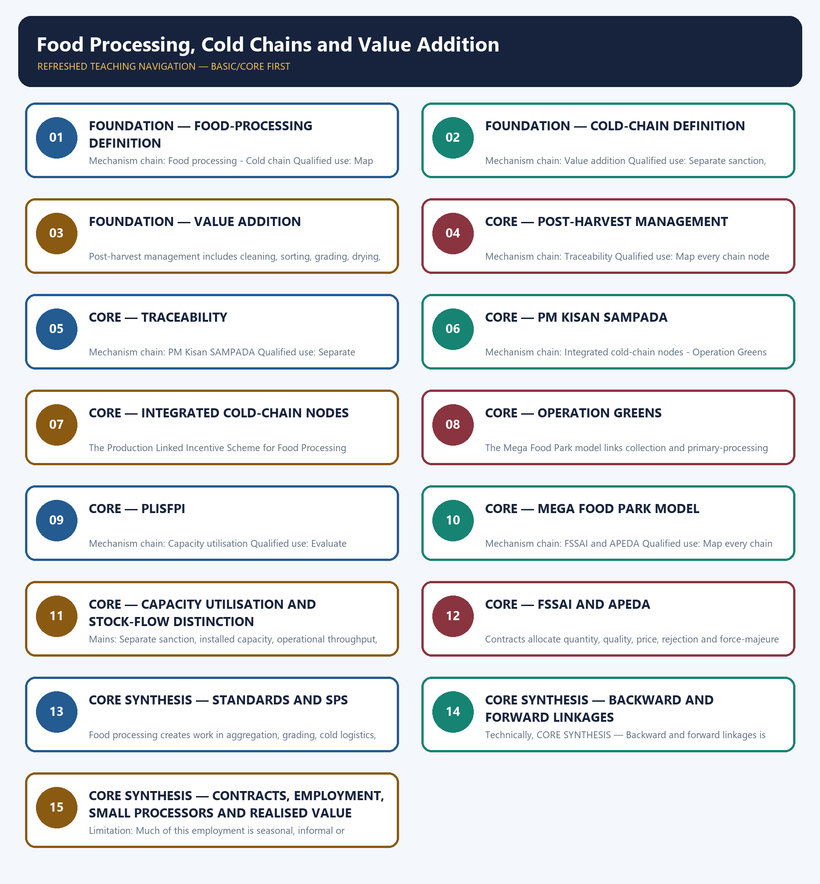

# Food Processing, Cold Chains and Value Addition — Learner-v2 Complete Learning Session

> **Authoring-only generation:** 2026-09-03. No PDF was rendered and no tracker or index was mutated.

### SOURCE, PROGRESSION AND CURRENT-LINKAGE AUDIT

- **Generation date:** 2026-09-03.
- **Repository-first evidence:** the Basic owner is taught first and preserved in full; the Advanced owner is retained only in the optional final teaching block.
- **OCR evidence:** Repository Markdown was primary. OCR-searchable local official General Studies papers were used only to confirm printed routed demands. No answer key, marking scheme, unsupported page precision or current macroeconomic statistic was inferred from them.
- **Qdrant:** not used; repository Markdown and available OCR context were sufficient.
- **PYQ integrity:** Audited ledgers route Mains demands on government policy, food-processing challenges and opportunities, farmer income, sector scope and employment generation. The objective palm-oil demand is cross-routed and answer-key neutral; no origin, use or biodiesel option is inferred.
- **Live-link boundary:** The live MoFPI pages were thin shells in the fetcher. Scheme identities are retained, but all capacity, project, outlay, sanction, disbursal and employment quantities remain omitted unless tied to a dated repository-owner source.
- **Fact/inference discipline:** no current-affairs item, PYQ wording, figure or quotation is invented.

### LIVE OFFICIAL-SOURCE ATTEMPT LOG

The checks below were made on 2026-09-03. Substantive official text is used only for the proposition it actually supports; binary files, dynamic shells, stubs and undated dashboard snippets are recorded but not converted into current claims.

- https://www.mofpi.gov.in/Schemes/pradhan-mantri-kisan-sampada-yojana — retrieved 2026-09-03; the official page returned only the scheme title, so no component outlay, project count, eligibility or continuation claim was imported.
- https://www.mofpi.gov.in/en/Schemes/cold-chain — retrieved 2026-09-03; the official page returned only its title and breadcrumb, so no cold-storage capacity, project status, grant or beneficiary figure was imported.

## BASIC LEARNING SESSION



*Distinct embedded teaching-navigation image. The separate continuous Cārvāka-style flowchart package remains an independent at-a-glance artifact.*

### SESSION 1 — FOUNDATION — FOOD-PROCESSING DEFINITION

#### DEFINITION / WHAT THIS IS CALLED

**Plain-language definition:** A cold chain is temperature-controlled handling and movement across linked stages from first-mile cooling to consumption; a standalone warehouse is not a complete chain.

**Technical definition:** Mechanism chain: Food processing - Cold chain Qualified use: Map every chain node from farm aggregation to final market and identify the missing link.

#### ANSWER-GRABBING OPENING — WRITE/ADAPT IN THE EXAM

> A cold chain is temperature-controlled handling and movement across linked stages from first-mile cooling to consumption; a standalone warehouse is not a complete chain.

#### MUST-WRITE KEYWORDS

- **FOUNDATION**
- **Food-processing definition**
- **Mechanism chain**
- **Qualified use**
- **Food**
- **A cold chain**

**How to use them:** Frame the answer through FOUNDATION; define Food-processing definition, connect Mechanism chain with Qualified use to explain the mechanism, and use Food for the decisive comparison or qualification.

#### VISUAL FIRST

```text
FOOD-PROCESSING DEFINITION
01. Food processing
    |
    v
02. Cold chain
BOUNDARY -> Do not call a warehouse or cold store a complete cold chain.
```

*This topic-specific rail fixes the evidence sequence and its exam boundary before analysis.*

#### CORE EXPLANATION

Food processing transforms, preserves or packages food to change shelf life, form, safety, convenience or market value; the degree of processing must be stated where relevant. A cold chain is temperature-controlled handling and movement across linked stages from first-mile cooling to consumption; a standalone warehouse is not a complete chain.

#### NAMED EVIDENCE AND MECHANISM

- Food processing transforms, preserves or packages food to change shelf life, form, safety, convenience or market value; the degree of processing must be stated where relevant.
- A cold chain is temperature-controlled handling and movement across linked stages from first-mile cooling to consumption; a standalone warehouse is not a complete chain.

#### EXAMINER CAUTION

- Do not call a warehouse or cold store a complete cold chain.

#### EXAM LINK

- **Prelims:** Preserve the exact formula, territorial or resident boundary, price basis, base year, index basket, eligible counterparty, institution and legal status; never upgrade a projection into an actual or a regulatory direction into a universal rule.
- **Mains:** Map every chain node from farm aggregation to final market and identify the missing link.

#### MINI RECAP

- **Mechanism chain:** Food processing -> Cold chain
- **Qualified use:** Map every chain node from farm aggregation to final market and identify the missing link.

#### CLOSING RECALL FLOW — FOUNDATION — FOOD-PROCESSING DEFINITION

```text
START / CONCEPT: FOUNDATION — Food-processing definition
        |
        v
EXACT TERMS: FOUNDATION · Food-processing definition · Mechanism chain · Qualified use · Food · A cold chain
        |
        v
MECHANISM / ARGUMENT: Mechanism chain: Food processing - Cold chain Qualified use: Map every chain node from farm aggregation to final market and identify the missing link.
        |
        v
CONSEQUENCE / CONTRAST: Do not call a warehouse or cold store a complete cold chain.
        |
        v
UPSC TRAP / ANSWER-USE: Do not miss this limiting distinction: food processing transforms, preserves or packages food to change shelf life, form, safety, convenience...
        |
        v
ANSWER-GRABBING FORMULATION: A cold chain is temperature-controlled handling and movement across linked stages from first-mile cooling to consumption; a standalone warehouse is not a complete chain.
```
### SESSION 2 — FOUNDATION — COLD-CHAIN DEFINITION

#### DEFINITION / WHAT THIS IS CALLED

**Plain-language definition:** Value addition is an increase in utility or market value through grading, processing, packaging, branding or services; higher final price does not prove the farmer captured the gain.

**Technical definition:** Mechanism chain: Value addition Qualified use: Separate sanction, installed capacity, operational throughput, sales, disbursal and value added.

#### ANSWER-GRABBING OPENING — WRITE/ADAPT IN THE EXAM

> Value addition is an increase in utility or market value through grading, processing, packaging, branding or services; higher final price does not prove the farmer captured the gain.

#### MUST-WRITE KEYWORDS

- **FOUNDATION**
- **Cold-chain definition**
- **Mechanism chain**
- **Qualified use**
- **Value addition**
- **Value**

**How to use them:** Frame the answer through FOUNDATION; define Cold-chain definition, connect Mechanism chain with Qualified use to explain the mechanism, and use Value addition for the decisive comparison or qualification.

#### VISUAL FIRST

```text
COLD-CHAIN DEFINITION
01. Value addition
BOUNDARY -> Do not equate installed capacity, operational capacity, throughput and value addition.
```

*This topic-specific rail fixes the evidence sequence and its exam boundary before analysis.*

#### CORE EXPLANATION

Value addition is an increase in utility or market value through grading, processing, packaging, branding or services; higher final price does not prove the farmer captured the gain.

#### NAMED EVIDENCE AND MECHANISM

- Value addition is an increase in utility or market value through grading, processing, packaging, branding or services; higher final price does not prove the farmer captured the gain.

#### EXAMINER CAUTION

- Do not equate installed capacity, operational capacity, throughput and value addition.

#### EXAM LINK

- **Prelims:** Preserve the exact formula, territorial or resident boundary, price basis, base year, index basket, eligible counterparty, institution and legal status; never upgrade a projection into an actual or a regulatory direction into a universal rule.
- **Mains:** Separate sanction, installed capacity, operational throughput, sales, disbursal and value added.

#### MINI RECAP

- **Mechanism chain:** Value addition
- **Qualified use:** Separate sanction, installed capacity, operational throughput, sales, disbursal and value added.

#### CLOSING RECALL FLOW — FOUNDATION — COLD-CHAIN DEFINITION

```text
START / CONCEPT: FOUNDATION — Cold-chain definition
        |
        v
EXACT TERMS: FOUNDATION · Cold-chain definition · Mechanism chain · Qualified use · Value addition · Value
        |
        v
MECHANISM / ARGUMENT: Mechanism chain: Value addition Qualified use: Separate sanction, installed capacity, operational throughput, sales, disbursal and value added.
        |
        v
CONSEQUENCE / CONTRAST: Do not equate installed capacity, operational capacity, throughput and value addition.
        |
        v
UPSC TRAP / ANSWER-USE: Do not miss this limiting distinction: separate sanction, installed capacity, operational throughput, sales, disbursal and value added.
        |
        v
ANSWER-GRABBING FORMULATION: Value addition is an increase in utility or market value through grading, processing, packaging, branding or services; higher final price does not prove the farmer captured the gain.
```
### SESSION 3 — FOUNDATION — VALUE ADDITION

#### DEFINITION / WHAT THIS IS CALLED

**Plain-language definition:** Mechanism chain: Post-harvest management Qualified use: Evaluate standards, employment and farmer income through competition and contract design.

**Technical definition:** Post-harvest management includes cleaning, sorting, grading, drying, storage, transport, processing and loss control after harvest.

#### ANSWER-GRABBING OPENING — WRITE/ADAPT IN THE EXAM

> Mechanism chain: Post-harvest management Qualified use: Evaluate standards, employment and farmer income through competition and contract design.

#### MUST-WRITE KEYWORDS

- **FOUNDATION**
- **Value addition**
- **Mechanism chain**
- **Qualified use**
- **Post-harvest**
- **Qualified**

**How to use them:** Frame the answer through FOUNDATION; define Value addition, connect Mechanism chain with Qualified use to explain the mechanism, and use Post-harvest for the decisive comparison or qualification.

#### VISUAL FIRST

```text
VALUE ADDITION
01. Post-harvest management
BOUNDARY -> Do not treat scheme sanction as construction, operation, sales or disbursal.
```

*This topic-specific rail fixes the evidence sequence and its exam boundary before analysis.*

#### CORE EXPLANATION

Post-harvest management includes cleaning, sorting, grading, drying, storage, transport, processing and loss control after harvest.

#### NAMED EVIDENCE AND MECHANISM

- Post-harvest management includes cleaning, sorting, grading, drying, storage, transport, processing and loss control after harvest.

#### EXAMINER CAUTION

- Do not treat scheme sanction as construction, operation, sales or disbursal.

#### EXAM LINK

- **Prelims:** Preserve the exact formula, territorial or resident boundary, price basis, base year, index basket, eligible counterparty, institution and legal status; never upgrade a projection into an actual or a regulatory direction into a universal rule.
- **Mains:** Evaluate standards, employment and farmer income through competition and contract design.

#### MINI RECAP

- **Mechanism chain:** Post-harvest management
- **Qualified use:** Evaluate standards, employment and farmer income through competition and contract design.

#### CLOSING RECALL FLOW — FOUNDATION — VALUE ADDITION

```text
START / CONCEPT: FOUNDATION — Value addition
        |
        v
EXACT TERMS: FOUNDATION · Value addition · Mechanism chain · Qualified use · Post-harvest · Qualified
        |
        v
MECHANISM / ARGUMENT: The operative mechanism is that evaluate standards, employment and farmer income through competition and contract design.
        |
        v
CONSEQUENCE / CONTRAST: Post-harvest management includes cleaning, sorting, grading, drying, storage, transport, processing and loss control after harvest.
        |
        v
UPSC TRAP / ANSWER-USE: Do not treat scheme sanction as construction, operation, sales or disbursal.
        |
        v
ANSWER-GRABBING FORMULATION: Mechanism chain: Post-harvest management Qualified use: Evaluate standards, employment and farmer income through competition and contract design.
```
### SESSION 4 — CORE — POST-HARVEST MANAGEMENT

#### DEFINITION / WHAT THIS IS CALLED

**Plain-language definition:** Traceability tracks origin, processing and movement through the chain and supports recall, quality assurance and export compliance; it is not the same as food-safety regulation itself.

**Technical definition:** Mechanism chain: Traceability Qualified use: Map every chain node from farm aggregation to final market and identify the missing link.

#### ANSWER-GRABBING OPENING — WRITE/ADAPT IN THE EXAM

> Traceability tracks origin, processing and movement through the chain and supports recall, quality assurance and export compliance; it is not the same as food-safety regulation itself.

#### MUST-WRITE KEYWORDS

- **Post-harvest management**
- **Mechanism chain**
- **Qualified use**
- **Traceability**
- **Traceability Qualified**
- **Map**

**How to use them:** Frame the answer through Post-harvest management; define Mechanism chain, connect Qualified use with Traceability to explain the mechanism, and use Traceability Qualified for the decisive comparison or qualification.

#### VISUAL FIRST

```text
POST-HARVEST MANAGEMENT
01. Traceability
BOUNDARY -> Do not quote cold-chain capacity, scheme outlay or project counts without a dated source.
```

*This topic-specific rail fixes the evidence sequence and its exam boundary before analysis.*

#### CORE EXPLANATION

Traceability tracks origin, processing and movement through the chain and supports recall, quality assurance and export compliance; it is not the same as food-safety regulation itself.

#### NAMED EVIDENCE AND MECHANISM

- Traceability tracks origin, processing and movement through the chain and supports recall, quality assurance and export compliance; it is not the same as food-safety regulation itself.

#### EXAMINER CAUTION

- Do not quote cold-chain capacity, scheme outlay or project counts without a dated source.

#### EXAM LINK

- **Prelims:** Preserve the exact formula, territorial or resident boundary, price basis, base year, index basket, eligible counterparty, institution and legal status; never upgrade a projection into an actual or a regulatory direction into a universal rule.
- **Mains:** Map every chain node from farm aggregation to final market and identify the missing link.

#### MINI RECAP

- **Mechanism chain:** Traceability
- **Qualified use:** Map every chain node from farm aggregation to final market and identify the missing link.

#### CLOSING RECALL FLOW — CORE — POST-HARVEST MANAGEMENT

```text
START / CONCEPT: CORE — Post-harvest management
        |
        v
EXACT TERMS: Post-harvest management · Mechanism chain · Qualified use · Traceability · Traceability Qualified · Map
        |
        v
MECHANISM / ARGUMENT: Mechanism chain: Traceability Qualified use: Map every chain node from farm aggregation to final market and identify the missing link.
        |
        v
CONSEQUENCE / CONTRAST: Do not quote cold-chain capacity, scheme outlay or project counts without a dated source.
        |
        v
UPSC TRAP / ANSWER-USE: Do not miss this limiting distinction: traceability tracks origin, processing and movement through the chain and supports recall, quality assurance...
        |
        v
ANSWER-GRABBING FORMULATION: Traceability tracks origin, processing and movement through the chain and supports recall, quality assurance and export compliance; it is not the same as food-safety regulation itself.
```
### SESSION 5 — CORE — TRACEABILITY

#### DEFINITION / WHAT THIS IS CALLED

**Plain-language definition:** Pradhan Mantri Kisan SAMPADA Yojana is an umbrella for food-processing and value-chain infrastructure; component status, eligibility and outlay require the applicable dated guideline.

**Technical definition:** Mechanism chain: PM Kisan SAMPADA Qualified use: Separate sanction, installed capacity, operational throughput, sales, disbursal and value added.

#### ANSWER-GRABBING OPENING — WRITE/ADAPT IN THE EXAM

> Pradhan Mantri Kisan SAMPADA Yojana is an umbrella for food-processing and value-chain infrastructure; component status, eligibility and outlay require the applicable dated guideline.

#### MUST-WRITE KEYWORDS

- **Traceability**
- **Mechanism chain**
- **Qualified use**
- **Pradhan Mantri Kisan SAMPADA Yojana**
- **FSSAI**
- **APEDA**

**How to use them:** Frame the answer through Traceability; define Mechanism chain, connect Qualified use with Pradhan Mantri Kisan SAMPADA Yojana to explain the mechanism, and use FSSAI for the decisive comparison or qualification.

#### VISUAL FIRST

```text
TRACEABILITY
01. PM Kisan SAMPADA
BOUNDARY -> Do not merge FSSAI regulation with APEDA export-development functions.
```

*This topic-specific rail fixes the evidence sequence and its exam boundary before analysis.*

#### CORE EXPLANATION

Pradhan Mantri Kisan SAMPADA Yojana is an umbrella for food-processing and value-chain infrastructure; component status, eligibility and outlay require the applicable dated guideline.

#### NAMED EVIDENCE AND MECHANISM

- Pradhan Mantri Kisan SAMPADA Yojana is an umbrella for food-processing and value-chain infrastructure; component status, eligibility and outlay require the applicable dated guideline.

#### EXAMINER CAUTION

- Do not merge FSSAI regulation with APEDA export-development functions.

#### EXAM LINK

- **Prelims:** Preserve the exact formula, territorial or resident boundary, price basis, base year, index basket, eligible counterparty, institution and legal status; never upgrade a projection into an actual or a regulatory direction into a universal rule.
- **Mains:** Separate sanction, installed capacity, operational throughput, sales, disbursal and value added.

#### MINI RECAP

- **Mechanism chain:** PM Kisan SAMPADA
- **Qualified use:** Separate sanction, installed capacity, operational throughput, sales, disbursal and value added.

#### CLOSING RECALL FLOW — CORE — TRACEABILITY

```text
START / CONCEPT: CORE — Traceability
        |
        v
EXACT TERMS: Traceability · Mechanism chain · Qualified use · Pradhan Mantri Kisan SAMPADA Yojana · FSSAI · APEDA
        |
        v
MECHANISM / ARGUMENT: Mechanism chain: PM Kisan SAMPADA Qualified use: Separate sanction, installed capacity, operational throughput, sales, disbursal and value added.
        |
        v
CONSEQUENCE / CONTRAST: Do not merge FSSAI regulation with APEDA export-development functions.
        |
        v
UPSC TRAP / ANSWER-USE: Do not miss this limiting distinction: separate sanction, installed capacity, operational throughput, sales, disbursal and value added.
        |
        v
ANSWER-GRABBING FORMULATION: Pradhan Mantri Kisan SAMPADA Yojana is an umbrella for food-processing and value-chain infrastructure; component status, eligibility and outlay require the applicable dated guideline.
```
### SESSION 6 — CORE — PM KISAN SAMPADA

#### DEFINITION / WHAT THIS IS CALLED

**Plain-language definition:** Operation Greens links price stabilisation and value-chain support for specified perishables, but commodity coverage and assistance windows are status-sensitive and not universal.

**Technical definition:** Mechanism chain: Integrated cold-chain nodes - Operation Greens boundary Qualified use: Evaluate standards, employment and farmer income through competition and contract design.

#### ANSWER-GRABBING OPENING — WRITE/ADAPT IN THE EXAM

> Operation Greens links price stabilisation and value-chain support for specified perishables, but commodity coverage and assistance windows are status-sensitive and not universal.

#### MUST-WRITE KEYWORDS

- **PM Kisan SAMPADA**
- **Mechanism chain**
- **Qualified use**
- **Operation Greens**
- **Integrated**
- **Qualified**

**How to use them:** Frame the answer through PM Kisan SAMPADA; define Mechanism chain, connect Qualified use with Operation Greens to explain the mechanism, and use Integrated for the decisive comparison or qualification.

#### VISUAL FIRST

```text
PM KISAN SAMPADA
01. Integrated cold-chain nodes
    |
    v
02. Operation Greens boundary
BOUNDARY -> Do not assume higher retail value reaches farmers automatically.
```

*This topic-specific rail fixes the evidence sequence and its exam boundary before analysis.*

#### CORE EXPLANATION

An effective cold chain can require pack houses, pre-cooling, controlled storage, reefer transport, processing interfaces and reliable power; capacity at one node cannot substitute for continuity. Operation Greens links price stabilisation and value-chain support for specified perishables, but commodity coverage and assistance windows are status-sensitive and not universal.

#### NAMED EVIDENCE AND MECHANISM

- An effective cold chain can require pack houses, pre-cooling, controlled storage, reefer transport, processing interfaces and reliable power; capacity at one node cannot substitute for continuity.
- Operation Greens links price stabilisation and value-chain support for specified perishables, but commodity coverage and assistance windows are status-sensitive and not universal.

#### EXAMINER CAUTION

- Do not assume higher retail value reaches farmers automatically.

#### EXAM LINK

- **Prelims:** Preserve the exact formula, territorial or resident boundary, price basis, base year, index basket, eligible counterparty, institution and legal status; never upgrade a projection into an actual or a regulatory direction into a universal rule.
- **Mains:** Evaluate standards, employment and farmer income through competition and contract design.

#### MINI RECAP

- **Mechanism chain:** Integrated cold-chain nodes -> Operation Greens boundary
- **Qualified use:** Evaluate standards, employment and farmer income through competition and contract design.

#### CLOSING RECALL FLOW — CORE — PM KISAN SAMPADA

```text
START / CONCEPT: CORE — PM Kisan SAMPADA
        |
        v
EXACT TERMS: PM Kisan SAMPADA · Mechanism chain · Qualified use · Operation Greens · Integrated · Qualified
        |
        v
MECHANISM / ARGUMENT: Mechanism chain: Integrated cold-chain nodes - Operation Greens boundary Qualified use: Evaluate standards, employment and farmer income through competition and contract design.
        |
        v
CONSEQUENCE / CONTRAST: Do not assume higher retail value reaches farmers automatically.
        |
        v
UPSC TRAP / ANSWER-USE: An effective cold chain can require pack houses, pre-cooling, controlled storage, reefer transport, processing interfaces and reliable power; capacity at one node cannot substitute for continuity.
        |
        v
ANSWER-GRABBING FORMULATION: Operation Greens links price stabilisation and value-chain support for specified perishables, but commodity coverage and assistance windows are status-sensitive and not universal.
```
### SESSION 7 — CORE — INTEGRATED COLD-CHAIN NODES

#### DEFINITION / WHAT THIS IS CALLED

**Plain-language definition:** Mechanism chain: PLISFPI boundary Qualified use: Map every chain node from farm aggregation to final market and identify the missing link.

**Technical definition:** The Production Linked Incentive Scheme for Food Processing Industries links support to eligible incremental performance; approval, investment, incremental sales, disbursal and realised exports are different stages.

#### ANSWER-GRABBING OPENING — WRITE/ADAPT IN THE EXAM

> Mechanism chain: PLISFPI boundary Qualified use: Map every chain node from farm aggregation to final market and identify the missing link.

#### MUST-WRITE KEYWORDS

- **Integrated cold-chain nodes**
- **Mechanism chain**
- **Qualified use**
- **The Production Linked Incentive Scheme**
- **Food Processing Industries**
- **PLISFPI**

**How to use them:** Frame the answer through Integrated cold-chain nodes; define Mechanism chain, connect Qualified use with The Production Linked Incentive Scheme to explain the mechanism, and use Food Processing Industries for the decisive comparison or qualification.

#### VISUAL FIRST

```text
INTEGRATED COLD-CHAIN NODES
01. PLISFPI boundary
BOUNDARY -> Do not treat all processing employment as formal, permanent or factory-based.
```

*This topic-specific rail fixes the evidence sequence and its exam boundary before analysis.*

#### CORE EXPLANATION

The Production Linked Incentive Scheme for Food Processing Industries links support to eligible incremental performance; approval, investment, incremental sales, disbursal and realised exports are different stages.

#### NAMED EVIDENCE AND MECHANISM

- The Production Linked Incentive Scheme for Food Processing Industries links support to eligible incremental performance; approval, investment, incremental sales, disbursal and realised exports are different stages.

#### EXAMINER CAUTION

- Do not treat all processing employment as formal, permanent or factory-based.

#### EXAM LINK

- **Prelims:** Preserve the exact formula, territorial or resident boundary, price basis, base year, index basket, eligible counterparty, institution and legal status; never upgrade a projection into an actual or a regulatory direction into a universal rule.
- **Mains:** Map every chain node from farm aggregation to final market and identify the missing link.

#### MINI RECAP

- **Mechanism chain:** PLISFPI boundary
- **Qualified use:** Map every chain node from farm aggregation to final market and identify the missing link.

#### CLOSING RECALL FLOW — CORE — INTEGRATED COLD-CHAIN NODES

```text
START / CONCEPT: CORE — Integrated cold-chain nodes
        |
        v
EXACT TERMS: Integrated cold-chain nodes · Mechanism chain · Qualified use · The Production Linked Incentive Scheme · Food Processing Industries · PLISFPI
        |
        v
MECHANISM / ARGUMENT: The Production Linked Incentive Scheme for Food Processing Industries links support to eligible incremental performance; approval, investment, incremental sales, disbursal and realised exports are different stages.
        |
        v
CONSEQUENCE / CONTRAST: Do not treat all processing employment as formal, permanent or factory-based.
        |
        v
UPSC TRAP / ANSWER-USE: Do not miss this limiting distinction: do not treat all processing employment as formal, permanent or factory-based.
        |
        v
ANSWER-GRABBING FORMULATION: Mechanism chain: PLISFPI boundary Qualified use: Map every chain node from farm aggregation to final market and identify the missing link.
```
### SESSION 8 — CORE — OPERATION GREENS

#### DEFINITION / WHAT THIS IS CALLED

**Plain-language definition:** Mechanism chain: Mega Food Park model Qualified use: Separate sanction, installed capacity, operational throughput, sales, disbursal and value added.

**Technical definition:** The Mega Food Park model links collection and primary-processing centres with common central infrastructure, but sanction or constructed capacity does not prove occupancy, throughput or commercial viability.

#### ANSWER-GRABBING OPENING — WRITE/ADAPT IN THE EXAM

> The Mega Food Park model links collection and primary-processing centres with common central infrastructure, but sanction or constructed capacity does not prove occupancy, throughput or commercial viability.

#### MUST-WRITE KEYWORDS

- **Operation Greens**
- **Mechanism chain**
- **Qualified use**
- **The Mega Food Park**
- **Separate**
- **Mega Food Park**

**How to use them:** Frame the answer through Operation Greens; define Mechanism chain, connect Qualified use with The Mega Food Park to explain the mechanism, and use Separate for the decisive comparison or qualification.

#### VISUAL FIRST

```text
OPERATION GREENS
01. Mega Food Park model
BOUNDARY -> Do not call standards pure market access without recognising compliance cost.
```

*This topic-specific rail fixes the evidence sequence and its exam boundary before analysis.*

#### CORE EXPLANATION

The Mega Food Park model links collection and primary-processing centres with common central infrastructure, but sanction or constructed capacity does not prove occupancy, throughput or commercial viability.

#### NAMED EVIDENCE AND MECHANISM

- The Mega Food Park model links collection and primary-processing centres with common central infrastructure, but sanction or constructed capacity does not prove occupancy, throughput or commercial viability.

#### EXAMINER CAUTION

- Do not call standards pure market access without recognising compliance cost.

#### EXAM LINK

- **Prelims:** Preserve the exact formula, territorial or resident boundary, price basis, base year, index basket, eligible counterparty, institution and legal status; never upgrade a projection into an actual or a regulatory direction into a universal rule.
- **Mains:** Separate sanction, installed capacity, operational throughput, sales, disbursal and value added.

#### MINI RECAP

- **Mechanism chain:** Mega Food Park model
- **Qualified use:** Separate sanction, installed capacity, operational throughput, sales, disbursal and value added.

#### CLOSING RECALL FLOW — CORE — OPERATION GREENS

```text
START / CONCEPT: CORE — Operation Greens
        |
        v
EXACT TERMS: Operation Greens · Mechanism chain · Qualified use · The Mega Food Park · Separate · Mega Food Park
        |
        v
MECHANISM / ARGUMENT: Mechanism chain: Mega Food Park model Qualified use: Separate sanction, installed capacity, operational throughput, sales, disbursal and value added.
        |
        v
CONSEQUENCE / CONTRAST: Do not call standards pure market access without recognising compliance cost.
        |
        v
UPSC TRAP / ANSWER-USE: Do not miss this limiting distinction: separate sanction, installed capacity, operational throughput, sales, disbursal and value added.
        |
        v
ANSWER-GRABBING FORMULATION: The Mega Food Park model links collection and primary-processing centres with common central infrastructure, but sanction or constructed capacity does not prove occupancy, throughput or commercial viability.
```
### SESSION 9 — CORE — PLISFPI

#### DEFINITION / WHAT THIS IS CALLED

**Plain-language definition:** Processing viability depends on throughput, seasonality, energy, logistics, working capital and capacity utilisation; installed capacity is a stock while actual processed output is a flow.

**Technical definition:** Mechanism chain: Capacity utilisation Qualified use: Evaluate standards, employment and farmer income through competition and contract design.

#### ANSWER-GRABBING OPENING — WRITE/ADAPT IN THE EXAM

> Processing viability depends on throughput, seasonality, energy, logistics, working capital and capacity utilisation; installed capacity is a stock while actual processed output is a flow.

#### MUST-WRITE KEYWORDS

- **Plisfpi**
- **Mechanism chain**
- **Qualified use**
- **Processing**
- **Operation Greens**
- **Capacity**

**How to use them:** Frame the answer through Plisfpi; define Mechanism chain, connect Qualified use with Processing to explain the mechanism, and use Operation Greens for the decisive comparison or qualification.

#### VISUAL FIRST

```text
PLISFPI
01. Capacity utilisation
BOUNDARY -> Do not treat Operation Greens commodity scope as timeless or universal.
```

*This topic-specific rail fixes the evidence sequence and its exam boundary before analysis.*

#### CORE EXPLANATION

Processing viability depends on throughput, seasonality, energy, logistics, working capital and capacity utilisation; installed capacity is a stock while actual processed output is a flow.

#### NAMED EVIDENCE AND MECHANISM

- Processing viability depends on throughput, seasonality, energy, logistics, working capital and capacity utilisation; installed capacity is a stock while actual processed output is a flow.

#### EXAMINER CAUTION

- Do not treat Operation Greens commodity scope as timeless or universal.

#### EXAM LINK

- **Prelims:** Preserve the exact formula, territorial or resident boundary, price basis, base year, index basket, eligible counterparty, institution and legal status; never upgrade a projection into an actual or a regulatory direction into a universal rule.
- **Mains:** Evaluate standards, employment and farmer income through competition and contract design.

#### MINI RECAP

- **Mechanism chain:** Capacity utilisation
- **Qualified use:** Evaluate standards, employment and farmer income through competition and contract design.

#### CLOSING RECALL FLOW — CORE — PLISFPI

```text
START / CONCEPT: CORE — PLISFPI
        |
        v
EXACT TERMS: Plisfpi · Mechanism chain · Qualified use · Processing · Operation Greens · Capacity
        |
        v
MECHANISM / ARGUMENT: Mechanism chain: Capacity utilisation Qualified use: Evaluate standards, employment and farmer income through competition and contract design.
        |
        v
CONSEQUENCE / CONTRAST: Do not treat Operation Greens commodity scope as timeless or universal.
        |
        v
UPSC TRAP / ANSWER-USE: Do not miss this limiting distinction: processing viability depends on throughput, seasonality, energy, logistics, working capital and capacity utilisation.
        |
        v
ANSWER-GRABBING FORMULATION: Processing viability depends on throughput, seasonality, energy, logistics, working capital and capacity utilisation; installed capacity is a stock while actual processed output is a flow.
```
### SESSION 10 — CORE — MEGA FOOD PARK MODEL

#### DEFINITION / WHAT THIS IS CALLED

**Plain-language definition:** FSSAI regulates domestic food-safety standards within its mandate, while APEDA supports agricultural and processed-food export development and market access; their functions are not interchangeable.

**Technical definition:** Mechanism chain: FSSAI and APEDA Qualified use: Map every chain node from farm aggregation to final market and identify the missing link.

#### ANSWER-GRABBING OPENING — WRITE/ADAPT IN THE EXAM

> FSSAI regulates domestic food-safety standards within its mandate, while APEDA supports agricultural and processed-food export development and market access; their functions are not interchangeable.

#### MUST-WRITE KEYWORDS

- **Mega Food Park model**
- **Mechanism chain**
- **Qualified use**
- **FSSAI**
- **APEDA**
- **APEDA Qualified**

**How to use them:** Frame the answer through Mega Food Park model; define Mechanism chain, connect Qualified use with FSSAI to explain the mechanism, and use APEDA for the decisive comparison or qualification.

#### VISUAL FIRST

```text
MEGA FOOD PARK MODEL
01. FSSAI and APEDA
BOUNDARY -> Do not infer the palm-oil objective answer key from routing metadata.
```

*This topic-specific rail fixes the evidence sequence and its exam boundary before analysis.*

#### CORE EXPLANATION

FSSAI regulates domestic food-safety standards within its mandate, while APEDA supports agricultural and processed-food export development and market access; their functions are not interchangeable.

#### NAMED EVIDENCE AND MECHANISM

- FSSAI regulates domestic food-safety standards within its mandate, while APEDA supports agricultural and processed-food export development and market access; their functions are not interchangeable.

#### EXAMINER CAUTION

- Do not infer the palm-oil objective answer key from routing metadata.

#### EXAM LINK

- **Prelims:** Preserve the exact formula, territorial or resident boundary, price basis, base year, index basket, eligible counterparty, institution and legal status; never upgrade a projection into an actual or a regulatory direction into a universal rule.
- **Mains:** Map every chain node from farm aggregation to final market and identify the missing link.

#### MINI RECAP

- **Mechanism chain:** FSSAI and APEDA
- **Qualified use:** Map every chain node from farm aggregation to final market and identify the missing link.

#### CLOSING RECALL FLOW — CORE — MEGA FOOD PARK MODEL

```text
START / CONCEPT: CORE — Mega Food Park model
        |
        v
EXACT TERMS: Mega Food Park model · Mechanism chain · Qualified use · FSSAI · APEDA · APEDA Qualified
        |
        v
MECHANISM / ARGUMENT: Mechanism chain: FSSAI and APEDA Qualified use: Map every chain node from farm aggregation to final market and identify the missing link.
        |
        v
CONSEQUENCE / CONTRAST: Do not infer the palm-oil objective answer key from routing metadata.
        |
        v
UPSC TRAP / ANSWER-USE: Do not miss this limiting distinction: fSSAI regulates domestic food-safety standards within its mandate.
        |
        v
ANSWER-GRABBING FORMULATION: FSSAI regulates domestic food-safety standards within its mandate, while APEDA supports agricultural and processed-food export development and market access; their functions are not interchangeable.
```
### SESSION 11 — CORE — CAPACITY UTILISATION AND STOCK-FLOW DISTINCTION

#### DEFINITION / WHAT THIS IS CALLED

**Plain-language definition:** Mechanism chain: Standards and SPS - Backward and forward links Qualified use: Separate sanction, installed capacity, operational throughput, sales, disbursal and value added.

**Technical definition:** Mains: Separate sanction, installed capacity, operational throughput, sales, disbursal and value added.

#### ANSWER-GRABBING OPENING — WRITE/ADAPT IN THE EXAM

> Mechanism chain: Standards and SPS - Backward and forward links Qualified use: Separate sanction, installed capacity, operational throughput, sales, disbursal and value added.

#### MUST-WRITE KEYWORDS

- **Capacity utilisation**
- **stock-flow distinction**
- **Mechanism chain**
- **Qualified use**
- **Testing**
- **Backward**

**How to use them:** Frame the answer through Capacity utilisation; define stock-flow distinction, connect Mechanism chain with Qualified use to explain the mechanism, and use Testing for the decisive comparison or qualification.

#### VISUAL FIRST

```text
CAPACITY UTILISATION AND STOCK-FLOW DISTINCTION
01. Standards and SPS
    |
    v
02. Backward and forward links
BOUNDARY -> Do not call a warehouse or cold store a complete cold chain.
```

*This topic-specific rail fixes the evidence sequence and its exam boundary before analysis.*

#### CORE EXPLANATION

Testing, sanitary and phytosanitary requirements, quality certification and traceability can unlock premium markets while imposing fixed compliance costs on small processors. Backward linkage connects processors with farm aggregation and quality supply, while forward linkage connects processed output with retail, institutional buyers and exports.

#### NAMED EVIDENCE AND MECHANISM

- Testing, sanitary and phytosanitary requirements, quality certification and traceability can unlock premium markets while imposing fixed compliance costs on small processors.
- Backward linkage connects processors with farm aggregation and quality supply, while forward linkage connects processed output with retail, institutional buyers and exports.

#### EXAMINER CAUTION

- Do not call a warehouse or cold store a complete cold chain.

#### EXAM LINK

- **Prelims:** Preserve the exact formula, territorial or resident boundary, price basis, base year, index basket, eligible counterparty, institution and legal status; never upgrade a projection into an actual or a regulatory direction into a universal rule.
- **Mains:** Separate sanction, installed capacity, operational throughput, sales, disbursal and value added.

#### MINI RECAP

- **Mechanism chain:** Standards and SPS -> Backward and forward links
- **Qualified use:** Separate sanction, installed capacity, operational throughput, sales, disbursal and value added.

#### CLOSING RECALL FLOW — CORE — CAPACITY UTILISATION AND STOCK-FLOW DISTINCTION

```text
START / CONCEPT: CORE — Capacity utilisation and stock-flow distinction
        |
        v
EXACT TERMS: Capacity utilisation · stock-flow distinction · Mechanism chain · Qualified use · Testing · Backward
        |
        v
MECHANISM / ARGUMENT: Mains: Separate sanction, installed capacity, operational throughput, sales, disbursal and value added.
        |
        v
CONSEQUENCE / CONTRAST: Testing, sanitary and phytosanitary requirements, quality certification and traceability can unlock premium markets while imposing fixed compliance costs on small processors.
        |
        v
UPSC TRAP / ANSWER-USE: Backward linkage connects processors with farm aggregation and quality supply, while forward linkage connects processed output with retail, institutional buyers and exports.
        |
        v
ANSWER-GRABBING FORMULATION: Mechanism chain: Standards and SPS - Backward and forward links Qualified use: Separate sanction, installed capacity, operational throughput, sales, disbursal and value added.
```
### SESSION 12 — CORE — FSSAI AND APEDA

#### DEFINITION / WHAT THIS IS CALLED

**Plain-language definition:** Mechanism chain: Contract and margin distribution Qualified use: Evaluate standards, employment and farmer income through competition and contract design.

**Technical definition:** Contracts allocate quantity, quality, price, rejection and force-majeure risk; competition and farmer aggregation determine whether additional value reaches primary producers.

#### ANSWER-GRABBING OPENING — WRITE/ADAPT IN THE EXAM

> Mechanism chain: Contract and margin distribution Qualified use: Evaluate standards, employment and farmer income through competition and contract design.

#### MUST-WRITE KEYWORDS

- **FSSAI**
- **APEDA**
- **Mechanism chain**
- **Qualified use**
- **Contracts**
- **Contract**

**How to use them:** Frame the answer through FSSAI; define APEDA, connect Mechanism chain with Qualified use to explain the mechanism, and use Contracts for the decisive comparison or qualification.

#### VISUAL FIRST

```text
FSSAI AND APEDA
01. Contract and margin distribution
BOUNDARY -> Do not equate installed capacity, operational capacity, throughput and value addition.
```

*This topic-specific rail fixes the evidence sequence and its exam boundary before analysis.*

#### CORE EXPLANATION

Contracts allocate quantity, quality, price, rejection and force-majeure risk; competition and farmer aggregation determine whether additional value reaches primary producers.

#### NAMED EVIDENCE AND MECHANISM

- Contracts allocate quantity, quality, price, rejection and force-majeure risk; competition and farmer aggregation determine whether additional value reaches primary producers.

#### EXAMINER CAUTION

- Do not equate installed capacity, operational capacity, throughput and value addition.

#### EXAM LINK

- **Prelims:** Preserve the exact formula, territorial or resident boundary, price basis, base year, index basket, eligible counterparty, institution and legal status; never upgrade a projection into an actual or a regulatory direction into a universal rule.
- **Mains:** Evaluate standards, employment and farmer income through competition and contract design.

#### MINI RECAP

- **Mechanism chain:** Contract and margin distribution
- **Qualified use:** Evaluate standards, employment and farmer income through competition and contract design.

#### CLOSING RECALL FLOW — CORE — FSSAI AND APEDA

```text
START / CONCEPT: CORE — FSSAI and APEDA
        |
        v
EXACT TERMS: FSSAI · APEDA · Mechanism chain · Qualified use · Contracts · Contract
        |
        v
MECHANISM / ARGUMENT: The operative mechanism is that contract and margin distribution Qualified use.
        |
        v
CONSEQUENCE / CONTRAST: Contracts allocate quantity, quality, price, rejection and force-majeure risk; competition and farmer aggregation determine whether additional value reaches primary producers.
        |
        v
UPSC TRAP / ANSWER-USE: Do not equate installed capacity, operational capacity, throughput and value addition.
        |
        v
ANSWER-GRABBING FORMULATION: Mechanism chain: Contract and margin distribution Qualified use: Evaluate standards, employment and farmer income through competition and contract design.
```
### SESSION 13 — CORE SYNTHESIS — STANDARDS AND SPS

#### DEFINITION / WHAT THIS IS CALLED

**Plain-language definition:** Mechanism chain: Employment nodes Qualified use: Map every chain node from farm aggregation to final market and identify the missing link.

**Technical definition:** Food processing creates work in aggregation, grading, cold logistics, factories, packaging, testing, maintenance and retail, but job quality, formality and seasonality must be assessed separately.

#### ANSWER-GRABBING OPENING — WRITE/ADAPT IN THE EXAM

> Food processing creates work in aggregation, grading, cold logistics, factories, packaging, testing, maintenance and retail, but job quality, formality and seasonality must be assessed separately.

#### MUST-WRITE KEYWORDS

- **CORE SYNTHESIS**
- **Standards**
- **SPS**
- **Mechanism chain**
- **Qualified use**
- **Food**

**How to use them:** Frame the answer through CORE SYNTHESIS; define Standards, connect SPS with Mechanism chain to explain the mechanism, and use Qualified use for the decisive comparison or qualification.

#### VISUAL FIRST

```text
STANDARDS AND SPS
01. Employment nodes
BOUNDARY -> Do not treat scheme sanction as construction, operation, sales or disbursal.
```

*This topic-specific rail fixes the evidence sequence and its exam boundary before analysis.*

#### CORE EXPLANATION

Food processing creates work in aggregation, grading, cold logistics, factories, packaging, testing, maintenance and retail, but job quality, formality and seasonality must be assessed separately.

#### NAMED EVIDENCE AND MECHANISM

- Food processing creates work in aggregation, grading, cold logistics, factories, packaging, testing, maintenance and retail, but job quality, formality and seasonality must be assessed separately.

#### EXAMINER CAUTION

- Do not treat scheme sanction as construction, operation, sales or disbursal.

#### EXAM LINK

- **Prelims:** Preserve the exact formula, territorial or resident boundary, price basis, base year, index basket, eligible counterparty, institution and legal status; never upgrade a projection into an actual or a regulatory direction into a universal rule.
- **Mains:** Map every chain node from farm aggregation to final market and identify the missing link.

#### MINI RECAP

- **Mechanism chain:** Employment nodes
- **Qualified use:** Map every chain node from farm aggregation to final market and identify the missing link.

#### CLOSING RECALL FLOW — CORE SYNTHESIS — STANDARDS AND SPS

```text
START / CONCEPT: CORE SYNTHESIS — Standards and SPS
        |
        v
EXACT TERMS: CORE SYNTHESIS · Standards · SPS · Mechanism chain · Qualified use · Food
        |
        v
MECHANISM / ARGUMENT: Mechanism chain: Employment nodes Qualified use: Map every chain node from farm aggregation to final market and identify the missing link.
        |
        v
CONSEQUENCE / CONTRAST: Do not treat scheme sanction as construction, operation, sales or disbursal.
        |
        v
UPSC TRAP / ANSWER-USE: Do not miss this limiting distinction: food processing creates work in aggregation, grading, cold logistics, factories, packaging, testing, maintenance and...
        |
        v
ANSWER-GRABBING FORMULATION: Food processing creates work in aggregation, grading, cold logistics, factories, packaging, testing, maintenance and retail, but job quality, formality and seasonality must be assessed separately.
```
### SESSION 14 — CORE SYNTHESIS — BACKWARD AND FORWARD LINKAGES

#### DEFINITION / WHAT THIS IS CALLED

**Plain-language definition:** Mechanism chain: Small-processor constraints - By-product use Qualified use: Separate sanction, installed capacity, operational throughput, sales, disbursal and value added.

**Technical definition:** Technically, CORE SYNTHESIS — Backward and forward linkages is analysed by relating CORE SYNTHESIS to Backward, then testing the relationship through forward linkages and Mechanism chain.

#### ANSWER-GRABBING OPENING — WRITE/ADAPT IN THE EXAM

> Mechanism chain: Small-processor constraints - By-product use Qualified use: Separate sanction, installed capacity, operational throughput, sales, disbursal and value added.

#### MUST-WRITE KEYWORDS

- **CORE SYNTHESIS**
- **Backward**
- **forward linkages**
- **Mechanism chain**
- **Qualified use**
- **Micro**

**How to use them:** Frame the answer through CORE SYNTHESIS; define Backward, connect forward linkages with Mechanism chain to explain the mechanism, and use Qualified use for the decisive comparison or qualification.

#### VISUAL FIRST

```text
BACKWARD AND FORWARD LINKAGES
01. Small-processor constraints
    |
    v
02. By-product use
BOUNDARY -> Do not quote cold-chain capacity, scheme outlay or project counts without a dated source.
```

*This topic-specific rail fixes the evidence sequence and its exam boundary before analysis.*

#### CORE EXPLANATION

Micro and small processors can face working-capital, technology, testing, formalisation, power and market-access barriers even when local demand exists. Processing by-products can support feed, compost, energy and other circular-bioeconomy uses, but commercial value depends on segregation, safety, technology and markets.

#### NAMED EVIDENCE AND MECHANISM

- Micro and small processors can face working-capital, technology, testing, formalisation, power and market-access barriers even when local demand exists.
- Processing by-products can support feed, compost, energy and other circular-bioeconomy uses, but commercial value depends on segregation, safety, technology and markets.

#### EXAMINER CAUTION

- Do not quote cold-chain capacity, scheme outlay or project counts without a dated source.

#### EXAM LINK

- **Prelims:** Preserve the exact formula, territorial or resident boundary, price basis, base year, index basket, eligible counterparty, institution and legal status; never upgrade a projection into an actual or a regulatory direction into a universal rule.
- **Mains:** Separate sanction, installed capacity, operational throughput, sales, disbursal and value added.

#### MINI RECAP

- **Mechanism chain:** Small-processor constraints -> By-product use
- **Qualified use:** Separate sanction, installed capacity, operational throughput, sales, disbursal and value added.

#### CLOSING RECALL FLOW — CORE SYNTHESIS — BACKWARD AND FORWARD LINKAGES

```text
START / CONCEPT: CORE SYNTHESIS — Backward and forward linkages
        |
        v
EXACT TERMS: CORE SYNTHESIS · Backward · forward linkages · Mechanism chain · Qualified use · Micro
        |
        v
MECHANISM / ARGUMENT: The operative mechanism is that small-processor constraints - By-product use Qualified use.
        |
        v
CONSEQUENCE / CONTRAST: Do not quote cold-chain capacity, scheme outlay or project counts without a dated source.
        |
        v
UPSC TRAP / ANSWER-USE: Do not miss this limiting distinction: micro and small processors can face working-capital, technology, testing, formalisation, power and market-access barriers...
        |
        v
ANSWER-GRABBING FORMULATION: Mechanism chain: Small-processor constraints - By-product use Qualified use: Separate sanction, installed capacity, operational throughput, sales, disbursal and value added.
```
### SESSION 15 — CORE SYNTHESIS — CONTRACTS, EMPLOYMENT, SMALL PROCESSORS AND REALISED VALUE

#### DEFINITION / WHAT THIS IS CALLED

**Plain-language definition:** Contracts and competition decide how the additional value is shared among farmers, processors, logistics firms and retailers.

**Technical definition:** Limitation: Much of this employment is seasonal, informal or contract-based, so job-creation claims must be qualified by quality and formality, not headcount alone.

#### ANSWER-GRABBING OPENING — WRITE/ADAPT IN THE EXAM

> ✅ Food processing links agriculture with manufacturing, logistics, retail and exports. ✅ Cold storage is only one node; pre-cooling, reefer transport, pack houses and reliable power are also needed. ✅ Processing can reduce seasonal gluts and extend shelf life. ✅ Quality standards, traceability and testing are essential for high-value and export markets. ✅ Micro and small processors face working-capital, technology, formalisation and market access constraints. ✅ Value addition does not guarantee farmers a fair share unless contracts and competition transmit gains. ✅ The registered/organised segment's employment and value-addition significance can be anchored with ASI 2022-23/2023-24 shares (12.91% of registered-manufacturing employment; 7.93% of manufacturing GVA), not with an assumed economy-wide informal-sector total.

#### MUST-WRITE KEYWORDS

- **CORE SYNTHESIS**
- **Contracts**
- **employment**
- **small processors**
- **realised value**
- **Mechanism chain**

**How to use them:** Frame the answer through CORE SYNTHESIS; define Contracts, connect employment with small processors to explain the mechanism, and use realised value for the decisive comparison or qualification.

#### VISUAL FIRST

```text
CONTRACTS, EMPLOYMENT, SMALL PROCESSORS AND REALISED VALUE
01. Capacity versus value realised
    |
    v
02. PYQ routing boundary
BOUNDARY -> Do not merge FSSAI regulation with APEDA export-development functions.
```

*This topic-specific rail fixes the evidence sequence and its exam boundary before analysis.*

#### CORE EXPLANATION

Cold-chain or plant capacity measures an installed stock, actual throughput measures use, and realised value addition depends on output quality, price, cost and distribution of margins. Verified PYQs test sector scope, policy, farmer income, employment and the cold-chain distinction; the routed palm-oil objective demand remains answer-key neutral and cross-owned with crop missions.

#### NAMED EVIDENCE AND MECHANISM

- Cold-chain or plant capacity measures an installed stock, actual throughput measures use, and realised value addition depends on output quality, price, cost and distribution of margins.
- Verified PYQs test sector scope, policy, farmer income, employment and the cold-chain distinction; the routed palm-oil objective demand remains answer-key neutral and cross-owned with crop missions.

#### EXAMINER CAUTION

- Do not merge FSSAI regulation with APEDA export-development functions.

#### EXAM LINK

- **Prelims:** Preserve the exact formula, territorial or resident boundary, price basis, base year, index basket, eligible counterparty, institution and legal status; never upgrade a projection into an actual or a regulatory direction into a universal rule.
- **Mains:** Evaluate standards, employment and farmer income through competition and contract design.

#### MINI RECAP

- **Mechanism chain:** Capacity versus value realised -> PYQ routing boundary
- **Qualified use:** Evaluate standards, employment and farmer income through competition and contract design.
#### COMPLETE BASIC OWNER EVIDENCE BANK

> **Subject:** Economy | **Tier:** Must-Do (foundation) | **GS Paper:** GS-III + Prelims.
> **Core area:** Agriculture-industry linkage.
> **Grounded in:** Ramesh Singh, relevant chapters; Economic Survey 2025-26; audited UPSC Economy PYQs (2024-2026 Prelims and 2024-2025 Mains).
> ✅ = source-grounded | ⚠️ = analytical linkage | 📰 = current Survey/current-affairs hook.
> *Companion: `../advanced/15_Food-Processing-Cold-Chains-and-Value-Addition.md`.*

#### 1. Visual foundation

```text
1. FARM OUTPUT
   |
   v
2. AGGREGATION AND GRADING
   |
   v
3. STORAGE AND COLD LOGISTICS
   |
   v
4. PROCESSING, PACKAGING AND STANDARDS
   |
   v
5. RETAIL, EXPORT AND HIGHER VALUE
```

**Core proposition:** Food processing is a chain-coordination industry: throughput,
temperature, standards, finance and fair contracting matter more than plant construction
alone.

#### 2. Essential definitions

| Concept | Exam-ready meaning |
|---|---|
| ✅ **Food processing** | Transformation, preservation or packaging that changes shelf life, form or value. |
| ✅ **Cold chain** | Temperature-controlled storage and movement from production to consumption. |
| ✅ **Value addition** | Increase in utility or market value through grading, processing, branding or services. |
| ✅ **Post-harvest management** | Handling after harvest including cleaning, sorting, storage, transport and processing. |
| ✅ **Traceability** | Ability to track origin and movement through the value chain. |

#### 3. Topic mechanism

1. Aggregation and grading create commercially usable lots from dispersed farm output.
2. Pre-cooling, storage and reefer transport preserve quality before processing.
3. Processing changes shelf life, form, safety and convenience and creates demand for
   packaging and services.
4. Testing, traceability and certification determine access to organised retail and export
   markets.
5. Contracts and competition decide how the additional value is shared among farmers,
   processors, logistics firms and retailers.

#### 4. Institutions and policy tools

- ✅ **Ministry of Food Processing Industries:** frames sector programmes and infrastructure
  support.
- ✅ **FSSAI:** sets and enforces food-safety standards within its mandate.
- ✅ **APEDA and commodity or export bodies:** support standards, traceability and external-
  market access.
- ✅ **FPOs, processors and logistics providers:** coordinate procurement, throughput and
  quality.

#### 5. Indian applications and examples

- ✅ **Claim:** Dedicated infrastructure funding can target the exact chain-nodes (storage,
  processing, cold logistics) that a fragmented value chain otherwise leaves unfunded.
  **Evidence:** Pradhan Mantri Kisan Sampada Yojana (PMKSY/SAMPADA umbrella) finances mega
  food parks, cold-chain and value-addition infrastructure, agro-processing clusters and
  food-safety/quality-assurance infrastructure. **Significance:** It operationalises the
  aggregation-to-processing chain identified in Section 3. **Limitation/status caution:**
  Component names and outlays have been revised across plan periods; cite scheme status and
  figures only from a dated official source, not by assumed continuity.
- ✅ **Claim:** Price-crash-driven post-harvest loss in perishables needs a price-
  stabilisation instrument, not storage capacity alone. **Evidence:** Operation Greens
  (originally tomato-onion-potato, later widened to other perishables) supports price
  stabilisation, processing linkage and value-chain integration. **Significance:** It shows
  that volatility, not merely spoilage, drives loss for perishables. **Limitation:**
  Coverage is commodity- and season-specific and does not repair weak aggregation or
  contract terms upstream.
- ✅ **Claim:** Output-linked fiscal incentives can pull large processors and branding
  investment into India rather than merely subsidising construction. **Evidence:** The
  Production Linked Incentive Scheme for Food Processing Industries (PLISFPI) links
  incentives to eligible incremental sales in segments such as ready-to-eat/ready-to-cook
  foods, marine products and branding support for Indian food brands abroad.
  **Significance:** It demonstrates the shift from subsidised capacity to measured
  additionality central to this topic's thesis. **Limitation:** Sanctioned participation is
  not disbursed incentive or realised export/brand outcome; cite only dated, official
  disbursal data, not headline sanction figures.
- ✅ **Claim:** Cluster-based common processing infrastructure was meant to solve fragmented
  private investment. **Evidence:** The Mega Food Park scheme built common facilities—
  collection centres, primary processing centres and central processing centres—linking
  farms to markets. **Significance:** It illustrates the aggregation-to-processing-to-market
  chain this topic tests. **Limitation/status caution:** Several sanctioned parks have faced
  land, viability and occupancy difficulties and new sanctions under this specific scheme
  name have slowed; treat any claim of steady-state operational success as requiring a
  dated official source.
- ⚠️ **Claim:** A cold store without pre-cooling and reefer transport merely shifts the
  point at which perishables deteriorate rather than preventing it. **Evidence:** Effective
  post-harvest management needs pre-cooling units, reefer vehicles and pack-houses working
  together with ambient cold storage. **Significance:** This distinguishes genuine cold-
  chain investment from bare warehousing capacity, a recurring UPSC trap. **Limitation:**
  Even a complete cold chain fails without reliable power and coordinated first-mile and
  last-mile logistics.
- ⚠️ **Claim:** Backward and forward linkages, not processing capacity alone, decide who
  captures value addition. **Evidence:** FPO-based procurement (backward linkage) and
  organised retail or export contracts (forward linkage) shape bargaining power and price
  transmission along the chain. **Significance:** This operationalises the "who captures
  the gain" dimension central to Mains answers on food processing. **Limitation:** Weak
  contract enforcement and processor market power can still divert gains from primary
  producers even where nominal linkages exist.
- ⚠️ **Claim:** Processing-linked employment is dispersed across nodes rather than
  concentrated only in factory jobs. **Evidence:** Aggregation, grading, cold-logistics,
  plant-level processing, packaging, quality-testing and retail/export-facing roles each
  generate non-farm rural employment. **Significance:** This supports the employment-
  potential dimension explicitly tested in the 2025 GS-III PYQ. **Limitation:** Much of this
  employment is seasonal, informal or contract-based, so job-creation claims must be
  qualified by quality and formality, not headcount alone.

#### Core limitations and trade-offs

- ⚠️ Infrastructure-heavy schemes (Mega Food Parks, cold-chain grants) can create sanctioned
  capacity without matching private investment where demand aggregation, land or commercial
  viability are weak.
- ⚠️ Output-linked incentives (PLISFPI) reward scale and eligible large firms; they can
  crowd in organised processors while doing little for small and micro processors unable to
  meet investment or documentation thresholds.
- ⚠️ Price-stabilisation interventions such as Operation Greens address symptom-level
  volatility but do not resolve underlying market-structure problems like concentrated
  procurement or weak farmer bargaining power.
- ⚠️ Certification, traceability and export-quality standards raise access to premium
  markets but impose fixed compliance costs that can exclude small processors, widening the
  dualism between large exporters and small domestic units.
- ⚠️ Employment generated across the chain is frequently informal, seasonal or low-skill;
  processing growth does not automatically translate into secure, well-paid work.
- ⚠️ Repeated scheme restructuring and name changes (successive umbrella programmes) make
  dated, source-verified citation essential; assuming continuity of an earlier scheme's name
  or outlay risks factual error.

#### 6. Must-Know Facts for Prelims

- ✅ Food processing links agriculture with manufacturing, logistics, retail and exports.
- ✅ Cold storage is only one node; pre-cooling, reefer transport, pack houses and reliable
  power are also needed.
- ✅ Processing can reduce seasonal gluts and extend shelf life.
- ✅ Quality standards, traceability and testing are essential for high-value and export
  markets.
- ✅ Micro and small processors face working-capital, technology, formalisation and market-
  access constraints.
- ✅ Value addition does not guarantee farmers a fair share unless contracts and competition
  transmit gains.
- ✅ The registered/organised segment's employment and value-addition significance can be
  anchored with ASI 2022-23/2023-24 shares (12.91% of registered-manufacturing employment;
  7.93% of manufacturing GVA), not with an assumed economy-wide informal-sector total.

#### 7. UPSC traps

- ❌ A warehouse is automatically a cold chain. -> Temperature control and linked logistics
  distinguish cold chains.
- ❌ Processing always lowers nutrition. -> Effects depend on the product and method;
  preservation can reduce loss.
- ❌ Large processing plants alone solve post-harvest loss. -> First-mile aggregation and
  distributed infrastructure remain critical.
- ❌ Export certification concerns only tariffs. -> Sanitary, phytosanitary, quality and
  traceability requirements matter.
- ❌ APEDA replaces domestic food-safety regulation. -> FSSAI is the food-safety regulator;
  APEDA supports agricultural and processed-food export development and market access.
- ❌ Higher retail value automatically reaches producers. -> Market power and contract terms
  determine value distribution.

#### 8. 📰 Economic Survey 2025-26 / current anchor

- 📰 The Survey emphasises storage, market linkage and agricultural value-chain
  infrastructure as priority investment areas. ⚠️ **Status caution:** an unverified figure
  previously attached to this bullet has been removed; cite any specific project/outlay
  count only from a dated official source (Survey chapter/page or ministry release), not
  from memory.
- 📰 **Dated anchor:** Food processing contributed 7.93% of manufacturing GVA in 2023-24
  (1st Revised Estimates) and 12.91% of employment in India's registered/organised
  manufacturing sector in 2022-23 (Annual Survey of Industries), per the Ministry of Food
  Processing Industries' Economic Data Bank and PIB release (December 2025).
  **Limitation:** the Annual Survey of Industries covers only registered factories, so
  this anchor excludes the much larger informal/unregistered processing segment and must
  not be read as an economy-wide employment or value-addition figure.
- 📰 The 2025 GS-III PYQ asked the scope of food processing and its employment potential.

⚠️ **Interpretation caution:** Processing can reduce physical loss without improving farm
income if procurement is concentrated or contracts transfer excessive risk to producers.

#### 9. PYQ application

- ⚠️ 2025 GS-III: Scope of food-processing industries and employment-generation measures.
- ⚠️ 2025 GS-III supply-chain question provides the upstream framework for processing
  answers.
- ⚠️ **2025 answer route:** cover scope from aggregation and primary processing to
  packaging, testing, cold logistics, retail and exports; then assess jobs at each node,
  not just factory employment.

#### 10. Mains angles

- ⚠️ Present food processing as farmer-income, jobs, nutrition, loss-reduction and export
  policy.
- ⚠️ Identify gaps node by node: aggregation, testing, finance, power, cold logistics,
  standards and markets.
- ⚠️ Recommend cluster-based infrastructure with FPO linkage and fair contracting.

> **Answer thesis:** Food processing is a chain-coordination industry: throughput, temperature, standards, finance and fair contracting matter more than plant construction alone.

#### 11. Probable questions

- ⚠️ **Prelims:** Which components together form a cold chain rather than a standalone
  warehouse?
- ⚠️ **Mains (10 marks):** How does food processing convert seasonal agricultural output
  into jobs and more stable demand?
- ⚠️ **Mains (15 marks):** Identify the missing links preventing Indian farmers from
  capturing a larger share of processed-food value.

#### 11A. Answer architecture (10/15/20-mark support)

**Directive decoder**
- "Discuss/Examine the scope of food processing and its employment potential" -> define
  scope from aggregation to export, analyse employment node by node, and close with a graded
  verdict — not a scheme list.
- "Critically examine/Evaluate a scheme" (PMKSY, PLISFPI, Operation Greens, Mega Food Parks)
  -> state the design logic, cite dated status evidence, and give an explicit limitation —
  not a description of components alone.
- "Analyse the value-chain gap" -> identify missing nodes (aggregation, cold logistics,
  testing, finance, contracts) and their consequence for farmer income.

**Evidence chain** (claim -> named evidence -> significance -> limitation)
Draw from the Section 5 evidence bank: scheme-based questions use the PMKSY/PLISFPI/
Operation Greens/Mega Food Park units; chain or jobs questions use the cold-chain, linkage
and employment units.

**Counter-evidence and balance**
Pair each scheme's stated objective with its Core-limitation caution (Mega Food Park
occupancy risk, PLI additionality-versus-sanction gap, Operation Greens' commodity-specific
scope) so the answer is not one-sided.

**10/15/20-mark scaling**
- 10 marks (~150 words): thesis + 2-3 evidence units + one limitation + short verdict.
- 15 marks (~250 words): thesis + node-by-node structure (aggregation -> cold chain ->
  processing -> standards -> market) + 4-5 evidence units + counter-evidence + verdict.
- 20 marks (~250-300 words): add a comparative/causal dimension (infrastructure-led versus
  incentive-led instruments, or farmer-income versus aggregate-output framing) + 5-7
  evidence units + explicit trade-offs + a fully reasoned, qualified verdict.

**Reasoned verdict template**
"Food-processing capacity has expanded through infrastructure (PMKSY/Mega Food Parks) and
incentive (PLISFPI) instruments, but converting sanctioned capacity into farmer income and
quality employment requires [name the binding constraint most relevant to the question] —
therefore [qualified, directive-matching conclusion]."

#### 12. Study links

- ✅ Advanced companion: `../advanced/15_Food-Processing-Cold-Chains-and-Value-Addition.md`.
- ✅ `13_APMC-e-NAM-FPOs-and-Agricultural-Supply-Chains.md` — aggregation and farm-market
  linkage.
- ✅ `17_MSMEs-PLI-Semiconductors-and-Manufacturing-Strategy.md` — small-enterprise finance
  and formalisation.
- ✅ `20_Foreign-Trade-WTO-FTAs-and-Protectionism.md` — SPS standards and export access.
- ✅ `29_Agricultural-Technology-Missions-and-Mission-Mode-Policy.md` — horticulture,
  cotton, jute, edible-oil and other production-to-processing missions.
- ✅ `30_Economics-of-Animal-Rearing-Livestock-Dairy-Poultry-and-Fisheries.md` — milk,
  meat, eggs, fish, cold-chain and producer-value economics.
<!-- BEGIN GENERATED PYQ INTEGRATION: 2024-2025 -->

#### Recent PYQ Integration (2024-2025)

> **Status:** 2024-2025 question-level PYQ demand is integrated into this owner.
> **Provenance:** Audited local official-paper routing ledgers: `_PYQ-ROUTING-MAINS-GS3-GS4-2024-2025.md`.

- **Years represented:** 2025
- **Paper(s):** GS-III
- **Routed question demands:** 1

| Year | Paper | Q | PYQ demand (neutral rendering) | Directive / format | Source status | Owner requirement |
|---:|---|---|---|---|---|---|
| 2025 | GS-III | 14 | Scope of food-processing industries and employment generation | Examine · 15 marks · 250 words | Routed to owning topic | Prepare context, core dimensions, evidence/examples, counterpoint and a concise conclusion. |

##### What this owner must now support

- Scope of food-processing industries and employment generation

> This block integrates the 2024-2025 examinable demand and paper metadata. It is kept separate from the 2018-2023 block and does not convert an unkeyed/answer-free objective question into a solved answer.
<!-- END GENERATED PYQ INTEGRATION: 2024-2025 -->

<!-- BEGIN GENERATED PYQ INTEGRATION: 2018-2023 -->

#### Historical PYQ Integration (2018-2023)

> **Status:** Question-level PYQ demand is integrated into this owner.
> **Provenance:** Audited local official-paper routing ledgers: `_PYQ-ROUTING-MAINS-GS3-GS4-2018-2023.md`, `_PYQ-ROUTING-PRELIMS-2018-2023.md`.
> **Answer-key rule:** The official 2018-2023 Prelims/CSAT keys are not held locally; no option or answer has been inferred.

- **Years represented:** 2019, 2020, 2021, 2022
- **Paper(s):** GS-III, Prelims GS-I
- **Routed question demands:** 4

| Year | Paper | Q | PYQ demand (neutral rendering) | Directive / format | Source status | Owner requirement |
|---:|---|---:|---|---|---|---|
| 2019 | GS-III | 14 | Government policy to address food processing sector challenges | Elaborate · 15 marks · 250 words | Routed to owning topic | Prepare context, core dimensions, evidence/examples, counterpoint and a concise conclusion. |
| 2020 | GS-III | 4 | Food processing sector challenges opportunities and farmer income | What are · 10 marks · 150 words | Routed to owning topic | Prepare context, core dimensions, evidence/examples, counterpoint and a concise conclusion. |
| 2021 | Prelims GS-I | 52 | Palm oil origin uses and biodiesel production | Objective question; official key unavailable locally | Cross-routed to palm-oil value-chain fundamentals and the NMEO-OP mission owner; key unavailable locally | Cover the named fact/concept and its likely statement-level distinctions. |
| 2022 | GS-III | 4 | Scope and significance of food processing industry in India | Elaborate · 10 marks · 150 words | Routed to owning topic | Prepare context, core dimensions, evidence/examples, counterpoint and a concise conclusion. |

##### What this owner must now support

- Government policy to address food processing sector challenges
- Food processing sector challenges opportunities and farmer income
- Palm oil origin uses and biodiesel production
- Scope and significance of food processing industry in India

> The table integrates the examinable demand and paper metadata. It does not turn an unkeyed objective question into a solved answer, and it does not claim that lexical presence alone proves full conceptual sufficiency.
<!-- END GENERATED PYQ INTEGRATION: 2018-2023 -->

#### CLOSING RECALL FLOW — CORE SYNTHESIS — CONTRACTS, EMPLOYMENT, SMALL PROCESSORS AND REALISED VALUE

```text
START / CONCEPT: CORE SYNTHESIS — Contracts, employment, small processors and realised value
        |
        v
EXACT TERMS: CORE SYNTHESIS · Contracts · employment · small processors · realised value · Mechanism chain
        |
        v
MECHANISM / ARGUMENT: Mechanism chain: Capacity versus value realised - PYQ routing boundary Qualified use: Evaluate standards, employment and farmer income through competition and contract design.
        |
        v
CONSEQUENCE / CONTRAST: ⚠️ Infrastructure-heavy schemes (Mega Food Parks, cold-chain grants) can create sanctioned capacity without matching private investment where demand aggregation, land or commercial viability are weak. ⚠️ Output-linked incentives (PLISFPI) reward scale and eligible large firms; they can crowd in organised processors while doing little for small and micro processors unable to meet investment or documentation thresholds. ⚠️ Price-stabilisation interventions such as Operation Greens address symptom-level volatility but do not resolve underlying market-structure problems like concentrated procurement or weak farmer bargaining power. ⚠️ Certification, traceability and export-quality standards raise access to premium markets but impose fixed compliance costs that can exclude small processors, widening the dualism between large exporters and small domestic units. ⚠️ Employment generated across the chain is frequently informal, seasonal or low-skill; processing growth does not automatically translate into secure, well-paid work. ⚠️ Repeated scheme restructuring and name changes (successive umbrella programmes) make dated, source-verified citation essential; assuming continuity of an earlier scheme's name or outlay risks factual error.
        |
        v
UPSC TRAP / ANSWER-USE: Limitation Coverage is commodity- and season-specific and does not repair weak aggregation or contract terms upstream. ✅ Claim: Output-linked fiscal incentives can pull large processors and branding investment into India rather than merely subsidising construction.
        |
        v
ANSWER-GRABBING FORMULATION: ✅ Food processing links agriculture with manufacturing, logistics, retail and exports. ✅ Cold storage is only one node; pre-cooling, reefer transport, pack houses and reliable power are also needed. ✅ Processing can reduce seasonal gluts and extend shelf life. ✅ Quality standards, traceability and testing are essential for high-value and export markets. ✅ Micro and small processors face working-capital, technology, formalisation and market access constraints. ✅ Value addition does not guarantee farmers a fair share unless contracts and competition transmit gains. ✅ The registered/organised segment's employment and value-addition significance can be anchored with ASI 2022-23/2023-24 shares (12.91% of registered-manufacturing employment; 7.93% of manufacturing GVA), not with an assumed economy-wide informal-sector total.
```
## BASIC MCQS / REMEDIATION

### Q1. Which statement correctly identifies Food processing?

A. Food processing transforms, preserves or packages food to change shelf life, form, safety, convenience or market value; the degree of processing must be stated where relevant.
B. Value addition is an increase in utility or market value through grading, processing, packaging, branding or services; higher final price does not prove the farmer captured the gain.
C. Post-harvest management includes cleaning, sorting, grading, drying, storage, transport, processing and loss control after harvest.
D. A cold chain is temperature-controlled handling and movement across linked stages from first-mile cooling to consumption; a standalone warehouse is not a complete chain.

**Answer: A.**
**Explanation:** Food processing transforms, preserves or packages food to change shelf life, form, safety, convenience or market value; the degree of processing must be stated where relevant. The other options belong to different measures, vintages, baskets, instruments, institutions or legal perimeters.

### Q2. Which option preserves the accounting or regulatory boundary of Food processing?

A. Value addition is an increase in utility or market value through grading, processing, packaging, branding or services; higher final price does not prove the farmer captured the gain.
B. Food processing transforms, preserves or packages food to change shelf life, form, safety, convenience or market value; the degree of processing must be stated where relevant.
C. Post-harvest management includes cleaning, sorting, grading, drying, storage, transport, processing and loss control after harvest.
D. Traceability tracks origin, processing and movement through the chain and supports recall, quality assurance and export compliance; it is not the same as food-safety regulation itself.

**Answer: B.**
**Explanation:** Food processing transforms, preserves or packages food to change shelf life, form, safety, convenience or market value; the degree of processing must be stated where relevant. The other options belong to different measures, vintages, baskets, instruments, institutions or legal perimeters.

### Q3. Which statement uses Food processing without losing its vintage, basket or legal status?

A. Traceability tracks origin, processing and movement through the chain and supports recall, quality assurance and export compliance; it is not the same as food-safety regulation itself.
B. Post-harvest management includes cleaning, sorting, grading, drying, storage, transport, processing and loss control after harvest.
C. Food processing transforms, preserves or packages food to change shelf life, form, safety, convenience or market value; the degree of processing must be stated where relevant.
D. Pradhan Mantri Kisan SAMPADA Yojana is an umbrella for food-processing and value-chain infrastructure; component status, eligibility and outlay require the applicable dated guideline.

**Answer: C.**
**Explanation:** Food processing transforms, preserves or packages food to change shelf life, form, safety, convenience or market value; the degree of processing must be stated where relevant. The other options belong to different measures, vintages, baskets, instruments, institutions or legal perimeters.

### Q4. Which option avoids the standard UPSC close-option trap about Food processing?

A. Traceability tracks origin, processing and movement through the chain and supports recall, quality assurance and export compliance; it is not the same as food-safety regulation itself.
B. An effective cold chain can require pack houses, pre-cooling, controlled storage, reefer transport, processing interfaces and reliable power; capacity at one node cannot substitute for continuity.
C. Pradhan Mantri Kisan SAMPADA Yojana is an umbrella for food-processing and value-chain infrastructure; component status, eligibility and outlay require the applicable dated guideline.
D. Food processing transforms, preserves or packages food to change shelf life, form, safety, convenience or market value; the degree of processing must be stated where relevant.

**Answer: D.**
**Explanation:** Food processing transforms, preserves or packages food to change shelf life, form, safety, convenience or market value; the degree of processing must be stated where relevant. The other options belong to different measures, vintages, baskets, instruments, institutions or legal perimeters.

### Q5. Which statement correctly identifies Cold chain?

A. A cold chain is temperature-controlled handling and movement across linked stages from first-mile cooling to consumption; a standalone warehouse is not a complete chain.
B. Post-harvest management includes cleaning, sorting, grading, drying, storage, transport, processing and loss control after harvest.
C. Value addition is an increase in utility or market value through grading, processing, packaging, branding or services; higher final price does not prove the farmer captured the gain.
D. Traceability tracks origin, processing and movement through the chain and supports recall, quality assurance and export compliance; it is not the same as food-safety regulation itself.

**Answer: A.**
**Explanation:** A cold chain is temperature-controlled handling and movement across linked stages from first-mile cooling to consumption; a standalone warehouse is not a complete chain. The other options belong to different measures, vintages, baskets, instruments, institutions or legal perimeters.

### Q6. Which option preserves the accounting or regulatory boundary of Cold chain?

A. Post-harvest management includes cleaning, sorting, grading, drying, storage, transport, processing and loss control after harvest.
B. A cold chain is temperature-controlled handling and movement across linked stages from first-mile cooling to consumption; a standalone warehouse is not a complete chain.
C. Pradhan Mantri Kisan SAMPADA Yojana is an umbrella for food-processing and value-chain infrastructure; component status, eligibility and outlay require the applicable dated guideline.
D. Traceability tracks origin, processing and movement through the chain and supports recall, quality assurance and export compliance; it is not the same as food-safety regulation itself.

**Answer: B.**
**Explanation:** A cold chain is temperature-controlled handling and movement across linked stages from first-mile cooling to consumption; a standalone warehouse is not a complete chain. The other options belong to different measures, vintages, baskets, instruments, institutions or legal perimeters.

### Q7. Which statement uses Cold chain without losing its vintage, basket or legal status?

A. Traceability tracks origin, processing and movement through the chain and supports recall, quality assurance and export compliance; it is not the same as food-safety regulation itself.
B. An effective cold chain can require pack houses, pre-cooling, controlled storage, reefer transport, processing interfaces and reliable power; capacity at one node cannot substitute for continuity.
C. A cold chain is temperature-controlled handling and movement across linked stages from first-mile cooling to consumption; a standalone warehouse is not a complete chain.
D. Pradhan Mantri Kisan SAMPADA Yojana is an umbrella for food-processing and value-chain infrastructure; component status, eligibility and outlay require the applicable dated guideline.

**Answer: C.**
**Explanation:** A cold chain is temperature-controlled handling and movement across linked stages from first-mile cooling to consumption; a standalone warehouse is not a complete chain. The other options belong to different measures, vintages, baskets, instruments, institutions or legal perimeters.

### Q8. Which option avoids the standard UPSC close-option trap about Cold chain?

A. An effective cold chain can require pack houses, pre-cooling, controlled storage, reefer transport, processing interfaces and reliable power; capacity at one node cannot substitute for continuity.
B. Pradhan Mantri Kisan SAMPADA Yojana is an umbrella for food-processing and value-chain infrastructure; component status, eligibility and outlay require the applicable dated guideline.
C. Operation Greens links price stabilisation and value-chain support for specified perishables, but commodity coverage and assistance windows are status-sensitive and not universal.
D. A cold chain is temperature-controlled handling and movement across linked stages from first-mile cooling to consumption; a standalone warehouse is not a complete chain.

**Answer: D.**
**Explanation:** A cold chain is temperature-controlled handling and movement across linked stages from first-mile cooling to consumption; a standalone warehouse is not a complete chain. The other options belong to different measures, vintages, baskets, instruments, institutions or legal perimeters.

### Q9. Which statement correctly identifies Value addition?

A. Value addition is an increase in utility or market value through grading, processing, packaging, branding or services; higher final price does not prove the farmer captured the gain.
B. Post-harvest management includes cleaning, sorting, grading, drying, storage, transport, processing and loss control after harvest.
C. Pradhan Mantri Kisan SAMPADA Yojana is an umbrella for food-processing and value-chain infrastructure; component status, eligibility and outlay require the applicable dated guideline.
D. Traceability tracks origin, processing and movement through the chain and supports recall, quality assurance and export compliance; it is not the same as food-safety regulation itself.

**Answer: A.**
**Explanation:** Value addition is an increase in utility or market value through grading, processing, packaging, branding or services; higher final price does not prove the farmer captured the gain. The other options belong to different measures, vintages, baskets, instruments, institutions or legal perimeters.

### Q10. Which option preserves the accounting or regulatory boundary of Value addition?

A. Pradhan Mantri Kisan SAMPADA Yojana is an umbrella for food-processing and value-chain infrastructure; component status, eligibility and outlay require the applicable dated guideline.
B. Value addition is an increase in utility or market value through grading, processing, packaging, branding or services; higher final price does not prove the farmer captured the gain.
C. Traceability tracks origin, processing and movement through the chain and supports recall, quality assurance and export compliance; it is not the same as food-safety regulation itself.
D. An effective cold chain can require pack houses, pre-cooling, controlled storage, reefer transport, processing interfaces and reliable power; capacity at one node cannot substitute for continuity.

**Answer: B.**
**Explanation:** Value addition is an increase in utility or market value through grading, processing, packaging, branding or services; higher final price does not prove the farmer captured the gain. The other options belong to different measures, vintages, baskets, instruments, institutions or legal perimeters.

### Q11. Which statement uses Value addition without losing its vintage, basket or legal status?

A. An effective cold chain can require pack houses, pre-cooling, controlled storage, reefer transport, processing interfaces and reliable power; capacity at one node cannot substitute for continuity.
B. Operation Greens links price stabilisation and value-chain support for specified perishables, but commodity coverage and assistance windows are status-sensitive and not universal.
C. Value addition is an increase in utility or market value through grading, processing, packaging, branding or services; higher final price does not prove the farmer captured the gain.
D. Pradhan Mantri Kisan SAMPADA Yojana is an umbrella for food-processing and value-chain infrastructure; component status, eligibility and outlay require the applicable dated guideline.

**Answer: C.**
**Explanation:** Value addition is an increase in utility or market value through grading, processing, packaging, branding or services; higher final price does not prove the farmer captured the gain. The other options belong to different measures, vintages, baskets, instruments, institutions or legal perimeters.

### Q12. Which option avoids the standard UPSC close-option trap about Value addition?

A. An effective cold chain can require pack houses, pre-cooling, controlled storage, reefer transport, processing interfaces and reliable power; capacity at one node cannot substitute for continuity.
B. Operation Greens links price stabilisation and value-chain support for specified perishables, but commodity coverage and assistance windows are status-sensitive and not universal.
C. The Production Linked Incentive Scheme for Food Processing Industries links support to eligible incremental performance; approval, investment, incremental sales, disbursal and realised exports are different stages.
D. Value addition is an increase in utility or market value through grading, processing, packaging, branding or services; higher final price does not prove the farmer captured the gain.

**Answer: D.**
**Explanation:** Value addition is an increase in utility or market value through grading, processing, packaging, branding or services; higher final price does not prove the farmer captured the gain. The other options belong to different measures, vintages, baskets, instruments, institutions or legal perimeters.

### Q13. Which statement correctly identifies Post-harvest management?

A. Post-harvest management includes cleaning, sorting, grading, drying, storage, transport, processing and loss control after harvest.
B. An effective cold chain can require pack houses, pre-cooling, controlled storage, reefer transport, processing interfaces and reliable power; capacity at one node cannot substitute for continuity.
C. Traceability tracks origin, processing and movement through the chain and supports recall, quality assurance and export compliance; it is not the same as food-safety regulation itself.
D. Pradhan Mantri Kisan SAMPADA Yojana is an umbrella for food-processing and value-chain infrastructure; component status, eligibility and outlay require the applicable dated guideline.

**Answer: A.**
**Explanation:** Post-harvest management includes cleaning, sorting, grading, drying, storage, transport, processing and loss control after harvest. The other options belong to different measures, vintages, baskets, instruments, institutions or legal perimeters.

### Q14. Which option preserves the accounting or regulatory boundary of Post-harvest management?

A. Operation Greens links price stabilisation and value-chain support for specified perishables, but commodity coverage and assistance windows are status-sensitive and not universal.
B. Post-harvest management includes cleaning, sorting, grading, drying, storage, transport, processing and loss control after harvest.
C. Pradhan Mantri Kisan SAMPADA Yojana is an umbrella for food-processing and value-chain infrastructure; component status, eligibility and outlay require the applicable dated guideline.
D. An effective cold chain can require pack houses, pre-cooling, controlled storage, reefer transport, processing interfaces and reliable power; capacity at one node cannot substitute for continuity.

**Answer: B.**
**Explanation:** Post-harvest management includes cleaning, sorting, grading, drying, storage, transport, processing and loss control after harvest. The other options belong to different measures, vintages, baskets, instruments, institutions or legal perimeters.

### Q15. Which statement uses Post-harvest management without losing its vintage, basket or legal status?

A. Operation Greens links price stabilisation and value-chain support for specified perishables, but commodity coverage and assistance windows are status-sensitive and not universal.
B. An effective cold chain can require pack houses, pre-cooling, controlled storage, reefer transport, processing interfaces and reliable power; capacity at one node cannot substitute for continuity.
C. Post-harvest management includes cleaning, sorting, grading, drying, storage, transport, processing and loss control after harvest.
D. The Production Linked Incentive Scheme for Food Processing Industries links support to eligible incremental performance; approval, investment, incremental sales, disbursal and realised exports are different stages.

**Answer: C.**
**Explanation:** Post-harvest management includes cleaning, sorting, grading, drying, storage, transport, processing and loss control after harvest. The other options belong to different measures, vintages, baskets, instruments, institutions or legal perimeters.

### Q16. Which option avoids the standard UPSC close-option trap about Post-harvest management?

A. Operation Greens links price stabilisation and value-chain support for specified perishables, but commodity coverage and assistance windows are status-sensitive and not universal.
B. The Production Linked Incentive Scheme for Food Processing Industries links support to eligible incremental performance; approval, investment, incremental sales, disbursal and realised exports are different stages.
C. The Mega Food Park model links collection and primary-processing centres with common central infrastructure, but sanction or constructed capacity does not prove occupancy, throughput or commercial viability.
D. Post-harvest management includes cleaning, sorting, grading, drying, storage, transport, processing and loss control after harvest.

**Answer: D.**
**Explanation:** Post-harvest management includes cleaning, sorting, grading, drying, storage, transport, processing and loss control after harvest. The other options belong to different measures, vintages, baskets, instruments, institutions or legal perimeters.

### Q17. Which statement correctly identifies Traceability?

A. Traceability tracks origin, processing and movement through the chain and supports recall, quality assurance and export compliance; it is not the same as food-safety regulation itself.
B. Pradhan Mantri Kisan SAMPADA Yojana is an umbrella for food-processing and value-chain infrastructure; component status, eligibility and outlay require the applicable dated guideline.
C. Operation Greens links price stabilisation and value-chain support for specified perishables, but commodity coverage and assistance windows are status-sensitive and not universal.
D. An effective cold chain can require pack houses, pre-cooling, controlled storage, reefer transport, processing interfaces and reliable power; capacity at one node cannot substitute for continuity.

**Answer: A.**
**Explanation:** Traceability tracks origin, processing and movement through the chain and supports recall, quality assurance and export compliance; it is not the same as food-safety regulation itself. The other options belong to different measures, vintages, baskets, instruments, institutions or legal perimeters.

### Q18. Which option preserves the accounting or regulatory boundary of Traceability?

A. The Production Linked Incentive Scheme for Food Processing Industries links support to eligible incremental performance; approval, investment, incremental sales, disbursal and realised exports are different stages.
B. Traceability tracks origin, processing and movement through the chain and supports recall, quality assurance and export compliance; it is not the same as food-safety regulation itself.
C. An effective cold chain can require pack houses, pre-cooling, controlled storage, reefer transport, processing interfaces and reliable power; capacity at one node cannot substitute for continuity.
D. Operation Greens links price stabilisation and value-chain support for specified perishables, but commodity coverage and assistance windows are status-sensitive and not universal.

**Answer: B.**
**Explanation:** Traceability tracks origin, processing and movement through the chain and supports recall, quality assurance and export compliance; it is not the same as food-safety regulation itself. The other options belong to different measures, vintages, baskets, instruments, institutions or legal perimeters.

### Q19. Which statement uses Traceability without losing its vintage, basket or legal status?

A. The Production Linked Incentive Scheme for Food Processing Industries links support to eligible incremental performance; approval, investment, incremental sales, disbursal and realised exports are different stages.
B. The Mega Food Park model links collection and primary-processing centres with common central infrastructure, but sanction or constructed capacity does not prove occupancy, throughput or commercial viability.
C. Traceability tracks origin, processing and movement through the chain and supports recall, quality assurance and export compliance; it is not the same as food-safety regulation itself.
D. Operation Greens links price stabilisation and value-chain support for specified perishables, but commodity coverage and assistance windows are status-sensitive and not universal.

**Answer: C.**
**Explanation:** Traceability tracks origin, processing and movement through the chain and supports recall, quality assurance and export compliance; it is not the same as food-safety regulation itself. The other options belong to different measures, vintages, baskets, instruments, institutions or legal perimeters.

### Q20. Which option avoids the standard UPSC close-option trap about Traceability?

A. The Production Linked Incentive Scheme for Food Processing Industries links support to eligible incremental performance; approval, investment, incremental sales, disbursal and realised exports are different stages.
B. Processing viability depends on throughput, seasonality, energy, logistics, working capital and capacity utilisation; installed capacity is a stock while actual processed output is a flow.
C. The Mega Food Park model links collection and primary-processing centres with common central infrastructure, but sanction or constructed capacity does not prove occupancy, throughput or commercial viability.
D. Traceability tracks origin, processing and movement through the chain and supports recall, quality assurance and export compliance; it is not the same as food-safety regulation itself.

**Answer: D.**
**Explanation:** Traceability tracks origin, processing and movement through the chain and supports recall, quality assurance and export compliance; it is not the same as food-safety regulation itself. The other options belong to different measures, vintages, baskets, instruments, institutions or legal perimeters.

### Q21. Which statement correctly identifies PM Kisan SAMPADA?

A. Pradhan Mantri Kisan SAMPADA Yojana is an umbrella for food-processing and value-chain infrastructure; component status, eligibility and outlay require the applicable dated guideline.
B. An effective cold chain can require pack houses, pre-cooling, controlled storage, reefer transport, processing interfaces and reliable power; capacity at one node cannot substitute for continuity.
C. Operation Greens links price stabilisation and value-chain support for specified perishables, but commodity coverage and assistance windows are status-sensitive and not universal.
D. The Production Linked Incentive Scheme for Food Processing Industries links support to eligible incremental performance; approval, investment, incremental sales, disbursal and realised exports are different stages.

**Answer: A.**
**Explanation:** Pradhan Mantri Kisan SAMPADA Yojana is an umbrella for food-processing and value-chain infrastructure; component status, eligibility and outlay require the applicable dated guideline. The other options belong to different measures, vintages, baskets, instruments, institutions or legal perimeters.

### Q22. Which option preserves the accounting or regulatory boundary of PM Kisan SAMPADA?

A. The Mega Food Park model links collection and primary-processing centres with common central infrastructure, but sanction or constructed capacity does not prove occupancy, throughput or commercial viability.
B. Pradhan Mantri Kisan SAMPADA Yojana is an umbrella for food-processing and value-chain infrastructure; component status, eligibility and outlay require the applicable dated guideline.
C. Operation Greens links price stabilisation and value-chain support for specified perishables, but commodity coverage and assistance windows are status-sensitive and not universal.
D. The Production Linked Incentive Scheme for Food Processing Industries links support to eligible incremental performance; approval, investment, incremental sales, disbursal and realised exports are different stages.

**Answer: B.**
**Explanation:** Pradhan Mantri Kisan SAMPADA Yojana is an umbrella for food-processing and value-chain infrastructure; component status, eligibility and outlay require the applicable dated guideline. The other options belong to different measures, vintages, baskets, instruments, institutions or legal perimeters.

### Q23. Which statement uses PM Kisan SAMPADA without losing its vintage, basket or legal status?

A. Processing viability depends on throughput, seasonality, energy, logistics, working capital and capacity utilisation; installed capacity is a stock while actual processed output is a flow.
B. The Production Linked Incentive Scheme for Food Processing Industries links support to eligible incremental performance; approval, investment, incremental sales, disbursal and realised exports are different stages.
C. Pradhan Mantri Kisan SAMPADA Yojana is an umbrella for food-processing and value-chain infrastructure; component status, eligibility and outlay require the applicable dated guideline.
D. The Mega Food Park model links collection and primary-processing centres with common central infrastructure, but sanction or constructed capacity does not prove occupancy, throughput or commercial viability.

**Answer: C.**
**Explanation:** Pradhan Mantri Kisan SAMPADA Yojana is an umbrella for food-processing and value-chain infrastructure; component status, eligibility and outlay require the applicable dated guideline. The other options belong to different measures, vintages, baskets, instruments, institutions or legal perimeters.

### Q24. Which option avoids the standard UPSC close-option trap about PM Kisan SAMPADA?

A. FSSAI regulates domestic food-safety standards within its mandate, while APEDA supports agricultural and processed-food export development and market access; their functions are not interchangeable.
B. Processing viability depends on throughput, seasonality, energy, logistics, working capital and capacity utilisation; installed capacity is a stock while actual processed output is a flow.
C. The Mega Food Park model links collection and primary-processing centres with common central infrastructure, but sanction or constructed capacity does not prove occupancy, throughput or commercial viability.
D. Pradhan Mantri Kisan SAMPADA Yojana is an umbrella for food-processing and value-chain infrastructure; component status, eligibility and outlay require the applicable dated guideline.

**Answer: D.**
**Explanation:** Pradhan Mantri Kisan SAMPADA Yojana is an umbrella for food-processing and value-chain infrastructure; component status, eligibility and outlay require the applicable dated guideline. The other options belong to different measures, vintages, baskets, instruments, institutions or legal perimeters.

### Q25. Which statement correctly identifies Integrated cold-chain nodes?

A. An effective cold chain can require pack houses, pre-cooling, controlled storage, reefer transport, processing interfaces and reliable power; capacity at one node cannot substitute for continuity.
B. Operation Greens links price stabilisation and value-chain support for specified perishables, but commodity coverage and assistance windows are status-sensitive and not universal.
C. The Mega Food Park model links collection and primary-processing centres with common central infrastructure, but sanction or constructed capacity does not prove occupancy, throughput or commercial viability.
D. The Production Linked Incentive Scheme for Food Processing Industries links support to eligible incremental performance; approval, investment, incremental sales, disbursal and realised exports are different stages.

**Answer: A.**
**Explanation:** An effective cold chain can require pack houses, pre-cooling, controlled storage, reefer transport, processing interfaces and reliable power; capacity at one node cannot substitute for continuity. The other options belong to different measures, vintages, baskets, instruments, institutions or legal perimeters.

### Q26. Which option preserves the accounting or regulatory boundary of Integrated cold-chain nodes?

A. Processing viability depends on throughput, seasonality, energy, logistics, working capital and capacity utilisation; installed capacity is a stock while actual processed output is a flow.
B. An effective cold chain can require pack houses, pre-cooling, controlled storage, reefer transport, processing interfaces and reliable power; capacity at one node cannot substitute for continuity.
C. The Production Linked Incentive Scheme for Food Processing Industries links support to eligible incremental performance; approval, investment, incremental sales, disbursal and realised exports are different stages.
D. The Mega Food Park model links collection and primary-processing centres with common central infrastructure, but sanction or constructed capacity does not prove occupancy, throughput or commercial viability.

**Answer: B.**
**Explanation:** An effective cold chain can require pack houses, pre-cooling, controlled storage, reefer transport, processing interfaces and reliable power; capacity at one node cannot substitute for continuity. The other options belong to different measures, vintages, baskets, instruments, institutions or legal perimeters.

### Q27. Which statement uses Integrated cold-chain nodes without losing its vintage, basket or legal status?

A. FSSAI regulates domestic food-safety standards within its mandate, while APEDA supports agricultural and processed-food export development and market access; their functions are not interchangeable.
B. Processing viability depends on throughput, seasonality, energy, logistics, working capital and capacity utilisation; installed capacity is a stock while actual processed output is a flow.
C. An effective cold chain can require pack houses, pre-cooling, controlled storage, reefer transport, processing interfaces and reliable power; capacity at one node cannot substitute for continuity.
D. The Mega Food Park model links collection and primary-processing centres with common central infrastructure, but sanction or constructed capacity does not prove occupancy, throughput or commercial viability.

**Answer: C.**
**Explanation:** An effective cold chain can require pack houses, pre-cooling, controlled storage, reefer transport, processing interfaces and reliable power; capacity at one node cannot substitute for continuity. The other options belong to different measures, vintages, baskets, instruments, institutions or legal perimeters.

### Q28. Which option avoids the standard UPSC close-option trap about Integrated cold-chain nodes?

A. Processing viability depends on throughput, seasonality, energy, logistics, working capital and capacity utilisation; installed capacity is a stock while actual processed output is a flow.
B. FSSAI regulates domestic food-safety standards within its mandate, while APEDA supports agricultural and processed-food export development and market access; their functions are not interchangeable.
C. Testing, sanitary and phytosanitary requirements, quality certification and traceability can unlock premium markets while imposing fixed compliance costs on small processors.
D. An effective cold chain can require pack houses, pre-cooling, controlled storage, reefer transport, processing interfaces and reliable power; capacity at one node cannot substitute for continuity.

**Answer: D.**
**Explanation:** An effective cold chain can require pack houses, pre-cooling, controlled storage, reefer transport, processing interfaces and reliable power; capacity at one node cannot substitute for continuity. The other options belong to different measures, vintages, baskets, instruments, institutions or legal perimeters.

### Q29. Which statement correctly identifies Operation Greens boundary?

A. Operation Greens links price stabilisation and value-chain support for specified perishables, but commodity coverage and assistance windows are status-sensitive and not universal.
B. Processing viability depends on throughput, seasonality, energy, logistics, working capital and capacity utilisation; installed capacity is a stock while actual processed output is a flow.
C. The Production Linked Incentive Scheme for Food Processing Industries links support to eligible incremental performance; approval, investment, incremental sales, disbursal and realised exports are different stages.
D. The Mega Food Park model links collection and primary-processing centres with common central infrastructure, but sanction or constructed capacity does not prove occupancy, throughput or commercial viability.

**Answer: A.**
**Explanation:** Operation Greens links price stabilisation and value-chain support for specified perishables, but commodity coverage and assistance windows are status-sensitive and not universal. The other options belong to different measures, vintages, baskets, instruments, institutions or legal perimeters.

### Q30. Which option preserves the accounting or regulatory boundary of Operation Greens boundary?

A. The Mega Food Park model links collection and primary-processing centres with common central infrastructure, but sanction or constructed capacity does not prove occupancy, throughput or commercial viability.
B. Operation Greens links price stabilisation and value-chain support for specified perishables, but commodity coverage and assistance windows are status-sensitive and not universal.
C. FSSAI regulates domestic food-safety standards within its mandate, while APEDA supports agricultural and processed-food export development and market access; their functions are not interchangeable.
D. Processing viability depends on throughput, seasonality, energy, logistics, working capital and capacity utilisation; installed capacity is a stock while actual processed output is a flow.

**Answer: B.**
**Explanation:** Operation Greens links price stabilisation and value-chain support for specified perishables, but commodity coverage and assistance windows are status-sensitive and not universal. The other options belong to different measures, vintages, baskets, instruments, institutions or legal perimeters.

### Q31. Which statement uses Operation Greens boundary without losing its vintage, basket or legal status?

A. Processing viability depends on throughput, seasonality, energy, logistics, working capital and capacity utilisation; installed capacity is a stock while actual processed output is a flow.
B. FSSAI regulates domestic food-safety standards within its mandate, while APEDA supports agricultural and processed-food export development and market access; their functions are not interchangeable.
C. Operation Greens links price stabilisation and value-chain support for specified perishables, but commodity coverage and assistance windows are status-sensitive and not universal.
D. Testing, sanitary and phytosanitary requirements, quality certification and traceability can unlock premium markets while imposing fixed compliance costs on small processors.

**Answer: C.**
**Explanation:** Operation Greens links price stabilisation and value-chain support for specified perishables, but commodity coverage and assistance windows are status-sensitive and not universal. The other options belong to different measures, vintages, baskets, instruments, institutions or legal perimeters.

### Q32. Which option avoids the standard UPSC close-option trap about Operation Greens boundary?

A. Backward linkage connects processors with farm aggregation and quality supply, while forward linkage connects processed output with retail, institutional buyers and exports.
B. FSSAI regulates domestic food-safety standards within its mandate, while APEDA supports agricultural and processed-food export development and market access; their functions are not interchangeable.
C. Testing, sanitary and phytosanitary requirements, quality certification and traceability can unlock premium markets while imposing fixed compliance costs on small processors.
D. Operation Greens links price stabilisation and value-chain support for specified perishables, but commodity coverage and assistance windows are status-sensitive and not universal.

**Answer: D.**
**Explanation:** Operation Greens links price stabilisation and value-chain support for specified perishables, but commodity coverage and assistance windows are status-sensitive and not universal. The other options belong to different measures, vintages, baskets, instruments, institutions or legal perimeters.

### Q33. Which statement correctly identifies PLISFPI boundary?

A. The Production Linked Incentive Scheme for Food Processing Industries links support to eligible incremental performance; approval, investment, incremental sales, disbursal and realised exports are different stages.
B. Processing viability depends on throughput, seasonality, energy, logistics, working capital and capacity utilisation; installed capacity is a stock while actual processed output is a flow.
C. FSSAI regulates domestic food-safety standards within its mandate, while APEDA supports agricultural and processed-food export development and market access; their functions are not interchangeable.
D. The Mega Food Park model links collection and primary-processing centres with common central infrastructure, but sanction or constructed capacity does not prove occupancy, throughput or commercial viability.

**Answer: A.**
**Explanation:** The Production Linked Incentive Scheme for Food Processing Industries links support to eligible incremental performance; approval, investment, incremental sales, disbursal and realised exports are different stages. The other options belong to different measures, vintages, baskets, instruments, institutions or legal perimeters.

### Q34. Which option preserves the accounting or regulatory boundary of PLISFPI boundary?

A. Testing, sanitary and phytosanitary requirements, quality certification and traceability can unlock premium markets while imposing fixed compliance costs on small processors.
B. The Production Linked Incentive Scheme for Food Processing Industries links support to eligible incremental performance; approval, investment, incremental sales, disbursal and realised exports are different stages.
C. Processing viability depends on throughput, seasonality, energy, logistics, working capital and capacity utilisation; installed capacity is a stock while actual processed output is a flow.
D. FSSAI regulates domestic food-safety standards within its mandate, while APEDA supports agricultural and processed-food export development and market access; their functions are not interchangeable.

**Answer: B.**
**Explanation:** The Production Linked Incentive Scheme for Food Processing Industries links support to eligible incremental performance; approval, investment, incremental sales, disbursal and realised exports are different stages. The other options belong to different measures, vintages, baskets, instruments, institutions or legal perimeters.

### Q35. Which statement uses PLISFPI boundary without losing its vintage, basket or legal status?

A. Backward linkage connects processors with farm aggregation and quality supply, while forward linkage connects processed output with retail, institutional buyers and exports.
B. Testing, sanitary and phytosanitary requirements, quality certification and traceability can unlock premium markets while imposing fixed compliance costs on small processors.
C. The Production Linked Incentive Scheme for Food Processing Industries links support to eligible incremental performance; approval, investment, incremental sales, disbursal and realised exports are different stages.
D. FSSAI regulates domestic food-safety standards within its mandate, while APEDA supports agricultural and processed-food export development and market access; their functions are not interchangeable.

**Answer: C.**
**Explanation:** The Production Linked Incentive Scheme for Food Processing Industries links support to eligible incremental performance; approval, investment, incremental sales, disbursal and realised exports are different stages. The other options belong to different measures, vintages, baskets, instruments, institutions or legal perimeters.

### Q36. Which option avoids the standard UPSC close-option trap about PLISFPI boundary?

A. Testing, sanitary and phytosanitary requirements, quality certification and traceability can unlock premium markets while imposing fixed compliance costs on small processors.
B. Backward linkage connects processors with farm aggregation and quality supply, while forward linkage connects processed output with retail, institutional buyers and exports.
C. Contracts allocate quantity, quality, price, rejection and force-majeure risk; competition and farmer aggregation determine whether additional value reaches primary producers.
D. The Production Linked Incentive Scheme for Food Processing Industries links support to eligible incremental performance; approval, investment, incremental sales, disbursal and realised exports are different stages.

**Answer: D.**
**Explanation:** The Production Linked Incentive Scheme for Food Processing Industries links support to eligible incremental performance; approval, investment, incremental sales, disbursal and realised exports are different stages. The other options belong to different measures, vintages, baskets, instruments, institutions or legal perimeters.

### Q37. Which statement correctly identifies Mega Food Park model?

A. The Mega Food Park model links collection and primary-processing centres with common central infrastructure, but sanction or constructed capacity does not prove occupancy, throughput or commercial viability.
B. Testing, sanitary and phytosanitary requirements, quality certification and traceability can unlock premium markets while imposing fixed compliance costs on small processors.
C. FSSAI regulates domestic food-safety standards within its mandate, while APEDA supports agricultural and processed-food export development and market access; their functions are not interchangeable.
D. Processing viability depends on throughput, seasonality, energy, logistics, working capital and capacity utilisation; installed capacity is a stock while actual processed output is a flow.

**Answer: A.**
**Explanation:** The Mega Food Park model links collection and primary-processing centres with common central infrastructure, but sanction or constructed capacity does not prove occupancy, throughput or commercial viability. The other options belong to different measures, vintages, baskets, instruments, institutions or legal perimeters.

### Q38. Which option preserves the accounting or regulatory boundary of Mega Food Park model?

A. Backward linkage connects processors with farm aggregation and quality supply, while forward linkage connects processed output with retail, institutional buyers and exports.
B. The Mega Food Park model links collection and primary-processing centres with common central infrastructure, but sanction or constructed capacity does not prove occupancy, throughput or commercial viability.
C. FSSAI regulates domestic food-safety standards within its mandate, while APEDA supports agricultural and processed-food export development and market access; their functions are not interchangeable.
D. Testing, sanitary and phytosanitary requirements, quality certification and traceability can unlock premium markets while imposing fixed compliance costs on small processors.

**Answer: B.**
**Explanation:** The Mega Food Park model links collection and primary-processing centres with common central infrastructure, but sanction or constructed capacity does not prove occupancy, throughput or commercial viability. The other options belong to different measures, vintages, baskets, instruments, institutions or legal perimeters.

### Q39. Which statement uses Mega Food Park model without losing its vintage, basket or legal status?

A. Testing, sanitary and phytosanitary requirements, quality certification and traceability can unlock premium markets while imposing fixed compliance costs on small processors.
B. Backward linkage connects processors with farm aggregation and quality supply, while forward linkage connects processed output with retail, institutional buyers and exports.
C. The Mega Food Park model links collection and primary-processing centres with common central infrastructure, but sanction or constructed capacity does not prove occupancy, throughput or commercial viability.
D. Contracts allocate quantity, quality, price, rejection and force-majeure risk; competition and farmer aggregation determine whether additional value reaches primary producers.

**Answer: C.**
**Explanation:** The Mega Food Park model links collection and primary-processing centres with common central infrastructure, but sanction or constructed capacity does not prove occupancy, throughput or commercial viability. The other options belong to different measures, vintages, baskets, instruments, institutions or legal perimeters.

### Q40. Which option avoids the standard UPSC close-option trap about Mega Food Park model?

A. Contracts allocate quantity, quality, price, rejection and force-majeure risk; competition and farmer aggregation determine whether additional value reaches primary producers.
B. Food processing creates work in aggregation, grading, cold logistics, factories, packaging, testing, maintenance and retail, but job quality, formality and seasonality must be assessed separately.
C. Backward linkage connects processors with farm aggregation and quality supply, while forward linkage connects processed output with retail, institutional buyers and exports.
D. The Mega Food Park model links collection and primary-processing centres with common central infrastructure, but sanction or constructed capacity does not prove occupancy, throughput or commercial viability.

**Answer: D.**
**Explanation:** The Mega Food Park model links collection and primary-processing centres with common central infrastructure, but sanction or constructed capacity does not prove occupancy, throughput or commercial viability. The other options belong to different measures, vintages, baskets, instruments, institutions or legal perimeters.

### Q41. Which statement correctly identifies Capacity utilisation?

A. Processing viability depends on throughput, seasonality, energy, logistics, working capital and capacity utilisation; installed capacity is a stock while actual processed output is a flow.
B. Testing, sanitary and phytosanitary requirements, quality certification and traceability can unlock premium markets while imposing fixed compliance costs on small processors.
C. FSSAI regulates domestic food-safety standards within its mandate, while APEDA supports agricultural and processed-food export development and market access; their functions are not interchangeable.
D. Backward linkage connects processors with farm aggregation and quality supply, while forward linkage connects processed output with retail, institutional buyers and exports.

**Answer: A.**
**Explanation:** Processing viability depends on throughput, seasonality, energy, logistics, working capital and capacity utilisation; installed capacity is a stock while actual processed output is a flow. The other options belong to different measures, vintages, baskets, instruments, institutions or legal perimeters.

### Q42. Which option preserves the accounting or regulatory boundary of Capacity utilisation?

A. Testing, sanitary and phytosanitary requirements, quality certification and traceability can unlock premium markets while imposing fixed compliance costs on small processors.
B. Processing viability depends on throughput, seasonality, energy, logistics, working capital and capacity utilisation; installed capacity is a stock while actual processed output is a flow.
C. Contracts allocate quantity, quality, price, rejection and force-majeure risk; competition and farmer aggregation determine whether additional value reaches primary producers.
D. Backward linkage connects processors with farm aggregation and quality supply, while forward linkage connects processed output with retail, institutional buyers and exports.

**Answer: B.**
**Explanation:** Processing viability depends on throughput, seasonality, energy, logistics, working capital and capacity utilisation; installed capacity is a stock while actual processed output is a flow. The other options belong to different measures, vintages, baskets, instruments, institutions or legal perimeters.

### Q43. Which statement uses Capacity utilisation without losing its vintage, basket or legal status?

A. Food processing creates work in aggregation, grading, cold logistics, factories, packaging, testing, maintenance and retail, but job quality, formality and seasonality must be assessed separately.
B. Contracts allocate quantity, quality, price, rejection and force-majeure risk; competition and farmer aggregation determine whether additional value reaches primary producers.
C. Processing viability depends on throughput, seasonality, energy, logistics, working capital and capacity utilisation; installed capacity is a stock while actual processed output is a flow.
D. Backward linkage connects processors with farm aggregation and quality supply, while forward linkage connects processed output with retail, institutional buyers and exports.

**Answer: C.**
**Explanation:** Processing viability depends on throughput, seasonality, energy, logistics, working capital and capacity utilisation; installed capacity is a stock while actual processed output is a flow. The other options belong to different measures, vintages, baskets, instruments, institutions or legal perimeters.

### Q44. Which option avoids the standard UPSC close-option trap about Capacity utilisation?

A. Contracts allocate quantity, quality, price, rejection and force-majeure risk; competition and farmer aggregation determine whether additional value reaches primary producers.
B. Food processing creates work in aggregation, grading, cold logistics, factories, packaging, testing, maintenance and retail, but job quality, formality and seasonality must be assessed separately.
C. Micro and small processors can face working-capital, technology, testing, formalisation, power and market-access barriers even when local demand exists.
D. Processing viability depends on throughput, seasonality, energy, logistics, working capital and capacity utilisation; installed capacity is a stock while actual processed output is a flow.

**Answer: D.**
**Explanation:** Processing viability depends on throughput, seasonality, energy, logistics, working capital and capacity utilisation; installed capacity is a stock while actual processed output is a flow. The other options belong to different measures, vintages, baskets, instruments, institutions or legal perimeters.

### Q45. Which statement correctly identifies FSSAI and APEDA?

A. FSSAI regulates domestic food-safety standards within its mandate, while APEDA supports agricultural and processed-food export development and market access; their functions are not interchangeable.
B. Testing, sanitary and phytosanitary requirements, quality certification and traceability can unlock premium markets while imposing fixed compliance costs on small processors.
C. Contracts allocate quantity, quality, price, rejection and force-majeure risk; competition and farmer aggregation determine whether additional value reaches primary producers.
D. Backward linkage connects processors with farm aggregation and quality supply, while forward linkage connects processed output with retail, institutional buyers and exports.

**Answer: A.**
**Explanation:** FSSAI regulates domestic food-safety standards within its mandate, while APEDA supports agricultural and processed-food export development and market access; their functions are not interchangeable. The other options belong to different measures, vintages, baskets, instruments, institutions or legal perimeters.

### Q46. Which option preserves the accounting or regulatory boundary of FSSAI and APEDA?

A. Contracts allocate quantity, quality, price, rejection and force-majeure risk; competition and farmer aggregation determine whether additional value reaches primary producers.
B. FSSAI regulates domestic food-safety standards within its mandate, while APEDA supports agricultural and processed-food export development and market access; their functions are not interchangeable.
C. Backward linkage connects processors with farm aggregation and quality supply, while forward linkage connects processed output with retail, institutional buyers and exports.
D. Food processing creates work in aggregation, grading, cold logistics, factories, packaging, testing, maintenance and retail, but job quality, formality and seasonality must be assessed separately.

**Answer: B.**
**Explanation:** FSSAI regulates domestic food-safety standards within its mandate, while APEDA supports agricultural and processed-food export development and market access; their functions are not interchangeable. The other options belong to different measures, vintages, baskets, instruments, institutions or legal perimeters.

### Q47. Which statement uses FSSAI and APEDA without losing its vintage, basket or legal status?

A. Contracts allocate quantity, quality, price, rejection and force-majeure risk; competition and farmer aggregation determine whether additional value reaches primary producers.
B. Food processing creates work in aggregation, grading, cold logistics, factories, packaging, testing, maintenance and retail, but job quality, formality and seasonality must be assessed separately.
C. FSSAI regulates domestic food-safety standards within its mandate, while APEDA supports agricultural and processed-food export development and market access; their functions are not interchangeable.
D. Micro and small processors can face working-capital, technology, testing, formalisation, power and market-access barriers even when local demand exists.

**Answer: C.**
**Explanation:** FSSAI regulates domestic food-safety standards within its mandate, while APEDA supports agricultural and processed-food export development and market access; their functions are not interchangeable. The other options belong to different measures, vintages, baskets, instruments, institutions or legal perimeters.

### Q48. Which option avoids the standard UPSC close-option trap about FSSAI and APEDA?

A. Micro and small processors can face working-capital, technology, testing, formalisation, power and market-access barriers even when local demand exists.
B. Food processing creates work in aggregation, grading, cold logistics, factories, packaging, testing, maintenance and retail, but job quality, formality and seasonality must be assessed separately.
C. Processing by-products can support feed, compost, energy and other circular-bioeconomy uses, but commercial value depends on segregation, safety, technology and markets.
D. FSSAI regulates domestic food-safety standards within its mandate, while APEDA supports agricultural and processed-food export development and market access; their functions are not interchangeable.

**Answer: D.**
**Explanation:** FSSAI regulates domestic food-safety standards within its mandate, while APEDA supports agricultural and processed-food export development and market access; their functions are not interchangeable. The other options belong to different measures, vintages, baskets, instruments, institutions or legal perimeters.

### Q49. Which statement correctly identifies Standards and SPS?

A. Testing, sanitary and phytosanitary requirements, quality certification and traceability can unlock premium markets while imposing fixed compliance costs on small processors.
B. Food processing creates work in aggregation, grading, cold logistics, factories, packaging, testing, maintenance and retail, but job quality, formality and seasonality must be assessed separately.
C. Backward linkage connects processors with farm aggregation and quality supply, while forward linkage connects processed output with retail, institutional buyers and exports.
D. Contracts allocate quantity, quality, price, rejection and force-majeure risk; competition and farmer aggregation determine whether additional value reaches primary producers.

**Answer: A.**
**Explanation:** Testing, sanitary and phytosanitary requirements, quality certification and traceability can unlock premium markets while imposing fixed compliance costs on small processors. The other options belong to different measures, vintages, baskets, instruments, institutions or legal perimeters.

### Q50. Which option preserves the accounting or regulatory boundary of Standards and SPS?

A. Micro and small processors can face working-capital, technology, testing, formalisation, power and market-access barriers even when local demand exists.
B. Testing, sanitary and phytosanitary requirements, quality certification and traceability can unlock premium markets while imposing fixed compliance costs on small processors.
C. Food processing creates work in aggregation, grading, cold logistics, factories, packaging, testing, maintenance and retail, but job quality, formality and seasonality must be assessed separately.
D. Contracts allocate quantity, quality, price, rejection and force-majeure risk; competition and farmer aggregation determine whether additional value reaches primary producers.

**Answer: B.**
**Explanation:** Testing, sanitary and phytosanitary requirements, quality certification and traceability can unlock premium markets while imposing fixed compliance costs on small processors. The other options belong to different measures, vintages, baskets, instruments, institutions or legal perimeters.

### Q51. Which statement uses Standards and SPS without losing its vintage, basket or legal status?

A. Food processing creates work in aggregation, grading, cold logistics, factories, packaging, testing, maintenance and retail, but job quality, formality and seasonality must be assessed separately.
B. Micro and small processors can face working-capital, technology, testing, formalisation, power and market-access barriers even when local demand exists.
C. Testing, sanitary and phytosanitary requirements, quality certification and traceability can unlock premium markets while imposing fixed compliance costs on small processors.
D. Processing by-products can support feed, compost, energy and other circular-bioeconomy uses, but commercial value depends on segregation, safety, technology and markets.

**Answer: C.**
**Explanation:** Testing, sanitary and phytosanitary requirements, quality certification and traceability can unlock premium markets while imposing fixed compliance costs on small processors. The other options belong to different measures, vintages, baskets, instruments, institutions or legal perimeters.

### Q52. Which option avoids the standard UPSC close-option trap about Standards and SPS?

A. Processing by-products can support feed, compost, energy and other circular-bioeconomy uses, but commercial value depends on segregation, safety, technology and markets.
B. Micro and small processors can face working-capital, technology, testing, formalisation, power and market-access barriers even when local demand exists.
C. Cold-chain or plant capacity measures an installed stock, actual throughput measures use, and realised value addition depends on output quality, price, cost and distribution of margins.
D. Testing, sanitary and phytosanitary requirements, quality certification and traceability can unlock premium markets while imposing fixed compliance costs on small processors.

**Answer: D.**
**Explanation:** Testing, sanitary and phytosanitary requirements, quality certification and traceability can unlock premium markets while imposing fixed compliance costs on small processors. The other options belong to different measures, vintages, baskets, instruments, institutions or legal perimeters.

### Q53. Which statement correctly identifies Backward and forward links?

A. Backward linkage connects processors with farm aggregation and quality supply, while forward linkage connects processed output with retail, institutional buyers and exports.
B. Food processing creates work in aggregation, grading, cold logistics, factories, packaging, testing, maintenance and retail, but job quality, formality and seasonality must be assessed separately.
C. Micro and small processors can face working-capital, technology, testing, formalisation, power and market-access barriers even when local demand exists.
D. Contracts allocate quantity, quality, price, rejection and force-majeure risk; competition and farmer aggregation determine whether additional value reaches primary producers.

**Answer: A.**
**Explanation:** Backward linkage connects processors with farm aggregation and quality supply, while forward linkage connects processed output with retail, institutional buyers and exports. The other options belong to different measures, vintages, baskets, instruments, institutions or legal perimeters.

### Q54. Which option preserves the accounting or regulatory boundary of Backward and forward links?

A. Micro and small processors can face working-capital, technology, testing, formalisation, power and market-access barriers even when local demand exists.
B. Backward linkage connects processors with farm aggregation and quality supply, while forward linkage connects processed output with retail, institutional buyers and exports.
C. Processing by-products can support feed, compost, energy and other circular-bioeconomy uses, but commercial value depends on segregation, safety, technology and markets.
D. Food processing creates work in aggregation, grading, cold logistics, factories, packaging, testing, maintenance and retail, but job quality, formality and seasonality must be assessed separately.

**Answer: B.**
**Explanation:** Backward linkage connects processors with farm aggregation and quality supply, while forward linkage connects processed output with retail, institutional buyers and exports. The other options belong to different measures, vintages, baskets, instruments, institutions or legal perimeters.

### Q55. Which statement uses Backward and forward links without losing its vintage, basket or legal status?

A. Cold-chain or plant capacity measures an installed stock, actual throughput measures use, and realised value addition depends on output quality, price, cost and distribution of margins.
B. Micro and small processors can face working-capital, technology, testing, formalisation, power and market-access barriers even when local demand exists.
C. Backward linkage connects processors with farm aggregation and quality supply, while forward linkage connects processed output with retail, institutional buyers and exports.
D. Processing by-products can support feed, compost, energy and other circular-bioeconomy uses, but commercial value depends on segregation, safety, technology and markets.

**Answer: C.**
**Explanation:** Backward linkage connects processors with farm aggregation and quality supply, while forward linkage connects processed output with retail, institutional buyers and exports. The other options belong to different measures, vintages, baskets, instruments, institutions or legal perimeters.

### Q56. Which option avoids the standard UPSC close-option trap about Backward and forward links?

A. Cold-chain or plant capacity measures an installed stock, actual throughput measures use, and realised value addition depends on output quality, price, cost and distribution of margins.
B. Verified PYQs test sector scope, policy, farmer income, employment and the cold-chain distinction; the routed palm-oil objective demand remains answer-key neutral and cross-owned with crop missions.
C. Processing by-products can support feed, compost, energy and other circular-bioeconomy uses, but commercial value depends on segregation, safety, technology and markets.
D. Backward linkage connects processors with farm aggregation and quality supply, while forward linkage connects processed output with retail, institutional buyers and exports.

**Answer: D.**
**Explanation:** Backward linkage connects processors with farm aggregation and quality supply, while forward linkage connects processed output with retail, institutional buyers and exports. The other options belong to different measures, vintages, baskets, instruments, institutions or legal perimeters.

### Q57. Which statement correctly identifies Contract and margin distribution?

A. Contracts allocate quantity, quality, price, rejection and force-majeure risk; competition and farmer aggregation determine whether additional value reaches primary producers.
B. Food processing creates work in aggregation, grading, cold logistics, factories, packaging, testing, maintenance and retail, but job quality, formality and seasonality must be assessed separately.
C. Processing by-products can support feed, compost, energy and other circular-bioeconomy uses, but commercial value depends on segregation, safety, technology and markets.
D. Micro and small processors can face working-capital, technology, testing, formalisation, power and market-access barriers even when local demand exists.

**Answer: A.**
**Explanation:** Contracts allocate quantity, quality, price, rejection and force-majeure risk; competition and farmer aggregation determine whether additional value reaches primary producers. The other options belong to different measures, vintages, baskets, instruments, institutions or legal perimeters.

### Q58. Which option preserves the accounting or regulatory boundary of Contract and margin distribution?

A. Processing by-products can support feed, compost, energy and other circular-bioeconomy uses, but commercial value depends on segregation, safety, technology and markets.
B. Contracts allocate quantity, quality, price, rejection and force-majeure risk; competition and farmer aggregation determine whether additional value reaches primary producers.
C. Micro and small processors can face working-capital, technology, testing, formalisation, power and market-access barriers even when local demand exists.
D. Cold-chain or plant capacity measures an installed stock, actual throughput measures use, and realised value addition depends on output quality, price, cost and distribution of margins.

**Answer: B.**
**Explanation:** Contracts allocate quantity, quality, price, rejection and force-majeure risk; competition and farmer aggregation determine whether additional value reaches primary producers. The other options belong to different measures, vintages, baskets, instruments, institutions or legal perimeters.

### Q59. Which statement uses Contract and margin distribution without losing its vintage, basket or legal status?

A. Processing by-products can support feed, compost, energy and other circular-bioeconomy uses, but commercial value depends on segregation, safety, technology and markets.
B. Verified PYQs test sector scope, policy, farmer income, employment and the cold-chain distinction; the routed palm-oil objective demand remains answer-key neutral and cross-owned with crop missions.
C. Contracts allocate quantity, quality, price, rejection and force-majeure risk; competition and farmer aggregation determine whether additional value reaches primary producers.
D. Cold-chain or plant capacity measures an installed stock, actual throughput measures use, and realised value addition depends on output quality, price, cost and distribution of margins.

**Answer: C.**
**Explanation:** Contracts allocate quantity, quality, price, rejection and force-majeure risk; competition and farmer aggregation determine whether additional value reaches primary producers. The other options belong to different measures, vintages, baskets, instruments, institutions or legal perimeters.

### Q60. Which option avoids the standard UPSC close-option trap about Contract and margin distribution?

A. Food processing transforms, preserves or packages food to change shelf life, form, safety, convenience or market value; the degree of processing must be stated where relevant.
B. Verified PYQs test sector scope, policy, farmer income, employment and the cold-chain distinction; the routed palm-oil objective demand remains answer-key neutral and cross-owned with crop missions.
C. Cold-chain or plant capacity measures an installed stock, actual throughput measures use, and realised value addition depends on output quality, price, cost and distribution of margins.
D. Contracts allocate quantity, quality, price, rejection and force-majeure risk; competition and farmer aggregation determine whether additional value reaches primary producers.

**Answer: D.**
**Explanation:** Contracts allocate quantity, quality, price, rejection and force-majeure risk; competition and farmer aggregation determine whether additional value reaches primary producers. The other options belong to different measures, vintages, baskets, instruments, institutions or legal perimeters.

### Q61. Which statement correctly identifies Employment nodes?

A. Food processing creates work in aggregation, grading, cold logistics, factories, packaging, testing, maintenance and retail, but job quality, formality and seasonality must be assessed separately.
B. Cold-chain or plant capacity measures an installed stock, actual throughput measures use, and realised value addition depends on output quality, price, cost and distribution of margins.
C. Micro and small processors can face working-capital, technology, testing, formalisation, power and market-access barriers even when local demand exists.
D. Processing by-products can support feed, compost, energy and other circular-bioeconomy uses, but commercial value depends on segregation, safety, technology and markets.

**Answer: A.**
**Explanation:** Food processing creates work in aggregation, grading, cold logistics, factories, packaging, testing, maintenance and retail, but job quality, formality and seasonality must be assessed separately. The other options belong to different measures, vintages, baskets, instruments, institutions or legal perimeters.

### Q62. Which option preserves the accounting or regulatory boundary of Employment nodes?

A. Cold-chain or plant capacity measures an installed stock, actual throughput measures use, and realised value addition depends on output quality, price, cost and distribution of margins.
B. Food processing creates work in aggregation, grading, cold logistics, factories, packaging, testing, maintenance and retail, but job quality, formality and seasonality must be assessed separately.
C. Verified PYQs test sector scope, policy, farmer income, employment and the cold-chain distinction; the routed palm-oil objective demand remains answer-key neutral and cross-owned with crop missions.
D. Processing by-products can support feed, compost, energy and other circular-bioeconomy uses, but commercial value depends on segregation, safety, technology and markets.

**Answer: B.**
**Explanation:** Food processing creates work in aggregation, grading, cold logistics, factories, packaging, testing, maintenance and retail, but job quality, formality and seasonality must be assessed separately. The other options belong to different measures, vintages, baskets, instruments, institutions or legal perimeters.

### Q63. Which statement uses Employment nodes without losing its vintage, basket or legal status?

A. Cold-chain or plant capacity measures an installed stock, actual throughput measures use, and realised value addition depends on output quality, price, cost and distribution of margins.
B. Food processing transforms, preserves or packages food to change shelf life, form, safety, convenience or market value; the degree of processing must be stated where relevant.
C. Food processing creates work in aggregation, grading, cold logistics, factories, packaging, testing, maintenance and retail, but job quality, formality and seasonality must be assessed separately.
D. Verified PYQs test sector scope, policy, farmer income, employment and the cold-chain distinction; the routed palm-oil objective demand remains answer-key neutral and cross-owned with crop missions.

**Answer: C.**
**Explanation:** Food processing creates work in aggregation, grading, cold logistics, factories, packaging, testing, maintenance and retail, but job quality, formality and seasonality must be assessed separately. The other options belong to different measures, vintages, baskets, instruments, institutions or legal perimeters.

### Q64. Which option avoids the standard UPSC close-option trap about Employment nodes?

A. A cold chain is temperature-controlled handling and movement across linked stages from first-mile cooling to consumption; a standalone warehouse is not a complete chain.
B. Food processing transforms, preserves or packages food to change shelf life, form, safety, convenience or market value; the degree of processing must be stated where relevant.
C. Verified PYQs test sector scope, policy, farmer income, employment and the cold-chain distinction; the routed palm-oil objective demand remains answer-key neutral and cross-owned with crop missions.
D. Food processing creates work in aggregation, grading, cold logistics, factories, packaging, testing, maintenance and retail, but job quality, formality and seasonality must be assessed separately.

**Answer: D.**
**Explanation:** Food processing creates work in aggregation, grading, cold logistics, factories, packaging, testing, maintenance and retail, but job quality, formality and seasonality must be assessed separately. The other options belong to different measures, vintages, baskets, instruments, institutions or legal perimeters.

### Q65. Which statement correctly identifies Small-processor constraints?

A. Micro and small processors can face working-capital, technology, testing, formalisation, power and market-access barriers even when local demand exists.
B. Verified PYQs test sector scope, policy, farmer income, employment and the cold-chain distinction; the routed palm-oil objective demand remains answer-key neutral and cross-owned with crop missions.
C. Cold-chain or plant capacity measures an installed stock, actual throughput measures use, and realised value addition depends on output quality, price, cost and distribution of margins.
D. Processing by-products can support feed, compost, energy and other circular-bioeconomy uses, but commercial value depends on segregation, safety, technology and markets.

**Answer: A.**
**Explanation:** Micro and small processors can face working-capital, technology, testing, formalisation, power and market-access barriers even when local demand exists. The other options belong to different measures, vintages, baskets, instruments, institutions or legal perimeters.

### Q66. Which option preserves the accounting or regulatory boundary of Small-processor constraints?

A. Verified PYQs test sector scope, policy, farmer income, employment and the cold-chain distinction; the routed palm-oil objective demand remains answer-key neutral and cross-owned with crop missions.
B. Micro and small processors can face working-capital, technology, testing, formalisation, power and market-access barriers even when local demand exists.
C. Food processing transforms, preserves or packages food to change shelf life, form, safety, convenience or market value; the degree of processing must be stated where relevant.
D. Cold-chain or plant capacity measures an installed stock, actual throughput measures use, and realised value addition depends on output quality, price, cost and distribution of margins.

**Answer: B.**
**Explanation:** Micro and small processors can face working-capital, technology, testing, formalisation, power and market-access barriers even when local demand exists. The other options belong to different measures, vintages, baskets, instruments, institutions or legal perimeters.

### Q67. Which statement uses Small-processor constraints without losing its vintage, basket or legal status?

A. A cold chain is temperature-controlled handling and movement across linked stages from first-mile cooling to consumption; a standalone warehouse is not a complete chain.
B. Verified PYQs test sector scope, policy, farmer income, employment and the cold-chain distinction; the routed palm-oil objective demand remains answer-key neutral and cross-owned with crop missions.
C. Micro and small processors can face working-capital, technology, testing, formalisation, power and market-access barriers even when local demand exists.
D. Food processing transforms, preserves or packages food to change shelf life, form, safety, convenience or market value; the degree of processing must be stated where relevant.

**Answer: C.**
**Explanation:** Micro and small processors can face working-capital, technology, testing, formalisation, power and market-access barriers even when local demand exists. The other options belong to different measures, vintages, baskets, instruments, institutions or legal perimeters.

### Q68. Which option avoids the standard UPSC close-option trap about Small-processor constraints?

A. A cold chain is temperature-controlled handling and movement across linked stages from first-mile cooling to consumption; a standalone warehouse is not a complete chain.
B. Value addition is an increase in utility or market value through grading, processing, packaging, branding or services; higher final price does not prove the farmer captured the gain.
C. Food processing transforms, preserves or packages food to change shelf life, form, safety, convenience or market value; the degree of processing must be stated where relevant.
D. Micro and small processors can face working-capital, technology, testing, formalisation, power and market-access barriers even when local demand exists.

**Answer: D.**
**Explanation:** Micro and small processors can face working-capital, technology, testing, formalisation, power and market-access barriers even when local demand exists. The other options belong to different measures, vintages, baskets, instruments, institutions or legal perimeters.

### Q69. Which statement correctly identifies By-product use?

A. Processing by-products can support feed, compost, energy and other circular-bioeconomy uses, but commercial value depends on segregation, safety, technology and markets.
B. Food processing transforms, preserves or packages food to change shelf life, form, safety, convenience or market value; the degree of processing must be stated where relevant.
C. Verified PYQs test sector scope, policy, farmer income, employment and the cold-chain distinction; the routed palm-oil objective demand remains answer-key neutral and cross-owned with crop missions.
D. Cold-chain or plant capacity measures an installed stock, actual throughput measures use, and realised value addition depends on output quality, price, cost and distribution of margins.

**Answer: A.**
**Explanation:** Processing by-products can support feed, compost, energy and other circular-bioeconomy uses, but commercial value depends on segregation, safety, technology and markets. The other options belong to different measures, vintages, baskets, instruments, institutions or legal perimeters.

### Q70. Which option preserves the accounting or regulatory boundary of By-product use?

A. A cold chain is temperature-controlled handling and movement across linked stages from first-mile cooling to consumption; a standalone warehouse is not a complete chain.
B. Processing by-products can support feed, compost, energy and other circular-bioeconomy uses, but commercial value depends on segregation, safety, technology and markets.
C. Verified PYQs test sector scope, policy, farmer income, employment and the cold-chain distinction; the routed palm-oil objective demand remains answer-key neutral and cross-owned with crop missions.
D. Food processing transforms, preserves or packages food to change shelf life, form, safety, convenience or market value; the degree of processing must be stated where relevant.

**Answer: B.**
**Explanation:** Processing by-products can support feed, compost, energy and other circular-bioeconomy uses, but commercial value depends on segregation, safety, technology and markets. The other options belong to different measures, vintages, baskets, instruments, institutions or legal perimeters.

### Q71. Which statement uses By-product use without losing its vintage, basket or legal status?

A. Value addition is an increase in utility or market value through grading, processing, packaging, branding or services; higher final price does not prove the farmer captured the gain.
B. Food processing transforms, preserves or packages food to change shelf life, form, safety, convenience or market value; the degree of processing must be stated where relevant.
C. Processing by-products can support feed, compost, energy and other circular-bioeconomy uses, but commercial value depends on segregation, safety, technology and markets.
D. A cold chain is temperature-controlled handling and movement across linked stages from first-mile cooling to consumption; a standalone warehouse is not a complete chain.

**Answer: C.**
**Explanation:** Processing by-products can support feed, compost, energy and other circular-bioeconomy uses, but commercial value depends on segregation, safety, technology and markets. The other options belong to different measures, vintages, baskets, instruments, institutions or legal perimeters.

### Q72. Which option avoids the standard UPSC close-option trap about By-product use?

A. Post-harvest management includes cleaning, sorting, grading, drying, storage, transport, processing and loss control after harvest.
B. A cold chain is temperature-controlled handling and movement across linked stages from first-mile cooling to consumption; a standalone warehouse is not a complete chain.
C. Value addition is an increase in utility or market value through grading, processing, packaging, branding or services; higher final price does not prove the farmer captured the gain.
D. Processing by-products can support feed, compost, energy and other circular-bioeconomy uses, but commercial value depends on segregation, safety, technology and markets.

**Answer: D.**
**Explanation:** Processing by-products can support feed, compost, energy and other circular-bioeconomy uses, but commercial value depends on segregation, safety, technology and markets. The other options belong to different measures, vintages, baskets, instruments, institutions or legal perimeters.

### Q73. Which statement correctly identifies Capacity versus value realised?

A. Cold-chain or plant capacity measures an installed stock, actual throughput measures use, and realised value addition depends on output quality, price, cost and distribution of margins.
B. A cold chain is temperature-controlled handling and movement across linked stages from first-mile cooling to consumption; a standalone warehouse is not a complete chain.
C. Verified PYQs test sector scope, policy, farmer income, employment and the cold-chain distinction; the routed palm-oil objective demand remains answer-key neutral and cross-owned with crop missions.
D. Food processing transforms, preserves or packages food to change shelf life, form, safety, convenience or market value; the degree of processing must be stated where relevant.

**Answer: A.**
**Explanation:** Cold-chain or plant capacity measures an installed stock, actual throughput measures use, and realised value addition depends on output quality, price, cost and distribution of margins. The other options belong to different measures, vintages, baskets, instruments, institutions or legal perimeters.

### Q74. Which option preserves the accounting or regulatory boundary of Capacity versus value realised?

A. Value addition is an increase in utility or market value through grading, processing, packaging, branding or services; higher final price does not prove the farmer captured the gain.
B. Cold-chain or plant capacity measures an installed stock, actual throughput measures use, and realised value addition depends on output quality, price, cost and distribution of margins.
C. Food processing transforms, preserves or packages food to change shelf life, form, safety, convenience or market value; the degree of processing must be stated where relevant.
D. A cold chain is temperature-controlled handling and movement across linked stages from first-mile cooling to consumption; a standalone warehouse is not a complete chain.

**Answer: B.**
**Explanation:** Cold-chain or plant capacity measures an installed stock, actual throughput measures use, and realised value addition depends on output quality, price, cost and distribution of margins. The other options belong to different measures, vintages, baskets, instruments, institutions or legal perimeters.

### Q75. Which statement uses Capacity versus value realised without losing its vintage, basket or legal status?

A. A cold chain is temperature-controlled handling and movement across linked stages from first-mile cooling to consumption; a standalone warehouse is not a complete chain.
B. Value addition is an increase in utility or market value through grading, processing, packaging, branding or services; higher final price does not prove the farmer captured the gain.
C. Cold-chain or plant capacity measures an installed stock, actual throughput measures use, and realised value addition depends on output quality, price, cost and distribution of margins.
D. Post-harvest management includes cleaning, sorting, grading, drying, storage, transport, processing and loss control after harvest.

**Answer: C.**
**Explanation:** Cold-chain or plant capacity measures an installed stock, actual throughput measures use, and realised value addition depends on output quality, price, cost and distribution of margins. The other options belong to different measures, vintages, baskets, instruments, institutions or legal perimeters.

### Q76. Which option avoids the standard UPSC close-option trap about Capacity versus value realised?

A. Value addition is an increase in utility or market value through grading, processing, packaging, branding or services; higher final price does not prove the farmer captured the gain.
B. Traceability tracks origin, processing and movement through the chain and supports recall, quality assurance and export compliance; it is not the same as food-safety regulation itself.
C. Post-harvest management includes cleaning, sorting, grading, drying, storage, transport, processing and loss control after harvest.
D. Cold-chain or plant capacity measures an installed stock, actual throughput measures use, and realised value addition depends on output quality, price, cost and distribution of margins.

**Answer: D.**
**Explanation:** Cold-chain or plant capacity measures an installed stock, actual throughput measures use, and realised value addition depends on output quality, price, cost and distribution of margins. The other options belong to different measures, vintages, baskets, instruments, institutions or legal perimeters.

### Q77. Which statement correctly identifies PYQ routing boundary?

A. Verified PYQs test sector scope, policy, farmer income, employment and the cold-chain distinction; the routed palm-oil objective demand remains answer-key neutral and cross-owned with crop missions.
B. Food processing transforms, preserves or packages food to change shelf life, form, safety, convenience or market value; the degree of processing must be stated where relevant.
C. Value addition is an increase in utility or market value through grading, processing, packaging, branding or services; higher final price does not prove the farmer captured the gain.
D. A cold chain is temperature-controlled handling and movement across linked stages from first-mile cooling to consumption; a standalone warehouse is not a complete chain.

**Answer: A.**
**Explanation:** Verified PYQs test sector scope, policy, farmer income, employment and the cold-chain distinction; the routed palm-oil objective demand remains answer-key neutral and cross-owned with crop missions. The other options belong to different measures, vintages, baskets, instruments, institutions or legal perimeters.

### Q78. Which option preserves the accounting or regulatory boundary of PYQ routing boundary?

A. Post-harvest management includes cleaning, sorting, grading, drying, storage, transport, processing and loss control after harvest.
B. Verified PYQs test sector scope, policy, farmer income, employment and the cold-chain distinction; the routed palm-oil objective demand remains answer-key neutral and cross-owned with crop missions.
C. A cold chain is temperature-controlled handling and movement across linked stages from first-mile cooling to consumption; a standalone warehouse is not a complete chain.
D. Value addition is an increase in utility or market value through grading, processing, packaging, branding or services; higher final price does not prove the farmer captured the gain.

**Answer: B.**
**Explanation:** Verified PYQs test sector scope, policy, farmer income, employment and the cold-chain distinction; the routed palm-oil objective demand remains answer-key neutral and cross-owned with crop missions. The other options belong to different measures, vintages, baskets, instruments, institutions or legal perimeters.

### Q79. Which statement uses PYQ routing boundary without losing its vintage, basket or legal status?

A. Traceability tracks origin, processing and movement through the chain and supports recall, quality assurance and export compliance; it is not the same as food-safety regulation itself.
B. Post-harvest management includes cleaning, sorting, grading, drying, storage, transport, processing and loss control after harvest.
C. Verified PYQs test sector scope, policy, farmer income, employment and the cold-chain distinction; the routed palm-oil objective demand remains answer-key neutral and cross-owned with crop missions.
D. Value addition is an increase in utility or market value through grading, processing, packaging, branding or services; higher final price does not prove the farmer captured the gain.

**Answer: C.**
**Explanation:** Verified PYQs test sector scope, policy, farmer income, employment and the cold-chain distinction; the routed palm-oil objective demand remains answer-key neutral and cross-owned with crop missions. The other options belong to different measures, vintages, baskets, instruments, institutions or legal perimeters.

### Q80. Which option avoids the standard UPSC close-option trap about PYQ routing boundary?

A. Post-harvest management includes cleaning, sorting, grading, drying, storage, transport, processing and loss control after harvest.
B. Pradhan Mantri Kisan SAMPADA Yojana is an umbrella for food-processing and value-chain infrastructure; component status, eligibility and outlay require the applicable dated guideline.
C. Traceability tracks origin, processing and movement through the chain and supports recall, quality assurance and export compliance; it is not the same as food-safety regulation itself.
D. Verified PYQs test sector scope, policy, farmer income, employment and the cold-chain distinction; the routed palm-oil objective demand remains answer-key neutral and cross-owned with crop missions.

**Answer: D.**
**Explanation:** Verified PYQs test sector scope, policy, farmer income, employment and the cold-chain distinction; the routed palm-oil objective demand remains answer-key neutral and cross-owned with crop missions. The other options belong to different measures, vintages, baskets, instruments, institutions or legal perimeters.

## PYQS AND ANSWER PRACTICE

### VERIFIED PYQ OWNERSHIP AUDIT

Audited ledgers route Mains demands on government policy, food-processing challenges and opportunities, farmer income, sector scope and employment generation. The objective palm-oil demand is cross-routed and answer-key neutral; no origin, use or biodiesel option is inferred.

### OWNER PYQ LEDGER EXTRACTS

#### 9. PYQ application

- ⚠️ 2025 GS-III: Scope of food-processing industries and employment-generation measures.
- ⚠️ 2025 GS-III supply-chain question provides the upstream framework for processing
  answers.
- ⚠️ **2025 answer route:** cover scope from aggregation and primary processing to
  packaging, testing, cold logistics, retail and exports; then assess jobs at each node,
  not just factory employment.

#### Recent PYQ Integration (2024-2025)

> **Status:** 2024-2025 question-level PYQ demand is integrated into this owner.
> **Provenance:** Audited local official-paper routing ledgers: `_PYQ-ROUTING-MAINS-GS3-GS4-2024-2025.md`.

- **Years represented:** 2025
- **Paper(s):** GS-III
- **Routed question demands:** 1

| Year | Paper | Q | PYQ demand (neutral rendering) | Directive / format | Source status | Owner requirement |
|---:|---|---|---|---|---|---|
| 2025 | GS-III | 14 | Scope of food-processing industries and employment generation | Examine · 15 marks · 250 words | Routed to owning topic | Prepare context, core dimensions, evidence/examples, counterpoint and a concise conclusion. |

##### What this owner must now support

- Scope of food-processing industries and employment generation

> This block integrates the 2024-2025 examinable demand and paper metadata. It is kept separate from the 2018-2023 block and does not convert an unkeyed/answer-free objective question into a solved answer.
<!-- END GENERATED PYQ INTEGRATION: 2024-2025 -->

<!-- BEGIN GENERATED PYQ INTEGRATION: 2018-2023 -->

#### Historical PYQ Integration (2018-2023)

> **Status:** Question-level PYQ demand is integrated into this owner.
> **Provenance:** Audited local official-paper routing ledgers: `_PYQ-ROUTING-MAINS-GS3-GS4-2018-2023.md`, `_PYQ-ROUTING-PRELIMS-2018-2023.md`.
> **Answer-key rule:** The official 2018-2023 Prelims/CSAT keys are not held locally; no option or answer has been inferred.

- **Years represented:** 2019, 2020, 2021, 2022
- **Paper(s):** GS-III, Prelims GS-I
- **Routed question demands:** 4

| Year | Paper | Q | PYQ demand (neutral rendering) | Directive / format | Source status | Owner requirement |
|---:|---|---:|---|---|---|---|
| 2019 | GS-III | 14 | Government policy to address food processing sector challenges | Elaborate · 15 marks · 250 words | Routed to owning topic | Prepare context, core dimensions, evidence/examples, counterpoint and a concise conclusion. |
| 2020 | GS-III | 4 | Food processing sector challenges opportunities and farmer income | What are · 10 marks · 150 words | Routed to owning topic | Prepare context, core dimensions, evidence/examples, counterpoint and a concise conclusion. |
| 2021 | Prelims GS-I | 52 | Palm oil origin uses and biodiesel production | Objective question; official key unavailable locally | Cross-routed to palm-oil value-chain fundamentals and the NMEO-OP mission owner; key unavailable locally | Cover the named fact/concept and its likely statement-level distinctions. |
| 2022 | GS-III | 4 | Scope and significance of food processing industry in India | Elaborate · 10 marks · 150 words | Routed to owning topic | Prepare context, core dimensions, evidence/examples, counterpoint and a concise conclusion. |

##### What this owner must now support

- Government policy to address food processing sector challenges
- Food processing sector challenges opportunities and farmer income
- Palm oil origin uses and biodiesel production
- Scope and significance of food processing industry in India

> The table integrates the examinable demand and paper metadata. It does not turn an unkeyed objective question into a solved answer, and it does not claim that lexical presence alone proves full conceptual sufficiency.
<!-- END GENERATED PYQ INTEGRATION: 2018-2023 -->

#### 10. PYQ-based analytical application

- ⚠️ 2025 GS-III: Scope of food-processing industries and employment-generation measures.
- ⚠️ 2025 GS-III supply-chain question provides the upstream framework for processing
  answers.
- ⚠️ **PYQ answer engine:** scope—first-mile aggregation, processing, packaging, testing,
  storage, cold movement, branding, retail and exports; constraints—seasonality,
  throughput, finance, power, standards and fair contracts; employment—farm-adjacent,
  manufacturing and service nodes.

#### Historical PYQ Integration (2018-2023)

> **Status:** Question-level PYQ demand is integrated into this owner.
> **Provenance:** Audited local official-paper routing ledgers: `_PYQ-ROUTING-MAINS-GS3-GS4-2018-2023.md`.

- **Years represented:** 2019, 2020, 2022
- **Paper(s):** GS-III
- **Routed question demands:** 3

| Year | Paper | Q | PYQ demand (neutral rendering) | Directive / format | Source status | Owner requirement |
|---:|---|---:|---|---|---|---|
| 2019 | GS-III | 14 | Government policy to address food processing sector challenges | Elaborate · 15 marks · 250 words | Routed to owning topic | Prepare context, core dimensions, evidence/examples, counterpoint and a concise conclusion. |
| 2020 | GS-III | 4 | Food processing sector challenges opportunities and farmer income | What are · 10 marks · 150 words | Routed to owning topic | Prepare context, core dimensions, evidence/examples, counterpoint and a concise conclusion. |
| 2022 | GS-III | 4 | Scope and significance of food processing industry in India | Elaborate · 10 marks · 150 words | Routed to owning topic | Prepare context, core dimensions, evidence/examples, counterpoint and a concise conclusion. |

##### What this owner must now support

- Government policy to address food processing sector challenges
- Food processing sector challenges opportunities and farmer income
- Scope and significance of food processing industry in India

> The table integrates the examinable demand and paper metadata. It does not turn an unkeyed objective question into a solved answer, and it does not claim that lexical presence alone proves full conceptual sufficiency.
<!-- END GENERATED PYQ INTEGRATION: 2018-2023 -->

### PYQ DEMAND CARD 1 — 2019 GS-III

**Demand:** Elaborate government policy for addressing food-processing-sector challenges.

**Status:** Verified routed Mains demand; original model solution, not an official answer.

**Model solution:** **PM Kisan SAMPADA:** Pradhan Mantri Kisan SAMPADA Yojana is an umbrella for food-processing and value-chain infrastructure; component status, eligibility and outlay require the applicable dated guideline. **Integrated cold-chain nodes:** An effective cold chain can require pack houses, pre-cooling, controlled storage, reefer transport, processing interfaces and reliable power; capacity at one node cannot substitute for continuity. **Operation Greens boundary:** Operation Greens links price stabilisation and value-chain support for specified perishables, but commodity coverage and assistance windows are status-sensitive and not universal. **PLISFPI boundary:** The Production Linked Incentive Scheme for Food Processing Industries links support to eligible incremental performance; approval, investment, incremental sales, disbursal and realised exports are different stages. **Mega Food Park model:** The Mega Food Park model links collection and primary-processing centres with common central infrastructure, but sanction or constructed capacity does not prove occupancy, throughput or commercial viability. **Small-processor constraints:** Micro and small processors can face working-capital, technology, testing, formalisation, power and market-access barriers even when local demand exists. The answer therefore separates definition, mechanism, evidence and limitation, and does not infer an official model answer or objective key.

### PYQ DEMAND CARD 2 — 2020 GS-III

**Demand:** Explain food-processing opportunities and challenges and their relation to farmer income.

**Status:** Verified routed Mains demand; original model solution, not an official answer.

**Model solution:** **Food processing:** Food processing transforms, preserves or packages food to change shelf life, form, safety, convenience or market value; the degree of processing must be stated where relevant. **Value addition:** Value addition is an increase in utility or market value through grading, processing, packaging, branding or services; higher final price does not prove the farmer captured the gain. **Integrated cold-chain nodes:** An effective cold chain can require pack houses, pre-cooling, controlled storage, reefer transport, processing interfaces and reliable power; capacity at one node cannot substitute for continuity. **Capacity utilisation:** Processing viability depends on throughput, seasonality, energy, logistics, working capital and capacity utilisation; installed capacity is a stock while actual processed output is a flow. **Backward and forward links:** Backward linkage connects processors with farm aggregation and quality supply, while forward linkage connects processed output with retail, institutional buyers and exports. **Contract and margin distribution:** Contracts allocate quantity, quality, price, rejection and force-majeure risk; competition and farmer aggregation determine whether additional value reaches primary producers. The answer therefore separates definition, mechanism, evidence and limitation, and does not infer an official model answer or objective key.

### PYQ DEMAND CARD 3 — 2022 GS-III

**Demand:** Elaborate the scope and significance of India's food-processing industry.

**Status:** Verified routed Mains demand; original model solution, not an official answer.

**Model solution:** **Food processing:** Food processing transforms, preserves or packages food to change shelf life, form, safety, convenience or market value; the degree of processing must be stated where relevant. **Cold chain:** A cold chain is temperature-controlled handling and movement across linked stages from first-mile cooling to consumption; a standalone warehouse is not a complete chain. **Value addition:** Value addition is an increase in utility or market value through grading, processing, packaging, branding or services; higher final price does not prove the farmer captured the gain. **Post-harvest management:** Post-harvest management includes cleaning, sorting, grading, drying, storage, transport, processing and loss control after harvest. **FSSAI and APEDA:** FSSAI regulates domestic food-safety standards within its mandate, while APEDA supports agricultural and processed-food export development and market access; their functions are not interchangeable. **Employment nodes:** Food processing creates work in aggregation, grading, cold logistics, factories, packaging, testing, maintenance and retail, but job quality, formality and seasonality must be assessed separately. The answer therefore separates definition, mechanism, evidence and limitation, and does not infer an official model answer or objective key.

### PYQ DEMAND CARD 4 — 2025 GS-III

**Demand:** Examine the scope of food-processing industries and measures for employment generation.

**Status:** Verified routed Mains demand; original model solution, not an official answer.

**Model solution:** **Food processing:** Food processing transforms, preserves or packages food to change shelf life, form, safety, convenience or market value; the degree of processing must be stated where relevant. **Integrated cold-chain nodes:** An effective cold chain can require pack houses, pre-cooling, controlled storage, reefer transport, processing interfaces and reliable power; capacity at one node cannot substitute for continuity. **Capacity utilisation:** Processing viability depends on throughput, seasonality, energy, logistics, working capital and capacity utilisation; installed capacity is a stock while actual processed output is a flow. **Employment nodes:** Food processing creates work in aggregation, grading, cold logistics, factories, packaging, testing, maintenance and retail, but job quality, formality and seasonality must be assessed separately. **Small-processor constraints:** Micro and small processors can face working-capital, technology, testing, formalisation, power and market-access barriers even when local demand exists. **Capacity versus value realised:** Cold-chain or plant capacity measures an installed stock, actual throughput measures use, and realised value addition depends on output quality, price, cost and distribution of margins. The answer therefore separates definition, mechanism, evidence and limitation, and does not infer an official model answer or objective key.

### ORIGINAL MAINS 1 — 10 MARKS

**Question:** Distinguish food processing, post-harvest management, cold chain and value addition. Answer in about 150 words.

**Model thesis:** **Claim:** Food processing. **Named evidence/example:** Food processing transforms, preserves or packages food to change shelf life, form, safety, convenience or market value; the degree of processing must be stated where relevant. **Analysis:** This identifies the economic mechanism, the relevant institution or accounting boundary, and the effect on output, prices, distribution or financial stability. **Qualification:** The conclusion must retain the stated period, estimate vintage, base year, basket, instrument eligibility, crop and geography scope, implementation stage, stock-flow distinction or legal perimeter rather than generalise beyond the source. **Claim:** Cold chain. **Named evidence/example:** A cold chain is temperature-controlled handling and movement across linked stages from first-mile cooling to consumption; a standalone warehouse is not a complete chain. **Analysis:** This identifies the economic mechanism, the relevant institution or accounting boundary, and the effect on output, prices, distribution or financial stability. **Qualification:** The conclusion must retain the stated period, estimate vintage, base year, basket, instrument eligibility, crop and geography scope, implementation stage, stock-flow distinction or legal perimeter rather than generalise beyond the source. **Claim:** Value addition. **Named evidence/example:** Value addition is an increase in utility or market value through grading, processing, packaging, branding or services; higher final price does not prove the farmer captured the gain. **Analysis:** This identifies the economic mechanism, the relevant institution or accounting boundary, and the effect on output, prices, distribution or financial stability. **Qualification:** The conclusion must retain the stated period, estimate vintage, base year, basket, instrument eligibility, crop and geography scope, implementation stage, stock-flow distinction or legal perimeter rather than generalise beyond the source. **Claim:** Post-harvest management. **Named evidence/example:** Post-harvest management includes cleaning, sorting, grading, drying, storage, transport, processing and loss control after harvest. **Analysis:** This identifies the economic mechanism, the relevant institution or accounting boundary, and the effect on output, prices, distribution or financial stability. **Qualification:** The conclusion must retain the stated period, estimate vintage, base year, basket, instrument eligibility, crop and geography scope, implementation stage, stock-flow distinction or legal perimeter rather than generalise beyond the source.

**Claim → named evidence → analysis → qualification:**

- Food processing transforms, preserves or packages food to change shelf life, form, safety, convenience or market value; the degree of processing must be stated where relevant.
- A cold chain is temperature-controlled handling and movement across linked stages from first-mile cooling to consumption; a standalone warehouse is not a complete chain.
- Value addition is an increase in utility or market value through grading, processing, packaging, branding or services; higher final price does not prove the farmer captured the gain.
- Post-harvest management includes cleaning, sorting, grading, drying, storage, transport, processing and loss control after harvest.

**Qualified conclusion:** **Claim:** Food processing. **Named evidence/example:** Food processing transforms, preserves or packages food to change shelf life, form, safety, convenience or market value; the degree of processing must be stated where relevant. **Analysis:** This identifies the economic mechanism, the relevant institution or accounting boundary, and the effect on output, prices, distribution or financial stability. **Qualification:** The conclusion must retain the stated period, estimate vintage, base year, basket, instrument eligibility, crop and geography scope, implementation stage, stock-flow distinction or legal perimeter rather than generalise beyond the source. **Claim:** Cold chain. **Named evidence/example:** A cold chain is temperature-controlled handling and movement across linked stages from first-mile cooling to consumption; a standalone warehouse is not a complete chain. **Analysis:** This identifies the economic mechanism, the relevant institution or accounting boundary, and the effect on output, prices, distribution or financial stability. **Qualification:** The conclusion must retain the stated period, estimate vintage, base year, basket, instrument eligibility, crop and geography scope, implementation stage, stock-flow distinction or legal perimeter rather than generalise beyond the source. **Claim:** Value addition. **Named evidence/example:** Value addition is an increase in utility or market value through grading, processing, packaging, branding or services; higher final price does not prove the farmer captured the gain. **Analysis:** This identifies the economic mechanism, the relevant institution or accounting boundary, and the effect on output, prices, distribution or financial stability. **Qualification:** The conclusion must retain the stated period, estimate vintage, base year, basket, instrument eligibility, crop and geography scope, implementation stage, stock-flow distinction or legal perimeter rather than generalise beyond the source. **Claim:** Post-harvest management. **Named evidence/example:** Post-harvest management includes cleaning, sorting, grading, drying, storage, transport, processing and loss control after harvest. **Analysis:** This identifies the economic mechanism, the relevant institution or accounting boundary, and the effect on output, prices, distribution or financial stability. **Qualification:** The conclusion must retain the stated period, estimate vintage, base year, basket, instrument eligibility, crop and geography scope, implementation stage, stock-flow distinction or legal perimeter rather than generalise beyond the source.

### ORIGINAL MAINS 2 — 10 MARKS

**Question:** Explain the role of traceability in safe and export-ready food chains. Answer in about 150 words.

**Model thesis:** **Claim:** Traceability. **Named evidence/example:** Traceability tracks origin, processing and movement through the chain and supports recall, quality assurance and export compliance; it is not the same as food-safety regulation itself. **Analysis:** This identifies the economic mechanism, the relevant institution or accounting boundary, and the effect on output, prices, distribution or financial stability. **Qualification:** The conclusion must retain the stated period, estimate vintage, base year, basket, instrument eligibility, crop and geography scope, implementation stage, stock-flow distinction or legal perimeter rather than generalise beyond the source. **Claim:** FSSAI and APEDA. **Named evidence/example:** FSSAI regulates domestic food-safety standards within its mandate, while APEDA supports agricultural and processed-food export development and market access; their functions are not interchangeable. **Analysis:** This identifies the economic mechanism, the relevant institution or accounting boundary, and the effect on output, prices, distribution or financial stability. **Qualification:** The conclusion must retain the stated period, estimate vintage, base year, basket, instrument eligibility, crop and geography scope, implementation stage, stock-flow distinction or legal perimeter rather than generalise beyond the source. **Claim:** Standards and SPS. **Named evidence/example:** Testing, sanitary and phytosanitary requirements, quality certification and traceability can unlock premium markets while imposing fixed compliance costs on small processors. **Analysis:** This identifies the economic mechanism, the relevant institution or accounting boundary, and the effect on output, prices, distribution or financial stability. **Qualification:** The conclusion must retain the stated period, estimate vintage, base year, basket, instrument eligibility, crop and geography scope, implementation stage, stock-flow distinction or legal perimeter rather than generalise beyond the source.

**Claim → named evidence → analysis → qualification:**

- Traceability tracks origin, processing and movement through the chain and supports recall, quality assurance and export compliance; it is not the same as food-safety regulation itself.
- FSSAI regulates domestic food-safety standards within its mandate, while APEDA supports agricultural and processed-food export development and market access; their functions are not interchangeable.
- Testing, sanitary and phytosanitary requirements, quality certification and traceability can unlock premium markets while imposing fixed compliance costs on small processors.

**Qualified conclusion:** **Claim:** Traceability. **Named evidence/example:** Traceability tracks origin, processing and movement through the chain and supports recall, quality assurance and export compliance; it is not the same as food-safety regulation itself. **Analysis:** This identifies the economic mechanism, the relevant institution or accounting boundary, and the effect on output, prices, distribution or financial stability. **Qualification:** The conclusion must retain the stated period, estimate vintage, base year, basket, instrument eligibility, crop and geography scope, implementation stage, stock-flow distinction or legal perimeter rather than generalise beyond the source. **Claim:** FSSAI and APEDA. **Named evidence/example:** FSSAI regulates domestic food-safety standards within its mandate, while APEDA supports agricultural and processed-food export development and market access; their functions are not interchangeable. **Analysis:** This identifies the economic mechanism, the relevant institution or accounting boundary, and the effect on output, prices, distribution or financial stability. **Qualification:** The conclusion must retain the stated period, estimate vintage, base year, basket, instrument eligibility, crop and geography scope, implementation stage, stock-flow distinction or legal perimeter rather than generalise beyond the source. **Claim:** Standards and SPS. **Named evidence/example:** Testing, sanitary and phytosanitary requirements, quality certification and traceability can unlock premium markets while imposing fixed compliance costs on small processors. **Analysis:** This identifies the economic mechanism, the relevant institution or accounting boundary, and the effect on output, prices, distribution or financial stability. **Qualification:** The conclusion must retain the stated period, estimate vintage, base year, basket, instrument eligibility, crop and geography scope, implementation stage, stock-flow distinction or legal perimeter rather than generalise beyond the source.

### ORIGINAL MAINS 3 — 15 MARKS

**Question:** Evaluate PM Kisan SAMPADA, Operation Greens and PLISFPI as distinct instruments. Answer in about 250 words.

**Model thesis:** **Claim:** PM Kisan SAMPADA. **Named evidence/example:** Pradhan Mantri Kisan SAMPADA Yojana is an umbrella for food-processing and value-chain infrastructure; component status, eligibility and outlay require the applicable dated guideline. **Analysis:** This identifies the economic mechanism, the relevant institution or accounting boundary, and the effect on output, prices, distribution or financial stability. **Qualification:** The conclusion must retain the stated period, estimate vintage, base year, basket, instrument eligibility, crop and geography scope, implementation stage, stock-flow distinction or legal perimeter rather than generalise beyond the source. **Claim:** Operation Greens boundary. **Named evidence/example:** Operation Greens links price stabilisation and value-chain support for specified perishables, but commodity coverage and assistance windows are status-sensitive and not universal. **Analysis:** This identifies the economic mechanism, the relevant institution or accounting boundary, and the effect on output, prices, distribution or financial stability. **Qualification:** The conclusion must retain the stated period, estimate vintage, base year, basket, instrument eligibility, crop and geography scope, implementation stage, stock-flow distinction or legal perimeter rather than generalise beyond the source. **Claim:** PLISFPI boundary. **Named evidence/example:** The Production Linked Incentive Scheme for Food Processing Industries links support to eligible incremental performance; approval, investment, incremental sales, disbursal and realised exports are different stages. **Analysis:** This identifies the economic mechanism, the relevant institution or accounting boundary, and the effect on output, prices, distribution or financial stability. **Qualification:** The conclusion must retain the stated period, estimate vintage, base year, basket, instrument eligibility, crop and geography scope, implementation stage, stock-flow distinction or legal perimeter rather than generalise beyond the source.

**Claim → named evidence → analysis → qualification:**

- Pradhan Mantri Kisan SAMPADA Yojana is an umbrella for food-processing and value-chain infrastructure; component status, eligibility and outlay require the applicable dated guideline.
- Operation Greens links price stabilisation and value-chain support for specified perishables, but commodity coverage and assistance windows are status-sensitive and not universal.
- The Production Linked Incentive Scheme for Food Processing Industries links support to eligible incremental performance; approval, investment, incremental sales, disbursal and realised exports are different stages.

**Qualified conclusion:** **Claim:** PM Kisan SAMPADA. **Named evidence/example:** Pradhan Mantri Kisan SAMPADA Yojana is an umbrella for food-processing and value-chain infrastructure; component status, eligibility and outlay require the applicable dated guideline. **Analysis:** This identifies the economic mechanism, the relevant institution or accounting boundary, and the effect on output, prices, distribution or financial stability. **Qualification:** The conclusion must retain the stated period, estimate vintage, base year, basket, instrument eligibility, crop and geography scope, implementation stage, stock-flow distinction or legal perimeter rather than generalise beyond the source. **Claim:** Operation Greens boundary. **Named evidence/example:** Operation Greens links price stabilisation and value-chain support for specified perishables, but commodity coverage and assistance windows are status-sensitive and not universal. **Analysis:** This identifies the economic mechanism, the relevant institution or accounting boundary, and the effect on output, prices, distribution or financial stability. **Qualification:** The conclusion must retain the stated period, estimate vintage, base year, basket, instrument eligibility, crop and geography scope, implementation stage, stock-flow distinction or legal perimeter rather than generalise beyond the source. **Claim:** PLISFPI boundary. **Named evidence/example:** The Production Linked Incentive Scheme for Food Processing Industries links support to eligible incremental performance; approval, investment, incremental sales, disbursal and realised exports are different stages. **Analysis:** This identifies the economic mechanism, the relevant institution or accounting boundary, and the effect on output, prices, distribution or financial stability. **Qualification:** The conclusion must retain the stated period, estimate vintage, base year, basket, instrument eligibility, crop and geography scope, implementation stage, stock-flow distinction or legal perimeter rather than generalise beyond the source.

### ORIGINAL MAINS 4 — 15 MARKS

**Question:** Why does a Mega Food Park or cold store not prove a functioning value chain? Answer in about 250 words.

**Model thesis:** **Claim:** Integrated cold-chain nodes. **Named evidence/example:** An effective cold chain can require pack houses, pre-cooling, controlled storage, reefer transport, processing interfaces and reliable power; capacity at one node cannot substitute for continuity. **Analysis:** This identifies the economic mechanism, the relevant institution or accounting boundary, and the effect on output, prices, distribution or financial stability. **Qualification:** The conclusion must retain the stated period, estimate vintage, base year, basket, instrument eligibility, crop and geography scope, implementation stage, stock-flow distinction or legal perimeter rather than generalise beyond the source. **Claim:** Mega Food Park model. **Named evidence/example:** The Mega Food Park model links collection and primary-processing centres with common central infrastructure, but sanction or constructed capacity does not prove occupancy, throughput or commercial viability. **Analysis:** This identifies the economic mechanism, the relevant institution or accounting boundary, and the effect on output, prices, distribution or financial stability. **Qualification:** The conclusion must retain the stated period, estimate vintage, base year, basket, instrument eligibility, crop and geography scope, implementation stage, stock-flow distinction or legal perimeter rather than generalise beyond the source. **Claim:** Capacity utilisation. **Named evidence/example:** Processing viability depends on throughput, seasonality, energy, logistics, working capital and capacity utilisation; installed capacity is a stock while actual processed output is a flow. **Analysis:** This identifies the economic mechanism, the relevant institution or accounting boundary, and the effect on output, prices, distribution or financial stability. **Qualification:** The conclusion must retain the stated period, estimate vintage, base year, basket, instrument eligibility, crop and geography scope, implementation stage, stock-flow distinction or legal perimeter rather than generalise beyond the source. **Claim:** Capacity versus value realised. **Named evidence/example:** Cold-chain or plant capacity measures an installed stock, actual throughput measures use, and realised value addition depends on output quality, price, cost and distribution of margins. **Analysis:** This identifies the economic mechanism, the relevant institution or accounting boundary, and the effect on output, prices, distribution or financial stability. **Qualification:** The conclusion must retain the stated period, estimate vintage, base year, basket, instrument eligibility, crop and geography scope, implementation stage, stock-flow distinction or legal perimeter rather than generalise beyond the source.

**Claim → named evidence → analysis → qualification:**

- An effective cold chain can require pack houses, pre-cooling, controlled storage, reefer transport, processing interfaces and reliable power; capacity at one node cannot substitute for continuity.
- The Mega Food Park model links collection and primary-processing centres with common central infrastructure, but sanction or constructed capacity does not prove occupancy, throughput or commercial viability.
- Processing viability depends on throughput, seasonality, energy, logistics, working capital and capacity utilisation; installed capacity is a stock while actual processed output is a flow.
- Cold-chain or plant capacity measures an installed stock, actual throughput measures use, and realised value addition depends on output quality, price, cost and distribution of margins.

**Qualified conclusion:** **Claim:** Integrated cold-chain nodes. **Named evidence/example:** An effective cold chain can require pack houses, pre-cooling, controlled storage, reefer transport, processing interfaces and reliable power; capacity at one node cannot substitute for continuity. **Analysis:** This identifies the economic mechanism, the relevant institution or accounting boundary, and the effect on output, prices, distribution or financial stability. **Qualification:** The conclusion must retain the stated period, estimate vintage, base year, basket, instrument eligibility, crop and geography scope, implementation stage, stock-flow distinction or legal perimeter rather than generalise beyond the source. **Claim:** Mega Food Park model. **Named evidence/example:** The Mega Food Park model links collection and primary-processing centres with common central infrastructure, but sanction or constructed capacity does not prove occupancy, throughput or commercial viability. **Analysis:** This identifies the economic mechanism, the relevant institution or accounting boundary, and the effect on output, prices, distribution or financial stability. **Qualification:** The conclusion must retain the stated period, estimate vintage, base year, basket, instrument eligibility, crop and geography scope, implementation stage, stock-flow distinction or legal perimeter rather than generalise beyond the source. **Claim:** Capacity utilisation. **Named evidence/example:** Processing viability depends on throughput, seasonality, energy, logistics, working capital and capacity utilisation; installed capacity is a stock while actual processed output is a flow. **Analysis:** This identifies the economic mechanism, the relevant institution or accounting boundary, and the effect on output, prices, distribution or financial stability. **Qualification:** The conclusion must retain the stated period, estimate vintage, base year, basket, instrument eligibility, crop and geography scope, implementation stage, stock-flow distinction or legal perimeter rather than generalise beyond the source. **Claim:** Capacity versus value realised. **Named evidence/example:** Cold-chain or plant capacity measures an installed stock, actual throughput measures use, and realised value addition depends on output quality, price, cost and distribution of margins. **Analysis:** This identifies the economic mechanism, the relevant institution or accounting boundary, and the effect on output, prices, distribution or financial stability. **Qualification:** The conclusion must retain the stated period, estimate vintage, base year, basket, instrument eligibility, crop and geography scope, implementation stage, stock-flow distinction or legal perimeter rather than generalise beyond the source.

### ORIGINAL MAINS 5 — 20 MARKS

**Question:** Assess whether food processing can raise farmer income and rural employment. Answer in about 300 words.

**Model thesis:** **Claim:** Value addition. **Named evidence/example:** Value addition is an increase in utility or market value through grading, processing, packaging, branding or services; higher final price does not prove the farmer captured the gain. **Analysis:** This identifies the economic mechanism, the relevant institution or accounting boundary, and the effect on output, prices, distribution or financial stability. **Qualification:** The conclusion must retain the stated period, estimate vintage, base year, basket, instrument eligibility, crop and geography scope, implementation stage, stock-flow distinction or legal perimeter rather than generalise beyond the source. **Claim:** Backward and forward links. **Named evidence/example:** Backward linkage connects processors with farm aggregation and quality supply, while forward linkage connects processed output with retail, institutional buyers and exports. **Analysis:** This identifies the economic mechanism, the relevant institution or accounting boundary, and the effect on output, prices, distribution or financial stability. **Qualification:** The conclusion must retain the stated period, estimate vintage, base year, basket, instrument eligibility, crop and geography scope, implementation stage, stock-flow distinction or legal perimeter rather than generalise beyond the source. **Claim:** Contract and margin distribution. **Named evidence/example:** Contracts allocate quantity, quality, price, rejection and force-majeure risk; competition and farmer aggregation determine whether additional value reaches primary producers. **Analysis:** This identifies the economic mechanism, the relevant institution or accounting boundary, and the effect on output, prices, distribution or financial stability. **Qualification:** The conclusion must retain the stated period, estimate vintage, base year, basket, instrument eligibility, crop and geography scope, implementation stage, stock-flow distinction or legal perimeter rather than generalise beyond the source. **Claim:** Employment nodes. **Named evidence/example:** Food processing creates work in aggregation, grading, cold logistics, factories, packaging, testing, maintenance and retail, but job quality, formality and seasonality must be assessed separately. **Analysis:** This identifies the economic mechanism, the relevant institution or accounting boundary, and the effect on output, prices, distribution or financial stability. **Qualification:** The conclusion must retain the stated period, estimate vintage, base year, basket, instrument eligibility, crop and geography scope, implementation stage, stock-flow distinction or legal perimeter rather than generalise beyond the source. **Claim:** Small-processor constraints. **Named evidence/example:** Micro and small processors can face working-capital, technology, testing, formalisation, power and market-access barriers even when local demand exists. **Analysis:** This identifies the economic mechanism, the relevant institution or accounting boundary, and the effect on output, prices, distribution or financial stability. **Qualification:** The conclusion must retain the stated period, estimate vintage, base year, basket, instrument eligibility, crop and geography scope, implementation stage, stock-flow distinction or legal perimeter rather than generalise beyond the source.

**Claim → named evidence → analysis → qualification:**

- Value addition is an increase in utility or market value through grading, processing, packaging, branding or services; higher final price does not prove the farmer captured the gain.
- Backward linkage connects processors with farm aggregation and quality supply, while forward linkage connects processed output with retail, institutional buyers and exports.
- Contracts allocate quantity, quality, price, rejection and force-majeure risk; competition and farmer aggregation determine whether additional value reaches primary producers.
- Food processing creates work in aggregation, grading, cold logistics, factories, packaging, testing, maintenance and retail, but job quality, formality and seasonality must be assessed separately.
- Micro and small processors can face working-capital, technology, testing, formalisation, power and market-access barriers even when local demand exists.

**Qualified conclusion:** **Claim:** Value addition. **Named evidence/example:** Value addition is an increase in utility or market value through grading, processing, packaging, branding or services; higher final price does not prove the farmer captured the gain. **Analysis:** This identifies the economic mechanism, the relevant institution or accounting boundary, and the effect on output, prices, distribution or financial stability. **Qualification:** The conclusion must retain the stated period, estimate vintage, base year, basket, instrument eligibility, crop and geography scope, implementation stage, stock-flow distinction or legal perimeter rather than generalise beyond the source. **Claim:** Backward and forward links. **Named evidence/example:** Backward linkage connects processors with farm aggregation and quality supply, while forward linkage connects processed output with retail, institutional buyers and exports. **Analysis:** This identifies the economic mechanism, the relevant institution or accounting boundary, and the effect on output, prices, distribution or financial stability. **Qualification:** The conclusion must retain the stated period, estimate vintage, base year, basket, instrument eligibility, crop and geography scope, implementation stage, stock-flow distinction or legal perimeter rather than generalise beyond the source. **Claim:** Contract and margin distribution. **Named evidence/example:** Contracts allocate quantity, quality, price, rejection and force-majeure risk; competition and farmer aggregation determine whether additional value reaches primary producers. **Analysis:** This identifies the economic mechanism, the relevant institution or accounting boundary, and the effect on output, prices, distribution or financial stability. **Qualification:** The conclusion must retain the stated period, estimate vintage, base year, basket, instrument eligibility, crop and geography scope, implementation stage, stock-flow distinction or legal perimeter rather than generalise beyond the source. **Claim:** Employment nodes. **Named evidence/example:** Food processing creates work in aggregation, grading, cold logistics, factories, packaging, testing, maintenance and retail, but job quality, formality and seasonality must be assessed separately. **Analysis:** This identifies the economic mechanism, the relevant institution or accounting boundary, and the effect on output, prices, distribution or financial stability. **Qualification:** The conclusion must retain the stated period, estimate vintage, base year, basket, instrument eligibility, crop and geography scope, implementation stage, stock-flow distinction or legal perimeter rather than generalise beyond the source. **Claim:** Small-processor constraints. **Named evidence/example:** Micro and small processors can face working-capital, technology, testing, formalisation, power and market-access barriers even when local demand exists. **Analysis:** This identifies the economic mechanism, the relevant institution or accounting boundary, and the effect on output, prices, distribution or financial stability. **Qualification:** The conclusion must retain the stated period, estimate vintage, base year, basket, instrument eligibility, crop and geography scope, implementation stage, stock-flow distinction or legal perimeter rather than generalise beyond the source.

### ORIGINAL MAINS 6 — 20 MARKS

**Question:** Design a competitive, safe and resource-efficient food-processing chain for India. Answer in about 300 words.

**Model thesis:** **Claim:** Traceability. **Named evidence/example:** Traceability tracks origin, processing and movement through the chain and supports recall, quality assurance and export compliance; it is not the same as food-safety regulation itself. **Analysis:** This identifies the economic mechanism, the relevant institution or accounting boundary, and the effect on output, prices, distribution or financial stability. **Qualification:** The conclusion must retain the stated period, estimate vintage, base year, basket, instrument eligibility, crop and geography scope, implementation stage, stock-flow distinction or legal perimeter rather than generalise beyond the source. **Claim:** Integrated cold-chain nodes. **Named evidence/example:** An effective cold chain can require pack houses, pre-cooling, controlled storage, reefer transport, processing interfaces and reliable power; capacity at one node cannot substitute for continuity. **Analysis:** This identifies the economic mechanism, the relevant institution or accounting boundary, and the effect on output, prices, distribution or financial stability. **Qualification:** The conclusion must retain the stated period, estimate vintage, base year, basket, instrument eligibility, crop and geography scope, implementation stage, stock-flow distinction or legal perimeter rather than generalise beyond the source. **Claim:** FSSAI and APEDA. **Named evidence/example:** FSSAI regulates domestic food-safety standards within its mandate, while APEDA supports agricultural and processed-food export development and market access; their functions are not interchangeable. **Analysis:** This identifies the economic mechanism, the relevant institution or accounting boundary, and the effect on output, prices, distribution or financial stability. **Qualification:** The conclusion must retain the stated period, estimate vintage, base year, basket, instrument eligibility, crop and geography scope, implementation stage, stock-flow distinction or legal perimeter rather than generalise beyond the source. **Claim:** Standards and SPS. **Named evidence/example:** Testing, sanitary and phytosanitary requirements, quality certification and traceability can unlock premium markets while imposing fixed compliance costs on small processors. **Analysis:** This identifies the economic mechanism, the relevant institution or accounting boundary, and the effect on output, prices, distribution or financial stability. **Qualification:** The conclusion must retain the stated period, estimate vintage, base year, basket, instrument eligibility, crop and geography scope, implementation stage, stock-flow distinction or legal perimeter rather than generalise beyond the source. **Claim:** Contract and margin distribution. **Named evidence/example:** Contracts allocate quantity, quality, price, rejection and force-majeure risk; competition and farmer aggregation determine whether additional value reaches primary producers. **Analysis:** This identifies the economic mechanism, the relevant institution or accounting boundary, and the effect on output, prices, distribution or financial stability. **Qualification:** The conclusion must retain the stated period, estimate vintage, base year, basket, instrument eligibility, crop and geography scope, implementation stage, stock-flow distinction or legal perimeter rather than generalise beyond the source. **Claim:** By-product use. **Named evidence/example:** Processing by-products can support feed, compost, energy and other circular-bioeconomy uses, but commercial value depends on segregation, safety, technology and markets. **Analysis:** This identifies the economic mechanism, the relevant institution or accounting boundary, and the effect on output, prices, distribution or financial stability. **Qualification:** The conclusion must retain the stated period, estimate vintage, base year, basket, instrument eligibility, crop and geography scope, implementation stage, stock-flow distinction or legal perimeter rather than generalise beyond the source. **Claim:** Capacity versus value realised. **Named evidence/example:** Cold-chain or plant capacity measures an installed stock, actual throughput measures use, and realised value addition depends on output quality, price, cost and distribution of margins. **Analysis:** This identifies the economic mechanism, the relevant institution or accounting boundary, and the effect on output, prices, distribution or financial stability. **Qualification:** The conclusion must retain the stated period, estimate vintage, base year, basket, instrument eligibility, crop and geography scope, implementation stage, stock-flow distinction or legal perimeter rather than generalise beyond the source.

**Claim → named evidence → analysis → qualification:**

- Traceability tracks origin, processing and movement through the chain and supports recall, quality assurance and export compliance; it is not the same as food-safety regulation itself.
- An effective cold chain can require pack houses, pre-cooling, controlled storage, reefer transport, processing interfaces and reliable power; capacity at one node cannot substitute for continuity.
- FSSAI regulates domestic food-safety standards within its mandate, while APEDA supports agricultural and processed-food export development and market access; their functions are not interchangeable.
- Testing, sanitary and phytosanitary requirements, quality certification and traceability can unlock premium markets while imposing fixed compliance costs on small processors.
- Contracts allocate quantity, quality, price, rejection and force-majeure risk; competition and farmer aggregation determine whether additional value reaches primary producers.
- Processing by-products can support feed, compost, energy and other circular-bioeconomy uses, but commercial value depends on segregation, safety, technology and markets.
- Cold-chain or plant capacity measures an installed stock, actual throughput measures use, and realised value addition depends on output quality, price, cost and distribution of margins.

**Qualified conclusion:** **Claim:** Traceability. **Named evidence/example:** Traceability tracks origin, processing and movement through the chain and supports recall, quality assurance and export compliance; it is not the same as food-safety regulation itself. **Analysis:** This identifies the economic mechanism, the relevant institution or accounting boundary, and the effect on output, prices, distribution or financial stability. **Qualification:** The conclusion must retain the stated period, estimate vintage, base year, basket, instrument eligibility, crop and geography scope, implementation stage, stock-flow distinction or legal perimeter rather than generalise beyond the source. **Claim:** Integrated cold-chain nodes. **Named evidence/example:** An effective cold chain can require pack houses, pre-cooling, controlled storage, reefer transport, processing interfaces and reliable power; capacity at one node cannot substitute for continuity. **Analysis:** This identifies the economic mechanism, the relevant institution or accounting boundary, and the effect on output, prices, distribution or financial stability. **Qualification:** The conclusion must retain the stated period, estimate vintage, base year, basket, instrument eligibility, crop and geography scope, implementation stage, stock-flow distinction or legal perimeter rather than generalise beyond the source. **Claim:** FSSAI and APEDA. **Named evidence/example:** FSSAI regulates domestic food-safety standards within its mandate, while APEDA supports agricultural and processed-food export development and market access; their functions are not interchangeable. **Analysis:** This identifies the economic mechanism, the relevant institution or accounting boundary, and the effect on output, prices, distribution or financial stability. **Qualification:** The conclusion must retain the stated period, estimate vintage, base year, basket, instrument eligibility, crop and geography scope, implementation stage, stock-flow distinction or legal perimeter rather than generalise beyond the source. **Claim:** Standards and SPS. **Named evidence/example:** Testing, sanitary and phytosanitary requirements, quality certification and traceability can unlock premium markets while imposing fixed compliance costs on small processors. **Analysis:** This identifies the economic mechanism, the relevant institution or accounting boundary, and the effect on output, prices, distribution or financial stability. **Qualification:** The conclusion must retain the stated period, estimate vintage, base year, basket, instrument eligibility, crop and geography scope, implementation stage, stock-flow distinction or legal perimeter rather than generalise beyond the source. **Claim:** Contract and margin distribution. **Named evidence/example:** Contracts allocate quantity, quality, price, rejection and force-majeure risk; competition and farmer aggregation determine whether additional value reaches primary producers. **Analysis:** This identifies the economic mechanism, the relevant institution or accounting boundary, and the effect on output, prices, distribution or financial stability. **Qualification:** The conclusion must retain the stated period, estimate vintage, base year, basket, instrument eligibility, crop and geography scope, implementation stage, stock-flow distinction or legal perimeter rather than generalise beyond the source. **Claim:** By-product use. **Named evidence/example:** Processing by-products can support feed, compost, energy and other circular-bioeconomy uses, but commercial value depends on segregation, safety, technology and markets. **Analysis:** This identifies the economic mechanism, the relevant institution or accounting boundary, and the effect on output, prices, distribution or financial stability. **Qualification:** The conclusion must retain the stated period, estimate vintage, base year, basket, instrument eligibility, crop and geography scope, implementation stage, stock-flow distinction or legal perimeter rather than generalise beyond the source. **Claim:** Capacity versus value realised. **Named evidence/example:** Cold-chain or plant capacity measures an installed stock, actual throughput measures use, and realised value addition depends on output quality, price, cost and distribution of margins. **Analysis:** This identifies the economic mechanism, the relevant institution or accounting boundary, and the effect on output, prices, distribution or financial stability. **Qualification:** The conclusion must retain the stated period, estimate vintage, base year, basket, instrument eligibility, crop and geography scope, implementation stage, stock-flow distinction or legal perimeter rather than generalise beyond the source.

## OPTIONAL ADVANCED DEPTH — NOT REQUIRED FOR A CORE ANSWER

> **Subject:** Economy | **Tier:** Advanced | **GS Paper:** GS-III + Prelims.
> **Core area:** Agriculture-industry linkage.
> **Grounded in:** Ramesh Singh, relevant chapters; Economic Survey 2025-26; audited UPSC Economy PYQs (2024-2026 Prelims and 2024-2025 Mains).
> ✅ = source-grounded | ⚠️ = inference/analysis | 📰 = current Survey/current-affairs hook.
> *Companion: `../basic/15_Food-Processing-Cold-Chains-and-Value-Addition.md`.*

#### 1. Architecture

```text
1. farm output
   |
   v
  2. aggregation and grading
     |
     v
    3. storage and cold logistics
       |
       v
      4. processing, packaging and standards
         |
         v
        5. retail, export and higher value
```

**Analytical claim:** Food processing is a chain-coordination industry: throughput,
temperature, standards, finance and fair contracting matter more than plant construction
alone.

#### 2. Concepts and distinctions

| Concept | Precise meaning |
|---|---|
| ✅ **Food processing** | Transformation, preservation or packaging that changes shelf life, form or value. |
| ✅ **Cold chain** | Temperature-controlled storage and movement from production to consumption. |
| ✅ **Value addition** | Increase in utility or market value through grading, processing, branding or services. |
| ✅ **Post-harvest management** | Handling after harvest including cleaning, sorting, storage, transport and processing. |
| ✅ **Traceability** | Ability to track origin and movement through the value chain. |

#### 3. Detailed transmission

1. Aggregation and grading create commercially usable lots from dispersed farm output.
2. Pre-cooling, storage and reefer transport preserve quality before processing.
3. Processing changes shelf life, form, safety and convenience and creates demand for
   packaging and services.
4. Testing, traceability and certification determine access to organised retail and export
   markets.
5. Contracts and competition decide how the additional value is shared among farmers,
   processors, logistics firms and retailers.

##### Deeper analytical layers

- ⚠️ Viability depends on throughput, seasonality, capacity utilisation, energy cost and
  procurement radius.
- ⚠️ Cluster approaches can connect farms, common testing, packaging, logistics, skills and
  anchor buyers.
- ⚠️ Contract design allocates quality, quantity, price and force-majeure risk between
  farmer and processor.
- ⚠️ Geographical indications, branding and traceability can move producers from commodity
  to differentiated markets.
- ⚠️ Food safety regulation addresses information asymmetry because consumers cannot easily
  verify hidden quality.
- ⚠️ By-products can support a circular bioeconomy through feed, energy, compost and
  material recovery.

#### 4. Institutional architecture

- ✅ **Ministry of Food Processing Industries:** frames sector programmes and infrastructure
  support.
- ✅ **FSSAI:** sets and enforces food-safety standards within its mandate.
- ✅ **APEDA and commodity or export bodies:** support standards, traceability and external-
  market access.
- ✅ **FPOs, processors and logistics providers:** coordinate procurement, throughput and
  quality.

#### 5. Indian applications and boundary cases

- ⚠️ A cold store without pre-cooling and reefer transport may merely shift the point at
  which perishables deteriorate.
- ⚠️ A small processor may have viable demand but remain constrained by testing cost,
  packaging standards and working capital.
- ⚠️ Fruit pulp, dairy products or millet foods can smooth seasonal demand and create non-
  farm rural employment.

#### 6. Limitations and trade-offs

- ⚠️ Strict standards raise quality but compliance costs can exclude micro enterprises.
- ⚠️ Cold chains reduce spoilage while increasing energy demand unless efficient and clean.
- ⚠️ Processing stabilises demand but concentrated buyers can weaken farm bargaining.
- ⚠️ Formalisation improves finance and safety but abrupt compliance burdens can destroy
  viable small units.
- ⚠️ Export orientation earns foreign exchange but domestic price and food-security concerns
  may trigger policy uncertainty.

⚠️ **Boundary condition:** Processing can reduce physical loss without improving farm income
if procurement is concentrated or contracts transfer excessive risk to producers.

#### 7. Must-Know Facts for Advanced Prelims

- ✅ Food processing links agriculture with manufacturing, logistics, retail and exports.
- ✅ Cold storage is only one node; pre-cooling, reefer transport, pack houses and reliable
  power are also needed.
- ✅ Processing can reduce seasonal gluts and extend shelf life.
- ✅ Quality standards, traceability and testing are essential for high-value and export
  markets.
- ✅ Micro and small processors face working-capital, technology, formalisation and market-
  access constraints.
- ✅ Value addition does not guarantee farmers a fair share unless contracts and competition
  transmit gains.

#### 8. Advanced Prelims traps

- ❌ A warehouse is automatically a cold chain. -> Temperature control and linked logistics
  distinguish cold chains.
- ❌ Processing always lowers nutrition. -> Effects depend on the product and method;
  preservation can reduce loss.
- ❌ Large processing plants alone solve post-harvest loss. -> First-mile aggregation and
  distributed infrastructure remain critical.
- ❌ Export certification concerns only tariffs. -> Sanitary, phytosanitary, quality and
  traceability requirements matter.
- ❌ APEDA is the domestic food-safety regulator. -> FSSAI regulates food safety; APEDA
  supports relevant agricultural/processed-food export development and market access.
- ❌ Higher retail value automatically reaches producers. -> Market power and contract terms
  determine value distribution.

#### 9. 📰 Survey 2025-26 analytical application

| Verified current anchor | Topic-specific analytical use |
|---|---|
| 📰 The Survey highlights a large Agriculture Infrastructure Fund pipeline of post-harvest and storage-related projects; verify any exact count against the latest official AIF dashboard. | Storage projects are one node; processing outcomes also require aggregation, cold movement, standards and buyers. |
| 📰 The Survey emphasises storage, market linkage and agricultural value-chain infrastructure. | Use the Survey emphasis to connect farm-gate infrastructure with downstream value addition. |
| 📰 The 2025 GS-III PYQ asked the scope of food processing and its employment potential. | Employment gains arise across processing, packaging, testing, logistics and retail, not factories alone. |

#### 10. PYQ-based analytical application

- ⚠️ 2025 GS-III: Scope of food-processing industries and employment-generation measures.
- ⚠️ 2025 GS-III supply-chain question provides the upstream framework for processing
  answers.
- ⚠️ **PYQ answer engine:** scope—first-mile aggregation, processing, packaging, testing,
  storage, cold movement, branding, retail and exports; constraints—seasonality,
  throughput, finance, power, standards and fair contracts; employment—farm-adjacent,
  manufacturing and service nodes.

#### 11. Mains-ready framework

**Central thesis:** Food processing is a chain-coordination industry: throughput, temperature, standards, finance and fair contracting matter more than plant construction alone.

1. Define **Food processing** and distinguish it from **Cold chain**.
2. Pre-cooling, storage and reefer transport preserve quality before processing.
3. Ministry of Food Processing Industries: frames sector programmes and infrastructure
   support.
4. Strict standards raise quality but compliance costs can exclude micro enterprises.
5. Recommend cluster-based infrastructure with FPO linkage and fair contracting.

#### 12. Probable questions

- ⚠️ **Prelims:** Which components together form a cold chain rather than a standalone
  warehouse?
- ⚠️ **Mains (10 marks):** How does food processing convert seasonal agricultural output
  into jobs and more stable demand?
- ⚠️ **Mains (15 marks):** Identify the missing links preventing Indian farmers from
  capturing a larger share of processed-food value.

#### 13. Study links

- ✅ Foundation companion: `../basic/15_Food-Processing-Cold-Chains-and-Value-Addition.md`.
- ✅ `13_APMC-e-NAM-FPOs-and-Agricultural-Supply-Chains.md` — aggregation and farm-market
  linkage.
- ✅ `17_MSMEs-PLI-Semiconductors-and-Manufacturing-Strategy.md` — small-enterprise finance
  and formalisation.
- ✅ `20_Foreign-Trade-WTO-FTAs-and-Protectionism.md` — SPS standards and export access.
- ✅ `29_Agricultural-Technology-Missions-and-Mission-Mode-Policy.md` — value-chain mission
  design, complementarity and cluster economics.
- ✅ `30_Economics-of-Animal-Rearing-Livestock-Dairy-Poultry-and-Fisheries.md` — perishability,
  quality contracts, producer margins and animal-product value chains.

<!-- BEGIN GENERATED PYQ INTEGRATION: 2018-2023 -->

#### Historical PYQ Integration (2018-2023)

> **Status:** Question-level PYQ demand is integrated into this owner.
> **Provenance:** Audited local official-paper routing ledgers: `_PYQ-ROUTING-MAINS-GS3-GS4-2018-2023.md`.

- **Years represented:** 2019, 2020, 2022
- **Paper(s):** GS-III
- **Routed question demands:** 3

| Year | Paper | Q | PYQ demand (neutral rendering) | Directive / format | Source status | Owner requirement |
|---:|---|---:|---|---|---|---|
| 2019 | GS-III | 14 | Government policy to address food processing sector challenges | Elaborate · 15 marks · 250 words | Routed to owning topic | Prepare context, core dimensions, evidence/examples, counterpoint and a concise conclusion. |
| 2020 | GS-III | 4 | Food processing sector challenges opportunities and farmer income | What are · 10 marks · 150 words | Routed to owning topic | Prepare context, core dimensions, evidence/examples, counterpoint and a concise conclusion. |
| 2022 | GS-III | 4 | Scope and significance of food processing industry in India | Elaborate · 10 marks · 150 words | Routed to owning topic | Prepare context, core dimensions, evidence/examples, counterpoint and a concise conclusion. |

##### What this owner must now support

- Government policy to address food processing sector challenges
- Food processing sector challenges opportunities and farmer income
- Scope and significance of food processing industry in India

> The table integrates the examinable demand and paper metadata. It does not turn an unkeyed objective question into a solved answer, and it does not claim that lexical presence alone proves full conceptual sufficiency.
<!-- END GENERATED PYQ INTEGRATION: 2018-2023 -->

## CONSOLIDATED REGISTER NOTES

### Food Processing, Cold Chains and Value Addition: RAPID CONCEPT, INSTITUTION AND STATUS MAP

1. **Food processing:** Food processing transforms, preserves or packages food to change shelf life, form, safety, convenience or market value; the degree of processing must be stated where relevant.
2. **Cold chain:** A cold chain is temperature-controlled handling and movement across linked stages from first-mile cooling to consumption; a standalone warehouse is not a complete chain.
3. **Value addition:** Value addition is an increase in utility or market value through grading, processing, packaging, branding or services; higher final price does not prove the farmer captured the gain.
4. **Post-harvest management:** Post-harvest management includes cleaning, sorting, grading, drying, storage, transport, processing and loss control after harvest.
5. **Traceability:** Traceability tracks origin, processing and movement through the chain and supports recall, quality assurance and export compliance; it is not the same as food-safety regulation itself.
6. **PM Kisan SAMPADA:** Pradhan Mantri Kisan SAMPADA Yojana is an umbrella for food-processing and value-chain infrastructure; component status, eligibility and outlay require the applicable dated guideline.
7. **Integrated cold-chain nodes:** An effective cold chain can require pack houses, pre-cooling, controlled storage, reefer transport, processing interfaces and reliable power; capacity at one node cannot substitute for continuity.
8. **Operation Greens boundary:** Operation Greens links price stabilisation and value-chain support for specified perishables, but commodity coverage and assistance windows are status-sensitive and not universal.
9. **PLISFPI boundary:** The Production Linked Incentive Scheme for Food Processing Industries links support to eligible incremental performance; approval, investment, incremental sales, disbursal and realised exports are different stages.
10. **Mega Food Park model:** The Mega Food Park model links collection and primary-processing centres with common central infrastructure, but sanction or constructed capacity does not prove occupancy, throughput or commercial viability.
11. **Capacity utilisation:** Processing viability depends on throughput, seasonality, energy, logistics, working capital and capacity utilisation; installed capacity is a stock while actual processed output is a flow.
12. **FSSAI and APEDA:** FSSAI regulates domestic food-safety standards within its mandate, while APEDA supports agricultural and processed-food export development and market access; their functions are not interchangeable.
13. **Standards and SPS:** Testing, sanitary and phytosanitary requirements, quality certification and traceability can unlock premium markets while imposing fixed compliance costs on small processors.
14. **Backward and forward links:** Backward linkage connects processors with farm aggregation and quality supply, while forward linkage connects processed output with retail, institutional buyers and exports.
15. **Contract and margin distribution:** Contracts allocate quantity, quality, price, rejection and force-majeure risk; competition and farmer aggregation determine whether additional value reaches primary producers.
16. **Employment nodes:** Food processing creates work in aggregation, grading, cold logistics, factories, packaging, testing, maintenance and retail, but job quality, formality and seasonality must be assessed separately.
17. **Small-processor constraints:** Micro and small processors can face working-capital, technology, testing, formalisation, power and market-access barriers even when local demand exists.
18. **By-product use:** Processing by-products can support feed, compost, energy and other circular-bioeconomy uses, but commercial value depends on segregation, safety, technology and markets.
19. **Capacity versus value realised:** Cold-chain or plant capacity measures an installed stock, actual throughput measures use, and realised value addition depends on output quality, price, cost and distribution of margins.
20. **PYQ routing boundary:** Verified PYQs test sector scope, policy, farmer income, employment and the cold-chain distinction; the routed palm-oil objective demand remains answer-key neutral and cross-owned with crop missions.

### Food Processing, Cold Chains and Value Addition: SCOPE, ELIGIBILITY, STOCK-FLOW AND IMPLEMENTATION TRAPS

- Do not call a warehouse or cold store a complete cold chain.
- Do not equate installed capacity, operational capacity, throughput and value addition.
- Do not treat scheme sanction as construction, operation, sales or disbursal.
- Do not quote cold-chain capacity, scheme outlay or project counts without a dated source.
- Do not merge FSSAI regulation with APEDA export-development functions.
- Do not assume higher retail value reaches farmers automatically.
- Do not treat all processing employment as formal, permanent or factory-based.
- Do not call standards pure market access without recognising compliance cost.
- Do not treat Operation Greens commodity scope as timeless or universal.
- Do not infer the palm-oil objective answer key from routing metadata.

### Food Processing, Cold Chains and Value Addition: ANSWER-WRITING SPINE

```text
DEFINE THE MEASURE OR INSTITUTION AND FIX ITS COVERAGE
-> STATE FORMULA, CROP, GEOGRAPHY, ELIGIBILITY OR LEGAL POWER
-> NAME THE PERIOD, ESTIMATE VINTAGE AND ISSUING BODY
-> SEPARATE ANNOUNCEMENT, IMPLEMENTATION, STOCK AND FLOW OUTCOMES
-> ADD ONE INDIA-SPECIFIC EVIDENCE UNIT AND ITS LIMIT
-> TEST DISTRIBUTION, OUTPUT, PRICE OR FINANCIAL-STABILITY EFFECTS
-> CONCLUDE WITH A GRADED VERDICT, NOT A TIMELESS NUMBER
```

### Food Processing, Cold Chains and Value Addition: LIVE-SOURCE, VINTAGE AND EVIDENCE BOUNDARY

The live MoFPI pages were thin shells in the fetcher. Scheme identities are retained, but all capacity, project, outlay, sanction, disbursal and employment quantities remain omitted unless tied to a dated repository-owner source.

### COMPLETE TOPIC ASCII MASTER FLOW DIAGRAM

**High-yield use:** Follow the panels as one topic-specific conceptual atlas: root question, classifications, processes or arguments, comparisons, objections and a final answer-writing spine. This text-native master is separate from both graphical flowchart artifacts.

#### ASCII MASTER FLOW — PANEL 1/12: Farm-to-value rail

```ascii-master
FARM OUTPUT
-> AGGREGATION + GRADING
-> COLD / AMBIENT LOGISTICS + PROCESSING
-> PACKAGING + MARKET -> DISTRIBUTED VALUE
```

#### ASCII MASTER FLOW — PANEL 2/12: Cold-chain continuity

```ascii-master
PACK HOUSE
-> PRE-COOLING
-> COLD STORAGE
-> REEFER -> PROCESSOR / RETAIL
```

#### ASCII MASTER FLOW — PANEL 3/12: Capacity accounting fork

```ascii-master
INSTALLED CAPACITY -> stock
OPERATIONAL CAPACITY -> available stock
THROUGHPUT -> period flow
VALUE ADDED -> output value minus inputs
```

#### ASCII MASTER FLOW — PANEL 4/12: PMKSY umbrella

```ascii-master
COMMON / CLUSTER INFRASTRUCTURE
COLD CHAIN + VALUE ADDITION
PROCESSING + QUALITY SUPPORT
STATUS -> guideline and component vintage
```

#### ASCII MASTER FLOW — PANEL 5/12: Scheme-stage ladder

```ascii-master
APPROVAL / SANCTION
-> INVESTMENT / CONSTRUCTION
-> OPERATION + CAPACITY USE
-> SALES / DISBURSAL / OUTCOME
```

#### ASCII MASTER FLOW — PANEL 6/12: Operation Greens boundary

```ascii-master
PERISHABLE PRICE STRESS
SPECIFIED COMMODITY / WINDOW
STORAGE + PROCESSING LINK
NOT universal farm-price insurance
```

#### ASCII MASTER FLOW — PANEL 7/12: Food Park cluster

```ascii-master
COLLECTION CENTRE
-> PRIMARY PROCESSING
-> COMMON CENTRAL FACILITIES
-> PROCESSOR + MARKET LINK
```

#### ASCII MASTER FLOW — PANEL 8/12: Regulatory-export fork

```ascii-master
FSSAI -> food-safety regulation
APEDA -> export development / market access
SPS + TESTING -> compliance gate
TRACEABILITY -> chain evidence
```

#### ASCII MASTER FLOW — PANEL 9/12: Value-capture board

```ascii-master
FARMER / FPO -> raw material + aggregation
PROCESSOR -> transformation + quality risk
LOGISTICS / RETAIL -> access + shelf
CONTRACT + COMPETITION -> margin split
```

#### ASCII MASTER FLOW — PANEL 10/12: Employment chain

```ascii-master
FARM-GATE SORTING
COLD LOGISTICS + MAINTENANCE
PROCESSING + PACKAGING + TESTING
RETAIL / EXPORT; test formality + seasonality
```

#### ASCII MASTER FLOW — PANEL 11/12: Small-processor constraint wheel

```ascii-master
WORKING CAPITAL
POWER + TECHNOLOGY
TESTING + FORMALISATION
MARKET + BRAND + DISTRIBUTION
```

#### ASCII MASTER FLOW — PANEL 12/12: Processing answer spine

```ascii-master
DEFINE chain and accounting units
MAP missing node and scheme stage
TEST standards, jobs and bargaining
CONCLUDE with throughput + fair value capture
```
