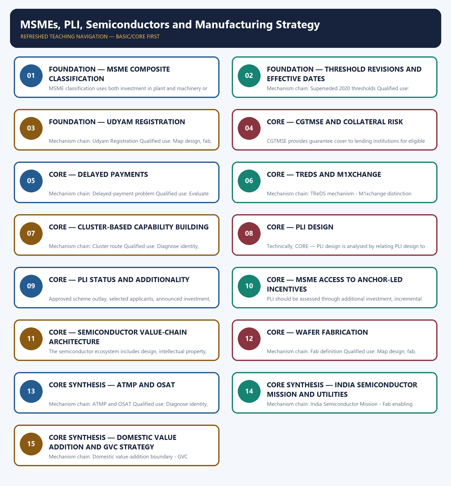

# MSMEs, PLI, Semiconductors and Manufacturing Strategy — Learner-v2 Complete Learning Session

> **Authoring-only generation:** 2026-09-03. No PDF was rendered and no tracker or index was mutated.

### SOURCE, PROGRESSION AND CURRENT-LINKAGE AUDIT

- **Generation date:** 2026-09-03.
- **Repository-first evidence:** the Basic owner is taught first and preserved in full; the Advanced owner is retained only in the optional final teaching block.
- **OCR evidence:** Repository Markdown was primary. OCR-searchable local official General Studies papers were used only to confirm printed routed demands. No answer key, marking scheme, unsupported page precision or current macroeconomic statistic was inferred from them.
- **Qdrant:** not used; repository Markdown and available OCR context were sufficient.
- **PYQ integrity:** Audited ledgers route the 2023 Mains demand on MSMEs, the 2025 Mains demand on PLI, objective demands on MSME classification and PLI, and a 2026 provisional-key demand on M1xchange. The package solves only the verified Mains demands and keeps every objective answer letter neutral.
- **Live-link boundary:** The ISM homepage was substantively retrievable for institutional purpose only. The PIB and MeitY pages were blocked in the live fetcher, so thresholds and PLI mechanics retain their dated repository-owner provenance and no current project or disbursement number is asserted.
- **Fact/inference discipline:** no current-affairs item, PYQ wording, figure or quotation is invented.

### LIVE OFFICIAL-SOURCE ATTEMPT LOG

The checks below were made on 2026-09-03. Substantive official text is used only for the proposition it actually supports; binary files, dynamic shells, stubs and undated dashboard snippets are recorded but not converted into current claims.

- https://ism.gov.in/ — retrieved 2026-09-03; the official India Semiconductor Mission page substantively described ISM's ecosystem aim and nodal implementation role, but supplied no project commissioning claim used here.
- https://pib.gov.in/PressReleseDetailm.aspx?PRID=2118292 — attempted 2026-09-03 and returned HTTP 403; no threshold was imported from that failed fetch, and the dated repository owner remains controlling.
- https://www.meity.gov.in/offerings/schemes-and-services/details/production-linked-incentive-scheme-pli-for-large-scale-electronics-manufacturing-gNyMDOtQWa — attempted 2026-09-03 and returned HTTP 403; no incentive rate, outlay, applicant or disbursement figure was imported.

## BASIC LEARNING SESSION



*Distinct embedded teaching-navigation image. The separate continuous Cārvāka-style flowchart package remains an independent at-a-glance artifact.*

### SESSION 1 — FOUNDATION — MSME COMPOSITE CLASSIFICATION

#### DEFINITION / WHAT THIS IS CALLED

**Plain-language definition:** Mechanism chain: MSME composite classification - Current MSME thresholds Qualified use: Diagnose identity, collateral, receivables, technology, scale and market constraints separately.

**Technical definition:** MSME classification uses both investment in plant and machinery or equipment and annual turnover under the prevailing notification; both dimensions and the effective date matter.

#### ANSWER-GRABBING OPENING — WRITE/ADAPT IN THE EXAM

> Mechanism chain: MSME composite classification - Current MSME thresholds Qualified use: Diagnose identity, collateral, receivables, technology, scale and market constraints separately.

#### MUST-WRITE KEYWORDS

- **FOUNDATION**
- **MSME composite classification**
- **Mechanism chain**
- **Qualified use**
- **MSME**
- **Current MSME**

**How to use them:** Frame the answer through FOUNDATION; define MSME composite classification, connect Mechanism chain with Qualified use to explain the mechanism, and use MSME for the decisive comparison or qualification.

#### VISUAL FIRST

```text
MSME COMPOSITE CLASSIFICATION
01. MSME composite classification
    |
    v
02. Current MSME thresholds
BOUNDARY -> Do not quote an MSME threshold without its notification and effective date.
```

*This topic-specific rail fixes the evidence sequence and its exam boundary before analysis.*

#### CORE EXPLANATION

MSME classification uses both investment in plant and machinery or equipment and annual turnover under the prevailing notification; both dimensions and the effective date matter. Notification S.O. 1364(E) dated 21 March 2025 applies from 1 April 2025: micro up to Rs 2.5 crore investment and Rs 10 crore turnover, small up to Rs 25 crore and Rs 100 crore, and medium up to Rs 125 crore and Rs 500 crore.

#### NAMED EVIDENCE AND MECHANISM

- MSME classification uses both investment in plant and machinery or equipment and annual turnover under the prevailing notification; both dimensions and the effective date matter.
- Notification S.O. 1364(E) dated 21 March 2025 applies from 1 April 2025: micro up to Rs 2.5 crore investment and Rs 10 crore turnover, small up to Rs 25 crore and Rs 100 crore, and medium up to Rs 125 crore and Rs 500 crore.

#### EXAMINER CAUTION

- Do not quote an MSME threshold without its notification and effective date.

#### EXAM LINK

- **Prelims:** Preserve the exact formula, territorial or resident boundary, price basis, base year, index basket, eligible counterparty, institution and legal status; never upgrade a projection into an actual or a regulatory direction into a universal rule.
- **Mains:** Diagnose identity, collateral, receivables, technology, scale and market constraints separately.

#### MINI RECAP

- **Mechanism chain:** MSME composite classification -> Current MSME thresholds
- **Qualified use:** Diagnose identity, collateral, receivables, technology, scale and market constraints separately.

#### CLOSING RECALL FLOW — FOUNDATION — MSME COMPOSITE CLASSIFICATION

```text
START / CONCEPT: FOUNDATION — MSME composite classification
        |
        v
EXACT TERMS: FOUNDATION · MSME composite classification · Mechanism chain · Qualified use · MSME · Current MSME
        |
        v
MECHANISM / ARGUMENT: MSME classification uses both investment in plant and machinery or equipment and annual turnover under the prevailing notification; both dimensions and the effective date matter.
        |
        v
CONSEQUENCE / CONTRAST: Do not quote an MSME threshold without its notification and effective date.
        |
        v
UPSC TRAP / ANSWER-USE: Do not miss this limiting distinction: mSME composite classification - Current MSME thresholds Qualified use.
        |
        v
ANSWER-GRABBING FORMULATION: Mechanism chain: MSME composite classification - Current MSME thresholds Qualified use: Diagnose identity, collateral, receivables, technology, scale and market constraints separately.
```
### SESSION 2 — FOUNDATION — THRESHOLD REVISIONS AND EFFECTIVE DATES

#### DEFINITION / WHAT THIS IS CALLED

**Plain-language definition:** The 1 July 2020 composite thresholds were lower and are a historical vintage; they must not be presented as the classification currently effective from 1 April 2025.

**Technical definition:** Mechanism chain: Superseded 2020 thresholds Qualified use: Evaluate production incentives from outlay to verified output, disbursement and spillovers.

#### ANSWER-GRABBING OPENING — WRITE/ADAPT IN THE EXAM

> The 1 July 2020 composite thresholds were lower and are a historical vintage; they must not be presented as the classification currently effective from 1 April 2025.

#### MUST-WRITE KEYWORDS

- **FOUNDATION**
- **Threshold revisions**
- **effective dates**
- **Mechanism chain**
- **Qualified use**
- **Superseded**

**How to use them:** Frame the answer through FOUNDATION; define Threshold revisions, connect effective dates with Mechanism chain to explain the mechanism, and use Qualified use for the decisive comparison or qualification.

#### VISUAL FIRST

```text
THRESHOLD REVISIONS AND EFFECTIVE DATES
01. Superseded 2020 thresholds
BOUNDARY -> Do not mix the superseded 2020 limits with the limits effective from 1 April 2025.
```

*This topic-specific rail fixes the evidence sequence and its exam boundary before analysis.*

#### CORE EXPLANATION

The 1 July 2020 composite thresholds were lower and are a historical vintage; they must not be presented as the classification currently effective from 1 April 2025.

#### NAMED EVIDENCE AND MECHANISM

- The 1 July 2020 composite thresholds were lower and are a historical vintage; they must not be presented as the classification currently effective from 1 April 2025.

#### EXAMINER CAUTION

- Do not mix the superseded 2020 limits with the limits effective from 1 April 2025.

#### EXAM LINK

- **Prelims:** Preserve the exact formula, territorial or resident boundary, price basis, base year, index basket, eligible counterparty, institution and legal status; never upgrade a projection into an actual or a regulatory direction into a universal rule.
- **Mains:** Evaluate production incentives from outlay to verified output, disbursement and spillovers.

#### MINI RECAP

- **Mechanism chain:** Superseded 2020 thresholds
- **Qualified use:** Evaluate production incentives from outlay to verified output, disbursement and spillovers.

#### CLOSING RECALL FLOW — FOUNDATION — THRESHOLD REVISIONS AND EFFECTIVE DATES

```text
START / CONCEPT: FOUNDATION — Threshold revisions and effective dates
        |
        v
EXACT TERMS: FOUNDATION · Threshold revisions · effective dates · Mechanism chain · Qualified use · Superseded
        |
        v
MECHANISM / ARGUMENT: Mechanism chain: Superseded 2020 thresholds Qualified use: Evaluate production incentives from outlay to verified output, disbursement and spillovers.
        |
        v
CONSEQUENCE / CONTRAST: Do not mix the superseded 2020 limits with the limits effective from 1 April 2025.
        |
        v
UPSC TRAP / ANSWER-USE: Do not miss this limiting distinction: the 1 July 2020 composite thresholds were lower and are a historical vintage.
        |
        v
ANSWER-GRABBING FORMULATION: The 1 July 2020 composite thresholds were lower and are a historical vintage; they must not be presented as the classification currently effective from 1 April 2025.
```
### SESSION 3 — FOUNDATION — UDYAM REGISTRATION

#### DEFINITION / WHAT THIS IS CALLED

**Plain-language definition:** Udyam Registration is a paperless, self-declared, Aadhaar and PAN-linked enterprise-registration gateway; registration establishes formal identity but does not guarantee credit, productivity or market access.

**Technical definition:** Mechanism chain: Udyam Registration Qualified use: Map design, fab, packaging, suppliers, utilities, skills and downstream demand before judging capability.

#### ANSWER-GRABBING OPENING — WRITE/ADAPT IN THE EXAM

> Udyam Registration is a paperless, self-declared, Aadhaar and PAN-linked enterprise-registration gateway; registration establishes formal identity but does not guarantee credit, productivity or market access.

#### MUST-WRITE KEYWORDS

- **FOUNDATION**
- **Udyam registration**
- **Mechanism chain**
- **Qualified use**
- **Aadhaar**
- **PAN-linked**

**How to use them:** Frame the answer through FOUNDATION; define Udyam registration, connect Mechanism chain with Qualified use to explain the mechanism, and use Aadhaar for the decisive comparison or qualification.

#### VISUAL FIRST

```text
UDYAM REGISTRATION
01. Udyam Registration
BOUNDARY -> Do not treat Udyam registration as a growth or credit guarantee.
```

*This topic-specific rail fixes the evidence sequence and its exam boundary before analysis.*

#### CORE EXPLANATION

Udyam Registration is a paperless, self-declared, Aadhaar and PAN-linked enterprise-registration gateway; registration establishes formal identity but does not guarantee credit, productivity or market access.

#### NAMED EVIDENCE AND MECHANISM

- Udyam Registration is a paperless, self-declared, Aadhaar and PAN-linked enterprise-registration gateway; registration establishes formal identity but does not guarantee credit, productivity or market access.

#### EXAMINER CAUTION

- Do not treat Udyam registration as a growth or credit guarantee.

#### EXAM LINK

- **Prelims:** Preserve the exact formula, territorial or resident boundary, price basis, base year, index basket, eligible counterparty, institution and legal status; never upgrade a projection into an actual or a regulatory direction into a universal rule.
- **Mains:** Map design, fab, packaging, suppliers, utilities, skills and downstream demand before judging capability.

#### MINI RECAP

- **Mechanism chain:** Udyam Registration
- **Qualified use:** Map design, fab, packaging, suppliers, utilities, skills and downstream demand before judging capability.

#### CLOSING RECALL FLOW — FOUNDATION — UDYAM REGISTRATION

```text
START / CONCEPT: FOUNDATION — Udyam registration
        |
        v
EXACT TERMS: FOUNDATION · Udyam registration · Mechanism chain · Qualified use · Aadhaar · PAN-linked
        |
        v
MECHANISM / ARGUMENT: Mechanism chain: Udyam Registration Qualified use: Map design, fab, packaging, suppliers, utilities, skills and downstream demand before judging capability.
        |
        v
CONSEQUENCE / CONTRAST: Do not treat Udyam registration as a growth or credit guarantee.
        |
        v
UPSC TRAP / ANSWER-USE: Do not miss this limiting distinction: udyam Registration is a paperless, self-declared, Aadhaar and PAN-linked enterprise-registration gateway.
        |
        v
ANSWER-GRABBING FORMULATION: Udyam Registration is a paperless, self-declared, Aadhaar and PAN-linked enterprise-registration gateway; registration establishes formal identity but does not guarantee credit, productivity or market access.
```
### SESSION 4 — CORE — CGTMSE AND COLLATERAL RISK

#### DEFINITION / WHAT THIS IS CALLED

**Plain-language definition:** Mechanism chain: CGTMSE boundary Qualified use: Diagnose identity, collateral, receivables, technology, scale and market constraints separately.

**Technical definition:** CGTMSE provides guarantee cover to lending institutions for eligible collateral-free credit to micro and small enterprises; it reduces lender risk without replacing appraisal or working-capital discipline.

#### ANSWER-GRABBING OPENING — WRITE/ADAPT IN THE EXAM

> Do not merge collateral risk, receivables delay and technology constraints.

#### MUST-WRITE KEYWORDS

- **CGTMSE**
- **collateral risk**
- **Mechanism chain**
- **Qualified use**
- **Qualified**
- **Diagnose**

**How to use them:** Frame the answer through CGTMSE; define collateral risk, connect Mechanism chain with Qualified use to explain the mechanism, and use Qualified for the decisive comparison or qualification.

#### VISUAL FIRST

```text
CGTMSE AND COLLATERAL RISK
01. CGTMSE boundary
BOUNDARY -> Do not merge collateral risk, receivables delay and technology constraints.
```

*This topic-specific rail fixes the evidence sequence and its exam boundary before analysis.*

#### CORE EXPLANATION

CGTMSE provides guarantee cover to lending institutions for eligible collateral-free credit to micro and small enterprises; it reduces lender risk without replacing appraisal or working-capital discipline.

#### NAMED EVIDENCE AND MECHANISM

- CGTMSE provides guarantee cover to lending institutions for eligible collateral-free credit to micro and small enterprises; it reduces lender risk without replacing appraisal or working-capital discipline.

#### EXAMINER CAUTION

- Do not merge collateral risk, receivables delay and technology constraints.

#### EXAM LINK

- **Prelims:** Preserve the exact formula, territorial or resident boundary, price basis, base year, index basket, eligible counterparty, institution and legal status; never upgrade a projection into an actual or a regulatory direction into a universal rule.
- **Mains:** Diagnose identity, collateral, receivables, technology, scale and market constraints separately.

#### MINI RECAP

- **Mechanism chain:** CGTMSE boundary
- **Qualified use:** Diagnose identity, collateral, receivables, technology, scale and market constraints separately.

#### CLOSING RECALL FLOW — CORE — CGTMSE AND COLLATERAL RISK

```text
START / CONCEPT: CORE — CGTMSE and collateral risk
        |
        v
EXACT TERMS: CGTMSE · collateral risk · Mechanism chain · Qualified use · Qualified · Diagnose
        |
        v
MECHANISM / ARGUMENT: Mechanism chain: CGTMSE boundary Qualified use: Diagnose identity, collateral, receivables, technology, scale and market constraints separately.
        |
        v
CONSEQUENCE / CONTRAST: CGTMSE provides guarantee cover to lending institutions for eligible collateral-free credit to micro and small enterprises; it reduces lender risk without replacing appraisal or working-capital discipline.
        |
        v
UPSC TRAP / ANSWER-USE: Do not miss this limiting distinction: do not merge collateral risk, receivables delay and technology constraints.
        |
        v
ANSWER-GRABBING FORMULATION: Do not merge collateral risk, receivables delay and technology constraints.
```
### SESSION 5 — CORE — DELAYED PAYMENTS

#### DEFINITION / WHAT THIS IS CALLED

**Plain-language definition:** Delayed payment is a receivables and cash-flow constraint distinct from lack of investment credit, collateral or technology capability.

**Technical definition:** Mechanism chain: Delayed-payment problem Qualified use: Evaluate production incentives from outlay to verified output, disbursement and spillovers.

#### ANSWER-GRABBING OPENING — WRITE/ADAPT IN THE EXAM

> Delayed payment is a receivables and cash-flow constraint distinct from lack of investment credit, collateral or technology capability.

#### MUST-WRITE KEYWORDS

- **Delayed payments**
- **Mechanism chain**
- **Qualified use**
- **Delayed payment**
- **Delayed**
- **TReDS**

**How to use them:** Frame the answer through Delayed payments; define Mechanism chain, connect Qualified use with Delayed payment to explain the mechanism, and use Delayed for the decisive comparison or qualification.

#### VISUAL FIRST

```text
DELAYED PAYMENTS
01. Delayed-payment problem
BOUNDARY -> Do not call TReDS or M1xchange a credit-rating or machinery-finance service.
```

*This topic-specific rail fixes the evidence sequence and its exam boundary before analysis.*

#### CORE EXPLANATION

Delayed payment is a receivables and cash-flow constraint distinct from lack of investment credit, collateral or technology capability.

#### NAMED EVIDENCE AND MECHANISM

- Delayed payment is a receivables and cash-flow constraint distinct from lack of investment credit, collateral or technology capability.

#### EXAMINER CAUTION

- Do not call TReDS or M1xchange a credit-rating or machinery-finance service.

#### EXAM LINK

- **Prelims:** Preserve the exact formula, territorial or resident boundary, price basis, base year, index basket, eligible counterparty, institution and legal status; never upgrade a projection into an actual or a regulatory direction into a universal rule.
- **Mains:** Evaluate production incentives from outlay to verified output, disbursement and spillovers.

#### MINI RECAP

- **Mechanism chain:** Delayed-payment problem
- **Qualified use:** Evaluate production incentives from outlay to verified output, disbursement and spillovers.

#### CLOSING RECALL FLOW — CORE — DELAYED PAYMENTS

```text
START / CONCEPT: CORE — Delayed payments
        |
        v
EXACT TERMS: Delayed payments · Mechanism chain · Qualified use · Delayed payment · Delayed · TReDS
        |
        v
MECHANISM / ARGUMENT: Mechanism chain: Delayed-payment problem Qualified use: Evaluate production incentives from outlay to verified output, disbursement and spillovers.
        |
        v
CONSEQUENCE / CONTRAST: Do not call TReDS or M1xchange a credit-rating or machinery-finance service.
        |
        v
UPSC TRAP / ANSWER-USE: Do not miss this limiting distinction: delayed payment is a receivables and cash-flow constraint distinct from lack of investment credit...
        |
        v
ANSWER-GRABBING FORMULATION: Delayed payment is a receivables and cash-flow constraint distinct from lack of investment credit, collateral or technology capability.
```
### SESSION 6 — CORE — TREDS AND M1XCHANGE

#### DEFINITION / WHAT THIS IS CALLED

**Plain-language definition:** M1xchange is a TReDS platform for invoice and bill discounting, not a credit-rating agency, subsidy portal or machinery-finance institution.

**Technical definition:** Mechanism chain: TReDS mechanism - M1xchange distinction Qualified use: Map design, fab, packaging, suppliers, utilities, skills and downstream demand before judging capability.

#### ANSWER-GRABBING OPENING — WRITE/ADAPT IN THE EXAM

> M1xchange is a TReDS platform for invoice and bill discounting, not a credit-rating agency, subsidy portal or machinery-finance institution.

#### MUST-WRITE KEYWORDS

- **TReDS**
- **M1xchange**
- **Mechanism chain**
- **Qualified use**
- **PLI**
- **Qualified**

**How to use them:** Frame the answer through TReDS; define M1xchange, connect Mechanism chain with Qualified use to explain the mechanism, and use PLI for the decisive comparison or qualification.

#### VISUAL FIRST

```text
TREDS AND M1XCHANGE
01. TReDS mechanism
    |
    v
02. M1xchange distinction
BOUNDARY -> Do not equate PLI outlay, selection, investment announcement, output and disbursement.
```

*This topic-specific rail fixes the evidence sequence and its exam boundary before analysis.*

#### CORE EXPLANATION

RBI-regulated TReDS platforms facilitate discounting of accepted MSME trade receivables by financiers; buyer acceptance and onboarding remain necessary for the mechanism to work. M1xchange is a TReDS platform for invoice and bill discounting, not a credit-rating agency, subsidy portal or machinery-finance institution.

#### NAMED EVIDENCE AND MECHANISM

- RBI-regulated TReDS platforms facilitate discounting of accepted MSME trade receivables by financiers; buyer acceptance and onboarding remain necessary for the mechanism to work.
- M1xchange is a TReDS platform for invoice and bill discounting, not a credit-rating agency, subsidy portal or machinery-finance institution.

#### EXAMINER CAUTION

- Do not equate PLI outlay, selection, investment announcement, output and disbursement.

#### EXAM LINK

- **Prelims:** Preserve the exact formula, territorial or resident boundary, price basis, base year, index basket, eligible counterparty, institution and legal status; never upgrade a projection into an actual or a regulatory direction into a universal rule.
- **Mains:** Map design, fab, packaging, suppliers, utilities, skills and downstream demand before judging capability.

#### MINI RECAP

- **Mechanism chain:** TReDS mechanism -> M1xchange distinction
- **Qualified use:** Map design, fab, packaging, suppliers, utilities, skills and downstream demand before judging capability.

#### CLOSING RECALL FLOW — CORE — TREDS AND M1XCHANGE

```text
START / CONCEPT: CORE — TReDS and M1xchange
        |
        v
EXACT TERMS: TReDS · M1xchange · Mechanism chain · Qualified use · PLI · Qualified
        |
        v
MECHANISM / ARGUMENT: Mechanism chain: TReDS mechanism - M1xchange distinction Qualified use: Map design, fab, packaging, suppliers, utilities, skills and downstream demand before judging capability.
        |
        v
CONSEQUENCE / CONTRAST: Do not equate PLI outlay, selection, investment announcement, output and disbursement.
        |
        v
UPSC TRAP / ANSWER-USE: Do not miss this limiting distinction: m1xchange is a TReDS platform for invoice and bill discounting, not a credit-rating agency...
        |
        v
ANSWER-GRABBING FORMULATION: M1xchange is a TReDS platform for invoice and bill discounting, not a credit-rating agency, subsidy portal or machinery-finance institution.
```
### SESSION 7 — CORE — CLUSTER-BASED CAPABILITY BUILDING

#### DEFINITION / WHAT THIS IS CALLED

**Plain-language definition:** Cluster policy can lower shared costs of testing, design, skilling, effluent treatment and logistics, but a cluster label does not prove that supplier capability has upgraded.

**Technical definition:** Mechanism chain: Cluster route Qualified use: Diagnose identity, collateral, receivables, technology, scale and market constraints separately.

#### ANSWER-GRABBING OPENING — WRITE/ADAPT IN THE EXAM

> Cluster policy can lower shared costs of testing, design, skilling, effluent treatment and logistics, but a cluster label does not prove that supplier capability has upgraded.

#### MUST-WRITE KEYWORDS

- **Cluster-based capability building**
- **Mechanism chain**
- **Qualified use**
- **Cluster**
- **Qualified**
- **Diagnose**

**How to use them:** Frame the answer through Cluster-based capability building; define Mechanism chain, connect Qualified use with Cluster to explain the mechanism, and use Qualified for the decisive comparison or qualification.

#### VISUAL FIRST

```text
CLUSTER-BASED CAPABILITY BUILDING
01. Cluster route
BOUNDARY -> Do not call final electronics assembly a semiconductor fab.
```

*This topic-specific rail fixes the evidence sequence and its exam boundary before analysis.*

#### CORE EXPLANATION

Cluster policy can lower shared costs of testing, design, skilling, effluent treatment and logistics, but a cluster label does not prove that supplier capability has upgraded.

#### NAMED EVIDENCE AND MECHANISM

- Cluster policy can lower shared costs of testing, design, skilling, effluent treatment and logistics, but a cluster label does not prove that supplier capability has upgraded.

#### EXAMINER CAUTION

- Do not call final electronics assembly a semiconductor fab.

#### EXAM LINK

- **Prelims:** Preserve the exact formula, territorial or resident boundary, price basis, base year, index basket, eligible counterparty, institution and legal status; never upgrade a projection into an actual or a regulatory direction into a universal rule.
- **Mains:** Diagnose identity, collateral, receivables, technology, scale and market constraints separately.

#### MINI RECAP

- **Mechanism chain:** Cluster route
- **Qualified use:** Diagnose identity, collateral, receivables, technology, scale and market constraints separately.

#### CLOSING RECALL FLOW — CORE — CLUSTER-BASED CAPABILITY BUILDING

```text
START / CONCEPT: CORE — Cluster-based capability building
        |
        v
EXACT TERMS: Cluster-based capability building · Mechanism chain · Qualified use · Cluster · Qualified · Diagnose
        |
        v
MECHANISM / ARGUMENT: Mechanism chain: Cluster route Qualified use: Diagnose identity, collateral, receivables, technology, scale and market constraints separately.
        |
        v
CONSEQUENCE / CONTRAST: Do not call final electronics assembly a semiconductor fab.
        |
        v
UPSC TRAP / ANSWER-USE: Do not miss this limiting distinction: cluster policy can lower shared costs of testing, design, skilling, effluent treatment and logistics.
        |
        v
ANSWER-GRABBING FORMULATION: Cluster policy can lower shared costs of testing, design, skilling, effluent treatment and logistics, but a cluster label does not prove that supplier capability has upgraded.
```
### SESSION 8 — CORE — PLI DESIGN

#### DEFINITION / WHAT THIS IS CALLED

**Plain-language definition:** Mechanism chain: PLI design Qualified use: Evaluate production incentives from outlay to verified output, disbursement and spillovers.

**Technical definition:** Technically, CORE — PLI design is analysed by relating PLI design to Mechanism chain, then testing the relationship through Qualified use and ATMP.

#### ANSWER-GRABBING OPENING — WRITE/ADAPT IN THE EXAM

> Do not merge fab, ATMP, OSAT, design and downstream production.

#### MUST-WRITE KEYWORDS

- **PLI design**
- **Mechanism chain**
- **Qualified use**
- **ATMP**
- **OSAT**
- **PLI**

**How to use them:** Frame the answer through PLI design; define Mechanism chain, connect Qualified use with ATMP to explain the mechanism, and use OSAT for the decisive comparison or qualification.

#### VISUAL FIRST

```text
PLI DESIGN
01. PLI design
BOUNDARY -> Do not merge fab, ATMP, OSAT, design and downstream production.
```

*This topic-specific rail fixes the evidence sequence and its exam boundary before analysis.*

#### CORE EXPLANATION

Production Linked Incentive schemes link support to notified eligible incremental production or sales over a specified base and performance period rather than to capacity announcements alone.

#### NAMED EVIDENCE AND MECHANISM

- Production Linked Incentive schemes link support to notified eligible incremental production or sales over a specified base and performance period rather than to capacity announcements alone.

#### EXAMINER CAUTION

- Do not merge fab, ATMP, OSAT, design and downstream production.

#### EXAM LINK

- **Prelims:** Preserve the exact formula, territorial or resident boundary, price basis, base year, index basket, eligible counterparty, institution and legal status; never upgrade a projection into an actual or a regulatory direction into a universal rule.
- **Mains:** Evaluate production incentives from outlay to verified output, disbursement and spillovers.

#### MINI RECAP

- **Mechanism chain:** PLI design
- **Qualified use:** Evaluate production incentives from outlay to verified output, disbursement and spillovers.

#### CLOSING RECALL FLOW — CORE — PLI DESIGN

```text
START / CONCEPT: CORE — PLI design
        |
        v
EXACT TERMS: PLI design · Mechanism chain · Qualified use · ATMP · OSAT · PLI
        |
        v
MECHANISM / ARGUMENT: Mechanism chain: PLI design Qualified use: Evaluate production incentives from outlay to verified output, disbursement and spillovers.
        |
        v
CONSEQUENCE / CONTRAST: The resulting consequence is that do not merge fab, ATMP, OSAT, design and downstream production.
        |
        v
UPSC TRAP / ANSWER-USE: Do not miss this limiting distinction: do not merge fab, ATMP, OSAT, design and downstream production.
        |
        v
ANSWER-GRABBING FORMULATION: Do not merge fab, ATMP, OSAT, design and downstream production.
```
### SESSION 9 — CORE — PLI STATUS AND ADDITIONALITY

#### DEFINITION / WHAT THIS IS CALLED

**Plain-language definition:** Mechanism chain: PLI status ladder Qualified use: Map design, fab, packaging, suppliers, utilities, skills and downstream demand before judging capability.

**Technical definition:** Approved scheme outlay, selected applicants, announced investment, installed capacity, verified incremental output and incentive disbursement are distinct stages and must not be merged.

#### ANSWER-GRABBING OPENING — WRITE/ADAPT IN THE EXAM

> Mechanism chain: PLI status ladder Qualified use: Map design, fab, packaging, suppliers, utilities, skills and downstream demand before judging capability.

#### MUST-WRITE KEYWORDS

- **PLI status**
- **additionality**
- **Mechanism chain**
- **Qualified use**
- **Approved**
- **PLI**

**How to use them:** Frame the answer through PLI status; define additionality, connect Mechanism chain with Qualified use to explain the mechanism, and use Approved for the decisive comparison or qualification.

#### VISUAL FIRST

```text
PLI STATUS AND ADDITIONALITY
01. PLI status ladder
BOUNDARY -> Do not state a project as commissioned from an approval or announcement.
```

*This topic-specific rail fixes the evidence sequence and its exam boundary before analysis.*

#### CORE EXPLANATION

Approved scheme outlay, selected applicants, announced investment, installed capacity, verified incremental output and incentive disbursement are distinct stages and must not be merged.

#### NAMED EVIDENCE AND MECHANISM

- Approved scheme outlay, selected applicants, announced investment, installed capacity, verified incremental output and incentive disbursement are distinct stages and must not be merged.

#### EXAMINER CAUTION

- Do not state a project as commissioned from an approval or announcement.

#### EXAM LINK

- **Prelims:** Preserve the exact formula, territorial or resident boundary, price basis, base year, index basket, eligible counterparty, institution and legal status; never upgrade a projection into an actual or a regulatory direction into a universal rule.
- **Mains:** Map design, fab, packaging, suppliers, utilities, skills and downstream demand before judging capability.

#### MINI RECAP

- **Mechanism chain:** PLI status ladder
- **Qualified use:** Map design, fab, packaging, suppliers, utilities, skills and downstream demand before judging capability.

#### CLOSING RECALL FLOW — CORE — PLI STATUS AND ADDITIONALITY

```text
START / CONCEPT: CORE — PLI status and additionality
        |
        v
EXACT TERMS: PLI status · additionality · Mechanism chain · Qualified use · Approved · PLI
        |
        v
MECHANISM / ARGUMENT: Approved scheme outlay, selected applicants, announced investment, installed capacity, verified incremental output and incentive disbursement are distinct stages and must not be merged.
        |
        v
CONSEQUENCE / CONTRAST: Do not state a project as commissioned from an approval or announcement.
        |
        v
UPSC TRAP / ANSWER-USE: Do not miss this limiting distinction: approved scheme outlay, selected applicants, announced investment, installed capacity, verified incremental output and incentive...
        |
        v
ANSWER-GRABBING FORMULATION: Mechanism chain: PLI status ladder Qualified use: Map design, fab, packaging, suppliers, utilities, skills and downstream demand before judging capability.
```
### SESSION 10 — CORE — MSME ACCESS TO ANCHOR-LED INCENTIVES

#### DEFINITION / WHAT THIS IS CALLED

**Plain-language definition:** Mechanism chain: PLI additionality test Qualified use: Diagnose identity, collateral, receivables, technology, scale and market constraints separately.

**Technical definition:** PLI should be assessed through additional investment, incremental output, domestic value addition, productivity, jobs, exports, supplier spillovers and fiscal cost, not headline production alone.

#### ANSWER-GRABBING OPENING — WRITE/ADAPT IN THE EXAM

> PLI should be assessed through additional investment, incremental output, domestic value addition, productivity, jobs, exports, supplier spillovers and fiscal cost, not headline production alone.

#### MUST-WRITE KEYWORDS

- **MSME access to anchor-led incentives**
- **Mechanism chain**
- **Qualified use**
- **PLI**
- **PYQs**
- **Qualified**

**How to use them:** Frame the answer through MSME access to anchor-led incentives; define Mechanism chain, connect Qualified use with PLI to explain the mechanism, and use PYQs for the decisive comparison or qualification.

#### VISUAL FIRST

```text
MSME ACCESS TO ANCHOR-LED INCENTIVES
01. PLI additionality test
BOUNDARY -> Do not infer objective answer letters from routed or provisional-key PYQs.
```

*This topic-specific rail fixes the evidence sequence and its exam boundary before analysis.*

#### CORE EXPLANATION

PLI should be assessed through additional investment, incremental output, domestic value addition, productivity, jobs, exports, supplier spillovers and fiscal cost, not headline production alone.

#### NAMED EVIDENCE AND MECHANISM

- PLI should be assessed through additional investment, incremental output, domestic value addition, productivity, jobs, exports, supplier spillovers and fiscal cost, not headline production alone.

#### EXAMINER CAUTION

- Do not infer objective answer letters from routed or provisional-key PYQs.

#### EXAM LINK

- **Prelims:** Preserve the exact formula, territorial or resident boundary, price basis, base year, index basket, eligible counterparty, institution and legal status; never upgrade a projection into an actual or a regulatory direction into a universal rule.
- **Mains:** Diagnose identity, collateral, receivables, technology, scale and market constraints separately.

#### MINI RECAP

- **Mechanism chain:** PLI additionality test
- **Qualified use:** Diagnose identity, collateral, receivables, technology, scale and market constraints separately.

#### CLOSING RECALL FLOW — CORE — MSME ACCESS TO ANCHOR-LED INCENTIVES

```text
START / CONCEPT: CORE — MSME access to anchor-led incentives
        |
        v
EXACT TERMS: MSME access to anchor-led incentives · Mechanism chain · Qualified use · PLI · PYQs · Qualified
        |
        v
MECHANISM / ARGUMENT: Mechanism chain: PLI additionality test Qualified use: Diagnose identity, collateral, receivables, technology, scale and market constraints separately.
        |
        v
CONSEQUENCE / CONTRAST: Do not infer objective answer letters from routed or provisional-key PYQs.
        |
        v
UPSC TRAP / ANSWER-USE: Do not miss this limiting distinction: pLI should be assessed through additional investment, incremental output, domestic value addition, productivity, jobs...
        |
        v
ANSWER-GRABBING FORMULATION: PLI should be assessed through additional investment, incremental output, domestic value addition, productivity, jobs, exports, supplier spillovers and fiscal cost, not headline production alone.
```
### SESSION 11 — CORE — SEMICONDUCTOR VALUE-CHAIN ARCHITECTURE

#### DEFINITION / WHAT THIS IS CALLED

**Plain-language definition:** Mechanism chain: MSME participation limit - Semiconductor value chain Qualified use: Evaluate production incentives from outlay to verified output, disbursement and spillovers.

**Technical definition:** The semiconductor ecosystem includes design, intellectual property, materials, equipment, wafer fabrication, assembly, testing, marking, packaging and downstream electronics.

#### ANSWER-GRABBING OPENING — WRITE/ADAPT IN THE EXAM

> Mechanism chain: MSME participation limit - Semiconductor value chain Qualified use: Evaluate production incentives from outlay to verified output, disbursement and spillovers.

#### MUST-WRITE KEYWORDS

- **Semiconductor value-chain architecture**
- **Mechanism chain**
- **Qualified use**
- **Minimum**
- **MSMEs**
- **MSME**

**How to use them:** Frame the answer through Semiconductor value-chain architecture; define Mechanism chain, connect Qualified use with Minimum to explain the mechanism, and use MSMEs for the decisive comparison or qualification.

#### VISUAL FIRST

```text
SEMICONDUCTOR VALUE-CHAIN ARCHITECTURE
01. MSME participation limit
    |
    v
02. Semiconductor value chain
BOUNDARY -> Do not quote an MSME threshold without its notification and effective date.
```

*This topic-specific rail fixes the evidence sequence and its exam boundary before analysis.*

#### CORE EXPLANATION

Minimum investment, turnover, scale and compliance conditions can concentrate production incentives among larger firms unless supplier-development channels connect MSMEs to anchor manufacturers. The semiconductor ecosystem includes design, intellectual property, materials, equipment, wafer fabrication, assembly, testing, marking, packaging and downstream electronics.

#### NAMED EVIDENCE AND MECHANISM

- Minimum investment, turnover, scale and compliance conditions can concentrate production incentives among larger firms unless supplier-development channels connect MSMEs to anchor manufacturers.
- The semiconductor ecosystem includes design, intellectual property, materials, equipment, wafer fabrication, assembly, testing, marking, packaging and downstream electronics.

#### EXAMINER CAUTION

- Do not quote an MSME threshold without its notification and effective date.

#### EXAM LINK

- **Prelims:** Preserve the exact formula, territorial or resident boundary, price basis, base year, index basket, eligible counterparty, institution and legal status; never upgrade a projection into an actual or a regulatory direction into a universal rule.
- **Mains:** Evaluate production incentives from outlay to verified output, disbursement and spillovers.

#### MINI RECAP

- **Mechanism chain:** MSME participation limit -> Semiconductor value chain
- **Qualified use:** Evaluate production incentives from outlay to verified output, disbursement and spillovers.

#### CLOSING RECALL FLOW — CORE — SEMICONDUCTOR VALUE-CHAIN ARCHITECTURE

```text
START / CONCEPT: CORE — Semiconductor value-chain architecture
        |
        v
EXACT TERMS: Semiconductor value-chain architecture · Mechanism chain · Qualified use · Minimum · MSMEs · MSME
        |
        v
MECHANISM / ARGUMENT: Minimum investment, turnover, scale and compliance conditions can concentrate production incentives among larger firms unless supplier-development channels connect MSMEs to anchor manufacturers.
        |
        v
CONSEQUENCE / CONTRAST: Do not quote an MSME threshold without its notification and effective date.
        |
        v
UPSC TRAP / ANSWER-USE: Do not miss this limiting distinction: the semiconductor ecosystem includes design, intellectual property, materials, equipment, wafer fabrication, assembly, testing, marking...
        |
        v
ANSWER-GRABBING FORMULATION: Mechanism chain: MSME participation limit - Semiconductor value chain Qualified use: Evaluate production incentives from outlay to verified output, disbursement and spillovers.
```
### SESSION 12 — CORE — WAFER FABRICATION

#### DEFINITION / WHAT THIS IS CALLED

**Plain-language definition:** A semiconductor fab manufactures wafers through capital-, utility- and technology-intensive processes; it is distinct from chip design and downstream electronics assembly.

**Technical definition:** Mechanism chain: Fab definition Qualified use: Map design, fab, packaging, suppliers, utilities, skills and downstream demand before judging capability.

#### ANSWER-GRABBING OPENING — WRITE/ADAPT IN THE EXAM

> A semiconductor fab manufactures wafers through capital-, utility- and technology-intensive processes; it is distinct from chip design and downstream electronics assembly.

#### MUST-WRITE KEYWORDS

- **Wafer fabrication**
- **Mechanism chain**
- **Qualified use**
- **Fab**
- **Qualified**
- **Map**

**How to use them:** Frame the answer through Wafer fabrication; define Mechanism chain, connect Qualified use with Fab to explain the mechanism, and use Qualified for the decisive comparison or qualification.

#### VISUAL FIRST

```text
WAFER FABRICATION
01. Fab definition
BOUNDARY -> Do not mix the superseded 2020 limits with the limits effective from 1 April 2025.
```

*This topic-specific rail fixes the evidence sequence and its exam boundary before analysis.*

#### CORE EXPLANATION

A semiconductor fab manufactures wafers through capital-, utility- and technology-intensive processes; it is distinct from chip design and downstream electronics assembly.

#### NAMED EVIDENCE AND MECHANISM

- A semiconductor fab manufactures wafers through capital-, utility- and technology-intensive processes; it is distinct from chip design and downstream electronics assembly.

#### EXAMINER CAUTION

- Do not mix the superseded 2020 limits with the limits effective from 1 April 2025.

#### EXAM LINK

- **Prelims:** Preserve the exact formula, territorial or resident boundary, price basis, base year, index basket, eligible counterparty, institution and legal status; never upgrade a projection into an actual or a regulatory direction into a universal rule.
- **Mains:** Map design, fab, packaging, suppliers, utilities, skills and downstream demand before judging capability.

#### MINI RECAP

- **Mechanism chain:** Fab definition
- **Qualified use:** Map design, fab, packaging, suppliers, utilities, skills and downstream demand before judging capability.

#### CLOSING RECALL FLOW — CORE — WAFER FABRICATION

```text
START / CONCEPT: CORE — Wafer fabrication
        |
        v
EXACT TERMS: Wafer fabrication · Mechanism chain · Qualified use · Fab · Qualified · Map
        |
        v
MECHANISM / ARGUMENT: Mechanism chain: Fab definition Qualified use: Map design, fab, packaging, suppliers, utilities, skills and downstream demand before judging capability.
        |
        v
CONSEQUENCE / CONTRAST: Do not mix the superseded 2020 limits with the limits effective from 1 April 2025.
        |
        v
UPSC TRAP / ANSWER-USE: Do not miss this limiting distinction: do not mix the superseded 2020 limits with the limits effective from 1 April...
        |
        v
ANSWER-GRABBING FORMULATION: A semiconductor fab manufactures wafers through capital-, utility- and technology-intensive processes; it is distinct from chip design and downstream electronics assembly.
```
### SESSION 13 — CORE SYNTHESIS — ATMP AND OSAT

#### DEFINITION / WHAT THIS IS CALLED

**Plain-language definition:** ATMP or OSAT facilities perform assembly, testing, marking and packaging; they are important manufacturing stages but are not wafer-fabrication plants.

**Technical definition:** Mechanism chain: ATMP and OSAT Qualified use: Diagnose identity, collateral, receivables, technology, scale and market constraints separately.

#### ANSWER-GRABBING OPENING — WRITE/ADAPT IN THE EXAM

> ATMP or OSAT facilities perform assembly, testing, marking and packaging; they are important manufacturing stages but are not wafer-fabrication plants.

#### MUST-WRITE KEYWORDS

- **CORE SYNTHESIS**
- **ATMP**
- **OSAT**
- **Mechanism chain**
- **Qualified use**
- **Udyam**

**How to use them:** Frame the answer through CORE SYNTHESIS; define ATMP, connect OSAT with Mechanism chain to explain the mechanism, and use Qualified use for the decisive comparison or qualification.

#### VISUAL FIRST

```text
ATMP AND OSAT
01. ATMP and OSAT
BOUNDARY -> Do not treat Udyam registration as a growth or credit guarantee.
```

*This topic-specific rail fixes the evidence sequence and its exam boundary before analysis.*

#### CORE EXPLANATION

ATMP or OSAT facilities perform assembly, testing, marking and packaging; they are important manufacturing stages but are not wafer-fabrication plants.

#### NAMED EVIDENCE AND MECHANISM

- ATMP or OSAT facilities perform assembly, testing, marking and packaging; they are important manufacturing stages but are not wafer-fabrication plants.

#### EXAMINER CAUTION

- Do not treat Udyam registration as a growth or credit guarantee.

#### EXAM LINK

- **Prelims:** Preserve the exact formula, territorial or resident boundary, price basis, base year, index basket, eligible counterparty, institution and legal status; never upgrade a projection into an actual or a regulatory direction into a universal rule.
- **Mains:** Diagnose identity, collateral, receivables, technology, scale and market constraints separately.

#### MINI RECAP

- **Mechanism chain:** ATMP and OSAT
- **Qualified use:** Diagnose identity, collateral, receivables, technology, scale and market constraints separately.

#### CLOSING RECALL FLOW — CORE SYNTHESIS — ATMP AND OSAT

```text
START / CONCEPT: CORE SYNTHESIS — ATMP and OSAT
        |
        v
EXACT TERMS: CORE SYNTHESIS · ATMP · OSAT · Mechanism chain · Qualified use · Udyam
        |
        v
MECHANISM / ARGUMENT: Mechanism chain: ATMP and OSAT Qualified use: Diagnose identity, collateral, receivables, technology, scale and market constraints separately.
        |
        v
CONSEQUENCE / CONTRAST: Do not treat Udyam registration as a growth or credit guarantee.
        |
        v
UPSC TRAP / ANSWER-USE: Do not miss this limiting distinction: aTMP or OSAT facilities perform assembly, testing, marking and packaging.
        |
        v
ANSWER-GRABBING FORMULATION: ATMP or OSAT facilities perform assembly, testing, marking and packaging; they are important manufacturing stages but are not wafer-fabrication plants.
```
### SESSION 14 — CORE SYNTHESIS — INDIA SEMICONDUCTOR MISSION AND UTILITIES

#### DEFINITION / WHAT THIS IS CALLED

**Plain-language definition:** The India Semiconductor Mission is the nodal agency for implementation of semiconductor and display schemes and aims to build an electronics-manufacturing and design ecosystem.

**Technical definition:** Mechanism chain: India Semiconductor Mission - Fab enabling conditions Qualified use: Evaluate production incentives from outlay to verified output, disbursement and spillovers.

#### ANSWER-GRABBING OPENING — WRITE/ADAPT IN THE EXAM

> The India Semiconductor Mission is the nodal agency for implementation of semiconductor and display schemes and aims to build an electronics-manufacturing and design ecosystem.

#### MUST-WRITE KEYWORDS

- **CORE SYNTHESIS**
- **India Semiconductor Mission**
- **utilities**
- **Mechanism chain**
- **Qualified use**
- **The India Semiconductor Mission**

**How to use them:** Frame the answer through CORE SYNTHESIS; define India Semiconductor Mission, connect utilities with Mechanism chain to explain the mechanism, and use Qualified use for the decisive comparison or qualification.

#### VISUAL FIRST

```text
INDIA SEMICONDUCTOR MISSION AND UTILITIES
01. India Semiconductor Mission
    |
    v
02. Fab enabling conditions
BOUNDARY -> Do not merge collateral risk, receivables delay and technology constraints.
```

*This topic-specific rail fixes the evidence sequence and its exam boundary before analysis.*

#### CORE EXPLANATION

The India Semiconductor Mission is the nodal agency for implementation of semiconductor and display schemes and aims to build an electronics-manufacturing and design ecosystem. A fab requires reliable high-quality power, ultra-pure water, process talent, clean logistics, technology partners and a supplier ecosystem in addition to fiscal support.

#### NAMED EVIDENCE AND MECHANISM

- The India Semiconductor Mission is the nodal agency for implementation of semiconductor and display schemes and aims to build an electronics-manufacturing and design ecosystem.
- A fab requires reliable high-quality power, ultra-pure water, process talent, clean logistics, technology partners and a supplier ecosystem in addition to fiscal support.

#### EXAMINER CAUTION

- Do not merge collateral risk, receivables delay and technology constraints.

#### EXAM LINK

- **Prelims:** Preserve the exact formula, territorial or resident boundary, price basis, base year, index basket, eligible counterparty, institution and legal status; never upgrade a projection into an actual or a regulatory direction into a universal rule.
- **Mains:** Evaluate production incentives from outlay to verified output, disbursement and spillovers.

#### MINI RECAP

- **Mechanism chain:** India Semiconductor Mission -> Fab enabling conditions
- **Qualified use:** Evaluate production incentives from outlay to verified output, disbursement and spillovers.

#### CLOSING RECALL FLOW — CORE SYNTHESIS — INDIA SEMICONDUCTOR MISSION AND UTILITIES

```text
START / CONCEPT: CORE SYNTHESIS — India Semiconductor Mission and utilities
        |
        v
EXACT TERMS: CORE SYNTHESIS · India Semiconductor Mission · utilities · Mechanism chain · Qualified use · The India Semiconductor Mission
        |
        v
MECHANISM / ARGUMENT: Mechanism chain: India Semiconductor Mission - Fab enabling conditions Qualified use: Evaluate production incentives from outlay to verified output, disbursement and spillovers.
        |
        v
CONSEQUENCE / CONTRAST: Do not merge collateral risk, receivables delay and technology constraints.
        |
        v
UPSC TRAP / ANSWER-USE: Do not miss this limiting distinction: a fab requires reliable high-quality power, ultra-pure water, process talent, clean logistics, technology partners...
        |
        v
ANSWER-GRABBING FORMULATION: The India Semiconductor Mission is the nodal agency for implementation of semiconductor and display schemes and aims to build an electronics-manufacturing and design ecosystem.
```
### SESSION 15 — CORE SYNTHESIS — DOMESTIC VALUE ADDITION AND GVC STRATEGY

#### DEFINITION / WHAT THIS IS CALLED

**Plain-language definition:** ⚠️ PLI's additionality design excludes smaller manufacturers unable to meet minimum investment/turnover eligibility, concentrating benefits among large, often existing, players. ⚠️ MSME classification-threshold revisions can push firms across category boundaries, changing their eligibility for benefits without any real change in underlying capability. ⚠️ CGTMSE-style guarantees shift default risk to the guarantee corpus; large-scale claims could strain the fund and indirectly raise future guarantee costs or tighten eligibility. ⚠️ TReDS uptake remains constrained by buyer (especially large-corporate and PSU) reluctance to accept invoices promptly, so the instrument's reach depends on demand-side behaviour it cannot itself compel. ⚠️ Semiconductor ecosystem-building is capital- and time-intensive; incentive announcements can outpace actual fab commissioning, workforce readiness and stable utility supply. ⚠️ Import dependence for high-value components or equipment can persist even as final assembly/production volumes rise, so headline manufacturing growth can overstate genuine domestic value addition and technological depth.

**Technical definition:** Mechanism chain: Domestic value-addition boundary - GVC manufacturing strategy Qualified use: Map design, fab, packaging, suppliers, utilities, skills and downstream demand before judging capability.

#### ANSWER-GRABBING OPENING — WRITE/ADAPT IN THE EXAM

> ⚠️ PLI's additionality design excludes smaller manufacturers unable to meet minimum investment/turnover eligibility, concentrating benefits among large, often existing, players. ⚠️ MSME classification-threshold revisions can push firms across category boundaries, changing their eligibility for benefits without any real change in underlying capability. ⚠️ CGTMSE-style guarantees shift default risk to the guarantee corpus; large-scale claims could strain the fund and indirectly raise future guarantee costs or tighten eligibility. ⚠️ TReDS uptake remains constrained by buyer (especially large-corporate and PSU) reluctance to accept invoices promptly, so the instrument's reach depends on demand-side behaviour it cannot itself compel. ⚠️ Semiconductor ecosystem-building is capital- and time-intensive; incentive announcements can outpace actual fab commissioning, workforce readiness and stable utility supply. ⚠️ Import dependence for high-value components or equipment can persist even as final assembly/production volumes rise, so headline manufacturing growth can overstate genuine domestic value addition and technological depth.

#### MUST-WRITE KEYWORDS

- **CORE SYNTHESIS**
- **Domestic value addition**
- **GVC strategy**
- **Mechanism chain**
- **Qualified use**
- **Subject**

**How to use them:** Frame the answer through CORE SYNTHESIS; define Domestic value addition, connect GVC strategy with Mechanism chain to explain the mechanism, and use Qualified use for the decisive comparison or qualification.

#### VISUAL FIRST

```text
DOMESTIC VALUE ADDITION AND GVC STRATEGY
01. Domestic value-addition boundary
    |
    v
02. GVC manufacturing strategy
BOUNDARY -> Do not call TReDS or M1xchange a credit-rating or machinery-finance service.
```

*This topic-specific rail fixes the evidence sequence and its exam boundary before analysis.*

#### CORE EXPLANATION

Rapid final assembly or gross production can coexist with high imported content, so domestic technological depth must be measured across stages rather than inferred from the final product label. A durable manufacturing strategy links scale, standards, technology, skills, finance, logistics, R&D and MSME suppliers to domestic demand and exports; low wages alone do not create competitiveness.

#### NAMED EVIDENCE AND MECHANISM

- Rapid final assembly or gross production can coexist with high imported content, so domestic technological depth must be measured across stages rather than inferred from the final product label.
- A durable manufacturing strategy links scale, standards, technology, skills, finance, logistics, R&D and MSME suppliers to domestic demand and exports; low wages alone do not create competitiveness.

#### EXAMINER CAUTION

- Do not call TReDS or M1xchange a credit-rating or machinery-finance service.

#### EXAM LINK

- **Prelims:** Preserve the exact formula, territorial or resident boundary, price basis, base year, index basket, eligible counterparty, institution and legal status; never upgrade a projection into an actual or a regulatory direction into a universal rule.
- **Mains:** Map design, fab, packaging, suppliers, utilities, skills and downstream demand before judging capability.

#### MINI RECAP

- **Mechanism chain:** Domestic value-addition boundary -> GVC manufacturing strategy
- **Qualified use:** Map design, fab, packaging, suppliers, utilities, skills and downstream demand before judging capability.
#### COMPLETE BASIC OWNER EVIDENCE BANK

> **Subject:** Economy | **Tier:** Must-Do (foundation) | **GS Paper:** GS-III + Prelims.
> **Core area:** Manufacturing strategy.
> **Grounded in:** Ramesh Singh, relevant chapters; Economic Survey 2025-26; audited UPSC Economy PYQs (2024-2026 Prelims and 2024-2025 Mains).
> ✅ = source-grounded | ⚠️ = analytical linkage | 📰 = current Survey/current-affairs hook.
> *Companion: `../advanced/17_MSMEs-PLI-Semiconductors-and-Manufacturing-Strategy.md`.*

#### 1. Visual foundation

```text
1. DESIGN, TECHNOLOGY AND INPUTS
   |
   v
2. FINANCE, PLANT AND SKILLED LABOUR
   |
   v
3. SCALE AND QUALITY PRODUCTION
   |
   v
4. SUPPLIER ECOSYSTEM AND LOGISTICS
   |
   v
5. DOMESTIC USE, EXPORTS AND SPILLOVERS
```

**Core proposition:** Measure manufacturing policy by additional investment, domestic value,
productivity, supplier spillovers, jobs and exports—not by sanctioned incentives alone.

#### 2. Essential definitions

| Concept | Exam-ready meaning |
|---|---|
| ✅ **MSME** | Enterprise classified under the prevailing investment-and-turnover framework. |
| ✅ **PLI** | Incentive linked to eligible incremental production or sales under scheme conditions. |
| ✅ **Semiconductor fab** | Facility manufacturing semiconductor wafers through capital- and technology-intensive processes. |
| ✅ **ATMP or OSAT** | Assembly, testing, marking and packaging segment of the semiconductor chain. |
| ✅ **GVC** | Cross-border organisation of production stages and value addition. |

#### 3. Topic mechanism

1. MSMEs enter supply chains through finance, technology, standards, market access and
   timely payment.
2. PLI links public support to eligible incremental output rather than merely to announced
   capacity.
3. Anchor manufacturers generate spillovers only when domestic suppliers meet quality, cost
   and delivery requirements.
4. Semiconductor value chains divide into design, materials, equipment, fabrication,
   assembly, testing and downstream products.
5. R&D, skills, utilities and logistics determine whether subsidised investment becomes
   durable manufacturing capability.

#### 4. Institutions and policy tools

- ✅ **Ministry of MSME and SIDBI:** support enterprise development, credit and cluster
  capacity.
- ✅ **RBI-regulated TReDS platforms** (e.g., RXIL, Invoicemart and M1xchange): facilitate
  discounting of accepted MSME receivables.
- ✅ **Line ministries administering PLI schemes:** verify sector-specific investment and
  production conditions.
- ✅ **India Semiconductor Mission and MeitY:** coordinate semiconductor ecosystem support.

#### 5. Indian applications and examples

- ✅ **Claim:** MSME classification thresholds have been revised twice in five years, and
  the currently applicable limits — not the 2020 figures — must be cited.
  **Evidence:** The MSMED-framework composite criteria (investment in plant-and-machinery/
  equipment plus annual turnover) were first revised with effect from 1 July 2020 (micro:
  up to Rs 1 crore investment/Rs 5 crore turnover; small: up to Rs 10 crore/Rs 50 crore;
  medium: up to Rs 50 crore/Rs 250 crore), then revised again by the Ministry of MSME's
  notification S.O. 1364(E) dated 21 March 2025, effective 1 April 2025: micro (investment
  up to Rs 2.5 crore, turnover up to Rs 10 crore), small (investment up to Rs 25 crore,
  turnover up to Rs 100 crore) and medium (investment up to Rs 125 crore, turnover up to
  Rs 500 crore). **Significance:** Precise, dated thresholds prevent a common Prelims trap
  of quoting the superseded 2020 limits as if still current and show classification policy
  itself as a live, revisable instrument. **Limitation/status caution:** Thresholds can be
  revised again; always verify the applicable figures and effective date from a current
  official notification before citing them, and never present the 2020 limits as the
  present-day classification.
- ✅ **Claim:** Udyam Registration formalises MSME identity and is the gateway to scheme
  benefits. **Evidence:** Udyam Registration (replacing the earlier Udyog Aadhaar system) is
  a self-declared, paperless, Aadhaar/PAN-linked online registration for MSMEs.
  **Significance:** Formal registration is the precondition for accessing credit guarantee,
  PLI-adjacent and procurement benefits, linking formalisation to scheme access.
  **Limitation:** Registration alone does not resolve underlying constraints of scale,
  technology or market access; it is an eligibility gateway, not a growth guarantee.
- ✅ **Claim:** Collateral-free credit guarantees are meant to substitute for the collateral
  small firms typically lack. **Evidence:** The Credit Guarantee Fund Trust for Micro and
  Small Enterprises (CGTMSE) provides guarantee cover to lending institutions for eligible
  collateral-free MSME credit. **Significance:** It targets the credit-access constraint
  identified in the topic mechanism as a first-order barrier to MSME scaling.
  **Limitation:** Guarantee cover reduces lender risk but does not eliminate appraisal,
  documentation or working-capital-cycle constraints facing very small or informal units.
- ✅ **Claim:** Delayed payments are a distinct constraint from credit access and need a
  receivables-specific instrument. **Evidence:** The Trade Receivables Discounting System
  (TReDS)—RBI-regulated platforms enabling MSMEs to discount accepted trade receivables to
  financiers/factors—addresses delayed payment by large buyers. **Significance:** It
  demonstrates why "MSME finance" cannot be treated as a single undifferentiated problem;
  invoice discounting solves a different constraint than term lending. **Limitation:** TReDS
  depends on buyer acceptance of the invoice; non-acceptance or onboarding gaps limit its
  reach, especially for the smallest suppliers.
- ✅ **Claim:** PLI schemes are designed around measurable additionality, not blanket
  subsidy, but this design choice creates its own limitation. **Evidence:** PLI schemes
  disburse incentives against verified incremental production/sales over a base year across
  notified sectors, rather than paying for announced capacity. **Significance:** This
  additionality design is the core evidentiary anchor for any "evaluate PLI" Mains answer.
  **Limitation:** Additionality is measurable only against the chosen base year and
  eligibility conditions; headline sanctioned outlay or announced investment is not the same
  as disbursed, verified incremental performance.
- ✅ **Claim:** Semiconductor policy is being built as an ecosystem, not a single fab
  announcement. **Evidence:** The India Semiconductor Mission (ISM, under MeitY) anchors the
  "Semicon India" programme, with named anchor investments announced for fabrication and
  ATMP/OSAT (assembly, testing, marking and packaging) facilities including projects
  associated with Tata Electronics (with PSMC) and Micron's ATMP facility in Gujarat.
  **Significance:** This shows the ecosystem approach (design, fab, packaging, testing)
  central to the topic's mechanism. **Limitation/status caution:** Commissioning and
  production-ramp timelines for named projects change; cite operational status only from a
  dated official or company source, not as an assumed completed fact.
- ⚠️ **Claim:** A fab or cluster's viability depends on utilities, logistics and skilled
  talent as much as on the incentive package. **Evidence:** Semiconductor fabrication and
  assembly clusters require uninterrupted power, ultra-pure water, vibration-free logistics
  and a trained technical workforce alongside the plant itself. **Significance:** This
  reframes "manufacturing competitiveness" as total ecosystem cost, matching the topic's
  core proposition. **Limitation:** These enabling conditions (power reliability, water,
  skilled-labour pipelines) are slower and harder to build than a single incentive
  disbursement, so ecosystem maturity should not be assumed on the incentive timeline alone.

#### Core limitations and trade-offs

- ⚠️ PLI's additionality design excludes smaller manufacturers unable to meet minimum
  investment/turnover eligibility, concentrating benefits among large, often existing,
  players.
- ⚠️ MSME classification-threshold revisions can push firms across category boundaries,
  changing their eligibility for benefits without any real change in underlying capability.
- ⚠️ CGTMSE-style guarantees shift default risk to the guarantee corpus; large-scale claims
  could strain the fund and indirectly raise future guarantee costs or tighten eligibility.
- ⚠️ TReDS uptake remains constrained by buyer (especially large-corporate and PSU) reluctance
  to accept invoices promptly, so the instrument's reach depends on demand-side behaviour it
  cannot itself compel.
- ⚠️ Semiconductor ecosystem-building is capital- and time-intensive; incentive announcements
  can outpace actual fab commissioning, workforce readiness and stable utility supply.
- ⚠️ Import dependence for high-value components or equipment can persist even as final
  assembly/production volumes rise, so headline manufacturing growth can overstate genuine
  domestic value addition and technological depth.

#### 6. Must-Know Facts for Prelims

- ✅ MSMEs contribute through jobs, entrepreneurship, supplier networks and regional
  dispersion but face scale and credit constraints.
- ✅ PLI rewards specified output outcomes; it is not an unconditional grant to every
  manufacturer.
- ✅ Semiconductor ecosystems include design, materials, equipment, fabs, packaging, testing
  and downstream electronics.
- ✅ Reliable power, ultra-pure water, logistics, talent and technology partnerships are
  central to fabs.
- ✅ Invoice discounting through TReDS addresses receivables rather than conventional
  collateral-based term lending.
- ✅ Manufacturing competitiveness depends on total ecosystem cost, not wages alone.
- ✅ The current (from 1 April 2025) MSME thresholds are: micro Rs 2.5 crore
  investment/Rs 10 crore turnover; small Rs 25 crore/Rs 100 crore; medium Rs 125
  crore/Rs 500 crore — higher than the 2020 limits they superseded.

#### 7. UPSC traps

- ❌ PLI pays firms merely for announcing investment. -> Eligibility and disbursal depend on
  notified performance conditions.
- ❌ Semiconductor policy is only about fabs. -> Design, packaging, materials, equipment and
  skills form the ecosystem.
- ❌ Every MSME should remain small. -> Graduation and productivity scaling are desirable.
- ❌ TReDS is a credit-rating agency. -> It facilitates invoice or bill discounting.
- ❌ Import dependence proves domestic production is always efficient. -> Resilience must be
  weighed against scale, cost and technology.
- ❌ The 2020 MSME investment/turnover limits are still current. -> They were superseded
  from 1 April 2025 by higher thresholds notified on 21 March 2025.

#### 8. 📰 Economic Survey 2025-26 / current anchor

- 📰 Medium- and high-tech manufacturing formed 46.3% of manufacturing value added in the
  Economic Survey 2025-26 highlights.
- 📰 Real manufacturing GVA grew 7.72% in Q1 FY26 and 9.13% in Q2 FY26 year on year.
- 📰 The 2025 GS-III paper asked separate questions on PLI and the India Semiconductor
  Mission.
- 📰 **Dated anchor:** MSMEs contributed about 30.1% of India's GVA/GDP in 2022-23 and
  roughly 45.7-45.8% of India's total exports across 2023-24 and 2024-25 (as of May 2024),
  per the Ministry of MSME's Annual Report 2024-25 and PIB releases. **Limitation:**
  re-verify both shares from a current Ministry of MSME/PIB source before citing in a live
  answer, since annual updates can revise them.

⚠️ **Interpretation caution:** Subsidised scale can remain shallow if imported technology
and components dominate and local firms do not upgrade.

#### 9. PYQ application

- ⚠️ 2025 GS-III: PLI rationale, achievements and ways to improve outcomes.
- ⚠️ 2025 GS-III: Semiconductor challenges and salient features of India's mission.
- ⚠️ **PLI answer route:** distinguish sanctioned outlay from disbursed incentive and
  headline production from additional investment, domestic value addition, jobs, exports
  and supplier spillovers. Use only dated official outcomes.
- ⚠️ **Semiconductor route:** cover design, materials/equipment, fab, packaging/testing,
  reliable utilities, talent, technology partnerships and demand—not fabs alone.

#### 10. Mains angles

- ⚠️ Use five pillars: scale, technology, finance, skills and logistics, with MSME supplier
  integration.
- ⚠️ Evaluate PLI through additional investment, domestic value addition, exports, jobs and
  fiscal cost.
- ⚠️ For semiconductors distinguish design strength from manufacturing and packaging gaps.

> **Answer thesis:** Measure manufacturing policy by additional investment, domestic value, productivity, supplier spillovers, jobs and exports—not by sanctioned incentives alone.

#### 11. Probable questions

- ⚠️ **Prelims:** Distinguish a semiconductor fab, design firm, ATMP or OSAT unit and
  downstream electronics assembly.
- ⚠️ **Mains (10 marks):** How should PLI additionality be measured beyond gross production?
- ⚠️ **Mains (15 marks):** Propose a manufacturing strategy that integrates large anchor
  firms with MSME suppliers and domestic technology capability.

#### 11A. Answer architecture (10/15/20-mark support)

**Directive decoder**
- "Discuss/Evaluate PLI rationale, achievements and improvement" -> requires the
  additionality design, named sector evidence, an explicit disbursed-versus-sanctioned
  caution, and a concrete improvement suggestion — not a scheme description.
- "Explain MSME credit/finance constraints" -> requires distinguishing collateral risk
  (CGTMSE), receivables/delayed payment (TReDS) and classification/formalisation (Udyam) as
  separate mechanisms, not one undifferentiated "finance gap".
- "Assess India's Semiconductor Mission / manufacturing strategy" -> requires the ecosystem
  frame (design, fab, ATMP/OSAT, utilities, skills) and a status caution on named projects.

**Evidence chain** (claim -> named evidence -> significance -> limitation)
Use the Section 5 bank: finance questions draw on Udyam/CGTMSE/TReDS units; PLI questions
draw on the additionality unit; semiconductor questions draw on the ISM/ecosystem units.

**Counter-evidence and balance**
Pair every instrument with its Core-limitation caution (eligibility exclusion, guarantee-
fund strain, buyer-side TReDS reluctance, ecosystem-maturity lag) so achievements are not
presented as unqualified success.

**10/15/20-mark scaling**
- 10 marks (~150 words): thesis + 2-3 evidence units + one limitation + verdict.
- 15 marks (~250 words): thesis + mechanism-based structure (finance -> incentive design ->
  ecosystem building) + 4-5 evidence units + counter-evidence + verdict.
- 20 marks (~250-300 words): add a comparative dimension (PLI versus classical subsidy, or
  MSME-scale versus anchor-firm strategy) + 5-7 evidence units + explicit trade-offs + a
  fully reasoned verdict.

**Reasoned verdict template**
"Manufacturing strategy has moved from subsidised capacity to measured additionality (PLI)
and ecosystem-building (ISM), and MSME instruments (Udyam, CGTMSE, TReDS) target distinct
constraints — therefore [qualify with the specific additionality/finance/ecosystem gap the
question asks about]."

#### 12. Study links

- ✅ Advanced companion: `../advanced/17_MSMEs-PLI-Semiconductors-and-Manufacturing-Strategy.md`.
- ✅ `16_Industrial-Policy-1991-Reforms-PSUs-and-Disinvestment.md` — industrial-policy
  evolution.
- ✅ `18_Infrastructure-PPPs-Logistics-and-Public-Investment.md` — utilities and logistics
  competitiveness.
- ✅ `20_Foreign-Trade-WTO-FTAs-and-Protectionism.md` — GVC participation and rules of
  origin.
<!-- BEGIN GENERATED PYQ INTEGRATION: 2026 -->

#### 2026 PYQ Integration

> **Status:** 2026 question-level PYQ demand is integrated into this owner.
> **Provenance:** Audited local official-paper routing ledgers: `_PYQ-ROUTING-PRELIMS-2026.md`.
> **Answer-key rule:** The 2026 Prelims and CSAT Set-A keys held locally are **provisional**; no option or answer is recorded or inferred in this integration.

- **Year represented:** 2026
- **Paper(s):** Prelims GS-I
- **Routed question demands:** 1

| Year | Paper | Q | PYQ demand (neutral rendering) | Directive / format | Source status | Owner requirement |
|---:|---|---|---|---|---|---|
| 2026 | Prelims GS-I | 93 | Mixchange role in MSME invoice and bill discounting finance | Objective question; provisional 2026 Set-A key present locally, answer not inferred | Provisional 2026 Set-A key present locally (`Ans-2026-GS1-Provisional`); key is provisional - no answer letter recorded or inferred here | Cover the named fact/concept and its likely statement-level distinctions. |

##### What this owner must now support

- Mixchange role in MSME invoice and bill discounting finance

> This block integrates the 2026 examinable demand and paper metadata. It is kept separate from the 2018-2023 and 2024-2025 blocks and does not convert a provisionally-keyed, answer-free objective question into a solved answer.
<!-- END GENERATED PYQ INTEGRATION: 2026 -->

<!-- BEGIN GENERATED PYQ INTEGRATION: 2024-2025 -->

#### Recent PYQ Integration (2024-2025)

> **Status:** 2024-2025 question-level PYQ demand is integrated into this owner.
> **Provenance:** Audited local official-paper routing ledgers: `_PYQ-ROUTING-MAINS-GS3-GS4-2024-2025.md`.

- **Years represented:** 2025
- **Paper(s):** GS-III
- **Routed question demands:** 1

| Year | Paper | Q | PYQ demand (neutral rendering) | Directive / format | Source status | Owner requirement |
|---:|---|---|---|---|---|---|
| 2025 | GS-III | 12 | Rationale, achievements and improvement of the PLI scheme | Discuss · 15 marks · 250 words | Routed to owning topic | Prepare context, core dimensions, evidence/examples, counterpoint and a concise conclusion. |

##### What this owner must now support

- Rationale, achievements and improvement of the PLI scheme

> This block integrates the 2024-2025 examinable demand and paper metadata. It is kept separate from the 2018-2023 block and does not convert an unkeyed/answer-free objective question into a solved answer.
<!-- END GENERATED PYQ INTEGRATION: 2024-2025 -->

<!-- BEGIN GENERATED PYQ INTEGRATION: 2018-2023 -->

#### Historical PYQ Integration (2018-2023)

> **Status:** Question-level PYQ demand is integrated into this owner.
> **Provenance:** Audited local official-paper routing ledgers: `_PYQ-ROUTING-MAINS-GS3-GS4-2018-2023.md`, `_PYQ-ROUTING-PRELIMS-2018-2023.md`.
> **Answer-key rule:** The official 2018-2023 Prelims/CSAT keys are not held locally; no option or answer has been inferred.

- **Years represented:** 2023
- **Paper(s):** GS-III, Prelims GS-I
- **Routed question demands:** 3

| Year | Paper | Q | PYQ demand (neutral rendering) | Directive / format | Source status | Owner requirement |
|---:|---|---:|---|---|---|---|
| 2023 | GS-III | 1 | MSMEs manufacturing sector share in GDP and government policies | Comment · 10 marks · 150 words | Routed to owning topic | Prepare context, core dimensions, evidence/examples, counterpoint and a concise conclusion. |
| 2023 | Prelims GS-I | 71 | MSMED Act medium enterprise investment limits and bank credit | Objective question; official key unavailable locally | Routed; key unavailable locally | Cover the named fact/concept and its likely statement-level distinctions. |
| 2023 | Prelims GS-I | 88 | India global export share and Production Linked Incentive scheme | Objective question; official key unavailable locally | Routed; key unavailable locally | Cover the named fact/concept and its likely statement-level distinctions. |

##### What this owner must now support

- MSMEs manufacturing sector share in GDP and government policies
- MSMED Act medium enterprise investment limits and bank credit
- India global export share and Production Linked Incentive scheme

> The table integrates the examinable demand and paper metadata. It does not turn an unkeyed objective question into a solved answer, and it does not claim that lexical presence alone proves full conceptual sufficiency.
<!-- END GENERATED PYQ INTEGRATION: 2018-2023 -->

#### CLOSING RECALL FLOW — CORE SYNTHESIS — DOMESTIC VALUE ADDITION AND GVC STRATEGY

```text
START / CONCEPT: CORE SYNTHESIS — Domestic value addition and GVC strategy
        |
        v
EXACT TERMS: CORE SYNTHESIS · Domestic value addition · GVC strategy · Mechanism chain · Qualified use · Subject
        |
        v
MECHANISM / ARGUMENT: Mechanism chain: Domestic value-addition boundary - GVC manufacturing strategy Qualified use: Map design, fab, packaging, suppliers, utilities, skills and downstream demand before judging capability.
        |
        v
CONSEQUENCE / CONTRAST: A durable manufacturing strategy links scale, standards, technology, skills, finance, logistics, R&D and MSME suppliers to domestic demand and exports; low wages alone do not create competitiveness.
        |
        v
UPSC TRAP / ANSWER-USE: Core proposition: Measure manufacturing policy by additional investment, domestic value, productivity, supplier spillovers, jobs and exports—not by sanctioned incentives alone.
        |
        v
ANSWER-GRABBING FORMULATION: ⚠️ PLI's additionality design excludes smaller manufacturers unable to meet minimum investment/turnover eligibility, concentrating benefits among large, often existing, players. ⚠️ MSME classification-threshold revisions can push firms across category boundaries, changing their eligibility for benefits without any real change in underlying capability. ⚠️ CGTMSE-style guarantees shift default risk to the guarantee corpus; large-scale claims could strain the fund and indirectly raise future guarantee costs or tighten eligibility. ⚠️ TReDS uptake remains constrained by buyer (especially large-corporate and PSU) reluctance to accept invoices promptly, so the instrument's reach depends on demand-side behaviour it cannot itself compel. ⚠️ Semiconductor ecosystem-building is capital- and time-intensive; incentive announcements can outpace actual fab commissioning, workforce readiness and stable utility supply. ⚠️ Import dependence for high-value components or equipment can persist even as final assembly/production volumes rise, so headline manufacturing growth can overstate genuine domestic value addition and technological depth.
```
## BASIC MCQS / REMEDIATION

### Q1. Which statement correctly identifies MSME composite classification?

A. MSME classification uses both investment in plant and machinery or equipment and annual turnover under the prevailing notification; both dimensions and the effective date matter.
B. Udyam Registration is a paperless, self-declared, Aadhaar and PAN-linked enterprise-registration gateway; registration establishes formal identity but does not guarantee credit, productivity or market access.
C. The 1 July 2020 composite thresholds were lower and are a historical vintage; they must not be presented as the classification currently effective from 1 April 2025.
D. Notification S.O. 1364(E) dated 21 March 2025 applies from 1 April 2025: micro up to Rs 2.5 crore investment and Rs 10 crore turnover, small up to Rs 25 crore and Rs 100 crore, and medium up to Rs 125 crore and Rs 500 crore.

**Answer: A.**
**Explanation:** MSME classification uses both investment in plant and machinery or equipment and annual turnover under the prevailing notification; both dimensions and the effective date matter. The other options belong to different measures, vintages, baskets, instruments, institutions or legal perimeters.

### Q2. Which option preserves the accounting or regulatory boundary of MSME composite classification?

A. CGTMSE provides guarantee cover to lending institutions for eligible collateral-free credit to micro and small enterprises; it reduces lender risk without replacing appraisal or working-capital discipline.
B. MSME classification uses both investment in plant and machinery or equipment and annual turnover under the prevailing notification; both dimensions and the effective date matter.
C. Udyam Registration is a paperless, self-declared, Aadhaar and PAN-linked enterprise-registration gateway; registration establishes formal identity but does not guarantee credit, productivity or market access.
D. The 1 July 2020 composite thresholds were lower and are a historical vintage; they must not be presented as the classification currently effective from 1 April 2025.

**Answer: B.**
**Explanation:** MSME classification uses both investment in plant and machinery or equipment and annual turnover under the prevailing notification; both dimensions and the effective date matter. The other options belong to different measures, vintages, baskets, instruments, institutions or legal perimeters.

### Q3. Which statement uses MSME composite classification without losing its vintage, basket or legal status?

A. CGTMSE provides guarantee cover to lending institutions for eligible collateral-free credit to micro and small enterprises; it reduces lender risk without replacing appraisal or working-capital discipline.
B. Udyam Registration is a paperless, self-declared, Aadhaar and PAN-linked enterprise-registration gateway; registration establishes formal identity but does not guarantee credit, productivity or market access.
C. MSME classification uses both investment in plant and machinery or equipment and annual turnover under the prevailing notification; both dimensions and the effective date matter.
D. Delayed payment is a receivables and cash-flow constraint distinct from lack of investment credit, collateral or technology capability.

**Answer: C.**
**Explanation:** MSME classification uses both investment in plant and machinery or equipment and annual turnover under the prevailing notification; both dimensions and the effective date matter. The other options belong to different measures, vintages, baskets, instruments, institutions or legal perimeters.

### Q4. Which option avoids the standard UPSC close-option trap about MSME composite classification?

A. CGTMSE provides guarantee cover to lending institutions for eligible collateral-free credit to micro and small enterprises; it reduces lender risk without replacing appraisal or working-capital discipline.
B. Delayed payment is a receivables and cash-flow constraint distinct from lack of investment credit, collateral or technology capability.
C. RBI-regulated TReDS platforms facilitate discounting of accepted MSME trade receivables by financiers; buyer acceptance and onboarding remain necessary for the mechanism to work.
D. MSME classification uses both investment in plant and machinery or equipment and annual turnover under the prevailing notification; both dimensions and the effective date matter.

**Answer: D.**
**Explanation:** MSME classification uses both investment in plant and machinery or equipment and annual turnover under the prevailing notification; both dimensions and the effective date matter. The other options belong to different measures, vintages, baskets, instruments, institutions or legal perimeters.

### Q5. Which statement correctly identifies Current MSME thresholds?

A. Notification S.O. 1364(E) dated 21 March 2025 applies from 1 April 2025: micro up to Rs 2.5 crore investment and Rs 10 crore turnover, small up to Rs 25 crore and Rs 100 crore, and medium up to Rs 125 crore and Rs 500 crore.
B. The 1 July 2020 composite thresholds were lower and are a historical vintage; they must not be presented as the classification currently effective from 1 April 2025.
C. Udyam Registration is a paperless, self-declared, Aadhaar and PAN-linked enterprise-registration gateway; registration establishes formal identity but does not guarantee credit, productivity or market access.
D. CGTMSE provides guarantee cover to lending institutions for eligible collateral-free credit to micro and small enterprises; it reduces lender risk without replacing appraisal or working-capital discipline.

**Answer: A.**
**Explanation:** Notification S.O. 1364(E) dated 21 March 2025 applies from 1 April 2025: micro up to Rs 2.5 crore investment and Rs 10 crore turnover, small up to Rs 25 crore and Rs 100 crore, and medium up to Rs 125 crore and Rs 500 crore. The other options belong to different measures, vintages, baskets, instruments, institutions or legal perimeters.

### Q6. Which option preserves the accounting or regulatory boundary of Current MSME thresholds?

A. Udyam Registration is a paperless, self-declared, Aadhaar and PAN-linked enterprise-registration gateway; registration establishes formal identity but does not guarantee credit, productivity or market access.
B. Notification S.O. 1364(E) dated 21 March 2025 applies from 1 April 2025: micro up to Rs 2.5 crore investment and Rs 10 crore turnover, small up to Rs 25 crore and Rs 100 crore, and medium up to Rs 125 crore and Rs 500 crore.
C. CGTMSE provides guarantee cover to lending institutions for eligible collateral-free credit to micro and small enterprises; it reduces lender risk without replacing appraisal or working-capital discipline.
D. Delayed payment is a receivables and cash-flow constraint distinct from lack of investment credit, collateral or technology capability.

**Answer: B.**
**Explanation:** Notification S.O. 1364(E) dated 21 March 2025 applies from 1 April 2025: micro up to Rs 2.5 crore investment and Rs 10 crore turnover, small up to Rs 25 crore and Rs 100 crore, and medium up to Rs 125 crore and Rs 500 crore. The other options belong to different measures, vintages, baskets, instruments, institutions or legal perimeters.

### Q7. Which statement uses Current MSME thresholds without losing its vintage, basket or legal status?

A. RBI-regulated TReDS platforms facilitate discounting of accepted MSME trade receivables by financiers; buyer acceptance and onboarding remain necessary for the mechanism to work.
B. Delayed payment is a receivables and cash-flow constraint distinct from lack of investment credit, collateral or technology capability.
C. Notification S.O. 1364(E) dated 21 March 2025 applies from 1 April 2025: micro up to Rs 2.5 crore investment and Rs 10 crore turnover, small up to Rs 25 crore and Rs 100 crore, and medium up to Rs 125 crore and Rs 500 crore.
D. CGTMSE provides guarantee cover to lending institutions for eligible collateral-free credit to micro and small enterprises; it reduces lender risk without replacing appraisal or working-capital discipline.

**Answer: C.**
**Explanation:** Notification S.O. 1364(E) dated 21 March 2025 applies from 1 April 2025: micro up to Rs 2.5 crore investment and Rs 10 crore turnover, small up to Rs 25 crore and Rs 100 crore, and medium up to Rs 125 crore and Rs 500 crore. The other options belong to different measures, vintages, baskets, instruments, institutions or legal perimeters.

### Q8. Which option avoids the standard UPSC close-option trap about Current MSME thresholds?

A. Delayed payment is a receivables and cash-flow constraint distinct from lack of investment credit, collateral or technology capability.
B. M1xchange is a TReDS platform for invoice and bill discounting, not a credit-rating agency, subsidy portal or machinery-finance institution.
C. RBI-regulated TReDS platforms facilitate discounting of accepted MSME trade receivables by financiers; buyer acceptance and onboarding remain necessary for the mechanism to work.
D. Notification S.O. 1364(E) dated 21 March 2025 applies from 1 April 2025: micro up to Rs 2.5 crore investment and Rs 10 crore turnover, small up to Rs 25 crore and Rs 100 crore, and medium up to Rs 125 crore and Rs 500 crore.

**Answer: D.**
**Explanation:** Notification S.O. 1364(E) dated 21 March 2025 applies from 1 April 2025: micro up to Rs 2.5 crore investment and Rs 10 crore turnover, small up to Rs 25 crore and Rs 100 crore, and medium up to Rs 125 crore and Rs 500 crore. The other options belong to different measures, vintages, baskets, instruments, institutions or legal perimeters.

### Q9. Which statement correctly identifies Superseded 2020 thresholds?

A. The 1 July 2020 composite thresholds were lower and are a historical vintage; they must not be presented as the classification currently effective from 1 April 2025.
B. Delayed payment is a receivables and cash-flow constraint distinct from lack of investment credit, collateral or technology capability.
C. CGTMSE provides guarantee cover to lending institutions for eligible collateral-free credit to micro and small enterprises; it reduces lender risk without replacing appraisal or working-capital discipline.
D. Udyam Registration is a paperless, self-declared, Aadhaar and PAN-linked enterprise-registration gateway; registration establishes formal identity but does not guarantee credit, productivity or market access.

**Answer: A.**
**Explanation:** The 1 July 2020 composite thresholds were lower and are a historical vintage; they must not be presented as the classification currently effective from 1 April 2025. The other options belong to different measures, vintages, baskets, instruments, institutions or legal perimeters.

### Q10. Which option preserves the accounting or regulatory boundary of Superseded 2020 thresholds?

A. RBI-regulated TReDS platforms facilitate discounting of accepted MSME trade receivables by financiers; buyer acceptance and onboarding remain necessary for the mechanism to work.
B. The 1 July 2020 composite thresholds were lower and are a historical vintage; they must not be presented as the classification currently effective from 1 April 2025.
C. CGTMSE provides guarantee cover to lending institutions for eligible collateral-free credit to micro and small enterprises; it reduces lender risk without replacing appraisal or working-capital discipline.
D. Delayed payment is a receivables and cash-flow constraint distinct from lack of investment credit, collateral or technology capability.

**Answer: B.**
**Explanation:** The 1 July 2020 composite thresholds were lower and are a historical vintage; they must not be presented as the classification currently effective from 1 April 2025. The other options belong to different measures, vintages, baskets, instruments, institutions or legal perimeters.

### Q11. Which statement uses Superseded 2020 thresholds without losing its vintage, basket or legal status?

A. Delayed payment is a receivables and cash-flow constraint distinct from lack of investment credit, collateral or technology capability.
B. M1xchange is a TReDS platform for invoice and bill discounting, not a credit-rating agency, subsidy portal or machinery-finance institution.
C. The 1 July 2020 composite thresholds were lower and are a historical vintage; they must not be presented as the classification currently effective from 1 April 2025.
D. RBI-regulated TReDS platforms facilitate discounting of accepted MSME trade receivables by financiers; buyer acceptance and onboarding remain necessary for the mechanism to work.

**Answer: C.**
**Explanation:** The 1 July 2020 composite thresholds were lower and are a historical vintage; they must not be presented as the classification currently effective from 1 April 2025. The other options belong to different measures, vintages, baskets, instruments, institutions or legal perimeters.

### Q12. Which option avoids the standard UPSC close-option trap about Superseded 2020 thresholds?

A. Cluster policy can lower shared costs of testing, design, skilling, effluent treatment and logistics, but a cluster label does not prove that supplier capability has upgraded.
B. M1xchange is a TReDS platform for invoice and bill discounting, not a credit-rating agency, subsidy portal or machinery-finance institution.
C. RBI-regulated TReDS platforms facilitate discounting of accepted MSME trade receivables by financiers; buyer acceptance and onboarding remain necessary for the mechanism to work.
D. The 1 July 2020 composite thresholds were lower and are a historical vintage; they must not be presented as the classification currently effective from 1 April 2025.

**Answer: D.**
**Explanation:** The 1 July 2020 composite thresholds were lower and are a historical vintage; they must not be presented as the classification currently effective from 1 April 2025. The other options belong to different measures, vintages, baskets, instruments, institutions or legal perimeters.

### Q13. Which statement correctly identifies Udyam Registration?

A. Udyam Registration is a paperless, self-declared, Aadhaar and PAN-linked enterprise-registration gateway; registration establishes formal identity but does not guarantee credit, productivity or market access.
B. Delayed payment is a receivables and cash-flow constraint distinct from lack of investment credit, collateral or technology capability.
C. CGTMSE provides guarantee cover to lending institutions for eligible collateral-free credit to micro and small enterprises; it reduces lender risk without replacing appraisal or working-capital discipline.
D. RBI-regulated TReDS platforms facilitate discounting of accepted MSME trade receivables by financiers; buyer acceptance and onboarding remain necessary for the mechanism to work.

**Answer: A.**
**Explanation:** Udyam Registration is a paperless, self-declared, Aadhaar and PAN-linked enterprise-registration gateway; registration establishes formal identity but does not guarantee credit, productivity or market access. The other options belong to different measures, vintages, baskets, instruments, institutions or legal perimeters.

### Q14. Which option preserves the accounting or regulatory boundary of Udyam Registration?

A. Delayed payment is a receivables and cash-flow constraint distinct from lack of investment credit, collateral or technology capability.
B. Udyam Registration is a paperless, self-declared, Aadhaar and PAN-linked enterprise-registration gateway; registration establishes formal identity but does not guarantee credit, productivity or market access.
C. RBI-regulated TReDS platforms facilitate discounting of accepted MSME trade receivables by financiers; buyer acceptance and onboarding remain necessary for the mechanism to work.
D. M1xchange is a TReDS platform for invoice and bill discounting, not a credit-rating agency, subsidy portal or machinery-finance institution.

**Answer: B.**
**Explanation:** Udyam Registration is a paperless, self-declared, Aadhaar and PAN-linked enterprise-registration gateway; registration establishes formal identity but does not guarantee credit, productivity or market access. The other options belong to different measures, vintages, baskets, instruments, institutions or legal perimeters.

### Q15. Which statement uses Udyam Registration without losing its vintage, basket or legal status?

A. RBI-regulated TReDS platforms facilitate discounting of accepted MSME trade receivables by financiers; buyer acceptance and onboarding remain necessary for the mechanism to work.
B. Cluster policy can lower shared costs of testing, design, skilling, effluent treatment and logistics, but a cluster label does not prove that supplier capability has upgraded.
C. Udyam Registration is a paperless, self-declared, Aadhaar and PAN-linked enterprise-registration gateway; registration establishes formal identity but does not guarantee credit, productivity or market access.
D. M1xchange is a TReDS platform for invoice and bill discounting, not a credit-rating agency, subsidy portal or machinery-finance institution.

**Answer: C.**
**Explanation:** Udyam Registration is a paperless, self-declared, Aadhaar and PAN-linked enterprise-registration gateway; registration establishes formal identity but does not guarantee credit, productivity or market access. The other options belong to different measures, vintages, baskets, instruments, institutions or legal perimeters.

### Q16. Which option avoids the standard UPSC close-option trap about Udyam Registration?

A. Production Linked Incentive schemes link support to notified eligible incremental production or sales over a specified base and performance period rather than to capacity announcements alone.
B. M1xchange is a TReDS platform for invoice and bill discounting, not a credit-rating agency, subsidy portal or machinery-finance institution.
C. Cluster policy can lower shared costs of testing, design, skilling, effluent treatment and logistics, but a cluster label does not prove that supplier capability has upgraded.
D. Udyam Registration is a paperless, self-declared, Aadhaar and PAN-linked enterprise-registration gateway; registration establishes formal identity but does not guarantee credit, productivity or market access.

**Answer: D.**
**Explanation:** Udyam Registration is a paperless, self-declared, Aadhaar and PAN-linked enterprise-registration gateway; registration establishes formal identity but does not guarantee credit, productivity or market access. The other options belong to different measures, vintages, baskets, instruments, institutions or legal perimeters.

### Q17. Which statement correctly identifies CGTMSE boundary?

A. CGTMSE provides guarantee cover to lending institutions for eligible collateral-free credit to micro and small enterprises; it reduces lender risk without replacing appraisal or working-capital discipline.
B. RBI-regulated TReDS platforms facilitate discounting of accepted MSME trade receivables by financiers; buyer acceptance and onboarding remain necessary for the mechanism to work.
C. M1xchange is a TReDS platform for invoice and bill discounting, not a credit-rating agency, subsidy portal or machinery-finance institution.
D. Delayed payment is a receivables and cash-flow constraint distinct from lack of investment credit, collateral or technology capability.

**Answer: A.**
**Explanation:** CGTMSE provides guarantee cover to lending institutions for eligible collateral-free credit to micro and small enterprises; it reduces lender risk without replacing appraisal or working-capital discipline. The other options belong to different measures, vintages, baskets, instruments, institutions or legal perimeters.

### Q18. Which option preserves the accounting or regulatory boundary of CGTMSE boundary?

A. M1xchange is a TReDS platform for invoice and bill discounting, not a credit-rating agency, subsidy portal or machinery-finance institution.
B. CGTMSE provides guarantee cover to lending institutions for eligible collateral-free credit to micro and small enterprises; it reduces lender risk without replacing appraisal or working-capital discipline.
C. RBI-regulated TReDS platforms facilitate discounting of accepted MSME trade receivables by financiers; buyer acceptance and onboarding remain necessary for the mechanism to work.
D. Cluster policy can lower shared costs of testing, design, skilling, effluent treatment and logistics, but a cluster label does not prove that supplier capability has upgraded.

**Answer: B.**
**Explanation:** CGTMSE provides guarantee cover to lending institutions for eligible collateral-free credit to micro and small enterprises; it reduces lender risk without replacing appraisal or working-capital discipline. The other options belong to different measures, vintages, baskets, instruments, institutions or legal perimeters.

### Q19. Which statement uses CGTMSE boundary without losing its vintage, basket or legal status?

A. Production Linked Incentive schemes link support to notified eligible incremental production or sales over a specified base and performance period rather than to capacity announcements alone.
B. Cluster policy can lower shared costs of testing, design, skilling, effluent treatment and logistics, but a cluster label does not prove that supplier capability has upgraded.
C. CGTMSE provides guarantee cover to lending institutions for eligible collateral-free credit to micro and small enterprises; it reduces lender risk without replacing appraisal or working-capital discipline.
D. M1xchange is a TReDS platform for invoice and bill discounting, not a credit-rating agency, subsidy portal or machinery-finance institution.

**Answer: C.**
**Explanation:** CGTMSE provides guarantee cover to lending institutions for eligible collateral-free credit to micro and small enterprises; it reduces lender risk without replacing appraisal or working-capital discipline. The other options belong to different measures, vintages, baskets, instruments, institutions or legal perimeters.

### Q20. Which option avoids the standard UPSC close-option trap about CGTMSE boundary?

A. Cluster policy can lower shared costs of testing, design, skilling, effluent treatment and logistics, but a cluster label does not prove that supplier capability has upgraded.
B. Production Linked Incentive schemes link support to notified eligible incremental production or sales over a specified base and performance period rather than to capacity announcements alone.
C. Approved scheme outlay, selected applicants, announced investment, installed capacity, verified incremental output and incentive disbursement are distinct stages and must not be merged.
D. CGTMSE provides guarantee cover to lending institutions for eligible collateral-free credit to micro and small enterprises; it reduces lender risk without replacing appraisal or working-capital discipline.

**Answer: D.**
**Explanation:** CGTMSE provides guarantee cover to lending institutions for eligible collateral-free credit to micro and small enterprises; it reduces lender risk without replacing appraisal or working-capital discipline. The other options belong to different measures, vintages, baskets, instruments, institutions or legal perimeters.

### Q21. Which statement correctly identifies Delayed-payment problem?

A. Delayed payment is a receivables and cash-flow constraint distinct from lack of investment credit, collateral or technology capability.
B. M1xchange is a TReDS platform for invoice and bill discounting, not a credit-rating agency, subsidy portal or machinery-finance institution.
C. RBI-regulated TReDS platforms facilitate discounting of accepted MSME trade receivables by financiers; buyer acceptance and onboarding remain necessary for the mechanism to work.
D. Cluster policy can lower shared costs of testing, design, skilling, effluent treatment and logistics, but a cluster label does not prove that supplier capability has upgraded.

**Answer: A.**
**Explanation:** Delayed payment is a receivables and cash-flow constraint distinct from lack of investment credit, collateral or technology capability. The other options belong to different measures, vintages, baskets, instruments, institutions or legal perimeters.

### Q22. Which option preserves the accounting or regulatory boundary of Delayed-payment problem?

A. M1xchange is a TReDS platform for invoice and bill discounting, not a credit-rating agency, subsidy portal or machinery-finance institution.
B. Delayed payment is a receivables and cash-flow constraint distinct from lack of investment credit, collateral or technology capability.
C. Cluster policy can lower shared costs of testing, design, skilling, effluent treatment and logistics, but a cluster label does not prove that supplier capability has upgraded.
D. Production Linked Incentive schemes link support to notified eligible incremental production or sales over a specified base and performance period rather than to capacity announcements alone.

**Answer: B.**
**Explanation:** Delayed payment is a receivables and cash-flow constraint distinct from lack of investment credit, collateral or technology capability. The other options belong to different measures, vintages, baskets, instruments, institutions or legal perimeters.

### Q23. Which statement uses Delayed-payment problem without losing its vintage, basket or legal status?

A. Cluster policy can lower shared costs of testing, design, skilling, effluent treatment and logistics, but a cluster label does not prove that supplier capability has upgraded.
B. Production Linked Incentive schemes link support to notified eligible incremental production or sales over a specified base and performance period rather than to capacity announcements alone.
C. Delayed payment is a receivables and cash-flow constraint distinct from lack of investment credit, collateral or technology capability.
D. Approved scheme outlay, selected applicants, announced investment, installed capacity, verified incremental output and incentive disbursement are distinct stages and must not be merged.

**Answer: C.**
**Explanation:** Delayed payment is a receivables and cash-flow constraint distinct from lack of investment credit, collateral or technology capability. The other options belong to different measures, vintages, baskets, instruments, institutions or legal perimeters.

### Q24. Which option avoids the standard UPSC close-option trap about Delayed-payment problem?

A. PLI should be assessed through additional investment, incremental output, domestic value addition, productivity, jobs, exports, supplier spillovers and fiscal cost, not headline production alone.
B. Production Linked Incentive schemes link support to notified eligible incremental production or sales over a specified base and performance period rather than to capacity announcements alone.
C. Approved scheme outlay, selected applicants, announced investment, installed capacity, verified incremental output and incentive disbursement are distinct stages and must not be merged.
D. Delayed payment is a receivables and cash-flow constraint distinct from lack of investment credit, collateral or technology capability.

**Answer: D.**
**Explanation:** Delayed payment is a receivables and cash-flow constraint distinct from lack of investment credit, collateral or technology capability. The other options belong to different measures, vintages, baskets, instruments, institutions or legal perimeters.

### Q25. Which statement correctly identifies TReDS mechanism?

A. RBI-regulated TReDS platforms facilitate discounting of accepted MSME trade receivables by financiers; buyer acceptance and onboarding remain necessary for the mechanism to work.
B. Cluster policy can lower shared costs of testing, design, skilling, effluent treatment and logistics, but a cluster label does not prove that supplier capability has upgraded.
C. Production Linked Incentive schemes link support to notified eligible incremental production or sales over a specified base and performance period rather than to capacity announcements alone.
D. M1xchange is a TReDS platform for invoice and bill discounting, not a credit-rating agency, subsidy portal or machinery-finance institution.

**Answer: A.**
**Explanation:** RBI-regulated TReDS platforms facilitate discounting of accepted MSME trade receivables by financiers; buyer acceptance and onboarding remain necessary for the mechanism to work. The other options belong to different measures, vintages, baskets, instruments, institutions or legal perimeters.

### Q26. Which option preserves the accounting or regulatory boundary of TReDS mechanism?

A. Approved scheme outlay, selected applicants, announced investment, installed capacity, verified incremental output and incentive disbursement are distinct stages and must not be merged.
B. RBI-regulated TReDS platforms facilitate discounting of accepted MSME trade receivables by financiers; buyer acceptance and onboarding remain necessary for the mechanism to work.
C. Cluster policy can lower shared costs of testing, design, skilling, effluent treatment and logistics, but a cluster label does not prove that supplier capability has upgraded.
D. Production Linked Incentive schemes link support to notified eligible incremental production or sales over a specified base and performance period rather than to capacity announcements alone.

**Answer: B.**
**Explanation:** RBI-regulated TReDS platforms facilitate discounting of accepted MSME trade receivables by financiers; buyer acceptance and onboarding remain necessary for the mechanism to work. The other options belong to different measures, vintages, baskets, instruments, institutions or legal perimeters.

### Q27. Which statement uses TReDS mechanism without losing its vintage, basket or legal status?

A. Production Linked Incentive schemes link support to notified eligible incremental production or sales over a specified base and performance period rather than to capacity announcements alone.
B. PLI should be assessed through additional investment, incremental output, domestic value addition, productivity, jobs, exports, supplier spillovers and fiscal cost, not headline production alone.
C. RBI-regulated TReDS platforms facilitate discounting of accepted MSME trade receivables by financiers; buyer acceptance and onboarding remain necessary for the mechanism to work.
D. Approved scheme outlay, selected applicants, announced investment, installed capacity, verified incremental output and incentive disbursement are distinct stages and must not be merged.

**Answer: C.**
**Explanation:** RBI-regulated TReDS platforms facilitate discounting of accepted MSME trade receivables by financiers; buyer acceptance and onboarding remain necessary for the mechanism to work. The other options belong to different measures, vintages, baskets, instruments, institutions or legal perimeters.

### Q28. Which option avoids the standard UPSC close-option trap about TReDS mechanism?

A. Minimum investment, turnover, scale and compliance conditions can concentrate production incentives among larger firms unless supplier-development channels connect MSMEs to anchor manufacturers.
B. PLI should be assessed through additional investment, incremental output, domestic value addition, productivity, jobs, exports, supplier spillovers and fiscal cost, not headline production alone.
C. Approved scheme outlay, selected applicants, announced investment, installed capacity, verified incremental output and incentive disbursement are distinct stages and must not be merged.
D. RBI-regulated TReDS platforms facilitate discounting of accepted MSME trade receivables by financiers; buyer acceptance and onboarding remain necessary for the mechanism to work.

**Answer: D.**
**Explanation:** RBI-regulated TReDS platforms facilitate discounting of accepted MSME trade receivables by financiers; buyer acceptance and onboarding remain necessary for the mechanism to work. The other options belong to different measures, vintages, baskets, instruments, institutions or legal perimeters.

### Q29. Which statement correctly identifies M1xchange distinction?

A. M1xchange is a TReDS platform for invoice and bill discounting, not a credit-rating agency, subsidy portal or machinery-finance institution.
B. Approved scheme outlay, selected applicants, announced investment, installed capacity, verified incremental output and incentive disbursement are distinct stages and must not be merged.
C. Cluster policy can lower shared costs of testing, design, skilling, effluent treatment and logistics, but a cluster label does not prove that supplier capability has upgraded.
D. Production Linked Incentive schemes link support to notified eligible incremental production or sales over a specified base and performance period rather than to capacity announcements alone.

**Answer: A.**
**Explanation:** M1xchange is a TReDS platform for invoice and bill discounting, not a credit-rating agency, subsidy portal or machinery-finance institution. The other options belong to different measures, vintages, baskets, instruments, institutions or legal perimeters.

### Q30. Which option preserves the accounting or regulatory boundary of M1xchange distinction?

A. Production Linked Incentive schemes link support to notified eligible incremental production or sales over a specified base and performance period rather than to capacity announcements alone.
B. M1xchange is a TReDS platform for invoice and bill discounting, not a credit-rating agency, subsidy portal or machinery-finance institution.
C. Approved scheme outlay, selected applicants, announced investment, installed capacity, verified incremental output and incentive disbursement are distinct stages and must not be merged.
D. PLI should be assessed through additional investment, incremental output, domestic value addition, productivity, jobs, exports, supplier spillovers and fiscal cost, not headline production alone.

**Answer: B.**
**Explanation:** M1xchange is a TReDS platform for invoice and bill discounting, not a credit-rating agency, subsidy portal or machinery-finance institution. The other options belong to different measures, vintages, baskets, instruments, institutions or legal perimeters.

### Q31. Which statement uses M1xchange distinction without losing its vintage, basket or legal status?

A. Minimum investment, turnover, scale and compliance conditions can concentrate production incentives among larger firms unless supplier-development channels connect MSMEs to anchor manufacturers.
B. PLI should be assessed through additional investment, incremental output, domestic value addition, productivity, jobs, exports, supplier spillovers and fiscal cost, not headline production alone.
C. M1xchange is a TReDS platform for invoice and bill discounting, not a credit-rating agency, subsidy portal or machinery-finance institution.
D. Approved scheme outlay, selected applicants, announced investment, installed capacity, verified incremental output and incentive disbursement are distinct stages and must not be merged.

**Answer: C.**
**Explanation:** M1xchange is a TReDS platform for invoice and bill discounting, not a credit-rating agency, subsidy portal or machinery-finance institution. The other options belong to different measures, vintages, baskets, instruments, institutions or legal perimeters.

### Q32. Which option avoids the standard UPSC close-option trap about M1xchange distinction?

A. The semiconductor ecosystem includes design, intellectual property, materials, equipment, wafer fabrication, assembly, testing, marking, packaging and downstream electronics.
B. PLI should be assessed through additional investment, incremental output, domestic value addition, productivity, jobs, exports, supplier spillovers and fiscal cost, not headline production alone.
C. Minimum investment, turnover, scale and compliance conditions can concentrate production incentives among larger firms unless supplier-development channels connect MSMEs to anchor manufacturers.
D. M1xchange is a TReDS platform for invoice and bill discounting, not a credit-rating agency, subsidy portal or machinery-finance institution.

**Answer: D.**
**Explanation:** M1xchange is a TReDS platform for invoice and bill discounting, not a credit-rating agency, subsidy portal or machinery-finance institution. The other options belong to different measures, vintages, baskets, instruments, institutions or legal perimeters.

### Q33. Which statement correctly identifies Cluster route?

A. Cluster policy can lower shared costs of testing, design, skilling, effluent treatment and logistics, but a cluster label does not prove that supplier capability has upgraded.
B. Approved scheme outlay, selected applicants, announced investment, installed capacity, verified incremental output and incentive disbursement are distinct stages and must not be merged.
C. Production Linked Incentive schemes link support to notified eligible incremental production or sales over a specified base and performance period rather than to capacity announcements alone.
D. PLI should be assessed through additional investment, incremental output, domestic value addition, productivity, jobs, exports, supplier spillovers and fiscal cost, not headline production alone.

**Answer: A.**
**Explanation:** Cluster policy can lower shared costs of testing, design, skilling, effluent treatment and logistics, but a cluster label does not prove that supplier capability has upgraded. The other options belong to different measures, vintages, baskets, instruments, institutions or legal perimeters.

### Q34. Which option preserves the accounting or regulatory boundary of Cluster route?

A. PLI should be assessed through additional investment, incremental output, domestic value addition, productivity, jobs, exports, supplier spillovers and fiscal cost, not headline production alone.
B. Cluster policy can lower shared costs of testing, design, skilling, effluent treatment and logistics, but a cluster label does not prove that supplier capability has upgraded.
C. Approved scheme outlay, selected applicants, announced investment, installed capacity, verified incremental output and incentive disbursement are distinct stages and must not be merged.
D. Minimum investment, turnover, scale and compliance conditions can concentrate production incentives among larger firms unless supplier-development channels connect MSMEs to anchor manufacturers.

**Answer: B.**
**Explanation:** Cluster policy can lower shared costs of testing, design, skilling, effluent treatment and logistics, but a cluster label does not prove that supplier capability has upgraded. The other options belong to different measures, vintages, baskets, instruments, institutions or legal perimeters.

### Q35. Which statement uses Cluster route without losing its vintage, basket or legal status?

A. The semiconductor ecosystem includes design, intellectual property, materials, equipment, wafer fabrication, assembly, testing, marking, packaging and downstream electronics.
B. PLI should be assessed through additional investment, incremental output, domestic value addition, productivity, jobs, exports, supplier spillovers and fiscal cost, not headline production alone.
C. Cluster policy can lower shared costs of testing, design, skilling, effluent treatment and logistics, but a cluster label does not prove that supplier capability has upgraded.
D. Minimum investment, turnover, scale and compliance conditions can concentrate production incentives among larger firms unless supplier-development channels connect MSMEs to anchor manufacturers.

**Answer: C.**
**Explanation:** Cluster policy can lower shared costs of testing, design, skilling, effluent treatment and logistics, but a cluster label does not prove that supplier capability has upgraded. The other options belong to different measures, vintages, baskets, instruments, institutions or legal perimeters.

### Q36. Which option avoids the standard UPSC close-option trap about Cluster route?

A. A semiconductor fab manufactures wafers through capital-, utility- and technology-intensive processes; it is distinct from chip design and downstream electronics assembly.
B. The semiconductor ecosystem includes design, intellectual property, materials, equipment, wafer fabrication, assembly, testing, marking, packaging and downstream electronics.
C. Minimum investment, turnover, scale and compliance conditions can concentrate production incentives among larger firms unless supplier-development channels connect MSMEs to anchor manufacturers.
D. Cluster policy can lower shared costs of testing, design, skilling, effluent treatment and logistics, but a cluster label does not prove that supplier capability has upgraded.

**Answer: D.**
**Explanation:** Cluster policy can lower shared costs of testing, design, skilling, effluent treatment and logistics, but a cluster label does not prove that supplier capability has upgraded. The other options belong to different measures, vintages, baskets, instruments, institutions or legal perimeters.

### Q37. Which statement correctly identifies PLI design?

A. Production Linked Incentive schemes link support to notified eligible incremental production or sales over a specified base and performance period rather than to capacity announcements alone.
B. PLI should be assessed through additional investment, incremental output, domestic value addition, productivity, jobs, exports, supplier spillovers and fiscal cost, not headline production alone.
C. Approved scheme outlay, selected applicants, announced investment, installed capacity, verified incremental output and incentive disbursement are distinct stages and must not be merged.
D. Minimum investment, turnover, scale and compliance conditions can concentrate production incentives among larger firms unless supplier-development channels connect MSMEs to anchor manufacturers.

**Answer: A.**
**Explanation:** Production Linked Incentive schemes link support to notified eligible incremental production or sales over a specified base and performance period rather than to capacity announcements alone. The other options belong to different measures, vintages, baskets, instruments, institutions or legal perimeters.

### Q38. Which option preserves the accounting or regulatory boundary of PLI design?

A. PLI should be assessed through additional investment, incremental output, domestic value addition, productivity, jobs, exports, supplier spillovers and fiscal cost, not headline production alone.
B. Production Linked Incentive schemes link support to notified eligible incremental production or sales over a specified base and performance period rather than to capacity announcements alone.
C. Minimum investment, turnover, scale and compliance conditions can concentrate production incentives among larger firms unless supplier-development channels connect MSMEs to anchor manufacturers.
D. The semiconductor ecosystem includes design, intellectual property, materials, equipment, wafer fabrication, assembly, testing, marking, packaging and downstream electronics.

**Answer: B.**
**Explanation:** Production Linked Incentive schemes link support to notified eligible incremental production or sales over a specified base and performance period rather than to capacity announcements alone. The other options belong to different measures, vintages, baskets, instruments, institutions or legal perimeters.

### Q39. Which statement uses PLI design without losing its vintage, basket or legal status?

A. The semiconductor ecosystem includes design, intellectual property, materials, equipment, wafer fabrication, assembly, testing, marking, packaging and downstream electronics.
B. Minimum investment, turnover, scale and compliance conditions can concentrate production incentives among larger firms unless supplier-development channels connect MSMEs to anchor manufacturers.
C. Production Linked Incentive schemes link support to notified eligible incremental production or sales over a specified base and performance period rather than to capacity announcements alone.
D. A semiconductor fab manufactures wafers through capital-, utility- and technology-intensive processes; it is distinct from chip design and downstream electronics assembly.

**Answer: C.**
**Explanation:** Production Linked Incentive schemes link support to notified eligible incremental production or sales over a specified base and performance period rather than to capacity announcements alone. The other options belong to different measures, vintages, baskets, instruments, institutions or legal perimeters.

### Q40. Which option avoids the standard UPSC close-option trap about PLI design?

A. The semiconductor ecosystem includes design, intellectual property, materials, equipment, wafer fabrication, assembly, testing, marking, packaging and downstream electronics.
B. A semiconductor fab manufactures wafers through capital-, utility- and technology-intensive processes; it is distinct from chip design and downstream electronics assembly.
C. ATMP or OSAT facilities perform assembly, testing, marking and packaging; they are important manufacturing stages but are not wafer-fabrication plants.
D. Production Linked Incentive schemes link support to notified eligible incremental production or sales over a specified base and performance period rather than to capacity announcements alone.

**Answer: D.**
**Explanation:** Production Linked Incentive schemes link support to notified eligible incremental production or sales over a specified base and performance period rather than to capacity announcements alone. The other options belong to different measures, vintages, baskets, instruments, institutions or legal perimeters.

### Q41. Which statement correctly identifies PLI status ladder?

A. Approved scheme outlay, selected applicants, announced investment, installed capacity, verified incremental output and incentive disbursement are distinct stages and must not be merged.
B. PLI should be assessed through additional investment, incremental output, domestic value addition, productivity, jobs, exports, supplier spillovers and fiscal cost, not headline production alone.
C. The semiconductor ecosystem includes design, intellectual property, materials, equipment, wafer fabrication, assembly, testing, marking, packaging and downstream electronics.
D. Minimum investment, turnover, scale and compliance conditions can concentrate production incentives among larger firms unless supplier-development channels connect MSMEs to anchor manufacturers.

**Answer: A.**
**Explanation:** Approved scheme outlay, selected applicants, announced investment, installed capacity, verified incremental output and incentive disbursement are distinct stages and must not be merged. The other options belong to different measures, vintages, baskets, instruments, institutions or legal perimeters.

### Q42. Which option preserves the accounting or regulatory boundary of PLI status ladder?

A. Minimum investment, turnover, scale and compliance conditions can concentrate production incentives among larger firms unless supplier-development channels connect MSMEs to anchor manufacturers.
B. Approved scheme outlay, selected applicants, announced investment, installed capacity, verified incremental output and incentive disbursement are distinct stages and must not be merged.
C. A semiconductor fab manufactures wafers through capital-, utility- and technology-intensive processes; it is distinct from chip design and downstream electronics assembly.
D. The semiconductor ecosystem includes design, intellectual property, materials, equipment, wafer fabrication, assembly, testing, marking, packaging and downstream electronics.

**Answer: B.**
**Explanation:** Approved scheme outlay, selected applicants, announced investment, installed capacity, verified incremental output and incentive disbursement are distinct stages and must not be merged. The other options belong to different measures, vintages, baskets, instruments, institutions or legal perimeters.

### Q43. Which statement uses PLI status ladder without losing its vintage, basket or legal status?

A. A semiconductor fab manufactures wafers through capital-, utility- and technology-intensive processes; it is distinct from chip design and downstream electronics assembly.
B. ATMP or OSAT facilities perform assembly, testing, marking and packaging; they are important manufacturing stages but are not wafer-fabrication plants.
C. Approved scheme outlay, selected applicants, announced investment, installed capacity, verified incremental output and incentive disbursement are distinct stages and must not be merged.
D. The semiconductor ecosystem includes design, intellectual property, materials, equipment, wafer fabrication, assembly, testing, marking, packaging and downstream electronics.

**Answer: C.**
**Explanation:** Approved scheme outlay, selected applicants, announced investment, installed capacity, verified incremental output and incentive disbursement are distinct stages and must not be merged. The other options belong to different measures, vintages, baskets, instruments, institutions or legal perimeters.

### Q44. Which option avoids the standard UPSC close-option trap about PLI status ladder?

A. ATMP or OSAT facilities perform assembly, testing, marking and packaging; they are important manufacturing stages but are not wafer-fabrication plants.
B. The India Semiconductor Mission is the nodal agency for implementation of semiconductor and display schemes and aims to build an electronics-manufacturing and design ecosystem.
C. A semiconductor fab manufactures wafers through capital-, utility- and technology-intensive processes; it is distinct from chip design and downstream electronics assembly.
D. Approved scheme outlay, selected applicants, announced investment, installed capacity, verified incremental output and incentive disbursement are distinct stages and must not be merged.

**Answer: D.**
**Explanation:** Approved scheme outlay, selected applicants, announced investment, installed capacity, verified incremental output and incentive disbursement are distinct stages and must not be merged. The other options belong to different measures, vintages, baskets, instruments, institutions or legal perimeters.

### Q45. Which statement correctly identifies PLI additionality test?

A. PLI should be assessed through additional investment, incremental output, domestic value addition, productivity, jobs, exports, supplier spillovers and fiscal cost, not headline production alone.
B. The semiconductor ecosystem includes design, intellectual property, materials, equipment, wafer fabrication, assembly, testing, marking, packaging and downstream electronics.
C. Minimum investment, turnover, scale and compliance conditions can concentrate production incentives among larger firms unless supplier-development channels connect MSMEs to anchor manufacturers.
D. A semiconductor fab manufactures wafers through capital-, utility- and technology-intensive processes; it is distinct from chip design and downstream electronics assembly.

**Answer: A.**
**Explanation:** PLI should be assessed through additional investment, incremental output, domestic value addition, productivity, jobs, exports, supplier spillovers and fiscal cost, not headline production alone. The other options belong to different measures, vintages, baskets, instruments, institutions or legal perimeters.

### Q46. Which option preserves the accounting or regulatory boundary of PLI additionality test?

A. The semiconductor ecosystem includes design, intellectual property, materials, equipment, wafer fabrication, assembly, testing, marking, packaging and downstream electronics.
B. PLI should be assessed through additional investment, incremental output, domestic value addition, productivity, jobs, exports, supplier spillovers and fiscal cost, not headline production alone.
C. ATMP or OSAT facilities perform assembly, testing, marking and packaging; they are important manufacturing stages but are not wafer-fabrication plants.
D. A semiconductor fab manufactures wafers through capital-, utility- and technology-intensive processes; it is distinct from chip design and downstream electronics assembly.

**Answer: B.**
**Explanation:** PLI should be assessed through additional investment, incremental output, domestic value addition, productivity, jobs, exports, supplier spillovers and fiscal cost, not headline production alone. The other options belong to different measures, vintages, baskets, instruments, institutions or legal perimeters.

### Q47. Which statement uses PLI additionality test without losing its vintage, basket or legal status?

A. The India Semiconductor Mission is the nodal agency for implementation of semiconductor and display schemes and aims to build an electronics-manufacturing and design ecosystem.
B. ATMP or OSAT facilities perform assembly, testing, marking and packaging; they are important manufacturing stages but are not wafer-fabrication plants.
C. PLI should be assessed through additional investment, incremental output, domestic value addition, productivity, jobs, exports, supplier spillovers and fiscal cost, not headline production alone.
D. A semiconductor fab manufactures wafers through capital-, utility- and technology-intensive processes; it is distinct from chip design and downstream electronics assembly.

**Answer: C.**
**Explanation:** PLI should be assessed through additional investment, incremental output, domestic value addition, productivity, jobs, exports, supplier spillovers and fiscal cost, not headline production alone. The other options belong to different measures, vintages, baskets, instruments, institutions or legal perimeters.

### Q48. Which option avoids the standard UPSC close-option trap about PLI additionality test?

A. ATMP or OSAT facilities perform assembly, testing, marking and packaging; they are important manufacturing stages but are not wafer-fabrication plants.
B. The India Semiconductor Mission is the nodal agency for implementation of semiconductor and display schemes and aims to build an electronics-manufacturing and design ecosystem.
C. A fab requires reliable high-quality power, ultra-pure water, process talent, clean logistics, technology partners and a supplier ecosystem in addition to fiscal support.
D. PLI should be assessed through additional investment, incremental output, domestic value addition, productivity, jobs, exports, supplier spillovers and fiscal cost, not headline production alone.

**Answer: D.**
**Explanation:** PLI should be assessed through additional investment, incremental output, domestic value addition, productivity, jobs, exports, supplier spillovers and fiscal cost, not headline production alone. The other options belong to different measures, vintages, baskets, instruments, institutions or legal perimeters.

### Q49. Which statement correctly identifies MSME participation limit?

A. Minimum investment, turnover, scale and compliance conditions can concentrate production incentives among larger firms unless supplier-development channels connect MSMEs to anchor manufacturers.
B. A semiconductor fab manufactures wafers through capital-, utility- and technology-intensive processes; it is distinct from chip design and downstream electronics assembly.
C. ATMP or OSAT facilities perform assembly, testing, marking and packaging; they are important manufacturing stages but are not wafer-fabrication plants.
D. The semiconductor ecosystem includes design, intellectual property, materials, equipment, wafer fabrication, assembly, testing, marking, packaging and downstream electronics.

**Answer: A.**
**Explanation:** Minimum investment, turnover, scale and compliance conditions can concentrate production incentives among larger firms unless supplier-development channels connect MSMEs to anchor manufacturers. The other options belong to different measures, vintages, baskets, instruments, institutions or legal perimeters.

### Q50. Which option preserves the accounting or regulatory boundary of MSME participation limit?

A. A semiconductor fab manufactures wafers through capital-, utility- and technology-intensive processes; it is distinct from chip design and downstream electronics assembly.
B. Minimum investment, turnover, scale and compliance conditions can concentrate production incentives among larger firms unless supplier-development channels connect MSMEs to anchor manufacturers.
C. ATMP or OSAT facilities perform assembly, testing, marking and packaging; they are important manufacturing stages but are not wafer-fabrication plants.
D. The India Semiconductor Mission is the nodal agency for implementation of semiconductor and display schemes and aims to build an electronics-manufacturing and design ecosystem.

**Answer: B.**
**Explanation:** Minimum investment, turnover, scale and compliance conditions can concentrate production incentives among larger firms unless supplier-development channels connect MSMEs to anchor manufacturers. The other options belong to different measures, vintages, baskets, instruments, institutions or legal perimeters.

### Q51. Which statement uses MSME participation limit without losing its vintage, basket or legal status?

A. The India Semiconductor Mission is the nodal agency for implementation of semiconductor and display schemes and aims to build an electronics-manufacturing and design ecosystem.
B. ATMP or OSAT facilities perform assembly, testing, marking and packaging; they are important manufacturing stages but are not wafer-fabrication plants.
C. Minimum investment, turnover, scale and compliance conditions can concentrate production incentives among larger firms unless supplier-development channels connect MSMEs to anchor manufacturers.
D. A fab requires reliable high-quality power, ultra-pure water, process talent, clean logistics, technology partners and a supplier ecosystem in addition to fiscal support.

**Answer: C.**
**Explanation:** Minimum investment, turnover, scale and compliance conditions can concentrate production incentives among larger firms unless supplier-development channels connect MSMEs to anchor manufacturers. The other options belong to different measures, vintages, baskets, instruments, institutions or legal perimeters.

### Q52. Which option avoids the standard UPSC close-option trap about MSME participation limit?

A. The India Semiconductor Mission is the nodal agency for implementation of semiconductor and display schemes and aims to build an electronics-manufacturing and design ecosystem.
B. Rapid final assembly or gross production can coexist with high imported content, so domestic technological depth must be measured across stages rather than inferred from the final product label.
C. A fab requires reliable high-quality power, ultra-pure water, process talent, clean logistics, technology partners and a supplier ecosystem in addition to fiscal support.
D. Minimum investment, turnover, scale and compliance conditions can concentrate production incentives among larger firms unless supplier-development channels connect MSMEs to anchor manufacturers.

**Answer: D.**
**Explanation:** Minimum investment, turnover, scale and compliance conditions can concentrate production incentives among larger firms unless supplier-development channels connect MSMEs to anchor manufacturers. The other options belong to different measures, vintages, baskets, instruments, institutions or legal perimeters.

### Q53. Which statement correctly identifies Semiconductor value chain?

A. The semiconductor ecosystem includes design, intellectual property, materials, equipment, wafer fabrication, assembly, testing, marking, packaging and downstream electronics.
B. The India Semiconductor Mission is the nodal agency for implementation of semiconductor and display schemes and aims to build an electronics-manufacturing and design ecosystem.
C. A semiconductor fab manufactures wafers through capital-, utility- and technology-intensive processes; it is distinct from chip design and downstream electronics assembly.
D. ATMP or OSAT facilities perform assembly, testing, marking and packaging; they are important manufacturing stages but are not wafer-fabrication plants.

**Answer: A.**
**Explanation:** The semiconductor ecosystem includes design, intellectual property, materials, equipment, wafer fabrication, assembly, testing, marking, packaging and downstream electronics. The other options belong to different measures, vintages, baskets, instruments, institutions or legal perimeters.

### Q54. Which option preserves the accounting or regulatory boundary of Semiconductor value chain?

A. A fab requires reliable high-quality power, ultra-pure water, process talent, clean logistics, technology partners and a supplier ecosystem in addition to fiscal support.
B. The semiconductor ecosystem includes design, intellectual property, materials, equipment, wafer fabrication, assembly, testing, marking, packaging and downstream electronics.
C. ATMP or OSAT facilities perform assembly, testing, marking and packaging; they are important manufacturing stages but are not wafer-fabrication plants.
D. The India Semiconductor Mission is the nodal agency for implementation of semiconductor and display schemes and aims to build an electronics-manufacturing and design ecosystem.

**Answer: B.**
**Explanation:** The semiconductor ecosystem includes design, intellectual property, materials, equipment, wafer fabrication, assembly, testing, marking, packaging and downstream electronics. The other options belong to different measures, vintages, baskets, instruments, institutions or legal perimeters.

### Q55. Which statement uses Semiconductor value chain without losing its vintage, basket or legal status?

A. Rapid final assembly or gross production can coexist with high imported content, so domestic technological depth must be measured across stages rather than inferred from the final product label.
B. The India Semiconductor Mission is the nodal agency for implementation of semiconductor and display schemes and aims to build an electronics-manufacturing and design ecosystem.
C. The semiconductor ecosystem includes design, intellectual property, materials, equipment, wafer fabrication, assembly, testing, marking, packaging and downstream electronics.
D. A fab requires reliable high-quality power, ultra-pure water, process talent, clean logistics, technology partners and a supplier ecosystem in addition to fiscal support.

**Answer: C.**
**Explanation:** The semiconductor ecosystem includes design, intellectual property, materials, equipment, wafer fabrication, assembly, testing, marking, packaging and downstream electronics. The other options belong to different measures, vintages, baskets, instruments, institutions or legal perimeters.

### Q56. Which option avoids the standard UPSC close-option trap about Semiconductor value chain?

A. Rapid final assembly or gross production can coexist with high imported content, so domestic technological depth must be measured across stages rather than inferred from the final product label.
B. A fab requires reliable high-quality power, ultra-pure water, process talent, clean logistics, technology partners and a supplier ecosystem in addition to fiscal support.
C. A durable manufacturing strategy links scale, standards, technology, skills, finance, logistics, R&D and MSME suppliers to domestic demand and exports; low wages alone do not create competitiveness.
D. The semiconductor ecosystem includes design, intellectual property, materials, equipment, wafer fabrication, assembly, testing, marking, packaging and downstream electronics.

**Answer: D.**
**Explanation:** The semiconductor ecosystem includes design, intellectual property, materials, equipment, wafer fabrication, assembly, testing, marking, packaging and downstream electronics. The other options belong to different measures, vintages, baskets, instruments, institutions or legal perimeters.

### Q57. Which statement correctly identifies Fab definition?

A. A semiconductor fab manufactures wafers through capital-, utility- and technology-intensive processes; it is distinct from chip design and downstream electronics assembly.
B. The India Semiconductor Mission is the nodal agency for implementation of semiconductor and display schemes and aims to build an electronics-manufacturing and design ecosystem.
C. ATMP or OSAT facilities perform assembly, testing, marking and packaging; they are important manufacturing stages but are not wafer-fabrication plants.
D. A fab requires reliable high-quality power, ultra-pure water, process talent, clean logistics, technology partners and a supplier ecosystem in addition to fiscal support.

**Answer: A.**
**Explanation:** A semiconductor fab manufactures wafers through capital-, utility- and technology-intensive processes; it is distinct from chip design and downstream electronics assembly. The other options belong to different measures, vintages, baskets, instruments, institutions or legal perimeters.

### Q58. Which option preserves the accounting or regulatory boundary of Fab definition?

A. The India Semiconductor Mission is the nodal agency for implementation of semiconductor and display schemes and aims to build an electronics-manufacturing and design ecosystem.
B. A semiconductor fab manufactures wafers through capital-, utility- and technology-intensive processes; it is distinct from chip design and downstream electronics assembly.
C. Rapid final assembly or gross production can coexist with high imported content, so domestic technological depth must be measured across stages rather than inferred from the final product label.
D. A fab requires reliable high-quality power, ultra-pure water, process talent, clean logistics, technology partners and a supplier ecosystem in addition to fiscal support.

**Answer: B.**
**Explanation:** A semiconductor fab manufactures wafers through capital-, utility- and technology-intensive processes; it is distinct from chip design and downstream electronics assembly. The other options belong to different measures, vintages, baskets, instruments, institutions or legal perimeters.

### Q59. Which statement uses Fab definition without losing its vintage, basket or legal status?

A. A fab requires reliable high-quality power, ultra-pure water, process talent, clean logistics, technology partners and a supplier ecosystem in addition to fiscal support.
B. A durable manufacturing strategy links scale, standards, technology, skills, finance, logistics, R&D and MSME suppliers to domestic demand and exports; low wages alone do not create competitiveness.
C. A semiconductor fab manufactures wafers through capital-, utility- and technology-intensive processes; it is distinct from chip design and downstream electronics assembly.
D. Rapid final assembly or gross production can coexist with high imported content, so domestic technological depth must be measured across stages rather than inferred from the final product label.

**Answer: C.**
**Explanation:** A semiconductor fab manufactures wafers through capital-, utility- and technology-intensive processes; it is distinct from chip design and downstream electronics assembly. The other options belong to different measures, vintages, baskets, instruments, institutions or legal perimeters.

### Q60. Which option avoids the standard UPSC close-option trap about Fab definition?

A. Rapid final assembly or gross production can coexist with high imported content, so domestic technological depth must be measured across stages rather than inferred from the final product label.
B. MSME classification uses both investment in plant and machinery or equipment and annual turnover under the prevailing notification; both dimensions and the effective date matter.
C. A durable manufacturing strategy links scale, standards, technology, skills, finance, logistics, R&D and MSME suppliers to domestic demand and exports; low wages alone do not create competitiveness.
D. A semiconductor fab manufactures wafers through capital-, utility- and technology-intensive processes; it is distinct from chip design and downstream electronics assembly.

**Answer: D.**
**Explanation:** A semiconductor fab manufactures wafers through capital-, utility- and technology-intensive processes; it is distinct from chip design and downstream electronics assembly. The other options belong to different measures, vintages, baskets, instruments, institutions or legal perimeters.

### Q61. Which statement correctly identifies ATMP and OSAT?

A. ATMP or OSAT facilities perform assembly, testing, marking and packaging; they are important manufacturing stages but are not wafer-fabrication plants.
B. Rapid final assembly or gross production can coexist with high imported content, so domestic technological depth must be measured across stages rather than inferred from the final product label.
C. A fab requires reliable high-quality power, ultra-pure water, process talent, clean logistics, technology partners and a supplier ecosystem in addition to fiscal support.
D. The India Semiconductor Mission is the nodal agency for implementation of semiconductor and display schemes and aims to build an electronics-manufacturing and design ecosystem.

**Answer: A.**
**Explanation:** ATMP or OSAT facilities perform assembly, testing, marking and packaging; they are important manufacturing stages but are not wafer-fabrication plants. The other options belong to different measures, vintages, baskets, instruments, institutions or legal perimeters.

### Q62. Which option preserves the accounting or regulatory boundary of ATMP and OSAT?

A. A durable manufacturing strategy links scale, standards, technology, skills, finance, logistics, R&D and MSME suppliers to domestic demand and exports; low wages alone do not create competitiveness.
B. ATMP or OSAT facilities perform assembly, testing, marking and packaging; they are important manufacturing stages but are not wafer-fabrication plants.
C. Rapid final assembly or gross production can coexist with high imported content, so domestic technological depth must be measured across stages rather than inferred from the final product label.
D. A fab requires reliable high-quality power, ultra-pure water, process talent, clean logistics, technology partners and a supplier ecosystem in addition to fiscal support.

**Answer: B.**
**Explanation:** ATMP or OSAT facilities perform assembly, testing, marking and packaging; they are important manufacturing stages but are not wafer-fabrication plants. The other options belong to different measures, vintages, baskets, instruments, institutions or legal perimeters.

### Q63. Which statement uses ATMP and OSAT without losing its vintage, basket or legal status?

A. MSME classification uses both investment in plant and machinery or equipment and annual turnover under the prevailing notification; both dimensions and the effective date matter.
B. Rapid final assembly or gross production can coexist with high imported content, so domestic technological depth must be measured across stages rather than inferred from the final product label.
C. ATMP or OSAT facilities perform assembly, testing, marking and packaging; they are important manufacturing stages but are not wafer-fabrication plants.
D. A durable manufacturing strategy links scale, standards, technology, skills, finance, logistics, R&D and MSME suppliers to domestic demand and exports; low wages alone do not create competitiveness.

**Answer: C.**
**Explanation:** ATMP or OSAT facilities perform assembly, testing, marking and packaging; they are important manufacturing stages but are not wafer-fabrication plants. The other options belong to different measures, vintages, baskets, instruments, institutions or legal perimeters.

### Q64. Which option avoids the standard UPSC close-option trap about ATMP and OSAT?

A. MSME classification uses both investment in plant and machinery or equipment and annual turnover under the prevailing notification; both dimensions and the effective date matter.
B. A durable manufacturing strategy links scale, standards, technology, skills, finance, logistics, R&D and MSME suppliers to domestic demand and exports; low wages alone do not create competitiveness.
C. Notification S.O. 1364(E) dated 21 March 2025 applies from 1 April 2025: micro up to Rs 2.5 crore investment and Rs 10 crore turnover, small up to Rs 25 crore and Rs 100 crore, and medium up to Rs 125 crore and Rs 500 crore.
D. ATMP or OSAT facilities perform assembly, testing, marking and packaging; they are important manufacturing stages but are not wafer-fabrication plants.

**Answer: D.**
**Explanation:** ATMP or OSAT facilities perform assembly, testing, marking and packaging; they are important manufacturing stages but are not wafer-fabrication plants. The other options belong to different measures, vintages, baskets, instruments, institutions or legal perimeters.

### Q65. Which statement correctly identifies India Semiconductor Mission?

A. The India Semiconductor Mission is the nodal agency for implementation of semiconductor and display schemes and aims to build an electronics-manufacturing and design ecosystem.
B. A fab requires reliable high-quality power, ultra-pure water, process talent, clean logistics, technology partners and a supplier ecosystem in addition to fiscal support.
C. A durable manufacturing strategy links scale, standards, technology, skills, finance, logistics, R&D and MSME suppliers to domestic demand and exports; low wages alone do not create competitiveness.
D. Rapid final assembly or gross production can coexist with high imported content, so domestic technological depth must be measured across stages rather than inferred from the final product label.

**Answer: A.**
**Explanation:** The India Semiconductor Mission is the nodal agency for implementation of semiconductor and display schemes and aims to build an electronics-manufacturing and design ecosystem. The other options belong to different measures, vintages, baskets, instruments, institutions or legal perimeters.

### Q66. Which option preserves the accounting or regulatory boundary of India Semiconductor Mission?

A. MSME classification uses both investment in plant and machinery or equipment and annual turnover under the prevailing notification; both dimensions and the effective date matter.
B. The India Semiconductor Mission is the nodal agency for implementation of semiconductor and display schemes and aims to build an electronics-manufacturing and design ecosystem.
C. A durable manufacturing strategy links scale, standards, technology, skills, finance, logistics, R&D and MSME suppliers to domestic demand and exports; low wages alone do not create competitiveness.
D. Rapid final assembly or gross production can coexist with high imported content, so domestic technological depth must be measured across stages rather than inferred from the final product label.

**Answer: B.**
**Explanation:** The India Semiconductor Mission is the nodal agency for implementation of semiconductor and display schemes and aims to build an electronics-manufacturing and design ecosystem. The other options belong to different measures, vintages, baskets, instruments, institutions or legal perimeters.

### Q67. Which statement uses India Semiconductor Mission without losing its vintage, basket or legal status?

A. Notification S.O. 1364(E) dated 21 March 2025 applies from 1 April 2025: micro up to Rs 2.5 crore investment and Rs 10 crore turnover, small up to Rs 25 crore and Rs 100 crore, and medium up to Rs 125 crore and Rs 500 crore.
B. A durable manufacturing strategy links scale, standards, technology, skills, finance, logistics, R&D and MSME suppliers to domestic demand and exports; low wages alone do not create competitiveness.
C. The India Semiconductor Mission is the nodal agency for implementation of semiconductor and display schemes and aims to build an electronics-manufacturing and design ecosystem.
D. MSME classification uses both investment in plant and machinery or equipment and annual turnover under the prevailing notification; both dimensions and the effective date matter.

**Answer: C.**
**Explanation:** The India Semiconductor Mission is the nodal agency for implementation of semiconductor and display schemes and aims to build an electronics-manufacturing and design ecosystem. The other options belong to different measures, vintages, baskets, instruments, institutions or legal perimeters.

### Q68. Which option avoids the standard UPSC close-option trap about India Semiconductor Mission?

A. MSME classification uses both investment in plant and machinery or equipment and annual turnover under the prevailing notification; both dimensions and the effective date matter.
B. The 1 July 2020 composite thresholds were lower and are a historical vintage; they must not be presented as the classification currently effective from 1 April 2025.
C. Notification S.O. 1364(E) dated 21 March 2025 applies from 1 April 2025: micro up to Rs 2.5 crore investment and Rs 10 crore turnover, small up to Rs 25 crore and Rs 100 crore, and medium up to Rs 125 crore and Rs 500 crore.
D. The India Semiconductor Mission is the nodal agency for implementation of semiconductor and display schemes and aims to build an electronics-manufacturing and design ecosystem.

**Answer: D.**
**Explanation:** The India Semiconductor Mission is the nodal agency for implementation of semiconductor and display schemes and aims to build an electronics-manufacturing and design ecosystem. The other options belong to different measures, vintages, baskets, instruments, institutions or legal perimeters.

### Q69. Which statement correctly identifies Fab enabling conditions?

A. A fab requires reliable high-quality power, ultra-pure water, process talent, clean logistics, technology partners and a supplier ecosystem in addition to fiscal support.
B. A durable manufacturing strategy links scale, standards, technology, skills, finance, logistics, R&D and MSME suppliers to domestic demand and exports; low wages alone do not create competitiveness.
C. Rapid final assembly or gross production can coexist with high imported content, so domestic technological depth must be measured across stages rather than inferred from the final product label.
D. MSME classification uses both investment in plant and machinery or equipment and annual turnover under the prevailing notification; both dimensions and the effective date matter.

**Answer: A.**
**Explanation:** A fab requires reliable high-quality power, ultra-pure water, process talent, clean logistics, technology partners and a supplier ecosystem in addition to fiscal support. The other options belong to different measures, vintages, baskets, instruments, institutions or legal perimeters.

### Q70. Which option preserves the accounting or regulatory boundary of Fab enabling conditions?

A. MSME classification uses both investment in plant and machinery or equipment and annual turnover under the prevailing notification; both dimensions and the effective date matter.
B. A fab requires reliable high-quality power, ultra-pure water, process talent, clean logistics, technology partners and a supplier ecosystem in addition to fiscal support.
C. Notification S.O. 1364(E) dated 21 March 2025 applies from 1 April 2025: micro up to Rs 2.5 crore investment and Rs 10 crore turnover, small up to Rs 25 crore and Rs 100 crore, and medium up to Rs 125 crore and Rs 500 crore.
D. A durable manufacturing strategy links scale, standards, technology, skills, finance, logistics, R&D and MSME suppliers to domestic demand and exports; low wages alone do not create competitiveness.

**Answer: B.**
**Explanation:** A fab requires reliable high-quality power, ultra-pure water, process talent, clean logistics, technology partners and a supplier ecosystem in addition to fiscal support. The other options belong to different measures, vintages, baskets, instruments, institutions or legal perimeters.

### Q71. Which statement uses Fab enabling conditions without losing its vintage, basket or legal status?

A. Notification S.O. 1364(E) dated 21 March 2025 applies from 1 April 2025: micro up to Rs 2.5 crore investment and Rs 10 crore turnover, small up to Rs 25 crore and Rs 100 crore, and medium up to Rs 125 crore and Rs 500 crore.
B. The 1 July 2020 composite thresholds were lower and are a historical vintage; they must not be presented as the classification currently effective from 1 April 2025.
C. A fab requires reliable high-quality power, ultra-pure water, process talent, clean logistics, technology partners and a supplier ecosystem in addition to fiscal support.
D. MSME classification uses both investment in plant and machinery or equipment and annual turnover under the prevailing notification; both dimensions and the effective date matter.

**Answer: C.**
**Explanation:** A fab requires reliable high-quality power, ultra-pure water, process talent, clean logistics, technology partners and a supplier ecosystem in addition to fiscal support. The other options belong to different measures, vintages, baskets, instruments, institutions or legal perimeters.

### Q72. Which option avoids the standard UPSC close-option trap about Fab enabling conditions?

A. The 1 July 2020 composite thresholds were lower and are a historical vintage; they must not be presented as the classification currently effective from 1 April 2025.
B. Udyam Registration is a paperless, self-declared, Aadhaar and PAN-linked enterprise-registration gateway; registration establishes formal identity but does not guarantee credit, productivity or market access.
C. Notification S.O. 1364(E) dated 21 March 2025 applies from 1 April 2025: micro up to Rs 2.5 crore investment and Rs 10 crore turnover, small up to Rs 25 crore and Rs 100 crore, and medium up to Rs 125 crore and Rs 500 crore.
D. A fab requires reliable high-quality power, ultra-pure water, process talent, clean logistics, technology partners and a supplier ecosystem in addition to fiscal support.

**Answer: D.**
**Explanation:** A fab requires reliable high-quality power, ultra-pure water, process talent, clean logistics, technology partners and a supplier ecosystem in addition to fiscal support. The other options belong to different measures, vintages, baskets, instruments, institutions or legal perimeters.

### Q73. Which statement correctly identifies Domestic value-addition boundary?

A. Rapid final assembly or gross production can coexist with high imported content, so domestic technological depth must be measured across stages rather than inferred from the final product label.
B. A durable manufacturing strategy links scale, standards, technology, skills, finance, logistics, R&D and MSME suppliers to domestic demand and exports; low wages alone do not create competitiveness.
C. MSME classification uses both investment in plant and machinery or equipment and annual turnover under the prevailing notification; both dimensions and the effective date matter.
D. Notification S.O. 1364(E) dated 21 March 2025 applies from 1 April 2025: micro up to Rs 2.5 crore investment and Rs 10 crore turnover, small up to Rs 25 crore and Rs 100 crore, and medium up to Rs 125 crore and Rs 500 crore.

**Answer: A.**
**Explanation:** Rapid final assembly or gross production can coexist with high imported content, so domestic technological depth must be measured across stages rather than inferred from the final product label. The other options belong to different measures, vintages, baskets, instruments, institutions or legal perimeters.

### Q74. Which option preserves the accounting or regulatory boundary of Domestic value-addition boundary?

A. Notification S.O. 1364(E) dated 21 March 2025 applies from 1 April 2025: micro up to Rs 2.5 crore investment and Rs 10 crore turnover, small up to Rs 25 crore and Rs 100 crore, and medium up to Rs 125 crore and Rs 500 crore.
B. Rapid final assembly or gross production can coexist with high imported content, so domestic technological depth must be measured across stages rather than inferred from the final product label.
C. MSME classification uses both investment in plant and machinery or equipment and annual turnover under the prevailing notification; both dimensions and the effective date matter.
D. The 1 July 2020 composite thresholds were lower and are a historical vintage; they must not be presented as the classification currently effective from 1 April 2025.

**Answer: B.**
**Explanation:** Rapid final assembly or gross production can coexist with high imported content, so domestic technological depth must be measured across stages rather than inferred from the final product label. The other options belong to different measures, vintages, baskets, instruments, institutions or legal perimeters.

### Q75. Which statement uses Domestic value-addition boundary without losing its vintage, basket or legal status?

A. Notification S.O. 1364(E) dated 21 March 2025 applies from 1 April 2025: micro up to Rs 2.5 crore investment and Rs 10 crore turnover, small up to Rs 25 crore and Rs 100 crore, and medium up to Rs 125 crore and Rs 500 crore.
B. Udyam Registration is a paperless, self-declared, Aadhaar and PAN-linked enterprise-registration gateway; registration establishes formal identity but does not guarantee credit, productivity or market access.
C. Rapid final assembly or gross production can coexist with high imported content, so domestic technological depth must be measured across stages rather than inferred from the final product label.
D. The 1 July 2020 composite thresholds were lower and are a historical vintage; they must not be presented as the classification currently effective from 1 April 2025.

**Answer: C.**
**Explanation:** Rapid final assembly or gross production can coexist with high imported content, so domestic technological depth must be measured across stages rather than inferred from the final product label. The other options belong to different measures, vintages, baskets, instruments, institutions or legal perimeters.

### Q76. Which option avoids the standard UPSC close-option trap about Domestic value-addition boundary?

A. The 1 July 2020 composite thresholds were lower and are a historical vintage; they must not be presented as the classification currently effective from 1 April 2025.
B. Udyam Registration is a paperless, self-declared, Aadhaar and PAN-linked enterprise-registration gateway; registration establishes formal identity but does not guarantee credit, productivity or market access.
C. CGTMSE provides guarantee cover to lending institutions for eligible collateral-free credit to micro and small enterprises; it reduces lender risk without replacing appraisal or working-capital discipline.
D. Rapid final assembly or gross production can coexist with high imported content, so domestic technological depth must be measured across stages rather than inferred from the final product label.

**Answer: D.**
**Explanation:** Rapid final assembly or gross production can coexist with high imported content, so domestic technological depth must be measured across stages rather than inferred from the final product label. The other options belong to different measures, vintages, baskets, instruments, institutions or legal perimeters.

### Q77. Which statement correctly identifies GVC manufacturing strategy?

A. A durable manufacturing strategy links scale, standards, technology, skills, finance, logistics, R&D and MSME suppliers to domestic demand and exports; low wages alone do not create competitiveness.
B. The 1 July 2020 composite thresholds were lower and are a historical vintage; they must not be presented as the classification currently effective from 1 April 2025.
C. Notification S.O. 1364(E) dated 21 March 2025 applies from 1 April 2025: micro up to Rs 2.5 crore investment and Rs 10 crore turnover, small up to Rs 25 crore and Rs 100 crore, and medium up to Rs 125 crore and Rs 500 crore.
D. MSME classification uses both investment in plant and machinery or equipment and annual turnover under the prevailing notification; both dimensions and the effective date matter.

**Answer: A.**
**Explanation:** A durable manufacturing strategy links scale, standards, technology, skills, finance, logistics, R&D and MSME suppliers to domestic demand and exports; low wages alone do not create competitiveness. The other options belong to different measures, vintages, baskets, instruments, institutions or legal perimeters.

### Q78. Which option preserves the accounting or regulatory boundary of GVC manufacturing strategy?

A. The 1 July 2020 composite thresholds were lower and are a historical vintage; they must not be presented as the classification currently effective from 1 April 2025.
B. A durable manufacturing strategy links scale, standards, technology, skills, finance, logistics, R&D and MSME suppliers to domestic demand and exports; low wages alone do not create competitiveness.
C. Udyam Registration is a paperless, self-declared, Aadhaar and PAN-linked enterprise-registration gateway; registration establishes formal identity but does not guarantee credit, productivity or market access.
D. Notification S.O. 1364(E) dated 21 March 2025 applies from 1 April 2025: micro up to Rs 2.5 crore investment and Rs 10 crore turnover, small up to Rs 25 crore and Rs 100 crore, and medium up to Rs 125 crore and Rs 500 crore.

**Answer: B.**
**Explanation:** A durable manufacturing strategy links scale, standards, technology, skills, finance, logistics, R&D and MSME suppliers to domestic demand and exports; low wages alone do not create competitiveness. The other options belong to different measures, vintages, baskets, instruments, institutions or legal perimeters.

### Q79. Which statement uses GVC manufacturing strategy without losing its vintage, basket or legal status?

A. CGTMSE provides guarantee cover to lending institutions for eligible collateral-free credit to micro and small enterprises; it reduces lender risk without replacing appraisal or working-capital discipline.
B. Udyam Registration is a paperless, self-declared, Aadhaar and PAN-linked enterprise-registration gateway; registration establishes formal identity but does not guarantee credit, productivity or market access.
C. A durable manufacturing strategy links scale, standards, technology, skills, finance, logistics, R&D and MSME suppliers to domestic demand and exports; low wages alone do not create competitiveness.
D. The 1 July 2020 composite thresholds were lower and are a historical vintage; they must not be presented as the classification currently effective from 1 April 2025.

**Answer: C.**
**Explanation:** A durable manufacturing strategy links scale, standards, technology, skills, finance, logistics, R&D and MSME suppliers to domestic demand and exports; low wages alone do not create competitiveness. The other options belong to different measures, vintages, baskets, instruments, institutions or legal perimeters.

### Q80. Which option avoids the standard UPSC close-option trap about GVC manufacturing strategy?

A. CGTMSE provides guarantee cover to lending institutions for eligible collateral-free credit to micro and small enterprises; it reduces lender risk without replacing appraisal or working-capital discipline.
B. Delayed payment is a receivables and cash-flow constraint distinct from lack of investment credit, collateral or technology capability.
C. Udyam Registration is a paperless, self-declared, Aadhaar and PAN-linked enterprise-registration gateway; registration establishes formal identity but does not guarantee credit, productivity or market access.
D. A durable manufacturing strategy links scale, standards, technology, skills, finance, logistics, R&D and MSME suppliers to domestic demand and exports; low wages alone do not create competitiveness.

**Answer: D.**
**Explanation:** A durable manufacturing strategy links scale, standards, technology, skills, finance, logistics, R&D and MSME suppliers to domestic demand and exports; low wages alone do not create competitiveness. The other options belong to different measures, vintages, baskets, instruments, institutions or legal perimeters.

## PYQS AND ANSWER PRACTICE

### VERIFIED PYQ OWNERSHIP AUDIT

Audited ledgers route the 2023 Mains demand on MSMEs, the 2025 Mains demand on PLI, objective demands on MSME classification and PLI, and a 2026 provisional-key demand on M1xchange. The package solves only the verified Mains demands and keeps every objective answer letter neutral.

### OWNER PYQ LEDGER EXTRACTS

#### 9. PYQ application

- ⚠️ 2025 GS-III: PLI rationale, achievements and ways to improve outcomes.
- ⚠️ 2025 GS-III: Semiconductor challenges and salient features of India's mission.
- ⚠️ **PLI answer route:** distinguish sanctioned outlay from disbursed incentive and
  headline production from additional investment, domestic value addition, jobs, exports
  and supplier spillovers. Use only dated official outcomes.
- ⚠️ **Semiconductor route:** cover design, materials/equipment, fab, packaging/testing,
  reliable utilities, talent, technology partnerships and demand—not fabs alone.

#### 2026 PYQ Integration

> **Status:** 2026 question-level PYQ demand is integrated into this owner.
> **Provenance:** Audited local official-paper routing ledgers: `_PYQ-ROUTING-PRELIMS-2026.md`.
> **Answer-key rule:** The 2026 Prelims and CSAT Set-A keys held locally are **provisional**; no option or answer is recorded or inferred in this integration.

- **Year represented:** 2026
- **Paper(s):** Prelims GS-I
- **Routed question demands:** 1

| Year | Paper | Q | PYQ demand (neutral rendering) | Directive / format | Source status | Owner requirement |
|---:|---|---|---|---|---|---|
| 2026 | Prelims GS-I | 93 | Mixchange role in MSME invoice and bill discounting finance | Objective question; provisional 2026 Set-A key present locally, answer not inferred | Provisional 2026 Set-A key present locally (`Ans-2026-GS1-Provisional`); key is provisional - no answer letter recorded or inferred here | Cover the named fact/concept and its likely statement-level distinctions. |

##### What this owner must now support

- Mixchange role in MSME invoice and bill discounting finance

> This block integrates the 2026 examinable demand and paper metadata. It is kept separate from the 2018-2023 and 2024-2025 blocks and does not convert a provisionally-keyed, answer-free objective question into a solved answer.
<!-- END GENERATED PYQ INTEGRATION: 2026 -->

<!-- BEGIN GENERATED PYQ INTEGRATION: 2024-2025 -->

#### Recent PYQ Integration (2024-2025)

> **Status:** 2024-2025 question-level PYQ demand is integrated into this owner.
> **Provenance:** Audited local official-paper routing ledgers: `_PYQ-ROUTING-MAINS-GS3-GS4-2024-2025.md`.

- **Years represented:** 2025
- **Paper(s):** GS-III
- **Routed question demands:** 1

| Year | Paper | Q | PYQ demand (neutral rendering) | Directive / format | Source status | Owner requirement |
|---:|---|---|---|---|---|---|
| 2025 | GS-III | 12 | Rationale, achievements and improvement of the PLI scheme | Discuss · 15 marks · 250 words | Routed to owning topic | Prepare context, core dimensions, evidence/examples, counterpoint and a concise conclusion. |

##### What this owner must now support

- Rationale, achievements and improvement of the PLI scheme

> This block integrates the 2024-2025 examinable demand and paper metadata. It is kept separate from the 2018-2023 block and does not convert an unkeyed/answer-free objective question into a solved answer.
<!-- END GENERATED PYQ INTEGRATION: 2024-2025 -->

<!-- BEGIN GENERATED PYQ INTEGRATION: 2018-2023 -->

#### Historical PYQ Integration (2018-2023)

> **Status:** Question-level PYQ demand is integrated into this owner.
> **Provenance:** Audited local official-paper routing ledgers: `_PYQ-ROUTING-MAINS-GS3-GS4-2018-2023.md`, `_PYQ-ROUTING-PRELIMS-2018-2023.md`.
> **Answer-key rule:** The official 2018-2023 Prelims/CSAT keys are not held locally; no option or answer has been inferred.

- **Years represented:** 2023
- **Paper(s):** GS-III, Prelims GS-I
- **Routed question demands:** 3

| Year | Paper | Q | PYQ demand (neutral rendering) | Directive / format | Source status | Owner requirement |
|---:|---|---:|---|---|---|---|
| 2023 | GS-III | 1 | MSMEs manufacturing sector share in GDP and government policies | Comment · 10 marks · 150 words | Routed to owning topic | Prepare context, core dimensions, evidence/examples, counterpoint and a concise conclusion. |
| 2023 | Prelims GS-I | 71 | MSMED Act medium enterprise investment limits and bank credit | Objective question; official key unavailable locally | Routed; key unavailable locally | Cover the named fact/concept and its likely statement-level distinctions. |
| 2023 | Prelims GS-I | 88 | India global export share and Production Linked Incentive scheme | Objective question; official key unavailable locally | Routed; key unavailable locally | Cover the named fact/concept and its likely statement-level distinctions. |

##### What this owner must now support

- MSMEs manufacturing sector share in GDP and government policies
- MSMED Act medium enterprise investment limits and bank credit
- India global export share and Production Linked Incentive scheme

> The table integrates the examinable demand and paper metadata. It does not turn an unkeyed objective question into a solved answer, and it does not claim that lexical presence alone proves full conceptual sufficiency.
<!-- END GENERATED PYQ INTEGRATION: 2018-2023 -->

#### 10. PYQ-based analytical application

- ⚠️ 2025 GS-III: PLI rationale, achievements and ways to improve outcomes.
- ⚠️ 2025 GS-III: Semiconductor challenges and salient features of India's mission.
- ⚠️ **PLI answer engine:** rationale—scale, learning, strategic supply and coordination
  failures; scorecard—additional investment, incremental output, domestic value, jobs,
  exports and supplier/R&D spillovers; risks—fiscal cost, concentration and import-heavy
  assembly; reform—transparent milestones, evaluation and sunset/review clauses.
- ⚠️ **Semiconductor answer engine:** distinguish design, materials/equipment, fab and
  ATMP/OSAT; then address capital intensity, long gestation, technology, ultra-pure water,
  power quality, talent, logistics, global partners and downstream demand.

#### Historical PYQ Integration (2018-2023)

> **Status:** Question-level PYQ demand is integrated into this owner.
> **Provenance:** Audited local official-paper routing ledgers: `_PYQ-ROUTING-MAINS-GS3-GS4-2018-2023.md`.

- **Years represented:** 2023
- **Paper(s):** GS-III
- **Routed question demands:** 1

| Year | Paper | Q | PYQ demand (neutral rendering) | Directive / format | Source status | Owner requirement |
|---:|---|---:|---|---|---|---|
| 2023 | GS-III | 1 | MSMEs manufacturing sector share in GDP and government policies | Comment · 10 marks · 150 words | Routed to owning topic | Prepare context, core dimensions, evidence/examples, counterpoint and a concise conclusion. |

##### What this owner must now support

- MSMEs manufacturing sector share in GDP and government policies

> The table integrates the examinable demand and paper metadata. It does not turn an unkeyed objective question into a solved answer, and it does not claim that lexical presence alone proves full conceptual sufficiency.
<!-- END GENERATED PYQ INTEGRATION: 2018-2023 -->

### PYQ DEMAND CARD 1 — 2023 GS-III

**Demand:** Comment on the role of MSMEs in manufacturing and the government policies needed to strengthen them.

**Status:** Verified routed Mains demand; original model solution, not an official answer.

**Model solution:** **MSME composite classification:** MSME classification uses both investment in plant and machinery or equipment and annual turnover under the prevailing notification; both dimensions and the effective date matter. **Udyam Registration:** Udyam Registration is a paperless, self-declared, Aadhaar and PAN-linked enterprise-registration gateway; registration establishes formal identity but does not guarantee credit, productivity or market access. **CGTMSE boundary:** CGTMSE provides guarantee cover to lending institutions for eligible collateral-free credit to micro and small enterprises; it reduces lender risk without replacing appraisal or working-capital discipline. **Delayed-payment problem:** Delayed payment is a receivables and cash-flow constraint distinct from lack of investment credit, collateral or technology capability. **TReDS mechanism:** RBI-regulated TReDS platforms facilitate discounting of accepted MSME trade receivables by financiers; buyer acceptance and onboarding remain necessary for the mechanism to work. **Cluster route:** Cluster policy can lower shared costs of testing, design, skilling, effluent treatment and logistics, but a cluster label does not prove that supplier capability has upgraded. **GVC manufacturing strategy:** A durable manufacturing strategy links scale, standards, technology, skills, finance, logistics, R&D and MSME suppliers to domestic demand and exports; low wages alone do not create competitiveness. The answer therefore separates definition, mechanism, evidence and limitation, and does not infer an official model answer or objective key.

### PYQ DEMAND CARD 2 — 2025 GS-III

**Demand:** Discuss the rationale, achievements and improvements required in the Production Linked Incentive scheme.

**Status:** Verified routed Mains demand; original model solution, not an official answer.

**Model solution:** **PLI design:** Production Linked Incentive schemes link support to notified eligible incremental production or sales over a specified base and performance period rather than to capacity announcements alone. **PLI status ladder:** Approved scheme outlay, selected applicants, announced investment, installed capacity, verified incremental output and incentive disbursement are distinct stages and must not be merged. **PLI additionality test:** PLI should be assessed through additional investment, incremental output, domestic value addition, productivity, jobs, exports, supplier spillovers and fiscal cost, not headline production alone. **MSME participation limit:** Minimum investment, turnover, scale and compliance conditions can concentrate production incentives among larger firms unless supplier-development channels connect MSMEs to anchor manufacturers. **Domestic value-addition boundary:** Rapid final assembly or gross production can coexist with high imported content, so domestic technological depth must be measured across stages rather than inferred from the final product label. **GVC manufacturing strategy:** A durable manufacturing strategy links scale, standards, technology, skills, finance, logistics, R&D and MSME suppliers to domestic demand and exports; low wages alone do not create competitiveness. The answer therefore separates definition, mechanism, evidence and limitation, and does not infer an official model answer or objective key.

### ORIGINAL MAINS 1 — 10 MARKS

**Question:** Distinguish Udyam, CGTMSE and TReDS as MSME-policy instruments. Answer in about 150 words.

**Model thesis:** **Claim:** Udyam Registration. **Named evidence/example:** Udyam Registration is a paperless, self-declared, Aadhaar and PAN-linked enterprise-registration gateway; registration establishes formal identity but does not guarantee credit, productivity or market access. **Analysis:** This identifies the economic mechanism, the relevant institution or accounting boundary, and the effect on output, prices, distribution or financial stability. **Qualification:** The conclusion must retain the stated period, estimate vintage, base year, basket, instrument eligibility, crop and geography scope, implementation stage, stock-flow distinction or legal perimeter rather than generalise beyond the source. **Claim:** CGTMSE boundary. **Named evidence/example:** CGTMSE provides guarantee cover to lending institutions for eligible collateral-free credit to micro and small enterprises; it reduces lender risk without replacing appraisal or working-capital discipline. **Analysis:** This identifies the economic mechanism, the relevant institution or accounting boundary, and the effect on output, prices, distribution or financial stability. **Qualification:** The conclusion must retain the stated period, estimate vintage, base year, basket, instrument eligibility, crop and geography scope, implementation stage, stock-flow distinction or legal perimeter rather than generalise beyond the source. **Claim:** Delayed-payment problem. **Named evidence/example:** Delayed payment is a receivables and cash-flow constraint distinct from lack of investment credit, collateral or technology capability. **Analysis:** This identifies the economic mechanism, the relevant institution or accounting boundary, and the effect on output, prices, distribution or financial stability. **Qualification:** The conclusion must retain the stated period, estimate vintage, base year, basket, instrument eligibility, crop and geography scope, implementation stage, stock-flow distinction or legal perimeter rather than generalise beyond the source. **Claim:** TReDS mechanism. **Named evidence/example:** RBI-regulated TReDS platforms facilitate discounting of accepted MSME trade receivables by financiers; buyer acceptance and onboarding remain necessary for the mechanism to work. **Analysis:** This identifies the economic mechanism, the relevant institution or accounting boundary, and the effect on output, prices, distribution or financial stability. **Qualification:** The conclusion must retain the stated period, estimate vintage, base year, basket, instrument eligibility, crop and geography scope, implementation stage, stock-flow distinction or legal perimeter rather than generalise beyond the source.

**Claim → named evidence → analysis → qualification:**

- Udyam Registration is a paperless, self-declared, Aadhaar and PAN-linked enterprise-registration gateway; registration establishes formal identity but does not guarantee credit, productivity or market access.
- CGTMSE provides guarantee cover to lending institutions for eligible collateral-free credit to micro and small enterprises; it reduces lender risk without replacing appraisal or working-capital discipline.
- Delayed payment is a receivables and cash-flow constraint distinct from lack of investment credit, collateral or technology capability.
- RBI-regulated TReDS platforms facilitate discounting of accepted MSME trade receivables by financiers; buyer acceptance and onboarding remain necessary for the mechanism to work.

**Qualified conclusion:** **Claim:** Udyam Registration. **Named evidence/example:** Udyam Registration is a paperless, self-declared, Aadhaar and PAN-linked enterprise-registration gateway; registration establishes formal identity but does not guarantee credit, productivity or market access. **Analysis:** This identifies the economic mechanism, the relevant institution or accounting boundary, and the effect on output, prices, distribution or financial stability. **Qualification:** The conclusion must retain the stated period, estimate vintage, base year, basket, instrument eligibility, crop and geography scope, implementation stage, stock-flow distinction or legal perimeter rather than generalise beyond the source. **Claim:** CGTMSE boundary. **Named evidence/example:** CGTMSE provides guarantee cover to lending institutions for eligible collateral-free credit to micro and small enterprises; it reduces lender risk without replacing appraisal or working-capital discipline. **Analysis:** This identifies the economic mechanism, the relevant institution or accounting boundary, and the effect on output, prices, distribution or financial stability. **Qualification:** The conclusion must retain the stated period, estimate vintage, base year, basket, instrument eligibility, crop and geography scope, implementation stage, stock-flow distinction or legal perimeter rather than generalise beyond the source. **Claim:** Delayed-payment problem. **Named evidence/example:** Delayed payment is a receivables and cash-flow constraint distinct from lack of investment credit, collateral or technology capability. **Analysis:** This identifies the economic mechanism, the relevant institution or accounting boundary, and the effect on output, prices, distribution or financial stability. **Qualification:** The conclusion must retain the stated period, estimate vintage, base year, basket, instrument eligibility, crop and geography scope, implementation stage, stock-flow distinction or legal perimeter rather than generalise beyond the source. **Claim:** TReDS mechanism. **Named evidence/example:** RBI-regulated TReDS platforms facilitate discounting of accepted MSME trade receivables by financiers; buyer acceptance and onboarding remain necessary for the mechanism to work. **Analysis:** This identifies the economic mechanism, the relevant institution or accounting boundary, and the effect on output, prices, distribution or financial stability. **Qualification:** The conclusion must retain the stated period, estimate vintage, base year, basket, instrument eligibility, crop and geography scope, implementation stage, stock-flow distinction or legal perimeter rather than generalise beyond the source.

### ORIGINAL MAINS 2 — 10 MARKS

**Question:** Differentiate semiconductor fabrication from ATMP or OSAT. Answer in about 150 words.

**Model thesis:** **Claim:** Semiconductor value chain. **Named evidence/example:** The semiconductor ecosystem includes design, intellectual property, materials, equipment, wafer fabrication, assembly, testing, marking, packaging and downstream electronics. **Analysis:** This identifies the economic mechanism, the relevant institution or accounting boundary, and the effect on output, prices, distribution or financial stability. **Qualification:** The conclusion must retain the stated period, estimate vintage, base year, basket, instrument eligibility, crop and geography scope, implementation stage, stock-flow distinction or legal perimeter rather than generalise beyond the source. **Claim:** Fab definition. **Named evidence/example:** A semiconductor fab manufactures wafers through capital-, utility- and technology-intensive processes; it is distinct from chip design and downstream electronics assembly. **Analysis:** This identifies the economic mechanism, the relevant institution or accounting boundary, and the effect on output, prices, distribution or financial stability. **Qualification:** The conclusion must retain the stated period, estimate vintage, base year, basket, instrument eligibility, crop and geography scope, implementation stage, stock-flow distinction or legal perimeter rather than generalise beyond the source. **Claim:** ATMP and OSAT. **Named evidence/example:** ATMP or OSAT facilities perform assembly, testing, marking and packaging; they are important manufacturing stages but are not wafer-fabrication plants. **Analysis:** This identifies the economic mechanism, the relevant institution or accounting boundary, and the effect on output, prices, distribution or financial stability. **Qualification:** The conclusion must retain the stated period, estimate vintage, base year, basket, instrument eligibility, crop and geography scope, implementation stage, stock-flow distinction or legal perimeter rather than generalise beyond the source.

**Claim → named evidence → analysis → qualification:**

- The semiconductor ecosystem includes design, intellectual property, materials, equipment, wafer fabrication, assembly, testing, marking, packaging and downstream electronics.
- A semiconductor fab manufactures wafers through capital-, utility- and technology-intensive processes; it is distinct from chip design and downstream electronics assembly.
- ATMP or OSAT facilities perform assembly, testing, marking and packaging; they are important manufacturing stages but are not wafer-fabrication plants.

**Qualified conclusion:** **Claim:** Semiconductor value chain. **Named evidence/example:** The semiconductor ecosystem includes design, intellectual property, materials, equipment, wafer fabrication, assembly, testing, marking, packaging and downstream electronics. **Analysis:** This identifies the economic mechanism, the relevant institution or accounting boundary, and the effect on output, prices, distribution or financial stability. **Qualification:** The conclusion must retain the stated period, estimate vintage, base year, basket, instrument eligibility, crop and geography scope, implementation stage, stock-flow distinction or legal perimeter rather than generalise beyond the source. **Claim:** Fab definition. **Named evidence/example:** A semiconductor fab manufactures wafers through capital-, utility- and technology-intensive processes; it is distinct from chip design and downstream electronics assembly. **Analysis:** This identifies the economic mechanism, the relevant institution or accounting boundary, and the effect on output, prices, distribution or financial stability. **Qualification:** The conclusion must retain the stated period, estimate vintage, base year, basket, instrument eligibility, crop and geography scope, implementation stage, stock-flow distinction or legal perimeter rather than generalise beyond the source. **Claim:** ATMP and OSAT. **Named evidence/example:** ATMP or OSAT facilities perform assembly, testing, marking and packaging; they are important manufacturing stages but are not wafer-fabrication plants. **Analysis:** This identifies the economic mechanism, the relevant institution or accounting boundary, and the effect on output, prices, distribution or financial stability. **Qualification:** The conclusion must retain the stated period, estimate vintage, base year, basket, instrument eligibility, crop and geography scope, implementation stage, stock-flow distinction or legal perimeter rather than generalise beyond the source.

### ORIGINAL MAINS 3 — 15 MARKS

**Question:** Evaluate PLI through additionality rather than headline production. Answer in about 250 words.

**Model thesis:** **Claim:** PLI design. **Named evidence/example:** Production Linked Incentive schemes link support to notified eligible incremental production or sales over a specified base and performance period rather than to capacity announcements alone. **Analysis:** This identifies the economic mechanism, the relevant institution or accounting boundary, and the effect on output, prices, distribution or financial stability. **Qualification:** The conclusion must retain the stated period, estimate vintage, base year, basket, instrument eligibility, crop and geography scope, implementation stage, stock-flow distinction or legal perimeter rather than generalise beyond the source. **Claim:** PLI status ladder. **Named evidence/example:** Approved scheme outlay, selected applicants, announced investment, installed capacity, verified incremental output and incentive disbursement are distinct stages and must not be merged. **Analysis:** This identifies the economic mechanism, the relevant institution or accounting boundary, and the effect on output, prices, distribution or financial stability. **Qualification:** The conclusion must retain the stated period, estimate vintage, base year, basket, instrument eligibility, crop and geography scope, implementation stage, stock-flow distinction or legal perimeter rather than generalise beyond the source. **Claim:** PLI additionality test. **Named evidence/example:** PLI should be assessed through additional investment, incremental output, domestic value addition, productivity, jobs, exports, supplier spillovers and fiscal cost, not headline production alone. **Analysis:** This identifies the economic mechanism, the relevant institution or accounting boundary, and the effect on output, prices, distribution or financial stability. **Qualification:** The conclusion must retain the stated period, estimate vintage, base year, basket, instrument eligibility, crop and geography scope, implementation stage, stock-flow distinction or legal perimeter rather than generalise beyond the source. **Claim:** MSME participation limit. **Named evidence/example:** Minimum investment, turnover, scale and compliance conditions can concentrate production incentives among larger firms unless supplier-development channels connect MSMEs to anchor manufacturers. **Analysis:** This identifies the economic mechanism, the relevant institution or accounting boundary, and the effect on output, prices, distribution or financial stability. **Qualification:** The conclusion must retain the stated period, estimate vintage, base year, basket, instrument eligibility, crop and geography scope, implementation stage, stock-flow distinction or legal perimeter rather than generalise beyond the source. **Claim:** Domestic value-addition boundary. **Named evidence/example:** Rapid final assembly or gross production can coexist with high imported content, so domestic technological depth must be measured across stages rather than inferred from the final product label. **Analysis:** This identifies the economic mechanism, the relevant institution or accounting boundary, and the effect on output, prices, distribution or financial stability. **Qualification:** The conclusion must retain the stated period, estimate vintage, base year, basket, instrument eligibility, crop and geography scope, implementation stage, stock-flow distinction or legal perimeter rather than generalise beyond the source.

**Claim → named evidence → analysis → qualification:**

- Production Linked Incentive schemes link support to notified eligible incremental production or sales over a specified base and performance period rather than to capacity announcements alone.
- Approved scheme outlay, selected applicants, announced investment, installed capacity, verified incremental output and incentive disbursement are distinct stages and must not be merged.
- PLI should be assessed through additional investment, incremental output, domestic value addition, productivity, jobs, exports, supplier spillovers and fiscal cost, not headline production alone.
- Minimum investment, turnover, scale and compliance conditions can concentrate production incentives among larger firms unless supplier-development channels connect MSMEs to anchor manufacturers.
- Rapid final assembly or gross production can coexist with high imported content, so domestic technological depth must be measured across stages rather than inferred from the final product label.

**Qualified conclusion:** **Claim:** PLI design. **Named evidence/example:** Production Linked Incentive schemes link support to notified eligible incremental production or sales over a specified base and performance period rather than to capacity announcements alone. **Analysis:** This identifies the economic mechanism, the relevant institution or accounting boundary, and the effect on output, prices, distribution or financial stability. **Qualification:** The conclusion must retain the stated period, estimate vintage, base year, basket, instrument eligibility, crop and geography scope, implementation stage, stock-flow distinction or legal perimeter rather than generalise beyond the source. **Claim:** PLI status ladder. **Named evidence/example:** Approved scheme outlay, selected applicants, announced investment, installed capacity, verified incremental output and incentive disbursement are distinct stages and must not be merged. **Analysis:** This identifies the economic mechanism, the relevant institution or accounting boundary, and the effect on output, prices, distribution or financial stability. **Qualification:** The conclusion must retain the stated period, estimate vintage, base year, basket, instrument eligibility, crop and geography scope, implementation stage, stock-flow distinction or legal perimeter rather than generalise beyond the source. **Claim:** PLI additionality test. **Named evidence/example:** PLI should be assessed through additional investment, incremental output, domestic value addition, productivity, jobs, exports, supplier spillovers and fiscal cost, not headline production alone. **Analysis:** This identifies the economic mechanism, the relevant institution or accounting boundary, and the effect on output, prices, distribution or financial stability. **Qualification:** The conclusion must retain the stated period, estimate vintage, base year, basket, instrument eligibility, crop and geography scope, implementation stage, stock-flow distinction or legal perimeter rather than generalise beyond the source. **Claim:** MSME participation limit. **Named evidence/example:** Minimum investment, turnover, scale and compliance conditions can concentrate production incentives among larger firms unless supplier-development channels connect MSMEs to anchor manufacturers. **Analysis:** This identifies the economic mechanism, the relevant institution or accounting boundary, and the effect on output, prices, distribution or financial stability. **Qualification:** The conclusion must retain the stated period, estimate vintage, base year, basket, instrument eligibility, crop and geography scope, implementation stage, stock-flow distinction or legal perimeter rather than generalise beyond the source. **Claim:** Domestic value-addition boundary. **Named evidence/example:** Rapid final assembly or gross production can coexist with high imported content, so domestic technological depth must be measured across stages rather than inferred from the final product label. **Analysis:** This identifies the economic mechanism, the relevant institution or accounting boundary, and the effect on output, prices, distribution or financial stability. **Qualification:** The conclusion must retain the stated period, estimate vintage, base year, basket, instrument eligibility, crop and geography scope, implementation stage, stock-flow distinction or legal perimeter rather than generalise beyond the source.

### ORIGINAL MAINS 4 — 15 MARKS

**Question:** Explain how MSMEs can enter manufacturing supply chains. Answer in about 250 words.

**Model thesis:** **Claim:** MSME composite classification. **Named evidence/example:** MSME classification uses both investment in plant and machinery or equipment and annual turnover under the prevailing notification; both dimensions and the effective date matter. **Analysis:** This identifies the economic mechanism, the relevant institution or accounting boundary, and the effect on output, prices, distribution or financial stability. **Qualification:** The conclusion must retain the stated period, estimate vintage, base year, basket, instrument eligibility, crop and geography scope, implementation stage, stock-flow distinction or legal perimeter rather than generalise beyond the source. **Claim:** Udyam Registration. **Named evidence/example:** Udyam Registration is a paperless, self-declared, Aadhaar and PAN-linked enterprise-registration gateway; registration establishes formal identity but does not guarantee credit, productivity or market access. **Analysis:** This identifies the economic mechanism, the relevant institution or accounting boundary, and the effect on output, prices, distribution or financial stability. **Qualification:** The conclusion must retain the stated period, estimate vintage, base year, basket, instrument eligibility, crop and geography scope, implementation stage, stock-flow distinction or legal perimeter rather than generalise beyond the source. **Claim:** CGTMSE boundary. **Named evidence/example:** CGTMSE provides guarantee cover to lending institutions for eligible collateral-free credit to micro and small enterprises; it reduces lender risk without replacing appraisal or working-capital discipline. **Analysis:** This identifies the economic mechanism, the relevant institution or accounting boundary, and the effect on output, prices, distribution or financial stability. **Qualification:** The conclusion must retain the stated period, estimate vintage, base year, basket, instrument eligibility, crop and geography scope, implementation stage, stock-flow distinction or legal perimeter rather than generalise beyond the source. **Claim:** Delayed-payment problem. **Named evidence/example:** Delayed payment is a receivables and cash-flow constraint distinct from lack of investment credit, collateral or technology capability. **Analysis:** This identifies the economic mechanism, the relevant institution or accounting boundary, and the effect on output, prices, distribution or financial stability. **Qualification:** The conclusion must retain the stated period, estimate vintage, base year, basket, instrument eligibility, crop and geography scope, implementation stage, stock-flow distinction or legal perimeter rather than generalise beyond the source. **Claim:** TReDS mechanism. **Named evidence/example:** RBI-regulated TReDS platforms facilitate discounting of accepted MSME trade receivables by financiers; buyer acceptance and onboarding remain necessary for the mechanism to work. **Analysis:** This identifies the economic mechanism, the relevant institution or accounting boundary, and the effect on output, prices, distribution or financial stability. **Qualification:** The conclusion must retain the stated period, estimate vintage, base year, basket, instrument eligibility, crop and geography scope, implementation stage, stock-flow distinction or legal perimeter rather than generalise beyond the source. **Claim:** Cluster route. **Named evidence/example:** Cluster policy can lower shared costs of testing, design, skilling, effluent treatment and logistics, but a cluster label does not prove that supplier capability has upgraded. **Analysis:** This identifies the economic mechanism, the relevant institution or accounting boundary, and the effect on output, prices, distribution or financial stability. **Qualification:** The conclusion must retain the stated period, estimate vintage, base year, basket, instrument eligibility, crop and geography scope, implementation stage, stock-flow distinction or legal perimeter rather than generalise beyond the source. **Claim:** MSME participation limit. **Named evidence/example:** Minimum investment, turnover, scale and compliance conditions can concentrate production incentives among larger firms unless supplier-development channels connect MSMEs to anchor manufacturers. **Analysis:** This identifies the economic mechanism, the relevant institution or accounting boundary, and the effect on output, prices, distribution or financial stability. **Qualification:** The conclusion must retain the stated period, estimate vintage, base year, basket, instrument eligibility, crop and geography scope, implementation stage, stock-flow distinction or legal perimeter rather than generalise beyond the source. **Claim:** GVC manufacturing strategy. **Named evidence/example:** A durable manufacturing strategy links scale, standards, technology, skills, finance, logistics, R&D and MSME suppliers to domestic demand and exports; low wages alone do not create competitiveness. **Analysis:** This identifies the economic mechanism, the relevant institution or accounting boundary, and the effect on output, prices, distribution or financial stability. **Qualification:** The conclusion must retain the stated period, estimate vintage, base year, basket, instrument eligibility, crop and geography scope, implementation stage, stock-flow distinction or legal perimeter rather than generalise beyond the source.

**Claim → named evidence → analysis → qualification:**

- MSME classification uses both investment in plant and machinery or equipment and annual turnover under the prevailing notification; both dimensions and the effective date matter.
- Udyam Registration is a paperless, self-declared, Aadhaar and PAN-linked enterprise-registration gateway; registration establishes formal identity but does not guarantee credit, productivity or market access.
- CGTMSE provides guarantee cover to lending institutions for eligible collateral-free credit to micro and small enterprises; it reduces lender risk without replacing appraisal or working-capital discipline.
- Delayed payment is a receivables and cash-flow constraint distinct from lack of investment credit, collateral or technology capability.
- RBI-regulated TReDS platforms facilitate discounting of accepted MSME trade receivables by financiers; buyer acceptance and onboarding remain necessary for the mechanism to work.
- Cluster policy can lower shared costs of testing, design, skilling, effluent treatment and logistics, but a cluster label does not prove that supplier capability has upgraded.
- Minimum investment, turnover, scale and compliance conditions can concentrate production incentives among larger firms unless supplier-development channels connect MSMEs to anchor manufacturers.
- A durable manufacturing strategy links scale, standards, technology, skills, finance, logistics, R&D and MSME suppliers to domestic demand and exports; low wages alone do not create competitiveness.

**Qualified conclusion:** **Claim:** MSME composite classification. **Named evidence/example:** MSME classification uses both investment in plant and machinery or equipment and annual turnover under the prevailing notification; both dimensions and the effective date matter. **Analysis:** This identifies the economic mechanism, the relevant institution or accounting boundary, and the effect on output, prices, distribution or financial stability. **Qualification:** The conclusion must retain the stated period, estimate vintage, base year, basket, instrument eligibility, crop and geography scope, implementation stage, stock-flow distinction or legal perimeter rather than generalise beyond the source. **Claim:** Udyam Registration. **Named evidence/example:** Udyam Registration is a paperless, self-declared, Aadhaar and PAN-linked enterprise-registration gateway; registration establishes formal identity but does not guarantee credit, productivity or market access. **Analysis:** This identifies the economic mechanism, the relevant institution or accounting boundary, and the effect on output, prices, distribution or financial stability. **Qualification:** The conclusion must retain the stated period, estimate vintage, base year, basket, instrument eligibility, crop and geography scope, implementation stage, stock-flow distinction or legal perimeter rather than generalise beyond the source. **Claim:** CGTMSE boundary. **Named evidence/example:** CGTMSE provides guarantee cover to lending institutions for eligible collateral-free credit to micro and small enterprises; it reduces lender risk without replacing appraisal or working-capital discipline. **Analysis:** This identifies the economic mechanism, the relevant institution or accounting boundary, and the effect on output, prices, distribution or financial stability. **Qualification:** The conclusion must retain the stated period, estimate vintage, base year, basket, instrument eligibility, crop and geography scope, implementation stage, stock-flow distinction or legal perimeter rather than generalise beyond the source. **Claim:** Delayed-payment problem. **Named evidence/example:** Delayed payment is a receivables and cash-flow constraint distinct from lack of investment credit, collateral or technology capability. **Analysis:** This identifies the economic mechanism, the relevant institution or accounting boundary, and the effect on output, prices, distribution or financial stability. **Qualification:** The conclusion must retain the stated period, estimate vintage, base year, basket, instrument eligibility, crop and geography scope, implementation stage, stock-flow distinction or legal perimeter rather than generalise beyond the source. **Claim:** TReDS mechanism. **Named evidence/example:** RBI-regulated TReDS platforms facilitate discounting of accepted MSME trade receivables by financiers; buyer acceptance and onboarding remain necessary for the mechanism to work. **Analysis:** This identifies the economic mechanism, the relevant institution or accounting boundary, and the effect on output, prices, distribution or financial stability. **Qualification:** The conclusion must retain the stated period, estimate vintage, base year, basket, instrument eligibility, crop and geography scope, implementation stage, stock-flow distinction or legal perimeter rather than generalise beyond the source. **Claim:** Cluster route. **Named evidence/example:** Cluster policy can lower shared costs of testing, design, skilling, effluent treatment and logistics, but a cluster label does not prove that supplier capability has upgraded. **Analysis:** This identifies the economic mechanism, the relevant institution or accounting boundary, and the effect on output, prices, distribution or financial stability. **Qualification:** The conclusion must retain the stated period, estimate vintage, base year, basket, instrument eligibility, crop and geography scope, implementation stage, stock-flow distinction or legal perimeter rather than generalise beyond the source. **Claim:** MSME participation limit. **Named evidence/example:** Minimum investment, turnover, scale and compliance conditions can concentrate production incentives among larger firms unless supplier-development channels connect MSMEs to anchor manufacturers. **Analysis:** This identifies the economic mechanism, the relevant institution or accounting boundary, and the effect on output, prices, distribution or financial stability. **Qualification:** The conclusion must retain the stated period, estimate vintage, base year, basket, instrument eligibility, crop and geography scope, implementation stage, stock-flow distinction or legal perimeter rather than generalise beyond the source. **Claim:** GVC manufacturing strategy. **Named evidence/example:** A durable manufacturing strategy links scale, standards, technology, skills, finance, logistics, R&D and MSME suppliers to domestic demand and exports; low wages alone do not create competitiveness. **Analysis:** This identifies the economic mechanism, the relevant institution or accounting boundary, and the effect on output, prices, distribution or financial stability. **Qualification:** The conclusion must retain the stated period, estimate vintage, base year, basket, instrument eligibility, crop and geography scope, implementation stage, stock-flow distinction or legal perimeter rather than generalise beyond the source.

### ORIGINAL MAINS 5 — 20 MARKS

**Question:** Design an integrated Indian semiconductor-manufacturing strategy. Answer in about 300 words.

**Model thesis:** **Claim:** Semiconductor value chain. **Named evidence/example:** The semiconductor ecosystem includes design, intellectual property, materials, equipment, wafer fabrication, assembly, testing, marking, packaging and downstream electronics. **Analysis:** This identifies the economic mechanism, the relevant institution or accounting boundary, and the effect on output, prices, distribution or financial stability. **Qualification:** The conclusion must retain the stated period, estimate vintage, base year, basket, instrument eligibility, crop and geography scope, implementation stage, stock-flow distinction or legal perimeter rather than generalise beyond the source. **Claim:** Fab definition. **Named evidence/example:** A semiconductor fab manufactures wafers through capital-, utility- and technology-intensive processes; it is distinct from chip design and downstream electronics assembly. **Analysis:** This identifies the economic mechanism, the relevant institution or accounting boundary, and the effect on output, prices, distribution or financial stability. **Qualification:** The conclusion must retain the stated period, estimate vintage, base year, basket, instrument eligibility, crop and geography scope, implementation stage, stock-flow distinction or legal perimeter rather than generalise beyond the source. **Claim:** ATMP and OSAT. **Named evidence/example:** ATMP or OSAT facilities perform assembly, testing, marking and packaging; they are important manufacturing stages but are not wafer-fabrication plants. **Analysis:** This identifies the economic mechanism, the relevant institution or accounting boundary, and the effect on output, prices, distribution or financial stability. **Qualification:** The conclusion must retain the stated period, estimate vintage, base year, basket, instrument eligibility, crop and geography scope, implementation stage, stock-flow distinction or legal perimeter rather than generalise beyond the source. **Claim:** India Semiconductor Mission. **Named evidence/example:** The India Semiconductor Mission is the nodal agency for implementation of semiconductor and display schemes and aims to build an electronics-manufacturing and design ecosystem. **Analysis:** This identifies the economic mechanism, the relevant institution or accounting boundary, and the effect on output, prices, distribution or financial stability. **Qualification:** The conclusion must retain the stated period, estimate vintage, base year, basket, instrument eligibility, crop and geography scope, implementation stage, stock-flow distinction or legal perimeter rather than generalise beyond the source. **Claim:** Fab enabling conditions. **Named evidence/example:** A fab requires reliable high-quality power, ultra-pure water, process talent, clean logistics, technology partners and a supplier ecosystem in addition to fiscal support. **Analysis:** This identifies the economic mechanism, the relevant institution or accounting boundary, and the effect on output, prices, distribution or financial stability. **Qualification:** The conclusion must retain the stated period, estimate vintage, base year, basket, instrument eligibility, crop and geography scope, implementation stage, stock-flow distinction or legal perimeter rather than generalise beyond the source. **Claim:** Domestic value-addition boundary. **Named evidence/example:** Rapid final assembly or gross production can coexist with high imported content, so domestic technological depth must be measured across stages rather than inferred from the final product label. **Analysis:** This identifies the economic mechanism, the relevant institution or accounting boundary, and the effect on output, prices, distribution or financial stability. **Qualification:** The conclusion must retain the stated period, estimate vintage, base year, basket, instrument eligibility, crop and geography scope, implementation stage, stock-flow distinction or legal perimeter rather than generalise beyond the source. **Claim:** GVC manufacturing strategy. **Named evidence/example:** A durable manufacturing strategy links scale, standards, technology, skills, finance, logistics, R&D and MSME suppliers to domestic demand and exports; low wages alone do not create competitiveness. **Analysis:** This identifies the economic mechanism, the relevant institution or accounting boundary, and the effect on output, prices, distribution or financial stability. **Qualification:** The conclusion must retain the stated period, estimate vintage, base year, basket, instrument eligibility, crop and geography scope, implementation stage, stock-flow distinction or legal perimeter rather than generalise beyond the source.

**Claim → named evidence → analysis → qualification:**

- The semiconductor ecosystem includes design, intellectual property, materials, equipment, wafer fabrication, assembly, testing, marking, packaging and downstream electronics.
- A semiconductor fab manufactures wafers through capital-, utility- and technology-intensive processes; it is distinct from chip design and downstream electronics assembly.
- ATMP or OSAT facilities perform assembly, testing, marking and packaging; they are important manufacturing stages but are not wafer-fabrication plants.
- The India Semiconductor Mission is the nodal agency for implementation of semiconductor and display schemes and aims to build an electronics-manufacturing and design ecosystem.
- A fab requires reliable high-quality power, ultra-pure water, process talent, clean logistics, technology partners and a supplier ecosystem in addition to fiscal support.
- Rapid final assembly or gross production can coexist with high imported content, so domestic technological depth must be measured across stages rather than inferred from the final product label.
- A durable manufacturing strategy links scale, standards, technology, skills, finance, logistics, R&D and MSME suppliers to domestic demand and exports; low wages alone do not create competitiveness.

**Qualified conclusion:** **Claim:** Semiconductor value chain. **Named evidence/example:** The semiconductor ecosystem includes design, intellectual property, materials, equipment, wafer fabrication, assembly, testing, marking, packaging and downstream electronics. **Analysis:** This identifies the economic mechanism, the relevant institution or accounting boundary, and the effect on output, prices, distribution or financial stability. **Qualification:** The conclusion must retain the stated period, estimate vintage, base year, basket, instrument eligibility, crop and geography scope, implementation stage, stock-flow distinction or legal perimeter rather than generalise beyond the source. **Claim:** Fab definition. **Named evidence/example:** A semiconductor fab manufactures wafers through capital-, utility- and technology-intensive processes; it is distinct from chip design and downstream electronics assembly. **Analysis:** This identifies the economic mechanism, the relevant institution or accounting boundary, and the effect on output, prices, distribution or financial stability. **Qualification:** The conclusion must retain the stated period, estimate vintage, base year, basket, instrument eligibility, crop and geography scope, implementation stage, stock-flow distinction or legal perimeter rather than generalise beyond the source. **Claim:** ATMP and OSAT. **Named evidence/example:** ATMP or OSAT facilities perform assembly, testing, marking and packaging; they are important manufacturing stages but are not wafer-fabrication plants. **Analysis:** This identifies the economic mechanism, the relevant institution or accounting boundary, and the effect on output, prices, distribution or financial stability. **Qualification:** The conclusion must retain the stated period, estimate vintage, base year, basket, instrument eligibility, crop and geography scope, implementation stage, stock-flow distinction or legal perimeter rather than generalise beyond the source. **Claim:** India Semiconductor Mission. **Named evidence/example:** The India Semiconductor Mission is the nodal agency for implementation of semiconductor and display schemes and aims to build an electronics-manufacturing and design ecosystem. **Analysis:** This identifies the economic mechanism, the relevant institution or accounting boundary, and the effect on output, prices, distribution or financial stability. **Qualification:** The conclusion must retain the stated period, estimate vintage, base year, basket, instrument eligibility, crop and geography scope, implementation stage, stock-flow distinction or legal perimeter rather than generalise beyond the source. **Claim:** Fab enabling conditions. **Named evidence/example:** A fab requires reliable high-quality power, ultra-pure water, process talent, clean logistics, technology partners and a supplier ecosystem in addition to fiscal support. **Analysis:** This identifies the economic mechanism, the relevant institution or accounting boundary, and the effect on output, prices, distribution or financial stability. **Qualification:** The conclusion must retain the stated period, estimate vintage, base year, basket, instrument eligibility, crop and geography scope, implementation stage, stock-flow distinction or legal perimeter rather than generalise beyond the source. **Claim:** Domestic value-addition boundary. **Named evidence/example:** Rapid final assembly or gross production can coexist with high imported content, so domestic technological depth must be measured across stages rather than inferred from the final product label. **Analysis:** This identifies the economic mechanism, the relevant institution or accounting boundary, and the effect on output, prices, distribution or financial stability. **Qualification:** The conclusion must retain the stated period, estimate vintage, base year, basket, instrument eligibility, crop and geography scope, implementation stage, stock-flow distinction or legal perimeter rather than generalise beyond the source. **Claim:** GVC manufacturing strategy. **Named evidence/example:** A durable manufacturing strategy links scale, standards, technology, skills, finance, logistics, R&D and MSME suppliers to domestic demand and exports; low wages alone do not create competitiveness. **Analysis:** This identifies the economic mechanism, the relevant institution or accounting boundary, and the effect on output, prices, distribution or financial stability. **Qualification:** The conclusion must retain the stated period, estimate vintage, base year, basket, instrument eligibility, crop and geography scope, implementation stage, stock-flow distinction or legal perimeter rather than generalise beyond the source.

### ORIGINAL MAINS 6 — 20 MARKS

**Question:** Can anchor-firm incentives produce broad-based manufacturing transformation? Answer in about 300 words.

**Model thesis:** **Claim:** Cluster route. **Named evidence/example:** Cluster policy can lower shared costs of testing, design, skilling, effluent treatment and logistics, but a cluster label does not prove that supplier capability has upgraded. **Analysis:** This identifies the economic mechanism, the relevant institution or accounting boundary, and the effect on output, prices, distribution or financial stability. **Qualification:** The conclusion must retain the stated period, estimate vintage, base year, basket, instrument eligibility, crop and geography scope, implementation stage, stock-flow distinction or legal perimeter rather than generalise beyond the source. **Claim:** PLI design. **Named evidence/example:** Production Linked Incentive schemes link support to notified eligible incremental production or sales over a specified base and performance period rather than to capacity announcements alone. **Analysis:** This identifies the economic mechanism, the relevant institution or accounting boundary, and the effect on output, prices, distribution or financial stability. **Qualification:** The conclusion must retain the stated period, estimate vintage, base year, basket, instrument eligibility, crop and geography scope, implementation stage, stock-flow distinction or legal perimeter rather than generalise beyond the source. **Claim:** PLI additionality test. **Named evidence/example:** PLI should be assessed through additional investment, incremental output, domestic value addition, productivity, jobs, exports, supplier spillovers and fiscal cost, not headline production alone. **Analysis:** This identifies the economic mechanism, the relevant institution or accounting boundary, and the effect on output, prices, distribution or financial stability. **Qualification:** The conclusion must retain the stated period, estimate vintage, base year, basket, instrument eligibility, crop and geography scope, implementation stage, stock-flow distinction or legal perimeter rather than generalise beyond the source. **Claim:** MSME participation limit. **Named evidence/example:** Minimum investment, turnover, scale and compliance conditions can concentrate production incentives among larger firms unless supplier-development channels connect MSMEs to anchor manufacturers. **Analysis:** This identifies the economic mechanism, the relevant institution or accounting boundary, and the effect on output, prices, distribution or financial stability. **Qualification:** The conclusion must retain the stated period, estimate vintage, base year, basket, instrument eligibility, crop and geography scope, implementation stage, stock-flow distinction or legal perimeter rather than generalise beyond the source. **Claim:** Domestic value-addition boundary. **Named evidence/example:** Rapid final assembly or gross production can coexist with high imported content, so domestic technological depth must be measured across stages rather than inferred from the final product label. **Analysis:** This identifies the economic mechanism, the relevant institution or accounting boundary, and the effect on output, prices, distribution or financial stability. **Qualification:** The conclusion must retain the stated period, estimate vintage, base year, basket, instrument eligibility, crop and geography scope, implementation stage, stock-flow distinction or legal perimeter rather than generalise beyond the source. **Claim:** GVC manufacturing strategy. **Named evidence/example:** A durable manufacturing strategy links scale, standards, technology, skills, finance, logistics, R&D and MSME suppliers to domestic demand and exports; low wages alone do not create competitiveness. **Analysis:** This identifies the economic mechanism, the relevant institution or accounting boundary, and the effect on output, prices, distribution or financial stability. **Qualification:** The conclusion must retain the stated period, estimate vintage, base year, basket, instrument eligibility, crop and geography scope, implementation stage, stock-flow distinction or legal perimeter rather than generalise beyond the source.

**Claim → named evidence → analysis → qualification:**

- Cluster policy can lower shared costs of testing, design, skilling, effluent treatment and logistics, but a cluster label does not prove that supplier capability has upgraded.
- Production Linked Incentive schemes link support to notified eligible incremental production or sales over a specified base and performance period rather than to capacity announcements alone.
- PLI should be assessed through additional investment, incremental output, domestic value addition, productivity, jobs, exports, supplier spillovers and fiscal cost, not headline production alone.
- Minimum investment, turnover, scale and compliance conditions can concentrate production incentives among larger firms unless supplier-development channels connect MSMEs to anchor manufacturers.
- Rapid final assembly or gross production can coexist with high imported content, so domestic technological depth must be measured across stages rather than inferred from the final product label.
- A durable manufacturing strategy links scale, standards, technology, skills, finance, logistics, R&D and MSME suppliers to domestic demand and exports; low wages alone do not create competitiveness.

**Qualified conclusion:** **Claim:** Cluster route. **Named evidence/example:** Cluster policy can lower shared costs of testing, design, skilling, effluent treatment and logistics, but a cluster label does not prove that supplier capability has upgraded. **Analysis:** This identifies the economic mechanism, the relevant institution or accounting boundary, and the effect on output, prices, distribution or financial stability. **Qualification:** The conclusion must retain the stated period, estimate vintage, base year, basket, instrument eligibility, crop and geography scope, implementation stage, stock-flow distinction or legal perimeter rather than generalise beyond the source. **Claim:** PLI design. **Named evidence/example:** Production Linked Incentive schemes link support to notified eligible incremental production or sales over a specified base and performance period rather than to capacity announcements alone. **Analysis:** This identifies the economic mechanism, the relevant institution or accounting boundary, and the effect on output, prices, distribution or financial stability. **Qualification:** The conclusion must retain the stated period, estimate vintage, base year, basket, instrument eligibility, crop and geography scope, implementation stage, stock-flow distinction or legal perimeter rather than generalise beyond the source. **Claim:** PLI additionality test. **Named evidence/example:** PLI should be assessed through additional investment, incremental output, domestic value addition, productivity, jobs, exports, supplier spillovers and fiscal cost, not headline production alone. **Analysis:** This identifies the economic mechanism, the relevant institution or accounting boundary, and the effect on output, prices, distribution or financial stability. **Qualification:** The conclusion must retain the stated period, estimate vintage, base year, basket, instrument eligibility, crop and geography scope, implementation stage, stock-flow distinction or legal perimeter rather than generalise beyond the source. **Claim:** MSME participation limit. **Named evidence/example:** Minimum investment, turnover, scale and compliance conditions can concentrate production incentives among larger firms unless supplier-development channels connect MSMEs to anchor manufacturers. **Analysis:** This identifies the economic mechanism, the relevant institution or accounting boundary, and the effect on output, prices, distribution or financial stability. **Qualification:** The conclusion must retain the stated period, estimate vintage, base year, basket, instrument eligibility, crop and geography scope, implementation stage, stock-flow distinction or legal perimeter rather than generalise beyond the source. **Claim:** Domestic value-addition boundary. **Named evidence/example:** Rapid final assembly or gross production can coexist with high imported content, so domestic technological depth must be measured across stages rather than inferred from the final product label. **Analysis:** This identifies the economic mechanism, the relevant institution or accounting boundary, and the effect on output, prices, distribution or financial stability. **Qualification:** The conclusion must retain the stated period, estimate vintage, base year, basket, instrument eligibility, crop and geography scope, implementation stage, stock-flow distinction or legal perimeter rather than generalise beyond the source. **Claim:** GVC manufacturing strategy. **Named evidence/example:** A durable manufacturing strategy links scale, standards, technology, skills, finance, logistics, R&D and MSME suppliers to domestic demand and exports; low wages alone do not create competitiveness. **Analysis:** This identifies the economic mechanism, the relevant institution or accounting boundary, and the effect on output, prices, distribution or financial stability. **Qualification:** The conclusion must retain the stated period, estimate vintage, base year, basket, instrument eligibility, crop and geography scope, implementation stage, stock-flow distinction or legal perimeter rather than generalise beyond the source.

## OPTIONAL ADVANCED DEPTH — NOT REQUIRED FOR A CORE ANSWER

> **Subject:** Economy | **Tier:** Advanced | **GS Paper:** GS-III + Prelims.
> **Core area:** Manufacturing strategy.
> **Grounded in:** Ramesh Singh, relevant chapters; Economic Survey 2025-26; audited UPSC Economy PYQs (2024-2026 Prelims and 2024-2025 Mains).
> ✅ = source-grounded | ⚠️ = inference/analysis | 📰 = current Survey/current-affairs hook.
> *Companion: `../basic/17_MSMEs-PLI-Semiconductors-and-Manufacturing-Strategy.md`.*

#### 1. Architecture

```text
1. design, technology and inputs
   |
   v
  2. finance, plant and skilled labour
     |
     v
    3. scale and quality production
       |
       v
      4. supplier ecosystem and logistics
         |
         v
        5. domestic use, exports and spillovers
```

**Analytical claim:** Measure manufacturing policy by additional investment, domestic value,
productivity, supplier spillovers, jobs and exports—not by sanctioned incentives alone.

#### 2. Concepts and distinctions

| Concept | Precise meaning |
|---|---|
| ✅ **MSME** | Enterprise classified under the prevailing investment-and-turnover framework. |
| ✅ **PLI** | Incentive linked to eligible incremental production or sales under scheme conditions. |
| ✅ **Semiconductor fab** | Facility manufacturing semiconductor wafers through capital- and technology-intensive processes. |
| ✅ **ATMP or OSAT** | Assembly, testing, marking and packaging segment of the semiconductor chain. |
| ✅ **GVC** | Cross-border organisation of production stages and value addition. |

#### 3. Detailed transmission

1. MSMEs enter supply chains through finance, technology, standards, market access and
   timely payment.
2. PLI links public support to eligible incremental output rather than merely to announced
   capacity.
3. Anchor manufacturers generate spillovers only when domestic suppliers meet quality, cost
   and delivery requirements.
4. Semiconductor value chains divide into design, materials, equipment, fabrication,
   assembly, testing and downstream products.
5. R&D, skills, utilities and logistics determine whether subsidised investment becomes
   durable manufacturing capability.

##### Deeper analytical layers

- ⚠️ MSME informality can be an adaptation to compliance and finance constraints, not simply
  unwillingness to formalise.
- ⚠️ Cluster policy lowers shared costs for testing, design, skilling, effluent treatment
  and logistics.
- ⚠️ PLI additionality asks whether output, investment or technology would have occurred
  without the incentive.
- ⚠️ Semiconductor support must manage long gestation, technology obsolescence and global
  subsidy competition.
- ⚠️ Domestic value addition should be measured across stages, not inferred from final
  assembly.
- ⚠️ Supplier development and R&D links determine whether an anchor investment generates
  broad spillovers.

#### 4. Institutional architecture

- ✅ **Ministry of MSME and SIDBI:** support enterprise development, credit and cluster
  capacity.
- ✅ **RBI-regulated TReDS platforms:** facilitate discounting of accepted MSME receivables.
- ✅ **Line ministries administering PLI schemes:** verify sector-specific investment and
  production conditions.
- ✅ **India Semiconductor Mission and MeitY:** coordinate semiconductor ecosystem support.

#### 5. Indian applications and boundary cases

- ⚠️ TReDS finances an accepted invoice; it is not collateral-based machinery finance or a
  credit-rating service.
- ⚠️ Final assembly can expand rapidly while domestic value addition remains low if high-
  value components are imported.
- ⚠️ A fabrication plant needs reliable power, ultra-pure water, process talent and
  technology partners in addition to fiscal support.

#### 6. Limitations and trade-offs

- ⚠️ Production incentives accelerate scale but can favour large incumbents over smaller
  suppliers.
- ⚠️ Local-content goals improve resilience yet may raise costs or conflict with trade
  commitments.
- ⚠️ Credit guarantees expand access while risking weak appraisal and contingent
  liabilities.
- ⚠️ Formalisation opens markets and finance but imposes fixed compliance costs.
- ⚠️ Strategic subsidies may be justified, but transparent milestones and exit rules are
  necessary.

⚠️ **Boundary condition:** Subsidised scale can remain shallow if imported technology and
components dominate and local firms do not upgrade.

#### 7. Must-Know Facts for Advanced Prelims

- ✅ MSMEs contribute through jobs, entrepreneurship, supplier networks and regional
  dispersion but face scale and credit constraints.
- ✅ PLI rewards specified output outcomes; it is not an unconditional grant to every
  manufacturer.
- ✅ Semiconductor ecosystems include design, materials, equipment, fabs, packaging, testing
  and downstream electronics.
- ✅ Reliable power, ultra-pure water, logistics, talent and technology partnerships are
  central to fabs.
- ✅ Invoice discounting through TReDS addresses receivables rather than conventional
  collateral-based term lending.
- ✅ Manufacturing competitiveness depends on total ecosystem cost, not wages alone.

#### 8. Advanced Prelims traps

- ❌ PLI pays firms merely for announcing investment. -> Eligibility and disbursal depend on
  notified performance conditions.
- ❌ Semiconductor policy is only about fabs. -> Design, packaging, materials, equipment and
  skills form the ecosystem.
- ❌ Every MSME should remain small. -> Graduation and productivity scaling are desirable.
- ❌ TReDS is a credit-rating agency. -> It facilitates invoice or bill discounting.
- ❌ Import dependence proves domestic production is always efficient. -> Resilience must be
  weighed against scale, cost and technology.

#### 9. 📰 Survey 2025-26 analytical application

| Verified current anchor | Topic-specific analytical use |
|---|---|
| 📰 Medium- and high-tech manufacturing formed 46.3% of manufacturing value added in the Economic Survey 2025-26 highlights. | Use the technology share to ask whether domestic suppliers and research capture high-value stages. |
| 📰 Real manufacturing GVA grew 7.72% in Q1 FY26 and 9.13% in Q2 FY26 year on year. | Quarterly manufacturing acceleration should be linked to demand, base effects and sector breadth. |
| 📰 The 2025 GS-III paper asked separate questions on PLI and the India Semiconductor Mission. | The paired PYQs require evaluation of scheme design, additionality, ecosystem constraints and measurable outcomes. |

#### 10. PYQ-based analytical application

- ⚠️ 2025 GS-III: PLI rationale, achievements and ways to improve outcomes.
- ⚠️ 2025 GS-III: Semiconductor challenges and salient features of India's mission.
- ⚠️ **PLI answer engine:** rationale—scale, learning, strategic supply and coordination
  failures; scorecard—additional investment, incremental output, domestic value, jobs,
  exports and supplier/R&D spillovers; risks—fiscal cost, concentration and import-heavy
  assembly; reform—transparent milestones, evaluation and sunset/review clauses.
- ⚠️ **Semiconductor answer engine:** distinguish design, materials/equipment, fab and
  ATMP/OSAT; then address capital intensity, long gestation, technology, ultra-pure water,
  power quality, talent, logistics, global partners and downstream demand.

#### 11. Mains-ready framework

**Central thesis:** Measure manufacturing policy by additional investment, domestic value, productivity, supplier spillovers, jobs and exports—not by sanctioned incentives alone.

1. Define **MSME** and distinguish it from **PLI**.
2. PLI links public support to eligible incremental output rather than merely to announced
   capacity.
3. Ministry of MSME and SIDBI: support enterprise development, credit and cluster capacity.
4. Production incentives accelerate scale but can favour large incumbents over smaller
   suppliers.
5. For semiconductors distinguish design strength from manufacturing and packaging gaps.

#### 12. Probable questions

- ⚠️ **Prelims:** Distinguish a semiconductor fab, design firm, ATMP or OSAT unit and
  downstream electronics assembly.
- ⚠️ **Mains (10 marks):** How should PLI additionality be measured beyond gross production?
- ⚠️ **Mains (15 marks):** Propose a manufacturing strategy that integrates large anchor
  firms with MSME suppliers and domestic technology capability.

#### 13. Study links

- ✅ Foundation companion: `../basic/17_MSMEs-PLI-Semiconductors-and-Manufacturing-Strategy.md`.
- ✅ `16_Industrial-Policy-1991-Reforms-PSUs-and-Disinvestment.md` — industrial-policy
  evolution.
- ✅ `18_Infrastructure-PPPs-Logistics-and-Public-Investment.md` — utilities and logistics
  competitiveness.
- ✅ `20_Foreign-Trade-WTO-FTAs-and-Protectionism.md` — GVC participation and rules of
  origin.

<!-- BEGIN GENERATED PYQ INTEGRATION: 2018-2023 -->

#### Historical PYQ Integration (2018-2023)

> **Status:** Question-level PYQ demand is integrated into this owner.
> **Provenance:** Audited local official-paper routing ledgers: `_PYQ-ROUTING-MAINS-GS3-GS4-2018-2023.md`.

- **Years represented:** 2023
- **Paper(s):** GS-III
- **Routed question demands:** 1

| Year | Paper | Q | PYQ demand (neutral rendering) | Directive / format | Source status | Owner requirement |
|---:|---|---:|---|---|---|---|
| 2023 | GS-III | 1 | MSMEs manufacturing sector share in GDP and government policies | Comment · 10 marks · 150 words | Routed to owning topic | Prepare context, core dimensions, evidence/examples, counterpoint and a concise conclusion. |

##### What this owner must now support

- MSMEs manufacturing sector share in GDP and government policies

> The table integrates the examinable demand and paper metadata. It does not turn an unkeyed objective question into a solved answer, and it does not claim that lexical presence alone proves full conceptual sufficiency.
<!-- END GENERATED PYQ INTEGRATION: 2018-2023 -->

## CONSOLIDATED REGISTER NOTES

### MSMEs, PLI, Semiconductors and Manufacturing Strategy: RAPID CONCEPT, INSTITUTION AND STATUS MAP

1. **MSME composite classification:** MSME classification uses both investment in plant and machinery or equipment and annual turnover under the prevailing notification; both dimensions and the effective date matter.
2. **Current MSME thresholds:** Notification S.O. 1364(E) dated 21 March 2025 applies from 1 April 2025: micro up to Rs 2.5 crore investment and Rs 10 crore turnover, small up to Rs 25 crore and Rs 100 crore, and medium up to Rs 125 crore and Rs 500 crore.
3. **Superseded 2020 thresholds:** The 1 July 2020 composite thresholds were lower and are a historical vintage; they must not be presented as the classification currently effective from 1 April 2025.
4. **Udyam Registration:** Udyam Registration is a paperless, self-declared, Aadhaar and PAN-linked enterprise-registration gateway; registration establishes formal identity but does not guarantee credit, productivity or market access.
5. **CGTMSE boundary:** CGTMSE provides guarantee cover to lending institutions for eligible collateral-free credit to micro and small enterprises; it reduces lender risk without replacing appraisal or working-capital discipline.
6. **Delayed-payment problem:** Delayed payment is a receivables and cash-flow constraint distinct from lack of investment credit, collateral or technology capability.
7. **TReDS mechanism:** RBI-regulated TReDS platforms facilitate discounting of accepted MSME trade receivables by financiers; buyer acceptance and onboarding remain necessary for the mechanism to work.
8. **M1xchange distinction:** M1xchange is a TReDS platform for invoice and bill discounting, not a credit-rating agency, subsidy portal or machinery-finance institution.
9. **Cluster route:** Cluster policy can lower shared costs of testing, design, skilling, effluent treatment and logistics, but a cluster label does not prove that supplier capability has upgraded.
10. **PLI design:** Production Linked Incentive schemes link support to notified eligible incremental production or sales over a specified base and performance period rather than to capacity announcements alone.
11. **PLI status ladder:** Approved scheme outlay, selected applicants, announced investment, installed capacity, verified incremental output and incentive disbursement are distinct stages and must not be merged.
12. **PLI additionality test:** PLI should be assessed through additional investment, incremental output, domestic value addition, productivity, jobs, exports, supplier spillovers and fiscal cost, not headline production alone.
13. **MSME participation limit:** Minimum investment, turnover, scale and compliance conditions can concentrate production incentives among larger firms unless supplier-development channels connect MSMEs to anchor manufacturers.
14. **Semiconductor value chain:** The semiconductor ecosystem includes design, intellectual property, materials, equipment, wafer fabrication, assembly, testing, marking, packaging and downstream electronics.
15. **Fab definition:** A semiconductor fab manufactures wafers through capital-, utility- and technology-intensive processes; it is distinct from chip design and downstream electronics assembly.
16. **ATMP and OSAT:** ATMP or OSAT facilities perform assembly, testing, marking and packaging; they are important manufacturing stages but are not wafer-fabrication plants.
17. **India Semiconductor Mission:** The India Semiconductor Mission is the nodal agency for implementation of semiconductor and display schemes and aims to build an electronics-manufacturing and design ecosystem.
18. **Fab enabling conditions:** A fab requires reliable high-quality power, ultra-pure water, process talent, clean logistics, technology partners and a supplier ecosystem in addition to fiscal support.
19. **Domestic value-addition boundary:** Rapid final assembly or gross production can coexist with high imported content, so domestic technological depth must be measured across stages rather than inferred from the final product label.
20. **GVC manufacturing strategy:** A durable manufacturing strategy links scale, standards, technology, skills, finance, logistics, R&D and MSME suppliers to domestic demand and exports; low wages alone do not create competitiveness.

### MSMEs, PLI, Semiconductors and Manufacturing Strategy: SCOPE, ELIGIBILITY, STOCK-FLOW AND IMPLEMENTATION TRAPS

- Do not quote an MSME threshold without its notification and effective date.
- Do not mix the superseded 2020 limits with the limits effective from 1 April 2025.
- Do not treat Udyam registration as a growth or credit guarantee.
- Do not merge collateral risk, receivables delay and technology constraints.
- Do not call TReDS or M1xchange a credit-rating or machinery-finance service.
- Do not equate PLI outlay, selection, investment announcement, output and disbursement.
- Do not call final electronics assembly a semiconductor fab.
- Do not merge fab, ATMP, OSAT, design and downstream production.
- Do not state a project as commissioned from an approval or announcement.
- Do not infer objective answer letters from routed or provisional-key PYQs.

### MSMEs, PLI, Semiconductors and Manufacturing Strategy: ANSWER-WRITING SPINE

```text
DEFINE THE MEASURE OR INSTITUTION AND FIX ITS COVERAGE
-> STATE FORMULA, CROP, GEOGRAPHY, ELIGIBILITY OR LEGAL POWER
-> NAME THE PERIOD, ESTIMATE VINTAGE AND ISSUING BODY
-> SEPARATE ANNOUNCEMENT, IMPLEMENTATION, STOCK AND FLOW OUTCOMES
-> ADD ONE INDIA-SPECIFIC EVIDENCE UNIT AND ITS LIMIT
-> TEST DISTRIBUTION, OUTPUT, PRICE OR FINANCIAL-STABILITY EFFECTS
-> CONCLUDE WITH A GRADED VERDICT, NOT A TIMELESS NUMBER
```

### MSMEs, PLI, Semiconductors and Manufacturing Strategy: LIVE-SOURCE, VINTAGE AND EVIDENCE BOUNDARY

The ISM homepage was substantively retrievable for institutional purpose only. The PIB and MeitY pages were blocked in the live fetcher, so thresholds and PLI mechanics retain their dated repository-owner provenance and no current project or disbursement number is asserted.

### COMPLETE TOPIC ASCII MASTER FLOW DIAGRAM

**High-yield use:** Follow the panels as one topic-specific conceptual atlas: root question, classifications, processes or arguments, comparisons, objections and a final answer-writing spine. This text-native master is separate from both graphical flowchart artifacts.

#### ASCII MASTER FLOW — PANEL 1/12: MSME classification clock

```ascii-master
1 JULY 2020 -> earlier composite thresholds
21 MARCH 2025 -> S.O. 1364(E)
1 APRIL 2025 -> revised thresholds effective
ALWAYS attach investment + turnover + vintage
```

#### ASCII MASTER FLOW — PANEL 2/12: Current threshold matrix

```ascii-master
MICRO -> 2.5 investment / 10 turnover
SMALL -> 25 investment / 100 turnover
MEDIUM -> 125 investment / 500 turnover
UNIT -> Rs crore; both ceilings apply
```

#### ASCII MASTER FLOW — PANEL 3/12: MSME constraint map

```ascii-master
IDENTITY -> Udyam
COLLATERAL RISK -> CGTMSE
RECEIVABLES DELAY -> TReDS
CAPABILITY -> clusters + standards + technology
```

#### ASCII MASTER FLOW — PANEL 4/12: TReDS transaction rail

```ascii-master
MSME SUPPLIER -> invoice
BUYER -> accepts receivable
FINANCIER -> discounts accepted claim
PLATFORM -> M1xchange / other RBI-regulated TReDS
```

#### ASCII MASTER FLOW — PANEL 5/12: PLI status ladder

```ascii-master
SCHEME OUTLAY
-> APPLICANT SELECTION
-> ANNOUNCED / ACTUAL INVESTMENT
-> VERIFIED OUTPUT -> DISBURSEMENT
```

#### ASCII MASTER FLOW — PANEL 6/12: PLI scorecard

```ascii-master
ADDITIONAL INVESTMENT + OUTPUT
DOMESTIC VALUE + PRODUCTIVITY
JOBS + EXPORTS
SUPPLIER / R&D SPILLOVERS - FISCAL COST
```

#### ASCII MASTER FLOW — PANEL 7/12: Anchor-supplier bridge

```ascii-master
LARGE ANCHOR FIRM
-> QUALITY / COST / DELIVERY REQUIREMENTS
-> MSME SUPPLIER UPGRADING
-> BROADER DOMESTIC SPILLOVERS
```

#### ASCII MASTER FLOW — PANEL 8/12: Semiconductor chain

```ascii-master
DESIGN + IP
-> MATERIALS + EQUIPMENT
-> WAFER FABRICATION
-> ATMP / OSAT -> DOWNSTREAM ELECTRONICS
```

#### ASCII MASTER FLOW — PANEL 9/12: Fab versus packaging

```ascii-master
FAB -> manufactures wafers
ATMP / OSAT -> assembly + test + mark + package
DESIGN -> architecture + IP
ASSEMBLY -> final electronics; not automatically a fab
```

#### ASCII MASTER FLOW — PANEL 10/12: Fab enabling ecosystem

```ascii-master
RELIABLE POWER + ULTRA-PURE WATER
PROCESS TALENT + TECHNOLOGY PARTNER
CLEAN LOGISTICS + MATERIALS
DEMAND + SUPPLIERS + LONG GESTATION
```

#### ASCII MASTER FLOW — PANEL 11/12: Domestic-value trap

```ascii-master
GROSS OUTPUT RISES
BUT HIGH-VALUE INPUTS MAY REMAIN IMPORTED
-> SHALLOW LOCAL VALUE ADDITION
-> MEASURE stage-wise capability
```

#### ASCII MASTER FLOW — PANEL 12/12: Manufacturing answer spine

```ascii-master
CLASSIFY firm + bind constraint
MATCH instrument to finance / scale / technology
TRACE semiconductor stages and status
EVALUATE additionality + spillovers + exit rules
```
