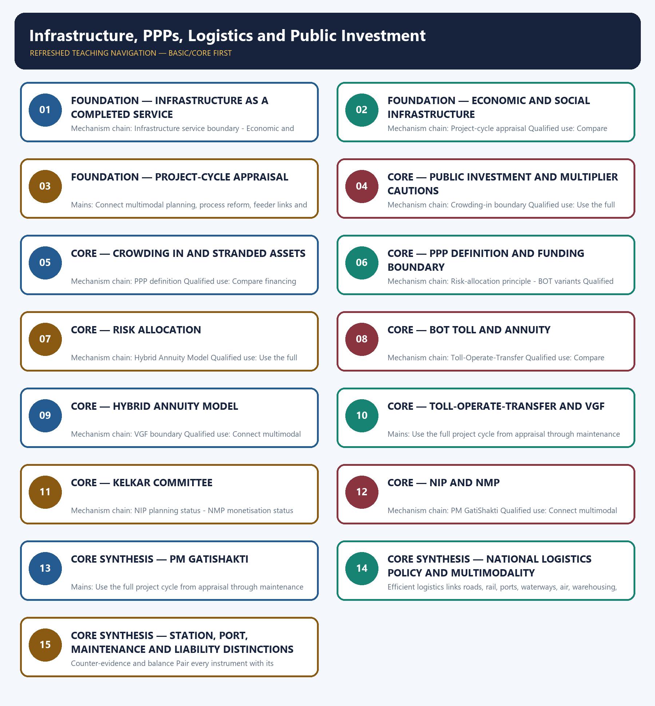

# Infrastructure, PPPs, Logistics and Public Investment — Learner-v2 Complete Learning Session

> **Authoring-only generation:** 2026-09-03. No PDF was rendered and no tracker or index was mutated.

### SOURCE, PROGRESSION AND CURRENT-LINKAGE AUDIT

- **Generation date:** 2026-09-03.
- **Repository-first evidence:** the Basic owner is taught first and preserved in full; the Advanced owner is retained only in the optional final teaching block.
- **OCR evidence:** Repository Markdown was primary. OCR-searchable local official General Studies papers were used only to confirm printed routed demands. No answer key, marking scheme, unsupported page precision or current macroeconomic statistic was inferred from them.
- **Qdrant:** not used; repository Markdown and available OCR context were sufficient.
- **PYQ integrity:** Audited ledgers route Mains demands on CPEC, PPP concession design, infrastructure and inclusive growth, GatiShakti coordination, railway-station redevelopment and UDAN. Objective ledgers add green rural roads, UNOPS S3i, Vizhinjam and Sagarmala. The package solves verified Mains demands only and preserves answer-key neutrality for objective items.
- **Live-link boundary:** The PPP in India homepage was substantively retrievable for institutional architecture. The DEA VGF and PIB logistics pages failed in the fetcher, so the package retains owner-sourced qualitative mechanics and avoids new ceilings, pipeline values, rankings or project counts.
- **Fact/inference discipline:** no current-affairs item, PYQ wording, figure or quotation is invented.

### LIVE OFFICIAL-SOURCE ATTEMPT LOG

The checks below were made on 2026-09-03. Substantive official text is used only for the proposition it actually supports; binary files, dynamic shells, stubs and undated dashboard snippets are recorded but not converted into current claims.

- https://www.pppinindia.gov.in/ — retrieved 2026-09-03; the official DEA Infrastructure Finance Secretariat page substantively described the Private Investment Unit's responsibility for PPP policy, model concession agreements, PPPAC, VGF and IIPDF.
- https://www.dea.gov.in/viability-gap-funding-vgf-scheme — attempted 2026-09-03 and failed at the transport layer; no current support ceiling or sector eligibility was imported from the failed fetch.
- https://www.pib.gov.in/PressReleasePage.aspx?PRID=1860192 — attempted 2026-09-03 and returned HTTP 403; no logistics target, platform count or performance claim was imported.

## BASIC LEARNING SESSION



*Distinct embedded teaching-navigation image. The separate continuous Cārvāka-style flowchart package remains an independent at-a-glance artifact.*

### SESSION 1 — FOUNDATION — INFRASTRUCTURE AS A COMPLETED SERVICE

#### DEFINITION / WHAT THIS IS CALLED

**Plain-language definition:** Infrastructure is valuable when a planned asset is completed, connected, operated and maintained as a usable service; sanctioned spending or physical capacity alone is not the outcome.

**Technical definition:** Mechanism chain: Infrastructure service boundary - Economic and social infrastructure Qualified use: Use the full project cycle from appraisal through maintenance and service outcomes.

#### ANSWER-GRABBING OPENING — WRITE/ADAPT IN THE EXAM

> Infrastructure is valuable when a planned asset is completed, connected, operated and maintained as a usable service; sanctioned spending or physical capacity alone is not the outcome.

#### MUST-WRITE KEYWORDS

- **FOUNDATION**
- **Infrastructure as a completed service**
- **Mechanism chain**
- **Qualified use**
- **Infrastructure**
- **Transport**

**How to use them:** Frame the answer through FOUNDATION; define Infrastructure as a completed service, connect Mechanism chain with Qualified use to explain the mechanism, and use Infrastructure for the decisive comparison or qualification.

#### VISUAL FIRST

```text
INFRASTRUCTURE AS A COMPLETED SERVICE
01. Infrastructure service boundary
    |
    v
02. Economic and social infrastructure
BOUNDARY -> Do not equate a project pipeline, allocation, sanction, award, commissioning and service outcome.
```

*This topic-specific rail fixes the evidence sequence and its exam boundary before analysis.*

#### CORE EXPLANATION

Infrastructure is valuable when a planned asset is completed, connected, operated and maintained as a usable service; sanctioned spending or physical capacity alone is not the outcome. Transport, energy and communications enable production, while health, education, water and sanitation build capabilities; their revenue models differ even though both can raise productivity and welfare.

#### NAMED EVIDENCE AND MECHANISM

- Infrastructure is valuable when a planned asset is completed, connected, operated and maintained as a usable service; sanctioned spending or physical capacity alone is not the outcome.
- Transport, energy and communications enable production, while health, education, water and sanitation build capabilities; their revenue models differ even though both can raise productivity and welfare.

#### EXAMINER CAUTION

- Do not equate a project pipeline, allocation, sanction, award, commissioning and service outcome.

#### EXAM LINK

- **Prelims:** Preserve the exact formula, territorial or resident boundary, price basis, base year, index basket, eligible counterparty, institution and legal status; never upgrade a projection into an actual or a regulatory direction into a universal rule.
- **Mains:** Use the full project cycle from appraisal through maintenance and service outcomes.

#### MINI RECAP

- **Mechanism chain:** Infrastructure service boundary -> Economic and social infrastructure
- **Qualified use:** Use the full project cycle from appraisal through maintenance and service outcomes.

#### CLOSING RECALL FLOW — FOUNDATION — INFRASTRUCTURE AS A COMPLETED SERVICE

```text
START / CONCEPT: FOUNDATION — Infrastructure as a completed service
        |
        v
EXACT TERMS: FOUNDATION · Infrastructure as a completed service · Mechanism chain · Qualified use · Infrastructure · Transport
        |
        v
MECHANISM / ARGUMENT: Mechanism chain: Infrastructure service boundary - Economic and social infrastructure Qualified use: Use the full project cycle from appraisal through maintenance and service outcomes.
        |
        v
CONSEQUENCE / CONTRAST: Do not equate a project pipeline, allocation, sanction, award, commissioning and service outcome.
        |
        v
UPSC TRAP / ANSWER-USE: Transport, energy and communications enable production, while health, education, water and sanitation build capabilities; their revenue models differ even though both can raise productivity and welfare.
        |
        v
ANSWER-GRABBING FORMULATION: Infrastructure is valuable when a planned asset is completed, connected, operated and maintained as a usable service; sanctioned spending or physical capacity alone is not the outcome.
```
### SESSION 2 — FOUNDATION — ECONOMIC AND SOCIAL INFRASTRUCTURE

#### DEFINITION / WHAT THIS IS CALLED

**Plain-language definition:** Demand, engineering, land, environmental, social, financial and institutional appraisal precede financing and determine whether later construction risk is manageable.

**Technical definition:** Mechanism chain: Project-cycle appraisal Qualified use: Compare financing models through risk, payment, ownership, stage and contingent liability.

#### ANSWER-GRABBING OPENING — WRITE/ADAPT IN THE EXAM

> Demand, engineering, land, environmental, social, financial and institutional appraisal precede financing and determine whether later construction risk is manageable.

#### MUST-WRITE KEYWORDS

- **FOUNDATION**
- **Economic**
- **social infrastructure**
- **Mechanism chain**
- **Qualified use**
- **Demand**

**How to use them:** Frame the answer through FOUNDATION; define Economic, connect social infrastructure with Mechanism chain to explain the mechanism, and use Qualified use for the decisive comparison or qualification.

#### VISUAL FIRST

```text
ECONOMIC AND SOCIAL INFRASTRUCTURE
01. Project-cycle appraisal
BOUNDARY -> Do not quote a capex multiplier as timeless or institution-free.
```

*This topic-specific rail fixes the evidence sequence and its exam boundary before analysis.*

#### CORE EXPLANATION

Demand, engineering, land, environmental, social, financial and institutional appraisal precede financing and determine whether later construction risk is manageable.

#### NAMED EVIDENCE AND MECHANISM

- Demand, engineering, land, environmental, social, financial and institutional appraisal precede financing and determine whether later construction risk is manageable.

#### EXAMINER CAUTION

- Do not quote a capex multiplier as timeless or institution-free.

#### EXAM LINK

- **Prelims:** Preserve the exact formula, territorial or resident boundary, price basis, base year, index basket, eligible counterparty, institution and legal status; never upgrade a projection into an actual or a regulatory direction into a universal rule.
- **Mains:** Compare financing models through risk, payment, ownership, stage and contingent liability.

#### MINI RECAP

- **Mechanism chain:** Project-cycle appraisal
- **Qualified use:** Compare financing models through risk, payment, ownership, stage and contingent liability.

#### CLOSING RECALL FLOW — FOUNDATION — ECONOMIC AND SOCIAL INFRASTRUCTURE

```text
START / CONCEPT: FOUNDATION — Economic and social infrastructure
        |
        v
EXACT TERMS: FOUNDATION · Economic · social infrastructure · Mechanism chain · Qualified use · Demand
        |
        v
MECHANISM / ARGUMENT: Mechanism chain: Project-cycle appraisal Qualified use: Compare financing models through risk, payment, ownership, stage and contingent liability.
        |
        v
CONSEQUENCE / CONTRAST: Do not quote a capex multiplier as timeless or institution-free.
        |
        v
UPSC TRAP / ANSWER-USE: Do not miss this limiting distinction: do not quote a capex multiplier as timeless or institution-free.
        |
        v
ANSWER-GRABBING FORMULATION: Demand, engineering, land, environmental, social, financial and institutional appraisal precede financing and determine whether later construction risk is manageable.
```
### SESSION 3 — FOUNDATION — PROJECT-CYCLE APPRAISAL

#### DEFINITION / WHAT THIS IS CALLED

**Plain-language definition:** Mechanism chain: Public investment channels Qualified use: Connect multimodal planning, process reform, feeder links and lifecycle maintenance to productivity.

**Technical definition:** Mains: Connect multimodal planning, process reform, feeder links and lifecycle maintenance to productivity.

#### ANSWER-GRABBING OPENING — WRITE/ADAPT IN THE EXAM

> Do not define PPP as free infrastructure or complete privatisation.

#### MUST-WRITE KEYWORDS

- **FOUNDATION**
- **Project-cycle appraisal**
- **Mechanism chain**
- **Qualified use**
- **PPP**
- **Connect**

**How to use them:** Frame the answer through FOUNDATION; define Project-cycle appraisal, connect Mechanism chain with Qualified use to explain the mechanism, and use PPP for the decisive comparison or qualification.

#### VISUAL FIRST

```text
PROJECT-CYCLE APPRAISAL
01. Public investment channels
BOUNDARY -> Do not define PPP as free infrastructure or complete privatisation.
```

*This topic-specific rail fixes the evidence sequence and its exam boundary before analysis.*

#### CORE EXPLANATION

Public capital expenditure can support current demand and raise future productive capacity, but the size and timing of any multiplier depend on slack, import leakage, financing, execution and network usefulness.

#### NAMED EVIDENCE AND MECHANISM

- Public capital expenditure can support current demand and raise future productive capacity, but the size and timing of any multiplier depend on slack, import leakage, financing, execution and network usefulness.

#### EXAMINER CAUTION

- Do not define PPP as free infrastructure or complete privatisation.

#### EXAM LINK

- **Prelims:** Preserve the exact formula, territorial or resident boundary, price basis, base year, index basket, eligible counterparty, institution and legal status; never upgrade a projection into an actual or a regulatory direction into a universal rule.
- **Mains:** Connect multimodal planning, process reform, feeder links and lifecycle maintenance to productivity.

#### MINI RECAP

- **Mechanism chain:** Public investment channels
- **Qualified use:** Connect multimodal planning, process reform, feeder links and lifecycle maintenance to productivity.

#### CLOSING RECALL FLOW — FOUNDATION — PROJECT-CYCLE APPRAISAL

```text
START / CONCEPT: FOUNDATION — Project-cycle appraisal
        |
        v
EXACT TERMS: FOUNDATION · Project-cycle appraisal · Mechanism chain · Qualified use · PPP · Connect
        |
        v
MECHANISM / ARGUMENT: Mechanism chain: Public investment channels Qualified use: Connect multimodal planning, process reform, feeder links and lifecycle maintenance to productivity.
        |
        v
CONSEQUENCE / CONTRAST: Public capital expenditure can support current demand and raise future productive capacity, but the size and timing of any multiplier depend on slack, import leakage, financing, execution and network usefulness.
        |
        v
UPSC TRAP / ANSWER-USE: Do not miss this limiting distinction: connect multimodal planning, process reform, feeder links and lifecycle maintenance to productivity.
        |
        v
ANSWER-GRABBING FORMULATION: Do not define PPP as free infrastructure or complete privatisation.
```
### SESSION 4 — CORE — PUBLIC INVESTMENT AND MULTIPLIER CAUTIONS

#### DEFINITION / WHAT THIS IS CALLED

**Plain-language definition:** Public investment can crowd in private investment by lowering logistics cost and uncertainty, but poorly selected or delayed projects can crowd out finance or create stranded assets.

**Technical definition:** Mechanism chain: Crowding-in boundary Qualified use: Use the full project cycle from appraisal through maintenance and service outcomes.

#### ANSWER-GRABBING OPENING — WRITE/ADAPT IN THE EXAM

> Public investment can crowd in private investment by lowering logistics cost and uncertainty, but poorly selected or delayed projects can crowd out finance or create stranded assets.

#### MUST-WRITE KEYWORDS

- **Public investment**
- **multiplier cautions**
- **Mechanism chain**
- **Qualified use**
- **Crowding-in**
- **Qualified**

**How to use them:** Frame the answer through Public investment; define multiplier cautions, connect Mechanism chain with Qualified use to explain the mechanism, and use Crowding-in for the decisive comparison or qualification.

#### VISUAL FIRST

```text
PUBLIC INVESTMENT AND MULTIPLIER CAUTIONS
01. Crowding-in boundary
BOUNDARY -> Do not allocate every project risk to the private partner by slogan.
```

*This topic-specific rail fixes the evidence sequence and its exam boundary before analysis.*

#### CORE EXPLANATION

Public investment can crowd in private investment by lowering logistics cost and uncertainty, but poorly selected or delayed projects can crowd out finance or create stranded assets.

#### NAMED EVIDENCE AND MECHANISM

- Public investment can crowd in private investment by lowering logistics cost and uncertainty, but poorly selected or delayed projects can crowd out finance or create stranded assets.

#### EXAMINER CAUTION

- Do not allocate every project risk to the private partner by slogan.

#### EXAM LINK

- **Prelims:** Preserve the exact formula, territorial or resident boundary, price basis, base year, index basket, eligible counterparty, institution and legal status; never upgrade a projection into an actual or a regulatory direction into a universal rule.
- **Mains:** Use the full project cycle from appraisal through maintenance and service outcomes.

#### MINI RECAP

- **Mechanism chain:** Crowding-in boundary
- **Qualified use:** Use the full project cycle from appraisal through maintenance and service outcomes.

#### CLOSING RECALL FLOW — CORE — PUBLIC INVESTMENT AND MULTIPLIER CAUTIONS

```text
START / CONCEPT: CORE — Public investment and multiplier cautions
        |
        v
EXACT TERMS: Public investment · multiplier cautions · Mechanism chain · Qualified use · Crowding-in · Qualified
        |
        v
MECHANISM / ARGUMENT: Mechanism chain: Crowding-in boundary Qualified use: Use the full project cycle from appraisal through maintenance and service outcomes.
        |
        v
CONSEQUENCE / CONTRAST: Do not allocate every project risk to the private partner by slogan.
        |
        v
UPSC TRAP / ANSWER-USE: Do not miss this limiting distinction: use the full project cycle from appraisal through maintenance and service outcomes.
        |
        v
ANSWER-GRABBING FORMULATION: Public investment can crowd in private investment by lowering logistics cost and uncertainty, but poorly selected or delayed projects can crowd out finance or create stranded assets.
```
### SESSION 5 — CORE — CROWDING IN AND STRANDED ASSETS

#### DEFINITION / WHAT THIS IS CALLED

**Plain-language definition:** A PPP is a long-term arrangement allocating project functions, performance obligations and risks between public and private parties; it is not free infrastructure or complete privatisation.

**Technical definition:** Mechanism chain: PPP definition Qualified use: Compare financing models through risk, payment, ownership, stage and contingent liability.

#### ANSWER-GRABBING OPENING — WRITE/ADAPT IN THE EXAM

> A PPP is a long-term arrangement allocating project functions, performance obligations and risks between public and private parties; it is not free infrastructure or complete privatisation.

#### MUST-WRITE KEYWORDS

- **Crowding in**
- **stranded assets**
- **Mechanism chain**
- **Qualified use**
- **A PPP**
- **PPP**

**How to use them:** Frame the answer through Crowding in; define stranded assets, connect Mechanism chain with Qualified use to explain the mechanism, and use A PPP for the decisive comparison or qualification.

#### VISUAL FIRST

```text
CROWDING IN AND STRANDED ASSETS
01. PPP definition
BOUNDARY -> Do not merge BOT toll, BOT annuity, HAM, TOT and EPC.
```

*This topic-specific rail fixes the evidence sequence and its exam boundary before analysis.*

#### CORE EXPLANATION

A PPP is a long-term arrangement allocating project functions, performance obligations and risks between public and private parties; it is not free infrastructure or complete privatisation.

#### NAMED EVIDENCE AND MECHANISM

- A PPP is a long-term arrangement allocating project functions, performance obligations and risks between public and private parties; it is not free infrastructure or complete privatisation.

#### EXAMINER CAUTION

- Do not merge BOT toll, BOT annuity, HAM, TOT and EPC.

#### EXAM LINK

- **Prelims:** Preserve the exact formula, territorial or resident boundary, price basis, base year, index basket, eligible counterparty, institution and legal status; never upgrade a projection into an actual or a regulatory direction into a universal rule.
- **Mains:** Compare financing models through risk, payment, ownership, stage and contingent liability.

#### MINI RECAP

- **Mechanism chain:** PPP definition
- **Qualified use:** Compare financing models through risk, payment, ownership, stage and contingent liability.

#### CLOSING RECALL FLOW — CORE — CROWDING IN AND STRANDED ASSETS

```text
START / CONCEPT: CORE — Crowding in and stranded assets
        |
        v
EXACT TERMS: Crowding in · stranded assets · Mechanism chain · Qualified use · A PPP · PPP
        |
        v
MECHANISM / ARGUMENT: Mechanism chain: PPP definition Qualified use: Compare financing models through risk, payment, ownership, stage and contingent liability.
        |
        v
CONSEQUENCE / CONTRAST: Do not merge BOT toll, BOT annuity, HAM, TOT and EPC.
        |
        v
UPSC TRAP / ANSWER-USE: Do not miss this limiting distinction: a PPP is a long-term arrangement allocating project functions, performance obligations and risks between...
        |
        v
ANSWER-GRABBING FORMULATION: A PPP is a long-term arrangement allocating project functions, performance obligations and risks between public and private parties; it is not free infrastructure or complete privatisation.
```
### SESSION 6 — CORE — PPP DEFINITION AND FUNDING BOUNDARY

#### DEFINITION / WHAT THIS IS CALLED

**Plain-language definition:** BOT toll and BOT annuity structures allocate demand and payment risk differently; the label BOT alone is insufficient to identify who bears traffic risk.

**Technical definition:** Mechanism chain: Risk-allocation principle - BOT variants Qualified use: Connect multimodal planning, process reform, feeder links and lifecycle maintenance to productivity.

#### ANSWER-GRABBING OPENING — WRITE/ADAPT IN THE EXAM

> BOT toll and BOT annuity structures allocate demand and payment risk differently; the label BOT alone is insufficient to identify who bears traffic risk.

#### MUST-WRITE KEYWORDS

- **PPP definition**
- **funding boundary**
- **Mechanism chain**
- **Qualified use**
- **Construction**
- **BOT**

**How to use them:** Frame the answer through PPP definition; define funding boundary, connect Mechanism chain with Qualified use to explain the mechanism, and use Construction for the decisive comparison or qualification.

#### VISUAL FIRST

```text
PPP DEFINITION AND FUNDING BOUNDARY
01. Risk-allocation principle
    |
    v
02. BOT variants
BOUNDARY -> Do not quote VGF support without the applicable scheme, sector and ceiling.
```

*This topic-specific rail fixes the evidence sequence and its exam boundary before analysis.*

#### CORE EXPLANATION

Construction, demand, finance, land, operating, regulatory and political risks should be assigned to the party best able to manage them rather than shifted mechanically to the private partner. BOT toll and BOT annuity structures allocate demand and payment risk differently; the label BOT alone is insufficient to identify who bears traffic risk.

#### NAMED EVIDENCE AND MECHANISM

- Construction, demand, finance, land, operating, regulatory and political risks should be assigned to the party best able to manage them rather than shifted mechanically to the private partner.
- BOT toll and BOT annuity structures allocate demand and payment risk differently; the label BOT alone is insufficient to identify who bears traffic risk.

#### EXAMINER CAUTION

- Do not quote VGF support without the applicable scheme, sector and ceiling.

#### EXAM LINK

- **Prelims:** Preserve the exact formula, territorial or resident boundary, price basis, base year, index basket, eligible counterparty, institution and legal status; never upgrade a projection into an actual or a regulatory direction into a universal rule.
- **Mains:** Connect multimodal planning, process reform, feeder links and lifecycle maintenance to productivity.

#### MINI RECAP

- **Mechanism chain:** Risk-allocation principle -> BOT variants
- **Qualified use:** Connect multimodal planning, process reform, feeder links and lifecycle maintenance to productivity.

#### CLOSING RECALL FLOW — CORE — PPP DEFINITION AND FUNDING BOUNDARY

```text
START / CONCEPT: CORE — PPP definition and funding boundary
        |
        v
EXACT TERMS: PPP definition · funding boundary · Mechanism chain · Qualified use · Construction · BOT
        |
        v
MECHANISM / ARGUMENT: Mechanism chain: Risk-allocation principle - BOT variants Qualified use: Connect multimodal planning, process reform, feeder links and lifecycle maintenance to productivity.
        |
        v
CONSEQUENCE / CONTRAST: Do not quote VGF support without the applicable scheme, sector and ceiling.
        |
        v
UPSC TRAP / ANSWER-USE: Construction, demand, finance, land, operating, regulatory and political risks should be assigned to the party best able to manage them rather than shifted mechanically to the private partner.
        |
        v
ANSWER-GRABBING FORMULATION: BOT toll and BOT annuity structures allocate demand and payment risk differently; the label BOT alone is insufficient to identify who bears traffic risk.
```
### SESSION 7 — CORE — RISK ALLOCATION

#### DEFINITION / WHAT THIS IS CALLED

**Plain-language definition:** Under the road-sector HAM described by the owner, government provides about 40 per cent through construction-linked payments and the balance is serviced through annuities, moving traffic risk to government while private construction and operating obligations remain.

**Technical definition:** Mechanism chain: Hybrid Annuity Model Qualified use: Use the full project cycle from appraisal through maintenance and service outcomes.

#### ANSWER-GRABBING OPENING — WRITE/ADAPT IN THE EXAM

> Under the road-sector HAM described by the owner, government provides about 40 per cent through construction-linked payments and the balance is serviced through annuities, moving traffic risk to government while private construction and operating obligations remain.

#### MUST-WRITE KEYWORDS

- **Risk allocation**
- **Mechanism chain**
- **Qualified use**
- **Under**
- **HAM**
- **NIP**

**How to use them:** Frame the answer through Risk allocation; define Mechanism chain, connect Qualified use with Under to explain the mechanism, and use HAM for the decisive comparison or qualification.

#### VISUAL FIRST

```text
RISK ALLOCATION
01. Hybrid Annuity Model
BOUNDARY -> Do not merge NIP planning, NMP monetisation and new public capex.
```

*This topic-specific rail fixes the evidence sequence and its exam boundary before analysis.*

#### CORE EXPLANATION

Under the road-sector HAM described by the owner, government provides about 40 per cent through construction-linked payments and the balance is serviced through annuities, moving traffic risk to government while private construction and operating obligations remain.

#### NAMED EVIDENCE AND MECHANISM

- Under the road-sector HAM described by the owner, government provides about 40 per cent through construction-linked payments and the balance is serviced through annuities, moving traffic risk to government while private construction and operating obligations remain.

#### EXAMINER CAUTION

- Do not merge NIP planning, NMP monetisation and new public capex.

#### EXAM LINK

- **Prelims:** Preserve the exact formula, territorial or resident boundary, price basis, base year, index basket, eligible counterparty, institution and legal status; never upgrade a projection into an actual or a regulatory direction into a universal rule.
- **Mains:** Use the full project cycle from appraisal through maintenance and service outcomes.

#### MINI RECAP

- **Mechanism chain:** Hybrid Annuity Model
- **Qualified use:** Use the full project cycle from appraisal through maintenance and service outcomes.

#### CLOSING RECALL FLOW — CORE — RISK ALLOCATION

```text
START / CONCEPT: CORE — Risk allocation
        |
        v
EXACT TERMS: Risk allocation · Mechanism chain · Qualified use · Under · HAM · NIP
        |
        v
MECHANISM / ARGUMENT: Mechanism chain: Hybrid Annuity Model Qualified use: Use the full project cycle from appraisal through maintenance and service outcomes.
        |
        v
CONSEQUENCE / CONTRAST: Do not merge NIP planning, NMP monetisation and new public capex.
        |
        v
UPSC TRAP / ANSWER-USE: Do not miss this limiting distinction: use the full project cycle from appraisal through maintenance and service outcomes.
        |
        v
ANSWER-GRABBING FORMULATION: Under the road-sector HAM described by the owner, government provides about 40 per cent through construction-linked payments and the balance is serviced through annuities, moving traffic risk to government while private construction and operating obligations remain.
```
### SESSION 8 — CORE — BOT TOLL AND ANNUITY

#### DEFINITION / WHAT THIS IS CALLED

**Plain-language definition:** TOT monetises completed toll-road operating rights for a concession period against an upfront payment; it is a brownfield-operation model, not construction of a new road under BOT.

**Technical definition:** Mechanism chain: Toll-Operate-Transfer Qualified use: Compare financing models through risk, payment, ownership, stage and contingent liability.

#### ANSWER-GRABBING OPENING — WRITE/ADAPT IN THE EXAM

> TOT monetises completed toll-road operating rights for a concession period against an upfront payment; it is a brownfield-operation model, not construction of a new road under BOT.

#### MUST-WRITE KEYWORDS

- **BOT toll**
- **annuity**
- **Mechanism chain**
- **Qualified use**
- **TOT**
- **BOT**

**How to use them:** Frame the answer through BOT toll; define annuity, connect Mechanism chain with Qualified use to explain the mechanism, and use TOT for the decisive comparison or qualification.

#### VISUAL FIRST

```text
BOT TOLL AND ANNUITY
01. Toll-Operate-Transfer
BOUNDARY -> Do not treat PM GatiShakti or the National Logistics Policy as completed physical assets.
```

*This topic-specific rail fixes the evidence sequence and its exam boundary before analysis.*

#### CORE EXPLANATION

TOT monetises completed toll-road operating rights for a concession period against an upfront payment; it is a brownfield-operation model, not construction of a new road under BOT.

#### NAMED EVIDENCE AND MECHANISM

- TOT monetises completed toll-road operating rights for a concession period against an upfront payment; it is a brownfield-operation model, not construction of a new road under BOT.

#### EXAMINER CAUTION

- Do not treat PM GatiShakti or the National Logistics Policy as completed physical assets.

#### EXAM LINK

- **Prelims:** Preserve the exact formula, territorial or resident boundary, price basis, base year, index basket, eligible counterparty, institution and legal status; never upgrade a projection into an actual or a regulatory direction into a universal rule.
- **Mains:** Compare financing models through risk, payment, ownership, stage and contingent liability.

#### MINI RECAP

- **Mechanism chain:** Toll-Operate-Transfer
- **Qualified use:** Compare financing models through risk, payment, ownership, stage and contingent liability.

#### CLOSING RECALL FLOW — CORE — BOT TOLL AND ANNUITY

```text
START / CONCEPT: CORE — BOT toll and annuity
        |
        v
EXACT TERMS: BOT toll · annuity · Mechanism chain · Qualified use · TOT · BOT
        |
        v
MECHANISM / ARGUMENT: Mechanism chain: Toll-Operate-Transfer Qualified use: Compare financing models through risk, payment, ownership, stage and contingent liability.
        |
        v
CONSEQUENCE / CONTRAST: Do not treat PM GatiShakti or the National Logistics Policy as completed physical assets.
        |
        v
UPSC TRAP / ANSWER-USE: Do not miss this limiting distinction: tOT monetises completed toll-road operating rights for a concession period against an upfront payment.
        |
        v
ANSWER-GRABBING FORMULATION: TOT monetises completed toll-road operating rights for a concession period against an upfront payment; it is a brownfield-operation model, not construction of a new road under BOT.
```
### SESSION 9 — CORE — HYBRID ANNUITY MODEL

#### DEFINITION / WHAT THIS IS CALLED

**Plain-language definition:** Viability Gap Funding is grant support for an economically justified PPP that is not fully commercially viable, subject to notified eligibility and ceilings; support does not cure weak demand, land or contract design.

**Technical definition:** Mechanism chain: VGF boundary Qualified use: Connect multimodal planning, process reform, feeder links and lifecycle maintenance to productivity.

#### ANSWER-GRABBING OPENING — WRITE/ADAPT IN THE EXAM

> Viability Gap Funding is grant support for an economically justified PPP that is not fully commercially viable, subject to notified eligibility and ceilings; support does not cure weak demand, land or contract design.

#### MUST-WRITE KEYWORDS

- **Hybrid Annuity Model**
- **Mechanism chain**
- **Qualified use**
- **Viability Gap Funding**
- **PPP**
- **Vizhinjam**

**How to use them:** Frame the answer through Hybrid Annuity Model; define Mechanism chain, connect Qualified use with Viability Gap Funding to explain the mechanism, and use PPP for the decisive comparison or qualification.

#### VISUAL FIRST

```text
HYBRID ANNUITY MODEL
01. VGF boundary
BOUNDARY -> Do not merge Vizhinjam with the Sagarmala programme.
```

*This topic-specific rail fixes the evidence sequence and its exam boundary before analysis.*

#### CORE EXPLANATION

Viability Gap Funding is grant support for an economically justified PPP that is not fully commercially viable, subject to notified eligibility and ceilings; support does not cure weak demand, land or contract design.

#### NAMED EVIDENCE AND MECHANISM

- Viability Gap Funding is grant support for an economically justified PPP that is not fully commercially viable, subject to notified eligibility and ceilings; support does not cure weak demand, land or contract design.

#### EXAMINER CAUTION

- Do not merge Vizhinjam with the Sagarmala programme.

#### EXAM LINK

- **Prelims:** Preserve the exact formula, territorial or resident boundary, price basis, base year, index basket, eligible counterparty, institution and legal status; never upgrade a projection into an actual or a regulatory direction into a universal rule.
- **Mains:** Connect multimodal planning, process reform, feeder links and lifecycle maintenance to productivity.

#### MINI RECAP

- **Mechanism chain:** VGF boundary
- **Qualified use:** Connect multimodal planning, process reform, feeder links and lifecycle maintenance to productivity.

#### CLOSING RECALL FLOW — CORE — HYBRID ANNUITY MODEL

```text
START / CONCEPT: CORE — Hybrid Annuity Model
        |
        v
EXACT TERMS: Hybrid Annuity Model · Mechanism chain · Qualified use · Viability Gap Funding · PPP · Vizhinjam
        |
        v
MECHANISM / ARGUMENT: Mechanism chain: VGF boundary Qualified use: Connect multimodal planning, process reform, feeder links and lifecycle maintenance to productivity.
        |
        v
CONSEQUENCE / CONTRAST: Do not merge Vizhinjam with the Sagarmala programme.
        |
        v
UPSC TRAP / ANSWER-USE: Do not miss this limiting distinction: connect multimodal planning, process reform, feeder links and lifecycle maintenance to productivity.
        |
        v
ANSWER-GRABBING FORMULATION: Viability Gap Funding is grant support for an economically justified PPP that is not fully commercially viable, subject to notified eligibility and ceilings; support does not cure weak demand, land or contract design.
```
### SESSION 10 — CORE — TOLL-OPERATE-TRANSFER AND VGF

#### DEFINITION / WHAT THIS IS CALLED

**Plain-language definition:** Mechanism chain: Kelkar Committee Qualified use: Use the full project cycle from appraisal through maintenance and service outcomes.

**Technical definition:** Mains: Use the full project cycle from appraisal through maintenance and service outcomes.

#### ANSWER-GRABBING OPENING — WRITE/ADAPT IN THE EXAM

> Do not infer objective answer letters from routed or provisional-key PYQs.

#### MUST-WRITE KEYWORDS

- **Toll-Operate-Transfer**
- **VGF**
- **Mechanism chain**
- **Qualified use**
- **PYQs**
- **Kelkar Committee Qualified**

**How to use them:** Frame the answer through Toll-Operate-Transfer; define VGF, connect Mechanism chain with Qualified use to explain the mechanism, and use PYQs for the decisive comparison or qualification.

#### VISUAL FIRST

```text
TOLL-OPERATE-TRANSFER AND VGF
01. Kelkar Committee
BOUNDARY -> Do not infer objective answer letters from routed or provisional-key PYQs.
```

*This topic-specific rail fixes the evidence sequence and its exam boundary before analysis.*

#### CORE EXPLANATION

The 2015 Kelkar Committee on revisiting and revitalising PPPs stressed balanced risk sharing, dispute resolution, regulation and separation of genuine PPPs from public-financed EPC contracts.

#### NAMED EVIDENCE AND MECHANISM

- The 2015 Kelkar Committee on revisiting and revitalising PPPs stressed balanced risk sharing, dispute resolution, regulation and separation of genuine PPPs from public-financed EPC contracts.

#### EXAMINER CAUTION

- Do not infer objective answer letters from routed or provisional-key PYQs.

#### EXAM LINK

- **Prelims:** Preserve the exact formula, territorial or resident boundary, price basis, base year, index basket, eligible counterparty, institution and legal status; never upgrade a projection into an actual or a regulatory direction into a universal rule.
- **Mains:** Use the full project cycle from appraisal through maintenance and service outcomes.

#### MINI RECAP

- **Mechanism chain:** Kelkar Committee
- **Qualified use:** Use the full project cycle from appraisal through maintenance and service outcomes.

#### CLOSING RECALL FLOW — CORE — TOLL-OPERATE-TRANSFER AND VGF

```text
START / CONCEPT: CORE — Toll-Operate-Transfer and VGF
        |
        v
EXACT TERMS: Toll-Operate-Transfer · VGF · Mechanism chain · Qualified use · PYQs · Kelkar Committee Qualified
        |
        v
MECHANISM / ARGUMENT: Mechanism chain: Kelkar Committee Qualified use: Use the full project cycle from appraisal through maintenance and service outcomes.
        |
        v
CONSEQUENCE / CONTRAST: Mains: Use the full project cycle from appraisal through maintenance and service outcomes.
        |
        v
UPSC TRAP / ANSWER-USE: Do not miss this limiting distinction: do not infer objective answer letters from routed or provisional-key PYQs.
        |
        v
ANSWER-GRABBING FORMULATION: Do not infer objective answer letters from routed or provisional-key PYQs.
```
### SESSION 11 — CORE — KELKAR COMMITTEE

#### DEFINITION / WHAT THIS IS CALLED

**Plain-language definition:** The National Infrastructure Pipeline is a multi-year project and investment planning pipeline; a listed estimate is not proof that finance, land, approval or completion has occurred.

**Technical definition:** Mechanism chain: NIP planning status - NMP monetisation status Qualified use: Compare financing models through risk, payment, ownership, stage and contingent liability.

#### ANSWER-GRABBING OPENING — WRITE/ADAPT IN THE EXAM

> The National Infrastructure Pipeline is a multi-year project and investment planning pipeline; a listed estimate is not proof that finance, land, approval or completion has occurred.

#### MUST-WRITE KEYWORDS

- **Kelkar Committee**
- **Mechanism chain**
- **Qualified use**
- **The National Infrastructure Pipeline**
- **The National Monetisation Pipeline**
- **NIP**

**How to use them:** Frame the answer through Kelkar Committee; define Mechanism chain, connect Qualified use with The National Infrastructure Pipeline to explain the mechanism, and use The National Monetisation Pipeline for the decisive comparison or qualification.

#### VISUAL FIRST

```text
KELKAR COMMITTEE
01. NIP planning status
    |
    v
02. NMP monetisation status
BOUNDARY -> Do not equate a project pipeline, allocation, sanction, award, commissioning and service outcome.
```

*This topic-specific rail fixes the evidence sequence and its exam boundary before analysis.*

#### CORE EXPLANATION

The National Infrastructure Pipeline is a multi-year project and investment planning pipeline; a listed estimate is not proof that finance, land, approval or completion has occurred. The National Monetisation Pipeline identifies brownfield public assets for time-bound private operating or revenue rights while ownership remains public; it is distinct from fresh capex and equity disinvestment.

#### NAMED EVIDENCE AND MECHANISM

- The National Infrastructure Pipeline is a multi-year project and investment planning pipeline; a listed estimate is not proof that finance, land, approval or completion has occurred.
- The National Monetisation Pipeline identifies brownfield public assets for time-bound private operating or revenue rights while ownership remains public; it is distinct from fresh capex and equity disinvestment.

#### EXAMINER CAUTION

- Do not equate a project pipeline, allocation, sanction, award, commissioning and service outcome.

#### EXAM LINK

- **Prelims:** Preserve the exact formula, territorial or resident boundary, price basis, base year, index basket, eligible counterparty, institution and legal status; never upgrade a projection into an actual or a regulatory direction into a universal rule.
- **Mains:** Compare financing models through risk, payment, ownership, stage and contingent liability.

#### MINI RECAP

- **Mechanism chain:** NIP planning status -> NMP monetisation status
- **Qualified use:** Compare financing models through risk, payment, ownership, stage and contingent liability.

#### CLOSING RECALL FLOW — CORE — KELKAR COMMITTEE

```text
START / CONCEPT: CORE — Kelkar Committee
        |
        v
EXACT TERMS: Kelkar Committee · Mechanism chain · Qualified use · The National Infrastructure Pipeline · The National Monetisation Pipeline · NIP
        |
        v
MECHANISM / ARGUMENT: Mechanism chain: NIP planning status - NMP monetisation status Qualified use: Compare financing models through risk, payment, ownership, stage and contingent liability.
        |
        v
CONSEQUENCE / CONTRAST: The National Monetisation Pipeline identifies brownfield public assets for time-bound private operating or revenue rights while ownership remains public; it is distinct from fresh capex and equity disinvestment.
        |
        v
UPSC TRAP / ANSWER-USE: Do not equate a project pipeline, allocation, sanction, award, commissioning and service outcome.
        |
        v
ANSWER-GRABBING FORMULATION: The National Infrastructure Pipeline is a multi-year project and investment planning pipeline; a listed estimate is not proof that finance, land, approval or completion has occurred.
```
### SESSION 12 — CORE — NIP AND NMP

#### DEFINITION / WHAT THIS IS CALLED

**Plain-language definition:** PM GatiShakti is a GIS-based whole-of-government platform for integrated multimodal infrastructure planning; planning visibility does not itself complete land, clearance, finance or construction.

**Technical definition:** Mechanism chain: PM GatiShakti Qualified use: Connect multimodal planning, process reform, feeder links and lifecycle maintenance to productivity.

#### ANSWER-GRABBING OPENING — WRITE/ADAPT IN THE EXAM

> PM GatiShakti is a GIS-based whole-of-government platform for integrated multimodal infrastructure planning; planning visibility does not itself complete land, clearance, finance or construction.

#### MUST-WRITE KEYWORDS

- **NIP**
- **NMP**
- **Mechanism chain**
- **Qualified use**
- **PM GatiShakti**
- **GIS-based**

**How to use them:** Frame the answer through NIP; define NMP, connect Mechanism chain with Qualified use to explain the mechanism, and use PM GatiShakti for the decisive comparison or qualification.

#### VISUAL FIRST

```text
NIP AND NMP
01. PM GatiShakti
BOUNDARY -> Do not quote a capex multiplier as timeless or institution-free.
```

*This topic-specific rail fixes the evidence sequence and its exam boundary before analysis.*

#### CORE EXPLANATION

PM GatiShakti is a GIS-based whole-of-government platform for integrated multimodal infrastructure planning; planning visibility does not itself complete land, clearance, finance or construction.

#### NAMED EVIDENCE AND MECHANISM

- PM GatiShakti is a GIS-based whole-of-government platform for integrated multimodal infrastructure planning; planning visibility does not itself complete land, clearance, finance or construction.

#### EXAMINER CAUTION

- Do not quote a capex multiplier as timeless or institution-free.

#### EXAM LINK

- **Prelims:** Preserve the exact formula, territorial or resident boundary, price basis, base year, index basket, eligible counterparty, institution and legal status; never upgrade a projection into an actual or a regulatory direction into a universal rule.
- **Mains:** Connect multimodal planning, process reform, feeder links and lifecycle maintenance to productivity.

#### MINI RECAP

- **Mechanism chain:** PM GatiShakti
- **Qualified use:** Connect multimodal planning, process reform, feeder links and lifecycle maintenance to productivity.

#### CLOSING RECALL FLOW — CORE — NIP AND NMP

```text
START / CONCEPT: CORE — NIP and NMP
        |
        v
EXACT TERMS: NIP · NMP · Mechanism chain · Qualified use · PM GatiShakti · GIS-based
        |
        v
MECHANISM / ARGUMENT: Mechanism chain: PM GatiShakti Qualified use: Connect multimodal planning, process reform, feeder links and lifecycle maintenance to productivity.
        |
        v
CONSEQUENCE / CONTRAST: Do not quote a capex multiplier as timeless or institution-free.
        |
        v
UPSC TRAP / ANSWER-USE: Do not miss this limiting distinction: connect multimodal planning, process reform, feeder links and lifecycle maintenance to productivity.
        |
        v
ANSWER-GRABBING FORMULATION: PM GatiShakti is a GIS-based whole-of-government platform for integrated multimodal infrastructure planning; planning visibility does not itself complete land, clearance, finance or construction.
```
### SESSION 13 — CORE SYNTHESIS — PM GATISHAKTI

#### DEFINITION / WHAT THIS IS CALLED

**Plain-language definition:** Mechanism chain: National Logistics Policy Qualified use: Use the full project cycle from appraisal through maintenance and service outcomes.

**Technical definition:** Mains: Use the full project cycle from appraisal through maintenance and service outcomes.

#### ANSWER-GRABBING OPENING — WRITE/ADAPT IN THE EXAM

> Do not define PPP as free infrastructure or complete privatisation.

#### MUST-WRITE KEYWORDS

- **CORE SYNTHESIS**
- **PM GatiShakti**
- **Mechanism chain**
- **Qualified use**
- **PPP**
- **National Logistics Policy Qualified**

**How to use them:** Frame the answer through CORE SYNTHESIS; define PM GatiShakti, connect Mechanism chain with Qualified use to explain the mechanism, and use PPP for the decisive comparison or qualification.

#### VISUAL FIRST

```text
PM GATISHAKTI
01. National Logistics Policy
BOUNDARY -> Do not define PPP as free infrastructure or complete privatisation.
```

*This topic-specific rail fixes the evidence sequence and its exam boundary before analysis.*

#### CORE EXPLANATION

The National Logistics Policy addresses process, digital integration, standardisation, data, skills and service improvement in addition to physical transport infrastructure.

#### NAMED EVIDENCE AND MECHANISM

- The National Logistics Policy addresses process, digital integration, standardisation, data, skills and service improvement in addition to physical transport infrastructure.

#### EXAMINER CAUTION

- Do not define PPP as free infrastructure or complete privatisation.

#### EXAM LINK

- **Prelims:** Preserve the exact formula, territorial or resident boundary, price basis, base year, index basket, eligible counterparty, institution and legal status; never upgrade a projection into an actual or a regulatory direction into a universal rule.
- **Mains:** Use the full project cycle from appraisal through maintenance and service outcomes.

#### MINI RECAP

- **Mechanism chain:** National Logistics Policy
- **Qualified use:** Use the full project cycle from appraisal through maintenance and service outcomes.

#### CLOSING RECALL FLOW — CORE SYNTHESIS — PM GATISHAKTI

```text
START / CONCEPT: CORE SYNTHESIS — PM GatiShakti
        |
        v
EXACT TERMS: CORE SYNTHESIS · PM GatiShakti · Mechanism chain · Qualified use · PPP · National Logistics Policy Qualified
        |
        v
MECHANISM / ARGUMENT: Mechanism chain: National Logistics Policy Qualified use: Use the full project cycle from appraisal through maintenance and service outcomes.
        |
        v
CONSEQUENCE / CONTRAST: Mains: Use the full project cycle from appraisal through maintenance and service outcomes.
        |
        v
UPSC TRAP / ANSWER-USE: Do not miss this limiting distinction: do not define PPP as free infrastructure or complete privatisation.
        |
        v
ANSWER-GRABBING FORMULATION: Do not define PPP as free infrastructure or complete privatisation.
```
### SESSION 14 — CORE SYNTHESIS — NATIONAL LOGISTICS POLICY AND MULTIMODALITY

#### DEFINITION / WHAT THIS IS CALLED

**Plain-language definition:** Mechanism chain: Multimodal logistics - Rail-station PPP model Qualified use: Compare financing models through risk, payment, ownership, stage and contingent liability.

**Technical definition:** Efficient logistics links roads, rail, ports, waterways, air, warehousing, border processes and digital information, so a port or corridor cannot be assessed as an isolated asset.

#### ANSWER-GRABBING OPENING — WRITE/ADAPT IN THE EXAM

> Mechanism chain: Multimodal logistics - Rail-station PPP model Qualified use: Compare financing models through risk, payment, ownership, stage and contingent liability.

#### MUST-WRITE KEYWORDS

- **CORE SYNTHESIS**
- **National Logistics Policy**
- **multimodality**
- **Mechanism chain**
- **Qualified use**
- **Efficient**

**How to use them:** Frame the answer through CORE SYNTHESIS; define National Logistics Policy, connect multimodality with Mechanism chain to explain the mechanism, and use Qualified use for the decisive comparison or qualification.

#### VISUAL FIRST

```text
NATIONAL LOGISTICS POLICY AND MULTIMODALITY
01. Multimodal logistics
    |
    v
02. Rail-station PPP model
BOUNDARY -> Do not allocate every project risk to the private partner by slogan.
```

*This topic-specific rail fixes the evidence sequence and its exam boundary before analysis.*

#### CORE EXPLANATION

Efficient logistics links roads, rail, ports, waterways, air, warehousing, border processes and digital information, so a port or corridor cannot be assessed as an isolated asset. Railway-station redevelopment can use commercial land or lease revenue to cross-subsidise passenger-amenity upgrades, creating footfall, land-title, coordination and public-service risks distinct from road toll models.

#### NAMED EVIDENCE AND MECHANISM

- Efficient logistics links roads, rail, ports, waterways, air, warehousing, border processes and digital information, so a port or corridor cannot be assessed as an isolated asset.
- Railway-station redevelopment can use commercial land or lease revenue to cross-subsidise passenger-amenity upgrades, creating footfall, land-title, coordination and public-service risks distinct from road toll models.

#### EXAMINER CAUTION

- Do not allocate every project risk to the private partner by slogan.

#### EXAM LINK

- **Prelims:** Preserve the exact formula, territorial or resident boundary, price basis, base year, index basket, eligible counterparty, institution and legal status; never upgrade a projection into an actual or a regulatory direction into a universal rule.
- **Mains:** Compare financing models through risk, payment, ownership, stage and contingent liability.

#### MINI RECAP

- **Mechanism chain:** Multimodal logistics -> Rail-station PPP model
- **Qualified use:** Compare financing models through risk, payment, ownership, stage and contingent liability.

#### CLOSING RECALL FLOW — CORE SYNTHESIS — NATIONAL LOGISTICS POLICY AND MULTIMODALITY

```text
START / CONCEPT: CORE SYNTHESIS — National Logistics Policy and multimodality
        |
        v
EXACT TERMS: CORE SYNTHESIS · National Logistics Policy · multimodality · Mechanism chain · Qualified use · Efficient
        |
        v
MECHANISM / ARGUMENT: Do not allocate every project risk to the private partner by slogan.
        |
        v
CONSEQUENCE / CONTRAST: Efficient logistics links roads, rail, ports, waterways, air, warehousing, border processes and digital information, so a port or corridor cannot be assessed as an isolated asset.
        |
        v
UPSC TRAP / ANSWER-USE: Do not miss this limiting distinction: railway-station redevelopment can use commercial land or lease revenue to cross-subsidise passenger-amenity upgrades, creating...
        |
        v
ANSWER-GRABBING FORMULATION: Mechanism chain: Multimodal logistics - Rail-station PPP model Qualified use: Compare financing models through risk, payment, ownership, stage and contingent liability.
```
### SESSION 15 — CORE SYNTHESIS — STATION, PORT, MAINTENANCE AND LIABILITY DISTINCTIONS

#### DEFINITION / WHAT THIS IS CALLED

**Plain-language definition:** CORE SYNTHESIS — Station, port, maintenance and liability distinctions comprises CORE SYNTHESIS, Station and port as its core connected dimensions.

**Technical definition:** Counter-evidence and balance Pair every instrument with its Core-limitation caution (contingent annuity liability, monetisation oversight risk, coordination-versus-execution gap, renegotiation risk) so "more infrastructure spending" is not presented as automatically productive.

#### ANSWER-GRABBING OPENING — WRITE/ADAPT IN THE EXAM

> ✅ Economic and social infrastructure both raise capabilities, though revenue models differ. ✅ PPP is not free infrastructure: users, taxpayers or future public payments ultimately fund the service. ✅ Risk should be allocated to the party best able to manage it, not simply shifted to the private side. ✅ Land, approvals, utility shifting and contract enforcement are recurring execution bottlenecks. ✅ Multimodal logistics integrates roads, rail, ports, waterways, air and digital information. ✅ Post-2012 BOT-toll stress (over-leveraged bidding, optimistic traffic forecasts) led NHAI to shift most new highway awards to the Hybrid Annuity Model (HAM) from 2016, which transfers traffic risk to government in exchange for a fixed annuity commitment. ✅ CPEC is a China-Pakistan Belt and Road infrastructure corridor (Gwadar-to-Kashgar, reported outlay near USD 46-62 billion); India's objections include sovereignty over Gilgit-Baltistan, consultation/transparency, debt sustainability and the strategic significance of durable Chinese access to Gwadar. ✅ Public investment can crowd in private investment by lowering system costs and uncertainty. ✅ Railway-station redevelopment PPPs (e.g., Vijayawada, Chennai Central, Bengaluru KSR, Pune, Delhi Junction, among ~15 identified stations) use commercial real-estate/land-lease revenue to cross-subsidise station upgrade cost, led by RLDA after IRSDC's functions were merged back into RLDA/zonal railways; completed examples include Rani Kamlapati and Gandhinagar, but most PPP-identified stations remain at master-planning/DPR stage with no concessionaire appointed (verify current status from RLDA). ✅ UNOPS's S3i initiative names affordable housing, renewable energy and health infrastructure as its priority focus sectors for sustainable-infrastructure investment; mass rapid transport is not one of its named sectors. ✅ Vizhinjam International Seaport is a trans-shipment hub project (deep-draft capacity to capture container trans-shipment traffic currently routed via foreign ports); Sagarmala is the broader port-led-development programme (modernisation, connectivity, port-led industrialisation, coastal-community development) — the two are project-level and programme-level concepts respectively, not synonyms. ✅ PMGSY rural roads use named eco-friendly materials/technologies for specific purposes waste plastic (hot-mix wearing course, IRC:SP:98), fly ash (embankment/subgrade near thermal plants, IRC:SP:58/SP:89-2), cold-mix bitumen (energy-efficient surfacing where hot-mix is unavailable) and geosynthetics such as jute/coir geotextiles (subgrade/slope reinforcement in weak or water-logged soil, IRC:SP:59/SP:89) — each is suited to specific site conditions, not a blanket universal substitute for conventional construction.

#### MUST-WRITE KEYWORDS

- **CORE SYNTHESIS**
- **Station**
- **port**
- **maintenance**
- **liability distinctions**
- **Mechanism chain**

**How to use them:** Frame the answer through CORE SYNTHESIS; define Station, connect port with maintenance to explain the mechanism, and use liability distinctions for the decisive comparison or qualification.

#### VISUAL FIRST

```text
STATION, PORT, MAINTENANCE AND LIABILITY DISTINCTIONS
01. Vizhinjam and Sagarmala
    |
    v
02. Maintenance and liabilities
BOUNDARY -> Do not merge BOT toll, BOT annuity, HAM, TOT and EPC.
```

*This topic-specific rail fixes the evidence sequence and its exam boundary before analysis.*

#### CORE EXPLANATION

Vizhinjam is a project-level deep-draft trans-shipment-hub strategy, while Sagarmala is a broader port-led-development programme; project ramp-up must not be inferred from programme ambition. Lifecycle maintenance, service standards, renegotiation and contingent public payments determine value for money; keeping a commitment off the immediate budget does not remove taxpayer or user cost.

#### NAMED EVIDENCE AND MECHANISM

- Vizhinjam is a project-level deep-draft trans-shipment-hub strategy, while Sagarmala is a broader port-led-development programme; project ramp-up must not be inferred from programme ambition.
- Lifecycle maintenance, service standards, renegotiation and contingent public payments determine value for money; keeping a commitment off the immediate budget does not remove taxpayer or user cost.

#### EXAMINER CAUTION

- Do not merge BOT toll, BOT annuity, HAM, TOT and EPC.

#### EXAM LINK

- **Prelims:** Preserve the exact formula, territorial or resident boundary, price basis, base year, index basket, eligible counterparty, institution and legal status; never upgrade a projection into an actual or a regulatory direction into a universal rule.
- **Mains:** Connect multimodal planning, process reform, feeder links and lifecycle maintenance to productivity.

#### MINI RECAP

- **Mechanism chain:** Vizhinjam and Sagarmala -> Maintenance and liabilities
- **Qualified use:** Connect multimodal planning, process reform, feeder links and lifecycle maintenance to productivity.
#### COMPLETE BASIC OWNER EVIDENCE BANK

> **Subject:** Economy | **Tier:** Must-Do (foundation) | **GS Paper:** GS-III + Prelims.
> **Core area:** Infrastructure.
> **Grounded in:** Ramesh Singh, relevant chapters; Economic Survey 2025-26; audited UPSC Economy PYQs (2024-2026 Prelims and 2024-2025 Mains).
> ✅ = source-grounded | ⚠️ = analytical linkage | 📰 = current Survey/current-affairs hook.
> *Companion: `../advanced/18_Infrastructure-PPPs-Logistics-and-Public-Investment.md`.*

#### 1. Visual foundation

```text
1. PROJECT IDENTIFICATION AND APPRAISAL
   |
   v
2. FINANCE AND RISK ALLOCATION
   |
   v
3. CONSTRUCTION AND COMMISSIONING
   |
   v
4. OPERATION AND MAINTENANCE
   |
   v
5. CONNECTIVITY, PRODUCTIVITY AND USER WELFARE
```

**Core proposition:** Infrastructure value arises from a completed, connected and maintained
service; financing structure cannot compensate for weak appraisal or execution.

#### 2. Essential definitions

| Concept | Exam-ready meaning |
|---|---|
| ✅ **Infrastructure** | Networks and facilities enabling production, mobility, services and social welfare. |
| ✅ **PPP** | Long-term arrangement allocating project functions and risks between public and private parties. |
| ✅ **VGF** | Public support for a socially useful project that is not fully commercially viable. |
| ✅ **Asset monetisation** | Use of operating public assets or revenue rights to mobilise capital while retaining specified ownership arrangements. |
| ✅ **Logistics** | Planning and movement of goods, information and associated services across supply chains. |

#### 3. Topic mechanism

1. Project identification and appraisal establish demand, engineering, land, environmental
   and financial feasibility.
2. The contract allocates construction, demand, financing, operating and political risks to
   public or private parties.
3. Land acquisition, clearances, utility shifting and finance determine construction time
   and cost.
4. Independent regulation and performance standards govern tariffs, service quality and
   renegotiation after commissioning.
5. Maintenance and network integration determine the asset's lifetime productivity and
   crowding-in effect.

#### 4. Institutions and policy tools

- ✅ **Infrastructure line ministries and state agencies:** sponsor, procure and monitor
  projects.
- ✅ **Department of Economic Affairs PPP Cell:** supports appraisal and PPP policy at the
  Union level.
- ✅ **National Infrastructure Pipeline and PM GatiShakti systems:** coordinate project
  pipelines and multimodal planning.
- ✅ **Sector regulators, lenders and concession authorities:** oversee tariffs, finance,
  performance and contract enforcement.

#### 5. Indian applications and examples

- ✅ **Claim:** A large, published pipeline was meant to give infrastructure investment
  visibility and coordinated planning across sectors. **Evidence:** The National
  Infrastructure Pipeline (NIP), prepared by a task force and launched around the 2019-20
  Budget cycle, listed projected infrastructure investment needs across sectors over
  several years. **Significance:** It operationalises "project identification and
  appraisal" as a national planning exercise rather than ad hoc sanctioning.
  **Limitation/status caution:** A published pipeline is an investment estimate, not a
  guarantee of financing, land availability or timely execution for every listed project.
- ✅ **Claim:** Asset monetisation is a distinct financing instrument from new project
  investment and from disinvestment. **Evidence:** The National Monetisation Pipeline (NMP,
  launched August 2021) identifies brownfield public infrastructure assets (roads,
  railways, power transmission lines, etc.) whose revenue/operating rights are leased to
  private parties for a fixed period, with ownership remaining public. **Significance:** It
  shows a "use existing assets to fund new assets" model distinct from fresh public capex or
  equity disinvestment. **Limitation:** Monetisation transfers usage/collection rights and
  requires credible regulatory oversight; overuse without reinvestment discipline can
  substitute for genuine new capital formation.
- ✅ **Claim:** Fragmented sectoral planning was a recognised cause of poor multimodal
  integration, prompting a unified digital planning platform. **Evidence:** PM GatiShakti
  (launched October 2021) is a National Master Plan using a GIS-based digital platform to
  integrate infrastructure planning across ministries (roads, railways, ports, etc.) for
  multimodal connectivity. **Significance:** It directly targets the "connectivity,
  productivity and user welfare" stage of the topic mechanism by reducing planning silos.
  **Limitation:** A shared digital platform improves coordination but does not itself
  resolve land acquisition, clearance or financing bottlenecks at the project level.
- ✅ **Claim:** Logistics cost reduction needed a dedicated policy framework, not
  infrastructure spending alone. **Evidence:** The National Logistics Policy (released
  September 2022) complements PM GatiShakti by addressing process, digital and regulatory
  interventions—standardisation, data-sharing, skill development—for logistics efficiency.
  **Significance:** It shows that "logistics policy concerns more than transport"—
  warehousing, data and process reform matter as much as physical assets.
  **Limitation:** Policy intent requires state-level and inter-agency implementation, so
  national logistics-cost improvement is gradual and unevenly realised across regions.
- ✅ **Claim:** Different PPP models allocate construction, demand and payment risk
  differently, and the choice of model is itself a policy decision. **Evidence:** The
  Build-Operate-Transfer (BOT, toll or annuity variants), Hybrid Annuity Model (HAM—used
  extensively in national highway projects, combining upfront government payment with
  annuity-linked private financing) and Toll-Operate-Transfer (TOT—monetising completed toll
  roads to private operators for a concession fee) models are all used in India's road
  sector. **Significance:** This operationalises "risk should be allocated to the party best
  able to manage it" with named, examinable model differences. **Limitation:** HAM reduces
  private demand risk but increases the government's annuity payment obligations over the
  concession period, a fiscal commitment that must be weighed against off-budget appearance.
- ✅ **Claim:** India's PPP framework itself was reformed after recognising renegotiation
  and dispute problems in early-generation contracts. **Evidence:** The Kelkar Committee
  (2015) on revisiting and revitalising PPPs recommended institutional reforms including a
  focus on risk-sharing, an independent regulatory/dispute-resolution mechanism, and
  distinguishing genuine PPPs from public-financed EPC contracts. **Significance:** It shows
  that renegotiation and contract-design failure are recognised, examined policy problems,
  not merely anecdotal criticism. **Limitation:** Institutional recommendations require
  sustained implementation; contract renegotiation and dispute risk have not been eliminated
  merely by the Committee's report.
- ✅ **Claim:** Viability Gap Funding (VGF) is the specific instrument for socially useful
  but commercially sub-viable projects, not a general subsidy. **Evidence:** The VGF scheme
  provides capital grant support (up to a notified ceiling of project cost) to PPP
  infrastructure projects that are economically justified but not fully commercially viable
  on their own. **Significance:** This operationalises the Section 2 definition of VGF with
  a concrete funding mechanism. **Limitation:** VGF support does not guarantee project
  bankability if underlying demand, land or regulatory risk is poorly assessed.
- ✅ **Claim:** India's PPP road programme suffered a genuine, named post-2012 stress
  episode before an institutional correction, not merely a hypothetical contract risk.
  **Evidence:** A large number of Build-Operate-Transfer (BOT, toll-based) national-highway
  concessions awarded in the early 2010s came under financial stress after 2012 because of
  over-leveraged bidding, optimistic traffic projections and land-acquisition delays;
  through 2015-16 this produced widespread contract termination, renegotiation or
  stalling of BOT-toll projects and a marked decline in private-developer appetite for new
  BOT-toll awards. **Significance:** This is the concrete, dated stress episode underlying
  the Kelkar Committee's 2015 reform push already cited above, and gives a "critically
  examine PPP" answer a real precedent rather than an assumed risk. **Limitation/status
  caution:** Cite the number or value of stressed/terminated projects only from a dated
  official or rating-agency source, not from memory; estimates vary by source and
  reporting date.
- ✅ **Claim:** The Hybrid Annuity Model (HAM) was introduced specifically to correct the
  risk allocation that had caused the post-2012 BOT-toll stress. **Evidence:** From 2016,
  NHAI/the Ministry of Road Transport and Highways shifted most new national-highway
  awards to HAM, under which government funds about 40% of project cost in construction-
  linked milestones and pays the remaining 60% as fixed annuity instalments (with interest)
  over the concession period, transferring traffic/revenue risk to government while the
  developer retains construction and operational risk. **Significance:** HAM is the named,
  dated institutional response that operationalises "risk should be allocated to the party
  best able to manage it" (Section 6) with a genuine post-stress redesign, and it is
  distinct from an NIP/NMP-style investment target. **Limitation:** HAM reduces developer
  demand-risk but converts it into a long-term government annuity/fiscal commitment, and
  more recent reporting has flagged execution delays and financial stress even within some
  HAM projects — it corrected the earlier model without eliminating PPP risk altogether.
- ✅ **Claim:** CPEC is examinable for this Economy owner strictly as an infrastructure-and-
  investment corridor, and its economic-architecture dimension must be kept analytically
  separate from India's sovereignty objection. **Evidence:** The China-Pakistan Economic
  Corridor (CPEC), announced in 2015 as a flagship of China's Belt and Road Initiative, is
  a package of road, rail, energy, pipeline and special-economic-zone projects (reported
  outlay moving from an initial figure near USD 46 billion to a later cited figure near
  USD 62 billion) connecting Gwadar port in Balochistan to Kashgar in Xinjiang over a route
  of roughly 3,000 km. **Significance:** As a debt-financed, single-creditor connectivity
  corridor, CPEC is a useful comparator for assessing project-financing risk, multimodal
  planning and port-led development in India's own infrastructure strategy (Section 5's
  NIP/PM GatiShakti/National Logistics Policy units and Topic 20's GVC discussion).
  **Limitation/status caution:** CPEC's route runs through Gilgit-Baltistan, part of
  Pakistan-occupied Jammu and Kashmir that India claims as sovereign territory. India has
  also raised concerns about consultation and transparency, debt sustainability and the
  strategic significance of durable Chinese access to Gwadar. Distinguish these objections
  from a claim that every CPEC project is commercially unviable or military in character.
  This Core owner supplies the minimum economic and strategic dimensions required by the
  routed 10-mark demand; deeper bilateral-security treatment is optional enrichment.

- ✅ **Claim:** Railway-station redevelopment is a distinct PPP architecture from road-sector PPPs because its viability rests on commercial real-estate cross-subsidy rather than user tolls/fares alone. **Evidence:** Under the Indian Railways station-redevelopment programme (led by the **Rail Land Development Authority (RLDA)**, after the dedicated **Indian Railway Stations Development Corporation (IRSDC)** was wound up and its functions reverted to RLDA/zonal railways), the model licenses surplus railway land around a station for commercial development (retail, offices, hotels) whose lease revenue is meant to **cross-subsidise** the station's passenger-amenity upgrade and construction cost, since fare revenue alone cannot fund world-class redevelopment; redevelopment has been completed at stations such as **Rani Kamlapati (Bhopal)** and **Gandhinagar**, while roughly 15 major stations (including **Vijayawada, Chennai Central, Bengaluru Krantivira Sangolli Rayanna, Pune, Delhi Junction, Anand Vihar, Kalyan, Dadar**) have been identified for redevelopment specifically under the **PPP model** with real-estate/commercial-development components. **Significance:** This operationalises "land/value capture" as a railway-specific PPP variant, distinct from HAM/BOT/TOT road models (Section 5 above) and from NMP-style brownfield-asset leasing, and gives an answer a concrete land-monetisation-linked-to-public-service mechanism. **Limitation/status caution:** As of mid-2026 only the **Vijayawada** PPP project has reached formal appraisal-committee approval, and even its initial tender drew no bidders and had to be re-invited, while most other identified stations remain at master-planning/DPR stage with no concessionaire appointed — treat station-redevelopment PPP as an early-stage, execution-risk-heavy programme, not a completed rollout, and verify current station-wise status from RLDA before citing specifics.
- ⚠️ **Claim:** The station-redevelopment PPP model carries risks distinct from, but analogous to, the road-sector PPP stress already discussed (Section 5). **Named evidence:** ⚠️ Because developer revenue depends on **commercial footfall and real-estate lease uptake** around a specific station rather than a toll/annuity stream, over-optimistic footfall/rental assumptions, weak land-title or right-of-way clarity, and the need to keep essential passenger services running during construction all raise execution and demand-risk uncertainty; coordinating the Ministry of Railways, zonal railways, RLDA/state urban bodies and private developers on a single site multiplies the inter-agency coordination challenge already flagged for PM GatiShakti (Section 5). **Why it matters:** ⚠️ These risks explain why a rail-PPP answer must address land monetisation, footfall/revenue assumption risk and coordination failure specifically, not merely restate the general PPP risk-allocation logic. **Limitation:** ⚠️ Station redevelopment must also preserve **public-service obligations** (uninterrupted passenger access, safety, affordability of core rail travel) even while commercial space is built and leased — a constraint that does not apply to a purely commercial real-estate project and can slow or complicate a purely revenue-maximising design.
- ✅ **Claim:** A UN implementing agency runs a dedicated sustainable-infrastructure investment initiative with named focus sectors, distinct from a generic "UN builds infrastructure" impression. **Evidence:** UNOPS's Sustainable Investments in Infrastructure and Innovation (S3i) initiative names **affordable housing, renewable energy and health infrastructure** as its priority sectors for structuring and scaling private and blended investment into development-aligned projects in countries including India (illustrated by S3i-linked support for a solar-park-scale renewable-energy project); mass rapid transport is not one of its named focus sectors. **Significance:** This equips a "match UNOPS S3i to its focus sectors" objective item with the correct named-sector list rather than an assumed general infrastructure mandate. **Limitation/status caution:** S3i's specific project pipeline, transaction volumes and country coverage evolve; verify the current focus-sector scope and any project-level claim from UNOPS's own S3i publications before citing beyond the three named sectors.
- ✅ **Claim:** Vizhinjam is examinable specifically as India's trans-shipment-hub strategy, a distinct logistics rationale from Sagarmala's broader port-led-development mandate. **Evidence:** Vizhinjam International Seaport (Kerala), built at a natural deep-draft location close to international shipping lanes to handle large mother vessels, is designed to capture container trans-shipment traffic that Indian cargo currently routes through foreign hub ports (such as Colombo, Singapore or Port Klang) before reaching Indian gateway ports. **Significance:** This operationalises "trans-shipment hub" as the precise logistics concept examined — reducing dependence on foreign trans-shipment and capturing that value domestically — distinct from Sagarmala's economy-wide port-led-development remit. **Limitation/status caution:** The trans-shipment volume actually captured, and Vizhinjam's ramp-up to full capacity, should be verified from a dated Ministry of Ports, Shipping and Waterways or port-authority source rather than assumed at project-sanction-level ambition.
- ✅ **Claim:** Sagarmala is the umbrella port-led-development programme, not a single-port project, and conflating it with any one port (such as Vizhinjam) is a recurring objective-question trap. **Evidence:** The Sagarmala Programme (2015) pursues port modernisation, port connectivity (rail/road/inland-waterway linkages to ports), port-led industrialisation (coastal economic zones) and coastal-community development as four named pillars, coordinated by the Ministry of Ports, Shipping and Waterways across many ports; a project such as Vizhinjam's trans-shipment-capacity addition is one project-level input into this wider programme, not a synonym for it. **Significance:** This distinguishes the programme-level "port-led development" concept (four pillars, multi-port coordination) from Vizhinjam's project-level "trans-shipment hub" concept — the precise statement-elimination distinction the paired 2026 Prelims items require. **Limitation:** Programme-level pillar descriptions do not guarantee uniform progress across every port or coastal zone; cite specific project-completion status only from a dated official Sagarmala progress report.
- ✅ **Claim:** Rural-road construction under PMGSY uses several named eco-friendly/waste-
  recycling materials and technologies, each suited to specific site conditions rather than
  approved as a blanket universal substitute for conventional construction. **Evidence:**
  (1) **Waste plastic** is used in the hot-bituminous-mix wearing course under IRC:SP:98
  guidelines, with PMGSY mandating its use on a prescribed share of eligible hot-mix road
  length; (2) **fly ash** (a thermal-power-plant byproduct) is used in embankment/subgrade
  construction, mainly near thermal plants, under IRC:SP:58 and IRC:SP:89 (Part 2)
  guidance, reducing dependence on scarce natural soil/borrow-earth; (3) **cold-mix
  bitumen technology** is used for surfacing where hot-mix plants are unavailable or
  uneconomical, and is more energy-efficient than conventional hot-mix paving; (4)
  **geosynthetics** (including jute and coir geotextiles under IRC:SP:59 and IRC:SP:89)
  reinforce subgrade, embankments and slopes, especially in water-logged or weak-soil
  terrain; other locally available industrial byproducts (steel slag, copper slag,
  construction-and-demolition waste) and bio-engineering slope-protection measures are also
  promoted under the Ministry of Rural Development's New/Green Technologies vision for
  rural roads. **Significance:** This equips the routed "eco-friendly sustainable materials
  for rural road construction" objective item with named materials, their IRC-specification
  anchors and their functional role (wearing course, embankment/subgrade, surfacing,
  reinforcement) as independently testable statement-level facts, rather than a single
  undifferentiated "green road" claim. **Limitation/status caution:** Material
  suitability is site- and condition-specific (e.g., fly ash use is concentrated near
  thermal plants; geosynthetics suit weak/water-logged soils) — no single material is
  blanket-approved for every rural road, and each material's use also depends on
  performance monitoring (pavement-condition and maintenance data) and continued
  environmental compliance, not on cost or waste-recycling benefit alone; verify current
  IRC specification numbers and prescribed usage shares from a dated IRC/Ministry of Rural
  Development source before citing a specific percentage.

#### Core limitations and trade-offs

- ⚠️ Land acquisition, environmental/forest clearances and utility shifting remain the most
  persistent execution bottlenecks regardless of the financing model chosen (NIP, NMP,
  PPP or public capex).
- ⚠️ HAM-style annuity commitments shift risk away from private concessionaires but create
  long-term contingent fiscal liabilities for government that a "private participation"
  label can understate.
- ⚠️ Asset monetisation (NMP) depends on credible independent regulation of the transferred
  asset; weak oversight can let a private operator under-invest in maintenance or overcharge
  users during the concession period.
- ⚠️ A unified digital platform (PM GatiShakti) improves planning visibility but cannot by
  itself resolve inter-ministerial or Centre-state coordination failures rooted in differing
  incentives and capacities.
- ⚠️ Public investment can crowd in private investment by lowering system costs, but poorly
  targeted or delayed public projects can instead crowd out private capital by absorbing
  scarce land, contractor capacity and financing without commensurate productivity gains.
- ⚠️ Renegotiation risk (cost overruns, scope changes, contested tariff/toll revisions)
  persists even after Kelkar Committee-style reforms, particularly where the original risk
  allocation was optimistic about traffic, revenue or clearance timelines.
- ⚠️ A debt-financed, single-creditor connectivity corridor (the CPEC pattern) illustrates a
  general infrastructure-financing risk — concentrated external-creditor exposure — that is
  relevant to evaluating any large bilateral infrastructure project, not only CPEC; this is
  an economic-architecture caution and is separate from the territorial-sovereignty
  objection India raises about CPEC's route.

#### 6. Must-Know Facts for Prelims

- ✅ Economic and social infrastructure both raise capabilities, though revenue models
  differ.
- ✅ PPP is not free infrastructure: users, taxpayers or future public payments ultimately
  fund the service.
- ✅ Risk should be allocated to the party best able to manage it, not simply shifted to the
  private side.
- ✅ Land, approvals, utility shifting and contract enforcement are recurring execution
  bottlenecks.
- ✅ Multimodal logistics integrates roads, rail, ports, waterways, air and digital
  information.
- ✅ Post-2012 BOT-toll stress (over-leveraged bidding, optimistic traffic forecasts) led
  NHAI to shift most new highway awards to the Hybrid Annuity Model (HAM) from 2016, which
  transfers traffic risk to government in exchange for a fixed annuity commitment.
- ✅ CPEC is a China-Pakistan Belt and Road infrastructure corridor (Gwadar-to-Kashgar,
  reported outlay near USD 46-62 billion); India's objections include sovereignty over
  Gilgit-Baltistan, consultation/transparency, debt sustainability and the strategic
  significance of durable Chinese access to Gwadar.
- ✅ Public investment can crowd in private investment by lowering system costs and
  uncertainty.
- ✅ Railway-station redevelopment PPPs (e.g., Vijayawada, Chennai Central, Bengaluru KSR, Pune, Delhi Junction, among ~15 identified stations) use commercial real-estate/land-lease revenue to cross-subsidise station upgrade cost, led by **RLDA** after IRSDC's functions were merged back into RLDA/zonal railways; completed examples include **Rani Kamlapati** and **Gandhinagar**, but most PPP-identified stations remain at master-planning/DPR stage with no concessionaire appointed (verify current status from RLDA).
- ✅ UNOPS's S3i initiative names **affordable housing, renewable energy and health infrastructure** as its priority focus sectors for sustainable-infrastructure investment; mass rapid transport is not one of its named sectors.
- ✅ Vizhinjam International Seaport is a **trans-shipment hub** project (deep-draft capacity to capture container trans-shipment traffic currently routed via foreign ports); Sagarmala is the broader **port-led-development programme** (modernisation, connectivity, port-led industrialisation, coastal-community development) — the two are project-level and programme-level concepts respectively, not synonyms.
- ✅ PMGSY rural roads use named eco-friendly materials/technologies for specific purposes:
  waste plastic (hot-mix wearing course, IRC:SP:98), fly ash (embankment/subgrade near
  thermal plants, IRC:SP:58/SP:89-2), cold-mix bitumen (energy-efficient surfacing where
  hot-mix is unavailable) and geosynthetics such as jute/coir geotextiles (subgrade/slope
  reinforcement in weak or water-logged soil, IRC:SP:59/SP:89) — each is suited to specific
  site conditions, not a blanket universal substitute for conventional construction.

#### 7. UPSC traps

- ❌ PPP means complete privatisation. -> Ownership, financing, operation and risk can be
  shared in different models.
- ❌ The lowest bid guarantees best value. -> Lifecycle cost, quality, risk and renegotiation
  matter.
- ❌ Asset monetisation is identical to permanent sale. -> Structures can transfer limited
  revenue or operating rights.
- ❌ More infrastructure spending automatically raises productivity. -> Selection,
  completion, maintenance and network use determine returns.
- ❌ Logistics policy concerns transport alone. -> Warehousing, standards, data and border
  processes also matter.
- ❌ CPEC is purely a strategic/military issue with no economic content for a GS-III answer.
  -> It is a named, dated multimodal infrastructure corridor (roads, rail, energy, ports,
  SEZs) whose financing-risk and connectivity logic is directly examinable; India's
  sovereignty objection over Gilgit-Baltistan is a separate, IR-owned dimension.
- ❌ Railway-station redevelopment PPP is the same financing logic as road-sector BOT/HAM. -> Its viability rests on commercial real-estate/land-lease cross-subsidy and footfall-linked revenue, not tolls or a government annuity, and it is a much earlier-stage, execution-risk-heavy programme than the road PPP pipeline.
- ❌ Vizhinjam and Sagarmala are the same scheme. -> Vizhinjam is a project-level trans-shipment-hub port; Sagarmala is the umbrella port-led-development programme (modernisation, connectivity, industrialisation, coastal development) of which such projects are one input.
- ❌ UNOPS S3i's focus sectors include mass rapid transport. -> Its named priority sectors are affordable housing, renewable energy and health infrastructure.
- ❌ Eco-friendly rural-road materials (waste plastic, fly ash, cold mix, geosynthetics) are
  interchangeable and blanket-approved for every rural road. -> Each is suited to specific
  site conditions (e.g., fly ash mainly near thermal plants, geosynthetics for weak/
  water-logged soil) and performance/environmental compliance still applies; "eco-friendly"
  and "waste-recycling" do not equal "universally approved regardless of site condition."

#### 8. 📰 Economic Survey 2025-26 / current anchor

- 📰 Container-vessel turnaround time fell from 43.44 hours in FY15 to 30.08 hours in FY25.
- 📰 Inland-water transport cargo rose from 18 MMT in 2013-14 to 146 MMT in 2024-25.
- 📰 High-speed corridors expanded from 550 km in 2014 to 5,364 km by Dec 2025.

⚠️ **Interpretation caution:** Keeping a project off the immediate budget does not remove
contingent liabilities or future user and taxpayer costs.

#### 9. PYQ application

- ⚠️ 2024 GS-III: UDAN and regional air connectivity; FASTag and future seamless tolling.
- ⚠️ 2026 Prelims provisional key: Vizhinjam as a trans-shipment-hub project and Sagarmala
  as the umbrella port-led-development programme — answer with the project-versus-programme
  distinction in Section 5, not a single combined summary.
- ⚠️ 2023 Prelims: UNOPS S3i's focus sectors — answer with the named affordable-housing,
  renewable-energy and health-infrastructure sectors in Section 5.
- ⚠️ 2018 GS-III: CPEC as an OBOR/BRI subset and India's strategic objections — for this
  Economy owner, answer with the corridor's infrastructure/investment architecture (Section
  5) and enumerate sovereignty, consultation/transparency, debt-sustainability and
  strategic-access concerns. Deeper bilateral-security analysis is optional enrichment.
- ⚠️ **2024 answer route:** identify RFID-based FASTag as electronic toll collection, then
  weigh reduced queueing/fuel loss and better audit trails against tag failure, network
  outages, grievance handling, privacy and the equity implications of any move to
  barrier-free charging. For UDAN, connect regional access to viability support, airport
  readiness, route sustainability and last-mile connectivity.
- ⚠️ **2022 GS-III route (railway-station-redevelopment PPP):** name RLDA (post-IRSDC), the commercial-development/cross-subsidy mechanism, the ~15 identified stations and Vijayawada's appraisal-stage status, then weigh footfall/revenue-assumption risk, land monetisation, inter-agency coordination and the public-service-obligation constraint before concluding.

#### 10. Mains angles

- ⚠️ Use the project cycle: plan, appraise, finance, allocate risk, execute, regulate and
  maintain.
- ⚠️ Judge PPP by value for money and service quality, not off-budget appearance.
- ⚠️ Link integrated logistics with manufacturing competitiveness, regional development and
  export resilience.

> **Answer thesis:** Infrastructure value arises from a completed, connected and maintained service; financing structure cannot compensate for weak appraisal or execution.

#### 11. Probable questions

- ⚠️ **Prelims:** Distinguish PPP, VGF, asset monetisation and outright privatisation.
- ⚠️ **Mains (10 marks):** Why is risk allocation more important than nominal private
  participation in a PPP?
- ⚠️ **Mains (15 marks):** How can India improve project preparation, multimodal integration
  and lifecycle maintenance of infrastructure?

#### 11A. Answer architecture (10/15/20-mark support)

**Directive decoder**
- "Discuss/Examine India's infrastructure financing strategy" -> requires distinguishing
  NIP (pipeline/planning), NMP (monetisation of existing assets) and PPP (new-project risk-
  sharing) as three different instruments, not synonyms.
- "Evaluate PPP models / VGF / risk allocation" -> requires naming BOT/HAM/TOT distinctly,
  citing the Kelkar Committee reform rationale, and stating a fiscal or execution
  limitation — not a generic "PPP is good/bad" claim.
- "Assess PM GatiShakti / National Logistics Policy" -> requires the planning-versus-
  execution distinction: a shared platform or policy framework aids coordination but does
  not itself solve land, clearance or financing bottlenecks.
- "Enumerate/Discuss CPEC as an OBOR subset and India's objections" -> requires the named
  infrastructure facts (Gwadar-Kashgar route, reported outlay, BRI membership) plus an
  explicit enumeration of the Gilgit-Baltistan sovereignty, consultation/transparency,
  debt-sustainability and strategic-access objections.
- "Examine the role of the PPP model in railway-station redevelopment" (2022 GS-III) -> requires the commercial-development/land-lease cross-subsidy mechanism, RLDA's role after IRSDC's wind-up, named stations/status (Vijayawada, Rani Kamlapati, Gandhinagar), and the footfall/revenue-assumption, land-monetisation, coordination and public-service-obligation risks — not a generic "PPP builds stations" claim.

**Evidence chain** (claim -> named evidence -> significance -> limitation)
Use the Section 5 bank: financing-instrument questions draw on NIP/NMP/VGF units; PPP-model
questions draw on BOT/HAM/TOT, the post-2012 BOT-toll stress unit and the Kelkar Committee
unit; logistics questions draw on PM GatiShakti/National Logistics Policy units; CPEC
questions draw on the dedicated CPEC unit; railway-station-redevelopment questions draw on
the RLDA/commercial-cross-subsidy unit.

**Counter-evidence and balance**
Pair every instrument with its Core-limitation caution (contingent annuity liability,
monetisation oversight risk, coordination-versus-execution gap, renegotiation risk) so
"more infrastructure spending" is not presented as automatically productive.

**10/15/20-mark scaling**
- 10 marks (~150 words): thesis + 2-3 evidence units + one limitation + verdict.
- 15 marks (~250 words): thesis + project-cycle structure (plan -> finance/allocate risk ->
  execute -> regulate/maintain) + 4-5 evidence units + counter-evidence + verdict.
- 20 marks (~250-300 words): add a comparative dimension (PPP model comparison, or
  monetisation versus fresh capex as financing choices) + 5-7 evidence units + explicit
  trade-offs + a fully reasoned verdict.

**Reasoned verdict template**
"India has diversified infrastructure financing across pipeline planning (NIP), asset
monetisation (NMP) and risk-shared PPPs (BOT/HAM/TOT), but value for money depends on
[name the binding constraint: land, regulatory oversight, fiscal commitment or execution
capacity most relevant to the question] — therefore [qualified, directive-matching
conclusion]."

#### 12. Study links

- ✅ Advanced companion: `../advanced/18_Infrastructure-PPPs-Logistics-and-Public-Investment.md`.
- ✅ `09_Union-Budget-Fiscal-Policy-and-Deficit-Indicators.md` — capex and fiscal risk.
- ✅ `16_Industrial-Policy-1991-Reforms-PSUs-and-Disinvestment.md` — infrastructure as
  industrial capability.
- ✅ `20_Foreign-Trade-WTO-FTAs-and-Protectionism.md` — logistics and export competitiveness.
- ✅ `31_Energy-Infrastructure-Economics-Power-Fuels-and-Energy-Security.md` — dedicated
  energy-sector infrastructure owner.
- ✅ Optional cross-reference: International Relations Core material on China-Pakistan
  relations and the Belt and Road Initiative/OBOR for deeper bilateral-security treatment.
  The routed 10-mark CPEC demand is independently answerable from this Economy Core file.
<!-- BEGIN GENERATED PYQ INTEGRATION: 2026 -->

#### 2026 PYQ Integration

> **Status:** 2026 question-level PYQ demand is integrated into this owner.
> **Provenance:** Audited local official-paper routing ledgers: `_PYQ-ROUTING-PRELIMS-2026.md`.
> **Answer-key rule:** The 2026 Prelims and CSAT Set-A keys held locally are **provisional**; no option or answer is recorded or inferred in this integration.

- **Year represented:** 2026
- **Paper(s):** Prelims GS-I
- **Routed question demands:** 2

| Year | Paper | Q | PYQ demand (neutral rendering) | Directive / format | Source status | Owner requirement |
|---:|---|---|---|---|---|---|
| 2026 | Prelims GS-I | 24 | Vizhinjam International Seaport and India's trans-shipment logistics strategy | Objective question; provisional 2026 Set-A key present locally, answer not inferred | Provisional 2026 Set-A key present locally (`Ans-2026-GS1-Provisional`); key is provisional - no answer letter recorded or inferred here | Cover the named fact/concept and its likely statement-level distinctions. |
| 2026 | Prelims GS-I | 35 | Sagarmala Programme, port-led development, and maritime innovation strategy | Objective question; provisional 2026 Set-A key present locally, answer not inferred | Provisional 2026 Set-A key present locally (`Ans-2026-GS1-Provisional`); key is provisional - no answer letter recorded or inferred here | Cover the named fact/concept and its likely statement-level distinctions. |

##### What this owner must now support

- Vizhinjam International Seaport and India's trans-shipment logistics strategy
- Sagarmala Programme, port-led development, and maritime innovation strategy

> This block integrates the 2026 examinable demand and paper metadata. It is kept separate from the 2018-2023 and 2024-2025 blocks and does not convert a provisionally-keyed, answer-free objective question into a solved answer.
<!-- END GENERATED PYQ INTEGRATION: 2026 -->

<!-- BEGIN GENERATED PYQ INTEGRATION: 2024-2025 -->

#### Recent PYQ Integration (2024-2025)

> **Status:** 2024-2025 question-level PYQ demand is integrated into this owner.
> **Provenance:** Audited local official-paper routing ledgers: `_PYQ-ROUTING-MAINS-GS3-GS4-2024-2025.md`.

- **Years represented:** 2024
- **Paper(s):** GS-III
- **Routed question demands:** 1

| Year | Paper | Q | PYQ demand (neutral rendering) | Directive / format | Source status | Owner requirement |
|---:|---|---|---|---|---|---|
| 2024 | GS-III | 12 | Need for regional air connectivity and the UDAN scheme | Discuss · 15 marks · 250 words | Routed to owning topic | Prepare context, core dimensions, evidence/examples, counterpoint and a concise conclusion. |

##### What this owner must now support

- Need for regional air connectivity and the UDAN scheme

> This block integrates the 2024-2025 examinable demand and paper metadata. It is kept separate from the 2018-2023 block and does not convert an unkeyed/answer-free objective question into a solved answer.
<!-- END GENERATED PYQ INTEGRATION: 2024-2025 -->

<!-- BEGIN GENERATED PYQ INTEGRATION: 2018-2023 -->

#### Historical PYQ Integration (2018-2023)

> **Status:** Question-level PYQ demand is integrated into this owner.
> **Provenance:** Audited local official-paper routing ledgers: `_PYQ-ROUTING-MAINS-GS1-GS2-ESSAY-2018-2023.md`, `_PYQ-ROUTING-MAINS-GS3-GS4-2018-2023.md`, `_PYQ-ROUTING-PRELIMS-2018-2023.md`.
> **Answer-key rule:** The official 2018-2023 Prelims/CSAT keys are not held locally; no option or answer has been inferred.

- **Years represented:** 2018, 2020, 2021, 2022, 2023
- **Paper(s):** GS-II, GS-III, Prelims GS-I
- **Routed question demands:** 8

| Year | Paper | Q | PYQ demand (neutral rendering) | Directive / format | Source status | Owner requirement |
|---:|---|---:|---|---|---|---|
| 2018 | GS-III | 1 | Energy access for Sustainable Development Goals in India | Comment · 10 marks · 150 words | Cross-routed to general-infrastructure and exam-complete Core energy-access owner | Prepare context, core dimensions, evidence/examples, counterpoint and a concise conclusion. |
| 2018 | GS-III | 9 | CPEC as OBOR subset and India's strategic objections | Enumerate · 10 marks · 150 words | Routed to owning topic | Prepare context, core dimensions, evidence/examples, counterpoint and a concise conclusion. |
| 2020 | GS-III | 11 | Capital formation concept and PPP concession agreement design factors | Explain · 15 marks · 250 words | Routed to owning topic | Prepare context, core dimensions, evidence/examples, counterpoint and a concise conclusion. |
| 2020 | Prelims GS-I | 78 | Eco-friendly sustainable materials for rural road construction | Objective question; official key unavailable locally | Routed; key unavailable locally | Cover the named fact/concept and its likely statement-level distinctions. |
| 2021 | GS-III | 12 | Infrastructure investment role in India's rapid and inclusive growth | Discuss · 15 marks · 250 words | Routed to owning topic | Prepare context, core dimensions, evidence/examples, counterpoint and a concise conclusion. |
| 2022 | GS-II | 6 | Gati-Shakti and coordination between government and private sector | Discuss · 10 marks · 150 words | Cross-cutting; Economy infrastructure route terminates in answer-complete Core | Prepare context, core dimensions, evidence/examples, counterpoint and a concise conclusion. |
| 2022 | GS-III | 1 | Role of PPP model in railway station redevelopment | Examine · 10 marks · 150 words | Routed to owning topic | Prepare context, core dimensions, evidence/examples, counterpoint and a concise conclusion. |
| 2023 | Prelims GS-I | 30 | UNOPS S3i sustainable infrastructure investment focus sectors | Objective question; official key unavailable locally | Routed; key unavailable locally | Cover the named fact/concept and its likely statement-level distinctions. |

##### What this owner must now support

- Energy access for Sustainable Development Goals in India
- CPEC as OBOR subset and India's strategic objections
- Capital formation concept and PPP concession agreement design factors
- Eco-friendly sustainable materials for rural road construction
- Infrastructure investment role in India's rapid and inclusive growth
- Gati-Shakti and coordination between government and private sector
- Role of PPP model in railway station redevelopment
- UNOPS S3i sustainable infrastructure investment focus sectors

> The table integrates the examinable demand and paper metadata. It does not turn an unkeyed objective question into a solved answer, and it does not claim that lexical presence alone proves full conceptual sufficiency.
<!-- END GENERATED PYQ INTEGRATION: 2018-2023 -->

#### CLOSING RECALL FLOW — CORE SYNTHESIS — STATION, PORT, MAINTENANCE AND LIABILITY DISTINCTIONS

```text
START / CONCEPT: CORE SYNTHESIS — Station, port, maintenance and liability distinctions
        |
        v
EXACT TERMS: CORE SYNTHESIS · Station · port · maintenance · liability distinctions · Mechanism chain
        |
        v
MECHANISM / ARGUMENT: Mechanism chain: Vizhinjam and Sagarmala - Maintenance and liabilities Qualified use: Connect multimodal planning, process reform, feeder links and lifecycle maintenance to productivity.
        |
        v
CONSEQUENCE / CONTRAST: ⚠️ Land acquisition, environmental/forest clearances and utility shifting remain the most persistent execution bottlenecks regardless of the financing model chosen (NIP, NMP, PPP or public capex). ⚠️ HAM-style annuity commitments shift risk away from private concessionaires but create long-term contingent fiscal liabilities for government that a "private participation" label can understate. ⚠️ Asset monetisation (NMP) depends on credible independent regulation of the transferred asset; weak oversight can let a private operator under-invest in maintenance or overcharge users during the concession period. ⚠️ A unified digital platform (PM GatiShakti) improves planning visibility but cannot by itself resolve inter-ministerial or Centre-state coordination failures rooted in differing incentives and capacities. ⚠️ Public investment can crowd in private investment by lowering system costs, but poorly targeted or delayed public projects can instead crowd out private capital by absorbing scarce land, contractor capacity and financing without commensurate productivity gains. ⚠️ Renegotiation risk (cost overruns, scope changes, contested tariff/toll revisions) persists even after Kelkar Committee-style reforms, particularly where the original risk allocation was optimistic about traffic, revenue or clearance timelines. ⚠️ A debt-financed, single-creditor connectivity corridor (the CPEC pattern) illustrates a general infrastructure-financing risk — concentrated external-creditor exposure — that is relevant to evaluating any large bilateral infrastructure project, not only CPEC; this is an economic-architecture caution and is separate from the territorial-sovereignty objection India raises about CPEC's route.
        |
        v
UPSC TRAP / ANSWER-USE: Lifecycle maintenance, service standards, renegotiation and contingent public payments determine value for money; keeping a commitment off the immediate budget does not remove taxpayer or user cost.
        |
        v
ANSWER-GRABBING FORMULATION: ✅ Economic and social infrastructure both raise capabilities, though revenue models differ. ✅ PPP is not free infrastructure: users, taxpayers or future public payments ultimately fund the service. ✅ Risk should be allocated to the party best able to manage it, not simply shifted to the private side. ✅ Land, approvals, utility shifting and contract enforcement are recurring execution bottlenecks. ✅ Multimodal logistics integrates roads, rail, ports, waterways, air and digital information. ✅ Post-2012 BOT-toll stress (over-leveraged bidding, optimistic traffic forecasts) led NHAI to shift most new highway awards to the Hybrid Annuity Model (HAM) from 2016, which transfers traffic risk to government in exchange for a fixed annuity commitment. ✅ CPEC is a China-Pakistan Belt and Road infrastructure corridor (Gwadar-to-Kashgar, reported outlay near USD 46-62 billion); India's objections include sovereignty over Gilgit-Baltistan, consultation/transparency, debt sustainability and the strategic significance of durable Chinese access to Gwadar. ✅ Public investment can crowd in private investment by lowering system costs and uncertainty. ✅ Railway-station redevelopment PPPs (e.g., Vijayawada, Chennai Central, Bengaluru KSR, Pune, Delhi Junction, among ~15 identified stations) use commercial real-estate/land-lease revenue to cross-subsidise station upgrade cost, led by RLDA after IRSDC's functions were merged back into RLDA/zonal railways; completed examples include Rani Kamlapati and Gandhinagar, but most PPP-identified stations remain at master-planning/DPR stage with no concessionaire appointed (verify current status from RLDA). ✅ UNOPS's S3i initiative names affordable housing, renewable energy and health infrastructure as its priority focus sectors for sustainable-infrastructure investment; mass rapid transport is not one of its named sectors. ✅ Vizhinjam International Seaport is a trans-shipment hub project (deep-draft capacity to capture container trans-shipment traffic currently routed via foreign ports); Sagarmala is the broader port-led-development programme (modernisation, connectivity, port-led industrialisation, coastal-community development) — the two are project-level and programme-level concepts respectively, not synonyms. ✅ PMGSY rural roads use named eco-friendly materials/technologies for specific purposes waste plastic (hot-mix wearing course, IRC:SP:98), fly ash (embankment/subgrade near thermal plants, IRC:SP:58/SP:89-2), cold-mix bitumen (energy-efficient surfacing where hot-mix is unavailable) and geosynthetics such as jute/coir geotextiles (subgrade/slope reinforcement in weak or water-logged soil, IRC:SP:59/SP:89) — each is suited to specific site conditions, not a blanket universal substitute for conventional construction.
```
## BASIC MCQS / REMEDIATION

### Q1. Which statement correctly identifies Infrastructure service boundary?

A. Infrastructure is valuable when a planned asset is completed, connected, operated and maintained as a usable service; sanctioned spending or physical capacity alone is not the outcome.
B. Demand, engineering, land, environmental, social, financial and institutional appraisal precede financing and determine whether later construction risk is manageable.
C. Public capital expenditure can support current demand and raise future productive capacity, but the size and timing of any multiplier depend on slack, import leakage, financing, execution and network usefulness.
D. Transport, energy and communications enable production, while health, education, water and sanitation build capabilities; their revenue models differ even though both can raise productivity and welfare.

**Answer: A.**
**Explanation:** Infrastructure is valuable when a planned asset is completed, connected, operated and maintained as a usable service; sanctioned spending or physical capacity alone is not the outcome. The other options belong to different measures, vintages, baskets, instruments, institutions or legal perimeters.

### Q2. Which option preserves the accounting or regulatory boundary of Infrastructure service boundary?

A. Public capital expenditure can support current demand and raise future productive capacity, but the size and timing of any multiplier depend on slack, import leakage, financing, execution and network usefulness.
B. Infrastructure is valuable when a planned asset is completed, connected, operated and maintained as a usable service; sanctioned spending or physical capacity alone is not the outcome.
C. Demand, engineering, land, environmental, social, financial and institutional appraisal precede financing and determine whether later construction risk is manageable.
D. Public investment can crowd in private investment by lowering logistics cost and uncertainty, but poorly selected or delayed projects can crowd out finance or create stranded assets.

**Answer: B.**
**Explanation:** Infrastructure is valuable when a planned asset is completed, connected, operated and maintained as a usable service; sanctioned spending or physical capacity alone is not the outcome. The other options belong to different measures, vintages, baskets, instruments, institutions or legal perimeters.

### Q3. Which statement uses Infrastructure service boundary without losing its vintage, basket or legal status?

A. Public investment can crowd in private investment by lowering logistics cost and uncertainty, but poorly selected or delayed projects can crowd out finance or create stranded assets.
B. A PPP is a long-term arrangement allocating project functions, performance obligations and risks between public and private parties; it is not free infrastructure or complete privatisation.
C. Infrastructure is valuable when a planned asset is completed, connected, operated and maintained as a usable service; sanctioned spending or physical capacity alone is not the outcome.
D. Public capital expenditure can support current demand and raise future productive capacity, but the size and timing of any multiplier depend on slack, import leakage, financing, execution and network usefulness.

**Answer: C.**
**Explanation:** Infrastructure is valuable when a planned asset is completed, connected, operated and maintained as a usable service; sanctioned spending or physical capacity alone is not the outcome. The other options belong to different measures, vintages, baskets, instruments, institutions or legal perimeters.

### Q4. Which option avoids the standard UPSC close-option trap about Infrastructure service boundary?

A. Construction, demand, finance, land, operating, regulatory and political risks should be assigned to the party best able to manage them rather than shifted mechanically to the private partner.
B. A PPP is a long-term arrangement allocating project functions, performance obligations and risks between public and private parties; it is not free infrastructure or complete privatisation.
C. Public investment can crowd in private investment by lowering logistics cost and uncertainty, but poorly selected or delayed projects can crowd out finance or create stranded assets.
D. Infrastructure is valuable when a planned asset is completed, connected, operated and maintained as a usable service; sanctioned spending or physical capacity alone is not the outcome.

**Answer: D.**
**Explanation:** Infrastructure is valuable when a planned asset is completed, connected, operated and maintained as a usable service; sanctioned spending or physical capacity alone is not the outcome. The other options belong to different measures, vintages, baskets, instruments, institutions or legal perimeters.

### Q5. Which statement correctly identifies Economic and social infrastructure?

A. Transport, energy and communications enable production, while health, education, water and sanitation build capabilities; their revenue models differ even though both can raise productivity and welfare.
B. Public investment can crowd in private investment by lowering logistics cost and uncertainty, but poorly selected or delayed projects can crowd out finance or create stranded assets.
C. Public capital expenditure can support current demand and raise future productive capacity, but the size and timing of any multiplier depend on slack, import leakage, financing, execution and network usefulness.
D. Demand, engineering, land, environmental, social, financial and institutional appraisal precede financing and determine whether later construction risk is manageable.

**Answer: A.**
**Explanation:** Transport, energy and communications enable production, while health, education, water and sanitation build capabilities; their revenue models differ even though both can raise productivity and welfare. The other options belong to different measures, vintages, baskets, instruments, institutions or legal perimeters.

### Q6. Which option preserves the accounting or regulatory boundary of Economic and social infrastructure?

A. A PPP is a long-term arrangement allocating project functions, performance obligations and risks between public and private parties; it is not free infrastructure or complete privatisation.
B. Transport, energy and communications enable production, while health, education, water and sanitation build capabilities; their revenue models differ even though both can raise productivity and welfare.
C. Public capital expenditure can support current demand and raise future productive capacity, but the size and timing of any multiplier depend on slack, import leakage, financing, execution and network usefulness.
D. Public investment can crowd in private investment by lowering logistics cost and uncertainty, but poorly selected or delayed projects can crowd out finance or create stranded assets.

**Answer: B.**
**Explanation:** Transport, energy and communications enable production, while health, education, water and sanitation build capabilities; their revenue models differ even though both can raise productivity and welfare. The other options belong to different measures, vintages, baskets, instruments, institutions or legal perimeters.

### Q7. Which statement uses Economic and social infrastructure without losing its vintage, basket or legal status?

A. A PPP is a long-term arrangement allocating project functions, performance obligations and risks between public and private parties; it is not free infrastructure or complete privatisation.
B. Public investment can crowd in private investment by lowering logistics cost and uncertainty, but poorly selected or delayed projects can crowd out finance or create stranded assets.
C. Transport, energy and communications enable production, while health, education, water and sanitation build capabilities; their revenue models differ even though both can raise productivity and welfare.
D. Construction, demand, finance, land, operating, regulatory and political risks should be assigned to the party best able to manage them rather than shifted mechanically to the private partner.

**Answer: C.**
**Explanation:** Transport, energy and communications enable production, while health, education, water and sanitation build capabilities; their revenue models differ even though both can raise productivity and welfare. The other options belong to different measures, vintages, baskets, instruments, institutions or legal perimeters.

### Q8. Which option avoids the standard UPSC close-option trap about Economic and social infrastructure?

A. BOT toll and BOT annuity structures allocate demand and payment risk differently; the label BOT alone is insufficient to identify who bears traffic risk.
B. A PPP is a long-term arrangement allocating project functions, performance obligations and risks between public and private parties; it is not free infrastructure or complete privatisation.
C. Construction, demand, finance, land, operating, regulatory and political risks should be assigned to the party best able to manage them rather than shifted mechanically to the private partner.
D. Transport, energy and communications enable production, while health, education, water and sanitation build capabilities; their revenue models differ even though both can raise productivity and welfare.

**Answer: D.**
**Explanation:** Transport, energy and communications enable production, while health, education, water and sanitation build capabilities; their revenue models differ even though both can raise productivity and welfare. The other options belong to different measures, vintages, baskets, instruments, institutions or legal perimeters.

### Q9. Which statement correctly identifies Project-cycle appraisal?

A. Demand, engineering, land, environmental, social, financial and institutional appraisal precede financing and determine whether later construction risk is manageable.
B. Public investment can crowd in private investment by lowering logistics cost and uncertainty, but poorly selected or delayed projects can crowd out finance or create stranded assets.
C. Public capital expenditure can support current demand and raise future productive capacity, but the size and timing of any multiplier depend on slack, import leakage, financing, execution and network usefulness.
D. A PPP is a long-term arrangement allocating project functions, performance obligations and risks between public and private parties; it is not free infrastructure or complete privatisation.

**Answer: A.**
**Explanation:** Demand, engineering, land, environmental, social, financial and institutional appraisal precede financing and determine whether later construction risk is manageable. The other options belong to different measures, vintages, baskets, instruments, institutions or legal perimeters.

### Q10. Which option preserves the accounting or regulatory boundary of Project-cycle appraisal?

A. A PPP is a long-term arrangement allocating project functions, performance obligations and risks between public and private parties; it is not free infrastructure or complete privatisation.
B. Demand, engineering, land, environmental, social, financial and institutional appraisal precede financing and determine whether later construction risk is manageable.
C. Construction, demand, finance, land, operating, regulatory and political risks should be assigned to the party best able to manage them rather than shifted mechanically to the private partner.
D. Public investment can crowd in private investment by lowering logistics cost and uncertainty, but poorly selected or delayed projects can crowd out finance or create stranded assets.

**Answer: B.**
**Explanation:** Demand, engineering, land, environmental, social, financial and institutional appraisal precede financing and determine whether later construction risk is manageable. The other options belong to different measures, vintages, baskets, instruments, institutions or legal perimeters.

### Q11. Which statement uses Project-cycle appraisal without losing its vintage, basket or legal status?

A. BOT toll and BOT annuity structures allocate demand and payment risk differently; the label BOT alone is insufficient to identify who bears traffic risk.
B. A PPP is a long-term arrangement allocating project functions, performance obligations and risks between public and private parties; it is not free infrastructure or complete privatisation.
C. Demand, engineering, land, environmental, social, financial and institutional appraisal precede financing and determine whether later construction risk is manageable.
D. Construction, demand, finance, land, operating, regulatory and political risks should be assigned to the party best able to manage them rather than shifted mechanically to the private partner.

**Answer: C.**
**Explanation:** Demand, engineering, land, environmental, social, financial and institutional appraisal precede financing and determine whether later construction risk is manageable. The other options belong to different measures, vintages, baskets, instruments, institutions or legal perimeters.

### Q12. Which option avoids the standard UPSC close-option trap about Project-cycle appraisal?

A. Construction, demand, finance, land, operating, regulatory and political risks should be assigned to the party best able to manage them rather than shifted mechanically to the private partner.
B. Under the road-sector HAM described by the owner, government provides about 40 per cent through construction-linked payments and the balance is serviced through annuities, moving traffic risk to government while private construction and operating obligations remain.
C. BOT toll and BOT annuity structures allocate demand and payment risk differently; the label BOT alone is insufficient to identify who bears traffic risk.
D. Demand, engineering, land, environmental, social, financial and institutional appraisal precede financing and determine whether later construction risk is manageable.

**Answer: D.**
**Explanation:** Demand, engineering, land, environmental, social, financial and institutional appraisal precede financing and determine whether later construction risk is manageable. The other options belong to different measures, vintages, baskets, instruments, institutions or legal perimeters.

### Q13. Which statement correctly identifies Public investment channels?

A. Public capital expenditure can support current demand and raise future productive capacity, but the size and timing of any multiplier depend on slack, import leakage, financing, execution and network usefulness.
B. A PPP is a long-term arrangement allocating project functions, performance obligations and risks between public and private parties; it is not free infrastructure or complete privatisation.
C. Public investment can crowd in private investment by lowering logistics cost and uncertainty, but poorly selected or delayed projects can crowd out finance or create stranded assets.
D. Construction, demand, finance, land, operating, regulatory and political risks should be assigned to the party best able to manage them rather than shifted mechanically to the private partner.

**Answer: A.**
**Explanation:** Public capital expenditure can support current demand and raise future productive capacity, but the size and timing of any multiplier depend on slack, import leakage, financing, execution and network usefulness. The other options belong to different measures, vintages, baskets, instruments, institutions or legal perimeters.

### Q14. Which option preserves the accounting or regulatory boundary of Public investment channels?

A. A PPP is a long-term arrangement allocating project functions, performance obligations and risks between public and private parties; it is not free infrastructure or complete privatisation.
B. Public capital expenditure can support current demand and raise future productive capacity, but the size and timing of any multiplier depend on slack, import leakage, financing, execution and network usefulness.
C. BOT toll and BOT annuity structures allocate demand and payment risk differently; the label BOT alone is insufficient to identify who bears traffic risk.
D. Construction, demand, finance, land, operating, regulatory and political risks should be assigned to the party best able to manage them rather than shifted mechanically to the private partner.

**Answer: B.**
**Explanation:** Public capital expenditure can support current demand and raise future productive capacity, but the size and timing of any multiplier depend on slack, import leakage, financing, execution and network usefulness. The other options belong to different measures, vintages, baskets, instruments, institutions or legal perimeters.

### Q15. Which statement uses Public investment channels without losing its vintage, basket or legal status?

A. Under the road-sector HAM described by the owner, government provides about 40 per cent through construction-linked payments and the balance is serviced through annuities, moving traffic risk to government while private construction and operating obligations remain.
B. Construction, demand, finance, land, operating, regulatory and political risks should be assigned to the party best able to manage them rather than shifted mechanically to the private partner.
C. Public capital expenditure can support current demand and raise future productive capacity, but the size and timing of any multiplier depend on slack, import leakage, financing, execution and network usefulness.
D. BOT toll and BOT annuity structures allocate demand and payment risk differently; the label BOT alone is insufficient to identify who bears traffic risk.

**Answer: C.**
**Explanation:** Public capital expenditure can support current demand and raise future productive capacity, but the size and timing of any multiplier depend on slack, import leakage, financing, execution and network usefulness. The other options belong to different measures, vintages, baskets, instruments, institutions or legal perimeters.

### Q16. Which option avoids the standard UPSC close-option trap about Public investment channels?

A. BOT toll and BOT annuity structures allocate demand and payment risk differently; the label BOT alone is insufficient to identify who bears traffic risk.
B. Under the road-sector HAM described by the owner, government provides about 40 per cent through construction-linked payments and the balance is serviced through annuities, moving traffic risk to government while private construction and operating obligations remain.
C. TOT monetises completed toll-road operating rights for a concession period against an upfront payment; it is a brownfield-operation model, not construction of a new road under BOT.
D. Public capital expenditure can support current demand and raise future productive capacity, but the size and timing of any multiplier depend on slack, import leakage, financing, execution and network usefulness.

**Answer: D.**
**Explanation:** Public capital expenditure can support current demand and raise future productive capacity, but the size and timing of any multiplier depend on slack, import leakage, financing, execution and network usefulness. The other options belong to different measures, vintages, baskets, instruments, institutions or legal perimeters.

### Q17. Which statement correctly identifies Crowding-in boundary?

A. Public investment can crowd in private investment by lowering logistics cost and uncertainty, but poorly selected or delayed projects can crowd out finance or create stranded assets.
B. A PPP is a long-term arrangement allocating project functions, performance obligations and risks between public and private parties; it is not free infrastructure or complete privatisation.
C. BOT toll and BOT annuity structures allocate demand and payment risk differently; the label BOT alone is insufficient to identify who bears traffic risk.
D. Construction, demand, finance, land, operating, regulatory and political risks should be assigned to the party best able to manage them rather than shifted mechanically to the private partner.

**Answer: A.**
**Explanation:** Public investment can crowd in private investment by lowering logistics cost and uncertainty, but poorly selected or delayed projects can crowd out finance or create stranded assets. The other options belong to different measures, vintages, baskets, instruments, institutions or legal perimeters.

### Q18. Which option preserves the accounting or regulatory boundary of Crowding-in boundary?

A. Construction, demand, finance, land, operating, regulatory and political risks should be assigned to the party best able to manage them rather than shifted mechanically to the private partner.
B. Public investment can crowd in private investment by lowering logistics cost and uncertainty, but poorly selected or delayed projects can crowd out finance or create stranded assets.
C. BOT toll and BOT annuity structures allocate demand and payment risk differently; the label BOT alone is insufficient to identify who bears traffic risk.
D. Under the road-sector HAM described by the owner, government provides about 40 per cent through construction-linked payments and the balance is serviced through annuities, moving traffic risk to government while private construction and operating obligations remain.

**Answer: B.**
**Explanation:** Public investment can crowd in private investment by lowering logistics cost and uncertainty, but poorly selected or delayed projects can crowd out finance or create stranded assets. The other options belong to different measures, vintages, baskets, instruments, institutions or legal perimeters.

### Q19. Which statement uses Crowding-in boundary without losing its vintage, basket or legal status?

A. BOT toll and BOT annuity structures allocate demand and payment risk differently; the label BOT alone is insufficient to identify who bears traffic risk.
B. TOT monetises completed toll-road operating rights for a concession period against an upfront payment; it is a brownfield-operation model, not construction of a new road under BOT.
C. Public investment can crowd in private investment by lowering logistics cost and uncertainty, but poorly selected or delayed projects can crowd out finance or create stranded assets.
D. Under the road-sector HAM described by the owner, government provides about 40 per cent through construction-linked payments and the balance is serviced through annuities, moving traffic risk to government while private construction and operating obligations remain.

**Answer: C.**
**Explanation:** Public investment can crowd in private investment by lowering logistics cost and uncertainty, but poorly selected or delayed projects can crowd out finance or create stranded assets. The other options belong to different measures, vintages, baskets, instruments, institutions or legal perimeters.

### Q20. Which option avoids the standard UPSC close-option trap about Crowding-in boundary?

A. Viability Gap Funding is grant support for an economically justified PPP that is not fully commercially viable, subject to notified eligibility and ceilings; support does not cure weak demand, land or contract design.
B. TOT monetises completed toll-road operating rights for a concession period against an upfront payment; it is a brownfield-operation model, not construction of a new road under BOT.
C. Under the road-sector HAM described by the owner, government provides about 40 per cent through construction-linked payments and the balance is serviced through annuities, moving traffic risk to government while private construction and operating obligations remain.
D. Public investment can crowd in private investment by lowering logistics cost and uncertainty, but poorly selected or delayed projects can crowd out finance or create stranded assets.

**Answer: D.**
**Explanation:** Public investment can crowd in private investment by lowering logistics cost and uncertainty, but poorly selected or delayed projects can crowd out finance or create stranded assets. The other options belong to different measures, vintages, baskets, instruments, institutions or legal perimeters.

### Q21. Which statement correctly identifies PPP definition?

A. A PPP is a long-term arrangement allocating project functions, performance obligations and risks between public and private parties; it is not free infrastructure or complete privatisation.
B. Construction, demand, finance, land, operating, regulatory and political risks should be assigned to the party best able to manage them rather than shifted mechanically to the private partner.
C. Under the road-sector HAM described by the owner, government provides about 40 per cent through construction-linked payments and the balance is serviced through annuities, moving traffic risk to government while private construction and operating obligations remain.
D. BOT toll and BOT annuity structures allocate demand and payment risk differently; the label BOT alone is insufficient to identify who bears traffic risk.

**Answer: A.**
**Explanation:** A PPP is a long-term arrangement allocating project functions, performance obligations and risks between public and private parties; it is not free infrastructure or complete privatisation. The other options belong to different measures, vintages, baskets, instruments, institutions or legal perimeters.

### Q22. Which option preserves the accounting or regulatory boundary of PPP definition?

A. BOT toll and BOT annuity structures allocate demand and payment risk differently; the label BOT alone is insufficient to identify who bears traffic risk.
B. A PPP is a long-term arrangement allocating project functions, performance obligations and risks between public and private parties; it is not free infrastructure or complete privatisation.
C. TOT monetises completed toll-road operating rights for a concession period against an upfront payment; it is a brownfield-operation model, not construction of a new road under BOT.
D. Under the road-sector HAM described by the owner, government provides about 40 per cent through construction-linked payments and the balance is serviced through annuities, moving traffic risk to government while private construction and operating obligations remain.

**Answer: B.**
**Explanation:** A PPP is a long-term arrangement allocating project functions, performance obligations and risks between public and private parties; it is not free infrastructure or complete privatisation. The other options belong to different measures, vintages, baskets, instruments, institutions or legal perimeters.

### Q23. Which statement uses PPP definition without losing its vintage, basket or legal status?

A. Under the road-sector HAM described by the owner, government provides about 40 per cent through construction-linked payments and the balance is serviced through annuities, moving traffic risk to government while private construction and operating obligations remain.
B. TOT monetises completed toll-road operating rights for a concession period against an upfront payment; it is a brownfield-operation model, not construction of a new road under BOT.
C. A PPP is a long-term arrangement allocating project functions, performance obligations and risks between public and private parties; it is not free infrastructure or complete privatisation.
D. Viability Gap Funding is grant support for an economically justified PPP that is not fully commercially viable, subject to notified eligibility and ceilings; support does not cure weak demand, land or contract design.

**Answer: C.**
**Explanation:** A PPP is a long-term arrangement allocating project functions, performance obligations and risks between public and private parties; it is not free infrastructure or complete privatisation. The other options belong to different measures, vintages, baskets, instruments, institutions or legal perimeters.

### Q24. Which option avoids the standard UPSC close-option trap about PPP definition?

A. Viability Gap Funding is grant support for an economically justified PPP that is not fully commercially viable, subject to notified eligibility and ceilings; support does not cure weak demand, land or contract design.
B. TOT monetises completed toll-road operating rights for a concession period against an upfront payment; it is a brownfield-operation model, not construction of a new road under BOT.
C. The 2015 Kelkar Committee on revisiting and revitalising PPPs stressed balanced risk sharing, dispute resolution, regulation and separation of genuine PPPs from public-financed EPC contracts.
D. A PPP is a long-term arrangement allocating project functions, performance obligations and risks between public and private parties; it is not free infrastructure or complete privatisation.

**Answer: D.**
**Explanation:** A PPP is a long-term arrangement allocating project functions, performance obligations and risks between public and private parties; it is not free infrastructure or complete privatisation. The other options belong to different measures, vintages, baskets, instruments, institutions or legal perimeters.

### Q25. Which statement correctly identifies Risk-allocation principle?

A. Construction, demand, finance, land, operating, regulatory and political risks should be assigned to the party best able to manage them rather than shifted mechanically to the private partner.
B. TOT monetises completed toll-road operating rights for a concession period against an upfront payment; it is a brownfield-operation model, not construction of a new road under BOT.
C. BOT toll and BOT annuity structures allocate demand and payment risk differently; the label BOT alone is insufficient to identify who bears traffic risk.
D. Under the road-sector HAM described by the owner, government provides about 40 per cent through construction-linked payments and the balance is serviced through annuities, moving traffic risk to government while private construction and operating obligations remain.

**Answer: A.**
**Explanation:** Construction, demand, finance, land, operating, regulatory and political risks should be assigned to the party best able to manage them rather than shifted mechanically to the private partner. The other options belong to different measures, vintages, baskets, instruments, institutions or legal perimeters.

### Q26. Which option preserves the accounting or regulatory boundary of Risk-allocation principle?

A. Viability Gap Funding is grant support for an economically justified PPP that is not fully commercially viable, subject to notified eligibility and ceilings; support does not cure weak demand, land or contract design.
B. Construction, demand, finance, land, operating, regulatory and political risks should be assigned to the party best able to manage them rather than shifted mechanically to the private partner.
C. TOT monetises completed toll-road operating rights for a concession period against an upfront payment; it is a brownfield-operation model, not construction of a new road under BOT.
D. Under the road-sector HAM described by the owner, government provides about 40 per cent through construction-linked payments and the balance is serviced through annuities, moving traffic risk to government while private construction and operating obligations remain.

**Answer: B.**
**Explanation:** Construction, demand, finance, land, operating, regulatory and political risks should be assigned to the party best able to manage them rather than shifted mechanically to the private partner. The other options belong to different measures, vintages, baskets, instruments, institutions or legal perimeters.

### Q27. Which statement uses Risk-allocation principle without losing its vintage, basket or legal status?

A. TOT monetises completed toll-road operating rights for a concession period against an upfront payment; it is a brownfield-operation model, not construction of a new road under BOT.
B. Viability Gap Funding is grant support for an economically justified PPP that is not fully commercially viable, subject to notified eligibility and ceilings; support does not cure weak demand, land or contract design.
C. Construction, demand, finance, land, operating, regulatory and political risks should be assigned to the party best able to manage them rather than shifted mechanically to the private partner.
D. The 2015 Kelkar Committee on revisiting and revitalising PPPs stressed balanced risk sharing, dispute resolution, regulation and separation of genuine PPPs from public-financed EPC contracts.

**Answer: C.**
**Explanation:** Construction, demand, finance, land, operating, regulatory and political risks should be assigned to the party best able to manage them rather than shifted mechanically to the private partner. The other options belong to different measures, vintages, baskets, instruments, institutions or legal perimeters.

### Q28. Which option avoids the standard UPSC close-option trap about Risk-allocation principle?

A. Viability Gap Funding is grant support for an economically justified PPP that is not fully commercially viable, subject to notified eligibility and ceilings; support does not cure weak demand, land or contract design.
B. The 2015 Kelkar Committee on revisiting and revitalising PPPs stressed balanced risk sharing, dispute resolution, regulation and separation of genuine PPPs from public-financed EPC contracts.
C. The National Infrastructure Pipeline is a multi-year project and investment planning pipeline; a listed estimate is not proof that finance, land, approval or completion has occurred.
D. Construction, demand, finance, land, operating, regulatory and political risks should be assigned to the party best able to manage them rather than shifted mechanically to the private partner.

**Answer: D.**
**Explanation:** Construction, demand, finance, land, operating, regulatory and political risks should be assigned to the party best able to manage them rather than shifted mechanically to the private partner. The other options belong to different measures, vintages, baskets, instruments, institutions or legal perimeters.

### Q29. Which statement correctly identifies BOT variants?

A. BOT toll and BOT annuity structures allocate demand and payment risk differently; the label BOT alone is insufficient to identify who bears traffic risk.
B. Viability Gap Funding is grant support for an economically justified PPP that is not fully commercially viable, subject to notified eligibility and ceilings; support does not cure weak demand, land or contract design.
C. Under the road-sector HAM described by the owner, government provides about 40 per cent through construction-linked payments and the balance is serviced through annuities, moving traffic risk to government while private construction and operating obligations remain.
D. TOT monetises completed toll-road operating rights for a concession period against an upfront payment; it is a brownfield-operation model, not construction of a new road under BOT.

**Answer: A.**
**Explanation:** BOT toll and BOT annuity structures allocate demand and payment risk differently; the label BOT alone is insufficient to identify who bears traffic risk. The other options belong to different measures, vintages, baskets, instruments, institutions or legal perimeters.

### Q30. Which option preserves the accounting or regulatory boundary of BOT variants?

A. Viability Gap Funding is grant support for an economically justified PPP that is not fully commercially viable, subject to notified eligibility and ceilings; support does not cure weak demand, land or contract design.
B. BOT toll and BOT annuity structures allocate demand and payment risk differently; the label BOT alone is insufficient to identify who bears traffic risk.
C. The 2015 Kelkar Committee on revisiting and revitalising PPPs stressed balanced risk sharing, dispute resolution, regulation and separation of genuine PPPs from public-financed EPC contracts.
D. TOT monetises completed toll-road operating rights for a concession period against an upfront payment; it is a brownfield-operation model, not construction of a new road under BOT.

**Answer: B.**
**Explanation:** BOT toll and BOT annuity structures allocate demand and payment risk differently; the label BOT alone is insufficient to identify who bears traffic risk. The other options belong to different measures, vintages, baskets, instruments, institutions or legal perimeters.

### Q31. Which statement uses BOT variants without losing its vintage, basket or legal status?

A. The National Infrastructure Pipeline is a multi-year project and investment planning pipeline; a listed estimate is not proof that finance, land, approval or completion has occurred.
B. Viability Gap Funding is grant support for an economically justified PPP that is not fully commercially viable, subject to notified eligibility and ceilings; support does not cure weak demand, land or contract design.
C. BOT toll and BOT annuity structures allocate demand and payment risk differently; the label BOT alone is insufficient to identify who bears traffic risk.
D. The 2015 Kelkar Committee on revisiting and revitalising PPPs stressed balanced risk sharing, dispute resolution, regulation and separation of genuine PPPs from public-financed EPC contracts.

**Answer: C.**
**Explanation:** BOT toll and BOT annuity structures allocate demand and payment risk differently; the label BOT alone is insufficient to identify who bears traffic risk. The other options belong to different measures, vintages, baskets, instruments, institutions or legal perimeters.

### Q32. Which option avoids the standard UPSC close-option trap about BOT variants?

A. The National Infrastructure Pipeline is a multi-year project and investment planning pipeline; a listed estimate is not proof that finance, land, approval or completion has occurred.
B. The National Monetisation Pipeline identifies brownfield public assets for time-bound private operating or revenue rights while ownership remains public; it is distinct from fresh capex and equity disinvestment.
C. The 2015 Kelkar Committee on revisiting and revitalising PPPs stressed balanced risk sharing, dispute resolution, regulation and separation of genuine PPPs from public-financed EPC contracts.
D. BOT toll and BOT annuity structures allocate demand and payment risk differently; the label BOT alone is insufficient to identify who bears traffic risk.

**Answer: D.**
**Explanation:** BOT toll and BOT annuity structures allocate demand and payment risk differently; the label BOT alone is insufficient to identify who bears traffic risk. The other options belong to different measures, vintages, baskets, instruments, institutions or legal perimeters.

### Q33. Which statement correctly identifies Hybrid Annuity Model?

A. Under the road-sector HAM described by the owner, government provides about 40 per cent through construction-linked payments and the balance is serviced through annuities, moving traffic risk to government while private construction and operating obligations remain.
B. TOT monetises completed toll-road operating rights for a concession period against an upfront payment; it is a brownfield-operation model, not construction of a new road under BOT.
C. Viability Gap Funding is grant support for an economically justified PPP that is not fully commercially viable, subject to notified eligibility and ceilings; support does not cure weak demand, land or contract design.
D. The 2015 Kelkar Committee on revisiting and revitalising PPPs stressed balanced risk sharing, dispute resolution, regulation and separation of genuine PPPs from public-financed EPC contracts.

**Answer: A.**
**Explanation:** Under the road-sector HAM described by the owner, government provides about 40 per cent through construction-linked payments and the balance is serviced through annuities, moving traffic risk to government while private construction and operating obligations remain. The other options belong to different measures, vintages, baskets, instruments, institutions or legal perimeters.

### Q34. Which option preserves the accounting or regulatory boundary of Hybrid Annuity Model?

A. Viability Gap Funding is grant support for an economically justified PPP that is not fully commercially viable, subject to notified eligibility and ceilings; support does not cure weak demand, land or contract design.
B. Under the road-sector HAM described by the owner, government provides about 40 per cent through construction-linked payments and the balance is serviced through annuities, moving traffic risk to government while private construction and operating obligations remain.
C. The 2015 Kelkar Committee on revisiting and revitalising PPPs stressed balanced risk sharing, dispute resolution, regulation and separation of genuine PPPs from public-financed EPC contracts.
D. The National Infrastructure Pipeline is a multi-year project and investment planning pipeline; a listed estimate is not proof that finance, land, approval or completion has occurred.

**Answer: B.**
**Explanation:** Under the road-sector HAM described by the owner, government provides about 40 per cent through construction-linked payments and the balance is serviced through annuities, moving traffic risk to government while private construction and operating obligations remain. The other options belong to different measures, vintages, baskets, instruments, institutions or legal perimeters.

### Q35. Which statement uses Hybrid Annuity Model without losing its vintage, basket or legal status?

A. The National Monetisation Pipeline identifies brownfield public assets for time-bound private operating or revenue rights while ownership remains public; it is distinct from fresh capex and equity disinvestment.
B. The 2015 Kelkar Committee on revisiting and revitalising PPPs stressed balanced risk sharing, dispute resolution, regulation and separation of genuine PPPs from public-financed EPC contracts.
C. Under the road-sector HAM described by the owner, government provides about 40 per cent through construction-linked payments and the balance is serviced through annuities, moving traffic risk to government while private construction and operating obligations remain.
D. The National Infrastructure Pipeline is a multi-year project and investment planning pipeline; a listed estimate is not proof that finance, land, approval or completion has occurred.

**Answer: C.**
**Explanation:** Under the road-sector HAM described by the owner, government provides about 40 per cent through construction-linked payments and the balance is serviced through annuities, moving traffic risk to government while private construction and operating obligations remain. The other options belong to different measures, vintages, baskets, instruments, institutions or legal perimeters.

### Q36. Which option avoids the standard UPSC close-option trap about Hybrid Annuity Model?

A. The National Monetisation Pipeline identifies brownfield public assets for time-bound private operating or revenue rights while ownership remains public; it is distinct from fresh capex and equity disinvestment.
B. PM GatiShakti is a GIS-based whole-of-government platform for integrated multimodal infrastructure planning; planning visibility does not itself complete land, clearance, finance or construction.
C. The National Infrastructure Pipeline is a multi-year project and investment planning pipeline; a listed estimate is not proof that finance, land, approval or completion has occurred.
D. Under the road-sector HAM described by the owner, government provides about 40 per cent through construction-linked payments and the balance is serviced through annuities, moving traffic risk to government while private construction and operating obligations remain.

**Answer: D.**
**Explanation:** Under the road-sector HAM described by the owner, government provides about 40 per cent through construction-linked payments and the balance is serviced through annuities, moving traffic risk to government while private construction and operating obligations remain. The other options belong to different measures, vintages, baskets, instruments, institutions or legal perimeters.

### Q37. Which statement correctly identifies Toll-Operate-Transfer?

A. TOT monetises completed toll-road operating rights for a concession period against an upfront payment; it is a brownfield-operation model, not construction of a new road under BOT.
B. The 2015 Kelkar Committee on revisiting and revitalising PPPs stressed balanced risk sharing, dispute resolution, regulation and separation of genuine PPPs from public-financed EPC contracts.
C. Viability Gap Funding is grant support for an economically justified PPP that is not fully commercially viable, subject to notified eligibility and ceilings; support does not cure weak demand, land or contract design.
D. The National Infrastructure Pipeline is a multi-year project and investment planning pipeline; a listed estimate is not proof that finance, land, approval or completion has occurred.

**Answer: A.**
**Explanation:** TOT monetises completed toll-road operating rights for a concession period against an upfront payment; it is a brownfield-operation model, not construction of a new road under BOT. The other options belong to different measures, vintages, baskets, instruments, institutions or legal perimeters.

### Q38. Which option preserves the accounting or regulatory boundary of Toll-Operate-Transfer?

A. The 2015 Kelkar Committee on revisiting and revitalising PPPs stressed balanced risk sharing, dispute resolution, regulation and separation of genuine PPPs from public-financed EPC contracts.
B. TOT monetises completed toll-road operating rights for a concession period against an upfront payment; it is a brownfield-operation model, not construction of a new road under BOT.
C. The National Infrastructure Pipeline is a multi-year project and investment planning pipeline; a listed estimate is not proof that finance, land, approval or completion has occurred.
D. The National Monetisation Pipeline identifies brownfield public assets for time-bound private operating or revenue rights while ownership remains public; it is distinct from fresh capex and equity disinvestment.

**Answer: B.**
**Explanation:** TOT monetises completed toll-road operating rights for a concession period against an upfront payment; it is a brownfield-operation model, not construction of a new road under BOT. The other options belong to different measures, vintages, baskets, instruments, institutions or legal perimeters.

### Q39. Which statement uses Toll-Operate-Transfer without losing its vintage, basket or legal status?

A. PM GatiShakti is a GIS-based whole-of-government platform for integrated multimodal infrastructure planning; planning visibility does not itself complete land, clearance, finance or construction.
B. The National Monetisation Pipeline identifies brownfield public assets for time-bound private operating or revenue rights while ownership remains public; it is distinct from fresh capex and equity disinvestment.
C. TOT monetises completed toll-road operating rights for a concession period against an upfront payment; it is a brownfield-operation model, not construction of a new road under BOT.
D. The National Infrastructure Pipeline is a multi-year project and investment planning pipeline; a listed estimate is not proof that finance, land, approval or completion has occurred.

**Answer: C.**
**Explanation:** TOT monetises completed toll-road operating rights for a concession period against an upfront payment; it is a brownfield-operation model, not construction of a new road under BOT. The other options belong to different measures, vintages, baskets, instruments, institutions or legal perimeters.

### Q40. Which option avoids the standard UPSC close-option trap about Toll-Operate-Transfer?

A. PM GatiShakti is a GIS-based whole-of-government platform for integrated multimodal infrastructure planning; planning visibility does not itself complete land, clearance, finance or construction.
B. The National Logistics Policy addresses process, digital integration, standardisation, data, skills and service improvement in addition to physical transport infrastructure.
C. The National Monetisation Pipeline identifies brownfield public assets for time-bound private operating or revenue rights while ownership remains public; it is distinct from fresh capex and equity disinvestment.
D. TOT monetises completed toll-road operating rights for a concession period against an upfront payment; it is a brownfield-operation model, not construction of a new road under BOT.

**Answer: D.**
**Explanation:** TOT monetises completed toll-road operating rights for a concession period against an upfront payment; it is a brownfield-operation model, not construction of a new road under BOT. The other options belong to different measures, vintages, baskets, instruments, institutions or legal perimeters.

### Q41. Which statement correctly identifies VGF boundary?

A. Viability Gap Funding is grant support for an economically justified PPP that is not fully commercially viable, subject to notified eligibility and ceilings; support does not cure weak demand, land or contract design.
B. The National Monetisation Pipeline identifies brownfield public assets for time-bound private operating or revenue rights while ownership remains public; it is distinct from fresh capex and equity disinvestment.
C. The 2015 Kelkar Committee on revisiting and revitalising PPPs stressed balanced risk sharing, dispute resolution, regulation and separation of genuine PPPs from public-financed EPC contracts.
D. The National Infrastructure Pipeline is a multi-year project and investment planning pipeline; a listed estimate is not proof that finance, land, approval or completion has occurred.

**Answer: A.**
**Explanation:** Viability Gap Funding is grant support for an economically justified PPP that is not fully commercially viable, subject to notified eligibility and ceilings; support does not cure weak demand, land or contract design. The other options belong to different measures, vintages, baskets, instruments, institutions or legal perimeters.

### Q42. Which option preserves the accounting or regulatory boundary of VGF boundary?

A. The National Monetisation Pipeline identifies brownfield public assets for time-bound private operating or revenue rights while ownership remains public; it is distinct from fresh capex and equity disinvestment.
B. Viability Gap Funding is grant support for an economically justified PPP that is not fully commercially viable, subject to notified eligibility and ceilings; support does not cure weak demand, land or contract design.
C. The National Infrastructure Pipeline is a multi-year project and investment planning pipeline; a listed estimate is not proof that finance, land, approval or completion has occurred.
D. PM GatiShakti is a GIS-based whole-of-government platform for integrated multimodal infrastructure planning; planning visibility does not itself complete land, clearance, finance or construction.

**Answer: B.**
**Explanation:** Viability Gap Funding is grant support for an economically justified PPP that is not fully commercially viable, subject to notified eligibility and ceilings; support does not cure weak demand, land or contract design. The other options belong to different measures, vintages, baskets, instruments, institutions or legal perimeters.

### Q43. Which statement uses VGF boundary without losing its vintage, basket or legal status?

A. The National Monetisation Pipeline identifies brownfield public assets for time-bound private operating or revenue rights while ownership remains public; it is distinct from fresh capex and equity disinvestment.
B. PM GatiShakti is a GIS-based whole-of-government platform for integrated multimodal infrastructure planning; planning visibility does not itself complete land, clearance, finance or construction.
C. Viability Gap Funding is grant support for an economically justified PPP that is not fully commercially viable, subject to notified eligibility and ceilings; support does not cure weak demand, land or contract design.
D. The National Logistics Policy addresses process, digital integration, standardisation, data, skills and service improvement in addition to physical transport infrastructure.

**Answer: C.**
**Explanation:** Viability Gap Funding is grant support for an economically justified PPP that is not fully commercially viable, subject to notified eligibility and ceilings; support does not cure weak demand, land or contract design. The other options belong to different measures, vintages, baskets, instruments, institutions or legal perimeters.

### Q44. Which option avoids the standard UPSC close-option trap about VGF boundary?

A. The National Logistics Policy addresses process, digital integration, standardisation, data, skills and service improvement in addition to physical transport infrastructure.
B. Efficient logistics links roads, rail, ports, waterways, air, warehousing, border processes and digital information, so a port or corridor cannot be assessed as an isolated asset.
C. PM GatiShakti is a GIS-based whole-of-government platform for integrated multimodal infrastructure planning; planning visibility does not itself complete land, clearance, finance or construction.
D. Viability Gap Funding is grant support for an economically justified PPP that is not fully commercially viable, subject to notified eligibility and ceilings; support does not cure weak demand, land or contract design.

**Answer: D.**
**Explanation:** Viability Gap Funding is grant support for an economically justified PPP that is not fully commercially viable, subject to notified eligibility and ceilings; support does not cure weak demand, land or contract design. The other options belong to different measures, vintages, baskets, instruments, institutions or legal perimeters.

### Q45. Which statement correctly identifies Kelkar Committee?

A. The 2015 Kelkar Committee on revisiting and revitalising PPPs stressed balanced risk sharing, dispute resolution, regulation and separation of genuine PPPs from public-financed EPC contracts.
B. PM GatiShakti is a GIS-based whole-of-government platform for integrated multimodal infrastructure planning; planning visibility does not itself complete land, clearance, finance or construction.
C. The National Monetisation Pipeline identifies brownfield public assets for time-bound private operating or revenue rights while ownership remains public; it is distinct from fresh capex and equity disinvestment.
D. The National Infrastructure Pipeline is a multi-year project and investment planning pipeline; a listed estimate is not proof that finance, land, approval or completion has occurred.

**Answer: A.**
**Explanation:** The 2015 Kelkar Committee on revisiting and revitalising PPPs stressed balanced risk sharing, dispute resolution, regulation and separation of genuine PPPs from public-financed EPC contracts. The other options belong to different measures, vintages, baskets, instruments, institutions or legal perimeters.

### Q46. Which option preserves the accounting or regulatory boundary of Kelkar Committee?

A. PM GatiShakti is a GIS-based whole-of-government platform for integrated multimodal infrastructure planning; planning visibility does not itself complete land, clearance, finance or construction.
B. The 2015 Kelkar Committee on revisiting and revitalising PPPs stressed balanced risk sharing, dispute resolution, regulation and separation of genuine PPPs from public-financed EPC contracts.
C. The National Monetisation Pipeline identifies brownfield public assets for time-bound private operating or revenue rights while ownership remains public; it is distinct from fresh capex and equity disinvestment.
D. The National Logistics Policy addresses process, digital integration, standardisation, data, skills and service improvement in addition to physical transport infrastructure.

**Answer: B.**
**Explanation:** The 2015 Kelkar Committee on revisiting and revitalising PPPs stressed balanced risk sharing, dispute resolution, regulation and separation of genuine PPPs from public-financed EPC contracts. The other options belong to different measures, vintages, baskets, instruments, institutions or legal perimeters.

### Q47. Which statement uses Kelkar Committee without losing its vintage, basket or legal status?

A. PM GatiShakti is a GIS-based whole-of-government platform for integrated multimodal infrastructure planning; planning visibility does not itself complete land, clearance, finance or construction.
B. Efficient logistics links roads, rail, ports, waterways, air, warehousing, border processes and digital information, so a port or corridor cannot be assessed as an isolated asset.
C. The 2015 Kelkar Committee on revisiting and revitalising PPPs stressed balanced risk sharing, dispute resolution, regulation and separation of genuine PPPs from public-financed EPC contracts.
D. The National Logistics Policy addresses process, digital integration, standardisation, data, skills and service improvement in addition to physical transport infrastructure.

**Answer: C.**
**Explanation:** The 2015 Kelkar Committee on revisiting and revitalising PPPs stressed balanced risk sharing, dispute resolution, regulation and separation of genuine PPPs from public-financed EPC contracts. The other options belong to different measures, vintages, baskets, instruments, institutions or legal perimeters.

### Q48. Which option avoids the standard UPSC close-option trap about Kelkar Committee?

A. Efficient logistics links roads, rail, ports, waterways, air, warehousing, border processes and digital information, so a port or corridor cannot be assessed as an isolated asset.
B. The National Logistics Policy addresses process, digital integration, standardisation, data, skills and service improvement in addition to physical transport infrastructure.
C. Railway-station redevelopment can use commercial land or lease revenue to cross-subsidise passenger-amenity upgrades, creating footfall, land-title, coordination and public-service risks distinct from road toll models.
D. The 2015 Kelkar Committee on revisiting and revitalising PPPs stressed balanced risk sharing, dispute resolution, regulation and separation of genuine PPPs from public-financed EPC contracts.

**Answer: D.**
**Explanation:** The 2015 Kelkar Committee on revisiting and revitalising PPPs stressed balanced risk sharing, dispute resolution, regulation and separation of genuine PPPs from public-financed EPC contracts. The other options belong to different measures, vintages, baskets, instruments, institutions or legal perimeters.

### Q49. Which statement correctly identifies NIP planning status?

A. The National Infrastructure Pipeline is a multi-year project and investment planning pipeline; a listed estimate is not proof that finance, land, approval or completion has occurred.
B. The National Logistics Policy addresses process, digital integration, standardisation, data, skills and service improvement in addition to physical transport infrastructure.
C. The National Monetisation Pipeline identifies brownfield public assets for time-bound private operating or revenue rights while ownership remains public; it is distinct from fresh capex and equity disinvestment.
D. PM GatiShakti is a GIS-based whole-of-government platform for integrated multimodal infrastructure planning; planning visibility does not itself complete land, clearance, finance or construction.

**Answer: A.**
**Explanation:** The National Infrastructure Pipeline is a multi-year project and investment planning pipeline; a listed estimate is not proof that finance, land, approval or completion has occurred. The other options belong to different measures, vintages, baskets, instruments, institutions or legal perimeters.

### Q50. Which option preserves the accounting or regulatory boundary of NIP planning status?

A. The National Logistics Policy addresses process, digital integration, standardisation, data, skills and service improvement in addition to physical transport infrastructure.
B. The National Infrastructure Pipeline is a multi-year project and investment planning pipeline; a listed estimate is not proof that finance, land, approval or completion has occurred.
C. Efficient logistics links roads, rail, ports, waterways, air, warehousing, border processes and digital information, so a port or corridor cannot be assessed as an isolated asset.
D. PM GatiShakti is a GIS-based whole-of-government platform for integrated multimodal infrastructure planning; planning visibility does not itself complete land, clearance, finance or construction.

**Answer: B.**
**Explanation:** The National Infrastructure Pipeline is a multi-year project and investment planning pipeline; a listed estimate is not proof that finance, land, approval or completion has occurred. The other options belong to different measures, vintages, baskets, instruments, institutions or legal perimeters.

### Q51. Which statement uses NIP planning status without losing its vintage, basket or legal status?

A. Efficient logistics links roads, rail, ports, waterways, air, warehousing, border processes and digital information, so a port or corridor cannot be assessed as an isolated asset.
B. The National Logistics Policy addresses process, digital integration, standardisation, data, skills and service improvement in addition to physical transport infrastructure.
C. The National Infrastructure Pipeline is a multi-year project and investment planning pipeline; a listed estimate is not proof that finance, land, approval or completion has occurred.
D. Railway-station redevelopment can use commercial land or lease revenue to cross-subsidise passenger-amenity upgrades, creating footfall, land-title, coordination and public-service risks distinct from road toll models.

**Answer: C.**
**Explanation:** The National Infrastructure Pipeline is a multi-year project and investment planning pipeline; a listed estimate is not proof that finance, land, approval or completion has occurred. The other options belong to different measures, vintages, baskets, instruments, institutions or legal perimeters.

### Q52. Which option avoids the standard UPSC close-option trap about NIP planning status?

A. Efficient logistics links roads, rail, ports, waterways, air, warehousing, border processes and digital information, so a port or corridor cannot be assessed as an isolated asset.
B. Vizhinjam is a project-level deep-draft trans-shipment-hub strategy, while Sagarmala is a broader port-led-development programme; project ramp-up must not be inferred from programme ambition.
C. Railway-station redevelopment can use commercial land or lease revenue to cross-subsidise passenger-amenity upgrades, creating footfall, land-title, coordination and public-service risks distinct from road toll models.
D. The National Infrastructure Pipeline is a multi-year project and investment planning pipeline; a listed estimate is not proof that finance, land, approval or completion has occurred.

**Answer: D.**
**Explanation:** The National Infrastructure Pipeline is a multi-year project and investment planning pipeline; a listed estimate is not proof that finance, land, approval or completion has occurred. The other options belong to different measures, vintages, baskets, instruments, institutions or legal perimeters.

### Q53. Which statement correctly identifies NMP monetisation status?

A. The National Monetisation Pipeline identifies brownfield public assets for time-bound private operating or revenue rights while ownership remains public; it is distinct from fresh capex and equity disinvestment.
B. Efficient logistics links roads, rail, ports, waterways, air, warehousing, border processes and digital information, so a port or corridor cannot be assessed as an isolated asset.
C. PM GatiShakti is a GIS-based whole-of-government platform for integrated multimodal infrastructure planning; planning visibility does not itself complete land, clearance, finance or construction.
D. The National Logistics Policy addresses process, digital integration, standardisation, data, skills and service improvement in addition to physical transport infrastructure.

**Answer: A.**
**Explanation:** The National Monetisation Pipeline identifies brownfield public assets for time-bound private operating or revenue rights while ownership remains public; it is distinct from fresh capex and equity disinvestment. The other options belong to different measures, vintages, baskets, instruments, institutions or legal perimeters.

### Q54. Which option preserves the accounting or regulatory boundary of NMP monetisation status?

A. Efficient logistics links roads, rail, ports, waterways, air, warehousing, border processes and digital information, so a port or corridor cannot be assessed as an isolated asset.
B. The National Monetisation Pipeline identifies brownfield public assets for time-bound private operating or revenue rights while ownership remains public; it is distinct from fresh capex and equity disinvestment.
C. The National Logistics Policy addresses process, digital integration, standardisation, data, skills and service improvement in addition to physical transport infrastructure.
D. Railway-station redevelopment can use commercial land or lease revenue to cross-subsidise passenger-amenity upgrades, creating footfall, land-title, coordination and public-service risks distinct from road toll models.

**Answer: B.**
**Explanation:** The National Monetisation Pipeline identifies brownfield public assets for time-bound private operating or revenue rights while ownership remains public; it is distinct from fresh capex and equity disinvestment. The other options belong to different measures, vintages, baskets, instruments, institutions or legal perimeters.

### Q55. Which statement uses NMP monetisation status without losing its vintage, basket or legal status?

A. Vizhinjam is a project-level deep-draft trans-shipment-hub strategy, while Sagarmala is a broader port-led-development programme; project ramp-up must not be inferred from programme ambition.
B. Efficient logistics links roads, rail, ports, waterways, air, warehousing, border processes and digital information, so a port or corridor cannot be assessed as an isolated asset.
C. The National Monetisation Pipeline identifies brownfield public assets for time-bound private operating or revenue rights while ownership remains public; it is distinct from fresh capex and equity disinvestment.
D. Railway-station redevelopment can use commercial land or lease revenue to cross-subsidise passenger-amenity upgrades, creating footfall, land-title, coordination and public-service risks distinct from road toll models.

**Answer: C.**
**Explanation:** The National Monetisation Pipeline identifies brownfield public assets for time-bound private operating or revenue rights while ownership remains public; it is distinct from fresh capex and equity disinvestment. The other options belong to different measures, vintages, baskets, instruments, institutions or legal perimeters.

### Q56. Which option avoids the standard UPSC close-option trap about NMP monetisation status?

A. Vizhinjam is a project-level deep-draft trans-shipment-hub strategy, while Sagarmala is a broader port-led-development programme; project ramp-up must not be inferred from programme ambition.
B. Lifecycle maintenance, service standards, renegotiation and contingent public payments determine value for money; keeping a commitment off the immediate budget does not remove taxpayer or user cost.
C. Railway-station redevelopment can use commercial land or lease revenue to cross-subsidise passenger-amenity upgrades, creating footfall, land-title, coordination and public-service risks distinct from road toll models.
D. The National Monetisation Pipeline identifies brownfield public assets for time-bound private operating or revenue rights while ownership remains public; it is distinct from fresh capex and equity disinvestment.

**Answer: D.**
**Explanation:** The National Monetisation Pipeline identifies brownfield public assets for time-bound private operating or revenue rights while ownership remains public; it is distinct from fresh capex and equity disinvestment. The other options belong to different measures, vintages, baskets, instruments, institutions or legal perimeters.

### Q57. Which statement correctly identifies PM GatiShakti?

A. PM GatiShakti is a GIS-based whole-of-government platform for integrated multimodal infrastructure planning; planning visibility does not itself complete land, clearance, finance or construction.
B. Efficient logistics links roads, rail, ports, waterways, air, warehousing, border processes and digital information, so a port or corridor cannot be assessed as an isolated asset.
C. Railway-station redevelopment can use commercial land or lease revenue to cross-subsidise passenger-amenity upgrades, creating footfall, land-title, coordination and public-service risks distinct from road toll models.
D. The National Logistics Policy addresses process, digital integration, standardisation, data, skills and service improvement in addition to physical transport infrastructure.

**Answer: A.**
**Explanation:** PM GatiShakti is a GIS-based whole-of-government platform for integrated multimodal infrastructure planning; planning visibility does not itself complete land, clearance, finance or construction. The other options belong to different measures, vintages, baskets, instruments, institutions or legal perimeters.

### Q58. Which option preserves the accounting or regulatory boundary of PM GatiShakti?

A. Vizhinjam is a project-level deep-draft trans-shipment-hub strategy, while Sagarmala is a broader port-led-development programme; project ramp-up must not be inferred from programme ambition.
B. PM GatiShakti is a GIS-based whole-of-government platform for integrated multimodal infrastructure planning; planning visibility does not itself complete land, clearance, finance or construction.
C. Railway-station redevelopment can use commercial land or lease revenue to cross-subsidise passenger-amenity upgrades, creating footfall, land-title, coordination and public-service risks distinct from road toll models.
D. Efficient logistics links roads, rail, ports, waterways, air, warehousing, border processes and digital information, so a port or corridor cannot be assessed as an isolated asset.

**Answer: B.**
**Explanation:** PM GatiShakti is a GIS-based whole-of-government platform for integrated multimodal infrastructure planning; planning visibility does not itself complete land, clearance, finance or construction. The other options belong to different measures, vintages, baskets, instruments, institutions or legal perimeters.

### Q59. Which statement uses PM GatiShakti without losing its vintage, basket or legal status?

A. Vizhinjam is a project-level deep-draft trans-shipment-hub strategy, while Sagarmala is a broader port-led-development programme; project ramp-up must not be inferred from programme ambition.
B. Lifecycle maintenance, service standards, renegotiation and contingent public payments determine value for money; keeping a commitment off the immediate budget does not remove taxpayer or user cost.
C. PM GatiShakti is a GIS-based whole-of-government platform for integrated multimodal infrastructure planning; planning visibility does not itself complete land, clearance, finance or construction.
D. Railway-station redevelopment can use commercial land or lease revenue to cross-subsidise passenger-amenity upgrades, creating footfall, land-title, coordination and public-service risks distinct from road toll models.

**Answer: C.**
**Explanation:** PM GatiShakti is a GIS-based whole-of-government platform for integrated multimodal infrastructure planning; planning visibility does not itself complete land, clearance, finance or construction. The other options belong to different measures, vintages, baskets, instruments, institutions or legal perimeters.

### Q60. Which option avoids the standard UPSC close-option trap about PM GatiShakti?

A. Lifecycle maintenance, service standards, renegotiation and contingent public payments determine value for money; keeping a commitment off the immediate budget does not remove taxpayer or user cost.
B. Infrastructure is valuable when a planned asset is completed, connected, operated and maintained as a usable service; sanctioned spending or physical capacity alone is not the outcome.
C. Vizhinjam is a project-level deep-draft trans-shipment-hub strategy, while Sagarmala is a broader port-led-development programme; project ramp-up must not be inferred from programme ambition.
D. PM GatiShakti is a GIS-based whole-of-government platform for integrated multimodal infrastructure planning; planning visibility does not itself complete land, clearance, finance or construction.

**Answer: D.**
**Explanation:** PM GatiShakti is a GIS-based whole-of-government platform for integrated multimodal infrastructure planning; planning visibility does not itself complete land, clearance, finance or construction. The other options belong to different measures, vintages, baskets, instruments, institutions or legal perimeters.

### Q61. Which statement correctly identifies National Logistics Policy?

A. The National Logistics Policy addresses process, digital integration, standardisation, data, skills and service improvement in addition to physical transport infrastructure.
B. Vizhinjam is a project-level deep-draft trans-shipment-hub strategy, while Sagarmala is a broader port-led-development programme; project ramp-up must not be inferred from programme ambition.
C. Railway-station redevelopment can use commercial land or lease revenue to cross-subsidise passenger-amenity upgrades, creating footfall, land-title, coordination and public-service risks distinct from road toll models.
D. Efficient logistics links roads, rail, ports, waterways, air, warehousing, border processes and digital information, so a port or corridor cannot be assessed as an isolated asset.

**Answer: A.**
**Explanation:** The National Logistics Policy addresses process, digital integration, standardisation, data, skills and service improvement in addition to physical transport infrastructure. The other options belong to different measures, vintages, baskets, instruments, institutions or legal perimeters.

### Q62. Which option preserves the accounting or regulatory boundary of National Logistics Policy?

A. Vizhinjam is a project-level deep-draft trans-shipment-hub strategy, while Sagarmala is a broader port-led-development programme; project ramp-up must not be inferred from programme ambition.
B. The National Logistics Policy addresses process, digital integration, standardisation, data, skills and service improvement in addition to physical transport infrastructure.
C. Railway-station redevelopment can use commercial land or lease revenue to cross-subsidise passenger-amenity upgrades, creating footfall, land-title, coordination and public-service risks distinct from road toll models.
D. Lifecycle maintenance, service standards, renegotiation and contingent public payments determine value for money; keeping a commitment off the immediate budget does not remove taxpayer or user cost.

**Answer: B.**
**Explanation:** The National Logistics Policy addresses process, digital integration, standardisation, data, skills and service improvement in addition to physical transport infrastructure. The other options belong to different measures, vintages, baskets, instruments, institutions or legal perimeters.

### Q63. Which statement uses National Logistics Policy without losing its vintage, basket or legal status?

A. Lifecycle maintenance, service standards, renegotiation and contingent public payments determine value for money; keeping a commitment off the immediate budget does not remove taxpayer or user cost.
B. Vizhinjam is a project-level deep-draft trans-shipment-hub strategy, while Sagarmala is a broader port-led-development programme; project ramp-up must not be inferred from programme ambition.
C. The National Logistics Policy addresses process, digital integration, standardisation, data, skills and service improvement in addition to physical transport infrastructure.
D. Infrastructure is valuable when a planned asset is completed, connected, operated and maintained as a usable service; sanctioned spending or physical capacity alone is not the outcome.

**Answer: C.**
**Explanation:** The National Logistics Policy addresses process, digital integration, standardisation, data, skills and service improvement in addition to physical transport infrastructure. The other options belong to different measures, vintages, baskets, instruments, institutions or legal perimeters.

### Q64. Which option avoids the standard UPSC close-option trap about National Logistics Policy?

A. Transport, energy and communications enable production, while health, education, water and sanitation build capabilities; their revenue models differ even though both can raise productivity and welfare.
B. Infrastructure is valuable when a planned asset is completed, connected, operated and maintained as a usable service; sanctioned spending or physical capacity alone is not the outcome.
C. Lifecycle maintenance, service standards, renegotiation and contingent public payments determine value for money; keeping a commitment off the immediate budget does not remove taxpayer or user cost.
D. The National Logistics Policy addresses process, digital integration, standardisation, data, skills and service improvement in addition to physical transport infrastructure.

**Answer: D.**
**Explanation:** The National Logistics Policy addresses process, digital integration, standardisation, data, skills and service improvement in addition to physical transport infrastructure. The other options belong to different measures, vintages, baskets, instruments, institutions or legal perimeters.

### Q65. Which statement correctly identifies Multimodal logistics?

A. Efficient logistics links roads, rail, ports, waterways, air, warehousing, border processes and digital information, so a port or corridor cannot be assessed as an isolated asset.
B. Vizhinjam is a project-level deep-draft trans-shipment-hub strategy, while Sagarmala is a broader port-led-development programme; project ramp-up must not be inferred from programme ambition.
C. Railway-station redevelopment can use commercial land or lease revenue to cross-subsidise passenger-amenity upgrades, creating footfall, land-title, coordination and public-service risks distinct from road toll models.
D. Lifecycle maintenance, service standards, renegotiation and contingent public payments determine value for money; keeping a commitment off the immediate budget does not remove taxpayer or user cost.

**Answer: A.**
**Explanation:** Efficient logistics links roads, rail, ports, waterways, air, warehousing, border processes and digital information, so a port or corridor cannot be assessed as an isolated asset. The other options belong to different measures, vintages, baskets, instruments, institutions or legal perimeters.

### Q66. Which option preserves the accounting or regulatory boundary of Multimodal logistics?

A. Lifecycle maintenance, service standards, renegotiation and contingent public payments determine value for money; keeping a commitment off the immediate budget does not remove taxpayer or user cost.
B. Efficient logistics links roads, rail, ports, waterways, air, warehousing, border processes and digital information, so a port or corridor cannot be assessed as an isolated asset.
C. Infrastructure is valuable when a planned asset is completed, connected, operated and maintained as a usable service; sanctioned spending or physical capacity alone is not the outcome.
D. Vizhinjam is a project-level deep-draft trans-shipment-hub strategy, while Sagarmala is a broader port-led-development programme; project ramp-up must not be inferred from programme ambition.

**Answer: B.**
**Explanation:** Efficient logistics links roads, rail, ports, waterways, air, warehousing, border processes and digital information, so a port or corridor cannot be assessed as an isolated asset. The other options belong to different measures, vintages, baskets, instruments, institutions or legal perimeters.

### Q67. Which statement uses Multimodal logistics without losing its vintage, basket or legal status?

A. Lifecycle maintenance, service standards, renegotiation and contingent public payments determine value for money; keeping a commitment off the immediate budget does not remove taxpayer or user cost.
B. Infrastructure is valuable when a planned asset is completed, connected, operated and maintained as a usable service; sanctioned spending or physical capacity alone is not the outcome.
C. Efficient logistics links roads, rail, ports, waterways, air, warehousing, border processes and digital information, so a port or corridor cannot be assessed as an isolated asset.
D. Transport, energy and communications enable production, while health, education, water and sanitation build capabilities; their revenue models differ even though both can raise productivity and welfare.

**Answer: C.**
**Explanation:** Efficient logistics links roads, rail, ports, waterways, air, warehousing, border processes and digital information, so a port or corridor cannot be assessed as an isolated asset. The other options belong to different measures, vintages, baskets, instruments, institutions or legal perimeters.

### Q68. Which option avoids the standard UPSC close-option trap about Multimodal logistics?

A. Transport, energy and communications enable production, while health, education, water and sanitation build capabilities; their revenue models differ even though both can raise productivity and welfare.
B. Infrastructure is valuable when a planned asset is completed, connected, operated and maintained as a usable service; sanctioned spending or physical capacity alone is not the outcome.
C. Demand, engineering, land, environmental, social, financial and institutional appraisal precede financing and determine whether later construction risk is manageable.
D. Efficient logistics links roads, rail, ports, waterways, air, warehousing, border processes and digital information, so a port or corridor cannot be assessed as an isolated asset.

**Answer: D.**
**Explanation:** Efficient logistics links roads, rail, ports, waterways, air, warehousing, border processes and digital information, so a port or corridor cannot be assessed as an isolated asset. The other options belong to different measures, vintages, baskets, instruments, institutions or legal perimeters.

### Q69. Which statement correctly identifies Rail-station PPP model?

A. Railway-station redevelopment can use commercial land or lease revenue to cross-subsidise passenger-amenity upgrades, creating footfall, land-title, coordination and public-service risks distinct from road toll models.
B. Vizhinjam is a project-level deep-draft trans-shipment-hub strategy, while Sagarmala is a broader port-led-development programme; project ramp-up must not be inferred from programme ambition.
C. Lifecycle maintenance, service standards, renegotiation and contingent public payments determine value for money; keeping a commitment off the immediate budget does not remove taxpayer or user cost.
D. Infrastructure is valuable when a planned asset is completed, connected, operated and maintained as a usable service; sanctioned spending or physical capacity alone is not the outcome.

**Answer: A.**
**Explanation:** Railway-station redevelopment can use commercial land or lease revenue to cross-subsidise passenger-amenity upgrades, creating footfall, land-title, coordination and public-service risks distinct from road toll models. The other options belong to different measures, vintages, baskets, instruments, institutions or legal perimeters.

### Q70. Which option preserves the accounting or regulatory boundary of Rail-station PPP model?

A. Transport, energy and communications enable production, while health, education, water and sanitation build capabilities; their revenue models differ even though both can raise productivity and welfare.
B. Railway-station redevelopment can use commercial land or lease revenue to cross-subsidise passenger-amenity upgrades, creating footfall, land-title, coordination and public-service risks distinct from road toll models.
C. Infrastructure is valuable when a planned asset is completed, connected, operated and maintained as a usable service; sanctioned spending or physical capacity alone is not the outcome.
D. Lifecycle maintenance, service standards, renegotiation and contingent public payments determine value for money; keeping a commitment off the immediate budget does not remove taxpayer or user cost.

**Answer: B.**
**Explanation:** Railway-station redevelopment can use commercial land or lease revenue to cross-subsidise passenger-amenity upgrades, creating footfall, land-title, coordination and public-service risks distinct from road toll models. The other options belong to different measures, vintages, baskets, instruments, institutions or legal perimeters.

### Q71. Which statement uses Rail-station PPP model without losing its vintage, basket or legal status?

A. Demand, engineering, land, environmental, social, financial and institutional appraisal precede financing and determine whether later construction risk is manageable.
B. Transport, energy and communications enable production, while health, education, water and sanitation build capabilities; their revenue models differ even though both can raise productivity and welfare.
C. Railway-station redevelopment can use commercial land or lease revenue to cross-subsidise passenger-amenity upgrades, creating footfall, land-title, coordination and public-service risks distinct from road toll models.
D. Infrastructure is valuable when a planned asset is completed, connected, operated and maintained as a usable service; sanctioned spending or physical capacity alone is not the outcome.

**Answer: C.**
**Explanation:** Railway-station redevelopment can use commercial land or lease revenue to cross-subsidise passenger-amenity upgrades, creating footfall, land-title, coordination and public-service risks distinct from road toll models. The other options belong to different measures, vintages, baskets, instruments, institutions or legal perimeters.

### Q72. Which option avoids the standard UPSC close-option trap about Rail-station PPP model?

A. Public capital expenditure can support current demand and raise future productive capacity, but the size and timing of any multiplier depend on slack, import leakage, financing, execution and network usefulness.
B. Demand, engineering, land, environmental, social, financial and institutional appraisal precede financing and determine whether later construction risk is manageable.
C. Transport, energy and communications enable production, while health, education, water and sanitation build capabilities; their revenue models differ even though both can raise productivity and welfare.
D. Railway-station redevelopment can use commercial land or lease revenue to cross-subsidise passenger-amenity upgrades, creating footfall, land-title, coordination and public-service risks distinct from road toll models.

**Answer: D.**
**Explanation:** Railway-station redevelopment can use commercial land or lease revenue to cross-subsidise passenger-amenity upgrades, creating footfall, land-title, coordination and public-service risks distinct from road toll models. The other options belong to different measures, vintages, baskets, instruments, institutions or legal perimeters.

### Q73. Which statement correctly identifies Vizhinjam and Sagarmala?

A. Vizhinjam is a project-level deep-draft trans-shipment-hub strategy, while Sagarmala is a broader port-led-development programme; project ramp-up must not be inferred from programme ambition.
B. Transport, energy and communications enable production, while health, education, water and sanitation build capabilities; their revenue models differ even though both can raise productivity and welfare.
C. Lifecycle maintenance, service standards, renegotiation and contingent public payments determine value for money; keeping a commitment off the immediate budget does not remove taxpayer or user cost.
D. Infrastructure is valuable when a planned asset is completed, connected, operated and maintained as a usable service; sanctioned spending or physical capacity alone is not the outcome.

**Answer: A.**
**Explanation:** Vizhinjam is a project-level deep-draft trans-shipment-hub strategy, while Sagarmala is a broader port-led-development programme; project ramp-up must not be inferred from programme ambition. The other options belong to different measures, vintages, baskets, instruments, institutions or legal perimeters.

### Q74. Which option preserves the accounting or regulatory boundary of Vizhinjam and Sagarmala?

A. Demand, engineering, land, environmental, social, financial and institutional appraisal precede financing and determine whether later construction risk is manageable.
B. Vizhinjam is a project-level deep-draft trans-shipment-hub strategy, while Sagarmala is a broader port-led-development programme; project ramp-up must not be inferred from programme ambition.
C. Transport, energy and communications enable production, while health, education, water and sanitation build capabilities; their revenue models differ even though both can raise productivity and welfare.
D. Infrastructure is valuable when a planned asset is completed, connected, operated and maintained as a usable service; sanctioned spending or physical capacity alone is not the outcome.

**Answer: B.**
**Explanation:** Vizhinjam is a project-level deep-draft trans-shipment-hub strategy, while Sagarmala is a broader port-led-development programme; project ramp-up must not be inferred from programme ambition. The other options belong to different measures, vintages, baskets, instruments, institutions or legal perimeters.

### Q75. Which statement uses Vizhinjam and Sagarmala without losing its vintage, basket or legal status?

A. Public capital expenditure can support current demand and raise future productive capacity, but the size and timing of any multiplier depend on slack, import leakage, financing, execution and network usefulness.
B. Transport, energy and communications enable production, while health, education, water and sanitation build capabilities; their revenue models differ even though both can raise productivity and welfare.
C. Vizhinjam is a project-level deep-draft trans-shipment-hub strategy, while Sagarmala is a broader port-led-development programme; project ramp-up must not be inferred from programme ambition.
D. Demand, engineering, land, environmental, social, financial and institutional appraisal precede financing and determine whether later construction risk is manageable.

**Answer: C.**
**Explanation:** Vizhinjam is a project-level deep-draft trans-shipment-hub strategy, while Sagarmala is a broader port-led-development programme; project ramp-up must not be inferred from programme ambition. The other options belong to different measures, vintages, baskets, instruments, institutions or legal perimeters.

### Q76. Which option avoids the standard UPSC close-option trap about Vizhinjam and Sagarmala?

A. Public investment can crowd in private investment by lowering logistics cost and uncertainty, but poorly selected or delayed projects can crowd out finance or create stranded assets.
B. Demand, engineering, land, environmental, social, financial and institutional appraisal precede financing and determine whether later construction risk is manageable.
C. Public capital expenditure can support current demand and raise future productive capacity, but the size and timing of any multiplier depend on slack, import leakage, financing, execution and network usefulness.
D. Vizhinjam is a project-level deep-draft trans-shipment-hub strategy, while Sagarmala is a broader port-led-development programme; project ramp-up must not be inferred from programme ambition.

**Answer: D.**
**Explanation:** Vizhinjam is a project-level deep-draft trans-shipment-hub strategy, while Sagarmala is a broader port-led-development programme; project ramp-up must not be inferred from programme ambition. The other options belong to different measures, vintages, baskets, instruments, institutions or legal perimeters.

### Q77. Which statement correctly identifies Maintenance and liabilities?

A. Lifecycle maintenance, service standards, renegotiation and contingent public payments determine value for money; keeping a commitment off the immediate budget does not remove taxpayer or user cost.
B. Transport, energy and communications enable production, while health, education, water and sanitation build capabilities; their revenue models differ even though both can raise productivity and welfare.
C. Infrastructure is valuable when a planned asset is completed, connected, operated and maintained as a usable service; sanctioned spending or physical capacity alone is not the outcome.
D. Demand, engineering, land, environmental, social, financial and institutional appraisal precede financing and determine whether later construction risk is manageable.

**Answer: A.**
**Explanation:** Lifecycle maintenance, service standards, renegotiation and contingent public payments determine value for money; keeping a commitment off the immediate budget does not remove taxpayer or user cost. The other options belong to different measures, vintages, baskets, instruments, institutions or legal perimeters.

### Q78. Which option preserves the accounting or regulatory boundary of Maintenance and liabilities?

A. Public capital expenditure can support current demand and raise future productive capacity, but the size and timing of any multiplier depend on slack, import leakage, financing, execution and network usefulness.
B. Lifecycle maintenance, service standards, renegotiation and contingent public payments determine value for money; keeping a commitment off the immediate budget does not remove taxpayer or user cost.
C. Transport, energy and communications enable production, while health, education, water and sanitation build capabilities; their revenue models differ even though both can raise productivity and welfare.
D. Demand, engineering, land, environmental, social, financial and institutional appraisal precede financing and determine whether later construction risk is manageable.

**Answer: B.**
**Explanation:** Lifecycle maintenance, service standards, renegotiation and contingent public payments determine value for money; keeping a commitment off the immediate budget does not remove taxpayer or user cost. The other options belong to different measures, vintages, baskets, instruments, institutions or legal perimeters.

### Q79. Which statement uses Maintenance and liabilities without losing its vintage, basket or legal status?

A. Public capital expenditure can support current demand and raise future productive capacity, but the size and timing of any multiplier depend on slack, import leakage, financing, execution and network usefulness.
B. Demand, engineering, land, environmental, social, financial and institutional appraisal precede financing and determine whether later construction risk is manageable.
C. Lifecycle maintenance, service standards, renegotiation and contingent public payments determine value for money; keeping a commitment off the immediate budget does not remove taxpayer or user cost.
D. Public investment can crowd in private investment by lowering logistics cost and uncertainty, but poorly selected or delayed projects can crowd out finance or create stranded assets.

**Answer: C.**
**Explanation:** Lifecycle maintenance, service standards, renegotiation and contingent public payments determine value for money; keeping a commitment off the immediate budget does not remove taxpayer or user cost. The other options belong to different measures, vintages, baskets, instruments, institutions or legal perimeters.

### Q80. Which option avoids the standard UPSC close-option trap about Maintenance and liabilities?

A. A PPP is a long-term arrangement allocating project functions, performance obligations and risks between public and private parties; it is not free infrastructure or complete privatisation.
B. Public capital expenditure can support current demand and raise future productive capacity, but the size and timing of any multiplier depend on slack, import leakage, financing, execution and network usefulness.
C. Public investment can crowd in private investment by lowering logistics cost and uncertainty, but poorly selected or delayed projects can crowd out finance or create stranded assets.
D. Lifecycle maintenance, service standards, renegotiation and contingent public payments determine value for money; keeping a commitment off the immediate budget does not remove taxpayer or user cost.

**Answer: D.**
**Explanation:** Lifecycle maintenance, service standards, renegotiation and contingent public payments determine value for money; keeping a commitment off the immediate budget does not remove taxpayer or user cost. The other options belong to different measures, vintages, baskets, instruments, institutions or legal perimeters.

## PYQS AND ANSWER PRACTICE

### VERIFIED PYQ OWNERSHIP AUDIT

Audited ledgers route Mains demands on CPEC, PPP concession design, infrastructure and inclusive growth, GatiShakti coordination, railway-station redevelopment and UDAN. Objective ledgers add green rural roads, UNOPS S3i, Vizhinjam and Sagarmala. The package solves verified Mains demands only and preserves answer-key neutrality for objective items.

### OWNER PYQ LEDGER EXTRACTS

#### 9. PYQ application

- ⚠️ 2024 GS-III: UDAN and regional air connectivity; FASTag and future seamless tolling.
- ⚠️ 2026 Prelims provisional key: Vizhinjam as a trans-shipment-hub project and Sagarmala
  as the umbrella port-led-development programme — answer with the project-versus-programme
  distinction in Section 5, not a single combined summary.
- ⚠️ 2023 Prelims: UNOPS S3i's focus sectors — answer with the named affordable-housing,
  renewable-energy and health-infrastructure sectors in Section 5.
- ⚠️ 2018 GS-III: CPEC as an OBOR/BRI subset and India's strategic objections — for this
  Economy owner, answer with the corridor's infrastructure/investment architecture (Section
  5) and enumerate sovereignty, consultation/transparency, debt-sustainability and
  strategic-access concerns. Deeper bilateral-security analysis is optional enrichment.
- ⚠️ **2024 answer route:** identify RFID-based FASTag as electronic toll collection, then
  weigh reduced queueing/fuel loss and better audit trails against tag failure, network
  outages, grievance handling, privacy and the equity implications of any move to
  barrier-free charging. For UDAN, connect regional access to viability support, airport
  readiness, route sustainability and last-mile connectivity.
- ⚠️ **2022 GS-III route (railway-station-redevelopment PPP):** name RLDA (post-IRSDC), the commercial-development/cross-subsidy mechanism, the ~15 identified stations and Vijayawada's appraisal-stage status, then weigh footfall/revenue-assumption risk, land monetisation, inter-agency coordination and the public-service-obligation constraint before concluding.

#### 2026 PYQ Integration

> **Status:** 2026 question-level PYQ demand is integrated into this owner.
> **Provenance:** Audited local official-paper routing ledgers: `_PYQ-ROUTING-PRELIMS-2026.md`.
> **Answer-key rule:** The 2026 Prelims and CSAT Set-A keys held locally are **provisional**; no option or answer is recorded or inferred in this integration.

- **Year represented:** 2026
- **Paper(s):** Prelims GS-I
- **Routed question demands:** 2

| Year | Paper | Q | PYQ demand (neutral rendering) | Directive / format | Source status | Owner requirement |
|---:|---|---|---|---|---|---|
| 2026 | Prelims GS-I | 24 | Vizhinjam International Seaport and India's trans-shipment logistics strategy | Objective question; provisional 2026 Set-A key present locally, answer not inferred | Provisional 2026 Set-A key present locally (`Ans-2026-GS1-Provisional`); key is provisional - no answer letter recorded or inferred here | Cover the named fact/concept and its likely statement-level distinctions. |
| 2026 | Prelims GS-I | 35 | Sagarmala Programme, port-led development, and maritime innovation strategy | Objective question; provisional 2026 Set-A key present locally, answer not inferred | Provisional 2026 Set-A key present locally (`Ans-2026-GS1-Provisional`); key is provisional - no answer letter recorded or inferred here | Cover the named fact/concept and its likely statement-level distinctions. |

##### What this owner must now support

- Vizhinjam International Seaport and India's trans-shipment logistics strategy
- Sagarmala Programme, port-led development, and maritime innovation strategy

> This block integrates the 2026 examinable demand and paper metadata. It is kept separate from the 2018-2023 and 2024-2025 blocks and does not convert a provisionally-keyed, answer-free objective question into a solved answer.
<!-- END GENERATED PYQ INTEGRATION: 2026 -->

<!-- BEGIN GENERATED PYQ INTEGRATION: 2024-2025 -->

#### Recent PYQ Integration (2024-2025)

> **Status:** 2024-2025 question-level PYQ demand is integrated into this owner.
> **Provenance:** Audited local official-paper routing ledgers: `_PYQ-ROUTING-MAINS-GS3-GS4-2024-2025.md`.

- **Years represented:** 2024
- **Paper(s):** GS-III
- **Routed question demands:** 1

| Year | Paper | Q | PYQ demand (neutral rendering) | Directive / format | Source status | Owner requirement |
|---:|---|---|---|---|---|---|
| 2024 | GS-III | 12 | Need for regional air connectivity and the UDAN scheme | Discuss · 15 marks · 250 words | Routed to owning topic | Prepare context, core dimensions, evidence/examples, counterpoint and a concise conclusion. |

##### What this owner must now support

- Need for regional air connectivity and the UDAN scheme

> This block integrates the 2024-2025 examinable demand and paper metadata. It is kept separate from the 2018-2023 block and does not convert an unkeyed/answer-free objective question into a solved answer.
<!-- END GENERATED PYQ INTEGRATION: 2024-2025 -->

<!-- BEGIN GENERATED PYQ INTEGRATION: 2018-2023 -->

#### Historical PYQ Integration (2018-2023)

> **Status:** Question-level PYQ demand is integrated into this owner.
> **Provenance:** Audited local official-paper routing ledgers: `_PYQ-ROUTING-MAINS-GS1-GS2-ESSAY-2018-2023.md`, `_PYQ-ROUTING-MAINS-GS3-GS4-2018-2023.md`, `_PYQ-ROUTING-PRELIMS-2018-2023.md`.
> **Answer-key rule:** The official 2018-2023 Prelims/CSAT keys are not held locally; no option or answer has been inferred.

- **Years represented:** 2018, 2020, 2021, 2022, 2023
- **Paper(s):** GS-II, GS-III, Prelims GS-I
- **Routed question demands:** 8

| Year | Paper | Q | PYQ demand (neutral rendering) | Directive / format | Source status | Owner requirement |
|---:|---|---:|---|---|---|---|
| 2018 | GS-III | 1 | Energy access for Sustainable Development Goals in India | Comment · 10 marks · 150 words | Cross-routed to general-infrastructure and exam-complete Core energy-access owner | Prepare context, core dimensions, evidence/examples, counterpoint and a concise conclusion. |
| 2018 | GS-III | 9 | CPEC as OBOR subset and India's strategic objections | Enumerate · 10 marks · 150 words | Routed to owning topic | Prepare context, core dimensions, evidence/examples, counterpoint and a concise conclusion. |
| 2020 | GS-III | 11 | Capital formation concept and PPP concession agreement design factors | Explain · 15 marks · 250 words | Routed to owning topic | Prepare context, core dimensions, evidence/examples, counterpoint and a concise conclusion. |
| 2020 | Prelims GS-I | 78 | Eco-friendly sustainable materials for rural road construction | Objective question; official key unavailable locally | Routed; key unavailable locally | Cover the named fact/concept and its likely statement-level distinctions. |
| 2021 | GS-III | 12 | Infrastructure investment role in India's rapid and inclusive growth | Discuss · 15 marks · 250 words | Routed to owning topic | Prepare context, core dimensions, evidence/examples, counterpoint and a concise conclusion. |
| 2022 | GS-II | 6 | Gati-Shakti and coordination between government and private sector | Discuss · 10 marks · 150 words | Cross-cutting; Economy infrastructure route terminates in answer-complete Core | Prepare context, core dimensions, evidence/examples, counterpoint and a concise conclusion. |
| 2022 | GS-III | 1 | Role of PPP model in railway station redevelopment | Examine · 10 marks · 150 words | Routed to owning topic | Prepare context, core dimensions, evidence/examples, counterpoint and a concise conclusion. |
| 2023 | Prelims GS-I | 30 | UNOPS S3i sustainable infrastructure investment focus sectors | Objective question; official key unavailable locally | Routed; key unavailable locally | Cover the named fact/concept and its likely statement-level distinctions. |

##### What this owner must now support

- Energy access for Sustainable Development Goals in India
- CPEC as OBOR subset and India's strategic objections
- Capital formation concept and PPP concession agreement design factors
- Eco-friendly sustainable materials for rural road construction
- Infrastructure investment role in India's rapid and inclusive growth
- Gati-Shakti and coordination between government and private sector
- Role of PPP model in railway station redevelopment
- UNOPS S3i sustainable infrastructure investment focus sectors

> The table integrates the examinable demand and paper metadata. It does not turn an unkeyed objective question into a solved answer, and it does not claim that lexical presence alone proves full conceptual sufficiency.
<!-- END GENERATED PYQ INTEGRATION: 2018-2023 -->

#### 10. PYQ-based analytical application

- ⚠️ 2024 GS-III: UDAN and regional air connectivity; FASTag and future seamless tolling.
- ⚠️ 2026 Prelims provisional key: Vizhinjam and Sagarmala as structural logistics reforms.
- ⚠️ **2024 answer engine:** FASTag is RFID electronic toll collection; assess time/fuel
  saving and transparency alongside tag/network failure, grievance redress, data security
  and fairness of barrier-free tolling. For UDAN, move from route announcement to airport
  capability, viability support, operator economics, regional demand and last-mile links.

#### Historical PYQ Integration (2018-2023)

> **Status:** Question-level PYQ demand is integrated into this owner.
> **Provenance:** Audited local official-paper routing ledgers: `_PYQ-ROUTING-MAINS-GS1-GS2-ESSAY-2018-2023.md`.

- **Years represented:** 2022
- **Paper(s):** GS-II
- **Routed question demands:** 1

| Year | Paper | Q | PYQ demand (neutral rendering) | Directive / format | Source status | Owner requirement |
|---:|---|---:|---|---|---|---|
| 2022 | GS-II | 6 | Gati-Shakti and coordination between government and private sector | Discuss · 10 marks · 150 words | Cross-cutting; policy coordination and infrastructure logistics both linked | Prepare context, core dimensions, evidence/examples, counterpoint and a concise conclusion. |

##### What this owner must now support

- Gati-Shakti and coordination between government and private sector

> The table integrates the examinable demand and paper metadata. It does not turn an unkeyed objective question into a solved answer, and it does not claim that lexical presence alone proves full conceptual sufficiency.
<!-- END GENERATED PYQ INTEGRATION: 2018-2023 -->

### PYQ DEMAND CARD 1 — 2018 GS-III

**Demand:** Enumerate CPEC as an OBOR subset and India's objections.

**Status:** Verified routed Mains demand; original model solution uses the owner's minimum economic route and does not infer a broader official model answer.

**Model solution:** **Infrastructure service boundary:** Infrastructure is valuable when a planned asset is completed, connected, operated and maintained as a usable service; sanctioned spending or physical capacity alone is not the outcome. **Project-cycle appraisal:** Demand, engineering, land, environmental, social, financial and institutional appraisal precede financing and determine whether later construction risk is manageable. **PPP definition:** A PPP is a long-term arrangement allocating project functions, performance obligations and risks between public and private parties; it is not free infrastructure or complete privatisation. **Risk-allocation principle:** Construction, demand, finance, land, operating, regulatory and political risks should be assigned to the party best able to manage them rather than shifted mechanically to the private partner. **Multimodal logistics:** Efficient logistics links roads, rail, ports, waterways, air, warehousing, border processes and digital information, so a port or corridor cannot be assessed as an isolated asset. The answer therefore separates definition, mechanism, evidence and limitation, and does not infer an official model answer or objective key.

### PYQ DEMAND CARD 2 — 2020 GS-III

**Demand:** Explain capital formation and the factors governing a PPP concession agreement.

**Status:** Verified routed Mains demand; original model solution, not an official answer.

**Model solution:** **Project-cycle appraisal:** Demand, engineering, land, environmental, social, financial and institutional appraisal precede financing and determine whether later construction risk is manageable. **Public investment channels:** Public capital expenditure can support current demand and raise future productive capacity, but the size and timing of any multiplier depend on slack, import leakage, financing, execution and network usefulness. **PPP definition:** A PPP is a long-term arrangement allocating project functions, performance obligations and risks between public and private parties; it is not free infrastructure or complete privatisation. **Risk-allocation principle:** Construction, demand, finance, land, operating, regulatory and political risks should be assigned to the party best able to manage them rather than shifted mechanically to the private partner. **BOT variants:** BOT toll and BOT annuity structures allocate demand and payment risk differently; the label BOT alone is insufficient to identify who bears traffic risk. **VGF boundary:** Viability Gap Funding is grant support for an economically justified PPP that is not fully commercially viable, subject to notified eligibility and ceilings; support does not cure weak demand, land or contract design. **Maintenance and liabilities:** Lifecycle maintenance, service standards, renegotiation and contingent public payments determine value for money; keeping a commitment off the immediate budget does not remove taxpayer or user cost. The answer therefore separates definition, mechanism, evidence and limitation, and does not infer an official model answer or objective key.

### PYQ DEMAND CARD 3 — 2021 GS-III

**Demand:** Discuss the role of infrastructure investment in rapid and inclusive growth.

**Status:** Verified routed Mains demand; original model solution, not an official answer.

**Model solution:** **Infrastructure service boundary:** Infrastructure is valuable when a planned asset is completed, connected, operated and maintained as a usable service; sanctioned spending or physical capacity alone is not the outcome. **Economic and social infrastructure:** Transport, energy and communications enable production, while health, education, water and sanitation build capabilities; their revenue models differ even though both can raise productivity and welfare. **Public investment channels:** Public capital expenditure can support current demand and raise future productive capacity, but the size and timing of any multiplier depend on slack, import leakage, financing, execution and network usefulness. **Crowding-in boundary:** Public investment can crowd in private investment by lowering logistics cost and uncertainty, but poorly selected or delayed projects can crowd out finance or create stranded assets. **Multimodal logistics:** Efficient logistics links roads, rail, ports, waterways, air, warehousing, border processes and digital information, so a port or corridor cannot be assessed as an isolated asset. **Maintenance and liabilities:** Lifecycle maintenance, service standards, renegotiation and contingent public payments determine value for money; keeping a commitment off the immediate budget does not remove taxpayer or user cost. The answer therefore separates definition, mechanism, evidence and limitation, and does not infer an official model answer or objective key.

### PYQ DEMAND CARD 4 — 2022 GS-II

**Demand:** Discuss PM GatiShakti and coordination between government and private sector.

**Status:** Verified cross-routed Mains demand; original model solution, not an official answer.

**Model solution:** **Project-cycle appraisal:** Demand, engineering, land, environmental, social, financial and institutional appraisal precede financing and determine whether later construction risk is manageable. **PPP definition:** A PPP is a long-term arrangement allocating project functions, performance obligations and risks between public and private parties; it is not free infrastructure or complete privatisation. **Risk-allocation principle:** Construction, demand, finance, land, operating, regulatory and political risks should be assigned to the party best able to manage them rather than shifted mechanically to the private partner. **PM GatiShakti:** PM GatiShakti is a GIS-based whole-of-government platform for integrated multimodal infrastructure planning; planning visibility does not itself complete land, clearance, finance or construction. **National Logistics Policy:** The National Logistics Policy addresses process, digital integration, standardisation, data, skills and service improvement in addition to physical transport infrastructure. **Multimodal logistics:** Efficient logistics links roads, rail, ports, waterways, air, warehousing, border processes and digital information, so a port or corridor cannot be assessed as an isolated asset. The answer therefore separates definition, mechanism, evidence and limitation, and does not infer an official model answer or objective key.

### PYQ DEMAND CARD 5 — 2022 GS-III

**Demand:** Examine the role of PPP in railway-station redevelopment.

**Status:** Verified routed Mains demand; original model solution, not an official answer.

**Model solution:** **PPP definition:** A PPP is a long-term arrangement allocating project functions, performance obligations and risks between public and private parties; it is not free infrastructure or complete privatisation. **Risk-allocation principle:** Construction, demand, finance, land, operating, regulatory and political risks should be assigned to the party best able to manage them rather than shifted mechanically to the private partner. **Rail-station PPP model:** Railway-station redevelopment can use commercial land or lease revenue to cross-subsidise passenger-amenity upgrades, creating footfall, land-title, coordination and public-service risks distinct from road toll models. **Maintenance and liabilities:** Lifecycle maintenance, service standards, renegotiation and contingent public payments determine value for money; keeping a commitment off the immediate budget does not remove taxpayer or user cost. The answer therefore separates definition, mechanism, evidence and limitation, and does not infer an official model answer or objective key.

### PYQ DEMAND CARD 6 — 2024 GS-III

**Demand:** Discuss the need for regional air connectivity and the UDAN scheme.

**Status:** Verified routed Mains demand; original model solution uses the owner's project-cycle logic and does not invent current route counts.

**Model solution:** **Infrastructure service boundary:** Infrastructure is valuable when a planned asset is completed, connected, operated and maintained as a usable service; sanctioned spending or physical capacity alone is not the outcome. **Economic and social infrastructure:** Transport, energy and communications enable production, while health, education, water and sanitation build capabilities; their revenue models differ even though both can raise productivity and welfare. **Project-cycle appraisal:** Demand, engineering, land, environmental, social, financial and institutional appraisal precede financing and determine whether later construction risk is manageable. **Crowding-in boundary:** Public investment can crowd in private investment by lowering logistics cost and uncertainty, but poorly selected or delayed projects can crowd out finance or create stranded assets. **VGF boundary:** Viability Gap Funding is grant support for an economically justified PPP that is not fully commercially viable, subject to notified eligibility and ceilings; support does not cure weak demand, land or contract design. **Multimodal logistics:** Efficient logistics links roads, rail, ports, waterways, air, warehousing, border processes and digital information, so a port or corridor cannot be assessed as an isolated asset. **Maintenance and liabilities:** Lifecycle maintenance, service standards, renegotiation and contingent public payments determine value for money; keeping a commitment off the immediate budget does not remove taxpayer or user cost. The answer therefore separates definition, mechanism, evidence and limitation, and does not infer an official model answer or objective key.

### ORIGINAL MAINS 1 — 10 MARKS

**Question:** Why is infrastructure an operating service rather than merely a created asset? Answer in about 150 words.

**Model thesis:** **Claim:** Infrastructure service boundary. **Named evidence/example:** Infrastructure is valuable when a planned asset is completed, connected, operated and maintained as a usable service; sanctioned spending or physical capacity alone is not the outcome. **Analysis:** This identifies the economic mechanism, the relevant institution or accounting boundary, and the effect on output, prices, distribution or financial stability. **Qualification:** The conclusion must retain the stated period, estimate vintage, base year, basket, instrument eligibility, crop and geography scope, implementation stage, stock-flow distinction or legal perimeter rather than generalise beyond the source. **Claim:** Economic and social infrastructure. **Named evidence/example:** Transport, energy and communications enable production, while health, education, water and sanitation build capabilities; their revenue models differ even though both can raise productivity and welfare. **Analysis:** This identifies the economic mechanism, the relevant institution or accounting boundary, and the effect on output, prices, distribution or financial stability. **Qualification:** The conclusion must retain the stated period, estimate vintage, base year, basket, instrument eligibility, crop and geography scope, implementation stage, stock-flow distinction or legal perimeter rather than generalise beyond the source. **Claim:** Project-cycle appraisal. **Named evidence/example:** Demand, engineering, land, environmental, social, financial and institutional appraisal precede financing and determine whether later construction risk is manageable. **Analysis:** This identifies the economic mechanism, the relevant institution or accounting boundary, and the effect on output, prices, distribution or financial stability. **Qualification:** The conclusion must retain the stated period, estimate vintage, base year, basket, instrument eligibility, crop and geography scope, implementation stage, stock-flow distinction or legal perimeter rather than generalise beyond the source. **Claim:** Maintenance and liabilities. **Named evidence/example:** Lifecycle maintenance, service standards, renegotiation and contingent public payments determine value for money; keeping a commitment off the immediate budget does not remove taxpayer or user cost. **Analysis:** This identifies the economic mechanism, the relevant institution or accounting boundary, and the effect on output, prices, distribution or financial stability. **Qualification:** The conclusion must retain the stated period, estimate vintage, base year, basket, instrument eligibility, crop and geography scope, implementation stage, stock-flow distinction or legal perimeter rather than generalise beyond the source.

**Claim → named evidence → analysis → qualification:**

- Infrastructure is valuable when a planned asset is completed, connected, operated and maintained as a usable service; sanctioned spending or physical capacity alone is not the outcome.
- Transport, energy and communications enable production, while health, education, water and sanitation build capabilities; their revenue models differ even though both can raise productivity and welfare.
- Demand, engineering, land, environmental, social, financial and institutional appraisal precede financing and determine whether later construction risk is manageable.
- Lifecycle maintenance, service standards, renegotiation and contingent public payments determine value for money; keeping a commitment off the immediate budget does not remove taxpayer or user cost.

**Qualified conclusion:** **Claim:** Infrastructure service boundary. **Named evidence/example:** Infrastructure is valuable when a planned asset is completed, connected, operated and maintained as a usable service; sanctioned spending or physical capacity alone is not the outcome. **Analysis:** This identifies the economic mechanism, the relevant institution or accounting boundary, and the effect on output, prices, distribution or financial stability. **Qualification:** The conclusion must retain the stated period, estimate vintage, base year, basket, instrument eligibility, crop and geography scope, implementation stage, stock-flow distinction or legal perimeter rather than generalise beyond the source. **Claim:** Economic and social infrastructure. **Named evidence/example:** Transport, energy and communications enable production, while health, education, water and sanitation build capabilities; their revenue models differ even though both can raise productivity and welfare. **Analysis:** This identifies the economic mechanism, the relevant institution or accounting boundary, and the effect on output, prices, distribution or financial stability. **Qualification:** The conclusion must retain the stated period, estimate vintage, base year, basket, instrument eligibility, crop and geography scope, implementation stage, stock-flow distinction or legal perimeter rather than generalise beyond the source. **Claim:** Project-cycle appraisal. **Named evidence/example:** Demand, engineering, land, environmental, social, financial and institutional appraisal precede financing and determine whether later construction risk is manageable. **Analysis:** This identifies the economic mechanism, the relevant institution or accounting boundary, and the effect on output, prices, distribution or financial stability. **Qualification:** The conclusion must retain the stated period, estimate vintage, base year, basket, instrument eligibility, crop and geography scope, implementation stage, stock-flow distinction or legal perimeter rather than generalise beyond the source. **Claim:** Maintenance and liabilities. **Named evidence/example:** Lifecycle maintenance, service standards, renegotiation and contingent public payments determine value for money; keeping a commitment off the immediate budget does not remove taxpayer or user cost. **Analysis:** This identifies the economic mechanism, the relevant institution or accounting boundary, and the effect on output, prices, distribution or financial stability. **Qualification:** The conclusion must retain the stated period, estimate vintage, base year, basket, instrument eligibility, crop and geography scope, implementation stage, stock-flow distinction or legal perimeter rather than generalise beyond the source.

### ORIGINAL MAINS 2 — 10 MARKS

**Question:** Distinguish NIP, NMP and PPP. Answer in about 150 words.

**Model thesis:** **Claim:** PPP definition. **Named evidence/example:** A PPP is a long-term arrangement allocating project functions, performance obligations and risks between public and private parties; it is not free infrastructure or complete privatisation. **Analysis:** This identifies the economic mechanism, the relevant institution or accounting boundary, and the effect on output, prices, distribution or financial stability. **Qualification:** The conclusion must retain the stated period, estimate vintage, base year, basket, instrument eligibility, crop and geography scope, implementation stage, stock-flow distinction or legal perimeter rather than generalise beyond the source. **Claim:** NIP planning status. **Named evidence/example:** The National Infrastructure Pipeline is a multi-year project and investment planning pipeline; a listed estimate is not proof that finance, land, approval or completion has occurred. **Analysis:** This identifies the economic mechanism, the relevant institution or accounting boundary, and the effect on output, prices, distribution or financial stability. **Qualification:** The conclusion must retain the stated period, estimate vintage, base year, basket, instrument eligibility, crop and geography scope, implementation stage, stock-flow distinction or legal perimeter rather than generalise beyond the source. **Claim:** NMP monetisation status. **Named evidence/example:** The National Monetisation Pipeline identifies brownfield public assets for time-bound private operating or revenue rights while ownership remains public; it is distinct from fresh capex and equity disinvestment. **Analysis:** This identifies the economic mechanism, the relevant institution or accounting boundary, and the effect on output, prices, distribution or financial stability. **Qualification:** The conclusion must retain the stated period, estimate vintage, base year, basket, instrument eligibility, crop and geography scope, implementation stage, stock-flow distinction or legal perimeter rather than generalise beyond the source.

**Claim → named evidence → analysis → qualification:**

- A PPP is a long-term arrangement allocating project functions, performance obligations and risks between public and private parties; it is not free infrastructure or complete privatisation.
- The National Infrastructure Pipeline is a multi-year project and investment planning pipeline; a listed estimate is not proof that finance, land, approval or completion has occurred.
- The National Monetisation Pipeline identifies brownfield public assets for time-bound private operating or revenue rights while ownership remains public; it is distinct from fresh capex and equity disinvestment.

**Qualified conclusion:** **Claim:** PPP definition. **Named evidence/example:** A PPP is a long-term arrangement allocating project functions, performance obligations and risks between public and private parties; it is not free infrastructure or complete privatisation. **Analysis:** This identifies the economic mechanism, the relevant institution or accounting boundary, and the effect on output, prices, distribution or financial stability. **Qualification:** The conclusion must retain the stated period, estimate vintage, base year, basket, instrument eligibility, crop and geography scope, implementation stage, stock-flow distinction or legal perimeter rather than generalise beyond the source. **Claim:** NIP planning status. **Named evidence/example:** The National Infrastructure Pipeline is a multi-year project and investment planning pipeline; a listed estimate is not proof that finance, land, approval or completion has occurred. **Analysis:** This identifies the economic mechanism, the relevant institution or accounting boundary, and the effect on output, prices, distribution or financial stability. **Qualification:** The conclusion must retain the stated period, estimate vintage, base year, basket, instrument eligibility, crop and geography scope, implementation stage, stock-flow distinction or legal perimeter rather than generalise beyond the source. **Claim:** NMP monetisation status. **Named evidence/example:** The National Monetisation Pipeline identifies brownfield public assets for time-bound private operating or revenue rights while ownership remains public; it is distinct from fresh capex and equity disinvestment. **Analysis:** This identifies the economic mechanism, the relevant institution or accounting boundary, and the effect on output, prices, distribution or financial stability. **Qualification:** The conclusion must retain the stated period, estimate vintage, base year, basket, instrument eligibility, crop and geography scope, implementation stage, stock-flow distinction or legal perimeter rather than generalise beyond the source.

### ORIGINAL MAINS 3 — 15 MARKS

**Question:** Explain the principle of risk allocation in PPP contracts. Answer in about 250 words.

**Model thesis:** **Claim:** PPP definition. **Named evidence/example:** A PPP is a long-term arrangement allocating project functions, performance obligations and risks between public and private parties; it is not free infrastructure or complete privatisation. **Analysis:** This identifies the economic mechanism, the relevant institution or accounting boundary, and the effect on output, prices, distribution or financial stability. **Qualification:** The conclusion must retain the stated period, estimate vintage, base year, basket, instrument eligibility, crop and geography scope, implementation stage, stock-flow distinction or legal perimeter rather than generalise beyond the source. **Claim:** Risk-allocation principle. **Named evidence/example:** Construction, demand, finance, land, operating, regulatory and political risks should be assigned to the party best able to manage them rather than shifted mechanically to the private partner. **Analysis:** This identifies the economic mechanism, the relevant institution or accounting boundary, and the effect on output, prices, distribution or financial stability. **Qualification:** The conclusion must retain the stated period, estimate vintage, base year, basket, instrument eligibility, crop and geography scope, implementation stage, stock-flow distinction or legal perimeter rather than generalise beyond the source. **Claim:** BOT variants. **Named evidence/example:** BOT toll and BOT annuity structures allocate demand and payment risk differently; the label BOT alone is insufficient to identify who bears traffic risk. **Analysis:** This identifies the economic mechanism, the relevant institution or accounting boundary, and the effect on output, prices, distribution or financial stability. **Qualification:** The conclusion must retain the stated period, estimate vintage, base year, basket, instrument eligibility, crop and geography scope, implementation stage, stock-flow distinction or legal perimeter rather than generalise beyond the source. **Claim:** Hybrid Annuity Model. **Named evidence/example:** Under the road-sector HAM described by the owner, government provides about 40 per cent through construction-linked payments and the balance is serviced through annuities, moving traffic risk to government while private construction and operating obligations remain. **Analysis:** This identifies the economic mechanism, the relevant institution or accounting boundary, and the effect on output, prices, distribution or financial stability. **Qualification:** The conclusion must retain the stated period, estimate vintage, base year, basket, instrument eligibility, crop and geography scope, implementation stage, stock-flow distinction or legal perimeter rather than generalise beyond the source. **Claim:** Toll-Operate-Transfer. **Named evidence/example:** TOT monetises completed toll-road operating rights for a concession period against an upfront payment; it is a brownfield-operation model, not construction of a new road under BOT. **Analysis:** This identifies the economic mechanism, the relevant institution or accounting boundary, and the effect on output, prices, distribution or financial stability. **Qualification:** The conclusion must retain the stated period, estimate vintage, base year, basket, instrument eligibility, crop and geography scope, implementation stage, stock-flow distinction or legal perimeter rather than generalise beyond the source. **Claim:** VGF boundary. **Named evidence/example:** Viability Gap Funding is grant support for an economically justified PPP that is not fully commercially viable, subject to notified eligibility and ceilings; support does not cure weak demand, land or contract design. **Analysis:** This identifies the economic mechanism, the relevant institution or accounting boundary, and the effect on output, prices, distribution or financial stability. **Qualification:** The conclusion must retain the stated period, estimate vintage, base year, basket, instrument eligibility, crop and geography scope, implementation stage, stock-flow distinction or legal perimeter rather than generalise beyond the source. **Claim:** Kelkar Committee. **Named evidence/example:** The 2015 Kelkar Committee on revisiting and revitalising PPPs stressed balanced risk sharing, dispute resolution, regulation and separation of genuine PPPs from public-financed EPC contracts. **Analysis:** This identifies the economic mechanism, the relevant institution or accounting boundary, and the effect on output, prices, distribution or financial stability. **Qualification:** The conclusion must retain the stated period, estimate vintage, base year, basket, instrument eligibility, crop and geography scope, implementation stage, stock-flow distinction or legal perimeter rather than generalise beyond the source.

**Claim → named evidence → analysis → qualification:**

- A PPP is a long-term arrangement allocating project functions, performance obligations and risks between public and private parties; it is not free infrastructure or complete privatisation.
- Construction, demand, finance, land, operating, regulatory and political risks should be assigned to the party best able to manage them rather than shifted mechanically to the private partner.
- BOT toll and BOT annuity structures allocate demand and payment risk differently; the label BOT alone is insufficient to identify who bears traffic risk.
- Under the road-sector HAM described by the owner, government provides about 40 per cent through construction-linked payments and the balance is serviced through annuities, moving traffic risk to government while private construction and operating obligations remain.
- TOT monetises completed toll-road operating rights for a concession period against an upfront payment; it is a brownfield-operation model, not construction of a new road under BOT.
- Viability Gap Funding is grant support for an economically justified PPP that is not fully commercially viable, subject to notified eligibility and ceilings; support does not cure weak demand, land or contract design.
- The 2015 Kelkar Committee on revisiting and revitalising PPPs stressed balanced risk sharing, dispute resolution, regulation and separation of genuine PPPs from public-financed EPC contracts.

**Qualified conclusion:** **Claim:** PPP definition. **Named evidence/example:** A PPP is a long-term arrangement allocating project functions, performance obligations and risks between public and private parties; it is not free infrastructure or complete privatisation. **Analysis:** This identifies the economic mechanism, the relevant institution or accounting boundary, and the effect on output, prices, distribution or financial stability. **Qualification:** The conclusion must retain the stated period, estimate vintage, base year, basket, instrument eligibility, crop and geography scope, implementation stage, stock-flow distinction or legal perimeter rather than generalise beyond the source. **Claim:** Risk-allocation principle. **Named evidence/example:** Construction, demand, finance, land, operating, regulatory and political risks should be assigned to the party best able to manage them rather than shifted mechanically to the private partner. **Analysis:** This identifies the economic mechanism, the relevant institution or accounting boundary, and the effect on output, prices, distribution or financial stability. **Qualification:** The conclusion must retain the stated period, estimate vintage, base year, basket, instrument eligibility, crop and geography scope, implementation stage, stock-flow distinction or legal perimeter rather than generalise beyond the source. **Claim:** BOT variants. **Named evidence/example:** BOT toll and BOT annuity structures allocate demand and payment risk differently; the label BOT alone is insufficient to identify who bears traffic risk. **Analysis:** This identifies the economic mechanism, the relevant institution or accounting boundary, and the effect on output, prices, distribution or financial stability. **Qualification:** The conclusion must retain the stated period, estimate vintage, base year, basket, instrument eligibility, crop and geography scope, implementation stage, stock-flow distinction or legal perimeter rather than generalise beyond the source. **Claim:** Hybrid Annuity Model. **Named evidence/example:** Under the road-sector HAM described by the owner, government provides about 40 per cent through construction-linked payments and the balance is serviced through annuities, moving traffic risk to government while private construction and operating obligations remain. **Analysis:** This identifies the economic mechanism, the relevant institution or accounting boundary, and the effect on output, prices, distribution or financial stability. **Qualification:** The conclusion must retain the stated period, estimate vintage, base year, basket, instrument eligibility, crop and geography scope, implementation stage, stock-flow distinction or legal perimeter rather than generalise beyond the source. **Claim:** Toll-Operate-Transfer. **Named evidence/example:** TOT monetises completed toll-road operating rights for a concession period against an upfront payment; it is a brownfield-operation model, not construction of a new road under BOT. **Analysis:** This identifies the economic mechanism, the relevant institution or accounting boundary, and the effect on output, prices, distribution or financial stability. **Qualification:** The conclusion must retain the stated period, estimate vintage, base year, basket, instrument eligibility, crop and geography scope, implementation stage, stock-flow distinction or legal perimeter rather than generalise beyond the source. **Claim:** VGF boundary. **Named evidence/example:** Viability Gap Funding is grant support for an economically justified PPP that is not fully commercially viable, subject to notified eligibility and ceilings; support does not cure weak demand, land or contract design. **Analysis:** This identifies the economic mechanism, the relevant institution or accounting boundary, and the effect on output, prices, distribution or financial stability. **Qualification:** The conclusion must retain the stated period, estimate vintage, base year, basket, instrument eligibility, crop and geography scope, implementation stage, stock-flow distinction or legal perimeter rather than generalise beyond the source. **Claim:** Kelkar Committee. **Named evidence/example:** The 2015 Kelkar Committee on revisiting and revitalising PPPs stressed balanced risk sharing, dispute resolution, regulation and separation of genuine PPPs from public-financed EPC contracts. **Analysis:** This identifies the economic mechanism, the relevant institution or accounting boundary, and the effect on output, prices, distribution or financial stability. **Qualification:** The conclusion must retain the stated period, estimate vintage, base year, basket, instrument eligibility, crop and geography scope, implementation stage, stock-flow distinction or legal perimeter rather than generalise beyond the source.

### ORIGINAL MAINS 4 — 15 MARKS

**Question:** How do PM GatiShakti and the National Logistics Policy complement each other? Answer in about 250 words.

**Model thesis:** **Claim:** PM GatiShakti. **Named evidence/example:** PM GatiShakti is a GIS-based whole-of-government platform for integrated multimodal infrastructure planning; planning visibility does not itself complete land, clearance, finance or construction. **Analysis:** This identifies the economic mechanism, the relevant institution or accounting boundary, and the effect on output, prices, distribution or financial stability. **Qualification:** The conclusion must retain the stated period, estimate vintage, base year, basket, instrument eligibility, crop and geography scope, implementation stage, stock-flow distinction or legal perimeter rather than generalise beyond the source. **Claim:** National Logistics Policy. **Named evidence/example:** The National Logistics Policy addresses process, digital integration, standardisation, data, skills and service improvement in addition to physical transport infrastructure. **Analysis:** This identifies the economic mechanism, the relevant institution or accounting boundary, and the effect on output, prices, distribution or financial stability. **Qualification:** The conclusion must retain the stated period, estimate vintage, base year, basket, instrument eligibility, crop and geography scope, implementation stage, stock-flow distinction or legal perimeter rather than generalise beyond the source. **Claim:** Multimodal logistics. **Named evidence/example:** Efficient logistics links roads, rail, ports, waterways, air, warehousing, border processes and digital information, so a port or corridor cannot be assessed as an isolated asset. **Analysis:** This identifies the economic mechanism, the relevant institution or accounting boundary, and the effect on output, prices, distribution or financial stability. **Qualification:** The conclusion must retain the stated period, estimate vintage, base year, basket, instrument eligibility, crop and geography scope, implementation stage, stock-flow distinction or legal perimeter rather than generalise beyond the source.

**Claim → named evidence → analysis → qualification:**

- PM GatiShakti is a GIS-based whole-of-government platform for integrated multimodal infrastructure planning; planning visibility does not itself complete land, clearance, finance or construction.
- The National Logistics Policy addresses process, digital integration, standardisation, data, skills and service improvement in addition to physical transport infrastructure.
- Efficient logistics links roads, rail, ports, waterways, air, warehousing, border processes and digital information, so a port or corridor cannot be assessed as an isolated asset.

**Qualified conclusion:** **Claim:** PM GatiShakti. **Named evidence/example:** PM GatiShakti is a GIS-based whole-of-government platform for integrated multimodal infrastructure planning; planning visibility does not itself complete land, clearance, finance or construction. **Analysis:** This identifies the economic mechanism, the relevant institution or accounting boundary, and the effect on output, prices, distribution or financial stability. **Qualification:** The conclusion must retain the stated period, estimate vintage, base year, basket, instrument eligibility, crop and geography scope, implementation stage, stock-flow distinction or legal perimeter rather than generalise beyond the source. **Claim:** National Logistics Policy. **Named evidence/example:** The National Logistics Policy addresses process, digital integration, standardisation, data, skills and service improvement in addition to physical transport infrastructure. **Analysis:** This identifies the economic mechanism, the relevant institution or accounting boundary, and the effect on output, prices, distribution or financial stability. **Qualification:** The conclusion must retain the stated period, estimate vintage, base year, basket, instrument eligibility, crop and geography scope, implementation stage, stock-flow distinction or legal perimeter rather than generalise beyond the source. **Claim:** Multimodal logistics. **Named evidence/example:** Efficient logistics links roads, rail, ports, waterways, air, warehousing, border processes and digital information, so a port or corridor cannot be assessed as an isolated asset. **Analysis:** This identifies the economic mechanism, the relevant institution or accounting boundary, and the effect on output, prices, distribution or financial stability. **Qualification:** The conclusion must retain the stated period, estimate vintage, base year, basket, instrument eligibility, crop and geography scope, implementation stage, stock-flow distinction or legal perimeter rather than generalise beyond the source.

### ORIGINAL MAINS 5 — 20 MARKS

**Question:** Evaluate India's road-sector PPP evolution from BOT stress to HAM. Answer in about 300 words.

**Model thesis:** **Claim:** PPP definition. **Named evidence/example:** A PPP is a long-term arrangement allocating project functions, performance obligations and risks between public and private parties; it is not free infrastructure or complete privatisation. **Analysis:** This identifies the economic mechanism, the relevant institution or accounting boundary, and the effect on output, prices, distribution or financial stability. **Qualification:** The conclusion must retain the stated period, estimate vintage, base year, basket, instrument eligibility, crop and geography scope, implementation stage, stock-flow distinction or legal perimeter rather than generalise beyond the source. **Claim:** Risk-allocation principle. **Named evidence/example:** Construction, demand, finance, land, operating, regulatory and political risks should be assigned to the party best able to manage them rather than shifted mechanically to the private partner. **Analysis:** This identifies the economic mechanism, the relevant institution or accounting boundary, and the effect on output, prices, distribution or financial stability. **Qualification:** The conclusion must retain the stated period, estimate vintage, base year, basket, instrument eligibility, crop and geography scope, implementation stage, stock-flow distinction or legal perimeter rather than generalise beyond the source. **Claim:** BOT variants. **Named evidence/example:** BOT toll and BOT annuity structures allocate demand and payment risk differently; the label BOT alone is insufficient to identify who bears traffic risk. **Analysis:** This identifies the economic mechanism, the relevant institution or accounting boundary, and the effect on output, prices, distribution or financial stability. **Qualification:** The conclusion must retain the stated period, estimate vintage, base year, basket, instrument eligibility, crop and geography scope, implementation stage, stock-flow distinction or legal perimeter rather than generalise beyond the source. **Claim:** Hybrid Annuity Model. **Named evidence/example:** Under the road-sector HAM described by the owner, government provides about 40 per cent through construction-linked payments and the balance is serviced through annuities, moving traffic risk to government while private construction and operating obligations remain. **Analysis:** This identifies the economic mechanism, the relevant institution or accounting boundary, and the effect on output, prices, distribution or financial stability. **Qualification:** The conclusion must retain the stated period, estimate vintage, base year, basket, instrument eligibility, crop and geography scope, implementation stage, stock-flow distinction or legal perimeter rather than generalise beyond the source. **Claim:** Toll-Operate-Transfer. **Named evidence/example:** TOT monetises completed toll-road operating rights for a concession period against an upfront payment; it is a brownfield-operation model, not construction of a new road under BOT. **Analysis:** This identifies the economic mechanism, the relevant institution or accounting boundary, and the effect on output, prices, distribution or financial stability. **Qualification:** The conclusion must retain the stated period, estimate vintage, base year, basket, instrument eligibility, crop and geography scope, implementation stage, stock-flow distinction or legal perimeter rather than generalise beyond the source. **Claim:** Kelkar Committee. **Named evidence/example:** The 2015 Kelkar Committee on revisiting and revitalising PPPs stressed balanced risk sharing, dispute resolution, regulation and separation of genuine PPPs from public-financed EPC contracts. **Analysis:** This identifies the economic mechanism, the relevant institution or accounting boundary, and the effect on output, prices, distribution or financial stability. **Qualification:** The conclusion must retain the stated period, estimate vintage, base year, basket, instrument eligibility, crop and geography scope, implementation stage, stock-flow distinction or legal perimeter rather than generalise beyond the source. **Claim:** Maintenance and liabilities. **Named evidence/example:** Lifecycle maintenance, service standards, renegotiation and contingent public payments determine value for money; keeping a commitment off the immediate budget does not remove taxpayer or user cost. **Analysis:** This identifies the economic mechanism, the relevant institution or accounting boundary, and the effect on output, prices, distribution or financial stability. **Qualification:** The conclusion must retain the stated period, estimate vintage, base year, basket, instrument eligibility, crop and geography scope, implementation stage, stock-flow distinction or legal perimeter rather than generalise beyond the source.

**Claim → named evidence → analysis → qualification:**

- A PPP is a long-term arrangement allocating project functions, performance obligations and risks between public and private parties; it is not free infrastructure or complete privatisation.
- Construction, demand, finance, land, operating, regulatory and political risks should be assigned to the party best able to manage them rather than shifted mechanically to the private partner.
- BOT toll and BOT annuity structures allocate demand and payment risk differently; the label BOT alone is insufficient to identify who bears traffic risk.
- Under the road-sector HAM described by the owner, government provides about 40 per cent through construction-linked payments and the balance is serviced through annuities, moving traffic risk to government while private construction and operating obligations remain.
- TOT monetises completed toll-road operating rights for a concession period against an upfront payment; it is a brownfield-operation model, not construction of a new road under BOT.
- The 2015 Kelkar Committee on revisiting and revitalising PPPs stressed balanced risk sharing, dispute resolution, regulation and separation of genuine PPPs from public-financed EPC contracts.
- Lifecycle maintenance, service standards, renegotiation and contingent public payments determine value for money; keeping a commitment off the immediate budget does not remove taxpayer or user cost.

**Qualified conclusion:** **Claim:** PPP definition. **Named evidence/example:** A PPP is a long-term arrangement allocating project functions, performance obligations and risks between public and private parties; it is not free infrastructure or complete privatisation. **Analysis:** This identifies the economic mechanism, the relevant institution or accounting boundary, and the effect on output, prices, distribution or financial stability. **Qualification:** The conclusion must retain the stated period, estimate vintage, base year, basket, instrument eligibility, crop and geography scope, implementation stage, stock-flow distinction or legal perimeter rather than generalise beyond the source. **Claim:** Risk-allocation principle. **Named evidence/example:** Construction, demand, finance, land, operating, regulatory and political risks should be assigned to the party best able to manage them rather than shifted mechanically to the private partner. **Analysis:** This identifies the economic mechanism, the relevant institution or accounting boundary, and the effect on output, prices, distribution or financial stability. **Qualification:** The conclusion must retain the stated period, estimate vintage, base year, basket, instrument eligibility, crop and geography scope, implementation stage, stock-flow distinction or legal perimeter rather than generalise beyond the source. **Claim:** BOT variants. **Named evidence/example:** BOT toll and BOT annuity structures allocate demand and payment risk differently; the label BOT alone is insufficient to identify who bears traffic risk. **Analysis:** This identifies the economic mechanism, the relevant institution or accounting boundary, and the effect on output, prices, distribution or financial stability. **Qualification:** The conclusion must retain the stated period, estimate vintage, base year, basket, instrument eligibility, crop and geography scope, implementation stage, stock-flow distinction or legal perimeter rather than generalise beyond the source. **Claim:** Hybrid Annuity Model. **Named evidence/example:** Under the road-sector HAM described by the owner, government provides about 40 per cent through construction-linked payments and the balance is serviced through annuities, moving traffic risk to government while private construction and operating obligations remain. **Analysis:** This identifies the economic mechanism, the relevant institution or accounting boundary, and the effect on output, prices, distribution or financial stability. **Qualification:** The conclusion must retain the stated period, estimate vintage, base year, basket, instrument eligibility, crop and geography scope, implementation stage, stock-flow distinction or legal perimeter rather than generalise beyond the source. **Claim:** Toll-Operate-Transfer. **Named evidence/example:** TOT monetises completed toll-road operating rights for a concession period against an upfront payment; it is a brownfield-operation model, not construction of a new road under BOT. **Analysis:** This identifies the economic mechanism, the relevant institution or accounting boundary, and the effect on output, prices, distribution or financial stability. **Qualification:** The conclusion must retain the stated period, estimate vintage, base year, basket, instrument eligibility, crop and geography scope, implementation stage, stock-flow distinction or legal perimeter rather than generalise beyond the source. **Claim:** Kelkar Committee. **Named evidence/example:** The 2015 Kelkar Committee on revisiting and revitalising PPPs stressed balanced risk sharing, dispute resolution, regulation and separation of genuine PPPs from public-financed EPC contracts. **Analysis:** This identifies the economic mechanism, the relevant institution or accounting boundary, and the effect on output, prices, distribution or financial stability. **Qualification:** The conclusion must retain the stated period, estimate vintage, base year, basket, instrument eligibility, crop and geography scope, implementation stage, stock-flow distinction or legal perimeter rather than generalise beyond the source. **Claim:** Maintenance and liabilities. **Named evidence/example:** Lifecycle maintenance, service standards, renegotiation and contingent public payments determine value for money; keeping a commitment off the immediate budget does not remove taxpayer or user cost. **Analysis:** This identifies the economic mechanism, the relevant institution or accounting boundary, and the effect on output, prices, distribution or financial stability. **Qualification:** The conclusion must retain the stated period, estimate vintage, base year, basket, instrument eligibility, crop and geography scope, implementation stage, stock-flow distinction or legal perimeter rather than generalise beyond the source.

### ORIGINAL MAINS 6 — 20 MARKS

**Question:** Design an infrastructure strategy that crowds in investment without hiding fiscal and execution risks. Answer in about 300 words.

**Model thesis:** **Claim:** Infrastructure service boundary. **Named evidence/example:** Infrastructure is valuable when a planned asset is completed, connected, operated and maintained as a usable service; sanctioned spending or physical capacity alone is not the outcome. **Analysis:** This identifies the economic mechanism, the relevant institution or accounting boundary, and the effect on output, prices, distribution or financial stability. **Qualification:** The conclusion must retain the stated period, estimate vintage, base year, basket, instrument eligibility, crop and geography scope, implementation stage, stock-flow distinction or legal perimeter rather than generalise beyond the source. **Claim:** Project-cycle appraisal. **Named evidence/example:** Demand, engineering, land, environmental, social, financial and institutional appraisal precede financing and determine whether later construction risk is manageable. **Analysis:** This identifies the economic mechanism, the relevant institution or accounting boundary, and the effect on output, prices, distribution or financial stability. **Qualification:** The conclusion must retain the stated period, estimate vintage, base year, basket, instrument eligibility, crop and geography scope, implementation stage, stock-flow distinction or legal perimeter rather than generalise beyond the source. **Claim:** Public investment channels. **Named evidence/example:** Public capital expenditure can support current demand and raise future productive capacity, but the size and timing of any multiplier depend on slack, import leakage, financing, execution and network usefulness. **Analysis:** This identifies the economic mechanism, the relevant institution or accounting boundary, and the effect on output, prices, distribution or financial stability. **Qualification:** The conclusion must retain the stated period, estimate vintage, base year, basket, instrument eligibility, crop and geography scope, implementation stage, stock-flow distinction or legal perimeter rather than generalise beyond the source. **Claim:** Crowding-in boundary. **Named evidence/example:** Public investment can crowd in private investment by lowering logistics cost and uncertainty, but poorly selected or delayed projects can crowd out finance or create stranded assets. **Analysis:** This identifies the economic mechanism, the relevant institution or accounting boundary, and the effect on output, prices, distribution or financial stability. **Qualification:** The conclusion must retain the stated period, estimate vintage, base year, basket, instrument eligibility, crop and geography scope, implementation stage, stock-flow distinction or legal perimeter rather than generalise beyond the source. **Claim:** Risk-allocation principle. **Named evidence/example:** Construction, demand, finance, land, operating, regulatory and political risks should be assigned to the party best able to manage them rather than shifted mechanically to the private partner. **Analysis:** This identifies the economic mechanism, the relevant institution or accounting boundary, and the effect on output, prices, distribution or financial stability. **Qualification:** The conclusion must retain the stated period, estimate vintage, base year, basket, instrument eligibility, crop and geography scope, implementation stage, stock-flow distinction or legal perimeter rather than generalise beyond the source. **Claim:** NIP planning status. **Named evidence/example:** The National Infrastructure Pipeline is a multi-year project and investment planning pipeline; a listed estimate is not proof that finance, land, approval or completion has occurred. **Analysis:** This identifies the economic mechanism, the relevant institution or accounting boundary, and the effect on output, prices, distribution or financial stability. **Qualification:** The conclusion must retain the stated period, estimate vintage, base year, basket, instrument eligibility, crop and geography scope, implementation stage, stock-flow distinction or legal perimeter rather than generalise beyond the source. **Claim:** NMP monetisation status. **Named evidence/example:** The National Monetisation Pipeline identifies brownfield public assets for time-bound private operating or revenue rights while ownership remains public; it is distinct from fresh capex and equity disinvestment. **Analysis:** This identifies the economic mechanism, the relevant institution or accounting boundary, and the effect on output, prices, distribution or financial stability. **Qualification:** The conclusion must retain the stated period, estimate vintage, base year, basket, instrument eligibility, crop and geography scope, implementation stage, stock-flow distinction or legal perimeter rather than generalise beyond the source. **Claim:** Maintenance and liabilities. **Named evidence/example:** Lifecycle maintenance, service standards, renegotiation and contingent public payments determine value for money; keeping a commitment off the immediate budget does not remove taxpayer or user cost. **Analysis:** This identifies the economic mechanism, the relevant institution or accounting boundary, and the effect on output, prices, distribution or financial stability. **Qualification:** The conclusion must retain the stated period, estimate vintage, base year, basket, instrument eligibility, crop and geography scope, implementation stage, stock-flow distinction or legal perimeter rather than generalise beyond the source.

**Claim → named evidence → analysis → qualification:**

- Infrastructure is valuable when a planned asset is completed, connected, operated and maintained as a usable service; sanctioned spending or physical capacity alone is not the outcome.
- Demand, engineering, land, environmental, social, financial and institutional appraisal precede financing and determine whether later construction risk is manageable.
- Public capital expenditure can support current demand and raise future productive capacity, but the size and timing of any multiplier depend on slack, import leakage, financing, execution and network usefulness.
- Public investment can crowd in private investment by lowering logistics cost and uncertainty, but poorly selected or delayed projects can crowd out finance or create stranded assets.
- Construction, demand, finance, land, operating, regulatory and political risks should be assigned to the party best able to manage them rather than shifted mechanically to the private partner.
- The National Infrastructure Pipeline is a multi-year project and investment planning pipeline; a listed estimate is not proof that finance, land, approval or completion has occurred.
- The National Monetisation Pipeline identifies brownfield public assets for time-bound private operating or revenue rights while ownership remains public; it is distinct from fresh capex and equity disinvestment.
- Lifecycle maintenance, service standards, renegotiation and contingent public payments determine value for money; keeping a commitment off the immediate budget does not remove taxpayer or user cost.

**Qualified conclusion:** **Claim:** Infrastructure service boundary. **Named evidence/example:** Infrastructure is valuable when a planned asset is completed, connected, operated and maintained as a usable service; sanctioned spending or physical capacity alone is not the outcome. **Analysis:** This identifies the economic mechanism, the relevant institution or accounting boundary, and the effect on output, prices, distribution or financial stability. **Qualification:** The conclusion must retain the stated period, estimate vintage, base year, basket, instrument eligibility, crop and geography scope, implementation stage, stock-flow distinction or legal perimeter rather than generalise beyond the source. **Claim:** Project-cycle appraisal. **Named evidence/example:** Demand, engineering, land, environmental, social, financial and institutional appraisal precede financing and determine whether later construction risk is manageable. **Analysis:** This identifies the economic mechanism, the relevant institution or accounting boundary, and the effect on output, prices, distribution or financial stability. **Qualification:** The conclusion must retain the stated period, estimate vintage, base year, basket, instrument eligibility, crop and geography scope, implementation stage, stock-flow distinction or legal perimeter rather than generalise beyond the source. **Claim:** Public investment channels. **Named evidence/example:** Public capital expenditure can support current demand and raise future productive capacity, but the size and timing of any multiplier depend on slack, import leakage, financing, execution and network usefulness. **Analysis:** This identifies the economic mechanism, the relevant institution or accounting boundary, and the effect on output, prices, distribution or financial stability. **Qualification:** The conclusion must retain the stated period, estimate vintage, base year, basket, instrument eligibility, crop and geography scope, implementation stage, stock-flow distinction or legal perimeter rather than generalise beyond the source. **Claim:** Crowding-in boundary. **Named evidence/example:** Public investment can crowd in private investment by lowering logistics cost and uncertainty, but poorly selected or delayed projects can crowd out finance or create stranded assets. **Analysis:** This identifies the economic mechanism, the relevant institution or accounting boundary, and the effect on output, prices, distribution or financial stability. **Qualification:** The conclusion must retain the stated period, estimate vintage, base year, basket, instrument eligibility, crop and geography scope, implementation stage, stock-flow distinction or legal perimeter rather than generalise beyond the source. **Claim:** Risk-allocation principle. **Named evidence/example:** Construction, demand, finance, land, operating, regulatory and political risks should be assigned to the party best able to manage them rather than shifted mechanically to the private partner. **Analysis:** This identifies the economic mechanism, the relevant institution or accounting boundary, and the effect on output, prices, distribution or financial stability. **Qualification:** The conclusion must retain the stated period, estimate vintage, base year, basket, instrument eligibility, crop and geography scope, implementation stage, stock-flow distinction or legal perimeter rather than generalise beyond the source. **Claim:** NIP planning status. **Named evidence/example:** The National Infrastructure Pipeline is a multi-year project and investment planning pipeline; a listed estimate is not proof that finance, land, approval or completion has occurred. **Analysis:** This identifies the economic mechanism, the relevant institution or accounting boundary, and the effect on output, prices, distribution or financial stability. **Qualification:** The conclusion must retain the stated period, estimate vintage, base year, basket, instrument eligibility, crop and geography scope, implementation stage, stock-flow distinction or legal perimeter rather than generalise beyond the source. **Claim:** NMP monetisation status. **Named evidence/example:** The National Monetisation Pipeline identifies brownfield public assets for time-bound private operating or revenue rights while ownership remains public; it is distinct from fresh capex and equity disinvestment. **Analysis:** This identifies the economic mechanism, the relevant institution or accounting boundary, and the effect on output, prices, distribution or financial stability. **Qualification:** The conclusion must retain the stated period, estimate vintage, base year, basket, instrument eligibility, crop and geography scope, implementation stage, stock-flow distinction or legal perimeter rather than generalise beyond the source. **Claim:** Maintenance and liabilities. **Named evidence/example:** Lifecycle maintenance, service standards, renegotiation and contingent public payments determine value for money; keeping a commitment off the immediate budget does not remove taxpayer or user cost. **Analysis:** This identifies the economic mechanism, the relevant institution or accounting boundary, and the effect on output, prices, distribution or financial stability. **Qualification:** The conclusion must retain the stated period, estimate vintage, base year, basket, instrument eligibility, crop and geography scope, implementation stage, stock-flow distinction or legal perimeter rather than generalise beyond the source.

## OPTIONAL ADVANCED DEPTH — NOT REQUIRED FOR A CORE ANSWER

> **Subject:** Economy | **Tier:** Advanced | **GS Paper:** GS-III + Prelims.
> **Core area:** Infrastructure.
> **Grounded in:** Ramesh Singh, relevant chapters; Economic Survey 2025-26; audited UPSC Economy PYQs (2024-2026 Prelims and 2024-2025 Mains).
> ✅ = source-grounded | ⚠️ = inference/analysis | 📰 = current Survey/current-affairs hook.
> *Companion: `../basic/18_Infrastructure-PPPs-Logistics-and-Public-Investment.md`.*

#### 1. Architecture

```text
1. project identification and appraisal
   |
   v
  2. finance and risk allocation
     |
     v
    3. construction and commissioning
       |
       v
      4. operation and maintenance
         |
         v
        5. connectivity, productivity and user welfare
```

**Analytical claim:** Infrastructure value arises from a completed, connected and maintained
service; financing structure cannot compensate for weak appraisal or execution.

#### 2. Concepts and distinctions

| Concept | Precise meaning |
|---|---|
| ✅ **Infrastructure** | Networks and facilities enabling production, mobility, services and social welfare. |
| ✅ **PPP** | Long-term arrangement allocating project functions and risks between public and private parties. |
| ✅ **VGF** | Public support for a socially useful project that is not fully commercially viable. |
| ✅ **Asset monetisation** | Use of operating public assets or revenue rights to mobilise capital while retaining specified ownership arrangements. |
| ✅ **Logistics** | Planning and movement of goods, information and associated services across supply chains. |

#### 3. Detailed transmission

1. Project identification and appraisal establish demand, engineering, land, environmental
   and financial feasibility.
2. The contract allocates construction, demand, financing, operating and political risks to
   public or private parties.
3. Land acquisition, clearances, utility shifting and finance determine construction time
   and cost.
4. Independent regulation and performance standards govern tariffs, service quality and
   renegotiation after commissioning.
5. Maintenance and network integration determine the asset's lifetime productivity and
   crowding-in effect.

##### Deeper analytical layers

- ⚠️ Project preparation quality determines later land, demand, engineering, environmental
  and financing risks.
- ⚠️ User-charge projects require affordability design; availability-payment projects shift
  demand risk to government.
- ⚠️ Renegotiation may reflect incomplete contracts but can also conceal opportunistic
  bidding.
- ⚠️ Independent regulation is crucial where private operation meets monopoly network
  characteristics.
- ⚠️ Maintenance funding protects lifecycle value and is often more efficient than repeated
  reconstruction.
- ⚠️ GatiShakti-style integrated planning seeks to reveal network conflicts before
  construction.

#### 4. Institutional architecture

- ✅ **Infrastructure line ministries and state agencies:** sponsor, procure and monitor
  projects.
- ✅ **Department of Economic Affairs PPP Cell:** supports appraisal and PPP policy at the
  Union level.
- ✅ **National Infrastructure Pipeline and PM GatiShakti systems:** coordinate project
  pipelines and multimodal planning.
- ✅ **Sector regulators, lenders and concession authorities:** oversee tariffs, finance,
  performance and contract enforcement.

#### 5. Indian applications and boundary cases

- ⚠️ A toll-road concession transfers demand risk differently from an availability-payment
  road where government pays for service availability.
- ⚠️ The lowest construction bid can become expensive if land, design and traffic risks were
  poorly allocated and trigger renegotiation.
- ⚠️ A port's productivity depends on rail-road evacuation and customs systems, not only
  berth capacity.

#### 6. Limitations and trade-offs

- ⚠️ Public finance lowers borrowing cost but concentrates execution and fiscal risk.
- ⚠️ Private participation improves lifecycle incentives yet demands bankable contracts and
  regulatory capacity.
- ⚠️ User charges support maintenance but can exclude low-income users without targeted
  support.
- ⚠️ Fast clearances reduce delay while environmental and social due process remains
  necessary.
- ⚠️ Large corridors create agglomeration gains but may widen regional disparities without
  feeder connectivity.

⚠️ **Boundary condition:** Keeping a project off the immediate budget does not remove
contingent liabilities or future user and taxpayer costs.

#### 7. Must-Know Facts for Advanced Prelims

- ✅ Economic and social infrastructure both raise capabilities, though revenue models
  differ.
- ✅ PPP is not free infrastructure: users, taxpayers or future public payments ultimately
  fund the service.
- ✅ Risk should be allocated to the party best able to manage it, not simply shifted to the
  private side.
- ✅ Land, approvals, utility shifting and contract enforcement are recurring execution
  bottlenecks.
- ✅ Multimodal logistics integrates roads, rail, ports, waterways, air and digital
  information.
- ✅ Public investment can crowd in private investment by lowering system costs and
  uncertainty.

#### 8. Advanced Prelims traps

- ❌ PPP means complete privatisation. -> Ownership, financing, operation and risk can be
  shared in different models.
- ❌ The lowest bid guarantees best value. -> Lifecycle cost, quality, risk and renegotiation
  matter.
- ❌ Asset monetisation is identical to permanent sale. -> Structures can transfer limited
  revenue or operating rights.
- ❌ More infrastructure spending automatically raises productivity. -> Selection,
  completion, maintenance and network use determine returns.
- ❌ Logistics policy concerns transport alone. -> Warehousing, standards, data and border
  processes also matter.

#### 9. 📰 Survey 2025-26 analytical application

| Verified current anchor | Topic-specific analytical use |
|---|---|
| 📰 Container-vessel turnaround time fell from 43.44 hours in FY15 to 30.08 hours in FY25. | Lower vessel turnaround time signals operational efficiency when matched by evacuation and customs performance. |
| 📰 Inland-water transport cargo rose from 18 MMT in 2013-14 to 146 MMT in 2024-25. | Waterway cargo growth illustrates modal diversification but does not by itself establish commercial viability on every route. |
| 📰 High-speed corridors expanded from 550 km in 2014 to 5,364 km by Dec 2025. | Corridor expansion supports connectivity only when feeder networks, safety and maintenance keep the network usable. |

#### 10. PYQ-based analytical application

- ⚠️ 2024 GS-III: UDAN and regional air connectivity; FASTag and future seamless tolling.
- ⚠️ 2026 Prelims provisional key: Vizhinjam and Sagarmala as structural logistics reforms.
- ⚠️ **2024 answer engine:** FASTag is RFID electronic toll collection; assess time/fuel
  saving and transparency alongside tag/network failure, grievance redress, data security
  and fairness of barrier-free tolling. For UDAN, move from route announcement to airport
  capability, viability support, operator economics, regional demand and last-mile links.

#### 11. Mains-ready framework

**Central thesis:** Infrastructure value arises from a completed, connected and maintained service; financing structure cannot compensate for weak appraisal or execution.

1. Define **Infrastructure** and distinguish it from **PPP**.
2. The contract allocates construction, demand, financing, operating and political risks to
   public or private parties.
3. Infrastructure line ministries and state agencies: sponsor, procure and monitor projects.
4. Public finance lowers borrowing cost but concentrates execution and fiscal risk.
5. Link integrated logistics with manufacturing competitiveness, regional development and
   export resilience.

#### 12. Probable questions

- ⚠️ **Prelims:** Distinguish PPP, VGF, asset monetisation and outright privatisation.
- ⚠️ **Mains (10 marks):** Why is risk allocation more important than nominal private
  participation in a PPP?
- ⚠️ **Mains (15 marks):** How can India improve project preparation, multimodal integration
  and lifecycle maintenance of infrastructure?

#### 13. Study links

- ✅ Foundation companion: `../basic/18_Infrastructure-PPPs-Logistics-and-Public-Investment.md`.
- ✅ `09_Union-Budget-Fiscal-Policy-and-Deficit-Indicators.md` — capex and fiscal risk.
- ✅ `16_Industrial-Policy-1991-Reforms-PSUs-and-Disinvestment.md` — infrastructure as
  industrial capability.
- ✅ `20_Foreign-Trade-WTO-FTAs-and-Protectionism.md` — logistics and export competitiveness.
- ✅ `31_Energy-Infrastructure-Economics-Power-Fuels-and-Energy-Security.md` — dedicated
  energy-sector economic depth.

<!-- BEGIN GENERATED PYQ INTEGRATION: 2018-2023 -->

#### Historical PYQ Integration (2018-2023)

> **Status:** Question-level PYQ demand is integrated into this owner.
> **Provenance:** Audited local official-paper routing ledgers: `_PYQ-ROUTING-MAINS-GS1-GS2-ESSAY-2018-2023.md`.

- **Years represented:** 2022
- **Paper(s):** GS-II
- **Routed question demands:** 1

| Year | Paper | Q | PYQ demand (neutral rendering) | Directive / format | Source status | Owner requirement |
|---:|---|---:|---|---|---|---|
| 2022 | GS-II | 6 | Gati-Shakti and coordination between government and private sector | Discuss · 10 marks · 150 words | Cross-cutting; policy coordination and infrastructure logistics both linked | Prepare context, core dimensions, evidence/examples, counterpoint and a concise conclusion. |

##### What this owner must now support

- Gati-Shakti and coordination between government and private sector

> The table integrates the examinable demand and paper metadata. It does not turn an unkeyed objective question into a solved answer, and it does not claim that lexical presence alone proves full conceptual sufficiency.
<!-- END GENERATED PYQ INTEGRATION: 2018-2023 -->

## CONSOLIDATED REGISTER NOTES

### Infrastructure, PPPs, Logistics and Public Investment: RAPID CONCEPT, INSTITUTION AND STATUS MAP

1. **Infrastructure service boundary:** Infrastructure is valuable when a planned asset is completed, connected, operated and maintained as a usable service; sanctioned spending or physical capacity alone is not the outcome.
2. **Economic and social infrastructure:** Transport, energy and communications enable production, while health, education, water and sanitation build capabilities; their revenue models differ even though both can raise productivity and welfare.
3. **Project-cycle appraisal:** Demand, engineering, land, environmental, social, financial and institutional appraisal precede financing and determine whether later construction risk is manageable.
4. **Public investment channels:** Public capital expenditure can support current demand and raise future productive capacity, but the size and timing of any multiplier depend on slack, import leakage, financing, execution and network usefulness.
5. **Crowding-in boundary:** Public investment can crowd in private investment by lowering logistics cost and uncertainty, but poorly selected or delayed projects can crowd out finance or create stranded assets.
6. **PPP definition:** A PPP is a long-term arrangement allocating project functions, performance obligations and risks between public and private parties; it is not free infrastructure or complete privatisation.
7. **Risk-allocation principle:** Construction, demand, finance, land, operating, regulatory and political risks should be assigned to the party best able to manage them rather than shifted mechanically to the private partner.
8. **BOT variants:** BOT toll and BOT annuity structures allocate demand and payment risk differently; the label BOT alone is insufficient to identify who bears traffic risk.
9. **Hybrid Annuity Model:** Under the road-sector HAM described by the owner, government provides about 40 per cent through construction-linked payments and the balance is serviced through annuities, moving traffic risk to government while private construction and operating obligations remain.
10. **Toll-Operate-Transfer:** TOT monetises completed toll-road operating rights for a concession period against an upfront payment; it is a brownfield-operation model, not construction of a new road under BOT.
11. **VGF boundary:** Viability Gap Funding is grant support for an economically justified PPP that is not fully commercially viable, subject to notified eligibility and ceilings; support does not cure weak demand, land or contract design.
12. **Kelkar Committee:** The 2015 Kelkar Committee on revisiting and revitalising PPPs stressed balanced risk sharing, dispute resolution, regulation and separation of genuine PPPs from public-financed EPC contracts.
13. **NIP planning status:** The National Infrastructure Pipeline is a multi-year project and investment planning pipeline; a listed estimate is not proof that finance, land, approval or completion has occurred.
14. **NMP monetisation status:** The National Monetisation Pipeline identifies brownfield public assets for time-bound private operating or revenue rights while ownership remains public; it is distinct from fresh capex and equity disinvestment.
15. **PM GatiShakti:** PM GatiShakti is a GIS-based whole-of-government platform for integrated multimodal infrastructure planning; planning visibility does not itself complete land, clearance, finance or construction.
16. **National Logistics Policy:** The National Logistics Policy addresses process, digital integration, standardisation, data, skills and service improvement in addition to physical transport infrastructure.
17. **Multimodal logistics:** Efficient logistics links roads, rail, ports, waterways, air, warehousing, border processes and digital information, so a port or corridor cannot be assessed as an isolated asset.
18. **Rail-station PPP model:** Railway-station redevelopment can use commercial land or lease revenue to cross-subsidise passenger-amenity upgrades, creating footfall, land-title, coordination and public-service risks distinct from road toll models.
19. **Vizhinjam and Sagarmala:** Vizhinjam is a project-level deep-draft trans-shipment-hub strategy, while Sagarmala is a broader port-led-development programme; project ramp-up must not be inferred from programme ambition.
20. **Maintenance and liabilities:** Lifecycle maintenance, service standards, renegotiation and contingent public payments determine value for money; keeping a commitment off the immediate budget does not remove taxpayer or user cost.

### Infrastructure, PPPs, Logistics and Public Investment: SCOPE, ELIGIBILITY, STOCK-FLOW AND IMPLEMENTATION TRAPS

- Do not equate a project pipeline, allocation, sanction, award, commissioning and service outcome.
- Do not quote a capex multiplier as timeless or institution-free.
- Do not define PPP as free infrastructure or complete privatisation.
- Do not allocate every project risk to the private partner by slogan.
- Do not merge BOT toll, BOT annuity, HAM, TOT and EPC.
- Do not quote VGF support without the applicable scheme, sector and ceiling.
- Do not merge NIP planning, NMP monetisation and new public capex.
- Do not treat PM GatiShakti or the National Logistics Policy as completed physical assets.
- Do not merge Vizhinjam with the Sagarmala programme.
- Do not infer objective answer letters from routed or provisional-key PYQs.

### Infrastructure, PPPs, Logistics and Public Investment: ANSWER-WRITING SPINE

```text
DEFINE THE MEASURE OR INSTITUTION AND FIX ITS COVERAGE
-> STATE FORMULA, CROP, GEOGRAPHY, ELIGIBILITY OR LEGAL POWER
-> NAME THE PERIOD, ESTIMATE VINTAGE AND ISSUING BODY
-> SEPARATE ANNOUNCEMENT, IMPLEMENTATION, STOCK AND FLOW OUTCOMES
-> ADD ONE INDIA-SPECIFIC EVIDENCE UNIT AND ITS LIMIT
-> TEST DISTRIBUTION, OUTPUT, PRICE OR FINANCIAL-STABILITY EFFECTS
-> CONCLUDE WITH A GRADED VERDICT, NOT A TIMELESS NUMBER
```

### Infrastructure, PPPs, Logistics and Public Investment: LIVE-SOURCE, VINTAGE AND EVIDENCE BOUNDARY

The PPP in India homepage was substantively retrievable for institutional architecture. The DEA VGF and PIB logistics pages failed in the fetcher, so the package retains owner-sourced qualitative mechanics and avoids new ceilings, pipeline values, rankings or project counts.

### COMPLETE TOPIC ASCII MASTER FLOW DIAGRAM

**High-yield use:** Follow the panels as one topic-specific conceptual atlas: root question, classifications, processes or arguments, comparisons, objections and a final answer-writing spine. This text-native master is separate from both graphical flowchart artifacts.

#### ASCII MASTER FLOW — PANEL 1/12: Infrastructure service chain

```ascii-master
IDENTIFY + APPRAISE
-> FINANCE + ALLOCATE RISK
-> BUILD + COMMISSION
-> OPERATE + MAINTAIN -> USABLE SERVICE
```

#### ASCII MASTER FLOW — PANEL 2/12: Infrastructure effects

```ascii-master
DEMAND CHANNEL -> construction activity
SUPPLY CHANNEL -> lower cost + reliability
CAPABILITY CHANNEL -> health / education / water
OUTCOME DEPENDS -> completion + connection + use
```

#### ASCII MASTER FLOW — PANEL 3/12: Project appraisal gate

```ascii-master
DEMAND + ENGINEERING
LAND + ENVIRONMENT + SOCIAL
FINANCE + INSTITUTION
PASS BEFORE bankability claim
```

#### ASCII MASTER FLOW — PANEL 4/12: PPP risk matrix

```ascii-master
PUBLIC -> land / policy where controllable
PRIVATE -> construction / operation where controllable
DEMAND -> toll or government-payment design
SHARED -> force majeure + renegotiation rules
```

#### ASCII MASTER FLOW — PANEL 5/12: Road-model comparison

```ascii-master
BOT TOLL -> private traffic exposure
BOT ANNUITY -> public payment stream
HAM -> milestone support + annuity
TOT -> brownfield operating rights
```

#### ASCII MASTER FLOW — PANEL 6/12: VGF decision route

```ascii-master
ECONOMICALLY JUSTIFIED?
COMMERCIALLY SUB-VIABLE?
COMPETITIVE PRIVATE SELECTION?
NOTIFIED SUPPORT -> still test demand + land + contract
```

#### ASCII MASTER FLOW — PANEL 7/12: PPP stress and correction

```ascii-master
POST-2012 -> BOT-toll stress
2015 -> Kelkar Committee
2016 ONWARD -> HAM correction
LIMIT -> risk shifts; it does not disappear
```

#### ASCII MASTER FLOW — PANEL 8/12: Infrastructure financing fork

```ascii-master
NIP -> planning pipeline
PUBLIC CAPEX -> new investment spending
NMP -> brownfield monetisation
PPP -> contract + risk allocation
```

#### ASCII MASTER FLOW — PANEL 9/12: GatiShakti and NLP

```ascii-master
GATISHAKTI -> GIS planning coordination
NLP -> process + digital + standards + skills
BOTH -> multimodal efficiency
NEITHER -> automatic project completion
```

#### ASCII MASTER FLOW — PANEL 10/12: Port logistics distinction

```ascii-master
VIZHINJAM -> trans-shipment project
SAGARMALA -> port-led programme
PORT VALUE -> berth + evacuation + customs
STATUS -> verify actual ramp-up
```

#### ASCII MASTER FLOW — PANEL 11/12: Station redevelopment logic

```ascii-master
COMMERCIAL LAND / LEASE VALUE
-> CROSS-SUBSIDISE station upgrade
RISKS -> footfall + title + coordination
DUTY -> passenger access + safety + affordability
```

#### ASCII MASTER FLOW — PANEL 12/12: Infrastructure answer spine

```ascii-master
DEFINE service and project stage
APPRAISE demand + land + finance
ALLOCATE risks by controllability
TEST completion + maintenance + contingent liability
```
