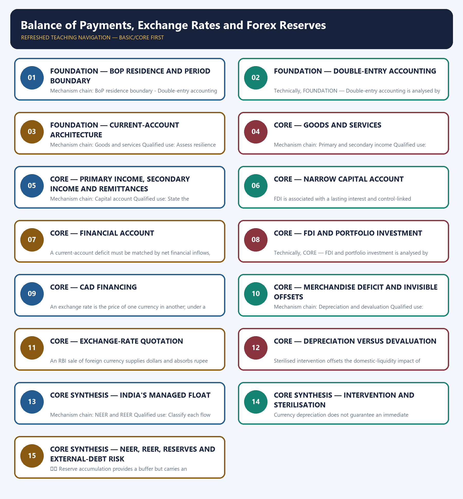

# Balance of Payments, Exchange Rates and Forex Reserves — Learner-v2 Complete Learning Session

> **Authoring-only generation:** 2026-09-03. No PDF was rendered and no tracker or index was mutated.

### SOURCE, PROGRESSION AND CURRENT-LINKAGE AUDIT

- **Generation date:** 2026-09-03.
- **Repository-first evidence:** the Basic owner is taught first and preserved in full; the Advanced owner is retained only in the optional final teaching block.
- **OCR evidence:** Repository Markdown was primary. OCR-searchable local official General Studies papers were used only to confirm printed routed demands. No answer key, marking scheme, unsupported page precision or current macroeconomic statistic was inferred from them.
- **Qdrant:** not used; repository Markdown and available OCR context were sufficient.
- **PYQ integrity:** Audited ledgers route objective demands on external-debt composition, currency-crisis resilience, FDI characteristics and instruments, devaluation, NEER and REER, Federal Reserve tightening and ECBs, and Switzerland's gold-trade versus reserve-holder distinction. Official historical answer keys are unavailable locally for these routed items, so no answer letter is inferred.
- **Live-link boundary:** The RBI BPM6 pages were substantively retrievable and control the modern account structure. No current reserve stock, exchange-rate level, import cover, intervention amount, debt ratio or unofficial answer key was added.
- **Fact/inference discipline:** no current-affairs item, PYQ wording, figure or quotation is invented.

### LIVE OFFICIAL-SOURCE ATTEMPT LOG

The checks below were made on 2026-09-03. Substantive official text is used only for the proposition it actually supports; binary files, dynamic shells, stubs and undated dashboard snippets are recorded but not converted into current claims.

- https://www.rbi.org.in/scripts/publicationsview.aspx?id=13013 — retrieved 2026-09-03; the official RBI BPM6-aligned chapter substantively defined BoP, residence and the current, capital and financial accounts.
- https://www.rbi.org.in/scripts/PublicationReportDetails.aspx?ID=596 — retrieved 2026-09-03; the official RBI report documented the BPM6-based Balance of Payments Manual for India and its compilation context.
- https://www.rbi.org.in/Scripts/PublicationsView.aspx?id=9479 — retrieved 2026-09-03; this older RBI page uses a BPM5-era broad capital-account presentation, so it is recorded as a vintage caution and not used to overwrite the modern capital-versus-financial split.

## BASIC LEARNING SESSION



*Distinct embedded teaching-navigation image. The separate continuous Cārvāka-style flowchart package remains an independent at-a-glance artifact.*

### SESSION 1 — FOUNDATION — BOP RESIDENCE AND PERIOD BOUNDARY

#### DEFINITION / WHAT THIS IS CALLED

**Plain-language definition:** The balance of payments is a statistical statement of transactions between residents and non-residents during a period; residence follows centre of predominant economic interest rather than nationality alone.

**Technical definition:** Mechanism chain: BoP residence boundary - Double-entry accounting Qualified use: Classify each flow by residence, account, credit-debit logic and stock-flow boundary.

#### ANSWER-GRABBING OPENING — WRITE/ADAPT IN THE EXAM

> The balance of payments is a statistical statement of transactions between residents and non-residents during a period; residence follows centre of predominant economic interest rather than nationality alone.

#### MUST-WRITE KEYWORDS

- **FOUNDATION**
- **BoP residence**
- **period boundary**
- **Mechanism chain**
- **Qualified use**
- **The balance of payments**

**How to use them:** Frame the answer through FOUNDATION; define BoP residence, connect period boundary with Mechanism chain to explain the mechanism, and use Qualified use for the decisive comparison or qualification.

#### VISUAL FIRST

```text
BOP RESIDENCE AND PERIOD BOUNDARY
01. BoP residence boundary
    |
    v
02. Double-entry accounting
BOUNDARY -> Do not define BoP by nationality rather than residence and economic territory.
```

*This topic-specific rail fixes the evidence sequence and its exam boundary before analysis.*

#### CORE EXPLANATION

The balance of payments is a statistical statement of transactions between residents and non-residents during a period; residence follows centre of predominant economic interest rather than nationality alone. BoP transactions use double-entry accounting, so the overall statement balances through counterpart entries, reserve-asset changes and errors and omissions; a current-account deficit is not an unpaired loss.

#### NAMED EVIDENCE AND MECHANISM

- The balance of payments is a statistical statement of transactions between residents and non-residents during a period; residence follows centre of predominant economic interest rather than nationality alone.
- BoP transactions use double-entry accounting, so the overall statement balances through counterpart entries, reserve-asset changes and errors and omissions; a current-account deficit is not an unpaired loss.

#### EXAMINER CAUTION

- Do not define BoP by nationality rather than residence and economic territory.

#### EXAM LINK

- **Prelims:** Preserve the exact formula, territorial or resident boundary, price basis, base year, index basket, eligible counterparty, institution and legal status; never upgrade a projection into an actual or a regulatory direction into a universal rule.
- **Mains:** Classify each flow by residence, account, credit-debit logic and stock-flow boundary.

#### MINI RECAP

- **Mechanism chain:** BoP residence boundary -> Double-entry accounting
- **Qualified use:** Classify each flow by residence, account, credit-debit logic and stock-flow boundary.

#### CLOSING RECALL FLOW — FOUNDATION — BOP RESIDENCE AND PERIOD BOUNDARY

```text
START / CONCEPT: FOUNDATION — BoP residence and period boundary
        |
        v
EXACT TERMS: FOUNDATION · BoP residence · period boundary · Mechanism chain · Qualified use · The balance of payments
        |
        v
MECHANISM / ARGUMENT: Mechanism chain: BoP residence boundary - Double-entry accounting Qualified use: Classify each flow by residence, account, credit-debit logic and stock-flow boundary.
        |
        v
CONSEQUENCE / CONTRAST: Do not define BoP by nationality rather than residence and economic territory.
        |
        v
UPSC TRAP / ANSWER-USE: BoP transactions use double-entry accounting, so the overall statement balances through counterpart entries, reserve-asset changes and errors and omissions; a current-account deficit is not an unpaired loss.
        |
        v
ANSWER-GRABBING FORMULATION: The balance of payments is a statistical statement of transactions between residents and non-residents during a period; residence follows centre of predominant economic interest rather than nationality alone.
```
### SESSION 2 — FOUNDATION — DOUBLE-ENTRY ACCOUNTING

#### DEFINITION / WHAT THIS IS CALLED

**Plain-language definition:** Mechanism chain: Current account Qualified use: State the exchange-rate quote before judging appreciation, depreciation or intervention.

**Technical definition:** Technically, FOUNDATION — Double-entry accounting is analysed by relating FOUNDATION to Double-entry accounting, then testing the relationship through Mechanism chain and Qualified use.

#### ANSWER-GRABBING OPENING — WRITE/ADAPT IN THE EXAM

> Mechanism chain: Current account Qualified use: State the exchange-rate quote before judging appreciation, depreciation or intervention.

#### MUST-WRITE KEYWORDS

- **FOUNDATION**
- **Double-entry accounting**
- **Mechanism chain**
- **Qualified use**
- **Qualified**
- **FOUNDATION — Double-entry accounting**

**How to use them:** Frame the answer through FOUNDATION; define Double-entry accounting, connect Mechanism chain with Qualified use to explain the mechanism, and use Qualified for the decisive comparison or qualification.

#### VISUAL FIRST

```text
DOUBLE-ENTRY ACCOUNTING
01. Current account
BOUNDARY -> Do not treat the current-account balance as a standalone cash loss without counterpart entries.
```

*This topic-specific rail fixes the evidence sequence and its exam boundary before analysis.*

#### CORE EXPLANATION

Under BPM6-aligned presentation, the current account covers goods, services, primary income and secondary income.

#### NAMED EVIDENCE AND MECHANISM

- Under BPM6-aligned presentation, the current account covers goods, services, primary income and secondary income.

#### EXAMINER CAUTION

- Do not treat the current-account balance as a standalone cash loss without counterpart entries.

#### EXAM LINK

- **Prelims:** Preserve the exact formula, territorial or resident boundary, price basis, base year, index basket, eligible counterparty, institution and legal status; never upgrade a projection into an actual or a regulatory direction into a universal rule.
- **Mains:** State the exchange-rate quote before judging appreciation, depreciation or intervention.

#### MINI RECAP

- **Mechanism chain:** Current account
- **Qualified use:** State the exchange-rate quote before judging appreciation, depreciation or intervention.

#### CLOSING RECALL FLOW — FOUNDATION — DOUBLE-ENTRY ACCOUNTING

```text
START / CONCEPT: FOUNDATION — Double-entry accounting
        |
        v
EXACT TERMS: FOUNDATION · Double-entry accounting · Mechanism chain · Qualified use · Qualified · FOUNDATION — Double-entry accounting
        |
        v
MECHANISM / ARGUMENT: The operative mechanism is that state the exchange-rate quote before judging appreciation, depreciation or intervention.
        |
        v
CONSEQUENCE / CONTRAST: Do not treat the current-account balance as a standalone cash loss without counterpart entries.
        |
        v
UPSC TRAP / ANSWER-USE: Do not miss this limiting distinction: do not treat the current-account balance as a standalone cash loss without counterpart entries.
        |
        v
ANSWER-GRABBING FORMULATION: Mechanism chain: Current account Qualified use: State the exchange-rate quote before judging appreciation, depreciation or intervention.
```
### SESSION 3 — FOUNDATION — CURRENT-ACCOUNT ARCHITECTURE

#### DEFINITION / WHAT THIS IS CALLED

**Plain-language definition:** Merchandise exports and imports are distinct from services such as transport, travel, software and financial services even though both enter the current account.

**Technical definition:** Mechanism chain: Goods and services Qualified use: Assess resilience through financing quality, reserve adequacy and balance-sheet exposure.

#### ANSWER-GRABBING OPENING — WRITE/ADAPT IN THE EXAM

> Merchandise exports and imports are distinct from services such as transport, travel, software and financial services even though both enter the current account.

#### MUST-WRITE KEYWORDS

- **FOUNDATION**
- **Current-account architecture**
- **Mechanism chain**
- **Qualified use**
- **Merchandise exports and imports**
- **Merchandise**

**How to use them:** Frame the answer through FOUNDATION; define Current-account architecture, connect Mechanism chain with Qualified use to explain the mechanism, and use Merchandise exports and imports for the decisive comparison or qualification.

#### VISUAL FIRST

```text
CURRENT-ACCOUNT ARCHITECTURE
01. Goods and services
BOUNDARY -> Do not place FDI, portfolio flows and ordinary loans in the narrow BPM6 capital account.
```

*This topic-specific rail fixes the evidence sequence and its exam boundary before analysis.*

#### CORE EXPLANATION

Merchandise exports and imports are distinct from services such as transport, travel, software and financial services even though both enter the current account.

#### NAMED EVIDENCE AND MECHANISM

- Merchandise exports and imports are distinct from services such as transport, travel, software and financial services even though both enter the current account.

#### EXAMINER CAUTION

- Do not place FDI, portfolio flows and ordinary loans in the narrow BPM6 capital account.

#### EXAM LINK

- **Prelims:** Preserve the exact formula, territorial or resident boundary, price basis, base year, index basket, eligible counterparty, institution and legal status; never upgrade a projection into an actual or a regulatory direction into a universal rule.
- **Mains:** Assess resilience through financing quality, reserve adequacy and balance-sheet exposure.

#### MINI RECAP

- **Mechanism chain:** Goods and services
- **Qualified use:** Assess resilience through financing quality, reserve adequacy and balance-sheet exposure.

#### CLOSING RECALL FLOW — FOUNDATION — CURRENT-ACCOUNT ARCHITECTURE

```text
START / CONCEPT: FOUNDATION — Current-account architecture
        |
        v
EXACT TERMS: FOUNDATION · Current-account architecture · Mechanism chain · Qualified use · Merchandise exports and imports · Merchandise
        |
        v
MECHANISM / ARGUMENT: Mechanism chain: Goods and services Qualified use: Assess resilience through financing quality, reserve adequacy and balance-sheet exposure.
        |
        v
CONSEQUENCE / CONTRAST: Do not place FDI, portfolio flows and ordinary loans in the narrow BPM6 capital account.
        |
        v
UPSC TRAP / ANSWER-USE: Do not miss this limiting distinction: do not place FDI, portfolio flows and ordinary loans in the narrow BPM6 capital...
        |
        v
ANSWER-GRABBING FORMULATION: Merchandise exports and imports are distinct from services such as transport, travel, software and financial services even though both enter the current account.
```
### SESSION 4 — CORE — GOODS AND SERVICES

#### DEFINITION / WHAT THIS IS CALLED

**Plain-language definition:** Primary income includes compensation and investment income, while secondary income records current transfers such as personal remittances; remittances are not merchandise exports.

**Technical definition:** Mechanism chain: Primary and secondary income Qualified use: Classify each flow by residence, account, credit-debit logic and stock-flow boundary.

#### ANSWER-GRABBING OPENING — WRITE/ADAPT IN THE EXAM

> Primary income includes compensation and investment income, while secondary income records current transfers such as personal remittances; remittances are not merchandise exports.

#### MUST-WRITE KEYWORDS

- **Goods**
- **services**
- **Mechanism chain**
- **Qualified use**
- **Primary**
- **Qualified**

**How to use them:** Frame the answer through Goods; define services, connect Mechanism chain with Qualified use to explain the mechanism, and use Primary for the decisive comparison or qualification.

#### VISUAL FIRST

```text
GOODS AND SERVICES
01. Primary and secondary income
BOUNDARY -> Do not classify personal remittances as merchandise exports.
```

*This topic-specific rail fixes the evidence sequence and its exam boundary before analysis.*

#### CORE EXPLANATION

Primary income includes compensation and investment income, while secondary income records current transfers such as personal remittances; remittances are not merchandise exports.

#### NAMED EVIDENCE AND MECHANISM

- Primary income includes compensation and investment income, while secondary income records current transfers such as personal remittances; remittances are not merchandise exports.

#### EXAMINER CAUTION

- Do not classify personal remittances as merchandise exports.

#### EXAM LINK

- **Prelims:** Preserve the exact formula, territorial or resident boundary, price basis, base year, index basket, eligible counterparty, institution and legal status; never upgrade a projection into an actual or a regulatory direction into a universal rule.
- **Mains:** Classify each flow by residence, account, credit-debit logic and stock-flow boundary.

#### MINI RECAP

- **Mechanism chain:** Primary and secondary income
- **Qualified use:** Classify each flow by residence, account, credit-debit logic and stock-flow boundary.

#### CLOSING RECALL FLOW — CORE — GOODS AND SERVICES

```text
START / CONCEPT: CORE — Goods and services
        |
        v
EXACT TERMS: Goods · services · Mechanism chain · Qualified use · Primary · Qualified
        |
        v
MECHANISM / ARGUMENT: Mechanism chain: Primary and secondary income Qualified use: Classify each flow by residence, account, credit-debit logic and stock-flow boundary.
        |
        v
CONSEQUENCE / CONTRAST: Do not classify personal remittances as merchandise exports.
        |
        v
UPSC TRAP / ANSWER-USE: Do not miss this limiting distinction: primary income includes compensation and investment income.
        |
        v
ANSWER-GRABBING FORMULATION: Primary income includes compensation and investment income, while secondary income records current transfers such as personal remittances; remittances are not merchandise exports.
```
### SESSION 5 — CORE — PRIMARY INCOME, SECONDARY INCOME AND REMITTANCES

#### DEFINITION / WHAT THIS IS CALLED

**Plain-language definition:** The modern capital account records capital transfers and acquisition or disposal of non-produced non-financial assets; it is much narrower than the older broad use of the term capital account.

**Technical definition:** Mechanism chain: Capital account Qualified use: State the exchange-rate quote before judging appreciation, depreciation or intervention.

#### ANSWER-GRABBING OPENING — WRITE/ADAPT IN THE EXAM

> The modern capital account records capital transfers and acquisition or disposal of non-produced non-financial assets; it is much narrower than the older broad use of the term capital account.

#### MUST-WRITE KEYWORDS

- **Primary income**
- **secondary income**
- **remittances**
- **Mechanism chain**
- **Qualified use**
- **Capital**

**How to use them:** Frame the answer through Primary income; define secondary income, connect remittances with Mechanism chain to explain the mechanism, and use Qualified use for the decisive comparison or qualification.

#### VISUAL FIRST

```text
PRIMARY INCOME, SECONDARY INCOME AND REMITTANCES
01. Capital account
BOUNDARY -> Do not discuss appreciation or depreciation without stating the currency quote convention.
```

*This topic-specific rail fixes the evidence sequence and its exam boundary before analysis.*

#### CORE EXPLANATION

The modern capital account records capital transfers and acquisition or disposal of non-produced non-financial assets; it is much narrower than the older broad use of the term capital account.

#### NAMED EVIDENCE AND MECHANISM

- The modern capital account records capital transfers and acquisition or disposal of non-produced non-financial assets; it is much narrower than the older broad use of the term capital account.

#### EXAMINER CAUTION

- Do not discuss appreciation or depreciation without stating the currency quote convention.

#### EXAM LINK

- **Prelims:** Preserve the exact formula, territorial or resident boundary, price basis, base year, index basket, eligible counterparty, institution and legal status; never upgrade a projection into an actual or a regulatory direction into a universal rule.
- **Mains:** State the exchange-rate quote before judging appreciation, depreciation or intervention.

#### MINI RECAP

- **Mechanism chain:** Capital account
- **Qualified use:** State the exchange-rate quote before judging appreciation, depreciation or intervention.

#### CLOSING RECALL FLOW — CORE — PRIMARY INCOME, SECONDARY INCOME AND REMITTANCES

```text
START / CONCEPT: CORE — Primary income, secondary income and remittances
        |
        v
EXACT TERMS: Primary income · secondary income · remittances · Mechanism chain · Qualified use · Capital
        |
        v
MECHANISM / ARGUMENT: Mechanism chain: Capital account Qualified use: State the exchange-rate quote before judging appreciation, depreciation or intervention.
        |
        v
CONSEQUENCE / CONTRAST: Do not discuss appreciation or depreciation without stating the currency quote convention.
        |
        v
UPSC TRAP / ANSWER-USE: Do not miss this limiting distinction: do not discuss appreciation or depreciation without stating the currency quote convention.
        |
        v
ANSWER-GRABBING FORMULATION: The modern capital account records capital transfers and acquisition or disposal of non-produced non-financial assets; it is much narrower than the older broad use of the term capital account.
```
### SESSION 6 — CORE — NARROW CAPITAL ACCOUNT

#### DEFINITION / WHAT THIS IS CALLED

**Plain-language definition:** Mechanism chain: Financial account - FDI and portfolio distinction Qualified use: Assess resilience through financing quality, reserve adequacy and balance-sheet exposure.

**Technical definition:** FDI is associated with a lasting interest and control-linked relationship, whereas portfolio investment is generally a tradable financial claim without equivalent managerial control; neither is automatically stable in every episode.

#### ANSWER-GRABBING OPENING — WRITE/ADAPT IN THE EXAM

> Mechanism chain: Financial account - FDI and portfolio distinction Qualified use: Assess resilience through financing quality, reserve adequacy and balance-sheet exposure.

#### MUST-WRITE KEYWORDS

- **Narrow capital account**
- **Mechanism chain**
- **Qualified use**
- **FDI**
- **Financial**
- **Qualified**

**How to use them:** Frame the answer through Narrow capital account; define Mechanism chain, connect Qualified use with FDI to explain the mechanism, and use Financial for the decisive comparison or qualification.

#### VISUAL FIRST

```text
NARROW CAPITAL ACCOUNT
01. Financial account
    |
    v
02. FDI and portfolio distinction
BOUNDARY -> Do not merge market depreciation with official devaluation.
```

*This topic-specific rail fixes the evidence sequence and its exam boundary before analysis.*

#### CORE EXPLANATION

Direct investment, portfolio investment, financial derivatives, other investment such as loans and deposits, and reserve assets enter the financial account under modern BoP accounting. FDI is associated with a lasting interest and control-linked relationship, whereas portfolio investment is generally a tradable financial claim without equivalent managerial control; neither is automatically stable in every episode.

#### NAMED EVIDENCE AND MECHANISM

- Direct investment, portfolio investment, financial derivatives, other investment such as loans and deposits, and reserve assets enter the financial account under modern BoP accounting.
- FDI is associated with a lasting interest and control-linked relationship, whereas portfolio investment is generally a tradable financial claim without equivalent managerial control; neither is automatically stable in every episode.

#### EXAMINER CAUTION

- Do not merge market depreciation with official devaluation.

#### EXAM LINK

- **Prelims:** Preserve the exact formula, territorial or resident boundary, price basis, base year, index basket, eligible counterparty, institution and legal status; never upgrade a projection into an actual or a regulatory direction into a universal rule.
- **Mains:** Assess resilience through financing quality, reserve adequacy and balance-sheet exposure.

#### MINI RECAP

- **Mechanism chain:** Financial account -> FDI and portfolio distinction
- **Qualified use:** Assess resilience through financing quality, reserve adequacy and balance-sheet exposure.

#### CLOSING RECALL FLOW — CORE — NARROW CAPITAL ACCOUNT

```text
START / CONCEPT: CORE — Narrow capital account
        |
        v
EXACT TERMS: Narrow capital account · Mechanism chain · Qualified use · FDI · Financial · Qualified
        |
        v
MECHANISM / ARGUMENT: FDI is associated with a lasting interest and control-linked relationship, whereas portfolio investment is generally a tradable financial claim without equivalent managerial control; neither is automatically stable in every episode.
        |
        v
CONSEQUENCE / CONTRAST: Do not merge market depreciation with official devaluation.
        |
        v
UPSC TRAP / ANSWER-USE: Do not miss this limiting distinction: fDI is associated with a lasting interest and control-linked relationship.
        |
        v
ANSWER-GRABBING FORMULATION: Mechanism chain: Financial account - FDI and portfolio distinction Qualified use: Assess resilience through financing quality, reserve adequacy and balance-sheet exposure.
```
### SESSION 7 — CORE — FINANCIAL ACCOUNT

#### DEFINITION / WHAT THIS IS CALLED

**Plain-language definition:** Mechanism chain: CAD financing Qualified use: Classify each flow by residence, account, credit-debit logic and stock-flow boundary.

**Technical definition:** A current-account deficit must be matched by net financial inflows, reserve use and accounting adjustment, so vulnerability depends on financing quality, maturity, currency and hedging rather than the CAD alone.

#### ANSWER-GRABBING OPENING — WRITE/ADAPT IN THE EXAM

> Mechanism chain: CAD financing Qualified use: Classify each flow by residence, account, credit-debit logic and stock-flow boundary.

#### MUST-WRITE KEYWORDS

- **Financial account**
- **Mechanism chain**
- **Qualified use**
- **CAD**
- **India's**
- **Qualified**

**How to use them:** Frame the answer through Financial account; define Mechanism chain, connect Qualified use with CAD to explain the mechanism, and use India's for the decisive comparison or qualification.

#### VISUAL FIRST

```text
FINANCIAL ACCOUNT
01. CAD financing
BOUNDARY -> Do not describe India's managed float as either a fixed peg or a pure free float.
```

*This topic-specific rail fixes the evidence sequence and its exam boundary before analysis.*

#### CORE EXPLANATION

A current-account deficit must be matched by net financial inflows, reserve use and accounting adjustment, so vulnerability depends on financing quality, maturity, currency and hedging rather than the CAD alone.

#### NAMED EVIDENCE AND MECHANISM

- A current-account deficit must be matched by net financial inflows, reserve use and accounting adjustment, so vulnerability depends on financing quality, maturity, currency and hedging rather than the CAD alone.

#### EXAMINER CAUTION

- Do not describe India's managed float as either a fixed peg or a pure free float.

#### EXAM LINK

- **Prelims:** Preserve the exact formula, territorial or resident boundary, price basis, base year, index basket, eligible counterparty, institution and legal status; never upgrade a projection into an actual or a regulatory direction into a universal rule.
- **Mains:** Classify each flow by residence, account, credit-debit logic and stock-flow boundary.

#### MINI RECAP

- **Mechanism chain:** CAD financing
- **Qualified use:** Classify each flow by residence, account, credit-debit logic and stock-flow boundary.

#### CLOSING RECALL FLOW — CORE — FINANCIAL ACCOUNT

```text
START / CONCEPT: CORE — Financial account
        |
        v
EXACT TERMS: Financial account · Mechanism chain · Qualified use · CAD · India's · Qualified
        |
        v
MECHANISM / ARGUMENT: A current-account deficit must be matched by net financial inflows, reserve use and accounting adjustment, so vulnerability depends on financing quality, maturity, currency and hedging rather than the CAD alone.
        |
        v
CONSEQUENCE / CONTRAST: Do not describe India's managed float as either a fixed peg or a pure free float.
        |
        v
UPSC TRAP / ANSWER-USE: Do not miss this limiting distinction: do not describe India's managed float as either a fixed peg or a pure...
        |
        v
ANSWER-GRABBING FORMULATION: Mechanism chain: CAD financing Qualified use: Classify each flow by residence, account, credit-debit logic and stock-flow boundary.
```
### SESSION 8 — CORE — FDI AND PORTFOLIO INVESTMENT

#### DEFINITION / WHAT THIS IS CALLED

**Plain-language definition:** Mechanism chain: Merchandise-deficit offset Qualified use: State the exchange-rate quote before judging appreciation, depreciation or intervention.

**Technical definition:** Technically, CORE — FDI and portfolio investment is analysed by relating FDI to portfolio investment, then testing the relationship through Mechanism chain and Qualified use.

#### ANSWER-GRABBING OPENING — WRITE/ADAPT IN THE EXAM

> Do not reverse the rupee-liquidity effect of RBI dollar purchases and sales.

#### MUST-WRITE KEYWORDS

- **FDI**
- **portfolio investment**
- **Mechanism chain**
- **Qualified use**
- **RBI**
- **Merchandise-deficit**

**How to use them:** Frame the answer through FDI; define portfolio investment, connect Mechanism chain with Qualified use to explain the mechanism, and use RBI for the decisive comparison or qualification.

#### VISUAL FIRST

```text
FDI AND PORTFOLIO INVESTMENT
01. Merchandise-deficit offset
BOUNDARY -> Do not reverse the rupee-liquidity effect of RBI dollar purchases and sales.
```

*This topic-specific rail fixes the evidence sequence and its exam boundary before analysis.*

#### CORE EXPLANATION

A merchandise trade deficit can coexist with a smaller current-account deficit when net services, primary-income or secondary-income receipts offset part of the goods gap.

#### NAMED EVIDENCE AND MECHANISM

- A merchandise trade deficit can coexist with a smaller current-account deficit when net services, primary-income or secondary-income receipts offset part of the goods gap.

#### EXAMINER CAUTION

- Do not reverse the rupee-liquidity effect of RBI dollar purchases and sales.

#### EXAM LINK

- **Prelims:** Preserve the exact formula, territorial or resident boundary, price basis, base year, index basket, eligible counterparty, institution and legal status; never upgrade a projection into an actual or a regulatory direction into a universal rule.
- **Mains:** State the exchange-rate quote before judging appreciation, depreciation or intervention.

#### MINI RECAP

- **Mechanism chain:** Merchandise-deficit offset
- **Qualified use:** State the exchange-rate quote before judging appreciation, depreciation or intervention.

#### CLOSING RECALL FLOW — CORE — FDI AND PORTFOLIO INVESTMENT

```text
START / CONCEPT: CORE — FDI and portfolio investment
        |
        v
EXACT TERMS: FDI · portfolio investment · Mechanism chain · Qualified use · RBI · Merchandise-deficit
        |
        v
MECHANISM / ARGUMENT: Mechanism chain: Merchandise-deficit offset Qualified use: State the exchange-rate quote before judging appreciation, depreciation or intervention.
        |
        v
CONSEQUENCE / CONTRAST: A merchandise trade deficit can coexist with a smaller current-account deficit when net services, primary-income or secondary-income receipts offset part of the goods gap.
        |
        v
UPSC TRAP / ANSWER-USE: Do not miss this limiting distinction: do not reverse the rupee-liquidity effect of RBI dollar purchases and sales.
        |
        v
ANSWER-GRABBING FORMULATION: Do not reverse the rupee-liquidity effect of RBI dollar purchases and sales.
```
### SESSION 9 — CORE — CAD FINANCING

#### DEFINITION / WHAT THIS IS CALLED

**Plain-language definition:** Mechanism chain: Exchange-rate quote Qualified use: Assess resilience through financing quality, reserve adequacy and balance-sheet exposure.

**Technical definition:** An exchange rate is the price of one currency in another; under a rupees-per-dollar quote, a higher number means the rupee has depreciated against the dollar.

#### ANSWER-GRABBING OPENING — WRITE/ADAPT IN THE EXAM

> Mechanism chain: Exchange-rate quote Qualified use: Assess resilience through financing quality, reserve adequacy and balance-sheet exposure.

#### MUST-WRITE KEYWORDS

- **CAD financing**
- **Mechanism chain**
- **Qualified use**
- **An exchange rate**
- **NEER**
- **REER**

**How to use them:** Frame the answer through CAD financing; define Mechanism chain, connect Qualified use with An exchange rate to explain the mechanism, and use NEER for the decisive comparison or qualification.

#### VISUAL FIRST

```text
CAD FINANCING
01. Exchange-rate quote
BOUNDARY -> Do not interpret NEER or REER without its index convention, base and weights.
```

*This topic-specific rail fixes the evidence sequence and its exam boundary before analysis.*

#### CORE EXPLANATION

An exchange rate is the price of one currency in another; under a rupees-per-dollar quote, a higher number means the rupee has depreciated against the dollar.

#### NAMED EVIDENCE AND MECHANISM

- An exchange rate is the price of one currency in another; under a rupees-per-dollar quote, a higher number means the rupee has depreciated against the dollar.

#### EXAMINER CAUTION

- Do not interpret NEER or REER without its index convention, base and weights.

#### EXAM LINK

- **Prelims:** Preserve the exact formula, territorial or resident boundary, price basis, base year, index basket, eligible counterparty, institution and legal status; never upgrade a projection into an actual or a regulatory direction into a universal rule.
- **Mains:** Assess resilience through financing quality, reserve adequacy and balance-sheet exposure.

#### MINI RECAP

- **Mechanism chain:** Exchange-rate quote
- **Qualified use:** Assess resilience through financing quality, reserve adequacy and balance-sheet exposure.

#### CLOSING RECALL FLOW — CORE — CAD FINANCING

```text
START / CONCEPT: CORE — CAD financing
        |
        v
EXACT TERMS: CAD financing · Mechanism chain · Qualified use · An exchange rate · NEER · REER
        |
        v
MECHANISM / ARGUMENT: Do not interpret NEER or REER without its index convention, base and weights.
        |
        v
CONSEQUENCE / CONTRAST: An exchange rate is the price of one currency in another; under a rupees-per-dollar quote, a higher number means the rupee has depreciated against the dollar.
        |
        v
UPSC TRAP / ANSWER-USE: Do not miss this limiting distinction: do not interpret NEER or REER without its index convention, base and weights.
        |
        v
ANSWER-GRABBING FORMULATION: Mechanism chain: Exchange-rate quote Qualified use: Assess resilience through financing quality, reserve adequacy and balance-sheet exposure.
```
### SESSION 10 — CORE — MERCHANDISE DEFICIT AND INVISIBLE OFFSETS

#### DEFINITION / WHAT THIS IS CALLED

**Plain-language definition:** Depreciation and appreciation describe market-rate movement, while devaluation and revaluation are official parity changes under a fixed or administered exchange-rate arrangement.

**Technical definition:** Mechanism chain: Depreciation and devaluation Qualified use: Classify each flow by residence, account, credit-debit logic and stock-flow boundary.

#### ANSWER-GRABBING OPENING — WRITE/ADAPT IN THE EXAM

> Depreciation and appreciation describe market-rate movement, while devaluation and revaluation are official parity changes under a fixed or administered exchange-rate arrangement.

#### MUST-WRITE KEYWORDS

- **Merchandise deficit**
- **invisible offsets**
- **Mechanism chain**
- **Qualified use**
- **Depreciation**
- **Qualified**

**How to use them:** Frame the answer through Merchandise deficit; define invisible offsets, connect Mechanism chain with Qualified use to explain the mechanism, and use Depreciation for the decisive comparison or qualification.

#### VISUAL FIRST

```text
MERCHANDISE DEFICIT AND INVISIBLE OFFSETS
01. Depreciation and devaluation
BOUNDARY -> Do not quote a reserve stock, import cover or debt ratio without its date and source.
```

*This topic-specific rail fixes the evidence sequence and its exam boundary before analysis.*

#### CORE EXPLANATION

Depreciation and appreciation describe market-rate movement, while devaluation and revaluation are official parity changes under a fixed or administered exchange-rate arrangement.

#### NAMED EVIDENCE AND MECHANISM

- Depreciation and appreciation describe market-rate movement, while devaluation and revaluation are official parity changes under a fixed or administered exchange-rate arrangement.

#### EXAMINER CAUTION

- Do not quote a reserve stock, import cover or debt ratio without its date and source.

#### EXAM LINK

- **Prelims:** Preserve the exact formula, territorial or resident boundary, price basis, base year, index basket, eligible counterparty, institution and legal status; never upgrade a projection into an actual or a regulatory direction into a universal rule.
- **Mains:** Classify each flow by residence, account, credit-debit logic and stock-flow boundary.

#### MINI RECAP

- **Mechanism chain:** Depreciation and devaluation
- **Qualified use:** Classify each flow by residence, account, credit-debit logic and stock-flow boundary.

#### CLOSING RECALL FLOW — CORE — MERCHANDISE DEFICIT AND INVISIBLE OFFSETS

```text
START / CONCEPT: CORE — Merchandise deficit and invisible offsets
        |
        v
EXACT TERMS: Merchandise deficit · invisible offsets · Mechanism chain · Qualified use · Depreciation · Qualified
        |
        v
MECHANISM / ARGUMENT: Mechanism chain: Depreciation and devaluation Qualified use: Classify each flow by residence, account, credit-debit logic and stock-flow boundary.
        |
        v
CONSEQUENCE / CONTRAST: Do not quote a reserve stock, import cover or debt ratio without its date and source.
        |
        v
UPSC TRAP / ANSWER-USE: Do not miss this limiting distinction: depreciation and appreciation describe market-rate movement.
        |
        v
ANSWER-GRABBING FORMULATION: Depreciation and appreciation describe market-rate movement, while devaluation and revaluation are official parity changes under a fixed or administered exchange-rate arrangement.
```
### SESSION 11 — CORE — EXCHANGE-RATE QUOTATION

#### DEFINITION / WHAT THIS IS CALLED

**Plain-language definition:** Mechanism chain: Managed float - Intervention liquidity effect Qualified use: State the exchange-rate quote before judging appreciation, depreciation or intervention.

**Technical definition:** An RBI sale of foreign currency supplies dollars and absorbs rupee liquidity, while a purchase of foreign currency injects rupees; the monetary effect can be offset through sterilisation operations.

#### ANSWER-GRABBING OPENING — WRITE/ADAPT IN THE EXAM

> Mechanism chain: Managed float - Intervention liquidity effect Qualified use: State the exchange-rate quote before judging appreciation, depreciation or intervention.

#### MUST-WRITE KEYWORDS

- **Exchange-rate quotation**
- **Mechanism chain**
- **Qualified use**
- **India**
- **RBI**
- **An RBI**

**How to use them:** Frame the answer through Exchange-rate quotation; define Mechanism chain, connect Qualified use with India to explain the mechanism, and use RBI for the decisive comparison or qualification.

#### VISUAL FIRST

```text
EXCHANGE-RATE QUOTATION
01. Managed float
    |
    v
02. Intervention liquidity effect
BOUNDARY -> Do not define BoP by nationality rather than residence and economic territory.
```

*This topic-specific rail fixes the evidence sequence and its exam boundary before analysis.*

#### CORE EXPLANATION

India operates a managed-float framework in which the rupee is market-determined but the RBI may intervene to smooth excessive volatility without declaring a fixed target level. An RBI sale of foreign currency supplies dollars and absorbs rupee liquidity, while a purchase of foreign currency injects rupees; the monetary effect can be offset through sterilisation operations.

#### NAMED EVIDENCE AND MECHANISM

- India operates a managed-float framework in which the rupee is market-determined but the RBI may intervene to smooth excessive volatility without declaring a fixed target level.
- An RBI sale of foreign currency supplies dollars and absorbs rupee liquidity, while a purchase of foreign currency injects rupees; the monetary effect can be offset through sterilisation operations.

#### EXAMINER CAUTION

- Do not define BoP by nationality rather than residence and economic territory.

#### EXAM LINK

- **Prelims:** Preserve the exact formula, territorial or resident boundary, price basis, base year, index basket, eligible counterparty, institution and legal status; never upgrade a projection into an actual or a regulatory direction into a universal rule.
- **Mains:** State the exchange-rate quote before judging appreciation, depreciation or intervention.

#### MINI RECAP

- **Mechanism chain:** Managed float -> Intervention liquidity effect
- **Qualified use:** State the exchange-rate quote before judging appreciation, depreciation or intervention.

#### CLOSING RECALL FLOW — CORE — EXCHANGE-RATE QUOTATION

```text
START / CONCEPT: CORE — Exchange-rate quotation
        |
        v
EXACT TERMS: Exchange-rate quotation · Mechanism chain · Qualified use · India · RBI · An RBI
        |
        v
MECHANISM / ARGUMENT: An RBI sale of foreign currency supplies dollars and absorbs rupee liquidity, while a purchase of foreign currency injects rupees; the monetary effect can be offset through sterilisation operations.
        |
        v
CONSEQUENCE / CONTRAST: India operates a managed-float framework in which the rupee is market-determined but the RBI may intervene to smooth excessive volatility without declaring a fixed target level.
        |
        v
UPSC TRAP / ANSWER-USE: Do not define BoP by nationality rather than residence and economic territory.
        |
        v
ANSWER-GRABBING FORMULATION: Mechanism chain: Managed float - Intervention liquidity effect Qualified use: State the exchange-rate quote before judging appreciation, depreciation or intervention.
```
### SESSION 12 — CORE — DEPRECIATION VERSUS DEVALUATION

#### DEFINITION / WHAT THIS IS CALLED

**Plain-language definition:** Mechanism chain: Sterilisation boundary Qualified use: Assess resilience through financing quality, reserve adequacy and balance-sheet exposure.

**Technical definition:** Sterilised intervention offsets the domestic-liquidity impact of foreign-exchange operations but has costs and cannot permanently override underlying external imbalances.

#### ANSWER-GRABBING OPENING — WRITE/ADAPT IN THE EXAM

> Sterilised intervention offsets the domestic-liquidity impact of foreign-exchange operations but has costs and cannot permanently override underlying external imbalances.

#### MUST-WRITE KEYWORDS

- **Depreciation versus devaluation**
- **Mechanism chain**
- **Qualified use**
- **Sterilised**
- **Sterilisation**
- **Qualified**

**How to use them:** Frame the answer through Depreciation versus devaluation; define Mechanism chain, connect Qualified use with Sterilised to explain the mechanism, and use Sterilisation for the decisive comparison or qualification.

#### VISUAL FIRST

```text
DEPRECIATION VERSUS DEVALUATION
01. Sterilisation boundary
BOUNDARY -> Do not treat the current-account balance as a standalone cash loss without counterpart entries.
```

*This topic-specific rail fixes the evidence sequence and its exam boundary before analysis.*

#### CORE EXPLANATION

Sterilised intervention offsets the domestic-liquidity impact of foreign-exchange operations but has costs and cannot permanently override underlying external imbalances.

#### NAMED EVIDENCE AND MECHANISM

- Sterilised intervention offsets the domestic-liquidity impact of foreign-exchange operations but has costs and cannot permanently override underlying external imbalances.

#### EXAMINER CAUTION

- Do not treat the current-account balance as a standalone cash loss without counterpart entries.

#### EXAM LINK

- **Prelims:** Preserve the exact formula, territorial or resident boundary, price basis, base year, index basket, eligible counterparty, institution and legal status; never upgrade a projection into an actual or a regulatory direction into a universal rule.
- **Mains:** Assess resilience through financing quality, reserve adequacy and balance-sheet exposure.

#### MINI RECAP

- **Mechanism chain:** Sterilisation boundary
- **Qualified use:** Assess resilience through financing quality, reserve adequacy and balance-sheet exposure.

#### CLOSING RECALL FLOW — CORE — DEPRECIATION VERSUS DEVALUATION

```text
START / CONCEPT: CORE — Depreciation versus devaluation
        |
        v
EXACT TERMS: Depreciation versus devaluation · Mechanism chain · Qualified use · Sterilised · Sterilisation · Qualified
        |
        v
MECHANISM / ARGUMENT: Mechanism chain: Sterilisation boundary Qualified use: Assess resilience through financing quality, reserve adequacy and balance-sheet exposure.
        |
        v
CONSEQUENCE / CONTRAST: Do not treat the current-account balance as a standalone cash loss without counterpart entries.
        |
        v
UPSC TRAP / ANSWER-USE: Do not miss this limiting distinction: sterilised intervention offsets the domestic-liquidity impact of foreign-exchange operations but has costs and cannot...
        |
        v
ANSWER-GRABBING FORMULATION: Sterilised intervention offsets the domestic-liquidity impact of foreign-exchange operations but has costs and cannot permanently override underlying external imbalances.
```
### SESSION 13 — CORE SYNTHESIS — INDIA'S MANAGED FLOAT

#### DEFINITION / WHAT THIS IS CALLED

**Plain-language definition:** NEER is a trade-weighted nominal effective exchange-rate index, while REER adjusts the effective rate for relative prices or costs; interpretation requires the published index convention, base and weights.

**Technical definition:** Mechanism chain: NEER and REER Qualified use: Classify each flow by residence, account, credit-debit logic and stock-flow boundary.

#### ANSWER-GRABBING OPENING — WRITE/ADAPT IN THE EXAM

> NEER is a trade-weighted nominal effective exchange-rate index, while REER adjusts the effective rate for relative prices or costs; interpretation requires the published index convention, base and weights.

#### MUST-WRITE KEYWORDS

- **CORE SYNTHESIS**
- **India's managed float**
- **Mechanism chain**
- **Qualified use**
- **NEER**
- **REER**

**How to use them:** Frame the answer through CORE SYNTHESIS; define India's managed float, connect Mechanism chain with Qualified use to explain the mechanism, and use NEER for the decisive comparison or qualification.

#### VISUAL FIRST

```text
INDIA'S MANAGED FLOAT
01. NEER and REER
BOUNDARY -> Do not place FDI, portfolio flows and ordinary loans in the narrow BPM6 capital account.
```

*This topic-specific rail fixes the evidence sequence and its exam boundary before analysis.*

#### CORE EXPLANATION

NEER is a trade-weighted nominal effective exchange-rate index, while REER adjusts the effective rate for relative prices or costs; interpretation requires the published index convention, base and weights.

#### NAMED EVIDENCE AND MECHANISM

- NEER is a trade-weighted nominal effective exchange-rate index, while REER adjusts the effective rate for relative prices or costs; interpretation requires the published index convention, base and weights.

#### EXAMINER CAUTION

- Do not place FDI, portfolio flows and ordinary loans in the narrow BPM6 capital account.

#### EXAM LINK

- **Prelims:** Preserve the exact formula, territorial or resident boundary, price basis, base year, index basket, eligible counterparty, institution and legal status; never upgrade a projection into an actual or a regulatory direction into a universal rule.
- **Mains:** Classify each flow by residence, account, credit-debit logic and stock-flow boundary.

#### MINI RECAP

- **Mechanism chain:** NEER and REER
- **Qualified use:** Classify each flow by residence, account, credit-debit logic and stock-flow boundary.

#### CLOSING RECALL FLOW — CORE SYNTHESIS — INDIA'S MANAGED FLOAT

```text
START / CONCEPT: CORE SYNTHESIS — India's managed float
        |
        v
EXACT TERMS: CORE SYNTHESIS · India's managed float · Mechanism chain · Qualified use · NEER · REER
        |
        v
MECHANISM / ARGUMENT: Mechanism chain: NEER and REER Qualified use: Classify each flow by residence, account, credit-debit logic and stock-flow boundary.
        |
        v
CONSEQUENCE / CONTRAST: Do not place FDI, portfolio flows and ordinary loans in the narrow BPM6 capital account.
        |
        v
UPSC TRAP / ANSWER-USE: Do not miss this limiting distinction: nEER is a trade-weighted nominal effective exchange-rate index.
        |
        v
ANSWER-GRABBING FORMULATION: NEER is a trade-weighted nominal effective exchange-rate index, while REER adjusts the effective rate for relative prices or costs; interpretation requires the published index convention, base and weights.
```
### SESSION 14 — CORE SYNTHESIS — INTERVENTION AND STERILISATION

#### DEFINITION / WHAT THIS IS CALLED

**Plain-language definition:** Mechanism chain: Trade-balance response - Forex-reserve composition Qualified use: State the exchange-rate quote before judging appreciation, depreciation or intervention.

**Technical definition:** Currency depreciation does not guarantee an immediate trade-balance improvement because contracts, import dependence, pass-through, capacity and export-import elasticities shape quantity adjustment.

#### ANSWER-GRABBING OPENING — WRITE/ADAPT IN THE EXAM

> Mechanism chain: Trade-balance response - Forex-reserve composition Qualified use: State the exchange-rate quote before judging appreciation, depreciation or intervention.

#### MUST-WRITE KEYWORDS

- **CORE SYNTHESIS**
- **Intervention**
- **sterilisation**
- **Mechanism chain**
- **Qualified use**
- **Currency**

**How to use them:** Frame the answer through CORE SYNTHESIS; define Intervention, connect sterilisation with Mechanism chain to explain the mechanism, and use Qualified use for the decisive comparison or qualification.

#### VISUAL FIRST

```text
INTERVENTION AND STERILISATION
01. Trade-balance response
    |
    v
02. Forex-reserve composition
BOUNDARY -> Do not classify personal remittances as merchandise exports.
```

*This topic-specific rail fixes the evidence sequence and its exam boundary before analysis.*

#### CORE EXPLANATION

Currency depreciation does not guarantee an immediate trade-balance improvement because contracts, import dependence, pass-through, capacity and export-import elasticities shape quantity adjustment. India's reserve assets include foreign-currency assets, monetary gold, Special Drawing Rights and the reserve-tranche position in the IMF; reserves are central-bank assets, not budget revenue.

#### NAMED EVIDENCE AND MECHANISM

- Currency depreciation does not guarantee an immediate trade-balance improvement because contracts, import dependence, pass-through, capacity and export-import elasticities shape quantity adjustment.
- India's reserve assets include foreign-currency assets, monetary gold, Special Drawing Rights and the reserve-tranche position in the IMF; reserves are central-bank assets, not budget revenue.

#### EXAMINER CAUTION

- Do not classify personal remittances as merchandise exports.

#### EXAM LINK

- **Prelims:** Preserve the exact formula, territorial or resident boundary, price basis, base year, index basket, eligible counterparty, institution and legal status; never upgrade a projection into an actual or a regulatory direction into a universal rule.
- **Mains:** State the exchange-rate quote before judging appreciation, depreciation or intervention.

#### MINI RECAP

- **Mechanism chain:** Trade-balance response -> Forex-reserve composition
- **Qualified use:** State the exchange-rate quote before judging appreciation, depreciation or intervention.

#### CLOSING RECALL FLOW — CORE SYNTHESIS — INTERVENTION AND STERILISATION

```text
START / CONCEPT: CORE SYNTHESIS — Intervention and sterilisation
        |
        v
EXACT TERMS: CORE SYNTHESIS · Intervention · sterilisation · Mechanism chain · Qualified use · Currency
        |
        v
MECHANISM / ARGUMENT: Currency depreciation does not guarantee an immediate trade-balance improvement because contracts, import dependence, pass-through, capacity and export-import elasticities shape quantity adjustment.
        |
        v
CONSEQUENCE / CONTRAST: India's reserve assets include foreign-currency assets, monetary gold, Special Drawing Rights and the reserve-tranche position in the IMF; reserves are central-bank assets, not budget revenue.
        |
        v
UPSC TRAP / ANSWER-USE: Do not classify personal remittances as merchandise exports.
        |
        v
ANSWER-GRABBING FORMULATION: Mechanism chain: Trade-balance response - Forex-reserve composition Qualified use: State the exchange-rate quote before judging appreciation, depreciation or intervention.
```
### SESSION 15 — CORE SYNTHESIS — NEER, REER, RESERVES AND EXTERNAL-DEBT RISK

#### DEFINITION / WHAT THIS IS CALLED

**Plain-language definition:** Capital transfers are recorded in the capital account, while FDI, portfolio, loans and reserves enter the financial account.

**Technical definition:** ⚠️ Reserve accumulation provides a buffer but carries an opportunity/carrying cost (lower return than domestic investment) and does not by itself address structural competitiveness or import dependence (e.g., on crude oil). ⚠️ Sterilised intervention can defend a managed float in the short run but is fiscally and operationally costly if sustained, and can distort the domestic yield curve. ⚠️ Import-cover metrics are a useful adequacy heuristic but do not capture the currency, maturity and rollover composition of external liabilities that determined the severity of the 1991 crisis and the 2013 taper-tantrum episode. ⚠️ Reliance on services exports and remittances to offset a merchandise deficit concentrates external resilience in sectors (IT services, Gulf-linked remittances) that carry their own demand-concentration and geopolitical risks. ⚠️ A calibrated, partly closed capital account reduces trilemma pressure but also limits the depth and liquidity of India's financial markets relative to fully open economies. ⚠️ Currency depreciation used as an adjustment tool can raise imported inflation and the rupee cost of unhedged external debt before any trade-competitiveness benefit materialises.

#### ANSWER-GRABBING OPENING — WRITE/ADAPT IN THE EXAM

> Counter-evidence and balance Pair every stability claim (reserves, managed float, services surplus) with its Core limitation caution (carrying cost, sterilisation cost, financing-quality risk) so the answer does not read as one-sided reassurance.

#### MUST-WRITE KEYWORDS

- **CORE SYNTHESIS**
- **NEER**
- **REER**
- **reserves**
- **external-debt risk**
- **Mechanism chain**

**How to use them:** Frame the answer through CORE SYNTHESIS; define NEER, connect REER with reserves to explain the mechanism, and use external-debt risk for the decisive comparison or qualification.

#### VISUAL FIRST

```text
NEER, REER, RESERVES AND EXTERNAL-DEBT RISK
01. Reserve-adequacy test
    |
    v
02. External-debt exposure
BOUNDARY -> Do not discuss appreciation or depreciation without stating the currency quote convention.
```

*This topic-specific rail fixes the evidence sequence and its exam boundary before analysis.*

#### CORE EXPLANATION

Reserve adequacy is multidimensional and may be assessed against imports, short-term debt, broad money, external financing needs and stress scenarios; an absolute dollar stock alone is insufficient. External vulnerability depends on borrower, instrument, original and residual maturity, currency denomination, hedging and rollover needs; ECBs are distinct from FDI, portfolio debt and official assistance.

#### NAMED EVIDENCE AND MECHANISM

- Reserve adequacy is multidimensional and may be assessed against imports, short-term debt, broad money, external financing needs and stress scenarios; an absolute dollar stock alone is insufficient.
- External vulnerability depends on borrower, instrument, original and residual maturity, currency denomination, hedging and rollover needs; ECBs are distinct from FDI, portfolio debt and official assistance.

#### EXAMINER CAUTION

- Do not discuss appreciation or depreciation without stating the currency quote convention.

#### EXAM LINK

- **Prelims:** Preserve the exact formula, territorial or resident boundary, price basis, base year, index basket, eligible counterparty, institution and legal status; never upgrade a projection into an actual or a regulatory direction into a universal rule.
- **Mains:** Assess resilience through financing quality, reserve adequacy and balance-sheet exposure.

#### MINI RECAP

- **Mechanism chain:** Reserve-adequacy test -> External-debt exposure
- **Qualified use:** Assess resilience through financing quality, reserve adequacy and balance-sheet exposure.
#### COMPLETE BASIC OWNER EVIDENCE BANK

> **Subject:** Economy | **Tier:** Must-Do (foundation) | **GS Paper:** GS-III + Prelims.
> **Core area:** External sector.
> **Grounded in:** Ramesh Singh, relevant chapters; Economic Survey 2025-26; audited UPSC Economy PYQs (2024-2026 Prelims and 2024-2025 Mains).
> ✅ = source-grounded | ⚠️ = analytical linkage | 📰 = current Survey/current-affairs hook.
> *Companion: `../advanced/19_Balance-of-Payments-Exchange-Rates-and-Forex-Reserves.md`.*

#### 1. Visual foundation

```text
1. CURRENT AND CAPITAL-ACCOUNT TRANSACTIONS
   |
   v
2. FINANCIAL FLOWS
   |
   v
3. FOREIGN-EXCHANGE DEMAND AND SUPPLY
   |
   v
4. EXCHANGE-RATE MOVEMENT OR INTERVENTION
   |
   v
5. RESERVE AND MACRO ADJUSTMENT
```

**Core proposition:** Preserve the modern capital-versus-financial-account distinction and
judge external risk by the quality of financing and balance-sheet exposure, not the CAD
alone.

#### 2. Essential definitions

| Concept | Exam-ready meaning |
|---|---|
| ✅ **Current account** | Trade in goods and services plus primary and secondary income. |
| ✅ **Capital account** | Capital transfers and acquisition or disposal of non-produced non-financial assets. |
| ✅ **Financial account** | Cross-border investment and reserve-asset transactions. |
| ✅ **Exchange rate** | Price of one currency in terms of another. |
| ✅ **Forex reserves** | External reserve assets held by the monetary authority. |

#### 3. Topic mechanism

1. Goods, services and income transactions create current-account receipts and payments.
2. Capital transfers are recorded in the capital account, while FDI, portfolio, loans and
   reserves enter the financial account.
3. Net foreign-currency demand affects the exchange rate unless private flows or RBI
   operations offset it.
4. Exchange-rate movement changes import costs, exporter realisations, inflation and
   foreign-currency balance sheets.
5. Reserves and flexible adjustment provide shock absorption, but long-run stability depends
   on competitiveness and prudent financing.

#### 4. Institutions and policy tools

- ✅ **RBI:** compiles BoP statistics, manages reserves and intervenes in foreign-exchange
  markets.
- ✅ **Ministry of Commerce and Industry:** addresses merchandise and services trade policy
  and export promotion.
- ✅ **Department of Economic Affairs:** manages external borrowing policy and multilateral
  economic engagement.
- ✅ **Authorised dealer banks:** execute foreign-exchange transactions under FEMA and RBI
  directions.

#### 5. Indian applications and examples

- ✅ **Claim:** India manages its exchange rate through a "managed float" rather than a
  purely market-determined or a fixed-parity system. **Evidence:** The rupee's exchange
  rate is market-determined day-to-day, but the RBI intervenes in the foreign-exchange
  market to smooth excessive volatility without targeting a fixed level.
  **Significance:** This distinguishes India's regime from a free float or a pegged system,
  a frequently tested conceptual distinction. **Limitation:** "Smoothing volatility" is a
  matter of degree and timing; the line between managing volatility and resisting a
  fundamental trend is a judgment call, not a fixed rule.
- ✅ **Claim:** RBI's foreign-exchange intervention affects domestic rupee liquidity unless
  separately managed. **Evidence:** When RBI sells (or buys) foreign currency to influence
  the exchange rate, it correspondingly absorbs (or injects) rupee liquidity; it may conduct
  sterilisation operations (e.g., open-market operations) to offset this unintended
  monetary effect. **Significance:** This links external-sector management directly to the
  monetary-policy topic and is a standard analytical bridge in Mains answers.
  **Limitation:** Sterilisation has a fiscal/quasi-fiscal cost (interest-cost differential)
  and cannot be sustained indefinitely at large scale.
- ✅ **Claim:** The 1991 crisis is the foundational named episode showing why reserve
  adequacy and external financing quality matter. **Evidence:** India's 1991
  balance-of-payments crisis, marked by critically low foreign-exchange reserves (reportedly
  covering only a few weeks of imports) and reliance on emergency IMF/gold-pledge support,
  triggered structural reforms including exchange-rate and trade liberalisation.
  **Significance:** It anchors the "reserves are not a substitute for competitiveness"
  caution with a concrete historical case. **Limitation:** The 1991 episode is a single,
  extreme case; using it to argue current reserve levels are similarly precarious would
  overstate today's materially different reserve and institutional position.
- ✅ **Claim:** The 2013 "taper tantrum" demonstrates how external monetary-policy shifts by
  major economies can transmit to India's currency and capital flows. **Evidence:** The
  US Federal Reserve's 2013 signal of tapering asset purchases triggered capital outflows
  from emerging markets including India, sharp rupee depreciation and RBI/government
  measures (including special swap facilities to attract NRI deposits) to stabilise the
  currency. **Significance:** It illustrates the "financial account" channel of BoP
  vulnerability distinct from a trade-driven crisis. **Limitation:** India's response
  (deposit swap schemes, reserve use) was specific to 2013 conditions; identical instruments
  are not automatically available or appropriate in every future episode.
- ✅ **Claim:** The COVID-19 shock (2020) shows how a global demand/trade shock can
  paradoxically coincide with reserve accumulation rather than depletion. **Evidence:**
  During 2020, India's current-account position moved into surplus for a period (due to a
  collapse in imports outpacing the fall in exports/remittances) and forex reserves rose
  significantly even as global trade contracted sharply. **Significance:** This shows BoP
  outcomes depend on the relative size of shocks across current and financial accounts, not
  a single "crisis always depletes reserves" rule. **Limitation:** The COVID-period surplus
  was a temporary, demand-collapse-driven anomaly and reversed as domestic demand and
  imports recovered; it should not be read as a structural improvement.
- ✅ **Claim:** The "impossible trinity" (trilemma) explains why India cannot simultaneously
  have full exchange-rate stability, free capital mobility and fully independent monetary
  policy. **Evidence:** Standard open-economy macroeconomics holds that a country can choose
  at most two of the three: fixed exchange rate, free capital movement, and independent
  monetary policy; India manages this by allowing a managed float and calibrated (not fully
  open) capital-account convertibility. **Significance:** This is the analytical frame
  examiners expect when a question asks why India does not simply peg the rupee or fully
  open the capital account. **Limitation:** The trinity is a stylised theoretical framework;
  real-world policy mixes (partial capital controls, managed float) occupy a spectrum rather
  than fitting cleanly into the three corner solutions.
- ✅ **Claim:** Being the world's largest gold exporter by value does not mean holding
  correspondingly large official gold reserves, and conflating the two is the precise trap
  the 2023 Prelims item tested. **Evidence:** Switzerland is one of the world's leading
  exporters of gold by value because it hosts major gold-refining capacity — importing
  largely unrefined gold from producing countries, refining it to high purity, and
  re-exporting it to markets such as India, China, the UAE and the USA — yet Switzerland
  does not rank among the small group of countries (led by the United States, and
  including economies such as Germany, Italy and France) holding the world's largest
  official central-bank gold reserves. **Significance:** This distinguishes "gold-trade/
  refining hub" from "official reserve holder," the precise conceptual pairing the 2023
  Prelims item tested, and reinforces the general trap that a country's trade volume in a
  commodity does not indicate its domestic reserves or ownership of that commodity.
  **Limitation/status caution:** Gold-export values and official gold-reserve rankings
  change year to year and by data source (World Gold Council, IMF COFER, national
  central-bank disclosures); this file states only the qualitative refining-hub-versus-
  reserve-holder distinction and deliberately does not cite a specific current rank or
  tonnage figure for Switzerland or any other country — verify any such number from a
  dated source before use.

#### 5A. External Commercial Borrowings (ECB) — definition, framework and Fed-tightening transmission

- ✅ **Definition:** External Commercial Borrowings (ECBs) are loans and other permitted debt
  instruments (including non-convertible, optionally convertible or partially convertible
  preference shares) raised by eligible resident Indian entities from recognised non-resident
  lenders, governed by RBI's ECB framework under FEMA (the Foreign Exchange Management
  (Borrowing and Lending) Regulations and the associated Master Direction on External
  Commercial Borrowings).
- ✅ **Broad framework (qualitative architecture, not fixed figures):**

  | Element | Broad rule |
  |---|---|
  | Eligible borrowers | Any person resident in India other than an individual, permitted to raise foreign-currency- or Rupee-denominated ECB under the applicable framework; regulated financial-sector entities and LLPs are also covered. |
  | Recognised lenders | Any person resident outside India other than an individual, including foreign/IFSC branches of regulated lending entities, multilateral/regional financial institutions and export-credit agencies. |
  | Minimum Average Maturity Period (MAMP) | A minimum-maturity floor applies to most ECBs, with a shorter floor for a defined manufacturing-sector borrowing category up to a capped loan amount. |
  | End-use restrictions | Proceeds cannot fund specified purposes such as real-estate speculation, capital-market/margin trading, or on-lending and general working capital unless specifically permitted; permitted uses include FDI-eligible sectors, infrastructure and approved restructuring. |
  | Route | Ordinarily an automatic route with AD-bank/RBI reporting, with an approval route for cases falling outside the automatic framework. |

  **Limitation/status caution:** ECB borrowing limits, the MAMP (in years), the manufacturing-
  sector concession cap and the all-in-cost ceiling/benchmark have each been revised in recent
  RBI liberalisation rounds. This file states the qualitative architecture only — cite any
  specific figure (maturity years, USD limit, cost benchmark) only from the current, dated
  RBI Master Direction or notification, never from a remembered number.
- ⚠️ **Claim:** US Federal Reserve tightening transmits into India's ECB market through three
  linked channels, not one. **Evidence/mechanism:** (1) Fed rate hikes raise the global
  dollar benchmark off which ECB pricing is set, lifting the effective interest cost even
  though India no longer prescribes a fixed all-in-cost ceiling; (2) tightening typically
  triggers capital outflows and rupee depreciation (as in the 2013 taper tantrum, Section 5
  of this file), raising the rupee cost of servicing and repaying unhedged foreign-currency
  ECB debt — the currency-mismatch risk; (3) tighter global dollar liquidity and higher
  benchmark rates make refinancing/rollover of maturing ECBs harder and costlier,
  concentrating risk in borrowers who had assumed continuous rollover. **Significance:** This
  operationalises the routed "Fed tightening, capital flight and ECBs" demand by naming the
  interest-rate, currency-mismatch and rollover channels rather than a vague "global rates
  went up." **Limitation:** The size of transmission depends on each borrower's hedging
  ratio, maturity profile and sector; not every ECB borrower is equally exposed.
- ✅ **Prelims distinction:** ECBs (commercial, market-priced, borrower-specific debt) are
  distinct from concessional official/multilateral external assistance to government and from
  portfolio-debt inflows (FPI holdings of government/corporate bonds); all three are separate,
  named lines within India's external-debt composition, not interchangeable terms.
- ✅ **Evidence unit for external-debt composition:** India's external debt is commonly
  disaggregated by original maturity (short-term versus long-term), by borrower category
  (sovereign/government versus commercial, which includes ECBs) and by instrument/currency;
  ECBs form part of the commercial-borrowings component of long-term external debt, reported
  alongside NRI deposits, trade credit, and multilateral/bilateral government loans.
  **Limitation/status caution:** cite the current external-debt-to-GDP ratio, its
  short-term share, or the ECB share of total external debt only from a dated RBI/Ministry of
  Finance release (see Section 8's dated external-debt figure), never as a remembered
  percentage.

#### Core limitations and trade-offs

- ⚠️ Reserve accumulation provides a buffer but carries an opportunity/carrying cost (lower
  return than domestic investment) and does not by itself address structural competitiveness
  or import dependence (e.g., on crude oil).
- ⚠️ Sterilised intervention can defend a managed float in the short run but is fiscally and
  operationally costly if sustained, and can distort the domestic yield curve.
- ⚠️ Import-cover metrics are a useful adequacy heuristic but do not capture the currency,
  maturity and rollover composition of external liabilities that determined the severity of
  the 1991 crisis and the 2013 taper-tantrum episode.
- ⚠️ Reliance on services exports and remittances to offset a merchandise deficit concentrates
  external resilience in sectors (IT services, Gulf-linked remittances) that carry their own
  demand-concentration and geopolitical risks.
- ⚠️ A calibrated, partly closed capital account reduces trilemma pressure but also limits
  the depth and liquidity of India's financial markets relative to fully open economies.
- ⚠️ Currency depreciation used as an adjustment tool can raise imported inflation and the
  rupee cost of unhedged external debt before any trade-competitiveness benefit materialises.

#### 6. Must-Know Facts for Prelims

- ✅ Modern BoP accounting separates the capital account from the much larger financial
  account.
- ✅ A current-account deficit must be financed by net financial inflows, reserve use or
  accounting adjustment.
- ✅ Merchandise deficit can coexist with a manageable current account when services and
  transfers provide offsets.
- ✅ Currency depreciation makes foreign currency costlier in domestic terms; export effects
  depend on elasticities and capacity.
- ✅ Reserves support confidence, intervention and external payments but are not a substitute
  for competitiveness.
- ✅ Nominal and real effective exchange rates differ because the latter adjusts for relative
  prices.
- ✅ Depreciation/appreciation describe market-rate movement; devaluation/revaluation are
  official parity changes in a fixed or administered exchange-rate setting.
- ✅ FEMA governs foreign-exchange transactions; current- and capital-account treatment must
  not be assumed to be identical.
- ✅ A country can be the world's largest exporter of a commodity (such as Switzerland with
  gold, via its refining-hub role) without holding correspondingly large official reserves
  of that commodity; trade-flow leadership and reserve-holding rank are distinct facts.
- ✅ ECBs are commercial, market-priced external debt raised by eligible resident entities
  from recognised non-resident lenders under RBI's FEMA-based ECB framework; they are
  distinct from concessional official assistance to government and from FPI portfolio-debt
  inflows, and they carry interest-rate, currency-mismatch and rollover risk that rises when
  the US Federal Reserve tightens.

#### 7. UPSC traps

- ❌ The capital account includes all FDI and portfolio flows. -> In modern accounting these
  mainly enter the financial account.
- ❌ Every current-account deficit is a crisis. -> Size, financing quality, growth use and
  buffers determine risk.
- ❌ Depreciation always improves trade balance immediately. -> Contract lags, import
  dependence and elasticities matter.
- ❌ Remittances are merchandise exports. -> They are recorded as transfers in the current
  account.
- ❌ Reserves are government budget revenue. -> They are central-bank external assets with
  balance-sheet counterparts.
- ❌ Switzerland's status as the top gold exporter means it holds the largest gold reserves.
  -> Its export leadership reflects a refining/trading-hub role; official gold-reserve
  ranking is a separate fact and should never be inferred from export volume.
- ❌ ECBs can be freely used for any corporate purpose once raised, and rupee depreciation is
  a minor detail for ECB borrowers. -> The ECB framework prescribes specific end-use
  restrictions (no general working capital or real-estate speculation unless permitted), and
  rupee depreciation directly raises the servicing/repayment cost of unhedged
  foreign-currency ECB debt — the currency-mismatch risk central to Fed-tightening episodes.

#### 8. 📰 Economic Survey 2025-26 / current anchor

- 📰 CAD was 0.8% of GDP in H1 FY26, down from 1.3% in H1 FY25.
- 📰 Forex reserves were USD 701.4 billion as of 16 Jan 2026.
- 📰 Import cover was 11.1 months as of 9 Jan 2026; external debt was 19.2% of GDP at end-Sep
  2025.

⚠️ **Interpretation caution:** A large reserve stock provides insurance but does not remove
oil dependence, export concentration or private foreign-currency risk.

#### 9. PYQ application

- ⚠️ 2024 Prelims sovereign-bond question highlights that sovereign claims depend on legal
  and institutional credibility.
- ⚠️ Use current Survey data to explain why services exports and remittances stabilise
  India's external account.
- ⚠️ 2023 Prelims: Switzerland's gold exports versus global gold-reserve ranking — answer
  with the refining-hub-versus-reserve-holder distinction above, without citing a specific
  current rank or tonnage.

#### 10. Mains angles

- ⚠️ Present external resilience through current-account composition, financing quality,
  debt profile, exchange flexibility and reserves.
- ⚠️ Always preserve the capital-account versus financial-account distinction.
- ⚠️ Recommend export competitiveness, prudent foreign-currency borrowing and adequate but
  efficiently managed buffers.

> **Answer thesis:** Preserve the modern capital-versus-financial-account distinction and judge external risk by the quality of financing and balance-sheet exposure, not the CAD alone.

#### 11. Probable questions

- ⚠️ **Prelims:** Place remittances, FDI, portfolio flows, capital transfers and reserve
  changes in the correct BoP accounts.
- ⚠️ **Mains (10 marks):** Why does currency depreciation not guarantee an immediate
  improvement in the trade balance?
- ⚠️ **Mains (15 marks):** Assess India's external resilience using current-account
  composition, financing quality, debt and reserve adequacy.

#### 11A. Answer architecture (10/15/20-mark support)

**Directive decoder**
- "Explain India's exchange-rate management / managed float" -> requires stating the
  managed-float definition, the sterilisation mechanism, and the impossible-trinity
  constraint — not just "RBI intervenes when needed".
- "Assess India's external-sector resilience" -> requires distinguishing named episodes
  (1991 crisis, 2013 taper tantrum, 2020 COVID shock) by their transmission channel (trade,
  financial-account, or demand shock) rather than treating all crises identically.
- "Why does India not target reserves/CAD alone" -> requires financing-quality and
  balance-sheet arguments (debt maturity, currency composition), not headline CAD size.

**Evidence chain** (claim -> named evidence -> significance -> limitation)
Use the Section 5 bank: exchange-rate-regime questions draw on the managed-float/
sterilisation/trinity units; resilience questions draw on the 1991/taper-tantrum/COVID
episode units.

**Counter-evidence and balance**
Pair every stability claim (reserves, managed float, services surplus) with its Core-
limitation caution (carrying cost, sterilisation cost, financing-quality risk) so the
answer does not read as one-sided reassurance.

**10/15/20-mark scaling**
- 10 marks (~150 words): thesis + 2-3 evidence units (e.g., managed float + one named
  episode) + one limitation + verdict.
- 15 marks (~250 words): thesis + BoP-account structure (current -> capital -> financial ->
  exchange rate -> reserves) + 4-5 evidence units + counter-evidence + verdict.
- 20 marks (~250-300 words): add a comparative/causal dimension (compare 1991 versus 2013
  versus 2020 transmission channels, or trinity trade-offs across policy choices) + 5-7
  evidence units + explicit trade-offs + a fully reasoned verdict.

**Reasoned verdict template**
"India's external position combines a managed float, calibrated capital-account openness
and sizeable reserves, but resilience — as the 1991, 2013 and 2020 episodes each show
differently — depends on [name the specific financing-quality/trinity/structural condition
the question asks about] — therefore [qualified, directive-matching conclusion]."

#### 12. Study links

- ✅ Advanced companion: `../advanced/19_Balance-of-Payments-Exchange-Rates-and-Forex-Reserves.md`.
- ✅ `04_RBI-Monetary-Policy-and-Liquidity-Management.md` — intervention and sterilisation.
- ✅ `20_Foreign-Trade-WTO-FTAs-and-Protectionism.md` — export competitiveness and import
  dependence.
- ✅ `21_IMF-World-Bank-ADB-AIIB-NDB-and-Global-Governance.md` — external financing
  institutions.

<!-- BEGIN GENERATED PYQ INTEGRATION: 2018-2023 -->

#### Historical PYQ Integration (2018-2023)

> **Status:** Question-level PYQ demand is integrated into this owner.
> **Provenance:** Audited local official-paper routing ledgers: `_PYQ-ROUTING-PRELIMS-2018-2023.md`.
> **Answer-key rule:** The official 2018-2023 Prelims/CSAT keys are not held locally; no option or answer has been inferred.

- **Years represented:** 2019, 2020, 2021, 2022, 2023
- **Paper(s):** Prelims GS-I
- **Routed question demands:** 9

| Year | Paper | Q | PYQ demand (neutral rendering) | Directive / format | Source status | Owner requirement |
|---:|---|---:|---|---|---|---|
| 2019 | Prelims GS-I | 63 | India external debt composition and currency denomination | Objective question; official key unavailable locally | Routed; key unavailable locally | Cover the named fact/concept and its likely statement-level distinctions. |
| 2019 | Prelims GS-I | 65 | Factors that reduce currency crisis risk in India | Objective question; official key unavailable locally | Routed; key unavailable locally | Cover the named fact/concept and its likely statement-level distinctions. |
| 2020 | Prelims GS-I | 49 | Policies for India immunity from global financial crisis | Objective question; official key unavailable locally | Routed; key unavailable locally | Cover the named fact/concept and its likely statement-level distinctions. |
| 2020 | Prelims GS-I | 51 | Foreign Direct Investment major defining characteristics India | Objective question; official key unavailable locally | Routed; key unavailable locally | Cover the named fact/concept and its likely statement-level distinctions. |
| 2021 | Prelims GS-I | 7 | Foreign Direct Investment eligible instruments classification | Objective question; official key unavailable locally | Routed; key unavailable locally | Cover the named fact/concept and its likely statement-level distinctions. |
| 2021 | Prelims GS-I | 8 | Currency devaluation effects on exports and trade | Objective question; official key unavailable locally | Routed; key unavailable locally | Cover the named fact/concept and its likely statement-level distinctions. |
| 2022 | Prelims GS-I | 2 | Nominal and Real Effective Exchange Rate concepts | Objective question; official key unavailable locally | Routed; key unavailable locally | Cover the named fact/concept and its likely statement-level distinctions. |
| 2022 | Prelims GS-I | 61 | US Federal Reserve tightening capital flight and ECBs | Objective question; official key unavailable locally | Routed; key unavailable locally | Cover the named fact/concept and its likely statement-level distinctions. |
| 2023 | Prelims GS-I | 86 | Switzerland gold exports and global gold reserves ranking | Objective question; official key unavailable locally | Routed; key unavailable locally | Cover the named fact/concept and its likely statement-level distinctions. |

##### What this owner must now support

- India external debt composition and currency denomination
- Factors that reduce currency crisis risk in India
- Policies for India immunity from global financial crisis
- Foreign Direct Investment major defining characteristics India
- Foreign Direct Investment eligible instruments classification
- Currency devaluation effects on exports and trade
- Nominal and Real Effective Exchange Rate concepts
- US Federal Reserve tightening capital flight and ECBs
- Switzerland gold exports and global gold reserves ranking

> The table integrates the examinable demand and paper metadata. It does not turn an unkeyed objective question into a solved answer, and it does not claim that lexical presence alone proves full conceptual sufficiency.
<!-- END GENERATED PYQ INTEGRATION: 2018-2023 -->

#### CLOSING RECALL FLOW — CORE SYNTHESIS — NEER, REER, RESERVES AND EXTERNAL-DEBT RISK

```text
START / CONCEPT: CORE SYNTHESIS — NEER, REER, reserves and external-debt risk
        |
        v
EXACT TERMS: CORE SYNTHESIS · NEER · REER · reserves · external-debt risk · Mechanism chain
        |
        v
MECHANISM / ARGUMENT: Mechanism chain: Reserve-adequacy test - External-debt exposure Qualified use: Assess resilience through financing quality, reserve adequacy and balance-sheet exposure.
        |
        v
CONSEQUENCE / CONTRAST: ⚠️ Interpretation caution: A large reserve stock provides insurance but does not remove oil dependence, export concentration or private foreign-currency risk.
        |
        v
UPSC TRAP / ANSWER-USE: ✅ Modern BoP accounting separates the capital account from the much larger financial account. ✅ A current-account deficit must be financed by net financial inflows, reserve use or accounting adjustment. ✅ Merchandise deficit can coexist with a manageable current account when services and transfers provide offsets. ✅ Currency depreciation makes foreign currency costlier in domestic terms; export effects depend on elasticities and capacity. ✅ Reserves support confidence, intervention and external payments but are not a substitute for competitiveness. ✅ Nominal and real effective exchange rates differ because the latter adjusts for relative prices. ✅ Depreciation/appreciation describe market-rate movement; devaluation/revaluation are official parity changes in a fixed or administered exchange-rate setting. ✅ FEMA governs foreign-exchange transactions; current- and capital-account treatment must not be assumed to be identical. ✅ A country can be the world's largest exporter of a commodity (such as Switzerland with gold, via its refining-hub role) without holding correspondingly large official reserves of that commodity; trade-flow leadership and reserve-holding rank are distinct facts. ✅ ECBs are commercial, market-priced external debt raised by eligible resident entities from recognised non-resident lenders under RBI's FEMA-based ECB framework; they are distinct from concessional official assistance to government and from FPI portfolio-debt inflows, and they carry interest-rate, currency-mismatch and rollover risk that rises when the US Federal Reserve tightens.
        |
        v
ANSWER-GRABBING FORMULATION: Counter-evidence and balance Pair every stability claim (reserves, managed float, services surplus) with its Core limitation caution (carrying cost, sterilisation cost, financing-quality risk) so the answer does not read as one-sided reassurance.
```
## BASIC MCQS / REMEDIATION

### Q1. Which statement correctly identifies BoP residence boundary?

A. The balance of payments is a statistical statement of transactions between residents and non-residents during a period; residence follows centre of predominant economic interest rather than nationality alone.
B. BoP transactions use double-entry accounting, so the overall statement balances through counterpart entries, reserve-asset changes and errors and omissions; a current-account deficit is not an unpaired loss.
C. Under BPM6-aligned presentation, the current account covers goods, services, primary income and secondary income.
D. Merchandise exports and imports are distinct from services such as transport, travel, software and financial services even though both enter the current account.

**Answer: A.**
**Explanation:** The balance of payments is a statistical statement of transactions between residents and non-residents during a period; residence follows centre of predominant economic interest rather than nationality alone. The other options belong to different measures, vintages, baskets, instruments, institutions or legal perimeters.

### Q2. Which option preserves the accounting or regulatory boundary of BoP residence boundary?

A. Under BPM6-aligned presentation, the current account covers goods, services, primary income and secondary income.
B. The balance of payments is a statistical statement of transactions between residents and non-residents during a period; residence follows centre of predominant economic interest rather than nationality alone.
C. Merchandise exports and imports are distinct from services such as transport, travel, software and financial services even though both enter the current account.
D. Primary income includes compensation and investment income, while secondary income records current transfers such as personal remittances; remittances are not merchandise exports.

**Answer: B.**
**Explanation:** The balance of payments is a statistical statement of transactions between residents and non-residents during a period; residence follows centre of predominant economic interest rather than nationality alone. The other options belong to different measures, vintages, baskets, instruments, institutions or legal perimeters.

### Q3. Which statement uses BoP residence boundary without losing its vintage, basket or legal status?

A. Primary income includes compensation and investment income, while secondary income records current transfers such as personal remittances; remittances are not merchandise exports.
B. Merchandise exports and imports are distinct from services such as transport, travel, software and financial services even though both enter the current account.
C. The balance of payments is a statistical statement of transactions between residents and non-residents during a period; residence follows centre of predominant economic interest rather than nationality alone.
D. The modern capital account records capital transfers and acquisition or disposal of non-produced non-financial assets; it is much narrower than the older broad use of the term capital account.

**Answer: C.**
**Explanation:** The balance of payments is a statistical statement of transactions between residents and non-residents during a period; residence follows centre of predominant economic interest rather than nationality alone. The other options belong to different measures, vintages, baskets, instruments, institutions or legal perimeters.

### Q4. Which option avoids the standard UPSC close-option trap about BoP residence boundary?

A. The modern capital account records capital transfers and acquisition or disposal of non-produced non-financial assets; it is much narrower than the older broad use of the term capital account.
B. Direct investment, portfolio investment, financial derivatives, other investment such as loans and deposits, and reserve assets enter the financial account under modern BoP accounting.
C. Primary income includes compensation and investment income, while secondary income records current transfers such as personal remittances; remittances are not merchandise exports.
D. The balance of payments is a statistical statement of transactions between residents and non-residents during a period; residence follows centre of predominant economic interest rather than nationality alone.

**Answer: D.**
**Explanation:** The balance of payments is a statistical statement of transactions between residents and non-residents during a period; residence follows centre of predominant economic interest rather than nationality alone. The other options belong to different measures, vintages, baskets, instruments, institutions or legal perimeters.

### Q5. Which statement correctly identifies Double-entry accounting?

A. BoP transactions use double-entry accounting, so the overall statement balances through counterpart entries, reserve-asset changes and errors and omissions; a current-account deficit is not an unpaired loss.
B. Under BPM6-aligned presentation, the current account covers goods, services, primary income and secondary income.
C. Merchandise exports and imports are distinct from services such as transport, travel, software and financial services even though both enter the current account.
D. Primary income includes compensation and investment income, while secondary income records current transfers such as personal remittances; remittances are not merchandise exports.

**Answer: A.**
**Explanation:** BoP transactions use double-entry accounting, so the overall statement balances through counterpart entries, reserve-asset changes and errors and omissions; a current-account deficit is not an unpaired loss. The other options belong to different measures, vintages, baskets, instruments, institutions or legal perimeters.

### Q6. Which option preserves the accounting or regulatory boundary of Double-entry accounting?

A. Merchandise exports and imports are distinct from services such as transport, travel, software and financial services even though both enter the current account.
B. BoP transactions use double-entry accounting, so the overall statement balances through counterpart entries, reserve-asset changes and errors and omissions; a current-account deficit is not an unpaired loss.
C. Primary income includes compensation and investment income, while secondary income records current transfers such as personal remittances; remittances are not merchandise exports.
D. The modern capital account records capital transfers and acquisition or disposal of non-produced non-financial assets; it is much narrower than the older broad use of the term capital account.

**Answer: B.**
**Explanation:** BoP transactions use double-entry accounting, so the overall statement balances through counterpart entries, reserve-asset changes and errors and omissions; a current-account deficit is not an unpaired loss. The other options belong to different measures, vintages, baskets, instruments, institutions or legal perimeters.

### Q7. Which statement uses Double-entry accounting without losing its vintage, basket or legal status?

A. The modern capital account records capital transfers and acquisition or disposal of non-produced non-financial assets; it is much narrower than the older broad use of the term capital account.
B. Direct investment, portfolio investment, financial derivatives, other investment such as loans and deposits, and reserve assets enter the financial account under modern BoP accounting.
C. BoP transactions use double-entry accounting, so the overall statement balances through counterpart entries, reserve-asset changes and errors and omissions; a current-account deficit is not an unpaired loss.
D. Primary income includes compensation and investment income, while secondary income records current transfers such as personal remittances; remittances are not merchandise exports.

**Answer: C.**
**Explanation:** BoP transactions use double-entry accounting, so the overall statement balances through counterpart entries, reserve-asset changes and errors and omissions; a current-account deficit is not an unpaired loss. The other options belong to different measures, vintages, baskets, instruments, institutions or legal perimeters.

### Q8. Which option avoids the standard UPSC close-option trap about Double-entry accounting?

A. The modern capital account records capital transfers and acquisition or disposal of non-produced non-financial assets; it is much narrower than the older broad use of the term capital account.
B. FDI is associated with a lasting interest and control-linked relationship, whereas portfolio investment is generally a tradable financial claim without equivalent managerial control; neither is automatically stable in every episode.
C. Direct investment, portfolio investment, financial derivatives, other investment such as loans and deposits, and reserve assets enter the financial account under modern BoP accounting.
D. BoP transactions use double-entry accounting, so the overall statement balances through counterpart entries, reserve-asset changes and errors and omissions; a current-account deficit is not an unpaired loss.

**Answer: D.**
**Explanation:** BoP transactions use double-entry accounting, so the overall statement balances through counterpart entries, reserve-asset changes and errors and omissions; a current-account deficit is not an unpaired loss. The other options belong to different measures, vintages, baskets, instruments, institutions or legal perimeters.

### Q9. Which statement correctly identifies Current account?

A. Under BPM6-aligned presentation, the current account covers goods, services, primary income and secondary income.
B. Merchandise exports and imports are distinct from services such as transport, travel, software and financial services even though both enter the current account.
C. Primary income includes compensation and investment income, while secondary income records current transfers such as personal remittances; remittances are not merchandise exports.
D. The modern capital account records capital transfers and acquisition or disposal of non-produced non-financial assets; it is much narrower than the older broad use of the term capital account.

**Answer: A.**
**Explanation:** Under BPM6-aligned presentation, the current account covers goods, services, primary income and secondary income. The other options belong to different measures, vintages, baskets, instruments, institutions or legal perimeters.

### Q10. Which option preserves the accounting or regulatory boundary of Current account?

A. The modern capital account records capital transfers and acquisition or disposal of non-produced non-financial assets; it is much narrower than the older broad use of the term capital account.
B. Under BPM6-aligned presentation, the current account covers goods, services, primary income and secondary income.
C. Primary income includes compensation and investment income, while secondary income records current transfers such as personal remittances; remittances are not merchandise exports.
D. Direct investment, portfolio investment, financial derivatives, other investment such as loans and deposits, and reserve assets enter the financial account under modern BoP accounting.

**Answer: B.**
**Explanation:** Under BPM6-aligned presentation, the current account covers goods, services, primary income and secondary income. The other options belong to different measures, vintages, baskets, instruments, institutions or legal perimeters.

### Q11. Which statement uses Current account without losing its vintage, basket or legal status?

A. FDI is associated with a lasting interest and control-linked relationship, whereas portfolio investment is generally a tradable financial claim without equivalent managerial control; neither is automatically stable in every episode.
B. Direct investment, portfolio investment, financial derivatives, other investment such as loans and deposits, and reserve assets enter the financial account under modern BoP accounting.
C. Under BPM6-aligned presentation, the current account covers goods, services, primary income and secondary income.
D. The modern capital account records capital transfers and acquisition or disposal of non-produced non-financial assets; it is much narrower than the older broad use of the term capital account.

**Answer: C.**
**Explanation:** Under BPM6-aligned presentation, the current account covers goods, services, primary income and secondary income. The other options belong to different measures, vintages, baskets, instruments, institutions or legal perimeters.

### Q12. Which option avoids the standard UPSC close-option trap about Current account?

A. FDI is associated with a lasting interest and control-linked relationship, whereas portfolio investment is generally a tradable financial claim without equivalent managerial control; neither is automatically stable in every episode.
B. A current-account deficit must be matched by net financial inflows, reserve use and accounting adjustment, so vulnerability depends on financing quality, maturity, currency and hedging rather than the CAD alone.
C. Direct investment, portfolio investment, financial derivatives, other investment such as loans and deposits, and reserve assets enter the financial account under modern BoP accounting.
D. Under BPM6-aligned presentation, the current account covers goods, services, primary income and secondary income.

**Answer: D.**
**Explanation:** Under BPM6-aligned presentation, the current account covers goods, services, primary income and secondary income. The other options belong to different measures, vintages, baskets, instruments, institutions or legal perimeters.

### Q13. Which statement correctly identifies Goods and services?

A. Merchandise exports and imports are distinct from services such as transport, travel, software and financial services even though both enter the current account.
B. Direct investment, portfolio investment, financial derivatives, other investment such as loans and deposits, and reserve assets enter the financial account under modern BoP accounting.
C. The modern capital account records capital transfers and acquisition or disposal of non-produced non-financial assets; it is much narrower than the older broad use of the term capital account.
D. Primary income includes compensation and investment income, while secondary income records current transfers such as personal remittances; remittances are not merchandise exports.

**Answer: A.**
**Explanation:** Merchandise exports and imports are distinct from services such as transport, travel, software and financial services even though both enter the current account. The other options belong to different measures, vintages, baskets, instruments, institutions or legal perimeters.

### Q14. Which option preserves the accounting or regulatory boundary of Goods and services?

A. FDI is associated with a lasting interest and control-linked relationship, whereas portfolio investment is generally a tradable financial claim without equivalent managerial control; neither is automatically stable in every episode.
B. Merchandise exports and imports are distinct from services such as transport, travel, software and financial services even though both enter the current account.
C. The modern capital account records capital transfers and acquisition or disposal of non-produced non-financial assets; it is much narrower than the older broad use of the term capital account.
D. Direct investment, portfolio investment, financial derivatives, other investment such as loans and deposits, and reserve assets enter the financial account under modern BoP accounting.

**Answer: B.**
**Explanation:** Merchandise exports and imports are distinct from services such as transport, travel, software and financial services even though both enter the current account. The other options belong to different measures, vintages, baskets, instruments, institutions or legal perimeters.

### Q15. Which statement uses Goods and services without losing its vintage, basket or legal status?

A. Direct investment, portfolio investment, financial derivatives, other investment such as loans and deposits, and reserve assets enter the financial account under modern BoP accounting.
B. A current-account deficit must be matched by net financial inflows, reserve use and accounting adjustment, so vulnerability depends on financing quality, maturity, currency and hedging rather than the CAD alone.
C. Merchandise exports and imports are distinct from services such as transport, travel, software and financial services even though both enter the current account.
D. FDI is associated with a lasting interest and control-linked relationship, whereas portfolio investment is generally a tradable financial claim without equivalent managerial control; neither is automatically stable in every episode.

**Answer: C.**
**Explanation:** Merchandise exports and imports are distinct from services such as transport, travel, software and financial services even though both enter the current account. The other options belong to different measures, vintages, baskets, instruments, institutions or legal perimeters.

### Q16. Which option avoids the standard UPSC close-option trap about Goods and services?

A. A merchandise trade deficit can coexist with a smaller current-account deficit when net services, primary-income or secondary-income receipts offset part of the goods gap.
B. FDI is associated with a lasting interest and control-linked relationship, whereas portfolio investment is generally a tradable financial claim without equivalent managerial control; neither is automatically stable in every episode.
C. A current-account deficit must be matched by net financial inflows, reserve use and accounting adjustment, so vulnerability depends on financing quality, maturity, currency and hedging rather than the CAD alone.
D. Merchandise exports and imports are distinct from services such as transport, travel, software and financial services even though both enter the current account.

**Answer: D.**
**Explanation:** Merchandise exports and imports are distinct from services such as transport, travel, software and financial services even though both enter the current account. The other options belong to different measures, vintages, baskets, instruments, institutions or legal perimeters.

### Q17. Which statement correctly identifies Primary and secondary income?

A. Primary income includes compensation and investment income, while secondary income records current transfers such as personal remittances; remittances are not merchandise exports.
B. FDI is associated with a lasting interest and control-linked relationship, whereas portfolio investment is generally a tradable financial claim without equivalent managerial control; neither is automatically stable in every episode.
C. The modern capital account records capital transfers and acquisition or disposal of non-produced non-financial assets; it is much narrower than the older broad use of the term capital account.
D. Direct investment, portfolio investment, financial derivatives, other investment such as loans and deposits, and reserve assets enter the financial account under modern BoP accounting.

**Answer: A.**
**Explanation:** Primary income includes compensation and investment income, while secondary income records current transfers such as personal remittances; remittances are not merchandise exports. The other options belong to different measures, vintages, baskets, instruments, institutions or legal perimeters.

### Q18. Which option preserves the accounting or regulatory boundary of Primary and secondary income?

A. A current-account deficit must be matched by net financial inflows, reserve use and accounting adjustment, so vulnerability depends on financing quality, maturity, currency and hedging rather than the CAD alone.
B. Primary income includes compensation and investment income, while secondary income records current transfers such as personal remittances; remittances are not merchandise exports.
C. Direct investment, portfolio investment, financial derivatives, other investment such as loans and deposits, and reserve assets enter the financial account under modern BoP accounting.
D. FDI is associated with a lasting interest and control-linked relationship, whereas portfolio investment is generally a tradable financial claim without equivalent managerial control; neither is automatically stable in every episode.

**Answer: B.**
**Explanation:** Primary income includes compensation and investment income, while secondary income records current transfers such as personal remittances; remittances are not merchandise exports. The other options belong to different measures, vintages, baskets, instruments, institutions or legal perimeters.

### Q19. Which statement uses Primary and secondary income without losing its vintage, basket or legal status?

A. FDI is associated with a lasting interest and control-linked relationship, whereas portfolio investment is generally a tradable financial claim without equivalent managerial control; neither is automatically stable in every episode.
B. A merchandise trade deficit can coexist with a smaller current-account deficit when net services, primary-income or secondary-income receipts offset part of the goods gap.
C. Primary income includes compensation and investment income, while secondary income records current transfers such as personal remittances; remittances are not merchandise exports.
D. A current-account deficit must be matched by net financial inflows, reserve use and accounting adjustment, so vulnerability depends on financing quality, maturity, currency and hedging rather than the CAD alone.

**Answer: C.**
**Explanation:** Primary income includes compensation and investment income, while secondary income records current transfers such as personal remittances; remittances are not merchandise exports. The other options belong to different measures, vintages, baskets, instruments, institutions or legal perimeters.

### Q20. Which option avoids the standard UPSC close-option trap about Primary and secondary income?

A. A current-account deficit must be matched by net financial inflows, reserve use and accounting adjustment, so vulnerability depends on financing quality, maturity, currency and hedging rather than the CAD alone.
B. An exchange rate is the price of one currency in another; under a rupees-per-dollar quote, a higher number means the rupee has depreciated against the dollar.
C. A merchandise trade deficit can coexist with a smaller current-account deficit when net services, primary-income or secondary-income receipts offset part of the goods gap.
D. Primary income includes compensation and investment income, while secondary income records current transfers such as personal remittances; remittances are not merchandise exports.

**Answer: D.**
**Explanation:** Primary income includes compensation and investment income, while secondary income records current transfers such as personal remittances; remittances are not merchandise exports. The other options belong to different measures, vintages, baskets, instruments, institutions or legal perimeters.

### Q21. Which statement correctly identifies Capital account?

A. The modern capital account records capital transfers and acquisition or disposal of non-produced non-financial assets; it is much narrower than the older broad use of the term capital account.
B. A current-account deficit must be matched by net financial inflows, reserve use and accounting adjustment, so vulnerability depends on financing quality, maturity, currency and hedging rather than the CAD alone.
C. FDI is associated with a lasting interest and control-linked relationship, whereas portfolio investment is generally a tradable financial claim without equivalent managerial control; neither is automatically stable in every episode.
D. Direct investment, portfolio investment, financial derivatives, other investment such as loans and deposits, and reserve assets enter the financial account under modern BoP accounting.

**Answer: A.**
**Explanation:** The modern capital account records capital transfers and acquisition or disposal of non-produced non-financial assets; it is much narrower than the older broad use of the term capital account. The other options belong to different measures, vintages, baskets, instruments, institutions or legal perimeters.

### Q22. Which option preserves the accounting or regulatory boundary of Capital account?

A. A current-account deficit must be matched by net financial inflows, reserve use and accounting adjustment, so vulnerability depends on financing quality, maturity, currency and hedging rather than the CAD alone.
B. The modern capital account records capital transfers and acquisition or disposal of non-produced non-financial assets; it is much narrower than the older broad use of the term capital account.
C. FDI is associated with a lasting interest and control-linked relationship, whereas portfolio investment is generally a tradable financial claim without equivalent managerial control; neither is automatically stable in every episode.
D. A merchandise trade deficit can coexist with a smaller current-account deficit when net services, primary-income or secondary-income receipts offset part of the goods gap.

**Answer: B.**
**Explanation:** The modern capital account records capital transfers and acquisition or disposal of non-produced non-financial assets; it is much narrower than the older broad use of the term capital account. The other options belong to different measures, vintages, baskets, instruments, institutions or legal perimeters.

### Q23. Which statement uses Capital account without losing its vintage, basket or legal status?

A. An exchange rate is the price of one currency in another; under a rupees-per-dollar quote, a higher number means the rupee has depreciated against the dollar.
B. A merchandise trade deficit can coexist with a smaller current-account deficit when net services, primary-income or secondary-income receipts offset part of the goods gap.
C. The modern capital account records capital transfers and acquisition or disposal of non-produced non-financial assets; it is much narrower than the older broad use of the term capital account.
D. A current-account deficit must be matched by net financial inflows, reserve use and accounting adjustment, so vulnerability depends on financing quality, maturity, currency and hedging rather than the CAD alone.

**Answer: C.**
**Explanation:** The modern capital account records capital transfers and acquisition or disposal of non-produced non-financial assets; it is much narrower than the older broad use of the term capital account. The other options belong to different measures, vintages, baskets, instruments, institutions or legal perimeters.

### Q24. Which option avoids the standard UPSC close-option trap about Capital account?

A. A merchandise trade deficit can coexist with a smaller current-account deficit when net services, primary-income or secondary-income receipts offset part of the goods gap.
B. Depreciation and appreciation describe market-rate movement, while devaluation and revaluation are official parity changes under a fixed or administered exchange-rate arrangement.
C. An exchange rate is the price of one currency in another; under a rupees-per-dollar quote, a higher number means the rupee has depreciated against the dollar.
D. The modern capital account records capital transfers and acquisition or disposal of non-produced non-financial assets; it is much narrower than the older broad use of the term capital account.

**Answer: D.**
**Explanation:** The modern capital account records capital transfers and acquisition or disposal of non-produced non-financial assets; it is much narrower than the older broad use of the term capital account. The other options belong to different measures, vintages, baskets, instruments, institutions or legal perimeters.

### Q25. Which statement correctly identifies Financial account?

A. Direct investment, portfolio investment, financial derivatives, other investment such as loans and deposits, and reserve assets enter the financial account under modern BoP accounting.
B. A merchandise trade deficit can coexist with a smaller current-account deficit when net services, primary-income or secondary-income receipts offset part of the goods gap.
C. FDI is associated with a lasting interest and control-linked relationship, whereas portfolio investment is generally a tradable financial claim without equivalent managerial control; neither is automatically stable in every episode.
D. A current-account deficit must be matched by net financial inflows, reserve use and accounting adjustment, so vulnerability depends on financing quality, maturity, currency and hedging rather than the CAD alone.

**Answer: A.**
**Explanation:** Direct investment, portfolio investment, financial derivatives, other investment such as loans and deposits, and reserve assets enter the financial account under modern BoP accounting. The other options belong to different measures, vintages, baskets, instruments, institutions or legal perimeters.

### Q26. Which option preserves the accounting or regulatory boundary of Financial account?

A. A merchandise trade deficit can coexist with a smaller current-account deficit when net services, primary-income or secondary-income receipts offset part of the goods gap.
B. Direct investment, portfolio investment, financial derivatives, other investment such as loans and deposits, and reserve assets enter the financial account under modern BoP accounting.
C. A current-account deficit must be matched by net financial inflows, reserve use and accounting adjustment, so vulnerability depends on financing quality, maturity, currency and hedging rather than the CAD alone.
D. An exchange rate is the price of one currency in another; under a rupees-per-dollar quote, a higher number means the rupee has depreciated against the dollar.

**Answer: B.**
**Explanation:** Direct investment, portfolio investment, financial derivatives, other investment such as loans and deposits, and reserve assets enter the financial account under modern BoP accounting. The other options belong to different measures, vintages, baskets, instruments, institutions or legal perimeters.

### Q27. Which statement uses Financial account without losing its vintage, basket or legal status?

A. A merchandise trade deficit can coexist with a smaller current-account deficit when net services, primary-income or secondary-income receipts offset part of the goods gap.
B. Depreciation and appreciation describe market-rate movement, while devaluation and revaluation are official parity changes under a fixed or administered exchange-rate arrangement.
C. Direct investment, portfolio investment, financial derivatives, other investment such as loans and deposits, and reserve assets enter the financial account under modern BoP accounting.
D. An exchange rate is the price of one currency in another; under a rupees-per-dollar quote, a higher number means the rupee has depreciated against the dollar.

**Answer: C.**
**Explanation:** Direct investment, portfolio investment, financial derivatives, other investment such as loans and deposits, and reserve assets enter the financial account under modern BoP accounting. The other options belong to different measures, vintages, baskets, instruments, institutions or legal perimeters.

### Q28. Which option avoids the standard UPSC close-option trap about Financial account?

A. An exchange rate is the price of one currency in another; under a rupees-per-dollar quote, a higher number means the rupee has depreciated against the dollar.
B. Depreciation and appreciation describe market-rate movement, while devaluation and revaluation are official parity changes under a fixed or administered exchange-rate arrangement.
C. India operates a managed-float framework in which the rupee is market-determined but the RBI may intervene to smooth excessive volatility without declaring a fixed target level.
D. Direct investment, portfolio investment, financial derivatives, other investment such as loans and deposits, and reserve assets enter the financial account under modern BoP accounting.

**Answer: D.**
**Explanation:** Direct investment, portfolio investment, financial derivatives, other investment such as loans and deposits, and reserve assets enter the financial account under modern BoP accounting. The other options belong to different measures, vintages, baskets, instruments, institutions or legal perimeters.

### Q29. Which statement correctly identifies FDI and portfolio distinction?

A. FDI is associated with a lasting interest and control-linked relationship, whereas portfolio investment is generally a tradable financial claim without equivalent managerial control; neither is automatically stable in every episode.
B. A merchandise trade deficit can coexist with a smaller current-account deficit when net services, primary-income or secondary-income receipts offset part of the goods gap.
C. A current-account deficit must be matched by net financial inflows, reserve use and accounting adjustment, so vulnerability depends on financing quality, maturity, currency and hedging rather than the CAD alone.
D. An exchange rate is the price of one currency in another; under a rupees-per-dollar quote, a higher number means the rupee has depreciated against the dollar.

**Answer: A.**
**Explanation:** FDI is associated with a lasting interest and control-linked relationship, whereas portfolio investment is generally a tradable financial claim without equivalent managerial control; neither is automatically stable in every episode. The other options belong to different measures, vintages, baskets, instruments, institutions or legal perimeters.

### Q30. Which option preserves the accounting or regulatory boundary of FDI and portfolio distinction?

A. A merchandise trade deficit can coexist with a smaller current-account deficit when net services, primary-income or secondary-income receipts offset part of the goods gap.
B. FDI is associated with a lasting interest and control-linked relationship, whereas portfolio investment is generally a tradable financial claim without equivalent managerial control; neither is automatically stable in every episode.
C. An exchange rate is the price of one currency in another; under a rupees-per-dollar quote, a higher number means the rupee has depreciated against the dollar.
D. Depreciation and appreciation describe market-rate movement, while devaluation and revaluation are official parity changes under a fixed or administered exchange-rate arrangement.

**Answer: B.**
**Explanation:** FDI is associated with a lasting interest and control-linked relationship, whereas portfolio investment is generally a tradable financial claim without equivalent managerial control; neither is automatically stable in every episode. The other options belong to different measures, vintages, baskets, instruments, institutions or legal perimeters.

### Q31. Which statement uses FDI and portfolio distinction without losing its vintage, basket or legal status?

A. India operates a managed-float framework in which the rupee is market-determined but the RBI may intervene to smooth excessive volatility without declaring a fixed target level.
B. Depreciation and appreciation describe market-rate movement, while devaluation and revaluation are official parity changes under a fixed or administered exchange-rate arrangement.
C. FDI is associated with a lasting interest and control-linked relationship, whereas portfolio investment is generally a tradable financial claim without equivalent managerial control; neither is automatically stable in every episode.
D. An exchange rate is the price of one currency in another; under a rupees-per-dollar quote, a higher number means the rupee has depreciated against the dollar.

**Answer: C.**
**Explanation:** FDI is associated with a lasting interest and control-linked relationship, whereas portfolio investment is generally a tradable financial claim without equivalent managerial control; neither is automatically stable in every episode. The other options belong to different measures, vintages, baskets, instruments, institutions or legal perimeters.

### Q32. Which option avoids the standard UPSC close-option trap about FDI and portfolio distinction?

A. Depreciation and appreciation describe market-rate movement, while devaluation and revaluation are official parity changes under a fixed or administered exchange-rate arrangement.
B. An RBI sale of foreign currency supplies dollars and absorbs rupee liquidity, while a purchase of foreign currency injects rupees; the monetary effect can be offset through sterilisation operations.
C. India operates a managed-float framework in which the rupee is market-determined but the RBI may intervene to smooth excessive volatility without declaring a fixed target level.
D. FDI is associated with a lasting interest and control-linked relationship, whereas portfolio investment is generally a tradable financial claim without equivalent managerial control; neither is automatically stable in every episode.

**Answer: D.**
**Explanation:** FDI is associated with a lasting interest and control-linked relationship, whereas portfolio investment is generally a tradable financial claim without equivalent managerial control; neither is automatically stable in every episode. The other options belong to different measures, vintages, baskets, instruments, institutions or legal perimeters.

### Q33. Which statement correctly identifies CAD financing?

A. A current-account deficit must be matched by net financial inflows, reserve use and accounting adjustment, so vulnerability depends on financing quality, maturity, currency and hedging rather than the CAD alone.
B. An exchange rate is the price of one currency in another; under a rupees-per-dollar quote, a higher number means the rupee has depreciated against the dollar.
C. A merchandise trade deficit can coexist with a smaller current-account deficit when net services, primary-income or secondary-income receipts offset part of the goods gap.
D. Depreciation and appreciation describe market-rate movement, while devaluation and revaluation are official parity changes under a fixed or administered exchange-rate arrangement.

**Answer: A.**
**Explanation:** A current-account deficit must be matched by net financial inflows, reserve use and accounting adjustment, so vulnerability depends on financing quality, maturity, currency and hedging rather than the CAD alone. The other options belong to different measures, vintages, baskets, instruments, institutions or legal perimeters.

### Q34. Which option preserves the accounting or regulatory boundary of CAD financing?

A. India operates a managed-float framework in which the rupee is market-determined but the RBI may intervene to smooth excessive volatility without declaring a fixed target level.
B. A current-account deficit must be matched by net financial inflows, reserve use and accounting adjustment, so vulnerability depends on financing quality, maturity, currency and hedging rather than the CAD alone.
C. Depreciation and appreciation describe market-rate movement, while devaluation and revaluation are official parity changes under a fixed or administered exchange-rate arrangement.
D. An exchange rate is the price of one currency in another; under a rupees-per-dollar quote, a higher number means the rupee has depreciated against the dollar.

**Answer: B.**
**Explanation:** A current-account deficit must be matched by net financial inflows, reserve use and accounting adjustment, so vulnerability depends on financing quality, maturity, currency and hedging rather than the CAD alone. The other options belong to different measures, vintages, baskets, instruments, institutions or legal perimeters.

### Q35. Which statement uses CAD financing without losing its vintage, basket or legal status?

A. India operates a managed-float framework in which the rupee is market-determined but the RBI may intervene to smooth excessive volatility without declaring a fixed target level.
B. Depreciation and appreciation describe market-rate movement, while devaluation and revaluation are official parity changes under a fixed or administered exchange-rate arrangement.
C. A current-account deficit must be matched by net financial inflows, reserve use and accounting adjustment, so vulnerability depends on financing quality, maturity, currency and hedging rather than the CAD alone.
D. An RBI sale of foreign currency supplies dollars and absorbs rupee liquidity, while a purchase of foreign currency injects rupees; the monetary effect can be offset through sterilisation operations.

**Answer: C.**
**Explanation:** A current-account deficit must be matched by net financial inflows, reserve use and accounting adjustment, so vulnerability depends on financing quality, maturity, currency and hedging rather than the CAD alone. The other options belong to different measures, vintages, baskets, instruments, institutions or legal perimeters.

### Q36. Which option avoids the standard UPSC close-option trap about CAD financing?

A. Sterilised intervention offsets the domestic-liquidity impact of foreign-exchange operations but has costs and cannot permanently override underlying external imbalances.
B. India operates a managed-float framework in which the rupee is market-determined but the RBI may intervene to smooth excessive volatility without declaring a fixed target level.
C. An RBI sale of foreign currency supplies dollars and absorbs rupee liquidity, while a purchase of foreign currency injects rupees; the monetary effect can be offset through sterilisation operations.
D. A current-account deficit must be matched by net financial inflows, reserve use and accounting adjustment, so vulnerability depends on financing quality, maturity, currency and hedging rather than the CAD alone.

**Answer: D.**
**Explanation:** A current-account deficit must be matched by net financial inflows, reserve use and accounting adjustment, so vulnerability depends on financing quality, maturity, currency and hedging rather than the CAD alone. The other options belong to different measures, vintages, baskets, instruments, institutions or legal perimeters.

### Q37. Which statement correctly identifies Merchandise-deficit offset?

A. A merchandise trade deficit can coexist with a smaller current-account deficit when net services, primary-income or secondary-income receipts offset part of the goods gap.
B. An exchange rate is the price of one currency in another; under a rupees-per-dollar quote, a higher number means the rupee has depreciated against the dollar.
C. India operates a managed-float framework in which the rupee is market-determined but the RBI may intervene to smooth excessive volatility without declaring a fixed target level.
D. Depreciation and appreciation describe market-rate movement, while devaluation and revaluation are official parity changes under a fixed or administered exchange-rate arrangement.

**Answer: A.**
**Explanation:** A merchandise trade deficit can coexist with a smaller current-account deficit when net services, primary-income or secondary-income receipts offset part of the goods gap. The other options belong to different measures, vintages, baskets, instruments, institutions or legal perimeters.

### Q38. Which option preserves the accounting or regulatory boundary of Merchandise-deficit offset?

A. India operates a managed-float framework in which the rupee is market-determined but the RBI may intervene to smooth excessive volatility without declaring a fixed target level.
B. A merchandise trade deficit can coexist with a smaller current-account deficit when net services, primary-income or secondary-income receipts offset part of the goods gap.
C. Depreciation and appreciation describe market-rate movement, while devaluation and revaluation are official parity changes under a fixed or administered exchange-rate arrangement.
D. An RBI sale of foreign currency supplies dollars and absorbs rupee liquidity, while a purchase of foreign currency injects rupees; the monetary effect can be offset through sterilisation operations.

**Answer: B.**
**Explanation:** A merchandise trade deficit can coexist with a smaller current-account deficit when net services, primary-income or secondary-income receipts offset part of the goods gap. The other options belong to different measures, vintages, baskets, instruments, institutions or legal perimeters.

### Q39. Which statement uses Merchandise-deficit offset without losing its vintage, basket or legal status?

A. An RBI sale of foreign currency supplies dollars and absorbs rupee liquidity, while a purchase of foreign currency injects rupees; the monetary effect can be offset through sterilisation operations.
B. India operates a managed-float framework in which the rupee is market-determined but the RBI may intervene to smooth excessive volatility without declaring a fixed target level.
C. A merchandise trade deficit can coexist with a smaller current-account deficit when net services, primary-income or secondary-income receipts offset part of the goods gap.
D. Sterilised intervention offsets the domestic-liquidity impact of foreign-exchange operations but has costs and cannot permanently override underlying external imbalances.

**Answer: C.**
**Explanation:** A merchandise trade deficit can coexist with a smaller current-account deficit when net services, primary-income or secondary-income receipts offset part of the goods gap. The other options belong to different measures, vintages, baskets, instruments, institutions or legal perimeters.

### Q40. Which option avoids the standard UPSC close-option trap about Merchandise-deficit offset?

A. Sterilised intervention offsets the domestic-liquidity impact of foreign-exchange operations but has costs and cannot permanently override underlying external imbalances.
B. NEER is a trade-weighted nominal effective exchange-rate index, while REER adjusts the effective rate for relative prices or costs; interpretation requires the published index convention, base and weights.
C. An RBI sale of foreign currency supplies dollars and absorbs rupee liquidity, while a purchase of foreign currency injects rupees; the monetary effect can be offset through sterilisation operations.
D. A merchandise trade deficit can coexist with a smaller current-account deficit when net services, primary-income or secondary-income receipts offset part of the goods gap.

**Answer: D.**
**Explanation:** A merchandise trade deficit can coexist with a smaller current-account deficit when net services, primary-income or secondary-income receipts offset part of the goods gap. The other options belong to different measures, vintages, baskets, instruments, institutions or legal perimeters.

### Q41. Which statement correctly identifies Exchange-rate quote?

A. An exchange rate is the price of one currency in another; under a rupees-per-dollar quote, a higher number means the rupee has depreciated against the dollar.
B. An RBI sale of foreign currency supplies dollars and absorbs rupee liquidity, while a purchase of foreign currency injects rupees; the monetary effect can be offset through sterilisation operations.
C. India operates a managed-float framework in which the rupee is market-determined but the RBI may intervene to smooth excessive volatility without declaring a fixed target level.
D. Depreciation and appreciation describe market-rate movement, while devaluation and revaluation are official parity changes under a fixed or administered exchange-rate arrangement.

**Answer: A.**
**Explanation:** An exchange rate is the price of one currency in another; under a rupees-per-dollar quote, a higher number means the rupee has depreciated against the dollar. The other options belong to different measures, vintages, baskets, instruments, institutions or legal perimeters.

### Q42. Which option preserves the accounting or regulatory boundary of Exchange-rate quote?

A. India operates a managed-float framework in which the rupee is market-determined but the RBI may intervene to smooth excessive volatility without declaring a fixed target level.
B. An exchange rate is the price of one currency in another; under a rupees-per-dollar quote, a higher number means the rupee has depreciated against the dollar.
C. An RBI sale of foreign currency supplies dollars and absorbs rupee liquidity, while a purchase of foreign currency injects rupees; the monetary effect can be offset through sterilisation operations.
D. Sterilised intervention offsets the domestic-liquidity impact of foreign-exchange operations but has costs and cannot permanently override underlying external imbalances.

**Answer: B.**
**Explanation:** An exchange rate is the price of one currency in another; under a rupees-per-dollar quote, a higher number means the rupee has depreciated against the dollar. The other options belong to different measures, vintages, baskets, instruments, institutions or legal perimeters.

### Q43. Which statement uses Exchange-rate quote without losing its vintage, basket or legal status?

A. An RBI sale of foreign currency supplies dollars and absorbs rupee liquidity, while a purchase of foreign currency injects rupees; the monetary effect can be offset through sterilisation operations.
B. NEER is a trade-weighted nominal effective exchange-rate index, while REER adjusts the effective rate for relative prices or costs; interpretation requires the published index convention, base and weights.
C. An exchange rate is the price of one currency in another; under a rupees-per-dollar quote, a higher number means the rupee has depreciated against the dollar.
D. Sterilised intervention offsets the domestic-liquidity impact of foreign-exchange operations but has costs and cannot permanently override underlying external imbalances.

**Answer: C.**
**Explanation:** An exchange rate is the price of one currency in another; under a rupees-per-dollar quote, a higher number means the rupee has depreciated against the dollar. The other options belong to different measures, vintages, baskets, instruments, institutions or legal perimeters.

### Q44. Which option avoids the standard UPSC close-option trap about Exchange-rate quote?

A. Currency depreciation does not guarantee an immediate trade-balance improvement because contracts, import dependence, pass-through, capacity and export-import elasticities shape quantity adjustment.
B. NEER is a trade-weighted nominal effective exchange-rate index, while REER adjusts the effective rate for relative prices or costs; interpretation requires the published index convention, base and weights.
C. Sterilised intervention offsets the domestic-liquidity impact of foreign-exchange operations but has costs and cannot permanently override underlying external imbalances.
D. An exchange rate is the price of one currency in another; under a rupees-per-dollar quote, a higher number means the rupee has depreciated against the dollar.

**Answer: D.**
**Explanation:** An exchange rate is the price of one currency in another; under a rupees-per-dollar quote, a higher number means the rupee has depreciated against the dollar. The other options belong to different measures, vintages, baskets, instruments, institutions or legal perimeters.

### Q45. Which statement correctly identifies Depreciation and devaluation?

A. Depreciation and appreciation describe market-rate movement, while devaluation and revaluation are official parity changes under a fixed or administered exchange-rate arrangement.
B. Sterilised intervention offsets the domestic-liquidity impact of foreign-exchange operations but has costs and cannot permanently override underlying external imbalances.
C. India operates a managed-float framework in which the rupee is market-determined but the RBI may intervene to smooth excessive volatility without declaring a fixed target level.
D. An RBI sale of foreign currency supplies dollars and absorbs rupee liquidity, while a purchase of foreign currency injects rupees; the monetary effect can be offset through sterilisation operations.

**Answer: A.**
**Explanation:** Depreciation and appreciation describe market-rate movement, while devaluation and revaluation are official parity changes under a fixed or administered exchange-rate arrangement. The other options belong to different measures, vintages, baskets, instruments, institutions or legal perimeters.

### Q46. Which option preserves the accounting or regulatory boundary of Depreciation and devaluation?

A. Sterilised intervention offsets the domestic-liquidity impact of foreign-exchange operations but has costs and cannot permanently override underlying external imbalances.
B. Depreciation and appreciation describe market-rate movement, while devaluation and revaluation are official parity changes under a fixed or administered exchange-rate arrangement.
C. An RBI sale of foreign currency supplies dollars and absorbs rupee liquidity, while a purchase of foreign currency injects rupees; the monetary effect can be offset through sterilisation operations.
D. NEER is a trade-weighted nominal effective exchange-rate index, while REER adjusts the effective rate for relative prices or costs; interpretation requires the published index convention, base and weights.

**Answer: B.**
**Explanation:** Depreciation and appreciation describe market-rate movement, while devaluation and revaluation are official parity changes under a fixed or administered exchange-rate arrangement. The other options belong to different measures, vintages, baskets, instruments, institutions or legal perimeters.

### Q47. Which statement uses Depreciation and devaluation without losing its vintage, basket or legal status?

A. NEER is a trade-weighted nominal effective exchange-rate index, while REER adjusts the effective rate for relative prices or costs; interpretation requires the published index convention, base and weights.
B. Currency depreciation does not guarantee an immediate trade-balance improvement because contracts, import dependence, pass-through, capacity and export-import elasticities shape quantity adjustment.
C. Depreciation and appreciation describe market-rate movement, while devaluation and revaluation are official parity changes under a fixed or administered exchange-rate arrangement.
D. Sterilised intervention offsets the domestic-liquidity impact of foreign-exchange operations but has costs and cannot permanently override underlying external imbalances.

**Answer: C.**
**Explanation:** Depreciation and appreciation describe market-rate movement, while devaluation and revaluation are official parity changes under a fixed or administered exchange-rate arrangement. The other options belong to different measures, vintages, baskets, instruments, institutions or legal perimeters.

### Q48. Which option avoids the standard UPSC close-option trap about Depreciation and devaluation?

A. NEER is a trade-weighted nominal effective exchange-rate index, while REER adjusts the effective rate for relative prices or costs; interpretation requires the published index convention, base and weights.
B. India's reserve assets include foreign-currency assets, monetary gold, Special Drawing Rights and the reserve-tranche position in the IMF; reserves are central-bank assets, not budget revenue.
C. Currency depreciation does not guarantee an immediate trade-balance improvement because contracts, import dependence, pass-through, capacity and export-import elasticities shape quantity adjustment.
D. Depreciation and appreciation describe market-rate movement, while devaluation and revaluation are official parity changes under a fixed or administered exchange-rate arrangement.

**Answer: D.**
**Explanation:** Depreciation and appreciation describe market-rate movement, while devaluation and revaluation are official parity changes under a fixed or administered exchange-rate arrangement. The other options belong to different measures, vintages, baskets, instruments, institutions or legal perimeters.

### Q49. Which statement correctly identifies Managed float?

A. India operates a managed-float framework in which the rupee is market-determined but the RBI may intervene to smooth excessive volatility without declaring a fixed target level.
B. Sterilised intervention offsets the domestic-liquidity impact of foreign-exchange operations but has costs and cannot permanently override underlying external imbalances.
C. An RBI sale of foreign currency supplies dollars and absorbs rupee liquidity, while a purchase of foreign currency injects rupees; the monetary effect can be offset through sterilisation operations.
D. NEER is a trade-weighted nominal effective exchange-rate index, while REER adjusts the effective rate for relative prices or costs; interpretation requires the published index convention, base and weights.

**Answer: A.**
**Explanation:** India operates a managed-float framework in which the rupee is market-determined but the RBI may intervene to smooth excessive volatility without declaring a fixed target level. The other options belong to different measures, vintages, baskets, instruments, institutions or legal perimeters.

### Q50. Which option preserves the accounting or regulatory boundary of Managed float?

A. Sterilised intervention offsets the domestic-liquidity impact of foreign-exchange operations but has costs and cannot permanently override underlying external imbalances.
B. India operates a managed-float framework in which the rupee is market-determined but the RBI may intervene to smooth excessive volatility without declaring a fixed target level.
C. NEER is a trade-weighted nominal effective exchange-rate index, while REER adjusts the effective rate for relative prices or costs; interpretation requires the published index convention, base and weights.
D. Currency depreciation does not guarantee an immediate trade-balance improvement because contracts, import dependence, pass-through, capacity and export-import elasticities shape quantity adjustment.

**Answer: B.**
**Explanation:** India operates a managed-float framework in which the rupee is market-determined but the RBI may intervene to smooth excessive volatility without declaring a fixed target level. The other options belong to different measures, vintages, baskets, instruments, institutions or legal perimeters.

### Q51. Which statement uses Managed float without losing its vintage, basket or legal status?

A. NEER is a trade-weighted nominal effective exchange-rate index, while REER adjusts the effective rate for relative prices or costs; interpretation requires the published index convention, base and weights.
B. Currency depreciation does not guarantee an immediate trade-balance improvement because contracts, import dependence, pass-through, capacity and export-import elasticities shape quantity adjustment.
C. India operates a managed-float framework in which the rupee is market-determined but the RBI may intervene to smooth excessive volatility without declaring a fixed target level.
D. India's reserve assets include foreign-currency assets, monetary gold, Special Drawing Rights and the reserve-tranche position in the IMF; reserves are central-bank assets, not budget revenue.

**Answer: C.**
**Explanation:** India operates a managed-float framework in which the rupee is market-determined but the RBI may intervene to smooth excessive volatility without declaring a fixed target level. The other options belong to different measures, vintages, baskets, instruments, institutions or legal perimeters.

### Q52. Which option avoids the standard UPSC close-option trap about Managed float?

A. Currency depreciation does not guarantee an immediate trade-balance improvement because contracts, import dependence, pass-through, capacity and export-import elasticities shape quantity adjustment.
B. Reserve adequacy is multidimensional and may be assessed against imports, short-term debt, broad money, external financing needs and stress scenarios; an absolute dollar stock alone is insufficient.
C. India's reserve assets include foreign-currency assets, monetary gold, Special Drawing Rights and the reserve-tranche position in the IMF; reserves are central-bank assets, not budget revenue.
D. India operates a managed-float framework in which the rupee is market-determined but the RBI may intervene to smooth excessive volatility without declaring a fixed target level.

**Answer: D.**
**Explanation:** India operates a managed-float framework in which the rupee is market-determined but the RBI may intervene to smooth excessive volatility without declaring a fixed target level. The other options belong to different measures, vintages, baskets, instruments, institutions or legal perimeters.

### Q53. Which statement correctly identifies Intervention liquidity effect?

A. An RBI sale of foreign currency supplies dollars and absorbs rupee liquidity, while a purchase of foreign currency injects rupees; the monetary effect can be offset through sterilisation operations.
B. Sterilised intervention offsets the domestic-liquidity impact of foreign-exchange operations but has costs and cannot permanently override underlying external imbalances.
C. NEER is a trade-weighted nominal effective exchange-rate index, while REER adjusts the effective rate for relative prices or costs; interpretation requires the published index convention, base and weights.
D. Currency depreciation does not guarantee an immediate trade-balance improvement because contracts, import dependence, pass-through, capacity and export-import elasticities shape quantity adjustment.

**Answer: A.**
**Explanation:** An RBI sale of foreign currency supplies dollars and absorbs rupee liquidity, while a purchase of foreign currency injects rupees; the monetary effect can be offset through sterilisation operations. The other options belong to different measures, vintages, baskets, instruments, institutions or legal perimeters.

### Q54. Which option preserves the accounting or regulatory boundary of Intervention liquidity effect?

A. Currency depreciation does not guarantee an immediate trade-balance improvement because contracts, import dependence, pass-through, capacity and export-import elasticities shape quantity adjustment.
B. An RBI sale of foreign currency supplies dollars and absorbs rupee liquidity, while a purchase of foreign currency injects rupees; the monetary effect can be offset through sterilisation operations.
C. NEER is a trade-weighted nominal effective exchange-rate index, while REER adjusts the effective rate for relative prices or costs; interpretation requires the published index convention, base and weights.
D. India's reserve assets include foreign-currency assets, monetary gold, Special Drawing Rights and the reserve-tranche position in the IMF; reserves are central-bank assets, not budget revenue.

**Answer: B.**
**Explanation:** An RBI sale of foreign currency supplies dollars and absorbs rupee liquidity, while a purchase of foreign currency injects rupees; the monetary effect can be offset through sterilisation operations. The other options belong to different measures, vintages, baskets, instruments, institutions or legal perimeters.

### Q55. Which statement uses Intervention liquidity effect without losing its vintage, basket or legal status?

A. Reserve adequacy is multidimensional and may be assessed against imports, short-term debt, broad money, external financing needs and stress scenarios; an absolute dollar stock alone is insufficient.
B. Currency depreciation does not guarantee an immediate trade-balance improvement because contracts, import dependence, pass-through, capacity and export-import elasticities shape quantity adjustment.
C. An RBI sale of foreign currency supplies dollars and absorbs rupee liquidity, while a purchase of foreign currency injects rupees; the monetary effect can be offset through sterilisation operations.
D. India's reserve assets include foreign-currency assets, monetary gold, Special Drawing Rights and the reserve-tranche position in the IMF; reserves are central-bank assets, not budget revenue.

**Answer: C.**
**Explanation:** An RBI sale of foreign currency supplies dollars and absorbs rupee liquidity, while a purchase of foreign currency injects rupees; the monetary effect can be offset through sterilisation operations. The other options belong to different measures, vintages, baskets, instruments, institutions or legal perimeters.

### Q56. Which option avoids the standard UPSC close-option trap about Intervention liquidity effect?

A. Reserve adequacy is multidimensional and may be assessed against imports, short-term debt, broad money, external financing needs and stress scenarios; an absolute dollar stock alone is insufficient.
B. India's reserve assets include foreign-currency assets, monetary gold, Special Drawing Rights and the reserve-tranche position in the IMF; reserves are central-bank assets, not budget revenue.
C. External vulnerability depends on borrower, instrument, original and residual maturity, currency denomination, hedging and rollover needs; ECBs are distinct from FDI, portfolio debt and official assistance.
D. An RBI sale of foreign currency supplies dollars and absorbs rupee liquidity, while a purchase of foreign currency injects rupees; the monetary effect can be offset through sterilisation operations.

**Answer: D.**
**Explanation:** An RBI sale of foreign currency supplies dollars and absorbs rupee liquidity, while a purchase of foreign currency injects rupees; the monetary effect can be offset through sterilisation operations. The other options belong to different measures, vintages, baskets, instruments, institutions or legal perimeters.

### Q57. Which statement correctly identifies Sterilisation boundary?

A. Sterilised intervention offsets the domestic-liquidity impact of foreign-exchange operations but has costs and cannot permanently override underlying external imbalances.
B. Currency depreciation does not guarantee an immediate trade-balance improvement because contracts, import dependence, pass-through, capacity and export-import elasticities shape quantity adjustment.
C. NEER is a trade-weighted nominal effective exchange-rate index, while REER adjusts the effective rate for relative prices or costs; interpretation requires the published index convention, base and weights.
D. India's reserve assets include foreign-currency assets, monetary gold, Special Drawing Rights and the reserve-tranche position in the IMF; reserves are central-bank assets, not budget revenue.

**Answer: A.**
**Explanation:** Sterilised intervention offsets the domestic-liquidity impact of foreign-exchange operations but has costs and cannot permanently override underlying external imbalances. The other options belong to different measures, vintages, baskets, instruments, institutions or legal perimeters.

### Q58. Which option preserves the accounting or regulatory boundary of Sterilisation boundary?

A. India's reserve assets include foreign-currency assets, monetary gold, Special Drawing Rights and the reserve-tranche position in the IMF; reserves are central-bank assets, not budget revenue.
B. Sterilised intervention offsets the domestic-liquidity impact of foreign-exchange operations but has costs and cannot permanently override underlying external imbalances.
C. Reserve adequacy is multidimensional and may be assessed against imports, short-term debt, broad money, external financing needs and stress scenarios; an absolute dollar stock alone is insufficient.
D. Currency depreciation does not guarantee an immediate trade-balance improvement because contracts, import dependence, pass-through, capacity and export-import elasticities shape quantity adjustment.

**Answer: B.**
**Explanation:** Sterilised intervention offsets the domestic-liquidity impact of foreign-exchange operations but has costs and cannot permanently override underlying external imbalances. The other options belong to different measures, vintages, baskets, instruments, institutions or legal perimeters.

### Q59. Which statement uses Sterilisation boundary without losing its vintage, basket or legal status?

A. External vulnerability depends on borrower, instrument, original and residual maturity, currency denomination, hedging and rollover needs; ECBs are distinct from FDI, portfolio debt and official assistance.
B. India's reserve assets include foreign-currency assets, monetary gold, Special Drawing Rights and the reserve-tranche position in the IMF; reserves are central-bank assets, not budget revenue.
C. Sterilised intervention offsets the domestic-liquidity impact of foreign-exchange operations but has costs and cannot permanently override underlying external imbalances.
D. Reserve adequacy is multidimensional and may be assessed against imports, short-term debt, broad money, external financing needs and stress scenarios; an absolute dollar stock alone is insufficient.

**Answer: C.**
**Explanation:** Sterilised intervention offsets the domestic-liquidity impact of foreign-exchange operations but has costs and cannot permanently override underlying external imbalances. The other options belong to different measures, vintages, baskets, instruments, institutions or legal perimeters.

### Q60. Which option avoids the standard UPSC close-option trap about Sterilisation boundary?

A. Reserve adequacy is multidimensional and may be assessed against imports, short-term debt, broad money, external financing needs and stress scenarios; an absolute dollar stock alone is insufficient.
B. The balance of payments is a statistical statement of transactions between residents and non-residents during a period; residence follows centre of predominant economic interest rather than nationality alone.
C. External vulnerability depends on borrower, instrument, original and residual maturity, currency denomination, hedging and rollover needs; ECBs are distinct from FDI, portfolio debt and official assistance.
D. Sterilised intervention offsets the domestic-liquidity impact of foreign-exchange operations but has costs and cannot permanently override underlying external imbalances.

**Answer: D.**
**Explanation:** Sterilised intervention offsets the domestic-liquidity impact of foreign-exchange operations but has costs and cannot permanently override underlying external imbalances. The other options belong to different measures, vintages, baskets, instruments, institutions or legal perimeters.

### Q61. Which statement correctly identifies NEER and REER?

A. NEER is a trade-weighted nominal effective exchange-rate index, while REER adjusts the effective rate for relative prices or costs; interpretation requires the published index convention, base and weights.
B. Reserve adequacy is multidimensional and may be assessed against imports, short-term debt, broad money, external financing needs and stress scenarios; an absolute dollar stock alone is insufficient.
C. India's reserve assets include foreign-currency assets, monetary gold, Special Drawing Rights and the reserve-tranche position in the IMF; reserves are central-bank assets, not budget revenue.
D. Currency depreciation does not guarantee an immediate trade-balance improvement because contracts, import dependence, pass-through, capacity and export-import elasticities shape quantity adjustment.

**Answer: A.**
**Explanation:** NEER is a trade-weighted nominal effective exchange-rate index, while REER adjusts the effective rate for relative prices or costs; interpretation requires the published index convention, base and weights. The other options belong to different measures, vintages, baskets, instruments, institutions or legal perimeters.

### Q62. Which option preserves the accounting or regulatory boundary of NEER and REER?

A. Reserve adequacy is multidimensional and may be assessed against imports, short-term debt, broad money, external financing needs and stress scenarios; an absolute dollar stock alone is insufficient.
B. NEER is a trade-weighted nominal effective exchange-rate index, while REER adjusts the effective rate for relative prices or costs; interpretation requires the published index convention, base and weights.
C. India's reserve assets include foreign-currency assets, monetary gold, Special Drawing Rights and the reserve-tranche position in the IMF; reserves are central-bank assets, not budget revenue.
D. External vulnerability depends on borrower, instrument, original and residual maturity, currency denomination, hedging and rollover needs; ECBs are distinct from FDI, portfolio debt and official assistance.

**Answer: B.**
**Explanation:** NEER is a trade-weighted nominal effective exchange-rate index, while REER adjusts the effective rate for relative prices or costs; interpretation requires the published index convention, base and weights. The other options belong to different measures, vintages, baskets, instruments, institutions or legal perimeters.

### Q63. Which statement uses NEER and REER without losing its vintage, basket or legal status?

A. Reserve adequacy is multidimensional and may be assessed against imports, short-term debt, broad money, external financing needs and stress scenarios; an absolute dollar stock alone is insufficient.
B. The balance of payments is a statistical statement of transactions between residents and non-residents during a period; residence follows centre of predominant economic interest rather than nationality alone.
C. NEER is a trade-weighted nominal effective exchange-rate index, while REER adjusts the effective rate for relative prices or costs; interpretation requires the published index convention, base and weights.
D. External vulnerability depends on borrower, instrument, original and residual maturity, currency denomination, hedging and rollover needs; ECBs are distinct from FDI, portfolio debt and official assistance.

**Answer: C.**
**Explanation:** NEER is a trade-weighted nominal effective exchange-rate index, while REER adjusts the effective rate for relative prices or costs; interpretation requires the published index convention, base and weights. The other options belong to different measures, vintages, baskets, instruments, institutions or legal perimeters.

### Q64. Which option avoids the standard UPSC close-option trap about NEER and REER?

A. External vulnerability depends on borrower, instrument, original and residual maturity, currency denomination, hedging and rollover needs; ECBs are distinct from FDI, portfolio debt and official assistance.
B. The balance of payments is a statistical statement of transactions between residents and non-residents during a period; residence follows centre of predominant economic interest rather than nationality alone.
C. BoP transactions use double-entry accounting, so the overall statement balances through counterpart entries, reserve-asset changes and errors and omissions; a current-account deficit is not an unpaired loss.
D. NEER is a trade-weighted nominal effective exchange-rate index, while REER adjusts the effective rate for relative prices or costs; interpretation requires the published index convention, base and weights.

**Answer: D.**
**Explanation:** NEER is a trade-weighted nominal effective exchange-rate index, while REER adjusts the effective rate for relative prices or costs; interpretation requires the published index convention, base and weights. The other options belong to different measures, vintages, baskets, instruments, institutions or legal perimeters.

### Q65. Which statement correctly identifies Trade-balance response?

A. Currency depreciation does not guarantee an immediate trade-balance improvement because contracts, import dependence, pass-through, capacity and export-import elasticities shape quantity adjustment.
B. India's reserve assets include foreign-currency assets, monetary gold, Special Drawing Rights and the reserve-tranche position in the IMF; reserves are central-bank assets, not budget revenue.
C. Reserve adequacy is multidimensional and may be assessed against imports, short-term debt, broad money, external financing needs and stress scenarios; an absolute dollar stock alone is insufficient.
D. External vulnerability depends on borrower, instrument, original and residual maturity, currency denomination, hedging and rollover needs; ECBs are distinct from FDI, portfolio debt and official assistance.

**Answer: A.**
**Explanation:** Currency depreciation does not guarantee an immediate trade-balance improvement because contracts, import dependence, pass-through, capacity and export-import elasticities shape quantity adjustment. The other options belong to different measures, vintages, baskets, instruments, institutions or legal perimeters.

### Q66. Which option preserves the accounting or regulatory boundary of Trade-balance response?

A. External vulnerability depends on borrower, instrument, original and residual maturity, currency denomination, hedging and rollover needs; ECBs are distinct from FDI, portfolio debt and official assistance.
B. Currency depreciation does not guarantee an immediate trade-balance improvement because contracts, import dependence, pass-through, capacity and export-import elasticities shape quantity adjustment.
C. Reserve adequacy is multidimensional and may be assessed against imports, short-term debt, broad money, external financing needs and stress scenarios; an absolute dollar stock alone is insufficient.
D. The balance of payments is a statistical statement of transactions between residents and non-residents during a period; residence follows centre of predominant economic interest rather than nationality alone.

**Answer: B.**
**Explanation:** Currency depreciation does not guarantee an immediate trade-balance improvement because contracts, import dependence, pass-through, capacity and export-import elasticities shape quantity adjustment. The other options belong to different measures, vintages, baskets, instruments, institutions or legal perimeters.

### Q67. Which statement uses Trade-balance response without losing its vintage, basket or legal status?

A. BoP transactions use double-entry accounting, so the overall statement balances through counterpart entries, reserve-asset changes and errors and omissions; a current-account deficit is not an unpaired loss.
B. External vulnerability depends on borrower, instrument, original and residual maturity, currency denomination, hedging and rollover needs; ECBs are distinct from FDI, portfolio debt and official assistance.
C. Currency depreciation does not guarantee an immediate trade-balance improvement because contracts, import dependence, pass-through, capacity and export-import elasticities shape quantity adjustment.
D. The balance of payments is a statistical statement of transactions between residents and non-residents during a period; residence follows centre of predominant economic interest rather than nationality alone.

**Answer: C.**
**Explanation:** Currency depreciation does not guarantee an immediate trade-balance improvement because contracts, import dependence, pass-through, capacity and export-import elasticities shape quantity adjustment. The other options belong to different measures, vintages, baskets, instruments, institutions or legal perimeters.

### Q68. Which option avoids the standard UPSC close-option trap about Trade-balance response?

A. BoP transactions use double-entry accounting, so the overall statement balances through counterpart entries, reserve-asset changes and errors and omissions; a current-account deficit is not an unpaired loss.
B. Under BPM6-aligned presentation, the current account covers goods, services, primary income and secondary income.
C. The balance of payments is a statistical statement of transactions between residents and non-residents during a period; residence follows centre of predominant economic interest rather than nationality alone.
D. Currency depreciation does not guarantee an immediate trade-balance improvement because contracts, import dependence, pass-through, capacity and export-import elasticities shape quantity adjustment.

**Answer: D.**
**Explanation:** Currency depreciation does not guarantee an immediate trade-balance improvement because contracts, import dependence, pass-through, capacity and export-import elasticities shape quantity adjustment. The other options belong to different measures, vintages, baskets, instruments, institutions or legal perimeters.

### Q69. Which statement correctly identifies Forex-reserve composition?

A. India's reserve assets include foreign-currency assets, monetary gold, Special Drawing Rights and the reserve-tranche position in the IMF; reserves are central-bank assets, not budget revenue.
B. Reserve adequacy is multidimensional and may be assessed against imports, short-term debt, broad money, external financing needs and stress scenarios; an absolute dollar stock alone is insufficient.
C. The balance of payments is a statistical statement of transactions between residents and non-residents during a period; residence follows centre of predominant economic interest rather than nationality alone.
D. External vulnerability depends on borrower, instrument, original and residual maturity, currency denomination, hedging and rollover needs; ECBs are distinct from FDI, portfolio debt and official assistance.

**Answer: A.**
**Explanation:** India's reserve assets include foreign-currency assets, monetary gold, Special Drawing Rights and the reserve-tranche position in the IMF; reserves are central-bank assets, not budget revenue. The other options belong to different measures, vintages, baskets, instruments, institutions or legal perimeters.

### Q70. Which option preserves the accounting or regulatory boundary of Forex-reserve composition?

A. BoP transactions use double-entry accounting, so the overall statement balances through counterpart entries, reserve-asset changes and errors and omissions; a current-account deficit is not an unpaired loss.
B. India's reserve assets include foreign-currency assets, monetary gold, Special Drawing Rights and the reserve-tranche position in the IMF; reserves are central-bank assets, not budget revenue.
C. The balance of payments is a statistical statement of transactions between residents and non-residents during a period; residence follows centre of predominant economic interest rather than nationality alone.
D. External vulnerability depends on borrower, instrument, original and residual maturity, currency denomination, hedging and rollover needs; ECBs are distinct from FDI, portfolio debt and official assistance.

**Answer: B.**
**Explanation:** India's reserve assets include foreign-currency assets, monetary gold, Special Drawing Rights and the reserve-tranche position in the IMF; reserves are central-bank assets, not budget revenue. The other options belong to different measures, vintages, baskets, instruments, institutions or legal perimeters.

### Q71. Which statement uses Forex-reserve composition without losing its vintage, basket or legal status?

A. BoP transactions use double-entry accounting, so the overall statement balances through counterpart entries, reserve-asset changes and errors and omissions; a current-account deficit is not an unpaired loss.
B. Under BPM6-aligned presentation, the current account covers goods, services, primary income and secondary income.
C. India's reserve assets include foreign-currency assets, monetary gold, Special Drawing Rights and the reserve-tranche position in the IMF; reserves are central-bank assets, not budget revenue.
D. The balance of payments is a statistical statement of transactions between residents and non-residents during a period; residence follows centre of predominant economic interest rather than nationality alone.

**Answer: C.**
**Explanation:** India's reserve assets include foreign-currency assets, monetary gold, Special Drawing Rights and the reserve-tranche position in the IMF; reserves are central-bank assets, not budget revenue. The other options belong to different measures, vintages, baskets, instruments, institutions or legal perimeters.

### Q72. Which option avoids the standard UPSC close-option trap about Forex-reserve composition?

A. BoP transactions use double-entry accounting, so the overall statement balances through counterpart entries, reserve-asset changes and errors and omissions; a current-account deficit is not an unpaired loss.
B. Merchandise exports and imports are distinct from services such as transport, travel, software and financial services even though both enter the current account.
C. Under BPM6-aligned presentation, the current account covers goods, services, primary income and secondary income.
D. India's reserve assets include foreign-currency assets, monetary gold, Special Drawing Rights and the reserve-tranche position in the IMF; reserves are central-bank assets, not budget revenue.

**Answer: D.**
**Explanation:** India's reserve assets include foreign-currency assets, monetary gold, Special Drawing Rights and the reserve-tranche position in the IMF; reserves are central-bank assets, not budget revenue. The other options belong to different measures, vintages, baskets, instruments, institutions or legal perimeters.

### Q73. Which statement correctly identifies Reserve-adequacy test?

A. Reserve adequacy is multidimensional and may be assessed against imports, short-term debt, broad money, external financing needs and stress scenarios; an absolute dollar stock alone is insufficient.
B. External vulnerability depends on borrower, instrument, original and residual maturity, currency denomination, hedging and rollover needs; ECBs are distinct from FDI, portfolio debt and official assistance.
C. The balance of payments is a statistical statement of transactions between residents and non-residents during a period; residence follows centre of predominant economic interest rather than nationality alone.
D. BoP transactions use double-entry accounting, so the overall statement balances through counterpart entries, reserve-asset changes and errors and omissions; a current-account deficit is not an unpaired loss.

**Answer: A.**
**Explanation:** Reserve adequacy is multidimensional and may be assessed against imports, short-term debt, broad money, external financing needs and stress scenarios; an absolute dollar stock alone is insufficient. The other options belong to different measures, vintages, baskets, instruments, institutions or legal perimeters.

### Q74. Which option preserves the accounting or regulatory boundary of Reserve-adequacy test?

A. Under BPM6-aligned presentation, the current account covers goods, services, primary income and secondary income.
B. Reserve adequacy is multidimensional and may be assessed against imports, short-term debt, broad money, external financing needs and stress scenarios; an absolute dollar stock alone is insufficient.
C. The balance of payments is a statistical statement of transactions between residents and non-residents during a period; residence follows centre of predominant economic interest rather than nationality alone.
D. BoP transactions use double-entry accounting, so the overall statement balances through counterpart entries, reserve-asset changes and errors and omissions; a current-account deficit is not an unpaired loss.

**Answer: B.**
**Explanation:** Reserve adequacy is multidimensional and may be assessed against imports, short-term debt, broad money, external financing needs and stress scenarios; an absolute dollar stock alone is insufficient. The other options belong to different measures, vintages, baskets, instruments, institutions or legal perimeters.

### Q75. Which statement uses Reserve-adequacy test without losing its vintage, basket or legal status?

A. Merchandise exports and imports are distinct from services such as transport, travel, software and financial services even though both enter the current account.
B. BoP transactions use double-entry accounting, so the overall statement balances through counterpart entries, reserve-asset changes and errors and omissions; a current-account deficit is not an unpaired loss.
C. Reserve adequacy is multidimensional and may be assessed against imports, short-term debt, broad money, external financing needs and stress scenarios; an absolute dollar stock alone is insufficient.
D. Under BPM6-aligned presentation, the current account covers goods, services, primary income and secondary income.

**Answer: C.**
**Explanation:** Reserve adequacy is multidimensional and may be assessed against imports, short-term debt, broad money, external financing needs and stress scenarios; an absolute dollar stock alone is insufficient. The other options belong to different measures, vintages, baskets, instruments, institutions or legal perimeters.

### Q76. Which option avoids the standard UPSC close-option trap about Reserve-adequacy test?

A. Under BPM6-aligned presentation, the current account covers goods, services, primary income and secondary income.
B. Merchandise exports and imports are distinct from services such as transport, travel, software and financial services even though both enter the current account.
C. Primary income includes compensation and investment income, while secondary income records current transfers such as personal remittances; remittances are not merchandise exports.
D. Reserve adequacy is multidimensional and may be assessed against imports, short-term debt, broad money, external financing needs and stress scenarios; an absolute dollar stock alone is insufficient.

**Answer: D.**
**Explanation:** Reserve adequacy is multidimensional and may be assessed against imports, short-term debt, broad money, external financing needs and stress scenarios; an absolute dollar stock alone is insufficient. The other options belong to different measures, vintages, baskets, instruments, institutions or legal perimeters.

### Q77. Which statement correctly identifies External-debt exposure?

A. External vulnerability depends on borrower, instrument, original and residual maturity, currency denomination, hedging and rollover needs; ECBs are distinct from FDI, portfolio debt and official assistance.
B. The balance of payments is a statistical statement of transactions between residents and non-residents during a period; residence follows centre of predominant economic interest rather than nationality alone.
C. BoP transactions use double-entry accounting, so the overall statement balances through counterpart entries, reserve-asset changes and errors and omissions; a current-account deficit is not an unpaired loss.
D. Under BPM6-aligned presentation, the current account covers goods, services, primary income and secondary income.

**Answer: A.**
**Explanation:** External vulnerability depends on borrower, instrument, original and residual maturity, currency denomination, hedging and rollover needs; ECBs are distinct from FDI, portfolio debt and official assistance. The other options belong to different measures, vintages, baskets, instruments, institutions or legal perimeters.

### Q78. Which option preserves the accounting or regulatory boundary of External-debt exposure?

A. BoP transactions use double-entry accounting, so the overall statement balances through counterpart entries, reserve-asset changes and errors and omissions; a current-account deficit is not an unpaired loss.
B. External vulnerability depends on borrower, instrument, original and residual maturity, currency denomination, hedging and rollover needs; ECBs are distinct from FDI, portfolio debt and official assistance.
C. Merchandise exports and imports are distinct from services such as transport, travel, software and financial services even though both enter the current account.
D. Under BPM6-aligned presentation, the current account covers goods, services, primary income and secondary income.

**Answer: B.**
**Explanation:** External vulnerability depends on borrower, instrument, original and residual maturity, currency denomination, hedging and rollover needs; ECBs are distinct from FDI, portfolio debt and official assistance. The other options belong to different measures, vintages, baskets, instruments, institutions or legal perimeters.

### Q79. Which statement uses External-debt exposure without losing its vintage, basket or legal status?

A. Merchandise exports and imports are distinct from services such as transport, travel, software and financial services even though both enter the current account.
B. Primary income includes compensation and investment income, while secondary income records current transfers such as personal remittances; remittances are not merchandise exports.
C. External vulnerability depends on borrower, instrument, original and residual maturity, currency denomination, hedging and rollover needs; ECBs are distinct from FDI, portfolio debt and official assistance.
D. Under BPM6-aligned presentation, the current account covers goods, services, primary income and secondary income.

**Answer: C.**
**Explanation:** External vulnerability depends on borrower, instrument, original and residual maturity, currency denomination, hedging and rollover needs; ECBs are distinct from FDI, portfolio debt and official assistance. The other options belong to different measures, vintages, baskets, instruments, institutions or legal perimeters.

### Q80. Which option avoids the standard UPSC close-option trap about External-debt exposure?

A. Primary income includes compensation and investment income, while secondary income records current transfers such as personal remittances; remittances are not merchandise exports.
B. Merchandise exports and imports are distinct from services such as transport, travel, software and financial services even though both enter the current account.
C. The modern capital account records capital transfers and acquisition or disposal of non-produced non-financial assets; it is much narrower than the older broad use of the term capital account.
D. External vulnerability depends on borrower, instrument, original and residual maturity, currency denomination, hedging and rollover needs; ECBs are distinct from FDI, portfolio debt and official assistance.

**Answer: D.**
**Explanation:** External vulnerability depends on borrower, instrument, original and residual maturity, currency denomination, hedging and rollover needs; ECBs are distinct from FDI, portfolio debt and official assistance. The other options belong to different measures, vintages, baskets, instruments, institutions or legal perimeters.

## PYQS AND ANSWER PRACTICE

### TRANSPARENT OBJECTIVE-ONLY PYQ AUDIT

Audited ledgers route objective demands on external-debt composition, currency-crisis resilience, FDI characteristics and instruments, devaluation, NEER and REER, Federal Reserve tightening and ECBs, and Switzerland's gold-trade versus reserve-holder distinction. Official historical answer keys are unavailable locally for these routed items, so no answer letter is inferred.

### OWNER PYQ LEDGER EXTRACTS

#### 9. PYQ application

- ⚠️ 2024 Prelims sovereign-bond question highlights that sovereign claims depend on legal
  and institutional credibility.
- ⚠️ Use current Survey data to explain why services exports and remittances stabilise
  India's external account.
- ⚠️ 2023 Prelims: Switzerland's gold exports versus global gold-reserve ranking — answer
  with the refining-hub-versus-reserve-holder distinction above, without citing a specific
  current rank or tonnage.

#### Historical PYQ Integration (2018-2023)

> **Status:** Question-level PYQ demand is integrated into this owner.
> **Provenance:** Audited local official-paper routing ledgers: `_PYQ-ROUTING-PRELIMS-2018-2023.md`.
> **Answer-key rule:** The official 2018-2023 Prelims/CSAT keys are not held locally; no option or answer has been inferred.

- **Years represented:** 2019, 2020, 2021, 2022, 2023
- **Paper(s):** Prelims GS-I
- **Routed question demands:** 9

| Year | Paper | Q | PYQ demand (neutral rendering) | Directive / format | Source status | Owner requirement |
|---:|---|---:|---|---|---|---|
| 2019 | Prelims GS-I | 63 | India external debt composition and currency denomination | Objective question; official key unavailable locally | Routed; key unavailable locally | Cover the named fact/concept and its likely statement-level distinctions. |
| 2019 | Prelims GS-I | 65 | Factors that reduce currency crisis risk in India | Objective question; official key unavailable locally | Routed; key unavailable locally | Cover the named fact/concept and its likely statement-level distinctions. |
| 2020 | Prelims GS-I | 49 | Policies for India immunity from global financial crisis | Objective question; official key unavailable locally | Routed; key unavailable locally | Cover the named fact/concept and its likely statement-level distinctions. |
| 2020 | Prelims GS-I | 51 | Foreign Direct Investment major defining characteristics India | Objective question; official key unavailable locally | Routed; key unavailable locally | Cover the named fact/concept and its likely statement-level distinctions. |
| 2021 | Prelims GS-I | 7 | Foreign Direct Investment eligible instruments classification | Objective question; official key unavailable locally | Routed; key unavailable locally | Cover the named fact/concept and its likely statement-level distinctions. |
| 2021 | Prelims GS-I | 8 | Currency devaluation effects on exports and trade | Objective question; official key unavailable locally | Routed; key unavailable locally | Cover the named fact/concept and its likely statement-level distinctions. |
| 2022 | Prelims GS-I | 2 | Nominal and Real Effective Exchange Rate concepts | Objective question; official key unavailable locally | Routed; key unavailable locally | Cover the named fact/concept and its likely statement-level distinctions. |
| 2022 | Prelims GS-I | 61 | US Federal Reserve tightening capital flight and ECBs | Objective question; official key unavailable locally | Routed; key unavailable locally | Cover the named fact/concept and its likely statement-level distinctions. |
| 2023 | Prelims GS-I | 86 | Switzerland gold exports and global gold reserves ranking | Objective question; official key unavailable locally | Routed; key unavailable locally | Cover the named fact/concept and its likely statement-level distinctions. |

##### What this owner must now support

- India external debt composition and currency denomination
- Factors that reduce currency crisis risk in India
- Policies for India immunity from global financial crisis
- Foreign Direct Investment major defining characteristics India
- Foreign Direct Investment eligible instruments classification
- Currency devaluation effects on exports and trade
- Nominal and Real Effective Exchange Rate concepts
- US Federal Reserve tightening capital flight and ECBs
- Switzerland gold exports and global gold reserves ranking

> The table integrates the examinable demand and paper metadata. It does not turn an unkeyed objective question into a solved answer, and it does not claim that lexical presence alone proves full conceptual sufficiency.
<!-- END GENERATED PYQ INTEGRATION: 2018-2023 -->

#### 10. PYQ-based analytical application

- ⚠️ 2024 Prelims sovereign-bond question highlights that sovereign claims depend on legal
  and institutional credibility.
- ⚠️ Use current Survey data to explain why services exports and remittances stabilise
  India's external account.

### ORIGINAL MAINS 1 — 10 MARKS

**Question:** Distinguish the current, capital and financial accounts of the balance of payments. Answer in about 150 words.

**Model thesis:** **Claim:** Current account. **Named evidence/example:** Under BPM6-aligned presentation, the current account covers goods, services, primary income and secondary income. **Analysis:** This identifies the economic mechanism, the relevant institution or accounting boundary, and the effect on output, prices, distribution or financial stability. **Qualification:** The conclusion must retain the stated period, estimate vintage, base year, basket, instrument eligibility, crop and geography scope, implementation stage, stock-flow distinction or legal perimeter rather than generalise beyond the source. **Claim:** Capital account. **Named evidence/example:** The modern capital account records capital transfers and acquisition or disposal of non-produced non-financial assets; it is much narrower than the older broad use of the term capital account. **Analysis:** This identifies the economic mechanism, the relevant institution or accounting boundary, and the effect on output, prices, distribution or financial stability. **Qualification:** The conclusion must retain the stated period, estimate vintage, base year, basket, instrument eligibility, crop and geography scope, implementation stage, stock-flow distinction or legal perimeter rather than generalise beyond the source. **Claim:** Financial account. **Named evidence/example:** Direct investment, portfolio investment, financial derivatives, other investment such as loans and deposits, and reserve assets enter the financial account under modern BoP accounting. **Analysis:** This identifies the economic mechanism, the relevant institution or accounting boundary, and the effect on output, prices, distribution or financial stability. **Qualification:** The conclusion must retain the stated period, estimate vintage, base year, basket, instrument eligibility, crop and geography scope, implementation stage, stock-flow distinction or legal perimeter rather than generalise beyond the source.

**Claim → named evidence → analysis → qualification:**

- Under BPM6-aligned presentation, the current account covers goods, services, primary income and secondary income.
- The modern capital account records capital transfers and acquisition or disposal of non-produced non-financial assets; it is much narrower than the older broad use of the term capital account.
- Direct investment, portfolio investment, financial derivatives, other investment such as loans and deposits, and reserve assets enter the financial account under modern BoP accounting.

**Qualified conclusion:** **Claim:** Current account. **Named evidence/example:** Under BPM6-aligned presentation, the current account covers goods, services, primary income and secondary income. **Analysis:** This identifies the economic mechanism, the relevant institution or accounting boundary, and the effect on output, prices, distribution or financial stability. **Qualification:** The conclusion must retain the stated period, estimate vintage, base year, basket, instrument eligibility, crop and geography scope, implementation stage, stock-flow distinction or legal perimeter rather than generalise beyond the source. **Claim:** Capital account. **Named evidence/example:** The modern capital account records capital transfers and acquisition or disposal of non-produced non-financial assets; it is much narrower than the older broad use of the term capital account. **Analysis:** This identifies the economic mechanism, the relevant institution or accounting boundary, and the effect on output, prices, distribution or financial stability. **Qualification:** The conclusion must retain the stated period, estimate vintage, base year, basket, instrument eligibility, crop and geography scope, implementation stage, stock-flow distinction or legal perimeter rather than generalise beyond the source. **Claim:** Financial account. **Named evidence/example:** Direct investment, portfolio investment, financial derivatives, other investment such as loans and deposits, and reserve assets enter the financial account under modern BoP accounting. **Analysis:** This identifies the economic mechanism, the relevant institution or accounting boundary, and the effect on output, prices, distribution or financial stability. **Qualification:** The conclusion must retain the stated period, estimate vintage, base year, basket, instrument eligibility, crop and geography scope, implementation stage, stock-flow distinction or legal perimeter rather than generalise beyond the source.

### ORIGINAL MAINS 2 — 10 MARKS

**Question:** Differentiate depreciation from devaluation and NEER from REER. Answer in about 150 words.

**Model thesis:** **Claim:** Exchange-rate quote. **Named evidence/example:** An exchange rate is the price of one currency in another; under a rupees-per-dollar quote, a higher number means the rupee has depreciated against the dollar. **Analysis:** This identifies the economic mechanism, the relevant institution or accounting boundary, and the effect on output, prices, distribution or financial stability. **Qualification:** The conclusion must retain the stated period, estimate vintage, base year, basket, instrument eligibility, crop and geography scope, implementation stage, stock-flow distinction or legal perimeter rather than generalise beyond the source. **Claim:** Depreciation and devaluation. **Named evidence/example:** Depreciation and appreciation describe market-rate movement, while devaluation and revaluation are official parity changes under a fixed or administered exchange-rate arrangement. **Analysis:** This identifies the economic mechanism, the relevant institution or accounting boundary, and the effect on output, prices, distribution or financial stability. **Qualification:** The conclusion must retain the stated period, estimate vintage, base year, basket, instrument eligibility, crop and geography scope, implementation stage, stock-flow distinction or legal perimeter rather than generalise beyond the source. **Claim:** NEER and REER. **Named evidence/example:** NEER is a trade-weighted nominal effective exchange-rate index, while REER adjusts the effective rate for relative prices or costs; interpretation requires the published index convention, base and weights. **Analysis:** This identifies the economic mechanism, the relevant institution or accounting boundary, and the effect on output, prices, distribution or financial stability. **Qualification:** The conclusion must retain the stated period, estimate vintage, base year, basket, instrument eligibility, crop and geography scope, implementation stage, stock-flow distinction or legal perimeter rather than generalise beyond the source.

**Claim → named evidence → analysis → qualification:**

- An exchange rate is the price of one currency in another; under a rupees-per-dollar quote, a higher number means the rupee has depreciated against the dollar.
- Depreciation and appreciation describe market-rate movement, while devaluation and revaluation are official parity changes under a fixed or administered exchange-rate arrangement.
- NEER is a trade-weighted nominal effective exchange-rate index, while REER adjusts the effective rate for relative prices or costs; interpretation requires the published index convention, base and weights.

**Qualified conclusion:** **Claim:** Exchange-rate quote. **Named evidence/example:** An exchange rate is the price of one currency in another; under a rupees-per-dollar quote, a higher number means the rupee has depreciated against the dollar. **Analysis:** This identifies the economic mechanism, the relevant institution or accounting boundary, and the effect on output, prices, distribution or financial stability. **Qualification:** The conclusion must retain the stated period, estimate vintage, base year, basket, instrument eligibility, crop and geography scope, implementation stage, stock-flow distinction or legal perimeter rather than generalise beyond the source. **Claim:** Depreciation and devaluation. **Named evidence/example:** Depreciation and appreciation describe market-rate movement, while devaluation and revaluation are official parity changes under a fixed or administered exchange-rate arrangement. **Analysis:** This identifies the economic mechanism, the relevant institution or accounting boundary, and the effect on output, prices, distribution or financial stability. **Qualification:** The conclusion must retain the stated period, estimate vintage, base year, basket, instrument eligibility, crop and geography scope, implementation stage, stock-flow distinction or legal perimeter rather than generalise beyond the source. **Claim:** NEER and REER. **Named evidence/example:** NEER is a trade-weighted nominal effective exchange-rate index, while REER adjusts the effective rate for relative prices or costs; interpretation requires the published index convention, base and weights. **Analysis:** This identifies the economic mechanism, the relevant institution or accounting boundary, and the effect on output, prices, distribution or financial stability. **Qualification:** The conclusion must retain the stated period, estimate vintage, base year, basket, instrument eligibility, crop and geography scope, implementation stage, stock-flow distinction or legal perimeter rather than generalise beyond the source.

### ORIGINAL MAINS 3 — 15 MARKS

**Question:** Explain how a current-account deficit is financed and when it becomes vulnerable. Answer in about 250 words.

**Model thesis:** **Claim:** Double-entry accounting. **Named evidence/example:** BoP transactions use double-entry accounting, so the overall statement balances through counterpart entries, reserve-asset changes and errors and omissions; a current-account deficit is not an unpaired loss. **Analysis:** This identifies the economic mechanism, the relevant institution or accounting boundary, and the effect on output, prices, distribution or financial stability. **Qualification:** The conclusion must retain the stated period, estimate vintage, base year, basket, instrument eligibility, crop and geography scope, implementation stage, stock-flow distinction or legal perimeter rather than generalise beyond the source. **Claim:** CAD financing. **Named evidence/example:** A current-account deficit must be matched by net financial inflows, reserve use and accounting adjustment, so vulnerability depends on financing quality, maturity, currency and hedging rather than the CAD alone. **Analysis:** This identifies the economic mechanism, the relevant institution or accounting boundary, and the effect on output, prices, distribution or financial stability. **Qualification:** The conclusion must retain the stated period, estimate vintage, base year, basket, instrument eligibility, crop and geography scope, implementation stage, stock-flow distinction or legal perimeter rather than generalise beyond the source. **Claim:** Merchandise-deficit offset. **Named evidence/example:** A merchandise trade deficit can coexist with a smaller current-account deficit when net services, primary-income or secondary-income receipts offset part of the goods gap. **Analysis:** This identifies the economic mechanism, the relevant institution or accounting boundary, and the effect on output, prices, distribution or financial stability. **Qualification:** The conclusion must retain the stated period, estimate vintage, base year, basket, instrument eligibility, crop and geography scope, implementation stage, stock-flow distinction or legal perimeter rather than generalise beyond the source. **Claim:** Reserve-adequacy test. **Named evidence/example:** Reserve adequacy is multidimensional and may be assessed against imports, short-term debt, broad money, external financing needs and stress scenarios; an absolute dollar stock alone is insufficient. **Analysis:** This identifies the economic mechanism, the relevant institution or accounting boundary, and the effect on output, prices, distribution or financial stability. **Qualification:** The conclusion must retain the stated period, estimate vintage, base year, basket, instrument eligibility, crop and geography scope, implementation stage, stock-flow distinction or legal perimeter rather than generalise beyond the source. **Claim:** External-debt exposure. **Named evidence/example:** External vulnerability depends on borrower, instrument, original and residual maturity, currency denomination, hedging and rollover needs; ECBs are distinct from FDI, portfolio debt and official assistance. **Analysis:** This identifies the economic mechanism, the relevant institution or accounting boundary, and the effect on output, prices, distribution or financial stability. **Qualification:** The conclusion must retain the stated period, estimate vintage, base year, basket, instrument eligibility, crop and geography scope, implementation stage, stock-flow distinction or legal perimeter rather than generalise beyond the source.

**Claim → named evidence → analysis → qualification:**

- BoP transactions use double-entry accounting, so the overall statement balances through counterpart entries, reserve-asset changes and errors and omissions; a current-account deficit is not an unpaired loss.
- A current-account deficit must be matched by net financial inflows, reserve use and accounting adjustment, so vulnerability depends on financing quality, maturity, currency and hedging rather than the CAD alone.
- A merchandise trade deficit can coexist with a smaller current-account deficit when net services, primary-income or secondary-income receipts offset part of the goods gap.
- Reserve adequacy is multidimensional and may be assessed against imports, short-term debt, broad money, external financing needs and stress scenarios; an absolute dollar stock alone is insufficient.
- External vulnerability depends on borrower, instrument, original and residual maturity, currency denomination, hedging and rollover needs; ECBs are distinct from FDI, portfolio debt and official assistance.

**Qualified conclusion:** **Claim:** Double-entry accounting. **Named evidence/example:** BoP transactions use double-entry accounting, so the overall statement balances through counterpart entries, reserve-asset changes and errors and omissions; a current-account deficit is not an unpaired loss. **Analysis:** This identifies the economic mechanism, the relevant institution or accounting boundary, and the effect on output, prices, distribution or financial stability. **Qualification:** The conclusion must retain the stated period, estimate vintage, base year, basket, instrument eligibility, crop and geography scope, implementation stage, stock-flow distinction or legal perimeter rather than generalise beyond the source. **Claim:** CAD financing. **Named evidence/example:** A current-account deficit must be matched by net financial inflows, reserve use and accounting adjustment, so vulnerability depends on financing quality, maturity, currency and hedging rather than the CAD alone. **Analysis:** This identifies the economic mechanism, the relevant institution or accounting boundary, and the effect on output, prices, distribution or financial stability. **Qualification:** The conclusion must retain the stated period, estimate vintage, base year, basket, instrument eligibility, crop and geography scope, implementation stage, stock-flow distinction or legal perimeter rather than generalise beyond the source. **Claim:** Merchandise-deficit offset. **Named evidence/example:** A merchandise trade deficit can coexist with a smaller current-account deficit when net services, primary-income or secondary-income receipts offset part of the goods gap. **Analysis:** This identifies the economic mechanism, the relevant institution or accounting boundary, and the effect on output, prices, distribution or financial stability. **Qualification:** The conclusion must retain the stated period, estimate vintage, base year, basket, instrument eligibility, crop and geography scope, implementation stage, stock-flow distinction or legal perimeter rather than generalise beyond the source. **Claim:** Reserve-adequacy test. **Named evidence/example:** Reserve adequacy is multidimensional and may be assessed against imports, short-term debt, broad money, external financing needs and stress scenarios; an absolute dollar stock alone is insufficient. **Analysis:** This identifies the economic mechanism, the relevant institution or accounting boundary, and the effect on output, prices, distribution or financial stability. **Qualification:** The conclusion must retain the stated period, estimate vintage, base year, basket, instrument eligibility, crop and geography scope, implementation stage, stock-flow distinction or legal perimeter rather than generalise beyond the source. **Claim:** External-debt exposure. **Named evidence/example:** External vulnerability depends on borrower, instrument, original and residual maturity, currency denomination, hedging and rollover needs; ECBs are distinct from FDI, portfolio debt and official assistance. **Analysis:** This identifies the economic mechanism, the relevant institution or accounting boundary, and the effect on output, prices, distribution or financial stability. **Qualification:** The conclusion must retain the stated period, estimate vintage, base year, basket, instrument eligibility, crop and geography scope, implementation stage, stock-flow distinction or legal perimeter rather than generalise beyond the source.

### ORIGINAL MAINS 4 — 15 MARKS

**Question:** Trace the liquidity effects of RBI foreign-exchange intervention and sterilisation. Answer in about 250 words.

**Model thesis:** **Claim:** Managed float. **Named evidence/example:** India operates a managed-float framework in which the rupee is market-determined but the RBI may intervene to smooth excessive volatility without declaring a fixed target level. **Analysis:** This identifies the economic mechanism, the relevant institution or accounting boundary, and the effect on output, prices, distribution or financial stability. **Qualification:** The conclusion must retain the stated period, estimate vintage, base year, basket, instrument eligibility, crop and geography scope, implementation stage, stock-flow distinction or legal perimeter rather than generalise beyond the source. **Claim:** Intervention liquidity effect. **Named evidence/example:** An RBI sale of foreign currency supplies dollars and absorbs rupee liquidity, while a purchase of foreign currency injects rupees; the monetary effect can be offset through sterilisation operations. **Analysis:** This identifies the economic mechanism, the relevant institution or accounting boundary, and the effect on output, prices, distribution or financial stability. **Qualification:** The conclusion must retain the stated period, estimate vintage, base year, basket, instrument eligibility, crop and geography scope, implementation stage, stock-flow distinction or legal perimeter rather than generalise beyond the source. **Claim:** Sterilisation boundary. **Named evidence/example:** Sterilised intervention offsets the domestic-liquidity impact of foreign-exchange operations but has costs and cannot permanently override underlying external imbalances. **Analysis:** This identifies the economic mechanism, the relevant institution or accounting boundary, and the effect on output, prices, distribution or financial stability. **Qualification:** The conclusion must retain the stated period, estimate vintage, base year, basket, instrument eligibility, crop and geography scope, implementation stage, stock-flow distinction or legal perimeter rather than generalise beyond the source.

**Claim → named evidence → analysis → qualification:**

- India operates a managed-float framework in which the rupee is market-determined but the RBI may intervene to smooth excessive volatility without declaring a fixed target level.
- An RBI sale of foreign currency supplies dollars and absorbs rupee liquidity, while a purchase of foreign currency injects rupees; the monetary effect can be offset through sterilisation operations.
- Sterilised intervention offsets the domestic-liquidity impact of foreign-exchange operations but has costs and cannot permanently override underlying external imbalances.

**Qualified conclusion:** **Claim:** Managed float. **Named evidence/example:** India operates a managed-float framework in which the rupee is market-determined but the RBI may intervene to smooth excessive volatility without declaring a fixed target level. **Analysis:** This identifies the economic mechanism, the relevant institution or accounting boundary, and the effect on output, prices, distribution or financial stability. **Qualification:** The conclusion must retain the stated period, estimate vintage, base year, basket, instrument eligibility, crop and geography scope, implementation stage, stock-flow distinction or legal perimeter rather than generalise beyond the source. **Claim:** Intervention liquidity effect. **Named evidence/example:** An RBI sale of foreign currency supplies dollars and absorbs rupee liquidity, while a purchase of foreign currency injects rupees; the monetary effect can be offset through sterilisation operations. **Analysis:** This identifies the economic mechanism, the relevant institution or accounting boundary, and the effect on output, prices, distribution or financial stability. **Qualification:** The conclusion must retain the stated period, estimate vintage, base year, basket, instrument eligibility, crop and geography scope, implementation stage, stock-flow distinction or legal perimeter rather than generalise beyond the source. **Claim:** Sterilisation boundary. **Named evidence/example:** Sterilised intervention offsets the domestic-liquidity impact of foreign-exchange operations but has costs and cannot permanently override underlying external imbalances. **Analysis:** This identifies the economic mechanism, the relevant institution or accounting boundary, and the effect on output, prices, distribution or financial stability. **Qualification:** The conclusion must retain the stated period, estimate vintage, base year, basket, instrument eligibility, crop and geography scope, implementation stage, stock-flow distinction or legal perimeter rather than generalise beyond the source.

### ORIGINAL MAINS 5 — 20 MARKS

**Question:** Assess external-sector resilience through account composition, financing quality and reserves. Answer in about 300 words.

**Model thesis:** **Claim:** BoP residence boundary. **Named evidence/example:** The balance of payments is a statistical statement of transactions between residents and non-residents during a period; residence follows centre of predominant economic interest rather than nationality alone. **Analysis:** This identifies the economic mechanism, the relevant institution or accounting boundary, and the effect on output, prices, distribution or financial stability. **Qualification:** The conclusion must retain the stated period, estimate vintage, base year, basket, instrument eligibility, crop and geography scope, implementation stage, stock-flow distinction or legal perimeter rather than generalise beyond the source. **Claim:** Double-entry accounting. **Named evidence/example:** BoP transactions use double-entry accounting, so the overall statement balances through counterpart entries, reserve-asset changes and errors and omissions; a current-account deficit is not an unpaired loss. **Analysis:** This identifies the economic mechanism, the relevant institution or accounting boundary, and the effect on output, prices, distribution or financial stability. **Qualification:** The conclusion must retain the stated period, estimate vintage, base year, basket, instrument eligibility, crop and geography scope, implementation stage, stock-flow distinction or legal perimeter rather than generalise beyond the source. **Claim:** Current account. **Named evidence/example:** Under BPM6-aligned presentation, the current account covers goods, services, primary income and secondary income. **Analysis:** This identifies the economic mechanism, the relevant institution or accounting boundary, and the effect on output, prices, distribution or financial stability. **Qualification:** The conclusion must retain the stated period, estimate vintage, base year, basket, instrument eligibility, crop and geography scope, implementation stage, stock-flow distinction or legal perimeter rather than generalise beyond the source. **Claim:** Financial account. **Named evidence/example:** Direct investment, portfolio investment, financial derivatives, other investment such as loans and deposits, and reserve assets enter the financial account under modern BoP accounting. **Analysis:** This identifies the economic mechanism, the relevant institution or accounting boundary, and the effect on output, prices, distribution or financial stability. **Qualification:** The conclusion must retain the stated period, estimate vintage, base year, basket, instrument eligibility, crop and geography scope, implementation stage, stock-flow distinction or legal perimeter rather than generalise beyond the source. **Claim:** CAD financing. **Named evidence/example:** A current-account deficit must be matched by net financial inflows, reserve use and accounting adjustment, so vulnerability depends on financing quality, maturity, currency and hedging rather than the CAD alone. **Analysis:** This identifies the economic mechanism, the relevant institution or accounting boundary, and the effect on output, prices, distribution or financial stability. **Qualification:** The conclusion must retain the stated period, estimate vintage, base year, basket, instrument eligibility, crop and geography scope, implementation stage, stock-flow distinction or legal perimeter rather than generalise beyond the source. **Claim:** Merchandise-deficit offset. **Named evidence/example:** A merchandise trade deficit can coexist with a smaller current-account deficit when net services, primary-income or secondary-income receipts offset part of the goods gap. **Analysis:** This identifies the economic mechanism, the relevant institution or accounting boundary, and the effect on output, prices, distribution or financial stability. **Qualification:** The conclusion must retain the stated period, estimate vintage, base year, basket, instrument eligibility, crop and geography scope, implementation stage, stock-flow distinction or legal perimeter rather than generalise beyond the source. **Claim:** Reserve-adequacy test. **Named evidence/example:** Reserve adequacy is multidimensional and may be assessed against imports, short-term debt, broad money, external financing needs and stress scenarios; an absolute dollar stock alone is insufficient. **Analysis:** This identifies the economic mechanism, the relevant institution or accounting boundary, and the effect on output, prices, distribution or financial stability. **Qualification:** The conclusion must retain the stated period, estimate vintage, base year, basket, instrument eligibility, crop and geography scope, implementation stage, stock-flow distinction or legal perimeter rather than generalise beyond the source. **Claim:** External-debt exposure. **Named evidence/example:** External vulnerability depends on borrower, instrument, original and residual maturity, currency denomination, hedging and rollover needs; ECBs are distinct from FDI, portfolio debt and official assistance. **Analysis:** This identifies the economic mechanism, the relevant institution or accounting boundary, and the effect on output, prices, distribution or financial stability. **Qualification:** The conclusion must retain the stated period, estimate vintage, base year, basket, instrument eligibility, crop and geography scope, implementation stage, stock-flow distinction or legal perimeter rather than generalise beyond the source.

**Claim → named evidence → analysis → qualification:**

- The balance of payments is a statistical statement of transactions between residents and non-residents during a period; residence follows centre of predominant economic interest rather than nationality alone.
- BoP transactions use double-entry accounting, so the overall statement balances through counterpart entries, reserve-asset changes and errors and omissions; a current-account deficit is not an unpaired loss.
- Under BPM6-aligned presentation, the current account covers goods, services, primary income and secondary income.
- Direct investment, portfolio investment, financial derivatives, other investment such as loans and deposits, and reserve assets enter the financial account under modern BoP accounting.
- A current-account deficit must be matched by net financial inflows, reserve use and accounting adjustment, so vulnerability depends on financing quality, maturity, currency and hedging rather than the CAD alone.
- A merchandise trade deficit can coexist with a smaller current-account deficit when net services, primary-income or secondary-income receipts offset part of the goods gap.
- Reserve adequacy is multidimensional and may be assessed against imports, short-term debt, broad money, external financing needs and stress scenarios; an absolute dollar stock alone is insufficient.
- External vulnerability depends on borrower, instrument, original and residual maturity, currency denomination, hedging and rollover needs; ECBs are distinct from FDI, portfolio debt and official assistance.

**Qualified conclusion:** **Claim:** BoP residence boundary. **Named evidence/example:** The balance of payments is a statistical statement of transactions between residents and non-residents during a period; residence follows centre of predominant economic interest rather than nationality alone. **Analysis:** This identifies the economic mechanism, the relevant institution or accounting boundary, and the effect on output, prices, distribution or financial stability. **Qualification:** The conclusion must retain the stated period, estimate vintage, base year, basket, instrument eligibility, crop and geography scope, implementation stage, stock-flow distinction or legal perimeter rather than generalise beyond the source. **Claim:** Double-entry accounting. **Named evidence/example:** BoP transactions use double-entry accounting, so the overall statement balances through counterpart entries, reserve-asset changes and errors and omissions; a current-account deficit is not an unpaired loss. **Analysis:** This identifies the economic mechanism, the relevant institution or accounting boundary, and the effect on output, prices, distribution or financial stability. **Qualification:** The conclusion must retain the stated period, estimate vintage, base year, basket, instrument eligibility, crop and geography scope, implementation stage, stock-flow distinction or legal perimeter rather than generalise beyond the source. **Claim:** Current account. **Named evidence/example:** Under BPM6-aligned presentation, the current account covers goods, services, primary income and secondary income. **Analysis:** This identifies the economic mechanism, the relevant institution or accounting boundary, and the effect on output, prices, distribution or financial stability. **Qualification:** The conclusion must retain the stated period, estimate vintage, base year, basket, instrument eligibility, crop and geography scope, implementation stage, stock-flow distinction or legal perimeter rather than generalise beyond the source. **Claim:** Financial account. **Named evidence/example:** Direct investment, portfolio investment, financial derivatives, other investment such as loans and deposits, and reserve assets enter the financial account under modern BoP accounting. **Analysis:** This identifies the economic mechanism, the relevant institution or accounting boundary, and the effect on output, prices, distribution or financial stability. **Qualification:** The conclusion must retain the stated period, estimate vintage, base year, basket, instrument eligibility, crop and geography scope, implementation stage, stock-flow distinction or legal perimeter rather than generalise beyond the source. **Claim:** CAD financing. **Named evidence/example:** A current-account deficit must be matched by net financial inflows, reserve use and accounting adjustment, so vulnerability depends on financing quality, maturity, currency and hedging rather than the CAD alone. **Analysis:** This identifies the economic mechanism, the relevant institution or accounting boundary, and the effect on output, prices, distribution or financial stability. **Qualification:** The conclusion must retain the stated period, estimate vintage, base year, basket, instrument eligibility, crop and geography scope, implementation stage, stock-flow distinction or legal perimeter rather than generalise beyond the source. **Claim:** Merchandise-deficit offset. **Named evidence/example:** A merchandise trade deficit can coexist with a smaller current-account deficit when net services, primary-income or secondary-income receipts offset part of the goods gap. **Analysis:** This identifies the economic mechanism, the relevant institution or accounting boundary, and the effect on output, prices, distribution or financial stability. **Qualification:** The conclusion must retain the stated period, estimate vintage, base year, basket, instrument eligibility, crop and geography scope, implementation stage, stock-flow distinction or legal perimeter rather than generalise beyond the source. **Claim:** Reserve-adequacy test. **Named evidence/example:** Reserve adequacy is multidimensional and may be assessed against imports, short-term debt, broad money, external financing needs and stress scenarios; an absolute dollar stock alone is insufficient. **Analysis:** This identifies the economic mechanism, the relevant institution or accounting boundary, and the effect on output, prices, distribution or financial stability. **Qualification:** The conclusion must retain the stated period, estimate vintage, base year, basket, instrument eligibility, crop and geography scope, implementation stage, stock-flow distinction or legal perimeter rather than generalise beyond the source. **Claim:** External-debt exposure. **Named evidence/example:** External vulnerability depends on borrower, instrument, original and residual maturity, currency denomination, hedging and rollover needs; ECBs are distinct from FDI, portfolio debt and official assistance. **Analysis:** This identifies the economic mechanism, the relevant institution or accounting boundary, and the effect on output, prices, distribution or financial stability. **Qualification:** The conclusion must retain the stated period, estimate vintage, base year, basket, instrument eligibility, crop and geography scope, implementation stage, stock-flow distinction or legal perimeter rather than generalise beyond the source.

### ORIGINAL MAINS 6 — 20 MARKS

**Question:** Why does currency depreciation not automatically correct a trade deficit? Answer in about 300 words.

**Model thesis:** **Claim:** Exchange-rate quote. **Named evidence/example:** An exchange rate is the price of one currency in another; under a rupees-per-dollar quote, a higher number means the rupee has depreciated against the dollar. **Analysis:** This identifies the economic mechanism, the relevant institution or accounting boundary, and the effect on output, prices, distribution or financial stability. **Qualification:** The conclusion must retain the stated period, estimate vintage, base year, basket, instrument eligibility, crop and geography scope, implementation stage, stock-flow distinction or legal perimeter rather than generalise beyond the source. **Claim:** Depreciation and devaluation. **Named evidence/example:** Depreciation and appreciation describe market-rate movement, while devaluation and revaluation are official parity changes under a fixed or administered exchange-rate arrangement. **Analysis:** This identifies the economic mechanism, the relevant institution or accounting boundary, and the effect on output, prices, distribution or financial stability. **Qualification:** The conclusion must retain the stated period, estimate vintage, base year, basket, instrument eligibility, crop and geography scope, implementation stage, stock-flow distinction or legal perimeter rather than generalise beyond the source. **Claim:** Managed float. **Named evidence/example:** India operates a managed-float framework in which the rupee is market-determined but the RBI may intervene to smooth excessive volatility without declaring a fixed target level. **Analysis:** This identifies the economic mechanism, the relevant institution or accounting boundary, and the effect on output, prices, distribution or financial stability. **Qualification:** The conclusion must retain the stated period, estimate vintage, base year, basket, instrument eligibility, crop and geography scope, implementation stage, stock-flow distinction or legal perimeter rather than generalise beyond the source. **Claim:** Trade-balance response. **Named evidence/example:** Currency depreciation does not guarantee an immediate trade-balance improvement because contracts, import dependence, pass-through, capacity and export-import elasticities shape quantity adjustment. **Analysis:** This identifies the economic mechanism, the relevant institution or accounting boundary, and the effect on output, prices, distribution or financial stability. **Qualification:** The conclusion must retain the stated period, estimate vintage, base year, basket, instrument eligibility, crop and geography scope, implementation stage, stock-flow distinction or legal perimeter rather than generalise beyond the source. **Claim:** External-debt exposure. **Named evidence/example:** External vulnerability depends on borrower, instrument, original and residual maturity, currency denomination, hedging and rollover needs; ECBs are distinct from FDI, portfolio debt and official assistance. **Analysis:** This identifies the economic mechanism, the relevant institution or accounting boundary, and the effect on output, prices, distribution or financial stability. **Qualification:** The conclusion must retain the stated period, estimate vintage, base year, basket, instrument eligibility, crop and geography scope, implementation stage, stock-flow distinction or legal perimeter rather than generalise beyond the source.

**Claim → named evidence → analysis → qualification:**

- An exchange rate is the price of one currency in another; under a rupees-per-dollar quote, a higher number means the rupee has depreciated against the dollar.
- Depreciation and appreciation describe market-rate movement, while devaluation and revaluation are official parity changes under a fixed or administered exchange-rate arrangement.
- India operates a managed-float framework in which the rupee is market-determined but the RBI may intervene to smooth excessive volatility without declaring a fixed target level.
- Currency depreciation does not guarantee an immediate trade-balance improvement because contracts, import dependence, pass-through, capacity and export-import elasticities shape quantity adjustment.
- External vulnerability depends on borrower, instrument, original and residual maturity, currency denomination, hedging and rollover needs; ECBs are distinct from FDI, portfolio debt and official assistance.

**Qualified conclusion:** **Claim:** Exchange-rate quote. **Named evidence/example:** An exchange rate is the price of one currency in another; under a rupees-per-dollar quote, a higher number means the rupee has depreciated against the dollar. **Analysis:** This identifies the economic mechanism, the relevant institution or accounting boundary, and the effect on output, prices, distribution or financial stability. **Qualification:** The conclusion must retain the stated period, estimate vintage, base year, basket, instrument eligibility, crop and geography scope, implementation stage, stock-flow distinction or legal perimeter rather than generalise beyond the source. **Claim:** Depreciation and devaluation. **Named evidence/example:** Depreciation and appreciation describe market-rate movement, while devaluation and revaluation are official parity changes under a fixed or administered exchange-rate arrangement. **Analysis:** This identifies the economic mechanism, the relevant institution or accounting boundary, and the effect on output, prices, distribution or financial stability. **Qualification:** The conclusion must retain the stated period, estimate vintage, base year, basket, instrument eligibility, crop and geography scope, implementation stage, stock-flow distinction or legal perimeter rather than generalise beyond the source. **Claim:** Managed float. **Named evidence/example:** India operates a managed-float framework in which the rupee is market-determined but the RBI may intervene to smooth excessive volatility without declaring a fixed target level. **Analysis:** This identifies the economic mechanism, the relevant institution or accounting boundary, and the effect on output, prices, distribution or financial stability. **Qualification:** The conclusion must retain the stated period, estimate vintage, base year, basket, instrument eligibility, crop and geography scope, implementation stage, stock-flow distinction or legal perimeter rather than generalise beyond the source. **Claim:** Trade-balance response. **Named evidence/example:** Currency depreciation does not guarantee an immediate trade-balance improvement because contracts, import dependence, pass-through, capacity and export-import elasticities shape quantity adjustment. **Analysis:** This identifies the economic mechanism, the relevant institution or accounting boundary, and the effect on output, prices, distribution or financial stability. **Qualification:** The conclusion must retain the stated period, estimate vintage, base year, basket, instrument eligibility, crop and geography scope, implementation stage, stock-flow distinction or legal perimeter rather than generalise beyond the source. **Claim:** External-debt exposure. **Named evidence/example:** External vulnerability depends on borrower, instrument, original and residual maturity, currency denomination, hedging and rollover needs; ECBs are distinct from FDI, portfolio debt and official assistance. **Analysis:** This identifies the economic mechanism, the relevant institution or accounting boundary, and the effect on output, prices, distribution or financial stability. **Qualification:** The conclusion must retain the stated period, estimate vintage, base year, basket, instrument eligibility, crop and geography scope, implementation stage, stock-flow distinction or legal perimeter rather than generalise beyond the source.

## OPTIONAL ADVANCED DEPTH — NOT REQUIRED FOR A CORE ANSWER

> **Subject:** Economy | **Tier:** Advanced | **GS Paper:** GS-III + Prelims.
> **Core area:** External sector.
> **Grounded in:** Ramesh Singh, relevant chapters; Economic Survey 2025-26; audited UPSC Economy PYQs (2024-2026 Prelims and 2024-2025 Mains).
> ✅ = source-grounded | ⚠️ = inference/analysis | 📰 = current Survey/current-affairs hook.
> *Companion: `../basic/19_Balance-of-Payments-Exchange-Rates-and-Forex-Reserves.md`.*

#### 1. Architecture

```text
1. current and capital-account transactions
   |
   v
  2. financial flows
     |
     v
    3. foreign-exchange demand and supply
       |
       v
      4. exchange-rate movement or intervention
         |
         v
        5. reserve and macro adjustment
```

**Analytical claim:** Preserve the modern capital-versus-financial-account distinction and
judge external risk by the quality of financing and balance-sheet exposure, not the CAD
alone.

#### 2. Concepts and distinctions

| Concept | Precise meaning |
|---|---|
| ✅ **Current account** | Trade in goods and services plus primary and secondary income. |
| ✅ **Capital account** | Capital transfers and acquisition or disposal of non-produced non-financial assets. |
| ✅ **Financial account** | Cross-border investment and reserve-asset transactions. |
| ✅ **Exchange rate** | Price of one currency in terms of another. |
| ✅ **Forex reserves** | External reserve assets held by the monetary authority. |

#### 3. Detailed transmission

1. Goods, services and income transactions create current-account receipts and payments.
2. Capital transfers are recorded in the capital account, while FDI, portfolio, loans and
   reserves enter the financial account.
3. Net foreign-currency demand affects the exchange rate unless private flows or RBI
   operations offset it.
4. Exchange-rate movement changes import costs, exporter realisations, inflation and
   foreign-currency balance sheets.
5. Reserves and flexible adjustment provide shock absorption, but long-run stability depends
   on competitiveness and prudent financing.

##### Deeper analytical layers

- ⚠️ BoP is double-entry accounting; statistical discrepancies reflect timing, valuation and
  coverage gaps.
- ⚠️ FDI is generally more stable and control-linked than portfolio flows, though both can
  reverse or disappoint.
- ⚠️ Sterilised intervention offsets the domestic liquidity effect of foreign-exchange
  operations.
- ⚠️ Reserve adequacy is multidimensional: import cover, short-term debt, broad money and
  stress scenarios.
- ⚠️ The impossible trinity constrains simultaneous exchange-rate fixation, monetary
  autonomy and free capital mobility.
- ⚠️ External vulnerability depends on currency denomination, maturity, hedging, borrower
  sector and rollover needs.

#### 4. Institutional architecture

- ✅ **RBI:** compiles BoP statistics, manages reserves and intervenes in foreign-exchange
  markets.
- ✅ **Ministry of Commerce and Industry:** addresses merchandise and services trade policy
  and export promotion.
- ✅ **Department of Economic Affairs:** manages external borrowing policy and multilateral
  economic engagement.
- ✅ **Authorised dealer banks:** execute foreign-exchange transactions under FEMA and RBI
  directions.

#### 5. Indian applications and boundary cases

- ⚠️ A merchandise deficit can coexist with a modest CAD when services exports and
  remittances provide large net receipts.
- ⚠️ An RBI dollar sale supplies foreign currency but absorbs rupee liquidity unless offset
  through another operation.
- ⚠️ Depreciation raises the rupee burden of unhedged foreign-currency debt even before
  trade volumes adjust.

#### 6. Limitations and trade-offs

- ⚠️ Exchange-rate flexibility absorbs shocks but can pass through to inflation and balance
  sheets.
- ⚠️ Intervention smooths disorderly moves yet can delay needed adjustment or consume
  reserves.
- ⚠️ Capital controls reduce volatility but may raise financing cost and policy uncertainty.
- ⚠️ Reserve accumulation builds insurance but has sterilisation, valuation and opportunity
  costs.
- ⚠️ A strong currency lowers import cost while weakening some tradable-sector
  competitiveness.

⚠️ **Boundary condition:** A large reserve stock provides insurance but does not remove oil
dependence, export concentration or private foreign-currency risk.

#### 7. Must-Know Facts for Advanced Prelims

- ✅ Modern BoP accounting separates the capital account from the much larger financial
  account.
- ✅ A current-account deficit must be financed by net financial inflows, reserve use or
  accounting adjustment.
- ✅ Merchandise deficit can coexist with a manageable current account when services and
  transfers provide offsets.
- ✅ Currency depreciation makes foreign currency costlier in domestic terms; export effects
  depend on elasticities and capacity.
- ✅ Reserves support confidence, intervention and external payments but are not a substitute
  for competitiveness.
- ✅ Nominal and real effective exchange rates differ because the latter adjusts for relative
  prices.
- ✅ Depreciation/appreciation are market movements, whereas devaluation/revaluation are
  official parity changes under an administered exchange-rate arrangement.
- ✅ FEMA treatment of current and capital transactions differs; capital-account openness is
  not inferred merely from current-account convertibility.

#### 8. Advanced Prelims traps

- ❌ The capital account includes all FDI and portfolio flows. -> In modern accounting these
  mainly enter the financial account.
- ❌ Every current-account deficit is a crisis. -> Size, financing quality, growth use and
  buffers determine risk.
- ❌ Depreciation always improves trade balance immediately. -> Contract lags, import
  dependence and elasticities matter.
- ❌ Remittances are merchandise exports. -> They are recorded as transfers in the current
  account.
- ❌ Reserves are government budget revenue. -> They are central-bank external assets with
  balance-sheet counterparts.

#### 9. 📰 Survey 2025-26 analytical application

| Verified current anchor | Topic-specific analytical use |
|---|---|
| 📰 CAD was 0.8% of GDP in H1 FY26, down from 1.3% in H1 FY25. | A lower CAD strengthens resilience when financed by stable flows and supported by services and remittances. |
| 📰 Forex reserves were USD 701.4 billion as of 16 Jan 2026. | Reserve adequacy should be assessed against imports, short-term debt and stress needs, not the absolute stock alone. |
| 📰 Import cover was 11.1 months as of 9 Jan 2026; external debt was 19.2% of GDP at end-Sep 2025. | Use import cover and external-debt ratios together with maturity, currency and hedging composition. |

#### 10. PYQ-based analytical application

- ⚠️ 2024 Prelims sovereign-bond question highlights that sovereign claims depend on legal
  and institutional credibility.
- ⚠️ Use current Survey data to explain why services exports and remittances stabilise
  India's external account.

#### 11. Mains-ready framework

**Central thesis:** Preserve the modern capital-versus-financial-account distinction and judge external risk by the quality of financing and balance-sheet exposure, not the CAD alone.

1. Define **Current account** and distinguish it from **Capital account**.
2. Capital transfers are recorded in the capital account, while FDI, portfolio, loans and
   reserves enter the financial account.
3. RBI: compiles BoP statistics, manages reserves and intervenes in foreign-exchange
   markets.
4. Exchange-rate flexibility absorbs shocks but can pass through to inflation and balance
   sheets.
5. Recommend export competitiveness, prudent foreign-currency borrowing and adequate but
   efficiently managed buffers.

#### 12. Probable questions

- ⚠️ **Prelims:** Place remittances, FDI, portfolio flows, capital transfers and reserve
  changes in the correct BoP accounts.
- ⚠️ **Mains (10 marks):** Why does currency depreciation not guarantee an immediate
  improvement in the trade balance?
- ⚠️ **Mains (15 marks):** Assess India's external resilience using current-account
  composition, financing quality, debt and reserve adequacy.

#### 13. Study links

- ✅ Foundation companion: `../basic/19_Balance-of-Payments-Exchange-Rates-and-Forex-Reserves.md`.
- ✅ `04_RBI-Monetary-Policy-and-Liquidity-Management.md` — intervention and sterilisation.
- ✅ `20_Foreign-Trade-WTO-FTAs-and-Protectionism.md` — export competitiveness and import
  dependence.
- ✅ `21_IMF-World-Bank-ADB-AIIB-NDB-and-Global-Governance.md` — external financing
  institutions.

## CONSOLIDATED REGISTER NOTES

### Balance of Payments, Exchange Rates and Forex Reserves: RAPID CONCEPT, INSTITUTION AND STATUS MAP

1. **BoP residence boundary:** The balance of payments is a statistical statement of transactions between residents and non-residents during a period; residence follows centre of predominant economic interest rather than nationality alone.
2. **Double-entry accounting:** BoP transactions use double-entry accounting, so the overall statement balances through counterpart entries, reserve-asset changes and errors and omissions; a current-account deficit is not an unpaired loss.
3. **Current account:** Under BPM6-aligned presentation, the current account covers goods, services, primary income and secondary income.
4. **Goods and services:** Merchandise exports and imports are distinct from services such as transport, travel, software and financial services even though both enter the current account.
5. **Primary and secondary income:** Primary income includes compensation and investment income, while secondary income records current transfers such as personal remittances; remittances are not merchandise exports.
6. **Capital account:** The modern capital account records capital transfers and acquisition or disposal of non-produced non-financial assets; it is much narrower than the older broad use of the term capital account.
7. **Financial account:** Direct investment, portfolio investment, financial derivatives, other investment such as loans and deposits, and reserve assets enter the financial account under modern BoP accounting.
8. **FDI and portfolio distinction:** FDI is associated with a lasting interest and control-linked relationship, whereas portfolio investment is generally a tradable financial claim without equivalent managerial control; neither is automatically stable in every episode.
9. **CAD financing:** A current-account deficit must be matched by net financial inflows, reserve use and accounting adjustment, so vulnerability depends on financing quality, maturity, currency and hedging rather than the CAD alone.
10. **Merchandise-deficit offset:** A merchandise trade deficit can coexist with a smaller current-account deficit when net services, primary-income or secondary-income receipts offset part of the goods gap.
11. **Exchange-rate quote:** An exchange rate is the price of one currency in another; under a rupees-per-dollar quote, a higher number means the rupee has depreciated against the dollar.
12. **Depreciation and devaluation:** Depreciation and appreciation describe market-rate movement, while devaluation and revaluation are official parity changes under a fixed or administered exchange-rate arrangement.
13. **Managed float:** India operates a managed-float framework in which the rupee is market-determined but the RBI may intervene to smooth excessive volatility without declaring a fixed target level.
14. **Intervention liquidity effect:** An RBI sale of foreign currency supplies dollars and absorbs rupee liquidity, while a purchase of foreign currency injects rupees; the monetary effect can be offset through sterilisation operations.
15. **Sterilisation boundary:** Sterilised intervention offsets the domestic-liquidity impact of foreign-exchange operations but has costs and cannot permanently override underlying external imbalances.
16. **NEER and REER:** NEER is a trade-weighted nominal effective exchange-rate index, while REER adjusts the effective rate for relative prices or costs; interpretation requires the published index convention, base and weights.
17. **Trade-balance response:** Currency depreciation does not guarantee an immediate trade-balance improvement because contracts, import dependence, pass-through, capacity and export-import elasticities shape quantity adjustment.
18. **Forex-reserve composition:** India's reserve assets include foreign-currency assets, monetary gold, Special Drawing Rights and the reserve-tranche position in the IMF; reserves are central-bank assets, not budget revenue.
19. **Reserve-adequacy test:** Reserve adequacy is multidimensional and may be assessed against imports, short-term debt, broad money, external financing needs and stress scenarios; an absolute dollar stock alone is insufficient.
20. **External-debt exposure:** External vulnerability depends on borrower, instrument, original and residual maturity, currency denomination, hedging and rollover needs; ECBs are distinct from FDI, portfolio debt and official assistance.

### Balance of Payments, Exchange Rates and Forex Reserves: SCOPE, ELIGIBILITY, STOCK-FLOW AND IMPLEMENTATION TRAPS

- Do not define BoP by nationality rather than residence and economic territory.
- Do not treat the current-account balance as a standalone cash loss without counterpart entries.
- Do not place FDI, portfolio flows and ordinary loans in the narrow BPM6 capital account.
- Do not classify personal remittances as merchandise exports.
- Do not discuss appreciation or depreciation without stating the currency quote convention.
- Do not merge market depreciation with official devaluation.
- Do not describe India's managed float as either a fixed peg or a pure free float.
- Do not reverse the rupee-liquidity effect of RBI dollar purchases and sales.
- Do not interpret NEER or REER without its index convention, base and weights.
- Do not quote a reserve stock, import cover or debt ratio without its date and source.

### Balance of Payments, Exchange Rates and Forex Reserves: ANSWER-WRITING SPINE

```text
DEFINE THE MEASURE OR INSTITUTION AND FIX ITS COVERAGE
-> STATE FORMULA, CROP, GEOGRAPHY, ELIGIBILITY OR LEGAL POWER
-> NAME THE PERIOD, ESTIMATE VINTAGE AND ISSUING BODY
-> SEPARATE ANNOUNCEMENT, IMPLEMENTATION, STOCK AND FLOW OUTCOMES
-> ADD ONE INDIA-SPECIFIC EVIDENCE UNIT AND ITS LIMIT
-> TEST DISTRIBUTION, OUTPUT, PRICE OR FINANCIAL-STABILITY EFFECTS
-> CONCLUDE WITH A GRADED VERDICT, NOT A TIMELESS NUMBER
```

### Balance of Payments, Exchange Rates and Forex Reserves: LIVE-SOURCE, VINTAGE AND EVIDENCE BOUNDARY

The RBI BPM6 pages were substantively retrievable and control the modern account structure. No current reserve stock, exchange-rate level, import cover, intervention amount, debt ratio or unofficial answer key was added.

### COMPLETE TOPIC ASCII MASTER FLOW DIAGRAM

**High-yield use:** Follow the panels as one topic-specific conceptual atlas: root question, classifications, processes or arguments, comparisons, objections and a final answer-writing spine. This text-native master is separate from both graphical flowchart artifacts.

#### ASCII MASTER FLOW — PANEL 1/12: BoP accounting spine

```ascii-master
RESIDENT <-> NON-RESIDENT TRANSACTIONS
CURRENT + CAPITAL + FINANCIAL ACCOUNTS
DOUBLE ENTRY + ERRORS / OMISSIONS
RESERVE-ASSET CHANGE closes recorded financing
```

#### ASCII MASTER FLOW — PANEL 2/12: Current-account map

```ascii-master
GOODS
SERVICES
PRIMARY INCOME
SECONDARY INCOME -> personal remittances
```

#### ASCII MASTER FLOW — PANEL 3/12: Capital-financial fork

```ascii-master
CAPITAL -> capital transfers
CAPITAL -> non-produced non-financial assets
FINANCIAL -> FDI + portfolio + loans
FINANCIAL -> derivatives + reserve assets
```

#### ASCII MASTER FLOW — PANEL 4/12: CAD financing identity

```ascii-master
CURRENT-ACCOUNT DEFICIT
-> NET FINANCIAL INFLOWS
OR -> RESERVE USE
PLUS -> ERRORS / OMISSIONS; quality matters
```

#### ASCII MASTER FLOW — PANEL 5/12: Trade-deficit offsets

```ascii-master
MERCHANDISE DEFICIT
+ NET SERVICES
+ PRIMARY INCOME
+ SECONDARY INCOME -> CURRENT ACCOUNT
```

#### ASCII MASTER FLOW — PANEL 6/12: Currency quote board

```ascii-master
QUOTE -> RUPEES PER US DOLLAR
NUMBER RISES -> dollar costs more
RUPEE -> DEPRECIATES
ALWAYS state quote before direction
```

#### ASCII MASTER FLOW — PANEL 7/12: Rate-change vocabulary

```ascii-master
MARKET -> depreciation / appreciation
OFFICIAL PARITY -> devaluation / revaluation
NOMINAL -> observed currency price
REAL -> relative-price adjusted
```

#### ASCII MASTER FLOW — PANEL 8/12: Managed-float rail

```ascii-master
MARKET DEMAND + SUPPLY
-> RUPEE RATE MOVES
RBI -> may smooth excessive volatility
NO DECLARED FIXED TARGET LEVEL
```

#### ASCII MASTER FLOW — PANEL 9/12: Intervention-liquidity matrix

```ascii-master
RBI SELLS DOLLARS -> rupees absorbed
RBI BUYS DOLLARS -> rupees injected
STERILISATION -> offsets liquidity effect
LIMIT -> costs + underlying pressure
```

#### ASCII MASTER FLOW — PANEL 10/12: NEER-REER ladder

```ascii-master
BILATERAL RATE
-> TRADE-WEIGHTED NEER
-> RELATIVE-PRICE ADJUSTED REER
INTERPRET -> use RBI convention + base + weights
```

#### ASCII MASTER FLOW — PANEL 11/12: Reserve-adequacy dashboard

```ascii-master
IMPORT COVER
SHORT-TERM DEBT
BROAD MONEY / FINANCING NEED
MATURITY + CURRENCY + HEDGING + STRESS
```

#### ASCII MASTER FLOW — PANEL 12/12: External-sector answer spine

```ascii-master
CLASSIFY transaction by account
STATE sign / quote / stock-flow convention
TRACE financing + intervention + liquidity
JUDGE resilience through composition, not headline
```
