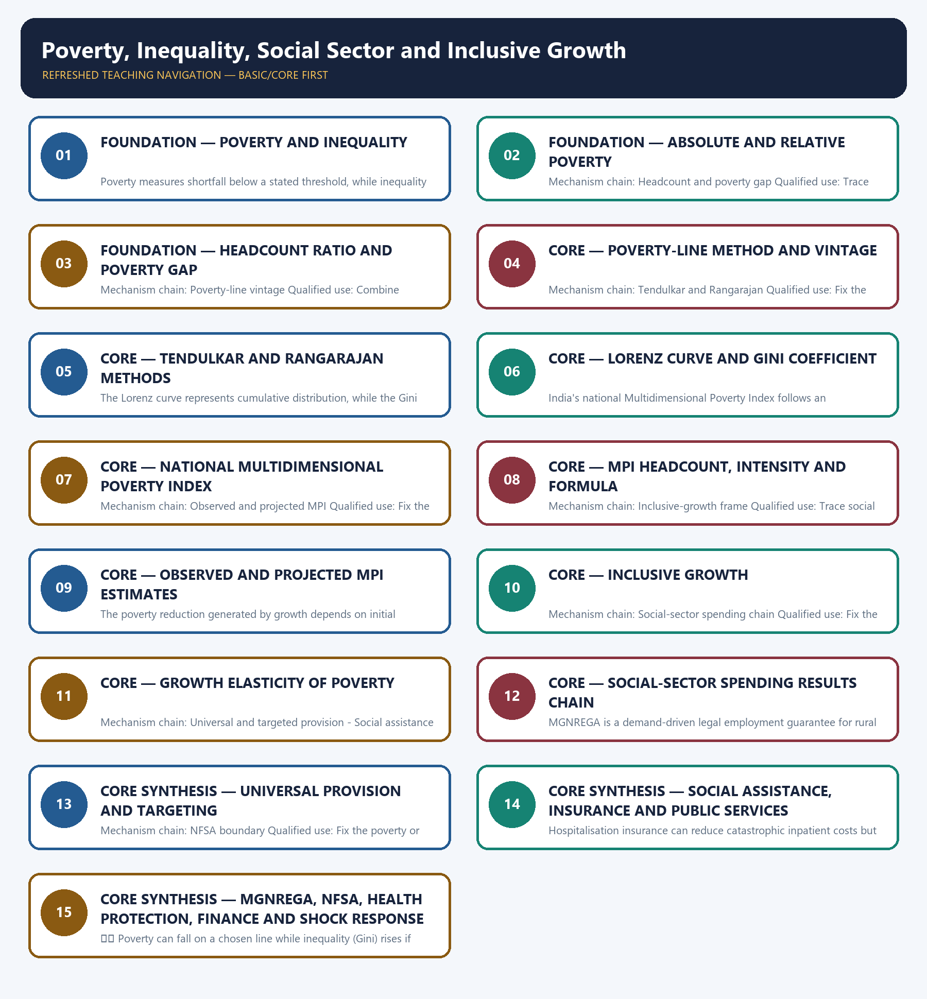

# Poverty, Inequality, Social Sector and Inclusive Growth — Learner-v2 Complete Learning Session

> **Authoring-only generation:** 2026-09-03. No PDF was rendered and no tracker or index was mutated.

### SOURCE, PROGRESSION AND CURRENT-LINKAGE AUDIT

- **Generation date:** 2026-09-03.
- **Repository-first evidence:** the Basic owner is taught first and preserved in full; the Advanced owner is retained only in the optional final teaching block.
- **OCR evidence:** Repository Markdown was primary. OCR-searchable local official General Studies papers were used only to confirm printed routed demands. No answer key, marking scheme, unsupported page precision or current macroeconomic statistic was inferred from them.
- **Qdrant:** not used; repository Markdown and available OCR context were sufficient.
- **PYQ integrity:** Audited ledgers route Mains demands on inclusive growth, inter-generational equity, financial inclusion, community health and social-service expenditure, plus the objective poverty-line variation concept. These demands are solved or retained in practice without inventing an official model answer or objective key.
- **Live-link boundary:** The official NITI pages were blocked to direct fetch, but official-domain search substantively exposed the national MPI method and the projected status of the 2022-23 estimate. No poverty rate, inequality value, scheme outlay or current beneficiary count was imported.
- **Fact/inference discipline:** no current-affairs item, PYQ wording, figure or quotation is invented.

### LIVE OFFICIAL-SOURCE ATTEMPT LOG

The checks below were made on 2026-09-03. Substantive official text is used only for the proposition it actually supports; binary files, dynamic shells, stubs and undated dashboard snippets are recorded but not converted into current claims.

- https://www.niti.gov.in/sites/default/files/2024-01/MPI-22_NITI-Aayog20254.pdf — direct fetch returned HTTP 403 on 2026-09-03; official-domain search substantively exposed the Alkire-Foster method, twelve indicators and projection basis.
- https://www.niti.gov.in/whats-new/multidimensional-poverty-india-2005-06 — direct fetch returned HTTP 403; official-domain search confirmed that the 2022-23 value is an estimate rather than a fresh survey observation.

## BASIC LEARNING SESSION



*Distinct embedded teaching-navigation image. The separate continuous Cārvāka-style flowchart package remains an independent at-a-glance artifact.*

### SESSION 1 — FOUNDATION — POVERTY AND INEQUALITY

#### DEFINITION / WHAT THIS IS CALLED

**Plain-language definition:** Mechanism chain: Poverty and inequality boundary - Absolute and relative poverty Qualified use: Fix the poverty or inequality metric, data source, price basis and reference period before comparing estimates.

**Technical definition:** Poverty measures shortfall below a stated threshold, while inequality measures dispersion across a distribution; poverty can fall even when inequality rises.

#### ANSWER-GRABBING OPENING — WRITE/ADAPT IN THE EXAM

> Poverty measures shortfall below a stated threshold, while inequality measures dispersion across a distribution; poverty can fall even when inequality rises.

#### MUST-WRITE KEYWORDS

- **FOUNDATION**
- **Poverty**
- **inequality**
- **Mechanism chain**
- **Qualified use**
- **Absolute**

**How to use them:** Frame the answer through FOUNDATION; define Poverty, connect inequality with Mechanism chain to explain the mechanism, and use Qualified use for the decisive comparison or qualification.

#### VISUAL FIRST

```text
POVERTY AND INEQUALITY
01. Poverty and inequality boundary
    |
    v
02. Absolute and relative poverty
BOUNDARY -> Do not use poverty and inequality as synonyms.
```

*This topic-specific rail fixes the evidence sequence and its exam boundary before analysis.*

#### CORE EXPLANATION

Poverty measures shortfall below a stated threshold, while inequality measures dispersion across a distribution; poverty can fall even when inequality rises. Absolute poverty uses a defined minimum standard, while relative poverty evaluates position against the prevailing distribution or social standard.

#### NAMED EVIDENCE AND MECHANISM

- Poverty measures shortfall below a stated threshold, while inequality measures dispersion across a distribution; poverty can fall even when inequality rises.
- Absolute poverty uses a defined minimum standard, while relative poverty evaluates position against the prevailing distribution or social standard.

#### EXAMINER CAUTION

- Do not use poverty and inequality as synonyms.

#### EXAM LINK

- **Prelims:** Preserve the exact formula, territorial or resident boundary, price basis, base year, index basket, eligible counterparty, institution and legal status; never upgrade a projection into an actual or a regulatory direction into a universal rule.
- **Mains:** Fix the poverty or inequality metric, data source, price basis and reference period before comparing estimates.

#### MINI RECAP

- **Mechanism chain:** Poverty and inequality boundary -> Absolute and relative poverty
- **Qualified use:** Fix the poverty or inequality metric, data source, price basis and reference period before comparing estimates.

#### CLOSING RECALL FLOW — FOUNDATION — POVERTY AND INEQUALITY

```text
START / CONCEPT: FOUNDATION — Poverty and inequality
        |
        v
EXACT TERMS: FOUNDATION · Poverty · inequality · Mechanism chain · Qualified use · Absolute
        |
        v
MECHANISM / ARGUMENT: Mechanism chain: Poverty and inequality boundary - Absolute and relative poverty Qualified use: Fix the poverty or inequality metric, data source, price basis and reference period before comparing estimates.
        |
        v
CONSEQUENCE / CONTRAST: Do not use poverty and inequality as synonyms.
        |
        v
UPSC TRAP / ANSWER-USE: Absolute poverty uses a defined minimum standard, while relative poverty evaluates position against the prevailing distribution or social standard.
        |
        v
ANSWER-GRABBING FORMULATION: Poverty measures shortfall below a stated threshold, while inequality measures dispersion across a distribution; poverty can fall even when inequality rises.
```
### SESSION 2 — FOUNDATION — ABSOLUTE AND RELATIVE POVERTY

#### DEFINITION / WHAT THIS IS CALLED

**Plain-language definition:** The poverty headcount ratio measures incidence, while the poverty gap captures average depth below the line; neither alone describes every deprivation.

**Technical definition:** Mechanism chain: Headcount and poverty gap Qualified use: Trace social expenditure from allocation to service quality and household outcome.

#### ANSWER-GRABBING OPENING — WRITE/ADAPT IN THE EXAM

> The poverty headcount ratio measures incidence, while the poverty gap captures average depth below the line; neither alone describes every deprivation.

#### MUST-WRITE KEYWORDS

- **FOUNDATION**
- **Absolute**
- **relative poverty**
- **Mechanism chain**
- **Qualified use**
- **Headcount**

**How to use them:** Frame the answer through FOUNDATION; define Absolute, connect relative poverty with Mechanism chain to explain the mechanism, and use Qualified use for the decisive comparison or qualification.

#### VISUAL FIRST

```text
ABSOLUTE AND RELATIVE POVERTY
01. Headcount and poverty gap
BOUNDARY -> Do not quote a poverty estimate without its line, methodology, period and price basis.
```

*This topic-specific rail fixes the evidence sequence and its exam boundary before analysis.*

#### CORE EXPLANATION

The poverty headcount ratio measures incidence, while the poverty gap captures average depth below the line; neither alone describes every deprivation.

#### NAMED EVIDENCE AND MECHANISM

- The poverty headcount ratio measures incidence, while the poverty gap captures average depth below the line; neither alone describes every deprivation.

#### EXAMINER CAUTION

- Do not quote a poverty estimate without its line, methodology, period and price basis.

#### EXAM LINK

- **Prelims:** Preserve the exact formula, territorial or resident boundary, price basis, base year, index basket, eligible counterparty, institution and legal status; never upgrade a projection into an actual or a regulatory direction into a universal rule.
- **Mains:** Trace social expenditure from allocation to service quality and household outcome.

#### MINI RECAP

- **Mechanism chain:** Headcount and poverty gap
- **Qualified use:** Trace social expenditure from allocation to service quality and household outcome.

#### CLOSING RECALL FLOW — FOUNDATION — ABSOLUTE AND RELATIVE POVERTY

```text
START / CONCEPT: FOUNDATION — Absolute and relative poverty
        |
        v
EXACT TERMS: FOUNDATION · Absolute · relative poverty · Mechanism chain · Qualified use · Headcount
        |
        v
MECHANISM / ARGUMENT: Mechanism chain: Headcount and poverty gap Qualified use: Trace social expenditure from allocation to service quality and household outcome.
        |
        v
CONSEQUENCE / CONTRAST: Do not quote a poverty estimate without its line, methodology, period and price basis.
        |
        v
UPSC TRAP / ANSWER-USE: Do not miss this limiting distinction: the poverty headcount ratio measures incidence.
        |
        v
ANSWER-GRABBING FORMULATION: The poverty headcount ratio measures incidence, while the poverty gap captures average depth below the line; neither alone describes every deprivation.
```
### SESSION 3 — FOUNDATION — HEADCOUNT RATIO AND POVERTY GAP

#### DEFINITION / WHAT THIS IS CALLED

**Plain-language definition:** A poverty estimate is inseparable from its line, price basis, survey, reference period and methodology; estimates from different vintages should not be presented as one continuous series.

**Technical definition:** Mechanism chain: Poverty-line vintage Qualified use: Combine productive participation, universal basics, targeted protection and disaggregated accountability.

#### ANSWER-GRABBING OPENING — WRITE/ADAPT IN THE EXAM

> A poverty estimate is inseparable from its line, price basis, survey, reference period and methodology; estimates from different vintages should not be presented as one continuous series.

#### MUST-WRITE KEYWORDS

- **FOUNDATION**
- **Headcount ratio**
- **poverty gap**
- **Mechanism chain**
- **Qualified use**
- **A poverty estimate**

**How to use them:** Frame the answer through FOUNDATION; define Headcount ratio, connect poverty gap with Mechanism chain to explain the mechanism, and use Qualified use for the decisive comparison or qualification.

#### VISUAL FIRST

```text
HEADCOUNT RATIO AND POVERTY GAP
01. Poverty-line vintage
BOUNDARY -> Do not merge headcount incidence with poverty-gap depth.
```

*This topic-specific rail fixes the evidence sequence and its exam boundary before analysis.*

#### CORE EXPLANATION

A poverty estimate is inseparable from its line, price basis, survey, reference period and methodology; estimates from different vintages should not be presented as one continuous series.

#### NAMED EVIDENCE AND MECHANISM

- A poverty estimate is inseparable from its line, price basis, survey, reference period and methodology; estimates from different vintages should not be presented as one continuous series.

#### EXAMINER CAUTION

- Do not merge headcount incidence with poverty-gap depth.

#### EXAM LINK

- **Prelims:** Preserve the exact formula, territorial or resident boundary, price basis, base year, index basket, eligible counterparty, institution and legal status; never upgrade a projection into an actual or a regulatory direction into a universal rule.
- **Mains:** Combine productive participation, universal basics, targeted protection and disaggregated accountability.

#### MINI RECAP

- **Mechanism chain:** Poverty-line vintage
- **Qualified use:** Combine productive participation, universal basics, targeted protection and disaggregated accountability.

#### CLOSING RECALL FLOW — FOUNDATION — HEADCOUNT RATIO AND POVERTY GAP

```text
START / CONCEPT: FOUNDATION — Headcount ratio and poverty gap
        |
        v
EXACT TERMS: FOUNDATION · Headcount ratio · poverty gap · Mechanism chain · Qualified use · A poverty estimate
        |
        v
MECHANISM / ARGUMENT: Mechanism chain: Poverty-line vintage Qualified use: Combine productive participation, universal basics, targeted protection and disaggregated accountability.
        |
        v
CONSEQUENCE / CONTRAST: Do not merge headcount incidence with poverty-gap depth.
        |
        v
UPSC TRAP / ANSWER-USE: Do not miss this limiting distinction: a poverty estimate is inseparable from its line, price basis, survey, reference period and...
        |
        v
ANSWER-GRABBING FORMULATION: A poverty estimate is inseparable from its line, price basis, survey, reference period and methodology; estimates from different vintages should not be presented as one continuous series.
```
### SESSION 4 — CORE — POVERTY-LINE METHOD AND VINTAGE

#### DEFINITION / WHAT THIS IS CALLED

**Plain-language definition:** The Tendulkar and Rangarajan expert-group methods use different consumption baskets and thresholds; neither should be mislabeled as a timeless current official poverty line.

**Technical definition:** Mechanism chain: Tendulkar and Rangarajan Qualified use: Fix the poverty or inequality metric, data source, price basis and reference period before comparing estimates.

#### ANSWER-GRABBING OPENING — WRITE/ADAPT IN THE EXAM

> The Tendulkar and Rangarajan expert-group methods use different consumption baskets and thresholds; neither should be mislabeled as a timeless current official poverty line.

#### MUST-WRITE KEYWORDS

- **Poverty-line method**
- **vintage**
- **Mechanism chain**
- **Qualified use**
- **The Tendulkar**
- **Rangarajan**

**How to use them:** Frame the answer through Poverty-line method; define vintage, connect Mechanism chain with Qualified use to explain the mechanism, and use The Tendulkar for the decisive comparison or qualification.

#### VISUAL FIRST

```text
POVERTY-LINE METHOD AND VINTAGE
01. Tendulkar and Rangarajan
BOUNDARY -> Do not treat Tendulkar and Rangarajan estimates as one current official series.
```

*This topic-specific rail fixes the evidence sequence and its exam boundary before analysis.*

#### CORE EXPLANATION

The Tendulkar and Rangarajan expert-group methods use different consumption baskets and thresholds; neither should be mislabeled as a timeless current official poverty line.

#### NAMED EVIDENCE AND MECHANISM

- The Tendulkar and Rangarajan expert-group methods use different consumption baskets and thresholds; neither should be mislabeled as a timeless current official poverty line.

#### EXAMINER CAUTION

- Do not treat Tendulkar and Rangarajan estimates as one current official series.

#### EXAM LINK

- **Prelims:** Preserve the exact formula, territorial or resident boundary, price basis, base year, index basket, eligible counterparty, institution and legal status; never upgrade a projection into an actual or a regulatory direction into a universal rule.
- **Mains:** Fix the poverty or inequality metric, data source, price basis and reference period before comparing estimates.

#### MINI RECAP

- **Mechanism chain:** Tendulkar and Rangarajan
- **Qualified use:** Fix the poverty or inequality metric, data source, price basis and reference period before comparing estimates.

#### CLOSING RECALL FLOW — CORE — POVERTY-LINE METHOD AND VINTAGE

```text
START / CONCEPT: CORE — Poverty-line method and vintage
        |
        v
EXACT TERMS: Poverty-line method · vintage · Mechanism chain · Qualified use · The Tendulkar · Rangarajan
        |
        v
MECHANISM / ARGUMENT: Mechanism chain: Tendulkar and Rangarajan Qualified use: Fix the poverty or inequality metric, data source, price basis and reference period before comparing estimates.
        |
        v
CONSEQUENCE / CONTRAST: Do not treat Tendulkar and Rangarajan estimates as one current official series.
        |
        v
UPSC TRAP / ANSWER-USE: Do not miss this limiting distinction: do not treat Tendulkar and Rangarajan estimates as one current official series.
        |
        v
ANSWER-GRABBING FORMULATION: The Tendulkar and Rangarajan expert-group methods use different consumption baskets and thresholds; neither should be mislabeled as a timeless current official poverty line.
```
### SESSION 5 — CORE — TENDULKAR AND RANGARAJAN METHODS

#### DEFINITION / WHAT THIS IS CALLED

**Plain-language definition:** Mechanism chain: Lorenz curve and Gini Qualified use: Trace social expenditure from allocation to service quality and household outcome.

**Technical definition:** The Lorenz curve represents cumulative distribution, while the Gini coefficient summarises inequality; income, consumption and wealth data can produce different results.

#### ANSWER-GRABBING OPENING — WRITE/ADAPT IN THE EXAM

> The Lorenz curve represents cumulative distribution, while the Gini coefficient summarises inequality; income, consumption and wealth data can produce different results.

#### MUST-WRITE KEYWORDS

- **Tendulkar**
- **Rangarajan methods**
- **Mechanism chain**
- **Qualified use**
- **The Lorenz**
- **Gini**

**How to use them:** Frame the answer through Tendulkar; define Rangarajan methods, connect Mechanism chain with Qualified use to explain the mechanism, and use The Lorenz for the decisive comparison or qualification.

#### VISUAL FIRST

```text
TENDULKAR AND RANGARAJAN METHODS
01. Lorenz curve and Gini
BOUNDARY -> Do not compare income, consumption and wealth Gini values as if they used one base.
```

*This topic-specific rail fixes the evidence sequence and its exam boundary before analysis.*

#### CORE EXPLANATION

The Lorenz curve represents cumulative distribution, while the Gini coefficient summarises inequality; income, consumption and wealth data can produce different results.

#### NAMED EVIDENCE AND MECHANISM

- The Lorenz curve represents cumulative distribution, while the Gini coefficient summarises inequality; income, consumption and wealth data can produce different results.

#### EXAMINER CAUTION

- Do not compare income, consumption and wealth Gini values as if they used one base.

#### EXAM LINK

- **Prelims:** Preserve the exact formula, territorial or resident boundary, price basis, base year, index basket, eligible counterparty, institution and legal status; never upgrade a projection into an actual or a regulatory direction into a universal rule.
- **Mains:** Trace social expenditure from allocation to service quality and household outcome.

#### MINI RECAP

- **Mechanism chain:** Lorenz curve and Gini
- **Qualified use:** Trace social expenditure from allocation to service quality and household outcome.

#### CLOSING RECALL FLOW — CORE — TENDULKAR AND RANGARAJAN METHODS

```text
START / CONCEPT: CORE — Tendulkar and Rangarajan methods
        |
        v
EXACT TERMS: Tendulkar · Rangarajan methods · Mechanism chain · Qualified use · The Lorenz · Gini
        |
        v
MECHANISM / ARGUMENT: Mechanism chain: Lorenz curve and Gini Qualified use: Trace social expenditure from allocation to service quality and household outcome.
        |
        v
CONSEQUENCE / CONTRAST: Do not compare income, consumption and wealth Gini values as if they used one base.
        |
        v
UPSC TRAP / ANSWER-USE: Do not miss this limiting distinction: the Lorenz curve represents cumulative distribution.
        |
        v
ANSWER-GRABBING FORMULATION: The Lorenz curve represents cumulative distribution, while the Gini coefficient summarises inequality; income, consumption and wealth data can produce different results.
```
### SESSION 6 — CORE — LORENZ CURVE AND GINI COEFFICIENT

#### DEFINITION / WHAT THIS IS CALLED

**Plain-language definition:** Mechanism chain: MPI architecture - MPI formula Qualified use: Combine productive participation, universal basics, targeted protection and disaggregated accountability.

**Technical definition:** India's national Multidimensional Poverty Index follows an Alkire-Foster structure across health, education and standard-of-living dimensions using twelve indicators.

#### ANSWER-GRABBING OPENING — WRITE/ADAPT IN THE EXAM

> Mechanism chain: MPI architecture - MPI formula Qualified use: Combine productive participation, universal basics, targeted protection and disaggregated accountability.

#### MUST-WRITE KEYWORDS

- **Lorenz curve**
- **Gini coefficient**
- **Mechanism chain**
- **Qualified use**
- **India's**
- **2022-23**

**How to use them:** Frame the answer through Lorenz curve; define Gini coefficient, connect Mechanism chain with Qualified use to explain the mechanism, and use India's for the decisive comparison or qualification.

#### VISUAL FIRST

```text
LORENZ CURVE AND GINI COEFFICIENT
01. MPI architecture
    |
    v
02. MPI formula
BOUNDARY -> Do not present the projected 2022-23 MPI estimate as a fresh household survey result.
```

*This topic-specific rail fixes the evidence sequence and its exam boundary before analysis.*

#### CORE EXPLANATION

India's national Multidimensional Poverty Index follows an Alkire-Foster structure across health, education and standard-of-living dimensions using twelve indicators. The multidimensional poverty index combines the headcount ratio of multidimensionally poor people with their average intensity of deprivation, conventionally expressed as MPI equals H multiplied by A.

#### NAMED EVIDENCE AND MECHANISM

- India's national Multidimensional Poverty Index follows an Alkire-Foster structure across health, education and standard-of-living dimensions using twelve indicators.
- The multidimensional poverty index combines the headcount ratio of multidimensionally poor people with their average intensity of deprivation, conventionally expressed as MPI equals H multiplied by A.

#### EXAMINER CAUTION

- Do not present the projected 2022-23 MPI estimate as a fresh household survey result.

#### EXAM LINK

- **Prelims:** Preserve the exact formula, territorial or resident boundary, price basis, base year, index basket, eligible counterparty, institution and legal status; never upgrade a projection into an actual or a regulatory direction into a universal rule.
- **Mains:** Combine productive participation, universal basics, targeted protection and disaggregated accountability.

#### MINI RECAP

- **Mechanism chain:** MPI architecture -> MPI formula
- **Qualified use:** Combine productive participation, universal basics, targeted protection and disaggregated accountability.

#### CLOSING RECALL FLOW — CORE — LORENZ CURVE AND GINI COEFFICIENT

```text
START / CONCEPT: CORE — Lorenz curve and Gini coefficient
        |
        v
EXACT TERMS: Lorenz curve · Gini coefficient · Mechanism chain · Qualified use · India's · 2022-23
        |
        v
MECHANISM / ARGUMENT: The operative mechanism is that mPI architecture - MPI formula Qualified use.
        |
        v
CONSEQUENCE / CONTRAST: India's national Multidimensional Poverty Index follows an Alkire-Foster structure across health, education and standard-of-living dimensions using twelve indicators.
        |
        v
UPSC TRAP / ANSWER-USE: Do not present the projected 2022-23 MPI estimate as a fresh household survey result.
        |
        v
ANSWER-GRABBING FORMULATION: Mechanism chain: MPI architecture - MPI formula Qualified use: Combine productive participation, universal basics, targeted protection and disaggregated accountability.
```
### SESSION 7 — CORE — NATIONAL MULTIDIMENSIONAL POVERTY INDEX

#### DEFINITION / WHAT THIS IS CALLED

**Plain-language definition:** The 2019-21 national MPI estimate is tied to NFHS-5 observations, while NITI Aayog's 2022-23 figure is an estimate projected from earlier reduction trends rather than a fresh household survey.

**Technical definition:** Mechanism chain: Observed and projected MPI Qualified use: Fix the poverty or inequality metric, data source, price basis and reference period before comparing estimates.

#### ANSWER-GRABBING OPENING — WRITE/ADAPT IN THE EXAM

> The 2019-21 national MPI estimate is tied to NFHS-5 observations, while NITI Aayog's 2022-23 figure is an estimate projected from earlier reduction trends rather than a fresh household survey.

#### MUST-WRITE KEYWORDS

- **National Multidimensional Poverty Index**
- **Mechanism chain**
- **Qualified use**
- **The 2019-21 national MPI estimate**
- **2019-21**
- **2022-23**

**How to use them:** Frame the answer through National Multidimensional Poverty Index; define Mechanism chain, connect Qualified use with The 2019-21 national MPI estimate to explain the mechanism, and use 2019-21 for the decisive comparison or qualification.

#### VISUAL FIRST

```text
NATIONAL MULTIDIMENSIONAL POVERTY INDEX
01. Observed and projected MPI
BOUNDARY -> Do not equate social-sector allocation, expenditure, service quality and outcome.
```

*This topic-specific rail fixes the evidence sequence and its exam boundary before analysis.*

#### CORE EXPLANATION

The 2019-21 national MPI estimate is tied to NFHS-5 observations, while NITI Aayog's 2022-23 figure is an estimate projected from earlier reduction trends rather than a fresh household survey.

#### NAMED EVIDENCE AND MECHANISM

- The 2019-21 national MPI estimate is tied to NFHS-5 observations, while NITI Aayog's 2022-23 figure is an estimate projected from earlier reduction trends rather than a fresh household survey.

#### EXAMINER CAUTION

- Do not equate social-sector allocation, expenditure, service quality and outcome.

#### EXAM LINK

- **Prelims:** Preserve the exact formula, territorial or resident boundary, price basis, base year, index basket, eligible counterparty, institution and legal status; never upgrade a projection into an actual or a regulatory direction into a universal rule.
- **Mains:** Fix the poverty or inequality metric, data source, price basis and reference period before comparing estimates.

#### MINI RECAP

- **Mechanism chain:** Observed and projected MPI
- **Qualified use:** Fix the poverty or inequality metric, data source, price basis and reference period before comparing estimates.

#### CLOSING RECALL FLOW — CORE — NATIONAL MULTIDIMENSIONAL POVERTY INDEX

```text
START / CONCEPT: CORE — National Multidimensional Poverty Index
        |
        v
EXACT TERMS: National Multidimensional Poverty Index · Mechanism chain · Qualified use · The 2019-21 national MPI estimate · 2019-21 · 2022-23
        |
        v
MECHANISM / ARGUMENT: Mechanism chain: Observed and projected MPI Qualified use: Fix the poverty or inequality metric, data source, price basis and reference period before comparing estimates.
        |
        v
CONSEQUENCE / CONTRAST: Do not equate social-sector allocation, expenditure, service quality and outcome.
        |
        v
UPSC TRAP / ANSWER-USE: Do not miss this limiting distinction: the 2019-21 national MPI estimate is tied to NFHS-5 observations.
        |
        v
ANSWER-GRABBING FORMULATION: The 2019-21 national MPI estimate is tied to NFHS-5 observations, while NITI Aayog's 2022-23 figure is an estimate projected from earlier reduction trends rather than a fresh household survey.
```
### SESSION 8 — CORE — MPI HEADCOUNT, INTENSITY AND FORMULA

#### DEFINITION / WHAT THIS IS CALLED

**Plain-language definition:** Inclusive growth combines productive participation, quality public services, redistribution and protection against shocks; growth and distribution are related but distinct tests.

**Technical definition:** Mechanism chain: Inclusive-growth frame Qualified use: Trace social expenditure from allocation to service quality and household outcome.

#### ANSWER-GRABBING OPENING — WRITE/ADAPT IN THE EXAM

> Inclusive growth combines productive participation, quality public services, redistribution and protection against shocks; growth and distribution are related but distinct tests.

#### MUST-WRITE KEYWORDS

- **MPI headcount**
- **intensity**
- **formula**
- **Mechanism chain**
- **Qualified use**
- **Inclusive**

**How to use them:** Frame the answer through MPI headcount; define intensity, connect formula with Mechanism chain to explain the mechanism, and use Qualified use for the decisive comparison or qualification.

#### VISUAL FIRST

```text
MPI HEADCOUNT, INTENSITY AND FORMULA
01. Inclusive-growth frame
BOUNDARY -> Do not treat a bank account as proof of inclusive growth.
```

*This topic-specific rail fixes the evidence sequence and its exam boundary before analysis.*

#### CORE EXPLANATION

Inclusive growth combines productive participation, quality public services, redistribution and protection against shocks; growth and distribution are related but distinct tests.

#### NAMED EVIDENCE AND MECHANISM

- Inclusive growth combines productive participation, quality public services, redistribution and protection against shocks; growth and distribution are related but distinct tests.

#### EXAMINER CAUTION

- Do not treat a bank account as proof of inclusive growth.

#### EXAM LINK

- **Prelims:** Preserve the exact formula, territorial or resident boundary, price basis, base year, index basket, eligible counterparty, institution and legal status; never upgrade a projection into an actual or a regulatory direction into a universal rule.
- **Mains:** Trace social expenditure from allocation to service quality and household outcome.

#### MINI RECAP

- **Mechanism chain:** Inclusive-growth frame
- **Qualified use:** Trace social expenditure from allocation to service quality and household outcome.

#### CLOSING RECALL FLOW — CORE — MPI HEADCOUNT, INTENSITY AND FORMULA

```text
START / CONCEPT: CORE — MPI headcount, intensity and formula
        |
        v
EXACT TERMS: MPI headcount · intensity · formula · Mechanism chain · Qualified use · Inclusive
        |
        v
MECHANISM / ARGUMENT: Mechanism chain: Inclusive-growth frame Qualified use: Trace social expenditure from allocation to service quality and household outcome.
        |
        v
CONSEQUENCE / CONTRAST: Do not treat a bank account as proof of inclusive growth.
        |
        v
UPSC TRAP / ANSWER-USE: Do not miss this limiting distinction: inclusive growth combines productive participation, quality public services, redistribution and protection against shocks.
        |
        v
ANSWER-GRABBING FORMULATION: Inclusive growth combines productive participation, quality public services, redistribution and protection against shocks; growth and distribution are related but distinct tests.
```
### SESSION 9 — CORE — OBSERVED AND PROJECTED MPI ESTIMATES

#### DEFINITION / WHAT THIS IS CALLED

**Plain-language definition:** Mechanism chain: Growth elasticity of poverty Qualified use: Combine productive participation, universal basics, targeted protection and disaggregated accountability.

**Technical definition:** The poverty reduction generated by growth depends on initial inequality, sectoral composition, labour intensity and access to assets and services.

#### ANSWER-GRABBING OPENING — WRITE/ADAPT IN THE EXAM

> Mechanism chain: Growth elasticity of poverty Qualified use: Combine productive participation, universal basics, targeted protection and disaggregated accountability.

#### MUST-WRITE KEYWORDS

- **Observed**
- **projected MPI estimates**
- **Mechanism chain**
- **Qualified use**
- **Growth**
- **Qualified**

**How to use them:** Frame the answer through Observed; define projected MPI estimates, connect Mechanism chain with Qualified use to explain the mechanism, and use Growth for the decisive comparison or qualification.

#### VISUAL FIRST

```text
OBSERVED AND PROJECTED MPI ESTIMATES
01. Growth elasticity of poverty
BOUNDARY -> Do not assume a national average describes every state, district or group.
```

*This topic-specific rail fixes the evidence sequence and its exam boundary before analysis.*

#### CORE EXPLANATION

The poverty reduction generated by growth depends on initial inequality, sectoral composition, labour intensity and access to assets and services.

#### NAMED EVIDENCE AND MECHANISM

- The poverty reduction generated by growth depends on initial inequality, sectoral composition, labour intensity and access to assets and services.

#### EXAMINER CAUTION

- Do not assume a national average describes every state, district or group.

#### EXAM LINK

- **Prelims:** Preserve the exact formula, territorial or resident boundary, price basis, base year, index basket, eligible counterparty, institution and legal status; never upgrade a projection into an actual or a regulatory direction into a universal rule.
- **Mains:** Combine productive participation, universal basics, targeted protection and disaggregated accountability.

#### MINI RECAP

- **Mechanism chain:** Growth elasticity of poverty
- **Qualified use:** Combine productive participation, universal basics, targeted protection and disaggregated accountability.

#### CLOSING RECALL FLOW — CORE — OBSERVED AND PROJECTED MPI ESTIMATES

```text
START / CONCEPT: CORE — Observed and projected MPI estimates
        |
        v
EXACT TERMS: Observed · projected MPI estimates · Mechanism chain · Qualified use · Growth · Qualified
        |
        v
MECHANISM / ARGUMENT: The operative mechanism is that growth elasticity of poverty Qualified use.
        |
        v
CONSEQUENCE / CONTRAST: The poverty reduction generated by growth depends on initial inequality, sectoral composition, labour intensity and access to assets and services.
        |
        v
UPSC TRAP / ANSWER-USE: Do not assume a national average describes every state, district or group.
        |
        v
ANSWER-GRABBING FORMULATION: Mechanism chain: Growth elasticity of poverty Qualified use: Combine productive participation, universal basics, targeted protection and disaggregated accountability.
```
### SESSION 10 — CORE — INCLUSIVE GROWTH

#### DEFINITION / WHAT THIS IS CALLED

**Plain-language definition:** Budget allocation, release, actual spending, service availability, service quality and household outcome are separate stages; expenditure is not itself an outcome.

**Technical definition:** Mechanism chain: Social-sector spending chain Qualified use: Fix the poverty or inequality metric, data source, price basis and reference period before comparing estimates.

#### ANSWER-GRABBING OPENING — WRITE/ADAPT IN THE EXAM

> Budget allocation, release, actual spending, service availability, service quality and household outcome are separate stages; expenditure is not itself an outcome.

#### MUST-WRITE KEYWORDS

- **Inclusive growth**
- **Mechanism chain**
- **Qualified use**
- **Budget**
- **PYQ**
- **Social-sector**

**How to use them:** Frame the answer through Inclusive growth; define Mechanism chain, connect Qualified use with Budget to explain the mechanism, and use PYQ for the decisive comparison or qualification.

#### VISUAL FIRST

```text
INCLUSIVE GROWTH
01. Social-sector spending chain
BOUNDARY -> Do not infer an objective PYQ answer letter from a routed demand.
```

*This topic-specific rail fixes the evidence sequence and its exam boundary before analysis.*

#### CORE EXPLANATION

Budget allocation, release, actual spending, service availability, service quality and household outcome are separate stages; expenditure is not itself an outcome.

#### NAMED EVIDENCE AND MECHANISM

- Budget allocation, release, actual spending, service availability, service quality and household outcome are separate stages; expenditure is not itself an outcome.

#### EXAMINER CAUTION

- Do not infer an objective PYQ answer letter from a routed demand.

#### EXAM LINK

- **Prelims:** Preserve the exact formula, territorial or resident boundary, price basis, base year, index basket, eligible counterparty, institution and legal status; never upgrade a projection into an actual or a regulatory direction into a universal rule.
- **Mains:** Fix the poverty or inequality metric, data source, price basis and reference period before comparing estimates.

#### MINI RECAP

- **Mechanism chain:** Social-sector spending chain
- **Qualified use:** Fix the poverty or inequality metric, data source, price basis and reference period before comparing estimates.

#### CLOSING RECALL FLOW — CORE — INCLUSIVE GROWTH

```text
START / CONCEPT: CORE — Inclusive growth
        |
        v
EXACT TERMS: Inclusive growth · Mechanism chain · Qualified use · Budget · PYQ · Social-sector
        |
        v
MECHANISM / ARGUMENT: Mechanism chain: Social-sector spending chain Qualified use: Fix the poverty or inequality metric, data source, price basis and reference period before comparing estimates.
        |
        v
CONSEQUENCE / CONTRAST: Do not infer an objective PYQ answer letter from a routed demand.
        |
        v
UPSC TRAP / ANSWER-USE: Do not miss this limiting distinction: budget allocation, release, actual spending, service availability, service quality and household outcome are separate...
        |
        v
ANSWER-GRABBING FORMULATION: Budget allocation, release, actual spending, service availability, service quality and household outcome are separate stages; expenditure is not itself an outcome.
```
### SESSION 11 — CORE — GROWTH ELASTICITY OF POVERTY

#### DEFINITION / WHAT THIS IS CALLED

**Plain-language definition:** Social assistance is generally tax-financed support based on need or category, while social insurance pools contributions or specified risks; both differ from universal public services.

**Technical definition:** Mechanism chain: Universal and targeted provision - Social assistance and insurance Qualified use: Trace social expenditure from allocation to service quality and household outcome.

#### ANSWER-GRABBING OPENING — WRITE/ADAPT IN THE EXAM

> Do not use poverty and inequality as synonyms.

#### MUST-WRITE KEYWORDS

- **Growth elasticity of poverty**
- **Mechanism chain**
- **Qualified use**
- **Universal**
- **Social assistance**
- **Social**

**How to use them:** Frame the answer through Growth elasticity of poverty; define Mechanism chain, connect Qualified use with Universal to explain the mechanism, and use Social assistance for the decisive comparison or qualification.

#### VISUAL FIRST

```text
GROWTH ELASTICITY OF POVERTY
01. Universal and targeted provision
    |
    v
02. Social assistance and insurance
BOUNDARY -> Do not use poverty and inequality as synonyms.
```

*This topic-specific rail fixes the evidence sequence and its exam boundary before analysis.*

#### CORE EXPLANATION

Universal public services and targeted benefits can complement each other, while targeting saves resources but creates exclusion, inclusion and transaction-cost risks. Social assistance is generally tax-financed support based on need or category, while social insurance pools contributions or specified risks; both differ from universal public services.

#### NAMED EVIDENCE AND MECHANISM

- Universal public services and targeted benefits can complement each other, while targeting saves resources but creates exclusion, inclusion and transaction-cost risks.
- Social assistance is generally tax-financed support based on need or category, while social insurance pools contributions or specified risks; both differ from universal public services.

#### EXAMINER CAUTION

- Do not use poverty and inequality as synonyms.

#### EXAM LINK

- **Prelims:** Preserve the exact formula, territorial or resident boundary, price basis, base year, index basket, eligible counterparty, institution and legal status; never upgrade a projection into an actual or a regulatory direction into a universal rule.
- **Mains:** Trace social expenditure from allocation to service quality and household outcome.

#### MINI RECAP

- **Mechanism chain:** Universal and targeted provision -> Social assistance and insurance
- **Qualified use:** Trace social expenditure from allocation to service quality and household outcome.

#### CLOSING RECALL FLOW — CORE — GROWTH ELASTICITY OF POVERTY

```text
START / CONCEPT: CORE — Growth elasticity of poverty
        |
        v
EXACT TERMS: Growth elasticity of poverty · Mechanism chain · Qualified use · Universal · Social assistance · Social
        |
        v
MECHANISM / ARGUMENT: Mechanism chain: Universal and targeted provision - Social assistance and insurance Qualified use: Trace social expenditure from allocation to service quality and household outcome.
        |
        v
CONSEQUENCE / CONTRAST: Social assistance is generally tax-financed support based on need or category, while social insurance pools contributions or specified risks; both differ from universal public services.
        |
        v
UPSC TRAP / ANSWER-USE: Universal public services and targeted benefits can complement each other, while targeting saves resources but creates exclusion, inclusion and transaction-cost risks.
        |
        v
ANSWER-GRABBING FORMULATION: Do not use poverty and inequality as synonyms.
```
### SESSION 12 — CORE — SOCIAL-SECTOR SPENDING RESULTS CHAIN

#### DEFINITION / WHAT THIS IS CALLED

**Plain-language definition:** Mechanism chain: MGNREGA boundary Qualified use: Combine productive participation, universal basics, targeted protection and disaggregated accountability.

**Technical definition:** MGNREGA is a demand-driven legal employment guarantee for rural households, not an unconditional cash transfer or proof that every demand for work was met.

#### ANSWER-GRABBING OPENING — WRITE/ADAPT IN THE EXAM

> Mechanism chain: MGNREGA boundary Qualified use: Combine productive participation, universal basics, targeted protection and disaggregated accountability.

#### MUST-WRITE KEYWORDS

- **Social-sector spending results chain**
- **Mechanism chain**
- **Qualified use**
- **MGNREGA**
- **Qualified**
- **Combine**

**How to use them:** Frame the answer through Social-sector spending results chain; define Mechanism chain, connect Qualified use with MGNREGA to explain the mechanism, and use Qualified for the decisive comparison or qualification.

#### VISUAL FIRST

```text
SOCIAL-SECTOR SPENDING RESULTS CHAIN
01. MGNREGA boundary
BOUNDARY -> Do not quote a poverty estimate without its line, methodology, period and price basis.
```

*This topic-specific rail fixes the evidence sequence and its exam boundary before analysis.*

#### CORE EXPLANATION

MGNREGA is a demand-driven legal employment guarantee for rural households, not an unconditional cash transfer or proof that every demand for work was met.

#### NAMED EVIDENCE AND MECHANISM

- MGNREGA is a demand-driven legal employment guarantee for rural households, not an unconditional cash transfer or proof that every demand for work was met.

#### EXAMINER CAUTION

- Do not quote a poverty estimate without its line, methodology, period and price basis.

#### EXAM LINK

- **Prelims:** Preserve the exact formula, territorial or resident boundary, price basis, base year, index basket, eligible counterparty, institution and legal status; never upgrade a projection into an actual or a regulatory direction into a universal rule.
- **Mains:** Combine productive participation, universal basics, targeted protection and disaggregated accountability.

#### MINI RECAP

- **Mechanism chain:** MGNREGA boundary
- **Qualified use:** Combine productive participation, universal basics, targeted protection and disaggregated accountability.

#### CLOSING RECALL FLOW — CORE — SOCIAL-SECTOR SPENDING RESULTS CHAIN

```text
START / CONCEPT: CORE — Social-sector spending results chain
        |
        v
EXACT TERMS: Social-sector spending results chain · Mechanism chain · Qualified use · MGNREGA · Qualified · Combine
        |
        v
MECHANISM / ARGUMENT: MGNREGA is a demand-driven legal employment guarantee for rural households, not an unconditional cash transfer or proof that every demand for work was met.
        |
        v
CONSEQUENCE / CONTRAST: Do not quote a poverty estimate without its line, methodology, period and price basis.
        |
        v
UPSC TRAP / ANSWER-USE: Do not miss this limiting distinction: combine productive participation, universal basics, targeted protection and disaggregated accountability.
        |
        v
ANSWER-GRABBING FORMULATION: Mechanism chain: MGNREGA boundary Qualified use: Combine productive participation, universal basics, targeted protection and disaggregated accountability.
```
### SESSION 13 — CORE SYNTHESIS — UNIVERSAL PROVISION AND TARGETING

#### DEFINITION / WHAT THIS IS CALLED

**Plain-language definition:** The National Food Security Act creates legal food and nutrition entitlements through an in-kind architecture; statutory coverage rules and actual beneficiary inclusion are different questions.

**Technical definition:** Mechanism chain: NFSA boundary Qualified use: Fix the poverty or inequality metric, data source, price basis and reference period before comparing estimates.

#### ANSWER-GRABBING OPENING — WRITE/ADAPT IN THE EXAM

> The National Food Security Act creates legal food and nutrition entitlements through an in-kind architecture; statutory coverage rules and actual beneficiary inclusion are different questions.

#### MUST-WRITE KEYWORDS

- **CORE SYNTHESIS**
- **Universal provision**
- **targeting**
- **Mechanism chain**
- **Qualified use**
- **The National Food Security Act**

**How to use them:** Frame the answer through CORE SYNTHESIS; define Universal provision, connect targeting with Mechanism chain to explain the mechanism, and use Qualified use for the decisive comparison or qualification.

#### VISUAL FIRST

```text
UNIVERSAL PROVISION AND TARGETING
01. NFSA boundary
BOUNDARY -> Do not merge headcount incidence with poverty-gap depth.
```

*This topic-specific rail fixes the evidence sequence and its exam boundary before analysis.*

#### CORE EXPLANATION

The National Food Security Act creates legal food and nutrition entitlements through an in-kind architecture; statutory coverage rules and actual beneficiary inclusion are different questions.

#### NAMED EVIDENCE AND MECHANISM

- The National Food Security Act creates legal food and nutrition entitlements through an in-kind architecture; statutory coverage rules and actual beneficiary inclusion are different questions.

#### EXAMINER CAUTION

- Do not merge headcount incidence with poverty-gap depth.

#### EXAM LINK

- **Prelims:** Preserve the exact formula, territorial or resident boundary, price basis, base year, index basket, eligible counterparty, institution and legal status; never upgrade a projection into an actual or a regulatory direction into a universal rule.
- **Mains:** Fix the poverty or inequality metric, data source, price basis and reference period before comparing estimates.

#### MINI RECAP

- **Mechanism chain:** NFSA boundary
- **Qualified use:** Fix the poverty or inequality metric, data source, price basis and reference period before comparing estimates.

#### CLOSING RECALL FLOW — CORE SYNTHESIS — UNIVERSAL PROVISION AND TARGETING

```text
START / CONCEPT: CORE SYNTHESIS — Universal provision and targeting
        |
        v
EXACT TERMS: CORE SYNTHESIS · Universal provision · targeting · Mechanism chain · Qualified use · The National Food Security Act
        |
        v
MECHANISM / ARGUMENT: Mechanism chain: NFSA boundary Qualified use: Fix the poverty or inequality metric, data source, price basis and reference period before comparing estimates.
        |
        v
CONSEQUENCE / CONTRAST: Do not merge headcount incidence with poverty-gap depth.
        |
        v
UPSC TRAP / ANSWER-USE: Do not miss this limiting distinction: do not merge headcount incidence with poverty-gap depth.
        |
        v
ANSWER-GRABBING FORMULATION: The National Food Security Act creates legal food and nutrition entitlements through an in-kind architecture; statutory coverage rules and actual beneficiary inclusion are different questions.
```
### SESSION 14 — CORE SYNTHESIS — SOCIAL ASSISTANCE, INSURANCE AND PUBLIC SERVICES

#### DEFINITION / WHAT THIS IS CALLED

**Plain-language definition:** Mechanism chain: Health-protection boundary - Financial inclusion Qualified use: Trace social expenditure from allocation to service quality and household outcome.

**Technical definition:** Hospitalisation insurance can reduce catastrophic inpatient costs but cannot by itself replace primary care, public-health capacity, outpatient access or service quality.

#### ANSWER-GRABBING OPENING — WRITE/ADAPT IN THE EXAM

> Hospitalisation insurance can reduce catastrophic inpatient costs but cannot by itself replace primary care, public-health capacity, outpatient access or service quality.

#### MUST-WRITE KEYWORDS

- **CORE SYNTHESIS**
- **Social assistance**
- **insurance**
- **public services**
- **Mechanism chain**
- **Qualified use**

**How to use them:** Frame the answer through CORE SYNTHESIS; define Social assistance, connect insurance with public services to explain the mechanism, and use Mechanism chain for the decisive comparison or qualification.

#### VISUAL FIRST

```text
SOCIAL ASSISTANCE, INSURANCE AND PUBLIC SERVICES
01. Health-protection boundary
    |
    v
02. Financial inclusion
BOUNDARY -> Do not treat Tendulkar and Rangarajan estimates as one current official series.
```

*This topic-specific rail fixes the evidence sequence and its exam boundary before analysis.*

#### CORE EXPLANATION

Hospitalisation insurance can reduce catastrophic inpatient costs but cannot by itself replace primary care, public-health capacity, outpatient access or service quality. Financial inclusion requires access, usage and quality of suitable services; account ownership alone does not prove credit access, income growth or poverty exit.

#### NAMED EVIDENCE AND MECHANISM

- Hospitalisation insurance can reduce catastrophic inpatient costs but cannot by itself replace primary care, public-health capacity, outpatient access or service quality.
- Financial inclusion requires access, usage and quality of suitable services; account ownership alone does not prove credit access, income growth or poverty exit.

#### EXAMINER CAUTION

- Do not treat Tendulkar and Rangarajan estimates as one current official series.

#### EXAM LINK

- **Prelims:** Preserve the exact formula, territorial or resident boundary, price basis, base year, index basket, eligible counterparty, institution and legal status; never upgrade a projection into an actual or a regulatory direction into a universal rule.
- **Mains:** Trace social expenditure from allocation to service quality and household outcome.

#### MINI RECAP

- **Mechanism chain:** Health-protection boundary -> Financial inclusion
- **Qualified use:** Trace social expenditure from allocation to service quality and household outcome.

#### CLOSING RECALL FLOW — CORE SYNTHESIS — SOCIAL ASSISTANCE, INSURANCE AND PUBLIC SERVICES

```text
START / CONCEPT: CORE SYNTHESIS — Social assistance, insurance and public services
        |
        v
EXACT TERMS: CORE SYNTHESIS · Social assistance · insurance · public services · Mechanism chain · Qualified use
        |
        v
MECHANISM / ARGUMENT: Mechanism chain: Health-protection boundary - Financial inclusion Qualified use: Trace social expenditure from allocation to service quality and household outcome.
        |
        v
CONSEQUENCE / CONTRAST: Financial inclusion requires access, usage and quality of suitable services; account ownership alone does not prove credit access, income growth or poverty exit.
        |
        v
UPSC TRAP / ANSWER-USE: Do not treat Tendulkar and Rangarajan estimates as one current official series.
        |
        v
ANSWER-GRABBING FORMULATION: Hospitalisation insurance can reduce catastrophic inpatient costs but cannot by itself replace primary care, public-health capacity, outpatient access or service quality.
```
### SESSION 15 — CORE SYNTHESIS — MGNREGA, NFSA, HEALTH PROTECTION, FINANCE AND SHOCK RESPONSE

#### DEFINITION / WHAT THIS IS CALLED

**Plain-language definition:** Reasoned verdict template "India's social-protection architecture combines rights-based guarantees (MGNREGA, NFSA), insurance (PM-JAY) and capability investments (POSHAN, Samagra Shiksha, NSAP), and MPI-based multidimensional poverty has fallen, but [name the specific exclusion-error/interstate/ inequality constraint the question asks about] means inclusive growth requires quality, not only coverage — therefore [qualified, directive-matching conclusion].".

**Technical definition:** ⚠️ Poverty can fall on a chosen line while inequality (Gini) rises if growth disproportionately benefits upper deciles, so headline poverty-decline claims must be paired with an inequality check. ⚠️ Unresolved Tendulkar-versus-Rangarajan (and the absence of a single current official line) creates genuine ambiguity in citing "the" poverty rate; any specific number must be attributed to its source methodology and year. ⚠️ Targeting mechanisms (Census-based NFSA ratios, SECC-based PM-JAY eligibility) can exclude genuinely poor households whose circumstances changed after the underlying data was collected — a recurring exclusion-error risk across schemes. ⚠️ MGNREGA's self-targeting design depends on adequate, timely fund allocation; wage payment delays or capped budgets can undermine the "guarantee" in practice during high demand periods. ⚠️ Insurance-based health protection (PM-JAY) addresses catastrophic hospitalisation cost but leaves primary-care and outpatient expenditure gaps that can still push households towards poverty. ⚠️ Interstate variation in administrative capacity, political priority and last-mile delivery means identical central schemes (NFSA, MGNREGA, POSHAN, Samagra Shiksha) produce materially different real-world outcomes across states. ⚠️ A rising Financial Inclusion Index and near-universal PMJDY account ownership measure access and usage of formal finance, not income growth; dormant accounts and continued informal-credit reliance for larger needs mean account access alone does not close the inclusive-growth gap. ⚠️ A rising national life-expectancy figure does not by itself indicate healthy life expectancy; without matching NCD-screening and primary-care quality (Health and Wellness Centres), added years of life can coincide with a growing disability/chronic-disease burden and rising community-health costs. ⚠️ A falling aggregate urban MPI can coexist with severe, concentrated slum-level deprivation in housing, sanitation and water access; national urban averages must be read alongside slum-specific evidence, not treated as describing every urban household.

#### ANSWER-GRABBING OPENING — WRITE/ADAPT IN THE EXAM

> ⚠️ Poverty can fall on a chosen line while inequality (Gini) rises if growth disproportionately benefits upper deciles, so headline poverty-decline claims must be paired with an inequality check. ⚠️ Unresolved Tendulkar-versus-Rangarajan (and the absence of a single current official line) creates genuine ambiguity in citing "the" poverty rate; any specific number must be attributed to its source methodology and year. ⚠️ Targeting mechanisms (Census-based NFSA ratios, SECC-based PM-JAY eligibility) can exclude genuinely poor households whose circumstances changed after the underlying data was collected — a recurring exclusion-error risk across schemes. ⚠️ MGNREGA's self-targeting design depends on adequate, timely fund allocation; wage payment delays or capped budgets can undermine the "guarantee" in practice during high demand periods. ⚠️ Insurance-based health protection (PM-JAY) addresses catastrophic hospitalisation cost but leaves primary-care and outpatient expenditure gaps that can still push households towards poverty. ⚠️ Interstate variation in administrative capacity, political priority and last-mile delivery means identical central schemes (NFSA, MGNREGA, POSHAN, Samagra Shiksha) produce materially different real-world outcomes across states. ⚠️ A rising Financial Inclusion Index and near-universal PMJDY account ownership measure access and usage of formal finance, not income growth; dormant accounts and continued informal-credit reliance for larger needs mean account access alone does not close the inclusive-growth gap. ⚠️ A rising national life-expectancy figure does not by itself indicate healthy life expectancy; without matching NCD-screening and primary-care quality (Health and Wellness Centres), added years of life can coincide with a growing disability/chronic-disease burden and rising community-health costs. ⚠️ A falling aggregate urban MPI can coexist with severe, concentrated slum-level deprivation in housing, sanitation and water access; national urban averages must be read alongside slum-specific evidence, not treated as describing every urban household.

#### MUST-WRITE KEYWORDS

- **CORE SYNTHESIS**
- **MGNREGA**
- **NFSA**
- **health protection**
- **finance**
- **shock response**

**How to use them:** Frame the answer through CORE SYNTHESIS; define MGNREGA, connect NFSA with health protection to explain the mechanism, and use finance for the decisive comparison or qualification.

#### VISUAL FIRST

```text
MGNREGA, NFSA, HEALTH PROTECTION, FINANCE AND SHOCK RESPONSE
01. Intergenerational and spatial inequality
    |
    v
02. Shock-responsive inclusion
BOUNDARY -> Do not compare income, consumption and wealth Gini values as if they used one base.
```

*This topic-specific rail fixes the evidence sequence and its exam boundary before analysis.*

#### CORE EXPLANATION

Inclusive-growth analysis must examine mobility across generations and disparities across states, districts, social groups, gender and rural-urban locations rather than rely on a national average. Social protection should prevent temporary health, climate or employment shocks from becoming persistent poverty traps while retaining a pathway to productive capability and fiscal sustainability.

#### NAMED EVIDENCE AND MECHANISM

- Inclusive-growth analysis must examine mobility across generations and disparities across states, districts, social groups, gender and rural-urban locations rather than rely on a national average.
- Social protection should prevent temporary health, climate or employment shocks from becoming persistent poverty traps while retaining a pathway to productive capability and fiscal sustainability.

#### EXAMINER CAUTION

- Do not compare income, consumption and wealth Gini values as if they used one base.

#### EXAM LINK

- **Prelims:** Preserve the exact formula, territorial or resident boundary, price basis, base year, index basket, eligible counterparty, institution and legal status; never upgrade a projection into an actual or a regulatory direction into a universal rule.
- **Mains:** Combine productive participation, universal basics, targeted protection and disaggregated accountability.

#### MINI RECAP

- **Mechanism chain:** Intergenerational and spatial inequality -> Shock-responsive inclusion
- **Qualified use:** Combine productive participation, universal basics, targeted protection and disaggregated accountability.
#### COMPLETE BASIC OWNER EVIDENCE BANK

> **Subject:** Economy | **Tier:** Must-Do (foundation) | **GS Paper:** GS-III + Prelims.
> **Core area:** Poverty and inclusion.
> **Grounded in:** Ramesh Singh, relevant chapters; Economic Survey 2025-26; audited UPSC Economy PYQs (2024-2026 Prelims and 2024-2025 Mains).
> ✅ = source-grounded | ⚠️ = analytical linkage | 📰 = current Survey/current-affairs hook.
> *Companion: `../advanced/23_Poverty-Inequality-Social-Sector-and-Inclusive-Growth.md`.*

#### 1. Visual foundation

```text
1. PRODUCTIVE GROWTH AND PUBLIC REVENUE
   |
   v
2. JOBS, SERVICES AND TRANSFERS
   |
   v
3. LOWER DEPRIVATIONS AND RISK
   |
   v
4. CAPABILITY AND MOBILITY
   |
   v
5. INCLUSIVE AND RESILIENT GROWTH
```

**Core proposition:** Inclusive growth combines market participation, quality public
services, redistribution and protection against shocks; no single instrument can perform all
four roles.

#### 2. Essential definitions

| Concept | Exam-ready meaning |
|---|---|
| ✅ **Absolute poverty** | Shortfall below a defined minimum standard or poverty line. |
| ✅ **Relative poverty** | Deprivation assessed against the distribution or prevailing social standard. |
| ✅ **Inequality** | Uneven distribution of income, wealth, opportunity or outcomes. |
| ✅ **Social sector** | Public-policy areas such as health, education, nutrition and social protection. |
| ✅ **Inclusive growth** | Growth that broadens opportunities and shares gains while protecting vulnerable groups. |

#### 3. Topic mechanism

1. Productive employment and asset ownership determine market income and resilience.
2. Taxes and transfers alter disposable income, while health, education and nutrition
   spending alter capabilities.
3. Public infrastructure and anti-discrimination measures widen access to markets and
   services.
4. Social insurance and assistance prevent shocks from becoming long-term poverty traps.
5. Intergenerational mobility depends on whether children receive quality services
   regardless of household income or location.

#### 4. Institutions and policy tools

- ✅ **NITI Aayog and statistical agencies:** track multidimensional poverty and development
  outcomes.
- ✅ **Union and state social-sector departments:** finance and deliver health, education,
  nutrition and protection.
- ✅ **Local governments and frontline systems:** determine last-mile access, quality and
  grievance redress.
- ✅ **Finance Commissions and budget institutions:** shape the fiscal capacity available for
  equalising services.

#### 5. Indian applications and examples

- ✅ **Claim:** Income/consumption inequality is measured through a specific graphical and
  numerical tool, not described impressionistically. **Evidence:** The Lorenz curve plots
  cumulative population share against cumulative income/consumption share, and the Gini
  coefficient (twice the area between the Lorenz curve and the line of perfect equality)
  summarises inequality on a 0-to-1 scale. **Significance:** This is the standard
  measurement anchor for any inequality-focused answer and distinguishes inequality
  measurement from poverty measurement. **Limitation:** Gini is sensitive to the underlying
  data (income vs consumption) and to changes at different points of the distribution
  (e.g., top-end concentration can be under-captured), so it must be read alongside
  complementary measures.
- ✅ **Claim:** India's poverty-line methodology has been revised more than once, and the
  two named expert-group approaches differ in what they measure. **Evidence:** The
  Tendulkar Committee (2009) methodology shifted the poverty line's basis from a calorie-
  norm anchor to a broader consumption basket including health and education, while the
  Rangarajan Committee (2014) proposed a revised, generally higher poverty line using
  updated consumption norms; India has not adopted a single official successor poverty
  line since. **Significance:** This distinction is a classic UPSC test of methodological
  literacy versus a single memorised poverty-line number. **Limitation/status caution:**
  Since neither committee's line has been adopted as India's current single official
  poverty line, any specific "official poverty line" figure should be attributed to its
  source committee/year and treated with methodology-status caution, not cited as a current
  government-adopted line.
- ✅ **Claim:** Poverty measured in multiple dimensions, not income alone, is a distinct,
  officially tracked indicator. **Evidence:** NITI Aayog's Multidimensional Poverty Index
  (MPI), based on the global Alkire-Foster methodology, measures deprivation across health,
  education and standard-of-living indicators. **Significance:** This operationalises the
  Section 6 "MPI and income poverty identify different households" caution with a named,
  official Indian index. **Limitation:** MPI's indicator weights and thresholds are
  methodological choices; changes in MPI headline figures partly reflect indicator/data-
  source revisions across editions, not only real-world change.
- ✅ **Claim:** Development should be assessed by what people can actually do and be, not
  income alone—an idea with a named theoretical foundation. **Evidence:** Amartya Sen's
  capability approach frames development as the expansion of people's substantive freedoms
  and capabilities, influencing the design of the Human Development Index and India's
  MPI-style multidimensional measures. **Significance:** This gives Mains answers a named
  scholarly anchor connecting poverty/inequality measurement to the broader development
  literature (cross-reference Topic 2). **Limitation:** The capability approach is
  conceptually powerful but operationally difficult to fully quantify; real-world indices
  (HDI, MPI) are necessarily partial, simplified proxies for the full capability space.
- ✅ **Claim:** Rural employment guarantee functions as a demand-driven safety net distinct
  from a targeted cash-transfer or food-subsidy scheme. **Evidence:** The Mahatma Gandhi
  National Rural Employment Guarantee Act (MGNREGA) legally guarantees up to 100 days of
  wage employment per rural household per year on demand. **Significance:** This
  operationalises "social insurance... prevent shocks from becoming long-term poverty
  traps" with a named, rights-based, self-targeting instrument. **Limitation:** Actual
  guarantee fulfilment depends on budget allocation, timely wage payment and worksite
  availability; demand for work frequently exceeds funded person-days in practice.
- ✅ **Claim:** Legal entitlement to subsidised food operates through a distinct
  targeting architecture from cash transfers. **Evidence:** The National Food Security Act
  (NFSA), 2013 legally entitles up to 75% of the rural and 50% of the urban population
  (as per Census-based coverage ratios) to subsidised foodgrain through the Public
  Distribution System, alongside maternity and child-nutrition entitlements.
  **Significance:** This connects the poverty topic to the food-security value chain
  (cross-reference Topic 12) and shows a rights-based, in-kind approach to deprivation.
  **Limitation:** Coverage ratios are based on Census population data that ages between
  Census rounds, creating well-documented exclusion-error debates as actual population
  shifts.
- ✅ **Claim:** Health-related poverty (catastrophic out-of-pocket medical expenditure) is
  targeted through a separate insurance-based instrument. **Evidence:** Ayushman Bharat -
  Pradhan Mantri Jan Arogya Yojana (PM-JAY) provides a health-insurance cover (per notified
  entitlement amount per family per year) for secondary and tertiary hospitalisation to
  identified vulnerable families under the SECC-based database. **Significance:** This
  operationalises "social insurance... protection" as a health-specific instrument distinct
  from MGNREGA (employment) or NFSA (food), showing the multi-instrument nature of India's
  social-protection architecture. **Limitation:** Insurance-based coverage addresses
  hospitalisation cost shock but does not by itself fix primary-care access, quality or
  out-of-pocket outpatient/diagnostic spending, which remain significant.
- ⚠️ **Claim:** Nutrition and foundational-education programmes address capability
  formation directly, complementing income/food-security instruments. **Evidence:**
  POSHAN Abhiyaan (integrated nutrition support, converged with related schemes) and
  Samagra Shiksha (an integrated school-education scheme) alongside the National Social
  Assistance Programme (NSAP, providing pensions to elderly, widowed and disabled persons
  from poor households) target nutrition, education and old-age/disability protection
  respectively. **Significance:** These named schemes complete the "prevention, promotion,
  protection" social-protection triad referenced in Section 6. **Limitation:** Convergence
  across multiple nutrition/education/assistance schemes creates coordination and last-mile
  delivery challenges, and interstate implementation quality varies significantly.
- ✅ **Claim:** Financial inclusion is a distinct, officially measured pathway to inclusive
  growth, not a synonym for poverty alleviation itself. **Evidence:** The Pradhan Mantri
  Jan Dhan Yojana (PMJDY, launched 2014) provided near-universal basic bank-account access,
  and the RBI's own composite Financial Inclusion Index (FI-Index, base year 2021, first
  published 2021 with a value of 53.9) tracks Access, Usage and Quality sub-indices; the
  FI-Index rose to 64.2 in March 2024 and 67.0 in March 2025, with gains recorded across all
  three sub-indices. **Significance:** This directly answers the routed 2022 GS-III demand
  ("financial inclusion and inclusive growth under market economy") with a named account-
  access instrument (PMJDY) and a named, dated composite measurement tool (FI-Index),
  operationalising "market participation" (Section 3) for previously unbanked households.
  **Limitation:** A rising FI-Index and high account-ownership numbers measure access and
  usage of financial services, not income growth or poverty reduction directly; dormant
  accounts, low-value transactions and continued reliance on informal credit for larger
  needs mean formal-account access does not by itself guarantee inclusive growth.
- ✅ **Claim:** Rising life expectancy is a demographic achievement that simultaneously
  creates a distinct, cost-intensive community-health challenge, and this reframing is
  itself a routed Mains demand. **Evidence:** India's life expectancy at birth was 69.8
  years per the Sample Registration System's Abridged Life Tables 2017-21 (Registrar
  General of India), a marginal decline from the 2016-20 estimate attributed to COVID-19
  excess mortality but part of a longer-run rising trend; Ayushman Bharat's Health and
  Wellness Centres (upgrading sub-centres and primary health centres) were established to
  extend comprehensive primary care, including screening and management of non-
  communicable diseases (NCDs), which account for a rising majority of deaths as the
  population ages. **Significance:** This answers "community health challenges from rising
  life expectancy" by linking demographic transition to a named institutional response
  (HWCs) and shows the economic logic: preventive, community-level NCD management reduces
  catastrophic out-of-pocket expenditure (cross-reference the PM-JAY unit above) and
  protects workforce productivity, directly supporting the "capability and mobility"
  mechanism step (Section 3). **Limitation:** HWC coverage and NCD-screening quality vary
  across states, and a rising life-expectancy figure alone does not indicate whether
  additional years are spent in good health (healthy life expectancy) or with a growing
  NCD/disability burden; any specific life-expectancy or mortality figure should be cited
  with its exact source period.
- ✅ **Claim:** Urban poverty has distinct deprivation dimensions from rural poverty and
  cannot be read off a single national poverty line. **Evidence:** NITI Aayog's national
  Multidimensional Poverty Index shows urban multidimensional poverty falling from 8.65% to
  5.27% between the NFHS-4 (2015-16) and NFHS-5 (2019-21) reference periods, a faster decline
  than rural areas on the same measure; within this national urban average, slum-focused
  studies using Census/SECC and NFHS indicators consistently find concentrated deprivation
  in secure housing tenure, sanitation and access to piped drinking water, alongside
  overcrowding and reliance on polluting cooking fuel. **Significance:** This operationalises
  the Section 6 "spatial and social disaggregation is essential" trap with a named,
  official urban-versus-rural MPI comparison and shows why a falling national urban-poverty
  average can still coexist with severe pockets of slum deprivation — directly relevant to
  an inclusive-growth answer that must not treat "urban" as internally homogeneous.
  **Limitation:** A lower aggregate urban MPI reflects city-wide averages and can mask
  intra-city inequality; slum-level deprivation studies use varying local indicator sets, so
  a specific slum-level figure should be attributed to its named study rather than
  generalised as the national urban condition.

#### Core limitations and trade-offs

- ⚠️ Poverty can fall on a chosen line while inequality (Gini) rises if growth
  disproportionately benefits upper deciles, so headline poverty-decline claims must be
  paired with an inequality check.
- ⚠️ Unresolved Tendulkar-versus-Rangarajan (and the absence of a single current official
  line) creates genuine ambiguity in citing "the" poverty rate; any specific number must be
  attributed to its source methodology and year.
- ⚠️ Targeting mechanisms (Census-based NFSA ratios, SECC-based PM-JAY eligibility) can
  exclude genuinely poor households whose circumstances changed after the underlying data
  was collected — a recurring exclusion-error risk across schemes.
- ⚠️ MGNREGA's self-targeting design depends on adequate, timely fund allocation; wage-
  payment delays or capped budgets can undermine the "guarantee" in practice during high-
  demand periods.
- ⚠️ Insurance-based health protection (PM-JAY) addresses catastrophic hospitalisation cost
  but leaves primary-care and outpatient expenditure gaps that can still push households
  towards poverty.
- ⚠️ Interstate variation in administrative capacity, political priority and last-mile
  delivery means identical central schemes (NFSA, MGNREGA, POSHAN, Samagra Shiksha)
  produce materially different real-world outcomes across states.
- ⚠️ A rising Financial Inclusion Index and near-universal PMJDY account ownership measure
  access and usage of formal finance, not income growth; dormant accounts and continued
  informal-credit reliance for larger needs mean account access alone does not close the
  inclusive-growth gap.
- ⚠️ A rising national life-expectancy figure does not by itself indicate healthy life
  expectancy; without matching NCD-screening and primary-care quality (Health and Wellness
  Centres), added years of life can coincide with a growing disability/chronic-disease
  burden and rising community-health costs.
- ⚠️ A falling aggregate urban MPI can coexist with severe, concentrated slum-level
  deprivation in housing, sanitation and water access; national urban averages must be read
  alongside slum-specific evidence, not treated as describing every urban household.

#### 6. Must-Know Facts for Prelims

- ✅ Poverty and inequality are related but not identical; poverty can fall while inequality
  rises.
- ✅ Headcount ratio measures incidence, while poverty gap captures depth.
- ✅ Income, consumption, wealth and multidimensional inequality answer different questions.
- ✅ Social protection includes prevention, promotion and protection, not cash transfers
  alone.
- ✅ Universal public goods and targeted benefits can be complementary.
- ✅ Inclusive growth requires productive participation as well as redistribution.
- ✅ RBI's Financial Inclusion Index (base 2021 = 53.9) rose to 64.2 in March 2024 and 67.0
  in March 2025 across its Access, Usage and Quality sub-indices.
- ✅ India's life expectancy at birth was 69.8 years per SRS Abridged Life Tables 2017-21; a
  rising life-expectancy trend raises the economic burden of non-communicable diseases,
  addressed partly through Ayushman Bharat Health and Wellness Centres.
- ✅ Urban multidimensional poverty (NITI Aayog MPI) fell faster than rural MPI between
  2015-16 and 2019-21, but this national average can mask concentrated slum-level
  deprivation in housing, sanitation and water access.

#### 7. UPSC traps

- ❌ Poverty elimination guarantees equality. -> Large relative gaps can remain above a
  poverty line.
- ❌ A national average describes every state and group. -> Spatial and social disaggregation
  is essential.
- ❌ Social-sector expenditure equals social outcome. -> Quality, access, governance and
  behaviour mediate results.
- ❌ Cash transfers can replace health and education systems. -> Transfers cannot alone
  supply complex public services.
- ❌ MPI and income poverty identify exactly the same households. -> Different dimensions and
  thresholds can produce different sets.
- ❌ A bank account is proof of financial inclusion and inclusive growth. -> Account access
  (PMJDY) is only the Access sub-index; Usage and Quality (RBI FI-Index) must also improve.
- ❌ A national urban poverty/MPI average describes every city or slum. -> Slum-level
  deprivation in housing, sanitation and water can be far more severe than the city average.

#### 8. 📰 Economic Survey 2025-26 / current anchor

- 📰 Extreme poverty was 5.3% in 2022-23 using the revised World Bank USD 3/day line.
- 📰 Lower-middle-income poverty was 23.9% in 2022-23.
- 📰 NITI MPI fell to 14.96% in 2019-21 and was estimated at 11.28% in 2022-23.

⚠️ **Interpretation caution:** The Survey attributes the USD 3.00 line to the World
Bank's June 2025 revision at **2021 PPP prices**, and explicitly says the resulting
estimates are not directly comparable with older poverty lines or India's domestic
poverty-line debate. Targeting also saves fiscal resources but can exclude people with
unstable incomes and residence.

#### 9. PYQ application

- ⚠️ 2024 GS-III: Social-service public expenditure and inclusive growth after reforms.
- ⚠️ 2025 GS-III: HDI versus IHDI as an inclusive-growth indicator.
- ⚠️ **Social-expenditure answer route:** distinguish allocation from actual spending,
  spending from service quality, and national average from state/district outcomes; then
  link health, education, nutrition and protection to jobs, capabilities and fiscal
  sustainability.
- ⚠️ 2022 GS-III: Financial inclusion and inclusive growth under a market economy — answer
  with the PMJDY-access plus RBI FI-Index (Access/Usage/Quality) evidence above.
- ⚠️ 2022 GS-III: Community health challenges from rising life expectancy — answer with the
  SRS life-expectancy figure, the NCD burden and the Ayushman Bharat HWC response above.

#### 10. Mains angles

- ⚠️ Use the triad opportunity, capability and security, supported by voice and dignity.
- ⚠️ Distinguish immediate poverty relief from intergenerational mobility.
- ⚠️ Recommend quality universal basics, portable protection, productive jobs and
  disaggregated accountability.
- ⚠️ Treat financial inclusion, community health/life expectancy and urban-slum deprivation
  as distinct inclusive-growth dimensions, each needing its own named evidence rather than
  one generic "development is improving" claim.

> **Answer thesis:** Inclusive growth combines market participation, quality public services, redistribution and protection against shocks; no single instrument can perform all four roles.

#### 11. Probable questions

- ⚠️ **Prelims:** Distinguish absolute poverty, relative poverty, poverty headcount, poverty
  gap and multidimensional poverty.
- ⚠️ **Mains (10 marks):** Why can social-sector spending rise without a proportionate
  improvement in outcomes?
- ⚠️ **Mains (15 marks):** Design an inclusive-growth strategy combining productive jobs,
  universal basics and shock-responsive protection.

#### 11A. Answer architecture (10/15/20-mark support)

**Directive decoder**
- "Examine social-sector expenditure and inclusive growth" -> requires distinguishing
  allocation, actual spend and outcome, and naming instruments (MGNREGA, NFSA, PM-JAY,
  POSHAN, Samagra Shiksha, NSAP) rather than speaking of "social spending" abstractly.
- "Discuss poverty and inequality measurement" -> requires precise use of Lorenz/Gini
  (inequality) versus Tendulkar/Rangarajan/MPI (poverty), never conflating the two.
- "Evaluate targeting versus universalism" -> requires naming a specific targeting
  mechanism (Census-based NFSA ratios, SECC-based PM-JAY) and its exclusion-error risk.
- "State/Discuss financial inclusion and inclusive growth" -> requires naming PMJDY (access)
  and the RBI FI-Index (Access/Usage/Quality, with the 2021/2024/2025 values) distinctly,
  not treating "more bank accounts" as inclusive growth by itself.
- "Discuss community-health challenges from rising life expectancy" -> requires the SRS
  life-expectancy figure, the NCD-burden mechanism, and the Ayushman Bharat HWC response,
  with a healthy-life-expectancy caveat.
- "Examine urban poverty/slum deprivation" -> requires the urban-versus-rural MPI trend plus
  named slum-level dimensions (housing tenure, sanitation, water), not a single national
  urban-poverty number.

**Evidence chain** (claim -> named evidence -> significance -> limitation)
Use the Section 5 bank: measurement questions draw on the Lorenz/Gini/Tendulkar/Rangarajan/
MPI/Sen units; instrument-evaluation questions draw on the MGNREGA/NFSA/PM-JAY/POSHAN-
Samagra Shiksha-NSAP units; financial-inclusion questions draw on the PMJDY/FI-Index unit;
community-health questions draw on the life-expectancy/HWC unit; urban-poverty questions
draw on the urban MPI/slum-deprivation unit.

**Counter-evidence and balance**
Pair every scheme's rights-based design with its Core-limitation caution (exclusion error,
funding-dependent guarantee, coverage-versus-outcome gap, interstate variation) so coverage
statistics are never treated as proof of outcome.

**10/15/20-mark scaling**
- 10 marks (~150 words): thesis + 2-3 evidence units (e.g., Gini + one named scheme) + one
  limitation + verdict.
- 15 marks (~250 words): thesis + triad structure (opportunity -> capability -> security) +
  4-5 evidence units + counter-evidence + verdict.
- 20 marks (~250-300 words): add a comparative/causal dimension (targeted versus universal
  design, or income-poverty versus MPI-based poverty trends) + 5-7 evidence units + explicit
  trade-offs + a fully reasoned verdict.

**Reasoned verdict template**
"India's social-protection architecture combines rights-based guarantees (MGNREGA, NFSA),
insurance (PM-JAY) and capability investments (POSHAN, Samagra Shiksha, NSAP), and MPI-based
multidimensional poverty has fallen, but [name the specific exclusion-error/interstate/
inequality constraint the question asks about] means inclusive growth requires quality,
not only coverage — therefore [qualified, directive-matching conclusion]."

#### 12. Study links

- ✅ Advanced companion: `../advanced/23_Poverty-Inequality-Social-Sector-and-Inclusive-Growth.md`.
- ✅ `02_Growth-Development-HDI-IHDI-and-MPI.md` — measurement of capabilities and
  deprivation.
- ✅ `09_Union-Budget-Fiscal-Policy-and-Deficit-Indicators.md` — fiscal space and expenditure
  quality.
- ✅ `22_Employment-Labour-Codes-Skills-and-Demographic-Dividend.md` — productive pathways
  out of poverty.
<!-- BEGIN GENERATED PYQ INTEGRATION: 2024-2025 -->

#### Recent PYQ Integration (2024-2025)

> **Status:** 2024-2025 question-level PYQ demand is integrated into this owner.
> **Provenance:** Audited local official-paper routing ledgers: `_PYQ-ROUTING-MAINS-GS3-GS4-2024-2025.md`.

- **Years represented:** 2024
- **Paper(s):** GS-III
- **Routed question demands:** 1

| Year | Paper | Q | PYQ demand (neutral rendering) | Directive / format | Source status | Owner requirement |
|---:|---|---|---|---|---|---|
| 2024 | GS-III | 1 | Public expenditure on social services post-reforms and inclusive growth | Examine · 10 marks · 150 words | Routed to owning topic | Prepare context, core dimensions, evidence/examples, counterpoint and a concise conclusion. |

##### What this owner must now support

- Public expenditure on social services post-reforms and inclusive growth

> This block integrates the 2024-2025 examinable demand and paper metadata. It is kept separate from the 2018-2023 block and does not convert an unkeyed/answer-free objective question into a solved answer.
<!-- END GENERATED PYQ INTEGRATION: 2024-2025 -->

<!-- BEGIN GENERATED PYQ INTEGRATION: 2018-2023 -->

#### Historical PYQ Integration (2018-2023)

> **Status:** Question-level PYQ demand is integrated into this owner.
> **Provenance:** Audited local official-paper routing ledgers: `_PYQ-ROUTING-MAINS-GS3-GS4-2018-2023.md`, `_PYQ-ROUTING-PRELIMS-2018-2023.md`.
> **Answer-key rule:** The official 2018-2023 Prelims/CSAT keys are not held locally; no option or answer has been inferred.

- **Years represented:** 2019, 2020, 2022
- **Paper(s):** GS-III, Prelims GS-I
- **Routed question demands:** 5

| Year | Paper | Q | PYQ demand (neutral rendering) | Directive / format | Source status | Owner requirement |
|---:|---|---:|---|---|---|---|
| 2019 | GS-III | 11 | Inclusive growth strategy for inclusiveness and sustainability objectives | Comment · 15 marks · 250 words | Routed to owning topic | Prepare context, core dimensions, evidence/examples, counterpoint and a concise conclusion. |
| 2019 | Prelims GS-I | 24 | Official poverty line variation across Indian states | Objective question; official key unavailable locally | Routed; key unavailable locally | Cover the named fact/concept and its likely statement-level distinctions. |
| 2020 | GS-III | 1 | Intra and inter-generational equity in inclusive growth | Explain · 10 marks · 150 words | Routed to owning topic | Prepare context, core dimensions, evidence/examples, counterpoint and a concise conclusion. |
| 2022 | GS-III | 2 | Financial inclusion and inclusive growth under market economy | State · 10 marks · 150 words | Routed to owning topic | Prepare context, core dimensions, evidence/examples, counterpoint and a concise conclusion. |
| 2022 | GS-III | 5 | Community health challenges from rising life expectancy in India | Discuss · 10 marks · 150 words | Routed to owning topic | Prepare context, core dimensions, evidence/examples, counterpoint and a concise conclusion. |

##### What this owner must now support

- Inclusive growth strategy for inclusiveness and sustainability objectives
- Official poverty line variation across Indian states
- Intra and inter-generational equity in inclusive growth
- Financial inclusion and inclusive growth under market economy
- Community health challenges from rising life expectancy in India

> The table integrates the examinable demand and paper metadata. It does not turn an unkeyed objective question into a solved answer, and it does not claim that lexical presence alone proves full conceptual sufficiency.
<!-- END GENERATED PYQ INTEGRATION: 2018-2023 -->

#### CLOSING RECALL FLOW — CORE SYNTHESIS — MGNREGA, NFSA, HEALTH PROTECTION, FINANCE AND SHOCK RESPONSE

```text
START / CONCEPT: CORE SYNTHESIS — MGNREGA, NFSA, health protection, finance and shock response
        |
        v
EXACT TERMS: CORE SYNTHESIS · MGNREGA · NFSA · health protection · finance · shock response
        |
        v
MECHANISM / ARGUMENT: "Evaluate targeting versus universalism" - requires naming a specific targeting mechanism (Census-based NFSA ratios, SECC-based PM-JAY) and its exclusion-error risk.
        |
        v
CONSEQUENCE / CONTRAST: Social protection should prevent temporary health, climate or employment shocks from becoming persistent poverty traps while retaining a pathway to productive capability and fiscal sustainability.
        |
        v
UPSC TRAP / ANSWER-USE: Reasoned verdict template "India's social-protection architecture combines rights-based guarantees (MGNREGA, NFSA), insurance (PM-JAY) and capability investments (POSHAN, Samagra Shiksha, NSAP), and MPI-based multidimensional poverty has fallen, but [name the specific exclusion-error/interstate/ inequality constraint the question asks about] means inclusive growth requires quality, not only coverage — therefore [qualified, directive-matching conclusion].".
        |
        v
ANSWER-GRABBING FORMULATION: ⚠️ Poverty can fall on a chosen line while inequality (Gini) rises if growth disproportionately benefits upper deciles, so headline poverty-decline claims must be paired with an inequality check. ⚠️ Unresolved Tendulkar-versus-Rangarajan (and the absence of a single current official line) creates genuine ambiguity in citing "the" poverty rate; any specific number must be attributed to its source methodology and year. ⚠️ Targeting mechanisms (Census-based NFSA ratios, SECC-based PM-JAY eligibility) can exclude genuinely poor households whose circumstances changed after the underlying data was collected — a recurring exclusion-error risk across schemes. ⚠️ MGNREGA's self-targeting design depends on adequate, timely fund allocation; wage payment delays or capped budgets can undermine the "guarantee" in practice during high demand periods. ⚠️ Insurance-based health protection (PM-JAY) addresses catastrophic hospitalisation cost but leaves primary-care and outpatient expenditure gaps that can still push households towards poverty. ⚠️ Interstate variation in administrative capacity, political priority and last-mile delivery means identical central schemes (NFSA, MGNREGA, POSHAN, Samagra Shiksha) produce materially different real-world outcomes across states. ⚠️ A rising Financial Inclusion Index and near-universal PMJDY account ownership measure access and usage of formal finance, not income growth; dormant accounts and continued informal-credit reliance for larger needs mean account access alone does not close the inclusive-growth gap. ⚠️ A rising national life-expectancy figure does not by itself indicate healthy life expectancy; without matching NCD-screening and primary-care quality (Health and Wellness Centres), added years of life can coincide with a growing disability/chronic-disease burden and rising community-health costs. ⚠️ A falling aggregate urban MPI can coexist with severe, concentrated slum-level deprivation in housing, sanitation and water access; national urban averages must be read alongside slum-specific evidence, not treated as describing every urban household.
```
## BASIC MCQS / REMEDIATION

### Q1. Which statement correctly identifies Poverty and inequality boundary?

A. Poverty measures shortfall below a stated threshold, while inequality measures dispersion across a distribution; poverty can fall even when inequality rises.
B. Absolute poverty uses a defined minimum standard, while relative poverty evaluates position against the prevailing distribution or social standard.
C. A poverty estimate is inseparable from its line, price basis, survey, reference period and methodology; estimates from different vintages should not be presented as one continuous series.
D. The poverty headcount ratio measures incidence, while the poverty gap captures average depth below the line; neither alone describes every deprivation.

**Answer: A.**
**Explanation:** Poverty measures shortfall below a stated threshold, while inequality measures dispersion across a distribution; poverty can fall even when inequality rises. The other options belong to different measures, vintages, baskets, instruments, institutions or legal perimeters.

### Q2. Which option preserves the accounting or regulatory boundary of Poverty and inequality boundary?

A. A poverty estimate is inseparable from its line, price basis, survey, reference period and methodology; estimates from different vintages should not be presented as one continuous series.
B. Poverty measures shortfall below a stated threshold, while inequality measures dispersion across a distribution; poverty can fall even when inequality rises.
C. The poverty headcount ratio measures incidence, while the poverty gap captures average depth below the line; neither alone describes every deprivation.
D. The Tendulkar and Rangarajan expert-group methods use different consumption baskets and thresholds; neither should be mislabeled as a timeless current official poverty line.

**Answer: B.**
**Explanation:** Poverty measures shortfall below a stated threshold, while inequality measures dispersion across a distribution; poverty can fall even when inequality rises. The other options belong to different measures, vintages, baskets, instruments, institutions or legal perimeters.

### Q3. Which statement uses Poverty and inequality boundary without losing its vintage, basket or legal status?

A. The Tendulkar and Rangarajan expert-group methods use different consumption baskets and thresholds; neither should be mislabeled as a timeless current official poverty line.
B. The Lorenz curve represents cumulative distribution, while the Gini coefficient summarises inequality; income, consumption and wealth data can produce different results.
C. Poverty measures shortfall below a stated threshold, while inequality measures dispersion across a distribution; poverty can fall even when inequality rises.
D. A poverty estimate is inseparable from its line, price basis, survey, reference period and methodology; estimates from different vintages should not be presented as one continuous series.

**Answer: C.**
**Explanation:** Poverty measures shortfall below a stated threshold, while inequality measures dispersion across a distribution; poverty can fall even when inequality rises. The other options belong to different measures, vintages, baskets, instruments, institutions or legal perimeters.

### Q4. Which option avoids the standard UPSC close-option trap about Poverty and inequality boundary?

A. The Lorenz curve represents cumulative distribution, while the Gini coefficient summarises inequality; income, consumption and wealth data can produce different results.
B. India's national Multidimensional Poverty Index follows an Alkire-Foster structure across health, education and standard-of-living dimensions using twelve indicators.
C. The Tendulkar and Rangarajan expert-group methods use different consumption baskets and thresholds; neither should be mislabeled as a timeless current official poverty line.
D. Poverty measures shortfall below a stated threshold, while inequality measures dispersion across a distribution; poverty can fall even when inequality rises.

**Answer: D.**
**Explanation:** Poverty measures shortfall below a stated threshold, while inequality measures dispersion across a distribution; poverty can fall even when inequality rises. The other options belong to different measures, vintages, baskets, instruments, institutions or legal perimeters.

### Q5. Which statement correctly identifies Absolute and relative poverty?

A. Absolute poverty uses a defined minimum standard, while relative poverty evaluates position against the prevailing distribution or social standard.
B. The poverty headcount ratio measures incidence, while the poverty gap captures average depth below the line; neither alone describes every deprivation.
C. A poverty estimate is inseparable from its line, price basis, survey, reference period and methodology; estimates from different vintages should not be presented as one continuous series.
D. The Tendulkar and Rangarajan expert-group methods use different consumption baskets and thresholds; neither should be mislabeled as a timeless current official poverty line.

**Answer: A.**
**Explanation:** Absolute poverty uses a defined minimum standard, while relative poverty evaluates position against the prevailing distribution or social standard. The other options belong to different measures, vintages, baskets, instruments, institutions or legal perimeters.

### Q6. Which option preserves the accounting or regulatory boundary of Absolute and relative poverty?

A. The Tendulkar and Rangarajan expert-group methods use different consumption baskets and thresholds; neither should be mislabeled as a timeless current official poverty line.
B. Absolute poverty uses a defined minimum standard, while relative poverty evaluates position against the prevailing distribution or social standard.
C. A poverty estimate is inseparable from its line, price basis, survey, reference period and methodology; estimates from different vintages should not be presented as one continuous series.
D. The Lorenz curve represents cumulative distribution, while the Gini coefficient summarises inequality; income, consumption and wealth data can produce different results.

**Answer: B.**
**Explanation:** Absolute poverty uses a defined minimum standard, while relative poverty evaluates position against the prevailing distribution or social standard. The other options belong to different measures, vintages, baskets, instruments, institutions or legal perimeters.

### Q7. Which statement uses Absolute and relative poverty without losing its vintage, basket or legal status?

A. The Lorenz curve represents cumulative distribution, while the Gini coefficient summarises inequality; income, consumption and wealth data can produce different results.
B. India's national Multidimensional Poverty Index follows an Alkire-Foster structure across health, education and standard-of-living dimensions using twelve indicators.
C. Absolute poverty uses a defined minimum standard, while relative poverty evaluates position against the prevailing distribution or social standard.
D. The Tendulkar and Rangarajan expert-group methods use different consumption baskets and thresholds; neither should be mislabeled as a timeless current official poverty line.

**Answer: C.**
**Explanation:** Absolute poverty uses a defined minimum standard, while relative poverty evaluates position against the prevailing distribution or social standard. The other options belong to different measures, vintages, baskets, instruments, institutions or legal perimeters.

### Q8. Which option avoids the standard UPSC close-option trap about Absolute and relative poverty?

A. India's national Multidimensional Poverty Index follows an Alkire-Foster structure across health, education and standard-of-living dimensions using twelve indicators.
B. The multidimensional poverty index combines the headcount ratio of multidimensionally poor people with their average intensity of deprivation, conventionally expressed as MPI equals H multiplied by A.
C. The Lorenz curve represents cumulative distribution, while the Gini coefficient summarises inequality; income, consumption and wealth data can produce different results.
D. Absolute poverty uses a defined minimum standard, while relative poverty evaluates position against the prevailing distribution or social standard.

**Answer: D.**
**Explanation:** Absolute poverty uses a defined minimum standard, while relative poverty evaluates position against the prevailing distribution or social standard. The other options belong to different measures, vintages, baskets, instruments, institutions or legal perimeters.

### Q9. Which statement correctly identifies Headcount and poverty gap?

A. The poverty headcount ratio measures incidence, while the poverty gap captures average depth below the line; neither alone describes every deprivation.
B. A poverty estimate is inseparable from its line, price basis, survey, reference period and methodology; estimates from different vintages should not be presented as one continuous series.
C. The Tendulkar and Rangarajan expert-group methods use different consumption baskets and thresholds; neither should be mislabeled as a timeless current official poverty line.
D. The Lorenz curve represents cumulative distribution, while the Gini coefficient summarises inequality; income, consumption and wealth data can produce different results.

**Answer: A.**
**Explanation:** The poverty headcount ratio measures incidence, while the poverty gap captures average depth below the line; neither alone describes every deprivation. The other options belong to different measures, vintages, baskets, instruments, institutions or legal perimeters.

### Q10. Which option preserves the accounting or regulatory boundary of Headcount and poverty gap?

A. India's national Multidimensional Poverty Index follows an Alkire-Foster structure across health, education and standard-of-living dimensions using twelve indicators.
B. The poverty headcount ratio measures incidence, while the poverty gap captures average depth below the line; neither alone describes every deprivation.
C. The Lorenz curve represents cumulative distribution, while the Gini coefficient summarises inequality; income, consumption and wealth data can produce different results.
D. The Tendulkar and Rangarajan expert-group methods use different consumption baskets and thresholds; neither should be mislabeled as a timeless current official poverty line.

**Answer: B.**
**Explanation:** The poverty headcount ratio measures incidence, while the poverty gap captures average depth below the line; neither alone describes every deprivation. The other options belong to different measures, vintages, baskets, instruments, institutions or legal perimeters.

### Q11. Which statement uses Headcount and poverty gap without losing its vintage, basket or legal status?

A. The multidimensional poverty index combines the headcount ratio of multidimensionally poor people with their average intensity of deprivation, conventionally expressed as MPI equals H multiplied by A.
B. The Lorenz curve represents cumulative distribution, while the Gini coefficient summarises inequality; income, consumption and wealth data can produce different results.
C. The poverty headcount ratio measures incidence, while the poverty gap captures average depth below the line; neither alone describes every deprivation.
D. India's national Multidimensional Poverty Index follows an Alkire-Foster structure across health, education and standard-of-living dimensions using twelve indicators.

**Answer: C.**
**Explanation:** The poverty headcount ratio measures incidence, while the poverty gap captures average depth below the line; neither alone describes every deprivation. The other options belong to different measures, vintages, baskets, instruments, institutions or legal perimeters.

### Q12. Which option avoids the standard UPSC close-option trap about Headcount and poverty gap?

A. The 2019-21 national MPI estimate is tied to NFHS-5 observations, while NITI Aayog's 2022-23 figure is an estimate projected from earlier reduction trends rather than a fresh household survey.
B. The multidimensional poverty index combines the headcount ratio of multidimensionally poor people with their average intensity of deprivation, conventionally expressed as MPI equals H multiplied by A.
C. India's national Multidimensional Poverty Index follows an Alkire-Foster structure across health, education and standard-of-living dimensions using twelve indicators.
D. The poverty headcount ratio measures incidence, while the poverty gap captures average depth below the line; neither alone describes every deprivation.

**Answer: D.**
**Explanation:** The poverty headcount ratio measures incidence, while the poverty gap captures average depth below the line; neither alone describes every deprivation. The other options belong to different measures, vintages, baskets, instruments, institutions or legal perimeters.

### Q13. Which statement correctly identifies Poverty-line vintage?

A. A poverty estimate is inseparable from its line, price basis, survey, reference period and methodology; estimates from different vintages should not be presented as one continuous series.
B. The Lorenz curve represents cumulative distribution, while the Gini coefficient summarises inequality; income, consumption and wealth data can produce different results.
C. India's national Multidimensional Poverty Index follows an Alkire-Foster structure across health, education and standard-of-living dimensions using twelve indicators.
D. The Tendulkar and Rangarajan expert-group methods use different consumption baskets and thresholds; neither should be mislabeled as a timeless current official poverty line.

**Answer: A.**
**Explanation:** A poverty estimate is inseparable from its line, price basis, survey, reference period and methodology; estimates from different vintages should not be presented as one continuous series. The other options belong to different measures, vintages, baskets, instruments, institutions or legal perimeters.

### Q14. Which option preserves the accounting or regulatory boundary of Poverty-line vintage?

A. The Lorenz curve represents cumulative distribution, while the Gini coefficient summarises inequality; income, consumption and wealth data can produce different results.
B. A poverty estimate is inseparable from its line, price basis, survey, reference period and methodology; estimates from different vintages should not be presented as one continuous series.
C. The multidimensional poverty index combines the headcount ratio of multidimensionally poor people with their average intensity of deprivation, conventionally expressed as MPI equals H multiplied by A.
D. India's national Multidimensional Poverty Index follows an Alkire-Foster structure across health, education and standard-of-living dimensions using twelve indicators.

**Answer: B.**
**Explanation:** A poverty estimate is inseparable from its line, price basis, survey, reference period and methodology; estimates from different vintages should not be presented as one continuous series. The other options belong to different measures, vintages, baskets, instruments, institutions or legal perimeters.

### Q15. Which statement uses Poverty-line vintage without losing its vintage, basket or legal status?

A. The multidimensional poverty index combines the headcount ratio of multidimensionally poor people with their average intensity of deprivation, conventionally expressed as MPI equals H multiplied by A.
B. India's national Multidimensional Poverty Index follows an Alkire-Foster structure across health, education and standard-of-living dimensions using twelve indicators.
C. A poverty estimate is inseparable from its line, price basis, survey, reference period and methodology; estimates from different vintages should not be presented as one continuous series.
D. The 2019-21 national MPI estimate is tied to NFHS-5 observations, while NITI Aayog's 2022-23 figure is an estimate projected from earlier reduction trends rather than a fresh household survey.

**Answer: C.**
**Explanation:** A poverty estimate is inseparable from its line, price basis, survey, reference period and methodology; estimates from different vintages should not be presented as one continuous series. The other options belong to different measures, vintages, baskets, instruments, institutions or legal perimeters.

### Q16. Which option avoids the standard UPSC close-option trap about Poverty-line vintage?

A. The multidimensional poverty index combines the headcount ratio of multidimensionally poor people with their average intensity of deprivation, conventionally expressed as MPI equals H multiplied by A.
B. Inclusive growth combines productive participation, quality public services, redistribution and protection against shocks; growth and distribution are related but distinct tests.
C. The 2019-21 national MPI estimate is tied to NFHS-5 observations, while NITI Aayog's 2022-23 figure is an estimate projected from earlier reduction trends rather than a fresh household survey.
D. A poverty estimate is inseparable from its line, price basis, survey, reference period and methodology; estimates from different vintages should not be presented as one continuous series.

**Answer: D.**
**Explanation:** A poverty estimate is inseparable from its line, price basis, survey, reference period and methodology; estimates from different vintages should not be presented as one continuous series. The other options belong to different measures, vintages, baskets, instruments, institutions or legal perimeters.

### Q17. Which statement correctly identifies Tendulkar and Rangarajan?

A. The Tendulkar and Rangarajan expert-group methods use different consumption baskets and thresholds; neither should be mislabeled as a timeless current official poverty line.
B. The Lorenz curve represents cumulative distribution, while the Gini coefficient summarises inequality; income, consumption and wealth data can produce different results.
C. The multidimensional poverty index combines the headcount ratio of multidimensionally poor people with their average intensity of deprivation, conventionally expressed as MPI equals H multiplied by A.
D. India's national Multidimensional Poverty Index follows an Alkire-Foster structure across health, education and standard-of-living dimensions using twelve indicators.

**Answer: A.**
**Explanation:** The Tendulkar and Rangarajan expert-group methods use different consumption baskets and thresholds; neither should be mislabeled as a timeless current official poverty line. The other options belong to different measures, vintages, baskets, instruments, institutions or legal perimeters.

### Q18. Which option preserves the accounting or regulatory boundary of Tendulkar and Rangarajan?

A. The multidimensional poverty index combines the headcount ratio of multidimensionally poor people with their average intensity of deprivation, conventionally expressed as MPI equals H multiplied by A.
B. The Tendulkar and Rangarajan expert-group methods use different consumption baskets and thresholds; neither should be mislabeled as a timeless current official poverty line.
C. The 2019-21 national MPI estimate is tied to NFHS-5 observations, while NITI Aayog's 2022-23 figure is an estimate projected from earlier reduction trends rather than a fresh household survey.
D. India's national Multidimensional Poverty Index follows an Alkire-Foster structure across health, education and standard-of-living dimensions using twelve indicators.

**Answer: B.**
**Explanation:** The Tendulkar and Rangarajan expert-group methods use different consumption baskets and thresholds; neither should be mislabeled as a timeless current official poverty line. The other options belong to different measures, vintages, baskets, instruments, institutions or legal perimeters.

### Q19. Which statement uses Tendulkar and Rangarajan without losing its vintage, basket or legal status?

A. The 2019-21 national MPI estimate is tied to NFHS-5 observations, while NITI Aayog's 2022-23 figure is an estimate projected from earlier reduction trends rather than a fresh household survey.
B. The multidimensional poverty index combines the headcount ratio of multidimensionally poor people with their average intensity of deprivation, conventionally expressed as MPI equals H multiplied by A.
C. The Tendulkar and Rangarajan expert-group methods use different consumption baskets and thresholds; neither should be mislabeled as a timeless current official poverty line.
D. Inclusive growth combines productive participation, quality public services, redistribution and protection against shocks; growth and distribution are related but distinct tests.

**Answer: C.**
**Explanation:** The Tendulkar and Rangarajan expert-group methods use different consumption baskets and thresholds; neither should be mislabeled as a timeless current official poverty line. The other options belong to different measures, vintages, baskets, instruments, institutions or legal perimeters.

### Q20. Which option avoids the standard UPSC close-option trap about Tendulkar and Rangarajan?

A. The 2019-21 national MPI estimate is tied to NFHS-5 observations, while NITI Aayog's 2022-23 figure is an estimate projected from earlier reduction trends rather than a fresh household survey.
B. The poverty reduction generated by growth depends on initial inequality, sectoral composition, labour intensity and access to assets and services.
C. Inclusive growth combines productive participation, quality public services, redistribution and protection against shocks; growth and distribution are related but distinct tests.
D. The Tendulkar and Rangarajan expert-group methods use different consumption baskets and thresholds; neither should be mislabeled as a timeless current official poverty line.

**Answer: D.**
**Explanation:** The Tendulkar and Rangarajan expert-group methods use different consumption baskets and thresholds; neither should be mislabeled as a timeless current official poverty line. The other options belong to different measures, vintages, baskets, instruments, institutions or legal perimeters.

### Q21. Which statement correctly identifies Lorenz curve and Gini?

A. The Lorenz curve represents cumulative distribution, while the Gini coefficient summarises inequality; income, consumption and wealth data can produce different results.
B. The 2019-21 national MPI estimate is tied to NFHS-5 observations, while NITI Aayog's 2022-23 figure is an estimate projected from earlier reduction trends rather than a fresh household survey.
C. India's national Multidimensional Poverty Index follows an Alkire-Foster structure across health, education and standard-of-living dimensions using twelve indicators.
D. The multidimensional poverty index combines the headcount ratio of multidimensionally poor people with their average intensity of deprivation, conventionally expressed as MPI equals H multiplied by A.

**Answer: A.**
**Explanation:** The Lorenz curve represents cumulative distribution, while the Gini coefficient summarises inequality; income, consumption and wealth data can produce different results. The other options belong to different measures, vintages, baskets, instruments, institutions or legal perimeters.

### Q22. Which option preserves the accounting or regulatory boundary of Lorenz curve and Gini?

A. The 2019-21 national MPI estimate is tied to NFHS-5 observations, while NITI Aayog's 2022-23 figure is an estimate projected from earlier reduction trends rather than a fresh household survey.
B. The Lorenz curve represents cumulative distribution, while the Gini coefficient summarises inequality; income, consumption and wealth data can produce different results.
C. The multidimensional poverty index combines the headcount ratio of multidimensionally poor people with their average intensity of deprivation, conventionally expressed as MPI equals H multiplied by A.
D. Inclusive growth combines productive participation, quality public services, redistribution and protection against shocks; growth and distribution are related but distinct tests.

**Answer: B.**
**Explanation:** The Lorenz curve represents cumulative distribution, while the Gini coefficient summarises inequality; income, consumption and wealth data can produce different results. The other options belong to different measures, vintages, baskets, instruments, institutions or legal perimeters.

### Q23. Which statement uses Lorenz curve and Gini without losing its vintage, basket or legal status?

A. The poverty reduction generated by growth depends on initial inequality, sectoral composition, labour intensity and access to assets and services.
B. Inclusive growth combines productive participation, quality public services, redistribution and protection against shocks; growth and distribution are related but distinct tests.
C. The Lorenz curve represents cumulative distribution, while the Gini coefficient summarises inequality; income, consumption and wealth data can produce different results.
D. The 2019-21 national MPI estimate is tied to NFHS-5 observations, while NITI Aayog's 2022-23 figure is an estimate projected from earlier reduction trends rather than a fresh household survey.

**Answer: C.**
**Explanation:** The Lorenz curve represents cumulative distribution, while the Gini coefficient summarises inequality; income, consumption and wealth data can produce different results. The other options belong to different measures, vintages, baskets, instruments, institutions or legal perimeters.

### Q24. Which option avoids the standard UPSC close-option trap about Lorenz curve and Gini?

A. The poverty reduction generated by growth depends on initial inequality, sectoral composition, labour intensity and access to assets and services.
B. Inclusive growth combines productive participation, quality public services, redistribution and protection against shocks; growth and distribution are related but distinct tests.
C. Budget allocation, release, actual spending, service availability, service quality and household outcome are separate stages; expenditure is not itself an outcome.
D. The Lorenz curve represents cumulative distribution, while the Gini coefficient summarises inequality; income, consumption and wealth data can produce different results.

**Answer: D.**
**Explanation:** The Lorenz curve represents cumulative distribution, while the Gini coefficient summarises inequality; income, consumption and wealth data can produce different results. The other options belong to different measures, vintages, baskets, instruments, institutions or legal perimeters.

### Q25. Which statement correctly identifies MPI architecture?

A. India's national Multidimensional Poverty Index follows an Alkire-Foster structure across health, education and standard-of-living dimensions using twelve indicators.
B. Inclusive growth combines productive participation, quality public services, redistribution and protection against shocks; growth and distribution are related but distinct tests.
C. The 2019-21 national MPI estimate is tied to NFHS-5 observations, while NITI Aayog's 2022-23 figure is an estimate projected from earlier reduction trends rather than a fresh household survey.
D. The multidimensional poverty index combines the headcount ratio of multidimensionally poor people with their average intensity of deprivation, conventionally expressed as MPI equals H multiplied by A.

**Answer: A.**
**Explanation:** India's national Multidimensional Poverty Index follows an Alkire-Foster structure across health, education and standard-of-living dimensions using twelve indicators. The other options belong to different measures, vintages, baskets, instruments, institutions or legal perimeters.

### Q26. Which option preserves the accounting or regulatory boundary of MPI architecture?

A. Inclusive growth combines productive participation, quality public services, redistribution and protection against shocks; growth and distribution are related but distinct tests.
B. India's national Multidimensional Poverty Index follows an Alkire-Foster structure across health, education and standard-of-living dimensions using twelve indicators.
C. The 2019-21 national MPI estimate is tied to NFHS-5 observations, while NITI Aayog's 2022-23 figure is an estimate projected from earlier reduction trends rather than a fresh household survey.
D. The poverty reduction generated by growth depends on initial inequality, sectoral composition, labour intensity and access to assets and services.

**Answer: B.**
**Explanation:** India's national Multidimensional Poverty Index follows an Alkire-Foster structure across health, education and standard-of-living dimensions using twelve indicators. The other options belong to different measures, vintages, baskets, instruments, institutions or legal perimeters.

### Q27. Which statement uses MPI architecture without losing its vintage, basket or legal status?

A. The poverty reduction generated by growth depends on initial inequality, sectoral composition, labour intensity and access to assets and services.
B. Inclusive growth combines productive participation, quality public services, redistribution and protection against shocks; growth and distribution are related but distinct tests.
C. India's national Multidimensional Poverty Index follows an Alkire-Foster structure across health, education and standard-of-living dimensions using twelve indicators.
D. Budget allocation, release, actual spending, service availability, service quality and household outcome are separate stages; expenditure is not itself an outcome.

**Answer: C.**
**Explanation:** India's national Multidimensional Poverty Index follows an Alkire-Foster structure across health, education and standard-of-living dimensions using twelve indicators. The other options belong to different measures, vintages, baskets, instruments, institutions or legal perimeters.

### Q28. Which option avoids the standard UPSC close-option trap about MPI architecture?

A. Universal public services and targeted benefits can complement each other, while targeting saves resources but creates exclusion, inclusion and transaction-cost risks.
B. Budget allocation, release, actual spending, service availability, service quality and household outcome are separate stages; expenditure is not itself an outcome.
C. The poverty reduction generated by growth depends on initial inequality, sectoral composition, labour intensity and access to assets and services.
D. India's national Multidimensional Poverty Index follows an Alkire-Foster structure across health, education and standard-of-living dimensions using twelve indicators.

**Answer: D.**
**Explanation:** India's national Multidimensional Poverty Index follows an Alkire-Foster structure across health, education and standard-of-living dimensions using twelve indicators. The other options belong to different measures, vintages, baskets, instruments, institutions or legal perimeters.

### Q29. Which statement correctly identifies MPI formula?

A. The multidimensional poverty index combines the headcount ratio of multidimensionally poor people with their average intensity of deprivation, conventionally expressed as MPI equals H multiplied by A.
B. Inclusive growth combines productive participation, quality public services, redistribution and protection against shocks; growth and distribution are related but distinct tests.
C. The poverty reduction generated by growth depends on initial inequality, sectoral composition, labour intensity and access to assets and services.
D. The 2019-21 national MPI estimate is tied to NFHS-5 observations, while NITI Aayog's 2022-23 figure is an estimate projected from earlier reduction trends rather than a fresh household survey.

**Answer: A.**
**Explanation:** The multidimensional poverty index combines the headcount ratio of multidimensionally poor people with their average intensity of deprivation, conventionally expressed as MPI equals H multiplied by A. The other options belong to different measures, vintages, baskets, instruments, institutions or legal perimeters.

### Q30. Which option preserves the accounting or regulatory boundary of MPI formula?

A. Budget allocation, release, actual spending, service availability, service quality and household outcome are separate stages; expenditure is not itself an outcome.
B. The multidimensional poverty index combines the headcount ratio of multidimensionally poor people with their average intensity of deprivation, conventionally expressed as MPI equals H multiplied by A.
C. Inclusive growth combines productive participation, quality public services, redistribution and protection against shocks; growth and distribution are related but distinct tests.
D. The poverty reduction generated by growth depends on initial inequality, sectoral composition, labour intensity and access to assets and services.

**Answer: B.**
**Explanation:** The multidimensional poverty index combines the headcount ratio of multidimensionally poor people with their average intensity of deprivation, conventionally expressed as MPI equals H multiplied by A. The other options belong to different measures, vintages, baskets, instruments, institutions or legal perimeters.

### Q31. Which statement uses MPI formula without losing its vintage, basket or legal status?

A. Universal public services and targeted benefits can complement each other, while targeting saves resources but creates exclusion, inclusion and transaction-cost risks.
B. The poverty reduction generated by growth depends on initial inequality, sectoral composition, labour intensity and access to assets and services.
C. The multidimensional poverty index combines the headcount ratio of multidimensionally poor people with their average intensity of deprivation, conventionally expressed as MPI equals H multiplied by A.
D. Budget allocation, release, actual spending, service availability, service quality and household outcome are separate stages; expenditure is not itself an outcome.

**Answer: C.**
**Explanation:** The multidimensional poverty index combines the headcount ratio of multidimensionally poor people with their average intensity of deprivation, conventionally expressed as MPI equals H multiplied by A. The other options belong to different measures, vintages, baskets, instruments, institutions or legal perimeters.

### Q32. Which option avoids the standard UPSC close-option trap about MPI formula?

A. Universal public services and targeted benefits can complement each other, while targeting saves resources but creates exclusion, inclusion and transaction-cost risks.
B. Social assistance is generally tax-financed support based on need or category, while social insurance pools contributions or specified risks; both differ from universal public services.
C. Budget allocation, release, actual spending, service availability, service quality and household outcome are separate stages; expenditure is not itself an outcome.
D. The multidimensional poverty index combines the headcount ratio of multidimensionally poor people with their average intensity of deprivation, conventionally expressed as MPI equals H multiplied by A.

**Answer: D.**
**Explanation:** The multidimensional poverty index combines the headcount ratio of multidimensionally poor people with their average intensity of deprivation, conventionally expressed as MPI equals H multiplied by A. The other options belong to different measures, vintages, baskets, instruments, institutions or legal perimeters.

### Q33. Which statement correctly identifies Observed and projected MPI?

A. The 2019-21 national MPI estimate is tied to NFHS-5 observations, while NITI Aayog's 2022-23 figure is an estimate projected from earlier reduction trends rather than a fresh household survey.
B. Budget allocation, release, actual spending, service availability, service quality and household outcome are separate stages; expenditure is not itself an outcome.
C. Inclusive growth combines productive participation, quality public services, redistribution and protection against shocks; growth and distribution are related but distinct tests.
D. The poverty reduction generated by growth depends on initial inequality, sectoral composition, labour intensity and access to assets and services.

**Answer: A.**
**Explanation:** The 2019-21 national MPI estimate is tied to NFHS-5 observations, while NITI Aayog's 2022-23 figure is an estimate projected from earlier reduction trends rather than a fresh household survey. The other options belong to different measures, vintages, baskets, instruments, institutions or legal perimeters.

### Q34. Which option preserves the accounting or regulatory boundary of Observed and projected MPI?

A. Budget allocation, release, actual spending, service availability, service quality and household outcome are separate stages; expenditure is not itself an outcome.
B. The 2019-21 national MPI estimate is tied to NFHS-5 observations, while NITI Aayog's 2022-23 figure is an estimate projected from earlier reduction trends rather than a fresh household survey.
C. The poverty reduction generated by growth depends on initial inequality, sectoral composition, labour intensity and access to assets and services.
D. Universal public services and targeted benefits can complement each other, while targeting saves resources but creates exclusion, inclusion and transaction-cost risks.

**Answer: B.**
**Explanation:** The 2019-21 national MPI estimate is tied to NFHS-5 observations, while NITI Aayog's 2022-23 figure is an estimate projected from earlier reduction trends rather than a fresh household survey. The other options belong to different measures, vintages, baskets, instruments, institutions or legal perimeters.

### Q35. Which statement uses Observed and projected MPI without losing its vintage, basket or legal status?

A. Budget allocation, release, actual spending, service availability, service quality and household outcome are separate stages; expenditure is not itself an outcome.
B. Social assistance is generally tax-financed support based on need or category, while social insurance pools contributions or specified risks; both differ from universal public services.
C. The 2019-21 national MPI estimate is tied to NFHS-5 observations, while NITI Aayog's 2022-23 figure is an estimate projected from earlier reduction trends rather than a fresh household survey.
D. Universal public services and targeted benefits can complement each other, while targeting saves resources but creates exclusion, inclusion and transaction-cost risks.

**Answer: C.**
**Explanation:** The 2019-21 national MPI estimate is tied to NFHS-5 observations, while NITI Aayog's 2022-23 figure is an estimate projected from earlier reduction trends rather than a fresh household survey. The other options belong to different measures, vintages, baskets, instruments, institutions or legal perimeters.

### Q36. Which option avoids the standard UPSC close-option trap about Observed and projected MPI?

A. Social assistance is generally tax-financed support based on need or category, while social insurance pools contributions or specified risks; both differ from universal public services.
B. MGNREGA is a demand-driven legal employment guarantee for rural households, not an unconditional cash transfer or proof that every demand for work was met.
C. Universal public services and targeted benefits can complement each other, while targeting saves resources but creates exclusion, inclusion and transaction-cost risks.
D. The 2019-21 national MPI estimate is tied to NFHS-5 observations, while NITI Aayog's 2022-23 figure is an estimate projected from earlier reduction trends rather than a fresh household survey.

**Answer: D.**
**Explanation:** The 2019-21 national MPI estimate is tied to NFHS-5 observations, while NITI Aayog's 2022-23 figure is an estimate projected from earlier reduction trends rather than a fresh household survey. The other options belong to different measures, vintages, baskets, instruments, institutions or legal perimeters.

### Q37. Which statement correctly identifies Inclusive-growth frame?

A. Inclusive growth combines productive participation, quality public services, redistribution and protection against shocks; growth and distribution are related but distinct tests.
B. The poverty reduction generated by growth depends on initial inequality, sectoral composition, labour intensity and access to assets and services.
C. Budget allocation, release, actual spending, service availability, service quality and household outcome are separate stages; expenditure is not itself an outcome.
D. Universal public services and targeted benefits can complement each other, while targeting saves resources but creates exclusion, inclusion and transaction-cost risks.

**Answer: A.**
**Explanation:** Inclusive growth combines productive participation, quality public services, redistribution and protection against shocks; growth and distribution are related but distinct tests. The other options belong to different measures, vintages, baskets, instruments, institutions or legal perimeters.

### Q38. Which option preserves the accounting or regulatory boundary of Inclusive-growth frame?

A. Universal public services and targeted benefits can complement each other, while targeting saves resources but creates exclusion, inclusion and transaction-cost risks.
B. Inclusive growth combines productive participation, quality public services, redistribution and protection against shocks; growth and distribution are related but distinct tests.
C. Budget allocation, release, actual spending, service availability, service quality and household outcome are separate stages; expenditure is not itself an outcome.
D. Social assistance is generally tax-financed support based on need or category, while social insurance pools contributions or specified risks; both differ from universal public services.

**Answer: B.**
**Explanation:** Inclusive growth combines productive participation, quality public services, redistribution and protection against shocks; growth and distribution are related but distinct tests. The other options belong to different measures, vintages, baskets, instruments, institutions or legal perimeters.

### Q39. Which statement uses Inclusive-growth frame without losing its vintage, basket or legal status?

A. Universal public services and targeted benefits can complement each other, while targeting saves resources but creates exclusion, inclusion and transaction-cost risks.
B. MGNREGA is a demand-driven legal employment guarantee for rural households, not an unconditional cash transfer or proof that every demand for work was met.
C. Inclusive growth combines productive participation, quality public services, redistribution and protection against shocks; growth and distribution are related but distinct tests.
D. Social assistance is generally tax-financed support based on need or category, while social insurance pools contributions or specified risks; both differ from universal public services.

**Answer: C.**
**Explanation:** Inclusive growth combines productive participation, quality public services, redistribution and protection against shocks; growth and distribution are related but distinct tests. The other options belong to different measures, vintages, baskets, instruments, institutions or legal perimeters.

### Q40. Which option avoids the standard UPSC close-option trap about Inclusive-growth frame?

A. Social assistance is generally tax-financed support based on need or category, while social insurance pools contributions or specified risks; both differ from universal public services.
B. MGNREGA is a demand-driven legal employment guarantee for rural households, not an unconditional cash transfer or proof that every demand for work was met.
C. The National Food Security Act creates legal food and nutrition entitlements through an in-kind architecture; statutory coverage rules and actual beneficiary inclusion are different questions.
D. Inclusive growth combines productive participation, quality public services, redistribution and protection against shocks; growth and distribution are related but distinct tests.

**Answer: D.**
**Explanation:** Inclusive growth combines productive participation, quality public services, redistribution and protection against shocks; growth and distribution are related but distinct tests. The other options belong to different measures, vintages, baskets, instruments, institutions or legal perimeters.

### Q41. Which statement correctly identifies Growth elasticity of poverty?

A. The poverty reduction generated by growth depends on initial inequality, sectoral composition, labour intensity and access to assets and services.
B. Budget allocation, release, actual spending, service availability, service quality and household outcome are separate stages; expenditure is not itself an outcome.
C. Universal public services and targeted benefits can complement each other, while targeting saves resources but creates exclusion, inclusion and transaction-cost risks.
D. Social assistance is generally tax-financed support based on need or category, while social insurance pools contributions or specified risks; both differ from universal public services.

**Answer: A.**
**Explanation:** The poverty reduction generated by growth depends on initial inequality, sectoral composition, labour intensity and access to assets and services. The other options belong to different measures, vintages, baskets, instruments, institutions or legal perimeters.

### Q42. Which option preserves the accounting or regulatory boundary of Growth elasticity of poverty?

A. Universal public services and targeted benefits can complement each other, while targeting saves resources but creates exclusion, inclusion and transaction-cost risks.
B. The poverty reduction generated by growth depends on initial inequality, sectoral composition, labour intensity and access to assets and services.
C. MGNREGA is a demand-driven legal employment guarantee for rural households, not an unconditional cash transfer or proof that every demand for work was met.
D. Social assistance is generally tax-financed support based on need or category, while social insurance pools contributions or specified risks; both differ from universal public services.

**Answer: B.**
**Explanation:** The poverty reduction generated by growth depends on initial inequality, sectoral composition, labour intensity and access to assets and services. The other options belong to different measures, vintages, baskets, instruments, institutions or legal perimeters.

### Q43. Which statement uses Growth elasticity of poverty without losing its vintage, basket or legal status?

A. The National Food Security Act creates legal food and nutrition entitlements through an in-kind architecture; statutory coverage rules and actual beneficiary inclusion are different questions.
B. MGNREGA is a demand-driven legal employment guarantee for rural households, not an unconditional cash transfer or proof that every demand for work was met.
C. The poverty reduction generated by growth depends on initial inequality, sectoral composition, labour intensity and access to assets and services.
D. Social assistance is generally tax-financed support based on need or category, while social insurance pools contributions or specified risks; both differ from universal public services.

**Answer: C.**
**Explanation:** The poverty reduction generated by growth depends on initial inequality, sectoral composition, labour intensity and access to assets and services. The other options belong to different measures, vintages, baskets, instruments, institutions or legal perimeters.

### Q44. Which option avoids the standard UPSC close-option trap about Growth elasticity of poverty?

A. Hospitalisation insurance can reduce catastrophic inpatient costs but cannot by itself replace primary care, public-health capacity, outpatient access or service quality.
B. MGNREGA is a demand-driven legal employment guarantee for rural households, not an unconditional cash transfer or proof that every demand for work was met.
C. The National Food Security Act creates legal food and nutrition entitlements through an in-kind architecture; statutory coverage rules and actual beneficiary inclusion are different questions.
D. The poverty reduction generated by growth depends on initial inequality, sectoral composition, labour intensity and access to assets and services.

**Answer: D.**
**Explanation:** The poverty reduction generated by growth depends on initial inequality, sectoral composition, labour intensity and access to assets and services. The other options belong to different measures, vintages, baskets, instruments, institutions or legal perimeters.

### Q45. Which statement correctly identifies Social-sector spending chain?

A. Budget allocation, release, actual spending, service availability, service quality and household outcome are separate stages; expenditure is not itself an outcome.
B. Universal public services and targeted benefits can complement each other, while targeting saves resources but creates exclusion, inclusion and transaction-cost risks.
C. MGNREGA is a demand-driven legal employment guarantee for rural households, not an unconditional cash transfer or proof that every demand for work was met.
D. Social assistance is generally tax-financed support based on need or category, while social insurance pools contributions or specified risks; both differ from universal public services.

**Answer: A.**
**Explanation:** Budget allocation, release, actual spending, service availability, service quality and household outcome are separate stages; expenditure is not itself an outcome. The other options belong to different measures, vintages, baskets, instruments, institutions or legal perimeters.

### Q46. Which option preserves the accounting or regulatory boundary of Social-sector spending chain?

A. MGNREGA is a demand-driven legal employment guarantee for rural households, not an unconditional cash transfer or proof that every demand for work was met.
B. Budget allocation, release, actual spending, service availability, service quality and household outcome are separate stages; expenditure is not itself an outcome.
C. The National Food Security Act creates legal food and nutrition entitlements through an in-kind architecture; statutory coverage rules and actual beneficiary inclusion are different questions.
D. Social assistance is generally tax-financed support based on need or category, while social insurance pools contributions or specified risks; both differ from universal public services.

**Answer: B.**
**Explanation:** Budget allocation, release, actual spending, service availability, service quality and household outcome are separate stages; expenditure is not itself an outcome. The other options belong to different measures, vintages, baskets, instruments, institutions or legal perimeters.

### Q47. Which statement uses Social-sector spending chain without losing its vintage, basket or legal status?

A. MGNREGA is a demand-driven legal employment guarantee for rural households, not an unconditional cash transfer or proof that every demand for work was met.
B. Hospitalisation insurance can reduce catastrophic inpatient costs but cannot by itself replace primary care, public-health capacity, outpatient access or service quality.
C. Budget allocation, release, actual spending, service availability, service quality and household outcome are separate stages; expenditure is not itself an outcome.
D. The National Food Security Act creates legal food and nutrition entitlements through an in-kind architecture; statutory coverage rules and actual beneficiary inclusion are different questions.

**Answer: C.**
**Explanation:** Budget allocation, release, actual spending, service availability, service quality and household outcome are separate stages; expenditure is not itself an outcome. The other options belong to different measures, vintages, baskets, instruments, institutions or legal perimeters.

### Q48. Which option avoids the standard UPSC close-option trap about Social-sector spending chain?

A. Financial inclusion requires access, usage and quality of suitable services; account ownership alone does not prove credit access, income growth or poverty exit.
B. Hospitalisation insurance can reduce catastrophic inpatient costs but cannot by itself replace primary care, public-health capacity, outpatient access or service quality.
C. The National Food Security Act creates legal food and nutrition entitlements through an in-kind architecture; statutory coverage rules and actual beneficiary inclusion are different questions.
D. Budget allocation, release, actual spending, service availability, service quality and household outcome are separate stages; expenditure is not itself an outcome.

**Answer: D.**
**Explanation:** Budget allocation, release, actual spending, service availability, service quality and household outcome are separate stages; expenditure is not itself an outcome. The other options belong to different measures, vintages, baskets, instruments, institutions or legal perimeters.

### Q49. Which statement correctly identifies Universal and targeted provision?

A. Universal public services and targeted benefits can complement each other, while targeting saves resources but creates exclusion, inclusion and transaction-cost risks.
B. The National Food Security Act creates legal food and nutrition entitlements through an in-kind architecture; statutory coverage rules and actual beneficiary inclusion are different questions.
C. MGNREGA is a demand-driven legal employment guarantee for rural households, not an unconditional cash transfer or proof that every demand for work was met.
D. Social assistance is generally tax-financed support based on need or category, while social insurance pools contributions or specified risks; both differ from universal public services.

**Answer: A.**
**Explanation:** Universal public services and targeted benefits can complement each other, while targeting saves resources but creates exclusion, inclusion and transaction-cost risks. The other options belong to different measures, vintages, baskets, instruments, institutions or legal perimeters.

### Q50. Which option preserves the accounting or regulatory boundary of Universal and targeted provision?

A. The National Food Security Act creates legal food and nutrition entitlements through an in-kind architecture; statutory coverage rules and actual beneficiary inclusion are different questions.
B. Universal public services and targeted benefits can complement each other, while targeting saves resources but creates exclusion, inclusion and transaction-cost risks.
C. MGNREGA is a demand-driven legal employment guarantee for rural households, not an unconditional cash transfer or proof that every demand for work was met.
D. Hospitalisation insurance can reduce catastrophic inpatient costs but cannot by itself replace primary care, public-health capacity, outpatient access or service quality.

**Answer: B.**
**Explanation:** Universal public services and targeted benefits can complement each other, while targeting saves resources but creates exclusion, inclusion and transaction-cost risks. The other options belong to different measures, vintages, baskets, instruments, institutions or legal perimeters.

### Q51. Which statement uses Universal and targeted provision without losing its vintage, basket or legal status?

A. Financial inclusion requires access, usage and quality of suitable services; account ownership alone does not prove credit access, income growth or poverty exit.
B. The National Food Security Act creates legal food and nutrition entitlements through an in-kind architecture; statutory coverage rules and actual beneficiary inclusion are different questions.
C. Universal public services and targeted benefits can complement each other, while targeting saves resources but creates exclusion, inclusion and transaction-cost risks.
D. Hospitalisation insurance can reduce catastrophic inpatient costs but cannot by itself replace primary care, public-health capacity, outpatient access or service quality.

**Answer: C.**
**Explanation:** Universal public services and targeted benefits can complement each other, while targeting saves resources but creates exclusion, inclusion and transaction-cost risks. The other options belong to different measures, vintages, baskets, instruments, institutions or legal perimeters.

### Q52. Which option avoids the standard UPSC close-option trap about Universal and targeted provision?

A. Hospitalisation insurance can reduce catastrophic inpatient costs but cannot by itself replace primary care, public-health capacity, outpatient access or service quality.
B. Financial inclusion requires access, usage and quality of suitable services; account ownership alone does not prove credit access, income growth or poverty exit.
C. Inclusive-growth analysis must examine mobility across generations and disparities across states, districts, social groups, gender and rural-urban locations rather than rely on a national average.
D. Universal public services and targeted benefits can complement each other, while targeting saves resources but creates exclusion, inclusion and transaction-cost risks.

**Answer: D.**
**Explanation:** Universal public services and targeted benefits can complement each other, while targeting saves resources but creates exclusion, inclusion and transaction-cost risks. The other options belong to different measures, vintages, baskets, instruments, institutions or legal perimeters.

### Q53. Which statement correctly identifies Social assistance and insurance?

A. Social assistance is generally tax-financed support based on need or category, while social insurance pools contributions or specified risks; both differ from universal public services.
B. MGNREGA is a demand-driven legal employment guarantee for rural households, not an unconditional cash transfer or proof that every demand for work was met.
C. Hospitalisation insurance can reduce catastrophic inpatient costs but cannot by itself replace primary care, public-health capacity, outpatient access or service quality.
D. The National Food Security Act creates legal food and nutrition entitlements through an in-kind architecture; statutory coverage rules and actual beneficiary inclusion are different questions.

**Answer: A.**
**Explanation:** Social assistance is generally tax-financed support based on need or category, while social insurance pools contributions or specified risks; both differ from universal public services. The other options belong to different measures, vintages, baskets, instruments, institutions or legal perimeters.

### Q54. Which option preserves the accounting or regulatory boundary of Social assistance and insurance?

A. The National Food Security Act creates legal food and nutrition entitlements through an in-kind architecture; statutory coverage rules and actual beneficiary inclusion are different questions.
B. Social assistance is generally tax-financed support based on need or category, while social insurance pools contributions or specified risks; both differ from universal public services.
C. Hospitalisation insurance can reduce catastrophic inpatient costs but cannot by itself replace primary care, public-health capacity, outpatient access or service quality.
D. Financial inclusion requires access, usage and quality of suitable services; account ownership alone does not prove credit access, income growth or poverty exit.

**Answer: B.**
**Explanation:** Social assistance is generally tax-financed support based on need or category, while social insurance pools contributions or specified risks; both differ from universal public services. The other options belong to different measures, vintages, baskets, instruments, institutions or legal perimeters.

### Q55. Which statement uses Social assistance and insurance without losing its vintage, basket or legal status?

A. Hospitalisation insurance can reduce catastrophic inpatient costs but cannot by itself replace primary care, public-health capacity, outpatient access or service quality.
B. Inclusive-growth analysis must examine mobility across generations and disparities across states, districts, social groups, gender and rural-urban locations rather than rely on a national average.
C. Social assistance is generally tax-financed support based on need or category, while social insurance pools contributions or specified risks; both differ from universal public services.
D. Financial inclusion requires access, usage and quality of suitable services; account ownership alone does not prove credit access, income growth or poverty exit.

**Answer: C.**
**Explanation:** Social assistance is generally tax-financed support based on need or category, while social insurance pools contributions or specified risks; both differ from universal public services. The other options belong to different measures, vintages, baskets, instruments, institutions or legal perimeters.

### Q56. Which option avoids the standard UPSC close-option trap about Social assistance and insurance?

A. Inclusive-growth analysis must examine mobility across generations and disparities across states, districts, social groups, gender and rural-urban locations rather than rely on a national average.
B. Financial inclusion requires access, usage and quality of suitable services; account ownership alone does not prove credit access, income growth or poverty exit.
C. Social protection should prevent temporary health, climate or employment shocks from becoming persistent poverty traps while retaining a pathway to productive capability and fiscal sustainability.
D. Social assistance is generally tax-financed support based on need or category, while social insurance pools contributions or specified risks; both differ from universal public services.

**Answer: D.**
**Explanation:** Social assistance is generally tax-financed support based on need or category, while social insurance pools contributions or specified risks; both differ from universal public services. The other options belong to different measures, vintages, baskets, instruments, institutions or legal perimeters.

### Q57. Which statement correctly identifies MGNREGA boundary?

A. MGNREGA is a demand-driven legal employment guarantee for rural households, not an unconditional cash transfer or proof that every demand for work was met.
B. Hospitalisation insurance can reduce catastrophic inpatient costs but cannot by itself replace primary care, public-health capacity, outpatient access or service quality.
C. Financial inclusion requires access, usage and quality of suitable services; account ownership alone does not prove credit access, income growth or poverty exit.
D. The National Food Security Act creates legal food and nutrition entitlements through an in-kind architecture; statutory coverage rules and actual beneficiary inclusion are different questions.

**Answer: A.**
**Explanation:** MGNREGA is a demand-driven legal employment guarantee for rural households, not an unconditional cash transfer or proof that every demand for work was met. The other options belong to different measures, vintages, baskets, instruments, institutions or legal perimeters.

### Q58. Which option preserves the accounting or regulatory boundary of MGNREGA boundary?

A. Hospitalisation insurance can reduce catastrophic inpatient costs but cannot by itself replace primary care, public-health capacity, outpatient access or service quality.
B. MGNREGA is a demand-driven legal employment guarantee for rural households, not an unconditional cash transfer or proof that every demand for work was met.
C. Inclusive-growth analysis must examine mobility across generations and disparities across states, districts, social groups, gender and rural-urban locations rather than rely on a national average.
D. Financial inclusion requires access, usage and quality of suitable services; account ownership alone does not prove credit access, income growth or poverty exit.

**Answer: B.**
**Explanation:** MGNREGA is a demand-driven legal employment guarantee for rural households, not an unconditional cash transfer or proof that every demand for work was met. The other options belong to different measures, vintages, baskets, instruments, institutions or legal perimeters.

### Q59. Which statement uses MGNREGA boundary without losing its vintage, basket or legal status?

A. Inclusive-growth analysis must examine mobility across generations and disparities across states, districts, social groups, gender and rural-urban locations rather than rely on a national average.
B. Financial inclusion requires access, usage and quality of suitable services; account ownership alone does not prove credit access, income growth or poverty exit.
C. MGNREGA is a demand-driven legal employment guarantee for rural households, not an unconditional cash transfer or proof that every demand for work was met.
D. Social protection should prevent temporary health, climate or employment shocks from becoming persistent poverty traps while retaining a pathway to productive capability and fiscal sustainability.

**Answer: C.**
**Explanation:** MGNREGA is a demand-driven legal employment guarantee for rural households, not an unconditional cash transfer or proof that every demand for work was met. The other options belong to different measures, vintages, baskets, instruments, institutions or legal perimeters.

### Q60. Which option avoids the standard UPSC close-option trap about MGNREGA boundary?

A. Inclusive-growth analysis must examine mobility across generations and disparities across states, districts, social groups, gender and rural-urban locations rather than rely on a national average.
B. Social protection should prevent temporary health, climate or employment shocks from becoming persistent poverty traps while retaining a pathway to productive capability and fiscal sustainability.
C. Poverty measures shortfall below a stated threshold, while inequality measures dispersion across a distribution; poverty can fall even when inequality rises.
D. MGNREGA is a demand-driven legal employment guarantee for rural households, not an unconditional cash transfer or proof that every demand for work was met.

**Answer: D.**
**Explanation:** MGNREGA is a demand-driven legal employment guarantee for rural households, not an unconditional cash transfer or proof that every demand for work was met. The other options belong to different measures, vintages, baskets, instruments, institutions or legal perimeters.

### Q61. Which statement correctly identifies NFSA boundary?

A. The National Food Security Act creates legal food and nutrition entitlements through an in-kind architecture; statutory coverage rules and actual beneficiary inclusion are different questions.
B. Hospitalisation insurance can reduce catastrophic inpatient costs but cannot by itself replace primary care, public-health capacity, outpatient access or service quality.
C. Inclusive-growth analysis must examine mobility across generations and disparities across states, districts, social groups, gender and rural-urban locations rather than rely on a national average.
D. Financial inclusion requires access, usage and quality of suitable services; account ownership alone does not prove credit access, income growth or poverty exit.

**Answer: A.**
**Explanation:** The National Food Security Act creates legal food and nutrition entitlements through an in-kind architecture; statutory coverage rules and actual beneficiary inclusion are different questions. The other options belong to different measures, vintages, baskets, instruments, institutions or legal perimeters.

### Q62. Which option preserves the accounting or regulatory boundary of NFSA boundary?

A. Social protection should prevent temporary health, climate or employment shocks from becoming persistent poverty traps while retaining a pathway to productive capability and fiscal sustainability.
B. The National Food Security Act creates legal food and nutrition entitlements through an in-kind architecture; statutory coverage rules and actual beneficiary inclusion are different questions.
C. Financial inclusion requires access, usage and quality of suitable services; account ownership alone does not prove credit access, income growth or poverty exit.
D. Inclusive-growth analysis must examine mobility across generations and disparities across states, districts, social groups, gender and rural-urban locations rather than rely on a national average.

**Answer: B.**
**Explanation:** The National Food Security Act creates legal food and nutrition entitlements through an in-kind architecture; statutory coverage rules and actual beneficiary inclusion are different questions. The other options belong to different measures, vintages, baskets, instruments, institutions or legal perimeters.

### Q63. Which statement uses NFSA boundary without losing its vintage, basket or legal status?

A. Poverty measures shortfall below a stated threshold, while inequality measures dispersion across a distribution; poverty can fall even when inequality rises.
B. Inclusive-growth analysis must examine mobility across generations and disparities across states, districts, social groups, gender and rural-urban locations rather than rely on a national average.
C. The National Food Security Act creates legal food and nutrition entitlements through an in-kind architecture; statutory coverage rules and actual beneficiary inclusion are different questions.
D. Social protection should prevent temporary health, climate or employment shocks from becoming persistent poverty traps while retaining a pathway to productive capability and fiscal sustainability.

**Answer: C.**
**Explanation:** The National Food Security Act creates legal food and nutrition entitlements through an in-kind architecture; statutory coverage rules and actual beneficiary inclusion are different questions. The other options belong to different measures, vintages, baskets, instruments, institutions or legal perimeters.

### Q64. Which option avoids the standard UPSC close-option trap about NFSA boundary?

A. Poverty measures shortfall below a stated threshold, while inequality measures dispersion across a distribution; poverty can fall even when inequality rises.
B. Social protection should prevent temporary health, climate or employment shocks from becoming persistent poverty traps while retaining a pathway to productive capability and fiscal sustainability.
C. Absolute poverty uses a defined minimum standard, while relative poverty evaluates position against the prevailing distribution or social standard.
D. The National Food Security Act creates legal food and nutrition entitlements through an in-kind architecture; statutory coverage rules and actual beneficiary inclusion are different questions.

**Answer: D.**
**Explanation:** The National Food Security Act creates legal food and nutrition entitlements through an in-kind architecture; statutory coverage rules and actual beneficiary inclusion are different questions. The other options belong to different measures, vintages, baskets, instruments, institutions or legal perimeters.

### Q65. Which statement correctly identifies Health-protection boundary?

A. Hospitalisation insurance can reduce catastrophic inpatient costs but cannot by itself replace primary care, public-health capacity, outpatient access or service quality.
B. Social protection should prevent temporary health, climate or employment shocks from becoming persistent poverty traps while retaining a pathway to productive capability and fiscal sustainability.
C. Financial inclusion requires access, usage and quality of suitable services; account ownership alone does not prove credit access, income growth or poverty exit.
D. Inclusive-growth analysis must examine mobility across generations and disparities across states, districts, social groups, gender and rural-urban locations rather than rely on a national average.

**Answer: A.**
**Explanation:** Hospitalisation insurance can reduce catastrophic inpatient costs but cannot by itself replace primary care, public-health capacity, outpatient access or service quality. The other options belong to different measures, vintages, baskets, instruments, institutions or legal perimeters.

### Q66. Which option preserves the accounting or regulatory boundary of Health-protection boundary?

A. Inclusive-growth analysis must examine mobility across generations and disparities across states, districts, social groups, gender and rural-urban locations rather than rely on a national average.
B. Hospitalisation insurance can reduce catastrophic inpatient costs but cannot by itself replace primary care, public-health capacity, outpatient access or service quality.
C. Social protection should prevent temporary health, climate or employment shocks from becoming persistent poverty traps while retaining a pathway to productive capability and fiscal sustainability.
D. Poverty measures shortfall below a stated threshold, while inequality measures dispersion across a distribution; poverty can fall even when inequality rises.

**Answer: B.**
**Explanation:** Hospitalisation insurance can reduce catastrophic inpatient costs but cannot by itself replace primary care, public-health capacity, outpatient access or service quality. The other options belong to different measures, vintages, baskets, instruments, institutions or legal perimeters.

### Q67. Which statement uses Health-protection boundary without losing its vintage, basket or legal status?

A. Poverty measures shortfall below a stated threshold, while inequality measures dispersion across a distribution; poverty can fall even when inequality rises.
B. Absolute poverty uses a defined minimum standard, while relative poverty evaluates position against the prevailing distribution or social standard.
C. Hospitalisation insurance can reduce catastrophic inpatient costs but cannot by itself replace primary care, public-health capacity, outpatient access or service quality.
D. Social protection should prevent temporary health, climate or employment shocks from becoming persistent poverty traps while retaining a pathway to productive capability and fiscal sustainability.

**Answer: C.**
**Explanation:** Hospitalisation insurance can reduce catastrophic inpatient costs but cannot by itself replace primary care, public-health capacity, outpatient access or service quality. The other options belong to different measures, vintages, baskets, instruments, institutions or legal perimeters.

### Q68. Which option avoids the standard UPSC close-option trap about Health-protection boundary?

A. Poverty measures shortfall below a stated threshold, while inequality measures dispersion across a distribution; poverty can fall even when inequality rises.
B. Absolute poverty uses a defined minimum standard, while relative poverty evaluates position against the prevailing distribution or social standard.
C. The poverty headcount ratio measures incidence, while the poverty gap captures average depth below the line; neither alone describes every deprivation.
D. Hospitalisation insurance can reduce catastrophic inpatient costs but cannot by itself replace primary care, public-health capacity, outpatient access or service quality.

**Answer: D.**
**Explanation:** Hospitalisation insurance can reduce catastrophic inpatient costs but cannot by itself replace primary care, public-health capacity, outpatient access or service quality. The other options belong to different measures, vintages, baskets, instruments, institutions or legal perimeters.

### Q69. Which statement correctly identifies Financial inclusion?

A. Financial inclusion requires access, usage and quality of suitable services; account ownership alone does not prove credit access, income growth or poverty exit.
B. Poverty measures shortfall below a stated threshold, while inequality measures dispersion across a distribution; poverty can fall even when inequality rises.
C. Inclusive-growth analysis must examine mobility across generations and disparities across states, districts, social groups, gender and rural-urban locations rather than rely on a national average.
D. Social protection should prevent temporary health, climate or employment shocks from becoming persistent poverty traps while retaining a pathway to productive capability and fiscal sustainability.

**Answer: A.**
**Explanation:** Financial inclusion requires access, usage and quality of suitable services; account ownership alone does not prove credit access, income growth or poverty exit. The other options belong to different measures, vintages, baskets, instruments, institutions or legal perimeters.

### Q70. Which option preserves the accounting or regulatory boundary of Financial inclusion?

A. Poverty measures shortfall below a stated threshold, while inequality measures dispersion across a distribution; poverty can fall even when inequality rises.
B. Financial inclusion requires access, usage and quality of suitable services; account ownership alone does not prove credit access, income growth or poverty exit.
C. Absolute poverty uses a defined minimum standard, while relative poverty evaluates position against the prevailing distribution or social standard.
D. Social protection should prevent temporary health, climate or employment shocks from becoming persistent poverty traps while retaining a pathway to productive capability and fiscal sustainability.

**Answer: B.**
**Explanation:** Financial inclusion requires access, usage and quality of suitable services; account ownership alone does not prove credit access, income growth or poverty exit. The other options belong to different measures, vintages, baskets, instruments, institutions or legal perimeters.

### Q71. Which statement uses Financial inclusion without losing its vintage, basket or legal status?

A. Poverty measures shortfall below a stated threshold, while inequality measures dispersion across a distribution; poverty can fall even when inequality rises.
B. Absolute poverty uses a defined minimum standard, while relative poverty evaluates position against the prevailing distribution or social standard.
C. Financial inclusion requires access, usage and quality of suitable services; account ownership alone does not prove credit access, income growth or poverty exit.
D. The poverty headcount ratio measures incidence, while the poverty gap captures average depth below the line; neither alone describes every deprivation.

**Answer: C.**
**Explanation:** Financial inclusion requires access, usage and quality of suitable services; account ownership alone does not prove credit access, income growth or poverty exit. The other options belong to different measures, vintages, baskets, instruments, institutions or legal perimeters.

### Q72. Which option avoids the standard UPSC close-option trap about Financial inclusion?

A. A poverty estimate is inseparable from its line, price basis, survey, reference period and methodology; estimates from different vintages should not be presented as one continuous series.
B. Absolute poverty uses a defined minimum standard, while relative poverty evaluates position against the prevailing distribution or social standard.
C. The poverty headcount ratio measures incidence, while the poverty gap captures average depth below the line; neither alone describes every deprivation.
D. Financial inclusion requires access, usage and quality of suitable services; account ownership alone does not prove credit access, income growth or poverty exit.

**Answer: D.**
**Explanation:** Financial inclusion requires access, usage and quality of suitable services; account ownership alone does not prove credit access, income growth or poverty exit. The other options belong to different measures, vintages, baskets, instruments, institutions or legal perimeters.

### Q73. Which statement correctly identifies Intergenerational and spatial inequality?

A. Inclusive-growth analysis must examine mobility across generations and disparities across states, districts, social groups, gender and rural-urban locations rather than rely on a national average.
B. Poverty measures shortfall below a stated threshold, while inequality measures dispersion across a distribution; poverty can fall even when inequality rises.
C. Absolute poverty uses a defined minimum standard, while relative poverty evaluates position against the prevailing distribution or social standard.
D. Social protection should prevent temporary health, climate or employment shocks from becoming persistent poverty traps while retaining a pathway to productive capability and fiscal sustainability.

**Answer: A.**
**Explanation:** Inclusive-growth analysis must examine mobility across generations and disparities across states, districts, social groups, gender and rural-urban locations rather than rely on a national average. The other options belong to different measures, vintages, baskets, instruments, institutions or legal perimeters.

### Q74. Which option preserves the accounting or regulatory boundary of Intergenerational and spatial inequality?

A. Absolute poverty uses a defined minimum standard, while relative poverty evaluates position against the prevailing distribution or social standard.
B. Inclusive-growth analysis must examine mobility across generations and disparities across states, districts, social groups, gender and rural-urban locations rather than rely on a national average.
C. The poverty headcount ratio measures incidence, while the poverty gap captures average depth below the line; neither alone describes every deprivation.
D. Poverty measures shortfall below a stated threshold, while inequality measures dispersion across a distribution; poverty can fall even when inequality rises.

**Answer: B.**
**Explanation:** Inclusive-growth analysis must examine mobility across generations and disparities across states, districts, social groups, gender and rural-urban locations rather than rely on a national average. The other options belong to different measures, vintages, baskets, instruments, institutions or legal perimeters.

### Q75. Which statement uses Intergenerational and spatial inequality without losing its vintage, basket or legal status?

A. A poverty estimate is inseparable from its line, price basis, survey, reference period and methodology; estimates from different vintages should not be presented as one continuous series.
B. The poverty headcount ratio measures incidence, while the poverty gap captures average depth below the line; neither alone describes every deprivation.
C. Inclusive-growth analysis must examine mobility across generations and disparities across states, districts, social groups, gender and rural-urban locations rather than rely on a national average.
D. Absolute poverty uses a defined minimum standard, while relative poverty evaluates position against the prevailing distribution or social standard.

**Answer: C.**
**Explanation:** Inclusive-growth analysis must examine mobility across generations and disparities across states, districts, social groups, gender and rural-urban locations rather than rely on a national average. The other options belong to different measures, vintages, baskets, instruments, institutions or legal perimeters.

### Q76. Which option avoids the standard UPSC close-option trap about Intergenerational and spatial inequality?

A. The Tendulkar and Rangarajan expert-group methods use different consumption baskets and thresholds; neither should be mislabeled as a timeless current official poverty line.
B. The poverty headcount ratio measures incidence, while the poverty gap captures average depth below the line; neither alone describes every deprivation.
C. A poverty estimate is inseparable from its line, price basis, survey, reference period and methodology; estimates from different vintages should not be presented as one continuous series.
D. Inclusive-growth analysis must examine mobility across generations and disparities across states, districts, social groups, gender and rural-urban locations rather than rely on a national average.

**Answer: D.**
**Explanation:** Inclusive-growth analysis must examine mobility across generations and disparities across states, districts, social groups, gender and rural-urban locations rather than rely on a national average. The other options belong to different measures, vintages, baskets, instruments, institutions or legal perimeters.

### Q77. Which statement correctly identifies Shock-responsive inclusion?

A. Social protection should prevent temporary health, climate or employment shocks from becoming persistent poverty traps while retaining a pathway to productive capability and fiscal sustainability.
B. Poverty measures shortfall below a stated threshold, while inequality measures dispersion across a distribution; poverty can fall even when inequality rises.
C. The poverty headcount ratio measures incidence, while the poverty gap captures average depth below the line; neither alone describes every deprivation.
D. Absolute poverty uses a defined minimum standard, while relative poverty evaluates position against the prevailing distribution or social standard.

**Answer: A.**
**Explanation:** Social protection should prevent temporary health, climate or employment shocks from becoming persistent poverty traps while retaining a pathway to productive capability and fiscal sustainability. The other options belong to different measures, vintages, baskets, instruments, institutions or legal perimeters.

### Q78. Which option preserves the accounting or regulatory boundary of Shock-responsive inclusion?

A. Absolute poverty uses a defined minimum standard, while relative poverty evaluates position against the prevailing distribution or social standard.
B. Social protection should prevent temporary health, climate or employment shocks from becoming persistent poverty traps while retaining a pathway to productive capability and fiscal sustainability.
C. The poverty headcount ratio measures incidence, while the poverty gap captures average depth below the line; neither alone describes every deprivation.
D. A poverty estimate is inseparable from its line, price basis, survey, reference period and methodology; estimates from different vintages should not be presented as one continuous series.

**Answer: B.**
**Explanation:** Social protection should prevent temporary health, climate or employment shocks from becoming persistent poverty traps while retaining a pathway to productive capability and fiscal sustainability. The other options belong to different measures, vintages, baskets, instruments, institutions or legal perimeters.

### Q79. Which statement uses Shock-responsive inclusion without losing its vintage, basket or legal status?

A. The poverty headcount ratio measures incidence, while the poverty gap captures average depth below the line; neither alone describes every deprivation.
B. The Tendulkar and Rangarajan expert-group methods use different consumption baskets and thresholds; neither should be mislabeled as a timeless current official poverty line.
C. Social protection should prevent temporary health, climate or employment shocks from becoming persistent poverty traps while retaining a pathway to productive capability and fiscal sustainability.
D. A poverty estimate is inseparable from its line, price basis, survey, reference period and methodology; estimates from different vintages should not be presented as one continuous series.

**Answer: C.**
**Explanation:** Social protection should prevent temporary health, climate or employment shocks from becoming persistent poverty traps while retaining a pathway to productive capability and fiscal sustainability. The other options belong to different measures, vintages, baskets, instruments, institutions or legal perimeters.

### Q80. Which option avoids the standard UPSC close-option trap about Shock-responsive inclusion?

A. The Tendulkar and Rangarajan expert-group methods use different consumption baskets and thresholds; neither should be mislabeled as a timeless current official poverty line.
B. The Lorenz curve represents cumulative distribution, while the Gini coefficient summarises inequality; income, consumption and wealth data can produce different results.
C. A poverty estimate is inseparable from its line, price basis, survey, reference period and methodology; estimates from different vintages should not be presented as one continuous series.
D. Social protection should prevent temporary health, climate or employment shocks from becoming persistent poverty traps while retaining a pathway to productive capability and fiscal sustainability.

**Answer: D.**
**Explanation:** Social protection should prevent temporary health, climate or employment shocks from becoming persistent poverty traps while retaining a pathway to productive capability and fiscal sustainability. The other options belong to different measures, vintages, baskets, instruments, institutions or legal perimeters.

## PYQS AND ANSWER PRACTICE

### VERIFIED PYQ OWNERSHIP AUDIT

Audited ledgers route Mains demands on inclusive growth, inter-generational equity, financial inclusion, community health and social-service expenditure, plus the objective poverty-line variation concept. These demands are solved or retained in practice without inventing an official model answer or objective key.

### OWNER PYQ LEDGER EXTRACTS

#### 9. PYQ application

- ⚠️ 2024 GS-III: Social-service public expenditure and inclusive growth after reforms.
- ⚠️ 2025 GS-III: HDI versus IHDI as an inclusive-growth indicator.
- ⚠️ **Social-expenditure answer route:** distinguish allocation from actual spending,
  spending from service quality, and national average from state/district outcomes; then
  link health, education, nutrition and protection to jobs, capabilities and fiscal
  sustainability.
- ⚠️ 2022 GS-III: Financial inclusion and inclusive growth under a market economy — answer
  with the PMJDY-access plus RBI FI-Index (Access/Usage/Quality) evidence above.
- ⚠️ 2022 GS-III: Community health challenges from rising life expectancy — answer with the
  SRS life-expectancy figure, the NCD burden and the Ayushman Bharat HWC response above.

#### Recent PYQ Integration (2024-2025)

> **Status:** 2024-2025 question-level PYQ demand is integrated into this owner.
> **Provenance:** Audited local official-paper routing ledgers: `_PYQ-ROUTING-MAINS-GS3-GS4-2024-2025.md`.

- **Years represented:** 2024
- **Paper(s):** GS-III
- **Routed question demands:** 1

| Year | Paper | Q | PYQ demand (neutral rendering) | Directive / format | Source status | Owner requirement |
|---:|---|---|---|---|---|---|
| 2024 | GS-III | 1 | Public expenditure on social services post-reforms and inclusive growth | Examine · 10 marks · 150 words | Routed to owning topic | Prepare context, core dimensions, evidence/examples, counterpoint and a concise conclusion. |

##### What this owner must now support

- Public expenditure on social services post-reforms and inclusive growth

> This block integrates the 2024-2025 examinable demand and paper metadata. It is kept separate from the 2018-2023 block and does not convert an unkeyed/answer-free objective question into a solved answer.
<!-- END GENERATED PYQ INTEGRATION: 2024-2025 -->

<!-- BEGIN GENERATED PYQ INTEGRATION: 2018-2023 -->

#### Historical PYQ Integration (2018-2023)

> **Status:** Question-level PYQ demand is integrated into this owner.
> **Provenance:** Audited local official-paper routing ledgers: `_PYQ-ROUTING-MAINS-GS3-GS4-2018-2023.md`, `_PYQ-ROUTING-PRELIMS-2018-2023.md`.
> **Answer-key rule:** The official 2018-2023 Prelims/CSAT keys are not held locally; no option or answer has been inferred.

- **Years represented:** 2019, 2020, 2022
- **Paper(s):** GS-III, Prelims GS-I
- **Routed question demands:** 5

| Year | Paper | Q | PYQ demand (neutral rendering) | Directive / format | Source status | Owner requirement |
|---:|---|---:|---|---|---|---|
| 2019 | GS-III | 11 | Inclusive growth strategy for inclusiveness and sustainability objectives | Comment · 15 marks · 250 words | Routed to owning topic | Prepare context, core dimensions, evidence/examples, counterpoint and a concise conclusion. |
| 2019 | Prelims GS-I | 24 | Official poverty line variation across Indian states | Objective question; official key unavailable locally | Routed; key unavailable locally | Cover the named fact/concept and its likely statement-level distinctions. |
| 2020 | GS-III | 1 | Intra and inter-generational equity in inclusive growth | Explain · 10 marks · 150 words | Routed to owning topic | Prepare context, core dimensions, evidence/examples, counterpoint and a concise conclusion. |
| 2022 | GS-III | 2 | Financial inclusion and inclusive growth under market economy | State · 10 marks · 150 words | Routed to owning topic | Prepare context, core dimensions, evidence/examples, counterpoint and a concise conclusion. |
| 2022 | GS-III | 5 | Community health challenges from rising life expectancy in India | Discuss · 10 marks · 150 words | Routed to owning topic | Prepare context, core dimensions, evidence/examples, counterpoint and a concise conclusion. |

##### What this owner must now support

- Inclusive growth strategy for inclusiveness and sustainability objectives
- Official poverty line variation across Indian states
- Intra and inter-generational equity in inclusive growth
- Financial inclusion and inclusive growth under market economy
- Community health challenges from rising life expectancy in India

> The table integrates the examinable demand and paper metadata. It does not turn an unkeyed objective question into a solved answer, and it does not claim that lexical presence alone proves full conceptual sufficiency.
<!-- END GENERATED PYQ INTEGRATION: 2018-2023 -->

#### 10. PYQ-based analytical application

- ⚠️ 2024 GS-III: Social-service public expenditure and inclusive growth after reforms.
- ⚠️ 2025 GS-III: HDI versus IHDI as an inclusive-growth indicator.
- ⚠️ **Social-expenditure answer engine:** allocation → release → actual spending →
  service availability/quality → household outcome; disaggregate by state, group and
  rural/urban access before claiming inclusive growth.

#### Historical PYQ Integration (2018-2023)

> **Status:** Question-level PYQ demand is integrated into this owner.
> **Provenance:** Audited local official-paper routing ledgers: `_PYQ-ROUTING-MAINS-GS3-GS4-2018-2023.md`.

- **Years represented:** 2019, 2020, 2022
- **Paper(s):** GS-III
- **Routed question demands:** 4

| Year | Paper | Q | PYQ demand (neutral rendering) | Directive / format | Source status | Owner requirement |
|---:|---|---:|---|---|---|---|
| 2019 | GS-III | 11 | Inclusive growth strategy for inclusiveness and sustainability objectives | Comment · 15 marks · 250 words | Routed to owning topic | Prepare context, core dimensions, evidence/examples, counterpoint and a concise conclusion. |
| 2020 | GS-III | 1 | Intra and inter-generational equity in inclusive growth | Explain · 10 marks · 150 words | Routed to owning topic | Prepare context, core dimensions, evidence/examples, counterpoint and a concise conclusion. |
| 2022 | GS-III | 2 | Financial inclusion and inclusive growth under market economy | State · 10 marks · 150 words | Routed to owning topic | Prepare context, core dimensions, evidence/examples, counterpoint and a concise conclusion. |
| 2022 | GS-III | 5 | Community health challenges from rising life expectancy in India | Discuss · 10 marks · 150 words | Routed to owning topic | Prepare context, core dimensions, evidence/examples, counterpoint and a concise conclusion. |

##### What this owner must now support

- Inclusive growth strategy for inclusiveness and sustainability objectives
- Intra and inter-generational equity in inclusive growth
- Financial inclusion and inclusive growth under market economy
- Community health challenges from rising life expectancy in India

> The table integrates the examinable demand and paper metadata. It does not turn an unkeyed objective question into a solved answer, and it does not claim that lexical presence alone proves full conceptual sufficiency.
<!-- END GENERATED PYQ INTEGRATION: 2018-2023 -->

### PYQ DEMAND CARD 1 — 2019 GS-III

**Demand:** Inclusive-growth strategy for inclusiveness and sustainability objectives.

**Status:** Official-paper demand routed in the audited 2018-2023 GS-III ledger.

**Model solution:** **Inclusive-growth frame:** Inclusive growth combines productive participation, quality public services, redistribution and protection against shocks; growth and distribution are related but distinct tests. **Growth elasticity of poverty:** The poverty reduction generated by growth depends on initial inequality, sectoral composition, labour intensity and access to assets and services. **Universal and targeted provision:** Universal public services and targeted benefits can complement each other, while targeting saves resources but creates exclusion, inclusion and transaction-cost risks. **Intergenerational and spatial inequality:** Inclusive-growth analysis must examine mobility across generations and disparities across states, districts, social groups, gender and rural-urban locations rather than rely on a national average. **Shock-responsive inclusion:** Social protection should prevent temporary health, climate or employment shocks from becoming persistent poverty traps while retaining a pathway to productive capability and fiscal sustainability. The answer therefore separates definition, mechanism, evidence and limitation, and does not infer an official model answer or objective key.

### PYQ DEMAND CARD 2 — 2020 GS-III

**Demand:** Intra- and inter-generational equity in inclusive growth.

**Status:** Official-paper demand routed in the audited 2018-2023 GS-III ledger.

**Model solution:** **Lorenz curve and Gini:** The Lorenz curve represents cumulative distribution, while the Gini coefficient summarises inequality; income, consumption and wealth data can produce different results. **Inclusive-growth frame:** Inclusive growth combines productive participation, quality public services, redistribution and protection against shocks; growth and distribution are related but distinct tests. **Growth elasticity of poverty:** The poverty reduction generated by growth depends on initial inequality, sectoral composition, labour intensity and access to assets and services. **Intergenerational and spatial inequality:** Inclusive-growth analysis must examine mobility across generations and disparities across states, districts, social groups, gender and rural-urban locations rather than rely on a national average. **Shock-responsive inclusion:** Social protection should prevent temporary health, climate or employment shocks from becoming persistent poverty traps while retaining a pathway to productive capability and fiscal sustainability. The answer therefore separates definition, mechanism, evidence and limitation, and does not infer an official model answer or objective key.

### PYQ DEMAND CARD 3 — 2022 GS-III

**Demand:** Financial inclusion and inclusive growth under a market economy.

**Status:** Official-paper demand routed in the audited 2018-2023 GS-III ledger.

**Model solution:** **Inclusive-growth frame:** Inclusive growth combines productive participation, quality public services, redistribution and protection against shocks; growth and distribution are related but distinct tests. **Universal and targeted provision:** Universal public services and targeted benefits can complement each other, while targeting saves resources but creates exclusion, inclusion and transaction-cost risks. **Financial inclusion:** Financial inclusion requires access, usage and quality of suitable services; account ownership alone does not prove credit access, income growth or poverty exit. **Intergenerational and spatial inequality:** Inclusive-growth analysis must examine mobility across generations and disparities across states, districts, social groups, gender and rural-urban locations rather than rely on a national average. The answer therefore separates definition, mechanism, evidence and limitation, and does not infer an official model answer or objective key.

### PYQ DEMAND CARD 4 — 2022 GS-III

**Demand:** Community-health challenges arising from rising life expectancy in India.

**Status:** Official-paper demand routed in the audited 2018-2023 GS-III ledger.

**Model solution:** **Social-sector spending chain:** Budget allocation, release, actual spending, service availability, service quality and household outcome are separate stages; expenditure is not itself an outcome. **Social assistance and insurance:** Social assistance is generally tax-financed support based on need or category, while social insurance pools contributions or specified risks; both differ from universal public services. **Health-protection boundary:** Hospitalisation insurance can reduce catastrophic inpatient costs but cannot by itself replace primary care, public-health capacity, outpatient access or service quality. **Intergenerational and spatial inequality:** Inclusive-growth analysis must examine mobility across generations and disparities across states, districts, social groups, gender and rural-urban locations rather than rely on a national average. **Shock-responsive inclusion:** Social protection should prevent temporary health, climate or employment shocks from becoming persistent poverty traps while retaining a pathway to productive capability and fiscal sustainability. The answer therefore separates definition, mechanism, evidence and limitation, and does not infer an official model answer or objective key.

### PYQ DEMAND CARD 5 — 2024 GS-III

**Demand:** Public expenditure on social services after reforms and its relationship with inclusive growth.

**Status:** Official-paper demand routed in the audited 2024-2025 GS-III ledger.

**Model solution:** **Inclusive-growth frame:** Inclusive growth combines productive participation, quality public services, redistribution and protection against shocks; growth and distribution are related but distinct tests. **Social-sector spending chain:** Budget allocation, release, actual spending, service availability, service quality and household outcome are separate stages; expenditure is not itself an outcome. **Universal and targeted provision:** Universal public services and targeted benefits can complement each other, while targeting saves resources but creates exclusion, inclusion and transaction-cost risks. **Health-protection boundary:** Hospitalisation insurance can reduce catastrophic inpatient costs but cannot by itself replace primary care, public-health capacity, outpatient access or service quality. **Intergenerational and spatial inequality:** Inclusive-growth analysis must examine mobility across generations and disparities across states, districts, social groups, gender and rural-urban locations rather than rely on a national average. The answer therefore separates definition, mechanism, evidence and limitation, and does not infer an official model answer or objective key.

### ORIGINAL MAINS 1 — 10 MARKS

**Question:** Distinguish poverty incidence, poverty depth and inequality. Answer in about 150 words.

**Model thesis:** **Claim:** Poverty and inequality boundary. **Named evidence/example:** Poverty measures shortfall below a stated threshold, while inequality measures dispersion across a distribution; poverty can fall even when inequality rises. **Analysis:** This identifies the economic mechanism, the relevant institution or accounting boundary, and the effect on output, prices, distribution or financial stability. **Qualification:** The conclusion must retain the stated period, estimate vintage, base year, basket, instrument eligibility, crop and geography scope, implementation stage, stock-flow distinction or legal perimeter rather than generalise beyond the source. **Claim:** Absolute and relative poverty. **Named evidence/example:** Absolute poverty uses a defined minimum standard, while relative poverty evaluates position against the prevailing distribution or social standard. **Analysis:** This identifies the economic mechanism, the relevant institution or accounting boundary, and the effect on output, prices, distribution or financial stability. **Qualification:** The conclusion must retain the stated period, estimate vintage, base year, basket, instrument eligibility, crop and geography scope, implementation stage, stock-flow distinction or legal perimeter rather than generalise beyond the source. **Claim:** Headcount and poverty gap. **Named evidence/example:** The poverty headcount ratio measures incidence, while the poverty gap captures average depth below the line; neither alone describes every deprivation. **Analysis:** This identifies the economic mechanism, the relevant institution or accounting boundary, and the effect on output, prices, distribution or financial stability. **Qualification:** The conclusion must retain the stated period, estimate vintage, base year, basket, instrument eligibility, crop and geography scope, implementation stage, stock-flow distinction or legal perimeter rather than generalise beyond the source. **Claim:** Lorenz curve and Gini. **Named evidence/example:** The Lorenz curve represents cumulative distribution, while the Gini coefficient summarises inequality; income, consumption and wealth data can produce different results. **Analysis:** This identifies the economic mechanism, the relevant institution or accounting boundary, and the effect on output, prices, distribution or financial stability. **Qualification:** The conclusion must retain the stated period, estimate vintage, base year, basket, instrument eligibility, crop and geography scope, implementation stage, stock-flow distinction or legal perimeter rather than generalise beyond the source.

**Claim → named evidence → analysis → qualification:**

- Poverty measures shortfall below a stated threshold, while inequality measures dispersion across a distribution; poverty can fall even when inequality rises.
- Absolute poverty uses a defined minimum standard, while relative poverty evaluates position against the prevailing distribution or social standard.
- The poverty headcount ratio measures incidence, while the poverty gap captures average depth below the line; neither alone describes every deprivation.
- The Lorenz curve represents cumulative distribution, while the Gini coefficient summarises inequality; income, consumption and wealth data can produce different results.

**Qualified conclusion:** **Claim:** Poverty and inequality boundary. **Named evidence/example:** Poverty measures shortfall below a stated threshold, while inequality measures dispersion across a distribution; poverty can fall even when inequality rises. **Analysis:** This identifies the economic mechanism, the relevant institution or accounting boundary, and the effect on output, prices, distribution or financial stability. **Qualification:** The conclusion must retain the stated period, estimate vintage, base year, basket, instrument eligibility, crop and geography scope, implementation stage, stock-flow distinction or legal perimeter rather than generalise beyond the source. **Claim:** Absolute and relative poverty. **Named evidence/example:** Absolute poverty uses a defined minimum standard, while relative poverty evaluates position against the prevailing distribution or social standard. **Analysis:** This identifies the economic mechanism, the relevant institution or accounting boundary, and the effect on output, prices, distribution or financial stability. **Qualification:** The conclusion must retain the stated period, estimate vintage, base year, basket, instrument eligibility, crop and geography scope, implementation stage, stock-flow distinction or legal perimeter rather than generalise beyond the source. **Claim:** Headcount and poverty gap. **Named evidence/example:** The poverty headcount ratio measures incidence, while the poverty gap captures average depth below the line; neither alone describes every deprivation. **Analysis:** This identifies the economic mechanism, the relevant institution or accounting boundary, and the effect on output, prices, distribution or financial stability. **Qualification:** The conclusion must retain the stated period, estimate vintage, base year, basket, instrument eligibility, crop and geography scope, implementation stage, stock-flow distinction or legal perimeter rather than generalise beyond the source. **Claim:** Lorenz curve and Gini. **Named evidence/example:** The Lorenz curve represents cumulative distribution, while the Gini coefficient summarises inequality; income, consumption and wealth data can produce different results. **Analysis:** This identifies the economic mechanism, the relevant institution or accounting boundary, and the effect on output, prices, distribution or financial stability. **Qualification:** The conclusion must retain the stated period, estimate vintage, base year, basket, instrument eligibility, crop and geography scope, implementation stage, stock-flow distinction or legal perimeter rather than generalise beyond the source.

### ORIGINAL MAINS 2 — 10 MARKS

**Question:** Why must the 2022-23 national MPI estimate be separated from NFHS-5 observations? Answer in about 150 words.

**Model thesis:** **Claim:** MPI architecture. **Named evidence/example:** India's national Multidimensional Poverty Index follows an Alkire-Foster structure across health, education and standard-of-living dimensions using twelve indicators. **Analysis:** This identifies the economic mechanism, the relevant institution or accounting boundary, and the effect on output, prices, distribution or financial stability. **Qualification:** The conclusion must retain the stated period, estimate vintage, base year, basket, instrument eligibility, crop and geography scope, implementation stage, stock-flow distinction or legal perimeter rather than generalise beyond the source. **Claim:** MPI formula. **Named evidence/example:** The multidimensional poverty index combines the headcount ratio of multidimensionally poor people with their average intensity of deprivation, conventionally expressed as MPI equals H multiplied by A. **Analysis:** This identifies the economic mechanism, the relevant institution or accounting boundary, and the effect on output, prices, distribution or financial stability. **Qualification:** The conclusion must retain the stated period, estimate vintage, base year, basket, instrument eligibility, crop and geography scope, implementation stage, stock-flow distinction or legal perimeter rather than generalise beyond the source. **Claim:** Observed and projected MPI. **Named evidence/example:** The 2019-21 national MPI estimate is tied to NFHS-5 observations, while NITI Aayog's 2022-23 figure is an estimate projected from earlier reduction trends rather than a fresh household survey. **Analysis:** This identifies the economic mechanism, the relevant institution or accounting boundary, and the effect on output, prices, distribution or financial stability. **Qualification:** The conclusion must retain the stated period, estimate vintage, base year, basket, instrument eligibility, crop and geography scope, implementation stage, stock-flow distinction or legal perimeter rather than generalise beyond the source.

**Claim → named evidence → analysis → qualification:**

- India's national Multidimensional Poverty Index follows an Alkire-Foster structure across health, education and standard-of-living dimensions using twelve indicators.
- The multidimensional poverty index combines the headcount ratio of multidimensionally poor people with their average intensity of deprivation, conventionally expressed as MPI equals H multiplied by A.
- The 2019-21 national MPI estimate is tied to NFHS-5 observations, while NITI Aayog's 2022-23 figure is an estimate projected from earlier reduction trends rather than a fresh household survey.

**Qualified conclusion:** **Claim:** MPI architecture. **Named evidence/example:** India's national Multidimensional Poverty Index follows an Alkire-Foster structure across health, education and standard-of-living dimensions using twelve indicators. **Analysis:** This identifies the economic mechanism, the relevant institution or accounting boundary, and the effect on output, prices, distribution or financial stability. **Qualification:** The conclusion must retain the stated period, estimate vintage, base year, basket, instrument eligibility, crop and geography scope, implementation stage, stock-flow distinction or legal perimeter rather than generalise beyond the source. **Claim:** MPI formula. **Named evidence/example:** The multidimensional poverty index combines the headcount ratio of multidimensionally poor people with their average intensity of deprivation, conventionally expressed as MPI equals H multiplied by A. **Analysis:** This identifies the economic mechanism, the relevant institution or accounting boundary, and the effect on output, prices, distribution or financial stability. **Qualification:** The conclusion must retain the stated period, estimate vintage, base year, basket, instrument eligibility, crop and geography scope, implementation stage, stock-flow distinction or legal perimeter rather than generalise beyond the source. **Claim:** Observed and projected MPI. **Named evidence/example:** The 2019-21 national MPI estimate is tied to NFHS-5 observations, while NITI Aayog's 2022-23 figure is an estimate projected from earlier reduction trends rather than a fresh household survey. **Analysis:** This identifies the economic mechanism, the relevant institution or accounting boundary, and the effect on output, prices, distribution or financial stability. **Qualification:** The conclusion must retain the stated period, estimate vintage, base year, basket, instrument eligibility, crop and geography scope, implementation stage, stock-flow distinction or legal perimeter rather than generalise beyond the source.

### ORIGINAL MAINS 3 — 15 MARKS

**Question:** Explain why growth can reduce poverty while increasing inequality. Answer in about 250 words.

**Model thesis:** **Claim:** Poverty and inequality boundary. **Named evidence/example:** Poverty measures shortfall below a stated threshold, while inequality measures dispersion across a distribution; poverty can fall even when inequality rises. **Analysis:** This identifies the economic mechanism, the relevant institution or accounting boundary, and the effect on output, prices, distribution or financial stability. **Qualification:** The conclusion must retain the stated period, estimate vintage, base year, basket, instrument eligibility, crop and geography scope, implementation stage, stock-flow distinction or legal perimeter rather than generalise beyond the source. **Claim:** Inclusive-growth frame. **Named evidence/example:** Inclusive growth combines productive participation, quality public services, redistribution and protection against shocks; growth and distribution are related but distinct tests. **Analysis:** This identifies the economic mechanism, the relevant institution or accounting boundary, and the effect on output, prices, distribution or financial stability. **Qualification:** The conclusion must retain the stated period, estimate vintage, base year, basket, instrument eligibility, crop and geography scope, implementation stage, stock-flow distinction or legal perimeter rather than generalise beyond the source. **Claim:** Growth elasticity of poverty. **Named evidence/example:** The poverty reduction generated by growth depends on initial inequality, sectoral composition, labour intensity and access to assets and services. **Analysis:** This identifies the economic mechanism, the relevant institution or accounting boundary, and the effect on output, prices, distribution or financial stability. **Qualification:** The conclusion must retain the stated period, estimate vintage, base year, basket, instrument eligibility, crop and geography scope, implementation stage, stock-flow distinction or legal perimeter rather than generalise beyond the source. **Claim:** Intergenerational and spatial inequality. **Named evidence/example:** Inclusive-growth analysis must examine mobility across generations and disparities across states, districts, social groups, gender and rural-urban locations rather than rely on a national average. **Analysis:** This identifies the economic mechanism, the relevant institution or accounting boundary, and the effect on output, prices, distribution or financial stability. **Qualification:** The conclusion must retain the stated period, estimate vintage, base year, basket, instrument eligibility, crop and geography scope, implementation stage, stock-flow distinction or legal perimeter rather than generalise beyond the source.

**Claim → named evidence → analysis → qualification:**

- Poverty measures shortfall below a stated threshold, while inequality measures dispersion across a distribution; poverty can fall even when inequality rises.
- Inclusive growth combines productive participation, quality public services, redistribution and protection against shocks; growth and distribution are related but distinct tests.
- The poverty reduction generated by growth depends on initial inequality, sectoral composition, labour intensity and access to assets and services.
- Inclusive-growth analysis must examine mobility across generations and disparities across states, districts, social groups, gender and rural-urban locations rather than rely on a national average.

**Qualified conclusion:** **Claim:** Poverty and inequality boundary. **Named evidence/example:** Poverty measures shortfall below a stated threshold, while inequality measures dispersion across a distribution; poverty can fall even when inequality rises. **Analysis:** This identifies the economic mechanism, the relevant institution or accounting boundary, and the effect on output, prices, distribution or financial stability. **Qualification:** The conclusion must retain the stated period, estimate vintage, base year, basket, instrument eligibility, crop and geography scope, implementation stage, stock-flow distinction or legal perimeter rather than generalise beyond the source. **Claim:** Inclusive-growth frame. **Named evidence/example:** Inclusive growth combines productive participation, quality public services, redistribution and protection against shocks; growth and distribution are related but distinct tests. **Analysis:** This identifies the economic mechanism, the relevant institution or accounting boundary, and the effect on output, prices, distribution or financial stability. **Qualification:** The conclusion must retain the stated period, estimate vintage, base year, basket, instrument eligibility, crop and geography scope, implementation stage, stock-flow distinction or legal perimeter rather than generalise beyond the source. **Claim:** Growth elasticity of poverty. **Named evidence/example:** The poverty reduction generated by growth depends on initial inequality, sectoral composition, labour intensity and access to assets and services. **Analysis:** This identifies the economic mechanism, the relevant institution or accounting boundary, and the effect on output, prices, distribution or financial stability. **Qualification:** The conclusion must retain the stated period, estimate vintage, base year, basket, instrument eligibility, crop and geography scope, implementation stage, stock-flow distinction or legal perimeter rather than generalise beyond the source. **Claim:** Intergenerational and spatial inequality. **Named evidence/example:** Inclusive-growth analysis must examine mobility across generations and disparities across states, districts, social groups, gender and rural-urban locations rather than rely on a national average. **Analysis:** This identifies the economic mechanism, the relevant institution or accounting boundary, and the effect on output, prices, distribution or financial stability. **Qualification:** The conclusion must retain the stated period, estimate vintage, base year, basket, instrument eligibility, crop and geography scope, implementation stage, stock-flow distinction or legal perimeter rather than generalise beyond the source.

### ORIGINAL MAINS 4 — 15 MARKS

**Question:** Evaluate targeting against universal public services in India's social sector. Answer in about 250 words.

**Model thesis:** **Claim:** Social-sector spending chain. **Named evidence/example:** Budget allocation, release, actual spending, service availability, service quality and household outcome are separate stages; expenditure is not itself an outcome. **Analysis:** This identifies the economic mechanism, the relevant institution or accounting boundary, and the effect on output, prices, distribution or financial stability. **Qualification:** The conclusion must retain the stated period, estimate vintage, base year, basket, instrument eligibility, crop and geography scope, implementation stage, stock-flow distinction or legal perimeter rather than generalise beyond the source. **Claim:** Universal and targeted provision. **Named evidence/example:** Universal public services and targeted benefits can complement each other, while targeting saves resources but creates exclusion, inclusion and transaction-cost risks. **Analysis:** This identifies the economic mechanism, the relevant institution or accounting boundary, and the effect on output, prices, distribution or financial stability. **Qualification:** The conclusion must retain the stated period, estimate vintage, base year, basket, instrument eligibility, crop and geography scope, implementation stage, stock-flow distinction or legal perimeter rather than generalise beyond the source. **Claim:** Social assistance and insurance. **Named evidence/example:** Social assistance is generally tax-financed support based on need or category, while social insurance pools contributions or specified risks; both differ from universal public services. **Analysis:** This identifies the economic mechanism, the relevant institution or accounting boundary, and the effect on output, prices, distribution or financial stability. **Qualification:** The conclusion must retain the stated period, estimate vintage, base year, basket, instrument eligibility, crop and geography scope, implementation stage, stock-flow distinction or legal perimeter rather than generalise beyond the source. **Claim:** Intergenerational and spatial inequality. **Named evidence/example:** Inclusive-growth analysis must examine mobility across generations and disparities across states, districts, social groups, gender and rural-urban locations rather than rely on a national average. **Analysis:** This identifies the economic mechanism, the relevant institution or accounting boundary, and the effect on output, prices, distribution or financial stability. **Qualification:** The conclusion must retain the stated period, estimate vintage, base year, basket, instrument eligibility, crop and geography scope, implementation stage, stock-flow distinction or legal perimeter rather than generalise beyond the source.

**Claim → named evidence → analysis → qualification:**

- Budget allocation, release, actual spending, service availability, service quality and household outcome are separate stages; expenditure is not itself an outcome.
- Universal public services and targeted benefits can complement each other, while targeting saves resources but creates exclusion, inclusion and transaction-cost risks.
- Social assistance is generally tax-financed support based on need or category, while social insurance pools contributions or specified risks; both differ from universal public services.
- Inclusive-growth analysis must examine mobility across generations and disparities across states, districts, social groups, gender and rural-urban locations rather than rely on a national average.

**Qualified conclusion:** **Claim:** Social-sector spending chain. **Named evidence/example:** Budget allocation, release, actual spending, service availability, service quality and household outcome are separate stages; expenditure is not itself an outcome. **Analysis:** This identifies the economic mechanism, the relevant institution or accounting boundary, and the effect on output, prices, distribution or financial stability. **Qualification:** The conclusion must retain the stated period, estimate vintage, base year, basket, instrument eligibility, crop and geography scope, implementation stage, stock-flow distinction or legal perimeter rather than generalise beyond the source. **Claim:** Universal and targeted provision. **Named evidence/example:** Universal public services and targeted benefits can complement each other, while targeting saves resources but creates exclusion, inclusion and transaction-cost risks. **Analysis:** This identifies the economic mechanism, the relevant institution or accounting boundary, and the effect on output, prices, distribution or financial stability. **Qualification:** The conclusion must retain the stated period, estimate vintage, base year, basket, instrument eligibility, crop and geography scope, implementation stage, stock-flow distinction or legal perimeter rather than generalise beyond the source. **Claim:** Social assistance and insurance. **Named evidence/example:** Social assistance is generally tax-financed support based on need or category, while social insurance pools contributions or specified risks; both differ from universal public services. **Analysis:** This identifies the economic mechanism, the relevant institution or accounting boundary, and the effect on output, prices, distribution or financial stability. **Qualification:** The conclusion must retain the stated period, estimate vintage, base year, basket, instrument eligibility, crop and geography scope, implementation stage, stock-flow distinction or legal perimeter rather than generalise beyond the source. **Claim:** Intergenerational and spatial inequality. **Named evidence/example:** Inclusive-growth analysis must examine mobility across generations and disparities across states, districts, social groups, gender and rural-urban locations rather than rely on a national average. **Analysis:** This identifies the economic mechanism, the relevant institution or accounting boundary, and the effect on output, prices, distribution or financial stability. **Qualification:** The conclusion must retain the stated period, estimate vintage, base year, basket, instrument eligibility, crop and geography scope, implementation stage, stock-flow distinction or legal perimeter rather than generalise beyond the source.

### ORIGINAL MAINS 5 — 20 MARKS

**Question:** Design an inclusive-growth strategy combining jobs, services, redistribution and shock protection. Answer in about 300 words.

**Model thesis:** **Claim:** Inclusive-growth frame. **Named evidence/example:** Inclusive growth combines productive participation, quality public services, redistribution and protection against shocks; growth and distribution are related but distinct tests. **Analysis:** This identifies the economic mechanism, the relevant institution or accounting boundary, and the effect on output, prices, distribution or financial stability. **Qualification:** The conclusion must retain the stated period, estimate vintage, base year, basket, instrument eligibility, crop and geography scope, implementation stage, stock-flow distinction or legal perimeter rather than generalise beyond the source. **Claim:** Growth elasticity of poverty. **Named evidence/example:** The poverty reduction generated by growth depends on initial inequality, sectoral composition, labour intensity and access to assets and services. **Analysis:** This identifies the economic mechanism, the relevant institution or accounting boundary, and the effect on output, prices, distribution or financial stability. **Qualification:** The conclusion must retain the stated period, estimate vintage, base year, basket, instrument eligibility, crop and geography scope, implementation stage, stock-flow distinction or legal perimeter rather than generalise beyond the source. **Claim:** Social-sector spending chain. **Named evidence/example:** Budget allocation, release, actual spending, service availability, service quality and household outcome are separate stages; expenditure is not itself an outcome. **Analysis:** This identifies the economic mechanism, the relevant institution or accounting boundary, and the effect on output, prices, distribution or financial stability. **Qualification:** The conclusion must retain the stated period, estimate vintage, base year, basket, instrument eligibility, crop and geography scope, implementation stage, stock-flow distinction or legal perimeter rather than generalise beyond the source. **Claim:** Universal and targeted provision. **Named evidence/example:** Universal public services and targeted benefits can complement each other, while targeting saves resources but creates exclusion, inclusion and transaction-cost risks. **Analysis:** This identifies the economic mechanism, the relevant institution or accounting boundary, and the effect on output, prices, distribution or financial stability. **Qualification:** The conclusion must retain the stated period, estimate vintage, base year, basket, instrument eligibility, crop and geography scope, implementation stage, stock-flow distinction or legal perimeter rather than generalise beyond the source. **Claim:** Financial inclusion. **Named evidence/example:** Financial inclusion requires access, usage and quality of suitable services; account ownership alone does not prove credit access, income growth or poverty exit. **Analysis:** This identifies the economic mechanism, the relevant institution or accounting boundary, and the effect on output, prices, distribution or financial stability. **Qualification:** The conclusion must retain the stated period, estimate vintage, base year, basket, instrument eligibility, crop and geography scope, implementation stage, stock-flow distinction or legal perimeter rather than generalise beyond the source. **Claim:** Shock-responsive inclusion. **Named evidence/example:** Social protection should prevent temporary health, climate or employment shocks from becoming persistent poverty traps while retaining a pathway to productive capability and fiscal sustainability. **Analysis:** This identifies the economic mechanism, the relevant institution or accounting boundary, and the effect on output, prices, distribution or financial stability. **Qualification:** The conclusion must retain the stated period, estimate vintage, base year, basket, instrument eligibility, crop and geography scope, implementation stage, stock-flow distinction or legal perimeter rather than generalise beyond the source.

**Claim → named evidence → analysis → qualification:**

- Inclusive growth combines productive participation, quality public services, redistribution and protection against shocks; growth and distribution are related but distinct tests.
- The poverty reduction generated by growth depends on initial inequality, sectoral composition, labour intensity and access to assets and services.
- Budget allocation, release, actual spending, service availability, service quality and household outcome are separate stages; expenditure is not itself an outcome.
- Universal public services and targeted benefits can complement each other, while targeting saves resources but creates exclusion, inclusion and transaction-cost risks.
- Financial inclusion requires access, usage and quality of suitable services; account ownership alone does not prove credit access, income growth or poverty exit.
- Social protection should prevent temporary health, climate or employment shocks from becoming persistent poverty traps while retaining a pathway to productive capability and fiscal sustainability.

**Qualified conclusion:** **Claim:** Inclusive-growth frame. **Named evidence/example:** Inclusive growth combines productive participation, quality public services, redistribution and protection against shocks; growth and distribution are related but distinct tests. **Analysis:** This identifies the economic mechanism, the relevant institution or accounting boundary, and the effect on output, prices, distribution or financial stability. **Qualification:** The conclusion must retain the stated period, estimate vintage, base year, basket, instrument eligibility, crop and geography scope, implementation stage, stock-flow distinction or legal perimeter rather than generalise beyond the source. **Claim:** Growth elasticity of poverty. **Named evidence/example:** The poverty reduction generated by growth depends on initial inequality, sectoral composition, labour intensity and access to assets and services. **Analysis:** This identifies the economic mechanism, the relevant institution or accounting boundary, and the effect on output, prices, distribution or financial stability. **Qualification:** The conclusion must retain the stated period, estimate vintage, base year, basket, instrument eligibility, crop and geography scope, implementation stage, stock-flow distinction or legal perimeter rather than generalise beyond the source. **Claim:** Social-sector spending chain. **Named evidence/example:** Budget allocation, release, actual spending, service availability, service quality and household outcome are separate stages; expenditure is not itself an outcome. **Analysis:** This identifies the economic mechanism, the relevant institution or accounting boundary, and the effect on output, prices, distribution or financial stability. **Qualification:** The conclusion must retain the stated period, estimate vintage, base year, basket, instrument eligibility, crop and geography scope, implementation stage, stock-flow distinction or legal perimeter rather than generalise beyond the source. **Claim:** Universal and targeted provision. **Named evidence/example:** Universal public services and targeted benefits can complement each other, while targeting saves resources but creates exclusion, inclusion and transaction-cost risks. **Analysis:** This identifies the economic mechanism, the relevant institution or accounting boundary, and the effect on output, prices, distribution or financial stability. **Qualification:** The conclusion must retain the stated period, estimate vintage, base year, basket, instrument eligibility, crop and geography scope, implementation stage, stock-flow distinction or legal perimeter rather than generalise beyond the source. **Claim:** Financial inclusion. **Named evidence/example:** Financial inclusion requires access, usage and quality of suitable services; account ownership alone does not prove credit access, income growth or poverty exit. **Analysis:** This identifies the economic mechanism, the relevant institution or accounting boundary, and the effect on output, prices, distribution or financial stability. **Qualification:** The conclusion must retain the stated period, estimate vintage, base year, basket, instrument eligibility, crop and geography scope, implementation stage, stock-flow distinction or legal perimeter rather than generalise beyond the source. **Claim:** Shock-responsive inclusion. **Named evidence/example:** Social protection should prevent temporary health, climate or employment shocks from becoming persistent poverty traps while retaining a pathway to productive capability and fiscal sustainability. **Analysis:** This identifies the economic mechanism, the relevant institution or accounting boundary, and the effect on output, prices, distribution or financial stability. **Qualification:** The conclusion must retain the stated period, estimate vintage, base year, basket, instrument eligibility, crop and geography scope, implementation stage, stock-flow distinction or legal perimeter rather than generalise beyond the source.

### ORIGINAL MAINS 6 — 20 MARKS

**Question:** How should India measure and address poverty without collapsing methodology, distribution and capability into one indicator? Answer in about 300 words.

**Model thesis:** **Claim:** Headcount and poverty gap. **Named evidence/example:** The poverty headcount ratio measures incidence, while the poverty gap captures average depth below the line; neither alone describes every deprivation. **Analysis:** This identifies the economic mechanism, the relevant institution or accounting boundary, and the effect on output, prices, distribution or financial stability. **Qualification:** The conclusion must retain the stated period, estimate vintage, base year, basket, instrument eligibility, crop and geography scope, implementation stage, stock-flow distinction or legal perimeter rather than generalise beyond the source. **Claim:** Poverty-line vintage. **Named evidence/example:** A poverty estimate is inseparable from its line, price basis, survey, reference period and methodology; estimates from different vintages should not be presented as one continuous series. **Analysis:** This identifies the economic mechanism, the relevant institution or accounting boundary, and the effect on output, prices, distribution or financial stability. **Qualification:** The conclusion must retain the stated period, estimate vintage, base year, basket, instrument eligibility, crop and geography scope, implementation stage, stock-flow distinction or legal perimeter rather than generalise beyond the source. **Claim:** Tendulkar and Rangarajan. **Named evidence/example:** The Tendulkar and Rangarajan expert-group methods use different consumption baskets and thresholds; neither should be mislabeled as a timeless current official poverty line. **Analysis:** This identifies the economic mechanism, the relevant institution or accounting boundary, and the effect on output, prices, distribution or financial stability. **Qualification:** The conclusion must retain the stated period, estimate vintage, base year, basket, instrument eligibility, crop and geography scope, implementation stage, stock-flow distinction or legal perimeter rather than generalise beyond the source. **Claim:** Lorenz curve and Gini. **Named evidence/example:** The Lorenz curve represents cumulative distribution, while the Gini coefficient summarises inequality; income, consumption and wealth data can produce different results. **Analysis:** This identifies the economic mechanism, the relevant institution or accounting boundary, and the effect on output, prices, distribution or financial stability. **Qualification:** The conclusion must retain the stated period, estimate vintage, base year, basket, instrument eligibility, crop and geography scope, implementation stage, stock-flow distinction or legal perimeter rather than generalise beyond the source. **Claim:** MPI architecture. **Named evidence/example:** India's national Multidimensional Poverty Index follows an Alkire-Foster structure across health, education and standard-of-living dimensions using twelve indicators. **Analysis:** This identifies the economic mechanism, the relevant institution or accounting boundary, and the effect on output, prices, distribution or financial stability. **Qualification:** The conclusion must retain the stated period, estimate vintage, base year, basket, instrument eligibility, crop and geography scope, implementation stage, stock-flow distinction or legal perimeter rather than generalise beyond the source. **Claim:** MPI formula. **Named evidence/example:** The multidimensional poverty index combines the headcount ratio of multidimensionally poor people with their average intensity of deprivation, conventionally expressed as MPI equals H multiplied by A. **Analysis:** This identifies the economic mechanism, the relevant institution or accounting boundary, and the effect on output, prices, distribution or financial stability. **Qualification:** The conclusion must retain the stated period, estimate vintage, base year, basket, instrument eligibility, crop and geography scope, implementation stage, stock-flow distinction or legal perimeter rather than generalise beyond the source. **Claim:** Observed and projected MPI. **Named evidence/example:** The 2019-21 national MPI estimate is tied to NFHS-5 observations, while NITI Aayog's 2022-23 figure is an estimate projected from earlier reduction trends rather than a fresh household survey. **Analysis:** This identifies the economic mechanism, the relevant institution or accounting boundary, and the effect on output, prices, distribution or financial stability. **Qualification:** The conclusion must retain the stated period, estimate vintage, base year, basket, instrument eligibility, crop and geography scope, implementation stage, stock-flow distinction or legal perimeter rather than generalise beyond the source. **Claim:** Intergenerational and spatial inequality. **Named evidence/example:** Inclusive-growth analysis must examine mobility across generations and disparities across states, districts, social groups, gender and rural-urban locations rather than rely on a national average. **Analysis:** This identifies the economic mechanism, the relevant institution or accounting boundary, and the effect on output, prices, distribution or financial stability. **Qualification:** The conclusion must retain the stated period, estimate vintage, base year, basket, instrument eligibility, crop and geography scope, implementation stage, stock-flow distinction or legal perimeter rather than generalise beyond the source.

**Claim → named evidence → analysis → qualification:**

- The poverty headcount ratio measures incidence, while the poverty gap captures average depth below the line; neither alone describes every deprivation.
- A poverty estimate is inseparable from its line, price basis, survey, reference period and methodology; estimates from different vintages should not be presented as one continuous series.
- The Tendulkar and Rangarajan expert-group methods use different consumption baskets and thresholds; neither should be mislabeled as a timeless current official poverty line.
- The Lorenz curve represents cumulative distribution, while the Gini coefficient summarises inequality; income, consumption and wealth data can produce different results.
- India's national Multidimensional Poverty Index follows an Alkire-Foster structure across health, education and standard-of-living dimensions using twelve indicators.
- The multidimensional poverty index combines the headcount ratio of multidimensionally poor people with their average intensity of deprivation, conventionally expressed as MPI equals H multiplied by A.
- The 2019-21 national MPI estimate is tied to NFHS-5 observations, while NITI Aayog's 2022-23 figure is an estimate projected from earlier reduction trends rather than a fresh household survey.
- Inclusive-growth analysis must examine mobility across generations and disparities across states, districts, social groups, gender and rural-urban locations rather than rely on a national average.

**Qualified conclusion:** **Claim:** Headcount and poverty gap. **Named evidence/example:** The poverty headcount ratio measures incidence, while the poverty gap captures average depth below the line; neither alone describes every deprivation. **Analysis:** This identifies the economic mechanism, the relevant institution or accounting boundary, and the effect on output, prices, distribution or financial stability. **Qualification:** The conclusion must retain the stated period, estimate vintage, base year, basket, instrument eligibility, crop and geography scope, implementation stage, stock-flow distinction or legal perimeter rather than generalise beyond the source. **Claim:** Poverty-line vintage. **Named evidence/example:** A poverty estimate is inseparable from its line, price basis, survey, reference period and methodology; estimates from different vintages should not be presented as one continuous series. **Analysis:** This identifies the economic mechanism, the relevant institution or accounting boundary, and the effect on output, prices, distribution or financial stability. **Qualification:** The conclusion must retain the stated period, estimate vintage, base year, basket, instrument eligibility, crop and geography scope, implementation stage, stock-flow distinction or legal perimeter rather than generalise beyond the source. **Claim:** Tendulkar and Rangarajan. **Named evidence/example:** The Tendulkar and Rangarajan expert-group methods use different consumption baskets and thresholds; neither should be mislabeled as a timeless current official poverty line. **Analysis:** This identifies the economic mechanism, the relevant institution or accounting boundary, and the effect on output, prices, distribution or financial stability. **Qualification:** The conclusion must retain the stated period, estimate vintage, base year, basket, instrument eligibility, crop and geography scope, implementation stage, stock-flow distinction or legal perimeter rather than generalise beyond the source. **Claim:** Lorenz curve and Gini. **Named evidence/example:** The Lorenz curve represents cumulative distribution, while the Gini coefficient summarises inequality; income, consumption and wealth data can produce different results. **Analysis:** This identifies the economic mechanism, the relevant institution or accounting boundary, and the effect on output, prices, distribution or financial stability. **Qualification:** The conclusion must retain the stated period, estimate vintage, base year, basket, instrument eligibility, crop and geography scope, implementation stage, stock-flow distinction or legal perimeter rather than generalise beyond the source. **Claim:** MPI architecture. **Named evidence/example:** India's national Multidimensional Poverty Index follows an Alkire-Foster structure across health, education and standard-of-living dimensions using twelve indicators. **Analysis:** This identifies the economic mechanism, the relevant institution or accounting boundary, and the effect on output, prices, distribution or financial stability. **Qualification:** The conclusion must retain the stated period, estimate vintage, base year, basket, instrument eligibility, crop and geography scope, implementation stage, stock-flow distinction or legal perimeter rather than generalise beyond the source. **Claim:** MPI formula. **Named evidence/example:** The multidimensional poverty index combines the headcount ratio of multidimensionally poor people with their average intensity of deprivation, conventionally expressed as MPI equals H multiplied by A. **Analysis:** This identifies the economic mechanism, the relevant institution or accounting boundary, and the effect on output, prices, distribution or financial stability. **Qualification:** The conclusion must retain the stated period, estimate vintage, base year, basket, instrument eligibility, crop and geography scope, implementation stage, stock-flow distinction or legal perimeter rather than generalise beyond the source. **Claim:** Observed and projected MPI. **Named evidence/example:** The 2019-21 national MPI estimate is tied to NFHS-5 observations, while NITI Aayog's 2022-23 figure is an estimate projected from earlier reduction trends rather than a fresh household survey. **Analysis:** This identifies the economic mechanism, the relevant institution or accounting boundary, and the effect on output, prices, distribution or financial stability. **Qualification:** The conclusion must retain the stated period, estimate vintage, base year, basket, instrument eligibility, crop and geography scope, implementation stage, stock-flow distinction or legal perimeter rather than generalise beyond the source. **Claim:** Intergenerational and spatial inequality. **Named evidence/example:** Inclusive-growth analysis must examine mobility across generations and disparities across states, districts, social groups, gender and rural-urban locations rather than rely on a national average. **Analysis:** This identifies the economic mechanism, the relevant institution or accounting boundary, and the effect on output, prices, distribution or financial stability. **Qualification:** The conclusion must retain the stated period, estimate vintage, base year, basket, instrument eligibility, crop and geography scope, implementation stage, stock-flow distinction or legal perimeter rather than generalise beyond the source.

## OPTIONAL ADVANCED DEPTH — NOT REQUIRED FOR A CORE ANSWER

> **Subject:** Economy | **Tier:** Advanced | **GS Paper:** GS-III + Prelims.
> **Core area:** Poverty and inclusion.
> **Grounded in:** Ramesh Singh, relevant chapters; Economic Survey 2025-26; audited UPSC Economy PYQs (2024-2026 Prelims and 2024-2025 Mains).
> ✅ = source-grounded | ⚠️ = inference/analysis | 📰 = current Survey/current-affairs hook.
> *Companion: `../basic/23_Poverty-Inequality-Social-Sector-and-Inclusive-Growth.md`.*

#### 1. Architecture

```text
1. productive growth and public revenue
   |
   v
  2. jobs, services and transfers
     |
     v
    3. lower deprivations and risk
       |
       v
      4. capability and mobility
         |
         v
        5. inclusive and resilient growth
```

**Analytical claim:** Inclusive growth combines market participation, quality public
services, redistribution and protection against shocks; no single instrument can perform all
four roles.

#### 2. Concepts and distinctions

| Concept | Precise meaning |
|---|---|
| ✅ **Absolute poverty** | Shortfall below a defined minimum standard or poverty line. |
| ✅ **Relative poverty** | Deprivation assessed against the distribution or prevailing social standard. |
| ✅ **Inequality** | Uneven distribution of income, wealth, opportunity or outcomes. |
| ✅ **Social sector** | Public-policy areas such as health, education, nutrition and social protection. |
| ✅ **Inclusive growth** | Growth that broadens opportunities and shares gains while protecting vulnerable groups. |

#### 3. Detailed transmission

1. Productive employment and asset ownership determine market income and resilience.
2. Taxes and transfers alter disposable income, while health, education and nutrition
   spending alter capabilities.
3. Public infrastructure and anti-discrimination measures widen access to markets and
   services.
4. Social insurance and assistance prevent shocks from becoming long-term poverty traps.
5. Intergenerational mobility depends on whether children receive quality services
   regardless of household income or location.

##### Deeper analytical layers

- ⚠️ Growth elasticity of poverty depends on initial inequality, sectoral growth and labour
  intensity.
- ⚠️ Horizontal inequality across social groups can affect trust and mobility beyond
  household income gaps.
- ⚠️ Benefit incidence asks who actually receives the value of public spending.
- ⚠️ Exclusion, inclusion and transaction costs determine targeting performance.
- ⚠️ Shock-responsive social protection should expand during climate, health or employment
  crises.
- ⚠️ Fiscal space for inclusion grows through tax capacity, reprioritisation and higher
  productivity.

#### 4. Institutional architecture

- ✅ **NITI Aayog and statistical agencies:** track multidimensional poverty and development
  outcomes.
- ✅ **Union and state social-sector departments:** finance and deliver health, education,
  nutrition and protection.
- ✅ **Local governments and frontline systems:** determine last-mile access, quality and
  grievance redress.
- ✅ **Finance Commissions and budget institutions:** shape the fiscal capacity available for
  equalising services.

#### 5. Indian applications and boundary cases

- ⚠️ Poverty can decline while inequality rises if all incomes grow but gains are
  concentrated at the top.
- ⚠️ A cash transfer can protect consumption during a shock but cannot substitute for a
  functioning hospital or school.
- ⚠️ A national programme may show high coverage while remote districts face vacancies, weak
  infrastructure or authentication failure.

#### 6. Limitations and trade-offs

- ⚠️ Targeting conserves resources but creates exclusion and administrative burdens.
- ⚠️ Universal provision reduces stigma and error but can be fiscally costly.
- ⚠️ Subsidised consumption provides relief while productive assets and capabilities support
  exit from poverty.
- ⚠️ Rapid urban growth creates opportunity but raises housing, informality and service-
  access risks.
- ⚠️ Outcome-linked funding encourages performance yet may penalise difficult starting
  conditions.

⚠️ **Boundary condition:** Targeting saves fiscal resources but weak data and documentation
can exclude precisely those with unstable incomes and residence.

#### 7. Must-Know Facts for Advanced Prelims

- ✅ Poverty and inequality are related but not identical; poverty can fall while inequality
  rises.
- ✅ Headcount ratio measures incidence, while poverty gap captures depth.
- ✅ Income, consumption, wealth and multidimensional inequality answer different questions.
- ✅ Social protection includes prevention, promotion and protection, not cash transfers
  alone.
- ✅ Universal public goods and targeted benefits can be complementary.
- ✅ Inclusive growth requires productive participation as well as redistribution.

#### 8. Advanced Prelims traps

- ❌ Poverty elimination guarantees equality. -> Large relative gaps can remain above a
  poverty line.
- ❌ A national average describes every state and group. -> Spatial and social disaggregation
  is essential.
- ❌ Social-sector expenditure equals social outcome. -> Quality, access, governance and
  behaviour mediate results.
- ❌ Cash transfers can replace health and education systems. -> Transfers cannot alone
  supply complex public services.
- ❌ MPI and income poverty identify exactly the same households. -> Different dimensions and
  thresholds can produce different sets.

#### 9. 📰 Survey 2025-26 analytical application

| Verified current anchor | Topic-specific analytical use |
|---|---|
| 📰 Extreme poverty was 5.3% in 2022-23 using the revised World Bank USD 3/day line. | It uses the World Bank's 2021-PPP benchmark and is not directly comparable with older lines or India's domestic poverty-line debate. |
| 📰 Lower-middle-income poverty was 23.9% in 2022-23. | The higher lower-middle-income-line headcount shows sensitivity to the benchmark chosen. |
| 📰 NITI MPI fell to 14.96% in 2019-21 and was estimated at 11.28% in 2022-23. | MPI progress should be decomposed by dimension and geography rather than treated as uniform welfare improvement. |

#### 10. PYQ-based analytical application

- ⚠️ 2024 GS-III: Social-service public expenditure and inclusive growth after reforms.
- ⚠️ 2025 GS-III: HDI versus IHDI as an inclusive-growth indicator.
- ⚠️ **Social-expenditure answer engine:** allocation → release → actual spending →
  service availability/quality → household outcome; disaggregate by state, group and
  rural/urban access before claiming inclusive growth.

#### 11. Mains-ready framework

**Central thesis:** Inclusive growth combines market participation, quality public services, redistribution and protection against shocks; no single instrument can perform all four roles.

1. Define **Absolute poverty** and distinguish it from **Relative poverty**.
2. Taxes and transfers alter disposable income, while health, education and nutrition
   spending alter capabilities.
3. NITI Aayog and statistical agencies: track multidimensional poverty and development
   outcomes.
4. Targeting conserves resources but creates exclusion and administrative burdens.
5. Recommend quality universal basics, portable protection, productive jobs and
   disaggregated accountability.

#### 12. Probable questions

- ⚠️ **Prelims:** Distinguish absolute poverty, relative poverty, poverty headcount, poverty
  gap and multidimensional poverty.
- ⚠️ **Mains (10 marks):** Why can social-sector spending rise without a proportionate
  improvement in outcomes?
- ⚠️ **Mains (15 marks):** Design an inclusive-growth strategy combining productive jobs,
  universal basics and shock-responsive protection.

#### 13. Study links

- ✅ Foundation companion: `../basic/23_Poverty-Inequality-Social-Sector-and-Inclusive-Growth.md`.
- ✅ `02_Growth-Development-HDI-IHDI-and-MPI.md` — measurement of capabilities and
  deprivation.
- ✅ `09_Union-Budget-Fiscal-Policy-and-Deficit-Indicators.md` — fiscal space and expenditure
  quality.
- ✅ `22_Employment-Labour-Codes-Skills-and-Demographic-Dividend.md` — productive pathways
  out of poverty.

<!-- BEGIN GENERATED PYQ INTEGRATION: 2018-2023 -->

#### Historical PYQ Integration (2018-2023)

> **Status:** Question-level PYQ demand is integrated into this owner.
> **Provenance:** Audited local official-paper routing ledgers: `_PYQ-ROUTING-MAINS-GS3-GS4-2018-2023.md`.

- **Years represented:** 2019, 2020, 2022
- **Paper(s):** GS-III
- **Routed question demands:** 4

| Year | Paper | Q | PYQ demand (neutral rendering) | Directive / format | Source status | Owner requirement |
|---:|---|---:|---|---|---|---|
| 2019 | GS-III | 11 | Inclusive growth strategy for inclusiveness and sustainability objectives | Comment · 15 marks · 250 words | Routed to owning topic | Prepare context, core dimensions, evidence/examples, counterpoint and a concise conclusion. |
| 2020 | GS-III | 1 | Intra and inter-generational equity in inclusive growth | Explain · 10 marks · 150 words | Routed to owning topic | Prepare context, core dimensions, evidence/examples, counterpoint and a concise conclusion. |
| 2022 | GS-III | 2 | Financial inclusion and inclusive growth under market economy | State · 10 marks · 150 words | Routed to owning topic | Prepare context, core dimensions, evidence/examples, counterpoint and a concise conclusion. |
| 2022 | GS-III | 5 | Community health challenges from rising life expectancy in India | Discuss · 10 marks · 150 words | Routed to owning topic | Prepare context, core dimensions, evidence/examples, counterpoint and a concise conclusion. |

##### What this owner must now support

- Inclusive growth strategy for inclusiveness and sustainability objectives
- Intra and inter-generational equity in inclusive growth
- Financial inclusion and inclusive growth under market economy
- Community health challenges from rising life expectancy in India

> The table integrates the examinable demand and paper metadata. It does not turn an unkeyed objective question into a solved answer, and it does not claim that lexical presence alone proves full conceptual sufficiency.
<!-- END GENERATED PYQ INTEGRATION: 2018-2023 -->

## CONSOLIDATED REGISTER NOTES

### Poverty, Inequality, Social Sector and Inclusive Growth: RAPID CONCEPT, INSTITUTION AND STATUS MAP

1. **Poverty and inequality boundary:** Poverty measures shortfall below a stated threshold, while inequality measures dispersion across a distribution; poverty can fall even when inequality rises.
2. **Absolute and relative poverty:** Absolute poverty uses a defined minimum standard, while relative poverty evaluates position against the prevailing distribution or social standard.
3. **Headcount and poverty gap:** The poverty headcount ratio measures incidence, while the poverty gap captures average depth below the line; neither alone describes every deprivation.
4. **Poverty-line vintage:** A poverty estimate is inseparable from its line, price basis, survey, reference period and methodology; estimates from different vintages should not be presented as one continuous series.
5. **Tendulkar and Rangarajan:** The Tendulkar and Rangarajan expert-group methods use different consumption baskets and thresholds; neither should be mislabeled as a timeless current official poverty line.
6. **Lorenz curve and Gini:** The Lorenz curve represents cumulative distribution, while the Gini coefficient summarises inequality; income, consumption and wealth data can produce different results.
7. **MPI architecture:** India's national Multidimensional Poverty Index follows an Alkire-Foster structure across health, education and standard-of-living dimensions using twelve indicators.
8. **MPI formula:** The multidimensional poverty index combines the headcount ratio of multidimensionally poor people with their average intensity of deprivation, conventionally expressed as MPI equals H multiplied by A.
9. **Observed and projected MPI:** The 2019-21 national MPI estimate is tied to NFHS-5 observations, while NITI Aayog's 2022-23 figure is an estimate projected from earlier reduction trends rather than a fresh household survey.
10. **Inclusive-growth frame:** Inclusive growth combines productive participation, quality public services, redistribution and protection against shocks; growth and distribution are related but distinct tests.
11. **Growth elasticity of poverty:** The poverty reduction generated by growth depends on initial inequality, sectoral composition, labour intensity and access to assets and services.
12. **Social-sector spending chain:** Budget allocation, release, actual spending, service availability, service quality and household outcome are separate stages; expenditure is not itself an outcome.
13. **Universal and targeted provision:** Universal public services and targeted benefits can complement each other, while targeting saves resources but creates exclusion, inclusion and transaction-cost risks.
14. **Social assistance and insurance:** Social assistance is generally tax-financed support based on need or category, while social insurance pools contributions or specified risks; both differ from universal public services.
15. **MGNREGA boundary:** MGNREGA is a demand-driven legal employment guarantee for rural households, not an unconditional cash transfer or proof that every demand for work was met.
16. **NFSA boundary:** The National Food Security Act creates legal food and nutrition entitlements through an in-kind architecture; statutory coverage rules and actual beneficiary inclusion are different questions.
17. **Health-protection boundary:** Hospitalisation insurance can reduce catastrophic inpatient costs but cannot by itself replace primary care, public-health capacity, outpatient access or service quality.
18. **Financial inclusion:** Financial inclusion requires access, usage and quality of suitable services; account ownership alone does not prove credit access, income growth or poverty exit.
19. **Intergenerational and spatial inequality:** Inclusive-growth analysis must examine mobility across generations and disparities across states, districts, social groups, gender and rural-urban locations rather than rely on a national average.
20. **Shock-responsive inclusion:** Social protection should prevent temporary health, climate or employment shocks from becoming persistent poverty traps while retaining a pathway to productive capability and fiscal sustainability.

### Poverty, Inequality, Social Sector and Inclusive Growth: SCOPE, ELIGIBILITY, STOCK-FLOW AND IMPLEMENTATION TRAPS

- Do not use poverty and inequality as synonyms.
- Do not quote a poverty estimate without its line, methodology, period and price basis.
- Do not merge headcount incidence with poverty-gap depth.
- Do not treat Tendulkar and Rangarajan estimates as one current official series.
- Do not compare income, consumption and wealth Gini values as if they used one base.
- Do not present the projected 2022-23 MPI estimate as a fresh household survey result.
- Do not equate social-sector allocation, expenditure, service quality and outcome.
- Do not treat a bank account as proof of inclusive growth.
- Do not assume a national average describes every state, district or group.
- Do not infer an objective PYQ answer letter from a routed demand.

### Poverty, Inequality, Social Sector and Inclusive Growth: ANSWER-WRITING SPINE

```text
DEFINE THE MEASURE OR INSTITUTION AND FIX ITS COVERAGE
-> STATE FORMULA, CROP, GEOGRAPHY, ELIGIBILITY OR LEGAL POWER
-> NAME THE PERIOD, ESTIMATE VINTAGE AND ISSUING BODY
-> SEPARATE ANNOUNCEMENT, IMPLEMENTATION, STOCK AND FLOW OUTCOMES
-> ADD ONE INDIA-SPECIFIC EVIDENCE UNIT AND ITS LIMIT
-> TEST DISTRIBUTION, OUTPUT, PRICE OR FINANCIAL-STABILITY EFFECTS
-> CONCLUDE WITH A GRADED VERDICT, NOT A TIMELESS NUMBER
```

### Poverty, Inequality, Social Sector and Inclusive Growth: LIVE-SOURCE, VINTAGE AND EVIDENCE BOUNDARY

The official NITI pages were blocked to direct fetch, but official-domain search substantively exposed the national MPI method and the projected status of the 2022-23 estimate. No poverty rate, inequality value, scheme outlay or current beneficiary count was imported.

### COMPLETE TOPIC ASCII MASTER FLOW DIAGRAM

**High-yield use:** Follow the panels as one topic-specific conceptual atlas: root question, classifications, processes or arguments, comparisons, objections and a final answer-writing spine. This text-native master is separate from both graphical flowchart artifacts.

#### ASCII MASTER FLOW — PANEL 1/12: Poverty and inequality map

```ascii-master
POVERTY -> threshold shortfall
INEQUALITY -> distributional dispersion
BOTH can move differently
STATE metric + data base
```

#### ASCII MASTER FLOW — PANEL 2/12: Poverty-measure ladder

```ascii-master
HEADCOUNT -> incidence
POVERTY GAP -> depth
SEVERITY -> distribution among poor
MPI -> multiple deprivations
```

#### ASCII MASTER FLOW — PANEL 3/12: Methodology clock

```ascii-master
LINE + BASKET
PRICE BASIS + SURVEY
REFERENCE PERIOD
COMPARABILITY before trend
```

#### ASCII MASTER FLOW — PANEL 4/12: Committee distinction

```ascii-master
TENDULKAR -> one methodology vintage
RANGARAJAN -> revised basket + threshold
NO TIMELESS current line
ATTRIBUTE every estimate
```

#### ASCII MASTER FLOW — PANEL 5/12: Lorenz and Gini map

```ascii-master
PERFECT-EQUALITY LINE
LORENZ CURVE
AREA -> GINI summary
INCOME / CONSUMPTION / WEALTH differ
```

#### ASCII MASTER FLOW — PANEL 6/12: MPI construction rail

```ascii-master
12 INDICATORS
-> deprivation score
-> H headcount + A intensity
-> MPI = H x A
```

#### ASCII MASTER FLOW — PANEL 7/12: MPI vintage boundary

```ascii-master
NFHS-5 2019-21 -> observed base
2022-23 -> projected estimate
NOT fresh survey
COMPARE editions cautiously
```

#### ASCII MASTER FLOW — PANEL 8/12: Inclusive-growth engine

```ascii-master
PRODUCTIVE JOBS + ASSETS
QUALITY HEALTH + EDUCATION
REDISTRIBUTION + PROTECTION
CAPABILITY + MOBILITY
```

#### ASCII MASTER FLOW — PANEL 9/12: Social-spending results chain

```ascii-master
ALLOCATION
-> RELEASE -> SPENDING
-> SERVICE ACCESS + QUALITY
-> HOUSEHOLD OUTCOME
```

#### ASCII MASTER FLOW — PANEL 10/12: Protection architecture

```ascii-master
ASSISTANCE -> need/category
INSURANCE -> pooled risk
UNIVERSAL SERVICES -> broad access
TARGETING -> exclusion risk
```

#### ASCII MASTER FLOW — PANEL 11/12: Named instrument boundary

```ascii-master
MGNREGA -> work guarantee
NFSA -> food entitlement
HEALTH INSURANCE -> hospitalisation protection
FINANCE -> access + usage + quality
```

#### ASCII MASTER FLOW — PANEL 12/12: Inclusive-growth answer spine

```ascii-master
FIX metric + vintage
TRACE jobs + services + transfers
DISAGGREGATE groups + places
CONCLUDE capability + resilience
```
