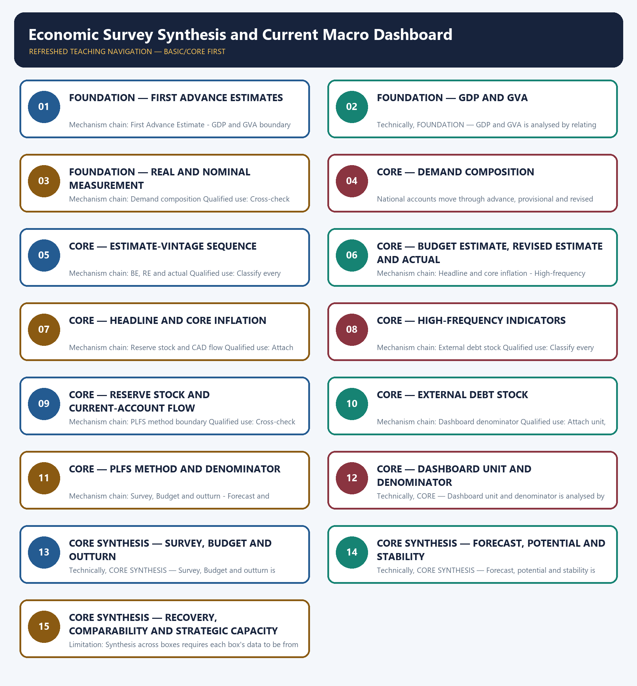

# Economic Survey Synthesis and Current Macro Dashboard — Learner-v2 Complete Learning Session

> **Authoring-only generation:** 2026-09-03. No PDF was rendered and no tracker or index was mutated.

### SOURCE, PROGRESSION AND CURRENT-LINKAGE AUDIT

- **Generation date:** 2026-09-03.
- **Repository-first evidence:** the Basic owner is taught first and preserved in full; the Advanced owner is retained only in the optional final teaching block.
- **OCR evidence:** Repository Markdown was primary. OCR-searchable local official General Studies papers were used only to confirm printed routed demands. No answer key, marking scheme, unsupported page precision or current macroeconomic statistic was inferred from them.
- **Qdrant:** not used; repository Markdown and available OCR context were sufficient.
- **PYQ integrity:** Audited ledgers route the 2021 V-shaped-recovery Mains demand and the 2019 objective demand on the Global Competitiveness Report publisher. The package retains the provisional-versus-revised FY21 figures and does not infer an unavailable objective key.
- **Live-link boundary:** The official Economic Survey landing page was blocked. The package preserves the January 2026 Survey vintage exactly as recorded in the owner, treats its FY26 values as FAE or stated-period observations, and imports no later forecast, outturn or September 2026 dashboard value.
- **Fact/inference discipline:** no current-affairs item, PYQ wording, figure or quotation is invented.

### LIVE OFFICIAL-SOURCE ATTEMPT LOG

The checks below were made on 2026-09-03. Substantive official text is used only for the proposition it actually supports; binary files, dynamic shells, stubs and undated dashboard snippets are recorded but not converted into current claims.

- https://www.indiabudget.gov.in/economicsurvey/ — direct fetch returned HTTP 403 on 2026-09-03; no current macro value or forecast was imported from the blocked page.

## BASIC LEARNING SESSION



*Distinct embedded teaching-navigation image. The separate continuous Cārvāka-style flowchart package remains an independent at-a-glance artifact.*

### SESSION 1 — FOUNDATION — FIRST ADVANCE ESTIMATES

#### DEFINITION / WHAT THIS IS CALLED

**Plain-language definition:** A First Advance Estimate is released before complete annual data and is revised as fuller information arrives; it is neither a final audited outcome nor a timeless current fact.

**Technical definition:** Mechanism chain: First Advance Estimate - GDP and GVA boundary Qualified use: Attach unit, denominator, reference period, release date and estimate vintage to every dashboard claim.

#### ANSWER-GRABBING OPENING — WRITE/ADAPT IN THE EXAM

> A First Advance Estimate is released before complete annual data and is revised as fuller information arrives; it is neither a final audited outcome nor a timeless current fact.

#### MUST-WRITE KEYWORDS

- **FOUNDATION**
- **First Advance Estimates**
- **Mechanism chain**
- **Qualified use**
- **A First Advance Estimate**
- **First Advance Estimate**

**How to use them:** Frame the answer through FOUNDATION; define First Advance Estimates, connect Mechanism chain with Qualified use to explain the mechanism, and use A First Advance Estimate for the decisive comparison or qualification.

#### VISUAL FIRST

```text
FIRST ADVANCE ESTIMATES
01. First Advance Estimate
    |
    v
02. GDP and GVA boundary
BOUNDARY -> Do not present an FAE, projection, RE or provisional account as a final realised outcome.
```

*This topic-specific rail fixes the evidence sequence and its exam boundary before analysis.*

#### CORE EXPLANATION

A First Advance Estimate is released before complete annual data and is revised as fuller information arrives; it is neither a final audited outcome nor a timeless current fact. GDP at market prices and GVA at basic prices answer related but distinct questions, so tax and subsidy effects can make their growth rates differ without contradiction.

#### NAMED EVIDENCE AND MECHANISM

- A First Advance Estimate is released before complete annual data and is revised as fuller information arrives; it is neither a final audited outcome nor a timeless current fact.
- GDP at market prices and GVA at basic prices answer related but distinct questions, so tax and subsidy effects can make their growth rates differ without contradiction.

#### EXAMINER CAUTION

- Do not present an FAE, projection, RE or provisional account as a final realised outcome.

#### EXAM LINK

- **Prelims:** Preserve the exact formula, territorial or resident boundary, price basis, base year, index basket, eligible counterparty, institution and legal status; never upgrade a projection into an actual or a regulatory direction into a universal rule.
- **Mains:** Attach unit, denominator, reference period, release date and estimate vintage to every dashboard claim.

#### MINI RECAP

- **Mechanism chain:** First Advance Estimate -> GDP and GVA boundary
- **Qualified use:** Attach unit, denominator, reference period, release date and estimate vintage to every dashboard claim.

#### CLOSING RECALL FLOW — FOUNDATION — FIRST ADVANCE ESTIMATES

```text
START / CONCEPT: FOUNDATION — First Advance Estimates
        |
        v
EXACT TERMS: FOUNDATION · First Advance Estimates · Mechanism chain · Qualified use · A First Advance Estimate · First Advance Estimate
        |
        v
MECHANISM / ARGUMENT: Mechanism chain: First Advance Estimate - GDP and GVA boundary Qualified use: Attach unit, denominator, reference period, release date and estimate vintage to every dashboard claim.
        |
        v
CONSEQUENCE / CONTRAST: GDP at market prices and GVA at basic prices answer related but distinct questions, so tax and subsidy effects can make their growth rates differ without contradiction.
        |
        v
UPSC TRAP / ANSWER-USE: Do not present an FAE, projection, RE or provisional account as a final realised outcome.
        |
        v
ANSWER-GRABBING FORMULATION: A First Advance Estimate is released before complete annual data and is revised as fuller information arrives; it is neither a final audited outcome nor a timeless current fact.
```
### SESSION 2 — FOUNDATION — GDP AND GVA

#### DEFINITION / WHAT THIS IS CALLED

**Plain-language definition:** Mechanism chain: Real and nominal boundary Qualified use: Classify every value as stock, flow, level, growth rate, share, ratio, estimate, projection or outturn.

**Technical definition:** Technically, FOUNDATION — GDP and GVA is analysed by relating FOUNDATION to GDP, then testing the relationship through GVA and Mechanism chain.

#### ANSWER-GRABBING OPENING — WRITE/ADAPT IN THE EXAM

> Do not merge GDP with GVA or nominal values with real growth.

#### MUST-WRITE KEYWORDS

- **FOUNDATION**
- **GDP**
- **GVA**
- **Mechanism chain**
- **Qualified use**
- **Real**

**How to use them:** Frame the answer through FOUNDATION; define GDP, connect GVA with Mechanism chain to explain the mechanism, and use Qualified use for the decisive comparison or qualification.

#### VISUAL FIRST

```text
GDP AND GVA
01. Real and nominal boundary
BOUNDARY -> Do not merge GDP with GVA or nominal values with real growth.
```

*This topic-specific rail fixes the evidence sequence and its exam boundary before analysis.*

#### CORE EXPLANATION

Real aggregates remove price change using a stated base and method, while nominal aggregates value output at current prices; a real growth rate cannot be compared directly with a nominal level.

#### NAMED EVIDENCE AND MECHANISM

- Real aggregates remove price change using a stated base and method, while nominal aggregates value output at current prices; a real growth rate cannot be compared directly with a nominal level.

#### EXAMINER CAUTION

- Do not merge GDP with GVA or nominal values with real growth.

#### EXAM LINK

- **Prelims:** Preserve the exact formula, territorial or resident boundary, price basis, base year, index basket, eligible counterparty, institution and legal status; never upgrade a projection into an actual or a regulatory direction into a universal rule.
- **Mains:** Classify every value as stock, flow, level, growth rate, share, ratio, estimate, projection or outturn.

#### MINI RECAP

- **Mechanism chain:** Real and nominal boundary
- **Qualified use:** Classify every value as stock, flow, level, growth rate, share, ratio, estimate, projection or outturn.

#### CLOSING RECALL FLOW — FOUNDATION — GDP AND GVA

```text
START / CONCEPT: FOUNDATION — GDP and GVA
        |
        v
EXACT TERMS: FOUNDATION · GDP · GVA · Mechanism chain · Qualified use · Real
        |
        v
MECHANISM / ARGUMENT: Mechanism chain: Real and nominal boundary Qualified use: Classify every value as stock, flow, level, growth rate, share, ratio, estimate, projection or outturn.
        |
        v
CONSEQUENCE / CONTRAST: The resulting consequence is that do not merge GDP with GVA or nominal values with real growth.
        |
        v
UPSC TRAP / ANSWER-USE: Do not miss this limiting distinction: do not merge GDP with GVA or nominal values with real growth.
        |
        v
ANSWER-GRABBING FORMULATION: Do not merge GDP with GVA or nominal values with real growth.
```
### SESSION 3 — FOUNDATION — REAL AND NOMINAL MEASUREMENT

#### DEFINITION / WHAT THIS IS CALLED

**Plain-language definition:** PFCE, government consumption, gross capital formation and net exports describe expenditure composition; a component's share of GDP and its growth rate are different measures.

**Technical definition:** Mechanism chain: Demand composition Qualified use: Cross-check the headline against composition, distribution and comparable-period evidence before judging stability.

#### ANSWER-GRABBING OPENING — WRITE/ADAPT IN THE EXAM

> PFCE, government consumption, gross capital formation and net exports describe expenditure composition; a component's share of GDP and its growth rate are different measures.

#### MUST-WRITE KEYWORDS

- **FOUNDATION**
- **Real**
- **nominal measurement**
- **Mechanism chain**
- **Qualified use**
- **PFCE**

**How to use them:** Frame the answer through FOUNDATION; define Real, connect nominal measurement with Mechanism chain to explain the mechanism, and use Qualified use for the decisive comparison or qualification.

#### VISUAL FIRST

```text
REAL AND NOMINAL MEASUREMENT
01. Demand composition
BOUNDARY -> Do not confuse a demand component's GDP share with its growth contribution.
```

*This topic-specific rail fixes the evidence sequence and its exam boundary before analysis.*

#### CORE EXPLANATION

PFCE, government consumption, gross capital formation and net exports describe expenditure composition; a component's share of GDP and its growth rate are different measures.

#### NAMED EVIDENCE AND MECHANISM

- PFCE, government consumption, gross capital formation and net exports describe expenditure composition; a component's share of GDP and its growth rate are different measures.

#### EXAMINER CAUTION

- Do not confuse a demand component's GDP share with its growth contribution.

#### EXAM LINK

- **Prelims:** Preserve the exact formula, territorial or resident boundary, price basis, base year, index basket, eligible counterparty, institution and legal status; never upgrade a projection into an actual or a regulatory direction into a universal rule.
- **Mains:** Cross-check the headline against composition, distribution and comparable-period evidence before judging stability.

#### MINI RECAP

- **Mechanism chain:** Demand composition
- **Qualified use:** Cross-check the headline against composition, distribution and comparable-period evidence before judging stability.

#### CLOSING RECALL FLOW — FOUNDATION — REAL AND NOMINAL MEASUREMENT

```text
START / CONCEPT: FOUNDATION — Real and nominal measurement
        |
        v
EXACT TERMS: FOUNDATION · Real · nominal measurement · Mechanism chain · Qualified use · PFCE
        |
        v
MECHANISM / ARGUMENT: Mechanism chain: Demand composition Qualified use: Cross-check the headline against composition, distribution and comparable-period evidence before judging stability.
        |
        v
CONSEQUENCE / CONTRAST: Do not confuse a demand component's GDP share with its growth contribution.
        |
        v
UPSC TRAP / ANSWER-USE: Do not miss this limiting distinction: do not confuse a demand component's GDP share with its growth contribution.
        |
        v
ANSWER-GRABBING FORMULATION: PFCE, government consumption, gross capital formation and net exports describe expenditure composition; a component's share of GDP and its growth rate are different measures.
```
### SESSION 4 — CORE — DEMAND COMPOSITION

#### DEFINITION / WHAT THIS IS CALLED

**Plain-language definition:** Mechanism chain: Estimate-vintage sequence Qualified use: Attach unit, denominator, reference period, release date and estimate vintage to every dashboard claim.

**Technical definition:** National accounts move through advance, provisional and revised estimates as data improve; every quoted figure must retain the release date and estimate vintage used by the source.

#### ANSWER-GRABBING OPENING — WRITE/ADAPT IN THE EXAM

> Do not treat headline CPI as every household's inflation experience.

#### MUST-WRITE KEYWORDS

- **Demand composition**
- **Mechanism chain**
- **Qualified use**
- **National**
- **CPI**
- **Estimate-vintage**

**How to use them:** Frame the answer through Demand composition; define Mechanism chain, connect Qualified use with National to explain the mechanism, and use CPI for the decisive comparison or qualification.

#### VISUAL FIRST

```text
DEMAND COMPOSITION
01. Estimate-vintage sequence
BOUNDARY -> Do not treat headline CPI as every household's inflation experience.
```

*This topic-specific rail fixes the evidence sequence and its exam boundary before analysis.*

#### CORE EXPLANATION

National accounts move through advance, provisional and revised estimates as data improve; every quoted figure must retain the release date and estimate vintage used by the source.

#### NAMED EVIDENCE AND MECHANISM

- National accounts move through advance, provisional and revised estimates as data improve; every quoted figure must retain the release date and estimate vintage used by the source.

#### EXAMINER CAUTION

- Do not treat headline CPI as every household's inflation experience.

#### EXAM LINK

- **Prelims:** Preserve the exact formula, territorial or resident boundary, price basis, base year, index basket, eligible counterparty, institution and legal status; never upgrade a projection into an actual or a regulatory direction into a universal rule.
- **Mains:** Attach unit, denominator, reference period, release date and estimate vintage to every dashboard claim.

#### MINI RECAP

- **Mechanism chain:** Estimate-vintage sequence
- **Qualified use:** Attach unit, denominator, reference period, release date and estimate vintage to every dashboard claim.

#### CLOSING RECALL FLOW — CORE — DEMAND COMPOSITION

```text
START / CONCEPT: CORE — Demand composition
        |
        v
EXACT TERMS: Demand composition · Mechanism chain · Qualified use · National · CPI · Estimate-vintage
        |
        v
MECHANISM / ARGUMENT: Mechanism chain: Estimate-vintage sequence Qualified use: Attach unit, denominator, reference period, release date and estimate vintage to every dashboard claim.
        |
        v
CONSEQUENCE / CONTRAST: National accounts move through advance, provisional and revised estimates as data improve; every quoted figure must retain the release date and estimate vintage used by the source.
        |
        v
UPSC TRAP / ANSWER-USE: Do not miss this limiting distinction: do not treat headline CPI as every household's inflation experience.
        |
        v
ANSWER-GRABBING FORMULATION: Do not treat headline CPI as every household's inflation experience.
```
### SESSION 5 — CORE — ESTIMATE-VINTAGE SEQUENCE

#### DEFINITION / WHAT THIS IS CALLED

**Plain-language definition:** Budget Estimate is a forward plan, Revised Estimate is an in-year reassessment and CGA provisional or final accounts report realised fiscal flows; proposal, revision and outturn are not interchangeable.

**Technical definition:** Mechanism chain: BE, RE and actual Qualified use: Classify every value as stock, flow, level, growth rate, share, ratio, estimate, projection or outturn.

#### ANSWER-GRABBING OPENING — WRITE/ADAPT IN THE EXAM

> Budget Estimate is a forward plan, Revised Estimate is an in-year reassessment and CGA provisional or final accounts report realised fiscal flows; proposal, revision and outturn are not interchangeable.

#### MUST-WRITE KEYWORDS

- **Estimate-vintage sequence**
- **Mechanism chain**
- **Qualified use**
- **Budget Estimate**
- **Revised Estimate**
- **CGA**

**How to use them:** Frame the answer through Estimate-vintage sequence; define Mechanism chain, connect Qualified use with Budget Estimate to explain the mechanism, and use Revised Estimate for the decisive comparison or qualification.

#### VISUAL FIRST

```text
ESTIMATE-VINTAGE SEQUENCE
01. BE, RE and actual
BOUNDARY -> Do not use a high-frequency proxy as a complete causal explanation.
```

*This topic-specific rail fixes the evidence sequence and its exam boundary before analysis.*

#### CORE EXPLANATION

Budget Estimate is a forward plan, Revised Estimate is an in-year reassessment and CGA provisional or final accounts report realised fiscal flows; proposal, revision and outturn are not interchangeable.

#### NAMED EVIDENCE AND MECHANISM

- Budget Estimate is a forward plan, Revised Estimate is an in-year reassessment and CGA provisional or final accounts report realised fiscal flows; proposal, revision and outturn are not interchangeable.

#### EXAMINER CAUTION

- Do not use a high-frequency proxy as a complete causal explanation.

#### EXAM LINK

- **Prelims:** Preserve the exact formula, territorial or resident boundary, price basis, base year, index basket, eligible counterparty, institution and legal status; never upgrade a projection into an actual or a regulatory direction into a universal rule.
- **Mains:** Classify every value as stock, flow, level, growth rate, share, ratio, estimate, projection or outturn.

#### MINI RECAP

- **Mechanism chain:** BE, RE and actual
- **Qualified use:** Classify every value as stock, flow, level, growth rate, share, ratio, estimate, projection or outturn.

#### CLOSING RECALL FLOW — CORE — ESTIMATE-VINTAGE SEQUENCE

```text
START / CONCEPT: CORE — Estimate-vintage sequence
        |
        v
EXACT TERMS: Estimate-vintage sequence · Mechanism chain · Qualified use · Budget Estimate · Revised Estimate · CGA
        |
        v
MECHANISM / ARGUMENT: Mechanism chain: BE, RE and actual Qualified use: Classify every value as stock, flow, level, growth rate, share, ratio, estimate, projection or outturn.
        |
        v
CONSEQUENCE / CONTRAST: Do not use a high-frequency proxy as a complete causal explanation.
        |
        v
UPSC TRAP / ANSWER-USE: Do not miss this limiting distinction: budget Estimate is a forward plan, Revised Estimate is an in-year reassessment and CGA...
        |
        v
ANSWER-GRABBING FORMULATION: Budget Estimate is a forward plan, Revised Estimate is an in-year reassessment and CGA provisional or final accounts report realised fiscal flows; proposal, revision and outturn are not interchangeable.
```
### SESSION 6 — CORE — BUDGET ESTIMATE, REVISED ESTIMATE AND ACTUAL

#### DEFINITION / WHAT THIS IS CALLED

**Plain-language definition:** CORE — Budget Estimate, Revised Estimate and actual comprises Budget Estimate, Revised Estimate and actual as its core connected dimensions.

**Technical definition:** Mechanism chain: Headline and core inflation - High-frequency indicators Qualified use: Cross-check the headline against composition, distribution and comparable-period evidence before judging stability.

#### ANSWER-GRABBING OPENING — WRITE/ADAPT IN THE EXAM

> Headline CPI includes food and fuel while core measures exclude selected volatile components; low headline inflation does not mean every component or household basket became cheaper.

#### MUST-WRITE KEYWORDS

- **Budget Estimate**
- **Revised Estimate**
- **actual**
- **Mechanism chain**
- **Qualified use**
- **Headline CPI**

**How to use them:** Frame the answer through Budget Estimate; define Revised Estimate, connect actual with Mechanism chain to explain the mechanism, and use Qualified use for the decisive comparison or qualification.

#### VISUAL FIRST

```text
BUDGET ESTIMATE, REVISED ESTIMATE AND ACTUAL
01. Headline and core inflation
    |
    v
02. High-frequency indicators
BOUNDARY -> Do not substitute reserve stock for current-account flow or external debt stock.
```

*This topic-specific rail fixes the evidence sequence and its exam boundary before analysis.*

#### CORE EXPLANATION

Headline CPI includes food and fuel while core measures exclude selected volatile components; low headline inflation does not mean every component or household basket became cheaper. High-frequency indicators provide timely signals before complete national accounts, but they are partial proxies whose seasonal, base and coverage effects must be checked.

#### NAMED EVIDENCE AND MECHANISM

- Headline CPI includes food and fuel while core measures exclude selected volatile components; low headline inflation does not mean every component or household basket became cheaper.
- High-frequency indicators provide timely signals before complete national accounts, but they are partial proxies whose seasonal, base and coverage effects must be checked.

#### EXAMINER CAUTION

- Do not substitute reserve stock for current-account flow or external debt stock.

#### EXAM LINK

- **Prelims:** Preserve the exact formula, territorial or resident boundary, price basis, base year, index basket, eligible counterparty, institution and legal status; never upgrade a projection into an actual or a regulatory direction into a universal rule.
- **Mains:** Cross-check the headline against composition, distribution and comparable-period evidence before judging stability.

#### MINI RECAP

- **Mechanism chain:** Headline and core inflation -> High-frequency indicators
- **Qualified use:** Cross-check the headline against composition, distribution and comparable-period evidence before judging stability.

#### CLOSING RECALL FLOW — CORE — BUDGET ESTIMATE, REVISED ESTIMATE AND ACTUAL

```text
START / CONCEPT: CORE — Budget Estimate, Revised Estimate and actual
        |
        v
EXACT TERMS: Budget Estimate · Revised Estimate · actual · Mechanism chain · Qualified use · Headline CPI
        |
        v
MECHANISM / ARGUMENT: Mechanism chain: Headline and core inflation - High-frequency indicators Qualified use: Cross-check the headline against composition, distribution and comparable-period evidence before judging stability.
        |
        v
CONSEQUENCE / CONTRAST: High-frequency indicators provide timely signals before complete national accounts, but they are partial proxies whose seasonal, base and coverage effects must be checked.
        |
        v
UPSC TRAP / ANSWER-USE: Do not substitute reserve stock for current-account flow or external debt stock.
        |
        v
ANSWER-GRABBING FORMULATION: Headline CPI includes food and fuel while core measures exclude selected volatile components; low headline inflation does not mean every component or household basket became cheaper.
```
### SESSION 7 — CORE — HEADLINE AND CORE INFLATION

#### DEFINITION / WHAT THIS IS CALLED

**Plain-language definition:** Foreign-exchange reserves are a point-in-time stock, while the current-account balance is a period flow; a large stock buffer does not by itself correct a persistent flow imbalance.

**Technical definition:** Mechanism chain: Reserve stock and CAD flow Qualified use: Attach unit, denominator, reference period, release date and estimate vintage to every dashboard claim.

#### ANSWER-GRABBING OPENING — WRITE/ADAPT IN THE EXAM

> Foreign-exchange reserves are a point-in-time stock, while the current-account balance is a period flow; a large stock buffer does not by itself correct a persistent flow imbalance.

#### MUST-WRITE KEYWORDS

- **Headline**
- **core inflation**
- **Mechanism chain**
- **Qualified use**
- **Foreign-exchange reserves**
- **Foreign-exchange**

**How to use them:** Frame the answer through Headline; define core inflation, connect Mechanism chain with Qualified use to explain the mechanism, and use Foreign-exchange reserves for the decisive comparison or qualification.

#### VISUAL FIRST

```text
HEADLINE AND CORE INFLATION
01. Reserve stock and CAD flow
BOUNDARY -> Do not quote a PLFS rate without period, status concept and denominator.
```

*This topic-specific rail fixes the evidence sequence and its exam boundary before analysis.*

#### CORE EXPLANATION

Foreign-exchange reserves are a point-in-time stock, while the current-account balance is a period flow; a large stock buffer does not by itself correct a persistent flow imbalance.

#### NAMED EVIDENCE AND MECHANISM

- Foreign-exchange reserves are a point-in-time stock, while the current-account balance is a period flow; a large stock buffer does not by itself correct a persistent flow imbalance.

#### EXAMINER CAUTION

- Do not quote a PLFS rate without period, status concept and denominator.

#### EXAM LINK

- **Prelims:** Preserve the exact formula, territorial or resident boundary, price basis, base year, index basket, eligible counterparty, institution and legal status; never upgrade a projection into an actual or a regulatory direction into a universal rule.
- **Mains:** Attach unit, denominator, reference period, release date and estimate vintage to every dashboard claim.

#### MINI RECAP

- **Mechanism chain:** Reserve stock and CAD flow
- **Qualified use:** Attach unit, denominator, reference period, release date and estimate vintage to every dashboard claim.

#### CLOSING RECALL FLOW — CORE — HEADLINE AND CORE INFLATION

```text
START / CONCEPT: CORE — Headline and core inflation
        |
        v
EXACT TERMS: Headline · core inflation · Mechanism chain · Qualified use · Foreign-exchange reserves · Foreign-exchange
        |
        v
MECHANISM / ARGUMENT: Mechanism chain: Reserve stock and CAD flow Qualified use: Attach unit, denominator, reference period, release date and estimate vintage to every dashboard claim.
        |
        v
CONSEQUENCE / CONTRAST: Do not quote a PLFS rate without period, status concept and denominator.
        |
        v
UPSC TRAP / ANSWER-USE: Do not miss this limiting distinction: foreign-exchange reserves are a point-in-time stock.
        |
        v
ANSWER-GRABBING FORMULATION: Foreign-exchange reserves are a point-in-time stock, while the current-account balance is a period flow; a large stock buffer does not by itself correct a persistent flow imbalance.
```
### SESSION 8 — CORE — HIGH-FREQUENCY INDICATORS

#### DEFINITION / WHAT THIS IS CALLED

**Plain-language definition:** External debt is a liability stock measured at a stated date and must be assessed with maturity, currency, borrower and servicing capacity rather than confused with annual capital inflows.

**Technical definition:** Mechanism chain: External debt stock Qualified use: Classify every value as stock, flow, level, growth rate, share, ratio, estimate, projection or outturn.

#### ANSWER-GRABBING OPENING — WRITE/ADAPT IN THE EXAM

> External debt is a liability stock measured at a stated date and must be assessed with maturity, currency, borrower and servicing capacity rather than confused with annual capital inflows.

#### MUST-WRITE KEYWORDS

- **High-frequency indicators**
- **Mechanism chain**
- **Qualified use**
- **External debt**
- **External**
- **Survey**

**How to use them:** Frame the answer through High-frequency indicators; define Mechanism chain, connect Qualified use with External debt to explain the mechanism, and use External for the decisive comparison or qualification.

#### VISUAL FIRST

```text
HIGH-FREQUENCY INDICATORS
01. External debt stock
BOUNDARY -> Do not merge Survey observation, Budget proposal and official outturn.
```

*This topic-specific rail fixes the evidence sequence and its exam boundary before analysis.*

#### CORE EXPLANATION

External debt is a liability stock measured at a stated date and must be assessed with maturity, currency, borrower and servicing capacity rather than confused with annual capital inflows.

#### NAMED EVIDENCE AND MECHANISM

- External debt is a liability stock measured at a stated date and must be assessed with maturity, currency, borrower and servicing capacity rather than confused with annual capital inflows.

#### EXAMINER CAUTION

- Do not merge Survey observation, Budget proposal and official outturn.

#### EXAM LINK

- **Prelims:** Preserve the exact formula, territorial or resident boundary, price basis, base year, index basket, eligible counterparty, institution and legal status; never upgrade a projection into an actual or a regulatory direction into a universal rule.
- **Mains:** Classify every value as stock, flow, level, growth rate, share, ratio, estimate, projection or outturn.

#### MINI RECAP

- **Mechanism chain:** External debt stock
- **Qualified use:** Classify every value as stock, flow, level, growth rate, share, ratio, estimate, projection or outturn.

#### CLOSING RECALL FLOW — CORE — HIGH-FREQUENCY INDICATORS

```text
START / CONCEPT: CORE — High-frequency indicators
        |
        v
EXACT TERMS: High-frequency indicators · Mechanism chain · Qualified use · External debt · External · Survey
        |
        v
MECHANISM / ARGUMENT: Mechanism chain: External debt stock Qualified use: Classify every value as stock, flow, level, growth rate, share, ratio, estimate, projection or outturn.
        |
        v
CONSEQUENCE / CONTRAST: Do not merge Survey observation, Budget proposal and official outturn.
        |
        v
UPSC TRAP / ANSWER-USE: Do not miss this limiting distinction: do not merge Survey observation, Budget proposal and official outturn.
        |
        v
ANSWER-GRABBING FORMULATION: External debt is a liability stock measured at a stated date and must be assessed with maturity, currency, borrower and servicing capacity rather than confused with annual capital inflows.
```
### SESSION 9 — CORE — RESERVE STOCK AND CURRENT-ACCOUNT FLOW

#### DEFINITION / WHAT THIS IS CALLED

**Plain-language definition:** PLFS labour indicators depend on period, geography and status concept such as usual status or current weekly status; one rate without its denominator and method is incomplete.

**Technical definition:** Mechanism chain: PLFS method boundary Qualified use: Cross-check the headline against composition, distribution and comparable-period evidence before judging stability.

#### ANSWER-GRABBING OPENING — WRITE/ADAPT IN THE EXAM

> PLFS labour indicators depend on period, geography and status concept such as usual status or current weekly status; one rate without its denominator and method is incomplete.

#### MUST-WRITE KEYWORDS

- **Reserve stock**
- **current-account flow**
- **Mechanism chain**
- **Qualified use**
- **PLFS**
- **Survey**

**How to use them:** Frame the answer through Reserve stock; define current-account flow, connect Mechanism chain with Qualified use to explain the mechanism, and use PLFS for the decisive comparison or qualification.

#### VISUAL FIRST

```text
RESERVE STOCK AND CURRENT-ACCOUNT FLOW
01. PLFS method boundary
BOUNDARY -> Do not infer current September 2026 conditions from a January 2026 Survey vintage.
```

*This topic-specific rail fixes the evidence sequence and its exam boundary before analysis.*

#### CORE EXPLANATION

PLFS labour indicators depend on period, geography and status concept such as usual status or current weekly status; one rate without its denominator and method is incomplete.

#### NAMED EVIDENCE AND MECHANISM

- PLFS labour indicators depend on period, geography and status concept such as usual status or current weekly status; one rate without its denominator and method is incomplete.

#### EXAMINER CAUTION

- Do not infer current September 2026 conditions from a January 2026 Survey vintage.

#### EXAM LINK

- **Prelims:** Preserve the exact formula, territorial or resident boundary, price basis, base year, index basket, eligible counterparty, institution and legal status; never upgrade a projection into an actual or a regulatory direction into a universal rule.
- **Mains:** Cross-check the headline against composition, distribution and comparable-period evidence before judging stability.

#### MINI RECAP

- **Mechanism chain:** PLFS method boundary
- **Qualified use:** Cross-check the headline against composition, distribution and comparable-period evidence before judging stability.

#### CLOSING RECALL FLOW — CORE — RESERVE STOCK AND CURRENT-ACCOUNT FLOW

```text
START / CONCEPT: CORE — Reserve stock and current-account flow
        |
        v
EXACT TERMS: Reserve stock · current-account flow · Mechanism chain · Qualified use · PLFS · Survey
        |
        v
MECHANISM / ARGUMENT: Mechanism chain: PLFS method boundary Qualified use: Cross-check the headline against composition, distribution and comparable-period evidence before judging stability.
        |
        v
CONSEQUENCE / CONTRAST: Do not infer current September 2026 conditions from a January 2026 Survey vintage.
        |
        v
UPSC TRAP / ANSWER-USE: Do not miss this limiting distinction: do not infer current September 2026 conditions from a January 2026 Survey vintage.
        |
        v
ANSWER-GRABBING FORMULATION: PLFS labour indicators depend on period, geography and status concept such as usual status or current weekly status; one rate without its denominator and method is incomplete.
```
### SESSION 10 — CORE — EXTERNAL DEBT STOCK

#### DEFINITION / WHAT THIS IS CALLED

**Plain-language definition:** A dashboard indicator must preserve whether it is a level, growth rate, ratio, share, index, stock, flow or per-capita measure and identify the denominator before comparison.

**Technical definition:** Mechanism chain: Dashboard denominator Qualified use: Attach unit, denominator, reference period, release date and estimate vintage to every dashboard claim.

#### ANSWER-GRABBING OPENING — WRITE/ADAPT IN THE EXAM

> A dashboard indicator must preserve whether it is a level, growth rate, ratio, share, index, stock, flow or per-capita measure and identify the denominator before comparison.

#### MUST-WRITE KEYWORDS

- **External debt stock**
- **Mechanism chain**
- **Qualified use**
- **Dashboard**
- **Qualified**
- **Attach**

**How to use them:** Frame the answer through External debt stock; define Mechanism chain, connect Qualified use with Dashboard to explain the mechanism, and use Qualified for the decisive comparison or qualification.

#### VISUAL FIRST

```text
EXTERNAL DEBT STOCK
01. Dashboard denominator
BOUNDARY -> Do not infer objective answer letters or invent a dashboard value absent a dated official release.
```

*This topic-specific rail fixes the evidence sequence and its exam boundary before analysis.*

#### CORE EXPLANATION

A dashboard indicator must preserve whether it is a level, growth rate, ratio, share, index, stock, flow or per-capita measure and identify the denominator before comparison.

#### NAMED EVIDENCE AND MECHANISM

- A dashboard indicator must preserve whether it is a level, growth rate, ratio, share, index, stock, flow or per-capita measure and identify the denominator before comparison.

#### EXAMINER CAUTION

- Do not infer objective answer letters or invent a dashboard value absent a dated official release.

#### EXAM LINK

- **Prelims:** Preserve the exact formula, territorial or resident boundary, price basis, base year, index basket, eligible counterparty, institution and legal status; never upgrade a projection into an actual or a regulatory direction into a universal rule.
- **Mains:** Attach unit, denominator, reference period, release date and estimate vintage to every dashboard claim.

#### MINI RECAP

- **Mechanism chain:** Dashboard denominator
- **Qualified use:** Attach unit, denominator, reference period, release date and estimate vintage to every dashboard claim.

#### CLOSING RECALL FLOW — CORE — EXTERNAL DEBT STOCK

```text
START / CONCEPT: CORE — External debt stock
        |
        v
EXACT TERMS: External debt stock · Mechanism chain · Qualified use · Dashboard · Qualified · Attach
        |
        v
MECHANISM / ARGUMENT: Mechanism chain: Dashboard denominator Qualified use: Attach unit, denominator, reference period, release date and estimate vintage to every dashboard claim.
        |
        v
CONSEQUENCE / CONTRAST: Do not infer objective answer letters or invent a dashboard value absent a dated official release.
        |
        v
UPSC TRAP / ANSWER-USE: Do not miss this limiting distinction: do not infer objective answer letters or invent a dashboard value absent a dated...
        |
        v
ANSWER-GRABBING FORMULATION: A dashboard indicator must preserve whether it is a level, growth rate, ratio, share, index, stock, flow or per-capita measure and identify the denominator before comparison.
```
### SESSION 11 — CORE — PLFS METHOD AND DENOMINATOR

#### DEFINITION / WHAT THIS IS CALLED

**Plain-language definition:** An Economic Survey observation or projection, a Budget proposal and a subsequently reported official outturn are different evidence classes and must not be blended into one government commitment or achievement.

**Technical definition:** Mechanism chain: Survey, Budget and outturn - Forecast and potential growth Qualified use: Classify every value as stock, flow, level, growth rate, share, ratio, estimate, projection or outturn.

#### ANSWER-GRABBING OPENING — WRITE/ADAPT IN THE EXAM

> An Economic Survey observation or projection, a Budget proposal and a subsequently reported official outturn are different evidence classes and must not be blended into one government commitment or achievement.

#### MUST-WRITE KEYWORDS

- **PLFS method**
- **denominator**
- **Mechanism chain**
- **Qualified use**
- **An Economic Survey**
- **Budget**

**How to use them:** Frame the answer through PLFS method; define denominator, connect Mechanism chain with Qualified use to explain the mechanism, and use An Economic Survey for the decisive comparison or qualification.

#### VISUAL FIRST

```text
PLFS METHOD AND DENOMINATOR
01. Survey, Budget and outturn
    |
    v
02. Forecast and potential growth
BOUNDARY -> Do not present an FAE, projection, RE or provisional account as a final realised outcome.
```

*This topic-specific rail fixes the evidence sequence and its exam boundary before analysis.*

#### CORE EXPLANATION

An Economic Survey observation or projection, a Budget proposal and a subsequently reported official outturn are different evidence classes and must not be blended into one government commitment or achievement. A near-term forecast is conditional on assumptions and a data vintage, while potential growth is an assessment of sustainable capacity; neither is an achieved growth rate.

#### NAMED EVIDENCE AND MECHANISM

- An Economic Survey observation or projection, a Budget proposal and a subsequently reported official outturn are different evidence classes and must not be blended into one government commitment or achievement.
- A near-term forecast is conditional on assumptions and a data vintage, while potential growth is an assessment of sustainable capacity; neither is an achieved growth rate.

#### EXAMINER CAUTION

- Do not present an FAE, projection, RE or provisional account as a final realised outcome.

#### EXAM LINK

- **Prelims:** Preserve the exact formula, territorial or resident boundary, price basis, base year, index basket, eligible counterparty, institution and legal status; never upgrade a projection into an actual or a regulatory direction into a universal rule.
- **Mains:** Classify every value as stock, flow, level, growth rate, share, ratio, estimate, projection or outturn.

#### MINI RECAP

- **Mechanism chain:** Survey, Budget and outturn -> Forecast and potential growth
- **Qualified use:** Classify every value as stock, flow, level, growth rate, share, ratio, estimate, projection or outturn.

#### CLOSING RECALL FLOW — CORE — PLFS METHOD AND DENOMINATOR

```text
START / CONCEPT: CORE — PLFS method and denominator
        |
        v
EXACT TERMS: PLFS method · denominator · Mechanism chain · Qualified use · An Economic Survey · Budget
        |
        v
MECHANISM / ARGUMENT: Mechanism chain: Survey, Budget and outturn - Forecast and potential growth Qualified use: Classify every value as stock, flow, level, growth rate, share, ratio, estimate, projection or outturn.
        |
        v
CONSEQUENCE / CONTRAST: A near-term forecast is conditional on assumptions and a data vintage, while potential growth is an assessment of sustainable capacity; neither is an achieved growth rate.
        |
        v
UPSC TRAP / ANSWER-USE: Do not present an FAE, projection, RE or provisional account as a final realised outcome.
        |
        v
ANSWER-GRABBING FORMULATION: An Economic Survey observation or projection, a Budget proposal and a subsequently reported official outturn are different evidence classes and must not be blended into one government commitment or achievement.
```
### SESSION 12 — CORE — DASHBOARD UNIT AND DENOMINATOR

#### DEFINITION / WHAT THIS IS CALLED

**Plain-language definition:** Mechanism chain: Macro-stability frame Qualified use: Cross-check the headline against composition, distribution and comparable-period evidence before judging stability.

**Technical definition:** Technically, CORE — Dashboard unit and denominator is analysed by relating Dashboard unit to denominator, then testing the relationship through Mechanism chain and Qualified use.

#### ANSWER-GRABBING OPENING — WRITE/ADAPT IN THE EXAM

> Do not merge GDP with GVA or nominal values with real growth.

#### MUST-WRITE KEYWORDS

- **Dashboard unit**
- **denominator**
- **Mechanism chain**
- **Qualified use**
- **GDP**
- **GVA**

**How to use them:** Frame the answer through Dashboard unit; define denominator, connect Mechanism chain with Qualified use to explain the mechanism, and use GDP for the decisive comparison or qualification.

#### VISUAL FIRST

```text
DASHBOARD UNIT AND DENOMINATOR
01. Macro-stability frame
BOUNDARY -> Do not merge GDP with GVA or nominal values with real growth.
```

*This topic-specific rail fixes the evidence sequence and its exam boundary before analysis.*

#### CORE EXPLANATION

Macro stability combines manageable inflation, fiscal credibility, external resilience and financial soundness; one strong growth headline cannot establish stability across all boxes.

#### NAMED EVIDENCE AND MECHANISM

- Macro stability combines manageable inflation, fiscal credibility, external resilience and financial soundness; one strong growth headline cannot establish stability across all boxes.

#### EXAMINER CAUTION

- Do not merge GDP with GVA or nominal values with real growth.

#### EXAM LINK

- **Prelims:** Preserve the exact formula, territorial or resident boundary, price basis, base year, index basket, eligible counterparty, institution and legal status; never upgrade a projection into an actual or a regulatory direction into a universal rule.
- **Mains:** Cross-check the headline against composition, distribution and comparable-period evidence before judging stability.

#### MINI RECAP

- **Mechanism chain:** Macro-stability frame
- **Qualified use:** Cross-check the headline against composition, distribution and comparable-period evidence before judging stability.

#### CLOSING RECALL FLOW — CORE — DASHBOARD UNIT AND DENOMINATOR

```text
START / CONCEPT: CORE — Dashboard unit and denominator
        |
        v
EXACT TERMS: Dashboard unit · denominator · Mechanism chain · Qualified use · GDP · GVA
        |
        v
MECHANISM / ARGUMENT: Mechanism chain: Macro-stability frame Qualified use: Cross-check the headline against composition, distribution and comparable-period evidence before judging stability.
        |
        v
CONSEQUENCE / CONTRAST: The resulting consequence is that do not merge GDP with GVA or nominal values with real growth.
        |
        v
UPSC TRAP / ANSWER-USE: Do not miss this limiting distinction: do not merge GDP with GVA or nominal values with real growth.
        |
        v
ANSWER-GRABBING FORMULATION: Do not merge GDP with GVA or nominal values with real growth.
```
### SESSION 13 — CORE SYNTHESIS — SURVEY, BUDGET AND OUTTURN

#### DEFINITION / WHAT THIS IS CALLED

**Plain-language definition:** Mechanism chain: V-shaped recovery boundary Qualified use: Attach unit, denominator, reference period, release date and estimate vintage to every dashboard claim.

**Technical definition:** Technically, CORE SYNTHESIS — Survey, Budget and outturn is analysed by relating CORE SYNTHESIS to Survey, then testing the relationship through Budget and outturn.

#### ANSWER-GRABBING OPENING — WRITE/ADAPT IN THE EXAM

> Mechanism chain: V-shaped recovery boundary Qualified use: Attach unit, denominator, reference period, release date and estimate vintage to every dashboard claim.

#### MUST-WRITE KEYWORDS

- **CORE SYNTHESIS**
- **Survey**
- **Budget**
- **outturn**
- **Mechanism chain**
- **Qualified use**

**How to use them:** Frame the answer through CORE SYNTHESIS; define Survey, connect Budget with outturn to explain the mechanism, and use Mechanism chain for the decisive comparison or qualification.

#### VISUAL FIRST

```text
SURVEY, BUDGET AND OUTTURN
01. V-shaped recovery boundary
BOUNDARY -> Do not confuse a demand component's GDP share with its growth contribution.
```

*This topic-specific rail fixes the evidence sequence and its exam boundary before analysis.*

#### CORE EXPLANATION

India's FY21 quarterly real-GDP path recorded a sharp contraction followed by sequential return to positive year-on-year growth, but a V-shaped aggregate path does not prove uniform sectoral or employment recovery.

#### NAMED EVIDENCE AND MECHANISM

- India's FY21 quarterly real-GDP path recorded a sharp contraction followed by sequential return to positive year-on-year growth, but a V-shaped aggregate path does not prove uniform sectoral or employment recovery.

#### EXAMINER CAUTION

- Do not confuse a demand component's GDP share with its growth contribution.

#### EXAM LINK

- **Prelims:** Preserve the exact formula, territorial or resident boundary, price basis, base year, index basket, eligible counterparty, institution and legal status; never upgrade a projection into an actual or a regulatory direction into a universal rule.
- **Mains:** Attach unit, denominator, reference period, release date and estimate vintage to every dashboard claim.

#### MINI RECAP

- **Mechanism chain:** V-shaped recovery boundary
- **Qualified use:** Attach unit, denominator, reference period, release date and estimate vintage to every dashboard claim.

#### CLOSING RECALL FLOW — CORE SYNTHESIS — SURVEY, BUDGET AND OUTTURN

```text
START / CONCEPT: CORE SYNTHESIS — Survey, Budget and outturn
        |
        v
EXACT TERMS: CORE SYNTHESIS · Survey · Budget · outturn · Mechanism chain · Qualified use
        |
        v
MECHANISM / ARGUMENT: The operative mechanism is that attach unit, denominator, reference period, release date and estimate vintage to every dashboard claim.
        |
        v
CONSEQUENCE / CONTRAST: Do not confuse a demand component's GDP share with its growth contribution.
        |
        v
UPSC TRAP / ANSWER-USE: India's FY21 quarterly real-GDP path recorded a sharp contraction followed by sequential return to positive year-on-year growth, but a V-shaped aggregate path does not prove uniform sectoral or employment recovery.
        |
        v
ANSWER-GRABBING FORMULATION: Mechanism chain: V-shaped recovery boundary Qualified use: Attach unit, denominator, reference period, release date and estimate vintage to every dashboard claim.
```
### SESSION 14 — CORE SYNTHESIS — FORECAST, POTENTIAL AND STABILITY

#### DEFINITION / WHAT THIS IS CALLED

**Plain-language definition:** CORE SYNTHESIS — Forecast, potential and stability comprises CORE SYNTHESIS, Forecast and potential as its core connected dimensions.

**Technical definition:** Technically, CORE SYNTHESIS — Forecast, potential and stability is analysed by relating CORE SYNTHESIS to Forecast, then testing the relationship through potential and stability.

#### ANSWER-GRABBING OPENING — WRITE/ADAPT IN THE EXAM

> CORE SYNTHESIS — Forecast, potential and stability comprises CORE SYNTHESIS, Forecast and potential as its core connected dimensions.

#### MUST-WRITE KEYWORDS

- **CORE SYNTHESIS**
- **Forecast**
- **potential**
- **stability**
- **Mechanism chain**
- **Qualified use**

**How to use them:** Frame the answer through CORE SYNTHESIS; define Forecast, connect potential with stability to explain the mechanism, and use Mechanism chain for the decisive comparison or qualification.

#### VISUAL FIRST

```text
FORECAST, POTENTIAL AND STABILITY
01. FY21 revision example
    |
    v
02. Global Competitiveness Report
BOUNDARY -> Do not treat headline CPI as every household's inflation experience.
```

*This topic-specific rail fixes the evidence sequence and its exam boundary before analysis.*

#### CORE EXPLANATION

The owner distinguishes the NSO May 2021 provisional full-year FY21 contraction estimate of 7.3 percent from the January 2022 revised estimate of 6.6 percent, illustrating why estimate vintage must be retained. The World Economic Forum published the Global Competitiveness Report or Index and discontinued that specific annual series after 2019-20; IMD's separate ranking must not be substituted for it.

#### NAMED EVIDENCE AND MECHANISM

- The owner distinguishes the NSO May 2021 provisional full-year FY21 contraction estimate of 7.3 percent from the January 2022 revised estimate of 6.6 percent, illustrating why estimate vintage must be retained.
- The World Economic Forum published the Global Competitiveness Report or Index and discontinued that specific annual series after 2019-20; IMD's separate ranking must not be substituted for it.

#### EXAMINER CAUTION

- Do not treat headline CPI as every household's inflation experience.

#### EXAM LINK

- **Prelims:** Preserve the exact formula, territorial or resident boundary, price basis, base year, index basket, eligible counterparty, institution and legal status; never upgrade a projection into an actual or a regulatory direction into a universal rule.
- **Mains:** Classify every value as stock, flow, level, growth rate, share, ratio, estimate, projection or outturn.

#### MINI RECAP

- **Mechanism chain:** FY21 revision example -> Global Competitiveness Report
- **Qualified use:** Classify every value as stock, flow, level, growth rate, share, ratio, estimate, projection or outturn.

#### CLOSING RECALL FLOW — CORE SYNTHESIS — FORECAST, POTENTIAL AND STABILITY

```text
START / CONCEPT: CORE SYNTHESIS — Forecast, potential and stability
        |
        v
EXACT TERMS: CORE SYNTHESIS · Forecast · potential · stability · Mechanism chain · Qualified use
        |
        v
MECHANISM / ARGUMENT: Mechanism chain: FY21 revision example - Global Competitiveness Report Qualified use: Classify every value as stock, flow, level, growth rate, share, ratio, estimate, projection or outturn.
        |
        v
CONSEQUENCE / CONTRAST: Do not treat headline CPI as every household's inflation experience.
        |
        v
UPSC TRAP / ANSWER-USE: Do not miss this limiting distinction: the owner distinguishes the NSO May 2021 provisional full-year FY21 contraction estimate of 7.3...
        |
        v
ANSWER-GRABBING FORMULATION: CORE SYNTHESIS — Forecast, potential and stability comprises CORE SYNTHESIS, Forecast and potential as its core connected dimensions.
```
### SESSION 15 — CORE SYNTHESIS — RECOVERY, COMPARABILITY AND STRATEGIC CAPACITY

#### DEFINITION / WHAT THIS IS CALLED

**Plain-language definition:** Strategic resilience is the capacity to absorb shocks, while strategic indispensability is the capacity to become a reliable valuable node in global systems; buffers alone do not create productive capability.

**Technical definition:** Limitation: Synthesis across boxes requires each box's data to be from a comparable, clearly labelled period; mixing a FY26 Advance Estimate growth figure with an older, differently dated employment or inflation print risks an invalid comparison. ✅ Claim: India's post-COVID-19 "V-shaped recovery" is a specific, evidenced growth path claim (sharp contraction followed by a strong rebound), not a synonym for a smooth or fully broad-based recovery, and evaluating it requires checking the claim against employment and sectoral evidence, not the growth print alone.

#### ANSWER-GRABBING OPENING — WRITE/ADAPT IN THE EXAM

> ✅ Survey data must be quoted with period, estimate type and source chapter. ✅ Advance estimates are revised as fuller information becomes available. ✅ The Global Competitiveness Report (Global Competitiveness Index) was published annually by the World Economic Forum (WEF); WEF discontinued this specific report/index after its IMD World Competitiveness Center publishes a separate, still-running annual World Competitiveness Ranking, which is a different report and must not be conflated with the WEF's discontinued one. ✅ A macro dashboard combines flow variables, stock buffers, sectoral composition and distributional outcomes. ✅ Strong headline growth should be tested against jobs, investment, productivity, inflation and external balance. ✅ The Survey's central reform theme is productivity plus execution capacity, not short term stimulus alone. ✅ Strategic resilience absorbs shocks; strategic indispensability makes India valuable to global partners. ✅ India's FY21 quarterly GDP path (-23.9%, -7.5%, +0.5%, +1.6%) is the named evidence for the "V-shaped recovery" claim; full-year FY21 GDP contracted 7.3% per the NSO's May 2021 provisional estimate (the figure the Economic Survey-era commentary cites), later revised to 6.6% by the NSO's January 2022 revision using fuller data — cite the provisional-versus-revised distinction rather than treating 7.3% as final, and the low Q1 base inflated later year-on-year comparisons (base effect).

#### MUST-WRITE KEYWORDS

- **CORE SYNTHESIS**
- **Recovery**
- **comparability**
- **strategic capacity**
- **Mechanism chain**
- **Qualified use**

**How to use them:** Frame the answer through CORE SYNTHESIS; define Recovery, connect comparability with strategic capacity to explain the mechanism, and use Mechanism chain for the decisive comparison or qualification.

#### VISUAL FIRST

```text
RECOVERY, COMPARABILITY AND STRATEGIC CAPACITY
01. Comparable-period synthesis
    |
    v
02. Strategic resilience and indispensability
BOUNDARY -> Do not use a high-frequency proxy as a complete causal explanation.
```

*This topic-specific rail fixes the evidence sequence and its exam boundary before analysis.*

#### CORE EXPLANATION

Cross-box synthesis is valid only when growth, prices, fiscal, external and labour indicators use comparable and clearly labelled periods; mixing unmatched vintages can create false divergence. Strategic resilience is the capacity to absorb shocks, while strategic indispensability is the capacity to become a reliable valuable node in global systems; buffers alone do not create productive capability.

#### NAMED EVIDENCE AND MECHANISM

- Cross-box synthesis is valid only when growth, prices, fiscal, external and labour indicators use comparable and clearly labelled periods; mixing unmatched vintages can create false divergence.
- Strategic resilience is the capacity to absorb shocks, while strategic indispensability is the capacity to become a reliable valuable node in global systems; buffers alone do not create productive capability.

#### EXAMINER CAUTION

- Do not use a high-frequency proxy as a complete causal explanation.

#### EXAM LINK

- **Prelims:** Preserve the exact formula, territorial or resident boundary, price basis, base year, index basket, eligible counterparty, institution and legal status; never upgrade a projection into an actual or a regulatory direction into a universal rule.
- **Mains:** Cross-check the headline against composition, distribution and comparable-period evidence before judging stability.

#### MINI RECAP

- **Mechanism chain:** Comparable-period synthesis -> Strategic resilience and indispensability
- **Qualified use:** Cross-check the headline against composition, distribution and comparable-period evidence before judging stability.
#### COMPLETE BASIC OWNER EVIDENCE BANK

> **Subject:** Economy | **Tier:** Must-Do (foundation) | **GS Paper:** GS-III + Prelims.
> **Core area:** Current macroeconomy.
> **Grounded in:** Ramesh Singh, relevant chapters; Economic Survey 2025-26; audited UPSC Economy PYQs (2024-2026 Prelims and 2024-2025 Mains).
> ✅ = source-grounded | ⚠️ = analytical linkage | 📰 = current Survey/current-affairs hook.
> *Companion: `../advanced/26_Economic-Survey-Synthesis-and-Current-Macro-Dashboard.md`.*

#### 1. Visual foundation

```text
1. GROWTH AND DEMAND
   |
   v
2. INFLATION AND MONETARY CONDITIONS
   |
   v
3. FISCAL QUALITY AND INVESTMENT
   |
   v
4. EXTERNAL AND FINANCIAL BUFFERS
   |
   v
5. PRODUCTIVITY REFORM AND FUTURE POTENTIAL
```

**Core proposition:** Read the Survey as a connected balance sheet of growth, prices, fiscal
quality, finance, external resilience and future productive capacity.

#### 2. Essential definitions

| Concept | Exam-ready meaning |
|---|---|
| ✅ **FAE** | First Advance Estimate released before complete annual data and subject to revision. |
| ✅ **Potential growth** | Sustainable output growth consistent with capacity and macro stability. |
| ✅ **Macro stability** | Combination of manageable inflation, fiscal credibility, external resilience and financial soundness. |
| ✅ **High-frequency indicator** | Frequently available signal used to assess current activity before full national accounts. |
| ✅ **Strategic indispensability** | Capability to become a reliable and valuable node in global systems. |

#### 3. Topic mechanism

1. Real GDP and GVA show aggregate and sectoral expansion, while demand components reveal
   consumption, investment, government and external drivers.
2. Inflation and monetary indicators show whether nominal stability supports real household
   income and policy space.
3. Revenue, capex and deficit quality indicate whether fiscal policy raises capacity without
   destabilising debt.
4. Bank asset quality, the current account, external debt and reserves measure financial and
   external shock absorption.
5. Employment, poverty, human capital, manufacturing and infrastructure reveal whether
   current growth raises future potential.

#### 4. Institutions and policy tools

- ✅ **MoSPI and National Statistical Office:** produce national accounts and many high-
  frequency activity indicators.
- ✅ **Ministry of Finance:** publishes the Economic Survey and fiscal or external analysis.
- ✅ **RBI:** supplies monetary, banking, inflation-expectation and external-sector
  assessments.
- ✅ **Line ministries, states and regulators:** explain sector outcomes behind the headline
  dashboard.

#### 5. Indian applications and examples

- ✅ **Claim:** The growth-and-demand box of the dashboard must distinguish an early
  estimate from a final, audited outcome, and a flow (GDP) from stock or share measures.
  **Evidence:** MoSPI publishes First/Second Advance Estimates followed by Provisional and
  final national-accounts revisions; PFCE (private final consumption expenditure) is a
  share-of-GDP demand-composition measure, while real GDP/GVA growth rates are flow
  (period-on-period) measures. **Significance:** This operationalises "stock/flow, nominal/
  real... BE/RE/actual" distinctions with the specific national-accounts vintage sequence
  examiners test. **Limitation/status caution:** Any FY26 figure sourced from the Economic
  Survey 2025-26 (a January 2026 vintage) is, by definition, a First Advance Estimate or
  earlier-period actual; it is not the final revised outcome and must be labelled as such.
- ✅ **Claim:** Fiscal indicators must distinguish Budget Estimate (BE), Revised Estimate
  (RE) and provisional/final actuals, sourced from the Union Budget and Controller General
  of Accounts (CGA). **Evidence:** The Union Budget publishes BE for the coming year and RE
  for the current year alongside the previous year's actuals; the CGA subsequently
  publishes monthly and final provisional accounts of actual receipts/expenditure/deficit
  against the RE/BE. **Significance:** This grounds "distinguish... BE/RE/actual" with the
  named institutional source (CGA) responsible for actual fiscal outturns, linking this
  topic to Topic 9's fiscal-policy framework. **Limitation:** RE figures are still
  projections made partway through the fiscal year; only CGA-published actuals (released
  with a lag after year-end) represent realised fiscal outcomes.
- ✅ **Claim:** Monetary/inflation indicators combine a lagging confirmation measure (CPI)
  with forward-looking or contemporaneous signals from RBI's own surveys and policy stance.
  **Evidence:** MoSPI/NSO publishes the Consumer Price Index (CPI) monthly (a largely
  lagging indicator confirming realised inflation), while RBI's Monetary Policy Committee
  reviews and its Survey of Professional Forecasters/inflation-expectations surveys provide
  more forward-looking or sentiment-based signals used alongside CPI in policy decisions.
  **Significance:** This operationalises "leading/lagging" indicator classification with a
  named lagging series (CPI) contrasted against RBI's forward-looking survey instruments,
  linking to Topic 3/4. **Limitation:** Headline CPI can diverge from core (non-food, non-
  fuel) inflation trends; a single lagging headline print should not be treated as a
  complete real-time inflation signal without the underlying component and expectations
  data.
- ✅ **Claim:** External-sector dashboard entries mix stock (reserves, external debt) and
  flow (CAD, exports) variables from a named institutional source, and must not be
  conflated. **Evidence:** RBI publishes weekly forex-reserve levels (a stock, a point-in-
  time balance-sheet measure) and quarterly Balance of Payments data including the current-
  account deficit (a flow, a period measure), alongside external-debt statistics (a stock)
  jointly compiled with the Ministry of Finance. **Significance:** This operationalises
  "distinguish stock/flow" with the precise external-sector series and their publishing
  institution, linking to Topic 19. **Limitation:** A comfortable reserve stock (a point-in-
  time buffer) does not offset a structurally rising CAD flow if the underlying trade or
  income deficit is worsening; the two must be read together, not as substitutes.
- ✅ **Claim:** Employment indicators in the dashboard are primarily lagging, survey-based
  flow-adjacent measures requiring careful vintage labelling. **Evidence:** MoSPI's Periodic
  Labour Force Survey (PLFS) publishes quarterly urban and annual all-India employment
  indicators (LFPR, worker-population ratio, unemployment rate) with an inherent reporting
  lag between the survey period and publication. **Significance:** This grounds the
  "employment" dashboard box with a named, dated official source (linking to Topic 22) and
  reinforces that employment data is not a same-quarter, real-time indicator.
  **Limitation:** PLFS methodology (usual-status vs current-weekly-status) affects headline
  employment/unemployment figures; citing a rate without specifying the basis and quarter
  risks factual imprecision.
- ⚠️ **Claim:** Cross-cutting synthesis is required because a single strong headline
  indicator can mask a weaker underlying driver from a different dashboard box.
  **Evidence:** A strong real-GDP growth headline (Growth box) can coexist with a weak
  private capex/investment share (Fiscal/Investment box), soft core-inflation-adjusted real
  wage growth (Inclusion box) or a widening CAD (External box) in the same reporting
  period. **Significance:** This operationalises the "cross-topic synthesis" requirement:
  an answer must check the Growth headline against Fiscal, Monetary, External and Inclusion
  boxes before concluding the economy is unambiguously strong. **Limitation:** Synthesis
  across boxes requires each box's data to be from a comparable, clearly labelled period;
  mixing a FY26 Advance Estimate growth figure with an older, differently dated employment
  or inflation print risks an invalid comparison.
- ✅ **Claim:** India's post-COVID-19 "V-shaped recovery" is a specific, evidenced growth-
  path claim (sharp contraction followed by a strong rebound), not a synonym for a smooth or
  fully broad-based recovery, and evaluating it requires checking the claim against
  employment and sectoral evidence, not the growth print alone. **Evidence:** Real GDP
  contracted 23.9% in Q1 FY21 (Apr-Jun 2020) under the nationwide lockdown, narrowed to
  -7.5% in Q2 FY21, then turned positive at 0.5% in Q3 FY21 and 1.6% in Q4 FY21; the NSO's
  **provisional estimate (May 2021)** put full-year FY21 GDP contraction at **7.3%** — this
  is the figure the Economic Survey 2020-21/2021-22-era commentary and most contemporaneous
  reporting cite — but the NSO's **subsequent revision (January 2022, using fuller annual
  industry/survey data)** narrowed the full-year FY21 contraction to **6.6%** (GVA revised
  from -6.2% to -4.8%); the Economic Survey 2020-21 characterised the quarterly path as
  "V-shaped" and cited high-frequency indicators (power demand, rail freight, GST
  collections, steel consumption, e-way bills) returning to or exceeding pre-pandemic
  levels by late FY21, alongside a low base-effect from the deeply negative Q1 print
  inflating subsequent year-on-year growth comparisons. **Significance:** This is the
  precise, dated evidence for the routed 2021 GS-III demand ("V-shaped economic recovery of
  India after COVID-19"), giving a "do you agree" answer both the quarterly growth-path
  facts and the base-effect mechanism needed to interpret them critically rather than
  simply accept or reject the label. **Limitation:** ⚠️ **Estimate-vintage caution:** the
  widely quoted "7.3% contraction" is the Economic-Survey-era/NSO provisional figure, not
  a final number — treat it as the then-current estimate and cite the NSO's later 6.6%
  revised figure when precision matters, rather than presenting 7.3% as the settled,
  final outcome. Separately, a V-shaped aggregate GDP path is a demand/output-side measure
  only; the State of Working India 2021 report (Azim Premji University) and PLFS-linked
  evidence documented a shift of workers into self-employment, daily-wage and informal work
  as salaried jobs were lost, with women and younger workers recovering more slowly —
  commentators termed this divergence between output recovery and employment/informality
  outcomes a "K-shaped" pattern. A "do you agree" answer must therefore test the V-shaped
  growth claim against this employment/informality evidence and against sectoral
  unevenness (contact-intensive services recovering slower than manufacturing or
  agriculture) before concluding whether the recovery was genuinely broad-based.

#### Core limitations and trade-offs

- ⚠️ Advance Estimates (FAE/SAE) are methodologically necessary for timely policy but are
  revised, sometimes substantially, once fuller data arrives — dashboard answers must
  flag this rather than treating an FAE figure as final.
- ⚠️ RE-to-actual gaps in fiscal data mean an in-year fiscal-deficit RE can differ from the
  CGA-confirmed actual, so citing RE as if it were the realised outcome overstates
  precision.
- ⚠️ Headline CPI inflation can mask divergent core and food/fuel component trends,
  so treating one lagging aggregate number as a complete monetary-conditions signal risks
  an incomplete analysis.
- ⚠️ A comfortable reserve stock is a buffer, not a solution to a structurally rising CAD or
  export-competitiveness problem; stock and flow indicators answer different questions and
  must not substitute for each other.
- ⚠️ Employment/PLFS data's reporting lag and methodology sensitivity (usual-status versus
  weekly-status) mean a single quarter's headline rate is an imperfect real-time labour-
  market signal.
- ⚠️ **Data-vintage warning (as of 14 August 2026):** the Economic Survey 2025-26 is a
  January 2026-vintage source; any FY26 growth, inflation, fiscal or external figure it
  reports is, as of August 2026, superseded by at least two to three further quarters of
  national-accounts, CPI, CGA and RBI releases. Any dashboard answer written in or after
  August 2026 must independently verify whether more recent, dated official data exists
  before treating a Survey 2025-26 figure as the current position; where more recent data is
  not confirmed, label the Survey figure explicitly by its period and estimate type rather
  than presenting it as the present-day figure.
- ⚠️ A quarterly GDP path that reads as "V-shaped" (as in FY21) is a growth-rate observation
  only; assessing whether such a recovery was broad-based requires checking it against
  employment/informality evidence (PLFS, State of Working India-style reports) and
  sectoral disaggregation, not the aggregate print alone — the K-shaped critique of the
  FY21 recovery is the standard counter-evidence for a "do you agree" answer.
- ⚠️ The commonly cited **FY21 GDP contraction of 7.3%** is itself an estimate-vintage
  example, not a fixed historical constant: it is the NSO's May 2021 provisional figure,
  later revised to 6.6% in January 2022 as fuller industry/survey data arrived — the same
  Advance-Estimate-to-actual revision logic flagged above for FY26 FAE figures applies
  retrospectively to FY21.

#### 6. Must-Know Facts for Prelims

- ✅ Survey data must be quoted with period, estimate type and source chapter.
- ✅ Advance estimates are revised as fuller information becomes available.
- ✅ The Global Competitiveness Report (Global Competitiveness Index) was published annually
  by the World Economic Forum (WEF); WEF discontinued this specific report/index after its
  2019-2020 edition, so it should not be cited as a currently updated annual ranking — the
  IMD World Competitiveness Center publishes a separate, still-running annual World
  Competitiveness Ranking, which is a different report and must not be conflated with the
  WEF's discontinued one.
- ✅ A macro dashboard combines flow variables, stock buffers, sectoral composition and
  distributional outcomes.
- ✅ Strong headline growth should be tested against jobs, investment, productivity,
  inflation and external balance.
- ✅ The Survey's central reform theme is productivity plus execution capacity, not short-
  term stimulus alone.
- ✅ Strategic resilience absorbs shocks; strategic indispensability makes India valuable to
  global partners.
- ✅ India's FY21 quarterly GDP path (-23.9%, -7.5%, +0.5%, +1.6%) is the named evidence for
  the "V-shaped recovery" claim; full-year FY21 GDP contracted **7.3% per the NSO's May 2021
  provisional estimate** (the figure the Economic Survey-era commentary cites), later
  **revised to 6.6% by the NSO's January 2022 revision** using fuller data — cite the
  provisional-versus-revised distinction rather than treating 7.3% as final, and the low Q1
  base inflated later year-on-year comparisons (base effect).

#### 7. UPSC traps

- ❌ FY26 FAE is a final audited outcome. -> It is an early estimate subject to revision.
- ❌ Low headline inflation means every component is cheap. -> Relative prices and core
  components can diverge.
- ❌ Large reserves eliminate external risk. -> Trade, debt, capital flows and
  competitiveness still matter.
- ❌ High capex guarantees completed productive assets. -> Appraisal, execution and
  maintenance determine returns.
- ❌ One Survey projection is a permanent trend. -> Projections are conditional and period-
  specific.
- ❌ A V-shaped GDP recovery means every worker/sector recovered equally. -> Employment and
  informality evidence shows an uneven, "K-shaped" pattern beneath the aggregate rebound.
- ❌ FY21's "7.3% contraction" is the final, permanent GDP figure for that year. -> It is the NSO's May 2021 provisional estimate; the NSO's January 2022 revision (fuller data) narrowed it to 6.6% — cite the estimate type and revision explicitly.
- ❌ The Global Competitiveness Report is a currently published, annually updated WEF ranking. -> WEF discontinued the Global Competitiveness Report/Index after its 2019-2020 edition; the IMD World Competitiveness Center's separate ranking is not the same report and should not be conflated with it.

#### 8. 📰 Economic Survey 2025-26 / current anchor

- 📰 Real GDP growth: 7.4% in FY26 FAE; real GVA growth: 7.3% in FY26 FAE.
- 📰 PFCE: 61.5% of GDP in FY26; services growth: 9.1% in FY26 FAE.
- 📰 FY27 real GDP projection: 6.8-7.2%; medium-term potential growth: around 7%.
- 📰 CPI headline inflation: 1.7% in Apr-Dec FY26; CAD: 0.8% of GDP in H1 FY26.
- 📰 Forex reserves: USD 701.4 billion as of 16 Jan 2026; import cover: 11.1 months as of 9
  Jan 2026.

⚠️ **Interpretation caution:** A dashboard is diagnostic, not causal: every headline must be
decomposed by sector, demand source, distribution and data vintage. Economic Survey
2025-26 is a January 2026 source vintage: later national-accounts and price-index series
releases do not convert its FY26 FAE or projection into a final current outcome.

#### 9. PYQ application

- ⚠️ Apply Survey figures only after defining the tested static concept and attaching the
  exact period.
- ⚠️ 2024-26 PYQs reward institution-function matching, qualified statements and mechanism-
  based application.
- ⚠️ 2021 GS-III: "Do you agree that India's economic recovery after COVID-19 was V-shaped?"
  — answer with the FY21 quarterly GDP path and base-effect logic above, then test the claim
  against sectoral unevenness and the employment/informality (K-shaped) evidence before
  reaching a qualified verdict.
- ⚠️ 2019 Prelims: Global Competitiveness Report's publishing institution — answer with the
  World Economic Forum attribution and the discontinuation-after-2019-2020 status caution
  above, distinguishing it from the IMD World Competitiveness Center's separate ranking.

#### 10. Mains angles

- ⚠️ Open with the current macro balance, then analyse drivers, vulnerabilities and medium-
  term reform.
- ⚠️ Use a six-box dashboard: growth, inflation, fiscal, financial, external and inclusion
  or sustainability.
- ⚠️ Conclude with productivity, state capacity, competitive federalism and strategic
  integration.
- ⚠️ For a "do you agree with the V-shaped recovery" question, pair the FY21 quarterly-
  growth/base-effect evidence with the employment/informality (K-shaped) counter-evidence
  before concluding, rather than simply affirming or denying the label.

> **Answer thesis:** Read the Survey as a connected balance sheet of growth, prices, fiscal quality, finance, external resilience and future productive capacity.

#### 11. Probable questions

- ⚠️ **Prelims:** Which FY26 Survey indicators are stocks, flows, shares, growth rates,
  advance estimates or projections?
- ⚠️ **Mains (10 marks):** What does the divergence between a strong headline and a weak
  component reveal in macroeconomic analysis?
- ⚠️ **Mains (15 marks):** Using the Economic Survey 2025-26, assess India's macro stability
  and the reforms needed to raise potential growth.

#### 11A. Answer architecture (10/15/20-mark support)

**Directive decoder**
- "Assess India's macro stability using the Economic Survey" -> requires labelling every
  figure's period/estimate-type (FAE, RE, actual) and stock-versus-flow status before
  drawing a conclusion.
- "What does divergence between headline and component reveal" -> requires naming a
  specific pair (growth headline vs investment share; CPI headline vs core inflation; CAD
  flow vs reserve stock) with named sources, not a generic "data can be misleading" claim.
- "Using the Survey, assess reforms needed for potential growth" -> requires synthesising
  at least three dashboard boxes (e.g., fiscal, external, employment) rather than one box
  alone, and an explicit data-vintage caveat given the question's evolving currency.
- "Do you agree India's post-COVID-19 recovery was V-shaped?" -> requires the FY21
  quarterly-growth path and base-effect mechanism, weighed against the employment/
  informality (K-shaped) counter-evidence, ending in a qualified agree/disagree verdict —
  never a flat yes/no; cite the full-year contraction figure with its estimate vintage
  (7.3% provisional, later revised to 6.6%), not as a single fixed number.

**Evidence chain** (claim -> named evidence -> significance -> limitation)
Use the Section 5 bank: estimate-vintage questions draw on the MoSPI/CGA/RBI-source units;
synthesis questions draw on the cross-cutting divergence unit; V-shaped-recovery questions
draw on the FY21 quarterly-GDP/base-effect/K-shaped unit; always close with the data-
vintage warning.

**Counter-evidence and balance**
Pair every headline dashboard figure with its Core-limitation caution (FAE revision risk,
RE-versus-actual gap, core-versus-headline inflation, stock-versus-flow mismatch) so the
dashboard reads as diagnostic rather than celebratory.

**10/15/20-mark scaling**
- 10 marks (~150 words): thesis + 2-3 dashboard boxes + one limitation + verdict.
- 15 marks (~250 words): thesis + six-box structure (growth, inflation, fiscal, financial,
  external, inclusion) + 4-5 evidence units + counter-evidence + verdict.
- 20 marks (~250-300 words): add a comparative/causal dimension (headline-versus-component
  divergence across two or more boxes) + 5-7 evidence units + explicit trade-offs + a fully
  reasoned verdict, ending with the current-data-vintage caveat.

**Reasoned verdict template**
"Reading the Economic Survey as a connected balance sheet — checking the FY26 FAE growth
headline against fiscal (BE/RE/actual), monetary (headline-versus-core CPI), external
(CAD flow versus reserve stock) and employment (PLFS) boxes — shows [name the specific
divergence or vulnerability the question asks about]; because Survey 2025-26 is a
January-2026-vintage source, any answer written after August 2026 must independently verify
more recent official data before treating these figures as current — therefore [qualified,
directive-matching conclusion]."

#### 12. Study links

- ✅ Advanced companion: `../advanced/26_Economic-Survey-Synthesis-and-Current-Macro-Dashboard.md`.
- ✅ `01_National-Income-GDP-GVA-and-Measurement.md` — interpreting GDP, GVA and demand
  components.
- ✅ `03_Inflation-Price-Indices-and-Business-Cycles.md` and `04_RBI-Monetary-Policy-and-Liquidity-Management.md` — nominal stability.
- ✅ `09_Union-Budget-Fiscal-Policy-and-Deficit-Indicators.md` and `19_Balance-of-Payments-Exchange-Rates-and-Forex-Reserves.md` — fiscal and external balance.

<!-- BEGIN GENERATED PYQ INTEGRATION: 2018-2023 -->

#### Historical PYQ Integration (2018-2023)

> **Status:** Question-level PYQ demand is integrated into this owner.
> **Provenance:** Audited local official-paper routing ledgers: `_PYQ-ROUTING-MAINS-GS3-GS4-2018-2023.md`, `_PYQ-ROUTING-PRELIMS-2018-2023.md`.
> **Answer-key rule:** The official 2018-2023 Prelims/CSAT keys are not held locally; no option or answer has been inferred.

- **Years represented:** 2019, 2021
- **Paper(s):** GS-III, Prelims GS-I
- **Routed question demands:** 2

| Year | Paper | Q | PYQ demand (neutral rendering) | Directive / format | Source status | Owner requirement |
|---:|---|---:|---|---|---|---|
| 2019 | Prelims GS-I | 3 | Global Competitiveness Report publisher institution | Objective question; official key unavailable locally | Routed; key unavailable locally | Cover the named fact/concept and its likely statement-level distinctions. |
| 2021 | GS-III | 11 | V-shaped economic recovery of India after COVID-19 | Do you agree · 15 marks · 250 words | Routed to owning topic | Prepare context, core dimensions, evidence/examples, counterpoint and a concise conclusion. |

##### What this owner must now support

- Global Competitiveness Report publisher institution
- V-shaped economic recovery of India after COVID-19

> The table integrates the examinable demand and paper metadata. It does not turn an unkeyed objective question into a solved answer, and it does not claim that lexical presence alone proves full conceptual sufficiency.
<!-- END GENERATED PYQ INTEGRATION: 2018-2023 -->

#### CLOSING RECALL FLOW — CORE SYNTHESIS — RECOVERY, COMPARABILITY AND STRATEGIC CAPACITY

```text
START / CONCEPT: CORE SYNTHESIS — Recovery, comparability and strategic capacity
        |
        v
EXACT TERMS: CORE SYNTHESIS · Recovery · comparability · strategic capacity · Mechanism chain · Qualified use
        |
        v
MECHANISM / ARGUMENT: Mechanism chain: Comparable-period synthesis - Strategic resilience and indispensability Qualified use: Cross-check the headline against composition, distribution and comparable-period evidence before judging stability.
        |
        v
CONSEQUENCE / CONTRAST: ⚠️ Open with the current macro balance, then analyse drivers, vulnerabilities and medium term reform. ⚠️ Use a six-box dashboard: growth, inflation, fiscal, financial, external and inclusion or sustainability. ⚠️ Conclude with productivity, state capacity, competitive federalism and strategic integration. ⚠️ For a "do you agree with the V-shaped recovery" question, pair the FY21 quarterly growth/base-effect evidence with the employment/informality (K-shaped) counter-evidence before concluding, rather than simply affirming or denying the label.
        |
        v
UPSC TRAP / ANSWER-USE: Strategic resilience is the capacity to absorb shocks, while strategic indispensability is the capacity to become a reliable valuable node in global systems; buffers alone do not create productive capability.
        |
        v
ANSWER-GRABBING FORMULATION: ✅ Survey data must be quoted with period, estimate type and source chapter. ✅ Advance estimates are revised as fuller information becomes available. ✅ The Global Competitiveness Report (Global Competitiveness Index) was published annually by the World Economic Forum (WEF); WEF discontinued this specific report/index after its IMD World Competitiveness Center publishes a separate, still-running annual World Competitiveness Ranking, which is a different report and must not be conflated with the WEF's discontinued one. ✅ A macro dashboard combines flow variables, stock buffers, sectoral composition and distributional outcomes. ✅ Strong headline growth should be tested against jobs, investment, productivity, inflation and external balance. ✅ The Survey's central reform theme is productivity plus execution capacity, not short term stimulus alone. ✅ Strategic resilience absorbs shocks; strategic indispensability makes India valuable to global partners. ✅ India's FY21 quarterly GDP path (-23.9%, -7.5%, +0.5%, +1.6%) is the named evidence for the "V-shaped recovery" claim; full-year FY21 GDP contracted 7.3% per the NSO's May 2021 provisional estimate (the figure the Economic Survey-era commentary cites), later revised to 6.6% by the NSO's January 2022 revision using fuller data — cite the provisional-versus-revised distinction rather than treating 7.3% as final, and the low Q1 base inflated later year-on-year comparisons (base effect).
```
## BASIC MCQS / REMEDIATION

### Q1. Which statement correctly identifies First Advance Estimate?

A. A First Advance Estimate is released before complete annual data and is revised as fuller information arrives; it is neither a final audited outcome nor a timeless current fact.
B. PFCE, government consumption, gross capital formation and net exports describe expenditure composition; a component's share of GDP and its growth rate are different measures.
C. GDP at market prices and GVA at basic prices answer related but distinct questions, so tax and subsidy effects can make their growth rates differ without contradiction.
D. Real aggregates remove price change using a stated base and method, while nominal aggregates value output at current prices; a real growth rate cannot be compared directly with a nominal level.

**Answer: A.**
**Explanation:** A First Advance Estimate is released before complete annual data and is revised as fuller information arrives; it is neither a final audited outcome nor a timeless current fact. The other options belong to different measures, vintages, baskets, instruments, institutions or legal perimeters.

### Q2. Which option preserves the accounting or regulatory boundary of First Advance Estimate?

A. National accounts move through advance, provisional and revised estimates as data improve; every quoted figure must retain the release date and estimate vintage used by the source.
B. A First Advance Estimate is released before complete annual data and is revised as fuller information arrives; it is neither a final audited outcome nor a timeless current fact.
C. PFCE, government consumption, gross capital formation and net exports describe expenditure composition; a component's share of GDP and its growth rate are different measures.
D. Real aggregates remove price change using a stated base and method, while nominal aggregates value output at current prices; a real growth rate cannot be compared directly with a nominal level.

**Answer: B.**
**Explanation:** A First Advance Estimate is released before complete annual data and is revised as fuller information arrives; it is neither a final audited outcome nor a timeless current fact. The other options belong to different measures, vintages, baskets, instruments, institutions or legal perimeters.

### Q3. Which statement uses First Advance Estimate without losing its vintage, basket or legal status?

A. PFCE, government consumption, gross capital formation and net exports describe expenditure composition; a component's share of GDP and its growth rate are different measures.
B. National accounts move through advance, provisional and revised estimates as data improve; every quoted figure must retain the release date and estimate vintage used by the source.
C. A First Advance Estimate is released before complete annual data and is revised as fuller information arrives; it is neither a final audited outcome nor a timeless current fact.
D. Budget Estimate is a forward plan, Revised Estimate is an in-year reassessment and CGA provisional or final accounts report realised fiscal flows; proposal, revision and outturn are not interchangeable.

**Answer: C.**
**Explanation:** A First Advance Estimate is released before complete annual data and is revised as fuller information arrives; it is neither a final audited outcome nor a timeless current fact. The other options belong to different measures, vintages, baskets, instruments, institutions or legal perimeters.

### Q4. Which option avoids the standard UPSC close-option trap about First Advance Estimate?

A. Budget Estimate is a forward plan, Revised Estimate is an in-year reassessment and CGA provisional or final accounts report realised fiscal flows; proposal, revision and outturn are not interchangeable.
B. Headline CPI includes food and fuel while core measures exclude selected volatile components; low headline inflation does not mean every component or household basket became cheaper.
C. National accounts move through advance, provisional and revised estimates as data improve; every quoted figure must retain the release date and estimate vintage used by the source.
D. A First Advance Estimate is released before complete annual data and is revised as fuller information arrives; it is neither a final audited outcome nor a timeless current fact.

**Answer: D.**
**Explanation:** A First Advance Estimate is released before complete annual data and is revised as fuller information arrives; it is neither a final audited outcome nor a timeless current fact. The other options belong to different measures, vintages, baskets, instruments, institutions or legal perimeters.

### Q5. Which statement correctly identifies GDP and GVA boundary?

A. GDP at market prices and GVA at basic prices answer related but distinct questions, so tax and subsidy effects can make their growth rates differ without contradiction.
B. Real aggregates remove price change using a stated base and method, while nominal aggregates value output at current prices; a real growth rate cannot be compared directly with a nominal level.
C. PFCE, government consumption, gross capital formation and net exports describe expenditure composition; a component's share of GDP and its growth rate are different measures.
D. National accounts move through advance, provisional and revised estimates as data improve; every quoted figure must retain the release date and estimate vintage used by the source.

**Answer: A.**
**Explanation:** GDP at market prices and GVA at basic prices answer related but distinct questions, so tax and subsidy effects can make their growth rates differ without contradiction. The other options belong to different measures, vintages, baskets, instruments, institutions or legal perimeters.

### Q6. Which option preserves the accounting or regulatory boundary of GDP and GVA boundary?

A. PFCE, government consumption, gross capital formation and net exports describe expenditure composition; a component's share of GDP and its growth rate are different measures.
B. GDP at market prices and GVA at basic prices answer related but distinct questions, so tax and subsidy effects can make their growth rates differ without contradiction.
C. National accounts move through advance, provisional and revised estimates as data improve; every quoted figure must retain the release date and estimate vintage used by the source.
D. Budget Estimate is a forward plan, Revised Estimate is an in-year reassessment and CGA provisional or final accounts report realised fiscal flows; proposal, revision and outturn are not interchangeable.

**Answer: B.**
**Explanation:** GDP at market prices and GVA at basic prices answer related but distinct questions, so tax and subsidy effects can make their growth rates differ without contradiction. The other options belong to different measures, vintages, baskets, instruments, institutions or legal perimeters.

### Q7. Which statement uses GDP and GVA boundary without losing its vintage, basket or legal status?

A. National accounts move through advance, provisional and revised estimates as data improve; every quoted figure must retain the release date and estimate vintage used by the source.
B. Budget Estimate is a forward plan, Revised Estimate is an in-year reassessment and CGA provisional or final accounts report realised fiscal flows; proposal, revision and outturn are not interchangeable.
C. GDP at market prices and GVA at basic prices answer related but distinct questions, so tax and subsidy effects can make their growth rates differ without contradiction.
D. Headline CPI includes food and fuel while core measures exclude selected volatile components; low headline inflation does not mean every component or household basket became cheaper.

**Answer: C.**
**Explanation:** GDP at market prices and GVA at basic prices answer related but distinct questions, so tax and subsidy effects can make their growth rates differ without contradiction. The other options belong to different measures, vintages, baskets, instruments, institutions or legal perimeters.

### Q8. Which option avoids the standard UPSC close-option trap about GDP and GVA boundary?

A. High-frequency indicators provide timely signals before complete national accounts, but they are partial proxies whose seasonal, base and coverage effects must be checked.
B. Headline CPI includes food and fuel while core measures exclude selected volatile components; low headline inflation does not mean every component or household basket became cheaper.
C. Budget Estimate is a forward plan, Revised Estimate is an in-year reassessment and CGA provisional or final accounts report realised fiscal flows; proposal, revision and outturn are not interchangeable.
D. GDP at market prices and GVA at basic prices answer related but distinct questions, so tax and subsidy effects can make their growth rates differ without contradiction.

**Answer: D.**
**Explanation:** GDP at market prices and GVA at basic prices answer related but distinct questions, so tax and subsidy effects can make their growth rates differ without contradiction. The other options belong to different measures, vintages, baskets, instruments, institutions or legal perimeters.

### Q9. Which statement correctly identifies Real and nominal boundary?

A. Real aggregates remove price change using a stated base and method, while nominal aggregates value output at current prices; a real growth rate cannot be compared directly with a nominal level.
B. Budget Estimate is a forward plan, Revised Estimate is an in-year reassessment and CGA provisional or final accounts report realised fiscal flows; proposal, revision and outturn are not interchangeable.
C. PFCE, government consumption, gross capital formation and net exports describe expenditure composition; a component's share of GDP and its growth rate are different measures.
D. National accounts move through advance, provisional and revised estimates as data improve; every quoted figure must retain the release date and estimate vintage used by the source.

**Answer: A.**
**Explanation:** Real aggregates remove price change using a stated base and method, while nominal aggregates value output at current prices; a real growth rate cannot be compared directly with a nominal level. The other options belong to different measures, vintages, baskets, instruments, institutions or legal perimeters.

### Q10. Which option preserves the accounting or regulatory boundary of Real and nominal boundary?

A. Budget Estimate is a forward plan, Revised Estimate is an in-year reassessment and CGA provisional or final accounts report realised fiscal flows; proposal, revision and outturn are not interchangeable.
B. Real aggregates remove price change using a stated base and method, while nominal aggregates value output at current prices; a real growth rate cannot be compared directly with a nominal level.
C. Headline CPI includes food and fuel while core measures exclude selected volatile components; low headline inflation does not mean every component or household basket became cheaper.
D. National accounts move through advance, provisional and revised estimates as data improve; every quoted figure must retain the release date and estimate vintage used by the source.

**Answer: B.**
**Explanation:** Real aggregates remove price change using a stated base and method, while nominal aggregates value output at current prices; a real growth rate cannot be compared directly with a nominal level. The other options belong to different measures, vintages, baskets, instruments, institutions or legal perimeters.

### Q11. Which statement uses Real and nominal boundary without losing its vintage, basket or legal status?

A. Headline CPI includes food and fuel while core measures exclude selected volatile components; low headline inflation does not mean every component or household basket became cheaper.
B. Budget Estimate is a forward plan, Revised Estimate is an in-year reassessment and CGA provisional or final accounts report realised fiscal flows; proposal, revision and outturn are not interchangeable.
C. Real aggregates remove price change using a stated base and method, while nominal aggregates value output at current prices; a real growth rate cannot be compared directly with a nominal level.
D. High-frequency indicators provide timely signals before complete national accounts, but they are partial proxies whose seasonal, base and coverage effects must be checked.

**Answer: C.**
**Explanation:** Real aggregates remove price change using a stated base and method, while nominal aggregates value output at current prices; a real growth rate cannot be compared directly with a nominal level. The other options belong to different measures, vintages, baskets, instruments, institutions or legal perimeters.

### Q12. Which option avoids the standard UPSC close-option trap about Real and nominal boundary?

A. Foreign-exchange reserves are a point-in-time stock, while the current-account balance is a period flow; a large stock buffer does not by itself correct a persistent flow imbalance.
B. High-frequency indicators provide timely signals before complete national accounts, but they are partial proxies whose seasonal, base and coverage effects must be checked.
C. Headline CPI includes food and fuel while core measures exclude selected volatile components; low headline inflation does not mean every component or household basket became cheaper.
D. Real aggregates remove price change using a stated base and method, while nominal aggregates value output at current prices; a real growth rate cannot be compared directly with a nominal level.

**Answer: D.**
**Explanation:** Real aggregates remove price change using a stated base and method, while nominal aggregates value output at current prices; a real growth rate cannot be compared directly with a nominal level. The other options belong to different measures, vintages, baskets, instruments, institutions or legal perimeters.

### Q13. Which statement correctly identifies Demand composition?

A. PFCE, government consumption, gross capital formation and net exports describe expenditure composition; a component's share of GDP and its growth rate are different measures.
B. Budget Estimate is a forward plan, Revised Estimate is an in-year reassessment and CGA provisional or final accounts report realised fiscal flows; proposal, revision and outturn are not interchangeable.
C. National accounts move through advance, provisional and revised estimates as data improve; every quoted figure must retain the release date and estimate vintage used by the source.
D. Headline CPI includes food and fuel while core measures exclude selected volatile components; low headline inflation does not mean every component or household basket became cheaper.

**Answer: A.**
**Explanation:** PFCE, government consumption, gross capital formation and net exports describe expenditure composition; a component's share of GDP and its growth rate are different measures. The other options belong to different measures, vintages, baskets, instruments, institutions or legal perimeters.

### Q14. Which option preserves the accounting or regulatory boundary of Demand composition?

A. High-frequency indicators provide timely signals before complete national accounts, but they are partial proxies whose seasonal, base and coverage effects must be checked.
B. PFCE, government consumption, gross capital formation and net exports describe expenditure composition; a component's share of GDP and its growth rate are different measures.
C. Headline CPI includes food and fuel while core measures exclude selected volatile components; low headline inflation does not mean every component or household basket became cheaper.
D. Budget Estimate is a forward plan, Revised Estimate is an in-year reassessment and CGA provisional or final accounts report realised fiscal flows; proposal, revision and outturn are not interchangeable.

**Answer: B.**
**Explanation:** PFCE, government consumption, gross capital formation and net exports describe expenditure composition; a component's share of GDP and its growth rate are different measures. The other options belong to different measures, vintages, baskets, instruments, institutions or legal perimeters.

### Q15. Which statement uses Demand composition without losing its vintage, basket or legal status?

A. Headline CPI includes food and fuel while core measures exclude selected volatile components; low headline inflation does not mean every component or household basket became cheaper.
B. High-frequency indicators provide timely signals before complete national accounts, but they are partial proxies whose seasonal, base and coverage effects must be checked.
C. PFCE, government consumption, gross capital formation and net exports describe expenditure composition; a component's share of GDP and its growth rate are different measures.
D. Foreign-exchange reserves are a point-in-time stock, while the current-account balance is a period flow; a large stock buffer does not by itself correct a persistent flow imbalance.

**Answer: C.**
**Explanation:** PFCE, government consumption, gross capital formation and net exports describe expenditure composition; a component's share of GDP and its growth rate are different measures. The other options belong to different measures, vintages, baskets, instruments, institutions or legal perimeters.

### Q16. Which option avoids the standard UPSC close-option trap about Demand composition?

A. External debt is a liability stock measured at a stated date and must be assessed with maturity, currency, borrower and servicing capacity rather than confused with annual capital inflows.
B. High-frequency indicators provide timely signals before complete national accounts, but they are partial proxies whose seasonal, base and coverage effects must be checked.
C. Foreign-exchange reserves are a point-in-time stock, while the current-account balance is a period flow; a large stock buffer does not by itself correct a persistent flow imbalance.
D. PFCE, government consumption, gross capital formation and net exports describe expenditure composition; a component's share of GDP and its growth rate are different measures.

**Answer: D.**
**Explanation:** PFCE, government consumption, gross capital formation and net exports describe expenditure composition; a component's share of GDP and its growth rate are different measures. The other options belong to different measures, vintages, baskets, instruments, institutions or legal perimeters.

### Q17. Which statement correctly identifies Estimate-vintage sequence?

A. National accounts move through advance, provisional and revised estimates as data improve; every quoted figure must retain the release date and estimate vintage used by the source.
B. Headline CPI includes food and fuel while core measures exclude selected volatile components; low headline inflation does not mean every component or household basket became cheaper.
C. Budget Estimate is a forward plan, Revised Estimate is an in-year reassessment and CGA provisional or final accounts report realised fiscal flows; proposal, revision and outturn are not interchangeable.
D. High-frequency indicators provide timely signals before complete national accounts, but they are partial proxies whose seasonal, base and coverage effects must be checked.

**Answer: A.**
**Explanation:** National accounts move through advance, provisional and revised estimates as data improve; every quoted figure must retain the release date and estimate vintage used by the source. The other options belong to different measures, vintages, baskets, instruments, institutions or legal perimeters.

### Q18. Which option preserves the accounting or regulatory boundary of Estimate-vintage sequence?

A. Foreign-exchange reserves are a point-in-time stock, while the current-account balance is a period flow; a large stock buffer does not by itself correct a persistent flow imbalance.
B. National accounts move through advance, provisional and revised estimates as data improve; every quoted figure must retain the release date and estimate vintage used by the source.
C. Headline CPI includes food and fuel while core measures exclude selected volatile components; low headline inflation does not mean every component or household basket became cheaper.
D. High-frequency indicators provide timely signals before complete national accounts, but they are partial proxies whose seasonal, base and coverage effects must be checked.

**Answer: B.**
**Explanation:** National accounts move through advance, provisional and revised estimates as data improve; every quoted figure must retain the release date and estimate vintage used by the source. The other options belong to different measures, vintages, baskets, instruments, institutions or legal perimeters.

### Q19. Which statement uses Estimate-vintage sequence without losing its vintage, basket or legal status?

A. External debt is a liability stock measured at a stated date and must be assessed with maturity, currency, borrower and servicing capacity rather than confused with annual capital inflows.
B. High-frequency indicators provide timely signals before complete national accounts, but they are partial proxies whose seasonal, base and coverage effects must be checked.
C. National accounts move through advance, provisional and revised estimates as data improve; every quoted figure must retain the release date and estimate vintage used by the source.
D. Foreign-exchange reserves are a point-in-time stock, while the current-account balance is a period flow; a large stock buffer does not by itself correct a persistent flow imbalance.

**Answer: C.**
**Explanation:** National accounts move through advance, provisional and revised estimates as data improve; every quoted figure must retain the release date and estimate vintage used by the source. The other options belong to different measures, vintages, baskets, instruments, institutions or legal perimeters.

### Q20. Which option avoids the standard UPSC close-option trap about Estimate-vintage sequence?

A. External debt is a liability stock measured at a stated date and must be assessed with maturity, currency, borrower and servicing capacity rather than confused with annual capital inflows.
B. Foreign-exchange reserves are a point-in-time stock, while the current-account balance is a period flow; a large stock buffer does not by itself correct a persistent flow imbalance.
C. PLFS labour indicators depend on period, geography and status concept such as usual status or current weekly status; one rate without its denominator and method is incomplete.
D. National accounts move through advance, provisional and revised estimates as data improve; every quoted figure must retain the release date and estimate vintage used by the source.

**Answer: D.**
**Explanation:** National accounts move through advance, provisional and revised estimates as data improve; every quoted figure must retain the release date and estimate vintage used by the source. The other options belong to different measures, vintages, baskets, instruments, institutions or legal perimeters.

### Q21. Which statement correctly identifies BE, RE and actual?

A. Budget Estimate is a forward plan, Revised Estimate is an in-year reassessment and CGA provisional or final accounts report realised fiscal flows; proposal, revision and outturn are not interchangeable.
B. Foreign-exchange reserves are a point-in-time stock, while the current-account balance is a period flow; a large stock buffer does not by itself correct a persistent flow imbalance.
C. High-frequency indicators provide timely signals before complete national accounts, but they are partial proxies whose seasonal, base and coverage effects must be checked.
D. Headline CPI includes food and fuel while core measures exclude selected volatile components; low headline inflation does not mean every component or household basket became cheaper.

**Answer: A.**
**Explanation:** Budget Estimate is a forward plan, Revised Estimate is an in-year reassessment and CGA provisional or final accounts report realised fiscal flows; proposal, revision and outturn are not interchangeable. The other options belong to different measures, vintages, baskets, instruments, institutions or legal perimeters.

### Q22. Which option preserves the accounting or regulatory boundary of BE, RE and actual?

A. Foreign-exchange reserves are a point-in-time stock, while the current-account balance is a period flow; a large stock buffer does not by itself correct a persistent flow imbalance.
B. Budget Estimate is a forward plan, Revised Estimate is an in-year reassessment and CGA provisional or final accounts report realised fiscal flows; proposal, revision and outturn are not interchangeable.
C. External debt is a liability stock measured at a stated date and must be assessed with maturity, currency, borrower and servicing capacity rather than confused with annual capital inflows.
D. High-frequency indicators provide timely signals before complete national accounts, but they are partial proxies whose seasonal, base and coverage effects must be checked.

**Answer: B.**
**Explanation:** Budget Estimate is a forward plan, Revised Estimate is an in-year reassessment and CGA provisional or final accounts report realised fiscal flows; proposal, revision and outturn are not interchangeable. The other options belong to different measures, vintages, baskets, instruments, institutions or legal perimeters.

### Q23. Which statement uses BE, RE and actual without losing its vintage, basket or legal status?

A. PLFS labour indicators depend on period, geography and status concept such as usual status or current weekly status; one rate without its denominator and method is incomplete.
B. Foreign-exchange reserves are a point-in-time stock, while the current-account balance is a period flow; a large stock buffer does not by itself correct a persistent flow imbalance.
C. Budget Estimate is a forward plan, Revised Estimate is an in-year reassessment and CGA provisional or final accounts report realised fiscal flows; proposal, revision and outturn are not interchangeable.
D. External debt is a liability stock measured at a stated date and must be assessed with maturity, currency, borrower and servicing capacity rather than confused with annual capital inflows.

**Answer: C.**
**Explanation:** Budget Estimate is a forward plan, Revised Estimate is an in-year reassessment and CGA provisional or final accounts report realised fiscal flows; proposal, revision and outturn are not interchangeable. The other options belong to different measures, vintages, baskets, instruments, institutions or legal perimeters.

### Q24. Which option avoids the standard UPSC close-option trap about BE, RE and actual?

A. External debt is a liability stock measured at a stated date and must be assessed with maturity, currency, borrower and servicing capacity rather than confused with annual capital inflows.
B. PLFS labour indicators depend on period, geography and status concept such as usual status or current weekly status; one rate without its denominator and method is incomplete.
C. A dashboard indicator must preserve whether it is a level, growth rate, ratio, share, index, stock, flow or per-capita measure and identify the denominator before comparison.
D. Budget Estimate is a forward plan, Revised Estimate is an in-year reassessment and CGA provisional or final accounts report realised fiscal flows; proposal, revision and outturn are not interchangeable.

**Answer: D.**
**Explanation:** Budget Estimate is a forward plan, Revised Estimate is an in-year reassessment and CGA provisional or final accounts report realised fiscal flows; proposal, revision and outturn are not interchangeable. The other options belong to different measures, vintages, baskets, instruments, institutions or legal perimeters.

### Q25. Which statement correctly identifies Headline and core inflation?

A. Headline CPI includes food and fuel while core measures exclude selected volatile components; low headline inflation does not mean every component or household basket became cheaper.
B. External debt is a liability stock measured at a stated date and must be assessed with maturity, currency, borrower and servicing capacity rather than confused with annual capital inflows.
C. High-frequency indicators provide timely signals before complete national accounts, but they are partial proxies whose seasonal, base and coverage effects must be checked.
D. Foreign-exchange reserves are a point-in-time stock, while the current-account balance is a period flow; a large stock buffer does not by itself correct a persistent flow imbalance.

**Answer: A.**
**Explanation:** Headline CPI includes food and fuel while core measures exclude selected volatile components; low headline inflation does not mean every component or household basket became cheaper. The other options belong to different measures, vintages, baskets, instruments, institutions or legal perimeters.

### Q26. Which option preserves the accounting or regulatory boundary of Headline and core inflation?

A. Foreign-exchange reserves are a point-in-time stock, while the current-account balance is a period flow; a large stock buffer does not by itself correct a persistent flow imbalance.
B. Headline CPI includes food and fuel while core measures exclude selected volatile components; low headline inflation does not mean every component or household basket became cheaper.
C. PLFS labour indicators depend on period, geography and status concept such as usual status or current weekly status; one rate without its denominator and method is incomplete.
D. External debt is a liability stock measured at a stated date and must be assessed with maturity, currency, borrower and servicing capacity rather than confused with annual capital inflows.

**Answer: B.**
**Explanation:** Headline CPI includes food and fuel while core measures exclude selected volatile components; low headline inflation does not mean every component or household basket became cheaper. The other options belong to different measures, vintages, baskets, instruments, institutions or legal perimeters.

### Q27. Which statement uses Headline and core inflation without losing its vintage, basket or legal status?

A. A dashboard indicator must preserve whether it is a level, growth rate, ratio, share, index, stock, flow or per-capita measure and identify the denominator before comparison.
B. External debt is a liability stock measured at a stated date and must be assessed with maturity, currency, borrower and servicing capacity rather than confused with annual capital inflows.
C. Headline CPI includes food and fuel while core measures exclude selected volatile components; low headline inflation does not mean every component or household basket became cheaper.
D. PLFS labour indicators depend on period, geography and status concept such as usual status or current weekly status; one rate without its denominator and method is incomplete.

**Answer: C.**
**Explanation:** Headline CPI includes food and fuel while core measures exclude selected volatile components; low headline inflation does not mean every component or household basket became cheaper. The other options belong to different measures, vintages, baskets, instruments, institutions or legal perimeters.

### Q28. Which option avoids the standard UPSC close-option trap about Headline and core inflation?

A. PLFS labour indicators depend on period, geography and status concept such as usual status or current weekly status; one rate without its denominator and method is incomplete.
B. A dashboard indicator must preserve whether it is a level, growth rate, ratio, share, index, stock, flow or per-capita measure and identify the denominator before comparison.
C. An Economic Survey observation or projection, a Budget proposal and a subsequently reported official outturn are different evidence classes and must not be blended into one government commitment or achievement.
D. Headline CPI includes food and fuel while core measures exclude selected volatile components; low headline inflation does not mean every component or household basket became cheaper.

**Answer: D.**
**Explanation:** Headline CPI includes food and fuel while core measures exclude selected volatile components; low headline inflation does not mean every component or household basket became cheaper. The other options belong to different measures, vintages, baskets, instruments, institutions or legal perimeters.

### Q29. Which statement correctly identifies High-frequency indicators?

A. High-frequency indicators provide timely signals before complete national accounts, but they are partial proxies whose seasonal, base and coverage effects must be checked.
B. External debt is a liability stock measured at a stated date and must be assessed with maturity, currency, borrower and servicing capacity rather than confused with annual capital inflows.
C. Foreign-exchange reserves are a point-in-time stock, while the current-account balance is a period flow; a large stock buffer does not by itself correct a persistent flow imbalance.
D. PLFS labour indicators depend on period, geography and status concept such as usual status or current weekly status; one rate without its denominator and method is incomplete.

**Answer: A.**
**Explanation:** High-frequency indicators provide timely signals before complete national accounts, but they are partial proxies whose seasonal, base and coverage effects must be checked. The other options belong to different measures, vintages, baskets, instruments, institutions or legal perimeters.

### Q30. Which option preserves the accounting or regulatory boundary of High-frequency indicators?

A. PLFS labour indicators depend on period, geography and status concept such as usual status or current weekly status; one rate without its denominator and method is incomplete.
B. High-frequency indicators provide timely signals before complete national accounts, but they are partial proxies whose seasonal, base and coverage effects must be checked.
C. External debt is a liability stock measured at a stated date and must be assessed with maturity, currency, borrower and servicing capacity rather than confused with annual capital inflows.
D. A dashboard indicator must preserve whether it is a level, growth rate, ratio, share, index, stock, flow or per-capita measure and identify the denominator before comparison.

**Answer: B.**
**Explanation:** High-frequency indicators provide timely signals before complete national accounts, but they are partial proxies whose seasonal, base and coverage effects must be checked. The other options belong to different measures, vintages, baskets, instruments, institutions or legal perimeters.

### Q31. Which statement uses High-frequency indicators without losing its vintage, basket or legal status?

A. PLFS labour indicators depend on period, geography and status concept such as usual status or current weekly status; one rate without its denominator and method is incomplete.
B. A dashboard indicator must preserve whether it is a level, growth rate, ratio, share, index, stock, flow or per-capita measure and identify the denominator before comparison.
C. High-frequency indicators provide timely signals before complete national accounts, but they are partial proxies whose seasonal, base and coverage effects must be checked.
D. An Economic Survey observation or projection, a Budget proposal and a subsequently reported official outturn are different evidence classes and must not be blended into one government commitment or achievement.

**Answer: C.**
**Explanation:** High-frequency indicators provide timely signals before complete national accounts, but they are partial proxies whose seasonal, base and coverage effects must be checked. The other options belong to different measures, vintages, baskets, instruments, institutions or legal perimeters.

### Q32. Which option avoids the standard UPSC close-option trap about High-frequency indicators?

A. An Economic Survey observation or projection, a Budget proposal and a subsequently reported official outturn are different evidence classes and must not be blended into one government commitment or achievement.
B. A near-term forecast is conditional on assumptions and a data vintage, while potential growth is an assessment of sustainable capacity; neither is an achieved growth rate.
C. A dashboard indicator must preserve whether it is a level, growth rate, ratio, share, index, stock, flow or per-capita measure and identify the denominator before comparison.
D. High-frequency indicators provide timely signals before complete national accounts, but they are partial proxies whose seasonal, base and coverage effects must be checked.

**Answer: D.**
**Explanation:** High-frequency indicators provide timely signals before complete national accounts, but they are partial proxies whose seasonal, base and coverage effects must be checked. The other options belong to different measures, vintages, baskets, instruments, institutions or legal perimeters.

### Q33. Which statement correctly identifies Reserve stock and CAD flow?

A. Foreign-exchange reserves are a point-in-time stock, while the current-account balance is a period flow; a large stock buffer does not by itself correct a persistent flow imbalance.
B. A dashboard indicator must preserve whether it is a level, growth rate, ratio, share, index, stock, flow or per-capita measure and identify the denominator before comparison.
C. PLFS labour indicators depend on period, geography and status concept such as usual status or current weekly status; one rate without its denominator and method is incomplete.
D. External debt is a liability stock measured at a stated date and must be assessed with maturity, currency, borrower and servicing capacity rather than confused with annual capital inflows.

**Answer: A.**
**Explanation:** Foreign-exchange reserves are a point-in-time stock, while the current-account balance is a period flow; a large stock buffer does not by itself correct a persistent flow imbalance. The other options belong to different measures, vintages, baskets, instruments, institutions or legal perimeters.

### Q34. Which option preserves the accounting or regulatory boundary of Reserve stock and CAD flow?

A. PLFS labour indicators depend on period, geography and status concept such as usual status or current weekly status; one rate without its denominator and method is incomplete.
B. Foreign-exchange reserves are a point-in-time stock, while the current-account balance is a period flow; a large stock buffer does not by itself correct a persistent flow imbalance.
C. An Economic Survey observation or projection, a Budget proposal and a subsequently reported official outturn are different evidence classes and must not be blended into one government commitment or achievement.
D. A dashboard indicator must preserve whether it is a level, growth rate, ratio, share, index, stock, flow or per-capita measure and identify the denominator before comparison.

**Answer: B.**
**Explanation:** Foreign-exchange reserves are a point-in-time stock, while the current-account balance is a period flow; a large stock buffer does not by itself correct a persistent flow imbalance. The other options belong to different measures, vintages, baskets, instruments, institutions or legal perimeters.

### Q35. Which statement uses Reserve stock and CAD flow without losing its vintage, basket or legal status?

A. A near-term forecast is conditional on assumptions and a data vintage, while potential growth is an assessment of sustainable capacity; neither is an achieved growth rate.
B. A dashboard indicator must preserve whether it is a level, growth rate, ratio, share, index, stock, flow or per-capita measure and identify the denominator before comparison.
C. Foreign-exchange reserves are a point-in-time stock, while the current-account balance is a period flow; a large stock buffer does not by itself correct a persistent flow imbalance.
D. An Economic Survey observation or projection, a Budget proposal and a subsequently reported official outturn are different evidence classes and must not be blended into one government commitment or achievement.

**Answer: C.**
**Explanation:** Foreign-exchange reserves are a point-in-time stock, while the current-account balance is a period flow; a large stock buffer does not by itself correct a persistent flow imbalance. The other options belong to different measures, vintages, baskets, instruments, institutions or legal perimeters.

### Q36. Which option avoids the standard UPSC close-option trap about Reserve stock and CAD flow?

A. Macro stability combines manageable inflation, fiscal credibility, external resilience and financial soundness; one strong growth headline cannot establish stability across all boxes.
B. A near-term forecast is conditional on assumptions and a data vintage, while potential growth is an assessment of sustainable capacity; neither is an achieved growth rate.
C. An Economic Survey observation or projection, a Budget proposal and a subsequently reported official outturn are different evidence classes and must not be blended into one government commitment or achievement.
D. Foreign-exchange reserves are a point-in-time stock, while the current-account balance is a period flow; a large stock buffer does not by itself correct a persistent flow imbalance.

**Answer: D.**
**Explanation:** Foreign-exchange reserves are a point-in-time stock, while the current-account balance is a period flow; a large stock buffer does not by itself correct a persistent flow imbalance. The other options belong to different measures, vintages, baskets, instruments, institutions or legal perimeters.

### Q37. Which statement correctly identifies External debt stock?

A. External debt is a liability stock measured at a stated date and must be assessed with maturity, currency, borrower and servicing capacity rather than confused with annual capital inflows.
B. A dashboard indicator must preserve whether it is a level, growth rate, ratio, share, index, stock, flow or per-capita measure and identify the denominator before comparison.
C. PLFS labour indicators depend on period, geography and status concept such as usual status or current weekly status; one rate without its denominator and method is incomplete.
D. An Economic Survey observation or projection, a Budget proposal and a subsequently reported official outturn are different evidence classes and must not be blended into one government commitment or achievement.

**Answer: A.**
**Explanation:** External debt is a liability stock measured at a stated date and must be assessed with maturity, currency, borrower and servicing capacity rather than confused with annual capital inflows. The other options belong to different measures, vintages, baskets, instruments, institutions or legal perimeters.

### Q38. Which option preserves the accounting or regulatory boundary of External debt stock?

A. An Economic Survey observation or projection, a Budget proposal and a subsequently reported official outturn are different evidence classes and must not be blended into one government commitment or achievement.
B. External debt is a liability stock measured at a stated date and must be assessed with maturity, currency, borrower and servicing capacity rather than confused with annual capital inflows.
C. A near-term forecast is conditional on assumptions and a data vintage, while potential growth is an assessment of sustainable capacity; neither is an achieved growth rate.
D. A dashboard indicator must preserve whether it is a level, growth rate, ratio, share, index, stock, flow or per-capita measure and identify the denominator before comparison.

**Answer: B.**
**Explanation:** External debt is a liability stock measured at a stated date and must be assessed with maturity, currency, borrower and servicing capacity rather than confused with annual capital inflows. The other options belong to different measures, vintages, baskets, instruments, institutions or legal perimeters.

### Q39. Which statement uses External debt stock without losing its vintage, basket or legal status?

A. A near-term forecast is conditional on assumptions and a data vintage, while potential growth is an assessment of sustainable capacity; neither is an achieved growth rate.
B. An Economic Survey observation or projection, a Budget proposal and a subsequently reported official outturn are different evidence classes and must not be blended into one government commitment or achievement.
C. External debt is a liability stock measured at a stated date and must be assessed with maturity, currency, borrower and servicing capacity rather than confused with annual capital inflows.
D. Macro stability combines manageable inflation, fiscal credibility, external resilience and financial soundness; one strong growth headline cannot establish stability across all boxes.

**Answer: C.**
**Explanation:** External debt is a liability stock measured at a stated date and must be assessed with maturity, currency, borrower and servicing capacity rather than confused with annual capital inflows. The other options belong to different measures, vintages, baskets, instruments, institutions or legal perimeters.

### Q40. Which option avoids the standard UPSC close-option trap about External debt stock?

A. India's FY21 quarterly real-GDP path recorded a sharp contraction followed by sequential return to positive year-on-year growth, but a V-shaped aggregate path does not prove uniform sectoral or employment recovery.
B. A near-term forecast is conditional on assumptions and a data vintage, while potential growth is an assessment of sustainable capacity; neither is an achieved growth rate.
C. Macro stability combines manageable inflation, fiscal credibility, external resilience and financial soundness; one strong growth headline cannot establish stability across all boxes.
D. External debt is a liability stock measured at a stated date and must be assessed with maturity, currency, borrower and servicing capacity rather than confused with annual capital inflows.

**Answer: D.**
**Explanation:** External debt is a liability stock measured at a stated date and must be assessed with maturity, currency, borrower and servicing capacity rather than confused with annual capital inflows. The other options belong to different measures, vintages, baskets, instruments, institutions or legal perimeters.

### Q41. Which statement correctly identifies PLFS method boundary?

A. PLFS labour indicators depend on period, geography and status concept such as usual status or current weekly status; one rate without its denominator and method is incomplete.
B. An Economic Survey observation or projection, a Budget proposal and a subsequently reported official outturn are different evidence classes and must not be blended into one government commitment or achievement.
C. A dashboard indicator must preserve whether it is a level, growth rate, ratio, share, index, stock, flow or per-capita measure and identify the denominator before comparison.
D. A near-term forecast is conditional on assumptions and a data vintage, while potential growth is an assessment of sustainable capacity; neither is an achieved growth rate.

**Answer: A.**
**Explanation:** PLFS labour indicators depend on period, geography and status concept such as usual status or current weekly status; one rate without its denominator and method is incomplete. The other options belong to different measures, vintages, baskets, instruments, institutions or legal perimeters.

### Q42. Which option preserves the accounting or regulatory boundary of PLFS method boundary?

A. An Economic Survey observation or projection, a Budget proposal and a subsequently reported official outturn are different evidence classes and must not be blended into one government commitment or achievement.
B. PLFS labour indicators depend on period, geography and status concept such as usual status or current weekly status; one rate without its denominator and method is incomplete.
C. A near-term forecast is conditional on assumptions and a data vintage, while potential growth is an assessment of sustainable capacity; neither is an achieved growth rate.
D. Macro stability combines manageable inflation, fiscal credibility, external resilience and financial soundness; one strong growth headline cannot establish stability across all boxes.

**Answer: B.**
**Explanation:** PLFS labour indicators depend on period, geography and status concept such as usual status or current weekly status; one rate without its denominator and method is incomplete. The other options belong to different measures, vintages, baskets, instruments, institutions or legal perimeters.

### Q43. Which statement uses PLFS method boundary without losing its vintage, basket or legal status?

A. India's FY21 quarterly real-GDP path recorded a sharp contraction followed by sequential return to positive year-on-year growth, but a V-shaped aggregate path does not prove uniform sectoral or employment recovery.
B. Macro stability combines manageable inflation, fiscal credibility, external resilience and financial soundness; one strong growth headline cannot establish stability across all boxes.
C. PLFS labour indicators depend on period, geography and status concept such as usual status or current weekly status; one rate without its denominator and method is incomplete.
D. A near-term forecast is conditional on assumptions and a data vintage, while potential growth is an assessment of sustainable capacity; neither is an achieved growth rate.

**Answer: C.**
**Explanation:** PLFS labour indicators depend on period, geography and status concept such as usual status or current weekly status; one rate without its denominator and method is incomplete. The other options belong to different measures, vintages, baskets, instruments, institutions or legal perimeters.

### Q44. Which option avoids the standard UPSC close-option trap about PLFS method boundary?

A. The owner distinguishes the NSO May 2021 provisional full-year FY21 contraction estimate of 7.3 percent from the January 2022 revised estimate of 6.6 percent, illustrating why estimate vintage must be retained.
B. India's FY21 quarterly real-GDP path recorded a sharp contraction followed by sequential return to positive year-on-year growth, but a V-shaped aggregate path does not prove uniform sectoral or employment recovery.
C. Macro stability combines manageable inflation, fiscal credibility, external resilience and financial soundness; one strong growth headline cannot establish stability across all boxes.
D. PLFS labour indicators depend on period, geography and status concept such as usual status or current weekly status; one rate without its denominator and method is incomplete.

**Answer: D.**
**Explanation:** PLFS labour indicators depend on period, geography and status concept such as usual status or current weekly status; one rate without its denominator and method is incomplete. The other options belong to different measures, vintages, baskets, instruments, institutions or legal perimeters.

### Q45. Which statement correctly identifies Dashboard denominator?

A. A dashboard indicator must preserve whether it is a level, growth rate, ratio, share, index, stock, flow or per-capita measure and identify the denominator before comparison.
B. A near-term forecast is conditional on assumptions and a data vintage, while potential growth is an assessment of sustainable capacity; neither is an achieved growth rate.
C. An Economic Survey observation or projection, a Budget proposal and a subsequently reported official outturn are different evidence classes and must not be blended into one government commitment or achievement.
D. Macro stability combines manageable inflation, fiscal credibility, external resilience and financial soundness; one strong growth headline cannot establish stability across all boxes.

**Answer: A.**
**Explanation:** A dashboard indicator must preserve whether it is a level, growth rate, ratio, share, index, stock, flow or per-capita measure and identify the denominator before comparison. The other options belong to different measures, vintages, baskets, instruments, institutions or legal perimeters.

### Q46. Which option preserves the accounting or regulatory boundary of Dashboard denominator?

A. India's FY21 quarterly real-GDP path recorded a sharp contraction followed by sequential return to positive year-on-year growth, but a V-shaped aggregate path does not prove uniform sectoral or employment recovery.
B. A dashboard indicator must preserve whether it is a level, growth rate, ratio, share, index, stock, flow or per-capita measure and identify the denominator before comparison.
C. Macro stability combines manageable inflation, fiscal credibility, external resilience and financial soundness; one strong growth headline cannot establish stability across all boxes.
D. A near-term forecast is conditional on assumptions and a data vintage, while potential growth is an assessment of sustainable capacity; neither is an achieved growth rate.

**Answer: B.**
**Explanation:** A dashboard indicator must preserve whether it is a level, growth rate, ratio, share, index, stock, flow or per-capita measure and identify the denominator before comparison. The other options belong to different measures, vintages, baskets, instruments, institutions or legal perimeters.

### Q47. Which statement uses Dashboard denominator without losing its vintage, basket or legal status?

A. The owner distinguishes the NSO May 2021 provisional full-year FY21 contraction estimate of 7.3 percent from the January 2022 revised estimate of 6.6 percent, illustrating why estimate vintage must be retained.
B. India's FY21 quarterly real-GDP path recorded a sharp contraction followed by sequential return to positive year-on-year growth, but a V-shaped aggregate path does not prove uniform sectoral or employment recovery.
C. A dashboard indicator must preserve whether it is a level, growth rate, ratio, share, index, stock, flow or per-capita measure and identify the denominator before comparison.
D. Macro stability combines manageable inflation, fiscal credibility, external resilience and financial soundness; one strong growth headline cannot establish stability across all boxes.

**Answer: C.**
**Explanation:** A dashboard indicator must preserve whether it is a level, growth rate, ratio, share, index, stock, flow or per-capita measure and identify the denominator before comparison. The other options belong to different measures, vintages, baskets, instruments, institutions or legal perimeters.

### Q48. Which option avoids the standard UPSC close-option trap about Dashboard denominator?

A. The World Economic Forum published the Global Competitiveness Report or Index and discontinued that specific annual series after 2019-20; IMD's separate ranking must not be substituted for it.
B. The owner distinguishes the NSO May 2021 provisional full-year FY21 contraction estimate of 7.3 percent from the January 2022 revised estimate of 6.6 percent, illustrating why estimate vintage must be retained.
C. India's FY21 quarterly real-GDP path recorded a sharp contraction followed by sequential return to positive year-on-year growth, but a V-shaped aggregate path does not prove uniform sectoral or employment recovery.
D. A dashboard indicator must preserve whether it is a level, growth rate, ratio, share, index, stock, flow or per-capita measure and identify the denominator before comparison.

**Answer: D.**
**Explanation:** A dashboard indicator must preserve whether it is a level, growth rate, ratio, share, index, stock, flow or per-capita measure and identify the denominator before comparison. The other options belong to different measures, vintages, baskets, instruments, institutions or legal perimeters.

### Q49. Which statement correctly identifies Survey, Budget and outturn?

A. An Economic Survey observation or projection, a Budget proposal and a subsequently reported official outturn are different evidence classes and must not be blended into one government commitment or achievement.
B. Macro stability combines manageable inflation, fiscal credibility, external resilience and financial soundness; one strong growth headline cannot establish stability across all boxes.
C. A near-term forecast is conditional on assumptions and a data vintage, while potential growth is an assessment of sustainable capacity; neither is an achieved growth rate.
D. India's FY21 quarterly real-GDP path recorded a sharp contraction followed by sequential return to positive year-on-year growth, but a V-shaped aggregate path does not prove uniform sectoral or employment recovery.

**Answer: A.**
**Explanation:** An Economic Survey observation or projection, a Budget proposal and a subsequently reported official outturn are different evidence classes and must not be blended into one government commitment or achievement. The other options belong to different measures, vintages, baskets, instruments, institutions or legal perimeters.

### Q50. Which option preserves the accounting or regulatory boundary of Survey, Budget and outturn?

A. Macro stability combines manageable inflation, fiscal credibility, external resilience and financial soundness; one strong growth headline cannot establish stability across all boxes.
B. An Economic Survey observation or projection, a Budget proposal and a subsequently reported official outturn are different evidence classes and must not be blended into one government commitment or achievement.
C. The owner distinguishes the NSO May 2021 provisional full-year FY21 contraction estimate of 7.3 percent from the January 2022 revised estimate of 6.6 percent, illustrating why estimate vintage must be retained.
D. India's FY21 quarterly real-GDP path recorded a sharp contraction followed by sequential return to positive year-on-year growth, but a V-shaped aggregate path does not prove uniform sectoral or employment recovery.

**Answer: B.**
**Explanation:** An Economic Survey observation or projection, a Budget proposal and a subsequently reported official outturn are different evidence classes and must not be blended into one government commitment or achievement. The other options belong to different measures, vintages, baskets, instruments, institutions or legal perimeters.

### Q51. Which statement uses Survey, Budget and outturn without losing its vintage, basket or legal status?

A. India's FY21 quarterly real-GDP path recorded a sharp contraction followed by sequential return to positive year-on-year growth, but a V-shaped aggregate path does not prove uniform sectoral or employment recovery.
B. The owner distinguishes the NSO May 2021 provisional full-year FY21 contraction estimate of 7.3 percent from the January 2022 revised estimate of 6.6 percent, illustrating why estimate vintage must be retained.
C. An Economic Survey observation or projection, a Budget proposal and a subsequently reported official outturn are different evidence classes and must not be blended into one government commitment or achievement.
D. The World Economic Forum published the Global Competitiveness Report or Index and discontinued that specific annual series after 2019-20; IMD's separate ranking must not be substituted for it.

**Answer: C.**
**Explanation:** An Economic Survey observation or projection, a Budget proposal and a subsequently reported official outturn are different evidence classes and must not be blended into one government commitment or achievement. The other options belong to different measures, vintages, baskets, instruments, institutions or legal perimeters.

### Q52. Which option avoids the standard UPSC close-option trap about Survey, Budget and outturn?

A. The World Economic Forum published the Global Competitiveness Report or Index and discontinued that specific annual series after 2019-20; IMD's separate ranking must not be substituted for it.
B. The owner distinguishes the NSO May 2021 provisional full-year FY21 contraction estimate of 7.3 percent from the January 2022 revised estimate of 6.6 percent, illustrating why estimate vintage must be retained.
C. Cross-box synthesis is valid only when growth, prices, fiscal, external and labour indicators use comparable and clearly labelled periods; mixing unmatched vintages can create false divergence.
D. An Economic Survey observation or projection, a Budget proposal and a subsequently reported official outturn are different evidence classes and must not be blended into one government commitment or achievement.

**Answer: D.**
**Explanation:** An Economic Survey observation or projection, a Budget proposal and a subsequently reported official outturn are different evidence classes and must not be blended into one government commitment or achievement. The other options belong to different measures, vintages, baskets, instruments, institutions or legal perimeters.

### Q53. Which statement correctly identifies Forecast and potential growth?

A. A near-term forecast is conditional on assumptions and a data vintage, while potential growth is an assessment of sustainable capacity; neither is an achieved growth rate.
B. The owner distinguishes the NSO May 2021 provisional full-year FY21 contraction estimate of 7.3 percent from the January 2022 revised estimate of 6.6 percent, illustrating why estimate vintage must be retained.
C. Macro stability combines manageable inflation, fiscal credibility, external resilience and financial soundness; one strong growth headline cannot establish stability across all boxes.
D. India's FY21 quarterly real-GDP path recorded a sharp contraction followed by sequential return to positive year-on-year growth, but a V-shaped aggregate path does not prove uniform sectoral or employment recovery.

**Answer: A.**
**Explanation:** A near-term forecast is conditional on assumptions and a data vintage, while potential growth is an assessment of sustainable capacity; neither is an achieved growth rate. The other options belong to different measures, vintages, baskets, instruments, institutions or legal perimeters.

### Q54. Which option preserves the accounting or regulatory boundary of Forecast and potential growth?

A. The owner distinguishes the NSO May 2021 provisional full-year FY21 contraction estimate of 7.3 percent from the January 2022 revised estimate of 6.6 percent, illustrating why estimate vintage must be retained.
B. A near-term forecast is conditional on assumptions and a data vintage, while potential growth is an assessment of sustainable capacity; neither is an achieved growth rate.
C. India's FY21 quarterly real-GDP path recorded a sharp contraction followed by sequential return to positive year-on-year growth, but a V-shaped aggregate path does not prove uniform sectoral or employment recovery.
D. The World Economic Forum published the Global Competitiveness Report or Index and discontinued that specific annual series after 2019-20; IMD's separate ranking must not be substituted for it.

**Answer: B.**
**Explanation:** A near-term forecast is conditional on assumptions and a data vintage, while potential growth is an assessment of sustainable capacity; neither is an achieved growth rate. The other options belong to different measures, vintages, baskets, instruments, institutions or legal perimeters.

### Q55. Which statement uses Forecast and potential growth without losing its vintage, basket or legal status?

A. The owner distinguishes the NSO May 2021 provisional full-year FY21 contraction estimate of 7.3 percent from the January 2022 revised estimate of 6.6 percent, illustrating why estimate vintage must be retained.
B. Cross-box synthesis is valid only when growth, prices, fiscal, external and labour indicators use comparable and clearly labelled periods; mixing unmatched vintages can create false divergence.
C. A near-term forecast is conditional on assumptions and a data vintage, while potential growth is an assessment of sustainable capacity; neither is an achieved growth rate.
D. The World Economic Forum published the Global Competitiveness Report or Index and discontinued that specific annual series after 2019-20; IMD's separate ranking must not be substituted for it.

**Answer: C.**
**Explanation:** A near-term forecast is conditional on assumptions and a data vintage, while potential growth is an assessment of sustainable capacity; neither is an achieved growth rate. The other options belong to different measures, vintages, baskets, instruments, institutions or legal perimeters.

### Q56. Which option avoids the standard UPSC close-option trap about Forecast and potential growth?

A. Strategic resilience is the capacity to absorb shocks, while strategic indispensability is the capacity to become a reliable valuable node in global systems; buffers alone do not create productive capability.
B. The World Economic Forum published the Global Competitiveness Report or Index and discontinued that specific annual series after 2019-20; IMD's separate ranking must not be substituted for it.
C. Cross-box synthesis is valid only when growth, prices, fiscal, external and labour indicators use comparable and clearly labelled periods; mixing unmatched vintages can create false divergence.
D. A near-term forecast is conditional on assumptions and a data vintage, while potential growth is an assessment of sustainable capacity; neither is an achieved growth rate.

**Answer: D.**
**Explanation:** A near-term forecast is conditional on assumptions and a data vintage, while potential growth is an assessment of sustainable capacity; neither is an achieved growth rate. The other options belong to different measures, vintages, baskets, instruments, institutions or legal perimeters.

### Q57. Which statement correctly identifies Macro-stability frame?

A. Macro stability combines manageable inflation, fiscal credibility, external resilience and financial soundness; one strong growth headline cannot establish stability across all boxes.
B. The World Economic Forum published the Global Competitiveness Report or Index and discontinued that specific annual series after 2019-20; IMD's separate ranking must not be substituted for it.
C. The owner distinguishes the NSO May 2021 provisional full-year FY21 contraction estimate of 7.3 percent from the January 2022 revised estimate of 6.6 percent, illustrating why estimate vintage must be retained.
D. India's FY21 quarterly real-GDP path recorded a sharp contraction followed by sequential return to positive year-on-year growth, but a V-shaped aggregate path does not prove uniform sectoral or employment recovery.

**Answer: A.**
**Explanation:** Macro stability combines manageable inflation, fiscal credibility, external resilience and financial soundness; one strong growth headline cannot establish stability across all boxes. The other options belong to different measures, vintages, baskets, instruments, institutions or legal perimeters.

### Q58. Which option preserves the accounting or regulatory boundary of Macro-stability frame?

A. The owner distinguishes the NSO May 2021 provisional full-year FY21 contraction estimate of 7.3 percent from the January 2022 revised estimate of 6.6 percent, illustrating why estimate vintage must be retained.
B. Macro stability combines manageable inflation, fiscal credibility, external resilience and financial soundness; one strong growth headline cannot establish stability across all boxes.
C. Cross-box synthesis is valid only when growth, prices, fiscal, external and labour indicators use comparable and clearly labelled periods; mixing unmatched vintages can create false divergence.
D. The World Economic Forum published the Global Competitiveness Report or Index and discontinued that specific annual series after 2019-20; IMD's separate ranking must not be substituted for it.

**Answer: B.**
**Explanation:** Macro stability combines manageable inflation, fiscal credibility, external resilience and financial soundness; one strong growth headline cannot establish stability across all boxes. The other options belong to different measures, vintages, baskets, instruments, institutions or legal perimeters.

### Q59. Which statement uses Macro-stability frame without losing its vintage, basket or legal status?

A. The World Economic Forum published the Global Competitiveness Report or Index and discontinued that specific annual series after 2019-20; IMD's separate ranking must not be substituted for it.
B. Cross-box synthesis is valid only when growth, prices, fiscal, external and labour indicators use comparable and clearly labelled periods; mixing unmatched vintages can create false divergence.
C. Macro stability combines manageable inflation, fiscal credibility, external resilience and financial soundness; one strong growth headline cannot establish stability across all boxes.
D. Strategic resilience is the capacity to absorb shocks, while strategic indispensability is the capacity to become a reliable valuable node in global systems; buffers alone do not create productive capability.

**Answer: C.**
**Explanation:** Macro stability combines manageable inflation, fiscal credibility, external resilience and financial soundness; one strong growth headline cannot establish stability across all boxes. The other options belong to different measures, vintages, baskets, instruments, institutions or legal perimeters.

### Q60. Which option avoids the standard UPSC close-option trap about Macro-stability frame?

A. Strategic resilience is the capacity to absorb shocks, while strategic indispensability is the capacity to become a reliable valuable node in global systems; buffers alone do not create productive capability.
B. Cross-box synthesis is valid only when growth, prices, fiscal, external and labour indicators use comparable and clearly labelled periods; mixing unmatched vintages can create false divergence.
C. A First Advance Estimate is released before complete annual data and is revised as fuller information arrives; it is neither a final audited outcome nor a timeless current fact.
D. Macro stability combines manageable inflation, fiscal credibility, external resilience and financial soundness; one strong growth headline cannot establish stability across all boxes.

**Answer: D.**
**Explanation:** Macro stability combines manageable inflation, fiscal credibility, external resilience and financial soundness; one strong growth headline cannot establish stability across all boxes. The other options belong to different measures, vintages, baskets, instruments, institutions or legal perimeters.

### Q61. Which statement correctly identifies V-shaped recovery boundary?

A. India's FY21 quarterly real-GDP path recorded a sharp contraction followed by sequential return to positive year-on-year growth, but a V-shaped aggregate path does not prove uniform sectoral or employment recovery.
B. The World Economic Forum published the Global Competitiveness Report or Index and discontinued that specific annual series after 2019-20; IMD's separate ranking must not be substituted for it.
C. The owner distinguishes the NSO May 2021 provisional full-year FY21 contraction estimate of 7.3 percent from the January 2022 revised estimate of 6.6 percent, illustrating why estimate vintage must be retained.
D. Cross-box synthesis is valid only when growth, prices, fiscal, external and labour indicators use comparable and clearly labelled periods; mixing unmatched vintages can create false divergence.

**Answer: A.**
**Explanation:** India's FY21 quarterly real-GDP path recorded a sharp contraction followed by sequential return to positive year-on-year growth, but a V-shaped aggregate path does not prove uniform sectoral or employment recovery. The other options belong to different measures, vintages, baskets, instruments, institutions or legal perimeters.

### Q62. Which option preserves the accounting or regulatory boundary of V-shaped recovery boundary?

A. The World Economic Forum published the Global Competitiveness Report or Index and discontinued that specific annual series after 2019-20; IMD's separate ranking must not be substituted for it.
B. India's FY21 quarterly real-GDP path recorded a sharp contraction followed by sequential return to positive year-on-year growth, but a V-shaped aggregate path does not prove uniform sectoral or employment recovery.
C. Strategic resilience is the capacity to absorb shocks, while strategic indispensability is the capacity to become a reliable valuable node in global systems; buffers alone do not create productive capability.
D. Cross-box synthesis is valid only when growth, prices, fiscal, external and labour indicators use comparable and clearly labelled periods; mixing unmatched vintages can create false divergence.

**Answer: B.**
**Explanation:** India's FY21 quarterly real-GDP path recorded a sharp contraction followed by sequential return to positive year-on-year growth, but a V-shaped aggregate path does not prove uniform sectoral or employment recovery. The other options belong to different measures, vintages, baskets, instruments, institutions or legal perimeters.

### Q63. Which statement uses V-shaped recovery boundary without losing its vintage, basket or legal status?

A. Cross-box synthesis is valid only when growth, prices, fiscal, external and labour indicators use comparable and clearly labelled periods; mixing unmatched vintages can create false divergence.
B. A First Advance Estimate is released before complete annual data and is revised as fuller information arrives; it is neither a final audited outcome nor a timeless current fact.
C. India's FY21 quarterly real-GDP path recorded a sharp contraction followed by sequential return to positive year-on-year growth, but a V-shaped aggregate path does not prove uniform sectoral or employment recovery.
D. Strategic resilience is the capacity to absorb shocks, while strategic indispensability is the capacity to become a reliable valuable node in global systems; buffers alone do not create productive capability.

**Answer: C.**
**Explanation:** India's FY21 quarterly real-GDP path recorded a sharp contraction followed by sequential return to positive year-on-year growth, but a V-shaped aggregate path does not prove uniform sectoral or employment recovery. The other options belong to different measures, vintages, baskets, instruments, institutions or legal perimeters.

### Q64. Which option avoids the standard UPSC close-option trap about V-shaped recovery boundary?

A. Strategic resilience is the capacity to absorb shocks, while strategic indispensability is the capacity to become a reliable valuable node in global systems; buffers alone do not create productive capability.
B. A First Advance Estimate is released before complete annual data and is revised as fuller information arrives; it is neither a final audited outcome nor a timeless current fact.
C. GDP at market prices and GVA at basic prices answer related but distinct questions, so tax and subsidy effects can make their growth rates differ without contradiction.
D. India's FY21 quarterly real-GDP path recorded a sharp contraction followed by sequential return to positive year-on-year growth, but a V-shaped aggregate path does not prove uniform sectoral or employment recovery.

**Answer: D.**
**Explanation:** India's FY21 quarterly real-GDP path recorded a sharp contraction followed by sequential return to positive year-on-year growth, but a V-shaped aggregate path does not prove uniform sectoral or employment recovery. The other options belong to different measures, vintages, baskets, instruments, institutions or legal perimeters.

### Q65. Which statement correctly identifies FY21 revision example?

A. The owner distinguishes the NSO May 2021 provisional full-year FY21 contraction estimate of 7.3 percent from the January 2022 revised estimate of 6.6 percent, illustrating why estimate vintage must be retained.
B. Strategic resilience is the capacity to absorb shocks, while strategic indispensability is the capacity to become a reliable valuable node in global systems; buffers alone do not create productive capability.
C. The World Economic Forum published the Global Competitiveness Report or Index and discontinued that specific annual series after 2019-20; IMD's separate ranking must not be substituted for it.
D. Cross-box synthesis is valid only when growth, prices, fiscal, external and labour indicators use comparable and clearly labelled periods; mixing unmatched vintages can create false divergence.

**Answer: A.**
**Explanation:** The owner distinguishes the NSO May 2021 provisional full-year FY21 contraction estimate of 7.3 percent from the January 2022 revised estimate of 6.6 percent, illustrating why estimate vintage must be retained. The other options belong to different measures, vintages, baskets, instruments, institutions or legal perimeters.

### Q66. Which option preserves the accounting or regulatory boundary of FY21 revision example?

A. Strategic resilience is the capacity to absorb shocks, while strategic indispensability is the capacity to become a reliable valuable node in global systems; buffers alone do not create productive capability.
B. The owner distinguishes the NSO May 2021 provisional full-year FY21 contraction estimate of 7.3 percent from the January 2022 revised estimate of 6.6 percent, illustrating why estimate vintage must be retained.
C. Cross-box synthesis is valid only when growth, prices, fiscal, external and labour indicators use comparable and clearly labelled periods; mixing unmatched vintages can create false divergence.
D. A First Advance Estimate is released before complete annual data and is revised as fuller information arrives; it is neither a final audited outcome nor a timeless current fact.

**Answer: B.**
**Explanation:** The owner distinguishes the NSO May 2021 provisional full-year FY21 contraction estimate of 7.3 percent from the January 2022 revised estimate of 6.6 percent, illustrating why estimate vintage must be retained. The other options belong to different measures, vintages, baskets, instruments, institutions or legal perimeters.

### Q67. Which statement uses FY21 revision example without losing its vintage, basket or legal status?

A. Strategic resilience is the capacity to absorb shocks, while strategic indispensability is the capacity to become a reliable valuable node in global systems; buffers alone do not create productive capability.
B. GDP at market prices and GVA at basic prices answer related but distinct questions, so tax and subsidy effects can make their growth rates differ without contradiction.
C. The owner distinguishes the NSO May 2021 provisional full-year FY21 contraction estimate of 7.3 percent from the January 2022 revised estimate of 6.6 percent, illustrating why estimate vintage must be retained.
D. A First Advance Estimate is released before complete annual data and is revised as fuller information arrives; it is neither a final audited outcome nor a timeless current fact.

**Answer: C.**
**Explanation:** The owner distinguishes the NSO May 2021 provisional full-year FY21 contraction estimate of 7.3 percent from the January 2022 revised estimate of 6.6 percent, illustrating why estimate vintage must be retained. The other options belong to different measures, vintages, baskets, instruments, institutions or legal perimeters.

### Q68. Which option avoids the standard UPSC close-option trap about FY21 revision example?

A. A First Advance Estimate is released before complete annual data and is revised as fuller information arrives; it is neither a final audited outcome nor a timeless current fact.
B. GDP at market prices and GVA at basic prices answer related but distinct questions, so tax and subsidy effects can make their growth rates differ without contradiction.
C. Real aggregates remove price change using a stated base and method, while nominal aggregates value output at current prices; a real growth rate cannot be compared directly with a nominal level.
D. The owner distinguishes the NSO May 2021 provisional full-year FY21 contraction estimate of 7.3 percent from the January 2022 revised estimate of 6.6 percent, illustrating why estimate vintage must be retained.

**Answer: D.**
**Explanation:** The owner distinguishes the NSO May 2021 provisional full-year FY21 contraction estimate of 7.3 percent from the January 2022 revised estimate of 6.6 percent, illustrating why estimate vintage must be retained. The other options belong to different measures, vintages, baskets, instruments, institutions or legal perimeters.

### Q69. Which statement correctly identifies Global Competitiveness Report?

A. The World Economic Forum published the Global Competitiveness Report or Index and discontinued that specific annual series after 2019-20; IMD's separate ranking must not be substituted for it.
B. Strategic resilience is the capacity to absorb shocks, while strategic indispensability is the capacity to become a reliable valuable node in global systems; buffers alone do not create productive capability.
C. Cross-box synthesis is valid only when growth, prices, fiscal, external and labour indicators use comparable and clearly labelled periods; mixing unmatched vintages can create false divergence.
D. A First Advance Estimate is released before complete annual data and is revised as fuller information arrives; it is neither a final audited outcome nor a timeless current fact.

**Answer: A.**
**Explanation:** The World Economic Forum published the Global Competitiveness Report or Index and discontinued that specific annual series after 2019-20; IMD's separate ranking must not be substituted for it. The other options belong to different measures, vintages, baskets, instruments, institutions or legal perimeters.

### Q70. Which option preserves the accounting or regulatory boundary of Global Competitiveness Report?

A. A First Advance Estimate is released before complete annual data and is revised as fuller information arrives; it is neither a final audited outcome nor a timeless current fact.
B. The World Economic Forum published the Global Competitiveness Report or Index and discontinued that specific annual series after 2019-20; IMD's separate ranking must not be substituted for it.
C. Strategic resilience is the capacity to absorb shocks, while strategic indispensability is the capacity to become a reliable valuable node in global systems; buffers alone do not create productive capability.
D. GDP at market prices and GVA at basic prices answer related but distinct questions, so tax and subsidy effects can make their growth rates differ without contradiction.

**Answer: B.**
**Explanation:** The World Economic Forum published the Global Competitiveness Report or Index and discontinued that specific annual series after 2019-20; IMD's separate ranking must not be substituted for it. The other options belong to different measures, vintages, baskets, instruments, institutions or legal perimeters.

### Q71. Which statement uses Global Competitiveness Report without losing its vintage, basket or legal status?

A. A First Advance Estimate is released before complete annual data and is revised as fuller information arrives; it is neither a final audited outcome nor a timeless current fact.
B. Real aggregates remove price change using a stated base and method, while nominal aggregates value output at current prices; a real growth rate cannot be compared directly with a nominal level.
C. The World Economic Forum published the Global Competitiveness Report or Index and discontinued that specific annual series after 2019-20; IMD's separate ranking must not be substituted for it.
D. GDP at market prices and GVA at basic prices answer related but distinct questions, so tax and subsidy effects can make their growth rates differ without contradiction.

**Answer: C.**
**Explanation:** The World Economic Forum published the Global Competitiveness Report or Index and discontinued that specific annual series after 2019-20; IMD's separate ranking must not be substituted for it. The other options belong to different measures, vintages, baskets, instruments, institutions or legal perimeters.

### Q72. Which option avoids the standard UPSC close-option trap about Global Competitiveness Report?

A. Real aggregates remove price change using a stated base and method, while nominal aggregates value output at current prices; a real growth rate cannot be compared directly with a nominal level.
B. GDP at market prices and GVA at basic prices answer related but distinct questions, so tax and subsidy effects can make their growth rates differ without contradiction.
C. PFCE, government consumption, gross capital formation and net exports describe expenditure composition; a component's share of GDP and its growth rate are different measures.
D. The World Economic Forum published the Global Competitiveness Report or Index and discontinued that specific annual series after 2019-20; IMD's separate ranking must not be substituted for it.

**Answer: D.**
**Explanation:** The World Economic Forum published the Global Competitiveness Report or Index and discontinued that specific annual series after 2019-20; IMD's separate ranking must not be substituted for it. The other options belong to different measures, vintages, baskets, instruments, institutions or legal perimeters.

### Q73. Which statement correctly identifies Comparable-period synthesis?

A. Cross-box synthesis is valid only when growth, prices, fiscal, external and labour indicators use comparable and clearly labelled periods; mixing unmatched vintages can create false divergence.
B. A First Advance Estimate is released before complete annual data and is revised as fuller information arrives; it is neither a final audited outcome nor a timeless current fact.
C. GDP at market prices and GVA at basic prices answer related but distinct questions, so tax and subsidy effects can make their growth rates differ without contradiction.
D. Strategic resilience is the capacity to absorb shocks, while strategic indispensability is the capacity to become a reliable valuable node in global systems; buffers alone do not create productive capability.

**Answer: A.**
**Explanation:** Cross-box synthesis is valid only when growth, prices, fiscal, external and labour indicators use comparable and clearly labelled periods; mixing unmatched vintages can create false divergence. The other options belong to different measures, vintages, baskets, instruments, institutions or legal perimeters.

### Q74. Which option preserves the accounting or regulatory boundary of Comparable-period synthesis?

A. A First Advance Estimate is released before complete annual data and is revised as fuller information arrives; it is neither a final audited outcome nor a timeless current fact.
B. Cross-box synthesis is valid only when growth, prices, fiscal, external and labour indicators use comparable and clearly labelled periods; mixing unmatched vintages can create false divergence.
C. GDP at market prices and GVA at basic prices answer related but distinct questions, so tax and subsidy effects can make their growth rates differ without contradiction.
D. Real aggregates remove price change using a stated base and method, while nominal aggregates value output at current prices; a real growth rate cannot be compared directly with a nominal level.

**Answer: B.**
**Explanation:** Cross-box synthesis is valid only when growth, prices, fiscal, external and labour indicators use comparable and clearly labelled periods; mixing unmatched vintages can create false divergence. The other options belong to different measures, vintages, baskets, instruments, institutions or legal perimeters.

### Q75. Which statement uses Comparable-period synthesis without losing its vintage, basket or legal status?

A. Real aggregates remove price change using a stated base and method, while nominal aggregates value output at current prices; a real growth rate cannot be compared directly with a nominal level.
B. PFCE, government consumption, gross capital formation and net exports describe expenditure composition; a component's share of GDP and its growth rate are different measures.
C. Cross-box synthesis is valid only when growth, prices, fiscal, external and labour indicators use comparable and clearly labelled periods; mixing unmatched vintages can create false divergence.
D. GDP at market prices and GVA at basic prices answer related but distinct questions, so tax and subsidy effects can make their growth rates differ without contradiction.

**Answer: C.**
**Explanation:** Cross-box synthesis is valid only when growth, prices, fiscal, external and labour indicators use comparable and clearly labelled periods; mixing unmatched vintages can create false divergence. The other options belong to different measures, vintages, baskets, instruments, institutions or legal perimeters.

### Q76. Which option avoids the standard UPSC close-option trap about Comparable-period synthesis?

A. PFCE, government consumption, gross capital formation and net exports describe expenditure composition; a component's share of GDP and its growth rate are different measures.
B. National accounts move through advance, provisional and revised estimates as data improve; every quoted figure must retain the release date and estimate vintage used by the source.
C. Real aggregates remove price change using a stated base and method, while nominal aggregates value output at current prices; a real growth rate cannot be compared directly with a nominal level.
D. Cross-box synthesis is valid only when growth, prices, fiscal, external and labour indicators use comparable and clearly labelled periods; mixing unmatched vintages can create false divergence.

**Answer: D.**
**Explanation:** Cross-box synthesis is valid only when growth, prices, fiscal, external and labour indicators use comparable and clearly labelled periods; mixing unmatched vintages can create false divergence. The other options belong to different measures, vintages, baskets, instruments, institutions or legal perimeters.

### Q77. Which statement correctly identifies Strategic resilience and indispensability?

A. Strategic resilience is the capacity to absorb shocks, while strategic indispensability is the capacity to become a reliable valuable node in global systems; buffers alone do not create productive capability.
B. Real aggregates remove price change using a stated base and method, while nominal aggregates value output at current prices; a real growth rate cannot be compared directly with a nominal level.
C. A First Advance Estimate is released before complete annual data and is revised as fuller information arrives; it is neither a final audited outcome nor a timeless current fact.
D. GDP at market prices and GVA at basic prices answer related but distinct questions, so tax and subsidy effects can make their growth rates differ without contradiction.

**Answer: A.**
**Explanation:** Strategic resilience is the capacity to absorb shocks, while strategic indispensability is the capacity to become a reliable valuable node in global systems; buffers alone do not create productive capability. The other options belong to different measures, vintages, baskets, instruments, institutions or legal perimeters.

### Q78. Which option preserves the accounting or regulatory boundary of Strategic resilience and indispensability?

A. PFCE, government consumption, gross capital formation and net exports describe expenditure composition; a component's share of GDP and its growth rate are different measures.
B. Strategic resilience is the capacity to absorb shocks, while strategic indispensability is the capacity to become a reliable valuable node in global systems; buffers alone do not create productive capability.
C. GDP at market prices and GVA at basic prices answer related but distinct questions, so tax and subsidy effects can make their growth rates differ without contradiction.
D. Real aggregates remove price change using a stated base and method, while nominal aggregates value output at current prices; a real growth rate cannot be compared directly with a nominal level.

**Answer: B.**
**Explanation:** Strategic resilience is the capacity to absorb shocks, while strategic indispensability is the capacity to become a reliable valuable node in global systems; buffers alone do not create productive capability. The other options belong to different measures, vintages, baskets, instruments, institutions or legal perimeters.

### Q79. Which statement uses Strategic resilience and indispensability without losing its vintage, basket or legal status?

A. Real aggregates remove price change using a stated base and method, while nominal aggregates value output at current prices; a real growth rate cannot be compared directly with a nominal level.
B. PFCE, government consumption, gross capital formation and net exports describe expenditure composition; a component's share of GDP and its growth rate are different measures.
C. Strategic resilience is the capacity to absorb shocks, while strategic indispensability is the capacity to become a reliable valuable node in global systems; buffers alone do not create productive capability.
D. National accounts move through advance, provisional and revised estimates as data improve; every quoted figure must retain the release date and estimate vintage used by the source.

**Answer: C.**
**Explanation:** Strategic resilience is the capacity to absorb shocks, while strategic indispensability is the capacity to become a reliable valuable node in global systems; buffers alone do not create productive capability. The other options belong to different measures, vintages, baskets, instruments, institutions or legal perimeters.

### Q80. Which option avoids the standard UPSC close-option trap about Strategic resilience and indispensability?

A. Budget Estimate is a forward plan, Revised Estimate is an in-year reassessment and CGA provisional or final accounts report realised fiscal flows; proposal, revision and outturn are not interchangeable.
B. National accounts move through advance, provisional and revised estimates as data improve; every quoted figure must retain the release date and estimate vintage used by the source.
C. PFCE, government consumption, gross capital formation and net exports describe expenditure composition; a component's share of GDP and its growth rate are different measures.
D. Strategic resilience is the capacity to absorb shocks, while strategic indispensability is the capacity to become a reliable valuable node in global systems; buffers alone do not create productive capability.

**Answer: D.**
**Explanation:** Strategic resilience is the capacity to absorb shocks, while strategic indispensability is the capacity to become a reliable valuable node in global systems; buffers alone do not create productive capability. The other options belong to different measures, vintages, baskets, instruments, institutions or legal perimeters.

## PYQS AND ANSWER PRACTICE

### VERIFIED PYQ OWNERSHIP AUDIT

Audited ledgers route the 2021 V-shaped-recovery Mains demand and the 2019 objective demand on the Global Competitiveness Report publisher. The package retains the provisional-versus-revised FY21 figures and does not infer an unavailable objective key.

### OWNER PYQ LEDGER EXTRACTS

#### 9. PYQ application

- ⚠️ Apply Survey figures only after defining the tested static concept and attaching the
  exact period.
- ⚠️ 2024-26 PYQs reward institution-function matching, qualified statements and mechanism-
  based application.
- ⚠️ 2021 GS-III: "Do you agree that India's economic recovery after COVID-19 was V-shaped?"
  — answer with the FY21 quarterly GDP path and base-effect logic above, then test the claim
  against sectoral unevenness and the employment/informality (K-shaped) evidence before
  reaching a qualified verdict.
- ⚠️ 2019 Prelims: Global Competitiveness Report's publishing institution — answer with the
  World Economic Forum attribution and the discontinuation-after-2019-2020 status caution
  above, distinguishing it from the IMD World Competitiveness Center's separate ranking.

#### Historical PYQ Integration (2018-2023)

> **Status:** Question-level PYQ demand is integrated into this owner.
> **Provenance:** Audited local official-paper routing ledgers: `_PYQ-ROUTING-MAINS-GS3-GS4-2018-2023.md`, `_PYQ-ROUTING-PRELIMS-2018-2023.md`.
> **Answer-key rule:** The official 2018-2023 Prelims/CSAT keys are not held locally; no option or answer has been inferred.

- **Years represented:** 2019, 2021
- **Paper(s):** GS-III, Prelims GS-I
- **Routed question demands:** 2

| Year | Paper | Q | PYQ demand (neutral rendering) | Directive / format | Source status | Owner requirement |
|---:|---|---:|---|---|---|---|
| 2019 | Prelims GS-I | 3 | Global Competitiveness Report publisher institution | Objective question; official key unavailable locally | Routed; key unavailable locally | Cover the named fact/concept and its likely statement-level distinctions. |
| 2021 | GS-III | 11 | V-shaped economic recovery of India after COVID-19 | Do you agree · 15 marks · 250 words | Routed to owning topic | Prepare context, core dimensions, evidence/examples, counterpoint and a concise conclusion. |

##### What this owner must now support

- Global Competitiveness Report publisher institution
- V-shaped economic recovery of India after COVID-19

> The table integrates the examinable demand and paper metadata. It does not turn an unkeyed objective question into a solved answer, and it does not claim that lexical presence alone proves full conceptual sufficiency.
<!-- END GENERATED PYQ INTEGRATION: 2018-2023 -->

#### 10. PYQ-based analytical application

- ⚠️ Apply Survey figures only after defining the tested static concept and attaching the
  exact period.
- ⚠️ 2024-26 PYQs reward institution-function matching, qualified statements and mechanism-
  based application.

#### Historical PYQ Integration (2018-2023)

> **Status:** Question-level PYQ demand is integrated into this owner.
> **Provenance:** Audited local official-paper routing ledgers: `_PYQ-ROUTING-MAINS-GS3-GS4-2018-2023.md`.

- **Years represented:** 2021
- **Paper(s):** GS-III
- **Routed question demands:** 1

| Year | Paper | Q | PYQ demand (neutral rendering) | Directive / format | Source status | Owner requirement |
|---:|---|---:|---|---|---|---|
| 2021 | GS-III | 11 | V-shaped economic recovery of India after COVID-19 | Do you agree · 15 marks · 250 words | Routed to owning topic | Prepare context, core dimensions, evidence/examples, counterpoint and a concise conclusion. |

##### What this owner must now support

- V-shaped economic recovery of India after COVID-19

> The table integrates the examinable demand and paper metadata. It does not turn an unkeyed objective question into a solved answer, and it does not claim that lexical presence alone proves full conceptual sufficiency.
<!-- END GENERATED PYQ INTEGRATION: 2018-2023 -->

### PYQ DEMAND CARD 1 — 2021 GS-III

**Demand:** Whether India's economic recovery after COVID-19 was V-shaped.

**Status:** Official-paper demand routed in the audited 2018-2023 GS-III ledger.

**Model solution:** **High-frequency indicators:** High-frequency indicators provide timely signals before complete national accounts, but they are partial proxies whose seasonal, base and coverage effects must be checked. **V-shaped recovery boundary:** India's FY21 quarterly real-GDP path recorded a sharp contraction followed by sequential return to positive year-on-year growth, but a V-shaped aggregate path does not prove uniform sectoral or employment recovery. **FY21 revision example:** The owner distinguishes the NSO May 2021 provisional full-year FY21 contraction estimate of 7.3 percent from the January 2022 revised estimate of 6.6 percent, illustrating why estimate vintage must be retained. **Comparable-period synthesis:** Cross-box synthesis is valid only when growth, prices, fiscal, external and labour indicators use comparable and clearly labelled periods; mixing unmatched vintages can create false divergence. The answer therefore separates definition, mechanism, evidence and limitation, and does not infer an official model answer or objective key.

### ORIGINAL MAINS 1 — 10 MARKS

**Question:** Distinguish GDP, GVA, real values and nominal values. Answer in about 150 words.

**Model thesis:** **Claim:** GDP and GVA boundary. **Named evidence/example:** GDP at market prices and GVA at basic prices answer related but distinct questions, so tax and subsidy effects can make their growth rates differ without contradiction. **Analysis:** This identifies the economic mechanism, the relevant institution or accounting boundary, and the effect on output, prices, distribution or financial stability. **Qualification:** The conclusion must retain the stated period, estimate vintage, base year, basket, instrument eligibility, crop and geography scope, implementation stage, stock-flow distinction or legal perimeter rather than generalise beyond the source. **Claim:** Real and nominal boundary. **Named evidence/example:** Real aggregates remove price change using a stated base and method, while nominal aggregates value output at current prices; a real growth rate cannot be compared directly with a nominal level. **Analysis:** This identifies the economic mechanism, the relevant institution or accounting boundary, and the effect on output, prices, distribution or financial stability. **Qualification:** The conclusion must retain the stated period, estimate vintage, base year, basket, instrument eligibility, crop and geography scope, implementation stage, stock-flow distinction or legal perimeter rather than generalise beyond the source.

**Claim → named evidence → analysis → qualification:**

- GDP at market prices and GVA at basic prices answer related but distinct questions, so tax and subsidy effects can make their growth rates differ without contradiction.
- Real aggregates remove price change using a stated base and method, while nominal aggregates value output at current prices; a real growth rate cannot be compared directly with a nominal level.

**Qualified conclusion:** **Claim:** GDP and GVA boundary. **Named evidence/example:** GDP at market prices and GVA at basic prices answer related but distinct questions, so tax and subsidy effects can make their growth rates differ without contradiction. **Analysis:** This identifies the economic mechanism, the relevant institution or accounting boundary, and the effect on output, prices, distribution or financial stability. **Qualification:** The conclusion must retain the stated period, estimate vintage, base year, basket, instrument eligibility, crop and geography scope, implementation stage, stock-flow distinction or legal perimeter rather than generalise beyond the source. **Claim:** Real and nominal boundary. **Named evidence/example:** Real aggregates remove price change using a stated base and method, while nominal aggregates value output at current prices; a real growth rate cannot be compared directly with a nominal level. **Analysis:** This identifies the economic mechanism, the relevant institution or accounting boundary, and the effect on output, prices, distribution or financial stability. **Qualification:** The conclusion must retain the stated period, estimate vintage, base year, basket, instrument eligibility, crop and geography scope, implementation stage, stock-flow distinction or legal perimeter rather than generalise beyond the source.

### ORIGINAL MAINS 2 — 10 MARKS

**Question:** Why must Survey figures retain their estimate vintage and denominator? Answer in about 150 words.

**Model thesis:** **Claim:** First Advance Estimate. **Named evidence/example:** A First Advance Estimate is released before complete annual data and is revised as fuller information arrives; it is neither a final audited outcome nor a timeless current fact. **Analysis:** This identifies the economic mechanism, the relevant institution or accounting boundary, and the effect on output, prices, distribution or financial stability. **Qualification:** The conclusion must retain the stated period, estimate vintage, base year, basket, instrument eligibility, crop and geography scope, implementation stage, stock-flow distinction or legal perimeter rather than generalise beyond the source. **Claim:** Estimate-vintage sequence. **Named evidence/example:** National accounts move through advance, provisional and revised estimates as data improve; every quoted figure must retain the release date and estimate vintage used by the source. **Analysis:** This identifies the economic mechanism, the relevant institution or accounting boundary, and the effect on output, prices, distribution or financial stability. **Qualification:** The conclusion must retain the stated period, estimate vintage, base year, basket, instrument eligibility, crop and geography scope, implementation stage, stock-flow distinction or legal perimeter rather than generalise beyond the source. **Claim:** Dashboard denominator. **Named evidence/example:** A dashboard indicator must preserve whether it is a level, growth rate, ratio, share, index, stock, flow or per-capita measure and identify the denominator before comparison. **Analysis:** This identifies the economic mechanism, the relevant institution or accounting boundary, and the effect on output, prices, distribution or financial stability. **Qualification:** The conclusion must retain the stated period, estimate vintage, base year, basket, instrument eligibility, crop and geography scope, implementation stage, stock-flow distinction or legal perimeter rather than generalise beyond the source. **Claim:** Survey, Budget and outturn. **Named evidence/example:** An Economic Survey observation or projection, a Budget proposal and a subsequently reported official outturn are different evidence classes and must not be blended into one government commitment or achievement. **Analysis:** This identifies the economic mechanism, the relevant institution or accounting boundary, and the effect on output, prices, distribution or financial stability. **Qualification:** The conclusion must retain the stated period, estimate vintage, base year, basket, instrument eligibility, crop and geography scope, implementation stage, stock-flow distinction or legal perimeter rather than generalise beyond the source.

**Claim → named evidence → analysis → qualification:**

- A First Advance Estimate is released before complete annual data and is revised as fuller information arrives; it is neither a final audited outcome nor a timeless current fact.
- National accounts move through advance, provisional and revised estimates as data improve; every quoted figure must retain the release date and estimate vintage used by the source.
- A dashboard indicator must preserve whether it is a level, growth rate, ratio, share, index, stock, flow or per-capita measure and identify the denominator before comparison.
- An Economic Survey observation or projection, a Budget proposal and a subsequently reported official outturn are different evidence classes and must not be blended into one government commitment or achievement.

**Qualified conclusion:** **Claim:** First Advance Estimate. **Named evidence/example:** A First Advance Estimate is released before complete annual data and is revised as fuller information arrives; it is neither a final audited outcome nor a timeless current fact. **Analysis:** This identifies the economic mechanism, the relevant institution or accounting boundary, and the effect on output, prices, distribution or financial stability. **Qualification:** The conclusion must retain the stated period, estimate vintage, base year, basket, instrument eligibility, crop and geography scope, implementation stage, stock-flow distinction or legal perimeter rather than generalise beyond the source. **Claim:** Estimate-vintage sequence. **Named evidence/example:** National accounts move through advance, provisional and revised estimates as data improve; every quoted figure must retain the release date and estimate vintage used by the source. **Analysis:** This identifies the economic mechanism, the relevant institution or accounting boundary, and the effect on output, prices, distribution or financial stability. **Qualification:** The conclusion must retain the stated period, estimate vintage, base year, basket, instrument eligibility, crop and geography scope, implementation stage, stock-flow distinction or legal perimeter rather than generalise beyond the source. **Claim:** Dashboard denominator. **Named evidence/example:** A dashboard indicator must preserve whether it is a level, growth rate, ratio, share, index, stock, flow or per-capita measure and identify the denominator before comparison. **Analysis:** This identifies the economic mechanism, the relevant institution or accounting boundary, and the effect on output, prices, distribution or financial stability. **Qualification:** The conclusion must retain the stated period, estimate vintage, base year, basket, instrument eligibility, crop and geography scope, implementation stage, stock-flow distinction or legal perimeter rather than generalise beyond the source. **Claim:** Survey, Budget and outturn. **Named evidence/example:** An Economic Survey observation or projection, a Budget proposal and a subsequently reported official outturn are different evidence classes and must not be blended into one government commitment or achievement. **Analysis:** This identifies the economic mechanism, the relevant institution or accounting boundary, and the effect on output, prices, distribution or financial stability. **Qualification:** The conclusion must retain the stated period, estimate vintage, base year, basket, instrument eligibility, crop and geography scope, implementation stage, stock-flow distinction or legal perimeter rather than generalise beyond the source.

### ORIGINAL MAINS 3 — 15 MARKS

**Question:** Build a six-box framework for assessing macro stability. Answer in about 250 words.

**Model thesis:** **Claim:** BE, RE and actual. **Named evidence/example:** Budget Estimate is a forward plan, Revised Estimate is an in-year reassessment and CGA provisional or final accounts report realised fiscal flows; proposal, revision and outturn are not interchangeable. **Analysis:** This identifies the economic mechanism, the relevant institution or accounting boundary, and the effect on output, prices, distribution or financial stability. **Qualification:** The conclusion must retain the stated period, estimate vintage, base year, basket, instrument eligibility, crop and geography scope, implementation stage, stock-flow distinction or legal perimeter rather than generalise beyond the source. **Claim:** Headline and core inflation. **Named evidence/example:** Headline CPI includes food and fuel while core measures exclude selected volatile components; low headline inflation does not mean every component or household basket became cheaper. **Analysis:** This identifies the economic mechanism, the relevant institution or accounting boundary, and the effect on output, prices, distribution or financial stability. **Qualification:** The conclusion must retain the stated period, estimate vintage, base year, basket, instrument eligibility, crop and geography scope, implementation stage, stock-flow distinction or legal perimeter rather than generalise beyond the source. **Claim:** Reserve stock and CAD flow. **Named evidence/example:** Foreign-exchange reserves are a point-in-time stock, while the current-account balance is a period flow; a large stock buffer does not by itself correct a persistent flow imbalance. **Analysis:** This identifies the economic mechanism, the relevant institution or accounting boundary, and the effect on output, prices, distribution or financial stability. **Qualification:** The conclusion must retain the stated period, estimate vintage, base year, basket, instrument eligibility, crop and geography scope, implementation stage, stock-flow distinction or legal perimeter rather than generalise beyond the source. **Claim:** PLFS method boundary. **Named evidence/example:** PLFS labour indicators depend on period, geography and status concept such as usual status or current weekly status; one rate without its denominator and method is incomplete. **Analysis:** This identifies the economic mechanism, the relevant institution or accounting boundary, and the effect on output, prices, distribution or financial stability. **Qualification:** The conclusion must retain the stated period, estimate vintage, base year, basket, instrument eligibility, crop and geography scope, implementation stage, stock-flow distinction or legal perimeter rather than generalise beyond the source. **Claim:** Macro-stability frame. **Named evidence/example:** Macro stability combines manageable inflation, fiscal credibility, external resilience and financial soundness; one strong growth headline cannot establish stability across all boxes. **Analysis:** This identifies the economic mechanism, the relevant institution or accounting boundary, and the effect on output, prices, distribution or financial stability. **Qualification:** The conclusion must retain the stated period, estimate vintage, base year, basket, instrument eligibility, crop and geography scope, implementation stage, stock-flow distinction or legal perimeter rather than generalise beyond the source.

**Claim → named evidence → analysis → qualification:**

- Budget Estimate is a forward plan, Revised Estimate is an in-year reassessment and CGA provisional or final accounts report realised fiscal flows; proposal, revision and outturn are not interchangeable.
- Headline CPI includes food and fuel while core measures exclude selected volatile components; low headline inflation does not mean every component or household basket became cheaper.
- Foreign-exchange reserves are a point-in-time stock, while the current-account balance is a period flow; a large stock buffer does not by itself correct a persistent flow imbalance.
- PLFS labour indicators depend on period, geography and status concept such as usual status or current weekly status; one rate without its denominator and method is incomplete.
- Macro stability combines manageable inflation, fiscal credibility, external resilience and financial soundness; one strong growth headline cannot establish stability across all boxes.

**Qualified conclusion:** **Claim:** BE, RE and actual. **Named evidence/example:** Budget Estimate is a forward plan, Revised Estimate is an in-year reassessment and CGA provisional or final accounts report realised fiscal flows; proposal, revision and outturn are not interchangeable. **Analysis:** This identifies the economic mechanism, the relevant institution or accounting boundary, and the effect on output, prices, distribution or financial stability. **Qualification:** The conclusion must retain the stated period, estimate vintage, base year, basket, instrument eligibility, crop and geography scope, implementation stage, stock-flow distinction or legal perimeter rather than generalise beyond the source. **Claim:** Headline and core inflation. **Named evidence/example:** Headline CPI includes food and fuel while core measures exclude selected volatile components; low headline inflation does not mean every component or household basket became cheaper. **Analysis:** This identifies the economic mechanism, the relevant institution or accounting boundary, and the effect on output, prices, distribution or financial stability. **Qualification:** The conclusion must retain the stated period, estimate vintage, base year, basket, instrument eligibility, crop and geography scope, implementation stage, stock-flow distinction or legal perimeter rather than generalise beyond the source. **Claim:** Reserve stock and CAD flow. **Named evidence/example:** Foreign-exchange reserves are a point-in-time stock, while the current-account balance is a period flow; a large stock buffer does not by itself correct a persistent flow imbalance. **Analysis:** This identifies the economic mechanism, the relevant institution or accounting boundary, and the effect on output, prices, distribution or financial stability. **Qualification:** The conclusion must retain the stated period, estimate vintage, base year, basket, instrument eligibility, crop and geography scope, implementation stage, stock-flow distinction or legal perimeter rather than generalise beyond the source. **Claim:** PLFS method boundary. **Named evidence/example:** PLFS labour indicators depend on period, geography and status concept such as usual status or current weekly status; one rate without its denominator and method is incomplete. **Analysis:** This identifies the economic mechanism, the relevant institution or accounting boundary, and the effect on output, prices, distribution or financial stability. **Qualification:** The conclusion must retain the stated period, estimate vintage, base year, basket, instrument eligibility, crop and geography scope, implementation stage, stock-flow distinction or legal perimeter rather than generalise beyond the source. **Claim:** Macro-stability frame. **Named evidence/example:** Macro stability combines manageable inflation, fiscal credibility, external resilience and financial soundness; one strong growth headline cannot establish stability across all boxes. **Analysis:** This identifies the economic mechanism, the relevant institution or accounting boundary, and the effect on output, prices, distribution or financial stability. **Qualification:** The conclusion must retain the stated period, estimate vintage, base year, basket, instrument eligibility, crop and geography scope, implementation stage, stock-flow distinction or legal perimeter rather than generalise beyond the source.

### ORIGINAL MAINS 4 — 15 MARKS

**Question:** Assess the claim that India's post-COVID recovery was V-shaped. Answer in about 250 words.

**Model thesis:** **Claim:** High-frequency indicators. **Named evidence/example:** High-frequency indicators provide timely signals before complete national accounts, but they are partial proxies whose seasonal, base and coverage effects must be checked. **Analysis:** This identifies the economic mechanism, the relevant institution or accounting boundary, and the effect on output, prices, distribution or financial stability. **Qualification:** The conclusion must retain the stated period, estimate vintage, base year, basket, instrument eligibility, crop and geography scope, implementation stage, stock-flow distinction or legal perimeter rather than generalise beyond the source. **Claim:** V-shaped recovery boundary. **Named evidence/example:** India's FY21 quarterly real-GDP path recorded a sharp contraction followed by sequential return to positive year-on-year growth, but a V-shaped aggregate path does not prove uniform sectoral or employment recovery. **Analysis:** This identifies the economic mechanism, the relevant institution or accounting boundary, and the effect on output, prices, distribution or financial stability. **Qualification:** The conclusion must retain the stated period, estimate vintage, base year, basket, instrument eligibility, crop and geography scope, implementation stage, stock-flow distinction or legal perimeter rather than generalise beyond the source. **Claim:** FY21 revision example. **Named evidence/example:** The owner distinguishes the NSO May 2021 provisional full-year FY21 contraction estimate of 7.3 percent from the January 2022 revised estimate of 6.6 percent, illustrating why estimate vintage must be retained. **Analysis:** This identifies the economic mechanism, the relevant institution or accounting boundary, and the effect on output, prices, distribution or financial stability. **Qualification:** The conclusion must retain the stated period, estimate vintage, base year, basket, instrument eligibility, crop and geography scope, implementation stage, stock-flow distinction or legal perimeter rather than generalise beyond the source. **Claim:** Comparable-period synthesis. **Named evidence/example:** Cross-box synthesis is valid only when growth, prices, fiscal, external and labour indicators use comparable and clearly labelled periods; mixing unmatched vintages can create false divergence. **Analysis:** This identifies the economic mechanism, the relevant institution or accounting boundary, and the effect on output, prices, distribution or financial stability. **Qualification:** The conclusion must retain the stated period, estimate vintage, base year, basket, instrument eligibility, crop and geography scope, implementation stage, stock-flow distinction or legal perimeter rather than generalise beyond the source.

**Claim → named evidence → analysis → qualification:**

- High-frequency indicators provide timely signals before complete national accounts, but they are partial proxies whose seasonal, base and coverage effects must be checked.
- India's FY21 quarterly real-GDP path recorded a sharp contraction followed by sequential return to positive year-on-year growth, but a V-shaped aggregate path does not prove uniform sectoral or employment recovery.
- The owner distinguishes the NSO May 2021 provisional full-year FY21 contraction estimate of 7.3 percent from the January 2022 revised estimate of 6.6 percent, illustrating why estimate vintage must be retained.
- Cross-box synthesis is valid only when growth, prices, fiscal, external and labour indicators use comparable and clearly labelled periods; mixing unmatched vintages can create false divergence.

**Qualified conclusion:** **Claim:** High-frequency indicators. **Named evidence/example:** High-frequency indicators provide timely signals before complete national accounts, but they are partial proxies whose seasonal, base and coverage effects must be checked. **Analysis:** This identifies the economic mechanism, the relevant institution or accounting boundary, and the effect on output, prices, distribution or financial stability. **Qualification:** The conclusion must retain the stated period, estimate vintage, base year, basket, instrument eligibility, crop and geography scope, implementation stage, stock-flow distinction or legal perimeter rather than generalise beyond the source. **Claim:** V-shaped recovery boundary. **Named evidence/example:** India's FY21 quarterly real-GDP path recorded a sharp contraction followed by sequential return to positive year-on-year growth, but a V-shaped aggregate path does not prove uniform sectoral or employment recovery. **Analysis:** This identifies the economic mechanism, the relevant institution or accounting boundary, and the effect on output, prices, distribution or financial stability. **Qualification:** The conclusion must retain the stated period, estimate vintage, base year, basket, instrument eligibility, crop and geography scope, implementation stage, stock-flow distinction or legal perimeter rather than generalise beyond the source. **Claim:** FY21 revision example. **Named evidence/example:** The owner distinguishes the NSO May 2021 provisional full-year FY21 contraction estimate of 7.3 percent from the January 2022 revised estimate of 6.6 percent, illustrating why estimate vintage must be retained. **Analysis:** This identifies the economic mechanism, the relevant institution or accounting boundary, and the effect on output, prices, distribution or financial stability. **Qualification:** The conclusion must retain the stated period, estimate vintage, base year, basket, instrument eligibility, crop and geography scope, implementation stage, stock-flow distinction or legal perimeter rather than generalise beyond the source. **Claim:** Comparable-period synthesis. **Named evidence/example:** Cross-box synthesis is valid only when growth, prices, fiscal, external and labour indicators use comparable and clearly labelled periods; mixing unmatched vintages can create false divergence. **Analysis:** This identifies the economic mechanism, the relevant institution or accounting boundary, and the effect on output, prices, distribution or financial stability. **Qualification:** The conclusion must retain the stated period, estimate vintage, base year, basket, instrument eligibility, crop and geography scope, implementation stage, stock-flow distinction or legal perimeter rather than generalise beyond the source.

### ORIGINAL MAINS 5 — 20 MARKS

**Question:** Explain how to synthesise growth, inflation, fiscal, external and employment indicators without mixing vintages. Answer in about 300 words.

**Model thesis:** **Claim:** Demand composition. **Named evidence/example:** PFCE, government consumption, gross capital formation and net exports describe expenditure composition; a component's share of GDP and its growth rate are different measures. **Analysis:** This identifies the economic mechanism, the relevant institution or accounting boundary, and the effect on output, prices, distribution or financial stability. **Qualification:** The conclusion must retain the stated period, estimate vintage, base year, basket, instrument eligibility, crop and geography scope, implementation stage, stock-flow distinction or legal perimeter rather than generalise beyond the source. **Claim:** BE, RE and actual. **Named evidence/example:** Budget Estimate is a forward plan, Revised Estimate is an in-year reassessment and CGA provisional or final accounts report realised fiscal flows; proposal, revision and outturn are not interchangeable. **Analysis:** This identifies the economic mechanism, the relevant institution or accounting boundary, and the effect on output, prices, distribution or financial stability. **Qualification:** The conclusion must retain the stated period, estimate vintage, base year, basket, instrument eligibility, crop and geography scope, implementation stage, stock-flow distinction or legal perimeter rather than generalise beyond the source. **Claim:** Headline and core inflation. **Named evidence/example:** Headline CPI includes food and fuel while core measures exclude selected volatile components; low headline inflation does not mean every component or household basket became cheaper. **Analysis:** This identifies the economic mechanism, the relevant institution or accounting boundary, and the effect on output, prices, distribution or financial stability. **Qualification:** The conclusion must retain the stated period, estimate vintage, base year, basket, instrument eligibility, crop and geography scope, implementation stage, stock-flow distinction or legal perimeter rather than generalise beyond the source. **Claim:** Reserve stock and CAD flow. **Named evidence/example:** Foreign-exchange reserves are a point-in-time stock, while the current-account balance is a period flow; a large stock buffer does not by itself correct a persistent flow imbalance. **Analysis:** This identifies the economic mechanism, the relevant institution or accounting boundary, and the effect on output, prices, distribution or financial stability. **Qualification:** The conclusion must retain the stated period, estimate vintage, base year, basket, instrument eligibility, crop and geography scope, implementation stage, stock-flow distinction or legal perimeter rather than generalise beyond the source. **Claim:** PLFS method boundary. **Named evidence/example:** PLFS labour indicators depend on period, geography and status concept such as usual status or current weekly status; one rate without its denominator and method is incomplete. **Analysis:** This identifies the economic mechanism, the relevant institution or accounting boundary, and the effect on output, prices, distribution or financial stability. **Qualification:** The conclusion must retain the stated period, estimate vintage, base year, basket, instrument eligibility, crop and geography scope, implementation stage, stock-flow distinction or legal perimeter rather than generalise beyond the source. **Claim:** Dashboard denominator. **Named evidence/example:** A dashboard indicator must preserve whether it is a level, growth rate, ratio, share, index, stock, flow or per-capita measure and identify the denominator before comparison. **Analysis:** This identifies the economic mechanism, the relevant institution or accounting boundary, and the effect on output, prices, distribution or financial stability. **Qualification:** The conclusion must retain the stated period, estimate vintage, base year, basket, instrument eligibility, crop and geography scope, implementation stage, stock-flow distinction or legal perimeter rather than generalise beyond the source. **Claim:** Comparable-period synthesis. **Named evidence/example:** Cross-box synthesis is valid only when growth, prices, fiscal, external and labour indicators use comparable and clearly labelled periods; mixing unmatched vintages can create false divergence. **Analysis:** This identifies the economic mechanism, the relevant institution or accounting boundary, and the effect on output, prices, distribution or financial stability. **Qualification:** The conclusion must retain the stated period, estimate vintage, base year, basket, instrument eligibility, crop and geography scope, implementation stage, stock-flow distinction or legal perimeter rather than generalise beyond the source.

**Claim → named evidence → analysis → qualification:**

- PFCE, government consumption, gross capital formation and net exports describe expenditure composition; a component's share of GDP and its growth rate are different measures.
- Budget Estimate is a forward plan, Revised Estimate is an in-year reassessment and CGA provisional or final accounts report realised fiscal flows; proposal, revision and outturn are not interchangeable.
- Headline CPI includes food and fuel while core measures exclude selected volatile components; low headline inflation does not mean every component or household basket became cheaper.
- Foreign-exchange reserves are a point-in-time stock, while the current-account balance is a period flow; a large stock buffer does not by itself correct a persistent flow imbalance.
- PLFS labour indicators depend on period, geography and status concept such as usual status or current weekly status; one rate without its denominator and method is incomplete.
- A dashboard indicator must preserve whether it is a level, growth rate, ratio, share, index, stock, flow or per-capita measure and identify the denominator before comparison.
- Cross-box synthesis is valid only when growth, prices, fiscal, external and labour indicators use comparable and clearly labelled periods; mixing unmatched vintages can create false divergence.

**Qualified conclusion:** **Claim:** Demand composition. **Named evidence/example:** PFCE, government consumption, gross capital formation and net exports describe expenditure composition; a component's share of GDP and its growth rate are different measures. **Analysis:** This identifies the economic mechanism, the relevant institution or accounting boundary, and the effect on output, prices, distribution or financial stability. **Qualification:** The conclusion must retain the stated period, estimate vintage, base year, basket, instrument eligibility, crop and geography scope, implementation stage, stock-flow distinction or legal perimeter rather than generalise beyond the source. **Claim:** BE, RE and actual. **Named evidence/example:** Budget Estimate is a forward plan, Revised Estimate is an in-year reassessment and CGA provisional or final accounts report realised fiscal flows; proposal, revision and outturn are not interchangeable. **Analysis:** This identifies the economic mechanism, the relevant institution or accounting boundary, and the effect on output, prices, distribution or financial stability. **Qualification:** The conclusion must retain the stated period, estimate vintage, base year, basket, instrument eligibility, crop and geography scope, implementation stage, stock-flow distinction or legal perimeter rather than generalise beyond the source. **Claim:** Headline and core inflation. **Named evidence/example:** Headline CPI includes food and fuel while core measures exclude selected volatile components; low headline inflation does not mean every component or household basket became cheaper. **Analysis:** This identifies the economic mechanism, the relevant institution or accounting boundary, and the effect on output, prices, distribution or financial stability. **Qualification:** The conclusion must retain the stated period, estimate vintage, base year, basket, instrument eligibility, crop and geography scope, implementation stage, stock-flow distinction or legal perimeter rather than generalise beyond the source. **Claim:** Reserve stock and CAD flow. **Named evidence/example:** Foreign-exchange reserves are a point-in-time stock, while the current-account balance is a period flow; a large stock buffer does not by itself correct a persistent flow imbalance. **Analysis:** This identifies the economic mechanism, the relevant institution or accounting boundary, and the effect on output, prices, distribution or financial stability. **Qualification:** The conclusion must retain the stated period, estimate vintage, base year, basket, instrument eligibility, crop and geography scope, implementation stage, stock-flow distinction or legal perimeter rather than generalise beyond the source. **Claim:** PLFS method boundary. **Named evidence/example:** PLFS labour indicators depend on period, geography and status concept such as usual status or current weekly status; one rate without its denominator and method is incomplete. **Analysis:** This identifies the economic mechanism, the relevant institution or accounting boundary, and the effect on output, prices, distribution or financial stability. **Qualification:** The conclusion must retain the stated period, estimate vintage, base year, basket, instrument eligibility, crop and geography scope, implementation stage, stock-flow distinction or legal perimeter rather than generalise beyond the source. **Claim:** Dashboard denominator. **Named evidence/example:** A dashboard indicator must preserve whether it is a level, growth rate, ratio, share, index, stock, flow or per-capita measure and identify the denominator before comparison. **Analysis:** This identifies the economic mechanism, the relevant institution or accounting boundary, and the effect on output, prices, distribution or financial stability. **Qualification:** The conclusion must retain the stated period, estimate vintage, base year, basket, instrument eligibility, crop and geography scope, implementation stage, stock-flow distinction or legal perimeter rather than generalise beyond the source. **Claim:** Comparable-period synthesis. **Named evidence/example:** Cross-box synthesis is valid only when growth, prices, fiscal, external and labour indicators use comparable and clearly labelled periods; mixing unmatched vintages can create false divergence. **Analysis:** This identifies the economic mechanism, the relevant institution or accounting boundary, and the effect on output, prices, distribution or financial stability. **Qualification:** The conclusion must retain the stated period, estimate vintage, base year, basket, instrument eligibility, crop and geography scope, implementation stage, stock-flow distinction or legal perimeter rather than generalise beyond the source.

### ORIGINAL MAINS 6 — 20 MARKS

**Question:** Evaluate the Economic Survey as a diagnostic guide rather than a record of final outcomes. Answer in about 300 words.

**Model thesis:** **Claim:** First Advance Estimate. **Named evidence/example:** A First Advance Estimate is released before complete annual data and is revised as fuller information arrives; it is neither a final audited outcome nor a timeless current fact. **Analysis:** This identifies the economic mechanism, the relevant institution or accounting boundary, and the effect on output, prices, distribution or financial stability. **Qualification:** The conclusion must retain the stated period, estimate vintage, base year, basket, instrument eligibility, crop and geography scope, implementation stage, stock-flow distinction or legal perimeter rather than generalise beyond the source. **Claim:** Estimate-vintage sequence. **Named evidence/example:** National accounts move through advance, provisional and revised estimates as data improve; every quoted figure must retain the release date and estimate vintage used by the source. **Analysis:** This identifies the economic mechanism, the relevant institution or accounting boundary, and the effect on output, prices, distribution or financial stability. **Qualification:** The conclusion must retain the stated period, estimate vintage, base year, basket, instrument eligibility, crop and geography scope, implementation stage, stock-flow distinction or legal perimeter rather than generalise beyond the source. **Claim:** High-frequency indicators. **Named evidence/example:** High-frequency indicators provide timely signals before complete national accounts, but they are partial proxies whose seasonal, base and coverage effects must be checked. **Analysis:** This identifies the economic mechanism, the relevant institution or accounting boundary, and the effect on output, prices, distribution or financial stability. **Qualification:** The conclusion must retain the stated period, estimate vintage, base year, basket, instrument eligibility, crop and geography scope, implementation stage, stock-flow distinction or legal perimeter rather than generalise beyond the source. **Claim:** Survey, Budget and outturn. **Named evidence/example:** An Economic Survey observation or projection, a Budget proposal and a subsequently reported official outturn are different evidence classes and must not be blended into one government commitment or achievement. **Analysis:** This identifies the economic mechanism, the relevant institution or accounting boundary, and the effect on output, prices, distribution or financial stability. **Qualification:** The conclusion must retain the stated period, estimate vintage, base year, basket, instrument eligibility, crop and geography scope, implementation stage, stock-flow distinction or legal perimeter rather than generalise beyond the source. **Claim:** Forecast and potential growth. **Named evidence/example:** A near-term forecast is conditional on assumptions and a data vintage, while potential growth is an assessment of sustainable capacity; neither is an achieved growth rate. **Analysis:** This identifies the economic mechanism, the relevant institution or accounting boundary, and the effect on output, prices, distribution or financial stability. **Qualification:** The conclusion must retain the stated period, estimate vintage, base year, basket, instrument eligibility, crop and geography scope, implementation stage, stock-flow distinction or legal perimeter rather than generalise beyond the source. **Claim:** Macro-stability frame. **Named evidence/example:** Macro stability combines manageable inflation, fiscal credibility, external resilience and financial soundness; one strong growth headline cannot establish stability across all boxes. **Analysis:** This identifies the economic mechanism, the relevant institution or accounting boundary, and the effect on output, prices, distribution or financial stability. **Qualification:** The conclusion must retain the stated period, estimate vintage, base year, basket, instrument eligibility, crop and geography scope, implementation stage, stock-flow distinction or legal perimeter rather than generalise beyond the source. **Claim:** Strategic resilience and indispensability. **Named evidence/example:** Strategic resilience is the capacity to absorb shocks, while strategic indispensability is the capacity to become a reliable valuable node in global systems; buffers alone do not create productive capability. **Analysis:** This identifies the economic mechanism, the relevant institution or accounting boundary, and the effect on output, prices, distribution or financial stability. **Qualification:** The conclusion must retain the stated period, estimate vintage, base year, basket, instrument eligibility, crop and geography scope, implementation stage, stock-flow distinction or legal perimeter rather than generalise beyond the source.

**Claim → named evidence → analysis → qualification:**

- A First Advance Estimate is released before complete annual data and is revised as fuller information arrives; it is neither a final audited outcome nor a timeless current fact.
- National accounts move through advance, provisional and revised estimates as data improve; every quoted figure must retain the release date and estimate vintage used by the source.
- High-frequency indicators provide timely signals before complete national accounts, but they are partial proxies whose seasonal, base and coverage effects must be checked.
- An Economic Survey observation or projection, a Budget proposal and a subsequently reported official outturn are different evidence classes and must not be blended into one government commitment or achievement.
- A near-term forecast is conditional on assumptions and a data vintage, while potential growth is an assessment of sustainable capacity; neither is an achieved growth rate.
- Macro stability combines manageable inflation, fiscal credibility, external resilience and financial soundness; one strong growth headline cannot establish stability across all boxes.
- Strategic resilience is the capacity to absorb shocks, while strategic indispensability is the capacity to become a reliable valuable node in global systems; buffers alone do not create productive capability.

**Qualified conclusion:** **Claim:** First Advance Estimate. **Named evidence/example:** A First Advance Estimate is released before complete annual data and is revised as fuller information arrives; it is neither a final audited outcome nor a timeless current fact. **Analysis:** This identifies the economic mechanism, the relevant institution or accounting boundary, and the effect on output, prices, distribution or financial stability. **Qualification:** The conclusion must retain the stated period, estimate vintage, base year, basket, instrument eligibility, crop and geography scope, implementation stage, stock-flow distinction or legal perimeter rather than generalise beyond the source. **Claim:** Estimate-vintage sequence. **Named evidence/example:** National accounts move through advance, provisional and revised estimates as data improve; every quoted figure must retain the release date and estimate vintage used by the source. **Analysis:** This identifies the economic mechanism, the relevant institution or accounting boundary, and the effect on output, prices, distribution or financial stability. **Qualification:** The conclusion must retain the stated period, estimate vintage, base year, basket, instrument eligibility, crop and geography scope, implementation stage, stock-flow distinction or legal perimeter rather than generalise beyond the source. **Claim:** High-frequency indicators. **Named evidence/example:** High-frequency indicators provide timely signals before complete national accounts, but they are partial proxies whose seasonal, base and coverage effects must be checked. **Analysis:** This identifies the economic mechanism, the relevant institution or accounting boundary, and the effect on output, prices, distribution or financial stability. **Qualification:** The conclusion must retain the stated period, estimate vintage, base year, basket, instrument eligibility, crop and geography scope, implementation stage, stock-flow distinction or legal perimeter rather than generalise beyond the source. **Claim:** Survey, Budget and outturn. **Named evidence/example:** An Economic Survey observation or projection, a Budget proposal and a subsequently reported official outturn are different evidence classes and must not be blended into one government commitment or achievement. **Analysis:** This identifies the economic mechanism, the relevant institution or accounting boundary, and the effect on output, prices, distribution or financial stability. **Qualification:** The conclusion must retain the stated period, estimate vintage, base year, basket, instrument eligibility, crop and geography scope, implementation stage, stock-flow distinction or legal perimeter rather than generalise beyond the source. **Claim:** Forecast and potential growth. **Named evidence/example:** A near-term forecast is conditional on assumptions and a data vintage, while potential growth is an assessment of sustainable capacity; neither is an achieved growth rate. **Analysis:** This identifies the economic mechanism, the relevant institution or accounting boundary, and the effect on output, prices, distribution or financial stability. **Qualification:** The conclusion must retain the stated period, estimate vintage, base year, basket, instrument eligibility, crop and geography scope, implementation stage, stock-flow distinction or legal perimeter rather than generalise beyond the source. **Claim:** Macro-stability frame. **Named evidence/example:** Macro stability combines manageable inflation, fiscal credibility, external resilience and financial soundness; one strong growth headline cannot establish stability across all boxes. **Analysis:** This identifies the economic mechanism, the relevant institution or accounting boundary, and the effect on output, prices, distribution or financial stability. **Qualification:** The conclusion must retain the stated period, estimate vintage, base year, basket, instrument eligibility, crop and geography scope, implementation stage, stock-flow distinction or legal perimeter rather than generalise beyond the source. **Claim:** Strategic resilience and indispensability. **Named evidence/example:** Strategic resilience is the capacity to absorb shocks, while strategic indispensability is the capacity to become a reliable valuable node in global systems; buffers alone do not create productive capability. **Analysis:** This identifies the economic mechanism, the relevant institution or accounting boundary, and the effect on output, prices, distribution or financial stability. **Qualification:** The conclusion must retain the stated period, estimate vintage, base year, basket, instrument eligibility, crop and geography scope, implementation stage, stock-flow distinction or legal perimeter rather than generalise beyond the source.

## OPTIONAL ADVANCED DEPTH — NOT REQUIRED FOR A CORE ANSWER

> **Subject:** Economy | **Tier:** Advanced | **GS Paper:** GS-III + Prelims.
> **Core area:** Current macroeconomy.
> **Grounded in:** Ramesh Singh, relevant chapters; Economic Survey 2025-26; audited UPSC Economy PYQs (2024-2026 Prelims and 2024-2025 Mains).
> ✅ = source-grounded | ⚠️ = inference/analysis | 📰 = current Survey/current-affairs hook.
> *Companion: `../basic/26_Economic-Survey-Synthesis-and-Current-Macro-Dashboard.md`.*

#### 1. Architecture

```text
1. growth and demand
   |
   v
  2. inflation and monetary conditions
     |
     v
    3. fiscal quality and investment
       |
       v
      4. external and financial buffers
         |
         v
        5. productivity reform and future potential
```

**Analytical claim:** Read the Survey as a connected balance sheet of growth, prices, fiscal
quality, finance, external resilience and future productive capacity.

#### 2. Concepts and distinctions

| Concept | Precise meaning |
|---|---|
| ✅ **FAE** | First Advance Estimate released before complete annual data and subject to revision. |
| ✅ **Potential growth** | Sustainable output growth consistent with capacity and macro stability. |
| ✅ **Macro stability** | Combination of manageable inflation, fiscal credibility, external resilience and financial soundness. |
| ✅ **High-frequency indicator** | Frequently available signal used to assess current activity before full national accounts. |
| ✅ **Strategic indispensability** | Capability to become a reliable and valuable node in global systems. |

#### 3. Detailed transmission

1. Real GDP and GVA show aggregate and sectoral expansion, while demand components reveal
   consumption, investment, government and external drivers.
2. Inflation and monetary indicators show whether nominal stability supports real household
   income and policy space.
3. Revenue, capex and deficit quality indicate whether fiscal policy raises capacity without
   destabilising debt.
4. Bank asset quality, the current account, external debt and reserves measure financial and
   external shock absorption.
5. Employment, poverty, human capital, manufacturing and infrastructure reveal whether
   current growth raises future potential.

##### Deeper analytical layers

- ⚠️ Read every indicator through level, rate of change, composition, base effect, revisions
  and cross-checks.
- ⚠️ Demand composition distinguishes consumption-led, investment-led, government-led and
  net-export contributions.
- ⚠️ Supply composition reveals whether productivity broadening accompanies aggregate
  growth.
- ⚠️ Macro policy mix asks whether monetary, fiscal, financial and structural policies
  reinforce or offset each other.
- ⚠️ Nowcasting combines high-frequency signals but remains model-dependent and revision-
  prone.
- ⚠️ The Survey links India's next frontier to manufacturing, logistics, labour, human
  capital, deregulation and state capacity.

#### 4. Institutional architecture

- ✅ **MoSPI and National Statistical Office:** produce national accounts and many high-
  frequency activity indicators.
- ✅ **Ministry of Finance:** publishes the Economic Survey and fiscal or external analysis.
- ✅ **RBI:** supplies monetary, banking, inflation-expectation and external-sector
  assessments.
- ✅ **Line ministries, states and regulators:** explain sector outcomes behind the headline
  dashboard.

#### 5. Indian applications and boundary cases

- ⚠️ FY26 FAE growth is an early estimate and must not be presented as a final revised
  outcome.
- ⚠️ Low headline CPI can coexist with firmer core components, so the aggregate must be
  decomposed.
- ⚠️ Large reserves improve insurance, but export capability and prudent foreign-currency
  liabilities determine durable resilience.

#### 6. Limitations and trade-offs

- ⚠️ Consumption supports current demand while investment is critical for future capacity.
- ⚠️ Fiscal consolidation builds credibility but must preserve productive capex and human
  capital.
- ⚠️ Low inflation supports real incomes while very weak prices can reflect sectoral stress.
- ⚠️ External buffers insure shocks but durable resilience requires exports and competitive
  production.
- ⚠️ Deregulation lowers compliance costs while effective safety, competition and
  environmental rules remain necessary.

⚠️ **Boundary condition:** A dashboard is diagnostic, not causal: every headline must be
decomposed by sector, demand source, distribution and data vintage. The Survey is a
January 2026 source vintage; later base-year changes and releases do not turn its FY26
FAE or FY27 projection into a final realised result.

#### 7. Must-Know Facts for Advanced Prelims

- ✅ Survey data must be quoted with period, estimate type and source chapter.
- ✅ Advance estimates are revised as fuller information becomes available.
- ✅ A macro dashboard combines flow variables, stock buffers, sectoral composition and
  distributional outcomes.
- ✅ Strong headline growth should be tested against jobs, investment, productivity,
  inflation and external balance.
- ✅ The Survey's central reform theme is productivity plus execution capacity, not short-
  term stimulus alone.
- ✅ Strategic resilience absorbs shocks; strategic indispensability makes India valuable to
  global partners.

#### 8. Advanced Prelims traps

- ❌ FY26 FAE is a final audited outcome. -> It is an early estimate subject to revision.
- ❌ Low headline inflation means every component is cheap. -> Relative prices and core
  components can diverge.
- ❌ Large reserves eliminate external risk. -> Trade, debt, capital flows and
  competitiveness still matter.
- ❌ High capex guarantees completed productive assets. -> Appraisal, execution and
  maintenance determine returns.
- ❌ One Survey projection is a permanent trend. -> Projections are conditional and period-
  specific.

#### 9. 📰 Survey 2025-26 analytical application

| Verified current anchor | Topic-specific analytical use |
|---|---|
| 📰 Real GDP growth: 7.4% in FY26 FAE; real GVA growth: 7.3% in FY26 FAE. | Compare GDP and GVA to separate market-price tax effects from underlying producer value added. |
| 📰 PFCE: 61.5% of GDP in FY26; services growth: 9.1% in FY26 FAE. | PFCE shows the demand base, while services growth identifies a major supply-side driver. |
| 📰 FY27 real GDP projection: 6.8-7.2%; medium-term potential growth: around 7%. | Treat the FY27 range as a conditional projection and the potential-growth estimate as a medium-term assessment. |
| 📰 CPI headline inflation: 1.7% in Apr-Dec FY26; CAD: 0.8% of GDP in H1 FY26. | Pair low inflation with the current-account position to assess near-term macro policy space. |
| 📰 Forex reserves: USD 701.4 billion as of 16 Jan 2026; import cover: 11.1 months as of 9 Jan 2026. | Read reserves with import cover, external debt, exchange flexibility and export competitiveness. |

#### 10. PYQ-based analytical application

- ⚠️ Apply Survey figures only after defining the tested static concept and attaching the
  exact period.
- ⚠️ 2024-26 PYQs reward institution-function matching, qualified statements and mechanism-
  based application.

#### 11. Mains-ready framework

**Central thesis:** Read the Survey as a connected balance sheet of growth, prices, fiscal quality, finance, external resilience and future productive capacity.

1. Define **FAE** and distinguish it from **Potential growth**.
2. Inflation and monetary indicators show whether nominal stability supports real household
   income and policy space.
3. MoSPI and National Statistical Office: produce national accounts and many high-frequency
   activity indicators.
4. Consumption supports current demand while investment is critical for future capacity.
5. Conclude with productivity, state capacity, competitive federalism and strategic
   integration.

#### 12. Probable questions

- ⚠️ **Prelims:** Which FY26 Survey indicators are stocks, flows, shares, growth rates,
  advance estimates or projections?
- ⚠️ **Mains (10 marks):** What does the divergence between a strong headline and a weak
  component reveal in macroeconomic analysis?
- ⚠️ **Mains (15 marks):** Using the Economic Survey 2025-26, assess India's macro stability
  and the reforms needed to raise potential growth.

#### 13. Study links

- ✅ Foundation companion: `../basic/26_Economic-Survey-Synthesis-and-Current-Macro-Dashboard.md`.
- ✅ `01_National-Income-GDP-GVA-and-Measurement.md` — interpreting GDP, GVA and demand
  components.
- ✅ `03_Inflation-Price-Indices-and-Business-Cycles.md` and `04_RBI-Monetary-Policy-and-Liquidity-Management.md` — nominal stability.
- ✅ `09_Union-Budget-Fiscal-Policy-and-Deficit-Indicators.md` and `19_Balance-of-Payments-Exchange-Rates-and-Forex-Reserves.md` — fiscal and external balance.

<!-- BEGIN GENERATED PYQ INTEGRATION: 2018-2023 -->

#### Historical PYQ Integration (2018-2023)

> **Status:** Question-level PYQ demand is integrated into this owner.
> **Provenance:** Audited local official-paper routing ledgers: `_PYQ-ROUTING-MAINS-GS3-GS4-2018-2023.md`.

- **Years represented:** 2021
- **Paper(s):** GS-III
- **Routed question demands:** 1

| Year | Paper | Q | PYQ demand (neutral rendering) | Directive / format | Source status | Owner requirement |
|---:|---|---:|---|---|---|---|
| 2021 | GS-III | 11 | V-shaped economic recovery of India after COVID-19 | Do you agree · 15 marks · 250 words | Routed to owning topic | Prepare context, core dimensions, evidence/examples, counterpoint and a concise conclusion. |

##### What this owner must now support

- V-shaped economic recovery of India after COVID-19

> The table integrates the examinable demand and paper metadata. It does not turn an unkeyed objective question into a solved answer, and it does not claim that lexical presence alone proves full conceptual sufficiency.
<!-- END GENERATED PYQ INTEGRATION: 2018-2023 -->

## CONSOLIDATED REGISTER NOTES

### Economic Survey Synthesis and Current Macro Dashboard: RAPID CONCEPT, INSTITUTION AND STATUS MAP

1. **First Advance Estimate:** A First Advance Estimate is released before complete annual data and is revised as fuller information arrives; it is neither a final audited outcome nor a timeless current fact.
2. **GDP and GVA boundary:** GDP at market prices and GVA at basic prices answer related but distinct questions, so tax and subsidy effects can make their growth rates differ without contradiction.
3. **Real and nominal boundary:** Real aggregates remove price change using a stated base and method, while nominal aggregates value output at current prices; a real growth rate cannot be compared directly with a nominal level.
4. **Demand composition:** PFCE, government consumption, gross capital formation and net exports describe expenditure composition; a component's share of GDP and its growth rate are different measures.
5. **Estimate-vintage sequence:** National accounts move through advance, provisional and revised estimates as data improve; every quoted figure must retain the release date and estimate vintage used by the source.
6. **BE, RE and actual:** Budget Estimate is a forward plan, Revised Estimate is an in-year reassessment and CGA provisional or final accounts report realised fiscal flows; proposal, revision and outturn are not interchangeable.
7. **Headline and core inflation:** Headline CPI includes food and fuel while core measures exclude selected volatile components; low headline inflation does not mean every component or household basket became cheaper.
8. **High-frequency indicators:** High-frequency indicators provide timely signals before complete national accounts, but they are partial proxies whose seasonal, base and coverage effects must be checked.
9. **Reserve stock and CAD flow:** Foreign-exchange reserves are a point-in-time stock, while the current-account balance is a period flow; a large stock buffer does not by itself correct a persistent flow imbalance.
10. **External debt stock:** External debt is a liability stock measured at a stated date and must be assessed with maturity, currency, borrower and servicing capacity rather than confused with annual capital inflows.
11. **PLFS method boundary:** PLFS labour indicators depend on period, geography and status concept such as usual status or current weekly status; one rate without its denominator and method is incomplete.
12. **Dashboard denominator:** A dashboard indicator must preserve whether it is a level, growth rate, ratio, share, index, stock, flow or per-capita measure and identify the denominator before comparison.
13. **Survey, Budget and outturn:** An Economic Survey observation or projection, a Budget proposal and a subsequently reported official outturn are different evidence classes and must not be blended into one government commitment or achievement.
14. **Forecast and potential growth:** A near-term forecast is conditional on assumptions and a data vintage, while potential growth is an assessment of sustainable capacity; neither is an achieved growth rate.
15. **Macro-stability frame:** Macro stability combines manageable inflation, fiscal credibility, external resilience and financial soundness; one strong growth headline cannot establish stability across all boxes.
16. **V-shaped recovery boundary:** India's FY21 quarterly real-GDP path recorded a sharp contraction followed by sequential return to positive year-on-year growth, but a V-shaped aggregate path does not prove uniform sectoral or employment recovery.
17. **FY21 revision example:** The owner distinguishes the NSO May 2021 provisional full-year FY21 contraction estimate of 7.3 percent from the January 2022 revised estimate of 6.6 percent, illustrating why estimate vintage must be retained.
18. **Global Competitiveness Report:** The World Economic Forum published the Global Competitiveness Report or Index and discontinued that specific annual series after 2019-20; IMD's separate ranking must not be substituted for it.
19. **Comparable-period synthesis:** Cross-box synthesis is valid only when growth, prices, fiscal, external and labour indicators use comparable and clearly labelled periods; mixing unmatched vintages can create false divergence.
20. **Strategic resilience and indispensability:** Strategic resilience is the capacity to absorb shocks, while strategic indispensability is the capacity to become a reliable valuable node in global systems; buffers alone do not create productive capability.

### Economic Survey Synthesis and Current Macro Dashboard: SCOPE, ELIGIBILITY, STOCK-FLOW AND IMPLEMENTATION TRAPS

- Do not present an FAE, projection, RE or provisional account as a final realised outcome.
- Do not merge GDP with GVA or nominal values with real growth.
- Do not confuse a demand component's GDP share with its growth contribution.
- Do not treat headline CPI as every household's inflation experience.
- Do not use a high-frequency proxy as a complete causal explanation.
- Do not substitute reserve stock for current-account flow or external debt stock.
- Do not quote a PLFS rate without period, status concept and denominator.
- Do not merge Survey observation, Budget proposal and official outturn.
- Do not infer current September 2026 conditions from a January 2026 Survey vintage.
- Do not infer objective answer letters or invent a dashboard value absent a dated official release.

### Economic Survey Synthesis and Current Macro Dashboard: ANSWER-WRITING SPINE

```text
DEFINE THE MEASURE OR INSTITUTION AND FIX ITS COVERAGE
-> STATE FORMULA, CROP, GEOGRAPHY, ELIGIBILITY OR LEGAL POWER
-> NAME THE PERIOD, ESTIMATE VINTAGE AND ISSUING BODY
-> SEPARATE ANNOUNCEMENT, IMPLEMENTATION, STOCK AND FLOW OUTCOMES
-> ADD ONE INDIA-SPECIFIC EVIDENCE UNIT AND ITS LIMIT
-> TEST DISTRIBUTION, OUTPUT, PRICE OR FINANCIAL-STABILITY EFFECTS
-> CONCLUDE WITH A GRADED VERDICT, NOT A TIMELESS NUMBER
```

### Economic Survey Synthesis and Current Macro Dashboard: LIVE-SOURCE, VINTAGE AND EVIDENCE BOUNDARY

The official Economic Survey landing page was blocked. The package preserves the January 2026 Survey vintage exactly as recorded in the owner, treats its FY26 values as FAE or stated-period observations, and imports no later forecast, outturn or September 2026 dashboard value.

### COMPLETE TOPIC ASCII MASTER FLOW DIAGRAM

**High-yield use:** Follow the panels as one topic-specific conceptual atlas: root question, classifications, processes or arguments, comparisons, objections and a final answer-writing spine. This text-native master is separate from both graphical flowchart artifacts.

#### ASCII MASTER FLOW — PANEL 1/12: Six-box macro dashboard

```ascii-master
GROWTH + DEMAND
INFLATION + MONETARY
FISCAL + INVESTMENT
FINANCIAL + EXTERNAL + INCLUSION
```

#### ASCII MASTER FLOW — PANEL 2/12: Estimate-vintage ladder

```ascii-master
FAE / SAE -> early estimate
PROVISIONAL -> fuller data
REVISED -> later benchmark
DATE + VINTAGE travel with value
```

#### ASCII MASTER FLOW — PANEL 3/12: GDP-GVA-price boundary

```ascii-master
GDP -> market prices
GVA -> basic prices
REAL -> volume after price adjustment
NOMINAL -> current-price value
```

#### ASCII MASTER FLOW — PANEL 4/12: Demand-composition map

```ascii-master
PFCE + GFCE
GROSS CAPITAL FORMATION
NET EXPORTS
SHARE != growth contribution
```

#### ASCII MASTER FLOW — PANEL 5/12: Fiscal evidence ladder

```ascii-master
BE -> forward plan
RE -> in-year reassessment
CGA PROVISIONAL -> realised to date/year
FINAL ACTUAL -> later outturn
```

#### ASCII MASTER FLOW — PANEL 6/12: Inflation reading board

```ascii-master
HEADLINE CPI
FOOD + FUEL components
CORE proxy
EXPECTATIONS + POLICY stance
```

#### ASCII MASTER FLOW — PANEL 7/12: Stock-flow external map

```ascii-master
RESERVES -> stock at date
EXTERNAL DEBT -> liability stock
CAD -> period flow
EXPORTS / IMPORTS -> period flows
```

#### ASCII MASTER FLOW — PANEL 8/12: Labour-data boundary

```ascii-master
PLFS PERIOD
USUAL / WEEKLY STATUS
LFPR / WPR / UR denominator
PUBLICATION LAG
```

#### ASCII MASTER FLOW — PANEL 9/12: Survey-budget-outturn split

```ascii-master
SURVEY -> diagnosis / projection
BUDGET -> proposal / estimate
OFFICIAL RELEASE -> outturn
DO NOT blend evidence classes
```

#### ASCII MASTER FLOW — PANEL 10/12: V-to-K recovery test

```ascii-master
GDP PATH -> contraction then rebound
BASE EFFECT -> growth comparison
SECTORAL PATH -> uneven
JOBS + INFORMALITY -> K-shaped test
```

#### ASCII MASTER FLOW — PANEL 11/12: Cross-box synthesis loop

```ascii-master
HEADLINE
-> COMPONENT + DENOMINATOR
-> COMPARABLE PERIOD + VINTAGE
-> DRIVER + LIMIT + VERDICT
```

#### ASCII MASTER FLOW — PANEL 12/12: Macro-dashboard answer spine

```ascii-master
LABEL value + unit + vintage
CLASSIFY stock / flow / ratio
CROSS-CHECK six boxes
CONCLUDE stability + productive capacity
```
