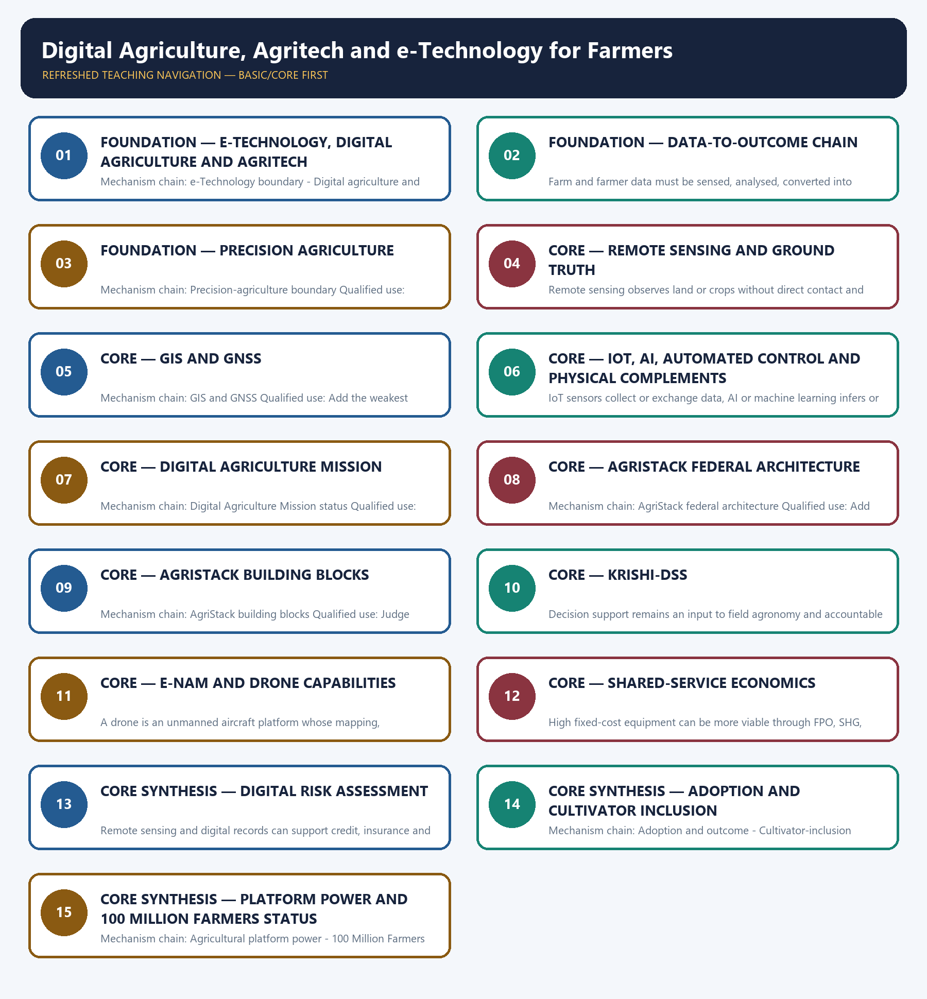

# Digital Agriculture, Agritech and e-Technology for Farmers — Learner-v2 Complete Learning Session

> **Authoring-only generation:** 2026-09-03. No PDF was rendered and no tracker or index was mutated.

### SOURCE, PROGRESSION AND CURRENT-LINKAGE AUDIT

- **Generation date:** 2026-09-03.
- **Repository-first evidence:** the Basic owner is taught first and preserved in full; the Advanced owner is retained only in the optional final teaching block.
- **OCR evidence:** Repository Markdown was primary. OCR-searchable local official General Studies papers were used only to confirm printed routed demands. No answer key, marking scheme, unsupported page precision or current macroeconomic statistic was inferred from them.
- **Qdrant:** not used; repository Markdown and available OCR context were sufficient.
- **PYQ integrity:** Audited ledgers route the 2023 GS-III e-Technology demand and objective concepts on drone applications and the WEF 100 Million Farmers platform. The Basic session and practice preserve these concepts without inferring unavailable objective keys or platform achievement.
- **Live-link boundary:** The Digital Agriculture Division page substantively confirmed architecture. The mission PDF was binary and e-NAM returned 404, so the package imports no new outlay, Farmer-ID, plot, district, mandi, transaction, drone, sensor or scheme-participation figure and keeps approval, rollout, availability, adoption and outcome separate.
- **Fact/inference discipline:** no current-affairs item, PYQ wording, figure or quotation is invented.

### LIVE OFFICIAL-SOURCE ATTEMPT LOG

The checks below were made on 2026-09-03. Substantive official text is used only for the proposition it actually supports; binary files, dynamic shells, stubs and undated dashboard snippets are recorded but not converted into current claims.

- https://agriwelfare.gov.in/Documents/pib_%20DigitalAgricultureMission.pdf — fetched as a substantive official binary PDF on 2026-09-03; no text was inferred from raw binary beyond the already audited owner.
- https://agriwelfare.gov.in/en/DigiAgriDiv — substantive official page fetched 2026-09-03; confirms federated AgriStack building blocks and Krishi-DSS architecture, but newly displayed coverage counts were not imported.
- https://agri.enam.gov.in/ — direct fetch returned HTTP 404 on 2026-09-03; no current mandi, trade, farmer or platform-coverage figure was imported.

## BASIC LEARNING SESSION



*Distinct embedded teaching-navigation image. The separate continuous Cārvāka-style flowchart package remains an independent at-a-glance artifact.*

### SESSION 1 — FOUNDATION — E-TECHNOLOGY, DIGITAL AGRICULTURE AND AGRITECH

#### DEFINITION / WHAT THIS IS CALLED

**Plain-language definition:** Digital agriculture is data-enabled management across the farm cycle, while agritech also includes firms, devices, mechanisation, biotechnology, nanotechnology and business models; neither is one portal.

**Technical definition:** Mechanism chain: e-Technology boundary - Digital agriculture and agritech Qualified use: Begin with the farm-stage problem and trace data through a decision to an implementable action.

#### ANSWER-GRABBING OPENING — WRITE/ADAPT IN THE EXAM

> Digital agriculture is data-enabled management across the farm cycle, while agritech also includes firms, devices, mechanisation, biotechnology, nanotechnology and business models; neither is one portal.

#### MUST-WRITE KEYWORDS

- **FOUNDATION**
- **e-Technology**
- **digital agriculture**
- **agritech**
- **Mechanism chain**
- **Qualified use**

**How to use them:** Frame the answer through FOUNDATION; define e-Technology, connect digital agriculture with agritech to explain the mechanism, and use Mechanism chain for the decisive comparison or qualification.

#### VISUAL FIRST

```text
E-TECHNOLOGY, DIGITAL AGRICULTURE AND AGRITECH
01. e-Technology boundary
    |
    v
02. Digital agriculture and agritech
BOUNDARY -> Do not turn digital agriculture into a gadget list or one government portal.
```

*This topic-specific rail fixes the evidence sequence and its exam boundary before analysis.*

#### CORE EXPLANATION

e-Technology in agriculture uses electronic, digital, communication and information systems to support farm decisions, services and markets; the Core firewall keeps this Basic route exam-complete without relying on optional Advanced material. Digital agriculture is data-enabled management across the farm cycle, while agritech also includes firms, devices, mechanisation, biotechnology, nanotechnology and business models; neither is one portal.

#### NAMED EVIDENCE AND MECHANISM

- e-Technology in agriculture uses electronic, digital, communication and information systems to support farm decisions, services and markets; the Core firewall keeps this Basic route exam-complete without relying on optional Advanced material.
- Digital agriculture is data-enabled management across the farm cycle, while agritech also includes firms, devices, mechanisation, biotechnology, nanotechnology and business models; neither is one portal.

#### EXAMINER CAUTION

- Do not turn digital agriculture into a gadget list or one government portal.

#### EXAM LINK

- **Prelims:** Preserve the exact formula, territorial or resident boundary, price basis, base year, index basket, eligible counterparty, institution and legal status; never upgrade a projection into an actual or a regulatory direction into a universal rule.
- **Mains:** Begin with the farm-stage problem and trace data through a decision to an implementable action.

#### MINI RECAP

- **Mechanism chain:** e-Technology boundary -> Digital agriculture and agritech
- **Qualified use:** Begin with the farm-stage problem and trace data through a decision to an implementable action.

#### CLOSING RECALL FLOW — FOUNDATION — E-TECHNOLOGY, DIGITAL AGRICULTURE AND AGRITECH

```text
START / CONCEPT: FOUNDATION — e-Technology, digital agriculture and agritech
        |
        v
EXACT TERMS: FOUNDATION · e-Technology · digital agriculture · agritech · Mechanism chain · Qualified use
        |
        v
MECHANISM / ARGUMENT: Mechanism chain: e-Technology boundary - Digital agriculture and agritech Qualified use: Begin with the farm-stage problem and trace data through a decision to an implementable action.
        |
        v
CONSEQUENCE / CONTRAST: Do not turn digital agriculture into a gadget list or one government portal.
        |
        v
UPSC TRAP / ANSWER-USE: Do not miss this limiting distinction: e-Technology in agriculture uses electronic, digital, communication and information systems to support farm decisions...
        |
        v
ANSWER-GRABBING FORMULATION: Digital agriculture is data-enabled management across the farm cycle, while agritech also includes firms, devices, mechanisation, biotechnology, nanotechnology and business models; neither is one portal.
```
### SESSION 2 — FOUNDATION — DATA-TO-OUTCOME CHAIN

#### DEFINITION / WHAT THIS IS CALLED

**Plain-language definition:** Mechanism chain: Data-to-outcome chain Qualified use: Add the weakest physical, financial, extension, legal or governance complement before claiming benefit.

**Technical definition:** Farm and farmer data must be sensed, analysed, converted into advice, implemented through complementary inputs or services and evaluated through outcomes; data availability alone is not farmer welfare.

#### ANSWER-GRABBING OPENING — WRITE/ADAPT IN THE EXAM

> Mechanism chain: Data-to-outcome chain Qualified use: Add the weakest physical, financial, extension, legal or governance complement before claiming benefit.

#### MUST-WRITE KEYWORDS

- **FOUNDATION**
- **Data-to-outcome chain**
- **Mechanism chain**
- **Qualified use**
- **Farm**
- **GIS**

**How to use them:** Frame the answer through FOUNDATION; define Data-to-outcome chain, connect Mechanism chain with Qualified use to explain the mechanism, and use Farm for the decisive comparison or qualification.

#### VISUAL FIRST

```text
DATA-TO-OUTCOME CHAIN
01. Data-to-outcome chain
BOUNDARY -> Do not treat remote sensing as ground truth or GIS as GNSS.
```

*This topic-specific rail fixes the evidence sequence and its exam boundary before analysis.*

#### CORE EXPLANATION

Farm and farmer data must be sensed, analysed, converted into advice, implemented through complementary inputs or services and evaluated through outcomes; data availability alone is not farmer welfare.

#### NAMED EVIDENCE AND MECHANISM

- Farm and farmer data must be sensed, analysed, converted into advice, implemented through complementary inputs or services and evaluated through outcomes; data availability alone is not farmer welfare.

#### EXAMINER CAUTION

- Do not treat remote sensing as ground truth or GIS as GNSS.

#### EXAM LINK

- **Prelims:** Preserve the exact formula, territorial or resident boundary, price basis, base year, index basket, eligible counterparty, institution and legal status; never upgrade a projection into an actual or a regulatory direction into a universal rule.
- **Mains:** Add the weakest physical, financial, extension, legal or governance complement before claiming benefit.

#### MINI RECAP

- **Mechanism chain:** Data-to-outcome chain
- **Qualified use:** Add the weakest physical, financial, extension, legal or governance complement before claiming benefit.

#### CLOSING RECALL FLOW — FOUNDATION — DATA-TO-OUTCOME CHAIN

```text
START / CONCEPT: FOUNDATION — Data-to-outcome chain
        |
        v
EXACT TERMS: FOUNDATION · Data-to-outcome chain · Mechanism chain · Qualified use · Farm · GIS
        |
        v
MECHANISM / ARGUMENT: Farm and farmer data must be sensed, analysed, converted into advice, implemented through complementary inputs or services and evaluated through outcomes; data availability alone is not farmer welfare.
        |
        v
CONSEQUENCE / CONTRAST: Do not treat remote sensing as ground truth or GIS as GNSS.
        |
        v
UPSC TRAP / ANSWER-USE: Do not miss this limiting distinction: add the weakest physical, financial, extension, legal or governance complement before claiming benefit.
        |
        v
ANSWER-GRABBING FORMULATION: Mechanism chain: Data-to-outcome chain Qualified use: Add the weakest physical, financial, extension, legal or governance complement before claiming benefit.
```
### SESSION 3 — FOUNDATION — PRECISION AGRICULTURE

#### DEFINITION / WHAT THIS IS CALLED

**Plain-language definition:** Precision agriculture varies treatment by measured spatial or temporal need; it does not mean zero-input farming or guarantee lower total resource extraction.

**Technical definition:** Mechanism chain: Precision-agriculture boundary Qualified use: Judge success by net income, resilience, resource use, inclusion and correctable outcomes rather than activity counts.

#### ANSWER-GRABBING OPENING — WRITE/ADAPT IN THE EXAM

> Precision agriculture varies treatment by measured spatial or temporal need; it does not mean zero-input farming or guarantee lower total resource extraction.

#### MUST-WRITE KEYWORDS

- **FOUNDATION**
- **Precision agriculture**
- **Mechanism chain**
- **Qualified use**
- **Precision**
- **AI**

**How to use them:** Frame the answer through FOUNDATION; define Precision agriculture, connect Mechanism chain with Qualified use to explain the mechanism, and use Precision for the decisive comparison or qualification.

#### VISUAL FIRST

```text
PRECISION AGRICULTURE
01. Precision-agriculture boundary
BOUNDARY -> Do not merge sensing, AI inference and automated action.
```

*This topic-specific rail fixes the evidence sequence and its exam boundary before analysis.*

#### CORE EXPLANATION

Precision agriculture varies treatment by measured spatial or temporal need; it does not mean zero-input farming or guarantee lower total resource extraction.

#### NAMED EVIDENCE AND MECHANISM

- Precision agriculture varies treatment by measured spatial or temporal need; it does not mean zero-input farming or guarantee lower total resource extraction.

#### EXAMINER CAUTION

- Do not merge sensing, AI inference and automated action.

#### EXAM LINK

- **Prelims:** Preserve the exact formula, territorial or resident boundary, price basis, base year, index basket, eligible counterparty, institution and legal status; never upgrade a projection into an actual or a regulatory direction into a universal rule.
- **Mains:** Judge success by net income, resilience, resource use, inclusion and correctable outcomes rather than activity counts.

#### MINI RECAP

- **Mechanism chain:** Precision-agriculture boundary
- **Qualified use:** Judge success by net income, resilience, resource use, inclusion and correctable outcomes rather than activity counts.

#### CLOSING RECALL FLOW — FOUNDATION — PRECISION AGRICULTURE

```text
START / CONCEPT: FOUNDATION — Precision agriculture
        |
        v
EXACT TERMS: FOUNDATION · Precision agriculture · Mechanism chain · Qualified use · Precision · AI
        |
        v
MECHANISM / ARGUMENT: Mechanism chain: Precision-agriculture boundary Qualified use: Judge success by net income, resilience, resource use, inclusion and correctable outcomes rather than activity counts.
        |
        v
CONSEQUENCE / CONTRAST: Do not merge sensing, AI inference and automated action.
        |
        v
UPSC TRAP / ANSWER-USE: Mains: Judge success by net income, resilience, resource use, inclusion and correctable outcomes rather than activity counts.
        |
        v
ANSWER-GRABBING FORMULATION: Precision agriculture varies treatment by measured spatial or temporal need; it does not mean zero-input farming or guarantee lower total resource extraction.
```
### SESSION 4 — CORE — REMOTE SENSING AND GROUND TRUTH

#### DEFINITION / WHAT THIS IS CALLED

**Plain-language definition:** Mechanism chain: Remote sensing and ground truth Qualified use: Begin with the farm-stage problem and trace data through a decision to an implementable action.

**Technical definition:** Remote sensing observes land or crops without direct contact and can signal condition, but cloud, resolution, revisit and crop-similarity limits require ground truth and appeal when used for consequential decisions.

#### ANSWER-GRABBING OPENING — WRITE/ADAPT IN THE EXAM

> Remote sensing observes land or crops without direct contact and can signal condition, but cloud, resolution, revisit and crop-similarity limits require ground truth and appeal when used for consequential decisions.

#### MUST-WRITE KEYWORDS

- **Remote sensing**
- **ground truth**
- **Mechanism chain**
- **Qualified use**
- **Remote**
- **Qualified**

**How to use them:** Frame the answer through Remote sensing; define ground truth, connect Mechanism chain with Qualified use to explain the mechanism, and use Remote for the decisive comparison or qualification.

#### VISUAL FIRST

```text
REMOTE SENSING AND GROUND TRUTH
01. Remote sensing and ground truth
BOUNDARY -> Do not claim that precision efficiency necessarily lowers basin-level resource use.
```

*This topic-specific rail fixes the evidence sequence and its exam boundary before analysis.*

#### CORE EXPLANATION

Remote sensing observes land or crops without direct contact and can signal condition, but cloud, resolution, revisit and crop-similarity limits require ground truth and appeal when used for consequential decisions.

#### NAMED EVIDENCE AND MECHANISM

- Remote sensing observes land or crops without direct contact and can signal condition, but cloud, resolution, revisit and crop-similarity limits require ground truth and appeal when used for consequential decisions.

#### EXAMINER CAUTION

- Do not claim that precision efficiency necessarily lowers basin-level resource use.

#### EXAM LINK

- **Prelims:** Preserve the exact formula, territorial or resident boundary, price basis, base year, index basket, eligible counterparty, institution and legal status; never upgrade a projection into an actual or a regulatory direction into a universal rule.
- **Mains:** Begin with the farm-stage problem and trace data through a decision to an implementable action.

#### MINI RECAP

- **Mechanism chain:** Remote sensing and ground truth
- **Qualified use:** Begin with the farm-stage problem and trace data through a decision to an implementable action.

#### CLOSING RECALL FLOW — CORE — REMOTE SENSING AND GROUND TRUTH

```text
START / CONCEPT: CORE — Remote sensing and ground truth
        |
        v
EXACT TERMS: Remote sensing · ground truth · Mechanism chain · Qualified use · Remote · Qualified
        |
        v
MECHANISM / ARGUMENT: Mechanism chain: Remote sensing and ground truth Qualified use: Begin with the farm-stage problem and trace data through a decision to an implementable action.
        |
        v
CONSEQUENCE / CONTRAST: Do not claim that precision efficiency necessarily lowers basin-level resource use.
        |
        v
UPSC TRAP / ANSWER-USE: Do not miss this limiting distinction: remote sensing observes land or crops without direct contact and can signal condition.
        |
        v
ANSWER-GRABBING FORMULATION: Remote sensing observes land or crops without direct contact and can signal condition, but cloud, resolution, revisit and crop-similarity limits require ground truth and appeal when used for consequential decisions.
```
### SESSION 5 — CORE — GIS AND GNSS

#### DEFINITION / WHAT THIS IS CALLED

**Plain-language definition:** GIS stores, combines and analyses geographically referenced data, while GNSS or NavIC supplies positioning and navigation signals; mapping analysis and location signals are related but distinct.

**Technical definition:** Mechanism chain: GIS and GNSS Qualified use: Add the weakest physical, financial, extension, legal or governance complement before claiming benefit.

#### ANSWER-GRABBING OPENING — WRITE/ADAPT IN THE EXAM

> GIS stores, combines and analyses geographically referenced data, while GNSS or NavIC supplies positioning and navigation signals; mapping analysis and location signals are related but distinct.

#### MUST-WRITE KEYWORDS

- **GIS**
- **GNSS**
- **Mechanism chain**
- **Qualified use**
- **NavIC**
- **Mission**

**How to use them:** Frame the answer through GIS; define GNSS, connect Mechanism chain with Qualified use to explain the mechanism, and use NavIC for the decisive comparison or qualification.

#### VISUAL FIRST

```text
GIS AND GNSS
01. GIS and GNSS
BOUNDARY -> Do not convert Mission approval, sanctioned outlay or platform availability into adoption or outcome.
```

*This topic-specific rail fixes the evidence sequence and its exam boundary before analysis.*

#### CORE EXPLANATION

GIS stores, combines and analyses geographically referenced data, while GNSS or NavIC supplies positioning and navigation signals; mapping analysis and location signals are related but distinct.

#### NAMED EVIDENCE AND MECHANISM

- GIS stores, combines and analyses geographically referenced data, while GNSS or NavIC supplies positioning and navigation signals; mapping analysis and location signals are related but distinct.

#### EXAMINER CAUTION

- Do not convert Mission approval, sanctioned outlay or platform availability into adoption or outcome.

#### EXAM LINK

- **Prelims:** Preserve the exact formula, territorial or resident boundary, price basis, base year, index basket, eligible counterparty, institution and legal status; never upgrade a projection into an actual or a regulatory direction into a universal rule.
- **Mains:** Add the weakest physical, financial, extension, legal or governance complement before claiming benefit.

#### MINI RECAP

- **Mechanism chain:** GIS and GNSS
- **Qualified use:** Add the weakest physical, financial, extension, legal or governance complement before claiming benefit.

#### CLOSING RECALL FLOW — CORE — GIS AND GNSS

```text
START / CONCEPT: CORE — GIS and GNSS
        |
        v
EXACT TERMS: GIS · GNSS · Mechanism chain · Qualified use · NavIC · Mission
        |
        v
MECHANISM / ARGUMENT: Mechanism chain: GIS and GNSS Qualified use: Add the weakest physical, financial, extension, legal or governance complement before claiming benefit.
        |
        v
CONSEQUENCE / CONTRAST: Do not convert Mission approval, sanctioned outlay or platform availability into adoption or outcome.
        |
        v
UPSC TRAP / ANSWER-USE: Do not miss this limiting distinction: gIS stores, combines and analyses geographically referenced data.
        |
        v
ANSWER-GRABBING FORMULATION: GIS stores, combines and analyses geographically referenced data, while GNSS or NavIC supplies positioning and navigation signals; mapping analysis and location signals are related but distinct.
```
### SESSION 6 — CORE — IOT, AI, AUTOMATED CONTROL AND PHYSICAL COMPLEMENTS

#### DEFINITION / WHAT THIS IS CALLED

**Plain-language definition:** Mechanism chain: IoT, AI and automated control - DPI, platform and physical market Qualified use: Judge success by net income, resilience, resource use, inclusion and correctable outcomes rather than activity counts.

**Technical definition:** IoT sensors collect or exchange data, AI or machine learning infers or predicts, and automated control acts; a system may combine them but capability in one layer does not prove the others.

#### ANSWER-GRABBING OPENING — WRITE/ADAPT IN THE EXAM

> IoT sensors collect or exchange data, AI or machine learning infers or predicts, and automated control acts; a system may combine them but capability in one layer does not prove the others.

#### MUST-WRITE KEYWORDS

- **IoT**
- **AI**
- **automated control**
- **physical complements**
- **Mechanism chain**
- **Qualified use**

**How to use them:** Frame the answer through IoT; define AI, connect automated control with physical complements to explain the mechanism, and use Mechanism chain for the decisive comparison or qualification.

#### VISUAL FIRST

```text
IOT, AI, AUTOMATED CONTROL AND PHYSICAL COMPLEMENTS
01. IoT, AI and automated control
    |
    v
02. DPI, platform and physical market
BOUNDARY -> Do not treat Farmer Registry, parcel maps and crop-sown data as one interchangeable record.
```

*This topic-specific rail fixes the evidence sequence and its exam boundary before analysis.*

#### CORE EXPLANATION

IoT sensors collect or exchange data, AI or machine learning infers or predicts, and automated control acts; a system may combine them but capability in one layer does not prove the others. Agricultural DPI supplies interoperable shared rails and a platform coordinates participants, but neither replaces physical assaying, storage, logistics, finance, settlement, extension or enforcement.

#### NAMED EVIDENCE AND MECHANISM

- IoT sensors collect or exchange data, AI or machine learning infers or predicts, and automated control acts; a system may combine them but capability in one layer does not prove the others.
- Agricultural DPI supplies interoperable shared rails and a platform coordinates participants, but neither replaces physical assaying, storage, logistics, finance, settlement, extension or enforcement.

#### EXAMINER CAUTION

- Do not treat Farmer Registry, parcel maps and crop-sown data as one interchangeable record.

#### EXAM LINK

- **Prelims:** Preserve the exact formula, territorial or resident boundary, price basis, base year, index basket, eligible counterparty, institution and legal status; never upgrade a projection into an actual or a regulatory direction into a universal rule.
- **Mains:** Judge success by net income, resilience, resource use, inclusion and correctable outcomes rather than activity counts.

#### MINI RECAP

- **Mechanism chain:** IoT, AI and automated control -> DPI, platform and physical market
- **Qualified use:** Judge success by net income, resilience, resource use, inclusion and correctable outcomes rather than activity counts.

#### CLOSING RECALL FLOW — CORE — IOT, AI, AUTOMATED CONTROL AND PHYSICAL COMPLEMENTS

```text
START / CONCEPT: CORE — IoT, AI, automated control and physical complements
        |
        v
EXACT TERMS: IoT · AI · automated control · physical complements · Mechanism chain · Qualified use
        |
        v
MECHANISM / ARGUMENT: Mechanism chain: IoT, AI and automated control - DPI, platform and physical market Qualified use: Judge success by net income, resilience, resource use, inclusion and correctable outcomes rather than activity counts.
        |
        v
CONSEQUENCE / CONTRAST: Agricultural DPI supplies interoperable shared rails and a platform coordinates participants, but neither replaces physical assaying, storage, logistics, finance, settlement, extension or enforcement.
        |
        v
UPSC TRAP / ANSWER-USE: Do not treat Farmer Registry, parcel maps and crop-sown data as one interchangeable record.
        |
        v
ANSWER-GRABBING FORMULATION: IoT sensors collect or exchange data, AI or machine learning infers or predicts, and automated control acts; a system may combine them but capability in one layer does not prove the others.
```
### SESSION 7 — CORE — DIGITAL AGRICULTURE MISSION

#### DEFINITION / WHAT THIS IS CALLED

**Plain-language definition:** The Union Cabinet approved the Digital Agriculture Mission in September 2024 as an umbrella architecture; approval and sanctioned outlay are not expenditure, farmer adoption or measured outcome.

**Technical definition:** Mechanism chain: Digital Agriculture Mission status Qualified use: Begin with the farm-stage problem and trace data through a decision to an implementable action.

#### ANSWER-GRABBING OPENING — WRITE/ADAPT IN THE EXAM

> The Union Cabinet approved the Digital Agriculture Mission in September 2024 as an umbrella architecture; approval and sanctioned outlay are not expenditure, farmer adoption or measured outcome.

#### MUST-WRITE KEYWORDS

- **Digital Agriculture Mission**
- **Mechanism chain**
- **Qualified use**
- **The Union Cabinet**
- **NAM**
- **Qualified**

**How to use them:** Frame the answer through Digital Agriculture Mission; define Mechanism chain, connect Qualified use with The Union Cabinet to explain the mechanism, and use NAM for the decisive comparison or qualification.

#### VISUAL FIRST

```text
DIGITAL AGRICULTURE MISSION
01. Digital Agriculture Mission status
BOUNDARY -> Do not say e-NAM stores, transports or assays produce by itself.
```

*This topic-specific rail fixes the evidence sequence and its exam boundary before analysis.*

#### CORE EXPLANATION

The Union Cabinet approved the Digital Agriculture Mission in September 2024 as an umbrella architecture; approval and sanctioned outlay are not expenditure, farmer adoption or measured outcome.

#### NAMED EVIDENCE AND MECHANISM

- The Union Cabinet approved the Digital Agriculture Mission in September 2024 as an umbrella architecture; approval and sanctioned outlay are not expenditure, farmer adoption or measured outcome.

#### EXAMINER CAUTION

- Do not say e-NAM stores, transports or assays produce by itself.

#### EXAM LINK

- **Prelims:** Preserve the exact formula, territorial or resident boundary, price basis, base year, index basket, eligible counterparty, institution and legal status; never upgrade a projection into an actual or a regulatory direction into a universal rule.
- **Mains:** Begin with the farm-stage problem and trace data through a decision to an implementable action.

#### MINI RECAP

- **Mechanism chain:** Digital Agriculture Mission status
- **Qualified use:** Begin with the farm-stage problem and trace data through a decision to an implementable action.

#### CLOSING RECALL FLOW — CORE — DIGITAL AGRICULTURE MISSION

```text
START / CONCEPT: CORE — Digital Agriculture Mission
        |
        v
EXACT TERMS: Digital Agriculture Mission · Mechanism chain · Qualified use · The Union Cabinet · NAM · Qualified
        |
        v
MECHANISM / ARGUMENT: Mechanism chain: Digital Agriculture Mission status Qualified use: Begin with the farm-stage problem and trace data through a decision to an implementable action.
        |
        v
CONSEQUENCE / CONTRAST: Do not say e-NAM stores, transports or assays produce by itself.
        |
        v
UPSC TRAP / ANSWER-USE: Do not miss this limiting distinction: the Union Cabinet approved the Digital Agriculture Mission in September 2024 as an umbrella...
        |
        v
ANSWER-GRABBING FORMULATION: The Union Cabinet approved the Digital Agriculture Mission in September 2024 as an umbrella architecture; approval and sanctioned outlay are not expenditure, farmer adoption or measured outcome.
```
### SESSION 8 — CORE — AGRISTACK FEDERAL ARCHITECTURE

#### DEFINITION / WHAT THIS IS CALLED

**Plain-language definition:** AgriStack is designed as federated Centre-state digital infrastructure rather than one undifferentiated central database, so standards, state operation, data quality and correction must be analysed together.

**Technical definition:** Mechanism chain: AgriStack federal architecture Qualified use: Add the weakest physical, financial, extension, legal or governance complement before claiming benefit.

#### ANSWER-GRABBING OPENING — WRITE/ADAPT IN THE EXAM

> Mechanism chain: AgriStack federal architecture Qualified use: Add the weakest physical, financial, extension, legal or governance complement before claiming benefit.

#### MUST-WRITE KEYWORDS

- **AgriStack federal architecture**
- **Mechanism chain**
- **Qualified use**
- **AgriStack**
- **Centre-state**
- **Qualified**

**How to use them:** Frame the answer through AgriStack federal architecture; define Mechanism chain, connect Qualified use with AgriStack to explain the mechanism, and use Centre-state for the decisive comparison or qualification.

#### VISUAL FIRST

```text
AGRISTACK FEDERAL ARCHITECTURE
01. AgriStack federal architecture
BOUNDARY -> Do not attribute every drone capability to every aircraft or ignore payload and training.
```

*This topic-specific rail fixes the evidence sequence and its exam boundary before analysis.*

#### CORE EXPLANATION

AgriStack is designed as federated Centre-state digital infrastructure rather than one undifferentiated central database, so standards, state operation, data quality and correction must be analysed together.

#### NAMED EVIDENCE AND MECHANISM

- AgriStack is designed as federated Centre-state digital infrastructure rather than one undifferentiated central database, so standards, state operation, data quality and correction must be analysed together.

#### EXAMINER CAUTION

- Do not attribute every drone capability to every aircraft or ignore payload and training.

#### EXAM LINK

- **Prelims:** Preserve the exact formula, territorial or resident boundary, price basis, base year, index basket, eligible counterparty, institution and legal status; never upgrade a projection into an actual or a regulatory direction into a universal rule.
- **Mains:** Add the weakest physical, financial, extension, legal or governance complement before claiming benefit.

#### MINI RECAP

- **Mechanism chain:** AgriStack federal architecture
- **Qualified use:** Add the weakest physical, financial, extension, legal or governance complement before claiming benefit.

#### CLOSING RECALL FLOW — CORE — AGRISTACK FEDERAL ARCHITECTURE

```text
START / CONCEPT: CORE — AgriStack federal architecture
        |
        v
EXACT TERMS: AgriStack federal architecture · Mechanism chain · Qualified use · AgriStack · Centre-state · Qualified
        |
        v
MECHANISM / ARGUMENT: AgriStack is designed as federated Centre-state digital infrastructure rather than one undifferentiated central database, so standards, state operation, data quality and correction must be analysed together.
        |
        v
CONSEQUENCE / CONTRAST: Do not attribute every drone capability to every aircraft or ignore payload and training.
        |
        v
UPSC TRAP / ANSWER-USE: Do not miss this limiting distinction: add the weakest physical, financial, extension, legal or governance complement before claiming benefit.
        |
        v
ANSWER-GRABBING FORMULATION: Mechanism chain: AgriStack federal architecture Qualified use: Add the weakest physical, financial, extension, legal or governance complement before claiming benefit.
```
### SESSION 9 — CORE — AGRISTACK BUILDING BLOCKS

#### DEFINITION / WHAT THIS IS CALLED

**Plain-language definition:** Farmer Registry, geo-referenced village maps and crop-sown information or Digital Crop Survey are distinct building blocks; an identity record, parcel map and seasonal crop observation are not substitutes.

**Technical definition:** Mechanism chain: AgriStack building blocks Qualified use: Judge success by net income, resilience, resource use, inclusion and correctable outcomes rather than activity counts.

#### ANSWER-GRABBING OPENING — WRITE/ADAPT IN THE EXAM

> Farmer Registry, geo-referenced village maps and crop-sown information or Digital Crop Survey are distinct building blocks; an identity record, parcel map and seasonal crop observation are not substitutes.

#### MUST-WRITE KEYWORDS

- **AgriStack building blocks**
- **Mechanism chain**
- **Qualified use**
- **Farmer Registry**
- **Digital Crop Survey**
- **Judge**

**How to use them:** Frame the answer through AgriStack building blocks; define Mechanism chain, connect Qualified use with Farmer Registry to explain the mechanism, and use Digital Crop Survey for the decisive comparison or qualification.

#### VISUAL FIRST

```text
AGRISTACK BUILDING BLOCKS
01. AgriStack building blocks
BOUNDARY -> Do not use land title as a universal proxy for the actual cultivator.
```

*This topic-specific rail fixes the evidence sequence and its exam boundary before analysis.*

#### CORE EXPLANATION

Farmer Registry, geo-referenced village maps and crop-sown information or Digital Crop Survey are distinct building blocks; an identity record, parcel map and seasonal crop observation are not substitutes.

#### NAMED EVIDENCE AND MECHANISM

- Farmer Registry, geo-referenced village maps and crop-sown information or Digital Crop Survey are distinct building blocks; an identity record, parcel map and seasonal crop observation are not substitutes.

#### EXAMINER CAUTION

- Do not use land title as a universal proxy for the actual cultivator.

#### EXAM LINK

- **Prelims:** Preserve the exact formula, territorial or resident boundary, price basis, base year, index basket, eligible counterparty, institution and legal status; never upgrade a projection into an actual or a regulatory direction into a universal rule.
- **Mains:** Judge success by net income, resilience, resource use, inclusion and correctable outcomes rather than activity counts.

#### MINI RECAP

- **Mechanism chain:** AgriStack building blocks
- **Qualified use:** Judge success by net income, resilience, resource use, inclusion and correctable outcomes rather than activity counts.

#### CLOSING RECALL FLOW — CORE — AGRISTACK BUILDING BLOCKS

```text
START / CONCEPT: CORE — AgriStack building blocks
        |
        v
EXACT TERMS: AgriStack building blocks · Mechanism chain · Qualified use · Farmer Registry · Digital Crop Survey · Judge
        |
        v
MECHANISM / ARGUMENT: Mechanism chain: AgriStack building blocks Qualified use: Judge success by net income, resilience, resource use, inclusion and correctable outcomes rather than activity counts.
        |
        v
CONSEQUENCE / CONTRAST: Do not use land title as a universal proxy for the actual cultivator.
        |
        v
UPSC TRAP / ANSWER-USE: Mains: Judge success by net income, resilience, resource use, inclusion and correctable outcomes rather than activity counts.
        |
        v
ANSWER-GRABBING FORMULATION: Farmer Registry, geo-referenced village maps and crop-sown information or Digital Crop Survey are distinct building blocks; an identity record, parcel map and seasonal crop observation are not substitutes.
```
### SESSION 10 — CORE — KRISHI-DSS

#### DEFINITION / WHAT THIS IS CALLED

**Plain-language definition:** Mechanism chain: Krishi-DSS boundary Qualified use: Begin with the farm-stage problem and trace data through a decision to an implementable action.

**Technical definition:** Decision support remains an input to field agronomy and accountable official judgment rather than an autonomous farm-management authority.

#### ANSWER-GRABBING OPENING — WRITE/ADAPT IN THE EXAM

> Mechanism chain: Krishi-DSS boundary Qualified use: Begin with the farm-stage problem and trace data through a decision to an implementable action.

#### MUST-WRITE KEYWORDS

- **Krishi-DSS**
- **Mechanism chain**
- **Qualified use**
- **Decision**
- **Qualified**
- **Begin**

**How to use them:** Frame the answer through Krishi-DSS; define Mechanism chain, connect Qualified use with Decision to explain the mechanism, and use Qualified for the decisive comparison or qualification.

#### VISUAL FIRST

```text
KRISHI-DSS
01. Krishi-DSS boundary
BOUNDARY -> Current farmer counts, coverage, scheme participation, sensor performance and PYQ answer letters require separate dated verification.
```

*This topic-specific rail fixes the evidence sequence and its exam boundary before analysis.*

#### CORE EXPLANATION

Krishi Decision Support System combines geospatial and administrative information for mapping, monitoring and planning. Decision support remains an input to field agronomy and accountable official judgment rather than an autonomous farm-management authority.

#### NAMED EVIDENCE AND MECHANISM

- Krishi Decision Support System combines geospatial and administrative information for mapping, monitoring and planning. Decision support remains an input to field agronomy and accountable official judgment rather than an autonomous farm-management authority.

#### EXAMINER CAUTION

- Current farmer counts, coverage, scheme participation, sensor performance and PYQ answer letters require separate dated verification.

#### EXAM LINK

- **Prelims:** Preserve the exact formula, territorial or resident boundary, price basis, base year, index basket, eligible counterparty, institution and legal status; never upgrade a projection into an actual or a regulatory direction into a universal rule.
- **Mains:** Begin with the farm-stage problem and trace data through a decision to an implementable action.

#### MINI RECAP

- **Mechanism chain:** Krishi-DSS boundary
- **Qualified use:** Begin with the farm-stage problem and trace data through a decision to an implementable action.

#### CLOSING RECALL FLOW — CORE — KRISHI-DSS

```text
START / CONCEPT: CORE — Krishi-DSS
        |
        v
EXACT TERMS: Krishi-DSS · Mechanism chain · Qualified use · Decision · Qualified · Begin
        |
        v
MECHANISM / ARGUMENT: Decision support remains an input to field agronomy and accountable official judgment rather than an autonomous farm-management authority.
        |
        v
CONSEQUENCE / CONTRAST: The resulting consequence is that begin with the farm-stage problem and trace data through a decision to an implementable...
        |
        v
UPSC TRAP / ANSWER-USE: Do not miss this limiting distinction: begin with the farm-stage problem and trace data through a decision to an implementable...
        |
        v
ANSWER-GRABBING FORMULATION: Mechanism chain: Krishi-DSS boundary Qualified use: Begin with the farm-stage problem and trace data through a decision to an implementable action.
```
### SESSION 11 — CORE — E-NAM AND DRONE CAPABILITIES

#### DEFINITION / WHAT THIS IS CALLED

**Plain-language definition:** e-NAM is operated by SFAC under the agriculture ministry and digitises discovery and transaction functions, but completed trade still needs assaying, aggregation, logistics, settlement and dispute resolution.

**Technical definition:** A drone is an unmanned aircraft platform whose mapping, monitoring or spraying capability depends on its payload, configuration, calibration, trained operation and applicable rules.

#### ANSWER-GRABBING OPENING — WRITE/ADAPT IN THE EXAM

> e-NAM is operated by SFAC under the agriculture ministry and digitises discovery and transaction functions, but completed trade still needs assaying, aggregation, logistics, settlement and dispute resolution.

#### MUST-WRITE KEYWORDS

- **e-NAM**
- **drone capabilities**
- **Mechanism chain**
- **Qualified use**
- **NAM**
- **SFAC**

**How to use them:** Frame the answer through e-NAM; define drone capabilities, connect Mechanism chain with Qualified use to explain the mechanism, and use NAM for the decisive comparison or qualification.

#### VISUAL FIRST

```text
E-NAM AND DRONE CAPABILITIES
01. e-NAM market completion
    |
    v
02. Drone platform and payload
BOUNDARY -> Do not turn digital agriculture into a gadget list or one government portal.
```

*This topic-specific rail fixes the evidence sequence and its exam boundary before analysis.*

#### CORE EXPLANATION

e-NAM is operated by SFAC under the agriculture ministry and digitises discovery and transaction functions, but completed trade still needs assaying, aggregation, logistics, settlement and dispute resolution. A drone is an unmanned aircraft platform whose mapping, monitoring or spraying capability depends on its payload, configuration, calibration, trained operation and applicable rules.

#### NAMED EVIDENCE AND MECHANISM

- e-NAM is operated by SFAC under the agriculture ministry and digitises discovery and transaction functions, but completed trade still needs assaying, aggregation, logistics, settlement and dispute resolution.
- A drone is an unmanned aircraft platform whose mapping, monitoring or spraying capability depends on its payload, configuration, calibration, trained operation and applicable rules.

#### EXAMINER CAUTION

- Do not turn digital agriculture into a gadget list or one government portal.

#### EXAM LINK

- **Prelims:** Preserve the exact formula, territorial or resident boundary, price basis, base year, index basket, eligible counterparty, institution and legal status; never upgrade a projection into an actual or a regulatory direction into a universal rule.
- **Mains:** Add the weakest physical, financial, extension, legal or governance complement before claiming benefit.

#### MINI RECAP

- **Mechanism chain:** e-NAM market completion -> Drone platform and payload
- **Qualified use:** Add the weakest physical, financial, extension, legal or governance complement before claiming benefit.

#### CLOSING RECALL FLOW — CORE — E-NAM AND DRONE CAPABILITIES

```text
START / CONCEPT: CORE — e-NAM and drone capabilities
        |
        v
EXACT TERMS: e-NAM · drone capabilities · Mechanism chain · Qualified use · NAM · SFAC
        |
        v
MECHANISM / ARGUMENT: Mechanism chain: e-NAM market completion - Drone platform and payload Qualified use: Add the weakest physical, financial, extension, legal or governance complement before claiming benefit.
        |
        v
CONSEQUENCE / CONTRAST: Do not turn digital agriculture into a gadget list or one government portal.
        |
        v
UPSC TRAP / ANSWER-USE: Do not miss this limiting distinction: a drone is an unmanned aircraft platform whose mapping, monitoring or spraying capability depends...
        |
        v
ANSWER-GRABBING FORMULATION: e-NAM is operated by SFAC under the agriculture ministry and digitises discovery and transaction functions, but completed trade still needs assaying, aggregation, logistics, settlement and dispute resolution.
```
### SESSION 12 — CORE — SHARED-SERVICE ECONOMICS

#### DEFINITION / WHAT THIS IS CALLED

**Plain-language definition:** Mechanism chain: Shared-service economics Qualified use: Judge success by net income, resilience, resource use, inclusion and correctable outcomes rather than activity counts.

**Technical definition:** High fixed-cost equipment can be more viable through FPO, SHG, cooperative or custom-hiring services than universal individual ownership, but recurring demand, scheduling, maintenance and working capital remain necessary.

#### ANSWER-GRABBING OPENING — WRITE/ADAPT IN THE EXAM

> Mechanism chain: Shared-service economics Qualified use: Judge success by net income, resilience, resource use, inclusion and correctable outcomes rather than activity counts.

#### MUST-WRITE KEYWORDS

- **Shared-service economics**
- **Mechanism chain**
- **Qualified use**
- **High**
- **FPO**
- **SHG**

**How to use them:** Frame the answer through Shared-service economics; define Mechanism chain, connect Qualified use with High to explain the mechanism, and use FPO for the decisive comparison or qualification.

#### VISUAL FIRST

```text
SHARED-SERVICE ECONOMICS
01. Shared-service economics
BOUNDARY -> Do not treat remote sensing as ground truth or GIS as GNSS.
```

*This topic-specific rail fixes the evidence sequence and its exam boundary before analysis.*

#### CORE EXPLANATION

High fixed-cost equipment can be more viable through FPO, SHG, cooperative or custom-hiring services than universal individual ownership, but recurring demand, scheduling, maintenance and working capital remain necessary.

#### NAMED EVIDENCE AND MECHANISM

- High fixed-cost equipment can be more viable through FPO, SHG, cooperative or custom-hiring services than universal individual ownership, but recurring demand, scheduling, maintenance and working capital remain necessary.

#### EXAMINER CAUTION

- Do not treat remote sensing as ground truth or GIS as GNSS.

#### EXAM LINK

- **Prelims:** Preserve the exact formula, territorial or resident boundary, price basis, base year, index basket, eligible counterparty, institution and legal status; never upgrade a projection into an actual or a regulatory direction into a universal rule.
- **Mains:** Judge success by net income, resilience, resource use, inclusion and correctable outcomes rather than activity counts.

#### MINI RECAP

- **Mechanism chain:** Shared-service economics
- **Qualified use:** Judge success by net income, resilience, resource use, inclusion and correctable outcomes rather than activity counts.

#### CLOSING RECALL FLOW — CORE — SHARED-SERVICE ECONOMICS

```text
START / CONCEPT: CORE — Shared-service economics
        |
        v
EXACT TERMS: Shared-service economics · Mechanism chain · Qualified use · High · FPO · SHG
        |
        v
MECHANISM / ARGUMENT: High fixed-cost equipment can be more viable through FPO, SHG, cooperative or custom-hiring services than universal individual ownership, but recurring demand, scheduling, maintenance and working capital remain necessary.
        |
        v
CONSEQUENCE / CONTRAST: Do not treat remote sensing as ground truth or GIS as GNSS.
        |
        v
UPSC TRAP / ANSWER-USE: Mains: Judge success by net income, resilience, resource use, inclusion and correctable outcomes rather than activity counts.
        |
        v
ANSWER-GRABBING FORMULATION: Mechanism chain: Shared-service economics Qualified use: Judge success by net income, resilience, resource use, inclusion and correctable outcomes rather than activity counts.
```
### SESSION 13 — CORE SYNTHESIS — DIGITAL RISK ASSESSMENT

#### DEFINITION / WHAT THIS IS CALLED

**Plain-language definition:** Mechanism chain: Digital risk assessment Qualified use: Begin with the farm-stage problem and trace data through a decision to an implementable action.

**Technical definition:** Remote sensing and digital records can support credit, insurance and loss assessment, but model error, basis risk, stale records and parcel mismatch require disclosure, field checks and an appeal route.

#### ANSWER-GRABBING OPENING — WRITE/ADAPT IN THE EXAM

> Remote sensing and digital records can support credit, insurance and loss assessment, but model error, basis risk, stale records and parcel mismatch require disclosure, field checks and an appeal route.

#### MUST-WRITE KEYWORDS

- **CORE SYNTHESIS**
- **Digital risk assessment**
- **Mechanism chain**
- **Qualified use**
- **Remote**
- **AI**

**How to use them:** Frame the answer through CORE SYNTHESIS; define Digital risk assessment, connect Mechanism chain with Qualified use to explain the mechanism, and use Remote for the decisive comparison or qualification.

#### VISUAL FIRST

```text
DIGITAL RISK ASSESSMENT
01. Digital risk assessment
BOUNDARY -> Do not merge sensing, AI inference and automated action.
```

*This topic-specific rail fixes the evidence sequence and its exam boundary before analysis.*

#### CORE EXPLANATION

Remote sensing and digital records can support credit, insurance and loss assessment, but model error, basis risk, stale records and parcel mismatch require disclosure, field checks and an appeal route.

#### NAMED EVIDENCE AND MECHANISM

- Remote sensing and digital records can support credit, insurance and loss assessment, but model error, basis risk, stale records and parcel mismatch require disclosure, field checks and an appeal route.

#### EXAMINER CAUTION

- Do not merge sensing, AI inference and automated action.

#### EXAM LINK

- **Prelims:** Preserve the exact formula, territorial or resident boundary, price basis, base year, index basket, eligible counterparty, institution and legal status; never upgrade a projection into an actual or a regulatory direction into a universal rule.
- **Mains:** Begin with the farm-stage problem and trace data through a decision to an implementable action.

#### MINI RECAP

- **Mechanism chain:** Digital risk assessment
- **Qualified use:** Begin with the farm-stage problem and trace data through a decision to an implementable action.

#### CLOSING RECALL FLOW — CORE SYNTHESIS — DIGITAL RISK ASSESSMENT

```text
START / CONCEPT: CORE SYNTHESIS — Digital risk assessment
        |
        v
EXACT TERMS: CORE SYNTHESIS · Digital risk assessment · Mechanism chain · Qualified use · Remote · AI
        |
        v
MECHANISM / ARGUMENT: Mechanism chain: Digital risk assessment Qualified use: Begin with the farm-stage problem and trace data through a decision to an implementable action.
        |
        v
CONSEQUENCE / CONTRAST: Do not merge sensing, AI inference and automated action.
        |
        v
UPSC TRAP / ANSWER-USE: Do not miss this limiting distinction: remote sensing and digital records can support credit, insurance and loss assessment.
        |
        v
ANSWER-GRABBING FORMULATION: Remote sensing and digital records can support credit, insurance and loss assessment, but model error, basis risk, stale records and parcel mismatch require disclosure, field checks and an appeal route.
```
### SESSION 14 — CORE SYNTHESIS — ADOPTION AND CULTIVATOR INCLUSION

#### DEFINITION / WHAT THIS IS CALLED

**Plain-language definition:** Land ownership is not a perfect proxy for cultivation, so tenants, sharecroppers and women cultivators may be excluded unless alternative evidence, assisted access and correction are built into the system.

**Technical definition:** Mechanism chain: Adoption and outcome - Cultivator-inclusion boundary Qualified use: Add the weakest physical, financial, extension, legal or governance complement before claiming benefit.

#### ANSWER-GRABBING OPENING — WRITE/ADAPT IN THE EXAM

> Land ownership is not a perfect proxy for cultivation, so tenants, sharecroppers and women cultivators may be excluded unless alternative evidence, assisted access and correction are built into the system.

#### MUST-WRITE KEYWORDS

- **CORE SYNTHESIS**
- **Adoption**
- **cultivator inclusion**
- **Mechanism chain**
- **Qualified use**
- **Registrations**

**How to use them:** Frame the answer through CORE SYNTHESIS; define Adoption, connect cultivator inclusion with Mechanism chain to explain the mechanism, and use Qualified use for the decisive comparison or qualification.

#### VISUAL FIRST

```text
ADOPTION AND CULTIVATOR INCLUSION
01. Adoption and outcome
    |
    v
02. Cultivator-inclusion boundary
BOUNDARY -> Do not claim that precision efficiency necessarily lowers basin-level resource use.
```

*This topic-specific rail fixes the evidence sequence and its exam boundary before analysis.*

#### CORE EXPLANATION

Registrations, app downloads, IDs, connected mandis or distributed devices measure activity or availability; adoption, correct use, net income, resilience and resource outcomes require separate evidence. Land ownership is not a perfect proxy for cultivation, so tenants, sharecroppers and women cultivators may be excluded unless alternative evidence, assisted access and correction are built into the system.

#### NAMED EVIDENCE AND MECHANISM

- Registrations, app downloads, IDs, connected mandis or distributed devices measure activity or availability; adoption, correct use, net income, resilience and resource outcomes require separate evidence.
- Land ownership is not a perfect proxy for cultivation, so tenants, sharecroppers and women cultivators may be excluded unless alternative evidence, assisted access and correction are built into the system.

#### EXAMINER CAUTION

- Do not claim that precision efficiency necessarily lowers basin-level resource use.

#### EXAM LINK

- **Prelims:** Preserve the exact formula, territorial or resident boundary, price basis, base year, index basket, eligible counterparty, institution and legal status; never upgrade a projection into an actual or a regulatory direction into a universal rule.
- **Mains:** Add the weakest physical, financial, extension, legal or governance complement before claiming benefit.

#### MINI RECAP

- **Mechanism chain:** Adoption and outcome -> Cultivator-inclusion boundary
- **Qualified use:** Add the weakest physical, financial, extension, legal or governance complement before claiming benefit.

#### CLOSING RECALL FLOW — CORE SYNTHESIS — ADOPTION AND CULTIVATOR INCLUSION

```text
START / CONCEPT: CORE SYNTHESIS — Adoption and cultivator inclusion
        |
        v
EXACT TERMS: CORE SYNTHESIS · Adoption · cultivator inclusion · Mechanism chain · Qualified use · Registrations
        |
        v
MECHANISM / ARGUMENT: Mechanism chain: Adoption and outcome - Cultivator-inclusion boundary Qualified use: Add the weakest physical, financial, extension, legal or governance complement before claiming benefit.
        |
        v
CONSEQUENCE / CONTRAST: Do not claim that precision efficiency necessarily lowers basin-level resource use.
        |
        v
UPSC TRAP / ANSWER-USE: Do not miss this limiting distinction: registrations, app downloads, IDs, connected mandis or distributed devices measure activity or availability.
        |
        v
ANSWER-GRABBING FORMULATION: Land ownership is not a perfect proxy for cultivation, so tenants, sharecroppers and women cultivators may be excluded unless alternative evidence, assisted access and correction are built into the system.
```
### SESSION 15 — CORE SYNTHESIS — PLATFORM POWER AND 100 MILLION FARMERS STATUS

#### DEFINITION / WHAT THIS IS CALLED

**Plain-language definition:** The World Economic Forum's 100 Million Farmers initiative is a multistakeholder platform with a stated 2030 support ambition, not a Government of India scheme or evidence that the target has been achieved.

**Technical definition:** Mechanism chain: Agricultural platform power - 100 Million Farmers status Qualified use: Judge success by net income, resilience, resource use, inclusion and correctable outcomes rather than activity counts.

#### ANSWER-GRABBING OPENING — WRITE/ADAPT IN THE EXAM

> Mechanism chain: Agricultural platform power - 100 Million Farmers status Qualified use: Judge success by net income, resilience, resource use, inclusion and correctable outcomes rather than activity counts.

#### MUST-WRITE KEYWORDS

- **CORE SYNTHESIS**
- **Platform power**
- **Mechanism chain**
- **Qualified use**
- **Subject**
- **100 Million Farmers status**

**How to use them:** Frame the answer through CORE SYNTHESIS; define Platform power, connect Mechanism chain with Qualified use to explain the mechanism, and use Subject for the decisive comparison or qualification.

#### VISUAL FIRST

```text
PLATFORM POWER AND 100 MILLION FARMERS STATUS
01. Agricultural platform power
    |
    v
02. 100 Million Farmers status
BOUNDARY -> Do not convert Mission approval, sanctioned outlay or platform availability into adoption or outcome.
```

*This topic-specific rail fixes the evidence sequence and its exam boundary before analysis.*

#### CORE EXPLANATION

Digital platforms can reduce search costs and old intermediation while data, ranking, tying and switching costs create new gatekeeping; interoperability and portability are economic safeguards. The World Economic Forum's 100 Million Farmers initiative is a multistakeholder platform with a stated 2030 support ambition, not a Government of India scheme or evidence that the target has been achieved.

#### NAMED EVIDENCE AND MECHANISM

- Digital platforms can reduce search costs and old intermediation while data, ranking, tying and switching costs create new gatekeeping; interoperability and portability are economic safeguards.
- The World Economic Forum's 100 Million Farmers initiative is a multistakeholder platform with a stated 2030 support ambition, not a Government of India scheme or evidence that the target has been achieved.

#### EXAMINER CAUTION

- Do not convert Mission approval, sanctioned outlay or platform availability into adoption or outcome.

#### EXAM LINK

- **Prelims:** Preserve the exact formula, territorial or resident boundary, price basis, base year, index basket, eligible counterparty, institution and legal status; never upgrade a projection into an actual or a regulatory direction into a universal rule.
- **Mains:** Judge success by net income, resilience, resource use, inclusion and correctable outcomes rather than activity counts.

#### MINI RECAP

- **Mechanism chain:** Agricultural platform power -> 100 Million Farmers status
- **Qualified use:** Judge success by net income, resilience, resource use, inclusion and correctable outcomes rather than activity counts.
#### COMPLETE BASIC OWNER EVIDENCE BANK

> **Subject:** Economy | **Tier:** Must-Do (exam-complete Core) | **GS Paper:** GS-III + Prelims.
> **Official clause:** “e-technology in the aid of farmers.”
> **Core rule:** This file must remain sufficient without the Advanced companion.
> **Grounded in:** Official Digital Agriculture Mission material; Department of Agriculture
> and Farmers Welfare digital-agriculture resources; official e-NAM material; Ramesh Singh;
> Economic Survey 2025-26; audited UPSC PYQs.
> ✅ = source-grounded | ⚠️ = analytical linkage | 📰 = dated/current policy hook.
> *Optional depth companion: `../advanced/27_Digital-Agriculture-Agritech-and-e-Technology-for-Farmers.md`.*

#### 1. Visual foundation: technology is a decision chain, not a gadget list

```text
FARM AND FARMER DATA
land · crop · soil · weather · water · prices · pests
                         |
                         v
SENSE AND CONNECT
satellites · drones · sensors · mobile networks · field surveys
                         |
                         v
ANALYSE AND ADVISE
GIS · models · AI/ML · decision-support systems · extension
                         |
                         v
ACT
seed · sow · irrigate · fertilise · spray · insure · harvest · store · sell
                         |
                         v
OUTCOME
productivity · lower cost/risk · quality · price realisation · resilience
                         |
                         v
FEEDBACK
actual yield, loss, price and adoption data improve the next decision
```

**Core proposition:** Agritech improves farmer welfare only when reliable data becomes a
timely, affordable and trusted decision, and that decision can be implemented through inputs,
credit, machinery, extension, logistics and competitive markets.

#### 2. Essential definitions and boundaries

| Term | Exam-ready meaning | Do not confuse it with |
|---|---|---|
| ✅ **e-technology in agriculture** | Use of electronic, digital, communication and information systems to support farm decisions, services and markets. | Mechanisation alone. |
| ✅ **Digital agriculture** | Data-enabled management of the agricultural cycle through digital identity, records, sensing, analytics, platforms and service delivery. | Merely placing a form or scheme online. |
| ✅ **Agritech** | Wider ecosystem of technologies, firms, public systems and business models serving agriculture and allied value chains. | A synonym for one government portal. |
| ✅ **Precision agriculture** | Site- and time-specific application of water, seed, nutrients or crop protection according to measured variation. | Automatically “zero-input” farming. |
| ✅ **Remote sensing** | Obtaining information about land or crops without direct contact, commonly through satellites, aircraft or drones. | Ground truth; field validation is still required. |
| ✅ **GIS** | System for storing, combining, analysing and displaying geographically referenced data. | GPS/GNSS, which supplies location or navigation signals. |
| ✅ **Internet of Things (IoT)** | Connected sensors/devices that collect or exchange data, such as soil-moisture or weather readings. | AI; sensing and inference are different functions. |
| ✅ **AI/ML advisory** | Model-generated classification, prediction or recommendation based on data. | A guaranteed or value-neutral decision. |
| ✅ **Digital Public Infrastructure (DPI)** | Shared, interoperable public digital rails on which multiple public or private services may operate under governance rules. | One closed vendor application. |
| ✅ **Platform** | Digital system matching or coordinating participants, information or transactions. | The physical market, logistics and enforcement system itself. |

##### The syllabus boundary

- **Economy owns:** adoption, affordability, productivity, market access, risk, inclusion,
  platform economics, farmer welfare and state capacity.
- **Science and Technology supports:** how satellites, drones, AI, sensors, biotechnology
  and nanotechnology technically work.
- **Governance supports:** privacy, consent, accountability, grievance redress and public
  digital infrastructure design.
- **Environment supports:** resource efficiency, ecological risk and climate resilience.

#### 3. Complete technology map across the farm cycle

| Stage | Technologies and services | Farmer-facing use | Binding complement |
|---|---|---|---|
| **Before sowing** | GIS, soil maps/tests, weather and climate data, land/crop records, market information | Crop and variety choice; input and credit planning | Credible local data, extension and access to suitable seed/input |
| **Sowing** | GPS/GNSS-guided equipment, seed drills, variable-rate or precision tools | Timely and spatially appropriate sowing | Machinery access, repair and operator skill |
| **Crop monitoring** | Satellite/drone imagery, field sensors, mobile photographs, pest-surveillance systems | Detect crop stress, pest/disease and water need | Ground verification and rapid response capacity |
| **Input application** | Drip/fertigation controls, drones, smart sprayers, decision advisories | Apply water, fertiliser or crop protection more precisely | Correct calibration, safe handling and affordable service |
| **Risk management** | Weather stations, remote sensing, mobile crop-cutting data, digital claims | Better warning, loss estimation and insurance administration | Transparent rules, appeal and timely settlement |
| **Harvest** | Mechanisation, maturity/moisture assessment, booking platforms | Reduce delay, drudgery and harvest loss | Custom-hiring availability and viable scale |
| **Post-harvest** | Digital assaying, traceability, warehouse systems, electronic receipts, cold-chain monitoring | Quality recognition, storage finance and lower spoilage | Accredited facilities, transport and enforceable standards |
| **Marketing** | e-NAM, price information, digital payments, buyer/FPO platforms | Wider discovery, settlement and aggregation | Competition, assaying, logistics, working capital and dispute resolution |
| **Public delivery** | Farmer/crop registries, digital surveys, geospatial decision systems, DBT/credit interfaces | Faster eligibility verification and targeted services | Inclusion of tenants/sharecroppers, data correction and assisted access |

#### 4. India’s public digital-agriculture architecture

##### 4.1 Digital Agriculture Mission

- ✅ The Union Cabinet approved the **Digital Agriculture Mission** in September 2024 as an
  umbrella mission for digital initiatives in agriculture.
- ✅ The approved outlay was **Rs 2,817 crore**, including a **Rs 1,940 crore central
  share**.
- ✅ Its two foundational pillars are **AgriStack** and the **Krishi Decision Support
  System**, with digital crop-estimation and other data-enabled initiatives included in the
  broader mission architecture.
- ⚠️ Exam significance: the Mission is not one farmer-facing app. It is enabling
  infrastructure intended to support many services and administrative decisions.

##### 4.2 AgriStack

```text
GEO-REFERENCED VILLAGE MAPS
             +
FARMER REGISTRY / FARMER ID
             +
CROP-SOWN INFORMATION / DIGITAL CROP SURVEY
             |
             v
INTEROPERABLE, RULE-GOVERNED SERVICE DELIVERY
credit · insurance · procurement · advisories · scheme eligibility
```

- ✅ AgriStack is designed as a **federated** digital infrastructure developed with states,
  not as one undifferentiated central database.
- ✅ Its principal building blocks include a **Farmer Registry**, **geo-referenced village
  maps**, and crop-sown information generated through the **Digital Crop Survey/Crop Sown
  Registry**.
- ✅ The Centre supplies standards and support while states have a central operational role
  in their data and implementation.
- ⚠️ A land-linked registry can improve verification but may exclude tenants,
  sharecroppers, women cultivators or farmers with outdated records unless alternative
  claims, assisted enrolment and correction procedures exist.

##### 4.3 Krishi Decision Support System

- ✅ Krishi-DSS is a digital geospatial decision-support platform for agriculture.
- ✅ It combines geospatial and administrative information for uses such as crop mapping,
  crop-weather monitoring, drought assessment and planning.
- ⚠️ It supports decisions; it does not replace local agronomy, field verification or
  accountable administrative judgment.

##### 4.4 e-NAM as a digital-plus-physical market

- ✅ e-NAM is an electronic trading platform connecting participating agricultural
  markets; **SFAC** operates it under the Ministry of Agriculture and Farmers Welfare.
- ✅ Assaying results can create trusted quality categories for electronic bidding.
- ✅ Digital discovery and payment do not themselves provide grading, warehousing,
  transport, finance or legal enforcement.

```text
ONLINE BID
   + trusted assaying
   + physical aggregation
   + logistics
   + payment/settlement
   + dispute resolution
   = completed market transaction
```

##### 4.5 Agricultural drones and service delivery

- ✅ Agricultural drones can support mapping, crop monitoring and calibrated spraying.
- ✅ The **Namo Drone Didi** scheme is a dated example of combining technology adoption with
  women-SHG service entrepreneurship; its approved design targeted selected women SHGs for
  drone-based agricultural services during 2023-24 to 2025-26.
- ⚠️ The economically relevant unit is often **drone-as-a-service**, not individual
  ownership by every small farmer.
- ⚠️ Safety, operator training, battery/repair logistics, spray drift, chemical rules and
  viable local demand determine whether the asset generates value.

#### 5. Technology families: uses, limitations and UPSC distinctions

##### A. Satellites, remote sensing, GIS and navigation

**Uses**

- crop acreage and condition estimation;
- drought, flood, soil-moisture and water-body monitoring;
- weather-linked advisories and crop planning;
- geotagging assets and supporting insurance/administrative verification;
- navigation and location support for precision operations.

**Limitations**

- cloud cover, revisit frequency, spatial resolution and crop similarity can affect
  interpretation;
- satellite inference needs ground truth;
- plot boundaries and tenancy realities may differ from administrative records;
- observation identifies a signal, not automatically its agronomic cause.

##### B. Drones

**Uses:** high-resolution mapping, scouting, spraying, seeding in suitable contexts and
rapid inspection.

**Limitations:** regulation, trained operators, weather, payload/range, maintenance,
calibration, drift, privacy and economics of small scattered plots.

> 🔑 **Prelims trap:** A drone is an unmanned aircraft platform. Its usefulness depends on
> the payload and sensor; every drone does not automatically perform remote sensing,
> spraying and autonomous decision-making.

##### C. Sensors, IoT and automated controls

**Uses:** soil moisture, micro-weather, storage temperature/humidity, livestock monitoring
and irrigation control.

**Limitations:** calibration, power/connectivity, replacement cost, interoperability,
maintenance and the risk of acting on one sensor without agronomic context.

##### D. AI and machine learning

**Uses:** image-based pest/disease detection, yield or price prediction, advisory
personalisation, quality grading and credit/risk analytics.

**Limitations:** biased or unrepresentative training data, explainability, false positives,
language/context mismatch, liability and over-reliance.

> 🔑 **Core distinction:** AI can improve prediction; it cannot eliminate biological,
> weather, price or model risk.

##### E. Mobile, cloud and digital extension

**Uses:** weather/price alerts, expert consultations, scheme access, machinery booking,
payments, market information and peer learning.

**Limitations:** digital literacy, language, device access, connectivity, misinformation,
generic advisories and weak trust.

> 🔑 **Extension rule:** A message becomes useful knowledge only when it is locally
> interpretable, timely and connected to an implementable action.

##### F. Nanotechnology and biotechnology linkages

- ✅ Nanotechnology applications can include nano-fertilisers, nano-formulations,
  nanosensors and targeted delivery.
- ✅ Biotechnology and diagnostics can support improved varieties, disease detection,
  tissue culture and biological inputs.
- ⚠️ These may improve input efficiency or resilience, but require biosafety/toxicity
  assessment, quality regulation, farmer training and outcome monitoring.
- ⚠️ “Nano” does not automatically mean safe, organic, cheaper or more effective.

#### 6. Economic logic: how agritech can raise farmer welfare

```text
BETTER INFORMATION
   -> fewer timing/input mistakes
   -> lower avoidable cost and loss

BETTER COORDINATION
   -> machinery, labour, transport, storage and buyers matched faster
   -> lower transaction cost

BETTER VERIFICATION
   -> credible identity, crop, quality or loss information
   -> easier service delivery, finance, insurance and trade

BETTER PRECISION
   -> input applied where/when required
   -> potential resource efficiency and quality improvement

BUT:
technology benefit - adoption cost - new risks - distributional loss
= net farmer welfare
```

##### Five channels

1. **Productivity:** better timing, varieties, plant health and resource use.
2. **Cost reduction:** less waste, shared machinery and lower search/transaction cost.
3. **Risk reduction:** earlier warning, diversification, verification and insurance support.
4. **Price realisation:** quality information, aggregation and wider discovery.
5. **State capacity:** better targeting, monitoring and evidence-based planning.

##### Why adoption is unequal

| Constraint | Why it matters | Corrective architecture |
|---|---|---|
| Small and fragmented holdings | High fixed cost per farmer; difficult machinery movement | FPOs, cooperatives, custom-hiring and service models |
| Tenancy/informal cultivation | Land-linked systems may not recognise the actual cultivator | Alternative verification, tenancy-sensitive design and appeal |
| Weak connectivity/device access | Excludes farmers before service use | Assisted/offline channels and shared access points |
| Low digital/agronomic literacy | Advice may be misunderstood or mistrusted | Human extension plus local-language design |
| Credit constraint | Profitable technology may still be unaffordable upfront | Appropriate finance without forced bundling |
| Weak repair/service network | Asset downtime destroys value | Local technicians, spares and performance-based procurement |
| Poor data quality | Produces wrong eligibility, advice or prediction | Correction, audit, ground truth and version control |
| Market power/platform dependence | Digital gatekeeper can capture data or margins | Interoperability, portability, competition and grievance systems |

#### 7. The complete inclusion and governance checklist

##### A. Data rights and privacy

- specify purpose and collect only necessary data;
- use informed, meaningful and revocable consent where consent is the legal basis;
- provide access, correction and grievance mechanisms;
- limit onward sharing and retain auditable access logs;
- secure data throughout collection, storage and exchange;
- do not treat consent obtained through dependence or unreadable interfaces as meaningful.

##### B. Exclusion and identity errors

- separate “person who owns land” from “person who cultivates” where the programme requires
  the cultivator;
- retain assisted and non-digital routes;
- allow correction before denying a benefit;
- audit outcomes by gender, tenancy, region, farm size and social group.

##### C. Algorithmic accountability

- disclose the basis and uncertainty of consequential recommendations;
- require human review for benefit denial, credit or insurance disputes;
- test models across crops, regions and seasons;
- establish liability where an automated recommendation causes foreseeable harm.

##### D. Cybersecurity and resilience

- protect registries, payment systems, machinery and farm platforms;
- plan for outages and offline continuity;
- avoid vendor lock-in and single points of failure;
- keep backups, recovery protocols and incident reporting.

#### 8. Why agritech programmes fail

| Failure | Deep reason | Better design |
|---|---|---|
| App without adoption | Built around departmental data, not farmer workflow | Co-design, local-language assistance and feedback |
| Pilot without scale | Subsidised demonstration lacks recurring revenue/maintenance | Viable service model and total-cost assessment |
| Data without action | Warning arrives but farmer lacks credit/input/machinery | Bundle advice with accessible implementation channels |
| Platform without physical infrastructure | Digital price exists but quality/logistics fail | Assaying, aggregation, storage, transport and enforcement |
| Precision without resource governance | Farm efficiency expands total extraction | Couple technology with aquifer/crop/incentive governance |
| Registry without correction | Errors become automated exclusion | Time-bound correction, appeal and assisted verification |
| AI without ground truth | Model performs poorly outside training conditions | Local validation, uncertainty disclosure and human oversight |
| Asset distribution without demand | Equipment remains idle or debt-bearing | Cluster demand, custom hiring and business planning |

#### 9. Must-Know Facts for Prelims

- ✅ Remote sensing and GIS are related but not identical.
- ✅ GNSS/NavIC provides positioning/navigation support; it is not itself an Earth-observation
  sensor.
- ✅ Precision agriculture varies treatment spatially or temporally according to measured
  need.
- ✅ e-NAM is a digital trading platform; it does not abolish state APMC frameworks or
  replace physical market functions.
- ✅ AgriStack is a federated DPI architecture involving Centre-state collaboration.
- ✅ Farmer Registry, geo-referenced village maps and crop-sown information are distinct
  building blocks.
- ✅ Krishi-DSS is a decision-support platform, not an autonomous farm-management authority.
- ✅ Agricultural drones can perform different tasks only with the relevant payload,
  configuration and trained operation.
- ✅ IoT senses/exchanges data; AI analyses or predicts; automated control acts. One system
  may combine them, but they are not synonyms.
- ✅ Digital crop/loss assessment can supplement—not automatically eliminate—field
  verification.
- ✅ FPO/custom-hiring/service models can spread fixed technology cost across many farmers.

#### 10. UPSC traps

- ❌ Digital agriculture means every farmer must own advanced equipment.  
  → Shared-service models may be economically superior.
- ❌ More farm data automatically improves farmer welfare.  
  → Quality, purpose, rights, analytics and implementable services determine value.
- ❌ Land ownership is a perfect proxy for cultivation.  
  → Tenants, sharecroppers and women cultivators may be missed.
- ❌ e-NAM itself stores and transports produce.  
  → It requires physical assaying, storage, logistics and settlement systems.
- ❌ Precision irrigation necessarily reduces total groundwater extraction.  
  → Rebound through area/crop expansion can offset farm-level savings.
- ❌ AI advisories eliminate uncertainty.  
  → They introduce model and data uncertainty alongside biological and market risk.
- ❌ Blockchain is necessary for agricultural traceability.  
  → A well-governed conventional database may be sufficient; choose technology by problem.
- ❌ Digitisation removes intermediaries.  
  → It can replace old intermediaries with platforms, data brokers or service providers.
- ❌ Nano-inputs are automatically environmentally safe.  
  → Scale, exposure, toxicity and regulation still matter.

#### 11. PYQ closure

| PYQ demand | What a complete answer must cover |
|---|---|
| **2020 Prelims:** drone applications including agriculture | Platform/payload distinction; mapping, monitoring and spraying; applications are not universal capabilities |
| **2023 GS-III:** how e-technology helps farmers in production and marketing | Stage-wise production uses + market uses + constraints + institutional complements |
| **2025 GS-III:** nanotechnology advancements in agriculture and farmer welfare | Input/sensor/delivery applications + productivity/cost/risk channels + safety, access and regulation |
| **Official syllabus:** e-technology in aid of farmers | Full data-to-decision-to-action chain, public architecture, inclusion, governance and outcomes |

##### 2023 GS-III answer engine — 10 marks / 150 words

**Introduction:** Define e-technology as digital and electronic systems supporting farm
decisions, services and markets.

**Production**

1. GIS/remote sensing for acreage, crop health, drought and planning.
2. Weather, soil and pest advisories for crop/input decisions.
3. Sensors, precision irrigation/fertigation and drones for targeted action.
4. Digital credit, insurance and loss assessment for risk management.

**Marketing**

1. price/arrival information and e-NAM discovery;
2. digital assaying, warehouse records and traceability;
3. FPO aggregation, logistics matching and digital settlement.

**Critical line:** technology requires connectivity, extension, finance, physical
infrastructure, data rights and grievance redress.

**Conclusion:** move from app-centric digitisation to inclusive, interoperable and
outcome-accountable digital agriculture.

##### 2025 nanotechnology answer engine — 15 marks / 250 words

1. Define nano-scale applications without claiming automatic superiority.
2. Cover nano-fertilisers/formulations, sensors, diagnostics, targeted delivery and
   post-harvest uses.
3. Trace welfare through yield/quality, input efficiency, lower loss and resilience.
4. Add affordability, field evidence, toxicity, regulation, labelling and extension.
5. Conclude with farmer-centric evaluation based on net income and ecological safety.

#### 12. Mains analytical frameworks

##### Framework A — **S-A-F-E-R**

```text
S  Stage of farm/value chain
A  Application and actor
F  Farmer-welfare transmission
E  Exclusion, externality and error
R  Reform / institutional requirement
```

##### Framework B — evaluate any agritech initiative

1. **Problem:** What exact information, coordination or resource failure is addressed?
2. **Technology:** What data, model, device or platform performs the task?
3. **Complement:** What finance, extension, infrastructure or law is also required?
4. **Distribution:** Who adopts, who pays, who owns data and who may be excluded?
5. **Outcome:** Did net income, resilience, resource use or price realisation improve?
6. **Accountability:** Can errors be corrected and decisions appealed?

> **Answer thesis:** India needs a shift from gadget distribution and app counts to
> farmer-centric digital public infrastructure, shared-service delivery, human extension,
> interoperable markets and measurable improvements in net income, resilience and resource
> efficiency.

#### 13. Revision notes

- e-technology = data + connectivity + decision support + implementable action.
- Agritech is wider than digital agriculture; mechanisation, nano and biotech may be included.
- Precision farming is site/time-specific management, not a universal technique.
- DAM is an umbrella mission; AgriStack and Krishi-DSS are foundational pillars.
- AgriStack links farmer, land/map and crop-sown information through a federated design.
- e-NAM digitises discovery/transaction functions but needs physical market infrastructure.
- Shared services solve scale better than universal individual ownership.
- Data quality and correction are production issues because wrong data creates wrong action.
- Tenant and women-cultivator inclusion must be designed, not assumed.
- AI prediction needs local ground truth and human accountability.
- Technology raises welfare only through productivity, cost, risk, price or state-capacity
  channels.
- Judge success through net farmer income and resilience, not registrations/downloads alone.

#### 14. Sources and study links

**First-party/current sources**

- [Digital Agriculture Mission — Department of Agriculture and Farmers Welfare](https://agriwelfare.gov.in/Documents/pib_%20DigitalAgricultureMission.pdf)
- [Digital Agriculture Division](https://agriwelfare.gov.in/en/DigiAgriDiv)
- [AgriStack Compendium](https://agriwelfare.gov.in/en/AgristatckCompendium)
- [Krishi Decision Support System launch material](https://agriwelfare.gov.in/Documents/KDSS_Launching.pdf)
- [e-NAM](https://agri.enam.gov.in/)
- [e-NAM assaying](https://enam.gov.in/commodity/assaying)

**Knowledge-base links**

- ✅ `13_APMC-e-NAM-FPOs-and-Agricultural-Supply-Chains.md` — markets, aggregation,
  assaying and logistics.
- ✅ `14_Irrigation-Inputs-Credit-Insurance-and-Sustainable-Agriculture.md` — inputs,
  insurance, resource governance and extension.
- ✅ `15_Food-Processing-Cold-Chains-and-Value-Addition.md` — post-harvest chain.
- ✅ `29_Agricultural-Technology-Missions-and-Mission-Mode-Policy.md` — wider agricultural
  mission-mode ownership and Digital Agriculture Mission boundary.
- ✅ `../advanced/27_Digital-Agriculture-Agritech-and-e-Technology-for-Farmers.md` —
  optional deeper analytical treatment.
- ✅ `../../Science-and-Technology/basic/02_Satellites-NavIC-GAGAN-and-Applications.md`.
- ✅ `../../Science-and-Technology/basic/16_Nanotechnology-and-Applications.md`.
- ✅ `../../Science-and-Technology/basic/19_Drones-UAVs-and-Robotics-Policy.md`.

#### 15. Evidence bank: claim → named evidence → significance → limitation/status-caution

This bank makes the file's evidence architecture explicit and selectable for any unfamiliar
10/15/20-mark demand. Each unit reuses material already taught above; nothing here is a new,
unsourced fact except the declared-demand unit at §15.6.

**15.1 Claim: India's digital-agriculture push is institutionally anchored, not an ad hoc app.**
- **Named evidence:** Union Cabinet approval of the Digital Agriculture Mission, September
  2024, outlay Rs 2,817 crore (central share Rs 1,940 crore), built on the AgriStack and
  Krishi-DSS pillars (§4.1).
- **Significance:** Converts a "which scheme?" recall question into a "how is digital
  agriculture governed?" analytical answer — institutional scale plus architecture.
- **Limitation/status-caution:** An approved outlay is a sanctioned ceiling, not certified
  expenditure or outcome; state-wise rollout pace should be verified against the latest
  Economic Survey/Budget documents before being cited as "achieved."

**15.2 Claim: AgriStack is federated Centre-state infrastructure, not one central database.**
- **Named evidence:** Farmer Registry, geo-referenced village maps and Digital Crop
  Survey/Crop Sown Registry, developed jointly with states (§4.2).
- **Significance:** Directly answers "digital public infrastructure" framing questions and
  rebuts the common "central surveillance database" mischaracterisation.
- **Limitation/status-caution:** Land-linked registries can still exclude tenants,
  sharecroppers and women cultivators unless assisted enrolment and correction exist —
  federated design does not by itself resolve exclusion risk.

**15.3 Claim: e-NAM proves that a digital market needs physical complements to function.**
- **Named evidence:** e-NAM, operated by SFAC under the Ministry of Agriculture and Farmers
  Welfare, requires assaying, aggregation, logistics, payment and dispute-resolution
  complements to complete a transaction (§4.4).
- **Significance:** Standard evidence unit for the 2023 GS-III "e-technology in production
  and marketing" demand; shows the digital-plus-physical hybrid model.
- **Limitation/status-caution:** Digital discovery does not abolish state APMC frameworks or
  guarantee quality/logistics; documented price-realisation gains vary by state and mandi.

**15.4 Claim: Drone-as-a-service spreads fixed technology cost across smallholders.**
- **Named evidence:** Namo Drone Didi's approved design (2023-24 to 2025-26) targeting
  selected women SHGs for drone-based agricultural services (§4.5).
- **Significance:** Jointly answers the "shared-service versus universal ownership"
  economics point and the women's-inclusion dimension in one evidence unit.
- **Limitation/status-caution:** Viability depends on local demand aggregation,
  battery/spares logistics and safety compliance; the scheme's approved window (2023-24 to
  2025-26) should be re-checked for continuation before citing as ongoing.

**15.5 Claim: Remote sensing/GIS supplies a signal, not automatic ground truth.**
- **Named evidence:** Acreage, drought and crop-health estimation via satellites/GIS, subject
  to cloud cover, resolution and revisit-frequency limits (§5A).
- **Significance:** Core Prelims/Mains distinction (signal versus cause; GIS versus GNSS)
  tested repeatedly and usable in any "limitations of technology" demand.
- **Limitation/status-caution:** Interpretation error is structural, not transitional; any
  policy use for eligibility or insurance still needs field verification and an appeal route.

**15.6 Claim: The WEF "100 Million Farmers" platform is a declared PYQ demand distinct from
India's domestic digital-agriculture architecture, and must be covered with source caution.**
- **Named evidence:** The World Economic Forum's "100 Million Farmers" initiative is
  officially described as a multistakeholder platform accelerating the transition to
  net-zero (carbon), nature-positive food and water systems while increasing farmer
  resilience, aiming to support 100 million farmers by 2030 through blended finance and
  regenerative/climate-smart practice adoption (this is the description tested at 2024
  Prelims GS-I Q26; the paper's distractor options wrongly described it as an organic-animal-
  husbandry alliance, a blockchain fertiliser-trading platform, and an FPO/global-market-access
  platform).
- **Significance:** Closes a routed demand this owner must support without inventing detail;
  clarifies that "100 Million Farmers" is not any Indian government scheme name.
- **Limitation/status-caution:** It is a WEF/private-sector-coalition initiative (partners
  such as Deloitte are cited in secondary reporting), not a Government of India programme.
  If a question implies Indian participation, that link should be verified separately rather
  than assumed; this file's scope remains India's domestic digital-agriculture architecture,
  and the platform is recorded here only to satisfy the routed demand.

**15.7 Claim: Nanotechnology inputs still require the full economic-diffusion chain, not a
scale claim alone.**
- **Named evidence:** Nano-fertiliser/formulation, nanosensor and targeted-delivery
  applications (2025 GS-III demand) require biosafety/toxicity assessment, quality
  regulation, farmer training and outcome monitoring before any welfare claim is valid (§5F).
- **Significance:** Closes the 2025 GS-III nanotechnology demand using the same
  evidence-architecture logic used for every other technology family in this file.
- **Limitation/status-caution:** "Nano" does not automatically mean safe, cheaper or more
  effective; field-level net-income evidence remains thinner than laboratory efficacy claims.

#### 16. Core limitations and trade-offs

| # | Trade-off | Why it is genuinely double-edged |
|---|---|---|
| 1 | **Verification versus inclusion** | Land/document-based registries (AgriStack) speed up eligibility verification but risk excluding the tenants, sharecroppers and women cultivators most in need of support. |
| 2 | **Farm-level efficiency versus basin-level resource use** | Precision/drip irrigation saves water per plot, but the saving can be offset by area or crop expansion at the basin/aquifer scale (rebound effect). |
| 3 | **Disintermediation versus new gatekeeping** | Digital platforms can bypass old exploitative middlemen, but may create new data-broker or vendor-lock-in dependence if interoperability and portability are weak. |
| 4 | **Speed versus verified accuracy** | AI/remote-sensing advisories are fast and cheap to scale, but carry model and ground-truth uncertainty; an unverified model error propagates to more farmers faster than a single extension worker's mistake. |
| 5 | **Individual ownership versus shared service** | Owning equipment (drones, machinery) maximises control but is unaffordable for most small holdings; shared/service models solve affordability but add dependence on provider quality, scheduling and solvency. |
| 6 | **Richer data versus privacy exposure** | More farmer/crop data improves targeting, credit and insurance design, but wider collection raises consent, security and onward-sharing risk — "more data is better" conflicts with data-minimisation good practice. |

#### 17. Answer architecture (10/15/20-mark support)

##### 17.1 Directive decoder

| Directive word | What the examiner is actually asking for |
|---|---|
| Describe / Explain | Lay out the mechanism/chain factually with moderate linkage to effect. |
| Discuss | Present multiple dimensions (benefit + constraint + institutional) with reasoned connections. |
| Examine / Analyse | Dissect components, causes and consequences with critical depth, not a list. |
| Evaluate / Assess / Critically discuss | Requires an explicit reasoned verdict/judgement — not merely describing both sides. |
| Comment | A concise judgement with brief justification. |

##### 17.2 Evidence selection by mark value

- **10 marks/150 words:** 2 evidence units from §15 + 1 limitation from §16 + a one-line verdict.
- **15 marks/250 words:** 3-4 evidence units + 2 limitations/trade-offs + one counter-evidence
  point + a reasoned verdict.
- **20 marks/250-300 words:** 4-5 evidence units spanning production, market and institutional
  stages + 3 limitations/trade-offs + counter-evidence + a fuller reasoned verdict with way
  forward.

##### 17.3 Counter-evidence integration rule

Never state a benefit from §15 without immediately pairing it with its own limitation/
status-caution, or with one trade-off from §16. This single habit converts a descriptive
answer into an evaluative one.

##### 17.4 10/15/20 mark-scaling template

```text
10 MARKS (150 words)
Intro (1 line) + 2 evidence units (4 lines) + 1 limitation (2 lines) + verdict (1 line)

15 MARKS (250 words)
Intro (1 line) + 3-4 evidence units (6 lines) + 2 limitations/trade-offs (3 lines)
+ 1 counter-evidence point (2 lines) + verdict (2 lines)

20 MARKS (250-300 words)
Intro (1 line) + 4-5 evidence units across stages (8 lines) + 3 limitations/trade-offs
(5 lines) + counter-evidence (2 lines) + reasoned verdict + way forward (3 lines)
```

##### 17.5 Reasoned-verdict template

> "[Technology/programme] improves farmer welfare through [named channel], evidenced by
> [named evidence unit from §15]; however, [limitation/trade-off from §16] means the net
> effect depends on [stated complement/condition]. Therefore [reasoned judgement], subject to
> [one forward-looking qualification]."

<!-- BEGIN GENERATED PYQ INTEGRATION: 2024-2025 -->

#### Recent PYQ Integration (2024-2025)

> **Status:** 2024-2025 question-level PYQ demand is integrated into this owner.
> **Provenance:** Audited local official-paper routing ledgers: `_PYQ-ROUTING-PRELIMS-2024-2025.md`.
> **Answer-key rule:** The official 2024-2025 Prelims Set-A keys are present in the repository and CSAT Set-A keys are supplied; even so, no option or answer is recorded or inferred in this integration.

- **Years represented:** 2024
- **Paper(s):** Prelims GS-I
- **Routed question demands:** 1

| Year | Paper | Q | PYQ demand (neutral rendering) | Directive / format | Source status | Owner requirement |
|---:|---|---|---|---|---|---|
| 2024 | Prelims GS-I | 26 | '100 Million Farmers' platform description | Objective question; official Set-A key available locally, answer not inferred | Key available locally (official Set-A answer key present); answer not recorded here | Cover the named fact/concept and its likely statement-level distinctions. |

##### What this owner must now support

- '100 Million Farmers' platform description

> This block integrates the 2024-2025 examinable demand and paper metadata. It is kept separate from the 2018-2023 block and does not convert an unkeyed/answer-free objective question into a solved answer.
<!-- END GENERATED PYQ INTEGRATION: 2024-2025 -->

<!-- BEGIN GENERATED PYQ INTEGRATION: 2018-2023 -->

#### Historical PYQ Integration (2018-2023)

> **Status:** Question-level PYQ demand is integrated into this owner.
> **Provenance:** Audited local official-paper routing ledgers: `_PYQ-ROUTING-MAINS-GS3-GS4-2018-2023.md`, `_PYQ-ROUTING-PRELIMS-2018-2023.md`.
> **Answer-key rule:** The official 2018-2023 Prelims/CSAT keys are not held locally; no option or answer has been inferred.

- **Years represented:** 2020, 2023
- **Paper(s):** GS-III, Prelims GS-I
- **Routed question demands:** 2

| Year | Paper | Q | PYQ demand (neutral rendering) | Directive / format | Source status | Owner requirement |
|---:|---|---:|---|---|---|---|
| 2020 | Prelims GS-I | 42 | Drone applications in agriculture volcano and wildlife research | Objective question; official key unavailable locally | Cross-routed to technical and farmer-economy owners; key unavailable locally | Cover the named fact/concept and its likely statement-level distinctions. |
| 2023 | GS-III | 3 | e-Technology helping farmers in agricultural production and marketing | Explain · 10 marks · 150 words | Routed to dedicated e-technology owner | Prepare context, core dimensions, evidence/examples, counterpoint and a concise conclusion. |

##### What this owner must now support

- Drone applications in agriculture volcano and wildlife research
- e-Technology helping farmers in agricultural production and marketing

> The table integrates the examinable demand and paper metadata. It does not turn an unkeyed objective question into a solved answer, and it does not claim that lexical presence alone proves full conceptual sufficiency.
<!-- END GENERATED PYQ INTEGRATION: 2018-2023 -->

#### CLOSING RECALL FLOW — CORE SYNTHESIS — PLATFORM POWER AND 100 MILLION FARMERS STATUS

```text
START / CONCEPT: CORE SYNTHESIS — Platform power and 100 Million Farmers status
        |
        v
EXACT TERMS: CORE SYNTHESIS · Platform power · Mechanism chain · Qualified use · Subject · 100 Million Farmers status
        |
        v
MECHANISM / ARGUMENT: Named evidence: The World Economic Forum's "100 Million Farmers" initiative is officially described as a multistakeholder platform accelerating the transition to net-zero (carbon), nature-positive food and water systems while increasing farmer resilience, aiming to support 100 million farmers by 2030 through blended finance and regenerative/climate-smart practice adoption (this is the description tested at 2024 Prelims GS-I Q26; the paper's distractor options wrongly described it as an organic-animal husbandry alliance, a blockchain fertiliser-trading platform, and an FPO/global-market-access platform).
        |
        v
CONSEQUENCE / CONTRAST: The World Economic Forum's 100 Million Farmers initiative is a multistakeholder platform with a stated 2030 support ambition, not a Government of India scheme or evidence that the target has been achieved.
        |
        v
UPSC TRAP / ANSWER-USE: Significance: Closes a routed demand this owner must support without inventing detail; clarifies that "100 Million Farmers" is not any Indian government scheme name.
        |
        v
ANSWER-GRABBING FORMULATION: Mechanism chain: Agricultural platform power - 100 Million Farmers status Qualified use: Judge success by net income, resilience, resource use, inclusion and correctable outcomes rather than activity counts.
```
## BASIC MCQS / REMEDIATION

### Q1. Which statement correctly identifies e-Technology boundary?

A. e-Technology in agriculture uses electronic, digital, communication and information systems to support farm decisions, services and markets; the Core firewall keeps this Basic route exam-complete without relying on optional Advanced material.
B. Digital agriculture is data-enabled management across the farm cycle, while agritech also includes firms, devices, mechanisation, biotechnology, nanotechnology and business models; neither is one portal.
C. Precision agriculture varies treatment by measured spatial or temporal need; it does not mean zero-input farming or guarantee lower total resource extraction.
D. Farm and farmer data must be sensed, analysed, converted into advice, implemented through complementary inputs or services and evaluated through outcomes; data availability alone is not farmer welfare.

**Answer: A.**
**Explanation:** e-Technology in agriculture uses electronic, digital, communication and information systems to support farm decisions, services and markets; the Core firewall keeps this Basic route exam-complete without relying on optional Advanced material. The other options belong to different measures, vintages, baskets, instruments, institutions or legal perimeters.

### Q2. Which option preserves the accounting or regulatory boundary of e-Technology boundary?

A. Remote sensing observes land or crops without direct contact and can signal condition, but cloud, resolution, revisit and crop-similarity limits require ground truth and appeal when used for consequential decisions.
B. e-Technology in agriculture uses electronic, digital, communication and information systems to support farm decisions, services and markets; the Core firewall keeps this Basic route exam-complete without relying on optional Advanced material.
C. Precision agriculture varies treatment by measured spatial or temporal need; it does not mean zero-input farming or guarantee lower total resource extraction.
D. Farm and farmer data must be sensed, analysed, converted into advice, implemented through complementary inputs or services and evaluated through outcomes; data availability alone is not farmer welfare.

**Answer: B.**
**Explanation:** e-Technology in agriculture uses electronic, digital, communication and information systems to support farm decisions, services and markets; the Core firewall keeps this Basic route exam-complete without relying on optional Advanced material. The other options belong to different measures, vintages, baskets, instruments, institutions or legal perimeters.

### Q3. Which statement uses e-Technology boundary without losing its vintage, basket or legal status?

A. Precision agriculture varies treatment by measured spatial or temporal need; it does not mean zero-input farming or guarantee lower total resource extraction.
B. GIS stores, combines and analyses geographically referenced data, while GNSS or NavIC supplies positioning and navigation signals; mapping analysis and location signals are related but distinct.
C. e-Technology in agriculture uses electronic, digital, communication and information systems to support farm decisions, services and markets; the Core firewall keeps this Basic route exam-complete without relying on optional Advanced material.
D. Remote sensing observes land or crops without direct contact and can signal condition, but cloud, resolution, revisit and crop-similarity limits require ground truth and appeal when used for consequential decisions.

**Answer: C.**
**Explanation:** e-Technology in agriculture uses electronic, digital, communication and information systems to support farm decisions, services and markets; the Core firewall keeps this Basic route exam-complete without relying on optional Advanced material. The other options belong to different measures, vintages, baskets, instruments, institutions or legal perimeters.

### Q4. Which option avoids the standard UPSC close-option trap about e-Technology boundary?

A. IoT sensors collect or exchange data, AI or machine learning infers or predicts, and automated control acts; a system may combine them but capability in one layer does not prove the others.
B. Remote sensing observes land or crops without direct contact and can signal condition, but cloud, resolution, revisit and crop-similarity limits require ground truth and appeal when used for consequential decisions.
C. GIS stores, combines and analyses geographically referenced data, while GNSS or NavIC supplies positioning and navigation signals; mapping analysis and location signals are related but distinct.
D. e-Technology in agriculture uses electronic, digital, communication and information systems to support farm decisions, services and markets; the Core firewall keeps this Basic route exam-complete without relying on optional Advanced material.

**Answer: D.**
**Explanation:** e-Technology in agriculture uses electronic, digital, communication and information systems to support farm decisions, services and markets; the Core firewall keeps this Basic route exam-complete without relying on optional Advanced material. The other options belong to different measures, vintages, baskets, instruments, institutions or legal perimeters.

### Q5. Which statement correctly identifies Digital agriculture and agritech?

A. Digital agriculture is data-enabled management across the farm cycle, while agritech also includes firms, devices, mechanisation, biotechnology, nanotechnology and business models; neither is one portal.
B. Precision agriculture varies treatment by measured spatial or temporal need; it does not mean zero-input farming or guarantee lower total resource extraction.
C. Farm and farmer data must be sensed, analysed, converted into advice, implemented through complementary inputs or services and evaluated through outcomes; data availability alone is not farmer welfare.
D. Remote sensing observes land or crops without direct contact and can signal condition, but cloud, resolution, revisit and crop-similarity limits require ground truth and appeal when used for consequential decisions.

**Answer: A.**
**Explanation:** Digital agriculture is data-enabled management across the farm cycle, while agritech also includes firms, devices, mechanisation, biotechnology, nanotechnology and business models; neither is one portal. The other options belong to different measures, vintages, baskets, instruments, institutions or legal perimeters.

### Q6. Which option preserves the accounting or regulatory boundary of Digital agriculture and agritech?

A. Remote sensing observes land or crops without direct contact and can signal condition, but cloud, resolution, revisit and crop-similarity limits require ground truth and appeal when used for consequential decisions.
B. Digital agriculture is data-enabled management across the farm cycle, while agritech also includes firms, devices, mechanisation, biotechnology, nanotechnology and business models; neither is one portal.
C. Precision agriculture varies treatment by measured spatial or temporal need; it does not mean zero-input farming or guarantee lower total resource extraction.
D. GIS stores, combines and analyses geographically referenced data, while GNSS or NavIC supplies positioning and navigation signals; mapping analysis and location signals are related but distinct.

**Answer: B.**
**Explanation:** Digital agriculture is data-enabled management across the farm cycle, while agritech also includes firms, devices, mechanisation, biotechnology, nanotechnology and business models; neither is one portal. The other options belong to different measures, vintages, baskets, instruments, institutions or legal perimeters.

### Q7. Which statement uses Digital agriculture and agritech without losing its vintage, basket or legal status?

A. Remote sensing observes land or crops without direct contact and can signal condition, but cloud, resolution, revisit and crop-similarity limits require ground truth and appeal when used for consequential decisions.
B. IoT sensors collect or exchange data, AI or machine learning infers or predicts, and automated control acts; a system may combine them but capability in one layer does not prove the others.
C. Digital agriculture is data-enabled management across the farm cycle, while agritech also includes firms, devices, mechanisation, biotechnology, nanotechnology and business models; neither is one portal.
D. GIS stores, combines and analyses geographically referenced data, while GNSS or NavIC supplies positioning and navigation signals; mapping analysis and location signals are related but distinct.

**Answer: C.**
**Explanation:** Digital agriculture is data-enabled management across the farm cycle, while agritech also includes firms, devices, mechanisation, biotechnology, nanotechnology and business models; neither is one portal. The other options belong to different measures, vintages, baskets, instruments, institutions or legal perimeters.

### Q8. Which option avoids the standard UPSC close-option trap about Digital agriculture and agritech?

A. Agricultural DPI supplies interoperable shared rails and a platform coordinates participants, but neither replaces physical assaying, storage, logistics, finance, settlement, extension or enforcement.
B. GIS stores, combines and analyses geographically referenced data, while GNSS or NavIC supplies positioning and navigation signals; mapping analysis and location signals are related but distinct.
C. IoT sensors collect or exchange data, AI or machine learning infers or predicts, and automated control acts; a system may combine them but capability in one layer does not prove the others.
D. Digital agriculture is data-enabled management across the farm cycle, while agritech also includes firms, devices, mechanisation, biotechnology, nanotechnology and business models; neither is one portal.

**Answer: D.**
**Explanation:** Digital agriculture is data-enabled management across the farm cycle, while agritech also includes firms, devices, mechanisation, biotechnology, nanotechnology and business models; neither is one portal. The other options belong to different measures, vintages, baskets, instruments, institutions or legal perimeters.

### Q9. Which statement correctly identifies Data-to-outcome chain?

A. Farm and farmer data must be sensed, analysed, converted into advice, implemented through complementary inputs or services and evaluated through outcomes; data availability alone is not farmer welfare.
B. GIS stores, combines and analyses geographically referenced data, while GNSS or NavIC supplies positioning and navigation signals; mapping analysis and location signals are related but distinct.
C. Remote sensing observes land or crops without direct contact and can signal condition, but cloud, resolution, revisit and crop-similarity limits require ground truth and appeal when used for consequential decisions.
D. Precision agriculture varies treatment by measured spatial or temporal need; it does not mean zero-input farming or guarantee lower total resource extraction.

**Answer: A.**
**Explanation:** Farm and farmer data must be sensed, analysed, converted into advice, implemented through complementary inputs or services and evaluated through outcomes; data availability alone is not farmer welfare. The other options belong to different measures, vintages, baskets, instruments, institutions or legal perimeters.

### Q10. Which option preserves the accounting or regulatory boundary of Data-to-outcome chain?

A. Remote sensing observes land or crops without direct contact and can signal condition, but cloud, resolution, revisit and crop-similarity limits require ground truth and appeal when used for consequential decisions.
B. Farm and farmer data must be sensed, analysed, converted into advice, implemented through complementary inputs or services and evaluated through outcomes; data availability alone is not farmer welfare.
C. GIS stores, combines and analyses geographically referenced data, while GNSS or NavIC supplies positioning and navigation signals; mapping analysis and location signals are related but distinct.
D. IoT sensors collect or exchange data, AI or machine learning infers or predicts, and automated control acts; a system may combine them but capability in one layer does not prove the others.

**Answer: B.**
**Explanation:** Farm and farmer data must be sensed, analysed, converted into advice, implemented through complementary inputs or services and evaluated through outcomes; data availability alone is not farmer welfare. The other options belong to different measures, vintages, baskets, instruments, institutions or legal perimeters.

### Q11. Which statement uses Data-to-outcome chain without losing its vintage, basket or legal status?

A. Agricultural DPI supplies interoperable shared rails and a platform coordinates participants, but neither replaces physical assaying, storage, logistics, finance, settlement, extension or enforcement.
B. GIS stores, combines and analyses geographically referenced data, while GNSS or NavIC supplies positioning and navigation signals; mapping analysis and location signals are related but distinct.
C. Farm and farmer data must be sensed, analysed, converted into advice, implemented through complementary inputs or services and evaluated through outcomes; data availability alone is not farmer welfare.
D. IoT sensors collect or exchange data, AI or machine learning infers or predicts, and automated control acts; a system may combine them but capability in one layer does not prove the others.

**Answer: C.**
**Explanation:** Farm and farmer data must be sensed, analysed, converted into advice, implemented through complementary inputs or services and evaluated through outcomes; data availability alone is not farmer welfare. The other options belong to different measures, vintages, baskets, instruments, institutions or legal perimeters.

### Q12. Which option avoids the standard UPSC close-option trap about Data-to-outcome chain?

A. IoT sensors collect or exchange data, AI or machine learning infers or predicts, and automated control acts; a system may combine them but capability in one layer does not prove the others.
B. The Union Cabinet approved the Digital Agriculture Mission in September 2024 as an umbrella architecture; approval and sanctioned outlay are not expenditure, farmer adoption or measured outcome.
C. Agricultural DPI supplies interoperable shared rails and a platform coordinates participants, but neither replaces physical assaying, storage, logistics, finance, settlement, extension or enforcement.
D. Farm and farmer data must be sensed, analysed, converted into advice, implemented through complementary inputs or services and evaluated through outcomes; data availability alone is not farmer welfare.

**Answer: D.**
**Explanation:** Farm and farmer data must be sensed, analysed, converted into advice, implemented through complementary inputs or services and evaluated through outcomes; data availability alone is not farmer welfare. The other options belong to different measures, vintages, baskets, instruments, institutions or legal perimeters.

### Q13. Which statement correctly identifies Precision-agriculture boundary?

A. Precision agriculture varies treatment by measured spatial or temporal need; it does not mean zero-input farming or guarantee lower total resource extraction.
B. GIS stores, combines and analyses geographically referenced data, while GNSS or NavIC supplies positioning and navigation signals; mapping analysis and location signals are related but distinct.
C. Remote sensing observes land or crops without direct contact and can signal condition, but cloud, resolution, revisit and crop-similarity limits require ground truth and appeal when used for consequential decisions.
D. IoT sensors collect or exchange data, AI or machine learning infers or predicts, and automated control acts; a system may combine them but capability in one layer does not prove the others.

**Answer: A.**
**Explanation:** Precision agriculture varies treatment by measured spatial or temporal need; it does not mean zero-input farming or guarantee lower total resource extraction. The other options belong to different measures, vintages, baskets, instruments, institutions or legal perimeters.

### Q14. Which option preserves the accounting or regulatory boundary of Precision-agriculture boundary?

A. GIS stores, combines and analyses geographically referenced data, while GNSS or NavIC supplies positioning and navigation signals; mapping analysis and location signals are related but distinct.
B. Precision agriculture varies treatment by measured spatial or temporal need; it does not mean zero-input farming or guarantee lower total resource extraction.
C. IoT sensors collect or exchange data, AI or machine learning infers or predicts, and automated control acts; a system may combine them but capability in one layer does not prove the others.
D. Agricultural DPI supplies interoperable shared rails and a platform coordinates participants, but neither replaces physical assaying, storage, logistics, finance, settlement, extension or enforcement.

**Answer: B.**
**Explanation:** Precision agriculture varies treatment by measured spatial or temporal need; it does not mean zero-input farming or guarantee lower total resource extraction. The other options belong to different measures, vintages, baskets, instruments, institutions or legal perimeters.

### Q15. Which statement uses Precision-agriculture boundary without losing its vintage, basket or legal status?

A. Agricultural DPI supplies interoperable shared rails and a platform coordinates participants, but neither replaces physical assaying, storage, logistics, finance, settlement, extension or enforcement.
B. The Union Cabinet approved the Digital Agriculture Mission in September 2024 as an umbrella architecture; approval and sanctioned outlay are not expenditure, farmer adoption or measured outcome.
C. Precision agriculture varies treatment by measured spatial or temporal need; it does not mean zero-input farming or guarantee lower total resource extraction.
D. IoT sensors collect or exchange data, AI or machine learning infers or predicts, and automated control acts; a system may combine them but capability in one layer does not prove the others.

**Answer: C.**
**Explanation:** Precision agriculture varies treatment by measured spatial or temporal need; it does not mean zero-input farming or guarantee lower total resource extraction. The other options belong to different measures, vintages, baskets, instruments, institutions or legal perimeters.

### Q16. Which option avoids the standard UPSC close-option trap about Precision-agriculture boundary?

A. AgriStack is designed as federated Centre-state digital infrastructure rather than one undifferentiated central database, so standards, state operation, data quality and correction must be analysed together.
B. Agricultural DPI supplies interoperable shared rails and a platform coordinates participants, but neither replaces physical assaying, storage, logistics, finance, settlement, extension or enforcement.
C. The Union Cabinet approved the Digital Agriculture Mission in September 2024 as an umbrella architecture; approval and sanctioned outlay are not expenditure, farmer adoption or measured outcome.
D. Precision agriculture varies treatment by measured spatial or temporal need; it does not mean zero-input farming or guarantee lower total resource extraction.

**Answer: D.**
**Explanation:** Precision agriculture varies treatment by measured spatial or temporal need; it does not mean zero-input farming or guarantee lower total resource extraction. The other options belong to different measures, vintages, baskets, instruments, institutions or legal perimeters.

### Q17. Which statement correctly identifies Remote sensing and ground truth?

A. Remote sensing observes land or crops without direct contact and can signal condition, but cloud, resolution, revisit and crop-similarity limits require ground truth and appeal when used for consequential decisions.
B. GIS stores, combines and analyses geographically referenced data, while GNSS or NavIC supplies positioning and navigation signals; mapping analysis and location signals are related but distinct.
C. IoT sensors collect or exchange data, AI or machine learning infers or predicts, and automated control acts; a system may combine them but capability in one layer does not prove the others.
D. Agricultural DPI supplies interoperable shared rails and a platform coordinates participants, but neither replaces physical assaying, storage, logistics, finance, settlement, extension or enforcement.

**Answer: A.**
**Explanation:** Remote sensing observes land or crops without direct contact and can signal condition, but cloud, resolution, revisit and crop-similarity limits require ground truth and appeal when used for consequential decisions. The other options belong to different measures, vintages, baskets, instruments, institutions or legal perimeters.

### Q18. Which option preserves the accounting or regulatory boundary of Remote sensing and ground truth?

A. The Union Cabinet approved the Digital Agriculture Mission in September 2024 as an umbrella architecture; approval and sanctioned outlay are not expenditure, farmer adoption or measured outcome.
B. Remote sensing observes land or crops without direct contact and can signal condition, but cloud, resolution, revisit and crop-similarity limits require ground truth and appeal when used for consequential decisions.
C. IoT sensors collect or exchange data, AI or machine learning infers or predicts, and automated control acts; a system may combine them but capability in one layer does not prove the others.
D. Agricultural DPI supplies interoperable shared rails and a platform coordinates participants, but neither replaces physical assaying, storage, logistics, finance, settlement, extension or enforcement.

**Answer: B.**
**Explanation:** Remote sensing observes land or crops without direct contact and can signal condition, but cloud, resolution, revisit and crop-similarity limits require ground truth and appeal when used for consequential decisions. The other options belong to different measures, vintages, baskets, instruments, institutions or legal perimeters.

### Q19. Which statement uses Remote sensing and ground truth without losing its vintage, basket or legal status?

A. Agricultural DPI supplies interoperable shared rails and a platform coordinates participants, but neither replaces physical assaying, storage, logistics, finance, settlement, extension or enforcement.
B. The Union Cabinet approved the Digital Agriculture Mission in September 2024 as an umbrella architecture; approval and sanctioned outlay are not expenditure, farmer adoption or measured outcome.
C. Remote sensing observes land or crops without direct contact and can signal condition, but cloud, resolution, revisit and crop-similarity limits require ground truth and appeal when used for consequential decisions.
D. AgriStack is designed as federated Centre-state digital infrastructure rather than one undifferentiated central database, so standards, state operation, data quality and correction must be analysed together.

**Answer: C.**
**Explanation:** Remote sensing observes land or crops without direct contact and can signal condition, but cloud, resolution, revisit and crop-similarity limits require ground truth and appeal when used for consequential decisions. The other options belong to different measures, vintages, baskets, instruments, institutions or legal perimeters.

### Q20. Which option avoids the standard UPSC close-option trap about Remote sensing and ground truth?

A. AgriStack is designed as federated Centre-state digital infrastructure rather than one undifferentiated central database, so standards, state operation, data quality and correction must be analysed together.
B. The Union Cabinet approved the Digital Agriculture Mission in September 2024 as an umbrella architecture; approval and sanctioned outlay are not expenditure, farmer adoption or measured outcome.
C. Farmer Registry, geo-referenced village maps and crop-sown information or Digital Crop Survey are distinct building blocks; an identity record, parcel map and seasonal crop observation are not substitutes.
D. Remote sensing observes land or crops without direct contact and can signal condition, but cloud, resolution, revisit and crop-similarity limits require ground truth and appeal when used for consequential decisions.

**Answer: D.**
**Explanation:** Remote sensing observes land or crops without direct contact and can signal condition, but cloud, resolution, revisit and crop-similarity limits require ground truth and appeal when used for consequential decisions. The other options belong to different measures, vintages, baskets, instruments, institutions or legal perimeters.

### Q21. Which statement correctly identifies GIS and GNSS?

A. GIS stores, combines and analyses geographically referenced data, while GNSS or NavIC supplies positioning and navigation signals; mapping analysis and location signals are related but distinct.
B. Agricultural DPI supplies interoperable shared rails and a platform coordinates participants, but neither replaces physical assaying, storage, logistics, finance, settlement, extension or enforcement.
C. IoT sensors collect or exchange data, AI or machine learning infers or predicts, and automated control acts; a system may combine them but capability in one layer does not prove the others.
D. The Union Cabinet approved the Digital Agriculture Mission in September 2024 as an umbrella architecture; approval and sanctioned outlay are not expenditure, farmer adoption or measured outcome.

**Answer: A.**
**Explanation:** GIS stores, combines and analyses geographically referenced data, while GNSS or NavIC supplies positioning and navigation signals; mapping analysis and location signals are related but distinct. The other options belong to different measures, vintages, baskets, instruments, institutions or legal perimeters.

### Q22. Which option preserves the accounting or regulatory boundary of GIS and GNSS?

A. AgriStack is designed as federated Centre-state digital infrastructure rather than one undifferentiated central database, so standards, state operation, data quality and correction must be analysed together.
B. GIS stores, combines and analyses geographically referenced data, while GNSS or NavIC supplies positioning and navigation signals; mapping analysis and location signals are related but distinct.
C. Agricultural DPI supplies interoperable shared rails and a platform coordinates participants, but neither replaces physical assaying, storage, logistics, finance, settlement, extension or enforcement.
D. The Union Cabinet approved the Digital Agriculture Mission in September 2024 as an umbrella architecture; approval and sanctioned outlay are not expenditure, farmer adoption or measured outcome.

**Answer: B.**
**Explanation:** GIS stores, combines and analyses geographically referenced data, while GNSS or NavIC supplies positioning and navigation signals; mapping analysis and location signals are related but distinct. The other options belong to different measures, vintages, baskets, instruments, institutions or legal perimeters.

### Q23. Which statement uses GIS and GNSS without losing its vintage, basket or legal status?

A. AgriStack is designed as federated Centre-state digital infrastructure rather than one undifferentiated central database, so standards, state operation, data quality and correction must be analysed together.
B. The Union Cabinet approved the Digital Agriculture Mission in September 2024 as an umbrella architecture; approval and sanctioned outlay are not expenditure, farmer adoption or measured outcome.
C. GIS stores, combines and analyses geographically referenced data, while GNSS or NavIC supplies positioning and navigation signals; mapping analysis and location signals are related but distinct.
D. Farmer Registry, geo-referenced village maps and crop-sown information or Digital Crop Survey are distinct building blocks; an identity record, parcel map and seasonal crop observation are not substitutes.

**Answer: C.**
**Explanation:** GIS stores, combines and analyses geographically referenced data, while GNSS or NavIC supplies positioning and navigation signals; mapping analysis and location signals are related but distinct. The other options belong to different measures, vintages, baskets, instruments, institutions or legal perimeters.

### Q24. Which option avoids the standard UPSC close-option trap about GIS and GNSS?

A. AgriStack is designed as federated Centre-state digital infrastructure rather than one undifferentiated central database, so standards, state operation, data quality and correction must be analysed together.
B. Farmer Registry, geo-referenced village maps and crop-sown information or Digital Crop Survey are distinct building blocks; an identity record, parcel map and seasonal crop observation are not substitutes.
C. Krishi Decision Support System combines geospatial and administrative information for mapping, monitoring and planning. Decision support remains an input to field agronomy and accountable official judgment rather than an autonomous farm-management authority.
D. GIS stores, combines and analyses geographically referenced data, while GNSS or NavIC supplies positioning and navigation signals; mapping analysis and location signals are related but distinct.

**Answer: D.**
**Explanation:** GIS stores, combines and analyses geographically referenced data, while GNSS or NavIC supplies positioning and navigation signals; mapping analysis and location signals are related but distinct. The other options belong to different measures, vintages, baskets, instruments, institutions or legal perimeters.

### Q25. Which statement correctly identifies IoT, AI and automated control?

A. IoT sensors collect or exchange data, AI or machine learning infers or predicts, and automated control acts; a system may combine them but capability in one layer does not prove the others.
B. Agricultural DPI supplies interoperable shared rails and a platform coordinates participants, but neither replaces physical assaying, storage, logistics, finance, settlement, extension or enforcement.
C. AgriStack is designed as federated Centre-state digital infrastructure rather than one undifferentiated central database, so standards, state operation, data quality and correction must be analysed together.
D. The Union Cabinet approved the Digital Agriculture Mission in September 2024 as an umbrella architecture; approval and sanctioned outlay are not expenditure, farmer adoption or measured outcome.

**Answer: A.**
**Explanation:** IoT sensors collect or exchange data, AI or machine learning infers or predicts, and automated control acts; a system may combine them but capability in one layer does not prove the others. The other options belong to different measures, vintages, baskets, instruments, institutions or legal perimeters.

### Q26. Which option preserves the accounting or regulatory boundary of IoT, AI and automated control?

A. The Union Cabinet approved the Digital Agriculture Mission in September 2024 as an umbrella architecture; approval and sanctioned outlay are not expenditure, farmer adoption or measured outcome.
B. IoT sensors collect or exchange data, AI or machine learning infers or predicts, and automated control acts; a system may combine them but capability in one layer does not prove the others.
C. Farmer Registry, geo-referenced village maps and crop-sown information or Digital Crop Survey are distinct building blocks; an identity record, parcel map and seasonal crop observation are not substitutes.
D. AgriStack is designed as federated Centre-state digital infrastructure rather than one undifferentiated central database, so standards, state operation, data quality and correction must be analysed together.

**Answer: B.**
**Explanation:** IoT sensors collect or exchange data, AI or machine learning infers or predicts, and automated control acts; a system may combine them but capability in one layer does not prove the others. The other options belong to different measures, vintages, baskets, instruments, institutions or legal perimeters.

### Q27. Which statement uses IoT, AI and automated control without losing its vintage, basket or legal status?

A. Krishi Decision Support System combines geospatial and administrative information for mapping, monitoring and planning. Decision support remains an input to field agronomy and accountable official judgment rather than an autonomous farm-management authority.
B. Farmer Registry, geo-referenced village maps and crop-sown information or Digital Crop Survey are distinct building blocks; an identity record, parcel map and seasonal crop observation are not substitutes.
C. IoT sensors collect or exchange data, AI or machine learning infers or predicts, and automated control acts; a system may combine them but capability in one layer does not prove the others.
D. AgriStack is designed as federated Centre-state digital infrastructure rather than one undifferentiated central database, so standards, state operation, data quality and correction must be analysed together.

**Answer: C.**
**Explanation:** IoT sensors collect or exchange data, AI or machine learning infers or predicts, and automated control acts; a system may combine them but capability in one layer does not prove the others. The other options belong to different measures, vintages, baskets, instruments, institutions or legal perimeters.

### Q28. Which option avoids the standard UPSC close-option trap about IoT, AI and automated control?

A. Krishi Decision Support System combines geospatial and administrative information for mapping, monitoring and planning. Decision support remains an input to field agronomy and accountable official judgment rather than an autonomous farm-management authority.
B. Farmer Registry, geo-referenced village maps and crop-sown information or Digital Crop Survey are distinct building blocks; an identity record, parcel map and seasonal crop observation are not substitutes.
C. e-NAM is operated by SFAC under the agriculture ministry and digitises discovery and transaction functions, but completed trade still needs assaying, aggregation, logistics, settlement and dispute resolution.
D. IoT sensors collect or exchange data, AI or machine learning infers or predicts, and automated control acts; a system may combine them but capability in one layer does not prove the others.

**Answer: D.**
**Explanation:** IoT sensors collect or exchange data, AI or machine learning infers or predicts, and automated control acts; a system may combine them but capability in one layer does not prove the others. The other options belong to different measures, vintages, baskets, instruments, institutions or legal perimeters.

### Q29. Which statement correctly identifies DPI, platform and physical market?

A. Agricultural DPI supplies interoperable shared rails and a platform coordinates participants, but neither replaces physical assaying, storage, logistics, finance, settlement, extension or enforcement.
B. Farmer Registry, geo-referenced village maps and crop-sown information or Digital Crop Survey are distinct building blocks; an identity record, parcel map and seasonal crop observation are not substitutes.
C. The Union Cabinet approved the Digital Agriculture Mission in September 2024 as an umbrella architecture; approval and sanctioned outlay are not expenditure, farmer adoption or measured outcome.
D. AgriStack is designed as federated Centre-state digital infrastructure rather than one undifferentiated central database, so standards, state operation, data quality and correction must be analysed together.

**Answer: A.**
**Explanation:** Agricultural DPI supplies interoperable shared rails and a platform coordinates participants, but neither replaces physical assaying, storage, logistics, finance, settlement, extension or enforcement. The other options belong to different measures, vintages, baskets, instruments, institutions or legal perimeters.

### Q30. Which option preserves the accounting or regulatory boundary of DPI, platform and physical market?

A. AgriStack is designed as federated Centre-state digital infrastructure rather than one undifferentiated central database, so standards, state operation, data quality and correction must be analysed together.
B. Agricultural DPI supplies interoperable shared rails and a platform coordinates participants, but neither replaces physical assaying, storage, logistics, finance, settlement, extension or enforcement.
C. Krishi Decision Support System combines geospatial and administrative information for mapping, monitoring and planning. Decision support remains an input to field agronomy and accountable official judgment rather than an autonomous farm-management authority.
D. Farmer Registry, geo-referenced village maps and crop-sown information or Digital Crop Survey are distinct building blocks; an identity record, parcel map and seasonal crop observation are not substitutes.

**Answer: B.**
**Explanation:** Agricultural DPI supplies interoperable shared rails and a platform coordinates participants, but neither replaces physical assaying, storage, logistics, finance, settlement, extension or enforcement. The other options belong to different measures, vintages, baskets, instruments, institutions or legal perimeters.

### Q31. Which statement uses DPI, platform and physical market without losing its vintage, basket or legal status?

A. Farmer Registry, geo-referenced village maps and crop-sown information or Digital Crop Survey are distinct building blocks; an identity record, parcel map and seasonal crop observation are not substitutes.
B. Krishi Decision Support System combines geospatial and administrative information for mapping, monitoring and planning. Decision support remains an input to field agronomy and accountable official judgment rather than an autonomous farm-management authority.
C. Agricultural DPI supplies interoperable shared rails and a platform coordinates participants, but neither replaces physical assaying, storage, logistics, finance, settlement, extension or enforcement.
D. e-NAM is operated by SFAC under the agriculture ministry and digitises discovery and transaction functions, but completed trade still needs assaying, aggregation, logistics, settlement and dispute resolution.

**Answer: C.**
**Explanation:** Agricultural DPI supplies interoperable shared rails and a platform coordinates participants, but neither replaces physical assaying, storage, logistics, finance, settlement, extension or enforcement. The other options belong to different measures, vintages, baskets, instruments, institutions or legal perimeters.

### Q32. Which option avoids the standard UPSC close-option trap about DPI, platform and physical market?

A. A drone is an unmanned aircraft platform whose mapping, monitoring or spraying capability depends on its payload, configuration, calibration, trained operation and applicable rules.
B. e-NAM is operated by SFAC under the agriculture ministry and digitises discovery and transaction functions, but completed trade still needs assaying, aggregation, logistics, settlement and dispute resolution.
C. Krishi Decision Support System combines geospatial and administrative information for mapping, monitoring and planning. Decision support remains an input to field agronomy and accountable official judgment rather than an autonomous farm-management authority.
D. Agricultural DPI supplies interoperable shared rails and a platform coordinates participants, but neither replaces physical assaying, storage, logistics, finance, settlement, extension or enforcement.

**Answer: D.**
**Explanation:** Agricultural DPI supplies interoperable shared rails and a platform coordinates participants, but neither replaces physical assaying, storage, logistics, finance, settlement, extension or enforcement. The other options belong to different measures, vintages, baskets, instruments, institutions or legal perimeters.

### Q33. Which statement correctly identifies Digital Agriculture Mission status?

A. The Union Cabinet approved the Digital Agriculture Mission in September 2024 as an umbrella architecture; approval and sanctioned outlay are not expenditure, farmer adoption or measured outcome.
B. Farmer Registry, geo-referenced village maps and crop-sown information or Digital Crop Survey are distinct building blocks; an identity record, parcel map and seasonal crop observation are not substitutes.
C. AgriStack is designed as federated Centre-state digital infrastructure rather than one undifferentiated central database, so standards, state operation, data quality and correction must be analysed together.
D. Krishi Decision Support System combines geospatial and administrative information for mapping, monitoring and planning. Decision support remains an input to field agronomy and accountable official judgment rather than an autonomous farm-management authority.

**Answer: A.**
**Explanation:** The Union Cabinet approved the Digital Agriculture Mission in September 2024 as an umbrella architecture; approval and sanctioned outlay are not expenditure, farmer adoption or measured outcome. The other options belong to different measures, vintages, baskets, instruments, institutions or legal perimeters.

### Q34. Which option preserves the accounting or regulatory boundary of Digital Agriculture Mission status?

A. e-NAM is operated by SFAC under the agriculture ministry and digitises discovery and transaction functions, but completed trade still needs assaying, aggregation, logistics, settlement and dispute resolution.
B. The Union Cabinet approved the Digital Agriculture Mission in September 2024 as an umbrella architecture; approval and sanctioned outlay are not expenditure, farmer adoption or measured outcome.
C. Farmer Registry, geo-referenced village maps and crop-sown information or Digital Crop Survey are distinct building blocks; an identity record, parcel map and seasonal crop observation are not substitutes.
D. Krishi Decision Support System combines geospatial and administrative information for mapping, monitoring and planning. Decision support remains an input to field agronomy and accountable official judgment rather than an autonomous farm-management authority.

**Answer: B.**
**Explanation:** The Union Cabinet approved the Digital Agriculture Mission in September 2024 as an umbrella architecture; approval and sanctioned outlay are not expenditure, farmer adoption or measured outcome. The other options belong to different measures, vintages, baskets, instruments, institutions or legal perimeters.

### Q35. Which statement uses Digital Agriculture Mission status without losing its vintage, basket or legal status?

A. A drone is an unmanned aircraft platform whose mapping, monitoring or spraying capability depends on its payload, configuration, calibration, trained operation and applicable rules.
B. e-NAM is operated by SFAC under the agriculture ministry and digitises discovery and transaction functions, but completed trade still needs assaying, aggregation, logistics, settlement and dispute resolution.
C. The Union Cabinet approved the Digital Agriculture Mission in September 2024 as an umbrella architecture; approval and sanctioned outlay are not expenditure, farmer adoption or measured outcome.
D. Krishi Decision Support System combines geospatial and administrative information for mapping, monitoring and planning. Decision support remains an input to field agronomy and accountable official judgment rather than an autonomous farm-management authority.

**Answer: C.**
**Explanation:** The Union Cabinet approved the Digital Agriculture Mission in September 2024 as an umbrella architecture; approval and sanctioned outlay are not expenditure, farmer adoption or measured outcome. The other options belong to different measures, vintages, baskets, instruments, institutions or legal perimeters.

### Q36. Which option avoids the standard UPSC close-option trap about Digital Agriculture Mission status?

A. A drone is an unmanned aircraft platform whose mapping, monitoring or spraying capability depends on its payload, configuration, calibration, trained operation and applicable rules.
B. High fixed-cost equipment can be more viable through FPO, SHG, cooperative or custom-hiring services than universal individual ownership, but recurring demand, scheduling, maintenance and working capital remain necessary.
C. e-NAM is operated by SFAC under the agriculture ministry and digitises discovery and transaction functions, but completed trade still needs assaying, aggregation, logistics, settlement and dispute resolution.
D. The Union Cabinet approved the Digital Agriculture Mission in September 2024 as an umbrella architecture; approval and sanctioned outlay are not expenditure, farmer adoption or measured outcome.

**Answer: D.**
**Explanation:** The Union Cabinet approved the Digital Agriculture Mission in September 2024 as an umbrella architecture; approval and sanctioned outlay are not expenditure, farmer adoption or measured outcome. The other options belong to different measures, vintages, baskets, instruments, institutions or legal perimeters.

### Q37. Which statement correctly identifies AgriStack federal architecture?

A. AgriStack is designed as federated Centre-state digital infrastructure rather than one undifferentiated central database, so standards, state operation, data quality and correction must be analysed together.
B. e-NAM is operated by SFAC under the agriculture ministry and digitises discovery and transaction functions, but completed trade still needs assaying, aggregation, logistics, settlement and dispute resolution.
C. Krishi Decision Support System combines geospatial and administrative information for mapping, monitoring and planning. Decision support remains an input to field agronomy and accountable official judgment rather than an autonomous farm-management authority.
D. Farmer Registry, geo-referenced village maps and crop-sown information or Digital Crop Survey are distinct building blocks; an identity record, parcel map and seasonal crop observation are not substitutes.

**Answer: A.**
**Explanation:** AgriStack is designed as federated Centre-state digital infrastructure rather than one undifferentiated central database, so standards, state operation, data quality and correction must be analysed together. The other options belong to different measures, vintages, baskets, instruments, institutions or legal perimeters.

### Q38. Which option preserves the accounting or regulatory boundary of AgriStack federal architecture?

A. e-NAM is operated by SFAC under the agriculture ministry and digitises discovery and transaction functions, but completed trade still needs assaying, aggregation, logistics, settlement and dispute resolution.
B. AgriStack is designed as federated Centre-state digital infrastructure rather than one undifferentiated central database, so standards, state operation, data quality and correction must be analysed together.
C. Krishi Decision Support System combines geospatial and administrative information for mapping, monitoring and planning. Decision support remains an input to field agronomy and accountable official judgment rather than an autonomous farm-management authority.
D. A drone is an unmanned aircraft platform whose mapping, monitoring or spraying capability depends on its payload, configuration, calibration, trained operation and applicable rules.

**Answer: B.**
**Explanation:** AgriStack is designed as federated Centre-state digital infrastructure rather than one undifferentiated central database, so standards, state operation, data quality and correction must be analysed together. The other options belong to different measures, vintages, baskets, instruments, institutions or legal perimeters.

### Q39. Which statement uses AgriStack federal architecture without losing its vintage, basket or legal status?

A. A drone is an unmanned aircraft platform whose mapping, monitoring or spraying capability depends on its payload, configuration, calibration, trained operation and applicable rules.
B. e-NAM is operated by SFAC under the agriculture ministry and digitises discovery and transaction functions, but completed trade still needs assaying, aggregation, logistics, settlement and dispute resolution.
C. AgriStack is designed as federated Centre-state digital infrastructure rather than one undifferentiated central database, so standards, state operation, data quality and correction must be analysed together.
D. High fixed-cost equipment can be more viable through FPO, SHG, cooperative or custom-hiring services than universal individual ownership, but recurring demand, scheduling, maintenance and working capital remain necessary.

**Answer: C.**
**Explanation:** AgriStack is designed as federated Centre-state digital infrastructure rather than one undifferentiated central database, so standards, state operation, data quality and correction must be analysed together. The other options belong to different measures, vintages, baskets, instruments, institutions or legal perimeters.

### Q40. Which option avoids the standard UPSC close-option trap about AgriStack federal architecture?

A. A drone is an unmanned aircraft platform whose mapping, monitoring or spraying capability depends on its payload, configuration, calibration, trained operation and applicable rules.
B. Remote sensing and digital records can support credit, insurance and loss assessment, but model error, basis risk, stale records and parcel mismatch require disclosure, field checks and an appeal route.
C. High fixed-cost equipment can be more viable through FPO, SHG, cooperative or custom-hiring services than universal individual ownership, but recurring demand, scheduling, maintenance and working capital remain necessary.
D. AgriStack is designed as federated Centre-state digital infrastructure rather than one undifferentiated central database, so standards, state operation, data quality and correction must be analysed together.

**Answer: D.**
**Explanation:** AgriStack is designed as federated Centre-state digital infrastructure rather than one undifferentiated central database, so standards, state operation, data quality and correction must be analysed together. The other options belong to different measures, vintages, baskets, instruments, institutions or legal perimeters.

### Q41. Which statement correctly identifies AgriStack building blocks?

A. Farmer Registry, geo-referenced village maps and crop-sown information or Digital Crop Survey are distinct building blocks; an identity record, parcel map and seasonal crop observation are not substitutes.
B. Krishi Decision Support System combines geospatial and administrative information for mapping, monitoring and planning. Decision support remains an input to field agronomy and accountable official judgment rather than an autonomous farm-management authority.
C. A drone is an unmanned aircraft platform whose mapping, monitoring or spraying capability depends on its payload, configuration, calibration, trained operation and applicable rules.
D. e-NAM is operated by SFAC under the agriculture ministry and digitises discovery and transaction functions, but completed trade still needs assaying, aggregation, logistics, settlement and dispute resolution.

**Answer: A.**
**Explanation:** Farmer Registry, geo-referenced village maps and crop-sown information or Digital Crop Survey are distinct building blocks; an identity record, parcel map and seasonal crop observation are not substitutes. The other options belong to different measures, vintages, baskets, instruments, institutions or legal perimeters.

### Q42. Which option preserves the accounting or regulatory boundary of AgriStack building blocks?

A. High fixed-cost equipment can be more viable through FPO, SHG, cooperative or custom-hiring services than universal individual ownership, but recurring demand, scheduling, maintenance and working capital remain necessary.
B. Farmer Registry, geo-referenced village maps and crop-sown information or Digital Crop Survey are distinct building blocks; an identity record, parcel map and seasonal crop observation are not substitutes.
C. e-NAM is operated by SFAC under the agriculture ministry and digitises discovery and transaction functions, but completed trade still needs assaying, aggregation, logistics, settlement and dispute resolution.
D. A drone is an unmanned aircraft platform whose mapping, monitoring or spraying capability depends on its payload, configuration, calibration, trained operation and applicable rules.

**Answer: B.**
**Explanation:** Farmer Registry, geo-referenced village maps and crop-sown information or Digital Crop Survey are distinct building blocks; an identity record, parcel map and seasonal crop observation are not substitutes. The other options belong to different measures, vintages, baskets, instruments, institutions or legal perimeters.

### Q43. Which statement uses AgriStack building blocks without losing its vintage, basket or legal status?

A. High fixed-cost equipment can be more viable through FPO, SHG, cooperative or custom-hiring services than universal individual ownership, but recurring demand, scheduling, maintenance and working capital remain necessary.
B. A drone is an unmanned aircraft platform whose mapping, monitoring or spraying capability depends on its payload, configuration, calibration, trained operation and applicable rules.
C. Farmer Registry, geo-referenced village maps and crop-sown information or Digital Crop Survey are distinct building blocks; an identity record, parcel map and seasonal crop observation are not substitutes.
D. Remote sensing and digital records can support credit, insurance and loss assessment, but model error, basis risk, stale records and parcel mismatch require disclosure, field checks and an appeal route.

**Answer: C.**
**Explanation:** Farmer Registry, geo-referenced village maps and crop-sown information or Digital Crop Survey are distinct building blocks; an identity record, parcel map and seasonal crop observation are not substitutes. The other options belong to different measures, vintages, baskets, instruments, institutions or legal perimeters.

### Q44. Which option avoids the standard UPSC close-option trap about AgriStack building blocks?

A. Remote sensing and digital records can support credit, insurance and loss assessment, but model error, basis risk, stale records and parcel mismatch require disclosure, field checks and an appeal route.
B. High fixed-cost equipment can be more viable through FPO, SHG, cooperative or custom-hiring services than universal individual ownership, but recurring demand, scheduling, maintenance and working capital remain necessary.
C. Registrations, app downloads, IDs, connected mandis or distributed devices measure activity or availability; adoption, correct use, net income, resilience and resource outcomes require separate evidence.
D. Farmer Registry, geo-referenced village maps and crop-sown information or Digital Crop Survey are distinct building blocks; an identity record, parcel map and seasonal crop observation are not substitutes.

**Answer: D.**
**Explanation:** Farmer Registry, geo-referenced village maps and crop-sown information or Digital Crop Survey are distinct building blocks; an identity record, parcel map and seasonal crop observation are not substitutes. The other options belong to different measures, vintages, baskets, instruments, institutions or legal perimeters.

### Q45. Which statement correctly identifies Krishi-DSS boundary?

A. Krishi Decision Support System combines geospatial and administrative information for mapping, monitoring and planning. Decision support remains an input to field agronomy and accountable official judgment rather than an autonomous farm-management authority.
B. A drone is an unmanned aircraft platform whose mapping, monitoring or spraying capability depends on its payload, configuration, calibration, trained operation and applicable rules.
C. e-NAM is operated by SFAC under the agriculture ministry and digitises discovery and transaction functions, but completed trade still needs assaying, aggregation, logistics, settlement and dispute resolution.
D. High fixed-cost equipment can be more viable through FPO, SHG, cooperative or custom-hiring services than universal individual ownership, but recurring demand, scheduling, maintenance and working capital remain necessary.

**Answer: A.**
**Explanation:** Krishi Decision Support System combines geospatial and administrative information for mapping, monitoring and planning. Decision support remains an input to field agronomy and accountable official judgment rather than an autonomous farm-management authority. The other options belong to different measures, vintages, baskets, instruments, institutions or legal perimeters.

### Q46. Which option preserves the accounting or regulatory boundary of Krishi-DSS boundary?

A. Remote sensing and digital records can support credit, insurance and loss assessment, but model error, basis risk, stale records and parcel mismatch require disclosure, field checks and an appeal route.
B. Krishi Decision Support System combines geospatial and administrative information for mapping, monitoring and planning. Decision support remains an input to field agronomy and accountable official judgment rather than an autonomous farm-management authority.
C. A drone is an unmanned aircraft platform whose mapping, monitoring or spraying capability depends on its payload, configuration, calibration, trained operation and applicable rules.
D. High fixed-cost equipment can be more viable through FPO, SHG, cooperative or custom-hiring services than universal individual ownership, but recurring demand, scheduling, maintenance and working capital remain necessary.

**Answer: B.**
**Explanation:** Krishi Decision Support System combines geospatial and administrative information for mapping, monitoring and planning. Decision support remains an input to field agronomy and accountable official judgment rather than an autonomous farm-management authority. The other options belong to different measures, vintages, baskets, instruments, institutions or legal perimeters.

### Q47. Which statement uses Krishi-DSS boundary without losing its vintage, basket or legal status?

A. High fixed-cost equipment can be more viable through FPO, SHG, cooperative or custom-hiring services than universal individual ownership, but recurring demand, scheduling, maintenance and working capital remain necessary.
B. Remote sensing and digital records can support credit, insurance and loss assessment, but model error, basis risk, stale records and parcel mismatch require disclosure, field checks and an appeal route.
C. Krishi Decision Support System combines geospatial and administrative information for mapping, monitoring and planning. Decision support remains an input to field agronomy and accountable official judgment rather than an autonomous farm-management authority.
D. Registrations, app downloads, IDs, connected mandis or distributed devices measure activity or availability; adoption, correct use, net income, resilience and resource outcomes require separate evidence.

**Answer: C.**
**Explanation:** Krishi Decision Support System combines geospatial and administrative information for mapping, monitoring and planning. Decision support remains an input to field agronomy and accountable official judgment rather than an autonomous farm-management authority. The other options belong to different measures, vintages, baskets, instruments, institutions or legal perimeters.

### Q48. Which option avoids the standard UPSC close-option trap about Krishi-DSS boundary?

A. Registrations, app downloads, IDs, connected mandis or distributed devices measure activity or availability; adoption, correct use, net income, resilience and resource outcomes require separate evidence.
B. Land ownership is not a perfect proxy for cultivation, so tenants, sharecroppers and women cultivators may be excluded unless alternative evidence, assisted access and correction are built into the system.
C. Remote sensing and digital records can support credit, insurance and loss assessment, but model error, basis risk, stale records and parcel mismatch require disclosure, field checks and an appeal route.
D. Krishi Decision Support System combines geospatial and administrative information for mapping, monitoring and planning. Decision support remains an input to field agronomy and accountable official judgment rather than an autonomous farm-management authority.

**Answer: D.**
**Explanation:** Krishi Decision Support System combines geospatial and administrative information for mapping, monitoring and planning. Decision support remains an input to field agronomy and accountable official judgment rather than an autonomous farm-management authority. The other options belong to different measures, vintages, baskets, instruments, institutions or legal perimeters.

### Q49. Which statement correctly identifies e-NAM market completion?

A. e-NAM is operated by SFAC under the agriculture ministry and digitises discovery and transaction functions, but completed trade still needs assaying, aggregation, logistics, settlement and dispute resolution.
B. A drone is an unmanned aircraft platform whose mapping, monitoring or spraying capability depends on its payload, configuration, calibration, trained operation and applicable rules.
C. High fixed-cost equipment can be more viable through FPO, SHG, cooperative or custom-hiring services than universal individual ownership, but recurring demand, scheduling, maintenance and working capital remain necessary.
D. Remote sensing and digital records can support credit, insurance and loss assessment, but model error, basis risk, stale records and parcel mismatch require disclosure, field checks and an appeal route.

**Answer: A.**
**Explanation:** e-NAM is operated by SFAC under the agriculture ministry and digitises discovery and transaction functions, but completed trade still needs assaying, aggregation, logistics, settlement and dispute resolution. The other options belong to different measures, vintages, baskets, instruments, institutions or legal perimeters.

### Q50. Which option preserves the accounting or regulatory boundary of e-NAM market completion?

A. High fixed-cost equipment can be more viable through FPO, SHG, cooperative or custom-hiring services than universal individual ownership, but recurring demand, scheduling, maintenance and working capital remain necessary.
B. e-NAM is operated by SFAC under the agriculture ministry and digitises discovery and transaction functions, but completed trade still needs assaying, aggregation, logistics, settlement and dispute resolution.
C. Registrations, app downloads, IDs, connected mandis or distributed devices measure activity or availability; adoption, correct use, net income, resilience and resource outcomes require separate evidence.
D. Remote sensing and digital records can support credit, insurance and loss assessment, but model error, basis risk, stale records and parcel mismatch require disclosure, field checks and an appeal route.

**Answer: B.**
**Explanation:** e-NAM is operated by SFAC under the agriculture ministry and digitises discovery and transaction functions, but completed trade still needs assaying, aggregation, logistics, settlement and dispute resolution. The other options belong to different measures, vintages, baskets, instruments, institutions or legal perimeters.

### Q51. Which statement uses e-NAM market completion without losing its vintage, basket or legal status?

A. Registrations, app downloads, IDs, connected mandis or distributed devices measure activity or availability; adoption, correct use, net income, resilience and resource outcomes require separate evidence.
B. Remote sensing and digital records can support credit, insurance and loss assessment, but model error, basis risk, stale records and parcel mismatch require disclosure, field checks and an appeal route.
C. e-NAM is operated by SFAC under the agriculture ministry and digitises discovery and transaction functions, but completed trade still needs assaying, aggregation, logistics, settlement and dispute resolution.
D. Land ownership is not a perfect proxy for cultivation, so tenants, sharecroppers and women cultivators may be excluded unless alternative evidence, assisted access and correction are built into the system.

**Answer: C.**
**Explanation:** e-NAM is operated by SFAC under the agriculture ministry and digitises discovery and transaction functions, but completed trade still needs assaying, aggregation, logistics, settlement and dispute resolution. The other options belong to different measures, vintages, baskets, instruments, institutions or legal perimeters.

### Q52. Which option avoids the standard UPSC close-option trap about e-NAM market completion?

A. Registrations, app downloads, IDs, connected mandis or distributed devices measure activity or availability; adoption, correct use, net income, resilience and resource outcomes require separate evidence.
B. Land ownership is not a perfect proxy for cultivation, so tenants, sharecroppers and women cultivators may be excluded unless alternative evidence, assisted access and correction are built into the system.
C. Digital platforms can reduce search costs and old intermediation while data, ranking, tying and switching costs create new gatekeeping; interoperability and portability are economic safeguards.
D. e-NAM is operated by SFAC under the agriculture ministry and digitises discovery and transaction functions, but completed trade still needs assaying, aggregation, logistics, settlement and dispute resolution.

**Answer: D.**
**Explanation:** e-NAM is operated by SFAC under the agriculture ministry and digitises discovery and transaction functions, but completed trade still needs assaying, aggregation, logistics, settlement and dispute resolution. The other options belong to different measures, vintages, baskets, instruments, institutions or legal perimeters.

### Q53. Which statement correctly identifies Drone platform and payload?

A. A drone is an unmanned aircraft platform whose mapping, monitoring or spraying capability depends on its payload, configuration, calibration, trained operation and applicable rules.
B. High fixed-cost equipment can be more viable through FPO, SHG, cooperative or custom-hiring services than universal individual ownership, but recurring demand, scheduling, maintenance and working capital remain necessary.
C. Remote sensing and digital records can support credit, insurance and loss assessment, but model error, basis risk, stale records and parcel mismatch require disclosure, field checks and an appeal route.
D. Registrations, app downloads, IDs, connected mandis or distributed devices measure activity or availability; adoption, correct use, net income, resilience and resource outcomes require separate evidence.

**Answer: A.**
**Explanation:** A drone is an unmanned aircraft platform whose mapping, monitoring or spraying capability depends on its payload, configuration, calibration, trained operation and applicable rules. The other options belong to different measures, vintages, baskets, instruments, institutions or legal perimeters.

### Q54. Which option preserves the accounting or regulatory boundary of Drone platform and payload?

A. Land ownership is not a perfect proxy for cultivation, so tenants, sharecroppers and women cultivators may be excluded unless alternative evidence, assisted access and correction are built into the system.
B. A drone is an unmanned aircraft platform whose mapping, monitoring or spraying capability depends on its payload, configuration, calibration, trained operation and applicable rules.
C. Registrations, app downloads, IDs, connected mandis or distributed devices measure activity or availability; adoption, correct use, net income, resilience and resource outcomes require separate evidence.
D. Remote sensing and digital records can support credit, insurance and loss assessment, but model error, basis risk, stale records and parcel mismatch require disclosure, field checks and an appeal route.

**Answer: B.**
**Explanation:** A drone is an unmanned aircraft platform whose mapping, monitoring or spraying capability depends on its payload, configuration, calibration, trained operation and applicable rules. The other options belong to different measures, vintages, baskets, instruments, institutions or legal perimeters.

### Q55. Which statement uses Drone platform and payload without losing its vintage, basket or legal status?

A. Registrations, app downloads, IDs, connected mandis or distributed devices measure activity or availability; adoption, correct use, net income, resilience and resource outcomes require separate evidence.
B. Land ownership is not a perfect proxy for cultivation, so tenants, sharecroppers and women cultivators may be excluded unless alternative evidence, assisted access and correction are built into the system.
C. A drone is an unmanned aircraft platform whose mapping, monitoring or spraying capability depends on its payload, configuration, calibration, trained operation and applicable rules.
D. Digital platforms can reduce search costs and old intermediation while data, ranking, tying and switching costs create new gatekeeping; interoperability and portability are economic safeguards.

**Answer: C.**
**Explanation:** A drone is an unmanned aircraft platform whose mapping, monitoring or spraying capability depends on its payload, configuration, calibration, trained operation and applicable rules. The other options belong to different measures, vintages, baskets, instruments, institutions or legal perimeters.

### Q56. Which option avoids the standard UPSC close-option trap about Drone platform and payload?

A. Land ownership is not a perfect proxy for cultivation, so tenants, sharecroppers and women cultivators may be excluded unless alternative evidence, assisted access and correction are built into the system.
B. Digital platforms can reduce search costs and old intermediation while data, ranking, tying and switching costs create new gatekeeping; interoperability and portability are economic safeguards.
C. The World Economic Forum's 100 Million Farmers initiative is a multistakeholder platform with a stated 2030 support ambition, not a Government of India scheme or evidence that the target has been achieved.
D. A drone is an unmanned aircraft platform whose mapping, monitoring or spraying capability depends on its payload, configuration, calibration, trained operation and applicable rules.

**Answer: D.**
**Explanation:** A drone is an unmanned aircraft platform whose mapping, monitoring or spraying capability depends on its payload, configuration, calibration, trained operation and applicable rules. The other options belong to different measures, vintages, baskets, instruments, institutions or legal perimeters.

### Q57. Which statement correctly identifies Shared-service economics?

A. High fixed-cost equipment can be more viable through FPO, SHG, cooperative or custom-hiring services than universal individual ownership, but recurring demand, scheduling, maintenance and working capital remain necessary.
B. Remote sensing and digital records can support credit, insurance and loss assessment, but model error, basis risk, stale records and parcel mismatch require disclosure, field checks and an appeal route.
C. Land ownership is not a perfect proxy for cultivation, so tenants, sharecroppers and women cultivators may be excluded unless alternative evidence, assisted access and correction are built into the system.
D. Registrations, app downloads, IDs, connected mandis or distributed devices measure activity or availability; adoption, correct use, net income, resilience and resource outcomes require separate evidence.

**Answer: A.**
**Explanation:** High fixed-cost equipment can be more viable through FPO, SHG, cooperative or custom-hiring services than universal individual ownership, but recurring demand, scheduling, maintenance and working capital remain necessary. The other options belong to different measures, vintages, baskets, instruments, institutions or legal perimeters.

### Q58. Which option preserves the accounting or regulatory boundary of Shared-service economics?

A. Digital platforms can reduce search costs and old intermediation while data, ranking, tying and switching costs create new gatekeeping; interoperability and portability are economic safeguards.
B. High fixed-cost equipment can be more viable through FPO, SHG, cooperative or custom-hiring services than universal individual ownership, but recurring demand, scheduling, maintenance and working capital remain necessary.
C. Registrations, app downloads, IDs, connected mandis or distributed devices measure activity or availability; adoption, correct use, net income, resilience and resource outcomes require separate evidence.
D. Land ownership is not a perfect proxy for cultivation, so tenants, sharecroppers and women cultivators may be excluded unless alternative evidence, assisted access and correction are built into the system.

**Answer: B.**
**Explanation:** High fixed-cost equipment can be more viable through FPO, SHG, cooperative or custom-hiring services than universal individual ownership, but recurring demand, scheduling, maintenance and working capital remain necessary. The other options belong to different measures, vintages, baskets, instruments, institutions or legal perimeters.

### Q59. Which statement uses Shared-service economics without losing its vintage, basket or legal status?

A. Digital platforms can reduce search costs and old intermediation while data, ranking, tying and switching costs create new gatekeeping; interoperability and portability are economic safeguards.
B. Land ownership is not a perfect proxy for cultivation, so tenants, sharecroppers and women cultivators may be excluded unless alternative evidence, assisted access and correction are built into the system.
C. High fixed-cost equipment can be more viable through FPO, SHG, cooperative or custom-hiring services than universal individual ownership, but recurring demand, scheduling, maintenance and working capital remain necessary.
D. The World Economic Forum's 100 Million Farmers initiative is a multistakeholder platform with a stated 2030 support ambition, not a Government of India scheme or evidence that the target has been achieved.

**Answer: C.**
**Explanation:** High fixed-cost equipment can be more viable through FPO, SHG, cooperative or custom-hiring services than universal individual ownership, but recurring demand, scheduling, maintenance and working capital remain necessary. The other options belong to different measures, vintages, baskets, instruments, institutions or legal perimeters.

### Q60. Which option avoids the standard UPSC close-option trap about Shared-service economics?

A. The World Economic Forum's 100 Million Farmers initiative is a multistakeholder platform with a stated 2030 support ambition, not a Government of India scheme or evidence that the target has been achieved.
B. e-Technology in agriculture uses electronic, digital, communication and information systems to support farm decisions, services and markets; the Core firewall keeps this Basic route exam-complete without relying on optional Advanced material.
C. Digital platforms can reduce search costs and old intermediation while data, ranking, tying and switching costs create new gatekeeping; interoperability and portability are economic safeguards.
D. High fixed-cost equipment can be more viable through FPO, SHG, cooperative or custom-hiring services than universal individual ownership, but recurring demand, scheduling, maintenance and working capital remain necessary.

**Answer: D.**
**Explanation:** High fixed-cost equipment can be more viable through FPO, SHG, cooperative or custom-hiring services than universal individual ownership, but recurring demand, scheduling, maintenance and working capital remain necessary. The other options belong to different measures, vintages, baskets, instruments, institutions or legal perimeters.

### Q61. Which statement correctly identifies Digital risk assessment?

A. Remote sensing and digital records can support credit, insurance and loss assessment, but model error, basis risk, stale records and parcel mismatch require disclosure, field checks and an appeal route.
B. Land ownership is not a perfect proxy for cultivation, so tenants, sharecroppers and women cultivators may be excluded unless alternative evidence, assisted access and correction are built into the system.
C. Registrations, app downloads, IDs, connected mandis or distributed devices measure activity or availability; adoption, correct use, net income, resilience and resource outcomes require separate evidence.
D. Digital platforms can reduce search costs and old intermediation while data, ranking, tying and switching costs create new gatekeeping; interoperability and portability are economic safeguards.

**Answer: A.**
**Explanation:** Remote sensing and digital records can support credit, insurance and loss assessment, but model error, basis risk, stale records and parcel mismatch require disclosure, field checks and an appeal route. The other options belong to different measures, vintages, baskets, instruments, institutions or legal perimeters.

### Q62. Which option preserves the accounting or regulatory boundary of Digital risk assessment?

A. The World Economic Forum's 100 Million Farmers initiative is a multistakeholder platform with a stated 2030 support ambition, not a Government of India scheme or evidence that the target has been achieved.
B. Remote sensing and digital records can support credit, insurance and loss assessment, but model error, basis risk, stale records and parcel mismatch require disclosure, field checks and an appeal route.
C. Digital platforms can reduce search costs and old intermediation while data, ranking, tying and switching costs create new gatekeeping; interoperability and portability are economic safeguards.
D. Land ownership is not a perfect proxy for cultivation, so tenants, sharecroppers and women cultivators may be excluded unless alternative evidence, assisted access and correction are built into the system.

**Answer: B.**
**Explanation:** Remote sensing and digital records can support credit, insurance and loss assessment, but model error, basis risk, stale records and parcel mismatch require disclosure, field checks and an appeal route. The other options belong to different measures, vintages, baskets, instruments, institutions or legal perimeters.

### Q63. Which statement uses Digital risk assessment without losing its vintage, basket or legal status?

A. e-Technology in agriculture uses electronic, digital, communication and information systems to support farm decisions, services and markets; the Core firewall keeps this Basic route exam-complete without relying on optional Advanced material.
B. The World Economic Forum's 100 Million Farmers initiative is a multistakeholder platform with a stated 2030 support ambition, not a Government of India scheme or evidence that the target has been achieved.
C. Remote sensing and digital records can support credit, insurance and loss assessment, but model error, basis risk, stale records and parcel mismatch require disclosure, field checks and an appeal route.
D. Digital platforms can reduce search costs and old intermediation while data, ranking, tying and switching costs create new gatekeeping; interoperability and portability are economic safeguards.

**Answer: C.**
**Explanation:** Remote sensing and digital records can support credit, insurance and loss assessment, but model error, basis risk, stale records and parcel mismatch require disclosure, field checks and an appeal route. The other options belong to different measures, vintages, baskets, instruments, institutions or legal perimeters.

### Q64. Which option avoids the standard UPSC close-option trap about Digital risk assessment?

A. e-Technology in agriculture uses electronic, digital, communication and information systems to support farm decisions, services and markets; the Core firewall keeps this Basic route exam-complete without relying on optional Advanced material.
B. The World Economic Forum's 100 Million Farmers initiative is a multistakeholder platform with a stated 2030 support ambition, not a Government of India scheme or evidence that the target has been achieved.
C. Digital agriculture is data-enabled management across the farm cycle, while agritech also includes firms, devices, mechanisation, biotechnology, nanotechnology and business models; neither is one portal.
D. Remote sensing and digital records can support credit, insurance and loss assessment, but model error, basis risk, stale records and parcel mismatch require disclosure, field checks and an appeal route.

**Answer: D.**
**Explanation:** Remote sensing and digital records can support credit, insurance and loss assessment, but model error, basis risk, stale records and parcel mismatch require disclosure, field checks and an appeal route. The other options belong to different measures, vintages, baskets, instruments, institutions or legal perimeters.

### Q65. Which statement correctly identifies Adoption and outcome?

A. Registrations, app downloads, IDs, connected mandis or distributed devices measure activity or availability; adoption, correct use, net income, resilience and resource outcomes require separate evidence.
B. Digital platforms can reduce search costs and old intermediation while data, ranking, tying and switching costs create new gatekeeping; interoperability and portability are economic safeguards.
C. The World Economic Forum's 100 Million Farmers initiative is a multistakeholder platform with a stated 2030 support ambition, not a Government of India scheme or evidence that the target has been achieved.
D. Land ownership is not a perfect proxy for cultivation, so tenants, sharecroppers and women cultivators may be excluded unless alternative evidence, assisted access and correction are built into the system.

**Answer: A.**
**Explanation:** Registrations, app downloads, IDs, connected mandis or distributed devices measure activity or availability; adoption, correct use, net income, resilience and resource outcomes require separate evidence. The other options belong to different measures, vintages, baskets, instruments, institutions or legal perimeters.

### Q66. Which option preserves the accounting or regulatory boundary of Adoption and outcome?

A. The World Economic Forum's 100 Million Farmers initiative is a multistakeholder platform with a stated 2030 support ambition, not a Government of India scheme or evidence that the target has been achieved.
B. Registrations, app downloads, IDs, connected mandis or distributed devices measure activity or availability; adoption, correct use, net income, resilience and resource outcomes require separate evidence.
C. e-Technology in agriculture uses electronic, digital, communication and information systems to support farm decisions, services and markets; the Core firewall keeps this Basic route exam-complete without relying on optional Advanced material.
D. Digital platforms can reduce search costs and old intermediation while data, ranking, tying and switching costs create new gatekeeping; interoperability and portability are economic safeguards.

**Answer: B.**
**Explanation:** Registrations, app downloads, IDs, connected mandis or distributed devices measure activity or availability; adoption, correct use, net income, resilience and resource outcomes require separate evidence. The other options belong to different measures, vintages, baskets, instruments, institutions or legal perimeters.

### Q67. Which statement uses Adoption and outcome without losing its vintage, basket or legal status?

A. Digital agriculture is data-enabled management across the farm cycle, while agritech also includes firms, devices, mechanisation, biotechnology, nanotechnology and business models; neither is one portal.
B. e-Technology in agriculture uses electronic, digital, communication and information systems to support farm decisions, services and markets; the Core firewall keeps this Basic route exam-complete without relying on optional Advanced material.
C. Registrations, app downloads, IDs, connected mandis or distributed devices measure activity or availability; adoption, correct use, net income, resilience and resource outcomes require separate evidence.
D. The World Economic Forum's 100 Million Farmers initiative is a multistakeholder platform with a stated 2030 support ambition, not a Government of India scheme or evidence that the target has been achieved.

**Answer: C.**
**Explanation:** Registrations, app downloads, IDs, connected mandis or distributed devices measure activity or availability; adoption, correct use, net income, resilience and resource outcomes require separate evidence. The other options belong to different measures, vintages, baskets, instruments, institutions or legal perimeters.

### Q68. Which option avoids the standard UPSC close-option trap about Adoption and outcome?

A. Digital agriculture is data-enabled management across the farm cycle, while agritech also includes firms, devices, mechanisation, biotechnology, nanotechnology and business models; neither is one portal.
B. e-Technology in agriculture uses electronic, digital, communication and information systems to support farm decisions, services and markets; the Core firewall keeps this Basic route exam-complete without relying on optional Advanced material.
C. Farm and farmer data must be sensed, analysed, converted into advice, implemented through complementary inputs or services and evaluated through outcomes; data availability alone is not farmer welfare.
D. Registrations, app downloads, IDs, connected mandis or distributed devices measure activity or availability; adoption, correct use, net income, resilience and resource outcomes require separate evidence.

**Answer: D.**
**Explanation:** Registrations, app downloads, IDs, connected mandis or distributed devices measure activity or availability; adoption, correct use, net income, resilience and resource outcomes require separate evidence. The other options belong to different measures, vintages, baskets, instruments, institutions or legal perimeters.

### Q69. Which statement correctly identifies Cultivator-inclusion boundary?

A. Land ownership is not a perfect proxy for cultivation, so tenants, sharecroppers and women cultivators may be excluded unless alternative evidence, assisted access and correction are built into the system.
B. The World Economic Forum's 100 Million Farmers initiative is a multistakeholder platform with a stated 2030 support ambition, not a Government of India scheme or evidence that the target has been achieved.
C. Digital platforms can reduce search costs and old intermediation while data, ranking, tying and switching costs create new gatekeeping; interoperability and portability are economic safeguards.
D. e-Technology in agriculture uses electronic, digital, communication and information systems to support farm decisions, services and markets; the Core firewall keeps this Basic route exam-complete without relying on optional Advanced material.

**Answer: A.**
**Explanation:** Land ownership is not a perfect proxy for cultivation, so tenants, sharecroppers and women cultivators may be excluded unless alternative evidence, assisted access and correction are built into the system. The other options belong to different measures, vintages, baskets, instruments, institutions or legal perimeters.

### Q70. Which option preserves the accounting or regulatory boundary of Cultivator-inclusion boundary?

A. Digital agriculture is data-enabled management across the farm cycle, while agritech also includes firms, devices, mechanisation, biotechnology, nanotechnology and business models; neither is one portal.
B. Land ownership is not a perfect proxy for cultivation, so tenants, sharecroppers and women cultivators may be excluded unless alternative evidence, assisted access and correction are built into the system.
C. The World Economic Forum's 100 Million Farmers initiative is a multistakeholder platform with a stated 2030 support ambition, not a Government of India scheme or evidence that the target has been achieved.
D. e-Technology in agriculture uses electronic, digital, communication and information systems to support farm decisions, services and markets; the Core firewall keeps this Basic route exam-complete without relying on optional Advanced material.

**Answer: B.**
**Explanation:** Land ownership is not a perfect proxy for cultivation, so tenants, sharecroppers and women cultivators may be excluded unless alternative evidence, assisted access and correction are built into the system. The other options belong to different measures, vintages, baskets, instruments, institutions or legal perimeters.

### Q71. Which statement uses Cultivator-inclusion boundary without losing its vintage, basket or legal status?

A. Farm and farmer data must be sensed, analysed, converted into advice, implemented through complementary inputs or services and evaluated through outcomes; data availability alone is not farmer welfare.
B. e-Technology in agriculture uses electronic, digital, communication and information systems to support farm decisions, services and markets; the Core firewall keeps this Basic route exam-complete without relying on optional Advanced material.
C. Land ownership is not a perfect proxy for cultivation, so tenants, sharecroppers and women cultivators may be excluded unless alternative evidence, assisted access and correction are built into the system.
D. Digital agriculture is data-enabled management across the farm cycle, while agritech also includes firms, devices, mechanisation, biotechnology, nanotechnology and business models; neither is one portal.

**Answer: C.**
**Explanation:** Land ownership is not a perfect proxy for cultivation, so tenants, sharecroppers and women cultivators may be excluded unless alternative evidence, assisted access and correction are built into the system. The other options belong to different measures, vintages, baskets, instruments, institutions or legal perimeters.

### Q72. Which option avoids the standard UPSC close-option trap about Cultivator-inclusion boundary?

A. Farm and farmer data must be sensed, analysed, converted into advice, implemented through complementary inputs or services and evaluated through outcomes; data availability alone is not farmer welfare.
B. Digital agriculture is data-enabled management across the farm cycle, while agritech also includes firms, devices, mechanisation, biotechnology, nanotechnology and business models; neither is one portal.
C. Precision agriculture varies treatment by measured spatial or temporal need; it does not mean zero-input farming or guarantee lower total resource extraction.
D. Land ownership is not a perfect proxy for cultivation, so tenants, sharecroppers and women cultivators may be excluded unless alternative evidence, assisted access and correction are built into the system.

**Answer: D.**
**Explanation:** Land ownership is not a perfect proxy for cultivation, so tenants, sharecroppers and women cultivators may be excluded unless alternative evidence, assisted access and correction are built into the system. The other options belong to different measures, vintages, baskets, instruments, institutions or legal perimeters.

### Q73. Which statement correctly identifies Agricultural platform power?

A. Digital platforms can reduce search costs and old intermediation while data, ranking, tying and switching costs create new gatekeeping; interoperability and portability are economic safeguards.
B. e-Technology in agriculture uses electronic, digital, communication and information systems to support farm decisions, services and markets; the Core firewall keeps this Basic route exam-complete without relying on optional Advanced material.
C. The World Economic Forum's 100 Million Farmers initiative is a multistakeholder platform with a stated 2030 support ambition, not a Government of India scheme or evidence that the target has been achieved.
D. Digital agriculture is data-enabled management across the farm cycle, while agritech also includes firms, devices, mechanisation, biotechnology, nanotechnology and business models; neither is one portal.

**Answer: A.**
**Explanation:** Digital platforms can reduce search costs and old intermediation while data, ranking, tying and switching costs create new gatekeeping; interoperability and portability are economic safeguards. The other options belong to different measures, vintages, baskets, instruments, institutions or legal perimeters.

### Q74. Which option preserves the accounting or regulatory boundary of Agricultural platform power?

A. Farm and farmer data must be sensed, analysed, converted into advice, implemented through complementary inputs or services and evaluated through outcomes; data availability alone is not farmer welfare.
B. Digital platforms can reduce search costs and old intermediation while data, ranking, tying and switching costs create new gatekeeping; interoperability and portability are economic safeguards.
C. Digital agriculture is data-enabled management across the farm cycle, while agritech also includes firms, devices, mechanisation, biotechnology, nanotechnology and business models; neither is one portal.
D. e-Technology in agriculture uses electronic, digital, communication and information systems to support farm decisions, services and markets; the Core firewall keeps this Basic route exam-complete without relying on optional Advanced material.

**Answer: B.**
**Explanation:** Digital platforms can reduce search costs and old intermediation while data, ranking, tying and switching costs create new gatekeeping; interoperability and portability are economic safeguards. The other options belong to different measures, vintages, baskets, instruments, institutions or legal perimeters.

### Q75. Which statement uses Agricultural platform power without losing its vintage, basket or legal status?

A. Digital agriculture is data-enabled management across the farm cycle, while agritech also includes firms, devices, mechanisation, biotechnology, nanotechnology and business models; neither is one portal.
B. Farm and farmer data must be sensed, analysed, converted into advice, implemented through complementary inputs or services and evaluated through outcomes; data availability alone is not farmer welfare.
C. Digital platforms can reduce search costs and old intermediation while data, ranking, tying and switching costs create new gatekeeping; interoperability and portability are economic safeguards.
D. Precision agriculture varies treatment by measured spatial or temporal need; it does not mean zero-input farming or guarantee lower total resource extraction.

**Answer: C.**
**Explanation:** Digital platforms can reduce search costs and old intermediation while data, ranking, tying and switching costs create new gatekeeping; interoperability and portability are economic safeguards. The other options belong to different measures, vintages, baskets, instruments, institutions or legal perimeters.

### Q76. Which option avoids the standard UPSC close-option trap about Agricultural platform power?

A. Precision agriculture varies treatment by measured spatial or temporal need; it does not mean zero-input farming or guarantee lower total resource extraction.
B. Remote sensing observes land or crops without direct contact and can signal condition, but cloud, resolution, revisit and crop-similarity limits require ground truth and appeal when used for consequential decisions.
C. Farm and farmer data must be sensed, analysed, converted into advice, implemented through complementary inputs or services and evaluated through outcomes; data availability alone is not farmer welfare.
D. Digital platforms can reduce search costs and old intermediation while data, ranking, tying and switching costs create new gatekeeping; interoperability and portability are economic safeguards.

**Answer: D.**
**Explanation:** Digital platforms can reduce search costs and old intermediation while data, ranking, tying and switching costs create new gatekeeping; interoperability and portability are economic safeguards. The other options belong to different measures, vintages, baskets, instruments, institutions or legal perimeters.

### Q77. Which statement correctly identifies 100 Million Farmers status?

A. The World Economic Forum's 100 Million Farmers initiative is a multistakeholder platform with a stated 2030 support ambition, not a Government of India scheme or evidence that the target has been achieved.
B. e-Technology in agriculture uses electronic, digital, communication and information systems to support farm decisions, services and markets; the Core firewall keeps this Basic route exam-complete without relying on optional Advanced material.
C. Farm and farmer data must be sensed, analysed, converted into advice, implemented through complementary inputs or services and evaluated through outcomes; data availability alone is not farmer welfare.
D. Digital agriculture is data-enabled management across the farm cycle, while agritech also includes firms, devices, mechanisation, biotechnology, nanotechnology and business models; neither is one portal.

**Answer: A.**
**Explanation:** The World Economic Forum's 100 Million Farmers initiative is a multistakeholder platform with a stated 2030 support ambition, not a Government of India scheme or evidence that the target has been achieved. The other options belong to different measures, vintages, baskets, instruments, institutions or legal perimeters.

### Q78. Which option preserves the accounting or regulatory boundary of 100 Million Farmers status?

A. Digital agriculture is data-enabled management across the farm cycle, while agritech also includes firms, devices, mechanisation, biotechnology, nanotechnology and business models; neither is one portal.
B. The World Economic Forum's 100 Million Farmers initiative is a multistakeholder platform with a stated 2030 support ambition, not a Government of India scheme or evidence that the target has been achieved.
C. Precision agriculture varies treatment by measured spatial or temporal need; it does not mean zero-input farming or guarantee lower total resource extraction.
D. Farm and farmer data must be sensed, analysed, converted into advice, implemented through complementary inputs or services and evaluated through outcomes; data availability alone is not farmer welfare.

**Answer: B.**
**Explanation:** The World Economic Forum's 100 Million Farmers initiative is a multistakeholder platform with a stated 2030 support ambition, not a Government of India scheme or evidence that the target has been achieved. The other options belong to different measures, vintages, baskets, instruments, institutions or legal perimeters.

### Q79. Which statement uses 100 Million Farmers status without losing its vintage, basket or legal status?

A. Farm and farmer data must be sensed, analysed, converted into advice, implemented through complementary inputs or services and evaluated through outcomes; data availability alone is not farmer welfare.
B. Precision agriculture varies treatment by measured spatial or temporal need; it does not mean zero-input farming or guarantee lower total resource extraction.
C. The World Economic Forum's 100 Million Farmers initiative is a multistakeholder platform with a stated 2030 support ambition, not a Government of India scheme or evidence that the target has been achieved.
D. Remote sensing observes land or crops without direct contact and can signal condition, but cloud, resolution, revisit and crop-similarity limits require ground truth and appeal when used for consequential decisions.

**Answer: C.**
**Explanation:** The World Economic Forum's 100 Million Farmers initiative is a multistakeholder platform with a stated 2030 support ambition, not a Government of India scheme or evidence that the target has been achieved. The other options belong to different measures, vintages, baskets, instruments, institutions or legal perimeters.

### Q80. Which option avoids the standard UPSC close-option trap about 100 Million Farmers status?

A. Remote sensing observes land or crops without direct contact and can signal condition, but cloud, resolution, revisit and crop-similarity limits require ground truth and appeal when used for consequential decisions.
B. GIS stores, combines and analyses geographically referenced data, while GNSS or NavIC supplies positioning and navigation signals; mapping analysis and location signals are related but distinct.
C. Precision agriculture varies treatment by measured spatial or temporal need; it does not mean zero-input farming or guarantee lower total resource extraction.
D. The World Economic Forum's 100 Million Farmers initiative is a multistakeholder platform with a stated 2030 support ambition, not a Government of India scheme or evidence that the target has been achieved.

**Answer: D.**
**Explanation:** The World Economic Forum's 100 Million Farmers initiative is a multistakeholder platform with a stated 2030 support ambition, not a Government of India scheme or evidence that the target has been achieved. The other options belong to different measures, vintages, baskets, instruments, institutions or legal perimeters.

## PYQS AND ANSWER PRACTICE

### VERIFIED PYQ OWNERSHIP AUDIT

Audited ledgers route the 2023 GS-III e-Technology demand and objective concepts on drone applications and the WEF 100 Million Farmers platform. The Basic session and practice preserve these concepts without inferring unavailable objective keys or platform achievement.

### OWNER PYQ LEDGER EXTRACTS

#### 11. PYQ closure

| PYQ demand | What a complete answer must cover |
|---|---|
| **2020 Prelims:** drone applications including agriculture | Platform/payload distinction; mapping, monitoring and spraying; applications are not universal capabilities |
| **2023 GS-III:** how e-technology helps farmers in production and marketing | Stage-wise production uses + market uses + constraints + institutional complements |
| **2025 GS-III:** nanotechnology advancements in agriculture and farmer welfare | Input/sensor/delivery applications + productivity/cost/risk channels + safety, access and regulation |
| **Official syllabus:** e-technology in aid of farmers | Full data-to-decision-to-action chain, public architecture, inclusion, governance and outcomes |

##### 2023 GS-III answer engine — 10 marks / 150 words

**Introduction:** Define e-technology as digital and electronic systems supporting farm
decisions, services and markets.

**Production**

1. GIS/remote sensing for acreage, crop health, drought and planning.
2. Weather, soil and pest advisories for crop/input decisions.
3. Sensors, precision irrigation/fertigation and drones for targeted action.
4. Digital credit, insurance and loss assessment for risk management.

**Marketing**

1. price/arrival information and e-NAM discovery;
2. digital assaying, warehouse records and traceability;
3. FPO aggregation, logistics matching and digital settlement.

**Critical line:** technology requires connectivity, extension, finance, physical
infrastructure, data rights and grievance redress.

**Conclusion:** move from app-centric digitisation to inclusive, interoperable and
outcome-accountable digital agriculture.

##### 2025 nanotechnology answer engine — 15 marks / 250 words

1. Define nano-scale applications without claiming automatic superiority.
2. Cover nano-fertilisers/formulations, sensors, diagnostics, targeted delivery and
   post-harvest uses.
3. Trace welfare through yield/quality, input efficiency, lower loss and resilience.
4. Add affordability, field evidence, toxicity, regulation, labelling and extension.
5. Conclude with farmer-centric evaluation based on net income and ecological safety.

#### Recent PYQ Integration (2024-2025)

> **Status:** 2024-2025 question-level PYQ demand is integrated into this owner.
> **Provenance:** Audited local official-paper routing ledgers: `_PYQ-ROUTING-PRELIMS-2024-2025.md`.
> **Answer-key rule:** The official 2024-2025 Prelims Set-A keys are present in the repository and CSAT Set-A keys are supplied; even so, no option or answer is recorded or inferred in this integration.

- **Years represented:** 2024
- **Paper(s):** Prelims GS-I
- **Routed question demands:** 1

| Year | Paper | Q | PYQ demand (neutral rendering) | Directive / format | Source status | Owner requirement |
|---:|---|---|---|---|---|---|
| 2024 | Prelims GS-I | 26 | '100 Million Farmers' platform description | Objective question; official Set-A key available locally, answer not inferred | Key available locally (official Set-A answer key present); answer not recorded here | Cover the named fact/concept and its likely statement-level distinctions. |

##### What this owner must now support

- '100 Million Farmers' platform description

> This block integrates the 2024-2025 examinable demand and paper metadata. It is kept separate from the 2018-2023 block and does not convert an unkeyed/answer-free objective question into a solved answer.
<!-- END GENERATED PYQ INTEGRATION: 2024-2025 -->

<!-- BEGIN GENERATED PYQ INTEGRATION: 2018-2023 -->

#### Historical PYQ Integration (2018-2023)

> **Status:** Question-level PYQ demand is integrated into this owner.
> **Provenance:** Audited local official-paper routing ledgers: `_PYQ-ROUTING-MAINS-GS3-GS4-2018-2023.md`, `_PYQ-ROUTING-PRELIMS-2018-2023.md`.
> **Answer-key rule:** The official 2018-2023 Prelims/CSAT keys are not held locally; no option or answer has been inferred.

- **Years represented:** 2020, 2023
- **Paper(s):** GS-III, Prelims GS-I
- **Routed question demands:** 2

| Year | Paper | Q | PYQ demand (neutral rendering) | Directive / format | Source status | Owner requirement |
|---:|---|---:|---|---|---|---|
| 2020 | Prelims GS-I | 42 | Drone applications in agriculture volcano and wildlife research | Objective question; official key unavailable locally | Cross-routed to technical and farmer-economy owners; key unavailable locally | Cover the named fact/concept and its likely statement-level distinctions. |
| 2023 | GS-III | 3 | e-Technology helping farmers in agricultural production and marketing | Explain · 10 marks · 150 words | Routed to dedicated e-technology owner | Prepare context, core dimensions, evidence/examples, counterpoint and a concise conclusion. |

##### What this owner must now support

- Drone applications in agriculture volcano and wildlife research
- e-Technology helping farmers in agricultural production and marketing

> The table integrates the examinable demand and paper metadata. It does not turn an unkeyed objective question into a solved answer, and it does not claim that lexical presence alone proves full conceptual sufficiency.
<!-- END GENERATED PYQ INTEGRATION: 2018-2023 -->

#### Historical PYQ Integration (2018-2023)

> **Status:** Question-level PYQ demand is integrated into this owner.
> **Provenance:** Audited local official-paper routing ledgers: `_PYQ-ROUTING-MAINS-GS3-GS4-2018-2023.md`.

- **Years represented:** 2023
- **Paper(s):** GS-III
- **Routed question demands:** 1

| Year | Paper | Q | PYQ demand (neutral rendering) | Directive / format | Source status | Owner requirement |
|---:|---|---:|---|---|---|---|
| 2023 | GS-III | 3 | e-Technology helping farmers in agricultural production and marketing | Explain · 10 marks · 150 words | Routed to dedicated e-technology owner | Prepare context, core dimensions, evidence/examples, counterpoint and a concise conclusion. |

##### What this owner must now support

- e-Technology helping farmers in agricultural production and marketing

> The table integrates the examinable demand and paper metadata. It does not turn an unkeyed objective question into a solved answer, and it does not claim that lexical presence alone proves full conceptual sufficiency.
<!-- END GENERATED PYQ INTEGRATION: 2018-2023 -->

### PYQ DEMAND CARD 1 — 2023 GS-III

**Demand:** How e-Technology helps farmers in agricultural production and marketing.

**Status:** Official-paper demand routed in the audited 2018-2023 GS-III ledger.

**Model solution:** **Data-to-outcome chain:** Farm and farmer data must be sensed, analysed, converted into advice, implemented through complementary inputs or services and evaluated through outcomes; data availability alone is not farmer welfare. **Remote sensing and ground truth:** Remote sensing observes land or crops without direct contact and can signal condition, but cloud, resolution, revisit and crop-similarity limits require ground truth and appeal when used for consequential decisions. **DPI, platform and physical market:** Agricultural DPI supplies interoperable shared rails and a platform coordinates participants, but neither replaces physical assaying, storage, logistics, finance, settlement, extension or enforcement. **e-NAM market completion:** e-NAM is operated by SFAC under the agriculture ministry and digitises discovery and transaction functions, but completed trade still needs assaying, aggregation, logistics, settlement and dispute resolution. **Shared-service economics:** High fixed-cost equipment can be more viable through FPO, SHG, cooperative or custom-hiring services than universal individual ownership, but recurring demand, scheduling, maintenance and working capital remain necessary. **Adoption and outcome:** Registrations, app downloads, IDs, connected mandis or distributed devices measure activity or availability; adoption, correct use, net income, resilience and resource outcomes require separate evidence. **Cultivator-inclusion boundary:** Land ownership is not a perfect proxy for cultivation, so tenants, sharecroppers and women cultivators may be excluded unless alternative evidence, assisted access and correction are built into the system. The answer therefore separates definition, mechanism, evidence and limitation, and does not infer an official model answer or objective key.

### ORIGINAL MAINS 1 — 10 MARKS

**Question:** Explain the data-to-decision-to-action chain in digital agriculture. Answer in about 150 words.

**Model thesis:** **Claim:** e-Technology boundary. **Named evidence/example:** e-Technology in agriculture uses electronic, digital, communication and information systems to support farm decisions, services and markets; the Core firewall keeps this Basic route exam-complete without relying on optional Advanced material. **Analysis:** This identifies the economic mechanism, the relevant institution or accounting boundary, and the effect on output, prices, distribution or financial stability. **Qualification:** The conclusion must retain the stated period, estimate vintage, base year, basket, instrument eligibility, crop and geography scope, implementation stage, stock-flow distinction or legal perimeter rather than generalise beyond the source. **Claim:** Digital agriculture and agritech. **Named evidence/example:** Digital agriculture is data-enabled management across the farm cycle, while agritech also includes firms, devices, mechanisation, biotechnology, nanotechnology and business models; neither is one portal. **Analysis:** This identifies the economic mechanism, the relevant institution or accounting boundary, and the effect on output, prices, distribution or financial stability. **Qualification:** The conclusion must retain the stated period, estimate vintage, base year, basket, instrument eligibility, crop and geography scope, implementation stage, stock-flow distinction or legal perimeter rather than generalise beyond the source. **Claim:** Data-to-outcome chain. **Named evidence/example:** Farm and farmer data must be sensed, analysed, converted into advice, implemented through complementary inputs or services and evaluated through outcomes; data availability alone is not farmer welfare. **Analysis:** This identifies the economic mechanism, the relevant institution or accounting boundary, and the effect on output, prices, distribution or financial stability. **Qualification:** The conclusion must retain the stated period, estimate vintage, base year, basket, instrument eligibility, crop and geography scope, implementation stage, stock-flow distinction or legal perimeter rather than generalise beyond the source.

**Claim → named evidence → analysis → qualification:**

- e-Technology in agriculture uses electronic, digital, communication and information systems to support farm decisions, services and markets; the Core firewall keeps this Basic route exam-complete without relying on optional Advanced material.
- Digital agriculture is data-enabled management across the farm cycle, while agritech also includes firms, devices, mechanisation, biotechnology, nanotechnology and business models; neither is one portal.
- Farm and farmer data must be sensed, analysed, converted into advice, implemented through complementary inputs or services and evaluated through outcomes; data availability alone is not farmer welfare.

**Qualified conclusion:** **Claim:** e-Technology boundary. **Named evidence/example:** e-Technology in agriculture uses electronic, digital, communication and information systems to support farm decisions, services and markets; the Core firewall keeps this Basic route exam-complete without relying on optional Advanced material. **Analysis:** This identifies the economic mechanism, the relevant institution or accounting boundary, and the effect on output, prices, distribution or financial stability. **Qualification:** The conclusion must retain the stated period, estimate vintage, base year, basket, instrument eligibility, crop and geography scope, implementation stage, stock-flow distinction or legal perimeter rather than generalise beyond the source. **Claim:** Digital agriculture and agritech. **Named evidence/example:** Digital agriculture is data-enabled management across the farm cycle, while agritech also includes firms, devices, mechanisation, biotechnology, nanotechnology and business models; neither is one portal. **Analysis:** This identifies the economic mechanism, the relevant institution or accounting boundary, and the effect on output, prices, distribution or financial stability. **Qualification:** The conclusion must retain the stated period, estimate vintage, base year, basket, instrument eligibility, crop and geography scope, implementation stage, stock-flow distinction or legal perimeter rather than generalise beyond the source. **Claim:** Data-to-outcome chain. **Named evidence/example:** Farm and farmer data must be sensed, analysed, converted into advice, implemented through complementary inputs or services and evaluated through outcomes; data availability alone is not farmer welfare. **Analysis:** This identifies the economic mechanism, the relevant institution or accounting boundary, and the effect on output, prices, distribution or financial stability. **Qualification:** The conclusion must retain the stated period, estimate vintage, base year, basket, instrument eligibility, crop and geography scope, implementation stage, stock-flow distinction or legal perimeter rather than generalise beyond the source.

### ORIGINAL MAINS 2 — 10 MARKS

**Question:** Distinguish remote sensing, GIS, GNSS, IoT and AI. Answer in about 150 words.

**Model thesis:** **Claim:** Remote sensing and ground truth. **Named evidence/example:** Remote sensing observes land or crops without direct contact and can signal condition, but cloud, resolution, revisit and crop-similarity limits require ground truth and appeal when used for consequential decisions. **Analysis:** This identifies the economic mechanism, the relevant institution or accounting boundary, and the effect on output, prices, distribution or financial stability. **Qualification:** The conclusion must retain the stated period, estimate vintage, base year, basket, instrument eligibility, crop and geography scope, implementation stage, stock-flow distinction or legal perimeter rather than generalise beyond the source. **Claim:** GIS and GNSS. **Named evidence/example:** GIS stores, combines and analyses geographically referenced data, while GNSS or NavIC supplies positioning and navigation signals; mapping analysis and location signals are related but distinct. **Analysis:** This identifies the economic mechanism, the relevant institution or accounting boundary, and the effect on output, prices, distribution or financial stability. **Qualification:** The conclusion must retain the stated period, estimate vintage, base year, basket, instrument eligibility, crop and geography scope, implementation stage, stock-flow distinction or legal perimeter rather than generalise beyond the source. **Claim:** IoT, AI and automated control. **Named evidence/example:** IoT sensors collect or exchange data, AI or machine learning infers or predicts, and automated control acts; a system may combine them but capability in one layer does not prove the others. **Analysis:** This identifies the economic mechanism, the relevant institution or accounting boundary, and the effect on output, prices, distribution or financial stability. **Qualification:** The conclusion must retain the stated period, estimate vintage, base year, basket, instrument eligibility, crop and geography scope, implementation stage, stock-flow distinction or legal perimeter rather than generalise beyond the source.

**Claim → named evidence → analysis → qualification:**

- Remote sensing observes land or crops without direct contact and can signal condition, but cloud, resolution, revisit and crop-similarity limits require ground truth and appeal when used for consequential decisions.
- GIS stores, combines and analyses geographically referenced data, while GNSS or NavIC supplies positioning and navigation signals; mapping analysis and location signals are related but distinct.
- IoT sensors collect or exchange data, AI or machine learning infers or predicts, and automated control acts; a system may combine them but capability in one layer does not prove the others.

**Qualified conclusion:** **Claim:** Remote sensing and ground truth. **Named evidence/example:** Remote sensing observes land or crops without direct contact and can signal condition, but cloud, resolution, revisit and crop-similarity limits require ground truth and appeal when used for consequential decisions. **Analysis:** This identifies the economic mechanism, the relevant institution or accounting boundary, and the effect on output, prices, distribution or financial stability. **Qualification:** The conclusion must retain the stated period, estimate vintage, base year, basket, instrument eligibility, crop and geography scope, implementation stage, stock-flow distinction or legal perimeter rather than generalise beyond the source. **Claim:** GIS and GNSS. **Named evidence/example:** GIS stores, combines and analyses geographically referenced data, while GNSS or NavIC supplies positioning and navigation signals; mapping analysis and location signals are related but distinct. **Analysis:** This identifies the economic mechanism, the relevant institution or accounting boundary, and the effect on output, prices, distribution or financial stability. **Qualification:** The conclusion must retain the stated period, estimate vintage, base year, basket, instrument eligibility, crop and geography scope, implementation stage, stock-flow distinction or legal perimeter rather than generalise beyond the source. **Claim:** IoT, AI and automated control. **Named evidence/example:** IoT sensors collect or exchange data, AI or machine learning infers or predicts, and automated control acts; a system may combine them but capability in one layer does not prove the others. **Analysis:** This identifies the economic mechanism, the relevant institution or accounting boundary, and the effect on output, prices, distribution or financial stability. **Qualification:** The conclusion must retain the stated period, estimate vintage, base year, basket, instrument eligibility, crop and geography scope, implementation stage, stock-flow distinction or legal perimeter rather than generalise beyond the source.

### ORIGINAL MAINS 3 — 15 MARKS

**Question:** Assess AgriStack and Krishi-DSS as agricultural digital public infrastructure. Answer in about 250 words.

**Model thesis:** **Claim:** Digital Agriculture Mission status. **Named evidence/example:** The Union Cabinet approved the Digital Agriculture Mission in September 2024 as an umbrella architecture; approval and sanctioned outlay are not expenditure, farmer adoption or measured outcome. **Analysis:** This identifies the economic mechanism, the relevant institution or accounting boundary, and the effect on output, prices, distribution or financial stability. **Qualification:** The conclusion must retain the stated period, estimate vintage, base year, basket, instrument eligibility, crop and geography scope, implementation stage, stock-flow distinction or legal perimeter rather than generalise beyond the source. **Claim:** AgriStack federal architecture. **Named evidence/example:** AgriStack is designed as federated Centre-state digital infrastructure rather than one undifferentiated central database, so standards, state operation, data quality and correction must be analysed together. **Analysis:** This identifies the economic mechanism, the relevant institution or accounting boundary, and the effect on output, prices, distribution or financial stability. **Qualification:** The conclusion must retain the stated period, estimate vintage, base year, basket, instrument eligibility, crop and geography scope, implementation stage, stock-flow distinction or legal perimeter rather than generalise beyond the source. **Claim:** AgriStack building blocks. **Named evidence/example:** Farmer Registry, geo-referenced village maps and crop-sown information or Digital Crop Survey are distinct building blocks; an identity record, parcel map and seasonal crop observation are not substitutes. **Analysis:** This identifies the economic mechanism, the relevant institution or accounting boundary, and the effect on output, prices, distribution or financial stability. **Qualification:** The conclusion must retain the stated period, estimate vintage, base year, basket, instrument eligibility, crop and geography scope, implementation stage, stock-flow distinction or legal perimeter rather than generalise beyond the source. **Claim:** Krishi-DSS boundary. **Named evidence/example:** Krishi Decision Support System combines geospatial and administrative information for mapping, monitoring and planning. Decision support remains an input to field agronomy and accountable official judgment rather than an autonomous farm-management authority. **Analysis:** This identifies the economic mechanism, the relevant institution or accounting boundary, and the effect on output, prices, distribution or financial stability. **Qualification:** The conclusion must retain the stated period, estimate vintage, base year, basket, instrument eligibility, crop and geography scope, implementation stage, stock-flow distinction or legal perimeter rather than generalise beyond the source. **Claim:** Cultivator-inclusion boundary. **Named evidence/example:** Land ownership is not a perfect proxy for cultivation, so tenants, sharecroppers and women cultivators may be excluded unless alternative evidence, assisted access and correction are built into the system. **Analysis:** This identifies the economic mechanism, the relevant institution or accounting boundary, and the effect on output, prices, distribution or financial stability. **Qualification:** The conclusion must retain the stated period, estimate vintage, base year, basket, instrument eligibility, crop and geography scope, implementation stage, stock-flow distinction or legal perimeter rather than generalise beyond the source.

**Claim → named evidence → analysis → qualification:**

- The Union Cabinet approved the Digital Agriculture Mission in September 2024 as an umbrella architecture; approval and sanctioned outlay are not expenditure, farmer adoption or measured outcome.
- AgriStack is designed as federated Centre-state digital infrastructure rather than one undifferentiated central database, so standards, state operation, data quality and correction must be analysed together.
- Farmer Registry, geo-referenced village maps and crop-sown information or Digital Crop Survey are distinct building blocks; an identity record, parcel map and seasonal crop observation are not substitutes.
- Krishi Decision Support System combines geospatial and administrative information for mapping, monitoring and planning. Decision support remains an input to field agronomy and accountable official judgment rather than an autonomous farm-management authority.
- Land ownership is not a perfect proxy for cultivation, so tenants, sharecroppers and women cultivators may be excluded unless alternative evidence, assisted access and correction are built into the system.

**Qualified conclusion:** **Claim:** Digital Agriculture Mission status. **Named evidence/example:** The Union Cabinet approved the Digital Agriculture Mission in September 2024 as an umbrella architecture; approval and sanctioned outlay are not expenditure, farmer adoption or measured outcome. **Analysis:** This identifies the economic mechanism, the relevant institution or accounting boundary, and the effect on output, prices, distribution or financial stability. **Qualification:** The conclusion must retain the stated period, estimate vintage, base year, basket, instrument eligibility, crop and geography scope, implementation stage, stock-flow distinction or legal perimeter rather than generalise beyond the source. **Claim:** AgriStack federal architecture. **Named evidence/example:** AgriStack is designed as federated Centre-state digital infrastructure rather than one undifferentiated central database, so standards, state operation, data quality and correction must be analysed together. **Analysis:** This identifies the economic mechanism, the relevant institution or accounting boundary, and the effect on output, prices, distribution or financial stability. **Qualification:** The conclusion must retain the stated period, estimate vintage, base year, basket, instrument eligibility, crop and geography scope, implementation stage, stock-flow distinction or legal perimeter rather than generalise beyond the source. **Claim:** AgriStack building blocks. **Named evidence/example:** Farmer Registry, geo-referenced village maps and crop-sown information or Digital Crop Survey are distinct building blocks; an identity record, parcel map and seasonal crop observation are not substitutes. **Analysis:** This identifies the economic mechanism, the relevant institution or accounting boundary, and the effect on output, prices, distribution or financial stability. **Qualification:** The conclusion must retain the stated period, estimate vintage, base year, basket, instrument eligibility, crop and geography scope, implementation stage, stock-flow distinction or legal perimeter rather than generalise beyond the source. **Claim:** Krishi-DSS boundary. **Named evidence/example:** Krishi Decision Support System combines geospatial and administrative information for mapping, monitoring and planning. Decision support remains an input to field agronomy and accountable official judgment rather than an autonomous farm-management authority. **Analysis:** This identifies the economic mechanism, the relevant institution or accounting boundary, and the effect on output, prices, distribution or financial stability. **Qualification:** The conclusion must retain the stated period, estimate vintage, base year, basket, instrument eligibility, crop and geography scope, implementation stage, stock-flow distinction or legal perimeter rather than generalise beyond the source. **Claim:** Cultivator-inclusion boundary. **Named evidence/example:** Land ownership is not a perfect proxy for cultivation, so tenants, sharecroppers and women cultivators may be excluded unless alternative evidence, assisted access and correction are built into the system. **Analysis:** This identifies the economic mechanism, the relevant institution or accounting boundary, and the effect on output, prices, distribution or financial stability. **Qualification:** The conclusion must retain the stated period, estimate vintage, base year, basket, instrument eligibility, crop and geography scope, implementation stage, stock-flow distinction or legal perimeter rather than generalise beyond the source.

### ORIGINAL MAINS 4 — 15 MARKS

**Question:** Why does e-NAM require physical market complements? Answer in about 250 words.

**Model thesis:** **Claim:** DPI, platform and physical market. **Named evidence/example:** Agricultural DPI supplies interoperable shared rails and a platform coordinates participants, but neither replaces physical assaying, storage, logistics, finance, settlement, extension or enforcement. **Analysis:** This identifies the economic mechanism, the relevant institution or accounting boundary, and the effect on output, prices, distribution or financial stability. **Qualification:** The conclusion must retain the stated period, estimate vintage, base year, basket, instrument eligibility, crop and geography scope, implementation stage, stock-flow distinction or legal perimeter rather than generalise beyond the source. **Claim:** e-NAM market completion. **Named evidence/example:** e-NAM is operated by SFAC under the agriculture ministry and digitises discovery and transaction functions, but completed trade still needs assaying, aggregation, logistics, settlement and dispute resolution. **Analysis:** This identifies the economic mechanism, the relevant institution or accounting boundary, and the effect on output, prices, distribution or financial stability. **Qualification:** The conclusion must retain the stated period, estimate vintage, base year, basket, instrument eligibility, crop and geography scope, implementation stage, stock-flow distinction or legal perimeter rather than generalise beyond the source. **Claim:** Agricultural platform power. **Named evidence/example:** Digital platforms can reduce search costs and old intermediation while data, ranking, tying and switching costs create new gatekeeping; interoperability and portability are economic safeguards. **Analysis:** This identifies the economic mechanism, the relevant institution or accounting boundary, and the effect on output, prices, distribution or financial stability. **Qualification:** The conclusion must retain the stated period, estimate vintage, base year, basket, instrument eligibility, crop and geography scope, implementation stage, stock-flow distinction or legal perimeter rather than generalise beyond the source.

**Claim → named evidence → analysis → qualification:**

- Agricultural DPI supplies interoperable shared rails and a platform coordinates participants, but neither replaces physical assaying, storage, logistics, finance, settlement, extension or enforcement.
- e-NAM is operated by SFAC under the agriculture ministry and digitises discovery and transaction functions, but completed trade still needs assaying, aggregation, logistics, settlement and dispute resolution.
- Digital platforms can reduce search costs and old intermediation while data, ranking, tying and switching costs create new gatekeeping; interoperability and portability are economic safeguards.

**Qualified conclusion:** **Claim:** DPI, platform and physical market. **Named evidence/example:** Agricultural DPI supplies interoperable shared rails and a platform coordinates participants, but neither replaces physical assaying, storage, logistics, finance, settlement, extension or enforcement. **Analysis:** This identifies the economic mechanism, the relevant institution or accounting boundary, and the effect on output, prices, distribution or financial stability. **Qualification:** The conclusion must retain the stated period, estimate vintage, base year, basket, instrument eligibility, crop and geography scope, implementation stage, stock-flow distinction or legal perimeter rather than generalise beyond the source. **Claim:** e-NAM market completion. **Named evidence/example:** e-NAM is operated by SFAC under the agriculture ministry and digitises discovery and transaction functions, but completed trade still needs assaying, aggregation, logistics, settlement and dispute resolution. **Analysis:** This identifies the economic mechanism, the relevant institution or accounting boundary, and the effect on output, prices, distribution or financial stability. **Qualification:** The conclusion must retain the stated period, estimate vintage, base year, basket, instrument eligibility, crop and geography scope, implementation stage, stock-flow distinction or legal perimeter rather than generalise beyond the source. **Claim:** Agricultural platform power. **Named evidence/example:** Digital platforms can reduce search costs and old intermediation while data, ranking, tying and switching costs create new gatekeeping; interoperability and portability are economic safeguards. **Analysis:** This identifies the economic mechanism, the relevant institution or accounting boundary, and the effect on output, prices, distribution or financial stability. **Qualification:** The conclusion must retain the stated period, estimate vintage, base year, basket, instrument eligibility, crop and geography scope, implementation stage, stock-flow distinction or legal perimeter rather than generalise beyond the source.

### ORIGINAL MAINS 5 — 20 MARKS

**Question:** Evaluate agritech through adoption, shared-service economics and farmer welfare. Answer in about 300 words.

**Model thesis:** **Claim:** Data-to-outcome chain. **Named evidence/example:** Farm and farmer data must be sensed, analysed, converted into advice, implemented through complementary inputs or services and evaluated through outcomes; data availability alone is not farmer welfare. **Analysis:** This identifies the economic mechanism, the relevant institution or accounting boundary, and the effect on output, prices, distribution or financial stability. **Qualification:** The conclusion must retain the stated period, estimate vintage, base year, basket, instrument eligibility, crop and geography scope, implementation stage, stock-flow distinction or legal perimeter rather than generalise beyond the source. **Claim:** Precision-agriculture boundary. **Named evidence/example:** Precision agriculture varies treatment by measured spatial or temporal need; it does not mean zero-input farming or guarantee lower total resource extraction. **Analysis:** This identifies the economic mechanism, the relevant institution or accounting boundary, and the effect on output, prices, distribution or financial stability. **Qualification:** The conclusion must retain the stated period, estimate vintage, base year, basket, instrument eligibility, crop and geography scope, implementation stage, stock-flow distinction or legal perimeter rather than generalise beyond the source. **Claim:** Drone platform and payload. **Named evidence/example:** A drone is an unmanned aircraft platform whose mapping, monitoring or spraying capability depends on its payload, configuration, calibration, trained operation and applicable rules. **Analysis:** This identifies the economic mechanism, the relevant institution or accounting boundary, and the effect on output, prices, distribution or financial stability. **Qualification:** The conclusion must retain the stated period, estimate vintage, base year, basket, instrument eligibility, crop and geography scope, implementation stage, stock-flow distinction or legal perimeter rather than generalise beyond the source. **Claim:** Shared-service economics. **Named evidence/example:** High fixed-cost equipment can be more viable through FPO, SHG, cooperative or custom-hiring services than universal individual ownership, but recurring demand, scheduling, maintenance and working capital remain necessary. **Analysis:** This identifies the economic mechanism, the relevant institution or accounting boundary, and the effect on output, prices, distribution or financial stability. **Qualification:** The conclusion must retain the stated period, estimate vintage, base year, basket, instrument eligibility, crop and geography scope, implementation stage, stock-flow distinction or legal perimeter rather than generalise beyond the source. **Claim:** Adoption and outcome. **Named evidence/example:** Registrations, app downloads, IDs, connected mandis or distributed devices measure activity or availability; adoption, correct use, net income, resilience and resource outcomes require separate evidence. **Analysis:** This identifies the economic mechanism, the relevant institution or accounting boundary, and the effect on output, prices, distribution or financial stability. **Qualification:** The conclusion must retain the stated period, estimate vintage, base year, basket, instrument eligibility, crop and geography scope, implementation stage, stock-flow distinction or legal perimeter rather than generalise beyond the source. **Claim:** Cultivator-inclusion boundary. **Named evidence/example:** Land ownership is not a perfect proxy for cultivation, so tenants, sharecroppers and women cultivators may be excluded unless alternative evidence, assisted access and correction are built into the system. **Analysis:** This identifies the economic mechanism, the relevant institution or accounting boundary, and the effect on output, prices, distribution or financial stability. **Qualification:** The conclusion must retain the stated period, estimate vintage, base year, basket, instrument eligibility, crop and geography scope, implementation stage, stock-flow distinction or legal perimeter rather than generalise beyond the source.

**Claim → named evidence → analysis → qualification:**

- Farm and farmer data must be sensed, analysed, converted into advice, implemented through complementary inputs or services and evaluated through outcomes; data availability alone is not farmer welfare.
- Precision agriculture varies treatment by measured spatial or temporal need; it does not mean zero-input farming or guarantee lower total resource extraction.
- A drone is an unmanned aircraft platform whose mapping, monitoring or spraying capability depends on its payload, configuration, calibration, trained operation and applicable rules.
- High fixed-cost equipment can be more viable through FPO, SHG, cooperative or custom-hiring services than universal individual ownership, but recurring demand, scheduling, maintenance and working capital remain necessary.
- Registrations, app downloads, IDs, connected mandis or distributed devices measure activity or availability; adoption, correct use, net income, resilience and resource outcomes require separate evidence.
- Land ownership is not a perfect proxy for cultivation, so tenants, sharecroppers and women cultivators may be excluded unless alternative evidence, assisted access and correction are built into the system.

**Qualified conclusion:** **Claim:** Data-to-outcome chain. **Named evidence/example:** Farm and farmer data must be sensed, analysed, converted into advice, implemented through complementary inputs or services and evaluated through outcomes; data availability alone is not farmer welfare. **Analysis:** This identifies the economic mechanism, the relevant institution or accounting boundary, and the effect on output, prices, distribution or financial stability. **Qualification:** The conclusion must retain the stated period, estimate vintage, base year, basket, instrument eligibility, crop and geography scope, implementation stage, stock-flow distinction or legal perimeter rather than generalise beyond the source. **Claim:** Precision-agriculture boundary. **Named evidence/example:** Precision agriculture varies treatment by measured spatial or temporal need; it does not mean zero-input farming or guarantee lower total resource extraction. **Analysis:** This identifies the economic mechanism, the relevant institution or accounting boundary, and the effect on output, prices, distribution or financial stability. **Qualification:** The conclusion must retain the stated period, estimate vintage, base year, basket, instrument eligibility, crop and geography scope, implementation stage, stock-flow distinction or legal perimeter rather than generalise beyond the source. **Claim:** Drone platform and payload. **Named evidence/example:** A drone is an unmanned aircraft platform whose mapping, monitoring or spraying capability depends on its payload, configuration, calibration, trained operation and applicable rules. **Analysis:** This identifies the economic mechanism, the relevant institution or accounting boundary, and the effect on output, prices, distribution or financial stability. **Qualification:** The conclusion must retain the stated period, estimate vintage, base year, basket, instrument eligibility, crop and geography scope, implementation stage, stock-flow distinction or legal perimeter rather than generalise beyond the source. **Claim:** Shared-service economics. **Named evidence/example:** High fixed-cost equipment can be more viable through FPO, SHG, cooperative or custom-hiring services than universal individual ownership, but recurring demand, scheduling, maintenance and working capital remain necessary. **Analysis:** This identifies the economic mechanism, the relevant institution or accounting boundary, and the effect on output, prices, distribution or financial stability. **Qualification:** The conclusion must retain the stated period, estimate vintage, base year, basket, instrument eligibility, crop and geography scope, implementation stage, stock-flow distinction or legal perimeter rather than generalise beyond the source. **Claim:** Adoption and outcome. **Named evidence/example:** Registrations, app downloads, IDs, connected mandis or distributed devices measure activity or availability; adoption, correct use, net income, resilience and resource outcomes require separate evidence. **Analysis:** This identifies the economic mechanism, the relevant institution or accounting boundary, and the effect on output, prices, distribution or financial stability. **Qualification:** The conclusion must retain the stated period, estimate vintage, base year, basket, instrument eligibility, crop and geography scope, implementation stage, stock-flow distinction or legal perimeter rather than generalise beyond the source. **Claim:** Cultivator-inclusion boundary. **Named evidence/example:** Land ownership is not a perfect proxy for cultivation, so tenants, sharecroppers and women cultivators may be excluded unless alternative evidence, assisted access and correction are built into the system. **Analysis:** This identifies the economic mechanism, the relevant institution or accounting boundary, and the effect on output, prices, distribution or financial stability. **Qualification:** The conclusion must retain the stated period, estimate vintage, base year, basket, instrument eligibility, crop and geography scope, implementation stage, stock-flow distinction or legal perimeter rather than generalise beyond the source.

### ORIGINAL MAINS 6 — 20 MARKS

**Question:** Design inclusive and accountable digital agriculture for India. Answer in about 300 words.

**Model thesis:** **Claim:** DPI, platform and physical market. **Named evidence/example:** Agricultural DPI supplies interoperable shared rails and a platform coordinates participants, but neither replaces physical assaying, storage, logistics, finance, settlement, extension or enforcement. **Analysis:** This identifies the economic mechanism, the relevant institution or accounting boundary, and the effect on output, prices, distribution or financial stability. **Qualification:** The conclusion must retain the stated period, estimate vintage, base year, basket, instrument eligibility, crop and geography scope, implementation stage, stock-flow distinction or legal perimeter rather than generalise beyond the source. **Claim:** AgriStack federal architecture. **Named evidence/example:** AgriStack is designed as federated Centre-state digital infrastructure rather than one undifferentiated central database, so standards, state operation, data quality and correction must be analysed together. **Analysis:** This identifies the economic mechanism, the relevant institution or accounting boundary, and the effect on output, prices, distribution or financial stability. **Qualification:** The conclusion must retain the stated period, estimate vintage, base year, basket, instrument eligibility, crop and geography scope, implementation stage, stock-flow distinction or legal perimeter rather than generalise beyond the source. **Claim:** AgriStack building blocks. **Named evidence/example:** Farmer Registry, geo-referenced village maps and crop-sown information or Digital Crop Survey are distinct building blocks; an identity record, parcel map and seasonal crop observation are not substitutes. **Analysis:** This identifies the economic mechanism, the relevant institution or accounting boundary, and the effect on output, prices, distribution or financial stability. **Qualification:** The conclusion must retain the stated period, estimate vintage, base year, basket, instrument eligibility, crop and geography scope, implementation stage, stock-flow distinction or legal perimeter rather than generalise beyond the source. **Claim:** Digital risk assessment. **Named evidence/example:** Remote sensing and digital records can support credit, insurance and loss assessment, but model error, basis risk, stale records and parcel mismatch require disclosure, field checks and an appeal route. **Analysis:** This identifies the economic mechanism, the relevant institution or accounting boundary, and the effect on output, prices, distribution or financial stability. **Qualification:** The conclusion must retain the stated period, estimate vintage, base year, basket, instrument eligibility, crop and geography scope, implementation stage, stock-flow distinction or legal perimeter rather than generalise beyond the source. **Claim:** Adoption and outcome. **Named evidence/example:** Registrations, app downloads, IDs, connected mandis or distributed devices measure activity or availability; adoption, correct use, net income, resilience and resource outcomes require separate evidence. **Analysis:** This identifies the economic mechanism, the relevant institution or accounting boundary, and the effect on output, prices, distribution or financial stability. **Qualification:** The conclusion must retain the stated period, estimate vintage, base year, basket, instrument eligibility, crop and geography scope, implementation stage, stock-flow distinction or legal perimeter rather than generalise beyond the source. **Claim:** Cultivator-inclusion boundary. **Named evidence/example:** Land ownership is not a perfect proxy for cultivation, so tenants, sharecroppers and women cultivators may be excluded unless alternative evidence, assisted access and correction are built into the system. **Analysis:** This identifies the economic mechanism, the relevant institution or accounting boundary, and the effect on output, prices, distribution or financial stability. **Qualification:** The conclusion must retain the stated period, estimate vintage, base year, basket, instrument eligibility, crop and geography scope, implementation stage, stock-flow distinction or legal perimeter rather than generalise beyond the source. **Claim:** Agricultural platform power. **Named evidence/example:** Digital platforms can reduce search costs and old intermediation while data, ranking, tying and switching costs create new gatekeeping; interoperability and portability are economic safeguards. **Analysis:** This identifies the economic mechanism, the relevant institution or accounting boundary, and the effect on output, prices, distribution or financial stability. **Qualification:** The conclusion must retain the stated period, estimate vintage, base year, basket, instrument eligibility, crop and geography scope, implementation stage, stock-flow distinction or legal perimeter rather than generalise beyond the source.

**Claim → named evidence → analysis → qualification:**

- Agricultural DPI supplies interoperable shared rails and a platform coordinates participants, but neither replaces physical assaying, storage, logistics, finance, settlement, extension or enforcement.
- AgriStack is designed as federated Centre-state digital infrastructure rather than one undifferentiated central database, so standards, state operation, data quality and correction must be analysed together.
- Farmer Registry, geo-referenced village maps and crop-sown information or Digital Crop Survey are distinct building blocks; an identity record, parcel map and seasonal crop observation are not substitutes.
- Remote sensing and digital records can support credit, insurance and loss assessment, but model error, basis risk, stale records and parcel mismatch require disclosure, field checks and an appeal route.
- Registrations, app downloads, IDs, connected mandis or distributed devices measure activity or availability; adoption, correct use, net income, resilience and resource outcomes require separate evidence.
- Land ownership is not a perfect proxy for cultivation, so tenants, sharecroppers and women cultivators may be excluded unless alternative evidence, assisted access and correction are built into the system.
- Digital platforms can reduce search costs and old intermediation while data, ranking, tying and switching costs create new gatekeeping; interoperability and portability are economic safeguards.

**Qualified conclusion:** **Claim:** DPI, platform and physical market. **Named evidence/example:** Agricultural DPI supplies interoperable shared rails and a platform coordinates participants, but neither replaces physical assaying, storage, logistics, finance, settlement, extension or enforcement. **Analysis:** This identifies the economic mechanism, the relevant institution or accounting boundary, and the effect on output, prices, distribution or financial stability. **Qualification:** The conclusion must retain the stated period, estimate vintage, base year, basket, instrument eligibility, crop and geography scope, implementation stage, stock-flow distinction or legal perimeter rather than generalise beyond the source. **Claim:** AgriStack federal architecture. **Named evidence/example:** AgriStack is designed as federated Centre-state digital infrastructure rather than one undifferentiated central database, so standards, state operation, data quality and correction must be analysed together. **Analysis:** This identifies the economic mechanism, the relevant institution or accounting boundary, and the effect on output, prices, distribution or financial stability. **Qualification:** The conclusion must retain the stated period, estimate vintage, base year, basket, instrument eligibility, crop and geography scope, implementation stage, stock-flow distinction or legal perimeter rather than generalise beyond the source. **Claim:** AgriStack building blocks. **Named evidence/example:** Farmer Registry, geo-referenced village maps and crop-sown information or Digital Crop Survey are distinct building blocks; an identity record, parcel map and seasonal crop observation are not substitutes. **Analysis:** This identifies the economic mechanism, the relevant institution or accounting boundary, and the effect on output, prices, distribution or financial stability. **Qualification:** The conclusion must retain the stated period, estimate vintage, base year, basket, instrument eligibility, crop and geography scope, implementation stage, stock-flow distinction or legal perimeter rather than generalise beyond the source. **Claim:** Digital risk assessment. **Named evidence/example:** Remote sensing and digital records can support credit, insurance and loss assessment, but model error, basis risk, stale records and parcel mismatch require disclosure, field checks and an appeal route. **Analysis:** This identifies the economic mechanism, the relevant institution or accounting boundary, and the effect on output, prices, distribution or financial stability. **Qualification:** The conclusion must retain the stated period, estimate vintage, base year, basket, instrument eligibility, crop and geography scope, implementation stage, stock-flow distinction or legal perimeter rather than generalise beyond the source. **Claim:** Adoption and outcome. **Named evidence/example:** Registrations, app downloads, IDs, connected mandis or distributed devices measure activity or availability; adoption, correct use, net income, resilience and resource outcomes require separate evidence. **Analysis:** This identifies the economic mechanism, the relevant institution or accounting boundary, and the effect on output, prices, distribution or financial stability. **Qualification:** The conclusion must retain the stated period, estimate vintage, base year, basket, instrument eligibility, crop and geography scope, implementation stage, stock-flow distinction or legal perimeter rather than generalise beyond the source. **Claim:** Cultivator-inclusion boundary. **Named evidence/example:** Land ownership is not a perfect proxy for cultivation, so tenants, sharecroppers and women cultivators may be excluded unless alternative evidence, assisted access and correction are built into the system. **Analysis:** This identifies the economic mechanism, the relevant institution or accounting boundary, and the effect on output, prices, distribution or financial stability. **Qualification:** The conclusion must retain the stated period, estimate vintage, base year, basket, instrument eligibility, crop and geography scope, implementation stage, stock-flow distinction or legal perimeter rather than generalise beyond the source. **Claim:** Agricultural platform power. **Named evidence/example:** Digital platforms can reduce search costs and old intermediation while data, ranking, tying and switching costs create new gatekeeping; interoperability and portability are economic safeguards. **Analysis:** This identifies the economic mechanism, the relevant institution or accounting boundary, and the effect on output, prices, distribution or financial stability. **Qualification:** The conclusion must retain the stated period, estimate vintage, base year, basket, instrument eligibility, crop and geography scope, implementation stage, stock-flow distinction or legal perimeter rather than generalise beyond the source.

## OPTIONAL ADVANCED DEPTH — NOT REQUIRED FOR A CORE ANSWER

> **Subject:** Economy | **Tier:** Advanced optional enrichment | **GS Paper:** GS-III.
> **Firewall:** No indispensable syllabus fact, scheme, PYQ demand or answer framework is
> introduced only here. The Core companion is independently exam-complete.
> *Core owner: `../basic/27_Digital-Agriculture-Agritech-and-e-Technology-for-Farmers.md`.*

#### 1. Analytical architecture

```text
TECHNICAL POSSIBILITY
sensor · model · device · platform
           |
           v
ECONOMIC VIABILITY
fixed cost · marginal cost · scale · recurring revenue
           |
           v
INSTITUTIONAL FIT
rights · standards · extension · finance · infrastructure
           |
           v
DISTRIBUTIONAL RESULT
adopters · excluded groups · new intermediaries · market power
           |
           v
SOCIAL OUTCOME
net income · resilience · ecology · autonomy · state capacity
```

**Advanced claim:** Agritech is a socio-technical production system. Its impact is determined
less by the sophistication of a device than by incentives, complements, data governance,
market structure and the distribution of risk.

#### 2. Seven deeper reasoning models

##### 2.1 Information-asymmetry model

Agriculture contains information gaps about:

- farmer identity and cultivation;
- crop condition and likely output;
- input quality;
- borrower/insurance risk;
- produce quality;
- prevailing prices and buyer reliability.

⚠️ Digital records, sensing and assaying can reduce these gaps, lowering verification and
transaction costs. But the same information can be used for adverse price discrimination,
opaque credit scoring or benefit exclusion. The analytical question is therefore not “more
data or less data,” but **who knows what, for which purpose, under whose control and with what
remedy**.

##### 2.2 Fixed-cost and service-economy model

```text
High fixed cost + low use by one small farm
                  -> poor individual ownership economics

High fixed cost shared across many users
                  -> custom hiring / FPO / SHG / platform service
                  -> lower cost per acre or operation
```

⚠️ This explains why custom-hiring centres, drone services or FPO-based equipment can be
superior to asset distribution. However, the service provider requires predictable demand,
working capital, scheduling, trained staff and repair support.

##### 2.3 Complementarity model

The productivity of one input depends on others:

```text
Advisory without credit/input access = recommendation not acted upon
Sensor without agronomy             = measurement without diagnosis
e-NAM without assaying/logistics     = bid without executable trade
Drone without calibration/training  = asset with safety and efficacy risk
Registry without correction         = scalable exclusion
```

⚠️ Therefore, public evaluation should test the **weakest complementary institution**, not
only the performance of the headline technology.

##### 2.4 Platform and network-effect model

- More buyers and sellers may improve matching and price discovery.
- More transactions create data that can improve services.
- But data, switching costs and network effects may entrench a platform.
- A dominant platform may become a new intermediary capable of setting terms, ranking
  participants or tying finance, inputs and markets.

**Policy response:** interoperability, data portability, transparent ranking, competition,
open standards and effective grievance systems.

##### 2.5 Principal-agent model

Actors may have different objectives:

| Relationship | Possible misalignment |
|---|---|
| Government–vendor | Vendor optimises delivery/output count rather than farmer outcome |
| Platform–farmer | Platform maximises transactions/data while farmer needs fair terms |
| Lender–borrower | Automated score reduces lender cost but may penalise informal cultivators |
| Insurer–farmer | Remote assessment lowers claim cost but may generate disputed classification |
| Extension agent–algorithm | Human may defer excessively to a model or ignore it without explanation |

⚠️ Contracts, audit, explainability and appeal are incentive mechanisms, not peripheral
ethical additions.

##### 2.6 Rebound-effect model

Precision technology can reduce input use per hectare while raising total use:

```text
Lower water/energy/input cost per unit
       -> more irrigated area / water-intensive crop / more applications
       -> total resource use may remain unchanged or rise
```

⚠️ Efficiency technology must be combined with resource governance, pricing/incentives and
crop planning where the resource is scarce.

##### 2.7 Capability and autonomy model

Agritech can:

- expand farmer capability through better information, access and coordination; or
- reduce autonomy through opaque recommendations, locked ecosystems and dependence on one
  provider.

The preferred model is **decision support with informed farmer agency**, not automated
command without explanation or remedy.

#### 3. Data architecture: from record to decision

| Layer | Function | Failure risk |
|---|---|---|
| Identity/registry | Identifies farmer or service claimant | Stale record, ownership-cultivation mismatch |
| Geospatial layer | Locates parcel, village and asset | Boundary error, map-record mismatch |
| Crop/field observation | Records crop, condition or practice | Measurement error, seasonality |
| Exchange/interface | Allows authorised systems to request/share data | Over-sharing, weak authentication |
| Analytics | Generates prediction, eligibility or recommendation | Bias, drift, poor local validity |
| Service/application | Delivers advisory, benefit, credit or trade | Exclusion, tying, dark patterns |
| Audit/grievance | Corrects and contests error | Inaccessible or non-binding remedy |

##### Data quality dimensions

1. **Accuracy:** Is the record correct?
2. **Completeness:** Are relevant farmers and fields represented?
3. **Timeliness:** Is seasonal information current?
4. **Consistency:** Do linked systems use compatible definitions?
5. **Provenance:** Can the source and update be traced?
6. **Contestability:** Can the affected farmer correct it?

#### 4. Agritech adoption as a welfare calculation

```text
Expected adoption value
= expected yield/quality gain
 + expected cost/loss reduction
 + expected price/finance benefit
 - purchase or service fee
 - learning and switching cost
 - maintenance and downtime
 - error/model risk
 - privacy/autonomy cost
```

⚠️ A technology may be socially valuable but privately unaffordable, justifying shared
infrastructure or temporary support. Conversely, subsidy cannot rescue a technology with no
credible farm-level benefit or maintenance model.

#### 5. Distributional analysis

##### Likely early adopters

- larger or commercially oriented farms;
- irrigated and connected regions;
- farmers linked to FPOs, processors or organised buyers;
- users with credit, smartphones and extension access.

##### Likely exclusion risks

- tenants and sharecroppers;
- women cultivators without recorded title;
- rainfed, remote and linguistically underserved farmers;
- farmers producing minor/local crops poorly represented in data;
- elderly or low-literacy users;
- farmers unable to bear experimentation or service fees.

##### Inclusion-by-design

- assisted and offline access;
- voice/local-language interfaces;
- shared services through trusted collectives;
- tenant/cultivator-sensitive verification;
- transparent prices and no forced bundling;
- open standards and portability;
- human appeal against automated outcomes.

#### 6. Evaluation framework: replace activity metrics with outcome metrics

| Weak metric | Better question |
|---|---|
| App downloads | Did active use improve a farm decision? |
| Farmer IDs created | Are records accurate, inclusive and correctable? |
| Drones distributed | Are they safely utilised with viable recurring demand? |
| Advisories sent | Were they timely, local, understood and acted upon? |
| Sensors installed | Did they remain calibrated and reduce cost/risk? |
| Mandis connected | Did assayed trade, competition, settlement and farmer realisation improve? |
| Claims digitised | Did accuracy, timeliness and appeal improve? |

##### Minimum evaluation design

1. establish baseline and comparison;
2. separate adoption from outcome;
3. measure net income, not only yield;
4. include maintenance and recurring cost;
5. disaggregate by farm size, gender, tenancy, region and crop;
6. measure ecological effects and rebound;
7. record errors, complaints and reversals;
8. test persistence after subsidy or pilot support ends.

#### 7. Scenario analysis

##### Scenario A — AI pest advisory

**Benefit chain:** image → classification → recommended response → early treatment → lower
loss.

**Failure points:** poor photograph, unfamiliar local disease, false confidence, unavailable
input, unsafe recommendation or lack of liability.

**Design:** confidence score, local-language explanation, expert escalation, approved-input
guardrails and feedback from confirmed field outcomes.

##### Scenario B — remote-sensing insurance assessment

**Benefit chain:** scalable observation → faster loss estimation → lower verification delay.

**Failure points:** basis risk, resolution limits, cloud cover, wrong crop/parcel record and
farmer inability to contest.

**Design:** combine remote sensing with ground samples, disclose method, provide parcel-level
correction and independent appeal.

##### Scenario C — drone service through an SHG/FPO

**Benefit chain:** shared asset → lower per-acre service cost → precise/timely operation +
rural enterprise income.

**Failure points:** weak seasonal demand, transport, battery/repair cost, trained pilot
shortage, unsafe chemical use and elite capture of bookings.

**Design:** cluster demand study, transparent booking, maintenance reserve, operator
certification, performance logs and multiple farm applications.

##### Scenario D — land-linked farmer registry

**Benefit chain:** verified record → faster eligibility and reduced duplication.

**Failure points:** title-cultivator mismatch, mutation delay, gendered ownership and
automated denial.

**Design:** separate owner/cultivator fields where relevant, alternative evidence, local
assisted correction and benefit-denial appeal.

#### 8. Advanced Mains reasoning

##### The four tests

1. **Additionality:** Did technology solve a problem better than a simpler alternative?
2. **Complementarity:** Were finance, extension, infrastructure and law present?
3. **Distribution:** Were gains and risks fairly distributed?
4. **Contestability:** Could users switch, correct data and appeal decisions?

##### Thesis variants

- **Balanced:** Digital agriculture can reduce information and transaction costs, but its
  benefits depend on complementary physical infrastructure, accountable data governance and
  inclusion of the actual cultivator.
- **Critical:** An app-centric model can automate existing inequalities; farmer-centric DPI
  must prioritise correction, interoperability and assisted access.
- **Reform-oriented:** Shift support from individual gadget ownership toward interoperable
  public rails, shared services, extension and outcome-based procurement.

##### 250-word structure

1. Define the problem and agritech mechanism.
2. Organise applications across production, risk, post-harvest and markets.
3. Explain welfare transmission through productivity, cost, risk and price.
4. Analyse exclusion, data, platform and ecological risks.
5. Recommend shared services, interoperability, extension, safeguards and outcome metrics.
6. Conclude with farmer agency, net income and resilience.

#### 9. Advanced traps

- ❌ Public DPI means all data must be centralised.  
  → Shared standards and interoperability can coexist with federated ownership.
- ❌ Open standards mean unrestricted public access to personal data.  
  → Technical interoperability must remain governed by lawful access controls.
- ❌ A statistically accurate model is automatically fair.  
  → Aggregate accuracy can conceal systematic harm to a subgroup.
- ❌ Removing human discretion removes bias.  
  → Bias may be embedded in records, labels, objectives or thresholds.
- ❌ Digital disintermediation eliminates rents.  
  → Platform concentration can create new rents.
- ❌ Higher yield proves farmer welfare improved.  
  → Net income, risk, debt and resource effects must also be measured.

#### 10. Advanced synthesis

```text
GOOD AGRITECH POLICY
= problem-first technology choice
+ farmer-centric and correctable data
+ shared-service economics
+ human extension and local validation
+ interoperable public rails
+ competitive physical markets
+ ecological/resource governance
+ measurable net-income and resilience outcomes
```

> **Final analytical line:** The goal is not to digitise agriculture for its own sake, but to
> expand farmers’ effective capabilities while lowering information, coordination and risk
> costs without converting data, platforms or algorithms into new sources of exclusion and
> dependence.

#### 11. Study links

- ✅ Exam-complete Core:
  `../basic/27_Digital-Agriculture-Agritech-and-e-Technology-for-Farmers.md`.
- ✅ `13_APMC-e-NAM-FPOs-and-Agricultural-Supply-Chains.md`.
- ✅ `14_Irrigation-Inputs-Credit-Insurance-and-Sustainable-Agriculture.md`.
- ✅ `29_Agricultural-Technology-Missions-and-Mission-Mode-Policy.md` — mission portfolio,
  diffusion, convergence and evaluation.
- ✅ `../../Science-and-Technology/advanced/02_Satellites-NavIC-GAGAN-and-Applications.md`.
- ✅ `../../Science-and-Technology/advanced/16_Nanotechnology-and-Applications.md`.
- ✅ `../../Science-and-Technology/advanced/19_Drones-UAVs-and-Robotics-Policy.md`.

<!-- BEGIN GENERATED PYQ INTEGRATION: 2018-2023 -->

#### Historical PYQ Integration (2018-2023)

> **Status:** Question-level PYQ demand is integrated into this owner.
> **Provenance:** Audited local official-paper routing ledgers: `_PYQ-ROUTING-MAINS-GS3-GS4-2018-2023.md`.

- **Years represented:** 2023
- **Paper(s):** GS-III
- **Routed question demands:** 1

| Year | Paper | Q | PYQ demand (neutral rendering) | Directive / format | Source status | Owner requirement |
|---:|---|---:|---|---|---|---|
| 2023 | GS-III | 3 | e-Technology helping farmers in agricultural production and marketing | Explain · 10 marks · 150 words | Routed to dedicated e-technology owner | Prepare context, core dimensions, evidence/examples, counterpoint and a concise conclusion. |

##### What this owner must now support

- e-Technology helping farmers in agricultural production and marketing

> The table integrates the examinable demand and paper metadata. It does not turn an unkeyed objective question into a solved answer, and it does not claim that lexical presence alone proves full conceptual sufficiency.
<!-- END GENERATED PYQ INTEGRATION: 2018-2023 -->

## CONSOLIDATED REGISTER NOTES

### Digital Agriculture, Agritech and e-Technology for Farmers: RAPID CONCEPT, INSTITUTION AND STATUS MAP

1. **e-Technology boundary:** e-Technology in agriculture uses electronic, digital, communication and information systems to support farm decisions, services and markets; the Core firewall keeps this Basic route exam-complete without relying on optional Advanced material.
2. **Digital agriculture and agritech:** Digital agriculture is data-enabled management across the farm cycle, while agritech also includes firms, devices, mechanisation, biotechnology, nanotechnology and business models; neither is one portal.
3. **Data-to-outcome chain:** Farm and farmer data must be sensed, analysed, converted into advice, implemented through complementary inputs or services and evaluated through outcomes; data availability alone is not farmer welfare.
4. **Precision-agriculture boundary:** Precision agriculture varies treatment by measured spatial or temporal need; it does not mean zero-input farming or guarantee lower total resource extraction.
5. **Remote sensing and ground truth:** Remote sensing observes land or crops without direct contact and can signal condition, but cloud, resolution, revisit and crop-similarity limits require ground truth and appeal when used for consequential decisions.
6. **GIS and GNSS:** GIS stores, combines and analyses geographically referenced data, while GNSS or NavIC supplies positioning and navigation signals; mapping analysis and location signals are related but distinct.
7. **IoT, AI and automated control:** IoT sensors collect or exchange data, AI or machine learning infers or predicts, and automated control acts; a system may combine them but capability in one layer does not prove the others.
8. **DPI, platform and physical market:** Agricultural DPI supplies interoperable shared rails and a platform coordinates participants, but neither replaces physical assaying, storage, logistics, finance, settlement, extension or enforcement.
9. **Digital Agriculture Mission status:** The Union Cabinet approved the Digital Agriculture Mission in September 2024 as an umbrella architecture; approval and sanctioned outlay are not expenditure, farmer adoption or measured outcome.
10. **AgriStack federal architecture:** AgriStack is designed as federated Centre-state digital infrastructure rather than one undifferentiated central database, so standards, state operation, data quality and correction must be analysed together.
11. **AgriStack building blocks:** Farmer Registry, geo-referenced village maps and crop-sown information or Digital Crop Survey are distinct building blocks; an identity record, parcel map and seasonal crop observation are not substitutes.
12. **Krishi-DSS boundary:** Krishi Decision Support System combines geospatial and administrative information for mapping, monitoring and planning. Decision support remains an input to field agronomy and accountable official judgment rather than an autonomous farm-management authority.
13. **e-NAM market completion:** e-NAM is operated by SFAC under the agriculture ministry and digitises discovery and transaction functions, but completed trade still needs assaying, aggregation, logistics, settlement and dispute resolution.
14. **Drone platform and payload:** A drone is an unmanned aircraft platform whose mapping, monitoring or spraying capability depends on its payload, configuration, calibration, trained operation and applicable rules.
15. **Shared-service economics:** High fixed-cost equipment can be more viable through FPO, SHG, cooperative or custom-hiring services than universal individual ownership, but recurring demand, scheduling, maintenance and working capital remain necessary.
16. **Digital risk assessment:** Remote sensing and digital records can support credit, insurance and loss assessment, but model error, basis risk, stale records and parcel mismatch require disclosure, field checks and an appeal route.
17. **Adoption and outcome:** Registrations, app downloads, IDs, connected mandis or distributed devices measure activity or availability; adoption, correct use, net income, resilience and resource outcomes require separate evidence.
18. **Cultivator-inclusion boundary:** Land ownership is not a perfect proxy for cultivation, so tenants, sharecroppers and women cultivators may be excluded unless alternative evidence, assisted access and correction are built into the system.
19. **Agricultural platform power:** Digital platforms can reduce search costs and old intermediation while data, ranking, tying and switching costs create new gatekeeping; interoperability and portability are economic safeguards.
20. **100 Million Farmers status:** The World Economic Forum's 100 Million Farmers initiative is a multistakeholder platform with a stated 2030 support ambition, not a Government of India scheme or evidence that the target has been achieved.

### Digital Agriculture, Agritech and e-Technology for Farmers: SCOPE, ELIGIBILITY, STOCK-FLOW AND IMPLEMENTATION TRAPS

- Do not turn digital agriculture into a gadget list or one government portal.
- Do not treat remote sensing as ground truth or GIS as GNSS.
- Do not merge sensing, AI inference and automated action.
- Do not claim that precision efficiency necessarily lowers basin-level resource use.
- Do not convert Mission approval, sanctioned outlay or platform availability into adoption or outcome.
- Do not treat Farmer Registry, parcel maps and crop-sown data as one interchangeable record.
- Do not say e-NAM stores, transports or assays produce by itself.
- Do not attribute every drone capability to every aircraft or ignore payload and training.
- Do not use land title as a universal proxy for the actual cultivator.
- Current farmer counts, coverage, scheme participation, sensor performance and PYQ answer letters require separate dated verification.

### Digital Agriculture, Agritech and e-Technology for Farmers: ANSWER-WRITING SPINE

```text
DEFINE THE MEASURE OR INSTITUTION AND FIX ITS COVERAGE
-> STATE FORMULA, CROP, GEOGRAPHY, ELIGIBILITY OR LEGAL POWER
-> NAME THE PERIOD, ESTIMATE VINTAGE AND ISSUING BODY
-> SEPARATE ANNOUNCEMENT, IMPLEMENTATION, STOCK AND FLOW OUTCOMES
-> ADD ONE INDIA-SPECIFIC EVIDENCE UNIT AND ITS LIMIT
-> TEST DISTRIBUTION, OUTPUT, PRICE OR FINANCIAL-STABILITY EFFECTS
-> CONCLUDE WITH A GRADED VERDICT, NOT A TIMELESS NUMBER
```

### Digital Agriculture, Agritech and e-Technology for Farmers: LIVE-SOURCE, VINTAGE AND EVIDENCE BOUNDARY

The Digital Agriculture Division page substantively confirmed architecture. The mission PDF was binary and e-NAM returned 404, so the package imports no new outlay, Farmer-ID, plot, district, mandi, transaction, drone, sensor or scheme-participation figure and keeps approval, rollout, availability, adoption and outcome separate.

### COMPLETE TOPIC ASCII MASTER FLOW DIAGRAM

**High-yield use:** Follow the panels as one topic-specific conceptual atlas: root question, classifications, processes or arguments, comparisons, objections and a final answer-writing spine. This text-native master is separate from both graphical flowchart artifacts.

#### ASCII MASTER FLOW — PANEL 1/12: Farm data-to-outcome rail

```ascii-master
DATA
-> SENSE + CONNECT
-> ANALYSE + ADVISE + ACT
-> INCOME + RISK + RESOURCE OUTCOME
```

#### ASCII MASTER FLOW — PANEL 2/12: Technology-family map

```ascii-master
REMOTE SENSING -> observation
GIS -> spatial analysis
GNSS / NAVIC -> positioning
IOT + AI + CONTROL -> separate layers
```

#### ASCII MASTER FLOW — PANEL 3/12: Farm-cycle application chain

```ascii-master
PLAN + SOW
MONITOR + APPLY INPUT
INSURE + HARVEST
STORE + ASSAY + SELL
```

#### ASCII MASTER FLOW — PANEL 4/12: Digital Agriculture Mission map

```ascii-master
UMBRELLA MISSION
AGRISTACK
KRISHI-DSS
APPROVAL != adoption or outcome
```

#### ASCII MASTER FLOW — PANEL 5/12: AgriStack layers

```ascii-master
FARMER REGISTRY
GEO-REFERENCED VILLAGE MAP
CROP-SOWN INFORMATION
FEDERATED SERVICE INTERFACE
```

#### ASCII MASTER FLOW — PANEL 6/12: Krishi-DSS decision boundary

```ascii-master
GEOSPATIAL + ADMIN DATA
-> MAP + MONITOR + MODEL
-> HUMAN / OFFICIAL DECISION
SUPPORT != autonomous authority
```

#### ASCII MASTER FLOW — PANEL 7/12: e-NAM completion chain

```ascii-master
ONLINE DISCOVERY + BID
+ ASSAYING + AGGREGATION
+ LOGISTICS + SETTLEMENT
+ ENFORCEMENT = COMPLETED TRADE
```

#### ASCII MASTER FLOW — PANEL 8/12: Drone capability matrix

```ascii-master
AIRCRAFT PLATFORM
PAYLOAD -> camera / sensor / sprayer
OPERATOR + CALIBRATION
RULE + WEATHER + MAINTENANCE
```

#### ASCII MASTER FLOW — PANEL 9/12: Shared-service economics

```ascii-master
HIGH FIXED COST
-> FPO / SHG / CUSTOM HIRING
-> COST SHARED ACROSS USERS
DEMAND + REPAIR determine viability
```

#### ASCII MASTER FLOW — PANEL 10/12: Inclusion and correction board

```ascii-master
OWNER != CULTIVATOR
ASSISTED + OFFLINE ACCESS
DATA CORRECTION
HUMAN APPEAL
```

#### ASCII MASTER FLOW — PANEL 11/12: Activity-to-outcome ladder

```ascii-master
REGISTRATION / DEVICE / MESSAGE
-> ACTIVE ADOPTION
-> CORRECT DECISION
-> NET INCOME + RESILIENCE
```

#### ASCII MASTER FLOW — PANEL 12/12: Digital-agriculture answer spine

```ascii-master
NAME farm-stage problem
TRACE data -> decision -> action
ADD physical + institutional complement
TEST inclusion + outcome + remedy
```
