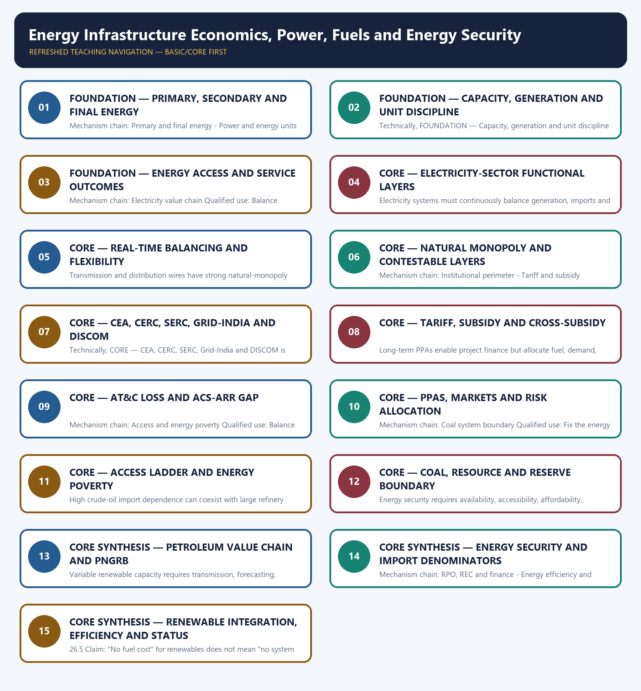

# Energy Infrastructure Economics, Power, Fuels and Energy Security — Learner-v2 Complete Learning Session

> **Authoring-only generation:** 2026-09-03. No PDF was rendered and no tracker or index was mutated.

### SOURCE, PROGRESSION AND CURRENT-LINKAGE AUDIT

- **Generation date:** 2026-09-03.
- **Repository-first evidence:** the Basic owner is taught first and preserved in full; the Advanced owner is retained only in the optional final teaching block.
- **OCR evidence:** Repository Markdown was primary. OCR-searchable local official General Studies papers were used only to confirm printed routed demands. No answer key, marking scheme, unsupported page precision or current macroeconomic statistic was inferred from them.
- **Qdrant:** not used; repository Markdown and available OCR context were sufficient.
- **PYQ integrity:** Audited ledgers route the 2018 energy-access, 2020 solar, 2021 Green Grid, 2022 renewable-target and 2025 clean-technology demands, plus objective concepts on PNGRB, coal institutions, solar regulation and ethanol feedstocks. The Basic/practice firewall carries them without inferring objective answers.
- **Live-link boundary:** PNGRB substantively confirmed its statutory perimeter. Other live sources were blocked, generic or failed, so the package imports no current capacity, generation, reserve, resource, import-dependence, tariff, subsidy, fuel-price, transition-target or achieved-outcome figure.
- **Fact/inference discipline:** no current-affairs item, PYQ wording, figure or quotation is invented.

### LIVE OFFICIAL-SOURCE ATTEMPT LOG

The checks below were made on 2026-09-03. Substantive official text is used only for the proposition it actually supports; binary files, dynamic shells, stubs and undated dashboard snippets are recorded but not converted into current claims.

- https://www.pngrb.gov.in/eng-web/ — substantive PNGRB page fetched 2026-09-03; confirms the Act-based mandate and exclusion of crude-oil and natural-gas production from the Board's regulatory perimeter.
- https://powermin.gov.in/en/content/electricity-act-2003 — direct fetch returned HTTP 403 on 2026-09-03; no legal-status, amendment, tariff, market or institutional claim was imported from the failed request.
- https://cea.nic.in/dashboard/?lang=en — fetch on 2026-09-03 returned a generic dashboard HTML shell without reliable current data; no capacity, generation, demand, storage, reserve or import figure was imported.
- https://beeindia.gov.in/en/programmes/perform-achieve-and-trade-pat — redirected to a generic BEE home page on 2026-09-03; no PAT cycle, target, savings or certificate claim was imported.
- https://cercind.gov.in/2023/regulation/IEGC-Regulations-2023.pdf — transport-level fetch failure on 2026-09-03; no grid-code provision was imported.

## BASIC LEARNING SESSION



*Distinct embedded teaching-navigation image. The separate continuous Cārvāka-style flowchart package remains an independent at-a-glance artifact.*

### SESSION 1 — FOUNDATION — PRIMARY, SECONDARY AND FINAL ENERGY

#### DEFINITION / WHAT THIS IS CALLED

**Plain-language definition:** Primary energy exists in natural resources before conversion, while electricity and refined fuels are secondary carriers and final energy is what reaches end users; electricity is a power-system carrier, not the whole energy system.

**Technical definition:** Mechanism chain: Primary and final energy - Power and energy units Qualified use: Fix the energy carrier, unit, time period and institutional layer before making a claim.

#### ANSWER-GRABBING OPENING — WRITE/ADAPT IN THE EXAM

> Primary energy exists in natural resources before conversion, while electricity and refined fuels are secondary carriers and final energy is what reaches end users; electricity is a power-system carrier, not the whole energy system.

#### MUST-WRITE KEYWORDS

- **FOUNDATION**
- **Primary**
- **secondary**
- **final energy**
- **Mechanism chain**
- **Qualified use**

**How to use them:** Frame the answer through FOUNDATION; define Primary, connect secondary with final energy to explain the mechanism, and use Mechanism chain for the decisive comparison or qualification.

#### VISUAL FIRST

```text
PRIMARY, SECONDARY AND FINAL ENERGY
01. Primary and final energy
    |
    v
02. Power and energy units
BOUNDARY -> Do not use power, electricity and total energy as synonyms.
```

*This topic-specific rail fixes the evidence sequence and its exam boundary before analysis.*

#### CORE EXPLANATION

Primary energy exists in natural resources before conversion, while electricity and refined fuels are secondary carriers and final energy is what reaches end users; electricity is a power-system carrier, not the whole energy system. Installed capacity is rated power in MW or GW, while generation is energy produced over time in MWh, GWh or billion units; capacity share and generation share are not interchangeable.

#### NAMED EVIDENCE AND MECHANISM

- Primary energy exists in natural resources before conversion, while electricity and refined fuels are secondary carriers and final energy is what reaches end users; electricity is a power-system carrier, not the whole energy system.
- Installed capacity is rated power in MW or GW, while generation is energy produced over time in MWh, GWh or billion units; capacity share and generation share are not interchangeable.

#### EXAMINER CAUTION

- Do not use power, electricity and total energy as synonyms.

#### EXAM LINK

- **Prelims:** Preserve the exact formula, territorial or resident boundary, price basis, base year, index basket, eligible counterparty, institution and legal status; never upgrade a projection into an actual or a regulatory direction into a universal rule.
- **Mains:** Fix the energy carrier, unit, time period and institutional layer before making a claim.

#### MINI RECAP

- **Mechanism chain:** Primary and final energy -> Power and energy units
- **Qualified use:** Fix the energy carrier, unit, time period and institutional layer before making a claim.

#### CLOSING RECALL FLOW — FOUNDATION — PRIMARY, SECONDARY AND FINAL ENERGY

```text
START / CONCEPT: FOUNDATION — Primary, secondary and final energy
        |
        v
EXACT TERMS: FOUNDATION · Primary · secondary · final energy · Mechanism chain · Qualified use
        |
        v
MECHANISM / ARGUMENT: Mechanism chain: Primary and final energy - Power and energy units Qualified use: Fix the energy carrier, unit, time period and institutional layer before making a claim.
        |
        v
CONSEQUENCE / CONTRAST: Installed capacity is rated power in MW or GW, while generation is energy produced over time in MWh, GWh or billion units; capacity share and generation share are not interchangeable.
        |
        v
UPSC TRAP / ANSWER-USE: Do not use power, electricity and total energy as synonyms.
        |
        v
ANSWER-GRABBING FORMULATION: Primary energy exists in natural resources before conversion, while electricity and refined fuels are secondary carriers and final energy is what reaches end users; electricity is a power-system carrier, not the whole energy system.
```
### SESSION 2 — FOUNDATION — CAPACITY, GENERATION AND UNIT DISCIPLINE

#### DEFINITION / WHAT THIS IS CALLED

**Plain-language definition:** Mechanism chain: Energy-service boundary Qualified use: Evaluate infrastructure through delivered reliability and affordability, not announced capacity.

**Technical definition:** Technically, FOUNDATION — Capacity, generation and unit discipline is analysed by relating FOUNDATION to Capacity, then testing the relationship through generation and unit discipline.

#### ANSWER-GRABBING OPENING — WRITE/ADAPT IN THE EXAM

> Do not merge MW with MWh or installed capacity with actual generation.

#### MUST-WRITE KEYWORDS

- **FOUNDATION**
- **Capacity**
- **generation**
- **unit discipline**
- **Mechanism chain**
- **Qualified use**

**How to use them:** Frame the answer through FOUNDATION; define Capacity, connect generation with unit discipline to explain the mechanism, and use Mechanism chain for the decisive comparison or qualification.

#### VISUAL FIRST

```text
CAPACITY, GENERATION AND UNIT DISCIPLINE
01. Energy-service boundary
BOUNDARY -> Do not merge MW with MWh or installed capacity with actual generation.
```

*This topic-specific rail fixes the evidence sequence and its exam boundary before analysis.*

#### CORE EXPLANATION

A connection, sanctioned project or installed plant does not prove reliable, affordable, accessible or acceptable energy service at the point of use.

#### NAMED EVIDENCE AND MECHANISM

- A connection, sanctioned project or installed plant does not prove reliable, affordable, accessible or acceptable energy service at the point of use.

#### EXAMINER CAUTION

- Do not merge MW with MWh or installed capacity with actual generation.

#### EXAM LINK

- **Prelims:** Preserve the exact formula, territorial or resident boundary, price basis, base year, index basket, eligible counterparty, institution and legal status; never upgrade a projection into an actual or a regulatory direction into a universal rule.
- **Mains:** Evaluate infrastructure through delivered reliability and affordability, not announced capacity.

#### MINI RECAP

- **Mechanism chain:** Energy-service boundary
- **Qualified use:** Evaluate infrastructure through delivered reliability and affordability, not announced capacity.

#### CLOSING RECALL FLOW — FOUNDATION — CAPACITY, GENERATION AND UNIT DISCIPLINE

```text
START / CONCEPT: FOUNDATION — Capacity, generation and unit discipline
        |
        v
EXACT TERMS: FOUNDATION · Capacity · generation · unit discipline · Mechanism chain · Qualified use
        |
        v
MECHANISM / ARGUMENT: Mechanism chain: Energy-service boundary Qualified use: Evaluate infrastructure through delivered reliability and affordability, not announced capacity.
        |
        v
CONSEQUENCE / CONTRAST: A connection, sanctioned project or installed plant does not prove reliable, affordable, accessible or acceptable energy service at the point of use.
        |
        v
UPSC TRAP / ANSWER-USE: Do not miss this limiting distinction: do not merge MW with MWh or installed capacity with actual generation.
        |
        v
ANSWER-GRABBING FORMULATION: Do not merge MW with MWh or installed capacity with actual generation.
```
### SESSION 3 — FOUNDATION — ENERGY ACCESS AND SERVICE OUTCOMES

#### DEFINITION / WHAT THIS IS CALLED

**Plain-language definition:** Generation, transmission ownership, system operation, distribution, retail supply and market trading are distinct layers with different competition, coordination and regulatory properties.

**Technical definition:** Mechanism chain: Electricity value chain Qualified use: Balance diversification, financial viability, transition and distributional protection.

#### ANSWER-GRABBING OPENING — WRITE/ADAPT IN THE EXAM

> Do not treat a connection or sanctioned project as reliable energy service.

#### MUST-WRITE KEYWORDS

- **FOUNDATION**
- **Energy access**
- **service outcomes**
- **Mechanism chain**
- **Qualified use**
- **Generation**

**How to use them:** Frame the answer through FOUNDATION; define Energy access, connect service outcomes with Mechanism chain to explain the mechanism, and use Qualified use for the decisive comparison or qualification.

#### VISUAL FIRST

```text
ENERGY ACCESS AND SERVICE OUTCOMES
01. Electricity value chain
BOUNDARY -> Do not treat a connection or sanctioned project as reliable energy service.
```

*This topic-specific rail fixes the evidence sequence and its exam boundary before analysis.*

#### CORE EXPLANATION

Generation, transmission ownership, system operation, distribution, retail supply and market trading are distinct layers with different competition, coordination and regulatory properties.

#### NAMED EVIDENCE AND MECHANISM

- Generation, transmission ownership, system operation, distribution, retail supply and market trading are distinct layers with different competition, coordination and regulatory properties.

#### EXAMINER CAUTION

- Do not treat a connection or sanctioned project as reliable energy service.

#### EXAM LINK

- **Prelims:** Preserve the exact formula, territorial or resident boundary, price basis, base year, index basket, eligible counterparty, institution and legal status; never upgrade a projection into an actual or a regulatory direction into a universal rule.
- **Mains:** Balance diversification, financial viability, transition and distributional protection.

#### MINI RECAP

- **Mechanism chain:** Electricity value chain
- **Qualified use:** Balance diversification, financial viability, transition and distributional protection.

#### CLOSING RECALL FLOW — FOUNDATION — ENERGY ACCESS AND SERVICE OUTCOMES

```text
START / CONCEPT: FOUNDATION — Energy access and service outcomes
        |
        v
EXACT TERMS: FOUNDATION · Energy access · service outcomes · Mechanism chain · Qualified use · Generation
        |
        v
MECHANISM / ARGUMENT: Mechanism chain: Electricity value chain Qualified use: Balance diversification, financial viability, transition and distributional protection.
        |
        v
CONSEQUENCE / CONTRAST: Generation, transmission ownership, system operation, distribution, retail supply and market trading are distinct layers with different competition, coordination and regulatory properties.
        |
        v
UPSC TRAP / ANSWER-USE: Do not miss this limiting distinction: do not treat a connection or sanctioned project as reliable energy service.
        |
        v
ANSWER-GRABBING FORMULATION: Do not treat a connection or sanctioned project as reliable energy service.
```
### SESSION 4 — CORE — ELECTRICITY-SECTOR FUNCTIONAL LAYERS

#### DEFINITION / WHAT THIS IS CALLED

**Plain-language definition:** Mechanism chain: Real-time balancing Qualified use: Fix the energy carrier, unit, time period and institutional layer before making a claim.

**Technical definition:** Electricity systems must continuously balance generation, imports and discharge against demand, exports, charging and losses, giving economic value to forecasting, reserves, flexibility, storage and demand response.

#### ANSWER-GRABBING OPENING — WRITE/ADAPT IN THE EXAM

> Mechanism chain: Real-time balancing Qualified use: Fix the energy carrier, unit, time period and institutional layer before making a claim.

#### MUST-WRITE KEYWORDS

- **Electricity-sector functional layers**
- **Mechanism chain**
- **Qualified use**
- **Electricity**
- **Real-time**
- **Qualified**

**How to use them:** Frame the answer through Electricity-sector functional layers; define Mechanism chain, connect Qualified use with Electricity to explain the mechanism, and use Real-time for the decisive comparison or qualification.

#### VISUAL FIRST

```text
ELECTRICITY-SECTOR FUNCTIONAL LAYERS
01. Real-time balancing
BOUNDARY -> Do not merge transmission ownership, system operation and regulation.
```

*This topic-specific rail fixes the evidence sequence and its exam boundary before analysis.*

#### CORE EXPLANATION

Electricity systems must continuously balance generation, imports and discharge against demand, exports, charging and losses, giving economic value to forecasting, reserves, flexibility, storage and demand response.

#### NAMED EVIDENCE AND MECHANISM

- Electricity systems must continuously balance generation, imports and discharge against demand, exports, charging and losses, giving economic value to forecasting, reserves, flexibility, storage and demand response.

#### EXAMINER CAUTION

- Do not merge transmission ownership, system operation and regulation.

#### EXAM LINK

- **Prelims:** Preserve the exact formula, territorial or resident boundary, price basis, base year, index basket, eligible counterparty, institution and legal status; never upgrade a projection into an actual or a regulatory direction into a universal rule.
- **Mains:** Fix the energy carrier, unit, time period and institutional layer before making a claim.

#### MINI RECAP

- **Mechanism chain:** Real-time balancing
- **Qualified use:** Fix the energy carrier, unit, time period and institutional layer before making a claim.

#### CLOSING RECALL FLOW — CORE — ELECTRICITY-SECTOR FUNCTIONAL LAYERS

```text
START / CONCEPT: CORE — Electricity-sector functional layers
        |
        v
EXACT TERMS: Electricity-sector functional layers · Mechanism chain · Qualified use · Electricity · Real-time · Qualified
        |
        v
MECHANISM / ARGUMENT: Electricity systems must continuously balance generation, imports and discharge against demand, exports, charging and losses, giving economic value to forecasting, reserves, flexibility, storage and demand response.
        |
        v
CONSEQUENCE / CONTRAST: Do not merge transmission ownership, system operation and regulation.
        |
        v
UPSC TRAP / ANSWER-USE: Do not miss this limiting distinction: fix the energy carrier, unit, time period and institutional layer before making a claim.
        |
        v
ANSWER-GRABBING FORMULATION: Mechanism chain: Real-time balancing Qualified use: Fix the energy carrier, unit, time period and institutional layer before making a claim.
```
### SESSION 5 — CORE — REAL-TIME BALANCING AND FLEXIBILITY

#### DEFINITION / WHAT THIS IS CALLED

**Plain-language definition:** Mechanism chain: Natural monopoly and competition Qualified use: Evaluate infrastructure through delivered reliability and affordability, not announced capacity.

**Technical definition:** Transmission and distribution wires have strong natural-monopoly features, while generation, trading or retail arrangements may support competition under regulated access, settlement and reliability rules.

#### ANSWER-GRABBING OPENING — WRITE/ADAPT IN THE EXAM

> Mechanism chain: Natural monopoly and competition Qualified use: Evaluate infrastructure through delivered reliability and affordability, not announced capacity.

#### MUST-WRITE KEYWORDS

- **Real-time balancing**
- **flexibility**
- **Mechanism chain**
- **Qualified use**
- **Transmission**
- **Natural**

**How to use them:** Frame the answer through Real-time balancing; define flexibility, connect Mechanism chain with Qualified use to explain the mechanism, and use Transmission for the decisive comparison or qualification.

#### VISUAL FIRST

```text
REAL-TIME BALANCING AND FLEXIBILITY
01. Natural monopoly and competition
BOUNDARY -> Do not treat tariff subsidy, cross-subsidy and deferred under-recovery as one mechanism.
```

*This topic-specific rail fixes the evidence sequence and its exam boundary before analysis.*

#### CORE EXPLANATION

Transmission and distribution wires have strong natural-monopoly features, while generation, trading or retail arrangements may support competition under regulated access, settlement and reliability rules.

#### NAMED EVIDENCE AND MECHANISM

- Transmission and distribution wires have strong natural-monopoly features, while generation, trading or retail arrangements may support competition under regulated access, settlement and reliability rules.

#### EXAMINER CAUTION

- Do not treat tariff subsidy, cross-subsidy and deferred under-recovery as one mechanism.

#### EXAM LINK

- **Prelims:** Preserve the exact formula, territorial or resident boundary, price basis, base year, index basket, eligible counterparty, institution and legal status; never upgrade a projection into an actual or a regulatory direction into a universal rule.
- **Mains:** Evaluate infrastructure through delivered reliability and affordability, not announced capacity.

#### MINI RECAP

- **Mechanism chain:** Natural monopoly and competition
- **Qualified use:** Evaluate infrastructure through delivered reliability and affordability, not announced capacity.

#### CLOSING RECALL FLOW — CORE — REAL-TIME BALANCING AND FLEXIBILITY

```text
START / CONCEPT: CORE — Real-time balancing and flexibility
        |
        v
EXACT TERMS: Real-time balancing · flexibility · Mechanism chain · Qualified use · Transmission · Natural
        |
        v
MECHANISM / ARGUMENT: Do not treat tariff subsidy, cross-subsidy and deferred under-recovery as one mechanism.
        |
        v
CONSEQUENCE / CONTRAST: Transmission and distribution wires have strong natural-monopoly features, while generation, trading or retail arrangements may support competition under regulated access, settlement and reliability rules.
        |
        v
UPSC TRAP / ANSWER-USE: Do not miss this limiting distinction: natural monopoly and competition Qualified use.
        |
        v
ANSWER-GRABBING FORMULATION: Mechanism chain: Natural monopoly and competition Qualified use: Evaluate infrastructure through delivered reliability and affordability, not announced capacity.
```
### SESSION 6 — CORE — NATURAL MONOPOLY AND CONTESTABLE LAYERS

#### DEFINITION / WHAT THIS IS CALLED

**Plain-language definition:** CEA provides statutory technical advice and planning, CERC regulates inter-state and central-sector matters within mandate, SERCs regulate intra-state and retail matters, Grid-India operates national and regional systems, and DISCOMs deliver and bill retail supply.

**Technical definition:** Mechanism chain: Institutional perimeter - Tariff and subsidy boundary Qualified use: Balance diversification, financial viability, transition and distributional protection.

#### ANSWER-GRABBING OPENING — WRITE/ADAPT IN THE EXAM

> CEA provides statutory technical advice and planning, CERC regulates inter-state and central-sector matters within mandate, SERCs regulate intra-state and retail matters, Grid-India operates national and regional systems, and DISCOMs deliver and bill retail supply.

#### MUST-WRITE KEYWORDS

- **Natural monopoly**
- **contestable layers**
- **Mechanism chain**
- **Qualified use**
- **CEA**
- **CERC**

**How to use them:** Frame the answer through Natural monopoly; define contestable layers, connect Mechanism chain with Qualified use to explain the mechanism, and use CEA for the decisive comparison or qualification.

#### VISUAL FIRST

```text
NATURAL MONOPOLY AND CONTESTABLE LAYERS
01. Institutional perimeter
    |
    v
02. Tariff and subsidy boundary
BOUNDARY -> Do not equate AT&C loss with the ACS-ARR gap.
```

*This topic-specific rail fixes the evidence sequence and its exam boundary before analysis.*

#### CORE EXPLANATION

CEA provides statutory technical advice and planning, CERC regulates inter-state and central-sector matters within mandate, SERCs regulate intra-state and retail matters, Grid-India operates national and regional systems, and DISCOMs deliver and bill retail supply. An observed below-cost tariff may be financed by explicit state subsidy, cross-subsidy, deferred regulatory recovery or DISCOM debt; these have different fiscal, distributional and investment consequences.

#### NAMED EVIDENCE AND MECHANISM

- CEA provides statutory technical advice and planning, CERC regulates inter-state and central-sector matters within mandate, SERCs regulate intra-state and retail matters, Grid-India operates national and regional systems, and DISCOMs deliver and bill retail supply.
- An observed below-cost tariff may be financed by explicit state subsidy, cross-subsidy, deferred regulatory recovery or DISCOM debt; these have different fiscal, distributional and investment consequences.

#### EXAMINER CAUTION

- Do not equate AT&C loss with the ACS-ARR gap.

#### EXAM LINK

- **Prelims:** Preserve the exact formula, territorial or resident boundary, price basis, base year, index basket, eligible counterparty, institution and legal status; never upgrade a projection into an actual or a regulatory direction into a universal rule.
- **Mains:** Balance diversification, financial viability, transition and distributional protection.

#### MINI RECAP

- **Mechanism chain:** Institutional perimeter -> Tariff and subsidy boundary
- **Qualified use:** Balance diversification, financial viability, transition and distributional protection.

#### CLOSING RECALL FLOW — CORE — NATURAL MONOPOLY AND CONTESTABLE LAYERS

```text
START / CONCEPT: CORE — Natural monopoly and contestable layers
        |
        v
EXACT TERMS: Natural monopoly · contestable layers · Mechanism chain · Qualified use · CEA · CERC
        |
        v
MECHANISM / ARGUMENT: Mechanism chain: Institutional perimeter - Tariff and subsidy boundary Qualified use: Balance diversification, financial viability, transition and distributional protection.
        |
        v
CONSEQUENCE / CONTRAST: The resulting consequence is that cEA provides statutory technical advice and planning, CERC regulates inter-state and central-sector matters within...
        |
        v
UPSC TRAP / ANSWER-USE: Do not miss this limiting distinction: an observed below-cost tariff may be financed by explicit state subsidy, cross-subsidy, deferred regulatory...
        |
        v
ANSWER-GRABBING FORMULATION: CEA provides statutory technical advice and planning, CERC regulates inter-state and central-sector matters within mandate, SERCs regulate intra-state and retail matters, Grid-India operates national and regional systems, and DISCOMs deliver and bill retail supply.
```
### SESSION 7 — CORE — CEA, CERC, SERC, GRID-INDIA AND DISCOM

#### DEFINITION / WHAT THIS IS CALLED

**Plain-language definition:** Mechanism chain: AT&C and ACS-ARR Qualified use: Fix the energy carrier, unit, time period and institutional layer before making a claim.

**Technical definition:** Technically, CORE — CEA, CERC, SERC, Grid-India and DISCOM is analysed by relating CEA to CERC, then testing the relationship through SERC and Grid-India.

#### ANSWER-GRABBING OPENING — WRITE/ADAPT IN THE EXAM

> Mechanism chain: AT&C and ACS-ARR Qualified use: Fix the energy carrier, unit, time period and institutional layer before making a claim.

#### MUST-WRITE KEYWORDS

- **CEA**
- **CERC**
- **SERC**
- **Grid-India**
- **DISCOM**
- **Mechanism chain**

**How to use them:** Frame the answer through CEA; define CERC, connect SERC with Grid-India to explain the mechanism, and use DISCOM for the decisive comparison or qualification.

#### VISUAL FIRST

```text
CEA, CERC, SERC, GRID-INDIA AND DISCOM
01. AT&C and ACS-ARR
BOUNDARY -> Do not place crude-oil or natural-gas production inside PNGRB's perimeter.
```

*This topic-specific rail fixes the evidence sequence and its exam boundary before analysis.*

#### CORE EXPLANATION

AT&C loss combines technical and commercial energy-recovery failures, while the ACS-ARR gap measures average cost versus realised revenue; reducing one does not guarantee financial viability.

#### NAMED EVIDENCE AND MECHANISM

- AT&C loss combines technical and commercial energy-recovery failures, while the ACS-ARR gap measures average cost versus realised revenue; reducing one does not guarantee financial viability.

#### EXAMINER CAUTION

- Do not place crude-oil or natural-gas production inside PNGRB's perimeter.

#### EXAM LINK

- **Prelims:** Preserve the exact formula, territorial or resident boundary, price basis, base year, index basket, eligible counterparty, institution and legal status; never upgrade a projection into an actual or a regulatory direction into a universal rule.
- **Mains:** Fix the energy carrier, unit, time period and institutional layer before making a claim.

#### MINI RECAP

- **Mechanism chain:** AT&C and ACS-ARR
- **Qualified use:** Fix the energy carrier, unit, time period and institutional layer before making a claim.

#### CLOSING RECALL FLOW — CORE — CEA, CERC, SERC, GRID-INDIA AND DISCOM

```text
START / CONCEPT: CORE — CEA, CERC, SERC, Grid-India and DISCOM
        |
        v
EXACT TERMS: CEA · CERC · SERC · Grid-India · DISCOM · Mechanism chain
        |
        v
MECHANISM / ARGUMENT: The operative mechanism is that aT&C and ACS-ARR Qualified use.
        |
        v
CONSEQUENCE / CONTRAST: Do not place crude-oil or natural-gas production inside PNGRB's perimeter.
        |
        v
UPSC TRAP / ANSWER-USE: AT&C loss combines technical and commercial energy-recovery failures, while the ACS-ARR gap measures average cost versus realised revenue; reducing one does not guarantee financial viability.
        |
        v
ANSWER-GRABBING FORMULATION: Mechanism chain: AT&C and ACS-ARR Qualified use: Fix the energy carrier, unit, time period and institutional layer before making a claim.
```
### SESSION 8 — CORE — TARIFF, SUBSIDY AND CROSS-SUBSIDY

#### DEFINITION / WHAT THIS IS CALLED

**Plain-language definition:** Mechanism chain: PPA and procurement risk Qualified use: Evaluate infrastructure through delivered reliability and affordability, not announced capacity.

**Technical definition:** Long-term PPAs enable project finance but allocate fuel, demand, payment, curtailment, change-in-law and technology risks and can create stranded or inflexible cost when assumptions change.

#### ANSWER-GRABBING OPENING — WRITE/ADAPT IN THE EXAM

> Mechanism chain: PPA and procurement risk Qualified use: Evaluate infrastructure through delivered reliability and affordability, not announced capacity.

#### MUST-WRITE KEYWORDS

- **Tariff**
- **subsidy**
- **cross-subsidy**
- **Mechanism chain**
- **Qualified use**
- **Long-term PPAs**

**How to use them:** Frame the answer through Tariff; define subsidy, connect cross-subsidy with Mechanism chain to explain the mechanism, and use Qualified use for the decisive comparison or qualification.

#### VISUAL FIRST

```text
TARIFF, SUBSIDY AND CROSS-SUBSIDY
01. PPA and procurement risk
BOUNDARY -> Do not equate crude import dependence with petroleum-product trade dependence.
```

*This topic-specific rail fixes the evidence sequence and its exam boundary before analysis.*

#### CORE EXPLANATION

Long-term PPAs enable project finance but allocate fuel, demand, payment, curtailment, change-in-law and technology risks and can create stranded or inflexible cost when assumptions change.

#### NAMED EVIDENCE AND MECHANISM

- Long-term PPAs enable project finance but allocate fuel, demand, payment, curtailment, change-in-law and technology risks and can create stranded or inflexible cost when assumptions change.

#### EXAMINER CAUTION

- Do not equate crude import dependence with petroleum-product trade dependence.

#### EXAM LINK

- **Prelims:** Preserve the exact formula, territorial or resident boundary, price basis, base year, index basket, eligible counterparty, institution and legal status; never upgrade a projection into an actual or a regulatory direction into a universal rule.
- **Mains:** Evaluate infrastructure through delivered reliability and affordability, not announced capacity.

#### MINI RECAP

- **Mechanism chain:** PPA and procurement risk
- **Qualified use:** Evaluate infrastructure through delivered reliability and affordability, not announced capacity.

#### CLOSING RECALL FLOW — CORE — TARIFF, SUBSIDY AND CROSS-SUBSIDY

```text
START / CONCEPT: CORE — Tariff, subsidy and cross-subsidy
        |
        v
EXACT TERMS: Tariff · subsidy · cross-subsidy · Mechanism chain · Qualified use · Long-term PPAs
        |
        v
MECHANISM / ARGUMENT: Long-term PPAs enable project finance but allocate fuel, demand, payment, curtailment, change-in-law and technology risks and can create stranded or inflexible cost when assumptions change.
        |
        v
CONSEQUENCE / CONTRAST: Do not equate crude import dependence with petroleum-product trade dependence.
        |
        v
UPSC TRAP / ANSWER-USE: Do not miss this limiting distinction: pPA and procurement risk Qualified use.
        |
        v
ANSWER-GRABBING FORMULATION: Mechanism chain: PPA and procurement risk Qualified use: Evaluate infrastructure through delivered reliability and affordability, not announced capacity.
```
### SESSION 9 — CORE — AT&C LOSS AND ACS-ARR GAP

#### DEFINITION / WHAT THIS IS CALLED

**Plain-language definition:** Energy access is a ladder from network reach and connection to active metering, availability, reliability, affordability, productive use and clean cooking; connection counts alone are incomplete.

**Technical definition:** Mechanism chain: Access and energy poverty Qualified use: Balance diversification, financial viability, transition and distributional protection.

#### ANSWER-GRABBING OPENING — WRITE/ADAPT IN THE EXAM

> Energy access is a ladder from network reach and connection to active metering, availability, reliability, affordability, productive use and clean cooking; connection counts alone are incomplete.

#### MUST-WRITE KEYWORDS

- **AT&C loss**
- **ACS-ARR gap**
- **Mechanism chain**
- **Qualified use**
- **Energy access**
- **Energy**

**How to use them:** Frame the answer through AT&C loss; define ACS-ARR gap, connect Mechanism chain with Qualified use to explain the mechanism, and use Energy access for the decisive comparison or qualification.

#### VISUAL FIRST

```text
AT&C LOSS AND ACS-ARR GAP
01. Access and energy poverty
BOUNDARY -> Do not call every non-fossil source renewable or every resource a reserve.
```

*This topic-specific rail fixes the evidence sequence and its exam boundary before analysis.*

#### CORE EXPLANATION

Energy access is a ladder from network reach and connection to active metering, availability, reliability, affordability, productive use and clean cooking; connection counts alone are incomplete.

#### NAMED EVIDENCE AND MECHANISM

- Energy access is a ladder from network reach and connection to active metering, availability, reliability, affordability, productive use and clean cooking; connection counts alone are incomplete.

#### EXAMINER CAUTION

- Do not call every non-fossil source renewable or every resource a reserve.

#### EXAM LINK

- **Prelims:** Preserve the exact formula, territorial or resident boundary, price basis, base year, index basket, eligible counterparty, institution and legal status; never upgrade a projection into an actual or a regulatory direction into a universal rule.
- **Mains:** Balance diversification, financial viability, transition and distributional protection.

#### MINI RECAP

- **Mechanism chain:** Access and energy poverty
- **Qualified use:** Balance diversification, financial viability, transition and distributional protection.

#### CLOSING RECALL FLOW — CORE — AT&C LOSS AND ACS-ARR GAP

```text
START / CONCEPT: CORE — AT&C loss and ACS-ARR gap
        |
        v
EXACT TERMS: AT&C loss · ACS-ARR gap · Mechanism chain · Qualified use · Energy access · Energy
        |
        v
MECHANISM / ARGUMENT: Mechanism chain: Access and energy poverty Qualified use: Balance diversification, financial viability, transition and distributional protection.
        |
        v
CONSEQUENCE / CONTRAST: Do not call every non-fossil source renewable or every resource a reserve.
        |
        v
UPSC TRAP / ANSWER-USE: Do not miss this limiting distinction: do not call every non-fossil source renewable or every resource a reserve.
        |
        v
ANSWER-GRABBING FORMULATION: Energy access is a ladder from network reach and connection to active metering, availability, reliability, affordability, productive use and clean cooking; connection counts alone are incomplete.
```
### SESSION 10 — CORE — PPAS, MARKETS AND RISK ALLOCATION

#### DEFINITION / WHAT THIS IS CALLED

**Plain-language definition:** Thermal and coking coal have different uses and quality constraints, while mining, evacuation, plant stock, combustion, ash and closure form one infrastructure chain; geological resource is not the same as an economically recoverable reserve.

**Technical definition:** Mechanism chain: Coal system boundary Qualified use: Fix the energy carrier, unit, time period and institutional layer before making a claim.

#### ANSWER-GRABBING OPENING — WRITE/ADAPT IN THE EXAM

> Thermal and coking coal have different uses and quality constraints, while mining, evacuation, plant stock, combustion, ash and closure form one infrastructure chain; geological resource is not the same as an economically recoverable reserve.

#### MUST-WRITE KEYWORDS

- **PPAs**
- **markets**
- **risk allocation**
- **Mechanism chain**
- **Qualified use**
- **Thermal**

**How to use them:** Frame the answer through PPAs; define markets, connect risk allocation with Mechanism chain to explain the mechanism, and use Qualified use for the decisive comparison or qualification.

#### VISUAL FIRST

```text
PPAS, MARKETS AND RISK ALLOCATION
01. Coal system boundary
BOUNDARY -> Do not convert a target, Bill, outlay or planning estimate into achieved generation.
```

*This topic-specific rail fixes the evidence sequence and its exam boundary before analysis.*

#### CORE EXPLANATION

Thermal and coking coal have different uses and quality constraints, while mining, evacuation, plant stock, combustion, ash and closure form one infrastructure chain; geological resource is not the same as an economically recoverable reserve.

#### NAMED EVIDENCE AND MECHANISM

- Thermal and coking coal have different uses and quality constraints, while mining, evacuation, plant stock, combustion, ash and closure form one infrastructure chain; geological resource is not the same as an economically recoverable reserve.

#### EXAMINER CAUTION

- Do not convert a target, Bill, outlay or planning estimate into achieved generation.

#### EXAM LINK

- **Prelims:** Preserve the exact formula, territorial or resident boundary, price basis, base year, index basket, eligible counterparty, institution and legal status; never upgrade a projection into an actual or a regulatory direction into a universal rule.
- **Mains:** Fix the energy carrier, unit, time period and institutional layer before making a claim.

#### MINI RECAP

- **Mechanism chain:** Coal system boundary
- **Qualified use:** Fix the energy carrier, unit, time period and institutional layer before making a claim.

#### CLOSING RECALL FLOW — CORE — PPAS, MARKETS AND RISK ALLOCATION

```text
START / CONCEPT: CORE — PPAs, markets and risk allocation
        |
        v
EXACT TERMS: PPAs · markets · risk allocation · Mechanism chain · Qualified use · Thermal
        |
        v
MECHANISM / ARGUMENT: Mechanism chain: Coal system boundary Qualified use: Fix the energy carrier, unit, time period and institutional layer before making a claim.
        |
        v
CONSEQUENCE / CONTRAST: Do not convert a target, Bill, outlay or planning estimate into achieved generation.
        |
        v
UPSC TRAP / ANSWER-USE: Do not miss this limiting distinction: thermal and coking coal have different uses and quality constraints.
        |
        v
ANSWER-GRABBING FORMULATION: Thermal and coking coal have different uses and quality constraints, while mining, evacuation, plant stock, combustion, ash and closure form one infrastructure chain; geological resource is not the same as an economically recoverable reserve.
```
### SESSION 11 — CORE — ACCESS LADDER AND ENERGY POVERTY

#### DEFINITION / WHAT THIS IS CALLED

**Plain-language definition:** Mechanism chain: Petroleum chain and regulator - Crude imports and product trade Qualified use: Evaluate infrastructure through delivered reliability and affordability, not announced capacity.

**Technical definition:** High crude-oil import dependence can coexist with large refinery capacity and petroleum-product exports; import dependence must state its commodity and denominator.

#### ANSWER-GRABBING OPENING — WRITE/ADAPT IN THE EXAM

> Do not use power, electricity and total energy as synonyms.

#### MUST-WRITE KEYWORDS

- **Access ladder**
- **energy poverty**
- **Mechanism chain**
- **Qualified use**
- **High**
- **Petroleum**

**How to use them:** Frame the answer through Access ladder; define energy poverty, connect Mechanism chain with Qualified use to explain the mechanism, and use High for the decisive comparison or qualification.

#### VISUAL FIRST

```text
ACCESS LADDER AND ENERGY POVERTY
01. Petroleum chain and regulator
    |
    v
02. Crude imports and product trade
BOUNDARY -> Do not use power, electricity and total energy as synonyms.
```

*This topic-specific rail fixes the evidence sequence and its exam boundary before analysis.*

#### CORE EXPLANATION

Upstream exploration and production differ from midstream transport and storage and downstream refining and marketing; PNGRB's statutory perimeter excludes production of crude oil and natural gas. High crude-oil import dependence can coexist with large refinery capacity and petroleum-product exports; import dependence must state its commodity and denominator.

#### NAMED EVIDENCE AND MECHANISM

- Upstream exploration and production differ from midstream transport and storage and downstream refining and marketing; PNGRB's statutory perimeter excludes production of crude oil and natural gas.
- High crude-oil import dependence can coexist with large refinery capacity and petroleum-product exports; import dependence must state its commodity and denominator.

#### EXAMINER CAUTION

- Do not use power, electricity and total energy as synonyms.

#### EXAM LINK

- **Prelims:** Preserve the exact formula, territorial or resident boundary, price basis, base year, index basket, eligible counterparty, institution and legal status; never upgrade a projection into an actual or a regulatory direction into a universal rule.
- **Mains:** Evaluate infrastructure through delivered reliability and affordability, not announced capacity.

#### MINI RECAP

- **Mechanism chain:** Petroleum chain and regulator -> Crude imports and product trade
- **Qualified use:** Evaluate infrastructure through delivered reliability and affordability, not announced capacity.

#### CLOSING RECALL FLOW — CORE — ACCESS LADDER AND ENERGY POVERTY

```text
START / CONCEPT: CORE — Access ladder and energy poverty
        |
        v
EXACT TERMS: Access ladder · energy poverty · Mechanism chain · Qualified use · High · Petroleum
        |
        v
MECHANISM / ARGUMENT: Mechanism chain: Petroleum chain and regulator - Crude imports and product trade Qualified use: Evaluate infrastructure through delivered reliability and affordability, not announced capacity.
        |
        v
CONSEQUENCE / CONTRAST: High crude-oil import dependence can coexist with large refinery capacity and petroleum-product exports; import dependence must state its commodity and denominator.
        |
        v
UPSC TRAP / ANSWER-USE: Do not miss this limiting distinction: petroleum chain and regulator - Crude imports and product trade Qualified use.
        |
        v
ANSWER-GRABBING FORMULATION: Do not use power, electricity and total energy as synonyms.
```
### SESSION 12 — CORE — COAL, RESOURCE AND RESERVE BOUNDARY

#### DEFINITION / WHAT THIS IS CALLED

**Plain-language definition:** Mechanism chain: Energy-security dimensions Qualified use: Balance diversification, financial viability, transition and distributional protection.

**Technical definition:** Energy security requires availability, accessibility, affordability, acceptability and resilience, including diversification of sources, routes and contracts, stocks, infrastructure, financial viability and shock recovery.

#### ANSWER-GRABBING OPENING — WRITE/ADAPT IN THE EXAM

> Mechanism chain: Energy-security dimensions Qualified use: Balance diversification, financial viability, transition and distributional protection.

#### MUST-WRITE KEYWORDS

- **Coal**
- **resource**
- **reserve boundary**
- **Mechanism chain**
- **Qualified use**
- **Energy**

**How to use them:** Frame the answer through Coal; define resource, connect reserve boundary with Mechanism chain to explain the mechanism, and use Qualified use for the decisive comparison or qualification.

#### VISUAL FIRST

```text
COAL, RESOURCE AND RESERVE BOUNDARY
01. Energy-security dimensions
BOUNDARY -> Do not merge MW with MWh or installed capacity with actual generation.
```

*This topic-specific rail fixes the evidence sequence and its exam boundary before analysis.*

#### CORE EXPLANATION

Energy security requires availability, accessibility, affordability, acceptability and resilience, including diversification of sources, routes and contracts, stocks, infrastructure, financial viability and shock recovery.

#### NAMED EVIDENCE AND MECHANISM

- Energy security requires availability, accessibility, affordability, acceptability and resilience, including diversification of sources, routes and contracts, stocks, infrastructure, financial viability and shock recovery.

#### EXAMINER CAUTION

- Do not merge MW with MWh or installed capacity with actual generation.

#### EXAM LINK

- **Prelims:** Preserve the exact formula, territorial or resident boundary, price basis, base year, index basket, eligible counterparty, institution and legal status; never upgrade a projection into an actual or a regulatory direction into a universal rule.
- **Mains:** Balance diversification, financial viability, transition and distributional protection.

#### MINI RECAP

- **Mechanism chain:** Energy-security dimensions
- **Qualified use:** Balance diversification, financial viability, transition and distributional protection.

#### CLOSING RECALL FLOW — CORE — COAL, RESOURCE AND RESERVE BOUNDARY

```text
START / CONCEPT: CORE — Coal, resource and reserve boundary
        |
        v
EXACT TERMS: Coal · resource · reserve boundary · Mechanism chain · Qualified use · Energy
        |
        v
MECHANISM / ARGUMENT: The operative mechanism is that balance diversification, financial viability, transition and distributional protection.
        |
        v
CONSEQUENCE / CONTRAST: Energy security requires availability, accessibility, affordability, acceptability and resilience, including diversification of sources, routes and contracts, stocks, infrastructure, financial viability and shock recovery.
        |
        v
UPSC TRAP / ANSWER-USE: Do not merge MW with MWh or installed capacity with actual generation.
        |
        v
ANSWER-GRABBING FORMULATION: Mechanism chain: Energy-security dimensions Qualified use: Balance diversification, financial viability, transition and distributional protection.
```
### SESSION 13 — CORE SYNTHESIS — PETROLEUM VALUE CHAIN AND PNGRB

#### DEFINITION / WHAT THIS IS CALLED

**Plain-language definition:** Mechanism chain: Renewable integration Qualified use: Fix the energy carrier, unit, time period and institutional layer before making a claim.

**Technical definition:** Variable renewable capacity requires transmission, forecasting, flexible generation, storage, demand response, geographical diversity and market design; no fuel cost does not mean zero system cost.

#### ANSWER-GRABBING OPENING — WRITE/ADAPT IN THE EXAM

> Mechanism chain: Renewable integration Qualified use: Fix the energy carrier, unit, time period and institutional layer before making a claim.

#### MUST-WRITE KEYWORDS

- **CORE SYNTHESIS**
- **Petroleum value chain**
- **PNGRB**
- **Mechanism chain**
- **Qualified use**
- **Variable**

**How to use them:** Frame the answer through CORE SYNTHESIS; define Petroleum value chain, connect PNGRB with Mechanism chain to explain the mechanism, and use Qualified use for the decisive comparison or qualification.

#### VISUAL FIRST

```text
PETROLEUM VALUE CHAIN AND PNGRB
01. Renewable integration
BOUNDARY -> Do not treat a connection or sanctioned project as reliable energy service.
```

*This topic-specific rail fixes the evidence sequence and its exam boundary before analysis.*

#### CORE EXPLANATION

Variable renewable capacity requires transmission, forecasting, flexible generation, storage, demand response, geographical diversity and market design; no fuel cost does not mean zero system cost.

#### NAMED EVIDENCE AND MECHANISM

- Variable renewable capacity requires transmission, forecasting, flexible generation, storage, demand response, geographical diversity and market design; no fuel cost does not mean zero system cost.

#### EXAMINER CAUTION

- Do not treat a connection or sanctioned project as reliable energy service.

#### EXAM LINK

- **Prelims:** Preserve the exact formula, territorial or resident boundary, price basis, base year, index basket, eligible counterparty, institution and legal status; never upgrade a projection into an actual or a regulatory direction into a universal rule.
- **Mains:** Fix the energy carrier, unit, time period and institutional layer before making a claim.

#### MINI RECAP

- **Mechanism chain:** Renewable integration
- **Qualified use:** Fix the energy carrier, unit, time period and institutional layer before making a claim.

#### CLOSING RECALL FLOW — CORE SYNTHESIS — PETROLEUM VALUE CHAIN AND PNGRB

```text
START / CONCEPT: CORE SYNTHESIS — Petroleum value chain and PNGRB
        |
        v
EXACT TERMS: CORE SYNTHESIS · Petroleum value chain · PNGRB · Mechanism chain · Qualified use · Variable
        |
        v
MECHANISM / ARGUMENT: Variable renewable capacity requires transmission, forecasting, flexible generation, storage, demand response, geographical diversity and market design; no fuel cost does not mean zero system cost.
        |
        v
CONSEQUENCE / CONTRAST: Do not treat a connection or sanctioned project as reliable energy service.
        |
        v
UPSC TRAP / ANSWER-USE: Do not miss this limiting distinction: variable renewable capacity requires transmission, forecasting, flexible generation, storage, demand response, geographical diversity and...
        |
        v
ANSWER-GRABBING FORMULATION: Mechanism chain: Renewable integration Qualified use: Fix the energy carrier, unit, time period and institutional layer before making a claim.
```
### SESSION 14 — CORE SYNTHESIS — ENERGY SECURITY AND IMPORT DENOMINATORS

#### DEFINITION / WHAT THIS IS CALLED

**Plain-language definition:** Efficiency supplies the same or better service with less energy input, but total energy use can still rise when output or use expands; energy conservation and efficiency are related but not identical.

**Technical definition:** Mechanism chain: RPO, REC and finance - Energy efficiency and rebound Qualified use: Evaluate infrastructure through delivered reliability and affordability, not announced capacity.

#### ANSWER-GRABBING OPENING — WRITE/ADAPT IN THE EXAM

> Mechanism chain: RPO, REC and finance - Energy efficiency and rebound Qualified use: Evaluate infrastructure through delivered reliability and affordability, not announced capacity.

#### MUST-WRITE KEYWORDS

- **CORE SYNTHESIS**
- **Energy security**
- **import denominators**
- **Mechanism chain**
- **Qualified use**
- **RPO**

**How to use them:** Frame the answer through CORE SYNTHESIS; define Energy security, connect import denominators with Mechanism chain to explain the mechanism, and use Qualified use for the decisive comparison or qualification.

#### VISUAL FIRST

```text
ENERGY SECURITY AND IMPORT DENOMINATORS
01. RPO, REC and finance
    |
    v
02. Energy efficiency and rebound
BOUNDARY -> Do not merge transmission ownership, system operation and regulation.
```

*This topic-specific rail fixes the evidence sequence and its exam boundary before analysis.*

#### CORE EXPLANATION

RPO creates a renewable-procurement obligation, REC represents an eligible renewable attribute, and a finance company named REC Limited is a different institution; procurement rules do not by themselves create physical generation. Efficiency supplies the same or better service with less energy input, but total energy use can still rise when output or use expands; energy conservation and efficiency are related but not identical.

#### NAMED EVIDENCE AND MECHANISM

- RPO creates a renewable-procurement obligation, REC represents an eligible renewable attribute, and a finance company named REC Limited is a different institution; procurement rules do not by themselves create physical generation.
- Efficiency supplies the same or better service with less energy input, but total energy use can still rise when output or use expands; energy conservation and efficiency are related but not identical.

#### EXAMINER CAUTION

- Do not merge transmission ownership, system operation and regulation.

#### EXAM LINK

- **Prelims:** Preserve the exact formula, territorial or resident boundary, price basis, base year, index basket, eligible counterparty, institution and legal status; never upgrade a projection into an actual or a regulatory direction into a universal rule.
- **Mains:** Evaluate infrastructure through delivered reliability and affordability, not announced capacity.

#### MINI RECAP

- **Mechanism chain:** RPO, REC and finance -> Energy efficiency and rebound
- **Qualified use:** Evaluate infrastructure through delivered reliability and affordability, not announced capacity.

#### CLOSING RECALL FLOW — CORE SYNTHESIS — ENERGY SECURITY AND IMPORT DENOMINATORS

```text
START / CONCEPT: CORE SYNTHESIS — Energy security and import denominators
        |
        v
EXACT TERMS: CORE SYNTHESIS · Energy security · import denominators · Mechanism chain · Qualified use · RPO
        |
        v
MECHANISM / ARGUMENT: RPO creates a renewable-procurement obligation, REC represents an eligible renewable attribute, and a finance company named REC Limited is a different institution; procurement rules do not by themselves create physical generation.
        |
        v
CONSEQUENCE / CONTRAST: Efficiency supplies the same or better service with less energy input, but total energy use can still rise when output or use expands; energy conservation and efficiency are related but not identical.
        |
        v
UPSC TRAP / ANSWER-USE: Do not merge transmission ownership, system operation and regulation.
        |
        v
ANSWER-GRABBING FORMULATION: Mechanism chain: RPO, REC and finance - Energy efficiency and rebound Qualified use: Evaluate infrastructure through delivered reliability and affordability, not announced capacity.
```
### SESSION 15 — CORE SYNTHESIS — RENEWABLE INTEGRATION, EFFICIENCY AND STATUS

#### DEFINITION / WHAT THIS IS CALLED

**Plain-language definition:** Status: 2024-2025 question-level PYQ demand is integrated into this owner.

**Technical definition:** 26.5 Claim: "No fuel cost" for renewables does not mean "no system cost." Named evidence: Solar/wind's zero fuel cost is offset by variability, transmission, balancing and storage requirements (§5.1, §14).

#### ANSWER-GRABBING OPENING — WRITE/ADAPT IN THE EXAM

> A capacity target, planning estimate, scheme outlay, Bill, sanctioned project and achieved generation are separate status categories; current claims must retain the exact date, unit, legal stage and reporting body.

#### MUST-WRITE KEYWORDS

- **CORE SYNTHESIS**
- **Renewable integration**
- **efficiency**
- **status**
- **Mechanism chain**
- **Qualified use**

**How to use them:** Frame the answer through CORE SYNTHESIS; define Renewable integration, connect efficiency with status to explain the mechanism, and use Mechanism chain for the decisive comparison or qualification.

#### VISUAL FIRST

```text
RENEWABLE INTEGRATION, EFFICIENCY AND STATUS
01. Fuel pricing and transition
    |
    v
02. Targets and legal status
BOUNDARY -> Do not treat tariff subsidy, cross-subsidy and deferred under-recovery as one mechanism.
```

*This topic-specific rail fixes the evidence sequence and its exam boundary before analysis.*

#### CORE EXPLANATION

Retail fuel prices can reflect international prices, exchange rate, refining, marketing, freight, taxes and applicable support, while transition policy must separate consumer support, producer support and unpriced external costs. A capacity target, planning estimate, scheme outlay, Bill, sanctioned project and achieved generation are separate status categories; current claims must retain the exact date, unit, legal stage and reporting body.

#### NAMED EVIDENCE AND MECHANISM

- Retail fuel prices can reflect international prices, exchange rate, refining, marketing, freight, taxes and applicable support, while transition policy must separate consumer support, producer support and unpriced external costs.
- A capacity target, planning estimate, scheme outlay, Bill, sanctioned project and achieved generation are separate status categories; current claims must retain the exact date, unit, legal stage and reporting body.

#### EXAMINER CAUTION

- Do not treat tariff subsidy, cross-subsidy and deferred under-recovery as one mechanism.

#### EXAM LINK

- **Prelims:** Preserve the exact formula, territorial or resident boundary, price basis, base year, index basket, eligible counterparty, institution and legal status; never upgrade a projection into an actual or a regulatory direction into a universal rule.
- **Mains:** Balance diversification, financial viability, transition and distributional protection.

#### MINI RECAP

- **Mechanism chain:** Fuel pricing and transition -> Targets and legal status
- **Qualified use:** Balance diversification, financial viability, transition and distributional protection.
#### COMPLETE BASIC OWNER EVIDENCE BANK

> **Subject:** Economy | **Tier:** Must-Do (exam-complete Core) | **GS Paper:** GS-III +
> Prelims, with GS-I geography, GS-II/IR and Environment links.
> **Official owner:** “Infrastructure: Energy, Ports, Roads, Airports, Railways etc.”
> ✅ = source-grounded | ⚠️ = analytical linkage | 📰 = dated current anchor.
> *Optional companion:
> `../advanced/31_Energy-Infrastructure-Economics-Power-Fuels-and-Energy-Security.md`.*

#### 1. Core boundary

This owner studies energy as an **economic infrastructure system**:

```text
RESOURCE / IMPORT
  coal, oil, gas, uranium, water, sun, wind, biomass
                         |
                         v
CONVERSION
  mine/refinery/LNG terminal/power plant/electrolyser
                         |
                         v
NETWORK
  rail, port, pipeline, transmission grid, storage
                         |
                         v
DISTRIBUTION
  DISCOM, city-gas network, fuel retailer, mini-grid
                         |
                         v
END USE
  household + farm + transport + industry + services
                         |
                         v
DEVELOPMENT OUTCOME
  access + productivity + security + affordability + sustainability
```

It does **not** replace:

- Environment Topic 25 for renewable-energy and green-hydrogen technology/climate depth;
- Science and Technology owners for nuclear, batteries, biofuels and electric-vehicle
  engineering;
- Geography Topic 31 for spatial distribution of energy resources;
- International Relations Topic 06 for West Asian energy diplomacy.

> **Core proposition:** Energy infrastructure succeeds only when adequate energy is delivered
> reliably and affordably at the point of use. Installed capacity, a connection or an announced
> project is not by itself an energy-service outcome.

#### 2. Essential definitions

| Concept | Exam-ready meaning |
|---|---|
| ✅ **Primary energy** | Energy available in natural resources before conversion: coal, crude oil, natural gas, sunlight, wind, flowing water, biomass and uranium. |
| ✅ **Secondary energy/carrier** | Usable form produced by conversion, such as electricity, petrol, diesel, hydrogen or refined gas. |
| ✅ **Energy infrastructure** | Physical networks, institutions and market arrangements that convert, transport, store and deliver energy. |
| ✅ **Energy security** | Reliable access to adequate energy at affordable prices, with resilience to supply, price, geopolitical, technological and climate shocks. |
| ✅ **Energy access** | Ability to obtain modern energy services; it includes connection, availability, reliability, affordability, quality and clean cooking. |
| ✅ **Installed capacity** | Maximum rated power of generating assets, usually stated in MW or GW. |
| ✅ **Generation** | Electrical energy actually produced over time, usually stated in MWh, GWh or billion units. |
| ✅ **Peak demand** | Highest power requirement at a point or short interval; distinct from total energy consumed over a year. |
| ✅ **Capacity factor** | Actual generation divided by the generation possible if capacity ran at full rating throughout the period. |
| ✅ **Plant Load Factor (PLF)** | Capacity-utilisation measure commonly applied to thermal stations; it is not installed capacity or efficiency. |
| ✅ **DISCOM** | Distribution licensee responsible for the last-mile network, retail supply, metering, billing, collection and consumer service. |
| ✅ **AT&C loss** | Aggregate Technical and Commercial loss: network losses plus energy not correctly metered, billed or collected. |
| ✅ **ACS-ARR gap** | Difference between average cost of supply and average revenue realised; a positive gap indicates under-recovery. |
| ✅ **Open access** | Non-discriminatory use of a network by eligible buyers/sellers subject to law, regulation and applicable charges. |
| ✅ **PPA** | Power Purchase Agreement specifying contracted capacity/energy, tariff, tenure, performance and risk allocation. |
| ✅ **RPO** | Renewable Purchase Obligation requiring specified obligated entities to procure a prescribed renewable share. |
| ✅ **REC** | Tradable Renewable Energy Certificate representing the renewable attribute of eligible electricity under the regulatory framework. |
| ✅ **LCOE** | Discounted lifetime generation cost per unit; it does not capture every grid, balancing, storage or network cost. |
| ✅ **Energy efficiency** | Obtaining the same or better energy service with less energy input. |

#### 3. High-value distinctions

| Do not confuse | Correct distinction |
|---|---|
| MW and MWh | MW is power/capacity; MWh is energy over time. |
| Installed capacity and generation share | A source can have a high capacity share but a lower generation share because utilisation differs. |
| Electrified village/household and reliable access | A network connection does not prove continuous, affordable or good-quality supply. |
| Transmission and distribution | Transmission moves bulk power at high voltage; distribution delivers to retail consumers. |
| Technical and commercial losses | Technical loss occurs physically in the network; commercial loss comes from theft, metering, billing and collection failure. |
| Subsidy and cross-subsidy | Government subsidy is fiscal support; cross-subsidy charges one consumer class above cost to support another. |
| Energy conservation and energy efficiency | Conservation may reduce service/use; efficiency reduces energy per unit of service/output. |
| Renewable and non-fossil | Non-fossil includes nuclear and large hydro as applicable; renewable does not mean every non-fossil source. |
| Variable and dispatchable power | Solar/wind output depends on resource availability; dispatchable resources can be scheduled within technical constraints. |
| Crude-oil import dependence and petroleum-product trade | A country can import most crude while possessing large refineries and exporting refined products. |
| Resource and reserve | A geological resource is not automatically economically recoverable as a reserve. |

#### 4. Why energy is distinctive infrastructure

##### 4.1 Electricity must balance in real time

```text
generation + imports + discharge
          =
demand + exports + charging + system losses
```

Frequency and grid security require continuous balancing. Storage, demand response,
interconnections, forecasting and flexible generation therefore have economic value beyond
their energy output.

##### 4.2 Networks have natural-monopoly features

Duplicating every transmission or distribution wire is inefficient. Competition may be
introduced in generation, trading or retail arrangements, but networks require:

- regulated access;
- technical standards;
- cost scrutiny;
- service obligations;
- consumer protection.

##### 4.3 Energy has large externalities

Prices may omit air pollution, greenhouse gases, water use, mine closure, displacement,
ecosystem damage or health costs. Conversely, access, grid stability and innovation can create
social benefits not captured by private revenue.

##### 4.4 Long-lived assets create lock-in

Power plants, mines, pipelines, refineries and grids operate for decades. Today’s investment
can create:

- future energy security;
- technological lock-in;
- stranded-asset risk;
- regional employment dependence;
- long-term payment obligations.

#### 5. Electricity-sector value chain

##### 5.1 Generation

| Source | Economic strength | Main constraint |
|---|---|---|
| Coal/lignite thermal | Existing fleet, domestic resource, dispatchability | Fuel logistics, pollution, water, carbon and flexibility limits |
| Gas power | Flexible and quicker ramping | Gas availability and price; imported LNG exposure |
| Hydro | Low operating emissions, peaking/flexibility and possible storage | Long gestation, hydrology, ecology, displacement and interstate issues |
| Nuclear | Firm low-carbon power and high energy density | High capital cost, long construction, safety/liability, fuel and waste governance |
| Solar/wind | No fuel cost, modular deployment and low operating emissions | Variability, land/materials, transmission, balancing and storage |
| Biomass/waste | Dispatchable potential and waste/resource linkage | Feedstock aggregation, competing use, emissions and sustainable supply |

> 🔑 **Trap:** “No fuel cost” does not mean “zero system cost.” Capital, transmission,
> balancing, storage, land, recycling and backup still matter.

##### 5.2 Transmission

Transmission:

- connects generation zones with demand centres;
- enables inter-regional diversity and reserve sharing;
- supports open access and power trade;
- reduces congestion and renewable curtailment;
- requires advance planning because lines often lag generation projects.

**Key distinction:** The **Central Transmission Utility** plans/provides inter-state network
access; State Transmission Utilities perform the corresponding intra-state role. Grid
operation and transmission ownership are not identical functions.

##### 5.3 System operation

Grid-India operates the national and regional load-despatch architecture. State Load
Despatch Centres operate at the state level. Their economic functions include:

- scheduling and despatch;
- balancing deviations;
- congestion management;
- reserves and ancillary services;
- maintaining reliability during outages or renewable variation.

##### 5.4 Distribution

Distribution is the commercial hinge:

```text
power purchase cost
 + transmission/network cost
 + employee/O&M/finance cost
 + approved return
 + losses
 - subsidy received
 - tariff revenue collected
 = DISCOM financial outcome
```

A generation surplus cannot produce reliable access if the DISCOM cannot pay generators,
maintain wires, meter supply or collect revenue.

#### 6. Electricity Act, regulation and institutions

##### 6.1 Electricity Act, 2003 — durable architecture

The Act:

- consolidated the legal framework for generation, transmission, distribution, trading and
  use;
- generally delicensed generation, subject to technical and hydro-project requirements;
- preserved licensing for transmission, distribution and trading;
- established/promoted CERC, SERCs and APTEL;
- enabled open access and competition;
- required tariff rationalisation and transparent subsidy treatment;
- provided for national policy, grid institutions and consumer protection.

> **Legal-vintage caution:** The **Electricity (Amendment) Bill, 2025** is a Bill/proposal,
> not the Electricity Act merely because the Economic Survey discusses it. Always distinguish
> an enacted provision from a proposed reform.

##### 6.2 Institutional map

| Institution | Core function |
|---|---|
| ✅ Ministry of Power | Union policy and programmes for electricity-sector development |
| ✅ Central Electricity Authority | Statutory technical advice, planning, standards, data and monitoring |
| ✅ CERC | Inter-state/central-sector tariff and market regulation within its mandate |
| ✅ SERC | Intra-state/retail tariff, distribution licensing and state regulation |
| ✅ APTEL | Appeals against specified electricity-regulatory orders |
| ✅ Grid-India | National and regional real-time system operation |
| ✅ CTU/STU | Inter-state/intra-state transmission planning and access |
| ✅ SLDC | State-level scheduling, despatch and grid operation |
| ✅ DISCOM | Last-mile network, retail supply, billing, collection and service |
| ✅ BEE | Energy-efficiency policy and implementation under the Energy Conservation framework |
| ✅ EESL | Aggregation/business models for efficient appliances and public-energy services |
| ✅ PFC/REC | Major power-sector finance and implementation support institutions |

> 🔑 **Acronym trap:** **REC Limited** is a power-sector finance company; an **REC** in the
> renewable market is a Renewable Energy Certificate. Context determines the meaning.

Electricity is in the **Concurrent List**. Union law and interstate institutions coexist with
state ownership, tariffs, subsidies, distribution and intrastate regulation.

#### 7. Power procurement and markets

##### 7.1 Procurement channels

- long-term PPAs provide revenue certainty and enable project finance;
- medium/short-term bilateral contracts manage changing demand;
- power exchanges support day-ahead, real-time and other regulated market segments;
- captive and open-access procurement can give eligible consumers choice;
- ancillary-service procurement pays for balancing/reliability services.

##### 7.2 Merit order

In a simplified merit order, available generators are scheduled by marginal/variable cost,
subject to:

- technical minimum and ramp limits;
- transmission congestion;
- must-run or contractual rules;
- reserve needs;
- start-up and shutdown constraints.

Renewables with near-zero short-run fuel cost can displace higher-variable-cost generation,
but the system must still pay for adequate capacity and flexibility.

##### 7.3 PPA risk

| Risk | Example |
|---|---|
| Fuel risk | Coal/gas price or availability changes |
| Demand risk | Contracted capacity exceeds future requirement |
| Payment risk | Buyer delays dues |
| Curtailment risk | Generator is available but cannot inject |
| Change-in-law risk | Tax/regulatory cost changes |
| Technology risk | Performance below expectation |
| Interest/exchange risk | Financing or imported equipment becomes costlier |

#### 8. Tariff economics and cross-subsidy

##### 8.1 Tariff components

A tariff may recover:

- fixed/capacity cost;
- energy/fuel cost;
- transmission and wheeling;
- distribution-network and service cost;
- losses and approved return;
- taxes/duties and adjustment charges where applicable.

##### 8.2 Subsidy architecture

```text
below-cost tariff directed by state
        |
        +-> explicit state subsidy paid to DISCOM
        |
        +-> cross-subsidy from industrial/commercial consumer
        |
        +-> unpaid gap / regulatory asset / DISCOM debt
```

The three outcomes are economically different.

##### 8.3 Cross-subsidy trade-off

Benefits:

- protects low-income and politically prioritised users;
- supports farm and household access.

Costs when excessive:

- raises industrial/logistics cost;
- encourages eligible high-paying consumers to leave the DISCOM;
- weakens demand for productive formal supply;
- obscures who pays and who benefits.

Reform should combine lifeline support, accurate beneficiary identification, direct/explicit
subsidy, metering and gradual tariff rationalisation rather than abrupt withdrawal.

#### 9. DISCOM stress — root-cause architecture

##### 9.1 Operational causes

- overloaded/obsolete network;
- high technical loss;
- theft and unauthorised use;
- defective or absent metering;
- inaccurate billing;
- weak collection and energy accounting;
- poor maintenance and service quality.

##### 9.2 Financial and regulatory causes

- tariff below prudent cost;
- delayed tariff orders or fuel-cost adjustments;
- delayed/incomplete state subsidy payment;
- expensive or inflexible legacy PPAs;
- high interest burden and accumulated debt;
- delayed government-department dues;
- regulatory assets that defer rather than remove cost recovery;
- weak governance and political interference.

##### 9.3 Vicious cycle

```text
under-recovery
 -> delayed generator payment + borrowing
 -> weak maintenance/investment
 -> worse reliability and losses
 -> consumer unwillingness/theft
 -> still lower recovery
```

##### 9.4 Reform instruments

| Instrument | Function | Caution |
|---|---|---|
| UDAY (historical) | State takeover/restructuring of legacy DISCOM debt plus operational commitments | Debt transfer without durable operational reform allows recurrence |
| RDSS | Results-linked support for metering, network modernisation and financial/operational improvement | Meter installation alone is not governance reform |
| Smart/prepaid meter | Better data, billing and cash-cycle management | Needs accurate configuration, communication, privacy and grievance redress |
| Feeder/transformer metering | Locates loss and supports energy audit | Data must produce accountability |
| DBT/explicit subsidy | Separates welfare support from tariff concealment | Requires inclusion safeguards and timely payment |
| Cost-reflective tariff | Improves recovery and investment signal | Protect lifeline use and phase adjustment |
| Governance reform | Professional management, audited accounts and service standards | Ownership change alone does not ensure competition |

> 🔑 **Formula caution:** AT&C loss and ACS-ARR gap measure different problems. A DISCOM may
> reduce theft yet remain loss-making because tariff/subsidy/PPA costs remain adverse.

#### 10. Access, affordability and energy poverty

##### 10.1 Access ladder

```text
network reaches settlement
 -> premises connected
 -> meter/account active
 -> supply available
 -> voltage/frequency reliable
 -> bill affordable
 -> appliance/productive use possible
 -> clean cooking and modern energy services sustained
```

##### 10.2 Development transmission

Reliable energy supports:

- health centres, vaccine cold chains and water systems;
- education and digital connectivity;
- irrigation, cold storage and processing;
- MSMEs and services;
- household time savings and women’s welfare;
- clean cooking and reduced indoor-air pollution.

##### 10.3 Important programmes

- **DDUGJY:** rural distribution strengthening and feeder separation; historical architecture.
- **Saubhagya:** household electricity connections.
- **Electricity (Rights of Consumers) Rules:** consumer-service and reliability framework.
- **PM Ujjwala Yojana:** clean-cooking LPG access; sustained refill affordability still matters.
- **PM Surya Ghar:** residential rooftop-solar support, capacity building and distributed
  generation.
- **PM-KUSUM:** decentralised solar, farm pumps and feeder solarisation.

> **Access trap:** Free/cheap connection does not ensure affordable recurring consumption,
> reliable supply, productive appliances or LPG refills.

#### 11. Coal economics

##### 11.1 Uses and classification

- thermal coal mainly supports power and heat;
- coking coal is a critical steel input;
- domestic abundance in one coal category does not remove quality-specific imports.

##### 11.2 Value chain

```text
exploration -> mine allocation/approval -> extraction/washing
 -> rail/road/conveyor evacuation -> plant stock -> combustion/use
 -> ash, pollution and mine-closure liability
```

##### 11.3 Core issues

- mine development and land/forest clearances;
- domestic coal quality and grade assurance;
- rail evacuation and port logistics;
- linkage/allocation versus market competition;
- commercial mining and investment;
- dependence on imported coking coal;
- mine safety, rehabilitation and District Mineral Foundation linkage;
- pollution, fly ash, water and transition risk.

##### 11.4 Coal institutions

- Ministry of Coal: policy and sector oversight;
- Coal Controller’s Organisation: statutory/data/quality and mine-related functions within
  its notified mandate;
- coal companies and mine operators: production;
- Ministry of Railways/ports: evacuation;
- power/steel users: demand and quality.

> **Prelims trap:** The Coal Controller is not Coal India’s commercial management body and
> does not itself allocate every coal block.

#### 12. Oil and natural-gas economics

##### 12.1 Upstream–midstream–downstream

| Segment | Activities |
|---|---|
| Upstream | Exploration and production of crude oil and natural gas |
| Midstream | Transportation, pipelines, terminals, storage and LNG regasification |
| Downstream | Refining, processing, distribution, marketing and retail sale |

##### 12.2 Institutional distinction

- **MoPNG/DGH framework:** upstream exploration and production;
- **PNGRB:** notified midstream/downstream petroleum and natural-gas regulation, including
  pipelines and city-gas networks within its statutory mandate;
- **oil/gas companies:** production, refining, transport and marketing according to segment;
- **ISPRL:** strategic-petroleum-reserve infrastructure.

**2025 Prelims closure:** PNGRB does not regulate production of crude oil or production of
natural gas merely because these commodities later enter regulated pipelines/markets.

##### 12.3 Crude, refinery and product distinction

```text
imported/domestic crude
 -> refinery
 -> petrol/diesel/ATF/LPG/naphtha/other products
 -> domestic sale or export
```

High crude-import dependence can coexist with large refining capacity and product exports.

##### 12.4 Natural gas chain

```text
domestic gas or imported LNG
 -> processing/regasification
 -> trunk pipeline
 -> fertiliser/power/industry/city-gas network
 -> PNG/CNG/end use
```

Constraints include:

- domestic supply and imported-LNG price;
- pipeline reach and utilisation;
- anchor demand;
- city-gas rollout;
- transparent access and tariff;
- gas’s relative price against coal, oil and electricity.

##### 12.5 Petroleum pricing and taxation

Retail prices can reflect:

- international crude/product price;
- exchange rate;
- refining and marketing cost/margin;
- freight/dealer cost;
- Union excise and state VAT for products outside operational GST levy;
- subsidy/support where applicable.

> **Tax trap:** Constitutionally listed petroleum products were not automatically subjected to
> GST from day one. Their GST levy awaits the prescribed Council/government decision; existing
> excise/VAT arrangements must be read product-wise and date-wise.

#### 13. Energy-security framework

##### 13.1 Five dimensions

| Dimension | Question |
|---|---|
| Availability | Is sufficient energy physically available? |
| Accessibility | Can infrastructure and institutions deliver it? |
| Affordability | Can users and the economy bear the price? |
| Acceptability | Are environmental and social impacts legitimate/manageable? |
| Resilience | Can the system absorb disruption and recover? |

##### 13.2 Import-shock transmission

```text
global oil/gas/coal price or supply shock
 -> import bill + exchange-rate pressure
 -> fuel/power/freight/fertiliser cost
 -> inflation + current-account/fiscal pressure
 -> household real-income and firm-margin loss
```

Pass-through depends on taxes, subsidies, contracts, inventory and exchange rate.

##### 13.3 Security instruments

- diversify countries, firms, routes and contract tenures;
- improve domestic exploration/production where economically and environmentally viable;
- maintain strategic and commercial stocks;
- build refining, LNG, pipeline, transmission and storage capacity;
- strengthen ports, rail and fuel logistics;
- expand renewables, nuclear, hydro, bioenergy and green hydrogen according to use-case;
- improve efficiency and demand response;
- secure critical minerals, equipment and cyber systems;
- integrate regional electricity/grids where mutually reliable;
- protect low-income consumers from shocks without suppressing all price signals.

> **Self-sufficiency trap:** Energy security does not require producing every unit domestically.
> A diversified, efficient, well-stocked and financially viable import system can be more secure
> than costly single-source autarky.

#### 14. Renewable-integration economics

##### 14.1 Procurement architecture

- competitive auctions discover a project tariff;
- long-term PPAs support finance;
- RPO creates obligated demand;
- RECs provide a tradable compliance instrument;
- transmission-charge and other policy treatment affect location/investment;
- rooftop, captive and open-access models decentralise procurement.

##### 14.2 Variable-renewable integration

```text
forecasting + transmission + flexible generation
 + storage + demand response + power markets
 + geographical/resource diversity
 = higher reliable renewable absorption
```

##### 14.3 Curtailment

Curtailment means available generation is reduced because of:

- congestion;
- system-security constraints;
- oversupply/low demand;
- inflexible conventional generation;
- contractual or scheduling failure.

It can weaken project revenue and investor confidence, but “must run” cannot override physical
grid security.

##### 14.4 Storage

Storage can provide:

- energy shifting;
- peak capacity;
- frequency/ancillary service;
- congestion relief;
- backup and resilience;
- renewable smoothing.

Economic viability depends on utilisation, degradation/lifetime, charging cost, duration and
ability to earn from multiple services.

##### 14.5 Distributed solar and DISCOM tension

Rooftop solar can:

- reduce consumer purchases and network loss;
- defer some investment;
- improve resilience when paired with suitable storage.

But it may:

- reduce revenue from high-paying consumers;
- leave network fixed costs for fewer units/users;
- create reverse-flow and forecasting needs;
- exclude renters or low-income households.

Net/gross metering and network charges must balance adoption, fair compensation and grid cost.

#### 15. Energy efficiency and demand-side management

##### 15.1 Why efficiency is infrastructure

An avoided unit can reduce:

- fuel imports;
- generation requirement;
- peak capacity;
- network congestion;
- household/firm bills;
- emissions and pollution.

##### 15.2 Policy architecture

| Instrument | Mechanism |
|---|---|
| Standards and Labeling | Informs/sets efficiency performance for appliances |
| UJALA | Aggregated procurement and distribution of efficient LED lighting |
| Street Lighting National Programme | Efficient municipal street-lighting service model |
| PAT | Targets energy-intensive designated consumers; overachievement can generate tradable energy-saving certificates |
| ECBC/Eco-Niwas framework | Building-energy performance |
| Smart tariff/demand response | Shifts flexible demand away from stressed periods |

> **Efficiency trap:** Lower energy use per unit can coexist with higher total energy use if
> output or appliance use expands—the rebound effect.

#### 16. Investment and financing

##### 16.1 Bankability

An energy project requires:

- credible demand/offtake;
- lawful land and clearances;
- fuel/resource certainty;
- transmission/pipeline connectivity;
- predictable tariff/regulation;
- payment security;
- construction and technology capability;
- viable cost of capital.

##### 16.2 Financing models

- public budget/equity;
- PSU balance sheet;
- regulated utility finance;
- private project finance backed by PPA/concession;
- bonds/green bonds and infrastructure investment vehicles;
- blended finance/VGF for justified viability gaps;
- consumer or aggregator finance for distributed assets.

##### 16.3 Why cost of capital matters

Renewables, grids, storage and nuclear/hydro are capital intensive. Even where fuel cost is
low, high interest, payment delay, currency risk or policy uncertainty can raise tariffs.

##### 16.4 Stranded assets

An asset may lose economic value because:

- cheaper technology enters;
- demand changes;
- fuel becomes unavailable;
- environmental rules tighten;
- network completion fails;
- contracted tariffs become uncompetitive.

Transition planning must protect reliability and public finance without guaranteeing every
commercial investment.

#### 17. Energy transition and just transition

##### 17.1 Transition is system change

```text
efficiency
 + electrification
 + cleaner generation
 + grids/storage/flexibility
 + cleaner molecules for hard-to-abate uses
 + industrial supply chains
 + worker/region transition
```

##### 17.2 Hard-to-abate sectors

Direct electrification is often efficient for many uses, but steel, fertiliser, shipping and
some high-temperature/long-duration applications may need hydrogen, biofuels, CCUS or other
technology. Choose the carrier by lifecycle cost and technical fit, not colour labels alone.

##### 17.3 Just-transition dimensions

- coal-mining and thermal-power workers;
- coal-dependent districts and state revenue;
- land/common-property users;
- informal workers;
- consumers facing tariff change;
- domestic manufacturing and critical-mineral communities.

Measures include reskilling, mine closure/reclamation, economic diversification, social
protection, local revenue replacement and participatory planning.

#### 18. Environmental and social safeguards

| Infrastructure | Main risk |
|---|---|
| Coal mine/thermal plant | Land, air pollution, fly ash, water, emissions and worker safety |
| Hydro | River ecology, sediment, displacement and cumulative basin impacts |
| Nuclear | Safety, waste, liability, water and public trust |
| Solar/wind | Land, biodiversity, materials, disposal and transmission footprint |
| Oil/gas | Spill, methane leakage, fire, coastal/pipeline impacts |
| Bioenergy | Feedstock sustainability, competing use and combustion emissions |

**Balanced rule:** Environmental clearance is not an anti-development delay by definition;
poor appraisal can create irreversible cost. Equally, indefinite uncertainty raises financing
cost. Timely, science-based and participatory appraisal is the economic solution.

#### 19. Prelims traps and current anchors

##### 19.1 Durable traps

- ❌ More than half of installed capacity from non-fossil sources means more than half of
  generation is non-fossil. → Capacity and generation shares differ.
- ❌ CERC sets every household retail tariff. → SERCs regulate intra-state retail tariffs.
- ❌ Grid-India owns all interstate transmission lines. → System operation and asset ownership
  are distinct.
- ❌ PNGRB regulates crude-oil and natural-gas production. → Production is upstream.
- ❌ Coal Controller and Coal India are the same institution. → Regulator/statutory office and
  producer are distinct.
- ❌ Smart meter automatically lowers technical loss. → It primarily improves measurement,
  billing/control; network upgrades address physical loss.
- ❌ Solar or wind needs no transmission because fuel is local/free. → Output still needs
  collection, balancing and delivery.
- ❌ Battery storage generates primary energy. → It shifts/stores energy and loses some in the
  cycle.
- ❌ Nuclear is renewable. → It is non-fossil/low-carbon, but normally not classified as
  renewable.
- ❌ Energy independence means zero energy trade. → It means reduced strategic vulnerability,
  not necessarily autarky.

##### 19.2 Dated anchors

- 📰 Economic Survey 2025-26 reports non-fossil sources at **51.93% of installed power
  capacity at end-December 2025**. This is a capacity share, not generation share.
- 📰 The Survey cites CEA estimates of about **336 GWh storage requirement by 2029-30** and
  **411 GWh by 2031-32**; these are planning estimates, not installed outcomes.
- 📰 The Survey discusses the **Electricity (Amendment) Bill, 2025**; retain “Bill” unless
  enactment is separately verified.
- 📰 The 2025 Prelims paper tested PNGRB’s upstream/downstream boundary and PM Surya Ghar’s
  residential/capacity-building features.

#### 20. PYQ closure

##### 20.1 2018 GS-III — energy access and SDGs

**Demand:** “Access to affordable, reliable, sustainable and modern energy” as a development
driver.

**150-word architecture**

1. Define access as connection + reliability + affordability + clean cooking.
2. Link to SDG 7 and transmission to health, education, livelihoods, gender and industry.
3. Progress: grid/household connections, clean cooking, efficiency and renewables.
4. Gaps: outages, quality, refill/consumption affordability, DISCOM viability, remote areas.
5. Way forward: reliable distribution, lifeline support, distributed energy, clean cooking,
   productive-use finance and efficiency.

**Conclusion:** Count energy services and development outcomes, not only connected premises.

##### 20.2 2020 GS-III — solar versus conventional energy

**Demand:** Benefits and government initiatives.

- economic: no fuel import, modularity, falling project costs, jobs, distributed access;
- environmental: low operating emissions and pollution;
- constraints: variability, land, grid, storage, materials, recycling and finance;
- initiatives: National Solar Mission, solar parks, rooftop programmes, PM-KUSUM, Green
  Energy Corridors, auctions and RPO.

**Judgement:** Solar is central but requires grid, storage, manufacturing and land safeguards;
it is not a standalone replacement for the whole power system.

##### 20.3 2022 GS-III — renewable target and fossil-fuel subsidy shift

Answer in five steps:

1. Clarify the dated target and distinguish capacity from generation.
2. Explain security, pollution, climate and industrial gains.
3. Identify fossil support explicitly: consumer subsidy, producer support, tax concession,
   below-cost finance or uncompensated externality are not identical.
4. Reform gradually through transparent accounting, carbon/efficiency signals and targeted
   household support.
5. Invest savings in grids, storage, clean cooking, worker/region transition and innovation.

##### 20.4 2021 GS-III — Green Grid Initiative and International Solar Alliance

**Institutional facts**

- ✅ The **International Solar Alliance (ISA)** was jointly launched by India and France at
  COP21 in Paris in 2015; it is a treaty-based intergovernmental organisation headquartered
  in Gurugram.
- ✅ The **Green Grids Initiative–One Sun One World One Grid (GGI-OSOWOG)** was launched by
  India and the United Kingdom at COP26 in Glasgow in 2021.
- ❌ ISA and GGI-OSOWOG are not interchangeable names for one institution.

**Purpose and economic logic**

```text
different time zones + diverse renewable profiles
 -> interconnected regional/transnational grids
 -> wider balancing area and solar-power exchange
 -> lower curtailment, reserve and storage pressure
 -> improved clean-energy access and system resilience
```

**Constraints:** cross-border transmission finance, technical standards, market settlement,
sovereignty, cyber security, geopolitical trust and unequal cost-benefit distribution.

**Answer judgement:** Cross-border grids can complement domestic storage and flexibility, but
cannot substitute for strong national grids, financially viable utilities or agreed governance.

##### 20.5 2025 GS-III — energy independence through clean technology by 2047

The question has two demands; this owner closes the clean-technology half:

- efficiency and electrification;
- renewables plus transmission/storage/flexibility;
- nuclear and hydro where viable;
- domestic clean-equipment and critical-mineral strategy;
- green hydrogen/bioenergy for fit-for-purpose sectors;
- oil/gas diversification and strategic reserves during transition;
- DISCOM and power-market reform;
- recycling, R&D and just transition.

Biotechnology support includes advanced biofuels, compressed biogas, biomass conversion,
enzymes/algae and waste-to-energy pathways; technical depth remains with S&T/Environment.

##### 20.6 2025 GS-I — ecological and economic benefits of solar energy

Separate:

- **ecological:** lower operating emissions/air pollution, low operating water use relative
  to thermal options, distributed deployment;
- **economic:** import substitution, price hedge, jobs/manufacturing, farm/rooftop income and
  remote access;
- **qualification:** land, biodiversity, materials, recycling, variability and grid cost.

##### 20.7 2025 Prelims — PNGRB and PM Surya Ghar

- PNGRB: midstream/downstream regulation within statute; crude/gas production is upstream.
- PM Surya Ghar: residential rooftop target plus training/capacity-building architecture;
  distinguish target, sanction, installation and generation.

#### 21. Mains answer framework

##### **E-N-E-R-G-Y**

```text
E - Energy mix, demand and access diagnosis
N - Networks: fuel logistics, grid, storage and distribution
E - Economics: cost, tariff, subsidy, finance and market
R - Regulation, reliability and institutional capacity
G - Green transition, security and geopolitical exposure
Y - Yield outcomes: affordability, jobs, productivity and emissions
```

Use a value-chain answer rather than listing schemes.

#### 22. Revision checklist

- [ ] primary versus secondary energy
- [ ] capacity versus generation; MW versus MWh
- [ ] generation–transmission–distribution–system-operation chain
- [ ] CEA/CERC/SERC/APTEL/Grid-India/CTU/STU/SLDC
- [ ] Electricity Act, 2003 and Bill-versus-Act discipline
- [ ] AT&C loss versus ACS-ARR gap
- [ ] tariff, subsidy and cross-subsidy
- [ ] PPA, open access and power exchanges
- [ ] UDAY versus RDSS
- [ ] access connection versus reliable/affordable service
- [ ] coal quality, logistics and coking-coal distinction
- [ ] upstream/midstream/downstream and PNGRB
- [ ] crude imports versus refinery/product exports
- [ ] energy-security five dimensions and oil-shock transmission
- [ ] auctions, RPO, REC, curtailment and storage
- [ ] efficiency: UJALA, PAT and rebound effect
- [ ] cost of capital and stranded assets
- [ ] just transition and critical minerals
- [ ] ISA versus GGI-OSOWOG and cross-border-grid economics
- [ ] 2018, 2020, 2021, 2022 and 2025 PYQ structures

#### 23. Source and study links

- ✅ Ramesh Singh, *Indian Economy*: infrastructure, UDAY/DISCOM, petroleum and renewable
  sections (historical policy context; use current scheme/law vintage separately).
- ✅ Economic Survey 2025-26: cross-subsidy, power-sector reform proposals, non-fossil
  capacity, storage and energy-transition constraints.
- ✅ Electricity Act, 2003; CEA, CERC, Ministry of Power and Grid-India institutional
  material.
- ✅ PNGRB Act/institutional material; MoPNG, DGH, PPAC and ISPRL for petroleum architecture.
- ✅ Ministry of Coal and Coal Controller’s Organisation.
- ✅ MNRE/BEE for renewable-energy and efficiency architecture.
- ✅ `18_Infrastructure-PPPs-Logistics-and-Public-Investment.md`.
- ✅ `25_Climate-Economics-Green-Finance-and-Circular-Economy.md`.
- ✅ `28_Direct-and-Indirect-Farm-Subsidies-and-WTO-Rules.md`.
- ✅ `../../Environment-and-Ecology/basic/25_Renewable-Energy-and-Green-Hydrogen.md`.
- ✅ `../../Science-and-Technology/basic/04_Nuclear-Power-and-Three-Stage-Programme.md`.
- ✅ `../../International-Relations/basic/06_West-Asia-Energy-Security-and-Connectivity.md`.

#### 24. Ethanol, feedstock and biofuel policy trade-offs (declared PYQ demand)

##### 24.1 India's Ethanol Blended Petrol (EBP) Programme — dated anchor

- 📰 India reached **20% ethanol blending in petrol (E20) during 2025**, reported by the
  Ministry of Petroleum & Natural Gas as achieved **about five years ahead of the original
  2030 target**, up from about 1.5% blending in 2014. Reported associated effects include
  foreign-exchange savings of roughly **Rs 1.36 lakh crore**, payments of roughly **Rs 1.96
  lakh crore to distilleries** and **Rs 1.18 lakh crore to farmers** since the programme's
  scale-up, and an estimated reduction of about **698 lakh tonnes of CO2** emissions.
  ⚠️ **Status caution:** these are government-reported programme totals as of the 2025/2026
  official announcements; re-verify the exact figures and reporting date against the latest
  Ministry of Petroleum & Natural Gas/PIB release before quoting them as current, since
  cumulative totals are updated each supply year.

##### 24.2 Feedstock comparison — why the 2025 Prelims question matters

| Producer | Principal feedstock | Core economic logic |
|---|---|---|
| ✅ **Brazil** | Sugarcane (direct cane juice/molasses route) | High photosynthetic efficiency and an established cane-processing/sugar-mill base support large-scale, relatively low-cost ethanol production; flex-fuel vehicles absorb high blends. |
| ✅ **United States** | Maize/corn (starch route) | Vast domestic corn acreage and processing capacity support scale, but the starch-to-sugar conversion step is an additional cost layer compared with direct cane-juice fermentation. |
| ✅ **India** | Sugarcane juice/molasses **and** foodgrain (surplus rice/damaged grain, maize) — a dual-feedstock approach | Sugarcane supplies most current volume; grain-based capacity was added to accelerate the blending timeline and diversify feedstock risk. |

##### 24.3 Policy trade-offs this file must carry (not merely list feedstocks)

- **Food-versus-fuel trade-off:** diverting foodgrain/sugarcane to ethanol competes with food,
  fodder and sugar-consumption uses; India's approach of prioritising sugarcane and surplus/
  damaged grain (rather than diverting the entire foodgrain stock) is a deliberate mitigation,
  not a complete removal of the trade-off.
- **Water-intensity trade-off:** sugarcane is a water-intensive crop; expanding cane area for
  ethanol can intensify the same groundwater/canal-water pressure already flagged for MSP-
  linked sugarcane cultivation (cross-link: Topic 28 §4.2-4.3 water-energy-crop nexus).
  Grain-based ethanol shifts (rather than removes) this pressure to grain-growing regions.
- **MSP/price-support interaction:** sugarcane's Fair and Remunerative Price and state advised
  prices already create a minimum-price floor independent of ethanol demand; ethanol
  procurement adds a second demand channel that can support cane prices but also raise
  fiscal/pricing complexity if global sugar or ethanol prices move against the mill economics.
- **Import-substitution benefit versus engine/vehicle-compatibility cost:** higher blending
  reduces crude-oil import dependence (linking to §13 energy-security), but requires
  E20-compatible engines, fuel-system materials and retail-infrastructure upgrades — a
  transition cost separate from the feedstock-supply question.
- **Diversification benefit versus single-crop dependence risk:** relying heavily on
  sugarcane (as Brazil does) concentrates blending-programme risk on one crop's weather and
  price cycle; India's dual-feedstock design reduces this concentration risk but adds the
  food-security sensitivity noted above.

> 🔑 **Prelims trap:** Brazil's ethanol economics and the US's ethanol economics rest on
> different feedstocks with different conversion chemistry (direct sugar fermentation versus
> starch hydrolysis); India's programme deliberately combines both feedstock families rather
> than replicating either country's single-feedstock model.

#### 25. Dated anchors — capacity target and distribution economics (verify vintage before reuse)

- 📰 **500 GW non-fossil capacity target (correct wording):** At COP26 in Glasgow (2021),
  India committed, as part of its five-part "Panchamrit" announcement, that **"India will
  reach its non-fossil energy capacity to 500 GW by 2030"** — i.e., a target for **installed
  electricity-generation capacity from non-fossil sources** (renewables, large hydro and
  nuclear, per this file's non-fossil-versus-renewable distinction at §2-§3), not a target
  for total energy consumption, generation share or renewable-only capacity. This is one of
  five Panchamrit commitments alongside meeting 50% of energy requirements from renewables by
  2030, cutting projected carbon emissions by one billion tonnes by 2030, reducing carbon
  intensity by less than 45% by 2030, and achieving net-zero emissions by 2070. ⚠️ Track
  progress against this target using the Economic Survey's dated capacity-share figures
  (§19.2: 51.93% of installed capacity as non-fossil at end-December 2025) rather than
  restating the 2021 target as if it were already achieved.
- 📰 **Distribution-economics anchor (financing, not AT&C/ACS-ARR):** The **Revamped
  Distribution Sector Scheme (RDSS)** was approved with a total outlay of about **Rs 3,03,758
  crore over FY 2021-22 to FY 2025-26**, of which the estimated central Gross Budgetary
  Support is about **Rs 97,631 crore**; it funds prepaid smart metering and distribution-
  infrastructure upgradation (§9.4). ⚠️ This is a **financing/outlay** figure describing the
  scale of central support for distribution reform — it is not an AT&C-loss percentage or an
  ACS-ARR gap value, and no such loss/gap figure is asserted here; any specific AT&C or
  ACS-ARR number must be separately verified against the latest official regulatory data
  before use.

#### 26. Evidence bank: claim → named evidence → significance → limitation/status-caution

**26.1 Claim: Capacity share and generation share are different facts, and conflating them is
the single most common energy-sector Prelims trap.**
- **Named evidence:** Economic Survey 2025-26's non-fossil capacity share of 51.93% at
  end-December 2025 is explicitly a **capacity** share (§19.2), not a generation share; the
  500 GW Panchamrit commitment (§25) is likewise a capacity target.
- **Significance:** Directly operationalises the durable trap at §19.1 and supplies the exact
  dated figure needed to answer any "has India met its renewable target" demand precisely.
- **Limitation/status-caution:** A high non-fossil capacity share can still coexist with a
  much lower non-fossil generation share because solar/wind run at lower capacity factors
  than dispatchable thermal plants — the two shares must never be used interchangeably.

**26.2 Claim: DISCOM financial stress is a root-cause chain, not a single failure point.**
- **Named evidence:** The vicious-cycle chain from under-recovery to delayed payment, weak
  maintenance, worse reliability/losses and renewed non-payment (§9.3), with RDSS (§25) as
  the current results-linked financing response.
- **Significance:** Supplies the standard evidence architecture for any DISCOM-reform or
  power-sector-financing question without requiring an invented loss/gap statistic.
- **Limitation/status-caution:** Meter installation and financing alone (RDSS) do not
  guarantee governance reform; the file explicitly flags that "meter installation alone is
  not governance reform" (§9.4).

**26.3 Claim: The Ethanol Blended Petrol Programme demonstrates that a biofuel target can be
met early through deliberate feedstock diversification.**
- **Named evidence:** 20% blending achieved in 2025, five years ahead of the 2030 target,
  through a dual sugarcane-plus-foodgrain feedstock strategy (§24.1-24.2).
- **Significance:** Directly closes the 2025 Prelims Brazil/USA feedstock-comparison demand
  and supplies concrete evidence for any biofuel/energy-security Mains question.
- **Limitation/status-caution:** Early achievement of a blending percentage does not by
  itself resolve the food-versus-fuel or water-intensity trade-offs (§24.3); those remain
  live policy tensions even after the headline target is met.

**26.4 Claim: International Solar Alliance and Green Grids Initiative are distinct
institutions with distinct launch contexts, not interchangeable names for one body.**
- **Named evidence:** ISA launched by India and France at COP21 (2015), treaty-based,
  headquartered in Gurugram; GGI-OSOWOG launched by India and the UK at COP26 (2021) (§20.4).
- **Significance:** Standard evidence for the 2021 GS-III question and any cross-border
  clean-energy-cooperation demand.
- **Limitation/status-caution:** Cross-border grids can complement, but cannot substitute for,
  strong national grids and financially viable utilities (§20.4 judgement).

**26.5 Claim: "No fuel cost" for renewables does not mean "no system cost."**
- **Named evidence:** Solar/wind's zero fuel cost is offset by variability, transmission,
  balancing and storage requirements (§5.1, §14).
- **Significance:** Prevents the common error of treating falling renewable tariffs as the
  complete cost picture for system planning.
- **Limitation/status-caution:** Storage requirement estimates (CEA: about 336 GWh by 2029-30
  and 411 GWh by 2031-32, §19.2) are planning projections, not installed outcomes, and should
  be cited as such.

#### 27. Core limitations and trade-offs

| # | Trade-off | Why it is genuinely double-edged |
|---|---|---|
| 1 | **Capacity growth versus system cost** | Rapid non-fossil capacity addition (toward 500 GW, §25) improves the headline energy-transition metric, but requires matching transmission, balancing and storage investment (§14, §16) — capacity alone does not deliver reliable, affordable power. |
| 2 | **Ethanol energy-security gain versus food/water trade-off** | Faster blending (§24.1) reduces crude-import dependence and supports farm incomes, but sugarcane/grain feedstock diversion raises food-versus-fuel and water-intensity concerns (§24.3) that the headline blending percentage does not capture. |
| 3 | **Cheap/subsidised tariffs versus DISCOM viability** | Below-cost tariffs protect low-income and farm consumers, but erode DISCOM revenue recovery, feeding the under-recovery vicious cycle (§9.3) that RDSS financing (§25) only partly offsets. |
| 4 | **Domestic resource use versus environmental/social cost** | Expanding domestic coal, hydro or critical-mineral extraction reduces import dependence, but raises land, water, ecological and displacement costs that must be weighed against the energy-security gain (§18). |
| 5 | **Speed of clean-technology rollout versus stranded-asset risk** | Rapid technology and policy shifts (tariff, regulation, cheaper alternatives) support the transition but can strand existing thermal/legacy assets and their associated debt and regional employment (§16.4, §17.3). |
| 6 | **Cross-border grid cooperation versus sovereignty/settlement complexity** | Initiatives like GGI-OSOWOG widen the balancing area and reduce curtailment risk, but require agreed technical standards, market settlement and mutual trust that are harder to secure than purely domestic grid expansion (§20.4). |

#### 28. Answer architecture (10/15/20-mark support)

##### 28.1 Directive decoder

| Directive word | What the examiner is actually asking for |
|---|---|
| Describe / Explain | Lay out the value chain or mechanism (generation → transmission → distribution, or feedstock → blending → use) with correct sequencing. |
| Discuss / Justify | Present benefits and constraints together with a reasoned link to the stated policy objective. |
| Examine / Analyse | Dissect a specific chain (DISCOM stress, renewable integration, ethanol feedstock choice) stage by stage. |
| Evaluate / Critically discuss | Explicit reasoned verdict on whether the instrument/target is being met and at what cost. |

##### 28.2 Evidence selection by mark value

- **10 marks/150 words:** 1-2 evidence units from §26 (e.g., capacity-versus-generation share,
  or ethanol feedstock comparison) + 1 limitation from §27 + a one-line verdict.
- **15 marks/250 words:** 2-3 evidence units + one dated anchor from §25 + 2 trade-offs from
  §27 + a reasoned verdict using the ENERGY framework (§21).
- **20 marks:** add a second dated anchor from §25, the full ENERGY framework explicitly, and
  at least 3 trade-offs before the verdict, distinguishing capacity/target language from
  generation/outcome language throughout.

##### 28.3 Counter-evidence integration rule

Any claimed energy-policy achievement (capacity growth, blending percentage, subsidy relief)
must be paired with its corresponding system-cost, trade-off or vintage caution from §26-27
in the same paragraph — this is what converts a "list of schemes" answer into an "evaluate"
answer.

##### 28.4 10/15/20 mark-scaling template

```text
10 MARKS (150 words)
Intro: define the relevant chain (capacity/generation or feedstock/blending) (1 line)
1-2 evidence units from §26 (4 lines)
1 limitation from §27 (2 lines)
Verdict (1 line)

15 MARKS (250 words)
Intro (1 line)
2-3 evidence units incl. one dated anchor from §25 (6 lines)
2 trade-offs from §27 (3 lines)
ENERGY-framework-based verdict (2 lines)

20 MARKS (250-300 words)
Intro (1 line)
ENERGY framework applied across mix/networks/economics/regulation/green transition (§21) (6 lines)
Two dated anchors from §25 (4 lines)
3 trade-offs from §27 (5 lines)
Reasoned verdict + forward path (3 lines)
```

##### 28.5 Reasoned-verdict template

> "[Policy/target/programme] shows measurable progress through [named evidence/anchor from
> §25-26]; however, [trade-off from §27] means the achievement is [qualified — capacity not
> generation / early target-meeting not trade-off-free / financed not fully reformed].
> India's energy-infrastructure strategy should therefore [reform/scaling direction from
> §17/§21], judged by affordability, reliability and emissions outcomes — not capacity or
> blending headlines alone."

<!-- BEGIN GENERATED PYQ INTEGRATION: 2024-2025 -->

#### Recent PYQ Integration (2024-2025)

> **Status:** 2024-2025 question-level PYQ demand is integrated into this owner.
> **Provenance:** Audited local official-paper routing ledgers: `_PYQ-ROUTING-PRELIMS-2024-2025.md`.
> **Answer-key rule:** The official 2024-2025 Prelims Set-A keys are present in the repository and CSAT Set-A keys are supplied; even so, no option or answer is recorded or inferred in this integration.

- **Years represented:** 2025
- **Paper(s):** Prelims GS-I
- **Routed question demands:** 2

| Year | Paper | Q | PYQ demand (neutral rendering) | Directive / format | Source status | Owner requirement |
|---:|---|---|---|---|---|---|
| 2025 | Prelims GS-I | 60 | Activities regulated by the Petroleum and Natural Gas Regulatory Board | Objective question; official Set-A key available locally, answer not inferred | Key available locally (official Set-A answer key present); answer not recorded here | Cover the named fact/concept and its likely statement-level distinctions. |
| 2025 | Prelims GS-I | 63 | Ethanol producers Brazil and USA - feedstock comparison | Objective question; official Set-A key available locally, answer not inferred | Key available locally (official Set-A answer key present); answer not recorded here | Cover the named fact/concept and its likely statement-level distinctions. |

##### What this owner must now support

- Activities regulated by the Petroleum and Natural Gas Regulatory Board
- Ethanol producers Brazil and USA - feedstock comparison

> This block integrates the 2024-2025 examinable demand and paper metadata. It is kept separate from the 2018-2023 block and does not convert an unkeyed/answer-free objective question into a solved answer.
<!-- END GENERATED PYQ INTEGRATION: 2024-2025 -->

<!-- BEGIN GENERATED PYQ INTEGRATION: 2018-2023 -->

#### Historical PYQ Integration (2018-2023)

> **Status:** Question-level PYQ demand is integrated into this owner.
> **Provenance:** Audited local official-paper routing ledgers: `_PYQ-ROUTING-MAINS-GS3-GS4-2018-2023.md`, `_PYQ-ROUTING-PRELIMS-2018-2023.md`.
> **Answer-key rule:** The official 2018-2023 Prelims/CSAT keys are not held locally; no option or answer has been inferred.

- **Years represented:** 2018, 2019, 2020, 2021, 2022, 2023
- **Paper(s):** GS-III, Prelims GS-I
- **Routed question demands:** 8

| Year | Paper | Q | PYQ demand (neutral rendering) | Directive / format | Source status | Owner requirement |
|---:|---|---:|---|---|---|---|
| 2018 | GS-III | 1 | Energy access for Sustainable Development Goals in India | Comment · 10 marks · 150 words | Cross-routed to general-infrastructure and exam-complete Core energy-access owner | Prepare context, core dimensions, evidence/examples, counterpoint and a concise conclusion. |
| 2018 | Prelims GS-I | 67 | Solar power production silicon wafers and tariff regulation India | Objective question; official key unavailable locally | Cross-routed to solar-technology and energy-regulation owners; key unavailable locally | Cover the named fact/concept and its likely statement-level distinctions. |
| 2019 | Prelims GS-I | 74 | Petroleum Natural Gas Regulatory Board role and appeals | Objective question; official key unavailable locally | Regulatory, petroleum-sector and consolidated institutional owners; key unavailable locally | Cover the named fact/concept and its likely statement-level distinctions. |
| 2020 | GS-III | 16 | Solar energy benefits versus conventional energy and government initiatives | Describe · 15 marks · 250 words | Cross-routed to renewable-technology and exam-complete Core energy-infrastructure owner | Prepare context, core dimensions, evidence/examples, counterpoint and a concise conclusion. |
| 2021 | GS-III | 6 | Green Grid Initiative purpose at COP26 and ISA origin | Explain · 10 marks · 150 words | Cross-routed to climate/solar and exam-complete Core grid-integration owners | Prepare context, core dimensions, evidence/examples, counterpoint and a concise conclusion. |
| 2022 | GS-III | 12 | Renewable energy 2030 target and shift from fossil fuel subsidies | Justify · 15 marks · 250 words | Cross-routed to climate-transition and exam-complete Core subsidy/energy-market owner | Prepare context, core dimensions, evidence/examples, counterpoint and a concise conclusion. |
| 2022 | Prelims GS-I | 72 | Coal Controllers Organization statutory role and functions | Objective question; official key unavailable locally | Cross-routed to industrial-policy and coal-sector owners; key unavailable locally | Cover the named fact/concept and its likely statement-level distinctions. |
| 2023 | Prelims GS-I | 66 | Coal-based thermal power plants India seawater water-stress | Objective question; official key unavailable locally | Cross-routed to spatial-resource and thermal-infrastructure owners; key unavailable locally | Cover the named fact/concept and its likely statement-level distinctions. |

##### What this owner must now support

- Energy access for Sustainable Development Goals in India
- Solar power production silicon wafers and tariff regulation India
- Petroleum Natural Gas Regulatory Board role and appeals
- Solar energy benefits versus conventional energy and government initiatives
- Green Grid Initiative purpose at COP26 and ISA origin
- Renewable energy 2030 target and shift from fossil fuel subsidies
- Coal Controllers Organization statutory role and functions
- Coal-based thermal power plants India seawater water-stress

> The table integrates the examinable demand and paper metadata. It does not turn an unkeyed objective question into a solved answer, and it does not claim that lexical presence alone proves full conceptual sufficiency.
<!-- END GENERATED PYQ INTEGRATION: 2018-2023 -->

#### CLOSING RECALL FLOW — CORE SYNTHESIS — RENEWABLE INTEGRATION, EFFICIENCY AND STATUS

```text
START / CONCEPT: CORE SYNTHESIS — Renewable integration, efficiency and status
        |
        v
EXACT TERMS: CORE SYNTHESIS · Renewable integration · efficiency · status · Mechanism chain · Qualified use
        |
        v
MECHANISM / ARGUMENT: Mechanism chain: Fuel pricing and transition - Targets and legal status Qualified use: Balance diversification, financial viability, transition and distributional protection.
        |
        v
CONSEQUENCE / CONTRAST: Efficiency trap: Lower energy use per unit can coexist with higher total energy use if output or appliance use expands—the rebound effect.
        |
        v
UPSC TRAP / ANSWER-USE: Renewables with near-zero short-run fuel cost can displace higher-variable-cost generation, but the system must still pay for adequate capacity and flexibility.
        |
        v
ANSWER-GRABBING FORMULATION: A capacity target, planning estimate, scheme outlay, Bill, sanctioned project and achieved generation are separate status categories; current claims must retain the exact date, unit, legal stage and reporting body.
```
## BASIC MCQS / REMEDIATION

### Q1. Which statement correctly identifies Primary and final energy?

A. Primary energy exists in natural resources before conversion, while electricity and refined fuels are secondary carriers and final energy is what reaches end users; electricity is a power-system carrier, not the whole energy system.
B. A connection, sanctioned project or installed plant does not prove reliable, affordable, accessible or acceptable energy service at the point of use.
C. Generation, transmission ownership, system operation, distribution, retail supply and market trading are distinct layers with different competition, coordination and regulatory properties.
D. Installed capacity is rated power in MW or GW, while generation is energy produced over time in MWh, GWh or billion units; capacity share and generation share are not interchangeable.

**Answer: A.**
**Explanation:** Primary energy exists in natural resources before conversion, while electricity and refined fuels are secondary carriers and final energy is what reaches end users; electricity is a power-system carrier, not the whole energy system. The other options belong to different measures, vintages, baskets, instruments, institutions or legal perimeters.

### Q2. Which option preserves the accounting or regulatory boundary of Primary and final energy?

A. A connection, sanctioned project or installed plant does not prove reliable, affordable, accessible or acceptable energy service at the point of use.
B. Primary energy exists in natural resources before conversion, while electricity and refined fuels are secondary carriers and final energy is what reaches end users; electricity is a power-system carrier, not the whole energy system.
C. Generation, transmission ownership, system operation, distribution, retail supply and market trading are distinct layers with different competition, coordination and regulatory properties.
D. Electricity systems must continuously balance generation, imports and discharge against demand, exports, charging and losses, giving economic value to forecasting, reserves, flexibility, storage and demand response.

**Answer: B.**
**Explanation:** Primary energy exists in natural resources before conversion, while electricity and refined fuels are secondary carriers and final energy is what reaches end users; electricity is a power-system carrier, not the whole energy system. The other options belong to different measures, vintages, baskets, instruments, institutions or legal perimeters.

### Q3. Which statement uses Primary and final energy without losing its vintage, basket or legal status?

A. Transmission and distribution wires have strong natural-monopoly features, while generation, trading or retail arrangements may support competition under regulated access, settlement and reliability rules.
B. Generation, transmission ownership, system operation, distribution, retail supply and market trading are distinct layers with different competition, coordination and regulatory properties.
C. Primary energy exists in natural resources before conversion, while electricity and refined fuels are secondary carriers and final energy is what reaches end users; electricity is a power-system carrier, not the whole energy system.
D. Electricity systems must continuously balance generation, imports and discharge against demand, exports, charging and losses, giving economic value to forecasting, reserves, flexibility, storage and demand response.

**Answer: C.**
**Explanation:** Primary energy exists in natural resources before conversion, while electricity and refined fuels are secondary carriers and final energy is what reaches end users; electricity is a power-system carrier, not the whole energy system. The other options belong to different measures, vintages, baskets, instruments, institutions or legal perimeters.

### Q4. Which option avoids the standard UPSC close-option trap about Primary and final energy?

A. Transmission and distribution wires have strong natural-monopoly features, while generation, trading or retail arrangements may support competition under regulated access, settlement and reliability rules.
B. CEA provides statutory technical advice and planning, CERC regulates inter-state and central-sector matters within mandate, SERCs regulate intra-state and retail matters, Grid-India operates national and regional systems, and DISCOMs deliver and bill retail supply.
C. Electricity systems must continuously balance generation, imports and discharge against demand, exports, charging and losses, giving economic value to forecasting, reserves, flexibility, storage and demand response.
D. Primary energy exists in natural resources before conversion, while electricity and refined fuels are secondary carriers and final energy is what reaches end users; electricity is a power-system carrier, not the whole energy system.

**Answer: D.**
**Explanation:** Primary energy exists in natural resources before conversion, while electricity and refined fuels are secondary carriers and final energy is what reaches end users; electricity is a power-system carrier, not the whole energy system. The other options belong to different measures, vintages, baskets, instruments, institutions or legal perimeters.

### Q5. Which statement correctly identifies Power and energy units?

A. Installed capacity is rated power in MW or GW, while generation is energy produced over time in MWh, GWh or billion units; capacity share and generation share are not interchangeable.
B. A connection, sanctioned project or installed plant does not prove reliable, affordable, accessible or acceptable energy service at the point of use.
C. Generation, transmission ownership, system operation, distribution, retail supply and market trading are distinct layers with different competition, coordination and regulatory properties.
D. Electricity systems must continuously balance generation, imports and discharge against demand, exports, charging and losses, giving economic value to forecasting, reserves, flexibility, storage and demand response.

**Answer: A.**
**Explanation:** Installed capacity is rated power in MW or GW, while generation is energy produced over time in MWh, GWh or billion units; capacity share and generation share are not interchangeable. The other options belong to different measures, vintages, baskets, instruments, institutions or legal perimeters.

### Q6. Which option preserves the accounting or regulatory boundary of Power and energy units?

A. Transmission and distribution wires have strong natural-monopoly features, while generation, trading or retail arrangements may support competition under regulated access, settlement and reliability rules.
B. Installed capacity is rated power in MW or GW, while generation is energy produced over time in MWh, GWh or billion units; capacity share and generation share are not interchangeable.
C. Generation, transmission ownership, system operation, distribution, retail supply and market trading are distinct layers with different competition, coordination and regulatory properties.
D. Electricity systems must continuously balance generation, imports and discharge against demand, exports, charging and losses, giving economic value to forecasting, reserves, flexibility, storage and demand response.

**Answer: B.**
**Explanation:** Installed capacity is rated power in MW or GW, while generation is energy produced over time in MWh, GWh or billion units; capacity share and generation share are not interchangeable. The other options belong to different measures, vintages, baskets, instruments, institutions or legal perimeters.

### Q7. Which statement uses Power and energy units without losing its vintage, basket or legal status?

A. Transmission and distribution wires have strong natural-monopoly features, while generation, trading or retail arrangements may support competition under regulated access, settlement and reliability rules.
B. Electricity systems must continuously balance generation, imports and discharge against demand, exports, charging and losses, giving economic value to forecasting, reserves, flexibility, storage and demand response.
C. Installed capacity is rated power in MW or GW, while generation is energy produced over time in MWh, GWh or billion units; capacity share and generation share are not interchangeable.
D. CEA provides statutory technical advice and planning, CERC regulates inter-state and central-sector matters within mandate, SERCs regulate intra-state and retail matters, Grid-India operates national and regional systems, and DISCOMs deliver and bill retail supply.

**Answer: C.**
**Explanation:** Installed capacity is rated power in MW or GW, while generation is energy produced over time in MWh, GWh or billion units; capacity share and generation share are not interchangeable. The other options belong to different measures, vintages, baskets, instruments, institutions or legal perimeters.

### Q8. Which option avoids the standard UPSC close-option trap about Power and energy units?

A. Transmission and distribution wires have strong natural-monopoly features, while generation, trading or retail arrangements may support competition under regulated access, settlement and reliability rules.
B. CEA provides statutory technical advice and planning, CERC regulates inter-state and central-sector matters within mandate, SERCs regulate intra-state and retail matters, Grid-India operates national and regional systems, and DISCOMs deliver and bill retail supply.
C. An observed below-cost tariff may be financed by explicit state subsidy, cross-subsidy, deferred regulatory recovery or DISCOM debt; these have different fiscal, distributional and investment consequences.
D. Installed capacity is rated power in MW or GW, while generation is energy produced over time in MWh, GWh or billion units; capacity share and generation share are not interchangeable.

**Answer: D.**
**Explanation:** Installed capacity is rated power in MW or GW, while generation is energy produced over time in MWh, GWh or billion units; capacity share and generation share are not interchangeable. The other options belong to different measures, vintages, baskets, instruments, institutions or legal perimeters.

### Q9. Which statement correctly identifies Energy-service boundary?

A. A connection, sanctioned project or installed plant does not prove reliable, affordable, accessible or acceptable energy service at the point of use.
B. Electricity systems must continuously balance generation, imports and discharge against demand, exports, charging and losses, giving economic value to forecasting, reserves, flexibility, storage and demand response.
C. Generation, transmission ownership, system operation, distribution, retail supply and market trading are distinct layers with different competition, coordination and regulatory properties.
D. Transmission and distribution wires have strong natural-monopoly features, while generation, trading or retail arrangements may support competition under regulated access, settlement and reliability rules.

**Answer: A.**
**Explanation:** A connection, sanctioned project or installed plant does not prove reliable, affordable, accessible or acceptable energy service at the point of use. The other options belong to different measures, vintages, baskets, instruments, institutions or legal perimeters.

### Q10. Which option preserves the accounting or regulatory boundary of Energy-service boundary?

A. Transmission and distribution wires have strong natural-monopoly features, while generation, trading or retail arrangements may support competition under regulated access, settlement and reliability rules.
B. A connection, sanctioned project or installed plant does not prove reliable, affordable, accessible or acceptable energy service at the point of use.
C. CEA provides statutory technical advice and planning, CERC regulates inter-state and central-sector matters within mandate, SERCs regulate intra-state and retail matters, Grid-India operates national and regional systems, and DISCOMs deliver and bill retail supply.
D. Electricity systems must continuously balance generation, imports and discharge against demand, exports, charging and losses, giving economic value to forecasting, reserves, flexibility, storage and demand response.

**Answer: B.**
**Explanation:** A connection, sanctioned project or installed plant does not prove reliable, affordable, accessible or acceptable energy service at the point of use. The other options belong to different measures, vintages, baskets, instruments, institutions or legal perimeters.

### Q11. Which statement uses Energy-service boundary without losing its vintage, basket or legal status?

A. An observed below-cost tariff may be financed by explicit state subsidy, cross-subsidy, deferred regulatory recovery or DISCOM debt; these have different fiscal, distributional and investment consequences.
B. Transmission and distribution wires have strong natural-monopoly features, while generation, trading or retail arrangements may support competition under regulated access, settlement and reliability rules.
C. A connection, sanctioned project or installed plant does not prove reliable, affordable, accessible or acceptable energy service at the point of use.
D. CEA provides statutory technical advice and planning, CERC regulates inter-state and central-sector matters within mandate, SERCs regulate intra-state and retail matters, Grid-India operates national and regional systems, and DISCOMs deliver and bill retail supply.

**Answer: C.**
**Explanation:** A connection, sanctioned project or installed plant does not prove reliable, affordable, accessible or acceptable energy service at the point of use. The other options belong to different measures, vintages, baskets, instruments, institutions or legal perimeters.

### Q12. Which option avoids the standard UPSC close-option trap about Energy-service boundary?

A. An observed below-cost tariff may be financed by explicit state subsidy, cross-subsidy, deferred regulatory recovery or DISCOM debt; these have different fiscal, distributional and investment consequences.
B. CEA provides statutory technical advice and planning, CERC regulates inter-state and central-sector matters within mandate, SERCs regulate intra-state and retail matters, Grid-India operates national and regional systems, and DISCOMs deliver and bill retail supply.
C. AT&C loss combines technical and commercial energy-recovery failures, while the ACS-ARR gap measures average cost versus realised revenue; reducing one does not guarantee financial viability.
D. A connection, sanctioned project or installed plant does not prove reliable, affordable, accessible or acceptable energy service at the point of use.

**Answer: D.**
**Explanation:** A connection, sanctioned project or installed plant does not prove reliable, affordable, accessible or acceptable energy service at the point of use. The other options belong to different measures, vintages, baskets, instruments, institutions or legal perimeters.

### Q13. Which statement correctly identifies Electricity value chain?

A. Generation, transmission ownership, system operation, distribution, retail supply and market trading are distinct layers with different competition, coordination and regulatory properties.
B. Transmission and distribution wires have strong natural-monopoly features, while generation, trading or retail arrangements may support competition under regulated access, settlement and reliability rules.
C. Electricity systems must continuously balance generation, imports and discharge against demand, exports, charging and losses, giving economic value to forecasting, reserves, flexibility, storage and demand response.
D. CEA provides statutory technical advice and planning, CERC regulates inter-state and central-sector matters within mandate, SERCs regulate intra-state and retail matters, Grid-India operates national and regional systems, and DISCOMs deliver and bill retail supply.

**Answer: A.**
**Explanation:** Generation, transmission ownership, system operation, distribution, retail supply and market trading are distinct layers with different competition, coordination and regulatory properties. The other options belong to different measures, vintages, baskets, instruments, institutions or legal perimeters.

### Q14. Which option preserves the accounting or regulatory boundary of Electricity value chain?

A. An observed below-cost tariff may be financed by explicit state subsidy, cross-subsidy, deferred regulatory recovery or DISCOM debt; these have different fiscal, distributional and investment consequences.
B. Generation, transmission ownership, system operation, distribution, retail supply and market trading are distinct layers with different competition, coordination and regulatory properties.
C. CEA provides statutory technical advice and planning, CERC regulates inter-state and central-sector matters within mandate, SERCs regulate intra-state and retail matters, Grid-India operates national and regional systems, and DISCOMs deliver and bill retail supply.
D. Transmission and distribution wires have strong natural-monopoly features, while generation, trading or retail arrangements may support competition under regulated access, settlement and reliability rules.

**Answer: B.**
**Explanation:** Generation, transmission ownership, system operation, distribution, retail supply and market trading are distinct layers with different competition, coordination and regulatory properties. The other options belong to different measures, vintages, baskets, instruments, institutions or legal perimeters.

### Q15. Which statement uses Electricity value chain without losing its vintage, basket or legal status?

A. An observed below-cost tariff may be financed by explicit state subsidy, cross-subsidy, deferred regulatory recovery or DISCOM debt; these have different fiscal, distributional and investment consequences.
B. CEA provides statutory technical advice and planning, CERC regulates inter-state and central-sector matters within mandate, SERCs regulate intra-state and retail matters, Grid-India operates national and regional systems, and DISCOMs deliver and bill retail supply.
C. Generation, transmission ownership, system operation, distribution, retail supply and market trading are distinct layers with different competition, coordination and regulatory properties.
D. AT&C loss combines technical and commercial energy-recovery failures, while the ACS-ARR gap measures average cost versus realised revenue; reducing one does not guarantee financial viability.

**Answer: C.**
**Explanation:** Generation, transmission ownership, system operation, distribution, retail supply and market trading are distinct layers with different competition, coordination and regulatory properties. The other options belong to different measures, vintages, baskets, instruments, institutions or legal perimeters.

### Q16. Which option avoids the standard UPSC close-option trap about Electricity value chain?

A. An observed below-cost tariff may be financed by explicit state subsidy, cross-subsidy, deferred regulatory recovery or DISCOM debt; these have different fiscal, distributional and investment consequences.
B. AT&C loss combines technical and commercial energy-recovery failures, while the ACS-ARR gap measures average cost versus realised revenue; reducing one does not guarantee financial viability.
C. Long-term PPAs enable project finance but allocate fuel, demand, payment, curtailment, change-in-law and technology risks and can create stranded or inflexible cost when assumptions change.
D. Generation, transmission ownership, system operation, distribution, retail supply and market trading are distinct layers with different competition, coordination and regulatory properties.

**Answer: D.**
**Explanation:** Generation, transmission ownership, system operation, distribution, retail supply and market trading are distinct layers with different competition, coordination and regulatory properties. The other options belong to different measures, vintages, baskets, instruments, institutions or legal perimeters.

### Q17. Which statement correctly identifies Real-time balancing?

A. Electricity systems must continuously balance generation, imports and discharge against demand, exports, charging and losses, giving economic value to forecasting, reserves, flexibility, storage and demand response.
B. CEA provides statutory technical advice and planning, CERC regulates inter-state and central-sector matters within mandate, SERCs regulate intra-state and retail matters, Grid-India operates national and regional systems, and DISCOMs deliver and bill retail supply.
C. Transmission and distribution wires have strong natural-monopoly features, while generation, trading or retail arrangements may support competition under regulated access, settlement and reliability rules.
D. An observed below-cost tariff may be financed by explicit state subsidy, cross-subsidy, deferred regulatory recovery or DISCOM debt; these have different fiscal, distributional and investment consequences.

**Answer: A.**
**Explanation:** Electricity systems must continuously balance generation, imports and discharge against demand, exports, charging and losses, giving economic value to forecasting, reserves, flexibility, storage and demand response. The other options belong to different measures, vintages, baskets, instruments, institutions or legal perimeters.

### Q18. Which option preserves the accounting or regulatory boundary of Real-time balancing?

A. CEA provides statutory technical advice and planning, CERC regulates inter-state and central-sector matters within mandate, SERCs regulate intra-state and retail matters, Grid-India operates national and regional systems, and DISCOMs deliver and bill retail supply.
B. Electricity systems must continuously balance generation, imports and discharge against demand, exports, charging and losses, giving economic value to forecasting, reserves, flexibility, storage and demand response.
C. AT&C loss combines technical and commercial energy-recovery failures, while the ACS-ARR gap measures average cost versus realised revenue; reducing one does not guarantee financial viability.
D. An observed below-cost tariff may be financed by explicit state subsidy, cross-subsidy, deferred regulatory recovery or DISCOM debt; these have different fiscal, distributional and investment consequences.

**Answer: B.**
**Explanation:** Electricity systems must continuously balance generation, imports and discharge against demand, exports, charging and losses, giving economic value to forecasting, reserves, flexibility, storage and demand response. The other options belong to different measures, vintages, baskets, instruments, institutions or legal perimeters.

### Q19. Which statement uses Real-time balancing without losing its vintage, basket or legal status?

A. Long-term PPAs enable project finance but allocate fuel, demand, payment, curtailment, change-in-law and technology risks and can create stranded or inflexible cost when assumptions change.
B. AT&C loss combines technical and commercial energy-recovery failures, while the ACS-ARR gap measures average cost versus realised revenue; reducing one does not guarantee financial viability.
C. Electricity systems must continuously balance generation, imports and discharge against demand, exports, charging and losses, giving economic value to forecasting, reserves, flexibility, storage and demand response.
D. An observed below-cost tariff may be financed by explicit state subsidy, cross-subsidy, deferred regulatory recovery or DISCOM debt; these have different fiscal, distributional and investment consequences.

**Answer: C.**
**Explanation:** Electricity systems must continuously balance generation, imports and discharge against demand, exports, charging and losses, giving economic value to forecasting, reserves, flexibility, storage and demand response. The other options belong to different measures, vintages, baskets, instruments, institutions or legal perimeters.

### Q20. Which option avoids the standard UPSC close-option trap about Real-time balancing?

A. Long-term PPAs enable project finance but allocate fuel, demand, payment, curtailment, change-in-law and technology risks and can create stranded or inflexible cost when assumptions change.
B. Energy access is a ladder from network reach and connection to active metering, availability, reliability, affordability, productive use and clean cooking; connection counts alone are incomplete.
C. AT&C loss combines technical and commercial energy-recovery failures, while the ACS-ARR gap measures average cost versus realised revenue; reducing one does not guarantee financial viability.
D. Electricity systems must continuously balance generation, imports and discharge against demand, exports, charging and losses, giving economic value to forecasting, reserves, flexibility, storage and demand response.

**Answer: D.**
**Explanation:** Electricity systems must continuously balance generation, imports and discharge against demand, exports, charging and losses, giving economic value to forecasting, reserves, flexibility, storage and demand response. The other options belong to different measures, vintages, baskets, instruments, institutions or legal perimeters.

### Q21. Which statement correctly identifies Natural monopoly and competition?

A. Transmission and distribution wires have strong natural-monopoly features, while generation, trading or retail arrangements may support competition under regulated access, settlement and reliability rules.
B. CEA provides statutory technical advice and planning, CERC regulates inter-state and central-sector matters within mandate, SERCs regulate intra-state and retail matters, Grid-India operates national and regional systems, and DISCOMs deliver and bill retail supply.
C. AT&C loss combines technical and commercial energy-recovery failures, while the ACS-ARR gap measures average cost versus realised revenue; reducing one does not guarantee financial viability.
D. An observed below-cost tariff may be financed by explicit state subsidy, cross-subsidy, deferred regulatory recovery or DISCOM debt; these have different fiscal, distributional and investment consequences.

**Answer: A.**
**Explanation:** Transmission and distribution wires have strong natural-monopoly features, while generation, trading or retail arrangements may support competition under regulated access, settlement and reliability rules. The other options belong to different measures, vintages, baskets, instruments, institutions or legal perimeters.

### Q22. Which option preserves the accounting or regulatory boundary of Natural monopoly and competition?

A. An observed below-cost tariff may be financed by explicit state subsidy, cross-subsidy, deferred regulatory recovery or DISCOM debt; these have different fiscal, distributional and investment consequences.
B. Transmission and distribution wires have strong natural-monopoly features, while generation, trading or retail arrangements may support competition under regulated access, settlement and reliability rules.
C. Long-term PPAs enable project finance but allocate fuel, demand, payment, curtailment, change-in-law and technology risks and can create stranded or inflexible cost when assumptions change.
D. AT&C loss combines technical and commercial energy-recovery failures, while the ACS-ARR gap measures average cost versus realised revenue; reducing one does not guarantee financial viability.

**Answer: B.**
**Explanation:** Transmission and distribution wires have strong natural-monopoly features, while generation, trading or retail arrangements may support competition under regulated access, settlement and reliability rules. The other options belong to different measures, vintages, baskets, instruments, institutions or legal perimeters.

### Q23. Which statement uses Natural monopoly and competition without losing its vintage, basket or legal status?

A. AT&C loss combines technical and commercial energy-recovery failures, while the ACS-ARR gap measures average cost versus realised revenue; reducing one does not guarantee financial viability.
B. Energy access is a ladder from network reach and connection to active metering, availability, reliability, affordability, productive use and clean cooking; connection counts alone are incomplete.
C. Transmission and distribution wires have strong natural-monopoly features, while generation, trading or retail arrangements may support competition under regulated access, settlement and reliability rules.
D. Long-term PPAs enable project finance but allocate fuel, demand, payment, curtailment, change-in-law and technology risks and can create stranded or inflexible cost when assumptions change.

**Answer: C.**
**Explanation:** Transmission and distribution wires have strong natural-monopoly features, while generation, trading or retail arrangements may support competition under regulated access, settlement and reliability rules. The other options belong to different measures, vintages, baskets, instruments, institutions or legal perimeters.

### Q24. Which option avoids the standard UPSC close-option trap about Natural monopoly and competition?

A. Energy access is a ladder from network reach and connection to active metering, availability, reliability, affordability, productive use and clean cooking; connection counts alone are incomplete.
B. Long-term PPAs enable project finance but allocate fuel, demand, payment, curtailment, change-in-law and technology risks and can create stranded or inflexible cost when assumptions change.
C. Thermal and coking coal have different uses and quality constraints, while mining, evacuation, plant stock, combustion, ash and closure form one infrastructure chain; geological resource is not the same as an economically recoverable reserve.
D. Transmission and distribution wires have strong natural-monopoly features, while generation, trading or retail arrangements may support competition under regulated access, settlement and reliability rules.

**Answer: D.**
**Explanation:** Transmission and distribution wires have strong natural-monopoly features, while generation, trading or retail arrangements may support competition under regulated access, settlement and reliability rules. The other options belong to different measures, vintages, baskets, instruments, institutions or legal perimeters.

### Q25. Which statement correctly identifies Institutional perimeter?

A. CEA provides statutory technical advice and planning, CERC regulates inter-state and central-sector matters within mandate, SERCs regulate intra-state and retail matters, Grid-India operates national and regional systems, and DISCOMs deliver and bill retail supply.
B. AT&C loss combines technical and commercial energy-recovery failures, while the ACS-ARR gap measures average cost versus realised revenue; reducing one does not guarantee financial viability.
C. Long-term PPAs enable project finance but allocate fuel, demand, payment, curtailment, change-in-law and technology risks and can create stranded or inflexible cost when assumptions change.
D. An observed below-cost tariff may be financed by explicit state subsidy, cross-subsidy, deferred regulatory recovery or DISCOM debt; these have different fiscal, distributional and investment consequences.

**Answer: A.**
**Explanation:** CEA provides statutory technical advice and planning, CERC regulates inter-state and central-sector matters within mandate, SERCs regulate intra-state and retail matters, Grid-India operates national and regional systems, and DISCOMs deliver and bill retail supply. The other options belong to different measures, vintages, baskets, instruments, institutions or legal perimeters.

### Q26. Which option preserves the accounting or regulatory boundary of Institutional perimeter?

A. Energy access is a ladder from network reach and connection to active metering, availability, reliability, affordability, productive use and clean cooking; connection counts alone are incomplete.
B. CEA provides statutory technical advice and planning, CERC regulates inter-state and central-sector matters within mandate, SERCs regulate intra-state and retail matters, Grid-India operates national and regional systems, and DISCOMs deliver and bill retail supply.
C. Long-term PPAs enable project finance but allocate fuel, demand, payment, curtailment, change-in-law and technology risks and can create stranded or inflexible cost when assumptions change.
D. AT&C loss combines technical and commercial energy-recovery failures, while the ACS-ARR gap measures average cost versus realised revenue; reducing one does not guarantee financial viability.

**Answer: B.**
**Explanation:** CEA provides statutory technical advice and planning, CERC regulates inter-state and central-sector matters within mandate, SERCs regulate intra-state and retail matters, Grid-India operates national and regional systems, and DISCOMs deliver and bill retail supply. The other options belong to different measures, vintages, baskets, instruments, institutions or legal perimeters.

### Q27. Which statement uses Institutional perimeter without losing its vintage, basket or legal status?

A. Thermal and coking coal have different uses and quality constraints, while mining, evacuation, plant stock, combustion, ash and closure form one infrastructure chain; geological resource is not the same as an economically recoverable reserve.
B. Long-term PPAs enable project finance but allocate fuel, demand, payment, curtailment, change-in-law and technology risks and can create stranded or inflexible cost when assumptions change.
C. CEA provides statutory technical advice and planning, CERC regulates inter-state and central-sector matters within mandate, SERCs regulate intra-state and retail matters, Grid-India operates national and regional systems, and DISCOMs deliver and bill retail supply.
D. Energy access is a ladder from network reach and connection to active metering, availability, reliability, affordability, productive use and clean cooking; connection counts alone are incomplete.

**Answer: C.**
**Explanation:** CEA provides statutory technical advice and planning, CERC regulates inter-state and central-sector matters within mandate, SERCs regulate intra-state and retail matters, Grid-India operates national and regional systems, and DISCOMs deliver and bill retail supply. The other options belong to different measures, vintages, baskets, instruments, institutions or legal perimeters.

### Q28. Which option avoids the standard UPSC close-option trap about Institutional perimeter?

A. Thermal and coking coal have different uses and quality constraints, while mining, evacuation, plant stock, combustion, ash and closure form one infrastructure chain; geological resource is not the same as an economically recoverable reserve.
B. Energy access is a ladder from network reach and connection to active metering, availability, reliability, affordability, productive use and clean cooking; connection counts alone are incomplete.
C. Upstream exploration and production differ from midstream transport and storage and downstream refining and marketing; PNGRB's statutory perimeter excludes production of crude oil and natural gas.
D. CEA provides statutory technical advice and planning, CERC regulates inter-state and central-sector matters within mandate, SERCs regulate intra-state and retail matters, Grid-India operates national and regional systems, and DISCOMs deliver and bill retail supply.

**Answer: D.**
**Explanation:** CEA provides statutory technical advice and planning, CERC regulates inter-state and central-sector matters within mandate, SERCs regulate intra-state and retail matters, Grid-India operates national and regional systems, and DISCOMs deliver and bill retail supply. The other options belong to different measures, vintages, baskets, instruments, institutions or legal perimeters.

### Q29. Which statement correctly identifies Tariff and subsidy boundary?

A. An observed below-cost tariff may be financed by explicit state subsidy, cross-subsidy, deferred regulatory recovery or DISCOM debt; these have different fiscal, distributional and investment consequences.
B. Long-term PPAs enable project finance but allocate fuel, demand, payment, curtailment, change-in-law and technology risks and can create stranded or inflexible cost when assumptions change.
C. AT&C loss combines technical and commercial energy-recovery failures, while the ACS-ARR gap measures average cost versus realised revenue; reducing one does not guarantee financial viability.
D. Energy access is a ladder from network reach and connection to active metering, availability, reliability, affordability, productive use and clean cooking; connection counts alone are incomplete.

**Answer: A.**
**Explanation:** An observed below-cost tariff may be financed by explicit state subsidy, cross-subsidy, deferred regulatory recovery or DISCOM debt; these have different fiscal, distributional and investment consequences. The other options belong to different measures, vintages, baskets, instruments, institutions or legal perimeters.

### Q30. Which option preserves the accounting or regulatory boundary of Tariff and subsidy boundary?

A. Thermal and coking coal have different uses and quality constraints, while mining, evacuation, plant stock, combustion, ash and closure form one infrastructure chain; geological resource is not the same as an economically recoverable reserve.
B. An observed below-cost tariff may be financed by explicit state subsidy, cross-subsidy, deferred regulatory recovery or DISCOM debt; these have different fiscal, distributional and investment consequences.
C. Long-term PPAs enable project finance but allocate fuel, demand, payment, curtailment, change-in-law and technology risks and can create stranded or inflexible cost when assumptions change.
D. Energy access is a ladder from network reach and connection to active metering, availability, reliability, affordability, productive use and clean cooking; connection counts alone are incomplete.

**Answer: B.**
**Explanation:** An observed below-cost tariff may be financed by explicit state subsidy, cross-subsidy, deferred regulatory recovery or DISCOM debt; these have different fiscal, distributional and investment consequences. The other options belong to different measures, vintages, baskets, instruments, institutions or legal perimeters.

### Q31. Which statement uses Tariff and subsidy boundary without losing its vintage, basket or legal status?

A. Upstream exploration and production differ from midstream transport and storage and downstream refining and marketing; PNGRB's statutory perimeter excludes production of crude oil and natural gas.
B. Thermal and coking coal have different uses and quality constraints, while mining, evacuation, plant stock, combustion, ash and closure form one infrastructure chain; geological resource is not the same as an economically recoverable reserve.
C. An observed below-cost tariff may be financed by explicit state subsidy, cross-subsidy, deferred regulatory recovery or DISCOM debt; these have different fiscal, distributional and investment consequences.
D. Energy access is a ladder from network reach and connection to active metering, availability, reliability, affordability, productive use and clean cooking; connection counts alone are incomplete.

**Answer: C.**
**Explanation:** An observed below-cost tariff may be financed by explicit state subsidy, cross-subsidy, deferred regulatory recovery or DISCOM debt; these have different fiscal, distributional and investment consequences. The other options belong to different measures, vintages, baskets, instruments, institutions or legal perimeters.

### Q32. Which option avoids the standard UPSC close-option trap about Tariff and subsidy boundary?

A. Thermal and coking coal have different uses and quality constraints, while mining, evacuation, plant stock, combustion, ash and closure form one infrastructure chain; geological resource is not the same as an economically recoverable reserve.
B. Upstream exploration and production differ from midstream transport and storage and downstream refining and marketing; PNGRB's statutory perimeter excludes production of crude oil and natural gas.
C. High crude-oil import dependence can coexist with large refinery capacity and petroleum-product exports; import dependence must state its commodity and denominator.
D. An observed below-cost tariff may be financed by explicit state subsidy, cross-subsidy, deferred regulatory recovery or DISCOM debt; these have different fiscal, distributional and investment consequences.

**Answer: D.**
**Explanation:** An observed below-cost tariff may be financed by explicit state subsidy, cross-subsidy, deferred regulatory recovery or DISCOM debt; these have different fiscal, distributional and investment consequences. The other options belong to different measures, vintages, baskets, instruments, institutions or legal perimeters.

### Q33. Which statement correctly identifies AT&C and ACS-ARR?

A. AT&C loss combines technical and commercial energy-recovery failures, while the ACS-ARR gap measures average cost versus realised revenue; reducing one does not guarantee financial viability.
B. Thermal and coking coal have different uses and quality constraints, while mining, evacuation, plant stock, combustion, ash and closure form one infrastructure chain; geological resource is not the same as an economically recoverable reserve.
C. Energy access is a ladder from network reach and connection to active metering, availability, reliability, affordability, productive use and clean cooking; connection counts alone are incomplete.
D. Long-term PPAs enable project finance but allocate fuel, demand, payment, curtailment, change-in-law and technology risks and can create stranded or inflexible cost when assumptions change.

**Answer: A.**
**Explanation:** AT&C loss combines technical and commercial energy-recovery failures, while the ACS-ARR gap measures average cost versus realised revenue; reducing one does not guarantee financial viability. The other options belong to different measures, vintages, baskets, instruments, institutions or legal perimeters.

### Q34. Which option preserves the accounting or regulatory boundary of AT&C and ACS-ARR?

A. Upstream exploration and production differ from midstream transport and storage and downstream refining and marketing; PNGRB's statutory perimeter excludes production of crude oil and natural gas.
B. AT&C loss combines technical and commercial energy-recovery failures, while the ACS-ARR gap measures average cost versus realised revenue; reducing one does not guarantee financial viability.
C. Energy access is a ladder from network reach and connection to active metering, availability, reliability, affordability, productive use and clean cooking; connection counts alone are incomplete.
D. Thermal and coking coal have different uses and quality constraints, while mining, evacuation, plant stock, combustion, ash and closure form one infrastructure chain; geological resource is not the same as an economically recoverable reserve.

**Answer: B.**
**Explanation:** AT&C loss combines technical and commercial energy-recovery failures, while the ACS-ARR gap measures average cost versus realised revenue; reducing one does not guarantee financial viability. The other options belong to different measures, vintages, baskets, instruments, institutions or legal perimeters.

### Q35. Which statement uses AT&C and ACS-ARR without losing its vintage, basket or legal status?

A. Upstream exploration and production differ from midstream transport and storage and downstream refining and marketing; PNGRB's statutory perimeter excludes production of crude oil and natural gas.
B. High crude-oil import dependence can coexist with large refinery capacity and petroleum-product exports; import dependence must state its commodity and denominator.
C. AT&C loss combines technical and commercial energy-recovery failures, while the ACS-ARR gap measures average cost versus realised revenue; reducing one does not guarantee financial viability.
D. Thermal and coking coal have different uses and quality constraints, while mining, evacuation, plant stock, combustion, ash and closure form one infrastructure chain; geological resource is not the same as an economically recoverable reserve.

**Answer: C.**
**Explanation:** AT&C loss combines technical and commercial energy-recovery failures, while the ACS-ARR gap measures average cost versus realised revenue; reducing one does not guarantee financial viability. The other options belong to different measures, vintages, baskets, instruments, institutions or legal perimeters.

### Q36. Which option avoids the standard UPSC close-option trap about AT&C and ACS-ARR?

A. High crude-oil import dependence can coexist with large refinery capacity and petroleum-product exports; import dependence must state its commodity and denominator.
B. Energy security requires availability, accessibility, affordability, acceptability and resilience, including diversification of sources, routes and contracts, stocks, infrastructure, financial viability and shock recovery.
C. Upstream exploration and production differ from midstream transport and storage and downstream refining and marketing; PNGRB's statutory perimeter excludes production of crude oil and natural gas.
D. AT&C loss combines technical and commercial energy-recovery failures, while the ACS-ARR gap measures average cost versus realised revenue; reducing one does not guarantee financial viability.

**Answer: D.**
**Explanation:** AT&C loss combines technical and commercial energy-recovery failures, while the ACS-ARR gap measures average cost versus realised revenue; reducing one does not guarantee financial viability. The other options belong to different measures, vintages, baskets, instruments, institutions or legal perimeters.

### Q37. Which statement correctly identifies PPA and procurement risk?

A. Long-term PPAs enable project finance but allocate fuel, demand, payment, curtailment, change-in-law and technology risks and can create stranded or inflexible cost when assumptions change.
B. Upstream exploration and production differ from midstream transport and storage and downstream refining and marketing; PNGRB's statutory perimeter excludes production of crude oil and natural gas.
C. Thermal and coking coal have different uses and quality constraints, while mining, evacuation, plant stock, combustion, ash and closure form one infrastructure chain; geological resource is not the same as an economically recoverable reserve.
D. Energy access is a ladder from network reach and connection to active metering, availability, reliability, affordability, productive use and clean cooking; connection counts alone are incomplete.

**Answer: A.**
**Explanation:** Long-term PPAs enable project finance but allocate fuel, demand, payment, curtailment, change-in-law and technology risks and can create stranded or inflexible cost when assumptions change. The other options belong to different measures, vintages, baskets, instruments, institutions or legal perimeters.

### Q38. Which option preserves the accounting or regulatory boundary of PPA and procurement risk?

A. High crude-oil import dependence can coexist with large refinery capacity and petroleum-product exports; import dependence must state its commodity and denominator.
B. Long-term PPAs enable project finance but allocate fuel, demand, payment, curtailment, change-in-law and technology risks and can create stranded or inflexible cost when assumptions change.
C. Thermal and coking coal have different uses and quality constraints, while mining, evacuation, plant stock, combustion, ash and closure form one infrastructure chain; geological resource is not the same as an economically recoverable reserve.
D. Upstream exploration and production differ from midstream transport and storage and downstream refining and marketing; PNGRB's statutory perimeter excludes production of crude oil and natural gas.

**Answer: B.**
**Explanation:** Long-term PPAs enable project finance but allocate fuel, demand, payment, curtailment, change-in-law and technology risks and can create stranded or inflexible cost when assumptions change. The other options belong to different measures, vintages, baskets, instruments, institutions or legal perimeters.

### Q39. Which statement uses PPA and procurement risk without losing its vintage, basket or legal status?

A. Upstream exploration and production differ from midstream transport and storage and downstream refining and marketing; PNGRB's statutory perimeter excludes production of crude oil and natural gas.
B. Energy security requires availability, accessibility, affordability, acceptability and resilience, including diversification of sources, routes and contracts, stocks, infrastructure, financial viability and shock recovery.
C. Long-term PPAs enable project finance but allocate fuel, demand, payment, curtailment, change-in-law and technology risks and can create stranded or inflexible cost when assumptions change.
D. High crude-oil import dependence can coexist with large refinery capacity and petroleum-product exports; import dependence must state its commodity and denominator.

**Answer: C.**
**Explanation:** Long-term PPAs enable project finance but allocate fuel, demand, payment, curtailment, change-in-law and technology risks and can create stranded or inflexible cost when assumptions change. The other options belong to different measures, vintages, baskets, instruments, institutions or legal perimeters.

### Q40. Which option avoids the standard UPSC close-option trap about PPA and procurement risk?

A. Variable renewable capacity requires transmission, forecasting, flexible generation, storage, demand response, geographical diversity and market design; no fuel cost does not mean zero system cost.
B. Energy security requires availability, accessibility, affordability, acceptability and resilience, including diversification of sources, routes and contracts, stocks, infrastructure, financial viability and shock recovery.
C. High crude-oil import dependence can coexist with large refinery capacity and petroleum-product exports; import dependence must state its commodity and denominator.
D. Long-term PPAs enable project finance but allocate fuel, demand, payment, curtailment, change-in-law and technology risks and can create stranded or inflexible cost when assumptions change.

**Answer: D.**
**Explanation:** Long-term PPAs enable project finance but allocate fuel, demand, payment, curtailment, change-in-law and technology risks and can create stranded or inflexible cost when assumptions change. The other options belong to different measures, vintages, baskets, instruments, institutions or legal perimeters.

### Q41. Which statement correctly identifies Access and energy poverty?

A. Energy access is a ladder from network reach and connection to active metering, availability, reliability, affordability, productive use and clean cooking; connection counts alone are incomplete.
B. High crude-oil import dependence can coexist with large refinery capacity and petroleum-product exports; import dependence must state its commodity and denominator.
C. Thermal and coking coal have different uses and quality constraints, while mining, evacuation, plant stock, combustion, ash and closure form one infrastructure chain; geological resource is not the same as an economically recoverable reserve.
D. Upstream exploration and production differ from midstream transport and storage and downstream refining and marketing; PNGRB's statutory perimeter excludes production of crude oil and natural gas.

**Answer: A.**
**Explanation:** Energy access is a ladder from network reach and connection to active metering, availability, reliability, affordability, productive use and clean cooking; connection counts alone are incomplete. The other options belong to different measures, vintages, baskets, instruments, institutions or legal perimeters.

### Q42. Which option preserves the accounting or regulatory boundary of Access and energy poverty?

A. Upstream exploration and production differ from midstream transport and storage and downstream refining and marketing; PNGRB's statutory perimeter excludes production of crude oil and natural gas.
B. Energy access is a ladder from network reach and connection to active metering, availability, reliability, affordability, productive use and clean cooking; connection counts alone are incomplete.
C. Energy security requires availability, accessibility, affordability, acceptability and resilience, including diversification of sources, routes and contracts, stocks, infrastructure, financial viability and shock recovery.
D. High crude-oil import dependence can coexist with large refinery capacity and petroleum-product exports; import dependence must state its commodity and denominator.

**Answer: B.**
**Explanation:** Energy access is a ladder from network reach and connection to active metering, availability, reliability, affordability, productive use and clean cooking; connection counts alone are incomplete. The other options belong to different measures, vintages, baskets, instruments, institutions or legal perimeters.

### Q43. Which statement uses Access and energy poverty without losing its vintage, basket or legal status?

A. High crude-oil import dependence can coexist with large refinery capacity and petroleum-product exports; import dependence must state its commodity and denominator.
B. Variable renewable capacity requires transmission, forecasting, flexible generation, storage, demand response, geographical diversity and market design; no fuel cost does not mean zero system cost.
C. Energy access is a ladder from network reach and connection to active metering, availability, reliability, affordability, productive use and clean cooking; connection counts alone are incomplete.
D. Energy security requires availability, accessibility, affordability, acceptability and resilience, including diversification of sources, routes and contracts, stocks, infrastructure, financial viability and shock recovery.

**Answer: C.**
**Explanation:** Energy access is a ladder from network reach and connection to active metering, availability, reliability, affordability, productive use and clean cooking; connection counts alone are incomplete. The other options belong to different measures, vintages, baskets, instruments, institutions or legal perimeters.

### Q44. Which option avoids the standard UPSC close-option trap about Access and energy poverty?

A. Energy security requires availability, accessibility, affordability, acceptability and resilience, including diversification of sources, routes and contracts, stocks, infrastructure, financial viability and shock recovery.
B. RPO creates a renewable-procurement obligation, REC represents an eligible renewable attribute, and a finance company named REC Limited is a different institution; procurement rules do not by themselves create physical generation.
C. Variable renewable capacity requires transmission, forecasting, flexible generation, storage, demand response, geographical diversity and market design; no fuel cost does not mean zero system cost.
D. Energy access is a ladder from network reach and connection to active metering, availability, reliability, affordability, productive use and clean cooking; connection counts alone are incomplete.

**Answer: D.**
**Explanation:** Energy access is a ladder from network reach and connection to active metering, availability, reliability, affordability, productive use and clean cooking; connection counts alone are incomplete. The other options belong to different measures, vintages, baskets, instruments, institutions or legal perimeters.

### Q45. Which statement correctly identifies Coal system boundary?

A. Thermal and coking coal have different uses and quality constraints, while mining, evacuation, plant stock, combustion, ash and closure form one infrastructure chain; geological resource is not the same as an economically recoverable reserve.
B. High crude-oil import dependence can coexist with large refinery capacity and petroleum-product exports; import dependence must state its commodity and denominator.
C. Energy security requires availability, accessibility, affordability, acceptability and resilience, including diversification of sources, routes and contracts, stocks, infrastructure, financial viability and shock recovery.
D. Upstream exploration and production differ from midstream transport and storage and downstream refining and marketing; PNGRB's statutory perimeter excludes production of crude oil and natural gas.

**Answer: A.**
**Explanation:** Thermal and coking coal have different uses and quality constraints, while mining, evacuation, plant stock, combustion, ash and closure form one infrastructure chain; geological resource is not the same as an economically recoverable reserve. The other options belong to different measures, vintages, baskets, instruments, institutions or legal perimeters.

### Q46. Which option preserves the accounting or regulatory boundary of Coal system boundary?

A. Energy security requires availability, accessibility, affordability, acceptability and resilience, including diversification of sources, routes and contracts, stocks, infrastructure, financial viability and shock recovery.
B. Thermal and coking coal have different uses and quality constraints, while mining, evacuation, plant stock, combustion, ash and closure form one infrastructure chain; geological resource is not the same as an economically recoverable reserve.
C. Variable renewable capacity requires transmission, forecasting, flexible generation, storage, demand response, geographical diversity and market design; no fuel cost does not mean zero system cost.
D. High crude-oil import dependence can coexist with large refinery capacity and petroleum-product exports; import dependence must state its commodity and denominator.

**Answer: B.**
**Explanation:** Thermal and coking coal have different uses and quality constraints, while mining, evacuation, plant stock, combustion, ash and closure form one infrastructure chain; geological resource is not the same as an economically recoverable reserve. The other options belong to different measures, vintages, baskets, instruments, institutions or legal perimeters.

### Q47. Which statement uses Coal system boundary without losing its vintage, basket or legal status?

A. Variable renewable capacity requires transmission, forecasting, flexible generation, storage, demand response, geographical diversity and market design; no fuel cost does not mean zero system cost.
B. RPO creates a renewable-procurement obligation, REC represents an eligible renewable attribute, and a finance company named REC Limited is a different institution; procurement rules do not by themselves create physical generation.
C. Thermal and coking coal have different uses and quality constraints, while mining, evacuation, plant stock, combustion, ash and closure form one infrastructure chain; geological resource is not the same as an economically recoverable reserve.
D. Energy security requires availability, accessibility, affordability, acceptability and resilience, including diversification of sources, routes and contracts, stocks, infrastructure, financial viability and shock recovery.

**Answer: C.**
**Explanation:** Thermal and coking coal have different uses and quality constraints, while mining, evacuation, plant stock, combustion, ash and closure form one infrastructure chain; geological resource is not the same as an economically recoverable reserve. The other options belong to different measures, vintages, baskets, instruments, institutions or legal perimeters.

### Q48. Which option avoids the standard UPSC close-option trap about Coal system boundary?

A. Variable renewable capacity requires transmission, forecasting, flexible generation, storage, demand response, geographical diversity and market design; no fuel cost does not mean zero system cost.
B. Efficiency supplies the same or better service with less energy input, but total energy use can still rise when output or use expands; energy conservation and efficiency are related but not identical.
C. RPO creates a renewable-procurement obligation, REC represents an eligible renewable attribute, and a finance company named REC Limited is a different institution; procurement rules do not by themselves create physical generation.
D. Thermal and coking coal have different uses and quality constraints, while mining, evacuation, plant stock, combustion, ash and closure form one infrastructure chain; geological resource is not the same as an economically recoverable reserve.

**Answer: D.**
**Explanation:** Thermal and coking coal have different uses and quality constraints, while mining, evacuation, plant stock, combustion, ash and closure form one infrastructure chain; geological resource is not the same as an economically recoverable reserve. The other options belong to different measures, vintages, baskets, instruments, institutions or legal perimeters.

### Q49. Which statement correctly identifies Petroleum chain and regulator?

A. Upstream exploration and production differ from midstream transport and storage and downstream refining and marketing; PNGRB's statutory perimeter excludes production of crude oil and natural gas.
B. Variable renewable capacity requires transmission, forecasting, flexible generation, storage, demand response, geographical diversity and market design; no fuel cost does not mean zero system cost.
C. High crude-oil import dependence can coexist with large refinery capacity and petroleum-product exports; import dependence must state its commodity and denominator.
D. Energy security requires availability, accessibility, affordability, acceptability and resilience, including diversification of sources, routes and contracts, stocks, infrastructure, financial viability and shock recovery.

**Answer: A.**
**Explanation:** Upstream exploration and production differ from midstream transport and storage and downstream refining and marketing; PNGRB's statutory perimeter excludes production of crude oil and natural gas. The other options belong to different measures, vintages, baskets, instruments, institutions or legal perimeters.

### Q50. Which option preserves the accounting or regulatory boundary of Petroleum chain and regulator?

A. RPO creates a renewable-procurement obligation, REC represents an eligible renewable attribute, and a finance company named REC Limited is a different institution; procurement rules do not by themselves create physical generation.
B. Upstream exploration and production differ from midstream transport and storage and downstream refining and marketing; PNGRB's statutory perimeter excludes production of crude oil and natural gas.
C. Variable renewable capacity requires transmission, forecasting, flexible generation, storage, demand response, geographical diversity and market design; no fuel cost does not mean zero system cost.
D. Energy security requires availability, accessibility, affordability, acceptability and resilience, including diversification of sources, routes and contracts, stocks, infrastructure, financial viability and shock recovery.

**Answer: B.**
**Explanation:** Upstream exploration and production differ from midstream transport and storage and downstream refining and marketing; PNGRB's statutory perimeter excludes production of crude oil and natural gas. The other options belong to different measures, vintages, baskets, instruments, institutions or legal perimeters.

### Q51. Which statement uses Petroleum chain and regulator without losing its vintage, basket or legal status?

A. Efficiency supplies the same or better service with less energy input, but total energy use can still rise when output or use expands; energy conservation and efficiency are related but not identical.
B. RPO creates a renewable-procurement obligation, REC represents an eligible renewable attribute, and a finance company named REC Limited is a different institution; procurement rules do not by themselves create physical generation.
C. Upstream exploration and production differ from midstream transport and storage and downstream refining and marketing; PNGRB's statutory perimeter excludes production of crude oil and natural gas.
D. Variable renewable capacity requires transmission, forecasting, flexible generation, storage, demand response, geographical diversity and market design; no fuel cost does not mean zero system cost.

**Answer: C.**
**Explanation:** Upstream exploration and production differ from midstream transport and storage and downstream refining and marketing; PNGRB's statutory perimeter excludes production of crude oil and natural gas. The other options belong to different measures, vintages, baskets, instruments, institutions or legal perimeters.

### Q52. Which option avoids the standard UPSC close-option trap about Petroleum chain and regulator?

A. Efficiency supplies the same or better service with less energy input, but total energy use can still rise when output or use expands; energy conservation and efficiency are related but not identical.
B. Retail fuel prices can reflect international prices, exchange rate, refining, marketing, freight, taxes and applicable support, while transition policy must separate consumer support, producer support and unpriced external costs.
C. RPO creates a renewable-procurement obligation, REC represents an eligible renewable attribute, and a finance company named REC Limited is a different institution; procurement rules do not by themselves create physical generation.
D. Upstream exploration and production differ from midstream transport and storage and downstream refining and marketing; PNGRB's statutory perimeter excludes production of crude oil and natural gas.

**Answer: D.**
**Explanation:** Upstream exploration and production differ from midstream transport and storage and downstream refining and marketing; PNGRB's statutory perimeter excludes production of crude oil and natural gas. The other options belong to different measures, vintages, baskets, instruments, institutions or legal perimeters.

### Q53. Which statement correctly identifies Crude imports and product trade?

A. High crude-oil import dependence can coexist with large refinery capacity and petroleum-product exports; import dependence must state its commodity and denominator.
B. Variable renewable capacity requires transmission, forecasting, flexible generation, storage, demand response, geographical diversity and market design; no fuel cost does not mean zero system cost.
C. RPO creates a renewable-procurement obligation, REC represents an eligible renewable attribute, and a finance company named REC Limited is a different institution; procurement rules do not by themselves create physical generation.
D. Energy security requires availability, accessibility, affordability, acceptability and resilience, including diversification of sources, routes and contracts, stocks, infrastructure, financial viability and shock recovery.

**Answer: A.**
**Explanation:** High crude-oil import dependence can coexist with large refinery capacity and petroleum-product exports; import dependence must state its commodity and denominator. The other options belong to different measures, vintages, baskets, instruments, institutions or legal perimeters.

### Q54. Which option preserves the accounting or regulatory boundary of Crude imports and product trade?

A. Efficiency supplies the same or better service with less energy input, but total energy use can still rise when output or use expands; energy conservation and efficiency are related but not identical.
B. High crude-oil import dependence can coexist with large refinery capacity and petroleum-product exports; import dependence must state its commodity and denominator.
C. Variable renewable capacity requires transmission, forecasting, flexible generation, storage, demand response, geographical diversity and market design; no fuel cost does not mean zero system cost.
D. RPO creates a renewable-procurement obligation, REC represents an eligible renewable attribute, and a finance company named REC Limited is a different institution; procurement rules do not by themselves create physical generation.

**Answer: B.**
**Explanation:** High crude-oil import dependence can coexist with large refinery capacity and petroleum-product exports; import dependence must state its commodity and denominator. The other options belong to different measures, vintages, baskets, instruments, institutions or legal perimeters.

### Q55. Which statement uses Crude imports and product trade without losing its vintage, basket or legal status?

A. RPO creates a renewable-procurement obligation, REC represents an eligible renewable attribute, and a finance company named REC Limited is a different institution; procurement rules do not by themselves create physical generation.
B. Efficiency supplies the same or better service with less energy input, but total energy use can still rise when output or use expands; energy conservation and efficiency are related but not identical.
C. High crude-oil import dependence can coexist with large refinery capacity and petroleum-product exports; import dependence must state its commodity and denominator.
D. Retail fuel prices can reflect international prices, exchange rate, refining, marketing, freight, taxes and applicable support, while transition policy must separate consumer support, producer support and unpriced external costs.

**Answer: C.**
**Explanation:** High crude-oil import dependence can coexist with large refinery capacity and petroleum-product exports; import dependence must state its commodity and denominator. The other options belong to different measures, vintages, baskets, instruments, institutions or legal perimeters.

### Q56. Which option avoids the standard UPSC close-option trap about Crude imports and product trade?

A. Retail fuel prices can reflect international prices, exchange rate, refining, marketing, freight, taxes and applicable support, while transition policy must separate consumer support, producer support and unpriced external costs.
B. A capacity target, planning estimate, scheme outlay, Bill, sanctioned project and achieved generation are separate status categories; current claims must retain the exact date, unit, legal stage and reporting body.
C. Efficiency supplies the same or better service with less energy input, but total energy use can still rise when output or use expands; energy conservation and efficiency are related but not identical.
D. High crude-oil import dependence can coexist with large refinery capacity and petroleum-product exports; import dependence must state its commodity and denominator.

**Answer: D.**
**Explanation:** High crude-oil import dependence can coexist with large refinery capacity and petroleum-product exports; import dependence must state its commodity and denominator. The other options belong to different measures, vintages, baskets, instruments, institutions or legal perimeters.

### Q57. Which statement correctly identifies Energy-security dimensions?

A. Energy security requires availability, accessibility, affordability, acceptability and resilience, including diversification of sources, routes and contracts, stocks, infrastructure, financial viability and shock recovery.
B. Variable renewable capacity requires transmission, forecasting, flexible generation, storage, demand response, geographical diversity and market design; no fuel cost does not mean zero system cost.
C. Efficiency supplies the same or better service with less energy input, but total energy use can still rise when output or use expands; energy conservation and efficiency are related but not identical.
D. RPO creates a renewable-procurement obligation, REC represents an eligible renewable attribute, and a finance company named REC Limited is a different institution; procurement rules do not by themselves create physical generation.

**Answer: A.**
**Explanation:** Energy security requires availability, accessibility, affordability, acceptability and resilience, including diversification of sources, routes and contracts, stocks, infrastructure, financial viability and shock recovery. The other options belong to different measures, vintages, baskets, instruments, institutions or legal perimeters.

### Q58. Which option preserves the accounting or regulatory boundary of Energy-security dimensions?

A. Efficiency supplies the same or better service with less energy input, but total energy use can still rise when output or use expands; energy conservation and efficiency are related but not identical.
B. Energy security requires availability, accessibility, affordability, acceptability and resilience, including diversification of sources, routes and contracts, stocks, infrastructure, financial viability and shock recovery.
C. RPO creates a renewable-procurement obligation, REC represents an eligible renewable attribute, and a finance company named REC Limited is a different institution; procurement rules do not by themselves create physical generation.
D. Retail fuel prices can reflect international prices, exchange rate, refining, marketing, freight, taxes and applicable support, while transition policy must separate consumer support, producer support and unpriced external costs.

**Answer: B.**
**Explanation:** Energy security requires availability, accessibility, affordability, acceptability and resilience, including diversification of sources, routes and contracts, stocks, infrastructure, financial viability and shock recovery. The other options belong to different measures, vintages, baskets, instruments, institutions or legal perimeters.

### Q59. Which statement uses Energy-security dimensions without losing its vintage, basket or legal status?

A. Retail fuel prices can reflect international prices, exchange rate, refining, marketing, freight, taxes and applicable support, while transition policy must separate consumer support, producer support and unpriced external costs.
B. Efficiency supplies the same or better service with less energy input, but total energy use can still rise when output or use expands; energy conservation and efficiency are related but not identical.
C. Energy security requires availability, accessibility, affordability, acceptability and resilience, including diversification of sources, routes and contracts, stocks, infrastructure, financial viability and shock recovery.
D. A capacity target, planning estimate, scheme outlay, Bill, sanctioned project and achieved generation are separate status categories; current claims must retain the exact date, unit, legal stage and reporting body.

**Answer: C.**
**Explanation:** Energy security requires availability, accessibility, affordability, acceptability and resilience, including diversification of sources, routes and contracts, stocks, infrastructure, financial viability and shock recovery. The other options belong to different measures, vintages, baskets, instruments, institutions or legal perimeters.

### Q60. Which option avoids the standard UPSC close-option trap about Energy-security dimensions?

A. Primary energy exists in natural resources before conversion, while electricity and refined fuels are secondary carriers and final energy is what reaches end users; electricity is a power-system carrier, not the whole energy system.
B. Retail fuel prices can reflect international prices, exchange rate, refining, marketing, freight, taxes and applicable support, while transition policy must separate consumer support, producer support and unpriced external costs.
C. A capacity target, planning estimate, scheme outlay, Bill, sanctioned project and achieved generation are separate status categories; current claims must retain the exact date, unit, legal stage and reporting body.
D. Energy security requires availability, accessibility, affordability, acceptability and resilience, including diversification of sources, routes and contracts, stocks, infrastructure, financial viability and shock recovery.

**Answer: D.**
**Explanation:** Energy security requires availability, accessibility, affordability, acceptability and resilience, including diversification of sources, routes and contracts, stocks, infrastructure, financial viability and shock recovery. The other options belong to different measures, vintages, baskets, instruments, institutions or legal perimeters.

### Q61. Which statement correctly identifies Renewable integration?

A. Variable renewable capacity requires transmission, forecasting, flexible generation, storage, demand response, geographical diversity and market design; no fuel cost does not mean zero system cost.
B. RPO creates a renewable-procurement obligation, REC represents an eligible renewable attribute, and a finance company named REC Limited is a different institution; procurement rules do not by themselves create physical generation.
C. Retail fuel prices can reflect international prices, exchange rate, refining, marketing, freight, taxes and applicable support, while transition policy must separate consumer support, producer support and unpriced external costs.
D. Efficiency supplies the same or better service with less energy input, but total energy use can still rise when output or use expands; energy conservation and efficiency are related but not identical.

**Answer: A.**
**Explanation:** Variable renewable capacity requires transmission, forecasting, flexible generation, storage, demand response, geographical diversity and market design; no fuel cost does not mean zero system cost. The other options belong to different measures, vintages, baskets, instruments, institutions or legal perimeters.

### Q62. Which option preserves the accounting or regulatory boundary of Renewable integration?

A. Efficiency supplies the same or better service with less energy input, but total energy use can still rise when output or use expands; energy conservation and efficiency are related but not identical.
B. Variable renewable capacity requires transmission, forecasting, flexible generation, storage, demand response, geographical diversity and market design; no fuel cost does not mean zero system cost.
C. Retail fuel prices can reflect international prices, exchange rate, refining, marketing, freight, taxes and applicable support, while transition policy must separate consumer support, producer support and unpriced external costs.
D. A capacity target, planning estimate, scheme outlay, Bill, sanctioned project and achieved generation are separate status categories; current claims must retain the exact date, unit, legal stage and reporting body.

**Answer: B.**
**Explanation:** Variable renewable capacity requires transmission, forecasting, flexible generation, storage, demand response, geographical diversity and market design; no fuel cost does not mean zero system cost. The other options belong to different measures, vintages, baskets, instruments, institutions or legal perimeters.

### Q63. Which statement uses Renewable integration without losing its vintage, basket or legal status?

A. Primary energy exists in natural resources before conversion, while electricity and refined fuels are secondary carriers and final energy is what reaches end users; electricity is a power-system carrier, not the whole energy system.
B. Retail fuel prices can reflect international prices, exchange rate, refining, marketing, freight, taxes and applicable support, while transition policy must separate consumer support, producer support and unpriced external costs.
C. Variable renewable capacity requires transmission, forecasting, flexible generation, storage, demand response, geographical diversity and market design; no fuel cost does not mean zero system cost.
D. A capacity target, planning estimate, scheme outlay, Bill, sanctioned project and achieved generation are separate status categories; current claims must retain the exact date, unit, legal stage and reporting body.

**Answer: C.**
**Explanation:** Variable renewable capacity requires transmission, forecasting, flexible generation, storage, demand response, geographical diversity and market design; no fuel cost does not mean zero system cost. The other options belong to different measures, vintages, baskets, instruments, institutions or legal perimeters.

### Q64. Which option avoids the standard UPSC close-option trap about Renewable integration?

A. Primary energy exists in natural resources before conversion, while electricity and refined fuels are secondary carriers and final energy is what reaches end users; electricity is a power-system carrier, not the whole energy system.
B. Installed capacity is rated power in MW or GW, while generation is energy produced over time in MWh, GWh or billion units; capacity share and generation share are not interchangeable.
C. A capacity target, planning estimate, scheme outlay, Bill, sanctioned project and achieved generation are separate status categories; current claims must retain the exact date, unit, legal stage and reporting body.
D. Variable renewable capacity requires transmission, forecasting, flexible generation, storage, demand response, geographical diversity and market design; no fuel cost does not mean zero system cost.

**Answer: D.**
**Explanation:** Variable renewable capacity requires transmission, forecasting, flexible generation, storage, demand response, geographical diversity and market design; no fuel cost does not mean zero system cost. The other options belong to different measures, vintages, baskets, instruments, institutions or legal perimeters.

### Q65. Which statement correctly identifies RPO, REC and finance?

A. RPO creates a renewable-procurement obligation, REC represents an eligible renewable attribute, and a finance company named REC Limited is a different institution; procurement rules do not by themselves create physical generation.
B. Retail fuel prices can reflect international prices, exchange rate, refining, marketing, freight, taxes and applicable support, while transition policy must separate consumer support, producer support and unpriced external costs.
C. A capacity target, planning estimate, scheme outlay, Bill, sanctioned project and achieved generation are separate status categories; current claims must retain the exact date, unit, legal stage and reporting body.
D. Efficiency supplies the same or better service with less energy input, but total energy use can still rise when output or use expands; energy conservation and efficiency are related but not identical.

**Answer: A.**
**Explanation:** RPO creates a renewable-procurement obligation, REC represents an eligible renewable attribute, and a finance company named REC Limited is a different institution; procurement rules do not by themselves create physical generation. The other options belong to different measures, vintages, baskets, instruments, institutions or legal perimeters.

### Q66. Which option preserves the accounting or regulatory boundary of RPO, REC and finance?

A. Retail fuel prices can reflect international prices, exchange rate, refining, marketing, freight, taxes and applicable support, while transition policy must separate consumer support, producer support and unpriced external costs.
B. RPO creates a renewable-procurement obligation, REC represents an eligible renewable attribute, and a finance company named REC Limited is a different institution; procurement rules do not by themselves create physical generation.
C. A capacity target, planning estimate, scheme outlay, Bill, sanctioned project and achieved generation are separate status categories; current claims must retain the exact date, unit, legal stage and reporting body.
D. Primary energy exists in natural resources before conversion, while electricity and refined fuels are secondary carriers and final energy is what reaches end users; electricity is a power-system carrier, not the whole energy system.

**Answer: B.**
**Explanation:** RPO creates a renewable-procurement obligation, REC represents an eligible renewable attribute, and a finance company named REC Limited is a different institution; procurement rules do not by themselves create physical generation. The other options belong to different measures, vintages, baskets, instruments, institutions or legal perimeters.

### Q67. Which statement uses RPO, REC and finance without losing its vintage, basket or legal status?

A. Installed capacity is rated power in MW or GW, while generation is energy produced over time in MWh, GWh or billion units; capacity share and generation share are not interchangeable.
B. A capacity target, planning estimate, scheme outlay, Bill, sanctioned project and achieved generation are separate status categories; current claims must retain the exact date, unit, legal stage and reporting body.
C. RPO creates a renewable-procurement obligation, REC represents an eligible renewable attribute, and a finance company named REC Limited is a different institution; procurement rules do not by themselves create physical generation.
D. Primary energy exists in natural resources before conversion, while electricity and refined fuels are secondary carriers and final energy is what reaches end users; electricity is a power-system carrier, not the whole energy system.

**Answer: C.**
**Explanation:** RPO creates a renewable-procurement obligation, REC represents an eligible renewable attribute, and a finance company named REC Limited is a different institution; procurement rules do not by themselves create physical generation. The other options belong to different measures, vintages, baskets, instruments, institutions or legal perimeters.

### Q68. Which option avoids the standard UPSC close-option trap about RPO, REC and finance?

A. A connection, sanctioned project or installed plant does not prove reliable, affordable, accessible or acceptable energy service at the point of use.
B. Installed capacity is rated power in MW or GW, while generation is energy produced over time in MWh, GWh or billion units; capacity share and generation share are not interchangeable.
C. Primary energy exists in natural resources before conversion, while electricity and refined fuels are secondary carriers and final energy is what reaches end users; electricity is a power-system carrier, not the whole energy system.
D. RPO creates a renewable-procurement obligation, REC represents an eligible renewable attribute, and a finance company named REC Limited is a different institution; procurement rules do not by themselves create physical generation.

**Answer: D.**
**Explanation:** RPO creates a renewable-procurement obligation, REC represents an eligible renewable attribute, and a finance company named REC Limited is a different institution; procurement rules do not by themselves create physical generation. The other options belong to different measures, vintages, baskets, instruments, institutions or legal perimeters.

### Q69. Which statement correctly identifies Energy efficiency and rebound?

A. Efficiency supplies the same or better service with less energy input, but total energy use can still rise when output or use expands; energy conservation and efficiency are related but not identical.
B. Retail fuel prices can reflect international prices, exchange rate, refining, marketing, freight, taxes and applicable support, while transition policy must separate consumer support, producer support and unpriced external costs.
C. A capacity target, planning estimate, scheme outlay, Bill, sanctioned project and achieved generation are separate status categories; current claims must retain the exact date, unit, legal stage and reporting body.
D. Primary energy exists in natural resources before conversion, while electricity and refined fuels are secondary carriers and final energy is what reaches end users; electricity is a power-system carrier, not the whole energy system.

**Answer: A.**
**Explanation:** Efficiency supplies the same or better service with less energy input, but total energy use can still rise when output or use expands; energy conservation and efficiency are related but not identical. The other options belong to different measures, vintages, baskets, instruments, institutions or legal perimeters.

### Q70. Which option preserves the accounting or regulatory boundary of Energy efficiency and rebound?

A. Primary energy exists in natural resources before conversion, while electricity and refined fuels are secondary carriers and final energy is what reaches end users; electricity is a power-system carrier, not the whole energy system.
B. Efficiency supplies the same or better service with less energy input, but total energy use can still rise when output or use expands; energy conservation and efficiency are related but not identical.
C. Installed capacity is rated power in MW or GW, while generation is energy produced over time in MWh, GWh or billion units; capacity share and generation share are not interchangeable.
D. A capacity target, planning estimate, scheme outlay, Bill, sanctioned project and achieved generation are separate status categories; current claims must retain the exact date, unit, legal stage and reporting body.

**Answer: B.**
**Explanation:** Efficiency supplies the same or better service with less energy input, but total energy use can still rise when output or use expands; energy conservation and efficiency are related but not identical. The other options belong to different measures, vintages, baskets, instruments, institutions or legal perimeters.

### Q71. Which statement uses Energy efficiency and rebound without losing its vintage, basket or legal status?

A. Installed capacity is rated power in MW or GW, while generation is energy produced over time in MWh, GWh or billion units; capacity share and generation share are not interchangeable.
B. Primary energy exists in natural resources before conversion, while electricity and refined fuels are secondary carriers and final energy is what reaches end users; electricity is a power-system carrier, not the whole energy system.
C. Efficiency supplies the same or better service with less energy input, but total energy use can still rise when output or use expands; energy conservation and efficiency are related but not identical.
D. A connection, sanctioned project or installed plant does not prove reliable, affordable, accessible or acceptable energy service at the point of use.

**Answer: C.**
**Explanation:** Efficiency supplies the same or better service with less energy input, but total energy use can still rise when output or use expands; energy conservation and efficiency are related but not identical. The other options belong to different measures, vintages, baskets, instruments, institutions or legal perimeters.

### Q72. Which option avoids the standard UPSC close-option trap about Energy efficiency and rebound?

A. A connection, sanctioned project or installed plant does not prove reliable, affordable, accessible or acceptable energy service at the point of use.
B. Installed capacity is rated power in MW or GW, while generation is energy produced over time in MWh, GWh or billion units; capacity share and generation share are not interchangeable.
C. Generation, transmission ownership, system operation, distribution, retail supply and market trading are distinct layers with different competition, coordination and regulatory properties.
D. Efficiency supplies the same or better service with less energy input, but total energy use can still rise when output or use expands; energy conservation and efficiency are related but not identical.

**Answer: D.**
**Explanation:** Efficiency supplies the same or better service with less energy input, but total energy use can still rise when output or use expands; energy conservation and efficiency are related but not identical. The other options belong to different measures, vintages, baskets, instruments, institutions or legal perimeters.

### Q73. Which statement correctly identifies Fuel pricing and transition?

A. Retail fuel prices can reflect international prices, exchange rate, refining, marketing, freight, taxes and applicable support, while transition policy must separate consumer support, producer support and unpriced external costs.
B. A capacity target, planning estimate, scheme outlay, Bill, sanctioned project and achieved generation are separate status categories; current claims must retain the exact date, unit, legal stage and reporting body.
C. Installed capacity is rated power in MW or GW, while generation is energy produced over time in MWh, GWh or billion units; capacity share and generation share are not interchangeable.
D. Primary energy exists in natural resources before conversion, while electricity and refined fuels are secondary carriers and final energy is what reaches end users; electricity is a power-system carrier, not the whole energy system.

**Answer: A.**
**Explanation:** Retail fuel prices can reflect international prices, exchange rate, refining, marketing, freight, taxes and applicable support, while transition policy must separate consumer support, producer support and unpriced external costs. The other options belong to different measures, vintages, baskets, instruments, institutions or legal perimeters.

### Q74. Which option preserves the accounting or regulatory boundary of Fuel pricing and transition?

A. Installed capacity is rated power in MW or GW, while generation is energy produced over time in MWh, GWh or billion units; capacity share and generation share are not interchangeable.
B. Retail fuel prices can reflect international prices, exchange rate, refining, marketing, freight, taxes and applicable support, while transition policy must separate consumer support, producer support and unpriced external costs.
C. A connection, sanctioned project or installed plant does not prove reliable, affordable, accessible or acceptable energy service at the point of use.
D. Primary energy exists in natural resources before conversion, while electricity and refined fuels are secondary carriers and final energy is what reaches end users; electricity is a power-system carrier, not the whole energy system.

**Answer: B.**
**Explanation:** Retail fuel prices can reflect international prices, exchange rate, refining, marketing, freight, taxes and applicable support, while transition policy must separate consumer support, producer support and unpriced external costs. The other options belong to different measures, vintages, baskets, instruments, institutions or legal perimeters.

### Q75. Which statement uses Fuel pricing and transition without losing its vintage, basket or legal status?

A. Generation, transmission ownership, system operation, distribution, retail supply and market trading are distinct layers with different competition, coordination and regulatory properties.
B. Installed capacity is rated power in MW or GW, while generation is energy produced over time in MWh, GWh or billion units; capacity share and generation share are not interchangeable.
C. Retail fuel prices can reflect international prices, exchange rate, refining, marketing, freight, taxes and applicable support, while transition policy must separate consumer support, producer support and unpriced external costs.
D. A connection, sanctioned project or installed plant does not prove reliable, affordable, accessible or acceptable energy service at the point of use.

**Answer: C.**
**Explanation:** Retail fuel prices can reflect international prices, exchange rate, refining, marketing, freight, taxes and applicable support, while transition policy must separate consumer support, producer support and unpriced external costs. The other options belong to different measures, vintages, baskets, instruments, institutions or legal perimeters.

### Q76. Which option avoids the standard UPSC close-option trap about Fuel pricing and transition?

A. A connection, sanctioned project or installed plant does not prove reliable, affordable, accessible or acceptable energy service at the point of use.
B. Electricity systems must continuously balance generation, imports and discharge against demand, exports, charging and losses, giving economic value to forecasting, reserves, flexibility, storage and demand response.
C. Generation, transmission ownership, system operation, distribution, retail supply and market trading are distinct layers with different competition, coordination and regulatory properties.
D. Retail fuel prices can reflect international prices, exchange rate, refining, marketing, freight, taxes and applicable support, while transition policy must separate consumer support, producer support and unpriced external costs.

**Answer: D.**
**Explanation:** Retail fuel prices can reflect international prices, exchange rate, refining, marketing, freight, taxes and applicable support, while transition policy must separate consumer support, producer support and unpriced external costs. The other options belong to different measures, vintages, baskets, instruments, institutions or legal perimeters.

### Q77. Which statement correctly identifies Targets and legal status?

A. A capacity target, planning estimate, scheme outlay, Bill, sanctioned project and achieved generation are separate status categories; current claims must retain the exact date, unit, legal stage and reporting body.
B. A connection, sanctioned project or installed plant does not prove reliable, affordable, accessible or acceptable energy service at the point of use.
C. Primary energy exists in natural resources before conversion, while electricity and refined fuels are secondary carriers and final energy is what reaches end users; electricity is a power-system carrier, not the whole energy system.
D. Installed capacity is rated power in MW or GW, while generation is energy produced over time in MWh, GWh or billion units; capacity share and generation share are not interchangeable.

**Answer: A.**
**Explanation:** A capacity target, planning estimate, scheme outlay, Bill, sanctioned project and achieved generation are separate status categories; current claims must retain the exact date, unit, legal stage and reporting body. The other options belong to different measures, vintages, baskets, instruments, institutions or legal perimeters.

### Q78. Which option preserves the accounting or regulatory boundary of Targets and legal status?

A. Generation, transmission ownership, system operation, distribution, retail supply and market trading are distinct layers with different competition, coordination and regulatory properties.
B. A capacity target, planning estimate, scheme outlay, Bill, sanctioned project and achieved generation are separate status categories; current claims must retain the exact date, unit, legal stage and reporting body.
C. Installed capacity is rated power in MW or GW, while generation is energy produced over time in MWh, GWh or billion units; capacity share and generation share are not interchangeable.
D. A connection, sanctioned project or installed plant does not prove reliable, affordable, accessible or acceptable energy service at the point of use.

**Answer: B.**
**Explanation:** A capacity target, planning estimate, scheme outlay, Bill, sanctioned project and achieved generation are separate status categories; current claims must retain the exact date, unit, legal stage and reporting body. The other options belong to different measures, vintages, baskets, instruments, institutions or legal perimeters.

### Q79. Which statement uses Targets and legal status without losing its vintage, basket or legal status?

A. A connection, sanctioned project or installed plant does not prove reliable, affordable, accessible or acceptable energy service at the point of use.
B. Generation, transmission ownership, system operation, distribution, retail supply and market trading are distinct layers with different competition, coordination and regulatory properties.
C. A capacity target, planning estimate, scheme outlay, Bill, sanctioned project and achieved generation are separate status categories; current claims must retain the exact date, unit, legal stage and reporting body.
D. Electricity systems must continuously balance generation, imports and discharge against demand, exports, charging and losses, giving economic value to forecasting, reserves, flexibility, storage and demand response.

**Answer: C.**
**Explanation:** A capacity target, planning estimate, scheme outlay, Bill, sanctioned project and achieved generation are separate status categories; current claims must retain the exact date, unit, legal stage and reporting body. The other options belong to different measures, vintages, baskets, instruments, institutions or legal perimeters.

### Q80. Which option avoids the standard UPSC close-option trap about Targets and legal status?

A. Electricity systems must continuously balance generation, imports and discharge against demand, exports, charging and losses, giving economic value to forecasting, reserves, flexibility, storage and demand response.
B. Generation, transmission ownership, system operation, distribution, retail supply and market trading are distinct layers with different competition, coordination and regulatory properties.
C. Transmission and distribution wires have strong natural-monopoly features, while generation, trading or retail arrangements may support competition under regulated access, settlement and reliability rules.
D. A capacity target, planning estimate, scheme outlay, Bill, sanctioned project and achieved generation are separate status categories; current claims must retain the exact date, unit, legal stage and reporting body.

**Answer: D.**
**Explanation:** A capacity target, planning estimate, scheme outlay, Bill, sanctioned project and achieved generation are separate status categories; current claims must retain the exact date, unit, legal stage and reporting body. The other options belong to different measures, vintages, baskets, instruments, institutions or legal perimeters.

## PYQS AND ANSWER PRACTICE

### VERIFIED PYQ OWNERSHIP AUDIT

Audited ledgers route the 2018 energy-access, 2020 solar, 2021 Green Grid, 2022 renewable-target and 2025 clean-technology demands, plus objective concepts on PNGRB, coal institutions, solar regulation and ethanol feedstocks. The Basic/practice firewall carries them without inferring objective answers.

### OWNER PYQ LEDGER EXTRACTS

#### 20. PYQ closure

##### 20.1 2018 GS-III — energy access and SDGs

**Demand:** “Access to affordable, reliable, sustainable and modern energy” as a development
driver.

**150-word architecture**

1. Define access as connection + reliability + affordability + clean cooking.
2. Link to SDG 7 and transmission to health, education, livelihoods, gender and industry.
3. Progress: grid/household connections, clean cooking, efficiency and renewables.
4. Gaps: outages, quality, refill/consumption affordability, DISCOM viability, remote areas.
5. Way forward: reliable distribution, lifeline support, distributed energy, clean cooking,
   productive-use finance and efficiency.

**Conclusion:** Count energy services and development outcomes, not only connected premises.

##### 20.2 2020 GS-III — solar versus conventional energy

**Demand:** Benefits and government initiatives.

- economic: no fuel import, modularity, falling project costs, jobs, distributed access;
- environmental: low operating emissions and pollution;
- constraints: variability, land, grid, storage, materials, recycling and finance;
- initiatives: National Solar Mission, solar parks, rooftop programmes, PM-KUSUM, Green
  Energy Corridors, auctions and RPO.

**Judgement:** Solar is central but requires grid, storage, manufacturing and land safeguards;
it is not a standalone replacement for the whole power system.

##### 20.3 2022 GS-III — renewable target and fossil-fuel subsidy shift

Answer in five steps:

1. Clarify the dated target and distinguish capacity from generation.
2. Explain security, pollution, climate and industrial gains.
3. Identify fossil support explicitly: consumer subsidy, producer support, tax concession,
   below-cost finance or uncompensated externality are not identical.
4. Reform gradually through transparent accounting, carbon/efficiency signals and targeted
   household support.
5. Invest savings in grids, storage, clean cooking, worker/region transition and innovation.

##### 20.4 2021 GS-III — Green Grid Initiative and International Solar Alliance

**Institutional facts**

- ✅ The **International Solar Alliance (ISA)** was jointly launched by India and France at
  COP21 in Paris in 2015; it is a treaty-based intergovernmental organisation headquartered
  in Gurugram.
- ✅ The **Green Grids Initiative–One Sun One World One Grid (GGI-OSOWOG)** was launched by
  India and the United Kingdom at COP26 in Glasgow in 2021.
- ❌ ISA and GGI-OSOWOG are not interchangeable names for one institution.

**Purpose and economic logic**

```text
different time zones + diverse renewable profiles
 -> interconnected regional/transnational grids
 -> wider balancing area and solar-power exchange
 -> lower curtailment, reserve and storage pressure
 -> improved clean-energy access and system resilience
```

**Constraints:** cross-border transmission finance, technical standards, market settlement,
sovereignty, cyber security, geopolitical trust and unequal cost-benefit distribution.

**Answer judgement:** Cross-border grids can complement domestic storage and flexibility, but
cannot substitute for strong national grids, financially viable utilities or agreed governance.

##### 20.5 2025 GS-III — energy independence through clean technology by 2047

The question has two demands; this owner closes the clean-technology half:

- efficiency and electrification;
- renewables plus transmission/storage/flexibility;
- nuclear and hydro where viable;
- domestic clean-equipment and critical-mineral strategy;
- green hydrogen/bioenergy for fit-for-purpose sectors;
- oil/gas diversification and strategic reserves during transition;
- DISCOM and power-market reform;
- recycling, R&D and just transition.

Biotechnology support includes advanced biofuels, compressed biogas, biomass conversion,
enzymes/algae and waste-to-energy pathways; technical depth remains with S&T/Environment.

##### 20.6 2025 GS-I — ecological and economic benefits of solar energy

Separate:

- **ecological:** lower operating emissions/air pollution, low operating water use relative
  to thermal options, distributed deployment;
- **economic:** import substitution, price hedge, jobs/manufacturing, farm/rooftop income and
  remote access;
- **qualification:** land, biodiversity, materials, recycling, variability and grid cost.

##### 20.7 2025 Prelims — PNGRB and PM Surya Ghar

- PNGRB: midstream/downstream regulation within statute; crude/gas production is upstream.
- PM Surya Ghar: residential rooftop target plus training/capacity-building architecture;
  distinguish target, sanction, installation and generation.

#### 24. Ethanol, feedstock and biofuel policy trade-offs (declared PYQ demand)

##### 24.1 India's Ethanol Blended Petrol (EBP) Programme — dated anchor

- 📰 India reached **20% ethanol blending in petrol (E20) during 2025**, reported by the
  Ministry of Petroleum & Natural Gas as achieved **about five years ahead of the original
  2030 target**, up from about 1.5% blending in 2014. Reported associated effects include
  foreign-exchange savings of roughly **Rs 1.36 lakh crore**, payments of roughly **Rs 1.96
  lakh crore to distilleries** and **Rs 1.18 lakh crore to farmers** since the programme's
  scale-up, and an estimated reduction of about **698 lakh tonnes of CO2** emissions.
  ⚠️ **Status caution:** these are government-reported programme totals as of the 2025/2026
  official announcements; re-verify the exact figures and reporting date against the latest
  Ministry of Petroleum & Natural Gas/PIB release before quoting them as current, since
  cumulative totals are updated each supply year.

##### 24.2 Feedstock comparison — why the 2025 Prelims question matters

| Producer | Principal feedstock | Core economic logic |
|---|---|---|
| ✅ **Brazil** | Sugarcane (direct cane juice/molasses route) | High photosynthetic efficiency and an established cane-processing/sugar-mill base support large-scale, relatively low-cost ethanol production; flex-fuel vehicles absorb high blends. |
| ✅ **United States** | Maize/corn (starch route) | Vast domestic corn acreage and processing capacity support scale, but the starch-to-sugar conversion step is an additional cost layer compared with direct cane-juice fermentation. |
| ✅ **India** | Sugarcane juice/molasses **and** foodgrain (surplus rice/damaged grain, maize) — a dual-feedstock approach | Sugarcane supplies most current volume; grain-based capacity was added to accelerate the blending timeline and diversify feedstock risk. |

##### 24.3 Policy trade-offs this file must carry (not merely list feedstocks)

- **Food-versus-fuel trade-off:** diverting foodgrain/sugarcane to ethanol competes with food,
  fodder and sugar-consumption uses; India's approach of prioritising sugarcane and surplus/
  damaged grain (rather than diverting the entire foodgrain stock) is a deliberate mitigation,
  not a complete removal of the trade-off.
- **Water-intensity trade-off:** sugarcane is a water-intensive crop; expanding cane area for
  ethanol can intensify the same groundwater/canal-water pressure already flagged for MSP-
  linked sugarcane cultivation (cross-link: Topic 28 §4.2-4.3 water-energy-crop nexus).
  Grain-based ethanol shifts (rather than removes) this pressure to grain-growing regions.
- **MSP/price-support interaction:** sugarcane's Fair and Remunerative Price and state advised
  prices already create a minimum-price floor independent of ethanol demand; ethanol
  procurement adds a second demand channel that can support cane prices but also raise
  fiscal/pricing complexity if global sugar or ethanol prices move against the mill economics.
- **Import-substitution benefit versus engine/vehicle-compatibility cost:** higher blending
  reduces crude-oil import dependence (linking to §13 energy-security), but requires
  E20-compatible engines, fuel-system materials and retail-infrastructure upgrades — a
  transition cost separate from the feedstock-supply question.
- **Diversification benefit versus single-crop dependence risk:** relying heavily on
  sugarcane (as Brazil does) concentrates blending-programme risk on one crop's weather and
  price cycle; India's dual-feedstock design reduces this concentration risk but adds the
  food-security sensitivity noted above.

> 🔑 **Prelims trap:** Brazil's ethanol economics and the US's ethanol economics rest on
> different feedstocks with different conversion chemistry (direct sugar fermentation versus
> starch hydrolysis); India's programme deliberately combines both feedstock families rather
> than replicating either country's single-feedstock model.

#### Recent PYQ Integration (2024-2025)

> **Status:** 2024-2025 question-level PYQ demand is integrated into this owner.
> **Provenance:** Audited local official-paper routing ledgers: `_PYQ-ROUTING-PRELIMS-2024-2025.md`.
> **Answer-key rule:** The official 2024-2025 Prelims Set-A keys are present in the repository and CSAT Set-A keys are supplied; even so, no option or answer is recorded or inferred in this integration.

- **Years represented:** 2025
- **Paper(s):** Prelims GS-I
- **Routed question demands:** 2

| Year | Paper | Q | PYQ demand (neutral rendering) | Directive / format | Source status | Owner requirement |
|---:|---|---|---|---|---|---|
| 2025 | Prelims GS-I | 60 | Activities regulated by the Petroleum and Natural Gas Regulatory Board | Objective question; official Set-A key available locally, answer not inferred | Key available locally (official Set-A answer key present); answer not recorded here | Cover the named fact/concept and its likely statement-level distinctions. |
| 2025 | Prelims GS-I | 63 | Ethanol producers Brazil and USA - feedstock comparison | Objective question; official Set-A key available locally, answer not inferred | Key available locally (official Set-A answer key present); answer not recorded here | Cover the named fact/concept and its likely statement-level distinctions. |

##### What this owner must now support

- Activities regulated by the Petroleum and Natural Gas Regulatory Board
- Ethanol producers Brazil and USA - feedstock comparison

> This block integrates the 2024-2025 examinable demand and paper metadata. It is kept separate from the 2018-2023 block and does not convert an unkeyed/answer-free objective question into a solved answer.
<!-- END GENERATED PYQ INTEGRATION: 2024-2025 -->

<!-- BEGIN GENERATED PYQ INTEGRATION: 2018-2023 -->

#### Historical PYQ Integration (2018-2023)

> **Status:** Question-level PYQ demand is integrated into this owner.
> **Provenance:** Audited local official-paper routing ledgers: `_PYQ-ROUTING-MAINS-GS3-GS4-2018-2023.md`, `_PYQ-ROUTING-PRELIMS-2018-2023.md`.
> **Answer-key rule:** The official 2018-2023 Prelims/CSAT keys are not held locally; no option or answer has been inferred.

- **Years represented:** 2018, 2019, 2020, 2021, 2022, 2023
- **Paper(s):** GS-III, Prelims GS-I
- **Routed question demands:** 8

| Year | Paper | Q | PYQ demand (neutral rendering) | Directive / format | Source status | Owner requirement |
|---:|---|---:|---|---|---|---|
| 2018 | GS-III | 1 | Energy access for Sustainable Development Goals in India | Comment · 10 marks · 150 words | Cross-routed to general-infrastructure and exam-complete Core energy-access owner | Prepare context, core dimensions, evidence/examples, counterpoint and a concise conclusion. |
| 2018 | Prelims GS-I | 67 | Solar power production silicon wafers and tariff regulation India | Objective question; official key unavailable locally | Cross-routed to solar-technology and energy-regulation owners; key unavailable locally | Cover the named fact/concept and its likely statement-level distinctions. |
| 2019 | Prelims GS-I | 74 | Petroleum Natural Gas Regulatory Board role and appeals | Objective question; official key unavailable locally | Regulatory, petroleum-sector and consolidated institutional owners; key unavailable locally | Cover the named fact/concept and its likely statement-level distinctions. |
| 2020 | GS-III | 16 | Solar energy benefits versus conventional energy and government initiatives | Describe · 15 marks · 250 words | Cross-routed to renewable-technology and exam-complete Core energy-infrastructure owner | Prepare context, core dimensions, evidence/examples, counterpoint and a concise conclusion. |
| 2021 | GS-III | 6 | Green Grid Initiative purpose at COP26 and ISA origin | Explain · 10 marks · 150 words | Cross-routed to climate/solar and exam-complete Core grid-integration owners | Prepare context, core dimensions, evidence/examples, counterpoint and a concise conclusion. |
| 2022 | GS-III | 12 | Renewable energy 2030 target and shift from fossil fuel subsidies | Justify · 15 marks · 250 words | Cross-routed to climate-transition and exam-complete Core subsidy/energy-market owner | Prepare context, core dimensions, evidence/examples, counterpoint and a concise conclusion. |
| 2022 | Prelims GS-I | 72 | Coal Controllers Organization statutory role and functions | Objective question; official key unavailable locally | Cross-routed to industrial-policy and coal-sector owners; key unavailable locally | Cover the named fact/concept and its likely statement-level distinctions. |
| 2023 | Prelims GS-I | 66 | Coal-based thermal power plants India seawater water-stress | Objective question; official key unavailable locally | Cross-routed to spatial-resource and thermal-infrastructure owners; key unavailable locally | Cover the named fact/concept and its likely statement-level distinctions. |

##### What this owner must now support

- Energy access for Sustainable Development Goals in India
- Solar power production silicon wafers and tariff regulation India
- Petroleum Natural Gas Regulatory Board role and appeals
- Solar energy benefits versus conventional energy and government initiatives
- Green Grid Initiative purpose at COP26 and ISA origin
- Renewable energy 2030 target and shift from fossil fuel subsidies
- Coal Controllers Organization statutory role and functions
- Coal-based thermal power plants India seawater water-stress

> The table integrates the examinable demand and paper metadata. It does not turn an unkeyed objective question into a solved answer, and it does not claim that lexical presence alone proves full conceptual sufficiency.
<!-- END GENERATED PYQ INTEGRATION: 2018-2023 -->

### PYQ DEMAND CARD 1 — 2018 GS-III

**Demand:** Affordable, reliable, sustainable and modern energy as a development driver.

**Status:** Official-paper demand routed in the audited 2018-2023 GS-III ledger.

**Model solution:** **Energy-service boundary:** A connection, sanctioned project or installed plant does not prove reliable, affordable, accessible or acceptable energy service at the point of use. **Access and energy poverty:** Energy access is a ladder from network reach and connection to active metering, availability, reliability, affordability, productive use and clean cooking; connection counts alone are incomplete. **Energy-security dimensions:** Energy security requires availability, accessibility, affordability, acceptability and resilience, including diversification of sources, routes and contracts, stocks, infrastructure, financial viability and shock recovery. **Energy efficiency and rebound:** Efficiency supplies the same or better service with less energy input, but total energy use can still rise when output or use expands; energy conservation and efficiency are related but not identical. The answer therefore separates definition, mechanism, evidence and limitation, and does not infer an official model answer or objective key.

### PYQ DEMAND CARD 2 — 2022 GS-III

**Demand:** Renewable-energy target and the shift from fossil-fuel subsidies.

**Status:** Official-paper demand routed in the audited 2018-2023 GS-III ledger.

**Model solution:** **Tariff and subsidy boundary:** An observed below-cost tariff may be financed by explicit state subsidy, cross-subsidy, deferred regulatory recovery or DISCOM debt; these have different fiscal, distributional and investment consequences. **Energy-security dimensions:** Energy security requires availability, accessibility, affordability, acceptability and resilience, including diversification of sources, routes and contracts, stocks, infrastructure, financial viability and shock recovery. **Renewable integration:** Variable renewable capacity requires transmission, forecasting, flexible generation, storage, demand response, geographical diversity and market design; no fuel cost does not mean zero system cost. **Fuel pricing and transition:** Retail fuel prices can reflect international prices, exchange rate, refining, marketing, freight, taxes and applicable support, while transition policy must separate consumer support, producer support and unpriced external costs. **Targets and legal status:** A capacity target, planning estimate, scheme outlay, Bill, sanctioned project and achieved generation are separate status categories; current claims must retain the exact date, unit, legal stage and reporting body. The answer therefore separates definition, mechanism, evidence and limitation, and does not infer an official model answer or objective key.

### ORIGINAL MAINS 1 — 10 MARKS

**Question:** Distinguish installed power capacity, electricity generation and final energy service. Answer in about 150 words.

**Model thesis:** **Claim:** Primary and final energy. **Named evidence/example:** Primary energy exists in natural resources before conversion, while electricity and refined fuels are secondary carriers and final energy is what reaches end users; electricity is a power-system carrier, not the whole energy system. **Analysis:** This identifies the economic mechanism, the relevant institution or accounting boundary, and the effect on output, prices, distribution or financial stability. **Qualification:** The conclusion must retain the stated period, estimate vintage, base year, basket, instrument eligibility, crop and geography scope, implementation stage, stock-flow distinction or legal perimeter rather than generalise beyond the source. **Claim:** Power and energy units. **Named evidence/example:** Installed capacity is rated power in MW or GW, while generation is energy produced over time in MWh, GWh or billion units; capacity share and generation share are not interchangeable. **Analysis:** This identifies the economic mechanism, the relevant institution or accounting boundary, and the effect on output, prices, distribution or financial stability. **Qualification:** The conclusion must retain the stated period, estimate vintage, base year, basket, instrument eligibility, crop and geography scope, implementation stage, stock-flow distinction or legal perimeter rather than generalise beyond the source. **Claim:** Energy-service boundary. **Named evidence/example:** A connection, sanctioned project or installed plant does not prove reliable, affordable, accessible or acceptable energy service at the point of use. **Analysis:** This identifies the economic mechanism, the relevant institution or accounting boundary, and the effect on output, prices, distribution or financial stability. **Qualification:** The conclusion must retain the stated period, estimate vintage, base year, basket, instrument eligibility, crop and geography scope, implementation stage, stock-flow distinction or legal perimeter rather than generalise beyond the source.

**Claim → named evidence → analysis → qualification:**

- Primary energy exists in natural resources before conversion, while electricity and refined fuels are secondary carriers and final energy is what reaches end users; electricity is a power-system carrier, not the whole energy system.
- Installed capacity is rated power in MW or GW, while generation is energy produced over time in MWh, GWh or billion units; capacity share and generation share are not interchangeable.
- A connection, sanctioned project or installed plant does not prove reliable, affordable, accessible or acceptable energy service at the point of use.

**Qualified conclusion:** **Claim:** Primary and final energy. **Named evidence/example:** Primary energy exists in natural resources before conversion, while electricity and refined fuels are secondary carriers and final energy is what reaches end users; electricity is a power-system carrier, not the whole energy system. **Analysis:** This identifies the economic mechanism, the relevant institution or accounting boundary, and the effect on output, prices, distribution or financial stability. **Qualification:** The conclusion must retain the stated period, estimate vintage, base year, basket, instrument eligibility, crop and geography scope, implementation stage, stock-flow distinction or legal perimeter rather than generalise beyond the source. **Claim:** Power and energy units. **Named evidence/example:** Installed capacity is rated power in MW or GW, while generation is energy produced over time in MWh, GWh or billion units; capacity share and generation share are not interchangeable. **Analysis:** This identifies the economic mechanism, the relevant institution or accounting boundary, and the effect on output, prices, distribution or financial stability. **Qualification:** The conclusion must retain the stated period, estimate vintage, base year, basket, instrument eligibility, crop and geography scope, implementation stage, stock-flow distinction or legal perimeter rather than generalise beyond the source. **Claim:** Energy-service boundary. **Named evidence/example:** A connection, sanctioned project or installed plant does not prove reliable, affordable, accessible or acceptable energy service at the point of use. **Analysis:** This identifies the economic mechanism, the relevant institution or accounting boundary, and the effect on output, prices, distribution or financial stability. **Qualification:** The conclusion must retain the stated period, estimate vintage, base year, basket, instrument eligibility, crop and geography scope, implementation stage, stock-flow distinction or legal perimeter rather than generalise beyond the source.

### ORIGINAL MAINS 2 — 10 MARKS

**Question:** Explain why transmission ownership, system operation and regulation are distinct. Answer in about 150 words.

**Model thesis:** **Claim:** Electricity value chain. **Named evidence/example:** Generation, transmission ownership, system operation, distribution, retail supply and market trading are distinct layers with different competition, coordination and regulatory properties. **Analysis:** This identifies the economic mechanism, the relevant institution or accounting boundary, and the effect on output, prices, distribution or financial stability. **Qualification:** The conclusion must retain the stated period, estimate vintage, base year, basket, instrument eligibility, crop and geography scope, implementation stage, stock-flow distinction or legal perimeter rather than generalise beyond the source. **Claim:** Real-time balancing. **Named evidence/example:** Electricity systems must continuously balance generation, imports and discharge against demand, exports, charging and losses, giving economic value to forecasting, reserves, flexibility, storage and demand response. **Analysis:** This identifies the economic mechanism, the relevant institution or accounting boundary, and the effect on output, prices, distribution or financial stability. **Qualification:** The conclusion must retain the stated period, estimate vintage, base year, basket, instrument eligibility, crop and geography scope, implementation stage, stock-flow distinction or legal perimeter rather than generalise beyond the source. **Claim:** Institutional perimeter. **Named evidence/example:** CEA provides statutory technical advice and planning, CERC regulates inter-state and central-sector matters within mandate, SERCs regulate intra-state and retail matters, Grid-India operates national and regional systems, and DISCOMs deliver and bill retail supply. **Analysis:** This identifies the economic mechanism, the relevant institution or accounting boundary, and the effect on output, prices, distribution or financial stability. **Qualification:** The conclusion must retain the stated period, estimate vintage, base year, basket, instrument eligibility, crop and geography scope, implementation stage, stock-flow distinction or legal perimeter rather than generalise beyond the source.

**Claim → named evidence → analysis → qualification:**

- Generation, transmission ownership, system operation, distribution, retail supply and market trading are distinct layers with different competition, coordination and regulatory properties.
- Electricity systems must continuously balance generation, imports and discharge against demand, exports, charging and losses, giving economic value to forecasting, reserves, flexibility, storage and demand response.
- CEA provides statutory technical advice and planning, CERC regulates inter-state and central-sector matters within mandate, SERCs regulate intra-state and retail matters, Grid-India operates national and regional systems, and DISCOMs deliver and bill retail supply.

**Qualified conclusion:** **Claim:** Electricity value chain. **Named evidence/example:** Generation, transmission ownership, system operation, distribution, retail supply and market trading are distinct layers with different competition, coordination and regulatory properties. **Analysis:** This identifies the economic mechanism, the relevant institution or accounting boundary, and the effect on output, prices, distribution or financial stability. **Qualification:** The conclusion must retain the stated period, estimate vintage, base year, basket, instrument eligibility, crop and geography scope, implementation stage, stock-flow distinction or legal perimeter rather than generalise beyond the source. **Claim:** Real-time balancing. **Named evidence/example:** Electricity systems must continuously balance generation, imports and discharge against demand, exports, charging and losses, giving economic value to forecasting, reserves, flexibility, storage and demand response. **Analysis:** This identifies the economic mechanism, the relevant institution or accounting boundary, and the effect on output, prices, distribution or financial stability. **Qualification:** The conclusion must retain the stated period, estimate vintage, base year, basket, instrument eligibility, crop and geography scope, implementation stage, stock-flow distinction or legal perimeter rather than generalise beyond the source. **Claim:** Institutional perimeter. **Named evidence/example:** CEA provides statutory technical advice and planning, CERC regulates inter-state and central-sector matters within mandate, SERCs regulate intra-state and retail matters, Grid-India operates national and regional systems, and DISCOMs deliver and bill retail supply. **Analysis:** This identifies the economic mechanism, the relevant institution or accounting boundary, and the effect on output, prices, distribution or financial stability. **Qualification:** The conclusion must retain the stated period, estimate vintage, base year, basket, instrument eligibility, crop and geography scope, implementation stage, stock-flow distinction or legal perimeter rather than generalise beyond the source.

### ORIGINAL MAINS 3 — 15 MARKS

**Question:** Analyse DISCOM stress through tariff, subsidy, loss and procurement channels. Answer in about 250 words.

**Model thesis:** **Claim:** Tariff and subsidy boundary. **Named evidence/example:** An observed below-cost tariff may be financed by explicit state subsidy, cross-subsidy, deferred regulatory recovery or DISCOM debt; these have different fiscal, distributional and investment consequences. **Analysis:** This identifies the economic mechanism, the relevant institution or accounting boundary, and the effect on output, prices, distribution or financial stability. **Qualification:** The conclusion must retain the stated period, estimate vintage, base year, basket, instrument eligibility, crop and geography scope, implementation stage, stock-flow distinction or legal perimeter rather than generalise beyond the source. **Claim:** AT&C and ACS-ARR. **Named evidence/example:** AT&C loss combines technical and commercial energy-recovery failures, while the ACS-ARR gap measures average cost versus realised revenue; reducing one does not guarantee financial viability. **Analysis:** This identifies the economic mechanism, the relevant institution or accounting boundary, and the effect on output, prices, distribution or financial stability. **Qualification:** The conclusion must retain the stated period, estimate vintage, base year, basket, instrument eligibility, crop and geography scope, implementation stage, stock-flow distinction or legal perimeter rather than generalise beyond the source. **Claim:** PPA and procurement risk. **Named evidence/example:** Long-term PPAs enable project finance but allocate fuel, demand, payment, curtailment, change-in-law and technology risks and can create stranded or inflexible cost when assumptions change. **Analysis:** This identifies the economic mechanism, the relevant institution or accounting boundary, and the effect on output, prices, distribution or financial stability. **Qualification:** The conclusion must retain the stated period, estimate vintage, base year, basket, instrument eligibility, crop and geography scope, implementation stage, stock-flow distinction or legal perimeter rather than generalise beyond the source.

**Claim → named evidence → analysis → qualification:**

- An observed below-cost tariff may be financed by explicit state subsidy, cross-subsidy, deferred regulatory recovery or DISCOM debt; these have different fiscal, distributional and investment consequences.
- AT&C loss combines technical and commercial energy-recovery failures, while the ACS-ARR gap measures average cost versus realised revenue; reducing one does not guarantee financial viability.
- Long-term PPAs enable project finance but allocate fuel, demand, payment, curtailment, change-in-law and technology risks and can create stranded or inflexible cost when assumptions change.

**Qualified conclusion:** **Claim:** Tariff and subsidy boundary. **Named evidence/example:** An observed below-cost tariff may be financed by explicit state subsidy, cross-subsidy, deferred regulatory recovery or DISCOM debt; these have different fiscal, distributional and investment consequences. **Analysis:** This identifies the economic mechanism, the relevant institution or accounting boundary, and the effect on output, prices, distribution or financial stability. **Qualification:** The conclusion must retain the stated period, estimate vintage, base year, basket, instrument eligibility, crop and geography scope, implementation stage, stock-flow distinction or legal perimeter rather than generalise beyond the source. **Claim:** AT&C and ACS-ARR. **Named evidence/example:** AT&C loss combines technical and commercial energy-recovery failures, while the ACS-ARR gap measures average cost versus realised revenue; reducing one does not guarantee financial viability. **Analysis:** This identifies the economic mechanism, the relevant institution or accounting boundary, and the effect on output, prices, distribution or financial stability. **Qualification:** The conclusion must retain the stated period, estimate vintage, base year, basket, instrument eligibility, crop and geography scope, implementation stage, stock-flow distinction or legal perimeter rather than generalise beyond the source. **Claim:** PPA and procurement risk. **Named evidence/example:** Long-term PPAs enable project finance but allocate fuel, demand, payment, curtailment, change-in-law and technology risks and can create stranded or inflexible cost when assumptions change. **Analysis:** This identifies the economic mechanism, the relevant institution or accounting boundary, and the effect on output, prices, distribution or financial stability. **Qualification:** The conclusion must retain the stated period, estimate vintage, base year, basket, instrument eligibility, crop and geography scope, implementation stage, stock-flow distinction or legal perimeter rather than generalise beyond the source.

### ORIGINAL MAINS 4 — 15 MARKS

**Question:** Examine India's petroleum value chain and PNGRB's regulatory perimeter. Answer in about 250 words.

**Model thesis:** **Claim:** Petroleum chain and regulator. **Named evidence/example:** Upstream exploration and production differ from midstream transport and storage and downstream refining and marketing; PNGRB's statutory perimeter excludes production of crude oil and natural gas. **Analysis:** This identifies the economic mechanism, the relevant institution or accounting boundary, and the effect on output, prices, distribution or financial stability. **Qualification:** The conclusion must retain the stated period, estimate vintage, base year, basket, instrument eligibility, crop and geography scope, implementation stage, stock-flow distinction or legal perimeter rather than generalise beyond the source. **Claim:** Crude imports and product trade. **Named evidence/example:** High crude-oil import dependence can coexist with large refinery capacity and petroleum-product exports; import dependence must state its commodity and denominator. **Analysis:** This identifies the economic mechanism, the relevant institution or accounting boundary, and the effect on output, prices, distribution or financial stability. **Qualification:** The conclusion must retain the stated period, estimate vintage, base year, basket, instrument eligibility, crop and geography scope, implementation stage, stock-flow distinction or legal perimeter rather than generalise beyond the source. **Claim:** Fuel pricing and transition. **Named evidence/example:** Retail fuel prices can reflect international prices, exchange rate, refining, marketing, freight, taxes and applicable support, while transition policy must separate consumer support, producer support and unpriced external costs. **Analysis:** This identifies the economic mechanism, the relevant institution or accounting boundary, and the effect on output, prices, distribution or financial stability. **Qualification:** The conclusion must retain the stated period, estimate vintage, base year, basket, instrument eligibility, crop and geography scope, implementation stage, stock-flow distinction or legal perimeter rather than generalise beyond the source.

**Claim → named evidence → analysis → qualification:**

- Upstream exploration and production differ from midstream transport and storage and downstream refining and marketing; PNGRB's statutory perimeter excludes production of crude oil and natural gas.
- High crude-oil import dependence can coexist with large refinery capacity and petroleum-product exports; import dependence must state its commodity and denominator.
- Retail fuel prices can reflect international prices, exchange rate, refining, marketing, freight, taxes and applicable support, while transition policy must separate consumer support, producer support and unpriced external costs.

**Qualified conclusion:** **Claim:** Petroleum chain and regulator. **Named evidence/example:** Upstream exploration and production differ from midstream transport and storage and downstream refining and marketing; PNGRB's statutory perimeter excludes production of crude oil and natural gas. **Analysis:** This identifies the economic mechanism, the relevant institution or accounting boundary, and the effect on output, prices, distribution or financial stability. **Qualification:** The conclusion must retain the stated period, estimate vintage, base year, basket, instrument eligibility, crop and geography scope, implementation stage, stock-flow distinction or legal perimeter rather than generalise beyond the source. **Claim:** Crude imports and product trade. **Named evidence/example:** High crude-oil import dependence can coexist with large refinery capacity and petroleum-product exports; import dependence must state its commodity and denominator. **Analysis:** This identifies the economic mechanism, the relevant institution or accounting boundary, and the effect on output, prices, distribution or financial stability. **Qualification:** The conclusion must retain the stated period, estimate vintage, base year, basket, instrument eligibility, crop and geography scope, implementation stage, stock-flow distinction or legal perimeter rather than generalise beyond the source. **Claim:** Fuel pricing and transition. **Named evidence/example:** Retail fuel prices can reflect international prices, exchange rate, refining, marketing, freight, taxes and applicable support, while transition policy must separate consumer support, producer support and unpriced external costs. **Analysis:** This identifies the economic mechanism, the relevant institution or accounting boundary, and the effect on output, prices, distribution or financial stability. **Qualification:** The conclusion must retain the stated period, estimate vintage, base year, basket, instrument eligibility, crop and geography scope, implementation stage, stock-flow distinction or legal perimeter rather than generalise beyond the source.

### ORIGINAL MAINS 5 — 20 MARKS

**Question:** Evaluate renewable integration through system value rather than capacity addition alone. Answer in about 300 words.

**Model thesis:** **Claim:** Power and energy units. **Named evidence/example:** Installed capacity is rated power in MW or GW, while generation is energy produced over time in MWh, GWh or billion units; capacity share and generation share are not interchangeable. **Analysis:** This identifies the economic mechanism, the relevant institution or accounting boundary, and the effect on output, prices, distribution or financial stability. **Qualification:** The conclusion must retain the stated period, estimate vintage, base year, basket, instrument eligibility, crop and geography scope, implementation stage, stock-flow distinction or legal perimeter rather than generalise beyond the source. **Claim:** Real-time balancing. **Named evidence/example:** Electricity systems must continuously balance generation, imports and discharge against demand, exports, charging and losses, giving economic value to forecasting, reserves, flexibility, storage and demand response. **Analysis:** This identifies the economic mechanism, the relevant institution or accounting boundary, and the effect on output, prices, distribution or financial stability. **Qualification:** The conclusion must retain the stated period, estimate vintage, base year, basket, instrument eligibility, crop and geography scope, implementation stage, stock-flow distinction or legal perimeter rather than generalise beyond the source. **Claim:** Renewable integration. **Named evidence/example:** Variable renewable capacity requires transmission, forecasting, flexible generation, storage, demand response, geographical diversity and market design; no fuel cost does not mean zero system cost. **Analysis:** This identifies the economic mechanism, the relevant institution or accounting boundary, and the effect on output, prices, distribution or financial stability. **Qualification:** The conclusion must retain the stated period, estimate vintage, base year, basket, instrument eligibility, crop and geography scope, implementation stage, stock-flow distinction or legal perimeter rather than generalise beyond the source. **Claim:** RPO, REC and finance. **Named evidence/example:** RPO creates a renewable-procurement obligation, REC represents an eligible renewable attribute, and a finance company named REC Limited is a different institution; procurement rules do not by themselves create physical generation. **Analysis:** This identifies the economic mechanism, the relevant institution or accounting boundary, and the effect on output, prices, distribution or financial stability. **Qualification:** The conclusion must retain the stated period, estimate vintage, base year, basket, instrument eligibility, crop and geography scope, implementation stage, stock-flow distinction or legal perimeter rather than generalise beyond the source. **Claim:** Energy efficiency and rebound. **Named evidence/example:** Efficiency supplies the same or better service with less energy input, but total energy use can still rise when output or use expands; energy conservation and efficiency are related but not identical. **Analysis:** This identifies the economic mechanism, the relevant institution or accounting boundary, and the effect on output, prices, distribution or financial stability. **Qualification:** The conclusion must retain the stated period, estimate vintage, base year, basket, instrument eligibility, crop and geography scope, implementation stage, stock-flow distinction or legal perimeter rather than generalise beyond the source. **Claim:** Targets and legal status. **Named evidence/example:** A capacity target, planning estimate, scheme outlay, Bill, sanctioned project and achieved generation are separate status categories; current claims must retain the exact date, unit, legal stage and reporting body. **Analysis:** This identifies the economic mechanism, the relevant institution or accounting boundary, and the effect on output, prices, distribution or financial stability. **Qualification:** The conclusion must retain the stated period, estimate vintage, base year, basket, instrument eligibility, crop and geography scope, implementation stage, stock-flow distinction or legal perimeter rather than generalise beyond the source.

**Claim → named evidence → analysis → qualification:**

- Installed capacity is rated power in MW or GW, while generation is energy produced over time in MWh, GWh or billion units; capacity share and generation share are not interchangeable.
- Electricity systems must continuously balance generation, imports and discharge against demand, exports, charging and losses, giving economic value to forecasting, reserves, flexibility, storage and demand response.
- Variable renewable capacity requires transmission, forecasting, flexible generation, storage, demand response, geographical diversity and market design; no fuel cost does not mean zero system cost.
- RPO creates a renewable-procurement obligation, REC represents an eligible renewable attribute, and a finance company named REC Limited is a different institution; procurement rules do not by themselves create physical generation.
- Efficiency supplies the same or better service with less energy input, but total energy use can still rise when output or use expands; energy conservation and efficiency are related but not identical.
- A capacity target, planning estimate, scheme outlay, Bill, sanctioned project and achieved generation are separate status categories; current claims must retain the exact date, unit, legal stage and reporting body.

**Qualified conclusion:** **Claim:** Power and energy units. **Named evidence/example:** Installed capacity is rated power in MW or GW, while generation is energy produced over time in MWh, GWh or billion units; capacity share and generation share are not interchangeable. **Analysis:** This identifies the economic mechanism, the relevant institution or accounting boundary, and the effect on output, prices, distribution or financial stability. **Qualification:** The conclusion must retain the stated period, estimate vintage, base year, basket, instrument eligibility, crop and geography scope, implementation stage, stock-flow distinction or legal perimeter rather than generalise beyond the source. **Claim:** Real-time balancing. **Named evidence/example:** Electricity systems must continuously balance generation, imports and discharge against demand, exports, charging and losses, giving economic value to forecasting, reserves, flexibility, storage and demand response. **Analysis:** This identifies the economic mechanism, the relevant institution or accounting boundary, and the effect on output, prices, distribution or financial stability. **Qualification:** The conclusion must retain the stated period, estimate vintage, base year, basket, instrument eligibility, crop and geography scope, implementation stage, stock-flow distinction or legal perimeter rather than generalise beyond the source. **Claim:** Renewable integration. **Named evidence/example:** Variable renewable capacity requires transmission, forecasting, flexible generation, storage, demand response, geographical diversity and market design; no fuel cost does not mean zero system cost. **Analysis:** This identifies the economic mechanism, the relevant institution or accounting boundary, and the effect on output, prices, distribution or financial stability. **Qualification:** The conclusion must retain the stated period, estimate vintage, base year, basket, instrument eligibility, crop and geography scope, implementation stage, stock-flow distinction or legal perimeter rather than generalise beyond the source. **Claim:** RPO, REC and finance. **Named evidence/example:** RPO creates a renewable-procurement obligation, REC represents an eligible renewable attribute, and a finance company named REC Limited is a different institution; procurement rules do not by themselves create physical generation. **Analysis:** This identifies the economic mechanism, the relevant institution or accounting boundary, and the effect on output, prices, distribution or financial stability. **Qualification:** The conclusion must retain the stated period, estimate vintage, base year, basket, instrument eligibility, crop and geography scope, implementation stage, stock-flow distinction or legal perimeter rather than generalise beyond the source. **Claim:** Energy efficiency and rebound. **Named evidence/example:** Efficiency supplies the same or better service with less energy input, but total energy use can still rise when output or use expands; energy conservation and efficiency are related but not identical. **Analysis:** This identifies the economic mechanism, the relevant institution or accounting boundary, and the effect on output, prices, distribution or financial stability. **Qualification:** The conclusion must retain the stated period, estimate vintage, base year, basket, instrument eligibility, crop and geography scope, implementation stage, stock-flow distinction or legal perimeter rather than generalise beyond the source. **Claim:** Targets and legal status. **Named evidence/example:** A capacity target, planning estimate, scheme outlay, Bill, sanctioned project and achieved generation are separate status categories; current claims must retain the exact date, unit, legal stage and reporting body. **Analysis:** This identifies the economic mechanism, the relevant institution or accounting boundary, and the effect on output, prices, distribution or financial stability. **Qualification:** The conclusion must retain the stated period, estimate vintage, base year, basket, instrument eligibility, crop and geography scope, implementation stage, stock-flow distinction or legal perimeter rather than generalise beyond the source.

### ORIGINAL MAINS 6 — 20 MARKS

**Question:** Design an energy-security strategy balancing affordability, access, resilience and transition. Answer in about 300 words.

**Model thesis:** **Claim:** Energy-service boundary. **Named evidence/example:** A connection, sanctioned project or installed plant does not prove reliable, affordable, accessible or acceptable energy service at the point of use. **Analysis:** This identifies the economic mechanism, the relevant institution or accounting boundary, and the effect on output, prices, distribution or financial stability. **Qualification:** The conclusion must retain the stated period, estimate vintage, base year, basket, instrument eligibility, crop and geography scope, implementation stage, stock-flow distinction or legal perimeter rather than generalise beyond the source. **Claim:** Access and energy poverty. **Named evidence/example:** Energy access is a ladder from network reach and connection to active metering, availability, reliability, affordability, productive use and clean cooking; connection counts alone are incomplete. **Analysis:** This identifies the economic mechanism, the relevant institution or accounting boundary, and the effect on output, prices, distribution or financial stability. **Qualification:** The conclusion must retain the stated period, estimate vintage, base year, basket, instrument eligibility, crop and geography scope, implementation stage, stock-flow distinction or legal perimeter rather than generalise beyond the source. **Claim:** Coal system boundary. **Named evidence/example:** Thermal and coking coal have different uses and quality constraints, while mining, evacuation, plant stock, combustion, ash and closure form one infrastructure chain; geological resource is not the same as an economically recoverable reserve. **Analysis:** This identifies the economic mechanism, the relevant institution or accounting boundary, and the effect on output, prices, distribution or financial stability. **Qualification:** The conclusion must retain the stated period, estimate vintage, base year, basket, instrument eligibility, crop and geography scope, implementation stage, stock-flow distinction or legal perimeter rather than generalise beyond the source. **Claim:** Petroleum chain and regulator. **Named evidence/example:** Upstream exploration and production differ from midstream transport and storage and downstream refining and marketing; PNGRB's statutory perimeter excludes production of crude oil and natural gas. **Analysis:** This identifies the economic mechanism, the relevant institution or accounting boundary, and the effect on output, prices, distribution or financial stability. **Qualification:** The conclusion must retain the stated period, estimate vintage, base year, basket, instrument eligibility, crop and geography scope, implementation stage, stock-flow distinction or legal perimeter rather than generalise beyond the source. **Claim:** Crude imports and product trade. **Named evidence/example:** High crude-oil import dependence can coexist with large refinery capacity and petroleum-product exports; import dependence must state its commodity and denominator. **Analysis:** This identifies the economic mechanism, the relevant institution or accounting boundary, and the effect on output, prices, distribution or financial stability. **Qualification:** The conclusion must retain the stated period, estimate vintage, base year, basket, instrument eligibility, crop and geography scope, implementation stage, stock-flow distinction or legal perimeter rather than generalise beyond the source. **Claim:** Energy-security dimensions. **Named evidence/example:** Energy security requires availability, accessibility, affordability, acceptability and resilience, including diversification of sources, routes and contracts, stocks, infrastructure, financial viability and shock recovery. **Analysis:** This identifies the economic mechanism, the relevant institution or accounting boundary, and the effect on output, prices, distribution or financial stability. **Qualification:** The conclusion must retain the stated period, estimate vintage, base year, basket, instrument eligibility, crop and geography scope, implementation stage, stock-flow distinction or legal perimeter rather than generalise beyond the source. **Claim:** Renewable integration. **Named evidence/example:** Variable renewable capacity requires transmission, forecasting, flexible generation, storage, demand response, geographical diversity and market design; no fuel cost does not mean zero system cost. **Analysis:** This identifies the economic mechanism, the relevant institution or accounting boundary, and the effect on output, prices, distribution or financial stability. **Qualification:** The conclusion must retain the stated period, estimate vintage, base year, basket, instrument eligibility, crop and geography scope, implementation stage, stock-flow distinction or legal perimeter rather than generalise beyond the source. **Claim:** Fuel pricing and transition. **Named evidence/example:** Retail fuel prices can reflect international prices, exchange rate, refining, marketing, freight, taxes and applicable support, while transition policy must separate consumer support, producer support and unpriced external costs. **Analysis:** This identifies the economic mechanism, the relevant institution or accounting boundary, and the effect on output, prices, distribution or financial stability. **Qualification:** The conclusion must retain the stated period, estimate vintage, base year, basket, instrument eligibility, crop and geography scope, implementation stage, stock-flow distinction or legal perimeter rather than generalise beyond the source. **Claim:** Targets and legal status. **Named evidence/example:** A capacity target, planning estimate, scheme outlay, Bill, sanctioned project and achieved generation are separate status categories; current claims must retain the exact date, unit, legal stage and reporting body. **Analysis:** This identifies the economic mechanism, the relevant institution or accounting boundary, and the effect on output, prices, distribution or financial stability. **Qualification:** The conclusion must retain the stated period, estimate vintage, base year, basket, instrument eligibility, crop and geography scope, implementation stage, stock-flow distinction or legal perimeter rather than generalise beyond the source.

**Claim → named evidence → analysis → qualification:**

- A connection, sanctioned project or installed plant does not prove reliable, affordable, accessible or acceptable energy service at the point of use.
- Energy access is a ladder from network reach and connection to active metering, availability, reliability, affordability, productive use and clean cooking; connection counts alone are incomplete.
- Thermal and coking coal have different uses and quality constraints, while mining, evacuation, plant stock, combustion, ash and closure form one infrastructure chain; geological resource is not the same as an economically recoverable reserve.
- Upstream exploration and production differ from midstream transport and storage and downstream refining and marketing; PNGRB's statutory perimeter excludes production of crude oil and natural gas.
- High crude-oil import dependence can coexist with large refinery capacity and petroleum-product exports; import dependence must state its commodity and denominator.
- Energy security requires availability, accessibility, affordability, acceptability and resilience, including diversification of sources, routes and contracts, stocks, infrastructure, financial viability and shock recovery.
- Variable renewable capacity requires transmission, forecasting, flexible generation, storage, demand response, geographical diversity and market design; no fuel cost does not mean zero system cost.
- Retail fuel prices can reflect international prices, exchange rate, refining, marketing, freight, taxes and applicable support, while transition policy must separate consumer support, producer support and unpriced external costs.
- A capacity target, planning estimate, scheme outlay, Bill, sanctioned project and achieved generation are separate status categories; current claims must retain the exact date, unit, legal stage and reporting body.

**Qualified conclusion:** **Claim:** Energy-service boundary. **Named evidence/example:** A connection, sanctioned project or installed plant does not prove reliable, affordable, accessible or acceptable energy service at the point of use. **Analysis:** This identifies the economic mechanism, the relevant institution or accounting boundary, and the effect on output, prices, distribution or financial stability. **Qualification:** The conclusion must retain the stated period, estimate vintage, base year, basket, instrument eligibility, crop and geography scope, implementation stage, stock-flow distinction or legal perimeter rather than generalise beyond the source. **Claim:** Access and energy poverty. **Named evidence/example:** Energy access is a ladder from network reach and connection to active metering, availability, reliability, affordability, productive use and clean cooking; connection counts alone are incomplete. **Analysis:** This identifies the economic mechanism, the relevant institution or accounting boundary, and the effect on output, prices, distribution or financial stability. **Qualification:** The conclusion must retain the stated period, estimate vintage, base year, basket, instrument eligibility, crop and geography scope, implementation stage, stock-flow distinction or legal perimeter rather than generalise beyond the source. **Claim:** Coal system boundary. **Named evidence/example:** Thermal and coking coal have different uses and quality constraints, while mining, evacuation, plant stock, combustion, ash and closure form one infrastructure chain; geological resource is not the same as an economically recoverable reserve. **Analysis:** This identifies the economic mechanism, the relevant institution or accounting boundary, and the effect on output, prices, distribution or financial stability. **Qualification:** The conclusion must retain the stated period, estimate vintage, base year, basket, instrument eligibility, crop and geography scope, implementation stage, stock-flow distinction or legal perimeter rather than generalise beyond the source. **Claim:** Petroleum chain and regulator. **Named evidence/example:** Upstream exploration and production differ from midstream transport and storage and downstream refining and marketing; PNGRB's statutory perimeter excludes production of crude oil and natural gas. **Analysis:** This identifies the economic mechanism, the relevant institution or accounting boundary, and the effect on output, prices, distribution or financial stability. **Qualification:** The conclusion must retain the stated period, estimate vintage, base year, basket, instrument eligibility, crop and geography scope, implementation stage, stock-flow distinction or legal perimeter rather than generalise beyond the source. **Claim:** Crude imports and product trade. **Named evidence/example:** High crude-oil import dependence can coexist with large refinery capacity and petroleum-product exports; import dependence must state its commodity and denominator. **Analysis:** This identifies the economic mechanism, the relevant institution or accounting boundary, and the effect on output, prices, distribution or financial stability. **Qualification:** The conclusion must retain the stated period, estimate vintage, base year, basket, instrument eligibility, crop and geography scope, implementation stage, stock-flow distinction or legal perimeter rather than generalise beyond the source. **Claim:** Energy-security dimensions. **Named evidence/example:** Energy security requires availability, accessibility, affordability, acceptability and resilience, including diversification of sources, routes and contracts, stocks, infrastructure, financial viability and shock recovery. **Analysis:** This identifies the economic mechanism, the relevant institution or accounting boundary, and the effect on output, prices, distribution or financial stability. **Qualification:** The conclusion must retain the stated period, estimate vintage, base year, basket, instrument eligibility, crop and geography scope, implementation stage, stock-flow distinction or legal perimeter rather than generalise beyond the source. **Claim:** Renewable integration. **Named evidence/example:** Variable renewable capacity requires transmission, forecasting, flexible generation, storage, demand response, geographical diversity and market design; no fuel cost does not mean zero system cost. **Analysis:** This identifies the economic mechanism, the relevant institution or accounting boundary, and the effect on output, prices, distribution or financial stability. **Qualification:** The conclusion must retain the stated period, estimate vintage, base year, basket, instrument eligibility, crop and geography scope, implementation stage, stock-flow distinction or legal perimeter rather than generalise beyond the source. **Claim:** Fuel pricing and transition. **Named evidence/example:** Retail fuel prices can reflect international prices, exchange rate, refining, marketing, freight, taxes and applicable support, while transition policy must separate consumer support, producer support and unpriced external costs. **Analysis:** This identifies the economic mechanism, the relevant institution or accounting boundary, and the effect on output, prices, distribution or financial stability. **Qualification:** The conclusion must retain the stated period, estimate vintage, base year, basket, instrument eligibility, crop and geography scope, implementation stage, stock-flow distinction or legal perimeter rather than generalise beyond the source. **Claim:** Targets and legal status. **Named evidence/example:** A capacity target, planning estimate, scheme outlay, Bill, sanctioned project and achieved generation are separate status categories; current claims must retain the exact date, unit, legal stage and reporting body. **Analysis:** This identifies the economic mechanism, the relevant institution or accounting boundary, and the effect on output, prices, distribution or financial stability. **Qualification:** The conclusion must retain the stated period, estimate vintage, base year, basket, instrument eligibility, crop and geography scope, implementation stage, stock-flow distinction or legal perimeter rather than generalise beyond the source.

## OPTIONAL ADVANCED DEPTH — NOT REQUIRED FOR A CORE ANSWER

> **Subject:** Economy | **Tier:** Advanced optional enrichment | **GS Paper:** GS-III.
> **Firewall:** Core contains every indispensable definition, institution, scheme, trap and
> PYQ answer architecture.
> *Core owner:
> `../basic/31_Energy-Infrastructure-Economics-Power-Fuels-and-Energy-Security.md`.*

#### 1. Welfare model of an energy system

Evaluate policy through:

```text
social value
= consumer service value
 + producer/investment value
 + reliability and security value
 + innovation/spillover value
 - private system cost
 - fiscal cost
 - pollution/climate/ecological cost
 - distributional and transition cost
```

A low observed tariff can conceal subsidy, deferred maintenance, pollution or future debt.
A high observed tariff can conceal poor competition or cross-subsidy. Price alone does not
reveal social efficiency.

#### 2. Natural monopoly and contestable layers

| Layer | Market property | Governance implication |
|---|---|---|
| Generation | Potential competition, but affected by contracts, fuel and network constraints | Auctions/markets plus reliability rules |
| Transmission | Strong natural-monopoly/network externality | Regulated planning, access and return |
| System operation | Coordination monopoly requiring neutrality | Independent rules, transparent despatch |
| Distribution wires | Local natural monopoly | Performance/service regulation |
| Retail supply/trading | Potentially contestable with metering and settlement | Choice must preserve network-cost recovery and universal service |

The policy question is not “state versus market” in the abstract; it is which layer can support
competition and which requires regulated coordination.

#### 3. Two-part tariff and revenue adequacy

Utility costs have:

- fixed/capacity/network components;
- variable energy/fuel components.

A two-part tariff can recover fixed costs through a demand/fixed charge and variable costs
through an energy charge. Poor design creates:

- overconsumption if variable price is too low;
- exclusion if fixed charge is too high;
- revenue instability if fixed network cost is recovered mainly per kWh while rooftop/self-
  generation reduces sales.

#### 4. Cross-subsidy political economy

Let:

```text
T_i = tariff charged to consumer class i
C_i = cost to serve consumer class i
S_i = explicit government subsidy
```

Persistent `T_industry > C_industry` finances `T_agriculture/household < C`. Consequences:

1. industrial users adopt captive/open-access supply;
2. DISCOM loses profitable volume;
3. remaining consumers bear larger fixed cost;
4. regulator raises cross-subsidy charges;
5. exit incentive rises further.

This is a potential **utility death spiral**, though network charges, access rules and demand
growth can moderate it.

##### Reform sequence

1. identify lifeline/eligible users;
2. meter consumption;
3. disclose cost and subsidy;
4. pay state subsidy on time;
5. reduce excessive cross-subsidy gradually;
6. recover network costs fairly from all users;
7. protect productive small users during adjustment.

#### 5. DISCOM cash-flow decomposition

```text
cash inflow
= consumer collection
 + state subsidy received
 + government-dues payment
 + other income/borrowing

cash outflow
= generator/power-market payment
 + transmission charges
 + employee/O&M
 + interest and debt repayment
 + capex
```

##### Four diagnostic ratios

- billing efficiency;
- collection efficiency;
- AT&C loss;
- ACS-ARR gap.

Improving only one can leave the utility insolvent.

##### Regulatory assets

A regulator may defer current cost recovery and recognise a regulatory asset to be recovered
later. It can smooth tariff shock, but repeated use:

- shifts burden to future consumers;
- creates carrying cost;
- obscures present under-recovery;
- weakens investor confidence.

#### 6. PPA and stranded-cost economics

Long-term PPAs solve a financing problem by creating predictable revenue, but they can lock in:

- capacity no longer needed;
- inflexible take-or-pay obligations;
- old high tariffs after technology cost falls;
- fuel/transport assumptions that later fail.

Renegotiation can protect consumers from extreme change but also raises sanctity-of-contract
and financing-cost concerns.

##### Better contracting

- competitive procurement;
- realistic demand/resource assessment;
- transparent change-in-law clauses;
- performance and availability incentives;
- payment-security mechanism;
- limited flexibility/rebalancing rules;
- transmission readiness before commissioning.

#### 7. Merit order, missing money and adequacy

Variable renewables bid at low short-run marginal cost. More renewable hours can:

- suppress wholesale energy prices;
- reduce thermal running hours;
- increase need for flexible capacity;
- leave insufficient energy-market revenue to pay for capacity needed only during scarcity.

This **missing-money** problem motivates:

- resource-adequacy obligations;
- ancillary-service markets;
- scarcity pricing with consumer protection;
- capacity contracts or firm/dispatchable procurement;
- storage and demand response.

No single design is universally superior; judge cost, competition, gaming risk and Indian
institutional capacity.

#### 8. Renewable cannibalisation and the duck curve

##### Cannibalisation

Many solar plants produce simultaneously:

```text
high midday solar supply
 -> low midday market price
 -> lower captured price for additional solar
```

##### Duck curve

```text
midday: net demand falls with solar
evening: solar falls while demand remains
 -> steep ramp requirement
```

Responses:

- time-of-day tariff;
- storage;
- flexible hydro/thermal/gas;
- demand shifting;
- interregional trade;
- wind-solar hybrids;
- stronger forecasting.

#### 9. Storage economics

##### Revenue stacking

One storage asset may earn from:

- energy arbitrage;
- capacity/peak support;
- ancillary services;
- congestion relief;
- network deferral;
- backup/resilience.

Double-counting the same capability must be avoided.

##### Duration choice

| Need | Suitable economic question |
|---|---|
| Seconds/minutes | Can it deliver frequency/fast response repeatedly? |
| Several hours | Can it shift solar to evening peak? |
| Multi-day/seasonal | Is storage cost/loss superior to fuel, interconnection or demand flexibility? |

##### Levelised storage caution

Cost depends on:

- charging energy;
- round-trip efficiency;
- cycles per year;
- degradation and replacement;
- duration/power ratio;
- financing;
- residual value.

#### 10. LCOE versus system value

LCOE compares plant-level lifetime cost but omits or simplifies:

- generation timing;
- locational value;
- balancing and reserve;
- transmission;
- firm-capacity contribution;
- curtailment;
- environmental externality.

Use:

```text
system value = energy value + capacity value + flexibility value
             + network/local value + externality value
```

A higher-LCOE asset can still be valuable if it supplies scarce peak, locational or balancing
services.

#### 11. Resource adequacy

Adequacy asks whether enough dependable capability exists across plausible:

- peak-demand growth;
- renewable/weather variation;
- generator/transmission outages;
- hydro/fuel uncertainty;
- extreme heat/cold;
- storage state of charge.

Nameplate capacity cannot be added mechanically across technologies. Use dependable capacity,
availability and correlation with peak demand.

#### 12. Oil-shock macroeconomics

##### Transmission

```text
oil price rise
 -> import value rises
 -> current-account pressure
 -> rupee pressure
 -> domestic fuel/freight/input inflation
 -> household real income falls
 -> monetary/fiscal trade-off
```

##### Policy choices

| Response | Benefit | Cost |
|---|---|---|
| Full pass-through | Preserves fiscal balance and conservation signal | Inflation and equity shock |
| Tax cut | Cushions price | Revenue loss |
| General subsidy | Immediate relief | High fiscal cost and weak targeting |
| Targeted transfer | Protects vulnerable users | Administrative identification |
| Strategic-stock release | Bridges temporary disruption | Finite buffer; not structural solution |
| Monetary tightening | Limits second-round inflation | Cannot create imported fuel; growth cost |

#### 13. Import portfolio and security

Minimise expected social cost, not import share alone:

```text
expected cost
= purchase price
 + transport/infrastructure cost
 + disruption probability x disruption damage
 + geopolitical concentration risk
 + environmental/transition risk
```

Diversification has insurance value even if the marginal cargo costs more.

##### Contract portfolio

- long-term contract: volume/security certainty but rigidity;
- spot purchase: flexibility but price volatility;
- domestic production: strategic benefit but geological/cost limits;
- strategic reserve: shock buffer but inventory/finance cost.

#### 14. Refinery and gas-network economics

##### Refinery complexity

Complex refineries can process varied crude and produce higher-value products, improving
flexibility. But overinvestment faces:

- future fuel-demand change;
- tightening product standards;
- export-market competition;
- carbon/transition cost.

##### Pipeline economics

Pipelines have high fixed and low marginal transport cost. Viability needs:

- adequate throughput;
- non-discriminatory access;
- predictable tariff;
- anchor demand;
- coordinated terminal and city-gas expansion.

Building a line without demand creates underutilised capital; waiting for demand can prevent
demand from emerging—a coordination problem.

#### 15. Fossil-fuel subsidy reform

Classify before arguing:

| Type | Example |
|---|---|
| Consumer price support | Below-market LPG/electricity/fuel price |
| Producer support | Tax, royalty, finance or infrastructure concession |
| Public-service support | Lifeline electricity or clean-cooking access |
| External-cost non-pricing | Pollution/climate cost omitted from price |

Reform sequence:

1. inventory support and beneficiary;
2. distinguish poor-household support from producer rent;
3. improve metering/data;
4. replace general price suppression with targeted transfer where feasible;
5. phase change with public transport/clean alternatives;
6. recycle fiscal savings into access, transition and resilience.

#### 16. Critical minerals and clean-energy industrial policy

Transition can replace hydrocarbon dependence with dependence on:

- lithium, cobalt, nickel, copper and rare earths;
- polysilicon, cells/modules, batteries, electrolysers and power electronics;
- intellectual property and processing technology.

Policy portfolio:

- domestic exploration/mining with safeguards;
- overseas partnerships and diversified sourcing;
- refining/processing capability;
- strategic stocks where justified;
- recycling and material efficiency;
- technology-neutral R&D;
- standards and traceability.

Domestic manufacturing may improve resilience and jobs but poorly calibrated protection can
raise transition cost.

#### 17. Carbon-price and electricity-market interaction

A carbon price:

- raises fossil variable cost;
- changes merit order;
- improves low-carbon investment signal;
- may increase consumer tariff;
- affects coal regions and energy-intensive industry.

Design needs:

- predictable trajectory;
- pollution-market coordination;
- revenue recycling;
- competitiveness treatment;
- lifeline consumer support;
- avoidance of double counting with certificates/obligations.

#### 18. Energy federalism

##### Sources of friction

- state tariff/subsidy choices versus national market efficiency;
- interstate transmission siting;
- hydro-water and rehabilitation issues;
- coal royalty/revenue and transition;
- central generation contracts with state DISCOMs;
- open-access rules and cross-subsidy surcharge;
- renewable-rich exporting states versus consuming states.

##### Cooperative mechanisms

- Forum of Regulators;
- regional/national grid institutions;
- transparent subsidy accounting;
- coordinated resource-adequacy plans;
- benefit-sharing and transition finance;
- common data and settlement standards.

#### 19. Cyber and climate resilience

##### Cyber risk

Digitised grids, smart meters and control systems create:

- remote-operation benefits;
- billing/forecasting efficiency;
- expanded attack surface;
- privacy and supply-chain vulnerabilities.

Use network segmentation, redundancy, testing, incident response and domestic/vendor security
standards.

##### Climate risk

- heat raises demand and derates equipment;
- drought reduces hydro and thermal cooling availability;
- floods/cyclones damage mines, ports, lines and substations;
- sea-level/storm risk affects coastal plants/refineries/LNG;
- low wind or cloud patterns create correlated renewable stress.

Resilience requires diversified siting, hardened assets, emergency inventories, black-start
capability and climate-informed planning.

#### 20. Distributional incidence

For any reform ask:

```text
who pays the tariff/tax?
who owns the subsidised asset?
who receives reliable service?
who loses employment/revenue?
who bears land, pollution and outage cost?
```

Examples:

- rooftop subsidy may favour homeowners over renters;
- cheap farm electricity may favour pump-owning cultivators and deplete common groundwater;
- industrial cross-subsidy can reduce formal manufacturing competitiveness;
- coal closure can benefit national air/climate outcomes while concentrating local loss.

#### 21. Evaluation dashboard

| Dimension | Metric family |
|---|---|
| Access | Connection, hours, voltage quality, clean cooking and affordability |
| Reliability | Outage frequency/duration, reserve and unserved energy |
| Distribution | AT&C loss, billing/collection, ACS-ARR gap, subsidy receipt |
| Market | Competition, concentration, payment delay, congestion and price volatility |
| Security | Import/source/route concentration, stocks and recovery time |
| Investment | Cost/time overrun, cost of capital, stranded assets and transmission readiness |
| Transition | Capacity and generation mix, emissions intensity/absolute emissions |
| Inclusion | Lifeline coverage, gender, rural/remote access and incidence |
| Environment | Air, water, land, biodiversity, waste and mine closure |
| Industry | Domestic value addition, R&D, skills and critical-mineral resilience |

#### 22. Scenario method

Avoid one deterministic forecast. Compare:

1. high-demand/high-growth;
2. moderate demand with rapid efficiency;
3. high renewable with delayed storage/transmission;
4. fuel/geopolitical shock;
5. extreme-weather/cyber outage.

Test affordability, adequacy, imports, fiscal cost and emissions under each.

#### 23. Advanced Mains structures

##### DISCOM reform

```text
diagnose: technical + commercial + tariff + subsidy + PPA + governance
 -> protect lifeline users
 -> meter/account
 -> timely tariff/subsidy
 -> restructure procurement/debt
 -> strengthen network/service
 -> enforce transparent regulation
```

##### Energy security

```text
demand efficiency
 + diversified domestic/import supply
 + stocks and infrastructure
 + financially viable electricity/fuel firms
 + clean transition
 + cyber/climate resilience
```

##### Renewable transition

```text
capacity auction
 is not enough
 -> transmission + flexibility + storage + market reform
 -> DISCOM payment + manufacturing/minerals
 -> land/ecology + just transition
```

#### 24. Firewall and study links

> **Historical-route firewall:** Core contains the complete answer architecture; historical
> PYQs route to Core, and no PYQ depends on this file.

- ✅ Core owner:
  `../basic/31_Energy-Infrastructure-Economics-Power-Fuels-and-Energy-Security.md`.
- ✅ `18_Infrastructure-PPPs-Logistics-and-Public-Investment.md`.
- ✅ `25_Climate-Economics-Green-Finance-and-Circular-Economy.md`.
- ✅ `../../Environment-and-Ecology/advanced/25_Renewable-Energy-and-Green-Hydrogen.md`.
- ✅ `../../International-Relations/advanced/06_West-Asia-Energy-Security-and-Connectivity.md`.

## CONSOLIDATED REGISTER NOTES

### Energy Infrastructure Economics, Power, Fuels and Energy Security: RAPID CONCEPT, INSTITUTION AND STATUS MAP

1. **Primary and final energy:** Primary energy exists in natural resources before conversion, while electricity and refined fuels are secondary carriers and final energy is what reaches end users; electricity is a power-system carrier, not the whole energy system.
2. **Power and energy units:** Installed capacity is rated power in MW or GW, while generation is energy produced over time in MWh, GWh or billion units; capacity share and generation share are not interchangeable.
3. **Energy-service boundary:** A connection, sanctioned project or installed plant does not prove reliable, affordable, accessible or acceptable energy service at the point of use.
4. **Electricity value chain:** Generation, transmission ownership, system operation, distribution, retail supply and market trading are distinct layers with different competition, coordination and regulatory properties.
5. **Real-time balancing:** Electricity systems must continuously balance generation, imports and discharge against demand, exports, charging and losses, giving economic value to forecasting, reserves, flexibility, storage and demand response.
6. **Natural monopoly and competition:** Transmission and distribution wires have strong natural-monopoly features, while generation, trading or retail arrangements may support competition under regulated access, settlement and reliability rules.
7. **Institutional perimeter:** CEA provides statutory technical advice and planning, CERC regulates inter-state and central-sector matters within mandate, SERCs regulate intra-state and retail matters, Grid-India operates national and regional systems, and DISCOMs deliver and bill retail supply.
8. **Tariff and subsidy boundary:** An observed below-cost tariff may be financed by explicit state subsidy, cross-subsidy, deferred regulatory recovery or DISCOM debt; these have different fiscal, distributional and investment consequences.
9. **AT&C and ACS-ARR:** AT&C loss combines technical and commercial energy-recovery failures, while the ACS-ARR gap measures average cost versus realised revenue; reducing one does not guarantee financial viability.
10. **PPA and procurement risk:** Long-term PPAs enable project finance but allocate fuel, demand, payment, curtailment, change-in-law and technology risks and can create stranded or inflexible cost when assumptions change.
11. **Access and energy poverty:** Energy access is a ladder from network reach and connection to active metering, availability, reliability, affordability, productive use and clean cooking; connection counts alone are incomplete.
12. **Coal system boundary:** Thermal and coking coal have different uses and quality constraints, while mining, evacuation, plant stock, combustion, ash and closure form one infrastructure chain; geological resource is not the same as an economically recoverable reserve.
13. **Petroleum chain and regulator:** Upstream exploration and production differ from midstream transport and storage and downstream refining and marketing; PNGRB's statutory perimeter excludes production of crude oil and natural gas.
14. **Crude imports and product trade:** High crude-oil import dependence can coexist with large refinery capacity and petroleum-product exports; import dependence must state its commodity and denominator.
15. **Energy-security dimensions:** Energy security requires availability, accessibility, affordability, acceptability and resilience, including diversification of sources, routes and contracts, stocks, infrastructure, financial viability and shock recovery.
16. **Renewable integration:** Variable renewable capacity requires transmission, forecasting, flexible generation, storage, demand response, geographical diversity and market design; no fuel cost does not mean zero system cost.
17. **RPO, REC and finance:** RPO creates a renewable-procurement obligation, REC represents an eligible renewable attribute, and a finance company named REC Limited is a different institution; procurement rules do not by themselves create physical generation.
18. **Energy efficiency and rebound:** Efficiency supplies the same or better service with less energy input, but total energy use can still rise when output or use expands; energy conservation and efficiency are related but not identical.
19. **Fuel pricing and transition:** Retail fuel prices can reflect international prices, exchange rate, refining, marketing, freight, taxes and applicable support, while transition policy must separate consumer support, producer support and unpriced external costs.
20. **Targets and legal status:** A capacity target, planning estimate, scheme outlay, Bill, sanctioned project and achieved generation are separate status categories; current claims must retain the exact date, unit, legal stage and reporting body.

### Energy Infrastructure Economics, Power, Fuels and Energy Security: SCOPE, ELIGIBILITY, STOCK-FLOW AND IMPLEMENTATION TRAPS

- Do not use power, electricity and total energy as synonyms.
- Do not merge MW with MWh or installed capacity with actual generation.
- Do not treat a connection or sanctioned project as reliable energy service.
- Do not merge transmission ownership, system operation and regulation.
- Do not treat tariff subsidy, cross-subsidy and deferred under-recovery as one mechanism.
- Do not equate AT&C loss with the ACS-ARR gap.
- Do not place crude-oil or natural-gas production inside PNGRB's perimeter.
- Do not equate crude import dependence with petroleum-product trade dependence.
- Do not call every non-fossil source renewable or every resource a reserve.
- Do not convert a target, Bill, outlay or planning estimate into achieved generation.

### Energy Infrastructure Economics, Power, Fuels and Energy Security: ANSWER-WRITING SPINE

```text
DEFINE THE MEASURE OR INSTITUTION AND FIX ITS COVERAGE
-> STATE FORMULA, CROP, GEOGRAPHY, ELIGIBILITY OR LEGAL POWER
-> NAME THE PERIOD, ESTIMATE VINTAGE AND ISSUING BODY
-> SEPARATE ANNOUNCEMENT, IMPLEMENTATION, STOCK AND FLOW OUTCOMES
-> ADD ONE INDIA-SPECIFIC EVIDENCE UNIT AND ITS LIMIT
-> TEST DISTRIBUTION, OUTPUT, PRICE OR FINANCIAL-STABILITY EFFECTS
-> CONCLUDE WITH A GRADED VERDICT, NOT A TIMELESS NUMBER
```

### Energy Infrastructure Economics, Power, Fuels and Energy Security: LIVE-SOURCE, VINTAGE AND EVIDENCE BOUNDARY

PNGRB substantively confirmed its statutory perimeter. Other live sources were blocked, generic or failed, so the package imports no current capacity, generation, reserve, resource, import-dependence, tariff, subsidy, fuel-price, transition-target or achieved-outcome figure.

### COMPLETE TOPIC ASCII MASTER FLOW DIAGRAM

**High-yield use:** Follow the panels as one topic-specific conceptual atlas: root question, classifications, processes or arguments, comparisons, objections and a final answer-writing spine. This text-native master is separate from both graphical flowchart artifacts.

#### ASCII MASTER FLOW — PANEL 1/12: Energy-service value rail

```ascii-master
PRIMARY RESOURCE / IMPORT
-> CONVERSION + NETWORK
-> DISTRIBUTION + END USE
-> RELIABLE AFFORDABLE SERVICE
```

#### ASCII MASTER FLOW — PANEL 2/12: Power-energy distinction

```ascii-master
MW / GW -> power capacity
MWh / GWh -> energy flow
CAPACITY SHARE != generation share
ELECTRICITY != total energy
```

#### ASCII MASTER FLOW — PANEL 3/12: Electricity-layer map

```ascii-master
GENERATION
TRANSMISSION + SYSTEM OPERATION
DISTRIBUTION + RETAIL
MARKET + REGULATION
```

#### ASCII MASTER FLOW — PANEL 4/12: Real-time balance board

```ascii-master
GENERATION + IMPORT + DISCHARGE
=
DEMAND + EXPORT + CHARGE + LOSS
RESERVE + FLEXIBILITY protect balance
```

#### ASCII MASTER FLOW — PANEL 5/12: Institutional perimeter

```ascii-master
CEA -> technical planning
CERC / SERC -> regulation
GRID-INDIA / SLDC -> operation
DISCOM -> retail service
```

#### ASCII MASTER FLOW — PANEL 6/12: Tariff-finance split

```ascii-master
EXPLICIT STATE SUBSIDY
CROSS-SUBSIDY
REGULATORY ASSET
DISCOM DEBT / UNDER-RECOVERY
```

#### ASCII MASTER FLOW — PANEL 7/12: DISCOM diagnostic

```ascii-master
AT&C -> energy recovery
ACS-ARR -> revenue-cost gap
PPA + SUBSIDY + COLLECTION
ONE RATIO cannot diagnose all stress
```

#### ASCII MASTER FLOW — PANEL 8/12: Petroleum perimeter

```ascii-master
UPSTREAM -> production
MIDSTREAM -> pipeline + storage
DOWNSTREAM -> refining + marketing
PNGRB excludes crude + gas production
```

#### ASCII MASTER FLOW — PANEL 9/12: Energy-security dimensions and resilience pentagon

```ascii-master
PHYSICAL AVAILABILITY
INFRASTRUCTURE ACCESSIBILITY
USER AFFORDABILITY
SOCIAL ACCEPTABILITY + SYSTEM RESILIENCE
```

#### ASCII MASTER FLOW — PANEL 10/12: Renewable-integration chain

```ascii-master
VARIABLE CAPACITY
-> GRID + FORECAST
-> FLEXIBILITY + STORAGE
-> RELIABLE GENERATION VALUE
```

#### ASCII MASTER FLOW — PANEL 11/12: Status and unit ladder

```ascii-master
ANNOUNCED / BILL
APPROVED / SANCTIONED / OUTLAY
INSTALLED CAPACITY
GENERATION + SERVICE OUTCOME
```

#### ASCII MASTER FLOW — PANEL 12/12: Energy-economics answer spine

```ascii-master
DEFINE carrier + unit + layer
TRACE network + tariff + regulator
TEST security + transition
CONCLUDE service, not headline capacity
```
