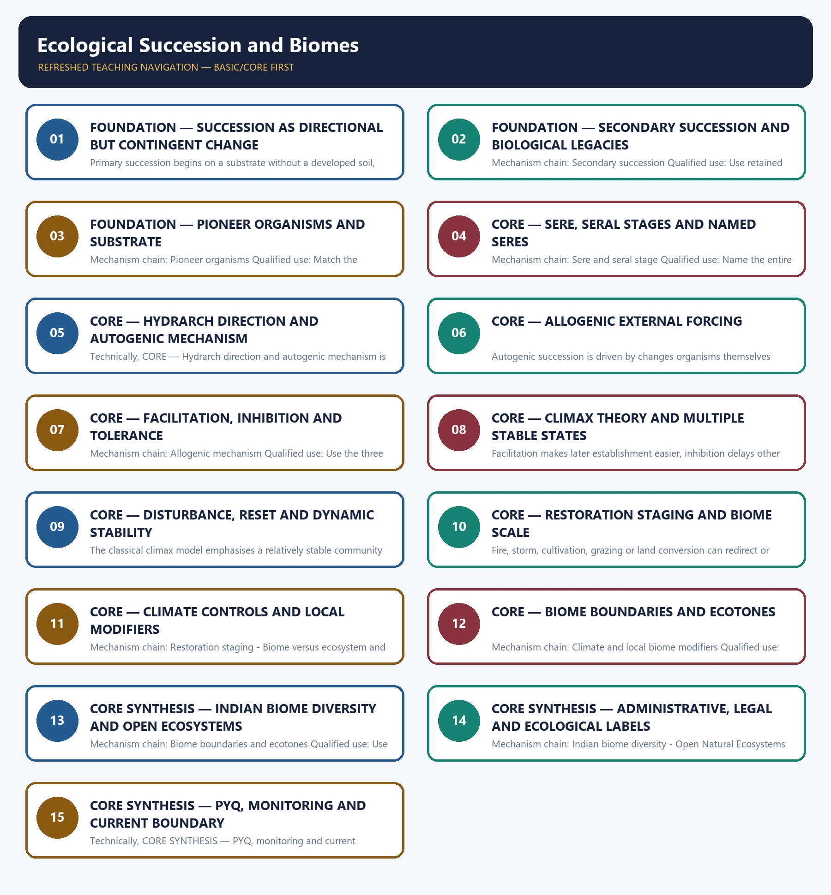

# Ecological Succession and Biomes — Learner-v2 Complete Learning Session

> **Authoring-only generation:** 2026-09-03. No PDF was rendered and no tracker or index was mutated.

### SOURCE, PROGRESSION AND CURRENT-LINKAGE AUDIT

- **Generation date:** 2026-09-03.
- **Repository-first evidence:** the Basic owner is taught first and preserved in full; the Advanced owner is retained only in the optional final teaching block.
- **OCR evidence:** Repository Markdown was primary. OCR-searchable local official General Studies papers were used only to confirm printed routed demands. No answer key, marking scheme, unsupported page precision, ecological rate, species count or current status was inferred.
- **Qdrant:** not used; repository Markdown and available OCR context were sufficient.
- **PYQ integrity:** The audited 2021 Prelims route on pioneer organisms surviving on surfaces without soil is retained in Basic sessions and objective practice without an inferred option. The 2024 Essay phrase 'Forests precede civilizations and deserts follow them' is carried as a verified demand and solved only through a qualified original framework that rejects ecological determinism.
- **Live-link boundary:** No succession duration, climax timeline, biome range or restoration outcome was imported from live checks on 2026-09-03. The FSI page was a contact-only stub, the MoEFCC page was unrelated, the IPCC page supplied only a title and PIB returned HTTP 403. CBD Target 3 guidance was substantive but addresses area-based conservation and does not determine a site's successional stage or native biome.
- **Fact/inference discipline:** no current-affairs item, PYQ wording, figure or quotation is invented.

### LIVE OFFICIAL-SOURCE ATTEMPT LOG

The checks below were made on 2026-09-03. Substantive official text is used only for the proposition it supports. Stubs, access failures, unrelated pages and thin landing pages are recorded and are not converted into ecological or current-status claims.

- https://fsi.nic.in/forest-report-2023 — attempted 2026-09-03; the fetch returned only the Forest Survey of India contact address, so no report figure, edition claim or ecosystem-status statement was taken from that contact-only stub.
- https://www.cbd.int/gbf/targets/3 — attempted 2026-09-03; the CBD Secretariat page returned substantive Target 3 guidance and expressly said that the guidance does not replace or qualify COP decisions 15/4 or 15/5. It was used only for that status boundary, not for a hotspot threshold, Indian extent or implementation claim.
- https://www.ipcc.ch/report/ar6/syr/ — attempted 2026-09-03; the fetch returned only the title 'AR6 Synthesis Report: Climate Change 2023', so no temperature, carbon-budget or cycle figure was imported.
- https://moef.gov.in/ — attempted 2026-09-03; the page returned a current but unrelated 2026 recruitment-rule consultation notice, so it supplied no topic-specific ecological claim.
- https://www.pib.gov.in/indexd.aspx?reg=3&lang=1 — attempted 2026-09-03; the request returned HTTP 403, so no PIB release was used.

## BASIC LEARNING SESSION

### DEEP-REVIEW LEARNING CONTRACT

| Control | Binding rule for this package |
|---|---|
| Syllabus boundary | Complete Environment and Ecology Basic/Core is answer-complete before optional Advanced depth. |
| Ecology boundary | System boundary, scale, trophic level, stock/flow, pool/flux, gross/net, unit and time interval are explicit. |
| Species boundary | Taxon, range, habitat, population trend, IUCN assessment, Indian legal schedule, CITES/CMS listing and endemism remain distinct. |
| Law/status boundary | Act, amendment, rule, notification, draft, judgment, policy, target, implementation and observed outcome remain distinct and dated. |
| Institution boundary | Legal form, parent authority, mandate, jurisdiction, standard, consent, enforcement, science and adjudication are not conflated. |
| Treaty boundary | Membership, annex/appendix, amendment acceptance, target, COP decision, national instrument and outcome remain distinct. |
| Climate boundary | Emission flow, concentration stock, cumulative budget, forcing, scenario, baseline, unit, mitigation, adaptation, loss-and-damage, avoidance and removal are exact. |
| Pollution boundary | Source, emission/load, ambient concentration, exposure, parameter, averaging period, unit, standard and jurisdiction are explicit. |
| Causal method | Chronology, designation, expenditure, capacity, registration and correlation are not promoted into ecological or policy outcomes without mechanism and evidence. |
| Practice contract | Every solved item has demand decoding, detailed examiner-grade model, executable timed/compression plan, marks rationale and answer-specific improvement. |
| Approval | This immutable successor remains `approved: false` pending explicit approval. |

**Canonical Basic/Core owner:** `upsc-ai-kit\knowledge\Environment-and-Ecology\basic\03_Ecological-Succession-and-Biomes.md`  
**Substantive canonical provenance owner:** `upsc-ai-kit\knowledge\Environment-and-Ecology\learning-sessions\v2\subject-wide-syllabus\environment-and-ecology-03_Learning-Session.md`  
**Optional Advanced owner:** `upsc-ai-kit\knowledge\Environment-and-Ecology\advanced\03_Ecological-Succession-and-Biomes.md`  
**Official syllabus mapping:** `upsc-ai-kit\knowledge\Environment-and-Ecology\OFFICIAL-UPSC-SYLLABUS-MAPPING.md`

### EVIDENCE, PYQ AND CURRENT-STATUS CONTROL

- Ecological mechanisms retain direction, pool, flux, limiting factor, spatial scale and time scale.
- Current species/news claims retain taxon, source, event/publication date, assessment/listing date and access date.
- IUCN category never substitutes for Wildlife Protection Act schedule, CITES appendix, CMS appendix or endemism.
- Protected-area categories, treaty designations and institution mandates retain exact legal character.
- Acts, amendments, rules, draft instruments, notifications and judgments retain operative status and date.
- Climate figures retain unit, baseline, period, scenario and stock-flow character; global evidence is not silently downscaled to India.
- Mitigation, adaptation and loss-and-damage remain separate; allowance, offset, avoidance, removal, capture and storage remain separate.
- PYQ wording is preserved only where verified; reconstructed or routed demands remain labelled.
- **Current-status note, rechecked 2026-09-03:** volatile targets, standards, schedules, species status, treaty outcomes and programme claims retain source/date/status.

**Generation-local live/current sources:**
- `https://fsi.nic.in/forest-report-2023 — attempted 2026-09-03; the fetch returned only the Forest Survey of India contact address, so no report figure, edition claim or ecosystem-status statement was taken from that contact-only stub.`
- `https://www.cbd.int/gbf/targets/3 — attempted 2026-09-03; the CBD Secretariat page returned substantive Target 3 guidance and expressly said that the guidance does not replace or qualify COP decisions 15/4 or 15/5. It was used only for that status boundary, not for a hotspot threshold, Indian extent or implementation claim.`
- `https://www.ipcc.ch/report/ar6/syr/ — attempted 2026-09-03; the fetch returned only the title 'AR6 Synthesis Report: Climate Change 2023', so no temperature, carbon-budget or cycle figure was imported.`
- `https://moef.gov.in/ — attempted 2026-09-03; the page returned a current but unrelated 2026 recruitment-rule consultation notice, so it supplied no topic-specific ecological claim.`
- `https://www.pib.gov.in/indexd.aspx?reg=3&lang=1 — attempted 2026-09-03; the request returned HTTP 403, so no PIB release was used.`

**Topic 26 dedicated Disaster Management cross-owners (scope boundary):**
- Not applicable to this topic.




*Distinct embedded teaching-navigation image. The separate continuous Cārvāka-style flowchart package remains an independent at-a-glance artifact.*

### SESSION 1 — FOUNDATION — SUCCESSION AS DIRECTIONAL BUT CONTINGENT CHANGE

#### DEFINITION / WHAT THIS IS CALLED

**Plain-language definition:** Ecological succession is directional change in community composition and ecosystem structure through time after formation or disturbance; directional does not mean deterministic, irreversible or forest-bound.

**Technical definition:** Primary succession begins on a substrate without a developed soil, such as newly exposed rock; soil formation and biological colonisation are part of the process, but no universal completion timeline is asserted.

#### ANSWER-GRABBING OPENING — WRITE/ADAPT IN THE EXAM

> Ecological succession is directional change in community composition and ecosystem structure through time after formation or disturbance; directional does not mean deterministic, irreversible or forest-bound.

#### MUST-WRITE KEYWORDS

- **FOUNDATION**
- **Succession as directional but contingent change**
- **Mechanism chain**
- **Qualified use**
- **Ecological succession**
- **Ecological**

**How to use them:** Frame the answer through FOUNDATION; define Succession as directional but contingent change, connect Mechanism chain with Qualified use to explain the mechanism, and use Ecological succession for the decisive comparison or qualification.

#### VISUAL FIRST

```text
SUCCESSION AS DIRECTIONAL BUT CONTINGENT CHANGE
01. Ecological succession
    |
    v
02. Primary succession
BOUNDARY -> Do not define succession as any random change in species composition.
```

*This topic-specific rail fixes the evidence sequence and its exam boundary before analysis.*

#### CORE EXPLANATION

Ecological succession is directional change in community composition and ecosystem structure through time after formation or disturbance; directional does not mean deterministic, irreversible or forest-bound. Primary succession begins on a substrate without a developed soil, such as newly exposed rock; soil formation and biological colonisation are part of the process, but no universal completion timeline is asserted.

#### NAMED EVIDENCE AND MECHANISM

- Ecological succession is directional change in community composition and ecosystem structure through time after formation or disturbance; directional does not mean deterministic, irreversible or forest-bound.
- Primary succession begins on a substrate without a developed soil, such as newly exposed rock; soil formation and biological colonisation are part of the process, but no universal completion timeline is asserted.

#### EXAMINER CAUTION

- Do not define succession as any random change in species composition.

#### EXAM LINK

- **Prelims:** Preserve the exact ecological level, system boundary, stock or flow, pyramid parameter, succession substrate, biome scale, taxonomic term and scientific or legal status; never turn a context-dependent pattern into a universal rule.
- **Mains:** Define succession as a temporal community trajectory and qualify its contingency.

#### MINI RECAP

- **Mechanism chain:** Ecological succession -> Primary succession
- **Qualified use:** Define succession as a temporal community trajectory and qualify its contingency.

#### CLOSING RECALL FLOW — FOUNDATION — SUCCESSION AS DIRECTIONAL BUT CONTINGENT CHANGE

```text
START / CONCEPT: FOUNDATION — Succession as directional but contingent change
        |
        v
EXACT TERMS: FOUNDATION · Succession as directional but contingent change · Mechanism chain · Qualified use · Ecological succession · Ecological
        |
        v
MECHANISM / ARGUMENT: Mechanism chain: Ecological succession - Primary succession Qualified use: Define succession as a temporal community trajectory and qualify its contingency.
        |
        v
CONSEQUENCE / CONTRAST: Do not define succession as any random change in species composition.
        |
        v
UPSC TRAP / ANSWER-USE: Primary succession begins on a substrate without a developed soil, such as newly exposed rock; soil formation and biological colonisation are part of the process, but no universal completion timeline is asserted.
        |
        v
ANSWER-GRABBING FORMULATION: Ecological succession is directional change in community composition and ecosystem structure through time after formation or disturbance; directional does not mean deterministic, irreversible or forest-bound.
```
### SESSION 2 — FOUNDATION — SECONDARY SUCCESSION AND BIOLOGICAL LEGACIES

#### DEFINITION / WHAT THIS IS CALLED

**Plain-language definition:** FOUNDATION — Secondary succession and biological legacies comprises FOUNDATION, Secondary succession and biological legacies as its core connected dimensions.

**Technical definition:** Mechanism chain: Secondary succession Qualified use: Use retained soil and propagules to explain faster secondary recovery.

#### ANSWER-GRABBING OPENING — WRITE/ADAPT IN THE EXAM

> Mechanism chain: Secondary succession Qualified use: Use retained soil and propagules to explain faster secondary recovery.

#### MUST-WRITE KEYWORDS

- **FOUNDATION**
- **Secondary succession**
- **biological legacies**
- **Mechanism chain**
- **Qualified use**
- **Secondary**

**How to use them:** Frame the answer through FOUNDATION; define Secondary succession, connect biological legacies with Mechanism chain to explain the mechanism, and use Qualified use for the decisive comparison or qualification.

#### VISUAL FIRST

```text
SECONDARY SUCCESSION AND BIOLOGICAL LEGACIES
01. Secondary succession
BOUNDARY -> Do not assign a universal duration to primary succession.
```

*This topic-specific rail fixes the evidence sequence and its exam boundary before analysis.*

#### CORE EXPLANATION

Secondary succession follows disturbance where soil and often propagules or a seed bank remain; it commonly proceeds faster than primary succession because the substrate and biological legacies differ.

#### NAMED EVIDENCE AND MECHANISM

- Secondary succession follows disturbance where soil and often propagules or a seed bank remain; it commonly proceeds faster than primary succession because the substrate and biological legacies differ.

#### EXAMINER CAUTION

- Do not assign a universal duration to primary succession.

#### EXAM LINK

- **Prelims:** Preserve the exact ecological level, system boundary, stock or flow, pyramid parameter, succession substrate, biome scale, taxonomic term and scientific or legal status; never turn a context-dependent pattern into a universal rule.
- **Mains:** Use retained soil and propagules to explain faster secondary recovery.

#### MINI RECAP

- **Mechanism chain:** Secondary succession
- **Qualified use:** Use retained soil and propagules to explain faster secondary recovery.

#### CLOSING RECALL FLOW — FOUNDATION — SECONDARY SUCCESSION AND BIOLOGICAL LEGACIES

```text
START / CONCEPT: FOUNDATION — Secondary succession and biological legacies
        |
        v
EXACT TERMS: FOUNDATION · Secondary succession · biological legacies · Mechanism chain · Qualified use · Secondary
        |
        v
MECHANISM / ARGUMENT: Secondary succession follows disturbance where soil and often propagules or a seed bank remain; it commonly proceeds faster than primary succession because the substrate and biological legacies differ.
        |
        v
CONSEQUENCE / CONTRAST: Do not assign a universal duration to primary succession.
        |
        v
UPSC TRAP / ANSWER-USE: Do not miss this limiting distinction: use retained soil and propagules to explain faster secondary recovery.
        |
        v
ANSWER-GRABBING FORMULATION: Mechanism chain: Secondary succession Qualified use: Use retained soil and propagules to explain faster secondary recovery.
```
### SESSION 3 — FOUNDATION — PIONEER ORGANISMS AND SUBSTRATE

#### DEFINITION / WHAT THIS IS CALLED

**Plain-language definition:** FOUNDATION — Pioneer organisms and substrate comprises FOUNDATION, Pioneer organisms and substrate as its core connected dimensions.

**Technical definition:** Mechanism chain: Pioneer organisms Qualified use: Match the pioneer to the starting substrate rather than memorising one organism.

#### ANSWER-GRABBING OPENING — WRITE/ADAPT IN THE EXAM

> Pioneer organisms tolerate the starting substrate and begin modifying it; lichens are the classic routed example for exposed surfaces without soil, but pioneer identity depends on the actual substrate.

#### MUST-WRITE KEYWORDS

- **FOUNDATION**
- **Pioneer organisms**
- **substrate**
- **Mechanism chain**
- **Qualified use**
- **Pioneer**

**How to use them:** Frame the answer through FOUNDATION; define Pioneer organisms, connect substrate with Mechanism chain to explain the mechanism, and use Qualified use for the decisive comparison or qualification.

#### VISUAL FIRST

```text
PIONEER ORGANISMS AND SUBSTRATE
01. Pioneer organisms
BOUNDARY -> Do not say every disturbed site undergoes primary succession.
```

*This topic-specific rail fixes the evidence sequence and its exam boundary before analysis.*

#### CORE EXPLANATION

Pioneer organisms tolerate the starting substrate and begin modifying it; lichens are the classic routed example for exposed surfaces without soil, but pioneer identity depends on the actual substrate.

#### NAMED EVIDENCE AND MECHANISM

- Pioneer organisms tolerate the starting substrate and begin modifying it; lichens are the classic routed example for exposed surfaces without soil, but pioneer identity depends on the actual substrate.

#### EXAMINER CAUTION

- Do not say every disturbed site undergoes primary succession.

#### EXAM LINK

- **Prelims:** Preserve the exact ecological level, system boundary, stock or flow, pyramid parameter, succession substrate, biome scale, taxonomic term and scientific or legal status; never turn a context-dependent pattern into a universal rule.
- **Mains:** Match the pioneer to the starting substrate rather than memorising one organism.

#### MINI RECAP

- **Mechanism chain:** Pioneer organisms
- **Qualified use:** Match the pioneer to the starting substrate rather than memorising one organism.

#### CLOSING RECALL FLOW — FOUNDATION — PIONEER ORGANISMS AND SUBSTRATE

```text
START / CONCEPT: FOUNDATION — Pioneer organisms and substrate
        |
        v
EXACT TERMS: FOUNDATION · Pioneer organisms · substrate · Mechanism chain · Qualified use · Pioneer
        |
        v
MECHANISM / ARGUMENT: Mechanism chain: Pioneer organisms Qualified use: Match the pioneer to the starting substrate rather than memorising one organism.
        |
        v
CONSEQUENCE / CONTRAST: Do not say every disturbed site undergoes primary succession.
        |
        v
UPSC TRAP / ANSWER-USE: Do not miss this limiting distinction: pioneer organisms tolerate the starting substrate and begin modifying it.
        |
        v
ANSWER-GRABBING FORMULATION: Pioneer organisms tolerate the starting substrate and begin modifying it; lichens are the classic routed example for exposed surfaces without soil, but pioneer identity depends on the actual substrate.
```
### SESSION 4 — CORE — SERE, SERAL STAGES AND NAMED SERES

#### DEFINITION / WHAT THIS IS CALLED

**Plain-language definition:** A sere is the complete succession sequence at a site, while a seral stage is one intermediate community within that sequence; the whole sequence and one phase are not synonyms.

**Technical definition:** Mechanism chain: Sere and seral stage Qualified use: Name the entire sere, the individual seral stage and the starting substrate separately.

#### ANSWER-GRABBING OPENING — WRITE/ADAPT IN THE EXAM

> A sere is the complete succession sequence at a site, while a seral stage is one intermediate community within that sequence; the whole sequence and one phase are not synonyms.

#### MUST-WRITE KEYWORDS

- **Sere**
- **seral stages**
- **named seres**
- **Mechanism chain**
- **Qualified use**
- **A sere**

**How to use them:** Frame the answer through Sere; define seral stages, connect named seres with Mechanism chain to explain the mechanism, and use Qualified use for the decisive comparison or qualification.

#### VISUAL FIRST

```text
SERE, SERAL STAGES AND NAMED SERES
01. Sere and seral stage
BOUNDARY -> Do not assume lichens pioneer every substrate.
```

*This topic-specific rail fixes the evidence sequence and its exam boundary before analysis.*

#### CORE EXPLANATION

A sere is the complete succession sequence at a site, while a seral stage is one intermediate community within that sequence; the whole sequence and one phase are not synonyms.

#### NAMED EVIDENCE AND MECHANISM

- A sere is the complete succession sequence at a site, while a seral stage is one intermediate community within that sequence; the whole sequence and one phase are not synonyms.

#### EXAMINER CAUTION

- Do not assume lichens pioneer every substrate.

#### EXAM LINK

- **Prelims:** Preserve the exact ecological level, system boundary, stock or flow, pyramid parameter, succession substrate, biome scale, taxonomic term and scientific or legal status; never turn a context-dependent pattern into a universal rule.
- **Mains:** Name the entire sere, the individual seral stage and the starting substrate separately.

#### MINI RECAP

- **Mechanism chain:** Sere and seral stage
- **Qualified use:** Name the entire sere, the individual seral stage and the starting substrate separately.

#### CLOSING RECALL FLOW — CORE — SERE, SERAL STAGES AND NAMED SERES

```text
START / CONCEPT: CORE — Sere, seral stages and named seres
        |
        v
EXACT TERMS: Sere · seral stages · named seres · Mechanism chain · Qualified use · A sere
        |
        v
MECHANISM / ARGUMENT: Mechanism chain: Sere and seral stage Qualified use: Name the entire sere, the individual seral stage and the starting substrate separately.
        |
        v
CONSEQUENCE / CONTRAST: Do not assume lichens pioneer every substrate.
        |
        v
UPSC TRAP / ANSWER-USE: Do not miss this limiting distinction: a sere is the complete succession sequence at a site.
        |
        v
ANSWER-GRABBING FORMULATION: A sere is the complete succession sequence at a site, while a seral stage is one intermediate community within that sequence; the whole sequence and one phase are not synonyms.
```
### SESSION 5 — CORE — HYDRARCH DIRECTION AND AUTOGENIC MECHANISM

#### DEFINITION / WHAT THIS IS CALLED

**Plain-language definition:** Mechanism chain: Named seres Qualified use: State the initial moisture condition and show how organisms alter later establishment.

**Technical definition:** Technically, CORE — Hydrarch direction and autogenic mechanism is analysed by relating Hydrarch direction to autogenic mechanism, then testing the relationship through Mechanism chain and Qualified use.

#### ANSWER-GRABBING OPENING — WRITE/ADAPT IN THE EXAM

> Mechanism chain: Named seres Qualified use: State the initial moisture condition and show how organisms alter later establishment.

#### MUST-WRITE KEYWORDS

- **Hydrarch direction**
- **autogenic mechanism**
- **Mechanism chain**
- **Qualified use**
- **Named**
- **Qualified**

**How to use them:** Frame the answer through Hydrarch direction; define autogenic mechanism, connect Mechanism chain with Qualified use to explain the mechanism, and use Named for the decisive comparison or qualification.

#### VISUAL FIRST

```text
HYDRARCH DIRECTION AND AUTOGENIC MECHANISM
01. Named seres
BOUNDARY -> Do not use sere and seral stage as synonyms.
```

*This topic-specific rail fixes the evidence sequence and its exam boundary before analysis.*

#### CORE EXPLANATION

Lithosere begins on rock, psammosere on sand, halosere in saline conditions, hydrosere in fresh water and xerosere on dry substrate; these names identify starting conditions, not guaranteed endpoints.

#### NAMED EVIDENCE AND MECHANISM

- Lithosere begins on rock, psammosere on sand, halosere in saline conditions, hydrosere in fresh water and xerosere on dry substrate; these names identify starting conditions, not guaranteed endpoints.

#### EXAMINER CAUTION

- Do not use sere and seral stage as synonyms.

#### EXAM LINK

- **Prelims:** Preserve the exact ecological level, system boundary, stock or flow, pyramid parameter, succession substrate, biome scale, taxonomic term and scientific or legal status; never turn a context-dependent pattern into a universal rule.
- **Mains:** State the initial moisture condition and show how organisms alter later establishment.

#### MINI RECAP

- **Mechanism chain:** Named seres
- **Qualified use:** State the initial moisture condition and show how organisms alter later establishment.

#### CLOSING RECALL FLOW — CORE — HYDRARCH DIRECTION AND AUTOGENIC MECHANISM

```text
START / CONCEPT: CORE — Hydrarch direction and autogenic mechanism
        |
        v
EXACT TERMS: Hydrarch direction · autogenic mechanism · Mechanism chain · Qualified use · Named · Qualified
        |
        v
MECHANISM / ARGUMENT: Mains: State the initial moisture condition and show how organisms alter later establishment.
        |
        v
CONSEQUENCE / CONTRAST: Do not use sere and seral stage as synonyms.
        |
        v
UPSC TRAP / ANSWER-USE: Do not miss this limiting distinction: do not use sere and seral stage as synonyms.
        |
        v
ANSWER-GRABBING FORMULATION: Mechanism chain: Named seres Qualified use: State the initial moisture condition and show how organisms alter later establishment.
```
### SESSION 6 — CORE — ALLOGENIC EXTERNAL FORCING

#### DEFINITION / WHAT THIS IS CALLED

**Plain-language definition:** Mechanism chain: Hydrarch and xerarch direction - Autogenic mechanism Qualified use: Identify the external disturbance or material input driving the trajectory.

**Technical definition:** Autogenic succession is driven by changes organisms themselves produce, such as litter accumulation, soil development, shading or altered microclimate that changes later establishment conditions.

#### ANSWER-GRABBING OPENING — WRITE/ADAPT IN THE EXAM

> Mechanism chain: Hydrarch and xerarch direction - Autogenic mechanism Qualified use: Identify the external disturbance or material input driving the trajectory.

#### MUST-WRITE KEYWORDS

- **Allogenic external forcing**
- **Mechanism chain**
- **Qualified use**
- **Autogenic succession**
- **Autogenic**
- **Hydrarch**

**How to use them:** Frame the answer through Allogenic external forcing; define Mechanism chain, connect Qualified use with Autogenic succession to explain the mechanism, and use Autogenic for the decisive comparison or qualification.

#### VISUAL FIRST

```text
ALLOGENIC EXTERNAL FORCING
01. Hydrarch and xerarch direction
    |
    v
02. Autogenic mechanism
BOUNDARY -> Do not let a named sere imply a guaranteed climax.
```

*This topic-specific rail fixes the evidence sequence and its exam boundary before analysis.*

#### CORE EXPLANATION

Hydrarch succession begins in water and xerarch succession begins in dry conditions; both may move toward more mesic conditions under a given regional setting without following one universal sequence. Autogenic succession is driven by changes organisms themselves produce, such as litter accumulation, soil development, shading or altered microclimate that changes later establishment conditions.

#### NAMED EVIDENCE AND MECHANISM

- Hydrarch succession begins in water and xerarch succession begins in dry conditions; both may move toward more mesic conditions under a given regional setting without following one universal sequence.
- Autogenic succession is driven by changes organisms themselves produce, such as litter accumulation, soil development, shading or altered microclimate that changes later establishment conditions.

#### EXAMINER CAUTION

- Do not let a named sere imply a guaranteed climax.

#### EXAM LINK

- **Prelims:** Preserve the exact ecological level, system boundary, stock or flow, pyramid parameter, succession substrate, biome scale, taxonomic term and scientific or legal status; never turn a context-dependent pattern into a universal rule.
- **Mains:** Identify the external disturbance or material input driving the trajectory.

#### MINI RECAP

- **Mechanism chain:** Hydrarch and xerarch direction -> Autogenic mechanism
- **Qualified use:** Identify the external disturbance or material input driving the trajectory.

#### CLOSING RECALL FLOW — CORE — ALLOGENIC EXTERNAL FORCING

```text
START / CONCEPT: CORE — Allogenic external forcing
        |
        v
EXACT TERMS: Allogenic external forcing · Mechanism chain · Qualified use · Autogenic succession · Autogenic · Hydrarch
        |
        v
MECHANISM / ARGUMENT: Autogenic succession is driven by changes organisms themselves produce, such as litter accumulation, soil development, shading or altered microclimate that changes later establishment conditions.
        |
        v
CONSEQUENCE / CONTRAST: Do not let a named sere imply a guaranteed climax.
        |
        v
UPSC TRAP / ANSWER-USE: Do not miss this limiting distinction: hydrarch and xerarch direction - Autogenic mechanism Qualified use.
        |
        v
ANSWER-GRABBING FORMULATION: Mechanism chain: Hydrarch and xerarch direction - Autogenic mechanism Qualified use: Identify the external disturbance or material input driving the trajectory.
```
### SESSION 7 — CORE — FACILITATION, INHIBITION AND TOLERANCE

#### DEFINITION / WHAT THIS IS CALLED

**Plain-language definition:** Allogenic succession is driven by external forces such as flooding, sediment deposition, fire regime, erosion, climate variation or land use; it must not be attributed to community modification alone.

**Technical definition:** Mechanism chain: Allogenic mechanism Qualified use: Use the three models as alternatives that can operate in different contexts.

#### ANSWER-GRABBING OPENING — WRITE/ADAPT IN THE EXAM

> Allogenic succession is driven by external forces such as flooding, sediment deposition, fire regime, erosion, climate variation or land use; it must not be attributed to community modification alone.

#### MUST-WRITE KEYWORDS

- **Facilitation**
- **inhibition**
- **tolerance**
- **Mechanism chain**
- **Qualified use**
- **Allogenic succession**

**How to use them:** Frame the answer through Facilitation; define inhibition, connect tolerance with Mechanism chain to explain the mechanism, and use Qualified use for the decisive comparison or qualification.

#### VISUAL FIRST

```text
FACILITATION, INHIBITION AND TOLERANCE
01. Allogenic mechanism
BOUNDARY -> Do not treat hydrarch as movement toward a wetter endpoint.
```

*This topic-specific rail fixes the evidence sequence and its exam boundary before analysis.*

#### CORE EXPLANATION

Allogenic succession is driven by external forces such as flooding, sediment deposition, fire regime, erosion, climate variation or land use; it must not be attributed to community modification alone.

#### NAMED EVIDENCE AND MECHANISM

- Allogenic succession is driven by external forces such as flooding, sediment deposition, fire regime, erosion, climate variation or land use; it must not be attributed to community modification alone.

#### EXAMINER CAUTION

- Do not treat hydrarch as movement toward a wetter endpoint.

#### EXAM LINK

- **Prelims:** Preserve the exact ecological level, system boundary, stock or flow, pyramid parameter, succession substrate, biome scale, taxonomic term and scientific or legal status; never turn a context-dependent pattern into a universal rule.
- **Mains:** Use the three models as alternatives that can operate in different contexts.

#### MINI RECAP

- **Mechanism chain:** Allogenic mechanism
- **Qualified use:** Use the three models as alternatives that can operate in different contexts.

#### CLOSING RECALL FLOW — CORE — FACILITATION, INHIBITION AND TOLERANCE

```text
START / CONCEPT: CORE — Facilitation, inhibition and tolerance
        |
        v
EXACT TERMS: Facilitation · inhibition · tolerance · Mechanism chain · Qualified use · Allogenic succession
        |
        v
MECHANISM / ARGUMENT: Mechanism chain: Allogenic mechanism Qualified use: Use the three models as alternatives that can operate in different contexts.
        |
        v
CONSEQUENCE / CONTRAST: Do not treat hydrarch as movement toward a wetter endpoint.
        |
        v
UPSC TRAP / ANSWER-USE: Do not miss this limiting distinction: use the three models as alternatives that can operate in different contexts.
        |
        v
ANSWER-GRABBING FORMULATION: Allogenic succession is driven by external forces such as flooding, sediment deposition, fire regime, erosion, climate variation or land use; it must not be attributed to community modification alone.
```
### SESSION 8 — CORE — CLIMAX THEORY AND MULTIPLE STABLE STATES

#### DEFINITION / WHAT THIS IS CALLED

**Plain-language definition:** Mechanism chain: Facilitation, inhibition and tolerance Qualified use: Present climax as relatively stable but disturbance- and history-dependent.

**Technical definition:** Facilitation makes later establishment easier, inhibition delays other colonists, and tolerance allows later species to establish without requiring early species to improve conditions; no one model governs every sere.

#### ANSWER-GRABBING OPENING — WRITE/ADAPT IN THE EXAM

> Mechanism chain: Facilitation, inhibition and tolerance Qualified use: Present climax as relatively stable but disturbance- and history-dependent.

#### MUST-WRITE KEYWORDS

- **Climax theory**
- **multiple stable states**
- **Mechanism chain**
- **Qualified use**
- **Facilitation**
- **Qualified**

**How to use them:** Frame the answer through Climax theory; define multiple stable states, connect Mechanism chain with Qualified use to explain the mechanism, and use Facilitation for the decisive comparison or qualification.

#### VISUAL FIRST

```text
CLIMAX THEORY AND MULTIPLE STABLE STATES
01. Facilitation, inhibition and tolerance
BOUNDARY -> Do not call an externally imposed change autogenic.
```

*This topic-specific rail fixes the evidence sequence and its exam boundary before analysis.*

#### CORE EXPLANATION

Facilitation makes later establishment easier, inhibition delays other colonists, and tolerance allows later species to establish without requiring early species to improve conditions; no one model governs every sere.

#### NAMED EVIDENCE AND MECHANISM

- Facilitation makes later establishment easier, inhibition delays other colonists, and tolerance allows later species to establish without requiring early species to improve conditions; no one model governs every sere.

#### EXAMINER CAUTION

- Do not call an externally imposed change autogenic.

#### EXAM LINK

- **Prelims:** Preserve the exact ecological level, system boundary, stock or flow, pyramid parameter, succession substrate, biome scale, taxonomic term and scientific or legal status; never turn a context-dependent pattern into a universal rule.
- **Mains:** Present climax as relatively stable but disturbance- and history-dependent.

#### MINI RECAP

- **Mechanism chain:** Facilitation, inhibition and tolerance
- **Qualified use:** Present climax as relatively stable but disturbance- and history-dependent.

#### CLOSING RECALL FLOW — CORE — CLIMAX THEORY AND MULTIPLE STABLE STATES

```text
START / CONCEPT: CORE — Climax theory and multiple stable states
        |
        v
EXACT TERMS: Climax theory · multiple stable states · Mechanism chain · Qualified use · Facilitation · Qualified
        |
        v
MECHANISM / ARGUMENT: Facilitation makes later establishment easier, inhibition delays other colonists, and tolerance allows later species to establish without requiring early species to improve conditions; no one model governs every sere.
        |
        v
CONSEQUENCE / CONTRAST: Do not call an externally imposed change autogenic.
        |
        v
UPSC TRAP / ANSWER-USE: Do not miss this limiting distinction: facilitation, inhibition and tolerance Qualified use.
        |
        v
ANSWER-GRABBING FORMULATION: Mechanism chain: Facilitation, inhibition and tolerance Qualified use: Present climax as relatively stable but disturbance- and history-dependent.
```
### SESSION 9 — CORE — DISTURBANCE, RESET AND DYNAMIC STABILITY

#### DEFINITION / WHAT THIS IS CALLED

**Plain-language definition:** Mechanism chain: Classical climax and modern qualification Qualified use: Name the disturbance regime and the state variable it changes.

**Technical definition:** The classical climax model emphasises a relatively stable community under regional climate, while modern ecology recognises disturbance history, species availability and chance can produce multiple plausible states.

#### ANSWER-GRABBING OPENING — WRITE/ADAPT IN THE EXAM

> The classical climax model emphasises a relatively stable community under regional climate, while modern ecology recognises disturbance history, species availability and chance can produce multiple plausible states.

#### MUST-WRITE KEYWORDS

- **Disturbance**
- **reset**
- **dynamic stability**
- **Mechanism chain**
- **Qualified use**
- **Classical**

**How to use them:** Frame the answer through Disturbance; define reset, connect dynamic stability with Mechanism chain to explain the mechanism, and use Qualified use for the decisive comparison or qualification.

#### VISUAL FIRST

```text
DISTURBANCE, RESET AND DYNAMIC STABILITY
01. Classical climax and modern qualification
BOUNDARY -> Do not call community-driven soil or shade change allogenic.
```

*This topic-specific rail fixes the evidence sequence and its exam boundary before analysis.*

#### CORE EXPLANATION

The classical climax model emphasises a relatively stable community under regional climate, while modern ecology recognises disturbance history, species availability and chance can produce multiple plausible states.

#### NAMED EVIDENCE AND MECHANISM

- The classical climax model emphasises a relatively stable community under regional climate, while modern ecology recognises disturbance history, species availability and chance can produce multiple plausible states.

#### EXAMINER CAUTION

- Do not call community-driven soil or shade change allogenic.

#### EXAM LINK

- **Prelims:** Preserve the exact ecological level, system boundary, stock or flow, pyramid parameter, succession substrate, biome scale, taxonomic term and scientific or legal status; never turn a context-dependent pattern into a universal rule.
- **Mains:** Name the disturbance regime and the state variable it changes.

#### MINI RECAP

- **Mechanism chain:** Classical climax and modern qualification
- **Qualified use:** Name the disturbance regime and the state variable it changes.

#### CLOSING RECALL FLOW — CORE — DISTURBANCE, RESET AND DYNAMIC STABILITY

```text
START / CONCEPT: CORE — Disturbance, reset and dynamic stability
        |
        v
EXACT TERMS: Disturbance · reset · dynamic stability · Mechanism chain · Qualified use · Classical
        |
        v
MECHANISM / ARGUMENT: Mechanism chain: Classical climax and modern qualification Qualified use: Name the disturbance regime and the state variable it changes.
        |
        v
CONSEQUENCE / CONTRAST: Do not call community-driven soil or shade change allogenic.
        |
        v
UPSC TRAP / ANSWER-USE: Do not miss this limiting distinction: the classical climax model emphasises a relatively stable community under regional climate.
        |
        v
ANSWER-GRABBING FORMULATION: The classical climax model emphasises a relatively stable community under regional climate, while modern ecology recognises disturbance history, species availability and chance can produce multiple plausible states.
```
### SESSION 10 — CORE — RESTORATION STAGING AND BIOME SCALE

#### DEFINITION / WHAT THIS IS CALLED

**Plain-language definition:** Mechanism chain: Disturbance and reset Qualified use: Sequence restoration and fix spatial scale before using biome, ecosystem or habitat.

**Technical definition:** Fire, storm, cultivation, grazing or land conversion can redirect or reset succession; a relatively stable community remains dynamic and is not a permanently fixed endpoint.

#### ANSWER-GRABBING OPENING — WRITE/ADAPT IN THE EXAM

> Mechanism chain: Disturbance and reset Qualified use: Sequence restoration and fix spatial scale before using biome, ecosystem or habitat.

#### MUST-WRITE KEYWORDS

- **Restoration staging**
- **biome scale**
- **Mechanism chain**
- **Qualified use**
- **Fire**
- **Disturbance**

**How to use them:** Frame the answer through Restoration staging; define biome scale, connect Mechanism chain with Qualified use to explain the mechanism, and use Fire for the decisive comparison or qualification.

#### VISUAL FIRST

```text
RESTORATION STAGING AND BIOME SCALE
01. Disturbance and reset
BOUNDARY -> Do not force every succession pathway into facilitation alone.
```

*This topic-specific rail fixes the evidence sequence and its exam boundary before analysis.*

#### CORE EXPLANATION

Fire, storm, cultivation, grazing or land conversion can redirect or reset succession; a relatively stable community remains dynamic and is not a permanently fixed endpoint.

#### NAMED EVIDENCE AND MECHANISM

- Fire, storm, cultivation, grazing or land conversion can redirect or reset succession; a relatively stable community remains dynamic and is not a permanently fixed endpoint.

#### EXAMINER CAUTION

- Do not force every succession pathway into facilitation alone.

#### EXAM LINK

- **Prelims:** Preserve the exact ecological level, system boundary, stock or flow, pyramid parameter, succession substrate, biome scale, taxonomic term and scientific or legal status; never turn a context-dependent pattern into a universal rule.
- **Mains:** Sequence restoration and fix spatial scale before using biome, ecosystem or habitat.

#### MINI RECAP

- **Mechanism chain:** Disturbance and reset
- **Qualified use:** Sequence restoration and fix spatial scale before using biome, ecosystem or habitat.

#### CLOSING RECALL FLOW — CORE — RESTORATION STAGING AND BIOME SCALE

```text
START / CONCEPT: CORE — Restoration staging and biome scale
        |
        v
EXACT TERMS: Restoration staging · biome scale · Mechanism chain · Qualified use · Fire · Disturbance
        |
        v
MECHANISM / ARGUMENT: Fire, storm, cultivation, grazing or land conversion can redirect or reset succession; a relatively stable community remains dynamic and is not a permanently fixed endpoint.
        |
        v
CONSEQUENCE / CONTRAST: Do not force every succession pathway into facilitation alone.
        |
        v
UPSC TRAP / ANSWER-USE: Do not miss this limiting distinction: sequence restoration and fix spatial scale before using biome, ecosystem or habitat.
        |
        v
ANSWER-GRABBING FORMULATION: Mechanism chain: Disturbance and reset Qualified use: Sequence restoration and fix spatial scale before using biome, ecosystem or habitat.
```
### SESSION 11 — CORE — CLIMATE CONTROLS AND LOCAL MODIFIERS

#### DEFINITION / WHAT THIS IS CALLED

**Plain-language definition:** A biome is a broad regional ecological category associated with climate and characteristic vegetation, an ecosystem is a bounded functional unit, and habitat is the physical place used by a species.

**Technical definition:** Mechanism chain: Restoration staging - Biome versus ecosystem and habitat Qualified use: Use climate for the broad pattern and local modifiers for deviations.

#### ANSWER-GRABBING OPENING — WRITE/ADAPT IN THE EXAM

> Mechanism chain: Restoration staging - Biome versus ecosystem and habitat Qualified use: Use climate for the broad pattern and local modifiers for deviations.

#### MUST-WRITE KEYWORDS

- **Climate controls**
- **local modifiers**
- **Mechanism chain**
- **Qualified use**
- **Restoration**
- **A biome**

**How to use them:** Frame the answer through Climate controls; define local modifiers, connect Mechanism chain with Qualified use to explain the mechanism, and use Restoration for the decisive comparison or qualification.

#### VISUAL FIRST

```text
CLIMATE CONTROLS AND LOCAL MODIFIERS
01. Restoration staging
    |
    v
02. Biome versus ecosystem and habitat
BOUNDARY -> Do not present climatic climax as one inevitable permanent endpoint.
```

*This topic-specific rail fixes the evidence sequence and its exam boundary before analysis.*

#### CORE EXPLANATION

Restoration should match substrate and stage: stabilisation and soil building may precede later structural complexity, so planting late-stage trees directly on hostile mine spoil is not automatically restoration. A biome is a broad regional ecological category associated with climate and characteristic vegetation, an ecosystem is a bounded functional unit, and habitat is the physical place used by a species.

#### NAMED EVIDENCE AND MECHANISM

- Restoration should match substrate and stage: stabilisation and soil building may precede later structural complexity, so planting late-stage trees directly on hostile mine spoil is not automatically restoration.
- A biome is a broad regional ecological category associated with climate and characteristic vegetation, an ecosystem is a bounded functional unit, and habitat is the physical place used by a species.

#### EXAMINER CAUTION

- Do not present climatic climax as one inevitable permanent endpoint.

#### EXAM LINK

- **Prelims:** Preserve the exact ecological level, system boundary, stock or flow, pyramid parameter, succession substrate, biome scale, taxonomic term and scientific or legal status; never turn a context-dependent pattern into a universal rule.
- **Mains:** Use climate for the broad pattern and local modifiers for deviations.

#### MINI RECAP

- **Mechanism chain:** Restoration staging -> Biome versus ecosystem and habitat
- **Qualified use:** Use climate for the broad pattern and local modifiers for deviations.

#### CLOSING RECALL FLOW — CORE — CLIMATE CONTROLS AND LOCAL MODIFIERS

```text
START / CONCEPT: CORE — Climate controls and local modifiers
        |
        v
EXACT TERMS: Climate controls · local modifiers · Mechanism chain · Qualified use · Restoration · A biome
        |
        v
MECHANISM / ARGUMENT: A biome is a broad regional ecological category associated with climate and characteristic vegetation, an ecosystem is a bounded functional unit, and habitat is the physical place used by a species.
        |
        v
CONSEQUENCE / CONTRAST: Mains: Use climate for the broad pattern and local modifiers for deviations.
        |
        v
UPSC TRAP / ANSWER-USE: Restoration should match substrate and stage: stabilisation and soil building may precede later structural complexity, so planting late-stage trees directly on hostile mine spoil is not automatically restoration.
        |
        v
ANSWER-GRABBING FORMULATION: Mechanism chain: Restoration staging - Biome versus ecosystem and habitat Qualified use: Use climate for the broad pattern and local modifiers for deviations.
```
### SESSION 12 — CORE — BIOME BOUNDARIES AND ECOTONES

#### DEFINITION / WHAT THIS IS CALLED

**Plain-language definition:** Temperature and precipitation organise broad biome patterns, while soil, fire, herbivory, topography and land-use history modify local vegetation; climate is a broad control, not a complete deterministic map.

**Technical definition:** Mechanism chain: Climate and local biome modifiers Qualified use: Treat biome boundaries as gradients rather than exact site-level lines.

#### ANSWER-GRABBING OPENING — WRITE/ADAPT IN THE EXAM

> Temperature and precipitation organise broad biome patterns, while soil, fire, herbivory, topography and land-use history modify local vegetation; climate is a broad control, not a complete deterministic map.

#### MUST-WRITE KEYWORDS

- **Biome boundaries**
- **ecotones**
- **Mechanism chain**
- **Qualified use**
- **Temperature**
- **Treat**

**How to use them:** Frame the answer through Biome boundaries; define ecotones, connect Mechanism chain with Qualified use to explain the mechanism, and use Temperature for the decisive comparison or qualification.

#### VISUAL FIRST

```text
BIOME BOUNDARIES AND ECOTONES
01. Climate and local biome modifiers
BOUNDARY -> Do not treat disturbance only as failure; it can structure ecosystems.
```

*This topic-specific rail fixes the evidence sequence and its exam boundary before analysis.*

#### CORE EXPLANATION

Temperature and precipitation organise broad biome patterns, while soil, fire, herbivory, topography and land-use history modify local vegetation; climate is a broad control, not a complete deterministic map.

#### NAMED EVIDENCE AND MECHANISM

- Temperature and precipitation organise broad biome patterns, while soil, fire, herbivory, topography and land-use history modify local vegetation; climate is a broad control, not a complete deterministic map.

#### EXAMINER CAUTION

- Do not treat disturbance only as failure; it can structure ecosystems.

#### EXAM LINK

- **Prelims:** Preserve the exact ecological level, system boundary, stock or flow, pyramid parameter, succession substrate, biome scale, taxonomic term and scientific or legal status; never turn a context-dependent pattern into a universal rule.
- **Mains:** Treat biome boundaries as gradients rather than exact site-level lines.

#### MINI RECAP

- **Mechanism chain:** Climate and local biome modifiers
- **Qualified use:** Treat biome boundaries as gradients rather than exact site-level lines.

#### CLOSING RECALL FLOW — CORE — BIOME BOUNDARIES AND ECOTONES

```text
START / CONCEPT: CORE — Biome boundaries and ecotones
        |
        v
EXACT TERMS: Biome boundaries · ecotones · Mechanism chain · Qualified use · Temperature · Treat
        |
        v
MECHANISM / ARGUMENT: Mechanism chain: Climate and local biome modifiers Qualified use: Treat biome boundaries as gradients rather than exact site-level lines.
        |
        v
CONSEQUENCE / CONTRAST: Do not treat disturbance only as failure; it can structure ecosystems.
        |
        v
UPSC TRAP / ANSWER-USE: Mains: Treat biome boundaries as gradients rather than exact site-level lines.
        |
        v
ANSWER-GRABBING FORMULATION: Temperature and precipitation organise broad biome patterns, while soil, fire, herbivory, topography and land-use history modify local vegetation; climate is a broad control, not a complete deterministic map.
```
### SESSION 13 — CORE SYNTHESIS — INDIAN BIOME DIVERSITY AND OPEN ECOSYSTEMS

#### DEFINITION / WHAT THIS IS CALLED

**Plain-language definition:** Biome boundaries are gradients and transition zones rather than exact lines; maps generalise spatial patterns and cannot establish a sharp ecological border at every local site.

**Technical definition:** Mechanism chain: Biome boundaries and ecotones Qualified use: Use Indian biome examples while protecting natural open ecosystems from default afforestation.

#### ANSWER-GRABBING OPENING — WRITE/ADAPT IN THE EXAM

> Mechanism chain: Biome boundaries and ecotones Qualified use: Use Indian biome examples while protecting natural open ecosystems from default afforestation.

#### MUST-WRITE KEYWORDS

- **CORE SYNTHESIS**
- **Indian biome diversity**
- **open ecosystems**
- **Mechanism chain**
- **Qualified use**
- **Biome boundaries**

**How to use them:** Frame the answer through CORE SYNTHESIS; define Indian biome diversity, connect open ecosystems with Mechanism chain to explain the mechanism, and use Qualified use for the decisive comparison or qualification.

#### VISUAL FIRST

```text
INDIAN BIOME DIVERSITY AND OPEN ECOSYSTEMS
01. Biome boundaries and ecotones
BOUNDARY -> Do not equate tree planting with completed ecological restoration.
```

*This topic-specific rail fixes the evidence sequence and its exam boundary before analysis.*

#### CORE EXPLANATION

Biome boundaries are gradients and transition zones rather than exact lines; maps generalise spatial patterns and cannot establish a sharp ecological border at every local site.

#### NAMED EVIDENCE AND MECHANISM

- Biome boundaries are gradients and transition zones rather than exact lines; maps generalise spatial patterns and cannot establish a sharp ecological border at every local site.

#### EXAMINER CAUTION

- Do not equate tree planting with completed ecological restoration.

#### EXAM LINK

- **Prelims:** Preserve the exact ecological level, system boundary, stock or flow, pyramid parameter, succession substrate, biome scale, taxonomic term and scientific or legal status; never turn a context-dependent pattern into a universal rule.
- **Mains:** Use Indian biome examples while protecting natural open ecosystems from default afforestation.

#### MINI RECAP

- **Mechanism chain:** Biome boundaries and ecotones
- **Qualified use:** Use Indian biome examples while protecting natural open ecosystems from default afforestation.

#### CLOSING RECALL FLOW — CORE SYNTHESIS — INDIAN BIOME DIVERSITY AND OPEN ECOSYSTEMS

```text
START / CONCEPT: CORE SYNTHESIS — Indian biome diversity and open ecosystems
        |
        v
EXACT TERMS: CORE SYNTHESIS · Indian biome diversity · open ecosystems · Mechanism chain · Qualified use · Biome boundaries
        |
        v
MECHANISM / ARGUMENT: Mains: Use Indian biome examples while protecting natural open ecosystems from default afforestation.
        |
        v
CONSEQUENCE / CONTRAST: Do not equate tree planting with completed ecological restoration.
        |
        v
UPSC TRAP / ANSWER-USE: Biome boundaries are gradients and transition zones rather than exact lines; maps generalise spatial patterns and cannot establish a sharp ecological border at every local site.
        |
        v
ANSWER-GRABBING FORMULATION: Mechanism chain: Biome boundaries and ecotones Qualified use: Use Indian biome examples while protecting natural open ecosystems from default afforestation.
```
### SESSION 14 — CORE SYNTHESIS — ADMINISTRATIVE, LEGAL AND ECOLOGICAL LABELS

#### DEFINITION / WHAT THIS IS CALLED

**Plain-language definition:** The owners use tropical wet evergreen, dry deciduous, thorn or desert and montane temperate or alpine settings as Indian examples; these are broad ecological categories, not a substitute for legal forest classification.

**Technical definition:** Mechanism chain: Indian biome diversity - Open Natural Ecosystems Qualified use: Separate administrative, legal and ecological labels.

#### ANSWER-GRABBING OPENING — WRITE/ADAPT IN THE EXAM

> Mechanism chain: Indian biome diversity - Open Natural Ecosystems Qualified use: Separate administrative, legal and ecological labels.

#### MUST-WRITE KEYWORDS

- **CORE SYNTHESIS**
- **Administrative**
- **legal**
- **ecological labels**
- **Mechanism chain**
- **Qualified use**

**How to use them:** Frame the answer through CORE SYNTHESIS; define Administrative, connect legal with ecological labels to explain the mechanism, and use Mechanism chain for the decisive comparison or qualification.

#### VISUAL FIRST

```text
ADMINISTRATIVE, LEGAL AND ECOLOGICAL LABELS
01. Indian biome diversity
    |
    v
02. Open Natural Ecosystems
BOUNDARY -> Do not use biome, ecosystem and habitat interchangeably.
```

*This topic-specific rail fixes the evidence sequence and its exam boundary before analysis.*

#### CORE EXPLANATION

The owners use tropical wet evergreen, dry deciduous, thorn or desert and montane temperate or alpine settings as Indian examples; these are broad ecological categories, not a substitute for legal forest classification. Grasslands, savannas, scrublands, ravines and rocky outcrops can be natural open ecosystems rather than degraded forests awaiting trees; their ecological status must be assessed before afforestation.

#### NAMED EVIDENCE AND MECHANISM

- The owners use tropical wet evergreen, dry deciduous, thorn or desert and montane temperate or alpine settings as Indian examples; these are broad ecological categories, not a substitute for legal forest classification.
- Grasslands, savannas, scrublands, ravines and rocky outcrops can be natural open ecosystems rather than degraded forests awaiting trees; their ecological status must be assessed before afforestation.

#### EXAMINER CAUTION

- Do not use biome, ecosystem and habitat interchangeably.

#### EXAM LINK

- **Prelims:** Preserve the exact ecological level, system boundary, stock or flow, pyramid parameter, succession substrate, biome scale, taxonomic term and scientific or legal status; never turn a context-dependent pattern into a universal rule.
- **Mains:** Separate administrative, legal and ecological labels.

#### MINI RECAP

- **Mechanism chain:** Indian biome diversity -> Open Natural Ecosystems
- **Qualified use:** Separate administrative, legal and ecological labels.

#### CLOSING RECALL FLOW — CORE SYNTHESIS — ADMINISTRATIVE, LEGAL AND ECOLOGICAL LABELS

```text
START / CONCEPT: CORE SYNTHESIS — Administrative, legal and ecological labels
        |
        v
EXACT TERMS: CORE SYNTHESIS · Administrative · legal · ecological labels · Mechanism chain · Qualified use
        |
        v
MECHANISM / ARGUMENT: The owners use tropical wet evergreen, dry deciduous, thorn or desert and montane temperate or alpine settings as Indian examples; these are broad ecological categories, not a substitute for legal forest classification.
        |
        v
CONSEQUENCE / CONTRAST: Do not use biome, ecosystem and habitat interchangeably.
        |
        v
UPSC TRAP / ANSWER-USE: Grasslands, savannas, scrublands, ravines and rocky outcrops can be natural open ecosystems rather than degraded forests awaiting trees; their ecological status must be assessed before afforestation.
        |
        v
ANSWER-GRABBING FORMULATION: Mechanism chain: Indian biome diversity - Open Natural Ecosystems Qualified use: Separate administrative, legal and ecological labels.
```
### SESSION 15 — CORE SYNTHESIS — PYQ, MONITORING AND CURRENT BOUNDARY

#### DEFINITION / WHAT THIS IS CALLED

**Plain-language definition:** Mechanism chain: Administrative, legal and ecological labels - PYQ, monitoring and current boundary Qualified use: Close with monitoring limits, current evidence and verified PYQ routes.

**Technical definition:** Technically, CORE SYNTHESIS — PYQ, monitoring and current boundary is analysed by relating CORE SYNTHESIS to PYQ, then testing the relationship through monitoring and current boundary.

#### ANSWER-GRABBING OPENING — WRITE/ADAPT IN THE EXAM

> Mechanism chain: Administrative, legal and ecological labels - PYQ, monitoring and current boundary Qualified use: Close with monitoring limits, current evidence and verified PYQ routes.

#### MUST-WRITE KEYWORDS

- **CORE SYNTHESIS**
- **PYQ**
- **monitoring**
- **current boundary**
- **Mechanism chain**
- **Qualified use**

**How to use them:** Frame the answer through CORE SYNTHESIS; define PYQ, connect monitoring with current boundary to explain the mechanism, and use Mechanism chain for the decisive comparison or qualification.

#### VISUAL FIRST

```text
PYQ, MONITORING AND CURRENT BOUNDARY
01. Administrative, legal and ecological labels
    |
    v
02. PYQ, monitoring and current boundary
BOUNDARY -> Do not explain every local vegetation pattern by climate alone.
```

*This topic-specific rail fixes the evidence sequence and its exam boundary before analysis.*

#### CORE EXPLANATION

Wasteland is an administrative or revenue label, forest may be a legal category, and grassland or biome is an ecological category; converting one label into another without evidence creates a category error. The 2021 routed objective demand on pioneers belongs in Basic practice, and the 2024 essay phrase on forests and deserts is used only as a qualified restoration argument; forest-cover change cannot prove successional stage.

#### NAMED EVIDENCE AND MECHANISM

- Wasteland is an administrative or revenue label, forest may be a legal category, and grassland or biome is an ecological category; converting one label into another without evidence creates a category error.
- The 2021 routed objective demand on pioneers belongs in Basic practice, and the 2024 essay phrase on forests and deserts is used only as a qualified restoration argument; forest-cover change cannot prove successional stage.

#### EXAMINER CAUTION

- Do not explain every local vegetation pattern by climate alone.

#### EXAM LINK

- **Prelims:** Preserve the exact ecological level, system boundary, stock or flow, pyramid parameter, succession substrate, biome scale, taxonomic term and scientific or legal status; never turn a context-dependent pattern into a universal rule.
- **Mains:** Close with monitoring limits, current evidence and verified PYQ routes.

#### MINI RECAP

- **Mechanism chain:** Administrative, legal and ecological labels -> PYQ, monitoring and current boundary
- **Qualified use:** Close with monitoring limits, current evidence and verified PYQ routes.
#### COMPLETE BASIC OWNER EVIDENCE BANK

> **Subject:** Environment and Ecology | **Tier:** Must-Do (foundation) | **GS Paper:** GS-III (Environment) + Prelims, with Geography linkage.
> **Core area:** Ecosystem development and global classification.
> **Grounded in:** NCERT Class XII Biology, Ch. "Ecosystem"; NCERT/NIOS biogeography; audited UPSC Environment PYQs (2024-2026 Prelims and 2024-2025 Mains).
> ✅ = source-grounded | ⚠️ = analytical linkage | 📰 = dated current-affairs anchor.
> *Companion: `advanced/03_Ecological-Succession-and-Biomes.md`.*

#### 1. Visual foundation

```text
PRIMARY SUCCESSION (bare rock/new land, no soil)
  pioneer species (lichens) -> soil formation -> mosses/herbs -> shrubs -> climax forest

SECONDARY SUCCESSION (existing soil, disturbed land - e.g., after fire/farming abandonment)
  fast-colonising species -> grasses/herbs -> shrubs -> mature community (usually faster)

BIOME = large-scale terrestrial community shaped chiefly by TEMPERATURE + PRECIPITATION
  tropical forest -> savanna -> desert -> temperate grassland -> temperate forest -> taiga -> tundra
```

**Core proposition:** Succession explains how an ecosystem develops over time toward a
relatively stable "climax" community; biomes classify the world's major terrestrial
ecosystems by climate, giving a spatial (not temporal) framework for comparing ecosystems.

#### 2. Essential definitions

| Concept | Exam-ready meaning |
|---|---|
| ✅ **Ecological succession** | Gradual, predictable change in species composition of a community over time. |
| ✅ **Primary succession** | Succession starting on a substrate with no pre-existing soil/life (e.g., bare rock, new volcanic land, glacial retreat). |
| ✅ **Secondary succession** | Succession on a substrate that already has soil and was previously vegetated but disturbed (e.g., abandoned farmland, post-fire land). |
| ✅ **Pioneer species** | First colonisers of a primary-succession site (e.g., lichens on bare rock). |
| ✅ **Climax community** | Relatively stable, self-perpetuating end-community of succession, in equilibrium with the local climate. |
| ✅ **Sere / seral stage** | The whole successional sequence at a site is a **sere**; each intermediate community in it is a **seral stage/community**. |
| ✅ **Named seres by starting substrate** | **Lithosere** (bare rock), **psammosere** (sand), **halosere** (saline/salt marsh), **hydrosere** (fresh water), **xerosere** (dry substrate) — a high-frequency Prelims matching set. |
| ✅ **Biome** | Large regional ecosystem type characterised by a distinctive climate, vegetation and animal community (e.g., tropical rainforest, savanna, tundra). |

#### 3. Topic mechanism

1. Primary succession begins with pioneer species (often lichens, which combine algae/fungi)
   that weather rock and begin soil formation — this is the slowest successional pathway.
2. As soil deepens and organic matter accumulates, herbaceous plants, then shrubs, then trees
   colonise in sequence — each stage modifies the environment to favour the next (facilitation).
3. Secondary succession skips the soil-formation stage since soil and often a seed bank already
   exist, so it proceeds markedly faster than primary succession toward a similar climax.
4. Given enough time and stable climate, succession tends toward a climax community whose
   species composition remains relatively stable until the next major disturbance.
5. At a global scale, biomes are the large-scale, climate-driven end-states/vegetation types
   that succession within a region eventually approaches — temperature and precipitation are
   the two dominant classifying variables (this connects directly to Köppen-type climate
   classification studied in Geography).

#### 4. Institutions and policy tools

- ✅ **Forest Survey of India (FSI):** monitors vegetation/forest-cover change that reflects
  ongoing succession and disturbance across Indian forest biomes.
- ✅ **MoEFCC:** biome-level conservation planning (e.g., grassland, wetland, forest-specific
  schemes) recognises that different biomes need different management approaches.
- ⚠️ Restoration ecology projects (afforestation, mine-spoil reclamation, wetland restoration)
  deliberately apply succession theory to accelerate recovery toward a target climax.

#### 5. Indian applications and examples

- ⚠️ Mine-spoil or landslide-scarred land in India undergoes primary-succession-like recovery,
  starting from pioneer lichens/mosses — the basis of ecological mine-reclamation projects.
- ⚠️ Jhum (shifting) cultivation fallow land in Northeast India shows classic secondary
  succession, with fallow period length determining how close vegetation gets back to a
  climax-like forest before the next clearing cycle.
- ⚠️ India spans multiple biomes — tropical rainforest (Western Ghats/Northeast), tropical
  deciduous forest (central India), desert (Thar), and montane/alpine tundra-like zones
  (Himalaya) — a single country illustrating global biome diversity.

#### 6. Must-Know Facts for Prelims

- ✅ Primary succession starts with no soil (bare rock/new land); secondary succession starts
  on existing soil after disturbance and is faster.
- ✅ Lichens are classic pioneer species in primary succession on rock; they aid rock
  weathering and initial soil formation.
- ✅ A climax community is relatively stable but not permanently fixed — a major disturbance
  can reset succession.
- ✅ Biomes are classified primarily by temperature and precipitation regime, giving
  characteristic vegetation types (rainforest, savanna, desert, grassland, taiga, tundra).
- ✅ Hydrarch succession (in water bodies, toward land) and xerarch succession (on dry land,
  toward more mesic conditions) are named after their starting substrate and typically
  converge toward a similar mesic climax.
- ✅ The full successional sequence is a **sere**; lithosere/psammosere/halosere/hydrosere/
  xerosere are named for the starting substrate (rock/sand/salt/water/dry land).
- ✅ **Ecological succession** was defined in classical biogeography as the process by which
  more complex assemblages of plants and animals progressively replace older and simpler
  communities — note the "usually more complex" wording; complexity, not merely change, is
  the diagnostic.
- ✅ Tundra vegetation — low herbs, sedges, cotton grasses, grasses, mosses and lichens — is
  the standard example of a climatically arrested, low-complexity climax where the growing
  season, not soil, is the binding constraint.

#### 7. UPSC traps

- ❌ Succession always ends in a forest. -> The climax community depends on regional climate
  — a grassland or desert scrub can itself be a stable climax, not just an intermediate stage.
- ❌ Primary and secondary succession happen at the same speed. -> Secondary succession is
  much faster because soil and often a seed bank already exist.
- ❌ Biome and ecosystem are synonyms. -> A biome is a large climate-defined category
  containing many individual ecosystems within it.
- ❌ Climax communities never change. -> They are dynamic equilibria that can be reset by
  major disturbance (fire, storm, land-use change).
- ❌ Lichens are plants. -> A lichen is a symbiotic association of fungus and alga/
  cyanobacterium, not a single plant species.
- ❌ "Sere" and "seral stage" mean the same thing. -> The sere is the whole sequence; a seral
  stage is one community within it.
- ❌ Hydrarch succession moves toward a wetter climax. -> It moves *away* from open water
  toward a drier (mesic) terrestrial climax, as the basin fills.

#### 8. 📰 Current anchor

- 📰 The 18th ISFR (2023, released Dec 2024) forest-cover trends by state are used to infer
  where secondary succession (regrowth) versus deforestation (disturbance) dominates —
  always cite the report year when using such figures.

⚠️ **Interpretation caution:** an increase in reported "forest cover" in a state can reflect
plantation/agroforestry expansion (early secondary-succession-stage vegetation) rather than
mature climax-forest recovery — do not conflate the two in an answer.

#### 9. PYQ application

- ⚠️ Recurring Prelims pattern: distinguish primary/secondary succession using named
  examples (bare rock vs abandoned field) and identify correct pioneer-species statements.
- ✅ **UPSC Mains 2024, Essay (Section A):** *"Forests precede civilizations and deserts
  follow them."* This topic supplies the ecological engine of that essay — succession builds
  soil and forest; disturbance beyond a threshold reverses the sere toward xeric/degraded
  states (link Topic 23 on desertification for the land-degradation half).
- ⚠️ Mains linkage: succession theory underpins ecological-restoration and afforestation
  policy answers (cross-refer Topic 12).

#### 10. Mains angles

- ⚠️ Use succession theory to argue that ecological restoration needs time-phased,
  stage-appropriate interventions (soil-building species before climax species), not
  instant climax-species planting.
- ⚠️ Use the biome framework to argue that "one-size-fits-all" afforestation (e.g., planting
  trees in a natural grassland biome) can be ecologically inappropriate.
- ⚠️ Conclude with a restoration thesis: match interventions to the correct successional
  stage and the correct target biome, not a generic "greening" goal.

> **Answer thesis:** Succession is the time axis and biomes are the space axis of ecosystem classification; sound restoration and conservation policy must respect both — the correct successional stage and the correct native biome for the site.

#### 11. Probable questions

- ⚠️ **Prelims:** Differentiate primary succession, secondary succession, pioneer species and
  climax community with examples.
- ⚠️ **Mains (10 marks):** Why is secondary succession generally faster than primary
  succession? Illustrate with an Indian land-use example.
- ⚠️ **Mains (15 marks):** "Afforestation is not always appropriate ecological restoration."
  Discuss with reference to grassland and desert biomes in India.

#### 12. Study links

- ✅ Advanced companion: `advanced/03_Ecological-Succession-and-Biomes.md`.
- ✅ `01_Ecosystem-Structure-and-Function.md` — the structural units that succession builds.
- ✅ `11_Forest-Types-and-Forest-Rights-Act.md` — India-specific forest-biome classification.
- ✅ `12_Forest-Governance-CAMPA-and-Green-India-Mission.md` — restoration policy grounded in
  succession theory.

#### 13. Core answer architecture (10/15/20-mark support)

##### 13.1 Demand decoder and thesis

- A succession answer needs the **starting substrate/soil condition**, the sequence of ecological change and the target biome; a biome answer needs climate plus local soil, fire, herbivory and land-use modifiers.
- **Thesis:** restoration is credible only when it is staged for the site and retains the native biome; tree planting is not automatically ecological restoration.

##### 13.2 Reusable evidence units

| Claim | Named evidence/example → significance | Qualification |
|---|---|---|
| Soil determines the speed of recovery. | **Mine-spoil/bare rock** → pioneer stabilisation and soil formation precede later vegetation; **jhum fallow** retains soil and seed bank → secondary succession can recover faster. | A “climax” is a relative, disturbance-sensitive state, not a guaranteed permanent endpoint. |
| Biome fidelity matters. | **Natural grassland/scrub versus a plantation** → forcing trees into an open natural ecosystem can erase grassland-dependent habitat and below-ground carbon. | Do not label every non-forest area “wasteland”; administrative, legal and ecological labels differ. |
| Forest cover is an incomplete restoration metric. | **ISFR canopy-cover reporting** → useful for trend monitoring. | It cannot prove mature native forest, successional stage or functional recovery. |

##### 13.3 Essay and mark-scaled spines

- **“Forests precede civilizations and deserts follow them” essay spine:** forests build soil, regulate water and buffer climate; extraction, clearing, grazing and poor water use can break those functions; in drylands this can compound land degradation; stewardship can reverse some damage through staged, biome-fit restoration. **Verdict:** use the aphorism as a warning about ecological overshoot, not as a deterministic claim that every desert is human-made or every civilisation causes desertification.
- **10/15 marks:** distinguish primary and secondary succession; then test an afforestation proposal against soil, native biome, water and livelihood criteria.
- **20 marks:** compare mine reclamation, jhum recovery and natural grassland conservation; close with outcome monitoring (native composition, soil and hydrology), not hectares planted.

<!-- BEGIN GENERATED PYQ INTEGRATION: 2018-2023 -->

#### Historical PYQ Integration (2018-2023)

> **Status:** Question-level PYQ demand is integrated into this owner.
> **Provenance:** Audited local official-paper routing ledgers: `_PYQ-ROUTING-PRELIMS-2018-2023.md`.
> **Answer-key rule:** The official 2018-2023 Prelims/CSAT keys are not held locally; no option or answer has been inferred.

- **Years represented:** 2021
- **Paper(s):** Prelims GS-I
- **Routed question demands:** 1

| Year | Paper | Q | PYQ demand (neutral rendering) | Directive / format | Source status | Owner requirement |
|---:|---|---:|---|---|---|---|
| 2021 | Prelims GS-I | 20 | Pioneer organisms surviving on surfaces without soil | Objective question; official key unavailable locally | Routed; key unavailable locally | Cover the named fact/concept and its likely statement-level distinctions. |

##### What this owner must now support

- Pioneer organisms surviving on surfaces without soil

> The table integrates the examinable demand and paper metadata. It does not turn an unkeyed objective question into a solved answer, and it does not claim that lexical presence alone proves full conceptual sufficiency.
<!-- END GENERATED PYQ INTEGRATION: 2018-2023 -->

#### CLOSING RECALL FLOW — CORE SYNTHESIS — PYQ, MONITORING AND CURRENT BOUNDARY

```text
START / CONCEPT: CORE SYNTHESIS — PYQ, monitoring and current boundary
        |
        v
EXACT TERMS: CORE SYNTHESIS · PYQ · monitoring · current boundary · Mechanism chain · Qualified use
        |
        v
MECHANISM / ARGUMENT: Do not explain every local vegetation pattern by climate alone.
        |
        v
CONSEQUENCE / CONTRAST: It does not turn an unkeyed objective question into a solved answer, and it does not claim that lexical presence alone proves full conceptual sufficiency. <!-- END GENERATED PYQ INTEGRATION: 2018-2023.
        |
        v
UPSC TRAP / ANSWER-USE: Core proposition: Succession explains how an ecosystem develops over time toward a relatively stable "climax" community; biomes classify the world's major terrestrial ecosystems by climate, giving a spatial (not temporal) framework for comparing ecosystems.
        |
        v
ANSWER-GRABBING FORMULATION: Mechanism chain: Administrative, legal and ecological labels - PYQ, monitoring and current boundary Qualified use: Close with monitoring limits, current evidence and verified PYQ routes.
```
### ENVIRONMENT AND ECOLOGY DEEP-REVIEW CORE CONTROL

- **Must remember:** Succession is directional community change driven by colonisation, facilitation, inhibition, tolerance, disturbance and soil or resource feedback; biomes are broad climate-vegetation formations, not successional stages.
- **Close distinction:** Primary is not secondary succession, pioneer is not universally lichen, climax is not timeless equilibrium, biome is not ecosystem, and grassland is not wasteland.
- **Mechanism / status / evidence limit:** State initial substrate, disturbance legacy, propagule source, mechanism, trajectory and scale; connect climate, soil, fire, grazing and human management without deterministic climax claims.

## BASIC MCQS / REMEDIATION

### Q1. Which statement correctly identifies Ecological succession?

A. Ecological succession is directional change in community composition and ecosystem structure through time after formation or disturbance; directional does not mean deterministic, irreversible or forest-bound.
B. Pioneer organisms tolerate the starting substrate and begin modifying it; lichens are the classic routed example for exposed surfaces without soil, but pioneer identity depends on the actual substrate.
C. Secondary succession follows disturbance where soil and often propagules or a seed bank remain; it commonly proceeds faster than primary succession because the substrate and biological legacies differ.
D. Primary succession begins on a substrate without a developed soil, such as newly exposed rock; soil formation and biological colonisation are part of the process, but no universal completion timeline is asserted.

**Answer: A.**
**Explanation:** Ecological succession is directional change in community composition and ecosystem structure through time after formation or disturbance; directional does not mean deterministic, irreversible or forest-bound. The other options belong to different ecological levels, parameters, processes, scales, institutions or status categories.

### Q2. Which option preserves the ecological boundary of Ecological succession?

A. A sere is the complete succession sequence at a site, while a seral stage is one intermediate community within that sequence; the whole sequence and one phase are not synonyms.
B. Ecological succession is directional change in community composition and ecosystem structure through time after formation or disturbance; directional does not mean deterministic, irreversible or forest-bound.
C. Pioneer organisms tolerate the starting substrate and begin modifying it; lichens are the classic routed example for exposed surfaces without soil, but pioneer identity depends on the actual substrate.
D. Secondary succession follows disturbance where soil and often propagules or a seed bank remain; it commonly proceeds faster than primary succession because the substrate and biological legacies differ.

**Answer: B.**
**Explanation:** Ecological succession is directional change in community composition and ecosystem structure through time after formation or disturbance; directional does not mean deterministic, irreversible or forest-bound. The other options belong to different ecological levels, parameters, processes, scales, institutions or status categories.

### Q3. Which statement uses Ecological succession without changing its scale, parameter or status?

A. Pioneer organisms tolerate the starting substrate and begin modifying it; lichens are the classic routed example for exposed surfaces without soil, but pioneer identity depends on the actual substrate.
B. Lithosere begins on rock, psammosere on sand, halosere in saline conditions, hydrosere in fresh water and xerosere on dry substrate; these names identify starting conditions, not guaranteed endpoints.
C. Ecological succession is directional change in community composition and ecosystem structure through time after formation or disturbance; directional does not mean deterministic, irreversible or forest-bound.
D. A sere is the complete succession sequence at a site, while a seral stage is one intermediate community within that sequence; the whole sequence and one phase are not synonyms.

**Answer: C.**
**Explanation:** Ecological succession is directional change in community composition and ecosystem structure through time after formation or disturbance; directional does not mean deterministic, irreversible or forest-bound. The other options belong to different ecological levels, parameters, processes, scales, institutions or status categories.

### Q4. Which option avoids the standard UPSC close-option trap about Ecological succession?

A. Hydrarch succession begins in water and xerarch succession begins in dry conditions; both may move toward more mesic conditions under a given regional setting without following one universal sequence.
B. A sere is the complete succession sequence at a site, while a seral stage is one intermediate community within that sequence; the whole sequence and one phase are not synonyms.
C. Lithosere begins on rock, psammosere on sand, halosere in saline conditions, hydrosere in fresh water and xerosere on dry substrate; these names identify starting conditions, not guaranteed endpoints.
D. Ecological succession is directional change in community composition and ecosystem structure through time after formation or disturbance; directional does not mean deterministic, irreversible or forest-bound.

**Answer: D.**
**Explanation:** Ecological succession is directional change in community composition and ecosystem structure through time after formation or disturbance; directional does not mean deterministic, irreversible or forest-bound. The other options belong to different ecological levels, parameters, processes, scales, institutions or status categories.

### Q5. Which statement correctly identifies Primary succession?

A. Primary succession begins on a substrate without a developed soil, such as newly exposed rock; soil formation and biological colonisation are part of the process, but no universal completion timeline is asserted.
B. A sere is the complete succession sequence at a site, while a seral stage is one intermediate community within that sequence; the whole sequence and one phase are not synonyms.
C. Pioneer organisms tolerate the starting substrate and begin modifying it; lichens are the classic routed example for exposed surfaces without soil, but pioneer identity depends on the actual substrate.
D. Secondary succession follows disturbance where soil and often propagules or a seed bank remain; it commonly proceeds faster than primary succession because the substrate and biological legacies differ.

**Answer: A.**
**Explanation:** Primary succession begins on a substrate without a developed soil, such as newly exposed rock; soil formation and biological colonisation are part of the process, but no universal completion timeline is asserted. The other options belong to different ecological levels, parameters, processes, scales, institutions or status categories.

### Q6. Which option preserves the ecological boundary of Primary succession?

A. Lithosere begins on rock, psammosere on sand, halosere in saline conditions, hydrosere in fresh water and xerosere on dry substrate; these names identify starting conditions, not guaranteed endpoints.
B. Primary succession begins on a substrate without a developed soil, such as newly exposed rock; soil formation and biological colonisation are part of the process, but no universal completion timeline is asserted.
C. Pioneer organisms tolerate the starting substrate and begin modifying it; lichens are the classic routed example for exposed surfaces without soil, but pioneer identity depends on the actual substrate.
D. A sere is the complete succession sequence at a site, while a seral stage is one intermediate community within that sequence; the whole sequence and one phase are not synonyms.

**Answer: B.**
**Explanation:** Primary succession begins on a substrate without a developed soil, such as newly exposed rock; soil formation and biological colonisation are part of the process, but no universal completion timeline is asserted. The other options belong to different ecological levels, parameters, processes, scales, institutions or status categories.

### Q7. Which statement uses Primary succession without changing its scale, parameter or status?

A. Hydrarch succession begins in water and xerarch succession begins in dry conditions; both may move toward more mesic conditions under a given regional setting without following one universal sequence.
B. A sere is the complete succession sequence at a site, while a seral stage is one intermediate community within that sequence; the whole sequence and one phase are not synonyms.
C. Primary succession begins on a substrate without a developed soil, such as newly exposed rock; soil formation and biological colonisation are part of the process, but no universal completion timeline is asserted.
D. Lithosere begins on rock, psammosere on sand, halosere in saline conditions, hydrosere in fresh water and xerosere on dry substrate; these names identify starting conditions, not guaranteed endpoints.

**Answer: C.**
**Explanation:** Primary succession begins on a substrate without a developed soil, such as newly exposed rock; soil formation and biological colonisation are part of the process, but no universal completion timeline is asserted. The other options belong to different ecological levels, parameters, processes, scales, institutions or status categories.

### Q8. Which option avoids the standard UPSC close-option trap about Primary succession?

A. Autogenic succession is driven by changes organisms themselves produce, such as litter accumulation, soil development, shading or altered microclimate that changes later establishment conditions.
B. Lithosere begins on rock, psammosere on sand, halosere in saline conditions, hydrosere in fresh water and xerosere on dry substrate; these names identify starting conditions, not guaranteed endpoints.
C. Hydrarch succession begins in water and xerarch succession begins in dry conditions; both may move toward more mesic conditions under a given regional setting without following one universal sequence.
D. Primary succession begins on a substrate without a developed soil, such as newly exposed rock; soil formation and biological colonisation are part of the process, but no universal completion timeline is asserted.

**Answer: D.**
**Explanation:** Primary succession begins on a substrate without a developed soil, such as newly exposed rock; soil formation and biological colonisation are part of the process, but no universal completion timeline is asserted. The other options belong to different ecological levels, parameters, processes, scales, institutions or status categories.

### Q9. Which statement correctly identifies Secondary succession?

A. Secondary succession follows disturbance where soil and often propagules or a seed bank remain; it commonly proceeds faster than primary succession because the substrate and biological legacies differ.
B. Lithosere begins on rock, psammosere on sand, halosere in saline conditions, hydrosere in fresh water and xerosere on dry substrate; these names identify starting conditions, not guaranteed endpoints.
C. A sere is the complete succession sequence at a site, while a seral stage is one intermediate community within that sequence; the whole sequence and one phase are not synonyms.
D. Pioneer organisms tolerate the starting substrate and begin modifying it; lichens are the classic routed example for exposed surfaces without soil, but pioneer identity depends on the actual substrate.

**Answer: A.**
**Explanation:** Secondary succession follows disturbance where soil and often propagules or a seed bank remain; it commonly proceeds faster than primary succession because the substrate and biological legacies differ. The other options belong to different ecological levels, parameters, processes, scales, institutions or status categories.

### Q10. Which option preserves the ecological boundary of Secondary succession?

A. A sere is the complete succession sequence at a site, while a seral stage is one intermediate community within that sequence; the whole sequence and one phase are not synonyms.
B. Secondary succession follows disturbance where soil and often propagules or a seed bank remain; it commonly proceeds faster than primary succession because the substrate and biological legacies differ.
C. Hydrarch succession begins in water and xerarch succession begins in dry conditions; both may move toward more mesic conditions under a given regional setting without following one universal sequence.
D. Lithosere begins on rock, psammosere on sand, halosere in saline conditions, hydrosere in fresh water and xerosere on dry substrate; these names identify starting conditions, not guaranteed endpoints.

**Answer: B.**
**Explanation:** Secondary succession follows disturbance where soil and often propagules or a seed bank remain; it commonly proceeds faster than primary succession because the substrate and biological legacies differ. The other options belong to different ecological levels, parameters, processes, scales, institutions or status categories.

### Q11. Which statement uses Secondary succession without changing its scale, parameter or status?

A. Autogenic succession is driven by changes organisms themselves produce, such as litter accumulation, soil development, shading or altered microclimate that changes later establishment conditions.
B. Lithosere begins on rock, psammosere on sand, halosere in saline conditions, hydrosere in fresh water and xerosere on dry substrate; these names identify starting conditions, not guaranteed endpoints.
C. Secondary succession follows disturbance where soil and often propagules or a seed bank remain; it commonly proceeds faster than primary succession because the substrate and biological legacies differ.
D. Hydrarch succession begins in water and xerarch succession begins in dry conditions; both may move toward more mesic conditions under a given regional setting without following one universal sequence.

**Answer: C.**
**Explanation:** Secondary succession follows disturbance where soil and often propagules or a seed bank remain; it commonly proceeds faster than primary succession because the substrate and biological legacies differ. The other options belong to different ecological levels, parameters, processes, scales, institutions or status categories.

### Q12. Which option avoids the standard UPSC close-option trap about Secondary succession?

A. Allogenic succession is driven by external forces such as flooding, sediment deposition, fire regime, erosion, climate variation or land use; it must not be attributed to community modification alone.
B. Hydrarch succession begins in water and xerarch succession begins in dry conditions; both may move toward more mesic conditions under a given regional setting without following one universal sequence.
C. Autogenic succession is driven by changes organisms themselves produce, such as litter accumulation, soil development, shading or altered microclimate that changes later establishment conditions.
D. Secondary succession follows disturbance where soil and often propagules or a seed bank remain; it commonly proceeds faster than primary succession because the substrate and biological legacies differ.

**Answer: D.**
**Explanation:** Secondary succession follows disturbance where soil and often propagules or a seed bank remain; it commonly proceeds faster than primary succession because the substrate and biological legacies differ. The other options belong to different ecological levels, parameters, processes, scales, institutions or status categories.

### Q13. Which statement correctly identifies Pioneer organisms?

A. Pioneer organisms tolerate the starting substrate and begin modifying it; lichens are the classic routed example for exposed surfaces without soil, but pioneer identity depends on the actual substrate.
B. A sere is the complete succession sequence at a site, while a seral stage is one intermediate community within that sequence; the whole sequence and one phase are not synonyms.
C. Lithosere begins on rock, psammosere on sand, halosere in saline conditions, hydrosere in fresh water and xerosere on dry substrate; these names identify starting conditions, not guaranteed endpoints.
D. Hydrarch succession begins in water and xerarch succession begins in dry conditions; both may move toward more mesic conditions under a given regional setting without following one universal sequence.

**Answer: A.**
**Explanation:** Pioneer organisms tolerate the starting substrate and begin modifying it; lichens are the classic routed example for exposed surfaces without soil, but pioneer identity depends on the actual substrate. The other options belong to different ecological levels, parameters, processes, scales, institutions or status categories.

### Q14. Which option preserves the ecological boundary of Pioneer organisms?

A. Lithosere begins on rock, psammosere on sand, halosere in saline conditions, hydrosere in fresh water and xerosere on dry substrate; these names identify starting conditions, not guaranteed endpoints.
B. Pioneer organisms tolerate the starting substrate and begin modifying it; lichens are the classic routed example for exposed surfaces without soil, but pioneer identity depends on the actual substrate.
C. Hydrarch succession begins in water and xerarch succession begins in dry conditions; both may move toward more mesic conditions under a given regional setting without following one universal sequence.
D. Autogenic succession is driven by changes organisms themselves produce, such as litter accumulation, soil development, shading or altered microclimate that changes later establishment conditions.

**Answer: B.**
**Explanation:** Pioneer organisms tolerate the starting substrate and begin modifying it; lichens are the classic routed example for exposed surfaces without soil, but pioneer identity depends on the actual substrate. The other options belong to different ecological levels, parameters, processes, scales, institutions or status categories.

### Q15. Which statement uses Pioneer organisms without changing its scale, parameter or status?

A. Autogenic succession is driven by changes organisms themselves produce, such as litter accumulation, soil development, shading or altered microclimate that changes later establishment conditions.
B. Hydrarch succession begins in water and xerarch succession begins in dry conditions; both may move toward more mesic conditions under a given regional setting without following one universal sequence.
C. Pioneer organisms tolerate the starting substrate and begin modifying it; lichens are the classic routed example for exposed surfaces without soil, but pioneer identity depends on the actual substrate.
D. Allogenic succession is driven by external forces such as flooding, sediment deposition, fire regime, erosion, climate variation or land use; it must not be attributed to community modification alone.

**Answer: C.**
**Explanation:** Pioneer organisms tolerate the starting substrate and begin modifying it; lichens are the classic routed example for exposed surfaces without soil, but pioneer identity depends on the actual substrate. The other options belong to different ecological levels, parameters, processes, scales, institutions or status categories.

### Q16. Which option avoids the standard UPSC close-option trap about Pioneer organisms?

A. Allogenic succession is driven by external forces such as flooding, sediment deposition, fire regime, erosion, climate variation or land use; it must not be attributed to community modification alone.
B. Autogenic succession is driven by changes organisms themselves produce, such as litter accumulation, soil development, shading or altered microclimate that changes later establishment conditions.
C. Facilitation makes later establishment easier, inhibition delays other colonists, and tolerance allows later species to establish without requiring early species to improve conditions; no one model governs every sere.
D. Pioneer organisms tolerate the starting substrate and begin modifying it; lichens are the classic routed example for exposed surfaces without soil, but pioneer identity depends on the actual substrate.

**Answer: D.**
**Explanation:** Pioneer organisms tolerate the starting substrate and begin modifying it; lichens are the classic routed example for exposed surfaces without soil, but pioneer identity depends on the actual substrate. The other options belong to different ecological levels, parameters, processes, scales, institutions or status categories.

### Q17. Which statement correctly identifies Sere and seral stage?

A. A sere is the complete succession sequence at a site, while a seral stage is one intermediate community within that sequence; the whole sequence and one phase are not synonyms.
B. Hydrarch succession begins in water and xerarch succession begins in dry conditions; both may move toward more mesic conditions under a given regional setting without following one universal sequence.
C. Lithosere begins on rock, psammosere on sand, halosere in saline conditions, hydrosere in fresh water and xerosere on dry substrate; these names identify starting conditions, not guaranteed endpoints.
D. Autogenic succession is driven by changes organisms themselves produce, such as litter accumulation, soil development, shading or altered microclimate that changes later establishment conditions.

**Answer: A.**
**Explanation:** A sere is the complete succession sequence at a site, while a seral stage is one intermediate community within that sequence; the whole sequence and one phase are not synonyms. The other options belong to different ecological levels, parameters, processes, scales, institutions or status categories.

### Q18. Which option preserves the ecological boundary of Sere and seral stage?

A. Hydrarch succession begins in water and xerarch succession begins in dry conditions; both may move toward more mesic conditions under a given regional setting without following one universal sequence.
B. A sere is the complete succession sequence at a site, while a seral stage is one intermediate community within that sequence; the whole sequence and one phase are not synonyms.
C. Allogenic succession is driven by external forces such as flooding, sediment deposition, fire regime, erosion, climate variation or land use; it must not be attributed to community modification alone.
D. Autogenic succession is driven by changes organisms themselves produce, such as litter accumulation, soil development, shading or altered microclimate that changes later establishment conditions.

**Answer: B.**
**Explanation:** A sere is the complete succession sequence at a site, while a seral stage is one intermediate community within that sequence; the whole sequence and one phase are not synonyms. The other options belong to different ecological levels, parameters, processes, scales, institutions or status categories.

### Q19. Which statement uses Sere and seral stage without changing its scale, parameter or status?

A. Autogenic succession is driven by changes organisms themselves produce, such as litter accumulation, soil development, shading or altered microclimate that changes later establishment conditions.
B. Allogenic succession is driven by external forces such as flooding, sediment deposition, fire regime, erosion, climate variation or land use; it must not be attributed to community modification alone.
C. A sere is the complete succession sequence at a site, while a seral stage is one intermediate community within that sequence; the whole sequence and one phase are not synonyms.
D. Facilitation makes later establishment easier, inhibition delays other colonists, and tolerance allows later species to establish without requiring early species to improve conditions; no one model governs every sere.

**Answer: C.**
**Explanation:** A sere is the complete succession sequence at a site, while a seral stage is one intermediate community within that sequence; the whole sequence and one phase are not synonyms. The other options belong to different ecological levels, parameters, processes, scales, institutions or status categories.

### Q20. Which option avoids the standard UPSC close-option trap about Sere and seral stage?

A. Facilitation makes later establishment easier, inhibition delays other colonists, and tolerance allows later species to establish without requiring early species to improve conditions; no one model governs every sere.
B. The classical climax model emphasises a relatively stable community under regional climate, while modern ecology recognises disturbance history, species availability and chance can produce multiple plausible states.
C. Allogenic succession is driven by external forces such as flooding, sediment deposition, fire regime, erosion, climate variation or land use; it must not be attributed to community modification alone.
D. A sere is the complete succession sequence at a site, while a seral stage is one intermediate community within that sequence; the whole sequence and one phase are not synonyms.

**Answer: D.**
**Explanation:** A sere is the complete succession sequence at a site, while a seral stage is one intermediate community within that sequence; the whole sequence and one phase are not synonyms. The other options belong to different ecological levels, parameters, processes, scales, institutions or status categories.

### Q21. Which statement correctly identifies Named seres?

A. Lithosere begins on rock, psammosere on sand, halosere in saline conditions, hydrosere in fresh water and xerosere on dry substrate; these names identify starting conditions, not guaranteed endpoints.
B. Autogenic succession is driven by changes organisms themselves produce, such as litter accumulation, soil development, shading or altered microclimate that changes later establishment conditions.
C. Hydrarch succession begins in water and xerarch succession begins in dry conditions; both may move toward more mesic conditions under a given regional setting without following one universal sequence.
D. Allogenic succession is driven by external forces such as flooding, sediment deposition, fire regime, erosion, climate variation or land use; it must not be attributed to community modification alone.

**Answer: A.**
**Explanation:** Lithosere begins on rock, psammosere on sand, halosere in saline conditions, hydrosere in fresh water and xerosere on dry substrate; these names identify starting conditions, not guaranteed endpoints. The other options belong to different ecological levels, parameters, processes, scales, institutions or status categories.

### Q22. Which option preserves the ecological boundary of Named seres?

A. Allogenic succession is driven by external forces such as flooding, sediment deposition, fire regime, erosion, climate variation or land use; it must not be attributed to community modification alone.
B. Lithosere begins on rock, psammosere on sand, halosere in saline conditions, hydrosere in fresh water and xerosere on dry substrate; these names identify starting conditions, not guaranteed endpoints.
C. Facilitation makes later establishment easier, inhibition delays other colonists, and tolerance allows later species to establish without requiring early species to improve conditions; no one model governs every sere.
D. Autogenic succession is driven by changes organisms themselves produce, such as litter accumulation, soil development, shading or altered microclimate that changes later establishment conditions.

**Answer: B.**
**Explanation:** Lithosere begins on rock, psammosere on sand, halosere in saline conditions, hydrosere in fresh water and xerosere on dry substrate; these names identify starting conditions, not guaranteed endpoints. The other options belong to different ecological levels, parameters, processes, scales, institutions or status categories.

### Q23. Which statement uses Named seres without changing its scale, parameter or status?

A. Allogenic succession is driven by external forces such as flooding, sediment deposition, fire regime, erosion, climate variation or land use; it must not be attributed to community modification alone.
B. Facilitation makes later establishment easier, inhibition delays other colonists, and tolerance allows later species to establish without requiring early species to improve conditions; no one model governs every sere.
C. Lithosere begins on rock, psammosere on sand, halosere in saline conditions, hydrosere in fresh water and xerosere on dry substrate; these names identify starting conditions, not guaranteed endpoints.
D. The classical climax model emphasises a relatively stable community under regional climate, while modern ecology recognises disturbance history, species availability and chance can produce multiple plausible states.

**Answer: C.**
**Explanation:** Lithosere begins on rock, psammosere on sand, halosere in saline conditions, hydrosere in fresh water and xerosere on dry substrate; these names identify starting conditions, not guaranteed endpoints. The other options belong to different ecological levels, parameters, processes, scales, institutions or status categories.

### Q24. Which option avoids the standard UPSC close-option trap about Named seres?

A. Fire, storm, cultivation, grazing or land conversion can redirect or reset succession; a relatively stable community remains dynamic and is not a permanently fixed endpoint.
B. Facilitation makes later establishment easier, inhibition delays other colonists, and tolerance allows later species to establish without requiring early species to improve conditions; no one model governs every sere.
C. The classical climax model emphasises a relatively stable community under regional climate, while modern ecology recognises disturbance history, species availability and chance can produce multiple plausible states.
D. Lithosere begins on rock, psammosere on sand, halosere in saline conditions, hydrosere in fresh water and xerosere on dry substrate; these names identify starting conditions, not guaranteed endpoints.

**Answer: D.**
**Explanation:** Lithosere begins on rock, psammosere on sand, halosere in saline conditions, hydrosere in fresh water and xerosere on dry substrate; these names identify starting conditions, not guaranteed endpoints. The other options belong to different ecological levels, parameters, processes, scales, institutions or status categories.

### Q25. Which statement correctly identifies Hydrarch and xerarch direction?

A. Hydrarch succession begins in water and xerarch succession begins in dry conditions; both may move toward more mesic conditions under a given regional setting without following one universal sequence.
B. Facilitation makes later establishment easier, inhibition delays other colonists, and tolerance allows later species to establish without requiring early species to improve conditions; no one model governs every sere.
C. Autogenic succession is driven by changes organisms themselves produce, such as litter accumulation, soil development, shading or altered microclimate that changes later establishment conditions.
D. Allogenic succession is driven by external forces such as flooding, sediment deposition, fire regime, erosion, climate variation or land use; it must not be attributed to community modification alone.

**Answer: A.**
**Explanation:** Hydrarch succession begins in water and xerarch succession begins in dry conditions; both may move toward more mesic conditions under a given regional setting without following one universal sequence. The other options belong to different ecological levels, parameters, processes, scales, institutions or status categories.

### Q26. Which option preserves the ecological boundary of Hydrarch and xerarch direction?

A. Allogenic succession is driven by external forces such as flooding, sediment deposition, fire regime, erosion, climate variation or land use; it must not be attributed to community modification alone.
B. Hydrarch succession begins in water and xerarch succession begins in dry conditions; both may move toward more mesic conditions under a given regional setting without following one universal sequence.
C. The classical climax model emphasises a relatively stable community under regional climate, while modern ecology recognises disturbance history, species availability and chance can produce multiple plausible states.
D. Facilitation makes later establishment easier, inhibition delays other colonists, and tolerance allows later species to establish without requiring early species to improve conditions; no one model governs every sere.

**Answer: B.**
**Explanation:** Hydrarch succession begins in water and xerarch succession begins in dry conditions; both may move toward more mesic conditions under a given regional setting without following one universal sequence. The other options belong to different ecological levels, parameters, processes, scales, institutions or status categories.

### Q27. Which statement uses Hydrarch and xerarch direction without changing its scale, parameter or status?

A. Fire, storm, cultivation, grazing or land conversion can redirect or reset succession; a relatively stable community remains dynamic and is not a permanently fixed endpoint.
B. Facilitation makes later establishment easier, inhibition delays other colonists, and tolerance allows later species to establish without requiring early species to improve conditions; no one model governs every sere.
C. Hydrarch succession begins in water and xerarch succession begins in dry conditions; both may move toward more mesic conditions under a given regional setting without following one universal sequence.
D. The classical climax model emphasises a relatively stable community under regional climate, while modern ecology recognises disturbance history, species availability and chance can produce multiple plausible states.

**Answer: C.**
**Explanation:** Hydrarch succession begins in water and xerarch succession begins in dry conditions; both may move toward more mesic conditions under a given regional setting without following one universal sequence. The other options belong to different ecological levels, parameters, processes, scales, institutions or status categories.

### Q28. Which option avoids the standard UPSC close-option trap about Hydrarch and xerarch direction?

A. Restoration should match substrate and stage: stabilisation and soil building may precede later structural complexity, so planting late-stage trees directly on hostile mine spoil is not automatically restoration.
B. The classical climax model emphasises a relatively stable community under regional climate, while modern ecology recognises disturbance history, species availability and chance can produce multiple plausible states.
C. Fire, storm, cultivation, grazing or land conversion can redirect or reset succession; a relatively stable community remains dynamic and is not a permanently fixed endpoint.
D. Hydrarch succession begins in water and xerarch succession begins in dry conditions; both may move toward more mesic conditions under a given regional setting without following one universal sequence.

**Answer: D.**
**Explanation:** Hydrarch succession begins in water and xerarch succession begins in dry conditions; both may move toward more mesic conditions under a given regional setting without following one universal sequence. The other options belong to different ecological levels, parameters, processes, scales, institutions or status categories.

### Q29. Which statement correctly identifies Autogenic mechanism?

A. Autogenic succession is driven by changes organisms themselves produce, such as litter accumulation, soil development, shading or altered microclimate that changes later establishment conditions.
B. Facilitation makes later establishment easier, inhibition delays other colonists, and tolerance allows later species to establish without requiring early species to improve conditions; no one model governs every sere.
C. Allogenic succession is driven by external forces such as flooding, sediment deposition, fire regime, erosion, climate variation or land use; it must not be attributed to community modification alone.
D. The classical climax model emphasises a relatively stable community under regional climate, while modern ecology recognises disturbance history, species availability and chance can produce multiple plausible states.

**Answer: A.**
**Explanation:** Autogenic succession is driven by changes organisms themselves produce, such as litter accumulation, soil development, shading or altered microclimate that changes later establishment conditions. The other options belong to different ecological levels, parameters, processes, scales, institutions or status categories.

### Q30. Which option preserves the ecological boundary of Autogenic mechanism?

A. The classical climax model emphasises a relatively stable community under regional climate, while modern ecology recognises disturbance history, species availability and chance can produce multiple plausible states.
B. Autogenic succession is driven by changes organisms themselves produce, such as litter accumulation, soil development, shading or altered microclimate that changes later establishment conditions.
C. Facilitation makes later establishment easier, inhibition delays other colonists, and tolerance allows later species to establish without requiring early species to improve conditions; no one model governs every sere.
D. Fire, storm, cultivation, grazing or land conversion can redirect or reset succession; a relatively stable community remains dynamic and is not a permanently fixed endpoint.

**Answer: B.**
**Explanation:** Autogenic succession is driven by changes organisms themselves produce, such as litter accumulation, soil development, shading or altered microclimate that changes later establishment conditions. The other options belong to different ecological levels, parameters, processes, scales, institutions or status categories.

### Q31. Which statement uses Autogenic mechanism without changing its scale, parameter or status?

A. Restoration should match substrate and stage: stabilisation and soil building may precede later structural complexity, so planting late-stage trees directly on hostile mine spoil is not automatically restoration.
B. The classical climax model emphasises a relatively stable community under regional climate, while modern ecology recognises disturbance history, species availability and chance can produce multiple plausible states.
C. Autogenic succession is driven by changes organisms themselves produce, such as litter accumulation, soil development, shading or altered microclimate that changes later establishment conditions.
D. Fire, storm, cultivation, grazing or land conversion can redirect or reset succession; a relatively stable community remains dynamic and is not a permanently fixed endpoint.

**Answer: C.**
**Explanation:** Autogenic succession is driven by changes organisms themselves produce, such as litter accumulation, soil development, shading or altered microclimate that changes later establishment conditions. The other options belong to different ecological levels, parameters, processes, scales, institutions or status categories.

### Q32. Which option avoids the standard UPSC close-option trap about Autogenic mechanism?

A. A biome is a broad regional ecological category associated with climate and characteristic vegetation, an ecosystem is a bounded functional unit, and habitat is the physical place used by a species.
B. Fire, storm, cultivation, grazing or land conversion can redirect or reset succession; a relatively stable community remains dynamic and is not a permanently fixed endpoint.
C. Restoration should match substrate and stage: stabilisation and soil building may precede later structural complexity, so planting late-stage trees directly on hostile mine spoil is not automatically restoration.
D. Autogenic succession is driven by changes organisms themselves produce, such as litter accumulation, soil development, shading or altered microclimate that changes later establishment conditions.

**Answer: D.**
**Explanation:** Autogenic succession is driven by changes organisms themselves produce, such as litter accumulation, soil development, shading or altered microclimate that changes later establishment conditions. The other options belong to different ecological levels, parameters, processes, scales, institutions or status categories.

### Q33. Which statement correctly identifies Allogenic mechanism?

A. Allogenic succession is driven by external forces such as flooding, sediment deposition, fire regime, erosion, climate variation or land use; it must not be attributed to community modification alone.
B. Fire, storm, cultivation, grazing or land conversion can redirect or reset succession; a relatively stable community remains dynamic and is not a permanently fixed endpoint.
C. Facilitation makes later establishment easier, inhibition delays other colonists, and tolerance allows later species to establish without requiring early species to improve conditions; no one model governs every sere.
D. The classical climax model emphasises a relatively stable community under regional climate, while modern ecology recognises disturbance history, species availability and chance can produce multiple plausible states.

**Answer: A.**
**Explanation:** Allogenic succession is driven by external forces such as flooding, sediment deposition, fire regime, erosion, climate variation or land use; it must not be attributed to community modification alone. The other options belong to different ecological levels, parameters, processes, scales, institutions or status categories.

### Q34. Which option preserves the ecological boundary of Allogenic mechanism?

A. Fire, storm, cultivation, grazing or land conversion can redirect or reset succession; a relatively stable community remains dynamic and is not a permanently fixed endpoint.
B. Allogenic succession is driven by external forces such as flooding, sediment deposition, fire regime, erosion, climate variation or land use; it must not be attributed to community modification alone.
C. Restoration should match substrate and stage: stabilisation and soil building may precede later structural complexity, so planting late-stage trees directly on hostile mine spoil is not automatically restoration.
D. The classical climax model emphasises a relatively stable community under regional climate, while modern ecology recognises disturbance history, species availability and chance can produce multiple plausible states.

**Answer: B.**
**Explanation:** Allogenic succession is driven by external forces such as flooding, sediment deposition, fire regime, erosion, climate variation or land use; it must not be attributed to community modification alone. The other options belong to different ecological levels, parameters, processes, scales, institutions or status categories.

### Q35. Which statement uses Allogenic mechanism without changing its scale, parameter or status?

A. A biome is a broad regional ecological category associated with climate and characteristic vegetation, an ecosystem is a bounded functional unit, and habitat is the physical place used by a species.
B. Restoration should match substrate and stage: stabilisation and soil building may precede later structural complexity, so planting late-stage trees directly on hostile mine spoil is not automatically restoration.
C. Allogenic succession is driven by external forces such as flooding, sediment deposition, fire regime, erosion, climate variation or land use; it must not be attributed to community modification alone.
D. Fire, storm, cultivation, grazing or land conversion can redirect or reset succession; a relatively stable community remains dynamic and is not a permanently fixed endpoint.

**Answer: C.**
**Explanation:** Allogenic succession is driven by external forces such as flooding, sediment deposition, fire regime, erosion, climate variation or land use; it must not be attributed to community modification alone. The other options belong to different ecological levels, parameters, processes, scales, institutions or status categories.

### Q36. Which option avoids the standard UPSC close-option trap about Allogenic mechanism?

A. A biome is a broad regional ecological category associated with climate and characteristic vegetation, an ecosystem is a bounded functional unit, and habitat is the physical place used by a species.
B. Temperature and precipitation organise broad biome patterns, while soil, fire, herbivory, topography and land-use history modify local vegetation; climate is a broad control, not a complete deterministic map.
C. Restoration should match substrate and stage: stabilisation and soil building may precede later structural complexity, so planting late-stage trees directly on hostile mine spoil is not automatically restoration.
D. Allogenic succession is driven by external forces such as flooding, sediment deposition, fire regime, erosion, climate variation or land use; it must not be attributed to community modification alone.

**Answer: D.**
**Explanation:** Allogenic succession is driven by external forces such as flooding, sediment deposition, fire regime, erosion, climate variation or land use; it must not be attributed to community modification alone. The other options belong to different ecological levels, parameters, processes, scales, institutions or status categories.

### Q37. Which statement correctly identifies Facilitation, inhibition and tolerance?

A. Facilitation makes later establishment easier, inhibition delays other colonists, and tolerance allows later species to establish without requiring early species to improve conditions; no one model governs every sere.
B. Fire, storm, cultivation, grazing or land conversion can redirect or reset succession; a relatively stable community remains dynamic and is not a permanently fixed endpoint.
C. Restoration should match substrate and stage: stabilisation and soil building may precede later structural complexity, so planting late-stage trees directly on hostile mine spoil is not automatically restoration.
D. The classical climax model emphasises a relatively stable community under regional climate, while modern ecology recognises disturbance history, species availability and chance can produce multiple plausible states.

**Answer: A.**
**Explanation:** Facilitation makes later establishment easier, inhibition delays other colonists, and tolerance allows later species to establish without requiring early species to improve conditions; no one model governs every sere. The other options belong to different ecological levels, parameters, processes, scales, institutions or status categories.

### Q38. Which option preserves the ecological boundary of Facilitation, inhibition and tolerance?

A. A biome is a broad regional ecological category associated with climate and characteristic vegetation, an ecosystem is a bounded functional unit, and habitat is the physical place used by a species.
B. Facilitation makes later establishment easier, inhibition delays other colonists, and tolerance allows later species to establish without requiring early species to improve conditions; no one model governs every sere.
C. Restoration should match substrate and stage: stabilisation and soil building may precede later structural complexity, so planting late-stage trees directly on hostile mine spoil is not automatically restoration.
D. Fire, storm, cultivation, grazing or land conversion can redirect or reset succession; a relatively stable community remains dynamic and is not a permanently fixed endpoint.

**Answer: B.**
**Explanation:** Facilitation makes later establishment easier, inhibition delays other colonists, and tolerance allows later species to establish without requiring early species to improve conditions; no one model governs every sere. The other options belong to different ecological levels, parameters, processes, scales, institutions or status categories.

### Q39. Which statement uses Facilitation, inhibition and tolerance without changing its scale, parameter or status?

A. Restoration should match substrate and stage: stabilisation and soil building may precede later structural complexity, so planting late-stage trees directly on hostile mine spoil is not automatically restoration.
B. Temperature and precipitation organise broad biome patterns, while soil, fire, herbivory, topography and land-use history modify local vegetation; climate is a broad control, not a complete deterministic map.
C. Facilitation makes later establishment easier, inhibition delays other colonists, and tolerance allows later species to establish without requiring early species to improve conditions; no one model governs every sere.
D. A biome is a broad regional ecological category associated with climate and characteristic vegetation, an ecosystem is a bounded functional unit, and habitat is the physical place used by a species.

**Answer: C.**
**Explanation:** Facilitation makes later establishment easier, inhibition delays other colonists, and tolerance allows later species to establish without requiring early species to improve conditions; no one model governs every sere. The other options belong to different ecological levels, parameters, processes, scales, institutions or status categories.

### Q40. Which option avoids the standard UPSC close-option trap about Facilitation, inhibition and tolerance?

A. A biome is a broad regional ecological category associated with climate and characteristic vegetation, an ecosystem is a bounded functional unit, and habitat is the physical place used by a species.
B. Temperature and precipitation organise broad biome patterns, while soil, fire, herbivory, topography and land-use history modify local vegetation; climate is a broad control, not a complete deterministic map.
C. Biome boundaries are gradients and transition zones rather than exact lines; maps generalise spatial patterns and cannot establish a sharp ecological border at every local site.
D. Facilitation makes later establishment easier, inhibition delays other colonists, and tolerance allows later species to establish without requiring early species to improve conditions; no one model governs every sere.

**Answer: D.**
**Explanation:** Facilitation makes later establishment easier, inhibition delays other colonists, and tolerance allows later species to establish without requiring early species to improve conditions; no one model governs every sere. The other options belong to different ecological levels, parameters, processes, scales, institutions or status categories.

### Q41. Which statement correctly identifies Classical climax and modern qualification?

A. The classical climax model emphasises a relatively stable community under regional climate, while modern ecology recognises disturbance history, species availability and chance can produce multiple plausible states.
B. Fire, storm, cultivation, grazing or land conversion can redirect or reset succession; a relatively stable community remains dynamic and is not a permanently fixed endpoint.
C. Restoration should match substrate and stage: stabilisation and soil building may precede later structural complexity, so planting late-stage trees directly on hostile mine spoil is not automatically restoration.
D. A biome is a broad regional ecological category associated with climate and characteristic vegetation, an ecosystem is a bounded functional unit, and habitat is the physical place used by a species.

**Answer: A.**
**Explanation:** The classical climax model emphasises a relatively stable community under regional climate, while modern ecology recognises disturbance history, species availability and chance can produce multiple plausible states. The other options belong to different ecological levels, parameters, processes, scales, institutions or status categories.

### Q42. Which option preserves the ecological boundary of Classical climax and modern qualification?

A. Temperature and precipitation organise broad biome patterns, while soil, fire, herbivory, topography and land-use history modify local vegetation; climate is a broad control, not a complete deterministic map.
B. The classical climax model emphasises a relatively stable community under regional climate, while modern ecology recognises disturbance history, species availability and chance can produce multiple plausible states.
C. A biome is a broad regional ecological category associated with climate and characteristic vegetation, an ecosystem is a bounded functional unit, and habitat is the physical place used by a species.
D. Restoration should match substrate and stage: stabilisation and soil building may precede later structural complexity, so planting late-stage trees directly on hostile mine spoil is not automatically restoration.

**Answer: B.**
**Explanation:** The classical climax model emphasises a relatively stable community under regional climate, while modern ecology recognises disturbance history, species availability and chance can produce multiple plausible states. The other options belong to different ecological levels, parameters, processes, scales, institutions or status categories.

### Q43. Which statement uses Classical climax and modern qualification without changing its scale, parameter or status?

A. Temperature and precipitation organise broad biome patterns, while soil, fire, herbivory, topography and land-use history modify local vegetation; climate is a broad control, not a complete deterministic map.
B. A biome is a broad regional ecological category associated with climate and characteristic vegetation, an ecosystem is a bounded functional unit, and habitat is the physical place used by a species.
C. The classical climax model emphasises a relatively stable community under regional climate, while modern ecology recognises disturbance history, species availability and chance can produce multiple plausible states.
D. Biome boundaries are gradients and transition zones rather than exact lines; maps generalise spatial patterns and cannot establish a sharp ecological border at every local site.

**Answer: C.**
**Explanation:** The classical climax model emphasises a relatively stable community under regional climate, while modern ecology recognises disturbance history, species availability and chance can produce multiple plausible states. The other options belong to different ecological levels, parameters, processes, scales, institutions or status categories.

### Q44. Which option avoids the standard UPSC close-option trap about Classical climax and modern qualification?

A. Temperature and precipitation organise broad biome patterns, while soil, fire, herbivory, topography and land-use history modify local vegetation; climate is a broad control, not a complete deterministic map.
B. The owners use tropical wet evergreen, dry deciduous, thorn or desert and montane temperate or alpine settings as Indian examples; these are broad ecological categories, not a substitute for legal forest classification.
C. Biome boundaries are gradients and transition zones rather than exact lines; maps generalise spatial patterns and cannot establish a sharp ecological border at every local site.
D. The classical climax model emphasises a relatively stable community under regional climate, while modern ecology recognises disturbance history, species availability and chance can produce multiple plausible states.

**Answer: D.**
**Explanation:** The classical climax model emphasises a relatively stable community under regional climate, while modern ecology recognises disturbance history, species availability and chance can produce multiple plausible states. The other options belong to different ecological levels, parameters, processes, scales, institutions or status categories.

### Q45. Which statement correctly identifies Disturbance and reset?

A. Fire, storm, cultivation, grazing or land conversion can redirect or reset succession; a relatively stable community remains dynamic and is not a permanently fixed endpoint.
B. Restoration should match substrate and stage: stabilisation and soil building may precede later structural complexity, so planting late-stage trees directly on hostile mine spoil is not automatically restoration.
C. A biome is a broad regional ecological category associated with climate and characteristic vegetation, an ecosystem is a bounded functional unit, and habitat is the physical place used by a species.
D. Temperature and precipitation organise broad biome patterns, while soil, fire, herbivory, topography and land-use history modify local vegetation; climate is a broad control, not a complete deterministic map.

**Answer: A.**
**Explanation:** Fire, storm, cultivation, grazing or land conversion can redirect or reset succession; a relatively stable community remains dynamic and is not a permanently fixed endpoint. The other options belong to different ecological levels, parameters, processes, scales, institutions or status categories.

### Q46. Which option preserves the ecological boundary of Disturbance and reset?

A. Biome boundaries are gradients and transition zones rather than exact lines; maps generalise spatial patterns and cannot establish a sharp ecological border at every local site.
B. Fire, storm, cultivation, grazing or land conversion can redirect or reset succession; a relatively stable community remains dynamic and is not a permanently fixed endpoint.
C. A biome is a broad regional ecological category associated with climate and characteristic vegetation, an ecosystem is a bounded functional unit, and habitat is the physical place used by a species.
D. Temperature and precipitation organise broad biome patterns, while soil, fire, herbivory, topography and land-use history modify local vegetation; climate is a broad control, not a complete deterministic map.

**Answer: B.**
**Explanation:** Fire, storm, cultivation, grazing or land conversion can redirect or reset succession; a relatively stable community remains dynamic and is not a permanently fixed endpoint. The other options belong to different ecological levels, parameters, processes, scales, institutions or status categories.

### Q47. Which statement uses Disturbance and reset without changing its scale, parameter or status?

A. Biome boundaries are gradients and transition zones rather than exact lines; maps generalise spatial patterns and cannot establish a sharp ecological border at every local site.
B. The owners use tropical wet evergreen, dry deciduous, thorn or desert and montane temperate or alpine settings as Indian examples; these are broad ecological categories, not a substitute for legal forest classification.
C. Fire, storm, cultivation, grazing or land conversion can redirect or reset succession; a relatively stable community remains dynamic and is not a permanently fixed endpoint.
D. Temperature and precipitation organise broad biome patterns, while soil, fire, herbivory, topography and land-use history modify local vegetation; climate is a broad control, not a complete deterministic map.

**Answer: C.**
**Explanation:** Fire, storm, cultivation, grazing or land conversion can redirect or reset succession; a relatively stable community remains dynamic and is not a permanently fixed endpoint. The other options belong to different ecological levels, parameters, processes, scales, institutions or status categories.

### Q48. Which option avoids the standard UPSC close-option trap about Disturbance and reset?

A. Grasslands, savannas, scrublands, ravines and rocky outcrops can be natural open ecosystems rather than degraded forests awaiting trees; their ecological status must be assessed before afforestation.
B. Biome boundaries are gradients and transition zones rather than exact lines; maps generalise spatial patterns and cannot establish a sharp ecological border at every local site.
C. The owners use tropical wet evergreen, dry deciduous, thorn or desert and montane temperate or alpine settings as Indian examples; these are broad ecological categories, not a substitute for legal forest classification.
D. Fire, storm, cultivation, grazing or land conversion can redirect or reset succession; a relatively stable community remains dynamic and is not a permanently fixed endpoint.

**Answer: D.**
**Explanation:** Fire, storm, cultivation, grazing or land conversion can redirect or reset succession; a relatively stable community remains dynamic and is not a permanently fixed endpoint. The other options belong to different ecological levels, parameters, processes, scales, institutions or status categories.

### Q49. Which statement correctly identifies Restoration staging?

A. Restoration should match substrate and stage: stabilisation and soil building may precede later structural complexity, so planting late-stage trees directly on hostile mine spoil is not automatically restoration.
B. A biome is a broad regional ecological category associated with climate and characteristic vegetation, an ecosystem is a bounded functional unit, and habitat is the physical place used by a species.
C. Biome boundaries are gradients and transition zones rather than exact lines; maps generalise spatial patterns and cannot establish a sharp ecological border at every local site.
D. Temperature and precipitation organise broad biome patterns, while soil, fire, herbivory, topography and land-use history modify local vegetation; climate is a broad control, not a complete deterministic map.

**Answer: A.**
**Explanation:** Restoration should match substrate and stage: stabilisation and soil building may precede later structural complexity, so planting late-stage trees directly on hostile mine spoil is not automatically restoration. The other options belong to different ecological levels, parameters, processes, scales, institutions or status categories.

### Q50. Which option preserves the ecological boundary of Restoration staging?

A. Biome boundaries are gradients and transition zones rather than exact lines; maps generalise spatial patterns and cannot establish a sharp ecological border at every local site.
B. Restoration should match substrate and stage: stabilisation and soil building may precede later structural complexity, so planting late-stage trees directly on hostile mine spoil is not automatically restoration.
C. Temperature and precipitation organise broad biome patterns, while soil, fire, herbivory, topography and land-use history modify local vegetation; climate is a broad control, not a complete deterministic map.
D. The owners use tropical wet evergreen, dry deciduous, thorn or desert and montane temperate or alpine settings as Indian examples; these are broad ecological categories, not a substitute for legal forest classification.

**Answer: B.**
**Explanation:** Restoration should match substrate and stage: stabilisation and soil building may precede later structural complexity, so planting late-stage trees directly on hostile mine spoil is not automatically restoration. The other options belong to different ecological levels, parameters, processes, scales, institutions or status categories.

### Q51. Which statement uses Restoration staging without changing its scale, parameter or status?

A. Grasslands, savannas, scrublands, ravines and rocky outcrops can be natural open ecosystems rather than degraded forests awaiting trees; their ecological status must be assessed before afforestation.
B. Biome boundaries are gradients and transition zones rather than exact lines; maps generalise spatial patterns and cannot establish a sharp ecological border at every local site.
C. Restoration should match substrate and stage: stabilisation and soil building may precede later structural complexity, so planting late-stage trees directly on hostile mine spoil is not automatically restoration.
D. The owners use tropical wet evergreen, dry deciduous, thorn or desert and montane temperate or alpine settings as Indian examples; these are broad ecological categories, not a substitute for legal forest classification.

**Answer: C.**
**Explanation:** Restoration should match substrate and stage: stabilisation and soil building may precede later structural complexity, so planting late-stage trees directly on hostile mine spoil is not automatically restoration. The other options belong to different ecological levels, parameters, processes, scales, institutions or status categories.

### Q52. Which option avoids the standard UPSC close-option trap about Restoration staging?

A. Grasslands, savannas, scrublands, ravines and rocky outcrops can be natural open ecosystems rather than degraded forests awaiting trees; their ecological status must be assessed before afforestation.
B. Wasteland is an administrative or revenue label, forest may be a legal category, and grassland or biome is an ecological category; converting one label into another without evidence creates a category error.
C. The owners use tropical wet evergreen, dry deciduous, thorn or desert and montane temperate or alpine settings as Indian examples; these are broad ecological categories, not a substitute for legal forest classification.
D. Restoration should match substrate and stage: stabilisation and soil building may precede later structural complexity, so planting late-stage trees directly on hostile mine spoil is not automatically restoration.

**Answer: D.**
**Explanation:** Restoration should match substrate and stage: stabilisation and soil building may precede later structural complexity, so planting late-stage trees directly on hostile mine spoil is not automatically restoration. The other options belong to different ecological levels, parameters, processes, scales, institutions or status categories.

### Q53. Which statement correctly identifies Biome versus ecosystem and habitat?

A. A biome is a broad regional ecological category associated with climate and characteristic vegetation, an ecosystem is a bounded functional unit, and habitat is the physical place used by a species.
B. Biome boundaries are gradients and transition zones rather than exact lines; maps generalise spatial patterns and cannot establish a sharp ecological border at every local site.
C. The owners use tropical wet evergreen, dry deciduous, thorn or desert and montane temperate or alpine settings as Indian examples; these are broad ecological categories, not a substitute for legal forest classification.
D. Temperature and precipitation organise broad biome patterns, while soil, fire, herbivory, topography and land-use history modify local vegetation; climate is a broad control, not a complete deterministic map.

**Answer: A.**
**Explanation:** A biome is a broad regional ecological category associated with climate and characteristic vegetation, an ecosystem is a bounded functional unit, and habitat is the physical place used by a species. The other options belong to different ecological levels, parameters, processes, scales, institutions or status categories.

### Q54. Which option preserves the ecological boundary of Biome versus ecosystem and habitat?

A. Biome boundaries are gradients and transition zones rather than exact lines; maps generalise spatial patterns and cannot establish a sharp ecological border at every local site.
B. A biome is a broad regional ecological category associated with climate and characteristic vegetation, an ecosystem is a bounded functional unit, and habitat is the physical place used by a species.
C. Grasslands, savannas, scrublands, ravines and rocky outcrops can be natural open ecosystems rather than degraded forests awaiting trees; their ecological status must be assessed before afforestation.
D. The owners use tropical wet evergreen, dry deciduous, thorn or desert and montane temperate or alpine settings as Indian examples; these are broad ecological categories, not a substitute for legal forest classification.

**Answer: B.**
**Explanation:** A biome is a broad regional ecological category associated with climate and characteristic vegetation, an ecosystem is a bounded functional unit, and habitat is the physical place used by a species. The other options belong to different ecological levels, parameters, processes, scales, institutions or status categories.

### Q55. Which statement uses Biome versus ecosystem and habitat without changing its scale, parameter or status?

A. Wasteland is an administrative or revenue label, forest may be a legal category, and grassland or biome is an ecological category; converting one label into another without evidence creates a category error.
B. Grasslands, savannas, scrublands, ravines and rocky outcrops can be natural open ecosystems rather than degraded forests awaiting trees; their ecological status must be assessed before afforestation.
C. A biome is a broad regional ecological category associated with climate and characteristic vegetation, an ecosystem is a bounded functional unit, and habitat is the physical place used by a species.
D. The owners use tropical wet evergreen, dry deciduous, thorn or desert and montane temperate or alpine settings as Indian examples; these are broad ecological categories, not a substitute for legal forest classification.

**Answer: C.**
**Explanation:** A biome is a broad regional ecological category associated with climate and characteristic vegetation, an ecosystem is a bounded functional unit, and habitat is the physical place used by a species. The other options belong to different ecological levels, parameters, processes, scales, institutions or status categories.

### Q56. Which option avoids the standard UPSC close-option trap about Biome versus ecosystem and habitat?

A. Wasteland is an administrative or revenue label, forest may be a legal category, and grassland or biome is an ecological category; converting one label into another without evidence creates a category error.
B. The 2021 routed objective demand on pioneers belongs in Basic practice, and the 2024 essay phrase on forests and deserts is used only as a qualified restoration argument; forest-cover change cannot prove successional stage.
C. Grasslands, savannas, scrublands, ravines and rocky outcrops can be natural open ecosystems rather than degraded forests awaiting trees; their ecological status must be assessed before afforestation.
D. A biome is a broad regional ecological category associated with climate and characteristic vegetation, an ecosystem is a bounded functional unit, and habitat is the physical place used by a species.

**Answer: D.**
**Explanation:** A biome is a broad regional ecological category associated with climate and characteristic vegetation, an ecosystem is a bounded functional unit, and habitat is the physical place used by a species. The other options belong to different ecological levels, parameters, processes, scales, institutions or status categories.

### Q57. Which statement correctly identifies Climate and local biome modifiers?

A. Temperature and precipitation organise broad biome patterns, while soil, fire, herbivory, topography and land-use history modify local vegetation; climate is a broad control, not a complete deterministic map.
B. The owners use tropical wet evergreen, dry deciduous, thorn or desert and montane temperate or alpine settings as Indian examples; these are broad ecological categories, not a substitute for legal forest classification.
C. Biome boundaries are gradients and transition zones rather than exact lines; maps generalise spatial patterns and cannot establish a sharp ecological border at every local site.
D. Grasslands, savannas, scrublands, ravines and rocky outcrops can be natural open ecosystems rather than degraded forests awaiting trees; their ecological status must be assessed before afforestation.

**Answer: A.**
**Explanation:** Temperature and precipitation organise broad biome patterns, while soil, fire, herbivory, topography and land-use history modify local vegetation; climate is a broad control, not a complete deterministic map. The other options belong to different ecological levels, parameters, processes, scales, institutions or status categories.

### Q58. Which option preserves the ecological boundary of Climate and local biome modifiers?

A. Wasteland is an administrative or revenue label, forest may be a legal category, and grassland or biome is an ecological category; converting one label into another without evidence creates a category error.
B. Temperature and precipitation organise broad biome patterns, while soil, fire, herbivory, topography and land-use history modify local vegetation; climate is a broad control, not a complete deterministic map.
C. Grasslands, savannas, scrublands, ravines and rocky outcrops can be natural open ecosystems rather than degraded forests awaiting trees; their ecological status must be assessed before afforestation.
D. The owners use tropical wet evergreen, dry deciduous, thorn or desert and montane temperate or alpine settings as Indian examples; these are broad ecological categories, not a substitute for legal forest classification.

**Answer: B.**
**Explanation:** Temperature and precipitation organise broad biome patterns, while soil, fire, herbivory, topography and land-use history modify local vegetation; climate is a broad control, not a complete deterministic map. The other options belong to different ecological levels, parameters, processes, scales, institutions or status categories.

### Q59. Which statement uses Climate and local biome modifiers without changing its scale, parameter or status?

A. The 2021 routed objective demand on pioneers belongs in Basic practice, and the 2024 essay phrase on forests and deserts is used only as a qualified restoration argument; forest-cover change cannot prove successional stage.
B. Wasteland is an administrative or revenue label, forest may be a legal category, and grassland or biome is an ecological category; converting one label into another without evidence creates a category error.
C. Temperature and precipitation organise broad biome patterns, while soil, fire, herbivory, topography and land-use history modify local vegetation; climate is a broad control, not a complete deterministic map.
D. Grasslands, savannas, scrublands, ravines and rocky outcrops can be natural open ecosystems rather than degraded forests awaiting trees; their ecological status must be assessed before afforestation.

**Answer: C.**
**Explanation:** Temperature and precipitation organise broad biome patterns, while soil, fire, herbivory, topography and land-use history modify local vegetation; climate is a broad control, not a complete deterministic map. The other options belong to different ecological levels, parameters, processes, scales, institutions or status categories.

### Q60. Which option avoids the standard UPSC close-option trap about Climate and local biome modifiers?

A. Wasteland is an administrative or revenue label, forest may be a legal category, and grassland or biome is an ecological category; converting one label into another without evidence creates a category error.
B. The 2021 routed objective demand on pioneers belongs in Basic practice, and the 2024 essay phrase on forests and deserts is used only as a qualified restoration argument; forest-cover change cannot prove successional stage.
C. Ecological succession is directional change in community composition and ecosystem structure through time after formation or disturbance; directional does not mean deterministic, irreversible or forest-bound.
D. Temperature and precipitation organise broad biome patterns, while soil, fire, herbivory, topography and land-use history modify local vegetation; climate is a broad control, not a complete deterministic map.

**Answer: D.**
**Explanation:** Temperature and precipitation organise broad biome patterns, while soil, fire, herbivory, topography and land-use history modify local vegetation; climate is a broad control, not a complete deterministic map. The other options belong to different ecological levels, parameters, processes, scales, institutions or status categories.

### Q61. Which statement correctly identifies Biome boundaries and ecotones?

A. Biome boundaries are gradients and transition zones rather than exact lines; maps generalise spatial patterns and cannot establish a sharp ecological border at every local site.
B. Grasslands, savannas, scrublands, ravines and rocky outcrops can be natural open ecosystems rather than degraded forests awaiting trees; their ecological status must be assessed before afforestation.
C. Wasteland is an administrative or revenue label, forest may be a legal category, and grassland or biome is an ecological category; converting one label into another without evidence creates a category error.
D. The owners use tropical wet evergreen, dry deciduous, thorn or desert and montane temperate or alpine settings as Indian examples; these are broad ecological categories, not a substitute for legal forest classification.

**Answer: A.**
**Explanation:** Biome boundaries are gradients and transition zones rather than exact lines; maps generalise spatial patterns and cannot establish a sharp ecological border at every local site. The other options belong to different ecological levels, parameters, processes, scales, institutions or status categories.

### Q62. Which option preserves the ecological boundary of Biome boundaries and ecotones?

A. The 2021 routed objective demand on pioneers belongs in Basic practice, and the 2024 essay phrase on forests and deserts is used only as a qualified restoration argument; forest-cover change cannot prove successional stage.
B. Biome boundaries are gradients and transition zones rather than exact lines; maps generalise spatial patterns and cannot establish a sharp ecological border at every local site.
C. Grasslands, savannas, scrublands, ravines and rocky outcrops can be natural open ecosystems rather than degraded forests awaiting trees; their ecological status must be assessed before afforestation.
D. Wasteland is an administrative or revenue label, forest may be a legal category, and grassland or biome is an ecological category; converting one label into another without evidence creates a category error.

**Answer: B.**
**Explanation:** Biome boundaries are gradients and transition zones rather than exact lines; maps generalise spatial patterns and cannot establish a sharp ecological border at every local site. The other options belong to different ecological levels, parameters, processes, scales, institutions or status categories.

### Q63. Which statement uses Biome boundaries and ecotones without changing its scale, parameter or status?

A. Ecological succession is directional change in community composition and ecosystem structure through time after formation or disturbance; directional does not mean deterministic, irreversible or forest-bound.
B. The 2021 routed objective demand on pioneers belongs in Basic practice, and the 2024 essay phrase on forests and deserts is used only as a qualified restoration argument; forest-cover change cannot prove successional stage.
C. Biome boundaries are gradients and transition zones rather than exact lines; maps generalise spatial patterns and cannot establish a sharp ecological border at every local site.
D. Wasteland is an administrative or revenue label, forest may be a legal category, and grassland or biome is an ecological category; converting one label into another without evidence creates a category error.

**Answer: C.**
**Explanation:** Biome boundaries are gradients and transition zones rather than exact lines; maps generalise spatial patterns and cannot establish a sharp ecological border at every local site. The other options belong to different ecological levels, parameters, processes, scales, institutions or status categories.

### Q64. Which option avoids the standard UPSC close-option trap about Biome boundaries and ecotones?

A. Ecological succession is directional change in community composition and ecosystem structure through time after formation or disturbance; directional does not mean deterministic, irreversible or forest-bound.
B. The 2021 routed objective demand on pioneers belongs in Basic practice, and the 2024 essay phrase on forests and deserts is used only as a qualified restoration argument; forest-cover change cannot prove successional stage.
C. Primary succession begins on a substrate without a developed soil, such as newly exposed rock; soil formation and biological colonisation are part of the process, but no universal completion timeline is asserted.
D. Biome boundaries are gradients and transition zones rather than exact lines; maps generalise spatial patterns and cannot establish a sharp ecological border at every local site.

**Answer: D.**
**Explanation:** Biome boundaries are gradients and transition zones rather than exact lines; maps generalise spatial patterns and cannot establish a sharp ecological border at every local site. The other options belong to different ecological levels, parameters, processes, scales, institutions or status categories.

### Q65. Which statement correctly identifies Indian biome diversity?

A. The owners use tropical wet evergreen, dry deciduous, thorn or desert and montane temperate or alpine settings as Indian examples; these are broad ecological categories, not a substitute for legal forest classification.
B. Grasslands, savannas, scrublands, ravines and rocky outcrops can be natural open ecosystems rather than degraded forests awaiting trees; their ecological status must be assessed before afforestation.
C. Wasteland is an administrative or revenue label, forest may be a legal category, and grassland or biome is an ecological category; converting one label into another without evidence creates a category error.
D. The 2021 routed objective demand on pioneers belongs in Basic practice, and the 2024 essay phrase on forests and deserts is used only as a qualified restoration argument; forest-cover change cannot prove successional stage.

**Answer: A.**
**Explanation:** The owners use tropical wet evergreen, dry deciduous, thorn or desert and montane temperate or alpine settings as Indian examples; these are broad ecological categories, not a substitute for legal forest classification. The other options belong to different ecological levels, parameters, processes, scales, institutions or status categories.

### Q66. Which option preserves the ecological boundary of Indian biome diversity?

A. The 2021 routed objective demand on pioneers belongs in Basic practice, and the 2024 essay phrase on forests and deserts is used only as a qualified restoration argument; forest-cover change cannot prove successional stage.
B. The owners use tropical wet evergreen, dry deciduous, thorn or desert and montane temperate or alpine settings as Indian examples; these are broad ecological categories, not a substitute for legal forest classification.
C. Wasteland is an administrative or revenue label, forest may be a legal category, and grassland or biome is an ecological category; converting one label into another without evidence creates a category error.
D. Ecological succession is directional change in community composition and ecosystem structure through time after formation or disturbance; directional does not mean deterministic, irreversible or forest-bound.

**Answer: B.**
**Explanation:** The owners use tropical wet evergreen, dry deciduous, thorn or desert and montane temperate or alpine settings as Indian examples; these are broad ecological categories, not a substitute for legal forest classification. The other options belong to different ecological levels, parameters, processes, scales, institutions or status categories.

### Q67. Which statement uses Indian biome diversity without changing its scale, parameter or status?

A. Primary succession begins on a substrate without a developed soil, such as newly exposed rock; soil formation and biological colonisation are part of the process, but no universal completion timeline is asserted.
B. The 2021 routed objective demand on pioneers belongs in Basic practice, and the 2024 essay phrase on forests and deserts is used only as a qualified restoration argument; forest-cover change cannot prove successional stage.
C. The owners use tropical wet evergreen, dry deciduous, thorn or desert and montane temperate or alpine settings as Indian examples; these are broad ecological categories, not a substitute for legal forest classification.
D. Ecological succession is directional change in community composition and ecosystem structure through time after formation or disturbance; directional does not mean deterministic, irreversible or forest-bound.

**Answer: C.**
**Explanation:** The owners use tropical wet evergreen, dry deciduous, thorn or desert and montane temperate or alpine settings as Indian examples; these are broad ecological categories, not a substitute for legal forest classification. The other options belong to different ecological levels, parameters, processes, scales, institutions or status categories.

### Q68. Which option avoids the standard UPSC close-option trap about Indian biome diversity?

A. Ecological succession is directional change in community composition and ecosystem structure through time after formation or disturbance; directional does not mean deterministic, irreversible or forest-bound.
B. Primary succession begins on a substrate without a developed soil, such as newly exposed rock; soil formation and biological colonisation are part of the process, but no universal completion timeline is asserted.
C. Secondary succession follows disturbance where soil and often propagules or a seed bank remain; it commonly proceeds faster than primary succession because the substrate and biological legacies differ.
D. The owners use tropical wet evergreen, dry deciduous, thorn or desert and montane temperate or alpine settings as Indian examples; these are broad ecological categories, not a substitute for legal forest classification.

**Answer: D.**
**Explanation:** The owners use tropical wet evergreen, dry deciduous, thorn or desert and montane temperate or alpine settings as Indian examples; these are broad ecological categories, not a substitute for legal forest classification. The other options belong to different ecological levels, parameters, processes, scales, institutions or status categories.

### Q69. Which statement correctly identifies Open Natural Ecosystems?

A. Grasslands, savannas, scrublands, ravines and rocky outcrops can be natural open ecosystems rather than degraded forests awaiting trees; their ecological status must be assessed before afforestation.
B. Ecological succession is directional change in community composition and ecosystem structure through time after formation or disturbance; directional does not mean deterministic, irreversible or forest-bound.
C. The 2021 routed objective demand on pioneers belongs in Basic practice, and the 2024 essay phrase on forests and deserts is used only as a qualified restoration argument; forest-cover change cannot prove successional stage.
D. Wasteland is an administrative or revenue label, forest may be a legal category, and grassland or biome is an ecological category; converting one label into another without evidence creates a category error.

**Answer: A.**
**Explanation:** Grasslands, savannas, scrublands, ravines and rocky outcrops can be natural open ecosystems rather than degraded forests awaiting trees; their ecological status must be assessed before afforestation. The other options belong to different ecological levels, parameters, processes, scales, institutions or status categories.

### Q70. Which option preserves the ecological boundary of Open Natural Ecosystems?

A. Ecological succession is directional change in community composition and ecosystem structure through time after formation or disturbance; directional does not mean deterministic, irreversible or forest-bound.
B. Grasslands, savannas, scrublands, ravines and rocky outcrops can be natural open ecosystems rather than degraded forests awaiting trees; their ecological status must be assessed before afforestation.
C. Primary succession begins on a substrate without a developed soil, such as newly exposed rock; soil formation and biological colonisation are part of the process, but no universal completion timeline is asserted.
D. The 2021 routed objective demand on pioneers belongs in Basic practice, and the 2024 essay phrase on forests and deserts is used only as a qualified restoration argument; forest-cover change cannot prove successional stage.

**Answer: B.**
**Explanation:** Grasslands, savannas, scrublands, ravines and rocky outcrops can be natural open ecosystems rather than degraded forests awaiting trees; their ecological status must be assessed before afforestation. The other options belong to different ecological levels, parameters, processes, scales, institutions or status categories.

### Q71. Which statement uses Open Natural Ecosystems without changing its scale, parameter or status?

A. Ecological succession is directional change in community composition and ecosystem structure through time after formation or disturbance; directional does not mean deterministic, irreversible or forest-bound.
B. Primary succession begins on a substrate without a developed soil, such as newly exposed rock; soil formation and biological colonisation are part of the process, but no universal completion timeline is asserted.
C. Grasslands, savannas, scrublands, ravines and rocky outcrops can be natural open ecosystems rather than degraded forests awaiting trees; their ecological status must be assessed before afforestation.
D. Secondary succession follows disturbance where soil and often propagules or a seed bank remain; it commonly proceeds faster than primary succession because the substrate and biological legacies differ.

**Answer: C.**
**Explanation:** Grasslands, savannas, scrublands, ravines and rocky outcrops can be natural open ecosystems rather than degraded forests awaiting trees; their ecological status must be assessed before afforestation. The other options belong to different ecological levels, parameters, processes, scales, institutions or status categories.

### Q72. Which option avoids the standard UPSC close-option trap about Open Natural Ecosystems?

A. Secondary succession follows disturbance where soil and often propagules or a seed bank remain; it commonly proceeds faster than primary succession because the substrate and biological legacies differ.
B. Primary succession begins on a substrate without a developed soil, such as newly exposed rock; soil formation and biological colonisation are part of the process, but no universal completion timeline is asserted.
C. Pioneer organisms tolerate the starting substrate and begin modifying it; lichens are the classic routed example for exposed surfaces without soil, but pioneer identity depends on the actual substrate.
D. Grasslands, savannas, scrublands, ravines and rocky outcrops can be natural open ecosystems rather than degraded forests awaiting trees; their ecological status must be assessed before afforestation.

**Answer: D.**
**Explanation:** Grasslands, savannas, scrublands, ravines and rocky outcrops can be natural open ecosystems rather than degraded forests awaiting trees; their ecological status must be assessed before afforestation. The other options belong to different ecological levels, parameters, processes, scales, institutions or status categories.

### Q73. Which statement correctly identifies Administrative, legal and ecological labels?

A. Wasteland is an administrative or revenue label, forest may be a legal category, and grassland or biome is an ecological category; converting one label into another without evidence creates a category error.
B. Primary succession begins on a substrate without a developed soil, such as newly exposed rock; soil formation and biological colonisation are part of the process, but no universal completion timeline is asserted.
C. The 2021 routed objective demand on pioneers belongs in Basic practice, and the 2024 essay phrase on forests and deserts is used only as a qualified restoration argument; forest-cover change cannot prove successional stage.
D. Ecological succession is directional change in community composition and ecosystem structure through time after formation or disturbance; directional does not mean deterministic, irreversible or forest-bound.

**Answer: A.**
**Explanation:** Wasteland is an administrative or revenue label, forest may be a legal category, and grassland or biome is an ecological category; converting one label into another without evidence creates a category error. The other options belong to different ecological levels, parameters, processes, scales, institutions or status categories.

### Q74. Which option preserves the ecological boundary of Administrative, legal and ecological labels?

A. Secondary succession follows disturbance where soil and often propagules or a seed bank remain; it commonly proceeds faster than primary succession because the substrate and biological legacies differ.
B. Wasteland is an administrative or revenue label, forest may be a legal category, and grassland or biome is an ecological category; converting one label into another without evidence creates a category error.
C. Primary succession begins on a substrate without a developed soil, such as newly exposed rock; soil formation and biological colonisation are part of the process, but no universal completion timeline is asserted.
D. Ecological succession is directional change in community composition and ecosystem structure through time after formation or disturbance; directional does not mean deterministic, irreversible or forest-bound.

**Answer: B.**
**Explanation:** Wasteland is an administrative or revenue label, forest may be a legal category, and grassland or biome is an ecological category; converting one label into another without evidence creates a category error. The other options belong to different ecological levels, parameters, processes, scales, institutions or status categories.

### Q75. Which statement uses Administrative, legal and ecological labels without changing its scale, parameter or status?

A. Secondary succession follows disturbance where soil and often propagules or a seed bank remain; it commonly proceeds faster than primary succession because the substrate and biological legacies differ.
B. Primary succession begins on a substrate without a developed soil, such as newly exposed rock; soil formation and biological colonisation are part of the process, but no universal completion timeline is asserted.
C. Wasteland is an administrative or revenue label, forest may be a legal category, and grassland or biome is an ecological category; converting one label into another without evidence creates a category error.
D. Pioneer organisms tolerate the starting substrate and begin modifying it; lichens are the classic routed example for exposed surfaces without soil, but pioneer identity depends on the actual substrate.

**Answer: C.**
**Explanation:** Wasteland is an administrative or revenue label, forest may be a legal category, and grassland or biome is an ecological category; converting one label into another without evidence creates a category error. The other options belong to different ecological levels, parameters, processes, scales, institutions or status categories.

### Q76. Which option avoids the standard UPSC close-option trap about Administrative, legal and ecological labels?

A. Pioneer organisms tolerate the starting substrate and begin modifying it; lichens are the classic routed example for exposed surfaces without soil, but pioneer identity depends on the actual substrate.
B. A sere is the complete succession sequence at a site, while a seral stage is one intermediate community within that sequence; the whole sequence and one phase are not synonyms.
C. Secondary succession follows disturbance where soil and often propagules or a seed bank remain; it commonly proceeds faster than primary succession because the substrate and biological legacies differ.
D. Wasteland is an administrative or revenue label, forest may be a legal category, and grassland or biome is an ecological category; converting one label into another without evidence creates a category error.

**Answer: D.**
**Explanation:** Wasteland is an administrative or revenue label, forest may be a legal category, and grassland or biome is an ecological category; converting one label into another without evidence creates a category error. The other options belong to different ecological levels, parameters, processes, scales, institutions or status categories.

### Q77. Which statement correctly identifies PYQ, monitoring and current boundary?

A. The 2021 routed objective demand on pioneers belongs in Basic practice, and the 2024 essay phrase on forests and deserts is used only as a qualified restoration argument; forest-cover change cannot prove successional stage.
B. Primary succession begins on a substrate without a developed soil, such as newly exposed rock; soil formation and biological colonisation are part of the process, but no universal completion timeline is asserted.
C. Ecological succession is directional change in community composition and ecosystem structure through time after formation or disturbance; directional does not mean deterministic, irreversible or forest-bound.
D. Secondary succession follows disturbance where soil and often propagules or a seed bank remain; it commonly proceeds faster than primary succession because the substrate and biological legacies differ.

**Answer: A.**
**Explanation:** The 2021 routed objective demand on pioneers belongs in Basic practice, and the 2024 essay phrase on forests and deserts is used only as a qualified restoration argument; forest-cover change cannot prove successional stage. The other options belong to different ecological levels, parameters, processes, scales, institutions or status categories.

**Demand decoding:** The directive **answer** requires a direct position on “Q77. Which statement correctly identifies PYQ, monitoring and current boundary?”, every clause, exact ecological mechanism and scale, named Indian law or institution, dated treaty/policy status, evidence, trade-offs and a qualified conclusion.

**Detailed examiner-grade model answer:**

**Introduction and thesis:** The answer must resolve the Environment and Ecology demand in “Q77. Which statement correctly identifies PYQ, monitoring and current boundary?”.

**Analytical body:**

1. **Claim and named evidence:** Q77. Which statement correctly identifies PYQ, monitoring and current boundary? **Analysis:** Connect the defined system/taxon and named evidence → ecological mechanism or legal/institutional instrument → implementation pathway → ecological and social consequence. **Qualification:** State scale, stock/flow, parameter/unit, source/date/status, jurisdiction, uncertainty, causal limit, exception or residual risk.
2. **Claim and named evidence:** B. Primary succession begins on a substrate without a developed soil, such as newly exposed rock; soil formation and biological colonisation are part of the process, but no universal completion timeline is asserted. **Analysis:** Connect the defined system/taxon and named evidence → ecological mechanism or legal/institutional instrument → implementation pathway → ecological and social consequence. **Qualification:** State scale, stock/flow, parameter/unit, source/date/status, jurisdiction, uncertainty, causal limit, exception or residual risk.
3. **Claim and named evidence:** C. Ecological succession is directional change in community composition and ecosystem structure through time after formation or disturbance; directional does not mean deterministic, irreversible or forest-bound. **Analysis:** Connect the defined system/taxon and named evidence → ecological mechanism or legal/institutional instrument → implementation pathway → ecological and social consequence. **Qualification:** State scale, stock/flow, parameter/unit, source/date/status, jurisdiction, uncertainty, causal limit, exception or residual risk.
4. **Claim and named evidence:** D. Secondary succession follows disturbance where soil and often propagules or a seed bank remain; it commonly proceeds faster than primary succession because the substrate and biological legacies differ. **Analysis:** Connect the defined system/taxon and named evidence → ecological mechanism or legal/institutional instrument → implementation pathway → ecological and social consequence. **Qualification:** State scale, stock/flow, parameter/unit, source/date/status, jurisdiction, uncertainty, causal limit, exception or residual risk.

**Counter-position / limit:** A designation, schedule, COP decision, policy target, budget, installed capacity, registration, treatment capacity or chronological association cannot alone establish ecological recovery, compliance, attribution or net climate benefit; test mechanism, monitoring, counterfactual and implementation.

**Qualified conclusion:** The answer must resolve the Environment and Ecology demand in “Q77. Which statement correctly identifies PYQ, monitoring and current boundary?”.

**Executable exam-length answer / compression plan:** For 15 marks, spend one-sixth of the time decoding the directive and drawing definition → mechanism/status → institution/instrument → implementation → ecological and social outcome; write four to seven claim → named evidence → analysis → qualification points; reserve the final minute for taxon, unit, baseline, date, jurisdiction, exception, causation and residual-risk checks.

**Why this earns marks:** The answer obeys the directive, explains mechanisms rather than listing schemes, uses India-centric evidence and preserves ecological, species, legal, treaty, institutional, climate-unit, pollution-standard and causal distinctions.

**How to improve this answer:** For “Q77. Which statement correctly identifies PYQ, monitoring and current boundary?”, replace the weakest catalogue point with one exact mechanism or distinction, named law/institution/treaty/species, dated status, measurable outcome, implementation constraint and answer-specific qualification.

### Q78. Which option preserves the ecological boundary of PYQ, monitoring and current boundary?

A. Primary succession begins on a substrate without a developed soil, such as newly exposed rock; soil formation and biological colonisation are part of the process, but no universal completion timeline is asserted.
B. The 2021 routed objective demand on pioneers belongs in Basic practice, and the 2024 essay phrase on forests and deserts is used only as a qualified restoration argument; forest-cover change cannot prove successional stage.
C. Pioneer organisms tolerate the starting substrate and begin modifying it; lichens are the classic routed example for exposed surfaces without soil, but pioneer identity depends on the actual substrate.
D. Secondary succession follows disturbance where soil and often propagules or a seed bank remain; it commonly proceeds faster than primary succession because the substrate and biological legacies differ.

**Answer: B.**
**Explanation:** The 2021 routed objective demand on pioneers belongs in Basic practice, and the 2024 essay phrase on forests and deserts is used only as a qualified restoration argument; forest-cover change cannot prove successional stage. The other options belong to different ecological levels, parameters, processes, scales, institutions or status categories.

**Demand decoding:** Treat “Q78. Which option preserves the ecological boundary of PYQ, monitoring and current boundary?” as a taxon, ecological mechanism, legal category, institution, treaty/status, parameter, unit, chronology and source-date problem.

**Detailed examiner-grade model answer:**

**Introduction and thesis:** The answer must resolve the Environment and Ecology demand in “Q78. Which option preserves the ecological boundary of PYQ, monitoring and current boundary?”.

**Analytical body:**

1. **Claim and named evidence:** Q78. Which option preserves the ecological boundary of PYQ, monitoring and current boundary? **Analysis:** Connect the defined system/taxon and named evidence → ecological mechanism or legal/institutional instrument → implementation pathway → ecological and social consequence. **Qualification:** State scale, stock/flow, parameter/unit, source/date/status, jurisdiction, uncertainty, causal limit, exception or residual risk.
2. **Claim and named evidence:** A. Primary succession begins on a substrate without a developed soil, such as newly exposed rock; soil formation and biological colonisation are part of the process, but no universal completion timeline is asserted. **Analysis:** Connect the defined system/taxon and named evidence → ecological mechanism or legal/institutional instrument → implementation pathway → ecological and social consequence. **Qualification:** State scale, stock/flow, parameter/unit, source/date/status, jurisdiction, uncertainty, causal limit, exception or residual risk.
3. **Claim and named evidence:** C. Pioneer organisms tolerate the starting substrate and begin modifying it; lichens are the classic routed example for exposed surfaces without soil, but pioneer identity depends on the actual substrate. **Analysis:** Connect the defined system/taxon and named evidence → ecological mechanism or legal/institutional instrument → implementation pathway → ecological and social consequence. **Qualification:** State scale, stock/flow, parameter/unit, source/date/status, jurisdiction, uncertainty, causal limit, exception or residual risk.
4. **Claim and named evidence:** D. Secondary succession follows disturbance where soil and often propagules or a seed bank remain; it commonly proceeds faster than primary succession because the substrate and biological legacies differ. **Analysis:** Connect the defined system/taxon and named evidence → ecological mechanism or legal/institutional instrument → implementation pathway → ecological and social consequence. **Qualification:** State scale, stock/flow, parameter/unit, source/date/status, jurisdiction, uncertainty, causal limit, exception or residual risk.

**Counter-position / limit:** A designation, schedule, COP decision, policy target, budget, installed capacity, registration, treatment capacity or chronological association cannot alone establish ecological recovery, compliance, attribution or net climate benefit; test mechanism, monitoring, counterfactual and implementation.

**Qualified conclusion:** The answer must resolve the Environment and Ecology demand in “Q78. Which option preserves the ecological boundary of PYQ, monitoring and current boundary?”.

**Executable exam-length answer / compression plan:** Fix the system/taxon and scale; mark stock/flow and unit; identify the competent law, institution or treaty status; test each statement against mechanism, date, jurisdiction and closest exception.

**Why this earns marks:** It prevents ecological categories, species statuses, legal schedules, treaty appendices, standards and policy stages from being conflated.

**How to improve this answer:** For “Q78. Which option preserves the ecological boundary of PYQ, monitoring and current boundary?”, explain why the closest distractor fails on mechanism, scale, taxon, unit, mandate, legal/treaty status, date or causation.

### Q79. Which statement uses PYQ, monitoring and current boundary without changing its scale, parameter or status?

A. Pioneer organisms tolerate the starting substrate and begin modifying it; lichens are the classic routed example for exposed surfaces without soil, but pioneer identity depends on the actual substrate.
B. A sere is the complete succession sequence at a site, while a seral stage is one intermediate community within that sequence; the whole sequence and one phase are not synonyms.
C. The 2021 routed objective demand on pioneers belongs in Basic practice, and the 2024 essay phrase on forests and deserts is used only as a qualified restoration argument; forest-cover change cannot prove successional stage.
D. Secondary succession follows disturbance where soil and often propagules or a seed bank remain; it commonly proceeds faster than primary succession because the substrate and biological legacies differ.

**Answer: C.**
**Explanation:** The 2021 routed objective demand on pioneers belongs in Basic practice, and the 2024 essay phrase on forests and deserts is used only as a qualified restoration argument; forest-cover change cannot prove successional stage. The other options belong to different ecological levels, parameters, processes, scales, institutions or status categories.

**Demand decoding:** The directive **answer** requires a direct position on “Q79. Which statement uses PYQ, monitoring and current boundary without changing its scale,…”, every clause, exact ecological mechanism and scale, named Indian law or institution, dated treaty/policy status, evidence, trade-offs and a qualified conclusion.

**Detailed examiner-grade model answer:**

**Introduction and thesis:** The answer must resolve the Environment and Ecology demand in “Q79. Which statement uses PYQ, monitoring and current boundary without changing its scale, parameter or status?”.

**Analytical body:**

1. **Claim and named evidence:** Q79. Which statement uses PYQ, monitoring and current boundary without changing its scale, parameter or status? **Analysis:** Connect the defined system/taxon and named evidence → ecological mechanism or legal/institutional instrument → implementation pathway → ecological and social consequence. **Qualification:** State scale, stock/flow, parameter/unit, source/date/status, jurisdiction, uncertainty, causal limit, exception or residual risk.
2. **Claim and named evidence:** A. Pioneer organisms tolerate the starting substrate and begin modifying it; lichens are the classic routed example for exposed surfaces without soil, but pioneer identity depends on the actual substrate. **Analysis:** Connect the defined system/taxon and named evidence → ecological mechanism or legal/institutional instrument → implementation pathway → ecological and social consequence. **Qualification:** State scale, stock/flow, parameter/unit, source/date/status, jurisdiction, uncertainty, causal limit, exception or residual risk.
3. **Claim and named evidence:** B. A sere is the complete succession sequence at a site, while a seral stage is one intermediate community within that sequence; the whole sequence and one phase are not synonyms. **Analysis:** Connect the defined system/taxon and named evidence → ecological mechanism or legal/institutional instrument → implementation pathway → ecological and social consequence. **Qualification:** State scale, stock/flow, parameter/unit, source/date/status, jurisdiction, uncertainty, causal limit, exception or residual risk.
4. **Claim and named evidence:** D. Secondary succession follows disturbance where soil and often propagules or a seed bank remain; it commonly proceeds faster than primary succession because the substrate and biological legacies differ. **Analysis:** Connect the defined system/taxon and named evidence → ecological mechanism or legal/institutional instrument → implementation pathway → ecological and social consequence. **Qualification:** State scale, stock/flow, parameter/unit, source/date/status, jurisdiction, uncertainty, causal limit, exception or residual risk.

**Counter-position / limit:** A designation, schedule, COP decision, policy target, budget, installed capacity, registration, treatment capacity or chronological association cannot alone establish ecological recovery, compliance, attribution or net climate benefit; test mechanism, monitoring, counterfactual and implementation.

**Qualified conclusion:** The answer must resolve the Environment and Ecology demand in “Q79. Which statement uses PYQ, monitoring and current boundary without changing its scale, parameter or status?”.

**Executable exam-length answer / compression plan:** For 15 marks, spend one-sixth of the time decoding the directive and drawing definition → mechanism/status → institution/instrument → implementation → ecological and social outcome; write four to seven claim → named evidence → analysis → qualification points; reserve the final minute for taxon, unit, baseline, date, jurisdiction, exception, causation and residual-risk checks.

**Why this earns marks:** The answer obeys the directive, explains mechanisms rather than listing schemes, uses India-centric evidence and preserves ecological, species, legal, treaty, institutional, climate-unit, pollution-standard and causal distinctions.

**How to improve this answer:** For “Q79. Which statement uses PYQ, monitoring and current boundary without changing its scale,…”, replace the weakest catalogue point with one exact mechanism or distinction, named law/institution/treaty/species, dated status, measurable outcome, implementation constraint and answer-specific qualification.

### Q80. Which option avoids the standard UPSC close-option trap about PYQ, monitoring and current boundary?

A. Pioneer organisms tolerate the starting substrate and begin modifying it; lichens are the classic routed example for exposed surfaces without soil, but pioneer identity depends on the actual substrate.
B. A sere is the complete succession sequence at a site, while a seral stage is one intermediate community within that sequence; the whole sequence and one phase are not synonyms.
C. Lithosere begins on rock, psammosere on sand, halosere in saline conditions, hydrosere in fresh water and xerosere on dry substrate; these names identify starting conditions, not guaranteed endpoints.
D. The 2021 routed objective demand on pioneers belongs in Basic practice, and the 2024 essay phrase on forests and deserts is used only as a qualified restoration argument; forest-cover change cannot prove successional stage.

**Answer: D.**
**Explanation:** The 2021 routed objective demand on pioneers belongs in Basic practice, and the 2024 essay phrase on forests and deserts is used only as a qualified restoration argument; forest-cover change cannot prove successional stage. The other options belong to different ecological levels, parameters, processes, scales, institutions or status categories.

## PYQS AND ANSWER PRACTICE

**Demand decoding:** Treat “Q80. Which option avoids the standard UPSC close-option trap about PYQ, monitoring and…” as a taxon, ecological mechanism, legal category, institution, treaty/status, parameter, unit, chronology and source-date problem.

**Detailed examiner-grade model answer:**

**Introduction and thesis:** The answer must resolve the Environment and Ecology demand in “Q80. Which option avoids the standard UPSC close-option trap about PYQ, monitoring and current boundary?”.

**Analytical body:**

1. **Claim and named evidence:** Q80. Which option avoids the standard UPSC close-option trap about PYQ, monitoring and current boundary? **Analysis:** Connect the defined system/taxon and named evidence → ecological mechanism or legal/institutional instrument → implementation pathway → ecological and social consequence. **Qualification:** State scale, stock/flow, parameter/unit, source/date/status, jurisdiction, uncertainty, causal limit, exception or residual risk.
2. **Claim and named evidence:** A. Pioneer organisms tolerate the starting substrate and begin modifying it; lichens are the classic routed example for exposed surfaces without soil, but pioneer identity depends on the actual substrate. **Analysis:** Connect the defined system/taxon and named evidence → ecological mechanism or legal/institutional instrument → implementation pathway → ecological and social consequence. **Qualification:** State scale, stock/flow, parameter/unit, source/date/status, jurisdiction, uncertainty, causal limit, exception or residual risk.
3. **Claim and named evidence:** B. A sere is the complete succession sequence at a site, while a seral stage is one intermediate community within that sequence; the whole sequence and one phase are not synonyms. **Analysis:** Connect the defined system/taxon and named evidence → ecological mechanism or legal/institutional instrument → implementation pathway → ecological and social consequence. **Qualification:** State scale, stock/flow, parameter/unit, source/date/status, jurisdiction, uncertainty, causal limit, exception or residual risk.
4. **Claim and named evidence:** C. Lithosere begins on rock, psammosere on sand, halosere in saline conditions, hydrosere in fresh water and xerosere on dry substrate; these names identify starting conditions, not guaranteed endpoints. **Analysis:** Connect the defined system/taxon and named evidence → ecological mechanism or legal/institutional instrument → implementation pathway → ecological and social consequence. **Qualification:** State scale, stock/flow, parameter/unit, source/date/status, jurisdiction, uncertainty, causal limit, exception or residual risk.

**Counter-position / limit:** A designation, schedule, COP decision, policy target, budget, installed capacity, registration, treatment capacity or chronological association cannot alone establish ecological recovery, compliance, attribution or net climate benefit; test mechanism, monitoring, counterfactual and implementation.

**Qualified conclusion:** The answer must resolve the Environment and Ecology demand in “Q80. Which option avoids the standard UPSC close-option trap about PYQ, monitoring and current boundary?”.

**Executable exam-length answer / compression plan:** Fix the system/taxon and scale; mark stock/flow and unit; identify the competent law, institution or treaty status; test each statement against mechanism, date, jurisdiction and closest exception.

**Why this earns marks:** It prevents ecological categories, species statuses, legal schedules, treaty appendices, standards and policy stages from being conflated.

**How to improve this answer:** For “Q80. Which option avoids the standard UPSC close-option trap about PYQ, monitoring and…”, explain why the closest distractor fails on mechanism, scale, taxon, unit, mandate, legal/treaty status, date or causation.

### VERIFIED PYQ OWNERSHIP AUDIT

The audited 2021 Prelims route on pioneer organisms surviving on surfaces without soil is retained in Basic sessions and objective practice without an inferred option. The 2024 Essay phrase 'Forests precede civilizations and deserts follow them' is carried as a verified demand and solved only through a qualified original framework that rejects ecological determinism.

### OWNER PYQ LEDGER EXTRACTS

#### 9. PYQ application

- ⚠️ Recurring Prelims pattern: distinguish primary/secondary succession using named
  examples (bare rock vs abandoned field) and identify correct pioneer-species statements.
- ✅ **UPSC Mains 2024, Essay (Section A):** *"Forests precede civilizations and deserts
  follow them."* This topic supplies the ecological engine of that essay — succession builds
  soil and forest; disturbance beyond a threshold reverses the sere toward xeric/degraded
  states (link Topic 23 on desertification for the land-degradation half).
- ⚠️ Mains linkage: succession theory underpins ecological-restoration and afforestation
  policy answers (cross-refer Topic 12).

#### Historical PYQ Integration (2018-2023)

> **Status:** Question-level PYQ demand is integrated into this owner.
> **Provenance:** Audited local official-paper routing ledgers: `_PYQ-ROUTING-PRELIMS-2018-2023.md`.
> **Answer-key rule:** The official 2018-2023 Prelims/CSAT keys are not held locally; no option or answer has been inferred.

- **Years represented:** 2021
- **Paper(s):** Prelims GS-I
- **Routed question demands:** 1

| Year | Paper | Q | PYQ demand (neutral rendering) | Directive / format | Source status | Owner requirement |
|---:|---|---:|---|---|---|---|
| 2021 | Prelims GS-I | 20 | Pioneer organisms surviving on surfaces without soil | Objective question; official key unavailable locally | Routed; key unavailable locally | Cover the named fact/concept and its likely statement-level distinctions. |

##### What this owner must now support

- Pioneer organisms surviving on surfaces without soil

> The table integrates the examinable demand and paper metadata. It does not turn an unkeyed objective question into a solved answer, and it does not claim that lexical presence alone proves full conceptual sufficiency.
<!-- END GENERATED PYQ INTEGRATION: 2018-2023 -->

#### 10. PYQ-based analytical application

- ⚠️ Distinguish primary/secondary succession and correctly identify pioneer-species/climax
  statements using the soil-presence criterion, the fastest elimination rule for such
  Prelims items.
- ✅ **UPSC Mains 2024 Essay (Section A): "Forests precede civilizations and deserts follow
  them."** The advanced use of this topic in that essay is the *reversibility* argument:
  succession is directional but not irreversible, and the "deserts follow" half is a claim
  about crossing a soil/hydrological threshold beyond which secondary succession can no
  longer return the site to its prior climax. Pair with Topic 23 (land degradation
  neutrality) for the governance half of the essay.
- ⚠️ Mains answers on afforestation/restoration policy should explicitly invoke successional
  staging and native-biome fidelity as the evaluative criteria, not just planting numbers.

### PYQ DEMAND CARD 1 — 2024 Essay, Section A

**Demand:** Forests precede civilizations and deserts follow them.

**Status:** Verified essay demand; model framework is original and does not claim an official solution.

**Model solution:** **Classical climax and modern qualification:** The classical climax model emphasises a relatively stable community under regional climate, while modern ecology recognises disturbance history, species availability and chance can produce multiple plausible states. **Disturbance and reset:** Fire, storm, cultivation, grazing or land conversion can redirect or reset succession; a relatively stable community remains dynamic and is not a permanently fixed endpoint. **Restoration staging:** Restoration should match substrate and stage: stabilisation and soil building may precede later structural complexity, so planting late-stage trees directly on hostile mine spoil is not automatically restoration. **Open Natural Ecosystems:** Grasslands, savannas, scrublands, ravines and rocky outcrops can be natural open ecosystems rather than degraded forests awaiting trees; their ecological status must be assessed before afforestation. **Administrative, legal and ecological labels:** Wasteland is an administrative or revenue label, forest may be a legal category, and grassland or biome is an ecological category; converting one label into another without evidence creates a category error. **PYQ, monitoring and current boundary:** The 2021 routed objective demand on pioneers belongs in Basic practice, and the 2024 essay phrase on forests and deserts is used only as a qualified restoration argument; forest-cover change cannot prove successional stage. The answer therefore separates definition, mechanism, evidence and limitation, and does not infer an official model answer or objective key.

**Demand decoding:** The directive **answer** requires a direct position on “PYQ DEMAND CARD 1 — 2024 Essay, Section A”, every clause, exact ecological mechanism and scale, named Indian law or institution, dated treaty/policy status, evidence, trade-offs and a qualified conclusion.

**Detailed examiner-grade model answer:**

**Introduction and thesis:** **Classical climax and modern qualification:** The classical climax model emphasises a relatively stable community under regional climate, while modern ecology recognises disturbance history, species availability and chance can produce multiple plausible states. **Disturbance and reset:** Fire, storm, cultivation, grazing or land conversion can redirect or reset succession; a relatively stable community remains dynamic and is not a permanently fixed endpoint. **Restoration staging:** Restoration should match substrate and stage: stabilisation and soil building may precede later structural complexity, so planting late-stage trees directly on hostile mine spoil is not automatically restoration. **Open Natural Ecosystems:** Grasslands, savannas, scrublands, ravines and rocky outcrops can be natural open ecosystems rather than degraded forests awaiting trees; their ecological status must be assessed before afforestation. **Administrative, legal and ecological labels:** Wasteland is an administrative or revenue label, forest may be a legal category, and grassland or biome is an ecological category; converting one label into another without evidence creates a category error. **PYQ, monitoring and current boundary:** The 2021 routed objective demand on pioneers belongs in Basic practice, and the 2024 essay phrase on forests and deserts is used only as a qualified restoration argument; forest-cover change cannot prove successional stage. The answer therefore separates definition, mechanism, evidence and limitation, and does not infer an official model answer or objective key.

**Analytical body:**

1. **Claim and named evidence:** Demand: Forests precede civilizations and deserts follow them. **Analysis:** Connect the defined system/taxon and named evidence → ecological mechanism or legal/institutional instrument → implementation pathway → ecological and social consequence. **Qualification:** State scale, stock/flow, parameter/unit, source/date/status, jurisdiction, uncertainty, causal limit, exception or residual risk.
2. **Claim and named evidence:** Status: Verified essay demand; model framework is original and does not claim an official solution. **Analysis:** Connect the defined system/taxon and named evidence → ecological mechanism or legal/institutional instrument → implementation pathway → ecological and social consequence. **Qualification:** State scale, stock/flow, parameter/unit, source/date/status, jurisdiction, uncertainty, causal limit, exception or residual risk.

**Counter-position / limit:** A designation, schedule, COP decision, policy target, budget, installed capacity, registration, treatment capacity or chronological association cannot alone establish ecological recovery, compliance, attribution or net climate benefit; test mechanism, monitoring, counterfactual and implementation.

**Qualified conclusion:** **Classical climax and modern qualification:** The classical climax model emphasises a relatively stable community under regional climate, while modern ecology recognises disturbance history, species availability and chance can produce multiple plausible states. **Disturbance and reset:** Fire, storm, cultivation, grazing or land conversion can redirect or reset succession; a relatively stable community remains dynamic and is not a permanently fixed endpoint. **Restoration staging:** Restoration should match substrate and stage: stabilisation and soil building may precede later structural complexity, so planting late-stage trees directly on hostile mine spoil is not automatically restoration. **Open Natural Ecosystems:** Grasslands, savannas, scrublands, ravines and rocky outcrops can be natural open ecosystems rather than degraded forests awaiting trees; their ecological status must be assessed before afforestation. **Administrative, legal and ecological labels:** Wasteland is an administrative or revenue label, forest may be a legal category, and grassland or biome is an ecological category; converting one label into another without evidence creates a category error. **PYQ, monitoring and current boundary:** The 2021 routed objective demand on pioneers belongs in Basic practice, and the 2024 essay phrase on forests and deserts is used only as a qualified restoration argument; forest-cover change cannot prove successional stage. The answer therefore separates definition, mechanism, evidence and limitation, and does not infer an official model answer or objective key.

**Executable exam-length answer / compression plan:** For 15 marks, spend one-sixth of the time decoding the directive and drawing definition → mechanism/status → institution/instrument → implementation → ecological and social outcome; write four to seven claim → named evidence → analysis → qualification points; reserve the final minute for taxon, unit, baseline, date, jurisdiction, exception, causation and residual-risk checks.

**Why this earns marks:** The answer obeys the directive, explains mechanisms rather than listing schemes, uses India-centric evidence and preserves ecological, species, legal, treaty, institutional, climate-unit, pollution-standard and causal distinctions.

**How to improve this answer:** For “PYQ DEMAND CARD 1 — 2024 Essay, Section A”, replace the weakest catalogue point with one exact mechanism or distinction, named law/institution/treaty/species, dated status, measurable outcome, implementation constraint and answer-specific qualification.

### ORIGINAL MAINS 1 — 10 MARKS

**Question:** Differentiate primary and secondary succession using the soil and biological-legacy test. Answer in about 150 words.

**Model thesis:** **Claim:** Primary succession. **Named evidence/example:** Primary succession begins on a substrate without a developed soil, such as newly exposed rock; soil formation and biological colonisation are part of the process, but no universal completion timeline is asserted. **Analysis:** This identifies the ecological mechanism, system boundary, state variable and causal link that make the claim examinable. **Qualification:** The conclusion must retain the source's ecosystem, trophic parameter, spatial scale, temporal stage, taxonomic level, legal status and evidence boundary rather than generalise beyond the owner. **Claim:** Secondary succession. **Named evidence/example:** Secondary succession follows disturbance where soil and often propagules or a seed bank remain; it commonly proceeds faster than primary succession because the substrate and biological legacies differ. **Analysis:** This identifies the ecological mechanism, system boundary, state variable and causal link that make the claim examinable. **Qualification:** The conclusion must retain the source's ecosystem, trophic parameter, spatial scale, temporal stage, taxonomic level, legal status and evidence boundary rather than generalise beyond the owner. **Claim:** Pioneer organisms. **Named evidence/example:** Pioneer organisms tolerate the starting substrate and begin modifying it; lichens are the classic routed example for exposed surfaces without soil, but pioneer identity depends on the actual substrate. **Analysis:** This identifies the ecological mechanism, system boundary, state variable and causal link that make the claim examinable. **Qualification:** The conclusion must retain the source's ecosystem, trophic parameter, spatial scale, temporal stage, taxonomic level, legal status and evidence boundary rather than generalise beyond the owner.

**Claim → named evidence → analysis → qualification:**

- Primary succession begins on a substrate without a developed soil, such as newly exposed rock; soil formation and biological colonisation are part of the process, but no universal completion timeline is asserted.
- Secondary succession follows disturbance where soil and often propagules or a seed bank remain; it commonly proceeds faster than primary succession because the substrate and biological legacies differ.
- Pioneer organisms tolerate the starting substrate and begin modifying it; lichens are the classic routed example for exposed surfaces without soil, but pioneer identity depends on the actual substrate.

**Qualified conclusion:** **Claim:** Primary succession. **Named evidence/example:** Primary succession begins on a substrate without a developed soil, such as newly exposed rock; soil formation and biological colonisation are part of the process, but no universal completion timeline is asserted. **Analysis:** This identifies the ecological mechanism, system boundary, state variable and causal link that make the claim examinable. **Qualification:** The conclusion must retain the source's ecosystem, trophic parameter, spatial scale, temporal stage, taxonomic level, legal status and evidence boundary rather than generalise beyond the owner. **Claim:** Secondary succession. **Named evidence/example:** Secondary succession follows disturbance where soil and often propagules or a seed bank remain; it commonly proceeds faster than primary succession because the substrate and biological legacies differ. **Analysis:** This identifies the ecological mechanism, system boundary, state variable and causal link that make the claim examinable. **Qualification:** The conclusion must retain the source's ecosystem, trophic parameter, spatial scale, temporal stage, taxonomic level, legal status and evidence boundary rather than generalise beyond the owner. **Claim:** Pioneer organisms. **Named evidence/example:** Pioneer organisms tolerate the starting substrate and begin modifying it; lichens are the classic routed example for exposed surfaces without soil, but pioneer identity depends on the actual substrate. **Analysis:** This identifies the ecological mechanism, system boundary, state variable and causal link that make the claim examinable. **Qualification:** The conclusion must retain the source's ecosystem, trophic parameter, spatial scale, temporal stage, taxonomic level, legal status and evidence boundary rather than generalise beyond the owner.

**Demand decoding:** The directive **answer** requires a direct position on “Differentiate primary and secondary succession using the soil and biological-legacy test.…”, every clause, exact ecological mechanism and scale, named Indian law or institution, dated treaty/policy status, evidence, trade-offs and a qualified conclusion.

**Detailed examiner-grade model answer:**

**Introduction and thesis:** **Claim:** Primary succession. **Named evidence/example:** Primary succession begins on a substrate without a developed soil, such as newly exposed rock; soil formation and biological colonisation are part of the process, but no universal completion timeline is asserted. **Analysis:** This identifies the ecological mechanism, system boundary, state variable and causal link that make the claim examinable. **Qualification:** The conclusion must retain the source's ecosystem, trophic parameter, spatial scale, temporal stage, taxonomic level, legal status and evidence boundary rather than generalise beyond the owner. **Claim:** Secondary succession. **Named evidence/example:** Secondary succession follows disturbance where soil and often propagules or a seed bank remain; it commonly proceeds faster than primary succession because the substrate and biological legacies differ. **Analysis:** This identifies the ecological mechanism, system boundary, state variable and causal link that make the claim examinable. **Qualification:** The conclusion must retain the source's ecosystem, trophic parameter, spatial scale, temporal stage, taxonomic level, legal status and evidence boundary rather than generalise beyond the owner. **Claim:** Pioneer organisms. **Named evidence/example:** Pioneer organisms tolerate the starting substrate and begin modifying it; lichens are the classic routed example for exposed surfaces without soil, but pioneer identity depends on the actual substrate. **Analysis:** This identifies the ecological mechanism, system boundary, state variable and causal link that make the claim examinable. **Qualification:** The conclusion must retain the source's ecosystem, trophic parameter, spatial scale, temporal stage, taxonomic level, legal status and evidence boundary rather than generalise beyond the owner.

**Analytical body:**

1. **Claim and named evidence:** Primary succession begins on a substrate without a developed soil, such as newly exposed rock; soil formation and biological colonisation are part of the process, but no universal completion timeline is asserted. **Analysis:** Connect the defined system/taxon and named evidence → ecological mechanism or legal/institutional instrument → implementation pathway → ecological and social consequence. **Qualification:** State scale, stock/flow, parameter/unit, source/date/status, jurisdiction, uncertainty, causal limit, exception or residual risk.
2. **Claim and named evidence:** Secondary succession follows disturbance where soil and often propagules or a seed bank remain; it commonly proceeds faster than primary succession because the substrate and biological legacies differ. **Analysis:** Connect the defined system/taxon and named evidence → ecological mechanism or legal/institutional instrument → implementation pathway → ecological and social consequence. **Qualification:** State scale, stock/flow, parameter/unit, source/date/status, jurisdiction, uncertainty, causal limit, exception or residual risk.
3. **Claim and named evidence:** Pioneer organisms tolerate the starting substrate and begin modifying it; lichens are the classic routed example for exposed surfaces without soil, but pioneer identity depends on the actual substrate. **Analysis:** Connect the defined system/taxon and named evidence → ecological mechanism or legal/institutional instrument → implementation pathway → ecological and social consequence. **Qualification:** State scale, stock/flow, parameter/unit, source/date/status, jurisdiction, uncertainty, causal limit, exception or residual risk.

**Counter-position / limit:** A designation, schedule, COP decision, policy target, budget, installed capacity, registration, treatment capacity or chronological association cannot alone establish ecological recovery, compliance, attribution or net climate benefit; test mechanism, monitoring, counterfactual and implementation.

**Qualified conclusion:** **Claim:** Primary succession. **Named evidence/example:** Primary succession begins on a substrate without a developed soil, such as newly exposed rock; soil formation and biological colonisation are part of the process, but no universal completion timeline is asserted. **Analysis:** This identifies the ecological mechanism, system boundary, state variable and causal link that make the claim examinable. **Qualification:** The conclusion must retain the source's ecosystem, trophic parameter, spatial scale, temporal stage, taxonomic level, legal status and evidence boundary rather than generalise beyond the owner. **Claim:** Secondary succession. **Named evidence/example:** Secondary succession follows disturbance where soil and often propagules or a seed bank remain; it commonly proceeds faster than primary succession because the substrate and biological legacies differ. **Analysis:** This identifies the ecological mechanism, system boundary, state variable and causal link that make the claim examinable. **Qualification:** The conclusion must retain the source's ecosystem, trophic parameter, spatial scale, temporal stage, taxonomic level, legal status and evidence boundary rather than generalise beyond the owner. **Claim:** Pioneer organisms. **Named evidence/example:** Pioneer organisms tolerate the starting substrate and begin modifying it; lichens are the classic routed example for exposed surfaces without soil, but pioneer identity depends on the actual substrate. **Analysis:** This identifies the ecological mechanism, system boundary, state variable and causal link that make the claim examinable. **Qualification:** The conclusion must retain the source's ecosystem, trophic parameter, spatial scale, temporal stage, taxonomic level, legal status and evidence boundary rather than generalise beyond the owner.

**Executable exam-length answer / compression plan:** For 10 marks, spend one-sixth of the time decoding the directive and drawing definition → mechanism/status → institution/instrument → implementation → ecological and social outcome; write four to seven claim → named evidence → analysis → qualification points; reserve the final minute for taxon, unit, baseline, date, jurisdiction, exception, causation and residual-risk checks.

**Why this earns marks:** The answer obeys the directive, explains mechanisms rather than listing schemes, uses India-centric evidence and preserves ecological, species, legal, treaty, institutional, climate-unit, pollution-standard and causal distinctions.

**How to improve this answer:** For “Differentiate primary and secondary succession using the soil and biological-legacy test.…”, replace the weakest catalogue point with one exact mechanism or distinction, named law/institution/treaty/species, dated status, measurable outcome, implementation constraint and answer-specific qualification.

### ORIGINAL MAINS 2 — 10 MARKS

**Question:** Distinguish autogenic and allogenic succession with mechanisms. Answer in about 150 words.

**Model thesis:** **Claim:** Autogenic mechanism. **Named evidence/example:** Autogenic succession is driven by changes organisms themselves produce, such as litter accumulation, soil development, shading or altered microclimate that changes later establishment conditions. **Analysis:** This identifies the ecological mechanism, system boundary, state variable and causal link that make the claim examinable. **Qualification:** The conclusion must retain the source's ecosystem, trophic parameter, spatial scale, temporal stage, taxonomic level, legal status and evidence boundary rather than generalise beyond the owner. **Claim:** Allogenic mechanism. **Named evidence/example:** Allogenic succession is driven by external forces such as flooding, sediment deposition, fire regime, erosion, climate variation or land use; it must not be attributed to community modification alone. **Analysis:** This identifies the ecological mechanism, system boundary, state variable and causal link that make the claim examinable. **Qualification:** The conclusion must retain the source's ecosystem, trophic parameter, spatial scale, temporal stage, taxonomic level, legal status and evidence boundary rather than generalise beyond the owner. **Claim:** Facilitation, inhibition and tolerance. **Named evidence/example:** Facilitation makes later establishment easier, inhibition delays other colonists, and tolerance allows later species to establish without requiring early species to improve conditions; no one model governs every sere. **Analysis:** This identifies the ecological mechanism, system boundary, state variable and causal link that make the claim examinable. **Qualification:** The conclusion must retain the source's ecosystem, trophic parameter, spatial scale, temporal stage, taxonomic level, legal status and evidence boundary rather than generalise beyond the owner.

**Claim → named evidence → analysis → qualification:**

- Autogenic succession is driven by changes organisms themselves produce, such as litter accumulation, soil development, shading or altered microclimate that changes later establishment conditions.
- Allogenic succession is driven by external forces such as flooding, sediment deposition, fire regime, erosion, climate variation or land use; it must not be attributed to community modification alone.
- Facilitation makes later establishment easier, inhibition delays other colonists, and tolerance allows later species to establish without requiring early species to improve conditions; no one model governs every sere.

**Qualified conclusion:** **Claim:** Autogenic mechanism. **Named evidence/example:** Autogenic succession is driven by changes organisms themselves produce, such as litter accumulation, soil development, shading or altered microclimate that changes later establishment conditions. **Analysis:** This identifies the ecological mechanism, system boundary, state variable and causal link that make the claim examinable. **Qualification:** The conclusion must retain the source's ecosystem, trophic parameter, spatial scale, temporal stage, taxonomic level, legal status and evidence boundary rather than generalise beyond the owner. **Claim:** Allogenic mechanism. **Named evidence/example:** Allogenic succession is driven by external forces such as flooding, sediment deposition, fire regime, erosion, climate variation or land use; it must not be attributed to community modification alone. **Analysis:** This identifies the ecological mechanism, system boundary, state variable and causal link that make the claim examinable. **Qualification:** The conclusion must retain the source's ecosystem, trophic parameter, spatial scale, temporal stage, taxonomic level, legal status and evidence boundary rather than generalise beyond the owner. **Claim:** Facilitation, inhibition and tolerance. **Named evidence/example:** Facilitation makes later establishment easier, inhibition delays other colonists, and tolerance allows later species to establish without requiring early species to improve conditions; no one model governs every sere. **Analysis:** This identifies the ecological mechanism, system boundary, state variable and causal link that make the claim examinable. **Qualification:** The conclusion must retain the source's ecosystem, trophic parameter, spatial scale, temporal stage, taxonomic level, legal status and evidence boundary rather than generalise beyond the owner.

**Demand decoding:** The directive **answer** requires a direct position on “Distinguish autogenic and allogenic succession with mechanisms. Answer in about 150 words.”, every clause, exact ecological mechanism and scale, named Indian law or institution, dated treaty/policy status, evidence, trade-offs and a qualified conclusion.

**Detailed examiner-grade model answer:**

**Introduction and thesis:** **Claim:** Autogenic mechanism. **Named evidence/example:** Autogenic succession is driven by changes organisms themselves produce, such as litter accumulation, soil development, shading or altered microclimate that changes later establishment conditions. **Analysis:** This identifies the ecological mechanism, system boundary, state variable and causal link that make the claim examinable. **Qualification:** The conclusion must retain the source's ecosystem, trophic parameter, spatial scale, temporal stage, taxonomic level, legal status and evidence boundary rather than generalise beyond the owner. **Claim:** Allogenic mechanism. **Named evidence/example:** Allogenic succession is driven by external forces such as flooding, sediment deposition, fire regime, erosion, climate variation or land use; it must not be attributed to community modification alone. **Analysis:** This identifies the ecological mechanism, system boundary, state variable and causal link that make the claim examinable. **Qualification:** The conclusion must retain the source's ecosystem, trophic parameter, spatial scale, temporal stage, taxonomic level, legal status and evidence boundary rather than generalise beyond the owner. **Claim:** Facilitation, inhibition and tolerance. **Named evidence/example:** Facilitation makes later establishment easier, inhibition delays other colonists, and tolerance allows later species to establish without requiring early species to improve conditions; no one model governs every sere. **Analysis:** This identifies the ecological mechanism, system boundary, state variable and causal link that make the claim examinable. **Qualification:** The conclusion must retain the source's ecosystem, trophic parameter, spatial scale, temporal stage, taxonomic level, legal status and evidence boundary rather than generalise beyond the owner.

**Analytical body:**

1. **Claim and named evidence:** Autogenic succession is driven by changes organisms themselves produce, such as litter accumulation, soil development, shading or altered microclimate that changes later establishment conditions. **Analysis:** Connect the defined system/taxon and named evidence → ecological mechanism or legal/institutional instrument → implementation pathway → ecological and social consequence. **Qualification:** State scale, stock/flow, parameter/unit, source/date/status, jurisdiction, uncertainty, causal limit, exception or residual risk.
2. **Claim and named evidence:** Allogenic succession is driven by external forces such as flooding, sediment deposition, fire regime, erosion, climate variation or land use; it must not be attributed to community modification alone. **Analysis:** Connect the defined system/taxon and named evidence → ecological mechanism or legal/institutional instrument → implementation pathway → ecological and social consequence. **Qualification:** State scale, stock/flow, parameter/unit, source/date/status, jurisdiction, uncertainty, causal limit, exception or residual risk.
3. **Claim and named evidence:** Facilitation makes later establishment easier, inhibition delays other colonists, and tolerance allows later species to establish without requiring early species to improve conditions; no one model governs every sere. **Analysis:** Connect the defined system/taxon and named evidence → ecological mechanism or legal/institutional instrument → implementation pathway → ecological and social consequence. **Qualification:** State scale, stock/flow, parameter/unit, source/date/status, jurisdiction, uncertainty, causal limit, exception or residual risk.

**Counter-position / limit:** A designation, schedule, COP decision, policy target, budget, installed capacity, registration, treatment capacity or chronological association cannot alone establish ecological recovery, compliance, attribution or net climate benefit; test mechanism, monitoring, counterfactual and implementation.

**Qualified conclusion:** **Claim:** Autogenic mechanism. **Named evidence/example:** Autogenic succession is driven by changes organisms themselves produce, such as litter accumulation, soil development, shading or altered microclimate that changes later establishment conditions. **Analysis:** This identifies the ecological mechanism, system boundary, state variable and causal link that make the claim examinable. **Qualification:** The conclusion must retain the source's ecosystem, trophic parameter, spatial scale, temporal stage, taxonomic level, legal status and evidence boundary rather than generalise beyond the owner. **Claim:** Allogenic mechanism. **Named evidence/example:** Allogenic succession is driven by external forces such as flooding, sediment deposition, fire regime, erosion, climate variation or land use; it must not be attributed to community modification alone. **Analysis:** This identifies the ecological mechanism, system boundary, state variable and causal link that make the claim examinable. **Qualification:** The conclusion must retain the source's ecosystem, trophic parameter, spatial scale, temporal stage, taxonomic level, legal status and evidence boundary rather than generalise beyond the owner. **Claim:** Facilitation, inhibition and tolerance. **Named evidence/example:** Facilitation makes later establishment easier, inhibition delays other colonists, and tolerance allows later species to establish without requiring early species to improve conditions; no one model governs every sere. **Analysis:** This identifies the ecological mechanism, system boundary, state variable and causal link that make the claim examinable. **Qualification:** The conclusion must retain the source's ecosystem, trophic parameter, spatial scale, temporal stage, taxonomic level, legal status and evidence boundary rather than generalise beyond the owner.

**Executable exam-length answer / compression plan:** For 10 marks, spend one-sixth of the time decoding the directive and drawing definition → mechanism/status → institution/instrument → implementation → ecological and social outcome; write four to seven claim → named evidence → analysis → qualification points; reserve the final minute for taxon, unit, baseline, date, jurisdiction, exception, causation and residual-risk checks.

**Why this earns marks:** The answer obeys the directive, explains mechanisms rather than listing schemes, uses India-centric evidence and preserves ecological, species, legal, treaty, institutional, climate-unit, pollution-standard and causal distinctions.

**How to improve this answer:** For “Distinguish autogenic and allogenic succession with mechanisms. Answer in about 150 words.”, replace the weakest catalogue point with one exact mechanism or distinction, named law/institution/treaty/species, dated status, measurable outcome, implementation constraint and answer-specific qualification.

### ORIGINAL MAINS 3 — 15 MARKS

**Question:** Explain why the classical climax concept requires qualification in modern ecology. Answer in about 250 words.

**Model thesis:** **Claim:** Ecological succession. **Named evidence/example:** Ecological succession is directional change in community composition and ecosystem structure through time after formation or disturbance; directional does not mean deterministic, irreversible or forest-bound. **Analysis:** This identifies the ecological mechanism, system boundary, state variable and causal link that make the claim examinable. **Qualification:** The conclusion must retain the source's ecosystem, trophic parameter, spatial scale, temporal stage, taxonomic level, legal status and evidence boundary rather than generalise beyond the owner. **Claim:** Classical climax and modern qualification. **Named evidence/example:** The classical climax model emphasises a relatively stable community under regional climate, while modern ecology recognises disturbance history, species availability and chance can produce multiple plausible states. **Analysis:** This identifies the ecological mechanism, system boundary, state variable and causal link that make the claim examinable. **Qualification:** The conclusion must retain the source's ecosystem, trophic parameter, spatial scale, temporal stage, taxonomic level, legal status and evidence boundary rather than generalise beyond the owner. **Claim:** Disturbance and reset. **Named evidence/example:** Fire, storm, cultivation, grazing or land conversion can redirect or reset succession; a relatively stable community remains dynamic and is not a permanently fixed endpoint. **Analysis:** This identifies the ecological mechanism, system boundary, state variable and causal link that make the claim examinable. **Qualification:** The conclusion must retain the source's ecosystem, trophic parameter, spatial scale, temporal stage, taxonomic level, legal status and evidence boundary rather than generalise beyond the owner.

**Claim → named evidence → analysis → qualification:**

- Ecological succession is directional change in community composition and ecosystem structure through time after formation or disturbance; directional does not mean deterministic, irreversible or forest-bound.
- The classical climax model emphasises a relatively stable community under regional climate, while modern ecology recognises disturbance history, species availability and chance can produce multiple plausible states.
- Fire, storm, cultivation, grazing or land conversion can redirect or reset succession; a relatively stable community remains dynamic and is not a permanently fixed endpoint.

**Qualified conclusion:** **Claim:** Ecological succession. **Named evidence/example:** Ecological succession is directional change in community composition and ecosystem structure through time after formation or disturbance; directional does not mean deterministic, irreversible or forest-bound. **Analysis:** This identifies the ecological mechanism, system boundary, state variable and causal link that make the claim examinable. **Qualification:** The conclusion must retain the source's ecosystem, trophic parameter, spatial scale, temporal stage, taxonomic level, legal status and evidence boundary rather than generalise beyond the owner. **Claim:** Classical climax and modern qualification. **Named evidence/example:** The classical climax model emphasises a relatively stable community under regional climate, while modern ecology recognises disturbance history, species availability and chance can produce multiple plausible states. **Analysis:** This identifies the ecological mechanism, system boundary, state variable and causal link that make the claim examinable. **Qualification:** The conclusion must retain the source's ecosystem, trophic parameter, spatial scale, temporal stage, taxonomic level, legal status and evidence boundary rather than generalise beyond the owner. **Claim:** Disturbance and reset. **Named evidence/example:** Fire, storm, cultivation, grazing or land conversion can redirect or reset succession; a relatively stable community remains dynamic and is not a permanently fixed endpoint. **Analysis:** This identifies the ecological mechanism, system boundary, state variable and causal link that make the claim examinable. **Qualification:** The conclusion must retain the source's ecosystem, trophic parameter, spatial scale, temporal stage, taxonomic level, legal status and evidence boundary rather than generalise beyond the owner.

**Demand decoding:** The directive **explain** requires a direct position on “Explain why the classical climax concept requires qualification in modern ecology. Answer in…”, every clause, exact ecological mechanism and scale, named Indian law or institution, dated treaty/policy status, evidence, trade-offs and a qualified conclusion.

**Detailed examiner-grade model answer:**

**Introduction and thesis:** **Claim:** Ecological succession. **Named evidence/example:** Ecological succession is directional change in community composition and ecosystem structure through time after formation or disturbance; directional does not mean deterministic, irreversible or forest-bound. **Analysis:** This identifies the ecological mechanism, system boundary, state variable and causal link that make the claim examinable. **Qualification:** The conclusion must retain the source's ecosystem, trophic parameter, spatial scale, temporal stage, taxonomic level, legal status and evidence boundary rather than generalise beyond the owner. **Claim:** Classical climax and modern qualification. **Named evidence/example:** The classical climax model emphasises a relatively stable community under regional climate, while modern ecology recognises disturbance history, species availability and chance can produce multiple plausible states. **Analysis:** This identifies the ecological mechanism, system boundary, state variable and causal link that make the claim examinable. **Qualification:** The conclusion must retain the source's ecosystem, trophic parameter, spatial scale, temporal stage, taxonomic level, legal status and evidence boundary rather than generalise beyond the owner. **Claim:** Disturbance and reset. **Named evidence/example:** Fire, storm, cultivation, grazing or land conversion can redirect or reset succession; a relatively stable community remains dynamic and is not a permanently fixed endpoint. **Analysis:** This identifies the ecological mechanism, system boundary, state variable and causal link that make the claim examinable. **Qualification:** The conclusion must retain the source's ecosystem, trophic parameter, spatial scale, temporal stage, taxonomic level, legal status and evidence boundary rather than generalise beyond the owner.

**Analytical body:**

1. **Claim and named evidence:** Ecological succession is directional change in community composition and ecosystem structure through time after formation or disturbance; directional does not mean deterministic, irreversible or forest-bound. **Analysis:** Connect the defined system/taxon and named evidence → ecological mechanism or legal/institutional instrument → implementation pathway → ecological and social consequence. **Qualification:** State scale, stock/flow, parameter/unit, source/date/status, jurisdiction, uncertainty, causal limit, exception or residual risk.
2. **Claim and named evidence:** The classical climax model emphasises a relatively stable community under regional climate, while modern ecology recognises disturbance history, species availability and chance can produce multiple plausible states. **Analysis:** Connect the defined system/taxon and named evidence → ecological mechanism or legal/institutional instrument → implementation pathway → ecological and social consequence. **Qualification:** State scale, stock/flow, parameter/unit, source/date/status, jurisdiction, uncertainty, causal limit, exception or residual risk.
3. **Claim and named evidence:** Fire, storm, cultivation, grazing or land conversion can redirect or reset succession; a relatively stable community remains dynamic and is not a permanently fixed endpoint. **Analysis:** Connect the defined system/taxon and named evidence → ecological mechanism or legal/institutional instrument → implementation pathway → ecological and social consequence. **Qualification:** State scale, stock/flow, parameter/unit, source/date/status, jurisdiction, uncertainty, causal limit, exception or residual risk.

**Counter-position / limit:** A designation, schedule, COP decision, policy target, budget, installed capacity, registration, treatment capacity or chronological association cannot alone establish ecological recovery, compliance, attribution or net climate benefit; test mechanism, monitoring, counterfactual and implementation.

**Qualified conclusion:** **Claim:** Ecological succession. **Named evidence/example:** Ecological succession is directional change in community composition and ecosystem structure through time after formation or disturbance; directional does not mean deterministic, irreversible or forest-bound. **Analysis:** This identifies the ecological mechanism, system boundary, state variable and causal link that make the claim examinable. **Qualification:** The conclusion must retain the source's ecosystem, trophic parameter, spatial scale, temporal stage, taxonomic level, legal status and evidence boundary rather than generalise beyond the owner. **Claim:** Classical climax and modern qualification. **Named evidence/example:** The classical climax model emphasises a relatively stable community under regional climate, while modern ecology recognises disturbance history, species availability and chance can produce multiple plausible states. **Analysis:** This identifies the ecological mechanism, system boundary, state variable and causal link that make the claim examinable. **Qualification:** The conclusion must retain the source's ecosystem, trophic parameter, spatial scale, temporal stage, taxonomic level, legal status and evidence boundary rather than generalise beyond the owner. **Claim:** Disturbance and reset. **Named evidence/example:** Fire, storm, cultivation, grazing or land conversion can redirect or reset succession; a relatively stable community remains dynamic and is not a permanently fixed endpoint. **Analysis:** This identifies the ecological mechanism, system boundary, state variable and causal link that make the claim examinable. **Qualification:** The conclusion must retain the source's ecosystem, trophic parameter, spatial scale, temporal stage, taxonomic level, legal status and evidence boundary rather than generalise beyond the owner.

**Executable exam-length answer / compression plan:** For 15 marks, spend one-sixth of the time decoding the directive and drawing definition → mechanism/status → institution/instrument → implementation → ecological and social outcome; write four to seven claim → named evidence → analysis → qualification points; reserve the final minute for taxon, unit, baseline, date, jurisdiction, exception, causation and residual-risk checks.

**Why this earns marks:** The answer obeys the directive, explains mechanisms rather than listing schemes, uses India-centric evidence and preserves ecological, species, legal, treaty, institutional, climate-unit, pollution-standard and causal distinctions.

**How to improve this answer:** For “Explain why the classical climax concept requires qualification in modern ecology. Answer in…”, replace the weakest catalogue point with one exact mechanism or distinction, named law/institution/treaty/species, dated status, measurable outcome, implementation constraint and answer-specific qualification.

### ORIGINAL MAINS 4 — 15 MARKS

**Question:** How should succession theory guide mine-spoil or degraded-land restoration? Answer in about 250 words.

**Model thesis:** **Claim:** Primary succession. **Named evidence/example:** Primary succession begins on a substrate without a developed soil, such as newly exposed rock; soil formation and biological colonisation are part of the process, but no universal completion timeline is asserted. **Analysis:** This identifies the ecological mechanism, system boundary, state variable and causal link that make the claim examinable. **Qualification:** The conclusion must retain the source's ecosystem, trophic parameter, spatial scale, temporal stage, taxonomic level, legal status and evidence boundary rather than generalise beyond the owner. **Claim:** Pioneer organisms. **Named evidence/example:** Pioneer organisms tolerate the starting substrate and begin modifying it; lichens are the classic routed example for exposed surfaces without soil, but pioneer identity depends on the actual substrate. **Analysis:** This identifies the ecological mechanism, system boundary, state variable and causal link that make the claim examinable. **Qualification:** The conclusion must retain the source's ecosystem, trophic parameter, spatial scale, temporal stage, taxonomic level, legal status and evidence boundary rather than generalise beyond the owner. **Claim:** Restoration staging. **Named evidence/example:** Restoration should match substrate and stage: stabilisation and soil building may precede later structural complexity, so planting late-stage trees directly on hostile mine spoil is not automatically restoration. **Analysis:** This identifies the ecological mechanism, system boundary, state variable and causal link that make the claim examinable. **Qualification:** The conclusion must retain the source's ecosystem, trophic parameter, spatial scale, temporal stage, taxonomic level, legal status and evidence boundary rather than generalise beyond the owner. **Claim:** PYQ, monitoring and current boundary. **Named evidence/example:** The 2021 routed objective demand on pioneers belongs in Basic practice, and the 2024 essay phrase on forests and deserts is used only as a qualified restoration argument; forest-cover change cannot prove successional stage. **Analysis:** This identifies the ecological mechanism, system boundary, state variable and causal link that make the claim examinable. **Qualification:** The conclusion must retain the source's ecosystem, trophic parameter, spatial scale, temporal stage, taxonomic level, legal status and evidence boundary rather than generalise beyond the owner.

**Claim → named evidence → analysis → qualification:**

- Primary succession begins on a substrate without a developed soil, such as newly exposed rock; soil formation and biological colonisation are part of the process, but no universal completion timeline is asserted.
- Pioneer organisms tolerate the starting substrate and begin modifying it; lichens are the classic routed example for exposed surfaces without soil, but pioneer identity depends on the actual substrate.
- Restoration should match substrate and stage: stabilisation and soil building may precede later structural complexity, so planting late-stage trees directly on hostile mine spoil is not automatically restoration.
- The 2021 routed objective demand on pioneers belongs in Basic practice, and the 2024 essay phrase on forests and deserts is used only as a qualified restoration argument; forest-cover change cannot prove successional stage.

**Qualified conclusion:** **Claim:** Primary succession. **Named evidence/example:** Primary succession begins on a substrate without a developed soil, such as newly exposed rock; soil formation and biological colonisation are part of the process, but no universal completion timeline is asserted. **Analysis:** This identifies the ecological mechanism, system boundary, state variable and causal link that make the claim examinable. **Qualification:** The conclusion must retain the source's ecosystem, trophic parameter, spatial scale, temporal stage, taxonomic level, legal status and evidence boundary rather than generalise beyond the owner. **Claim:** Pioneer organisms. **Named evidence/example:** Pioneer organisms tolerate the starting substrate and begin modifying it; lichens are the classic routed example for exposed surfaces without soil, but pioneer identity depends on the actual substrate. **Analysis:** This identifies the ecological mechanism, system boundary, state variable and causal link that make the claim examinable. **Qualification:** The conclusion must retain the source's ecosystem, trophic parameter, spatial scale, temporal stage, taxonomic level, legal status and evidence boundary rather than generalise beyond the owner. **Claim:** Restoration staging. **Named evidence/example:** Restoration should match substrate and stage: stabilisation and soil building may precede later structural complexity, so planting late-stage trees directly on hostile mine spoil is not automatically restoration. **Analysis:** This identifies the ecological mechanism, system boundary, state variable and causal link that make the claim examinable. **Qualification:** The conclusion must retain the source's ecosystem, trophic parameter, spatial scale, temporal stage, taxonomic level, legal status and evidence boundary rather than generalise beyond the owner. **Claim:** PYQ, monitoring and current boundary. **Named evidence/example:** The 2021 routed objective demand on pioneers belongs in Basic practice, and the 2024 essay phrase on forests and deserts is used only as a qualified restoration argument; forest-cover change cannot prove successional stage. **Analysis:** This identifies the ecological mechanism, system boundary, state variable and causal link that make the claim examinable. **Qualification:** The conclusion must retain the source's ecosystem, trophic parameter, spatial scale, temporal stage, taxonomic level, legal status and evidence boundary rather than generalise beyond the owner.

**Demand decoding:** The directive **answer** requires a direct position on “How should succession theory guide mine-spoil or degraded-land restoration? Answer in about…”, every clause, exact ecological mechanism and scale, named Indian law or institution, dated treaty/policy status, evidence, trade-offs and a qualified conclusion.

**Detailed examiner-grade model answer:**

**Introduction and thesis:** **Claim:** Primary succession. **Named evidence/example:** Primary succession begins on a substrate without a developed soil, such as newly exposed rock; soil formation and biological colonisation are part of the process, but no universal completion timeline is asserted. **Analysis:** This identifies the ecological mechanism, system boundary, state variable and causal link that make the claim examinable. **Qualification:** The conclusion must retain the source's ecosystem, trophic parameter, spatial scale, temporal stage, taxonomic level, legal status and evidence boundary rather than generalise beyond the owner. **Claim:** Pioneer organisms. **Named evidence/example:** Pioneer organisms tolerate the starting substrate and begin modifying it; lichens are the classic routed example for exposed surfaces without soil, but pioneer identity depends on the actual substrate. **Analysis:** This identifies the ecological mechanism, system boundary, state variable and causal link that make the claim examinable. **Qualification:** The conclusion must retain the source's ecosystem, trophic parameter, spatial scale, temporal stage, taxonomic level, legal status and evidence boundary rather than generalise beyond the owner. **Claim:** Restoration staging. **Named evidence/example:** Restoration should match substrate and stage: stabilisation and soil building may precede later structural complexity, so planting late-stage trees directly on hostile mine spoil is not automatically restoration. **Analysis:** This identifies the ecological mechanism, system boundary, state variable and causal link that make the claim examinable. **Qualification:** The conclusion must retain the source's ecosystem, trophic parameter, spatial scale, temporal stage, taxonomic level, legal status and evidence boundary rather than generalise beyond the owner. **Claim:** PYQ, monitoring and current boundary. **Named evidence/example:** The 2021 routed objective demand on pioneers belongs in Basic practice, and the 2024 essay phrase on forests and deserts is used only as a qualified restoration argument; forest-cover change cannot prove successional stage. **Analysis:** This identifies the ecological mechanism, system boundary, state variable and causal link that make the claim examinable. **Qualification:** The conclusion must retain the source's ecosystem, trophic parameter, spatial scale, temporal stage, taxonomic level, legal status and evidence boundary rather than generalise beyond the owner.

**Analytical body:**

1. **Claim and named evidence:** Primary succession begins on a substrate without a developed soil, such as newly exposed rock; soil formation and biological colonisation are part of the process, but no universal completion timeline is asserted. **Analysis:** Connect the defined system/taxon and named evidence → ecological mechanism or legal/institutional instrument → implementation pathway → ecological and social consequence. **Qualification:** State scale, stock/flow, parameter/unit, source/date/status, jurisdiction, uncertainty, causal limit, exception or residual risk.
2. **Claim and named evidence:** Pioneer organisms tolerate the starting substrate and begin modifying it; lichens are the classic routed example for exposed surfaces without soil, but pioneer identity depends on the actual substrate. **Analysis:** Connect the defined system/taxon and named evidence → ecological mechanism or legal/institutional instrument → implementation pathway → ecological and social consequence. **Qualification:** State scale, stock/flow, parameter/unit, source/date/status, jurisdiction, uncertainty, causal limit, exception or residual risk.
3. **Claim and named evidence:** Restoration should match substrate and stage: stabilisation and soil building may precede later structural complexity, so planting late-stage trees directly on hostile mine spoil is not automatically restoration. **Analysis:** Connect the defined system/taxon and named evidence → ecological mechanism or legal/institutional instrument → implementation pathway → ecological and social consequence. **Qualification:** State scale, stock/flow, parameter/unit, source/date/status, jurisdiction, uncertainty, causal limit, exception or residual risk.
4. **Claim and named evidence:** The 2021 routed objective demand on pioneers belongs in Basic practice, and the 2024 essay phrase on forests and deserts is used only as a qualified restoration argument; forest-cover change cannot prove successional stage. **Analysis:** Connect the defined system/taxon and named evidence → ecological mechanism or legal/institutional instrument → implementation pathway → ecological and social consequence. **Qualification:** State scale, stock/flow, parameter/unit, source/date/status, jurisdiction, uncertainty, causal limit, exception or residual risk.

**Counter-position / limit:** A designation, schedule, COP decision, policy target, budget, installed capacity, registration, treatment capacity or chronological association cannot alone establish ecological recovery, compliance, attribution or net climate benefit; test mechanism, monitoring, counterfactual and implementation.

**Qualified conclusion:** **Claim:** Primary succession. **Named evidence/example:** Primary succession begins on a substrate without a developed soil, such as newly exposed rock; soil formation and biological colonisation are part of the process, but no universal completion timeline is asserted. **Analysis:** This identifies the ecological mechanism, system boundary, state variable and causal link that make the claim examinable. **Qualification:** The conclusion must retain the source's ecosystem, trophic parameter, spatial scale, temporal stage, taxonomic level, legal status and evidence boundary rather than generalise beyond the owner. **Claim:** Pioneer organisms. **Named evidence/example:** Pioneer organisms tolerate the starting substrate and begin modifying it; lichens are the classic routed example for exposed surfaces without soil, but pioneer identity depends on the actual substrate. **Analysis:** This identifies the ecological mechanism, system boundary, state variable and causal link that make the claim examinable. **Qualification:** The conclusion must retain the source's ecosystem, trophic parameter, spatial scale, temporal stage, taxonomic level, legal status and evidence boundary rather than generalise beyond the owner. **Claim:** Restoration staging. **Named evidence/example:** Restoration should match substrate and stage: stabilisation and soil building may precede later structural complexity, so planting late-stage trees directly on hostile mine spoil is not automatically restoration. **Analysis:** This identifies the ecological mechanism, system boundary, state variable and causal link that make the claim examinable. **Qualification:** The conclusion must retain the source's ecosystem, trophic parameter, spatial scale, temporal stage, taxonomic level, legal status and evidence boundary rather than generalise beyond the owner. **Claim:** PYQ, monitoring and current boundary. **Named evidence/example:** The 2021 routed objective demand on pioneers belongs in Basic practice, and the 2024 essay phrase on forests and deserts is used only as a qualified restoration argument; forest-cover change cannot prove successional stage. **Analysis:** This identifies the ecological mechanism, system boundary, state variable and causal link that make the claim examinable. **Qualification:** The conclusion must retain the source's ecosystem, trophic parameter, spatial scale, temporal stage, taxonomic level, legal status and evidence boundary rather than generalise beyond the owner.

**Executable exam-length answer / compression plan:** For 15 marks, spend one-sixth of the time decoding the directive and drawing definition → mechanism/status → institution/instrument → implementation → ecological and social outcome; write four to seven claim → named evidence → analysis → qualification points; reserve the final minute for taxon, unit, baseline, date, jurisdiction, exception, causation and residual-risk checks.

**Why this earns marks:** The answer obeys the directive, explains mechanisms rather than listing schemes, uses India-centric evidence and preserves ecological, species, legal, treaty, institutional, climate-unit, pollution-standard and causal distinctions.

**How to improve this answer:** For “How should succession theory guide mine-spoil or degraded-land restoration? Answer in about…”, replace the weakest catalogue point with one exact mechanism or distinction, named law/institution/treaty/species, dated status, measurable outcome, implementation constraint and answer-specific qualification.

### ORIGINAL MAINS 5 — 20 MARKS

**Question:** Afforestation is not always ecological restoration. Analyse with reference to biomes and Open Natural Ecosystems. Answer in about 300 words.

**Model thesis:** **Claim:** Biome versus ecosystem and habitat. **Named evidence/example:** A biome is a broad regional ecological category associated with climate and characteristic vegetation, an ecosystem is a bounded functional unit, and habitat is the physical place used by a species. **Analysis:** This identifies the ecological mechanism, system boundary, state variable and causal link that make the claim examinable. **Qualification:** The conclusion must retain the source's ecosystem, trophic parameter, spatial scale, temporal stage, taxonomic level, legal status and evidence boundary rather than generalise beyond the owner. **Claim:** Climate and local biome modifiers. **Named evidence/example:** Temperature and precipitation organise broad biome patterns, while soil, fire, herbivory, topography and land-use history modify local vegetation; climate is a broad control, not a complete deterministic map. **Analysis:** This identifies the ecological mechanism, system boundary, state variable and causal link that make the claim examinable. **Qualification:** The conclusion must retain the source's ecosystem, trophic parameter, spatial scale, temporal stage, taxonomic level, legal status and evidence boundary rather than generalise beyond the owner. **Claim:** Indian biome diversity. **Named evidence/example:** The owners use tropical wet evergreen, dry deciduous, thorn or desert and montane temperate or alpine settings as Indian examples; these are broad ecological categories, not a substitute for legal forest classification. **Analysis:** This identifies the ecological mechanism, system boundary, state variable and causal link that make the claim examinable. **Qualification:** The conclusion must retain the source's ecosystem, trophic parameter, spatial scale, temporal stage, taxonomic level, legal status and evidence boundary rather than generalise beyond the owner. **Claim:** Open Natural Ecosystems. **Named evidence/example:** Grasslands, savannas, scrublands, ravines and rocky outcrops can be natural open ecosystems rather than degraded forests awaiting trees; their ecological status must be assessed before afforestation. **Analysis:** This identifies the ecological mechanism, system boundary, state variable and causal link that make the claim examinable. **Qualification:** The conclusion must retain the source's ecosystem, trophic parameter, spatial scale, temporal stage, taxonomic level, legal status and evidence boundary rather than generalise beyond the owner. **Claim:** Administrative, legal and ecological labels. **Named evidence/example:** Wasteland is an administrative or revenue label, forest may be a legal category, and grassland or biome is an ecological category; converting one label into another without evidence creates a category error. **Analysis:** This identifies the ecological mechanism, system boundary, state variable and causal link that make the claim examinable. **Qualification:** The conclusion must retain the source's ecosystem, trophic parameter, spatial scale, temporal stage, taxonomic level, legal status and evidence boundary rather than generalise beyond the owner.

**Claim → named evidence → analysis → qualification:**

- A biome is a broad regional ecological category associated with climate and characteristic vegetation, an ecosystem is a bounded functional unit, and habitat is the physical place used by a species.
- Temperature and precipitation organise broad biome patterns, while soil, fire, herbivory, topography and land-use history modify local vegetation; climate is a broad control, not a complete deterministic map.
- The owners use tropical wet evergreen, dry deciduous, thorn or desert and montane temperate or alpine settings as Indian examples; these are broad ecological categories, not a substitute for legal forest classification.
- Grasslands, savannas, scrublands, ravines and rocky outcrops can be natural open ecosystems rather than degraded forests awaiting trees; their ecological status must be assessed before afforestation.
- Wasteland is an administrative or revenue label, forest may be a legal category, and grassland or biome is an ecological category; converting one label into another without evidence creates a category error.

**Qualified conclusion:** **Claim:** Biome versus ecosystem and habitat. **Named evidence/example:** A biome is a broad regional ecological category associated with climate and characteristic vegetation, an ecosystem is a bounded functional unit, and habitat is the physical place used by a species. **Analysis:** This identifies the ecological mechanism, system boundary, state variable and causal link that make the claim examinable. **Qualification:** The conclusion must retain the source's ecosystem, trophic parameter, spatial scale, temporal stage, taxonomic level, legal status and evidence boundary rather than generalise beyond the owner. **Claim:** Climate and local biome modifiers. **Named evidence/example:** Temperature and precipitation organise broad biome patterns, while soil, fire, herbivory, topography and land-use history modify local vegetation; climate is a broad control, not a complete deterministic map. **Analysis:** This identifies the ecological mechanism, system boundary, state variable and causal link that make the claim examinable. **Qualification:** The conclusion must retain the source's ecosystem, trophic parameter, spatial scale, temporal stage, taxonomic level, legal status and evidence boundary rather than generalise beyond the owner. **Claim:** Indian biome diversity. **Named evidence/example:** The owners use tropical wet evergreen, dry deciduous, thorn or desert and montane temperate or alpine settings as Indian examples; these are broad ecological categories, not a substitute for legal forest classification. **Analysis:** This identifies the ecological mechanism, system boundary, state variable and causal link that make the claim examinable. **Qualification:** The conclusion must retain the source's ecosystem, trophic parameter, spatial scale, temporal stage, taxonomic level, legal status and evidence boundary rather than generalise beyond the owner. **Claim:** Open Natural Ecosystems. **Named evidence/example:** Grasslands, savannas, scrublands, ravines and rocky outcrops can be natural open ecosystems rather than degraded forests awaiting trees; their ecological status must be assessed before afforestation. **Analysis:** This identifies the ecological mechanism, system boundary, state variable and causal link that make the claim examinable. **Qualification:** The conclusion must retain the source's ecosystem, trophic parameter, spatial scale, temporal stage, taxonomic level, legal status and evidence boundary rather than generalise beyond the owner. **Claim:** Administrative, legal and ecological labels. **Named evidence/example:** Wasteland is an administrative or revenue label, forest may be a legal category, and grassland or biome is an ecological category; converting one label into another without evidence creates a category error. **Analysis:** This identifies the ecological mechanism, system boundary, state variable and causal link that make the claim examinable. **Qualification:** The conclusion must retain the source's ecosystem, trophic parameter, spatial scale, temporal stage, taxonomic level, legal status and evidence boundary rather than generalise beyond the owner.

**Demand decoding:** The directive **analyse** requires a direct position on “Afforestation is not always ecological restoration. Analyse with reference to biomes and Open…”, every clause, exact ecological mechanism and scale, named Indian law or institution, dated treaty/policy status, evidence, trade-offs and a qualified conclusion.

**Detailed examiner-grade model answer:**

**Introduction and thesis:** **Claim:** Biome versus ecosystem and habitat. **Named evidence/example:** A biome is a broad regional ecological category associated with climate and characteristic vegetation, an ecosystem is a bounded functional unit, and habitat is the physical place used by a species. **Analysis:** This identifies the ecological mechanism, system boundary, state variable and causal link that make the claim examinable. **Qualification:** The conclusion must retain the source's ecosystem, trophic parameter, spatial scale, temporal stage, taxonomic level, legal status and evidence boundary rather than generalise beyond the owner. **Claim:** Climate and local biome modifiers. **Named evidence/example:** Temperature and precipitation organise broad biome patterns, while soil, fire, herbivory, topography and land-use history modify local vegetation; climate is a broad control, not a complete deterministic map. **Analysis:** This identifies the ecological mechanism, system boundary, state variable and causal link that make the claim examinable. **Qualification:** The conclusion must retain the source's ecosystem, trophic parameter, spatial scale, temporal stage, taxonomic level, legal status and evidence boundary rather than generalise beyond the owner. **Claim:** Indian biome diversity. **Named evidence/example:** The owners use tropical wet evergreen, dry deciduous, thorn or desert and montane temperate or alpine settings as Indian examples; these are broad ecological categories, not a substitute for legal forest classification. **Analysis:** This identifies the ecological mechanism, system boundary, state variable and causal link that make the claim examinable. **Qualification:** The conclusion must retain the source's ecosystem, trophic parameter, spatial scale, temporal stage, taxonomic level, legal status and evidence boundary rather than generalise beyond the owner. **Claim:** Open Natural Ecosystems. **Named evidence/example:** Grasslands, savannas, scrublands, ravines and rocky outcrops can be natural open ecosystems rather than degraded forests awaiting trees; their ecological status must be assessed before afforestation. **Analysis:** This identifies the ecological mechanism, system boundary, state variable and causal link that make the claim examinable. **Qualification:** The conclusion must retain the source's ecosystem, trophic parameter, spatial scale, temporal stage, taxonomic level, legal status and evidence boundary rather than generalise beyond the owner. **Claim:** Administrative, legal and ecological labels. **Named evidence/example:** Wasteland is an administrative or revenue label, forest may be a legal category, and grassland or biome is an ecological category; converting one label into another without evidence creates a category error. **Analysis:** This identifies the ecological mechanism, system boundary, state variable and causal link that make the claim examinable. **Qualification:** The conclusion must retain the source's ecosystem, trophic parameter, spatial scale, temporal stage, taxonomic level, legal status and evidence boundary rather than generalise beyond the owner.

**Analytical body:**

1. **Claim and named evidence:** A biome is a broad regional ecological category associated with climate and characteristic vegetation, an ecosystem is a bounded functional unit, and habitat is the physical place used by a species. **Analysis:** Connect the defined system/taxon and named evidence → ecological mechanism or legal/institutional instrument → implementation pathway → ecological and social consequence. **Qualification:** State scale, stock/flow, parameter/unit, source/date/status, jurisdiction, uncertainty, causal limit, exception or residual risk.
2. **Claim and named evidence:** Temperature and precipitation organise broad biome patterns, while soil, fire, herbivory, topography and land-use history modify local vegetation; climate is a broad control, not a complete deterministic map. **Analysis:** Connect the defined system/taxon and named evidence → ecological mechanism or legal/institutional instrument → implementation pathway → ecological and social consequence. **Qualification:** State scale, stock/flow, parameter/unit, source/date/status, jurisdiction, uncertainty, causal limit, exception or residual risk.
3. **Claim and named evidence:** The owners use tropical wet evergreen, dry deciduous, thorn or desert and montane temperate or alpine settings as Indian examples; these are broad ecological categories, not a substitute for legal forest classification. **Analysis:** Connect the defined system/taxon and named evidence → ecological mechanism or legal/institutional instrument → implementation pathway → ecological and social consequence. **Qualification:** State scale, stock/flow, parameter/unit, source/date/status, jurisdiction, uncertainty, causal limit, exception or residual risk.
4. **Claim and named evidence:** Grasslands, savannas, scrublands, ravines and rocky outcrops can be natural open ecosystems rather than degraded forests awaiting trees; their ecological status must be assessed before afforestation. **Analysis:** Connect the defined system/taxon and named evidence → ecological mechanism or legal/institutional instrument → implementation pathway → ecological and social consequence. **Qualification:** State scale, stock/flow, parameter/unit, source/date/status, jurisdiction, uncertainty, causal limit, exception or residual risk.
5. **Claim and named evidence:** Wasteland is an administrative or revenue label, forest may be a legal category, and grassland or biome is an ecological category; converting one label into another without evidence creates a category error. **Analysis:** Connect the defined system/taxon and named evidence → ecological mechanism or legal/institutional instrument → implementation pathway → ecological and social consequence. **Qualification:** State scale, stock/flow, parameter/unit, source/date/status, jurisdiction, uncertainty, causal limit, exception or residual risk.

**Counter-position / limit:** A designation, schedule, COP decision, policy target, budget, installed capacity, registration, treatment capacity or chronological association cannot alone establish ecological recovery, compliance, attribution or net climate benefit; test mechanism, monitoring, counterfactual and implementation.

**Qualified conclusion:** **Claim:** Biome versus ecosystem and habitat. **Named evidence/example:** A biome is a broad regional ecological category associated with climate and characteristic vegetation, an ecosystem is a bounded functional unit, and habitat is the physical place used by a species. **Analysis:** This identifies the ecological mechanism, system boundary, state variable and causal link that make the claim examinable. **Qualification:** The conclusion must retain the source's ecosystem, trophic parameter, spatial scale, temporal stage, taxonomic level, legal status and evidence boundary rather than generalise beyond the owner. **Claim:** Climate and local biome modifiers. **Named evidence/example:** Temperature and precipitation organise broad biome patterns, while soil, fire, herbivory, topography and land-use history modify local vegetation; climate is a broad control, not a complete deterministic map. **Analysis:** This identifies the ecological mechanism, system boundary, state variable and causal link that make the claim examinable. **Qualification:** The conclusion must retain the source's ecosystem, trophic parameter, spatial scale, temporal stage, taxonomic level, legal status and evidence boundary rather than generalise beyond the owner. **Claim:** Indian biome diversity. **Named evidence/example:** The owners use tropical wet evergreen, dry deciduous, thorn or desert and montane temperate or alpine settings as Indian examples; these are broad ecological categories, not a substitute for legal forest classification. **Analysis:** This identifies the ecological mechanism, system boundary, state variable and causal link that make the claim examinable. **Qualification:** The conclusion must retain the source's ecosystem, trophic parameter, spatial scale, temporal stage, taxonomic level, legal status and evidence boundary rather than generalise beyond the owner. **Claim:** Open Natural Ecosystems. **Named evidence/example:** Grasslands, savannas, scrublands, ravines and rocky outcrops can be natural open ecosystems rather than degraded forests awaiting trees; their ecological status must be assessed before afforestation. **Analysis:** This identifies the ecological mechanism, system boundary, state variable and causal link that make the claim examinable. **Qualification:** The conclusion must retain the source's ecosystem, trophic parameter, spatial scale, temporal stage, taxonomic level, legal status and evidence boundary rather than generalise beyond the owner. **Claim:** Administrative, legal and ecological labels. **Named evidence/example:** Wasteland is an administrative or revenue label, forest may be a legal category, and grassland or biome is an ecological category; converting one label into another without evidence creates a category error. **Analysis:** This identifies the ecological mechanism, system boundary, state variable and causal link that make the claim examinable. **Qualification:** The conclusion must retain the source's ecosystem, trophic parameter, spatial scale, temporal stage, taxonomic level, legal status and evidence boundary rather than generalise beyond the owner.

**Executable exam-length answer / compression plan:** For 20 marks, spend one-sixth of the time decoding the directive and drawing definition → mechanism/status → institution/instrument → implementation → ecological and social outcome; write four to seven claim → named evidence → analysis → qualification points; reserve the final minute for taxon, unit, baseline, date, jurisdiction, exception, causation and residual-risk checks.

**Why this earns marks:** The answer obeys the directive, explains mechanisms rather than listing schemes, uses India-centric evidence and preserves ecological, species, legal, treaty, institutional, climate-unit, pollution-standard and causal distinctions.

**How to improve this answer:** For “Afforestation is not always ecological restoration. Analyse with reference to biomes and Open…”, replace the weakest catalogue point with one exact mechanism or distinction, named law/institution/treaty/species, dated status, measurable outcome, implementation constraint and answer-specific qualification.

### ORIGINAL MAINS 6 — 20 MARKS

**Question:** Use succession and biome concepts to critically examine the proposition that forests precede civilizations and deserts follow them. Answer in about 300 words.

**Model thesis:** **Claim:** Classical climax and modern qualification. **Named evidence/example:** The classical climax model emphasises a relatively stable community under regional climate, while modern ecology recognises disturbance history, species availability and chance can produce multiple plausible states. **Analysis:** This identifies the ecological mechanism, system boundary, state variable and causal link that make the claim examinable. **Qualification:** The conclusion must retain the source's ecosystem, trophic parameter, spatial scale, temporal stage, taxonomic level, legal status and evidence boundary rather than generalise beyond the owner. **Claim:** Disturbance and reset. **Named evidence/example:** Fire, storm, cultivation, grazing or land conversion can redirect or reset succession; a relatively stable community remains dynamic and is not a permanently fixed endpoint. **Analysis:** This identifies the ecological mechanism, system boundary, state variable and causal link that make the claim examinable. **Qualification:** The conclusion must retain the source's ecosystem, trophic parameter, spatial scale, temporal stage, taxonomic level, legal status and evidence boundary rather than generalise beyond the owner. **Claim:** Restoration staging. **Named evidence/example:** Restoration should match substrate and stage: stabilisation and soil building may precede later structural complexity, so planting late-stage trees directly on hostile mine spoil is not automatically restoration. **Analysis:** This identifies the ecological mechanism, system boundary, state variable and causal link that make the claim examinable. **Qualification:** The conclusion must retain the source's ecosystem, trophic parameter, spatial scale, temporal stage, taxonomic level, legal status and evidence boundary rather than generalise beyond the owner. **Claim:** Open Natural Ecosystems. **Named evidence/example:** Grasslands, savannas, scrublands, ravines and rocky outcrops can be natural open ecosystems rather than degraded forests awaiting trees; their ecological status must be assessed before afforestation. **Analysis:** This identifies the ecological mechanism, system boundary, state variable and causal link that make the claim examinable. **Qualification:** The conclusion must retain the source's ecosystem, trophic parameter, spatial scale, temporal stage, taxonomic level, legal status and evidence boundary rather than generalise beyond the owner. **Claim:** PYQ, monitoring and current boundary. **Named evidence/example:** The 2021 routed objective demand on pioneers belongs in Basic practice, and the 2024 essay phrase on forests and deserts is used only as a qualified restoration argument; forest-cover change cannot prove successional stage. **Analysis:** This identifies the ecological mechanism, system boundary, state variable and causal link that make the claim examinable. **Qualification:** The conclusion must retain the source's ecosystem, trophic parameter, spatial scale, temporal stage, taxonomic level, legal status and evidence boundary rather than generalise beyond the owner.

**Claim → named evidence → analysis → qualification:**

- The classical climax model emphasises a relatively stable community under regional climate, while modern ecology recognises disturbance history, species availability and chance can produce multiple plausible states.
- Fire, storm, cultivation, grazing or land conversion can redirect or reset succession; a relatively stable community remains dynamic and is not a permanently fixed endpoint.
- Restoration should match substrate and stage: stabilisation and soil building may precede later structural complexity, so planting late-stage trees directly on hostile mine spoil is not automatically restoration.
- Grasslands, savannas, scrublands, ravines and rocky outcrops can be natural open ecosystems rather than degraded forests awaiting trees; their ecological status must be assessed before afforestation.
- The 2021 routed objective demand on pioneers belongs in Basic practice, and the 2024 essay phrase on forests and deserts is used only as a qualified restoration argument; forest-cover change cannot prove successional stage.

**Qualified conclusion:** **Claim:** Classical climax and modern qualification. **Named evidence/example:** The classical climax model emphasises a relatively stable community under regional climate, while modern ecology recognises disturbance history, species availability and chance can produce multiple plausible states. **Analysis:** This identifies the ecological mechanism, system boundary, state variable and causal link that make the claim examinable. **Qualification:** The conclusion must retain the source's ecosystem, trophic parameter, spatial scale, temporal stage, taxonomic level, legal status and evidence boundary rather than generalise beyond the owner. **Claim:** Disturbance and reset. **Named evidence/example:** Fire, storm, cultivation, grazing or land conversion can redirect or reset succession; a relatively stable community remains dynamic and is not a permanently fixed endpoint. **Analysis:** This identifies the ecological mechanism, system boundary, state variable and causal link that make the claim examinable. **Qualification:** The conclusion must retain the source's ecosystem, trophic parameter, spatial scale, temporal stage, taxonomic level, legal status and evidence boundary rather than generalise beyond the owner. **Claim:** Restoration staging. **Named evidence/example:** Restoration should match substrate and stage: stabilisation and soil building may precede later structural complexity, so planting late-stage trees directly on hostile mine spoil is not automatically restoration. **Analysis:** This identifies the ecological mechanism, system boundary, state variable and causal link that make the claim examinable. **Qualification:** The conclusion must retain the source's ecosystem, trophic parameter, spatial scale, temporal stage, taxonomic level, legal status and evidence boundary rather than generalise beyond the owner. **Claim:** Open Natural Ecosystems. **Named evidence/example:** Grasslands, savannas, scrublands, ravines and rocky outcrops can be natural open ecosystems rather than degraded forests awaiting trees; their ecological status must be assessed before afforestation. **Analysis:** This identifies the ecological mechanism, system boundary, state variable and causal link that make the claim examinable. **Qualification:** The conclusion must retain the source's ecosystem, trophic parameter, spatial scale, temporal stage, taxonomic level, legal status and evidence boundary rather than generalise beyond the owner. **Claim:** PYQ, monitoring and current boundary. **Named evidence/example:** The 2021 routed objective demand on pioneers belongs in Basic practice, and the 2024 essay phrase on forests and deserts is used only as a qualified restoration argument; forest-cover change cannot prove successional stage. **Analysis:** This identifies the ecological mechanism, system boundary, state variable and causal link that make the claim examinable. **Qualification:** The conclusion must retain the source's ecosystem, trophic parameter, spatial scale, temporal stage, taxonomic level, legal status and evidence boundary rather than generalise beyond the owner.

**Demand decoding:** The directive **critically examine** requires a direct position on “Use succession and biome concepts to critically examine the proposition that forests precede…”, every clause, exact ecological mechanism and scale, named Indian law or institution, dated treaty/policy status, evidence, trade-offs and a qualified conclusion.

**Detailed examiner-grade model answer:**

**Introduction and thesis:** **Claim:** Classical climax and modern qualification. **Named evidence/example:** The classical climax model emphasises a relatively stable community under regional climate, while modern ecology recognises disturbance history, species availability and chance can produce multiple plausible states. **Analysis:** This identifies the ecological mechanism, system boundary, state variable and causal link that make the claim examinable. **Qualification:** The conclusion must retain the source's ecosystem, trophic parameter, spatial scale, temporal stage, taxonomic level, legal status and evidence boundary rather than generalise beyond the owner. **Claim:** Disturbance and reset. **Named evidence/example:** Fire, storm, cultivation, grazing or land conversion can redirect or reset succession; a relatively stable community remains dynamic and is not a permanently fixed endpoint. **Analysis:** This identifies the ecological mechanism, system boundary, state variable and causal link that make the claim examinable. **Qualification:** The conclusion must retain the source's ecosystem, trophic parameter, spatial scale, temporal stage, taxonomic level, legal status and evidence boundary rather than generalise beyond the owner. **Claim:** Restoration staging. **Named evidence/example:** Restoration should match substrate and stage: stabilisation and soil building may precede later structural complexity, so planting late-stage trees directly on hostile mine spoil is not automatically restoration. **Analysis:** This identifies the ecological mechanism, system boundary, state variable and causal link that make the claim examinable. **Qualification:** The conclusion must retain the source's ecosystem, trophic parameter, spatial scale, temporal stage, taxonomic level, legal status and evidence boundary rather than generalise beyond the owner. **Claim:** Open Natural Ecosystems. **Named evidence/example:** Grasslands, savannas, scrublands, ravines and rocky outcrops can be natural open ecosystems rather than degraded forests awaiting trees; their ecological status must be assessed before afforestation. **Analysis:** This identifies the ecological mechanism, system boundary, state variable and causal link that make the claim examinable. **Qualification:** The conclusion must retain the source's ecosystem, trophic parameter, spatial scale, temporal stage, taxonomic level, legal status and evidence boundary rather than generalise beyond the owner. **Claim:** PYQ, monitoring and current boundary. **Named evidence/example:** The 2021 routed objective demand on pioneers belongs in Basic practice, and the 2024 essay phrase on forests and deserts is used only as a qualified restoration argument; forest-cover change cannot prove successional stage. **Analysis:** This identifies the ecological mechanism, system boundary, state variable and causal link that make the claim examinable. **Qualification:** The conclusion must retain the source's ecosystem, trophic parameter, spatial scale, temporal stage, taxonomic level, legal status and evidence boundary rather than generalise beyond the owner.

**Analytical body:**

1. **Claim and named evidence:** The classical climax model emphasises a relatively stable community under regional climate, while modern ecology recognises disturbance history, species availability and chance can produce multiple plausible states. **Analysis:** Connect the defined system/taxon and named evidence → ecological mechanism or legal/institutional instrument → implementation pathway → ecological and social consequence. **Qualification:** State scale, stock/flow, parameter/unit, source/date/status, jurisdiction, uncertainty, causal limit, exception or residual risk.
2. **Claim and named evidence:** Fire, storm, cultivation, grazing or land conversion can redirect or reset succession; a relatively stable community remains dynamic and is not a permanently fixed endpoint. **Analysis:** Connect the defined system/taxon and named evidence → ecological mechanism or legal/institutional instrument → implementation pathway → ecological and social consequence. **Qualification:** State scale, stock/flow, parameter/unit, source/date/status, jurisdiction, uncertainty, causal limit, exception or residual risk.
3. **Claim and named evidence:** Restoration should match substrate and stage: stabilisation and soil building may precede later structural complexity, so planting late-stage trees directly on hostile mine spoil is not automatically restoration. **Analysis:** Connect the defined system/taxon and named evidence → ecological mechanism or legal/institutional instrument → implementation pathway → ecological and social consequence. **Qualification:** State scale, stock/flow, parameter/unit, source/date/status, jurisdiction, uncertainty, causal limit, exception or residual risk.
4. **Claim and named evidence:** Grasslands, savannas, scrublands, ravines and rocky outcrops can be natural open ecosystems rather than degraded forests awaiting trees; their ecological status must be assessed before afforestation. **Analysis:** Connect the defined system/taxon and named evidence → ecological mechanism or legal/institutional instrument → implementation pathway → ecological and social consequence. **Qualification:** State scale, stock/flow, parameter/unit, source/date/status, jurisdiction, uncertainty, causal limit, exception or residual risk.
5. **Claim and named evidence:** The 2021 routed objective demand on pioneers belongs in Basic practice, and the 2024 essay phrase on forests and deserts is used only as a qualified restoration argument; forest-cover change cannot prove successional stage. **Analysis:** Connect the defined system/taxon and named evidence → ecological mechanism or legal/institutional instrument → implementation pathway → ecological and social consequence. **Qualification:** State scale, stock/flow, parameter/unit, source/date/status, jurisdiction, uncertainty, causal limit, exception or residual risk.

**Counter-position / limit:** A designation, schedule, COP decision, policy target, budget, installed capacity, registration, treatment capacity or chronological association cannot alone establish ecological recovery, compliance, attribution or net climate benefit; test mechanism, monitoring, counterfactual and implementation.

**Qualified conclusion:** **Claim:** Classical climax and modern qualification. **Named evidence/example:** The classical climax model emphasises a relatively stable community under regional climate, while modern ecology recognises disturbance history, species availability and chance can produce multiple plausible states. **Analysis:** This identifies the ecological mechanism, system boundary, state variable and causal link that make the claim examinable. **Qualification:** The conclusion must retain the source's ecosystem, trophic parameter, spatial scale, temporal stage, taxonomic level, legal status and evidence boundary rather than generalise beyond the owner. **Claim:** Disturbance and reset. **Named evidence/example:** Fire, storm, cultivation, grazing or land conversion can redirect or reset succession; a relatively stable community remains dynamic and is not a permanently fixed endpoint. **Analysis:** This identifies the ecological mechanism, system boundary, state variable and causal link that make the claim examinable. **Qualification:** The conclusion must retain the source's ecosystem, trophic parameter, spatial scale, temporal stage, taxonomic level, legal status and evidence boundary rather than generalise beyond the owner. **Claim:** Restoration staging. **Named evidence/example:** Restoration should match substrate and stage: stabilisation and soil building may precede later structural complexity, so planting late-stage trees directly on hostile mine spoil is not automatically restoration. **Analysis:** This identifies the ecological mechanism, system boundary, state variable and causal link that make the claim examinable. **Qualification:** The conclusion must retain the source's ecosystem, trophic parameter, spatial scale, temporal stage, taxonomic level, legal status and evidence boundary rather than generalise beyond the owner. **Claim:** Open Natural Ecosystems. **Named evidence/example:** Grasslands, savannas, scrublands, ravines and rocky outcrops can be natural open ecosystems rather than degraded forests awaiting trees; their ecological status must be assessed before afforestation. **Analysis:** This identifies the ecological mechanism, system boundary, state variable and causal link that make the claim examinable. **Qualification:** The conclusion must retain the source's ecosystem, trophic parameter, spatial scale, temporal stage, taxonomic level, legal status and evidence boundary rather than generalise beyond the owner. **Claim:** PYQ, monitoring and current boundary. **Named evidence/example:** The 2021 routed objective demand on pioneers belongs in Basic practice, and the 2024 essay phrase on forests and deserts is used only as a qualified restoration argument; forest-cover change cannot prove successional stage. **Analysis:** This identifies the ecological mechanism, system boundary, state variable and causal link that make the claim examinable. **Qualification:** The conclusion must retain the source's ecosystem, trophic parameter, spatial scale, temporal stage, taxonomic level, legal status and evidence boundary rather than generalise beyond the owner.

**Executable exam-length answer / compression plan:** For 20 marks, spend one-sixth of the time decoding the directive and drawing definition → mechanism/status → institution/instrument → implementation → ecological and social outcome; write four to seven claim → named evidence → analysis → qualification points; reserve the final minute for taxon, unit, baseline, date, jurisdiction, exception, causation and residual-risk checks.

**Why this earns marks:** The answer obeys the directive, explains mechanisms rather than listing schemes, uses India-centric evidence and preserves ecological, species, legal, treaty, institutional, climate-unit, pollution-standard and causal distinctions.

**How to improve this answer:** For “Use succession and biome concepts to critically examine the proposition that forests precede…”, replace the weakest catalogue point with one exact mechanism or distinction, named law/institution/treaty/species, dated status, measurable outcome, implementation constraint and answer-specific qualification.

## OPTIONAL ADVANCED DEPTH — NOT REQUIRED FOR A CORE ANSWER

> **Subject:** Environment and Ecology | **Tier:** Advanced | **GS Paper:** GS-III (Environment) + Prelims, with Geography linkage.
> **Core area:** Ecosystem development and global classification.
> **Grounded in:** NCERT Class XII Biology; FSI State of Forest Reports; restoration-ecology literature; audited UPSC Environment PYQs (2024-2026 Prelims and 2024-2025 Mains).
> ✅ = source-grounded | ⚠️ = inference/analysis | 📰 = dated current-affairs anchor.
> *Companion: `basic/03_Ecological-Succession-and-Biomes.md`.*

#### 1. Why succession theory is contested, not settled science

⚠️ The classical Clementsian view (succession deterministically converges on one climatic
climax) has been substantially revised by ecologists toward a more probabilistic view —
disturbance history, species availability and chance colonisation ("initial floristic
composition") can produce multiple plausible stable states rather than one fixed climax.
UPSC Mains answers that treat "the climax community" as a single deterministic endpoint miss
this nuance; better answers acknowledge that climax is climate-constrained but not uniquely
determined.

#### 2. Succession as a restoration-ecology design tool

| Stage | Ecological function | Restoration design implication |
|---|---|---|
| ⚠️ Pioneer stage | Soil stabilisation, initial organic-matter input, nitrogen fixation (e.g., legume cover crops). | Restoration must first stabilise substrate — planting climax hardwoods directly on bare mine-spoil typically fails. |
| ⚠️ Intermediate/shrub stage | Builds soil depth, microclimate moderation, seed-disperser habitat. | Intermediate species (fast-growing natives) create the microclimate later species need. |
| ⚠️ Climax-approach stage | Maximum structural complexity and stratification (Topic 01). | Only introduce climax-forest species once canopy microclimate and soil depth are adequate. |

⚠️ This staged logic is why India's compensatory afforestation and mine-reclamation
practice is criticised when it plants fast-growing, often non-native, monoculture species
(e.g., certain *Eucalyptus*/*Acacia* stands) and reports them as "restored forest" without
progressing toward native climax structure — a recurring Mains critique (cross-refer Topic
12 on CAMPA implementation).

#### 3. Biome classification: climatic determinism and its limits

1. ✅ Biomes are classified chiefly by temperature and precipitation regime (parallel to
   Köppen climate classification in Geography), giving categories such as tropical
   rainforest, tropical seasonal/savanna, desert, temperate grassland, temperate forest,
   boreal (taiga) and tundra.
2. ⚠️ Climatic determinism explains the *broad* biome type but not fine-scale variation —
   edaphic (soil) factors, fire regime, herbivory pressure and human land-use history can
   produce, for example, savanna-like vegetation in a climatically forest-favourable zone
   (a "disturbance-maintained" state), complicating simple climate-to-biome mapping.
3. ⚠️ India's biome diversity (tropical wet evergreen in the Western Ghats/Northeast,
   tropical dry deciduous across the peninsula, thorn forest/desert in the Thar, montane
   temperate/alpine in the Himalaya) is a direct consequence of its latitudinal span,
   monsoon gradient and the Himalayan orographic effect — a useful integrator with
   Geography climate-classification topics.

#### 3A. Open Natural Ecosystems: the biome India's land records do not recognise

⚠️ The single highest-value advanced insight in this topic is that India's **grasslands,
savannas, scrublands, ravines and rocky outcrops — collectively "Open Natural Ecosystems"
(ONEs)** — are natural climax biomes but are administratively recorded largely as
*wasteland*, *culturable waste* or *degraded forest*. The consequences are structural, not
cosmetic:

1. ⚠️ **A classification error becomes a funding incentive.** Land labelled "wasteland" is
   the default target for afforestation, solar parks and plantation-based offset schemes, so
   the very biomes that need protection are the ones cheapest to convert.
2. ⚠️ **Species evidence contradicts the label.** The Great Indian Bustard, lesser florican,
   Indian wolf, blackbuck, caracal and Indian fox are ONE-dependent species; their decline
   tracks grassland conversion, not forest loss — which is why forest-cover statistics can
   rise while these species collapse.
3. ⚠️ **Carbon accounting reinforces the bias.** Grassland carbon is largely *below ground*
   (root biomass and soil organic carbon), so canopy-based and above-ground-biomass metrics
   systematically undervalue ONEs against tree plantations.
4. ⚠️ **The answer-writing payoff:** whenever a question asks about afforestation targets,
   compensatory afforestation, green credits or "greening degraded land", the ONE argument
   converts a generic "plant native species" point into a specific, defensible critique of
   the *land-classification* layer beneath the policy.

⚠️ Distinguish carefully: "wasteland" is an **administrative/revenue label**; "forest" is a
**legal category**; "grassland biome" is an **ecological category**. UPSC rewards candidates
who keep the three apart.

#### 4. Governance and implementation linkage

- ✅ **Forest Survey of India (FSI):** biennial State of Forest Reports track canopy-density
  change, the main proxy used to infer successional trajectory (regrowth vs degradation) at
  landscape scale.
- ✅ **MoEFCC / National Afforestation Programme / CAMPA-funded projects:** implement
  restoration that should, in principle, be sequenced by successional stage and matched to
  native biome type.
- ⚠️ **Implementation gap:** afforestation targets are frequently reported in area (hectares
  planted) or survival-rate terms rather than successional-stage or native-species-fidelity
  terms, making it difficult to verify whether restored land is progressing toward a
  genuine native climax or remains a static monoculture plantation.

#### 5. Data and conceptual limitations

- ⚠️ "Forest cover" as measured by canopy-density threshold (FSI methodology) cannot by
  itself distinguish a young secondary-succession stand from a genuine climax forest —
  both can register as "moderately dense forest" if canopy density is similar.
- ⚠️ Long-term successional trajectories (decades to centuries for true climax forest) are
  rarely tracked by continuous ecological monitoring in India; most claims about
  "successional stage" of a given restored site are inferred from vegetation surveys at a
  single point in time rather than repeated measurement — flag this data limitation in
  analytical answers.
- ⚠️ Biome boundaries are not sharp lines but gradients (ecotones, Topic 01); treating biome
  maps as fixed, precise borders overstates their precision.

#### 6. Recurring UPSC analytical tensions

| Tension | Balanced framing |
|---|---|
| Fast afforestation targets vs ecologically valid restoration | Genuine restoration needs staged, native-species succession; area/plantation-count targets alone can incentivise monoculture shortcuts. |
| Deterministic climax theory vs disturbance ecology | Present climax as climate-constrained but shaped by disturbance history, not a single fixed endpoint. |
| Grassland/savanna "restoration" vs default afforestation | Native grassland/savanna biomes should not be automatically afforested — doing so can itself be an ecologically damaging intervention. |

#### 7. Must-Know Facts for Advanced Prelims

- ✅ Primary succession lacks a pre-existing soil layer; secondary succession retains soil
  and often a seed bank, making it markedly faster.
- ✅ Hydrarch succession begins in water and trends toward a drier (mesic) climax; xerarch
  succession begins on dry substrate and also trends toward a similar mesic climax —
  illustrating convergence toward regional climate-determined vegetation.
- ✅ Biome classification uses temperature and precipitation as primary variables, directly
  paralleling climate classification frameworks used in physical geography.
- ✅ India contains tropical wet evergreen, tropical dry deciduous, thorn/desert and montane
  temperate-alpine biome types within one country.

#### 8. Advanced Prelims traps

- ❌ Climax community composition is uniquely and permanently fixed by climate alone. ->
  Modern ecology recognises disturbance history and chance colonisation can produce
  alternative stable states within climatic constraints.
- ❌ Planting any tree species counts as ecological restoration toward climax. -> Restoration
  fidelity requires staged, native-species succession, not generic tree planting.
- ❌ A grassland or savanna biome is always an "incomplete" or degraded forest. -> In many
  regions grassland/savanna is itself the natural, disturbance-maintained or climate-
  determined climax, not a stage awaiting forest succession.
- ❌ FSI forest-cover data can distinguish successional stage. -> It measures canopy density
  thresholds, which cannot by itself separate young secondary growth from mature climax
  forest.
- ❌ "Wasteland" in Indian land records is an ecological description. -> It is an
  administrative/revenue label; much of it is natural grassland, savanna or scrub — a
  legitimate climax biome, not degraded forest awaiting afforestation.

#### 9. 📰 Current anchor — analytical use

| Verified current anchor | Topic-specific analytical use |
|---|---|
| 📰 ISFR 2023 (December 2024; latest ISFR verified as on 2 August 2026): total forest+tree cover 8,27,357 sq km (25.17% of geographical area). | Use state-wise cover-change trends as a proxy for successional direction, while explicitly flagging that canopy-density metrics cannot confirm native-climax fidelity. |
| 📰 Economic Survey 2025-26 (Ch. 10) records that ecosystem-based approaches and restoration are being incentivised through the **Afforestation and Green Credit Programme**, encouraging public and private participation in compensatory afforestation and degraded-forest restoration. | The live policy vehicle through which successional-quality questions now arise: if credits are earned per unit of *plantation*, the metric rewards the pioneer/intermediate stage and is silent on native-climax fidelity — the sharpest available critique (link Topic 12). |

⚠️ **Legal category vs administrative label discipline:** "afforestation", "compensatory
afforestation", "plantation" and "restored forest" are administrative labels for very
different ecological objects. Only "forest" (as judicially construed) is a legal category.
An answer that treats a green-credit plantation as equivalent to restored natural forest is
making a category error the examiner is testing for.

#### 10. PYQ-based analytical application

- ⚠️ Distinguish primary/secondary succession and correctly identify pioneer-species/climax
  statements using the soil-presence criterion, the fastest elimination rule for such
  Prelims items.
- ✅ **UPSC Mains 2024 Essay (Section A): "Forests precede civilizations and deserts follow
  them."** The advanced use of this topic in that essay is the *reversibility* argument:
  succession is directional but not irreversible, and the "deserts follow" half is a claim
  about crossing a soil/hydrological threshold beyond which secondary succession can no
  longer return the site to its prior climax. Pair with Topic 23 (land degradation
  neutrality) for the governance half of the essay.
- ⚠️ Mains answers on afforestation/restoration policy should explicitly invoke successional
  staging and native-biome fidelity as the evaluative criteria, not just planting numbers.

#### 11. Mains-ready framework

**Central thesis:** Genuine ecological restoration must respect both axes of this topic —
the temporal axis (correct successional staging, not instant climax planting) and the
spatial axis (the correct native biome for the site, not default afforestation of every
degraded landscape) — and current Indian afforestation governance is frequently critiqued
for compressing or ignoring both.

1. Define succession (primary/secondary) and biome, and state the climate-versus-disturbance
   debate on climax determination.
2. Apply the restoration-design staging table (Section 2) to the specific land type in the
   question (mine-spoil, jhum fallow, degraded grassland).
3. Name the institution (FSI/MoEFCC/CAMPA) and the specific implementation gap (target
   metrics that reward area/survival over native-species fidelity).
4. Flag the relevant data limitation (canopy-density metrics cannot confirm successional
   authenticity).
5. Conclude with a staged, biome-appropriate restoration recommendation rather than a
   blanket afforestation call.

#### 12. Probable questions

- ⚠️ **Prelims:** Apply the soil-presence/speed criterion to classify described succession
  scenarios as primary or secondary.
- ⚠️ **Mains (10 marks):** Why can afforestation of a natural grassland biome be ecologically
  counter-productive?
- ⚠️ **Mains (15 marks):** Critically evaluate whether India's compensatory-afforestation
  practice reflects genuine successional restoration or monoculture-plantation reporting.

#### 13. Study links

- ✅ Foundation companion: `basic/03_Ecological-Succession-and-Biomes.md`.
- ✅ `11_Forest-Types-and-Forest-Rights-Act.md` — India's native forest-biome classification.
- ✅ `12_Forest-Governance-CAMPA-and-Green-India-Mission.md` — the institutional
  implementation gap analysed here.
- ✅ Geography companion: `Geography/basic/14_Climate-Classification-Koppen.md` — the
  climatic basis of biome boundaries.

## CONSOLIDATED REGISTER NOTES

### Ecological Succession and Biomes: RAPID SYSTEM, PROCESS AND SCALE MAP

1. **Ecological succession:** Ecological succession is directional change in community composition and ecosystem structure through time after formation or disturbance; directional does not mean deterministic, irreversible or forest-bound.
2. **Primary succession:** Primary succession begins on a substrate without a developed soil, such as newly exposed rock; soil formation and biological colonisation are part of the process, but no universal completion timeline is asserted.
3. **Secondary succession:** Secondary succession follows disturbance where soil and often propagules or a seed bank remain; it commonly proceeds faster than primary succession because the substrate and biological legacies differ.
4. **Pioneer organisms:** Pioneer organisms tolerate the starting substrate and begin modifying it; lichens are the classic routed example for exposed surfaces without soil, but pioneer identity depends on the actual substrate.
5. **Sere and seral stage:** A sere is the complete succession sequence at a site, while a seral stage is one intermediate community within that sequence; the whole sequence and one phase are not synonyms.
6. **Named seres:** Lithosere begins on rock, psammosere on sand, halosere in saline conditions, hydrosere in fresh water and xerosere on dry substrate; these names identify starting conditions, not guaranteed endpoints.
7. **Hydrarch and xerarch direction:** Hydrarch succession begins in water and xerarch succession begins in dry conditions; both may move toward more mesic conditions under a given regional setting without following one universal sequence.
8. **Autogenic mechanism:** Autogenic succession is driven by changes organisms themselves produce, such as litter accumulation, soil development, shading or altered microclimate that changes later establishment conditions.
9. **Allogenic mechanism:** Allogenic succession is driven by external forces such as flooding, sediment deposition, fire regime, erosion, climate variation or land use; it must not be attributed to community modification alone.
10. **Facilitation, inhibition and tolerance:** Facilitation makes later establishment easier, inhibition delays other colonists, and tolerance allows later species to establish without requiring early species to improve conditions; no one model governs every sere.
11. **Classical climax and modern qualification:** The classical climax model emphasises a relatively stable community under regional climate, while modern ecology recognises disturbance history, species availability and chance can produce multiple plausible states.
12. **Disturbance and reset:** Fire, storm, cultivation, grazing or land conversion can redirect or reset succession; a relatively stable community remains dynamic and is not a permanently fixed endpoint.
13. **Restoration staging:** Restoration should match substrate and stage: stabilisation and soil building may precede later structural complexity, so planting late-stage trees directly on hostile mine spoil is not automatically restoration.
14. **Biome versus ecosystem and habitat:** A biome is a broad regional ecological category associated with climate and characteristic vegetation, an ecosystem is a bounded functional unit, and habitat is the physical place used by a species.
15. **Climate and local biome modifiers:** Temperature and precipitation organise broad biome patterns, while soil, fire, herbivory, topography and land-use history modify local vegetation; climate is a broad control, not a complete deterministic map.
16. **Biome boundaries and ecotones:** Biome boundaries are gradients and transition zones rather than exact lines; maps generalise spatial patterns and cannot establish a sharp ecological border at every local site.
17. **Indian biome diversity:** The owners use tropical wet evergreen, dry deciduous, thorn or desert and montane temperate or alpine settings as Indian examples; these are broad ecological categories, not a substitute for legal forest classification.
18. **Open Natural Ecosystems:** Grasslands, savannas, scrublands, ravines and rocky outcrops can be natural open ecosystems rather than degraded forests awaiting trees; their ecological status must be assessed before afforestation.
19. **Administrative, legal and ecological labels:** Wasteland is an administrative or revenue label, forest may be a legal category, and grassland or biome is an ecological category; converting one label into another without evidence creates a category error.
20. **PYQ, monitoring and current boundary:** The 2021 routed objective demand on pioneers belongs in Basic practice, and the 2024 essay phrase on forests and deserts is used only as a qualified restoration argument; forest-cover change cannot prove successional stage.

### Ecological Succession and Biomes: STOCK-FLOW, LEVEL, PYRAMID, SUCCESSION AND STATUS TRAPS

- Do not define succession as any random change in species composition.
- Do not assign a universal duration to primary succession.
- Do not say every disturbed site undergoes primary succession.
- Do not assume lichens pioneer every substrate.
- Do not use sere and seral stage as synonyms.
- Do not let a named sere imply a guaranteed climax.
- Do not treat hydrarch as movement toward a wetter endpoint.
- Do not call an externally imposed change autogenic.
- Do not call community-driven soil or shade change allogenic.
- Do not force every succession pathway into facilitation alone.
- Do not present climatic climax as one inevitable permanent endpoint.
- Do not treat disturbance only as failure; it can structure ecosystems.
- Do not equate tree planting with completed ecological restoration.
- Do not use biome, ecosystem and habitat interchangeably.
- Do not explain every local vegetation pattern by climate alone.
- Do not draw biome borders as precise ecological lines.
- Do not equate broad biome labels with statutory forest categories.
- Do not describe every natural grassland or savanna as degraded forest.
- Do not turn an administrative wasteland label into an ecological diagnosis.
- Do not infer successional stage or essay determinism from canopy-cover data.

### Ecological Succession and Biomes: ANSWER-WRITING SPINE

```text
FIX THE SYSTEM BOUNDARY, ECOLOGICAL LEVEL AND QUESTION PARAMETER
-> SEPARATE STRUCTURE FROM FUNCTION, STOCK FROM FLOW, ENERGY FROM MATTER
-> TRACE THE MECHANISM: INPUT, TRANSFER, FEEDBACK, DISTURBANCE, RESPONSE
-> NAME THE PYRAMID, SUCCESSION TYPE, BIOME OR BIODIVERSITY LEVEL EXACTLY
-> ADD ONE SOURCE-BOUNDED INDIA EXAMPLE AND ITS LIMIT
-> SEPARATE SCIENTIFIC LABEL, ADMINISTRATIVE LABEL AND LEGAL STATUS
-> CONCLUDE WITH A QUALIFIED ECOLOGICAL AND GOVERNANCE VERDICT
```

### Ecological Succession and Biomes: LIVE-SOURCE, DESIGNATION AND EVIDENCE BOUNDARY

No succession duration, climax timeline, biome range or restoration outcome was imported from live checks on 2026-09-03. The FSI page was a contact-only stub, the MoEFCC page was unrelated, the IPCC page supplied only a title and PIB returned HTTP 403. CBD Target 3 guidance was substantive but addresses area-based conservation and does not determine a site's successional stage or native biome.

### COMPLETE TOPIC ASCII MASTER FLOW DIAGRAM

#### ASCII MASTER FLOW — PANEL 1/12: Succession decision tree

```ascii-master
START -> newly exposed substrate or disturbed former community
NO DEVELOPED SOIL -> primary succession pathway
SOIL AND BIOLOGICAL LEGACIES REMAIN -> secondary succession pathway
DRIVERS -> autogenic community change plus allogenic external forcing
OUTCOME -> contingent trajectory, not one guaranteed endpoint
MUST REMEMBER: Succession is directional community change driven by colonisation,...
```

#### ASCII MASTER FLOW — PANEL 2/12: Primary succession rail

```ascii-master
BARE OR NEW SUBSTRATE -> pioneer establishment
WEATHERING AND ORGANIC INPUT -> initial soil development
HERBS OR OTHER COLONISTS -> more cover and resource capture
LATER COMMUNITIES -> increasing structural complexity where conditions permit
LIMIT -> no universal species list or completion time
```

#### ASCII MASTER FLOW — PANEL 3/12: Secondary succession rail

```ascii-master
DISTURBANCE -> prior vegetation reduced or removed
SOIL, ROOTS, SEEDS OR MICROBES REMAIN -> biological legacy
RAPID COLONISERS -> early recovery
COMPETITION AND RECRUITMENT -> later community change
LIMIT -> faster than primary does not mean instant or identical recovery
```

#### ASCII MASTER FLOW — PANEL 4/12: Sere vocabulary map

```ascii-master
SERE -> complete sequence at one site
SERAL STAGE -> one community within the sequence
LITHOSERE -> rock   PSAMMOSERE -> sand
HALOSERE -> saline   HYDROSERE -> fresh water
XEROSERE -> dry substrate; names identify starts, not fixed ends
```

#### ASCII MASTER FLOW — PANEL 5/12: Hydrarch and xerarch comparison

```ascii-master
HYDRARCH -> begins in water or very wet substrate
XERARCH -> begins under dry conditions
BOTH -> may trend toward more mesic regional conditions
PATH -> depends on sediment, soil, colonists and disturbance
CAUTION -> convergence is not one universal sequence
```

#### ASCII MASTER FLOW — PANEL 6/12: Mechanism fork

```ascii-master
AUTOGENIC -> organisms alter litter, soil, shade or microclimate
ALLOGENIC -> flood, fire, erosion, deposition, climate or land use acts externally
FACILITATION -> early species improve later establishment
INHIBITION OR TOLERANCE -> alternative replacement mechanisms
RULE -> identify the driver before naming the mechanism
```

#### ASCII MASTER FLOW — PANEL 7/12: Climax theory pressure test

```ascii-master
CLASSICAL CLAIM -> regional climate favours a relatively stable climax
PRESSURE -> disturbance history and species arrival differ among sites
MODERN READING -> multiple plausible stable states can occur
DISTURBANCE -> redirects or resets trajectories
VERDICT -> climate constrains but does not uniquely script every endpoint
```

#### ASCII MASTER FLOW — PANEL 8/12: Restoration staging ladder

```ascii-master
1 STABILISE -> erosion, substrate and hydrology
2 REBUILD FUNCTION -> organic matter, soil biota and nutrient processes
3 ENABLE NATIVE RECRUITMENT -> propagules and suitable microclimate
4 RECOVER STRUCTURE -> composition, layering and connectivity
5 MONITOR -> function and trajectory, not planting count alone
```

#### ASCII MASTER FLOW — PANEL 9/12: Scale vocabulary

```ascii-master
HABITAT -> place used by a species
ECOSYSTEM -> bounded interacting biotic and abiotic functional unit
BIOME -> broad regional ecological category
FOREST LEGAL CATEGORY -> status under applicable law or interpretation
RULE -> one term cannot silently substitute for another
```

#### ASCII MASTER FLOW — PANEL 10/12: Biome control matrix

```ascii-master
BROAD CLIMATE -> temperature and precipitation pattern
SOIL AND TOPOGRAPHY -> local water and nutrient conditions
FIRE AND HERBIVORY -> maintain or redirect open vegetation
LAND-USE HISTORY -> modifies present composition
BOUNDARY -> biome maps are gradients, not exact site-level lines
CLOSE DISTINCTION: Primary is not secondary succession, pioneer is not universally...
```

#### ASCII MASTER FLOW — PANEL 11/12: Open ecosystem firewall

```ascii-master
GRASSLAND, SAVANNA, SCRUB -> may be natural ecological states
WASTELAND -> administrative or revenue label
FOREST -> legal category in the relevant context
PLANTATION -> land-cover intervention, not proof of restored biome
DECISION -> assess native biome before afforestation
EVIDENCE LIMIT: MECHANISM / STATUS / CAUSATION: State initial substrate, disturbance...
```

#### ASCII MASTER FLOW — PANEL 12/12: PYQ and monitoring boundary

```ascii-master
2021 ROUTE -> pioneers surviving on surfaces without soil
2024 ESSAY -> forests and deserts used as a qualified ecological warning
FOREST COVER -> canopy trend, not successional-stage proof
RESTORATION CLAIM -> needs repeated composition, soil and function evidence
LIVE STUB -> adds no succession timeline, biome range or status
```
