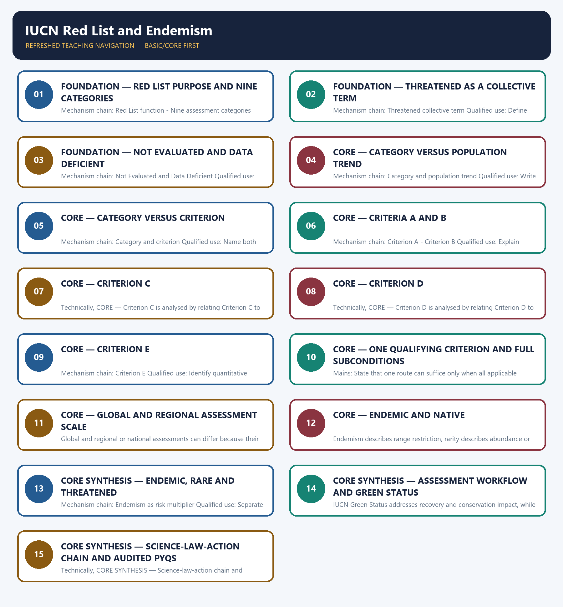

# IUCN Red List and Endemism — Learner-v2 Complete Learning Session

> **Authoring-only generation:** 2026-09-03. No PDF was rendered and no tracker or index was mutated.

### SOURCE, PROGRESSION AND CURRENT-LINKAGE AUDIT

- **Generation date:** 2026-09-03.
- **Repository-first evidence:** the Basic owner is taught first and preserved in full; the Advanced owner is retained only in the optional final teaching block.
- **OCR evidence:** Repository Markdown was primary. OCR-searchable local official General Studies papers were used only to confirm printed routed demands. No answer key, marking scheme, unsupported page precision, ecological rate, species count or current status was inferred.
- **Qdrant:** not used; repository Markdown and available OCR context were sufficient.
- **PYQ integrity:** Audited ledgers route 2019 Indian endemism and habitat matching, 2022 species identification, 2023 marsupial distribution, 2024 natural-habitat pairs and 2026 Western hoolock gibbon status, habitat and adaptation. They are carried as answer-free demands; no objective key or unstated current range, trend or assessment year is inferred.
- **Live-link boundary:** Direct IUCN pages returned HTTP 520 on 2026-09-03, India Code and PIB returned HTTP 403, and no current species assessment was imported. MoEFCC's wildlife page was substantive only for its domestic policy-law role. Category, criterion, trend, scale and year therefore remain bounded to the repository owners and each cited assessment.
- **Fact/inference discipline:** no current-affairs item, PYQ wording, figure or quotation is invented.

### LIVE OFFICIAL-SOURCE ATTEMPT LOG

The checks below were made on 2026-09-03. Substantive official text is used only for the proposition it supports. Stubs, access failures, unrelated pages and thin landing pages are recorded and are not converted into ecological or current-status claims.

- https://www.iucnredlist.org/resources/categories-and-criteria — attempted 2026-09-03; direct retrieval returned HTTP 520, so no category threshold, assessment year, population trend or species status was imported from the failed page.
- https://www.iucnredlist.org/assessment/process — attempted 2026-09-03; direct retrieval returned HTTP 520. Search discovery identified the official process page, but the authored package keeps the repository owners as the source for assessment workflow.
- https://moef.gov.in/wildlife-wl — attempted 2026-09-03; substantive MoEFCC text confirmed that the Wildlife Division handles wildlife policy, law and finance. It was not used to infer an IUCN category, national Red List status or population trend.
- https://www.indiacode.nic.in/indiacode/handle/123456789/12931?view_type=browse — attempted 2026-09-03; India Code returned HTTP 403, so no schedule placement or statutory provision was imported.
- https://www.pib.gov.in/indexd.aspx?reg=3&lang=1 — attempted 2026-09-03; the request returned HTTP 403, so no current species claim was used.

## BASIC LEARNING SESSION

### DEEP-REVIEW LEARNING CONTRACT

| Control | Binding rule for this package |
|---|---|
| Syllabus boundary | Complete Environment and Ecology Basic/Core is answer-complete before optional Advanced depth. |
| Ecology boundary | System boundary, scale, trophic level, stock/flow, pool/flux, gross/net, unit and time interval are explicit. |
| Species boundary | Taxon, range, habitat, population trend, IUCN assessment, Indian legal schedule, CITES/CMS listing and endemism remain distinct. |
| Law/status boundary | Act, amendment, rule, notification, draft, judgment, policy, target, implementation and observed outcome remain distinct and dated. |
| Institution boundary | Legal form, parent authority, mandate, jurisdiction, standard, consent, enforcement, science and adjudication are not conflated. |
| Treaty boundary | Membership, annex/appendix, amendment acceptance, target, COP decision, national instrument and outcome remain distinct. |
| Climate boundary | Emission flow, concentration stock, cumulative budget, forcing, scenario, baseline, unit, mitigation, adaptation, loss-and-damage, avoidance and removal are exact. |
| Pollution boundary | Source, emission/load, ambient concentration, exposure, parameter, averaging period, unit, standard and jurisdiction are explicit. |
| Causal method | Chronology, designation, expenditure, capacity, registration and correlation are not promoted into ecological or policy outcomes without mechanism and evidence. |
| Practice contract | Every solved item has demand decoding, detailed examiner-grade model, executable timed/compression plan, marks rationale and answer-specific improvement. |
| Approval | This immutable successor remains `approved: false` pending explicit approval. |

**Canonical Basic/Core owner:** `upsc-ai-kit\knowledge\Environment-and-Ecology\basic\05_IUCN-Red-List-and-Endemism.md`  
**Substantive canonical provenance owner:** `upsc-ai-kit\knowledge\Environment-and-Ecology\learning-sessions\v2\subject-wide-syllabus\environment-and-ecology-05_Learning-Session.md`  
**Optional Advanced owner:** `upsc-ai-kit\knowledge\Environment-and-Ecology\advanced\05_IUCN-Red-List-and-Endemism.md`  
**Official syllabus mapping:** `upsc-ai-kit\knowledge\Environment-and-Ecology\OFFICIAL-UPSC-SYLLABUS-MAPPING.md`

### EVIDENCE, PYQ AND CURRENT-STATUS CONTROL

- Ecological mechanisms retain direction, pool, flux, limiting factor, spatial scale and time scale.
- Current species/news claims retain taxon, source, event/publication date, assessment/listing date and access date.
- IUCN category never substitutes for Wildlife Protection Act schedule, CITES appendix, CMS appendix or endemism.
- Protected-area categories, treaty designations and institution mandates retain exact legal character.
- Acts, amendments, rules, draft instruments, notifications and judgments retain operative status and date.
- Climate figures retain unit, baseline, period, scenario and stock-flow character; global evidence is not silently downscaled to India.
- Mitigation, adaptation and loss-and-damage remain separate; allowance, offset, avoidance, removal, capture and storage remain separate.
- PYQ wording is preserved only where verified; reconstructed or routed demands remain labelled.
- **Current-status note, rechecked 2026-09-03:** volatile targets, standards, schedules, species status, treaty outcomes and programme claims retain source/date/status.

**Generation-local live/current sources:**
- `https://www.iucnredlist.org/resources/categories-and-criteria — attempted 2026-09-03; direct retrieval returned HTTP 520, so no category threshold, assessment year, population trend or species status was imported from the failed page.`
- `https://www.iucnredlist.org/assessment/process — attempted 2026-09-03; direct retrieval returned HTTP 520. Search discovery identified the official process page, but the authored package keeps the repository owners as the source for assessment workflow.`
- `https://moef.gov.in/wildlife-wl — attempted 2026-09-03; substantive MoEFCC text confirmed that the Wildlife Division handles wildlife policy, law and finance. It was not used to infer an IUCN category, national Red List status or population trend.`
- `https://www.indiacode.nic.in/indiacode/handle/123456789/12931?view_type=browse — attempted 2026-09-03; India Code returned HTTP 403, so no schedule placement or statutory provision was imported.`
- `https://www.pib.gov.in/indexd.aspx?reg=3&lang=1 — attempted 2026-09-03; the request returned HTTP 403, so no current species claim was used.`

**Topic 26 dedicated Disaster Management cross-owners (scope boundary):**
- Not applicable to this topic.




*Distinct embedded teaching-navigation image. The separate continuous Cārvāka-style flowchart package remains an independent at-a-glance artifact.*

### SESSION 1 — FOUNDATION — RED LIST PURPOSE AND NINE CATEGORIES

#### DEFINITION / WHAT THIS IS CALLED

**Plain-language definition:** The IUCN Red List is a criteria-based scientific assessment of extinction risk; it is not itself an Indian statute or permit.

**Technical definition:** Mechanism chain: Red List function - Nine assessment categories Qualified use: Open with scientific extinction-risk assessment and map the nine categories.

#### ANSWER-GRABBING OPENING — WRITE/ADAPT IN THE EXAM

> Mechanism chain: Red List function - Nine assessment categories Qualified use: Open with scientific extinction-risk assessment and map the nine categories.

#### MUST-WRITE KEYWORDS

- **FOUNDATION**
- **Red List purpose**
- **nine categories**
- **Mechanism chain**
- **Qualified use**
- **The IUCN Red List**

**How to use them:** Frame the answer through FOUNDATION; define Red List purpose, connect nine categories with Mechanism chain to explain the mechanism, and use Qualified use for the decisive comparison or qualification.

#### VISUAL FIRST

```text
RED LIST PURPOSE AND NINE CATEGORIES
01. Red List function
    |
    v
02. Nine assessment categories
BOUNDARY -> Do not call the IUCN Red List a binding Indian wildlife law.
```

*This topic-specific rail fixes the evidence sequence and its exam boundary before analysis.*

#### CORE EXPLANATION

The IUCN Red List is a criteria-based scientific assessment of extinction risk; it is not itself an Indian statute or permit. The owner distinguishes Not Evaluated, Data Deficient, Least Concern, Near Threatened, Vulnerable, Endangered, Critically Endangered, Extinct in the Wild and Extinct.

#### NAMED EVIDENCE AND MECHANISM

- The IUCN Red List is a criteria-based scientific assessment of extinction risk; it is not itself an Indian statute or permit.
- The owner distinguishes Not Evaluated, Data Deficient, Least Concern, Near Threatened, Vulnerable, Endangered, Critically Endangered, Extinct in the Wild and Extinct.

#### EXAMINER CAUTION

- Do not call the IUCN Red List a binding Indian wildlife law.

#### EXAM LINK

- **Prelims:** Preserve the exact ecological level, system boundary, stock or flow, pyramid parameter, succession substrate, biome scale, taxonomic term and scientific or legal status; never turn a context-dependent pattern into a universal rule.
- **Mains:** Open with scientific extinction-risk assessment and map the nine categories.

#### MINI RECAP

- **Mechanism chain:** Red List function -> Nine assessment categories
- **Qualified use:** Open with scientific extinction-risk assessment and map the nine categories.

#### CLOSING RECALL FLOW — FOUNDATION — RED LIST PURPOSE AND NINE CATEGORIES

```text
START / CONCEPT: FOUNDATION — Red List purpose and nine categories
        |
        v
EXACT TERMS: FOUNDATION · Red List purpose · nine categories · Mechanism chain · Qualified use · The IUCN Red List
        |
        v
MECHANISM / ARGUMENT: The IUCN Red List is a criteria-based scientific assessment of extinction risk; it is not itself an Indian statute or permit.
        |
        v
CONSEQUENCE / CONTRAST: Do not call the IUCN Red List a binding Indian wildlife law.
        |
        v
UPSC TRAP / ANSWER-USE: The owner distinguishes Not Evaluated, Data Deficient, Least Concern, Near Threatened, Vulnerable, Endangered, Critically Endangered, Extinct in the Wild and Extinct.
        |
        v
ANSWER-GRABBING FORMULATION: Mechanism chain: Red List function - Nine assessment categories Qualified use: Open with scientific extinction-risk assessment and map the nine categories.
```
### SESSION 2 — FOUNDATION — THREATENED AS A COLLECTIVE TERM

#### DEFINITION / WHAT THIS IS CALLED

**Plain-language definition:** Threatened collectively covers Vulnerable, Endangered and Critically Endangered; it is not a separate tenth category.

**Technical definition:** Mechanism chain: Threatened collective term Qualified use: Define threatened precisely as VU plus EN plus CR.

#### ANSWER-GRABBING OPENING — WRITE/ADAPT IN THE EXAM

> Threatened collectively covers Vulnerable, Endangered and Critically Endangered; it is not a separate tenth category.

#### MUST-WRITE KEYWORDS

- **FOUNDATION**
- **Threatened as a collective term**
- **Mechanism chain**
- **Qualified use**
- **Threatened**
- **Vulnerable**

**How to use them:** Frame the answer through FOUNDATION; define Threatened as a collective term, connect Mechanism chain with Qualified use to explain the mechanism, and use Threatened for the decisive comparison or qualification.

#### VISUAL FIRST

```text
THREATENED AS A COLLECTIVE TERM
01. Threatened collective term
BOUNDARY -> Do not treat threatened as a category separate from VU, EN and CR.
```

*This topic-specific rail fixes the evidence sequence and its exam boundary before analysis.*

#### CORE EXPLANATION

Threatened collectively covers Vulnerable, Endangered and Critically Endangered; it is not a separate tenth category.

#### NAMED EVIDENCE AND MECHANISM

- Threatened collectively covers Vulnerable, Endangered and Critically Endangered; it is not a separate tenth category.

#### EXAMINER CAUTION

- Do not treat threatened as a category separate from VU, EN and CR.

#### EXAM LINK

- **Prelims:** Preserve the exact ecological level, system boundary, stock or flow, pyramid parameter, succession substrate, biome scale, taxonomic term and scientific or legal status; never turn a context-dependent pattern into a universal rule.
- **Mains:** Define threatened precisely as VU plus EN plus CR.

#### MINI RECAP

- **Mechanism chain:** Threatened collective term
- **Qualified use:** Define threatened precisely as VU plus EN plus CR.

#### CLOSING RECALL FLOW — FOUNDATION — THREATENED AS A COLLECTIVE TERM

```text
START / CONCEPT: FOUNDATION — Threatened as a collective term
        |
        v
EXACT TERMS: FOUNDATION · Threatened as a collective term · Mechanism chain · Qualified use · Threatened · Vulnerable
        |
        v
MECHANISM / ARGUMENT: Mechanism chain: Threatened collective term Qualified use: Define threatened precisely as VU plus EN plus CR.
        |
        v
CONSEQUENCE / CONTRAST: Do not treat threatened as a category separate from VU, EN and CR.
        |
        v
UPSC TRAP / ANSWER-USE: Do not miss this limiting distinction: threatened collectively covers Vulnerable, Endangered and Critically Endangered.
        |
        v
ANSWER-GRABBING FORMULATION: Threatened collectively covers Vulnerable, Endangered and Critically Endangered; it is not a separate tenth category.
```
### SESSION 3 — FOUNDATION — NOT EVALUATED AND DATA DEFICIENT

#### DEFINITION / WHAT THIS IS CALLED

**Plain-language definition:** Not Evaluated means the criteria have not been applied, while Data Deficient means evidence is inadequate for a risk assessment; neither means safe.

**Technical definition:** Mechanism chain: Not Evaluated and Data Deficient Qualified use: Use the attempted-assessment distinction between NE and DD.

#### ANSWER-GRABBING OPENING — WRITE/ADAPT IN THE EXAM

> Mechanism chain: Not Evaluated and Data Deficient Qualified use: Use the attempted-assessment distinction between NE and DD.

#### MUST-WRITE KEYWORDS

- **FOUNDATION**
- **Not Evaluated**
- **Data Deficient**
- **Mechanism chain**
- **Qualified use**
- **NE**

**How to use them:** Frame the answer through FOUNDATION; define Not Evaluated, connect Data Deficient with Mechanism chain to explain the mechanism, and use Qualified use for the decisive comparison or qualification.

#### VISUAL FIRST

```text
NOT EVALUATED AND DATA DEFICIENT
01. Not Evaluated and Data Deficient
BOUNDARY -> Do not equate Data Deficient or Not Evaluated with low risk.
```

*This topic-specific rail fixes the evidence sequence and its exam boundary before analysis.*

#### CORE EXPLANATION

Not Evaluated means the criteria have not been applied, while Data Deficient means evidence is inadequate for a risk assessment; neither means safe.

#### NAMED EVIDENCE AND MECHANISM

- Not Evaluated means the criteria have not been applied, while Data Deficient means evidence is inadequate for a risk assessment; neither means safe.

#### EXAMINER CAUTION

- Do not equate Data Deficient or Not Evaluated with low risk.

#### EXAM LINK

- **Prelims:** Preserve the exact ecological level, system boundary, stock or flow, pyramid parameter, succession substrate, biome scale, taxonomic term and scientific or legal status; never turn a context-dependent pattern into a universal rule.
- **Mains:** Use the attempted-assessment distinction between NE and DD.

#### MINI RECAP

- **Mechanism chain:** Not Evaluated and Data Deficient
- **Qualified use:** Use the attempted-assessment distinction between NE and DD.

#### CLOSING RECALL FLOW — FOUNDATION — NOT EVALUATED AND DATA DEFICIENT

```text
START / CONCEPT: FOUNDATION — Not Evaluated and Data Deficient
        |
        v
EXACT TERMS: FOUNDATION · Not Evaluated · Data Deficient · Mechanism chain · Qualified use · NE
        |
        v
MECHANISM / ARGUMENT: Not Evaluated means the criteria have not been applied, while Data Deficient means evidence is inadequate for a risk assessment; neither means safe.
        |
        v
CONSEQUENCE / CONTRAST: Do not equate Data Deficient or Not Evaluated with low risk.
        |
        v
UPSC TRAP / ANSWER-USE: Do not miss this limiting distinction: use the attempted-assessment distinction between NE and DD.
        |
        v
ANSWER-GRABBING FORMULATION: Mechanism chain: Not Evaluated and Data Deficient Qualified use: Use the attempted-assessment distinction between NE and DD.
```
### SESSION 4 — CORE — CATEGORY VERSUS POPULATION TREND

#### DEFINITION / WHAT THIS IS CALLED

**Plain-language definition:** A Red List category states assessed extinction risk, whereas increasing, stable, decreasing or unknown describes population trend; the two fields answer different questions.

**Technical definition:** Mechanism chain: Category and population trend Qualified use: Write assessed risk and population trend in separate clauses.

#### ANSWER-GRABBING OPENING — WRITE/ADAPT IN THE EXAM

> Do not substitute population trend for assessed Red List category.

#### MUST-WRITE KEYWORDS

- **Category versus population trend**
- **Mechanism chain**
- **Qualified use**
- **Red List**
- **Category**
- **Qualified**

**How to use them:** Frame the answer through Category versus population trend; define Mechanism chain, connect Qualified use with Red List to explain the mechanism, and use Category for the decisive comparison or qualification.

#### VISUAL FIRST

```text
CATEGORY VERSUS POPULATION TREND
01. Category and population trend
BOUNDARY -> Do not substitute population trend for assessed Red List category.
```

*This topic-specific rail fixes the evidence sequence and its exam boundary before analysis.*

#### CORE EXPLANATION

A Red List category states assessed extinction risk, whereas increasing, stable, decreasing or unknown describes population trend; the two fields answer different questions.

#### NAMED EVIDENCE AND MECHANISM

- A Red List category states assessed extinction risk, whereas increasing, stable, decreasing or unknown describes population trend; the two fields answer different questions.

#### EXAMINER CAUTION

- Do not substitute population trend for assessed Red List category.

#### EXAM LINK

- **Prelims:** Preserve the exact ecological level, system boundary, stock or flow, pyramid parameter, succession substrate, biome scale, taxonomic term and scientific or legal status; never turn a context-dependent pattern into a universal rule.
- **Mains:** Write assessed risk and population trend in separate clauses.

#### MINI RECAP

- **Mechanism chain:** Category and population trend
- **Qualified use:** Write assessed risk and population trend in separate clauses.

#### CLOSING RECALL FLOW — CORE — CATEGORY VERSUS POPULATION TREND

```text
START / CONCEPT: CORE — Category versus population trend
        |
        v
EXACT TERMS: Category versus population trend · Mechanism chain · Qualified use · Red List · Category · Qualified
        |
        v
MECHANISM / ARGUMENT: Mechanism chain: Category and population trend Qualified use: Write assessed risk and population trend in separate clauses.
        |
        v
CONSEQUENCE / CONTRAST: A Red List category states assessed extinction risk, whereas increasing, stable, decreasing or unknown describes population trend; the two fields answer different questions.
        |
        v
UPSC TRAP / ANSWER-USE: Do not miss this limiting distinction: a Red List category states assessed extinction risk.
        |
        v
ANSWER-GRABBING FORMULATION: Do not substitute population trend for assessed Red List category.
```
### SESSION 5 — CORE — CATEGORY VERSUS CRITERION

#### DEFINITION / WHAT THIS IS CALLED

**Plain-language definition:** Category is the resulting risk class; criterion is the quantitative route used to justify it, so a category name must not be substituted for criterion A, B, C, D or E.

**Technical definition:** Mechanism chain: Category and criterion Qualified use: Name both the result category and the supporting criterion.

#### ANSWER-GRABBING OPENING — WRITE/ADAPT IN THE EXAM

> Category is the resulting risk class; criterion is the quantitative route used to justify it, so a category name must not be substituted for criterion A, B, C, D or E.

#### MUST-WRITE KEYWORDS

- **Category versus criterion**
- **Mechanism chain**
- **Qualified use**
- **Category**
- **Qualified**
- **Name**

**How to use them:** Frame the answer through Category versus criterion; define Mechanism chain, connect Qualified use with Category to explain the mechanism, and use Qualified for the decisive comparison or qualification.

#### VISUAL FIRST

```text
CATEGORY VERSUS CRITERION
01. Category and criterion
BOUNDARY -> Do not substitute a category name for the criterion that supports it.
```

*This topic-specific rail fixes the evidence sequence and its exam boundary before analysis.*

#### CORE EXPLANATION

Category is the resulting risk class; criterion is the quantitative route used to justify it, so a category name must not be substituted for criterion A, B, C, D or E.

#### NAMED EVIDENCE AND MECHANISM

- Category is the resulting risk class; criterion is the quantitative route used to justify it, so a category name must not be substituted for criterion A, B, C, D or E.

#### EXAMINER CAUTION

- Do not substitute a category name for the criterion that supports it.

#### EXAM LINK

- **Prelims:** Preserve the exact ecological level, system boundary, stock or flow, pyramid parameter, succession substrate, biome scale, taxonomic term and scientific or legal status; never turn a context-dependent pattern into a universal rule.
- **Mains:** Name both the result category and the supporting criterion.

#### MINI RECAP

- **Mechanism chain:** Category and criterion
- **Qualified use:** Name both the result category and the supporting criterion.

#### CLOSING RECALL FLOW — CORE — CATEGORY VERSUS CRITERION

```text
START / CONCEPT: CORE — Category versus criterion
        |
        v
EXACT TERMS: Category versus criterion · Mechanism chain · Qualified use · Category · Qualified · Name
        |
        v
MECHANISM / ARGUMENT: Mechanism chain: Category and criterion Qualified use: Name both the result category and the supporting criterion.
        |
        v
CONSEQUENCE / CONTRAST: Do not substitute a category name for the criterion that supports it.
        |
        v
UPSC TRAP / ANSWER-USE: Do not miss this limiting distinction: category is the resulting risk class.
        |
        v
ANSWER-GRABBING FORMULATION: Category is the resulting risk class; criterion is the quantitative route used to justify it, so a category name must not be substituted for criterion A, B, C, D or E.
```
### SESSION 6 — CORE — CRITERIA A AND B

#### DEFINITION / WHAT THIS IS CALLED

**Plain-language definition:** Criterion A concerns population-size reduction over the applicable assessment window; no percentage or assessment year is supplied unless the cited assessment provides it.

**Technical definition:** Mechanism chain: Criterion A - Criterion B Qualified use: Explain decline and range routes without inventing thresholds.

#### ANSWER-GRABBING OPENING — WRITE/ADAPT IN THE EXAM

> Mechanism chain: Criterion A - Criterion B Qualified use: Explain decline and range routes without inventing thresholds.

#### MUST-WRITE KEYWORDS

- **Criteria A**
- **B**
- **Mechanism chain**
- **Qualified use**
- **Criterion**
- **Qualified**

**How to use them:** Frame the answer through Criteria A; define B, connect Mechanism chain with Qualified use to explain the mechanism, and use Criterion for the decisive comparison or qualification.

#### VISUAL FIRST

```text
CRITERIA A AND B
01. Criterion A
    |
    v
02. Criterion B
BOUNDARY -> Do not quote a Criterion A percentage without the assessment source and taxon context.
```

*This topic-specific rail fixes the evidence sequence and its exam boundary before analysis.*

#### CORE EXPLANATION

Criterion A concerns population-size reduction over the applicable assessment window; no percentage or assessment year is supplied unless the cited assessment provides it. Criterion B concerns restricted geographic range together with the applicable fragmentation, decline or fluctuation conditions; range restriction alone must be read with the criterion text.

#### NAMED EVIDENCE AND MECHANISM

- Criterion A concerns population-size reduction over the applicable assessment window; no percentage or assessment year is supplied unless the cited assessment provides it.
- Criterion B concerns restricted geographic range together with the applicable fragmentation, decline or fluctuation conditions; range restriction alone must be read with the criterion text.

#### EXAMINER CAUTION

- Do not quote a Criterion A percentage without the assessment source and taxon context.

#### EXAM LINK

- **Prelims:** Preserve the exact ecological level, system boundary, stock or flow, pyramid parameter, succession substrate, biome scale, taxonomic term and scientific or legal status; never turn a context-dependent pattern into a universal rule.
- **Mains:** Explain decline and range routes without inventing thresholds.

#### MINI RECAP

- **Mechanism chain:** Criterion A -> Criterion B
- **Qualified use:** Explain decline and range routes without inventing thresholds.

#### CLOSING RECALL FLOW — CORE — CRITERIA A AND B

```text
START / CONCEPT: CORE — Criteria A and B
        |
        v
EXACT TERMS: Criteria A · B · Mechanism chain · Qualified use · Criterion · Qualified
        |
        v
MECHANISM / ARGUMENT: Criterion A concerns population-size reduction over the applicable assessment window; no percentage or assessment year is supplied unless the cited assessment provides it.
        |
        v
CONSEQUENCE / CONTRAST: Do not quote a Criterion A percentage without the assessment source and taxon context.
        |
        v
UPSC TRAP / ANSWER-USE: Do not miss this limiting distinction: criterion B concerns restricted geographic range together with the applicable fragmentation, decline or fluctuation...
        |
        v
ANSWER-GRABBING FORMULATION: Mechanism chain: Criterion A - Criterion B Qualified use: Explain decline and range routes without inventing thresholds.
```
### SESSION 7 — CORE — CRITERION C

#### DEFINITION / WHAT THIS IS CALLED

**Plain-language definition:** Mechanism chain: Criterion C Qualified use: Pair small population with continuing decline.

**Technical definition:** Technically, CORE — Criterion C is analysed by relating Criterion C to Mechanism chain, then testing the relationship through Qualified use and Criterion.

#### ANSWER-GRABBING OPENING — WRITE/ADAPT IN THE EXAM

> Do not reduce Criterion B to range size while omitting its applicable subconditions.

#### MUST-WRITE KEYWORDS

- **Criterion C**
- **Mechanism chain**
- **Qualified use**
- **Criterion**
- **Qualified**
- **Pair**

**How to use them:** Frame the answer through Criterion C; define Mechanism chain, connect Qualified use with Criterion to explain the mechanism, and use Qualified for the decisive comparison or qualification.

#### VISUAL FIRST

```text
CRITERION C
01. Criterion C
BOUNDARY -> Do not reduce Criterion B to range size while omitting its applicable subconditions.
```

*This topic-specific rail fixes the evidence sequence and its exam boundary before analysis.*

#### CORE EXPLANATION

Criterion C combines small population size with continuing decline and its applicable population structure conditions.

#### NAMED EVIDENCE AND MECHANISM

- Criterion C combines small population size with continuing decline and its applicable population structure conditions.

#### EXAMINER CAUTION

- Do not reduce Criterion B to range size while omitting its applicable subconditions.

#### EXAM LINK

- **Prelims:** Preserve the exact ecological level, system boundary, stock or flow, pyramid parameter, succession substrate, biome scale, taxonomic term and scientific or legal status; never turn a context-dependent pattern into a universal rule.
- **Mains:** Pair small population with continuing decline.

#### MINI RECAP

- **Mechanism chain:** Criterion C
- **Qualified use:** Pair small population with continuing decline.

#### CLOSING RECALL FLOW — CORE — CRITERION C

```text
START / CONCEPT: CORE — Criterion C
        |
        v
EXACT TERMS: Criterion C · Mechanism chain · Qualified use · Criterion · Qualified · Pair
        |
        v
MECHANISM / ARGUMENT: Mechanism chain: Criterion C Qualified use: Pair small population with continuing decline.
        |
        v
CONSEQUENCE / CONTRAST: The resulting consequence is that do not reduce Criterion B to range size while omitting its applicable subconditions.
        |
        v
UPSC TRAP / ANSWER-USE: Do not miss this limiting distinction: do not reduce Criterion B to range size while omitting its applicable subconditions.
        |
        v
ANSWER-GRABBING FORMULATION: Do not reduce Criterion B to range size while omitting its applicable subconditions.
```
### SESSION 8 — CORE — CRITERION D

#### DEFINITION / WHAT THIS IS CALLED

**Plain-language definition:** Mechanism chain: Criterion D Qualified use: Keep very small or restricted population tied to the applicable threshold.

**Technical definition:** Technically, CORE — Criterion D is analysed by relating Criterion D to Mechanism chain, then testing the relationship through Qualified use and Criterion.

#### ANSWER-GRABBING OPENING — WRITE/ADAPT IN THE EXAM

> Do not describe Criterion C as a bare small-population test.

#### MUST-WRITE KEYWORDS

- **Criterion D**
- **Mechanism chain**
- **Qualified use**
- **Criterion**
- **Qualified**
- **Keep**

**How to use them:** Frame the answer through Criterion D; define Mechanism chain, connect Qualified use with Criterion to explain the mechanism, and use Qualified for the decisive comparison or qualification.

#### VISUAL FIRST

```text
CRITERION D
01. Criterion D
BOUNDARY -> Do not describe Criterion C as a bare small-population test.
```

*This topic-specific rail fixes the evidence sequence and its exam boundary before analysis.*

#### CORE EXPLANATION

Criterion D addresses a very small or very restricted population under the applicable category threshold.

#### NAMED EVIDENCE AND MECHANISM

- Criterion D addresses a very small or very restricted population under the applicable category threshold.

#### EXAMINER CAUTION

- Do not describe Criterion C as a bare small-population test.

#### EXAM LINK

- **Prelims:** Preserve the exact ecological level, system boundary, stock or flow, pyramid parameter, succession substrate, biome scale, taxonomic term and scientific or legal status; never turn a context-dependent pattern into a universal rule.
- **Mains:** Keep very small or restricted population tied to the applicable threshold.

#### MINI RECAP

- **Mechanism chain:** Criterion D
- **Qualified use:** Keep very small or restricted population tied to the applicable threshold.

#### CLOSING RECALL FLOW — CORE — CRITERION D

```text
START / CONCEPT: CORE — Criterion D
        |
        v
EXACT TERMS: Criterion D · Mechanism chain · Qualified use · Criterion · Qualified · Keep
        |
        v
MECHANISM / ARGUMENT: Mechanism chain: Criterion D Qualified use: Keep very small or restricted population tied to the applicable threshold.
        |
        v
CONSEQUENCE / CONTRAST: The resulting consequence is that do not describe Criterion C as a bare small-population test.
        |
        v
UPSC TRAP / ANSWER-USE: Do not miss this limiting distinction: do not describe Criterion C as a bare small-population test.
        |
        v
ANSWER-GRABBING FORMULATION: Do not describe Criterion C as a bare small-population test.
```
### SESSION 9 — CORE — CRITERION E

#### DEFINITION / WHAT THIS IS CALLED

**Plain-language definition:** Criterion E uses quantitative analysis of extinction probability; it is not a synonym for expert opinion or a simple headcount.

**Technical definition:** Mechanism chain: Criterion E Qualified use: Identify quantitative extinction-probability analysis.

#### ANSWER-GRABBING OPENING — WRITE/ADAPT IN THE EXAM

> Criterion E uses quantitative analysis of extinction probability; it is not a synonym for expert opinion or a simple headcount.

#### MUST-WRITE KEYWORDS

- **Criterion E**
- **Mechanism chain**
- **Qualified use**
- **Criterion**
- **Qualified**
- **Identify**

**How to use them:** Frame the answer through Criterion E; define Mechanism chain, connect Qualified use with Criterion to explain the mechanism, and use Qualified for the decisive comparison or qualification.

#### VISUAL FIRST

```text
CRITERION E
01. Criterion E
BOUNDARY -> Do not attach an unstated numerical threshold to Criterion D.
```

*This topic-specific rail fixes the evidence sequence and its exam boundary before analysis.*

#### CORE EXPLANATION

Criterion E uses quantitative analysis of extinction probability; it is not a synonym for expert opinion or a simple headcount.

#### NAMED EVIDENCE AND MECHANISM

- Criterion E uses quantitative analysis of extinction probability; it is not a synonym for expert opinion or a simple headcount.

#### EXAMINER CAUTION

- Do not attach an unstated numerical threshold to Criterion D.

#### EXAM LINK

- **Prelims:** Preserve the exact ecological level, system boundary, stock or flow, pyramid parameter, succession substrate, biome scale, taxonomic term and scientific or legal status; never turn a context-dependent pattern into a universal rule.
- **Mains:** Identify quantitative extinction-probability analysis.

#### MINI RECAP

- **Mechanism chain:** Criterion E
- **Qualified use:** Identify quantitative extinction-probability analysis.

#### CLOSING RECALL FLOW — CORE — CRITERION E

```text
START / CONCEPT: CORE — Criterion E
        |
        v
EXACT TERMS: Criterion E · Mechanism chain · Qualified use · Criterion · Qualified · Identify
        |
        v
MECHANISM / ARGUMENT: Mechanism chain: Criterion E Qualified use: Identify quantitative extinction-probability analysis.
        |
        v
CONSEQUENCE / CONTRAST: Do not attach an unstated numerical threshold to Criterion D.
        |
        v
UPSC TRAP / ANSWER-USE: Do not miss this limiting distinction: criterion E uses quantitative analysis of extinction probability.
        |
        v
ANSWER-GRABBING FORMULATION: Criterion E uses quantitative analysis of extinction probability; it is not a synonym for expert opinion or a simple headcount.
```
### SESSION 10 — CORE — ONE QUALIFYING CRITERION AND FULL SUBCONDITIONS

#### DEFINITION / WHAT THIS IS CALLED

**Plain-language definition:** Mechanism chain: One qualifying route Qualified use: State that one route can suffice only when all applicable subconditions are met.

**Technical definition:** Mains: State that one route can suffice only when all applicable subconditions are met.

#### ANSWER-GRABBING OPENING — WRITE/ADAPT IN THE EXAM

> The owner records that meeting one applicable criterion can support a threatened category, but the taxon must meet that category's full threshold and subconditions.

#### MUST-WRITE KEYWORDS

- **One qualifying criterion**
- **full subconditions**
- **Mechanism chain**
- **Qualified use**
- **Criterion**
- **One**

**How to use them:** Frame the answer through One qualifying criterion; define full subconditions, connect Mechanism chain with Qualified use to explain the mechanism, and use Criterion for the decisive comparison or qualification.

#### VISUAL FIRST

```text
ONE QUALIFYING CRITERION AND FULL SUBCONDITIONS
01. One qualifying route
BOUNDARY -> Do not describe Criterion E as an ordinary census.
```

*This topic-specific rail fixes the evidence sequence and its exam boundary before analysis.*

#### CORE EXPLANATION

The owner records that meeting one applicable criterion can support a threatened category, but the taxon must meet that category's full threshold and subconditions.

#### NAMED EVIDENCE AND MECHANISM

- The owner records that meeting one applicable criterion can support a threatened category, but the taxon must meet that category's full threshold and subconditions.

#### EXAMINER CAUTION

- Do not describe Criterion E as an ordinary census.

#### EXAM LINK

- **Prelims:** Preserve the exact ecological level, system boundary, stock or flow, pyramid parameter, succession substrate, biome scale, taxonomic term and scientific or legal status; never turn a context-dependent pattern into a universal rule.
- **Mains:** State that one route can suffice only when all applicable subconditions are met.

#### MINI RECAP

- **Mechanism chain:** One qualifying route
- **Qualified use:** State that one route can suffice only when all applicable subconditions are met.

#### CLOSING RECALL FLOW — CORE — ONE QUALIFYING CRITERION AND FULL SUBCONDITIONS

```text
START / CONCEPT: CORE — One qualifying criterion and full subconditions
        |
        v
EXACT TERMS: One qualifying criterion · full subconditions · Mechanism chain · Qualified use · Criterion · One
        |
        v
MECHANISM / ARGUMENT: Mechanism chain: One qualifying route Qualified use: State that one route can suffice only when all applicable subconditions are met.
        |
        v
CONSEQUENCE / CONTRAST: Do not describe Criterion E as an ordinary census.
        |
        v
UPSC TRAP / ANSWER-USE: Do not miss this limiting distinction: state that one route can suffice only when all applicable subconditions are met.
        |
        v
ANSWER-GRABBING FORMULATION: The owner records that meeting one applicable criterion can support a threatened category, but the taxon must meet that category's full threshold and subconditions.
```
### SESSION 11 — CORE — GLOBAL AND REGIONAL ASSESSMENT SCALE

#### DEFINITION / WHAT THIS IS CALLED

**Plain-language definition:** Mechanism chain: Assessment scale - Endemic and native Qualified use: Name global or regional scale and assessment year.

**Technical definition:** Global and regional or national assessments can differ because their geographic scope differs; every status claim must name the assessment scale and year.

#### ANSWER-GRABBING OPENING — WRITE/ADAPT IN THE EXAM

> Mechanism chain: Assessment scale - Endemic and native Qualified use: Name global or regional scale and assessment year.

#### MUST-WRITE KEYWORDS

- **Global**
- **regional assessment scale**
- **Mechanism chain**
- **Qualified use**
- **Native**
- **Assessment**

**How to use them:** Frame the answer through Global; define regional assessment scale, connect Mechanism chain with Qualified use to explain the mechanism, and use Native for the decisive comparison or qualification.

#### VISUAL FIRST

```text
GLOBAL AND REGIONAL ASSESSMENT SCALE
01. Assessment scale
    |
    v
02. Endemic and native
BOUNDARY -> Do not claim that every threatened taxon satisfies all five criteria.
```

*This topic-specific rail fixes the evidence sequence and its exam boundary before analysis.*

#### CORE EXPLANATION

Global and regional or national assessments can differ because their geographic scope differs; every status claim must name the assessment scale and year. Native means naturally occurring in the stated region; endemic means naturally restricted to the stated region, so every endemic is native there but not every native is endemic.

#### NAMED EVIDENCE AND MECHANISM

- Global and regional or national assessments can differ because their geographic scope differs; every status claim must name the assessment scale and year.
- Native means naturally occurring in the stated region; endemic means naturally restricted to the stated region, so every endemic is native there but not every native is endemic.

#### EXAMINER CAUTION

- Do not claim that every threatened taxon satisfies all five criteria.

#### EXAM LINK

- **Prelims:** Preserve the exact ecological level, system boundary, stock or flow, pyramid parameter, succession substrate, biome scale, taxonomic term and scientific or legal status; never turn a context-dependent pattern into a universal rule.
- **Mains:** Name global or regional scale and assessment year.

#### MINI RECAP

- **Mechanism chain:** Assessment scale -> Endemic and native
- **Qualified use:** Name global or regional scale and assessment year.

#### CLOSING RECALL FLOW — CORE — GLOBAL AND REGIONAL ASSESSMENT SCALE

```text
START / CONCEPT: CORE — Global and regional assessment scale
        |
        v
EXACT TERMS: Global · regional assessment scale · Mechanism chain · Qualified use · Native · Assessment
        |
        v
MECHANISM / ARGUMENT: Global and regional or national assessments can differ because their geographic scope differs; every status claim must name the assessment scale and year.
        |
        v
CONSEQUENCE / CONTRAST: Native means naturally occurring in the stated region; endemic means naturally restricted to the stated region, so every endemic is native there but not every native is endemic.
        |
        v
UPSC TRAP / ANSWER-USE: Do not claim that every threatened taxon satisfies all five criteria.
        |
        v
ANSWER-GRABBING FORMULATION: Mechanism chain: Assessment scale - Endemic and native Qualified use: Name global or regional scale and assessment year.
```
### SESSION 12 — CORE — ENDEMIC AND NATIVE

#### DEFINITION / WHAT THIS IS CALLED

**Plain-language definition:** Mechanism chain: Endemic, rare and threatened Qualified use: Define both terms through natural distribution.

**Technical definition:** Endemism describes range restriction, rarity describes abundance or occurrence, and threatened status is an assessed extinction-risk class; they can overlap without being synonyms.

#### ANSWER-GRABBING OPENING — WRITE/ADAPT IN THE EXAM

> Mechanism chain: Endemic, rare and threatened Qualified use: Define both terms through natural distribution.

#### MUST-WRITE KEYWORDS

- **Endemic**
- **native**
- **Mechanism chain**
- **Qualified use**
- **Endemism**
- **Qualified**

**How to use them:** Frame the answer through Endemic; define native, connect Mechanism chain with Qualified use to explain the mechanism, and use Endemism for the decisive comparison or qualification.

#### VISUAL FIRST

```text
ENDEMIC AND NATIVE
01. Endemic, rare and threatened
BOUNDARY -> Do not transfer a global category automatically to a national population.
```

*This topic-specific rail fixes the evidence sequence and its exam boundary before analysis.*

#### CORE EXPLANATION

Endemism describes range restriction, rarity describes abundance or occurrence, and threatened status is an assessed extinction-risk class; they can overlap without being synonyms.

#### NAMED EVIDENCE AND MECHANISM

- Endemism describes range restriction, rarity describes abundance or occurrence, and threatened status is an assessed extinction-risk class; they can overlap without being synonyms.

#### EXAMINER CAUTION

- Do not transfer a global category automatically to a national population.

#### EXAM LINK

- **Prelims:** Preserve the exact ecological level, system boundary, stock or flow, pyramid parameter, succession substrate, biome scale, taxonomic term and scientific or legal status; never turn a context-dependent pattern into a universal rule.
- **Mains:** Define both terms through natural distribution.

#### MINI RECAP

- **Mechanism chain:** Endemic, rare and threatened
- **Qualified use:** Define both terms through natural distribution.

#### CLOSING RECALL FLOW — CORE — ENDEMIC AND NATIVE

```text
START / CONCEPT: CORE — Endemic and native
        |
        v
EXACT TERMS: Endemic · native · Mechanism chain · Qualified use · Endemism · Qualified
        |
        v
MECHANISM / ARGUMENT: Endemism describes range restriction, rarity describes abundance or occurrence, and threatened status is an assessed extinction-risk class; they can overlap without being synonyms.
        |
        v
CONSEQUENCE / CONTRAST: Do not transfer a global category automatically to a national population.
        |
        v
UPSC TRAP / ANSWER-USE: Do not miss this limiting distinction: endemic, rare and threatened Qualified use.
        |
        v
ANSWER-GRABBING FORMULATION: Mechanism chain: Endemic, rare and threatened Qualified use: Define both terms through natural distribution.
```
### SESSION 13 — CORE SYNTHESIS — ENDEMIC, RARE AND THREATENED

#### DEFINITION / WHAT THIS IS CALLED

**Plain-language definition:** Restricted range can remove spatial refuge and recolonisation options, but endemism does not automatically make a taxon threatened.

**Technical definition:** Mechanism chain: Endemism as risk multiplier Qualified use: Separate range, abundance and assessed risk.

#### ANSWER-GRABBING OPENING — WRITE/ADAPT IN THE EXAM

> Restricted range can remove spatial refuge and recolonisation options, but endemism does not automatically make a taxon threatened.

#### MUST-WRITE KEYWORDS

- **CORE SYNTHESIS**
- **Endemic**
- **rare**
- **threatened**
- **Mechanism chain**
- **Qualified use**

**How to use them:** Frame the answer through CORE SYNTHESIS; define Endemic, connect rare with threatened to explain the mechanism, and use Mechanism chain for the decisive comparison or qualification.

#### VISUAL FIRST

```text
ENDEMIC, RARE AND THREATENED
01. Endemism as risk multiplier
BOUNDARY -> Do not use native and endemic interchangeably.
```

*This topic-specific rail fixes the evidence sequence and its exam boundary before analysis.*

#### CORE EXPLANATION

Restricted range can remove spatial refuge and recolonisation options, but endemism does not automatically make a taxon threatened.

#### NAMED EVIDENCE AND MECHANISM

- Restricted range can remove spatial refuge and recolonisation options, but endemism does not automatically make a taxon threatened.

#### EXAMINER CAUTION

- Do not use native and endemic interchangeably.

#### EXAM LINK

- **Prelims:** Preserve the exact ecological level, system boundary, stock or flow, pyramid parameter, succession substrate, biome scale, taxonomic term and scientific or legal status; never turn a context-dependent pattern into a universal rule.
- **Mains:** Separate range, abundance and assessed risk.

#### MINI RECAP

- **Mechanism chain:** Endemism as risk multiplier
- **Qualified use:** Separate range, abundance and assessed risk.

#### CLOSING RECALL FLOW — CORE SYNTHESIS — ENDEMIC, RARE AND THREATENED

```text
START / CONCEPT: CORE SYNTHESIS — Endemic, rare and threatened
        |
        v
EXACT TERMS: CORE SYNTHESIS · Endemic · rare · threatened · Mechanism chain · Qualified use
        |
        v
MECHANISM / ARGUMENT: Mechanism chain: Endemism as risk multiplier Qualified use: Separate range, abundance and assessed risk.
        |
        v
CONSEQUENCE / CONTRAST: Do not use native and endemic interchangeably.
        |
        v
UPSC TRAP / ANSWER-USE: Do not miss this limiting distinction: restricted range can remove spatial refuge and recolonisation options.
        |
        v
ANSWER-GRABBING FORMULATION: Restricted range can remove spatial refuge and recolonisation options, but endemism does not automatically make a taxon threatened.
```
### SESSION 14 — CORE SYNTHESIS — ASSESSMENT WORKFLOW AND GREEN STATUS

#### DEFINITION / WHAT THIS IS CALLED

**Plain-language definition:** Mechanism chain: Assessment workflow - Green Status distinction Qualified use: Explain assessment review and keep recovery status separate.

**Technical definition:** IUCN Green Status addresses recovery and conservation impact, while the Red List addresses extinction risk; one does not replace the other.

#### ANSWER-GRABBING OPENING — WRITE/ADAPT IN THE EXAM

> Mechanism chain: Assessment workflow - Green Status distinction Qualified use: Explain assessment review and keep recovery status separate.

#### MUST-WRITE KEYWORDS

- **CORE SYNTHESIS**
- **Assessment workflow**
- **Green Status**
- **Mechanism chain**
- **Qualified use**
- **Species Survival Commission**

**How to use them:** Frame the answer through CORE SYNTHESIS; define Assessment workflow, connect Green Status with Mechanism chain to explain the mechanism, and use Qualified use for the decisive comparison or qualification.

#### VISUAL FIRST

```text
ASSESSMENT WORKFLOW AND GREEN STATUS
01. Assessment workflow
    |
    v
02. Green Status distinction
BOUNDARY -> Do not use endemic, rare and threatened as synonyms.
```

*This topic-specific rail fixes the evidence sequence and its exam boundary before analysis.*

#### CORE EXPLANATION

The owner links specialist expertise, Species Survival Commission groups, assessment documentation and review; a published category must remain tied to its supporting assessment. IUCN Green Status addresses recovery and conservation impact, while the Red List addresses extinction risk; one does not replace the other.

#### NAMED EVIDENCE AND MECHANISM

- The owner links specialist expertise, Species Survival Commission groups, assessment documentation and review; a published category must remain tied to its supporting assessment.
- IUCN Green Status addresses recovery and conservation impact, while the Red List addresses extinction risk; one does not replace the other.

#### EXAMINER CAUTION

- Do not use endemic, rare and threatened as synonyms.

#### EXAM LINK

- **Prelims:** Preserve the exact ecological level, system boundary, stock or flow, pyramid parameter, succession substrate, biome scale, taxonomic term and scientific or legal status; never turn a context-dependent pattern into a universal rule.
- **Mains:** Explain assessment review and keep recovery status separate.

#### MINI RECAP

- **Mechanism chain:** Assessment workflow -> Green Status distinction
- **Qualified use:** Explain assessment review and keep recovery status separate.

#### CLOSING RECALL FLOW — CORE SYNTHESIS — ASSESSMENT WORKFLOW AND GREEN STATUS

```text
START / CONCEPT: CORE SYNTHESIS — Assessment workflow and Green Status
        |
        v
EXACT TERMS: CORE SYNTHESIS · Assessment workflow · Green Status · Mechanism chain · Qualified use · Species Survival Commission
        |
        v
MECHANISM / ARGUMENT: IUCN Green Status addresses recovery and conservation impact, while the Red List addresses extinction risk; one does not replace the other.
        |
        v
CONSEQUENCE / CONTRAST: Do not use endemic, rare and threatened as synonyms.
        |
        v
UPSC TRAP / ANSWER-USE: Do not miss this limiting distinction: the owner links specialist expertise, Species Survival Commission groups, assessment documentation and review.
        |
        v
ANSWER-GRABBING FORMULATION: Mechanism chain: Assessment workflow - Green Status distinction Qualified use: Explain assessment review and keep recovery status separate.
```
### SESSION 15 — CORE SYNTHESIS — SCIENCE-LAW-ACTION CHAIN AND AUDITED PYQS

#### DEFINITION / WHAT THIS IS CALLED

**Plain-language definition:** Mechanism chain: Science-law-action chain - Audited PYQ boundary Qualified use: Close with science, domestic law, mitigation and PYQ evidence as distinct layers.

**Technical definition:** Technically, CORE SYNTHESIS — Science-law-action chain and audited PYQs is analysed by relating CORE SYNTHESIS to Science-law-action chain, then testing the relationship through audited PYQs and Mechanism chain.

#### ANSWER-GRABBING OPENING — WRITE/ADAPT IN THE EXAM

> Mechanism chain: Science-law-action chain - Audited PYQ boundary Qualified use: Close with science, domestic law, mitigation and PYQ evidence as distinct layers.

#### MUST-WRITE KEYWORDS

- **CORE SYNTHESIS**
- **Science-law-action chain**
- **audited PYQs**
- **Mechanism chain**
- **Qualified use**
- **Subject**

**How to use them:** Frame the answer through CORE SYNTHESIS; define Science-law-action chain, connect audited PYQs with Mechanism chain to explain the mechanism, and use Qualified use for the decisive comparison or qualification.

#### VISUAL FIRST

```text
SCIENCE-LAW-ACTION CHAIN AND AUDITED PYQS
01. Science-law-action chain
    |
    v
02. Audited PYQ boundary
BOUNDARY -> Do not infer current species status, trend or range from an undated example.
```

*This topic-specific rail fixes the evidence sequence and its exam boundary before analysis.*

#### CORE EXPLANATION

The Great Indian Bustard route separates IUCN risk assessment, Indian legal protection and judicial or infrastructure mitigation; no current population count is inferred. Routed demands cover Indian endemism, habitat matching and Western hoolock gibbon status, habitat and adaptation; objective keys and unstated current ranges are not inferred.

#### NAMED EVIDENCE AND MECHANISM

- The Great Indian Bustard route separates IUCN risk assessment, Indian legal protection and judicial or infrastructure mitigation; no current population count is inferred.
- Routed demands cover Indian endemism, habitat matching and Western hoolock gibbon status, habitat and adaptation; objective keys and unstated current ranges are not inferred.

#### EXAMINER CAUTION

- Do not infer current species status, trend or range from an undated example.

#### EXAM LINK

- **Prelims:** Preserve the exact ecological level, system boundary, stock or flow, pyramid parameter, succession substrate, biome scale, taxonomic term and scientific or legal status; never turn a context-dependent pattern into a universal rule.
- **Mains:** Close with science, domestic law, mitigation and PYQ evidence as distinct layers.

#### MINI RECAP

- **Mechanism chain:** Science-law-action chain -> Audited PYQ boundary
- **Qualified use:** Close with science, domestic law, mitigation and PYQ evidence as distinct layers.
#### COMPLETE BASIC OWNER EVIDENCE BANK

> **Subject:** Environment and Ecology | **Tier:** Must-Do (foundation) | **GS Paper:** GS-III (Environment) + Prelims.
> **Core area:** Species-level threat assessment.
> **Grounded in:** IUCN Red List categories and criteria (official IUCN framework); NCERT Class XII Biology; audited UPSC Environment PYQs (2024-2026 Prelims and 2024-2025 Mains).
> ✅ = source-grounded | ⚠️ = analytical linkage | 📰 = dated current-affairs anchor.
> *Companion: `advanced/05_IUCN-Red-List-and-Endemism.md`.*

#### 1. Visual foundation

```text
IUCN RED LIST CATEGORY LADDER (increasing extinction risk, left to right)
Not Evaluated -> Data Deficient -> Least Concern -> Near Threatened ->
   Vulnerable -> Endangered -> Critically Endangered -> Extinct in the Wild -> Extinct

                        "THREATENED" = VU + EN + CR together
```

**Core proposition:** The IUCN Red List is a standardised, criteria-based global inventory of
extinction risk — it is a scientific assessment tool, not itself a law; a species' Red List
status and its protection status under a country's own wildlife law (e.g., India's Wildlife
Protection Act Schedules) are related but legally distinct classifications.

#### 2. Essential definitions

| Concept | Exam-ready meaning |
|---|---|
| ✅ **IUCN** | International Union for Conservation of Nature — global body maintaining the Red List of Threatened Species. |
| ✅ **Extinct (EX)** | No reasonable doubt the last individual has died. |
| ✅ **Extinct in the Wild (EW)** | Survives only in cultivation/captivity or as a naturalised population well outside its historic range. |
| ✅ **Critically Endangered (CR)** | Facing an extremely high risk of extinction in the wild. |
| ✅ **Endangered (EN)** | Facing a very high risk of extinction in the wild. |
| ✅ **Vulnerable (VU)** | Facing a high risk of extinction in the wild. |
| ✅ **Near Threatened (NT)** | Close to qualifying for a threatened category soon. |
| ✅ **Least Concern (LC)** | Widespread and abundant taxa evaluated as low risk. |
| ✅ **Data Deficient (DD)** | Inadequate information to make a direct or indirect assessment of extinction risk. |
| ✅ **Not Evaluated (NE)** | The taxon has not yet been assessed against the criteria at all — distinct from Data Deficient, where an assessment was attempted but data were insufficient. |
| ✅ **Criteria A-E** | The five quantitative criteria used to place a taxon in a threatened category: **A** population size reduction; **B** restricted geographic range (extent of occurrence / area of occupancy) plus fragmentation, decline or fluctuation; **C** small population size *and* continuing decline; **D** very small or very restricted population; **E** quantitative analysis of extinction probability. |
| ✅ **Endemic species** | Naturally occurring only within one defined geographic region. |

#### 3. Topic mechanism

1. IUCN assesses each species against quantitative criteria (population size decline,
   geographic range restriction, population size and structure, quantitative extinction-
   probability analysis) to assign one Red List category.
2. "Threatened" is not a single category but a collective term for Vulnerable, Endangered
   and Critically Endangered — a frequently tested distinction.
3. Data Deficient is not equivalent to Least Concern: DD means there is not enough
   information to judge risk, which itself can be a conservation-priority signal, not a
   reassurance.
4. Endemism raises extinction vulnerability because a geographically restricted species has
   nowhere else to persist if its single habitat is degraded — this is why endemic-rich
   regions (hotspots, Topic 04) draw disproportionate conservation attention.
5. Red List status directly informs, but does not automatically determine, a species'
   domestic legal protection level (e.g., India's Wildlife Protection Act schedules, Topic
   08) — the two systems can diverge for a given species.

#### 4. Institutions and policy tools

- ✅ **IUCN (international, Switzerland-headquartered):** compiles and periodically updates
  the Red List using its Species Survival Commission specialist groups.
- ✅ **Zoological Survey of India (ZSI) / Botanical Survey of India (BSI):** provide field
  data used in India-specific Red List assessments and national conservation planning.
- ✅ **Wildlife Institute of India (WII):** conducts species population assessments (e.g.,
  tiger, elephant censuses) informing both Red List input and domestic Schedule listing.
- ⚠️ India's own conservation-status debates (e.g., which species need Schedule I protection)
  routinely reference, but are not legally bound by, current IUCN category.

#### 5. Indian applications and examples

- ⚠️ The Great Indian Bustard is Critically Endangered on the IUCN Red List due to a very
  small, declining, fragmented population — illustrating how small population size and
  habitat fragmentation combine to elevate risk category.
- ⚠️ Several Western Ghats amphibian species are both endemic and Red-Listed as threatened,
  showing the overlap between the hotspot/endemism topic and Red List assessment.
- ⚠️ A species can be Red List Least Concern globally (e.g., widespread elsewhere) while
  still being locally significant or legally protected within India — showing global and
  domestic assessments are not interchangeable.

#### 6. Must-Know Facts for Prelims

- ✅ The Red List category order (from least to most at risk) is: Least Concern, Near
  Threatened, Vulnerable, Endangered, Critically Endangered, Extinct in the Wild, Extinct.
- ✅ "Threatened" collectively means Vulnerable + Endangered + Critically Endangered.
- ✅ Data Deficient does not mean a species is safe — it means insufficient data exists to
  assess its risk.
- ✅ IUCN Red List status is a scientific/advisory classification; it does not by itself
  create a legally binding domestic protection obligation.
- ✅ Endemic species face heightened extinction risk because habitat loss in their single
  range has no alternative-range buffer.
- ✅ The Red List uses **five criteria (A-E)** — population reduction, restricted range, small
  and declining population, very small population, and quantitative extinction-probability
  analysis. A taxon needs to meet only *one* criterion at the relevant threshold to enter a
  threatened category.
- ✅ **Not Evaluated (NE) ≠ Data Deficient (DD):** NE means no assessment was attempted; DD
  means an assessment was attempted but the evidence was inadequate.
- ✅ IUCN also publishes a separate **Green Status of Species** assessment, which measures
  *recovery* and conservation impact rather than extinction risk — the Red List answers "how
  close to extinction?", the Green Status answers "how fully recovered?".
- ✅ IUCN assessments can be made at **global** and **regional/national** scale; a species can
  carry different categories at the two scales, so always say which scale a category refers to.

#### 7. UPSC traps

- ❌ IUCN Red List status is a legally binding international law. -> It is a scientific
  assessment and advisory tool; binding trade regulation for threatened species instead
  comes from CITES (Topic 09).
- ❌ Data Deficient means a species is not at risk. -> It means there is insufficient
  information to assess risk, which can itself warrant precautionary conservation attention.
- ❌ "Vulnerable" is the most severe threatened category. -> Critically Endangered is the
  most severe; the order is Vulnerable < Endangered < Critically Endangered.
- ❌ A species' Red List category and its Wildlife Protection Act Schedule are always
  identical. -> The two classification systems are related but distinct and can diverge.
- ❌ Endemic automatically means endangered. -> Endemism raises vulnerability but an endemic
  species can still be assessed as Least Concern if its restricted range is stable and
  undisturbed.
- ❌ "Not Evaluated" and "Data Deficient" are interchangeable. -> NE means never assessed;
  DD means assessed but with inadequate data.
- ❌ A single global IUCN category applies everywhere. -> IUCN supports regional/national Red
  List assessments, so global and national categories for the same species can differ.

#### 8. 📰 Current anchor

- 📰 The Great Indian Bustard's Critically Endangered status and power-line collision
  mitigation remain a live conservation issue. In **M.K. Ranjitsinh & Ors. v. Union of India
  (Supreme Court, order dated 21 March 2024)** the Court **modified** its earlier blanket
  direction to underground transmission lines across bustard habitat, constituted an expert
  committee to determine feasibility area-by-area, and — in the same judgment — articulated a
  **"right against the adverse effects of climate change"** read into Articles 14 and 21.
  ⚠️ Read this correctly: it is a *modification* of an earlier direction, not a dilution of
  bustard protection, and the climate-rights holding is *obiter*-adjacent constitutional
  reasoning that examiners now expect candidates to know (cross-refer Topics 16, 17, 25).
- 📰 Cite the most recent MoEFCC/NTCA/court update date whenever referencing case status or
  bustard population figures — both are volatile.

⚠️ **Interpretation caution:** species counts by Red List category for India are updated
periodically by IUCN reassessments — attribute any specific count to its assessment year.
Never state that a species "has been downlisted/uplisted" without naming the assessment year.

#### 9. PYQ application

- ⚠️ Recurring Prelims pattern: order the Red List categories correctly and identify the
  correct definition of "threatened" versus "Data Deficient."
- ⚠️ Mains linkage: species-specific case studies (Great Indian Bustard, Gharial, various
  Western Ghats amphibians) are used to illustrate the endemism-extinction risk link.

#### 10. Mains angles

- ⚠️ Argue that conservation prioritisation should combine IUCN Red List category with
  endemism status and habitat trend, not rely on any single indicator alone.
- ⚠️ Distinguish the advisory/scientific role of IUCN from binding legal instruments (CITES,
  Wildlife Protection Act) to avoid conflating assessment with regulation.
- ⚠️ Conclude with a "assessment-to-action" thesis: a Red List category is only useful if it
  triggers actual, adequately resourced conservation and habitat-protection measures.

> **Answer thesis:** Treat the IUCN Red List as a rigorous but advisory global risk-assessment scale, distinct from binding domestic/international legal protection, and use endemism as the key variable that explains why geographically restricted species face disproportionate extinction risk.

#### 11. Probable questions

- ⚠️ **Prelims:** Arrange the IUCN Red List categories in increasing order of extinction
  risk and define "threatened" precisely.
- ⚠️ **Mains (10 marks):** Why does endemism increase a species' extinction vulnerability?
  Illustrate with an Indian example.
- ⚠️ **Mains (15 marks):** Distinguish the roles of IUCN Red List assessment, CITES and
  India's Wildlife Protection Act in species conservation, and explain how they interact.

#### 12. Study links

- ✅ Advanced companion: `advanced/05_IUCN-Red-List-and-Endemism.md`.
- ✅ `04_Biodiversity-Levels-and-Hotspots.md` — the endemism-hotspot foundation this topic
  builds on.
- ✅ `08_Wildlife-Protection-Act-and-Schedules.md` — India's domestic legal classification
  system.
- ✅ `09_CITES-and-Wildlife-Trade.md` — the binding international trade-regulation layer.
<!-- BEGIN GENERATED PYQ INTEGRATION: 2026 -->

#### 2026 PYQ Integration

> **Status:** 2026 question-level PYQ demand is integrated into this owner.
> **Provenance:** Audited local official-paper routing ledgers: `_PYQ-ROUTING-PRELIMS-2026.md`.
> **Answer-key rule:** The 2026 Prelims and CSAT Set-A keys held locally are **provisional**; no option or answer is recorded or inferred in this integration.

- **Year represented:** 2026
- **Paper(s):** Prelims GS-I
- **Routed question demands:** 1

| Year | Paper | Q | PYQ demand (neutral rendering) | Directive / format | Source status | Owner requirement |
|---:|---|---|---|---|---|---|
| 2026 | Prelims GS-I | 22 | Western hoolock gibbon conservation status, habitat, and arboreal adaptation | Objective question; provisional 2026 Set-A key present locally, answer not inferred | Provisional 2026 Set-A key present locally (`Ans-2026-GS1-Provisional`); key is provisional - no answer letter recorded or inferred here | Cover the named fact/concept and its likely statement-level distinctions. |

##### What this owner must now support

- Western hoolock gibbon conservation status, habitat, and arboreal adaptation

> This block integrates the 2026 examinable demand and paper metadata. It is kept separate from the 2018-2023 and 2024-2025 blocks and does not convert a provisionally-keyed, answer-free objective question into a solved answer.
<!-- END GENERATED PYQ INTEGRATION: 2026 -->

<!-- BEGIN GENERATED PYQ INTEGRATION: 2024-2025 -->

#### Recent PYQ Integration (2024-2025)

> **Status:** 2024-2025 question-level PYQ demand is integrated into this owner.
> **Provenance:** Audited local official-paper routing ledgers: `_PYQ-ROUTING-PRELIMS-2024-2025.md`.
> **Answer-key rule:** The official 2024-2025 Prelims Set-A keys are present in the repository and CSAT Set-A keys are supplied; even so, no option or answer is recorded or inferred in this integration.

- **Years represented:** 2024
- **Paper(s):** Prelims GS-I
- **Routed question demands:** 1

| Year | Paper | Q | PYQ demand (neutral rendering) | Directive / format | Source status | Owner requirement |
|---:|---|---|---|---|---|---|
| 2024 | Prelims GS-I | 23 | Country-animal natural habitat pairs (Brazil-Indri, Indonesia-Elk, Madagascar-Bonobo) | Objective question; official Set-A key available locally, answer not inferred | Key available locally (official Set-A answer key present); answer not recorded here | Cover the named fact/concept and its likely statement-level distinctions. |

##### What this owner must now support

- Country-animal natural habitat pairs (Brazil-Indri, Indonesia-Elk, Madagascar-Bonobo)

> This block integrates the 2024-2025 examinable demand and paper metadata. It is kept separate from the 2018-2023 block and does not convert an unkeyed/answer-free objective question into a solved answer.
<!-- END GENERATED PYQ INTEGRATION: 2024-2025 -->

#### 13. Core answer architecture (10/15/20-mark support)

##### 13.1 Demand decoder and thesis

- Say whether the question asks about **scientific extinction risk**, **Indian legal protection**, or **trade regulation**. They are complementary layers, not synonyms.
- **Thesis:** endemism intensifies risk because a restricted range removes the spatial buffer against habitat loss, but a Red List assessment must still be translated into habitat and legal action.

##### 13.2 Reusable evidence units

| Claim | Named evidence/example → significance | Qualification |
|---|---|---|
| Risk can arise through more than a falling headcount. | **IUCN Criteria A–E** → a taxon may qualify through decline, tiny/restricted range, small declining population, very small population or quantitative analysis. | Never assign a category without the assessment scale and year. |
| Science, law and infrastructure must be read together. | **Great Indian Bustard** → Critically Endangered assessment, Indian wildlife-law protection and the **21 March 2024 M.K. Ranjitsinh** remedial redesign expose the transmission-line/renewable-siting tension. | The order redesigned a remedy; it is not proof that mitigation is complete or that population recovery has occurred. |
| Data gaps require precaution, not complacency. | **Data Deficient** status → assessment evidence is inadequate. | DD is neither a threatened category nor evidence of safety. |

##### 13.3 Mark-scaled spines

- **10 marks:** define endemism, show one criterion/risk pathway and give one named Indian case.
- **15/20 marks:** use a three-layer structure — IUCN assessment → Wildlife Protection Act → habitat/implementation and, where relevant, CITES; end with a landscape-level verdict.
- **2026 species route:** **Western hoolock gibbon (*Hoolock hoolock*)** is **Endangered** on the IUCN Red List (IUCN record checked 14 August 2026); it is a forest-canopy, brachiating ape of north-eastern India with a range extending beyond India. Habitat fragmentation and hunting/capture are the safe threat categories. Do not turn a historical population estimate into a current count without the assessment year.

<!-- BEGIN GENERATED PYQ INTEGRATION: 2018-2023 -->

#### Historical PYQ Integration (2018-2023)

> **Status:** Question-level PYQ demand is integrated into this owner.
> **Provenance:** Audited local official-paper routing ledgers: `_PYQ-ROUTING-PRELIMS-2018-2023.md`.
> **Answer-key rule:** The official 2018-2023 Prelims/CSAT keys are not held locally; no option or answer has been inferred.

- **Years represented:** 2019, 2022, 2023
- **Paper(s):** Prelims GS-I
- **Routed question demands:** 4

| Year | Paper | Q | PYQ demand (neutral rendering) | Directive / format | Source status | Owner requirement |
|---:|---|---:|---|---|---|---|
| 2019 | Prelims GS-I | 22 | Wildlife species naturally found only in India | Objective question; official key unavailable locally | Routed; key unavailable locally | Cover the named fact/concept and its likely statement-level distinctions. |
| 2019 | Prelims GS-I | 29 | Wildlife species and natural Indian habitats matching | Objective question; official key unavailable locally | Routed; key unavailable locally | Cover the named fact/concept and its likely statement-level distinctions. |
| 2022 | Prelims GS-I | 47 | Species identification Golden Mahseer Nightjar Spoonbill Ibis | Objective question; official key unavailable locally | Routed; key unavailable locally | Cover the named fact/concept and its likely statement-level distinctions. |
| 2023 | Prelims GS-I | 12 | Marsupials natural habitat and distribution in India | Objective question; official key unavailable locally | Routed; key unavailable locally | Cover the named fact/concept and its likely statement-level distinctions. |

##### What this owner must now support

- Wildlife species naturally found only in India
- Wildlife species and natural Indian habitats matching
- Species identification Golden Mahseer Nightjar Spoonbill Ibis
- Marsupials natural habitat and distribution in India

> The table integrates the examinable demand and paper metadata. It does not turn an unkeyed objective question into a solved answer, and it does not claim that lexical presence alone proves full conceptual sufficiency.
<!-- END GENERATED PYQ INTEGRATION: 2018-2023 -->

#### CLOSING RECALL FLOW — CORE SYNTHESIS — SCIENCE-LAW-ACTION CHAIN AND AUDITED PYQS

```text
START / CONCEPT: CORE SYNTHESIS — Science-law-action chain and audited PYQs
        |
        v
EXACT TERMS: CORE SYNTHESIS · Science-law-action chain · audited PYQs · Mechanism chain · Qualified use · Subject
        |
        v
MECHANISM / ARGUMENT: Endemism raises extinction vulnerability because a geographically restricted species has nowhere else to persist if its single habitat is degraded — this is why endemic-rich regions (hotspots, Topic 04) draw disproportionate conservation attention.
        |
        v
CONSEQUENCE / CONTRAST: Routed demands cover Indian endemism, habitat matching and Western hoolock gibbon status, habitat and adaptation; objective keys and unstated current ranges are not inferred.
        |
        v
UPSC TRAP / ANSWER-USE: Do not infer current species status, trend or range from an undated example.
        |
        v
ANSWER-GRABBING FORMULATION: Mechanism chain: Science-law-action chain - Audited PYQ boundary Qualified use: Close with science, domestic law, mitigation and PYQ evidence as distinct layers.
```
### ENVIRONMENT AND ECOLOGY DEEP-REVIEW CORE CONTROL

- **Must remember:** IUCN Red List categories assess extinction risk through documented criteria, while endemism describes geographic restriction; both remain separate from Indian legal schedules and treaty listings.
- **Close distinction:** IUCN category is not Wildlife Protection Act schedule, CITES appendix, CMS appendix or endemic status; Data Deficient is not threatened and Not Evaluated is not extinct.
- **Mechanism / status / evidence limit:** Use taxonomic identity, assessment date/version, category and criterion, range and population trend; date every current species claim and avoid inferring legal protection from IUCN status.

## BASIC MCQS / REMEDIATION

### Q1. Which statement correctly identifies Red List function?

A. The IUCN Red List is a criteria-based scientific assessment of extinction risk; it is not itself an Indian statute or permit.
B. Threatened collectively covers Vulnerable, Endangered and Critically Endangered; it is not a separate tenth category.
C. The owner distinguishes Not Evaluated, Data Deficient, Least Concern, Near Threatened, Vulnerable, Endangered, Critically Endangered, Extinct in the Wild and Extinct.
D. Not Evaluated means the criteria have not been applied, while Data Deficient means evidence is inadequate for a risk assessment; neither means safe.

**Answer: A.**
**Explanation:** The IUCN Red List is a criteria-based scientific assessment of extinction risk; it is not itself an Indian statute or permit. The other options belong to different ecological levels, parameters, processes, scales, institutions or status categories.

### Q2. Which option preserves the ecological boundary of Red List function?

A. Not Evaluated means the criteria have not been applied, while Data Deficient means evidence is inadequate for a risk assessment; neither means safe.
B. The IUCN Red List is a criteria-based scientific assessment of extinction risk; it is not itself an Indian statute or permit.
C. A Red List category states assessed extinction risk, whereas increasing, stable, decreasing or unknown describes population trend; the two fields answer different questions.
D. Threatened collectively covers Vulnerable, Endangered and Critically Endangered; it is not a separate tenth category.

**Answer: B.**
**Explanation:** The IUCN Red List is a criteria-based scientific assessment of extinction risk; it is not itself an Indian statute or permit. The other options belong to different ecological levels, parameters, processes, scales, institutions or status categories.

### Q3. Which statement uses Red List function without changing its scale, parameter or status?

A. Not Evaluated means the criteria have not been applied, while Data Deficient means evidence is inadequate for a risk assessment; neither means safe.
B. Category is the resulting risk class; criterion is the quantitative route used to justify it, so a category name must not be substituted for criterion A, B, C, D or E.
C. The IUCN Red List is a criteria-based scientific assessment of extinction risk; it is not itself an Indian statute or permit.
D. A Red List category states assessed extinction risk, whereas increasing, stable, decreasing or unknown describes population trend; the two fields answer different questions.

**Answer: C.**
**Explanation:** The IUCN Red List is a criteria-based scientific assessment of extinction risk; it is not itself an Indian statute or permit. The other options belong to different ecological levels, parameters, processes, scales, institutions or status categories.

### Q4. Which option avoids the standard UPSC close-option trap about Red List function?

A. A Red List category states assessed extinction risk, whereas increasing, stable, decreasing or unknown describes population trend; the two fields answer different questions.
B. Criterion A concerns population-size reduction over the applicable assessment window; no percentage or assessment year is supplied unless the cited assessment provides it.
C. Category is the resulting risk class; criterion is the quantitative route used to justify it, so a category name must not be substituted for criterion A, B, C, D or E.
D. The IUCN Red List is a criteria-based scientific assessment of extinction risk; it is not itself an Indian statute or permit.

**Answer: D.**
**Explanation:** The IUCN Red List is a criteria-based scientific assessment of extinction risk; it is not itself an Indian statute or permit. The other options belong to different ecological levels, parameters, processes, scales, institutions or status categories.

### Q5. Which statement correctly identifies Nine assessment categories?

A. The owner distinguishes Not Evaluated, Data Deficient, Least Concern, Near Threatened, Vulnerable, Endangered, Critically Endangered, Extinct in the Wild and Extinct.
B. A Red List category states assessed extinction risk, whereas increasing, stable, decreasing or unknown describes population trend; the two fields answer different questions.
C. Threatened collectively covers Vulnerable, Endangered and Critically Endangered; it is not a separate tenth category.
D. Not Evaluated means the criteria have not been applied, while Data Deficient means evidence is inadequate for a risk assessment; neither means safe.

**Answer: A.**
**Explanation:** The owner distinguishes Not Evaluated, Data Deficient, Least Concern, Near Threatened, Vulnerable, Endangered, Critically Endangered, Extinct in the Wild and Extinct. The other options belong to different ecological levels, parameters, processes, scales, institutions or status categories.

### Q6. Which option preserves the ecological boundary of Nine assessment categories?

A. A Red List category states assessed extinction risk, whereas increasing, stable, decreasing or unknown describes population trend; the two fields answer different questions.
B. The owner distinguishes Not Evaluated, Data Deficient, Least Concern, Near Threatened, Vulnerable, Endangered, Critically Endangered, Extinct in the Wild and Extinct.
C. Category is the resulting risk class; criterion is the quantitative route used to justify it, so a category name must not be substituted for criterion A, B, C, D or E.
D. Not Evaluated means the criteria have not been applied, while Data Deficient means evidence is inadequate for a risk assessment; neither means safe.

**Answer: B.**
**Explanation:** The owner distinguishes Not Evaluated, Data Deficient, Least Concern, Near Threatened, Vulnerable, Endangered, Critically Endangered, Extinct in the Wild and Extinct. The other options belong to different ecological levels, parameters, processes, scales, institutions or status categories.

### Q7. Which statement uses Nine assessment categories without changing its scale, parameter or status?

A. A Red List category states assessed extinction risk, whereas increasing, stable, decreasing or unknown describes population trend; the two fields answer different questions.
B. Category is the resulting risk class; criterion is the quantitative route used to justify it, so a category name must not be substituted for criterion A, B, C, D or E.
C. The owner distinguishes Not Evaluated, Data Deficient, Least Concern, Near Threatened, Vulnerable, Endangered, Critically Endangered, Extinct in the Wild and Extinct.
D. Criterion A concerns population-size reduction over the applicable assessment window; no percentage or assessment year is supplied unless the cited assessment provides it.

**Answer: C.**
**Explanation:** The owner distinguishes Not Evaluated, Data Deficient, Least Concern, Near Threatened, Vulnerable, Endangered, Critically Endangered, Extinct in the Wild and Extinct. The other options belong to different ecological levels, parameters, processes, scales, institutions or status categories.

### Q8. Which option avoids the standard UPSC close-option trap about Nine assessment categories?

A. Criterion B concerns restricted geographic range together with the applicable fragmentation, decline or fluctuation conditions; range restriction alone must be read with the criterion text.
B. Category is the resulting risk class; criterion is the quantitative route used to justify it, so a category name must not be substituted for criterion A, B, C, D or E.
C. Criterion A concerns population-size reduction over the applicable assessment window; no percentage or assessment year is supplied unless the cited assessment provides it.
D. The owner distinguishes Not Evaluated, Data Deficient, Least Concern, Near Threatened, Vulnerable, Endangered, Critically Endangered, Extinct in the Wild and Extinct.

**Answer: D.**
**Explanation:** The owner distinguishes Not Evaluated, Data Deficient, Least Concern, Near Threatened, Vulnerable, Endangered, Critically Endangered, Extinct in the Wild and Extinct. The other options belong to different ecological levels, parameters, processes, scales, institutions or status categories.

### Q9. Which statement correctly identifies Threatened collective term?

A. Threatened collectively covers Vulnerable, Endangered and Critically Endangered; it is not a separate tenth category.
B. Category is the resulting risk class; criterion is the quantitative route used to justify it, so a category name must not be substituted for criterion A, B, C, D or E.
C. Not Evaluated means the criteria have not been applied, while Data Deficient means evidence is inadequate for a risk assessment; neither means safe.
D. A Red List category states assessed extinction risk, whereas increasing, stable, decreasing or unknown describes population trend; the two fields answer different questions.

**Answer: A.**
**Explanation:** Threatened collectively covers Vulnerable, Endangered and Critically Endangered; it is not a separate tenth category. The other options belong to different ecological levels, parameters, processes, scales, institutions or status categories.

### Q10. Which option preserves the ecological boundary of Threatened collective term?

A. A Red List category states assessed extinction risk, whereas increasing, stable, decreasing or unknown describes population trend; the two fields answer different questions.
B. Threatened collectively covers Vulnerable, Endangered and Critically Endangered; it is not a separate tenth category.
C. Criterion A concerns population-size reduction over the applicable assessment window; no percentage or assessment year is supplied unless the cited assessment provides it.
D. Category is the resulting risk class; criterion is the quantitative route used to justify it, so a category name must not be substituted for criterion A, B, C, D or E.

**Answer: B.**
**Explanation:** Threatened collectively covers Vulnerable, Endangered and Critically Endangered; it is not a separate tenth category. The other options belong to different ecological levels, parameters, processes, scales, institutions or status categories.

### Q11. Which statement uses Threatened collective term without changing its scale, parameter or status?

A. Category is the resulting risk class; criterion is the quantitative route used to justify it, so a category name must not be substituted for criterion A, B, C, D or E.
B. Criterion B concerns restricted geographic range together with the applicable fragmentation, decline or fluctuation conditions; range restriction alone must be read with the criterion text.
C. Threatened collectively covers Vulnerable, Endangered and Critically Endangered; it is not a separate tenth category.
D. Criterion A concerns population-size reduction over the applicable assessment window; no percentage or assessment year is supplied unless the cited assessment provides it.

**Answer: C.**
**Explanation:** Threatened collectively covers Vulnerable, Endangered and Critically Endangered; it is not a separate tenth category. The other options belong to different ecological levels, parameters, processes, scales, institutions or status categories.

### Q12. Which option avoids the standard UPSC close-option trap about Threatened collective term?

A. Criterion C combines small population size with continuing decline and its applicable population structure conditions.
B. Criterion B concerns restricted geographic range together with the applicable fragmentation, decline or fluctuation conditions; range restriction alone must be read with the criterion text.
C. Criterion A concerns population-size reduction over the applicable assessment window; no percentage or assessment year is supplied unless the cited assessment provides it.
D. Threatened collectively covers Vulnerable, Endangered and Critically Endangered; it is not a separate tenth category.

**Answer: D.**
**Explanation:** Threatened collectively covers Vulnerable, Endangered and Critically Endangered; it is not a separate tenth category. The other options belong to different ecological levels, parameters, processes, scales, institutions or status categories.

### Q13. Which statement correctly identifies Not Evaluated and Data Deficient?

A. Not Evaluated means the criteria have not been applied, while Data Deficient means evidence is inadequate for a risk assessment; neither means safe.
B. A Red List category states assessed extinction risk, whereas increasing, stable, decreasing or unknown describes population trend; the two fields answer different questions.
C. Category is the resulting risk class; criterion is the quantitative route used to justify it, so a category name must not be substituted for criterion A, B, C, D or E.
D. Criterion A concerns population-size reduction over the applicable assessment window; no percentage or assessment year is supplied unless the cited assessment provides it.

**Answer: A.**
**Explanation:** Not Evaluated means the criteria have not been applied, while Data Deficient means evidence is inadequate for a risk assessment; neither means safe. The other options belong to different ecological levels, parameters, processes, scales, institutions or status categories.

### Q14. Which option preserves the ecological boundary of Not Evaluated and Data Deficient?

A. Criterion B concerns restricted geographic range together with the applicable fragmentation, decline or fluctuation conditions; range restriction alone must be read with the criterion text.
B. Not Evaluated means the criteria have not been applied, while Data Deficient means evidence is inadequate for a risk assessment; neither means safe.
C. Criterion A concerns population-size reduction over the applicable assessment window; no percentage or assessment year is supplied unless the cited assessment provides it.
D. Category is the resulting risk class; criterion is the quantitative route used to justify it, so a category name must not be substituted for criterion A, B, C, D or E.

**Answer: B.**
**Explanation:** Not Evaluated means the criteria have not been applied, while Data Deficient means evidence is inadequate for a risk assessment; neither means safe. The other options belong to different ecological levels, parameters, processes, scales, institutions or status categories.

### Q15. Which statement uses Not Evaluated and Data Deficient without changing its scale, parameter or status?

A. Criterion C combines small population size with continuing decline and its applicable population structure conditions.
B. Criterion B concerns restricted geographic range together with the applicable fragmentation, decline or fluctuation conditions; range restriction alone must be read with the criterion text.
C. Not Evaluated means the criteria have not been applied, while Data Deficient means evidence is inadequate for a risk assessment; neither means safe.
D. Criterion A concerns population-size reduction over the applicable assessment window; no percentage or assessment year is supplied unless the cited assessment provides it.

**Answer: C.**
**Explanation:** Not Evaluated means the criteria have not been applied, while Data Deficient means evidence is inadequate for a risk assessment; neither means safe. The other options belong to different ecological levels, parameters, processes, scales, institutions or status categories.

### Q16. Which option avoids the standard UPSC close-option trap about Not Evaluated and Data Deficient?

A. Criterion C combines small population size with continuing decline and its applicable population structure conditions.
B. Criterion D addresses a very small or very restricted population under the applicable category threshold.
C. Criterion B concerns restricted geographic range together with the applicable fragmentation, decline or fluctuation conditions; range restriction alone must be read with the criterion text.
D. Not Evaluated means the criteria have not been applied, while Data Deficient means evidence is inadequate for a risk assessment; neither means safe.

**Answer: D.**
**Explanation:** Not Evaluated means the criteria have not been applied, while Data Deficient means evidence is inadequate for a risk assessment; neither means safe. The other options belong to different ecological levels, parameters, processes, scales, institutions or status categories.

### Q17. Which statement correctly identifies Category and population trend?

A. A Red List category states assessed extinction risk, whereas increasing, stable, decreasing or unknown describes population trend; the two fields answer different questions.
B. Category is the resulting risk class; criterion is the quantitative route used to justify it, so a category name must not be substituted for criterion A, B, C, D or E.
C. Criterion B concerns restricted geographic range together with the applicable fragmentation, decline or fluctuation conditions; range restriction alone must be read with the criterion text.
D. Criterion A concerns population-size reduction over the applicable assessment window; no percentage or assessment year is supplied unless the cited assessment provides it.

**Answer: A.**
**Explanation:** A Red List category states assessed extinction risk, whereas increasing, stable, decreasing or unknown describes population trend; the two fields answer different questions. The other options belong to different ecological levels, parameters, processes, scales, institutions or status categories.

### Q18. Which option preserves the ecological boundary of Category and population trend?

A. Criterion B concerns restricted geographic range together with the applicable fragmentation, decline or fluctuation conditions; range restriction alone must be read with the criterion text.
B. A Red List category states assessed extinction risk, whereas increasing, stable, decreasing or unknown describes population trend; the two fields answer different questions.
C. Criterion C combines small population size with continuing decline and its applicable population structure conditions.
D. Criterion A concerns population-size reduction over the applicable assessment window; no percentage or assessment year is supplied unless the cited assessment provides it.

**Answer: B.**
**Explanation:** A Red List category states assessed extinction risk, whereas increasing, stable, decreasing or unknown describes population trend; the two fields answer different questions. The other options belong to different ecological levels, parameters, processes, scales, institutions or status categories.

### Q19. Which statement uses Category and population trend without changing its scale, parameter or status?

A. Criterion D addresses a very small or very restricted population under the applicable category threshold.
B. Criterion B concerns restricted geographic range together with the applicable fragmentation, decline or fluctuation conditions; range restriction alone must be read with the criterion text.
C. A Red List category states assessed extinction risk, whereas increasing, stable, decreasing or unknown describes population trend; the two fields answer different questions.
D. Criterion C combines small population size with continuing decline and its applicable population structure conditions.

**Answer: C.**
**Explanation:** A Red List category states assessed extinction risk, whereas increasing, stable, decreasing or unknown describes population trend; the two fields answer different questions. The other options belong to different ecological levels, parameters, processes, scales, institutions or status categories.

### Q20. Which option avoids the standard UPSC close-option trap about Category and population trend?

A. Criterion C combines small population size with continuing decline and its applicable population structure conditions.
B. Criterion D addresses a very small or very restricted population under the applicable category threshold.
C. Criterion E uses quantitative analysis of extinction probability; it is not a synonym for expert opinion or a simple headcount.
D. A Red List category states assessed extinction risk, whereas increasing, stable, decreasing or unknown describes population trend; the two fields answer different questions.

**Answer: D.**
**Explanation:** A Red List category states assessed extinction risk, whereas increasing, stable, decreasing or unknown describes population trend; the two fields answer different questions. The other options belong to different ecological levels, parameters, processes, scales, institutions or status categories.

### Q21. Which statement correctly identifies Category and criterion?

A. Category is the resulting risk class; criterion is the quantitative route used to justify it, so a category name must not be substituted for criterion A, B, C, D or E.
B. Criterion A concerns population-size reduction over the applicable assessment window; no percentage or assessment year is supplied unless the cited assessment provides it.
C. Criterion C combines small population size with continuing decline and its applicable population structure conditions.
D. Criterion B concerns restricted geographic range together with the applicable fragmentation, decline or fluctuation conditions; range restriction alone must be read with the criterion text.

**Answer: A.**
**Explanation:** Category is the resulting risk class; criterion is the quantitative route used to justify it, so a category name must not be substituted for criterion A, B, C, D or E. The other options belong to different ecological levels, parameters, processes, scales, institutions or status categories.

### Q22. Which option preserves the ecological boundary of Category and criterion?

A. Criterion C combines small population size with continuing decline and its applicable population structure conditions.
B. Category is the resulting risk class; criterion is the quantitative route used to justify it, so a category name must not be substituted for criterion A, B, C, D or E.
C. Criterion B concerns restricted geographic range together with the applicable fragmentation, decline or fluctuation conditions; range restriction alone must be read with the criterion text.
D. Criterion D addresses a very small or very restricted population under the applicable category threshold.

**Answer: B.**
**Explanation:** Category is the resulting risk class; criterion is the quantitative route used to justify it, so a category name must not be substituted for criterion A, B, C, D or E. The other options belong to different ecological levels, parameters, processes, scales, institutions or status categories.

### Q23. Which statement uses Category and criterion without changing its scale, parameter or status?

A. Criterion D addresses a very small or very restricted population under the applicable category threshold.
B. Criterion C combines small population size with continuing decline and its applicable population structure conditions.
C. Category is the resulting risk class; criterion is the quantitative route used to justify it, so a category name must not be substituted for criterion A, B, C, D or E.
D. Criterion E uses quantitative analysis of extinction probability; it is not a synonym for expert opinion or a simple headcount.

**Answer: C.**
**Explanation:** Category is the resulting risk class; criterion is the quantitative route used to justify it, so a category name must not be substituted for criterion A, B, C, D or E. The other options belong to different ecological levels, parameters, processes, scales, institutions or status categories.

### Q24. Which option avoids the standard UPSC close-option trap about Category and criterion?

A. Criterion E uses quantitative analysis of extinction probability; it is not a synonym for expert opinion or a simple headcount.
B. Criterion D addresses a very small or very restricted population under the applicable category threshold.
C. The owner records that meeting one applicable criterion can support a threatened category, but the taxon must meet that category's full threshold and subconditions.
D. Category is the resulting risk class; criterion is the quantitative route used to justify it, so a category name must not be substituted for criterion A, B, C, D or E.

**Answer: D.**
**Explanation:** Category is the resulting risk class; criterion is the quantitative route used to justify it, so a category name must not be substituted for criterion A, B, C, D or E. The other options belong to different ecological levels, parameters, processes, scales, institutions or status categories.

### Q25. Which statement correctly identifies Criterion A?

A. Criterion A concerns population-size reduction over the applicable assessment window; no percentage or assessment year is supplied unless the cited assessment provides it.
B. Criterion B concerns restricted geographic range together with the applicable fragmentation, decline or fluctuation conditions; range restriction alone must be read with the criterion text.
C. Criterion D addresses a very small or very restricted population under the applicable category threshold.
D. Criterion C combines small population size with continuing decline and its applicable population structure conditions.

**Answer: A.**
**Explanation:** Criterion A concerns population-size reduction over the applicable assessment window; no percentage or assessment year is supplied unless the cited assessment provides it. The other options belong to different ecological levels, parameters, processes, scales, institutions or status categories.

### Q26. Which option preserves the ecological boundary of Criterion A?

A. Criterion D addresses a very small or very restricted population under the applicable category threshold.
B. Criterion A concerns population-size reduction over the applicable assessment window; no percentage or assessment year is supplied unless the cited assessment provides it.
C. Criterion E uses quantitative analysis of extinction probability; it is not a synonym for expert opinion or a simple headcount.
D. Criterion C combines small population size with continuing decline and its applicable population structure conditions.

**Answer: B.**
**Explanation:** Criterion A concerns population-size reduction over the applicable assessment window; no percentage or assessment year is supplied unless the cited assessment provides it. The other options belong to different ecological levels, parameters, processes, scales, institutions or status categories.

### Q27. Which statement uses Criterion A without changing its scale, parameter or status?

A. The owner records that meeting one applicable criterion can support a threatened category, but the taxon must meet that category's full threshold and subconditions.
B. Criterion D addresses a very small or very restricted population under the applicable category threshold.
C. Criterion A concerns population-size reduction over the applicable assessment window; no percentage or assessment year is supplied unless the cited assessment provides it.
D. Criterion E uses quantitative analysis of extinction probability; it is not a synonym for expert opinion or a simple headcount.

**Answer: C.**
**Explanation:** Criterion A concerns population-size reduction over the applicable assessment window; no percentage or assessment year is supplied unless the cited assessment provides it. The other options belong to different ecological levels, parameters, processes, scales, institutions or status categories.

### Q28. Which option avoids the standard UPSC close-option trap about Criterion A?

A. The owner records that meeting one applicable criterion can support a threatened category, but the taxon must meet that category's full threshold and subconditions.
B. Global and regional or national assessments can differ because their geographic scope differs; every status claim must name the assessment scale and year.
C. Criterion E uses quantitative analysis of extinction probability; it is not a synonym for expert opinion or a simple headcount.
D. Criterion A concerns population-size reduction over the applicable assessment window; no percentage or assessment year is supplied unless the cited assessment provides it.

**Answer: D.**
**Explanation:** Criterion A concerns population-size reduction over the applicable assessment window; no percentage or assessment year is supplied unless the cited assessment provides it. The other options belong to different ecological levels, parameters, processes, scales, institutions or status categories.

### Q29. Which statement correctly identifies Criterion B?

A. Criterion B concerns restricted geographic range together with the applicable fragmentation, decline or fluctuation conditions; range restriction alone must be read with the criterion text.
B. Criterion C combines small population size with continuing decline and its applicable population structure conditions.
C. Criterion D addresses a very small or very restricted population under the applicable category threshold.
D. Criterion E uses quantitative analysis of extinction probability; it is not a synonym for expert opinion or a simple headcount.

**Answer: A.**
**Explanation:** Criterion B concerns restricted geographic range together with the applicable fragmentation, decline or fluctuation conditions; range restriction alone must be read with the criterion text. The other options belong to different ecological levels, parameters, processes, scales, institutions or status categories.

### Q30. Which option preserves the ecological boundary of Criterion B?

A. Criterion E uses quantitative analysis of extinction probability; it is not a synonym for expert opinion or a simple headcount.
B. Criterion B concerns restricted geographic range together with the applicable fragmentation, decline or fluctuation conditions; range restriction alone must be read with the criterion text.
C. The owner records that meeting one applicable criterion can support a threatened category, but the taxon must meet that category's full threshold and subconditions.
D. Criterion D addresses a very small or very restricted population under the applicable category threshold.

**Answer: B.**
**Explanation:** Criterion B concerns restricted geographic range together with the applicable fragmentation, decline or fluctuation conditions; range restriction alone must be read with the criterion text. The other options belong to different ecological levels, parameters, processes, scales, institutions or status categories.

### Q31. Which statement uses Criterion B without changing its scale, parameter or status?

A. Criterion E uses quantitative analysis of extinction probability; it is not a synonym for expert opinion or a simple headcount.
B. Global and regional or national assessments can differ because their geographic scope differs; every status claim must name the assessment scale and year.
C. Criterion B concerns restricted geographic range together with the applicable fragmentation, decline or fluctuation conditions; range restriction alone must be read with the criterion text.
D. The owner records that meeting one applicable criterion can support a threatened category, but the taxon must meet that category's full threshold and subconditions.

**Answer: C.**
**Explanation:** Criterion B concerns restricted geographic range together with the applicable fragmentation, decline or fluctuation conditions; range restriction alone must be read with the criterion text. The other options belong to different ecological levels, parameters, processes, scales, institutions or status categories.

### Q32. Which option avoids the standard UPSC close-option trap about Criterion B?

A. The owner records that meeting one applicable criterion can support a threatened category, but the taxon must meet that category's full threshold and subconditions.
B. Global and regional or national assessments can differ because their geographic scope differs; every status claim must name the assessment scale and year.
C. Native means naturally occurring in the stated region; endemic means naturally restricted to the stated region, so every endemic is native there but not every native is endemic.
D. Criterion B concerns restricted geographic range together with the applicable fragmentation, decline or fluctuation conditions; range restriction alone must be read with the criterion text.

**Answer: D.**
**Explanation:** Criterion B concerns restricted geographic range together with the applicable fragmentation, decline or fluctuation conditions; range restriction alone must be read with the criterion text. The other options belong to different ecological levels, parameters, processes, scales, institutions or status categories.

### Q33. Which statement correctly identifies Criterion C?

A. Criterion C combines small population size with continuing decline and its applicable population structure conditions.
B. Criterion E uses quantitative analysis of extinction probability; it is not a synonym for expert opinion or a simple headcount.
C. Criterion D addresses a very small or very restricted population under the applicable category threshold.
D. The owner records that meeting one applicable criterion can support a threatened category, but the taxon must meet that category's full threshold and subconditions.

**Answer: A.**
**Explanation:** Criterion C combines small population size with continuing decline and its applicable population structure conditions. The other options belong to different ecological levels, parameters, processes, scales, institutions or status categories.

### Q34. Which option preserves the ecological boundary of Criterion C?

A. Criterion E uses quantitative analysis of extinction probability; it is not a synonym for expert opinion or a simple headcount.
B. Criterion C combines small population size with continuing decline and its applicable population structure conditions.
C. The owner records that meeting one applicable criterion can support a threatened category, but the taxon must meet that category's full threshold and subconditions.
D. Global and regional or national assessments can differ because their geographic scope differs; every status claim must name the assessment scale and year.

**Answer: B.**
**Explanation:** Criterion C combines small population size with continuing decline and its applicable population structure conditions. The other options belong to different ecological levels, parameters, processes, scales, institutions or status categories.

### Q35. Which statement uses Criterion C without changing its scale, parameter or status?

A. Global and regional or national assessments can differ because their geographic scope differs; every status claim must name the assessment scale and year.
B. Native means naturally occurring in the stated region; endemic means naturally restricted to the stated region, so every endemic is native there but not every native is endemic.
C. Criterion C combines small population size with continuing decline and its applicable population structure conditions.
D. The owner records that meeting one applicable criterion can support a threatened category, but the taxon must meet that category's full threshold and subconditions.

**Answer: C.**
**Explanation:** Criterion C combines small population size with continuing decline and its applicable population structure conditions. The other options belong to different ecological levels, parameters, processes, scales, institutions or status categories.

### Q36. Which option avoids the standard UPSC close-option trap about Criterion C?

A. Endemism describes range restriction, rarity describes abundance or occurrence, and threatened status is an assessed extinction-risk class; they can overlap without being synonyms.
B. Global and regional or national assessments can differ because their geographic scope differs; every status claim must name the assessment scale and year.
C. Native means naturally occurring in the stated region; endemic means naturally restricted to the stated region, so every endemic is native there but not every native is endemic.
D. Criterion C combines small population size with continuing decline and its applicable population structure conditions.

**Answer: D.**
**Explanation:** Criterion C combines small population size with continuing decline and its applicable population structure conditions. The other options belong to different ecological levels, parameters, processes, scales, institutions or status categories.

### Q37. Which statement correctly identifies Criterion D?

A. Criterion D addresses a very small or very restricted population under the applicable category threshold.
B. Global and regional or national assessments can differ because their geographic scope differs; every status claim must name the assessment scale and year.
C. The owner records that meeting one applicable criterion can support a threatened category, but the taxon must meet that category's full threshold and subconditions.
D. Criterion E uses quantitative analysis of extinction probability; it is not a synonym for expert opinion or a simple headcount.

**Answer: A.**
**Explanation:** Criterion D addresses a very small or very restricted population under the applicable category threshold. The other options belong to different ecological levels, parameters, processes, scales, institutions or status categories.

### Q38. Which option preserves the ecological boundary of Criterion D?

A. The owner records that meeting one applicable criterion can support a threatened category, but the taxon must meet that category's full threshold and subconditions.
B. Criterion D addresses a very small or very restricted population under the applicable category threshold.
C. Native means naturally occurring in the stated region; endemic means naturally restricted to the stated region, so every endemic is native there but not every native is endemic.
D. Global and regional or national assessments can differ because their geographic scope differs; every status claim must name the assessment scale and year.

**Answer: B.**
**Explanation:** Criterion D addresses a very small or very restricted population under the applicable category threshold. The other options belong to different ecological levels, parameters, processes, scales, institutions or status categories.

### Q39. Which statement uses Criterion D without changing its scale, parameter or status?

A. Global and regional or national assessments can differ because their geographic scope differs; every status claim must name the assessment scale and year.
B. Native means naturally occurring in the stated region; endemic means naturally restricted to the stated region, so every endemic is native there but not every native is endemic.
C. Criterion D addresses a very small or very restricted population under the applicable category threshold.
D. Endemism describes range restriction, rarity describes abundance or occurrence, and threatened status is an assessed extinction-risk class; they can overlap without being synonyms.

**Answer: C.**
**Explanation:** Criterion D addresses a very small or very restricted population under the applicable category threshold. The other options belong to different ecological levels, parameters, processes, scales, institutions or status categories.

### Q40. Which option avoids the standard UPSC close-option trap about Criterion D?

A. Native means naturally occurring in the stated region; endemic means naturally restricted to the stated region, so every endemic is native there but not every native is endemic.
B. Restricted range can remove spatial refuge and recolonisation options, but endemism does not automatically make a taxon threatened.
C. Endemism describes range restriction, rarity describes abundance or occurrence, and threatened status is an assessed extinction-risk class; they can overlap without being synonyms.
D. Criterion D addresses a very small or very restricted population under the applicable category threshold.

**Answer: D.**
**Explanation:** Criterion D addresses a very small or very restricted population under the applicable category threshold. The other options belong to different ecological levels, parameters, processes, scales, institutions or status categories.

### Q41. Which statement correctly identifies Criterion E?

A. Criterion E uses quantitative analysis of extinction probability; it is not a synonym for expert opinion or a simple headcount.
B. The owner records that meeting one applicable criterion can support a threatened category, but the taxon must meet that category's full threshold and subconditions.
C. Native means naturally occurring in the stated region; endemic means naturally restricted to the stated region, so every endemic is native there but not every native is endemic.
D. Global and regional or national assessments can differ because their geographic scope differs; every status claim must name the assessment scale and year.

**Answer: A.**
**Explanation:** Criterion E uses quantitative analysis of extinction probability; it is not a synonym for expert opinion or a simple headcount. The other options belong to different ecological levels, parameters, processes, scales, institutions or status categories.

### Q42. Which option preserves the ecological boundary of Criterion E?

A. Global and regional or national assessments can differ because their geographic scope differs; every status claim must name the assessment scale and year.
B. Criterion E uses quantitative analysis of extinction probability; it is not a synonym for expert opinion or a simple headcount.
C. Endemism describes range restriction, rarity describes abundance or occurrence, and threatened status is an assessed extinction-risk class; they can overlap without being synonyms.
D. Native means naturally occurring in the stated region; endemic means naturally restricted to the stated region, so every endemic is native there but not every native is endemic.

**Answer: B.**
**Explanation:** Criterion E uses quantitative analysis of extinction probability; it is not a synonym for expert opinion or a simple headcount. The other options belong to different ecological levels, parameters, processes, scales, institutions or status categories.

### Q43. Which statement uses Criterion E without changing its scale, parameter or status?

A. Endemism describes range restriction, rarity describes abundance or occurrence, and threatened status is an assessed extinction-risk class; they can overlap without being synonyms.
B. Restricted range can remove spatial refuge and recolonisation options, but endemism does not automatically make a taxon threatened.
C. Criterion E uses quantitative analysis of extinction probability; it is not a synonym for expert opinion or a simple headcount.
D. Native means naturally occurring in the stated region; endemic means naturally restricted to the stated region, so every endemic is native there but not every native is endemic.

**Answer: C.**
**Explanation:** Criterion E uses quantitative analysis of extinction probability; it is not a synonym for expert opinion or a simple headcount. The other options belong to different ecological levels, parameters, processes, scales, institutions or status categories.

### Q44. Which option avoids the standard UPSC close-option trap about Criterion E?

A. The owner links specialist expertise, Species Survival Commission groups, assessment documentation and review; a published category must remain tied to its supporting assessment.
B. Restricted range can remove spatial refuge and recolonisation options, but endemism does not automatically make a taxon threatened.
C. Endemism describes range restriction, rarity describes abundance or occurrence, and threatened status is an assessed extinction-risk class; they can overlap without being synonyms.
D. Criterion E uses quantitative analysis of extinction probability; it is not a synonym for expert opinion or a simple headcount.

**Answer: D.**
**Explanation:** Criterion E uses quantitative analysis of extinction probability; it is not a synonym for expert opinion or a simple headcount. The other options belong to different ecological levels, parameters, processes, scales, institutions or status categories.

### Q45. Which statement correctly identifies One qualifying route?

A. The owner records that meeting one applicable criterion can support a threatened category, but the taxon must meet that category's full threshold and subconditions.
B. Global and regional or national assessments can differ because their geographic scope differs; every status claim must name the assessment scale and year.
C. Endemism describes range restriction, rarity describes abundance or occurrence, and threatened status is an assessed extinction-risk class; they can overlap without being synonyms.
D. Native means naturally occurring in the stated region; endemic means naturally restricted to the stated region, so every endemic is native there but not every native is endemic.

**Answer: A.**
**Explanation:** The owner records that meeting one applicable criterion can support a threatened category, but the taxon must meet that category's full threshold and subconditions. The other options belong to different ecological levels, parameters, processes, scales, institutions or status categories.

### Q46. Which option preserves the ecological boundary of One qualifying route?

A. Restricted range can remove spatial refuge and recolonisation options, but endemism does not automatically make a taxon threatened.
B. The owner records that meeting one applicable criterion can support a threatened category, but the taxon must meet that category's full threshold and subconditions.
C. Endemism describes range restriction, rarity describes abundance or occurrence, and threatened status is an assessed extinction-risk class; they can overlap without being synonyms.
D. Native means naturally occurring in the stated region; endemic means naturally restricted to the stated region, so every endemic is native there but not every native is endemic.

**Answer: B.**
**Explanation:** The owner records that meeting one applicable criterion can support a threatened category, but the taxon must meet that category's full threshold and subconditions. The other options belong to different ecological levels, parameters, processes, scales, institutions or status categories.

### Q47. Which statement uses One qualifying route without changing its scale, parameter or status?

A. Restricted range can remove spatial refuge and recolonisation options, but endemism does not automatically make a taxon threatened.
B. The owner links specialist expertise, Species Survival Commission groups, assessment documentation and review; a published category must remain tied to its supporting assessment.
C. The owner records that meeting one applicable criterion can support a threatened category, but the taxon must meet that category's full threshold and subconditions.
D. Endemism describes range restriction, rarity describes abundance or occurrence, and threatened status is an assessed extinction-risk class; they can overlap without being synonyms.

**Answer: C.**
**Explanation:** The owner records that meeting one applicable criterion can support a threatened category, but the taxon must meet that category's full threshold and subconditions. The other options belong to different ecological levels, parameters, processes, scales, institutions or status categories.

### Q48. Which option avoids the standard UPSC close-option trap about One qualifying route?

A. The owner links specialist expertise, Species Survival Commission groups, assessment documentation and review; a published category must remain tied to its supporting assessment.
B. Restricted range can remove spatial refuge and recolonisation options, but endemism does not automatically make a taxon threatened.
C. IUCN Green Status addresses recovery and conservation impact, while the Red List addresses extinction risk; one does not replace the other.
D. The owner records that meeting one applicable criterion can support a threatened category, but the taxon must meet that category's full threshold and subconditions.

**Answer: D.**
**Explanation:** The owner records that meeting one applicable criterion can support a threatened category, but the taxon must meet that category's full threshold and subconditions. The other options belong to different ecological levels, parameters, processes, scales, institutions or status categories.

### Q49. Which statement correctly identifies Assessment scale?

A. Global and regional or national assessments can differ because their geographic scope differs; every status claim must name the assessment scale and year.
B. Restricted range can remove spatial refuge and recolonisation options, but endemism does not automatically make a taxon threatened.
C. Native means naturally occurring in the stated region; endemic means naturally restricted to the stated region, so every endemic is native there but not every native is endemic.
D. Endemism describes range restriction, rarity describes abundance or occurrence, and threatened status is an assessed extinction-risk class; they can overlap without being synonyms.

**Answer: A.**
**Explanation:** Global and regional or national assessments can differ because their geographic scope differs; every status claim must name the assessment scale and year. The other options belong to different ecological levels, parameters, processes, scales, institutions or status categories.

### Q50. Which option preserves the ecological boundary of Assessment scale?

A. The owner links specialist expertise, Species Survival Commission groups, assessment documentation and review; a published category must remain tied to its supporting assessment.
B. Global and regional or national assessments can differ because their geographic scope differs; every status claim must name the assessment scale and year.
C. Endemism describes range restriction, rarity describes abundance or occurrence, and threatened status is an assessed extinction-risk class; they can overlap without being synonyms.
D. Restricted range can remove spatial refuge and recolonisation options, but endemism does not automatically make a taxon threatened.

**Answer: B.**
**Explanation:** Global and regional or national assessments can differ because their geographic scope differs; every status claim must name the assessment scale and year. The other options belong to different ecological levels, parameters, processes, scales, institutions or status categories.

### Q51. Which statement uses Assessment scale without changing its scale, parameter or status?

A. Restricted range can remove spatial refuge and recolonisation options, but endemism does not automatically make a taxon threatened.
B. IUCN Green Status addresses recovery and conservation impact, while the Red List addresses extinction risk; one does not replace the other.
C. Global and regional or national assessments can differ because their geographic scope differs; every status claim must name the assessment scale and year.
D. The owner links specialist expertise, Species Survival Commission groups, assessment documentation and review; a published category must remain tied to its supporting assessment.

**Answer: C.**
**Explanation:** Global and regional or national assessments can differ because their geographic scope differs; every status claim must name the assessment scale and year. The other options belong to different ecological levels, parameters, processes, scales, institutions or status categories.

### Q52. Which option avoids the standard UPSC close-option trap about Assessment scale?

A. The owner links specialist expertise, Species Survival Commission groups, assessment documentation and review; a published category must remain tied to its supporting assessment.
B. The Great Indian Bustard route separates IUCN risk assessment, Indian legal protection and judicial or infrastructure mitigation; no current population count is inferred.
C. IUCN Green Status addresses recovery and conservation impact, while the Red List addresses extinction risk; one does not replace the other.
D. Global and regional or national assessments can differ because their geographic scope differs; every status claim must name the assessment scale and year.

**Answer: D.**
**Explanation:** Global and regional or national assessments can differ because their geographic scope differs; every status claim must name the assessment scale and year. The other options belong to different ecological levels, parameters, processes, scales, institutions or status categories.

### Q53. Which statement correctly identifies Endemic and native?

A. Native means naturally occurring in the stated region; endemic means naturally restricted to the stated region, so every endemic is native there but not every native is endemic.
B. Restricted range can remove spatial refuge and recolonisation options, but endemism does not automatically make a taxon threatened.
C. Endemism describes range restriction, rarity describes abundance or occurrence, and threatened status is an assessed extinction-risk class; they can overlap without being synonyms.
D. The owner links specialist expertise, Species Survival Commission groups, assessment documentation and review; a published category must remain tied to its supporting assessment.

**Answer: A.**
**Explanation:** Native means naturally occurring in the stated region; endemic means naturally restricted to the stated region, so every endemic is native there but not every native is endemic. The other options belong to different ecological levels, parameters, processes, scales, institutions or status categories.

### Q54. Which option preserves the ecological boundary of Endemic and native?

A. Restricted range can remove spatial refuge and recolonisation options, but endemism does not automatically make a taxon threatened.
B. Native means naturally occurring in the stated region; endemic means naturally restricted to the stated region, so every endemic is native there but not every native is endemic.
C. The owner links specialist expertise, Species Survival Commission groups, assessment documentation and review; a published category must remain tied to its supporting assessment.
D. IUCN Green Status addresses recovery and conservation impact, while the Red List addresses extinction risk; one does not replace the other.

**Answer: B.**
**Explanation:** Native means naturally occurring in the stated region; endemic means naturally restricted to the stated region, so every endemic is native there but not every native is endemic. The other options belong to different ecological levels, parameters, processes, scales, institutions or status categories.

### Q55. Which statement uses Endemic and native without changing its scale, parameter or status?

A. IUCN Green Status addresses recovery and conservation impact, while the Red List addresses extinction risk; one does not replace the other.
B. The Great Indian Bustard route separates IUCN risk assessment, Indian legal protection and judicial or infrastructure mitigation; no current population count is inferred.
C. Native means naturally occurring in the stated region; endemic means naturally restricted to the stated region, so every endemic is native there but not every native is endemic.
D. The owner links specialist expertise, Species Survival Commission groups, assessment documentation and review; a published category must remain tied to its supporting assessment.

**Answer: C.**
**Explanation:** Native means naturally occurring in the stated region; endemic means naturally restricted to the stated region, so every endemic is native there but not every native is endemic. The other options belong to different ecological levels, parameters, processes, scales, institutions or status categories.

### Q56. Which option avoids the standard UPSC close-option trap about Endemic and native?

A. The Great Indian Bustard route separates IUCN risk assessment, Indian legal protection and judicial or infrastructure mitigation; no current population count is inferred.
B. IUCN Green Status addresses recovery and conservation impact, while the Red List addresses extinction risk; one does not replace the other.
C. Routed demands cover Indian endemism, habitat matching and Western hoolock gibbon status, habitat and adaptation; objective keys and unstated current ranges are not inferred.
D. Native means naturally occurring in the stated region; endemic means naturally restricted to the stated region, so every endemic is native there but not every native is endemic.

**Answer: D.**
**Explanation:** Native means naturally occurring in the stated region; endemic means naturally restricted to the stated region, so every endemic is native there but not every native is endemic. The other options belong to different ecological levels, parameters, processes, scales, institutions or status categories.

### Q57. Which statement correctly identifies Endemic, rare and threatened?

A. Endemism describes range restriction, rarity describes abundance or occurrence, and threatened status is an assessed extinction-risk class; they can overlap without being synonyms.
B. IUCN Green Status addresses recovery and conservation impact, while the Red List addresses extinction risk; one does not replace the other.
C. The owner links specialist expertise, Species Survival Commission groups, assessment documentation and review; a published category must remain tied to its supporting assessment.
D. Restricted range can remove spatial refuge and recolonisation options, but endemism does not automatically make a taxon threatened.

**Answer: A.**
**Explanation:** Endemism describes range restriction, rarity describes abundance or occurrence, and threatened status is an assessed extinction-risk class; they can overlap without being synonyms. The other options belong to different ecological levels, parameters, processes, scales, institutions or status categories.

### Q58. Which option preserves the ecological boundary of Endemic, rare and threatened?

A. The owner links specialist expertise, Species Survival Commission groups, assessment documentation and review; a published category must remain tied to its supporting assessment.
B. Endemism describes range restriction, rarity describes abundance or occurrence, and threatened status is an assessed extinction-risk class; they can overlap without being synonyms.
C. The Great Indian Bustard route separates IUCN risk assessment, Indian legal protection and judicial or infrastructure mitigation; no current population count is inferred.
D. IUCN Green Status addresses recovery and conservation impact, while the Red List addresses extinction risk; one does not replace the other.

**Answer: B.**
**Explanation:** Endemism describes range restriction, rarity describes abundance or occurrence, and threatened status is an assessed extinction-risk class; they can overlap without being synonyms. The other options belong to different ecological levels, parameters, processes, scales, institutions or status categories.

### Q59. Which statement uses Endemic, rare and threatened without changing its scale, parameter or status?

A. The Great Indian Bustard route separates IUCN risk assessment, Indian legal protection and judicial or infrastructure mitigation; no current population count is inferred.
B. Routed demands cover Indian endemism, habitat matching and Western hoolock gibbon status, habitat and adaptation; objective keys and unstated current ranges are not inferred.
C. Endemism describes range restriction, rarity describes abundance or occurrence, and threatened status is an assessed extinction-risk class; they can overlap without being synonyms.
D. IUCN Green Status addresses recovery and conservation impact, while the Red List addresses extinction risk; one does not replace the other.

**Answer: C.**
**Explanation:** Endemism describes range restriction, rarity describes abundance or occurrence, and threatened status is an assessed extinction-risk class; they can overlap without being synonyms. The other options belong to different ecological levels, parameters, processes, scales, institutions or status categories.

### Q60. Which option avoids the standard UPSC close-option trap about Endemic, rare and threatened?

A. The Great Indian Bustard route separates IUCN risk assessment, Indian legal protection and judicial or infrastructure mitigation; no current population count is inferred.
B. The IUCN Red List is a criteria-based scientific assessment of extinction risk; it is not itself an Indian statute or permit.
C. Routed demands cover Indian endemism, habitat matching and Western hoolock gibbon status, habitat and adaptation; objective keys and unstated current ranges are not inferred.
D. Endemism describes range restriction, rarity describes abundance or occurrence, and threatened status is an assessed extinction-risk class; they can overlap without being synonyms.

**Answer: D.**
**Explanation:** Endemism describes range restriction, rarity describes abundance or occurrence, and threatened status is an assessed extinction-risk class; they can overlap without being synonyms. The other options belong to different ecological levels, parameters, processes, scales, institutions or status categories.

### Q61. Which statement correctly identifies Endemism as risk multiplier?

A. Restricted range can remove spatial refuge and recolonisation options, but endemism does not automatically make a taxon threatened.
B. IUCN Green Status addresses recovery and conservation impact, while the Red List addresses extinction risk; one does not replace the other.
C. The owner links specialist expertise, Species Survival Commission groups, assessment documentation and review; a published category must remain tied to its supporting assessment.
D. The Great Indian Bustard route separates IUCN risk assessment, Indian legal protection and judicial or infrastructure mitigation; no current population count is inferred.

**Answer: A.**
**Explanation:** Restricted range can remove spatial refuge and recolonisation options, but endemism does not automatically make a taxon threatened. The other options belong to different ecological levels, parameters, processes, scales, institutions or status categories.

### Q62. Which option preserves the ecological boundary of Endemism as risk multiplier?

A. IUCN Green Status addresses recovery and conservation impact, while the Red List addresses extinction risk; one does not replace the other.
B. Restricted range can remove spatial refuge and recolonisation options, but endemism does not automatically make a taxon threatened.
C. Routed demands cover Indian endemism, habitat matching and Western hoolock gibbon status, habitat and adaptation; objective keys and unstated current ranges are not inferred.
D. The Great Indian Bustard route separates IUCN risk assessment, Indian legal protection and judicial or infrastructure mitigation; no current population count is inferred.

**Answer: B.**
**Explanation:** Restricted range can remove spatial refuge and recolonisation options, but endemism does not automatically make a taxon threatened. The other options belong to different ecological levels, parameters, processes, scales, institutions or status categories.

### Q63. Which statement uses Endemism as risk multiplier without changing its scale, parameter or status?

A. The Great Indian Bustard route separates IUCN risk assessment, Indian legal protection and judicial or infrastructure mitigation; no current population count is inferred.
B. The IUCN Red List is a criteria-based scientific assessment of extinction risk; it is not itself an Indian statute or permit.
C. Restricted range can remove spatial refuge and recolonisation options, but endemism does not automatically make a taxon threatened.
D. Routed demands cover Indian endemism, habitat matching and Western hoolock gibbon status, habitat and adaptation; objective keys and unstated current ranges are not inferred.

**Answer: C.**
**Explanation:** Restricted range can remove spatial refuge and recolonisation options, but endemism does not automatically make a taxon threatened. The other options belong to different ecological levels, parameters, processes, scales, institutions or status categories.

### Q64. Which option avoids the standard UPSC close-option trap about Endemism as risk multiplier?

A. The IUCN Red List is a criteria-based scientific assessment of extinction risk; it is not itself an Indian statute or permit.
B. Routed demands cover Indian endemism, habitat matching and Western hoolock gibbon status, habitat and adaptation; objective keys and unstated current ranges are not inferred.
C. The owner distinguishes Not Evaluated, Data Deficient, Least Concern, Near Threatened, Vulnerable, Endangered, Critically Endangered, Extinct in the Wild and Extinct.
D. Restricted range can remove spatial refuge and recolonisation options, but endemism does not automatically make a taxon threatened.

**Answer: D.**
**Explanation:** Restricted range can remove spatial refuge and recolonisation options, but endemism does not automatically make a taxon threatened. The other options belong to different ecological levels, parameters, processes, scales, institutions or status categories.

### Q65. Which statement correctly identifies Assessment workflow?

A. The owner links specialist expertise, Species Survival Commission groups, assessment documentation and review; a published category must remain tied to its supporting assessment.
B. Routed demands cover Indian endemism, habitat matching and Western hoolock gibbon status, habitat and adaptation; objective keys and unstated current ranges are not inferred.
C. IUCN Green Status addresses recovery and conservation impact, while the Red List addresses extinction risk; one does not replace the other.
D. The Great Indian Bustard route separates IUCN risk assessment, Indian legal protection and judicial or infrastructure mitigation; no current population count is inferred.

**Answer: A.**
**Explanation:** The owner links specialist expertise, Species Survival Commission groups, assessment documentation and review; a published category must remain tied to its supporting assessment. The other options belong to different ecological levels, parameters, processes, scales, institutions or status categories.

### Q66. Which option preserves the ecological boundary of Assessment workflow?

A. The IUCN Red List is a criteria-based scientific assessment of extinction risk; it is not itself an Indian statute or permit.
B. The owner links specialist expertise, Species Survival Commission groups, assessment documentation and review; a published category must remain tied to its supporting assessment.
C. Routed demands cover Indian endemism, habitat matching and Western hoolock gibbon status, habitat and adaptation; objective keys and unstated current ranges are not inferred.
D. The Great Indian Bustard route separates IUCN risk assessment, Indian legal protection and judicial or infrastructure mitigation; no current population count is inferred.

**Answer: B.**
**Explanation:** The owner links specialist expertise, Species Survival Commission groups, assessment documentation and review; a published category must remain tied to its supporting assessment. The other options belong to different ecological levels, parameters, processes, scales, institutions or status categories.

### Q67. Which statement uses Assessment workflow without changing its scale, parameter or status?

A. The owner distinguishes Not Evaluated, Data Deficient, Least Concern, Near Threatened, Vulnerable, Endangered, Critically Endangered, Extinct in the Wild and Extinct.
B. The IUCN Red List is a criteria-based scientific assessment of extinction risk; it is not itself an Indian statute or permit.
C. The owner links specialist expertise, Species Survival Commission groups, assessment documentation and review; a published category must remain tied to its supporting assessment.
D. Routed demands cover Indian endemism, habitat matching and Western hoolock gibbon status, habitat and adaptation; objective keys and unstated current ranges are not inferred.

**Answer: C.**
**Explanation:** The owner links specialist expertise, Species Survival Commission groups, assessment documentation and review; a published category must remain tied to its supporting assessment. The other options belong to different ecological levels, parameters, processes, scales, institutions or status categories.

### Q68. Which option avoids the standard UPSC close-option trap about Assessment workflow?

A. Threatened collectively covers Vulnerable, Endangered and Critically Endangered; it is not a separate tenth category.
B. The owner distinguishes Not Evaluated, Data Deficient, Least Concern, Near Threatened, Vulnerable, Endangered, Critically Endangered, Extinct in the Wild and Extinct.
C. The IUCN Red List is a criteria-based scientific assessment of extinction risk; it is not itself an Indian statute or permit.
D. The owner links specialist expertise, Species Survival Commission groups, assessment documentation and review; a published category must remain tied to its supporting assessment.

**Answer: D.**
**Explanation:** The owner links specialist expertise, Species Survival Commission groups, assessment documentation and review; a published category must remain tied to its supporting assessment. The other options belong to different ecological levels, parameters, processes, scales, institutions or status categories.

### Q69. Which statement correctly identifies Green Status distinction?

A. IUCN Green Status addresses recovery and conservation impact, while the Red List addresses extinction risk; one does not replace the other.
B. The Great Indian Bustard route separates IUCN risk assessment, Indian legal protection and judicial or infrastructure mitigation; no current population count is inferred.
C. Routed demands cover Indian endemism, habitat matching and Western hoolock gibbon status, habitat and adaptation; objective keys and unstated current ranges are not inferred.
D. The IUCN Red List is a criteria-based scientific assessment of extinction risk; it is not itself an Indian statute or permit.

**Answer: A.**
**Explanation:** IUCN Green Status addresses recovery and conservation impact, while the Red List addresses extinction risk; one does not replace the other. The other options belong to different ecological levels, parameters, processes, scales, institutions or status categories.

### Q70. Which option preserves the ecological boundary of Green Status distinction?

A. The IUCN Red List is a criteria-based scientific assessment of extinction risk; it is not itself an Indian statute or permit.
B. IUCN Green Status addresses recovery and conservation impact, while the Red List addresses extinction risk; one does not replace the other.
C. Routed demands cover Indian endemism, habitat matching and Western hoolock gibbon status, habitat and adaptation; objective keys and unstated current ranges are not inferred.
D. The owner distinguishes Not Evaluated, Data Deficient, Least Concern, Near Threatened, Vulnerable, Endangered, Critically Endangered, Extinct in the Wild and Extinct.

**Answer: B.**
**Explanation:** IUCN Green Status addresses recovery and conservation impact, while the Red List addresses extinction risk; one does not replace the other. The other options belong to different ecological levels, parameters, processes, scales, institutions or status categories.

### Q71. Which statement uses Green Status distinction without changing its scale, parameter or status?

A. The owner distinguishes Not Evaluated, Data Deficient, Least Concern, Near Threatened, Vulnerable, Endangered, Critically Endangered, Extinct in the Wild and Extinct.
B. The IUCN Red List is a criteria-based scientific assessment of extinction risk; it is not itself an Indian statute or permit.
C. IUCN Green Status addresses recovery and conservation impact, while the Red List addresses extinction risk; one does not replace the other.
D. Threatened collectively covers Vulnerable, Endangered and Critically Endangered; it is not a separate tenth category.

**Answer: C.**
**Explanation:** IUCN Green Status addresses recovery and conservation impact, while the Red List addresses extinction risk; one does not replace the other. The other options belong to different ecological levels, parameters, processes, scales, institutions or status categories.

### Q72. Which option avoids the standard UPSC close-option trap about Green Status distinction?

A. The owner distinguishes Not Evaluated, Data Deficient, Least Concern, Near Threatened, Vulnerable, Endangered, Critically Endangered, Extinct in the Wild and Extinct.
B. Not Evaluated means the criteria have not been applied, while Data Deficient means evidence is inadequate for a risk assessment; neither means safe.
C. Threatened collectively covers Vulnerable, Endangered and Critically Endangered; it is not a separate tenth category.
D. IUCN Green Status addresses recovery and conservation impact, while the Red List addresses extinction risk; one does not replace the other.

**Answer: D.**
**Explanation:** IUCN Green Status addresses recovery and conservation impact, while the Red List addresses extinction risk; one does not replace the other. The other options belong to different ecological levels, parameters, processes, scales, institutions or status categories.

### Q73. Which statement correctly identifies Science-law-action chain?

A. The Great Indian Bustard route separates IUCN risk assessment, Indian legal protection and judicial or infrastructure mitigation; no current population count is inferred.
B. The owner distinguishes Not Evaluated, Data Deficient, Least Concern, Near Threatened, Vulnerable, Endangered, Critically Endangered, Extinct in the Wild and Extinct.
C. Routed demands cover Indian endemism, habitat matching and Western hoolock gibbon status, habitat and adaptation; objective keys and unstated current ranges are not inferred.
D. The IUCN Red List is a criteria-based scientific assessment of extinction risk; it is not itself an Indian statute or permit.

**Answer: A.**
**Explanation:** The Great Indian Bustard route separates IUCN risk assessment, Indian legal protection and judicial or infrastructure mitigation; no current population count is inferred. The other options belong to different ecological levels, parameters, processes, scales, institutions or status categories.

### Q74. Which option preserves the ecological boundary of Science-law-action chain?

A. The owner distinguishes Not Evaluated, Data Deficient, Least Concern, Near Threatened, Vulnerable, Endangered, Critically Endangered, Extinct in the Wild and Extinct.
B. The Great Indian Bustard route separates IUCN risk assessment, Indian legal protection and judicial or infrastructure mitigation; no current population count is inferred.
C. Threatened collectively covers Vulnerable, Endangered and Critically Endangered; it is not a separate tenth category.
D. The IUCN Red List is a criteria-based scientific assessment of extinction risk; it is not itself an Indian statute or permit.

**Answer: B.**
**Explanation:** The Great Indian Bustard route separates IUCN risk assessment, Indian legal protection and judicial or infrastructure mitigation; no current population count is inferred. The other options belong to different ecological levels, parameters, processes, scales, institutions or status categories.

### Q75. Which statement uses Science-law-action chain without changing its scale, parameter or status?

A. The owner distinguishes Not Evaluated, Data Deficient, Least Concern, Near Threatened, Vulnerable, Endangered, Critically Endangered, Extinct in the Wild and Extinct.
B. Threatened collectively covers Vulnerable, Endangered and Critically Endangered; it is not a separate tenth category.
C. The Great Indian Bustard route separates IUCN risk assessment, Indian legal protection and judicial or infrastructure mitigation; no current population count is inferred.
D. Not Evaluated means the criteria have not been applied, while Data Deficient means evidence is inadequate for a risk assessment; neither means safe.

**Answer: C.**
**Explanation:** The Great Indian Bustard route separates IUCN risk assessment, Indian legal protection and judicial or infrastructure mitigation; no current population count is inferred. The other options belong to different ecological levels, parameters, processes, scales, institutions or status categories.

### Q76. Which option avoids the standard UPSC close-option trap about Science-law-action chain?

A. A Red List category states assessed extinction risk, whereas increasing, stable, decreasing or unknown describes population trend; the two fields answer different questions.
B. Threatened collectively covers Vulnerable, Endangered and Critically Endangered; it is not a separate tenth category.
C. Not Evaluated means the criteria have not been applied, while Data Deficient means evidence is inadequate for a risk assessment; neither means safe.
D. The Great Indian Bustard route separates IUCN risk assessment, Indian legal protection and judicial or infrastructure mitigation; no current population count is inferred.

**Answer: D.**
**Explanation:** The Great Indian Bustard route separates IUCN risk assessment, Indian legal protection and judicial or infrastructure mitigation; no current population count is inferred. The other options belong to different ecological levels, parameters, processes, scales, institutions or status categories.

### Q77. Which statement correctly identifies Audited PYQ boundary?

A. Routed demands cover Indian endemism, habitat matching and Western hoolock gibbon status, habitat and adaptation; objective keys and unstated current ranges are not inferred.
B. The IUCN Red List is a criteria-based scientific assessment of extinction risk; it is not itself an Indian statute or permit.
C. The owner distinguishes Not Evaluated, Data Deficient, Least Concern, Near Threatened, Vulnerable, Endangered, Critically Endangered, Extinct in the Wild and Extinct.
D. Threatened collectively covers Vulnerable, Endangered and Critically Endangered; it is not a separate tenth category.

**Answer: A.**
**Explanation:** Routed demands cover Indian endemism, habitat matching and Western hoolock gibbon status, habitat and adaptation; objective keys and unstated current ranges are not inferred. The other options belong to different ecological levels, parameters, processes, scales, institutions or status categories.

**Demand decoding:** The directive **answer** requires a direct position on “Q77. Which statement correctly identifies Audited PYQ boundary?”, every clause, exact ecological mechanism and scale, named Indian law or institution, dated treaty/policy status, evidence, trade-offs and a qualified conclusion.

**Detailed examiner-grade model answer:**

**Introduction and thesis:** The answer must resolve the Environment and Ecology demand in “Q77. Which statement correctly identifies Audited PYQ boundary?”.

**Analytical body:**

1. **Claim and named evidence:** Q77. Which statement correctly identifies Audited PYQ boundary? **Analysis:** Connect the defined system/taxon and named evidence → ecological mechanism or legal/institutional instrument → implementation pathway → ecological and social consequence. **Qualification:** State scale, stock/flow, parameter/unit, source/date/status, jurisdiction, uncertainty, causal limit, exception or residual risk.
2. **Claim and named evidence:** A. Routed demands cover Indian endemism, habitat matching and Western hoolock gibbon status, habitat and adaptation; objective keys and unstated current ranges are not inferred. **Analysis:** Connect the defined system/taxon and named evidence → ecological mechanism or legal/institutional instrument → implementation pathway → ecological and social consequence. **Qualification:** State scale, stock/flow, parameter/unit, source/date/status, jurisdiction, uncertainty, causal limit, exception or residual risk.
3. **Claim and named evidence:** B. The IUCN Red List is a criteria-based scientific assessment of extinction risk; it is not itself an Indian statute or permit. **Analysis:** Connect the defined system/taxon and named evidence → ecological mechanism or legal/institutional instrument → implementation pathway → ecological and social consequence. **Qualification:** State scale, stock/flow, parameter/unit, source/date/status, jurisdiction, uncertainty, causal limit, exception or residual risk.
4. **Claim and named evidence:** C. The owner distinguishes Not Evaluated, Data Deficient, Least Concern, Near Threatened, Vulnerable, Endangered, Critically Endangered, Extinct in the Wild and Extinct. **Analysis:** Connect the defined system/taxon and named evidence → ecological mechanism or legal/institutional instrument → implementation pathway → ecological and social consequence. **Qualification:** State scale, stock/flow, parameter/unit, source/date/status, jurisdiction, uncertainty, causal limit, exception or residual risk.
5. **Claim and named evidence:** D. Threatened collectively covers Vulnerable, Endangered and Critically Endangered; it is not a separate tenth category. **Analysis:** Connect the defined system/taxon and named evidence → ecological mechanism or legal/institutional instrument → implementation pathway → ecological and social consequence. **Qualification:** State scale, stock/flow, parameter/unit, source/date/status, jurisdiction, uncertainty, causal limit, exception or residual risk.

**Counter-position / limit:** A designation, schedule, COP decision, policy target, budget, installed capacity, registration, treatment capacity or chronological association cannot alone establish ecological recovery, compliance, attribution or net climate benefit; test mechanism, monitoring, counterfactual and implementation.

**Qualified conclusion:** The answer must resolve the Environment and Ecology demand in “Q77. Which statement correctly identifies Audited PYQ boundary?”.

**Executable exam-length answer / compression plan:** For 15 marks, spend one-sixth of the time decoding the directive and drawing definition → mechanism/status → institution/instrument → implementation → ecological and social outcome; write four to seven claim → named evidence → analysis → qualification points; reserve the final minute for taxon, unit, baseline, date, jurisdiction, exception, causation and residual-risk checks.

**Why this earns marks:** The answer obeys the directive, explains mechanisms rather than listing schemes, uses India-centric evidence and preserves ecological, species, legal, treaty, institutional, climate-unit, pollution-standard and causal distinctions.

**How to improve this answer:** For “Q77. Which statement correctly identifies Audited PYQ boundary?”, replace the weakest catalogue point with one exact mechanism or distinction, named law/institution/treaty/species, dated status, measurable outcome, implementation constraint and answer-specific qualification.

### Q78. Which option preserves the ecological boundary of Audited PYQ boundary?

A. Not Evaluated means the criteria have not been applied, while Data Deficient means evidence is inadequate for a risk assessment; neither means safe.
B. Routed demands cover Indian endemism, habitat matching and Western hoolock gibbon status, habitat and adaptation; objective keys and unstated current ranges are not inferred.
C. The owner distinguishes Not Evaluated, Data Deficient, Least Concern, Near Threatened, Vulnerable, Endangered, Critically Endangered, Extinct in the Wild and Extinct.
D. Threatened collectively covers Vulnerable, Endangered and Critically Endangered; it is not a separate tenth category.

**Answer: B.**
**Explanation:** Routed demands cover Indian endemism, habitat matching and Western hoolock gibbon status, habitat and adaptation; objective keys and unstated current ranges are not inferred. The other options belong to different ecological levels, parameters, processes, scales, institutions or status categories.

**Demand decoding:** Treat “Q78. Which option preserves the ecological boundary of Audited PYQ boundary?” as a taxon, ecological mechanism, legal category, institution, treaty/status, parameter, unit, chronology and source-date problem.

**Detailed examiner-grade model answer:**

**Introduction and thesis:** The answer must resolve the Environment and Ecology demand in “Q78. Which option preserves the ecological boundary of Audited PYQ boundary?”.

**Analytical body:**

1. **Claim and named evidence:** Q78. Which option preserves the ecological boundary of Audited PYQ boundary? **Analysis:** Connect the defined system/taxon and named evidence → ecological mechanism or legal/institutional instrument → implementation pathway → ecological and social consequence. **Qualification:** State scale, stock/flow, parameter/unit, source/date/status, jurisdiction, uncertainty, causal limit, exception or residual risk.
2. **Claim and named evidence:** A. Not Evaluated means the criteria have not been applied, while Data Deficient means evidence is inadequate for a risk assessment; neither means safe. **Analysis:** Connect the defined system/taxon and named evidence → ecological mechanism or legal/institutional instrument → implementation pathway → ecological and social consequence. **Qualification:** State scale, stock/flow, parameter/unit, source/date/status, jurisdiction, uncertainty, causal limit, exception or residual risk.
3. **Claim and named evidence:** B. Routed demands cover Indian endemism, habitat matching and Western hoolock gibbon status, habitat and adaptation; objective keys and unstated current ranges are not inferred. **Analysis:** Connect the defined system/taxon and named evidence → ecological mechanism or legal/institutional instrument → implementation pathway → ecological and social consequence. **Qualification:** State scale, stock/flow, parameter/unit, source/date/status, jurisdiction, uncertainty, causal limit, exception or residual risk.
4. **Claim and named evidence:** C. The owner distinguishes Not Evaluated, Data Deficient, Least Concern, Near Threatened, Vulnerable, Endangered, Critically Endangered, Extinct in the Wild and Extinct. **Analysis:** Connect the defined system/taxon and named evidence → ecological mechanism or legal/institutional instrument → implementation pathway → ecological and social consequence. **Qualification:** State scale, stock/flow, parameter/unit, source/date/status, jurisdiction, uncertainty, causal limit, exception or residual risk.
5. **Claim and named evidence:** D. Threatened collectively covers Vulnerable, Endangered and Critically Endangered; it is not a separate tenth category. **Analysis:** Connect the defined system/taxon and named evidence → ecological mechanism or legal/institutional instrument → implementation pathway → ecological and social consequence. **Qualification:** State scale, stock/flow, parameter/unit, source/date/status, jurisdiction, uncertainty, causal limit, exception or residual risk.

**Counter-position / limit:** A designation, schedule, COP decision, policy target, budget, installed capacity, registration, treatment capacity or chronological association cannot alone establish ecological recovery, compliance, attribution or net climate benefit; test mechanism, monitoring, counterfactual and implementation.

**Qualified conclusion:** The answer must resolve the Environment and Ecology demand in “Q78. Which option preserves the ecological boundary of Audited PYQ boundary?”.

**Executable exam-length answer / compression plan:** Fix the system/taxon and scale; mark stock/flow and unit; identify the competent law, institution or treaty status; test each statement against mechanism, date, jurisdiction and closest exception.

**Why this earns marks:** It prevents ecological categories, species statuses, legal schedules, treaty appendices, standards and policy stages from being conflated.

**How to improve this answer:** For “Q78. Which option preserves the ecological boundary of Audited PYQ boundary?”, explain why the closest distractor fails on mechanism, scale, taxon, unit, mandate, legal/treaty status, date or causation.

### Q79. Which statement uses Audited PYQ boundary without changing its scale, parameter or status?

A. Threatened collectively covers Vulnerable, Endangered and Critically Endangered; it is not a separate tenth category.
B. A Red List category states assessed extinction risk, whereas increasing, stable, decreasing or unknown describes population trend; the two fields answer different questions.
C. Routed demands cover Indian endemism, habitat matching and Western hoolock gibbon status, habitat and adaptation; objective keys and unstated current ranges are not inferred.
D. Not Evaluated means the criteria have not been applied, while Data Deficient means evidence is inadequate for a risk assessment; neither means safe.

**Answer: C.**
**Explanation:** Routed demands cover Indian endemism, habitat matching and Western hoolock gibbon status, habitat and adaptation; objective keys and unstated current ranges are not inferred. The other options belong to different ecological levels, parameters, processes, scales, institutions or status categories.

**Demand decoding:** The directive **answer** requires a direct position on “Q79. Which statement uses Audited PYQ boundary without changing its scale, parameter or…”, every clause, exact ecological mechanism and scale, named Indian law or institution, dated treaty/policy status, evidence, trade-offs and a qualified conclusion.

**Detailed examiner-grade model answer:**

**Introduction and thesis:** The answer must resolve the Environment and Ecology demand in “Q79. Which statement uses Audited PYQ boundary without changing its scale, parameter or status?”.

**Analytical body:**

1. **Claim and named evidence:** Q79. Which statement uses Audited PYQ boundary without changing its scale, parameter or status? **Analysis:** Connect the defined system/taxon and named evidence → ecological mechanism or legal/institutional instrument → implementation pathway → ecological and social consequence. **Qualification:** State scale, stock/flow, parameter/unit, source/date/status, jurisdiction, uncertainty, causal limit, exception or residual risk.
2. **Claim and named evidence:** A. Threatened collectively covers Vulnerable, Endangered and Critically Endangered; it is not a separate tenth category. **Analysis:** Connect the defined system/taxon and named evidence → ecological mechanism or legal/institutional instrument → implementation pathway → ecological and social consequence. **Qualification:** State scale, stock/flow, parameter/unit, source/date/status, jurisdiction, uncertainty, causal limit, exception or residual risk.
3. **Claim and named evidence:** B. A Red List category states assessed extinction risk, whereas increasing, stable, decreasing or unknown describes population trend; the two fields answer different questions. **Analysis:** Connect the defined system/taxon and named evidence → ecological mechanism or legal/institutional instrument → implementation pathway → ecological and social consequence. **Qualification:** State scale, stock/flow, parameter/unit, source/date/status, jurisdiction, uncertainty, causal limit, exception or residual risk.
4. **Claim and named evidence:** C. Routed demands cover Indian endemism, habitat matching and Western hoolock gibbon status, habitat and adaptation; objective keys and unstated current ranges are not inferred. **Analysis:** Connect the defined system/taxon and named evidence → ecological mechanism or legal/institutional instrument → implementation pathway → ecological and social consequence. **Qualification:** State scale, stock/flow, parameter/unit, source/date/status, jurisdiction, uncertainty, causal limit, exception or residual risk.
5. **Claim and named evidence:** D. Not Evaluated means the criteria have not been applied, while Data Deficient means evidence is inadequate for a risk assessment; neither means safe. **Analysis:** Connect the defined system/taxon and named evidence → ecological mechanism or legal/institutional instrument → implementation pathway → ecological and social consequence. **Qualification:** State scale, stock/flow, parameter/unit, source/date/status, jurisdiction, uncertainty, causal limit, exception or residual risk.

**Counter-position / limit:** A designation, schedule, COP decision, policy target, budget, installed capacity, registration, treatment capacity or chronological association cannot alone establish ecological recovery, compliance, attribution or net climate benefit; test mechanism, monitoring, counterfactual and implementation.

**Qualified conclusion:** The answer must resolve the Environment and Ecology demand in “Q79. Which statement uses Audited PYQ boundary without changing its scale, parameter or status?”.

**Executable exam-length answer / compression plan:** For 15 marks, spend one-sixth of the time decoding the directive and drawing definition → mechanism/status → institution/instrument → implementation → ecological and social outcome; write four to seven claim → named evidence → analysis → qualification points; reserve the final minute for taxon, unit, baseline, date, jurisdiction, exception, causation and residual-risk checks.

**Why this earns marks:** The answer obeys the directive, explains mechanisms rather than listing schemes, uses India-centric evidence and preserves ecological, species, legal, treaty, institutional, climate-unit, pollution-standard and causal distinctions.

**How to improve this answer:** For “Q79. Which statement uses Audited PYQ boundary without changing its scale, parameter or…”, replace the weakest catalogue point with one exact mechanism or distinction, named law/institution/treaty/species, dated status, measurable outcome, implementation constraint and answer-specific qualification.

### Q80. Which option avoids the standard UPSC close-option trap about Audited PYQ boundary?

A. Not Evaluated means the criteria have not been applied, while Data Deficient means evidence is inadequate for a risk assessment; neither means safe.
B. Category is the resulting risk class; criterion is the quantitative route used to justify it, so a category name must not be substituted for criterion A, B, C, D or E.
C. A Red List category states assessed extinction risk, whereas increasing, stable, decreasing or unknown describes population trend; the two fields answer different questions.
D. Routed demands cover Indian endemism, habitat matching and Western hoolock gibbon status, habitat and adaptation; objective keys and unstated current ranges are not inferred.

**Answer: D.**
**Explanation:** Routed demands cover Indian endemism, habitat matching and Western hoolock gibbon status, habitat and adaptation; objective keys and unstated current ranges are not inferred. The other options belong to different ecological levels, parameters, processes, scales, institutions or status categories.

## PYQS AND ANSWER PRACTICE

**Demand decoding:** Treat “Q80. Which option avoids the standard UPSC close-option trap about Audited PYQ boundary?” as a taxon, ecological mechanism, legal category, institution, treaty/status, parameter, unit, chronology and source-date problem.

**Detailed examiner-grade model answer:**

**Introduction and thesis:** The answer must resolve the Environment and Ecology demand in “Q80. Which option avoids the standard UPSC close-option trap about Audited PYQ boundary?”.

**Analytical body:**

1. **Claim and named evidence:** Q80. Which option avoids the standard UPSC close-option trap about Audited PYQ boundary? **Analysis:** Connect the defined system/taxon and named evidence → ecological mechanism or legal/institutional instrument → implementation pathway → ecological and social consequence. **Qualification:** State scale, stock/flow, parameter/unit, source/date/status, jurisdiction, uncertainty, causal limit, exception or residual risk.
2. **Claim and named evidence:** A. Not Evaluated means the criteria have not been applied, while Data Deficient means evidence is inadequate for a risk assessment; neither means safe. **Analysis:** Connect the defined system/taxon and named evidence → ecological mechanism or legal/institutional instrument → implementation pathway → ecological and social consequence. **Qualification:** State scale, stock/flow, parameter/unit, source/date/status, jurisdiction, uncertainty, causal limit, exception or residual risk.
3. **Claim and named evidence:** B. Category is the resulting risk class; criterion is the quantitative route used to justify it, so a category name must not be substituted for criterion A, B, C, D or E. **Analysis:** Connect the defined system/taxon and named evidence → ecological mechanism or legal/institutional instrument → implementation pathway → ecological and social consequence. **Qualification:** State scale, stock/flow, parameter/unit, source/date/status, jurisdiction, uncertainty, causal limit, exception or residual risk.
4. **Claim and named evidence:** C. A Red List category states assessed extinction risk, whereas increasing, stable, decreasing or unknown describes population trend; the two fields answer different questions. **Analysis:** Connect the defined system/taxon and named evidence → ecological mechanism or legal/institutional instrument → implementation pathway → ecological and social consequence. **Qualification:** State scale, stock/flow, parameter/unit, source/date/status, jurisdiction, uncertainty, causal limit, exception or residual risk.
5. **Claim and named evidence:** D. Routed demands cover Indian endemism, habitat matching and Western hoolock gibbon status, habitat and adaptation; objective keys and unstated current ranges are not inferred. **Analysis:** Connect the defined system/taxon and named evidence → ecological mechanism or legal/institutional instrument → implementation pathway → ecological and social consequence. **Qualification:** State scale, stock/flow, parameter/unit, source/date/status, jurisdiction, uncertainty, causal limit, exception or residual risk.

**Counter-position / limit:** A designation, schedule, COP decision, policy target, budget, installed capacity, registration, treatment capacity or chronological association cannot alone establish ecological recovery, compliance, attribution or net climate benefit; test mechanism, monitoring, counterfactual and implementation.

**Qualified conclusion:** The answer must resolve the Environment and Ecology demand in “Q80. Which option avoids the standard UPSC close-option trap about Audited PYQ boundary?”.

**Executable exam-length answer / compression plan:** Fix the system/taxon and scale; mark stock/flow and unit; identify the competent law, institution or treaty status; test each statement against mechanism, date, jurisdiction and closest exception.

**Why this earns marks:** It prevents ecological categories, species statuses, legal schedules, treaty appendices, standards and policy stages from being conflated.

**How to improve this answer:** For “Q80. Which option avoids the standard UPSC close-option trap about Audited PYQ boundary?”, explain why the closest distractor fails on mechanism, scale, taxon, unit, mandate, legal/treaty status, date or causation.

### VERIFIED OBJECTIVE-ONLY PYQ OWNERSHIP AUDIT

Audited ledgers route 2019 Indian endemism and habitat matching, 2022 species identification, 2023 marsupial distribution, 2024 natural-habitat pairs and 2026 Western hoolock gibbon status, habitat and adaptation. They are carried as answer-free demands; no objective key or unstated current range, trend or assessment year is inferred.

### OWNER PYQ LEDGER EXTRACTS

#### 9. PYQ application

- ⚠️ Recurring Prelims pattern: order the Red List categories correctly and identify the
  correct definition of "threatened" versus "Data Deficient."
- ⚠️ Mains linkage: species-specific case studies (Great Indian Bustard, Gharial, various
  Western Ghats amphibians) are used to illustrate the endemism-extinction risk link.

#### 2026 PYQ Integration

> **Status:** 2026 question-level PYQ demand is integrated into this owner.
> **Provenance:** Audited local official-paper routing ledgers: `_PYQ-ROUTING-PRELIMS-2026.md`.
> **Answer-key rule:** The 2026 Prelims and CSAT Set-A keys held locally are **provisional**; no option or answer is recorded or inferred in this integration.

- **Year represented:** 2026
- **Paper(s):** Prelims GS-I
- **Routed question demands:** 1

| Year | Paper | Q | PYQ demand (neutral rendering) | Directive / format | Source status | Owner requirement |
|---:|---|---|---|---|---|---|
| 2026 | Prelims GS-I | 22 | Western hoolock gibbon conservation status, habitat, and arboreal adaptation | Objective question; provisional 2026 Set-A key present locally, answer not inferred | Provisional 2026 Set-A key present locally (`Ans-2026-GS1-Provisional`); key is provisional - no answer letter recorded or inferred here | Cover the named fact/concept and its likely statement-level distinctions. |

##### What this owner must now support

- Western hoolock gibbon conservation status, habitat, and arboreal adaptation

> This block integrates the 2026 examinable demand and paper metadata. It is kept separate from the 2018-2023 and 2024-2025 blocks and does not convert a provisionally-keyed, answer-free objective question into a solved answer.
<!-- END GENERATED PYQ INTEGRATION: 2026 -->

<!-- BEGIN GENERATED PYQ INTEGRATION: 2024-2025 -->

#### Recent PYQ Integration (2024-2025)

> **Status:** 2024-2025 question-level PYQ demand is integrated into this owner.
> **Provenance:** Audited local official-paper routing ledgers: `_PYQ-ROUTING-PRELIMS-2024-2025.md`.
> **Answer-key rule:** The official 2024-2025 Prelims Set-A keys are present in the repository and CSAT Set-A keys are supplied; even so, no option or answer is recorded or inferred in this integration.

- **Years represented:** 2024
- **Paper(s):** Prelims GS-I
- **Routed question demands:** 1

| Year | Paper | Q | PYQ demand (neutral rendering) | Directive / format | Source status | Owner requirement |
|---:|---|---|---|---|---|---|
| 2024 | Prelims GS-I | 23 | Country-animal natural habitat pairs (Brazil-Indri, Indonesia-Elk, Madagascar-Bonobo) | Objective question; official Set-A key available locally, answer not inferred | Key available locally (official Set-A answer key present); answer not recorded here | Cover the named fact/concept and its likely statement-level distinctions. |

##### What this owner must now support

- Country-animal natural habitat pairs (Brazil-Indri, Indonesia-Elk, Madagascar-Bonobo)

> This block integrates the 2024-2025 examinable demand and paper metadata. It is kept separate from the 2018-2023 block and does not convert an unkeyed/answer-free objective question into a solved answer.
<!-- END GENERATED PYQ INTEGRATION: 2024-2025 -->

#### Historical PYQ Integration (2018-2023)

> **Status:** Question-level PYQ demand is integrated into this owner.
> **Provenance:** Audited local official-paper routing ledgers: `_PYQ-ROUTING-PRELIMS-2018-2023.md`.
> **Answer-key rule:** The official 2018-2023 Prelims/CSAT keys are not held locally; no option or answer has been inferred.

- **Years represented:** 2019, 2022, 2023
- **Paper(s):** Prelims GS-I
- **Routed question demands:** 4

| Year | Paper | Q | PYQ demand (neutral rendering) | Directive / format | Source status | Owner requirement |
|---:|---|---:|---|---|---|---|
| 2019 | Prelims GS-I | 22 | Wildlife species naturally found only in India | Objective question; official key unavailable locally | Routed; key unavailable locally | Cover the named fact/concept and its likely statement-level distinctions. |
| 2019 | Prelims GS-I | 29 | Wildlife species and natural Indian habitats matching | Objective question; official key unavailable locally | Routed; key unavailable locally | Cover the named fact/concept and its likely statement-level distinctions. |
| 2022 | Prelims GS-I | 47 | Species identification Golden Mahseer Nightjar Spoonbill Ibis | Objective question; official key unavailable locally | Routed; key unavailable locally | Cover the named fact/concept and its likely statement-level distinctions. |
| 2023 | Prelims GS-I | 12 | Marsupials natural habitat and distribution in India | Objective question; official key unavailable locally | Routed; key unavailable locally | Cover the named fact/concept and its likely statement-level distinctions. |

##### What this owner must now support

- Wildlife species naturally found only in India
- Wildlife species and natural Indian habitats matching
- Species identification Golden Mahseer Nightjar Spoonbill Ibis
- Marsupials natural habitat and distribution in India

> The table integrates the examinable demand and paper metadata. It does not turn an unkeyed objective question into a solved answer, and it does not claim that lexical presence alone proves full conceptual sufficiency.
<!-- END GENERATED PYQ INTEGRATION: 2018-2023 -->

#### 10. PYQ-based analytical application

- ⚠️ Criterion-based Prelims questions (e.g., "a species with very small population size
  even without decline can be classified as...") are best solved by recalling that any one
  of Criteria A-E suffices for threatened-category qualification.
- ⚠️ Mains answers on "species conservation strategy" should explicitly separate the
  scientific-assessment layer (IUCN), the domestic legal layer (Wildlife Protection Act) and
  the judicial-enforcement layer (courts), showing how they interact in a live case like the
  bustard.

### ORIGINAL MAINS 1 — 10 MARKS

**Question:** Distinguish Red List category, criterion and population trend. Answer in about 150 words.

**Model thesis:** **Claim:** Red List function. **Named evidence/example:** The IUCN Red List is a criteria-based scientific assessment of extinction risk; it is not itself an Indian statute or permit. **Analysis:** This identifies the ecological mechanism, system boundary, state variable and causal link that make the claim examinable. **Qualification:** The conclusion must retain the source's ecosystem, trophic parameter, spatial scale, temporal stage, taxonomic level, legal status and evidence boundary rather than generalise beyond the owner. **Claim:** Category and population trend. **Named evidence/example:** A Red List category states assessed extinction risk, whereas increasing, stable, decreasing or unknown describes population trend; the two fields answer different questions. **Analysis:** This identifies the ecological mechanism, system boundary, state variable and causal link that make the claim examinable. **Qualification:** The conclusion must retain the source's ecosystem, trophic parameter, spatial scale, temporal stage, taxonomic level, legal status and evidence boundary rather than generalise beyond the owner. **Claim:** Category and criterion. **Named evidence/example:** Category is the resulting risk class; criterion is the quantitative route used to justify it, so a category name must not be substituted for criterion A, B, C, D or E. **Analysis:** This identifies the ecological mechanism, system boundary, state variable and causal link that make the claim examinable. **Qualification:** The conclusion must retain the source's ecosystem, trophic parameter, spatial scale, temporal stage, taxonomic level, legal status and evidence boundary rather than generalise beyond the owner.

**Claim → named evidence → analysis → qualification:**

- The IUCN Red List is a criteria-based scientific assessment of extinction risk; it is not itself an Indian statute or permit.
- A Red List category states assessed extinction risk, whereas increasing, stable, decreasing or unknown describes population trend; the two fields answer different questions.
- Category is the resulting risk class; criterion is the quantitative route used to justify it, so a category name must not be substituted for criterion A, B, C, D or E.

**Qualified conclusion:** **Claim:** Red List function. **Named evidence/example:** The IUCN Red List is a criteria-based scientific assessment of extinction risk; it is not itself an Indian statute or permit. **Analysis:** This identifies the ecological mechanism, system boundary, state variable and causal link that make the claim examinable. **Qualification:** The conclusion must retain the source's ecosystem, trophic parameter, spatial scale, temporal stage, taxonomic level, legal status and evidence boundary rather than generalise beyond the owner. **Claim:** Category and population trend. **Named evidence/example:** A Red List category states assessed extinction risk, whereas increasing, stable, decreasing or unknown describes population trend; the two fields answer different questions. **Analysis:** This identifies the ecological mechanism, system boundary, state variable and causal link that make the claim examinable. **Qualification:** The conclusion must retain the source's ecosystem, trophic parameter, spatial scale, temporal stage, taxonomic level, legal status and evidence boundary rather than generalise beyond the owner. **Claim:** Category and criterion. **Named evidence/example:** Category is the resulting risk class; criterion is the quantitative route used to justify it, so a category name must not be substituted for criterion A, B, C, D or E. **Analysis:** This identifies the ecological mechanism, system boundary, state variable and causal link that make the claim examinable. **Qualification:** The conclusion must retain the source's ecosystem, trophic parameter, spatial scale, temporal stage, taxonomic level, legal status and evidence boundary rather than generalise beyond the owner.

**Demand decoding:** The directive **answer** requires a direct position on “Distinguish Red List category, criterion and population trend. Answer in about 150 words.”, every clause, exact ecological mechanism and scale, named Indian law or institution, dated treaty/policy status, evidence, trade-offs and a qualified conclusion.

**Detailed examiner-grade model answer:**

**Introduction and thesis:** **Claim:** Red List function. **Named evidence/example:** The IUCN Red List is a criteria-based scientific assessment of extinction risk; it is not itself an Indian statute or permit. **Analysis:** This identifies the ecological mechanism, system boundary, state variable and causal link that make the claim examinable. **Qualification:** The conclusion must retain the source's ecosystem, trophic parameter, spatial scale, temporal stage, taxonomic level, legal status and evidence boundary rather than generalise beyond the owner. **Claim:** Category and population trend. **Named evidence/example:** A Red List category states assessed extinction risk, whereas increasing, stable, decreasing or unknown describes population trend; the two fields answer different questions. **Analysis:** This identifies the ecological mechanism, system boundary, state variable and causal link that make the claim examinable. **Qualification:** The conclusion must retain the source's ecosystem, trophic parameter, spatial scale, temporal stage, taxonomic level, legal status and evidence boundary rather than generalise beyond the owner. **Claim:** Category and criterion. **Named evidence/example:** Category is the resulting risk class; criterion is the quantitative route used to justify it, so a category name must not be substituted for criterion A, B, C, D or E. **Analysis:** This identifies the ecological mechanism, system boundary, state variable and causal link that make the claim examinable. **Qualification:** The conclusion must retain the source's ecosystem, trophic parameter, spatial scale, temporal stage, taxonomic level, legal status and evidence boundary rather than generalise beyond the owner.

**Analytical body:**

1. **Claim and named evidence:** The IUCN Red List is a criteria-based scientific assessment of extinction risk; it is not itself an Indian statute or permit. **Analysis:** Connect the defined system/taxon and named evidence → ecological mechanism or legal/institutional instrument → implementation pathway → ecological and social consequence. **Qualification:** State scale, stock/flow, parameter/unit, source/date/status, jurisdiction, uncertainty, causal limit, exception or residual risk.
2. **Claim and named evidence:** A Red List category states assessed extinction risk, whereas increasing, stable, decreasing or unknown describes population trend; the two fields answer different questions. **Analysis:** Connect the defined system/taxon and named evidence → ecological mechanism or legal/institutional instrument → implementation pathway → ecological and social consequence. **Qualification:** State scale, stock/flow, parameter/unit, source/date/status, jurisdiction, uncertainty, causal limit, exception or residual risk.
3. **Claim and named evidence:** Category is the resulting risk class; criterion is the quantitative route used to justify it, so a category name must not be substituted for criterion A, B, C, D or E. **Analysis:** Connect the defined system/taxon and named evidence → ecological mechanism or legal/institutional instrument → implementation pathway → ecological and social consequence. **Qualification:** State scale, stock/flow, parameter/unit, source/date/status, jurisdiction, uncertainty, causal limit, exception or residual risk.

**Counter-position / limit:** A designation, schedule, COP decision, policy target, budget, installed capacity, registration, treatment capacity or chronological association cannot alone establish ecological recovery, compliance, attribution or net climate benefit; test mechanism, monitoring, counterfactual and implementation.

**Qualified conclusion:** **Claim:** Red List function. **Named evidence/example:** The IUCN Red List is a criteria-based scientific assessment of extinction risk; it is not itself an Indian statute or permit. **Analysis:** This identifies the ecological mechanism, system boundary, state variable and causal link that make the claim examinable. **Qualification:** The conclusion must retain the source's ecosystem, trophic parameter, spatial scale, temporal stage, taxonomic level, legal status and evidence boundary rather than generalise beyond the owner. **Claim:** Category and population trend. **Named evidence/example:** A Red List category states assessed extinction risk, whereas increasing, stable, decreasing or unknown describes population trend; the two fields answer different questions. **Analysis:** This identifies the ecological mechanism, system boundary, state variable and causal link that make the claim examinable. **Qualification:** The conclusion must retain the source's ecosystem, trophic parameter, spatial scale, temporal stage, taxonomic level, legal status and evidence boundary rather than generalise beyond the owner. **Claim:** Category and criterion. **Named evidence/example:** Category is the resulting risk class; criterion is the quantitative route used to justify it, so a category name must not be substituted for criterion A, B, C, D or E. **Analysis:** This identifies the ecological mechanism, system boundary, state variable and causal link that make the claim examinable. **Qualification:** The conclusion must retain the source's ecosystem, trophic parameter, spatial scale, temporal stage, taxonomic level, legal status and evidence boundary rather than generalise beyond the owner.

**Executable exam-length answer / compression plan:** For 10 marks, spend one-sixth of the time decoding the directive and drawing definition → mechanism/status → institution/instrument → implementation → ecological and social outcome; write four to seven claim → named evidence → analysis → qualification points; reserve the final minute for taxon, unit, baseline, date, jurisdiction, exception, causation and residual-risk checks.

**Why this earns marks:** The answer obeys the directive, explains mechanisms rather than listing schemes, uses India-centric evidence and preserves ecological, species, legal, treaty, institutional, climate-unit, pollution-standard and causal distinctions.

**How to improve this answer:** For “Distinguish Red List category, criterion and population trend. Answer in about 150 words.”, replace the weakest catalogue point with one exact mechanism or distinction, named law/institution/treaty/species, dated status, measurable outcome, implementation constraint and answer-specific qualification.

### ORIGINAL MAINS 2 — 10 MARKS

**Question:** Explain why Data Deficient is not evidence of low extinction risk. Answer in about 150 words.

**Model thesis:** **Claim:** Nine assessment categories. **Named evidence/example:** The owner distinguishes Not Evaluated, Data Deficient, Least Concern, Near Threatened, Vulnerable, Endangered, Critically Endangered, Extinct in the Wild and Extinct. **Analysis:** This identifies the ecological mechanism, system boundary, state variable and causal link that make the claim examinable. **Qualification:** The conclusion must retain the source's ecosystem, trophic parameter, spatial scale, temporal stage, taxonomic level, legal status and evidence boundary rather than generalise beyond the owner. **Claim:** Threatened collective term. **Named evidence/example:** Threatened collectively covers Vulnerable, Endangered and Critically Endangered; it is not a separate tenth category. **Analysis:** This identifies the ecological mechanism, system boundary, state variable and causal link that make the claim examinable. **Qualification:** The conclusion must retain the source's ecosystem, trophic parameter, spatial scale, temporal stage, taxonomic level, legal status and evidence boundary rather than generalise beyond the owner. **Claim:** Not Evaluated and Data Deficient. **Named evidence/example:** Not Evaluated means the criteria have not been applied, while Data Deficient means evidence is inadequate for a risk assessment; neither means safe. **Analysis:** This identifies the ecological mechanism, system boundary, state variable and causal link that make the claim examinable. **Qualification:** The conclusion must retain the source's ecosystem, trophic parameter, spatial scale, temporal stage, taxonomic level, legal status and evidence boundary rather than generalise beyond the owner.

**Claim → named evidence → analysis → qualification:**

- The owner distinguishes Not Evaluated, Data Deficient, Least Concern, Near Threatened, Vulnerable, Endangered, Critically Endangered, Extinct in the Wild and Extinct.
- Threatened collectively covers Vulnerable, Endangered and Critically Endangered; it is not a separate tenth category.
- Not Evaluated means the criteria have not been applied, while Data Deficient means evidence is inadequate for a risk assessment; neither means safe.

**Qualified conclusion:** **Claim:** Nine assessment categories. **Named evidence/example:** The owner distinguishes Not Evaluated, Data Deficient, Least Concern, Near Threatened, Vulnerable, Endangered, Critically Endangered, Extinct in the Wild and Extinct. **Analysis:** This identifies the ecological mechanism, system boundary, state variable and causal link that make the claim examinable. **Qualification:** The conclusion must retain the source's ecosystem, trophic parameter, spatial scale, temporal stage, taxonomic level, legal status and evidence boundary rather than generalise beyond the owner. **Claim:** Threatened collective term. **Named evidence/example:** Threatened collectively covers Vulnerable, Endangered and Critically Endangered; it is not a separate tenth category. **Analysis:** This identifies the ecological mechanism, system boundary, state variable and causal link that make the claim examinable. **Qualification:** The conclusion must retain the source's ecosystem, trophic parameter, spatial scale, temporal stage, taxonomic level, legal status and evidence boundary rather than generalise beyond the owner. **Claim:** Not Evaluated and Data Deficient. **Named evidence/example:** Not Evaluated means the criteria have not been applied, while Data Deficient means evidence is inadequate for a risk assessment; neither means safe. **Analysis:** This identifies the ecological mechanism, system boundary, state variable and causal link that make the claim examinable. **Qualification:** The conclusion must retain the source's ecosystem, trophic parameter, spatial scale, temporal stage, taxonomic level, legal status and evidence boundary rather than generalise beyond the owner.

**Demand decoding:** The directive **explain** requires a direct position on “Explain why Data Deficient is not evidence of low extinction risk. Answer in about 150 words.”, every clause, exact ecological mechanism and scale, named Indian law or institution, dated treaty/policy status, evidence, trade-offs and a qualified conclusion.

**Detailed examiner-grade model answer:**

**Introduction and thesis:** **Claim:** Nine assessment categories. **Named evidence/example:** The owner distinguishes Not Evaluated, Data Deficient, Least Concern, Near Threatened, Vulnerable, Endangered, Critically Endangered, Extinct in the Wild and Extinct. **Analysis:** This identifies the ecological mechanism, system boundary, state variable and causal link that make the claim examinable. **Qualification:** The conclusion must retain the source's ecosystem, trophic parameter, spatial scale, temporal stage, taxonomic level, legal status and evidence boundary rather than generalise beyond the owner. **Claim:** Threatened collective term. **Named evidence/example:** Threatened collectively covers Vulnerable, Endangered and Critically Endangered; it is not a separate tenth category. **Analysis:** This identifies the ecological mechanism, system boundary, state variable and causal link that make the claim examinable. **Qualification:** The conclusion must retain the source's ecosystem, trophic parameter, spatial scale, temporal stage, taxonomic level, legal status and evidence boundary rather than generalise beyond the owner. **Claim:** Not Evaluated and Data Deficient. **Named evidence/example:** Not Evaluated means the criteria have not been applied, while Data Deficient means evidence is inadequate for a risk assessment; neither means safe. **Analysis:** This identifies the ecological mechanism, system boundary, state variable and causal link that make the claim examinable. **Qualification:** The conclusion must retain the source's ecosystem, trophic parameter, spatial scale, temporal stage, taxonomic level, legal status and evidence boundary rather than generalise beyond the owner.

**Analytical body:**

1. **Claim and named evidence:** The owner distinguishes Not Evaluated, Data Deficient, Least Concern, Near Threatened, Vulnerable, Endangered, Critically Endangered, Extinct in the Wild and Extinct. **Analysis:** Connect the defined system/taxon and named evidence → ecological mechanism or legal/institutional instrument → implementation pathway → ecological and social consequence. **Qualification:** State scale, stock/flow, parameter/unit, source/date/status, jurisdiction, uncertainty, causal limit, exception or residual risk.
2. **Claim and named evidence:** Threatened collectively covers Vulnerable, Endangered and Critically Endangered; it is not a separate tenth category. **Analysis:** Connect the defined system/taxon and named evidence → ecological mechanism or legal/institutional instrument → implementation pathway → ecological and social consequence. **Qualification:** State scale, stock/flow, parameter/unit, source/date/status, jurisdiction, uncertainty, causal limit, exception or residual risk.
3. **Claim and named evidence:** Not Evaluated means the criteria have not been applied, while Data Deficient means evidence is inadequate for a risk assessment; neither means safe. **Analysis:** Connect the defined system/taxon and named evidence → ecological mechanism or legal/institutional instrument → implementation pathway → ecological and social consequence. **Qualification:** State scale, stock/flow, parameter/unit, source/date/status, jurisdiction, uncertainty, causal limit, exception or residual risk.

**Counter-position / limit:** A designation, schedule, COP decision, policy target, budget, installed capacity, registration, treatment capacity or chronological association cannot alone establish ecological recovery, compliance, attribution or net climate benefit; test mechanism, monitoring, counterfactual and implementation.

**Qualified conclusion:** **Claim:** Nine assessment categories. **Named evidence/example:** The owner distinguishes Not Evaluated, Data Deficient, Least Concern, Near Threatened, Vulnerable, Endangered, Critically Endangered, Extinct in the Wild and Extinct. **Analysis:** This identifies the ecological mechanism, system boundary, state variable and causal link that make the claim examinable. **Qualification:** The conclusion must retain the source's ecosystem, trophic parameter, spatial scale, temporal stage, taxonomic level, legal status and evidence boundary rather than generalise beyond the owner. **Claim:** Threatened collective term. **Named evidence/example:** Threatened collectively covers Vulnerable, Endangered and Critically Endangered; it is not a separate tenth category. **Analysis:** This identifies the ecological mechanism, system boundary, state variable and causal link that make the claim examinable. **Qualification:** The conclusion must retain the source's ecosystem, trophic parameter, spatial scale, temporal stage, taxonomic level, legal status and evidence boundary rather than generalise beyond the owner. **Claim:** Not Evaluated and Data Deficient. **Named evidence/example:** Not Evaluated means the criteria have not been applied, while Data Deficient means evidence is inadequate for a risk assessment; neither means safe. **Analysis:** This identifies the ecological mechanism, system boundary, state variable and causal link that make the claim examinable. **Qualification:** The conclusion must retain the source's ecosystem, trophic parameter, spatial scale, temporal stage, taxonomic level, legal status and evidence boundary rather than generalise beyond the owner.

**Executable exam-length answer / compression plan:** For 10 marks, spend one-sixth of the time decoding the directive and drawing definition → mechanism/status → institution/instrument → implementation → ecological and social outcome; write four to seven claim → named evidence → analysis → qualification points; reserve the final minute for taxon, unit, baseline, date, jurisdiction, exception, causation and residual-risk checks.

**Why this earns marks:** The answer obeys the directive, explains mechanisms rather than listing schemes, uses India-centric evidence and preserves ecological, species, legal, treaty, institutional, climate-unit, pollution-standard and causal distinctions.

**How to improve this answer:** For “Explain why Data Deficient is not evidence of low extinction risk. Answer in about 150 words.”, replace the weakest catalogue point with one exact mechanism or distinction, named law/institution/treaty/species, dated status, measurable outcome, implementation constraint and answer-specific qualification.

### ORIGINAL MAINS 3 — 15 MARKS

**Question:** Explain Criteria A-E without inventing taxon-specific thresholds. Answer in about 250 words.

**Model thesis:** **Claim:** Criterion A. **Named evidence/example:** Criterion A concerns population-size reduction over the applicable assessment window; no percentage or assessment year is supplied unless the cited assessment provides it. **Analysis:** This identifies the ecological mechanism, system boundary, state variable and causal link that make the claim examinable. **Qualification:** The conclusion must retain the source's ecosystem, trophic parameter, spatial scale, temporal stage, taxonomic level, legal status and evidence boundary rather than generalise beyond the owner. **Claim:** Criterion B. **Named evidence/example:** Criterion B concerns restricted geographic range together with the applicable fragmentation, decline or fluctuation conditions; range restriction alone must be read with the criterion text. **Analysis:** This identifies the ecological mechanism, system boundary, state variable and causal link that make the claim examinable. **Qualification:** The conclusion must retain the source's ecosystem, trophic parameter, spatial scale, temporal stage, taxonomic level, legal status and evidence boundary rather than generalise beyond the owner. **Claim:** Criterion C. **Named evidence/example:** Criterion C combines small population size with continuing decline and its applicable population structure conditions. **Analysis:** This identifies the ecological mechanism, system boundary, state variable and causal link that make the claim examinable. **Qualification:** The conclusion must retain the source's ecosystem, trophic parameter, spatial scale, temporal stage, taxonomic level, legal status and evidence boundary rather than generalise beyond the owner. **Claim:** Criterion D. **Named evidence/example:** Criterion D addresses a very small or very restricted population under the applicable category threshold. **Analysis:** This identifies the ecological mechanism, system boundary, state variable and causal link that make the claim examinable. **Qualification:** The conclusion must retain the source's ecosystem, trophic parameter, spatial scale, temporal stage, taxonomic level, legal status and evidence boundary rather than generalise beyond the owner. **Claim:** Criterion E. **Named evidence/example:** Criterion E uses quantitative analysis of extinction probability; it is not a synonym for expert opinion or a simple headcount. **Analysis:** This identifies the ecological mechanism, system boundary, state variable and causal link that make the claim examinable. **Qualification:** The conclusion must retain the source's ecosystem, trophic parameter, spatial scale, temporal stage, taxonomic level, legal status and evidence boundary rather than generalise beyond the owner. **Claim:** One qualifying route. **Named evidence/example:** The owner records that meeting one applicable criterion can support a threatened category, but the taxon must meet that category's full threshold and subconditions. **Analysis:** This identifies the ecological mechanism, system boundary, state variable and causal link that make the claim examinable. **Qualification:** The conclusion must retain the source's ecosystem, trophic parameter, spatial scale, temporal stage, taxonomic level, legal status and evidence boundary rather than generalise beyond the owner.

**Claim → named evidence → analysis → qualification:**

- Criterion A concerns population-size reduction over the applicable assessment window; no percentage or assessment year is supplied unless the cited assessment provides it.
- Criterion B concerns restricted geographic range together with the applicable fragmentation, decline or fluctuation conditions; range restriction alone must be read with the criterion text.
- Criterion C combines small population size with continuing decline and its applicable population structure conditions.
- Criterion D addresses a very small or very restricted population under the applicable category threshold.
- Criterion E uses quantitative analysis of extinction probability; it is not a synonym for expert opinion or a simple headcount.
- The owner records that meeting one applicable criterion can support a threatened category, but the taxon must meet that category's full threshold and subconditions.

**Qualified conclusion:** **Claim:** Criterion A. **Named evidence/example:** Criterion A concerns population-size reduction over the applicable assessment window; no percentage or assessment year is supplied unless the cited assessment provides it. **Analysis:** This identifies the ecological mechanism, system boundary, state variable and causal link that make the claim examinable. **Qualification:** The conclusion must retain the source's ecosystem, trophic parameter, spatial scale, temporal stage, taxonomic level, legal status and evidence boundary rather than generalise beyond the owner. **Claim:** Criterion B. **Named evidence/example:** Criterion B concerns restricted geographic range together with the applicable fragmentation, decline or fluctuation conditions; range restriction alone must be read with the criterion text. **Analysis:** This identifies the ecological mechanism, system boundary, state variable and causal link that make the claim examinable. **Qualification:** The conclusion must retain the source's ecosystem, trophic parameter, spatial scale, temporal stage, taxonomic level, legal status and evidence boundary rather than generalise beyond the owner. **Claim:** Criterion C. **Named evidence/example:** Criterion C combines small population size with continuing decline and its applicable population structure conditions. **Analysis:** This identifies the ecological mechanism, system boundary, state variable and causal link that make the claim examinable. **Qualification:** The conclusion must retain the source's ecosystem, trophic parameter, spatial scale, temporal stage, taxonomic level, legal status and evidence boundary rather than generalise beyond the owner. **Claim:** Criterion D. **Named evidence/example:** Criterion D addresses a very small or very restricted population under the applicable category threshold. **Analysis:** This identifies the ecological mechanism, system boundary, state variable and causal link that make the claim examinable. **Qualification:** The conclusion must retain the source's ecosystem, trophic parameter, spatial scale, temporal stage, taxonomic level, legal status and evidence boundary rather than generalise beyond the owner. **Claim:** Criterion E. **Named evidence/example:** Criterion E uses quantitative analysis of extinction probability; it is not a synonym for expert opinion or a simple headcount. **Analysis:** This identifies the ecological mechanism, system boundary, state variable and causal link that make the claim examinable. **Qualification:** The conclusion must retain the source's ecosystem, trophic parameter, spatial scale, temporal stage, taxonomic level, legal status and evidence boundary rather than generalise beyond the owner. **Claim:** One qualifying route. **Named evidence/example:** The owner records that meeting one applicable criterion can support a threatened category, but the taxon must meet that category's full threshold and subconditions. **Analysis:** This identifies the ecological mechanism, system boundary, state variable and causal link that make the claim examinable. **Qualification:** The conclusion must retain the source's ecosystem, trophic parameter, spatial scale, temporal stage, taxonomic level, legal status and evidence boundary rather than generalise beyond the owner.

**Demand decoding:** The directive **explain** requires a direct position on “Explain Criteria A-E without inventing taxon-specific thresholds. Answer in about 250 words.”, every clause, exact ecological mechanism and scale, named Indian law or institution, dated treaty/policy status, evidence, trade-offs and a qualified conclusion.

**Detailed examiner-grade model answer:**

**Introduction and thesis:** **Claim:** Criterion A. **Named evidence/example:** Criterion A concerns population-size reduction over the applicable assessment window; no percentage or assessment year is supplied unless the cited assessment provides it. **Analysis:** This identifies the ecological mechanism, system boundary, state variable and causal link that make the claim examinable. **Qualification:** The conclusion must retain the source's ecosystem, trophic parameter, spatial scale, temporal stage, taxonomic level, legal status and evidence boundary rather than generalise beyond the owner. **Claim:** Criterion B. **Named evidence/example:** Criterion B concerns restricted geographic range together with the applicable fragmentation, decline or fluctuation conditions; range restriction alone must be read with the criterion text. **Analysis:** This identifies the ecological mechanism, system boundary, state variable and causal link that make the claim examinable. **Qualification:** The conclusion must retain the source's ecosystem, trophic parameter, spatial scale, temporal stage, taxonomic level, legal status and evidence boundary rather than generalise beyond the owner. **Claim:** Criterion C. **Named evidence/example:** Criterion C combines small population size with continuing decline and its applicable population structure conditions. **Analysis:** This identifies the ecological mechanism, system boundary, state variable and causal link that make the claim examinable. **Qualification:** The conclusion must retain the source's ecosystem, trophic parameter, spatial scale, temporal stage, taxonomic level, legal status and evidence boundary rather than generalise beyond the owner. **Claim:** Criterion D. **Named evidence/example:** Criterion D addresses a very small or very restricted population under the applicable category threshold. **Analysis:** This identifies the ecological mechanism, system boundary, state variable and causal link that make the claim examinable. **Qualification:** The conclusion must retain the source's ecosystem, trophic parameter, spatial scale, temporal stage, taxonomic level, legal status and evidence boundary rather than generalise beyond the owner. **Claim:** Criterion E. **Named evidence/example:** Criterion E uses quantitative analysis of extinction probability; it is not a synonym for expert opinion or a simple headcount. **Analysis:** This identifies the ecological mechanism, system boundary, state variable and causal link that make the claim examinable. **Qualification:** The conclusion must retain the source's ecosystem, trophic parameter, spatial scale, temporal stage, taxonomic level, legal status and evidence boundary rather than generalise beyond the owner. **Claim:** One qualifying route. **Named evidence/example:** The owner records that meeting one applicable criterion can support a threatened category, but the taxon must meet that category's full threshold and subconditions. **Analysis:** This identifies the ecological mechanism, system boundary, state variable and causal link that make the claim examinable. **Qualification:** The conclusion must retain the source's ecosystem, trophic parameter, spatial scale, temporal stage, taxonomic level, legal status and evidence boundary rather than generalise beyond the owner.

**Analytical body:**

1. **Claim and named evidence:** Criterion A concerns population-size reduction over the applicable assessment window; no percentage or assessment year is supplied unless the cited assessment provides it. **Analysis:** Connect the defined system/taxon and named evidence → ecological mechanism or legal/institutional instrument → implementation pathway → ecological and social consequence. **Qualification:** State scale, stock/flow, parameter/unit, source/date/status, jurisdiction, uncertainty, causal limit, exception or residual risk.
2. **Claim and named evidence:** Criterion B concerns restricted geographic range together with the applicable fragmentation, decline or fluctuation conditions; range restriction alone must be read with the criterion text. **Analysis:** Connect the defined system/taxon and named evidence → ecological mechanism or legal/institutional instrument → implementation pathway → ecological and social consequence. **Qualification:** State scale, stock/flow, parameter/unit, source/date/status, jurisdiction, uncertainty, causal limit, exception or residual risk.
3. **Claim and named evidence:** Criterion C combines small population size with continuing decline and its applicable population structure conditions. **Analysis:** Connect the defined system/taxon and named evidence → ecological mechanism or legal/institutional instrument → implementation pathway → ecological and social consequence. **Qualification:** State scale, stock/flow, parameter/unit, source/date/status, jurisdiction, uncertainty, causal limit, exception or residual risk.
4. **Claim and named evidence:** Criterion D addresses a very small or very restricted population under the applicable category threshold. **Analysis:** Connect the defined system/taxon and named evidence → ecological mechanism or legal/institutional instrument → implementation pathway → ecological and social consequence. **Qualification:** State scale, stock/flow, parameter/unit, source/date/status, jurisdiction, uncertainty, causal limit, exception or residual risk.
5. **Claim and named evidence:** Criterion E uses quantitative analysis of extinction probability; it is not a synonym for expert opinion or a simple headcount. **Analysis:** Connect the defined system/taxon and named evidence → ecological mechanism or legal/institutional instrument → implementation pathway → ecological and social consequence. **Qualification:** State scale, stock/flow, parameter/unit, source/date/status, jurisdiction, uncertainty, causal limit, exception or residual risk.
6. **Claim and named evidence:** The owner records that meeting one applicable criterion can support a threatened category, but the taxon must meet that category's full threshold and subconditions. **Analysis:** Connect the defined system/taxon and named evidence → ecological mechanism or legal/institutional instrument → implementation pathway → ecological and social consequence. **Qualification:** State scale, stock/flow, parameter/unit, source/date/status, jurisdiction, uncertainty, causal limit, exception or residual risk.

**Counter-position / limit:** A designation, schedule, COP decision, policy target, budget, installed capacity, registration, treatment capacity or chronological association cannot alone establish ecological recovery, compliance, attribution or net climate benefit; test mechanism, monitoring, counterfactual and implementation.

**Qualified conclusion:** **Claim:** Criterion A. **Named evidence/example:** Criterion A concerns population-size reduction over the applicable assessment window; no percentage or assessment year is supplied unless the cited assessment provides it. **Analysis:** This identifies the ecological mechanism, system boundary, state variable and causal link that make the claim examinable. **Qualification:** The conclusion must retain the source's ecosystem, trophic parameter, spatial scale, temporal stage, taxonomic level, legal status and evidence boundary rather than generalise beyond the owner. **Claim:** Criterion B. **Named evidence/example:** Criterion B concerns restricted geographic range together with the applicable fragmentation, decline or fluctuation conditions; range restriction alone must be read with the criterion text. **Analysis:** This identifies the ecological mechanism, system boundary, state variable and causal link that make the claim examinable. **Qualification:** The conclusion must retain the source's ecosystem, trophic parameter, spatial scale, temporal stage, taxonomic level, legal status and evidence boundary rather than generalise beyond the owner. **Claim:** Criterion C. **Named evidence/example:** Criterion C combines small population size with continuing decline and its applicable population structure conditions. **Analysis:** This identifies the ecological mechanism, system boundary, state variable and causal link that make the claim examinable. **Qualification:** The conclusion must retain the source's ecosystem, trophic parameter, spatial scale, temporal stage, taxonomic level, legal status and evidence boundary rather than generalise beyond the owner. **Claim:** Criterion D. **Named evidence/example:** Criterion D addresses a very small or very restricted population under the applicable category threshold. **Analysis:** This identifies the ecological mechanism, system boundary, state variable and causal link that make the claim examinable. **Qualification:** The conclusion must retain the source's ecosystem, trophic parameter, spatial scale, temporal stage, taxonomic level, legal status and evidence boundary rather than generalise beyond the owner. **Claim:** Criterion E. **Named evidence/example:** Criterion E uses quantitative analysis of extinction probability; it is not a synonym for expert opinion or a simple headcount. **Analysis:** This identifies the ecological mechanism, system boundary, state variable and causal link that make the claim examinable. **Qualification:** The conclusion must retain the source's ecosystem, trophic parameter, spatial scale, temporal stage, taxonomic level, legal status and evidence boundary rather than generalise beyond the owner. **Claim:** One qualifying route. **Named evidence/example:** The owner records that meeting one applicable criterion can support a threatened category, but the taxon must meet that category's full threshold and subconditions. **Analysis:** This identifies the ecological mechanism, system boundary, state variable and causal link that make the claim examinable. **Qualification:** The conclusion must retain the source's ecosystem, trophic parameter, spatial scale, temporal stage, taxonomic level, legal status and evidence boundary rather than generalise beyond the owner.

**Executable exam-length answer / compression plan:** For 15 marks, spend one-sixth of the time decoding the directive and drawing definition → mechanism/status → institution/instrument → implementation → ecological and social outcome; write four to seven claim → named evidence → analysis → qualification points; reserve the final minute for taxon, unit, baseline, date, jurisdiction, exception, causation and residual-risk checks.

**Why this earns marks:** The answer obeys the directive, explains mechanisms rather than listing schemes, uses India-centric evidence and preserves ecological, species, legal, treaty, institutional, climate-unit, pollution-standard and causal distinctions.

**How to improve this answer:** For “Explain Criteria A-E without inventing taxon-specific thresholds. Answer in about 250 words.”, replace the weakest catalogue point with one exact mechanism or distinction, named law/institution/treaty/species, dated status, measurable outcome, implementation constraint and answer-specific qualification.

### ORIGINAL MAINS 4 — 15 MARKS

**Question:** Distinguish endemic, native, rare and threatened species. Answer in about 250 words.

**Model thesis:** **Claim:** Endemic and native. **Named evidence/example:** Native means naturally occurring in the stated region; endemic means naturally restricted to the stated region, so every endemic is native there but not every native is endemic. **Analysis:** This identifies the ecological mechanism, system boundary, state variable and causal link that make the claim examinable. **Qualification:** The conclusion must retain the source's ecosystem, trophic parameter, spatial scale, temporal stage, taxonomic level, legal status and evidence boundary rather than generalise beyond the owner. **Claim:** Endemic, rare and threatened. **Named evidence/example:** Endemism describes range restriction, rarity describes abundance or occurrence, and threatened status is an assessed extinction-risk class; they can overlap without being synonyms. **Analysis:** This identifies the ecological mechanism, system boundary, state variable and causal link that make the claim examinable. **Qualification:** The conclusion must retain the source's ecosystem, trophic parameter, spatial scale, temporal stage, taxonomic level, legal status and evidence boundary rather than generalise beyond the owner. **Claim:** Endemism as risk multiplier. **Named evidence/example:** Restricted range can remove spatial refuge and recolonisation options, but endemism does not automatically make a taxon threatened. **Analysis:** This identifies the ecological mechanism, system boundary, state variable and causal link that make the claim examinable. **Qualification:** The conclusion must retain the source's ecosystem, trophic parameter, spatial scale, temporal stage, taxonomic level, legal status and evidence boundary rather than generalise beyond the owner.

**Claim → named evidence → analysis → qualification:**

- Native means naturally occurring in the stated region; endemic means naturally restricted to the stated region, so every endemic is native there but not every native is endemic.
- Endemism describes range restriction, rarity describes abundance or occurrence, and threatened status is an assessed extinction-risk class; they can overlap without being synonyms.
- Restricted range can remove spatial refuge and recolonisation options, but endemism does not automatically make a taxon threatened.

**Qualified conclusion:** **Claim:** Endemic and native. **Named evidence/example:** Native means naturally occurring in the stated region; endemic means naturally restricted to the stated region, so every endemic is native there but not every native is endemic. **Analysis:** This identifies the ecological mechanism, system boundary, state variable and causal link that make the claim examinable. **Qualification:** The conclusion must retain the source's ecosystem, trophic parameter, spatial scale, temporal stage, taxonomic level, legal status and evidence boundary rather than generalise beyond the owner. **Claim:** Endemic, rare and threatened. **Named evidence/example:** Endemism describes range restriction, rarity describes abundance or occurrence, and threatened status is an assessed extinction-risk class; they can overlap without being synonyms. **Analysis:** This identifies the ecological mechanism, system boundary, state variable and causal link that make the claim examinable. **Qualification:** The conclusion must retain the source's ecosystem, trophic parameter, spatial scale, temporal stage, taxonomic level, legal status and evidence boundary rather than generalise beyond the owner. **Claim:** Endemism as risk multiplier. **Named evidence/example:** Restricted range can remove spatial refuge and recolonisation options, but endemism does not automatically make a taxon threatened. **Analysis:** This identifies the ecological mechanism, system boundary, state variable and causal link that make the claim examinable. **Qualification:** The conclusion must retain the source's ecosystem, trophic parameter, spatial scale, temporal stage, taxonomic level, legal status and evidence boundary rather than generalise beyond the owner.

**Demand decoding:** The directive **answer** requires a direct position on “Distinguish endemic, native, rare and threatened species. Answer in about 250 words.”, every clause, exact ecological mechanism and scale, named Indian law or institution, dated treaty/policy status, evidence, trade-offs and a qualified conclusion.

**Detailed examiner-grade model answer:**

**Introduction and thesis:** **Claim:** Endemic and native. **Named evidence/example:** Native means naturally occurring in the stated region; endemic means naturally restricted to the stated region, so every endemic is native there but not every native is endemic. **Analysis:** This identifies the ecological mechanism, system boundary, state variable and causal link that make the claim examinable. **Qualification:** The conclusion must retain the source's ecosystem, trophic parameter, spatial scale, temporal stage, taxonomic level, legal status and evidence boundary rather than generalise beyond the owner. **Claim:** Endemic, rare and threatened. **Named evidence/example:** Endemism describes range restriction, rarity describes abundance or occurrence, and threatened status is an assessed extinction-risk class; they can overlap without being synonyms. **Analysis:** This identifies the ecological mechanism, system boundary, state variable and causal link that make the claim examinable. **Qualification:** The conclusion must retain the source's ecosystem, trophic parameter, spatial scale, temporal stage, taxonomic level, legal status and evidence boundary rather than generalise beyond the owner. **Claim:** Endemism as risk multiplier. **Named evidence/example:** Restricted range can remove spatial refuge and recolonisation options, but endemism does not automatically make a taxon threatened. **Analysis:** This identifies the ecological mechanism, system boundary, state variable and causal link that make the claim examinable. **Qualification:** The conclusion must retain the source's ecosystem, trophic parameter, spatial scale, temporal stage, taxonomic level, legal status and evidence boundary rather than generalise beyond the owner.

**Analytical body:**

1. **Claim and named evidence:** Native means naturally occurring in the stated region; endemic means naturally restricted to the stated region, so every endemic is native there but not every native is endemic. **Analysis:** Connect the defined system/taxon and named evidence → ecological mechanism or legal/institutional instrument → implementation pathway → ecological and social consequence. **Qualification:** State scale, stock/flow, parameter/unit, source/date/status, jurisdiction, uncertainty, causal limit, exception or residual risk.
2. **Claim and named evidence:** Endemism describes range restriction, rarity describes abundance or occurrence, and threatened status is an assessed extinction-risk class; they can overlap without being synonyms. **Analysis:** Connect the defined system/taxon and named evidence → ecological mechanism or legal/institutional instrument → implementation pathway → ecological and social consequence. **Qualification:** State scale, stock/flow, parameter/unit, source/date/status, jurisdiction, uncertainty, causal limit, exception or residual risk.
3. **Claim and named evidence:** Restricted range can remove spatial refuge and recolonisation options, but endemism does not automatically make a taxon threatened. **Analysis:** Connect the defined system/taxon and named evidence → ecological mechanism or legal/institutional instrument → implementation pathway → ecological and social consequence. **Qualification:** State scale, stock/flow, parameter/unit, source/date/status, jurisdiction, uncertainty, causal limit, exception or residual risk.

**Counter-position / limit:** A designation, schedule, COP decision, policy target, budget, installed capacity, registration, treatment capacity or chronological association cannot alone establish ecological recovery, compliance, attribution or net climate benefit; test mechanism, monitoring, counterfactual and implementation.

**Qualified conclusion:** **Claim:** Endemic and native. **Named evidence/example:** Native means naturally occurring in the stated region; endemic means naturally restricted to the stated region, so every endemic is native there but not every native is endemic. **Analysis:** This identifies the ecological mechanism, system boundary, state variable and causal link that make the claim examinable. **Qualification:** The conclusion must retain the source's ecosystem, trophic parameter, spatial scale, temporal stage, taxonomic level, legal status and evidence boundary rather than generalise beyond the owner. **Claim:** Endemic, rare and threatened. **Named evidence/example:** Endemism describes range restriction, rarity describes abundance or occurrence, and threatened status is an assessed extinction-risk class; they can overlap without being synonyms. **Analysis:** This identifies the ecological mechanism, system boundary, state variable and causal link that make the claim examinable. **Qualification:** The conclusion must retain the source's ecosystem, trophic parameter, spatial scale, temporal stage, taxonomic level, legal status and evidence boundary rather than generalise beyond the owner. **Claim:** Endemism as risk multiplier. **Named evidence/example:** Restricted range can remove spatial refuge and recolonisation options, but endemism does not automatically make a taxon threatened. **Analysis:** This identifies the ecological mechanism, system boundary, state variable and causal link that make the claim examinable. **Qualification:** The conclusion must retain the source's ecosystem, trophic parameter, spatial scale, temporal stage, taxonomic level, legal status and evidence boundary rather than generalise beyond the owner.

**Executable exam-length answer / compression plan:** For 15 marks, spend one-sixth of the time decoding the directive and drawing definition → mechanism/status → institution/instrument → implementation → ecological and social outcome; write four to seven claim → named evidence → analysis → qualification points; reserve the final minute for taxon, unit, baseline, date, jurisdiction, exception, causation and residual-risk checks.

**Why this earns marks:** The answer obeys the directive, explains mechanisms rather than listing schemes, uses India-centric evidence and preserves ecological, species, legal, treaty, institutional, climate-unit, pollution-standard and causal distinctions.

**How to improve this answer:** For “Distinguish endemic, native, rare and threatened species. Answer in about 250 words.”, replace the weakest catalogue point with one exact mechanism or distinction, named law/institution/treaty/species, dated status, measurable outcome, implementation constraint and answer-specific qualification.

### ORIGINAL MAINS 5 — 20 MARKS

**Question:** Assess the value and limits of the IUCN Red List for Indian conservation. Answer in about 300 words.

**Model thesis:** **Claim:** Red List function. **Named evidence/example:** The IUCN Red List is a criteria-based scientific assessment of extinction risk; it is not itself an Indian statute or permit. **Analysis:** This identifies the ecological mechanism, system boundary, state variable and causal link that make the claim examinable. **Qualification:** The conclusion must retain the source's ecosystem, trophic parameter, spatial scale, temporal stage, taxonomic level, legal status and evidence boundary rather than generalise beyond the owner. **Claim:** Assessment scale. **Named evidence/example:** Global and regional or national assessments can differ because their geographic scope differs; every status claim must name the assessment scale and year. **Analysis:** This identifies the ecological mechanism, system boundary, state variable and causal link that make the claim examinable. **Qualification:** The conclusion must retain the source's ecosystem, trophic parameter, spatial scale, temporal stage, taxonomic level, legal status and evidence boundary rather than generalise beyond the owner. **Claim:** Assessment workflow. **Named evidence/example:** The owner links specialist expertise, Species Survival Commission groups, assessment documentation and review; a published category must remain tied to its supporting assessment. **Analysis:** This identifies the ecological mechanism, system boundary, state variable and causal link that make the claim examinable. **Qualification:** The conclusion must retain the source's ecosystem, trophic parameter, spatial scale, temporal stage, taxonomic level, legal status and evidence boundary rather than generalise beyond the owner. **Claim:** Green Status distinction. **Named evidence/example:** IUCN Green Status addresses recovery and conservation impact, while the Red List addresses extinction risk; one does not replace the other. **Analysis:** This identifies the ecological mechanism, system boundary, state variable and causal link that make the claim examinable. **Qualification:** The conclusion must retain the source's ecosystem, trophic parameter, spatial scale, temporal stage, taxonomic level, legal status and evidence boundary rather than generalise beyond the owner. **Claim:** Science-law-action chain. **Named evidence/example:** The Great Indian Bustard route separates IUCN risk assessment, Indian legal protection and judicial or infrastructure mitigation; no current population count is inferred. **Analysis:** This identifies the ecological mechanism, system boundary, state variable and causal link that make the claim examinable. **Qualification:** The conclusion must retain the source's ecosystem, trophic parameter, spatial scale, temporal stage, taxonomic level, legal status and evidence boundary rather than generalise beyond the owner.

**Claim → named evidence → analysis → qualification:**

- The IUCN Red List is a criteria-based scientific assessment of extinction risk; it is not itself an Indian statute or permit.
- Global and regional or national assessments can differ because their geographic scope differs; every status claim must name the assessment scale and year.
- The owner links specialist expertise, Species Survival Commission groups, assessment documentation and review; a published category must remain tied to its supporting assessment.
- IUCN Green Status addresses recovery and conservation impact, while the Red List addresses extinction risk; one does not replace the other.
- The Great Indian Bustard route separates IUCN risk assessment, Indian legal protection and judicial or infrastructure mitigation; no current population count is inferred.

**Qualified conclusion:** **Claim:** Red List function. **Named evidence/example:** The IUCN Red List is a criteria-based scientific assessment of extinction risk; it is not itself an Indian statute or permit. **Analysis:** This identifies the ecological mechanism, system boundary, state variable and causal link that make the claim examinable. **Qualification:** The conclusion must retain the source's ecosystem, trophic parameter, spatial scale, temporal stage, taxonomic level, legal status and evidence boundary rather than generalise beyond the owner. **Claim:** Assessment scale. **Named evidence/example:** Global and regional or national assessments can differ because their geographic scope differs; every status claim must name the assessment scale and year. **Analysis:** This identifies the ecological mechanism, system boundary, state variable and causal link that make the claim examinable. **Qualification:** The conclusion must retain the source's ecosystem, trophic parameter, spatial scale, temporal stage, taxonomic level, legal status and evidence boundary rather than generalise beyond the owner. **Claim:** Assessment workflow. **Named evidence/example:** The owner links specialist expertise, Species Survival Commission groups, assessment documentation and review; a published category must remain tied to its supporting assessment. **Analysis:** This identifies the ecological mechanism, system boundary, state variable and causal link that make the claim examinable. **Qualification:** The conclusion must retain the source's ecosystem, trophic parameter, spatial scale, temporal stage, taxonomic level, legal status and evidence boundary rather than generalise beyond the owner. **Claim:** Green Status distinction. **Named evidence/example:** IUCN Green Status addresses recovery and conservation impact, while the Red List addresses extinction risk; one does not replace the other. **Analysis:** This identifies the ecological mechanism, system boundary, state variable and causal link that make the claim examinable. **Qualification:** The conclusion must retain the source's ecosystem, trophic parameter, spatial scale, temporal stage, taxonomic level, legal status and evidence boundary rather than generalise beyond the owner. **Claim:** Science-law-action chain. **Named evidence/example:** The Great Indian Bustard route separates IUCN risk assessment, Indian legal protection and judicial or infrastructure mitigation; no current population count is inferred. **Analysis:** This identifies the ecological mechanism, system boundary, state variable and causal link that make the claim examinable. **Qualification:** The conclusion must retain the source's ecosystem, trophic parameter, spatial scale, temporal stage, taxonomic level, legal status and evidence boundary rather than generalise beyond the owner.

**Demand decoding:** The directive **assess** requires a direct position on “Assess the value and limits of the IUCN Red List for Indian conservation. Answer in about 300…”, every clause, exact ecological mechanism and scale, named Indian law or institution, dated treaty/policy status, evidence, trade-offs and a qualified conclusion.

**Detailed examiner-grade model answer:**

**Introduction and thesis:** **Claim:** Red List function. **Named evidence/example:** The IUCN Red List is a criteria-based scientific assessment of extinction risk; it is not itself an Indian statute or permit. **Analysis:** This identifies the ecological mechanism, system boundary, state variable and causal link that make the claim examinable. **Qualification:** The conclusion must retain the source's ecosystem, trophic parameter, spatial scale, temporal stage, taxonomic level, legal status and evidence boundary rather than generalise beyond the owner. **Claim:** Assessment scale. **Named evidence/example:** Global and regional or national assessments can differ because their geographic scope differs; every status claim must name the assessment scale and year. **Analysis:** This identifies the ecological mechanism, system boundary, state variable and causal link that make the claim examinable. **Qualification:** The conclusion must retain the source's ecosystem, trophic parameter, spatial scale, temporal stage, taxonomic level, legal status and evidence boundary rather than generalise beyond the owner. **Claim:** Assessment workflow. **Named evidence/example:** The owner links specialist expertise, Species Survival Commission groups, assessment documentation and review; a published category must remain tied to its supporting assessment. **Analysis:** This identifies the ecological mechanism, system boundary, state variable and causal link that make the claim examinable. **Qualification:** The conclusion must retain the source's ecosystem, trophic parameter, spatial scale, temporal stage, taxonomic level, legal status and evidence boundary rather than generalise beyond the owner. **Claim:** Green Status distinction. **Named evidence/example:** IUCN Green Status addresses recovery and conservation impact, while the Red List addresses extinction risk; one does not replace the other. **Analysis:** This identifies the ecological mechanism, system boundary, state variable and causal link that make the claim examinable. **Qualification:** The conclusion must retain the source's ecosystem, trophic parameter, spatial scale, temporal stage, taxonomic level, legal status and evidence boundary rather than generalise beyond the owner. **Claim:** Science-law-action chain. **Named evidence/example:** The Great Indian Bustard route separates IUCN risk assessment, Indian legal protection and judicial or infrastructure mitigation; no current population count is inferred. **Analysis:** This identifies the ecological mechanism, system boundary, state variable and causal link that make the claim examinable. **Qualification:** The conclusion must retain the source's ecosystem, trophic parameter, spatial scale, temporal stage, taxonomic level, legal status and evidence boundary rather than generalise beyond the owner.

**Analytical body:**

1. **Claim and named evidence:** The IUCN Red List is a criteria-based scientific assessment of extinction risk; it is not itself an Indian statute or permit. **Analysis:** Connect the defined system/taxon and named evidence → ecological mechanism or legal/institutional instrument → implementation pathway → ecological and social consequence. **Qualification:** State scale, stock/flow, parameter/unit, source/date/status, jurisdiction, uncertainty, causal limit, exception or residual risk.
2. **Claim and named evidence:** Global and regional or national assessments can differ because their geographic scope differs; every status claim must name the assessment scale and year. **Analysis:** Connect the defined system/taxon and named evidence → ecological mechanism or legal/institutional instrument → implementation pathway → ecological and social consequence. **Qualification:** State scale, stock/flow, parameter/unit, source/date/status, jurisdiction, uncertainty, causal limit, exception or residual risk.
3. **Claim and named evidence:** The owner links specialist expertise, Species Survival Commission groups, assessment documentation and review; a published category must remain tied to its supporting assessment. **Analysis:** Connect the defined system/taxon and named evidence → ecological mechanism or legal/institutional instrument → implementation pathway → ecological and social consequence. **Qualification:** State scale, stock/flow, parameter/unit, source/date/status, jurisdiction, uncertainty, causal limit, exception or residual risk.
4. **Claim and named evidence:** IUCN Green Status addresses recovery and conservation impact, while the Red List addresses extinction risk; one does not replace the other. **Analysis:** Connect the defined system/taxon and named evidence → ecological mechanism or legal/institutional instrument → implementation pathway → ecological and social consequence. **Qualification:** State scale, stock/flow, parameter/unit, source/date/status, jurisdiction, uncertainty, causal limit, exception or residual risk.
5. **Claim and named evidence:** The Great Indian Bustard route separates IUCN risk assessment, Indian legal protection and judicial or infrastructure mitigation; no current population count is inferred. **Analysis:** Connect the defined system/taxon and named evidence → ecological mechanism or legal/institutional instrument → implementation pathway → ecological and social consequence. **Qualification:** State scale, stock/flow, parameter/unit, source/date/status, jurisdiction, uncertainty, causal limit, exception or residual risk.

**Counter-position / limit:** A designation, schedule, COP decision, policy target, budget, installed capacity, registration, treatment capacity or chronological association cannot alone establish ecological recovery, compliance, attribution or net climate benefit; test mechanism, monitoring, counterfactual and implementation.

**Qualified conclusion:** **Claim:** Red List function. **Named evidence/example:** The IUCN Red List is a criteria-based scientific assessment of extinction risk; it is not itself an Indian statute or permit. **Analysis:** This identifies the ecological mechanism, system boundary, state variable and causal link that make the claim examinable. **Qualification:** The conclusion must retain the source's ecosystem, trophic parameter, spatial scale, temporal stage, taxonomic level, legal status and evidence boundary rather than generalise beyond the owner. **Claim:** Assessment scale. **Named evidence/example:** Global and regional or national assessments can differ because their geographic scope differs; every status claim must name the assessment scale and year. **Analysis:** This identifies the ecological mechanism, system boundary, state variable and causal link that make the claim examinable. **Qualification:** The conclusion must retain the source's ecosystem, trophic parameter, spatial scale, temporal stage, taxonomic level, legal status and evidence boundary rather than generalise beyond the owner. **Claim:** Assessment workflow. **Named evidence/example:** The owner links specialist expertise, Species Survival Commission groups, assessment documentation and review; a published category must remain tied to its supporting assessment. **Analysis:** This identifies the ecological mechanism, system boundary, state variable and causal link that make the claim examinable. **Qualification:** The conclusion must retain the source's ecosystem, trophic parameter, spatial scale, temporal stage, taxonomic level, legal status and evidence boundary rather than generalise beyond the owner. **Claim:** Green Status distinction. **Named evidence/example:** IUCN Green Status addresses recovery and conservation impact, while the Red List addresses extinction risk; one does not replace the other. **Analysis:** This identifies the ecological mechanism, system boundary, state variable and causal link that make the claim examinable. **Qualification:** The conclusion must retain the source's ecosystem, trophic parameter, spatial scale, temporal stage, taxonomic level, legal status and evidence boundary rather than generalise beyond the owner. **Claim:** Science-law-action chain. **Named evidence/example:** The Great Indian Bustard route separates IUCN risk assessment, Indian legal protection and judicial or infrastructure mitigation; no current population count is inferred. **Analysis:** This identifies the ecological mechanism, system boundary, state variable and causal link that make the claim examinable. **Qualification:** The conclusion must retain the source's ecosystem, trophic parameter, spatial scale, temporal stage, taxonomic level, legal status and evidence boundary rather than generalise beyond the owner.

**Executable exam-length answer / compression plan:** For 20 marks, spend one-sixth of the time decoding the directive and drawing definition → mechanism/status → institution/instrument → implementation → ecological and social outcome; write four to seven claim → named evidence → analysis → qualification points; reserve the final minute for taxon, unit, baseline, date, jurisdiction, exception, causation and residual-risk checks.

**Why this earns marks:** The answer obeys the directive, explains mechanisms rather than listing schemes, uses India-centric evidence and preserves ecological, species, legal, treaty, institutional, climate-unit, pollution-standard and causal distinctions.

**How to improve this answer:** For “Assess the value and limits of the IUCN Red List for Indian conservation. Answer in about 300…”, replace the weakest catalogue point with one exact mechanism or distinction, named law/institution/treaty/species, dated status, measurable outcome, implementation constraint and answer-specific qualification.

### ORIGINAL MAINS 6 — 20 MARKS

**Question:** Show how scientific assessment should translate into law and habitat action. Answer in about 300 words.

**Model thesis:** **Claim:** Category and criterion. **Named evidence/example:** Category is the resulting risk class; criterion is the quantitative route used to justify it, so a category name must not be substituted for criterion A, B, C, D or E. **Analysis:** This identifies the ecological mechanism, system boundary, state variable and causal link that make the claim examinable. **Qualification:** The conclusion must retain the source's ecosystem, trophic parameter, spatial scale, temporal stage, taxonomic level, legal status and evidence boundary rather than generalise beyond the owner. **Claim:** Assessment scale. **Named evidence/example:** Global and regional or national assessments can differ because their geographic scope differs; every status claim must name the assessment scale and year. **Analysis:** This identifies the ecological mechanism, system boundary, state variable and causal link that make the claim examinable. **Qualification:** The conclusion must retain the source's ecosystem, trophic parameter, spatial scale, temporal stage, taxonomic level, legal status and evidence boundary rather than generalise beyond the owner. **Claim:** Endemism as risk multiplier. **Named evidence/example:** Restricted range can remove spatial refuge and recolonisation options, but endemism does not automatically make a taxon threatened. **Analysis:** This identifies the ecological mechanism, system boundary, state variable and causal link that make the claim examinable. **Qualification:** The conclusion must retain the source's ecosystem, trophic parameter, spatial scale, temporal stage, taxonomic level, legal status and evidence boundary rather than generalise beyond the owner. **Claim:** Science-law-action chain. **Named evidence/example:** The Great Indian Bustard route separates IUCN risk assessment, Indian legal protection and judicial or infrastructure mitigation; no current population count is inferred. **Analysis:** This identifies the ecological mechanism, system boundary, state variable and causal link that make the claim examinable. **Qualification:** The conclusion must retain the source's ecosystem, trophic parameter, spatial scale, temporal stage, taxonomic level, legal status and evidence boundary rather than generalise beyond the owner. **Claim:** Audited PYQ boundary. **Named evidence/example:** Routed demands cover Indian endemism, habitat matching and Western hoolock gibbon status, habitat and adaptation; objective keys and unstated current ranges are not inferred. **Analysis:** This identifies the ecological mechanism, system boundary, state variable and causal link that make the claim examinable. **Qualification:** The conclusion must retain the source's ecosystem, trophic parameter, spatial scale, temporal stage, taxonomic level, legal status and evidence boundary rather than generalise beyond the owner.

**Claim → named evidence → analysis → qualification:**

- Category is the resulting risk class; criterion is the quantitative route used to justify it, so a category name must not be substituted for criterion A, B, C, D or E.
- Global and regional or national assessments can differ because their geographic scope differs; every status claim must name the assessment scale and year.
- Restricted range can remove spatial refuge and recolonisation options, but endemism does not automatically make a taxon threatened.
- The Great Indian Bustard route separates IUCN risk assessment, Indian legal protection and judicial or infrastructure mitigation; no current population count is inferred.
- Routed demands cover Indian endemism, habitat matching and Western hoolock gibbon status, habitat and adaptation; objective keys and unstated current ranges are not inferred.

**Qualified conclusion:** **Claim:** Category and criterion. **Named evidence/example:** Category is the resulting risk class; criterion is the quantitative route used to justify it, so a category name must not be substituted for criterion A, B, C, D or E. **Analysis:** This identifies the ecological mechanism, system boundary, state variable and causal link that make the claim examinable. **Qualification:** The conclusion must retain the source's ecosystem, trophic parameter, spatial scale, temporal stage, taxonomic level, legal status and evidence boundary rather than generalise beyond the owner. **Claim:** Assessment scale. **Named evidence/example:** Global and regional or national assessments can differ because their geographic scope differs; every status claim must name the assessment scale and year. **Analysis:** This identifies the ecological mechanism, system boundary, state variable and causal link that make the claim examinable. **Qualification:** The conclusion must retain the source's ecosystem, trophic parameter, spatial scale, temporal stage, taxonomic level, legal status and evidence boundary rather than generalise beyond the owner. **Claim:** Endemism as risk multiplier. **Named evidence/example:** Restricted range can remove spatial refuge and recolonisation options, but endemism does not automatically make a taxon threatened. **Analysis:** This identifies the ecological mechanism, system boundary, state variable and causal link that make the claim examinable. **Qualification:** The conclusion must retain the source's ecosystem, trophic parameter, spatial scale, temporal stage, taxonomic level, legal status and evidence boundary rather than generalise beyond the owner. **Claim:** Science-law-action chain. **Named evidence/example:** The Great Indian Bustard route separates IUCN risk assessment, Indian legal protection and judicial or infrastructure mitigation; no current population count is inferred. **Analysis:** This identifies the ecological mechanism, system boundary, state variable and causal link that make the claim examinable. **Qualification:** The conclusion must retain the source's ecosystem, trophic parameter, spatial scale, temporal stage, taxonomic level, legal status and evidence boundary rather than generalise beyond the owner. **Claim:** Audited PYQ boundary. **Named evidence/example:** Routed demands cover Indian endemism, habitat matching and Western hoolock gibbon status, habitat and adaptation; objective keys and unstated current ranges are not inferred. **Analysis:** This identifies the ecological mechanism, system boundary, state variable and causal link that make the claim examinable. **Qualification:** The conclusion must retain the source's ecosystem, trophic parameter, spatial scale, temporal stage, taxonomic level, legal status and evidence boundary rather than generalise beyond the owner.

**Demand decoding:** The directive **answer** requires a direct position on “Show how scientific assessment should translate into law and habitat action. Answer in about…”, every clause, exact ecological mechanism and scale, named Indian law or institution, dated treaty/policy status, evidence, trade-offs and a qualified conclusion.

**Detailed examiner-grade model answer:**

**Introduction and thesis:** **Claim:** Category and criterion. **Named evidence/example:** Category is the resulting risk class; criterion is the quantitative route used to justify it, so a category name must not be substituted for criterion A, B, C, D or E. **Analysis:** This identifies the ecological mechanism, system boundary, state variable and causal link that make the claim examinable. **Qualification:** The conclusion must retain the source's ecosystem, trophic parameter, spatial scale, temporal stage, taxonomic level, legal status and evidence boundary rather than generalise beyond the owner. **Claim:** Assessment scale. **Named evidence/example:** Global and regional or national assessments can differ because their geographic scope differs; every status claim must name the assessment scale and year. **Analysis:** This identifies the ecological mechanism, system boundary, state variable and causal link that make the claim examinable. **Qualification:** The conclusion must retain the source's ecosystem, trophic parameter, spatial scale, temporal stage, taxonomic level, legal status and evidence boundary rather than generalise beyond the owner. **Claim:** Endemism as risk multiplier. **Named evidence/example:** Restricted range can remove spatial refuge and recolonisation options, but endemism does not automatically make a taxon threatened. **Analysis:** This identifies the ecological mechanism, system boundary, state variable and causal link that make the claim examinable. **Qualification:** The conclusion must retain the source's ecosystem, trophic parameter, spatial scale, temporal stage, taxonomic level, legal status and evidence boundary rather than generalise beyond the owner. **Claim:** Science-law-action chain. **Named evidence/example:** The Great Indian Bustard route separates IUCN risk assessment, Indian legal protection and judicial or infrastructure mitigation; no current population count is inferred. **Analysis:** This identifies the ecological mechanism, system boundary, state variable and causal link that make the claim examinable. **Qualification:** The conclusion must retain the source's ecosystem, trophic parameter, spatial scale, temporal stage, taxonomic level, legal status and evidence boundary rather than generalise beyond the owner. **Claim:** Audited PYQ boundary. **Named evidence/example:** Routed demands cover Indian endemism, habitat matching and Western hoolock gibbon status, habitat and adaptation; objective keys and unstated current ranges are not inferred. **Analysis:** This identifies the ecological mechanism, system boundary, state variable and causal link that make the claim examinable. **Qualification:** The conclusion must retain the source's ecosystem, trophic parameter, spatial scale, temporal stage, taxonomic level, legal status and evidence boundary rather than generalise beyond the owner.

**Analytical body:**

1. **Claim and named evidence:** Category is the resulting risk class; criterion is the quantitative route used to justify it, so a category name must not be substituted for criterion A, B, C, D or E. **Analysis:** Connect the defined system/taxon and named evidence → ecological mechanism or legal/institutional instrument → implementation pathway → ecological and social consequence. **Qualification:** State scale, stock/flow, parameter/unit, source/date/status, jurisdiction, uncertainty, causal limit, exception or residual risk.
2. **Claim and named evidence:** Global and regional or national assessments can differ because their geographic scope differs; every status claim must name the assessment scale and year. **Analysis:** Connect the defined system/taxon and named evidence → ecological mechanism or legal/institutional instrument → implementation pathway → ecological and social consequence. **Qualification:** State scale, stock/flow, parameter/unit, source/date/status, jurisdiction, uncertainty, causal limit, exception or residual risk.
3. **Claim and named evidence:** Restricted range can remove spatial refuge and recolonisation options, but endemism does not automatically make a taxon threatened. **Analysis:** Connect the defined system/taxon and named evidence → ecological mechanism or legal/institutional instrument → implementation pathway → ecological and social consequence. **Qualification:** State scale, stock/flow, parameter/unit, source/date/status, jurisdiction, uncertainty, causal limit, exception or residual risk.
4. **Claim and named evidence:** The Great Indian Bustard route separates IUCN risk assessment, Indian legal protection and judicial or infrastructure mitigation; no current population count is inferred. **Analysis:** Connect the defined system/taxon and named evidence → ecological mechanism or legal/institutional instrument → implementation pathway → ecological and social consequence. **Qualification:** State scale, stock/flow, parameter/unit, source/date/status, jurisdiction, uncertainty, causal limit, exception or residual risk.
5. **Claim and named evidence:** Routed demands cover Indian endemism, habitat matching and Western hoolock gibbon status, habitat and adaptation; objective keys and unstated current ranges are not inferred. **Analysis:** Connect the defined system/taxon and named evidence → ecological mechanism or legal/institutional instrument → implementation pathway → ecological and social consequence. **Qualification:** State scale, stock/flow, parameter/unit, source/date/status, jurisdiction, uncertainty, causal limit, exception or residual risk.

**Counter-position / limit:** A designation, schedule, COP decision, policy target, budget, installed capacity, registration, treatment capacity or chronological association cannot alone establish ecological recovery, compliance, attribution or net climate benefit; test mechanism, monitoring, counterfactual and implementation.

**Qualified conclusion:** **Claim:** Category and criterion. **Named evidence/example:** Category is the resulting risk class; criterion is the quantitative route used to justify it, so a category name must not be substituted for criterion A, B, C, D or E. **Analysis:** This identifies the ecological mechanism, system boundary, state variable and causal link that make the claim examinable. **Qualification:** The conclusion must retain the source's ecosystem, trophic parameter, spatial scale, temporal stage, taxonomic level, legal status and evidence boundary rather than generalise beyond the owner. **Claim:** Assessment scale. **Named evidence/example:** Global and regional or national assessments can differ because their geographic scope differs; every status claim must name the assessment scale and year. **Analysis:** This identifies the ecological mechanism, system boundary, state variable and causal link that make the claim examinable. **Qualification:** The conclusion must retain the source's ecosystem, trophic parameter, spatial scale, temporal stage, taxonomic level, legal status and evidence boundary rather than generalise beyond the owner. **Claim:** Endemism as risk multiplier. **Named evidence/example:** Restricted range can remove spatial refuge and recolonisation options, but endemism does not automatically make a taxon threatened. **Analysis:** This identifies the ecological mechanism, system boundary, state variable and causal link that make the claim examinable. **Qualification:** The conclusion must retain the source's ecosystem, trophic parameter, spatial scale, temporal stage, taxonomic level, legal status and evidence boundary rather than generalise beyond the owner. **Claim:** Science-law-action chain. **Named evidence/example:** The Great Indian Bustard route separates IUCN risk assessment, Indian legal protection and judicial or infrastructure mitigation; no current population count is inferred. **Analysis:** This identifies the ecological mechanism, system boundary, state variable and causal link that make the claim examinable. **Qualification:** The conclusion must retain the source's ecosystem, trophic parameter, spatial scale, temporal stage, taxonomic level, legal status and evidence boundary rather than generalise beyond the owner. **Claim:** Audited PYQ boundary. **Named evidence/example:** Routed demands cover Indian endemism, habitat matching and Western hoolock gibbon status, habitat and adaptation; objective keys and unstated current ranges are not inferred. **Analysis:** This identifies the ecological mechanism, system boundary, state variable and causal link that make the claim examinable. **Qualification:** The conclusion must retain the source's ecosystem, trophic parameter, spatial scale, temporal stage, taxonomic level, legal status and evidence boundary rather than generalise beyond the owner.

**Executable exam-length answer / compression plan:** For 20 marks, spend one-sixth of the time decoding the directive and drawing definition → mechanism/status → institution/instrument → implementation → ecological and social outcome; write four to seven claim → named evidence → analysis → qualification points; reserve the final minute for taxon, unit, baseline, date, jurisdiction, exception, causation and residual-risk checks.

**Why this earns marks:** The answer obeys the directive, explains mechanisms rather than listing schemes, uses India-centric evidence and preserves ecological, species, legal, treaty, institutional, climate-unit, pollution-standard and causal distinctions.

**How to improve this answer:** For “Show how scientific assessment should translate into law and habitat action. Answer in about…”, replace the weakest catalogue point with one exact mechanism or distinction, named law/institution/treaty/species, dated status, measurable outcome, implementation constraint and answer-specific qualification.

## OPTIONAL ADVANCED DEPTH — NOT REQUIRED FOR A CORE ANSWER

> **Subject:** Environment and Ecology | **Tier:** Advanced | **GS Paper:** GS-III (Environment) + Prelims.
> **Core area:** Species-level threat assessment.
> **Grounded in:** IUCN Red List categories and criteria (official framework); Wildlife Protection Act, 1972 (as amended 2022, India Code); Supreme Court Great Indian Bustard proceedings; audited UPSC Environment PYQs (2024-2026 Prelims and 2024-2025 Mains).
> ✅ = source-grounded | ⚠️ = inference/analysis | 📰 = dated current-affairs anchor.
> *Companion: `basic/05_IUCN-Red-List-and-Endemism.md`.*

#### 1. Why the Red List/domestic-law divergence is a recurring answer-writing trap

⚠️ A structurally important but often-missed point: the IUCN Red List is a *global*
scientific risk assessment, while a country's wildlife law (India's Wildlife Protection Act
schedules) is a *domestic legal* protection instrument calibrated to national conservation
priorities, enforcement capacity and trade considerations. The two can diverge in either
direction — a globally Least-Concern species can hold high domestic Schedule protection
because of local rarity, and conversely a globally Critically Endangered species could in
principle receive lower domestic priority if not correctly flagged. Mains answers that treat
"Red-Listed" and "Schedule I protected" as synonyms lose analytical precision.

#### 2. The quantitative basis of Red List categorisation

| Criterion (illustrative, not exhaustive) | What it measures |
|---|---|
| ✅ Criterion A | Population size reduction (rate of decline) over a specified time period. |
| ✅ Criterion B | Geographic range size (extent of occurrence / area of occupancy) and fragmentation/decline. |
| ✅ Criterion C | Small population size combined with continuing decline. |
| ✅ Criterion D | Very small or very restricted population. |
| ✅ Criterion E | Quantitative extinction-probability analysis (population viability analysis). |

⚠️ **Analytical point:** a species can qualify for a threatened category through *any one* of
these criteria — meaning a numerically large population confined to a tiny geographic range
(Criterion B) can be Critically Endangered even without a demonstrated population decline
rate, which is a subtler mechanism than "few individuals left" that many candidates assume.

#### 3. Endemism, hotspots and extinction-risk compounding

1. ⚠️ Endemism is a *risk multiplier*, not an independent risk factor: an endemic species
   confined to a single hotspot fragment simultaneously faces habitat-loss pressure (the
   hotspot's defining ≤30% remaining-habitat condition, Topic 04) and has no alternative
   range to retreat to — this compounding is why hotspot regions produce disproportionate
   numbers of Red-Listed species.
2. ⚠️ Island endemism (e.g., Nicobar Islands species) is particularly acute because
   geographic isolation that produced the endemism in the first place also means there is
   categorically no possibility of natural recolonisation from elsewhere if a population
   collapses.
3. ⚠️ Case study — Great Indian Bustard: Critically Endangered status stems from Criterion
   B/C-type factors (very small, fragmented population across a shrinking, human-modified
   grassland range in Rajasthan/Gujarat/Karnataka), compounded by a documented threat
   pathway (collision with high-voltage overhead transmission lines). The Supreme Court has
   directed authorities to examine undergrounding power lines or installing bird diverters
   in identified priority/potential bustard habitat — a live example of judicial
   intervention translating a Red List/Schedule-I risk assessment into an enforceable
   mitigation measure. ⚠️ Implementation friction has arisen from balancing this
   conservation directive against renewable-energy (solar/wind) transmission infrastructure
   development in the same arid landscape — a genuine development-versus-conservation
   tension rather than a simple villain narrative.

#### 4. Governance and implementation linkage

- ✅ **Wildlife Institute of India (WII):** conducts population-viability and habitat-use
  studies (e.g., bustard telemetry) that feed both IUCN reassessment and domestic Schedule
  review.
- ✅ **MoEFCC:** decides domestic Schedule listing/revision under the Wildlife Protection Act
  (Topic 08), informed by but not mechanically bound to IUCN status.
- ⚠️ **Implementation gap:** reassessment cycles for IUCN status and domestic Schedule review
  are not synchronised — a species can be upgraded to a higher Red List threat category well
  before (or after) a corresponding domestic Schedule revision, creating temporary policy
  lag that answers should flag as a systemic rather than case-specific problem.

#### 5. Data and conceptual limitations

- ⚠️ **Data Deficient (DD) is a genuine analytical trap even at the advanced level:** a
  meaningful share of assessed taxa (especially invertebrates, fungi, and many marine/
  freshwater taxa) remain DD due to survey gaps, not confirmed safety — treating DD species
  as a low policy priority is a documented critique of conservation resource allocation.
- ⚠️ Endemism claims for lesser-studied taxonomic groups (e.g., many invertebrates, fungi)
  are less robustly documented than for vertebrates/vascular plants — an advanced answer
  should note that "endemism" is best evidenced for the well-studied taxa cited in
  standard examples (birds, mammals, amphibians, flowering plants).
- ⚠️ Population-count figures cited for charismatic species (bustard, tiger, elephant) come
  from periodic census/survey exercises (WII-led) with defined methodology and margins of
  uncertainty — cite the survey year and methodology rather than treating a count as a
  precise real-time figure.

#### 6. Recurring UPSC analytical tensions

| Tension | Balanced framing |
|---|---|
| Global Red List assessment vs domestic legal protection | Use both as complementary evidence; do not assume automatic equivalence between IUCN category and Schedule level. |
| Species-specific conservation (single-species recovery plans) vs habitat-based conservation | Single-species interventions (e.g., bustard power-line mitigation) are necessary but must be paired with landscape/grassland habitat protection to be durable. |
| Renewable-energy infrastructure expansion vs Critically Endangered species habitat | Site and route renewable infrastructure with species-sensitivity mapping rather than treating the two priorities as mutually exclusive. |

#### 7. Must-Know Facts for Advanced Prelims

- ✅ IUCN Red List criteria (A-E) allow a species to be classified as threatened through
  population decline, restricted range, small population size, or quantitative extinction-
  probability analysis — any single qualifying criterion suffices.
- ✅ The Great Indian Bustard is Critically Endangered; in **M.K. Ranjitsinh v. Union of India
  (21 March 2024)** the Supreme Court modified its earlier blanket undergrounding direction
  in favour of an expert-committee, area-specific feasibility approach, and in the same
  judgment read a **right against the adverse effects of climate change** into Articles 14
  and 21.
- ✅ IUCN's **Green Status of Species** is a separate assessment measuring species *recovery*
  and conservation impact; it complements, and does not replace, the Red List's
  extinction-risk scale.
- ✅ IUCN Red List reassessment cycles and India's Wildlife Protection Act Schedule revisions
  are independent processes and are not automatically synchronised.
- ✅ Data Deficient status reflects an information gap, not a confirmed low-risk finding.

#### 8. Advanced Prelims traps

- ❌ A species must show population decline to be Critically Endangered. -> It can also
  qualify solely through extreme range restriction/fragmentation (Criterion B) or very small
  population size (Criterion D), without a demonstrated decline rate.
- ❌ IUCN category upgrades automatically trigger a matching Wildlife Protection Act Schedule
  change in India. -> The two processes are administratively independent and can lag each
  other.
- ❌ Island endemics face the same recovery prospects as mainland endemics after local
  population collapse. -> Island isolation forecloses natural recolonisation, making
  collapse effectively irreversible without active reintroduction.
- ❌ Data Deficient species are automatically lower conservation priority than Least Concern
  species. -> DD reflects a genuine data/survey gap and can conceal high actual risk.

#### 9. 📰 Current anchor — analytical use

| Verified current anchor | Topic-specific analytical use |
|---|---|
| 📰 **M.K. Ranjitsinh & Ors. v. Union of India (Supreme Court, 21 March 2024)** — the Court modified its April 2021 blanket direction on undergrounding power lines across Great Indian Bustard habitat, replaced it with an expert-committee-led, area-specific feasibility assessment, and recognised a **right against the adverse effects of climate change** under Articles 14 and 21. | The single best case for the *three-layer* argument: IUCN category (science) → Schedule I listing (domestic law) → judicial balancing (constitutional adjudication). It is also the cleanest example of a **conservation-versus-renewables siting conflict** being resolved not by choosing a side but by re-scoping the remedy — precisely the "balanced framing" examiners reward. |
| 📰 Verify the latest order date, expert-committee report status and current bustard population estimate before citing — all three are volatile. | Distinguish *directions issued* from *compliance achieved*: the 2024 order re-designed the remedy; it did not certify that mitigation has been installed. |

#### 10. PYQ-based analytical application

- ⚠️ Criterion-based Prelims questions (e.g., "a species with very small population size
  even without decline can be classified as...") are best solved by recalling that any one
  of Criteria A-E suffices for threatened-category qualification.
- ⚠️ Mains answers on "species conservation strategy" should explicitly separate the
  scientific-assessment layer (IUCN), the domestic legal layer (Wildlife Protection Act) and
  the judicial-enforcement layer (courts), showing how they interact in a live case like the
  bustard.

#### 11. Mains-ready framework

**Central thesis:** Effective species conservation requires treating IUCN Red List
assessment, domestic legal protection and judicial enforcement as three distinct but
interacting layers, and recognising that endemism compounds extinction risk precisely
because it removes the option of natural recolonisation once a population collapses.

1. Define the Red List criteria (A-E) and note that any single criterion can qualify a
   species as threatened.
2. Explain endemism as a risk multiplier, linking to hotspot habitat-loss dynamics (Topic
   04).
3. Use the Great Indian Bustard case to show the science-to-law-to-judicial-enforcement
   chain, including the genuine renewable-energy-siting tension.
4. Flag the data/synchronisation limitations (DD status, Red List/Schedule review lag).
5. Conclude with a landscape/habitat-based, not single-species-only, conservation
   recommendation.

#### 12. Probable questions

- ⚠️ **Prelims:** Identify which IUCN criterion (A-E) is illustrated by a described
  species scenario (e.g., very small range, no confirmed decline).
- ⚠️ **Mains (10 marks):** Why can a species be Critically Endangered without a documented
  population decline?
- ⚠️ **Mains (15 marks):** Using the Great Indian Bustard case, discuss the interaction
  between species science, domestic wildlife law and judicial intervention in India's
  conservation governance.

#### 13. Study links

- ✅ Foundation companion: `basic/05_IUCN-Red-List-and-Endemism.md`.
- ✅ `08_Wildlife-Protection-Act-and-Schedules.md` — the domestic legal layer analysed here.
- ✅ `25_Renewable-Energy-and-Green-Hydrogen.md` — the siting tension with Critically
  Endangered species habitat.
- ✅ `28_Species-and-Current-Affairs-Tracker.md` — dated updates on the bustard and other
  live species cases.

## CONSOLIDATED REGISTER NOTES

### IUCN Red List and Endemism: CATEGORY, CRITERION, TREND AND SCALE MAP

1. **Red List function:** The IUCN Red List is a criteria-based scientific assessment of extinction risk; it is not itself an Indian statute or permit.
2. **Nine assessment categories:** The owner distinguishes Not Evaluated, Data Deficient, Least Concern, Near Threatened, Vulnerable, Endangered, Critically Endangered, Extinct in the Wild and Extinct.
3. **Threatened collective term:** Threatened collectively covers Vulnerable, Endangered and Critically Endangered; it is not a separate tenth category.
4. **Not Evaluated and Data Deficient:** Not Evaluated means the criteria have not been applied, while Data Deficient means evidence is inadequate for a risk assessment; neither means safe.
5. **Category and population trend:** A Red List category states assessed extinction risk, whereas increasing, stable, decreasing or unknown describes population trend; the two fields answer different questions.
6. **Category and criterion:** Category is the resulting risk class; criterion is the quantitative route used to justify it, so a category name must not be substituted for criterion A, B, C, D or E.
7. **Criterion A:** Criterion A concerns population-size reduction over the applicable assessment window; no percentage or assessment year is supplied unless the cited assessment provides it.
8. **Criterion B:** Criterion B concerns restricted geographic range together with the applicable fragmentation, decline or fluctuation conditions; range restriction alone must be read with the criterion text.
9. **Criterion C:** Criterion C combines small population size with continuing decline and its applicable population structure conditions.
10. **Criterion D:** Criterion D addresses a very small or very restricted population under the applicable category threshold.
11. **Criterion E:** Criterion E uses quantitative analysis of extinction probability; it is not a synonym for expert opinion or a simple headcount.
12. **One qualifying route:** The owner records that meeting one applicable criterion can support a threatened category, but the taxon must meet that category's full threshold and subconditions.
13. **Assessment scale:** Global and regional or national assessments can differ because their geographic scope differs; every status claim must name the assessment scale and year.
14. **Endemic and native:** Native means naturally occurring in the stated region; endemic means naturally restricted to the stated region, so every endemic is native there but not every native is endemic.
15. **Endemic, rare and threatened:** Endemism describes range restriction, rarity describes abundance or occurrence, and threatened status is an assessed extinction-risk class; they can overlap without being synonyms.
16. **Endemism as risk multiplier:** Restricted range can remove spatial refuge and recolonisation options, but endemism does not automatically make a taxon threatened.
17. **Assessment workflow:** The owner links specialist expertise, Species Survival Commission groups, assessment documentation and review; a published category must remain tied to its supporting assessment.
18. **Green Status distinction:** IUCN Green Status addresses recovery and conservation impact, while the Red List addresses extinction risk; one does not replace the other.
19. **Science-law-action chain:** The Great Indian Bustard route separates IUCN risk assessment, Indian legal protection and judicial or infrastructure mitigation; no current population count is inferred.
20. **Audited PYQ boundary:** Routed demands cover Indian endemism, habitat matching and Western hoolock gibbon status, habitat and adaptation; objective keys and unstated current ranges are not inferred.

### IUCN Red List and Endemism: ENDEMISM AND ASSESSMENT TRAPS

- Do not call the IUCN Red List a binding Indian wildlife law.
- Do not treat threatened as a category separate from VU, EN and CR.
- Do not equate Data Deficient or Not Evaluated with low risk.
- Do not substitute population trend for assessed Red List category.
- Do not substitute a category name for the criterion that supports it.
- Do not quote a Criterion A percentage without the assessment source and taxon context.
- Do not reduce Criterion B to range size while omitting its applicable subconditions.
- Do not describe Criterion C as a bare small-population test.
- Do not attach an unstated numerical threshold to Criterion D.
- Do not describe Criterion E as an ordinary census.
- Do not claim that every threatened taxon satisfies all five criteria.
- Do not transfer a global category automatically to a national population.
- Do not use native and endemic interchangeably.
- Do not use endemic, rare and threatened as synonyms.
- Do not infer current species status, trend or range from an undated example.

### IUCN Red List and Endemism: ASSESSMENT-TO-ACTION ANSWER SPINE

```text
IDENTIFY THE CLAIM: CATEGORY, CRITERION, TREND OR DISTRIBUTION
-> STATE THE ASSESSMENT SCALE AND YEAR
-> APPLY THE CORRECT A-E ROUTE WITHOUT INVENTING A THRESHOLD
-> SEPARATE ENDEMIC, NATIVE, RARE AND THREATENED
-> ADD ONE SOURCE-BOUNDED SPECIES OR HABITAT EXAMPLE
-> SEPARATE IUCN SCIENCE FROM DOMESTIC LAW AND TRADE CONTROL
-> CONCLUDE WITH HABITAT ACTION, MONITORING AND REASSESSMENT
```

### IUCN Red List and Endemism: LIVE IUCN, LEGAL AND CURRENT-STATUS BOUNDARY

Direct IUCN pages returned HTTP 520 on 2026-09-03, India Code and PIB returned HTTP 403, and no current species assessment was imported. MoEFCC's wildlife page was substantive only for its domestic policy-law role. Category, criterion, trend, scale and year therefore remain bounded to the repository owners and each cited assessment.

### COMPLETE TOPIC ASCII MASTER FLOW DIAGRAM

#### ASCII MASTER FLOW — PANEL 1/12: Red List category rail

```ascii-master
NE -> criteria not yet applied
DD -> evidence inadequate for a risk assessment
LC -> NT -> VU -> EN -> CR -> EW -> EX
THREATENED -> VU + EN + CR only
RULE -> category is assessed risk, not legal protection
MUST REMEMBER: IUCN Red List categories assess extinction risk through documented...
```

#### ASCII MASTER FLOW — PANEL 2/12: Status fields firewall

```ascii-master
CATEGORY -> assessed extinction-risk class
CRITERION -> quantitative route supporting the category
TREND -> increasing, stable, decreasing or unknown
SCALE -> global or regional/national assessment
DATE -> assessment vintage; never silently omit it
```

#### ASCII MASTER FLOW — PANEL 3/12: Criteria A to E map

```ascii-master
A -> population-size reduction
B -> restricted range plus applicable subconditions
C -> small population plus continuing decline
D -> very small or very restricted population
E -> quantitative extinction-probability analysis
```

#### ASCII MASTER FLOW — PANEL 4/12: One-route decision gate

```ascii-master
ASSESS TAXON -> test Criteria A to E
ONE ROUTE MAY SUFFICE -> only for its applicable category
CHECK -> threshold, subcriterion, evidence and scale
DOCUMENT -> category plus criterion plus assessment year
NEVER -> infer a threshold from the category name alone
```

#### ASCII MASTER FLOW — PANEL 5/12: NE and DD diagnostic

```ascii-master
WERE THE CRITERIA APPLIED?
NO -> Not Evaluated
YES, BUT EVIDENCE INADEQUATE -> Data Deficient
DD -> uncertainty, not reassurance
RULE -> neither label establishes Least Concern
```

#### ASCII MASTER FLOW — PANEL 6/12: Distribution vocabulary

```ascii-master
NATIVE -> naturally occurs in the stated region
ENDEMIC -> naturally restricted to the stated region
RARE -> low abundance or occurrence under a stated measure
THREATENED -> VU, EN or CR assessment outcome
RULE -> overlap does not erase distinct meanings
```

#### ASCII MASTER FLOW — PANEL 7/12: Endemism risk pathway

```ascii-master
RESTRICTED NATURAL RANGE -> fewer spatial refuges
LOCAL HABITAT LOSS -> affects a larger share of total range
ISOLATION -> weaker natural recolonisation
RESULT -> vulnerability may rise
LIMIT -> endemic does not automatically mean threatened
```

#### ASCII MASTER FLOW — PANEL 8/12: Assessment scale lens

```ascii-master
GLOBAL ASSESSMENT -> taxon across its global range
REGIONAL ASSESSMENT -> taxon inside a stated region
DIFFERENT SCOPE -> categories may differ
POPULATION TREND -> separately reported field
ANSWER RULE -> state scale, year and evidence
```

#### ASCII MASTER FLOW — PANEL 9/12: Assessment workflow

```ascii-master
EVIDENCE -> specialist assessment
CRITERIA -> documented application
REVIEW -> consistency and supporting information
PUBLICATION -> category tied to assessment record
REASSESSMENT -> later change needs a dated source
```

#### ASCII MASTER FLOW — PANEL 10/12: Red List and Green Status

```ascii-master
RED LIST -> extinction risk
GREEN STATUS -> recovery and conservation impact
SAME TAXON -> two different analytical questions
NO SUBSTITUTION -> recovery metric does not erase risk category
USE -> pair risk diagnosis with recovery ambition
CLOSE DISTINCTION: IUCN category is not Wildlife Protection Act schedule, CITES appendix,...
```

#### ASCII MASTER FLOW — PANEL 11/12: Science law action chain

```ascii-master
IUCN RED LIST -> scientific global or regional risk assessment
WILDLIFE LAW -> domestic prohibition, permit and schedule rules
COURT OR AGENCY -> remedy and implementation choices
HABITAT ACTION -> mitigation, connectivity and monitoring
RULE -> no layer automatically determines the next
EVIDENCE LIMIT: MECHANISM / STATUS / CAUSATION: Use taxonomic identity, assessment...
```

#### ASCII MASTER FLOW — PANEL 12/12: PYQ and answer spine

```ascii-master
DEFINE -> category, criterion, trend and scale
DISTINGUISH -> endemic, native, rare and threatened
APPLY -> one source-bounded Indian species or habitat route
QUALIFY -> assessment year and no inferred objective key
CONCLUDE -> assessment must translate into habitat and legal action
```
