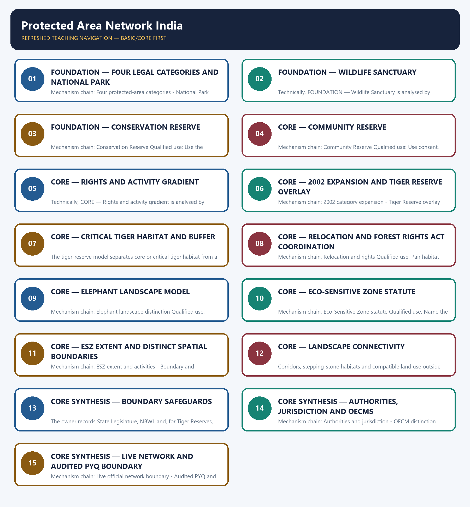

# Protected Area Network India — Learner-v2 Complete Learning Session

> **Authoring-only generation:** 2026-09-03. No PDF was rendered and no tracker or index was mutated.

### SOURCE, PROGRESSION AND CURRENT-LINKAGE AUDIT

- **Generation date:** 2026-09-03.
- **Repository-first evidence:** the Basic owner is taught first and preserved in full; the Advanced owner is retained only in the optional final teaching block.
- **OCR evidence:** Repository Markdown was primary. OCR-searchable local official General Studies papers were used only to confirm printed routed demands. No answer key, marking scheme, unsupported page precision, ecological rate, species count or current status was inferred.
- **Qdrant:** not used; repository Markdown and available OCR context were sufficient.
- **PYQ integrity:** Audited ledgers route named parks and habitats, Community Reserve governance, a 2023 GS-I sanctuary demand and a provisional 2026 Madhav National Park, Tiger Reserve and Sakhya Sagar distinction. The Mains demand receives an independently authored model; objective keys, current counts and unstated legal boundaries are not inferred.
- **Live-link boundary:** MoEFCC's wildlife page was substantively retrieved on 2026-09-03 and used only to confirm the four categories and conservation outside PAs. Its undated count was not promoted as latest. WII ENVIS did not resolve, India Code returned HTTP 403, and ESZ material was used only to confirm notification-specific mapping, not a uniform width or individual boundary.
- **Fact/inference discipline:** no current-affairs item, PYQ wording, figure or quotation is invented.

### LIVE OFFICIAL-SOURCE ATTEMPT LOG

The checks below were made on 2026-09-03. Substantive official text is used only for the proposition it supports. Stubs, access failures, unrelated pages and thin landing pages are recorded and are not converted into ecological or current-status claims.

- https://moef.gov.in/wildlife-wl — attempted 2026-09-03; substantive MoEFCC text confirmed the four protected-area categories and the separate support for wildlife outside protected areas. Its displayed count was not promoted as a latest figure because the page gives no reliable update date.
- http://www.wiienvis.nic.in/Database/Protected_Area_854.aspx — attempted 2026-09-03; the host could not be resolved, so no protected-area count, area or notification date was imported.
- https://moef.gov.in/esz-notifications — attempted 2026-09-03; the page returned substantive notification and map links, confirming that ESZ boundaries are notification-specific. No individual site's legal boundary was inferred.
- https://moef.gov.in/uploads/2017/06/1%20Guidelines%20for%20Eco-Sensitive%20Zones%20around%20Protected%20Areas.pdf — attempted 2026-09-03; the official PDF was retrievable only as raw PDF bytes, so no width, village list or activity classification was extracted.
- https://www.indiacode.nic.in/indiacode/handle/123456789/12931?view_type=browse — attempted 2026-09-03; India Code returned HTTP 403, so exact statutory text remains bounded to repository owners.

## BASIC LEARNING SESSION

### DEEP-REVIEW LEARNING CONTRACT

| Control | Binding rule for this package |
|---|---|
| Syllabus boundary | Complete Environment and Ecology Basic/Core is answer-complete before optional Advanced depth. |
| Ecology boundary | System boundary, scale, trophic level, stock/flow, pool/flux, gross/net, unit and time interval are explicit. |
| Species boundary | Taxon, range, habitat, population trend, IUCN assessment, Indian legal schedule, CITES/CMS listing and endemism remain distinct. |
| Law/status boundary | Act, amendment, rule, notification, draft, judgment, policy, target, implementation and observed outcome remain distinct and dated. |
| Institution boundary | Legal form, parent authority, mandate, jurisdiction, standard, consent, enforcement, science and adjudication are not conflated. |
| Treaty boundary | Membership, annex/appendix, amendment acceptance, target, COP decision, national instrument and outcome remain distinct. |
| Climate boundary | Emission flow, concentration stock, cumulative budget, forcing, scenario, baseline, unit, mitigation, adaptation, loss-and-damage, avoidance and removal are exact. |
| Pollution boundary | Source, emission/load, ambient concentration, exposure, parameter, averaging period, unit, standard and jurisdiction are explicit. |
| Causal method | Chronology, designation, expenditure, capacity, registration and correlation are not promoted into ecological or policy outcomes without mechanism and evidence. |
| Practice contract | Every solved item has demand decoding, detailed examiner-grade model, executable timed/compression plan, marks rationale and answer-specific improvement. |
| Approval | This immutable successor remains `approved: false` pending explicit approval. |

**Canonical Basic/Core owner:** `upsc-ai-kit\knowledge\Environment-and-Ecology\basic\06_Protected-Area-Network-India.md`  
**Substantive canonical provenance owner:** `upsc-ai-kit\knowledge\Environment-and-Ecology\learning-sessions\v2\subject-wide-syllabus\environment-and-ecology-06_Learning-Session.md`  
**Optional Advanced owner:** `upsc-ai-kit\knowledge\Environment-and-Ecology\advanced\06_Protected-Area-Network-India.md`  
**Official syllabus mapping:** `upsc-ai-kit\knowledge\Environment-and-Ecology\OFFICIAL-UPSC-SYLLABUS-MAPPING.md`

### EVIDENCE, PYQ AND CURRENT-STATUS CONTROL

- Ecological mechanisms retain direction, pool, flux, limiting factor, spatial scale and time scale.
- Current species/news claims retain taxon, source, event/publication date, assessment/listing date and access date.
- IUCN category never substitutes for Wildlife Protection Act schedule, CITES appendix, CMS appendix or endemism.
- Protected-area categories, treaty designations and institution mandates retain exact legal character.
- Acts, amendments, rules, draft instruments, notifications and judgments retain operative status and date.
- Climate figures retain unit, baseline, period, scenario and stock-flow character; global evidence is not silently downscaled to India.
- Mitigation, adaptation and loss-and-damage remain separate; allowance, offset, avoidance, removal, capture and storage remain separate.
- PYQ wording is preserved only where verified; reconstructed or routed demands remain labelled.
- **Current-status note, rechecked 2026-09-03:** volatile targets, standards, schedules, species status, treaty outcomes and programme claims retain source/date/status.

**Generation-local live/current sources:**
- `https://moef.gov.in/wildlife-wl — attempted 2026-09-03; substantive MoEFCC text confirmed the four protected-area categories and the separate support for wildlife outside protected areas. Its displayed count was not promoted as a latest figure because the page gives no reliable update date.`
- `http://www.wiienvis.nic.in/Database/Protected_Area_854.aspx — attempted 2026-09-03; the host could not be resolved, so no protected-area count, area or notification date was imported.`
- `https://moef.gov.in/esz-notifications — attempted 2026-09-03; the page returned substantive notification and map links, confirming that ESZ boundaries are notification-specific. No individual site's legal boundary was inferred.`
- `https://moef.gov.in/uploads/2017/06/1%20Guidelines%20for%20Eco-Sensitive%20Zones%20around%20Protected%20Areas.pdf — attempted 2026-09-03; the official PDF was retrievable only as raw PDF bytes, so no width, village list or activity classification was extracted.`
- `https://www.indiacode.nic.in/indiacode/handle/123456789/12931?view_type=browse — attempted 2026-09-03; India Code returned HTTP 403, so exact statutory text remains bounded to repository owners.`

**Topic 26 dedicated Disaster Management cross-owners (scope boundary):**
- Not applicable to this topic.




*Distinct embedded teaching-navigation image. The separate continuous Cārvāka-style flowchart package remains an independent at-a-glance artifact.*

### SESSION 1 — FOUNDATION — FOUR LEGAL CATEGORIES AND NATIONAL PARK

#### DEFINITION / WHAT THIS IS CALLED

**Plain-language definition:** The owner separates National Park, Wildlife Sanctuary, Conservation Reserve and Community Reserve under the Wildlife Protection Act; they are not one uniform land category.

**Technical definition:** Mechanism chain: Four protected-area categories - National Park Qualified use: Open with all four categories and the National Park regime.

#### ANSWER-GRABBING OPENING — WRITE/ADAPT IN THE EXAM

> The owner separates National Park, Wildlife Sanctuary, Conservation Reserve and Community Reserve under the Wildlife Protection Act; they are not one uniform land category.

#### MUST-WRITE KEYWORDS

- **FOUNDATION**
- **Four legal categories**
- **National Park**
- **Mechanism chain**
- **Qualified use**
- **Wildlife Sanctuary**

**How to use them:** Frame the answer through FOUNDATION; define Four legal categories, connect National Park with Mechanism chain to explain the mechanism, and use Qualified use for the decisive comparison or qualification.

#### VISUAL FIRST

```text
FOUR LEGAL CATEGORIES AND NATIONAL PARK
01. Four protected-area categories
    |
    v
02. National Park
BOUNDARY -> Do not treat every protected area as a National Park.
```

*This topic-specific rail fixes the evidence sequence and its exam boundary before analysis.*

#### CORE EXPLANATION

The owner separates National Park, Wildlife Sanctuary, Conservation Reserve and Community Reserve under the Wildlife Protection Act; they are not one uniform land category. A National Park uses the strictest of the four owner-described regimes; rights, grazing, entry and activities remain governed by the Act and the area's notification.

#### NAMED EVIDENCE AND MECHANISM

- The owner separates National Park, Wildlife Sanctuary, Conservation Reserve and Community Reserve under the Wildlife Protection Act; they are not one uniform land category.
- A National Park uses the strictest of the four owner-described regimes; rights, grazing, entry and activities remain governed by the Act and the area's notification.

#### EXAMINER CAUTION

- Do not treat every protected area as a National Park.

#### EXAM LINK

- **Prelims:** Preserve the exact ecological level, system boundary, stock or flow, pyramid parameter, succession substrate, biome scale, taxonomic term and scientific or legal status; never turn a context-dependent pattern into a universal rule.
- **Mains:** Open with all four categories and the National Park regime.

#### MINI RECAP

- **Mechanism chain:** Four protected-area categories -> National Park
- **Qualified use:** Open with all four categories and the National Park regime.

#### CLOSING RECALL FLOW — FOUNDATION — FOUR LEGAL CATEGORIES AND NATIONAL PARK

```text
START / CONCEPT: FOUNDATION — Four legal categories and National Park
        |
        v
EXACT TERMS: FOUNDATION · Four legal categories · National Park · Mechanism chain · Qualified use · Wildlife Sanctuary
        |
        v
MECHANISM / ARGUMENT: Mechanism chain: Four protected-area categories - National Park Qualified use: Open with all four categories and the National Park regime.
        |
        v
CONSEQUENCE / CONTRAST: Do not treat every protected area as a National Park.
        |
        v
UPSC TRAP / ANSWER-USE: Do not miss this limiting distinction: a National Park uses the strictest of the four owner-described regimes.
        |
        v
ANSWER-GRABBING FORMULATION: The owner separates National Park, Wildlife Sanctuary, Conservation Reserve and Community Reserve under the Wildlife Protection Act; they are not one uniform land category.
```
### SESSION 2 — FOUNDATION — WILDLIFE SANCTUARY

#### DEFINITION / WHAT THIS IS CALLED

**Plain-language definition:** Mechanism chain: Wildlife Sanctuary Qualified use: Contrast Sanctuary rights and regulated activity with a National Park.

**Technical definition:** Technically, FOUNDATION — Wildlife Sanctuary is analysed by relating FOUNDATION to Wildlife Sanctuary, then testing the relationship through Mechanism chain and Qualified use.

#### ANSWER-GRABBING OPENING — WRITE/ADAPT IN THE EXAM

> Do not assign National Park restrictions automatically to every Sanctuary.

#### MUST-WRITE KEYWORDS

- **FOUNDATION**
- **Wildlife Sanctuary**
- **Mechanism chain**
- **Qualified use**
- **National Park**
- **Sanctuary**

**How to use them:** Frame the answer through FOUNDATION; define Wildlife Sanctuary, connect Mechanism chain with Qualified use to explain the mechanism, and use National Park for the decisive comparison or qualification.

#### VISUAL FIRST

```text
WILDLIFE SANCTUARY
01. Wildlife Sanctuary
BOUNDARY -> Do not assign National Park restrictions automatically to every Sanctuary.
```

*This topic-specific rail fixes the evidence sequence and its exam boundary before analysis.*

#### CORE EXPLANATION

A Wildlife Sanctuary protects wildlife and habitat while permitting a different, generally less restrictive rights and regulated-activity settlement than a National Park.

#### NAMED EVIDENCE AND MECHANISM

- A Wildlife Sanctuary protects wildlife and habitat while permitting a different, generally less restrictive rights and regulated-activity settlement than a National Park.

#### EXAMINER CAUTION

- Do not assign National Park restrictions automatically to every Sanctuary.

#### EXAM LINK

- **Prelims:** Preserve the exact ecological level, system boundary, stock or flow, pyramid parameter, succession substrate, biome scale, taxonomic term and scientific or legal status; never turn a context-dependent pattern into a universal rule.
- **Mains:** Contrast Sanctuary rights and regulated activity with a National Park.

#### MINI RECAP

- **Mechanism chain:** Wildlife Sanctuary
- **Qualified use:** Contrast Sanctuary rights and regulated activity with a National Park.

#### CLOSING RECALL FLOW — FOUNDATION — WILDLIFE SANCTUARY

```text
START / CONCEPT: FOUNDATION — Wildlife Sanctuary
        |
        v
EXACT TERMS: FOUNDATION · Wildlife Sanctuary · Mechanism chain · Qualified use · National Park · Sanctuary
        |
        v
MECHANISM / ARGUMENT: Mechanism chain: Wildlife Sanctuary Qualified use: Contrast Sanctuary rights and regulated activity with a National Park.
        |
        v
CONSEQUENCE / CONTRAST: The resulting consequence is that contrast Sanctuary rights and regulated activity with a National Park.
        |
        v
UPSC TRAP / ANSWER-USE: Do not miss this limiting distinction: contrast Sanctuary rights and regulated activity with a National Park.
        |
        v
ANSWER-GRABBING FORMULATION: Do not assign National Park restrictions automatically to every Sanctuary.
```
### SESSION 3 — FOUNDATION — CONSERVATION RESERVE

#### DEFINITION / WHAT THIS IS CALLED

**Plain-language definition:** A Conservation Reserve is a statutory connector or buffer category generally associated with government land and consultation with local communities.

**Technical definition:** Mechanism chain: Conservation Reserve Qualified use: Use the connector or buffer function and government-land basis carefully.

#### ANSWER-GRABBING OPENING — WRITE/ADAPT IN THE EXAM

> A Conservation Reserve is a statutory connector or buffer category generally associated with government land and consultation with local communities.

#### MUST-WRITE KEYWORDS

- **FOUNDATION**
- **Conservation Reserve**
- **Mechanism chain**
- **Qualified use**
- **A Conservation Reserve**
- **Conservation Reserve Qualified**

**How to use them:** Frame the answer through FOUNDATION; define Conservation Reserve, connect Mechanism chain with Qualified use to explain the mechanism, and use A Conservation Reserve for the decisive comparison or qualification.

#### VISUAL FIRST

```text
CONSERVATION RESERVE
01. Conservation Reserve
BOUNDARY -> Do not describe a Conservation Reserve as community-owned land by definition.
```

*This topic-specific rail fixes the evidence sequence and its exam boundary before analysis.*

#### CORE EXPLANATION

A Conservation Reserve is a statutory connector or buffer category generally associated with government land and consultation with local communities.

#### NAMED EVIDENCE AND MECHANISM

- A Conservation Reserve is a statutory connector or buffer category generally associated with government land and consultation with local communities.

#### EXAMINER CAUTION

- Do not describe a Conservation Reserve as community-owned land by definition.

#### EXAM LINK

- **Prelims:** Preserve the exact ecological level, system boundary, stock or flow, pyramid parameter, succession substrate, biome scale, taxonomic term and scientific or legal status; never turn a context-dependent pattern into a universal rule.
- **Mains:** Use the connector or buffer function and government-land basis carefully.

#### MINI RECAP

- **Mechanism chain:** Conservation Reserve
- **Qualified use:** Use the connector or buffer function and government-land basis carefully.

#### CLOSING RECALL FLOW — FOUNDATION — CONSERVATION RESERVE

```text
START / CONCEPT: FOUNDATION — Conservation Reserve
        |
        v
EXACT TERMS: FOUNDATION · Conservation Reserve · Mechanism chain · Qualified use · A Conservation Reserve · Conservation Reserve Qualified
        |
        v
MECHANISM / ARGUMENT: Mechanism chain: Conservation Reserve Qualified use: Use the connector or buffer function and government-land basis carefully.
        |
        v
CONSEQUENCE / CONTRAST: Do not describe a Conservation Reserve as community-owned land by definition.
        |
        v
UPSC TRAP / ANSWER-USE: Do not miss this limiting distinction: use the connector or buffer function and government-land basis carefully.
        |
        v
ANSWER-GRABBING FORMULATION: A Conservation Reserve is a statutory connector or buffer category generally associated with government land and consultation with local communities.
```
### SESSION 4 — CORE — COMMUNITY RESERVE

#### DEFINITION / WHAT THIS IS CALLED

**Plain-language definition:** A Community Reserve is a consent-based category on community or private land with a continuing local management role.

**Technical definition:** Mechanism chain: Community Reserve Qualified use: Use consent, tenure and local management as the distinguishing axis.

#### ANSWER-GRABBING OPENING — WRITE/ADAPT IN THE EXAM

> A Community Reserve is a consent-based category on community or private land with a continuing local management role.

#### MUST-WRITE KEYWORDS

- **Community Reserve**
- **Mechanism chain**
- **Qualified use**
- **A Community Reserve**
- **Community Reserve Qualified**
- **CORE — Community Reserve**

**How to use them:** Frame the answer through Community Reserve; define Mechanism chain, connect Qualified use with A Community Reserve to explain the mechanism, and use Community Reserve Qualified for the decisive comparison or qualification.

#### VISUAL FIRST

```text
COMMUNITY RESERVE
01. Community Reserve
BOUNDARY -> Do not describe a Community Reserve without the consent and management role.
```

*This topic-specific rail fixes the evidence sequence and its exam boundary before analysis.*

#### CORE EXPLANATION

A Community Reserve is a consent-based category on community or private land with a continuing local management role.

#### NAMED EVIDENCE AND MECHANISM

- A Community Reserve is a consent-based category on community or private land with a continuing local management role.

#### EXAMINER CAUTION

- Do not describe a Community Reserve without the consent and management role.

#### EXAM LINK

- **Prelims:** Preserve the exact ecological level, system boundary, stock or flow, pyramid parameter, succession substrate, biome scale, taxonomic term and scientific or legal status; never turn a context-dependent pattern into a universal rule.
- **Mains:** Use consent, tenure and local management as the distinguishing axis.

#### MINI RECAP

- **Mechanism chain:** Community Reserve
- **Qualified use:** Use consent, tenure and local management as the distinguishing axis.

#### CLOSING RECALL FLOW — CORE — COMMUNITY RESERVE

```text
START / CONCEPT: CORE — Community Reserve
        |
        v
EXACT TERMS: Community Reserve · Mechanism chain · Qualified use · A Community Reserve · Community Reserve Qualified · CORE — Community Reserve
        |
        v
MECHANISM / ARGUMENT: Mechanism chain: Community Reserve Qualified use: Use consent, tenure and local management as the distinguishing axis.
        |
        v
CONSEQUENCE / CONTRAST: Do not describe a Community Reserve without the consent and management role.
        |
        v
UPSC TRAP / ANSWER-USE: Do not miss this limiting distinction: use consent, tenure and local management as the distinguishing axis.
        |
        v
ANSWER-GRABBING FORMULATION: A Community Reserve is a consent-based category on community or private land with a continuing local management role.
```
### SESSION 5 — CORE — RIGHTS AND ACTIVITY GRADIENT

#### DEFINITION / WHAT THIS IS CALLED

**Plain-language definition:** Mechanism chain: Rights and activity gradient Qualified use: Fix the category and notification before asserting an activity or right.

**Technical definition:** Technically, CORE — Rights and activity gradient is analysed by relating Rights to activity gradient, then testing the relationship through Mechanism chain and Qualified use.

#### ANSWER-GRABBING OPENING — WRITE/ADAPT IN THE EXAM

> Mechanism chain: Rights and activity gradient Qualified use: Fix the category and notification before asserting an activity or right.

#### MUST-WRITE KEYWORDS

- **Rights**
- **activity gradient**
- **Mechanism chain**
- **Qualified use**
- **Act**
- **Qualified**

**How to use them:** Frame the answer through Rights; define activity gradient, connect Mechanism chain with Qualified use to explain the mechanism, and use Act for the decisive comparison or qualification.

#### VISUAL FIRST

```text
RIGHTS AND ACTIVITY GRADIENT
01. Rights and activity gradient
BOUNDARY -> Do not infer permitted activity without the Act and site notification.
```

*This topic-specific rail fixes the evidence sequence and its exam boundary before analysis.*

#### CORE EXPLANATION

Permitted rights and activities vary by legal category and site-specific notification; strictness cannot be inferred from the generic phrase protected area.

#### NAMED EVIDENCE AND MECHANISM

- Permitted rights and activities vary by legal category and site-specific notification; strictness cannot be inferred from the generic phrase protected area.

#### EXAMINER CAUTION

- Do not infer permitted activity without the Act and site notification.

#### EXAM LINK

- **Prelims:** Preserve the exact ecological level, system boundary, stock or flow, pyramid parameter, succession substrate, biome scale, taxonomic term and scientific or legal status; never turn a context-dependent pattern into a universal rule.
- **Mains:** Fix the category and notification before asserting an activity or right.

#### MINI RECAP

- **Mechanism chain:** Rights and activity gradient
- **Qualified use:** Fix the category and notification before asserting an activity or right.

#### CLOSING RECALL FLOW — CORE — RIGHTS AND ACTIVITY GRADIENT

```text
START / CONCEPT: CORE — Rights and activity gradient
        |
        v
EXACT TERMS: Rights · activity gradient · Mechanism chain · Qualified use · Act · Qualified
        |
        v
MECHANISM / ARGUMENT: Do not infer permitted activity without the Act and site notification.
        |
        v
CONSEQUENCE / CONTRAST: The resulting consequence is that rights and activity gradient Qualified use.
        |
        v
UPSC TRAP / ANSWER-USE: Do not miss this limiting distinction: rights and activity gradient Qualified use.
        |
        v
ANSWER-GRABBING FORMULATION: Mechanism chain: Rights and activity gradient Qualified use: Fix the category and notification before asserting an activity or right.
```
### SESSION 6 — CORE — 2002 EXPANSION AND TIGER RESERVE OVERLAY

#### DEFINITION / WHAT THIS IS CALLED

**Plain-language definition:** A Tiger Reserve is a species-management overlay under the NTCA framework and does not erase the underlying National Park, Sanctuary or other land status.

**Technical definition:** Mechanism chain: 2002 category expansion - Tiger Reserve overlay Qualified use: Explain the 2002 expansion and present Tiger Reserve as an overlay.

#### ANSWER-GRABBING OPENING — WRITE/ADAPT IN THE EXAM

> Mechanism chain: 2002 category expansion - Tiger Reserve overlay Qualified use: Explain the 2002 expansion and present Tiger Reserve as an overlay.

#### MUST-WRITE KEYWORDS

- **Tiger Reserve overlay**
- **Mechanism chain**
- **Qualified use**
- **A Tiger Reserve**
- **Tiger Reserve**
- **NTCA**

**How to use them:** Frame the answer through Tiger Reserve overlay; define Mechanism chain, connect Qualified use with A Tiger Reserve to explain the mechanism, and use Tiger Reserve for the decisive comparison or qualification.

#### VISUAL FIRST

```text
2002 EXPANSION AND TIGER RESERVE OVERLAY
01. 2002 category expansion
    |
    v
02. Tiger Reserve overlay
BOUNDARY -> Do not date all four categories to the original 1972 enactment.
```

*This topic-specific rail fixes the evidence sequence and its exam boundary before analysis.*

#### CORE EXPLANATION

The owner attributes Conservation Reserves and Community Reserves to the 2002 amendment, extending conservation beyond exclusion-oriented core categories. A Tiger Reserve is a species-management overlay under the NTCA framework and does not erase the underlying National Park, Sanctuary or other land status.

#### NAMED EVIDENCE AND MECHANISM

- The owner attributes Conservation Reserves and Community Reserves to the 2002 amendment, extending conservation beyond exclusion-oriented core categories.
- A Tiger Reserve is a species-management overlay under the NTCA framework and does not erase the underlying National Park, Sanctuary or other land status.

#### EXAMINER CAUTION

- Do not date all four categories to the original 1972 enactment.

#### EXAM LINK

- **Prelims:** Preserve the exact ecological level, system boundary, stock or flow, pyramid parameter, succession substrate, biome scale, taxonomic term and scientific or legal status; never turn a context-dependent pattern into a universal rule.
- **Mains:** Explain the 2002 expansion and present Tiger Reserve as an overlay.

#### MINI RECAP

- **Mechanism chain:** 2002 category expansion -> Tiger Reserve overlay
- **Qualified use:** Explain the 2002 expansion and present Tiger Reserve as an overlay.

#### CLOSING RECALL FLOW — CORE — 2002 EXPANSION AND TIGER RESERVE OVERLAY

```text
START / CONCEPT: CORE — 2002 expansion and Tiger Reserve overlay
        |
        v
EXACT TERMS: Tiger Reserve overlay · Mechanism chain · Qualified use · A Tiger Reserve · Tiger Reserve · NTCA
        |
        v
MECHANISM / ARGUMENT: A Tiger Reserve is a species-management overlay under the NTCA framework and does not erase the underlying National Park, Sanctuary or other land status.
        |
        v
CONSEQUENCE / CONTRAST: Mains: Explain the 2002 expansion and present Tiger Reserve as an overlay.
        |
        v
UPSC TRAP / ANSWER-USE: Do not date all four categories to the original 1972 enactment.
        |
        v
ANSWER-GRABBING FORMULATION: Mechanism chain: 2002 category expansion - Tiger Reserve overlay Qualified use: Explain the 2002 expansion and present Tiger Reserve as an overlay.
```
### SESSION 7 — CORE — CRITICAL TIGER HABITAT AND BUFFER

#### DEFINITION / WHAT THIS IS CALLED

**Plain-language definition:** Mechanism chain: Critical tiger habitat and buffer Qualified use: Keep core and buffer boundaries tied to the particular reserve.

**Technical definition:** The tiger-reserve model separates core or critical tiger habitat from a buffer or peripheral area; each boundary and management claim must remain site-specific.

#### ANSWER-GRABBING OPENING — WRITE/ADAPT IN THE EXAM

> Mechanism chain: Critical tiger habitat and buffer Qualified use: Keep core and buffer boundaries tied to the particular reserve.

#### MUST-WRITE KEYWORDS

- **Critical tiger habitat**
- **buffer**
- **Mechanism chain**
- **Qualified use**
- **Tiger Reserve**
- **Critical**

**How to use them:** Frame the answer through Critical tiger habitat; define buffer, connect Mechanism chain with Qualified use to explain the mechanism, and use Tiger Reserve for the decisive comparison or qualification.

#### VISUAL FIRST

```text
CRITICAL TIGER HABITAT AND BUFFER
01. Critical tiger habitat and buffer
BOUNDARY -> Do not call a Tiger Reserve a fifth generic protected-area land category.
```

*This topic-specific rail fixes the evidence sequence and its exam boundary before analysis.*

#### CORE EXPLANATION

The tiger-reserve model separates core or critical tiger habitat from a buffer or peripheral area; each boundary and management claim must remain site-specific.

#### NAMED EVIDENCE AND MECHANISM

- The tiger-reserve model separates core or critical tiger habitat from a buffer or peripheral area; each boundary and management claim must remain site-specific.

#### EXAMINER CAUTION

- Do not call a Tiger Reserve a fifth generic protected-area land category.

#### EXAM LINK

- **Prelims:** Preserve the exact ecological level, system boundary, stock or flow, pyramid parameter, succession substrate, biome scale, taxonomic term and scientific or legal status; never turn a context-dependent pattern into a universal rule.
- **Mains:** Keep core and buffer boundaries tied to the particular reserve.

#### MINI RECAP

- **Mechanism chain:** Critical tiger habitat and buffer
- **Qualified use:** Keep core and buffer boundaries tied to the particular reserve.

#### CLOSING RECALL FLOW — CORE — CRITICAL TIGER HABITAT AND BUFFER

```text
START / CONCEPT: CORE — Critical tiger habitat and buffer
        |
        v
EXACT TERMS: Critical tiger habitat · buffer · Mechanism chain · Qualified use · Tiger Reserve · Critical
        |
        v
MECHANISM / ARGUMENT: The tiger-reserve model separates core or critical tiger habitat from a buffer or peripheral area; each boundary and management claim must remain site-specific.
        |
        v
CONSEQUENCE / CONTRAST: Do not call a Tiger Reserve a fifth generic protected-area land category.
        |
        v
UPSC TRAP / ANSWER-USE: Do not miss this limiting distinction: critical tiger habitat and buffer Qualified use.
        |
        v
ANSWER-GRABBING FORMULATION: Mechanism chain: Critical tiger habitat and buffer Qualified use: Keep core and buffer boundaries tied to the particular reserve.
```
### SESSION 8 — CORE — RELOCATION AND FOREST RIGHTS ACT COORDINATION

#### DEFINITION / WHAT THIS IS CALLED

**Plain-language definition:** The owner requires voluntary informed consent and rehabilitation for relocation from critical tiger habitat and flags coordination with Forest Rights Act processes.

**Technical definition:** Mechanism chain: Relocation and rights Qualified use: Pair habitat protection with consent, rehabilitation and tenure recognition.

#### ANSWER-GRABBING OPENING — WRITE/ADAPT IN THE EXAM

> The owner requires voluntary informed consent and rehabilitation for relocation from critical tiger habitat and flags coordination with Forest Rights Act processes.

#### MUST-WRITE KEYWORDS

- **Relocation**
- **Forest Rights Act coordination**
- **Mechanism chain**
- **Qualified use**
- **Forest Rights Act**
- **ESZ**

**How to use them:** Frame the answer through Relocation; define Forest Rights Act coordination, connect Mechanism chain with Qualified use to explain the mechanism, and use Forest Rights Act for the decisive comparison or qualification.

#### VISUAL FIRST

```text
RELOCATION AND FOREST RIGHTS ACT COORDINATION
01. Relocation and rights
BOUNDARY -> Do not treat core, buffer and ESZ as interchangeable boundaries.
```

*This topic-specific rail fixes the evidence sequence and its exam boundary before analysis.*

#### CORE EXPLANATION

The owner requires voluntary informed consent and rehabilitation for relocation from critical tiger habitat and flags coordination with Forest Rights Act processes.

#### NAMED EVIDENCE AND MECHANISM

- The owner requires voluntary informed consent and rehabilitation for relocation from critical tiger habitat and flags coordination with Forest Rights Act processes.

#### EXAMINER CAUTION

- Do not treat core, buffer and ESZ as interchangeable boundaries.

#### EXAM LINK

- **Prelims:** Preserve the exact ecological level, system boundary, stock or flow, pyramid parameter, succession substrate, biome scale, taxonomic term and scientific or legal status; never turn a context-dependent pattern into a universal rule.
- **Mains:** Pair habitat protection with consent, rehabilitation and tenure recognition.

#### MINI RECAP

- **Mechanism chain:** Relocation and rights
- **Qualified use:** Pair habitat protection with consent, rehabilitation and tenure recognition.

#### CLOSING RECALL FLOW — CORE — RELOCATION AND FOREST RIGHTS ACT COORDINATION

```text
START / CONCEPT: CORE — Relocation and Forest Rights Act coordination
        |
        v
EXACT TERMS: Relocation · Forest Rights Act coordination · Mechanism chain · Qualified use · Forest Rights Act · ESZ
        |
        v
MECHANISM / ARGUMENT: Mechanism chain: Relocation and rights Qualified use: Pair habitat protection with consent, rehabilitation and tenure recognition.
        |
        v
CONSEQUENCE / CONTRAST: Do not treat core, buffer and ESZ as interchangeable boundaries.
        |
        v
UPSC TRAP / ANSWER-USE: Do not miss this limiting distinction: the owner requires voluntary informed consent and rehabilitation for relocation from critical tiger habitat...
        |
        v
ANSWER-GRABBING FORMULATION: The owner requires voluntary informed consent and rehabilitation for relocation from critical tiger habitat and flags coordination with Forest Rights Act processes.
```
### SESSION 9 — CORE — ELEPHANT LANDSCAPE MODEL

#### DEFINITION / WHAT THIS IS CALLED

**Plain-language definition:** Elephant reserves and corridors rely more on landscape coordination than an NTCA-equivalent statutory core-buffer mechanism; the two species models are not interchangeable.

**Technical definition:** Mechanism chain: Elephant landscape distinction Qualified use: Match reserve design to elephant ranging ecology and corridors.

#### ANSWER-GRABBING OPENING — WRITE/ADAPT IN THE EXAM

> Elephant reserves and corridors rely more on landscape coordination than an NTCA-equivalent statutory core-buffer mechanism; the two species models are not interchangeable.

#### MUST-WRITE KEYWORDS

- **Elephant landscape model**
- **Mechanism chain**
- **Qualified use**
- **Elephant**
- **NTCA-equivalent**
- **Qualified**

**How to use them:** Frame the answer through Elephant landscape model; define Mechanism chain, connect Qualified use with Elephant to explain the mechanism, and use NTCA-equivalent for the decisive comparison or qualification.

#### VISUAL FIRST

```text
ELEPHANT LANDSCAPE MODEL
01. Elephant landscape distinction
BOUNDARY -> Do not present relocation as automatic or rights-free.
```

*This topic-specific rail fixes the evidence sequence and its exam boundary before analysis.*

#### CORE EXPLANATION

Elephant reserves and corridors rely more on landscape coordination than an NTCA-equivalent statutory core-buffer mechanism; the two species models are not interchangeable.

#### NAMED EVIDENCE AND MECHANISM

- Elephant reserves and corridors rely more on landscape coordination than an NTCA-equivalent statutory core-buffer mechanism; the two species models are not interchangeable.

#### EXAMINER CAUTION

- Do not present relocation as automatic or rights-free.

#### EXAM LINK

- **Prelims:** Preserve the exact ecological level, system boundary, stock or flow, pyramid parameter, succession substrate, biome scale, taxonomic term and scientific or legal status; never turn a context-dependent pattern into a universal rule.
- **Mains:** Match reserve design to elephant ranging ecology and corridors.

#### MINI RECAP

- **Mechanism chain:** Elephant landscape distinction
- **Qualified use:** Match reserve design to elephant ranging ecology and corridors.

#### CLOSING RECALL FLOW — CORE — ELEPHANT LANDSCAPE MODEL

```text
START / CONCEPT: CORE — Elephant landscape model
        |
        v
EXACT TERMS: Elephant landscape model · Mechanism chain · Qualified use · Elephant · NTCA-equivalent · Qualified
        |
        v
MECHANISM / ARGUMENT: Mechanism chain: Elephant landscape distinction Qualified use: Match reserve design to elephant ranging ecology and corridors.
        |
        v
CONSEQUENCE / CONTRAST: Do not present relocation as automatic or rights-free.
        |
        v
UPSC TRAP / ANSWER-USE: Do not miss this limiting distinction: elephant reserves and corridors rely more on landscape coordination than an NTCA-equivalent statutory core-buffer...
        |
        v
ANSWER-GRABBING FORMULATION: Elephant reserves and corridors rely more on landscape coordination than an NTCA-equivalent statutory core-buffer mechanism; the two species models are not interchangeable.
```
### SESSION 10 — CORE — ECO-SENSITIVE ZONE STATUTE

#### DEFINITION / WHAT THIS IS CALLED

**Plain-language definition:** An Eco-Sensitive Zone is separately notified under the Environment Protection Act, not declared as a fifth protected-area category under the Wildlife Protection Act.

**Technical definition:** Mechanism chain: Eco-Sensitive Zone statute Qualified use: Name the Environment Protection Act and separate ESZ from a PA category.

#### ANSWER-GRABBING OPENING — WRITE/ADAPT IN THE EXAM

> An Eco-Sensitive Zone is separately notified under the Environment Protection Act, not declared as a fifth protected-area category under the Wildlife Protection Act.

#### MUST-WRITE KEYWORDS

- **Eco-Sensitive Zone statute**
- **Mechanism chain**
- **Qualified use**
- **An Eco-Sensitive Zone**
- **Environment Protection Act**
- **Wildlife Protection Act**

**How to use them:** Frame the answer through Eco-Sensitive Zone statute; define Mechanism chain, connect Qualified use with An Eco-Sensitive Zone to explain the mechanism, and use Environment Protection Act for the decisive comparison or qualification.

#### VISUAL FIRST

```text
ECO-SENSITIVE ZONE STATUTE
01. Eco-Sensitive Zone statute
BOUNDARY -> Do not give Elephant Reserves the NTCA's statutory core-buffer structure.
```

*This topic-specific rail fixes the evidence sequence and its exam boundary before analysis.*

#### CORE EXPLANATION

An Eco-Sensitive Zone is separately notified under the Environment Protection Act, not declared as a fifth protected-area category under the Wildlife Protection Act.

#### NAMED EVIDENCE AND MECHANISM

- An Eco-Sensitive Zone is separately notified under the Environment Protection Act, not declared as a fifth protected-area category under the Wildlife Protection Act.

#### EXAMINER CAUTION

- Do not give Elephant Reserves the NTCA's statutory core-buffer structure.

#### EXAM LINK

- **Prelims:** Preserve the exact ecological level, system boundary, stock or flow, pyramid parameter, succession substrate, biome scale, taxonomic term and scientific or legal status; never turn a context-dependent pattern into a universal rule.
- **Mains:** Name the Environment Protection Act and separate ESZ from a PA category.

#### MINI RECAP

- **Mechanism chain:** Eco-Sensitive Zone statute
- **Qualified use:** Name the Environment Protection Act and separate ESZ from a PA category.

#### CLOSING RECALL FLOW — CORE — ECO-SENSITIVE ZONE STATUTE

```text
START / CONCEPT: CORE — Eco-Sensitive Zone statute
        |
        v
EXACT TERMS: Eco-Sensitive Zone statute · Mechanism chain · Qualified use · An Eco-Sensitive Zone · Environment Protection Act · Wildlife Protection Act
        |
        v
MECHANISM / ARGUMENT: Mechanism chain: Eco-Sensitive Zone statute Qualified use: Name the Environment Protection Act and separate ESZ from a PA category.
        |
        v
CONSEQUENCE / CONTRAST: Do not give Elephant Reserves the NTCA's statutory core-buffer structure.
        |
        v
UPSC TRAP / ANSWER-USE: Do not miss this limiting distinction: an Eco-Sensitive Zone is separately notified under the Environment Protection Act, not declared as...
        |
        v
ANSWER-GRABBING FORMULATION: An Eco-Sensitive Zone is separately notified under the Environment Protection Act, not declared as a fifth protected-area category under the Wildlife Protection Act.
```
### SESSION 11 — CORE — ESZ EXTENT AND DISTINCT SPATIAL BOUNDARIES

#### DEFINITION / WHAT THIS IS CALLED

**Plain-language definition:** The notified protected-area boundary, a separately notified ESZ and the wider ecological corridor are distinct spatial objects even when they interact.

**Technical definition:** Mechanism chain: ESZ extent and activities - Boundary and surrounding landscape Qualified use: Draw PA, ESZ and corridor as distinct, site-specific spatial layers.

#### ANSWER-GRABBING OPENING — WRITE/ADAPT IN THE EXAM

> The notified protected-area boundary, a separately notified ESZ and the wider ecological corridor are distinct spatial objects even when they interact.

#### MUST-WRITE KEYWORDS

- **ESZ extent**
- **distinct spatial boundaries**
- **Mechanism chain**
- **Qualified use**
- **ESZ**
- **Wildlife Protection Act**

**How to use them:** Frame the answer through ESZ extent; define distinct spatial boundaries, connect Mechanism chain with Qualified use to explain the mechanism, and use ESZ for the decisive comparison or qualification.

#### VISUAL FIRST

```text
ESZ EXTENT AND DISTINCT SPATIAL BOUNDARIES
01. ESZ extent and activities
    |
    v
02. Boundary and surrounding landscape
BOUNDARY -> Do not place ESZ notification under the Wildlife Protection Act.
```

*This topic-specific rail fixes the evidence sequence and its exam boundary before analysis.*

#### CORE EXPLANATION

ESZ extent and prohibited, regulated or promoted activities come from the individual notification; there is no automatic uniform statutory width. The notified protected-area boundary, a separately notified ESZ and the wider ecological corridor are distinct spatial objects even when they interact.

#### NAMED EVIDENCE AND MECHANISM

- ESZ extent and prohibited, regulated or promoted activities come from the individual notification; there is no automatic uniform statutory width.
- The notified protected-area boundary, a separately notified ESZ and the wider ecological corridor are distinct spatial objects even when they interact.

#### EXAMINER CAUTION

- Do not place ESZ notification under the Wildlife Protection Act.

#### EXAM LINK

- **Prelims:** Preserve the exact ecological level, system boundary, stock or flow, pyramid parameter, succession substrate, biome scale, taxonomic term and scientific or legal status; never turn a context-dependent pattern into a universal rule.
- **Mains:** Draw PA, ESZ and corridor as distinct, site-specific spatial layers.

#### MINI RECAP

- **Mechanism chain:** ESZ extent and activities -> Boundary and surrounding landscape
- **Qualified use:** Draw PA, ESZ and corridor as distinct, site-specific spatial layers.

#### CLOSING RECALL FLOW — CORE — ESZ EXTENT AND DISTINCT SPATIAL BOUNDARIES

```text
START / CONCEPT: CORE — ESZ extent and distinct spatial boundaries
        |
        v
EXACT TERMS: ESZ extent · distinct spatial boundaries · Mechanism chain · Qualified use · ESZ · Wildlife Protection Act
        |
        v
MECHANISM / ARGUMENT: Mechanism chain: ESZ extent and activities - Boundary and surrounding landscape Qualified use: Draw PA, ESZ and corridor as distinct, site-specific spatial layers.
        |
        v
CONSEQUENCE / CONTRAST: Do not place ESZ notification under the Wildlife Protection Act.
        |
        v
UPSC TRAP / ANSWER-USE: Do not miss this limiting distinction: eSZ extent and prohibited, regulated or promoted activities come from the individual notification.
        |
        v
ANSWER-GRABBING FORMULATION: The notified protected-area boundary, a separately notified ESZ and the wider ecological corridor are distinct spatial objects even when they interact.
```
### SESSION 12 — CORE — LANDSCAPE CONNECTIVITY

#### DEFINITION / WHAT THIS IS CALLED

**Plain-language definition:** Mechanism chain: Connectivity Qualified use: Explain dispersal, stepping-stone habitat and outside-PA land use.

**Technical definition:** Corridors, stepping-stone habitats and compatible land use outside protected areas determine whether populations can disperse across a fragmented landscape.

#### ANSWER-GRABBING OPENING — WRITE/ADAPT IN THE EXAM

> Mechanism chain: Connectivity Qualified use: Explain dispersal, stepping-stone habitat and outside-PA land use.

#### MUST-WRITE KEYWORDS

- **Landscape connectivity**
- **Mechanism chain**
- **Qualified use**
- **Corridors**
- **ESZ**
- **PA**

**How to use them:** Frame the answer through Landscape connectivity; define Mechanism chain, connect Qualified use with Corridors to explain the mechanism, and use ESZ for the decisive comparison or qualification.

#### VISUAL FIRST

```text
LANDSCAPE CONNECTIVITY
01. Connectivity
BOUNDARY -> Do not apply a uniform ESZ width to every protected area.
```

*This topic-specific rail fixes the evidence sequence and its exam boundary before analysis.*

#### CORE EXPLANATION

Corridors, stepping-stone habitats and compatible land use outside protected areas determine whether populations can disperse across a fragmented landscape.

#### NAMED EVIDENCE AND MECHANISM

- Corridors, stepping-stone habitats and compatible land use outside protected areas determine whether populations can disperse across a fragmented landscape.

#### EXAMINER CAUTION

- Do not apply a uniform ESZ width to every protected area.

#### EXAM LINK

- **Prelims:** Preserve the exact ecological level, system boundary, stock or flow, pyramid parameter, succession substrate, biome scale, taxonomic term and scientific or legal status; never turn a context-dependent pattern into a universal rule.
- **Mains:** Explain dispersal, stepping-stone habitat and outside-PA land use.

#### MINI RECAP

- **Mechanism chain:** Connectivity
- **Qualified use:** Explain dispersal, stepping-stone habitat and outside-PA land use.

#### CLOSING RECALL FLOW — CORE — LANDSCAPE CONNECTIVITY

```text
START / CONCEPT: CORE — Landscape connectivity
        |
        v
EXACT TERMS: Landscape connectivity · Mechanism chain · Qualified use · Corridors · ESZ · PA
        |
        v
MECHANISM / ARGUMENT: Corridors, stepping-stone habitats and compatible land use outside protected areas determine whether populations can disperse across a fragmented landscape.
        |
        v
CONSEQUENCE / CONTRAST: Do not apply a uniform ESZ width to every protected area.
        |
        v
UPSC TRAP / ANSWER-USE: Do not miss this limiting distinction: explain dispersal, stepping-stone habitat and outside-PA land use.
        |
        v
ANSWER-GRABBING FORMULATION: Mechanism chain: Connectivity Qualified use: Explain dispersal, stepping-stone habitat and outside-PA land use.
```
### SESSION 13 — CORE SYNTHESIS — BOUNDARY SAFEGUARDS

#### DEFINITION / WHAT THIS IS CALLED

**Plain-language definition:** Mechanism chain: Boundary alteration safeguards Qualified use: Identify the applicable State Legislature, NBWL or NTCA safeguard.

**Technical definition:** The owner records State Legislature, NBWL and, for Tiger Reserves, NTCA roles in specified boundary alteration or de-notification safeguards; the applicable route must be checked.

#### ANSWER-GRABBING OPENING — WRITE/ADAPT IN THE EXAM

> Do not equate a legal boundary with the whole ecological landscape.

#### MUST-WRITE KEYWORDS

- **CORE SYNTHESIS**
- **Boundary safeguards**
- **Mechanism chain**
- **Qualified use**
- **NBWL**
- **Tiger Reserves**

**How to use them:** Frame the answer through CORE SYNTHESIS; define Boundary safeguards, connect Mechanism chain with Qualified use to explain the mechanism, and use NBWL for the decisive comparison or qualification.

#### VISUAL FIRST

```text
BOUNDARY SAFEGUARDS
01. Boundary alteration safeguards
BOUNDARY -> Do not equate a legal boundary with the whole ecological landscape.
```

*This topic-specific rail fixes the evidence sequence and its exam boundary before analysis.*

#### CORE EXPLANATION

The owner records State Legislature, NBWL and, for Tiger Reserves, NTCA roles in specified boundary alteration or de-notification safeguards; the applicable route must be checked.

#### NAMED EVIDENCE AND MECHANISM

- The owner records State Legislature, NBWL and, for Tiger Reserves, NTCA roles in specified boundary alteration or de-notification safeguards; the applicable route must be checked.

#### EXAMINER CAUTION

- Do not equate a legal boundary with the whole ecological landscape.

#### EXAM LINK

- **Prelims:** Preserve the exact ecological level, system boundary, stock or flow, pyramid parameter, succession substrate, biome scale, taxonomic term and scientific or legal status; never turn a context-dependent pattern into a universal rule.
- **Mains:** Identify the applicable State Legislature, NBWL or NTCA safeguard.

#### MINI RECAP

- **Mechanism chain:** Boundary alteration safeguards
- **Qualified use:** Identify the applicable State Legislature, NBWL or NTCA safeguard.

#### CLOSING RECALL FLOW — CORE SYNTHESIS — BOUNDARY SAFEGUARDS

```text
START / CONCEPT: CORE SYNTHESIS — Boundary safeguards
        |
        v
EXACT TERMS: CORE SYNTHESIS · Boundary safeguards · Mechanism chain · Qualified use · NBWL · Tiger Reserves
        |
        v
MECHANISM / ARGUMENT: Mechanism chain: Boundary alteration safeguards Qualified use: Identify the applicable State Legislature, NBWL or NTCA safeguard.
        |
        v
CONSEQUENCE / CONTRAST: The owner records State Legislature, NBWL and, for Tiger Reserves, NTCA roles in specified boundary alteration or de-notification safeguards; the applicable route must be checked.
        |
        v
UPSC TRAP / ANSWER-USE: Do not miss this limiting distinction: do not equate a legal boundary with the whole ecological landscape.
        |
        v
ANSWER-GRABBING FORMULATION: Do not equate a legal boundary with the whole ecological landscape.
```
### SESSION 14 — CORE SYNTHESIS — AUTHORITIES, JURISDICTION AND OECMS

#### DEFINITION / WHAT THIS IS CALLED

**Plain-language definition:** An OECM records sustained area-based conservation outside the formal protected-area system; it is not automatically a Wildlife Protection Act category.

**Technical definition:** Mechanism chain: Authorities and jurisdiction - OECM distinction Qualified use: Assign each institution and OECM to its correct jurisdiction.

#### ANSWER-GRABBING OPENING — WRITE/ADAPT IN THE EXAM

> Mechanism chain: Authorities and jurisdiction - OECM distinction Qualified use: Assign each institution and OECM to its correct jurisdiction.

#### MUST-WRITE KEYWORDS

- **CORE SYNTHESIS**
- **Authorities**
- **jurisdiction**
- **OECMs**
- **Mechanism chain**
- **Qualified use**

**How to use them:** Frame the answer through CORE SYNTHESIS; define Authorities, connect jurisdiction with OECMs to explain the mechanism, and use Mechanism chain for the decisive comparison or qualification.

#### VISUAL FIRST

```text
AUTHORITIES, JURISDICTION AND OECMS
01. Authorities and jurisdiction
    |
    v
02. OECM distinction
BOUNDARY -> Do not turn notification count into proof of connectivity or management quality.
```

*This topic-specific rail fixes the evidence sequence and its exam boundary before analysis.*

#### CORE EXPLANATION

State wildlife authorities manage the four categories, while NBWL, NTCA, WII and MoEFCC perform different approval, species-overlay, scientific and policy functions. An OECM records sustained area-based conservation outside the formal protected-area system; it is not automatically a Wildlife Protection Act category.

#### NAMED EVIDENCE AND MECHANISM

- State wildlife authorities manage the four categories, while NBWL, NTCA, WII and MoEFCC perform different approval, species-overlay, scientific and policy functions.
- An OECM records sustained area-based conservation outside the formal protected-area system; it is not automatically a Wildlife Protection Act category.

#### EXAMINER CAUTION

- Do not turn notification count into proof of connectivity or management quality.

#### EXAM LINK

- **Prelims:** Preserve the exact ecological level, system boundary, stock or flow, pyramid parameter, succession substrate, biome scale, taxonomic term and scientific or legal status; never turn a context-dependent pattern into a universal rule.
- **Mains:** Assign each institution and OECM to its correct jurisdiction.

#### MINI RECAP

- **Mechanism chain:** Authorities and jurisdiction -> OECM distinction
- **Qualified use:** Assign each institution and OECM to its correct jurisdiction.

#### CLOSING RECALL FLOW — CORE SYNTHESIS — AUTHORITIES, JURISDICTION AND OECMS

```text
START / CONCEPT: CORE SYNTHESIS — Authorities, jurisdiction and OECMs
        |
        v
EXACT TERMS: CORE SYNTHESIS · Authorities · jurisdiction · OECMs · Mechanism chain · Qualified use
        |
        v
MECHANISM / ARGUMENT: An OECM records sustained area-based conservation outside the formal protected-area system; it is not automatically a Wildlife Protection Act category.
        |
        v
CONSEQUENCE / CONTRAST: Do not turn notification count into proof of connectivity or management quality.
        |
        v
UPSC TRAP / ANSWER-USE: Do not miss this limiting distinction: authorities and jurisdiction - OECM distinction Qualified use.
        |
        v
ANSWER-GRABBING FORMULATION: Mechanism chain: Authorities and jurisdiction - OECM distinction Qualified use: Assign each institution and OECM to its correct jurisdiction.
```
### SESSION 15 — CORE SYNTHESIS — LIVE NETWORK AND AUDITED PYQ BOUNDARY

#### DEFINITION / WHAT THIS IS CALLED

**Plain-language definition:** Core proposition: India's protected-area network is a graded, legally defined hierarchy under the Wildlife Protection Act, 1972 — not a single uniform "protected forest" category — and species-specific reserve overlays (tiger, elephant) add focused management without replacing the underlying legal category.

**Technical definition:** Mechanism chain: Live official network boundary - Audited PYQ and designation route Qualified use: Close with dated evidence and no inferred network outcome or objective key.

#### ANSWER-GRABBING OPENING — WRITE/ADAPT IN THE EXAM

> Mechanism chain: Live official network boundary - Audited PYQ and designation route Qualified use: Close with dated evidence and no inferred network outcome or objective key.

#### MUST-WRITE KEYWORDS

- **CORE SYNTHESIS**
- **Live network**
- **audited PYQ boundary**
- **Mechanism chain**
- **Qualified use**
- **Subject**

**How to use them:** Frame the answer through CORE SYNTHESIS; define Live network, connect audited PYQ boundary with Mechanism chain to explain the mechanism, and use Qualified use for the decisive comparison or qualification.

#### VISUAL FIRST

```text
LIVE NETWORK AND AUDITED PYQ BOUNDARY
01. Live official network boundary
    |
    v
02. Audited PYQ and designation route
BOUNDARY -> Do not infer a current protected-area count from an undated official page.
```

*This topic-specific rail fixes the evidence sequence and its exam boundary before analysis.*

#### CORE EXPLANATION

MoEFCC's retrievable wildlife page confirmed the four categories and protection outside protected areas, but its undated displayed count was not adopted as the latest network total. Routed demands cover named parks, habitats, community-reserve governance and Madhav National Park, Tiger Reserve and Sakhya Sagar as separate designation functions; no objective key is inferred.

#### NAMED EVIDENCE AND MECHANISM

- MoEFCC's retrievable wildlife page confirmed the four categories and protection outside protected areas, but its undated displayed count was not adopted as the latest network total.
- Routed demands cover named parks, habitats, community-reserve governance and Madhav National Park, Tiger Reserve and Sakhya Sagar as separate designation functions; no objective key is inferred.

#### EXAMINER CAUTION

- Do not infer a current protected-area count from an undated official page.

#### EXAM LINK

- **Prelims:** Preserve the exact ecological level, system boundary, stock or flow, pyramid parameter, succession substrate, biome scale, taxonomic term and scientific or legal status; never turn a context-dependent pattern into a universal rule.
- **Mains:** Close with dated evidence and no inferred network outcome or objective key.

#### MINI RECAP

- **Mechanism chain:** Live official network boundary -> Audited PYQ and designation route
- **Qualified use:** Close with dated evidence and no inferred network outcome or objective key.
#### COMPLETE BASIC OWNER EVIDENCE BANK

> **Subject:** Environment and Ecology | **Tier:** Must-Do (foundation) | **GS Paper:** GS-III (Environment) + Prelims.
> **Core area:** In-situ conservation architecture.
> **Grounded in:** Wildlife Protection Act, 1972 (as amended); WII ENVIS Protected Area Database; NTCA (Project Tiger); audited UPSC Environment PYQs (2024-2026 Prelims and 2024-2025 Mains).
> ✅ = source-grounded | ⚠️ = analytical linkage | 📰 = dated current-affairs anchor.
> *Companion: `advanced/06_Protected-Area-Network-India.md`.*

#### 1. Visual foundation

```text
FOUR LEGAL CATEGORIES UNDER THE WILDLIFE PROTECTION ACT, 1972 (declining restriction, left to right)
National Park -> Wildlife Sanctuary -> Conservation Reserve -> Community Reserve
 (strictest;      (restricted human      (buffer/govt land,      (private/community
  no rights        activity, some         voluntary govt          land, voluntary,
  normally          rights allowed)        declaration)            local management)
  allowed)

SPECIES-SPECIFIC OVERLAY:  Tiger Reserves (NTCA) and Elephant Reserves (Project Elephant)
  are declared OVER existing National Parks/Sanctuaries for focused flagship-species management.
```

**Core proposition:** India's protected-area network is a graded, legally defined hierarchy
under the Wildlife Protection Act, 1972 — not a single uniform "protected forest" category —
and species-specific reserve overlays (tiger, elephant) add focused management without
replacing the underlying legal category.

#### 2. Essential definitions

| Concept | Exam-ready meaning |
|---|---|
| ✅ **National Park (NP)** | Area declared for protecting wildlife/habitat/landscape; no human activity permitted except as allowed under the Act; state legislature approval needed to alter boundaries. |
| ✅ **Wildlife Sanctuary (WLS)** | Area for protecting wildlife with somewhat more permitted regulated human activity than a National Park (e.g., certain existing rights). |
| ✅ **Conservation Reserve** | Buffer/connector area, usually government land adjacent to protected areas, declared after consulting local communities. |
| ✅ **Community Reserve** | Area on private/community land declared with consent of the community/individual for conservation, retaining their management role. |
| ✅ **Tiger Reserve** | Declared by state government on NTCA recommendation, comprising a core/critical tiger habitat (inviolate) and a buffer zone, under the National Tiger Conservation Authority framework. |
| ✅ **Eco-Sensitive Zone (ESZ)** | Area around a protected area where regulated (not prohibited) activity is permitted to cushion the core from external pressure. ⚠️ Critically, an ESZ is notified under the **Environment (Protection) Act, 1986**, *not* under the Wildlife Protection Act — its extent is site-specific and fixed by the notification, not by a uniform statutory 10 km rule. |
| ✅ **OECM** | "Other effective area-based conservation measure" — a CBD/KMGBF category for areas delivering conservation outcomes outside the formal protected-area system (sacred groves, community forests, well-managed working landscapes). It counts towards the 30x30 target without being a legal protected area (link Topic 04). |

#### 3. Topic mechanism

1. The Wildlife Protection Act, 1972 empowers state governments (Chief Wildlife Warden) to
   declare National Parks, Sanctuaries, Conservation Reserves and Community Reserves, each
   with a different permitted-activity regime and notification procedure.
2. National Parks have the strictest regime — grazing and private rights are, in principle,
   disallowed unless specifically permitted; Sanctuaries allow more regulated activity.
3. Conservation and Community Reserves were added later (2002 amendment) specifically to
   extend protection to buffer/connector landscapes and community/private lands without
   requiring the strict National Park regime — widening the network beyond core habitats.
4. Tiger Reserves are a specialised overlay: the National Tiger Conservation Authority (NTCA,
   a statutory body) designates a core/critical tiger habitat (kept largely inviolate,
   informed by scientific criteria and, where relevant, relocation of rights-holders on a
   voluntary, informed-consent basis) plus a buffer zone permitting regulated coexistence.
5. Eco-Sensitive Zones around protected areas are meant to regulate (not prohibit) activities
   like mining, industry and construction in the immediate surroundings, reducing edge
   pressure on the core protected area.

#### 4. Institutions and policy tools

- ✅ **State Forest/Wildlife Departments (Chief Wildlife Warden):** primary declaring and
  managing authority for all four protected-area categories.
- ✅ **National Tiger Conservation Authority (NTCA):** statutory body overseeing Project
  Tiger and Tiger Reserve management, approved core/buffer demarcation and tiger census.
- ✅ **Wildlife Institute of India (WII):** scientific input for boundary demarcation, species
  monitoring and management-plan preparation.
- ✅ **Project Elephant / Project Tiger:** centrally sponsored schemes providing funding and
  technical support for species-specific reserve management.

#### 5. Indian applications and examples

- ⚠️ A single landscape can carry multiple overlapping designations — e.g., a National Park
  can simultaneously be notified as a Tiger Reserve core, illustrating how legal category
  and species-management overlay are distinct but co-existing layers.
- ⚠️ Conservation Reserves are often used to create wildlife corridors linking two larger
  protected areas, addressing habitat fragmentation.
- ⚠️ Community Reserves recognise that some of India's best-conserved landscapes are on
  community/private land (e.g., sacred groves, community forests), extending legal
  recognition without land acquisition.

#### 6. Must-Know Facts for Prelims

- ✅ The Wildlife Protection Act, 1972 provides four main protected-area categories: National
  Park, Wildlife Sanctuary, Conservation Reserve and Community Reserve.
- ✅ National Parks have the strictest regime; private rights/grazing are not normally
  permitted unless specifically allowed.
- ✅ Conservation Reserves and Community Reserves were introduced by a later (2002)
  amendment to extend protection to buffer and community/private lands.
- ✅ Tiger Reserves are declared on National Tiger Conservation Authority (NTCA)
  recommendation and have a core/critical tiger habitat plus a buffer zone.
- ✅ Eco-Sensitive Zones regulate, rather than prohibit, activity around a protected area to
  reduce edge pressure.
- ✅ **ESZs are notified under the Environment (Protection) Act, 1986**, while National Parks,
  Sanctuaries and Conservation/Community Reserves are declared under the Wildlife Protection
  Act, 1972 — different parent statutes, a very common Prelims discriminator.
- ✅ Boundaries of a **National Park or Sanctuary cannot be altered except on a resolution
  passed by the State Legislature**, and de-notification requires the recommendation of the
  **National Board for Wildlife (NBWL)** — the statutory safeguard against administrative
  shrinkage of protected areas.
- ✅ For a **Tiger Reserve**, no alteration of boundaries may be made except on the
  recommendation of the **NTCA** and the approval of the **NBWL**, and no Tiger Reserve may be
  de-notified except in the public interest with the approval of both bodies — a stricter
  double lock than for an ordinary sanctuary.
- ✅ The **National Board for Wildlife is chaired by the Prime Minister**; its Standing
  Committee (chaired by the Environment Minister) does most clearance work in practice.

#### 7. UPSC traps

- ❌ National Parks and Wildlife Sanctuaries have identical legal restrictions. -> National
  Parks are more restrictive; certain rights can be permitted in Sanctuaries.
- ❌ Community Reserves require the state to acquire private land. -> They are declared with
  the consent of the community/landowner, who retains a management role.
- ❌ A Tiger Reserve is a distinct fifth legal category alongside NP/WLS/Conservation
  Reserve/Community Reserve. -> It is a management overlay (core/buffer under NTCA)
  typically declared over an existing National Park/Sanctuary, not a separate land-category
  under the core Wildlife Protection Act framework.
- ❌ Eco-Sensitive Zones prohibit all economic activity. -> They regulate (through zonation)
  rather than universally prohibit activity.
- ❌ All four protected-area categories were created simultaneously in 1972. -> Conservation
  and Community Reserves were added via a later (2002) amendment.
- ❌ Eco-Sensitive Zones are declared under the Wildlife Protection Act. -> They are notified
  under the **Environment (Protection) Act, 1986**.
- ❌ Every protected area has a uniform 10 km Eco-Sensitive Zone. -> ESZ extent is
  site-specific and fixed by the individual notification; there is no automatic uniform
  statutory width.
- ❌ A state government can shrink a National Park administratively. -> Alteration of
  boundaries requires a **State Legislature resolution**, and de-notification requires the
  NBWL's recommendation.

#### 8. 📰 Current anchor

- 📰 As of March 2025 (WII ENVIS Protected Area Database), India's protected-area network
  comprises 106 National Parks, 573 Wildlife Sanctuaries, 115 Conservation Reserves and 220
  Community Reserves — always cite the database date, as counts are periodically updated
  with new notifications.
- 📰 India's Tiger Reserve count reached 58 with the addition of Madhav Tiger Reserve
  (Madhya Pradesh) in March 2025, following Ratapani Tiger Reserve (Madhya Pradesh) in
  December 2024 — verify the latest count before citing, as new reserves are periodically
  added.

⚠️ **Interpretation caution:** always attribute protected-area counts to the specific
database/date cited above; these figures change as new reserves are notified. Also
distinguish the three different things a "count" can mean — areas **notified**, areas with an
**approved management plan**, and areas with **verified on-ground protection** — an answer
that treats notification as protection is making the designation-versus-implementation error
this folder flags throughout.

#### 9. PYQ application

- ⚠️ Recurring Prelims pattern: match the correct permitted-activity level to each
  protected-area category and identify which categories require community/private-land
  consent.
- ⚠️ Mains linkage: corridor connectivity (via Conservation Reserves) and community-based
  conservation (via Community Reserves) are used to argue for a landscape, not
  island-reserve, conservation approach.

#### 10. Mains angles

- ⚠️ Argue that a graded protected-area hierarchy (strict core to community-managed buffer)
  is better suited to a densely populated country like India than a single rigid "no human
  activity" model.
- ⚠️ Use corridor/connectivity logic (Conservation Reserves, Eco-Sensitive Zones) to argue
  against "island" protected areas isolated within hostile land use.
- ⚠️ Conclude with a landscape-conservation thesis: legal category alone does not conserve a
  species — connectivity, buffer management and community partnership determine long-term
  outcomes.

> **Answer thesis:** India's protected-area network is a graded, multi-category legal hierarchy, further overlaid by species-specific reserve systems (tiger, elephant); durable conservation outcomes depend on connectivity and community partnership across this hierarchy, not on the strictness of any single category alone.

#### 11. Probable questions

- ⚠️ **Prelims:** Distinguish National Park, Wildlife Sanctuary, Conservation Reserve and
  Community Reserve by permitted activity and declaration process.
- ⚠️ **Mains (10 marks):** Why were Conservation Reserves and Community Reserves added to
  India's protected-area framework after 1972?
- ⚠️ **Mains (15 marks):** Discuss how habitat connectivity between protected areas affects
  the long-term viability of India's flagship-species conservation programmes.

#### 12. Study links

- ✅ Advanced companion: `advanced/06_Protected-Area-Network-India.md`.
- ✅ `07_Biosphere-Reserves-and-Ramsar-Sites.md` — India's international-recognition layer
  overlapping this domestic network.
- ✅ `08_Wildlife-Protection-Act-and-Schedules.md` — the full legal framework this topic is
  drawn from.
- ✅ `27_Environmental-Institutions-MoEFCC-CPCB-NBA-WII.md` — NTCA and WII institutional
  detail.
<!-- BEGIN GENERATED PYQ INTEGRATION: 2026 -->

#### 2026 PYQ Integration

> **Status:** 2026 question-level PYQ demand is integrated into this owner.
> **Provenance:** Audited local official-paper routing ledgers: `_PYQ-ROUTING-PRELIMS-2026.md`.
> **Answer-key rule:** The 2026 Prelims and CSAT Set-A keys held locally are **provisional**; no option or answer is recorded or inferred in this integration.

- **Year represented:** 2026
- **Paper(s):** Prelims GS-I
- **Routed question demands:** 1

| Year | Paper | Q | PYQ demand (neutral rendering) | Directive / format | Source status | Owner requirement |
|---:|---|---|---|---|---|---|
| 2026 | Prelims GS-I | 32 | Madhav National Park, tiger reserve status, and Sakhya Sagar | Objective question; provisional 2026 Set-A key present locally, answer not inferred | Provisional 2026 Set-A key present locally (`Ans-2026-GS1-Provisional`); key is provisional - no answer letter recorded or inferred here | Cover the named fact/concept and its likely statement-level distinctions. |

##### What this owner must now support

- Madhav National Park, tiger reserve status, and Sakhya Sagar

> This block integrates the 2026 examinable demand and paper metadata. It is kept separate from the 2018-2023 and 2024-2025 blocks and does not convert a provisionally-keyed, answer-free objective question into a solved answer.
<!-- END GENERATED PYQ INTEGRATION: 2026 -->

#### 13. Core answer architecture (10/15/20-mark support)

##### 13.1 Demand decoder and thesis

- First classify the object: **National Park/Sanctuary/Conservation Reserve/Community Reserve**, **Tiger Reserve overlay**, **ESZ notification**, or an international designation. Then match rights, connectivity and management to that category.
- **Thesis:** a protected-area count is a starting indicator; viable conservation depends on habitat connectivity, scientifically managed buffers and rights-respecting participation beyond a hard boundary.

##### 13.2 Reusable evidence units

| Claim | Named evidence/example → significance | Qualification |
|---|---|---|
| Legal gradation allows landscape conservation. | **Conservation Reserves** can connect larger habitats; **Community Reserves** retain a consent-based local role. | A category alone does not demonstrate corridor functionality or local capacity. |
| Species overlays are not a fifth generic PA category. | **Tiger Reserve core–buffer framework/NTCA** → focused tiger management can overlay the underlying legal landscape. | Core relocation must remain voluntary and rights-sensitive; do not assume every overlay is a National Park. |
| Expansion is not outcome. | **Madhav Tiger Reserve, March 2025 (58th at that dated milestone)** → illustrates network expansion. | Verify later counts and distinguish notification from management effectiveness. |

##### 13.3 Mark-scaled spines

- **10 marks:** contrast the four legal categories and use one connectivity/community example.
- **15/20 marks:** organise around core habitat, corridors/ESZ, species ecology and local tenure; use the tiger-versus-elephant bounded-reserve/corridor contrast only as an analytical comparison, not a claim that one model fits all species.
- **2026 route:** distinguish **Madhav National Park**, its March 2025 Tiger Reserve overlay and **Sakhya Sagar** by their separate designation functions. Sakhya Sagar is a Ramsar Site (designated 2022); a Ramsar designation is still not the same legal category as the National Park or Tiger Reserve.

<!-- BEGIN GENERATED PYQ INTEGRATION: 2018-2023 -->

#### Historical PYQ Integration (2018-2023)

> **Status:** Question-level PYQ demand is integrated into this owner.
> **Provenance:** Audited local official-paper routing ledgers: `_PYQ-ROUTING-MAINS-GS1-GS2-ESSAY-2018-2023.md`, `_PYQ-ROUTING-PRELIMS-2018-2023.md`.
> **Answer-key rule:** The official 2018-2023 Prelims/CSAT keys are not held locally; no option or answer has been inferred.

- **Years represented:** 2018, 2019, 2020, 2023
- **Paper(s):** GS-I, Prelims GS-I
- **Routed question demands:** 8

| Year | Paper | Q | PYQ demand (neutral rendering) | Directive / format | Source status | Owner requirement |
|---:|---|---:|---|---|---|---|
| 2018 | Prelims GS-I | 94 | Pakhui Wildlife Sanctuary state location in India | Objective question; official key unavailable locally | Routed; key unavailable locally | Cover the named fact/concept and its likely statement-level distinctions. |
| 2019 | Prelims GS-I | 18 | National Parks located in temperate alpine zone | Objective question; official key unavailable locally | Routed; key unavailable locally | Cover the named fact/concept and its likely statement-level distinctions. |
| 2020 | Prelims GS-I | 73 | Protected areas located in Cauvery river basin | Objective question; official key unavailable locally | Routed; key unavailable locally | Cover the named fact/concept and its likely statement-level distinctions. |
| 2020 | Prelims GS-I | 75 | Protected area for hard ground Barasingha swamp deer | Objective question; official key unavailable locally | Routed; key unavailable locally | Cover the named fact/concept and its likely statement-level distinctions. |
| 2020 | Prelims GS-I | 95 | Desert National Park districts habitation and GIB habitat | Objective question; official key unavailable locally | Routed; key unavailable locally | Cover the named fact/concept and its likely statement-level distinctions. |
| 2020 | Prelims GS-I | 100 | Tiger Reserves with largest Critical Tiger Habitat area | Objective question; official key unavailable locally | Routed; key unavailable locally | Cover the named fact/concept and its likely statement-level distinctions. |
| 2023 | GS-I | 15 | Diversity of natural vegetation and rain forest wildlife sanctuaries | Identify and discuss and assess · 15 marks · 250 words | Routed to owning topic | Prepare context, core dimensions, evidence/examples, counterpoint and a concise conclusion. |
| 2023 | Prelims GS-I | 38 | Community Reserve governance hunting NTFP agricultural rights | Objective question; official key unavailable locally | Routed; key unavailable locally | Cover the named fact/concept and its likely statement-level distinctions. |

##### What this owner must now support

- Pakhui Wildlife Sanctuary state location in India
- National Parks located in temperate alpine zone
- Protected areas located in Cauvery river basin
- Protected area for hard ground Barasingha swamp deer
- Desert National Park districts habitation and GIB habitat
- Tiger Reserves with largest Critical Tiger Habitat area
- Diversity of natural vegetation and rain forest wildlife sanctuaries
- Community Reserve governance hunting NTFP agricultural rights

> The table integrates the examinable demand and paper metadata. It does not turn an unkeyed objective question into a solved answer, and it does not claim that lexical presence alone proves full conceptual sufficiency.
<!-- END GENERATED PYQ INTEGRATION: 2018-2023 -->

#### CLOSING RECALL FLOW — CORE SYNTHESIS — LIVE NETWORK AND AUDITED PYQ BOUNDARY

```text
START / CONCEPT: CORE SYNTHESIS — Live network and audited PYQ boundary
        |
        v
EXACT TERMS: CORE SYNTHESIS · Live network · audited PYQ boundary · Mechanism chain · Qualified use · Subject
        |
        v
MECHANISM / ARGUMENT: Thesis: a protected-area count is a starting indicator; viable conservation depends on habitat connectivity, scientifically managed buffers and rights-respecting participation beyond a hard boundary.
        |
        v
CONSEQUENCE / CONTRAST: MoEFCC's retrievable wildlife page confirmed the four categories and protection outside protected areas, but its undated displayed count was not adopted as the latest network total.
        |
        v
UPSC TRAP / ANSWER-USE: Core proposition: India's protected-area network is a graded, legally defined hierarchy under the Wildlife Protection Act, 1972 — not a single uniform "protected forest" category — and species-specific reserve overlays (tiger, elephant) add focused management without replacing the underlying legal category.
        |
        v
ANSWER-GRABBING FORMULATION: Mechanism chain: Live official network boundary - Audited PYQ and designation route Qualified use: Close with dated evidence and no inferred network outcome or objective key.
```
### ENVIRONMENT AND ECOLOGY DEEP-REVIEW CORE CONTROL

- **Must remember:** India's protected-area categories differ by statutory basis, notification, ownership and rights regime; landscape conservation also requires buffers, corridors, connectivity and local legitimacy.
- **Close distinction:** National park is not wildlife sanctuary, conservation reserve is not community reserve, tiger reserve is not a separate replacement for underlying protected-area status, and eco-sensitive zone is not a protected area.
- **Mechanism / status / evidence limit:** Identify competent authority, Wildlife Protection Act provision, notification stage, boundary and permissible-rights framework; distinguish proposal, notification, management plan and ecological outcome.

## BASIC MCQS / REMEDIATION

### Q1. Which statement correctly identifies Four protected-area categories?

A. The owner separates National Park, Wildlife Sanctuary, Conservation Reserve and Community Reserve under the Wildlife Protection Act; they are not one uniform land category.
B. A Conservation Reserve is a statutory connector or buffer category generally associated with government land and consultation with local communities.
C. A Wildlife Sanctuary protects wildlife and habitat while permitting a different, generally less restrictive rights and regulated-activity settlement than a National Park.
D. A National Park uses the strictest of the four owner-described regimes; rights, grazing, entry and activities remain governed by the Act and the area's notification.

**Answer: A.**
**Explanation:** The owner separates National Park, Wildlife Sanctuary, Conservation Reserve and Community Reserve under the Wildlife Protection Act; they are not one uniform land category. The other options belong to different ecological levels, parameters, processes, scales, institutions or status categories.

### Q2. Which option preserves the ecological boundary of Four protected-area categories?

A. A Community Reserve is a consent-based category on community or private land with a continuing local management role.
B. The owner separates National Park, Wildlife Sanctuary, Conservation Reserve and Community Reserve under the Wildlife Protection Act; they are not one uniform land category.
C. A Conservation Reserve is a statutory connector or buffer category generally associated with government land and consultation with local communities.
D. A Wildlife Sanctuary protects wildlife and habitat while permitting a different, generally less restrictive rights and regulated-activity settlement than a National Park.

**Answer: B.**
**Explanation:** The owner separates National Park, Wildlife Sanctuary, Conservation Reserve and Community Reserve under the Wildlife Protection Act; they are not one uniform land category. The other options belong to different ecological levels, parameters, processes, scales, institutions or status categories.

### Q3. Which statement uses Four protected-area categories without changing its scale, parameter or status?

A. Permitted rights and activities vary by legal category and site-specific notification; strictness cannot be inferred from the generic phrase protected area.
B. A Conservation Reserve is a statutory connector or buffer category generally associated with government land and consultation with local communities.
C. The owner separates National Park, Wildlife Sanctuary, Conservation Reserve and Community Reserve under the Wildlife Protection Act; they are not one uniform land category.
D. A Community Reserve is a consent-based category on community or private land with a continuing local management role.

**Answer: C.**
**Explanation:** The owner separates National Park, Wildlife Sanctuary, Conservation Reserve and Community Reserve under the Wildlife Protection Act; they are not one uniform land category. The other options belong to different ecological levels, parameters, processes, scales, institutions or status categories.

### Q4. Which option avoids the standard UPSC close-option trap about Four protected-area categories?

A. Permitted rights and activities vary by legal category and site-specific notification; strictness cannot be inferred from the generic phrase protected area.
B. A Community Reserve is a consent-based category on community or private land with a continuing local management role.
C. The owner attributes Conservation Reserves and Community Reserves to the 2002 amendment, extending conservation beyond exclusion-oriented core categories.
D. The owner separates National Park, Wildlife Sanctuary, Conservation Reserve and Community Reserve under the Wildlife Protection Act; they are not one uniform land category.

**Answer: D.**
**Explanation:** The owner separates National Park, Wildlife Sanctuary, Conservation Reserve and Community Reserve under the Wildlife Protection Act; they are not one uniform land category. The other options belong to different ecological levels, parameters, processes, scales, institutions or status categories.

### Q5. Which statement correctly identifies National Park?

A. A National Park uses the strictest of the four owner-described regimes; rights, grazing, entry and activities remain governed by the Act and the area's notification.
B. A Conservation Reserve is a statutory connector or buffer category generally associated with government land and consultation with local communities.
C. A Wildlife Sanctuary protects wildlife and habitat while permitting a different, generally less restrictive rights and regulated-activity settlement than a National Park.
D. A Community Reserve is a consent-based category on community or private land with a continuing local management role.

**Answer: A.**
**Explanation:** A National Park uses the strictest of the four owner-described regimes; rights, grazing, entry and activities remain governed by the Act and the area's notification. The other options belong to different ecological levels, parameters, processes, scales, institutions or status categories.

### Q6. Which option preserves the ecological boundary of National Park?

A. Permitted rights and activities vary by legal category and site-specific notification; strictness cannot be inferred from the generic phrase protected area.
B. A National Park uses the strictest of the four owner-described regimes; rights, grazing, entry and activities remain governed by the Act and the area's notification.
C. A Conservation Reserve is a statutory connector or buffer category generally associated with government land and consultation with local communities.
D. A Community Reserve is a consent-based category on community or private land with a continuing local management role.

**Answer: B.**
**Explanation:** A National Park uses the strictest of the four owner-described regimes; rights, grazing, entry and activities remain governed by the Act and the area's notification. The other options belong to different ecological levels, parameters, processes, scales, institutions or status categories.

### Q7. Which statement uses National Park without changing its scale, parameter or status?

A. A Community Reserve is a consent-based category on community or private land with a continuing local management role.
B. The owner attributes Conservation Reserves and Community Reserves to the 2002 amendment, extending conservation beyond exclusion-oriented core categories.
C. A National Park uses the strictest of the four owner-described regimes; rights, grazing, entry and activities remain governed by the Act and the area's notification.
D. Permitted rights and activities vary by legal category and site-specific notification; strictness cannot be inferred from the generic phrase protected area.

**Answer: C.**
**Explanation:** A National Park uses the strictest of the four owner-described regimes; rights, grazing, entry and activities remain governed by the Act and the area's notification. The other options belong to different ecological levels, parameters, processes, scales, institutions or status categories.

### Q8. Which option avoids the standard UPSC close-option trap about National Park?

A. A Tiger Reserve is a species-management overlay under the NTCA framework and does not erase the underlying National Park, Sanctuary or other land status.
B. The owner attributes Conservation Reserves and Community Reserves to the 2002 amendment, extending conservation beyond exclusion-oriented core categories.
C. Permitted rights and activities vary by legal category and site-specific notification; strictness cannot be inferred from the generic phrase protected area.
D. A National Park uses the strictest of the four owner-described regimes; rights, grazing, entry and activities remain governed by the Act and the area's notification.

**Answer: D.**
**Explanation:** A National Park uses the strictest of the four owner-described regimes; rights, grazing, entry and activities remain governed by the Act and the area's notification. The other options belong to different ecological levels, parameters, processes, scales, institutions or status categories.

### Q9. Which statement correctly identifies Wildlife Sanctuary?

A. A Wildlife Sanctuary protects wildlife and habitat while permitting a different, generally less restrictive rights and regulated-activity settlement than a National Park.
B. A Conservation Reserve is a statutory connector or buffer category generally associated with government land and consultation with local communities.
C. Permitted rights and activities vary by legal category and site-specific notification; strictness cannot be inferred from the generic phrase protected area.
D. A Community Reserve is a consent-based category on community or private land with a continuing local management role.

**Answer: A.**
**Explanation:** A Wildlife Sanctuary protects wildlife and habitat while permitting a different, generally less restrictive rights and regulated-activity settlement than a National Park. The other options belong to different ecological levels, parameters, processes, scales, institutions or status categories.

### Q10. Which option preserves the ecological boundary of Wildlife Sanctuary?

A. Permitted rights and activities vary by legal category and site-specific notification; strictness cannot be inferred from the generic phrase protected area.
B. A Wildlife Sanctuary protects wildlife and habitat while permitting a different, generally less restrictive rights and regulated-activity settlement than a National Park.
C. The owner attributes Conservation Reserves and Community Reserves to the 2002 amendment, extending conservation beyond exclusion-oriented core categories.
D. A Community Reserve is a consent-based category on community or private land with a continuing local management role.

**Answer: B.**
**Explanation:** A Wildlife Sanctuary protects wildlife and habitat while permitting a different, generally less restrictive rights and regulated-activity settlement than a National Park. The other options belong to different ecological levels, parameters, processes, scales, institutions or status categories.

### Q11. Which statement uses Wildlife Sanctuary without changing its scale, parameter or status?

A. The owner attributes Conservation Reserves and Community Reserves to the 2002 amendment, extending conservation beyond exclusion-oriented core categories.
B. Permitted rights and activities vary by legal category and site-specific notification; strictness cannot be inferred from the generic phrase protected area.
C. A Wildlife Sanctuary protects wildlife and habitat while permitting a different, generally less restrictive rights and regulated-activity settlement than a National Park.
D. A Tiger Reserve is a species-management overlay under the NTCA framework and does not erase the underlying National Park, Sanctuary or other land status.

**Answer: C.**
**Explanation:** A Wildlife Sanctuary protects wildlife and habitat while permitting a different, generally less restrictive rights and regulated-activity settlement than a National Park. The other options belong to different ecological levels, parameters, processes, scales, institutions or status categories.

### Q12. Which option avoids the standard UPSC close-option trap about Wildlife Sanctuary?

A. The owner attributes Conservation Reserves and Community Reserves to the 2002 amendment, extending conservation beyond exclusion-oriented core categories.
B. The tiger-reserve model separates core or critical tiger habitat from a buffer or peripheral area; each boundary and management claim must remain site-specific.
C. A Tiger Reserve is a species-management overlay under the NTCA framework and does not erase the underlying National Park, Sanctuary or other land status.
D. A Wildlife Sanctuary protects wildlife and habitat while permitting a different, generally less restrictive rights and regulated-activity settlement than a National Park.

**Answer: D.**
**Explanation:** A Wildlife Sanctuary protects wildlife and habitat while permitting a different, generally less restrictive rights and regulated-activity settlement than a National Park. The other options belong to different ecological levels, parameters, processes, scales, institutions or status categories.

### Q13. Which statement correctly identifies Conservation Reserve?

A. A Conservation Reserve is a statutory connector or buffer category generally associated with government land and consultation with local communities.
B. The owner attributes Conservation Reserves and Community Reserves to the 2002 amendment, extending conservation beyond exclusion-oriented core categories.
C. A Community Reserve is a consent-based category on community or private land with a continuing local management role.
D. Permitted rights and activities vary by legal category and site-specific notification; strictness cannot be inferred from the generic phrase protected area.

**Answer: A.**
**Explanation:** A Conservation Reserve is a statutory connector or buffer category generally associated with government land and consultation with local communities. The other options belong to different ecological levels, parameters, processes, scales, institutions or status categories.

### Q14. Which option preserves the ecological boundary of Conservation Reserve?

A. The owner attributes Conservation Reserves and Community Reserves to the 2002 amendment, extending conservation beyond exclusion-oriented core categories.
B. A Conservation Reserve is a statutory connector or buffer category generally associated with government land and consultation with local communities.
C. A Tiger Reserve is a species-management overlay under the NTCA framework and does not erase the underlying National Park, Sanctuary or other land status.
D. Permitted rights and activities vary by legal category and site-specific notification; strictness cannot be inferred from the generic phrase protected area.

**Answer: B.**
**Explanation:** A Conservation Reserve is a statutory connector or buffer category generally associated with government land and consultation with local communities. The other options belong to different ecological levels, parameters, processes, scales, institutions or status categories.

### Q15. Which statement uses Conservation Reserve without changing its scale, parameter or status?

A. A Tiger Reserve is a species-management overlay under the NTCA framework and does not erase the underlying National Park, Sanctuary or other land status.
B. The tiger-reserve model separates core or critical tiger habitat from a buffer or peripheral area; each boundary and management claim must remain site-specific.
C. A Conservation Reserve is a statutory connector or buffer category generally associated with government land and consultation with local communities.
D. The owner attributes Conservation Reserves and Community Reserves to the 2002 amendment, extending conservation beyond exclusion-oriented core categories.

**Answer: C.**
**Explanation:** A Conservation Reserve is a statutory connector or buffer category generally associated with government land and consultation with local communities. The other options belong to different ecological levels, parameters, processes, scales, institutions or status categories.

### Q16. Which option avoids the standard UPSC close-option trap about Conservation Reserve?

A. The owner requires voluntary informed consent and rehabilitation for relocation from critical tiger habitat and flags coordination with Forest Rights Act processes.
B. The tiger-reserve model separates core or critical tiger habitat from a buffer or peripheral area; each boundary and management claim must remain site-specific.
C. A Tiger Reserve is a species-management overlay under the NTCA framework and does not erase the underlying National Park, Sanctuary or other land status.
D. A Conservation Reserve is a statutory connector or buffer category generally associated with government land and consultation with local communities.

**Answer: D.**
**Explanation:** A Conservation Reserve is a statutory connector or buffer category generally associated with government land and consultation with local communities. The other options belong to different ecological levels, parameters, processes, scales, institutions or status categories.

### Q17. Which statement correctly identifies Community Reserve?

A. A Community Reserve is a consent-based category on community or private land with a continuing local management role.
B. A Tiger Reserve is a species-management overlay under the NTCA framework and does not erase the underlying National Park, Sanctuary or other land status.
C. The owner attributes Conservation Reserves and Community Reserves to the 2002 amendment, extending conservation beyond exclusion-oriented core categories.
D. Permitted rights and activities vary by legal category and site-specific notification; strictness cannot be inferred from the generic phrase protected area.

**Answer: A.**
**Explanation:** A Community Reserve is a consent-based category on community or private land with a continuing local management role. The other options belong to different ecological levels, parameters, processes, scales, institutions or status categories.

### Q18. Which option preserves the ecological boundary of Community Reserve?

A. The tiger-reserve model separates core or critical tiger habitat from a buffer or peripheral area; each boundary and management claim must remain site-specific.
B. A Community Reserve is a consent-based category on community or private land with a continuing local management role.
C. A Tiger Reserve is a species-management overlay under the NTCA framework and does not erase the underlying National Park, Sanctuary or other land status.
D. The owner attributes Conservation Reserves and Community Reserves to the 2002 amendment, extending conservation beyond exclusion-oriented core categories.

**Answer: B.**
**Explanation:** A Community Reserve is a consent-based category on community or private land with a continuing local management role. The other options belong to different ecological levels, parameters, processes, scales, institutions or status categories.

### Q19. Which statement uses Community Reserve without changing its scale, parameter or status?

A. A Tiger Reserve is a species-management overlay under the NTCA framework and does not erase the underlying National Park, Sanctuary or other land status.
B. The owner requires voluntary informed consent and rehabilitation for relocation from critical tiger habitat and flags coordination with Forest Rights Act processes.
C. A Community Reserve is a consent-based category on community or private land with a continuing local management role.
D. The tiger-reserve model separates core or critical tiger habitat from a buffer or peripheral area; each boundary and management claim must remain site-specific.

**Answer: C.**
**Explanation:** A Community Reserve is a consent-based category on community or private land with a continuing local management role. The other options belong to different ecological levels, parameters, processes, scales, institutions or status categories.

### Q20. Which option avoids the standard UPSC close-option trap about Community Reserve?

A. The owner requires voluntary informed consent and rehabilitation for relocation from critical tiger habitat and flags coordination with Forest Rights Act processes.
B. Elephant reserves and corridors rely more on landscape coordination than an NTCA-equivalent statutory core-buffer mechanism; the two species models are not interchangeable.
C. The tiger-reserve model separates core or critical tiger habitat from a buffer or peripheral area; each boundary and management claim must remain site-specific.
D. A Community Reserve is a consent-based category on community or private land with a continuing local management role.

**Answer: D.**
**Explanation:** A Community Reserve is a consent-based category on community or private land with a continuing local management role. The other options belong to different ecological levels, parameters, processes, scales, institutions or status categories.

### Q21. Which statement correctly identifies Rights and activity gradient?

A. Permitted rights and activities vary by legal category and site-specific notification; strictness cannot be inferred from the generic phrase protected area.
B. The tiger-reserve model separates core or critical tiger habitat from a buffer or peripheral area; each boundary and management claim must remain site-specific.
C. The owner attributes Conservation Reserves and Community Reserves to the 2002 amendment, extending conservation beyond exclusion-oriented core categories.
D. A Tiger Reserve is a species-management overlay under the NTCA framework and does not erase the underlying National Park, Sanctuary or other land status.

**Answer: A.**
**Explanation:** Permitted rights and activities vary by legal category and site-specific notification; strictness cannot be inferred from the generic phrase protected area. The other options belong to different ecological levels, parameters, processes, scales, institutions or status categories.

### Q22. Which option preserves the ecological boundary of Rights and activity gradient?

A. The tiger-reserve model separates core or critical tiger habitat from a buffer or peripheral area; each boundary and management claim must remain site-specific.
B. Permitted rights and activities vary by legal category and site-specific notification; strictness cannot be inferred from the generic phrase protected area.
C. A Tiger Reserve is a species-management overlay under the NTCA framework and does not erase the underlying National Park, Sanctuary or other land status.
D. The owner requires voluntary informed consent and rehabilitation for relocation from critical tiger habitat and flags coordination with Forest Rights Act processes.

**Answer: B.**
**Explanation:** Permitted rights and activities vary by legal category and site-specific notification; strictness cannot be inferred from the generic phrase protected area. The other options belong to different ecological levels, parameters, processes, scales, institutions or status categories.

### Q23. Which statement uses Rights and activity gradient without changing its scale, parameter or status?

A. Elephant reserves and corridors rely more on landscape coordination than an NTCA-equivalent statutory core-buffer mechanism; the two species models are not interchangeable.
B. The tiger-reserve model separates core or critical tiger habitat from a buffer or peripheral area; each boundary and management claim must remain site-specific.
C. Permitted rights and activities vary by legal category and site-specific notification; strictness cannot be inferred from the generic phrase protected area.
D. The owner requires voluntary informed consent and rehabilitation for relocation from critical tiger habitat and flags coordination with Forest Rights Act processes.

**Answer: C.**
**Explanation:** Permitted rights and activities vary by legal category and site-specific notification; strictness cannot be inferred from the generic phrase protected area. The other options belong to different ecological levels, parameters, processes, scales, institutions or status categories.

### Q24. Which option avoids the standard UPSC close-option trap about Rights and activity gradient?

A. An Eco-Sensitive Zone is separately notified under the Environment Protection Act, not declared as a fifth protected-area category under the Wildlife Protection Act.
B. Elephant reserves and corridors rely more on landscape coordination than an NTCA-equivalent statutory core-buffer mechanism; the two species models are not interchangeable.
C. The owner requires voluntary informed consent and rehabilitation for relocation from critical tiger habitat and flags coordination with Forest Rights Act processes.
D. Permitted rights and activities vary by legal category and site-specific notification; strictness cannot be inferred from the generic phrase protected area.

**Answer: D.**
**Explanation:** Permitted rights and activities vary by legal category and site-specific notification; strictness cannot be inferred from the generic phrase protected area. The other options belong to different ecological levels, parameters, processes, scales, institutions or status categories.

### Q25. Which statement correctly identifies 2002 category expansion?

A. The owner attributes Conservation Reserves and Community Reserves to the 2002 amendment, extending conservation beyond exclusion-oriented core categories.
B. A Tiger Reserve is a species-management overlay under the NTCA framework and does not erase the underlying National Park, Sanctuary or other land status.
C. The owner requires voluntary informed consent and rehabilitation for relocation from critical tiger habitat and flags coordination with Forest Rights Act processes.
D. The tiger-reserve model separates core or critical tiger habitat from a buffer or peripheral area; each boundary and management claim must remain site-specific.

**Answer: A.**
**Explanation:** The owner attributes Conservation Reserves and Community Reserves to the 2002 amendment, extending conservation beyond exclusion-oriented core categories. The other options belong to different ecological levels, parameters, processes, scales, institutions or status categories.

### Q26. Which option preserves the ecological boundary of 2002 category expansion?

A. Elephant reserves and corridors rely more on landscape coordination than an NTCA-equivalent statutory core-buffer mechanism; the two species models are not interchangeable.
B. The owner attributes Conservation Reserves and Community Reserves to the 2002 amendment, extending conservation beyond exclusion-oriented core categories.
C. The tiger-reserve model separates core or critical tiger habitat from a buffer or peripheral area; each boundary and management claim must remain site-specific.
D. The owner requires voluntary informed consent and rehabilitation for relocation from critical tiger habitat and flags coordination with Forest Rights Act processes.

**Answer: B.**
**Explanation:** The owner attributes Conservation Reserves and Community Reserves to the 2002 amendment, extending conservation beyond exclusion-oriented core categories. The other options belong to different ecological levels, parameters, processes, scales, institutions or status categories.

### Q27. Which statement uses 2002 category expansion without changing its scale, parameter or status?

A. An Eco-Sensitive Zone is separately notified under the Environment Protection Act, not declared as a fifth protected-area category under the Wildlife Protection Act.
B. The owner requires voluntary informed consent and rehabilitation for relocation from critical tiger habitat and flags coordination with Forest Rights Act processes.
C. The owner attributes Conservation Reserves and Community Reserves to the 2002 amendment, extending conservation beyond exclusion-oriented core categories.
D. Elephant reserves and corridors rely more on landscape coordination than an NTCA-equivalent statutory core-buffer mechanism; the two species models are not interchangeable.

**Answer: C.**
**Explanation:** The owner attributes Conservation Reserves and Community Reserves to the 2002 amendment, extending conservation beyond exclusion-oriented core categories. The other options belong to different ecological levels, parameters, processes, scales, institutions or status categories.

### Q28. Which option avoids the standard UPSC close-option trap about 2002 category expansion?

A. ESZ extent and prohibited, regulated or promoted activities come from the individual notification; there is no automatic uniform statutory width.
B. Elephant reserves and corridors rely more on landscape coordination than an NTCA-equivalent statutory core-buffer mechanism; the two species models are not interchangeable.
C. An Eco-Sensitive Zone is separately notified under the Environment Protection Act, not declared as a fifth protected-area category under the Wildlife Protection Act.
D. The owner attributes Conservation Reserves and Community Reserves to the 2002 amendment, extending conservation beyond exclusion-oriented core categories.

**Answer: D.**
**Explanation:** The owner attributes Conservation Reserves and Community Reserves to the 2002 amendment, extending conservation beyond exclusion-oriented core categories. The other options belong to different ecological levels, parameters, processes, scales, institutions or status categories.

### Q29. Which statement correctly identifies Tiger Reserve overlay?

A. A Tiger Reserve is a species-management overlay under the NTCA framework and does not erase the underlying National Park, Sanctuary or other land status.
B. The owner requires voluntary informed consent and rehabilitation for relocation from critical tiger habitat and flags coordination with Forest Rights Act processes.
C. The tiger-reserve model separates core or critical tiger habitat from a buffer or peripheral area; each boundary and management claim must remain site-specific.
D. Elephant reserves and corridors rely more on landscape coordination than an NTCA-equivalent statutory core-buffer mechanism; the two species models are not interchangeable.

**Answer: A.**
**Explanation:** A Tiger Reserve is a species-management overlay under the NTCA framework and does not erase the underlying National Park, Sanctuary or other land status. The other options belong to different ecological levels, parameters, processes, scales, institutions or status categories.

### Q30. Which option preserves the ecological boundary of Tiger Reserve overlay?

A. An Eco-Sensitive Zone is separately notified under the Environment Protection Act, not declared as a fifth protected-area category under the Wildlife Protection Act.
B. A Tiger Reserve is a species-management overlay under the NTCA framework and does not erase the underlying National Park, Sanctuary or other land status.
C. Elephant reserves and corridors rely more on landscape coordination than an NTCA-equivalent statutory core-buffer mechanism; the two species models are not interchangeable.
D. The owner requires voluntary informed consent and rehabilitation for relocation from critical tiger habitat and flags coordination with Forest Rights Act processes.

**Answer: B.**
**Explanation:** A Tiger Reserve is a species-management overlay under the NTCA framework and does not erase the underlying National Park, Sanctuary or other land status. The other options belong to different ecological levels, parameters, processes, scales, institutions or status categories.

### Q31. Which statement uses Tiger Reserve overlay without changing its scale, parameter or status?

A. Elephant reserves and corridors rely more on landscape coordination than an NTCA-equivalent statutory core-buffer mechanism; the two species models are not interchangeable.
B. ESZ extent and prohibited, regulated or promoted activities come from the individual notification; there is no automatic uniform statutory width.
C. A Tiger Reserve is a species-management overlay under the NTCA framework and does not erase the underlying National Park, Sanctuary or other land status.
D. An Eco-Sensitive Zone is separately notified under the Environment Protection Act, not declared as a fifth protected-area category under the Wildlife Protection Act.

**Answer: C.**
**Explanation:** A Tiger Reserve is a species-management overlay under the NTCA framework and does not erase the underlying National Park, Sanctuary or other land status. The other options belong to different ecological levels, parameters, processes, scales, institutions or status categories.

### Q32. Which option avoids the standard UPSC close-option trap about Tiger Reserve overlay?

A. The notified protected-area boundary, a separately notified ESZ and the wider ecological corridor are distinct spatial objects even when they interact.
B. An Eco-Sensitive Zone is separately notified under the Environment Protection Act, not declared as a fifth protected-area category under the Wildlife Protection Act.
C. ESZ extent and prohibited, regulated or promoted activities come from the individual notification; there is no automatic uniform statutory width.
D. A Tiger Reserve is a species-management overlay under the NTCA framework and does not erase the underlying National Park, Sanctuary or other land status.

**Answer: D.**
**Explanation:** A Tiger Reserve is a species-management overlay under the NTCA framework and does not erase the underlying National Park, Sanctuary or other land status. The other options belong to different ecological levels, parameters, processes, scales, institutions or status categories.

### Q33. Which statement correctly identifies Critical tiger habitat and buffer?

A. The tiger-reserve model separates core or critical tiger habitat from a buffer or peripheral area; each boundary and management claim must remain site-specific.
B. An Eco-Sensitive Zone is separately notified under the Environment Protection Act, not declared as a fifth protected-area category under the Wildlife Protection Act.
C. Elephant reserves and corridors rely more on landscape coordination than an NTCA-equivalent statutory core-buffer mechanism; the two species models are not interchangeable.
D. The owner requires voluntary informed consent and rehabilitation for relocation from critical tiger habitat and flags coordination with Forest Rights Act processes.

**Answer: A.**
**Explanation:** The tiger-reserve model separates core or critical tiger habitat from a buffer or peripheral area; each boundary and management claim must remain site-specific. The other options belong to different ecological levels, parameters, processes, scales, institutions or status categories.

### Q34. Which option preserves the ecological boundary of Critical tiger habitat and buffer?

A. Elephant reserves and corridors rely more on landscape coordination than an NTCA-equivalent statutory core-buffer mechanism; the two species models are not interchangeable.
B. The tiger-reserve model separates core or critical tiger habitat from a buffer or peripheral area; each boundary and management claim must remain site-specific.
C. ESZ extent and prohibited, regulated or promoted activities come from the individual notification; there is no automatic uniform statutory width.
D. An Eco-Sensitive Zone is separately notified under the Environment Protection Act, not declared as a fifth protected-area category under the Wildlife Protection Act.

**Answer: B.**
**Explanation:** The tiger-reserve model separates core or critical tiger habitat from a buffer or peripheral area; each boundary and management claim must remain site-specific. The other options belong to different ecological levels, parameters, processes, scales, institutions or status categories.

### Q35. Which statement uses Critical tiger habitat and buffer without changing its scale, parameter or status?

A. The notified protected-area boundary, a separately notified ESZ and the wider ecological corridor are distinct spatial objects even when they interact.
B. An Eco-Sensitive Zone is separately notified under the Environment Protection Act, not declared as a fifth protected-area category under the Wildlife Protection Act.
C. The tiger-reserve model separates core or critical tiger habitat from a buffer or peripheral area; each boundary and management claim must remain site-specific.
D. ESZ extent and prohibited, regulated or promoted activities come from the individual notification; there is no automatic uniform statutory width.

**Answer: C.**
**Explanation:** The tiger-reserve model separates core or critical tiger habitat from a buffer or peripheral area; each boundary and management claim must remain site-specific. The other options belong to different ecological levels, parameters, processes, scales, institutions or status categories.

### Q36. Which option avoids the standard UPSC close-option trap about Critical tiger habitat and buffer?

A. ESZ extent and prohibited, regulated or promoted activities come from the individual notification; there is no automatic uniform statutory width.
B. Corridors, stepping-stone habitats and compatible land use outside protected areas determine whether populations can disperse across a fragmented landscape.
C. The notified protected-area boundary, a separately notified ESZ and the wider ecological corridor are distinct spatial objects even when they interact.
D. The tiger-reserve model separates core or critical tiger habitat from a buffer or peripheral area; each boundary and management claim must remain site-specific.

**Answer: D.**
**Explanation:** The tiger-reserve model separates core or critical tiger habitat from a buffer or peripheral area; each boundary and management claim must remain site-specific. The other options belong to different ecological levels, parameters, processes, scales, institutions or status categories.

### Q37. Which statement correctly identifies Relocation and rights?

A. The owner requires voluntary informed consent and rehabilitation for relocation from critical tiger habitat and flags coordination with Forest Rights Act processes.
B. Elephant reserves and corridors rely more on landscape coordination than an NTCA-equivalent statutory core-buffer mechanism; the two species models are not interchangeable.
C. An Eco-Sensitive Zone is separately notified under the Environment Protection Act, not declared as a fifth protected-area category under the Wildlife Protection Act.
D. ESZ extent and prohibited, regulated or promoted activities come from the individual notification; there is no automatic uniform statutory width.

**Answer: A.**
**Explanation:** The owner requires voluntary informed consent and rehabilitation for relocation from critical tiger habitat and flags coordination with Forest Rights Act processes. The other options belong to different ecological levels, parameters, processes, scales, institutions or status categories.

### Q38. Which option preserves the ecological boundary of Relocation and rights?

A. The notified protected-area boundary, a separately notified ESZ and the wider ecological corridor are distinct spatial objects even when they interact.
B. The owner requires voluntary informed consent and rehabilitation for relocation from critical tiger habitat and flags coordination with Forest Rights Act processes.
C. An Eco-Sensitive Zone is separately notified under the Environment Protection Act, not declared as a fifth protected-area category under the Wildlife Protection Act.
D. ESZ extent and prohibited, regulated or promoted activities come from the individual notification; there is no automatic uniform statutory width.

**Answer: B.**
**Explanation:** The owner requires voluntary informed consent and rehabilitation for relocation from critical tiger habitat and flags coordination with Forest Rights Act processes. The other options belong to different ecological levels, parameters, processes, scales, institutions or status categories.

### Q39. Which statement uses Relocation and rights without changing its scale, parameter or status?

A. Corridors, stepping-stone habitats and compatible land use outside protected areas determine whether populations can disperse across a fragmented landscape.
B. The notified protected-area boundary, a separately notified ESZ and the wider ecological corridor are distinct spatial objects even when they interact.
C. The owner requires voluntary informed consent and rehabilitation for relocation from critical tiger habitat and flags coordination with Forest Rights Act processes.
D. ESZ extent and prohibited, regulated or promoted activities come from the individual notification; there is no automatic uniform statutory width.

**Answer: C.**
**Explanation:** The owner requires voluntary informed consent and rehabilitation for relocation from critical tiger habitat and flags coordination with Forest Rights Act processes. The other options belong to different ecological levels, parameters, processes, scales, institutions or status categories.

### Q40. Which option avoids the standard UPSC close-option trap about Relocation and rights?

A. The notified protected-area boundary, a separately notified ESZ and the wider ecological corridor are distinct spatial objects even when they interact.
B. Corridors, stepping-stone habitats and compatible land use outside protected areas determine whether populations can disperse across a fragmented landscape.
C. The owner records State Legislature, NBWL and, for Tiger Reserves, NTCA roles in specified boundary alteration or de-notification safeguards; the applicable route must be checked.
D. The owner requires voluntary informed consent and rehabilitation for relocation from critical tiger habitat and flags coordination with Forest Rights Act processes.

**Answer: D.**
**Explanation:** The owner requires voluntary informed consent and rehabilitation for relocation from critical tiger habitat and flags coordination with Forest Rights Act processes. The other options belong to different ecological levels, parameters, processes, scales, institutions or status categories.

### Q41. Which statement correctly identifies Elephant landscape distinction?

A. Elephant reserves and corridors rely more on landscape coordination than an NTCA-equivalent statutory core-buffer mechanism; the two species models are not interchangeable.
B. The notified protected-area boundary, a separately notified ESZ and the wider ecological corridor are distinct spatial objects even when they interact.
C. ESZ extent and prohibited, regulated or promoted activities come from the individual notification; there is no automatic uniform statutory width.
D. An Eco-Sensitive Zone is separately notified under the Environment Protection Act, not declared as a fifth protected-area category under the Wildlife Protection Act.

**Answer: A.**
**Explanation:** Elephant reserves and corridors rely more on landscape coordination than an NTCA-equivalent statutory core-buffer mechanism; the two species models are not interchangeable. The other options belong to different ecological levels, parameters, processes, scales, institutions or status categories.

### Q42. Which option preserves the ecological boundary of Elephant landscape distinction?

A. The notified protected-area boundary, a separately notified ESZ and the wider ecological corridor are distinct spatial objects even when they interact.
B. Elephant reserves and corridors rely more on landscape coordination than an NTCA-equivalent statutory core-buffer mechanism; the two species models are not interchangeable.
C. ESZ extent and prohibited, regulated or promoted activities come from the individual notification; there is no automatic uniform statutory width.
D. Corridors, stepping-stone habitats and compatible land use outside protected areas determine whether populations can disperse across a fragmented landscape.

**Answer: B.**
**Explanation:** Elephant reserves and corridors rely more on landscape coordination than an NTCA-equivalent statutory core-buffer mechanism; the two species models are not interchangeable. The other options belong to different ecological levels, parameters, processes, scales, institutions or status categories.

### Q43. Which statement uses Elephant landscape distinction without changing its scale, parameter or status?

A. The owner records State Legislature, NBWL and, for Tiger Reserves, NTCA roles in specified boundary alteration or de-notification safeguards; the applicable route must be checked.
B. The notified protected-area boundary, a separately notified ESZ and the wider ecological corridor are distinct spatial objects even when they interact.
C. Elephant reserves and corridors rely more on landscape coordination than an NTCA-equivalent statutory core-buffer mechanism; the two species models are not interchangeable.
D. Corridors, stepping-stone habitats and compatible land use outside protected areas determine whether populations can disperse across a fragmented landscape.

**Answer: C.**
**Explanation:** Elephant reserves and corridors rely more on landscape coordination than an NTCA-equivalent statutory core-buffer mechanism; the two species models are not interchangeable. The other options belong to different ecological levels, parameters, processes, scales, institutions or status categories.

### Q44. Which option avoids the standard UPSC close-option trap about Elephant landscape distinction?

A. State wildlife authorities manage the four categories, while NBWL, NTCA, WII and MoEFCC perform different approval, species-overlay, scientific and policy functions.
B. Corridors, stepping-stone habitats and compatible land use outside protected areas determine whether populations can disperse across a fragmented landscape.
C. The owner records State Legislature, NBWL and, for Tiger Reserves, NTCA roles in specified boundary alteration or de-notification safeguards; the applicable route must be checked.
D. Elephant reserves and corridors rely more on landscape coordination than an NTCA-equivalent statutory core-buffer mechanism; the two species models are not interchangeable.

**Answer: D.**
**Explanation:** Elephant reserves and corridors rely more on landscape coordination than an NTCA-equivalent statutory core-buffer mechanism; the two species models are not interchangeable. The other options belong to different ecological levels, parameters, processes, scales, institutions or status categories.

### Q45. Which statement correctly identifies Eco-Sensitive Zone statute?

A. An Eco-Sensitive Zone is separately notified under the Environment Protection Act, not declared as a fifth protected-area category under the Wildlife Protection Act.
B. Corridors, stepping-stone habitats and compatible land use outside protected areas determine whether populations can disperse across a fragmented landscape.
C. The notified protected-area boundary, a separately notified ESZ and the wider ecological corridor are distinct spatial objects even when they interact.
D. ESZ extent and prohibited, regulated or promoted activities come from the individual notification; there is no automatic uniform statutory width.

**Answer: A.**
**Explanation:** An Eco-Sensitive Zone is separately notified under the Environment Protection Act, not declared as a fifth protected-area category under the Wildlife Protection Act. The other options belong to different ecological levels, parameters, processes, scales, institutions or status categories.

### Q46. Which option preserves the ecological boundary of Eco-Sensitive Zone statute?

A. Corridors, stepping-stone habitats and compatible land use outside protected areas determine whether populations can disperse across a fragmented landscape.
B. An Eco-Sensitive Zone is separately notified under the Environment Protection Act, not declared as a fifth protected-area category under the Wildlife Protection Act.
C. The notified protected-area boundary, a separately notified ESZ and the wider ecological corridor are distinct spatial objects even when they interact.
D. The owner records State Legislature, NBWL and, for Tiger Reserves, NTCA roles in specified boundary alteration or de-notification safeguards; the applicable route must be checked.

**Answer: B.**
**Explanation:** An Eco-Sensitive Zone is separately notified under the Environment Protection Act, not declared as a fifth protected-area category under the Wildlife Protection Act. The other options belong to different ecological levels, parameters, processes, scales, institutions or status categories.

### Q47. Which statement uses Eco-Sensitive Zone statute without changing its scale, parameter or status?

A. The owner records State Legislature, NBWL and, for Tiger Reserves, NTCA roles in specified boundary alteration or de-notification safeguards; the applicable route must be checked.
B. State wildlife authorities manage the four categories, while NBWL, NTCA, WII and MoEFCC perform different approval, species-overlay, scientific and policy functions.
C. An Eco-Sensitive Zone is separately notified under the Environment Protection Act, not declared as a fifth protected-area category under the Wildlife Protection Act.
D. Corridors, stepping-stone habitats and compatible land use outside protected areas determine whether populations can disperse across a fragmented landscape.

**Answer: C.**
**Explanation:** An Eco-Sensitive Zone is separately notified under the Environment Protection Act, not declared as a fifth protected-area category under the Wildlife Protection Act. The other options belong to different ecological levels, parameters, processes, scales, institutions or status categories.

### Q48. Which option avoids the standard UPSC close-option trap about Eco-Sensitive Zone statute?

A. An OECM records sustained area-based conservation outside the formal protected-area system; it is not automatically a Wildlife Protection Act category.
B. State wildlife authorities manage the four categories, while NBWL, NTCA, WII and MoEFCC perform different approval, species-overlay, scientific and policy functions.
C. The owner records State Legislature, NBWL and, for Tiger Reserves, NTCA roles in specified boundary alteration or de-notification safeguards; the applicable route must be checked.
D. An Eco-Sensitive Zone is separately notified under the Environment Protection Act, not declared as a fifth protected-area category under the Wildlife Protection Act.

**Answer: D.**
**Explanation:** An Eco-Sensitive Zone is separately notified under the Environment Protection Act, not declared as a fifth protected-area category under the Wildlife Protection Act. The other options belong to different ecological levels, parameters, processes, scales, institutions or status categories.

### Q49. Which statement correctly identifies ESZ extent and activities?

A. ESZ extent and prohibited, regulated or promoted activities come from the individual notification; there is no automatic uniform statutory width.
B. The owner records State Legislature, NBWL and, for Tiger Reserves, NTCA roles in specified boundary alteration or de-notification safeguards; the applicable route must be checked.
C. The notified protected-area boundary, a separately notified ESZ and the wider ecological corridor are distinct spatial objects even when they interact.
D. Corridors, stepping-stone habitats and compatible land use outside protected areas determine whether populations can disperse across a fragmented landscape.

**Answer: A.**
**Explanation:** ESZ extent and prohibited, regulated or promoted activities come from the individual notification; there is no automatic uniform statutory width. The other options belong to different ecological levels, parameters, processes, scales, institutions or status categories.

### Q50. Which option preserves the ecological boundary of ESZ extent and activities?

A. Corridors, stepping-stone habitats and compatible land use outside protected areas determine whether populations can disperse across a fragmented landscape.
B. ESZ extent and prohibited, regulated or promoted activities come from the individual notification; there is no automatic uniform statutory width.
C. State wildlife authorities manage the four categories, while NBWL, NTCA, WII and MoEFCC perform different approval, species-overlay, scientific and policy functions.
D. The owner records State Legislature, NBWL and, for Tiger Reserves, NTCA roles in specified boundary alteration or de-notification safeguards; the applicable route must be checked.

**Answer: B.**
**Explanation:** ESZ extent and prohibited, regulated or promoted activities come from the individual notification; there is no automatic uniform statutory width. The other options belong to different ecological levels, parameters, processes, scales, institutions or status categories.

### Q51. Which statement uses ESZ extent and activities without changing its scale, parameter or status?

A. State wildlife authorities manage the four categories, while NBWL, NTCA, WII and MoEFCC perform different approval, species-overlay, scientific and policy functions.
B. The owner records State Legislature, NBWL and, for Tiger Reserves, NTCA roles in specified boundary alteration or de-notification safeguards; the applicable route must be checked.
C. ESZ extent and prohibited, regulated or promoted activities come from the individual notification; there is no automatic uniform statutory width.
D. An OECM records sustained area-based conservation outside the formal protected-area system; it is not automatically a Wildlife Protection Act category.

**Answer: C.**
**Explanation:** ESZ extent and prohibited, regulated or promoted activities come from the individual notification; there is no automatic uniform statutory width. The other options belong to different ecological levels, parameters, processes, scales, institutions or status categories.

### Q52. Which option avoids the standard UPSC close-option trap about ESZ extent and activities?

A. State wildlife authorities manage the four categories, while NBWL, NTCA, WII and MoEFCC perform different approval, species-overlay, scientific and policy functions.
B. An OECM records sustained area-based conservation outside the formal protected-area system; it is not automatically a Wildlife Protection Act category.
C. MoEFCC's retrievable wildlife page confirmed the four categories and protection outside protected areas, but its undated displayed count was not adopted as the latest network total.
D. ESZ extent and prohibited, regulated or promoted activities come from the individual notification; there is no automatic uniform statutory width.

**Answer: D.**
**Explanation:** ESZ extent and prohibited, regulated or promoted activities come from the individual notification; there is no automatic uniform statutory width. The other options belong to different ecological levels, parameters, processes, scales, institutions or status categories.

### Q53. Which statement correctly identifies Boundary and surrounding landscape?

A. The notified protected-area boundary, a separately notified ESZ and the wider ecological corridor are distinct spatial objects even when they interact.
B. The owner records State Legislature, NBWL and, for Tiger Reserves, NTCA roles in specified boundary alteration or de-notification safeguards; the applicable route must be checked.
C. Corridors, stepping-stone habitats and compatible land use outside protected areas determine whether populations can disperse across a fragmented landscape.
D. State wildlife authorities manage the four categories, while NBWL, NTCA, WII and MoEFCC perform different approval, species-overlay, scientific and policy functions.

**Answer: A.**
**Explanation:** The notified protected-area boundary, a separately notified ESZ and the wider ecological corridor are distinct spatial objects even when they interact. The other options belong to different ecological levels, parameters, processes, scales, institutions or status categories.

### Q54. Which option preserves the ecological boundary of Boundary and surrounding landscape?

A. An OECM records sustained area-based conservation outside the formal protected-area system; it is not automatically a Wildlife Protection Act category.
B. The notified protected-area boundary, a separately notified ESZ and the wider ecological corridor are distinct spatial objects even when they interact.
C. The owner records State Legislature, NBWL and, for Tiger Reserves, NTCA roles in specified boundary alteration or de-notification safeguards; the applicable route must be checked.
D. State wildlife authorities manage the four categories, while NBWL, NTCA, WII and MoEFCC perform different approval, species-overlay, scientific and policy functions.

**Answer: B.**
**Explanation:** The notified protected-area boundary, a separately notified ESZ and the wider ecological corridor are distinct spatial objects even when they interact. The other options belong to different ecological levels, parameters, processes, scales, institutions or status categories.

### Q55. Which statement uses Boundary and surrounding landscape without changing its scale, parameter or status?

A. An OECM records sustained area-based conservation outside the formal protected-area system; it is not automatically a Wildlife Protection Act category.
B. State wildlife authorities manage the four categories, while NBWL, NTCA, WII and MoEFCC perform different approval, species-overlay, scientific and policy functions.
C. The notified protected-area boundary, a separately notified ESZ and the wider ecological corridor are distinct spatial objects even when they interact.
D. MoEFCC's retrievable wildlife page confirmed the four categories and protection outside protected areas, but its undated displayed count was not adopted as the latest network total.

**Answer: C.**
**Explanation:** The notified protected-area boundary, a separately notified ESZ and the wider ecological corridor are distinct spatial objects even when they interact. The other options belong to different ecological levels, parameters, processes, scales, institutions or status categories.

### Q56. Which option avoids the standard UPSC close-option trap about Boundary and surrounding landscape?

A. An OECM records sustained area-based conservation outside the formal protected-area system; it is not automatically a Wildlife Protection Act category.
B. MoEFCC's retrievable wildlife page confirmed the four categories and protection outside protected areas, but its undated displayed count was not adopted as the latest network total.
C. Routed demands cover named parks, habitats, community-reserve governance and Madhav National Park, Tiger Reserve and Sakhya Sagar as separate designation functions; no objective key is inferred.
D. The notified protected-area boundary, a separately notified ESZ and the wider ecological corridor are distinct spatial objects even when they interact.

**Answer: D.**
**Explanation:** The notified protected-area boundary, a separately notified ESZ and the wider ecological corridor are distinct spatial objects even when they interact. The other options belong to different ecological levels, parameters, processes, scales, institutions or status categories.

### Q57. Which statement correctly identifies Connectivity?

A. Corridors, stepping-stone habitats and compatible land use outside protected areas determine whether populations can disperse across a fragmented landscape.
B. An OECM records sustained area-based conservation outside the formal protected-area system; it is not automatically a Wildlife Protection Act category.
C. The owner records State Legislature, NBWL and, for Tiger Reserves, NTCA roles in specified boundary alteration or de-notification safeguards; the applicable route must be checked.
D. State wildlife authorities manage the four categories, while NBWL, NTCA, WII and MoEFCC perform different approval, species-overlay, scientific and policy functions.

**Answer: A.**
**Explanation:** Corridors, stepping-stone habitats and compatible land use outside protected areas determine whether populations can disperse across a fragmented landscape. The other options belong to different ecological levels, parameters, processes, scales, institutions or status categories.

### Q58. Which option preserves the ecological boundary of Connectivity?

A. State wildlife authorities manage the four categories, while NBWL, NTCA, WII and MoEFCC perform different approval, species-overlay, scientific and policy functions.
B. Corridors, stepping-stone habitats and compatible land use outside protected areas determine whether populations can disperse across a fragmented landscape.
C. MoEFCC's retrievable wildlife page confirmed the four categories and protection outside protected areas, but its undated displayed count was not adopted as the latest network total.
D. An OECM records sustained area-based conservation outside the formal protected-area system; it is not automatically a Wildlife Protection Act category.

**Answer: B.**
**Explanation:** Corridors, stepping-stone habitats and compatible land use outside protected areas determine whether populations can disperse across a fragmented landscape. The other options belong to different ecological levels, parameters, processes, scales, institutions or status categories.

### Q59. Which statement uses Connectivity without changing its scale, parameter or status?

A. An OECM records sustained area-based conservation outside the formal protected-area system; it is not automatically a Wildlife Protection Act category.
B. Routed demands cover named parks, habitats, community-reserve governance and Madhav National Park, Tiger Reserve and Sakhya Sagar as separate designation functions; no objective key is inferred.
C. Corridors, stepping-stone habitats and compatible land use outside protected areas determine whether populations can disperse across a fragmented landscape.
D. MoEFCC's retrievable wildlife page confirmed the four categories and protection outside protected areas, but its undated displayed count was not adopted as the latest network total.

**Answer: C.**
**Explanation:** Corridors, stepping-stone habitats and compatible land use outside protected areas determine whether populations can disperse across a fragmented landscape. The other options belong to different ecological levels, parameters, processes, scales, institutions or status categories.

### Q60. Which option avoids the standard UPSC close-option trap about Connectivity?

A. Routed demands cover named parks, habitats, community-reserve governance and Madhav National Park, Tiger Reserve and Sakhya Sagar as separate designation functions; no objective key is inferred.
B. The owner separates National Park, Wildlife Sanctuary, Conservation Reserve and Community Reserve under the Wildlife Protection Act; they are not one uniform land category.
C. MoEFCC's retrievable wildlife page confirmed the four categories and protection outside protected areas, but its undated displayed count was not adopted as the latest network total.
D. Corridors, stepping-stone habitats and compatible land use outside protected areas determine whether populations can disperse across a fragmented landscape.

**Answer: D.**
**Explanation:** Corridors, stepping-stone habitats and compatible land use outside protected areas determine whether populations can disperse across a fragmented landscape. The other options belong to different ecological levels, parameters, processes, scales, institutions or status categories.

### Q61. Which statement correctly identifies Boundary alteration safeguards?

A. The owner records State Legislature, NBWL and, for Tiger Reserves, NTCA roles in specified boundary alteration or de-notification safeguards; the applicable route must be checked.
B. An OECM records sustained area-based conservation outside the formal protected-area system; it is not automatically a Wildlife Protection Act category.
C. State wildlife authorities manage the four categories, while NBWL, NTCA, WII and MoEFCC perform different approval, species-overlay, scientific and policy functions.
D. MoEFCC's retrievable wildlife page confirmed the four categories and protection outside protected areas, but its undated displayed count was not adopted as the latest network total.

**Answer: A.**
**Explanation:** The owner records State Legislature, NBWL and, for Tiger Reserves, NTCA roles in specified boundary alteration or de-notification safeguards; the applicable route must be checked. The other options belong to different ecological levels, parameters, processes, scales, institutions or status categories.

### Q62. Which option preserves the ecological boundary of Boundary alteration safeguards?

A. An OECM records sustained area-based conservation outside the formal protected-area system; it is not automatically a Wildlife Protection Act category.
B. The owner records State Legislature, NBWL and, for Tiger Reserves, NTCA roles in specified boundary alteration or de-notification safeguards; the applicable route must be checked.
C. Routed demands cover named parks, habitats, community-reserve governance and Madhav National Park, Tiger Reserve and Sakhya Sagar as separate designation functions; no objective key is inferred.
D. MoEFCC's retrievable wildlife page confirmed the four categories and protection outside protected areas, but its undated displayed count was not adopted as the latest network total.

**Answer: B.**
**Explanation:** The owner records State Legislature, NBWL and, for Tiger Reserves, NTCA roles in specified boundary alteration or de-notification safeguards; the applicable route must be checked. The other options belong to different ecological levels, parameters, processes, scales, institutions or status categories.

### Q63. Which statement uses Boundary alteration safeguards without changing its scale, parameter or status?

A. Routed demands cover named parks, habitats, community-reserve governance and Madhav National Park, Tiger Reserve and Sakhya Sagar as separate designation functions; no objective key is inferred.
B. MoEFCC's retrievable wildlife page confirmed the four categories and protection outside protected areas, but its undated displayed count was not adopted as the latest network total.
C. The owner records State Legislature, NBWL and, for Tiger Reserves, NTCA roles in specified boundary alteration or de-notification safeguards; the applicable route must be checked.
D. The owner separates National Park, Wildlife Sanctuary, Conservation Reserve and Community Reserve under the Wildlife Protection Act; they are not one uniform land category.

**Answer: C.**
**Explanation:** The owner records State Legislature, NBWL and, for Tiger Reserves, NTCA roles in specified boundary alteration or de-notification safeguards; the applicable route must be checked. The other options belong to different ecological levels, parameters, processes, scales, institutions or status categories.

### Q64. Which option avoids the standard UPSC close-option trap about Boundary alteration safeguards?

A. A National Park uses the strictest of the four owner-described regimes; rights, grazing, entry and activities remain governed by the Act and the area's notification.
B. Routed demands cover named parks, habitats, community-reserve governance and Madhav National Park, Tiger Reserve and Sakhya Sagar as separate designation functions; no objective key is inferred.
C. The owner separates National Park, Wildlife Sanctuary, Conservation Reserve and Community Reserve under the Wildlife Protection Act; they are not one uniform land category.
D. The owner records State Legislature, NBWL and, for Tiger Reserves, NTCA roles in specified boundary alteration or de-notification safeguards; the applicable route must be checked.

**Answer: D.**
**Explanation:** The owner records State Legislature, NBWL and, for Tiger Reserves, NTCA roles in specified boundary alteration or de-notification safeguards; the applicable route must be checked. The other options belong to different ecological levels, parameters, processes, scales, institutions or status categories.

### Q65. Which statement correctly identifies Authorities and jurisdiction?

A. State wildlife authorities manage the four categories, while NBWL, NTCA, WII and MoEFCC perform different approval, species-overlay, scientific and policy functions.
B. MoEFCC's retrievable wildlife page confirmed the four categories and protection outside protected areas, but its undated displayed count was not adopted as the latest network total.
C. Routed demands cover named parks, habitats, community-reserve governance and Madhav National Park, Tiger Reserve and Sakhya Sagar as separate designation functions; no objective key is inferred.
D. An OECM records sustained area-based conservation outside the formal protected-area system; it is not automatically a Wildlife Protection Act category.

**Answer: A.**
**Explanation:** State wildlife authorities manage the four categories, while NBWL, NTCA, WII and MoEFCC perform different approval, species-overlay, scientific and policy functions. The other options belong to different ecological levels, parameters, processes, scales, institutions or status categories.

### Q66. Which option preserves the ecological boundary of Authorities and jurisdiction?

A. MoEFCC's retrievable wildlife page confirmed the four categories and protection outside protected areas, but its undated displayed count was not adopted as the latest network total.
B. State wildlife authorities manage the four categories, while NBWL, NTCA, WII and MoEFCC perform different approval, species-overlay, scientific and policy functions.
C. Routed demands cover named parks, habitats, community-reserve governance and Madhav National Park, Tiger Reserve and Sakhya Sagar as separate designation functions; no objective key is inferred.
D. The owner separates National Park, Wildlife Sanctuary, Conservation Reserve and Community Reserve under the Wildlife Protection Act; they are not one uniform land category.

**Answer: B.**
**Explanation:** State wildlife authorities manage the four categories, while NBWL, NTCA, WII and MoEFCC perform different approval, species-overlay, scientific and policy functions. The other options belong to different ecological levels, parameters, processes, scales, institutions or status categories.

### Q67. Which statement uses Authorities and jurisdiction without changing its scale, parameter or status?

A. A National Park uses the strictest of the four owner-described regimes; rights, grazing, entry and activities remain governed by the Act and the area's notification.
B. The owner separates National Park, Wildlife Sanctuary, Conservation Reserve and Community Reserve under the Wildlife Protection Act; they are not one uniform land category.
C. State wildlife authorities manage the four categories, while NBWL, NTCA, WII and MoEFCC perform different approval, species-overlay, scientific and policy functions.
D. Routed demands cover named parks, habitats, community-reserve governance and Madhav National Park, Tiger Reserve and Sakhya Sagar as separate designation functions; no objective key is inferred.

**Answer: C.**
**Explanation:** State wildlife authorities manage the four categories, while NBWL, NTCA, WII and MoEFCC perform different approval, species-overlay, scientific and policy functions. The other options belong to different ecological levels, parameters, processes, scales, institutions or status categories.

### Q68. Which option avoids the standard UPSC close-option trap about Authorities and jurisdiction?

A. A Wildlife Sanctuary protects wildlife and habitat while permitting a different, generally less restrictive rights and regulated-activity settlement than a National Park.
B. A National Park uses the strictest of the four owner-described regimes; rights, grazing, entry and activities remain governed by the Act and the area's notification.
C. The owner separates National Park, Wildlife Sanctuary, Conservation Reserve and Community Reserve under the Wildlife Protection Act; they are not one uniform land category.
D. State wildlife authorities manage the four categories, while NBWL, NTCA, WII and MoEFCC perform different approval, species-overlay, scientific and policy functions.

**Answer: D.**
**Explanation:** State wildlife authorities manage the four categories, while NBWL, NTCA, WII and MoEFCC perform different approval, species-overlay, scientific and policy functions. The other options belong to different ecological levels, parameters, processes, scales, institutions or status categories.

### Q69. Which statement correctly identifies OECM distinction?

A. An OECM records sustained area-based conservation outside the formal protected-area system; it is not automatically a Wildlife Protection Act category.
B. Routed demands cover named parks, habitats, community-reserve governance and Madhav National Park, Tiger Reserve and Sakhya Sagar as separate designation functions; no objective key is inferred.
C. MoEFCC's retrievable wildlife page confirmed the four categories and protection outside protected areas, but its undated displayed count was not adopted as the latest network total.
D. The owner separates National Park, Wildlife Sanctuary, Conservation Reserve and Community Reserve under the Wildlife Protection Act; they are not one uniform land category.

**Answer: A.**
**Explanation:** An OECM records sustained area-based conservation outside the formal protected-area system; it is not automatically a Wildlife Protection Act category. The other options belong to different ecological levels, parameters, processes, scales, institutions or status categories.

### Q70. Which option preserves the ecological boundary of OECM distinction?

A. A National Park uses the strictest of the four owner-described regimes; rights, grazing, entry and activities remain governed by the Act and the area's notification.
B. An OECM records sustained area-based conservation outside the formal protected-area system; it is not automatically a Wildlife Protection Act category.
C. The owner separates National Park, Wildlife Sanctuary, Conservation Reserve and Community Reserve under the Wildlife Protection Act; they are not one uniform land category.
D. Routed demands cover named parks, habitats, community-reserve governance and Madhav National Park, Tiger Reserve and Sakhya Sagar as separate designation functions; no objective key is inferred.

**Answer: B.**
**Explanation:** An OECM records sustained area-based conservation outside the formal protected-area system; it is not automatically a Wildlife Protection Act category. The other options belong to different ecological levels, parameters, processes, scales, institutions or status categories.

### Q71. Which statement uses OECM distinction without changing its scale, parameter or status?

A. The owner separates National Park, Wildlife Sanctuary, Conservation Reserve and Community Reserve under the Wildlife Protection Act; they are not one uniform land category.
B. A National Park uses the strictest of the four owner-described regimes; rights, grazing, entry and activities remain governed by the Act and the area's notification.
C. An OECM records sustained area-based conservation outside the formal protected-area system; it is not automatically a Wildlife Protection Act category.
D. A Wildlife Sanctuary protects wildlife and habitat while permitting a different, generally less restrictive rights and regulated-activity settlement than a National Park.

**Answer: C.**
**Explanation:** An OECM records sustained area-based conservation outside the formal protected-area system; it is not automatically a Wildlife Protection Act category. The other options belong to different ecological levels, parameters, processes, scales, institutions or status categories.

### Q72. Which option avoids the standard UPSC close-option trap about OECM distinction?

A. A Wildlife Sanctuary protects wildlife and habitat while permitting a different, generally less restrictive rights and regulated-activity settlement than a National Park.
B. A National Park uses the strictest of the four owner-described regimes; rights, grazing, entry and activities remain governed by the Act and the area's notification.
C. A Conservation Reserve is a statutory connector or buffer category generally associated with government land and consultation with local communities.
D. An OECM records sustained area-based conservation outside the formal protected-area system; it is not automatically a Wildlife Protection Act category.

**Answer: D.**
**Explanation:** An OECM records sustained area-based conservation outside the formal protected-area system; it is not automatically a Wildlife Protection Act category. The other options belong to different ecological levels, parameters, processes, scales, institutions or status categories.

### Q73. Which statement correctly identifies Live official network boundary?

A. MoEFCC's retrievable wildlife page confirmed the four categories and protection outside protected areas, but its undated displayed count was not adopted as the latest network total.
B. A National Park uses the strictest of the four owner-described regimes; rights, grazing, entry and activities remain governed by the Act and the area's notification.
C. Routed demands cover named parks, habitats, community-reserve governance and Madhav National Park, Tiger Reserve and Sakhya Sagar as separate designation functions; no objective key is inferred.
D. The owner separates National Park, Wildlife Sanctuary, Conservation Reserve and Community Reserve under the Wildlife Protection Act; they are not one uniform land category.

**Answer: A.**
**Explanation:** MoEFCC's retrievable wildlife page confirmed the four categories and protection outside protected areas, but its undated displayed count was not adopted as the latest network total. The other options belong to different ecological levels, parameters, processes, scales, institutions or status categories.

### Q74. Which option preserves the ecological boundary of Live official network boundary?

A. A Wildlife Sanctuary protects wildlife and habitat while permitting a different, generally less restrictive rights and regulated-activity settlement than a National Park.
B. MoEFCC's retrievable wildlife page confirmed the four categories and protection outside protected areas, but its undated displayed count was not adopted as the latest network total.
C. The owner separates National Park, Wildlife Sanctuary, Conservation Reserve and Community Reserve under the Wildlife Protection Act; they are not one uniform land category.
D. A National Park uses the strictest of the four owner-described regimes; rights, grazing, entry and activities remain governed by the Act and the area's notification.

**Answer: B.**
**Explanation:** MoEFCC's retrievable wildlife page confirmed the four categories and protection outside protected areas, but its undated displayed count was not adopted as the latest network total. The other options belong to different ecological levels, parameters, processes, scales, institutions or status categories.

### Q75. Which statement uses Live official network boundary without changing its scale, parameter or status?

A. A National Park uses the strictest of the four owner-described regimes; rights, grazing, entry and activities remain governed by the Act and the area's notification.
B. A Conservation Reserve is a statutory connector or buffer category generally associated with government land and consultation with local communities.
C. MoEFCC's retrievable wildlife page confirmed the four categories and protection outside protected areas, but its undated displayed count was not adopted as the latest network total.
D. A Wildlife Sanctuary protects wildlife and habitat while permitting a different, generally less restrictive rights and regulated-activity settlement than a National Park.

**Answer: C.**
**Explanation:** MoEFCC's retrievable wildlife page confirmed the four categories and protection outside protected areas, but its undated displayed count was not adopted as the latest network total. The other options belong to different ecological levels, parameters, processes, scales, institutions or status categories.

### Q76. Which option avoids the standard UPSC close-option trap about Live official network boundary?

A. A Conservation Reserve is a statutory connector or buffer category generally associated with government land and consultation with local communities.
B. A Wildlife Sanctuary protects wildlife and habitat while permitting a different, generally less restrictive rights and regulated-activity settlement than a National Park.
C. A Community Reserve is a consent-based category on community or private land with a continuing local management role.
D. MoEFCC's retrievable wildlife page confirmed the four categories and protection outside protected areas, but its undated displayed count was not adopted as the latest network total.

**Answer: D.**
**Explanation:** MoEFCC's retrievable wildlife page confirmed the four categories and protection outside protected areas, but its undated displayed count was not adopted as the latest network total. The other options belong to different ecological levels, parameters, processes, scales, institutions or status categories.

### Q77. Which statement correctly identifies Audited PYQ and designation route?

A. Routed demands cover named parks, habitats, community-reserve governance and Madhav National Park, Tiger Reserve and Sakhya Sagar as separate designation functions; no objective key is inferred.
B. The owner separates National Park, Wildlife Sanctuary, Conservation Reserve and Community Reserve under the Wildlife Protection Act; they are not one uniform land category.
C. A Wildlife Sanctuary protects wildlife and habitat while permitting a different, generally less restrictive rights and regulated-activity settlement than a National Park.
D. A National Park uses the strictest of the four owner-described regimes; rights, grazing, entry and activities remain governed by the Act and the area's notification.

**Answer: A.**
**Explanation:** Routed demands cover named parks, habitats, community-reserve governance and Madhav National Park, Tiger Reserve and Sakhya Sagar as separate designation functions; no objective key is inferred. The other options belong to different ecological levels, parameters, processes, scales, institutions or status categories.

**Demand decoding:** The directive **answer** requires a direct position on “Q77. Which statement correctly identifies Audited PYQ and designation route?”, every clause, exact ecological mechanism and scale, named Indian law or institution, dated treaty/policy status, evidence, trade-offs and a qualified conclusion.

**Detailed examiner-grade model answer:**

**Introduction and thesis:** The answer must resolve the Environment and Ecology demand in “Q77. Which statement correctly identifies Audited PYQ and designation route?”.

**Analytical body:**

1. **Claim and named evidence:** Q77. Which statement correctly identifies Audited PYQ and designation route? **Analysis:** Connect the defined system/taxon and named evidence → ecological mechanism or legal/institutional instrument → implementation pathway → ecological and social consequence. **Qualification:** State scale, stock/flow, parameter/unit, source/date/status, jurisdiction, uncertainty, causal limit, exception or residual risk.
2. **Claim and named evidence:** A. Routed demands cover named parks, habitats, community-reserve governance and Madhav National Park, Tiger Reserve and Sakhya Sagar as separate designation functions; no objective key is inferred. **Analysis:** Connect the defined system/taxon and named evidence → ecological mechanism or legal/institutional instrument → implementation pathway → ecological and social consequence. **Qualification:** State scale, stock/flow, parameter/unit, source/date/status, jurisdiction, uncertainty, causal limit, exception or residual risk.
3. **Claim and named evidence:** B. The owner separates National Park, Wildlife Sanctuary, Conservation Reserve and Community Reserve under the Wildlife Protection Act; they are not one uniform land category. **Analysis:** Connect the defined system/taxon and named evidence → ecological mechanism or legal/institutional instrument → implementation pathway → ecological and social consequence. **Qualification:** State scale, stock/flow, parameter/unit, source/date/status, jurisdiction, uncertainty, causal limit, exception or residual risk.
4. **Claim and named evidence:** C. A Wildlife Sanctuary protects wildlife and habitat while permitting a different, generally less restrictive rights and regulated-activity settlement than a National Park. **Analysis:** Connect the defined system/taxon and named evidence → ecological mechanism or legal/institutional instrument → implementation pathway → ecological and social consequence. **Qualification:** State scale, stock/flow, parameter/unit, source/date/status, jurisdiction, uncertainty, causal limit, exception or residual risk.
5. **Claim and named evidence:** D. A National Park uses the strictest of the four owner-described regimes; rights, grazing, entry and activities remain governed by the Act and the area's notification. **Analysis:** Connect the defined system/taxon and named evidence → ecological mechanism or legal/institutional instrument → implementation pathway → ecological and social consequence. **Qualification:** State scale, stock/flow, parameter/unit, source/date/status, jurisdiction, uncertainty, causal limit, exception or residual risk.

**Counter-position / limit:** A designation, schedule, COP decision, policy target, budget, installed capacity, registration, treatment capacity or chronological association cannot alone establish ecological recovery, compliance, attribution or net climate benefit; test mechanism, monitoring, counterfactual and implementation.

**Qualified conclusion:** The answer must resolve the Environment and Ecology demand in “Q77. Which statement correctly identifies Audited PYQ and designation route?”.

**Executable exam-length answer / compression plan:** For 15 marks, spend one-sixth of the time decoding the directive and drawing definition → mechanism/status → institution/instrument → implementation → ecological and social outcome; write four to seven claim → named evidence → analysis → qualification points; reserve the final minute for taxon, unit, baseline, date, jurisdiction, exception, causation and residual-risk checks.

**Why this earns marks:** The answer obeys the directive, explains mechanisms rather than listing schemes, uses India-centric evidence and preserves ecological, species, legal, treaty, institutional, climate-unit, pollution-standard and causal distinctions.

**How to improve this answer:** For “Q77. Which statement correctly identifies Audited PYQ and designation route?”, replace the weakest catalogue point with one exact mechanism or distinction, named law/institution/treaty/species, dated status, measurable outcome, implementation constraint and answer-specific qualification.

### Q78. Which option preserves the ecological boundary of Audited PYQ and designation route?

A. A Wildlife Sanctuary protects wildlife and habitat while permitting a different, generally less restrictive rights and regulated-activity settlement than a National Park.
B. Routed demands cover named parks, habitats, community-reserve governance and Madhav National Park, Tiger Reserve and Sakhya Sagar as separate designation functions; no objective key is inferred.
C. A National Park uses the strictest of the four owner-described regimes; rights, grazing, entry and activities remain governed by the Act and the area's notification.
D. A Conservation Reserve is a statutory connector or buffer category generally associated with government land and consultation with local communities.

**Answer: B.**
**Explanation:** Routed demands cover named parks, habitats, community-reserve governance and Madhav National Park, Tiger Reserve and Sakhya Sagar as separate designation functions; no objective key is inferred. The other options belong to different ecological levels, parameters, processes, scales, institutions or status categories.

**Demand decoding:** Treat “Q78. Which option preserves the ecological boundary of Audited PYQ and designation route?” as a taxon, ecological mechanism, legal category, institution, treaty/status, parameter, unit, chronology and source-date problem.

**Detailed examiner-grade model answer:**

**Introduction and thesis:** The answer must resolve the Environment and Ecology demand in “Q78. Which option preserves the ecological boundary of Audited PYQ and designation route?”.

**Analytical body:**

1. **Claim and named evidence:** Q78. Which option preserves the ecological boundary of Audited PYQ and designation route? **Analysis:** Connect the defined system/taxon and named evidence → ecological mechanism or legal/institutional instrument → implementation pathway → ecological and social consequence. **Qualification:** State scale, stock/flow, parameter/unit, source/date/status, jurisdiction, uncertainty, causal limit, exception or residual risk.
2. **Claim and named evidence:** A. A Wildlife Sanctuary protects wildlife and habitat while permitting a different, generally less restrictive rights and regulated-activity settlement than a National Park. **Analysis:** Connect the defined system/taxon and named evidence → ecological mechanism or legal/institutional instrument → implementation pathway → ecological and social consequence. **Qualification:** State scale, stock/flow, parameter/unit, source/date/status, jurisdiction, uncertainty, causal limit, exception or residual risk.
3. **Claim and named evidence:** B. Routed demands cover named parks, habitats, community-reserve governance and Madhav National Park, Tiger Reserve and Sakhya Sagar as separate designation functions; no objective key is inferred. **Analysis:** Connect the defined system/taxon and named evidence → ecological mechanism or legal/institutional instrument → implementation pathway → ecological and social consequence. **Qualification:** State scale, stock/flow, parameter/unit, source/date/status, jurisdiction, uncertainty, causal limit, exception or residual risk.
4. **Claim and named evidence:** C. A National Park uses the strictest of the four owner-described regimes; rights, grazing, entry and activities remain governed by the Act and the area's notification. **Analysis:** Connect the defined system/taxon and named evidence → ecological mechanism or legal/institutional instrument → implementation pathway → ecological and social consequence. **Qualification:** State scale, stock/flow, parameter/unit, source/date/status, jurisdiction, uncertainty, causal limit, exception or residual risk.
5. **Claim and named evidence:** D. A Conservation Reserve is a statutory connector or buffer category generally associated with government land and consultation with local communities. **Analysis:** Connect the defined system/taxon and named evidence → ecological mechanism or legal/institutional instrument → implementation pathway → ecological and social consequence. **Qualification:** State scale, stock/flow, parameter/unit, source/date/status, jurisdiction, uncertainty, causal limit, exception or residual risk.

**Counter-position / limit:** A designation, schedule, COP decision, policy target, budget, installed capacity, registration, treatment capacity or chronological association cannot alone establish ecological recovery, compliance, attribution or net climate benefit; test mechanism, monitoring, counterfactual and implementation.

**Qualified conclusion:** The answer must resolve the Environment and Ecology demand in “Q78. Which option preserves the ecological boundary of Audited PYQ and designation route?”.

**Executable exam-length answer / compression plan:** Fix the system/taxon and scale; mark stock/flow and unit; identify the competent law, institution or treaty status; test each statement against mechanism, date, jurisdiction and closest exception.

**Why this earns marks:** It prevents ecological categories, species statuses, legal schedules, treaty appendices, standards and policy stages from being conflated.

**How to improve this answer:** For “Q78. Which option preserves the ecological boundary of Audited PYQ and designation route?”, explain why the closest distractor fails on mechanism, scale, taxon, unit, mandate, legal/treaty status, date or causation.

### Q79. Which statement uses Audited PYQ and designation route without changing its scale, parameter or status?

A. A Conservation Reserve is a statutory connector or buffer category generally associated with government land and consultation with local communities.
B. A Community Reserve is a consent-based category on community or private land with a continuing local management role.
C. Routed demands cover named parks, habitats, community-reserve governance and Madhav National Park, Tiger Reserve and Sakhya Sagar as separate designation functions; no objective key is inferred.
D. A Wildlife Sanctuary protects wildlife and habitat while permitting a different, generally less restrictive rights and regulated-activity settlement than a National Park.

**Answer: C.**
**Explanation:** Routed demands cover named parks, habitats, community-reserve governance and Madhav National Park, Tiger Reserve and Sakhya Sagar as separate designation functions; no objective key is inferred. The other options belong to different ecological levels, parameters, processes, scales, institutions or status categories.

**Demand decoding:** The directive **answer** requires a direct position on “Q79. Which statement uses Audited PYQ and designation route without changing its scale,…”, every clause, exact ecological mechanism and scale, named Indian law or institution, dated treaty/policy status, evidence, trade-offs and a qualified conclusion.

**Detailed examiner-grade model answer:**

**Introduction and thesis:** The answer must resolve the Environment and Ecology demand in “Q79. Which statement uses Audited PYQ and designation route without changing its scale, parameter or status?”.

**Analytical body:**

1. **Claim and named evidence:** Q79. Which statement uses Audited PYQ and designation route without changing its scale, parameter or status? **Analysis:** Connect the defined system/taxon and named evidence → ecological mechanism or legal/institutional instrument → implementation pathway → ecological and social consequence. **Qualification:** State scale, stock/flow, parameter/unit, source/date/status, jurisdiction, uncertainty, causal limit, exception or residual risk.
2. **Claim and named evidence:** A. A Conservation Reserve is a statutory connector or buffer category generally associated with government land and consultation with local communities. **Analysis:** Connect the defined system/taxon and named evidence → ecological mechanism or legal/institutional instrument → implementation pathway → ecological and social consequence. **Qualification:** State scale, stock/flow, parameter/unit, source/date/status, jurisdiction, uncertainty, causal limit, exception or residual risk.
3. **Claim and named evidence:** B. A Community Reserve is a consent-based category on community or private land with a continuing local management role. **Analysis:** Connect the defined system/taxon and named evidence → ecological mechanism or legal/institutional instrument → implementation pathway → ecological and social consequence. **Qualification:** State scale, stock/flow, parameter/unit, source/date/status, jurisdiction, uncertainty, causal limit, exception or residual risk.
4. **Claim and named evidence:** C. Routed demands cover named parks, habitats, community-reserve governance and Madhav National Park, Tiger Reserve and Sakhya Sagar as separate designation functions; no objective key is inferred. **Analysis:** Connect the defined system/taxon and named evidence → ecological mechanism or legal/institutional instrument → implementation pathway → ecological and social consequence. **Qualification:** State scale, stock/flow, parameter/unit, source/date/status, jurisdiction, uncertainty, causal limit, exception or residual risk.
5. **Claim and named evidence:** D. A Wildlife Sanctuary protects wildlife and habitat while permitting a different, generally less restrictive rights and regulated-activity settlement than a National Park. **Analysis:** Connect the defined system/taxon and named evidence → ecological mechanism or legal/institutional instrument → implementation pathway → ecological and social consequence. **Qualification:** State scale, stock/flow, parameter/unit, source/date/status, jurisdiction, uncertainty, causal limit, exception or residual risk.

**Counter-position / limit:** A designation, schedule, COP decision, policy target, budget, installed capacity, registration, treatment capacity or chronological association cannot alone establish ecological recovery, compliance, attribution or net climate benefit; test mechanism, monitoring, counterfactual and implementation.

**Qualified conclusion:** The answer must resolve the Environment and Ecology demand in “Q79. Which statement uses Audited PYQ and designation route without changing its scale, parameter or status?”.

**Executable exam-length answer / compression plan:** For 15 marks, spend one-sixth of the time decoding the directive and drawing definition → mechanism/status → institution/instrument → implementation → ecological and social outcome; write four to seven claim → named evidence → analysis → qualification points; reserve the final minute for taxon, unit, baseline, date, jurisdiction, exception, causation and residual-risk checks.

**Why this earns marks:** The answer obeys the directive, explains mechanisms rather than listing schemes, uses India-centric evidence and preserves ecological, species, legal, treaty, institutional, climate-unit, pollution-standard and causal distinctions.

**How to improve this answer:** For “Q79. Which statement uses Audited PYQ and designation route without changing its scale,…”, replace the weakest catalogue point with one exact mechanism or distinction, named law/institution/treaty/species, dated status, measurable outcome, implementation constraint and answer-specific qualification.

### Q80. Which option avoids the standard UPSC close-option trap about Audited PYQ and designation route?

A. Permitted rights and activities vary by legal category and site-specific notification; strictness cannot be inferred from the generic phrase protected area.
B. A Conservation Reserve is a statutory connector or buffer category generally associated with government land and consultation with local communities.
C. A Community Reserve is a consent-based category on community or private land with a continuing local management role.
D. Routed demands cover named parks, habitats, community-reserve governance and Madhav National Park, Tiger Reserve and Sakhya Sagar as separate designation functions; no objective key is inferred.

**Answer: D.**
**Explanation:** Routed demands cover named parks, habitats, community-reserve governance and Madhav National Park, Tiger Reserve and Sakhya Sagar as separate designation functions; no objective key is inferred. The other options belong to different ecological levels, parameters, processes, scales, institutions or status categories.

## PYQS AND ANSWER PRACTICE

**Demand decoding:** Treat “Q80. Which option avoids the standard UPSC close-option trap about Audited PYQ and…” as a taxon, ecological mechanism, legal category, institution, treaty/status, parameter, unit, chronology and source-date problem.

**Detailed examiner-grade model answer:**

**Introduction and thesis:** The answer must resolve the Environment and Ecology demand in “Q80. Which option avoids the standard UPSC close-option trap about Audited PYQ and designation route?”.

**Analytical body:**

1. **Claim and named evidence:** Q80. Which option avoids the standard UPSC close-option trap about Audited PYQ and designation route? **Analysis:** Connect the defined system/taxon and named evidence → ecological mechanism or legal/institutional instrument → implementation pathway → ecological and social consequence. **Qualification:** State scale, stock/flow, parameter/unit, source/date/status, jurisdiction, uncertainty, causal limit, exception or residual risk.
2. **Claim and named evidence:** A. Permitted rights and activities vary by legal category and site-specific notification; strictness cannot be inferred from the generic phrase protected area. **Analysis:** Connect the defined system/taxon and named evidence → ecological mechanism or legal/institutional instrument → implementation pathway → ecological and social consequence. **Qualification:** State scale, stock/flow, parameter/unit, source/date/status, jurisdiction, uncertainty, causal limit, exception or residual risk.
3. **Claim and named evidence:** B. A Conservation Reserve is a statutory connector or buffer category generally associated with government land and consultation with local communities. **Analysis:** Connect the defined system/taxon and named evidence → ecological mechanism or legal/institutional instrument → implementation pathway → ecological and social consequence. **Qualification:** State scale, stock/flow, parameter/unit, source/date/status, jurisdiction, uncertainty, causal limit, exception or residual risk.
4. **Claim and named evidence:** C. A Community Reserve is a consent-based category on community or private land with a continuing local management role. **Analysis:** Connect the defined system/taxon and named evidence → ecological mechanism or legal/institutional instrument → implementation pathway → ecological and social consequence. **Qualification:** State scale, stock/flow, parameter/unit, source/date/status, jurisdiction, uncertainty, causal limit, exception or residual risk.
5. **Claim and named evidence:** D. Routed demands cover named parks, habitats, community-reserve governance and Madhav National Park, Tiger Reserve and Sakhya Sagar as separate designation functions; no objective key is inferred. **Analysis:** Connect the defined system/taxon and named evidence → ecological mechanism or legal/institutional instrument → implementation pathway → ecological and social consequence. **Qualification:** State scale, stock/flow, parameter/unit, source/date/status, jurisdiction, uncertainty, causal limit, exception or residual risk.

**Counter-position / limit:** A designation, schedule, COP decision, policy target, budget, installed capacity, registration, treatment capacity or chronological association cannot alone establish ecological recovery, compliance, attribution or net climate benefit; test mechanism, monitoring, counterfactual and implementation.

**Qualified conclusion:** The answer must resolve the Environment and Ecology demand in “Q80. Which option avoids the standard UPSC close-option trap about Audited PYQ and designation route?”.

**Executable exam-length answer / compression plan:** Fix the system/taxon and scale; mark stock/flow and unit; identify the competent law, institution or treaty status; test each statement against mechanism, date, jurisdiction and closest exception.

**Why this earns marks:** It prevents ecological categories, species statuses, legal schedules, treaty appendices, standards and policy stages from being conflated.

**How to improve this answer:** For “Q80. Which option avoids the standard UPSC close-option trap about Audited PYQ and…”, explain why the closest distractor fails on mechanism, scale, taxon, unit, mandate, legal/treaty status, date or causation.

### VERIFIED PYQ OWNERSHIP AUDIT

Audited ledgers route named parks and habitats, Community Reserve governance, a 2023 GS-I sanctuary demand and a provisional 2026 Madhav National Park, Tiger Reserve and Sakhya Sagar distinction. The Mains demand receives an independently authored model; objective keys, current counts and unstated legal boundaries are not inferred.

### OWNER PYQ LEDGER EXTRACTS

#### 9. PYQ application

- ⚠️ Recurring Prelims pattern: match the correct permitted-activity level to each
  protected-area category and identify which categories require community/private-land
  consent.
- ⚠️ Mains linkage: corridor connectivity (via Conservation Reserves) and community-based
  conservation (via Community Reserves) are used to argue for a landscape, not
  island-reserve, conservation approach.

#### 2026 PYQ Integration

> **Status:** 2026 question-level PYQ demand is integrated into this owner.
> **Provenance:** Audited local official-paper routing ledgers: `_PYQ-ROUTING-PRELIMS-2026.md`.
> **Answer-key rule:** The 2026 Prelims and CSAT Set-A keys held locally are **provisional**; no option or answer is recorded or inferred in this integration.

- **Year represented:** 2026
- **Paper(s):** Prelims GS-I
- **Routed question demands:** 1

| Year | Paper | Q | PYQ demand (neutral rendering) | Directive / format | Source status | Owner requirement |
|---:|---|---|---|---|---|---|
| 2026 | Prelims GS-I | 32 | Madhav National Park, tiger reserve status, and Sakhya Sagar | Objective question; provisional 2026 Set-A key present locally, answer not inferred | Provisional 2026 Set-A key present locally (`Ans-2026-GS1-Provisional`); key is provisional - no answer letter recorded or inferred here | Cover the named fact/concept and its likely statement-level distinctions. |

##### What this owner must now support

- Madhav National Park, tiger reserve status, and Sakhya Sagar

> This block integrates the 2026 examinable demand and paper metadata. It is kept separate from the 2018-2023 and 2024-2025 blocks and does not convert a provisionally-keyed, answer-free objective question into a solved answer.
<!-- END GENERATED PYQ INTEGRATION: 2026 -->

#### Historical PYQ Integration (2018-2023)

> **Status:** Question-level PYQ demand is integrated into this owner.
> **Provenance:** Audited local official-paper routing ledgers: `_PYQ-ROUTING-MAINS-GS1-GS2-ESSAY-2018-2023.md`, `_PYQ-ROUTING-PRELIMS-2018-2023.md`.
> **Answer-key rule:** The official 2018-2023 Prelims/CSAT keys are not held locally; no option or answer has been inferred.

- **Years represented:** 2018, 2019, 2020, 2023
- **Paper(s):** GS-I, Prelims GS-I
- **Routed question demands:** 8

| Year | Paper | Q | PYQ demand (neutral rendering) | Directive / format | Source status | Owner requirement |
|---:|---|---:|---|---|---|---|
| 2018 | Prelims GS-I | 94 | Pakhui Wildlife Sanctuary state location in India | Objective question; official key unavailable locally | Routed; key unavailable locally | Cover the named fact/concept and its likely statement-level distinctions. |
| 2019 | Prelims GS-I | 18 | National Parks located in temperate alpine zone | Objective question; official key unavailable locally | Routed; key unavailable locally | Cover the named fact/concept and its likely statement-level distinctions. |
| 2020 | Prelims GS-I | 73 | Protected areas located in Cauvery river basin | Objective question; official key unavailable locally | Routed; key unavailable locally | Cover the named fact/concept and its likely statement-level distinctions. |
| 2020 | Prelims GS-I | 75 | Protected area for hard ground Barasingha swamp deer | Objective question; official key unavailable locally | Routed; key unavailable locally | Cover the named fact/concept and its likely statement-level distinctions. |
| 2020 | Prelims GS-I | 95 | Desert National Park districts habitation and GIB habitat | Objective question; official key unavailable locally | Routed; key unavailable locally | Cover the named fact/concept and its likely statement-level distinctions. |
| 2020 | Prelims GS-I | 100 | Tiger Reserves with largest Critical Tiger Habitat area | Objective question; official key unavailable locally | Routed; key unavailable locally | Cover the named fact/concept and its likely statement-level distinctions. |
| 2023 | GS-I | 15 | Diversity of natural vegetation and rain forest wildlife sanctuaries | Identify and discuss and assess · 15 marks · 250 words | Routed to owning topic | Prepare context, core dimensions, evidence/examples, counterpoint and a concise conclusion. |
| 2023 | Prelims GS-I | 38 | Community Reserve governance hunting NTFP agricultural rights | Objective question; official key unavailable locally | Routed; key unavailable locally | Cover the named fact/concept and its likely statement-level distinctions. |

##### What this owner must now support

- Pakhui Wildlife Sanctuary state location in India
- National Parks located in temperate alpine zone
- Protected areas located in Cauvery river basin
- Protected area for hard ground Barasingha swamp deer
- Desert National Park districts habitation and GIB habitat
- Tiger Reserves with largest Critical Tiger Habitat area
- Diversity of natural vegetation and rain forest wildlife sanctuaries
- Community Reserve governance hunting NTFP agricultural rights

> The table integrates the examinable demand and paper metadata. It does not turn an unkeyed objective question into a solved answer, and it does not claim that lexical presence alone proves full conceptual sufficiency.
<!-- END GENERATED PYQ INTEGRATION: 2018-2023 -->

#### 10. PYQ-based analytical application

- ⚠️ Prelims statement-based questions on protected-area categories often test the
  legal-consent distinction (Community Reserve consent-based vs National Park exclusion-
  based) — apply this consent/exclusion axis to eliminate incorrect options quickly.
- ⚠️ Mains answers on "protected area management" should explicitly engage the rights-
  versus-conservation tension (Section 2) rather than presenting protected-area expansion as
  an uncomplicated conservation success metric.

#### Historical PYQ Integration (2018-2023)

> **Status:** Question-level PYQ demand is integrated into this owner.
> **Provenance:** Audited local official-paper routing ledgers: `_PYQ-ROUTING-MAINS-GS1-GS2-ESSAY-2018-2023.md`.

- **Years represented:** 2023
- **Paper(s):** GS-I
- **Routed question demands:** 1

| Year | Paper | Q | PYQ demand (neutral rendering) | Directive / format | Source status | Owner requirement |
|---:|---|---:|---|---|---|---|
| 2023 | GS-I | 15 | Diversity of natural vegetation and rain forest wildlife sanctuaries | Identify and discuss and assess · 15 marks · 250 words | Routed to owning topic | Prepare context, core dimensions, evidence/examples, counterpoint and a concise conclusion. |

##### What this owner must now support

- Diversity of natural vegetation and rain forest wildlife sanctuaries

> The table integrates the examinable demand and paper metadata. It does not turn an unkeyed objective question into a solved answer, and it does not claim that lexical presence alone proves full conceptual sufficiency.
<!-- END GENERATED PYQ INTEGRATION: 2018-2023 -->

### PYQ DEMAND CARD 1 — 2023 GS-I Q15

**Demand:** Diversity of natural vegetation and the role of rain-forest wildlife sanctuaries.

**Status:** Routed from an audited official-paper ledger; model answer independently authored.

**Model solution:** **Wildlife Sanctuary:** A Wildlife Sanctuary protects wildlife and habitat while permitting a different, generally less restrictive rights and regulated-activity settlement than a National Park. **Boundary and surrounding landscape:** The notified protected-area boundary, a separately notified ESZ and the wider ecological corridor are distinct spatial objects even when they interact. **Connectivity:** Corridors, stepping-stone habitats and compatible land use outside protected areas determine whether populations can disperse across a fragmented landscape. **Authorities and jurisdiction:** State wildlife authorities manage the four categories, while NBWL, NTCA, WII and MoEFCC perform different approval, species-overlay, scientific and policy functions. The answer therefore separates definition, mechanism, evidence and limitation, and does not infer an official model answer or objective key.

**Demand decoding:** The directive **answer** requires a direct position on “PYQ DEMAND CARD 1 — 2023 GS-I Q15”, every clause, exact ecological mechanism and scale, named Indian law or institution, dated treaty/policy status, evidence, trade-offs and a qualified conclusion.

**Detailed examiner-grade model answer:**

**Introduction and thesis:** **Wildlife Sanctuary:** A Wildlife Sanctuary protects wildlife and habitat while permitting a different, generally less restrictive rights and regulated-activity settlement than a National Park. **Boundary and surrounding landscape:** The notified protected-area boundary, a separately notified ESZ and the wider ecological corridor are distinct spatial objects even when they interact. **Connectivity:** Corridors, stepping-stone habitats and compatible land use outside protected areas determine whether populations can disperse across a fragmented landscape. **Authorities and jurisdiction:** State wildlife authorities manage the four categories, while NBWL, NTCA, WII and MoEFCC perform different approval, species-overlay, scientific and policy functions. The answer therefore separates definition, mechanism, evidence and limitation, and does not infer an official model answer or objective key.

**Analytical body:**

1. **Claim and named evidence:** Demand: Diversity of natural vegetation and the role of rain-forest wildlife sanctuaries. **Analysis:** Connect the defined system/taxon and named evidence → ecological mechanism or legal/institutional instrument → implementation pathway → ecological and social consequence. **Qualification:** State scale, stock/flow, parameter/unit, source/date/status, jurisdiction, uncertainty, causal limit, exception or residual risk.
2. **Claim and named evidence:** Status: Routed from an audited official-paper ledger; model answer independently authored. **Analysis:** Connect the defined system/taxon and named evidence → ecological mechanism or legal/institutional instrument → implementation pathway → ecological and social consequence. **Qualification:** State scale, stock/flow, parameter/unit, source/date/status, jurisdiction, uncertainty, causal limit, exception or residual risk.

**Counter-position / limit:** A designation, schedule, COP decision, policy target, budget, installed capacity, registration, treatment capacity or chronological association cannot alone establish ecological recovery, compliance, attribution or net climate benefit; test mechanism, monitoring, counterfactual and implementation.

**Qualified conclusion:** **Wildlife Sanctuary:** A Wildlife Sanctuary protects wildlife and habitat while permitting a different, generally less restrictive rights and regulated-activity settlement than a National Park. **Boundary and surrounding landscape:** The notified protected-area boundary, a separately notified ESZ and the wider ecological corridor are distinct spatial objects even when they interact. **Connectivity:** Corridors, stepping-stone habitats and compatible land use outside protected areas determine whether populations can disperse across a fragmented landscape. **Authorities and jurisdiction:** State wildlife authorities manage the four categories, while NBWL, NTCA, WII and MoEFCC perform different approval, species-overlay, scientific and policy functions. The answer therefore separates definition, mechanism, evidence and limitation, and does not infer an official model answer or objective key.

**Executable exam-length answer / compression plan:** For 15 marks, spend one-sixth of the time decoding the directive and drawing definition → mechanism/status → institution/instrument → implementation → ecological and social outcome; write four to seven claim → named evidence → analysis → qualification points; reserve the final minute for taxon, unit, baseline, date, jurisdiction, exception, causation and residual-risk checks.

**Why this earns marks:** The answer obeys the directive, explains mechanisms rather than listing schemes, uses India-centric evidence and preserves ecological, species, legal, treaty, institutional, climate-unit, pollution-standard and causal distinctions.

**How to improve this answer:** For “PYQ DEMAND CARD 1 — 2023 GS-I Q15”, replace the weakest catalogue point with one exact mechanism or distinction, named law/institution/treaty/species, dated status, measurable outcome, implementation constraint and answer-specific qualification.

### ORIGINAL MAINS 1 — 10 MARKS

**Question:** Distinguish India's four protected-area categories. Answer in about 150 words.

**Model thesis:** **Claim:** Four protected-area categories. **Named evidence/example:** The owner separates National Park, Wildlife Sanctuary, Conservation Reserve and Community Reserve under the Wildlife Protection Act; they are not one uniform land category. **Analysis:** This identifies the ecological mechanism, system boundary, state variable and causal link that make the claim examinable. **Qualification:** The conclusion must retain the source's ecosystem, trophic parameter, spatial scale, temporal stage, taxonomic level, legal status and evidence boundary rather than generalise beyond the owner. **Claim:** National Park. **Named evidence/example:** A National Park uses the strictest of the four owner-described regimes; rights, grazing, entry and activities remain governed by the Act and the area's notification. **Analysis:** This identifies the ecological mechanism, system boundary, state variable and causal link that make the claim examinable. **Qualification:** The conclusion must retain the source's ecosystem, trophic parameter, spatial scale, temporal stage, taxonomic level, legal status and evidence boundary rather than generalise beyond the owner. **Claim:** Wildlife Sanctuary. **Named evidence/example:** A Wildlife Sanctuary protects wildlife and habitat while permitting a different, generally less restrictive rights and regulated-activity settlement than a National Park. **Analysis:** This identifies the ecological mechanism, system boundary, state variable and causal link that make the claim examinable. **Qualification:** The conclusion must retain the source's ecosystem, trophic parameter, spatial scale, temporal stage, taxonomic level, legal status and evidence boundary rather than generalise beyond the owner. **Claim:** Conservation Reserve. **Named evidence/example:** A Conservation Reserve is a statutory connector or buffer category generally associated with government land and consultation with local communities. **Analysis:** This identifies the ecological mechanism, system boundary, state variable and causal link that make the claim examinable. **Qualification:** The conclusion must retain the source's ecosystem, trophic parameter, spatial scale, temporal stage, taxonomic level, legal status and evidence boundary rather than generalise beyond the owner. **Claim:** Community Reserve. **Named evidence/example:** A Community Reserve is a consent-based category on community or private land with a continuing local management role. **Analysis:** This identifies the ecological mechanism, system boundary, state variable and causal link that make the claim examinable. **Qualification:** The conclusion must retain the source's ecosystem, trophic parameter, spatial scale, temporal stage, taxonomic level, legal status and evidence boundary rather than generalise beyond the owner.

**Claim → named evidence → analysis → qualification:**

- The owner separates National Park, Wildlife Sanctuary, Conservation Reserve and Community Reserve under the Wildlife Protection Act; they are not one uniform land category.
- A National Park uses the strictest of the four owner-described regimes; rights, grazing, entry and activities remain governed by the Act and the area's notification.
- A Wildlife Sanctuary protects wildlife and habitat while permitting a different, generally less restrictive rights and regulated-activity settlement than a National Park.
- A Conservation Reserve is a statutory connector or buffer category generally associated with government land and consultation with local communities.
- A Community Reserve is a consent-based category on community or private land with a continuing local management role.

**Qualified conclusion:** **Claim:** Four protected-area categories. **Named evidence/example:** The owner separates National Park, Wildlife Sanctuary, Conservation Reserve and Community Reserve under the Wildlife Protection Act; they are not one uniform land category. **Analysis:** This identifies the ecological mechanism, system boundary, state variable and causal link that make the claim examinable. **Qualification:** The conclusion must retain the source's ecosystem, trophic parameter, spatial scale, temporal stage, taxonomic level, legal status and evidence boundary rather than generalise beyond the owner. **Claim:** National Park. **Named evidence/example:** A National Park uses the strictest of the four owner-described regimes; rights, grazing, entry and activities remain governed by the Act and the area's notification. **Analysis:** This identifies the ecological mechanism, system boundary, state variable and causal link that make the claim examinable. **Qualification:** The conclusion must retain the source's ecosystem, trophic parameter, spatial scale, temporal stage, taxonomic level, legal status and evidence boundary rather than generalise beyond the owner. **Claim:** Wildlife Sanctuary. **Named evidence/example:** A Wildlife Sanctuary protects wildlife and habitat while permitting a different, generally less restrictive rights and regulated-activity settlement than a National Park. **Analysis:** This identifies the ecological mechanism, system boundary, state variable and causal link that make the claim examinable. **Qualification:** The conclusion must retain the source's ecosystem, trophic parameter, spatial scale, temporal stage, taxonomic level, legal status and evidence boundary rather than generalise beyond the owner. **Claim:** Conservation Reserve. **Named evidence/example:** A Conservation Reserve is a statutory connector or buffer category generally associated with government land and consultation with local communities. **Analysis:** This identifies the ecological mechanism, system boundary, state variable and causal link that make the claim examinable. **Qualification:** The conclusion must retain the source's ecosystem, trophic parameter, spatial scale, temporal stage, taxonomic level, legal status and evidence boundary rather than generalise beyond the owner. **Claim:** Community Reserve. **Named evidence/example:** A Community Reserve is a consent-based category on community or private land with a continuing local management role. **Analysis:** This identifies the ecological mechanism, system boundary, state variable and causal link that make the claim examinable. **Qualification:** The conclusion must retain the source's ecosystem, trophic parameter, spatial scale, temporal stage, taxonomic level, legal status and evidence boundary rather than generalise beyond the owner.

**Demand decoding:** The directive **answer** requires a direct position on “Distinguish India's four protected-area categories. Answer in about 150 words.”, every clause, exact ecological mechanism and scale, named Indian law or institution, dated treaty/policy status, evidence, trade-offs and a qualified conclusion.

**Detailed examiner-grade model answer:**

**Introduction and thesis:** **Claim:** Four protected-area categories. **Named evidence/example:** The owner separates National Park, Wildlife Sanctuary, Conservation Reserve and Community Reserve under the Wildlife Protection Act; they are not one uniform land category. **Analysis:** This identifies the ecological mechanism, system boundary, state variable and causal link that make the claim examinable. **Qualification:** The conclusion must retain the source's ecosystem, trophic parameter, spatial scale, temporal stage, taxonomic level, legal status and evidence boundary rather than generalise beyond the owner. **Claim:** National Park. **Named evidence/example:** A National Park uses the strictest of the four owner-described regimes; rights, grazing, entry and activities remain governed by the Act and the area's notification. **Analysis:** This identifies the ecological mechanism, system boundary, state variable and causal link that make the claim examinable. **Qualification:** The conclusion must retain the source's ecosystem, trophic parameter, spatial scale, temporal stage, taxonomic level, legal status and evidence boundary rather than generalise beyond the owner. **Claim:** Wildlife Sanctuary. **Named evidence/example:** A Wildlife Sanctuary protects wildlife and habitat while permitting a different, generally less restrictive rights and regulated-activity settlement than a National Park. **Analysis:** This identifies the ecological mechanism, system boundary, state variable and causal link that make the claim examinable. **Qualification:** The conclusion must retain the source's ecosystem, trophic parameter, spatial scale, temporal stage, taxonomic level, legal status and evidence boundary rather than generalise beyond the owner. **Claim:** Conservation Reserve. **Named evidence/example:** A Conservation Reserve is a statutory connector or buffer category generally associated with government land and consultation with local communities. **Analysis:** This identifies the ecological mechanism, system boundary, state variable and causal link that make the claim examinable. **Qualification:** The conclusion must retain the source's ecosystem, trophic parameter, spatial scale, temporal stage, taxonomic level, legal status and evidence boundary rather than generalise beyond the owner. **Claim:** Community Reserve. **Named evidence/example:** A Community Reserve is a consent-based category on community or private land with a continuing local management role. **Analysis:** This identifies the ecological mechanism, system boundary, state variable and causal link that make the claim examinable. **Qualification:** The conclusion must retain the source's ecosystem, trophic parameter, spatial scale, temporal stage, taxonomic level, legal status and evidence boundary rather than generalise beyond the owner.

**Analytical body:**

1. **Claim and named evidence:** The owner separates National Park, Wildlife Sanctuary, Conservation Reserve and Community Reserve under the Wildlife Protection Act; they are not one uniform land category. **Analysis:** Connect the defined system/taxon and named evidence → ecological mechanism or legal/institutional instrument → implementation pathway → ecological and social consequence. **Qualification:** State scale, stock/flow, parameter/unit, source/date/status, jurisdiction, uncertainty, causal limit, exception or residual risk.
2. **Claim and named evidence:** A National Park uses the strictest of the four owner-described regimes; rights, grazing, entry and activities remain governed by the Act and the area's notification. **Analysis:** Connect the defined system/taxon and named evidence → ecological mechanism or legal/institutional instrument → implementation pathway → ecological and social consequence. **Qualification:** State scale, stock/flow, parameter/unit, source/date/status, jurisdiction, uncertainty, causal limit, exception or residual risk.
3. **Claim and named evidence:** A Wildlife Sanctuary protects wildlife and habitat while permitting a different, generally less restrictive rights and regulated-activity settlement than a National Park. **Analysis:** Connect the defined system/taxon and named evidence → ecological mechanism or legal/institutional instrument → implementation pathway → ecological and social consequence. **Qualification:** State scale, stock/flow, parameter/unit, source/date/status, jurisdiction, uncertainty, causal limit, exception or residual risk.
4. **Claim and named evidence:** A Conservation Reserve is a statutory connector or buffer category generally associated with government land and consultation with local communities. **Analysis:** Connect the defined system/taxon and named evidence → ecological mechanism or legal/institutional instrument → implementation pathway → ecological and social consequence. **Qualification:** State scale, stock/flow, parameter/unit, source/date/status, jurisdiction, uncertainty, causal limit, exception or residual risk.
5. **Claim and named evidence:** A Community Reserve is a consent-based category on community or private land with a continuing local management role. **Analysis:** Connect the defined system/taxon and named evidence → ecological mechanism or legal/institutional instrument → implementation pathway → ecological and social consequence. **Qualification:** State scale, stock/flow, parameter/unit, source/date/status, jurisdiction, uncertainty, causal limit, exception or residual risk.

**Counter-position / limit:** A designation, schedule, COP decision, policy target, budget, installed capacity, registration, treatment capacity or chronological association cannot alone establish ecological recovery, compliance, attribution or net climate benefit; test mechanism, monitoring, counterfactual and implementation.

**Qualified conclusion:** **Claim:** Four protected-area categories. **Named evidence/example:** The owner separates National Park, Wildlife Sanctuary, Conservation Reserve and Community Reserve under the Wildlife Protection Act; they are not one uniform land category. **Analysis:** This identifies the ecological mechanism, system boundary, state variable and causal link that make the claim examinable. **Qualification:** The conclusion must retain the source's ecosystem, trophic parameter, spatial scale, temporal stage, taxonomic level, legal status and evidence boundary rather than generalise beyond the owner. **Claim:** National Park. **Named evidence/example:** A National Park uses the strictest of the four owner-described regimes; rights, grazing, entry and activities remain governed by the Act and the area's notification. **Analysis:** This identifies the ecological mechanism, system boundary, state variable and causal link that make the claim examinable. **Qualification:** The conclusion must retain the source's ecosystem, trophic parameter, spatial scale, temporal stage, taxonomic level, legal status and evidence boundary rather than generalise beyond the owner. **Claim:** Wildlife Sanctuary. **Named evidence/example:** A Wildlife Sanctuary protects wildlife and habitat while permitting a different, generally less restrictive rights and regulated-activity settlement than a National Park. **Analysis:** This identifies the ecological mechanism, system boundary, state variable and causal link that make the claim examinable. **Qualification:** The conclusion must retain the source's ecosystem, trophic parameter, spatial scale, temporal stage, taxonomic level, legal status and evidence boundary rather than generalise beyond the owner. **Claim:** Conservation Reserve. **Named evidence/example:** A Conservation Reserve is a statutory connector or buffer category generally associated with government land and consultation with local communities. **Analysis:** This identifies the ecological mechanism, system boundary, state variable and causal link that make the claim examinable. **Qualification:** The conclusion must retain the source's ecosystem, trophic parameter, spatial scale, temporal stage, taxonomic level, legal status and evidence boundary rather than generalise beyond the owner. **Claim:** Community Reserve. **Named evidence/example:** A Community Reserve is a consent-based category on community or private land with a continuing local management role. **Analysis:** This identifies the ecological mechanism, system boundary, state variable and causal link that make the claim examinable. **Qualification:** The conclusion must retain the source's ecosystem, trophic parameter, spatial scale, temporal stage, taxonomic level, legal status and evidence boundary rather than generalise beyond the owner.

**Executable exam-length answer / compression plan:** For 10 marks, spend one-sixth of the time decoding the directive and drawing definition → mechanism/status → institution/instrument → implementation → ecological and social outcome; write four to seven claim → named evidence → analysis → qualification points; reserve the final minute for taxon, unit, baseline, date, jurisdiction, exception, causation and residual-risk checks.

**Why this earns marks:** The answer obeys the directive, explains mechanisms rather than listing schemes, uses India-centric evidence and preserves ecological, species, legal, treaty, institutional, climate-unit, pollution-standard and causal distinctions.

**How to improve this answer:** For “Distinguish India's four protected-area categories. Answer in about 150 words.”, replace the weakest catalogue point with one exact mechanism or distinction, named law/institution/treaty/species, dated status, measurable outcome, implementation constraint and answer-specific qualification.

### ORIGINAL MAINS 2 — 10 MARKS

**Question:** Why were Conservation and Community Reserves added? Answer in about 150 words.

**Model thesis:** **Claim:** Conservation Reserve. **Named evidence/example:** A Conservation Reserve is a statutory connector or buffer category generally associated with government land and consultation with local communities. **Analysis:** This identifies the ecological mechanism, system boundary, state variable and causal link that make the claim examinable. **Qualification:** The conclusion must retain the source's ecosystem, trophic parameter, spatial scale, temporal stage, taxonomic level, legal status and evidence boundary rather than generalise beyond the owner. **Claim:** Community Reserve. **Named evidence/example:** A Community Reserve is a consent-based category on community or private land with a continuing local management role. **Analysis:** This identifies the ecological mechanism, system boundary, state variable and causal link that make the claim examinable. **Qualification:** The conclusion must retain the source's ecosystem, trophic parameter, spatial scale, temporal stage, taxonomic level, legal status and evidence boundary rather than generalise beyond the owner. **Claim:** 2002 category expansion. **Named evidence/example:** The owner attributes Conservation Reserves and Community Reserves to the 2002 amendment, extending conservation beyond exclusion-oriented core categories. **Analysis:** This identifies the ecological mechanism, system boundary, state variable and causal link that make the claim examinable. **Qualification:** The conclusion must retain the source's ecosystem, trophic parameter, spatial scale, temporal stage, taxonomic level, legal status and evidence boundary rather than generalise beyond the owner.

**Claim → named evidence → analysis → qualification:**

- A Conservation Reserve is a statutory connector or buffer category generally associated with government land and consultation with local communities.
- A Community Reserve is a consent-based category on community or private land with a continuing local management role.
- The owner attributes Conservation Reserves and Community Reserves to the 2002 amendment, extending conservation beyond exclusion-oriented core categories.

**Qualified conclusion:** **Claim:** Conservation Reserve. **Named evidence/example:** A Conservation Reserve is a statutory connector or buffer category generally associated with government land and consultation with local communities. **Analysis:** This identifies the ecological mechanism, system boundary, state variable and causal link that make the claim examinable. **Qualification:** The conclusion must retain the source's ecosystem, trophic parameter, spatial scale, temporal stage, taxonomic level, legal status and evidence boundary rather than generalise beyond the owner. **Claim:** Community Reserve. **Named evidence/example:** A Community Reserve is a consent-based category on community or private land with a continuing local management role. **Analysis:** This identifies the ecological mechanism, system boundary, state variable and causal link that make the claim examinable. **Qualification:** The conclusion must retain the source's ecosystem, trophic parameter, spatial scale, temporal stage, taxonomic level, legal status and evidence boundary rather than generalise beyond the owner. **Claim:** 2002 category expansion. **Named evidence/example:** The owner attributes Conservation Reserves and Community Reserves to the 2002 amendment, extending conservation beyond exclusion-oriented core categories. **Analysis:** This identifies the ecological mechanism, system boundary, state variable and causal link that make the claim examinable. **Qualification:** The conclusion must retain the source's ecosystem, trophic parameter, spatial scale, temporal stage, taxonomic level, legal status and evidence boundary rather than generalise beyond the owner.

**Demand decoding:** The directive **answer** requires a direct position on “Why were Conservation and Community Reserves added? Answer in about 150 words.”, every clause, exact ecological mechanism and scale, named Indian law or institution, dated treaty/policy status, evidence, trade-offs and a qualified conclusion.

**Detailed examiner-grade model answer:**

**Introduction and thesis:** **Claim:** Conservation Reserve. **Named evidence/example:** A Conservation Reserve is a statutory connector or buffer category generally associated with government land and consultation with local communities. **Analysis:** This identifies the ecological mechanism, system boundary, state variable and causal link that make the claim examinable. **Qualification:** The conclusion must retain the source's ecosystem, trophic parameter, spatial scale, temporal stage, taxonomic level, legal status and evidence boundary rather than generalise beyond the owner. **Claim:** Community Reserve. **Named evidence/example:** A Community Reserve is a consent-based category on community or private land with a continuing local management role. **Analysis:** This identifies the ecological mechanism, system boundary, state variable and causal link that make the claim examinable. **Qualification:** The conclusion must retain the source's ecosystem, trophic parameter, spatial scale, temporal stage, taxonomic level, legal status and evidence boundary rather than generalise beyond the owner. **Claim:** 2002 category expansion. **Named evidence/example:** The owner attributes Conservation Reserves and Community Reserves to the 2002 amendment, extending conservation beyond exclusion-oriented core categories. **Analysis:** This identifies the ecological mechanism, system boundary, state variable and causal link that make the claim examinable. **Qualification:** The conclusion must retain the source's ecosystem, trophic parameter, spatial scale, temporal stage, taxonomic level, legal status and evidence boundary rather than generalise beyond the owner.

**Analytical body:**

1. **Claim and named evidence:** A Conservation Reserve is a statutory connector or buffer category generally associated with government land and consultation with local communities. **Analysis:** Connect the defined system/taxon and named evidence → ecological mechanism or legal/institutional instrument → implementation pathway → ecological and social consequence. **Qualification:** State scale, stock/flow, parameter/unit, source/date/status, jurisdiction, uncertainty, causal limit, exception or residual risk.
2. **Claim and named evidence:** A Community Reserve is a consent-based category on community or private land with a continuing local management role. **Analysis:** Connect the defined system/taxon and named evidence → ecological mechanism or legal/institutional instrument → implementation pathway → ecological and social consequence. **Qualification:** State scale, stock/flow, parameter/unit, source/date/status, jurisdiction, uncertainty, causal limit, exception or residual risk.
3. **Claim and named evidence:** The owner attributes Conservation Reserves and Community Reserves to the 2002 amendment, extending conservation beyond exclusion-oriented core categories. **Analysis:** Connect the defined system/taxon and named evidence → ecological mechanism or legal/institutional instrument → implementation pathway → ecological and social consequence. **Qualification:** State scale, stock/flow, parameter/unit, source/date/status, jurisdiction, uncertainty, causal limit, exception or residual risk.

**Counter-position / limit:** A designation, schedule, COP decision, policy target, budget, installed capacity, registration, treatment capacity or chronological association cannot alone establish ecological recovery, compliance, attribution or net climate benefit; test mechanism, monitoring, counterfactual and implementation.

**Qualified conclusion:** **Claim:** Conservation Reserve. **Named evidence/example:** A Conservation Reserve is a statutory connector or buffer category generally associated with government land and consultation with local communities. **Analysis:** This identifies the ecological mechanism, system boundary, state variable and causal link that make the claim examinable. **Qualification:** The conclusion must retain the source's ecosystem, trophic parameter, spatial scale, temporal stage, taxonomic level, legal status and evidence boundary rather than generalise beyond the owner. **Claim:** Community Reserve. **Named evidence/example:** A Community Reserve is a consent-based category on community or private land with a continuing local management role. **Analysis:** This identifies the ecological mechanism, system boundary, state variable and causal link that make the claim examinable. **Qualification:** The conclusion must retain the source's ecosystem, trophic parameter, spatial scale, temporal stage, taxonomic level, legal status and evidence boundary rather than generalise beyond the owner. **Claim:** 2002 category expansion. **Named evidence/example:** The owner attributes Conservation Reserves and Community Reserves to the 2002 amendment, extending conservation beyond exclusion-oriented core categories. **Analysis:** This identifies the ecological mechanism, system boundary, state variable and causal link that make the claim examinable. **Qualification:** The conclusion must retain the source's ecosystem, trophic parameter, spatial scale, temporal stage, taxonomic level, legal status and evidence boundary rather than generalise beyond the owner.

**Executable exam-length answer / compression plan:** For 10 marks, spend one-sixth of the time decoding the directive and drawing definition → mechanism/status → institution/instrument → implementation → ecological and social outcome; write four to seven claim → named evidence → analysis → qualification points; reserve the final minute for taxon, unit, baseline, date, jurisdiction, exception, causation and residual-risk checks.

**Why this earns marks:** The answer obeys the directive, explains mechanisms rather than listing schemes, uses India-centric evidence and preserves ecological, species, legal, treaty, institutional, climate-unit, pollution-standard and causal distinctions.

**How to improve this answer:** For “Why were Conservation and Community Reserves added? Answer in about 150 words.”, replace the weakest catalogue point with one exact mechanism or distinction, named law/institution/treaty/species, dated status, measurable outcome, implementation constraint and answer-specific qualification.

### ORIGINAL MAINS 3 — 15 MARKS

**Question:** Explain Tiger Reserve overlay, core-buffer design and rights safeguards. Answer in about 250 words.

**Model thesis:** **Claim:** Tiger Reserve overlay. **Named evidence/example:** A Tiger Reserve is a species-management overlay under the NTCA framework and does not erase the underlying National Park, Sanctuary or other land status. **Analysis:** This identifies the ecological mechanism, system boundary, state variable and causal link that make the claim examinable. **Qualification:** The conclusion must retain the source's ecosystem, trophic parameter, spatial scale, temporal stage, taxonomic level, legal status and evidence boundary rather than generalise beyond the owner. **Claim:** Critical tiger habitat and buffer. **Named evidence/example:** The tiger-reserve model separates core or critical tiger habitat from a buffer or peripheral area; each boundary and management claim must remain site-specific. **Analysis:** This identifies the ecological mechanism, system boundary, state variable and causal link that make the claim examinable. **Qualification:** The conclusion must retain the source's ecosystem, trophic parameter, spatial scale, temporal stage, taxonomic level, legal status and evidence boundary rather than generalise beyond the owner. **Claim:** Relocation and rights. **Named evidence/example:** The owner requires voluntary informed consent and rehabilitation for relocation from critical tiger habitat and flags coordination with Forest Rights Act processes. **Analysis:** This identifies the ecological mechanism, system boundary, state variable and causal link that make the claim examinable. **Qualification:** The conclusion must retain the source's ecosystem, trophic parameter, spatial scale, temporal stage, taxonomic level, legal status and evidence boundary rather than generalise beyond the owner.

**Claim → named evidence → analysis → qualification:**

- A Tiger Reserve is a species-management overlay under the NTCA framework and does not erase the underlying National Park, Sanctuary or other land status.
- The tiger-reserve model separates core or critical tiger habitat from a buffer or peripheral area; each boundary and management claim must remain site-specific.
- The owner requires voluntary informed consent and rehabilitation for relocation from critical tiger habitat and flags coordination with Forest Rights Act processes.

**Qualified conclusion:** **Claim:** Tiger Reserve overlay. **Named evidence/example:** A Tiger Reserve is a species-management overlay under the NTCA framework and does not erase the underlying National Park, Sanctuary or other land status. **Analysis:** This identifies the ecological mechanism, system boundary, state variable and causal link that make the claim examinable. **Qualification:** The conclusion must retain the source's ecosystem, trophic parameter, spatial scale, temporal stage, taxonomic level, legal status and evidence boundary rather than generalise beyond the owner. **Claim:** Critical tiger habitat and buffer. **Named evidence/example:** The tiger-reserve model separates core or critical tiger habitat from a buffer or peripheral area; each boundary and management claim must remain site-specific. **Analysis:** This identifies the ecological mechanism, system boundary, state variable and causal link that make the claim examinable. **Qualification:** The conclusion must retain the source's ecosystem, trophic parameter, spatial scale, temporal stage, taxonomic level, legal status and evidence boundary rather than generalise beyond the owner. **Claim:** Relocation and rights. **Named evidence/example:** The owner requires voluntary informed consent and rehabilitation for relocation from critical tiger habitat and flags coordination with Forest Rights Act processes. **Analysis:** This identifies the ecological mechanism, system boundary, state variable and causal link that make the claim examinable. **Qualification:** The conclusion must retain the source's ecosystem, trophic parameter, spatial scale, temporal stage, taxonomic level, legal status and evidence boundary rather than generalise beyond the owner.

**Demand decoding:** The directive **explain** requires a direct position on “Explain Tiger Reserve overlay, core-buffer design and rights safeguards. Answer in about 250…”, every clause, exact ecological mechanism and scale, named Indian law or institution, dated treaty/policy status, evidence, trade-offs and a qualified conclusion.

**Detailed examiner-grade model answer:**

**Introduction and thesis:** **Claim:** Tiger Reserve overlay. **Named evidence/example:** A Tiger Reserve is a species-management overlay under the NTCA framework and does not erase the underlying National Park, Sanctuary or other land status. **Analysis:** This identifies the ecological mechanism, system boundary, state variable and causal link that make the claim examinable. **Qualification:** The conclusion must retain the source's ecosystem, trophic parameter, spatial scale, temporal stage, taxonomic level, legal status and evidence boundary rather than generalise beyond the owner. **Claim:** Critical tiger habitat and buffer. **Named evidence/example:** The tiger-reserve model separates core or critical tiger habitat from a buffer or peripheral area; each boundary and management claim must remain site-specific. **Analysis:** This identifies the ecological mechanism, system boundary, state variable and causal link that make the claim examinable. **Qualification:** The conclusion must retain the source's ecosystem, trophic parameter, spatial scale, temporal stage, taxonomic level, legal status and evidence boundary rather than generalise beyond the owner. **Claim:** Relocation and rights. **Named evidence/example:** The owner requires voluntary informed consent and rehabilitation for relocation from critical tiger habitat and flags coordination with Forest Rights Act processes. **Analysis:** This identifies the ecological mechanism, system boundary, state variable and causal link that make the claim examinable. **Qualification:** The conclusion must retain the source's ecosystem, trophic parameter, spatial scale, temporal stage, taxonomic level, legal status and evidence boundary rather than generalise beyond the owner.

**Analytical body:**

1. **Claim and named evidence:** A Tiger Reserve is a species-management overlay under the NTCA framework and does not erase the underlying National Park, Sanctuary or other land status. **Analysis:** Connect the defined system/taxon and named evidence → ecological mechanism or legal/institutional instrument → implementation pathway → ecological and social consequence. **Qualification:** State scale, stock/flow, parameter/unit, source/date/status, jurisdiction, uncertainty, causal limit, exception or residual risk.
2. **Claim and named evidence:** The tiger-reserve model separates core or critical tiger habitat from a buffer or peripheral area; each boundary and management claim must remain site-specific. **Analysis:** Connect the defined system/taxon and named evidence → ecological mechanism or legal/institutional instrument → implementation pathway → ecological and social consequence. **Qualification:** State scale, stock/flow, parameter/unit, source/date/status, jurisdiction, uncertainty, causal limit, exception or residual risk.
3. **Claim and named evidence:** The owner requires voluntary informed consent and rehabilitation for relocation from critical tiger habitat and flags coordination with Forest Rights Act processes. **Analysis:** Connect the defined system/taxon and named evidence → ecological mechanism or legal/institutional instrument → implementation pathway → ecological and social consequence. **Qualification:** State scale, stock/flow, parameter/unit, source/date/status, jurisdiction, uncertainty, causal limit, exception or residual risk.

**Counter-position / limit:** A designation, schedule, COP decision, policy target, budget, installed capacity, registration, treatment capacity or chronological association cannot alone establish ecological recovery, compliance, attribution or net climate benefit; test mechanism, monitoring, counterfactual and implementation.

**Qualified conclusion:** **Claim:** Tiger Reserve overlay. **Named evidence/example:** A Tiger Reserve is a species-management overlay under the NTCA framework and does not erase the underlying National Park, Sanctuary or other land status. **Analysis:** This identifies the ecological mechanism, system boundary, state variable and causal link that make the claim examinable. **Qualification:** The conclusion must retain the source's ecosystem, trophic parameter, spatial scale, temporal stage, taxonomic level, legal status and evidence boundary rather than generalise beyond the owner. **Claim:** Critical tiger habitat and buffer. **Named evidence/example:** The tiger-reserve model separates core or critical tiger habitat from a buffer or peripheral area; each boundary and management claim must remain site-specific. **Analysis:** This identifies the ecological mechanism, system boundary, state variable and causal link that make the claim examinable. **Qualification:** The conclusion must retain the source's ecosystem, trophic parameter, spatial scale, temporal stage, taxonomic level, legal status and evidence boundary rather than generalise beyond the owner. **Claim:** Relocation and rights. **Named evidence/example:** The owner requires voluntary informed consent and rehabilitation for relocation from critical tiger habitat and flags coordination with Forest Rights Act processes. **Analysis:** This identifies the ecological mechanism, system boundary, state variable and causal link that make the claim examinable. **Qualification:** The conclusion must retain the source's ecosystem, trophic parameter, spatial scale, temporal stage, taxonomic level, legal status and evidence boundary rather than generalise beyond the owner.

**Executable exam-length answer / compression plan:** For 15 marks, spend one-sixth of the time decoding the directive and drawing definition → mechanism/status → institution/instrument → implementation → ecological and social outcome; write four to seven claim → named evidence → analysis → qualification points; reserve the final minute for taxon, unit, baseline, date, jurisdiction, exception, causation and residual-risk checks.

**Why this earns marks:** The answer obeys the directive, explains mechanisms rather than listing schemes, uses India-centric evidence and preserves ecological, species, legal, treaty, institutional, climate-unit, pollution-standard and causal distinctions.

**How to improve this answer:** For “Explain Tiger Reserve overlay, core-buffer design and rights safeguards. Answer in about 250…”, replace the weakest catalogue point with one exact mechanism or distinction, named law/institution/treaty/species, dated status, measurable outcome, implementation constraint and answer-specific qualification.

### ORIGINAL MAINS 4 — 15 MARKS

**Question:** Distinguish a protected-area boundary, ESZ and ecological corridor. Answer in about 250 words.

**Model thesis:** **Claim:** Eco-Sensitive Zone statute. **Named evidence/example:** An Eco-Sensitive Zone is separately notified under the Environment Protection Act, not declared as a fifth protected-area category under the Wildlife Protection Act. **Analysis:** This identifies the ecological mechanism, system boundary, state variable and causal link that make the claim examinable. **Qualification:** The conclusion must retain the source's ecosystem, trophic parameter, spatial scale, temporal stage, taxonomic level, legal status and evidence boundary rather than generalise beyond the owner. **Claim:** ESZ extent and activities. **Named evidence/example:** ESZ extent and prohibited, regulated or promoted activities come from the individual notification; there is no automatic uniform statutory width. **Analysis:** This identifies the ecological mechanism, system boundary, state variable and causal link that make the claim examinable. **Qualification:** The conclusion must retain the source's ecosystem, trophic parameter, spatial scale, temporal stage, taxonomic level, legal status and evidence boundary rather than generalise beyond the owner. **Claim:** Boundary and surrounding landscape. **Named evidence/example:** The notified protected-area boundary, a separately notified ESZ and the wider ecological corridor are distinct spatial objects even when they interact. **Analysis:** This identifies the ecological mechanism, system boundary, state variable and causal link that make the claim examinable. **Qualification:** The conclusion must retain the source's ecosystem, trophic parameter, spatial scale, temporal stage, taxonomic level, legal status and evidence boundary rather than generalise beyond the owner. **Claim:** Connectivity. **Named evidence/example:** Corridors, stepping-stone habitats and compatible land use outside protected areas determine whether populations can disperse across a fragmented landscape. **Analysis:** This identifies the ecological mechanism, system boundary, state variable and causal link that make the claim examinable. **Qualification:** The conclusion must retain the source's ecosystem, trophic parameter, spatial scale, temporal stage, taxonomic level, legal status and evidence boundary rather than generalise beyond the owner.

**Claim → named evidence → analysis → qualification:**

- An Eco-Sensitive Zone is separately notified under the Environment Protection Act, not declared as a fifth protected-area category under the Wildlife Protection Act.
- ESZ extent and prohibited, regulated or promoted activities come from the individual notification; there is no automatic uniform statutory width.
- The notified protected-area boundary, a separately notified ESZ and the wider ecological corridor are distinct spatial objects even when they interact.
- Corridors, stepping-stone habitats and compatible land use outside protected areas determine whether populations can disperse across a fragmented landscape.

**Qualified conclusion:** **Claim:** Eco-Sensitive Zone statute. **Named evidence/example:** An Eco-Sensitive Zone is separately notified under the Environment Protection Act, not declared as a fifth protected-area category under the Wildlife Protection Act. **Analysis:** This identifies the ecological mechanism, system boundary, state variable and causal link that make the claim examinable. **Qualification:** The conclusion must retain the source's ecosystem, trophic parameter, spatial scale, temporal stage, taxonomic level, legal status and evidence boundary rather than generalise beyond the owner. **Claim:** ESZ extent and activities. **Named evidence/example:** ESZ extent and prohibited, regulated or promoted activities come from the individual notification; there is no automatic uniform statutory width. **Analysis:** This identifies the ecological mechanism, system boundary, state variable and causal link that make the claim examinable. **Qualification:** The conclusion must retain the source's ecosystem, trophic parameter, spatial scale, temporal stage, taxonomic level, legal status and evidence boundary rather than generalise beyond the owner. **Claim:** Boundary and surrounding landscape. **Named evidence/example:** The notified protected-area boundary, a separately notified ESZ and the wider ecological corridor are distinct spatial objects even when they interact. **Analysis:** This identifies the ecological mechanism, system boundary, state variable and causal link that make the claim examinable. **Qualification:** The conclusion must retain the source's ecosystem, trophic parameter, spatial scale, temporal stage, taxonomic level, legal status and evidence boundary rather than generalise beyond the owner. **Claim:** Connectivity. **Named evidence/example:** Corridors, stepping-stone habitats and compatible land use outside protected areas determine whether populations can disperse across a fragmented landscape. **Analysis:** This identifies the ecological mechanism, system boundary, state variable and causal link that make the claim examinable. **Qualification:** The conclusion must retain the source's ecosystem, trophic parameter, spatial scale, temporal stage, taxonomic level, legal status and evidence boundary rather than generalise beyond the owner.

**Demand decoding:** The directive **answer** requires a direct position on “Distinguish a protected-area boundary, ESZ and ecological corridor. Answer in about 250 words.”, every clause, exact ecological mechanism and scale, named Indian law or institution, dated treaty/policy status, evidence, trade-offs and a qualified conclusion.

**Detailed examiner-grade model answer:**

**Introduction and thesis:** **Claim:** Eco-Sensitive Zone statute. **Named evidence/example:** An Eco-Sensitive Zone is separately notified under the Environment Protection Act, not declared as a fifth protected-area category under the Wildlife Protection Act. **Analysis:** This identifies the ecological mechanism, system boundary, state variable and causal link that make the claim examinable. **Qualification:** The conclusion must retain the source's ecosystem, trophic parameter, spatial scale, temporal stage, taxonomic level, legal status and evidence boundary rather than generalise beyond the owner. **Claim:** ESZ extent and activities. **Named evidence/example:** ESZ extent and prohibited, regulated or promoted activities come from the individual notification; there is no automatic uniform statutory width. **Analysis:** This identifies the ecological mechanism, system boundary, state variable and causal link that make the claim examinable. **Qualification:** The conclusion must retain the source's ecosystem, trophic parameter, spatial scale, temporal stage, taxonomic level, legal status and evidence boundary rather than generalise beyond the owner. **Claim:** Boundary and surrounding landscape. **Named evidence/example:** The notified protected-area boundary, a separately notified ESZ and the wider ecological corridor are distinct spatial objects even when they interact. **Analysis:** This identifies the ecological mechanism, system boundary, state variable and causal link that make the claim examinable. **Qualification:** The conclusion must retain the source's ecosystem, trophic parameter, spatial scale, temporal stage, taxonomic level, legal status and evidence boundary rather than generalise beyond the owner. **Claim:** Connectivity. **Named evidence/example:** Corridors, stepping-stone habitats and compatible land use outside protected areas determine whether populations can disperse across a fragmented landscape. **Analysis:** This identifies the ecological mechanism, system boundary, state variable and causal link that make the claim examinable. **Qualification:** The conclusion must retain the source's ecosystem, trophic parameter, spatial scale, temporal stage, taxonomic level, legal status and evidence boundary rather than generalise beyond the owner.

**Analytical body:**

1. **Claim and named evidence:** An Eco-Sensitive Zone is separately notified under the Environment Protection Act, not declared as a fifth protected-area category under the Wildlife Protection Act. **Analysis:** Connect the defined system/taxon and named evidence → ecological mechanism or legal/institutional instrument → implementation pathway → ecological and social consequence. **Qualification:** State scale, stock/flow, parameter/unit, source/date/status, jurisdiction, uncertainty, causal limit, exception or residual risk.
2. **Claim and named evidence:** ESZ extent and prohibited, regulated or promoted activities come from the individual notification; there is no automatic uniform statutory width. **Analysis:** Connect the defined system/taxon and named evidence → ecological mechanism or legal/institutional instrument → implementation pathway → ecological and social consequence. **Qualification:** State scale, stock/flow, parameter/unit, source/date/status, jurisdiction, uncertainty, causal limit, exception or residual risk.
3. **Claim and named evidence:** The notified protected-area boundary, a separately notified ESZ and the wider ecological corridor are distinct spatial objects even when they interact. **Analysis:** Connect the defined system/taxon and named evidence → ecological mechanism or legal/institutional instrument → implementation pathway → ecological and social consequence. **Qualification:** State scale, stock/flow, parameter/unit, source/date/status, jurisdiction, uncertainty, causal limit, exception or residual risk.
4. **Claim and named evidence:** Corridors, stepping-stone habitats and compatible land use outside protected areas determine whether populations can disperse across a fragmented landscape. **Analysis:** Connect the defined system/taxon and named evidence → ecological mechanism or legal/institutional instrument → implementation pathway → ecological and social consequence. **Qualification:** State scale, stock/flow, parameter/unit, source/date/status, jurisdiction, uncertainty, causal limit, exception or residual risk.

**Counter-position / limit:** A designation, schedule, COP decision, policy target, budget, installed capacity, registration, treatment capacity or chronological association cannot alone establish ecological recovery, compliance, attribution or net climate benefit; test mechanism, monitoring, counterfactual and implementation.

**Qualified conclusion:** **Claim:** Eco-Sensitive Zone statute. **Named evidence/example:** An Eco-Sensitive Zone is separately notified under the Environment Protection Act, not declared as a fifth protected-area category under the Wildlife Protection Act. **Analysis:** This identifies the ecological mechanism, system boundary, state variable and causal link that make the claim examinable. **Qualification:** The conclusion must retain the source's ecosystem, trophic parameter, spatial scale, temporal stage, taxonomic level, legal status and evidence boundary rather than generalise beyond the owner. **Claim:** ESZ extent and activities. **Named evidence/example:** ESZ extent and prohibited, regulated or promoted activities come from the individual notification; there is no automatic uniform statutory width. **Analysis:** This identifies the ecological mechanism, system boundary, state variable and causal link that make the claim examinable. **Qualification:** The conclusion must retain the source's ecosystem, trophic parameter, spatial scale, temporal stage, taxonomic level, legal status and evidence boundary rather than generalise beyond the owner. **Claim:** Boundary and surrounding landscape. **Named evidence/example:** The notified protected-area boundary, a separately notified ESZ and the wider ecological corridor are distinct spatial objects even when they interact. **Analysis:** This identifies the ecological mechanism, system boundary, state variable and causal link that make the claim examinable. **Qualification:** The conclusion must retain the source's ecosystem, trophic parameter, spatial scale, temporal stage, taxonomic level, legal status and evidence boundary rather than generalise beyond the owner. **Claim:** Connectivity. **Named evidence/example:** Corridors, stepping-stone habitats and compatible land use outside protected areas determine whether populations can disperse across a fragmented landscape. **Analysis:** This identifies the ecological mechanism, system boundary, state variable and causal link that make the claim examinable. **Qualification:** The conclusion must retain the source's ecosystem, trophic parameter, spatial scale, temporal stage, taxonomic level, legal status and evidence boundary rather than generalise beyond the owner.

**Executable exam-length answer / compression plan:** For 15 marks, spend one-sixth of the time decoding the directive and drawing definition → mechanism/status → institution/instrument → implementation → ecological and social outcome; write four to seven claim → named evidence → analysis → qualification points; reserve the final minute for taxon, unit, baseline, date, jurisdiction, exception, causation and residual-risk checks.

**Why this earns marks:** The answer obeys the directive, explains mechanisms rather than listing schemes, uses India-centric evidence and preserves ecological, species, legal, treaty, institutional, climate-unit, pollution-standard and causal distinctions.

**How to improve this answer:** For “Distinguish a protected-area boundary, ESZ and ecological corridor. Answer in about 250 words.”, replace the weakest catalogue point with one exact mechanism or distinction, named law/institution/treaty/species, dated status, measurable outcome, implementation constraint and answer-specific qualification.

### ORIGINAL MAINS 5 — 20 MARKS

**Question:** Critically assess India's protected-area network through rights and connectivity. Answer in about 300 words.

**Model thesis:** **Claim:** Rights and activity gradient. **Named evidence/example:** Permitted rights and activities vary by legal category and site-specific notification; strictness cannot be inferred from the generic phrase protected area. **Analysis:** This identifies the ecological mechanism, system boundary, state variable and causal link that make the claim examinable. **Qualification:** The conclusion must retain the source's ecosystem, trophic parameter, spatial scale, temporal stage, taxonomic level, legal status and evidence boundary rather than generalise beyond the owner. **Claim:** Relocation and rights. **Named evidence/example:** The owner requires voluntary informed consent and rehabilitation for relocation from critical tiger habitat and flags coordination with Forest Rights Act processes. **Analysis:** This identifies the ecological mechanism, system boundary, state variable and causal link that make the claim examinable. **Qualification:** The conclusion must retain the source's ecosystem, trophic parameter, spatial scale, temporal stage, taxonomic level, legal status and evidence boundary rather than generalise beyond the owner. **Claim:** Connectivity. **Named evidence/example:** Corridors, stepping-stone habitats and compatible land use outside protected areas determine whether populations can disperse across a fragmented landscape. **Analysis:** This identifies the ecological mechanism, system boundary, state variable and causal link that make the claim examinable. **Qualification:** The conclusion must retain the source's ecosystem, trophic parameter, spatial scale, temporal stage, taxonomic level, legal status and evidence boundary rather than generalise beyond the owner. **Claim:** Boundary alteration safeguards. **Named evidence/example:** The owner records State Legislature, NBWL and, for Tiger Reserves, NTCA roles in specified boundary alteration or de-notification safeguards; the applicable route must be checked. **Analysis:** This identifies the ecological mechanism, system boundary, state variable and causal link that make the claim examinable. **Qualification:** The conclusion must retain the source's ecosystem, trophic parameter, spatial scale, temporal stage, taxonomic level, legal status and evidence boundary rather than generalise beyond the owner. **Claim:** Authorities and jurisdiction. **Named evidence/example:** State wildlife authorities manage the four categories, while NBWL, NTCA, WII and MoEFCC perform different approval, species-overlay, scientific and policy functions. **Analysis:** This identifies the ecological mechanism, system boundary, state variable and causal link that make the claim examinable. **Qualification:** The conclusion must retain the source's ecosystem, trophic parameter, spatial scale, temporal stage, taxonomic level, legal status and evidence boundary rather than generalise beyond the owner.

**Claim → named evidence → analysis → qualification:**

- Permitted rights and activities vary by legal category and site-specific notification; strictness cannot be inferred from the generic phrase protected area.
- The owner requires voluntary informed consent and rehabilitation for relocation from critical tiger habitat and flags coordination with Forest Rights Act processes.
- Corridors, stepping-stone habitats and compatible land use outside protected areas determine whether populations can disperse across a fragmented landscape.
- The owner records State Legislature, NBWL and, for Tiger Reserves, NTCA roles in specified boundary alteration or de-notification safeguards; the applicable route must be checked.
- State wildlife authorities manage the four categories, while NBWL, NTCA, WII and MoEFCC perform different approval, species-overlay, scientific and policy functions.

**Qualified conclusion:** **Claim:** Rights and activity gradient. **Named evidence/example:** Permitted rights and activities vary by legal category and site-specific notification; strictness cannot be inferred from the generic phrase protected area. **Analysis:** This identifies the ecological mechanism, system boundary, state variable and causal link that make the claim examinable. **Qualification:** The conclusion must retain the source's ecosystem, trophic parameter, spatial scale, temporal stage, taxonomic level, legal status and evidence boundary rather than generalise beyond the owner. **Claim:** Relocation and rights. **Named evidence/example:** The owner requires voluntary informed consent and rehabilitation for relocation from critical tiger habitat and flags coordination with Forest Rights Act processes. **Analysis:** This identifies the ecological mechanism, system boundary, state variable and causal link that make the claim examinable. **Qualification:** The conclusion must retain the source's ecosystem, trophic parameter, spatial scale, temporal stage, taxonomic level, legal status and evidence boundary rather than generalise beyond the owner. **Claim:** Connectivity. **Named evidence/example:** Corridors, stepping-stone habitats and compatible land use outside protected areas determine whether populations can disperse across a fragmented landscape. **Analysis:** This identifies the ecological mechanism, system boundary, state variable and causal link that make the claim examinable. **Qualification:** The conclusion must retain the source's ecosystem, trophic parameter, spatial scale, temporal stage, taxonomic level, legal status and evidence boundary rather than generalise beyond the owner. **Claim:** Boundary alteration safeguards. **Named evidence/example:** The owner records State Legislature, NBWL and, for Tiger Reserves, NTCA roles in specified boundary alteration or de-notification safeguards; the applicable route must be checked. **Analysis:** This identifies the ecological mechanism, system boundary, state variable and causal link that make the claim examinable. **Qualification:** The conclusion must retain the source's ecosystem, trophic parameter, spatial scale, temporal stage, taxonomic level, legal status and evidence boundary rather than generalise beyond the owner. **Claim:** Authorities and jurisdiction. **Named evidence/example:** State wildlife authorities manage the four categories, while NBWL, NTCA, WII and MoEFCC perform different approval, species-overlay, scientific and policy functions. **Analysis:** This identifies the ecological mechanism, system boundary, state variable and causal link that make the claim examinable. **Qualification:** The conclusion must retain the source's ecosystem, trophic parameter, spatial scale, temporal stage, taxonomic level, legal status and evidence boundary rather than generalise beyond the owner.

**Demand decoding:** The directive **critically assess** requires a direct position on “Critically assess India's protected-area network through rights and connectivity. Answer in…”, every clause, exact ecological mechanism and scale, named Indian law or institution, dated treaty/policy status, evidence, trade-offs and a qualified conclusion.

**Detailed examiner-grade model answer:**

**Introduction and thesis:** **Claim:** Rights and activity gradient. **Named evidence/example:** Permitted rights and activities vary by legal category and site-specific notification; strictness cannot be inferred from the generic phrase protected area. **Analysis:** This identifies the ecological mechanism, system boundary, state variable and causal link that make the claim examinable. **Qualification:** The conclusion must retain the source's ecosystem, trophic parameter, spatial scale, temporal stage, taxonomic level, legal status and evidence boundary rather than generalise beyond the owner. **Claim:** Relocation and rights. **Named evidence/example:** The owner requires voluntary informed consent and rehabilitation for relocation from critical tiger habitat and flags coordination with Forest Rights Act processes. **Analysis:** This identifies the ecological mechanism, system boundary, state variable and causal link that make the claim examinable. **Qualification:** The conclusion must retain the source's ecosystem, trophic parameter, spatial scale, temporal stage, taxonomic level, legal status and evidence boundary rather than generalise beyond the owner. **Claim:** Connectivity. **Named evidence/example:** Corridors, stepping-stone habitats and compatible land use outside protected areas determine whether populations can disperse across a fragmented landscape. **Analysis:** This identifies the ecological mechanism, system boundary, state variable and causal link that make the claim examinable. **Qualification:** The conclusion must retain the source's ecosystem, trophic parameter, spatial scale, temporal stage, taxonomic level, legal status and evidence boundary rather than generalise beyond the owner. **Claim:** Boundary alteration safeguards. **Named evidence/example:** The owner records State Legislature, NBWL and, for Tiger Reserves, NTCA roles in specified boundary alteration or de-notification safeguards; the applicable route must be checked. **Analysis:** This identifies the ecological mechanism, system boundary, state variable and causal link that make the claim examinable. **Qualification:** The conclusion must retain the source's ecosystem, trophic parameter, spatial scale, temporal stage, taxonomic level, legal status and evidence boundary rather than generalise beyond the owner. **Claim:** Authorities and jurisdiction. **Named evidence/example:** State wildlife authorities manage the four categories, while NBWL, NTCA, WII and MoEFCC perform different approval, species-overlay, scientific and policy functions. **Analysis:** This identifies the ecological mechanism, system boundary, state variable and causal link that make the claim examinable. **Qualification:** The conclusion must retain the source's ecosystem, trophic parameter, spatial scale, temporal stage, taxonomic level, legal status and evidence boundary rather than generalise beyond the owner.

**Analytical body:**

1. **Claim and named evidence:** Permitted rights and activities vary by legal category and site-specific notification; strictness cannot be inferred from the generic phrase protected area. **Analysis:** Connect the defined system/taxon and named evidence → ecological mechanism or legal/institutional instrument → implementation pathway → ecological and social consequence. **Qualification:** State scale, stock/flow, parameter/unit, source/date/status, jurisdiction, uncertainty, causal limit, exception or residual risk.
2. **Claim and named evidence:** The owner requires voluntary informed consent and rehabilitation for relocation from critical tiger habitat and flags coordination with Forest Rights Act processes. **Analysis:** Connect the defined system/taxon and named evidence → ecological mechanism or legal/institutional instrument → implementation pathway → ecological and social consequence. **Qualification:** State scale, stock/flow, parameter/unit, source/date/status, jurisdiction, uncertainty, causal limit, exception or residual risk.
3. **Claim and named evidence:** Corridors, stepping-stone habitats and compatible land use outside protected areas determine whether populations can disperse across a fragmented landscape. **Analysis:** Connect the defined system/taxon and named evidence → ecological mechanism or legal/institutional instrument → implementation pathway → ecological and social consequence. **Qualification:** State scale, stock/flow, parameter/unit, source/date/status, jurisdiction, uncertainty, causal limit, exception or residual risk.
4. **Claim and named evidence:** The owner records State Legislature, NBWL and, for Tiger Reserves, NTCA roles in specified boundary alteration or de-notification safeguards; the applicable route must be checked. **Analysis:** Connect the defined system/taxon and named evidence → ecological mechanism or legal/institutional instrument → implementation pathway → ecological and social consequence. **Qualification:** State scale, stock/flow, parameter/unit, source/date/status, jurisdiction, uncertainty, causal limit, exception or residual risk.
5. **Claim and named evidence:** State wildlife authorities manage the four categories, while NBWL, NTCA, WII and MoEFCC perform different approval, species-overlay, scientific and policy functions. **Analysis:** Connect the defined system/taxon and named evidence → ecological mechanism or legal/institutional instrument → implementation pathway → ecological and social consequence. **Qualification:** State scale, stock/flow, parameter/unit, source/date/status, jurisdiction, uncertainty, causal limit, exception or residual risk.

**Counter-position / limit:** A designation, schedule, COP decision, policy target, budget, installed capacity, registration, treatment capacity or chronological association cannot alone establish ecological recovery, compliance, attribution or net climate benefit; test mechanism, monitoring, counterfactual and implementation.

**Qualified conclusion:** **Claim:** Rights and activity gradient. **Named evidence/example:** Permitted rights and activities vary by legal category and site-specific notification; strictness cannot be inferred from the generic phrase protected area. **Analysis:** This identifies the ecological mechanism, system boundary, state variable and causal link that make the claim examinable. **Qualification:** The conclusion must retain the source's ecosystem, trophic parameter, spatial scale, temporal stage, taxonomic level, legal status and evidence boundary rather than generalise beyond the owner. **Claim:** Relocation and rights. **Named evidence/example:** The owner requires voluntary informed consent and rehabilitation for relocation from critical tiger habitat and flags coordination with Forest Rights Act processes. **Analysis:** This identifies the ecological mechanism, system boundary, state variable and causal link that make the claim examinable. **Qualification:** The conclusion must retain the source's ecosystem, trophic parameter, spatial scale, temporal stage, taxonomic level, legal status and evidence boundary rather than generalise beyond the owner. **Claim:** Connectivity. **Named evidence/example:** Corridors, stepping-stone habitats and compatible land use outside protected areas determine whether populations can disperse across a fragmented landscape. **Analysis:** This identifies the ecological mechanism, system boundary, state variable and causal link that make the claim examinable. **Qualification:** The conclusion must retain the source's ecosystem, trophic parameter, spatial scale, temporal stage, taxonomic level, legal status and evidence boundary rather than generalise beyond the owner. **Claim:** Boundary alteration safeguards. **Named evidence/example:** The owner records State Legislature, NBWL and, for Tiger Reserves, NTCA roles in specified boundary alteration or de-notification safeguards; the applicable route must be checked. **Analysis:** This identifies the ecological mechanism, system boundary, state variable and causal link that make the claim examinable. **Qualification:** The conclusion must retain the source's ecosystem, trophic parameter, spatial scale, temporal stage, taxonomic level, legal status and evidence boundary rather than generalise beyond the owner. **Claim:** Authorities and jurisdiction. **Named evidence/example:** State wildlife authorities manage the four categories, while NBWL, NTCA, WII and MoEFCC perform different approval, species-overlay, scientific and policy functions. **Analysis:** This identifies the ecological mechanism, system boundary, state variable and causal link that make the claim examinable. **Qualification:** The conclusion must retain the source's ecosystem, trophic parameter, spatial scale, temporal stage, taxonomic level, legal status and evidence boundary rather than generalise beyond the owner.

**Executable exam-length answer / compression plan:** For 20 marks, spend one-sixth of the time decoding the directive and drawing definition → mechanism/status → institution/instrument → implementation → ecological and social outcome; write four to seven claim → named evidence → analysis → qualification points; reserve the final minute for taxon, unit, baseline, date, jurisdiction, exception, causation and residual-risk checks.

**Why this earns marks:** The answer obeys the directive, explains mechanisms rather than listing schemes, uses India-centric evidence and preserves ecological, species, legal, treaty, institutional, climate-unit, pollution-standard and causal distinctions.

**How to improve this answer:** For “Critically assess India's protected-area network through rights and connectivity. Answer in…”, replace the weakest catalogue point with one exact mechanism or distinction, named law/institution/treaty/species, dated status, measurable outcome, implementation constraint and answer-specific qualification.

### ORIGINAL MAINS 6 — 20 MARKS

**Question:** Compare tiger and elephant conservation architecture in India. Answer in about 300 words.

**Model thesis:** **Claim:** Tiger Reserve overlay. **Named evidence/example:** A Tiger Reserve is a species-management overlay under the NTCA framework and does not erase the underlying National Park, Sanctuary or other land status. **Analysis:** This identifies the ecological mechanism, system boundary, state variable and causal link that make the claim examinable. **Qualification:** The conclusion must retain the source's ecosystem, trophic parameter, spatial scale, temporal stage, taxonomic level, legal status and evidence boundary rather than generalise beyond the owner. **Claim:** Critical tiger habitat and buffer. **Named evidence/example:** The tiger-reserve model separates core or critical tiger habitat from a buffer or peripheral area; each boundary and management claim must remain site-specific. **Analysis:** This identifies the ecological mechanism, system boundary, state variable and causal link that make the claim examinable. **Qualification:** The conclusion must retain the source's ecosystem, trophic parameter, spatial scale, temporal stage, taxonomic level, legal status and evidence boundary rather than generalise beyond the owner. **Claim:** Elephant landscape distinction. **Named evidence/example:** Elephant reserves and corridors rely more on landscape coordination than an NTCA-equivalent statutory core-buffer mechanism; the two species models are not interchangeable. **Analysis:** This identifies the ecological mechanism, system boundary, state variable and causal link that make the claim examinable. **Qualification:** The conclusion must retain the source's ecosystem, trophic parameter, spatial scale, temporal stage, taxonomic level, legal status and evidence boundary rather than generalise beyond the owner. **Claim:** Connectivity. **Named evidence/example:** Corridors, stepping-stone habitats and compatible land use outside protected areas determine whether populations can disperse across a fragmented landscape. **Analysis:** This identifies the ecological mechanism, system boundary, state variable and causal link that make the claim examinable. **Qualification:** The conclusion must retain the source's ecosystem, trophic parameter, spatial scale, temporal stage, taxonomic level, legal status and evidence boundary rather than generalise beyond the owner. **Claim:** OECM distinction. **Named evidence/example:** An OECM records sustained area-based conservation outside the formal protected-area system; it is not automatically a Wildlife Protection Act category. **Analysis:** This identifies the ecological mechanism, system boundary, state variable and causal link that make the claim examinable. **Qualification:** The conclusion must retain the source's ecosystem, trophic parameter, spatial scale, temporal stage, taxonomic level, legal status and evidence boundary rather than generalise beyond the owner.

**Claim → named evidence → analysis → qualification:**

- A Tiger Reserve is a species-management overlay under the NTCA framework and does not erase the underlying National Park, Sanctuary or other land status.
- The tiger-reserve model separates core or critical tiger habitat from a buffer or peripheral area; each boundary and management claim must remain site-specific.
- Elephant reserves and corridors rely more on landscape coordination than an NTCA-equivalent statutory core-buffer mechanism; the two species models are not interchangeable.
- Corridors, stepping-stone habitats and compatible land use outside protected areas determine whether populations can disperse across a fragmented landscape.
- An OECM records sustained area-based conservation outside the formal protected-area system; it is not automatically a Wildlife Protection Act category.

**Qualified conclusion:** **Claim:** Tiger Reserve overlay. **Named evidence/example:** A Tiger Reserve is a species-management overlay under the NTCA framework and does not erase the underlying National Park, Sanctuary or other land status. **Analysis:** This identifies the ecological mechanism, system boundary, state variable and causal link that make the claim examinable. **Qualification:** The conclusion must retain the source's ecosystem, trophic parameter, spatial scale, temporal stage, taxonomic level, legal status and evidence boundary rather than generalise beyond the owner. **Claim:** Critical tiger habitat and buffer. **Named evidence/example:** The tiger-reserve model separates core or critical tiger habitat from a buffer or peripheral area; each boundary and management claim must remain site-specific. **Analysis:** This identifies the ecological mechanism, system boundary, state variable and causal link that make the claim examinable. **Qualification:** The conclusion must retain the source's ecosystem, trophic parameter, spatial scale, temporal stage, taxonomic level, legal status and evidence boundary rather than generalise beyond the owner. **Claim:** Elephant landscape distinction. **Named evidence/example:** Elephant reserves and corridors rely more on landscape coordination than an NTCA-equivalent statutory core-buffer mechanism; the two species models are not interchangeable. **Analysis:** This identifies the ecological mechanism, system boundary, state variable and causal link that make the claim examinable. **Qualification:** The conclusion must retain the source's ecosystem, trophic parameter, spatial scale, temporal stage, taxonomic level, legal status and evidence boundary rather than generalise beyond the owner. **Claim:** Connectivity. **Named evidence/example:** Corridors, stepping-stone habitats and compatible land use outside protected areas determine whether populations can disperse across a fragmented landscape. **Analysis:** This identifies the ecological mechanism, system boundary, state variable and causal link that make the claim examinable. **Qualification:** The conclusion must retain the source's ecosystem, trophic parameter, spatial scale, temporal stage, taxonomic level, legal status and evidence boundary rather than generalise beyond the owner. **Claim:** OECM distinction. **Named evidence/example:** An OECM records sustained area-based conservation outside the formal protected-area system; it is not automatically a Wildlife Protection Act category. **Analysis:** This identifies the ecological mechanism, system boundary, state variable and causal link that make the claim examinable. **Qualification:** The conclusion must retain the source's ecosystem, trophic parameter, spatial scale, temporal stage, taxonomic level, legal status and evidence boundary rather than generalise beyond the owner.

**Demand decoding:** The directive **compare** requires a direct position on “Compare tiger and elephant conservation architecture in India. Answer in about 300 words.”, every clause, exact ecological mechanism and scale, named Indian law or institution, dated treaty/policy status, evidence, trade-offs and a qualified conclusion.

**Detailed examiner-grade model answer:**

**Introduction and thesis:** **Claim:** Tiger Reserve overlay. **Named evidence/example:** A Tiger Reserve is a species-management overlay under the NTCA framework and does not erase the underlying National Park, Sanctuary or other land status. **Analysis:** This identifies the ecological mechanism, system boundary, state variable and causal link that make the claim examinable. **Qualification:** The conclusion must retain the source's ecosystem, trophic parameter, spatial scale, temporal stage, taxonomic level, legal status and evidence boundary rather than generalise beyond the owner. **Claim:** Critical tiger habitat and buffer. **Named evidence/example:** The tiger-reserve model separates core or critical tiger habitat from a buffer or peripheral area; each boundary and management claim must remain site-specific. **Analysis:** This identifies the ecological mechanism, system boundary, state variable and causal link that make the claim examinable. **Qualification:** The conclusion must retain the source's ecosystem, trophic parameter, spatial scale, temporal stage, taxonomic level, legal status and evidence boundary rather than generalise beyond the owner. **Claim:** Elephant landscape distinction. **Named evidence/example:** Elephant reserves and corridors rely more on landscape coordination than an NTCA-equivalent statutory core-buffer mechanism; the two species models are not interchangeable. **Analysis:** This identifies the ecological mechanism, system boundary, state variable and causal link that make the claim examinable. **Qualification:** The conclusion must retain the source's ecosystem, trophic parameter, spatial scale, temporal stage, taxonomic level, legal status and evidence boundary rather than generalise beyond the owner. **Claim:** Connectivity. **Named evidence/example:** Corridors, stepping-stone habitats and compatible land use outside protected areas determine whether populations can disperse across a fragmented landscape. **Analysis:** This identifies the ecological mechanism, system boundary, state variable and causal link that make the claim examinable. **Qualification:** The conclusion must retain the source's ecosystem, trophic parameter, spatial scale, temporal stage, taxonomic level, legal status and evidence boundary rather than generalise beyond the owner. **Claim:** OECM distinction. **Named evidence/example:** An OECM records sustained area-based conservation outside the formal protected-area system; it is not automatically a Wildlife Protection Act category. **Analysis:** This identifies the ecological mechanism, system boundary, state variable and causal link that make the claim examinable. **Qualification:** The conclusion must retain the source's ecosystem, trophic parameter, spatial scale, temporal stage, taxonomic level, legal status and evidence boundary rather than generalise beyond the owner.

**Analytical body:**

1. **Claim and named evidence:** A Tiger Reserve is a species-management overlay under the NTCA framework and does not erase the underlying National Park, Sanctuary or other land status. **Analysis:** Connect the defined system/taxon and named evidence → ecological mechanism or legal/institutional instrument → implementation pathway → ecological and social consequence. **Qualification:** State scale, stock/flow, parameter/unit, source/date/status, jurisdiction, uncertainty, causal limit, exception or residual risk.
2. **Claim and named evidence:** The tiger-reserve model separates core or critical tiger habitat from a buffer or peripheral area; each boundary and management claim must remain site-specific. **Analysis:** Connect the defined system/taxon and named evidence → ecological mechanism or legal/institutional instrument → implementation pathway → ecological and social consequence. **Qualification:** State scale, stock/flow, parameter/unit, source/date/status, jurisdiction, uncertainty, causal limit, exception or residual risk.
3. **Claim and named evidence:** Elephant reserves and corridors rely more on landscape coordination than an NTCA-equivalent statutory core-buffer mechanism; the two species models are not interchangeable. **Analysis:** Connect the defined system/taxon and named evidence → ecological mechanism or legal/institutional instrument → implementation pathway → ecological and social consequence. **Qualification:** State scale, stock/flow, parameter/unit, source/date/status, jurisdiction, uncertainty, causal limit, exception or residual risk.
4. **Claim and named evidence:** Corridors, stepping-stone habitats and compatible land use outside protected areas determine whether populations can disperse across a fragmented landscape. **Analysis:** Connect the defined system/taxon and named evidence → ecological mechanism or legal/institutional instrument → implementation pathway → ecological and social consequence. **Qualification:** State scale, stock/flow, parameter/unit, source/date/status, jurisdiction, uncertainty, causal limit, exception or residual risk.
5. **Claim and named evidence:** An OECM records sustained area-based conservation outside the formal protected-area system; it is not automatically a Wildlife Protection Act category. **Analysis:** Connect the defined system/taxon and named evidence → ecological mechanism or legal/institutional instrument → implementation pathway → ecological and social consequence. **Qualification:** State scale, stock/flow, parameter/unit, source/date/status, jurisdiction, uncertainty, causal limit, exception or residual risk.

**Counter-position / limit:** A designation, schedule, COP decision, policy target, budget, installed capacity, registration, treatment capacity or chronological association cannot alone establish ecological recovery, compliance, attribution or net climate benefit; test mechanism, monitoring, counterfactual and implementation.

**Qualified conclusion:** **Claim:** Tiger Reserve overlay. **Named evidence/example:** A Tiger Reserve is a species-management overlay under the NTCA framework and does not erase the underlying National Park, Sanctuary or other land status. **Analysis:** This identifies the ecological mechanism, system boundary, state variable and causal link that make the claim examinable. **Qualification:** The conclusion must retain the source's ecosystem, trophic parameter, spatial scale, temporal stage, taxonomic level, legal status and evidence boundary rather than generalise beyond the owner. **Claim:** Critical tiger habitat and buffer. **Named evidence/example:** The tiger-reserve model separates core or critical tiger habitat from a buffer or peripheral area; each boundary and management claim must remain site-specific. **Analysis:** This identifies the ecological mechanism, system boundary, state variable and causal link that make the claim examinable. **Qualification:** The conclusion must retain the source's ecosystem, trophic parameter, spatial scale, temporal stage, taxonomic level, legal status and evidence boundary rather than generalise beyond the owner. **Claim:** Elephant landscape distinction. **Named evidence/example:** Elephant reserves and corridors rely more on landscape coordination than an NTCA-equivalent statutory core-buffer mechanism; the two species models are not interchangeable. **Analysis:** This identifies the ecological mechanism, system boundary, state variable and causal link that make the claim examinable. **Qualification:** The conclusion must retain the source's ecosystem, trophic parameter, spatial scale, temporal stage, taxonomic level, legal status and evidence boundary rather than generalise beyond the owner. **Claim:** Connectivity. **Named evidence/example:** Corridors, stepping-stone habitats and compatible land use outside protected areas determine whether populations can disperse across a fragmented landscape. **Analysis:** This identifies the ecological mechanism, system boundary, state variable and causal link that make the claim examinable. **Qualification:** The conclusion must retain the source's ecosystem, trophic parameter, spatial scale, temporal stage, taxonomic level, legal status and evidence boundary rather than generalise beyond the owner. **Claim:** OECM distinction. **Named evidence/example:** An OECM records sustained area-based conservation outside the formal protected-area system; it is not automatically a Wildlife Protection Act category. **Analysis:** This identifies the ecological mechanism, system boundary, state variable and causal link that make the claim examinable. **Qualification:** The conclusion must retain the source's ecosystem, trophic parameter, spatial scale, temporal stage, taxonomic level, legal status and evidence boundary rather than generalise beyond the owner.

**Executable exam-length answer / compression plan:** For 20 marks, spend one-sixth of the time decoding the directive and drawing definition → mechanism/status → institution/instrument → implementation → ecological and social outcome; write four to seven claim → named evidence → analysis → qualification points; reserve the final minute for taxon, unit, baseline, date, jurisdiction, exception, causation and residual-risk checks.

**Why this earns marks:** The answer obeys the directive, explains mechanisms rather than listing schemes, uses India-centric evidence and preserves ecological, species, legal, treaty, institutional, climate-unit, pollution-standard and causal distinctions.

**How to improve this answer:** For “Compare tiger and elephant conservation architecture in India. Answer in about 300 words.”, replace the weakest catalogue point with one exact mechanism or distinction, named law/institution/treaty/species, dated status, measurable outcome, implementation constraint and answer-specific qualification.

## OPTIONAL ADVANCED DEPTH — NOT REQUIRED FOR A CORE ANSWER

> **Subject:** Environment and Ecology | **Tier:** Advanced | **GS Paper:** GS-III (Environment) + Prelims.
> **Core area:** In-situ conservation architecture.
> **Grounded in:** Wildlife Protection Act, 1972 (as amended 2022, India Code); NTCA statutory framework; Supreme Court/NGT eco-sensitive-zone jurisprudence; audited UPSC Environment PYQs (2024-2026 Prelims and 2024-2025 Mains).
> ✅ = source-grounded | ⚠️ = inference/analysis | 📰 = dated current-affairs anchor.
> *Companion: `basic/06_Protected-Area-Network-India.md`.*

#### 1. Why "protected area" law is a governance-of-people question, not just a zoology question

⚠️ The most examinable analytical tension in this topic is not ecological but socio-legal:
India's protected areas overwhelmingly overlap with forest-dwelling and tribal communities'
customary land use. Every category in the hierarchy (Section 2 of the basic file) represents
a different balance point between habitat inviolability and human rights/livelihood
continuity — and this balance is where most real controversy and litigation occurs.

#### 2. Core/buffer relocation: legal design versus implementation record

1. ✅ NTCA guidelines require that relocation of families from critical tiger habitat (core)
   be **voluntary**, with informed consent, and accompanied by a legally mandated
   rehabilitation package (land/cash compensation package under NTCA norms).
2. ⚠️ **Implementation controversy:** independent assessments and civil-society reports have
   repeatedly flagged cases where "voluntary" relocation processes faced criticism for
   inadequate consultation, delayed or incomplete compensation, and unclear alignment with
   the Forest Rights Act, 2006's recognition of individual and community forest rights
   (Topic 11) — creating a persistent legal and administrative tension between wildlife-law
   relocation processes and forest-rights recognition processes running in the same
   landscape.
3. ⚠️ **Analytical framing for Mains:** present this as an unresolved coordination problem
   between two statutes with different objectives (Wildlife Protection Act's habitat-
   inviolability goal vs Forest Rights Act's tenure-recognition goal) rather than assuming
   either statute is simply "wrong."

#### 3. Eco-Sensitive Zones: jurisprudence and the buffer-planning debate

- ✅ **The judicial sequence to know (verify exact order dates before citing them):** in
  **2022**, in the continuing *T.N. Godavarman Thirumulpad* proceedings, the Supreme Court
  directed a **minimum 1 km eco-sensitive zone** around every protected area as a default
  buffer. In **2023** the Court **modified** that direction, accepting that a uniform blanket
  buffer could not be applied mechanically where settlements, existing ESZ notifications or
  essential public infrastructure were involved, and restoring a site-specific,
  notification-led approach.
- ⚠️ **Read the sequence, not just the endpoint.** The 2022 order is the strongest judicial
  statement that protected areas need buffers as a matter of principle; the 2023 modification
  is the strongest judicial statement that conservation buffers cannot be designed without
  reference to who already lives there. A high-scoring answer uses *both* to show that the
  Court moved from a uniform rule to a proportionality test — not that it "diluted"
  conservation.
- ⚠️ **Implementation gap:** ESZ boundary finalisation for many protected areas has
  historically lagged the notification of the core protected area itself, creating
  prolonged regulatory uncertainty for residents and local development planning in the
  interim — a recurring administrative-delay critique.
- ⚠️ The tension is genuinely two-sided: overly permissive ESZ rules risk edge-effect
  degradation of the core area; overly restrictive rules risk disproportionate hardship for
  long-settled local populations with limited alternative livelihoods.

#### 3A. The marine blind spot in India's protected-area network

⚠️ A distinct, under-used analytical point: India's protected-area system is overwhelmingly
**terrestrial** in design vocabulary (National Park, Sanctuary, core/buffer, relocation),
whereas the KMGBF's 30x30 target applies to **terrestrial and marine** areas alike.

1. ⚠️ Marine and coastal protected areas in India are mostly notified as Marine National
   Parks/Sanctuaries under the same Wildlife Protection Act categories, which were designed
   for bounded terrestrial habitat rather than for mobile fish stocks, migratory marine
   megafauna and fluid oceanographic boundaries.
2. ⚠️ Protection in the marine domain is therefore split across statutes and ministries —
   Wildlife Protection Act (MoEFCC), CRZ notifications under the Environment (Protection)
   Act (Topic 24), and fisheries regulation (state fisheries departments/Department of
   Fisheries) — with no single core/buffer analogue.
3. ⚠️ **Answer payoff:** when a question asks whether India can meet 30x30, the honest
   analytical answer separates the terrestrial arithmetic (where OECMs, community forests and
   conservation reserves can bridge the gap) from the marine arithmetic (where the legal
   toolkit itself is thinner) — a distinction most candidates miss.

#### 4. Species-reserve overlay architecture: NTCA and Project Elephant compared

| Feature | Tiger Reserve (NTCA) | Elephant Reserve (Project Elephant) |
|---|---|---|
| ✅ Statutory basis | NTCA is a statutory authority under the Wildlife Protection Act (as amended 2006). | Project Elephant historically operated as a centrally sponsored scheme without an NTCA-equivalent statutory authority for much of its history. |
| ⚠️ Core/buffer legal weight | Core/critical tiger habitat determination has specific statutory backing and relocation procedure. | Elephant corridors/reserves have traditionally relied more on advisory notification and land-use coordination than an equivalent statutory core-habitat mechanism. |
| ⚠️ Governance implication | Stronger legal leverage for exclusion-based core protection. | Greater reliance on landscape-level, multi-stakeholder corridor management given the elephant's much larger ranging behaviour. |

⚠️ **Analytical point:** because elephants range across vastly larger, often multi-state
landscapes than a typical tiger's territory, a bounded "core/buffer" reserve model is less
suited to elephant conservation than corridor-based landscape management — an examinable
distinction when comparing species-specific conservation strategy design.

#### 5. Data and conceptual limitations

- ⚠️ Protected-area area/count statistics (National Parks, Sanctuaries, Reserves) are
  periodically updated as states notify new areas; percentage-of-geographical-area figures
  should always be sourced to the specific WII ENVIS database update date rather than
  treated as a fixed constant.
- ⚠️ "Core/critical tiger habitat" determination involves scientific criteria (habitat
  quality, prey base, connectivity) combined with administrative process; the exact
  boundary-setting methodology is not fully standardised nationwide, and site-specific
  scientific committee reports are the authoritative source for any particular reserve.
- ⚠️ Human-wildlife conflict data (e.g., livestock/crop loss, human casualties near protected
  areas) is compiled by state forest departments with variable reporting consistency —
  cite state-specific reports rather than a single undifferentiated national figure.

#### 6. Recurring UPSC analytical tensions

| Tension | Balanced framing |
|---|---|
| Habitat inviolability (core-area exclusion) vs forest-dweller rights | Align relocation processes with genuine free, prior, informed consent and full, timely rehabilitation, and reconcile timing with Forest Rights Act recognition processes. |
| Bounded reserve model vs wide-ranging species (elephants) | Favour corridor/landscape-level, multi-state coordination mechanisms over rigid core/buffer boundaries for such species. |
| ESZ buffer stringency vs local development needs | Zone-specific, evidence-based regulation (not blanket prohibition) calibrated to actual edge-effect risk. |

#### 7. Must-Know Facts for Advanced Prelims

- ✅ NTCA relocation guidelines require voluntary, informed consent and a defined
  rehabilitation package for families relocated from critical tiger habitat.
- ✅ Eco-Sensitive Zone extent and permissible activity have been subject to evolving
  judicial scrutiny, balancing conservation buffering against settled human land use.
- ✅ Project Elephant has historically lacked an NTCA-equivalent statutory authority
  structure, relying more on corridor/landscape coordination than a bounded core-area model.
- ✅ Conservation Reserves and Community Reserves (2002 amendment) were specifically designed
  to extend protection without displacing existing land tenure or requiring exclusion.

#### 8. Advanced Prelims traps

- ❌ NTCA-mandated relocation from tiger reserves is mandatory/involuntary. -> Guidelines
  require voluntary, informed consent with a rehabilitation package.
- ❌ Elephant Reserves have the same statutory/core-buffer legal structure as Tiger Reserves.
  -> Project Elephant has historically relied more on advisory/landscape coordination
  mechanisms rather than an NTCA-equivalent statutory core-habitat process.
- ❌ Eco-Sensitive Zone rules are uniform and fixed nationwide (e.g., always exactly 10 km).
  -> ESZ extent and permitted-activity zonation are case-specific and have evolved through
  administrative and judicial processes.
- ❌ The Forest Rights Act and Wildlife Protection Act relocation provisions are fully
  harmonised in practice. -> Coordination between the two remains an acknowledged
  implementation challenge.

#### 9. 📰 Current anchor — analytical use

| Verified current anchor | Topic-specific analytical use |
|---|---|
| 📰 Madhav Tiger Reserve (Madhya Pradesh), India's 58th Tiger Reserve, notified March 2025, following Ratapani Tiger Reserve (Madhya Pradesh) in December 2024. | Use as evidence of continuing network expansion, while noting that reserve count growth does not by itself confirm improved core-habitat inviolability or relocation-process quality — a distinction worth making explicitly in an analytical answer. |

#### 10. PYQ-based analytical application

- ⚠️ Prelims statement-based questions on protected-area categories often test the
  legal-consent distinction (Community Reserve consent-based vs National Park exclusion-
  based) — apply this consent/exclusion axis to eliminate incorrect options quickly.
- ⚠️ Mains answers on "protected area management" should explicitly engage the rights-
  versus-conservation tension (Section 2) rather than presenting protected-area expansion as
  an uncomplicated conservation success metric.

#### 11. Mains-ready framework

**Central thesis:** India's protected-area hierarchy is as much a framework for managing the
relationship between habitat protection and human tenure/livelihood as it is a biological
conservation instrument, and the network's real effectiveness depends on resolving the
coordination gap between wildlife law (exclusion-oriented) and forest-rights law
(tenure-recognition-oriented), alongside adapting reserve design (bounded core/buffer vs
landscape corridor) to each species' actual ranging ecology.

1. Present the four-category legal hierarchy and the species-specific NTCA/Project Elephant
   overlay.
2. Analyse the core/buffer relocation process and its documented implementation gaps
   against Forest Rights Act recognition (Section 2).
3. Compare bounded (tiger) versus landscape-corridor (elephant) reserve design logic
   against each species' ranging behaviour.
4. Flag ESZ jurisprudential evolution and its local-development-versus-buffer tension.
5. Conclude with a rights-respecting, landscape-connectivity-oriented conservation
   recommendation, not a simple "expand more reserves" answer.

#### 12. Probable questions

- ⚠️ **Prelims:** Identify the correct consent/exclusion characteristics distinguishing
  National Parks, Sanctuaries, Conservation Reserves and Community Reserves.
- ⚠️ **Mains (10 marks):** Why is a bounded core/buffer reserve model less suited to elephant
  conservation than to tiger conservation?
- ⚠️ **Mains (15 marks):** "Wildlife conservation law and forest-rights law in India often
  pull in different directions." Critically examine with reference to tiger-reserve
  relocation.

#### 13. Study links

- ✅ Foundation companion: `basic/06_Protected-Area-Network-India.md`.
- ✅ `11_Forest-Types-and-Forest-Rights-Act.md` — the tenure-recognition framework in tension
  with core-area relocation.
- ✅ `08_Wildlife-Protection-Act-and-Schedules.md` — the underlying legal categories in full.
- ✅ `27_Environmental-Institutions-MoEFCC-CPCB-NBA-WII.md` — NTCA's statutory mandate detail.

<!-- BEGIN GENERATED PYQ INTEGRATION: 2018-2023 -->

#### Historical PYQ Integration (2018-2023)

> **Status:** Question-level PYQ demand is integrated into this owner.
> **Provenance:** Audited local official-paper routing ledgers: `_PYQ-ROUTING-MAINS-GS1-GS2-ESSAY-2018-2023.md`.

- **Years represented:** 2023
- **Paper(s):** GS-I
- **Routed question demands:** 1

| Year | Paper | Q | PYQ demand (neutral rendering) | Directive / format | Source status | Owner requirement |
|---:|---|---:|---|---|---|---|
| 2023 | GS-I | 15 | Diversity of natural vegetation and rain forest wildlife sanctuaries | Identify and discuss and assess · 15 marks · 250 words | Routed to owning topic | Prepare context, core dimensions, evidence/examples, counterpoint and a concise conclusion. |

##### What this owner must now support

- Diversity of natural vegetation and rain forest wildlife sanctuaries

> The table integrates the examinable demand and paper metadata. It does not turn an unkeyed objective question into a solved answer, and it does not claim that lexical presence alone proves full conceptual sufficiency.
<!-- END GENERATED PYQ INTEGRATION: 2018-2023 -->

## CONSOLIDATED REGISTER NOTES

### Protected Area Network India: LEGAL CATEGORY, OVERLAY AND SPATIAL LAYER MAP

1. **Four protected-area categories:** The owner separates National Park, Wildlife Sanctuary, Conservation Reserve and Community Reserve under the Wildlife Protection Act; they are not one uniform land category.
2. **National Park:** A National Park uses the strictest of the four owner-described regimes; rights, grazing, entry and activities remain governed by the Act and the area's notification.
3. **Wildlife Sanctuary:** A Wildlife Sanctuary protects wildlife and habitat while permitting a different, generally less restrictive rights and regulated-activity settlement than a National Park.
4. **Conservation Reserve:** A Conservation Reserve is a statutory connector or buffer category generally associated with government land and consultation with local communities.
5. **Community Reserve:** A Community Reserve is a consent-based category on community or private land with a continuing local management role.
6. **Rights and activity gradient:** Permitted rights and activities vary by legal category and site-specific notification; strictness cannot be inferred from the generic phrase protected area.
7. **2002 category expansion:** The owner attributes Conservation Reserves and Community Reserves to the 2002 amendment, extending conservation beyond exclusion-oriented core categories.
8. **Tiger Reserve overlay:** A Tiger Reserve is a species-management overlay under the NTCA framework and does not erase the underlying National Park, Sanctuary or other land status.
9. **Critical tiger habitat and buffer:** The tiger-reserve model separates core or critical tiger habitat from a buffer or peripheral area; each boundary and management claim must remain site-specific.
10. **Relocation and rights:** The owner requires voluntary informed consent and rehabilitation for relocation from critical tiger habitat and flags coordination with Forest Rights Act processes.
11. **Elephant landscape distinction:** Elephant reserves and corridors rely more on landscape coordination than an NTCA-equivalent statutory core-buffer mechanism; the two species models are not interchangeable.
12. **Eco-Sensitive Zone statute:** An Eco-Sensitive Zone is separately notified under the Environment Protection Act, not declared as a fifth protected-area category under the Wildlife Protection Act.
13. **ESZ extent and activities:** ESZ extent and prohibited, regulated or promoted activities come from the individual notification; there is no automatic uniform statutory width.
14. **Boundary and surrounding landscape:** The notified protected-area boundary, a separately notified ESZ and the wider ecological corridor are distinct spatial objects even when they interact.
15. **Connectivity:** Corridors, stepping-stone habitats and compatible land use outside protected areas determine whether populations can disperse across a fragmented landscape.
16. **Boundary alteration safeguards:** The owner records State Legislature, NBWL and, for Tiger Reserves, NTCA roles in specified boundary alteration or de-notification safeguards; the applicable route must be checked.
17. **Authorities and jurisdiction:** State wildlife authorities manage the four categories, while NBWL, NTCA, WII and MoEFCC perform different approval, species-overlay, scientific and policy functions.
18. **OECM distinction:** An OECM records sustained area-based conservation outside the formal protected-area system; it is not automatically a Wildlife Protection Act category.
19. **Live official network boundary:** MoEFCC's retrievable wildlife page confirmed the four categories and protection outside protected areas, but its undated displayed count was not adopted as the latest network total.
20. **Audited PYQ and designation route:** Routed demands cover named parks, habitats, community-reserve governance and Madhav National Park, Tiger Reserve and Sakhya Sagar as separate designation functions; no objective key is inferred.

### Protected Area Network India: RIGHTS, BOUNDARY, ESZ AND CONNECTIVITY TRAPS

- Do not treat every protected area as a National Park.
- Do not assign National Park restrictions automatically to every Sanctuary.
- Do not describe a Conservation Reserve as community-owned land by definition.
- Do not describe a Community Reserve without the consent and management role.
- Do not infer permitted activity without the Act and site notification.
- Do not date all four categories to the original 1972 enactment.
- Do not call a Tiger Reserve a fifth generic protected-area land category.
- Do not treat core, buffer and ESZ as interchangeable boundaries.
- Do not present relocation as automatic or rights-free.
- Do not give Elephant Reserves the NTCA's statutory core-buffer structure.
- Do not place ESZ notification under the Wildlife Protection Act.
- Do not apply a uniform ESZ width to every protected area.
- Do not equate a legal boundary with the whole ecological landscape.
- Do not turn notification count into proof of connectivity or management quality.
- Do not infer a current protected-area count from an undated official page.

### Protected Area Network India: LANDSCAPE-CONSERVATION ANSWER SPINE

```text
CLASSIFY THE OBJECT: NP, SANCTUARY, CONSERVATION OR COMMUNITY RESERVE
-> SEPARATE THE UNDERLYING CATEGORY FROM TIGER OR ELEPHANT MANAGEMENT
-> FIX THE NOTIFIED PA BOUNDARY, ESZ AND WIDER CORRIDOR
-> STATE RIGHTS, CONSENT AND REHABILITATION REQUIREMENTS
-> NAME THE COMPETENT STATE, NBWL OR NTCA ROLE
-> ADD CONNECTIVITY AND OUTSIDE-PA LAND-USE ANALYSIS
-> CONCLUDE THAT NOTIFICATION IS NOT MANAGEMENT EFFECTIVENESS
```

### Protected Area Network India: LIVE COUNT, NOTIFICATION AND JURISDICTION BOUNDARY

MoEFCC's wildlife page was substantively retrieved on 2026-09-03 and used only to confirm the four categories and conservation outside PAs. Its undated count was not promoted as latest. WII ENVIS did not resolve, India Code returned HTTP 403, and ESZ material was used only to confirm notification-specific mapping, not a uniform width or individual boundary.

### COMPLETE TOPIC ASCII MASTER FLOW DIAGRAM

#### ASCII MASTER FLOW — PANEL 1/12: Four-category legal ladder

```ascii-master
NATIONAL PARK -> strict statutory habitat regime
WILDLIFE SANCTUARY -> protected habitat with a different rights settlement
CONSERVATION RESERVE -> connector or buffer, generally government land
COMMUNITY RESERVE -> consent-based community or private land
RULE -> each category has its own notification and activity regime
MUST REMEMBER: India's protected-area categories differ by statutory basis, notification,...
```

#### ASCII MASTER FLOW — PANEL 2/12: Rights and tenure matrix

```ascii-master
NATIONAL PARK -> strictest owner-described activity regime
SANCTUARY -> regulated rights may continue after settlement
CONSERVATION RESERVE -> consultation-centered government-land route
COMMUNITY RESERVE -> consent plus local management role
CAUTION -> read the Act and site notification before asserting a right
```

#### ASCII MASTER FLOW — PANEL 3/12: 2002 expansion logic

```ascii-master
1972 FRAMEWORK -> National Parks and Sanctuaries
LANDSCAPE GAP -> corridors, buffers and non-state tenure
2002 AMENDMENT -> Conservation and Community Reserves
RESULT -> wider legal menu without one exclusion model
LIMIT -> category creation does not prove on-ground conservation
```

#### ASCII MASTER FLOW — PANEL 4/12: Tiger overlay stack

```ascii-master
UNDERLYING LAND STATUS -> NP, Sanctuary or other notified landscape
TIGER RESERVE -> NTCA-linked species-management overlay
CORE -> critical tiger habitat
BUFFER -> coexistence and connectivity functions
RULE -> overlay and underlying category remain distinct
```

#### ASCII MASTER FLOW — PANEL 5/12: Relocation safeguard gate

```ascii-master
CORE-HABITAT PROPOSAL -> identify affected rights holders
CONSENT -> voluntary and informed
REHABILITATION -> applicable package and implementation
FRA COORDINATION -> tenure-recognition process cannot be ignored
VERDICT -> habitat protection and rights compliance must travel together
```

#### ASCII MASTER FLOW — PANEL 6/12: Tiger and elephant models

```ascii-master
TIGER -> statutory NTCA core-buffer architecture
ELEPHANT -> wide-ranging corridor and landscape coordination
BOUNDARY FIT -> stronger for bounded tiger habitat than elephant movement
JURISDICTION -> multi-state coordination matters for elephants
RULE -> reserve design must follow species ecology
```

#### ASCII MASTER FLOW — PANEL 7/12: ESZ legal firewall

```ascii-master
PROTECTED AREA -> Wildlife Protection Act notification
ESZ -> Environment Protection Act notification
PA BOUNDARY -> primary protected-area legal line
ESZ BOUNDARY -> separate site-specific regulatory line
NO UNIFORM WIDTH -> read the individual notification
```

#### ASCII MASTER FLOW — PANEL 8/12: Three spatial objects

```ascii-master
INNER -> notified protected-area boundary
AROUND -> separately notified Eco-Sensitive Zone
BEYOND -> corridor, catchment or seasonal-use landscape
OVERLAP IN ECOLOGY -> distinct in legal identity
ANSWER RULE -> never call the whole landscape the notified PA
```

#### ASCII MASTER FLOW — PANEL 9/12: Connectivity mechanism

```ascii-master
ISOLATED HABITAT -> reduced movement and dispersal
CORRIDOR OR STEPPING STONE -> functional linkage
GENE FLOW AND SEASONAL ACCESS -> improved persistence pathway
OUTSIDE-PA LAND USE -> determines corridor quality
LIMIT -> mapped corridor is not proof of functional connectivity
```

#### ASCII MASTER FLOW — PANEL 10/12: Boundary safeguard map

```ascii-master
STATE PROCESS -> protected-area notification and management
STATE LEGISLATURE -> owner-recorded role for specified boundary changes
NBWL -> owner-recorded recommendation or approval safeguard
NTCA -> additional Tiger Reserve boundary role
RULE -> identify the exact category before naming the authority
CLOSE DISTINCTION: National park is not wildlife sanctuary, conservation reserve is not...
```

#### ASCII MASTER FLOW — PANEL 11/12: Formal PA and OECM

```ascii-master
FORMAL PA -> statutory category under wildlife law
OECM -> sustained conservation outcome outside formal PA status
SACRED OR WORKING LANDSCAPE -> possible OECM route, not automatic status
COUNTING CLAIM -> needs a verified recognition process
RULE -> outcome label does not silently create a legal category
EVIDENCE LIMIT: MECHANISM / STATUS / CAUSATION: Identify competent authority, Wildlife...
```

#### ASCII MASTER FLOW — PANEL 12/12: Evidence and PYQ spine

```ascii-master
CLASSIFY -> PA category, Tiger overlay, ESZ, corridor or OECM
FIX -> notified boundary and competent authority
ADD -> rights, connectivity and management mechanism
DATE -> any count, notification or overlay milestone
QUALIFY -> designation is not verified protection outcome
```
