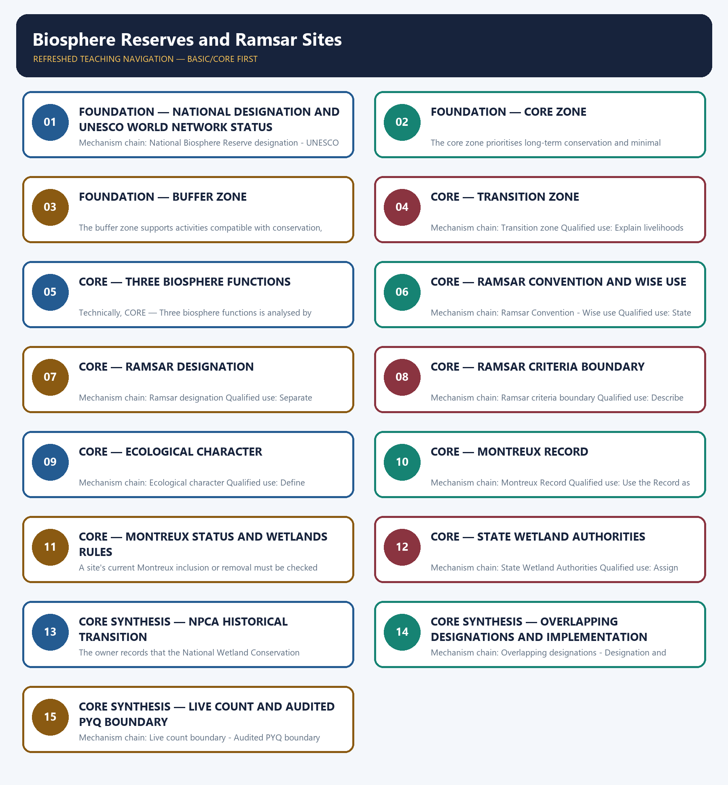

# Biosphere Reserves and Ramsar Sites — Learner-v2 Complete Learning Session

> **Authoring-only generation:** 2026-09-03. No PDF was rendered and no tracker or index was mutated.

### SOURCE, PROGRESSION AND CURRENT-LINKAGE AUDIT

- **Generation date:** 2026-09-03.
- **Repository-first evidence:** the Basic owner is taught first and preserved in full; the Advanced owner is retained only in the optional final teaching block.
- **OCR evidence:** Repository Markdown was primary. OCR-searchable local official General Studies papers were used only to confirm printed routed demands. No answer key, marking scheme, unsupported page precision, ecological rate, species count or current status was inferred.
- **Qdrant:** not used; repository Markdown and available OCR context were sufficient.
- **PYQ integrity:** Audited ledgers route the 2018 Ramsar wise-use Mains demand, 2021 urban water-body reclamation, 2023 NWCP and Ramsar analysis, and objective demands on Agasthyamala, Wetlands Rules and site locations. Mains models are independently authored; no objective key, current count, area, designation date or Montreux status is inferred.
- **Live-link boundary:** MoEFCC's Ramsar page was substantively retrieved on 2026-09-03 for the 1971 treaty, India's 1 February 1982 party date and three pillars. Its displayed count was not treated as latest because official discovery results differed. Ramsar and UNESCO pages returned HTTP 403 or a title-only stub, while official PDFs were opaque raw bytes. No current count, area, UNESCO list, Montreux status or criterion threshold was imported.
- **Fact/inference discipline:** no current-affairs item, PYQ wording, figure or quotation is invented.

### LIVE OFFICIAL-SOURCE ATTEMPT LOG

The checks below were made on 2026-09-03. Substantive official text is used only for the proposition it supports. Stubs, access failures, unrelated pages and thin landing pages are recorded and are not converted into ecological or current-status claims.

- https://moef.gov.in/ramsar-convention — attempted 2026-09-03; substantive MoEFCC text confirmed the 1971 treaty, India's party date of 1 February 1982 and the three pillars. The page displayed 99 Indian sites, but that undated dynamic count was not treated as the latest.
- https://www.ramsar.org/country-profile/india — attempted 2026-09-03; direct retrieval returned HTTP 403, so no current site count, area or Montreux status was imported.
- https://www.unesco.org/en/mab/wnbr/about — attempted 2026-09-03; direct retrieval returned HTTP 403, so no current World Network count or Indian designation list was imported.
- https://biodiversity.unesco.org/profile/country/IND — attempted 2026-09-03; the page returned only the title 'Biosphere and Geopark Resource Hub', so it supplied no designation count or date.
- https://moef.gov.in/uploads/pdf/Approved%20copy%20of%20Website%20note%20of%20BR.pdf — attempted 2026-09-03; the official Biosphere Reserve PDF was retrievable only as raw PDF bytes, so no count, area, zone boundary or UNESCO year was extracted.
- https://moef.gov.in/uploads/2019/09/Identifying-and-Managing-Wetlands-of-International-Importance_-Brochure.pdf — attempted 2026-09-03; the official brochure was retrievable only as raw PDF bytes. No criterion threshold or site status was transcribed from opaque bytes.

## BASIC LEARNING SESSION

### DEEP-REVIEW LEARNING CONTRACT

| Control | Binding rule for this package |
|---|---|
| Syllabus boundary | Complete Environment and Ecology Basic/Core is answer-complete before optional Advanced depth. |
| Ecology boundary | System boundary, scale, trophic level, stock/flow, pool/flux, gross/net, unit and time interval are explicit. |
| Species boundary | Taxon, range, habitat, population trend, IUCN assessment, Indian legal schedule, CITES/CMS listing and endemism remain distinct. |
| Law/status boundary | Act, amendment, rule, notification, draft, judgment, policy, target, implementation and observed outcome remain distinct and dated. |
| Institution boundary | Legal form, parent authority, mandate, jurisdiction, standard, consent, enforcement, science and adjudication are not conflated. |
| Treaty boundary | Membership, annex/appendix, amendment acceptance, target, COP decision, national instrument and outcome remain distinct. |
| Climate boundary | Emission flow, concentration stock, cumulative budget, forcing, scenario, baseline, unit, mitigation, adaptation, loss-and-damage, avoidance and removal are exact. |
| Pollution boundary | Source, emission/load, ambient concentration, exposure, parameter, averaging period, unit, standard and jurisdiction are explicit. |
| Causal method | Chronology, designation, expenditure, capacity, registration and correlation are not promoted into ecological or policy outcomes without mechanism and evidence. |
| Practice contract | Every solved item has demand decoding, detailed examiner-grade model, executable timed/compression plan, marks rationale and answer-specific improvement. |
| Approval | This immutable successor remains `approved: false` pending explicit approval. |

**Canonical Basic/Core owner:** `upsc-ai-kit\knowledge\Environment-and-Ecology\basic\07_Biosphere-Reserves-and-Ramsar-Sites.md`  
**Substantive canonical provenance owner:** `upsc-ai-kit\knowledge\Environment-and-Ecology\learning-sessions\v2\subject-wide-syllabus\environment-and-ecology-07_Learning-Session.md`  
**Optional Advanced owner:** `upsc-ai-kit\knowledge\Environment-and-Ecology\advanced\07_Biosphere-Reserves-and-Ramsar-Sites.md`  
**Official syllabus mapping:** `upsc-ai-kit\knowledge\Environment-and-Ecology\OFFICIAL-UPSC-SYLLABUS-MAPPING.md`

### EVIDENCE, PYQ AND CURRENT-STATUS CONTROL

- Ecological mechanisms retain direction, pool, flux, limiting factor, spatial scale and time scale.
- Current species/news claims retain taxon, source, event/publication date, assessment/listing date and access date.
- IUCN category never substitutes for Wildlife Protection Act schedule, CITES appendix, CMS appendix or endemism.
- Protected-area categories, treaty designations and institution mandates retain exact legal character.
- Acts, amendments, rules, draft instruments, notifications and judgments retain operative status and date.
- Climate figures retain unit, baseline, period, scenario and stock-flow character; global evidence is not silently downscaled to India.
- Mitigation, adaptation and loss-and-damage remain separate; allowance, offset, avoidance, removal, capture and storage remain separate.
- PYQ wording is preserved only where verified; reconstructed or routed demands remain labelled.
- **Current-status note, rechecked 2026-09-03:** volatile targets, standards, schedules, species status, treaty outcomes and programme claims retain source/date/status.

**Generation-local live/current sources:**
- `https://moef.gov.in/ramsar-convention — attempted 2026-09-03; substantive MoEFCC text confirmed the 1971 treaty, India's party date of 1 February 1982 and the three pillars. The page displayed 99 Indian sites, but that undated dynamic count was not treated as the latest.`
- `https://www.ramsar.org/country-profile/india — attempted 2026-09-03; direct retrieval returned HTTP 403, so no current site count, area or Montreux status was imported.`
- `https://www.unesco.org/en/mab/wnbr/about — attempted 2026-09-03; direct retrieval returned HTTP 403, so no current World Network count or Indian designation list was imported.`
- `https://biodiversity.unesco.org/profile/country/IND — attempted 2026-09-03; the page returned only the title 'Biosphere and Geopark Resource Hub', so it supplied no designation count or date.`
- `https://moef.gov.in/uploads/pdf/Approved%20copy%20of%20Website%20note%20of%20BR.pdf — attempted 2026-09-03; the official Biosphere Reserve PDF was retrievable only as raw PDF bytes, so no count, area, zone boundary or UNESCO year was extracted.`
- `https://moef.gov.in/uploads/2019/09/Identifying-and-Managing-Wetlands-of-International-Importance_-Brochure.pdf — attempted 2026-09-03; the official brochure was retrievable only as raw PDF bytes. No criterion threshold or site status was transcribed from opaque bytes.`

**Topic 26 dedicated Disaster Management cross-owners (scope boundary):**
- Not applicable to this topic.




*Distinct embedded teaching-navigation image. The separate continuous Cārvāka-style flowchart package remains an independent at-a-glance artifact.*

### SESSION 1 — FOUNDATION — NATIONAL DESIGNATION AND UNESCO WORLD NETWORK STATUS

#### DEFINITION / WHAT THIS IS CALLED

**Plain-language definition:** India can designate a Biosphere Reserve nationally as a landscape-planning and conservation unit; that national status is distinct from UNESCO World Network recognition.

**Technical definition:** Mechanism chain: National Biosphere Reserve designation - UNESCO World Network status Qualified use: Open by separating national declaration from UNESCO World Network inclusion.

#### ANSWER-GRABBING OPENING — WRITE/ADAPT IN THE EXAM

> Do not equate national Biosphere Reserve designation with UNESCO World Network status.

#### MUST-WRITE KEYWORDS

- **FOUNDATION**
- **National designation**
- **UNESCO World Network status**
- **Mechanism chain**
- **Qualified use**
- **India**

**How to use them:** Frame the answer through FOUNDATION; define National designation, connect UNESCO World Network status with Mechanism chain to explain the mechanism, and use Qualified use for the decisive comparison or qualification.

#### VISUAL FIRST

```text
NATIONAL DESIGNATION AND UNESCO WORLD NETWORK STATUS
01. National Biosphere Reserve designation
    |
    v
02. UNESCO World Network status
BOUNDARY -> Do not equate national Biosphere Reserve designation with UNESCO World Network status.
```

*This topic-specific rail fixes the evidence sequence and its exam boundary before analysis.*

#### CORE EXPLANATION

India can designate a Biosphere Reserve nationally as a landscape-planning and conservation unit; that national status is distinct from UNESCO World Network recognition. Inclusion in UNESCO's World Network follows a separate international process; not every nationally designated Indian Biosphere Reserve automatically has UNESCO status.

#### NAMED EVIDENCE AND MECHANISM

- India can designate a Biosphere Reserve nationally as a landscape-planning and conservation unit; that national status is distinct from UNESCO World Network recognition.
- Inclusion in UNESCO's World Network follows a separate international process; not every nationally designated Indian Biosphere Reserve automatically has UNESCO status.

#### EXAMINER CAUTION

- Do not equate national Biosphere Reserve designation with UNESCO World Network status.

#### EXAM LINK

- **Prelims:** Preserve the exact ecological level, system boundary, stock or flow, pyramid parameter, succession substrate, biome scale, taxonomic term and scientific or legal status; never turn a context-dependent pattern into a universal rule.
- **Mains:** Open by separating national declaration from UNESCO World Network inclusion.

#### MINI RECAP

- **Mechanism chain:** National Biosphere Reserve designation -> UNESCO World Network status
- **Qualified use:** Open by separating national declaration from UNESCO World Network inclusion.

#### CLOSING RECALL FLOW — FOUNDATION — NATIONAL DESIGNATION AND UNESCO WORLD NETWORK STATUS

```text
START / CONCEPT: FOUNDATION — National designation and UNESCO World Network status
        |
        v
EXACT TERMS: FOUNDATION · National designation · UNESCO World Network status · Mechanism chain · Qualified use · India
        |
        v
MECHANISM / ARGUMENT: Mechanism chain: National Biosphere Reserve designation - UNESCO World Network status Qualified use: Open by separating national declaration from UNESCO World Network inclusion.
        |
        v
CONSEQUENCE / CONTRAST: Inclusion in UNESCO's World Network follows a separate international process; not every nationally designated Indian Biosphere Reserve automatically has UNESCO status.
        |
        v
UPSC TRAP / ANSWER-USE: Do not miss this limiting distinction: india can designate a Biosphere Reserve nationally as a landscape-planning and conservation unit.
        |
        v
ANSWER-GRABBING FORMULATION: Do not equate national Biosphere Reserve designation with UNESCO World Network status.
```
### SESSION 2 — FOUNDATION — CORE ZONE

#### DEFINITION / WHAT THIS IS CALLED

**Plain-language definition:** Mechanism chain: Core zone Qualified use: Define core protection and name the underlying domestic legal layer.

**Technical definition:** The core zone prioritises long-term conservation and minimal disturbance and commonly overlaps an area already protected under domestic wildlife or forest law.

#### ANSWER-GRABBING OPENING — WRITE/ADAPT IN THE EXAM

> Do not treat the core, buffer and transition zones as equally restrictive.

#### MUST-WRITE KEYWORDS

- **FOUNDATION**
- **Core zone**
- **Mechanism chain**
- **Qualified use**
- **Qualified**
- **FOUNDATION — Core zone**

**How to use them:** Frame the answer through FOUNDATION; define Core zone, connect Mechanism chain with Qualified use to explain the mechanism, and use Qualified for the decisive comparison or qualification.

#### VISUAL FIRST

```text
CORE ZONE
01. Core zone
BOUNDARY -> Do not treat the core, buffer and transition zones as equally restrictive.
```

*This topic-specific rail fixes the evidence sequence and its exam boundary before analysis.*

#### CORE EXPLANATION

The core zone prioritises long-term conservation and minimal disturbance and commonly overlaps an area already protected under domestic wildlife or forest law.

#### NAMED EVIDENCE AND MECHANISM

- The core zone prioritises long-term conservation and minimal disturbance and commonly overlaps an area already protected under domestic wildlife or forest law.

#### EXAMINER CAUTION

- Do not treat the core, buffer and transition zones as equally restrictive.

#### EXAM LINK

- **Prelims:** Preserve the exact ecological level, system boundary, stock or flow, pyramid parameter, succession substrate, biome scale, taxonomic term and scientific or legal status; never turn a context-dependent pattern into a universal rule.
- **Mains:** Define core protection and name the underlying domestic legal layer.

#### MINI RECAP

- **Mechanism chain:** Core zone
- **Qualified use:** Define core protection and name the underlying domestic legal layer.

#### CLOSING RECALL FLOW — FOUNDATION — CORE ZONE

```text
START / CONCEPT: FOUNDATION — Core zone
        |
        v
EXACT TERMS: FOUNDATION · Core zone · Mechanism chain · Qualified use · Qualified · FOUNDATION — Core zone
        |
        v
MECHANISM / ARGUMENT: Mechanism chain: Core zone Qualified use: Define core protection and name the underlying domestic legal layer.
        |
        v
CONSEQUENCE / CONTRAST: The core zone prioritises long-term conservation and minimal disturbance and commonly overlaps an area already protected under domestic wildlife or forest law.
        |
        v
UPSC TRAP / ANSWER-USE: Do not miss this limiting distinction: do not treat the core, buffer and transition zones as equally restrictive.
        |
        v
ANSWER-GRABBING FORMULATION: Do not treat the core, buffer and transition zones as equally restrictive.
```
### SESSION 3 — FOUNDATION — BUFFER ZONE

#### DEFINITION / WHAT THIS IS CALLED

**Plain-language definition:** Mechanism chain: Buffer zone Qualified use: Use conservation-compatible research and managed activity.

**Technical definition:** The buffer zone supports activities compatible with conservation, including research, monitoring, education and carefully managed use.

#### ANSWER-GRABBING OPENING — WRITE/ADAPT IN THE EXAM

> Mechanism chain: Buffer zone Qualified use: Use conservation-compatible research and managed activity.

#### MUST-WRITE KEYWORDS

- **FOUNDATION**
- **Buffer zone**
- **Mechanism chain**
- **Qualified use**
- **Buffer**
- **Qualified**

**How to use them:** Frame the answer through FOUNDATION; define Buffer zone, connect Mechanism chain with Qualified use to explain the mechanism, and use Buffer for the decisive comparison or qualification.

#### VISUAL FIRST

```text
BUFFER ZONE
01. Buffer zone
BOUNDARY -> Do not describe a transition zone as an uninhabited strict-protection zone.
```

*This topic-specific rail fixes the evidence sequence and its exam boundary before analysis.*

#### CORE EXPLANATION

The buffer zone supports activities compatible with conservation, including research, monitoring, education and carefully managed use.

#### NAMED EVIDENCE AND MECHANISM

- The buffer zone supports activities compatible with conservation, including research, monitoring, education and carefully managed use.

#### EXAMINER CAUTION

- Do not describe a transition zone as an uninhabited strict-protection zone.

#### EXAM LINK

- **Prelims:** Preserve the exact ecological level, system boundary, stock or flow, pyramid parameter, succession substrate, biome scale, taxonomic term and scientific or legal status; never turn a context-dependent pattern into a universal rule.
- **Mains:** Use conservation-compatible research and managed activity.

#### MINI RECAP

- **Mechanism chain:** Buffer zone
- **Qualified use:** Use conservation-compatible research and managed activity.

#### CLOSING RECALL FLOW — FOUNDATION — BUFFER ZONE

```text
START / CONCEPT: FOUNDATION — Buffer zone
        |
        v
EXACT TERMS: FOUNDATION · Buffer zone · Mechanism chain · Qualified use · Buffer · Qualified
        |
        v
MECHANISM / ARGUMENT: The buffer zone supports activities compatible with conservation, including research, monitoring, education and carefully managed use.
        |
        v
CONSEQUENCE / CONTRAST: Do not describe a transition zone as an uninhabited strict-protection zone.
        |
        v
UPSC TRAP / ANSWER-USE: Do not miss this limiting distinction: use conservation-compatible research and managed activity.
        |
        v
ANSWER-GRABBING FORMULATION: Mechanism chain: Buffer zone Qualified use: Use conservation-compatible research and managed activity.
```
### SESSION 4 — CORE — TRANSITION ZONE

#### DEFINITION / WHAT THIS IS CALLED

**Plain-language definition:** The transition zone is a cooperation landscape for settlements, livelihoods and ecologically sustainable development rather than a strict exclusion zone.

**Technical definition:** Mechanism chain: Transition zone Qualified use: Explain livelihoods and cooperation without calling the zone unregulated.

#### ANSWER-GRABBING OPENING — WRITE/ADAPT IN THE EXAM

> Mechanism chain: Transition zone Qualified use: Explain livelihoods and cooperation without calling the zone unregulated.

#### MUST-WRITE KEYWORDS

- **Transition zone**
- **Mechanism chain**
- **Qualified use**
- **The transition zone**
- **Transition**
- **Qualified**

**How to use them:** Frame the answer through Transition zone; define Mechanism chain, connect Qualified use with The transition zone to explain the mechanism, and use Transition for the decisive comparison or qualification.

#### VISUAL FIRST

```text
TRANSITION ZONE
01. Transition zone
BOUNDARY -> Do not reduce the biosphere model to conservation while omitting development and logistics.
```

*This topic-specific rail fixes the evidence sequence and its exam boundary before analysis.*

#### CORE EXPLANATION

The transition zone is a cooperation landscape for settlements, livelihoods and ecologically sustainable development rather than a strict exclusion zone.

#### NAMED EVIDENCE AND MECHANISM

- The transition zone is a cooperation landscape for settlements, livelihoods and ecologically sustainable development rather than a strict exclusion zone.

#### EXAMINER CAUTION

- Do not reduce the biosphere model to conservation while omitting development and logistics.

#### EXAM LINK

- **Prelims:** Preserve the exact ecological level, system boundary, stock or flow, pyramid parameter, succession substrate, biome scale, taxonomic term and scientific or legal status; never turn a context-dependent pattern into a universal rule.
- **Mains:** Explain livelihoods and cooperation without calling the zone unregulated.

#### MINI RECAP

- **Mechanism chain:** Transition zone
- **Qualified use:** Explain livelihoods and cooperation without calling the zone unregulated.

#### CLOSING RECALL FLOW — CORE — TRANSITION ZONE

```text
START / CONCEPT: CORE — Transition zone
        |
        v
EXACT TERMS: Transition zone · Mechanism chain · Qualified use · The transition zone · Transition · Qualified
        |
        v
MECHANISM / ARGUMENT: The transition zone is a cooperation landscape for settlements, livelihoods and ecologically sustainable development rather than a strict exclusion zone.
        |
        v
CONSEQUENCE / CONTRAST: Do not reduce the biosphere model to conservation while omitting development and logistics.
        |
        v
UPSC TRAP / ANSWER-USE: Do not miss this limiting distinction: explain livelihoods and cooperation without calling the zone unregulated.
        |
        v
ANSWER-GRABBING FORMULATION: Mechanism chain: Transition zone Qualified use: Explain livelihoods and cooperation without calling the zone unregulated.
```
### SESSION 5 — CORE — THREE BIOSPHERE FUNCTIONS

#### DEFINITION / WHAT THIS IS CALLED

**Plain-language definition:** Mechanism chain: Three biosphere functions Qualified use: Organise the model around conservation, development and logistical support.

**Technical definition:** Technically, CORE — Three biosphere functions is analysed by relating Three biosphere functions to Mechanism chain, then testing the relationship through Qualified use and Ramsar Site.

#### ANSWER-GRABBING OPENING — WRITE/ADAPT IN THE EXAM

> Mechanism chain: Three biosphere functions Qualified use: Organise the model around conservation, development and logistical support.

#### MUST-WRITE KEYWORDS

- **Three biosphere functions**
- **Mechanism chain**
- **Qualified use**
- **Ramsar Site**
- **Three**
- **Qualified**

**How to use them:** Frame the answer through Three biosphere functions; define Mechanism chain, connect Qualified use with Ramsar Site to explain the mechanism, and use Three for the decisive comparison or qualification.

#### VISUAL FIRST

```text
THREE BIOSPHERE FUNCTIONS
01. Three biosphere functions
BOUNDARY -> Do not call every wetland a Ramsar Site.
```

*This topic-specific rail fixes the evidence sequence and its exam boundary before analysis.*

#### CORE EXPLANATION

The biosphere model combines conservation, sustainable development and logistical support for research, monitoring and education.

#### NAMED EVIDENCE AND MECHANISM

- The biosphere model combines conservation, sustainable development and logistical support for research, monitoring and education.

#### EXAMINER CAUTION

- Do not call every wetland a Ramsar Site.

#### EXAM LINK

- **Prelims:** Preserve the exact ecological level, system boundary, stock or flow, pyramid parameter, succession substrate, biome scale, taxonomic term and scientific or legal status; never turn a context-dependent pattern into a universal rule.
- **Mains:** Organise the model around conservation, development and logistical support.

#### MINI RECAP

- **Mechanism chain:** Three biosphere functions
- **Qualified use:** Organise the model around conservation, development and logistical support.

#### CLOSING RECALL FLOW — CORE — THREE BIOSPHERE FUNCTIONS

```text
START / CONCEPT: CORE — Three biosphere functions
        |
        v
EXACT TERMS: Three biosphere functions · Mechanism chain · Qualified use · Ramsar Site · Three · Qualified
        |
        v
MECHANISM / ARGUMENT: Do not call every wetland a Ramsar Site.
        |
        v
CONSEQUENCE / CONTRAST: The resulting consequence is that organise the model around conservation, development and logistical support.
        |
        v
UPSC TRAP / ANSWER-USE: Do not miss this limiting distinction: organise the model around conservation, development and logistical support.
        |
        v
ANSWER-GRABBING FORMULATION: Mechanism chain: Three biosphere functions Qualified use: Organise the model around conservation, development and logistical support.
```
### SESSION 6 — CORE — RAMSAR CONVENTION AND WISE USE

#### DEFINITION / WHAT THIS IS CALLED

**Plain-language definition:** Ramsar wise use means maintaining wetland ecological character through ecosystem approaches within sustainable development, not imposing universal no-use preservation.

**Technical definition:** Mechanism chain: Ramsar Convention - Wise use Qualified use: State the treaty vintage, India party date and wise-use principle.

#### ANSWER-GRABBING OPENING — WRITE/ADAPT IN THE EXAM

> Ramsar wise use means maintaining wetland ecological character through ecosystem approaches within sustainable development, not imposing universal no-use preservation.

#### MUST-WRITE KEYWORDS

- **Ramsar Convention**
- **wise use**
- **Mechanism chain**
- **Qualified use**
- **The Convention**
- **Wetlands**

**How to use them:** Frame the answer through Ramsar Convention; define wise use, connect Mechanism chain with Qualified use to explain the mechanism, and use The Convention for the decisive comparison or qualification.

#### VISUAL FIRST

```text
RAMSAR CONVENTION AND WISE USE
01. Ramsar Convention
    |
    v
02. Wise use
BOUNDARY -> Do not interpret wise use as unrestricted exploitation or universal prohibition.
```

*This topic-specific rail fixes the evidence sequence and its exam boundary before analysis.*

#### CORE EXPLANATION

The Convention on Wetlands was signed at Ramsar in 1971; MoEFCC's retrievable page states that India became a party on 1 February 1982. Ramsar wise use means maintaining wetland ecological character through ecosystem approaches within sustainable development, not imposing universal no-use preservation.

#### NAMED EVIDENCE AND MECHANISM

- The Convention on Wetlands was signed at Ramsar in 1971; MoEFCC's retrievable page states that India became a party on 1 February 1982.
- Ramsar wise use means maintaining wetland ecological character through ecosystem approaches within sustainable development, not imposing universal no-use preservation.

#### EXAMINER CAUTION

- Do not interpret wise use as unrestricted exploitation or universal prohibition.

#### EXAM LINK

- **Prelims:** Preserve the exact ecological level, system boundary, stock or flow, pyramid parameter, succession substrate, biome scale, taxonomic term and scientific or legal status; never turn a context-dependent pattern into a universal rule.
- **Mains:** State the treaty vintage, India party date and wise-use principle.

#### MINI RECAP

- **Mechanism chain:** Ramsar Convention -> Wise use
- **Qualified use:** State the treaty vintage, India party date and wise-use principle.

#### CLOSING RECALL FLOW — CORE — RAMSAR CONVENTION AND WISE USE

```text
START / CONCEPT: CORE — Ramsar Convention and wise use
        |
        v
EXACT TERMS: Ramsar Convention · wise use · Mechanism chain · Qualified use · The Convention · Wetlands
        |
        v
MECHANISM / ARGUMENT: Mechanism chain: Ramsar Convention - Wise use Qualified use: State the treaty vintage, India party date and wise-use principle.
        |
        v
CONSEQUENCE / CONTRAST: Do not interpret wise use as unrestricted exploitation or universal prohibition.
        |
        v
UPSC TRAP / ANSWER-USE: Do not miss this limiting distinction: the Convention on Wetlands was signed at Ramsar in 1971.
        |
        v
ANSWER-GRABBING FORMULATION: Ramsar wise use means maintaining wetland ecological character through ecosystem approaches within sustainable development, not imposing universal no-use preservation.
```
### SESSION 7 — CORE — RAMSAR DESIGNATION

#### DEFINITION / WHAT THIS IS CALLED

**Plain-language definition:** A Ramsar Site is a wetland placed on the List of Wetlands of International Importance; the international designation does not itself create a new Indian statutory land category.

**Technical definition:** Mechanism chain: Ramsar designation Qualified use: Separate international listing from domestic legal notification.

#### ANSWER-GRABBING OPENING — WRITE/ADAPT IN THE EXAM

> A Ramsar Site is a wetland placed on the List of Wetlands of International Importance; the international designation does not itself create a new Indian statutory land category.

#### MUST-WRITE KEYWORDS

- **Ramsar designation**
- **Mechanism chain**
- **Qualified use**
- **A Ramsar Site**
- **Ramsar Site**
- **List**

**How to use them:** Frame the answer through Ramsar designation; define Mechanism chain, connect Qualified use with A Ramsar Site to explain the mechanism, and use Ramsar Site for the decisive comparison or qualification.

#### VISUAL FIRST

```text
RAMSAR DESIGNATION
01. Ramsar designation
BOUNDARY -> Do not treat Ramsar listing as a new Indian statutory land category.
```

*This topic-specific rail fixes the evidence sequence and its exam boundary before analysis.*

#### CORE EXPLANATION

A Ramsar Site is a wetland placed on the List of Wetlands of International Importance; the international designation does not itself create a new Indian statutory land category.

#### NAMED EVIDENCE AND MECHANISM

- A Ramsar Site is a wetland placed on the List of Wetlands of International Importance; the international designation does not itself create a new Indian statutory land category.

#### EXAMINER CAUTION

- Do not treat Ramsar listing as a new Indian statutory land category.

#### EXAM LINK

- **Prelims:** Preserve the exact ecological level, system boundary, stock or flow, pyramid parameter, succession substrate, biome scale, taxonomic term and scientific or legal status; never turn a context-dependent pattern into a universal rule.
- **Mains:** Separate international listing from domestic legal notification.

#### MINI RECAP

- **Mechanism chain:** Ramsar designation
- **Qualified use:** Separate international listing from domestic legal notification.

#### CLOSING RECALL FLOW — CORE — RAMSAR DESIGNATION

```text
START / CONCEPT: CORE — Ramsar designation
        |
        v
EXACT TERMS: Ramsar designation · Mechanism chain · Qualified use · A Ramsar Site · Ramsar Site · List
        |
        v
MECHANISM / ARGUMENT: Mechanism chain: Ramsar designation Qualified use: Separate international listing from domestic legal notification.
        |
        v
CONSEQUENCE / CONTRAST: Do not treat Ramsar listing as a new Indian statutory land category.
        |
        v
UPSC TRAP / ANSWER-USE: Do not miss this limiting distinction: a Ramsar Site is a wetland placed on the List of Wetlands of International...
        |
        v
ANSWER-GRABBING FORMULATION: A Ramsar Site is a wetland placed on the List of Wetlands of International Importance; the international designation does not itself create a new Indian statutory land category.
```
### SESSION 8 — CORE — RAMSAR CRITERIA BOUNDARY

#### DEFINITION / WHAT THIS IS CALLED

**Plain-language definition:** The Ramsar framework uses multiple ecological criteria and a site needs to meet at least one applicable criterion; no numerical threshold is used here without readable official text.

**Technical definition:** Mechanism chain: Ramsar criteria boundary Qualified use: Describe criterion families without inventing unreadable thresholds.

#### ANSWER-GRABBING OPENING — WRITE/ADAPT IN THE EXAM

> The Ramsar framework uses multiple ecological criteria and a site needs to meet at least one applicable criterion; no numerical threshold is used here without readable official text.

#### MUST-WRITE KEYWORDS

- **Ramsar criteria boundary**
- **Mechanism chain**
- **Qualified use**
- **The Ramsar**
- **Ramsar**
- **Qualified**

**How to use them:** Frame the answer through Ramsar criteria boundary; define Mechanism chain, connect Qualified use with The Ramsar to explain the mechanism, and use Ramsar for the decisive comparison or qualification.

#### VISUAL FIRST

```text
RAMSAR CRITERIA BOUNDARY
01. Ramsar criteria boundary
BOUNDARY -> Do not quote a Ramsar criterion threshold from an unreadable or stale source.
```

*This topic-specific rail fixes the evidence sequence and its exam boundary before analysis.*

#### CORE EXPLANATION

The Ramsar framework uses multiple ecological criteria and a site needs to meet at least one applicable criterion; no numerical threshold is used here without readable official text.

#### NAMED EVIDENCE AND MECHANISM

- The Ramsar framework uses multiple ecological criteria and a site needs to meet at least one applicable criterion; no numerical threshold is used here without readable official text.

#### EXAMINER CAUTION

- Do not quote a Ramsar criterion threshold from an unreadable or stale source.

#### EXAM LINK

- **Prelims:** Preserve the exact ecological level, system boundary, stock or flow, pyramid parameter, succession substrate, biome scale, taxonomic term and scientific or legal status; never turn a context-dependent pattern into a universal rule.
- **Mains:** Describe criterion families without inventing unreadable thresholds.

#### MINI RECAP

- **Mechanism chain:** Ramsar criteria boundary
- **Qualified use:** Describe criterion families without inventing unreadable thresholds.

#### CLOSING RECALL FLOW — CORE — RAMSAR CRITERIA BOUNDARY

```text
START / CONCEPT: CORE — Ramsar criteria boundary
        |
        v
EXACT TERMS: Ramsar criteria boundary · Mechanism chain · Qualified use · The Ramsar · Ramsar · Qualified
        |
        v
MECHANISM / ARGUMENT: Mechanism chain: Ramsar criteria boundary Qualified use: Describe criterion families without inventing unreadable thresholds.
        |
        v
CONSEQUENCE / CONTRAST: Do not quote a Ramsar criterion threshold from an unreadable or stale source.
        |
        v
UPSC TRAP / ANSWER-USE: Do not miss this limiting distinction: describe criterion families without inventing unreadable thresholds.
        |
        v
ANSWER-GRABBING FORMULATION: The Ramsar framework uses multiple ecological criteria and a site needs to meet at least one applicable criterion; no numerical threshold is used here without readable official text.
```
### SESSION 9 — CORE — ECOLOGICAL CHARACTER

#### DEFINITION / WHAT THIS IS CALLED

**Plain-language definition:** Ecological character is the combination of ecosystem components, processes and benefits or services that defines a wetland at a stated time.

**Technical definition:** Mechanism chain: Ecological character Qualified use: Define ecological character through components, processes and benefits.

#### ANSWER-GRABBING OPENING — WRITE/ADAPT IN THE EXAM

> Ecological character is the combination of ecosystem components, processes and benefits or services that defines a wetland at a stated time.

#### MUST-WRITE KEYWORDS

- **Ecological character**
- **Mechanism chain**
- **Qualified use**
- **Ecological**
- **Qualified**
- **CORE — Ecological character**

**How to use them:** Frame the answer through Ecological character; define Mechanism chain, connect Qualified use with Ecological to explain the mechanism, and use Qualified for the decisive comparison or qualification.

#### VISUAL FIRST

```text
ECOLOGICAL CHARACTER
01. Ecological character
BOUNDARY -> Do not equate ecological character with a species list alone.
```

*This topic-specific rail fixes the evidence sequence and its exam boundary before analysis.*

#### CORE EXPLANATION

Ecological character is the combination of ecosystem components, processes and benefits or services that defines a wetland at a stated time.

#### NAMED EVIDENCE AND MECHANISM

- Ecological character is the combination of ecosystem components, processes and benefits or services that defines a wetland at a stated time.

#### EXAMINER CAUTION

- Do not equate ecological character with a species list alone.

#### EXAM LINK

- **Prelims:** Preserve the exact ecological level, system boundary, stock or flow, pyramid parameter, succession substrate, biome scale, taxonomic term and scientific or legal status; never turn a context-dependent pattern into a universal rule.
- **Mains:** Define ecological character through components, processes and benefits.

#### MINI RECAP

- **Mechanism chain:** Ecological character
- **Qualified use:** Define ecological character through components, processes and benefits.

#### CLOSING RECALL FLOW — CORE — ECOLOGICAL CHARACTER

```text
START / CONCEPT: CORE — Ecological character
        |
        v
EXACT TERMS: Ecological character · Mechanism chain · Qualified use · Ecological · Qualified · CORE — Ecological character
        |
        v
MECHANISM / ARGUMENT: Mechanism chain: Ecological character Qualified use: Define ecological character through components, processes and benefits.
        |
        v
CONSEQUENCE / CONTRAST: Do not equate ecological character with a species list alone.
        |
        v
UPSC TRAP / ANSWER-USE: Do not miss this limiting distinction: do not equate ecological character with a species list alone.
        |
        v
ANSWER-GRABBING FORMULATION: Ecological character is the combination of ecosystem components, processes and benefits or services that defines a wetland at a stated time.
```
### SESSION 10 — CORE — MONTREUX RECORD

#### DEFINITION / WHAT THIS IS CALLED

**Plain-language definition:** The Montreux Record flags listed wetlands where ecological character has changed, is changing or is likely to change because of human interference; it is not a delisting or prestige list.

**Technical definition:** Mechanism chain: Montreux Record Qualified use: Use the Record as an ecological-change accountability mechanism.

#### ANSWER-GRABBING OPENING — WRITE/ADAPT IN THE EXAM

> The Montreux Record flags listed wetlands where ecological character has changed, is changing or is likely to change because of human interference; it is not a delisting or prestige list.

#### MUST-WRITE KEYWORDS

- **Montreux Record**
- **Mechanism chain**
- **Qualified use**
- **The Montreux Record**
- **Record**
- **Montreux Record Qualified**

**How to use them:** Frame the answer through Montreux Record; define Mechanism chain, connect Qualified use with The Montreux Record to explain the mechanism, and use Record for the decisive comparison or qualification.

#### VISUAL FIRST

```text
MONTREUX RECORD
01. Montreux Record
BOUNDARY -> Do not call the Montreux Record a delisting or honour roll.
```

*This topic-specific rail fixes the evidence sequence and its exam boundary before analysis.*

#### CORE EXPLANATION

The Montreux Record flags listed wetlands where ecological character has changed, is changing or is likely to change because of human interference; it is not a delisting or prestige list.

#### NAMED EVIDENCE AND MECHANISM

- The Montreux Record flags listed wetlands where ecological character has changed, is changing or is likely to change because of human interference; it is not a delisting or prestige list.

#### EXAMINER CAUTION

- Do not call the Montreux Record a delisting or honour roll.

#### EXAM LINK

- **Prelims:** Preserve the exact ecological level, system boundary, stock or flow, pyramid parameter, succession substrate, biome scale, taxonomic term and scientific or legal status; never turn a context-dependent pattern into a universal rule.
- **Mains:** Use the Record as an ecological-change accountability mechanism.

#### MINI RECAP

- **Mechanism chain:** Montreux Record
- **Qualified use:** Use the Record as an ecological-change accountability mechanism.

#### CLOSING RECALL FLOW — CORE — MONTREUX RECORD

```text
START / CONCEPT: CORE — Montreux Record
        |
        v
EXACT TERMS: Montreux Record · Mechanism chain · Qualified use · The Montreux Record · Record · Montreux Record Qualified
        |
        v
MECHANISM / ARGUMENT: Mechanism chain: Montreux Record Qualified use: Use the Record as an ecological-change accountability mechanism.
        |
        v
CONSEQUENCE / CONTRAST: Do not call the Montreux Record a delisting or honour roll.
        |
        v
UPSC TRAP / ANSWER-USE: Do not miss this limiting distinction: use the Record as an ecological-change accountability mechanism.
        |
        v
ANSWER-GRABBING FORMULATION: The Montreux Record flags listed wetlands where ecological character has changed, is changing or is likely to change because of human interference; it is not a delisting or prestige list.
```
### SESSION 11 — CORE — MONTREUX STATUS AND WETLANDS RULES

#### DEFINITION / WHAT THIS IS CALLED

**Plain-language definition:** Mechanism chain: Montreux status discipline - Wetlands Rules 2017 Qualified use: Check current status and then move to the domestic Wetlands Rules.

**Technical definition:** A site's current Montreux inclusion or removal must be checked against the live Ramsar record; historical examples must not be converted into an undated current claim.

#### ANSWER-GRABBING OPENING — WRITE/ADAPT IN THE EXAM

> Mechanism chain: Montreux status discipline - Wetlands Rules 2017 Qualified use: Check current status and then move to the domestic Wetlands Rules.

#### MUST-WRITE KEYWORDS

- **Montreux status**
- **Wetlands Rules**
- **Mechanism chain**
- **Qualified use**
- **Montreux**
- **Ramsar**

**How to use them:** Frame the answer through Montreux status; define Wetlands Rules, connect Mechanism chain with Qualified use to explain the mechanism, and use Montreux for the decisive comparison or qualification.

#### VISUAL FIRST

```text
MONTREUX STATUS AND WETLANDS RULES
01. Montreux status discipline
    |
    v
02. Wetlands Rules 2017
BOUNDARY -> Do not state a current Montreux entry without checking the live record.
```

*This topic-specific rail fixes the evidence sequence and its exam boundary before analysis.*

#### CORE EXPLANATION

A site's current Montreux inclusion or removal must be checked against the live Ramsar record; historical examples must not be converted into an undated current claim. India's Wetlands Conservation and Management Rules 2017 operate under the Environment Protection Act and provide the domestic regulatory layer separate from Ramsar designation.

#### NAMED EVIDENCE AND MECHANISM

- A site's current Montreux inclusion or removal must be checked against the live Ramsar record; historical examples must not be converted into an undated current claim.
- India's Wetlands Conservation and Management Rules 2017 operate under the Environment Protection Act and provide the domestic regulatory layer separate from Ramsar designation.

#### EXAMINER CAUTION

- Do not state a current Montreux entry without checking the live record.

#### EXAM LINK

- **Prelims:** Preserve the exact ecological level, system boundary, stock or flow, pyramid parameter, succession substrate, biome scale, taxonomic term and scientific or legal status; never turn a context-dependent pattern into a universal rule.
- **Mains:** Check current status and then move to the domestic Wetlands Rules.

#### MINI RECAP

- **Mechanism chain:** Montreux status discipline -> Wetlands Rules 2017
- **Qualified use:** Check current status and then move to the domestic Wetlands Rules.

#### CLOSING RECALL FLOW — CORE — MONTREUX STATUS AND WETLANDS RULES

```text
START / CONCEPT: CORE — Montreux status and Wetlands Rules
        |
        v
EXACT TERMS: Montreux status · Wetlands Rules · Mechanism chain · Qualified use · Montreux · Ramsar
        |
        v
MECHANISM / ARGUMENT: A site's current Montreux inclusion or removal must be checked against the live Ramsar record; historical examples must not be converted into an undated current claim.
        |
        v
CONSEQUENCE / CONTRAST: Do not state a current Montreux entry without checking the live record.
        |
        v
UPSC TRAP / ANSWER-USE: Do not miss this limiting distinction: montreux status discipline - Wetlands Rules 2017 Qualified use.
        |
        v
ANSWER-GRABBING FORMULATION: Mechanism chain: Montreux status discipline - Wetlands Rules 2017 Qualified use: Check current status and then move to the domestic Wetlands Rules.
```
### SESSION 12 — CORE — STATE WETLAND AUTHORITIES

#### DEFINITION / WHAT THIS IS CALLED

**Plain-language definition:** State or Union Territory Wetland Authorities identify, notify, plan and regulate wetlands under the domestic framework; Ramsar visibility does not replace their work.

**Technical definition:** Mechanism chain: State Wetland Authorities Qualified use: Assign identification, notification and management to the competent authority.

#### ANSWER-GRABBING OPENING — WRITE/ADAPT IN THE EXAM

> State or Union Territory Wetland Authorities identify, notify, plan and regulate wetlands under the domestic framework; Ramsar visibility does not replace their work.

#### MUST-WRITE KEYWORDS

- **Mechanism chain**
- **Qualified use**
- **Union Territory Wetland Authorities**
- **Ramsar**
- **Wetlands Rules**
- **Ramsar Convention**

**How to use them:** Frame the answer through Mechanism chain; define Qualified use, connect Union Territory Wetland Authorities with Ramsar to explain the mechanism, and use Wetlands Rules for the decisive comparison or qualification.

#### VISUAL FIRST

```text
STATE WETLAND AUTHORITIES
01. State Wetland Authorities
BOUNDARY -> Do not treat the Wetlands Rules and Ramsar Convention as the same instrument.
```

*This topic-specific rail fixes the evidence sequence and its exam boundary before analysis.*

#### CORE EXPLANATION

State or Union Territory Wetland Authorities identify, notify, plan and regulate wetlands under the domestic framework; Ramsar visibility does not replace their work.

#### NAMED EVIDENCE AND MECHANISM

- State or Union Territory Wetland Authorities identify, notify, plan and regulate wetlands under the domestic framework; Ramsar visibility does not replace their work.

#### EXAMINER CAUTION

- Do not treat the Wetlands Rules and Ramsar Convention as the same instrument.

#### EXAM LINK

- **Prelims:** Preserve the exact ecological level, system boundary, stock or flow, pyramid parameter, succession substrate, biome scale, taxonomic term and scientific or legal status; never turn a context-dependent pattern into a universal rule.
- **Mains:** Assign identification, notification and management to the competent authority.

#### MINI RECAP

- **Mechanism chain:** State Wetland Authorities
- **Qualified use:** Assign identification, notification and management to the competent authority.

#### CLOSING RECALL FLOW — CORE — STATE WETLAND AUTHORITIES

```text
START / CONCEPT: CORE — State Wetland Authorities
        |
        v
EXACT TERMS: Mechanism chain · Qualified use · Union Territory Wetland Authorities · Ramsar · Wetlands Rules · Ramsar Convention
        |
        v
MECHANISM / ARGUMENT: Mechanism chain: State Wetland Authorities Qualified use: Assign identification, notification and management to the competent authority.
        |
        v
CONSEQUENCE / CONTRAST: Do not treat the Wetlands Rules and Ramsar Convention as the same instrument.
        |
        v
UPSC TRAP / ANSWER-USE: Do not miss this limiting distinction: state or Union Territory Wetland Authorities identify, notify, plan and regulate wetlands under the...
        |
        v
ANSWER-GRABBING FORMULATION: State or Union Territory Wetland Authorities identify, notify, plan and regulate wetlands under the domestic framework; Ramsar visibility does not replace their work.
```
### SESSION 13 — CORE SYNTHESIS — NPCA HISTORICAL TRANSITION

#### DEFINITION / WHAT THIS IS CALLED

**Plain-language definition:** Mechanism chain: NPCA transition Qualified use: Keep historical NWCP wording separate from the present NPCA framework.

**Technical definition:** The owner records that the National Wetland Conservation Programme and National Lake Conservation Plan merged into NPCA in 2013; programme labels must match the question's time point.

#### ANSWER-GRABBING OPENING — WRITE/ADAPT IN THE EXAM

> Mechanism chain: NPCA transition Qualified use: Keep historical NWCP wording separate from the present NPCA framework.

#### MUST-WRITE KEYWORDS

- **CORE SYNTHESIS**
- **NPCA historical transition**
- **Mechanism chain**
- **Qualified use**
- **National Wetland Conservation Programme**
- **National Lake Conservation Plan**

**How to use them:** Frame the answer through CORE SYNTHESIS; define NPCA historical transition, connect Mechanism chain with Qualified use to explain the mechanism, and use National Wetland Conservation Programme for the decisive comparison or qualification.

#### VISUAL FIRST

```text
NPCA HISTORICAL TRANSITION
01. NPCA transition
BOUNDARY -> Do not infer management success from designation count.
```

*This topic-specific rail fixes the evidence sequence and its exam boundary before analysis.*

#### CORE EXPLANATION

The owner records that the National Wetland Conservation Programme and National Lake Conservation Plan merged into NPCA in 2013; programme labels must match the question's time point.

#### NAMED EVIDENCE AND MECHANISM

- The owner records that the National Wetland Conservation Programme and National Lake Conservation Plan merged into NPCA in 2013; programme labels must match the question's time point.

#### EXAMINER CAUTION

- Do not infer management success from designation count.

#### EXAM LINK

- **Prelims:** Preserve the exact ecological level, system boundary, stock or flow, pyramid parameter, succession substrate, biome scale, taxonomic term and scientific or legal status; never turn a context-dependent pattern into a universal rule.
- **Mains:** Keep historical NWCP wording separate from the present NPCA framework.

#### MINI RECAP

- **Mechanism chain:** NPCA transition
- **Qualified use:** Keep historical NWCP wording separate from the present NPCA framework.

#### CLOSING RECALL FLOW — CORE SYNTHESIS — NPCA HISTORICAL TRANSITION

```text
START / CONCEPT: CORE SYNTHESIS — NPCA historical transition
        |
        v
EXACT TERMS: CORE SYNTHESIS · NPCA historical transition · Mechanism chain · Qualified use · National Wetland Conservation Programme · National Lake Conservation Plan
        |
        v
MECHANISM / ARGUMENT: The owner records that the National Wetland Conservation Programme and National Lake Conservation Plan merged into NPCA in 2013; programme labels must match the question's time point.
        |
        v
CONSEQUENCE / CONTRAST: Do not infer management success from designation count.
        |
        v
UPSC TRAP / ANSWER-USE: Do not miss this limiting distinction: keep historical NWCP wording separate from the present NPCA framework.
        |
        v
ANSWER-GRABBING FORMULATION: Mechanism chain: NPCA transition Qualified use: Keep historical NWCP wording separate from the present NPCA framework.
```
### SESSION 14 — CORE SYNTHESIS — OVERLAPPING DESIGNATIONS AND IMPLEMENTATION MILESTONES

#### DEFINITION / WHAT THIS IS CALLED

**Plain-language definition:** National notification, UNESCO recognition, Ramsar listing, domestic wetland notification and an implemented management plan are separate milestones.

**Technical definition:** Mechanism chain: Overlapping designations - Designation and implementation Qualified use: Map each overlapping designation and implementation milestone separately.

#### ANSWER-GRABBING OPENING — WRITE/ADAPT IN THE EXAM

> Mechanism chain: Overlapping designations - Designation and implementation Qualified use: Map each overlapping designation and implementation milestone separately.

#### MUST-WRITE KEYWORDS

- **CORE SYNTHESIS**
- **Overlapping designations**
- **implementation milestones**
- **Mechanism chain**
- **Qualified use**
- **One**

**How to use them:** Frame the answer through CORE SYNTHESIS; define Overlapping designations, connect implementation milestones with Mechanism chain to explain the mechanism, and use Qualified use for the decisive comparison or qualification.

#### VISUAL FIRST

```text
OVERLAPPING DESIGNATIONS AND IMPLEMENTATION MILESTONES
01. Overlapping designations
    |
    v
02. Designation and implementation
BOUNDARY -> Do not merge overlapping designations or their boundaries.
```

*This topic-specific rail fixes the evidence sequence and its exam boundary before analysis.*

#### CORE EXPLANATION

One landscape can contain a National Park, Tiger Reserve, Biosphere Reserve and Ramsar Site, but every designation retains its own legal or institutional function and boundary. National notification, UNESCO recognition, Ramsar listing, domestic wetland notification and an implemented management plan are separate milestones.

#### NAMED EVIDENCE AND MECHANISM

- One landscape can contain a National Park, Tiger Reserve, Biosphere Reserve and Ramsar Site, but every designation retains its own legal or institutional function and boundary.
- National notification, UNESCO recognition, Ramsar listing, domestic wetland notification and an implemented management plan are separate milestones.

#### EXAMINER CAUTION

- Do not merge overlapping designations or their boundaries.

#### EXAM LINK

- **Prelims:** Preserve the exact ecological level, system boundary, stock or flow, pyramid parameter, succession substrate, biome scale, taxonomic term and scientific or legal status; never turn a context-dependent pattern into a universal rule.
- **Mains:** Map each overlapping designation and implementation milestone separately.

#### MINI RECAP

- **Mechanism chain:** Overlapping designations -> Designation and implementation
- **Qualified use:** Map each overlapping designation and implementation milestone separately.

#### CLOSING RECALL FLOW — CORE SYNTHESIS — OVERLAPPING DESIGNATIONS AND IMPLEMENTATION MILESTONES

```text
START / CONCEPT: CORE SYNTHESIS — Overlapping designations and implementation milestones
        |
        v
EXACT TERMS: CORE SYNTHESIS · Overlapping designations · implementation milestones · Mechanism chain · Qualified use · One
        |
        v
MECHANISM / ARGUMENT: Do not merge overlapping designations or their boundaries.
        |
        v
CONSEQUENCE / CONTRAST: One landscape can contain a National Park, Tiger Reserve, Biosphere Reserve and Ramsar Site, but every designation retains its own legal or institutional function and boundary.
        |
        v
UPSC TRAP / ANSWER-USE: Do not miss this limiting distinction: national notification, UNESCO recognition, Ramsar listing, domestic wetland notification and an implemented management plan...
        |
        v
ANSWER-GRABBING FORMULATION: Mechanism chain: Overlapping designations - Designation and implementation Qualified use: Map each overlapping designation and implementation milestone separately.
```
### SESSION 15 — CORE SYNTHESIS — LIVE COUNT AND AUDITED PYQ BOUNDARY

#### DEFINITION / WHAT THIS IS CALLED

**Plain-language definition:** ❌ A Biosphere Reserve and a Ramsar Site are the same type of designation. - A Biosphere Reserve is a zoned, landscape-scale UNESCO MAB designation; a Ramsar Site is a wetland-specific international listing — they are distinct systems that may overlap. ❌ Every declared Biosphere Reserve in India is automatically a UNESCO World Network member. - UNESCO recognition requires separate international endorsement beyond domestic declaration. ❌ Ramsar status means no human use of the wetland is permitted. - The Convention's "wise use" principle permits sustainable use compatible with maintaining ecological character. ❌ The Ramsar Convention creates automatic domestic legal protection in India. - Domestic protection still depends on India's own wetland/environmental law and rules (Wetlands (Conservation and Management) Rules, 2017). ❌ Being on the Montreux Record means a site has lost Ramsar status. - The Montreux Record sits within the Ramsar List; it flags adverse ecological change and triggers advisory assistance, not delisting. ❌ The Ramsar Convention is a UN treaty administered by UNEP. - It is an independent intergovernmental treaty with its own Secretariat hosted by IUCN at Gland, Switzerland; Biosphere Reserves, by contrast, sit under UNESCO's MAB Programme. ❌ India's Ramsar site count is a fixed, unchanging number. - It grows as new sites are nominated and designated — always verify and cite the latest count with its date (100 as of 5 June 2026, per PIB PRID 2269208).

**Technical definition:** Mechanism chain: Live count boundary - Audited PYQ boundary Qualified use: Close with dated counts, verified demands and no inferred objective key.

#### ANSWER-GRABBING OPENING — WRITE/ADAPT IN THE EXAM

> Mechanism chain: Live count boundary - Audited PYQ boundary Qualified use: Close with dated counts, verified demands and no inferred objective key.

#### MUST-WRITE KEYWORDS

- **CORE SYNTHESIS**
- **Live count**
- **audited PYQ boundary**
- **Mechanism chain**
- **Qualified use**
- **Subject**

**How to use them:** Frame the answer through CORE SYNTHESIS; define Live count, connect audited PYQ boundary with Mechanism chain to explain the mechanism, and use Qualified use for the decisive comparison or qualification.

#### VISUAL FIRST

```text
LIVE COUNT AND AUDITED PYQ BOUNDARY
01. Live count boundary
    |
    v
02. Audited PYQ boundary
BOUNDARY -> Do not present an undated site count as current.
```

*This topic-specific rail fixes the evidence sequence and its exam boundary before analysis.*

#### CORE EXPLANATION

The retrievable MoEFCC page displayed 99 Indian Ramsar sites on 2026-09-03, while other official discovery results differed; no latest count or area was asserted. Verified demands cover wise use, Agasthyamala components, Wetlands Rules, urban water-body reclamation, wetland locations and the older NWCP label; objective keys are not inferred.

#### NAMED EVIDENCE AND MECHANISM

- The retrievable MoEFCC page displayed 99 Indian Ramsar sites on 2026-09-03, while other official discovery results differed; no latest count or area was asserted.
- Verified demands cover wise use, Agasthyamala components, Wetlands Rules, urban water-body reclamation, wetland locations and the older NWCP label; objective keys are not inferred.

#### EXAMINER CAUTION

- Do not present an undated site count as current.

#### EXAM LINK

- **Prelims:** Preserve the exact ecological level, system boundary, stock or flow, pyramid parameter, succession substrate, biome scale, taxonomic term and scientific or legal status; never turn a context-dependent pattern into a universal rule.
- **Mains:** Close with dated counts, verified demands and no inferred objective key.

#### MINI RECAP

- **Mechanism chain:** Live count boundary -> Audited PYQ boundary
- **Qualified use:** Close with dated counts, verified demands and no inferred objective key.
#### COMPLETE BASIC OWNER EVIDENCE BANK

> **Subject:** Environment and Ecology | **Tier:** Must-Do (foundation) | **GS Paper:** GS-III (Environment) + Prelims.
> **Core area:** International conservation designations layered on Indian sites.
> **Grounded in:** UNESCO Man and Biosphere (MAB) Programme framework; Ramsar Convention on Wetlands (1971) official framework; MoEFCC; audited UPSC Environment PYQs (2024-2026 Prelims and 2024-2025 Mains).
> ✅ = source-grounded | ⚠️ = analytical linkage | 📰 = dated current-affairs anchor.
> *Companion: `advanced/07_Biosphere-Reserves-and-Ramsar-Sites.md`.*

#### 1. Visual foundation

```text
BIOSPHERE RESERVE ZONATION (UNESCO MAB model)
   CORE ZONE (strict protection, minimal disturbance)
        |
   BUFFER ZONE (research, monitoring, controlled activity around the core)
        |
   TRANSITION ZONE (sustainable human use, settlements, agriculture)

RAMSAR SITE = a WETLAND of international importance
   listed under the Ramsar Convention on Wetlands (1971) for its ecological,
   hydrological or ornithological (waterfowl-habitat) significance.
```

**Core proposition:** Biosphere Reserves are landscape-scale, zoned conservation units
balancing strict protection with sustainable human use across three concentric zones;
Ramsar sites are a wetland-specific international listing recognising ecological importance —
the two are distinct designation systems that can, but need not, overlap geographically.

#### 2. Essential definitions

| Concept | Exam-ready meaning |
|---|---|
| ✅ **Biosphere Reserve** | Large area declared by the national government, following UNESCO Man and Biosphere (MAB) Programme criteria, zoned into core, buffer and transition areas to reconcile conservation with sustainable development. |
| ✅ **Core zone** | Strictly protected zone within a biosphere reserve with minimal human disturbance, often overlapping an existing National Park/Sanctuary. |
| ✅ **Buffer zone** | Zone around the core permitting research, education, tourism and limited resource use. |
| ✅ **Transition zone** | Outermost zone allowing settlements, agriculture and other sustainable economic activities. |
| ✅ **Ramsar Convention (1971)** | Intergovernmental treaty on the conservation and wise use of wetlands, named after the Iranian city where it was signed. |
| ✅ **Ramsar Site** | A wetland formally designated under the Ramsar Convention as a Wetland of International Importance. |
| ✅ **Wise use (Ramsar concept)** | Maintaining wetlands' ecological character while allowing sustainable human use, rather than strict no-use preservation. |

#### 3. Topic mechanism

1. India nominates a landscape as a Biosphere Reserve to MoEFCC, which — if it meets MAB
   criteria (representative ecosystem, significant biodiversity, potential for sustainable
   development demonstration) — can further be recognised internationally under UNESCO's
   World Network of Biosphere Reserves; not every domestically declared reserve is
   automatically UNESCO-recognised.
2. The three-zone model allows a single landscape to serve conservation (core), scientific/
   monitoring (buffer) and livelihood (transition) functions simultaneously, rather than
   forcing a single "protect everything" or "develop everything" choice.
3. A wetland is nominated by India to the Ramsar Secretariat based on nine listing criteria —
   covering representative/rare wetland types, support for threatened species and ecological
   communities, biodiversity value, and numerical waterbird or fish thresholds (e.g., regularly
   supporting 20,000 or more waterbirds, or 1% of a biogeographic population of a waterbird
   species). Meeting **any one** criterion suffices.
4. The **Montreux Record** is a separate register, maintained within the List of Wetlands of
   International Importance, of listed sites where changes in ecological character **have
   occurred, are occurring or are likely to occur** as a result of technological development,
   pollution or other human interference. It is a *watch-list*, not a penalty — and India's
   long-standing entries are **Keoladeo National Park (Rajasthan)** and **Loktak Lake
   (Manipur)**.
5. Ramsar designation obliges India to promote the "wise use" of the site (sustainable
   management maintaining ecological character) and to report periodically, but it does not
   by itself create new domestic legal protection — implementation still relies on existing
   Indian wetland/environmental law.
6. A wetland can be located inside a Biosphere Reserve's core/buffer zone and simultaneously
   hold Ramsar status, illustrating how the two designation systems are complementary,
   layered international recognitions rather than substitutes for domestic legal
   protection.

#### 4. Institutions and policy tools

- ✅ **MoEFCC:** nodal ministry nominating both Biosphere Reserves (to UNESCO) and wetlands
  (to the Ramsar Secretariat).
- ✅ **UNESCO Man and Biosphere (MAB) Programme:** international scientific programme
  recognising Biosphere Reserves within its World Network.
- ✅ **Ramsar Secretariat (housed at IUCN, Switzerland):** administers the Ramsar Convention
  and maintains the official List of Wetlands of International Importance.
- ✅ **National Wetlands Committee / State Wetland Authorities:** domestic bodies overseeing
  wetland conservation under India's Wetlands (Conservation and Management) Rules.

#### 5. Indian applications and examples

- ⚠️ The Sundarbans is simultaneously a Biosphere Reserve, a Tiger Reserve, a National Park
  and includes Ramsar-listed wetland components — a compact illustration of multiple,
  overlapping designation layers on one landscape.
- ⚠️ The Great Rann of Kutch Biosphere Reserve demonstrates the transition-zone model
  accommodating pastoralist and salt-industry livelihoods alongside core-zone protection.
- ⚠️ Chilika Lake (Odisha) and Keoladeo National Park (Rajasthan) are long-standing Ramsar
  sites recognised primarily for their waterfowl/migratory-bird significance.

#### 6. Must-Know Facts for Prelims

- ✅ Biosphere Reserves are zoned into core, buffer and transition zones under the UNESCO MAB
  Programme model.
- ✅ Not every Indian Biosphere Reserve is internationally UNESCO-recognised; recognition
  requires meeting MAB Programme criteria and formal inclusion in the World Network.
- ✅ The Ramsar Convention (1971) is specifically about wetlands, named after the city of
  Ramsar, Iran, where it was signed.
- ✅📰 **India reached 100 Ramsar sites on 5 June 2026** (World Environment Day), with the
  Jai Prakash Narayan Bird Sanctuary (Surha Tal), Ballia district, Uttar Pradesh, designated
  as India's 100th Ramsar site (source: PIB PRID 2269208; Ramsar Convention Secretariat).
- ✅ Ramsar designation requires member states to promote the "wise use" (sustainable
  management) of listed wetlands, not necessarily strict no-use preservation.
- ✅ The **Montreux Record** lists Ramsar sites whose ecological character has changed, is
  changing or is likely to change; India's entries are **Keoladeo National Park** and
  **Loktak Lake**.
- ✅ **World Wetlands Day is 2 February**, the anniversary of the Convention's signature at
  Ramsar, Iran in 1971.
- ✅ Domestically, wetlands are governed by the **Wetlands (Conservation and Management)
  Rules, 2017**, implemented through State/UT Wetland Authorities, and funded through the
  **National Plan for Conservation of Aquatic Ecosystems (NPCA)** — the Ramsar label itself
  creates no new Indian legal power.
- ✅ **Nilgiri (1986)** was India's first Biosphere Reserve and its first entry into UNESCO's
  World Network (2000); the **Gulf of Mannar** was India's first *marine* Biosphere Reserve.

#### 7. UPSC traps

- ❌ A Biosphere Reserve and a Ramsar Site are the same type of designation. -> A Biosphere
  Reserve is a zoned, landscape-scale UNESCO MAB designation; a Ramsar Site is a
  wetland-specific international listing — they are distinct systems that may overlap.
- ❌ Every declared Biosphere Reserve in India is automatically a UNESCO World Network
  member. -> UNESCO recognition requires separate international endorsement beyond domestic
  declaration.
- ❌ Ramsar status means no human use of the wetland is permitted. -> The Convention's "wise
  use" principle permits sustainable use compatible with maintaining ecological character.
- ❌ The Ramsar Convention creates automatic domestic legal protection in India. -> Domestic
  protection still depends on India's own wetland/environmental law and rules (Wetlands
  (Conservation and Management) Rules, 2017).
- ❌ Being on the Montreux Record means a site has lost Ramsar status. -> The Montreux Record
  sits *within* the Ramsar List; it flags adverse ecological change and triggers advisory
  assistance, not delisting.
- ❌ The Ramsar Convention is a UN treaty administered by UNEP. -> It is an independent
  intergovernmental treaty with its own Secretariat hosted by IUCN at Gland, Switzerland;
  Biosphere Reserves, by contrast, sit under UNESCO's MAB Programme.
- ❌ India's Ramsar site count is a fixed, unchanging number. -> It grows as new sites are
  nominated and designated — always verify and cite the latest count with its date (100 as
  of 5 June 2026, per PIB PRID 2269208).

#### 8. 📰 Current anchor

- 📰 India reached 100 Ramsar sites on 5 June 2026, with Jai Prakash Narayan Bird Sanctuary
  (Surha Tal), Ballia, Uttar Pradesh as the 100th site — PIB PRID 2269208; this made India
  the country with the highest number of Ramsar sites in Asia at that date (verify any
  global-rank claim against the latest Ramsar Secretariat data before citing further).
- 📰 India has 18 notified Biosphere Reserves; 13 are internationally recognised in
  UNESCO's World Network after Cold Desert joined in 2025 (MoEFCC/UNESCO, verified 2026).
  Keep the domestic and UNESCO-recognised counts distinct.
- 📰 Economic Survey 2025-26 (Ch. 10) credits the **National Plan for Conservation of Aquatic
  Ecosystems (NPCA)** with expanding protected wetlands that "support flood moderation and
  water security — critical buffers under climate stress." This is the strongest available
  official framing for arguing that Ramsar-listed wetlands are **adaptation infrastructure**,
  not merely bird habitat.

⚠️ **Interpretation caution:** always cite the Ramsar count with its exact date (5 June 2026
for the 100th-site milestone), since new sites continue to be added after that date.
Equally, keep three statuses apart: a wetland **notified** under the 2017 Rules, a wetland
**designated** as a Ramsar site, and a wetland with a **funded, implemented management plan**
— only the third is evidence of protection.

#### 9. PYQ application

- ⚠️ Recurring Prelims pattern: match named Indian sites to whether they are Biosphere
  Reserves, Ramsar sites, or both, and correctly state the three-zone biosphere model.
- ⚠️ Mains linkage: the "wise use" wetland concept and the biosphere zonation model are used
  to argue for conservation-with-livelihood models rather than exclusion-only conservation.

#### 10. Mains angles

- ⚠️ Use the biosphere three-zone model to argue that large-landscape conservation should
  integrate local livelihoods (transition zone) rather than displace them.
- ⚠️ Use the Ramsar "wise use" concept to argue against a false binary between wetland
  conservation and agricultural/fishery/tourism use.
- ⚠️ Conclude with a designation-to-implementation thesis: international recognition (UNESCO/
  Ramsar) raises visibility and reporting obligations but does not substitute for effective
  domestic wetland/forest law enforcement.

> **Answer thesis:** Treat Biosphere Reserves and Ramsar Sites as complementary but distinct international-recognition layers over India's landscapes — the first zoning space to balance protection and livelihood, the second flagging wetlands for "wise use" — and judge their real conservation value by domestic implementation, not designation count alone.

#### 11. Probable questions

- ⚠️ **Prelims:** Distinguish the three zones of a Biosphere Reserve and state the defining
  feature of Ramsar Site designation.
- ⚠️ **Mains (10 marks):** Explain the "wise use" principle of the Ramsar Convention with an
  Indian example.
- ⚠️ **Mains (15 marks):** Discuss how India's expanding Ramsar site network (reaching 100
  sites in June 2026) should translate into stronger domestic wetland governance.

#### 12. Study links

- ✅ Advanced companion: `advanced/07_Biosphere-Reserves-and-Ramsar-Sites.md`.
- ✅ `06_Protected-Area-Network-India.md` — the domestic legal categories that often overlap
  with biosphere core zones.
- ✅ `14_Water-Pollution-and-River-Cleaning-Missions.md` — wetland/water-body governance
  connections.
- ✅ `22_Multilateral-Environmental-Conventions-CBD-Basel-Stockholm-Montreal.md` — treaty-
  design comparison with other conventions.

#### 13. Core answer architecture (10/15/20-mark support)

##### 13.1 Demand decoder and thesis

- For Biosphere Reserves, use **core → buffer → transition**. For Ramsar, use **criterion → designation → wise use → domestic management**. Never collapse the two.
- **Thesis:** international recognition helps visibility, reporting and planning, but domestic wetland/forest governance determines whether ecological character and livelihoods are actually protected.

##### 13.2 Reusable evidence units

| Claim | Named evidence/example → significance | Qualification |
|---|---|---|
| Ramsar has a management rather than a no-use logic. | **Wise use** and the **Wetlands Rules, 2017** → permit sustainable use while protecting ecological character. | Ramsar listing does not itself create a new Indian statutory protection regime. |
| The system can flag deterioration. | **Montreux Record: Keoladeo and Loktak; Chilika’s removal after restoration** → designation includes accountability, not only prestige. | A listing or removal requires site-specific evidence; do not generalise a trend. |
| The milestone must stay dated. | **Jai Prakash Narayan Bird Sanctuary/Surha Tal, Ballia: 100th Indian Ramsar site on 5 June 2026** → current value-add. | The count is a dated snapshot, not evidence of a management-plan outcome. |

##### 13.3 Mark-scaled spines

- **10 marks:** define wise use or zonation, then use one named Indian site and one domestic instrument.
- **15/20 marks:** contrast international designation with enforcement, add flood moderation/livelihoods and State Wetland Authority capacity, then deliver a designation-versus-implementation verdict.
- For an urban-waterbody-reclamation demand, organise the answer as lost storage/recharge and biodiversity → heightened flood/heat/water-quality risk → zoning, restoration, consultation and monitoring; do not treat every waterbody as automatically Ramsar-listed.

##### 13.4 Historical wetland-policy route

For a demand using the older **National Wetland Conservation Programme** label, state the
transition precisely: **NWCP and the National Lake Conservation Plan merged into NPCA in
2013**. Then use the current NPCA/Wetlands Rules framework with its correct present status.
Structure the answer as wetland functions → threat/encroachment or pollution → international
Ramsar wise-use layer → domestic notification, management plan and State Wetland Authority
capacity. Do not convert a Ramsar count into evidence that a national wetland programme has
achieved ecological recovery.

<!-- BEGIN GENERATED PYQ INTEGRATION: 2018-2023 -->

#### Historical PYQ Integration (2018-2023)

> **Status:** Question-level PYQ demand is integrated into this owner.
> **Provenance:** Audited local official-paper routing ledgers: `_PYQ-ROUTING-MAINS-GS1-GS2-ESSAY-2018-2023.md`, `_PYQ-ROUTING-MAINS-GS3-GS4-2018-2023.md`, `_PYQ-ROUTING-PRELIMS-2018-2023.md`.
> **Answer-key rule:** The official 2018-2023 Prelims/CSAT keys are not held locally; no option or answer has been inferred.

- **Years represented:** 2018, 2019, 2021, 2022, 2023
- **Paper(s):** GS-I, GS-III, Prelims GS-I
- **Routed question demands:** 6

| Year | Paper | Q | PYQ demand (neutral rendering) | Directive / format | Source status | Owner requirement |
|---:|---|---:|---|---|---|---|
| 2018 | GS-III | 7 | Wetlands and Ramsar wise use concept with Indian examples | Explain · 10 marks · 150 words | Routed to owning topic | Prepare context, core dimensions, evidence/examples, counterpoint and a concise conclusion. |
| 2019 | Prelims GS-I | 27 | Agasthyamala Biosphere Reserve component protected areas | Objective question; official key unavailable locally | Routed; key unavailable locally | Cover the named fact/concept and its likely statement-level distinctions. |
| 2019 | Prelims GS-I | 40 | Ramsar Convention obligations and India Wetlands Rules | Objective question; official key unavailable locally | Routed; key unavailable locally | Cover the named fact/concept and its likely statement-level distinctions. |
| 2021 | GS-I | 6 | Environmental implications of reclaiming water bodies for urban land use | Explain with examples · 10 marks · 150 words | Routed to owning topic | Prepare context, core dimensions, evidence/examples, counterpoint and a concise conclusion. |
| 2022 | Prelims GS-I | 30 | Wetlands in India location and state matching | Objective question; official key unavailable locally | Routed; key unavailable locally | Cover the named fact/concept and its likely statement-level distinctions. |
| 2023 | GS-III | 17 | National Wetland Conservation Programme and India Ramsar sites | Comment · 15 marks · 250 words | Routed to owning topic | Prepare context, core dimensions, evidence/examples, counterpoint and a concise conclusion. |

##### What this owner must now support

- Wetlands and Ramsar wise use concept with Indian examples
- Agasthyamala Biosphere Reserve component protected areas
- Ramsar Convention obligations and India Wetlands Rules
- Environmental implications of reclaiming water bodies for urban land use
- Wetlands in India location and state matching
- National Wetland Conservation Programme and India Ramsar sites

> The table integrates the examinable demand and paper metadata. It does not turn an unkeyed objective question into a solved answer, and it does not claim that lexical presence alone proves full conceptual sufficiency.
<!-- END GENERATED PYQ INTEGRATION: 2018-2023 -->

#### CLOSING RECALL FLOW — CORE SYNTHESIS — LIVE COUNT AND AUDITED PYQ BOUNDARY

```text
START / CONCEPT: CORE SYNTHESIS — Live count and audited PYQ boundary
        |
        v
EXACT TERMS: CORE SYNTHESIS · Live count · audited PYQ boundary · Mechanism chain · Qualified use · Subject
        |
        v
MECHANISM / ARGUMENT: The retrievable MoEFCC page displayed 99 Indian Ramsar sites on 2026-09-03, while other official discovery results differed; no latest count or area was asserted.
        |
        v
CONSEQUENCE / CONTRAST: Do not convert a Ramsar count into evidence that a national wetland programme has achieved ecological recovery.
        |
        v
UPSC TRAP / ANSWER-USE: Do not present an undated site count as current.
        |
        v
ANSWER-GRABBING FORMULATION: Mechanism chain: Live count boundary - Audited PYQ boundary Qualified use: Close with dated counts, verified demands and no inferred objective key.
```
### ENVIRONMENT AND ECOLOGY DEEP-REVIEW CORE CONTROL

- **Must remember:** Biosphere reserves use conservation-development-logistic zoning, whereas Ramsar designation applies wise-use obligations to internationally important wetlands through a separate treaty and domestic governance chain.
- **Close distinction:** UNESCO biosphere reserve is not a Wildlife Protection Act category, core-buffer-transition is not Ramsar zoning, Ramsar listing is not automatic statutory acquisition, and Montreux Record is not the Ramsar List.
- **Mechanism / status / evidence limit:** Verify designation body, criteria, date, boundary and domestic institution; separate nomination, international recognition, management and measured ecological condition.

## BASIC MCQS / REMEDIATION

### Q1. Which statement correctly identifies National Biosphere Reserve designation?

A. India can designate a Biosphere Reserve nationally as a landscape-planning and conservation unit; that national status is distinct from UNESCO World Network recognition.
B. The buffer zone supports activities compatible with conservation, including research, monitoring, education and carefully managed use.
C. Inclusion in UNESCO's World Network follows a separate international process; not every nationally designated Indian Biosphere Reserve automatically has UNESCO status.
D. The core zone prioritises long-term conservation and minimal disturbance and commonly overlaps an area already protected under domestic wildlife or forest law.

**Answer: A.**
**Explanation:** India can designate a Biosphere Reserve nationally as a landscape-planning and conservation unit; that national status is distinct from UNESCO World Network recognition. The other options belong to different ecological levels, parameters, processes, scales, institutions or status categories.

### Q2. Which option preserves the ecological boundary of National Biosphere Reserve designation?

A. The buffer zone supports activities compatible with conservation, including research, monitoring, education and carefully managed use.
B. India can designate a Biosphere Reserve nationally as a landscape-planning and conservation unit; that national status is distinct from UNESCO World Network recognition.
C. The transition zone is a cooperation landscape for settlements, livelihoods and ecologically sustainable development rather than a strict exclusion zone.
D. The core zone prioritises long-term conservation and minimal disturbance and commonly overlaps an area already protected under domestic wildlife or forest law.

**Answer: B.**
**Explanation:** India can designate a Biosphere Reserve nationally as a landscape-planning and conservation unit; that national status is distinct from UNESCO World Network recognition. The other options belong to different ecological levels, parameters, processes, scales, institutions or status categories.

### Q3. Which statement uses National Biosphere Reserve designation without changing its scale, parameter or status?

A. The biosphere model combines conservation, sustainable development and logistical support for research, monitoring and education.
B. The buffer zone supports activities compatible with conservation, including research, monitoring, education and carefully managed use.
C. India can designate a Biosphere Reserve nationally as a landscape-planning and conservation unit; that national status is distinct from UNESCO World Network recognition.
D. The transition zone is a cooperation landscape for settlements, livelihoods and ecologically sustainable development rather than a strict exclusion zone.

**Answer: C.**
**Explanation:** India can designate a Biosphere Reserve nationally as a landscape-planning and conservation unit; that national status is distinct from UNESCO World Network recognition. The other options belong to different ecological levels, parameters, processes, scales, institutions or status categories.

### Q4. Which option avoids the standard UPSC close-option trap about National Biosphere Reserve designation?

A. The Convention on Wetlands was signed at Ramsar in 1971; MoEFCC's retrievable page states that India became a party on 1 February 1982.
B. The transition zone is a cooperation landscape for settlements, livelihoods and ecologically sustainable development rather than a strict exclusion zone.
C. The biosphere model combines conservation, sustainable development and logistical support for research, monitoring and education.
D. India can designate a Biosphere Reserve nationally as a landscape-planning and conservation unit; that national status is distinct from UNESCO World Network recognition.

**Answer: D.**
**Explanation:** India can designate a Biosphere Reserve nationally as a landscape-planning and conservation unit; that national status is distinct from UNESCO World Network recognition. The other options belong to different ecological levels, parameters, processes, scales, institutions or status categories.

### Q5. Which statement correctly identifies UNESCO World Network status?

A. Inclusion in UNESCO's World Network follows a separate international process; not every nationally designated Indian Biosphere Reserve automatically has UNESCO status.
B. The transition zone is a cooperation landscape for settlements, livelihoods and ecologically sustainable development rather than a strict exclusion zone.
C. The buffer zone supports activities compatible with conservation, including research, monitoring, education and carefully managed use.
D. The core zone prioritises long-term conservation and minimal disturbance and commonly overlaps an area already protected under domestic wildlife or forest law.

**Answer: A.**
**Explanation:** Inclusion in UNESCO's World Network follows a separate international process; not every nationally designated Indian Biosphere Reserve automatically has UNESCO status. The other options belong to different ecological levels, parameters, processes, scales, institutions or status categories.

### Q6. Which option preserves the ecological boundary of UNESCO World Network status?

A. The biosphere model combines conservation, sustainable development and logistical support for research, monitoring and education.
B. Inclusion in UNESCO's World Network follows a separate international process; not every nationally designated Indian Biosphere Reserve automatically has UNESCO status.
C. The buffer zone supports activities compatible with conservation, including research, monitoring, education and carefully managed use.
D. The transition zone is a cooperation landscape for settlements, livelihoods and ecologically sustainable development rather than a strict exclusion zone.

**Answer: B.**
**Explanation:** Inclusion in UNESCO's World Network follows a separate international process; not every nationally designated Indian Biosphere Reserve automatically has UNESCO status. The other options belong to different ecological levels, parameters, processes, scales, institutions or status categories.

### Q7. Which statement uses UNESCO World Network status without changing its scale, parameter or status?

A. The biosphere model combines conservation, sustainable development and logistical support for research, monitoring and education.
B. The transition zone is a cooperation landscape for settlements, livelihoods and ecologically sustainable development rather than a strict exclusion zone.
C. Inclusion in UNESCO's World Network follows a separate international process; not every nationally designated Indian Biosphere Reserve automatically has UNESCO status.
D. The Convention on Wetlands was signed at Ramsar in 1971; MoEFCC's retrievable page states that India became a party on 1 February 1982.

**Answer: C.**
**Explanation:** Inclusion in UNESCO's World Network follows a separate international process; not every nationally designated Indian Biosphere Reserve automatically has UNESCO status. The other options belong to different ecological levels, parameters, processes, scales, institutions or status categories.

### Q8. Which option avoids the standard UPSC close-option trap about UNESCO World Network status?

A. The Convention on Wetlands was signed at Ramsar in 1971; MoEFCC's retrievable page states that India became a party on 1 February 1982.
B. The biosphere model combines conservation, sustainable development and logistical support for research, monitoring and education.
C. Ramsar wise use means maintaining wetland ecological character through ecosystem approaches within sustainable development, not imposing universal no-use preservation.
D. Inclusion in UNESCO's World Network follows a separate international process; not every nationally designated Indian Biosphere Reserve automatically has UNESCO status.

**Answer: D.**
**Explanation:** Inclusion in UNESCO's World Network follows a separate international process; not every nationally designated Indian Biosphere Reserve automatically has UNESCO status. The other options belong to different ecological levels, parameters, processes, scales, institutions or status categories.

### Q9. Which statement correctly identifies Core zone?

A. The core zone prioritises long-term conservation and minimal disturbance and commonly overlaps an area already protected under domestic wildlife or forest law.
B. The biosphere model combines conservation, sustainable development and logistical support for research, monitoring and education.
C. The buffer zone supports activities compatible with conservation, including research, monitoring, education and carefully managed use.
D. The transition zone is a cooperation landscape for settlements, livelihoods and ecologically sustainable development rather than a strict exclusion zone.

**Answer: A.**
**Explanation:** The core zone prioritises long-term conservation and minimal disturbance and commonly overlaps an area already protected under domestic wildlife or forest law. The other options belong to different ecological levels, parameters, processes, scales, institutions or status categories.

### Q10. Which option preserves the ecological boundary of Core zone?

A. The biosphere model combines conservation, sustainable development and logistical support for research, monitoring and education.
B. The core zone prioritises long-term conservation and minimal disturbance and commonly overlaps an area already protected under domestic wildlife or forest law.
C. The transition zone is a cooperation landscape for settlements, livelihoods and ecologically sustainable development rather than a strict exclusion zone.
D. The Convention on Wetlands was signed at Ramsar in 1971; MoEFCC's retrievable page states that India became a party on 1 February 1982.

**Answer: B.**
**Explanation:** The core zone prioritises long-term conservation and minimal disturbance and commonly overlaps an area already protected under domestic wildlife or forest law. The other options belong to different ecological levels, parameters, processes, scales, institutions or status categories.

### Q11. Which statement uses Core zone without changing its scale, parameter or status?

A. The Convention on Wetlands was signed at Ramsar in 1971; MoEFCC's retrievable page states that India became a party on 1 February 1982.
B. Ramsar wise use means maintaining wetland ecological character through ecosystem approaches within sustainable development, not imposing universal no-use preservation.
C. The core zone prioritises long-term conservation and minimal disturbance and commonly overlaps an area already protected under domestic wildlife or forest law.
D. The biosphere model combines conservation, sustainable development and logistical support for research, monitoring and education.

**Answer: C.**
**Explanation:** The core zone prioritises long-term conservation and minimal disturbance and commonly overlaps an area already protected under domestic wildlife or forest law. The other options belong to different ecological levels, parameters, processes, scales, institutions or status categories.

### Q12. Which option avoids the standard UPSC close-option trap about Core zone?

A. Ramsar wise use means maintaining wetland ecological character through ecosystem approaches within sustainable development, not imposing universal no-use preservation.
B. A Ramsar Site is a wetland placed on the List of Wetlands of International Importance; the international designation does not itself create a new Indian statutory land category.
C. The Convention on Wetlands was signed at Ramsar in 1971; MoEFCC's retrievable page states that India became a party on 1 February 1982.
D. The core zone prioritises long-term conservation and minimal disturbance and commonly overlaps an area already protected under domestic wildlife or forest law.

**Answer: D.**
**Explanation:** The core zone prioritises long-term conservation and minimal disturbance and commonly overlaps an area already protected under domestic wildlife or forest law. The other options belong to different ecological levels, parameters, processes, scales, institutions or status categories.

### Q13. Which statement correctly identifies Buffer zone?

A. The buffer zone supports activities compatible with conservation, including research, monitoring, education and carefully managed use.
B. The biosphere model combines conservation, sustainable development and logistical support for research, monitoring and education.
C. The transition zone is a cooperation landscape for settlements, livelihoods and ecologically sustainable development rather than a strict exclusion zone.
D. The Convention on Wetlands was signed at Ramsar in 1971; MoEFCC's retrievable page states that India became a party on 1 February 1982.

**Answer: A.**
**Explanation:** The buffer zone supports activities compatible with conservation, including research, monitoring, education and carefully managed use. The other options belong to different ecological levels, parameters, processes, scales, institutions or status categories.

### Q14. Which option preserves the ecological boundary of Buffer zone?

A. The Convention on Wetlands was signed at Ramsar in 1971; MoEFCC's retrievable page states that India became a party on 1 February 1982.
B. The buffer zone supports activities compatible with conservation, including research, monitoring, education and carefully managed use.
C. The biosphere model combines conservation, sustainable development and logistical support for research, monitoring and education.
D. Ramsar wise use means maintaining wetland ecological character through ecosystem approaches within sustainable development, not imposing universal no-use preservation.

**Answer: B.**
**Explanation:** The buffer zone supports activities compatible with conservation, including research, monitoring, education and carefully managed use. The other options belong to different ecological levels, parameters, processes, scales, institutions or status categories.

### Q15. Which statement uses Buffer zone without changing its scale, parameter or status?

A. The Convention on Wetlands was signed at Ramsar in 1971; MoEFCC's retrievable page states that India became a party on 1 February 1982.
B. A Ramsar Site is a wetland placed on the List of Wetlands of International Importance; the international designation does not itself create a new Indian statutory land category.
C. The buffer zone supports activities compatible with conservation, including research, monitoring, education and carefully managed use.
D. Ramsar wise use means maintaining wetland ecological character through ecosystem approaches within sustainable development, not imposing universal no-use preservation.

**Answer: C.**
**Explanation:** The buffer zone supports activities compatible with conservation, including research, monitoring, education and carefully managed use. The other options belong to different ecological levels, parameters, processes, scales, institutions or status categories.

### Q16. Which option avoids the standard UPSC close-option trap about Buffer zone?

A. Ramsar wise use means maintaining wetland ecological character through ecosystem approaches within sustainable development, not imposing universal no-use preservation.
B. A Ramsar Site is a wetland placed on the List of Wetlands of International Importance; the international designation does not itself create a new Indian statutory land category.
C. The Ramsar framework uses multiple ecological criteria and a site needs to meet at least one applicable criterion; no numerical threshold is used here without readable official text.
D. The buffer zone supports activities compatible with conservation, including research, monitoring, education and carefully managed use.

**Answer: D.**
**Explanation:** The buffer zone supports activities compatible with conservation, including research, monitoring, education and carefully managed use. The other options belong to different ecological levels, parameters, processes, scales, institutions or status categories.

### Q17. Which statement correctly identifies Transition zone?

A. The transition zone is a cooperation landscape for settlements, livelihoods and ecologically sustainable development rather than a strict exclusion zone.
B. The biosphere model combines conservation, sustainable development and logistical support for research, monitoring and education.
C. Ramsar wise use means maintaining wetland ecological character through ecosystem approaches within sustainable development, not imposing universal no-use preservation.
D. The Convention on Wetlands was signed at Ramsar in 1971; MoEFCC's retrievable page states that India became a party on 1 February 1982.

**Answer: A.**
**Explanation:** The transition zone is a cooperation landscape for settlements, livelihoods and ecologically sustainable development rather than a strict exclusion zone. The other options belong to different ecological levels, parameters, processes, scales, institutions or status categories.

### Q18. Which option preserves the ecological boundary of Transition zone?

A. Ramsar wise use means maintaining wetland ecological character through ecosystem approaches within sustainable development, not imposing universal no-use preservation.
B. The transition zone is a cooperation landscape for settlements, livelihoods and ecologically sustainable development rather than a strict exclusion zone.
C. A Ramsar Site is a wetland placed on the List of Wetlands of International Importance; the international designation does not itself create a new Indian statutory land category.
D. The Convention on Wetlands was signed at Ramsar in 1971; MoEFCC's retrievable page states that India became a party on 1 February 1982.

**Answer: B.**
**Explanation:** The transition zone is a cooperation landscape for settlements, livelihoods and ecologically sustainable development rather than a strict exclusion zone. The other options belong to different ecological levels, parameters, processes, scales, institutions or status categories.

### Q19. Which statement uses Transition zone without changing its scale, parameter or status?

A. Ramsar wise use means maintaining wetland ecological character through ecosystem approaches within sustainable development, not imposing universal no-use preservation.
B. The Ramsar framework uses multiple ecological criteria and a site needs to meet at least one applicable criterion; no numerical threshold is used here without readable official text.
C. The transition zone is a cooperation landscape for settlements, livelihoods and ecologically sustainable development rather than a strict exclusion zone.
D. A Ramsar Site is a wetland placed on the List of Wetlands of International Importance; the international designation does not itself create a new Indian statutory land category.

**Answer: C.**
**Explanation:** The transition zone is a cooperation landscape for settlements, livelihoods and ecologically sustainable development rather than a strict exclusion zone. The other options belong to different ecological levels, parameters, processes, scales, institutions or status categories.

### Q20. Which option avoids the standard UPSC close-option trap about Transition zone?

A. A Ramsar Site is a wetland placed on the List of Wetlands of International Importance; the international designation does not itself create a new Indian statutory land category.
B. The Ramsar framework uses multiple ecological criteria and a site needs to meet at least one applicable criterion; no numerical threshold is used here without readable official text.
C. Ecological character is the combination of ecosystem components, processes and benefits or services that defines a wetland at a stated time.
D. The transition zone is a cooperation landscape for settlements, livelihoods and ecologically sustainable development rather than a strict exclusion zone.

**Answer: D.**
**Explanation:** The transition zone is a cooperation landscape for settlements, livelihoods and ecologically sustainable development rather than a strict exclusion zone. The other options belong to different ecological levels, parameters, processes, scales, institutions or status categories.

### Q21. Which statement correctly identifies Three biosphere functions?

A. The biosphere model combines conservation, sustainable development and logistical support for research, monitoring and education.
B. A Ramsar Site is a wetland placed on the List of Wetlands of International Importance; the international designation does not itself create a new Indian statutory land category.
C. Ramsar wise use means maintaining wetland ecological character through ecosystem approaches within sustainable development, not imposing universal no-use preservation.
D. The Convention on Wetlands was signed at Ramsar in 1971; MoEFCC's retrievable page states that India became a party on 1 February 1982.

**Answer: A.**
**Explanation:** The biosphere model combines conservation, sustainable development and logistical support for research, monitoring and education. The other options belong to different ecological levels, parameters, processes, scales, institutions or status categories.

### Q22. Which option preserves the ecological boundary of Three biosphere functions?

A. Ramsar wise use means maintaining wetland ecological character through ecosystem approaches within sustainable development, not imposing universal no-use preservation.
B. The biosphere model combines conservation, sustainable development and logistical support for research, monitoring and education.
C. The Ramsar framework uses multiple ecological criteria and a site needs to meet at least one applicable criterion; no numerical threshold is used here without readable official text.
D. A Ramsar Site is a wetland placed on the List of Wetlands of International Importance; the international designation does not itself create a new Indian statutory land category.

**Answer: B.**
**Explanation:** The biosphere model combines conservation, sustainable development and logistical support for research, monitoring and education. The other options belong to different ecological levels, parameters, processes, scales, institutions or status categories.

### Q23. Which statement uses Three biosphere functions without changing its scale, parameter or status?

A. Ecological character is the combination of ecosystem components, processes and benefits or services that defines a wetland at a stated time.
B. A Ramsar Site is a wetland placed on the List of Wetlands of International Importance; the international designation does not itself create a new Indian statutory land category.
C. The biosphere model combines conservation, sustainable development and logistical support for research, monitoring and education.
D. The Ramsar framework uses multiple ecological criteria and a site needs to meet at least one applicable criterion; no numerical threshold is used here without readable official text.

**Answer: C.**
**Explanation:** The biosphere model combines conservation, sustainable development and logistical support for research, monitoring and education. The other options belong to different ecological levels, parameters, processes, scales, institutions or status categories.

### Q24. Which option avoids the standard UPSC close-option trap about Three biosphere functions?

A. The Ramsar framework uses multiple ecological criteria and a site needs to meet at least one applicable criterion; no numerical threshold is used here without readable official text.
B. Ecological character is the combination of ecosystem components, processes and benefits or services that defines a wetland at a stated time.
C. The Montreux Record flags listed wetlands where ecological character has changed, is changing or is likely to change because of human interference; it is not a delisting or prestige list.
D. The biosphere model combines conservation, sustainable development and logistical support for research, monitoring and education.

**Answer: D.**
**Explanation:** The biosphere model combines conservation, sustainable development and logistical support for research, monitoring and education. The other options belong to different ecological levels, parameters, processes, scales, institutions or status categories.

### Q25. Which statement correctly identifies Ramsar Convention?

A. The Convention on Wetlands was signed at Ramsar in 1971; MoEFCC's retrievable page states that India became a party on 1 February 1982.
B. The Ramsar framework uses multiple ecological criteria and a site needs to meet at least one applicable criterion; no numerical threshold is used here without readable official text.
C. A Ramsar Site is a wetland placed on the List of Wetlands of International Importance; the international designation does not itself create a new Indian statutory land category.
D. Ramsar wise use means maintaining wetland ecological character through ecosystem approaches within sustainable development, not imposing universal no-use preservation.

**Answer: A.**
**Explanation:** The Convention on Wetlands was signed at Ramsar in 1971; MoEFCC's retrievable page states that India became a party on 1 February 1982. The other options belong to different ecological levels, parameters, processes, scales, institutions or status categories.

### Q26. Which option preserves the ecological boundary of Ramsar Convention?

A. A Ramsar Site is a wetland placed on the List of Wetlands of International Importance; the international designation does not itself create a new Indian statutory land category.
B. The Convention on Wetlands was signed at Ramsar in 1971; MoEFCC's retrievable page states that India became a party on 1 February 1982.
C. Ecological character is the combination of ecosystem components, processes and benefits or services that defines a wetland at a stated time.
D. The Ramsar framework uses multiple ecological criteria and a site needs to meet at least one applicable criterion; no numerical threshold is used here without readable official text.

**Answer: B.**
**Explanation:** The Convention on Wetlands was signed at Ramsar in 1971; MoEFCC's retrievable page states that India became a party on 1 February 1982. The other options belong to different ecological levels, parameters, processes, scales, institutions or status categories.

### Q27. Which statement uses Ramsar Convention without changing its scale, parameter or status?

A. Ecological character is the combination of ecosystem components, processes and benefits or services that defines a wetland at a stated time.
B. The Montreux Record flags listed wetlands where ecological character has changed, is changing or is likely to change because of human interference; it is not a delisting or prestige list.
C. The Convention on Wetlands was signed at Ramsar in 1971; MoEFCC's retrievable page states that India became a party on 1 February 1982.
D. The Ramsar framework uses multiple ecological criteria and a site needs to meet at least one applicable criterion; no numerical threshold is used here without readable official text.

**Answer: C.**
**Explanation:** The Convention on Wetlands was signed at Ramsar in 1971; MoEFCC's retrievable page states that India became a party on 1 February 1982. The other options belong to different ecological levels, parameters, processes, scales, institutions or status categories.

### Q28. Which option avoids the standard UPSC close-option trap about Ramsar Convention?

A. The Montreux Record flags listed wetlands where ecological character has changed, is changing or is likely to change because of human interference; it is not a delisting or prestige list.
B. A site's current Montreux inclusion or removal must be checked against the live Ramsar record; historical examples must not be converted into an undated current claim.
C. Ecological character is the combination of ecosystem components, processes and benefits or services that defines a wetland at a stated time.
D. The Convention on Wetlands was signed at Ramsar in 1971; MoEFCC's retrievable page states that India became a party on 1 February 1982.

**Answer: D.**
**Explanation:** The Convention on Wetlands was signed at Ramsar in 1971; MoEFCC's retrievable page states that India became a party on 1 February 1982. The other options belong to different ecological levels, parameters, processes, scales, institutions or status categories.

### Q29. Which statement correctly identifies Wise use?

A. Ramsar wise use means maintaining wetland ecological character through ecosystem approaches within sustainable development, not imposing universal no-use preservation.
B. Ecological character is the combination of ecosystem components, processes and benefits or services that defines a wetland at a stated time.
C. The Ramsar framework uses multiple ecological criteria and a site needs to meet at least one applicable criterion; no numerical threshold is used here without readable official text.
D. A Ramsar Site is a wetland placed on the List of Wetlands of International Importance; the international designation does not itself create a new Indian statutory land category.

**Answer: A.**
**Explanation:** Ramsar wise use means maintaining wetland ecological character through ecosystem approaches within sustainable development, not imposing universal no-use preservation. The other options belong to different ecological levels, parameters, processes, scales, institutions or status categories.

### Q30. Which option preserves the ecological boundary of Wise use?

A. The Ramsar framework uses multiple ecological criteria and a site needs to meet at least one applicable criterion; no numerical threshold is used here without readable official text.
B. Ramsar wise use means maintaining wetland ecological character through ecosystem approaches within sustainable development, not imposing universal no-use preservation.
C. Ecological character is the combination of ecosystem components, processes and benefits or services that defines a wetland at a stated time.
D. The Montreux Record flags listed wetlands where ecological character has changed, is changing or is likely to change because of human interference; it is not a delisting or prestige list.

**Answer: B.**
**Explanation:** Ramsar wise use means maintaining wetland ecological character through ecosystem approaches within sustainable development, not imposing universal no-use preservation. The other options belong to different ecological levels, parameters, processes, scales, institutions or status categories.

### Q31. Which statement uses Wise use without changing its scale, parameter or status?

A. A site's current Montreux inclusion or removal must be checked against the live Ramsar record; historical examples must not be converted into an undated current claim.
B. The Montreux Record flags listed wetlands where ecological character has changed, is changing or is likely to change because of human interference; it is not a delisting or prestige list.
C. Ramsar wise use means maintaining wetland ecological character through ecosystem approaches within sustainable development, not imposing universal no-use preservation.
D. Ecological character is the combination of ecosystem components, processes and benefits or services that defines a wetland at a stated time.

**Answer: C.**
**Explanation:** Ramsar wise use means maintaining wetland ecological character through ecosystem approaches within sustainable development, not imposing universal no-use preservation. The other options belong to different ecological levels, parameters, processes, scales, institutions or status categories.

### Q32. Which option avoids the standard UPSC close-option trap about Wise use?

A. The Montreux Record flags listed wetlands where ecological character has changed, is changing or is likely to change because of human interference; it is not a delisting or prestige list.
B. India's Wetlands Conservation and Management Rules 2017 operate under the Environment Protection Act and provide the domestic regulatory layer separate from Ramsar designation.
C. A site's current Montreux inclusion or removal must be checked against the live Ramsar record; historical examples must not be converted into an undated current claim.
D. Ramsar wise use means maintaining wetland ecological character through ecosystem approaches within sustainable development, not imposing universal no-use preservation.

**Answer: D.**
**Explanation:** Ramsar wise use means maintaining wetland ecological character through ecosystem approaches within sustainable development, not imposing universal no-use preservation. The other options belong to different ecological levels, parameters, processes, scales, institutions or status categories.

### Q33. Which statement correctly identifies Ramsar designation?

A. A Ramsar Site is a wetland placed on the List of Wetlands of International Importance; the international designation does not itself create a new Indian statutory land category.
B. The Montreux Record flags listed wetlands where ecological character has changed, is changing or is likely to change because of human interference; it is not a delisting or prestige list.
C. Ecological character is the combination of ecosystem components, processes and benefits or services that defines a wetland at a stated time.
D. The Ramsar framework uses multiple ecological criteria and a site needs to meet at least one applicable criterion; no numerical threshold is used here without readable official text.

**Answer: A.**
**Explanation:** A Ramsar Site is a wetland placed on the List of Wetlands of International Importance; the international designation does not itself create a new Indian statutory land category. The other options belong to different ecological levels, parameters, processes, scales, institutions or status categories.

### Q34. Which option preserves the ecological boundary of Ramsar designation?

A. Ecological character is the combination of ecosystem components, processes and benefits or services that defines a wetland at a stated time.
B. A Ramsar Site is a wetland placed on the List of Wetlands of International Importance; the international designation does not itself create a new Indian statutory land category.
C. A site's current Montreux inclusion or removal must be checked against the live Ramsar record; historical examples must not be converted into an undated current claim.
D. The Montreux Record flags listed wetlands where ecological character has changed, is changing or is likely to change because of human interference; it is not a delisting or prestige list.

**Answer: B.**
**Explanation:** A Ramsar Site is a wetland placed on the List of Wetlands of International Importance; the international designation does not itself create a new Indian statutory land category. The other options belong to different ecological levels, parameters, processes, scales, institutions or status categories.

### Q35. Which statement uses Ramsar designation without changing its scale, parameter or status?

A. A site's current Montreux inclusion or removal must be checked against the live Ramsar record; historical examples must not be converted into an undated current claim.
B. The Montreux Record flags listed wetlands where ecological character has changed, is changing or is likely to change because of human interference; it is not a delisting or prestige list.
C. A Ramsar Site is a wetland placed on the List of Wetlands of International Importance; the international designation does not itself create a new Indian statutory land category.
D. India's Wetlands Conservation and Management Rules 2017 operate under the Environment Protection Act and provide the domestic regulatory layer separate from Ramsar designation.

**Answer: C.**
**Explanation:** A Ramsar Site is a wetland placed on the List of Wetlands of International Importance; the international designation does not itself create a new Indian statutory land category. The other options belong to different ecological levels, parameters, processes, scales, institutions or status categories.

### Q36. Which option avoids the standard UPSC close-option trap about Ramsar designation?

A. India's Wetlands Conservation and Management Rules 2017 operate under the Environment Protection Act and provide the domestic regulatory layer separate from Ramsar designation.
B. A site's current Montreux inclusion or removal must be checked against the live Ramsar record; historical examples must not be converted into an undated current claim.
C. State or Union Territory Wetland Authorities identify, notify, plan and regulate wetlands under the domestic framework; Ramsar visibility does not replace their work.
D. A Ramsar Site is a wetland placed on the List of Wetlands of International Importance; the international designation does not itself create a new Indian statutory land category.

**Answer: D.**
**Explanation:** A Ramsar Site is a wetland placed on the List of Wetlands of International Importance; the international designation does not itself create a new Indian statutory land category. The other options belong to different ecological levels, parameters, processes, scales, institutions or status categories.

### Q37. Which statement correctly identifies Ramsar criteria boundary?

A. The Ramsar framework uses multiple ecological criteria and a site needs to meet at least one applicable criterion; no numerical threshold is used here without readable official text.
B. The Montreux Record flags listed wetlands where ecological character has changed, is changing or is likely to change because of human interference; it is not a delisting or prestige list.
C. A site's current Montreux inclusion or removal must be checked against the live Ramsar record; historical examples must not be converted into an undated current claim.
D. Ecological character is the combination of ecosystem components, processes and benefits or services that defines a wetland at a stated time.

**Answer: A.**
**Explanation:** The Ramsar framework uses multiple ecological criteria and a site needs to meet at least one applicable criterion; no numerical threshold is used here without readable official text. The other options belong to different ecological levels, parameters, processes, scales, institutions or status categories.

### Q38. Which option preserves the ecological boundary of Ramsar criteria boundary?

A. A site's current Montreux inclusion or removal must be checked against the live Ramsar record; historical examples must not be converted into an undated current claim.
B. The Ramsar framework uses multiple ecological criteria and a site needs to meet at least one applicable criterion; no numerical threshold is used here without readable official text.
C. India's Wetlands Conservation and Management Rules 2017 operate under the Environment Protection Act and provide the domestic regulatory layer separate from Ramsar designation.
D. The Montreux Record flags listed wetlands where ecological character has changed, is changing or is likely to change because of human interference; it is not a delisting or prestige list.

**Answer: B.**
**Explanation:** The Ramsar framework uses multiple ecological criteria and a site needs to meet at least one applicable criterion; no numerical threshold is used here without readable official text. The other options belong to different ecological levels, parameters, processes, scales, institutions or status categories.

### Q39. Which statement uses Ramsar criteria boundary without changing its scale, parameter or status?

A. State or Union Territory Wetland Authorities identify, notify, plan and regulate wetlands under the domestic framework; Ramsar visibility does not replace their work.
B. A site's current Montreux inclusion or removal must be checked against the live Ramsar record; historical examples must not be converted into an undated current claim.
C. The Ramsar framework uses multiple ecological criteria and a site needs to meet at least one applicable criterion; no numerical threshold is used here without readable official text.
D. India's Wetlands Conservation and Management Rules 2017 operate under the Environment Protection Act and provide the domestic regulatory layer separate from Ramsar designation.

**Answer: C.**
**Explanation:** The Ramsar framework uses multiple ecological criteria and a site needs to meet at least one applicable criterion; no numerical threshold is used here without readable official text. The other options belong to different ecological levels, parameters, processes, scales, institutions or status categories.

### Q40. Which option avoids the standard UPSC close-option trap about Ramsar criteria boundary?

A. The owner records that the National Wetland Conservation Programme and National Lake Conservation Plan merged into NPCA in 2013; programme labels must match the question's time point.
B. State or Union Territory Wetland Authorities identify, notify, plan and regulate wetlands under the domestic framework; Ramsar visibility does not replace their work.
C. India's Wetlands Conservation and Management Rules 2017 operate under the Environment Protection Act and provide the domestic regulatory layer separate from Ramsar designation.
D. The Ramsar framework uses multiple ecological criteria and a site needs to meet at least one applicable criterion; no numerical threshold is used here without readable official text.

**Answer: D.**
**Explanation:** The Ramsar framework uses multiple ecological criteria and a site needs to meet at least one applicable criterion; no numerical threshold is used here without readable official text. The other options belong to different ecological levels, parameters, processes, scales, institutions or status categories.

### Q41. Which statement correctly identifies Ecological character?

A. Ecological character is the combination of ecosystem components, processes and benefits or services that defines a wetland at a stated time.
B. The Montreux Record flags listed wetlands where ecological character has changed, is changing or is likely to change because of human interference; it is not a delisting or prestige list.
C. A site's current Montreux inclusion or removal must be checked against the live Ramsar record; historical examples must not be converted into an undated current claim.
D. India's Wetlands Conservation and Management Rules 2017 operate under the Environment Protection Act and provide the domestic regulatory layer separate from Ramsar designation.

**Answer: A.**
**Explanation:** Ecological character is the combination of ecosystem components, processes and benefits or services that defines a wetland at a stated time. The other options belong to different ecological levels, parameters, processes, scales, institutions or status categories.

### Q42. Which option preserves the ecological boundary of Ecological character?

A. A site's current Montreux inclusion or removal must be checked against the live Ramsar record; historical examples must not be converted into an undated current claim.
B. Ecological character is the combination of ecosystem components, processes and benefits or services that defines a wetland at a stated time.
C. India's Wetlands Conservation and Management Rules 2017 operate under the Environment Protection Act and provide the domestic regulatory layer separate from Ramsar designation.
D. State or Union Territory Wetland Authorities identify, notify, plan and regulate wetlands under the domestic framework; Ramsar visibility does not replace their work.

**Answer: B.**
**Explanation:** Ecological character is the combination of ecosystem components, processes and benefits or services that defines a wetland at a stated time. The other options belong to different ecological levels, parameters, processes, scales, institutions or status categories.

### Q43. Which statement uses Ecological character without changing its scale, parameter or status?

A. The owner records that the National Wetland Conservation Programme and National Lake Conservation Plan merged into NPCA in 2013; programme labels must match the question's time point.
B. State or Union Territory Wetland Authorities identify, notify, plan and regulate wetlands under the domestic framework; Ramsar visibility does not replace their work.
C. Ecological character is the combination of ecosystem components, processes and benefits or services that defines a wetland at a stated time.
D. India's Wetlands Conservation and Management Rules 2017 operate under the Environment Protection Act and provide the domestic regulatory layer separate from Ramsar designation.

**Answer: C.**
**Explanation:** Ecological character is the combination of ecosystem components, processes and benefits or services that defines a wetland at a stated time. The other options belong to different ecological levels, parameters, processes, scales, institutions or status categories.

### Q44. Which option avoids the standard UPSC close-option trap about Ecological character?

A. State or Union Territory Wetland Authorities identify, notify, plan and regulate wetlands under the domestic framework; Ramsar visibility does not replace their work.
B. One landscape can contain a National Park, Tiger Reserve, Biosphere Reserve and Ramsar Site, but every designation retains its own legal or institutional function and boundary.
C. The owner records that the National Wetland Conservation Programme and National Lake Conservation Plan merged into NPCA in 2013; programme labels must match the question's time point.
D. Ecological character is the combination of ecosystem components, processes and benefits or services that defines a wetland at a stated time.

**Answer: D.**
**Explanation:** Ecological character is the combination of ecosystem components, processes and benefits or services that defines a wetland at a stated time. The other options belong to different ecological levels, parameters, processes, scales, institutions or status categories.

### Q45. Which statement correctly identifies Montreux Record?

A. The Montreux Record flags listed wetlands where ecological character has changed, is changing or is likely to change because of human interference; it is not a delisting or prestige list.
B. India's Wetlands Conservation and Management Rules 2017 operate under the Environment Protection Act and provide the domestic regulatory layer separate from Ramsar designation.
C. State or Union Territory Wetland Authorities identify, notify, plan and regulate wetlands under the domestic framework; Ramsar visibility does not replace their work.
D. A site's current Montreux inclusion or removal must be checked against the live Ramsar record; historical examples must not be converted into an undated current claim.

**Answer: A.**
**Explanation:** The Montreux Record flags listed wetlands where ecological character has changed, is changing or is likely to change because of human interference; it is not a delisting or prestige list. The other options belong to different ecological levels, parameters, processes, scales, institutions or status categories.

### Q46. Which option preserves the ecological boundary of Montreux Record?

A. State or Union Territory Wetland Authorities identify, notify, plan and regulate wetlands under the domestic framework; Ramsar visibility does not replace their work.
B. The Montreux Record flags listed wetlands where ecological character has changed, is changing or is likely to change because of human interference; it is not a delisting or prestige list.
C. The owner records that the National Wetland Conservation Programme and National Lake Conservation Plan merged into NPCA in 2013; programme labels must match the question's time point.
D. India's Wetlands Conservation and Management Rules 2017 operate under the Environment Protection Act and provide the domestic regulatory layer separate from Ramsar designation.

**Answer: B.**
**Explanation:** The Montreux Record flags listed wetlands where ecological character has changed, is changing or is likely to change because of human interference; it is not a delisting or prestige list. The other options belong to different ecological levels, parameters, processes, scales, institutions or status categories.

### Q47. Which statement uses Montreux Record without changing its scale, parameter or status?

A. The owner records that the National Wetland Conservation Programme and National Lake Conservation Plan merged into NPCA in 2013; programme labels must match the question's time point.
B. State or Union Territory Wetland Authorities identify, notify, plan and regulate wetlands under the domestic framework; Ramsar visibility does not replace their work.
C. The Montreux Record flags listed wetlands where ecological character has changed, is changing or is likely to change because of human interference; it is not a delisting or prestige list.
D. One landscape can contain a National Park, Tiger Reserve, Biosphere Reserve and Ramsar Site, but every designation retains its own legal or institutional function and boundary.

**Answer: C.**
**Explanation:** The Montreux Record flags listed wetlands where ecological character has changed, is changing or is likely to change because of human interference; it is not a delisting or prestige list. The other options belong to different ecological levels, parameters, processes, scales, institutions or status categories.

### Q48. Which option avoids the standard UPSC close-option trap about Montreux Record?

A. National notification, UNESCO recognition, Ramsar listing, domestic wetland notification and an implemented management plan are separate milestones.
B. The owner records that the National Wetland Conservation Programme and National Lake Conservation Plan merged into NPCA in 2013; programme labels must match the question's time point.
C. One landscape can contain a National Park, Tiger Reserve, Biosphere Reserve and Ramsar Site, but every designation retains its own legal or institutional function and boundary.
D. The Montreux Record flags listed wetlands where ecological character has changed, is changing or is likely to change because of human interference; it is not a delisting or prestige list.

**Answer: D.**
**Explanation:** The Montreux Record flags listed wetlands where ecological character has changed, is changing or is likely to change because of human interference; it is not a delisting or prestige list. The other options belong to different ecological levels, parameters, processes, scales, institutions or status categories.

### Q49. Which statement correctly identifies Montreux status discipline?

A. A site's current Montreux inclusion or removal must be checked against the live Ramsar record; historical examples must not be converted into an undated current claim.
B. India's Wetlands Conservation and Management Rules 2017 operate under the Environment Protection Act and provide the domestic regulatory layer separate from Ramsar designation.
C. The owner records that the National Wetland Conservation Programme and National Lake Conservation Plan merged into NPCA in 2013; programme labels must match the question's time point.
D. State or Union Territory Wetland Authorities identify, notify, plan and regulate wetlands under the domestic framework; Ramsar visibility does not replace their work.

**Answer: A.**
**Explanation:** A site's current Montreux inclusion or removal must be checked against the live Ramsar record; historical examples must not be converted into an undated current claim. The other options belong to different ecological levels, parameters, processes, scales, institutions or status categories.

### Q50. Which option preserves the ecological boundary of Montreux status discipline?

A. State or Union Territory Wetland Authorities identify, notify, plan and regulate wetlands under the domestic framework; Ramsar visibility does not replace their work.
B. A site's current Montreux inclusion or removal must be checked against the live Ramsar record; historical examples must not be converted into an undated current claim.
C. The owner records that the National Wetland Conservation Programme and National Lake Conservation Plan merged into NPCA in 2013; programme labels must match the question's time point.
D. One landscape can contain a National Park, Tiger Reserve, Biosphere Reserve and Ramsar Site, but every designation retains its own legal or institutional function and boundary.

**Answer: B.**
**Explanation:** A site's current Montreux inclusion or removal must be checked against the live Ramsar record; historical examples must not be converted into an undated current claim. The other options belong to different ecological levels, parameters, processes, scales, institutions or status categories.

### Q51. Which statement uses Montreux status discipline without changing its scale, parameter or status?

A. The owner records that the National Wetland Conservation Programme and National Lake Conservation Plan merged into NPCA in 2013; programme labels must match the question's time point.
B. One landscape can contain a National Park, Tiger Reserve, Biosphere Reserve and Ramsar Site, but every designation retains its own legal or institutional function and boundary.
C. A site's current Montreux inclusion or removal must be checked against the live Ramsar record; historical examples must not be converted into an undated current claim.
D. National notification, UNESCO recognition, Ramsar listing, domestic wetland notification and an implemented management plan are separate milestones.

**Answer: C.**
**Explanation:** A site's current Montreux inclusion or removal must be checked against the live Ramsar record; historical examples must not be converted into an undated current claim. The other options belong to different ecological levels, parameters, processes, scales, institutions or status categories.

### Q52. Which option avoids the standard UPSC close-option trap about Montreux status discipline?

A. The retrievable MoEFCC page displayed 99 Indian Ramsar sites on 2026-09-03, while other official discovery results differed; no latest count or area was asserted.
B. One landscape can contain a National Park, Tiger Reserve, Biosphere Reserve and Ramsar Site, but every designation retains its own legal or institutional function and boundary.
C. National notification, UNESCO recognition, Ramsar listing, domestic wetland notification and an implemented management plan are separate milestones.
D. A site's current Montreux inclusion or removal must be checked against the live Ramsar record; historical examples must not be converted into an undated current claim.

**Answer: D.**
**Explanation:** A site's current Montreux inclusion or removal must be checked against the live Ramsar record; historical examples must not be converted into an undated current claim. The other options belong to different ecological levels, parameters, processes, scales, institutions or status categories.

### Q53. Which statement correctly identifies Wetlands Rules 2017?

A. India's Wetlands Conservation and Management Rules 2017 operate under the Environment Protection Act and provide the domestic regulatory layer separate from Ramsar designation.
B. One landscape can contain a National Park, Tiger Reserve, Biosphere Reserve and Ramsar Site, but every designation retains its own legal or institutional function and boundary.
C. State or Union Territory Wetland Authorities identify, notify, plan and regulate wetlands under the domestic framework; Ramsar visibility does not replace their work.
D. The owner records that the National Wetland Conservation Programme and National Lake Conservation Plan merged into NPCA in 2013; programme labels must match the question's time point.

**Answer: A.**
**Explanation:** India's Wetlands Conservation and Management Rules 2017 operate under the Environment Protection Act and provide the domestic regulatory layer separate from Ramsar designation. The other options belong to different ecological levels, parameters, processes, scales, institutions or status categories.

### Q54. Which option preserves the ecological boundary of Wetlands Rules 2017?

A. One landscape can contain a National Park, Tiger Reserve, Biosphere Reserve and Ramsar Site, but every designation retains its own legal or institutional function and boundary.
B. India's Wetlands Conservation and Management Rules 2017 operate under the Environment Protection Act and provide the domestic regulatory layer separate from Ramsar designation.
C. National notification, UNESCO recognition, Ramsar listing, domestic wetland notification and an implemented management plan are separate milestones.
D. The owner records that the National Wetland Conservation Programme and National Lake Conservation Plan merged into NPCA in 2013; programme labels must match the question's time point.

**Answer: B.**
**Explanation:** India's Wetlands Conservation and Management Rules 2017 operate under the Environment Protection Act and provide the domestic regulatory layer separate from Ramsar designation. The other options belong to different ecological levels, parameters, processes, scales, institutions or status categories.

### Q55. Which statement uses Wetlands Rules 2017 without changing its scale, parameter or status?

A. One landscape can contain a National Park, Tiger Reserve, Biosphere Reserve and Ramsar Site, but every designation retains its own legal or institutional function and boundary.
B. The retrievable MoEFCC page displayed 99 Indian Ramsar sites on 2026-09-03, while other official discovery results differed; no latest count or area was asserted.
C. India's Wetlands Conservation and Management Rules 2017 operate under the Environment Protection Act and provide the domestic regulatory layer separate from Ramsar designation.
D. National notification, UNESCO recognition, Ramsar listing, domestic wetland notification and an implemented management plan are separate milestones.

**Answer: C.**
**Explanation:** India's Wetlands Conservation and Management Rules 2017 operate under the Environment Protection Act and provide the domestic regulatory layer separate from Ramsar designation. The other options belong to different ecological levels, parameters, processes, scales, institutions or status categories.

### Q56. Which option avoids the standard UPSC close-option trap about Wetlands Rules 2017?

A. The retrievable MoEFCC page displayed 99 Indian Ramsar sites on 2026-09-03, while other official discovery results differed; no latest count or area was asserted.
B. National notification, UNESCO recognition, Ramsar listing, domestic wetland notification and an implemented management plan are separate milestones.
C. Verified demands cover wise use, Agasthyamala components, Wetlands Rules, urban water-body reclamation, wetland locations and the older NWCP label; objective keys are not inferred.
D. India's Wetlands Conservation and Management Rules 2017 operate under the Environment Protection Act and provide the domestic regulatory layer separate from Ramsar designation.

**Answer: D.**
**Explanation:** India's Wetlands Conservation and Management Rules 2017 operate under the Environment Protection Act and provide the domestic regulatory layer separate from Ramsar designation. The other options belong to different ecological levels, parameters, processes, scales, institutions or status categories.

### Q57. Which statement correctly identifies State Wetland Authorities?

A. State or Union Territory Wetland Authorities identify, notify, plan and regulate wetlands under the domestic framework; Ramsar visibility does not replace their work.
B. The owner records that the National Wetland Conservation Programme and National Lake Conservation Plan merged into NPCA in 2013; programme labels must match the question's time point.
C. One landscape can contain a National Park, Tiger Reserve, Biosphere Reserve and Ramsar Site, but every designation retains its own legal or institutional function and boundary.
D. National notification, UNESCO recognition, Ramsar listing, domestic wetland notification and an implemented management plan are separate milestones.

**Answer: A.**
**Explanation:** State or Union Territory Wetland Authorities identify, notify, plan and regulate wetlands under the domestic framework; Ramsar visibility does not replace their work. The other options belong to different ecological levels, parameters, processes, scales, institutions or status categories.

### Q58. Which option preserves the ecological boundary of State Wetland Authorities?

A. One landscape can contain a National Park, Tiger Reserve, Biosphere Reserve and Ramsar Site, but every designation retains its own legal or institutional function and boundary.
B. State or Union Territory Wetland Authorities identify, notify, plan and regulate wetlands under the domestic framework; Ramsar visibility does not replace their work.
C. The retrievable MoEFCC page displayed 99 Indian Ramsar sites on 2026-09-03, while other official discovery results differed; no latest count or area was asserted.
D. National notification, UNESCO recognition, Ramsar listing, domestic wetland notification and an implemented management plan are separate milestones.

**Answer: B.**
**Explanation:** State or Union Territory Wetland Authorities identify, notify, plan and regulate wetlands under the domestic framework; Ramsar visibility does not replace their work. The other options belong to different ecological levels, parameters, processes, scales, institutions or status categories.

### Q59. Which statement uses State Wetland Authorities without changing its scale, parameter or status?

A. National notification, UNESCO recognition, Ramsar listing, domestic wetland notification and an implemented management plan are separate milestones.
B. Verified demands cover wise use, Agasthyamala components, Wetlands Rules, urban water-body reclamation, wetland locations and the older NWCP label; objective keys are not inferred.
C. State or Union Territory Wetland Authorities identify, notify, plan and regulate wetlands under the domestic framework; Ramsar visibility does not replace their work.
D. The retrievable MoEFCC page displayed 99 Indian Ramsar sites on 2026-09-03, while other official discovery results differed; no latest count or area was asserted.

**Answer: C.**
**Explanation:** State or Union Territory Wetland Authorities identify, notify, plan and regulate wetlands under the domestic framework; Ramsar visibility does not replace their work. The other options belong to different ecological levels, parameters, processes, scales, institutions or status categories.

### Q60. Which option avoids the standard UPSC close-option trap about State Wetland Authorities?

A. Verified demands cover wise use, Agasthyamala components, Wetlands Rules, urban water-body reclamation, wetland locations and the older NWCP label; objective keys are not inferred.
B. The retrievable MoEFCC page displayed 99 Indian Ramsar sites on 2026-09-03, while other official discovery results differed; no latest count or area was asserted.
C. India can designate a Biosphere Reserve nationally as a landscape-planning and conservation unit; that national status is distinct from UNESCO World Network recognition.
D. State or Union Territory Wetland Authorities identify, notify, plan and regulate wetlands under the domestic framework; Ramsar visibility does not replace their work.

**Answer: D.**
**Explanation:** State or Union Territory Wetland Authorities identify, notify, plan and regulate wetlands under the domestic framework; Ramsar visibility does not replace their work. The other options belong to different ecological levels, parameters, processes, scales, institutions or status categories.

### Q61. Which statement correctly identifies NPCA transition?

A. The owner records that the National Wetland Conservation Programme and National Lake Conservation Plan merged into NPCA in 2013; programme labels must match the question's time point.
B. The retrievable MoEFCC page displayed 99 Indian Ramsar sites on 2026-09-03, while other official discovery results differed; no latest count or area was asserted.
C. National notification, UNESCO recognition, Ramsar listing, domestic wetland notification and an implemented management plan are separate milestones.
D. One landscape can contain a National Park, Tiger Reserve, Biosphere Reserve and Ramsar Site, but every designation retains its own legal or institutional function and boundary.

**Answer: A.**
**Explanation:** The owner records that the National Wetland Conservation Programme and National Lake Conservation Plan merged into NPCA in 2013; programme labels must match the question's time point. The other options belong to different ecological levels, parameters, processes, scales, institutions or status categories.

### Q62. Which option preserves the ecological boundary of NPCA transition?

A. The retrievable MoEFCC page displayed 99 Indian Ramsar sites on 2026-09-03, while other official discovery results differed; no latest count or area was asserted.
B. The owner records that the National Wetland Conservation Programme and National Lake Conservation Plan merged into NPCA in 2013; programme labels must match the question's time point.
C. Verified demands cover wise use, Agasthyamala components, Wetlands Rules, urban water-body reclamation, wetland locations and the older NWCP label; objective keys are not inferred.
D. National notification, UNESCO recognition, Ramsar listing, domestic wetland notification and an implemented management plan are separate milestones.

**Answer: B.**
**Explanation:** The owner records that the National Wetland Conservation Programme and National Lake Conservation Plan merged into NPCA in 2013; programme labels must match the question's time point. The other options belong to different ecological levels, parameters, processes, scales, institutions or status categories.

### Q63. Which statement uses NPCA transition without changing its scale, parameter or status?

A. Verified demands cover wise use, Agasthyamala components, Wetlands Rules, urban water-body reclamation, wetland locations and the older NWCP label; objective keys are not inferred.
B. The retrievable MoEFCC page displayed 99 Indian Ramsar sites on 2026-09-03, while other official discovery results differed; no latest count or area was asserted.
C. The owner records that the National Wetland Conservation Programme and National Lake Conservation Plan merged into NPCA in 2013; programme labels must match the question's time point.
D. India can designate a Biosphere Reserve nationally as a landscape-planning and conservation unit; that national status is distinct from UNESCO World Network recognition.

**Answer: C.**
**Explanation:** The owner records that the National Wetland Conservation Programme and National Lake Conservation Plan merged into NPCA in 2013; programme labels must match the question's time point. The other options belong to different ecological levels, parameters, processes, scales, institutions or status categories.

### Q64. Which option avoids the standard UPSC close-option trap about NPCA transition?

A. India can designate a Biosphere Reserve nationally as a landscape-planning and conservation unit; that national status is distinct from UNESCO World Network recognition.
B. Verified demands cover wise use, Agasthyamala components, Wetlands Rules, urban water-body reclamation, wetland locations and the older NWCP label; objective keys are not inferred.
C. Inclusion in UNESCO's World Network follows a separate international process; not every nationally designated Indian Biosphere Reserve automatically has UNESCO status.
D. The owner records that the National Wetland Conservation Programme and National Lake Conservation Plan merged into NPCA in 2013; programme labels must match the question's time point.

**Answer: D.**
**Explanation:** The owner records that the National Wetland Conservation Programme and National Lake Conservation Plan merged into NPCA in 2013; programme labels must match the question's time point. The other options belong to different ecological levels, parameters, processes, scales, institutions or status categories.

### Q65. Which statement correctly identifies Overlapping designations?

A. One landscape can contain a National Park, Tiger Reserve, Biosphere Reserve and Ramsar Site, but every designation retains its own legal or institutional function and boundary.
B. Verified demands cover wise use, Agasthyamala components, Wetlands Rules, urban water-body reclamation, wetland locations and the older NWCP label; objective keys are not inferred.
C. National notification, UNESCO recognition, Ramsar listing, domestic wetland notification and an implemented management plan are separate milestones.
D. The retrievable MoEFCC page displayed 99 Indian Ramsar sites on 2026-09-03, while other official discovery results differed; no latest count or area was asserted.

**Answer: A.**
**Explanation:** One landscape can contain a National Park, Tiger Reserve, Biosphere Reserve and Ramsar Site, but every designation retains its own legal or institutional function and boundary. The other options belong to different ecological levels, parameters, processes, scales, institutions or status categories.

### Q66. Which option preserves the ecological boundary of Overlapping designations?

A. India can designate a Biosphere Reserve nationally as a landscape-planning and conservation unit; that national status is distinct from UNESCO World Network recognition.
B. One landscape can contain a National Park, Tiger Reserve, Biosphere Reserve and Ramsar Site, but every designation retains its own legal or institutional function and boundary.
C. The retrievable MoEFCC page displayed 99 Indian Ramsar sites on 2026-09-03, while other official discovery results differed; no latest count or area was asserted.
D. Verified demands cover wise use, Agasthyamala components, Wetlands Rules, urban water-body reclamation, wetland locations and the older NWCP label; objective keys are not inferred.

**Answer: B.**
**Explanation:** One landscape can contain a National Park, Tiger Reserve, Biosphere Reserve and Ramsar Site, but every designation retains its own legal or institutional function and boundary. The other options belong to different ecological levels, parameters, processes, scales, institutions or status categories.

### Q67. Which statement uses Overlapping designations without changing its scale, parameter or status?

A. Inclusion in UNESCO's World Network follows a separate international process; not every nationally designated Indian Biosphere Reserve automatically has UNESCO status.
B. Verified demands cover wise use, Agasthyamala components, Wetlands Rules, urban water-body reclamation, wetland locations and the older NWCP label; objective keys are not inferred.
C. One landscape can contain a National Park, Tiger Reserve, Biosphere Reserve and Ramsar Site, but every designation retains its own legal or institutional function and boundary.
D. India can designate a Biosphere Reserve nationally as a landscape-planning and conservation unit; that national status is distinct from UNESCO World Network recognition.

**Answer: C.**
**Explanation:** One landscape can contain a National Park, Tiger Reserve, Biosphere Reserve and Ramsar Site, but every designation retains its own legal or institutional function and boundary. The other options belong to different ecological levels, parameters, processes, scales, institutions or status categories.

### Q68. Which option avoids the standard UPSC close-option trap about Overlapping designations?

A. India can designate a Biosphere Reserve nationally as a landscape-planning and conservation unit; that national status is distinct from UNESCO World Network recognition.
B. Inclusion in UNESCO's World Network follows a separate international process; not every nationally designated Indian Biosphere Reserve automatically has UNESCO status.
C. The core zone prioritises long-term conservation and minimal disturbance and commonly overlaps an area already protected under domestic wildlife or forest law.
D. One landscape can contain a National Park, Tiger Reserve, Biosphere Reserve and Ramsar Site, but every designation retains its own legal or institutional function and boundary.

**Answer: D.**
**Explanation:** One landscape can contain a National Park, Tiger Reserve, Biosphere Reserve and Ramsar Site, but every designation retains its own legal or institutional function and boundary. The other options belong to different ecological levels, parameters, processes, scales, institutions or status categories.

### Q69. Which statement correctly identifies Designation and implementation?

A. National notification, UNESCO recognition, Ramsar listing, domestic wetland notification and an implemented management plan are separate milestones.
B. India can designate a Biosphere Reserve nationally as a landscape-planning and conservation unit; that national status is distinct from UNESCO World Network recognition.
C. The retrievable MoEFCC page displayed 99 Indian Ramsar sites on 2026-09-03, while other official discovery results differed; no latest count or area was asserted.
D. Verified demands cover wise use, Agasthyamala components, Wetlands Rules, urban water-body reclamation, wetland locations and the older NWCP label; objective keys are not inferred.

**Answer: A.**
**Explanation:** National notification, UNESCO recognition, Ramsar listing, domestic wetland notification and an implemented management plan are separate milestones. The other options belong to different ecological levels, parameters, processes, scales, institutions or status categories.

### Q70. Which option preserves the ecological boundary of Designation and implementation?

A. Inclusion in UNESCO's World Network follows a separate international process; not every nationally designated Indian Biosphere Reserve automatically has UNESCO status.
B. National notification, UNESCO recognition, Ramsar listing, domestic wetland notification and an implemented management plan are separate milestones.
C. Verified demands cover wise use, Agasthyamala components, Wetlands Rules, urban water-body reclamation, wetland locations and the older NWCP label; objective keys are not inferred.
D. India can designate a Biosphere Reserve nationally as a landscape-planning and conservation unit; that national status is distinct from UNESCO World Network recognition.

**Answer: B.**
**Explanation:** National notification, UNESCO recognition, Ramsar listing, domestic wetland notification and an implemented management plan are separate milestones. The other options belong to different ecological levels, parameters, processes, scales, institutions or status categories.

### Q71. Which statement uses Designation and implementation without changing its scale, parameter or status?

A. Inclusion in UNESCO's World Network follows a separate international process; not every nationally designated Indian Biosphere Reserve automatically has UNESCO status.
B. India can designate a Biosphere Reserve nationally as a landscape-planning and conservation unit; that national status is distinct from UNESCO World Network recognition.
C. National notification, UNESCO recognition, Ramsar listing, domestic wetland notification and an implemented management plan are separate milestones.
D. The core zone prioritises long-term conservation and minimal disturbance and commonly overlaps an area already protected under domestic wildlife or forest law.

**Answer: C.**
**Explanation:** National notification, UNESCO recognition, Ramsar listing, domestic wetland notification and an implemented management plan are separate milestones. The other options belong to different ecological levels, parameters, processes, scales, institutions or status categories.

### Q72. Which option avoids the standard UPSC close-option trap about Designation and implementation?

A. Inclusion in UNESCO's World Network follows a separate international process; not every nationally designated Indian Biosphere Reserve automatically has UNESCO status.
B. The core zone prioritises long-term conservation and minimal disturbance and commonly overlaps an area already protected under domestic wildlife or forest law.
C. The buffer zone supports activities compatible with conservation, including research, monitoring, education and carefully managed use.
D. National notification, UNESCO recognition, Ramsar listing, domestic wetland notification and an implemented management plan are separate milestones.

**Answer: D.**
**Explanation:** National notification, UNESCO recognition, Ramsar listing, domestic wetland notification and an implemented management plan are separate milestones. The other options belong to different ecological levels, parameters, processes, scales, institutions or status categories.

### Q73. Which statement correctly identifies Live count boundary?

A. The retrievable MoEFCC page displayed 99 Indian Ramsar sites on 2026-09-03, while other official discovery results differed; no latest count or area was asserted.
B. Inclusion in UNESCO's World Network follows a separate international process; not every nationally designated Indian Biosphere Reserve automatically has UNESCO status.
C. India can designate a Biosphere Reserve nationally as a landscape-planning and conservation unit; that national status is distinct from UNESCO World Network recognition.
D. Verified demands cover wise use, Agasthyamala components, Wetlands Rules, urban water-body reclamation, wetland locations and the older NWCP label; objective keys are not inferred.

**Answer: A.**
**Explanation:** The retrievable MoEFCC page displayed 99 Indian Ramsar sites on 2026-09-03, while other official discovery results differed; no latest count or area was asserted. The other options belong to different ecological levels, parameters, processes, scales, institutions or status categories.

### Q74. Which option preserves the ecological boundary of Live count boundary?

A. Inclusion in UNESCO's World Network follows a separate international process; not every nationally designated Indian Biosphere Reserve automatically has UNESCO status.
B. The retrievable MoEFCC page displayed 99 Indian Ramsar sites on 2026-09-03, while other official discovery results differed; no latest count or area was asserted.
C. India can designate a Biosphere Reserve nationally as a landscape-planning and conservation unit; that national status is distinct from UNESCO World Network recognition.
D. The core zone prioritises long-term conservation and minimal disturbance and commonly overlaps an area already protected under domestic wildlife or forest law.

**Answer: B.**
**Explanation:** The retrievable MoEFCC page displayed 99 Indian Ramsar sites on 2026-09-03, while other official discovery results differed; no latest count or area was asserted. The other options belong to different ecological levels, parameters, processes, scales, institutions or status categories.

### Q75. Which statement uses Live count boundary without changing its scale, parameter or status?

A. Inclusion in UNESCO's World Network follows a separate international process; not every nationally designated Indian Biosphere Reserve automatically has UNESCO status.
B. The core zone prioritises long-term conservation and minimal disturbance and commonly overlaps an area already protected under domestic wildlife or forest law.
C. The retrievable MoEFCC page displayed 99 Indian Ramsar sites on 2026-09-03, while other official discovery results differed; no latest count or area was asserted.
D. The buffer zone supports activities compatible with conservation, including research, monitoring, education and carefully managed use.

**Answer: C.**
**Explanation:** The retrievable MoEFCC page displayed 99 Indian Ramsar sites on 2026-09-03, while other official discovery results differed; no latest count or area was asserted. The other options belong to different ecological levels, parameters, processes, scales, institutions or status categories.

### Q76. Which option avoids the standard UPSC close-option trap about Live count boundary?

A. The core zone prioritises long-term conservation and minimal disturbance and commonly overlaps an area already protected under domestic wildlife or forest law.
B. The buffer zone supports activities compatible with conservation, including research, monitoring, education and carefully managed use.
C. The transition zone is a cooperation landscape for settlements, livelihoods and ecologically sustainable development rather than a strict exclusion zone.
D. The retrievable MoEFCC page displayed 99 Indian Ramsar sites on 2026-09-03, while other official discovery results differed; no latest count or area was asserted.

**Answer: D.**
**Explanation:** The retrievable MoEFCC page displayed 99 Indian Ramsar sites on 2026-09-03, while other official discovery results differed; no latest count or area was asserted. The other options belong to different ecological levels, parameters, processes, scales, institutions or status categories.

### Q77. Which statement correctly identifies Audited PYQ boundary?

A. Verified demands cover wise use, Agasthyamala components, Wetlands Rules, urban water-body reclamation, wetland locations and the older NWCP label; objective keys are not inferred.
B. India can designate a Biosphere Reserve nationally as a landscape-planning and conservation unit; that national status is distinct from UNESCO World Network recognition.
C. Inclusion in UNESCO's World Network follows a separate international process; not every nationally designated Indian Biosphere Reserve automatically has UNESCO status.
D. The core zone prioritises long-term conservation and minimal disturbance and commonly overlaps an area already protected under domestic wildlife or forest law.

**Answer: A.**
**Explanation:** Verified demands cover wise use, Agasthyamala components, Wetlands Rules, urban water-body reclamation, wetland locations and the older NWCP label; objective keys are not inferred. The other options belong to different ecological levels, parameters, processes, scales, institutions or status categories.

**Demand decoding:** The directive **answer** requires a direct position on “Q77. Which statement correctly identifies Audited PYQ boundary?”, every clause, exact ecological mechanism and scale, named Indian law or institution, dated treaty/policy status, evidence, trade-offs and a qualified conclusion.

**Detailed examiner-grade model answer:**

**Introduction and thesis:** The answer must resolve the Environment and Ecology demand in “Q77. Which statement correctly identifies Audited PYQ boundary?”.

**Analytical body:**

1. **Claim and named evidence:** Q77. Which statement correctly identifies Audited PYQ boundary? **Analysis:** Connect the defined system/taxon and named evidence → ecological mechanism or legal/institutional instrument → implementation pathway → ecological and social consequence. **Qualification:** State scale, stock/flow, parameter/unit, source/date/status, jurisdiction, uncertainty, causal limit, exception or residual risk.
2. **Claim and named evidence:** A. Verified demands cover wise use, Agasthyamala components, Wetlands Rules, urban water-body reclamation, wetland locations and the older NWCP label; objective keys are not inferred. **Analysis:** Connect the defined system/taxon and named evidence → ecological mechanism or legal/institutional instrument → implementation pathway → ecological and social consequence. **Qualification:** State scale, stock/flow, parameter/unit, source/date/status, jurisdiction, uncertainty, causal limit, exception or residual risk.
3. **Claim and named evidence:** B. India can designate a Biosphere Reserve nationally as a landscape-planning and conservation unit; that national status is distinct from UNESCO World Network recognition. **Analysis:** Connect the defined system/taxon and named evidence → ecological mechanism or legal/institutional instrument → implementation pathway → ecological and social consequence. **Qualification:** State scale, stock/flow, parameter/unit, source/date/status, jurisdiction, uncertainty, causal limit, exception or residual risk.
4. **Claim and named evidence:** C. Inclusion in UNESCO's World Network follows a separate international process; not every nationally designated Indian Biosphere Reserve automatically has UNESCO status. **Analysis:** Connect the defined system/taxon and named evidence → ecological mechanism or legal/institutional instrument → implementation pathway → ecological and social consequence. **Qualification:** State scale, stock/flow, parameter/unit, source/date/status, jurisdiction, uncertainty, causal limit, exception or residual risk.
5. **Claim and named evidence:** D. The core zone prioritises long-term conservation and minimal disturbance and commonly overlaps an area already protected under domestic wildlife or forest law. **Analysis:** Connect the defined system/taxon and named evidence → ecological mechanism or legal/institutional instrument → implementation pathway → ecological and social consequence. **Qualification:** State scale, stock/flow, parameter/unit, source/date/status, jurisdiction, uncertainty, causal limit, exception or residual risk.

**Counter-position / limit:** A designation, schedule, COP decision, policy target, budget, installed capacity, registration, treatment capacity or chronological association cannot alone establish ecological recovery, compliance, attribution or net climate benefit; test mechanism, monitoring, counterfactual and implementation.

**Qualified conclusion:** The answer must resolve the Environment and Ecology demand in “Q77. Which statement correctly identifies Audited PYQ boundary?”.

**Executable exam-length answer / compression plan:** For 15 marks, spend one-sixth of the time decoding the directive and drawing definition → mechanism/status → institution/instrument → implementation → ecological and social outcome; write four to seven claim → named evidence → analysis → qualification points; reserve the final minute for taxon, unit, baseline, date, jurisdiction, exception, causation and residual-risk checks.

**Why this earns marks:** The answer obeys the directive, explains mechanisms rather than listing schemes, uses India-centric evidence and preserves ecological, species, legal, treaty, institutional, climate-unit, pollution-standard and causal distinctions.

**How to improve this answer:** For “Q77. Which statement correctly identifies Audited PYQ boundary?”, replace the weakest catalogue point with one exact mechanism or distinction, named law/institution/treaty/species, dated status, measurable outcome, implementation constraint and answer-specific qualification.

### Q78. Which option preserves the ecological boundary of Audited PYQ boundary?

A. The buffer zone supports activities compatible with conservation, including research, monitoring, education and carefully managed use.
B. Verified demands cover wise use, Agasthyamala components, Wetlands Rules, urban water-body reclamation, wetland locations and the older NWCP label; objective keys are not inferred.
C. Inclusion in UNESCO's World Network follows a separate international process; not every nationally designated Indian Biosphere Reserve automatically has UNESCO status.
D. The core zone prioritises long-term conservation and minimal disturbance and commonly overlaps an area already protected under domestic wildlife or forest law.

**Answer: B.**
**Explanation:** Verified demands cover wise use, Agasthyamala components, Wetlands Rules, urban water-body reclamation, wetland locations and the older NWCP label; objective keys are not inferred. The other options belong to different ecological levels, parameters, processes, scales, institutions or status categories.

**Demand decoding:** Treat “Q78. Which option preserves the ecological boundary of Audited PYQ boundary?” as a taxon, ecological mechanism, legal category, institution, treaty/status, parameter, unit, chronology and source-date problem.

**Detailed examiner-grade model answer:**

**Introduction and thesis:** The answer must resolve the Environment and Ecology demand in “Q78. Which option preserves the ecological boundary of Audited PYQ boundary?”.

**Analytical body:**

1. **Claim and named evidence:** Q78. Which option preserves the ecological boundary of Audited PYQ boundary? **Analysis:** Connect the defined system/taxon and named evidence → ecological mechanism or legal/institutional instrument → implementation pathway → ecological and social consequence. **Qualification:** State scale, stock/flow, parameter/unit, source/date/status, jurisdiction, uncertainty, causal limit, exception or residual risk.
2. **Claim and named evidence:** A. The buffer zone supports activities compatible with conservation, including research, monitoring, education and carefully managed use. **Analysis:** Connect the defined system/taxon and named evidence → ecological mechanism or legal/institutional instrument → implementation pathway → ecological and social consequence. **Qualification:** State scale, stock/flow, parameter/unit, source/date/status, jurisdiction, uncertainty, causal limit, exception or residual risk.
3. **Claim and named evidence:** B. Verified demands cover wise use, Agasthyamala components, Wetlands Rules, urban water-body reclamation, wetland locations and the older NWCP label; objective keys are not inferred. **Analysis:** Connect the defined system/taxon and named evidence → ecological mechanism or legal/institutional instrument → implementation pathway → ecological and social consequence. **Qualification:** State scale, stock/flow, parameter/unit, source/date/status, jurisdiction, uncertainty, causal limit, exception or residual risk.
4. **Claim and named evidence:** C. Inclusion in UNESCO's World Network follows a separate international process; not every nationally designated Indian Biosphere Reserve automatically has UNESCO status. **Analysis:** Connect the defined system/taxon and named evidence → ecological mechanism or legal/institutional instrument → implementation pathway → ecological and social consequence. **Qualification:** State scale, stock/flow, parameter/unit, source/date/status, jurisdiction, uncertainty, causal limit, exception or residual risk.
5. **Claim and named evidence:** D. The core zone prioritises long-term conservation and minimal disturbance and commonly overlaps an area already protected under domestic wildlife or forest law. **Analysis:** Connect the defined system/taxon and named evidence → ecological mechanism or legal/institutional instrument → implementation pathway → ecological and social consequence. **Qualification:** State scale, stock/flow, parameter/unit, source/date/status, jurisdiction, uncertainty, causal limit, exception or residual risk.

**Counter-position / limit:** A designation, schedule, COP decision, policy target, budget, installed capacity, registration, treatment capacity or chronological association cannot alone establish ecological recovery, compliance, attribution or net climate benefit; test mechanism, monitoring, counterfactual and implementation.

**Qualified conclusion:** The answer must resolve the Environment and Ecology demand in “Q78. Which option preserves the ecological boundary of Audited PYQ boundary?”.

**Executable exam-length answer / compression plan:** Fix the system/taxon and scale; mark stock/flow and unit; identify the competent law, institution or treaty status; test each statement against mechanism, date, jurisdiction and closest exception.

**Why this earns marks:** It prevents ecological categories, species statuses, legal schedules, treaty appendices, standards and policy stages from being conflated.

**How to improve this answer:** For “Q78. Which option preserves the ecological boundary of Audited PYQ boundary?”, explain why the closest distractor fails on mechanism, scale, taxon, unit, mandate, legal/treaty status, date or causation.

### Q79. Which statement uses Audited PYQ boundary without changing its scale, parameter or status?

A. The buffer zone supports activities compatible with conservation, including research, monitoring, education and carefully managed use.
B. The transition zone is a cooperation landscape for settlements, livelihoods and ecologically sustainable development rather than a strict exclusion zone.
C. Verified demands cover wise use, Agasthyamala components, Wetlands Rules, urban water-body reclamation, wetland locations and the older NWCP label; objective keys are not inferred.
D. The core zone prioritises long-term conservation and minimal disturbance and commonly overlaps an area already protected under domestic wildlife or forest law.

**Answer: C.**
**Explanation:** Verified demands cover wise use, Agasthyamala components, Wetlands Rules, urban water-body reclamation, wetland locations and the older NWCP label; objective keys are not inferred. The other options belong to different ecological levels, parameters, processes, scales, institutions or status categories.

**Demand decoding:** The directive **answer** requires a direct position on “Q79. Which statement uses Audited PYQ boundary without changing its scale, parameter or…”, every clause, exact ecological mechanism and scale, named Indian law or institution, dated treaty/policy status, evidence, trade-offs and a qualified conclusion.

**Detailed examiner-grade model answer:**

**Introduction and thesis:** The answer must resolve the Environment and Ecology demand in “Q79. Which statement uses Audited PYQ boundary without changing its scale, parameter or status?”.

**Analytical body:**

1. **Claim and named evidence:** Q79. Which statement uses Audited PYQ boundary without changing its scale, parameter or status? **Analysis:** Connect the defined system/taxon and named evidence → ecological mechanism or legal/institutional instrument → implementation pathway → ecological and social consequence. **Qualification:** State scale, stock/flow, parameter/unit, source/date/status, jurisdiction, uncertainty, causal limit, exception or residual risk.
2. **Claim and named evidence:** A. The buffer zone supports activities compatible with conservation, including research, monitoring, education and carefully managed use. **Analysis:** Connect the defined system/taxon and named evidence → ecological mechanism or legal/institutional instrument → implementation pathway → ecological and social consequence. **Qualification:** State scale, stock/flow, parameter/unit, source/date/status, jurisdiction, uncertainty, causal limit, exception or residual risk.
3. **Claim and named evidence:** B. The transition zone is a cooperation landscape for settlements, livelihoods and ecologically sustainable development rather than a strict exclusion zone. **Analysis:** Connect the defined system/taxon and named evidence → ecological mechanism or legal/institutional instrument → implementation pathway → ecological and social consequence. **Qualification:** State scale, stock/flow, parameter/unit, source/date/status, jurisdiction, uncertainty, causal limit, exception or residual risk.
4. **Claim and named evidence:** C. Verified demands cover wise use, Agasthyamala components, Wetlands Rules, urban water-body reclamation, wetland locations and the older NWCP label; objective keys are not inferred. **Analysis:** Connect the defined system/taxon and named evidence → ecological mechanism or legal/institutional instrument → implementation pathway → ecological and social consequence. **Qualification:** State scale, stock/flow, parameter/unit, source/date/status, jurisdiction, uncertainty, causal limit, exception or residual risk.
5. **Claim and named evidence:** D. The core zone prioritises long-term conservation and minimal disturbance and commonly overlaps an area already protected under domestic wildlife or forest law. **Analysis:** Connect the defined system/taxon and named evidence → ecological mechanism or legal/institutional instrument → implementation pathway → ecological and social consequence. **Qualification:** State scale, stock/flow, parameter/unit, source/date/status, jurisdiction, uncertainty, causal limit, exception or residual risk.

**Counter-position / limit:** A designation, schedule, COP decision, policy target, budget, installed capacity, registration, treatment capacity or chronological association cannot alone establish ecological recovery, compliance, attribution or net climate benefit; test mechanism, monitoring, counterfactual and implementation.

**Qualified conclusion:** The answer must resolve the Environment and Ecology demand in “Q79. Which statement uses Audited PYQ boundary without changing its scale, parameter or status?”.

**Executable exam-length answer / compression plan:** For 15 marks, spend one-sixth of the time decoding the directive and drawing definition → mechanism/status → institution/instrument → implementation → ecological and social outcome; write four to seven claim → named evidence → analysis → qualification points; reserve the final minute for taxon, unit, baseline, date, jurisdiction, exception, causation and residual-risk checks.

**Why this earns marks:** The answer obeys the directive, explains mechanisms rather than listing schemes, uses India-centric evidence and preserves ecological, species, legal, treaty, institutional, climate-unit, pollution-standard and causal distinctions.

**How to improve this answer:** For “Q79. Which statement uses Audited PYQ boundary without changing its scale, parameter or…”, replace the weakest catalogue point with one exact mechanism or distinction, named law/institution/treaty/species, dated status, measurable outcome, implementation constraint and answer-specific qualification.

### Q80. Which option avoids the standard UPSC close-option trap about Audited PYQ boundary?

A. The biosphere model combines conservation, sustainable development and logistical support for research, monitoring and education.
B. The transition zone is a cooperation landscape for settlements, livelihoods and ecologically sustainable development rather than a strict exclusion zone.
C. The buffer zone supports activities compatible with conservation, including research, monitoring, education and carefully managed use.
D. Verified demands cover wise use, Agasthyamala components, Wetlands Rules, urban water-body reclamation, wetland locations and the older NWCP label; objective keys are not inferred.

**Answer: D.**
**Explanation:** Verified demands cover wise use, Agasthyamala components, Wetlands Rules, urban water-body reclamation, wetland locations and the older NWCP label; objective keys are not inferred. The other options belong to different ecological levels, parameters, processes, scales, institutions or status categories.

## PYQS AND ANSWER PRACTICE

**Demand decoding:** Treat “Q80. Which option avoids the standard UPSC close-option trap about Audited PYQ boundary?” as a taxon, ecological mechanism, legal category, institution, treaty/status, parameter, unit, chronology and source-date problem.

**Detailed examiner-grade model answer:**

**Introduction and thesis:** The answer must resolve the Environment and Ecology demand in “Q80. Which option avoids the standard UPSC close-option trap about Audited PYQ boundary?”.

**Analytical body:**

1. **Claim and named evidence:** Q80. Which option avoids the standard UPSC close-option trap about Audited PYQ boundary? **Analysis:** Connect the defined system/taxon and named evidence → ecological mechanism or legal/institutional instrument → implementation pathway → ecological and social consequence. **Qualification:** State scale, stock/flow, parameter/unit, source/date/status, jurisdiction, uncertainty, causal limit, exception or residual risk.
2. **Claim and named evidence:** A. The biosphere model combines conservation, sustainable development and logistical support for research, monitoring and education. **Analysis:** Connect the defined system/taxon and named evidence → ecological mechanism or legal/institutional instrument → implementation pathway → ecological and social consequence. **Qualification:** State scale, stock/flow, parameter/unit, source/date/status, jurisdiction, uncertainty, causal limit, exception or residual risk.
3. **Claim and named evidence:** B. The transition zone is a cooperation landscape for settlements, livelihoods and ecologically sustainable development rather than a strict exclusion zone. **Analysis:** Connect the defined system/taxon and named evidence → ecological mechanism or legal/institutional instrument → implementation pathway → ecological and social consequence. **Qualification:** State scale, stock/flow, parameter/unit, source/date/status, jurisdiction, uncertainty, causal limit, exception or residual risk.
4. **Claim and named evidence:** C. The buffer zone supports activities compatible with conservation, including research, monitoring, education and carefully managed use. **Analysis:** Connect the defined system/taxon and named evidence → ecological mechanism or legal/institutional instrument → implementation pathway → ecological and social consequence. **Qualification:** State scale, stock/flow, parameter/unit, source/date/status, jurisdiction, uncertainty, causal limit, exception or residual risk.
5. **Claim and named evidence:** D. Verified demands cover wise use, Agasthyamala components, Wetlands Rules, urban water-body reclamation, wetland locations and the older NWCP label; objective keys are not inferred. **Analysis:** Connect the defined system/taxon and named evidence → ecological mechanism or legal/institutional instrument → implementation pathway → ecological and social consequence. **Qualification:** State scale, stock/flow, parameter/unit, source/date/status, jurisdiction, uncertainty, causal limit, exception or residual risk.

**Counter-position / limit:** A designation, schedule, COP decision, policy target, budget, installed capacity, registration, treatment capacity or chronological association cannot alone establish ecological recovery, compliance, attribution or net climate benefit; test mechanism, monitoring, counterfactual and implementation.

**Qualified conclusion:** The answer must resolve the Environment and Ecology demand in “Q80. Which option avoids the standard UPSC close-option trap about Audited PYQ boundary?”.

**Executable exam-length answer / compression plan:** Fix the system/taxon and scale; mark stock/flow and unit; identify the competent law, institution or treaty status; test each statement against mechanism, date, jurisdiction and closest exception.

**Why this earns marks:** It prevents ecological categories, species statuses, legal schedules, treaty appendices, standards and policy stages from being conflated.

**How to improve this answer:** For “Q80. Which option avoids the standard UPSC close-option trap about Audited PYQ boundary?”, explain why the closest distractor fails on mechanism, scale, taxon, unit, mandate, legal/treaty status, date or causation.

### VERIFIED PYQ OWNERSHIP AUDIT

Audited ledgers route the 2018 Ramsar wise-use Mains demand, 2021 urban water-body reclamation, 2023 NWCP and Ramsar analysis, and objective demands on Agasthyamala, Wetlands Rules and site locations. Mains models are independently authored; no objective key, current count, area, designation date or Montreux status is inferred.

### OWNER PYQ LEDGER EXTRACTS

#### 9. PYQ application

- ⚠️ Recurring Prelims pattern: match named Indian sites to whether they are Biosphere
  Reserves, Ramsar sites, or both, and correctly state the three-zone biosphere model.
- ⚠️ Mains linkage: the "wise use" wetland concept and the biosphere zonation model are used
  to argue for conservation-with-livelihood models rather than exclusion-only conservation.

#### Historical PYQ Integration (2018-2023)

> **Status:** Question-level PYQ demand is integrated into this owner.
> **Provenance:** Audited local official-paper routing ledgers: `_PYQ-ROUTING-MAINS-GS1-GS2-ESSAY-2018-2023.md`, `_PYQ-ROUTING-MAINS-GS3-GS4-2018-2023.md`, `_PYQ-ROUTING-PRELIMS-2018-2023.md`.
> **Answer-key rule:** The official 2018-2023 Prelims/CSAT keys are not held locally; no option or answer has been inferred.

- **Years represented:** 2018, 2019, 2021, 2022, 2023
- **Paper(s):** GS-I, GS-III, Prelims GS-I
- **Routed question demands:** 6

| Year | Paper | Q | PYQ demand (neutral rendering) | Directive / format | Source status | Owner requirement |
|---:|---|---:|---|---|---|---|
| 2018 | GS-III | 7 | Wetlands and Ramsar wise use concept with Indian examples | Explain · 10 marks · 150 words | Routed to owning topic | Prepare context, core dimensions, evidence/examples, counterpoint and a concise conclusion. |
| 2019 | Prelims GS-I | 27 | Agasthyamala Biosphere Reserve component protected areas | Objective question; official key unavailable locally | Routed; key unavailable locally | Cover the named fact/concept and its likely statement-level distinctions. |
| 2019 | Prelims GS-I | 40 | Ramsar Convention obligations and India Wetlands Rules | Objective question; official key unavailable locally | Routed; key unavailable locally | Cover the named fact/concept and its likely statement-level distinctions. |
| 2021 | GS-I | 6 | Environmental implications of reclaiming water bodies for urban land use | Explain with examples · 10 marks · 150 words | Routed to owning topic | Prepare context, core dimensions, evidence/examples, counterpoint and a concise conclusion. |
| 2022 | Prelims GS-I | 30 | Wetlands in India location and state matching | Objective question; official key unavailable locally | Routed; key unavailable locally | Cover the named fact/concept and its likely statement-level distinctions. |
| 2023 | GS-III | 17 | National Wetland Conservation Programme and India Ramsar sites | Comment · 15 marks · 250 words | Routed to owning topic | Prepare context, core dimensions, evidence/examples, counterpoint and a concise conclusion. |

##### What this owner must now support

- Wetlands and Ramsar wise use concept with Indian examples
- Agasthyamala Biosphere Reserve component protected areas
- Ramsar Convention obligations and India Wetlands Rules
- Environmental implications of reclaiming water bodies for urban land use
- Wetlands in India location and state matching
- National Wetland Conservation Programme and India Ramsar sites

> The table integrates the examinable demand and paper metadata. It does not turn an unkeyed objective question into a solved answer, and it does not claim that lexical presence alone proves full conceptual sufficiency.
<!-- END GENERATED PYQ INTEGRATION: 2018-2023 -->

#### 10. PYQ-based analytical application

- ⚠️ Prelims statement-based questions distinguishing biosphere reserve zones or testing
  Ramsar Convention mechanisms (wise use, Montreux Record) are best solved by anchoring to
  the specific mechanism named in the question rather than general wetland/forest knowledge.
- ⚠️ Mains answers on "international conservation designations and India" should explicitly
  address the designation-versus-domestic-implementation gap to earn analytical-depth
  credit.

#### Historical PYQ Integration (2018-2023)

> **Status:** Question-level PYQ demand is integrated into this owner.
> **Provenance:** Audited local official-paper routing ledgers: `_PYQ-ROUTING-MAINS-GS1-GS2-ESSAY-2018-2023.md`, `_PYQ-ROUTING-MAINS-GS3-GS4-2018-2023.md`.

- **Years represented:** 2018, 2021, 2023
- **Paper(s):** GS-I, GS-III
- **Routed question demands:** 3

| Year | Paper | Q | PYQ demand (neutral rendering) | Directive / format | Source status | Owner requirement |
|---:|---|---:|---|---|---|---|
| 2018 | GS-III | 7 | Wetlands and Ramsar wise use concept with Indian examples | Explain · 10 marks · 150 words | Routed to owning topic | Prepare context, core dimensions, evidence/examples, counterpoint and a concise conclusion. |
| 2021 | GS-I | 6 | Environmental implications of reclaiming water bodies for urban land use | Explain with examples · 10 marks · 150 words | Routed to owning topic | Prepare context, core dimensions, evidence/examples, counterpoint and a concise conclusion. |
| 2023 | GS-III | 17 | National Wetland Conservation Programme and India Ramsar sites | Comment · 15 marks · 250 words | Routed to owning topic | Prepare context, core dimensions, evidence/examples, counterpoint and a concise conclusion. |

##### What this owner must now support

- Wetlands and Ramsar wise use concept with Indian examples
- Environmental implications of reclaiming water bodies for urban land use
- National Wetland Conservation Programme and India Ramsar sites

> The table integrates the examinable demand and paper metadata. It does not turn an unkeyed objective question into a solved answer, and it does not claim that lexical presence alone proves full conceptual sufficiency.
<!-- END GENERATED PYQ INTEGRATION: 2018-2023 -->

### PYQ DEMAND CARD 1 — 2018 GS-III Q7

**Demand:** Wetlands and the Ramsar wise-use concept with Indian examples.

**Status:** Routed from an audited official-paper ledger; model answer independently authored.

**Model solution:** **Ramsar Convention:** The Convention on Wetlands was signed at Ramsar in 1971; MoEFCC's retrievable page states that India became a party on 1 February 1982. **Wise use:** Ramsar wise use means maintaining wetland ecological character through ecosystem approaches within sustainable development, not imposing universal no-use preservation. **Ramsar designation:** A Ramsar Site is a wetland placed on the List of Wetlands of International Importance; the international designation does not itself create a new Indian statutory land category. **Wetlands Rules 2017:** India's Wetlands Conservation and Management Rules 2017 operate under the Environment Protection Act and provide the domestic regulatory layer separate from Ramsar designation. **State Wetland Authorities:** State or Union Territory Wetland Authorities identify, notify, plan and regulate wetlands under the domestic framework; Ramsar visibility does not replace their work. The answer therefore separates definition, mechanism, evidence and limitation, and does not infer an official model answer or objective key.

**Demand decoding:** The directive **answer** requires a direct position on “PYQ DEMAND CARD 1 — 2018 GS-III Q7”, every clause, exact ecological mechanism and scale, named Indian law or institution, dated treaty/policy status, evidence, trade-offs and a qualified conclusion.

**Detailed examiner-grade model answer:**

**Introduction and thesis:** **Ramsar Convention:** The Convention on Wetlands was signed at Ramsar in 1971; MoEFCC's retrievable page states that India became a party on 1 February 1982. **Wise use:** Ramsar wise use means maintaining wetland ecological character through ecosystem approaches within sustainable development, not imposing universal no-use preservation. **Ramsar designation:** A Ramsar Site is a wetland placed on the List of Wetlands of International Importance; the international designation does not itself create a new Indian statutory land category. **Wetlands Rules 2017:** India's Wetlands Conservation and Management Rules 2017 operate under the Environment Protection Act and provide the domestic regulatory layer separate from Ramsar designation. **State Wetland Authorities:** State or Union Territory Wetland Authorities identify, notify, plan and regulate wetlands under the domestic framework; Ramsar visibility does not replace their work. The answer therefore separates definition, mechanism, evidence and limitation, and does not infer an official model answer or objective key.

**Analytical body:**

1. **Claim and named evidence:** Demand: Wetlands and the Ramsar wise-use concept with Indian examples. **Analysis:** Connect the defined system/taxon and named evidence → ecological mechanism or legal/institutional instrument → implementation pathway → ecological and social consequence. **Qualification:** State scale, stock/flow, parameter/unit, source/date/status, jurisdiction, uncertainty, causal limit, exception or residual risk.
2. **Claim and named evidence:** Status: Routed from an audited official-paper ledger; model answer independently authored. **Analysis:** Connect the defined system/taxon and named evidence → ecological mechanism or legal/institutional instrument → implementation pathway → ecological and social consequence. **Qualification:** State scale, stock/flow, parameter/unit, source/date/status, jurisdiction, uncertainty, causal limit, exception or residual risk.

**Counter-position / limit:** A designation, schedule, COP decision, policy target, budget, installed capacity, registration, treatment capacity or chronological association cannot alone establish ecological recovery, compliance, attribution or net climate benefit; test mechanism, monitoring, counterfactual and implementation.

**Qualified conclusion:** **Ramsar Convention:** The Convention on Wetlands was signed at Ramsar in 1971; MoEFCC's retrievable page states that India became a party on 1 February 1982. **Wise use:** Ramsar wise use means maintaining wetland ecological character through ecosystem approaches within sustainable development, not imposing universal no-use preservation. **Ramsar designation:** A Ramsar Site is a wetland placed on the List of Wetlands of International Importance; the international designation does not itself create a new Indian statutory land category. **Wetlands Rules 2017:** India's Wetlands Conservation and Management Rules 2017 operate under the Environment Protection Act and provide the domestic regulatory layer separate from Ramsar designation. **State Wetland Authorities:** State or Union Territory Wetland Authorities identify, notify, plan and regulate wetlands under the domestic framework; Ramsar visibility does not replace their work. The answer therefore separates definition, mechanism, evidence and limitation, and does not infer an official model answer or objective key.

**Executable exam-length answer / compression plan:** For 15 marks, spend one-sixth of the time decoding the directive and drawing definition → mechanism/status → institution/instrument → implementation → ecological and social outcome; write four to seven claim → named evidence → analysis → qualification points; reserve the final minute for taxon, unit, baseline, date, jurisdiction, exception, causation and residual-risk checks.

**Why this earns marks:** The answer obeys the directive, explains mechanisms rather than listing schemes, uses India-centric evidence and preserves ecological, species, legal, treaty, institutional, climate-unit, pollution-standard and causal distinctions.

**How to improve this answer:** For “PYQ DEMAND CARD 1 — 2018 GS-III Q7”, replace the weakest catalogue point with one exact mechanism or distinction, named law/institution/treaty/species, dated status, measurable outcome, implementation constraint and answer-specific qualification.

### PYQ DEMAND CARD 2 — 2021 GS-I Q6

**Demand:** Environmental implications of reclaiming water bodies for urban land use.

**Status:** Routed from an audited official-paper ledger; model answer independently authored.

**Model solution:** **Ecological character:** Ecological character is the combination of ecosystem components, processes and benefits or services that defines a wetland at a stated time. **Wetlands Rules 2017:** India's Wetlands Conservation and Management Rules 2017 operate under the Environment Protection Act and provide the domestic regulatory layer separate from Ramsar designation. **State Wetland Authorities:** State or Union Territory Wetland Authorities identify, notify, plan and regulate wetlands under the domestic framework; Ramsar visibility does not replace their work. **Designation and implementation:** National notification, UNESCO recognition, Ramsar listing, domestic wetland notification and an implemented management plan are separate milestones. The answer therefore separates definition, mechanism, evidence and limitation, and does not infer an official model answer or objective key.

**Demand decoding:** The directive **answer** requires a direct position on “PYQ DEMAND CARD 2 — 2021 GS-I Q6”, every clause, exact ecological mechanism and scale, named Indian law or institution, dated treaty/policy status, evidence, trade-offs and a qualified conclusion.

**Detailed examiner-grade model answer:**

**Introduction and thesis:** **Ecological character:** Ecological character is the combination of ecosystem components, processes and benefits or services that defines a wetland at a stated time. **Wetlands Rules 2017:** India's Wetlands Conservation and Management Rules 2017 operate under the Environment Protection Act and provide the domestic regulatory layer separate from Ramsar designation. **State Wetland Authorities:** State or Union Territory Wetland Authorities identify, notify, plan and regulate wetlands under the domestic framework; Ramsar visibility does not replace their work. **Designation and implementation:** National notification, UNESCO recognition, Ramsar listing, domestic wetland notification and an implemented management plan are separate milestones. The answer therefore separates definition, mechanism, evidence and limitation, and does not infer an official model answer or objective key.

**Analytical body:**

1. **Claim and named evidence:** Demand: Environmental implications of reclaiming water bodies for urban land use. **Analysis:** Connect the defined system/taxon and named evidence → ecological mechanism or legal/institutional instrument → implementation pathway → ecological and social consequence. **Qualification:** State scale, stock/flow, parameter/unit, source/date/status, jurisdiction, uncertainty, causal limit, exception or residual risk.
2. **Claim and named evidence:** Status: Routed from an audited official-paper ledger; model answer independently authored. **Analysis:** Connect the defined system/taxon and named evidence → ecological mechanism or legal/institutional instrument → implementation pathway → ecological and social consequence. **Qualification:** State scale, stock/flow, parameter/unit, source/date/status, jurisdiction, uncertainty, causal limit, exception or residual risk.

**Counter-position / limit:** A designation, schedule, COP decision, policy target, budget, installed capacity, registration, treatment capacity or chronological association cannot alone establish ecological recovery, compliance, attribution or net climate benefit; test mechanism, monitoring, counterfactual and implementation.

**Qualified conclusion:** **Ecological character:** Ecological character is the combination of ecosystem components, processes and benefits or services that defines a wetland at a stated time. **Wetlands Rules 2017:** India's Wetlands Conservation and Management Rules 2017 operate under the Environment Protection Act and provide the domestic regulatory layer separate from Ramsar designation. **State Wetland Authorities:** State or Union Territory Wetland Authorities identify, notify, plan and regulate wetlands under the domestic framework; Ramsar visibility does not replace their work. **Designation and implementation:** National notification, UNESCO recognition, Ramsar listing, domestic wetland notification and an implemented management plan are separate milestones. The answer therefore separates definition, mechanism, evidence and limitation, and does not infer an official model answer or objective key.

**Executable exam-length answer / compression plan:** For 15 marks, spend one-sixth of the time decoding the directive and drawing definition → mechanism/status → institution/instrument → implementation → ecological and social outcome; write four to seven claim → named evidence → analysis → qualification points; reserve the final minute for taxon, unit, baseline, date, jurisdiction, exception, causation and residual-risk checks.

**Why this earns marks:** The answer obeys the directive, explains mechanisms rather than listing schemes, uses India-centric evidence and preserves ecological, species, legal, treaty, institutional, climate-unit, pollution-standard and causal distinctions.

**How to improve this answer:** For “PYQ DEMAND CARD 2 — 2021 GS-I Q6”, replace the weakest catalogue point with one exact mechanism or distinction, named law/institution/treaty/species, dated status, measurable outcome, implementation constraint and answer-specific qualification.

### PYQ DEMAND CARD 3 — 2023 GS-III Q17

**Demand:** National Wetland Conservation Programme and India's Ramsar sites.

**Status:** Routed from an audited official-paper ledger; model answer independently authored.

**Model solution:** **Wise use:** Ramsar wise use means maintaining wetland ecological character through ecosystem approaches within sustainable development, not imposing universal no-use preservation. **Ramsar designation:** A Ramsar Site is a wetland placed on the List of Wetlands of International Importance; the international designation does not itself create a new Indian statutory land category. **Wetlands Rules 2017:** India's Wetlands Conservation and Management Rules 2017 operate under the Environment Protection Act and provide the domestic regulatory layer separate from Ramsar designation. **NPCA transition:** The owner records that the National Wetland Conservation Programme and National Lake Conservation Plan merged into NPCA in 2013; programme labels must match the question's time point. **Designation and implementation:** National notification, UNESCO recognition, Ramsar listing, domestic wetland notification and an implemented management plan are separate milestones. The answer therefore separates definition, mechanism, evidence and limitation, and does not infer an official model answer or objective key.

**Demand decoding:** The directive **answer** requires a direct position on “PYQ DEMAND CARD 3 — 2023 GS-III Q17”, every clause, exact ecological mechanism and scale, named Indian law or institution, dated treaty/policy status, evidence, trade-offs and a qualified conclusion.

**Detailed examiner-grade model answer:**

**Introduction and thesis:** **Wise use:** Ramsar wise use means maintaining wetland ecological character through ecosystem approaches within sustainable development, not imposing universal no-use preservation. **Ramsar designation:** A Ramsar Site is a wetland placed on the List of Wetlands of International Importance; the international designation does not itself create a new Indian statutory land category. **Wetlands Rules 2017:** India's Wetlands Conservation and Management Rules 2017 operate under the Environment Protection Act and provide the domestic regulatory layer separate from Ramsar designation. **NPCA transition:** The owner records that the National Wetland Conservation Programme and National Lake Conservation Plan merged into NPCA in 2013; programme labels must match the question's time point. **Designation and implementation:** National notification, UNESCO recognition, Ramsar listing, domestic wetland notification and an implemented management plan are separate milestones. The answer therefore separates definition, mechanism, evidence and limitation, and does not infer an official model answer or objective key.

**Analytical body:**

1. **Claim and named evidence:** Demand: National Wetland Conservation Programme and India's Ramsar sites. **Analysis:** Connect the defined system/taxon and named evidence → ecological mechanism or legal/institutional instrument → implementation pathway → ecological and social consequence. **Qualification:** State scale, stock/flow, parameter/unit, source/date/status, jurisdiction, uncertainty, causal limit, exception or residual risk.
2. **Claim and named evidence:** Status: Routed from an audited official-paper ledger; model answer independently authored. **Analysis:** Connect the defined system/taxon and named evidence → ecological mechanism or legal/institutional instrument → implementation pathway → ecological and social consequence. **Qualification:** State scale, stock/flow, parameter/unit, source/date/status, jurisdiction, uncertainty, causal limit, exception or residual risk.

**Counter-position / limit:** A designation, schedule, COP decision, policy target, budget, installed capacity, registration, treatment capacity or chronological association cannot alone establish ecological recovery, compliance, attribution or net climate benefit; test mechanism, monitoring, counterfactual and implementation.

**Qualified conclusion:** **Wise use:** Ramsar wise use means maintaining wetland ecological character through ecosystem approaches within sustainable development, not imposing universal no-use preservation. **Ramsar designation:** A Ramsar Site is a wetland placed on the List of Wetlands of International Importance; the international designation does not itself create a new Indian statutory land category. **Wetlands Rules 2017:** India's Wetlands Conservation and Management Rules 2017 operate under the Environment Protection Act and provide the domestic regulatory layer separate from Ramsar designation. **NPCA transition:** The owner records that the National Wetland Conservation Programme and National Lake Conservation Plan merged into NPCA in 2013; programme labels must match the question's time point. **Designation and implementation:** National notification, UNESCO recognition, Ramsar listing, domestic wetland notification and an implemented management plan are separate milestones. The answer therefore separates definition, mechanism, evidence and limitation, and does not infer an official model answer or objective key.

**Executable exam-length answer / compression plan:** For 15 marks, spend one-sixth of the time decoding the directive and drawing definition → mechanism/status → institution/instrument → implementation → ecological and social outcome; write four to seven claim → named evidence → analysis → qualification points; reserve the final minute for taxon, unit, baseline, date, jurisdiction, exception, causation and residual-risk checks.

**Why this earns marks:** The answer obeys the directive, explains mechanisms rather than listing schemes, uses India-centric evidence and preserves ecological, species, legal, treaty, institutional, climate-unit, pollution-standard and causal distinctions.

**How to improve this answer:** For “PYQ DEMAND CARD 3 — 2023 GS-III Q17”, replace the weakest catalogue point with one exact mechanism or distinction, named law/institution/treaty/species, dated status, measurable outcome, implementation constraint and answer-specific qualification.

### ORIGINAL MAINS 1 — 10 MARKS

**Question:** Distinguish national Biosphere Reserve designation from UNESCO recognition. Answer in about 150 words.

**Model thesis:** **Claim:** National Biosphere Reserve designation. **Named evidence/example:** India can designate a Biosphere Reserve nationally as a landscape-planning and conservation unit; that national status is distinct from UNESCO World Network recognition. **Analysis:** This identifies the ecological mechanism, system boundary, state variable and causal link that make the claim examinable. **Qualification:** The conclusion must retain the source's ecosystem, trophic parameter, spatial scale, temporal stage, taxonomic level, legal status and evidence boundary rather than generalise beyond the owner. **Claim:** UNESCO World Network status. **Named evidence/example:** Inclusion in UNESCO's World Network follows a separate international process; not every nationally designated Indian Biosphere Reserve automatically has UNESCO status. **Analysis:** This identifies the ecological mechanism, system boundary, state variable and causal link that make the claim examinable. **Qualification:** The conclusion must retain the source's ecosystem, trophic parameter, spatial scale, temporal stage, taxonomic level, legal status and evidence boundary rather than generalise beyond the owner. **Claim:** Core zone. **Named evidence/example:** The core zone prioritises long-term conservation and minimal disturbance and commonly overlaps an area already protected under domestic wildlife or forest law. **Analysis:** This identifies the ecological mechanism, system boundary, state variable and causal link that make the claim examinable. **Qualification:** The conclusion must retain the source's ecosystem, trophic parameter, spatial scale, temporal stage, taxonomic level, legal status and evidence boundary rather than generalise beyond the owner. **Claim:** Buffer zone. **Named evidence/example:** The buffer zone supports activities compatible with conservation, including research, monitoring, education and carefully managed use. **Analysis:** This identifies the ecological mechanism, system boundary, state variable and causal link that make the claim examinable. **Qualification:** The conclusion must retain the source's ecosystem, trophic parameter, spatial scale, temporal stage, taxonomic level, legal status and evidence boundary rather than generalise beyond the owner. **Claim:** Transition zone. **Named evidence/example:** The transition zone is a cooperation landscape for settlements, livelihoods and ecologically sustainable development rather than a strict exclusion zone. **Analysis:** This identifies the ecological mechanism, system boundary, state variable and causal link that make the claim examinable. **Qualification:** The conclusion must retain the source's ecosystem, trophic parameter, spatial scale, temporal stage, taxonomic level, legal status and evidence boundary rather than generalise beyond the owner.

**Claim → named evidence → analysis → qualification:**

- India can designate a Biosphere Reserve nationally as a landscape-planning and conservation unit; that national status is distinct from UNESCO World Network recognition.
- Inclusion in UNESCO's World Network follows a separate international process; not every nationally designated Indian Biosphere Reserve automatically has UNESCO status.
- The core zone prioritises long-term conservation and minimal disturbance and commonly overlaps an area already protected under domestic wildlife or forest law.
- The buffer zone supports activities compatible with conservation, including research, monitoring, education and carefully managed use.
- The transition zone is a cooperation landscape for settlements, livelihoods and ecologically sustainable development rather than a strict exclusion zone.

**Qualified conclusion:** **Claim:** National Biosphere Reserve designation. **Named evidence/example:** India can designate a Biosphere Reserve nationally as a landscape-planning and conservation unit; that national status is distinct from UNESCO World Network recognition. **Analysis:** This identifies the ecological mechanism, system boundary, state variable and causal link that make the claim examinable. **Qualification:** The conclusion must retain the source's ecosystem, trophic parameter, spatial scale, temporal stage, taxonomic level, legal status and evidence boundary rather than generalise beyond the owner. **Claim:** UNESCO World Network status. **Named evidence/example:** Inclusion in UNESCO's World Network follows a separate international process; not every nationally designated Indian Biosphere Reserve automatically has UNESCO status. **Analysis:** This identifies the ecological mechanism, system boundary, state variable and causal link that make the claim examinable. **Qualification:** The conclusion must retain the source's ecosystem, trophic parameter, spatial scale, temporal stage, taxonomic level, legal status and evidence boundary rather than generalise beyond the owner. **Claim:** Core zone. **Named evidence/example:** The core zone prioritises long-term conservation and minimal disturbance and commonly overlaps an area already protected under domestic wildlife or forest law. **Analysis:** This identifies the ecological mechanism, system boundary, state variable and causal link that make the claim examinable. **Qualification:** The conclusion must retain the source's ecosystem, trophic parameter, spatial scale, temporal stage, taxonomic level, legal status and evidence boundary rather than generalise beyond the owner. **Claim:** Buffer zone. **Named evidence/example:** The buffer zone supports activities compatible with conservation, including research, monitoring, education and carefully managed use. **Analysis:** This identifies the ecological mechanism, system boundary, state variable and causal link that make the claim examinable. **Qualification:** The conclusion must retain the source's ecosystem, trophic parameter, spatial scale, temporal stage, taxonomic level, legal status and evidence boundary rather than generalise beyond the owner. **Claim:** Transition zone. **Named evidence/example:** The transition zone is a cooperation landscape for settlements, livelihoods and ecologically sustainable development rather than a strict exclusion zone. **Analysis:** This identifies the ecological mechanism, system boundary, state variable and causal link that make the claim examinable. **Qualification:** The conclusion must retain the source's ecosystem, trophic parameter, spatial scale, temporal stage, taxonomic level, legal status and evidence boundary rather than generalise beyond the owner.

**Demand decoding:** The directive **answer** requires a direct position on “Distinguish national Biosphere Reserve designation from UNESCO recognition. Answer in about…”, every clause, exact ecological mechanism and scale, named Indian law or institution, dated treaty/policy status, evidence, trade-offs and a qualified conclusion.

**Detailed examiner-grade model answer:**

**Introduction and thesis:** **Claim:** National Biosphere Reserve designation. **Named evidence/example:** India can designate a Biosphere Reserve nationally as a landscape-planning and conservation unit; that national status is distinct from UNESCO World Network recognition. **Analysis:** This identifies the ecological mechanism, system boundary, state variable and causal link that make the claim examinable. **Qualification:** The conclusion must retain the source's ecosystem, trophic parameter, spatial scale, temporal stage, taxonomic level, legal status and evidence boundary rather than generalise beyond the owner. **Claim:** UNESCO World Network status. **Named evidence/example:** Inclusion in UNESCO's World Network follows a separate international process; not every nationally designated Indian Biosphere Reserve automatically has UNESCO status. **Analysis:** This identifies the ecological mechanism, system boundary, state variable and causal link that make the claim examinable. **Qualification:** The conclusion must retain the source's ecosystem, trophic parameter, spatial scale, temporal stage, taxonomic level, legal status and evidence boundary rather than generalise beyond the owner. **Claim:** Core zone. **Named evidence/example:** The core zone prioritises long-term conservation and minimal disturbance and commonly overlaps an area already protected under domestic wildlife or forest law. **Analysis:** This identifies the ecological mechanism, system boundary, state variable and causal link that make the claim examinable. **Qualification:** The conclusion must retain the source's ecosystem, trophic parameter, spatial scale, temporal stage, taxonomic level, legal status and evidence boundary rather than generalise beyond the owner. **Claim:** Buffer zone. **Named evidence/example:** The buffer zone supports activities compatible with conservation, including research, monitoring, education and carefully managed use. **Analysis:** This identifies the ecological mechanism, system boundary, state variable and causal link that make the claim examinable. **Qualification:** The conclusion must retain the source's ecosystem, trophic parameter, spatial scale, temporal stage, taxonomic level, legal status and evidence boundary rather than generalise beyond the owner. **Claim:** Transition zone. **Named evidence/example:** The transition zone is a cooperation landscape for settlements, livelihoods and ecologically sustainable development rather than a strict exclusion zone. **Analysis:** This identifies the ecological mechanism, system boundary, state variable and causal link that make the claim examinable. **Qualification:** The conclusion must retain the source's ecosystem, trophic parameter, spatial scale, temporal stage, taxonomic level, legal status and evidence boundary rather than generalise beyond the owner.

**Analytical body:**

1. **Claim and named evidence:** India can designate a Biosphere Reserve nationally as a landscape-planning and conservation unit; that national status is distinct from UNESCO World Network recognition. **Analysis:** Connect the defined system/taxon and named evidence → ecological mechanism or legal/institutional instrument → implementation pathway → ecological and social consequence. **Qualification:** State scale, stock/flow, parameter/unit, source/date/status, jurisdiction, uncertainty, causal limit, exception or residual risk.
2. **Claim and named evidence:** Inclusion in UNESCO's World Network follows a separate international process; not every nationally designated Indian Biosphere Reserve automatically has UNESCO status. **Analysis:** Connect the defined system/taxon and named evidence → ecological mechanism or legal/institutional instrument → implementation pathway → ecological and social consequence. **Qualification:** State scale, stock/flow, parameter/unit, source/date/status, jurisdiction, uncertainty, causal limit, exception or residual risk.
3. **Claim and named evidence:** The core zone prioritises long-term conservation and minimal disturbance and commonly overlaps an area already protected under domestic wildlife or forest law. **Analysis:** Connect the defined system/taxon and named evidence → ecological mechanism or legal/institutional instrument → implementation pathway → ecological and social consequence. **Qualification:** State scale, stock/flow, parameter/unit, source/date/status, jurisdiction, uncertainty, causal limit, exception or residual risk.
4. **Claim and named evidence:** The buffer zone supports activities compatible with conservation, including research, monitoring, education and carefully managed use. **Analysis:** Connect the defined system/taxon and named evidence → ecological mechanism or legal/institutional instrument → implementation pathway → ecological and social consequence. **Qualification:** State scale, stock/flow, parameter/unit, source/date/status, jurisdiction, uncertainty, causal limit, exception or residual risk.
5. **Claim and named evidence:** The transition zone is a cooperation landscape for settlements, livelihoods and ecologically sustainable development rather than a strict exclusion zone. **Analysis:** Connect the defined system/taxon and named evidence → ecological mechanism or legal/institutional instrument → implementation pathway → ecological and social consequence. **Qualification:** State scale, stock/flow, parameter/unit, source/date/status, jurisdiction, uncertainty, causal limit, exception or residual risk.

**Counter-position / limit:** A designation, schedule, COP decision, policy target, budget, installed capacity, registration, treatment capacity or chronological association cannot alone establish ecological recovery, compliance, attribution or net climate benefit; test mechanism, monitoring, counterfactual and implementation.

**Qualified conclusion:** **Claim:** National Biosphere Reserve designation. **Named evidence/example:** India can designate a Biosphere Reserve nationally as a landscape-planning and conservation unit; that national status is distinct from UNESCO World Network recognition. **Analysis:** This identifies the ecological mechanism, system boundary, state variable and causal link that make the claim examinable. **Qualification:** The conclusion must retain the source's ecosystem, trophic parameter, spatial scale, temporal stage, taxonomic level, legal status and evidence boundary rather than generalise beyond the owner. **Claim:** UNESCO World Network status. **Named evidence/example:** Inclusion in UNESCO's World Network follows a separate international process; not every nationally designated Indian Biosphere Reserve automatically has UNESCO status. **Analysis:** This identifies the ecological mechanism, system boundary, state variable and causal link that make the claim examinable. **Qualification:** The conclusion must retain the source's ecosystem, trophic parameter, spatial scale, temporal stage, taxonomic level, legal status and evidence boundary rather than generalise beyond the owner. **Claim:** Core zone. **Named evidence/example:** The core zone prioritises long-term conservation and minimal disturbance and commonly overlaps an area already protected under domestic wildlife or forest law. **Analysis:** This identifies the ecological mechanism, system boundary, state variable and causal link that make the claim examinable. **Qualification:** The conclusion must retain the source's ecosystem, trophic parameter, spatial scale, temporal stage, taxonomic level, legal status and evidence boundary rather than generalise beyond the owner. **Claim:** Buffer zone. **Named evidence/example:** The buffer zone supports activities compatible with conservation, including research, monitoring, education and carefully managed use. **Analysis:** This identifies the ecological mechanism, system boundary, state variable and causal link that make the claim examinable. **Qualification:** The conclusion must retain the source's ecosystem, trophic parameter, spatial scale, temporal stage, taxonomic level, legal status and evidence boundary rather than generalise beyond the owner. **Claim:** Transition zone. **Named evidence/example:** The transition zone is a cooperation landscape for settlements, livelihoods and ecologically sustainable development rather than a strict exclusion zone. **Analysis:** This identifies the ecological mechanism, system boundary, state variable and causal link that make the claim examinable. **Qualification:** The conclusion must retain the source's ecosystem, trophic parameter, spatial scale, temporal stage, taxonomic level, legal status and evidence boundary rather than generalise beyond the owner.

**Executable exam-length answer / compression plan:** For 10 marks, spend one-sixth of the time decoding the directive and drawing definition → mechanism/status → institution/instrument → implementation → ecological and social outcome; write four to seven claim → named evidence → analysis → qualification points; reserve the final minute for taxon, unit, baseline, date, jurisdiction, exception, causation and residual-risk checks.

**Why this earns marks:** The answer obeys the directive, explains mechanisms rather than listing schemes, uses India-centric evidence and preserves ecological, species, legal, treaty, institutional, climate-unit, pollution-standard and causal distinctions.

**How to improve this answer:** For “Distinguish national Biosphere Reserve designation from UNESCO recognition. Answer in about…”, replace the weakest catalogue point with one exact mechanism or distinction, named law/institution/treaty/species, dated status, measurable outcome, implementation constraint and answer-specific qualification.

### ORIGINAL MAINS 2 — 10 MARKS

**Question:** Explain the Ramsar wise-use principle. Answer in about 150 words.

**Model thesis:** **Claim:** Ramsar Convention. **Named evidence/example:** The Convention on Wetlands was signed at Ramsar in 1971; MoEFCC's retrievable page states that India became a party on 1 February 1982. **Analysis:** This identifies the ecological mechanism, system boundary, state variable and causal link that make the claim examinable. **Qualification:** The conclusion must retain the source's ecosystem, trophic parameter, spatial scale, temporal stage, taxonomic level, legal status and evidence boundary rather than generalise beyond the owner. **Claim:** Wise use. **Named evidence/example:** Ramsar wise use means maintaining wetland ecological character through ecosystem approaches within sustainable development, not imposing universal no-use preservation. **Analysis:** This identifies the ecological mechanism, system boundary, state variable and causal link that make the claim examinable. **Qualification:** The conclusion must retain the source's ecosystem, trophic parameter, spatial scale, temporal stage, taxonomic level, legal status and evidence boundary rather than generalise beyond the owner. **Claim:** Ramsar designation. **Named evidence/example:** A Ramsar Site is a wetland placed on the List of Wetlands of International Importance; the international designation does not itself create a new Indian statutory land category. **Analysis:** This identifies the ecological mechanism, system boundary, state variable and causal link that make the claim examinable. **Qualification:** The conclusion must retain the source's ecosystem, trophic parameter, spatial scale, temporal stage, taxonomic level, legal status and evidence boundary rather than generalise beyond the owner.

**Claim → named evidence → analysis → qualification:**

- The Convention on Wetlands was signed at Ramsar in 1971; MoEFCC's retrievable page states that India became a party on 1 February 1982.
- Ramsar wise use means maintaining wetland ecological character through ecosystem approaches within sustainable development, not imposing universal no-use preservation.
- A Ramsar Site is a wetland placed on the List of Wetlands of International Importance; the international designation does not itself create a new Indian statutory land category.

**Qualified conclusion:** **Claim:** Ramsar Convention. **Named evidence/example:** The Convention on Wetlands was signed at Ramsar in 1971; MoEFCC's retrievable page states that India became a party on 1 February 1982. **Analysis:** This identifies the ecological mechanism, system boundary, state variable and causal link that make the claim examinable. **Qualification:** The conclusion must retain the source's ecosystem, trophic parameter, spatial scale, temporal stage, taxonomic level, legal status and evidence boundary rather than generalise beyond the owner. **Claim:** Wise use. **Named evidence/example:** Ramsar wise use means maintaining wetland ecological character through ecosystem approaches within sustainable development, not imposing universal no-use preservation. **Analysis:** This identifies the ecological mechanism, system boundary, state variable and causal link that make the claim examinable. **Qualification:** The conclusion must retain the source's ecosystem, trophic parameter, spatial scale, temporal stage, taxonomic level, legal status and evidence boundary rather than generalise beyond the owner. **Claim:** Ramsar designation. **Named evidence/example:** A Ramsar Site is a wetland placed on the List of Wetlands of International Importance; the international designation does not itself create a new Indian statutory land category. **Analysis:** This identifies the ecological mechanism, system boundary, state variable and causal link that make the claim examinable. **Qualification:** The conclusion must retain the source's ecosystem, trophic parameter, spatial scale, temporal stage, taxonomic level, legal status and evidence boundary rather than generalise beyond the owner.

**Demand decoding:** The directive **explain** requires a direct position on “Explain the Ramsar wise-use principle. Answer in about 150 words.”, every clause, exact ecological mechanism and scale, named Indian law or institution, dated treaty/policy status, evidence, trade-offs and a qualified conclusion.

**Detailed examiner-grade model answer:**

**Introduction and thesis:** **Claim:** Ramsar Convention. **Named evidence/example:** The Convention on Wetlands was signed at Ramsar in 1971; MoEFCC's retrievable page states that India became a party on 1 February 1982. **Analysis:** This identifies the ecological mechanism, system boundary, state variable and causal link that make the claim examinable. **Qualification:** The conclusion must retain the source's ecosystem, trophic parameter, spatial scale, temporal stage, taxonomic level, legal status and evidence boundary rather than generalise beyond the owner. **Claim:** Wise use. **Named evidence/example:** Ramsar wise use means maintaining wetland ecological character through ecosystem approaches within sustainable development, not imposing universal no-use preservation. **Analysis:** This identifies the ecological mechanism, system boundary, state variable and causal link that make the claim examinable. **Qualification:** The conclusion must retain the source's ecosystem, trophic parameter, spatial scale, temporal stage, taxonomic level, legal status and evidence boundary rather than generalise beyond the owner. **Claim:** Ramsar designation. **Named evidence/example:** A Ramsar Site is a wetland placed on the List of Wetlands of International Importance; the international designation does not itself create a new Indian statutory land category. **Analysis:** This identifies the ecological mechanism, system boundary, state variable and causal link that make the claim examinable. **Qualification:** The conclusion must retain the source's ecosystem, trophic parameter, spatial scale, temporal stage, taxonomic level, legal status and evidence boundary rather than generalise beyond the owner.

**Analytical body:**

1. **Claim and named evidence:** The Convention on Wetlands was signed at Ramsar in 1971; MoEFCC's retrievable page states that India became a party on 1 February 1982. **Analysis:** Connect the defined system/taxon and named evidence → ecological mechanism or legal/institutional instrument → implementation pathway → ecological and social consequence. **Qualification:** State scale, stock/flow, parameter/unit, source/date/status, jurisdiction, uncertainty, causal limit, exception or residual risk.
2. **Claim and named evidence:** Ramsar wise use means maintaining wetland ecological character through ecosystem approaches within sustainable development, not imposing universal no-use preservation. **Analysis:** Connect the defined system/taxon and named evidence → ecological mechanism or legal/institutional instrument → implementation pathway → ecological and social consequence. **Qualification:** State scale, stock/flow, parameter/unit, source/date/status, jurisdiction, uncertainty, causal limit, exception or residual risk.
3. **Claim and named evidence:** A Ramsar Site is a wetland placed on the List of Wetlands of International Importance; the international designation does not itself create a new Indian statutory land category. **Analysis:** Connect the defined system/taxon and named evidence → ecological mechanism or legal/institutional instrument → implementation pathway → ecological and social consequence. **Qualification:** State scale, stock/flow, parameter/unit, source/date/status, jurisdiction, uncertainty, causal limit, exception or residual risk.

**Counter-position / limit:** A designation, schedule, COP decision, policy target, budget, installed capacity, registration, treatment capacity or chronological association cannot alone establish ecological recovery, compliance, attribution or net climate benefit; test mechanism, monitoring, counterfactual and implementation.

**Qualified conclusion:** **Claim:** Ramsar Convention. **Named evidence/example:** The Convention on Wetlands was signed at Ramsar in 1971; MoEFCC's retrievable page states that India became a party on 1 February 1982. **Analysis:** This identifies the ecological mechanism, system boundary, state variable and causal link that make the claim examinable. **Qualification:** The conclusion must retain the source's ecosystem, trophic parameter, spatial scale, temporal stage, taxonomic level, legal status and evidence boundary rather than generalise beyond the owner. **Claim:** Wise use. **Named evidence/example:** Ramsar wise use means maintaining wetland ecological character through ecosystem approaches within sustainable development, not imposing universal no-use preservation. **Analysis:** This identifies the ecological mechanism, system boundary, state variable and causal link that make the claim examinable. **Qualification:** The conclusion must retain the source's ecosystem, trophic parameter, spatial scale, temporal stage, taxonomic level, legal status and evidence boundary rather than generalise beyond the owner. **Claim:** Ramsar designation. **Named evidence/example:** A Ramsar Site is a wetland placed on the List of Wetlands of International Importance; the international designation does not itself create a new Indian statutory land category. **Analysis:** This identifies the ecological mechanism, system boundary, state variable and causal link that make the claim examinable. **Qualification:** The conclusion must retain the source's ecosystem, trophic parameter, spatial scale, temporal stage, taxonomic level, legal status and evidence boundary rather than generalise beyond the owner.

**Executable exam-length answer / compression plan:** For 10 marks, spend one-sixth of the time decoding the directive and drawing definition → mechanism/status → institution/instrument → implementation → ecological and social outcome; write four to seven claim → named evidence → analysis → qualification points; reserve the final minute for taxon, unit, baseline, date, jurisdiction, exception, causation and residual-risk checks.

**Why this earns marks:** The answer obeys the directive, explains mechanisms rather than listing schemes, uses India-centric evidence and preserves ecological, species, legal, treaty, institutional, climate-unit, pollution-standard and causal distinctions.

**How to improve this answer:** For “Explain the Ramsar wise-use principle. Answer in about 150 words.”, replace the weakest catalogue point with one exact mechanism or distinction, named law/institution/treaty/species, dated status, measurable outcome, implementation constraint and answer-specific qualification.

### ORIGINAL MAINS 3 — 15 MARKS

**Question:** Explain ecological character and the Montreux Record. Answer in about 250 words.

**Model thesis:** **Claim:** Ecological character. **Named evidence/example:** Ecological character is the combination of ecosystem components, processes and benefits or services that defines a wetland at a stated time. **Analysis:** This identifies the ecological mechanism, system boundary, state variable and causal link that make the claim examinable. **Qualification:** The conclusion must retain the source's ecosystem, trophic parameter, spatial scale, temporal stage, taxonomic level, legal status and evidence boundary rather than generalise beyond the owner. **Claim:** Montreux Record. **Named evidence/example:** The Montreux Record flags listed wetlands where ecological character has changed, is changing or is likely to change because of human interference; it is not a delisting or prestige list. **Analysis:** This identifies the ecological mechanism, system boundary, state variable and causal link that make the claim examinable. **Qualification:** The conclusion must retain the source's ecosystem, trophic parameter, spatial scale, temporal stage, taxonomic level, legal status and evidence boundary rather than generalise beyond the owner. **Claim:** Montreux status discipline. **Named evidence/example:** A site's current Montreux inclusion or removal must be checked against the live Ramsar record; historical examples must not be converted into an undated current claim. **Analysis:** This identifies the ecological mechanism, system boundary, state variable and causal link that make the claim examinable. **Qualification:** The conclusion must retain the source's ecosystem, trophic parameter, spatial scale, temporal stage, taxonomic level, legal status and evidence boundary rather than generalise beyond the owner.

**Claim → named evidence → analysis → qualification:**

- Ecological character is the combination of ecosystem components, processes and benefits or services that defines a wetland at a stated time.
- The Montreux Record flags listed wetlands where ecological character has changed, is changing or is likely to change because of human interference; it is not a delisting or prestige list.
- A site's current Montreux inclusion or removal must be checked against the live Ramsar record; historical examples must not be converted into an undated current claim.

**Qualified conclusion:** **Claim:** Ecological character. **Named evidence/example:** Ecological character is the combination of ecosystem components, processes and benefits or services that defines a wetland at a stated time. **Analysis:** This identifies the ecological mechanism, system boundary, state variable and causal link that make the claim examinable. **Qualification:** The conclusion must retain the source's ecosystem, trophic parameter, spatial scale, temporal stage, taxonomic level, legal status and evidence boundary rather than generalise beyond the owner. **Claim:** Montreux Record. **Named evidence/example:** The Montreux Record flags listed wetlands where ecological character has changed, is changing or is likely to change because of human interference; it is not a delisting or prestige list. **Analysis:** This identifies the ecological mechanism, system boundary, state variable and causal link that make the claim examinable. **Qualification:** The conclusion must retain the source's ecosystem, trophic parameter, spatial scale, temporal stage, taxonomic level, legal status and evidence boundary rather than generalise beyond the owner. **Claim:** Montreux status discipline. **Named evidence/example:** A site's current Montreux inclusion or removal must be checked against the live Ramsar record; historical examples must not be converted into an undated current claim. **Analysis:** This identifies the ecological mechanism, system boundary, state variable and causal link that make the claim examinable. **Qualification:** The conclusion must retain the source's ecosystem, trophic parameter, spatial scale, temporal stage, taxonomic level, legal status and evidence boundary rather than generalise beyond the owner.

**Demand decoding:** The directive **explain** requires a direct position on “Explain ecological character and the Montreux Record. Answer in about 250 words.”, every clause, exact ecological mechanism and scale, named Indian law or institution, dated treaty/policy status, evidence, trade-offs and a qualified conclusion.

**Detailed examiner-grade model answer:**

**Introduction and thesis:** **Claim:** Ecological character. **Named evidence/example:** Ecological character is the combination of ecosystem components, processes and benefits or services that defines a wetland at a stated time. **Analysis:** This identifies the ecological mechanism, system boundary, state variable and causal link that make the claim examinable. **Qualification:** The conclusion must retain the source's ecosystem, trophic parameter, spatial scale, temporal stage, taxonomic level, legal status and evidence boundary rather than generalise beyond the owner. **Claim:** Montreux Record. **Named evidence/example:** The Montreux Record flags listed wetlands where ecological character has changed, is changing or is likely to change because of human interference; it is not a delisting or prestige list. **Analysis:** This identifies the ecological mechanism, system boundary, state variable and causal link that make the claim examinable. **Qualification:** The conclusion must retain the source's ecosystem, trophic parameter, spatial scale, temporal stage, taxonomic level, legal status and evidence boundary rather than generalise beyond the owner. **Claim:** Montreux status discipline. **Named evidence/example:** A site's current Montreux inclusion or removal must be checked against the live Ramsar record; historical examples must not be converted into an undated current claim. **Analysis:** This identifies the ecological mechanism, system boundary, state variable and causal link that make the claim examinable. **Qualification:** The conclusion must retain the source's ecosystem, trophic parameter, spatial scale, temporal stage, taxonomic level, legal status and evidence boundary rather than generalise beyond the owner.

**Analytical body:**

1. **Claim and named evidence:** Ecological character is the combination of ecosystem components, processes and benefits or services that defines a wetland at a stated time. **Analysis:** Connect the defined system/taxon and named evidence → ecological mechanism or legal/institutional instrument → implementation pathway → ecological and social consequence. **Qualification:** State scale, stock/flow, parameter/unit, source/date/status, jurisdiction, uncertainty, causal limit, exception or residual risk.
2. **Claim and named evidence:** The Montreux Record flags listed wetlands where ecological character has changed, is changing or is likely to change because of human interference; it is not a delisting or prestige list. **Analysis:** Connect the defined system/taxon and named evidence → ecological mechanism or legal/institutional instrument → implementation pathway → ecological and social consequence. **Qualification:** State scale, stock/flow, parameter/unit, source/date/status, jurisdiction, uncertainty, causal limit, exception or residual risk.
3. **Claim and named evidence:** A site's current Montreux inclusion or removal must be checked against the live Ramsar record; historical examples must not be converted into an undated current claim. **Analysis:** Connect the defined system/taxon and named evidence → ecological mechanism or legal/institutional instrument → implementation pathway → ecological and social consequence. **Qualification:** State scale, stock/flow, parameter/unit, source/date/status, jurisdiction, uncertainty, causal limit, exception or residual risk.

**Counter-position / limit:** A designation, schedule, COP decision, policy target, budget, installed capacity, registration, treatment capacity or chronological association cannot alone establish ecological recovery, compliance, attribution or net climate benefit; test mechanism, monitoring, counterfactual and implementation.

**Qualified conclusion:** **Claim:** Ecological character. **Named evidence/example:** Ecological character is the combination of ecosystem components, processes and benefits or services that defines a wetland at a stated time. **Analysis:** This identifies the ecological mechanism, system boundary, state variable and causal link that make the claim examinable. **Qualification:** The conclusion must retain the source's ecosystem, trophic parameter, spatial scale, temporal stage, taxonomic level, legal status and evidence boundary rather than generalise beyond the owner. **Claim:** Montreux Record. **Named evidence/example:** The Montreux Record flags listed wetlands where ecological character has changed, is changing or is likely to change because of human interference; it is not a delisting or prestige list. **Analysis:** This identifies the ecological mechanism, system boundary, state variable and causal link that make the claim examinable. **Qualification:** The conclusion must retain the source's ecosystem, trophic parameter, spatial scale, temporal stage, taxonomic level, legal status and evidence boundary rather than generalise beyond the owner. **Claim:** Montreux status discipline. **Named evidence/example:** A site's current Montreux inclusion or removal must be checked against the live Ramsar record; historical examples must not be converted into an undated current claim. **Analysis:** This identifies the ecological mechanism, system boundary, state variable and causal link that make the claim examinable. **Qualification:** The conclusion must retain the source's ecosystem, trophic parameter, spatial scale, temporal stage, taxonomic level, legal status and evidence boundary rather than generalise beyond the owner.

**Executable exam-length answer / compression plan:** For 15 marks, spend one-sixth of the time decoding the directive and drawing definition → mechanism/status → institution/instrument → implementation → ecological and social outcome; write four to seven claim → named evidence → analysis → qualification points; reserve the final minute for taxon, unit, baseline, date, jurisdiction, exception, causation and residual-risk checks.

**Why this earns marks:** The answer obeys the directive, explains mechanisms rather than listing schemes, uses India-centric evidence and preserves ecological, species, legal, treaty, institutional, climate-unit, pollution-standard and causal distinctions.

**How to improve this answer:** For “Explain ecological character and the Montreux Record. Answer in about 250 words.”, replace the weakest catalogue point with one exact mechanism or distinction, named law/institution/treaty/species, dated status, measurable outcome, implementation constraint and answer-specific qualification.

### ORIGINAL MAINS 4 — 15 MARKS

**Question:** Distinguish Ramsar designation from India's Wetlands Rules framework. Answer in about 250 words.

**Model thesis:** **Claim:** Ramsar designation. **Named evidence/example:** A Ramsar Site is a wetland placed on the List of Wetlands of International Importance; the international designation does not itself create a new Indian statutory land category. **Analysis:** This identifies the ecological mechanism, system boundary, state variable and causal link that make the claim examinable. **Qualification:** The conclusion must retain the source's ecosystem, trophic parameter, spatial scale, temporal stage, taxonomic level, legal status and evidence boundary rather than generalise beyond the owner. **Claim:** Wetlands Rules 2017. **Named evidence/example:** India's Wetlands Conservation and Management Rules 2017 operate under the Environment Protection Act and provide the domestic regulatory layer separate from Ramsar designation. **Analysis:** This identifies the ecological mechanism, system boundary, state variable and causal link that make the claim examinable. **Qualification:** The conclusion must retain the source's ecosystem, trophic parameter, spatial scale, temporal stage, taxonomic level, legal status and evidence boundary rather than generalise beyond the owner. **Claim:** State Wetland Authorities. **Named evidence/example:** State or Union Territory Wetland Authorities identify, notify, plan and regulate wetlands under the domestic framework; Ramsar visibility does not replace their work. **Analysis:** This identifies the ecological mechanism, system boundary, state variable and causal link that make the claim examinable. **Qualification:** The conclusion must retain the source's ecosystem, trophic parameter, spatial scale, temporal stage, taxonomic level, legal status and evidence boundary rather than generalise beyond the owner. **Claim:** Designation and implementation. **Named evidence/example:** National notification, UNESCO recognition, Ramsar listing, domestic wetland notification and an implemented management plan are separate milestones. **Analysis:** This identifies the ecological mechanism, system boundary, state variable and causal link that make the claim examinable. **Qualification:** The conclusion must retain the source's ecosystem, trophic parameter, spatial scale, temporal stage, taxonomic level, legal status and evidence boundary rather than generalise beyond the owner.

**Claim → named evidence → analysis → qualification:**

- A Ramsar Site is a wetland placed on the List of Wetlands of International Importance; the international designation does not itself create a new Indian statutory land category.
- India's Wetlands Conservation and Management Rules 2017 operate under the Environment Protection Act and provide the domestic regulatory layer separate from Ramsar designation.
- State or Union Territory Wetland Authorities identify, notify, plan and regulate wetlands under the domestic framework; Ramsar visibility does not replace their work.
- National notification, UNESCO recognition, Ramsar listing, domestic wetland notification and an implemented management plan are separate milestones.

**Qualified conclusion:** **Claim:** Ramsar designation. **Named evidence/example:** A Ramsar Site is a wetland placed on the List of Wetlands of International Importance; the international designation does not itself create a new Indian statutory land category. **Analysis:** This identifies the ecological mechanism, system boundary, state variable and causal link that make the claim examinable. **Qualification:** The conclusion must retain the source's ecosystem, trophic parameter, spatial scale, temporal stage, taxonomic level, legal status and evidence boundary rather than generalise beyond the owner. **Claim:** Wetlands Rules 2017. **Named evidence/example:** India's Wetlands Conservation and Management Rules 2017 operate under the Environment Protection Act and provide the domestic regulatory layer separate from Ramsar designation. **Analysis:** This identifies the ecological mechanism, system boundary, state variable and causal link that make the claim examinable. **Qualification:** The conclusion must retain the source's ecosystem, trophic parameter, spatial scale, temporal stage, taxonomic level, legal status and evidence boundary rather than generalise beyond the owner. **Claim:** State Wetland Authorities. **Named evidence/example:** State or Union Territory Wetland Authorities identify, notify, plan and regulate wetlands under the domestic framework; Ramsar visibility does not replace their work. **Analysis:** This identifies the ecological mechanism, system boundary, state variable and causal link that make the claim examinable. **Qualification:** The conclusion must retain the source's ecosystem, trophic parameter, spatial scale, temporal stage, taxonomic level, legal status and evidence boundary rather than generalise beyond the owner. **Claim:** Designation and implementation. **Named evidence/example:** National notification, UNESCO recognition, Ramsar listing, domestic wetland notification and an implemented management plan are separate milestones. **Analysis:** This identifies the ecological mechanism, system boundary, state variable and causal link that make the claim examinable. **Qualification:** The conclusion must retain the source's ecosystem, trophic parameter, spatial scale, temporal stage, taxonomic level, legal status and evidence boundary rather than generalise beyond the owner.

**Demand decoding:** The directive **answer** requires a direct position on “Distinguish Ramsar designation from India's Wetlands Rules framework. Answer in about 250…”, every clause, exact ecological mechanism and scale, named Indian law or institution, dated treaty/policy status, evidence, trade-offs and a qualified conclusion.

**Detailed examiner-grade model answer:**

**Introduction and thesis:** **Claim:** Ramsar designation. **Named evidence/example:** A Ramsar Site is a wetland placed on the List of Wetlands of International Importance; the international designation does not itself create a new Indian statutory land category. **Analysis:** This identifies the ecological mechanism, system boundary, state variable and causal link that make the claim examinable. **Qualification:** The conclusion must retain the source's ecosystem, trophic parameter, spatial scale, temporal stage, taxonomic level, legal status and evidence boundary rather than generalise beyond the owner. **Claim:** Wetlands Rules 2017. **Named evidence/example:** India's Wetlands Conservation and Management Rules 2017 operate under the Environment Protection Act and provide the domestic regulatory layer separate from Ramsar designation. **Analysis:** This identifies the ecological mechanism, system boundary, state variable and causal link that make the claim examinable. **Qualification:** The conclusion must retain the source's ecosystem, trophic parameter, spatial scale, temporal stage, taxonomic level, legal status and evidence boundary rather than generalise beyond the owner. **Claim:** State Wetland Authorities. **Named evidence/example:** State or Union Territory Wetland Authorities identify, notify, plan and regulate wetlands under the domestic framework; Ramsar visibility does not replace their work. **Analysis:** This identifies the ecological mechanism, system boundary, state variable and causal link that make the claim examinable. **Qualification:** The conclusion must retain the source's ecosystem, trophic parameter, spatial scale, temporal stage, taxonomic level, legal status and evidence boundary rather than generalise beyond the owner. **Claim:** Designation and implementation. **Named evidence/example:** National notification, UNESCO recognition, Ramsar listing, domestic wetland notification and an implemented management plan are separate milestones. **Analysis:** This identifies the ecological mechanism, system boundary, state variable and causal link that make the claim examinable. **Qualification:** The conclusion must retain the source's ecosystem, trophic parameter, spatial scale, temporal stage, taxonomic level, legal status and evidence boundary rather than generalise beyond the owner.

**Analytical body:**

1. **Claim and named evidence:** A Ramsar Site is a wetland placed on the List of Wetlands of International Importance; the international designation does not itself create a new Indian statutory land category. **Analysis:** Connect the defined system/taxon and named evidence → ecological mechanism or legal/institutional instrument → implementation pathway → ecological and social consequence. **Qualification:** State scale, stock/flow, parameter/unit, source/date/status, jurisdiction, uncertainty, causal limit, exception or residual risk.
2. **Claim and named evidence:** India's Wetlands Conservation and Management Rules 2017 operate under the Environment Protection Act and provide the domestic regulatory layer separate from Ramsar designation. **Analysis:** Connect the defined system/taxon and named evidence → ecological mechanism or legal/institutional instrument → implementation pathway → ecological and social consequence. **Qualification:** State scale, stock/flow, parameter/unit, source/date/status, jurisdiction, uncertainty, causal limit, exception or residual risk.
3. **Claim and named evidence:** State or Union Territory Wetland Authorities identify, notify, plan and regulate wetlands under the domestic framework; Ramsar visibility does not replace their work. **Analysis:** Connect the defined system/taxon and named evidence → ecological mechanism or legal/institutional instrument → implementation pathway → ecological and social consequence. **Qualification:** State scale, stock/flow, parameter/unit, source/date/status, jurisdiction, uncertainty, causal limit, exception or residual risk.
4. **Claim and named evidence:** National notification, UNESCO recognition, Ramsar listing, domestic wetland notification and an implemented management plan are separate milestones. **Analysis:** Connect the defined system/taxon and named evidence → ecological mechanism or legal/institutional instrument → implementation pathway → ecological and social consequence. **Qualification:** State scale, stock/flow, parameter/unit, source/date/status, jurisdiction, uncertainty, causal limit, exception or residual risk.

**Counter-position / limit:** A designation, schedule, COP decision, policy target, budget, installed capacity, registration, treatment capacity or chronological association cannot alone establish ecological recovery, compliance, attribution or net climate benefit; test mechanism, monitoring, counterfactual and implementation.

**Qualified conclusion:** **Claim:** Ramsar designation. **Named evidence/example:** A Ramsar Site is a wetland placed on the List of Wetlands of International Importance; the international designation does not itself create a new Indian statutory land category. **Analysis:** This identifies the ecological mechanism, system boundary, state variable and causal link that make the claim examinable. **Qualification:** The conclusion must retain the source's ecosystem, trophic parameter, spatial scale, temporal stage, taxonomic level, legal status and evidence boundary rather than generalise beyond the owner. **Claim:** Wetlands Rules 2017. **Named evidence/example:** India's Wetlands Conservation and Management Rules 2017 operate under the Environment Protection Act and provide the domestic regulatory layer separate from Ramsar designation. **Analysis:** This identifies the ecological mechanism, system boundary, state variable and causal link that make the claim examinable. **Qualification:** The conclusion must retain the source's ecosystem, trophic parameter, spatial scale, temporal stage, taxonomic level, legal status and evidence boundary rather than generalise beyond the owner. **Claim:** State Wetland Authorities. **Named evidence/example:** State or Union Territory Wetland Authorities identify, notify, plan and regulate wetlands under the domestic framework; Ramsar visibility does not replace their work. **Analysis:** This identifies the ecological mechanism, system boundary, state variable and causal link that make the claim examinable. **Qualification:** The conclusion must retain the source's ecosystem, trophic parameter, spatial scale, temporal stage, taxonomic level, legal status and evidence boundary rather than generalise beyond the owner. **Claim:** Designation and implementation. **Named evidence/example:** National notification, UNESCO recognition, Ramsar listing, domestic wetland notification and an implemented management plan are separate milestones. **Analysis:** This identifies the ecological mechanism, system boundary, state variable and causal link that make the claim examinable. **Qualification:** The conclusion must retain the source's ecosystem, trophic parameter, spatial scale, temporal stage, taxonomic level, legal status and evidence boundary rather than generalise beyond the owner.

**Executable exam-length answer / compression plan:** For 15 marks, spend one-sixth of the time decoding the directive and drawing definition → mechanism/status → institution/instrument → implementation → ecological and social outcome; write four to seven claim → named evidence → analysis → qualification points; reserve the final minute for taxon, unit, baseline, date, jurisdiction, exception, causation and residual-risk checks.

**Why this earns marks:** The answer obeys the directive, explains mechanisms rather than listing schemes, uses India-centric evidence and preserves ecological, species, legal, treaty, institutional, climate-unit, pollution-standard and causal distinctions.

**How to improve this answer:** For “Distinguish Ramsar designation from India's Wetlands Rules framework. Answer in about 250…”, replace the weakest catalogue point with one exact mechanism or distinction, named law/institution/treaty/species, dated status, measurable outcome, implementation constraint and answer-specific qualification.

### ORIGINAL MAINS 5 — 20 MARKS

**Question:** Assess Biosphere Reserves as zoned conservation-development landscapes. Answer in about 300 words.

**Model thesis:** **Claim:** Core zone. **Named evidence/example:** The core zone prioritises long-term conservation and minimal disturbance and commonly overlaps an area already protected under domestic wildlife or forest law. **Analysis:** This identifies the ecological mechanism, system boundary, state variable and causal link that make the claim examinable. **Qualification:** The conclusion must retain the source's ecosystem, trophic parameter, spatial scale, temporal stage, taxonomic level, legal status and evidence boundary rather than generalise beyond the owner. **Claim:** Buffer zone. **Named evidence/example:** The buffer zone supports activities compatible with conservation, including research, monitoring, education and carefully managed use. **Analysis:** This identifies the ecological mechanism, system boundary, state variable and causal link that make the claim examinable. **Qualification:** The conclusion must retain the source's ecosystem, trophic parameter, spatial scale, temporal stage, taxonomic level, legal status and evidence boundary rather than generalise beyond the owner. **Claim:** Transition zone. **Named evidence/example:** The transition zone is a cooperation landscape for settlements, livelihoods and ecologically sustainable development rather than a strict exclusion zone. **Analysis:** This identifies the ecological mechanism, system boundary, state variable and causal link that make the claim examinable. **Qualification:** The conclusion must retain the source's ecosystem, trophic parameter, spatial scale, temporal stage, taxonomic level, legal status and evidence boundary rather than generalise beyond the owner. **Claim:** Three biosphere functions. **Named evidence/example:** The biosphere model combines conservation, sustainable development and logistical support for research, monitoring and education. **Analysis:** This identifies the ecological mechanism, system boundary, state variable and causal link that make the claim examinable. **Qualification:** The conclusion must retain the source's ecosystem, trophic parameter, spatial scale, temporal stage, taxonomic level, legal status and evidence boundary rather than generalise beyond the owner. **Claim:** Overlapping designations. **Named evidence/example:** One landscape can contain a National Park, Tiger Reserve, Biosphere Reserve and Ramsar Site, but every designation retains its own legal or institutional function and boundary. **Analysis:** This identifies the ecological mechanism, system boundary, state variable and causal link that make the claim examinable. **Qualification:** The conclusion must retain the source's ecosystem, trophic parameter, spatial scale, temporal stage, taxonomic level, legal status and evidence boundary rather than generalise beyond the owner.

**Claim → named evidence → analysis → qualification:**

- The core zone prioritises long-term conservation and minimal disturbance and commonly overlaps an area already protected under domestic wildlife or forest law.
- The buffer zone supports activities compatible with conservation, including research, monitoring, education and carefully managed use.
- The transition zone is a cooperation landscape for settlements, livelihoods and ecologically sustainable development rather than a strict exclusion zone.
- The biosphere model combines conservation, sustainable development and logistical support for research, monitoring and education.
- One landscape can contain a National Park, Tiger Reserve, Biosphere Reserve and Ramsar Site, but every designation retains its own legal or institutional function and boundary.

**Qualified conclusion:** **Claim:** Core zone. **Named evidence/example:** The core zone prioritises long-term conservation and minimal disturbance and commonly overlaps an area already protected under domestic wildlife or forest law. **Analysis:** This identifies the ecological mechanism, system boundary, state variable and causal link that make the claim examinable. **Qualification:** The conclusion must retain the source's ecosystem, trophic parameter, spatial scale, temporal stage, taxonomic level, legal status and evidence boundary rather than generalise beyond the owner. **Claim:** Buffer zone. **Named evidence/example:** The buffer zone supports activities compatible with conservation, including research, monitoring, education and carefully managed use. **Analysis:** This identifies the ecological mechanism, system boundary, state variable and causal link that make the claim examinable. **Qualification:** The conclusion must retain the source's ecosystem, trophic parameter, spatial scale, temporal stage, taxonomic level, legal status and evidence boundary rather than generalise beyond the owner. **Claim:** Transition zone. **Named evidence/example:** The transition zone is a cooperation landscape for settlements, livelihoods and ecologically sustainable development rather than a strict exclusion zone. **Analysis:** This identifies the ecological mechanism, system boundary, state variable and causal link that make the claim examinable. **Qualification:** The conclusion must retain the source's ecosystem, trophic parameter, spatial scale, temporal stage, taxonomic level, legal status and evidence boundary rather than generalise beyond the owner. **Claim:** Three biosphere functions. **Named evidence/example:** The biosphere model combines conservation, sustainable development and logistical support for research, monitoring and education. **Analysis:** This identifies the ecological mechanism, system boundary, state variable and causal link that make the claim examinable. **Qualification:** The conclusion must retain the source's ecosystem, trophic parameter, spatial scale, temporal stage, taxonomic level, legal status and evidence boundary rather than generalise beyond the owner. **Claim:** Overlapping designations. **Named evidence/example:** One landscape can contain a National Park, Tiger Reserve, Biosphere Reserve and Ramsar Site, but every designation retains its own legal or institutional function and boundary. **Analysis:** This identifies the ecological mechanism, system boundary, state variable and causal link that make the claim examinable. **Qualification:** The conclusion must retain the source's ecosystem, trophic parameter, spatial scale, temporal stage, taxonomic level, legal status and evidence boundary rather than generalise beyond the owner.

**Demand decoding:** The directive **assess** requires a direct position on “Assess Biosphere Reserves as zoned conservation-development landscapes. Answer in about 300…”, every clause, exact ecological mechanism and scale, named Indian law or institution, dated treaty/policy status, evidence, trade-offs and a qualified conclusion.

**Detailed examiner-grade model answer:**

**Introduction and thesis:** **Claim:** Core zone. **Named evidence/example:** The core zone prioritises long-term conservation and minimal disturbance and commonly overlaps an area already protected under domestic wildlife or forest law. **Analysis:** This identifies the ecological mechanism, system boundary, state variable and causal link that make the claim examinable. **Qualification:** The conclusion must retain the source's ecosystem, trophic parameter, spatial scale, temporal stage, taxonomic level, legal status and evidence boundary rather than generalise beyond the owner. **Claim:** Buffer zone. **Named evidence/example:** The buffer zone supports activities compatible with conservation, including research, monitoring, education and carefully managed use. **Analysis:** This identifies the ecological mechanism, system boundary, state variable and causal link that make the claim examinable. **Qualification:** The conclusion must retain the source's ecosystem, trophic parameter, spatial scale, temporal stage, taxonomic level, legal status and evidence boundary rather than generalise beyond the owner. **Claim:** Transition zone. **Named evidence/example:** The transition zone is a cooperation landscape for settlements, livelihoods and ecologically sustainable development rather than a strict exclusion zone. **Analysis:** This identifies the ecological mechanism, system boundary, state variable and causal link that make the claim examinable. **Qualification:** The conclusion must retain the source's ecosystem, trophic parameter, spatial scale, temporal stage, taxonomic level, legal status and evidence boundary rather than generalise beyond the owner. **Claim:** Three biosphere functions. **Named evidence/example:** The biosphere model combines conservation, sustainable development and logistical support for research, monitoring and education. **Analysis:** This identifies the ecological mechanism, system boundary, state variable and causal link that make the claim examinable. **Qualification:** The conclusion must retain the source's ecosystem, trophic parameter, spatial scale, temporal stage, taxonomic level, legal status and evidence boundary rather than generalise beyond the owner. **Claim:** Overlapping designations. **Named evidence/example:** One landscape can contain a National Park, Tiger Reserve, Biosphere Reserve and Ramsar Site, but every designation retains its own legal or institutional function and boundary. **Analysis:** This identifies the ecological mechanism, system boundary, state variable and causal link that make the claim examinable. **Qualification:** The conclusion must retain the source's ecosystem, trophic parameter, spatial scale, temporal stage, taxonomic level, legal status and evidence boundary rather than generalise beyond the owner.

**Analytical body:**

1. **Claim and named evidence:** The core zone prioritises long-term conservation and minimal disturbance and commonly overlaps an area already protected under domestic wildlife or forest law. **Analysis:** Connect the defined system/taxon and named evidence → ecological mechanism or legal/institutional instrument → implementation pathway → ecological and social consequence. **Qualification:** State scale, stock/flow, parameter/unit, source/date/status, jurisdiction, uncertainty, causal limit, exception or residual risk.
2. **Claim and named evidence:** The buffer zone supports activities compatible with conservation, including research, monitoring, education and carefully managed use. **Analysis:** Connect the defined system/taxon and named evidence → ecological mechanism or legal/institutional instrument → implementation pathway → ecological and social consequence. **Qualification:** State scale, stock/flow, parameter/unit, source/date/status, jurisdiction, uncertainty, causal limit, exception or residual risk.
3. **Claim and named evidence:** The transition zone is a cooperation landscape for settlements, livelihoods and ecologically sustainable development rather than a strict exclusion zone. **Analysis:** Connect the defined system/taxon and named evidence → ecological mechanism or legal/institutional instrument → implementation pathway → ecological and social consequence. **Qualification:** State scale, stock/flow, parameter/unit, source/date/status, jurisdiction, uncertainty, causal limit, exception or residual risk.
4. **Claim and named evidence:** The biosphere model combines conservation, sustainable development and logistical support for research, monitoring and education. **Analysis:** Connect the defined system/taxon and named evidence → ecological mechanism or legal/institutional instrument → implementation pathway → ecological and social consequence. **Qualification:** State scale, stock/flow, parameter/unit, source/date/status, jurisdiction, uncertainty, causal limit, exception or residual risk.
5. **Claim and named evidence:** One landscape can contain a National Park, Tiger Reserve, Biosphere Reserve and Ramsar Site, but every designation retains its own legal or institutional function and boundary. **Analysis:** Connect the defined system/taxon and named evidence → ecological mechanism or legal/institutional instrument → implementation pathway → ecological and social consequence. **Qualification:** State scale, stock/flow, parameter/unit, source/date/status, jurisdiction, uncertainty, causal limit, exception or residual risk.

**Counter-position / limit:** A designation, schedule, COP decision, policy target, budget, installed capacity, registration, treatment capacity or chronological association cannot alone establish ecological recovery, compliance, attribution or net climate benefit; test mechanism, monitoring, counterfactual and implementation.

**Qualified conclusion:** **Claim:** Core zone. **Named evidence/example:** The core zone prioritises long-term conservation and minimal disturbance and commonly overlaps an area already protected under domestic wildlife or forest law. **Analysis:** This identifies the ecological mechanism, system boundary, state variable and causal link that make the claim examinable. **Qualification:** The conclusion must retain the source's ecosystem, trophic parameter, spatial scale, temporal stage, taxonomic level, legal status and evidence boundary rather than generalise beyond the owner. **Claim:** Buffer zone. **Named evidence/example:** The buffer zone supports activities compatible with conservation, including research, monitoring, education and carefully managed use. **Analysis:** This identifies the ecological mechanism, system boundary, state variable and causal link that make the claim examinable. **Qualification:** The conclusion must retain the source's ecosystem, trophic parameter, spatial scale, temporal stage, taxonomic level, legal status and evidence boundary rather than generalise beyond the owner. **Claim:** Transition zone. **Named evidence/example:** The transition zone is a cooperation landscape for settlements, livelihoods and ecologically sustainable development rather than a strict exclusion zone. **Analysis:** This identifies the ecological mechanism, system boundary, state variable and causal link that make the claim examinable. **Qualification:** The conclusion must retain the source's ecosystem, trophic parameter, spatial scale, temporal stage, taxonomic level, legal status and evidence boundary rather than generalise beyond the owner. **Claim:** Three biosphere functions. **Named evidence/example:** The biosphere model combines conservation, sustainable development and logistical support for research, monitoring and education. **Analysis:** This identifies the ecological mechanism, system boundary, state variable and causal link that make the claim examinable. **Qualification:** The conclusion must retain the source's ecosystem, trophic parameter, spatial scale, temporal stage, taxonomic level, legal status and evidence boundary rather than generalise beyond the owner. **Claim:** Overlapping designations. **Named evidence/example:** One landscape can contain a National Park, Tiger Reserve, Biosphere Reserve and Ramsar Site, but every designation retains its own legal or institutional function and boundary. **Analysis:** This identifies the ecological mechanism, system boundary, state variable and causal link that make the claim examinable. **Qualification:** The conclusion must retain the source's ecosystem, trophic parameter, spatial scale, temporal stage, taxonomic level, legal status and evidence boundary rather than generalise beyond the owner.

**Executable exam-length answer / compression plan:** For 20 marks, spend one-sixth of the time decoding the directive and drawing definition → mechanism/status → institution/instrument → implementation → ecological and social outcome; write four to seven claim → named evidence → analysis → qualification points; reserve the final minute for taxon, unit, baseline, date, jurisdiction, exception, causation and residual-risk checks.

**Why this earns marks:** The answer obeys the directive, explains mechanisms rather than listing schemes, uses India-centric evidence and preserves ecological, species, legal, treaty, institutional, climate-unit, pollution-standard and causal distinctions.

**How to improve this answer:** For “Assess Biosphere Reserves as zoned conservation-development landscapes. Answer in about 300…”, replace the weakest catalogue point with one exact mechanism or distinction, named law/institution/treaty/species, dated status, measurable outcome, implementation constraint and answer-specific qualification.

### ORIGINAL MAINS 6 — 20 MARKS

**Question:** India's wetland designation growth must be matched by implementation. Examine. Answer in about 300 words.

**Model thesis:** **Claim:** Wise use. **Named evidence/example:** Ramsar wise use means maintaining wetland ecological character through ecosystem approaches within sustainable development, not imposing universal no-use preservation. **Analysis:** This identifies the ecological mechanism, system boundary, state variable and causal link that make the claim examinable. **Qualification:** The conclusion must retain the source's ecosystem, trophic parameter, spatial scale, temporal stage, taxonomic level, legal status and evidence boundary rather than generalise beyond the owner. **Claim:** Ecological character. **Named evidence/example:** Ecological character is the combination of ecosystem components, processes and benefits or services that defines a wetland at a stated time. **Analysis:** This identifies the ecological mechanism, system boundary, state variable and causal link that make the claim examinable. **Qualification:** The conclusion must retain the source's ecosystem, trophic parameter, spatial scale, temporal stage, taxonomic level, legal status and evidence boundary rather than generalise beyond the owner. **Claim:** Montreux status discipline. **Named evidence/example:** A site's current Montreux inclusion or removal must be checked against the live Ramsar record; historical examples must not be converted into an undated current claim. **Analysis:** This identifies the ecological mechanism, system boundary, state variable and causal link that make the claim examinable. **Qualification:** The conclusion must retain the source's ecosystem, trophic parameter, spatial scale, temporal stage, taxonomic level, legal status and evidence boundary rather than generalise beyond the owner. **Claim:** State Wetland Authorities. **Named evidence/example:** State or Union Territory Wetland Authorities identify, notify, plan and regulate wetlands under the domestic framework; Ramsar visibility does not replace their work. **Analysis:** This identifies the ecological mechanism, system boundary, state variable and causal link that make the claim examinable. **Qualification:** The conclusion must retain the source's ecosystem, trophic parameter, spatial scale, temporal stage, taxonomic level, legal status and evidence boundary rather than generalise beyond the owner. **Claim:** NPCA transition. **Named evidence/example:** The owner records that the National Wetland Conservation Programme and National Lake Conservation Plan merged into NPCA in 2013; programme labels must match the question's time point. **Analysis:** This identifies the ecological mechanism, system boundary, state variable and causal link that make the claim examinable. **Qualification:** The conclusion must retain the source's ecosystem, trophic parameter, spatial scale, temporal stage, taxonomic level, legal status and evidence boundary rather than generalise beyond the owner. **Claim:** Live count boundary. **Named evidence/example:** The retrievable MoEFCC page displayed 99 Indian Ramsar sites on 2026-09-03, while other official discovery results differed; no latest count or area was asserted. **Analysis:** This identifies the ecological mechanism, system boundary, state variable and causal link that make the claim examinable. **Qualification:** The conclusion must retain the source's ecosystem, trophic parameter, spatial scale, temporal stage, taxonomic level, legal status and evidence boundary rather than generalise beyond the owner. **Claim:** Audited PYQ boundary. **Named evidence/example:** Verified demands cover wise use, Agasthyamala components, Wetlands Rules, urban water-body reclamation, wetland locations and the older NWCP label; objective keys are not inferred. **Analysis:** This identifies the ecological mechanism, system boundary, state variable and causal link that make the claim examinable. **Qualification:** The conclusion must retain the source's ecosystem, trophic parameter, spatial scale, temporal stage, taxonomic level, legal status and evidence boundary rather than generalise beyond the owner.

**Claim → named evidence → analysis → qualification:**

- Ramsar wise use means maintaining wetland ecological character through ecosystem approaches within sustainable development, not imposing universal no-use preservation.
- Ecological character is the combination of ecosystem components, processes and benefits or services that defines a wetland at a stated time.
- A site's current Montreux inclusion or removal must be checked against the live Ramsar record; historical examples must not be converted into an undated current claim.
- State or Union Territory Wetland Authorities identify, notify, plan and regulate wetlands under the domestic framework; Ramsar visibility does not replace their work.
- The owner records that the National Wetland Conservation Programme and National Lake Conservation Plan merged into NPCA in 2013; programme labels must match the question's time point.
- The retrievable MoEFCC page displayed 99 Indian Ramsar sites on 2026-09-03, while other official discovery results differed; no latest count or area was asserted.
- Verified demands cover wise use, Agasthyamala components, Wetlands Rules, urban water-body reclamation, wetland locations and the older NWCP label; objective keys are not inferred.

**Qualified conclusion:** **Claim:** Wise use. **Named evidence/example:** Ramsar wise use means maintaining wetland ecological character through ecosystem approaches within sustainable development, not imposing universal no-use preservation. **Analysis:** This identifies the ecological mechanism, system boundary, state variable and causal link that make the claim examinable. **Qualification:** The conclusion must retain the source's ecosystem, trophic parameter, spatial scale, temporal stage, taxonomic level, legal status and evidence boundary rather than generalise beyond the owner. **Claim:** Ecological character. **Named evidence/example:** Ecological character is the combination of ecosystem components, processes and benefits or services that defines a wetland at a stated time. **Analysis:** This identifies the ecological mechanism, system boundary, state variable and causal link that make the claim examinable. **Qualification:** The conclusion must retain the source's ecosystem, trophic parameter, spatial scale, temporal stage, taxonomic level, legal status and evidence boundary rather than generalise beyond the owner. **Claim:** Montreux status discipline. **Named evidence/example:** A site's current Montreux inclusion or removal must be checked against the live Ramsar record; historical examples must not be converted into an undated current claim. **Analysis:** This identifies the ecological mechanism, system boundary, state variable and causal link that make the claim examinable. **Qualification:** The conclusion must retain the source's ecosystem, trophic parameter, spatial scale, temporal stage, taxonomic level, legal status and evidence boundary rather than generalise beyond the owner. **Claim:** State Wetland Authorities. **Named evidence/example:** State or Union Territory Wetland Authorities identify, notify, plan and regulate wetlands under the domestic framework; Ramsar visibility does not replace their work. **Analysis:** This identifies the ecological mechanism, system boundary, state variable and causal link that make the claim examinable. **Qualification:** The conclusion must retain the source's ecosystem, trophic parameter, spatial scale, temporal stage, taxonomic level, legal status and evidence boundary rather than generalise beyond the owner. **Claim:** NPCA transition. **Named evidence/example:** The owner records that the National Wetland Conservation Programme and National Lake Conservation Plan merged into NPCA in 2013; programme labels must match the question's time point. **Analysis:** This identifies the ecological mechanism, system boundary, state variable and causal link that make the claim examinable. **Qualification:** The conclusion must retain the source's ecosystem, trophic parameter, spatial scale, temporal stage, taxonomic level, legal status and evidence boundary rather than generalise beyond the owner. **Claim:** Live count boundary. **Named evidence/example:** The retrievable MoEFCC page displayed 99 Indian Ramsar sites on 2026-09-03, while other official discovery results differed; no latest count or area was asserted. **Analysis:** This identifies the ecological mechanism, system boundary, state variable and causal link that make the claim examinable. **Qualification:** The conclusion must retain the source's ecosystem, trophic parameter, spatial scale, temporal stage, taxonomic level, legal status and evidence boundary rather than generalise beyond the owner. **Claim:** Audited PYQ boundary. **Named evidence/example:** Verified demands cover wise use, Agasthyamala components, Wetlands Rules, urban water-body reclamation, wetland locations and the older NWCP label; objective keys are not inferred. **Analysis:** This identifies the ecological mechanism, system boundary, state variable and causal link that make the claim examinable. **Qualification:** The conclusion must retain the source's ecosystem, trophic parameter, spatial scale, temporal stage, taxonomic level, legal status and evidence boundary rather than generalise beyond the owner.

**Demand decoding:** The directive **examine** requires a direct position on “India's wetland designation growth must be matched by implementation. Examine. Answer in…”, every clause, exact ecological mechanism and scale, named Indian law or institution, dated treaty/policy status, evidence, trade-offs and a qualified conclusion.

**Detailed examiner-grade model answer:**

**Introduction and thesis:** **Claim:** Wise use. **Named evidence/example:** Ramsar wise use means maintaining wetland ecological character through ecosystem approaches within sustainable development, not imposing universal no-use preservation. **Analysis:** This identifies the ecological mechanism, system boundary, state variable and causal link that make the claim examinable. **Qualification:** The conclusion must retain the source's ecosystem, trophic parameter, spatial scale, temporal stage, taxonomic level, legal status and evidence boundary rather than generalise beyond the owner. **Claim:** Ecological character. **Named evidence/example:** Ecological character is the combination of ecosystem components, processes and benefits or services that defines a wetland at a stated time. **Analysis:** This identifies the ecological mechanism, system boundary, state variable and causal link that make the claim examinable. **Qualification:** The conclusion must retain the source's ecosystem, trophic parameter, spatial scale, temporal stage, taxonomic level, legal status and evidence boundary rather than generalise beyond the owner. **Claim:** Montreux status discipline. **Named evidence/example:** A site's current Montreux inclusion or removal must be checked against the live Ramsar record; historical examples must not be converted into an undated current claim. **Analysis:** This identifies the ecological mechanism, system boundary, state variable and causal link that make the claim examinable. **Qualification:** The conclusion must retain the source's ecosystem, trophic parameter, spatial scale, temporal stage, taxonomic level, legal status and evidence boundary rather than generalise beyond the owner. **Claim:** State Wetland Authorities. **Named evidence/example:** State or Union Territory Wetland Authorities identify, notify, plan and regulate wetlands under the domestic framework; Ramsar visibility does not replace their work. **Analysis:** This identifies the ecological mechanism, system boundary, state variable and causal link that make the claim examinable. **Qualification:** The conclusion must retain the source's ecosystem, trophic parameter, spatial scale, temporal stage, taxonomic level, legal status and evidence boundary rather than generalise beyond the owner. **Claim:** NPCA transition. **Named evidence/example:** The owner records that the National Wetland Conservation Programme and National Lake Conservation Plan merged into NPCA in 2013; programme labels must match the question's time point. **Analysis:** This identifies the ecological mechanism, system boundary, state variable and causal link that make the claim examinable. **Qualification:** The conclusion must retain the source's ecosystem, trophic parameter, spatial scale, temporal stage, taxonomic level, legal status and evidence boundary rather than generalise beyond the owner. **Claim:** Live count boundary. **Named evidence/example:** The retrievable MoEFCC page displayed 99 Indian Ramsar sites on 2026-09-03, while other official discovery results differed; no latest count or area was asserted. **Analysis:** This identifies the ecological mechanism, system boundary, state variable and causal link that make the claim examinable. **Qualification:** The conclusion must retain the source's ecosystem, trophic parameter, spatial scale, temporal stage, taxonomic level, legal status and evidence boundary rather than generalise beyond the owner. **Claim:** Audited PYQ boundary. **Named evidence/example:** Verified demands cover wise use, Agasthyamala components, Wetlands Rules, urban water-body reclamation, wetland locations and the older NWCP label; objective keys are not inferred. **Analysis:** This identifies the ecological mechanism, system boundary, state variable and causal link that make the claim examinable. **Qualification:** The conclusion must retain the source's ecosystem, trophic parameter, spatial scale, temporal stage, taxonomic level, legal status and evidence boundary rather than generalise beyond the owner.

**Analytical body:**

1. **Claim and named evidence:** Ramsar wise use means maintaining wetland ecological character through ecosystem approaches within sustainable development, not imposing universal no-use preservation. **Analysis:** Connect the defined system/taxon and named evidence → ecological mechanism or legal/institutional instrument → implementation pathway → ecological and social consequence. **Qualification:** State scale, stock/flow, parameter/unit, source/date/status, jurisdiction, uncertainty, causal limit, exception or residual risk.
2. **Claim and named evidence:** Ecological character is the combination of ecosystem components, processes and benefits or services that defines a wetland at a stated time. **Analysis:** Connect the defined system/taxon and named evidence → ecological mechanism or legal/institutional instrument → implementation pathway → ecological and social consequence. **Qualification:** State scale, stock/flow, parameter/unit, source/date/status, jurisdiction, uncertainty, causal limit, exception or residual risk.
3. **Claim and named evidence:** A site's current Montreux inclusion or removal must be checked against the live Ramsar record; historical examples must not be converted into an undated current claim. **Analysis:** Connect the defined system/taxon and named evidence → ecological mechanism or legal/institutional instrument → implementation pathway → ecological and social consequence. **Qualification:** State scale, stock/flow, parameter/unit, source/date/status, jurisdiction, uncertainty, causal limit, exception or residual risk.
4. **Claim and named evidence:** State or Union Territory Wetland Authorities identify, notify, plan and regulate wetlands under the domestic framework; Ramsar visibility does not replace their work. **Analysis:** Connect the defined system/taxon and named evidence → ecological mechanism or legal/institutional instrument → implementation pathway → ecological and social consequence. **Qualification:** State scale, stock/flow, parameter/unit, source/date/status, jurisdiction, uncertainty, causal limit, exception or residual risk.
5. **Claim and named evidence:** The owner records that the National Wetland Conservation Programme and National Lake Conservation Plan merged into NPCA in 2013; programme labels must match the question's time point. **Analysis:** Connect the defined system/taxon and named evidence → ecological mechanism or legal/institutional instrument → implementation pathway → ecological and social consequence. **Qualification:** State scale, stock/flow, parameter/unit, source/date/status, jurisdiction, uncertainty, causal limit, exception or residual risk.
6. **Claim and named evidence:** The retrievable MoEFCC page displayed 99 Indian Ramsar sites on 2026-09-03, while other official discovery results differed; no latest count or area was asserted. **Analysis:** Connect the defined system/taxon and named evidence → ecological mechanism or legal/institutional instrument → implementation pathway → ecological and social consequence. **Qualification:** State scale, stock/flow, parameter/unit, source/date/status, jurisdiction, uncertainty, causal limit, exception or residual risk.
7. **Claim and named evidence:** Verified demands cover wise use, Agasthyamala components, Wetlands Rules, urban water-body reclamation, wetland locations and the older NWCP label; objective keys are not inferred. **Analysis:** Connect the defined system/taxon and named evidence → ecological mechanism or legal/institutional instrument → implementation pathway → ecological and social consequence. **Qualification:** State scale, stock/flow, parameter/unit, source/date/status, jurisdiction, uncertainty, causal limit, exception or residual risk.

**Counter-position / limit:** A designation, schedule, COP decision, policy target, budget, installed capacity, registration, treatment capacity or chronological association cannot alone establish ecological recovery, compliance, attribution or net climate benefit; test mechanism, monitoring, counterfactual and implementation.

**Qualified conclusion:** **Claim:** Wise use. **Named evidence/example:** Ramsar wise use means maintaining wetland ecological character through ecosystem approaches within sustainable development, not imposing universal no-use preservation. **Analysis:** This identifies the ecological mechanism, system boundary, state variable and causal link that make the claim examinable. **Qualification:** The conclusion must retain the source's ecosystem, trophic parameter, spatial scale, temporal stage, taxonomic level, legal status and evidence boundary rather than generalise beyond the owner. **Claim:** Ecological character. **Named evidence/example:** Ecological character is the combination of ecosystem components, processes and benefits or services that defines a wetland at a stated time. **Analysis:** This identifies the ecological mechanism, system boundary, state variable and causal link that make the claim examinable. **Qualification:** The conclusion must retain the source's ecosystem, trophic parameter, spatial scale, temporal stage, taxonomic level, legal status and evidence boundary rather than generalise beyond the owner. **Claim:** Montreux status discipline. **Named evidence/example:** A site's current Montreux inclusion or removal must be checked against the live Ramsar record; historical examples must not be converted into an undated current claim. **Analysis:** This identifies the ecological mechanism, system boundary, state variable and causal link that make the claim examinable. **Qualification:** The conclusion must retain the source's ecosystem, trophic parameter, spatial scale, temporal stage, taxonomic level, legal status and evidence boundary rather than generalise beyond the owner. **Claim:** State Wetland Authorities. **Named evidence/example:** State or Union Territory Wetland Authorities identify, notify, plan and regulate wetlands under the domestic framework; Ramsar visibility does not replace their work. **Analysis:** This identifies the ecological mechanism, system boundary, state variable and causal link that make the claim examinable. **Qualification:** The conclusion must retain the source's ecosystem, trophic parameter, spatial scale, temporal stage, taxonomic level, legal status and evidence boundary rather than generalise beyond the owner. **Claim:** NPCA transition. **Named evidence/example:** The owner records that the National Wetland Conservation Programme and National Lake Conservation Plan merged into NPCA in 2013; programme labels must match the question's time point. **Analysis:** This identifies the ecological mechanism, system boundary, state variable and causal link that make the claim examinable. **Qualification:** The conclusion must retain the source's ecosystem, trophic parameter, spatial scale, temporal stage, taxonomic level, legal status and evidence boundary rather than generalise beyond the owner. **Claim:** Live count boundary. **Named evidence/example:** The retrievable MoEFCC page displayed 99 Indian Ramsar sites on 2026-09-03, while other official discovery results differed; no latest count or area was asserted. **Analysis:** This identifies the ecological mechanism, system boundary, state variable and causal link that make the claim examinable. **Qualification:** The conclusion must retain the source's ecosystem, trophic parameter, spatial scale, temporal stage, taxonomic level, legal status and evidence boundary rather than generalise beyond the owner. **Claim:** Audited PYQ boundary. **Named evidence/example:** Verified demands cover wise use, Agasthyamala components, Wetlands Rules, urban water-body reclamation, wetland locations and the older NWCP label; objective keys are not inferred. **Analysis:** This identifies the ecological mechanism, system boundary, state variable and causal link that make the claim examinable. **Qualification:** The conclusion must retain the source's ecosystem, trophic parameter, spatial scale, temporal stage, taxonomic level, legal status and evidence boundary rather than generalise beyond the owner.

**Executable exam-length answer / compression plan:** For 20 marks, spend one-sixth of the time decoding the directive and drawing definition → mechanism/status → institution/instrument → implementation → ecological and social outcome; write four to seven claim → named evidence → analysis → qualification points; reserve the final minute for taxon, unit, baseline, date, jurisdiction, exception, causation and residual-risk checks.

**Why this earns marks:** The answer obeys the directive, explains mechanisms rather than listing schemes, uses India-centric evidence and preserves ecological, species, legal, treaty, institutional, climate-unit, pollution-standard and causal distinctions.

**How to improve this answer:** For “India's wetland designation growth must be matched by implementation. Examine. Answer in…”, replace the weakest catalogue point with one exact mechanism or distinction, named law/institution/treaty/species, dated status, measurable outcome, implementation constraint and answer-specific qualification.

## OPTIONAL ADVANCED DEPTH — NOT REQUIRED FOR A CORE ANSWER

> **Subject:** Environment and Ecology | **Tier:** Advanced | **GS Paper:** GS-III (Environment) + Prelims.
> **Core area:** International conservation designations layered on Indian sites.
> **Grounded in:** UNESCO MAB Programme framework; Ramsar Convention texts and Montreux Record mechanism; Wetlands (Conservation and Management) Rules, 2017 (India Code); PIB PRID 2269208; audited UPSC Environment PYQs (2024-2026 Prelims and 2024-2025 Mains).
> ✅ = source-grounded | ⚠️ = inference/analysis | 📰 = dated current-affairs anchor.
> *Companion: `basic/07_Biosphere-Reserves-and-Ramsar-Sites.md`.*

#### 1. Designation is not protection: the recurring governance gap

⚠️ The single most examinable analytical point across both Biosphere Reserves and Ramsar
Sites: international designation is fundamentally a *recognition and reporting* mechanism,
not a self-executing legal protection regime. Actual on-ground conservation outcomes depend
entirely on domestic law and enforcement — India's Wetlands (Conservation and Management)
Rules, 2017 for wetlands, and existing wildlife/forest law for biosphere core zones. A Mains
answer that treats "Ramsar-listed" or "UNESCO biosphere reserve" as inherently meaning
"well-protected" misses this distinction.

#### 2. The Montreux Record as an accountability mechanism

1. ✅ The Ramsar Convention maintains the **Montreux Record**, a register of wetland sites
   where ecological character has changed, is changing, or is likely to change due to
   human interference — sites can be added to (or later removed from) this record.
2. ⚠️ **Analytical point:** the existence of the Montreux Record shows the Ramsar system is
   not purely honorific — it has a built-in mechanism to flag degradation, which is a useful
   fact to cite when arguing that Ramsar designation carries a genuine (if soft) monitoring
   obligation rather than being purely symbolic.
3. ⚠️ Historically, a small number of Indian Ramsar sites have been placed on, and in some
   cases subsequently removed from, the Montreux Record as management improved — illustrating
   that designation triggers an accountability cycle rather than a one-time honour.

#### 3. UNESCO MAB zonation as an applied land-use-planning tool

| Zone | Legal/administrative reality in India | Common tension |
|---|---|---|
| ✅ Core | Usually coincides with an existing National Park/Wildlife Sanctuary already under Wildlife Protection Act protection. | Overlap means the "core zone" adds international recognition but not necessarily additional domestic legal force beyond what the underlying NP/WLS status already provides. |
| ✅ Buffer | Permits regulated research, monitoring, controlled tourism/resource use. | Defining "regulated" precisely (what economic activity is allowed) is often locally contested. |
| ✅ Transition | Explicitly designed for continued settlement, agriculture and sustainable livelihood activity. | This zone has the least legal teeth — it depends on voluntary, cooperative sustainable-development planning rather than a specific regulatory statute, making outcomes uneven across different biosphere reserves. |

⚠️ **Key governance insight:** because only the core zone typically carries independent,
enforceable legal protection (via pre-existing wildlife/forest law), the buffer and
especially transition zones function more as planning aspirations than binding law — a
frequently tested critique when a Mains question asks about the "effectiveness" of the
biosphere reserve model in India.

#### 4. Wetlands (Conservation and Management) Rules, 2017 — the actual domestic instrument

- ✅ India's Wetlands (Conservation and Management) Rules, 2017 (notified under the
  Environment (Protection) Act, 1986) establish State Wetland Authorities responsible for
  identifying, notifying and regulating activities in wetlands, independent of whether a
  given wetland also holds Ramsar status.
- ⚠️ **Implementation critique:** wetland identification, boundary demarcation and
  restriction of encroachment/pollution under these Rules have been criticised for slow,
  uneven state-level implementation — meaning a wetland's Ramsar "brand recognition" can
  outpace the actual domestic regulatory protection it receives on the ground.
- ⚠️ This is the concrete mechanism through which the "designation is not protection" thesis
  (Section 1) plays out administratively: Ramsar listing raises visibility and reporting
  obligations to the international Secretariat, while day-to-day protection depends on
  State Wetland Authority action under the 2017 Rules.

#### 5. Data and conceptual limitations

- ⚠️ India's Ramsar-site count is a fast-moving figure (100 sites reached 5 June 2026 per PIB
  PRID 2269208) — any exam answer or note should carry the citation date, since further
  additions are expected and cited "global rank" claims (e.g., relative standing among
  countries) should be verified against the latest Ramsar Secretariat data rather than
  repeated indefinitely from an older source.
- ⚠️ The number of UNESCO-recognised (versus purely domestically declared) Biosphere
  Reserves in India is smaller than the total domestic count and is periodically updated as
  new reserves gain international recognition — cite the specific MoEFCC/UNESCO figure and
  date rather than assuming all domestic reserves are UNESCO-listed.
- ⚠️ Ecological-character-change assessments underlying Montreux Record additions/removals
  are technical and site-specific; avoid asserting a site's ecological trend without citing
  the relevant Ramsar National Report or site-management assessment.

#### 6. Recurring UPSC analytical tensions

| Tension | Balanced framing |
|---|---|
| International prestige of designation vs actual domestic protection strength | Treat designation as raising visibility/reporting obligations, not as a substitute for State Wetland Authority or forest/wildlife law enforcement. |
| Core-zone strict protection vs transition-zone livelihood needs | The MAB model's value lies precisely in not forcing a single answer — but transition-zone success depends on active, resourced sustainable-development planning, not passive coexistence. |
| Growing site-count as a policy success metric vs quality of ongoing management | Count growth (e.g., toward and beyond 100 Ramsar sites) should be paired with a Montreux Record/management-effectiveness check, not treated as sufficient evidence of success alone. |

#### 7. Must-Know Facts for Advanced Prelims

- ✅ The Montreux Record lists Ramsar sites where ecological character has changed, is
  changing, or is likely to change due to human interference; sites can be added or removed
  as conditions change.
- ✅ India's Wetlands (Conservation and Management) Rules, 2017 establish State Wetland
  Authorities as the domestic regulatory mechanism, operating independently of Ramsar status.
- ✅ Only the core zone of a Biosphere Reserve typically carries independent, pre-existing
  enforceable legal protection (via Wildlife Protection Act status); buffer and transition
  zones rely more on planning/cooperative mechanisms.
- ✅ India reached 100 Ramsar sites on 5 June 2026, with Jai Prakash Narayan Bird Sanctuary
  (Surha Tal), Ballia, Uttar Pradesh, as the 100th site (PIB PRID 2269208).
- ✅ India's Montreux Record entries are **Keoladeo National Park** and **Loktak Lake**;
  Chilika Lake is the standard example of a site that was placed on the Record and later
  **removed** after restoration — evidence that the Record functions as a corrective
  mechanism, not a permanent stigma.
- ✅ **Amrit Dharohar** (Union Budget 2023-24) is the wetland-management/livelihood scheme
  layered over Ramsar sites; **MISHTI**, announced alongside it, is its mangrove counterpart.

#### 8. Advanced Prelims traps

- ❌ Ramsar designation itself creates binding domestic legal protection in India. -> Actual
  protection depends on India's Wetlands (Conservation and Management) Rules, 2017 and State
  Wetland Authority action.
- ❌ The Montreux Record is a list of "the best" Ramsar sites. -> It flags sites where
  ecological character has changed/is at risk — the opposite of a prestige list.
- ❌ All three biosphere-reserve zones carry equal legal enforceability. -> Typically only
  the core zone has independent statutory protection; buffer/transition zones rely more on
  planning and cooperative frameworks.
- ❌ India's total Biosphere Reserve count and its UNESCO-recognised count are the same
  number. -> UNESCO recognition is a subset requiring separate international endorsement.

#### 9. 📰 Current anchor — analytical use

| Verified current anchor | Topic-specific analytical use |
|---|---|
| 📰 India reached 100 Ramsar sites on 5 June 2026 (Jai Prakash Narayan Bird Sanctuary, Surha Tal, Ballia, UP — PIB PRID 2269208). | Use as the headline milestone, but pair it analytically with the Montreux Record/Wetlands Rules governance-gap critique rather than citing the number alone as evidence of conservation success. |
| 📰 **Amrit Dharohar** (announced in the Union Budget 2023-24) is the scheme framing for community-led management of Ramsar sites, promoting wetland ecotourism, carbon stock and local livelihoods; its mangrove counterpart announced in the same Budget is **MISHTI** (~540 sq km across 9 coastal States and 4 UTs, 2023-2028 — Economic Survey 2025-26, Ch. 10). | The pairing is the answer: Amrit Dharohar carries the *inland wetland* half and MISHTI the *coastal* half of India's wetland-as-infrastructure agenda. Citing both shows systemic, not anecdotal, knowledge. |
| 📰 Economic Survey 2025-26 (Ch. 10) positions NPCA-expanded wetlands as flood-moderation and water-security buffers "under climate stress". | Converts Ramsar designation from a conservation statistic into an **adaptation** argument — the single most useful re-framing for GS-III answers on climate resilience. |

⚠️ **Verification discipline for this topic:** the Ramsar Conference of the Parties meets
roughly triennially and both the global site total and India's total move between COPs.
Before citing "the latest Ramsar COP" or any global total, check ramsar.org directly; this
file deliberately does not assert a COP-session number or a global site count.

#### 10. PYQ-based analytical application

- ⚠️ Prelims statement-based questions distinguishing biosphere reserve zones or testing
  Ramsar Convention mechanisms (wise use, Montreux Record) are best solved by anchoring to
  the specific mechanism named in the question rather than general wetland/forest knowledge.
- ⚠️ Mains answers on "international conservation designations and India" should explicitly
  address the designation-versus-domestic-implementation gap to earn analytical-depth
  credit.

#### 11. Mains-ready framework

**Central thesis:** International recognition (UNESCO Biosphere Reserve status, Ramsar Site
listing) meaningfully raises visibility, cross-border cooperation and reporting discipline
for India's most significant landscapes and wetlands, but genuine conservation outcomes
depend on the strength of domestic instruments — the Wildlife Protection Act for biosphere
core zones and the Wetlands (Conservation and Management) Rules, 2017 for Ramsar and other
wetlands — and on active buffer/transition-zone sustainable-development planning.

1. Define the biosphere three-zone model and Ramsar "wise use," noting each is an
   international-recognition, not enforcement, framework.
2. Introduce the Montreux Record and Wetlands Rules, 2017 as the real accountability/
   enforcement mechanisms operating beneath the designation.
3. Apply the milestone fact (100 Ramsar sites, 5 June 2026) as evidence of expanding
   recognition, paired explicitly with the implementation-gap critique.
4. Flag the zone-specific legal-enforceability limitation (only core zones carry
   independent statutory weight).
5. Conclude with a recommendation to strengthen State Wetland Authority capacity and
   transition-zone livelihood planning as the real determinants of long-term success.

#### 12. Probable questions

- ⚠️ **Prelims:** Identify the correct function of the Montreux Record and the Wetlands
  (Conservation and Management) Rules, 2017.
- ⚠️ **Mains (10 marks):** Explain why international wetland/biosphere designation is not by
  itself sufficient for conservation, using the Montreux Record as evidence.
- ⚠️ **Mains (15 marks):** "India's growing Ramsar site count should be matched by stronger
  domestic wetland governance." Critically examine with reference to the Wetlands
  (Conservation and Management) Rules, 2017.

#### 13. Study links

- ✅ Foundation companion: `basic/07_Biosphere-Reserves-and-Ramsar-Sites.md`.
- ✅ `06_Protected-Area-Network-India.md` — the domestic legal categories underlying
  biosphere core zones.
- ✅ `16_Environmental-Impact-Assessment-and-NGT.md` — litigation/enforcement mechanisms
  relevant to wetland encroachment cases.
- ✅ `28_Species-and-Current-Affairs-Tracker.md` — dated updates on new Ramsar sites and
  Montreux Record changes.

<!-- BEGIN GENERATED PYQ INTEGRATION: 2018-2023 -->

#### Historical PYQ Integration (2018-2023)

> **Status:** Question-level PYQ demand is integrated into this owner.
> **Provenance:** Audited local official-paper routing ledgers: `_PYQ-ROUTING-MAINS-GS1-GS2-ESSAY-2018-2023.md`, `_PYQ-ROUTING-MAINS-GS3-GS4-2018-2023.md`.

- **Years represented:** 2018, 2021, 2023
- **Paper(s):** GS-I, GS-III
- **Routed question demands:** 3

| Year | Paper | Q | PYQ demand (neutral rendering) | Directive / format | Source status | Owner requirement |
|---:|---|---:|---|---|---|---|
| 2018 | GS-III | 7 | Wetlands and Ramsar wise use concept with Indian examples | Explain · 10 marks · 150 words | Routed to owning topic | Prepare context, core dimensions, evidence/examples, counterpoint and a concise conclusion. |
| 2021 | GS-I | 6 | Environmental implications of reclaiming water bodies for urban land use | Explain with examples · 10 marks · 150 words | Routed to owning topic | Prepare context, core dimensions, evidence/examples, counterpoint and a concise conclusion. |
| 2023 | GS-III | 17 | National Wetland Conservation Programme and India Ramsar sites | Comment · 15 marks · 250 words | Routed to owning topic | Prepare context, core dimensions, evidence/examples, counterpoint and a concise conclusion. |

##### What this owner must now support

- Wetlands and Ramsar wise use concept with Indian examples
- Environmental implications of reclaiming water bodies for urban land use
- National Wetland Conservation Programme and India Ramsar sites

> The table integrates the examinable demand and paper metadata. It does not turn an unkeyed objective question into a solved answer, and it does not claim that lexical presence alone proves full conceptual sufficiency.
<!-- END GENERATED PYQ INTEGRATION: 2018-2023 -->

## CONSOLIDATED REGISTER NOTES

### Biosphere Reserves and Ramsar Sites: BIOSPHERE STATUS, ZONATION AND RAMSAR LAYER MAP

1. **National Biosphere Reserve designation:** India can designate a Biosphere Reserve nationally as a landscape-planning and conservation unit; that national status is distinct from UNESCO World Network recognition.
2. **UNESCO World Network status:** Inclusion in UNESCO's World Network follows a separate international process; not every nationally designated Indian Biosphere Reserve automatically has UNESCO status.
3. **Core zone:** The core zone prioritises long-term conservation and minimal disturbance and commonly overlaps an area already protected under domestic wildlife or forest law.
4. **Buffer zone:** The buffer zone supports activities compatible with conservation, including research, monitoring, education and carefully managed use.
5. **Transition zone:** The transition zone is a cooperation landscape for settlements, livelihoods and ecologically sustainable development rather than a strict exclusion zone.
6. **Three biosphere functions:** The biosphere model combines conservation, sustainable development and logistical support for research, monitoring and education.
7. **Ramsar Convention:** The Convention on Wetlands was signed at Ramsar in 1971; MoEFCC's retrievable page states that India became a party on 1 February 1982.
8. **Wise use:** Ramsar wise use means maintaining wetland ecological character through ecosystem approaches within sustainable development, not imposing universal no-use preservation.
9. **Ramsar designation:** A Ramsar Site is a wetland placed on the List of Wetlands of International Importance; the international designation does not itself create a new Indian statutory land category.
10. **Ramsar criteria boundary:** The Ramsar framework uses multiple ecological criteria and a site needs to meet at least one applicable criterion; no numerical threshold is used here without readable official text.
11. **Ecological character:** Ecological character is the combination of ecosystem components, processes and benefits or services that defines a wetland at a stated time.
12. **Montreux Record:** The Montreux Record flags listed wetlands where ecological character has changed, is changing or is likely to change because of human interference; it is not a delisting or prestige list.
13. **Montreux status discipline:** A site's current Montreux inclusion or removal must be checked against the live Ramsar record; historical examples must not be converted into an undated current claim.
14. **Wetlands Rules 2017:** India's Wetlands Conservation and Management Rules 2017 operate under the Environment Protection Act and provide the domestic regulatory layer separate from Ramsar designation.
15. **State Wetland Authorities:** State or Union Territory Wetland Authorities identify, notify, plan and regulate wetlands under the domestic framework; Ramsar visibility does not replace their work.
16. **NPCA transition:** The owner records that the National Wetland Conservation Programme and National Lake Conservation Plan merged into NPCA in 2013; programme labels must match the question's time point.
17. **Overlapping designations:** One landscape can contain a National Park, Tiger Reserve, Biosphere Reserve and Ramsar Site, but every designation retains its own legal or institutional function and boundary.
18. **Designation and implementation:** National notification, UNESCO recognition, Ramsar listing, domestic wetland notification and an implemented management plan are separate milestones.
19. **Live count boundary:** The retrievable MoEFCC page displayed 99 Indian Ramsar sites on 2026-09-03, while other official discovery results differed; no latest count or area was asserted.
20. **Audited PYQ boundary:** Verified demands cover wise use, Agasthyamala components, Wetlands Rules, urban water-body reclamation, wetland locations and the older NWCP label; objective keys are not inferred.

### Biosphere Reserves and Ramsar Sites: WISE-USE, MONTREUX AND DESIGNATION TRAPS

- Do not equate national Biosphere Reserve designation with UNESCO World Network status.
- Do not treat the core, buffer and transition zones as equally restrictive.
- Do not describe a transition zone as an uninhabited strict-protection zone.
- Do not reduce the biosphere model to conservation while omitting development and logistics.
- Do not call every wetland a Ramsar Site.
- Do not interpret wise use as unrestricted exploitation or universal prohibition.
- Do not treat Ramsar listing as a new Indian statutory land category.
- Do not quote a Ramsar criterion threshold from an unreadable or stale source.
- Do not equate ecological character with a species list alone.
- Do not call the Montreux Record a delisting or honour roll.
- Do not state a current Montreux entry without checking the live record.
- Do not treat the Wetlands Rules and Ramsar Convention as the same instrument.
- Do not infer management success from designation count.
- Do not merge overlapping designations or their boundaries.
- Do not present an undated site count as current.

### Biosphere Reserves and Ramsar Sites: DESIGNATION-TO-IMPLEMENTATION ANSWER SPINE

```text
IDENTIFY NATIONAL BIOSPHERE, UNESCO, RAMSAR OR DOMESTIC WETLAND STATUS
-> MAP CORE, BUFFER AND TRANSITION OR THE RAMSAR WISE-USE ROUTE
-> FIX THE SITE BOUNDARY, DESIGNATION DATE AND COMPETENT AUTHORITY
-> SEPARATE ECOLOGICAL CHARACTER FROM A SPECIES LIST
-> USE MONTREUX ONLY WITH A CURRENT OFFICIAL STATUS CHECK
-> LINK RAMSAR TO WETLANDS RULES, STATE AUTHORITIES AND NPCA
-> CONCLUDE WITH IMPLEMENTED MANAGEMENT, NOT DESIGNATION COUNT
```

### Biosphere Reserves and Ramsar Sites: LIVE COUNT, UNESCO, RAMSAR AND DOMESTIC-LAW BOUNDARY

MoEFCC's Ramsar page was substantively retrieved on 2026-09-03 for the 1971 treaty, India's 1 February 1982 party date and three pillars. Its displayed count was not treated as latest because official discovery results differed. Ramsar and UNESCO pages returned HTTP 403 or a title-only stub, while official PDFs were opaque raw bytes. No current count, area, UNESCO list, Montreux status or criterion threshold was imported.

### COMPLETE TOPIC ASCII MASTER FLOW DIAGRAM

#### ASCII MASTER FLOW — PANEL 1/12: Two-step biosphere status

```ascii-master
INDIAN NATIONAL DESIGNATION -> Biosphere Reserve planning status
SEPARATE NOMINATION -> UNESCO MAB process
WORLD NETWORK INCLUSION -> international recognition
NOT AUTOMATIC -> national status may exist without UNESCO status
RULE -> always name which status and year is meant
MUST REMEMBER: Biosphere reserves use conservation-development-logistic zoning, whereas...
```

#### ASCII MASTER FLOW — PANEL 2/12: Core buffer transition

```ascii-master
CORE -> long-term conservation and minimal disturbance
BUFFER -> research, monitoring, education and compatible use
TRANSITION -> settlements, livelihoods and sustainable development
INTERACTION -> zones support one landscape strategy
CAUTION -> zonation is not three equal legal protection tiers
```

#### ASCII MASTER FLOW — PANEL 3/12: Biosphere function triangle

```ascii-master
CONSERVATION -> landscapes, ecosystems, species and genetic variation
DEVELOPMENT -> sustainable human and economic activity
LOGISTICAL SUPPORT -> research, monitoring, education and training
ZONATION -> assigns compatible functions across space
VERDICT -> effectiveness depends on domestic implementation
```

#### ASCII MASTER FLOW — PANEL 4/12: Ramsar three-pillar rail

```ascii-master
WISE USE -> all wetlands
RAMSAR LIST -> designate suitable wetlands and manage them
COOPERATION -> transboundary wetlands, systems and shared species
INDIA PARTY DATE -> 1 February 1982 on MoEFCC page
RULE -> treaty obligation is broader than listed sites alone
```

#### ASCII MASTER FLOW — PANEL 5/12: Ramsar status firewall

```ascii-master
RAMSAR SITE -> international Wetland of Importance listing
DOMESTIC NOTIFICATION -> Indian legal instrument
MANAGEMENT PLAN -> operational commitments and actions
IMPLEMENTATION -> monitored ecological outcome
RULE -> one milestone never proves the next
```

#### ASCII MASTER FLOW — PANEL 6/12: Criteria discipline

```ascii-master
SITE EVIDENCE -> representative type, species or ecological functions
TEST -> applicable Ramsar criteria
AT LEAST ONE -> can support nomination
THRESHOLD -> use only readable official criterion text
NO SHORTCUT -> designation cannot be inferred from importance alone
```

#### ASCII MASTER FLOW — PANEL 7/12: Ecological character map

```ascii-master
COMPONENTS -> biotic and abiotic features
PROCESSES -> hydrology, nutrient and ecological interactions
BENEFITS OR SERVICES -> functions valued by people and ecosystems
BASELINE -> stated time and site boundary
CHANGE -> requires evidence, not a generic degradation label
```

#### ASCII MASTER FLOW — PANEL 8/12: Montreux accountability loop

```ascii-master
RAMSAR-LISTED SITE -> ecological character concern
MONTREUX RECORD -> change occurred, is occurring or is likely
ATTENTION AND ADVICE -> corrective management route
REVIEW -> current record can change
RULE -> Record status is neither delisting nor permanent stigma
```

#### ASCII MASTER FLOW — PANEL 9/12: International and domestic layers

```ascii-master
RAMSAR CONVENTION -> international wise-use framework
RAMSAR DESIGNATION -> site recognition and reporting
WETLANDS RULES 2017 -> domestic regulatory framework
STATE WETLAND AUTHORITY -> identification and implementation
NPCA -> programme support; not the Ramsar designation itself
```

#### ASCII MASTER FLOW — PANEL 10/12: Programme time-point timeline

```ascii-master
OLDER DEMAND -> National Wetland Conservation Programme
PARALLEL PROGRAMME -> National Lake Conservation Plan
2013 OWNER ROUTE -> merger into NPCA
CURRENT ANSWER -> use NPCA with Wetlands Rules framework
CAUTION -> do not rewrite a historical PYQ's original programme label
CLOSE DISTINCTION: UNESCO biosphere reserve is not a Wildlife Protection Act category,...
```

#### ASCII MASTER FLOW — PANEL 11/12: Overlapping designation stack

```ascii-master
NATIONAL PARK OR SANCTUARY -> domestic wildlife-law status
TIGER RESERVE -> species-management overlay
BIOSPHERE RESERVE -> zoned landscape designation
RAMSAR SITE -> wetland international listing
RULE -> map functions and boundaries separately
EVIDENCE LIMIT: MECHANISM / STATUS / CAUSATION: Verify designation body, criteria, date,...
```

#### ASCII MASTER FLOW — PANEL 12/12: Evidence and answer spine

```ascii-master
CLASSIFY -> biosphere status, zone, Ramsar status or domestic wetland law
FIX -> site boundary, designation date and competent authority
ANALYSE -> ecological character, wise use and livelihood mechanism
VERIFY -> current count and Montreux status before citing
CONCLUDE -> designation matters only through implemented management
```
