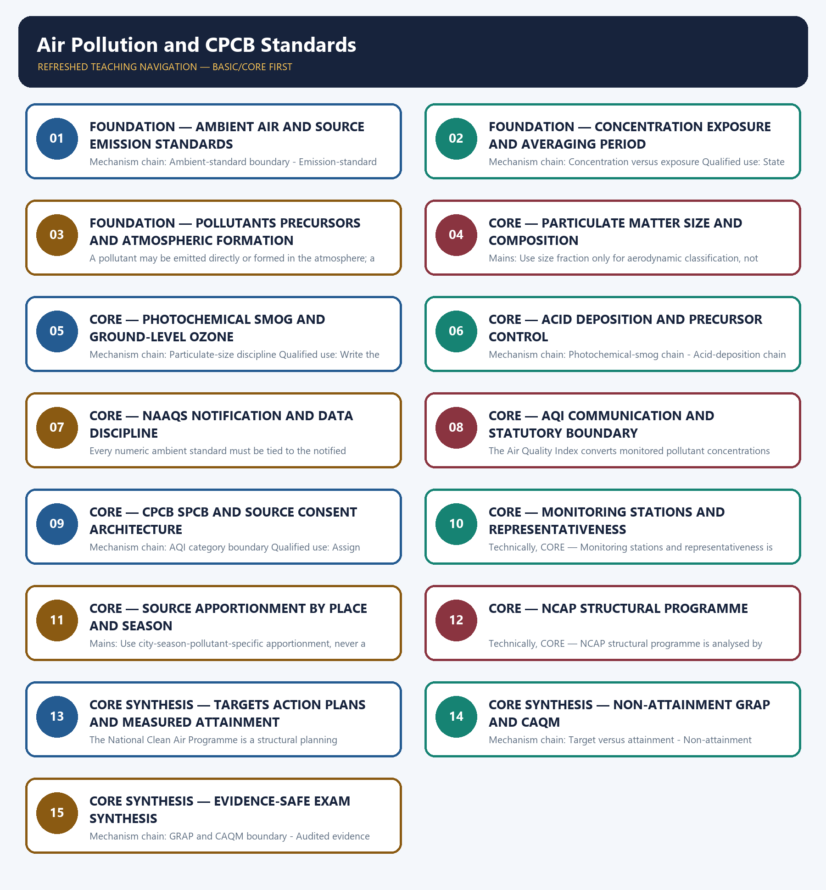

# Air Pollution and CPCB Standards — Learner-v2 Complete Learning Session

> **Authoring-only generation:** 2026-09-03. No PDF was rendered and no tracker or index was mutated.

### SOURCE, PROGRESSION AND CURRENT-LINKAGE AUDIT

- **Generation date:** 2026-09-03.
- **Repository-first evidence:** the Basic owner is taught first and preserved in full; the Advanced owner is retained only in the optional final teaching block.
- **OCR evidence:** Repository Markdown was primary. OCR-searchable local official General Studies papers were used only to confirm printed routed demands. No answer key, marking scheme, unsupported page precision, ecological rate, species count, pollution standard, rule threshold, mission outcome or current status was inferred.
- **Qdrant:** not used; repository Markdown and available OCR context were sufficient.
- **PYQ integrity:** Audited ledgers route direct Mains demands on NCAP, WHO air-quality guidelines and photochemical smog, plus objective demands on biomass burning, benzene, coal combustion, sulphur and nitrogen precursors, PM-related sources and cloud seeding. Objective keys are not inferred.
- **Live-link boundary:** Official CPCB air-quality and AQI paths returned title-only pages or a 404 display route on 2026-09-03. Consequently no ambient or emission standard, unit, averaging period, AQI breakpoint, live reading, source share, NCAP target or attainment figure was imported.
- **Fact/inference discipline:** no current-affairs item, PYQ wording, figure or quotation is invented.

### LIVE OFFICIAL-SOURCE ATTEMPT LOG

The checks below were made on 2026-09-03. Substantive official text is used only for the proposition it supports. Stubs, access failures, unrelated pages and thin landing pages are recorded and are not converted into ecological or current-status claims.

- https://cpcb.nic.in/air-quality-standards/ — attempted 2026-09-03; the official CPCB page redirected to cpcb.gov.in and returned only the board title. No pollutant limit, unit, averaging period or compliance claim was extracted from the title-only response.
- https://cpcb.nic.in/cpcb_admin/uploads/uploads/national-air-quality-index/ — attempted 2026-09-03; the official CPCB path returned only the board title. No AQI breakpoint, category threshold or live reading was imported.
- https://cpcb.nic.in/displaypdf.php?id=aHdtYV8wM19BQVFTXzIwMDkucGRm — attempted 2026-09-03; the official CPCB display route redirected to a 404 script, so no NAAQS table was transcribed.
- https://cpcb.nic.in/cpcb_admin/uploads/air-quality-management-portals/national-air-quality-index/national-air-quality-index/ocems-live-data/ — attempted 2026-09-03; the official CPCB route returned only the board title. No monitoring value or source-emission claim was used.
- https://www.pib.gov.in/indexd.aspx?reg=3&lang=1 — attempted 2026-09-03; the request returned HTTP 403, so no current air-quality programme, target or attainment claim was imported.

## BASIC LEARNING SESSION

### DEEP-REVIEW LEARNING CONTRACT

| Control | Binding rule for this package |
|---|---|
| Syllabus boundary | Complete Environment and Ecology Basic/Core is answer-complete before optional Advanced depth. |
| Ecology boundary | System boundary, scale, trophic level, stock/flow, pool/flux, gross/net, unit and time interval are explicit. |
| Species boundary | Taxon, range, habitat, population trend, IUCN assessment, Indian legal schedule, CITES/CMS listing and endemism remain distinct. |
| Law/status boundary | Act, amendment, rule, notification, draft, judgment, policy, target, implementation and observed outcome remain distinct and dated. |
| Institution boundary | Legal form, parent authority, mandate, jurisdiction, standard, consent, enforcement, science and adjudication are not conflated. |
| Treaty boundary | Membership, annex/appendix, amendment acceptance, target, COP decision, national instrument and outcome remain distinct. |
| Climate boundary | Emission flow, concentration stock, cumulative budget, forcing, scenario, baseline, unit, mitigation, adaptation, loss-and-damage, avoidance and removal are exact. |
| Pollution boundary | Source, emission/load, ambient concentration, exposure, parameter, averaging period, unit, standard and jurisdiction are explicit. |
| Causal method | Chronology, designation, expenditure, capacity, registration and correlation are not promoted into ecological or policy outcomes without mechanism and evidence. |
| Practice contract | Every solved item has demand decoding, detailed examiner-grade model, executable timed/compression plan, marks rationale and answer-specific improvement. |
| Approval | This immutable successor remains `approved: false` pending explicit approval. |

**Canonical Basic/Core owner:** `upsc-ai-kit\knowledge\Environment-and-Ecology\basic\13_Air-Pollution-and-CPCB-Standards.md`  
**Substantive canonical provenance owner:** `upsc-ai-kit\knowledge\Environment-and-Ecology\learning-sessions\v2\subject-wide-syllabus\environment-and-ecology-13_Learning-Session.md`  
**Optional Advanced owner:** `upsc-ai-kit\knowledge\Environment-and-Ecology\advanced\13_Air-Pollution-and-CPCB-Standards.md`  
**Official syllabus mapping:** `upsc-ai-kit\knowledge\Environment-and-Ecology\OFFICIAL-UPSC-SYLLABUS-MAPPING.md`

### EVIDENCE, PYQ AND CURRENT-STATUS CONTROL

- Ecological mechanisms retain direction, pool, flux, limiting factor, spatial scale and time scale.
- Current species/news claims retain taxon, source, event/publication date, assessment/listing date and access date.
- IUCN category never substitutes for Wildlife Protection Act schedule, CITES appendix, CMS appendix or endemism.
- Protected-area categories, treaty designations and institution mandates retain exact legal character.
- Acts, amendments, rules, draft instruments, notifications and judgments retain operative status and date.
- Climate figures retain unit, baseline, period, scenario and stock-flow character; global evidence is not silently downscaled to India.
- Mitigation, adaptation and loss-and-damage remain separate; allowance, offset, avoidance, removal, capture and storage remain separate.
- PYQ wording is preserved only where verified; reconstructed or routed demands remain labelled.
- **Current-status note, rechecked 2026-09-03:** volatile targets, standards, schedules, species status, treaty outcomes and programme claims retain source/date/status.

**Generation-local live/current sources:**
- `https://cpcb.nic.in/air-quality-standards/ — attempted 2026-09-03; the official CPCB page redirected to cpcb.gov.in and returned only the board title. No pollutant limit, unit, averaging period or compliance claim was extracted from the title-only response.`
- `https://cpcb.nic.in/cpcb_admin/uploads/uploads/national-air-quality-index/ — attempted 2026-09-03; the official CPCB path returned only the board title. No AQI breakpoint, category threshold or live reading was imported.`
- `https://cpcb.nic.in/displaypdf.php?id=aHdtYV8wM19BQVFTXzIwMDkucGRm — attempted 2026-09-03; the official CPCB display route redirected to a 404 script, so no NAAQS table was transcribed.`
- `https://cpcb.nic.in/cpcb_admin/uploads/air-quality-management-portals/national-air-quality-index/national-air-quality-index/ocems-live-data/ — attempted 2026-09-03; the official CPCB route returned only the board title. No monitoring value or source-emission claim was used.`
- `https://www.pib.gov.in/indexd.aspx?reg=3&lang=1 — attempted 2026-09-03; the request returned HTTP 403, so no current air-quality programme, target or attainment claim was imported.`

**Topic 26 dedicated Disaster Management cross-owners (scope boundary):**
- Not applicable to this topic.




*Distinct embedded teaching-navigation image. The separate continuous Cārvāka-style flowchart package remains an independent at-a-glance artifact.*

### SESSION 1 — FOUNDATION — AMBIENT AIR AND SOURCE EMISSION STANDARDS

#### DEFINITION / WHAT THIS IS CALLED

**Plain-language definition:** A National Ambient Air Quality Standard applies to pollutant concentration in outdoor receiving air; it is not a source-emission limit for a stack, vehicle or process.

**Technical definition:** Mechanism chain: Ambient-standard boundary - Emission-standard boundary Qualified use: Identify the receiving-air standard before discussing a source limit.

#### ANSWER-GRABBING OPENING — WRITE/ADAPT IN THE EXAM

> Do not write an ambient standard as a stack or vehicle emission limit.

#### MUST-WRITE KEYWORDS

- **FOUNDATION**
- **Ambient air**
- **source emission standards**
- **Mechanism chain**
- **Qualified use**
- **National Ambient Air Quality Standard**

**How to use them:** Frame the answer through FOUNDATION; define Ambient air, connect source emission standards with Mechanism chain to explain the mechanism, and use Qualified use for the decisive comparison or qualification.

#### VISUAL FIRST

```text
AMBIENT AIR AND SOURCE EMISSION STANDARDS
01. Ambient-standard boundary
    |
    v
02. Emission-standard boundary
BOUNDARY -> Do not write an ambient standard as a stack or vehicle emission limit.
```

*This topic-specific rail fixes the evidence sequence and its exam boundary before analysis.*

#### CORE EXPLANATION

A National Ambient Air Quality Standard applies to pollutant concentration in outdoor receiving air; it is not a source-emission limit for a stack, vehicle or process. A source-emission standard controls what a specified source may release under the applicable rule or consent; compliance cannot be inferred from a city AQI category.

#### NAMED EVIDENCE AND MECHANISM

- A National Ambient Air Quality Standard applies to pollutant concentration in outdoor receiving air; it is not a source-emission limit for a stack, vehicle or process.
- A source-emission standard controls what a specified source may release under the applicable rule or consent; compliance cannot be inferred from a city AQI category.

#### EXAMINER CAUTION

- Do not write an ambient standard as a stack or vehicle emission limit.

#### EXAM LINK

- **Prelims:** Preserve the exact receiving medium, system boundary, measured parameter, actor, process, spatial and temporal scale, rule vintage and scientific or legal status; never turn a context-dependent pattern into a universal rule.
- **Mains:** Identify the receiving-air standard before discussing a source limit.

#### MINI RECAP

- **Mechanism chain:** Ambient-standard boundary -> Emission-standard boundary
- **Qualified use:** Identify the receiving-air standard before discussing a source limit.

#### CLOSING RECALL FLOW — FOUNDATION — AMBIENT AIR AND SOURCE EMISSION STANDARDS

```text
START / CONCEPT: FOUNDATION — Ambient air and source emission standards
        |
        v
EXACT TERMS: FOUNDATION · Ambient air · source emission standards · Mechanism chain · Qualified use · National Ambient Air Quality Standard
        |
        v
MECHANISM / ARGUMENT: Mechanism chain: Ambient-standard boundary - Emission-standard boundary Qualified use: Identify the receiving-air standard before discussing a source limit.
        |
        v
CONSEQUENCE / CONTRAST: A National Ambient Air Quality Standard applies to pollutant concentration in outdoor receiving air; it is not a source-emission limit for a stack, vehicle or process.
        |
        v
UPSC TRAP / ANSWER-USE: Do not miss this limiting distinction: do not write an ambient standard as a stack or vehicle emission limit.
        |
        v
ANSWER-GRABBING FORMULATION: Do not write an ambient standard as a stack or vehicle emission limit.
```
### SESSION 2 — FOUNDATION — CONCENTRATION EXPOSURE AND AVERAGING PERIOD

#### DEFINITION / WHAT THIS IS CALLED

**Plain-language definition:** Ambient concentration is a measured amount in air at a place and averaging period, while exposure also depends on where people are, how long they remain and the route of contact.

**Technical definition:** Mechanism chain: Concentration versus exposure Qualified use: State concentration, unit and averaging period before making an exposure inference.

#### ANSWER-GRABBING OPENING — WRITE/ADAPT IN THE EXAM

> Ambient concentration is a measured amount in air at a place and averaging period, while exposure also depends on where people are, how long they remain and the route of contact.

#### MUST-WRITE KEYWORDS

- **FOUNDATION**
- **Concentration exposure**
- **averaging period**
- **Mechanism chain**
- **Qualified use**
- **Ambient concentration**

**How to use them:** Frame the answer through FOUNDATION; define Concentration exposure, connect averaging period with Mechanism chain to explain the mechanism, and use Qualified use for the decisive comparison or qualification.

#### VISUAL FIRST

```text
CONCENTRATION EXPOSURE AND AVERAGING PERIOD
01. Concentration versus exposure
BOUNDARY -> Do not convert concentration into personal exposure without time-location evidence.
```

*This topic-specific rail fixes the evidence sequence and its exam boundary before analysis.*

#### CORE EXPLANATION

Ambient concentration is a measured amount in air at a place and averaging period, while exposure also depends on where people are, how long they remain and the route of contact.

#### NAMED EVIDENCE AND MECHANISM

- Ambient concentration is a measured amount in air at a place and averaging period, while exposure also depends on where people are, how long they remain and the route of contact.

#### EXAMINER CAUTION

- Do not convert concentration into personal exposure without time-location evidence.

#### EXAM LINK

- **Prelims:** Preserve the exact receiving medium, system boundary, measured parameter, actor, process, spatial and temporal scale, rule vintage and scientific or legal status; never turn a context-dependent pattern into a universal rule.
- **Mains:** State concentration, unit and averaging period before making an exposure inference.

#### MINI RECAP

- **Mechanism chain:** Concentration versus exposure
- **Qualified use:** State concentration, unit and averaging period before making an exposure inference.

#### CLOSING RECALL FLOW — FOUNDATION — CONCENTRATION EXPOSURE AND AVERAGING PERIOD

```text
START / CONCEPT: FOUNDATION — Concentration exposure and averaging period
        |
        v
EXACT TERMS: FOUNDATION · Concentration exposure · averaging period · Mechanism chain · Qualified use · Ambient concentration
        |
        v
MECHANISM / ARGUMENT: Mechanism chain: Concentration versus exposure Qualified use: State concentration, unit and averaging period before making an exposure inference.
        |
        v
CONSEQUENCE / CONTRAST: Do not convert concentration into personal exposure without time-location evidence.
        |
        v
UPSC TRAP / ANSWER-USE: Do not miss this limiting distinction: ambient concentration is a measured amount in air at a place and averaging period.
        |
        v
ANSWER-GRABBING FORMULATION: Ambient concentration is a measured amount in air at a place and averaging period, while exposure also depends on where people are, how long they remain and the route of contact.
```
### SESSION 3 — FOUNDATION — POLLUTANTS PRECURSORS AND ATMOSPHERIC FORMATION

#### DEFINITION / WHAT THIS IS CALLED

**Plain-language definition:** Mechanism chain: Pollutant versus precursor Qualified use: Trace emitted substances through atmospheric chemistry to the measured pollutant.

**Technical definition:** A pollutant may be emitted directly or formed in the atmosphere; a precursor participates in reactions that create a secondary pollutant and must not be reported as the resulting pollutant itself.

#### ANSWER-GRABBING OPENING — WRITE/ADAPT IN THE EXAM

> A pollutant may be emitted directly or formed in the atmosphere; a precursor participates in reactions that create a secondary pollutant and must not be reported as the resulting pollutant itself.

#### MUST-WRITE KEYWORDS

- **FOUNDATION**
- **Pollutants precursors**
- **atmospheric formation**
- **Mechanism chain**
- **Qualified use**
- **Pollutant**

**How to use them:** Frame the answer through FOUNDATION; define Pollutants precursors, connect atmospheric formation with Mechanism chain to explain the mechanism, and use Qualified use for the decisive comparison or qualification.

#### VISUAL FIRST

```text
POLLUTANTS PRECURSORS AND ATMOSPHERIC FORMATION
01. Pollutant versus precursor
BOUNDARY -> Do not call a precursor the secondary pollutant formed from it.
```

*This topic-specific rail fixes the evidence sequence and its exam boundary before analysis.*

#### CORE EXPLANATION

A pollutant may be emitted directly or formed in the atmosphere; a precursor participates in reactions that create a secondary pollutant and must not be reported as the resulting pollutant itself.

#### NAMED EVIDENCE AND MECHANISM

- A pollutant may be emitted directly or formed in the atmosphere; a precursor participates in reactions that create a secondary pollutant and must not be reported as the resulting pollutant itself.

#### EXAMINER CAUTION

- Do not call a precursor the secondary pollutant formed from it.

#### EXAM LINK

- **Prelims:** Preserve the exact receiving medium, system boundary, measured parameter, actor, process, spatial and temporal scale, rule vintage and scientific or legal status; never turn a context-dependent pattern into a universal rule.
- **Mains:** Trace emitted substances through atmospheric chemistry to the measured pollutant.

#### MINI RECAP

- **Mechanism chain:** Pollutant versus precursor
- **Qualified use:** Trace emitted substances through atmospheric chemistry to the measured pollutant.

#### CLOSING RECALL FLOW — FOUNDATION — POLLUTANTS PRECURSORS AND ATMOSPHERIC FORMATION

```text
START / CONCEPT: FOUNDATION — Pollutants precursors and atmospheric formation
        |
        v
EXACT TERMS: FOUNDATION · Pollutants precursors · atmospheric formation · Mechanism chain · Qualified use · Pollutant
        |
        v
MECHANISM / ARGUMENT: Mechanism chain: Pollutant versus precursor Qualified use: Trace emitted substances through atmospheric chemistry to the measured pollutant.
        |
        v
CONSEQUENCE / CONTRAST: Do not call a precursor the secondary pollutant formed from it.
        |
        v
UPSC TRAP / ANSWER-USE: Do not miss this limiting distinction: a pollutant may be emitted directly or formed in the atmosphere.
        |
        v
ANSWER-GRABBING FORMULATION: A pollutant may be emitted directly or formed in the atmosphere; a precursor participates in reactions that create a secondary pollutant and must not be reported as the resulting pollutant itself.
```
### SESSION 4 — CORE — PARTICULATE MATTER SIZE AND COMPOSITION

#### DEFINITION / WHAT THIS IS CALLED

**Plain-language definition:** Mechanism chain: Primary and secondary pollution Qualified use: Use size fraction only for aerodynamic classification, not composition.

**Technical definition:** Mains: Use size fraction only for aerodynamic classification, not composition.

#### ANSWER-GRABBING OPENING — WRITE/ADAPT IN THE EXAM

> Mechanism chain: Primary and secondary pollution Qualified use: Use size fraction only for aerodynamic classification, not composition.

#### MUST-WRITE KEYWORDS

- **Particulate matter size**
- **composition**
- **Mechanism chain**
- **Qualified use**
- **Primary pollutants**
- **Primary**

**How to use them:** Frame the answer through Particulate matter size; define composition, connect Mechanism chain with Qualified use to explain the mechanism, and use Primary pollutants for the decisive comparison or qualification.

#### VISUAL FIRST

```text
PARTICULATE MATTER SIZE AND COMPOSITION
01. Primary and secondary pollution
BOUNDARY -> Do not treat particulate size as chemical composition.
```

*This topic-specific rail fixes the evidence sequence and its exam boundary before analysis.*

#### CORE EXPLANATION

Primary pollutants are emitted from sources, whereas secondary pollutants form through atmospheric chemistry; the control pathway must therefore include both direct emissions and precursor control.

#### NAMED EVIDENCE AND MECHANISM

- Primary pollutants are emitted from sources, whereas secondary pollutants form through atmospheric chemistry; the control pathway must therefore include both direct emissions and precursor control.

#### EXAMINER CAUTION

- Do not treat particulate size as chemical composition.

#### EXAM LINK

- **Prelims:** Preserve the exact receiving medium, system boundary, measured parameter, actor, process, spatial and temporal scale, rule vintage and scientific or legal status; never turn a context-dependent pattern into a universal rule.
- **Mains:** Use size fraction only for aerodynamic classification, not composition.

#### MINI RECAP

- **Mechanism chain:** Primary and secondary pollution
- **Qualified use:** Use size fraction only for aerodynamic classification, not composition.

#### CLOSING RECALL FLOW — CORE — PARTICULATE MATTER SIZE AND COMPOSITION

```text
START / CONCEPT: CORE — Particulate matter size and composition
        |
        v
EXACT TERMS: Particulate matter size · composition · Mechanism chain · Qualified use · Primary pollutants · Primary
        |
        v
MECHANISM / ARGUMENT: Primary pollutants are emitted from sources, whereas secondary pollutants form through atmospheric chemistry; the control pathway must therefore include both direct emissions and precursor control.
        |
        v
CONSEQUENCE / CONTRAST: Do not treat particulate size as chemical composition.
        |
        v
UPSC TRAP / ANSWER-USE: Mains: Use size fraction only for aerodynamic classification, not composition.
        |
        v
ANSWER-GRABBING FORMULATION: Mechanism chain: Primary and secondary pollution Qualified use: Use size fraction only for aerodynamic classification, not composition.
```
### SESSION 5 — CORE — PHOTOCHEMICAL SMOG AND GROUND-LEVEL OZONE

#### DEFINITION / WHAT THIS IS CALLED

**Plain-language definition:** PM2.5 and PM10 are aerodynamic size fractions, not chemical species; composition, source and health effect cannot be inferred from size label alone.

**Technical definition:** Mechanism chain: Particulate-size discipline Qualified use: Write the precursor-sunlight-secondary-oxidant chain.

#### ANSWER-GRABBING OPENING — WRITE/ADAPT IN THE EXAM

> Do not merge ground-level ozone with stratospheric ozone.

#### MUST-WRITE KEYWORDS

- **Photochemical smog**
- **ground-level ozone**
- **Mechanism chain**
- **Qualified use**
- **PM2.5 and PM10**
- **Particulate-size**

**How to use them:** Frame the answer through Photochemical smog; define ground-level ozone, connect Mechanism chain with Qualified use to explain the mechanism, and use PM2.5 and PM10 for the decisive comparison or qualification.

#### VISUAL FIRST

```text
PHOTOCHEMICAL SMOG AND GROUND-LEVEL OZONE
01. Particulate-size discipline
BOUNDARY -> Do not merge ground-level ozone with stratospheric ozone.
```

*This topic-specific rail fixes the evidence sequence and its exam boundary before analysis.*

#### CORE EXPLANATION

PM2.5 and PM10 are aerodynamic size fractions, not chemical species; composition, source and health effect cannot be inferred from size label alone.

#### NAMED EVIDENCE AND MECHANISM

- PM2.5 and PM10 are aerodynamic size fractions, not chemical species; composition, source and health effect cannot be inferred from size label alone.

#### EXAMINER CAUTION

- Do not merge ground-level ozone with stratospheric ozone.

#### EXAM LINK

- **Prelims:** Preserve the exact receiving medium, system boundary, measured parameter, actor, process, spatial and temporal scale, rule vintage and scientific or legal status; never turn a context-dependent pattern into a universal rule.
- **Mains:** Write the precursor-sunlight-secondary-oxidant chain.

#### MINI RECAP

- **Mechanism chain:** Particulate-size discipline
- **Qualified use:** Write the precursor-sunlight-secondary-oxidant chain.

#### CLOSING RECALL FLOW — CORE — PHOTOCHEMICAL SMOG AND GROUND-LEVEL OZONE

```text
START / CONCEPT: CORE — Photochemical smog and ground-level ozone
        |
        v
EXACT TERMS: Photochemical smog · ground-level ozone · Mechanism chain · Qualified use · PM2.5 and PM10 · Particulate-size
        |
        v
MECHANISM / ARGUMENT: Mechanism chain: Particulate-size discipline Qualified use: Write the precursor-sunlight-secondary-oxidant chain.
        |
        v
CONSEQUENCE / CONTRAST: PM2.5 and PM10 are aerodynamic size fractions, not chemical species; composition, source and health effect cannot be inferred from size label alone.
        |
        v
UPSC TRAP / ANSWER-USE: Do not miss this limiting distinction: do not merge ground-level ozone with stratospheric ozone.
        |
        v
ANSWER-GRABBING FORMULATION: Do not merge ground-level ozone with stratospheric ozone.
```
### SESSION 6 — CORE — ACID DEPOSITION AND PRECURSOR CONTROL

#### DEFINITION / WHAT THIS IS CALLED

**Plain-language definition:** Photochemical smog requires precursor emissions and sunlight-driven chemistry that can form ground-level ozone and other oxidants; ozone at the surface is distinct from protective stratospheric ozone.

**Technical definition:** Mechanism chain: Photochemical-smog chain - Acid-deposition chain Qualified use: Separate precursor control from wet and dry deposition effects.

#### ANSWER-GRABBING OPENING — WRITE/ADAPT IN THE EXAM

> Mechanism chain: Photochemical-smog chain - Acid-deposition chain Qualified use: Separate precursor control from wet and dry deposition effects.

#### MUST-WRITE KEYWORDS

- **Acid deposition**
- **precursor control**
- **Mechanism chain**
- **Qualified use**
- **Photochemical**
- **Sulphur**

**How to use them:** Frame the answer through Acid deposition; define precursor control, connect Mechanism chain with Qualified use to explain the mechanism, and use Photochemical for the decisive comparison or qualification.

#### VISUAL FIRST

```text
ACID DEPOSITION AND PRECURSOR CONTROL
01. Photochemical-smog chain
    |
    v
02. Acid-deposition chain
BOUNDARY -> Do not quote a standard without its unit and averaging period.
```

*This topic-specific rail fixes the evidence sequence and its exam boundary before analysis.*

#### CORE EXPLANATION

Photochemical smog requires precursor emissions and sunlight-driven chemistry that can form ground-level ozone and other oxidants; ozone at the surface is distinct from protective stratospheric ozone. Sulphur and nitrogen oxides can act as acid-deposition precursors after atmospheric transformation; an answer must separate precursor emission from later wet or dry deposition.

#### NAMED EVIDENCE AND MECHANISM

- Photochemical smog requires precursor emissions and sunlight-driven chemistry that can form ground-level ozone and other oxidants; ozone at the surface is distinct from protective stratospheric ozone.
- Sulphur and nitrogen oxides can act as acid-deposition precursors after atmospheric transformation; an answer must separate precursor emission from later wet or dry deposition.

#### EXAMINER CAUTION

- Do not quote a standard without its unit and averaging period.

#### EXAM LINK

- **Prelims:** Preserve the exact receiving medium, system boundary, measured parameter, actor, process, spatial and temporal scale, rule vintage and scientific or legal status; never turn a context-dependent pattern into a universal rule.
- **Mains:** Separate precursor control from wet and dry deposition effects.

#### MINI RECAP

- **Mechanism chain:** Photochemical-smog chain -> Acid-deposition chain
- **Qualified use:** Separate precursor control from wet and dry deposition effects.

#### CLOSING RECALL FLOW — CORE — ACID DEPOSITION AND PRECURSOR CONTROL

```text
START / CONCEPT: CORE — Acid deposition and precursor control
        |
        v
EXACT TERMS: Acid deposition · precursor control · Mechanism chain · Qualified use · Photochemical · Sulphur
        |
        v
MECHANISM / ARGUMENT: Sulphur and nitrogen oxides can act as acid-deposition precursors after atmospheric transformation; an answer must separate precursor emission from later wet or dry deposition.
        |
        v
CONSEQUENCE / CONTRAST: Do not quote a standard without its unit and averaging period.
        |
        v
UPSC TRAP / ANSWER-USE: Do not miss this limiting distinction: photochemical smog requires precursor emissions and sunlight-driven chemistry that can form ground-level ozone and...
        |
        v
ANSWER-GRABBING FORMULATION: Mechanism chain: Photochemical-smog chain - Acid-deposition chain Qualified use: Separate precursor control from wet and dry deposition effects.
```
### SESSION 7 — CORE — NAAQS NOTIFICATION AND DATA DISCIPLINE

#### DEFINITION / WHAT THIS IS CALLED

**Plain-language definition:** Mechanism chain: NAAQS data discipline Qualified use: Attach every number to the exact notification and measurement convention.

**Technical definition:** Every numeric ambient standard must be tied to the notified pollutant, unit, averaging period, area applicability and compliance rule; no value is carried here from a title-only live page.

#### ANSWER-GRABBING OPENING — WRITE/ADAPT IN THE EXAM

> Mechanism chain: NAAQS data discipline Qualified use: Attach every number to the exact notification and measurement convention.

#### MUST-WRITE KEYWORDS

- **NAAQS notification**
- **data discipline**
- **Mechanism chain**
- **Qualified use**
- **Every**
- **AQI**

**How to use them:** Frame the answer through NAAQS notification; define data discipline, connect Mechanism chain with Qualified use to explain the mechanism, and use Every for the decisive comparison or qualification.

#### VISUAL FIRST

```text
NAAQS NOTIFICATION AND DATA DISCIPLINE
01. NAAQS data discipline
BOUNDARY -> Do not treat an AQI category as the NAAQS table.
```

*This topic-specific rail fixes the evidence sequence and its exam boundary before analysis.*

#### CORE EXPLANATION

Every numeric ambient standard must be tied to the notified pollutant, unit, averaging period, area applicability and compliance rule; no value is carried here from a title-only live page.

#### NAMED EVIDENCE AND MECHANISM

- Every numeric ambient standard must be tied to the notified pollutant, unit, averaging period, area applicability and compliance rule; no value is carried here from a title-only live page.

#### EXAMINER CAUTION

- Do not treat an AQI category as the NAAQS table.

#### EXAM LINK

- **Prelims:** Preserve the exact receiving medium, system boundary, measured parameter, actor, process, spatial and temporal scale, rule vintage and scientific or legal status; never turn a context-dependent pattern into a universal rule.
- **Mains:** Attach every number to the exact notification and measurement convention.

#### MINI RECAP

- **Mechanism chain:** NAAQS data discipline
- **Qualified use:** Attach every number to the exact notification and measurement convention.

#### CLOSING RECALL FLOW — CORE — NAAQS NOTIFICATION AND DATA DISCIPLINE

```text
START / CONCEPT: CORE — NAAQS notification and data discipline
        |
        v
EXACT TERMS: NAAQS notification · data discipline · Mechanism chain · Qualified use · Every · AQI
        |
        v
MECHANISM / ARGUMENT: Do not treat an AQI category as the NAAQS table.
        |
        v
CONSEQUENCE / CONTRAST: Every numeric ambient standard must be tied to the notified pollutant, unit, averaging period, area applicability and compliance rule; no value is carried here from a title-only live page.
        |
        v
UPSC TRAP / ANSWER-USE: Do not miss this limiting distinction: attach every number to the exact notification and measurement convention.
        |
        v
ANSWER-GRABBING FORMULATION: Mechanism chain: NAAQS data discipline Qualified use: Attach every number to the exact notification and measurement convention.
```
### SESSION 8 — CORE — AQI COMMUNICATION AND STATUTORY BOUNDARY

#### DEFINITION / WHAT THIS IS CALLED

**Plain-language definition:** Mechanism chain: AQI communication role Qualified use: Use AQI for communication and NAAQS for notified ambient compliance.

**Technical definition:** The Air Quality Index converts monitored pollutant concentrations into a public communication category; it does not replace the notified ambient standard or a source-emission standard.

#### ANSWER-GRABBING OPENING — WRITE/ADAPT IN THE EXAM

> The Air Quality Index converts monitored pollutant concentrations into a public communication category; it does not replace the notified ambient standard or a source-emission standard.

#### MUST-WRITE KEYWORDS

- **AQI communication**
- **statutory boundary**
- **Mechanism chain**
- **Qualified use**
- **The Air Quality Index**
- **NAAQS**

**How to use them:** Frame the answer through AQI communication; define statutory boundary, connect Mechanism chain with Qualified use to explain the mechanism, and use The Air Quality Index for the decisive comparison or qualification.

#### VISUAL FIRST

```text
AQI COMMUNICATION AND STATUTORY BOUNDARY
01. AQI communication role
BOUNDARY -> Do not infer every pollutant's compliance from one composite index.
```

*This topic-specific rail fixes the evidence sequence and its exam boundary before analysis.*

#### CORE EXPLANATION

The Air Quality Index converts monitored pollutant concentrations into a public communication category; it does not replace the notified ambient standard or a source-emission standard.

#### NAMED EVIDENCE AND MECHANISM

- The Air Quality Index converts monitored pollutant concentrations into a public communication category; it does not replace the notified ambient standard or a source-emission standard.

#### EXAMINER CAUTION

- Do not infer every pollutant's compliance from one composite index.

#### EXAM LINK

- **Prelims:** Preserve the exact receiving medium, system boundary, measured parameter, actor, process, spatial and temporal scale, rule vintage and scientific or legal status; never turn a context-dependent pattern into a universal rule.
- **Mains:** Use AQI for communication and NAAQS for notified ambient compliance.

#### MINI RECAP

- **Mechanism chain:** AQI communication role
- **Qualified use:** Use AQI for communication and NAAQS for notified ambient compliance.

#### CLOSING RECALL FLOW — CORE — AQI COMMUNICATION AND STATUTORY BOUNDARY

```text
START / CONCEPT: CORE — AQI communication and statutory boundary
        |
        v
EXACT TERMS: AQI communication · statutory boundary · Mechanism chain · Qualified use · The Air Quality Index · NAAQS
        |
        v
MECHANISM / ARGUMENT: Mechanism chain: AQI communication role Qualified use: Use AQI for communication and NAAQS for notified ambient compliance.
        |
        v
CONSEQUENCE / CONTRAST: Do not infer every pollutant's compliance from one composite index.
        |
        v
UPSC TRAP / ANSWER-USE: Do not miss this limiting distinction: use AQI for communication and NAAQS for notified ambient compliance.
        |
        v
ANSWER-GRABBING FORMULATION: The Air Quality Index converts monitored pollutant concentrations into a public communication category; it does not replace the notified ambient standard or a source-emission standard.
```
### SESSION 9 — CORE — CPCB SPCB AND SOURCE CONSENT ARCHITECTURE

#### DEFINITION / WHAT THIS IS CALLED

**Plain-language definition:** An AQI category describes the index for a stated place and time; it is not by itself a statutory finding that every pollutant met or breached every NAAQS averaging period.

**Technical definition:** Mechanism chain: AQI category boundary Qualified use: Assign national coordination and local consent-enforcement roles correctly.

#### ANSWER-GRABBING OPENING — WRITE/ADAPT IN THE EXAM

> Do not exchange CPCB coordination and SPCB consent enforcement.

#### MUST-WRITE KEYWORDS

- **CPCB SPCB**
- **source consent architecture**
- **Mechanism chain**
- **Qualified use**
- **An AQI category**
- **An AQI**

**How to use them:** Frame the answer through CPCB SPCB; define source consent architecture, connect Mechanism chain with Qualified use to explain the mechanism, and use An AQI category for the decisive comparison or qualification.

#### VISUAL FIRST

```text
CPCB SPCB AND SOURCE CONSENT ARCHITECTURE
01. AQI category boundary
BOUNDARY -> Do not exchange CPCB coordination and SPCB consent enforcement.
```

*This topic-specific rail fixes the evidence sequence and its exam boundary before analysis.*

#### CORE EXPLANATION

An AQI category describes the index for a stated place and time; it is not by itself a statutory finding that every pollutant met or breached every NAAQS averaging period.

#### NAMED EVIDENCE AND MECHANISM

- An AQI category describes the index for a stated place and time; it is not by itself a statutory finding that every pollutant met or breached every NAAQS averaging period.

#### EXAMINER CAUTION

- Do not exchange CPCB coordination and SPCB consent enforcement.

#### EXAM LINK

- **Prelims:** Preserve the exact receiving medium, system boundary, measured parameter, actor, process, spatial and temporal scale, rule vintage and scientific or legal status; never turn a context-dependent pattern into a universal rule.
- **Mains:** Assign national coordination and local consent-enforcement roles correctly.

#### MINI RECAP

- **Mechanism chain:** AQI category boundary
- **Qualified use:** Assign national coordination and local consent-enforcement roles correctly.

#### CLOSING RECALL FLOW — CORE — CPCB SPCB AND SOURCE CONSENT ARCHITECTURE

```text
START / CONCEPT: CORE — CPCB SPCB and source consent architecture
        |
        v
EXACT TERMS: CPCB SPCB · source consent architecture · Mechanism chain · Qualified use · An AQI category · An AQI
        |
        v
MECHANISM / ARGUMENT: An AQI category describes the index for a stated place and time; it is not by itself a statutory finding that every pollutant met or breached every NAAQS averaging period.
        |
        v
CONSEQUENCE / CONTRAST: Mechanism chain: AQI category boundary Qualified use: Assign national coordination and local consent-enforcement roles correctly.
        |
        v
UPSC TRAP / ANSWER-USE: Do not miss this limiting distinction: do not exchange CPCB coordination and SPCB consent enforcement.
        |
        v
ANSWER-GRABBING FORMULATION: Do not exchange CPCB coordination and SPCB consent enforcement.
```
### SESSION 10 — CORE — MONITORING STATIONS AND REPRESENTATIVENESS

#### DEFINITION / WHAT THIS IS CALLED

**Plain-language definition:** Mechanism chain: CPCB and SPCB roles Qualified use: Qualify monitoring evidence by station location, completeness and meteorology.

**Technical definition:** Technically, CORE — Monitoring stations and representativeness is analysed by relating Monitoring stations to representativeness, then testing the relationship through Mechanism chain and Qualified use.

#### ANSWER-GRABBING OPENING — WRITE/ADAPT IN THE EXAM

> Mechanism chain: CPCB and SPCB roles Qualified use: Qualify monitoring evidence by station location, completeness and meteorology.

#### MUST-WRITE KEYWORDS

- **Monitoring stations**
- **representativeness**
- **Mechanism chain**
- **Qualified use**
- **CPCB**
- **SPCB**

**How to use them:** Frame the answer through Monitoring stations; define representativeness, connect Mechanism chain with Qualified use to explain the mechanism, and use CPCB for the decisive comparison or qualification.

#### VISUAL FIRST

```text
MONITORING STATIONS AND REPRESENTATIVENESS
01. CPCB and SPCB roles
BOUNDARY -> Do not merge environmental clearance with consent to operate.
```

*This topic-specific rail fixes the evidence sequence and its exam boundary before analysis.*

#### CORE EXPLANATION

CPCB coordinates nationally and supports standards and monitoring frameworks, while SPCBs and pollution-control committees perform major consent, monitoring and enforcement functions within their jurisdictions.

#### NAMED EVIDENCE AND MECHANISM

- CPCB coordinates nationally and supports standards and monitoring frameworks, while SPCBs and pollution-control committees perform major consent, monitoring and enforcement functions within their jurisdictions.

#### EXAMINER CAUTION

- Do not merge environmental clearance with consent to operate.

#### EXAM LINK

- **Prelims:** Preserve the exact receiving medium, system boundary, measured parameter, actor, process, spatial and temporal scale, rule vintage and scientific or legal status; never turn a context-dependent pattern into a universal rule.
- **Mains:** Qualify monitoring evidence by station location, completeness and meteorology.

#### MINI RECAP

- **Mechanism chain:** CPCB and SPCB roles
- **Qualified use:** Qualify monitoring evidence by station location, completeness and meteorology.

#### CLOSING RECALL FLOW — CORE — MONITORING STATIONS AND REPRESENTATIVENESS

```text
START / CONCEPT: CORE — Monitoring stations and representativeness
        |
        v
EXACT TERMS: Monitoring stations · representativeness · Mechanism chain · Qualified use · CPCB · SPCB
        |
        v
MECHANISM / ARGUMENT: Do not merge environmental clearance with consent to operate.
        |
        v
CONSEQUENCE / CONTRAST: The resulting consequence is that cPCB and SPCB roles Qualified use.
        |
        v
UPSC TRAP / ANSWER-USE: Do not miss this limiting distinction: cPCB and SPCB roles Qualified use.
        |
        v
ANSWER-GRABBING FORMULATION: Mechanism chain: CPCB and SPCB roles Qualified use: Qualify monitoring evidence by station location, completeness and meteorology.
```
### SESSION 11 — CORE — SOURCE APPORTIONMENT BY PLACE AND SEASON

#### DEFINITION / WHAT THIS IS CALLED

**Plain-language definition:** Mechanism chain: Air Act and consent layer - Monitoring representativeness Qualified use: Use city-season-pollutant-specific apportionment, never a universal share.

**Technical definition:** Mains: Use city-season-pollutant-specific apportionment, never a universal share.

#### ANSWER-GRABBING OPENING — WRITE/ADAPT IN THE EXAM

> Do not universalise a source-apportionment share across seasons or cities.

#### MUST-WRITE KEYWORDS

- **Source apportionment by place**
- **season**
- **Mechanism chain**
- **Qualified use**
- **The Air Act**
- **Air Act**

**How to use them:** Frame the answer through Source apportionment by place; define season, connect Mechanism chain with Qualified use to explain the mechanism, and use The Air Act for the decisive comparison or qualification.

#### VISUAL FIRST

```text
SOURCE APPORTIONMENT BY PLACE AND SEASON
01. Air Act and consent layer
    |
    v
02. Monitoring representativeness
BOUNDARY -> Do not universalise a source-apportionment share across seasons or cities.
```

*This topic-specific rail fixes the evidence sequence and its exam boundary before analysis.*

#### CORE EXPLANATION

The Air Act provides the pollution-control framework, while consent conditions and sector-specific standards regulate sources; a prior environmental clearance is a separate project-appraisal instrument. A station measures conditions at its location and time; network density, siting, data completeness and meteorology affect whether one reading represents a neighbourhood, city or region.

#### NAMED EVIDENCE AND MECHANISM

- The Air Act provides the pollution-control framework, while consent conditions and sector-specific standards regulate sources; a prior environmental clearance is a separate project-appraisal instrument.
- A station measures conditions at its location and time; network density, siting, data completeness and meteorology affect whether one reading represents a neighbourhood, city or region.

#### EXAMINER CAUTION

- Do not universalise a source-apportionment share across seasons or cities.

#### EXAM LINK

- **Prelims:** Preserve the exact receiving medium, system boundary, measured parameter, actor, process, spatial and temporal scale, rule vintage and scientific or legal status; never turn a context-dependent pattern into a universal rule.
- **Mains:** Use city-season-pollutant-specific apportionment, never a universal share.

#### MINI RECAP

- **Mechanism chain:** Air Act and consent layer -> Monitoring representativeness
- **Qualified use:** Use city-season-pollutant-specific apportionment, never a universal share.

#### CLOSING RECALL FLOW — CORE — SOURCE APPORTIONMENT BY PLACE AND SEASON

```text
START / CONCEPT: CORE — Source apportionment by place and season
        |
        v
EXACT TERMS: Source apportionment by place · season · Mechanism chain · Qualified use · The Air Act · Air Act
        |
        v
MECHANISM / ARGUMENT: Mechanism chain: Air Act and consent layer - Monitoring representativeness Qualified use: Use city-season-pollutant-specific apportionment, never a universal share.
        |
        v
CONSEQUENCE / CONTRAST: The Air Act provides the pollution-control framework, while consent conditions and sector-specific standards regulate sources; a prior environmental clearance is a separate project-appraisal instrument.
        |
        v
UPSC TRAP / ANSWER-USE: Mains: Use city-season-pollutant-specific apportionment, never a universal share.
        |
        v
ANSWER-GRABBING FORMULATION: Do not universalise a source-apportionment share across seasons or cities.
```
### SESSION 12 — CORE — NCAP STRUCTURAL PROGRAMME

#### DEFINITION / WHAT THIS IS CALLED

**Plain-language definition:** Mechanism chain: Source-apportionment boundary Qualified use: Place NCAP beside, not above or instead of, the statutory framework.

**Technical definition:** Technically, CORE — NCAP structural programme is analysed by relating NCAP structural programme to Mechanism chain, then testing the relationship through Qualified use and NCAP.

#### ANSWER-GRABBING OPENING — WRITE/ADAPT IN THE EXAM

> Mechanism chain: Source-apportionment boundary Qualified use: Place NCAP beside, not above or instead of, the statutory framework.

#### MUST-WRITE KEYWORDS

- **NCAP structural programme**
- **Mechanism chain**
- **Qualified use**
- **NCAP**
- **Source-apportionment**
- **Qualified**

**How to use them:** Frame the answer through NCAP structural programme; define Mechanism chain, connect Qualified use with NCAP to explain the mechanism, and use Source-apportionment for the decisive comparison or qualification.

#### VISUAL FIRST

```text
NCAP STRUCTURAL PROGRAMME
01. Source-apportionment boundary
BOUNDARY -> Do not report an NCAP target or action as measured attainment.
```

*This topic-specific rail fixes the evidence sequence and its exam boundary before analysis.*

#### CORE EXPLANATION

Source contribution varies by city, season, pollutant, method and meteorology; no fixed vehicle, industry, dust or crop-residue share can be universalised.

#### NAMED EVIDENCE AND MECHANISM

- Source contribution varies by city, season, pollutant, method and meteorology; no fixed vehicle, industry, dust or crop-residue share can be universalised.

#### EXAMINER CAUTION

- Do not report an NCAP target or action as measured attainment.

#### EXAM LINK

- **Prelims:** Preserve the exact receiving medium, system boundary, measured parameter, actor, process, spatial and temporal scale, rule vintage and scientific or legal status; never turn a context-dependent pattern into a universal rule.
- **Mains:** Place NCAP beside, not above or instead of, the statutory framework.

#### MINI RECAP

- **Mechanism chain:** Source-apportionment boundary
- **Qualified use:** Place NCAP beside, not above or instead of, the statutory framework.

#### CLOSING RECALL FLOW — CORE — NCAP STRUCTURAL PROGRAMME

```text
START / CONCEPT: CORE — NCAP structural programme
        |
        v
EXACT TERMS: NCAP structural programme · Mechanism chain · Qualified use · NCAP · Source-apportionment · Qualified
        |
        v
MECHANISM / ARGUMENT: Source contribution varies by city, season, pollutant, method and meteorology; no fixed vehicle, industry, dust or crop-residue share can be universalised.
        |
        v
CONSEQUENCE / CONTRAST: Do not report an NCAP target or action as measured attainment.
        |
        v
UPSC TRAP / ANSWER-USE: Do not miss this limiting distinction: place NCAP beside, not above or instead of, the statutory framework.
        |
        v
ANSWER-GRABBING FORMULATION: Mechanism chain: Source-apportionment boundary Qualified use: Place NCAP beside, not above or instead of, the statutory framework.
```
### SESSION 13 — CORE SYNTHESIS — TARGETS ACTION PLANS AND MEASURED ATTAINMENT

#### DEFINITION / WHAT THIS IS CALLED

**Plain-language definition:** Mechanism chain: NCAP programme boundary Qualified use: Move from target to action to monitored result without skipping stages.

**Technical definition:** The National Clean Air Programme is a structural planning programme for sustained source reduction and capacity building, not a substitute for the Air Act or a source consent.

#### ANSWER-GRABBING OPENING — WRITE/ADAPT IN THE EXAM

> Mechanism chain: NCAP programme boundary Qualified use: Move from target to action to monitored result without skipping stages.

#### MUST-WRITE KEYWORDS

- **CORE SYNTHESIS**
- **Targets action plans**
- **measured attainment**
- **Mechanism chain**
- **Qualified use**
- **The National Clean Air Programme**

**How to use them:** Frame the answer through CORE SYNTHESIS; define Targets action plans, connect measured attainment with Mechanism chain to explain the mechanism, and use Qualified use for the decisive comparison or qualification.

#### VISUAL FIRST

```text
TARGETS ACTION PLANS AND MEASURED ATTAINMENT
01. NCAP programme boundary
BOUNDARY -> Do not equate non-attainment status with a current AQI reading.
```

*This topic-specific rail fixes the evidence sequence and its exam boundary before analysis.*

#### CORE EXPLANATION

The National Clean Air Programme is a structural planning programme for sustained source reduction and capacity building, not a substitute for the Air Act or a source consent.

#### NAMED EVIDENCE AND MECHANISM

- The National Clean Air Programme is a structural planning programme for sustained source reduction and capacity building, not a substitute for the Air Act or a source consent.

#### EXAMINER CAUTION

- Do not equate non-attainment status with a current AQI reading.

#### EXAM LINK

- **Prelims:** Preserve the exact receiving medium, system boundary, measured parameter, actor, process, spatial and temporal scale, rule vintage and scientific or legal status; never turn a context-dependent pattern into a universal rule.
- **Mains:** Move from target to action to monitored result without skipping stages.

#### MINI RECAP

- **Mechanism chain:** NCAP programme boundary
- **Qualified use:** Move from target to action to monitored result without skipping stages.

#### CLOSING RECALL FLOW — CORE SYNTHESIS — TARGETS ACTION PLANS AND MEASURED ATTAINMENT

```text
START / CONCEPT: CORE SYNTHESIS — Targets action plans and measured attainment
        |
        v
EXACT TERMS: CORE SYNTHESIS · Targets action plans · measured attainment · Mechanism chain · Qualified use · The National Clean Air Programme
        |
        v
MECHANISM / ARGUMENT: The National Clean Air Programme is a structural planning programme for sustained source reduction and capacity building, not a substitute for the Air Act or a source consent.
        |
        v
CONSEQUENCE / CONTRAST: Do not equate non-attainment status with a current AQI reading.
        |
        v
UPSC TRAP / ANSWER-USE: Do not miss this limiting distinction: the National Clean Air Programme is a structural planning programme for sustained source reduction...
        |
        v
ANSWER-GRABBING FORMULATION: Mechanism chain: NCAP programme boundary Qualified use: Move from target to action to monitored result without skipping stages.
```
### SESSION 14 — CORE SYNTHESIS — NON-ATTAINMENT GRAP AND CAQM

#### DEFINITION / WHAT THIS IS CALLED

**Plain-language definition:** Non-attainment classification is based on the applicable monitoring and standards framework over a defined period; it is not the same as a city's current hourly or daily AQI.

**Technical definition:** Mechanism chain: Target versus attainment - Non-attainment boundary Qualified use: Separate status, episodic response and regional institution.

#### ANSWER-GRABBING OPENING — WRITE/ADAPT IN THE EXAM

> Non-attainment classification is based on the applicable monitoring and standards framework over a defined period; it is not the same as a city's current hourly or daily AQI.

#### MUST-WRITE KEYWORDS

- **CORE SYNTHESIS**
- **Non-attainment GRAP**
- **CAQM**
- **Mechanism chain**
- **Qualified use**
- **An NCAP**

**How to use them:** Frame the answer through CORE SYNTHESIS; define Non-attainment GRAP, connect CAQM with Mechanism chain to explain the mechanism, and use Qualified use for the decisive comparison or qualification.

#### VISUAL FIRST

```text
NON-ATTAINMENT GRAP AND CAQM
01. Target versus attainment
    |
    v
02. Non-attainment boundary
BOUNDARY -> Do not treat GRAP as India's long-term national clean-air programme.
```

*This topic-specific rail fixes the evidence sequence and its exam boundary before analysis.*

#### CORE EXPLANATION

An NCAP goal, city action plan, fund release, activity completion and measured attainment are different stages; an announced target is not an achieved concentration reduction. Non-attainment classification is based on the applicable monitoring and standards framework over a defined period; it is not the same as a city's current hourly or daily AQI.

#### NAMED EVIDENCE AND MECHANISM

- An NCAP goal, city action plan, fund release, activity completion and measured attainment are different stages; an announced target is not an achieved concentration reduction.
- Non-attainment classification is based on the applicable monitoring and standards framework over a defined period; it is not the same as a city's current hourly or daily AQI.

#### EXAMINER CAUTION

- Do not treat GRAP as India's long-term national clean-air programme.

#### EXAM LINK

- **Prelims:** Preserve the exact receiving medium, system boundary, measured parameter, actor, process, spatial and temporal scale, rule vintage and scientific or legal status; never turn a context-dependent pattern into a universal rule.
- **Mains:** Separate status, episodic response and regional institution.

#### MINI RECAP

- **Mechanism chain:** Target versus attainment -> Non-attainment boundary
- **Qualified use:** Separate status, episodic response and regional institution.

#### CLOSING RECALL FLOW — CORE SYNTHESIS — NON-ATTAINMENT GRAP AND CAQM

```text
START / CONCEPT: CORE SYNTHESIS — Non-attainment GRAP and CAQM
        |
        v
EXACT TERMS: CORE SYNTHESIS · Non-attainment GRAP · CAQM · Mechanism chain · Qualified use · An NCAP
        |
        v
MECHANISM / ARGUMENT: Mechanism chain: Target versus attainment - Non-attainment boundary Qualified use: Separate status, episodic response and regional institution.
        |
        v
CONSEQUENCE / CONTRAST: Do not treat GRAP as India's long-term national clean-air programme.
        |
        v
UPSC TRAP / ANSWER-USE: An NCAP goal, city action plan, fund release, activity completion and measured attainment are different stages; an announced target is not an achieved concentration reduction.
        |
        v
ANSWER-GRABBING FORMULATION: Non-attainment classification is based on the applicable monitoring and standards framework over a defined period; it is not the same as a city's current hourly or daily AQI.
```
### SESSION 15 — CORE SYNTHESIS — EVIDENCE-SAFE EXAM SYNTHESIS

#### DEFINITION / WHAT THIS IS CALLED

**Plain-language definition:** CORE SYNTHESIS — Evidence-safe exam synthesis comprises CORE SYNTHESIS, Evidence-safe exam synthesis and Mechanism chain as its core connected dimensions.

**Technical definition:** Mechanism chain: GRAP and CAQM boundary - Audited evidence boundary Qualified use: Close with verified demand ownership and explicit data limits.

#### ANSWER-GRABBING OPENING — WRITE/ADAPT IN THE EXAM

> CORE SYNTHESIS — Evidence-safe exam synthesis comprises CORE SYNTHESIS, Evidence-safe exam synthesis and Mechanism chain as its core connected dimensions.

#### MUST-WRITE KEYWORDS

- **CORE SYNTHESIS**
- **Evidence-safe exam synthesis**
- **Mechanism chain**
- **Qualified use**
- **Subject**
- **Tier**

**How to use them:** Frame the answer through CORE SYNTHESIS; define Evidence-safe exam synthesis, connect Mechanism chain with Qualified use to explain the mechanism, and use Subject for the decisive comparison or qualification.

#### VISUAL FIRST

```text
EVIDENCE-SAFE EXAM SYNTHESIS
01. GRAP and CAQM boundary
    |
    v
02. Audited evidence boundary
BOUNDARY -> Do not infer live standards or PYQ answer keys from title-only pages.
```

*This topic-specific rail fixes the evidence sequence and its exam boundary before analysis.*

#### CORE EXPLANATION

GRAP is a graded episodic response for the Delhi-NCR problem, while CAQM is the statutory regional coordination institution; neither replaces long-term source reduction across India. Audited ledgers carry NCAP, WHO-guideline, photochemical-smog, acid-rain, combustion-source and cloud-seeding concepts into practice without inventing an objective key, source share, standard value or current reading.

#### NAMED EVIDENCE AND MECHANISM

- GRAP is a graded episodic response for the Delhi-NCR problem, while CAQM is the statutory regional coordination institution; neither replaces long-term source reduction across India.
- Audited ledgers carry NCAP, WHO-guideline, photochemical-smog, acid-rain, combustion-source and cloud-seeding concepts into practice without inventing an objective key, source share, standard value or current reading.

#### EXAMINER CAUTION

- Do not infer live standards or PYQ answer keys from title-only pages.

#### EXAM LINK

- **Prelims:** Preserve the exact receiving medium, system boundary, measured parameter, actor, process, spatial and temporal scale, rule vintage and scientific or legal status; never turn a context-dependent pattern into a universal rule.
- **Mains:** Close with verified demand ownership and explicit data limits.

#### MINI RECAP

- **Mechanism chain:** GRAP and CAQM boundary -> Audited evidence boundary
- **Qualified use:** Close with verified demand ownership and explicit data limits.
#### COMPLETE BASIC OWNER EVIDENCE BANK

> **Subject:** Environment and Ecology | **Tier:** Must-Do (foundation) | **GS Paper:** GS-III (Environment) + Prelims.
> **Core area:** Air-quality regulation and monitoring.
> **Grounded in:** Air (Prevention and Control of Pollution) Act, 1981 (India Code); National Ambient Air Quality Standards (NAAQS), CPCB; National Clean Air Programme (NCAP), MoEFCC; audited UPSC Environment PYQs (2024-2026 Prelims and 2024-2025 Mains).
> ✅ = source-grounded | ⚠️ = analytical linkage | 📰 = dated current-affairs anchor.
> *Companion: `advanced/13_Air-Pollution-and-CPCB-Standards.md`.*

#### 1. Visual foundation

```text
POLLUTANT SOURCES                    MONITORING/STANDARD                  ACTION LAYER
Vehicles, industry, biomass    ->    NAAQS (CPCB) sets permissible   ->   NCAP city-level
burning, construction dust,          limits for PM2.5, PM10, SO2,         action plans;
crop-residue burning, thermal        NOx, CO, ozone, lead, ammonia,       GRAP (Delhi-NCR
power plants                        benzene and other pollutants          emergency response)

AQI (Air Quality Index) = a single composite number (0-500) translating multiple
   pollutant concentrations into one public-communication category:
   Good -> Satisfactory -> Moderate -> Poor -> Very Poor -> Severe
```

**Core proposition:** India's air-quality governance rests on three linked layers — legally
binding ambient standards (NAAQS) set by CPCB, a national programme (NCAP) setting city-wise
pollution-reduction targets and timelines, and graded emergency-response action (like GRAP in
Delhi-NCR) triggered when pollution crosses defined severity thresholds.

#### 2. Essential definitions

| Concept | Exam-ready meaning |
|---|---|
| ✅ **CPCB** | Central Pollution Control Board — apex statutory body under the Air Act, 1981 and Water Act, 1974 setting national standards and coordinating pollution control. |
| ✅ **NAAQS** | National Ambient Air Quality Standards — CPCB-notified permissible concentration limits in outdoor air. The **current standards were notified in 2009** and cover **12 pollutants**: PM10, PM2.5, SO₂, NO₂, CO, ozone, lead, ammonia, benzene, benzo(a)pyrene, arsenic and nickel. |
| ✅ **PM2.5 / PM10** | Particulate matter with diameter ≤2.5/≤10 micrometres respectively; PM2.5 penetrates deeper into the respiratory system and is considered a more direct health hazard. |
| ✅ **AQI (Air Quality Index)** | A composite 0-500 scale translating pollutant concentrations into a single public health-communication category. India's AQI (launched 2014-15) uses **eight pollutants** — PM10, PM2.5, NO₂, SO₂, CO, ozone, ammonia and lead — and **six categories**: Good (0-50), Satisfactory (51-100), Moderate (101-200), Poor (201-300), Very Poor (301-400), Severe (401-500). ⚠️ The AQI reported is the **worst (maximum) sub-index** across pollutants, not an average. |
| ✅ **NCAP** | National Clean Air Programme (launched 2019) — a national framework setting city-specific particulate-matter reduction targets and timelines for identified non-attainment cities. Its target was initially 20-30% PM reduction by 2024 against a 2017 base and was subsequently **revised to a 40% reduction in PM10 concentration (or attainment of NAAQS) by 2025-26**, against a 2017-18 base. |
| ✅ **Non-attainment city** | A city that failed to meet NAAQS for PM10 or NO₂ over a specified five-year monitoring period — the criterion by which NCAP cities were identified. |
| ✅ **GRAP** | Graded Response Action Plan — a staged emergency air-pollution response mechanism (primarily for Delhi-NCR) that escalates restrictions as AQI severity worsens. |
| ✅ **Industry pollution categories** | CPCB classifies industries by Pollution Index into **Red, Orange, Green, White** and — newly — **Blue**. Blue covers industries providing essential environmental services for managing domestic waste and carries an extended consent validity of two years (Economic Survey 2025-26, Ch. 10). |

#### 3. Topic mechanism

1. CPCB, under the Air (Prevention and Control of Pollution) Act, 1981, notifies NAAQS —
   scientifically derived permissible concentration limits for major pollutants — which
   State Pollution Control Boards (SPCBs) are responsible for monitoring and enforcing.
2. Real-time monitoring stations feed pollutant concentration data into the AQI calculation,
   giving the public and policymakers an immediately interpretable severity category rather
   than raw scientific concentration units.
3. NCAP, launched in 2019, identified non-attainment cities (those consistently exceeding
   NAAQS) and set them time-bound particulate-matter reduction targets, backed by city-level
   Clean Air Action Plans addressing vehicular, industrial, construction and biomass-burning
   sources.
4. GRAP operationalises a staged, AQI-severity-triggered response specifically for the
   Delhi-NCR region, escalating restrictions (e.g., construction bans, vehicle restrictions,
   industrial curbs) as air quality deteriorates from "poor" toward "severe" categories.
5. Because air pollution sources are diverse (vehicles, industry, biomass/crop-residue
   burning, construction dust, thermal power plants) and often cross state boundaries
   (e.g., seasonal crop-residue burning contributing to Delhi-NCR's winter pollution),
   effective governance requires coordinated multi-state and multi-sectoral action, not
   single-city measures alone.

#### 4. Institutions and policy tools

- ✅ **CPCB:** sets NAAQS, coordinates national air-quality monitoring and guides SPCB
  enforcement.
- ✅ **State Pollution Control Boards (SPCBs):** primary on-ground monitoring and enforcement
  bodies for industrial emissions and local air-quality compliance.
- ✅ **Commission for Air Quality Management in NCR and Adjoining Areas (CAQM):** a statutory
  body specifically coordinating air-quality management across Delhi-NCR and adjoining
  states, established to address the region's distinct cross-state pollution challenge.
- ✅ **MoEFCC:** administers NCAP and overall national air-quality policy.

#### 5. Indian applications and examples

- ⚠️ Delhi-NCR's severe winter air-quality episodes result from a compounding of local
  sources (vehicles, construction, industry) with seasonal factors (crop-residue burning in
  neighbouring states, unfavourable meteorological conditions trapping pollutants) —
  illustrating why single-source-focused policy is insufficient.
- ⚠️ NCAP's non-attainment city list spans multiple states, showing that severe air
  pollution is not a Delhi-specific problem but a broader urban-industrial-agricultural
  challenge across India.
- ⚠️ GRAP's staged restrictions (e.g., banning specific construction activities, restricting
  certain vehicle categories) illustrate a reactive, severity-triggered governance model,
  distinct from NCAP's longer-term, source-reduction planning approach.

#### 6. Must-Know Facts for Prelims

- ✅ CPCB is the apex statutory body setting National Ambient Air Quality Standards (NAAQS)
  under the Air Act, 1981.
- ✅ PM2.5 (fine particulate matter) is considered more health-hazardous than PM10 because
  of its ability to penetrate deeper into the respiratory system.
- ✅ NCAP was launched in 2019 to reduce particulate-matter pollution in identified
  non-attainment cities through time-bound targets.
- ✅ GRAP is a staged, AQI-severity-triggered emergency response mechanism specifically
  associated with the Delhi-NCR region.
- ✅ The Commission for Air Quality Management in NCR and Adjoining Areas (CAQM) is a
  statutory body coordinating cross-state air-quality management for Delhi-NCR.
- ✅ CAQM was first created by **Ordinance in 2020** and placed on a permanent statutory
  footing by the **CAQM in NCR and Adjoining Areas Act, 2021**; its jurisdiction covers the
  NCT of Delhi and the NCR/adjoining areas of **Haryana, Punjab, Rajasthan and Uttar
  Pradesh**. Its directions override those of individual SPCBs on air quality in that region.
- ✅ The **Air (Prevention and Control of Pollution) Act, 1981** was enacted by Parliament
  under **Article 253** (legislation to implement international agreements) to give effect to
  decisions of the **1972 Stockholm Conference on the Human Environment**. The Environment
  (Protection) Act, 1986 also uses this route; the Water Act, 1974 instead required the
  Article 252 state-consent route because water is a State List subject.
- ✅ India's AQI aggregates **eight** pollutants into **six** categories, and the published
  AQI is the **highest** individual pollutant sub-index, not an average — so one pollutant
  can drive the whole city's reported category.
- ✅ Following amendments made through the **Jan Vishwas** route, **minor offences under the
  Air Act, 1981 have been decriminalised** — replaced by monetary penalties in place of
  imprisonment (Economic Survey 2025-26, Ch. 10).

#### 7. UPSC traps

- ❌ NAAQS and AQI are the same thing. -> NAAQS are legally notified permissible pollutant
  concentration limits; AQI is a communication tool translating actual measured
  concentrations into a single public-facing severity scale.
- ❌ NCAP is a legally binding, court-enforceable pollution-control law. -> It is a national
  programme setting targets and action plans, distinct from a standalone binding statute.
- ❌ GRAP applies uniformly across all of India. -> It is specifically designed for and
  applied to the Delhi-NCR region under CAQM coordination.
- ❌ PM10 is more hazardous to health than PM2.5. -> PM2.5 is generally considered more
  hazardous due to deeper respiratory penetration.
- ❌ Air pollution in Delhi-NCR is caused only by vehicular emissions. -> It results from a
  combination of vehicular, industrial, construction, biomass-burning and meteorological
  factors.
- ❌ The reported AQI is the average of all pollutant readings. -> It is the **worst
  (maximum) sub-index** among the eight pollutants monitored.
- ❌ NAAQS cover only PM2.5 and PM10. -> The 2009 standards cover **12 pollutants**,
  including lead, ammonia, benzene, benzo(a)pyrene, arsenic and nickel.
- ❌ The Air Act, 1981 was enacted under the Concurrent List entry on public health. -> It was
  enacted under **Article 253** to implement decisions of the 1972 Stockholm Conference.

#### 8. 📰 Current anchor

- 📰 NCAP's revised national goal is a **40% reduction in PM10 concentration (or attainment
  of NAAQS) by 2025-26** against a 2017-18 base — a revision of the original 20-30%-by-2024
  formulation. Verify the current non-attainment city list and any further target revision
  against the latest MoEFCC/CPCB publication before citing figures.
- 📰 **World's first particulate-matter emissions trading scheme, Surat (Gujarat)** —
  reported in Economic Survey 2025-26 (Ch. 10, Box X.9): the scheme covered **317 industrial
  plants**, was underpinned by mandatory **Continuous Emissions Monitoring Systems (CEMS)**,
  and replaced a conventional command-and-control regime. The experimental evaluation
  (Greenstone, Pande, Ryan and Sudarshan, *Quarterly Journal of Economics*, 2025) found
  near-universal compliance, **20-30% lower particulate emissions** in participating plants
  than under the status-quo regime, and **11-14% lower abatement costs** for a given emissions
  level.
- 📰 CPCB's industry categorisation now includes a **Blue** category (essential environmental
  services for domestic waste; two-year consent validity) alongside Red, Orange, Green and
  White; and in **October 2025** MoEFCC rationalised green-belt requirements by pollution
  potential, replacing the blanket 33% green-cover norm for industrial estates (Economic
  Survey 2025-26, Ch. 10).

⚠️ **Interpretation caution:** specific numeric pollution-reduction targets and non-
attainment city counts under NCAP have been revised over time — cite the source and date
rather than a fixed historical figure. Distinguish also an **announced target** (40% PM10 by
2025-26) from **attainment achieved** in any given city; the two are frequently conflated.

#### 9. PYQ application

- ⚠️ Recurring Prelims pattern: distinguish the functions of CPCB, SPCBs, CAQM and identify
  the correct definition of NAAQS versus AQI.
- ⚠️ Mains linkage: the multi-state, multi-sectoral nature of Delhi-NCR's air pollution is
  used to argue for coordinated regional governance (illustrated by CAQM's creation).

#### 10. Mains angles

- ⚠️ Argue that air pollution is a regional, multi-sectoral problem requiring coordinated
  governance (as CAQM's creation itself demonstrates) rather than city-specific or
  single-source interventions alone.
- ⚠️ Use the NAAQS-versus-AQI distinction to argue for public communication (AQI) being
  paired with legally enforceable standards (NAAQS) for effective governance.
- ⚠️ Conclude with a source-apportionment thesis: effective air-quality policy must be based
  on accurately identifying and addressing the actual local mix of pollution sources, not a
  generic one-size-fits-all approach.

> **Answer thesis:** Treat India's air-quality governance as a three-layer system — legally binding standards (NAAQS), a national reduction programme (NCAP) and severity-triggered emergency response (GRAP) — and judge its effectiveness by whether these layers are backed by accurate source apportionment and coordinated regional governance, not by AQI numbers alone.

#### 11. Probable questions

- ⚠️ **Prelims:** Distinguish NAAQS, AQI, NCAP and GRAP by their function and scope.
- ⚠️ **Mains (10 marks):** Why was the Commission for Air Quality Management in NCR and
  Adjoining Areas established as a distinct statutory body?
- ⚠️ **Mains (15 marks):** Discuss the multi-sectoral and multi-state nature of Delhi-NCR's
  air pollution problem and evaluate India's current governance response.

#### 12. Study links

- ✅ Advanced companion: `advanced/13_Air-Pollution-and-CPCB-Standards.md`.
- ✅ `14_Water-Pollution-and-River-Cleaning-Missions.md` — the parallel CPCB-led water-
  quality governance framework.
- ✅ `16_Environmental-Impact-Assessment-and-NGT.md` — the litigation/clearance layer
  connected to industrial air-pollution sources.
- ✅ `27_Environmental-Institutions-MoEFCC-CPCB-NBA-WII.md` — CPCB's full institutional
  mandate.
<!-- BEGIN GENERATED PYQ INTEGRATION: 2024-2025 -->

#### Recent PYQ Integration (2024-2025)

> **Status:** 2024-2025 question-level PYQ demand is integrated into this owner.
> **Provenance:** Audited local official-paper routing ledgers: `_PYQ-ROUTING-PRELIMS-2024-2025.md`.
> **Answer-key rule:** The official 2024-2025 Prelims Set-A keys are present in the repository and CSAT Set-A keys are supplied; even so, no option or answer is recorded or inferred in this integration.

- **Years represented:** 2024, 2025
- **Paper(s):** Prelims GS-I
- **Routed question demands:** 2

| Year | Paper | Q | PYQ demand (neutral rendering) | Directive / format | Source status | Owner requirement |
|---:|---|---|---|---|---|---|
| 2024 | Prelims GS-I | 90 | EPA's largest source of sulphur dioxide emissions (fossil-fuel power plants) | Objective question; official Set-A key available locally, answer not inferred | Key available locally (official Set-A answer key present); answer not recorded here | Cover the named fact/concept and its likely statement-level distinctions. |
| 2025 | Prelims GS-I | 85 | Artificial rainfall (cloud seeding) to reduce air pollution | Objective question; official Set-A key available locally, answer not inferred | Key available locally (official Set-A answer key present); answer not recorded here | Cover the named fact/concept and its likely statement-level distinctions. |

##### What this owner must now support

- EPA's largest source of sulphur dioxide emissions (fossil-fuel power plants)
- Artificial rainfall (cloud seeding) to reduce air pollution

> This block integrates the 2024-2025 examinable demand and paper metadata. It is kept separate from the 2018-2023 block and does not convert an unkeyed/answer-free objective question into a solved answer.
<!-- END GENERATED PYQ INTEGRATION: 2024-2025 -->

#### 13. Core answer architecture (10/15/20-mark support)

##### 13.1 Demand decoder and thesis

- Distinguish **NAAQS (standard)**, **AQI (communication)**, **NCAP (structural programme)** and **GRAP (episodic response)**; then identify the city/season source mix.
- **Thesis:** air governance works when binding standards, credible monitoring and source-specific action operate together; emergency restrictions cannot replace long-run source reduction.

##### 13.2 Reusable evidence units

| Claim | Named evidence/example → significance | Qualification |
|---|---|---|
| A regional problem needs regional authority. | **CAQM Act, 2021** → coordinates Delhi-NCR/adjoining-state action where one city/SPCB cannot control transboundary emissions. | Formal override power does not itself resolve agricultural, municipal or political coordination constraints. |
| Response and prevention serve different clocks. | **GRAP versus NCAP** → GRAP reduces acute exposure at high AQI; NCAP targets multi-year source reduction. | Do not use an announced NCAP target as city-level attainment. |
| Market tools need measurement. | **Surat particulate-matter ETS/CEMS, reported in Economic Survey 2025-26** → illustrates how continuous monitoring can make trading and lower-cost abatement possible. | Treat its evaluation as a specific scheme result, not proof that every market will work without MRV. |

##### 13.3 Mark-scaled spines

- **10 marks:** diagnose source and pollutant pathway; name one regulator/tool; state one implementation limit.
- **15/20 marks:** use source apportionment by season, CAQM/NCAP/GRAP roles, health and equity effects, and the regulatory trade-off between deterrence and trust-based compliance.
- **PYQ safety:** cloud seeding, if meteorologically feasible, is at most an episodic particulate-washout intervention; it cannot be presented as a substitute for emission-source control. The Water Act’s Article 252 route is distinct from the Air Act’s Article 253 basis.

##### 13.4 Historical Mains and Prelims demand bank

| Demand | Core answer route | Status discipline |
|---|---|---|
| NCAP implementation | Source apportionment → city clean-air plan → monitoring/municipal and state implementation → target review; contrast its structural role with GRAP’s emergency role. | A national target or a city plan is not city-level attainment. |
| WHO guideline versus India response | Treat **WHO Air Quality Guidelines** as health-based reference values and **NAAQS** as India’s notified ambient standard; then assess NCAP/CAQM/source reduction. | Do not write a WHO guideline as though it were an Indian legal limit, or quote an old value without the guideline edition. |
| Photochemical smog | **NOx + VOCs + sunlight → ground-level ozone and secondary oxidants**; effects include respiratory irritation/crop/material damage; reduce precursor emissions from transport, fuels and industry. | The **Gothenburg Protocol** is a regional transboundary-air-pollution instrument, not an Indian statute; use it comparatively, not as India’s governing law. |
| Objective traps | Fossil-fuel combustion, including thermal power, is a major SO₂ source; acid rain is driven principally by SO₂ and NOx precursors. | Source shares and pollutant concentrations are time/place specific; avoid unsupported rankings. |

<!-- BEGIN GENERATED PYQ INTEGRATION: 2018-2023 -->

#### Historical PYQ Integration (2018-2023)

> **Status:** Question-level PYQ demand is integrated into this owner.
> **Provenance:** Audited local official-paper routing ledgers: `_PYQ-ROUTING-MAINS-GS3-GS4-2018-2023.md`, `_PYQ-ROUTING-PRELIMS-2018-2023.md`.
> **Answer-key rule:** The official 2018-2023 Prelims/CSAT keys are not held locally; no option or answer has been inferred.

- **Years represented:** 2019, 2020, 2021, 2022
- **Paper(s):** GS-III, Prelims GS-I
- **Routed question demands:** 11

| Year | Paper | Q | PYQ demand (neutral rendering) | Directive / format | Source status | Owner requirement |
|---:|---|---:|---|---|---|---|
| 2019 | Prelims GS-I | 35 | Pollutants released from burning crop and biomass residue | Objective question; official key unavailable locally | Routed; key unavailable locally | Cover the named fact/concept and its likely statement-level distinctions. |
| 2020 | GS-III | 17 | National Clean Air Programme key features and implementation | What are · 15 marks · 250 words | Routed to owning topic | Prepare context, core dimensions, evidence/examples, counterpoint and a concise conclusion. |
| 2020 | Prelims GS-I | 48 | Benzene pollution exposure sources and contributing factors | Objective question; official key unavailable locally | Routed; key unavailable locally | Cover the named fact/concept and its likely statement-level distinctions. |
| 2020 | Prelims GS-I | 79 | Coal ash toxins and coal power plant air emissions | Objective question; official key unavailable locally | Routed; key unavailable locally | Cover the named fact/concept and its likely statement-level distinctions. |
| 2021 | GS-III | 7 | WHO revised Air Quality Guidelines and India's NCAP response | Describe · 10 marks · 150 words | Routed to owning topic | Prepare context, core dimensions, evidence/examples, counterpoint and a concise conclusion. |
| 2021 | Prelims GS-I | 17 | Environmental concerns from copper smelting plants | Objective question; official key unavailable locally | Routed; key unavailable locally | Cover the named fact/concept and its likely statement-level distinctions. |
| 2021 | Prelims GS-I | 18 | Furnace oil properties uses and sulphur emissions | Objective question; official key unavailable locally | Routed; key unavailable locally | Cover the named fact/concept and its likely statement-level distinctions. |
| 2021 | Prelims GS-I | 25 | Magnetite particles environmental air pollution sources | Objective question; official key unavailable locally | Routed; key unavailable locally | Cover the named fact/concept and its likely statement-level distinctions. |
| 2022 | GS-III | 7 | Photochemical smog formation effects and Gothenburg Protocol mitigation | Discuss · 10 marks · 150 words | Routed to owning topic | Prepare context, core dimensions, evidence/examples, counterpoint and a concise conclusion. |
| 2022 | Prelims GS-I | 44 | WHO Air Quality Guidelines PM2.5 and ozone standards | Objective question; official key unavailable locally | Routed; key unavailable locally | Cover the named fact/concept and its likely statement-level distinctions. |
| 2022 | Prelims GS-I | 100 | Atmospheric pollutants causing acid rain identification | Objective question; official key unavailable locally | Routed; key unavailable locally | Cover the named fact/concept and its likely statement-level distinctions. |

##### What this owner must now support

- Pollutants released from burning crop and biomass residue
- National Clean Air Programme key features and implementation
- Benzene pollution exposure sources and contributing factors
- Coal ash toxins and coal power plant air emissions
- WHO revised Air Quality Guidelines and India's NCAP response
- Environmental concerns from copper smelting plants
- Furnace oil properties uses and sulphur emissions
- Magnetite particles environmental air pollution sources
- Photochemical smog formation effects and Gothenburg Protocol mitigation
- WHO Air Quality Guidelines PM2.5 and ozone standards
- Atmospheric pollutants causing acid rain identification

> The table integrates the examinable demand and paper metadata. It does not turn an unkeyed objective question into a solved answer, and it does not claim that lexical presence alone proves full conceptual sufficiency.
<!-- END GENERATED PYQ INTEGRATION: 2018-2023 -->

#### CLOSING RECALL FLOW — CORE SYNTHESIS — EVIDENCE-SAFE EXAM SYNTHESIS

```text
START / CONCEPT: CORE SYNTHESIS — Evidence-safe exam synthesis
        |
        v
EXACT TERMS: CORE SYNTHESIS · Evidence-safe exam synthesis · Mechanism chain · Qualified use · Subject · Tier
        |
        v
MECHANISM / ARGUMENT: Mechanism chain: GRAP and CAQM boundary - Audited evidence boundary Qualified use: Close with verified demand ownership and explicit data limits.
        |
        v
CONSEQUENCE / CONTRAST: Do not infer live standards or PYQ answer keys from title-only pages.
        |
        v
UPSC TRAP / ANSWER-USE: It is kept separate from the 2018-2023 block and does not convert an unkeyed/answer-free objective question into a solved answer. <!-- END GENERATED PYQ INTEGRATION: 2024-2025.
        |
        v
ANSWER-GRABBING FORMULATION: CORE SYNTHESIS — Evidence-safe exam synthesis comprises CORE SYNTHESIS, Evidence-safe exam synthesis and Mechanism chain as its core connected dimensions.
```
### ENVIRONMENT AND ECOLOGY DEEP-REVIEW CORE CONTROL

- **Must remember:** Air pollution analysis separates source, primary or secondary pollutant, concentration, exposure, emission inventory, airshed transport, standard and response institution.
- **Close distinction:** Emission is not ambient concentration or exposure, AQI is not an emission standard, CPCB standard-setting differs from SPCB consent/enforcement, and GRAP response is not the same as NCAP planning.
- **Mechanism / status / evidence limit:** State pollutant, averaging time, unit, monitoring method, standard vintage and jurisdiction; qualify source-apportionment and health causation and distinguish target, action and measured outcome.

## BASIC MCQS / REMEDIATION

### Q1. Which statement correctly identifies Ambient-standard boundary?

A. A National Ambient Air Quality Standard applies to pollutant concentration in outdoor receiving air; it is not a source-emission limit for a stack, vehicle or process.
B. Ambient concentration is a measured amount in air at a place and averaging period, while exposure also depends on where people are, how long they remain and the route of contact.
C. A source-emission standard controls what a specified source may release under the applicable rule or consent; compliance cannot be inferred from a city AQI category.
D. A pollutant may be emitted directly or formed in the atmosphere; a precursor participates in reactions that create a secondary pollutant and must not be reported as the resulting pollutant itself.

**Answer: A.**
**Explanation:** A National Ambient Air Quality Standard applies to pollutant concentration in outdoor receiving air; it is not a source-emission limit for a stack, vehicle or process. The other options belong to different media, parameters, processes, scales, actors, institutions, instruments or status categories.

### Q2. Which option preserves the ecological boundary of Ambient-standard boundary?

A. Ambient concentration is a measured amount in air at a place and averaging period, while exposure also depends on where people are, how long they remain and the route of contact.
B. A National Ambient Air Quality Standard applies to pollutant concentration in outdoor receiving air; it is not a source-emission limit for a stack, vehicle or process.
C. Primary pollutants are emitted from sources, whereas secondary pollutants form through atmospheric chemistry; the control pathway must therefore include both direct emissions and precursor control.
D. A pollutant may be emitted directly or formed in the atmosphere; a precursor participates in reactions that create a secondary pollutant and must not be reported as the resulting pollutant itself.

**Answer: B.**
**Explanation:** A National Ambient Air Quality Standard applies to pollutant concentration in outdoor receiving air; it is not a source-emission limit for a stack, vehicle or process. The other options belong to different media, parameters, processes, scales, actors, institutions, instruments or status categories.

### Q3. Which statement uses Ambient-standard boundary without changing its scale, parameter or status?

A. PM2.5 and PM10 are aerodynamic size fractions, not chemical species; composition, source and health effect cannot be inferred from size label alone.
B. A pollutant may be emitted directly or formed in the atmosphere; a precursor participates in reactions that create a secondary pollutant and must not be reported as the resulting pollutant itself.
C. A National Ambient Air Quality Standard applies to pollutant concentration in outdoor receiving air; it is not a source-emission limit for a stack, vehicle or process.
D. Primary pollutants are emitted from sources, whereas secondary pollutants form through atmospheric chemistry; the control pathway must therefore include both direct emissions and precursor control.

**Answer: C.**
**Explanation:** A National Ambient Air Quality Standard applies to pollutant concentration in outdoor receiving air; it is not a source-emission limit for a stack, vehicle or process. The other options belong to different media, parameters, processes, scales, actors, institutions, instruments or status categories.

### Q4. Which option avoids the standard UPSC close-option trap about Ambient-standard boundary?

A. PM2.5 and PM10 are aerodynamic size fractions, not chemical species; composition, source and health effect cannot be inferred from size label alone.
B. Photochemical smog requires precursor emissions and sunlight-driven chemistry that can form ground-level ozone and other oxidants; ozone at the surface is distinct from protective stratospheric ozone.
C. Primary pollutants are emitted from sources, whereas secondary pollutants form through atmospheric chemistry; the control pathway must therefore include both direct emissions and precursor control.
D. A National Ambient Air Quality Standard applies to pollutant concentration in outdoor receiving air; it is not a source-emission limit for a stack, vehicle or process.

**Answer: D.**
**Explanation:** A National Ambient Air Quality Standard applies to pollutant concentration in outdoor receiving air; it is not a source-emission limit for a stack, vehicle or process. The other options belong to different media, parameters, processes, scales, actors, institutions, instruments or status categories.

### Q5. Which statement correctly identifies Emission-standard boundary?

A. A source-emission standard controls what a specified source may release under the applicable rule or consent; compliance cannot be inferred from a city AQI category.
B. Ambient concentration is a measured amount in air at a place and averaging period, while exposure also depends on where people are, how long they remain and the route of contact.
C. A pollutant may be emitted directly or formed in the atmosphere; a precursor participates in reactions that create a secondary pollutant and must not be reported as the resulting pollutant itself.
D. Primary pollutants are emitted from sources, whereas secondary pollutants form through atmospheric chemistry; the control pathway must therefore include both direct emissions and precursor control.

**Answer: A.**
**Explanation:** A source-emission standard controls what a specified source may release under the applicable rule or consent; compliance cannot be inferred from a city AQI category. The other options belong to different media, parameters, processes, scales, actors, institutions, instruments or status categories.

### Q6. Which option preserves the ecological boundary of Emission-standard boundary?

A. A pollutant may be emitted directly or formed in the atmosphere; a precursor participates in reactions that create a secondary pollutant and must not be reported as the resulting pollutant itself.
B. A source-emission standard controls what a specified source may release under the applicable rule or consent; compliance cannot be inferred from a city AQI category.
C. PM2.5 and PM10 are aerodynamic size fractions, not chemical species; composition, source and health effect cannot be inferred from size label alone.
D. Primary pollutants are emitted from sources, whereas secondary pollutants form through atmospheric chemistry; the control pathway must therefore include both direct emissions and precursor control.

**Answer: B.**
**Explanation:** A source-emission standard controls what a specified source may release under the applicable rule or consent; compliance cannot be inferred from a city AQI category. The other options belong to different media, parameters, processes, scales, actors, institutions, instruments or status categories.

### Q7. Which statement uses Emission-standard boundary without changing its scale, parameter or status?

A. Primary pollutants are emitted from sources, whereas secondary pollutants form through atmospheric chemistry; the control pathway must therefore include both direct emissions and precursor control.
B. Photochemical smog requires precursor emissions and sunlight-driven chemistry that can form ground-level ozone and other oxidants; ozone at the surface is distinct from protective stratospheric ozone.
C. A source-emission standard controls what a specified source may release under the applicable rule or consent; compliance cannot be inferred from a city AQI category.
D. PM2.5 and PM10 are aerodynamic size fractions, not chemical species; composition, source and health effect cannot be inferred from size label alone.

**Answer: C.**
**Explanation:** A source-emission standard controls what a specified source may release under the applicable rule or consent; compliance cannot be inferred from a city AQI category. The other options belong to different media, parameters, processes, scales, actors, institutions, instruments or status categories.

### Q8. Which option avoids the standard UPSC close-option trap about Emission-standard boundary?

A. Sulphur and nitrogen oxides can act as acid-deposition precursors after atmospheric transformation; an answer must separate precursor emission from later wet or dry deposition.
B. Photochemical smog requires precursor emissions and sunlight-driven chemistry that can form ground-level ozone and other oxidants; ozone at the surface is distinct from protective stratospheric ozone.
C. PM2.5 and PM10 are aerodynamic size fractions, not chemical species; composition, source and health effect cannot be inferred from size label alone.
D. A source-emission standard controls what a specified source may release under the applicable rule or consent; compliance cannot be inferred from a city AQI category.

**Answer: D.**
**Explanation:** A source-emission standard controls what a specified source may release under the applicable rule or consent; compliance cannot be inferred from a city AQI category. The other options belong to different media, parameters, processes, scales, actors, institutions, instruments or status categories.

### Q9. Which statement correctly identifies Concentration versus exposure?

A. Ambient concentration is a measured amount in air at a place and averaging period, while exposure also depends on where people are, how long they remain and the route of contact.
B. PM2.5 and PM10 are aerodynamic size fractions, not chemical species; composition, source and health effect cannot be inferred from size label alone.
C. Primary pollutants are emitted from sources, whereas secondary pollutants form through atmospheric chemistry; the control pathway must therefore include both direct emissions and precursor control.
D. A pollutant may be emitted directly or formed in the atmosphere; a precursor participates in reactions that create a secondary pollutant and must not be reported as the resulting pollutant itself.

**Answer: A.**
**Explanation:** Ambient concentration is a measured amount in air at a place and averaging period, while exposure also depends on where people are, how long they remain and the route of contact. The other options belong to different media, parameters, processes, scales, actors, institutions, instruments or status categories.

### Q10. Which option preserves the ecological boundary of Concentration versus exposure?

A. Photochemical smog requires precursor emissions and sunlight-driven chemistry that can form ground-level ozone and other oxidants; ozone at the surface is distinct from protective stratospheric ozone.
B. Ambient concentration is a measured amount in air at a place and averaging period, while exposure also depends on where people are, how long they remain and the route of contact.
C. PM2.5 and PM10 are aerodynamic size fractions, not chemical species; composition, source and health effect cannot be inferred from size label alone.
D. Primary pollutants are emitted from sources, whereas secondary pollutants form through atmospheric chemistry; the control pathway must therefore include both direct emissions and precursor control.

**Answer: B.**
**Explanation:** Ambient concentration is a measured amount in air at a place and averaging period, while exposure also depends on where people are, how long they remain and the route of contact. The other options belong to different media, parameters, processes, scales, actors, institutions, instruments or status categories.

### Q11. Which statement uses Concentration versus exposure without changing its scale, parameter or status?

A. Photochemical smog requires precursor emissions and sunlight-driven chemistry that can form ground-level ozone and other oxidants; ozone at the surface is distinct from protective stratospheric ozone.
B. PM2.5 and PM10 are aerodynamic size fractions, not chemical species; composition, source and health effect cannot be inferred from size label alone.
C. Ambient concentration is a measured amount in air at a place and averaging period, while exposure also depends on where people are, how long they remain and the route of contact.
D. Sulphur and nitrogen oxides can act as acid-deposition precursors after atmospheric transformation; an answer must separate precursor emission from later wet or dry deposition.

**Answer: C.**
**Explanation:** Ambient concentration is a measured amount in air at a place and averaging period, while exposure also depends on where people are, how long they remain and the route of contact. The other options belong to different media, parameters, processes, scales, actors, institutions, instruments or status categories.

### Q12. Which option avoids the standard UPSC close-option trap about Concentration versus exposure?

A. Every numeric ambient standard must be tied to the notified pollutant, unit, averaging period, area applicability and compliance rule; no value is carried here from a title-only live page.
B. Sulphur and nitrogen oxides can act as acid-deposition precursors after atmospheric transformation; an answer must separate precursor emission from later wet or dry deposition.
C. Photochemical smog requires precursor emissions and sunlight-driven chemistry that can form ground-level ozone and other oxidants; ozone at the surface is distinct from protective stratospheric ozone.
D. Ambient concentration is a measured amount in air at a place and averaging period, while exposure also depends on where people are, how long they remain and the route of contact.

**Answer: D.**
**Explanation:** Ambient concentration is a measured amount in air at a place and averaging period, while exposure also depends on where people are, how long they remain and the route of contact. The other options belong to different media, parameters, processes, scales, actors, institutions, instruments or status categories.

### Q13. Which statement correctly identifies Pollutant versus precursor?

A. A pollutant may be emitted directly or formed in the atmosphere; a precursor participates in reactions that create a secondary pollutant and must not be reported as the resulting pollutant itself.
B. Primary pollutants are emitted from sources, whereas secondary pollutants form through atmospheric chemistry; the control pathway must therefore include both direct emissions and precursor control.
C. Photochemical smog requires precursor emissions and sunlight-driven chemistry that can form ground-level ozone and other oxidants; ozone at the surface is distinct from protective stratospheric ozone.
D. PM2.5 and PM10 are aerodynamic size fractions, not chemical species; composition, source and health effect cannot be inferred from size label alone.

**Answer: A.**
**Explanation:** A pollutant may be emitted directly or formed in the atmosphere; a precursor participates in reactions that create a secondary pollutant and must not be reported as the resulting pollutant itself. The other options belong to different media, parameters, processes, scales, actors, institutions, instruments or status categories.

### Q14. Which option preserves the ecological boundary of Pollutant versus precursor?

A. Photochemical smog requires precursor emissions and sunlight-driven chemistry that can form ground-level ozone and other oxidants; ozone at the surface is distinct from protective stratospheric ozone.
B. A pollutant may be emitted directly or formed in the atmosphere; a precursor participates in reactions that create a secondary pollutant and must not be reported as the resulting pollutant itself.
C. PM2.5 and PM10 are aerodynamic size fractions, not chemical species; composition, source and health effect cannot be inferred from size label alone.
D. Sulphur and nitrogen oxides can act as acid-deposition precursors after atmospheric transformation; an answer must separate precursor emission from later wet or dry deposition.

**Answer: B.**
**Explanation:** A pollutant may be emitted directly or formed in the atmosphere; a precursor participates in reactions that create a secondary pollutant and must not be reported as the resulting pollutant itself. The other options belong to different media, parameters, processes, scales, actors, institutions, instruments or status categories.

### Q15. Which statement uses Pollutant versus precursor without changing its scale, parameter or status?

A. Sulphur and nitrogen oxides can act as acid-deposition precursors after atmospheric transformation; an answer must separate precursor emission from later wet or dry deposition.
B. Photochemical smog requires precursor emissions and sunlight-driven chemistry that can form ground-level ozone and other oxidants; ozone at the surface is distinct from protective stratospheric ozone.
C. A pollutant may be emitted directly or formed in the atmosphere; a precursor participates in reactions that create a secondary pollutant and must not be reported as the resulting pollutant itself.
D. Every numeric ambient standard must be tied to the notified pollutant, unit, averaging period, area applicability and compliance rule; no value is carried here from a title-only live page.

**Answer: C.**
**Explanation:** A pollutant may be emitted directly or formed in the atmosphere; a precursor participates in reactions that create a secondary pollutant and must not be reported as the resulting pollutant itself. The other options belong to different media, parameters, processes, scales, actors, institutions, instruments or status categories.

### Q16. Which option avoids the standard UPSC close-option trap about Pollutant versus precursor?

A. Sulphur and nitrogen oxides can act as acid-deposition precursors after atmospheric transformation; an answer must separate precursor emission from later wet or dry deposition.
B. Every numeric ambient standard must be tied to the notified pollutant, unit, averaging period, area applicability and compliance rule; no value is carried here from a title-only live page.
C. The Air Quality Index converts monitored pollutant concentrations into a public communication category; it does not replace the notified ambient standard or a source-emission standard.
D. A pollutant may be emitted directly or formed in the atmosphere; a precursor participates in reactions that create a secondary pollutant and must not be reported as the resulting pollutant itself.

**Answer: D.**
**Explanation:** A pollutant may be emitted directly or formed in the atmosphere; a precursor participates in reactions that create a secondary pollutant and must not be reported as the resulting pollutant itself. The other options belong to different media, parameters, processes, scales, actors, institutions, instruments or status categories.

### Q17. Which statement correctly identifies Primary and secondary pollution?

A. Primary pollutants are emitted from sources, whereas secondary pollutants form through atmospheric chemistry; the control pathway must therefore include both direct emissions and precursor control.
B. PM2.5 and PM10 are aerodynamic size fractions, not chemical species; composition, source and health effect cannot be inferred from size label alone.
C. Sulphur and nitrogen oxides can act as acid-deposition precursors after atmospheric transformation; an answer must separate precursor emission from later wet or dry deposition.
D. Photochemical smog requires precursor emissions and sunlight-driven chemistry that can form ground-level ozone and other oxidants; ozone at the surface is distinct from protective stratospheric ozone.

**Answer: A.**
**Explanation:** Primary pollutants are emitted from sources, whereas secondary pollutants form through atmospheric chemistry; the control pathway must therefore include both direct emissions and precursor control. The other options belong to different media, parameters, processes, scales, actors, institutions, instruments or status categories.

### Q18. Which option preserves the ecological boundary of Primary and secondary pollution?

A. Sulphur and nitrogen oxides can act as acid-deposition precursors after atmospheric transformation; an answer must separate precursor emission from later wet or dry deposition.
B. Primary pollutants are emitted from sources, whereas secondary pollutants form through atmospheric chemistry; the control pathway must therefore include both direct emissions and precursor control.
C. Photochemical smog requires precursor emissions and sunlight-driven chemistry that can form ground-level ozone and other oxidants; ozone at the surface is distinct from protective stratospheric ozone.
D. Every numeric ambient standard must be tied to the notified pollutant, unit, averaging period, area applicability and compliance rule; no value is carried here from a title-only live page.

**Answer: B.**
**Explanation:** Primary pollutants are emitted from sources, whereas secondary pollutants form through atmospheric chemistry; the control pathway must therefore include both direct emissions and precursor control. The other options belong to different media, parameters, processes, scales, actors, institutions, instruments or status categories.

### Q19. Which statement uses Primary and secondary pollution without changing its scale, parameter or status?

A. Every numeric ambient standard must be tied to the notified pollutant, unit, averaging period, area applicability and compliance rule; no value is carried here from a title-only live page.
B. The Air Quality Index converts monitored pollutant concentrations into a public communication category; it does not replace the notified ambient standard or a source-emission standard.
C. Primary pollutants are emitted from sources, whereas secondary pollutants form through atmospheric chemistry; the control pathway must therefore include both direct emissions and precursor control.
D. Sulphur and nitrogen oxides can act as acid-deposition precursors after atmospheric transformation; an answer must separate precursor emission from later wet or dry deposition.

**Answer: C.**
**Explanation:** Primary pollutants are emitted from sources, whereas secondary pollutants form through atmospheric chemistry; the control pathway must therefore include both direct emissions and precursor control. The other options belong to different media, parameters, processes, scales, actors, institutions, instruments or status categories.

### Q20. Which option avoids the standard UPSC close-option trap about Primary and secondary pollution?

A. The Air Quality Index converts monitored pollutant concentrations into a public communication category; it does not replace the notified ambient standard or a source-emission standard.
B. Every numeric ambient standard must be tied to the notified pollutant, unit, averaging period, area applicability and compliance rule; no value is carried here from a title-only live page.
C. An AQI category describes the index for a stated place and time; it is not by itself a statutory finding that every pollutant met or breached every NAAQS averaging period.
D. Primary pollutants are emitted from sources, whereas secondary pollutants form through atmospheric chemistry; the control pathway must therefore include both direct emissions and precursor control.

**Answer: D.**
**Explanation:** Primary pollutants are emitted from sources, whereas secondary pollutants form through atmospheric chemistry; the control pathway must therefore include both direct emissions and precursor control. The other options belong to different media, parameters, processes, scales, actors, institutions, instruments or status categories.

### Q21. Which statement correctly identifies Particulate-size discipline?

A. PM2.5 and PM10 are aerodynamic size fractions, not chemical species; composition, source and health effect cannot be inferred from size label alone.
B. Photochemical smog requires precursor emissions and sunlight-driven chemistry that can form ground-level ozone and other oxidants; ozone at the surface is distinct from protective stratospheric ozone.
C. Sulphur and nitrogen oxides can act as acid-deposition precursors after atmospheric transformation; an answer must separate precursor emission from later wet or dry deposition.
D. Every numeric ambient standard must be tied to the notified pollutant, unit, averaging period, area applicability and compliance rule; no value is carried here from a title-only live page.

**Answer: A.**
**Explanation:** PM2.5 and PM10 are aerodynamic size fractions, not chemical species; composition, source and health effect cannot be inferred from size label alone. The other options belong to different media, parameters, processes, scales, actors, institutions, instruments or status categories.

### Q22. Which option preserves the ecological boundary of Particulate-size discipline?

A. The Air Quality Index converts monitored pollutant concentrations into a public communication category; it does not replace the notified ambient standard or a source-emission standard.
B. PM2.5 and PM10 are aerodynamic size fractions, not chemical species; composition, source and health effect cannot be inferred from size label alone.
C. Every numeric ambient standard must be tied to the notified pollutant, unit, averaging period, area applicability and compliance rule; no value is carried here from a title-only live page.
D. Sulphur and nitrogen oxides can act as acid-deposition precursors after atmospheric transformation; an answer must separate precursor emission from later wet or dry deposition.

**Answer: B.**
**Explanation:** PM2.5 and PM10 are aerodynamic size fractions, not chemical species; composition, source and health effect cannot be inferred from size label alone. The other options belong to different media, parameters, processes, scales, actors, institutions, instruments or status categories.

### Q23. Which statement uses Particulate-size discipline without changing its scale, parameter or status?

A. Every numeric ambient standard must be tied to the notified pollutant, unit, averaging period, area applicability and compliance rule; no value is carried here from a title-only live page.
B. The Air Quality Index converts monitored pollutant concentrations into a public communication category; it does not replace the notified ambient standard or a source-emission standard.
C. PM2.5 and PM10 are aerodynamic size fractions, not chemical species; composition, source and health effect cannot be inferred from size label alone.
D. An AQI category describes the index for a stated place and time; it is not by itself a statutory finding that every pollutant met or breached every NAAQS averaging period.

**Answer: C.**
**Explanation:** PM2.5 and PM10 are aerodynamic size fractions, not chemical species; composition, source and health effect cannot be inferred from size label alone. The other options belong to different media, parameters, processes, scales, actors, institutions, instruments or status categories.

### Q24. Which option avoids the standard UPSC close-option trap about Particulate-size discipline?

A. CPCB coordinates nationally and supports standards and monitoring frameworks, while SPCBs and pollution-control committees perform major consent, monitoring and enforcement functions within their jurisdictions.
B. An AQI category describes the index for a stated place and time; it is not by itself a statutory finding that every pollutant met or breached every NAAQS averaging period.
C. The Air Quality Index converts monitored pollutant concentrations into a public communication category; it does not replace the notified ambient standard or a source-emission standard.
D. PM2.5 and PM10 are aerodynamic size fractions, not chemical species; composition, source and health effect cannot be inferred from size label alone.

**Answer: D.**
**Explanation:** PM2.5 and PM10 are aerodynamic size fractions, not chemical species; composition, source and health effect cannot be inferred from size label alone. The other options belong to different media, parameters, processes, scales, actors, institutions, instruments or status categories.

### Q25. Which statement correctly identifies Photochemical-smog chain?

A. Photochemical smog requires precursor emissions and sunlight-driven chemistry that can form ground-level ozone and other oxidants; ozone at the surface is distinct from protective stratospheric ozone.
B. Every numeric ambient standard must be tied to the notified pollutant, unit, averaging period, area applicability and compliance rule; no value is carried here from a title-only live page.
C. The Air Quality Index converts monitored pollutant concentrations into a public communication category; it does not replace the notified ambient standard or a source-emission standard.
D. Sulphur and nitrogen oxides can act as acid-deposition precursors after atmospheric transformation; an answer must separate precursor emission from later wet or dry deposition.

**Answer: A.**
**Explanation:** Photochemical smog requires precursor emissions and sunlight-driven chemistry that can form ground-level ozone and other oxidants; ozone at the surface is distinct from protective stratospheric ozone. The other options belong to different media, parameters, processes, scales, actors, institutions, instruments or status categories.

### Q26. Which option preserves the ecological boundary of Photochemical-smog chain?

A. The Air Quality Index converts monitored pollutant concentrations into a public communication category; it does not replace the notified ambient standard or a source-emission standard.
B. Photochemical smog requires precursor emissions and sunlight-driven chemistry that can form ground-level ozone and other oxidants; ozone at the surface is distinct from protective stratospheric ozone.
C. An AQI category describes the index for a stated place and time; it is not by itself a statutory finding that every pollutant met or breached every NAAQS averaging period.
D. Every numeric ambient standard must be tied to the notified pollutant, unit, averaging period, area applicability and compliance rule; no value is carried here from a title-only live page.

**Answer: B.**
**Explanation:** Photochemical smog requires precursor emissions and sunlight-driven chemistry that can form ground-level ozone and other oxidants; ozone at the surface is distinct from protective stratospheric ozone. The other options belong to different media, parameters, processes, scales, actors, institutions, instruments or status categories.

### Q27. Which statement uses Photochemical-smog chain without changing its scale, parameter or status?

A. An AQI category describes the index for a stated place and time; it is not by itself a statutory finding that every pollutant met or breached every NAAQS averaging period.
B. CPCB coordinates nationally and supports standards and monitoring frameworks, while SPCBs and pollution-control committees perform major consent, monitoring and enforcement functions within their jurisdictions.
C. Photochemical smog requires precursor emissions and sunlight-driven chemistry that can form ground-level ozone and other oxidants; ozone at the surface is distinct from protective stratospheric ozone.
D. The Air Quality Index converts monitored pollutant concentrations into a public communication category; it does not replace the notified ambient standard or a source-emission standard.

**Answer: C.**
**Explanation:** Photochemical smog requires precursor emissions and sunlight-driven chemistry that can form ground-level ozone and other oxidants; ozone at the surface is distinct from protective stratospheric ozone. The other options belong to different media, parameters, processes, scales, actors, institutions, instruments or status categories.

### Q28. Which option avoids the standard UPSC close-option trap about Photochemical-smog chain?

A. CPCB coordinates nationally and supports standards and monitoring frameworks, while SPCBs and pollution-control committees perform major consent, monitoring and enforcement functions within their jurisdictions.
B. An AQI category describes the index for a stated place and time; it is not by itself a statutory finding that every pollutant met or breached every NAAQS averaging period.
C. The Air Act provides the pollution-control framework, while consent conditions and sector-specific standards regulate sources; a prior environmental clearance is a separate project-appraisal instrument.
D. Photochemical smog requires precursor emissions and sunlight-driven chemistry that can form ground-level ozone and other oxidants; ozone at the surface is distinct from protective stratospheric ozone.

**Answer: D.**
**Explanation:** Photochemical smog requires precursor emissions and sunlight-driven chemistry that can form ground-level ozone and other oxidants; ozone at the surface is distinct from protective stratospheric ozone. The other options belong to different media, parameters, processes, scales, actors, institutions, instruments or status categories.

### Q29. Which statement correctly identifies Acid-deposition chain?

A. Sulphur and nitrogen oxides can act as acid-deposition precursors after atmospheric transformation; an answer must separate precursor emission from later wet or dry deposition.
B. Every numeric ambient standard must be tied to the notified pollutant, unit, averaging period, area applicability and compliance rule; no value is carried here from a title-only live page.
C. The Air Quality Index converts monitored pollutant concentrations into a public communication category; it does not replace the notified ambient standard or a source-emission standard.
D. An AQI category describes the index for a stated place and time; it is not by itself a statutory finding that every pollutant met or breached every NAAQS averaging period.

**Answer: A.**
**Explanation:** Sulphur and nitrogen oxides can act as acid-deposition precursors after atmospheric transformation; an answer must separate precursor emission from later wet or dry deposition. The other options belong to different media, parameters, processes, scales, actors, institutions, instruments or status categories.

### Q30. Which option preserves the ecological boundary of Acid-deposition chain?

A. An AQI category describes the index for a stated place and time; it is not by itself a statutory finding that every pollutant met or breached every NAAQS averaging period.
B. Sulphur and nitrogen oxides can act as acid-deposition precursors after atmospheric transformation; an answer must separate precursor emission from later wet or dry deposition.
C. CPCB coordinates nationally and supports standards and monitoring frameworks, while SPCBs and pollution-control committees perform major consent, monitoring and enforcement functions within their jurisdictions.
D. The Air Quality Index converts monitored pollutant concentrations into a public communication category; it does not replace the notified ambient standard or a source-emission standard.

**Answer: B.**
**Explanation:** Sulphur and nitrogen oxides can act as acid-deposition precursors after atmospheric transformation; an answer must separate precursor emission from later wet or dry deposition. The other options belong to different media, parameters, processes, scales, actors, institutions, instruments or status categories.

### Q31. Which statement uses Acid-deposition chain without changing its scale, parameter or status?

A. The Air Act provides the pollution-control framework, while consent conditions and sector-specific standards regulate sources; a prior environmental clearance is a separate project-appraisal instrument.
B. An AQI category describes the index for a stated place and time; it is not by itself a statutory finding that every pollutant met or breached every NAAQS averaging period.
C. Sulphur and nitrogen oxides can act as acid-deposition precursors after atmospheric transformation; an answer must separate precursor emission from later wet or dry deposition.
D. CPCB coordinates nationally and supports standards and monitoring frameworks, while SPCBs and pollution-control committees perform major consent, monitoring and enforcement functions within their jurisdictions.

**Answer: C.**
**Explanation:** Sulphur and nitrogen oxides can act as acid-deposition precursors after atmospheric transformation; an answer must separate precursor emission from later wet or dry deposition. The other options belong to different media, parameters, processes, scales, actors, institutions, instruments or status categories.

### Q32. Which option avoids the standard UPSC close-option trap about Acid-deposition chain?

A. CPCB coordinates nationally and supports standards and monitoring frameworks, while SPCBs and pollution-control committees perform major consent, monitoring and enforcement functions within their jurisdictions.
B. The Air Act provides the pollution-control framework, while consent conditions and sector-specific standards regulate sources; a prior environmental clearance is a separate project-appraisal instrument.
C. A station measures conditions at its location and time; network density, siting, data completeness and meteorology affect whether one reading represents a neighbourhood, city or region.
D. Sulphur and nitrogen oxides can act as acid-deposition precursors after atmospheric transformation; an answer must separate precursor emission from later wet or dry deposition.

**Answer: D.**
**Explanation:** Sulphur and nitrogen oxides can act as acid-deposition precursors after atmospheric transformation; an answer must separate precursor emission from later wet or dry deposition. The other options belong to different media, parameters, processes, scales, actors, institutions, instruments or status categories.

### Q33. Which statement correctly identifies NAAQS data discipline?

A. Every numeric ambient standard must be tied to the notified pollutant, unit, averaging period, area applicability and compliance rule; no value is carried here from a title-only live page.
B. CPCB coordinates nationally and supports standards and monitoring frameworks, while SPCBs and pollution-control committees perform major consent, monitoring and enforcement functions within their jurisdictions.
C. An AQI category describes the index for a stated place and time; it is not by itself a statutory finding that every pollutant met or breached every NAAQS averaging period.
D. The Air Quality Index converts monitored pollutant concentrations into a public communication category; it does not replace the notified ambient standard or a source-emission standard.

**Answer: A.**
**Explanation:** Every numeric ambient standard must be tied to the notified pollutant, unit, averaging period, area applicability and compliance rule; no value is carried here from a title-only live page. The other options belong to different media, parameters, processes, scales, actors, institutions, instruments or status categories.

### Q34. Which option preserves the ecological boundary of NAAQS data discipline?

A. An AQI category describes the index for a stated place and time; it is not by itself a statutory finding that every pollutant met or breached every NAAQS averaging period.
B. Every numeric ambient standard must be tied to the notified pollutant, unit, averaging period, area applicability and compliance rule; no value is carried here from a title-only live page.
C. The Air Act provides the pollution-control framework, while consent conditions and sector-specific standards regulate sources; a prior environmental clearance is a separate project-appraisal instrument.
D. CPCB coordinates nationally and supports standards and monitoring frameworks, while SPCBs and pollution-control committees perform major consent, monitoring and enforcement functions within their jurisdictions.

**Answer: B.**
**Explanation:** Every numeric ambient standard must be tied to the notified pollutant, unit, averaging period, area applicability and compliance rule; no value is carried here from a title-only live page. The other options belong to different media, parameters, processes, scales, actors, institutions, instruments or status categories.

### Q35. Which statement uses NAAQS data discipline without changing its scale, parameter or status?

A. The Air Act provides the pollution-control framework, while consent conditions and sector-specific standards regulate sources; a prior environmental clearance is a separate project-appraisal instrument.
B. A station measures conditions at its location and time; network density, siting, data completeness and meteorology affect whether one reading represents a neighbourhood, city or region.
C. Every numeric ambient standard must be tied to the notified pollutant, unit, averaging period, area applicability and compliance rule; no value is carried here from a title-only live page.
D. CPCB coordinates nationally and supports standards and monitoring frameworks, while SPCBs and pollution-control committees perform major consent, monitoring and enforcement functions within their jurisdictions.

**Answer: C.**
**Explanation:** Every numeric ambient standard must be tied to the notified pollutant, unit, averaging period, area applicability and compliance rule; no value is carried here from a title-only live page. The other options belong to different media, parameters, processes, scales, actors, institutions, instruments or status categories.

### Q36. Which option avoids the standard UPSC close-option trap about NAAQS data discipline?

A. A station measures conditions at its location and time; network density, siting, data completeness and meteorology affect whether one reading represents a neighbourhood, city or region.
B. The Air Act provides the pollution-control framework, while consent conditions and sector-specific standards regulate sources; a prior environmental clearance is a separate project-appraisal instrument.
C. Source contribution varies by city, season, pollutant, method and meteorology; no fixed vehicle, industry, dust or crop-residue share can be universalised.
D. Every numeric ambient standard must be tied to the notified pollutant, unit, averaging period, area applicability and compliance rule; no value is carried here from a title-only live page.

**Answer: D.**
**Explanation:** Every numeric ambient standard must be tied to the notified pollutant, unit, averaging period, area applicability and compliance rule; no value is carried here from a title-only live page. The other options belong to different media, parameters, processes, scales, actors, institutions, instruments or status categories.

### Q37. Which statement correctly identifies AQI communication role?

A. The Air Quality Index converts monitored pollutant concentrations into a public communication category; it does not replace the notified ambient standard or a source-emission standard.
B. CPCB coordinates nationally and supports standards and monitoring frameworks, while SPCBs and pollution-control committees perform major consent, monitoring and enforcement functions within their jurisdictions.
C. An AQI category describes the index for a stated place and time; it is not by itself a statutory finding that every pollutant met or breached every NAAQS averaging period.
D. The Air Act provides the pollution-control framework, while consent conditions and sector-specific standards regulate sources; a prior environmental clearance is a separate project-appraisal instrument.

**Answer: A.**
**Explanation:** The Air Quality Index converts monitored pollutant concentrations into a public communication category; it does not replace the notified ambient standard or a source-emission standard. The other options belong to different media, parameters, processes, scales, actors, institutions, instruments or status categories.

### Q38. Which option preserves the ecological boundary of AQI communication role?

A. A station measures conditions at its location and time; network density, siting, data completeness and meteorology affect whether one reading represents a neighbourhood, city or region.
B. The Air Quality Index converts monitored pollutant concentrations into a public communication category; it does not replace the notified ambient standard or a source-emission standard.
C. The Air Act provides the pollution-control framework, while consent conditions and sector-specific standards regulate sources; a prior environmental clearance is a separate project-appraisal instrument.
D. CPCB coordinates nationally and supports standards and monitoring frameworks, while SPCBs and pollution-control committees perform major consent, monitoring and enforcement functions within their jurisdictions.

**Answer: B.**
**Explanation:** The Air Quality Index converts monitored pollutant concentrations into a public communication category; it does not replace the notified ambient standard or a source-emission standard. The other options belong to different media, parameters, processes, scales, actors, institutions, instruments or status categories.

### Q39. Which statement uses AQI communication role without changing its scale, parameter or status?

A. Source contribution varies by city, season, pollutant, method and meteorology; no fixed vehicle, industry, dust or crop-residue share can be universalised.
B. The Air Act provides the pollution-control framework, while consent conditions and sector-specific standards regulate sources; a prior environmental clearance is a separate project-appraisal instrument.
C. The Air Quality Index converts monitored pollutant concentrations into a public communication category; it does not replace the notified ambient standard or a source-emission standard.
D. A station measures conditions at its location and time; network density, siting, data completeness and meteorology affect whether one reading represents a neighbourhood, city or region.

**Answer: C.**
**Explanation:** The Air Quality Index converts monitored pollutant concentrations into a public communication category; it does not replace the notified ambient standard or a source-emission standard. The other options belong to different media, parameters, processes, scales, actors, institutions, instruments or status categories.

### Q40. Which option avoids the standard UPSC close-option trap about AQI communication role?

A. The National Clean Air Programme is a structural planning programme for sustained source reduction and capacity building, not a substitute for the Air Act or a source consent.
B. Source contribution varies by city, season, pollutant, method and meteorology; no fixed vehicle, industry, dust or crop-residue share can be universalised.
C. A station measures conditions at its location and time; network density, siting, data completeness and meteorology affect whether one reading represents a neighbourhood, city or region.
D. The Air Quality Index converts monitored pollutant concentrations into a public communication category; it does not replace the notified ambient standard or a source-emission standard.

**Answer: D.**
**Explanation:** The Air Quality Index converts monitored pollutant concentrations into a public communication category; it does not replace the notified ambient standard or a source-emission standard. The other options belong to different media, parameters, processes, scales, actors, institutions, instruments or status categories.

### Q41. Which statement correctly identifies AQI category boundary?

A. An AQI category describes the index for a stated place and time; it is not by itself a statutory finding that every pollutant met or breached every NAAQS averaging period.
B. The Air Act provides the pollution-control framework, while consent conditions and sector-specific standards regulate sources; a prior environmental clearance is a separate project-appraisal instrument.
C. CPCB coordinates nationally and supports standards and monitoring frameworks, while SPCBs and pollution-control committees perform major consent, monitoring and enforcement functions within their jurisdictions.
D. A station measures conditions at its location and time; network density, siting, data completeness and meteorology affect whether one reading represents a neighbourhood, city or region.

**Answer: A.**
**Explanation:** An AQI category describes the index for a stated place and time; it is not by itself a statutory finding that every pollutant met or breached every NAAQS averaging period. The other options belong to different media, parameters, processes, scales, actors, institutions, instruments or status categories.

### Q42. Which option preserves the ecological boundary of AQI category boundary?

A. A station measures conditions at its location and time; network density, siting, data completeness and meteorology affect whether one reading represents a neighbourhood, city or region.
B. An AQI category describes the index for a stated place and time; it is not by itself a statutory finding that every pollutant met or breached every NAAQS averaging period.
C. Source contribution varies by city, season, pollutant, method and meteorology; no fixed vehicle, industry, dust or crop-residue share can be universalised.
D. The Air Act provides the pollution-control framework, while consent conditions and sector-specific standards regulate sources; a prior environmental clearance is a separate project-appraisal instrument.

**Answer: B.**
**Explanation:** An AQI category describes the index for a stated place and time; it is not by itself a statutory finding that every pollutant met or breached every NAAQS averaging period. The other options belong to different media, parameters, processes, scales, actors, institutions, instruments or status categories.

### Q43. Which statement uses AQI category boundary without changing its scale, parameter or status?

A. A station measures conditions at its location and time; network density, siting, data completeness and meteorology affect whether one reading represents a neighbourhood, city or region.
B. Source contribution varies by city, season, pollutant, method and meteorology; no fixed vehicle, industry, dust or crop-residue share can be universalised.
C. An AQI category describes the index for a stated place and time; it is not by itself a statutory finding that every pollutant met or breached every NAAQS averaging period.
D. The National Clean Air Programme is a structural planning programme for sustained source reduction and capacity building, not a substitute for the Air Act or a source consent.

**Answer: C.**
**Explanation:** An AQI category describes the index for a stated place and time; it is not by itself a statutory finding that every pollutant met or breached every NAAQS averaging period. The other options belong to different media, parameters, processes, scales, actors, institutions, instruments or status categories.

### Q44. Which option avoids the standard UPSC close-option trap about AQI category boundary?

A. The National Clean Air Programme is a structural planning programme for sustained source reduction and capacity building, not a substitute for the Air Act or a source consent.
B. An NCAP goal, city action plan, fund release, activity completion and measured attainment are different stages; an announced target is not an achieved concentration reduction.
C. Source contribution varies by city, season, pollutant, method and meteorology; no fixed vehicle, industry, dust or crop-residue share can be universalised.
D. An AQI category describes the index for a stated place and time; it is not by itself a statutory finding that every pollutant met or breached every NAAQS averaging period.

**Answer: D.**
**Explanation:** An AQI category describes the index for a stated place and time; it is not by itself a statutory finding that every pollutant met or breached every NAAQS averaging period. The other options belong to different media, parameters, processes, scales, actors, institutions, instruments or status categories.

### Q45. Which statement correctly identifies CPCB and SPCB roles?

A. CPCB coordinates nationally and supports standards and monitoring frameworks, while SPCBs and pollution-control committees perform major consent, monitoring and enforcement functions within their jurisdictions.
B. A station measures conditions at its location and time; network density, siting, data completeness and meteorology affect whether one reading represents a neighbourhood, city or region.
C. The Air Act provides the pollution-control framework, while consent conditions and sector-specific standards regulate sources; a prior environmental clearance is a separate project-appraisal instrument.
D. Source contribution varies by city, season, pollutant, method and meteorology; no fixed vehicle, industry, dust or crop-residue share can be universalised.

**Answer: A.**
**Explanation:** CPCB coordinates nationally and supports standards and monitoring frameworks, while SPCBs and pollution-control committees perform major consent, monitoring and enforcement functions within their jurisdictions. The other options belong to different media, parameters, processes, scales, actors, institutions, instruments or status categories.

### Q46. Which option preserves the ecological boundary of CPCB and SPCB roles?

A. The National Clean Air Programme is a structural planning programme for sustained source reduction and capacity building, not a substitute for the Air Act or a source consent.
B. CPCB coordinates nationally and supports standards and monitoring frameworks, while SPCBs and pollution-control committees perform major consent, monitoring and enforcement functions within their jurisdictions.
C. A station measures conditions at its location and time; network density, siting, data completeness and meteorology affect whether one reading represents a neighbourhood, city or region.
D. Source contribution varies by city, season, pollutant, method and meteorology; no fixed vehicle, industry, dust or crop-residue share can be universalised.

**Answer: B.**
**Explanation:** CPCB coordinates nationally and supports standards and monitoring frameworks, while SPCBs and pollution-control committees perform major consent, monitoring and enforcement functions within their jurisdictions. The other options belong to different media, parameters, processes, scales, actors, institutions, instruments or status categories.

### Q47. Which statement uses CPCB and SPCB roles without changing its scale, parameter or status?

A. Source contribution varies by city, season, pollutant, method and meteorology; no fixed vehicle, industry, dust or crop-residue share can be universalised.
B. The National Clean Air Programme is a structural planning programme for sustained source reduction and capacity building, not a substitute for the Air Act or a source consent.
C. CPCB coordinates nationally and supports standards and monitoring frameworks, while SPCBs and pollution-control committees perform major consent, monitoring and enforcement functions within their jurisdictions.
D. An NCAP goal, city action plan, fund release, activity completion and measured attainment are different stages; an announced target is not an achieved concentration reduction.

**Answer: C.**
**Explanation:** CPCB coordinates nationally and supports standards and monitoring frameworks, while SPCBs and pollution-control committees perform major consent, monitoring and enforcement functions within their jurisdictions. The other options belong to different media, parameters, processes, scales, actors, institutions, instruments or status categories.

### Q48. Which option avoids the standard UPSC close-option trap about CPCB and SPCB roles?

A. An NCAP goal, city action plan, fund release, activity completion and measured attainment are different stages; an announced target is not an achieved concentration reduction.
B. Non-attainment classification is based on the applicable monitoring and standards framework over a defined period; it is not the same as a city's current hourly or daily AQI.
C. The National Clean Air Programme is a structural planning programme for sustained source reduction and capacity building, not a substitute for the Air Act or a source consent.
D. CPCB coordinates nationally and supports standards and monitoring frameworks, while SPCBs and pollution-control committees perform major consent, monitoring and enforcement functions within their jurisdictions.

**Answer: D.**
**Explanation:** CPCB coordinates nationally and supports standards and monitoring frameworks, while SPCBs and pollution-control committees perform major consent, monitoring and enforcement functions within their jurisdictions. The other options belong to different media, parameters, processes, scales, actors, institutions, instruments or status categories.

### Q49. Which statement correctly identifies Air Act and consent layer?

A. The Air Act provides the pollution-control framework, while consent conditions and sector-specific standards regulate sources; a prior environmental clearance is a separate project-appraisal instrument.
B. Source contribution varies by city, season, pollutant, method and meteorology; no fixed vehicle, industry, dust or crop-residue share can be universalised.
C. The National Clean Air Programme is a structural planning programme for sustained source reduction and capacity building, not a substitute for the Air Act or a source consent.
D. A station measures conditions at its location and time; network density, siting, data completeness and meteorology affect whether one reading represents a neighbourhood, city or region.

**Answer: A.**
**Explanation:** The Air Act provides the pollution-control framework, while consent conditions and sector-specific standards regulate sources; a prior environmental clearance is a separate project-appraisal instrument. The other options belong to different media, parameters, processes, scales, actors, institutions, instruments or status categories.

### Q50. Which option preserves the ecological boundary of Air Act and consent layer?

A. An NCAP goal, city action plan, fund release, activity completion and measured attainment are different stages; an announced target is not an achieved concentration reduction.
B. The Air Act provides the pollution-control framework, while consent conditions and sector-specific standards regulate sources; a prior environmental clearance is a separate project-appraisal instrument.
C. Source contribution varies by city, season, pollutant, method and meteorology; no fixed vehicle, industry, dust or crop-residue share can be universalised.
D. The National Clean Air Programme is a structural planning programme for sustained source reduction and capacity building, not a substitute for the Air Act or a source consent.

**Answer: B.**
**Explanation:** The Air Act provides the pollution-control framework, while consent conditions and sector-specific standards regulate sources; a prior environmental clearance is a separate project-appraisal instrument. The other options belong to different media, parameters, processes, scales, actors, institutions, instruments or status categories.

### Q51. Which statement uses Air Act and consent layer without changing its scale, parameter or status?

A. An NCAP goal, city action plan, fund release, activity completion and measured attainment are different stages; an announced target is not an achieved concentration reduction.
B. The National Clean Air Programme is a structural planning programme for sustained source reduction and capacity building, not a substitute for the Air Act or a source consent.
C. The Air Act provides the pollution-control framework, while consent conditions and sector-specific standards regulate sources; a prior environmental clearance is a separate project-appraisal instrument.
D. Non-attainment classification is based on the applicable monitoring and standards framework over a defined period; it is not the same as a city's current hourly or daily AQI.

**Answer: C.**
**Explanation:** The Air Act provides the pollution-control framework, while consent conditions and sector-specific standards regulate sources; a prior environmental clearance is a separate project-appraisal instrument. The other options belong to different media, parameters, processes, scales, actors, institutions, instruments or status categories.

### Q52. Which option avoids the standard UPSC close-option trap about Air Act and consent layer?

A. Non-attainment classification is based on the applicable monitoring and standards framework over a defined period; it is not the same as a city's current hourly or daily AQI.
B. GRAP is a graded episodic response for the Delhi-NCR problem, while CAQM is the statutory regional coordination institution; neither replaces long-term source reduction across India.
C. An NCAP goal, city action plan, fund release, activity completion and measured attainment are different stages; an announced target is not an achieved concentration reduction.
D. The Air Act provides the pollution-control framework, while consent conditions and sector-specific standards regulate sources; a prior environmental clearance is a separate project-appraisal instrument.

**Answer: D.**
**Explanation:** The Air Act provides the pollution-control framework, while consent conditions and sector-specific standards regulate sources; a prior environmental clearance is a separate project-appraisal instrument. The other options belong to different media, parameters, processes, scales, actors, institutions, instruments or status categories.

### Q53. Which statement correctly identifies Monitoring representativeness?

A. A station measures conditions at its location and time; network density, siting, data completeness and meteorology affect whether one reading represents a neighbourhood, city or region.
B. Source contribution varies by city, season, pollutant, method and meteorology; no fixed vehicle, industry, dust or crop-residue share can be universalised.
C. The National Clean Air Programme is a structural planning programme for sustained source reduction and capacity building, not a substitute for the Air Act or a source consent.
D. An NCAP goal, city action plan, fund release, activity completion and measured attainment are different stages; an announced target is not an achieved concentration reduction.

**Answer: A.**
**Explanation:** A station measures conditions at its location and time; network density, siting, data completeness and meteorology affect whether one reading represents a neighbourhood, city or region. The other options belong to different media, parameters, processes, scales, actors, institutions, instruments or status categories.

### Q54. Which option preserves the ecological boundary of Monitoring representativeness?

A. Non-attainment classification is based on the applicable monitoring and standards framework over a defined period; it is not the same as a city's current hourly or daily AQI.
B. A station measures conditions at its location and time; network density, siting, data completeness and meteorology affect whether one reading represents a neighbourhood, city or region.
C. An NCAP goal, city action plan, fund release, activity completion and measured attainment are different stages; an announced target is not an achieved concentration reduction.
D. The National Clean Air Programme is a structural planning programme for sustained source reduction and capacity building, not a substitute for the Air Act or a source consent.

**Answer: B.**
**Explanation:** A station measures conditions at its location and time; network density, siting, data completeness and meteorology affect whether one reading represents a neighbourhood, city or region. The other options belong to different media, parameters, processes, scales, actors, institutions, instruments or status categories.

### Q55. Which statement uses Monitoring representativeness without changing its scale, parameter or status?

A. An NCAP goal, city action plan, fund release, activity completion and measured attainment are different stages; an announced target is not an achieved concentration reduction.
B. GRAP is a graded episodic response for the Delhi-NCR problem, while CAQM is the statutory regional coordination institution; neither replaces long-term source reduction across India.
C. A station measures conditions at its location and time; network density, siting, data completeness and meteorology affect whether one reading represents a neighbourhood, city or region.
D. Non-attainment classification is based on the applicable monitoring and standards framework over a defined period; it is not the same as a city's current hourly or daily AQI.

**Answer: C.**
**Explanation:** A station measures conditions at its location and time; network density, siting, data completeness and meteorology affect whether one reading represents a neighbourhood, city or region. The other options belong to different media, parameters, processes, scales, actors, institutions, instruments or status categories.

### Q56. Which option avoids the standard UPSC close-option trap about Monitoring representativeness?

A. GRAP is a graded episodic response for the Delhi-NCR problem, while CAQM is the statutory regional coordination institution; neither replaces long-term source reduction across India.
B. Non-attainment classification is based on the applicable monitoring and standards framework over a defined period; it is not the same as a city's current hourly or daily AQI.
C. Audited ledgers carry NCAP, WHO-guideline, photochemical-smog, acid-rain, combustion-source and cloud-seeding concepts into practice without inventing an objective key, source share, standard value or current reading.
D. A station measures conditions at its location and time; network density, siting, data completeness and meteorology affect whether one reading represents a neighbourhood, city or region.

**Answer: D.**
**Explanation:** A station measures conditions at its location and time; network density, siting, data completeness and meteorology affect whether one reading represents a neighbourhood, city or region. The other options belong to different media, parameters, processes, scales, actors, institutions, instruments or status categories.

### Q57. Which statement correctly identifies Source-apportionment boundary?

A. Source contribution varies by city, season, pollutant, method and meteorology; no fixed vehicle, industry, dust or crop-residue share can be universalised.
B. Non-attainment classification is based on the applicable monitoring and standards framework over a defined period; it is not the same as a city's current hourly or daily AQI.
C. An NCAP goal, city action plan, fund release, activity completion and measured attainment are different stages; an announced target is not an achieved concentration reduction.
D. The National Clean Air Programme is a structural planning programme for sustained source reduction and capacity building, not a substitute for the Air Act or a source consent.

**Answer: A.**
**Explanation:** Source contribution varies by city, season, pollutant, method and meteorology; no fixed vehicle, industry, dust or crop-residue share can be universalised. The other options belong to different media, parameters, processes, scales, actors, institutions, instruments or status categories.

### Q58. Which option preserves the ecological boundary of Source-apportionment boundary?

A. GRAP is a graded episodic response for the Delhi-NCR problem, while CAQM is the statutory regional coordination institution; neither replaces long-term source reduction across India.
B. Source contribution varies by city, season, pollutant, method and meteorology; no fixed vehicle, industry, dust or crop-residue share can be universalised.
C. Non-attainment classification is based on the applicable monitoring and standards framework over a defined period; it is not the same as a city's current hourly or daily AQI.
D. An NCAP goal, city action plan, fund release, activity completion and measured attainment are different stages; an announced target is not an achieved concentration reduction.

**Answer: B.**
**Explanation:** Source contribution varies by city, season, pollutant, method and meteorology; no fixed vehicle, industry, dust or crop-residue share can be universalised. The other options belong to different media, parameters, processes, scales, actors, institutions, instruments or status categories.

### Q59. Which statement uses Source-apportionment boundary without changing its scale, parameter or status?

A. Non-attainment classification is based on the applicable monitoring and standards framework over a defined period; it is not the same as a city's current hourly or daily AQI.
B. Audited ledgers carry NCAP, WHO-guideline, photochemical-smog, acid-rain, combustion-source and cloud-seeding concepts into practice without inventing an objective key, source share, standard value or current reading.
C. Source contribution varies by city, season, pollutant, method and meteorology; no fixed vehicle, industry, dust or crop-residue share can be universalised.
D. GRAP is a graded episodic response for the Delhi-NCR problem, while CAQM is the statutory regional coordination institution; neither replaces long-term source reduction across India.

**Answer: C.**
**Explanation:** Source contribution varies by city, season, pollutant, method and meteorology; no fixed vehicle, industry, dust or crop-residue share can be universalised. The other options belong to different media, parameters, processes, scales, actors, institutions, instruments or status categories.

### Q60. Which option avoids the standard UPSC close-option trap about Source-apportionment boundary?

A. Audited ledgers carry NCAP, WHO-guideline, photochemical-smog, acid-rain, combustion-source and cloud-seeding concepts into practice without inventing an objective key, source share, standard value or current reading.
B. A National Ambient Air Quality Standard applies to pollutant concentration in outdoor receiving air; it is not a source-emission limit for a stack, vehicle or process.
C. GRAP is a graded episodic response for the Delhi-NCR problem, while CAQM is the statutory regional coordination institution; neither replaces long-term source reduction across India.
D. Source contribution varies by city, season, pollutant, method and meteorology; no fixed vehicle, industry, dust or crop-residue share can be universalised.

**Answer: D.**
**Explanation:** Source contribution varies by city, season, pollutant, method and meteorology; no fixed vehicle, industry, dust or crop-residue share can be universalised. The other options belong to different media, parameters, processes, scales, actors, institutions, instruments or status categories.

### Q61. Which statement correctly identifies NCAP programme boundary?

A. The National Clean Air Programme is a structural planning programme for sustained source reduction and capacity building, not a substitute for the Air Act or a source consent.
B. An NCAP goal, city action plan, fund release, activity completion and measured attainment are different stages; an announced target is not an achieved concentration reduction.
C. GRAP is a graded episodic response for the Delhi-NCR problem, while CAQM is the statutory regional coordination institution; neither replaces long-term source reduction across India.
D. Non-attainment classification is based on the applicable monitoring and standards framework over a defined period; it is not the same as a city's current hourly or daily AQI.

**Answer: A.**
**Explanation:** The National Clean Air Programme is a structural planning programme for sustained source reduction and capacity building, not a substitute for the Air Act or a source consent. The other options belong to different media, parameters, processes, scales, actors, institutions, instruments or status categories.

### Q62. Which option preserves the ecological boundary of NCAP programme boundary?

A. Audited ledgers carry NCAP, WHO-guideline, photochemical-smog, acid-rain, combustion-source and cloud-seeding concepts into practice without inventing an objective key, source share, standard value or current reading.
B. The National Clean Air Programme is a structural planning programme for sustained source reduction and capacity building, not a substitute for the Air Act or a source consent.
C. GRAP is a graded episodic response for the Delhi-NCR problem, while CAQM is the statutory regional coordination institution; neither replaces long-term source reduction across India.
D. Non-attainment classification is based on the applicable monitoring and standards framework over a defined period; it is not the same as a city's current hourly or daily AQI.

**Answer: B.**
**Explanation:** The National Clean Air Programme is a structural planning programme for sustained source reduction and capacity building, not a substitute for the Air Act or a source consent. The other options belong to different media, parameters, processes, scales, actors, institutions, instruments or status categories.

### Q63. Which statement uses NCAP programme boundary without changing its scale, parameter or status?

A. GRAP is a graded episodic response for the Delhi-NCR problem, while CAQM is the statutory regional coordination institution; neither replaces long-term source reduction across India.
B. Audited ledgers carry NCAP, WHO-guideline, photochemical-smog, acid-rain, combustion-source and cloud-seeding concepts into practice without inventing an objective key, source share, standard value or current reading.
C. The National Clean Air Programme is a structural planning programme for sustained source reduction and capacity building, not a substitute for the Air Act or a source consent.
D. A National Ambient Air Quality Standard applies to pollutant concentration in outdoor receiving air; it is not a source-emission limit for a stack, vehicle or process.

**Answer: C.**
**Explanation:** The National Clean Air Programme is a structural planning programme for sustained source reduction and capacity building, not a substitute for the Air Act or a source consent. The other options belong to different media, parameters, processes, scales, actors, institutions, instruments or status categories.

### Q64. Which option avoids the standard UPSC close-option trap about NCAP programme boundary?

A. A National Ambient Air Quality Standard applies to pollutant concentration in outdoor receiving air; it is not a source-emission limit for a stack, vehicle or process.
B. A source-emission standard controls what a specified source may release under the applicable rule or consent; compliance cannot be inferred from a city AQI category.
C. Audited ledgers carry NCAP, WHO-guideline, photochemical-smog, acid-rain, combustion-source and cloud-seeding concepts into practice without inventing an objective key, source share, standard value or current reading.
D. The National Clean Air Programme is a structural planning programme for sustained source reduction and capacity building, not a substitute for the Air Act or a source consent.

**Answer: D.**
**Explanation:** The National Clean Air Programme is a structural planning programme for sustained source reduction and capacity building, not a substitute for the Air Act or a source consent. The other options belong to different media, parameters, processes, scales, actors, institutions, instruments or status categories.

### Q65. Which statement correctly identifies Target versus attainment?

A. An NCAP goal, city action plan, fund release, activity completion and measured attainment are different stages; an announced target is not an achieved concentration reduction.
B. GRAP is a graded episodic response for the Delhi-NCR problem, while CAQM is the statutory regional coordination institution; neither replaces long-term source reduction across India.
C. Audited ledgers carry NCAP, WHO-guideline, photochemical-smog, acid-rain, combustion-source and cloud-seeding concepts into practice without inventing an objective key, source share, standard value or current reading.
D. Non-attainment classification is based on the applicable monitoring and standards framework over a defined period; it is not the same as a city's current hourly or daily AQI.

**Answer: A.**
**Explanation:** An NCAP goal, city action plan, fund release, activity completion and measured attainment are different stages; an announced target is not an achieved concentration reduction. The other options belong to different media, parameters, processes, scales, actors, institutions, instruments or status categories.

### Q66. Which option preserves the ecological boundary of Target versus attainment?

A. A National Ambient Air Quality Standard applies to pollutant concentration in outdoor receiving air; it is not a source-emission limit for a stack, vehicle or process.
B. An NCAP goal, city action plan, fund release, activity completion and measured attainment are different stages; an announced target is not an achieved concentration reduction.
C. Audited ledgers carry NCAP, WHO-guideline, photochemical-smog, acid-rain, combustion-source and cloud-seeding concepts into practice without inventing an objective key, source share, standard value or current reading.
D. GRAP is a graded episodic response for the Delhi-NCR problem, while CAQM is the statutory regional coordination institution; neither replaces long-term source reduction across India.

**Answer: B.**
**Explanation:** An NCAP goal, city action plan, fund release, activity completion and measured attainment are different stages; an announced target is not an achieved concentration reduction. The other options belong to different media, parameters, processes, scales, actors, institutions, instruments or status categories.

### Q67. Which statement uses Target versus attainment without changing its scale, parameter or status?

A. A National Ambient Air Quality Standard applies to pollutant concentration in outdoor receiving air; it is not a source-emission limit for a stack, vehicle or process.
B. A source-emission standard controls what a specified source may release under the applicable rule or consent; compliance cannot be inferred from a city AQI category.
C. An NCAP goal, city action plan, fund release, activity completion and measured attainment are different stages; an announced target is not an achieved concentration reduction.
D. Audited ledgers carry NCAP, WHO-guideline, photochemical-smog, acid-rain, combustion-source and cloud-seeding concepts into practice without inventing an objective key, source share, standard value or current reading.

**Answer: C.**
**Explanation:** An NCAP goal, city action plan, fund release, activity completion and measured attainment are different stages; an announced target is not an achieved concentration reduction. The other options belong to different media, parameters, processes, scales, actors, institutions, instruments or status categories.

### Q68. Which option avoids the standard UPSC close-option trap about Target versus attainment?

A. A source-emission standard controls what a specified source may release under the applicable rule or consent; compliance cannot be inferred from a city AQI category.
B. Ambient concentration is a measured amount in air at a place and averaging period, while exposure also depends on where people are, how long they remain and the route of contact.
C. A National Ambient Air Quality Standard applies to pollutant concentration in outdoor receiving air; it is not a source-emission limit for a stack, vehicle or process.
D. An NCAP goal, city action plan, fund release, activity completion and measured attainment are different stages; an announced target is not an achieved concentration reduction.

**Answer: D.**
**Explanation:** An NCAP goal, city action plan, fund release, activity completion and measured attainment are different stages; an announced target is not an achieved concentration reduction. The other options belong to different media, parameters, processes, scales, actors, institutions, instruments or status categories.

### Q69. Which statement correctly identifies Non-attainment boundary?

A. Non-attainment classification is based on the applicable monitoring and standards framework over a defined period; it is not the same as a city's current hourly or daily AQI.
B. GRAP is a graded episodic response for the Delhi-NCR problem, while CAQM is the statutory regional coordination institution; neither replaces long-term source reduction across India.
C. Audited ledgers carry NCAP, WHO-guideline, photochemical-smog, acid-rain, combustion-source and cloud-seeding concepts into practice without inventing an objective key, source share, standard value or current reading.
D. A National Ambient Air Quality Standard applies to pollutant concentration in outdoor receiving air; it is not a source-emission limit for a stack, vehicle or process.

**Answer: A.**
**Explanation:** Non-attainment classification is based on the applicable monitoring and standards framework over a defined period; it is not the same as a city's current hourly or daily AQI. The other options belong to different media, parameters, processes, scales, actors, institutions, instruments or status categories.

### Q70. Which option preserves the ecological boundary of Non-attainment boundary?

A. A source-emission standard controls what a specified source may release under the applicable rule or consent; compliance cannot be inferred from a city AQI category.
B. Non-attainment classification is based on the applicable monitoring and standards framework over a defined period; it is not the same as a city's current hourly or daily AQI.
C. A National Ambient Air Quality Standard applies to pollutant concentration in outdoor receiving air; it is not a source-emission limit for a stack, vehicle or process.
D. Audited ledgers carry NCAP, WHO-guideline, photochemical-smog, acid-rain, combustion-source and cloud-seeding concepts into practice without inventing an objective key, source share, standard value or current reading.

**Answer: B.**
**Explanation:** Non-attainment classification is based on the applicable monitoring and standards framework over a defined period; it is not the same as a city's current hourly or daily AQI. The other options belong to different media, parameters, processes, scales, actors, institutions, instruments or status categories.

### Q71. Which statement uses Non-attainment boundary without changing its scale, parameter or status?

A. A source-emission standard controls what a specified source may release under the applicable rule or consent; compliance cannot be inferred from a city AQI category.
B. A National Ambient Air Quality Standard applies to pollutant concentration in outdoor receiving air; it is not a source-emission limit for a stack, vehicle or process.
C. Non-attainment classification is based on the applicable monitoring and standards framework over a defined period; it is not the same as a city's current hourly or daily AQI.
D. Ambient concentration is a measured amount in air at a place and averaging period, while exposure also depends on where people are, how long they remain and the route of contact.

**Answer: C.**
**Explanation:** Non-attainment classification is based on the applicable monitoring and standards framework over a defined period; it is not the same as a city's current hourly or daily AQI. The other options belong to different media, parameters, processes, scales, actors, institutions, instruments or status categories.

### Q72. Which option avoids the standard UPSC close-option trap about Non-attainment boundary?

A. A source-emission standard controls what a specified source may release under the applicable rule or consent; compliance cannot be inferred from a city AQI category.
B. A pollutant may be emitted directly or formed in the atmosphere; a precursor participates in reactions that create a secondary pollutant and must not be reported as the resulting pollutant itself.
C. Ambient concentration is a measured amount in air at a place and averaging period, while exposure also depends on where people are, how long they remain and the route of contact.
D. Non-attainment classification is based on the applicable monitoring and standards framework over a defined period; it is not the same as a city's current hourly or daily AQI.

**Answer: D.**
**Explanation:** Non-attainment classification is based on the applicable monitoring and standards framework over a defined period; it is not the same as a city's current hourly or daily AQI. The other options belong to different media, parameters, processes, scales, actors, institutions, instruments or status categories.

### Q73. Which statement correctly identifies GRAP and CAQM boundary?

A. GRAP is a graded episodic response for the Delhi-NCR problem, while CAQM is the statutory regional coordination institution; neither replaces long-term source reduction across India.
B. A National Ambient Air Quality Standard applies to pollutant concentration in outdoor receiving air; it is not a source-emission limit for a stack, vehicle or process.
C. Audited ledgers carry NCAP, WHO-guideline, photochemical-smog, acid-rain, combustion-source and cloud-seeding concepts into practice without inventing an objective key, source share, standard value or current reading.
D. A source-emission standard controls what a specified source may release under the applicable rule or consent; compliance cannot be inferred from a city AQI category.

**Answer: A.**
**Explanation:** GRAP is a graded episodic response for the Delhi-NCR problem, while CAQM is the statutory regional coordination institution; neither replaces long-term source reduction across India. The other options belong to different media, parameters, processes, scales, actors, institutions, instruments or status categories.

### Q74. Which option preserves the ecological boundary of GRAP and CAQM boundary?

A. A source-emission standard controls what a specified source may release under the applicable rule or consent; compliance cannot be inferred from a city AQI category.
B. GRAP is a graded episodic response for the Delhi-NCR problem, while CAQM is the statutory regional coordination institution; neither replaces long-term source reduction across India.
C. Ambient concentration is a measured amount in air at a place and averaging period, while exposure also depends on where people are, how long they remain and the route of contact.
D. A National Ambient Air Quality Standard applies to pollutant concentration in outdoor receiving air; it is not a source-emission limit for a stack, vehicle or process.

**Answer: B.**
**Explanation:** GRAP is a graded episodic response for the Delhi-NCR problem, while CAQM is the statutory regional coordination institution; neither replaces long-term source reduction across India. The other options belong to different media, parameters, processes, scales, actors, institutions, instruments or status categories.

### Q75. Which statement uses GRAP and CAQM boundary without changing its scale, parameter or status?

A. Ambient concentration is a measured amount in air at a place and averaging period, while exposure also depends on where people are, how long they remain and the route of contact.
B. A source-emission standard controls what a specified source may release under the applicable rule or consent; compliance cannot be inferred from a city AQI category.
C. GRAP is a graded episodic response for the Delhi-NCR problem, while CAQM is the statutory regional coordination institution; neither replaces long-term source reduction across India.
D. A pollutant may be emitted directly or formed in the atmosphere; a precursor participates in reactions that create a secondary pollutant and must not be reported as the resulting pollutant itself.

**Answer: C.**
**Explanation:** GRAP is a graded episodic response for the Delhi-NCR problem, while CAQM is the statutory regional coordination institution; neither replaces long-term source reduction across India. The other options belong to different media, parameters, processes, scales, actors, institutions, instruments or status categories.

### Q76. Which option avoids the standard UPSC close-option trap about GRAP and CAQM boundary?

A. A pollutant may be emitted directly or formed in the atmosphere; a precursor participates in reactions that create a secondary pollutant and must not be reported as the resulting pollutant itself.
B. Ambient concentration is a measured amount in air at a place and averaging period, while exposure also depends on where people are, how long they remain and the route of contact.
C. Primary pollutants are emitted from sources, whereas secondary pollutants form through atmospheric chemistry; the control pathway must therefore include both direct emissions and precursor control.
D. GRAP is a graded episodic response for the Delhi-NCR problem, while CAQM is the statutory regional coordination institution; neither replaces long-term source reduction across India.

**Answer: D.**
**Explanation:** GRAP is a graded episodic response for the Delhi-NCR problem, while CAQM is the statutory regional coordination institution; neither replaces long-term source reduction across India. The other options belong to different media, parameters, processes, scales, actors, institutions, instruments or status categories.

### Q77. Which statement correctly identifies Audited evidence boundary?

A. Audited ledgers carry NCAP, WHO-guideline, photochemical-smog, acid-rain, combustion-source and cloud-seeding concepts into practice without inventing an objective key, source share, standard value or current reading.
B. A source-emission standard controls what a specified source may release under the applicable rule or consent; compliance cannot be inferred from a city AQI category.
C. A National Ambient Air Quality Standard applies to pollutant concentration in outdoor receiving air; it is not a source-emission limit for a stack, vehicle or process.
D. Ambient concentration is a measured amount in air at a place and averaging period, while exposure also depends on where people are, how long they remain and the route of contact.

**Answer: A.**
**Explanation:** Audited ledgers carry NCAP, WHO-guideline, photochemical-smog, acid-rain, combustion-source and cloud-seeding concepts into practice without inventing an objective key, source share, standard value or current reading. The other options belong to different media, parameters, processes, scales, actors, institutions, instruments or status categories.

### Q78. Which option preserves the ecological boundary of Audited evidence boundary?

A. A pollutant may be emitted directly or formed in the atmosphere; a precursor participates in reactions that create a secondary pollutant and must not be reported as the resulting pollutant itself.
B. Audited ledgers carry NCAP, WHO-guideline, photochemical-smog, acid-rain, combustion-source and cloud-seeding concepts into practice without inventing an objective key, source share, standard value or current reading.
C. Ambient concentration is a measured amount in air at a place and averaging period, while exposure also depends on where people are, how long they remain and the route of contact.
D. A source-emission standard controls what a specified source may release under the applicable rule or consent; compliance cannot be inferred from a city AQI category.

**Answer: B.**
**Explanation:** Audited ledgers carry NCAP, WHO-guideline, photochemical-smog, acid-rain, combustion-source and cloud-seeding concepts into practice without inventing an objective key, source share, standard value or current reading. The other options belong to different media, parameters, processes, scales, actors, institutions, instruments or status categories.

### Q79. Which statement uses Audited evidence boundary without changing its scale, parameter or status?

A. A pollutant may be emitted directly or formed in the atmosphere; a precursor participates in reactions that create a secondary pollutant and must not be reported as the resulting pollutant itself.
B. Ambient concentration is a measured amount in air at a place and averaging period, while exposure also depends on where people are, how long they remain and the route of contact.
C. Audited ledgers carry NCAP, WHO-guideline, photochemical-smog, acid-rain, combustion-source and cloud-seeding concepts into practice without inventing an objective key, source share, standard value or current reading.
D. Primary pollutants are emitted from sources, whereas secondary pollutants form through atmospheric chemistry; the control pathway must therefore include both direct emissions and precursor control.

**Answer: C.**
**Explanation:** Audited ledgers carry NCAP, WHO-guideline, photochemical-smog, acid-rain, combustion-source and cloud-seeding concepts into practice without inventing an objective key, source share, standard value or current reading. The other options belong to different media, parameters, processes, scales, actors, institutions, instruments or status categories.

### Q80. Which option avoids the standard UPSC close-option trap about Audited evidence boundary?

A. Primary pollutants are emitted from sources, whereas secondary pollutants form through atmospheric chemistry; the control pathway must therefore include both direct emissions and precursor control.
B. A pollutant may be emitted directly or formed in the atmosphere; a precursor participates in reactions that create a secondary pollutant and must not be reported as the resulting pollutant itself.
C. PM2.5 and PM10 are aerodynamic size fractions, not chemical species; composition, source and health effect cannot be inferred from size label alone.
D. Audited ledgers carry NCAP, WHO-guideline, photochemical-smog, acid-rain, combustion-source and cloud-seeding concepts into practice without inventing an objective key, source share, standard value or current reading.

**Answer: D.**
**Explanation:** Audited ledgers carry NCAP, WHO-guideline, photochemical-smog, acid-rain, combustion-source and cloud-seeding concepts into practice without inventing an objective key, source share, standard value or current reading. The other options belong to different media, parameters, processes, scales, actors, institutions, instruments or status categories.

## PYQS AND ANSWER PRACTICE

### AUDITED AIR-POLLUTION, NCAP, SMOG AND AQI PYQ OWNERSHIP

Audited ledgers route direct Mains demands on NCAP, WHO air-quality guidelines and photochemical smog, plus objective demands on biomass burning, benzene, coal combustion, sulphur and nitrogen precursors, PM-related sources and cloud seeding. Objective keys are not inferred.

### OWNER PYQ LEDGER EXTRACTS

#### 9. PYQ application

- ⚠️ Recurring Prelims pattern: distinguish the functions of CPCB, SPCBs, CAQM and identify
  the correct definition of NAAQS versus AQI.
- ⚠️ Mains linkage: the multi-state, multi-sectoral nature of Delhi-NCR's air pollution is
  used to argue for coordinated regional governance (illustrated by CAQM's creation).

#### Recent PYQ Integration (2024-2025)

> **Status:** 2024-2025 question-level PYQ demand is integrated into this owner.
> **Provenance:** Audited local official-paper routing ledgers: `_PYQ-ROUTING-PRELIMS-2024-2025.md`.
> **Answer-key rule:** The official 2024-2025 Prelims Set-A keys are present in the repository and CSAT Set-A keys are supplied; even so, no option or answer is recorded or inferred in this integration.

- **Years represented:** 2024, 2025
- **Paper(s):** Prelims GS-I
- **Routed question demands:** 2

| Year | Paper | Q | PYQ demand (neutral rendering) | Directive / format | Source status | Owner requirement |
|---:|---|---|---|---|---|---|
| 2024 | Prelims GS-I | 90 | EPA's largest source of sulphur dioxide emissions (fossil-fuel power plants) | Objective question; official Set-A key available locally, answer not inferred | Key available locally (official Set-A answer key present); answer not recorded here | Cover the named fact/concept and its likely statement-level distinctions. |
| 2025 | Prelims GS-I | 85 | Artificial rainfall (cloud seeding) to reduce air pollution | Objective question; official Set-A key available locally, answer not inferred | Key available locally (official Set-A answer key present); answer not recorded here | Cover the named fact/concept and its likely statement-level distinctions. |

##### What this owner must now support

- EPA's largest source of sulphur dioxide emissions (fossil-fuel power plants)
- Artificial rainfall (cloud seeding) to reduce air pollution

> This block integrates the 2024-2025 examinable demand and paper metadata. It is kept separate from the 2018-2023 block and does not convert an unkeyed/answer-free objective question into a solved answer.
<!-- END GENERATED PYQ INTEGRATION: 2024-2025 -->

#### Historical PYQ Integration (2018-2023)

> **Status:** Question-level PYQ demand is integrated into this owner.
> **Provenance:** Audited local official-paper routing ledgers: `_PYQ-ROUTING-MAINS-GS3-GS4-2018-2023.md`, `_PYQ-ROUTING-PRELIMS-2018-2023.md`.
> **Answer-key rule:** The official 2018-2023 Prelims/CSAT keys are not held locally; no option or answer has been inferred.

- **Years represented:** 2019, 2020, 2021, 2022
- **Paper(s):** GS-III, Prelims GS-I
- **Routed question demands:** 11

| Year | Paper | Q | PYQ demand (neutral rendering) | Directive / format | Source status | Owner requirement |
|---:|---|---:|---|---|---|---|
| 2019 | Prelims GS-I | 35 | Pollutants released from burning crop and biomass residue | Objective question; official key unavailable locally | Routed; key unavailable locally | Cover the named fact/concept and its likely statement-level distinctions. |
| 2020 | GS-III | 17 | National Clean Air Programme key features and implementation | What are · 15 marks · 250 words | Routed to owning topic | Prepare context, core dimensions, evidence/examples, counterpoint and a concise conclusion. |
| 2020 | Prelims GS-I | 48 | Benzene pollution exposure sources and contributing factors | Objective question; official key unavailable locally | Routed; key unavailable locally | Cover the named fact/concept and its likely statement-level distinctions. |
| 2020 | Prelims GS-I | 79 | Coal ash toxins and coal power plant air emissions | Objective question; official key unavailable locally | Routed; key unavailable locally | Cover the named fact/concept and its likely statement-level distinctions. |
| 2021 | GS-III | 7 | WHO revised Air Quality Guidelines and India's NCAP response | Describe · 10 marks · 150 words | Routed to owning topic | Prepare context, core dimensions, evidence/examples, counterpoint and a concise conclusion. |
| 2021 | Prelims GS-I | 17 | Environmental concerns from copper smelting plants | Objective question; official key unavailable locally | Routed; key unavailable locally | Cover the named fact/concept and its likely statement-level distinctions. |
| 2021 | Prelims GS-I | 18 | Furnace oil properties uses and sulphur emissions | Objective question; official key unavailable locally | Routed; key unavailable locally | Cover the named fact/concept and its likely statement-level distinctions. |
| 2021 | Prelims GS-I | 25 | Magnetite particles environmental air pollution sources | Objective question; official key unavailable locally | Routed; key unavailable locally | Cover the named fact/concept and its likely statement-level distinctions. |
| 2022 | GS-III | 7 | Photochemical smog formation effects and Gothenburg Protocol mitigation | Discuss · 10 marks · 150 words | Routed to owning topic | Prepare context, core dimensions, evidence/examples, counterpoint and a concise conclusion. |
| 2022 | Prelims GS-I | 44 | WHO Air Quality Guidelines PM2.5 and ozone standards | Objective question; official key unavailable locally | Routed; key unavailable locally | Cover the named fact/concept and its likely statement-level distinctions. |
| 2022 | Prelims GS-I | 100 | Atmospheric pollutants causing acid rain identification | Objective question; official key unavailable locally | Routed; key unavailable locally | Cover the named fact/concept and its likely statement-level distinctions. |

##### What this owner must now support

- Pollutants released from burning crop and biomass residue
- National Clean Air Programme key features and implementation
- Benzene pollution exposure sources and contributing factors
- Coal ash toxins and coal power plant air emissions
- WHO revised Air Quality Guidelines and India's NCAP response
- Environmental concerns from copper smelting plants
- Furnace oil properties uses and sulphur emissions
- Magnetite particles environmental air pollution sources
- Photochemical smog formation effects and Gothenburg Protocol mitigation
- WHO Air Quality Guidelines PM2.5 and ozone standards
- Atmospheric pollutants causing acid rain identification

> The table integrates the examinable demand and paper metadata. It does not turn an unkeyed objective question into a solved answer, and it does not claim that lexical presence alone proves full conceptual sufficiency.
<!-- END GENERATED PYQ INTEGRATION: 2018-2023 -->

#### 10. PYQ-based analytical application

- ⚠️ Prelims questions on CAQM's jurisdiction and statutory basis should be answered using
  the specific states covered (Delhi, Punjab, Haryana, UP, Rajasthan) under the 2021 Act.
- ⚠️ Mains answers on "air pollution governance" should explicitly distinguish reactive
  (GRAP) from structural (NCAP) mechanisms and address the source-apportionment nuance to
  avoid the common crop-residue-burning overattribution error.

#### Historical PYQ Integration (2018-2023)

> **Status:** Question-level PYQ demand is integrated into this owner.
> **Provenance:** Audited local official-paper routing ledgers: `_PYQ-ROUTING-MAINS-GS3-GS4-2018-2023.md`.

- **Years represented:** 2020, 2021, 2022
- **Paper(s):** GS-III
- **Routed question demands:** 3

| Year | Paper | Q | PYQ demand (neutral rendering) | Directive / format | Source status | Owner requirement |
|---:|---|---:|---|---|---|---|
| 2020 | GS-III | 17 | National Clean Air Programme key features and implementation | What are · 15 marks · 250 words | Routed to owning topic | Prepare context, core dimensions, evidence/examples, counterpoint and a concise conclusion. |
| 2021 | GS-III | 7 | WHO revised Air Quality Guidelines and India's NCAP response | Describe · 10 marks · 150 words | Routed to owning topic | Prepare context, core dimensions, evidence/examples, counterpoint and a concise conclusion. |
| 2022 | GS-III | 7 | Photochemical smog formation effects and Gothenburg Protocol mitigation | Discuss · 10 marks · 150 words | Routed to owning topic | Prepare context, core dimensions, evidence/examples, counterpoint and a concise conclusion. |

##### What this owner must now support

- National Clean Air Programme key features and implementation
- WHO revised Air Quality Guidelines and India's NCAP response
- Photochemical smog formation effects and Gothenburg Protocol mitigation

> The table integrates the examinable demand and paper metadata. It does not turn an unkeyed objective question into a solved answer, and it does not claim that lexical presence alone proves full conceptual sufficiency.
<!-- END GENERATED PYQ INTEGRATION: 2018-2023 -->

### ORIGINAL MAINS 1 — 10 MARKS

**Question:** Distinguish ambient air-quality standards from source-emission standards. Answer in about 150 words.

**Model thesis:** **Claim:** Ambient-standard boundary. **Named evidence/example:** A National Ambient Air Quality Standard applies to pollutant concentration in outdoor receiving air; it is not a source-emission limit for a stack, vehicle or process. **Analysis:** This identifies the environmental mechanism, system boundary, measured parameter, responsible actor and causal link that make the claim examinable. **Qualification:** The conclusion must retain the source's ecological or regulatory scale, temporal stage, rule vintage, legal status, metric and evidence boundary rather than generalise beyond the owner. **Claim:** Emission-standard boundary. **Named evidence/example:** A source-emission standard controls what a specified source may release under the applicable rule or consent; compliance cannot be inferred from a city AQI category. **Analysis:** This identifies the environmental mechanism, system boundary, measured parameter, responsible actor and causal link that make the claim examinable. **Qualification:** The conclusion must retain the source's ecological or regulatory scale, temporal stage, rule vintage, legal status, metric and evidence boundary rather than generalise beyond the owner. **Claim:** NAAQS data discipline. **Named evidence/example:** Every numeric ambient standard must be tied to the notified pollutant, unit, averaging period, area applicability and compliance rule; no value is carried here from a title-only live page. **Analysis:** This identifies the environmental mechanism, system boundary, measured parameter, responsible actor and causal link that make the claim examinable. **Qualification:** The conclusion must retain the source's ecological or regulatory scale, temporal stage, rule vintage, legal status, metric and evidence boundary rather than generalise beyond the owner.

**Claim → named evidence → analysis → qualification:**

- A National Ambient Air Quality Standard applies to pollutant concentration in outdoor receiving air; it is not a source-emission limit for a stack, vehicle or process.
- A source-emission standard controls what a specified source may release under the applicable rule or consent; compliance cannot be inferred from a city AQI category.
- Every numeric ambient standard must be tied to the notified pollutant, unit, averaging period, area applicability and compliance rule; no value is carried here from a title-only live page.

**Qualified conclusion:** **Claim:** Ambient-standard boundary. **Named evidence/example:** A National Ambient Air Quality Standard applies to pollutant concentration in outdoor receiving air; it is not a source-emission limit for a stack, vehicle or process. **Analysis:** This identifies the environmental mechanism, system boundary, measured parameter, responsible actor and causal link that make the claim examinable. **Qualification:** The conclusion must retain the source's ecological or regulatory scale, temporal stage, rule vintage, legal status, metric and evidence boundary rather than generalise beyond the owner. **Claim:** Emission-standard boundary. **Named evidence/example:** A source-emission standard controls what a specified source may release under the applicable rule or consent; compliance cannot be inferred from a city AQI category. **Analysis:** This identifies the environmental mechanism, system boundary, measured parameter, responsible actor and causal link that make the claim examinable. **Qualification:** The conclusion must retain the source's ecological or regulatory scale, temporal stage, rule vintage, legal status, metric and evidence boundary rather than generalise beyond the owner. **Claim:** NAAQS data discipline. **Named evidence/example:** Every numeric ambient standard must be tied to the notified pollutant, unit, averaging period, area applicability and compliance rule; no value is carried here from a title-only live page. **Analysis:** This identifies the environmental mechanism, system boundary, measured parameter, responsible actor and causal link that make the claim examinable. **Qualification:** The conclusion must retain the source's ecological or regulatory scale, temporal stage, rule vintage, legal status, metric and evidence boundary rather than generalise beyond the owner.

**Demand decoding:** The directive **answer** requires a direct position on “Distinguish ambient air-quality standards from source-emission standards. Answer in about 150…”, every clause, exact ecological mechanism and scale, named Indian law or institution, dated treaty/policy status, evidence, trade-offs and a qualified conclusion.

**Detailed examiner-grade model answer:**

**Introduction and thesis:** **Claim:** Ambient-standard boundary. **Named evidence/example:** A National Ambient Air Quality Standard applies to pollutant concentration in outdoor receiving air; it is not a source-emission limit for a stack, vehicle or process. **Analysis:** This identifies the environmental mechanism, system boundary, measured parameter, responsible actor and causal link that make the claim examinable. **Qualification:** The conclusion must retain the source's ecological or regulatory scale, temporal stage, rule vintage, legal status, metric and evidence boundary rather than generalise beyond the owner. **Claim:** Emission-standard boundary. **Named evidence/example:** A source-emission standard controls what a specified source may release under the applicable rule or consent; compliance cannot be inferred from a city AQI category. **Analysis:** This identifies the environmental mechanism, system boundary, measured parameter, responsible actor and causal link that make the claim examinable. **Qualification:** The conclusion must retain the source's ecological or regulatory scale, temporal stage, rule vintage, legal status, metric and evidence boundary rather than generalise beyond the owner. **Claim:** NAAQS data discipline. **Named evidence/example:** Every numeric ambient standard must be tied to the notified pollutant, unit, averaging period, area applicability and compliance rule; no value is carried here from a title-only live page. **Analysis:** This identifies the environmental mechanism, system boundary, measured parameter, responsible actor and causal link that make the claim examinable. **Qualification:** The conclusion must retain the source's ecological or regulatory scale, temporal stage, rule vintage, legal status, metric and evidence boundary rather than generalise beyond the owner.

**Analytical body:**

1. **Claim and named evidence:** A National Ambient Air Quality Standard applies to pollutant concentration in outdoor receiving air; it is not a source-emission limit for a stack, vehicle or process. **Analysis:** Connect the defined system/taxon and named evidence → ecological mechanism or legal/institutional instrument → implementation pathway → ecological and social consequence. **Qualification:** State scale, stock/flow, parameter/unit, source/date/status, jurisdiction, uncertainty, causal limit, exception or residual risk.
2. **Claim and named evidence:** A source-emission standard controls what a specified source may release under the applicable rule or consent; compliance cannot be inferred from a city AQI category. **Analysis:** Connect the defined system/taxon and named evidence → ecological mechanism or legal/institutional instrument → implementation pathway → ecological and social consequence. **Qualification:** State scale, stock/flow, parameter/unit, source/date/status, jurisdiction, uncertainty, causal limit, exception or residual risk.
3. **Claim and named evidence:** Every numeric ambient standard must be tied to the notified pollutant, unit, averaging period, area applicability and compliance rule; no value is carried here from a title-only live page. **Analysis:** Connect the defined system/taxon and named evidence → ecological mechanism or legal/institutional instrument → implementation pathway → ecological and social consequence. **Qualification:** State scale, stock/flow, parameter/unit, source/date/status, jurisdiction, uncertainty, causal limit, exception or residual risk.

**Counter-position / limit:** A designation, schedule, COP decision, policy target, budget, installed capacity, registration, treatment capacity or chronological association cannot alone establish ecological recovery, compliance, attribution or net climate benefit; test mechanism, monitoring, counterfactual and implementation.

**Qualified conclusion:** **Claim:** Ambient-standard boundary. **Named evidence/example:** A National Ambient Air Quality Standard applies to pollutant concentration in outdoor receiving air; it is not a source-emission limit for a stack, vehicle or process. **Analysis:** This identifies the environmental mechanism, system boundary, measured parameter, responsible actor and causal link that make the claim examinable. **Qualification:** The conclusion must retain the source's ecological or regulatory scale, temporal stage, rule vintage, legal status, metric and evidence boundary rather than generalise beyond the owner. **Claim:** Emission-standard boundary. **Named evidence/example:** A source-emission standard controls what a specified source may release under the applicable rule or consent; compliance cannot be inferred from a city AQI category. **Analysis:** This identifies the environmental mechanism, system boundary, measured parameter, responsible actor and causal link that make the claim examinable. **Qualification:** The conclusion must retain the source's ecological or regulatory scale, temporal stage, rule vintage, legal status, metric and evidence boundary rather than generalise beyond the owner. **Claim:** NAAQS data discipline. **Named evidence/example:** Every numeric ambient standard must be tied to the notified pollutant, unit, averaging period, area applicability and compliance rule; no value is carried here from a title-only live page. **Analysis:** This identifies the environmental mechanism, system boundary, measured parameter, responsible actor and causal link that make the claim examinable. **Qualification:** The conclusion must retain the source's ecological or regulatory scale, temporal stage, rule vintage, legal status, metric and evidence boundary rather than generalise beyond the owner.

**Executable exam-length answer / compression plan:** For 10 marks, spend one-sixth of the time decoding the directive and drawing definition → mechanism/status → institution/instrument → implementation → ecological and social outcome; write four to seven claim → named evidence → analysis → qualification points; reserve the final minute for taxon, unit, baseline, date, jurisdiction, exception, causation and residual-risk checks.

**Why this earns marks:** The answer obeys the directive, explains mechanisms rather than listing schemes, uses India-centric evidence and preserves ecological, species, legal, treaty, institutional, climate-unit, pollution-standard and causal distinctions.

**How to improve this answer:** For “Distinguish ambient air-quality standards from source-emission standards. Answer in about 150…”, replace the weakest catalogue point with one exact mechanism or distinction, named law/institution/treaty/species, dated status, measurable outcome, implementation constraint and answer-specific qualification.

### ORIGINAL MAINS 2 — 10 MARKS

**Question:** Explain why AQI cannot be treated as the NAAQS compliance table. Answer in about 150 words.

**Model thesis:** **Claim:** NAAQS data discipline. **Named evidence/example:** Every numeric ambient standard must be tied to the notified pollutant, unit, averaging period, area applicability and compliance rule; no value is carried here from a title-only live page. **Analysis:** This identifies the environmental mechanism, system boundary, measured parameter, responsible actor and causal link that make the claim examinable. **Qualification:** The conclusion must retain the source's ecological or regulatory scale, temporal stage, rule vintage, legal status, metric and evidence boundary rather than generalise beyond the owner. **Claim:** AQI communication role. **Named evidence/example:** The Air Quality Index converts monitored pollutant concentrations into a public communication category; it does not replace the notified ambient standard or a source-emission standard. **Analysis:** This identifies the environmental mechanism, system boundary, measured parameter, responsible actor and causal link that make the claim examinable. **Qualification:** The conclusion must retain the source's ecological or regulatory scale, temporal stage, rule vintage, legal status, metric and evidence boundary rather than generalise beyond the owner. **Claim:** AQI category boundary. **Named evidence/example:** An AQI category describes the index for a stated place and time; it is not by itself a statutory finding that every pollutant met or breached every NAAQS averaging period. **Analysis:** This identifies the environmental mechanism, system boundary, measured parameter, responsible actor and causal link that make the claim examinable. **Qualification:** The conclusion must retain the source's ecological or regulatory scale, temporal stage, rule vintage, legal status, metric and evidence boundary rather than generalise beyond the owner.

**Claim → named evidence → analysis → qualification:**

- Every numeric ambient standard must be tied to the notified pollutant, unit, averaging period, area applicability and compliance rule; no value is carried here from a title-only live page.
- The Air Quality Index converts monitored pollutant concentrations into a public communication category; it does not replace the notified ambient standard or a source-emission standard.
- An AQI category describes the index for a stated place and time; it is not by itself a statutory finding that every pollutant met or breached every NAAQS averaging period.

**Qualified conclusion:** **Claim:** NAAQS data discipline. **Named evidence/example:** Every numeric ambient standard must be tied to the notified pollutant, unit, averaging period, area applicability and compliance rule; no value is carried here from a title-only live page. **Analysis:** This identifies the environmental mechanism, system boundary, measured parameter, responsible actor and causal link that make the claim examinable. **Qualification:** The conclusion must retain the source's ecological or regulatory scale, temporal stage, rule vintage, legal status, metric and evidence boundary rather than generalise beyond the owner. **Claim:** AQI communication role. **Named evidence/example:** The Air Quality Index converts monitored pollutant concentrations into a public communication category; it does not replace the notified ambient standard or a source-emission standard. **Analysis:** This identifies the environmental mechanism, system boundary, measured parameter, responsible actor and causal link that make the claim examinable. **Qualification:** The conclusion must retain the source's ecological or regulatory scale, temporal stage, rule vintage, legal status, metric and evidence boundary rather than generalise beyond the owner. **Claim:** AQI category boundary. **Named evidence/example:** An AQI category describes the index for a stated place and time; it is not by itself a statutory finding that every pollutant met or breached every NAAQS averaging period. **Analysis:** This identifies the environmental mechanism, system boundary, measured parameter, responsible actor and causal link that make the claim examinable. **Qualification:** The conclusion must retain the source's ecological or regulatory scale, temporal stage, rule vintage, legal status, metric and evidence boundary rather than generalise beyond the owner.

**Demand decoding:** The directive **explain** requires a direct position on “Explain why AQI cannot be treated as the NAAQS compliance table. Answer in about 150 words.”, every clause, exact ecological mechanism and scale, named Indian law or institution, dated treaty/policy status, evidence, trade-offs and a qualified conclusion.

**Detailed examiner-grade model answer:**

**Introduction and thesis:** **Claim:** NAAQS data discipline. **Named evidence/example:** Every numeric ambient standard must be tied to the notified pollutant, unit, averaging period, area applicability and compliance rule; no value is carried here from a title-only live page. **Analysis:** This identifies the environmental mechanism, system boundary, measured parameter, responsible actor and causal link that make the claim examinable. **Qualification:** The conclusion must retain the source's ecological or regulatory scale, temporal stage, rule vintage, legal status, metric and evidence boundary rather than generalise beyond the owner. **Claim:** AQI communication role. **Named evidence/example:** The Air Quality Index converts monitored pollutant concentrations into a public communication category; it does not replace the notified ambient standard or a source-emission standard. **Analysis:** This identifies the environmental mechanism, system boundary, measured parameter, responsible actor and causal link that make the claim examinable. **Qualification:** The conclusion must retain the source's ecological or regulatory scale, temporal stage, rule vintage, legal status, metric and evidence boundary rather than generalise beyond the owner. **Claim:** AQI category boundary. **Named evidence/example:** An AQI category describes the index for a stated place and time; it is not by itself a statutory finding that every pollutant met or breached every NAAQS averaging period. **Analysis:** This identifies the environmental mechanism, system boundary, measured parameter, responsible actor and causal link that make the claim examinable. **Qualification:** The conclusion must retain the source's ecological or regulatory scale, temporal stage, rule vintage, legal status, metric and evidence boundary rather than generalise beyond the owner.

**Analytical body:**

1. **Claim and named evidence:** Every numeric ambient standard must be tied to the notified pollutant, unit, averaging period, area applicability and compliance rule; no value is carried here from a title-only live page. **Analysis:** Connect the defined system/taxon and named evidence → ecological mechanism or legal/institutional instrument → implementation pathway → ecological and social consequence. **Qualification:** State scale, stock/flow, parameter/unit, source/date/status, jurisdiction, uncertainty, causal limit, exception or residual risk.
2. **Claim and named evidence:** The Air Quality Index converts monitored pollutant concentrations into a public communication category; it does not replace the notified ambient standard or a source-emission standard. **Analysis:** Connect the defined system/taxon and named evidence → ecological mechanism or legal/institutional instrument → implementation pathway → ecological and social consequence. **Qualification:** State scale, stock/flow, parameter/unit, source/date/status, jurisdiction, uncertainty, causal limit, exception or residual risk.
3. **Claim and named evidence:** An AQI category describes the index for a stated place and time; it is not by itself a statutory finding that every pollutant met or breached every NAAQS averaging period. **Analysis:** Connect the defined system/taxon and named evidence → ecological mechanism or legal/institutional instrument → implementation pathway → ecological and social consequence. **Qualification:** State scale, stock/flow, parameter/unit, source/date/status, jurisdiction, uncertainty, causal limit, exception or residual risk.

**Counter-position / limit:** A designation, schedule, COP decision, policy target, budget, installed capacity, registration, treatment capacity or chronological association cannot alone establish ecological recovery, compliance, attribution or net climate benefit; test mechanism, monitoring, counterfactual and implementation.

**Qualified conclusion:** **Claim:** NAAQS data discipline. **Named evidence/example:** Every numeric ambient standard must be tied to the notified pollutant, unit, averaging period, area applicability and compliance rule; no value is carried here from a title-only live page. **Analysis:** This identifies the environmental mechanism, system boundary, measured parameter, responsible actor and causal link that make the claim examinable. **Qualification:** The conclusion must retain the source's ecological or regulatory scale, temporal stage, rule vintage, legal status, metric and evidence boundary rather than generalise beyond the owner. **Claim:** AQI communication role. **Named evidence/example:** The Air Quality Index converts monitored pollutant concentrations into a public communication category; it does not replace the notified ambient standard or a source-emission standard. **Analysis:** This identifies the environmental mechanism, system boundary, measured parameter, responsible actor and causal link that make the claim examinable. **Qualification:** The conclusion must retain the source's ecological or regulatory scale, temporal stage, rule vintage, legal status, metric and evidence boundary rather than generalise beyond the owner. **Claim:** AQI category boundary. **Named evidence/example:** An AQI category describes the index for a stated place and time; it is not by itself a statutory finding that every pollutant met or breached every NAAQS averaging period. **Analysis:** This identifies the environmental mechanism, system boundary, measured parameter, responsible actor and causal link that make the claim examinable. **Qualification:** The conclusion must retain the source's ecological or regulatory scale, temporal stage, rule vintage, legal status, metric and evidence boundary rather than generalise beyond the owner.

**Executable exam-length answer / compression plan:** For 10 marks, spend one-sixth of the time decoding the directive and drawing definition → mechanism/status → institution/instrument → implementation → ecological and social outcome; write four to seven claim → named evidence → analysis → qualification points; reserve the final minute for taxon, unit, baseline, date, jurisdiction, exception, causation and residual-risk checks.

**Why this earns marks:** The answer obeys the directive, explains mechanisms rather than listing schemes, uses India-centric evidence and preserves ecological, species, legal, treaty, institutional, climate-unit, pollution-standard and causal distinctions.

**How to improve this answer:** For “Explain why AQI cannot be treated as the NAAQS compliance table. Answer in about 150 words.”, replace the weakest catalogue point with one exact mechanism or distinction, named law/institution/treaty/species, dated status, measurable outcome, implementation constraint and answer-specific qualification.

### ORIGINAL MAINS 3 — 15 MARKS

**Question:** Explain pollutant formation from primary emissions and precursors. Answer in about 250 words.

**Model thesis:** **Claim:** Pollutant versus precursor. **Named evidence/example:** A pollutant may be emitted directly or formed in the atmosphere; a precursor participates in reactions that create a secondary pollutant and must not be reported as the resulting pollutant itself. **Analysis:** This identifies the environmental mechanism, system boundary, measured parameter, responsible actor and causal link that make the claim examinable. **Qualification:** The conclusion must retain the source's ecological or regulatory scale, temporal stage, rule vintage, legal status, metric and evidence boundary rather than generalise beyond the owner. **Claim:** Primary and secondary pollution. **Named evidence/example:** Primary pollutants are emitted from sources, whereas secondary pollutants form through atmospheric chemistry; the control pathway must therefore include both direct emissions and precursor control. **Analysis:** This identifies the environmental mechanism, system boundary, measured parameter, responsible actor and causal link that make the claim examinable. **Qualification:** The conclusion must retain the source's ecological or regulatory scale, temporal stage, rule vintage, legal status, metric and evidence boundary rather than generalise beyond the owner. **Claim:** Particulate-size discipline. **Named evidence/example:** PM2.5 and PM10 are aerodynamic size fractions, not chemical species; composition, source and health effect cannot be inferred from size label alone. **Analysis:** This identifies the environmental mechanism, system boundary, measured parameter, responsible actor and causal link that make the claim examinable. **Qualification:** The conclusion must retain the source's ecological or regulatory scale, temporal stage, rule vintage, legal status, metric and evidence boundary rather than generalise beyond the owner. **Claim:** Photochemical-smog chain. **Named evidence/example:** Photochemical smog requires precursor emissions and sunlight-driven chemistry that can form ground-level ozone and other oxidants; ozone at the surface is distinct from protective stratospheric ozone. **Analysis:** This identifies the environmental mechanism, system boundary, measured parameter, responsible actor and causal link that make the claim examinable. **Qualification:** The conclusion must retain the source's ecological or regulatory scale, temporal stage, rule vintage, legal status, metric and evidence boundary rather than generalise beyond the owner. **Claim:** Acid-deposition chain. **Named evidence/example:** Sulphur and nitrogen oxides can act as acid-deposition precursors after atmospheric transformation; an answer must separate precursor emission from later wet or dry deposition. **Analysis:** This identifies the environmental mechanism, system boundary, measured parameter, responsible actor and causal link that make the claim examinable. **Qualification:** The conclusion must retain the source's ecological or regulatory scale, temporal stage, rule vintage, legal status, metric and evidence boundary rather than generalise beyond the owner.

**Claim → named evidence → analysis → qualification:**

- A pollutant may be emitted directly or formed in the atmosphere; a precursor participates in reactions that create a secondary pollutant and must not be reported as the resulting pollutant itself.
- Primary pollutants are emitted from sources, whereas secondary pollutants form through atmospheric chemistry; the control pathway must therefore include both direct emissions and precursor control.
- PM2.5 and PM10 are aerodynamic size fractions, not chemical species; composition, source and health effect cannot be inferred from size label alone.
- Photochemical smog requires precursor emissions and sunlight-driven chemistry that can form ground-level ozone and other oxidants; ozone at the surface is distinct from protective stratospheric ozone.
- Sulphur and nitrogen oxides can act as acid-deposition precursors after atmospheric transformation; an answer must separate precursor emission from later wet or dry deposition.

**Qualified conclusion:** **Claim:** Pollutant versus precursor. **Named evidence/example:** A pollutant may be emitted directly or formed in the atmosphere; a precursor participates in reactions that create a secondary pollutant and must not be reported as the resulting pollutant itself. **Analysis:** This identifies the environmental mechanism, system boundary, measured parameter, responsible actor and causal link that make the claim examinable. **Qualification:** The conclusion must retain the source's ecological or regulatory scale, temporal stage, rule vintage, legal status, metric and evidence boundary rather than generalise beyond the owner. **Claim:** Primary and secondary pollution. **Named evidence/example:** Primary pollutants are emitted from sources, whereas secondary pollutants form through atmospheric chemistry; the control pathway must therefore include both direct emissions and precursor control. **Analysis:** This identifies the environmental mechanism, system boundary, measured parameter, responsible actor and causal link that make the claim examinable. **Qualification:** The conclusion must retain the source's ecological or regulatory scale, temporal stage, rule vintage, legal status, metric and evidence boundary rather than generalise beyond the owner. **Claim:** Particulate-size discipline. **Named evidence/example:** PM2.5 and PM10 are aerodynamic size fractions, not chemical species; composition, source and health effect cannot be inferred from size label alone. **Analysis:** This identifies the environmental mechanism, system boundary, measured parameter, responsible actor and causal link that make the claim examinable. **Qualification:** The conclusion must retain the source's ecological or regulatory scale, temporal stage, rule vintage, legal status, metric and evidence boundary rather than generalise beyond the owner. **Claim:** Photochemical-smog chain. **Named evidence/example:** Photochemical smog requires precursor emissions and sunlight-driven chemistry that can form ground-level ozone and other oxidants; ozone at the surface is distinct from protective stratospheric ozone. **Analysis:** This identifies the environmental mechanism, system boundary, measured parameter, responsible actor and causal link that make the claim examinable. **Qualification:** The conclusion must retain the source's ecological or regulatory scale, temporal stage, rule vintage, legal status, metric and evidence boundary rather than generalise beyond the owner. **Claim:** Acid-deposition chain. **Named evidence/example:** Sulphur and nitrogen oxides can act as acid-deposition precursors after atmospheric transformation; an answer must separate precursor emission from later wet or dry deposition. **Analysis:** This identifies the environmental mechanism, system boundary, measured parameter, responsible actor and causal link that make the claim examinable. **Qualification:** The conclusion must retain the source's ecological or regulatory scale, temporal stage, rule vintage, legal status, metric and evidence boundary rather than generalise beyond the owner.

**Demand decoding:** The directive **explain** requires a direct position on “Explain pollutant formation from primary emissions and precursors. Answer in about 250 words.”, every clause, exact ecological mechanism and scale, named Indian law or institution, dated treaty/policy status, evidence, trade-offs and a qualified conclusion.

**Detailed examiner-grade model answer:**

**Introduction and thesis:** **Claim:** Pollutant versus precursor. **Named evidence/example:** A pollutant may be emitted directly or formed in the atmosphere; a precursor participates in reactions that create a secondary pollutant and must not be reported as the resulting pollutant itself. **Analysis:** This identifies the environmental mechanism, system boundary, measured parameter, responsible actor and causal link that make the claim examinable. **Qualification:** The conclusion must retain the source's ecological or regulatory scale, temporal stage, rule vintage, legal status, metric and evidence boundary rather than generalise beyond the owner. **Claim:** Primary and secondary pollution. **Named evidence/example:** Primary pollutants are emitted from sources, whereas secondary pollutants form through atmospheric chemistry; the control pathway must therefore include both direct emissions and precursor control. **Analysis:** This identifies the environmental mechanism, system boundary, measured parameter, responsible actor and causal link that make the claim examinable. **Qualification:** The conclusion must retain the source's ecological or regulatory scale, temporal stage, rule vintage, legal status, metric and evidence boundary rather than generalise beyond the owner. **Claim:** Particulate-size discipline. **Named evidence/example:** PM2.5 and PM10 are aerodynamic size fractions, not chemical species; composition, source and health effect cannot be inferred from size label alone. **Analysis:** This identifies the environmental mechanism, system boundary, measured parameter, responsible actor and causal link that make the claim examinable. **Qualification:** The conclusion must retain the source's ecological or regulatory scale, temporal stage, rule vintage, legal status, metric and evidence boundary rather than generalise beyond the owner. **Claim:** Photochemical-smog chain. **Named evidence/example:** Photochemical smog requires precursor emissions and sunlight-driven chemistry that can form ground-level ozone and other oxidants; ozone at the surface is distinct from protective stratospheric ozone. **Analysis:** This identifies the environmental mechanism, system boundary, measured parameter, responsible actor and causal link that make the claim examinable. **Qualification:** The conclusion must retain the source's ecological or regulatory scale, temporal stage, rule vintage, legal status, metric and evidence boundary rather than generalise beyond the owner. **Claim:** Acid-deposition chain. **Named evidence/example:** Sulphur and nitrogen oxides can act as acid-deposition precursors after atmospheric transformation; an answer must separate precursor emission from later wet or dry deposition. **Analysis:** This identifies the environmental mechanism, system boundary, measured parameter, responsible actor and causal link that make the claim examinable. **Qualification:** The conclusion must retain the source's ecological or regulatory scale, temporal stage, rule vintage, legal status, metric and evidence boundary rather than generalise beyond the owner.

**Analytical body:**

1. **Claim and named evidence:** A pollutant may be emitted directly or formed in the atmosphere; a precursor participates in reactions that create a secondary pollutant and must not be reported as the resulting pollutant itself. **Analysis:** Connect the defined system/taxon and named evidence → ecological mechanism or legal/institutional instrument → implementation pathway → ecological and social consequence. **Qualification:** State scale, stock/flow, parameter/unit, source/date/status, jurisdiction, uncertainty, causal limit, exception or residual risk.
2. **Claim and named evidence:** Primary pollutants are emitted from sources, whereas secondary pollutants form through atmospheric chemistry; the control pathway must therefore include both direct emissions and precursor control. **Analysis:** Connect the defined system/taxon and named evidence → ecological mechanism or legal/institutional instrument → implementation pathway → ecological and social consequence. **Qualification:** State scale, stock/flow, parameter/unit, source/date/status, jurisdiction, uncertainty, causal limit, exception or residual risk.
3. **Claim and named evidence:** PM2.5 and PM10 are aerodynamic size fractions, not chemical species; composition, source and health effect cannot be inferred from size label alone. **Analysis:** Connect the defined system/taxon and named evidence → ecological mechanism or legal/institutional instrument → implementation pathway → ecological and social consequence. **Qualification:** State scale, stock/flow, parameter/unit, source/date/status, jurisdiction, uncertainty, causal limit, exception or residual risk.
4. **Claim and named evidence:** Photochemical smog requires precursor emissions and sunlight-driven chemistry that can form ground-level ozone and other oxidants; ozone at the surface is distinct from protective stratospheric ozone. **Analysis:** Connect the defined system/taxon and named evidence → ecological mechanism or legal/institutional instrument → implementation pathway → ecological and social consequence. **Qualification:** State scale, stock/flow, parameter/unit, source/date/status, jurisdiction, uncertainty, causal limit, exception or residual risk.
5. **Claim and named evidence:** Sulphur and nitrogen oxides can act as acid-deposition precursors after atmospheric transformation; an answer must separate precursor emission from later wet or dry deposition. **Analysis:** Connect the defined system/taxon and named evidence → ecological mechanism or legal/institutional instrument → implementation pathway → ecological and social consequence. **Qualification:** State scale, stock/flow, parameter/unit, source/date/status, jurisdiction, uncertainty, causal limit, exception or residual risk.

**Counter-position / limit:** A designation, schedule, COP decision, policy target, budget, installed capacity, registration, treatment capacity or chronological association cannot alone establish ecological recovery, compliance, attribution or net climate benefit; test mechanism, monitoring, counterfactual and implementation.

**Qualified conclusion:** **Claim:** Pollutant versus precursor. **Named evidence/example:** A pollutant may be emitted directly or formed in the atmosphere; a precursor participates in reactions that create a secondary pollutant and must not be reported as the resulting pollutant itself. **Analysis:** This identifies the environmental mechanism, system boundary, measured parameter, responsible actor and causal link that make the claim examinable. **Qualification:** The conclusion must retain the source's ecological or regulatory scale, temporal stage, rule vintage, legal status, metric and evidence boundary rather than generalise beyond the owner. **Claim:** Primary and secondary pollution. **Named evidence/example:** Primary pollutants are emitted from sources, whereas secondary pollutants form through atmospheric chemistry; the control pathway must therefore include both direct emissions and precursor control. **Analysis:** This identifies the environmental mechanism, system boundary, measured parameter, responsible actor and causal link that make the claim examinable. **Qualification:** The conclusion must retain the source's ecological or regulatory scale, temporal stage, rule vintage, legal status, metric and evidence boundary rather than generalise beyond the owner. **Claim:** Particulate-size discipline. **Named evidence/example:** PM2.5 and PM10 are aerodynamic size fractions, not chemical species; composition, source and health effect cannot be inferred from size label alone. **Analysis:** This identifies the environmental mechanism, system boundary, measured parameter, responsible actor and causal link that make the claim examinable. **Qualification:** The conclusion must retain the source's ecological or regulatory scale, temporal stage, rule vintage, legal status, metric and evidence boundary rather than generalise beyond the owner. **Claim:** Photochemical-smog chain. **Named evidence/example:** Photochemical smog requires precursor emissions and sunlight-driven chemistry that can form ground-level ozone and other oxidants; ozone at the surface is distinct from protective stratospheric ozone. **Analysis:** This identifies the environmental mechanism, system boundary, measured parameter, responsible actor and causal link that make the claim examinable. **Qualification:** The conclusion must retain the source's ecological or regulatory scale, temporal stage, rule vintage, legal status, metric and evidence boundary rather than generalise beyond the owner. **Claim:** Acid-deposition chain. **Named evidence/example:** Sulphur and nitrogen oxides can act as acid-deposition precursors after atmospheric transformation; an answer must separate precursor emission from later wet or dry deposition. **Analysis:** This identifies the environmental mechanism, system boundary, measured parameter, responsible actor and causal link that make the claim examinable. **Qualification:** The conclusion must retain the source's ecological or regulatory scale, temporal stage, rule vintage, legal status, metric and evidence boundary rather than generalise beyond the owner.

**Executable exam-length answer / compression plan:** For 15 marks, spend one-sixth of the time decoding the directive and drawing definition → mechanism/status → institution/instrument → implementation → ecological and social outcome; write four to seven claim → named evidence → analysis → qualification points; reserve the final minute for taxon, unit, baseline, date, jurisdiction, exception, causation and residual-risk checks.

**Why this earns marks:** The answer obeys the directive, explains mechanisms rather than listing schemes, uses India-centric evidence and preserves ecological, species, legal, treaty, institutional, climate-unit, pollution-standard and causal distinctions.

**How to improve this answer:** For “Explain pollutant formation from primary emissions and precursors. Answer in about 250 words.”, replace the weakest catalogue point with one exact mechanism or distinction, named law/institution/treaty/species, dated status, measurable outcome, implementation constraint and answer-specific qualification.

### ORIGINAL MAINS 4 — 15 MARKS

**Question:** Assess monitoring and source-apportionment limits in city air policy. Answer in about 250 words.

**Model thesis:** **Claim:** Concentration versus exposure. **Named evidence/example:** Ambient concentration is a measured amount in air at a place and averaging period, while exposure also depends on where people are, how long they remain and the route of contact. **Analysis:** This identifies the environmental mechanism, system boundary, measured parameter, responsible actor and causal link that make the claim examinable. **Qualification:** The conclusion must retain the source's ecological or regulatory scale, temporal stage, rule vintage, legal status, metric and evidence boundary rather than generalise beyond the owner. **Claim:** Monitoring representativeness. **Named evidence/example:** A station measures conditions at its location and time; network density, siting, data completeness and meteorology affect whether one reading represents a neighbourhood, city or region. **Analysis:** This identifies the environmental mechanism, system boundary, measured parameter, responsible actor and causal link that make the claim examinable. **Qualification:** The conclusion must retain the source's ecological or regulatory scale, temporal stage, rule vintage, legal status, metric and evidence boundary rather than generalise beyond the owner. **Claim:** Source-apportionment boundary. **Named evidence/example:** Source contribution varies by city, season, pollutant, method and meteorology; no fixed vehicle, industry, dust or crop-residue share can be universalised. **Analysis:** This identifies the environmental mechanism, system boundary, measured parameter, responsible actor and causal link that make the claim examinable. **Qualification:** The conclusion must retain the source's ecological or regulatory scale, temporal stage, rule vintage, legal status, metric and evidence boundary rather than generalise beyond the owner.

**Claim → named evidence → analysis → qualification:**

- Ambient concentration is a measured amount in air at a place and averaging period, while exposure also depends on where people are, how long they remain and the route of contact.
- A station measures conditions at its location and time; network density, siting, data completeness and meteorology affect whether one reading represents a neighbourhood, city or region.
- Source contribution varies by city, season, pollutant, method and meteorology; no fixed vehicle, industry, dust or crop-residue share can be universalised.

**Qualified conclusion:** **Claim:** Concentration versus exposure. **Named evidence/example:** Ambient concentration is a measured amount in air at a place and averaging period, while exposure also depends on where people are, how long they remain and the route of contact. **Analysis:** This identifies the environmental mechanism, system boundary, measured parameter, responsible actor and causal link that make the claim examinable. **Qualification:** The conclusion must retain the source's ecological or regulatory scale, temporal stage, rule vintage, legal status, metric and evidence boundary rather than generalise beyond the owner. **Claim:** Monitoring representativeness. **Named evidence/example:** A station measures conditions at its location and time; network density, siting, data completeness and meteorology affect whether one reading represents a neighbourhood, city or region. **Analysis:** This identifies the environmental mechanism, system boundary, measured parameter, responsible actor and causal link that make the claim examinable. **Qualification:** The conclusion must retain the source's ecological or regulatory scale, temporal stage, rule vintage, legal status, metric and evidence boundary rather than generalise beyond the owner. **Claim:** Source-apportionment boundary. **Named evidence/example:** Source contribution varies by city, season, pollutant, method and meteorology; no fixed vehicle, industry, dust or crop-residue share can be universalised. **Analysis:** This identifies the environmental mechanism, system boundary, measured parameter, responsible actor and causal link that make the claim examinable. **Qualification:** The conclusion must retain the source's ecological or regulatory scale, temporal stage, rule vintage, legal status, metric and evidence boundary rather than generalise beyond the owner.

**Demand decoding:** The directive **assess** requires a direct position on “Assess monitoring and source-apportionment limits in city air policy. Answer in about 250…”, every clause, exact ecological mechanism and scale, named Indian law or institution, dated treaty/policy status, evidence, trade-offs and a qualified conclusion.

**Detailed examiner-grade model answer:**

**Introduction and thesis:** **Claim:** Concentration versus exposure. **Named evidence/example:** Ambient concentration is a measured amount in air at a place and averaging period, while exposure also depends on where people are, how long they remain and the route of contact. **Analysis:** This identifies the environmental mechanism, system boundary, measured parameter, responsible actor and causal link that make the claim examinable. **Qualification:** The conclusion must retain the source's ecological or regulatory scale, temporal stage, rule vintage, legal status, metric and evidence boundary rather than generalise beyond the owner. **Claim:** Monitoring representativeness. **Named evidence/example:** A station measures conditions at its location and time; network density, siting, data completeness and meteorology affect whether one reading represents a neighbourhood, city or region. **Analysis:** This identifies the environmental mechanism, system boundary, measured parameter, responsible actor and causal link that make the claim examinable. **Qualification:** The conclusion must retain the source's ecological or regulatory scale, temporal stage, rule vintage, legal status, metric and evidence boundary rather than generalise beyond the owner. **Claim:** Source-apportionment boundary. **Named evidence/example:** Source contribution varies by city, season, pollutant, method and meteorology; no fixed vehicle, industry, dust or crop-residue share can be universalised. **Analysis:** This identifies the environmental mechanism, system boundary, measured parameter, responsible actor and causal link that make the claim examinable. **Qualification:** The conclusion must retain the source's ecological or regulatory scale, temporal stage, rule vintage, legal status, metric and evidence boundary rather than generalise beyond the owner.

**Analytical body:**

1. **Claim and named evidence:** Ambient concentration is a measured amount in air at a place and averaging period, while exposure also depends on where people are, how long they remain and the route of contact. **Analysis:** Connect the defined system/taxon and named evidence → ecological mechanism or legal/institutional instrument → implementation pathway → ecological and social consequence. **Qualification:** State scale, stock/flow, parameter/unit, source/date/status, jurisdiction, uncertainty, causal limit, exception or residual risk.
2. **Claim and named evidence:** A station measures conditions at its location and time; network density, siting, data completeness and meteorology affect whether one reading represents a neighbourhood, city or region. **Analysis:** Connect the defined system/taxon and named evidence → ecological mechanism or legal/institutional instrument → implementation pathway → ecological and social consequence. **Qualification:** State scale, stock/flow, parameter/unit, source/date/status, jurisdiction, uncertainty, causal limit, exception or residual risk.
3. **Claim and named evidence:** Source contribution varies by city, season, pollutant, method and meteorology; no fixed vehicle, industry, dust or crop-residue share can be universalised. **Analysis:** Connect the defined system/taxon and named evidence → ecological mechanism or legal/institutional instrument → implementation pathway → ecological and social consequence. **Qualification:** State scale, stock/flow, parameter/unit, source/date/status, jurisdiction, uncertainty, causal limit, exception or residual risk.

**Counter-position / limit:** A designation, schedule, COP decision, policy target, budget, installed capacity, registration, treatment capacity or chronological association cannot alone establish ecological recovery, compliance, attribution or net climate benefit; test mechanism, monitoring, counterfactual and implementation.

**Qualified conclusion:** **Claim:** Concentration versus exposure. **Named evidence/example:** Ambient concentration is a measured amount in air at a place and averaging period, while exposure also depends on where people are, how long they remain and the route of contact. **Analysis:** This identifies the environmental mechanism, system boundary, measured parameter, responsible actor and causal link that make the claim examinable. **Qualification:** The conclusion must retain the source's ecological or regulatory scale, temporal stage, rule vintage, legal status, metric and evidence boundary rather than generalise beyond the owner. **Claim:** Monitoring representativeness. **Named evidence/example:** A station measures conditions at its location and time; network density, siting, data completeness and meteorology affect whether one reading represents a neighbourhood, city or region. **Analysis:** This identifies the environmental mechanism, system boundary, measured parameter, responsible actor and causal link that make the claim examinable. **Qualification:** The conclusion must retain the source's ecological or regulatory scale, temporal stage, rule vintage, legal status, metric and evidence boundary rather than generalise beyond the owner. **Claim:** Source-apportionment boundary. **Named evidence/example:** Source contribution varies by city, season, pollutant, method and meteorology; no fixed vehicle, industry, dust or crop-residue share can be universalised. **Analysis:** This identifies the environmental mechanism, system boundary, measured parameter, responsible actor and causal link that make the claim examinable. **Qualification:** The conclusion must retain the source's ecological or regulatory scale, temporal stage, rule vintage, legal status, metric and evidence boundary rather than generalise beyond the owner.

**Executable exam-length answer / compression plan:** For 15 marks, spend one-sixth of the time decoding the directive and drawing definition → mechanism/status → institution/instrument → implementation → ecological and social outcome; write four to seven claim → named evidence → analysis → qualification points; reserve the final minute for taxon, unit, baseline, date, jurisdiction, exception, causation and residual-risk checks.

**Why this earns marks:** The answer obeys the directive, explains mechanisms rather than listing schemes, uses India-centric evidence and preserves ecological, species, legal, treaty, institutional, climate-unit, pollution-standard and causal distinctions.

**How to improve this answer:** For “Assess monitoring and source-apportionment limits in city air policy. Answer in about 250…”, replace the weakest catalogue point with one exact mechanism or distinction, named law/institution/treaty/species, dated status, measurable outcome, implementation constraint and answer-specific qualification.

### ORIGINAL MAINS 5 — 20 MARKS

**Question:** Evaluate India's statutory, programme and episodic air-governance layers. Answer in about 300 words.

**Model thesis:** **Claim:** Ambient-standard boundary. **Named evidence/example:** A National Ambient Air Quality Standard applies to pollutant concentration in outdoor receiving air; it is not a source-emission limit for a stack, vehicle or process. **Analysis:** This identifies the environmental mechanism, system boundary, measured parameter, responsible actor and causal link that make the claim examinable. **Qualification:** The conclusion must retain the source's ecological or regulatory scale, temporal stage, rule vintage, legal status, metric and evidence boundary rather than generalise beyond the owner. **Claim:** CPCB and SPCB roles. **Named evidence/example:** CPCB coordinates nationally and supports standards and monitoring frameworks, while SPCBs and pollution-control committees perform major consent, monitoring and enforcement functions within their jurisdictions. **Analysis:** This identifies the environmental mechanism, system boundary, measured parameter, responsible actor and causal link that make the claim examinable. **Qualification:** The conclusion must retain the source's ecological or regulatory scale, temporal stage, rule vintage, legal status, metric and evidence boundary rather than generalise beyond the owner. **Claim:** Air Act and consent layer. **Named evidence/example:** The Air Act provides the pollution-control framework, while consent conditions and sector-specific standards regulate sources; a prior environmental clearance is a separate project-appraisal instrument. **Analysis:** This identifies the environmental mechanism, system boundary, measured parameter, responsible actor and causal link that make the claim examinable. **Qualification:** The conclusion must retain the source's ecological or regulatory scale, temporal stage, rule vintage, legal status, metric and evidence boundary rather than generalise beyond the owner. **Claim:** NCAP programme boundary. **Named evidence/example:** The National Clean Air Programme is a structural planning programme for sustained source reduction and capacity building, not a substitute for the Air Act or a source consent. **Analysis:** This identifies the environmental mechanism, system boundary, measured parameter, responsible actor and causal link that make the claim examinable. **Qualification:** The conclusion must retain the source's ecological or regulatory scale, temporal stage, rule vintage, legal status, metric and evidence boundary rather than generalise beyond the owner. **Claim:** Target versus attainment. **Named evidence/example:** An NCAP goal, city action plan, fund release, activity completion and measured attainment are different stages; an announced target is not an achieved concentration reduction. **Analysis:** This identifies the environmental mechanism, system boundary, measured parameter, responsible actor and causal link that make the claim examinable. **Qualification:** The conclusion must retain the source's ecological or regulatory scale, temporal stage, rule vintage, legal status, metric and evidence boundary rather than generalise beyond the owner. **Claim:** Non-attainment boundary. **Named evidence/example:** Non-attainment classification is based on the applicable monitoring and standards framework over a defined period; it is not the same as a city's current hourly or daily AQI. **Analysis:** This identifies the environmental mechanism, system boundary, measured parameter, responsible actor and causal link that make the claim examinable. **Qualification:** The conclusion must retain the source's ecological or regulatory scale, temporal stage, rule vintage, legal status, metric and evidence boundary rather than generalise beyond the owner. **Claim:** GRAP and CAQM boundary. **Named evidence/example:** GRAP is a graded episodic response for the Delhi-NCR problem, while CAQM is the statutory regional coordination institution; neither replaces long-term source reduction across India. **Analysis:** This identifies the environmental mechanism, system boundary, measured parameter, responsible actor and causal link that make the claim examinable. **Qualification:** The conclusion must retain the source's ecological or regulatory scale, temporal stage, rule vintage, legal status, metric and evidence boundary rather than generalise beyond the owner.

**Claim → named evidence → analysis → qualification:**

- A National Ambient Air Quality Standard applies to pollutant concentration in outdoor receiving air; it is not a source-emission limit for a stack, vehicle or process.
- CPCB coordinates nationally and supports standards and monitoring frameworks, while SPCBs and pollution-control committees perform major consent, monitoring and enforcement functions within their jurisdictions.
- The Air Act provides the pollution-control framework, while consent conditions and sector-specific standards regulate sources; a prior environmental clearance is a separate project-appraisal instrument.
- The National Clean Air Programme is a structural planning programme for sustained source reduction and capacity building, not a substitute for the Air Act or a source consent.
- An NCAP goal, city action plan, fund release, activity completion and measured attainment are different stages; an announced target is not an achieved concentration reduction.
- Non-attainment classification is based on the applicable monitoring and standards framework over a defined period; it is not the same as a city's current hourly or daily AQI.
- GRAP is a graded episodic response for the Delhi-NCR problem, while CAQM is the statutory regional coordination institution; neither replaces long-term source reduction across India.

**Qualified conclusion:** **Claim:** Ambient-standard boundary. **Named evidence/example:** A National Ambient Air Quality Standard applies to pollutant concentration in outdoor receiving air; it is not a source-emission limit for a stack, vehicle or process. **Analysis:** This identifies the environmental mechanism, system boundary, measured parameter, responsible actor and causal link that make the claim examinable. **Qualification:** The conclusion must retain the source's ecological or regulatory scale, temporal stage, rule vintage, legal status, metric and evidence boundary rather than generalise beyond the owner. **Claim:** CPCB and SPCB roles. **Named evidence/example:** CPCB coordinates nationally and supports standards and monitoring frameworks, while SPCBs and pollution-control committees perform major consent, monitoring and enforcement functions within their jurisdictions. **Analysis:** This identifies the environmental mechanism, system boundary, measured parameter, responsible actor and causal link that make the claim examinable. **Qualification:** The conclusion must retain the source's ecological or regulatory scale, temporal stage, rule vintage, legal status, metric and evidence boundary rather than generalise beyond the owner. **Claim:** Air Act and consent layer. **Named evidence/example:** The Air Act provides the pollution-control framework, while consent conditions and sector-specific standards regulate sources; a prior environmental clearance is a separate project-appraisal instrument. **Analysis:** This identifies the environmental mechanism, system boundary, measured parameter, responsible actor and causal link that make the claim examinable. **Qualification:** The conclusion must retain the source's ecological or regulatory scale, temporal stage, rule vintage, legal status, metric and evidence boundary rather than generalise beyond the owner. **Claim:** NCAP programme boundary. **Named evidence/example:** The National Clean Air Programme is a structural planning programme for sustained source reduction and capacity building, not a substitute for the Air Act or a source consent. **Analysis:** This identifies the environmental mechanism, system boundary, measured parameter, responsible actor and causal link that make the claim examinable. **Qualification:** The conclusion must retain the source's ecological or regulatory scale, temporal stage, rule vintage, legal status, metric and evidence boundary rather than generalise beyond the owner. **Claim:** Target versus attainment. **Named evidence/example:** An NCAP goal, city action plan, fund release, activity completion and measured attainment are different stages; an announced target is not an achieved concentration reduction. **Analysis:** This identifies the environmental mechanism, system boundary, measured parameter, responsible actor and causal link that make the claim examinable. **Qualification:** The conclusion must retain the source's ecological or regulatory scale, temporal stage, rule vintage, legal status, metric and evidence boundary rather than generalise beyond the owner. **Claim:** Non-attainment boundary. **Named evidence/example:** Non-attainment classification is based on the applicable monitoring and standards framework over a defined period; it is not the same as a city's current hourly or daily AQI. **Analysis:** This identifies the environmental mechanism, system boundary, measured parameter, responsible actor and causal link that make the claim examinable. **Qualification:** The conclusion must retain the source's ecological or regulatory scale, temporal stage, rule vintage, legal status, metric and evidence boundary rather than generalise beyond the owner. **Claim:** GRAP and CAQM boundary. **Named evidence/example:** GRAP is a graded episodic response for the Delhi-NCR problem, while CAQM is the statutory regional coordination institution; neither replaces long-term source reduction across India. **Analysis:** This identifies the environmental mechanism, system boundary, measured parameter, responsible actor and causal link that make the claim examinable. **Qualification:** The conclusion must retain the source's ecological or regulatory scale, temporal stage, rule vintage, legal status, metric and evidence boundary rather than generalise beyond the owner.

**Demand decoding:** The directive **evaluate** requires a direct position on “Evaluate India's statutory, programme and episodic air-governance layers. Answer in about 300…”, every clause, exact ecological mechanism and scale, named Indian law or institution, dated treaty/policy status, evidence, trade-offs and a qualified conclusion.

**Detailed examiner-grade model answer:**

**Introduction and thesis:** **Claim:** Ambient-standard boundary. **Named evidence/example:** A National Ambient Air Quality Standard applies to pollutant concentration in outdoor receiving air; it is not a source-emission limit for a stack, vehicle or process. **Analysis:** This identifies the environmental mechanism, system boundary, measured parameter, responsible actor and causal link that make the claim examinable. **Qualification:** The conclusion must retain the source's ecological or regulatory scale, temporal stage, rule vintage, legal status, metric and evidence boundary rather than generalise beyond the owner. **Claim:** CPCB and SPCB roles. **Named evidence/example:** CPCB coordinates nationally and supports standards and monitoring frameworks, while SPCBs and pollution-control committees perform major consent, monitoring and enforcement functions within their jurisdictions. **Analysis:** This identifies the environmental mechanism, system boundary, measured parameter, responsible actor and causal link that make the claim examinable. **Qualification:** The conclusion must retain the source's ecological or regulatory scale, temporal stage, rule vintage, legal status, metric and evidence boundary rather than generalise beyond the owner. **Claim:** Air Act and consent layer. **Named evidence/example:** The Air Act provides the pollution-control framework, while consent conditions and sector-specific standards regulate sources; a prior environmental clearance is a separate project-appraisal instrument. **Analysis:** This identifies the environmental mechanism, system boundary, measured parameter, responsible actor and causal link that make the claim examinable. **Qualification:** The conclusion must retain the source's ecological or regulatory scale, temporal stage, rule vintage, legal status, metric and evidence boundary rather than generalise beyond the owner. **Claim:** NCAP programme boundary. **Named evidence/example:** The National Clean Air Programme is a structural planning programme for sustained source reduction and capacity building, not a substitute for the Air Act or a source consent. **Analysis:** This identifies the environmental mechanism, system boundary, measured parameter, responsible actor and causal link that make the claim examinable. **Qualification:** The conclusion must retain the source's ecological or regulatory scale, temporal stage, rule vintage, legal status, metric and evidence boundary rather than generalise beyond the owner. **Claim:** Target versus attainment. **Named evidence/example:** An NCAP goal, city action plan, fund release, activity completion and measured attainment are different stages; an announced target is not an achieved concentration reduction. **Analysis:** This identifies the environmental mechanism, system boundary, measured parameter, responsible actor and causal link that make the claim examinable. **Qualification:** The conclusion must retain the source's ecological or regulatory scale, temporal stage, rule vintage, legal status, metric and evidence boundary rather than generalise beyond the owner. **Claim:** Non-attainment boundary. **Named evidence/example:** Non-attainment classification is based on the applicable monitoring and standards framework over a defined period; it is not the same as a city's current hourly or daily AQI. **Analysis:** This identifies the environmental mechanism, system boundary, measured parameter, responsible actor and causal link that make the claim examinable. **Qualification:** The conclusion must retain the source's ecological or regulatory scale, temporal stage, rule vintage, legal status, metric and evidence boundary rather than generalise beyond the owner. **Claim:** GRAP and CAQM boundary. **Named evidence/example:** GRAP is a graded episodic response for the Delhi-NCR problem, while CAQM is the statutory regional coordination institution; neither replaces long-term source reduction across India. **Analysis:** This identifies the environmental mechanism, system boundary, measured parameter, responsible actor and causal link that make the claim examinable. **Qualification:** The conclusion must retain the source's ecological or regulatory scale, temporal stage, rule vintage, legal status, metric and evidence boundary rather than generalise beyond the owner.

**Analytical body:**

1. **Claim and named evidence:** A National Ambient Air Quality Standard applies to pollutant concentration in outdoor receiving air; it is not a source-emission limit for a stack, vehicle or process. **Analysis:** Connect the defined system/taxon and named evidence → ecological mechanism or legal/institutional instrument → implementation pathway → ecological and social consequence. **Qualification:** State scale, stock/flow, parameter/unit, source/date/status, jurisdiction, uncertainty, causal limit, exception or residual risk.
2. **Claim and named evidence:** CPCB coordinates nationally and supports standards and monitoring frameworks, while SPCBs and pollution-control committees perform major consent, monitoring and enforcement functions within their jurisdictions. **Analysis:** Connect the defined system/taxon and named evidence → ecological mechanism or legal/institutional instrument → implementation pathway → ecological and social consequence. **Qualification:** State scale, stock/flow, parameter/unit, source/date/status, jurisdiction, uncertainty, causal limit, exception or residual risk.
3. **Claim and named evidence:** The Air Act provides the pollution-control framework, while consent conditions and sector-specific standards regulate sources; a prior environmental clearance is a separate project-appraisal instrument. **Analysis:** Connect the defined system/taxon and named evidence → ecological mechanism or legal/institutional instrument → implementation pathway → ecological and social consequence. **Qualification:** State scale, stock/flow, parameter/unit, source/date/status, jurisdiction, uncertainty, causal limit, exception or residual risk.
4. **Claim and named evidence:** The National Clean Air Programme is a structural planning programme for sustained source reduction and capacity building, not a substitute for the Air Act or a source consent. **Analysis:** Connect the defined system/taxon and named evidence → ecological mechanism or legal/institutional instrument → implementation pathway → ecological and social consequence. **Qualification:** State scale, stock/flow, parameter/unit, source/date/status, jurisdiction, uncertainty, causal limit, exception or residual risk.
5. **Claim and named evidence:** An NCAP goal, city action plan, fund release, activity completion and measured attainment are different stages; an announced target is not an achieved concentration reduction. **Analysis:** Connect the defined system/taxon and named evidence → ecological mechanism or legal/institutional instrument → implementation pathway → ecological and social consequence. **Qualification:** State scale, stock/flow, parameter/unit, source/date/status, jurisdiction, uncertainty, causal limit, exception or residual risk.
6. **Claim and named evidence:** Non-attainment classification is based on the applicable monitoring and standards framework over a defined period; it is not the same as a city's current hourly or daily AQI. **Analysis:** Connect the defined system/taxon and named evidence → ecological mechanism or legal/institutional instrument → implementation pathway → ecological and social consequence. **Qualification:** State scale, stock/flow, parameter/unit, source/date/status, jurisdiction, uncertainty, causal limit, exception or residual risk.
7. **Claim and named evidence:** GRAP is a graded episodic response for the Delhi-NCR problem, while CAQM is the statutory regional coordination institution; neither replaces long-term source reduction across India. **Analysis:** Connect the defined system/taxon and named evidence → ecological mechanism or legal/institutional instrument → implementation pathway → ecological and social consequence. **Qualification:** State scale, stock/flow, parameter/unit, source/date/status, jurisdiction, uncertainty, causal limit, exception or residual risk.

**Counter-position / limit:** A designation, schedule, COP decision, policy target, budget, installed capacity, registration, treatment capacity or chronological association cannot alone establish ecological recovery, compliance, attribution or net climate benefit; test mechanism, monitoring, counterfactual and implementation.

**Qualified conclusion:** **Claim:** Ambient-standard boundary. **Named evidence/example:** A National Ambient Air Quality Standard applies to pollutant concentration in outdoor receiving air; it is not a source-emission limit for a stack, vehicle or process. **Analysis:** This identifies the environmental mechanism, system boundary, measured parameter, responsible actor and causal link that make the claim examinable. **Qualification:** The conclusion must retain the source's ecological or regulatory scale, temporal stage, rule vintage, legal status, metric and evidence boundary rather than generalise beyond the owner. **Claim:** CPCB and SPCB roles. **Named evidence/example:** CPCB coordinates nationally and supports standards and monitoring frameworks, while SPCBs and pollution-control committees perform major consent, monitoring and enforcement functions within their jurisdictions. **Analysis:** This identifies the environmental mechanism, system boundary, measured parameter, responsible actor and causal link that make the claim examinable. **Qualification:** The conclusion must retain the source's ecological or regulatory scale, temporal stage, rule vintage, legal status, metric and evidence boundary rather than generalise beyond the owner. **Claim:** Air Act and consent layer. **Named evidence/example:** The Air Act provides the pollution-control framework, while consent conditions and sector-specific standards regulate sources; a prior environmental clearance is a separate project-appraisal instrument. **Analysis:** This identifies the environmental mechanism, system boundary, measured parameter, responsible actor and causal link that make the claim examinable. **Qualification:** The conclusion must retain the source's ecological or regulatory scale, temporal stage, rule vintage, legal status, metric and evidence boundary rather than generalise beyond the owner. **Claim:** NCAP programme boundary. **Named evidence/example:** The National Clean Air Programme is a structural planning programme for sustained source reduction and capacity building, not a substitute for the Air Act or a source consent. **Analysis:** This identifies the environmental mechanism, system boundary, measured parameter, responsible actor and causal link that make the claim examinable. **Qualification:** The conclusion must retain the source's ecological or regulatory scale, temporal stage, rule vintage, legal status, metric and evidence boundary rather than generalise beyond the owner. **Claim:** Target versus attainment. **Named evidence/example:** An NCAP goal, city action plan, fund release, activity completion and measured attainment are different stages; an announced target is not an achieved concentration reduction. **Analysis:** This identifies the environmental mechanism, system boundary, measured parameter, responsible actor and causal link that make the claim examinable. **Qualification:** The conclusion must retain the source's ecological or regulatory scale, temporal stage, rule vintage, legal status, metric and evidence boundary rather than generalise beyond the owner. **Claim:** Non-attainment boundary. **Named evidence/example:** Non-attainment classification is based on the applicable monitoring and standards framework over a defined period; it is not the same as a city's current hourly or daily AQI. **Analysis:** This identifies the environmental mechanism, system boundary, measured parameter, responsible actor and causal link that make the claim examinable. **Qualification:** The conclusion must retain the source's ecological or regulatory scale, temporal stage, rule vintage, legal status, metric and evidence boundary rather than generalise beyond the owner. **Claim:** GRAP and CAQM boundary. **Named evidence/example:** GRAP is a graded episodic response for the Delhi-NCR problem, while CAQM is the statutory regional coordination institution; neither replaces long-term source reduction across India. **Analysis:** This identifies the environmental mechanism, system boundary, measured parameter, responsible actor and causal link that make the claim examinable. **Qualification:** The conclusion must retain the source's ecological or regulatory scale, temporal stage, rule vintage, legal status, metric and evidence boundary rather than generalise beyond the owner.

**Executable exam-length answer / compression plan:** For 20 marks, spend one-sixth of the time decoding the directive and drawing definition → mechanism/status → institution/instrument → implementation → ecological and social outcome; write four to seven claim → named evidence → analysis → qualification points; reserve the final minute for taxon, unit, baseline, date, jurisdiction, exception, causation and residual-risk checks.

**Why this earns marks:** The answer obeys the directive, explains mechanisms rather than listing schemes, uses India-centric evidence and preserves ecological, species, legal, treaty, institutional, climate-unit, pollution-standard and causal distinctions.

**How to improve this answer:** For “Evaluate India's statutory, programme and episodic air-governance layers. Answer in about 300…”, replace the weakest catalogue point with one exact mechanism or distinction, named law/institution/treaty/species, dated status, measurable outcome, implementation constraint and answer-specific qualification.

### ORIGINAL MAINS 6 — 20 MARKS

**Question:** Build a source-to-exposure clean-air strategy without unsupported numbers. Answer in about 300 words.

**Model thesis:** **Claim:** Emission-standard boundary. **Named evidence/example:** A source-emission standard controls what a specified source may release under the applicable rule or consent; compliance cannot be inferred from a city AQI category. **Analysis:** This identifies the environmental mechanism, system boundary, measured parameter, responsible actor and causal link that make the claim examinable. **Qualification:** The conclusion must retain the source's ecological or regulatory scale, temporal stage, rule vintage, legal status, metric and evidence boundary rather than generalise beyond the owner. **Claim:** Concentration versus exposure. **Named evidence/example:** Ambient concentration is a measured amount in air at a place and averaging period, while exposure also depends on where people are, how long they remain and the route of contact. **Analysis:** This identifies the environmental mechanism, system boundary, measured parameter, responsible actor and causal link that make the claim examinable. **Qualification:** The conclusion must retain the source's ecological or regulatory scale, temporal stage, rule vintage, legal status, metric and evidence boundary rather than generalise beyond the owner. **Claim:** Pollutant versus precursor. **Named evidence/example:** A pollutant may be emitted directly or formed in the atmosphere; a precursor participates in reactions that create a secondary pollutant and must not be reported as the resulting pollutant itself. **Analysis:** This identifies the environmental mechanism, system boundary, measured parameter, responsible actor and causal link that make the claim examinable. **Qualification:** The conclusion must retain the source's ecological or regulatory scale, temporal stage, rule vintage, legal status, metric and evidence boundary rather than generalise beyond the owner. **Claim:** NAAQS data discipline. **Named evidence/example:** Every numeric ambient standard must be tied to the notified pollutant, unit, averaging period, area applicability and compliance rule; no value is carried here from a title-only live page. **Analysis:** This identifies the environmental mechanism, system boundary, measured parameter, responsible actor and causal link that make the claim examinable. **Qualification:** The conclusion must retain the source's ecological or regulatory scale, temporal stage, rule vintage, legal status, metric and evidence boundary rather than generalise beyond the owner. **Claim:** Monitoring representativeness. **Named evidence/example:** A station measures conditions at its location and time; network density, siting, data completeness and meteorology affect whether one reading represents a neighbourhood, city or region. **Analysis:** This identifies the environmental mechanism, system boundary, measured parameter, responsible actor and causal link that make the claim examinable. **Qualification:** The conclusion must retain the source's ecological or regulatory scale, temporal stage, rule vintage, legal status, metric and evidence boundary rather than generalise beyond the owner. **Claim:** Source-apportionment boundary. **Named evidence/example:** Source contribution varies by city, season, pollutant, method and meteorology; no fixed vehicle, industry, dust or crop-residue share can be universalised. **Analysis:** This identifies the environmental mechanism, system boundary, measured parameter, responsible actor and causal link that make the claim examinable. **Qualification:** The conclusion must retain the source's ecological or regulatory scale, temporal stage, rule vintage, legal status, metric and evidence boundary rather than generalise beyond the owner. **Claim:** Target versus attainment. **Named evidence/example:** An NCAP goal, city action plan, fund release, activity completion and measured attainment are different stages; an announced target is not an achieved concentration reduction. **Analysis:** This identifies the environmental mechanism, system boundary, measured parameter, responsible actor and causal link that make the claim examinable. **Qualification:** The conclusion must retain the source's ecological or regulatory scale, temporal stage, rule vintage, legal status, metric and evidence boundary rather than generalise beyond the owner. **Claim:** Audited evidence boundary. **Named evidence/example:** Audited ledgers carry NCAP, WHO-guideline, photochemical-smog, acid-rain, combustion-source and cloud-seeding concepts into practice without inventing an objective key, source share, standard value or current reading. **Analysis:** This identifies the environmental mechanism, system boundary, measured parameter, responsible actor and causal link that make the claim examinable. **Qualification:** The conclusion must retain the source's ecological or regulatory scale, temporal stage, rule vintage, legal status, metric and evidence boundary rather than generalise beyond the owner.

**Claim → named evidence → analysis → qualification:**

- A source-emission standard controls what a specified source may release under the applicable rule or consent; compliance cannot be inferred from a city AQI category.
- Ambient concentration is a measured amount in air at a place and averaging period, while exposure also depends on where people are, how long they remain and the route of contact.
- A pollutant may be emitted directly or formed in the atmosphere; a precursor participates in reactions that create a secondary pollutant and must not be reported as the resulting pollutant itself.
- Every numeric ambient standard must be tied to the notified pollutant, unit, averaging period, area applicability and compliance rule; no value is carried here from a title-only live page.
- A station measures conditions at its location and time; network density, siting, data completeness and meteorology affect whether one reading represents a neighbourhood, city or region.
- Source contribution varies by city, season, pollutant, method and meteorology; no fixed vehicle, industry, dust or crop-residue share can be universalised.
- An NCAP goal, city action plan, fund release, activity completion and measured attainment are different stages; an announced target is not an achieved concentration reduction.
- Audited ledgers carry NCAP, WHO-guideline, photochemical-smog, acid-rain, combustion-source and cloud-seeding concepts into practice without inventing an objective key, source share, standard value or current reading.

**Qualified conclusion:** **Claim:** Emission-standard boundary. **Named evidence/example:** A source-emission standard controls what a specified source may release under the applicable rule or consent; compliance cannot be inferred from a city AQI category. **Analysis:** This identifies the environmental mechanism, system boundary, measured parameter, responsible actor and causal link that make the claim examinable. **Qualification:** The conclusion must retain the source's ecological or regulatory scale, temporal stage, rule vintage, legal status, metric and evidence boundary rather than generalise beyond the owner. **Claim:** Concentration versus exposure. **Named evidence/example:** Ambient concentration is a measured amount in air at a place and averaging period, while exposure also depends on where people are, how long they remain and the route of contact. **Analysis:** This identifies the environmental mechanism, system boundary, measured parameter, responsible actor and causal link that make the claim examinable. **Qualification:** The conclusion must retain the source's ecological or regulatory scale, temporal stage, rule vintage, legal status, metric and evidence boundary rather than generalise beyond the owner. **Claim:** Pollutant versus precursor. **Named evidence/example:** A pollutant may be emitted directly or formed in the atmosphere; a precursor participates in reactions that create a secondary pollutant and must not be reported as the resulting pollutant itself. **Analysis:** This identifies the environmental mechanism, system boundary, measured parameter, responsible actor and causal link that make the claim examinable. **Qualification:** The conclusion must retain the source's ecological or regulatory scale, temporal stage, rule vintage, legal status, metric and evidence boundary rather than generalise beyond the owner. **Claim:** NAAQS data discipline. **Named evidence/example:** Every numeric ambient standard must be tied to the notified pollutant, unit, averaging period, area applicability and compliance rule; no value is carried here from a title-only live page. **Analysis:** This identifies the environmental mechanism, system boundary, measured parameter, responsible actor and causal link that make the claim examinable. **Qualification:** The conclusion must retain the source's ecological or regulatory scale, temporal stage, rule vintage, legal status, metric and evidence boundary rather than generalise beyond the owner. **Claim:** Monitoring representativeness. **Named evidence/example:** A station measures conditions at its location and time; network density, siting, data completeness and meteorology affect whether one reading represents a neighbourhood, city or region. **Analysis:** This identifies the environmental mechanism, system boundary, measured parameter, responsible actor and causal link that make the claim examinable. **Qualification:** The conclusion must retain the source's ecological or regulatory scale, temporal stage, rule vintage, legal status, metric and evidence boundary rather than generalise beyond the owner. **Claim:** Source-apportionment boundary. **Named evidence/example:** Source contribution varies by city, season, pollutant, method and meteorology; no fixed vehicle, industry, dust or crop-residue share can be universalised. **Analysis:** This identifies the environmental mechanism, system boundary, measured parameter, responsible actor and causal link that make the claim examinable. **Qualification:** The conclusion must retain the source's ecological or regulatory scale, temporal stage, rule vintage, legal status, metric and evidence boundary rather than generalise beyond the owner. **Claim:** Target versus attainment. **Named evidence/example:** An NCAP goal, city action plan, fund release, activity completion and measured attainment are different stages; an announced target is not an achieved concentration reduction. **Analysis:** This identifies the environmental mechanism, system boundary, measured parameter, responsible actor and causal link that make the claim examinable. **Qualification:** The conclusion must retain the source's ecological or regulatory scale, temporal stage, rule vintage, legal status, metric and evidence boundary rather than generalise beyond the owner. **Claim:** Audited evidence boundary. **Named evidence/example:** Audited ledgers carry NCAP, WHO-guideline, photochemical-smog, acid-rain, combustion-source and cloud-seeding concepts into practice without inventing an objective key, source share, standard value or current reading. **Analysis:** This identifies the environmental mechanism, system boundary, measured parameter, responsible actor and causal link that make the claim examinable. **Qualification:** The conclusion must retain the source's ecological or regulatory scale, temporal stage, rule vintage, legal status, metric and evidence boundary rather than generalise beyond the owner.

**Demand decoding:** The directive **answer** requires a direct position on “Build a source-to-exposure clean-air strategy without unsupported numbers. Answer in about…”, every clause, exact ecological mechanism and scale, named Indian law or institution, dated treaty/policy status, evidence, trade-offs and a qualified conclusion.

**Detailed examiner-grade model answer:**

**Introduction and thesis:** **Claim:** Emission-standard boundary. **Named evidence/example:** A source-emission standard controls what a specified source may release under the applicable rule or consent; compliance cannot be inferred from a city AQI category. **Analysis:** This identifies the environmental mechanism, system boundary, measured parameter, responsible actor and causal link that make the claim examinable. **Qualification:** The conclusion must retain the source's ecological or regulatory scale, temporal stage, rule vintage, legal status, metric and evidence boundary rather than generalise beyond the owner. **Claim:** Concentration versus exposure. **Named evidence/example:** Ambient concentration is a measured amount in air at a place and averaging period, while exposure also depends on where people are, how long they remain and the route of contact. **Analysis:** This identifies the environmental mechanism, system boundary, measured parameter, responsible actor and causal link that make the claim examinable. **Qualification:** The conclusion must retain the source's ecological or regulatory scale, temporal stage, rule vintage, legal status, metric and evidence boundary rather than generalise beyond the owner. **Claim:** Pollutant versus precursor. **Named evidence/example:** A pollutant may be emitted directly or formed in the atmosphere; a precursor participates in reactions that create a secondary pollutant and must not be reported as the resulting pollutant itself. **Analysis:** This identifies the environmental mechanism, system boundary, measured parameter, responsible actor and causal link that make the claim examinable. **Qualification:** The conclusion must retain the source's ecological or regulatory scale, temporal stage, rule vintage, legal status, metric and evidence boundary rather than generalise beyond the owner. **Claim:** NAAQS data discipline. **Named evidence/example:** Every numeric ambient standard must be tied to the notified pollutant, unit, averaging period, area applicability and compliance rule; no value is carried here from a title-only live page. **Analysis:** This identifies the environmental mechanism, system boundary, measured parameter, responsible actor and causal link that make the claim examinable. **Qualification:** The conclusion must retain the source's ecological or regulatory scale, temporal stage, rule vintage, legal status, metric and evidence boundary rather than generalise beyond the owner. **Claim:** Monitoring representativeness. **Named evidence/example:** A station measures conditions at its location and time; network density, siting, data completeness and meteorology affect whether one reading represents a neighbourhood, city or region. **Analysis:** This identifies the environmental mechanism, system boundary, measured parameter, responsible actor and causal link that make the claim examinable. **Qualification:** The conclusion must retain the source's ecological or regulatory scale, temporal stage, rule vintage, legal status, metric and evidence boundary rather than generalise beyond the owner. **Claim:** Source-apportionment boundary. **Named evidence/example:** Source contribution varies by city, season, pollutant, method and meteorology; no fixed vehicle, industry, dust or crop-residue share can be universalised. **Analysis:** This identifies the environmental mechanism, system boundary, measured parameter, responsible actor and causal link that make the claim examinable. **Qualification:** The conclusion must retain the source's ecological or regulatory scale, temporal stage, rule vintage, legal status, metric and evidence boundary rather than generalise beyond the owner. **Claim:** Target versus attainment. **Named evidence/example:** An NCAP goal, city action plan, fund release, activity completion and measured attainment are different stages; an announced target is not an achieved concentration reduction. **Analysis:** This identifies the environmental mechanism, system boundary, measured parameter, responsible actor and causal link that make the claim examinable. **Qualification:** The conclusion must retain the source's ecological or regulatory scale, temporal stage, rule vintage, legal status, metric and evidence boundary rather than generalise beyond the owner. **Claim:** Audited evidence boundary. **Named evidence/example:** Audited ledgers carry NCAP, WHO-guideline, photochemical-smog, acid-rain, combustion-source and cloud-seeding concepts into practice without inventing an objective key, source share, standard value or current reading. **Analysis:** This identifies the environmental mechanism, system boundary, measured parameter, responsible actor and causal link that make the claim examinable. **Qualification:** The conclusion must retain the source's ecological or regulatory scale, temporal stage, rule vintage, legal status, metric and evidence boundary rather than generalise beyond the owner.

**Analytical body:**

1. **Claim and named evidence:** A source-emission standard controls what a specified source may release under the applicable rule or consent; compliance cannot be inferred from a city AQI category. **Analysis:** Connect the defined system/taxon and named evidence → ecological mechanism or legal/institutional instrument → implementation pathway → ecological and social consequence. **Qualification:** State scale, stock/flow, parameter/unit, source/date/status, jurisdiction, uncertainty, causal limit, exception or residual risk.
2. **Claim and named evidence:** Ambient concentration is a measured amount in air at a place and averaging period, while exposure also depends on where people are, how long they remain and the route of contact. **Analysis:** Connect the defined system/taxon and named evidence → ecological mechanism or legal/institutional instrument → implementation pathway → ecological and social consequence. **Qualification:** State scale, stock/flow, parameter/unit, source/date/status, jurisdiction, uncertainty, causal limit, exception or residual risk.
3. **Claim and named evidence:** A pollutant may be emitted directly or formed in the atmosphere; a precursor participates in reactions that create a secondary pollutant and must not be reported as the resulting pollutant itself. **Analysis:** Connect the defined system/taxon and named evidence → ecological mechanism or legal/institutional instrument → implementation pathway → ecological and social consequence. **Qualification:** State scale, stock/flow, parameter/unit, source/date/status, jurisdiction, uncertainty, causal limit, exception or residual risk.
4. **Claim and named evidence:** Every numeric ambient standard must be tied to the notified pollutant, unit, averaging period, area applicability and compliance rule; no value is carried here from a title-only live page. **Analysis:** Connect the defined system/taxon and named evidence → ecological mechanism or legal/institutional instrument → implementation pathway → ecological and social consequence. **Qualification:** State scale, stock/flow, parameter/unit, source/date/status, jurisdiction, uncertainty, causal limit, exception or residual risk.
5. **Claim and named evidence:** A station measures conditions at its location and time; network density, siting, data completeness and meteorology affect whether one reading represents a neighbourhood, city or region. **Analysis:** Connect the defined system/taxon and named evidence → ecological mechanism or legal/institutional instrument → implementation pathway → ecological and social consequence. **Qualification:** State scale, stock/flow, parameter/unit, source/date/status, jurisdiction, uncertainty, causal limit, exception or residual risk.
6. **Claim and named evidence:** Source contribution varies by city, season, pollutant, method and meteorology; no fixed vehicle, industry, dust or crop-residue share can be universalised. **Analysis:** Connect the defined system/taxon and named evidence → ecological mechanism or legal/institutional instrument → implementation pathway → ecological and social consequence. **Qualification:** State scale, stock/flow, parameter/unit, source/date/status, jurisdiction, uncertainty, causal limit, exception or residual risk.
7. **Claim and named evidence:** An NCAP goal, city action plan, fund release, activity completion and measured attainment are different stages; an announced target is not an achieved concentration reduction. **Analysis:** Connect the defined system/taxon and named evidence → ecological mechanism or legal/institutional instrument → implementation pathway → ecological and social consequence. **Qualification:** State scale, stock/flow, parameter/unit, source/date/status, jurisdiction, uncertainty, causal limit, exception or residual risk.
8. **Claim and named evidence:** Audited ledgers carry NCAP, WHO-guideline, photochemical-smog, acid-rain, combustion-source and cloud-seeding concepts into practice without inventing an objective key, source share, standard value or current reading. **Analysis:** Connect the defined system/taxon and named evidence → ecological mechanism or legal/institutional instrument → implementation pathway → ecological and social consequence. **Qualification:** State scale, stock/flow, parameter/unit, source/date/status, jurisdiction, uncertainty, causal limit, exception or residual risk.

**Counter-position / limit:** A designation, schedule, COP decision, policy target, budget, installed capacity, registration, treatment capacity or chronological association cannot alone establish ecological recovery, compliance, attribution or net climate benefit; test mechanism, monitoring, counterfactual and implementation.

**Qualified conclusion:** **Claim:** Emission-standard boundary. **Named evidence/example:** A source-emission standard controls what a specified source may release under the applicable rule or consent; compliance cannot be inferred from a city AQI category. **Analysis:** This identifies the environmental mechanism, system boundary, measured parameter, responsible actor and causal link that make the claim examinable. **Qualification:** The conclusion must retain the source's ecological or regulatory scale, temporal stage, rule vintage, legal status, metric and evidence boundary rather than generalise beyond the owner. **Claim:** Concentration versus exposure. **Named evidence/example:** Ambient concentration is a measured amount in air at a place and averaging period, while exposure also depends on where people are, how long they remain and the route of contact. **Analysis:** This identifies the environmental mechanism, system boundary, measured parameter, responsible actor and causal link that make the claim examinable. **Qualification:** The conclusion must retain the source's ecological or regulatory scale, temporal stage, rule vintage, legal status, metric and evidence boundary rather than generalise beyond the owner. **Claim:** Pollutant versus precursor. **Named evidence/example:** A pollutant may be emitted directly or formed in the atmosphere; a precursor participates in reactions that create a secondary pollutant and must not be reported as the resulting pollutant itself. **Analysis:** This identifies the environmental mechanism, system boundary, measured parameter, responsible actor and causal link that make the claim examinable. **Qualification:** The conclusion must retain the source's ecological or regulatory scale, temporal stage, rule vintage, legal status, metric and evidence boundary rather than generalise beyond the owner. **Claim:** NAAQS data discipline. **Named evidence/example:** Every numeric ambient standard must be tied to the notified pollutant, unit, averaging period, area applicability and compliance rule; no value is carried here from a title-only live page. **Analysis:** This identifies the environmental mechanism, system boundary, measured parameter, responsible actor and causal link that make the claim examinable. **Qualification:** The conclusion must retain the source's ecological or regulatory scale, temporal stage, rule vintage, legal status, metric and evidence boundary rather than generalise beyond the owner. **Claim:** Monitoring representativeness. **Named evidence/example:** A station measures conditions at its location and time; network density, siting, data completeness and meteorology affect whether one reading represents a neighbourhood, city or region. **Analysis:** This identifies the environmental mechanism, system boundary, measured parameter, responsible actor and causal link that make the claim examinable. **Qualification:** The conclusion must retain the source's ecological or regulatory scale, temporal stage, rule vintage, legal status, metric and evidence boundary rather than generalise beyond the owner. **Claim:** Source-apportionment boundary. **Named evidence/example:** Source contribution varies by city, season, pollutant, method and meteorology; no fixed vehicle, industry, dust or crop-residue share can be universalised. **Analysis:** This identifies the environmental mechanism, system boundary, measured parameter, responsible actor and causal link that make the claim examinable. **Qualification:** The conclusion must retain the source's ecological or regulatory scale, temporal stage, rule vintage, legal status, metric and evidence boundary rather than generalise beyond the owner. **Claim:** Target versus attainment. **Named evidence/example:** An NCAP goal, city action plan, fund release, activity completion and measured attainment are different stages; an announced target is not an achieved concentration reduction. **Analysis:** This identifies the environmental mechanism, system boundary, measured parameter, responsible actor and causal link that make the claim examinable. **Qualification:** The conclusion must retain the source's ecological or regulatory scale, temporal stage, rule vintage, legal status, metric and evidence boundary rather than generalise beyond the owner. **Claim:** Audited evidence boundary. **Named evidence/example:** Audited ledgers carry NCAP, WHO-guideline, photochemical-smog, acid-rain, combustion-source and cloud-seeding concepts into practice without inventing an objective key, source share, standard value or current reading. **Analysis:** This identifies the environmental mechanism, system boundary, measured parameter, responsible actor and causal link that make the claim examinable. **Qualification:** The conclusion must retain the source's ecological or regulatory scale, temporal stage, rule vintage, legal status, metric and evidence boundary rather than generalise beyond the owner.

**Executable exam-length answer / compression plan:** For 20 marks, spend one-sixth of the time decoding the directive and drawing definition → mechanism/status → institution/instrument → implementation → ecological and social outcome; write four to seven claim → named evidence → analysis → qualification points; reserve the final minute for taxon, unit, baseline, date, jurisdiction, exception, causation and residual-risk checks.

**Why this earns marks:** The answer obeys the directive, explains mechanisms rather than listing schemes, uses India-centric evidence and preserves ecological, species, legal, treaty, institutional, climate-unit, pollution-standard and causal distinctions.

**How to improve this answer:** For “Build a source-to-exposure clean-air strategy without unsupported numbers. Answer in about…”, replace the weakest catalogue point with one exact mechanism or distinction, named law/institution/treaty/species, dated status, measurable outcome, implementation constraint and answer-specific qualification.

## OPTIONAL ADVANCED DEPTH — NOT REQUIRED FOR A CORE ANSWER

> **Subject:** Environment and Ecology | **Tier:** Advanced | **GS Paper:** GS-III (Environment) + Prelims.
> **Core area:** Air-quality regulation and monitoring.
> **Grounded in:** Air (Prevention and Control of Pollution) Act, 1981; Commission for Air Quality Management in NCR and Adjoining Areas Act, 2021 (India Code); NCAP tracker reports; audited UPSC Environment PYQs (2024-2026 Prelims and 2024-2025 Mains).
> ✅ = source-grounded | ⚠️ = inference/analysis | 📰 = dated current-affairs anchor.
> *Companion: `basic/13_Air-Pollution-and-CPCB-Standards.md`.*

#### 1. Why GRAP is a symptom-response, not a source-elimination, mechanism

⚠️ The most important advanced-level distinction in this topic: GRAP (Graded Response
Action Plan) is fundamentally reactive — it restricts activity once pollution has already
reached a defined severity threshold, functioning as short-term crisis management. It does
not, by design, address the underlying structural sources (vehicle fleet composition,
industrial fuel mix, crop-residue-burning agricultural economics, construction-sector
practices) that generate the pollution in the first place. NCAP is the intended structural,
source-reduction counterpart — a Mains answer conflating the two undersells the analytical
distinction examiners look for.

#### 2. CAQM: institutional design as an answer to a specific coordination failure

1. ✅ The Commission for Air Quality Management in NCR and Adjoining Areas Act, 2021
   established CAQM as a statutory body with authority spanning Delhi and adjoining states
   (Punjab, Haryana, Uttar Pradesh, Rajasthan) specifically because Delhi-NCR's air
   pollution crosses state jurisdictional lines (e.g., crop-residue burning in neighbouring
   states affecting Delhi's air quality) — a problem no single state government or SPCB
   could resolve unilaterally.
2. ⚠️ **Analytical point:** CAQM's creation is itself evidence of a specific institutional-
   design principle — cross-jurisdictional pollution problems require a supra-state
   statutory coordination body with its own enforcement powers, rather than relying on
   voluntary inter-state cooperation or ad hoc Supreme Court/NGT directions (which had
   previously been a primary coordination mechanism before CAQM's statutory establishment).
3. ⚠️ **Implementation nuance:** CAQM's effectiveness depends on its ability to enforce
   directions across states with different political administrations, agricultural
   economies (crop-residue burning is tied to specific paddy-wheat cropping-cycle
   economics in Punjab/Haryana) and industrial profiles — a genuinely difficult multi-actor
   coordination challenge that legal authority alone does not automatically resolve.

#### 3. Source apportionment: the analytical foundation missing from many popular accounts

- ⚠️ Effective air-pollution policy depends on accurate source apportionment (scientifically
  attributing what share of measured pollution comes from vehicles, industry, construction
  dust, biomass/crop-residue burning, and secondary aerosol formation) for a specific city
  and season — without this, blanket restrictions (e.g., uniform vehicle bans) may target
  the wrong source share for a given pollution episode.
- ⚠️ **Common analytical error to avoid:** treating crop-residue burning as the dominant,
  year-round cause of Delhi-NCR's air pollution — source-apportionment studies generally
  show its contribution is highly seasonal (concentrated around specific harvest windows)
  and its relative share fluctuates with meteorology, while vehicular and local/regional
  industrial-construction sources contribute substantially through the rest of the year. A
  precise answer should state that relative source contribution varies by season rather
  than assigning a single fixed blame.

#### 4. NCAP: design ambition versus implementation tracking challenges

- ✅ NCAP set city-specific particulate-matter (PM2.5/PM10) reduction targets for identified
  non-attainment cities, with periodic progress tracking against these targets.
- ⚠️ **Implementation critique:** progress tracking under NCAP has faced challenges
  including inconsistent city-level monitoring-station density and data quality, uneven
  administrative capacity across municipal/state agencies to execute city Clean Air Action
  Plans, and the absence, in many cities, of a single empowered nodal authority equivalent
  to CAQM's cross-jurisdictional model — meaning NCAP's institutional teeth are generally
  weaker than CAQM's for the NCR-specific problem.
- ⚠️ **Balanced framing:** NCAP represents a scientifically sound target-setting framework;
  its central implementation gap is administrative capacity and enforcement authority at the
  city level, not the target-setting methodology itself.

#### 5. Data and conceptual limitations

- ⚠️ Real-time AQI readings depend on monitoring-station density and placement; sparse
  monitoring networks in smaller cities can produce less representative AQI figures than
  well-instrumented metros — a genuine data-quality caveat when comparing AQI across cities.
- ⚠️ NAAQS permissible limits are themselves periodically reviewed against evolving health
  evidence; citing a specific numeric limit for a pollutant should be sourced to the current
  CPCB notification rather than an outdated figure.
- ⚠️ Attributing health outcomes (mortality, morbidity) precisely to a specific pollution
  level in a specific city requires epidemiological studies with their own methodology and
  uncertainty; broad "pollution causes X excess deaths" claims should be attributed to
  their specific study/source rather than presented as an exact, undisputed figure.

#### 6. Recurring UPSC analytical tensions

| Tension | Balanced framing |
|---|---|
| Reactive emergency response (GRAP) vs structural source reduction (NCAP) | Both are necessary but serve different timeframes — GRAP for acute crisis management, NCAP for multi-year structural change; neither substitutes for the other. |
| Agricultural economics of crop-residue burning vs air-quality imperative | Sustainable solutions require economic alternatives (residue-management machinery subsidies, alternative crop economics) rather than punitive measures alone, given the underlying farmer livelihood constraints. |
| Legal/statutory authority (CAQM) vs actual cross-state political coordination | Statutory power to direct action across states is necessary but insufficient without sustained inter-state political cooperation and resourcing. |

#### 7. Must-Know Facts for Advanced Prelims

- ✅ The Commission for Air Quality Management in NCR and Adjoining Areas Act, 2021
  established CAQM as a statutory body with cross-state authority over Delhi, Punjab,
  Haryana, Uttar Pradesh and Rajasthan for NCR air-quality coordination.
- ✅ GRAP is a reactive, severity-triggered emergency-response mechanism; NCAP is a
  structural, multi-year source-reduction programme — the two are complementary, not
  interchangeable.
- ✅ Source apportionment studies show the relative contribution of crop-residue burning to
  Delhi-NCR's air pollution is strongly seasonal, not a constant year-round dominant factor.
- ✅ CAQM was established partly because prior coordination on Delhi-NCR air pollution had
  relied significantly on ad hoc judicial (Supreme Court/NGT) directions rather than a
  standing statutory mechanism.

#### 8. Advanced Prelims traps

- ❌ GRAP and NCAP serve the same policy function and timeframe. -> GRAP is reactive/short-
  term emergency response; NCAP is a structural, longer-term source-reduction programme.
- ❌ Crop-residue burning is the year-round dominant cause of Delhi-NCR's air pollution. ->
  Its contribution is strongly seasonal; vehicular, industrial and construction sources
  contribute substantially through the rest of the year.
- ❌ CAQM replaced the need for any judicial involvement in Delhi-NCR air-quality matters. ->
  It created a dedicated statutory coordination mechanism, but judicial oversight has
  continued to play a role in specific enforcement matters.
- ❌ NCAP has an enforcement authority structure equivalent to CAQM's cross-state statutory
  power. -> NCAP's implementation relies more on city/state administrative capacity without
  an NCAP-specific cross-jurisdictional enforcement body equivalent to CAQM.

#### 9. 📰 Current anchor — analytical use

| Verified current anchor | Topic-specific analytical use |
|---|---|
| 📰 CAQM (established under the 2021 Act) continues to coordinate Delhi-NCR air-quality management including GRAP implementation (verify the latest GRAP stage/season-specific order before citing). | Use as the institutional-design case study for cross-jurisdictional pollution governance, paired with the reactive-versus-structural (GRAP-versus-NCAP) analytical distinction. |
| 📰 **Surat particulate-matter emissions trading scheme** — the world's first PM emissions market, covering **317 plants** with mandatory **CEMS**; the experimental evaluation reports **20-30% lower particulate emissions** and **11-14% lower abatement costs** than the command-and-control counterfactual (Economic Survey 2025-26, Ch. 10, Box X.9, citing Greenstone, Pande, Ryan & Sudarshan, *QJE*, 2025). | The strongest available Indian evidence that **market instruments can work in a low-state-capacity setting when monitoring is credible**. Use it to move an answer beyond the tired "India lacks enforcement capacity" line: the binding constraint was *measurement*, and CEMS relaxed it. |
| 📰 **Jan Vishwas-route decriminalisation** of the Air Act, 1981 (alongside the EPA 1986 and the Indian Forest Act 1927), with Water Act criminal provisions amended under **Article 252(1)**; CPCB's industry categories extended to include **Blue**; October 2025 rationalisation of green-belt norms by pollution potential (Economic Survey 2025-26, Ch. 10). | The current regulatory direction is explicit: from criminal sanction toward **monetary penalty plus risk-based, outcome-oriented regulation**. A balanced answer notes both the ease-of-doing-business gain and the deterrence question this raises where penalties are small relative to compliance cost. |

⚠️ **Legal-category discipline:** the Water Act could not be decriminalised by ordinary
central amendment because **"water" is a State List subject** — Parliament used
**Article 252(1)** (legislation for two or more States by consent). Naming that route is a
precise GS-II/GS-III crossover point most candidates miss.

#### 10. PYQ-based analytical application

- ⚠️ Prelims questions on CAQM's jurisdiction and statutory basis should be answered using
  the specific states covered (Delhi, Punjab, Haryana, UP, Rajasthan) under the 2021 Act.
- ⚠️ Mains answers on "air pollution governance" should explicitly distinguish reactive
  (GRAP) from structural (NCAP) mechanisms and address the source-apportionment nuance to
  avoid the common crop-residue-burning overattribution error.

#### 11. Mains-ready framework

**Central thesis:** Effective air-pollution governance in India requires treating GRAP
(reactive emergency response) and NCAP (structural source reduction) as complementary, not
interchangeable, tools, grounding city-specific action in accurate, season-aware source
apportionment, and recognising that cross-jurisdictional problems like Delhi-NCR's air
quality require dedicated statutory coordination bodies (CAQM) rather than voluntary
inter-state cooperation or reliance on periodic judicial intervention alone.

1. Distinguish NAAQS (binding standards), AQI (communication tool), NCAP (structural
   programme) and GRAP (reactive response) precisely.
2. Explain CAQM's statutory design rationale as a response to a specific cross-
   jurisdictional coordination failure.
3. Apply the source-apportionment nuance to avoid the crop-residue-burning
   overattribution error and to argue for season-and-city-specific policy design.
4. Flag NCAP's administrative-capacity implementation gap relative to CAQM's stronger
   statutory-enforcement model.
5. Conclude with a recommendation integrating reactive and structural tools, backed by
   robust monitoring and cross-state coordination.

#### 12. Probable questions

- ⚠️ **Prelims:** Identify the states covered by CAQM's jurisdiction under the 2021 Act and
  distinguish GRAP from NCAP by function.
- ⚠️ **Mains (10 marks):** Why is source apportionment essential for effective air-pollution
  policy design in Delhi-NCR?
- ⚠️ **Mains (15 marks):** Critically evaluate whether India's air-pollution governance
  architecture (NAAQS, NCAP, GRAP, CAQM) adequately balances reactive response with
  structural source reduction.

#### 13. Study links

- ✅ Foundation companion: `basic/13_Air-Pollution-and-CPCB-Standards.md`.
- ✅ `14_Water-Pollution-and-River-Cleaning-Missions.md` — a parallel structural-versus-
  reactive governance comparison for water pollution.
- ✅ `16_Environmental-Impact-Assessment-and-NGT.md` — judicial/tribunal enforcement
  mechanisms relevant to industrial air-pollution sources.
- ✅ `27_Environmental-Institutions-MoEFCC-CPCB-NBA-WII.md` — CPCB and CAQM institutional
  mandates in full.

<!-- BEGIN GENERATED PYQ INTEGRATION: 2018-2023 -->

#### Historical PYQ Integration (2018-2023)

> **Status:** Question-level PYQ demand is integrated into this owner.
> **Provenance:** Audited local official-paper routing ledgers: `_PYQ-ROUTING-MAINS-GS3-GS4-2018-2023.md`.

- **Years represented:** 2020, 2021, 2022
- **Paper(s):** GS-III
- **Routed question demands:** 3

| Year | Paper | Q | PYQ demand (neutral rendering) | Directive / format | Source status | Owner requirement |
|---:|---|---:|---|---|---|---|
| 2020 | GS-III | 17 | National Clean Air Programme key features and implementation | What are · 15 marks · 250 words | Routed to owning topic | Prepare context, core dimensions, evidence/examples, counterpoint and a concise conclusion. |
| 2021 | GS-III | 7 | WHO revised Air Quality Guidelines and India's NCAP response | Describe · 10 marks · 150 words | Routed to owning topic | Prepare context, core dimensions, evidence/examples, counterpoint and a concise conclusion. |
| 2022 | GS-III | 7 | Photochemical smog formation effects and Gothenburg Protocol mitigation | Discuss · 10 marks · 150 words | Routed to owning topic | Prepare context, core dimensions, evidence/examples, counterpoint and a concise conclusion. |

##### What this owner must now support

- National Clean Air Programme key features and implementation
- WHO revised Air Quality Guidelines and India's NCAP response
- Photochemical smog formation effects and Gothenburg Protocol mitigation

> The table integrates the examinable demand and paper metadata. It does not turn an unkeyed objective question into a solved answer, and it does not claim that lexical presence alone proves full conceptual sufficiency.
<!-- END GENERATED PYQ INTEGRATION: 2018-2023 -->

## CONSOLIDATED REGISTER NOTES

### Air Pollution and CPCB Standards: AMBIENT, EMISSION, CONCENTRATION, EXPOSURE AND PRECURSOR MAP

1. **Ambient-standard boundary:** A National Ambient Air Quality Standard applies to pollutant concentration in outdoor receiving air; it is not a source-emission limit for a stack, vehicle or process.
2. **Emission-standard boundary:** A source-emission standard controls what a specified source may release under the applicable rule or consent; compliance cannot be inferred from a city AQI category.
3. **Concentration versus exposure:** Ambient concentration is a measured amount in air at a place and averaging period, while exposure also depends on where people are, how long they remain and the route of contact.
4. **Pollutant versus precursor:** A pollutant may be emitted directly or formed in the atmosphere; a precursor participates in reactions that create a secondary pollutant and must not be reported as the resulting pollutant itself.
5. **Primary and secondary pollution:** Primary pollutants are emitted from sources, whereas secondary pollutants form through atmospheric chemistry; the control pathway must therefore include both direct emissions and precursor control.
6. **Particulate-size discipline:** PM2.5 and PM10 are aerodynamic size fractions, not chemical species; composition, source and health effect cannot be inferred from size label alone.
7. **Photochemical-smog chain:** Photochemical smog requires precursor emissions and sunlight-driven chemistry that can form ground-level ozone and other oxidants; ozone at the surface is distinct from protective stratospheric ozone.
8. **Acid-deposition chain:** Sulphur and nitrogen oxides can act as acid-deposition precursors after atmospheric transformation; an answer must separate precursor emission from later wet or dry deposition.
9. **NAAQS data discipline:** Every numeric ambient standard must be tied to the notified pollutant, unit, averaging period, area applicability and compliance rule; no value is carried here from a title-only live page.
10. **AQI communication role:** The Air Quality Index converts monitored pollutant concentrations into a public communication category; it does not replace the notified ambient standard or a source-emission standard.
11. **AQI category boundary:** An AQI category describes the index for a stated place and time; it is not by itself a statutory finding that every pollutant met or breached every NAAQS averaging period.
12. **CPCB and SPCB roles:** CPCB coordinates nationally and supports standards and monitoring frameworks, while SPCBs and pollution-control committees perform major consent, monitoring and enforcement functions within their jurisdictions.
13. **Air Act and consent layer:** The Air Act provides the pollution-control framework, while consent conditions and sector-specific standards regulate sources; a prior environmental clearance is a separate project-appraisal instrument.
14. **Monitoring representativeness:** A station measures conditions at its location and time; network density, siting, data completeness and meteorology affect whether one reading represents a neighbourhood, city or region.
15. **Source-apportionment boundary:** Source contribution varies by city, season, pollutant, method and meteorology; no fixed vehicle, industry, dust or crop-residue share can be universalised.
16. **NCAP programme boundary:** The National Clean Air Programme is a structural planning programme for sustained source reduction and capacity building, not a substitute for the Air Act or a source consent.
17. **Target versus attainment:** An NCAP goal, city action plan, fund release, activity completion and measured attainment are different stages; an announced target is not an achieved concentration reduction.
18. **Non-attainment boundary:** Non-attainment classification is based on the applicable monitoring and standards framework over a defined period; it is not the same as a city's current hourly or daily AQI.
19. **GRAP and CAQM boundary:** GRAP is a graded episodic response for the Delhi-NCR problem, while CAQM is the statutory regional coordination institution; neither replaces long-term source reduction across India.
20. **Audited evidence boundary:** Audited ledgers carry NCAP, WHO-guideline, photochemical-smog, acid-rain, combustion-source and cloud-seeding concepts into practice without inventing an objective key, source share, standard value or current reading.

### Air Pollution and CPCB Standards: NAAQS, AQI, MONITORING, APPORTIONMENT AND PROGRAMME TRAPS

- Do not write an ambient standard as a stack or vehicle emission limit.
- Do not convert concentration into personal exposure without time-location evidence.
- Do not call a precursor the secondary pollutant formed from it.
- Do not treat particulate size as chemical composition.
- Do not merge ground-level ozone with stratospheric ozone.
- Do not quote a standard without its unit and averaging period.
- Do not treat an AQI category as the NAAQS table.
- Do not infer every pollutant's compliance from one composite index.
- Do not exchange CPCB coordination and SPCB consent enforcement.
- Do not merge environmental clearance with consent to operate.
- Do not universalise a source-apportionment share across seasons or cities.
- Do not report an NCAP target or action as measured attainment.
- Do not equate non-attainment status with a current AQI reading.
- Do not treat GRAP as India's long-term national clean-air programme.
- Do not infer live standards or PYQ answer keys from title-only pages.

### Air Pollution and CPCB Standards: AIR-POLLUTION GOVERNANCE ANSWER SPINE

```text
IDENTIFY THE RECEIVING MEDIUM, POLLUTANT AND SOURCE
-> SEPARATE AMBIENT STANDARD FROM SOURCE-EMISSION STANDARD
-> STATE UNIT AND AVERAGING PERIOD BEFORE USING A CONCENTRATION
-> TRACE PRIMARY EMISSION, PRECURSOR AND SECONDARY FORMATION
-> ASSIGN CPCB, SPCB, NCAP, GRAP AND CAQM THEIR DISTINCT ROLES
-> DATE EVERY TARGET, APPORTIONMENT RESULT AND ATTAINMENT CLAIM
-> CONCLUDE WITH SOURCE CONTROL, MONITORING AND EXPOSURE REDUCTION
```

### Air Pollution and CPCB Standards: LIVE STANDARD, BREAKPOINT, SOURCE-SHARE AND PYQ EVIDENCE BOUNDARY

Official CPCB air-quality and AQI paths returned title-only pages or a 404 display route on 2026-09-03. Consequently no ambient or emission standard, unit, averaging period, AQI breakpoint, live reading, source share, NCAP target or attainment figure was imported.

### COMPLETE TOPIC ASCII MASTER FLOW DIAGRAM

#### ASCII MASTER FLOW — PANEL 1/12: Ambient-emission firewall

```ascii-master
AMBIENT STANDARD -> concentration in outdoor receiving air
SOURCE STANDARD -> release from a named stack, vehicle or process
CONSENT CONDITION -> source-specific legal control
AQI -> public communication index
RULE -> never substitute one instrument for another
MUST REMEMBER: Air pollution analysis separates source, primary or secondary pollutant,...
```

#### ASCII MASTER FLOW — PANEL 2/12: Concentration-to-exposure chain

```ascii-master
MONITOR -> pollutant concentration at place and time
AVERAGING PERIOD -> fixes the measurement window
PERSON LOCATION -> determines contact opportunity
DURATION AND ROUTE -> shape exposure
HEALTH CLAIM -> needs separate epidemiological evidence
```

#### ASCII MASTER FLOW — PANEL 3/12: Pollutant formation map

```ascii-master
PRIMARY EMISSION -> released directly
PRECURSOR -> enters atmospheric reaction
SUNLIGHT OR OXIDATION -> transformation pathway
SECONDARY POLLUTANT -> formed in air
CONTROL -> address direct emissions and precursors
```

#### ASCII MASTER FLOW — PANEL 4/12: PM classification gate

```ascii-master
PM2.5 OR PM10 -> aerodynamic size fraction
SIZE -> affects transport and deposition
COMPOSITION -> requires chemical evidence
SOURCE -> requires apportionment evidence
TRAP -> size label alone proves neither composition nor source
```

#### ASCII MASTER FLOW — PANEL 5/12: Smog and acid-deposition matrix

```ascii-master
SMOG -> precursor emissions plus sunlight-driven chemistry
SURFACE OZONE -> secondary oxidant
ACID DEPOSITION -> sulphur and nitrogen precursor pathway
WET OR DRY -> deposition routes
RULE -> precursor is not the final atmospheric product
```

#### ASCII MASTER FLOW — PANEL 6/12: NAAQS data gate

```ascii-master
POLLUTANT -> identify exact substance or fraction
UNIT -> preserve the notified unit
AVERAGING PERIOD -> annual, daily or shorter only if sourced
AREA AND COMPLIANCE RULE -> read notification
NO TABLE -> no invented limit
```

#### ASCII MASTER FLOW — PANEL 7/12: AQI statutory boundary

```ascii-master
INPUT -> monitored pollutant concentrations
OUTPUT -> public-facing category
NAAQS -> notified ambient standard
SOURCE LIMIT -> separate emission control
VERDICT -> AQI category is not either standard table
```

#### ASCII MASTER FLOW — PANEL 8/12: Institution and clearance ladder

```ascii-master
CPCB -> national coordination and framework
SPCB OR PCC -> consent, monitoring and enforcement
CTE OR CTO -> source-operation permission layer
ENVIRONMENTAL CLEARANCE -> prior project-appraisal layer
RULE -> approvals remain legally distinct
```

#### ASCII MASTER FLOW — PANEL 9/12: Monitoring evidence ladder

```ascii-master
STATION -> one location
NETWORK -> spatial coverage
DATA COMPLETENESS -> usable time record
METEOROLOGY -> dispersion and accumulation context
INFERENCE -> scale only as far as evidence supports
```

#### ASCII MASTER FLOW — PANEL 10/12: Source-apportionment cube

```ascii-master
CITY -> source mix changes by location
SEASON -> activity and meteorology change
POLLUTANT -> PM, ozone and gases have different pathways
METHOD -> model and sampling assumptions matter
NO UNIVERSAL SHARE -> date and scope every estimate
CLOSE DISTINCTION: Emission is not ambient concentration or exposure, AQI is not an...
```

#### ASCII MASTER FLOW — PANEL 11/12: Programme-response architecture

```ascii-master
NCAP -> long-run structural planning
NON-ATTAINMENT -> standards-based classification over a period
GRAP -> episodic graded response
CAQM -> statutory Delhi-NCR regional coordination
NO SUBSTITUTION -> each serves a different function
EVIDENCE LIMIT: MECHANISM / STATUS / CAUSATION: State pollutant, averaging time, unit,...
```

#### ASCII MASTER FLOW — PANEL 12/12: Evidence and answer spine

```ascii-master
DEFINE -> ambient, emission, concentration and exposure
TRACE -> source, precursor, atmospheric formation and receptor
GOVERN -> NAAQS, AQI, consent, NCAP, GRAP and CAQM
MEASURE -> station, averaging period and apportionment boundary
AUDIT -> target, attainment, current data and PYQ key stay distinct
```
