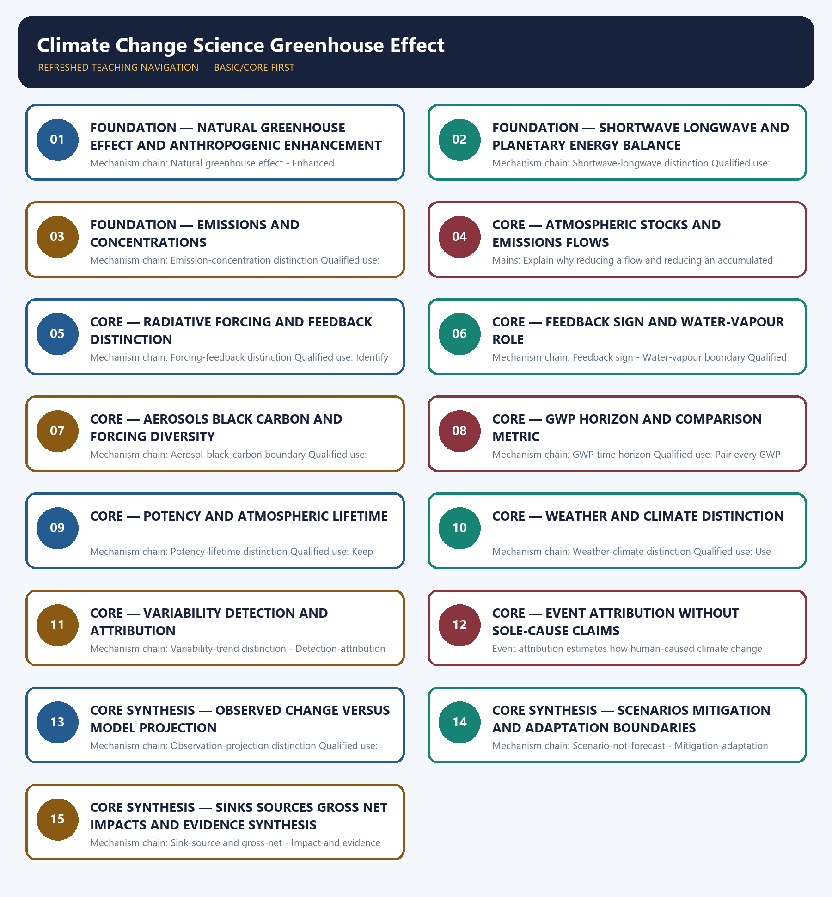

# Climate Change Science Greenhouse Effect — Learner-v2 Complete Learning Session

> **Authoring-only generation:** 2026-09-03. No PDF was rendered and no tracker or index was mutated.

### SOURCE, PROGRESSION AND CURRENT-LINKAGE AUDIT

- **Generation date:** 2026-09-03.
- **Repository-first evidence:** the Basic owner is taught first and preserved in full; the Advanced owner is retained only in the optional final teaching block.
- **OCR evidence:** Repository Markdown was primary. OCR-searchable local official General Studies papers were used only to confirm printed routed demands. No answer key, marking scheme, unsupported page precision, ecological rate, species count, pollution standard, rule threshold, mission outcome or current status was inferred.
- **Qdrant:** not used; repository Markdown and available OCR context were sufficient.
- **PYQ integrity:** Audited ledgers route objective demands on carbon fertilisation, geoengineering, methane hydrates, agricultural gases, rice practices, cement emissions and India's carbon-dioxide profile, plus verified Mains demands on greenhouse-gas effects, tropical food security and island sea-level risk. Objective keys are not inferred.
- **Live-link boundary:** Official IPCC retrieval substantively supported only broad observed-versus-future and action distinctions; the AR6 landing page was title-only, an IPCC fact-sheet URL returned 404 and AR7 material was treated as process, not findings. No temperature, anomaly, forcing, GWP, emissions, concentration, budget, scenario or projection number was imported.
- **Fact/inference discipline:** no current-affairs item, PYQ wording, figure or quotation is invented.

### LIVE OFFICIAL-SOURCE ATTEMPT LOG

The checks below were made on 2026-09-03. Substantive official text is used only for the proposition it supports. Stubs, access failures, unrelated pages and thin landing pages are recorded and are not converted into ecological or current-status claims.

- https://www.ipcc.ch/report/ar6/syr/ — attempted 2026-09-03; the official IPCC landing page returned only the title 'Climate Change 2023'. No temperature, concentration, forcing, budget or projection figure was imported from that title-only response.
- https://www.ipcc.ch/report/ar6/wg1/resources/climate-change-in-data/ — attempted 2026-09-03; substantive IPCC text states that the planet is warming and that strong, rapid and sustained greenhouse-gas cuts can limit future warming. It was used only for the observed-versus-future and emissions-action distinctions, without importing a figure.
- https://www.ipcc.ch/report/ar6/syr/resources/spm-headline-statements/ — attempted 2026-09-03; substantive IPCC text distinguishes projected losses and damages from actions that reduce them and attaches calibrated confidence language. No unsupported local event attribution was inferred.
- https://www.ipcc.ch/assessment-report/ar7/ — attempted 2026-09-03; the official page substantively describes AR7 as an assessment cycle in progress and lists planned products. It supplied no AR7 scientific finding, projection or replacement for the completed AR6 assessment.
- https://www.ipcc.ch/site/assets/uploads/2024/05/IPCC_Fact_Sheet_About_IPCC.pdf — attempted 2026-09-03; the official URL returned HTTP 404, so no definition, number or status was taken from it.

## BASIC LEARNING SESSION

### DEEP-REVIEW LEARNING CONTRACT

| Control | Binding rule for this package |
|---|---|
| Syllabus boundary | Complete Environment and Ecology Basic/Core is answer-complete before optional Advanced depth. |
| Ecology boundary | System boundary, scale, trophic level, stock/flow, pool/flux, gross/net, unit and time interval are explicit. |
| Species boundary | Taxon, range, habitat, population trend, IUCN assessment, Indian legal schedule, CITES/CMS listing and endemism remain distinct. |
| Law/status boundary | Act, amendment, rule, notification, draft, judgment, policy, target, implementation and observed outcome remain distinct and dated. |
| Institution boundary | Legal form, parent authority, mandate, jurisdiction, standard, consent, enforcement, science and adjudication are not conflated. |
| Treaty boundary | Membership, annex/appendix, amendment acceptance, target, COP decision, national instrument and outcome remain distinct. |
| Climate boundary | Emission flow, concentration stock, cumulative budget, forcing, scenario, baseline, unit, mitigation, adaptation, loss-and-damage, avoidance and removal are exact. |
| Pollution boundary | Source, emission/load, ambient concentration, exposure, parameter, averaging period, unit, standard and jurisdiction are explicit. |
| Causal method | Chronology, designation, expenditure, capacity, registration and correlation are not promoted into ecological or policy outcomes without mechanism and evidence. |
| Practice contract | Every solved item has demand decoding, detailed examiner-grade model, executable timed/compression plan, marks rationale and answer-specific improvement. |
| Approval | This immutable successor remains `approved: false` pending explicit approval. |

**Canonical Basic/Core owner:** `upsc-ai-kit\knowledge\Environment-and-Ecology\basic\17_Climate-Change-Science-Greenhouse-Effect.md`  
**Substantive canonical provenance owner:** `upsc-ai-kit\knowledge\Environment-and-Ecology\learning-sessions\v2\subject-wide-syllabus\environment-and-ecology-17_Learning-Session.md`  
**Optional Advanced owner:** `upsc-ai-kit\knowledge\Environment-and-Ecology\advanced\17_Climate-Change-Science-Greenhouse-Effect.md`  
**Official syllabus mapping:** `upsc-ai-kit\knowledge\Environment-and-Ecology\OFFICIAL-UPSC-SYLLABUS-MAPPING.md`

### EVIDENCE, PYQ AND CURRENT-STATUS CONTROL

- Ecological mechanisms retain direction, pool, flux, limiting factor, spatial scale and time scale.
- Current species/news claims retain taxon, source, event/publication date, assessment/listing date and access date.
- IUCN category never substitutes for Wildlife Protection Act schedule, CITES appendix, CMS appendix or endemism.
- Protected-area categories, treaty designations and institution mandates retain exact legal character.
- Acts, amendments, rules, draft instruments, notifications and judgments retain operative status and date.
- Climate figures retain unit, baseline, period, scenario and stock-flow character; global evidence is not silently downscaled to India.
- Mitigation, adaptation and loss-and-damage remain separate; allowance, offset, avoidance, removal, capture and storage remain separate.
- PYQ wording is preserved only where verified; reconstructed or routed demands remain labelled.
- **Current-status note, rechecked 2026-09-03:** volatile targets, standards, schedules, species status, treaty outcomes and programme claims retain source/date/status.

**Generation-local live/current sources:**
- `https://www.ipcc.ch/report/ar6/syr/ — attempted 2026-09-03; the official IPCC landing page returned only the title 'Climate Change 2023'. No temperature, concentration, forcing, budget or projection figure was imported from that title-only response.`
- `https://www.ipcc.ch/report/ar6/wg1/resources/climate-change-in-data/ — attempted 2026-09-03; substantive IPCC text states that the planet is warming and that strong, rapid and sustained greenhouse-gas cuts can limit future warming. It was used only for the observed-versus-future and emissions-action distinctions, without importing a figure.`
- `https://www.ipcc.ch/report/ar6/syr/resources/spm-headline-statements/ — attempted 2026-09-03; substantive IPCC text distinguishes projected losses and damages from actions that reduce them and attaches calibrated confidence language. No unsupported local event attribution was inferred.`
- `https://www.ipcc.ch/assessment-report/ar7/ — attempted 2026-09-03; the official page substantively describes AR7 as an assessment cycle in progress and lists planned products. It supplied no AR7 scientific finding, projection or replacement for the completed AR6 assessment.`
- `https://www.ipcc.ch/site/assets/uploads/2024/05/IPCC_Fact_Sheet_About_IPCC.pdf — attempted 2026-09-03; the official URL returned HTTP 404, so no definition, number or status was taken from it.`

**Topic 26 dedicated Disaster Management cross-owners (scope boundary):**
- Not applicable to this topic.




*Distinct embedded teaching-navigation image. The separate continuous Cārvāka-style flowchart package remains an independent at-a-glance artifact.*

### SESSION 1 — FOUNDATION — NATURAL GREENHOUSE EFFECT AND ANTHROPOGENIC ENHANCEMENT

#### DEFINITION / WHAT THIS IS CALLED

**Plain-language definition:** The natural greenhouse effect is a life-enabling energy-balance process in which greenhouse gases absorb and re-emit part of Earth's outgoing longwave radiation; it is not the anthropogenic problem to be eliminated.

**Technical definition:** Mechanism chain: Natural greenhouse effect - Enhanced anthropogenic forcing Qualified use: Open by preserving the natural process and identifying the human enhancement.

#### ANSWER-GRABBING OPENING — WRITE/ADAPT IN THE EXAM

> The natural greenhouse effect is a life-enabling energy-balance process in which greenhouse gases absorb and re-emit part of Earth's outgoing longwave radiation; it is not the anthropogenic problem to be eliminated.

#### MUST-WRITE KEYWORDS

- **FOUNDATION**
- **Natural greenhouse effect**
- **anthropogenic enhancement**
- **Mechanism chain**
- **Qualified use**
- **The natural greenhouse effect**

**How to use them:** Frame the answer through FOUNDATION; define Natural greenhouse effect, connect anthropogenic enhancement with Mechanism chain to explain the mechanism, and use Qualified use for the decisive comparison or qualification.

#### VISUAL FIRST

```text
NATURAL GREENHOUSE EFFECT AND ANTHROPOGENIC ENHANCEMENT
01. Natural greenhouse effect
    |
    v
02. Enhanced anthropogenic forcing
BOUNDARY -> Do not describe the natural greenhouse effect itself as the human-caused problem.
```

*This topic-specific rail fixes the evidence sequence and its exam boundary before analysis.*

#### CORE EXPLANATION

The natural greenhouse effect is a life-enabling energy-balance process in which greenhouse gases absorb and re-emit part of Earth's outgoing longwave radiation; it is not the anthropogenic problem to be eliminated. Current climate concern arises from human activities increasing greenhouse-gas concentrations and other forcing agents, thereby altering the climate system beyond the natural greenhouse effect.

#### NAMED EVIDENCE AND MECHANISM

- The natural greenhouse effect is a life-enabling energy-balance process in which greenhouse gases absorb and re-emit part of Earth's outgoing longwave radiation; it is not the anthropogenic problem to be eliminated.
- Current climate concern arises from human activities increasing greenhouse-gas concentrations and other forcing agents, thereby altering the climate system beyond the natural greenhouse effect.

#### EXAMINER CAUTION

- Do not describe the natural greenhouse effect itself as the human-caused problem.

#### EXAM LINK

- **Prelims:** Preserve the exact receiving medium, system boundary, measured parameter, actor, process, spatial and temporal scale, rule vintage and scientific or legal status; never turn a context-dependent pattern into a universal rule.
- **Mains:** Open by preserving the natural process and identifying the human enhancement.

#### MINI RECAP

- **Mechanism chain:** Natural greenhouse effect -> Enhanced anthropogenic forcing
- **Qualified use:** Open by preserving the natural process and identifying the human enhancement.

#### CLOSING RECALL FLOW — FOUNDATION — NATURAL GREENHOUSE EFFECT AND ANTHROPOGENIC ENHANCEMENT

```text
START / CONCEPT: FOUNDATION — Natural greenhouse effect and anthropogenic enhancement
        |
        v
EXACT TERMS: FOUNDATION · Natural greenhouse effect · anthropogenic enhancement · Mechanism chain · Qualified use · The natural greenhouse effect
        |
        v
MECHANISM / ARGUMENT: Mechanism chain: Natural greenhouse effect - Enhanced anthropogenic forcing Qualified use: Open by preserving the natural process and identifying the human enhancement.
        |
        v
CONSEQUENCE / CONTRAST: Do not describe the natural greenhouse effect itself as the human-caused problem.
        |
        v
UPSC TRAP / ANSWER-USE: Do not miss this limiting distinction: natural greenhouse effect - Enhanced anthropogenic forcing Qualified use.
        |
        v
ANSWER-GRABBING FORMULATION: The natural greenhouse effect is a life-enabling energy-balance process in which greenhouse gases absorb and re-emit part of Earth's outgoing longwave radiation; it is not the anthropogenic problem to be eliminated.
```
### SESSION 2 — FOUNDATION — SHORTWAVE LONGWAVE AND PLANETARY ENERGY BALANCE

#### DEFINITION / WHAT THIS IS CALLED

**Plain-language definition:** Incoming solar energy is predominantly shortwave, whereas the warmed surface emits longwave infrared radiation; greenhouse gases interact with the outgoing longwave part of this energy flow.

**Technical definition:** Mechanism chain: Shortwave-longwave distinction Qualified use: Trace incoming shortwave, surface warming and outgoing longwave before naming gases.

#### ANSWER-GRABBING OPENING — WRITE/ADAPT IN THE EXAM

> Incoming solar energy is predominantly shortwave, whereas the warmed surface emits longwave infrared radiation; greenhouse gases interact with the outgoing longwave part of this energy flow.

#### MUST-WRITE KEYWORDS

- **FOUNDATION**
- **Shortwave longwave**
- **planetary energy balance**
- **Mechanism chain**
- **Qualified use**
- **Incoming solar energy**

**How to use them:** Frame the answer through FOUNDATION; define Shortwave longwave, connect planetary energy balance with Mechanism chain to explain the mechanism, and use Qualified use for the decisive comparison or qualification.

#### VISUAL FIRST

```text
SHORTWAVE LONGWAVE AND PLANETARY ENERGY BALANCE
01. Shortwave-longwave distinction
BOUNDARY -> Do not merge an emissions flow with an atmospheric concentration or accumulated stock.
```

*This topic-specific rail fixes the evidence sequence and its exam boundary before analysis.*

#### CORE EXPLANATION

Incoming solar energy is predominantly shortwave, whereas the warmed surface emits longwave infrared radiation; greenhouse gases interact with the outgoing longwave part of this energy flow.

#### NAMED EVIDENCE AND MECHANISM

- Incoming solar energy is predominantly shortwave, whereas the warmed surface emits longwave infrared radiation; greenhouse gases interact with the outgoing longwave part of this energy flow.

#### EXAMINER CAUTION

- Do not merge an emissions flow with an atmospheric concentration or accumulated stock.

#### EXAM LINK

- **Prelims:** Preserve the exact receiving medium, system boundary, measured parameter, actor, process, spatial and temporal scale, rule vintage and scientific or legal status; never turn a context-dependent pattern into a universal rule.
- **Mains:** Trace incoming shortwave, surface warming and outgoing longwave before naming gases.

#### MINI RECAP

- **Mechanism chain:** Shortwave-longwave distinction
- **Qualified use:** Trace incoming shortwave, surface warming and outgoing longwave before naming gases.

#### CLOSING RECALL FLOW — FOUNDATION — SHORTWAVE LONGWAVE AND PLANETARY ENERGY BALANCE

```text
START / CONCEPT: FOUNDATION — Shortwave longwave and planetary energy balance
        |
        v
EXACT TERMS: FOUNDATION · Shortwave longwave · planetary energy balance · Mechanism chain · Qualified use · Incoming solar energy
        |
        v
MECHANISM / ARGUMENT: Mechanism chain: Shortwave-longwave distinction Qualified use: Trace incoming shortwave, surface warming and outgoing longwave before naming gases.
        |
        v
CONSEQUENCE / CONTRAST: Do not merge an emissions flow with an atmospheric concentration or accumulated stock.
        |
        v
UPSC TRAP / ANSWER-USE: Do not miss this limiting distinction: incoming solar energy is predominantly shortwave.
        |
        v
ANSWER-GRABBING FORMULATION: Incoming solar energy is predominantly shortwave, whereas the warmed surface emits longwave infrared radiation; greenhouse gases interact with the outgoing longwave part of this energy flow.
```
### SESSION 3 — FOUNDATION — EMISSIONS AND CONCENTRATIONS

#### DEFINITION / WHAT THIS IS CALLED

**Plain-language definition:** An emission is a flow released during a period, while atmospheric concentration is the resulting abundance after sources, sinks, chemistry and lifetime act; the two quantities are related but not interchangeable.

**Technical definition:** Mechanism chain: Emission-concentration distinction Qualified use: State the unit, period and reservoir before moving from emissions to concentration.

#### ANSWER-GRABBING OPENING — WRITE/ADAPT IN THE EXAM

> An emission is a flow released during a period, while atmospheric concentration is the resulting abundance after sources, sinks, chemistry and lifetime act; the two quantities are related but not interchangeable.

#### MUST-WRITE KEYWORDS

- **FOUNDATION**
- **Emissions**
- **concentrations**
- **Mechanism chain**
- **Qualified use**
- **An emission**

**How to use them:** Frame the answer through FOUNDATION; define Emissions, connect concentrations with Mechanism chain to explain the mechanism, and use Qualified use for the decisive comparison or qualification.

#### VISUAL FIRST

```text
EMISSIONS AND CONCENTRATIONS
01. Emission-concentration distinction
BOUNDARY -> Do not call a feedback an external forcing or treat positive as beneficial.
```

*This topic-specific rail fixes the evidence sequence and its exam boundary before analysis.*

#### CORE EXPLANATION

An emission is a flow released during a period, while atmospheric concentration is the resulting abundance after sources, sinks, chemistry and lifetime act; the two quantities are related but not interchangeable.

#### NAMED EVIDENCE AND MECHANISM

- An emission is a flow released during a period, while atmospheric concentration is the resulting abundance after sources, sinks, chemistry and lifetime act; the two quantities are related but not interchangeable.

#### EXAMINER CAUTION

- Do not call a feedback an external forcing or treat positive as beneficial.

#### EXAM LINK

- **Prelims:** Preserve the exact receiving medium, system boundary, measured parameter, actor, process, spatial and temporal scale, rule vintage and scientific or legal status; never turn a context-dependent pattern into a universal rule.
- **Mains:** State the unit, period and reservoir before moving from emissions to concentration.

#### MINI RECAP

- **Mechanism chain:** Emission-concentration distinction
- **Qualified use:** State the unit, period and reservoir before moving from emissions to concentration.

#### CLOSING RECALL FLOW — FOUNDATION — EMISSIONS AND CONCENTRATIONS

```text
START / CONCEPT: FOUNDATION — Emissions and concentrations
        |
        v
EXACT TERMS: FOUNDATION · Emissions · concentrations · Mechanism chain · Qualified use · An emission
        |
        v
MECHANISM / ARGUMENT: Mechanism chain: Emission-concentration distinction Qualified use: State the unit, period and reservoir before moving from emissions to concentration.
        |
        v
CONSEQUENCE / CONTRAST: Do not call a feedback an external forcing or treat positive as beneficial.
        |
        v
UPSC TRAP / ANSWER-USE: Do not miss this limiting distinction: an emission is a flow released during a period.
        |
        v
ANSWER-GRABBING FORMULATION: An emission is a flow released during a period, while atmospheric concentration is the resulting abundance after sources, sinks, chemistry and lifetime act; the two quantities are related but not interchangeable.
```
### SESSION 4 — CORE — ATMOSPHERIC STOCKS AND EMISSIONS FLOWS

#### DEFINITION / WHAT THIS IS CALLED

**Plain-language definition:** Mechanism chain: Stock-flow distinction Qualified use: Explain why reducing a flow and reducing an accumulated atmospheric stock are different tasks.

**Technical definition:** Mains: Explain why reducing a flow and reducing an accumulated atmospheric stock are different tasks.

#### ANSWER-GRABBING OPENING — WRITE/ADAPT IN THE EXAM

> Long-lived greenhouse gases create a stock problem because accumulated past and present emissions influence concentration; lowering an annual flow does not by itself remove the existing atmospheric stock.

#### MUST-WRITE KEYWORDS

- **Atmospheric stocks**
- **emissions flows**
- **Mechanism chain**
- **Qualified use**
- **Long-lived**
- **Stock-flow**

**How to use them:** Frame the answer through Atmospheric stocks; define emissions flows, connect Mechanism chain with Qualified use to explain the mechanism, and use Long-lived for the decisive comparison or qualification.

#### VISUAL FIRST

```text
ATMOSPHERIC STOCKS AND EMISSIONS FLOWS
01. Stock-flow distinction
BOUNDARY -> Do not present water vapour as the initiating anthropogenic driver without qualification.
```

*This topic-specific rail fixes the evidence sequence and its exam boundary before analysis.*

#### CORE EXPLANATION

Long-lived greenhouse gases create a stock problem because accumulated past and present emissions influence concentration; lowering an annual flow does not by itself remove the existing atmospheric stock.

#### NAMED EVIDENCE AND MECHANISM

- Long-lived greenhouse gases create a stock problem because accumulated past and present emissions influence concentration; lowering an annual flow does not by itself remove the existing atmospheric stock.

#### EXAMINER CAUTION

- Do not present water vapour as the initiating anthropogenic driver without qualification.

#### EXAM LINK

- **Prelims:** Preserve the exact receiving medium, system boundary, measured parameter, actor, process, spatial and temporal scale, rule vintage and scientific or legal status; never turn a context-dependent pattern into a universal rule.
- **Mains:** Explain why reducing a flow and reducing an accumulated atmospheric stock are different tasks.

#### MINI RECAP

- **Mechanism chain:** Stock-flow distinction
- **Qualified use:** Explain why reducing a flow and reducing an accumulated atmospheric stock are different tasks.

#### CLOSING RECALL FLOW — CORE — ATMOSPHERIC STOCKS AND EMISSIONS FLOWS

```text
START / CONCEPT: CORE — Atmospheric stocks and emissions flows
        |
        v
EXACT TERMS: Atmospheric stocks · emissions flows · Mechanism chain · Qualified use · Long-lived · Stock-flow
        |
        v
MECHANISM / ARGUMENT: Mechanism chain: Stock-flow distinction Qualified use: Explain why reducing a flow and reducing an accumulated atmospheric stock are different tasks.
        |
        v
CONSEQUENCE / CONTRAST: Mains: Explain why reducing a flow and reducing an accumulated atmospheric stock are different tasks.
        |
        v
UPSC TRAP / ANSWER-USE: Do not present water vapour as the initiating anthropogenic driver without qualification.
        |
        v
ANSWER-GRABBING FORMULATION: Long-lived greenhouse gases create a stock problem because accumulated past and present emissions influence concentration; lowering an annual flow does not by itself remove the existing atmospheric stock.
```
### SESSION 5 — CORE — RADIATIVE FORCING AND FEEDBACK DISTINCTION

#### DEFINITION / WHAT THIS IS CALLED

**Plain-language definition:** Radiative forcing is an imposed change to the climate system's energy balance, while a feedback is a response triggered by climate change that amplifies or dampens the initial change.

**Technical definition:** Mechanism chain: Forcing-feedback distinction Qualified use: Identify the imposed forcing first and the climate-system feedback second.

#### ANSWER-GRABBING OPENING — WRITE/ADAPT IN THE EXAM

> Radiative forcing is an imposed change to the climate system's energy balance, while a feedback is a response triggered by climate change that amplifies or dampens the initial change.

#### MUST-WRITE KEYWORDS

- **Radiative forcing**
- **feedback distinction**
- **Mechanism chain**
- **Qualified use**
- **Radiative**
- **Forcing-feedback**

**How to use them:** Frame the answer through Radiative forcing; define feedback distinction, connect Mechanism chain with Qualified use to explain the mechanism, and use Radiative for the decisive comparison or qualification.

#### VISUAL FIRST

```text
RADIATIVE FORCING AND FEEDBACK DISTINCTION
01. Forcing-feedback distinction
BOUNDARY -> Do not assign every aerosol the same warming or cooling sign.
```

*This topic-specific rail fixes the evidence sequence and its exam boundary before analysis.*

#### CORE EXPLANATION

Radiative forcing is an imposed change to the climate system's energy balance, while a feedback is a response triggered by climate change that amplifies or dampens the initial change.

#### NAMED EVIDENCE AND MECHANISM

- Radiative forcing is an imposed change to the climate system's energy balance, while a feedback is a response triggered by climate change that amplifies or dampens the initial change.

#### EXAMINER CAUTION

- Do not assign every aerosol the same warming or cooling sign.

#### EXAM LINK

- **Prelims:** Preserve the exact receiving medium, system boundary, measured parameter, actor, process, spatial and temporal scale, rule vintage and scientific or legal status; never turn a context-dependent pattern into a universal rule.
- **Mains:** Identify the imposed forcing first and the climate-system feedback second.

#### MINI RECAP

- **Mechanism chain:** Forcing-feedback distinction
- **Qualified use:** Identify the imposed forcing first and the climate-system feedback second.

#### CLOSING RECALL FLOW — CORE — RADIATIVE FORCING AND FEEDBACK DISTINCTION

```text
START / CONCEPT: CORE — Radiative forcing and feedback distinction
        |
        v
EXACT TERMS: Radiative forcing · feedback distinction · Mechanism chain · Qualified use · Radiative · Forcing-feedback
        |
        v
MECHANISM / ARGUMENT: Mechanism chain: Forcing-feedback distinction Qualified use: Identify the imposed forcing first and the climate-system feedback second.
        |
        v
CONSEQUENCE / CONTRAST: Do not assign every aerosol the same warming or cooling sign.
        |
        v
UPSC TRAP / ANSWER-USE: Do not miss this limiting distinction: radiative forcing is an imposed change to the climate system's energy balance.
        |
        v
ANSWER-GRABBING FORMULATION: Radiative forcing is an imposed change to the climate system's energy balance, while a feedback is a response triggered by climate change that amplifies or dampens the initial change.
```
### SESSION 6 — CORE — FEEDBACK SIGN AND WATER-VAPOUR ROLE

#### DEFINITION / WHAT THIS IS CALLED

**Plain-language definition:** Water vapour is a major greenhouse gas and generally operates as a feedback in contemporary warming because atmospheric moisture responds strongly to temperature; it is not a substitute for tracing the initiating anthropogenic forcing.

**Technical definition:** Mechanism chain: Feedback sign - Water-vapour boundary Qualified use: Name the feedback sign and separate water vapour from the initiating forcing.

#### ANSWER-GRABBING OPENING — WRITE/ADAPT IN THE EXAM

> Mechanism chain: Feedback sign - Water-vapour boundary Qualified use: Name the feedback sign and separate water vapour from the initiating forcing.

#### MUST-WRITE KEYWORDS

- **Feedback sign**
- **water-vapour role**
- **Mechanism chain**
- **Qualified use**
- **Water vapour**
- **Water**

**How to use them:** Frame the answer through Feedback sign; define water-vapour role, connect Mechanism chain with Qualified use to explain the mechanism, and use Water vapour for the decisive comparison or qualification.

#### VISUAL FIRST

```text
FEEDBACK SIGN AND WATER-VAPOUR ROLE
01. Feedback sign
    |
    v
02. Water-vapour boundary
BOUNDARY -> Do not quote GWP without its assessment basis and time horizon.
```

*This topic-specific rail fixes the evidence sequence and its exam boundary before analysis.*

#### CORE EXPLANATION

A positive climate feedback amplifies an initial change and a negative feedback dampens it; positive and negative describe direction, not whether the outcome is desirable. Water vapour is a major greenhouse gas and generally operates as a feedback in contemporary warming because atmospheric moisture responds strongly to temperature; it is not a substitute for tracing the initiating anthropogenic forcing.

#### NAMED EVIDENCE AND MECHANISM

- A positive climate feedback amplifies an initial change and a negative feedback dampens it; positive and negative describe direction, not whether the outcome is desirable.
- Water vapour is a major greenhouse gas and generally operates as a feedback in contemporary warming because atmospheric moisture responds strongly to temperature; it is not a substitute for tracing the initiating anthropogenic forcing.

#### EXAMINER CAUTION

- Do not quote GWP without its assessment basis and time horizon.

#### EXAM LINK

- **Prelims:** Preserve the exact receiving medium, system boundary, measured parameter, actor, process, spatial and temporal scale, rule vintage and scientific or legal status; never turn a context-dependent pattern into a universal rule.
- **Mains:** Name the feedback sign and separate water vapour from the initiating forcing.

#### MINI RECAP

- **Mechanism chain:** Feedback sign -> Water-vapour boundary
- **Qualified use:** Name the feedback sign and separate water vapour from the initiating forcing.

#### CLOSING RECALL FLOW — CORE — FEEDBACK SIGN AND WATER-VAPOUR ROLE

```text
START / CONCEPT: CORE — Feedback sign and water-vapour role
        |
        v
EXACT TERMS: Feedback sign · water-vapour role · Mechanism chain · Qualified use · Water vapour · Water
        |
        v
MECHANISM / ARGUMENT: Water vapour is a major greenhouse gas and generally operates as a feedback in contemporary warming because atmospheric moisture responds strongly to temperature; it is not a substitute for tracing the initiating anthropogenic forcing.
        |
        v
CONSEQUENCE / CONTRAST: A positive climate feedback amplifies an initial change and a negative feedback dampens it; positive and negative describe direction, not whether the outcome is desirable.
        |
        v
UPSC TRAP / ANSWER-USE: Do not quote GWP without its assessment basis and time horizon.
        |
        v
ANSWER-GRABBING FORMULATION: Mechanism chain: Feedback sign - Water-vapour boundary Qualified use: Name the feedback sign and separate water vapour from the initiating forcing.
```
### SESSION 7 — CORE — AEROSOLS BLACK CARBON AND FORCING DIVERSITY

#### DEFINITION / WHAT THIS IS CALLED

**Plain-language definition:** Many aerosols exert a cooling influence through scattering and cloud effects, while black carbon absorbs radiation and can reduce snow or ice albedo; 'aerosol' does not imply one universal forcing sign.

**Technical definition:** Mechanism chain: Aerosol-black-carbon boundary Qualified use: Separate scattering aerosols, absorbing particles and spatially uneven effects.

#### ANSWER-GRABBING OPENING — WRITE/ADAPT IN THE EXAM

> Many aerosols exert a cooling influence through scattering and cloud effects, while black carbon absorbs radiation and can reduce snow or ice albedo; 'aerosol' does not imply one universal forcing sign.

#### MUST-WRITE KEYWORDS

- **Aerosols black carbon**
- **forcing diversity**
- **Mechanism chain**
- **Qualified use**
- **Many**
- **Aerosol-black-carbon**

**How to use them:** Frame the answer through Aerosols black carbon; define forcing diversity, connect Mechanism chain with Qualified use to explain the mechanism, and use Many for the decisive comparison or qualification.

#### VISUAL FIRST

```text
AEROSOLS BLACK CARBON AND FORCING DIVERSITY
01. Aerosol-black-carbon boundary
BOUNDARY -> Do not confuse potency per unit mass with atmospheric lifetime or cumulative importance.
```

*This topic-specific rail fixes the evidence sequence and its exam boundary before analysis.*

#### CORE EXPLANATION

Many aerosols exert a cooling influence through scattering and cloud effects, while black carbon absorbs radiation and can reduce snow or ice albedo; 'aerosol' does not imply one universal forcing sign.

#### NAMED EVIDENCE AND MECHANISM

- Many aerosols exert a cooling influence through scattering and cloud effects, while black carbon absorbs radiation and can reduce snow or ice albedo; 'aerosol' does not imply one universal forcing sign.

#### EXAMINER CAUTION

- Do not confuse potency per unit mass with atmospheric lifetime or cumulative importance.

#### EXAM LINK

- **Prelims:** Preserve the exact receiving medium, system boundary, measured parameter, actor, process, spatial and temporal scale, rule vintage and scientific or legal status; never turn a context-dependent pattern into a universal rule.
- **Mains:** Separate scattering aerosols, absorbing particles and spatially uneven effects.

#### MINI RECAP

- **Mechanism chain:** Aerosol-black-carbon boundary
- **Qualified use:** Separate scattering aerosols, absorbing particles and spatially uneven effects.

#### CLOSING RECALL FLOW — CORE — AEROSOLS BLACK CARBON AND FORCING DIVERSITY

```text
START / CONCEPT: CORE — Aerosols black carbon and forcing diversity
        |
        v
EXACT TERMS: Aerosols black carbon · forcing diversity · Mechanism chain · Qualified use · Many · Aerosol-black-carbon
        |
        v
MECHANISM / ARGUMENT: Mechanism chain: Aerosol-black-carbon boundary Qualified use: Separate scattering aerosols, absorbing particles and spatially uneven effects.
        |
        v
CONSEQUENCE / CONTRAST: Do not confuse potency per unit mass with atmospheric lifetime or cumulative importance.
        |
        v
UPSC TRAP / ANSWER-USE: Do not miss this limiting distinction: many aerosols exert a cooling influence through scattering and cloud effects.
        |
        v
ANSWER-GRABBING FORMULATION: Many aerosols exert a cooling influence through scattering and cloud effects, while black carbon absorbs radiation and can reduce snow or ice albedo; 'aerosol' does not imply one universal forcing sign.
```
### SESSION 8 — CORE — GWP HORIZON AND COMPARISON METRIC

#### DEFINITION / WHAT THIS IS CALLED

**Plain-language definition:** Global Warming Potential compares integrated radiative influence relative to carbon dioxide over a specified time horizon; a GWP claim without its horizon is incomplete.

**Technical definition:** Mechanism chain: GWP time horizon Qualified use: Pair every GWP comparison with its stated time horizon.

#### ANSWER-GRABBING OPENING — WRITE/ADAPT IN THE EXAM

> Global Warming Potential compares integrated radiative influence relative to carbon dioxide over a specified time horizon; a GWP claim without its horizon is incomplete.

#### MUST-WRITE KEYWORDS

- **GWP horizon**
- **comparison metric**
- **Mechanism chain**
- **Qualified use**
- **Global Warming Potential**
- **GWP**

**How to use them:** Frame the answer through GWP horizon; define comparison metric, connect Mechanism chain with Qualified use to explain the mechanism, and use Global Warming Potential for the decisive comparison or qualification.

#### VISUAL FIRST

```text
GWP HORIZON AND COMPARISON METRIC
01. GWP time horizon
BOUNDARY -> Do not use one weather event as proof or disproof of a climate trend.
```

*This topic-specific rail fixes the evidence sequence and its exam boundary before analysis.*

#### CORE EXPLANATION

Global Warming Potential compares integrated radiative influence relative to carbon dioxide over a specified time horizon; a GWP claim without its horizon is incomplete.

#### NAMED EVIDENCE AND MECHANISM

- Global Warming Potential compares integrated radiative influence relative to carbon dioxide over a specified time horizon; a GWP claim without its horizon is incomplete.

#### EXAMINER CAUTION

- Do not use one weather event as proof or disproof of a climate trend.

#### EXAM LINK

- **Prelims:** Preserve the exact receiving medium, system boundary, measured parameter, actor, process, spatial and temporal scale, rule vintage and scientific or legal status; never turn a context-dependent pattern into a universal rule.
- **Mains:** Pair every GWP comparison with its stated time horizon.

#### MINI RECAP

- **Mechanism chain:** GWP time horizon
- **Qualified use:** Pair every GWP comparison with its stated time horizon.

#### CLOSING RECALL FLOW — CORE — GWP HORIZON AND COMPARISON METRIC

```text
START / CONCEPT: CORE — GWP horizon and comparison metric
        |
        v
EXACT TERMS: GWP horizon · comparison metric · Mechanism chain · Qualified use · Global Warming Potential · GWP
        |
        v
MECHANISM / ARGUMENT: Mechanism chain: GWP time horizon Qualified use: Pair every GWP comparison with its stated time horizon.
        |
        v
CONSEQUENCE / CONTRAST: Do not use one weather event as proof or disproof of a climate trend.
        |
        v
UPSC TRAP / ANSWER-USE: Do not miss this limiting distinction: pair every GWP comparison with its stated time horizon.
        |
        v
ANSWER-GRABBING FORMULATION: Global Warming Potential compares integrated radiative influence relative to carbon dioxide over a specified time horizon; a GWP claim without its horizon is incomplete.
```
### SESSION 9 — CORE — POTENCY AND ATMOSPHERIC LIFETIME

#### DEFINITION / WHAT THIS IS CALLED

**Plain-language definition:** Heat-trapping potency per unit mass and atmospheric persistence are different properties; a short-lived strong forcer and a long-lived cumulative gas require different mitigation reasoning.

**Technical definition:** Mechanism chain: Potency-lifetime distinction Qualified use: Keep potency per unit mass separate from atmospheric persistence.

#### ANSWER-GRABBING OPENING — WRITE/ADAPT IN THE EXAM

> Heat-trapping potency per unit mass and atmospheric persistence are different properties; a short-lived strong forcer and a long-lived cumulative gas require different mitigation reasoning.

#### MUST-WRITE KEYWORDS

- **Potency**
- **atmospheric lifetime**
- **Mechanism chain**
- **Qualified use**
- **Heat-trapping potency per unit mass and atmospheric persistence**
- **Heat-trapping**

**How to use them:** Frame the answer through Potency; define atmospheric lifetime, connect Mechanism chain with Qualified use to explain the mechanism, and use Heat-trapping potency per unit mass and atmospheric persistence for the decisive comparison or qualification.

#### VISUAL FIRST

```text
POTENCY AND ATMOSPHERIC LIFETIME
01. Potency-lifetime distinction
BOUNDARY -> Do not convert event-attribution probability into sole-cause language.
```

*This topic-specific rail fixes the evidence sequence and its exam boundary before analysis.*

#### CORE EXPLANATION

Heat-trapping potency per unit mass and atmospheric persistence are different properties; a short-lived strong forcer and a long-lived cumulative gas require different mitigation reasoning.

#### NAMED EVIDENCE AND MECHANISM

- Heat-trapping potency per unit mass and atmospheric persistence are different properties; a short-lived strong forcer and a long-lived cumulative gas require different mitigation reasoning.

#### EXAMINER CAUTION

- Do not convert event-attribution probability into sole-cause language.

#### EXAM LINK

- **Prelims:** Preserve the exact receiving medium, system boundary, measured parameter, actor, process, spatial and temporal scale, rule vintage and scientific or legal status; never turn a context-dependent pattern into a universal rule.
- **Mains:** Keep potency per unit mass separate from atmospheric persistence.

#### MINI RECAP

- **Mechanism chain:** Potency-lifetime distinction
- **Qualified use:** Keep potency per unit mass separate from atmospheric persistence.

#### CLOSING RECALL FLOW — CORE — POTENCY AND ATMOSPHERIC LIFETIME

```text
START / CONCEPT: CORE — Potency and atmospheric lifetime
        |
        v
EXACT TERMS: Potency · atmospheric lifetime · Mechanism chain · Qualified use · Heat-trapping potency per unit mass and atmospheric persistence · Heat-trapping
        |
        v
MECHANISM / ARGUMENT: Mechanism chain: Potency-lifetime distinction Qualified use: Keep potency per unit mass separate from atmospheric persistence.
        |
        v
CONSEQUENCE / CONTRAST: Do not convert event-attribution probability into sole-cause language.
        |
        v
UPSC TRAP / ANSWER-USE: Do not miss this limiting distinction: heat-trapping potency per unit mass and atmospheric persistence are different properties.
        |
        v
ANSWER-GRABBING FORMULATION: Heat-trapping potency per unit mass and atmospheric persistence are different properties; a short-lived strong forcer and a long-lived cumulative gas require different mitigation reasoning.
```
### SESSION 10 — CORE — WEATHER AND CLIMATE DISTINCTION

#### DEFINITION / WHAT THIS IS CALLED

**Plain-language definition:** Weather describes short-period atmospheric conditions, whereas climate concerns statistical patterns over longer periods; one unusual season or event does not alone establish a climate trend.

**Technical definition:** Mechanism chain: Weather-climate distinction Qualified use: Use long-term statistics for climate rather than one weather event.

#### ANSWER-GRABBING OPENING — WRITE/ADAPT IN THE EXAM

> Mechanism chain: Weather-climate distinction Qualified use: Use long-term statistics for climate rather than one weather event.

#### MUST-WRITE KEYWORDS

- **Weather**
- **climate distinction**
- **Mechanism chain**
- **Qualified use**
- **Weather-climate**
- **Qualified**

**How to use them:** Frame the answer through Weather; define climate distinction, connect Mechanism chain with Qualified use to explain the mechanism, and use Weather-climate for the decisive comparison or qualification.

#### VISUAL FIRST

```text
WEATHER AND CLIMATE DISTINCTION
01. Weather-climate distinction
BOUNDARY -> Do not present an observation as a projection or a scenario as a forecast.
```

*This topic-specific rail fixes the evidence sequence and its exam boundary before analysis.*

#### CORE EXPLANATION

Weather describes short-period atmospheric conditions, whereas climate concerns statistical patterns over longer periods; one unusual season or event does not alone establish a climate trend.

#### NAMED EVIDENCE AND MECHANISM

- Weather describes short-period atmospheric conditions, whereas climate concerns statistical patterns over longer periods; one unusual season or event does not alone establish a climate trend.

#### EXAMINER CAUTION

- Do not present an observation as a projection or a scenario as a forecast.

#### EXAM LINK

- **Prelims:** Preserve the exact receiving medium, system boundary, measured parameter, actor, process, spatial and temporal scale, rule vintage and scientific or legal status; never turn a context-dependent pattern into a universal rule.
- **Mains:** Use long-term statistics for climate rather than one weather event.

#### MINI RECAP

- **Mechanism chain:** Weather-climate distinction
- **Qualified use:** Use long-term statistics for climate rather than one weather event.

#### CLOSING RECALL FLOW — CORE — WEATHER AND CLIMATE DISTINCTION

```text
START / CONCEPT: CORE — Weather and climate distinction
        |
        v
EXACT TERMS: Weather · climate distinction · Mechanism chain · Qualified use · Weather-climate · Qualified
        |
        v
MECHANISM / ARGUMENT: Weather describes short-period atmospheric conditions, whereas climate concerns statistical patterns over longer periods; one unusual season or event does not alone establish a climate trend.
        |
        v
CONSEQUENCE / CONTRAST: Do not present an observation as a projection or a scenario as a forecast.
        |
        v
UPSC TRAP / ANSWER-USE: Mains: Use long-term statistics for climate rather than one weather event.
        |
        v
ANSWER-GRABBING FORMULATION: Mechanism chain: Weather-climate distinction Qualified use: Use long-term statistics for climate rather than one weather event.
```
### SESSION 11 — CORE — VARIABILITY DETECTION AND ATTRIBUTION

#### DEFINITION / WHAT THIS IS CALLED

**Plain-language definition:** Detection asks whether an observed change is distinguishable from expected variability, while attribution evaluates the relative contributions of human and natural drivers using multiple lines of evidence.

**Technical definition:** Mechanism chain: Variability-trend distinction - Detection-attribution distinction Qualified use: Retain natural variability while testing detection and competing drivers.

#### ANSWER-GRABBING OPENING — WRITE/ADAPT IN THE EXAM

> Detection asks whether an observed change is distinguishable from expected variability, while attribution evaluates the relative contributions of human and natural drivers using multiple lines of evidence.

#### MUST-WRITE KEYWORDS

- **Variability detection**
- **attribution**
- **Mechanism chain**
- **Qualified use**
- **Natural**
- **Detection asks whether an observed change**

**How to use them:** Frame the answer through Variability detection; define attribution, connect Mechanism chain with Qualified use to explain the mechanism, and use Natural for the decisive comparison or qualification.

#### VISUAL FIRST

```text
VARIABILITY DETECTION AND ATTRIBUTION
01. Variability-trend distinction
    |
    v
02. Detection-attribution distinction
BOUNDARY -> Do not merge mitigation with adaptation.
```

*This topic-specific rail fixes the evidence sequence and its exam boundary before analysis.*

#### CORE EXPLANATION

Natural variability can raise or lower conditions around a long-term trend, so short-term fluctuation neither proves nor disproves the underlying climate tendency. Detection asks whether an observed change is distinguishable from expected variability, while attribution evaluates the relative contributions of human and natural drivers using multiple lines of evidence.

#### NAMED EVIDENCE AND MECHANISM

- Natural variability can raise or lower conditions around a long-term trend, so short-term fluctuation neither proves nor disproves the underlying climate tendency.
- Detection asks whether an observed change is distinguishable from expected variability, while attribution evaluates the relative contributions of human and natural drivers using multiple lines of evidence.

#### EXAMINER CAUTION

- Do not merge mitigation with adaptation.

#### EXAM LINK

- **Prelims:** Preserve the exact receiving medium, system boundary, measured parameter, actor, process, spatial and temporal scale, rule vintage and scientific or legal status; never turn a context-dependent pattern into a universal rule.
- **Mains:** Retain natural variability while testing detection and competing drivers.

#### MINI RECAP

- **Mechanism chain:** Variability-trend distinction -> Detection-attribution distinction
- **Qualified use:** Retain natural variability while testing detection and competing drivers.

#### CLOSING RECALL FLOW — CORE — VARIABILITY DETECTION AND ATTRIBUTION

```text
START / CONCEPT: CORE — Variability detection and attribution
        |
        v
EXACT TERMS: Variability detection · attribution · Mechanism chain · Qualified use · Natural · Detection asks whether an observed change
        |
        v
MECHANISM / ARGUMENT: Mechanism chain: Variability-trend distinction - Detection-attribution distinction Qualified use: Retain natural variability while testing detection and competing drivers.
        |
        v
CONSEQUENCE / CONTRAST: Do not merge mitigation with adaptation.
        |
        v
UPSC TRAP / ANSWER-USE: Do not miss this limiting distinction: natural variability can raise or lower conditions around a long-term trend, so short-term fluctuation...
        |
        v
ANSWER-GRABBING FORMULATION: Detection asks whether an observed change is distinguishable from expected variability, while attribution evaluates the relative contributions of human and natural drivers using multiple lines of evidence.
```
### SESSION 12 — CORE — EVENT ATTRIBUTION WITHOUT SOLE-CAUSE CLAIMS

#### DEFINITION / WHAT THIS IS CALLED

**Plain-language definition:** Mechanism chain: Event-attribution boundary Qualified use: Describe altered event probability or intensity, not a single exclusive cause.

**Technical definition:** Event attribution estimates how human-caused climate change altered the probability or intensity of a defined event class; it does not justify saying that every individual disaster was caused solely by climate change.

#### ANSWER-GRABBING OPENING — WRITE/ADAPT IN THE EXAM

> Mechanism chain: Event-attribution boundary Qualified use: Describe altered event probability or intensity, not a single exclusive cause.

#### MUST-WRITE KEYWORDS

- **Event attribution without sole-cause claims**
- **Mechanism chain**
- **Qualified use**
- **Event**
- **Event-attribution**
- **Qualified**

**How to use them:** Frame the answer through Event attribution without sole-cause claims; define Mechanism chain, connect Qualified use with Event to explain the mechanism, and use Event-attribution for the decisive comparison or qualification.

#### VISUAL FIRST

```text
EVENT ATTRIBUTION WITHOUT SOLE-CAUSE CLAIMS
01. Event-attribution boundary
BOUNDARY -> Do not merge gross emissions, gross removals and a net balance.
```

*This topic-specific rail fixes the evidence sequence and its exam boundary before analysis.*

#### CORE EXPLANATION

Event attribution estimates how human-caused climate change altered the probability or intensity of a defined event class; it does not justify saying that every individual disaster was caused solely by climate change.

#### NAMED EVIDENCE AND MECHANISM

- Event attribution estimates how human-caused climate change altered the probability or intensity of a defined event class; it does not justify saying that every individual disaster was caused solely by climate change.

#### EXAMINER CAUTION

- Do not merge gross emissions, gross removals and a net balance.

#### EXAM LINK

- **Prelims:** Preserve the exact receiving medium, system boundary, measured parameter, actor, process, spatial and temporal scale, rule vintage and scientific or legal status; never turn a context-dependent pattern into a universal rule.
- **Mains:** Describe altered event probability or intensity, not a single exclusive cause.

#### MINI RECAP

- **Mechanism chain:** Event-attribution boundary
- **Qualified use:** Describe altered event probability or intensity, not a single exclusive cause.

#### CLOSING RECALL FLOW — CORE — EVENT ATTRIBUTION WITHOUT SOLE-CAUSE CLAIMS

```text
START / CONCEPT: CORE — Event attribution without sole-cause claims
        |
        v
EXACT TERMS: Event attribution without sole-cause claims · Mechanism chain · Qualified use · Event · Event-attribution · Qualified
        |
        v
MECHANISM / ARGUMENT: Event attribution estimates how human-caused climate change altered the probability or intensity of a defined event class; it does not justify saying that every individual disaster was caused solely by climate change.
        |
        v
CONSEQUENCE / CONTRAST: Do not merge gross emissions, gross removals and a net balance.
        |
        v
UPSC TRAP / ANSWER-USE: Do not miss this limiting distinction: describe altered event probability or intensity, not a single exclusive cause.
        |
        v
ANSWER-GRABBING FORMULATION: Mechanism chain: Event-attribution boundary Qualified use: Describe altered event probability or intensity, not a single exclusive cause.
```
### SESSION 13 — CORE SYNTHESIS — OBSERVED CHANGE VERSUS MODEL PROJECTION

#### DEFINITION / WHAT THIS IS CALLED

**Plain-language definition:** An observation describes measured past or present change, whereas a model projection is a conditional statement about a future pathway under specified assumptions.

**Technical definition:** Mechanism chain: Observation-projection distinction Qualified use: Label measured history and conditional future output separately.

#### ANSWER-GRABBING OPENING — WRITE/ADAPT IN THE EXAM

> An observation describes measured past or present change, whereas a model projection is a conditional statement about a future pathway under specified assumptions.

#### MUST-WRITE KEYWORDS

- **CORE SYNTHESIS**
- **Observed change versus model projection**
- **Mechanism chain**
- **Qualified use**
- **An observation**
- **India-specific**

**How to use them:** Frame the answer through CORE SYNTHESIS; define Observed change versus model projection, connect Mechanism chain with Qualified use to explain the mechanism, and use An observation for the decisive comparison or qualification.

#### VISUAL FIRST

```text
OBSERVED CHANGE VERSUS MODEL PROJECTION
01. Observation-projection distinction
BOUNDARY -> Do not downscale a global finding into an India-specific number without an Indian source.
```

*This topic-specific rail fixes the evidence sequence and its exam boundary before analysis.*

#### CORE EXPLANATION

An observation describes measured past or present change, whereas a model projection is a conditional statement about a future pathway under specified assumptions.

#### NAMED EVIDENCE AND MECHANISM

- An observation describes measured past or present change, whereas a model projection is a conditional statement about a future pathway under specified assumptions.

#### EXAMINER CAUTION

- Do not downscale a global finding into an India-specific number without an Indian source.

#### EXAM LINK

- **Prelims:** Preserve the exact receiving medium, system boundary, measured parameter, actor, process, spatial and temporal scale, rule vintage and scientific or legal status; never turn a context-dependent pattern into a universal rule.
- **Mains:** Label measured history and conditional future output separately.

#### MINI RECAP

- **Mechanism chain:** Observation-projection distinction
- **Qualified use:** Label measured history and conditional future output separately.

#### CLOSING RECALL FLOW — CORE SYNTHESIS — OBSERVED CHANGE VERSUS MODEL PROJECTION

```text
START / CONCEPT: CORE SYNTHESIS — Observed change versus model projection
        |
        v
EXACT TERMS: CORE SYNTHESIS · Observed change versus model projection · Mechanism chain · Qualified use · An observation · India-specific
        |
        v
MECHANISM / ARGUMENT: Mechanism chain: Observation-projection distinction Qualified use: Label measured history and conditional future output separately.
        |
        v
CONSEQUENCE / CONTRAST: Do not downscale a global finding into an India-specific number without an Indian source.
        |
        v
UPSC TRAP / ANSWER-USE: Do not miss this limiting distinction: an observation describes measured past or present change.
        |
        v
ANSWER-GRABBING FORMULATION: An observation describes measured past or present change, whereas a model projection is a conditional statement about a future pathway under specified assumptions.
```
### SESSION 14 — CORE SYNTHESIS — SCENARIOS MITIGATION AND ADAPTATION BOUNDARIES

#### DEFINITION / WHAT THIS IS CALLED

**Plain-language definition:** Mitigation addresses sources or enhances sinks to limit climate change, whereas adaptation adjusts human or natural systems to actual or expected impacts; neither term is a synonym for all climate action.

**Technical definition:** Mechanism chain: Scenario-not-forecast - Mitigation-adaptation distinction Qualified use: Separate scenario, mitigation and adaptation before selecting a response.

#### ANSWER-GRABBING OPENING — WRITE/ADAPT IN THE EXAM

> Mechanism chain: Scenario-not-forecast - Mitigation-adaptation distinction Qualified use: Separate scenario, mitigation and adaptation before selecting a response.

#### MUST-WRITE KEYWORDS

- **CORE SYNTHESIS**
- **Scenarios mitigation**
- **adaptation boundaries**
- **Mechanism chain**
- **Qualified use**
- **A climate scenario**

**How to use them:** Frame the answer through CORE SYNTHESIS; define Scenarios mitigation, connect adaptation boundaries with Mechanism chain to explain the mechanism, and use Qualified use for the decisive comparison or qualification.

#### VISUAL FIRST

```text
SCENARIOS MITIGATION AND ADAPTATION BOUNDARIES
01. Scenario-not-forecast
    |
    v
02. Mitigation-adaptation distinction
BOUNDARY -> Do not invent a temperature, forcing, concentration, emissions or carbon-budget value.
```

*This topic-specific rail fixes the evidence sequence and its exam boundary before analysis.*

#### CORE EXPLANATION

A climate scenario is a coherent conditional pathway used to explore possible futures; it is not an unconditional prediction that a particular future will occur. Mitigation addresses sources or enhances sinks to limit climate change, whereas adaptation adjusts human or natural systems to actual or expected impacts; neither term is a synonym for all climate action.

#### NAMED EVIDENCE AND MECHANISM

- A climate scenario is a coherent conditional pathway used to explore possible futures; it is not an unconditional prediction that a particular future will occur.
- Mitigation addresses sources or enhances sinks to limit climate change, whereas adaptation adjusts human or natural systems to actual or expected impacts; neither term is a synonym for all climate action.

#### EXAMINER CAUTION

- Do not invent a temperature, forcing, concentration, emissions or carbon-budget value.

#### EXAM LINK

- **Prelims:** Preserve the exact receiving medium, system boundary, measured parameter, actor, process, spatial and temporal scale, rule vintage and scientific or legal status; never turn a context-dependent pattern into a universal rule.
- **Mains:** Separate scenario, mitigation and adaptation before selecting a response.

#### MINI RECAP

- **Mechanism chain:** Scenario-not-forecast -> Mitigation-adaptation distinction
- **Qualified use:** Separate scenario, mitigation and adaptation before selecting a response.

#### CLOSING RECALL FLOW — CORE SYNTHESIS — SCENARIOS MITIGATION AND ADAPTATION BOUNDARIES

```text
START / CONCEPT: CORE SYNTHESIS — Scenarios mitigation and adaptation boundaries
        |
        v
EXACT TERMS: CORE SYNTHESIS · Scenarios mitigation · adaptation boundaries · Mechanism chain · Qualified use · A climate scenario
        |
        v
MECHANISM / ARGUMENT: Mitigation addresses sources or enhances sinks to limit climate change, whereas adaptation adjusts human or natural systems to actual or expected impacts; neither term is a synonym for all climate action.
        |
        v
CONSEQUENCE / CONTRAST: A climate scenario is a coherent conditional pathway used to explore possible futures; it is not an unconditional prediction that a particular future will occur.
        |
        v
UPSC TRAP / ANSWER-USE: Do not invent a temperature, forcing, concentration, emissions or carbon-budget value.
        |
        v
ANSWER-GRABBING FORMULATION: Mechanism chain: Scenario-not-forecast - Mitigation-adaptation distinction Qualified use: Separate scenario, mitigation and adaptation before selecting a response.
```
### SESSION 15 — CORE SYNTHESIS — SINKS SOURCES GROSS NET IMPACTS AND EVIDENCE SYNTHESIS

#### DEFINITION / WHAT THIS IS CALLED

**Plain-language definition:** ✅ The natural greenhouse effect keeps Earth's surface substantially warmer than it would otherwise be, and is essential for life; the current climate-change concern is about its human-driven enhancement. ✅ Water vapour, carbon dioxide, methane, nitrous oxide and fluorinated gases are the principal greenhouse gases; water vapour is the most abundant but is not the primary target of climate-mitigation policy since its atmospheric levels respond to temperature rather than being a direct driver of new forcing. ✅ Methane has a higher Global Warming Potential than CO₂ over short timeframes but a much shorter atmospheric lifetime. ✅ IPCC AR6 Synthesis Report (2023) confirms observed warming of approximately 1.1°C above pre-industrial levels, attributed unequivocally to human influence. ✅ Ocean acidification results from oceans absorbing a significant share of atmospheric CO₂, forming carbonic acid and lowering ocean pH. ✅ In climate science a positive feedback amplifies the initial change and a negative feedback dampens it — the ice-albedo and water-vapour feedbacks are positive. ✅ Aerosols largely cool the surface (scattering sunlight, seeding clouds), so air-pollution control can reveal warming that aerosols were previously masking — the reason air-quality and climate policy are not automatically aligned. ✅ Black carbon is a short-lived climate forcer that both warms the atmosphere and darkens snow/ice (reducing albedo), making it especially consequential over the Himalaya and the Indo-Gangetic Plain. ✅ GWP values are horizon-specific: quote GWP-20 or GWP-100 explicitly, never a bare "GWP".

**Technical definition:** Mechanism chain: Sink-source and gross-net - Impact and evidence boundary Qualified use: Close with gross-net accounting, impact mechanism, scale and evidence limits.

#### ANSWER-GRABBING OPENING — WRITE/ADAPT IN THE EXAM

> A sink absorbs more of a substance than it releases over the stated boundary and period, while a source releases more; gross removals, gross emissions and net balance must be kept separate.

#### MUST-WRITE KEYWORDS

- **CORE SYNTHESIS**
- **Sinks sources gross net impacts**
- **evidence synthesis**
- **Mechanism chain**
- **Qualified use**
- **Subject**

**How to use them:** Frame the answer through CORE SYNTHESIS; define Sinks sources gross net impacts, connect evidence synthesis with Mechanism chain to explain the mechanism, and use Qualified use for the decisive comparison or qualification.

#### VISUAL FIRST

```text
SINKS SOURCES GROSS NET IMPACTS AND EVIDENCE SYNTHESIS
01. Sink-source and gross-net
    |
    v
02. Impact and evidence boundary
BOUNDARY -> Do not detach calibrated confidence or likelihood wording from its cited assessment.
```

*This topic-specific rail fixes the evidence sequence and its exam boundary before analysis.*

#### CORE EXPLANATION

A sink absorbs more of a substance than it releases over the stated boundary and period, while a source releases more; gross removals, gross emissions and net balance must be kept separate. Ocean acidification follows carbon-dioxide uptake and chemistry, while warming and sea-level impacts involve additional mechanisms; global findings, India-specific evidence, observed attribution and future projections must be cited at their proper scale.

#### NAMED EVIDENCE AND MECHANISM

- A sink absorbs more of a substance than it releases over the stated boundary and period, while a source releases more; gross removals, gross emissions and net balance must be kept separate.
- Ocean acidification follows carbon-dioxide uptake and chemistry, while warming and sea-level impacts involve additional mechanisms; global findings, India-specific evidence, observed attribution and future projections must be cited at their proper scale.

#### EXAMINER CAUTION

- Do not detach calibrated confidence or likelihood wording from its cited assessment.

#### EXAM LINK

- **Prelims:** Preserve the exact receiving medium, system boundary, measured parameter, actor, process, spatial and temporal scale, rule vintage and scientific or legal status; never turn a context-dependent pattern into a universal rule.
- **Mains:** Close with gross-net accounting, impact mechanism, scale and evidence limits.

#### MINI RECAP

- **Mechanism chain:** Sink-source and gross-net -> Impact and evidence boundary
- **Qualified use:** Close with gross-net accounting, impact mechanism, scale and evidence limits.
#### COMPLETE BASIC OWNER EVIDENCE BANK

> **Subject:** Environment and Ecology | **Tier:** Must-Do (foundation) | **GS Paper:** GS-III (Environment) + Prelims.
> **Core area:** Physical-science basis of climate change.
> **Grounded in:** IPCC AR6 Synthesis Report (2023) Summary for Policymakers; NCERT Class XII Geography/Biology climate-science content; audited UPSC Environment PYQs (2024-2026 Prelims and 2024-2025 Mains).
> ✅ = source-grounded | ⚠️ = analytical linkage | 📰 = dated current-affairs anchor.
> *Companion: `advanced/17_Climate-Change-Science-Greenhouse-Effect.md`.*

#### 1. Visual foundation

```text
NATURAL GREENHOUSE EFFECT (essential for a habitable Earth)
Sun's shortwave radiation -> reaches Earth's surface -> Earth re-emits longwave (infrared)
radiation -> greenhouse gases (water vapour, CO2, methane, N2O, ozone) ABSORB and
RE-RADIATE this heat -> Earth's surface stays warm enough for life (~33°C warmer than
without any greenhouse effect)

ANTHROPOGENIC ENHANCEMENT (the problem)
Fossil-fuel combustion + deforestation + agriculture + industry
        |
        v
GREENHOUSE GAS CONCENTRATIONS RISE BEYOND NATURAL LEVELS
        |
        v
MORE HEAT TRAPPED -> GLOBAL AVERAGE TEMPERATURE RISES -> CLIMATE CHANGE
```

**Core proposition:** The greenhouse effect itself is a natural, life-enabling process;
"climate change" in the current policy sense refers specifically to the human-caused
enhancement of this natural effect through rising greenhouse gas concentrations, driving
observable global warming and associated climatic shifts — a distinction candidates must
state precisely.

#### 2. Essential definitions

| Concept | Exam-ready meaning |
|---|---|
| ✅ **Greenhouse effect** | The natural process by which certain atmospheric gases trap outgoing longwave radiation, warming Earth's surface. |
| ✅ **Greenhouse gases (GHGs)** | Gases that absorb and re-emit longwave radiation — principally water vapour, carbon dioxide (CO₂), methane (CH₄), nitrous oxide (N₂O), and fluorinated gases (e.g., HFCs). |
| ✅ **Global warming** | The observed long-term rise in Earth's average surface temperature, primarily attributed to anthropogenic greenhouse gas emissions. |
| ✅ **Climate change** | Long-term shifts in temperature and weather patterns, encompassing global warming plus its downstream effects (altered precipitation, extreme events, sea-level rise). |
| ✅ **Radiative forcing** | A measure of the change in energy balance (warming or cooling influence) caused by a factor such as a greenhouse gas or aerosol. |
| ✅ **Global Warming Potential (GWP)** | A metric comparing a greenhouse gas's heat-trapping capacity over a set time period relative to CO₂ (CO₂ = 1 by definition). Always state the horizon — a gas's GWP-20 and GWP-100 values differ sharply, which is exactly why methane looks far more urgent on a 20-year horizon than on a 100-year one. |
| ✅ **Albedo** | The reflectivity of a surface. Fresh snow and ice have high albedo (reflect most incoming radiation); open ocean and dark soil have low albedo (absorb it). |
| ✅ **Climate feedback** | A process triggered by warming that either amplifies it (**positive feedback**) or dampens it (**negative feedback**). Key positive feedbacks: **ice-albedo** (melting ice exposes darker surfaces that absorb more heat), **water-vapour** (warmer air holds more water vapour, itself a greenhouse gas) and **permafrost carbon/methane release**. ⚠️ "Positive" here means *amplifying*, not *beneficial* — a classic wording trap. |
| ✅ **Aerosols** | Suspended particles (e.g., sulphate from coal combustion) that mostly **cool** the surface by scattering sunlight and by seeding cloud formation — which is why cleaning up sulphur pollution can *unmask* additional warming, a genuine policy tension. |
| ✅ **Short-Lived Climate Forcers (SLCFs)** | Warming or cooling agents with atmospheric lifetimes far shorter than CO₂ — methane, tropospheric ozone, **black carbon** and some hydrofluorocarbons. Because they clear quickly, cutting them delivers **near-term** temperature benefits, and black carbon control also yields direct health co-benefits in India (cookstoves, brick kilns, diesel). |
| ✅ **Carbon sink vs source** | A reservoir that absorbs more carbon than it releases (forests, oceans, soils) versus one that releases more than it absorbs. ⚠️ A sink can **flip** to a source — e.g., a forest after severe fire or dieback. |

#### 3. Topic mechanism

1. Incoming solar (shortwave) radiation passes largely unimpeded through the atmosphere and
   warms Earth's surface; the surface then re-emits this energy as longwave (infrared)
   radiation.
2. Greenhouse gases in the atmosphere absorb a portion of this outgoing longwave radiation
   and re-radiate it in all directions, including back toward the surface — this natural
   process keeps Earth roughly 33°C warmer than it would be without any greenhouse effect,
   making it essential for the planet's habitability.
3. Since industrialisation, human activities — chiefly fossil-fuel combustion, deforestation,
   industrial processes, and agriculture (including livestock and rice cultivation) — have
   substantially increased atmospheric concentrations of CO₂, methane and nitrous oxide
   beyond pre-industrial levels.
4. This enhanced concentration increases radiative forcing (more heat trapped), driving
   observed global average temperature rise, alongside broader climatic disruption
   (changed precipitation patterns, more frequent/intense extreme weather, glacier/ice-sheet
   melt, sea-level rise, and ocean acidification from increased CO₂ absorption by oceans).
5. Different greenhouse gases vary enormously in heat-trapping potency and atmospheric
   lifetime — methane has a much higher Global Warming Potential than CO₂ over short
   timeframes but a shorter atmospheric lifetime, meaning mitigation prioritisation differs
   by gas and by whether short-term or long-term warming is the concern.

#### 4. Institutions and policy tools

- ✅ **Intergovernmental Panel on Climate Change (IPCC):** the UN body assessing and
  synthesising global climate science for policymakers (cross-refer Topic 18).
- ✅ **India Meteorological Department (IMD) / Ministry of Earth Sciences:** monitor
  India-specific climate and weather data feeding into national climate assessments.
- ✅ **MoEFCC:** India's nodal ministry for climate-policy coordination domestically and
  internationally (cross-refer Topics 19-20).
- ⚠️ National greenhouse-gas inventory reporting (part of India's UNFCCC obligations)
  quantifies India's specific emissions profile by sector and gas.

#### 5. Indian applications and examples

- ⚠️ India's observed warming trend, changing monsoon variability, and increased frequency
  of extreme heat/rainfall events are commonly cited domestic manifestations of global
  climate change, though attributing any single extreme-weather event precisely to climate
  change requires specific attribution-science studies rather than general assertion.
- ⚠️ Methane emissions from India's large livestock population and rice cultivation are a
  significant component of India's national greenhouse-gas emissions profile, distinct from
  the CO₂-dominant profile of energy/industrial sectors.
- ⚠️ Himalayan glacier retreat and its implications for long-term water security in
  glacier-fed river systems illustrate a direct, high-stakes Indian consequence of global
  warming.

#### 6. Must-Know Facts for Prelims

- ✅ The natural greenhouse effect keeps Earth's surface substantially warmer than it would
  otherwise be, and is essential for life; the current climate-change concern is about its
  human-driven enhancement.
- ✅ Water vapour, carbon dioxide, methane, nitrous oxide and fluorinated gases are the
  principal greenhouse gases; water vapour is the most abundant but is not the primary
  target of climate-mitigation policy since its atmospheric levels respond to temperature
  rather than being a direct driver of new forcing.
- ✅ Methane has a higher Global Warming Potential than CO₂ over short timeframes but a much
  shorter atmospheric lifetime.
- ✅ IPCC AR6 Synthesis Report (2023) confirms observed warming of approximately 1.1°C above
  pre-industrial levels, attributed unequivocally to human influence.
- ✅ Ocean acidification results from oceans absorbing a significant share of atmospheric
  CO₂, forming carbonic acid and lowering ocean pH.
- ✅ In climate science a **positive feedback amplifies** the initial change and a **negative
  feedback dampens** it — the ice-albedo and water-vapour feedbacks are positive.
- ✅ **Aerosols largely cool** the surface (scattering sunlight, seeding clouds), so
  air-pollution control can reveal warming that aerosols were previously masking — the
  reason air-quality and climate policy are not automatically aligned.
- ✅ **Black carbon** is a short-lived climate forcer that both warms the atmosphere and
  darkens snow/ice (reducing albedo), making it especially consequential over the Himalaya
  and the Indo-Gangetic Plain.
- ✅ GWP values are horizon-specific: quote **GWP-20** or **GWP-100** explicitly, never a bare
  "GWP".

#### 7. UPSC traps

- ❌ The greenhouse effect itself is the problem to be eliminated. -> The natural greenhouse
  effect is essential for habitability; the problem is its human-driven enhancement beyond
  natural levels.
- ❌ CO₂ is the most potent greenhouse gas molecule-for-molecule. -> Methane and various
  fluorinated gases have far higher Global Warming Potential per unit mass than CO₂; CO₂'s
  significance stems from its much larger emitted volume and long atmospheric persistence.
- ❌ Any specific extreme-weather event can be directly and simply attributed to climate
  change without further study. -> Precise event attribution requires dedicated
  attribution-science analysis; general climate trends and single events are distinct
  claims.
- ❌ Global warming and climate change are identical, interchangeable terms with no
  distinction. -> Global warming refers specifically to temperature rise; climate change is
  the broader term encompassing warming plus its downstream weather-pattern effects.
- ❌ Ocean acidification is caused by rising sea temperature alone. -> It is specifically
  caused by oceans absorbing atmospheric CO₂, forming carbonic acid.
- ❌ A "positive feedback" is a beneficial one. -> It means an **amplifying** feedback; the
  ice-albedo and permafrost-carbon feedbacks are positive and harmful.
- ❌ All atmospheric particles warm the planet. -> Most **aerosols cool** it; black carbon is
  the notable warming exception.
- ❌ Cutting methane and black carbon has the same effect as cutting CO₂. -> SLCF cuts deliver
  faster **near-term** temperature benefits, but only CO₂ reduction addresses the long-term,
  cumulative warming commitment.

#### 8. 📰 Current anchor

- 📰 IPCC AR6 Synthesis Report (2023): global warming has reached approximately 1.1°C above
  pre-industrial levels, unequivocally attributed to human influence, with the remaining
  carbon budget for a 50% chance of limiting warming to 1.5°C estimated at roughly 500
  GtCO₂ from the start of 2020 — cite the AR6 (2023) source explicitly.

⚠️ **Interpretation caution:** the "remaining carbon budget" figure is time-sensitive and
depletes with ongoing emissions — always attribute it to its assessment baseline year
(2020, per AR6) rather than treating it as a static, currently unchanged figure.

#### 9. PYQ application

- ⚠️ Recurring Prelims pattern: identify the correct greenhouse gases, their relative
  potency (GWP) and atmospheric lifetime characteristics.
- ⚠️ Mains linkage: the natural-versus-enhanced greenhouse-effect distinction is used to
  precisely frame climate-change causation in policy-analysis answers.

#### 10. Mains angles

- ⚠️ Argue that climate-change mitigation policy must account for different gases' distinct
  GWP-and-lifetime profiles (e.g., methane as a high-GWP, short-lived target for near-term
  warming reduction, versus CO₂ as the long-term, cumulative-stock concern).
- ⚠️ Use the ocean-acidification and Himalayan-glacier examples to argue that climate change
  has direct, non-temperature ecological and water-security consequences beyond "warming"
  alone.
- ⚠️ Conclude with a science-to-policy-coherence thesis: effective climate policy must be
  grounded in the precise physical mechanism (radiative forcing from specific gases), not a
  generalised "pollution is bad" framing.

> **Answer thesis:** Precisely distinguish the natural, life-enabling greenhouse effect from its human-driven enhancement, and use gas-specific GWP/lifetime characteristics to argue for differentiated climate-mitigation strategies rather than a single undifferentiated "reduce emissions" approach.

#### 11. Probable questions

- ⚠️ **Prelims:** Identify the principal greenhouse gases and correctly rank their relative
  Global Warming Potential and atmospheric lifetime.
- ⚠️ **Mains (10 marks):** Distinguish the natural greenhouse effect from anthropogenic
  climate change, with reference to IPCC AR6 findings.
- ⚠️ **Mains (15 marks):** Why should climate-mitigation policy differentiate between
  short-lived, high-potency gases like methane and long-lived gases like CO₂?

#### 12. Study links

- ✅ Advanced companion: `advanced/17_Climate-Change-Science-Greenhouse-Effect.md`.
- ✅ `02_Biogeochemical-Cycles-and-Ecological-Pyramids.md` — the carbon-cycle mechanics
  underlying anthropogenic CO₂ accumulation.
- ✅ `18_IPCC-Assessment-Reports.md` — the full scientific-assessment framework behind these
  findings.
- ✅ `19_UNFCCC-COP-Kyoto-Paris-Agreement.md` — the policy architecture responding to this
  science.
<!-- BEGIN GENERATED PYQ INTEGRATION: 2024-2025 -->

#### Recent PYQ Integration (2024-2025)

> **Status:** 2024-2025 question-level PYQ demand is integrated into this owner.
> **Provenance:** Audited local official-paper routing ledgers: `_PYQ-ROUTING-MAINS-GS1-GS2-ESSAY-2024-2025.md`, `_PYQ-ROUTING-PRELIMS-2024-2025.md`.
> **Answer-key rule:** The official 2024-2025 Prelims Set-A keys are present in the repository and CSAT Set-A keys are supplied; even so, no option or answer is recorded or inferred in this integration.

- **Years represented:** 2025
- **Paper(s):** GS-I, Prelims GS-I
- **Routed question demands:** 3

| Year | Paper | Q | PYQ demand (neutral rendering) | Directive / format | Source status | Owner requirement |
|---:|---|---|---|---|---|---|
| 2025 | GS-I | 4 | Climate change and sea-level rise affecting island nations | Discuss · 10 marks · 150 words | Routed to owning topic | Prepare context, core dimensions, evidence/examples, counterpoint and a concise conclusion. |
| 2025 | Prelims GS-I | 31 | Cement-industry carbon emissions; limestone and clinker | Objective question; official Set-A key available locally, answer not inferred | Key available locally (official Set-A answer key present); answer not recorded here | Cover the named fact/concept and its likely statement-level distinctions. |
| 2025 | Prelims GS-I | 38 | India's CO2 emissions per capita and largest sources | Objective question; official Set-A key available locally, answer not inferred | Key available locally (official Set-A answer key present); answer not recorded here | Cover the named fact/concept and its likely statement-level distinctions. |

##### What this owner must now support

- Climate change and sea-level rise affecting island nations
- Cement-industry carbon emissions; limestone and clinker
- India's CO2 emissions per capita and largest sources

> This block integrates the 2024-2025 examinable demand and paper metadata. It is kept separate from the 2018-2023 block and does not convert an unkeyed/answer-free objective question into a solved answer.
<!-- END GENERATED PYQ INTEGRATION: 2024-2025 -->

#### 13. Core answer architecture (10/15/20-mark support)

##### 13.1 Demand decoder and thesis

- Separate the **natural greenhouse effect**, **anthropogenic forcing**, **event attribution** and **impact pathway**. Do not use a global average as a local causal verdict.
- **Thesis:** climate policy must be gas-specific and time-sensitive: cut long-lived CO₂ for cumulative warming while also reducing short-lived forcers for near-term health and temperature gains.

##### 13.2 Reusable evidence units

| Claim | Named evidence/example → significance | Qualification |
|---|---|---|
| Warming is physical, not generic pollution. | **IPCC AR6 Synthesis Report (2023), ~1.1°C above pre-industrial** → links anthropogenic GHG forcing to observed warming. | It is a global assessment; do not downscale it into an India-specific temperature claim. |
| CO₂ creates linked ocean and coastal risks. | **Ocean CO₂ uptake → carbonic acid → lower pH** plus thermal expansion/land-ice contribution to sea-level rise → connects climate science to island/coastal vulnerability. | Do not attribute a particular island flood or cyclone to climate change without event-specific attribution evidence. |
| Co-pollutant policy has a trade-off. | **Aerosol cooling versus black-carbon warming** → explains why clean-air policy brings health gains but cannot replace CO₂/methane mitigation. | “Positive feedback” means amplifying, not beneficial; aerosol effects vary by type and location. |

##### 13.3 Mark-scaled spines

- **10 marks:** shortwave–longwave mechanism, human enhancement and one named downstream pathway.
- **15/20 marks:** add GWP/lifetime distinction, feedbacks and attribution-confidence discipline; organise impacts under water, food, health, coasts and equity.
- For a tropical food-security or island-nation demand, link heat/rainfall/sea-level mechanisms to crops, freshwater, infrastructure and displacement, then state adaptation limits and mitigation necessity rather than offering only a generic “resilience” conclusion.

<!-- BEGIN GENERATED PYQ INTEGRATION: 2018-2023 -->

#### Historical PYQ Integration (2018-2023)

> **Status:** Question-level PYQ demand is integrated into this owner.
> **Provenance:** Audited local official-paper routing ledgers: `_PYQ-ROUTING-MAINS-GS1-GS2-ESSAY-2018-2023.md`, `_PYQ-ROUTING-MAINS-GS3-GS4-2018-2023.md`, `_PYQ-ROUTING-PRELIMS-2018-2023.md`.
> **Answer-key rule:** The official 2018-2023 Prelims/CSAT keys are not held locally; no option or answer has been inferred.

- **Years represented:** 2018, 2019, 2022, 2023
- **Paper(s):** GS-I, GS-III, Prelims GS-I
- **Routed question demands:** 7

| Year | Paper | Q | PYQ demand (neutral rendering) | Directive / format | Source status | Owner requirement |
|---:|---|---:|---|---|---|---|
| 2018 | Prelims GS-I | 65 | Carbon fertilization effect on plant growth and atmosphere | Objective question; official key unavailable locally | Routed; key unavailable locally | Cover the named fact/concept and its likely statement-level distinctions. |
| 2019 | Prelims GS-I | 25 | Geoengineering techniques to counter global warming effects | Objective question; official key unavailable locally | Routed; key unavailable locally | Cover the named fact/concept and its likely statement-level distinctions. |
| 2019 | Prelims GS-I | 34 | Methane hydrate deposits characteristics and climate linkage | Objective question; official key unavailable locally | Routed; key unavailable locally | Cover the named fact/concept and its likely statement-level distinctions. |
| 2022 | GS-III | 17 | Global warming greenhouse gas effects and Kyoto Protocol measures | Discuss · 15 marks · 250 words | Routed to owning topic | Prepare context, core dimensions, evidence/examples, counterpoint and a concise conclusion. |
| 2022 | Prelims GS-I | 21 | Crops as anthropogenic sources of methane and nitrous oxide | Objective question; official key unavailable locally | Routed; key unavailable locally | Cover the named fact/concept and its likely statement-level distinctions. |
| 2022 | Prelims GS-I | 22 | System of Rice Intensification methane reduction and inputs | Objective question; official key unavailable locally | Routed; key unavailable locally | Cover the named fact/concept and its likely statement-level distinctions. |
| 2023 | GS-I | 4 | Climate change and food security in tropical countries | Discuss the consequences · 10 marks · 150 words | Routed to owning topic | Prepare context, core dimensions, evidence/examples, counterpoint and a concise conclusion. |

##### What this owner must now support

- Carbon fertilization effect on plant growth and atmosphere
- Geoengineering techniques to counter global warming effects
- Methane hydrate deposits characteristics and climate linkage
- Global warming greenhouse gas effects and Kyoto Protocol measures
- Crops as anthropogenic sources of methane and nitrous oxide
- System of Rice Intensification methane reduction and inputs
- Climate change and food security in tropical countries

> The table integrates the examinable demand and paper metadata. It does not turn an unkeyed objective question into a solved answer, and it does not claim that lexical presence alone proves full conceptual sufficiency.
<!-- END GENERATED PYQ INTEGRATION: 2018-2023 -->

#### CLOSING RECALL FLOW — CORE SYNTHESIS — SINKS SOURCES GROSS NET IMPACTS AND EVIDENCE SYNTHESIS

```text
START / CONCEPT: CORE SYNTHESIS — Sinks sources gross net impacts and evidence synthesis
        |
        v
EXACT TERMS: CORE SYNTHESIS · Sinks sources gross net impacts · evidence synthesis · Mechanism chain · Qualified use · Subject
        |
        v
MECHANISM / ARGUMENT: Mechanism chain: Sink-source and gross-net - Impact and evidence boundary Qualified use: Close with gross-net accounting, impact mechanism, scale and evidence limits.
        |
        v
CONSEQUENCE / CONTRAST: Ocean acidification follows carbon-dioxide uptake and chemistry, while warming and sea-level impacts involve additional mechanisms; global findings, India-specific evidence, observed attribution and future projections must be cited at their proper scale.
        |
        v
UPSC TRAP / ANSWER-USE: ✅ The natural greenhouse effect keeps Earth's surface substantially warmer than it would otherwise be, and is essential for life; the current climate-change concern is about its human-driven enhancement. ✅ Water vapour, carbon dioxide, methane, nitrous oxide and fluorinated gases are the principal greenhouse gases; water vapour is the most abundant but is not the primary target of climate-mitigation policy since its atmospheric levels respond to temperature rather than being a direct driver of new forcing. ✅ Methane has a higher Global Warming Potential than CO₂ over short timeframes but a much shorter atmospheric lifetime. ✅ IPCC AR6 Synthesis Report (2023) confirms observed warming of approximately 1.1°C above pre-industrial levels, attributed unequivocally to human influence. ✅ Ocean acidification results from oceans absorbing a significant share of atmospheric CO₂, forming carbonic acid and lowering ocean pH. ✅ In climate science a positive feedback amplifies the initial change and a negative feedback dampens it — the ice-albedo and water-vapour feedbacks are positive. ✅ Aerosols largely cool the surface (scattering sunlight, seeding clouds), so air-pollution control can reveal warming that aerosols were previously masking — the reason air-quality and climate policy are not automatically aligned. ✅ Black carbon is a short-lived climate forcer that both warms the atmosphere and darkens snow/ice (reducing albedo), making it especially consequential over the Himalaya and the Indo-Gangetic Plain. ✅ GWP values are horizon-specific: quote GWP-20 or GWP-100 explicitly, never a bare "GWP".
        |
        v
ANSWER-GRABBING FORMULATION: A sink absorbs more of a substance than it releases over the stated boundary and period, while a source releases more; gross removals, gross emissions and net balance must be kept separate.
```
### ENVIRONMENT AND ECOLOGY DEEP-REVIEW CORE CONTROL

- **Must remember:** Climate change follows radiative forcing and Earth-system feedbacks from greenhouse-gas stocks and aerosol or land-use influences; emissions are flows while atmospheric concentration and cumulative carbon are stocks.
- **Close distinction:** Weather is not climate, emission flow is not concentration stock, CO2-equivalent depends on metric and time horizon, mitigation is not adaptation, and attribution differs from projection.
- **Mechanism / status / evidence limit:** State unit, baseline, period, scenario and confidence language; distinguish observed change, attribution, model projection and impact while keeping forcing, feedback and carbon-cycle mechanisms explicit.

## BASIC MCQS / REMEDIATION

### Q1. Which statement correctly identifies Natural greenhouse effect?

A. The natural greenhouse effect is a life-enabling energy-balance process in which greenhouse gases absorb and re-emit part of Earth's outgoing longwave radiation; it is not the anthropogenic problem to be eliminated.
B. Incoming solar energy is predominantly shortwave, whereas the warmed surface emits longwave infrared radiation; greenhouse gases interact with the outgoing longwave part of this energy flow.
C. An emission is a flow released during a period, while atmospheric concentration is the resulting abundance after sources, sinks, chemistry and lifetime act; the two quantities are related but not interchangeable.
D. Current climate concern arises from human activities increasing greenhouse-gas concentrations and other forcing agents, thereby altering the climate system beyond the natural greenhouse effect.

**Answer: A.**
**Explanation:** The natural greenhouse effect is a life-enabling energy-balance process in which greenhouse gases absorb and re-emit part of Earth's outgoing longwave radiation; it is not the anthropogenic problem to be eliminated. The other options belong to different media, parameters, processes, scales, actors, institutions, instruments or status categories.

### Q2. Which option preserves the ecological boundary of Natural greenhouse effect?

A. Incoming solar energy is predominantly shortwave, whereas the warmed surface emits longwave infrared radiation; greenhouse gases interact with the outgoing longwave part of this energy flow.
B. The natural greenhouse effect is a life-enabling energy-balance process in which greenhouse gases absorb and re-emit part of Earth's outgoing longwave radiation; it is not the anthropogenic problem to be eliminated.
C. An emission is a flow released during a period, while atmospheric concentration is the resulting abundance after sources, sinks, chemistry and lifetime act; the two quantities are related but not interchangeable.
D. Long-lived greenhouse gases create a stock problem because accumulated past and present emissions influence concentration; lowering an annual flow does not by itself remove the existing atmospheric stock.

**Answer: B.**
**Explanation:** The natural greenhouse effect is a life-enabling energy-balance process in which greenhouse gases absorb and re-emit part of Earth's outgoing longwave radiation; it is not the anthropogenic problem to be eliminated. The other options belong to different media, parameters, processes, scales, actors, institutions, instruments or status categories.

### Q3. Which statement uses Natural greenhouse effect without changing its scale, parameter or status?

A. An emission is a flow released during a period, while atmospheric concentration is the resulting abundance after sources, sinks, chemistry and lifetime act; the two quantities are related but not interchangeable.
B. Long-lived greenhouse gases create a stock problem because accumulated past and present emissions influence concentration; lowering an annual flow does not by itself remove the existing atmospheric stock.
C. The natural greenhouse effect is a life-enabling energy-balance process in which greenhouse gases absorb and re-emit part of Earth's outgoing longwave radiation; it is not the anthropogenic problem to be eliminated.
D. Radiative forcing is an imposed change to the climate system's energy balance, while a feedback is a response triggered by climate change that amplifies or dampens the initial change.

**Answer: C.**
**Explanation:** The natural greenhouse effect is a life-enabling energy-balance process in which greenhouse gases absorb and re-emit part of Earth's outgoing longwave radiation; it is not the anthropogenic problem to be eliminated. The other options belong to different media, parameters, processes, scales, actors, institutions, instruments or status categories.

### Q4. Which option avoids the standard UPSC close-option trap about Natural greenhouse effect?

A. Radiative forcing is an imposed change to the climate system's energy balance, while a feedback is a response triggered by climate change that amplifies or dampens the initial change.
B. A positive climate feedback amplifies an initial change and a negative feedback dampens it; positive and negative describe direction, not whether the outcome is desirable.
C. Long-lived greenhouse gases create a stock problem because accumulated past and present emissions influence concentration; lowering an annual flow does not by itself remove the existing atmospheric stock.
D. The natural greenhouse effect is a life-enabling energy-balance process in which greenhouse gases absorb and re-emit part of Earth's outgoing longwave radiation; it is not the anthropogenic problem to be eliminated.

**Answer: D.**
**Explanation:** The natural greenhouse effect is a life-enabling energy-balance process in which greenhouse gases absorb and re-emit part of Earth's outgoing longwave radiation; it is not the anthropogenic problem to be eliminated. The other options belong to different media, parameters, processes, scales, actors, institutions, instruments or status categories.

### Q5. Which statement correctly identifies Enhanced anthropogenic forcing?

A. Current climate concern arises from human activities increasing greenhouse-gas concentrations and other forcing agents, thereby altering the climate system beyond the natural greenhouse effect.
B. An emission is a flow released during a period, while atmospheric concentration is the resulting abundance after sources, sinks, chemistry and lifetime act; the two quantities are related but not interchangeable.
C. Long-lived greenhouse gases create a stock problem because accumulated past and present emissions influence concentration; lowering an annual flow does not by itself remove the existing atmospheric stock.
D. Incoming solar energy is predominantly shortwave, whereas the warmed surface emits longwave infrared radiation; greenhouse gases interact with the outgoing longwave part of this energy flow.

**Answer: A.**
**Explanation:** Current climate concern arises from human activities increasing greenhouse-gas concentrations and other forcing agents, thereby altering the climate system beyond the natural greenhouse effect. The other options belong to different media, parameters, processes, scales, actors, institutions, instruments or status categories.

### Q6. Which option preserves the ecological boundary of Enhanced anthropogenic forcing?

A. An emission is a flow released during a period, while atmospheric concentration is the resulting abundance after sources, sinks, chemistry and lifetime act; the two quantities are related but not interchangeable.
B. Current climate concern arises from human activities increasing greenhouse-gas concentrations and other forcing agents, thereby altering the climate system beyond the natural greenhouse effect.
C. Long-lived greenhouse gases create a stock problem because accumulated past and present emissions influence concentration; lowering an annual flow does not by itself remove the existing atmospheric stock.
D. Radiative forcing is an imposed change to the climate system's energy balance, while a feedback is a response triggered by climate change that amplifies or dampens the initial change.

**Answer: B.**
**Explanation:** Current climate concern arises from human activities increasing greenhouse-gas concentrations and other forcing agents, thereby altering the climate system beyond the natural greenhouse effect. The other options belong to different media, parameters, processes, scales, actors, institutions, instruments or status categories.

### Q7. Which statement uses Enhanced anthropogenic forcing without changing its scale, parameter or status?

A. A positive climate feedback amplifies an initial change and a negative feedback dampens it; positive and negative describe direction, not whether the outcome is desirable.
B. Long-lived greenhouse gases create a stock problem because accumulated past and present emissions influence concentration; lowering an annual flow does not by itself remove the existing atmospheric stock.
C. Current climate concern arises from human activities increasing greenhouse-gas concentrations and other forcing agents, thereby altering the climate system beyond the natural greenhouse effect.
D. Radiative forcing is an imposed change to the climate system's energy balance, while a feedback is a response triggered by climate change that amplifies or dampens the initial change.

**Answer: C.**
**Explanation:** Current climate concern arises from human activities increasing greenhouse-gas concentrations and other forcing agents, thereby altering the climate system beyond the natural greenhouse effect. The other options belong to different media, parameters, processes, scales, actors, institutions, instruments or status categories.

### Q8. Which option avoids the standard UPSC close-option trap about Enhanced anthropogenic forcing?

A. A positive climate feedback amplifies an initial change and a negative feedback dampens it; positive and negative describe direction, not whether the outcome is desirable.
B. Water vapour is a major greenhouse gas and generally operates as a feedback in contemporary warming because atmospheric moisture responds strongly to temperature; it is not a substitute for tracing the initiating anthropogenic forcing.
C. Radiative forcing is an imposed change to the climate system's energy balance, while a feedback is a response triggered by climate change that amplifies or dampens the initial change.
D. Current climate concern arises from human activities increasing greenhouse-gas concentrations and other forcing agents, thereby altering the climate system beyond the natural greenhouse effect.

**Answer: D.**
**Explanation:** Current climate concern arises from human activities increasing greenhouse-gas concentrations and other forcing agents, thereby altering the climate system beyond the natural greenhouse effect. The other options belong to different media, parameters, processes, scales, actors, institutions, instruments or status categories.

### Q9. Which statement correctly identifies Shortwave-longwave distinction?

A. Incoming solar energy is predominantly shortwave, whereas the warmed surface emits longwave infrared radiation; greenhouse gases interact with the outgoing longwave part of this energy flow.
B. Long-lived greenhouse gases create a stock problem because accumulated past and present emissions influence concentration; lowering an annual flow does not by itself remove the existing atmospheric stock.
C. Radiative forcing is an imposed change to the climate system's energy balance, while a feedback is a response triggered by climate change that amplifies or dampens the initial change.
D. An emission is a flow released during a period, while atmospheric concentration is the resulting abundance after sources, sinks, chemistry and lifetime act; the two quantities are related but not interchangeable.

**Answer: A.**
**Explanation:** Incoming solar energy is predominantly shortwave, whereas the warmed surface emits longwave infrared radiation; greenhouse gases interact with the outgoing longwave part of this energy flow. The other options belong to different media, parameters, processes, scales, actors, institutions, instruments or status categories.

### Q10. Which option preserves the ecological boundary of Shortwave-longwave distinction?

A. A positive climate feedback amplifies an initial change and a negative feedback dampens it; positive and negative describe direction, not whether the outcome is desirable.
B. Incoming solar energy is predominantly shortwave, whereas the warmed surface emits longwave infrared radiation; greenhouse gases interact with the outgoing longwave part of this energy flow.
C. Long-lived greenhouse gases create a stock problem because accumulated past and present emissions influence concentration; lowering an annual flow does not by itself remove the existing atmospheric stock.
D. Radiative forcing is an imposed change to the climate system's energy balance, while a feedback is a response triggered by climate change that amplifies or dampens the initial change.

**Answer: B.**
**Explanation:** Incoming solar energy is predominantly shortwave, whereas the warmed surface emits longwave infrared radiation; greenhouse gases interact with the outgoing longwave part of this energy flow. The other options belong to different media, parameters, processes, scales, actors, institutions, instruments or status categories.

### Q11. Which statement uses Shortwave-longwave distinction without changing its scale, parameter or status?

A. Water vapour is a major greenhouse gas and generally operates as a feedback in contemporary warming because atmospheric moisture responds strongly to temperature; it is not a substitute for tracing the initiating anthropogenic forcing.
B. Radiative forcing is an imposed change to the climate system's energy balance, while a feedback is a response triggered by climate change that amplifies or dampens the initial change.
C. Incoming solar energy is predominantly shortwave, whereas the warmed surface emits longwave infrared radiation; greenhouse gases interact with the outgoing longwave part of this energy flow.
D. A positive climate feedback amplifies an initial change and a negative feedback dampens it; positive and negative describe direction, not whether the outcome is desirable.

**Answer: C.**
**Explanation:** Incoming solar energy is predominantly shortwave, whereas the warmed surface emits longwave infrared radiation; greenhouse gases interact with the outgoing longwave part of this energy flow. The other options belong to different media, parameters, processes, scales, actors, institutions, instruments or status categories.

### Q12. Which option avoids the standard UPSC close-option trap about Shortwave-longwave distinction?

A. Many aerosols exert a cooling influence through scattering and cloud effects, while black carbon absorbs radiation and can reduce snow or ice albedo; 'aerosol' does not imply one universal forcing sign.
B. Water vapour is a major greenhouse gas and generally operates as a feedback in contemporary warming because atmospheric moisture responds strongly to temperature; it is not a substitute for tracing the initiating anthropogenic forcing.
C. A positive climate feedback amplifies an initial change and a negative feedback dampens it; positive and negative describe direction, not whether the outcome is desirable.
D. Incoming solar energy is predominantly shortwave, whereas the warmed surface emits longwave infrared radiation; greenhouse gases interact with the outgoing longwave part of this energy flow.

**Answer: D.**
**Explanation:** Incoming solar energy is predominantly shortwave, whereas the warmed surface emits longwave infrared radiation; greenhouse gases interact with the outgoing longwave part of this energy flow. The other options belong to different media, parameters, processes, scales, actors, institutions, instruments or status categories.

### Q13. Which statement correctly identifies Emission-concentration distinction?

A. An emission is a flow released during a period, while atmospheric concentration is the resulting abundance after sources, sinks, chemistry and lifetime act; the two quantities are related but not interchangeable.
B. Long-lived greenhouse gases create a stock problem because accumulated past and present emissions influence concentration; lowering an annual flow does not by itself remove the existing atmospheric stock.
C. A positive climate feedback amplifies an initial change and a negative feedback dampens it; positive and negative describe direction, not whether the outcome is desirable.
D. Radiative forcing is an imposed change to the climate system's energy balance, while a feedback is a response triggered by climate change that amplifies or dampens the initial change.

**Answer: A.**
**Explanation:** An emission is a flow released during a period, while atmospheric concentration is the resulting abundance after sources, sinks, chemistry and lifetime act; the two quantities are related but not interchangeable. The other options belong to different media, parameters, processes, scales, actors, institutions, instruments or status categories.

### Q14. Which option preserves the ecological boundary of Emission-concentration distinction?

A. Radiative forcing is an imposed change to the climate system's energy balance, while a feedback is a response triggered by climate change that amplifies or dampens the initial change.
B. An emission is a flow released during a period, while atmospheric concentration is the resulting abundance after sources, sinks, chemistry and lifetime act; the two quantities are related but not interchangeable.
C. Water vapour is a major greenhouse gas and generally operates as a feedback in contemporary warming because atmospheric moisture responds strongly to temperature; it is not a substitute for tracing the initiating anthropogenic forcing.
D. A positive climate feedback amplifies an initial change and a negative feedback dampens it; positive and negative describe direction, not whether the outcome is desirable.

**Answer: B.**
**Explanation:** An emission is a flow released during a period, while atmospheric concentration is the resulting abundance after sources, sinks, chemistry and lifetime act; the two quantities are related but not interchangeable. The other options belong to different media, parameters, processes, scales, actors, institutions, instruments or status categories.

### Q15. Which statement uses Emission-concentration distinction without changing its scale, parameter or status?

A. Water vapour is a major greenhouse gas and generally operates as a feedback in contemporary warming because atmospheric moisture responds strongly to temperature; it is not a substitute for tracing the initiating anthropogenic forcing.
B. Many aerosols exert a cooling influence through scattering and cloud effects, while black carbon absorbs radiation and can reduce snow or ice albedo; 'aerosol' does not imply one universal forcing sign.
C. An emission is a flow released during a period, while atmospheric concentration is the resulting abundance after sources, sinks, chemistry and lifetime act; the two quantities are related but not interchangeable.
D. A positive climate feedback amplifies an initial change and a negative feedback dampens it; positive and negative describe direction, not whether the outcome is desirable.

**Answer: C.**
**Explanation:** An emission is a flow released during a period, while atmospheric concentration is the resulting abundance after sources, sinks, chemistry and lifetime act; the two quantities are related but not interchangeable. The other options belong to different media, parameters, processes, scales, actors, institutions, instruments or status categories.

### Q16. Which option avoids the standard UPSC close-option trap about Emission-concentration distinction?

A. Many aerosols exert a cooling influence through scattering and cloud effects, while black carbon absorbs radiation and can reduce snow or ice albedo; 'aerosol' does not imply one universal forcing sign.
B. Global Warming Potential compares integrated radiative influence relative to carbon dioxide over a specified time horizon; a GWP claim without its horizon is incomplete.
C. Water vapour is a major greenhouse gas and generally operates as a feedback in contemporary warming because atmospheric moisture responds strongly to temperature; it is not a substitute for tracing the initiating anthropogenic forcing.
D. An emission is a flow released during a period, while atmospheric concentration is the resulting abundance after sources, sinks, chemistry and lifetime act; the two quantities are related but not interchangeable.

**Answer: D.**
**Explanation:** An emission is a flow released during a period, while atmospheric concentration is the resulting abundance after sources, sinks, chemistry and lifetime act; the two quantities are related but not interchangeable. The other options belong to different media, parameters, processes, scales, actors, institutions, instruments or status categories.

### Q17. Which statement correctly identifies Stock-flow distinction?

A. Long-lived greenhouse gases create a stock problem because accumulated past and present emissions influence concentration; lowering an annual flow does not by itself remove the existing atmospheric stock.
B. Water vapour is a major greenhouse gas and generally operates as a feedback in contemporary warming because atmospheric moisture responds strongly to temperature; it is not a substitute for tracing the initiating anthropogenic forcing.
C. A positive climate feedback amplifies an initial change and a negative feedback dampens it; positive and negative describe direction, not whether the outcome is desirable.
D. Radiative forcing is an imposed change to the climate system's energy balance, while a feedback is a response triggered by climate change that amplifies or dampens the initial change.

**Answer: A.**
**Explanation:** Long-lived greenhouse gases create a stock problem because accumulated past and present emissions influence concentration; lowering an annual flow does not by itself remove the existing atmospheric stock. The other options belong to different media, parameters, processes, scales, actors, institutions, instruments or status categories.

### Q18. Which option preserves the ecological boundary of Stock-flow distinction?

A. Many aerosols exert a cooling influence through scattering and cloud effects, while black carbon absorbs radiation and can reduce snow or ice albedo; 'aerosol' does not imply one universal forcing sign.
B. Long-lived greenhouse gases create a stock problem because accumulated past and present emissions influence concentration; lowering an annual flow does not by itself remove the existing atmospheric stock.
C. A positive climate feedback amplifies an initial change and a negative feedback dampens it; positive and negative describe direction, not whether the outcome is desirable.
D. Water vapour is a major greenhouse gas and generally operates as a feedback in contemporary warming because atmospheric moisture responds strongly to temperature; it is not a substitute for tracing the initiating anthropogenic forcing.

**Answer: B.**
**Explanation:** Long-lived greenhouse gases create a stock problem because accumulated past and present emissions influence concentration; lowering an annual flow does not by itself remove the existing atmospheric stock. The other options belong to different media, parameters, processes, scales, actors, institutions, instruments or status categories.

### Q19. Which statement uses Stock-flow distinction without changing its scale, parameter or status?

A. Global Warming Potential compares integrated radiative influence relative to carbon dioxide over a specified time horizon; a GWP claim without its horizon is incomplete.
B. Water vapour is a major greenhouse gas and generally operates as a feedback in contemporary warming because atmospheric moisture responds strongly to temperature; it is not a substitute for tracing the initiating anthropogenic forcing.
C. Long-lived greenhouse gases create a stock problem because accumulated past and present emissions influence concentration; lowering an annual flow does not by itself remove the existing atmospheric stock.
D. Many aerosols exert a cooling influence through scattering and cloud effects, while black carbon absorbs radiation and can reduce snow or ice albedo; 'aerosol' does not imply one universal forcing sign.

**Answer: C.**
**Explanation:** Long-lived greenhouse gases create a stock problem because accumulated past and present emissions influence concentration; lowering an annual flow does not by itself remove the existing atmospheric stock. The other options belong to different media, parameters, processes, scales, actors, institutions, instruments or status categories.

### Q20. Which option avoids the standard UPSC close-option trap about Stock-flow distinction?

A. Many aerosols exert a cooling influence through scattering and cloud effects, while black carbon absorbs radiation and can reduce snow or ice albedo; 'aerosol' does not imply one universal forcing sign.
B. Heat-trapping potency per unit mass and atmospheric persistence are different properties; a short-lived strong forcer and a long-lived cumulative gas require different mitigation reasoning.
C. Global Warming Potential compares integrated radiative influence relative to carbon dioxide over a specified time horizon; a GWP claim without its horizon is incomplete.
D. Long-lived greenhouse gases create a stock problem because accumulated past and present emissions influence concentration; lowering an annual flow does not by itself remove the existing atmospheric stock.

**Answer: D.**
**Explanation:** Long-lived greenhouse gases create a stock problem because accumulated past and present emissions influence concentration; lowering an annual flow does not by itself remove the existing atmospheric stock. The other options belong to different media, parameters, processes, scales, actors, institutions, instruments or status categories.

### Q21. Which statement correctly identifies Forcing-feedback distinction?

A. Radiative forcing is an imposed change to the climate system's energy balance, while a feedback is a response triggered by climate change that amplifies or dampens the initial change.
B. A positive climate feedback amplifies an initial change and a negative feedback dampens it; positive and negative describe direction, not whether the outcome is desirable.
C. Many aerosols exert a cooling influence through scattering and cloud effects, while black carbon absorbs radiation and can reduce snow or ice albedo; 'aerosol' does not imply one universal forcing sign.
D. Water vapour is a major greenhouse gas and generally operates as a feedback in contemporary warming because atmospheric moisture responds strongly to temperature; it is not a substitute for tracing the initiating anthropogenic forcing.

**Answer: A.**
**Explanation:** Radiative forcing is an imposed change to the climate system's energy balance, while a feedback is a response triggered by climate change that amplifies or dampens the initial change. The other options belong to different media, parameters, processes, scales, actors, institutions, instruments or status categories.

### Q22. Which option preserves the ecological boundary of Forcing-feedback distinction?

A. Water vapour is a major greenhouse gas and generally operates as a feedback in contemporary warming because atmospheric moisture responds strongly to temperature; it is not a substitute for tracing the initiating anthropogenic forcing.
B. Radiative forcing is an imposed change to the climate system's energy balance, while a feedback is a response triggered by climate change that amplifies or dampens the initial change.
C. Global Warming Potential compares integrated radiative influence relative to carbon dioxide over a specified time horizon; a GWP claim without its horizon is incomplete.
D. Many aerosols exert a cooling influence through scattering and cloud effects, while black carbon absorbs radiation and can reduce snow or ice albedo; 'aerosol' does not imply one universal forcing sign.

**Answer: B.**
**Explanation:** Radiative forcing is an imposed change to the climate system's energy balance, while a feedback is a response triggered by climate change that amplifies or dampens the initial change. The other options belong to different media, parameters, processes, scales, actors, institutions, instruments or status categories.

### Q23. Which statement uses Forcing-feedback distinction without changing its scale, parameter or status?

A. Global Warming Potential compares integrated radiative influence relative to carbon dioxide over a specified time horizon; a GWP claim without its horizon is incomplete.
B. Heat-trapping potency per unit mass and atmospheric persistence are different properties; a short-lived strong forcer and a long-lived cumulative gas require different mitigation reasoning.
C. Radiative forcing is an imposed change to the climate system's energy balance, while a feedback is a response triggered by climate change that amplifies or dampens the initial change.
D. Many aerosols exert a cooling influence through scattering and cloud effects, while black carbon absorbs radiation and can reduce snow or ice albedo; 'aerosol' does not imply one universal forcing sign.

**Answer: C.**
**Explanation:** Radiative forcing is an imposed change to the climate system's energy balance, while a feedback is a response triggered by climate change that amplifies or dampens the initial change. The other options belong to different media, parameters, processes, scales, actors, institutions, instruments or status categories.

### Q24. Which option avoids the standard UPSC close-option trap about Forcing-feedback distinction?

A. Global Warming Potential compares integrated radiative influence relative to carbon dioxide over a specified time horizon; a GWP claim without its horizon is incomplete.
B. Weather describes short-period atmospheric conditions, whereas climate concerns statistical patterns over longer periods; one unusual season or event does not alone establish a climate trend.
C. Heat-trapping potency per unit mass and atmospheric persistence are different properties; a short-lived strong forcer and a long-lived cumulative gas require different mitigation reasoning.
D. Radiative forcing is an imposed change to the climate system's energy balance, while a feedback is a response triggered by climate change that amplifies or dampens the initial change.

**Answer: D.**
**Explanation:** Radiative forcing is an imposed change to the climate system's energy balance, while a feedback is a response triggered by climate change that amplifies or dampens the initial change. The other options belong to different media, parameters, processes, scales, actors, institutions, instruments or status categories.

### Q25. Which statement correctly identifies Feedback sign?

A. A positive climate feedback amplifies an initial change and a negative feedback dampens it; positive and negative describe direction, not whether the outcome is desirable.
B. Water vapour is a major greenhouse gas and generally operates as a feedback in contemporary warming because atmospheric moisture responds strongly to temperature; it is not a substitute for tracing the initiating anthropogenic forcing.
C. Many aerosols exert a cooling influence through scattering and cloud effects, while black carbon absorbs radiation and can reduce snow or ice albedo; 'aerosol' does not imply one universal forcing sign.
D. Global Warming Potential compares integrated radiative influence relative to carbon dioxide over a specified time horizon; a GWP claim without its horizon is incomplete.

**Answer: A.**
**Explanation:** A positive climate feedback amplifies an initial change and a negative feedback dampens it; positive and negative describe direction, not whether the outcome is desirable. The other options belong to different media, parameters, processes, scales, actors, institutions, instruments or status categories.

### Q26. Which option preserves the ecological boundary of Feedback sign?

A. Many aerosols exert a cooling influence through scattering and cloud effects, while black carbon absorbs radiation and can reduce snow or ice albedo; 'aerosol' does not imply one universal forcing sign.
B. A positive climate feedback amplifies an initial change and a negative feedback dampens it; positive and negative describe direction, not whether the outcome is desirable.
C. Global Warming Potential compares integrated radiative influence relative to carbon dioxide over a specified time horizon; a GWP claim without its horizon is incomplete.
D. Heat-trapping potency per unit mass and atmospheric persistence are different properties; a short-lived strong forcer and a long-lived cumulative gas require different mitigation reasoning.

**Answer: B.**
**Explanation:** A positive climate feedback amplifies an initial change and a negative feedback dampens it; positive and negative describe direction, not whether the outcome is desirable. The other options belong to different media, parameters, processes, scales, actors, institutions, instruments or status categories.

### Q27. Which statement uses Feedback sign without changing its scale, parameter or status?

A. Global Warming Potential compares integrated radiative influence relative to carbon dioxide over a specified time horizon; a GWP claim without its horizon is incomplete.
B. Weather describes short-period atmospheric conditions, whereas climate concerns statistical patterns over longer periods; one unusual season or event does not alone establish a climate trend.
C. A positive climate feedback amplifies an initial change and a negative feedback dampens it; positive and negative describe direction, not whether the outcome is desirable.
D. Heat-trapping potency per unit mass and atmospheric persistence are different properties; a short-lived strong forcer and a long-lived cumulative gas require different mitigation reasoning.

**Answer: C.**
**Explanation:** A positive climate feedback amplifies an initial change and a negative feedback dampens it; positive and negative describe direction, not whether the outcome is desirable. The other options belong to different media, parameters, processes, scales, actors, institutions, instruments or status categories.

### Q28. Which option avoids the standard UPSC close-option trap about Feedback sign?

A. Heat-trapping potency per unit mass and atmospheric persistence are different properties; a short-lived strong forcer and a long-lived cumulative gas require different mitigation reasoning.
B. Weather describes short-period atmospheric conditions, whereas climate concerns statistical patterns over longer periods; one unusual season or event does not alone establish a climate trend.
C. Natural variability can raise or lower conditions around a long-term trend, so short-term fluctuation neither proves nor disproves the underlying climate tendency.
D. A positive climate feedback amplifies an initial change and a negative feedback dampens it; positive and negative describe direction, not whether the outcome is desirable.

**Answer: D.**
**Explanation:** A positive climate feedback amplifies an initial change and a negative feedback dampens it; positive and negative describe direction, not whether the outcome is desirable. The other options belong to different media, parameters, processes, scales, actors, institutions, instruments or status categories.

### Q29. Which statement correctly identifies Water-vapour boundary?

A. Water vapour is a major greenhouse gas and generally operates as a feedback in contemporary warming because atmospheric moisture responds strongly to temperature; it is not a substitute for tracing the initiating anthropogenic forcing.
B. Heat-trapping potency per unit mass and atmospheric persistence are different properties; a short-lived strong forcer and a long-lived cumulative gas require different mitigation reasoning.
C. Many aerosols exert a cooling influence through scattering and cloud effects, while black carbon absorbs radiation and can reduce snow or ice albedo; 'aerosol' does not imply one universal forcing sign.
D. Global Warming Potential compares integrated radiative influence relative to carbon dioxide over a specified time horizon; a GWP claim without its horizon is incomplete.

**Answer: A.**
**Explanation:** Water vapour is a major greenhouse gas and generally operates as a feedback in contemporary warming because atmospheric moisture responds strongly to temperature; it is not a substitute for tracing the initiating anthropogenic forcing. The other options belong to different media, parameters, processes, scales, actors, institutions, instruments or status categories.

### Q30. Which option preserves the ecological boundary of Water-vapour boundary?

A. Global Warming Potential compares integrated radiative influence relative to carbon dioxide over a specified time horizon; a GWP claim without its horizon is incomplete.
B. Water vapour is a major greenhouse gas and generally operates as a feedback in contemporary warming because atmospheric moisture responds strongly to temperature; it is not a substitute for tracing the initiating anthropogenic forcing.
C. Heat-trapping potency per unit mass and atmospheric persistence are different properties; a short-lived strong forcer and a long-lived cumulative gas require different mitigation reasoning.
D. Weather describes short-period atmospheric conditions, whereas climate concerns statistical patterns over longer periods; one unusual season or event does not alone establish a climate trend.

**Answer: B.**
**Explanation:** Water vapour is a major greenhouse gas and generally operates as a feedback in contemporary warming because atmospheric moisture responds strongly to temperature; it is not a substitute for tracing the initiating anthropogenic forcing. The other options belong to different media, parameters, processes, scales, actors, institutions, instruments or status categories.

### Q31. Which statement uses Water-vapour boundary without changing its scale, parameter or status?

A. Natural variability can raise or lower conditions around a long-term trend, so short-term fluctuation neither proves nor disproves the underlying climate tendency.
B. Weather describes short-period atmospheric conditions, whereas climate concerns statistical patterns over longer periods; one unusual season or event does not alone establish a climate trend.
C. Water vapour is a major greenhouse gas and generally operates as a feedback in contemporary warming because atmospheric moisture responds strongly to temperature; it is not a substitute for tracing the initiating anthropogenic forcing.
D. Heat-trapping potency per unit mass and atmospheric persistence are different properties; a short-lived strong forcer and a long-lived cumulative gas require different mitigation reasoning.

**Answer: C.**
**Explanation:** Water vapour is a major greenhouse gas and generally operates as a feedback in contemporary warming because atmospheric moisture responds strongly to temperature; it is not a substitute for tracing the initiating anthropogenic forcing. The other options belong to different media, parameters, processes, scales, actors, institutions, instruments or status categories.

### Q32. Which option avoids the standard UPSC close-option trap about Water-vapour boundary?

A. Detection asks whether an observed change is distinguishable from expected variability, while attribution evaluates the relative contributions of human and natural drivers using multiple lines of evidence.
B. Natural variability can raise or lower conditions around a long-term trend, so short-term fluctuation neither proves nor disproves the underlying climate tendency.
C. Weather describes short-period atmospheric conditions, whereas climate concerns statistical patterns over longer periods; one unusual season or event does not alone establish a climate trend.
D. Water vapour is a major greenhouse gas and generally operates as a feedback in contemporary warming because atmospheric moisture responds strongly to temperature; it is not a substitute for tracing the initiating anthropogenic forcing.

**Answer: D.**
**Explanation:** Water vapour is a major greenhouse gas and generally operates as a feedback in contemporary warming because atmospheric moisture responds strongly to temperature; it is not a substitute for tracing the initiating anthropogenic forcing. The other options belong to different media, parameters, processes, scales, actors, institutions, instruments or status categories.

### Q33. Which statement correctly identifies Aerosol-black-carbon boundary?

A. Many aerosols exert a cooling influence through scattering and cloud effects, while black carbon absorbs radiation and can reduce snow or ice albedo; 'aerosol' does not imply one universal forcing sign.
B. Heat-trapping potency per unit mass and atmospheric persistence are different properties; a short-lived strong forcer and a long-lived cumulative gas require different mitigation reasoning.
C. Weather describes short-period atmospheric conditions, whereas climate concerns statistical patterns over longer periods; one unusual season or event does not alone establish a climate trend.
D. Global Warming Potential compares integrated radiative influence relative to carbon dioxide over a specified time horizon; a GWP claim without its horizon is incomplete.

**Answer: A.**
**Explanation:** Many aerosols exert a cooling influence through scattering and cloud effects, while black carbon absorbs radiation and can reduce snow or ice albedo; 'aerosol' does not imply one universal forcing sign. The other options belong to different media, parameters, processes, scales, actors, institutions, instruments or status categories.

### Q34. Which option preserves the ecological boundary of Aerosol-black-carbon boundary?

A. Heat-trapping potency per unit mass and atmospheric persistence are different properties; a short-lived strong forcer and a long-lived cumulative gas require different mitigation reasoning.
B. Many aerosols exert a cooling influence through scattering and cloud effects, while black carbon absorbs radiation and can reduce snow or ice albedo; 'aerosol' does not imply one universal forcing sign.
C. Natural variability can raise or lower conditions around a long-term trend, so short-term fluctuation neither proves nor disproves the underlying climate tendency.
D. Weather describes short-period atmospheric conditions, whereas climate concerns statistical patterns over longer periods; one unusual season or event does not alone establish a climate trend.

**Answer: B.**
**Explanation:** Many aerosols exert a cooling influence through scattering and cloud effects, while black carbon absorbs radiation and can reduce snow or ice albedo; 'aerosol' does not imply one universal forcing sign. The other options belong to different media, parameters, processes, scales, actors, institutions, instruments or status categories.

### Q35. Which statement uses Aerosol-black-carbon boundary without changing its scale, parameter or status?

A. Detection asks whether an observed change is distinguishable from expected variability, while attribution evaluates the relative contributions of human and natural drivers using multiple lines of evidence.
B. Weather describes short-period atmospheric conditions, whereas climate concerns statistical patterns over longer periods; one unusual season or event does not alone establish a climate trend.
C. Many aerosols exert a cooling influence through scattering and cloud effects, while black carbon absorbs radiation and can reduce snow or ice albedo; 'aerosol' does not imply one universal forcing sign.
D. Natural variability can raise or lower conditions around a long-term trend, so short-term fluctuation neither proves nor disproves the underlying climate tendency.

**Answer: C.**
**Explanation:** Many aerosols exert a cooling influence through scattering and cloud effects, while black carbon absorbs radiation and can reduce snow or ice albedo; 'aerosol' does not imply one universal forcing sign. The other options belong to different media, parameters, processes, scales, actors, institutions, instruments or status categories.

### Q36. Which option avoids the standard UPSC close-option trap about Aerosol-black-carbon boundary?

A. Detection asks whether an observed change is distinguishable from expected variability, while attribution evaluates the relative contributions of human and natural drivers using multiple lines of evidence.
B. Natural variability can raise or lower conditions around a long-term trend, so short-term fluctuation neither proves nor disproves the underlying climate tendency.
C. Event attribution estimates how human-caused climate change altered the probability or intensity of a defined event class; it does not justify saying that every individual disaster was caused solely by climate change.
D. Many aerosols exert a cooling influence through scattering and cloud effects, while black carbon absorbs radiation and can reduce snow or ice albedo; 'aerosol' does not imply one universal forcing sign.

**Answer: D.**
**Explanation:** Many aerosols exert a cooling influence through scattering and cloud effects, while black carbon absorbs radiation and can reduce snow or ice albedo; 'aerosol' does not imply one universal forcing sign. The other options belong to different media, parameters, processes, scales, actors, institutions, instruments or status categories.

### Q37. Which statement correctly identifies GWP time horizon?

A. Global Warming Potential compares integrated radiative influence relative to carbon dioxide over a specified time horizon; a GWP claim without its horizon is incomplete.
B. Weather describes short-period atmospheric conditions, whereas climate concerns statistical patterns over longer periods; one unusual season or event does not alone establish a climate trend.
C. Heat-trapping potency per unit mass and atmospheric persistence are different properties; a short-lived strong forcer and a long-lived cumulative gas require different mitigation reasoning.
D. Natural variability can raise or lower conditions around a long-term trend, so short-term fluctuation neither proves nor disproves the underlying climate tendency.

**Answer: A.**
**Explanation:** Global Warming Potential compares integrated radiative influence relative to carbon dioxide over a specified time horizon; a GWP claim without its horizon is incomplete. The other options belong to different media, parameters, processes, scales, actors, institutions, instruments or status categories.

### Q38. Which option preserves the ecological boundary of GWP time horizon?

A. Detection asks whether an observed change is distinguishable from expected variability, while attribution evaluates the relative contributions of human and natural drivers using multiple lines of evidence.
B. Global Warming Potential compares integrated radiative influence relative to carbon dioxide over a specified time horizon; a GWP claim without its horizon is incomplete.
C. Weather describes short-period atmospheric conditions, whereas climate concerns statistical patterns over longer periods; one unusual season or event does not alone establish a climate trend.
D. Natural variability can raise or lower conditions around a long-term trend, so short-term fluctuation neither proves nor disproves the underlying climate tendency.

**Answer: B.**
**Explanation:** Global Warming Potential compares integrated radiative influence relative to carbon dioxide over a specified time horizon; a GWP claim without its horizon is incomplete. The other options belong to different media, parameters, processes, scales, actors, institutions, instruments or status categories.

### Q39. Which statement uses GWP time horizon without changing its scale, parameter or status?

A. Event attribution estimates how human-caused climate change altered the probability or intensity of a defined event class; it does not justify saying that every individual disaster was caused solely by climate change.
B. Detection asks whether an observed change is distinguishable from expected variability, while attribution evaluates the relative contributions of human and natural drivers using multiple lines of evidence.
C. Global Warming Potential compares integrated radiative influence relative to carbon dioxide over a specified time horizon; a GWP claim without its horizon is incomplete.
D. Natural variability can raise or lower conditions around a long-term trend, so short-term fluctuation neither proves nor disproves the underlying climate tendency.

**Answer: C.**
**Explanation:** Global Warming Potential compares integrated radiative influence relative to carbon dioxide over a specified time horizon; a GWP claim without its horizon is incomplete. The other options belong to different media, parameters, processes, scales, actors, institutions, instruments or status categories.

### Q40. Which option avoids the standard UPSC close-option trap about GWP time horizon?

A. Detection asks whether an observed change is distinguishable from expected variability, while attribution evaluates the relative contributions of human and natural drivers using multiple lines of evidence.
B. An observation describes measured past or present change, whereas a model projection is a conditional statement about a future pathway under specified assumptions.
C. Event attribution estimates how human-caused climate change altered the probability or intensity of a defined event class; it does not justify saying that every individual disaster was caused solely by climate change.
D. Global Warming Potential compares integrated radiative influence relative to carbon dioxide over a specified time horizon; a GWP claim without its horizon is incomplete.

**Answer: D.**
**Explanation:** Global Warming Potential compares integrated radiative influence relative to carbon dioxide over a specified time horizon; a GWP claim without its horizon is incomplete. The other options belong to different media, parameters, processes, scales, actors, institutions, instruments or status categories.

### Q41. Which statement correctly identifies Potency-lifetime distinction?

A. Heat-trapping potency per unit mass and atmospheric persistence are different properties; a short-lived strong forcer and a long-lived cumulative gas require different mitigation reasoning.
B. Natural variability can raise or lower conditions around a long-term trend, so short-term fluctuation neither proves nor disproves the underlying climate tendency.
C. Weather describes short-period atmospheric conditions, whereas climate concerns statistical patterns over longer periods; one unusual season or event does not alone establish a climate trend.
D. Detection asks whether an observed change is distinguishable from expected variability, while attribution evaluates the relative contributions of human and natural drivers using multiple lines of evidence.

**Answer: A.**
**Explanation:** Heat-trapping potency per unit mass and atmospheric persistence are different properties; a short-lived strong forcer and a long-lived cumulative gas require different mitigation reasoning. The other options belong to different media, parameters, processes, scales, actors, institutions, instruments or status categories.

### Q42. Which option preserves the ecological boundary of Potency-lifetime distinction?

A. Detection asks whether an observed change is distinguishable from expected variability, while attribution evaluates the relative contributions of human and natural drivers using multiple lines of evidence.
B. Heat-trapping potency per unit mass and atmospheric persistence are different properties; a short-lived strong forcer and a long-lived cumulative gas require different mitigation reasoning.
C. Natural variability can raise or lower conditions around a long-term trend, so short-term fluctuation neither proves nor disproves the underlying climate tendency.
D. Event attribution estimates how human-caused climate change altered the probability or intensity of a defined event class; it does not justify saying that every individual disaster was caused solely by climate change.

**Answer: B.**
**Explanation:** Heat-trapping potency per unit mass and atmospheric persistence are different properties; a short-lived strong forcer and a long-lived cumulative gas require different mitigation reasoning. The other options belong to different media, parameters, processes, scales, actors, institutions, instruments or status categories.

### Q43. Which statement uses Potency-lifetime distinction without changing its scale, parameter or status?

A. Event attribution estimates how human-caused climate change altered the probability or intensity of a defined event class; it does not justify saying that every individual disaster was caused solely by climate change.
B. An observation describes measured past or present change, whereas a model projection is a conditional statement about a future pathway under specified assumptions.
C. Heat-trapping potency per unit mass and atmospheric persistence are different properties; a short-lived strong forcer and a long-lived cumulative gas require different mitigation reasoning.
D. Detection asks whether an observed change is distinguishable from expected variability, while attribution evaluates the relative contributions of human and natural drivers using multiple lines of evidence.

**Answer: C.**
**Explanation:** Heat-trapping potency per unit mass and atmospheric persistence are different properties; a short-lived strong forcer and a long-lived cumulative gas require different mitigation reasoning. The other options belong to different media, parameters, processes, scales, actors, institutions, instruments or status categories.

### Q44. Which option avoids the standard UPSC close-option trap about Potency-lifetime distinction?

A. A climate scenario is a coherent conditional pathway used to explore possible futures; it is not an unconditional prediction that a particular future will occur.
B. An observation describes measured past or present change, whereas a model projection is a conditional statement about a future pathway under specified assumptions.
C. Event attribution estimates how human-caused climate change altered the probability or intensity of a defined event class; it does not justify saying that every individual disaster was caused solely by climate change.
D. Heat-trapping potency per unit mass and atmospheric persistence are different properties; a short-lived strong forcer and a long-lived cumulative gas require different mitigation reasoning.

**Answer: D.**
**Explanation:** Heat-trapping potency per unit mass and atmospheric persistence are different properties; a short-lived strong forcer and a long-lived cumulative gas require different mitigation reasoning. The other options belong to different media, parameters, processes, scales, actors, institutions, instruments or status categories.

### Q45. Which statement correctly identifies Weather-climate distinction?

A. Weather describes short-period atmospheric conditions, whereas climate concerns statistical patterns over longer periods; one unusual season or event does not alone establish a climate trend.
B. Natural variability can raise or lower conditions around a long-term trend, so short-term fluctuation neither proves nor disproves the underlying climate tendency.
C. Event attribution estimates how human-caused climate change altered the probability or intensity of a defined event class; it does not justify saying that every individual disaster was caused solely by climate change.
D. Detection asks whether an observed change is distinguishable from expected variability, while attribution evaluates the relative contributions of human and natural drivers using multiple lines of evidence.

**Answer: A.**
**Explanation:** Weather describes short-period atmospheric conditions, whereas climate concerns statistical patterns over longer periods; one unusual season or event does not alone establish a climate trend. The other options belong to different media, parameters, processes, scales, actors, institutions, instruments or status categories.

### Q46. Which option preserves the ecological boundary of Weather-climate distinction?

A. An observation describes measured past or present change, whereas a model projection is a conditional statement about a future pathway under specified assumptions.
B. Weather describes short-period atmospheric conditions, whereas climate concerns statistical patterns over longer periods; one unusual season or event does not alone establish a climate trend.
C. Detection asks whether an observed change is distinguishable from expected variability, while attribution evaluates the relative contributions of human and natural drivers using multiple lines of evidence.
D. Event attribution estimates how human-caused climate change altered the probability or intensity of a defined event class; it does not justify saying that every individual disaster was caused solely by climate change.

**Answer: B.**
**Explanation:** Weather describes short-period atmospheric conditions, whereas climate concerns statistical patterns over longer periods; one unusual season or event does not alone establish a climate trend. The other options belong to different media, parameters, processes, scales, actors, institutions, instruments or status categories.

### Q47. Which statement uses Weather-climate distinction without changing its scale, parameter or status?

A. A climate scenario is a coherent conditional pathway used to explore possible futures; it is not an unconditional prediction that a particular future will occur.
B. Event attribution estimates how human-caused climate change altered the probability or intensity of a defined event class; it does not justify saying that every individual disaster was caused solely by climate change.
C. Weather describes short-period atmospheric conditions, whereas climate concerns statistical patterns over longer periods; one unusual season or event does not alone establish a climate trend.
D. An observation describes measured past or present change, whereas a model projection is a conditional statement about a future pathway under specified assumptions.

**Answer: C.**
**Explanation:** Weather describes short-period atmospheric conditions, whereas climate concerns statistical patterns over longer periods; one unusual season or event does not alone establish a climate trend. The other options belong to different media, parameters, processes, scales, actors, institutions, instruments or status categories.

### Q48. Which option avoids the standard UPSC close-option trap about Weather-climate distinction?

A. An observation describes measured past or present change, whereas a model projection is a conditional statement about a future pathway under specified assumptions.
B. Mitigation addresses sources or enhances sinks to limit climate change, whereas adaptation adjusts human or natural systems to actual or expected impacts; neither term is a synonym for all climate action.
C. A climate scenario is a coherent conditional pathway used to explore possible futures; it is not an unconditional prediction that a particular future will occur.
D. Weather describes short-period atmospheric conditions, whereas climate concerns statistical patterns over longer periods; one unusual season or event does not alone establish a climate trend.

**Answer: D.**
**Explanation:** Weather describes short-period atmospheric conditions, whereas climate concerns statistical patterns over longer periods; one unusual season or event does not alone establish a climate trend. The other options belong to different media, parameters, processes, scales, actors, institutions, instruments or status categories.

### Q49. Which statement correctly identifies Variability-trend distinction?

A. Natural variability can raise or lower conditions around a long-term trend, so short-term fluctuation neither proves nor disproves the underlying climate tendency.
B. Detection asks whether an observed change is distinguishable from expected variability, while attribution evaluates the relative contributions of human and natural drivers using multiple lines of evidence.
C. An observation describes measured past or present change, whereas a model projection is a conditional statement about a future pathway under specified assumptions.
D. Event attribution estimates how human-caused climate change altered the probability or intensity of a defined event class; it does not justify saying that every individual disaster was caused solely by climate change.

**Answer: A.**
**Explanation:** Natural variability can raise or lower conditions around a long-term trend, so short-term fluctuation neither proves nor disproves the underlying climate tendency. The other options belong to different media, parameters, processes, scales, actors, institutions, instruments or status categories.

### Q50. Which option preserves the ecological boundary of Variability-trend distinction?

A. Event attribution estimates how human-caused climate change altered the probability or intensity of a defined event class; it does not justify saying that every individual disaster was caused solely by climate change.
B. Natural variability can raise or lower conditions around a long-term trend, so short-term fluctuation neither proves nor disproves the underlying climate tendency.
C. A climate scenario is a coherent conditional pathway used to explore possible futures; it is not an unconditional prediction that a particular future will occur.
D. An observation describes measured past or present change, whereas a model projection is a conditional statement about a future pathway under specified assumptions.

**Answer: B.**
**Explanation:** Natural variability can raise or lower conditions around a long-term trend, so short-term fluctuation neither proves nor disproves the underlying climate tendency. The other options belong to different media, parameters, processes, scales, actors, institutions, instruments or status categories.

### Q51. Which statement uses Variability-trend distinction without changing its scale, parameter or status?

A. Mitigation addresses sources or enhances sinks to limit climate change, whereas adaptation adjusts human or natural systems to actual or expected impacts; neither term is a synonym for all climate action.
B. A climate scenario is a coherent conditional pathway used to explore possible futures; it is not an unconditional prediction that a particular future will occur.
C. Natural variability can raise or lower conditions around a long-term trend, so short-term fluctuation neither proves nor disproves the underlying climate tendency.
D. An observation describes measured past or present change, whereas a model projection is a conditional statement about a future pathway under specified assumptions.

**Answer: C.**
**Explanation:** Natural variability can raise or lower conditions around a long-term trend, so short-term fluctuation neither proves nor disproves the underlying climate tendency. The other options belong to different media, parameters, processes, scales, actors, institutions, instruments or status categories.

### Q52. Which option avoids the standard UPSC close-option trap about Variability-trend distinction?

A. A climate scenario is a coherent conditional pathway used to explore possible futures; it is not an unconditional prediction that a particular future will occur.
B. Mitigation addresses sources or enhances sinks to limit climate change, whereas adaptation adjusts human or natural systems to actual or expected impacts; neither term is a synonym for all climate action.
C. A sink absorbs more of a substance than it releases over the stated boundary and period, while a source releases more; gross removals, gross emissions and net balance must be kept separate.
D. Natural variability can raise or lower conditions around a long-term trend, so short-term fluctuation neither proves nor disproves the underlying climate tendency.

**Answer: D.**
**Explanation:** Natural variability can raise or lower conditions around a long-term trend, so short-term fluctuation neither proves nor disproves the underlying climate tendency. The other options belong to different media, parameters, processes, scales, actors, institutions, instruments or status categories.

### Q53. Which statement correctly identifies Detection-attribution distinction?

A. Detection asks whether an observed change is distinguishable from expected variability, while attribution evaluates the relative contributions of human and natural drivers using multiple lines of evidence.
B. A climate scenario is a coherent conditional pathway used to explore possible futures; it is not an unconditional prediction that a particular future will occur.
C. Event attribution estimates how human-caused climate change altered the probability or intensity of a defined event class; it does not justify saying that every individual disaster was caused solely by climate change.
D. An observation describes measured past or present change, whereas a model projection is a conditional statement about a future pathway under specified assumptions.

**Answer: A.**
**Explanation:** Detection asks whether an observed change is distinguishable from expected variability, while attribution evaluates the relative contributions of human and natural drivers using multiple lines of evidence. The other options belong to different media, parameters, processes, scales, actors, institutions, instruments or status categories.

### Q54. Which option preserves the ecological boundary of Detection-attribution distinction?

A. An observation describes measured past or present change, whereas a model projection is a conditional statement about a future pathway under specified assumptions.
B. Detection asks whether an observed change is distinguishable from expected variability, while attribution evaluates the relative contributions of human and natural drivers using multiple lines of evidence.
C. A climate scenario is a coherent conditional pathway used to explore possible futures; it is not an unconditional prediction that a particular future will occur.
D. Mitigation addresses sources or enhances sinks to limit climate change, whereas adaptation adjusts human or natural systems to actual or expected impacts; neither term is a synonym for all climate action.

**Answer: B.**
**Explanation:** Detection asks whether an observed change is distinguishable from expected variability, while attribution evaluates the relative contributions of human and natural drivers using multiple lines of evidence. The other options belong to different media, parameters, processes, scales, actors, institutions, instruments or status categories.

### Q55. Which statement uses Detection-attribution distinction without changing its scale, parameter or status?

A. A sink absorbs more of a substance than it releases over the stated boundary and period, while a source releases more; gross removals, gross emissions and net balance must be kept separate.
B. A climate scenario is a coherent conditional pathway used to explore possible futures; it is not an unconditional prediction that a particular future will occur.
C. Detection asks whether an observed change is distinguishable from expected variability, while attribution evaluates the relative contributions of human and natural drivers using multiple lines of evidence.
D. Mitigation addresses sources or enhances sinks to limit climate change, whereas adaptation adjusts human or natural systems to actual or expected impacts; neither term is a synonym for all climate action.

**Answer: C.**
**Explanation:** Detection asks whether an observed change is distinguishable from expected variability, while attribution evaluates the relative contributions of human and natural drivers using multiple lines of evidence. The other options belong to different media, parameters, processes, scales, actors, institutions, instruments or status categories.

### Q56. Which option avoids the standard UPSC close-option trap about Detection-attribution distinction?

A. Mitigation addresses sources or enhances sinks to limit climate change, whereas adaptation adjusts human or natural systems to actual or expected impacts; neither term is a synonym for all climate action.
B. Ocean acidification follows carbon-dioxide uptake and chemistry, while warming and sea-level impacts involve additional mechanisms; global findings, India-specific evidence, observed attribution and future projections must be cited at their proper scale.
C. A sink absorbs more of a substance than it releases over the stated boundary and period, while a source releases more; gross removals, gross emissions and net balance must be kept separate.
D. Detection asks whether an observed change is distinguishable from expected variability, while attribution evaluates the relative contributions of human and natural drivers using multiple lines of evidence.

**Answer: D.**
**Explanation:** Detection asks whether an observed change is distinguishable from expected variability, while attribution evaluates the relative contributions of human and natural drivers using multiple lines of evidence. The other options belong to different media, parameters, processes, scales, actors, institutions, instruments or status categories.

### Q57. Which statement correctly identifies Event-attribution boundary?

A. Event attribution estimates how human-caused climate change altered the probability or intensity of a defined event class; it does not justify saying that every individual disaster was caused solely by climate change.
B. A climate scenario is a coherent conditional pathway used to explore possible futures; it is not an unconditional prediction that a particular future will occur.
C. Mitigation addresses sources or enhances sinks to limit climate change, whereas adaptation adjusts human or natural systems to actual or expected impacts; neither term is a synonym for all climate action.
D. An observation describes measured past or present change, whereas a model projection is a conditional statement about a future pathway under specified assumptions.

**Answer: A.**
**Explanation:** Event attribution estimates how human-caused climate change altered the probability or intensity of a defined event class; it does not justify saying that every individual disaster was caused solely by climate change. The other options belong to different media, parameters, processes, scales, actors, institutions, instruments or status categories.

### Q58. Which option preserves the ecological boundary of Event-attribution boundary?

A. A climate scenario is a coherent conditional pathway used to explore possible futures; it is not an unconditional prediction that a particular future will occur.
B. Event attribution estimates how human-caused climate change altered the probability or intensity of a defined event class; it does not justify saying that every individual disaster was caused solely by climate change.
C. A sink absorbs more of a substance than it releases over the stated boundary and period, while a source releases more; gross removals, gross emissions and net balance must be kept separate.
D. Mitigation addresses sources or enhances sinks to limit climate change, whereas adaptation adjusts human or natural systems to actual or expected impacts; neither term is a synonym for all climate action.

**Answer: B.**
**Explanation:** Event attribution estimates how human-caused climate change altered the probability or intensity of a defined event class; it does not justify saying that every individual disaster was caused solely by climate change. The other options belong to different media, parameters, processes, scales, actors, institutions, instruments or status categories.

### Q59. Which statement uses Event-attribution boundary without changing its scale, parameter or status?

A. Ocean acidification follows carbon-dioxide uptake and chemistry, while warming and sea-level impacts involve additional mechanisms; global findings, India-specific evidence, observed attribution and future projections must be cited at their proper scale.
B. A sink absorbs more of a substance than it releases over the stated boundary and period, while a source releases more; gross removals, gross emissions and net balance must be kept separate.
C. Event attribution estimates how human-caused climate change altered the probability or intensity of a defined event class; it does not justify saying that every individual disaster was caused solely by climate change.
D. Mitigation addresses sources or enhances sinks to limit climate change, whereas adaptation adjusts human or natural systems to actual or expected impacts; neither term is a synonym for all climate action.

**Answer: C.**
**Explanation:** Event attribution estimates how human-caused climate change altered the probability or intensity of a defined event class; it does not justify saying that every individual disaster was caused solely by climate change. The other options belong to different media, parameters, processes, scales, actors, institutions, instruments or status categories.

### Q60. Which option avoids the standard UPSC close-option trap about Event-attribution boundary?

A. Ocean acidification follows carbon-dioxide uptake and chemistry, while warming and sea-level impacts involve additional mechanisms; global findings, India-specific evidence, observed attribution and future projections must be cited at their proper scale.
B. The natural greenhouse effect is a life-enabling energy-balance process in which greenhouse gases absorb and re-emit part of Earth's outgoing longwave radiation; it is not the anthropogenic problem to be eliminated.
C. A sink absorbs more of a substance than it releases over the stated boundary and period, while a source releases more; gross removals, gross emissions and net balance must be kept separate.
D. Event attribution estimates how human-caused climate change altered the probability or intensity of a defined event class; it does not justify saying that every individual disaster was caused solely by climate change.

**Answer: D.**
**Explanation:** Event attribution estimates how human-caused climate change altered the probability or intensity of a defined event class; it does not justify saying that every individual disaster was caused solely by climate change. The other options belong to different media, parameters, processes, scales, actors, institutions, instruments or status categories.

### Q61. Which statement correctly identifies Observation-projection distinction?

A. An observation describes measured past or present change, whereas a model projection is a conditional statement about a future pathway under specified assumptions.
B. Mitigation addresses sources or enhances sinks to limit climate change, whereas adaptation adjusts human or natural systems to actual or expected impacts; neither term is a synonym for all climate action.
C. A sink absorbs more of a substance than it releases over the stated boundary and period, while a source releases more; gross removals, gross emissions and net balance must be kept separate.
D. A climate scenario is a coherent conditional pathway used to explore possible futures; it is not an unconditional prediction that a particular future will occur.

**Answer: A.**
**Explanation:** An observation describes measured past or present change, whereas a model projection is a conditional statement about a future pathway under specified assumptions. The other options belong to different media, parameters, processes, scales, actors, institutions, instruments or status categories.

### Q62. Which option preserves the ecological boundary of Observation-projection distinction?

A. Mitigation addresses sources or enhances sinks to limit climate change, whereas adaptation adjusts human or natural systems to actual or expected impacts; neither term is a synonym for all climate action.
B. An observation describes measured past or present change, whereas a model projection is a conditional statement about a future pathway under specified assumptions.
C. A sink absorbs more of a substance than it releases over the stated boundary and period, while a source releases more; gross removals, gross emissions and net balance must be kept separate.
D. Ocean acidification follows carbon-dioxide uptake and chemistry, while warming and sea-level impacts involve additional mechanisms; global findings, India-specific evidence, observed attribution and future projections must be cited at their proper scale.

**Answer: B.**
**Explanation:** An observation describes measured past or present change, whereas a model projection is a conditional statement about a future pathway under specified assumptions. The other options belong to different media, parameters, processes, scales, actors, institutions, instruments or status categories.

### Q63. Which statement uses Observation-projection distinction without changing its scale, parameter or status?

A. Ocean acidification follows carbon-dioxide uptake and chemistry, while warming and sea-level impacts involve additional mechanisms; global findings, India-specific evidence, observed attribution and future projections must be cited at their proper scale.
B. The natural greenhouse effect is a life-enabling energy-balance process in which greenhouse gases absorb and re-emit part of Earth's outgoing longwave radiation; it is not the anthropogenic problem to be eliminated.
C. An observation describes measured past or present change, whereas a model projection is a conditional statement about a future pathway under specified assumptions.
D. A sink absorbs more of a substance than it releases over the stated boundary and period, while a source releases more; gross removals, gross emissions and net balance must be kept separate.

**Answer: C.**
**Explanation:** An observation describes measured past or present change, whereas a model projection is a conditional statement about a future pathway under specified assumptions. The other options belong to different media, parameters, processes, scales, actors, institutions, instruments or status categories.

### Q64. Which option avoids the standard UPSC close-option trap about Observation-projection distinction?

A. The natural greenhouse effect is a life-enabling energy-balance process in which greenhouse gases absorb and re-emit part of Earth's outgoing longwave radiation; it is not the anthropogenic problem to be eliminated.
B. Current climate concern arises from human activities increasing greenhouse-gas concentrations and other forcing agents, thereby altering the climate system beyond the natural greenhouse effect.
C. Ocean acidification follows carbon-dioxide uptake and chemistry, while warming and sea-level impacts involve additional mechanisms; global findings, India-specific evidence, observed attribution and future projections must be cited at their proper scale.
D. An observation describes measured past or present change, whereas a model projection is a conditional statement about a future pathway under specified assumptions.

**Answer: D.**
**Explanation:** An observation describes measured past or present change, whereas a model projection is a conditional statement about a future pathway under specified assumptions. The other options belong to different media, parameters, processes, scales, actors, institutions, instruments or status categories.

### Q65. Which statement correctly identifies Scenario-not-forecast?

A. A climate scenario is a coherent conditional pathway used to explore possible futures; it is not an unconditional prediction that a particular future will occur.
B. A sink absorbs more of a substance than it releases over the stated boundary and period, while a source releases more; gross removals, gross emissions and net balance must be kept separate.
C. Mitigation addresses sources or enhances sinks to limit climate change, whereas adaptation adjusts human or natural systems to actual or expected impacts; neither term is a synonym for all climate action.
D. Ocean acidification follows carbon-dioxide uptake and chemistry, while warming and sea-level impacts involve additional mechanisms; global findings, India-specific evidence, observed attribution and future projections must be cited at their proper scale.

**Answer: A.**
**Explanation:** A climate scenario is a coherent conditional pathway used to explore possible futures; it is not an unconditional prediction that a particular future will occur. The other options belong to different media, parameters, processes, scales, actors, institutions, instruments or status categories.

### Q66. Which option preserves the ecological boundary of Scenario-not-forecast?

A. A sink absorbs more of a substance than it releases over the stated boundary and period, while a source releases more; gross removals, gross emissions and net balance must be kept separate.
B. A climate scenario is a coherent conditional pathway used to explore possible futures; it is not an unconditional prediction that a particular future will occur.
C. Ocean acidification follows carbon-dioxide uptake and chemistry, while warming and sea-level impacts involve additional mechanisms; global findings, India-specific evidence, observed attribution and future projections must be cited at their proper scale.
D. The natural greenhouse effect is a life-enabling energy-balance process in which greenhouse gases absorb and re-emit part of Earth's outgoing longwave radiation; it is not the anthropogenic problem to be eliminated.

**Answer: B.**
**Explanation:** A climate scenario is a coherent conditional pathway used to explore possible futures; it is not an unconditional prediction that a particular future will occur. The other options belong to different media, parameters, processes, scales, actors, institutions, instruments or status categories.

### Q67. Which statement uses Scenario-not-forecast without changing its scale, parameter or status?

A. Current climate concern arises from human activities increasing greenhouse-gas concentrations and other forcing agents, thereby altering the climate system beyond the natural greenhouse effect.
B. The natural greenhouse effect is a life-enabling energy-balance process in which greenhouse gases absorb and re-emit part of Earth's outgoing longwave radiation; it is not the anthropogenic problem to be eliminated.
C. A climate scenario is a coherent conditional pathway used to explore possible futures; it is not an unconditional prediction that a particular future will occur.
D. Ocean acidification follows carbon-dioxide uptake and chemistry, while warming and sea-level impacts involve additional mechanisms; global findings, India-specific evidence, observed attribution and future projections must be cited at their proper scale.

**Answer: C.**
**Explanation:** A climate scenario is a coherent conditional pathway used to explore possible futures; it is not an unconditional prediction that a particular future will occur. The other options belong to different media, parameters, processes, scales, actors, institutions, instruments or status categories.

### Q68. Which option avoids the standard UPSC close-option trap about Scenario-not-forecast?

A. The natural greenhouse effect is a life-enabling energy-balance process in which greenhouse gases absorb and re-emit part of Earth's outgoing longwave radiation; it is not the anthropogenic problem to be eliminated.
B. Current climate concern arises from human activities increasing greenhouse-gas concentrations and other forcing agents, thereby altering the climate system beyond the natural greenhouse effect.
C. Incoming solar energy is predominantly shortwave, whereas the warmed surface emits longwave infrared radiation; greenhouse gases interact with the outgoing longwave part of this energy flow.
D. A climate scenario is a coherent conditional pathway used to explore possible futures; it is not an unconditional prediction that a particular future will occur.

**Answer: D.**
**Explanation:** A climate scenario is a coherent conditional pathway used to explore possible futures; it is not an unconditional prediction that a particular future will occur. The other options belong to different media, parameters, processes, scales, actors, institutions, instruments or status categories.

### Q69. Which statement correctly identifies Mitigation-adaptation distinction?

A. Mitigation addresses sources or enhances sinks to limit climate change, whereas adaptation adjusts human or natural systems to actual or expected impacts; neither term is a synonym for all climate action.
B. The natural greenhouse effect is a life-enabling energy-balance process in which greenhouse gases absorb and re-emit part of Earth's outgoing longwave radiation; it is not the anthropogenic problem to be eliminated.
C. A sink absorbs more of a substance than it releases over the stated boundary and period, while a source releases more; gross removals, gross emissions and net balance must be kept separate.
D. Ocean acidification follows carbon-dioxide uptake and chemistry, while warming and sea-level impacts involve additional mechanisms; global findings, India-specific evidence, observed attribution and future projections must be cited at their proper scale.

**Answer: A.**
**Explanation:** Mitigation addresses sources or enhances sinks to limit climate change, whereas adaptation adjusts human or natural systems to actual or expected impacts; neither term is a synonym for all climate action. The other options belong to different media, parameters, processes, scales, actors, institutions, instruments or status categories.

### Q70. Which option preserves the ecological boundary of Mitigation-adaptation distinction?

A. Ocean acidification follows carbon-dioxide uptake and chemistry, while warming and sea-level impacts involve additional mechanisms; global findings, India-specific evidence, observed attribution and future projections must be cited at their proper scale.
B. Mitigation addresses sources or enhances sinks to limit climate change, whereas adaptation adjusts human or natural systems to actual or expected impacts; neither term is a synonym for all climate action.
C. Current climate concern arises from human activities increasing greenhouse-gas concentrations and other forcing agents, thereby altering the climate system beyond the natural greenhouse effect.
D. The natural greenhouse effect is a life-enabling energy-balance process in which greenhouse gases absorb and re-emit part of Earth's outgoing longwave radiation; it is not the anthropogenic problem to be eliminated.

**Answer: B.**
**Explanation:** Mitigation addresses sources or enhances sinks to limit climate change, whereas adaptation adjusts human or natural systems to actual or expected impacts; neither term is a synonym for all climate action. The other options belong to different media, parameters, processes, scales, actors, institutions, instruments or status categories.

### Q71. Which statement uses Mitigation-adaptation distinction without changing its scale, parameter or status?

A. Current climate concern arises from human activities increasing greenhouse-gas concentrations and other forcing agents, thereby altering the climate system beyond the natural greenhouse effect.
B. The natural greenhouse effect is a life-enabling energy-balance process in which greenhouse gases absorb and re-emit part of Earth's outgoing longwave radiation; it is not the anthropogenic problem to be eliminated.
C. Mitigation addresses sources or enhances sinks to limit climate change, whereas adaptation adjusts human or natural systems to actual or expected impacts; neither term is a synonym for all climate action.
D. Incoming solar energy is predominantly shortwave, whereas the warmed surface emits longwave infrared radiation; greenhouse gases interact with the outgoing longwave part of this energy flow.

**Answer: C.**
**Explanation:** Mitigation addresses sources or enhances sinks to limit climate change, whereas adaptation adjusts human or natural systems to actual or expected impacts; neither term is a synonym for all climate action. The other options belong to different media, parameters, processes, scales, actors, institutions, instruments or status categories.

### Q72. Which option avoids the standard UPSC close-option trap about Mitigation-adaptation distinction?

A. Current climate concern arises from human activities increasing greenhouse-gas concentrations and other forcing agents, thereby altering the climate system beyond the natural greenhouse effect.
B. An emission is a flow released during a period, while atmospheric concentration is the resulting abundance after sources, sinks, chemistry and lifetime act; the two quantities are related but not interchangeable.
C. Incoming solar energy is predominantly shortwave, whereas the warmed surface emits longwave infrared radiation; greenhouse gases interact with the outgoing longwave part of this energy flow.
D. Mitigation addresses sources or enhances sinks to limit climate change, whereas adaptation adjusts human or natural systems to actual or expected impacts; neither term is a synonym for all climate action.

**Answer: D.**
**Explanation:** Mitigation addresses sources or enhances sinks to limit climate change, whereas adaptation adjusts human or natural systems to actual or expected impacts; neither term is a synonym for all climate action. The other options belong to different media, parameters, processes, scales, actors, institutions, instruments or status categories.

### Q73. Which statement correctly identifies Sink-source and gross-net?

A. A sink absorbs more of a substance than it releases over the stated boundary and period, while a source releases more; gross removals, gross emissions and net balance must be kept separate.
B. Ocean acidification follows carbon-dioxide uptake and chemistry, while warming and sea-level impacts involve additional mechanisms; global findings, India-specific evidence, observed attribution and future projections must be cited at their proper scale.
C. The natural greenhouse effect is a life-enabling energy-balance process in which greenhouse gases absorb and re-emit part of Earth's outgoing longwave radiation; it is not the anthropogenic problem to be eliminated.
D. Current climate concern arises from human activities increasing greenhouse-gas concentrations and other forcing agents, thereby altering the climate system beyond the natural greenhouse effect.

**Answer: A.**
**Explanation:** A sink absorbs more of a substance than it releases over the stated boundary and period, while a source releases more; gross removals, gross emissions and net balance must be kept separate. The other options belong to different media, parameters, processes, scales, actors, institutions, instruments or status categories.

### Q74. Which option preserves the ecological boundary of Sink-source and gross-net?

A. The natural greenhouse effect is a life-enabling energy-balance process in which greenhouse gases absorb and re-emit part of Earth's outgoing longwave radiation; it is not the anthropogenic problem to be eliminated.
B. A sink absorbs more of a substance than it releases over the stated boundary and period, while a source releases more; gross removals, gross emissions and net balance must be kept separate.
C. Incoming solar energy is predominantly shortwave, whereas the warmed surface emits longwave infrared radiation; greenhouse gases interact with the outgoing longwave part of this energy flow.
D. Current climate concern arises from human activities increasing greenhouse-gas concentrations and other forcing agents, thereby altering the climate system beyond the natural greenhouse effect.

**Answer: B.**
**Explanation:** A sink absorbs more of a substance than it releases over the stated boundary and period, while a source releases more; gross removals, gross emissions and net balance must be kept separate. The other options belong to different media, parameters, processes, scales, actors, institutions, instruments or status categories.

### Q75. Which statement uses Sink-source and gross-net without changing its scale, parameter or status?

A. Incoming solar energy is predominantly shortwave, whereas the warmed surface emits longwave infrared radiation; greenhouse gases interact with the outgoing longwave part of this energy flow.
B. An emission is a flow released during a period, while atmospheric concentration is the resulting abundance after sources, sinks, chemistry and lifetime act; the two quantities are related but not interchangeable.
C. A sink absorbs more of a substance than it releases over the stated boundary and period, while a source releases more; gross removals, gross emissions and net balance must be kept separate.
D. Current climate concern arises from human activities increasing greenhouse-gas concentrations and other forcing agents, thereby altering the climate system beyond the natural greenhouse effect.

**Answer: C.**
**Explanation:** A sink absorbs more of a substance than it releases over the stated boundary and period, while a source releases more; gross removals, gross emissions and net balance must be kept separate. The other options belong to different media, parameters, processes, scales, actors, institutions, instruments or status categories.

### Q76. Which option avoids the standard UPSC close-option trap about Sink-source and gross-net?

A. Incoming solar energy is predominantly shortwave, whereas the warmed surface emits longwave infrared radiation; greenhouse gases interact with the outgoing longwave part of this energy flow.
B. An emission is a flow released during a period, while atmospheric concentration is the resulting abundance after sources, sinks, chemistry and lifetime act; the two quantities are related but not interchangeable.
C. Long-lived greenhouse gases create a stock problem because accumulated past and present emissions influence concentration; lowering an annual flow does not by itself remove the existing atmospheric stock.
D. A sink absorbs more of a substance than it releases over the stated boundary and period, while a source releases more; gross removals, gross emissions and net balance must be kept separate.

**Answer: D.**
**Explanation:** A sink absorbs more of a substance than it releases over the stated boundary and period, while a source releases more; gross removals, gross emissions and net balance must be kept separate. The other options belong to different media, parameters, processes, scales, actors, institutions, instruments or status categories.

### Q77. Which statement correctly identifies Impact and evidence boundary?

A. Ocean acidification follows carbon-dioxide uptake and chemistry, while warming and sea-level impacts involve additional mechanisms; global findings, India-specific evidence, observed attribution and future projections must be cited at their proper scale.
B. The natural greenhouse effect is a life-enabling energy-balance process in which greenhouse gases absorb and re-emit part of Earth's outgoing longwave radiation; it is not the anthropogenic problem to be eliminated.
C. Current climate concern arises from human activities increasing greenhouse-gas concentrations and other forcing agents, thereby altering the climate system beyond the natural greenhouse effect.
D. Incoming solar energy is predominantly shortwave, whereas the warmed surface emits longwave infrared radiation; greenhouse gases interact with the outgoing longwave part of this energy flow.

**Answer: A.**
**Explanation:** Ocean acidification follows carbon-dioxide uptake and chemistry, while warming and sea-level impacts involve additional mechanisms; global findings, India-specific evidence, observed attribution and future projections must be cited at their proper scale. The other options belong to different media, parameters, processes, scales, actors, institutions, instruments or status categories.

### Q78. Which option preserves the ecological boundary of Impact and evidence boundary?

A. Incoming solar energy is predominantly shortwave, whereas the warmed surface emits longwave infrared radiation; greenhouse gases interact with the outgoing longwave part of this energy flow.
B. Ocean acidification follows carbon-dioxide uptake and chemistry, while warming and sea-level impacts involve additional mechanisms; global findings, India-specific evidence, observed attribution and future projections must be cited at their proper scale.
C. Current climate concern arises from human activities increasing greenhouse-gas concentrations and other forcing agents, thereby altering the climate system beyond the natural greenhouse effect.
D. An emission is a flow released during a period, while atmospheric concentration is the resulting abundance after sources, sinks, chemistry and lifetime act; the two quantities are related but not interchangeable.

**Answer: B.**
**Explanation:** Ocean acidification follows carbon-dioxide uptake and chemistry, while warming and sea-level impacts involve additional mechanisms; global findings, India-specific evidence, observed attribution and future projections must be cited at their proper scale. The other options belong to different media, parameters, processes, scales, actors, institutions, instruments or status categories.

### Q79. Which statement uses Impact and evidence boundary without changing its scale, parameter or status?

A. Long-lived greenhouse gases create a stock problem because accumulated past and present emissions influence concentration; lowering an annual flow does not by itself remove the existing atmospheric stock.
B. An emission is a flow released during a period, while atmospheric concentration is the resulting abundance after sources, sinks, chemistry and lifetime act; the two quantities are related but not interchangeable.
C. Ocean acidification follows carbon-dioxide uptake and chemistry, while warming and sea-level impacts involve additional mechanisms; global findings, India-specific evidence, observed attribution and future projections must be cited at their proper scale.
D. Incoming solar energy is predominantly shortwave, whereas the warmed surface emits longwave infrared radiation; greenhouse gases interact with the outgoing longwave part of this energy flow.

**Answer: C.**
**Explanation:** Ocean acidification follows carbon-dioxide uptake and chemistry, while warming and sea-level impacts involve additional mechanisms; global findings, India-specific evidence, observed attribution and future projections must be cited at their proper scale. The other options belong to different media, parameters, processes, scales, actors, institutions, instruments or status categories.

### Q80. Which option avoids the standard UPSC close-option trap about Impact and evidence boundary?

A. An emission is a flow released during a period, while atmospheric concentration is the resulting abundance after sources, sinks, chemistry and lifetime act; the two quantities are related but not interchangeable.
B. Radiative forcing is an imposed change to the climate system's energy balance, while a feedback is a response triggered by climate change that amplifies or dampens the initial change.
C. Long-lived greenhouse gases create a stock problem because accumulated past and present emissions influence concentration; lowering an annual flow does not by itself remove the existing atmospheric stock.
D. Ocean acidification follows carbon-dioxide uptake and chemistry, while warming and sea-level impacts involve additional mechanisms; global findings, India-specific evidence, observed attribution and future projections must be cited at their proper scale.

**Answer: D.**
**Explanation:** Ocean acidification follows carbon-dioxide uptake and chemistry, while warming and sea-level impacts involve additional mechanisms; global findings, India-specific evidence, observed attribution and future projections must be cited at their proper scale. The other options belong to different media, parameters, processes, scales, actors, institutions, instruments or status categories.

## PYQS AND ANSWER PRACTICE

### AUDITED CLIMATE-SCIENCE, ATTRIBUTION, IMPACT AND RESPONSE PYQ OWNERSHIP

Audited ledgers route objective demands on carbon fertilisation, geoengineering, methane hydrates, agricultural gases, rice practices, cement emissions and India's carbon-dioxide profile, plus verified Mains demands on greenhouse-gas effects, tropical food security and island sea-level risk. Objective keys are not inferred.

### OWNER PYQ LEDGER EXTRACTS

#### 9. PYQ application

- ⚠️ Recurring Prelims pattern: identify the correct greenhouse gases, their relative
  potency (GWP) and atmospheric lifetime characteristics.
- ⚠️ Mains linkage: the natural-versus-enhanced greenhouse-effect distinction is used to
  precisely frame climate-change causation in policy-analysis answers.

#### Recent PYQ Integration (2024-2025)

> **Status:** 2024-2025 question-level PYQ demand is integrated into this owner.
> **Provenance:** Audited local official-paper routing ledgers: `_PYQ-ROUTING-MAINS-GS1-GS2-ESSAY-2024-2025.md`, `_PYQ-ROUTING-PRELIMS-2024-2025.md`.
> **Answer-key rule:** The official 2024-2025 Prelims Set-A keys are present in the repository and CSAT Set-A keys are supplied; even so, no option or answer is recorded or inferred in this integration.

- **Years represented:** 2025
- **Paper(s):** GS-I, Prelims GS-I
- **Routed question demands:** 3

| Year | Paper | Q | PYQ demand (neutral rendering) | Directive / format | Source status | Owner requirement |
|---:|---|---|---|---|---|---|
| 2025 | GS-I | 4 | Climate change and sea-level rise affecting island nations | Discuss · 10 marks · 150 words | Routed to owning topic | Prepare context, core dimensions, evidence/examples, counterpoint and a concise conclusion. |
| 2025 | Prelims GS-I | 31 | Cement-industry carbon emissions; limestone and clinker | Objective question; official Set-A key available locally, answer not inferred | Key available locally (official Set-A answer key present); answer not recorded here | Cover the named fact/concept and its likely statement-level distinctions. |
| 2025 | Prelims GS-I | 38 | India's CO2 emissions per capita and largest sources | Objective question; official Set-A key available locally, answer not inferred | Key available locally (official Set-A answer key present); answer not recorded here | Cover the named fact/concept and its likely statement-level distinctions. |

##### What this owner must now support

- Climate change and sea-level rise affecting island nations
- Cement-industry carbon emissions; limestone and clinker
- India's CO2 emissions per capita and largest sources

> This block integrates the 2024-2025 examinable demand and paper metadata. It is kept separate from the 2018-2023 block and does not convert an unkeyed/answer-free objective question into a solved answer.
<!-- END GENERATED PYQ INTEGRATION: 2024-2025 -->

#### Historical PYQ Integration (2018-2023)

> **Status:** Question-level PYQ demand is integrated into this owner.
> **Provenance:** Audited local official-paper routing ledgers: `_PYQ-ROUTING-MAINS-GS1-GS2-ESSAY-2018-2023.md`, `_PYQ-ROUTING-MAINS-GS3-GS4-2018-2023.md`, `_PYQ-ROUTING-PRELIMS-2018-2023.md`.
> **Answer-key rule:** The official 2018-2023 Prelims/CSAT keys are not held locally; no option or answer has been inferred.

- **Years represented:** 2018, 2019, 2022, 2023
- **Paper(s):** GS-I, GS-III, Prelims GS-I
- **Routed question demands:** 7

| Year | Paper | Q | PYQ demand (neutral rendering) | Directive / format | Source status | Owner requirement |
|---:|---|---:|---|---|---|---|
| 2018 | Prelims GS-I | 65 | Carbon fertilization effect on plant growth and atmosphere | Objective question; official key unavailable locally | Routed; key unavailable locally | Cover the named fact/concept and its likely statement-level distinctions. |
| 2019 | Prelims GS-I | 25 | Geoengineering techniques to counter global warming effects | Objective question; official key unavailable locally | Routed; key unavailable locally | Cover the named fact/concept and its likely statement-level distinctions. |
| 2019 | Prelims GS-I | 34 | Methane hydrate deposits characteristics and climate linkage | Objective question; official key unavailable locally | Routed; key unavailable locally | Cover the named fact/concept and its likely statement-level distinctions. |
| 2022 | GS-III | 17 | Global warming greenhouse gas effects and Kyoto Protocol measures | Discuss · 15 marks · 250 words | Routed to owning topic | Prepare context, core dimensions, evidence/examples, counterpoint and a concise conclusion. |
| 2022 | Prelims GS-I | 21 | Crops as anthropogenic sources of methane and nitrous oxide | Objective question; official key unavailable locally | Routed; key unavailable locally | Cover the named fact/concept and its likely statement-level distinctions. |
| 2022 | Prelims GS-I | 22 | System of Rice Intensification methane reduction and inputs | Objective question; official key unavailable locally | Routed; key unavailable locally | Cover the named fact/concept and its likely statement-level distinctions. |
| 2023 | GS-I | 4 | Climate change and food security in tropical countries | Discuss the consequences · 10 marks · 150 words | Routed to owning topic | Prepare context, core dimensions, evidence/examples, counterpoint and a concise conclusion. |

##### What this owner must now support

- Carbon fertilization effect on plant growth and atmosphere
- Geoengineering techniques to counter global warming effects
- Methane hydrate deposits characteristics and climate linkage
- Global warming greenhouse gas effects and Kyoto Protocol measures
- Crops as anthropogenic sources of methane and nitrous oxide
- System of Rice Intensification methane reduction and inputs
- Climate change and food security in tropical countries

> The table integrates the examinable demand and paper metadata. It does not turn an unkeyed objective question into a solved answer, and it does not claim that lexical presence alone proves full conceptual sufficiency.
<!-- END GENERATED PYQ INTEGRATION: 2018-2023 -->

#### 10. PYQ-based analytical application

- ⚠️ Prelims questions on GWP/atmospheric lifetime comparisons across gases should be
  answered using the potency-versus-persistence trade-off framework (Section 2 table).
- ⚠️ Mains answers on "climate science and policy" should explicitly invoke the carbon-
  budget-depletion framing and the aerosol-masking nuance to demonstrate quantitative and
  mechanistic understanding beyond descriptive greenhouse-effect explanation.

#### Historical PYQ Integration (2018-2023)

> **Status:** Question-level PYQ demand is integrated into this owner.
> **Provenance:** Audited local official-paper routing ledgers: `_PYQ-ROUTING-MAINS-GS1-GS2-ESSAY-2018-2023.md`, `_PYQ-ROUTING-MAINS-GS3-GS4-2018-2023.md`.

- **Years represented:** 2022, 2023
- **Paper(s):** GS-I, GS-III
- **Routed question demands:** 2

| Year | Paper | Q | PYQ demand (neutral rendering) | Directive / format | Source status | Owner requirement |
|---:|---|---:|---|---|---|---|
| 2022 | GS-III | 17 | Global warming greenhouse gas effects and Kyoto Protocol measures | Discuss · 15 marks · 250 words | Routed to owning topic | Prepare context, core dimensions, evidence/examples, counterpoint and a concise conclusion. |
| 2023 | GS-I | 4 | Climate change and food security in tropical countries | Discuss the consequences · 10 marks · 150 words | Routed to owning topic | Prepare context, core dimensions, evidence/examples, counterpoint and a concise conclusion. |

##### What this owner must now support

- Global warming greenhouse gas effects and Kyoto Protocol measures
- Climate change and food security in tropical countries

> The table integrates the examinable demand and paper metadata. It does not turn an unkeyed objective question into a solved answer, and it does not claim that lexical presence alone proves full conceptual sufficiency.
<!-- END GENERATED PYQ INTEGRATION: 2018-2023 -->

### PYQ DEMAND CARD 1 — 2022 GS-III

**Demand:** Discuss global-warming greenhouse-gas effects before linking measures under Kyoto.

**Status:** Verified routed Mains demand; treaty measures are cross-owned by Topic 19.

**Model solution:** **Natural greenhouse effect:** The natural greenhouse effect is a life-enabling energy-balance process in which greenhouse gases absorb and re-emit part of Earth's outgoing longwave radiation; it is not the anthropogenic problem to be eliminated. **Enhanced anthropogenic forcing:** Current climate concern arises from human activities increasing greenhouse-gas concentrations and other forcing agents, thereby altering the climate system beyond the natural greenhouse effect. **Emission-concentration distinction:** An emission is a flow released during a period, while atmospheric concentration is the resulting abundance after sources, sinks, chemistry and lifetime act; the two quantities are related but not interchangeable. **Forcing-feedback distinction:** Radiative forcing is an imposed change to the climate system's energy balance, while a feedback is a response triggered by climate change that amplifies or dampens the initial change. **GWP time horizon:** Global Warming Potential compares integrated radiative influence relative to carbon dioxide over a specified time horizon; a GWP claim without its horizon is incomplete. **Mitigation-adaptation distinction:** Mitigation addresses sources or enhances sinks to limit climate change, whereas adaptation adjusts human or natural systems to actual or expected impacts; neither term is a synonym for all climate action. The answer therefore separates definition, mechanism, evidence and limitation, and does not infer an official model answer or objective key.

**Demand decoding:** The directive **answer** requires a direct position on “PYQ DEMAND CARD 1 — 2022 GS-III”, every clause, exact ecological mechanism and scale, named Indian law or institution, dated treaty/policy status, evidence, trade-offs and a qualified conclusion.

**Detailed examiner-grade model answer:**

**Introduction and thesis:** **Natural greenhouse effect:** The natural greenhouse effect is a life-enabling energy-balance process in which greenhouse gases absorb and re-emit part of Earth's outgoing longwave radiation; it is not the anthropogenic problem to be eliminated. **Enhanced anthropogenic forcing:** Current climate concern arises from human activities increasing greenhouse-gas concentrations and other forcing agents, thereby altering the climate system beyond the natural greenhouse effect. **Emission-concentration distinction:** An emission is a flow released during a period, while atmospheric concentration is the resulting abundance after sources, sinks, chemistry and lifetime act; the two quantities are related but not interchangeable. **Forcing-feedback distinction:** Radiative forcing is an imposed change to the climate system's energy balance, while a feedback is a response triggered by climate change that amplifies or dampens the initial change. **GWP time horizon:** Global Warming Potential compares integrated radiative influence relative to carbon dioxide over a specified time horizon; a GWP claim without its horizon is incomplete. **Mitigation-adaptation distinction:** Mitigation addresses sources or enhances sinks to limit climate change, whereas adaptation adjusts human or natural systems to actual or expected impacts; neither term is a synonym for all climate action. The answer therefore separates definition, mechanism, evidence and limitation, and does not infer an official model answer or objective key.

**Analytical body:**

1. **Claim and named evidence:** Demand: Discuss global-warming greenhouse-gas effects before linking measures under Kyoto. **Analysis:** Connect the defined system/taxon and named evidence → ecological mechanism or legal/institutional instrument → implementation pathway → ecological and social consequence. **Qualification:** State scale, stock/flow, parameter/unit, source/date/status, jurisdiction, uncertainty, causal limit, exception or residual risk.
2. **Claim and named evidence:** Status: Verified routed Mains demand; treaty measures are cross-owned by Topic 19. **Analysis:** Connect the defined system/taxon and named evidence → ecological mechanism or legal/institutional instrument → implementation pathway → ecological and social consequence. **Qualification:** State scale, stock/flow, parameter/unit, source/date/status, jurisdiction, uncertainty, causal limit, exception or residual risk.

**Counter-position / limit:** A designation, schedule, COP decision, policy target, budget, installed capacity, registration, treatment capacity or chronological association cannot alone establish ecological recovery, compliance, attribution or net climate benefit; test mechanism, monitoring, counterfactual and implementation.

**Qualified conclusion:** **Natural greenhouse effect:** The natural greenhouse effect is a life-enabling energy-balance process in which greenhouse gases absorb and re-emit part of Earth's outgoing longwave radiation; it is not the anthropogenic problem to be eliminated. **Enhanced anthropogenic forcing:** Current climate concern arises from human activities increasing greenhouse-gas concentrations and other forcing agents, thereby altering the climate system beyond the natural greenhouse effect. **Emission-concentration distinction:** An emission is a flow released during a period, while atmospheric concentration is the resulting abundance after sources, sinks, chemistry and lifetime act; the two quantities are related but not interchangeable. **Forcing-feedback distinction:** Radiative forcing is an imposed change to the climate system's energy balance, while a feedback is a response triggered by climate change that amplifies or dampens the initial change. **GWP time horizon:** Global Warming Potential compares integrated radiative influence relative to carbon dioxide over a specified time horizon; a GWP claim without its horizon is incomplete. **Mitigation-adaptation distinction:** Mitigation addresses sources or enhances sinks to limit climate change, whereas adaptation adjusts human or natural systems to actual or expected impacts; neither term is a synonym for all climate action. The answer therefore separates definition, mechanism, evidence and limitation, and does not infer an official model answer or objective key.

**Executable exam-length answer / compression plan:** For 15 marks, spend one-sixth of the time decoding the directive and drawing definition → mechanism/status → institution/instrument → implementation → ecological and social outcome; write four to seven claim → named evidence → analysis → qualification points; reserve the final minute for taxon, unit, baseline, date, jurisdiction, exception, causation and residual-risk checks.

**Why this earns marks:** The answer obeys the directive, explains mechanisms rather than listing schemes, uses India-centric evidence and preserves ecological, species, legal, treaty, institutional, climate-unit, pollution-standard and causal distinctions.

**How to improve this answer:** For “PYQ DEMAND CARD 1 — 2022 GS-III”, replace the weakest catalogue point with one exact mechanism or distinction, named law/institution/treaty/species, dated status, measurable outcome, implementation constraint and answer-specific qualification.

### PYQ DEMAND CARD 2 — 2023 GS-I

**Demand:** Discuss consequences of climate change for food security in tropical countries.

**Status:** Verified routed Mains demand; no official model answer is claimed.

**Model solution:** **Weather-climate distinction:** Weather describes short-period atmospheric conditions, whereas climate concerns statistical patterns over longer periods; one unusual season or event does not alone establish a climate trend. **Variability-trend distinction:** Natural variability can raise or lower conditions around a long-term trend, so short-term fluctuation neither proves nor disproves the underlying climate tendency. **Detection-attribution distinction:** Detection asks whether an observed change is distinguishable from expected variability, while attribution evaluates the relative contributions of human and natural drivers using multiple lines of evidence. **Observation-projection distinction:** An observation describes measured past or present change, whereas a model projection is a conditional statement about a future pathway under specified assumptions. **Mitigation-adaptation distinction:** Mitigation addresses sources or enhances sinks to limit climate change, whereas adaptation adjusts human or natural systems to actual or expected impacts; neither term is a synonym for all climate action. **Impact and evidence boundary:** Ocean acidification follows carbon-dioxide uptake and chemistry, while warming and sea-level impacts involve additional mechanisms; global findings, India-specific evidence, observed attribution and future projections must be cited at their proper scale. The answer therefore separates definition, mechanism, evidence and limitation, and does not infer an official model answer or objective key.

**Demand decoding:** The directive **answer** requires a direct position on “PYQ DEMAND CARD 2 — 2023 GS-I”, every clause, exact ecological mechanism and scale, named Indian law or institution, dated treaty/policy status, evidence, trade-offs and a qualified conclusion.

**Detailed examiner-grade model answer:**

**Introduction and thesis:** **Weather-climate distinction:** Weather describes short-period atmospheric conditions, whereas climate concerns statistical patterns over longer periods; one unusual season or event does not alone establish a climate trend. **Variability-trend distinction:** Natural variability can raise or lower conditions around a long-term trend, so short-term fluctuation neither proves nor disproves the underlying climate tendency. **Detection-attribution distinction:** Detection asks whether an observed change is distinguishable from expected variability, while attribution evaluates the relative contributions of human and natural drivers using multiple lines of evidence. **Observation-projection distinction:** An observation describes measured past or present change, whereas a model projection is a conditional statement about a future pathway under specified assumptions. **Mitigation-adaptation distinction:** Mitigation addresses sources or enhances sinks to limit climate change, whereas adaptation adjusts human or natural systems to actual or expected impacts; neither term is a synonym for all climate action. **Impact and evidence boundary:** Ocean acidification follows carbon-dioxide uptake and chemistry, while warming and sea-level impacts involve additional mechanisms; global findings, India-specific evidence, observed attribution and future projections must be cited at their proper scale. The answer therefore separates definition, mechanism, evidence and limitation, and does not infer an official model answer or objective key.

**Analytical body:**

1. **Claim and named evidence:** Demand: Discuss consequences of climate change for food security in tropical countries. **Analysis:** Connect the defined system/taxon and named evidence → ecological mechanism or legal/institutional instrument → implementation pathway → ecological and social consequence. **Qualification:** State scale, stock/flow, parameter/unit, source/date/status, jurisdiction, uncertainty, causal limit, exception or residual risk.
2. **Claim and named evidence:** Status: Verified routed Mains demand; no official model answer is claimed. **Analysis:** Connect the defined system/taxon and named evidence → ecological mechanism or legal/institutional instrument → implementation pathway → ecological and social consequence. **Qualification:** State scale, stock/flow, parameter/unit, source/date/status, jurisdiction, uncertainty, causal limit, exception or residual risk.

**Counter-position / limit:** A designation, schedule, COP decision, policy target, budget, installed capacity, registration, treatment capacity or chronological association cannot alone establish ecological recovery, compliance, attribution or net climate benefit; test mechanism, monitoring, counterfactual and implementation.

**Qualified conclusion:** **Weather-climate distinction:** Weather describes short-period atmospheric conditions, whereas climate concerns statistical patterns over longer periods; one unusual season or event does not alone establish a climate trend. **Variability-trend distinction:** Natural variability can raise or lower conditions around a long-term trend, so short-term fluctuation neither proves nor disproves the underlying climate tendency. **Detection-attribution distinction:** Detection asks whether an observed change is distinguishable from expected variability, while attribution evaluates the relative contributions of human and natural drivers using multiple lines of evidence. **Observation-projection distinction:** An observation describes measured past or present change, whereas a model projection is a conditional statement about a future pathway under specified assumptions. **Mitigation-adaptation distinction:** Mitigation addresses sources or enhances sinks to limit climate change, whereas adaptation adjusts human or natural systems to actual or expected impacts; neither term is a synonym for all climate action. **Impact and evidence boundary:** Ocean acidification follows carbon-dioxide uptake and chemistry, while warming and sea-level impacts involve additional mechanisms; global findings, India-specific evidence, observed attribution and future projections must be cited at their proper scale. The answer therefore separates definition, mechanism, evidence and limitation, and does not infer an official model answer or objective key.

**Executable exam-length answer / compression plan:** For 15 marks, spend one-sixth of the time decoding the directive and drawing definition → mechanism/status → institution/instrument → implementation → ecological and social outcome; write four to seven claim → named evidence → analysis → qualification points; reserve the final minute for taxon, unit, baseline, date, jurisdiction, exception, causation and residual-risk checks.

**Why this earns marks:** The answer obeys the directive, explains mechanisms rather than listing schemes, uses India-centric evidence and preserves ecological, species, legal, treaty, institutional, climate-unit, pollution-standard and causal distinctions.

**How to improve this answer:** For “PYQ DEMAND CARD 2 — 2023 GS-I”, replace the weakest catalogue point with one exact mechanism or distinction, named law/institution/treaty/species, dated status, measurable outcome, implementation constraint and answer-specific qualification.

### PYQ DEMAND CARD 3 — 2025 GS-I

**Demand:** Discuss climate change and sea-level rise affecting island nations.

**Status:** Verified routed Mains demand; no local projection figure is inferred.

**Model solution:** **Detection-attribution distinction:** Detection asks whether an observed change is distinguishable from expected variability, while attribution evaluates the relative contributions of human and natural drivers using multiple lines of evidence. **Observation-projection distinction:** An observation describes measured past or present change, whereas a model projection is a conditional statement about a future pathway under specified assumptions. **Scenario-not-forecast:** A climate scenario is a coherent conditional pathway used to explore possible futures; it is not an unconditional prediction that a particular future will occur. **Mitigation-adaptation distinction:** Mitigation addresses sources or enhances sinks to limit climate change, whereas adaptation adjusts human or natural systems to actual or expected impacts; neither term is a synonym for all climate action. **Impact and evidence boundary:** Ocean acidification follows carbon-dioxide uptake and chemistry, while warming and sea-level impacts involve additional mechanisms; global findings, India-specific evidence, observed attribution and future projections must be cited at their proper scale. The answer therefore separates definition, mechanism, evidence and limitation, and does not infer an official model answer or objective key.

**Demand decoding:** The directive **answer** requires a direct position on “PYQ DEMAND CARD 3 — 2025 GS-I”, every clause, exact ecological mechanism and scale, named Indian law or institution, dated treaty/policy status, evidence, trade-offs and a qualified conclusion.

**Detailed examiner-grade model answer:**

**Introduction and thesis:** **Detection-attribution distinction:** Detection asks whether an observed change is distinguishable from expected variability, while attribution evaluates the relative contributions of human and natural drivers using multiple lines of evidence. **Observation-projection distinction:** An observation describes measured past or present change, whereas a model projection is a conditional statement about a future pathway under specified assumptions. **Scenario-not-forecast:** A climate scenario is a coherent conditional pathway used to explore possible futures; it is not an unconditional prediction that a particular future will occur. **Mitigation-adaptation distinction:** Mitigation addresses sources or enhances sinks to limit climate change, whereas adaptation adjusts human or natural systems to actual or expected impacts; neither term is a synonym for all climate action. **Impact and evidence boundary:** Ocean acidification follows carbon-dioxide uptake and chemistry, while warming and sea-level impacts involve additional mechanisms; global findings, India-specific evidence, observed attribution and future projections must be cited at their proper scale. The answer therefore separates definition, mechanism, evidence and limitation, and does not infer an official model answer or objective key.

**Analytical body:**

1. **Claim and named evidence:** Demand: Discuss climate change and sea-level rise affecting island nations. **Analysis:** Connect the defined system/taxon and named evidence → ecological mechanism or legal/institutional instrument → implementation pathway → ecological and social consequence. **Qualification:** State scale, stock/flow, parameter/unit, source/date/status, jurisdiction, uncertainty, causal limit, exception or residual risk.
2. **Claim and named evidence:** Status: Verified routed Mains demand; no local projection figure is inferred. **Analysis:** Connect the defined system/taxon and named evidence → ecological mechanism or legal/institutional instrument → implementation pathway → ecological and social consequence. **Qualification:** State scale, stock/flow, parameter/unit, source/date/status, jurisdiction, uncertainty, causal limit, exception or residual risk.

**Counter-position / limit:** A designation, schedule, COP decision, policy target, budget, installed capacity, registration, treatment capacity or chronological association cannot alone establish ecological recovery, compliance, attribution or net climate benefit; test mechanism, monitoring, counterfactual and implementation.

**Qualified conclusion:** **Detection-attribution distinction:** Detection asks whether an observed change is distinguishable from expected variability, while attribution evaluates the relative contributions of human and natural drivers using multiple lines of evidence. **Observation-projection distinction:** An observation describes measured past or present change, whereas a model projection is a conditional statement about a future pathway under specified assumptions. **Scenario-not-forecast:** A climate scenario is a coherent conditional pathway used to explore possible futures; it is not an unconditional prediction that a particular future will occur. **Mitigation-adaptation distinction:** Mitigation addresses sources or enhances sinks to limit climate change, whereas adaptation adjusts human or natural systems to actual or expected impacts; neither term is a synonym for all climate action. **Impact and evidence boundary:** Ocean acidification follows carbon-dioxide uptake and chemistry, while warming and sea-level impacts involve additional mechanisms; global findings, India-specific evidence, observed attribution and future projections must be cited at their proper scale. The answer therefore separates definition, mechanism, evidence and limitation, and does not infer an official model answer or objective key.

**Executable exam-length answer / compression plan:** For 15 marks, spend one-sixth of the time decoding the directive and drawing definition → mechanism/status → institution/instrument → implementation → ecological and social outcome; write four to seven claim → named evidence → analysis → qualification points; reserve the final minute for taxon, unit, baseline, date, jurisdiction, exception, causation and residual-risk checks.

**Why this earns marks:** The answer obeys the directive, explains mechanisms rather than listing schemes, uses India-centric evidence and preserves ecological, species, legal, treaty, institutional, climate-unit, pollution-standard and causal distinctions.

**How to improve this answer:** For “PYQ DEMAND CARD 3 — 2025 GS-I”, replace the weakest catalogue point with one exact mechanism or distinction, named law/institution/treaty/species, dated status, measurable outcome, implementation constraint and answer-specific qualification.

### ORIGINAL MAINS 1 — 10 MARKS

**Question:** Distinguish the natural greenhouse effect from enhanced anthropogenic forcing. Answer in about 150 words.

**Model thesis:** **Claim:** Natural greenhouse effect. **Named evidence/example:** The natural greenhouse effect is a life-enabling energy-balance process in which greenhouse gases absorb and re-emit part of Earth's outgoing longwave radiation; it is not the anthropogenic problem to be eliminated. **Analysis:** This identifies the environmental mechanism, system boundary, measured parameter, responsible actor and causal link that make the claim examinable. **Qualification:** The conclusion must retain the source's ecological or regulatory scale, temporal stage, rule vintage, legal status, metric and evidence boundary rather than generalise beyond the owner. **Claim:** Enhanced anthropogenic forcing. **Named evidence/example:** Current climate concern arises from human activities increasing greenhouse-gas concentrations and other forcing agents, thereby altering the climate system beyond the natural greenhouse effect. **Analysis:** This identifies the environmental mechanism, system boundary, measured parameter, responsible actor and causal link that make the claim examinable. **Qualification:** The conclusion must retain the source's ecological or regulatory scale, temporal stage, rule vintage, legal status, metric and evidence boundary rather than generalise beyond the owner. **Claim:** Shortwave-longwave distinction. **Named evidence/example:** Incoming solar energy is predominantly shortwave, whereas the warmed surface emits longwave infrared radiation; greenhouse gases interact with the outgoing longwave part of this energy flow. **Analysis:** This identifies the environmental mechanism, system boundary, measured parameter, responsible actor and causal link that make the claim examinable. **Qualification:** The conclusion must retain the source's ecological or regulatory scale, temporal stage, rule vintage, legal status, metric and evidence boundary rather than generalise beyond the owner.

**Claim → named evidence → analysis → qualification:**

- The natural greenhouse effect is a life-enabling energy-balance process in which greenhouse gases absorb and re-emit part of Earth's outgoing longwave radiation; it is not the anthropogenic problem to be eliminated.
- Current climate concern arises from human activities increasing greenhouse-gas concentrations and other forcing agents, thereby altering the climate system beyond the natural greenhouse effect.
- Incoming solar energy is predominantly shortwave, whereas the warmed surface emits longwave infrared radiation; greenhouse gases interact with the outgoing longwave part of this energy flow.

**Qualified conclusion:** **Claim:** Natural greenhouse effect. **Named evidence/example:** The natural greenhouse effect is a life-enabling energy-balance process in which greenhouse gases absorb and re-emit part of Earth's outgoing longwave radiation; it is not the anthropogenic problem to be eliminated. **Analysis:** This identifies the environmental mechanism, system boundary, measured parameter, responsible actor and causal link that make the claim examinable. **Qualification:** The conclusion must retain the source's ecological or regulatory scale, temporal stage, rule vintage, legal status, metric and evidence boundary rather than generalise beyond the owner. **Claim:** Enhanced anthropogenic forcing. **Named evidence/example:** Current climate concern arises from human activities increasing greenhouse-gas concentrations and other forcing agents, thereby altering the climate system beyond the natural greenhouse effect. **Analysis:** This identifies the environmental mechanism, system boundary, measured parameter, responsible actor and causal link that make the claim examinable. **Qualification:** The conclusion must retain the source's ecological or regulatory scale, temporal stage, rule vintage, legal status, metric and evidence boundary rather than generalise beyond the owner. **Claim:** Shortwave-longwave distinction. **Named evidence/example:** Incoming solar energy is predominantly shortwave, whereas the warmed surface emits longwave infrared radiation; greenhouse gases interact with the outgoing longwave part of this energy flow. **Analysis:** This identifies the environmental mechanism, system boundary, measured parameter, responsible actor and causal link that make the claim examinable. **Qualification:** The conclusion must retain the source's ecological or regulatory scale, temporal stage, rule vintage, legal status, metric and evidence boundary rather than generalise beyond the owner.

**Demand decoding:** The directive **answer** requires a direct position on “Distinguish the natural greenhouse effect from enhanced anthropogenic forcing. Answer in…”, every clause, exact ecological mechanism and scale, named Indian law or institution, dated treaty/policy status, evidence, trade-offs and a qualified conclusion.

**Detailed examiner-grade model answer:**

**Introduction and thesis:** **Claim:** Natural greenhouse effect. **Named evidence/example:** The natural greenhouse effect is a life-enabling energy-balance process in which greenhouse gases absorb and re-emit part of Earth's outgoing longwave radiation; it is not the anthropogenic problem to be eliminated. **Analysis:** This identifies the environmental mechanism, system boundary, measured parameter, responsible actor and causal link that make the claim examinable. **Qualification:** The conclusion must retain the source's ecological or regulatory scale, temporal stage, rule vintage, legal status, metric and evidence boundary rather than generalise beyond the owner. **Claim:** Enhanced anthropogenic forcing. **Named evidence/example:** Current climate concern arises from human activities increasing greenhouse-gas concentrations and other forcing agents, thereby altering the climate system beyond the natural greenhouse effect. **Analysis:** This identifies the environmental mechanism, system boundary, measured parameter, responsible actor and causal link that make the claim examinable. **Qualification:** The conclusion must retain the source's ecological or regulatory scale, temporal stage, rule vintage, legal status, metric and evidence boundary rather than generalise beyond the owner. **Claim:** Shortwave-longwave distinction. **Named evidence/example:** Incoming solar energy is predominantly shortwave, whereas the warmed surface emits longwave infrared radiation; greenhouse gases interact with the outgoing longwave part of this energy flow. **Analysis:** This identifies the environmental mechanism, system boundary, measured parameter, responsible actor and causal link that make the claim examinable. **Qualification:** The conclusion must retain the source's ecological or regulatory scale, temporal stage, rule vintage, legal status, metric and evidence boundary rather than generalise beyond the owner.

**Analytical body:**

1. **Claim and named evidence:** The natural greenhouse effect is a life-enabling energy-balance process in which greenhouse gases absorb and re-emit part of Earth's outgoing longwave radiation; it is not the anthropogenic problem to be eliminated. **Analysis:** Connect the defined system/taxon and named evidence → ecological mechanism or legal/institutional instrument → implementation pathway → ecological and social consequence. **Qualification:** State scale, stock/flow, parameter/unit, source/date/status, jurisdiction, uncertainty, causal limit, exception or residual risk.
2. **Claim and named evidence:** Current climate concern arises from human activities increasing greenhouse-gas concentrations and other forcing agents, thereby altering the climate system beyond the natural greenhouse effect. **Analysis:** Connect the defined system/taxon and named evidence → ecological mechanism or legal/institutional instrument → implementation pathway → ecological and social consequence. **Qualification:** State scale, stock/flow, parameter/unit, source/date/status, jurisdiction, uncertainty, causal limit, exception or residual risk.
3. **Claim and named evidence:** Incoming solar energy is predominantly shortwave, whereas the warmed surface emits longwave infrared radiation; greenhouse gases interact with the outgoing longwave part of this energy flow. **Analysis:** Connect the defined system/taxon and named evidence → ecological mechanism or legal/institutional instrument → implementation pathway → ecological and social consequence. **Qualification:** State scale, stock/flow, parameter/unit, source/date/status, jurisdiction, uncertainty, causal limit, exception or residual risk.

**Counter-position / limit:** A designation, schedule, COP decision, policy target, budget, installed capacity, registration, treatment capacity or chronological association cannot alone establish ecological recovery, compliance, attribution or net climate benefit; test mechanism, monitoring, counterfactual and implementation.

**Qualified conclusion:** **Claim:** Natural greenhouse effect. **Named evidence/example:** The natural greenhouse effect is a life-enabling energy-balance process in which greenhouse gases absorb and re-emit part of Earth's outgoing longwave radiation; it is not the anthropogenic problem to be eliminated. **Analysis:** This identifies the environmental mechanism, system boundary, measured parameter, responsible actor and causal link that make the claim examinable. **Qualification:** The conclusion must retain the source's ecological or regulatory scale, temporal stage, rule vintage, legal status, metric and evidence boundary rather than generalise beyond the owner. **Claim:** Enhanced anthropogenic forcing. **Named evidence/example:** Current climate concern arises from human activities increasing greenhouse-gas concentrations and other forcing agents, thereby altering the climate system beyond the natural greenhouse effect. **Analysis:** This identifies the environmental mechanism, system boundary, measured parameter, responsible actor and causal link that make the claim examinable. **Qualification:** The conclusion must retain the source's ecological or regulatory scale, temporal stage, rule vintage, legal status, metric and evidence boundary rather than generalise beyond the owner. **Claim:** Shortwave-longwave distinction. **Named evidence/example:** Incoming solar energy is predominantly shortwave, whereas the warmed surface emits longwave infrared radiation; greenhouse gases interact with the outgoing longwave part of this energy flow. **Analysis:** This identifies the environmental mechanism, system boundary, measured parameter, responsible actor and causal link that make the claim examinable. **Qualification:** The conclusion must retain the source's ecological or regulatory scale, temporal stage, rule vintage, legal status, metric and evidence boundary rather than generalise beyond the owner.

**Executable exam-length answer / compression plan:** For 10 marks, spend one-sixth of the time decoding the directive and drawing definition → mechanism/status → institution/instrument → implementation → ecological and social outcome; write four to seven claim → named evidence → analysis → qualification points; reserve the final minute for taxon, unit, baseline, date, jurisdiction, exception, causation and residual-risk checks.

**Why this earns marks:** The answer obeys the directive, explains mechanisms rather than listing schemes, uses India-centric evidence and preserves ecological, species, legal, treaty, institutional, climate-unit, pollution-standard and causal distinctions.

**How to improve this answer:** For “Distinguish the natural greenhouse effect from enhanced anthropogenic forcing. Answer in…”, replace the weakest catalogue point with one exact mechanism or distinction, named law/institution/treaty/species, dated status, measurable outcome, implementation constraint and answer-specific qualification.

### ORIGINAL MAINS 2 — 10 MARKS

**Question:** Differentiate emissions, concentrations, stocks and flows in climate accounting. Answer in about 150 words.

**Model thesis:** **Claim:** Emission-concentration distinction. **Named evidence/example:** An emission is a flow released during a period, while atmospheric concentration is the resulting abundance after sources, sinks, chemistry and lifetime act; the two quantities are related but not interchangeable. **Analysis:** This identifies the environmental mechanism, system boundary, measured parameter, responsible actor and causal link that make the claim examinable. **Qualification:** The conclusion must retain the source's ecological or regulatory scale, temporal stage, rule vintage, legal status, metric and evidence boundary rather than generalise beyond the owner. **Claim:** Stock-flow distinction. **Named evidence/example:** Long-lived greenhouse gases create a stock problem because accumulated past and present emissions influence concentration; lowering an annual flow does not by itself remove the existing atmospheric stock. **Analysis:** This identifies the environmental mechanism, system boundary, measured parameter, responsible actor and causal link that make the claim examinable. **Qualification:** The conclusion must retain the source's ecological or regulatory scale, temporal stage, rule vintage, legal status, metric and evidence boundary rather than generalise beyond the owner. **Claim:** Sink-source and gross-net. **Named evidence/example:** A sink absorbs more of a substance than it releases over the stated boundary and period, while a source releases more; gross removals, gross emissions and net balance must be kept separate. **Analysis:** This identifies the environmental mechanism, system boundary, measured parameter, responsible actor and causal link that make the claim examinable. **Qualification:** The conclusion must retain the source's ecological or regulatory scale, temporal stage, rule vintage, legal status, metric and evidence boundary rather than generalise beyond the owner.

**Claim → named evidence → analysis → qualification:**

- An emission is a flow released during a period, while atmospheric concentration is the resulting abundance after sources, sinks, chemistry and lifetime act; the two quantities are related but not interchangeable.
- Long-lived greenhouse gases create a stock problem because accumulated past and present emissions influence concentration; lowering an annual flow does not by itself remove the existing atmospheric stock.
- A sink absorbs more of a substance than it releases over the stated boundary and period, while a source releases more; gross removals, gross emissions and net balance must be kept separate.

**Qualified conclusion:** **Claim:** Emission-concentration distinction. **Named evidence/example:** An emission is a flow released during a period, while atmospheric concentration is the resulting abundance after sources, sinks, chemistry and lifetime act; the two quantities are related but not interchangeable. **Analysis:** This identifies the environmental mechanism, system boundary, measured parameter, responsible actor and causal link that make the claim examinable. **Qualification:** The conclusion must retain the source's ecological or regulatory scale, temporal stage, rule vintage, legal status, metric and evidence boundary rather than generalise beyond the owner. **Claim:** Stock-flow distinction. **Named evidence/example:** Long-lived greenhouse gases create a stock problem because accumulated past and present emissions influence concentration; lowering an annual flow does not by itself remove the existing atmospheric stock. **Analysis:** This identifies the environmental mechanism, system boundary, measured parameter, responsible actor and causal link that make the claim examinable. **Qualification:** The conclusion must retain the source's ecological or regulatory scale, temporal stage, rule vintage, legal status, metric and evidence boundary rather than generalise beyond the owner. **Claim:** Sink-source and gross-net. **Named evidence/example:** A sink absorbs more of a substance than it releases over the stated boundary and period, while a source releases more; gross removals, gross emissions and net balance must be kept separate. **Analysis:** This identifies the environmental mechanism, system boundary, measured parameter, responsible actor and causal link that make the claim examinable. **Qualification:** The conclusion must retain the source's ecological or regulatory scale, temporal stage, rule vintage, legal status, metric and evidence boundary rather than generalise beyond the owner.

**Demand decoding:** The directive **answer** requires a direct position on “Differentiate emissions, concentrations, stocks and flows in climate accounting. Answer in…”, every clause, exact ecological mechanism and scale, named Indian law or institution, dated treaty/policy status, evidence, trade-offs and a qualified conclusion.

**Detailed examiner-grade model answer:**

**Introduction and thesis:** **Claim:** Emission-concentration distinction. **Named evidence/example:** An emission is a flow released during a period, while atmospheric concentration is the resulting abundance after sources, sinks, chemistry and lifetime act; the two quantities are related but not interchangeable. **Analysis:** This identifies the environmental mechanism, system boundary, measured parameter, responsible actor and causal link that make the claim examinable. **Qualification:** The conclusion must retain the source's ecological or regulatory scale, temporal stage, rule vintage, legal status, metric and evidence boundary rather than generalise beyond the owner. **Claim:** Stock-flow distinction. **Named evidence/example:** Long-lived greenhouse gases create a stock problem because accumulated past and present emissions influence concentration; lowering an annual flow does not by itself remove the existing atmospheric stock. **Analysis:** This identifies the environmental mechanism, system boundary, measured parameter, responsible actor and causal link that make the claim examinable. **Qualification:** The conclusion must retain the source's ecological or regulatory scale, temporal stage, rule vintage, legal status, metric and evidence boundary rather than generalise beyond the owner. **Claim:** Sink-source and gross-net. **Named evidence/example:** A sink absorbs more of a substance than it releases over the stated boundary and period, while a source releases more; gross removals, gross emissions and net balance must be kept separate. **Analysis:** This identifies the environmental mechanism, system boundary, measured parameter, responsible actor and causal link that make the claim examinable. **Qualification:** The conclusion must retain the source's ecological or regulatory scale, temporal stage, rule vintage, legal status, metric and evidence boundary rather than generalise beyond the owner.

**Analytical body:**

1. **Claim and named evidence:** An emission is a flow released during a period, while atmospheric concentration is the resulting abundance after sources, sinks, chemistry and lifetime act; the two quantities are related but not interchangeable. **Analysis:** Connect the defined system/taxon and named evidence → ecological mechanism or legal/institutional instrument → implementation pathway → ecological and social consequence. **Qualification:** State scale, stock/flow, parameter/unit, source/date/status, jurisdiction, uncertainty, causal limit, exception or residual risk.
2. **Claim and named evidence:** Long-lived greenhouse gases create a stock problem because accumulated past and present emissions influence concentration; lowering an annual flow does not by itself remove the existing atmospheric stock. **Analysis:** Connect the defined system/taxon and named evidence → ecological mechanism or legal/institutional instrument → implementation pathway → ecological and social consequence. **Qualification:** State scale, stock/flow, parameter/unit, source/date/status, jurisdiction, uncertainty, causal limit, exception or residual risk.
3. **Claim and named evidence:** A sink absorbs more of a substance than it releases over the stated boundary and period, while a source releases more; gross removals, gross emissions and net balance must be kept separate. **Analysis:** Connect the defined system/taxon and named evidence → ecological mechanism or legal/institutional instrument → implementation pathway → ecological and social consequence. **Qualification:** State scale, stock/flow, parameter/unit, source/date/status, jurisdiction, uncertainty, causal limit, exception or residual risk.

**Counter-position / limit:** A designation, schedule, COP decision, policy target, budget, installed capacity, registration, treatment capacity or chronological association cannot alone establish ecological recovery, compliance, attribution or net climate benefit; test mechanism, monitoring, counterfactual and implementation.

**Qualified conclusion:** **Claim:** Emission-concentration distinction. **Named evidence/example:** An emission is a flow released during a period, while atmospheric concentration is the resulting abundance after sources, sinks, chemistry and lifetime act; the two quantities are related but not interchangeable. **Analysis:** This identifies the environmental mechanism, system boundary, measured parameter, responsible actor and causal link that make the claim examinable. **Qualification:** The conclusion must retain the source's ecological or regulatory scale, temporal stage, rule vintage, legal status, metric and evidence boundary rather than generalise beyond the owner. **Claim:** Stock-flow distinction. **Named evidence/example:** Long-lived greenhouse gases create a stock problem because accumulated past and present emissions influence concentration; lowering an annual flow does not by itself remove the existing atmospheric stock. **Analysis:** This identifies the environmental mechanism, system boundary, measured parameter, responsible actor and causal link that make the claim examinable. **Qualification:** The conclusion must retain the source's ecological or regulatory scale, temporal stage, rule vintage, legal status, metric and evidence boundary rather than generalise beyond the owner. **Claim:** Sink-source and gross-net. **Named evidence/example:** A sink absorbs more of a substance than it releases over the stated boundary and period, while a source releases more; gross removals, gross emissions and net balance must be kept separate. **Analysis:** This identifies the environmental mechanism, system boundary, measured parameter, responsible actor and causal link that make the claim examinable. **Qualification:** The conclusion must retain the source's ecological or regulatory scale, temporal stage, rule vintage, legal status, metric and evidence boundary rather than generalise beyond the owner.

**Executable exam-length answer / compression plan:** For 10 marks, spend one-sixth of the time decoding the directive and drawing definition → mechanism/status → institution/instrument → implementation → ecological and social outcome; write four to seven claim → named evidence → analysis → qualification points; reserve the final minute for taxon, unit, baseline, date, jurisdiction, exception, causation and residual-risk checks.

**Why this earns marks:** The answer obeys the directive, explains mechanisms rather than listing schemes, uses India-centric evidence and preserves ecological, species, legal, treaty, institutional, climate-unit, pollution-standard and causal distinctions.

**How to improve this answer:** For “Differentiate emissions, concentrations, stocks and flows in climate accounting. Answer in…”, replace the weakest catalogue point with one exact mechanism or distinction, named law/institution/treaty/species, dated status, measurable outcome, implementation constraint and answer-specific qualification.

### ORIGINAL MAINS 3 — 15 MARKS

**Question:** Explain radiative forcing, feedbacks and gas-specific climate metrics. Answer in about 250 words.

**Model thesis:** **Claim:** Forcing-feedback distinction. **Named evidence/example:** Radiative forcing is an imposed change to the climate system's energy balance, while a feedback is a response triggered by climate change that amplifies or dampens the initial change. **Analysis:** This identifies the environmental mechanism, system boundary, measured parameter, responsible actor and causal link that make the claim examinable. **Qualification:** The conclusion must retain the source's ecological or regulatory scale, temporal stage, rule vintage, legal status, metric and evidence boundary rather than generalise beyond the owner. **Claim:** Feedback sign. **Named evidence/example:** A positive climate feedback amplifies an initial change and a negative feedback dampens it; positive and negative describe direction, not whether the outcome is desirable. **Analysis:** This identifies the environmental mechanism, system boundary, measured parameter, responsible actor and causal link that make the claim examinable. **Qualification:** The conclusion must retain the source's ecological or regulatory scale, temporal stage, rule vintage, legal status, metric and evidence boundary rather than generalise beyond the owner. **Claim:** Water-vapour boundary. **Named evidence/example:** Water vapour is a major greenhouse gas and generally operates as a feedback in contemporary warming because atmospheric moisture responds strongly to temperature; it is not a substitute for tracing the initiating anthropogenic forcing. **Analysis:** This identifies the environmental mechanism, system boundary, measured parameter, responsible actor and causal link that make the claim examinable. **Qualification:** The conclusion must retain the source's ecological or regulatory scale, temporal stage, rule vintage, legal status, metric and evidence boundary rather than generalise beyond the owner. **Claim:** Aerosol-black-carbon boundary. **Named evidence/example:** Many aerosols exert a cooling influence through scattering and cloud effects, while black carbon absorbs radiation and can reduce snow or ice albedo; 'aerosol' does not imply one universal forcing sign. **Analysis:** This identifies the environmental mechanism, system boundary, measured parameter, responsible actor and causal link that make the claim examinable. **Qualification:** The conclusion must retain the source's ecological or regulatory scale, temporal stage, rule vintage, legal status, metric and evidence boundary rather than generalise beyond the owner. **Claim:** GWP time horizon. **Named evidence/example:** Global Warming Potential compares integrated radiative influence relative to carbon dioxide over a specified time horizon; a GWP claim without its horizon is incomplete. **Analysis:** This identifies the environmental mechanism, system boundary, measured parameter, responsible actor and causal link that make the claim examinable. **Qualification:** The conclusion must retain the source's ecological or regulatory scale, temporal stage, rule vintage, legal status, metric and evidence boundary rather than generalise beyond the owner. **Claim:** Potency-lifetime distinction. **Named evidence/example:** Heat-trapping potency per unit mass and atmospheric persistence are different properties; a short-lived strong forcer and a long-lived cumulative gas require different mitigation reasoning. **Analysis:** This identifies the environmental mechanism, system boundary, measured parameter, responsible actor and causal link that make the claim examinable. **Qualification:** The conclusion must retain the source's ecological or regulatory scale, temporal stage, rule vintage, legal status, metric and evidence boundary rather than generalise beyond the owner.

**Claim → named evidence → analysis → qualification:**

- Radiative forcing is an imposed change to the climate system's energy balance, while a feedback is a response triggered by climate change that amplifies or dampens the initial change.
- A positive climate feedback amplifies an initial change and a negative feedback dampens it; positive and negative describe direction, not whether the outcome is desirable.
- Water vapour is a major greenhouse gas and generally operates as a feedback in contemporary warming because atmospheric moisture responds strongly to temperature; it is not a substitute for tracing the initiating anthropogenic forcing.
- Many aerosols exert a cooling influence through scattering and cloud effects, while black carbon absorbs radiation and can reduce snow or ice albedo; 'aerosol' does not imply one universal forcing sign.
- Global Warming Potential compares integrated radiative influence relative to carbon dioxide over a specified time horizon; a GWP claim without its horizon is incomplete.
- Heat-trapping potency per unit mass and atmospheric persistence are different properties; a short-lived strong forcer and a long-lived cumulative gas require different mitigation reasoning.

**Qualified conclusion:** **Claim:** Forcing-feedback distinction. **Named evidence/example:** Radiative forcing is an imposed change to the climate system's energy balance, while a feedback is a response triggered by climate change that amplifies or dampens the initial change. **Analysis:** This identifies the environmental mechanism, system boundary, measured parameter, responsible actor and causal link that make the claim examinable. **Qualification:** The conclusion must retain the source's ecological or regulatory scale, temporal stage, rule vintage, legal status, metric and evidence boundary rather than generalise beyond the owner. **Claim:** Feedback sign. **Named evidence/example:** A positive climate feedback amplifies an initial change and a negative feedback dampens it; positive and negative describe direction, not whether the outcome is desirable. **Analysis:** This identifies the environmental mechanism, system boundary, measured parameter, responsible actor and causal link that make the claim examinable. **Qualification:** The conclusion must retain the source's ecological or regulatory scale, temporal stage, rule vintage, legal status, metric and evidence boundary rather than generalise beyond the owner. **Claim:** Water-vapour boundary. **Named evidence/example:** Water vapour is a major greenhouse gas and generally operates as a feedback in contemporary warming because atmospheric moisture responds strongly to temperature; it is not a substitute for tracing the initiating anthropogenic forcing. **Analysis:** This identifies the environmental mechanism, system boundary, measured parameter, responsible actor and causal link that make the claim examinable. **Qualification:** The conclusion must retain the source's ecological or regulatory scale, temporal stage, rule vintage, legal status, metric and evidence boundary rather than generalise beyond the owner. **Claim:** Aerosol-black-carbon boundary. **Named evidence/example:** Many aerosols exert a cooling influence through scattering and cloud effects, while black carbon absorbs radiation and can reduce snow or ice albedo; 'aerosol' does not imply one universal forcing sign. **Analysis:** This identifies the environmental mechanism, system boundary, measured parameter, responsible actor and causal link that make the claim examinable. **Qualification:** The conclusion must retain the source's ecological or regulatory scale, temporal stage, rule vintage, legal status, metric and evidence boundary rather than generalise beyond the owner. **Claim:** GWP time horizon. **Named evidence/example:** Global Warming Potential compares integrated radiative influence relative to carbon dioxide over a specified time horizon; a GWP claim without its horizon is incomplete. **Analysis:** This identifies the environmental mechanism, system boundary, measured parameter, responsible actor and causal link that make the claim examinable. **Qualification:** The conclusion must retain the source's ecological or regulatory scale, temporal stage, rule vintage, legal status, metric and evidence boundary rather than generalise beyond the owner. **Claim:** Potency-lifetime distinction. **Named evidence/example:** Heat-trapping potency per unit mass and atmospheric persistence are different properties; a short-lived strong forcer and a long-lived cumulative gas require different mitigation reasoning. **Analysis:** This identifies the environmental mechanism, system boundary, measured parameter, responsible actor and causal link that make the claim examinable. **Qualification:** The conclusion must retain the source's ecological or regulatory scale, temporal stage, rule vintage, legal status, metric and evidence boundary rather than generalise beyond the owner.

**Demand decoding:** The directive **explain** requires a direct position on “Explain radiative forcing, feedbacks and gas-specific climate metrics. Answer in about 250…”, every clause, exact ecological mechanism and scale, named Indian law or institution, dated treaty/policy status, evidence, trade-offs and a qualified conclusion.

**Detailed examiner-grade model answer:**

**Introduction and thesis:** **Claim:** Forcing-feedback distinction. **Named evidence/example:** Radiative forcing is an imposed change to the climate system's energy balance, while a feedback is a response triggered by climate change that amplifies or dampens the initial change. **Analysis:** This identifies the environmental mechanism, system boundary, measured parameter, responsible actor and causal link that make the claim examinable. **Qualification:** The conclusion must retain the source's ecological or regulatory scale, temporal stage, rule vintage, legal status, metric and evidence boundary rather than generalise beyond the owner. **Claim:** Feedback sign. **Named evidence/example:** A positive climate feedback amplifies an initial change and a negative feedback dampens it; positive and negative describe direction, not whether the outcome is desirable. **Analysis:** This identifies the environmental mechanism, system boundary, measured parameter, responsible actor and causal link that make the claim examinable. **Qualification:** The conclusion must retain the source's ecological or regulatory scale, temporal stage, rule vintage, legal status, metric and evidence boundary rather than generalise beyond the owner. **Claim:** Water-vapour boundary. **Named evidence/example:** Water vapour is a major greenhouse gas and generally operates as a feedback in contemporary warming because atmospheric moisture responds strongly to temperature; it is not a substitute for tracing the initiating anthropogenic forcing. **Analysis:** This identifies the environmental mechanism, system boundary, measured parameter, responsible actor and causal link that make the claim examinable. **Qualification:** The conclusion must retain the source's ecological or regulatory scale, temporal stage, rule vintage, legal status, metric and evidence boundary rather than generalise beyond the owner. **Claim:** Aerosol-black-carbon boundary. **Named evidence/example:** Many aerosols exert a cooling influence through scattering and cloud effects, while black carbon absorbs radiation and can reduce snow or ice albedo; 'aerosol' does not imply one universal forcing sign. **Analysis:** This identifies the environmental mechanism, system boundary, measured parameter, responsible actor and causal link that make the claim examinable. **Qualification:** The conclusion must retain the source's ecological or regulatory scale, temporal stage, rule vintage, legal status, metric and evidence boundary rather than generalise beyond the owner. **Claim:** GWP time horizon. **Named evidence/example:** Global Warming Potential compares integrated radiative influence relative to carbon dioxide over a specified time horizon; a GWP claim without its horizon is incomplete. **Analysis:** This identifies the environmental mechanism, system boundary, measured parameter, responsible actor and causal link that make the claim examinable. **Qualification:** The conclusion must retain the source's ecological or regulatory scale, temporal stage, rule vintage, legal status, metric and evidence boundary rather than generalise beyond the owner. **Claim:** Potency-lifetime distinction. **Named evidence/example:** Heat-trapping potency per unit mass and atmospheric persistence are different properties; a short-lived strong forcer and a long-lived cumulative gas require different mitigation reasoning. **Analysis:** This identifies the environmental mechanism, system boundary, measured parameter, responsible actor and causal link that make the claim examinable. **Qualification:** The conclusion must retain the source's ecological or regulatory scale, temporal stage, rule vintage, legal status, metric and evidence boundary rather than generalise beyond the owner.

**Analytical body:**

1. **Claim and named evidence:** Radiative forcing is an imposed change to the climate system's energy balance, while a feedback is a response triggered by climate change that amplifies or dampens the initial change. **Analysis:** Connect the defined system/taxon and named evidence → ecological mechanism or legal/institutional instrument → implementation pathway → ecological and social consequence. **Qualification:** State scale, stock/flow, parameter/unit, source/date/status, jurisdiction, uncertainty, causal limit, exception or residual risk.
2. **Claim and named evidence:** A positive climate feedback amplifies an initial change and a negative feedback dampens it; positive and negative describe direction, not whether the outcome is desirable. **Analysis:** Connect the defined system/taxon and named evidence → ecological mechanism or legal/institutional instrument → implementation pathway → ecological and social consequence. **Qualification:** State scale, stock/flow, parameter/unit, source/date/status, jurisdiction, uncertainty, causal limit, exception or residual risk.
3. **Claim and named evidence:** Water vapour is a major greenhouse gas and generally operates as a feedback in contemporary warming because atmospheric moisture responds strongly to temperature; it is not a substitute for tracing the initiating anthropogenic forcing. **Analysis:** Connect the defined system/taxon and named evidence → ecological mechanism or legal/institutional instrument → implementation pathway → ecological and social consequence. **Qualification:** State scale, stock/flow, parameter/unit, source/date/status, jurisdiction, uncertainty, causal limit, exception or residual risk.
4. **Claim and named evidence:** Many aerosols exert a cooling influence through scattering and cloud effects, while black carbon absorbs radiation and can reduce snow or ice albedo; 'aerosol' does not imply one universal forcing sign. **Analysis:** Connect the defined system/taxon and named evidence → ecological mechanism or legal/institutional instrument → implementation pathway → ecological and social consequence. **Qualification:** State scale, stock/flow, parameter/unit, source/date/status, jurisdiction, uncertainty, causal limit, exception or residual risk.
5. **Claim and named evidence:** Global Warming Potential compares integrated radiative influence relative to carbon dioxide over a specified time horizon; a GWP claim without its horizon is incomplete. **Analysis:** Connect the defined system/taxon and named evidence → ecological mechanism or legal/institutional instrument → implementation pathway → ecological and social consequence. **Qualification:** State scale, stock/flow, parameter/unit, source/date/status, jurisdiction, uncertainty, causal limit, exception or residual risk.
6. **Claim and named evidence:** Heat-trapping potency per unit mass and atmospheric persistence are different properties; a short-lived strong forcer and a long-lived cumulative gas require different mitigation reasoning. **Analysis:** Connect the defined system/taxon and named evidence → ecological mechanism or legal/institutional instrument → implementation pathway → ecological and social consequence. **Qualification:** State scale, stock/flow, parameter/unit, source/date/status, jurisdiction, uncertainty, causal limit, exception or residual risk.

**Counter-position / limit:** A designation, schedule, COP decision, policy target, budget, installed capacity, registration, treatment capacity or chronological association cannot alone establish ecological recovery, compliance, attribution or net climate benefit; test mechanism, monitoring, counterfactual and implementation.

**Qualified conclusion:** **Claim:** Forcing-feedback distinction. **Named evidence/example:** Radiative forcing is an imposed change to the climate system's energy balance, while a feedback is a response triggered by climate change that amplifies or dampens the initial change. **Analysis:** This identifies the environmental mechanism, system boundary, measured parameter, responsible actor and causal link that make the claim examinable. **Qualification:** The conclusion must retain the source's ecological or regulatory scale, temporal stage, rule vintage, legal status, metric and evidence boundary rather than generalise beyond the owner. **Claim:** Feedback sign. **Named evidence/example:** A positive climate feedback amplifies an initial change and a negative feedback dampens it; positive and negative describe direction, not whether the outcome is desirable. **Analysis:** This identifies the environmental mechanism, system boundary, measured parameter, responsible actor and causal link that make the claim examinable. **Qualification:** The conclusion must retain the source's ecological or regulatory scale, temporal stage, rule vintage, legal status, metric and evidence boundary rather than generalise beyond the owner. **Claim:** Water-vapour boundary. **Named evidence/example:** Water vapour is a major greenhouse gas and generally operates as a feedback in contemporary warming because atmospheric moisture responds strongly to temperature; it is not a substitute for tracing the initiating anthropogenic forcing. **Analysis:** This identifies the environmental mechanism, system boundary, measured parameter, responsible actor and causal link that make the claim examinable. **Qualification:** The conclusion must retain the source's ecological or regulatory scale, temporal stage, rule vintage, legal status, metric and evidence boundary rather than generalise beyond the owner. **Claim:** Aerosol-black-carbon boundary. **Named evidence/example:** Many aerosols exert a cooling influence through scattering and cloud effects, while black carbon absorbs radiation and can reduce snow or ice albedo; 'aerosol' does not imply one universal forcing sign. **Analysis:** This identifies the environmental mechanism, system boundary, measured parameter, responsible actor and causal link that make the claim examinable. **Qualification:** The conclusion must retain the source's ecological or regulatory scale, temporal stage, rule vintage, legal status, metric and evidence boundary rather than generalise beyond the owner. **Claim:** GWP time horizon. **Named evidence/example:** Global Warming Potential compares integrated radiative influence relative to carbon dioxide over a specified time horizon; a GWP claim without its horizon is incomplete. **Analysis:** This identifies the environmental mechanism, system boundary, measured parameter, responsible actor and causal link that make the claim examinable. **Qualification:** The conclusion must retain the source's ecological or regulatory scale, temporal stage, rule vintage, legal status, metric and evidence boundary rather than generalise beyond the owner. **Claim:** Potency-lifetime distinction. **Named evidence/example:** Heat-trapping potency per unit mass and atmospheric persistence are different properties; a short-lived strong forcer and a long-lived cumulative gas require different mitigation reasoning. **Analysis:** This identifies the environmental mechanism, system boundary, measured parameter, responsible actor and causal link that make the claim examinable. **Qualification:** The conclusion must retain the source's ecological or regulatory scale, temporal stage, rule vintage, legal status, metric and evidence boundary rather than generalise beyond the owner.

**Executable exam-length answer / compression plan:** For 15 marks, spend one-sixth of the time decoding the directive and drawing definition → mechanism/status → institution/instrument → implementation → ecological and social outcome; write four to seven claim → named evidence → analysis → qualification points; reserve the final minute for taxon, unit, baseline, date, jurisdiction, exception, causation and residual-risk checks.

**Why this earns marks:** The answer obeys the directive, explains mechanisms rather than listing schemes, uses India-centric evidence and preserves ecological, species, legal, treaty, institutional, climate-unit, pollution-standard and causal distinctions.

**How to improve this answer:** For “Explain radiative forcing, feedbacks and gas-specific climate metrics. Answer in about 250…”, replace the weakest catalogue point with one exact mechanism or distinction, named law/institution/treaty/species, dated status, measurable outcome, implementation constraint and answer-specific qualification.

### ORIGINAL MAINS 4 — 15 MARKS

**Question:** Distinguish climate trend, detection, attribution and event attribution. Answer in about 250 words.

**Model thesis:** **Claim:** Weather-climate distinction. **Named evidence/example:** Weather describes short-period atmospheric conditions, whereas climate concerns statistical patterns over longer periods; one unusual season or event does not alone establish a climate trend. **Analysis:** This identifies the environmental mechanism, system boundary, measured parameter, responsible actor and causal link that make the claim examinable. **Qualification:** The conclusion must retain the source's ecological or regulatory scale, temporal stage, rule vintage, legal status, metric and evidence boundary rather than generalise beyond the owner. **Claim:** Variability-trend distinction. **Named evidence/example:** Natural variability can raise or lower conditions around a long-term trend, so short-term fluctuation neither proves nor disproves the underlying climate tendency. **Analysis:** This identifies the environmental mechanism, system boundary, measured parameter, responsible actor and causal link that make the claim examinable. **Qualification:** The conclusion must retain the source's ecological or regulatory scale, temporal stage, rule vintage, legal status, metric and evidence boundary rather than generalise beyond the owner. **Claim:** Detection-attribution distinction. **Named evidence/example:** Detection asks whether an observed change is distinguishable from expected variability, while attribution evaluates the relative contributions of human and natural drivers using multiple lines of evidence. **Analysis:** This identifies the environmental mechanism, system boundary, measured parameter, responsible actor and causal link that make the claim examinable. **Qualification:** The conclusion must retain the source's ecological or regulatory scale, temporal stage, rule vintage, legal status, metric and evidence boundary rather than generalise beyond the owner. **Claim:** Event-attribution boundary. **Named evidence/example:** Event attribution estimates how human-caused climate change altered the probability or intensity of a defined event class; it does not justify saying that every individual disaster was caused solely by climate change. **Analysis:** This identifies the environmental mechanism, system boundary, measured parameter, responsible actor and causal link that make the claim examinable. **Qualification:** The conclusion must retain the source's ecological or regulatory scale, temporal stage, rule vintage, legal status, metric and evidence boundary rather than generalise beyond the owner.

**Claim → named evidence → analysis → qualification:**

- Weather describes short-period atmospheric conditions, whereas climate concerns statistical patterns over longer periods; one unusual season or event does not alone establish a climate trend.
- Natural variability can raise or lower conditions around a long-term trend, so short-term fluctuation neither proves nor disproves the underlying climate tendency.
- Detection asks whether an observed change is distinguishable from expected variability, while attribution evaluates the relative contributions of human and natural drivers using multiple lines of evidence.
- Event attribution estimates how human-caused climate change altered the probability or intensity of a defined event class; it does not justify saying that every individual disaster was caused solely by climate change.

**Qualified conclusion:** **Claim:** Weather-climate distinction. **Named evidence/example:** Weather describes short-period atmospheric conditions, whereas climate concerns statistical patterns over longer periods; one unusual season or event does not alone establish a climate trend. **Analysis:** This identifies the environmental mechanism, system boundary, measured parameter, responsible actor and causal link that make the claim examinable. **Qualification:** The conclusion must retain the source's ecological or regulatory scale, temporal stage, rule vintage, legal status, metric and evidence boundary rather than generalise beyond the owner. **Claim:** Variability-trend distinction. **Named evidence/example:** Natural variability can raise or lower conditions around a long-term trend, so short-term fluctuation neither proves nor disproves the underlying climate tendency. **Analysis:** This identifies the environmental mechanism, system boundary, measured parameter, responsible actor and causal link that make the claim examinable. **Qualification:** The conclusion must retain the source's ecological or regulatory scale, temporal stage, rule vintage, legal status, metric and evidence boundary rather than generalise beyond the owner. **Claim:** Detection-attribution distinction. **Named evidence/example:** Detection asks whether an observed change is distinguishable from expected variability, while attribution evaluates the relative contributions of human and natural drivers using multiple lines of evidence. **Analysis:** This identifies the environmental mechanism, system boundary, measured parameter, responsible actor and causal link that make the claim examinable. **Qualification:** The conclusion must retain the source's ecological or regulatory scale, temporal stage, rule vintage, legal status, metric and evidence boundary rather than generalise beyond the owner. **Claim:** Event-attribution boundary. **Named evidence/example:** Event attribution estimates how human-caused climate change altered the probability or intensity of a defined event class; it does not justify saying that every individual disaster was caused solely by climate change. **Analysis:** This identifies the environmental mechanism, system boundary, measured parameter, responsible actor and causal link that make the claim examinable. **Qualification:** The conclusion must retain the source's ecological or regulatory scale, temporal stage, rule vintage, legal status, metric and evidence boundary rather than generalise beyond the owner.

**Demand decoding:** The directive **answer** requires a direct position on “Distinguish climate trend, detection, attribution and event attribution. Answer in about 250…”, every clause, exact ecological mechanism and scale, named Indian law or institution, dated treaty/policy status, evidence, trade-offs and a qualified conclusion.

**Detailed examiner-grade model answer:**

**Introduction and thesis:** **Claim:** Weather-climate distinction. **Named evidence/example:** Weather describes short-period atmospheric conditions, whereas climate concerns statistical patterns over longer periods; one unusual season or event does not alone establish a climate trend. **Analysis:** This identifies the environmental mechanism, system boundary, measured parameter, responsible actor and causal link that make the claim examinable. **Qualification:** The conclusion must retain the source's ecological or regulatory scale, temporal stage, rule vintage, legal status, metric and evidence boundary rather than generalise beyond the owner. **Claim:** Variability-trend distinction. **Named evidence/example:** Natural variability can raise or lower conditions around a long-term trend, so short-term fluctuation neither proves nor disproves the underlying climate tendency. **Analysis:** This identifies the environmental mechanism, system boundary, measured parameter, responsible actor and causal link that make the claim examinable. **Qualification:** The conclusion must retain the source's ecological or regulatory scale, temporal stage, rule vintage, legal status, metric and evidence boundary rather than generalise beyond the owner. **Claim:** Detection-attribution distinction. **Named evidence/example:** Detection asks whether an observed change is distinguishable from expected variability, while attribution evaluates the relative contributions of human and natural drivers using multiple lines of evidence. **Analysis:** This identifies the environmental mechanism, system boundary, measured parameter, responsible actor and causal link that make the claim examinable. **Qualification:** The conclusion must retain the source's ecological or regulatory scale, temporal stage, rule vintage, legal status, metric and evidence boundary rather than generalise beyond the owner. **Claim:** Event-attribution boundary. **Named evidence/example:** Event attribution estimates how human-caused climate change altered the probability or intensity of a defined event class; it does not justify saying that every individual disaster was caused solely by climate change. **Analysis:** This identifies the environmental mechanism, system boundary, measured parameter, responsible actor and causal link that make the claim examinable. **Qualification:** The conclusion must retain the source's ecological or regulatory scale, temporal stage, rule vintage, legal status, metric and evidence boundary rather than generalise beyond the owner.

**Analytical body:**

1. **Claim and named evidence:** Weather describes short-period atmospheric conditions, whereas climate concerns statistical patterns over longer periods; one unusual season or event does not alone establish a climate trend. **Analysis:** Connect the defined system/taxon and named evidence → ecological mechanism or legal/institutional instrument → implementation pathway → ecological and social consequence. **Qualification:** State scale, stock/flow, parameter/unit, source/date/status, jurisdiction, uncertainty, causal limit, exception or residual risk.
2. **Claim and named evidence:** Natural variability can raise or lower conditions around a long-term trend, so short-term fluctuation neither proves nor disproves the underlying climate tendency. **Analysis:** Connect the defined system/taxon and named evidence → ecological mechanism or legal/institutional instrument → implementation pathway → ecological and social consequence. **Qualification:** State scale, stock/flow, parameter/unit, source/date/status, jurisdiction, uncertainty, causal limit, exception or residual risk.
3. **Claim and named evidence:** Detection asks whether an observed change is distinguishable from expected variability, while attribution evaluates the relative contributions of human and natural drivers using multiple lines of evidence. **Analysis:** Connect the defined system/taxon and named evidence → ecological mechanism or legal/institutional instrument → implementation pathway → ecological and social consequence. **Qualification:** State scale, stock/flow, parameter/unit, source/date/status, jurisdiction, uncertainty, causal limit, exception or residual risk.
4. **Claim and named evidence:** Event attribution estimates how human-caused climate change altered the probability or intensity of a defined event class; it does not justify saying that every individual disaster was caused solely by climate change. **Analysis:** Connect the defined system/taxon and named evidence → ecological mechanism or legal/institutional instrument → implementation pathway → ecological and social consequence. **Qualification:** State scale, stock/flow, parameter/unit, source/date/status, jurisdiction, uncertainty, causal limit, exception or residual risk.

**Counter-position / limit:** A designation, schedule, COP decision, policy target, budget, installed capacity, registration, treatment capacity or chronological association cannot alone establish ecological recovery, compliance, attribution or net climate benefit; test mechanism, monitoring, counterfactual and implementation.

**Qualified conclusion:** **Claim:** Weather-climate distinction. **Named evidence/example:** Weather describes short-period atmospheric conditions, whereas climate concerns statistical patterns over longer periods; one unusual season or event does not alone establish a climate trend. **Analysis:** This identifies the environmental mechanism, system boundary, measured parameter, responsible actor and causal link that make the claim examinable. **Qualification:** The conclusion must retain the source's ecological or regulatory scale, temporal stage, rule vintage, legal status, metric and evidence boundary rather than generalise beyond the owner. **Claim:** Variability-trend distinction. **Named evidence/example:** Natural variability can raise or lower conditions around a long-term trend, so short-term fluctuation neither proves nor disproves the underlying climate tendency. **Analysis:** This identifies the environmental mechanism, system boundary, measured parameter, responsible actor and causal link that make the claim examinable. **Qualification:** The conclusion must retain the source's ecological or regulatory scale, temporal stage, rule vintage, legal status, metric and evidence boundary rather than generalise beyond the owner. **Claim:** Detection-attribution distinction. **Named evidence/example:** Detection asks whether an observed change is distinguishable from expected variability, while attribution evaluates the relative contributions of human and natural drivers using multiple lines of evidence. **Analysis:** This identifies the environmental mechanism, system boundary, measured parameter, responsible actor and causal link that make the claim examinable. **Qualification:** The conclusion must retain the source's ecological or regulatory scale, temporal stage, rule vintage, legal status, metric and evidence boundary rather than generalise beyond the owner. **Claim:** Event-attribution boundary. **Named evidence/example:** Event attribution estimates how human-caused climate change altered the probability or intensity of a defined event class; it does not justify saying that every individual disaster was caused solely by climate change. **Analysis:** This identifies the environmental mechanism, system boundary, measured parameter, responsible actor and causal link that make the claim examinable. **Qualification:** The conclusion must retain the source's ecological or regulatory scale, temporal stage, rule vintage, legal status, metric and evidence boundary rather than generalise beyond the owner.

**Executable exam-length answer / compression plan:** For 15 marks, spend one-sixth of the time decoding the directive and drawing definition → mechanism/status → institution/instrument → implementation → ecological and social outcome; write four to seven claim → named evidence → analysis → qualification points; reserve the final minute for taxon, unit, baseline, date, jurisdiction, exception, causation and residual-risk checks.

**Why this earns marks:** The answer obeys the directive, explains mechanisms rather than listing schemes, uses India-centric evidence and preserves ecological, species, legal, treaty, institutional, climate-unit, pollution-standard and causal distinctions.

**How to improve this answer:** For “Distinguish climate trend, detection, attribution and event attribution. Answer in about 250…”, replace the weakest catalogue point with one exact mechanism or distinction, named law/institution/treaty/species, dated status, measurable outcome, implementation constraint and answer-specific qualification.

### ORIGINAL MAINS 5 — 20 MARKS

**Question:** Evaluate how climate science should translate into mitigation and adaptation policy. Answer in about 300 words.

**Model thesis:** **Claim:** Enhanced anthropogenic forcing. **Named evidence/example:** Current climate concern arises from human activities increasing greenhouse-gas concentrations and other forcing agents, thereby altering the climate system beyond the natural greenhouse effect. **Analysis:** This identifies the environmental mechanism, system boundary, measured parameter, responsible actor and causal link that make the claim examinable. **Qualification:** The conclusion must retain the source's ecological or regulatory scale, temporal stage, rule vintage, legal status, metric and evidence boundary rather than generalise beyond the owner. **Claim:** Emission-concentration distinction. **Named evidence/example:** An emission is a flow released during a period, while atmospheric concentration is the resulting abundance after sources, sinks, chemistry and lifetime act; the two quantities are related but not interchangeable. **Analysis:** This identifies the environmental mechanism, system boundary, measured parameter, responsible actor and causal link that make the claim examinable. **Qualification:** The conclusion must retain the source's ecological or regulatory scale, temporal stage, rule vintage, legal status, metric and evidence boundary rather than generalise beyond the owner. **Claim:** Forcing-feedback distinction. **Named evidence/example:** Radiative forcing is an imposed change to the climate system's energy balance, while a feedback is a response triggered by climate change that amplifies or dampens the initial change. **Analysis:** This identifies the environmental mechanism, system boundary, measured parameter, responsible actor and causal link that make the claim examinable. **Qualification:** The conclusion must retain the source's ecological or regulatory scale, temporal stage, rule vintage, legal status, metric and evidence boundary rather than generalise beyond the owner. **Claim:** GWP time horizon. **Named evidence/example:** Global Warming Potential compares integrated radiative influence relative to carbon dioxide over a specified time horizon; a GWP claim without its horizon is incomplete. **Analysis:** This identifies the environmental mechanism, system boundary, measured parameter, responsible actor and causal link that make the claim examinable. **Qualification:** The conclusion must retain the source's ecological or regulatory scale, temporal stage, rule vintage, legal status, metric and evidence boundary rather than generalise beyond the owner. **Claim:** Potency-lifetime distinction. **Named evidence/example:** Heat-trapping potency per unit mass and atmospheric persistence are different properties; a short-lived strong forcer and a long-lived cumulative gas require different mitigation reasoning. **Analysis:** This identifies the environmental mechanism, system boundary, measured parameter, responsible actor and causal link that make the claim examinable. **Qualification:** The conclusion must retain the source's ecological or regulatory scale, temporal stage, rule vintage, legal status, metric and evidence boundary rather than generalise beyond the owner. **Claim:** Observation-projection distinction. **Named evidence/example:** An observation describes measured past or present change, whereas a model projection is a conditional statement about a future pathway under specified assumptions. **Analysis:** This identifies the environmental mechanism, system boundary, measured parameter, responsible actor and causal link that make the claim examinable. **Qualification:** The conclusion must retain the source's ecological or regulatory scale, temporal stage, rule vintage, legal status, metric and evidence boundary rather than generalise beyond the owner. **Claim:** Scenario-not-forecast. **Named evidence/example:** A climate scenario is a coherent conditional pathway used to explore possible futures; it is not an unconditional prediction that a particular future will occur. **Analysis:** This identifies the environmental mechanism, system boundary, measured parameter, responsible actor and causal link that make the claim examinable. **Qualification:** The conclusion must retain the source's ecological or regulatory scale, temporal stage, rule vintage, legal status, metric and evidence boundary rather than generalise beyond the owner. **Claim:** Mitigation-adaptation distinction. **Named evidence/example:** Mitigation addresses sources or enhances sinks to limit climate change, whereas adaptation adjusts human or natural systems to actual or expected impacts; neither term is a synonym for all climate action. **Analysis:** This identifies the environmental mechanism, system boundary, measured parameter, responsible actor and causal link that make the claim examinable. **Qualification:** The conclusion must retain the source's ecological or regulatory scale, temporal stage, rule vintage, legal status, metric and evidence boundary rather than generalise beyond the owner.

**Claim → named evidence → analysis → qualification:**

- Current climate concern arises from human activities increasing greenhouse-gas concentrations and other forcing agents, thereby altering the climate system beyond the natural greenhouse effect.
- An emission is a flow released during a period, while atmospheric concentration is the resulting abundance after sources, sinks, chemistry and lifetime act; the two quantities are related but not interchangeable.
- Radiative forcing is an imposed change to the climate system's energy balance, while a feedback is a response triggered by climate change that amplifies or dampens the initial change.
- Global Warming Potential compares integrated radiative influence relative to carbon dioxide over a specified time horizon; a GWP claim without its horizon is incomplete.
- Heat-trapping potency per unit mass and atmospheric persistence are different properties; a short-lived strong forcer and a long-lived cumulative gas require different mitigation reasoning.
- An observation describes measured past or present change, whereas a model projection is a conditional statement about a future pathway under specified assumptions.
- A climate scenario is a coherent conditional pathway used to explore possible futures; it is not an unconditional prediction that a particular future will occur.
- Mitigation addresses sources or enhances sinks to limit climate change, whereas adaptation adjusts human or natural systems to actual or expected impacts; neither term is a synonym for all climate action.

**Qualified conclusion:** **Claim:** Enhanced anthropogenic forcing. **Named evidence/example:** Current climate concern arises from human activities increasing greenhouse-gas concentrations and other forcing agents, thereby altering the climate system beyond the natural greenhouse effect. **Analysis:** This identifies the environmental mechanism, system boundary, measured parameter, responsible actor and causal link that make the claim examinable. **Qualification:** The conclusion must retain the source's ecological or regulatory scale, temporal stage, rule vintage, legal status, metric and evidence boundary rather than generalise beyond the owner. **Claim:** Emission-concentration distinction. **Named evidence/example:** An emission is a flow released during a period, while atmospheric concentration is the resulting abundance after sources, sinks, chemistry and lifetime act; the two quantities are related but not interchangeable. **Analysis:** This identifies the environmental mechanism, system boundary, measured parameter, responsible actor and causal link that make the claim examinable. **Qualification:** The conclusion must retain the source's ecological or regulatory scale, temporal stage, rule vintage, legal status, metric and evidence boundary rather than generalise beyond the owner. **Claim:** Forcing-feedback distinction. **Named evidence/example:** Radiative forcing is an imposed change to the climate system's energy balance, while a feedback is a response triggered by climate change that amplifies or dampens the initial change. **Analysis:** This identifies the environmental mechanism, system boundary, measured parameter, responsible actor and causal link that make the claim examinable. **Qualification:** The conclusion must retain the source's ecological or regulatory scale, temporal stage, rule vintage, legal status, metric and evidence boundary rather than generalise beyond the owner. **Claim:** GWP time horizon. **Named evidence/example:** Global Warming Potential compares integrated radiative influence relative to carbon dioxide over a specified time horizon; a GWP claim without its horizon is incomplete. **Analysis:** This identifies the environmental mechanism, system boundary, measured parameter, responsible actor and causal link that make the claim examinable. **Qualification:** The conclusion must retain the source's ecological or regulatory scale, temporal stage, rule vintage, legal status, metric and evidence boundary rather than generalise beyond the owner. **Claim:** Potency-lifetime distinction. **Named evidence/example:** Heat-trapping potency per unit mass and atmospheric persistence are different properties; a short-lived strong forcer and a long-lived cumulative gas require different mitigation reasoning. **Analysis:** This identifies the environmental mechanism, system boundary, measured parameter, responsible actor and causal link that make the claim examinable. **Qualification:** The conclusion must retain the source's ecological or regulatory scale, temporal stage, rule vintage, legal status, metric and evidence boundary rather than generalise beyond the owner. **Claim:** Observation-projection distinction. **Named evidence/example:** An observation describes measured past or present change, whereas a model projection is a conditional statement about a future pathway under specified assumptions. **Analysis:** This identifies the environmental mechanism, system boundary, measured parameter, responsible actor and causal link that make the claim examinable. **Qualification:** The conclusion must retain the source's ecological or regulatory scale, temporal stage, rule vintage, legal status, metric and evidence boundary rather than generalise beyond the owner. **Claim:** Scenario-not-forecast. **Named evidence/example:** A climate scenario is a coherent conditional pathway used to explore possible futures; it is not an unconditional prediction that a particular future will occur. **Analysis:** This identifies the environmental mechanism, system boundary, measured parameter, responsible actor and causal link that make the claim examinable. **Qualification:** The conclusion must retain the source's ecological or regulatory scale, temporal stage, rule vintage, legal status, metric and evidence boundary rather than generalise beyond the owner. **Claim:** Mitigation-adaptation distinction. **Named evidence/example:** Mitigation addresses sources or enhances sinks to limit climate change, whereas adaptation adjusts human or natural systems to actual or expected impacts; neither term is a synonym for all climate action. **Analysis:** This identifies the environmental mechanism, system boundary, measured parameter, responsible actor and causal link that make the claim examinable. **Qualification:** The conclusion must retain the source's ecological or regulatory scale, temporal stage, rule vintage, legal status, metric and evidence boundary rather than generalise beyond the owner.

**Demand decoding:** The directive **evaluate** requires a direct position on “Evaluate how climate science should translate into mitigation and adaptation policy. Answer…”, every clause, exact ecological mechanism and scale, named Indian law or institution, dated treaty/policy status, evidence, trade-offs and a qualified conclusion.

**Detailed examiner-grade model answer:**

**Introduction and thesis:** **Claim:** Enhanced anthropogenic forcing. **Named evidence/example:** Current climate concern arises from human activities increasing greenhouse-gas concentrations and other forcing agents, thereby altering the climate system beyond the natural greenhouse effect. **Analysis:** This identifies the environmental mechanism, system boundary, measured parameter, responsible actor and causal link that make the claim examinable. **Qualification:** The conclusion must retain the source's ecological or regulatory scale, temporal stage, rule vintage, legal status, metric and evidence boundary rather than generalise beyond the owner. **Claim:** Emission-concentration distinction. **Named evidence/example:** An emission is a flow released during a period, while atmospheric concentration is the resulting abundance after sources, sinks, chemistry and lifetime act; the two quantities are related but not interchangeable. **Analysis:** This identifies the environmental mechanism, system boundary, measured parameter, responsible actor and causal link that make the claim examinable. **Qualification:** The conclusion must retain the source's ecological or regulatory scale, temporal stage, rule vintage, legal status, metric and evidence boundary rather than generalise beyond the owner. **Claim:** Forcing-feedback distinction. **Named evidence/example:** Radiative forcing is an imposed change to the climate system's energy balance, while a feedback is a response triggered by climate change that amplifies or dampens the initial change. **Analysis:** This identifies the environmental mechanism, system boundary, measured parameter, responsible actor and causal link that make the claim examinable. **Qualification:** The conclusion must retain the source's ecological or regulatory scale, temporal stage, rule vintage, legal status, metric and evidence boundary rather than generalise beyond the owner. **Claim:** GWP time horizon. **Named evidence/example:** Global Warming Potential compares integrated radiative influence relative to carbon dioxide over a specified time horizon; a GWP claim without its horizon is incomplete. **Analysis:** This identifies the environmental mechanism, system boundary, measured parameter, responsible actor and causal link that make the claim examinable. **Qualification:** The conclusion must retain the source's ecological or regulatory scale, temporal stage, rule vintage, legal status, metric and evidence boundary rather than generalise beyond the owner. **Claim:** Potency-lifetime distinction. **Named evidence/example:** Heat-trapping potency per unit mass and atmospheric persistence are different properties; a short-lived strong forcer and a long-lived cumulative gas require different mitigation reasoning. **Analysis:** This identifies the environmental mechanism, system boundary, measured parameter, responsible actor and causal link that make the claim examinable. **Qualification:** The conclusion must retain the source's ecological or regulatory scale, temporal stage, rule vintage, legal status, metric and evidence boundary rather than generalise beyond the owner. **Claim:** Observation-projection distinction. **Named evidence/example:** An observation describes measured past or present change, whereas a model projection is a conditional statement about a future pathway under specified assumptions. **Analysis:** This identifies the environmental mechanism, system boundary, measured parameter, responsible actor and causal link that make the claim examinable. **Qualification:** The conclusion must retain the source's ecological or regulatory scale, temporal stage, rule vintage, legal status, metric and evidence boundary rather than generalise beyond the owner. **Claim:** Scenario-not-forecast. **Named evidence/example:** A climate scenario is a coherent conditional pathway used to explore possible futures; it is not an unconditional prediction that a particular future will occur. **Analysis:** This identifies the environmental mechanism, system boundary, measured parameter, responsible actor and causal link that make the claim examinable. **Qualification:** The conclusion must retain the source's ecological or regulatory scale, temporal stage, rule vintage, legal status, metric and evidence boundary rather than generalise beyond the owner. **Claim:** Mitigation-adaptation distinction. **Named evidence/example:** Mitigation addresses sources or enhances sinks to limit climate change, whereas adaptation adjusts human or natural systems to actual or expected impacts; neither term is a synonym for all climate action. **Analysis:** This identifies the environmental mechanism, system boundary, measured parameter, responsible actor and causal link that make the claim examinable. **Qualification:** The conclusion must retain the source's ecological or regulatory scale, temporal stage, rule vintage, legal status, metric and evidence boundary rather than generalise beyond the owner.

**Analytical body:**

1. **Claim and named evidence:** Current climate concern arises from human activities increasing greenhouse-gas concentrations and other forcing agents, thereby altering the climate system beyond the natural greenhouse effect. **Analysis:** Connect the defined system/taxon and named evidence → ecological mechanism or legal/institutional instrument → implementation pathway → ecological and social consequence. **Qualification:** State scale, stock/flow, parameter/unit, source/date/status, jurisdiction, uncertainty, causal limit, exception or residual risk.
2. **Claim and named evidence:** An emission is a flow released during a period, while atmospheric concentration is the resulting abundance after sources, sinks, chemistry and lifetime act; the two quantities are related but not interchangeable. **Analysis:** Connect the defined system/taxon and named evidence → ecological mechanism or legal/institutional instrument → implementation pathway → ecological and social consequence. **Qualification:** State scale, stock/flow, parameter/unit, source/date/status, jurisdiction, uncertainty, causal limit, exception or residual risk.
3. **Claim and named evidence:** Radiative forcing is an imposed change to the climate system's energy balance, while a feedback is a response triggered by climate change that amplifies or dampens the initial change. **Analysis:** Connect the defined system/taxon and named evidence → ecological mechanism or legal/institutional instrument → implementation pathway → ecological and social consequence. **Qualification:** State scale, stock/flow, parameter/unit, source/date/status, jurisdiction, uncertainty, causal limit, exception or residual risk.
4. **Claim and named evidence:** Global Warming Potential compares integrated radiative influence relative to carbon dioxide over a specified time horizon; a GWP claim without its horizon is incomplete. **Analysis:** Connect the defined system/taxon and named evidence → ecological mechanism or legal/institutional instrument → implementation pathway → ecological and social consequence. **Qualification:** State scale, stock/flow, parameter/unit, source/date/status, jurisdiction, uncertainty, causal limit, exception or residual risk.
5. **Claim and named evidence:** Heat-trapping potency per unit mass and atmospheric persistence are different properties; a short-lived strong forcer and a long-lived cumulative gas require different mitigation reasoning. **Analysis:** Connect the defined system/taxon and named evidence → ecological mechanism or legal/institutional instrument → implementation pathway → ecological and social consequence. **Qualification:** State scale, stock/flow, parameter/unit, source/date/status, jurisdiction, uncertainty, causal limit, exception or residual risk.
6. **Claim and named evidence:** An observation describes measured past or present change, whereas a model projection is a conditional statement about a future pathway under specified assumptions. **Analysis:** Connect the defined system/taxon and named evidence → ecological mechanism or legal/institutional instrument → implementation pathway → ecological and social consequence. **Qualification:** State scale, stock/flow, parameter/unit, source/date/status, jurisdiction, uncertainty, causal limit, exception or residual risk.
7. **Claim and named evidence:** A climate scenario is a coherent conditional pathway used to explore possible futures; it is not an unconditional prediction that a particular future will occur. **Analysis:** Connect the defined system/taxon and named evidence → ecological mechanism or legal/institutional instrument → implementation pathway → ecological and social consequence. **Qualification:** State scale, stock/flow, parameter/unit, source/date/status, jurisdiction, uncertainty, causal limit, exception or residual risk.
8. **Claim and named evidence:** Mitigation addresses sources or enhances sinks to limit climate change, whereas adaptation adjusts human or natural systems to actual or expected impacts; neither term is a synonym for all climate action. **Analysis:** Connect the defined system/taxon and named evidence → ecological mechanism or legal/institutional instrument → implementation pathway → ecological and social consequence. **Qualification:** State scale, stock/flow, parameter/unit, source/date/status, jurisdiction, uncertainty, causal limit, exception or residual risk.

**Counter-position / limit:** A designation, schedule, COP decision, policy target, budget, installed capacity, registration, treatment capacity or chronological association cannot alone establish ecological recovery, compliance, attribution or net climate benefit; test mechanism, monitoring, counterfactual and implementation.

**Qualified conclusion:** **Claim:** Enhanced anthropogenic forcing. **Named evidence/example:** Current climate concern arises from human activities increasing greenhouse-gas concentrations and other forcing agents, thereby altering the climate system beyond the natural greenhouse effect. **Analysis:** This identifies the environmental mechanism, system boundary, measured parameter, responsible actor and causal link that make the claim examinable. **Qualification:** The conclusion must retain the source's ecological or regulatory scale, temporal stage, rule vintage, legal status, metric and evidence boundary rather than generalise beyond the owner. **Claim:** Emission-concentration distinction. **Named evidence/example:** An emission is a flow released during a period, while atmospheric concentration is the resulting abundance after sources, sinks, chemistry and lifetime act; the two quantities are related but not interchangeable. **Analysis:** This identifies the environmental mechanism, system boundary, measured parameter, responsible actor and causal link that make the claim examinable. **Qualification:** The conclusion must retain the source's ecological or regulatory scale, temporal stage, rule vintage, legal status, metric and evidence boundary rather than generalise beyond the owner. **Claim:** Forcing-feedback distinction. **Named evidence/example:** Radiative forcing is an imposed change to the climate system's energy balance, while a feedback is a response triggered by climate change that amplifies or dampens the initial change. **Analysis:** This identifies the environmental mechanism, system boundary, measured parameter, responsible actor and causal link that make the claim examinable. **Qualification:** The conclusion must retain the source's ecological or regulatory scale, temporal stage, rule vintage, legal status, metric and evidence boundary rather than generalise beyond the owner. **Claim:** GWP time horizon. **Named evidence/example:** Global Warming Potential compares integrated radiative influence relative to carbon dioxide over a specified time horizon; a GWP claim without its horizon is incomplete. **Analysis:** This identifies the environmental mechanism, system boundary, measured parameter, responsible actor and causal link that make the claim examinable. **Qualification:** The conclusion must retain the source's ecological or regulatory scale, temporal stage, rule vintage, legal status, metric and evidence boundary rather than generalise beyond the owner. **Claim:** Potency-lifetime distinction. **Named evidence/example:** Heat-trapping potency per unit mass and atmospheric persistence are different properties; a short-lived strong forcer and a long-lived cumulative gas require different mitigation reasoning. **Analysis:** This identifies the environmental mechanism, system boundary, measured parameter, responsible actor and causal link that make the claim examinable. **Qualification:** The conclusion must retain the source's ecological or regulatory scale, temporal stage, rule vintage, legal status, metric and evidence boundary rather than generalise beyond the owner. **Claim:** Observation-projection distinction. **Named evidence/example:** An observation describes measured past or present change, whereas a model projection is a conditional statement about a future pathway under specified assumptions. **Analysis:** This identifies the environmental mechanism, system boundary, measured parameter, responsible actor and causal link that make the claim examinable. **Qualification:** The conclusion must retain the source's ecological or regulatory scale, temporal stage, rule vintage, legal status, metric and evidence boundary rather than generalise beyond the owner. **Claim:** Scenario-not-forecast. **Named evidence/example:** A climate scenario is a coherent conditional pathway used to explore possible futures; it is not an unconditional prediction that a particular future will occur. **Analysis:** This identifies the environmental mechanism, system boundary, measured parameter, responsible actor and causal link that make the claim examinable. **Qualification:** The conclusion must retain the source's ecological or regulatory scale, temporal stage, rule vintage, legal status, metric and evidence boundary rather than generalise beyond the owner. **Claim:** Mitigation-adaptation distinction. **Named evidence/example:** Mitigation addresses sources or enhances sinks to limit climate change, whereas adaptation adjusts human or natural systems to actual or expected impacts; neither term is a synonym for all climate action. **Analysis:** This identifies the environmental mechanism, system boundary, measured parameter, responsible actor and causal link that make the claim examinable. **Qualification:** The conclusion must retain the source's ecological or regulatory scale, temporal stage, rule vintage, legal status, metric and evidence boundary rather than generalise beyond the owner.

**Executable exam-length answer / compression plan:** For 20 marks, spend one-sixth of the time decoding the directive and drawing definition → mechanism/status → institution/instrument → implementation → ecological and social outcome; write four to seven claim → named evidence → analysis → qualification points; reserve the final minute for taxon, unit, baseline, date, jurisdiction, exception, causation and residual-risk checks.

**Why this earns marks:** The answer obeys the directive, explains mechanisms rather than listing schemes, uses India-centric evidence and preserves ecological, species, legal, treaty, institutional, climate-unit, pollution-standard and causal distinctions.

**How to improve this answer:** For “Evaluate how climate science should translate into mitigation and adaptation policy. Answer…”, replace the weakest catalogue point with one exact mechanism or distinction, named law/institution/treaty/species, dated status, measurable outcome, implementation constraint and answer-specific qualification.

### ORIGINAL MAINS 6 — 20 MARKS

**Question:** Build an evidence-safe climate-change answer from mechanism to impacts. Answer in about 300 words.

**Model thesis:** **Claim:** Natural greenhouse effect. **Named evidence/example:** The natural greenhouse effect is a life-enabling energy-balance process in which greenhouse gases absorb and re-emit part of Earth's outgoing longwave radiation; it is not the anthropogenic problem to be eliminated. **Analysis:** This identifies the environmental mechanism, system boundary, measured parameter, responsible actor and causal link that make the claim examinable. **Qualification:** The conclusion must retain the source's ecological or regulatory scale, temporal stage, rule vintage, legal status, metric and evidence boundary rather than generalise beyond the owner. **Claim:** Shortwave-longwave distinction. **Named evidence/example:** Incoming solar energy is predominantly shortwave, whereas the warmed surface emits longwave infrared radiation; greenhouse gases interact with the outgoing longwave part of this energy flow. **Analysis:** This identifies the environmental mechanism, system boundary, measured parameter, responsible actor and causal link that make the claim examinable. **Qualification:** The conclusion must retain the source's ecological or regulatory scale, temporal stage, rule vintage, legal status, metric and evidence boundary rather than generalise beyond the owner. **Claim:** Stock-flow distinction. **Named evidence/example:** Long-lived greenhouse gases create a stock problem because accumulated past and present emissions influence concentration; lowering an annual flow does not by itself remove the existing atmospheric stock. **Analysis:** This identifies the environmental mechanism, system boundary, measured parameter, responsible actor and causal link that make the claim examinable. **Qualification:** The conclusion must retain the source's ecological or regulatory scale, temporal stage, rule vintage, legal status, metric and evidence boundary rather than generalise beyond the owner. **Claim:** Feedback sign. **Named evidence/example:** A positive climate feedback amplifies an initial change and a negative feedback dampens it; positive and negative describe direction, not whether the outcome is desirable. **Analysis:** This identifies the environmental mechanism, system boundary, measured parameter, responsible actor and causal link that make the claim examinable. **Qualification:** The conclusion must retain the source's ecological or regulatory scale, temporal stage, rule vintage, legal status, metric and evidence boundary rather than generalise beyond the owner. **Claim:** Aerosol-black-carbon boundary. **Named evidence/example:** Many aerosols exert a cooling influence through scattering and cloud effects, while black carbon absorbs radiation and can reduce snow or ice albedo; 'aerosol' does not imply one universal forcing sign. **Analysis:** This identifies the environmental mechanism, system boundary, measured parameter, responsible actor and causal link that make the claim examinable. **Qualification:** The conclusion must retain the source's ecological or regulatory scale, temporal stage, rule vintage, legal status, metric and evidence boundary rather than generalise beyond the owner. **Claim:** Variability-trend distinction. **Named evidence/example:** Natural variability can raise or lower conditions around a long-term trend, so short-term fluctuation neither proves nor disproves the underlying climate tendency. **Analysis:** This identifies the environmental mechanism, system boundary, measured parameter, responsible actor and causal link that make the claim examinable. **Qualification:** The conclusion must retain the source's ecological or regulatory scale, temporal stage, rule vintage, legal status, metric and evidence boundary rather than generalise beyond the owner. **Claim:** Event-attribution boundary. **Named evidence/example:** Event attribution estimates how human-caused climate change altered the probability or intensity of a defined event class; it does not justify saying that every individual disaster was caused solely by climate change. **Analysis:** This identifies the environmental mechanism, system boundary, measured parameter, responsible actor and causal link that make the claim examinable. **Qualification:** The conclusion must retain the source's ecological or regulatory scale, temporal stage, rule vintage, legal status, metric and evidence boundary rather than generalise beyond the owner. **Claim:** Observation-projection distinction. **Named evidence/example:** An observation describes measured past or present change, whereas a model projection is a conditional statement about a future pathway under specified assumptions. **Analysis:** This identifies the environmental mechanism, system boundary, measured parameter, responsible actor and causal link that make the claim examinable. **Qualification:** The conclusion must retain the source's ecological or regulatory scale, temporal stage, rule vintage, legal status, metric and evidence boundary rather than generalise beyond the owner. **Claim:** Sink-source and gross-net. **Named evidence/example:** A sink absorbs more of a substance than it releases over the stated boundary and period, while a source releases more; gross removals, gross emissions and net balance must be kept separate. **Analysis:** This identifies the environmental mechanism, system boundary, measured parameter, responsible actor and causal link that make the claim examinable. **Qualification:** The conclusion must retain the source's ecological or regulatory scale, temporal stage, rule vintage, legal status, metric and evidence boundary rather than generalise beyond the owner. **Claim:** Impact and evidence boundary. **Named evidence/example:** Ocean acidification follows carbon-dioxide uptake and chemistry, while warming and sea-level impacts involve additional mechanisms; global findings, India-specific evidence, observed attribution and future projections must be cited at their proper scale. **Analysis:** This identifies the environmental mechanism, system boundary, measured parameter, responsible actor and causal link that make the claim examinable. **Qualification:** The conclusion must retain the source's ecological or regulatory scale, temporal stage, rule vintage, legal status, metric and evidence boundary rather than generalise beyond the owner.

**Claim → named evidence → analysis → qualification:**

- The natural greenhouse effect is a life-enabling energy-balance process in which greenhouse gases absorb and re-emit part of Earth's outgoing longwave radiation; it is not the anthropogenic problem to be eliminated.
- Incoming solar energy is predominantly shortwave, whereas the warmed surface emits longwave infrared radiation; greenhouse gases interact with the outgoing longwave part of this energy flow.
- Long-lived greenhouse gases create a stock problem because accumulated past and present emissions influence concentration; lowering an annual flow does not by itself remove the existing atmospheric stock.
- A positive climate feedback amplifies an initial change and a negative feedback dampens it; positive and negative describe direction, not whether the outcome is desirable.
- Many aerosols exert a cooling influence through scattering and cloud effects, while black carbon absorbs radiation and can reduce snow or ice albedo; 'aerosol' does not imply one universal forcing sign.
- Natural variability can raise or lower conditions around a long-term trend, so short-term fluctuation neither proves nor disproves the underlying climate tendency.
- Event attribution estimates how human-caused climate change altered the probability or intensity of a defined event class; it does not justify saying that every individual disaster was caused solely by climate change.
- An observation describes measured past or present change, whereas a model projection is a conditional statement about a future pathway under specified assumptions.
- A sink absorbs more of a substance than it releases over the stated boundary and period, while a source releases more; gross removals, gross emissions and net balance must be kept separate.
- Ocean acidification follows carbon-dioxide uptake and chemistry, while warming and sea-level impacts involve additional mechanisms; global findings, India-specific evidence, observed attribution and future projections must be cited at their proper scale.

**Qualified conclusion:** **Claim:** Natural greenhouse effect. **Named evidence/example:** The natural greenhouse effect is a life-enabling energy-balance process in which greenhouse gases absorb and re-emit part of Earth's outgoing longwave radiation; it is not the anthropogenic problem to be eliminated. **Analysis:** This identifies the environmental mechanism, system boundary, measured parameter, responsible actor and causal link that make the claim examinable. **Qualification:** The conclusion must retain the source's ecological or regulatory scale, temporal stage, rule vintage, legal status, metric and evidence boundary rather than generalise beyond the owner. **Claim:** Shortwave-longwave distinction. **Named evidence/example:** Incoming solar energy is predominantly shortwave, whereas the warmed surface emits longwave infrared radiation; greenhouse gases interact with the outgoing longwave part of this energy flow. **Analysis:** This identifies the environmental mechanism, system boundary, measured parameter, responsible actor and causal link that make the claim examinable. **Qualification:** The conclusion must retain the source's ecological or regulatory scale, temporal stage, rule vintage, legal status, metric and evidence boundary rather than generalise beyond the owner. **Claim:** Stock-flow distinction. **Named evidence/example:** Long-lived greenhouse gases create a stock problem because accumulated past and present emissions influence concentration; lowering an annual flow does not by itself remove the existing atmospheric stock. **Analysis:** This identifies the environmental mechanism, system boundary, measured parameter, responsible actor and causal link that make the claim examinable. **Qualification:** The conclusion must retain the source's ecological or regulatory scale, temporal stage, rule vintage, legal status, metric and evidence boundary rather than generalise beyond the owner. **Claim:** Feedback sign. **Named evidence/example:** A positive climate feedback amplifies an initial change and a negative feedback dampens it; positive and negative describe direction, not whether the outcome is desirable. **Analysis:** This identifies the environmental mechanism, system boundary, measured parameter, responsible actor and causal link that make the claim examinable. **Qualification:** The conclusion must retain the source's ecological or regulatory scale, temporal stage, rule vintage, legal status, metric and evidence boundary rather than generalise beyond the owner. **Claim:** Aerosol-black-carbon boundary. **Named evidence/example:** Many aerosols exert a cooling influence through scattering and cloud effects, while black carbon absorbs radiation and can reduce snow or ice albedo; 'aerosol' does not imply one universal forcing sign. **Analysis:** This identifies the environmental mechanism, system boundary, measured parameter, responsible actor and causal link that make the claim examinable. **Qualification:** The conclusion must retain the source's ecological or regulatory scale, temporal stage, rule vintage, legal status, metric and evidence boundary rather than generalise beyond the owner. **Claim:** Variability-trend distinction. **Named evidence/example:** Natural variability can raise or lower conditions around a long-term trend, so short-term fluctuation neither proves nor disproves the underlying climate tendency. **Analysis:** This identifies the environmental mechanism, system boundary, measured parameter, responsible actor and causal link that make the claim examinable. **Qualification:** The conclusion must retain the source's ecological or regulatory scale, temporal stage, rule vintage, legal status, metric and evidence boundary rather than generalise beyond the owner. **Claim:** Event-attribution boundary. **Named evidence/example:** Event attribution estimates how human-caused climate change altered the probability or intensity of a defined event class; it does not justify saying that every individual disaster was caused solely by climate change. **Analysis:** This identifies the environmental mechanism, system boundary, measured parameter, responsible actor and causal link that make the claim examinable. **Qualification:** The conclusion must retain the source's ecological or regulatory scale, temporal stage, rule vintage, legal status, metric and evidence boundary rather than generalise beyond the owner. **Claim:** Observation-projection distinction. **Named evidence/example:** An observation describes measured past or present change, whereas a model projection is a conditional statement about a future pathway under specified assumptions. **Analysis:** This identifies the environmental mechanism, system boundary, measured parameter, responsible actor and causal link that make the claim examinable. **Qualification:** The conclusion must retain the source's ecological or regulatory scale, temporal stage, rule vintage, legal status, metric and evidence boundary rather than generalise beyond the owner. **Claim:** Sink-source and gross-net. **Named evidence/example:** A sink absorbs more of a substance than it releases over the stated boundary and period, while a source releases more; gross removals, gross emissions and net balance must be kept separate. **Analysis:** This identifies the environmental mechanism, system boundary, measured parameter, responsible actor and causal link that make the claim examinable. **Qualification:** The conclusion must retain the source's ecological or regulatory scale, temporal stage, rule vintage, legal status, metric and evidence boundary rather than generalise beyond the owner. **Claim:** Impact and evidence boundary. **Named evidence/example:** Ocean acidification follows carbon-dioxide uptake and chemistry, while warming and sea-level impacts involve additional mechanisms; global findings, India-specific evidence, observed attribution and future projections must be cited at their proper scale. **Analysis:** This identifies the environmental mechanism, system boundary, measured parameter, responsible actor and causal link that make the claim examinable. **Qualification:** The conclusion must retain the source's ecological or regulatory scale, temporal stage, rule vintage, legal status, metric and evidence boundary rather than generalise beyond the owner.

**Demand decoding:** The directive **answer** requires a direct position on “Build an evidence-safe climate-change answer from mechanism to impacts. Answer in about 300…”, every clause, exact ecological mechanism and scale, named Indian law or institution, dated treaty/policy status, evidence, trade-offs and a qualified conclusion.

**Detailed examiner-grade model answer:**

**Introduction and thesis:** **Claim:** Natural greenhouse effect. **Named evidence/example:** The natural greenhouse effect is a life-enabling energy-balance process in which greenhouse gases absorb and re-emit part of Earth's outgoing longwave radiation; it is not the anthropogenic problem to be eliminated. **Analysis:** This identifies the environmental mechanism, system boundary, measured parameter, responsible actor and causal link that make the claim examinable. **Qualification:** The conclusion must retain the source's ecological or regulatory scale, temporal stage, rule vintage, legal status, metric and evidence boundary rather than generalise beyond the owner. **Claim:** Shortwave-longwave distinction. **Named evidence/example:** Incoming solar energy is predominantly shortwave, whereas the warmed surface emits longwave infrared radiation; greenhouse gases interact with the outgoing longwave part of this energy flow. **Analysis:** This identifies the environmental mechanism, system boundary, measured parameter, responsible actor and causal link that make the claim examinable. **Qualification:** The conclusion must retain the source's ecological or regulatory scale, temporal stage, rule vintage, legal status, metric and evidence boundary rather than generalise beyond the owner. **Claim:** Stock-flow distinction. **Named evidence/example:** Long-lived greenhouse gases create a stock problem because accumulated past and present emissions influence concentration; lowering an annual flow does not by itself remove the existing atmospheric stock. **Analysis:** This identifies the environmental mechanism, system boundary, measured parameter, responsible actor and causal link that make the claim examinable. **Qualification:** The conclusion must retain the source's ecological or regulatory scale, temporal stage, rule vintage, legal status, metric and evidence boundary rather than generalise beyond the owner. **Claim:** Feedback sign. **Named evidence/example:** A positive climate feedback amplifies an initial change and a negative feedback dampens it; positive and negative describe direction, not whether the outcome is desirable. **Analysis:** This identifies the environmental mechanism, system boundary, measured parameter, responsible actor and causal link that make the claim examinable. **Qualification:** The conclusion must retain the source's ecological or regulatory scale, temporal stage, rule vintage, legal status, metric and evidence boundary rather than generalise beyond the owner. **Claim:** Aerosol-black-carbon boundary. **Named evidence/example:** Many aerosols exert a cooling influence through scattering and cloud effects, while black carbon absorbs radiation and can reduce snow or ice albedo; 'aerosol' does not imply one universal forcing sign. **Analysis:** This identifies the environmental mechanism, system boundary, measured parameter, responsible actor and causal link that make the claim examinable. **Qualification:** The conclusion must retain the source's ecological or regulatory scale, temporal stage, rule vintage, legal status, metric and evidence boundary rather than generalise beyond the owner. **Claim:** Variability-trend distinction. **Named evidence/example:** Natural variability can raise or lower conditions around a long-term trend, so short-term fluctuation neither proves nor disproves the underlying climate tendency. **Analysis:** This identifies the environmental mechanism, system boundary, measured parameter, responsible actor and causal link that make the claim examinable. **Qualification:** The conclusion must retain the source's ecological or regulatory scale, temporal stage, rule vintage, legal status, metric and evidence boundary rather than generalise beyond the owner. **Claim:** Event-attribution boundary. **Named evidence/example:** Event attribution estimates how human-caused climate change altered the probability or intensity of a defined event class; it does not justify saying that every individual disaster was caused solely by climate change. **Analysis:** This identifies the environmental mechanism, system boundary, measured parameter, responsible actor and causal link that make the claim examinable. **Qualification:** The conclusion must retain the source's ecological or regulatory scale, temporal stage, rule vintage, legal status, metric and evidence boundary rather than generalise beyond the owner. **Claim:** Observation-projection distinction. **Named evidence/example:** An observation describes measured past or present change, whereas a model projection is a conditional statement about a future pathway under specified assumptions. **Analysis:** This identifies the environmental mechanism, system boundary, measured parameter, responsible actor and causal link that make the claim examinable. **Qualification:** The conclusion must retain the source's ecological or regulatory scale, temporal stage, rule vintage, legal status, metric and evidence boundary rather than generalise beyond the owner. **Claim:** Sink-source and gross-net. **Named evidence/example:** A sink absorbs more of a substance than it releases over the stated boundary and period, while a source releases more; gross removals, gross emissions and net balance must be kept separate. **Analysis:** This identifies the environmental mechanism, system boundary, measured parameter, responsible actor and causal link that make the claim examinable. **Qualification:** The conclusion must retain the source's ecological or regulatory scale, temporal stage, rule vintage, legal status, metric and evidence boundary rather than generalise beyond the owner. **Claim:** Impact and evidence boundary. **Named evidence/example:** Ocean acidification follows carbon-dioxide uptake and chemistry, while warming and sea-level impacts involve additional mechanisms; global findings, India-specific evidence, observed attribution and future projections must be cited at their proper scale. **Analysis:** This identifies the environmental mechanism, system boundary, measured parameter, responsible actor and causal link that make the claim examinable. **Qualification:** The conclusion must retain the source's ecological or regulatory scale, temporal stage, rule vintage, legal status, metric and evidence boundary rather than generalise beyond the owner.

**Analytical body:**

1. **Claim and named evidence:** The natural greenhouse effect is a life-enabling energy-balance process in which greenhouse gases absorb and re-emit part of Earth's outgoing longwave radiation; it is not the anthropogenic problem to be eliminated. **Analysis:** Connect the defined system/taxon and named evidence → ecological mechanism or legal/institutional instrument → implementation pathway → ecological and social consequence. **Qualification:** State scale, stock/flow, parameter/unit, source/date/status, jurisdiction, uncertainty, causal limit, exception or residual risk.
2. **Claim and named evidence:** Incoming solar energy is predominantly shortwave, whereas the warmed surface emits longwave infrared radiation; greenhouse gases interact with the outgoing longwave part of this energy flow. **Analysis:** Connect the defined system/taxon and named evidence → ecological mechanism or legal/institutional instrument → implementation pathway → ecological and social consequence. **Qualification:** State scale, stock/flow, parameter/unit, source/date/status, jurisdiction, uncertainty, causal limit, exception or residual risk.
3. **Claim and named evidence:** Long-lived greenhouse gases create a stock problem because accumulated past and present emissions influence concentration; lowering an annual flow does not by itself remove the existing atmospheric stock. **Analysis:** Connect the defined system/taxon and named evidence → ecological mechanism or legal/institutional instrument → implementation pathway → ecological and social consequence. **Qualification:** State scale, stock/flow, parameter/unit, source/date/status, jurisdiction, uncertainty, causal limit, exception or residual risk.
4. **Claim and named evidence:** A positive climate feedback amplifies an initial change and a negative feedback dampens it; positive and negative describe direction, not whether the outcome is desirable. **Analysis:** Connect the defined system/taxon and named evidence → ecological mechanism or legal/institutional instrument → implementation pathway → ecological and social consequence. **Qualification:** State scale, stock/flow, parameter/unit, source/date/status, jurisdiction, uncertainty, causal limit, exception or residual risk.
5. **Claim and named evidence:** Many aerosols exert a cooling influence through scattering and cloud effects, while black carbon absorbs radiation and can reduce snow or ice albedo; 'aerosol' does not imply one universal forcing sign. **Analysis:** Connect the defined system/taxon and named evidence → ecological mechanism or legal/institutional instrument → implementation pathway → ecological and social consequence. **Qualification:** State scale, stock/flow, parameter/unit, source/date/status, jurisdiction, uncertainty, causal limit, exception or residual risk.
6. **Claim and named evidence:** Natural variability can raise or lower conditions around a long-term trend, so short-term fluctuation neither proves nor disproves the underlying climate tendency. **Analysis:** Connect the defined system/taxon and named evidence → ecological mechanism or legal/institutional instrument → implementation pathway → ecological and social consequence. **Qualification:** State scale, stock/flow, parameter/unit, source/date/status, jurisdiction, uncertainty, causal limit, exception or residual risk.
7. **Claim and named evidence:** Event attribution estimates how human-caused climate change altered the probability or intensity of a defined event class; it does not justify saying that every individual disaster was caused solely by climate change. **Analysis:** Connect the defined system/taxon and named evidence → ecological mechanism or legal/institutional instrument → implementation pathway → ecological and social consequence. **Qualification:** State scale, stock/flow, parameter/unit, source/date/status, jurisdiction, uncertainty, causal limit, exception or residual risk.
8. **Claim and named evidence:** An observation describes measured past or present change, whereas a model projection is a conditional statement about a future pathway under specified assumptions. **Analysis:** Connect the defined system/taxon and named evidence → ecological mechanism or legal/institutional instrument → implementation pathway → ecological and social consequence. **Qualification:** State scale, stock/flow, parameter/unit, source/date/status, jurisdiction, uncertainty, causal limit, exception or residual risk.
9. **Claim and named evidence:** A sink absorbs more of a substance than it releases over the stated boundary and period, while a source releases more; gross removals, gross emissions and net balance must be kept separate. **Analysis:** Connect the defined system/taxon and named evidence → ecological mechanism or legal/institutional instrument → implementation pathway → ecological and social consequence. **Qualification:** State scale, stock/flow, parameter/unit, source/date/status, jurisdiction, uncertainty, causal limit, exception or residual risk.
10. **Claim and named evidence:** Ocean acidification follows carbon-dioxide uptake and chemistry, while warming and sea-level impacts involve additional mechanisms; global findings, India-specific evidence, observed attribution and future projections must be cited at their proper scale. **Analysis:** Connect the defined system/taxon and named evidence → ecological mechanism or legal/institutional instrument → implementation pathway → ecological and social consequence. **Qualification:** State scale, stock/flow, parameter/unit, source/date/status, jurisdiction, uncertainty, causal limit, exception or residual risk.

**Counter-position / limit:** A designation, schedule, COP decision, policy target, budget, installed capacity, registration, treatment capacity or chronological association cannot alone establish ecological recovery, compliance, attribution or net climate benefit; test mechanism, monitoring, counterfactual and implementation.

**Qualified conclusion:** **Claim:** Natural greenhouse effect. **Named evidence/example:** The natural greenhouse effect is a life-enabling energy-balance process in which greenhouse gases absorb and re-emit part of Earth's outgoing longwave radiation; it is not the anthropogenic problem to be eliminated. **Analysis:** This identifies the environmental mechanism, system boundary, measured parameter, responsible actor and causal link that make the claim examinable. **Qualification:** The conclusion must retain the source's ecological or regulatory scale, temporal stage, rule vintage, legal status, metric and evidence boundary rather than generalise beyond the owner. **Claim:** Shortwave-longwave distinction. **Named evidence/example:** Incoming solar energy is predominantly shortwave, whereas the warmed surface emits longwave infrared radiation; greenhouse gases interact with the outgoing longwave part of this energy flow. **Analysis:** This identifies the environmental mechanism, system boundary, measured parameter, responsible actor and causal link that make the claim examinable. **Qualification:** The conclusion must retain the source's ecological or regulatory scale, temporal stage, rule vintage, legal status, metric and evidence boundary rather than generalise beyond the owner. **Claim:** Stock-flow distinction. **Named evidence/example:** Long-lived greenhouse gases create a stock problem because accumulated past and present emissions influence concentration; lowering an annual flow does not by itself remove the existing atmospheric stock. **Analysis:** This identifies the environmental mechanism, system boundary, measured parameter, responsible actor and causal link that make the claim examinable. **Qualification:** The conclusion must retain the source's ecological or regulatory scale, temporal stage, rule vintage, legal status, metric and evidence boundary rather than generalise beyond the owner. **Claim:** Feedback sign. **Named evidence/example:** A positive climate feedback amplifies an initial change and a negative feedback dampens it; positive and negative describe direction, not whether the outcome is desirable. **Analysis:** This identifies the environmental mechanism, system boundary, measured parameter, responsible actor and causal link that make the claim examinable. **Qualification:** The conclusion must retain the source's ecological or regulatory scale, temporal stage, rule vintage, legal status, metric and evidence boundary rather than generalise beyond the owner. **Claim:** Aerosol-black-carbon boundary. **Named evidence/example:** Many aerosols exert a cooling influence through scattering and cloud effects, while black carbon absorbs radiation and can reduce snow or ice albedo; 'aerosol' does not imply one universal forcing sign. **Analysis:** This identifies the environmental mechanism, system boundary, measured parameter, responsible actor and causal link that make the claim examinable. **Qualification:** The conclusion must retain the source's ecological or regulatory scale, temporal stage, rule vintage, legal status, metric and evidence boundary rather than generalise beyond the owner. **Claim:** Variability-trend distinction. **Named evidence/example:** Natural variability can raise or lower conditions around a long-term trend, so short-term fluctuation neither proves nor disproves the underlying climate tendency. **Analysis:** This identifies the environmental mechanism, system boundary, measured parameter, responsible actor and causal link that make the claim examinable. **Qualification:** The conclusion must retain the source's ecological or regulatory scale, temporal stage, rule vintage, legal status, metric and evidence boundary rather than generalise beyond the owner. **Claim:** Event-attribution boundary. **Named evidence/example:** Event attribution estimates how human-caused climate change altered the probability or intensity of a defined event class; it does not justify saying that every individual disaster was caused solely by climate change. **Analysis:** This identifies the environmental mechanism, system boundary, measured parameter, responsible actor and causal link that make the claim examinable. **Qualification:** The conclusion must retain the source's ecological or regulatory scale, temporal stage, rule vintage, legal status, metric and evidence boundary rather than generalise beyond the owner. **Claim:** Observation-projection distinction. **Named evidence/example:** An observation describes measured past or present change, whereas a model projection is a conditional statement about a future pathway under specified assumptions. **Analysis:** This identifies the environmental mechanism, system boundary, measured parameter, responsible actor and causal link that make the claim examinable. **Qualification:** The conclusion must retain the source's ecological or regulatory scale, temporal stage, rule vintage, legal status, metric and evidence boundary rather than generalise beyond the owner. **Claim:** Sink-source and gross-net. **Named evidence/example:** A sink absorbs more of a substance than it releases over the stated boundary and period, while a source releases more; gross removals, gross emissions and net balance must be kept separate. **Analysis:** This identifies the environmental mechanism, system boundary, measured parameter, responsible actor and causal link that make the claim examinable. **Qualification:** The conclusion must retain the source's ecological or regulatory scale, temporal stage, rule vintage, legal status, metric and evidence boundary rather than generalise beyond the owner. **Claim:** Impact and evidence boundary. **Named evidence/example:** Ocean acidification follows carbon-dioxide uptake and chemistry, while warming and sea-level impacts involve additional mechanisms; global findings, India-specific evidence, observed attribution and future projections must be cited at their proper scale. **Analysis:** This identifies the environmental mechanism, system boundary, measured parameter, responsible actor and causal link that make the claim examinable. **Qualification:** The conclusion must retain the source's ecological or regulatory scale, temporal stage, rule vintage, legal status, metric and evidence boundary rather than generalise beyond the owner.

**Executable exam-length answer / compression plan:** For 20 marks, spend one-sixth of the time decoding the directive and drawing definition → mechanism/status → institution/instrument → implementation → ecological and social outcome; write four to seven claim → named evidence → analysis → qualification points; reserve the final minute for taxon, unit, baseline, date, jurisdiction, exception, causation and residual-risk checks.

**Why this earns marks:** The answer obeys the directive, explains mechanisms rather than listing schemes, uses India-centric evidence and preserves ecological, species, legal, treaty, institutional, climate-unit, pollution-standard and causal distinctions.

**How to improve this answer:** For “Build an evidence-safe climate-change answer from mechanism to impacts. Answer in about 300…”, replace the weakest catalogue point with one exact mechanism or distinction, named law/institution/treaty/species, dated status, measurable outcome, implementation constraint and answer-specific qualification.

## OPTIONAL ADVANCED DEPTH — NOT REQUIRED FOR A CORE ANSWER

> **Subject:** Environment and Ecology | **Tier:** Advanced | **GS Paper:** GS-III (Environment) + Prelims.
> **Core area:** Physical-science basis of climate change.
> **Grounded in:** IPCC AR6 Working Group I and Synthesis Report (2021-2023) findings; India's national greenhouse-gas inventory (UNFCCC reporting); audited UPSC Environment PYQs (2024-2026 Prelims and 2024-2025 Mains).
> ✅ = source-grounded | ⚠️ = inference/analysis | 📰 = dated current-affairs anchor.
> *Companion: `basic/17_Climate-Change-Science-Greenhouse-Effect.md`.*

#### 1. Why "attribution science" is the advanced-level upgrade to basic causation claims

⚠️ The single most important advanced-level refinement: modern climate science does not
merely assert "climate change is happening" in general terms — it uses formal **attribution
science** (statistical comparison of observed events against large ensembles of climate-
model simulations with and without human forcing) to state, for specific event types, how
much more likely or intense human-caused warming has made them. IPCC AR6 explicitly
strengthened confidence in attributing categories of extreme events (e.g., heatwaves, heavy
precipitation) to human influence, while attribution for other event types (e.g., specific
individual tropical cyclones) carries different, often lower, confidence levels. Precision
here — citing "attribution studies show X event type is more likely/intense due to human
influence" rather than a blanket "this flood was caused by climate change" — is what
distinguishes an advanced-tier answer.

#### 2. Radiative forcing budget: disaggregating the human contribution

| Forcing agent | Net effect | Advanced nuance |
|---|---|---|
| ✅ CO₂ (fossil fuel + land-use change) | Dominant positive (warming) forcing. | Long atmospheric lifetime (centuries) means past emissions continue to warm for a long time — a stock, not just flow, problem. |
| ✅ Methane (fossil fuel, agriculture, waste) | Strong positive forcing, high near-term potency. | Short atmospheric lifetime (~decade) means methane cuts deliver faster near-term cooling benefit than equivalent CO₂ cuts — the basis for the Global Methane Pledge-style policy logic. |
| ✅ Nitrous oxide (agriculture, industrial) | Positive forcing, long-lived. | Strongly linked to nitrogen-cycle disruption (Topic 02) via synthetic fertiliser use. |
| ⚠️ Aerosols (industrial/combustion particulates) | Net negative (cooling) forcing, partially masking GHG warming. | Aerosols are short-lived and unevenly distributed; reducing air pollution (Topic 13) for health reasons can, counter-intuitively, unmask additional warming by removing this cooling effect — a genuine, examinable policy tension between air-quality and climate goals. |

⚠️ **Analytical synthesis:** this table reveals a subtle but important tension — improving
air quality (reducing aerosol pollution, a clear public-health win, Topic 13) can partially
increase the net warming rate by removing aerosols' masking cooling effect, meaning
air-quality policy and climate-mitigation policy, while both desirable, are not perfectly
aligned in their short-term temperature effects. A sophisticated answer notes this nuance
rather than assuming pollution reduction is uniformly climate-beneficial in every respect.

#### 3. Carbon budget concept: a finite, depleting resource framing

1. ✅ The "remaining carbon budget" concept (IPCC AR6: roughly 500 GtCO₂ remaining from
   start-2020 for a 50% chance of limiting warming to 1.5°C) reframes climate policy from an
   open-ended "reduce emissions over time" goal to a finite, depleting-resource constraint —
   at current global emission rates (~40 GtCO₂/year), this budget is on a trajectory to be
   exhausted within roughly a decade absent significant emission cuts.
2. ⚠️ **Analytical implication:** this budget framing is why climate policy increasingly
   emphasises the *rate and timing* of emission cuts (front-loaded, urgent reductions) over
   simply setting a distant net-zero target date — delaying cuts consumes the finite budget
   faster and requires steeper reductions later to compensate, a mathematically necessary
   consequence of a fixed cumulative-emissions constraint.
3. ⚠️ Equity debates in international climate negotiations (Topic 19) are directly linked to
   this carbon-budget concept: historically high-emitting developed countries have already
   consumed a disproportionate share of the finite cumulative budget, a key argument
   developing countries (including India) raise regarding common but differentiated
   responsibilities.

#### 4. India's greenhouse-gas emissions profile: sectoral and gas-specific nuance

- ⚠️ India's national emissions profile (as reported in its periodic UNFCCC national
  communications/biennial update reports) shows energy (power generation, industry,
  transport) as the dominant CO₂ source, while agriculture (livestock enteric fermentation,
  rice cultivation, fertiliser use) contributes a disproportionately larger share of India's
  methane and nitrous oxide emissions relative to its CO₂ share — meaning India's
  gas-specific mitigation priorities differ meaningfully from a purely CO₂-centric global
  framing.
- ⚠️ **Analytical point:** India's per-capita and historical cumulative emissions remain
  substantially lower than those of major developed economies even as its absolute annual
  emissions have risen with economic growth — a frequently cited but carefully qualified
  point in India's international climate-equity positioning (cross-refer Topic 19-20),
  which should be presented with the specific comparative metric (per-capita, cumulative,
  or annual-absolute) clearly stated rather than conflated.

#### 5. Data and conceptual limitations

- ⚠️ Global emissions and remaining-carbon-budget figures are periodically updated by IPCC
  assessment cycles and interim scientific updates; any specific figure (e.g., "500 GtCO₂
  remaining") should be attributed to its assessment report and baseline year (AR6, from
  start-2020) since the actual remaining budget continuously shrinks with ongoing emissions.
- ⚠️ Attribution-science confidence levels vary meaningfully by event type (high confidence
  for heatwave attribution, generally lower/more complex confidence for specific storm-
  track or drought attribution) — avoid presenting all extreme-event attribution claims as
  equally certain.
- ⚠️ India-specific sectoral emissions data (from national communications/BURs) is reported
  periodically with an inherent time lag between the reporting year and the actual
  emissions year; cite the specific report and its reference year.

#### 6. Recurring UPSC analytical tensions

| Tension | Balanced framing |
|---|---|
| Air-quality improvement vs aerosol-masking removal (near-term warming) | Both remain net-beneficial policy goals overall (health benefits are substantial and immediate), but climate policy must separately address the CO₂/methane drivers rather than assuming air-quality gains alone solve warming. |
| Distant net-zero targets vs finite, depleting carbon budget | Genuine climate ambition requires front-loaded near-term emission cuts, not only a distant target date, given the fixed cumulative-budget constraint. |
| India's rising absolute emissions vs low per-capita/historical cumulative emissions | Both framings are factually valid for their specific metric; equity arguments in climate negotiations should specify which metric is being invoked. |

#### 7. Must-Know Facts for Advanced Prelims

- ✅ IPCC AR6 attribution science has substantially strengthened confidence in linking
  specific categories of extreme events (e.g., heatwaves, heavy precipitation) to human-
  caused climate change, with confidence levels varying by event type.
- ✅ Aerosols exert a net cooling (negative radiative forcing) effect that partially masks
  greenhouse-gas warming; reducing aerosol pollution can incrementally unmask additional
  warming even as it delivers clear public-health benefits.
- ✅ The remaining carbon budget concept reframes climate policy around a finite, depleting
  cumulative-emissions constraint rather than an open-ended reduction trajectory.
- ✅ India's methane and nitrous oxide emissions are disproportionately driven by
  agriculture, while its CO₂ emissions are dominated by the energy sector.

#### 8. Advanced Prelims traps

- ❌ All extreme weather events can be attributed to climate change with equally high
  scientific confidence. -> Attribution confidence varies significantly by event type
  (higher for heatwaves, more complex for storm-track/drought attribution).
- ❌ Reducing air pollution (aerosols) has no bearing on the rate of global warming. -> It
  can incrementally increase the near-term warming rate by removing aerosols' cooling-
  masking effect, even though it remains a net public-health benefit.
- ❌ A distant net-zero target date alone is sufficient to remain within a fixed carbon
  budget regardless of near-term emission trajectory. -> The finite-budget framing requires
  front-loaded, urgent near-term cuts, since delay mathematically necessitates steeper later
  reductions.
- ❌ India's emissions profile is dominated by agriculture in the same proportion as its
  overall gas mix. -> Agriculture disproportionately drives India's methane/nitrous oxide
  emissions, while energy dominates its CO₂ emissions — a gas-specific, not uniform,
  sectoral pattern.

#### 9. 📰 Current anchor — analytical use

| Verified current anchor | Topic-specific analytical use |
|---|---|
| 📰 IPCC AR6 Synthesis Report (2023): ~1.1°C observed warming; remaining carbon budget ~500 GtCO₂ (50% chance, 1.5°C, from start-2020); current global emissions ~40 GtCO₂/year. | Use to construct the finite-budget-depletion argument precisely (budget/annual-emission-rate = approximate years remaining), demonstrating quantitative reasoning in a Mains answer. |
| 📰 The AR7 cycle includes a **2027 Methodology Report on Inventories for Short-Lived Climate Forcers** and a **2027 Methodology Report on Carbon Dioxide Removal Technologies, CCUS** (ipcc.ch, verified 2 August 2026). | Signals where the science frontier has moved: from *whether* warming is anthropogenic (settled) to *how to measure* the two levers that determine near-term temperature (SLCFs) and net long-term budget (removals). For India this matters concretely — black carbon and methane are large parts of its warming footprint and its most health-relevant emissions. |

⚠️ **Global vs Indian evidence:** the ~1.1°C figure and the global carbon budget are
planet-scale quantities. India-specific warming, monsoon-variability and sea-level statements
must come from Indian sources (IMD, Ministry of Earth Sciences assessments, India's National
Communications/BURs to the UNFCCC) — do not downscale a global number in an answer.

#### 10. PYQ-based analytical application

- ⚠️ Prelims questions on GWP/atmospheric lifetime comparisons across gases should be
  answered using the potency-versus-persistence trade-off framework (Section 2 table).
- ⚠️ Mains answers on "climate science and policy" should explicitly invoke the carbon-
  budget-depletion framing and the aerosol-masking nuance to demonstrate quantitative and
  mechanistic understanding beyond descriptive greenhouse-effect explanation.

#### 11. Mains-ready framework

**Central thesis:** Precise climate-policy reasoning requires moving beyond a general
"greenhouse gases cause warming" statement to engage with attribution-science confidence
levels, the finite and depleting nature of the remaining carbon budget (which mandates
front-loaded emission cuts), and the gas-specific/aerosol-related nuances (e.g., the
air-quality-versus-near-term-warming trade-off) that shape genuinely effective and equitable
mitigation strategy.

1. Distinguish the natural greenhouse effect from anthropogenic enhancement, citing IPCC
   AR6's confidence levels.
2. Introduce attribution science and its variable confidence by event type.
3. Apply the radiative-forcing disaggregation table, including the aerosol-masking nuance.
4. Use the carbon-budget-depletion framing to argue for front-loaded, urgent emission cuts.
5. Conclude with India's differentiated gas/sectoral profile and its equity-based
   international-negotiation implications (cross-refer Topics 19-20).

#### 12. Probable questions

- ⚠️ **Prelims:** Identify the correct radiative-forcing effect (positive/negative) of CO₂,
  methane, nitrous oxide and aerosols.
- ⚠️ **Mains (10 marks):** Why does the concept of a "remaining carbon budget" argue for
  front-loaded, urgent emission cuts rather than a distant net-zero target alone?
- ⚠️ **Mains (15 marks):** Explain the tension between air-quality improvement and near-term
  climate-warming rates through the aerosol-masking mechanism, and discuss its policy
  implications.

#### 13. Study links

- ✅ Foundation companion: `basic/17_Climate-Change-Science-Greenhouse-Effect.md`.
- ✅ `13_Air-Pollution-and-CPCB-Standards.md` — the aerosol-masking policy tension discussed
  here.
- ✅ `18_IPCC-Assessment-Reports.md` — the full IPCC assessment-cycle framework behind these
  findings.
- ✅ `19_UNFCCC-COP-Kyoto-Paris-Agreement.md` and `20_India-Climate-Policy-NAPCC-Panchamrit-LTLEDS.md` —
  the policy translation of this carbon-budget science.

<!-- BEGIN GENERATED PYQ INTEGRATION: 2018-2023 -->

#### Historical PYQ Integration (2018-2023)

> **Status:** Question-level PYQ demand is integrated into this owner.
> **Provenance:** Audited local official-paper routing ledgers: `_PYQ-ROUTING-MAINS-GS1-GS2-ESSAY-2018-2023.md`, `_PYQ-ROUTING-MAINS-GS3-GS4-2018-2023.md`.

- **Years represented:** 2022, 2023
- **Paper(s):** GS-I, GS-III
- **Routed question demands:** 2

| Year | Paper | Q | PYQ demand (neutral rendering) | Directive / format | Source status | Owner requirement |
|---:|---|---:|---|---|---|---|
| 2022 | GS-III | 17 | Global warming greenhouse gas effects and Kyoto Protocol measures | Discuss · 15 marks · 250 words | Routed to owning topic | Prepare context, core dimensions, evidence/examples, counterpoint and a concise conclusion. |
| 2023 | GS-I | 4 | Climate change and food security in tropical countries | Discuss the consequences · 10 marks · 150 words | Routed to owning topic | Prepare context, core dimensions, evidence/examples, counterpoint and a concise conclusion. |

##### What this owner must now support

- Global warming greenhouse gas effects and Kyoto Protocol measures
- Climate change and food security in tropical countries

> The table integrates the examinable demand and paper metadata. It does not turn an unkeyed objective question into a solved answer, and it does not claim that lexical presence alone proves full conceptual sufficiency.
<!-- END GENERATED PYQ INTEGRATION: 2018-2023 -->

## CONSOLIDATED REGISTER NOTES

### Climate Change Science Greenhouse Effect: GREENHOUSE EFFECT, ENERGY BALANCE, EMISSIONS AND STOCK-FLOW MAP

1. **Natural greenhouse effect:** The natural greenhouse effect is a life-enabling energy-balance process in which greenhouse gases absorb and re-emit part of Earth's outgoing longwave radiation; it is not the anthropogenic problem to be eliminated.
2. **Enhanced anthropogenic forcing:** Current climate concern arises from human activities increasing greenhouse-gas concentrations and other forcing agents, thereby altering the climate system beyond the natural greenhouse effect.
3. **Shortwave-longwave distinction:** Incoming solar energy is predominantly shortwave, whereas the warmed surface emits longwave infrared radiation; greenhouse gases interact with the outgoing longwave part of this energy flow.
4. **Emission-concentration distinction:** An emission is a flow released during a period, while atmospheric concentration is the resulting abundance after sources, sinks, chemistry and lifetime act; the two quantities are related but not interchangeable.
5. **Stock-flow distinction:** Long-lived greenhouse gases create a stock problem because accumulated past and present emissions influence concentration; lowering an annual flow does not by itself remove the existing atmospheric stock.
6. **Forcing-feedback distinction:** Radiative forcing is an imposed change to the climate system's energy balance, while a feedback is a response triggered by climate change that amplifies or dampens the initial change.
7. **Feedback sign:** A positive climate feedback amplifies an initial change and a negative feedback dampens it; positive and negative describe direction, not whether the outcome is desirable.
8. **Water-vapour boundary:** Water vapour is a major greenhouse gas and generally operates as a feedback in contemporary warming because atmospheric moisture responds strongly to temperature; it is not a substitute for tracing the initiating anthropogenic forcing.
9. **Aerosol-black-carbon boundary:** Many aerosols exert a cooling influence through scattering and cloud effects, while black carbon absorbs radiation and can reduce snow or ice albedo; 'aerosol' does not imply one universal forcing sign.
10. **GWP time horizon:** Global Warming Potential compares integrated radiative influence relative to carbon dioxide over a specified time horizon; a GWP claim without its horizon is incomplete.
11. **Potency-lifetime distinction:** Heat-trapping potency per unit mass and atmospheric persistence are different properties; a short-lived strong forcer and a long-lived cumulative gas require different mitigation reasoning.
12. **Weather-climate distinction:** Weather describes short-period atmospheric conditions, whereas climate concerns statistical patterns over longer periods; one unusual season or event does not alone establish a climate trend.
13. **Variability-trend distinction:** Natural variability can raise or lower conditions around a long-term trend, so short-term fluctuation neither proves nor disproves the underlying climate tendency.
14. **Detection-attribution distinction:** Detection asks whether an observed change is distinguishable from expected variability, while attribution evaluates the relative contributions of human and natural drivers using multiple lines of evidence.
15. **Event-attribution boundary:** Event attribution estimates how human-caused climate change altered the probability or intensity of a defined event class; it does not justify saying that every individual disaster was caused solely by climate change.
16. **Observation-projection distinction:** An observation describes measured past or present change, whereas a model projection is a conditional statement about a future pathway under specified assumptions.
17. **Scenario-not-forecast:** A climate scenario is a coherent conditional pathway used to explore possible futures; it is not an unconditional prediction that a particular future will occur.
18. **Mitigation-adaptation distinction:** Mitigation addresses sources or enhances sinks to limit climate change, whereas adaptation adjusts human or natural systems to actual or expected impacts; neither term is a synonym for all climate action.
19. **Sink-source and gross-net:** A sink absorbs more of a substance than it releases over the stated boundary and period, while a source releases more; gross removals, gross emissions and net balance must be kept separate.
20. **Impact and evidence boundary:** Ocean acidification follows carbon-dioxide uptake and chemistry, while warming and sea-level impacts involve additional mechanisms; global findings, India-specific evidence, observed attribution and future projections must be cited at their proper scale.

### Climate Change Science Greenhouse Effect: FORCING, FEEDBACK, METRIC, ATTRIBUTION AND SCENARIO TRAPS

- Do not describe the natural greenhouse effect itself as the human-caused problem.
- Do not merge an emissions flow with an atmospheric concentration or accumulated stock.
- Do not call a feedback an external forcing or treat positive as beneficial.
- Do not present water vapour as the initiating anthropogenic driver without qualification.
- Do not assign every aerosol the same warming or cooling sign.
- Do not quote GWP without its assessment basis and time horizon.
- Do not confuse potency per unit mass with atmospheric lifetime or cumulative importance.
- Do not use one weather event as proof or disproof of a climate trend.
- Do not convert event-attribution probability into sole-cause language.
- Do not present an observation as a projection or a scenario as a forecast.
- Do not merge mitigation with adaptation.
- Do not merge gross emissions, gross removals and a net balance.
- Do not downscale a global finding into an India-specific number without an Indian source.
- Do not invent a temperature, forcing, concentration, emissions or carbon-budget value.
- Do not detach calibrated confidence or likelihood wording from its cited assessment.

### Climate Change Science Greenhouse Effect: CLIMATE-SCIENCE ANSWER SPINE

```text
DISTINGUISH THE NATURAL GREENHOUSE EFFECT FROM HUMAN ENHANCEMENT
-> TRACE SHORTWAVE INPUT, LONGWAVE OUTPUT AND RADIATIVE FORCING
-> SEPARATE EMISSIONS FLOW, CONCENTRATION AND ACCUMULATED STOCK
-> SEPARATE FORCING FROM FEEDBACK AND NAME THE FEEDBACK SIGN
-> DISTINGUISH WEATHER VARIABILITY, CLIMATE TREND AND ATTRIBUTION
-> LABEL OBSERVATION, SCENARIO AND CONDITIONAL PROJECTION
-> CLOSE WITH MITIGATION, ADAPTATION, SCALE AND EVIDENCE LIMITS
```

### Climate Change Science Greenhouse Effect: LIVE FIGURE, CONFIDENCE, PROJECTION AND SCALE EVIDENCE BOUNDARY

Official IPCC retrieval substantively supported only broad observed-versus-future and action distinctions; the AR6 landing page was title-only, an IPCC fact-sheet URL returned 404 and AR7 material was treated as process, not findings. No temperature, anomaly, forcing, GWP, emissions, concentration, budget, scenario or projection number was imported.

### COMPLETE TOPIC ASCII MASTER FLOW DIAGRAM

#### ASCII MASTER FLOW — PANEL 1/12: Greenhouse-effect firewall

```ascii-master
NATURAL EFFECT -> absorbs and re-emits outgoing longwave radiation
FUNCTION -> maintains a habitable energy balance
HUMAN ENHANCEMENT -> raises concentrations and net forcing
CLIMATE RESPONSE -> warming plus wider system changes
EXAM RULE -> preserve the natural-versus-enhanced distinction
MUST REMEMBER: Climate change follows radiative forcing and Earth-system feedbacks from...
```

#### ASCII MASTER FLOW — PANEL 2/12: Energy-balance rail

```ascii-master
SUN -> incoming predominantly shortwave energy
SURFACE -> absorbs part and warms
EARTH -> emits outgoing longwave infrared energy
GREENHOUSE GASES -> absorb and re-emit part of longwave flow
IMBALANCE -> forcing changes energy retained by the climate system
```

#### ASCII MASTER FLOW — PANEL 3/12: Emission-to-concentration ledger

```ascii-master
ACTIVITY -> emissions flow during a stated period
ATMOSPHERE -> concentration after sources and sinks interact
ACCUMULATION -> long-lived gases build an atmospheric stock
FLOW CUT -> slows addition but does not erase the stock
REMOVAL -> changes the stock only within a stated boundary
```

#### ASCII MASTER FLOW — PANEL 4/12: Forcing-feedback fork

```ascii-master
EXTERNAL OR IMPOSED ENERGY CHANGE -> radiative forcing
CLIMATE RESPONSE TRIGGERED -> feedback
AMPLIFIES INITIAL CHANGE -> positive feedback
DAMPENS INITIAL CHANGE -> negative feedback
SIGN -> direction of response, never moral value
```

#### ASCII MASTER FLOW — PANEL 5/12: Water and particle matrix

```ascii-master
WATER VAPOUR -> greenhouse gas commonly acting as feedback
SULPHATE-LIKE AEROSOLS -> often cooling influence
BLACK CARBON -> absorbing warming influence
SNOW OR ICE DEPOSITION -> can lower albedo
BOUNDARY -> agent, location and mechanism determine the sign
```

#### ASCII MASTER FLOW — PANEL 6/12: Gas comparison gate

```ascii-master
GWP -> relative integrated influence over a named horizon
POTENCY -> effect per unit mass under the metric
LIFETIME -> persistence in the atmosphere
EMISSION SCALE -> quantity released
POLICY -> near-term and cumulative levers are not identical
```

#### ASCII MASTER FLOW — PANEL 7/12: Weather-to-climate ladder

```ascii-master
EVENT -> individual weather occurrence
SEASON OR YEAR -> short-period variability
DISTRIBUTION -> frequency, intensity and pattern
LONGER RECORD -> climate trend assessment
RULE -> fluctuation around a trend is not trend reversal
```

#### ASCII MASTER FLOW — PANEL 8/12: Attribution evidence chain

```ascii-master
OBSERVATION -> define the measured change
DETECTION -> distinguish signal from expected variability
DRIVERS -> compare human and natural influences
MODELS PLUS PHYSICS PLUS RECORDS -> converging evidence
ATTRIBUTION -> qualified contribution, not slogan causation
```

#### ASCII MASTER FLOW — PANEL 9/12: Event-claim firewall

```ascii-master
DEFINE EVENT CLASS -> place, duration and metric
COMPARE WORLDS -> with and without human influence
ESTIMATE CHANGE -> probability or intensity
RETAIN OTHER DRIVERS -> exposure, vulnerability and variability
NO SOLE CAUSE -> disaster impact is multi-causal
```

#### ASCII MASTER FLOW — PANEL 10/12: Observation-projection matrix

```ascii-master
OBSERVATION -> measured past or present
ATTRIBUTION -> explanation of observed change
SCENARIO -> conditional assumptions
PROJECTION -> modelled response under a scenario
FORECAST -> different claim with a prediction horizon
CLOSE DISTINCTION: Weather is not climate, emission flow is not concentration stock,...
```

#### ASCII MASTER FLOW — PANEL 11/12: Climate-response fork

```ascii-master
SOURCE REDUCTION -> mitigation
SINK ENHANCEMENT -> mitigation with accounting boundary
EXPOSURE OR VULNERABILITY REDUCTION -> adaptation
RESIDUAL HARM -> separate loss-and-damage question
PORTFOLIO -> mitigation and adaptation are complementary
EVIDENCE LIMIT: MECHANISM / STATUS / CAUSATION: State unit, baseline, period, scenario...
```

#### ASCII MASTER FLOW — PANEL 12/12: Science answer spine

```ascii-master
DEFINE -> natural effect, human enhancement and energy flow
ACCOUNT -> emissions, concentrations, stock and net balance
EXPLAIN -> forcing, feedback and gas-specific properties
EVALUATE -> trend, detection, attribution and projection
QUALIFY -> scale, scenario, confidence and no invented figures
```
