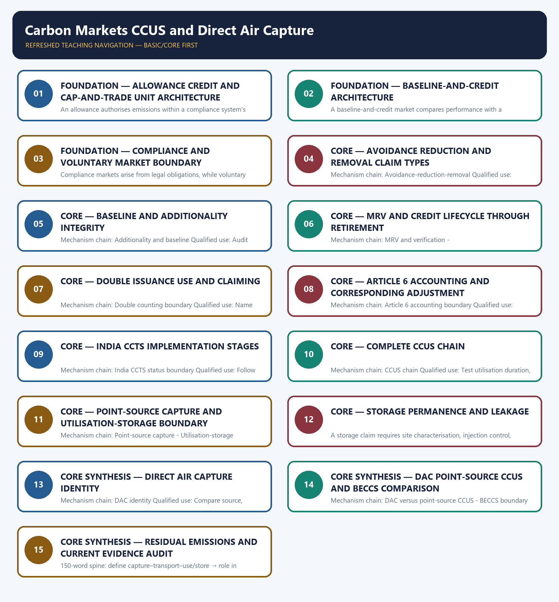

# Carbon Markets CCUS and Direct Air Capture — Learner-v2 Complete Learning Session

> **Authoring-only generation:** 2026-09-03. No PDF was rendered and no tracker or index was mutated.

### SOURCE, PROGRESSION AND CURRENT-LINKAGE AUDIT

- **Generation date:** 2026-09-03.
- **Repository-first evidence:** the Basic owner is taught first and preserved in full; the Advanced owner is retained only in the optional final teaching block.
- **OCR evidence:** Repository Markdown was primary. OCR-searchable local official General Studies papers were used only to confirm printed routed demands. No answer key, marking scheme, unsupported page precision, ecological rate, species count, pollution standard, rule threshold, mission outcome or current status was inferred.
- **Qdrant:** not used; repository Markdown and available OCR context were sufficient.
- **PYQ integrity:** Audited ledgers route the verified 2025 GS-III CCUS demand and objective demands on Paris Article 6 and Direct Air Capture. Objective keys are not inferred, and no carbon-market transaction is presented as a PYQ.
- **Live-link boundary:** Official retrieval confirmed only the broad IPCC mitigation context. UNFCCC was blocked and the BEE route was generic; therefore no current carbon price, volume, methodology, Article 6 delivery status, CCTS obligation, capture rate, cost, storage capacity or DAC deployment is asserted.
- **Fact/inference discipline:** no current-affairs item, PYQ wording, figure or quotation is invented.

### LIVE OFFICIAL-SOURCE ATTEMPT LOG

The checks below were made on 2026-09-03. Substantive official text is used only for the proposition it supports. Stubs, access failures, unrelated pages and thin landing pages are recorded and are not converted into ecological or current-status claims.

- https://unfccc.int/process-and-meetings/the-paris-agreement/article-64-mechanism — attempted 2026-09-03; Incapsula returned an empty noindex shell, so no Article 6 rule, status or transaction claim was imported.
- https://beeindia.gov.in/en/programmes/carbon-market — attempted 2026-09-03; the route redirected to a generic BEE landing page, so no current CCTS obligation, methodology, issuance, price or volume was imported.
- https://www.ipcc.ch/report/ar6/wg3/ — attempted 2026-09-03; substantive official text identified AR6 Working Group III as the mitigation assessment, but supplied no project capture rate, cost, storage capacity or DAC deployment figure.
- https://www.pib.gov.in/indexd.aspx?reg=3&lang=1 — attempted 2026-09-03; the official landing page was not used for any topic-specific current claim.
- https://moef.gov.in/ — attempted 2026-09-03; no substantive topic-specific carbon-market, CCUS or DAC status text was retrieved.

## BASIC LEARNING SESSION

### DEEP-REVIEW LEARNING CONTRACT

| Control | Binding rule for this package |
|---|---|
| Syllabus boundary | Complete Environment and Ecology Basic/Core is answer-complete before optional Advanced depth. |
| Ecology boundary | System boundary, scale, trophic level, stock/flow, pool/flux, gross/net, unit and time interval are explicit. |
| Species boundary | Taxon, range, habitat, population trend, IUCN assessment, Indian legal schedule, CITES/CMS listing and endemism remain distinct. |
| Law/status boundary | Act, amendment, rule, notification, draft, judgment, policy, target, implementation and observed outcome remain distinct and dated. |
| Institution boundary | Legal form, parent authority, mandate, jurisdiction, standard, consent, enforcement, science and adjudication are not conflated. |
| Treaty boundary | Membership, annex/appendix, amendment acceptance, target, COP decision, national instrument and outcome remain distinct. |
| Climate boundary | Emission flow, concentration stock, cumulative budget, forcing, scenario, baseline, unit, mitigation, adaptation, loss-and-damage, avoidance and removal are exact. |
| Pollution boundary | Source, emission/load, ambient concentration, exposure, parameter, averaging period, unit, standard and jurisdiction are explicit. |
| Causal method | Chronology, designation, expenditure, capacity, registration and correlation are not promoted into ecological or policy outcomes without mechanism and evidence. |
| Practice contract | Every solved item has demand decoding, detailed examiner-grade model, executable timed/compression plan, marks rationale and answer-specific improvement. |
| Approval | This immutable successor remains `approved: false` pending explicit approval. |

**Canonical Basic/Core owner:** `upsc-ai-kit\knowledge\Environment-and-Ecology\basic\21_Carbon-Markets-CCUS-and-Direct-Air-Capture.md`  
**Substantive canonical provenance owner:** `upsc-ai-kit\knowledge\Environment-and-Ecology\learning-sessions\v2\subject-wide-syllabus\environment-and-ecology-21_Learning-Session.md`  
**Optional Advanced owner:** `upsc-ai-kit\knowledge\Environment-and-Ecology\advanced\21_Carbon-Markets-CCUS-and-Direct-Air-Capture.md`  
**Official syllabus mapping:** `upsc-ai-kit\knowledge\Environment-and-Ecology\OFFICIAL-UPSC-SYLLABUS-MAPPING.md`

### EVIDENCE, PYQ AND CURRENT-STATUS CONTROL

- Ecological mechanisms retain direction, pool, flux, limiting factor, spatial scale and time scale.
- Current species/news claims retain taxon, source, event/publication date, assessment/listing date and access date.
- IUCN category never substitutes for Wildlife Protection Act schedule, CITES appendix, CMS appendix or endemism.
- Protected-area categories, treaty designations and institution mandates retain exact legal character.
- Acts, amendments, rules, draft instruments, notifications and judgments retain operative status and date.
- Climate figures retain unit, baseline, period, scenario and stock-flow character; global evidence is not silently downscaled to India.
- Mitigation, adaptation and loss-and-damage remain separate; allowance, offset, avoidance, removal, capture and storage remain separate.
- PYQ wording is preserved only where verified; reconstructed or routed demands remain labelled.
- **Current-status note, rechecked 2026-09-03:** volatile targets, standards, schedules, species status, treaty outcomes and programme claims retain source/date/status.

**Generation-local live/current sources:**
- `https://unfccc.int/process-and-meetings/the-paris-agreement/article-64-mechanism — attempted 2026-09-03; Incapsula returned an empty noindex shell, so no Article 6 rule, status or transaction claim was imported.`
- `https://beeindia.gov.in/en/programmes/carbon-market — attempted 2026-09-03; the route redirected to a generic BEE landing page, so no current CCTS obligation, methodology, issuance, price or volume was imported.`
- `https://www.ipcc.ch/report/ar6/wg3/ — attempted 2026-09-03; substantive official text identified AR6 Working Group III as the mitigation assessment, but supplied no project capture rate, cost, storage capacity or DAC deployment figure.`
- `https://www.pib.gov.in/indexd.aspx?reg=3&lang=1 — attempted 2026-09-03; the official landing page was not used for any topic-specific current claim.`
- `https://moef.gov.in/ — attempted 2026-09-03; no substantive topic-specific carbon-market, CCUS or DAC status text was retrieved.`

**Topic 26 dedicated Disaster Management cross-owners (scope boundary):**
- Not applicable to this topic.




*Distinct embedded teaching-navigation image. The separate continuous Cārvāka-style flowchart package remains an independent at-a-glance artifact.*

### SESSION 1 — FOUNDATION — ALLOWANCE CREDIT AND CAP-AND-TRADE UNIT ARCHITECTURE

#### DEFINITION / WHAT THIS IS CALLED

**Plain-language definition:** Mechanism chain: Allowance-credit distinction - Cap-and-trade boundary Qualified use: Identify whether the unit is an allowance or a credited outcome before discussing trade.

**Technical definition:** An allowance authorises emissions within a compliance system's rule-defined limit, while a credit represents a verified reduction or removal against an approved baseline; the units may be tradable but their origins are not interchangeable.

#### ANSWER-GRABBING OPENING — WRITE/ADAPT IN THE EXAM

> Mechanism chain: Allowance-credit distinction - Cap-and-trade boundary Qualified use: Identify whether the unit is an allowance or a credited outcome before discussing trade.

#### MUST-WRITE KEYWORDS

- **FOUNDATION**
- **Allowance credit**
- **cap**
- **trade unit architecture**
- **Mechanism chain**
- **Qualified use**

**How to use them:** Frame the answer through FOUNDATION; define Allowance credit, connect cap with trade unit architecture to explain the mechanism, and use Mechanism chain for the decisive comparison or qualification.

#### VISUAL FIRST

```text
ALLOWANCE CREDIT AND CAP-AND-TRADE UNIT ARCHITECTURE
01. Allowance-credit distinction
    |
    v
02. Cap-and-trade boundary
BOUNDARY -> Do not merge allowances with project credits.
```

*This topic-specific rail fixes the evidence sequence and its exam boundary before analysis.*

#### CORE EXPLANATION

An allowance authorises emissions within a compliance system's rule-defined limit, while a credit represents a verified reduction or removal against an approved baseline; the units may be tradable but their origins are not interchangeable. A cap-and-trade market fixes an absolute covered-emissions ceiling and distributes or auctions allowances; it must not be relabelled as an intensity baseline-and-credit system.

#### NAMED EVIDENCE AND MECHANISM

- An allowance authorises emissions within a compliance system's rule-defined limit, while a credit represents a verified reduction or removal against an approved baseline; the units may be tradable but their origins are not interchangeable.
- A cap-and-trade market fixes an absolute covered-emissions ceiling and distributes or auctions allowances; it must not be relabelled as an intensity baseline-and-credit system.

#### EXAMINER CAUTION

- Do not merge allowances with project credits.

#### EXAM LINK

- **Prelims:** Preserve the exact receiving medium, system boundary, measured parameter, actor, process, spatial and temporal scale, rule vintage and scientific or legal status; never turn a context-dependent pattern into a universal rule.
- **Mains:** Identify whether the unit is an allowance or a credited outcome before discussing trade.

#### MINI RECAP

- **Mechanism chain:** Allowance-credit distinction -> Cap-and-trade boundary
- **Qualified use:** Identify whether the unit is an allowance or a credited outcome before discussing trade.

#### CLOSING RECALL FLOW — FOUNDATION — ALLOWANCE CREDIT AND CAP-AND-TRADE UNIT ARCHITECTURE

```text
START / CONCEPT: FOUNDATION — Allowance credit and cap-and-trade unit architecture
        |
        v
EXACT TERMS: FOUNDATION · Allowance credit · cap · trade unit architecture · Mechanism chain · Qualified use
        |
        v
MECHANISM / ARGUMENT: An allowance authorises emissions within a compliance system's rule-defined limit, while a credit represents a verified reduction or removal against an approved baseline; the units may be tradable but their origins are not interchangeable.
        |
        v
CONSEQUENCE / CONTRAST: A cap-and-trade market fixes an absolute covered-emissions ceiling and distributes or auctions allowances; it must not be relabelled as an intensity baseline-and-credit system.
        |
        v
UPSC TRAP / ANSWER-USE: Do not merge allowances with project credits.
        |
        v
ANSWER-GRABBING FORMULATION: Mechanism chain: Allowance-credit distinction - Cap-and-trade boundary Qualified use: Identify whether the unit is an allowance or a credited outcome before discussing trade.
```
### SESSION 2 — FOUNDATION — BASELINE-AND-CREDIT ARCHITECTURE

#### DEFINITION / WHAT THIS IS CALLED

**Plain-language definition:** Mechanism chain: Baseline-and-credit boundary Qualified use: State whether the constraint is an absolute cap or an intensity baseline.

**Technical definition:** A baseline-and-credit market compares performance with a rule-defined baseline or target and issues credits for qualifying over-performance; it does not necessarily impose an absolute emissions cap.

#### ANSWER-GRABBING OPENING — WRITE/ADAPT IN THE EXAM

> Mechanism chain: Baseline-and-credit boundary Qualified use: State whether the constraint is an absolute cap or an intensity baseline.

#### MUST-WRITE KEYWORDS

- **FOUNDATION**
- **Baseline**
- **credit architecture**
- **Mechanism chain**
- **Qualified use**
- **Mains: State whether the constraint**

**How to use them:** Frame the answer through FOUNDATION; define Baseline, connect credit architecture with Mechanism chain to explain the mechanism, and use Qualified use for the decisive comparison or qualification.

#### VISUAL FIRST

```text
BASELINE-AND-CREDIT ARCHITECTURE
01. Baseline-and-credit boundary
BOUNDARY -> Do not call every compliance market cap-and-trade.
```

*This topic-specific rail fixes the evidence sequence and its exam boundary before analysis.*

#### CORE EXPLANATION

A baseline-and-credit market compares performance with a rule-defined baseline or target and issues credits for qualifying over-performance; it does not necessarily impose an absolute emissions cap.

#### NAMED EVIDENCE AND MECHANISM

- A baseline-and-credit market compares performance with a rule-defined baseline or target and issues credits for qualifying over-performance; it does not necessarily impose an absolute emissions cap.

#### EXAMINER CAUTION

- Do not call every compliance market cap-and-trade.

#### EXAM LINK

- **Prelims:** Preserve the exact receiving medium, system boundary, measured parameter, actor, process, spatial and temporal scale, rule vintage and scientific or legal status; never turn a context-dependent pattern into a universal rule.
- **Mains:** State whether the constraint is an absolute cap or an intensity baseline.

#### MINI RECAP

- **Mechanism chain:** Baseline-and-credit boundary
- **Qualified use:** State whether the constraint is an absolute cap or an intensity baseline.

#### CLOSING RECALL FLOW — FOUNDATION — BASELINE-AND-CREDIT ARCHITECTURE

```text
START / CONCEPT: FOUNDATION — Baseline-and-credit architecture
        |
        v
EXACT TERMS: FOUNDATION · Baseline · credit architecture · Mechanism chain · Qualified use · Mains: State whether the constraint
        |
        v
MECHANISM / ARGUMENT: A baseline-and-credit market compares performance with a rule-defined baseline or target and issues credits for qualifying over-performance; it does not necessarily impose an absolute emissions cap.
        |
        v
CONSEQUENCE / CONTRAST: Do not call every compliance market cap-and-trade.
        |
        v
UPSC TRAP / ANSWER-USE: Do not miss this limiting distinction: state whether the constraint is an absolute cap or an intensity baseline.
        |
        v
ANSWER-GRABBING FORMULATION: Mechanism chain: Baseline-and-credit boundary Qualified use: State whether the constraint is an absolute cap or an intensity baseline.
```
### SESSION 3 — FOUNDATION — COMPLIANCE AND VOLUNTARY MARKET BOUNDARY

#### DEFINITION / WHAT THIS IS CALLED

**Plain-language definition:** Mechanism chain: Compliance-voluntary boundary Qualified use: Separate legal compliance demand from voluntary purchasing and claims.

**Technical definition:** Compliance markets arise from legal obligations, while voluntary markets arise from non-mandated purchases or claims; registry use or private demand does not convert one into the other.

#### ANSWER-GRABBING OPENING — WRITE/ADAPT IN THE EXAM

> Compliance markets arise from legal obligations, while voluntary markets arise from non-mandated purchases or claims; registry use or private demand does not convert one into the other.

#### MUST-WRITE KEYWORDS

- **FOUNDATION**
- **Compliance**
- **voluntary market boundary**
- **Mechanism chain**
- **Qualified use**
- **Compliance-voluntary**

**How to use them:** Frame the answer through FOUNDATION; define Compliance, connect voluntary market boundary with Mechanism chain to explain the mechanism, and use Qualified use for the decisive comparison or qualification.

#### VISUAL FIRST

```text
COMPLIANCE AND VOLUNTARY MARKET BOUNDARY
01. Compliance-voluntary boundary
BOUNDARY -> Do not infer an absolute cap from an intensity baseline.
```

*This topic-specific rail fixes the evidence sequence and its exam boundary before analysis.*

#### CORE EXPLANATION

Compliance markets arise from legal obligations, while voluntary markets arise from non-mandated purchases or claims; registry use or private demand does not convert one into the other.

#### NAMED EVIDENCE AND MECHANISM

- Compliance markets arise from legal obligations, while voluntary markets arise from non-mandated purchases or claims; registry use or private demand does not convert one into the other.

#### EXAMINER CAUTION

- Do not infer an absolute cap from an intensity baseline.

#### EXAM LINK

- **Prelims:** Preserve the exact receiving medium, system boundary, measured parameter, actor, process, spatial and temporal scale, rule vintage and scientific or legal status; never turn a context-dependent pattern into a universal rule.
- **Mains:** Separate legal compliance demand from voluntary purchasing and claims.

#### MINI RECAP

- **Mechanism chain:** Compliance-voluntary boundary
- **Qualified use:** Separate legal compliance demand from voluntary purchasing and claims.

#### CLOSING RECALL FLOW — FOUNDATION — COMPLIANCE AND VOLUNTARY MARKET BOUNDARY

```text
START / CONCEPT: FOUNDATION — Compliance and voluntary market boundary
        |
        v
EXACT TERMS: FOUNDATION · Compliance · voluntary market boundary · Mechanism chain · Qualified use · Compliance-voluntary
        |
        v
MECHANISM / ARGUMENT: Mechanism chain: Compliance-voluntary boundary Qualified use: Separate legal compliance demand from voluntary purchasing and claims.
        |
        v
CONSEQUENCE / CONTRAST: Do not infer an absolute cap from an intensity baseline.
        |
        v
UPSC TRAP / ANSWER-USE: Do not miss this limiting distinction: compliance markets arise from legal obligations.
        |
        v
ANSWER-GRABBING FORMULATION: Compliance markets arise from legal obligations, while voluntary markets arise from non-mandated purchases or claims; registry use or private demand does not convert one into the other.
```
### SESSION 4 — CORE — AVOIDANCE REDUCTION AND REMOVAL CLAIM TYPES

#### DEFINITION / WHAT THIS IS CALLED

**Plain-language definition:** Avoided emissions prevent a counterfactual source, reductions lower emissions from an existing source or activity, and removals take greenhouse gases from the atmosphere and durably store them; claim type must remain explicit.

**Technical definition:** Mechanism chain: Avoidance-reduction-removal Qualified use: Classify the claimed outcome as avoidance, reduction or atmospheric removal.

#### ANSWER-GRABBING OPENING — WRITE/ADAPT IN THE EXAM

> Avoided emissions prevent a counterfactual source, reductions lower emissions from an existing source or activity, and removals take greenhouse gases from the atmosphere and durably store them; claim type must remain explicit.

#### MUST-WRITE KEYWORDS

- **Avoidance reduction**
- **removal claim types**
- **Mechanism chain**
- **Qualified use**
- **Avoided**
- **Avoidance-reduction-removal Qualified**

**How to use them:** Frame the answer through Avoidance reduction; define removal claim types, connect Mechanism chain with Qualified use to explain the mechanism, and use Avoided for the decisive comparison or qualification.

#### VISUAL FIRST

```text
AVOIDANCE REDUCTION AND REMOVAL CLAIM TYPES
01. Avoidance-reduction-removal
BOUNDARY -> Do not call voluntary demand a legal compliance obligation.
```

*This topic-specific rail fixes the evidence sequence and its exam boundary before analysis.*

#### CORE EXPLANATION

Avoided emissions prevent a counterfactual source, reductions lower emissions from an existing source or activity, and removals take greenhouse gases from the atmosphere and durably store them; claim type must remain explicit.

#### NAMED EVIDENCE AND MECHANISM

- Avoided emissions prevent a counterfactual source, reductions lower emissions from an existing source or activity, and removals take greenhouse gases from the atmosphere and durably store them; claim type must remain explicit.

#### EXAMINER CAUTION

- Do not call voluntary demand a legal compliance obligation.

#### EXAM LINK

- **Prelims:** Preserve the exact receiving medium, system boundary, measured parameter, actor, process, spatial and temporal scale, rule vintage and scientific or legal status; never turn a context-dependent pattern into a universal rule.
- **Mains:** Classify the claimed outcome as avoidance, reduction or atmospheric removal.

#### MINI RECAP

- **Mechanism chain:** Avoidance-reduction-removal
- **Qualified use:** Classify the claimed outcome as avoidance, reduction or atmospheric removal.

#### CLOSING RECALL FLOW — CORE — AVOIDANCE REDUCTION AND REMOVAL CLAIM TYPES

```text
START / CONCEPT: CORE — Avoidance reduction and removal claim types
        |
        v
EXACT TERMS: Avoidance reduction · removal claim types · Mechanism chain · Qualified use · Avoided · Avoidance-reduction-removal Qualified
        |
        v
MECHANISM / ARGUMENT: Mechanism chain: Avoidance-reduction-removal Qualified use: Classify the claimed outcome as avoidance, reduction or atmospheric removal.
        |
        v
CONSEQUENCE / CONTRAST: Do not call voluntary demand a legal compliance obligation.
        |
        v
UPSC TRAP / ANSWER-USE: Do not miss this limiting distinction: avoided emissions prevent a counterfactual source, reductions lower emissions from an existing source or...
        |
        v
ANSWER-GRABBING FORMULATION: Avoided emissions prevent a counterfactual source, reductions lower emissions from an existing source or activity, and removals take greenhouse gases from the atmosphere and durably store them; claim type must remain explicit.
```
### SESSION 5 — CORE — BASELINE AND ADDITIONALITY INTEGRITY

#### DEFINITION / WHAT THIS IS CALLED

**Plain-language definition:** A credited activity needs a defensible baseline and additionality test so the claimed outcome is not merely business as usual; neither label alone proves integrity.

**Technical definition:** Mechanism chain: Additionality and baseline Qualified use: Audit baseline, additionality, boundary, monitoring and independent verification.

#### ANSWER-GRABBING OPENING — WRITE/ADAPT IN THE EXAM

> A credited activity needs a defensible baseline and additionality test so the claimed outcome is not merely business as usual; neither label alone proves integrity.

#### MUST-WRITE KEYWORDS

- **Baseline**
- **additionality integrity**
- **Mechanism chain**
- **Qualified use**
- **Additionality**
- **Qualified**

**How to use them:** Frame the answer through Baseline; define additionality integrity, connect Mechanism chain with Qualified use to explain the mechanism, and use Additionality for the decisive comparison or qualification.

#### VISUAL FIRST

```text
BASELINE AND ADDITIONALITY INTEGRITY
01. Additionality and baseline
BOUNDARY -> Do not merge avoidance, reduction and removal claims.
```

*This topic-specific rail fixes the evidence sequence and its exam boundary before analysis.*

#### CORE EXPLANATION

A credited activity needs a defensible baseline and additionality test so the claimed outcome is not merely business as usual; neither label alone proves integrity.

#### NAMED EVIDENCE AND MECHANISM

- A credited activity needs a defensible baseline and additionality test so the claimed outcome is not merely business as usual; neither label alone proves integrity.

#### EXAMINER CAUTION

- Do not merge avoidance, reduction and removal claims.

#### EXAM LINK

- **Prelims:** Preserve the exact receiving medium, system boundary, measured parameter, actor, process, spatial and temporal scale, rule vintage and scientific or legal status; never turn a context-dependent pattern into a universal rule.
- **Mains:** Audit baseline, additionality, boundary, monitoring and independent verification.

#### MINI RECAP

- **Mechanism chain:** Additionality and baseline
- **Qualified use:** Audit baseline, additionality, boundary, monitoring and independent verification.

#### CLOSING RECALL FLOW — CORE — BASELINE AND ADDITIONALITY INTEGRITY

```text
START / CONCEPT: CORE — Baseline and additionality integrity
        |
        v
EXACT TERMS: Baseline · additionality integrity · Mechanism chain · Qualified use · Additionality · Qualified
        |
        v
MECHANISM / ARGUMENT: Mechanism chain: Additionality and baseline Qualified use: Audit baseline, additionality, boundary, monitoring and independent verification.
        |
        v
CONSEQUENCE / CONTRAST: Do not merge avoidance, reduction and removal claims.
        |
        v
UPSC TRAP / ANSWER-USE: Do not miss this limiting distinction: a credited activity needs a defensible baseline and additionality test so the claimed outcome...
        |
        v
ANSWER-GRABBING FORMULATION: A credited activity needs a defensible baseline and additionality test so the claimed outcome is not merely business as usual; neither label alone proves integrity.
```
### SESSION 6 — CORE — MRV AND CREDIT LIFECYCLE THROUGH RETIREMENT

#### DEFINITION / WHAT THIS IS CALLED

**Plain-language definition:** Credit validation or registration, verification, issuance, transfer and retirement are separate lifecycle stages; issuance creates a unit, while retirement is the act used to support a final claim.

**Technical definition:** Mechanism chain: MRV and verification - Issuance-transfer-retirement Qualified use: Trace registration, verification, issuance, transfer and retirement separately.

#### ANSWER-GRABBING OPENING — WRITE/ADAPT IN THE EXAM

> Credit validation or registration, verification, issuance, transfer and retirement are separate lifecycle stages; issuance creates a unit, while retirement is the act used to support a final claim.

#### MUST-WRITE KEYWORDS

- **MRV**
- **credit lifecycle through retirement**
- **Mechanism chain**
- **Qualified use**
- **Monitoring**
- **Credit**

**How to use them:** Frame the answer through MRV; define credit lifecycle through retirement, connect Mechanism chain with Qualified use to explain the mechanism, and use Monitoring for the decisive comparison or qualification.

#### VISUAL FIRST

```text
MRV AND CREDIT LIFECYCLE THROUGH RETIREMENT
01. MRV and verification
    |
    v
02. Issuance-transfer-retirement
BOUNDARY -> Do not treat a baseline or methodology label as proof of additionality.
```

*This topic-specific rail fixes the evidence sequence and its exam boundary before analysis.*

#### CORE EXPLANATION

Monitoring, reporting and verification quantify the claimed outcome and test it against the governing methodology, boundary and period; verification is evidence infrastructure, not a guarantee against every integrity risk. Credit validation or registration, verification, issuance, transfer and retirement are separate lifecycle stages; issuance creates a unit, while retirement is the act used to support a final claim.

#### NAMED EVIDENCE AND MECHANISM

- Monitoring, reporting and verification quantify the claimed outcome and test it against the governing methodology, boundary and period; verification is evidence infrastructure, not a guarantee against every integrity risk.
- Credit validation or registration, verification, issuance, transfer and retirement are separate lifecycle stages; issuance creates a unit, while retirement is the act used to support a final claim.

#### EXAMINER CAUTION

- Do not treat a baseline or methodology label as proof of additionality.

#### EXAM LINK

- **Prelims:** Preserve the exact receiving medium, system boundary, measured parameter, actor, process, spatial and temporal scale, rule vintage and scientific or legal status; never turn a context-dependent pattern into a universal rule.
- **Mains:** Trace registration, verification, issuance, transfer and retirement separately.

#### MINI RECAP

- **Mechanism chain:** MRV and verification -> Issuance-transfer-retirement
- **Qualified use:** Trace registration, verification, issuance, transfer and retirement separately.

#### CLOSING RECALL FLOW — CORE — MRV AND CREDIT LIFECYCLE THROUGH RETIREMENT

```text
START / CONCEPT: CORE — MRV and credit lifecycle through retirement
        |
        v
EXACT TERMS: MRV · credit lifecycle through retirement · Mechanism chain · Qualified use · Monitoring · Credit
        |
        v
MECHANISM / ARGUMENT: Mechanism chain: MRV and verification - Issuance-transfer-retirement Qualified use: Trace registration, verification, issuance, transfer and retirement separately.
        |
        v
CONSEQUENCE / CONTRAST: Monitoring, reporting and verification quantify the claimed outcome and test it against the governing methodology, boundary and period; verification is evidence infrastructure, not a guarantee against every integrity risk.
        |
        v
UPSC TRAP / ANSWER-USE: Do not treat a baseline or methodology label as proof of additionality.
        |
        v
ANSWER-GRABBING FORMULATION: Credit validation or registration, verification, issuance, transfer and retirement are separate lifecycle stages; issuance creates a unit, while retirement is the act used to support a final claim.
```
### SESSION 7 — CORE — DOUBLE ISSUANCE USE AND CLAIMING

#### DEFINITION / WHAT THIS IS CALLED

**Plain-language definition:** Double issuance, double use and double claiming are distinct accounting risks; preventing one does not automatically prevent the others.

**Technical definition:** Mechanism chain: Double counting boundary Qualified use: Name the double-counting risk and the accounting response without merging stages.

#### ANSWER-GRABBING OPENING — WRITE/ADAPT IN THE EXAM

> Double issuance, double use and double claiming are distinct accounting risks; preventing one does not automatically prevent the others.

#### MUST-WRITE KEYWORDS

- **Double issuance use**
- **claiming**
- **Mechanism chain**
- **Qualified use**
- **Double**
- **Qualified**

**How to use them:** Frame the answer through Double issuance use; define claiming, connect Mechanism chain with Qualified use to explain the mechanism, and use Double for the decisive comparison or qualification.

#### VISUAL FIRST

```text
DOUBLE ISSUANCE USE AND CLAIMING
01. Double counting boundary
BOUNDARY -> Do not treat verification as immunity from over-crediting.
```

*This topic-specific rail fixes the evidence sequence and its exam boundary before analysis.*

#### CORE EXPLANATION

Double issuance, double use and double claiming are distinct accounting risks; preventing one does not automatically prevent the others.

#### NAMED EVIDENCE AND MECHANISM

- Double issuance, double use and double claiming are distinct accounting risks; preventing one does not automatically prevent the others.

#### EXAMINER CAUTION

- Do not treat verification as immunity from over-crediting.

#### EXAM LINK

- **Prelims:** Preserve the exact receiving medium, system boundary, measured parameter, actor, process, spatial and temporal scale, rule vintage and scientific or legal status; never turn a context-dependent pattern into a universal rule.
- **Mains:** Name the double-counting risk and the accounting response without merging stages.

#### MINI RECAP

- **Mechanism chain:** Double counting boundary
- **Qualified use:** Name the double-counting risk and the accounting response without merging stages.

#### CLOSING RECALL FLOW — CORE — DOUBLE ISSUANCE USE AND CLAIMING

```text
START / CONCEPT: CORE — Double issuance use and claiming
        |
        v
EXACT TERMS: Double issuance use · claiming · Mechanism chain · Qualified use · Double · Qualified
        |
        v
MECHANISM / ARGUMENT: Mechanism chain: Double counting boundary Qualified use: Name the double-counting risk and the accounting response without merging stages.
        |
        v
CONSEQUENCE / CONTRAST: Do not treat verification as immunity from over-crediting.
        |
        v
UPSC TRAP / ANSWER-USE: Do not miss this limiting distinction: double issuance, double use and double claiming are distinct accounting risks.
        |
        v
ANSWER-GRABBING FORMULATION: Double issuance, double use and double claiming are distinct accounting risks; preventing one does not automatically prevent the others.
```
### SESSION 8 — CORE — ARTICLE 6 ACCOUNTING AND CORRESPONDING ADJUSTMENT

#### DEFINITION / WHAT THIS IS CALLED

**Plain-language definition:** Paris Agreement cooperative approaches require instrument-specific authorisation and accounting discipline; a corresponding adjustment is an accounting treatment and must not be confused with credit issuance, transfer or retirement.

**Technical definition:** Mechanism chain: Article 6 accounting boundary Qualified use: Separate the notified Indian framework from targets, issuance, trading and price discovery.

#### ANSWER-GRABBING OPENING — WRITE/ADAPT IN THE EXAM

> Paris Agreement cooperative approaches require instrument-specific authorisation and accounting discipline; a corresponding adjustment is an accounting treatment and must not be confused with credit issuance, transfer or retirement.

#### MUST-WRITE KEYWORDS

- **Article 6 accounting**
- **corresponding adjustment**
- **Mechanism chain**
- **Qualified use**
- **Article 6**
- **Paris Agreement**

**How to use them:** Frame the answer through Article 6 accounting; define corresponding adjustment, connect Mechanism chain with Qualified use to explain the mechanism, and use Article 6 for the decisive comparison or qualification.

#### VISUAL FIRST

```text
ARTICLE 6 ACCOUNTING AND CORRESPONDING ADJUSTMENT
01. Article 6 accounting boundary
BOUNDARY -> Do not merge issuance, transfer and retirement.
```

*This topic-specific rail fixes the evidence sequence and its exam boundary before analysis.*

#### CORE EXPLANATION

Paris Agreement cooperative approaches require instrument-specific authorisation and accounting discipline; a corresponding adjustment is an accounting treatment and must not be confused with credit issuance, transfer or retirement.

#### NAMED EVIDENCE AND MECHANISM

- Paris Agreement cooperative approaches require instrument-specific authorisation and accounting discipline; a corresponding adjustment is an accounting treatment and must not be confused with credit issuance, transfer or retirement.

#### EXAMINER CAUTION

- Do not merge issuance, transfer and retirement.

#### EXAM LINK

- **Prelims:** Preserve the exact receiving medium, system boundary, measured parameter, actor, process, spatial and temporal scale, rule vintage and scientific or legal status; never turn a context-dependent pattern into a universal rule.
- **Mains:** Separate the notified Indian framework from targets, issuance, trading and price discovery.

#### MINI RECAP

- **Mechanism chain:** Article 6 accounting boundary
- **Qualified use:** Separate the notified Indian framework from targets, issuance, trading and price discovery.

#### CLOSING RECALL FLOW — CORE — ARTICLE 6 ACCOUNTING AND CORRESPONDING ADJUSTMENT

```text
START / CONCEPT: CORE — Article 6 accounting and corresponding adjustment
        |
        v
EXACT TERMS: Article 6 accounting · corresponding adjustment · Mechanism chain · Qualified use · Article 6 · Paris Agreement
        |
        v
MECHANISM / ARGUMENT: Mechanism chain: Article 6 accounting boundary Qualified use: Separate the notified Indian framework from targets, issuance, trading and price discovery.
        |
        v
CONSEQUENCE / CONTRAST: Do not merge issuance, transfer and retirement.
        |
        v
UPSC TRAP / ANSWER-USE: Do not miss this limiting distinction: paris Agreement cooperative approaches require instrument-specific authorisation and accounting discipline.
        |
        v
ANSWER-GRABBING FORMULATION: Paris Agreement cooperative approaches require instrument-specific authorisation and accounting discipline; a corresponding adjustment is an accounting treatment and must not be confused with credit issuance, transfer or retirement.
```
### SESSION 9 — CORE — INDIA CCTS IMPLEMENTATION STAGES

#### DEFINITION / WHAT THIS IS CALLED

**Plain-language definition:** India's Carbon Credit Trading Scheme has a legal and institutional architecture with compliance and offset pathways, but notification, sectoral target setting, credit issuance, exchange trading and a discovered market price are separate implementation stages.

**Technical definition:** Mechanism chain: India CCTS status boundary Qualified use: Follow carbon dioxide from source separation through transport to its destination.

#### ANSWER-GRABBING OPENING — WRITE/ADAPT IN THE EXAM

> India's Carbon Credit Trading Scheme has a legal and institutional architecture with compliance and offset pathways, but notification, sectoral target setting, credit issuance, exchange trading and a discovered market price are separate implementation stages.

#### MUST-WRITE KEYWORDS

- **India CCTS implementation stages**
- **Mechanism chain**
- **Qualified use**
- **India's Carbon Credit Trading Scheme**
- **Follow**
- **India CCTS**

**How to use them:** Frame the answer through India CCTS implementation stages; define Mechanism chain, connect Qualified use with India's Carbon Credit Trading Scheme to explain the mechanism, and use Follow for the decisive comparison or qualification.

#### VISUAL FIRST

```text
INDIA CCTS IMPLEMENTATION STAGES
01. India CCTS status boundary
BOUNDARY -> Do not merge double issuance, double use and double claiming.
```

*This topic-specific rail fixes the evidence sequence and its exam boundary before analysis.*

#### CORE EXPLANATION

India's Carbon Credit Trading Scheme has a legal and institutional architecture with compliance and offset pathways, but notification, sectoral target setting, credit issuance, exchange trading and a discovered market price are separate implementation stages.

#### NAMED EVIDENCE AND MECHANISM

- India's Carbon Credit Trading Scheme has a legal and institutional architecture with compliance and offset pathways, but notification, sectoral target setting, credit issuance, exchange trading and a discovered market price are separate implementation stages.

#### EXAMINER CAUTION

- Do not merge double issuance, double use and double claiming.

#### EXAM LINK

- **Prelims:** Preserve the exact receiving medium, system boundary, measured parameter, actor, process, spatial and temporal scale, rule vintage and scientific or legal status; never turn a context-dependent pattern into a universal rule.
- **Mains:** Follow carbon dioxide from source separation through transport to its destination.

#### MINI RECAP

- **Mechanism chain:** India CCTS status boundary
- **Qualified use:** Follow carbon dioxide from source separation through transport to its destination.

#### CLOSING RECALL FLOW — CORE — INDIA CCTS IMPLEMENTATION STAGES

```text
START / CONCEPT: CORE — India CCTS implementation stages
        |
        v
EXACT TERMS: India CCTS implementation stages · Mechanism chain · Qualified use · India's Carbon Credit Trading Scheme · Follow · India CCTS
        |
        v
MECHANISM / ARGUMENT: Mechanism chain: India CCTS status boundary Qualified use: Follow carbon dioxide from source separation through transport to its destination.
        |
        v
CONSEQUENCE / CONTRAST: Do not merge double issuance, double use and double claiming.
        |
        v
UPSC TRAP / ANSWER-USE: Do not miss this limiting distinction: follow carbon dioxide from source separation through transport to its destination.
        |
        v
ANSWER-GRABBING FORMULATION: India's Carbon Credit Trading Scheme has a legal and institutional architecture with compliance and offset pathways, but notification, sectoral target setting, credit issuance, exchange trading and a discovered market price are separate implementation stages.
```
### SESSION 10 — CORE — COMPLETE CCUS CHAIN

#### DEFINITION / WHAT THIS IS CALLED

**Plain-language definition:** CCUS is a chain of carbon dioxide capture, conditioning, transport, utilisation or storage, monitoring and closure; performance at the capture unit alone does not establish whole-chain climate benefit.

**Technical definition:** Mechanism chain: CCUS chain Qualified use: Test utilisation duration, storage permanence, monitoring and leakage responsibility.

#### ANSWER-GRABBING OPENING — WRITE/ADAPT IN THE EXAM

> CCUS is a chain of carbon dioxide capture, conditioning, transport, utilisation or storage, monitoring and closure; performance at the capture unit alone does not establish whole-chain climate benefit.

#### MUST-WRITE KEYWORDS

- **Complete CCUS chain**
- **Mechanism chain**
- **Qualified use**
- **CCUS**
- **Qualified**
- **Test**

**How to use them:** Frame the answer through Complete CCUS chain; define Mechanism chain, connect Qualified use with CCUS to explain the mechanism, and use Qualified for the decisive comparison or qualification.

#### VISUAL FIRST

```text
COMPLETE CCUS CHAIN
01. CCUS chain
BOUNDARY -> Do not call a corresponding adjustment a credit or retirement event.
```

*This topic-specific rail fixes the evidence sequence and its exam boundary before analysis.*

#### CORE EXPLANATION

CCUS is a chain of carbon dioxide capture, conditioning, transport, utilisation or storage, monitoring and closure; performance at the capture unit alone does not establish whole-chain climate benefit.

#### NAMED EVIDENCE AND MECHANISM

- CCUS is a chain of carbon dioxide capture, conditioning, transport, utilisation or storage, monitoring and closure; performance at the capture unit alone does not establish whole-chain climate benefit.

#### EXAMINER CAUTION

- Do not call a corresponding adjustment a credit or retirement event.

#### EXAM LINK

- **Prelims:** Preserve the exact receiving medium, system boundary, measured parameter, actor, process, spatial and temporal scale, rule vintage and scientific or legal status; never turn a context-dependent pattern into a universal rule.
- **Mains:** Test utilisation duration, storage permanence, monitoring and leakage responsibility.

#### MINI RECAP

- **Mechanism chain:** CCUS chain
- **Qualified use:** Test utilisation duration, storage permanence, monitoring and leakage responsibility.

#### CLOSING RECALL FLOW — CORE — COMPLETE CCUS CHAIN

```text
START / CONCEPT: CORE — Complete CCUS chain
        |
        v
EXACT TERMS: Complete CCUS chain · Mechanism chain · Qualified use · CCUS · Qualified · Test
        |
        v
MECHANISM / ARGUMENT: Mechanism chain: CCUS chain Qualified use: Test utilisation duration, storage permanence, monitoring and leakage responsibility.
        |
        v
CONSEQUENCE / CONTRAST: Do not call a corresponding adjustment a credit or retirement event.
        |
        v
UPSC TRAP / ANSWER-USE: Do not miss this limiting distinction: cCUS is a chain of carbon dioxide capture, conditioning, transport, utilisation or storage, monitoring...
        |
        v
ANSWER-GRABBING FORMULATION: CCUS is a chain of carbon dioxide capture, conditioning, transport, utilisation or storage, monitoring and closure; performance at the capture unit alone does not establish whole-chain climate benefit.
```
### SESSION 11 — CORE — POINT-SOURCE CAPTURE AND UTILISATION-STORAGE BOUNDARY

#### DEFINITION / WHAT THIS IS CALLED

**Plain-language definition:** Point-source capture separates carbon dioxide from a relatively concentrated industrial or power-sector stream before release; capture efficiency is not the same as lifecycle emissions avoided.

**Technical definition:** Mechanism chain: Point-source capture - Utilisation-storage boundary Qualified use: Compare capture-unit performance with full lifecycle emissions.

#### ANSWER-GRABBING OPENING — WRITE/ADAPT IN THE EXAM

> Mechanism chain: Point-source capture - Utilisation-storage boundary Qualified use: Compare capture-unit performance with full lifecycle emissions.

#### MUST-WRITE KEYWORDS

- **Point-source capture**
- **utilisation-storage boundary**
- **Mechanism chain**
- **Qualified use**
- **Point-source**
- **Carbon**

**How to use them:** Frame the answer through Point-source capture; define utilisation-storage boundary, connect Mechanism chain with Qualified use to explain the mechanism, and use Point-source for the decisive comparison or qualification.

#### VISUAL FIRST

```text
POINT-SOURCE CAPTURE AND UTILISATION-STORAGE BOUNDARY
01. Point-source capture
    |
    v
02. Utilisation-storage boundary
BOUNDARY -> Do not infer an operating liquid CCTS market from a notified framework.
```

*This topic-specific rail fixes the evidence sequence and its exam boundary before analysis.*

#### CORE EXPLANATION

Point-source capture separates carbon dioxide from a relatively concentrated industrial or power-sector stream before release; capture efficiency is not the same as lifecycle emissions avoided. Carbon utilisation places captured carbon into a product or process, whereas geological storage seeks long-duration containment; utilisation is not automatically permanent storage.

#### NAMED EVIDENCE AND MECHANISM

- Point-source capture separates carbon dioxide from a relatively concentrated industrial or power-sector stream before release; capture efficiency is not the same as lifecycle emissions avoided.
- Carbon utilisation places captured carbon into a product or process, whereas geological storage seeks long-duration containment; utilisation is not automatically permanent storage.

#### EXAMINER CAUTION

- Do not infer an operating liquid CCTS market from a notified framework.

#### EXAM LINK

- **Prelims:** Preserve the exact receiving medium, system boundary, measured parameter, actor, process, spatial and temporal scale, rule vintage and scientific or legal status; never turn a context-dependent pattern into a universal rule.
- **Mains:** Compare capture-unit performance with full lifecycle emissions.

#### MINI RECAP

- **Mechanism chain:** Point-source capture -> Utilisation-storage boundary
- **Qualified use:** Compare capture-unit performance with full lifecycle emissions.

#### CLOSING RECALL FLOW — CORE — POINT-SOURCE CAPTURE AND UTILISATION-STORAGE BOUNDARY

```text
START / CONCEPT: CORE — Point-source capture and utilisation-storage boundary
        |
        v
EXACT TERMS: Point-source capture · utilisation-storage boundary · Mechanism chain · Qualified use · Point-source · Carbon
        |
        v
MECHANISM / ARGUMENT: Point-source capture separates carbon dioxide from a relatively concentrated industrial or power-sector stream before release; capture efficiency is not the same as lifecycle emissions avoided.
        |
        v
CONSEQUENCE / CONTRAST: Carbon utilisation places captured carbon into a product or process, whereas geological storage seeks long-duration containment; utilisation is not automatically permanent storage.
        |
        v
UPSC TRAP / ANSWER-USE: Do not infer an operating liquid CCTS market from a notified framework.
        |
        v
ANSWER-GRABBING FORMULATION: Mechanism chain: Point-source capture - Utilisation-storage boundary Qualified use: Compare capture-unit performance with full lifecycle emissions.
```
### SESSION 12 — CORE — STORAGE PERMANENCE AND LEAKAGE

#### DEFINITION / WHAT THIS IS CALLED

**Plain-language definition:** Mechanism chain: Permanence and leakage Qualified use: Define ambient-air capture before discussing removal value or energy demand.

**Technical definition:** A storage claim requires site characterisation, injection control, monitoring, leakage-risk management and long-term stewardship; stored quantity must not be inferred from nominal project capacity.

#### ANSWER-GRABBING OPENING — WRITE/ADAPT IN THE EXAM

> A storage claim requires site characterisation, injection control, monitoring, leakage-risk management and long-term stewardship; stored quantity must not be inferred from nominal project capacity.

#### MUST-WRITE KEYWORDS

- **Storage permanence**
- **leakage**
- **Mechanism chain**
- **Qualified use**
- **CCUS**
- **Permanence**

**How to use them:** Frame the answer through Storage permanence; define leakage, connect Mechanism chain with Qualified use to explain the mechanism, and use CCUS for the decisive comparison or qualification.

#### VISUAL FIRST

```text
STORAGE PERMANENCE AND LEAKAGE
01. Permanence and leakage
BOUNDARY -> Do not reduce CCUS to capture equipment alone.
```

*This topic-specific rail fixes the evidence sequence and its exam boundary before analysis.*

#### CORE EXPLANATION

A storage claim requires site characterisation, injection control, monitoring, leakage-risk management and long-term stewardship; stored quantity must not be inferred from nominal project capacity.

#### NAMED EVIDENCE AND MECHANISM

- A storage claim requires site characterisation, injection control, monitoring, leakage-risk management and long-term stewardship; stored quantity must not be inferred from nominal project capacity.

#### EXAMINER CAUTION

- Do not reduce CCUS to capture equipment alone.

#### EXAM LINK

- **Prelims:** Preserve the exact receiving medium, system boundary, measured parameter, actor, process, spatial and temporal scale, rule vintage and scientific or legal status; never turn a context-dependent pattern into a universal rule.
- **Mains:** Define ambient-air capture before discussing removal value or energy demand.

#### MINI RECAP

- **Mechanism chain:** Permanence and leakage
- **Qualified use:** Define ambient-air capture before discussing removal value or energy demand.

#### CLOSING RECALL FLOW — CORE — STORAGE PERMANENCE AND LEAKAGE

```text
START / CONCEPT: CORE — Storage permanence and leakage
        |
        v
EXACT TERMS: Storage permanence · leakage · Mechanism chain · Qualified use · CCUS · Permanence
        |
        v
MECHANISM / ARGUMENT: Mechanism chain: Permanence and leakage Qualified use: Define ambient-air capture before discussing removal value or energy demand.
        |
        v
CONSEQUENCE / CONTRAST: Do not reduce CCUS to capture equipment alone.
        |
        v
UPSC TRAP / ANSWER-USE: Do not miss this limiting distinction: define ambient-air capture before discussing removal value or energy demand.
        |
        v
ANSWER-GRABBING FORMULATION: A storage claim requires site characterisation, injection control, monitoring, leakage-risk management and long-term stewardship; stored quantity must not be inferred from nominal project capacity.
```
### SESSION 13 — CORE SYNTHESIS — DIRECT AIR CAPTURE IDENTITY

#### DEFINITION / WHAT THIS IS CALLED

**Plain-language definition:** CORE SYNTHESIS — Direct Air Capture identity comprises CORE SYNTHESIS, Direct Air Capture identity and Mechanism chain as its core connected dimensions.

**Technical definition:** Mechanism chain: DAC identity Qualified use: Compare source, carbon origin, destination and net atmospheric effect.

#### ANSWER-GRABBING OPENING — WRITE/ADAPT IN THE EXAM

> Direct Air Capture separates carbon dioxide from ambient air rather than a point-source stream and therefore addresses atmospheric carbon already dispersed at low concentration.

#### MUST-WRITE KEYWORDS

- **CORE SYNTHESIS**
- **Direct Air Capture identity**
- **Mechanism chain**
- **Qualified use**
- **Direct Air Capture**
- **DAC**

**How to use them:** Frame the answer through CORE SYNTHESIS; define Direct Air Capture identity, connect Mechanism chain with Qualified use to explain the mechanism, and use Direct Air Capture for the decisive comparison or qualification.

#### VISUAL FIRST

```text
DIRECT AIR CAPTURE IDENTITY
01. DAC identity
BOUNDARY -> Do not equate capture rate with lifecycle emissions avoided.
```

*This topic-specific rail fixes the evidence sequence and its exam boundary before analysis.*

#### CORE EXPLANATION

Direct Air Capture separates carbon dioxide from ambient air rather than a point-source stream and therefore addresses atmospheric carbon already dispersed at low concentration.

#### NAMED EVIDENCE AND MECHANISM

- Direct Air Capture separates carbon dioxide from ambient air rather than a point-source stream and therefore addresses atmospheric carbon already dispersed at low concentration.

#### EXAMINER CAUTION

- Do not equate capture rate with lifecycle emissions avoided.

#### EXAM LINK

- **Prelims:** Preserve the exact receiving medium, system boundary, measured parameter, actor, process, spatial and temporal scale, rule vintage and scientific or legal status; never turn a context-dependent pattern into a universal rule.
- **Mains:** Compare source, carbon origin, destination and net atmospheric effect.

#### MINI RECAP

- **Mechanism chain:** DAC identity
- **Qualified use:** Compare source, carbon origin, destination and net atmospheric effect.

#### CLOSING RECALL FLOW — CORE SYNTHESIS — DIRECT AIR CAPTURE IDENTITY

```text
START / CONCEPT: CORE SYNTHESIS — Direct Air Capture identity
        |
        v
EXACT TERMS: CORE SYNTHESIS · Direct Air Capture identity · Mechanism chain · Qualified use · Direct Air Capture · DAC
        |
        v
MECHANISM / ARGUMENT: Mechanism chain: DAC identity Qualified use: Compare source, carbon origin, destination and net atmospheric effect.
        |
        v
CONSEQUENCE / CONTRAST: Do not equate capture rate with lifecycle emissions avoided.
        |
        v
UPSC TRAP / ANSWER-USE: Do not miss this limiting distinction: direct Air Capture separates carbon dioxide from ambient air rather than a point-source stream...
        |
        v
ANSWER-GRABBING FORMULATION: Direct Air Capture separates carbon dioxide from ambient air rather than a point-source stream and therefore addresses atmospheric carbon already dispersed at low concentration.
```
### SESSION 14 — CORE SYNTHESIS — DAC POINT-SOURCE CCUS AND BECCS COMPARISON

#### DEFINITION / WHAT THIS IS CALLED

**Plain-language definition:** Point-source CCUS principally avoids or reduces new emissions from a facility, while DAC can support atmospheric removal only when captured carbon is durably stored and lifecycle emissions do not negate the removal.

**Technical definition:** Mechanism chain: DAC versus point-source CCUS - BECCS boundary Qualified use: Place removals after avoidance and reduction for genuinely residual emissions.

#### ANSWER-GRABBING OPENING — WRITE/ADAPT IN THE EXAM

> Point-source CCUS principally avoids or reduces new emissions from a facility, while DAC can support atmospheric removal only when captured carbon is durably stored and lifecycle emissions do not negate the removal.

#### MUST-WRITE KEYWORDS

- **CORE SYNTHESIS**
- **DAC point-source CCUS**
- **BECCS comparison**
- **Mechanism chain**
- **Qualified use**
- **Point-source CCUS**

**How to use them:** Frame the answer through CORE SYNTHESIS; define DAC point-source CCUS, connect BECCS comparison with Mechanism chain to explain the mechanism, and use Qualified use for the decisive comparison or qualification.

#### VISUAL FIRST

```text
DAC POINT-SOURCE CCUS AND BECCS COMPARISON
01. DAC versus point-source CCUS
    |
    v
02. BECCS boundary
BOUNDARY -> Do not assume utilisation provides durable storage.
```

*This topic-specific rail fixes the evidence sequence and its exam boundary before analysis.*

#### CORE EXPLANATION

Point-source CCUS principally avoids or reduces new emissions from a facility, while DAC can support atmospheric removal only when captured carbon is durably stored and lifecycle emissions do not negate the removal. Bioenergy with carbon capture and storage can support removal only when biomass carbon, land-use effects, supply-chain emissions and durable storage are accounted for; capture equipment alone does not prove net-negative emissions.

#### NAMED EVIDENCE AND MECHANISM

- Point-source CCUS principally avoids or reduces new emissions from a facility, while DAC can support atmospheric removal only when captured carbon is durably stored and lifecycle emissions do not negate the removal.
- Bioenergy with carbon capture and storage can support removal only when biomass carbon, land-use effects, supply-chain emissions and durable storage are accounted for; capture equipment alone does not prove net-negative emissions.

#### EXAMINER CAUTION

- Do not assume utilisation provides durable storage.

#### EXAM LINK

- **Prelims:** Preserve the exact receiving medium, system boundary, measured parameter, actor, process, spatial and temporal scale, rule vintage and scientific or legal status; never turn a context-dependent pattern into a universal rule.
- **Mains:** Place removals after avoidance and reduction for genuinely residual emissions.

#### MINI RECAP

- **Mechanism chain:** DAC versus point-source CCUS -> BECCS boundary
- **Qualified use:** Place removals after avoidance and reduction for genuinely residual emissions.

#### CLOSING RECALL FLOW — CORE SYNTHESIS — DAC POINT-SOURCE CCUS AND BECCS COMPARISON

```text
START / CONCEPT: CORE SYNTHESIS — DAC point-source CCUS and BECCS comparison
        |
        v
EXACT TERMS: CORE SYNTHESIS · DAC point-source CCUS · BECCS comparison · Mechanism chain · Qualified use · Point-source CCUS
        |
        v
MECHANISM / ARGUMENT: Mechanism chain: DAC versus point-source CCUS - BECCS boundary Qualified use: Place removals after avoidance and reduction for genuinely residual emissions.
        |
        v
CONSEQUENCE / CONTRAST: Bioenergy with carbon capture and storage can support removal only when biomass carbon, land-use effects, supply-chain emissions and durable storage are accounted for; capture equipment alone does not prove net-negative emissions.
        |
        v
UPSC TRAP / ANSWER-USE: Do not assume utilisation provides durable storage.
        |
        v
ANSWER-GRABBING FORMULATION: Point-source CCUS principally avoids or reduces new emissions from a facility, while DAC can support atmospheric removal only when captured carbon is durably stored and lifecycle emissions do not negate the removal.
```
### SESSION 15 — CORE SYNTHESIS — RESIDUAL EMISSIONS AND CURRENT EVIDENCE AUDIT

#### DEFINITION / WHAT THIS IS CALLED

**Plain-language definition:** What is the potential role of CCUS in tackling climate change?” Keep point-source capture distinct from DAC and distinguish emissions avoidance from removal.

**Technical definition:** 150-word spine: define capture–transport–use/store → role in hard-to-abate sectors → two limits (energy/cost and permanence/MRV/lock-in) → conclusion: prioritise direct reduction, reserve capture for residual/process emissions and verify every tonne.

#### ANSWER-GRABBING OPENING — WRITE/ADAPT IN THE EXAM

> Carbon dioxide removal may counterbalance residual emissions in a net-zero framework, but a removal pathway does not excuse avoidable emissions or replace rapid source reduction.

#### MUST-WRITE KEYWORDS

- **CORE SYNTHESIS**
- **Residual emissions**
- **current evidence audit**
- **Mechanism chain**
- **Qualified use**
- **Subject**

**How to use them:** Frame the answer through CORE SYNTHESIS; define Residual emissions, connect current evidence audit with Mechanism chain to explain the mechanism, and use Qualified use for the decisive comparison or qualification.

#### VISUAL FIRST

```text
RESIDUAL EMISSIONS AND CURRENT EVIDENCE AUDIT
01. Residual-emissions role
    |
    v
02. Current evidence boundary
BOUNDARY -> Do not infer injected or stored quantity from announced capacity.
```

*This topic-specific rail fixes the evidence sequence and its exam boundary before analysis.*

#### CORE EXPLANATION

Carbon dioxide removal may counterbalance residual emissions in a net-zero framework, but a removal pathway does not excuse avoidable emissions or replace rapid source reduction. Carbon prices, traded volumes, methodologies, Article 6 operational status, CCTS obligations, capture rates, costs, storage capacity and DAC deployment require dated primary evidence and are not inferred from announcements or design documents.

#### NAMED EVIDENCE AND MECHANISM

- Carbon dioxide removal may counterbalance residual emissions in a net-zero framework, but a removal pathway does not excuse avoidable emissions or replace rapid source reduction.
- Carbon prices, traded volumes, methodologies, Article 6 operational status, CCTS obligations, capture rates, costs, storage capacity and DAC deployment require dated primary evidence and are not inferred from announcements or design documents.

#### EXAMINER CAUTION

- Do not infer injected or stored quantity from announced capacity.

#### EXAM LINK

- **Prelims:** Preserve the exact receiving medium, system boundary, measured parameter, actor, process, spatial and temporal scale, rule vintage and scientific or legal status; never turn a context-dependent pattern into a universal rule.
- **Mains:** Conclude only with dated primary evidence for market and deployment status.

#### MINI RECAP

- **Mechanism chain:** Residual-emissions role -> Current evidence boundary
- **Qualified use:** Conclude only with dated primary evidence for market and deployment status.
#### COMPLETE BASIC OWNER EVIDENCE BANK

> **Subject:** Environment and Ecology | **Tier:** Must-Do (foundation) | **GS Paper:** GS-III (Environment) + Prelims.
> **Core area:** Market-based and technological mitigation instruments.
> **Grounded in:** Energy Conservation (Amendment) Act, 2022 (India Code) — Indian Carbon Market framework; Paris Agreement Article 6; IPCC AR6 Working Group III (mitigation) findings; audited UPSC Environment PYQs (2024-2026 Prelims and 2024-2025 Mains).
> ✅ = source-grounded | ⚠️ = analytical linkage | 📰 = dated current-affairs anchor.
> *Companion: `advanced/21_Carbon-Markets-CCUS-and-Direct-Air-Capture.md`.*

#### 1. Visual foundation

```text
CARBON-MITIGATION TOOLKIT (complementary, not substitute, instruments)

CARBON MARKETS (price signal)          CCUS                      DIRECT AIR CAPTURE (DAC)
Compliance market: govt sets    Capture CO2 at the SOURCE   Capture CO2 directly from
  emission caps/targets;         (power plant, cement/steel   AMBIENT AIR (not a point
  entities trade allowances      factory smokestack) before    source) - technologically
Voluntary market: entities       it enters the atmosphere,     harder and more energy-
  buy offset credits              then Utilise or Store it      intensive per tonne captured
  (e.g., from afforestation)      underground/in products
```

**Core proposition:** Carbon markets are an economic/price-based instrument creating a
financial incentive to reduce emissions; CCUS and Direct Air Capture are engineering
instruments that physically remove CO₂ (from a source or from ambient air respectively) —
all three are complementary tools within the broader mitigation toolkit assessed by IPCC
Working Group III, not competing or interchangeable approaches.

#### 2. Essential definitions

| Concept | Exam-ready meaning |
|---|---|
| ✅ **Carbon market** | A trading system where emission allowances or offset credits are bought and sold, putting a price on carbon emissions/reductions. |
| ✅ **Compliance carbon market** | A market created by government regulation, where covered entities must hold allowances/credits equal to their emissions (a "cap-and-trade" or intensity-based-target design). |
| ✅ **Voluntary carbon market** | A market where entities voluntarily purchase carbon credits (often from projects like afforestation or renewable energy) to offset their own emissions, without a regulatory mandate. |
| ✅ **CCUS** | Carbon Capture, Utilisation and Storage — technology capturing CO₂ at its emission source (e.g., a power plant or industrial facility) before atmospheric release, then either using it (e.g., in industrial processes) or storing it (e.g., underground geological storage). |
| ✅ **Direct Air Capture (DAC)** | Technology that captures CO₂ directly from ambient air (not from a concentrated point source), typically requiring more energy per tonne captured than CCUS due to CO₂'s low atmospheric concentration. |
| ✅ **Indian Carbon Market (ICM) / Carbon Credit Trading Scheme (CCTS)** | India's domestic carbon market framework, enabled by the Energy Conservation (Amendment) Act, 2022 and given effect by the **Carbon Credit Trading Scheme notified in June 2023**. It has a **dual structure**: a **compliance mechanism** for obligated energy-intensive entities and an **offset mechanism** for voluntary registration by non-obligated entities (Economic Survey 2025-26, Ch. 10). |
| ✅ **Baseline-and-credit vs cap-and-trade** | India's compliance mechanism is an **emission-intensity baseline-and-credit** system: obligated entities receive a **greenhouse gas emission intensity (GEI) target** (tCO₂e per unit of output). Those who beat their target earn **Carbon Credit Certificates (CCCs)**, denominated in **tonnes of CO₂ equivalent** and traded on **power exchanges**; those who miss it must buy and surrender credits. ⚠️ This is **not** cap-and-trade — there is no absolute economy-wide emissions cap, which is the single most examinable design difference from the EU ETS. |
| ✅ **Carbon Credit Certificate (CCC)** | The tradable instrument under the CCTS, denominated in tCO₂e. Distinguish it from a **green credit** (Green Credit Rules, 2023 — rewards specified environmental actions, not tCO₂e) and from an **Energy Saving Certificate/ESCert** under PAT (denominated in tonnes of oil equivalent energy saved). |

#### 3. Topic mechanism

1. Carbon markets work by assigning a price (direct, via allowance trading, or indirect, via
   credit purchase) to carbon emissions, creating a financial incentive for entities to
   reduce emissions where doing so is cheaper than buying additional allowances/credits —
   theoretically achieving emission reductions at the lowest overall economic cost.
2. India's Energy Conservation (Amendment) Act, 2022 provided the legal basis for the Indian
   Carbon Market, building on the existing Perform, Achieve and Trade (PAT) scheme (which
   traded Energy Saving Certificates among energy-intensive industries) toward a broader
   carbon-credit trading mechanism.
3. CCUS captures CO₂ at concentrated point sources (power plants, cement/steel/fertiliser
   plants) where CO₂ concentration in the flue gas is relatively high, making capture more
   energy- and cost-efficient than capturing dilute CO₂ from ambient air.
4. Direct Air Capture addresses a fundamentally different problem — removing CO₂ that is
   already dispersed in the atmosphere (including historical, already-emitted CO₂) — making
   it technologically valuable for genuine carbon removal (not just avoiding new emissions)
   but currently more energy-intensive and costly per tonne than point-source CCUS.
5. Both CCUS and DAC are particularly relevant for "hard-to-abate" sectors (steel, cement,
   fertiliser, aviation) where direct electrification or renewable substitution is
   technologically difficult, making carbon capture a necessary complementary strategy
   alongside broader decarbonisation (cross-refer Topic 20's LT-LEDS industry pathway).

#### 4. Institutions and policy tools

- ✅ **Bureau of Energy Efficiency (BEE):** administers India's PAT scheme and plays a key
  role in the evolving Indian Carbon Market framework.
- ✅ **MoEFCC:** provides overall policy coordination for India's carbon-market development
  and international carbon-market (Paris Agreement Article 6) engagement.
- ✅ **Ministry of Power:** coordinates the Indian Carbon Market's regulatory framework
  alongside BEE.
- ⚠️ International carbon-market mechanisms (Article 6.2 bilateral cooperation, Article 6.4
  centralised crediting) provide the global architecture within which India's domestic
  market may eventually interlink (cross-refer Topic 19).

#### 5. Indian applications and examples

- ⚠️ India's PAT scheme, predating the formal Indian Carbon Market, demonstrated the
  feasibility of a market-based energy-efficiency trading mechanism among energy-intensive
  industries (e.g., cement, steel, thermal power), providing an institutional foundation for
  the broader carbon market.
- ⚠️ CCUS pilot projects in India (e.g., in cement and other industrial sectors) are at an
  early stage, reflecting the technology's still-developing cost and deployment-scale
  profile domestically.
- ⚠️ Afforestation and renewable-energy projects have historically been common sources of
  voluntary carbon credits from India in international voluntary carbon markets.

#### 6. Must-Know Facts for Prelims

- ✅ The Energy Conservation (Amendment) Act, 2022 provides the legal basis for the Indian
  Carbon Market.
- ✅ CCUS captures CO₂ at concentrated point sources (e.g., power plants, industrial
  facilities); Direct Air Capture removes CO₂ directly from ambient (dilute) air.
- ✅ Direct Air Capture is generally more energy-intensive per tonne of CO₂ captured than
  CCUS, due to the much lower concentration of CO₂ in ambient air compared to industrial
  flue gas.
- ✅ India's PAT (Perform, Achieve and Trade) scheme, administered by BEE, traded Energy
  Saving Certificates and served as an institutional precursor to the broader carbon market.
- ✅ Compliance carbon markets are government-mandated; voluntary carbon markets involve
  non-mandated, voluntary credit purchases.
- ✅ The **Carbon Credit Trading Scheme (CCTS) was adopted in June 2023** with a **dual
  compliance-plus-offset** design; the compliance leg is an **emission-intensity
  baseline-and-credit** system (not cap-and-trade), and **Carbon Credit Certificates (CCCs)**
  denominated in **tCO₂e** are traded on **power exchanges** (Economic Survey 2025-26, Ch. 10).
- ✅ In **2025** the Government notified pro-rata **Greenhouse Gas Emission Intensity (GEI)
  targets for four sectors — Aluminium, Cement, Chlor-Alkali, and Pulp and Paper**.
- ✅ The **offset mechanism** covers an approved list of **10 sectors**: energy, industries,
  agriculture, waste handling and disposal, forestry, transport, fugitive emissions,
  construction, solvent use, and **CCUS** and others.
- ✅ Under the EU ETS (launched 2005, now in its **fourth phase**), up to **57%** of
  allowances are auctioned and the rest allocated free to limit carbon leakage; the **Carbon
  Border Adjustment Mechanism (CBAM) gradually replaces free allocation from 2026**, and a
  second system, **ETS2**, covering buildings, road transport and additional small-industry
  fuel combustion, is to be implemented **by 2027** (Economic Survey 2025-26, Ch. 10, Box X.5).
- ✅ **Korea's ETS has been operational since 2015**; China operates a **national ETS** —
  together with the EU these are the three major reference systems India's design is compared
  against.

#### 7. UPSC traps

- ❌ CCUS and Direct Air Capture are the same technology. -> CCUS captures CO₂ at a
  concentrated point source; DAC captures CO₂ directly from dilute ambient air, a
  technologically distinct and generally more energy-intensive process.
- ❌ Carbon markets alone can fully decarbonise hard-to-abate sectors without any
  technological intervention. -> Carbon markets provide a price incentive; actual
  decarbonisation of hard-to-abate sectors also requires technologies like CCUS, green
  hydrogen and process innovation.
- ❌ India's carbon market is purely voluntary with no legal/regulatory basis. -> The Indian
  Carbon Market has a specific legal basis under the Energy Conservation (Amendment) Act,
  2022.
- ❌ PAT and the Indian Carbon Market are entirely unrelated schemes. -> PAT is an
  institutional precursor/foundation that has informed the evolving Indian Carbon Market
  framework.
- ❌ CCUS eliminates the need for renewable-energy transition. -> CCUS is a complementary
  tool primarily for hard-to-abate sectors and existing infrastructure, not a substitute for
  the broader renewable-energy transition.
- ❌ India's compliance carbon market is a cap-and-trade system like the EU ETS. -> It is an
  **emission-intensity baseline-and-credit** system with no absolute economy-wide cap.
- ❌ A carbon credit certificate and a green credit are the same instrument. -> CCCs are
  denominated in **tCO₂e** under the CCTS; **green credits** (Green Credit Rules, 2023) reward
  specified environmental actions and are not emission-denominated.
- ❌ CBAM is an EU carbon tax on all imports. -> It is a border adjustment that **gradually
  replaces free allocation** for carbon-leakage-exposed sectors within the EU ETS from 2026,
  applying to specified goods rather than to imports generally.

#### 8. 📰 Current anchor

- 📰 **CCTS status (Economic Survey 2025-26, Ch. 10):** adopted June 2023; compliance
  mechanism built on the PAT infrastructure and transitioning it into a full compliance
  carbon market; **GEI targets notified in 2025 for Aluminium, Cement, Chlor-Alkali and Pulp
  and Paper**; offset mechanism approved for **10 sectors** including **CCUS**. GEI target
  setting proceeds by estimating each obligated entity's baseline GEI, comparing entities
  within the same sub-sectoral group, and assigning the **least demanding target to the most
  efficient unit and the most demanding to the least efficient** (Bureau of Energy
  Efficiency methodology).
- 📰 **International reference points (Economic Survey 2025-26, Box X.5):** EU ETS (2005,
  fourth phase; up to 57% of the cap auctioned; **CBAM replacing free allocation from 2026**;
  **ETS2** for buildings/road transport by **2027**; offset credits discontinued in Phase 4),
  Korea ETS (2015) and China's national ETS. The EU's early-phase experience — oversupply of
  offset credits diluting the carbon price — is the specific cautionary lesson the Survey
  draws for India's offset mechanism.
- 📰 **IPCC AR7 cycle:** the scientific content of a **2027 Methodology Report on Carbon
  Dioxide Removal Technologies, Carbon Capture, Utilization and Storage for National
  Greenhouse Gas Inventories** was agreed at **IPCC-63 (Lima, Peru, October 2025)** — meaning
  internationally agreed *accounting rules* for CCUS and removals are being written now
  (ipcc.ch, verified 2 August 2026).

⚠️ **Interpretation caution:** global CCUS and DAC deployment scale remains small relative
to IPCC-modelled mitigation pathway requirements — cite specific deployment figures with
their source and date rather than assuming large-scale current deployment. Equally,
distinguish a **notified scheme** (CCTS, 2023) from **notified sectoral targets** (2025, four
sectors) from an **operating, liquid market with a discovered carbon price** — India is
demonstrably at the second stage, not the third.

#### 9. PYQ application

- ✅ **2025 GS-III direct PYQ:** “What is Carbon Capture, Utilization and
  Storage (CCUS)? What is the potential role of CCUS in tackling climate
  change?” Keep point-source capture distinct from DAC and distinguish
  emissions avoidance from removal. Exact route: `../README.md`.

- ⚠️ Recurring Prelims pattern: distinguish CCUS from Direct Air Capture by capture-source
  and relative energy intensity, and identify the Indian Carbon Market's legal basis.
- ⚠️ Mains linkage: the hard-to-abate-sector rationale is used to argue for CCUS/DAC as
  necessary complements to, not substitutes for, renewable-energy transition.

#### 10. Mains angles

- ⚠️ Argue that carbon markets, CCUS and DAC are complementary instruments serving different
  mitigation functions (price incentive, point-source capture, atmospheric removal) rather
  than competing approaches.
- ⚠️ Use the hard-to-abate-sector framing (steel, cement, fertiliser) to argue that
  technology-based capture solutions are necessary alongside renewable-energy substitution
  for genuinely deep decarbonisation.
- ⚠️ Conclude with a market-integrity thesis: carbon markets deliver genuine mitigation only
  with robust monitoring, reporting and verification (MRV) systems preventing double-
  counting or low-quality credits.

> **Answer thesis:** Treat carbon markets, CCUS and Direct Air Capture as complementary instruments within the broader mitigation toolkit — a price signal, a point-source capture technology, and an atmospheric-removal technology respectively — and judge their real-world value by MRV integrity and hard-to-abate-sector applicability, not by any single instrument's existence alone.

#### 11. Probable questions

- ⚠️ **Prelims:** Distinguish CCUS from Direct Air Capture by capture source and relative
  energy intensity.
- ⚠️ **Mains (10 marks):** Explain the legal and institutional basis of the Indian Carbon
  Market.
- ⚠️ **Mains (15 marks):** Discuss the role of CCUS and Direct Air Capture in decarbonising
  hard-to-abate sectors, and their current limitations.

#### 12. Study links

- ✅ Advanced companion: `advanced/21_Carbon-Markets-CCUS-and-Direct-Air-Capture.md`.
- ✅ `19_UNFCCC-COP-Kyoto-Paris-Agreement.md` — Paris Agreement Article 6 international
  carbon-market mechanisms.
- ✅ `20_India-Climate-Policy-NAPCC-Panchamrit-LTLEDS.md` — LT-LEDS industry-sector pathway
  relying on these technologies.
- ✅ `25_Renewable-Energy-and-Green-Hydrogen.md` — the complementary renewable/hydrogen
  decarbonisation pathway.
<!-- BEGIN GENERATED PYQ INTEGRATION: 2024-2025 -->

#### Recent PYQ Integration (2024-2025)

> **Status:** 2024-2025 question-level PYQ demand is integrated into this owner.
> **Provenance:** Audited local official-paper routing ledgers: `_PYQ-ROUTING-MAINS-GS3-GS4-2024-2025.md`, `_PYQ-ROUTING-PRELIMS-2024-2025.md`.
> **Answer-key rule:** The official 2024-2025 Prelims Set-A keys are present in the repository and CSAT Set-A keys are supplied; even so, no option or answer is recorded or inferred in this integration.

- **Years represented:** 2024, 2025
- **Paper(s):** GS-III, Prelims GS-I
- **Routed question demands:** 4

| Year | Paper | Q | PYQ demand (neutral rendering) | Directive / format | Source status | Owner requirement |
|---:|---|---|---|---|---|---|
| 2024 | Prelims GS-I | 96 | European Parliament Net-Zero Industry Act; EU carbon neutrality by 2040 | Objective question; official Set-A key available locally, answer not inferred | Key available locally (official Set-A answer key present); answer not recorded here | Cover the named fact/concept and its likely statement-level distinctions. |
| 2025 | GS-III | 7 | Carbon Capture, Utilization and Storage (CCUS) and climate change | Explain · 10 marks · 150 words | Routed to owning topic | Prepare context, core dimensions, evidence/examples, counterpoint and a concise conclusion. |
| 2025 | Prelims GS-I | 34 | Paris Agreement Article 6 - carbon markets and non-market approaches | Objective question; official Set-A key available locally, answer not inferred | Key available locally (official Set-A answer key present); answer not recorded here | Cover the named fact/concept and its likely statement-level distinctions. |
| 2025 | Prelims GS-I | 36 | 'Direct Air Capture' emerging technology | Objective question; official Set-A key available locally, answer not inferred | Key available locally (official Set-A answer key present); answer not recorded here | Cover the named fact/concept and its likely statement-level distinctions. |

##### What this owner must now support

- European Parliament Net-Zero Industry Act; EU carbon neutrality by 2040
- Carbon Capture, Utilization and Storage (CCUS) and climate change
- Paris Agreement Article 6 - carbon markets and non-market approaches
- 'Direct Air Capture' emerging technology

> This block integrates the 2024-2025 examinable demand and paper metadata. It is kept separate from the 2018-2023 block and does not convert an unkeyed/answer-free objective question into a solved answer.
<!-- END GENERATED PYQ INTEGRATION: 2024-2025 -->

#### 13. Core answer architecture (10/15/20-mark support)

##### 13.1 Direct demand — CCUS and climate role (2025 GS-III, 10 marks)

**Thesis:** CCUS captures CO₂ at a concentrated source, separates it, then uses or stores it; it is most defensible as an emissions-avoidance complement for hard-to-abate processes, not a licence to defer direct mitigation or a synonym for atmospheric removal.

| Claim | Named evidence/example → significance | Qualification |
|---|---|---|
| Capture has a sectoral role. | **Cement, steel, fertiliser and other hard-to-abate point sources** → process emissions may remain after efficiency/electrification. | Standard fossil-source CCUS avoids new emissions; it is not automatically negative emissions. |
| Storage/accounting determine climate value. | **Geological storage, monitoring and permanence/MRV** → captured CO₂ only helps if leakage and lifecycle emissions are controlled. | Utilisation, especially where carbon is later re-released, must not be claimed as permanent storage. |
| India is creating an enabling framework. | **CCTS offset mechanism includes CCUS among approved sectors; 2027 IPCC methodology work is scheduled** → policy/accounting are evolving. | A notified mechanism or methodology work is not proof of large-scale operating capture in India. |

**150-word spine:** define capture–transport–use/store → role in hard-to-abate sectors → two limits (energy/cost and permanence/MRV/lock-in) → conclusion: prioritise direct reduction, reserve capture for residual/process emissions and verify every tonne.

##### 13.2 Market/removal comparison for 15/20 marks

| Instrument | Function | Core integrity test |
|---|---|---|
| Carbon market | Price incentive for reductions/removals | additionality, double-counting and MRV |
| Standard CCUS | Point-source emissions avoidance | capture rate, energy penalty, storage permanence |
| DAC/BECCS | Potential atmospheric removal | high energy/cost, lifecycle accounting and durable storage |

Use the CCTS intensity-baseline-and-credit design only as a dated Indian example; it is not an economy-wide absolute cap-and-trade system.

<!-- BEGIN GENERATED PYQ INTEGRATION: 2018-2023 -->

#### Historical PYQ Integration (2018-2023)

> **Status:** Question-level PYQ demand is integrated into this owner.
> **Provenance:** Audited local official-paper routing ledgers: `_PYQ-ROUTING-PRELIMS-2018-2023.md`.
> **Answer-key rule:** The official 2018-2023 Prelims/CSAT keys are not held locally; no option or answer has been inferred.

- **Years represented:** 2021, 2023
- **Paper(s):** Prelims GS-I
- **Routed question demands:** 3

| Year | Paper | Q | PYQ demand (neutral rendering) | Directive / format | Source status | Owner requirement |
|---:|---|---:|---|---|---|---|
| 2021 | Prelims GS-I | 29 | Common Carbon Metric for building operations UNEP | Objective question; official key unavailable locally | Routed; key unavailable locally | Cover the named fact/concept and its likely statement-level distinctions. |
| 2023 | Prelims GS-I | 23 | Carbon markets as climate change mitigation tools | Objective question; official key unavailable locally | Routed; key unavailable locally | Cover the named fact/concept and its likely statement-level distinctions. |
| 2023 | Prelims GS-I | 68 | Carbon capture and sequestration methods basalt lime injection | Objective question; official key unavailable locally | Routed; key unavailable locally | Cover the named fact/concept and its likely statement-level distinctions. |

##### What this owner must now support

- Common Carbon Metric for building operations UNEP
- Carbon markets as climate change mitigation tools
- Carbon capture and sequestration methods basalt lime injection

> The table integrates the examinable demand and paper metadata. It does not turn an unkeyed objective question into a solved answer, and it does not claim that lexical presence alone proves full conceptual sufficiency.
<!-- END GENERATED PYQ INTEGRATION: 2018-2023 -->

#### CLOSING RECALL FLOW — CORE SYNTHESIS — RESIDUAL EMISSIONS AND CURRENT EVIDENCE AUDIT

```text
START / CONCEPT: CORE SYNTHESIS — Residual emissions and current evidence audit
        |
        v
EXACT TERMS: CORE SYNTHESIS · Residual emissions · current evidence audit · Mechanism chain · Qualified use · Subject
        |
        v
MECHANISM / ARGUMENT: Mechanism chain: Residual-emissions role - Current evidence boundary Qualified use: Conclude only with dated primary evidence for market and deployment status.
        |
        v
CONSEQUENCE / CONTRAST: Core proposition: Carbon markets are an economic/price-based instrument creating a financial incentive to reduce emissions; CCUS and Direct Air Capture are engineering instruments that physically remove CO₂ (from a source or from ambient air respectively) — all three are complementary tools within the broader mitigation toolkit assessed by IPCC Working Group III, not competing or interchangeable approaches.
        |
        v
UPSC TRAP / ANSWER-USE: Direct Air Capture addresses a fundamentally different problem — removing CO₂ that is already dispersed in the atmosphere (including historical, already-emitted CO₂) — making it technologically valuable for genuine carbon removal (not just avoiding new emissions) but currently more energy-intensive and costly per tonne than point-source CCUS.
        |
        v
ANSWER-GRABBING FORMULATION: Carbon dioxide removal may counterbalance residual emissions in a net-zero framework, but a removal pathway does not excuse avoidable emissions or replace rapid source reduction.
```
### ENVIRONMENT AND ECOLOGY DEEP-REVIEW CORE CONTROL

- **Must remember:** Carbon pricing and markets assign tradable or fiscal incentives to quantified emissions outcomes, while CCUS captures point-source carbon and DAC removes CO2 from ambient air with distinct energy, storage and permanence chains.
- **Close distinction:** Allowance is not offset, avoidance is not removal, capture is not permanent storage, CCUS is not DAC, registry issuance is not verified additionality, and gross capture is not net climate benefit.
- **Mechanism / status / evidence limit:** Fix system boundary, baseline, unit, monitoring-reporting-verification method, additionality, leakage, permanence and corresponding adjustment; distinguish scheme design, credit issuance, transaction, retirement and atmospheric outcome.

## BASIC MCQS / REMEDIATION

### Q1. Which statement correctly identifies Allowance-credit distinction?

A. An allowance authorises emissions within a compliance system's rule-defined limit, while a credit represents a verified reduction or removal against an approved baseline; the units may be tradable but their origins are not interchangeable.
B. A cap-and-trade market fixes an absolute covered-emissions ceiling and distributes or auctions allowances; it must not be relabelled as an intensity baseline-and-credit system.
C. A baseline-and-credit market compares performance with a rule-defined baseline or target and issues credits for qualifying over-performance; it does not necessarily impose an absolute emissions cap.
D. Compliance markets arise from legal obligations, while voluntary markets arise from non-mandated purchases or claims; registry use or private demand does not convert one into the other.

**Answer: A.**
**Explanation:** An allowance authorises emissions within a compliance system's rule-defined limit, while a credit represents a verified reduction or removal against an approved baseline; the units may be tradable but their origins are not interchangeable. The other options belong to different media, parameters, processes, scales, actors, institutions, instruments or status categories.

### Q2. Which option preserves the ecological boundary of Allowance-credit distinction?

A. A baseline-and-credit market compares performance with a rule-defined baseline or target and issues credits for qualifying over-performance; it does not necessarily impose an absolute emissions cap.
B. An allowance authorises emissions within a compliance system's rule-defined limit, while a credit represents a verified reduction or removal against an approved baseline; the units may be tradable but their origins are not interchangeable.
C. Avoided emissions prevent a counterfactual source, reductions lower emissions from an existing source or activity, and removals take greenhouse gases from the atmosphere and durably store them; claim type must remain explicit.
D. Compliance markets arise from legal obligations, while voluntary markets arise from non-mandated purchases or claims; registry use or private demand does not convert one into the other.

**Answer: B.**
**Explanation:** An allowance authorises emissions within a compliance system's rule-defined limit, while a credit represents a verified reduction or removal against an approved baseline; the units may be tradable but their origins are not interchangeable. The other options belong to different media, parameters, processes, scales, actors, institutions, instruments or status categories.

### Q3. Which statement uses Allowance-credit distinction without changing its scale, parameter or status?

A. Compliance markets arise from legal obligations, while voluntary markets arise from non-mandated purchases or claims; registry use or private demand does not convert one into the other.
B. Avoided emissions prevent a counterfactual source, reductions lower emissions from an existing source or activity, and removals take greenhouse gases from the atmosphere and durably store them; claim type must remain explicit.
C. An allowance authorises emissions within a compliance system's rule-defined limit, while a credit represents a verified reduction or removal against an approved baseline; the units may be tradable but their origins are not interchangeable.
D. A credited activity needs a defensible baseline and additionality test so the claimed outcome is not merely business as usual; neither label alone proves integrity.

**Answer: C.**
**Explanation:** An allowance authorises emissions within a compliance system's rule-defined limit, while a credit represents a verified reduction or removal against an approved baseline; the units may be tradable but their origins are not interchangeable. The other options belong to different media, parameters, processes, scales, actors, institutions, instruments or status categories.

### Q4. Which option avoids the standard UPSC close-option trap about Allowance-credit distinction?

A. Avoided emissions prevent a counterfactual source, reductions lower emissions from an existing source or activity, and removals take greenhouse gases from the atmosphere and durably store them; claim type must remain explicit.
B. A credited activity needs a defensible baseline and additionality test so the claimed outcome is not merely business as usual; neither label alone proves integrity.
C. Monitoring, reporting and verification quantify the claimed outcome and test it against the governing methodology, boundary and period; verification is evidence infrastructure, not a guarantee against every integrity risk.
D. An allowance authorises emissions within a compliance system's rule-defined limit, while a credit represents a verified reduction or removal against an approved baseline; the units may be tradable but their origins are not interchangeable.

**Answer: D.**
**Explanation:** An allowance authorises emissions within a compliance system's rule-defined limit, while a credit represents a verified reduction or removal against an approved baseline; the units may be tradable but their origins are not interchangeable. The other options belong to different media, parameters, processes, scales, actors, institutions, instruments or status categories.

### Q5. Which statement correctly identifies Cap-and-trade boundary?

A. A cap-and-trade market fixes an absolute covered-emissions ceiling and distributes or auctions allowances; it must not be relabelled as an intensity baseline-and-credit system.
B. Compliance markets arise from legal obligations, while voluntary markets arise from non-mandated purchases or claims; registry use or private demand does not convert one into the other.
C. Avoided emissions prevent a counterfactual source, reductions lower emissions from an existing source or activity, and removals take greenhouse gases from the atmosphere and durably store them; claim type must remain explicit.
D. A baseline-and-credit market compares performance with a rule-defined baseline or target and issues credits for qualifying over-performance; it does not necessarily impose an absolute emissions cap.

**Answer: A.**
**Explanation:** A cap-and-trade market fixes an absolute covered-emissions ceiling and distributes or auctions allowances; it must not be relabelled as an intensity baseline-and-credit system. The other options belong to different media, parameters, processes, scales, actors, institutions, instruments or status categories.

### Q6. Which option preserves the ecological boundary of Cap-and-trade boundary?

A. A credited activity needs a defensible baseline and additionality test so the claimed outcome is not merely business as usual; neither label alone proves integrity.
B. A cap-and-trade market fixes an absolute covered-emissions ceiling and distributes or auctions allowances; it must not be relabelled as an intensity baseline-and-credit system.
C. Avoided emissions prevent a counterfactual source, reductions lower emissions from an existing source or activity, and removals take greenhouse gases from the atmosphere and durably store them; claim type must remain explicit.
D. Compliance markets arise from legal obligations, while voluntary markets arise from non-mandated purchases or claims; registry use or private demand does not convert one into the other.

**Answer: B.**
**Explanation:** A cap-and-trade market fixes an absolute covered-emissions ceiling and distributes or auctions allowances; it must not be relabelled as an intensity baseline-and-credit system. The other options belong to different media, parameters, processes, scales, actors, institutions, instruments or status categories.

### Q7. Which statement uses Cap-and-trade boundary without changing its scale, parameter or status?

A. Monitoring, reporting and verification quantify the claimed outcome and test it against the governing methodology, boundary and period; verification is evidence infrastructure, not a guarantee against every integrity risk.
B. Avoided emissions prevent a counterfactual source, reductions lower emissions from an existing source or activity, and removals take greenhouse gases from the atmosphere and durably store them; claim type must remain explicit.
C. A cap-and-trade market fixes an absolute covered-emissions ceiling and distributes or auctions allowances; it must not be relabelled as an intensity baseline-and-credit system.
D. A credited activity needs a defensible baseline and additionality test so the claimed outcome is not merely business as usual; neither label alone proves integrity.

**Answer: C.**
**Explanation:** A cap-and-trade market fixes an absolute covered-emissions ceiling and distributes or auctions allowances; it must not be relabelled as an intensity baseline-and-credit system. The other options belong to different media, parameters, processes, scales, actors, institutions, instruments or status categories.

### Q8. Which option avoids the standard UPSC close-option trap about Cap-and-trade boundary?

A. Monitoring, reporting and verification quantify the claimed outcome and test it against the governing methodology, boundary and period; verification is evidence infrastructure, not a guarantee against every integrity risk.
B. Credit validation or registration, verification, issuance, transfer and retirement are separate lifecycle stages; issuance creates a unit, while retirement is the act used to support a final claim.
C. A credited activity needs a defensible baseline and additionality test so the claimed outcome is not merely business as usual; neither label alone proves integrity.
D. A cap-and-trade market fixes an absolute covered-emissions ceiling and distributes or auctions allowances; it must not be relabelled as an intensity baseline-and-credit system.

**Answer: D.**
**Explanation:** A cap-and-trade market fixes an absolute covered-emissions ceiling and distributes or auctions allowances; it must not be relabelled as an intensity baseline-and-credit system. The other options belong to different media, parameters, processes, scales, actors, institutions, instruments or status categories.

### Q9. Which statement correctly identifies Baseline-and-credit boundary?

A. A baseline-and-credit market compares performance with a rule-defined baseline or target and issues credits for qualifying over-performance; it does not necessarily impose an absolute emissions cap.
B. A credited activity needs a defensible baseline and additionality test so the claimed outcome is not merely business as usual; neither label alone proves integrity.
C. Avoided emissions prevent a counterfactual source, reductions lower emissions from an existing source or activity, and removals take greenhouse gases from the atmosphere and durably store them; claim type must remain explicit.
D. Compliance markets arise from legal obligations, while voluntary markets arise from non-mandated purchases or claims; registry use or private demand does not convert one into the other.

**Answer: A.**
**Explanation:** A baseline-and-credit market compares performance with a rule-defined baseline or target and issues credits for qualifying over-performance; it does not necessarily impose an absolute emissions cap. The other options belong to different media, parameters, processes, scales, actors, institutions, instruments or status categories.

### Q10. Which option preserves the ecological boundary of Baseline-and-credit boundary?

A. Monitoring, reporting and verification quantify the claimed outcome and test it against the governing methodology, boundary and period; verification is evidence infrastructure, not a guarantee against every integrity risk.
B. A baseline-and-credit market compares performance with a rule-defined baseline or target and issues credits for qualifying over-performance; it does not necessarily impose an absolute emissions cap.
C. A credited activity needs a defensible baseline and additionality test so the claimed outcome is not merely business as usual; neither label alone proves integrity.
D. Avoided emissions prevent a counterfactual source, reductions lower emissions from an existing source or activity, and removals take greenhouse gases from the atmosphere and durably store them; claim type must remain explicit.

**Answer: B.**
**Explanation:** A baseline-and-credit market compares performance with a rule-defined baseline or target and issues credits for qualifying over-performance; it does not necessarily impose an absolute emissions cap. The other options belong to different media, parameters, processes, scales, actors, institutions, instruments or status categories.

### Q11. Which statement uses Baseline-and-credit boundary without changing its scale, parameter or status?

A. A credited activity needs a defensible baseline and additionality test so the claimed outcome is not merely business as usual; neither label alone proves integrity.
B. Monitoring, reporting and verification quantify the claimed outcome and test it against the governing methodology, boundary and period; verification is evidence infrastructure, not a guarantee against every integrity risk.
C. A baseline-and-credit market compares performance with a rule-defined baseline or target and issues credits for qualifying over-performance; it does not necessarily impose an absolute emissions cap.
D. Credit validation or registration, verification, issuance, transfer and retirement are separate lifecycle stages; issuance creates a unit, while retirement is the act used to support a final claim.

**Answer: C.**
**Explanation:** A baseline-and-credit market compares performance with a rule-defined baseline or target and issues credits for qualifying over-performance; it does not necessarily impose an absolute emissions cap. The other options belong to different media, parameters, processes, scales, actors, institutions, instruments or status categories.

### Q12. Which option avoids the standard UPSC close-option trap about Baseline-and-credit boundary?

A. Monitoring, reporting and verification quantify the claimed outcome and test it against the governing methodology, boundary and period; verification is evidence infrastructure, not a guarantee against every integrity risk.
B. Credit validation or registration, verification, issuance, transfer and retirement are separate lifecycle stages; issuance creates a unit, while retirement is the act used to support a final claim.
C. Double issuance, double use and double claiming are distinct accounting risks; preventing one does not automatically prevent the others.
D. A baseline-and-credit market compares performance with a rule-defined baseline or target and issues credits for qualifying over-performance; it does not necessarily impose an absolute emissions cap.

**Answer: D.**
**Explanation:** A baseline-and-credit market compares performance with a rule-defined baseline or target and issues credits for qualifying over-performance; it does not necessarily impose an absolute emissions cap. The other options belong to different media, parameters, processes, scales, actors, institutions, instruments or status categories.

### Q13. Which statement correctly identifies Compliance-voluntary boundary?

A. Compliance markets arise from legal obligations, while voluntary markets arise from non-mandated purchases or claims; registry use or private demand does not convert one into the other.
B. Monitoring, reporting and verification quantify the claimed outcome and test it against the governing methodology, boundary and period; verification is evidence infrastructure, not a guarantee against every integrity risk.
C. Avoided emissions prevent a counterfactual source, reductions lower emissions from an existing source or activity, and removals take greenhouse gases from the atmosphere and durably store them; claim type must remain explicit.
D. A credited activity needs a defensible baseline and additionality test so the claimed outcome is not merely business as usual; neither label alone proves integrity.

**Answer: A.**
**Explanation:** Compliance markets arise from legal obligations, while voluntary markets arise from non-mandated purchases or claims; registry use or private demand does not convert one into the other. The other options belong to different media, parameters, processes, scales, actors, institutions, instruments or status categories.

### Q14. Which option preserves the ecological boundary of Compliance-voluntary boundary?

A. Credit validation or registration, verification, issuance, transfer and retirement are separate lifecycle stages; issuance creates a unit, while retirement is the act used to support a final claim.
B. Compliance markets arise from legal obligations, while voluntary markets arise from non-mandated purchases or claims; registry use or private demand does not convert one into the other.
C. Monitoring, reporting and verification quantify the claimed outcome and test it against the governing methodology, boundary and period; verification is evidence infrastructure, not a guarantee against every integrity risk.
D. A credited activity needs a defensible baseline and additionality test so the claimed outcome is not merely business as usual; neither label alone proves integrity.

**Answer: B.**
**Explanation:** Compliance markets arise from legal obligations, while voluntary markets arise from non-mandated purchases or claims; registry use or private demand does not convert one into the other. The other options belong to different media, parameters, processes, scales, actors, institutions, instruments or status categories.

### Q15. Which statement uses Compliance-voluntary boundary without changing its scale, parameter or status?

A. Monitoring, reporting and verification quantify the claimed outcome and test it against the governing methodology, boundary and period; verification is evidence infrastructure, not a guarantee against every integrity risk.
B. Double issuance, double use and double claiming are distinct accounting risks; preventing one does not automatically prevent the others.
C. Compliance markets arise from legal obligations, while voluntary markets arise from non-mandated purchases or claims; registry use or private demand does not convert one into the other.
D. Credit validation or registration, verification, issuance, transfer and retirement are separate lifecycle stages; issuance creates a unit, while retirement is the act used to support a final claim.

**Answer: C.**
**Explanation:** Compliance markets arise from legal obligations, while voluntary markets arise from non-mandated purchases or claims; registry use or private demand does not convert one into the other. The other options belong to different media, parameters, processes, scales, actors, institutions, instruments or status categories.

### Q16. Which option avoids the standard UPSC close-option trap about Compliance-voluntary boundary?

A. Credit validation or registration, verification, issuance, transfer and retirement are separate lifecycle stages; issuance creates a unit, while retirement is the act used to support a final claim.
B. Paris Agreement cooperative approaches require instrument-specific authorisation and accounting discipline; a corresponding adjustment is an accounting treatment and must not be confused with credit issuance, transfer or retirement.
C. Double issuance, double use and double claiming are distinct accounting risks; preventing one does not automatically prevent the others.
D. Compliance markets arise from legal obligations, while voluntary markets arise from non-mandated purchases or claims; registry use or private demand does not convert one into the other.

**Answer: D.**
**Explanation:** Compliance markets arise from legal obligations, while voluntary markets arise from non-mandated purchases or claims; registry use or private demand does not convert one into the other. The other options belong to different media, parameters, processes, scales, actors, institutions, instruments or status categories.

### Q17. Which statement correctly identifies Avoidance-reduction-removal?

A. Avoided emissions prevent a counterfactual source, reductions lower emissions from an existing source or activity, and removals take greenhouse gases from the atmosphere and durably store them; claim type must remain explicit.
B. Credit validation or registration, verification, issuance, transfer and retirement are separate lifecycle stages; issuance creates a unit, while retirement is the act used to support a final claim.
C. Monitoring, reporting and verification quantify the claimed outcome and test it against the governing methodology, boundary and period; verification is evidence infrastructure, not a guarantee against every integrity risk.
D. A credited activity needs a defensible baseline and additionality test so the claimed outcome is not merely business as usual; neither label alone proves integrity.

**Answer: A.**
**Explanation:** Avoided emissions prevent a counterfactual source, reductions lower emissions from an existing source or activity, and removals take greenhouse gases from the atmosphere and durably store them; claim type must remain explicit. The other options belong to different media, parameters, processes, scales, actors, institutions, instruments or status categories.

### Q18. Which option preserves the ecological boundary of Avoidance-reduction-removal?

A. Credit validation or registration, verification, issuance, transfer and retirement are separate lifecycle stages; issuance creates a unit, while retirement is the act used to support a final claim.
B. Avoided emissions prevent a counterfactual source, reductions lower emissions from an existing source or activity, and removals take greenhouse gases from the atmosphere and durably store them; claim type must remain explicit.
C. Double issuance, double use and double claiming are distinct accounting risks; preventing one does not automatically prevent the others.
D. Monitoring, reporting and verification quantify the claimed outcome and test it against the governing methodology, boundary and period; verification is evidence infrastructure, not a guarantee against every integrity risk.

**Answer: B.**
**Explanation:** Avoided emissions prevent a counterfactual source, reductions lower emissions from an existing source or activity, and removals take greenhouse gases from the atmosphere and durably store them; claim type must remain explicit. The other options belong to different media, parameters, processes, scales, actors, institutions, instruments or status categories.

### Q19. Which statement uses Avoidance-reduction-removal without changing its scale, parameter or status?

A. Credit validation or registration, verification, issuance, transfer and retirement are separate lifecycle stages; issuance creates a unit, while retirement is the act used to support a final claim.
B. Paris Agreement cooperative approaches require instrument-specific authorisation and accounting discipline; a corresponding adjustment is an accounting treatment and must not be confused with credit issuance, transfer or retirement.
C. Avoided emissions prevent a counterfactual source, reductions lower emissions from an existing source or activity, and removals take greenhouse gases from the atmosphere and durably store them; claim type must remain explicit.
D. Double issuance, double use and double claiming are distinct accounting risks; preventing one does not automatically prevent the others.

**Answer: C.**
**Explanation:** Avoided emissions prevent a counterfactual source, reductions lower emissions from an existing source or activity, and removals take greenhouse gases from the atmosphere and durably store them; claim type must remain explicit. The other options belong to different media, parameters, processes, scales, actors, institutions, instruments or status categories.

### Q20. Which option avoids the standard UPSC close-option trap about Avoidance-reduction-removal?

A. Paris Agreement cooperative approaches require instrument-specific authorisation and accounting discipline; a corresponding adjustment is an accounting treatment and must not be confused with credit issuance, transfer or retirement.
B. Double issuance, double use and double claiming are distinct accounting risks; preventing one does not automatically prevent the others.
C. India's Carbon Credit Trading Scheme has a legal and institutional architecture with compliance and offset pathways, but notification, sectoral target setting, credit issuance, exchange trading and a discovered market price are separate implementation stages.
D. Avoided emissions prevent a counterfactual source, reductions lower emissions from an existing source or activity, and removals take greenhouse gases from the atmosphere and durably store them; claim type must remain explicit.

**Answer: D.**
**Explanation:** Avoided emissions prevent a counterfactual source, reductions lower emissions from an existing source or activity, and removals take greenhouse gases from the atmosphere and durably store them; claim type must remain explicit. The other options belong to different media, parameters, processes, scales, actors, institutions, instruments or status categories.

### Q21. Which statement correctly identifies Additionality and baseline?

A. A credited activity needs a defensible baseline and additionality test so the claimed outcome is not merely business as usual; neither label alone proves integrity.
B. Credit validation or registration, verification, issuance, transfer and retirement are separate lifecycle stages; issuance creates a unit, while retirement is the act used to support a final claim.
C. Monitoring, reporting and verification quantify the claimed outcome and test it against the governing methodology, boundary and period; verification is evidence infrastructure, not a guarantee against every integrity risk.
D. Double issuance, double use and double claiming are distinct accounting risks; preventing one does not automatically prevent the others.

**Answer: A.**
**Explanation:** A credited activity needs a defensible baseline and additionality test so the claimed outcome is not merely business as usual; neither label alone proves integrity. The other options belong to different media, parameters, processes, scales, actors, institutions, instruments or status categories.

### Q22. Which option preserves the ecological boundary of Additionality and baseline?

A. Paris Agreement cooperative approaches require instrument-specific authorisation and accounting discipline; a corresponding adjustment is an accounting treatment and must not be confused with credit issuance, transfer or retirement.
B. A credited activity needs a defensible baseline and additionality test so the claimed outcome is not merely business as usual; neither label alone proves integrity.
C. Double issuance, double use and double claiming are distinct accounting risks; preventing one does not automatically prevent the others.
D. Credit validation or registration, verification, issuance, transfer and retirement are separate lifecycle stages; issuance creates a unit, while retirement is the act used to support a final claim.

**Answer: B.**
**Explanation:** A credited activity needs a defensible baseline and additionality test so the claimed outcome is not merely business as usual; neither label alone proves integrity. The other options belong to different media, parameters, processes, scales, actors, institutions, instruments or status categories.

### Q23. Which statement uses Additionality and baseline without changing its scale, parameter or status?

A. Paris Agreement cooperative approaches require instrument-specific authorisation and accounting discipline; a corresponding adjustment is an accounting treatment and must not be confused with credit issuance, transfer or retirement.
B. India's Carbon Credit Trading Scheme has a legal and institutional architecture with compliance and offset pathways, but notification, sectoral target setting, credit issuance, exchange trading and a discovered market price are separate implementation stages.
C. A credited activity needs a defensible baseline and additionality test so the claimed outcome is not merely business as usual; neither label alone proves integrity.
D. Double issuance, double use and double claiming are distinct accounting risks; preventing one does not automatically prevent the others.

**Answer: C.**
**Explanation:** A credited activity needs a defensible baseline and additionality test so the claimed outcome is not merely business as usual; neither label alone proves integrity. The other options belong to different media, parameters, processes, scales, actors, institutions, instruments or status categories.

### Q24. Which option avoids the standard UPSC close-option trap about Additionality and baseline?

A. India's Carbon Credit Trading Scheme has a legal and institutional architecture with compliance and offset pathways, but notification, sectoral target setting, credit issuance, exchange trading and a discovered market price are separate implementation stages.
B. CCUS is a chain of carbon dioxide capture, conditioning, transport, utilisation or storage, monitoring and closure; performance at the capture unit alone does not establish whole-chain climate benefit.
C. Paris Agreement cooperative approaches require instrument-specific authorisation and accounting discipline; a corresponding adjustment is an accounting treatment and must not be confused with credit issuance, transfer or retirement.
D. A credited activity needs a defensible baseline and additionality test so the claimed outcome is not merely business as usual; neither label alone proves integrity.

**Answer: D.**
**Explanation:** A credited activity needs a defensible baseline and additionality test so the claimed outcome is not merely business as usual; neither label alone proves integrity. The other options belong to different media, parameters, processes, scales, actors, institutions, instruments or status categories.

### Q25. Which statement correctly identifies MRV and verification?

A. Monitoring, reporting and verification quantify the claimed outcome and test it against the governing methodology, boundary and period; verification is evidence infrastructure, not a guarantee against every integrity risk.
B. Credit validation or registration, verification, issuance, transfer and retirement are separate lifecycle stages; issuance creates a unit, while retirement is the act used to support a final claim.
C. Paris Agreement cooperative approaches require instrument-specific authorisation and accounting discipline; a corresponding adjustment is an accounting treatment and must not be confused with credit issuance, transfer or retirement.
D. Double issuance, double use and double claiming are distinct accounting risks; preventing one does not automatically prevent the others.

**Answer: A.**
**Explanation:** Monitoring, reporting and verification quantify the claimed outcome and test it against the governing methodology, boundary and period; verification is evidence infrastructure, not a guarantee against every integrity risk. The other options belong to different media, parameters, processes, scales, actors, institutions, instruments or status categories.

### Q26. Which option preserves the ecological boundary of MRV and verification?

A. Double issuance, double use and double claiming are distinct accounting risks; preventing one does not automatically prevent the others.
B. Monitoring, reporting and verification quantify the claimed outcome and test it against the governing methodology, boundary and period; verification is evidence infrastructure, not a guarantee against every integrity risk.
C. India's Carbon Credit Trading Scheme has a legal and institutional architecture with compliance and offset pathways, but notification, sectoral target setting, credit issuance, exchange trading and a discovered market price are separate implementation stages.
D. Paris Agreement cooperative approaches require instrument-specific authorisation and accounting discipline; a corresponding adjustment is an accounting treatment and must not be confused with credit issuance, transfer or retirement.

**Answer: B.**
**Explanation:** Monitoring, reporting and verification quantify the claimed outcome and test it against the governing methodology, boundary and period; verification is evidence infrastructure, not a guarantee against every integrity risk. The other options belong to different media, parameters, processes, scales, actors, institutions, instruments or status categories.

### Q27. Which statement uses MRV and verification without changing its scale, parameter or status?

A. Paris Agreement cooperative approaches require instrument-specific authorisation and accounting discipline; a corresponding adjustment is an accounting treatment and must not be confused with credit issuance, transfer or retirement.
B. India's Carbon Credit Trading Scheme has a legal and institutional architecture with compliance and offset pathways, but notification, sectoral target setting, credit issuance, exchange trading and a discovered market price are separate implementation stages.
C. Monitoring, reporting and verification quantify the claimed outcome and test it against the governing methodology, boundary and period; verification is evidence infrastructure, not a guarantee against every integrity risk.
D. CCUS is a chain of carbon dioxide capture, conditioning, transport, utilisation or storage, monitoring and closure; performance at the capture unit alone does not establish whole-chain climate benefit.

**Answer: C.**
**Explanation:** Monitoring, reporting and verification quantify the claimed outcome and test it against the governing methodology, boundary and period; verification is evidence infrastructure, not a guarantee against every integrity risk. The other options belong to different media, parameters, processes, scales, actors, institutions, instruments or status categories.

### Q28. Which option avoids the standard UPSC close-option trap about MRV and verification?

A. CCUS is a chain of carbon dioxide capture, conditioning, transport, utilisation or storage, monitoring and closure; performance at the capture unit alone does not establish whole-chain climate benefit.
B. Point-source capture separates carbon dioxide from a relatively concentrated industrial or power-sector stream before release; capture efficiency is not the same as lifecycle emissions avoided.
C. India's Carbon Credit Trading Scheme has a legal and institutional architecture with compliance and offset pathways, but notification, sectoral target setting, credit issuance, exchange trading and a discovered market price are separate implementation stages.
D. Monitoring, reporting and verification quantify the claimed outcome and test it against the governing methodology, boundary and period; verification is evidence infrastructure, not a guarantee against every integrity risk.

**Answer: D.**
**Explanation:** Monitoring, reporting and verification quantify the claimed outcome and test it against the governing methodology, boundary and period; verification is evidence infrastructure, not a guarantee against every integrity risk. The other options belong to different media, parameters, processes, scales, actors, institutions, instruments or status categories.

### Q29. Which statement correctly identifies Issuance-transfer-retirement?

A. Credit validation or registration, verification, issuance, transfer and retirement are separate lifecycle stages; issuance creates a unit, while retirement is the act used to support a final claim.
B. Double issuance, double use and double claiming are distinct accounting risks; preventing one does not automatically prevent the others.
C. India's Carbon Credit Trading Scheme has a legal and institutional architecture with compliance and offset pathways, but notification, sectoral target setting, credit issuance, exchange trading and a discovered market price are separate implementation stages.
D. Paris Agreement cooperative approaches require instrument-specific authorisation and accounting discipline; a corresponding adjustment is an accounting treatment and must not be confused with credit issuance, transfer or retirement.

**Answer: A.**
**Explanation:** Credit validation or registration, verification, issuance, transfer and retirement are separate lifecycle stages; issuance creates a unit, while retirement is the act used to support a final claim. The other options belong to different media, parameters, processes, scales, actors, institutions, instruments or status categories.

### Q30. Which option preserves the ecological boundary of Issuance-transfer-retirement?

A. CCUS is a chain of carbon dioxide capture, conditioning, transport, utilisation or storage, monitoring and closure; performance at the capture unit alone does not establish whole-chain climate benefit.
B. Credit validation or registration, verification, issuance, transfer and retirement are separate lifecycle stages; issuance creates a unit, while retirement is the act used to support a final claim.
C. India's Carbon Credit Trading Scheme has a legal and institutional architecture with compliance and offset pathways, but notification, sectoral target setting, credit issuance, exchange trading and a discovered market price are separate implementation stages.
D. Paris Agreement cooperative approaches require instrument-specific authorisation and accounting discipline; a corresponding adjustment is an accounting treatment and must not be confused with credit issuance, transfer or retirement.

**Answer: B.**
**Explanation:** Credit validation or registration, verification, issuance, transfer and retirement are separate lifecycle stages; issuance creates a unit, while retirement is the act used to support a final claim. The other options belong to different media, parameters, processes, scales, actors, institutions, instruments or status categories.

### Q31. Which statement uses Issuance-transfer-retirement without changing its scale, parameter or status?

A. CCUS is a chain of carbon dioxide capture, conditioning, transport, utilisation or storage, monitoring and closure; performance at the capture unit alone does not establish whole-chain climate benefit.
B. India's Carbon Credit Trading Scheme has a legal and institutional architecture with compliance and offset pathways, but notification, sectoral target setting, credit issuance, exchange trading and a discovered market price are separate implementation stages.
C. Credit validation or registration, verification, issuance, transfer and retirement are separate lifecycle stages; issuance creates a unit, while retirement is the act used to support a final claim.
D. Point-source capture separates carbon dioxide from a relatively concentrated industrial or power-sector stream before release; capture efficiency is not the same as lifecycle emissions avoided.

**Answer: C.**
**Explanation:** Credit validation or registration, verification, issuance, transfer and retirement are separate lifecycle stages; issuance creates a unit, while retirement is the act used to support a final claim. The other options belong to different media, parameters, processes, scales, actors, institutions, instruments or status categories.

### Q32. Which option avoids the standard UPSC close-option trap about Issuance-transfer-retirement?

A. CCUS is a chain of carbon dioxide capture, conditioning, transport, utilisation or storage, monitoring and closure; performance at the capture unit alone does not establish whole-chain climate benefit.
B. Carbon utilisation places captured carbon into a product or process, whereas geological storage seeks long-duration containment; utilisation is not automatically permanent storage.
C. Point-source capture separates carbon dioxide from a relatively concentrated industrial or power-sector stream before release; capture efficiency is not the same as lifecycle emissions avoided.
D. Credit validation or registration, verification, issuance, transfer and retirement are separate lifecycle stages; issuance creates a unit, while retirement is the act used to support a final claim.

**Answer: D.**
**Explanation:** Credit validation or registration, verification, issuance, transfer and retirement are separate lifecycle stages; issuance creates a unit, while retirement is the act used to support a final claim. The other options belong to different media, parameters, processes, scales, actors, institutions, instruments or status categories.

### Q33. Which statement correctly identifies Double counting boundary?

A. Double issuance, double use and double claiming are distinct accounting risks; preventing one does not automatically prevent the others.
B. India's Carbon Credit Trading Scheme has a legal and institutional architecture with compliance and offset pathways, but notification, sectoral target setting, credit issuance, exchange trading and a discovered market price are separate implementation stages.
C. CCUS is a chain of carbon dioxide capture, conditioning, transport, utilisation or storage, monitoring and closure; performance at the capture unit alone does not establish whole-chain climate benefit.
D. Paris Agreement cooperative approaches require instrument-specific authorisation and accounting discipline; a corresponding adjustment is an accounting treatment and must not be confused with credit issuance, transfer or retirement.

**Answer: A.**
**Explanation:** Double issuance, double use and double claiming are distinct accounting risks; preventing one does not automatically prevent the others. The other options belong to different media, parameters, processes, scales, actors, institutions, instruments or status categories.

### Q34. Which option preserves the ecological boundary of Double counting boundary?

A. India's Carbon Credit Trading Scheme has a legal and institutional architecture with compliance and offset pathways, but notification, sectoral target setting, credit issuance, exchange trading and a discovered market price are separate implementation stages.
B. Double issuance, double use and double claiming are distinct accounting risks; preventing one does not automatically prevent the others.
C. CCUS is a chain of carbon dioxide capture, conditioning, transport, utilisation or storage, monitoring and closure; performance at the capture unit alone does not establish whole-chain climate benefit.
D. Point-source capture separates carbon dioxide from a relatively concentrated industrial or power-sector stream before release; capture efficiency is not the same as lifecycle emissions avoided.

**Answer: B.**
**Explanation:** Double issuance, double use and double claiming are distinct accounting risks; preventing one does not automatically prevent the others. The other options belong to different media, parameters, processes, scales, actors, institutions, instruments or status categories.

### Q35. Which statement uses Double counting boundary without changing its scale, parameter or status?

A. CCUS is a chain of carbon dioxide capture, conditioning, transport, utilisation or storage, monitoring and closure; performance at the capture unit alone does not establish whole-chain climate benefit.
B. Point-source capture separates carbon dioxide from a relatively concentrated industrial or power-sector stream before release; capture efficiency is not the same as lifecycle emissions avoided.
C. Double issuance, double use and double claiming are distinct accounting risks; preventing one does not automatically prevent the others.
D. Carbon utilisation places captured carbon into a product or process, whereas geological storage seeks long-duration containment; utilisation is not automatically permanent storage.

**Answer: C.**
**Explanation:** Double issuance, double use and double claiming are distinct accounting risks; preventing one does not automatically prevent the others. The other options belong to different media, parameters, processes, scales, actors, institutions, instruments or status categories.

### Q36. Which option avoids the standard UPSC close-option trap about Double counting boundary?

A. Carbon utilisation places captured carbon into a product or process, whereas geological storage seeks long-duration containment; utilisation is not automatically permanent storage.
B. A storage claim requires site characterisation, injection control, monitoring, leakage-risk management and long-term stewardship; stored quantity must not be inferred from nominal project capacity.
C. Point-source capture separates carbon dioxide from a relatively concentrated industrial or power-sector stream before release; capture efficiency is not the same as lifecycle emissions avoided.
D. Double issuance, double use and double claiming are distinct accounting risks; preventing one does not automatically prevent the others.

**Answer: D.**
**Explanation:** Double issuance, double use and double claiming are distinct accounting risks; preventing one does not automatically prevent the others. The other options belong to different media, parameters, processes, scales, actors, institutions, instruments or status categories.

### Q37. Which statement correctly identifies Article 6 accounting boundary?

A. Paris Agreement cooperative approaches require instrument-specific authorisation and accounting discipline; a corresponding adjustment is an accounting treatment and must not be confused with credit issuance, transfer or retirement.
B. CCUS is a chain of carbon dioxide capture, conditioning, transport, utilisation or storage, monitoring and closure; performance at the capture unit alone does not establish whole-chain climate benefit.
C. India's Carbon Credit Trading Scheme has a legal and institutional architecture with compliance and offset pathways, but notification, sectoral target setting, credit issuance, exchange trading and a discovered market price are separate implementation stages.
D. Point-source capture separates carbon dioxide from a relatively concentrated industrial or power-sector stream before release; capture efficiency is not the same as lifecycle emissions avoided.

**Answer: A.**
**Explanation:** Paris Agreement cooperative approaches require instrument-specific authorisation and accounting discipline; a corresponding adjustment is an accounting treatment and must not be confused with credit issuance, transfer or retirement. The other options belong to different media, parameters, processes, scales, actors, institutions, instruments or status categories.

### Q38. Which option preserves the ecological boundary of Article 6 accounting boundary?

A. Point-source capture separates carbon dioxide from a relatively concentrated industrial or power-sector stream before release; capture efficiency is not the same as lifecycle emissions avoided.
B. Paris Agreement cooperative approaches require instrument-specific authorisation and accounting discipline; a corresponding adjustment is an accounting treatment and must not be confused with credit issuance, transfer or retirement.
C. CCUS is a chain of carbon dioxide capture, conditioning, transport, utilisation or storage, monitoring and closure; performance at the capture unit alone does not establish whole-chain climate benefit.
D. Carbon utilisation places captured carbon into a product or process, whereas geological storage seeks long-duration containment; utilisation is not automatically permanent storage.

**Answer: B.**
**Explanation:** Paris Agreement cooperative approaches require instrument-specific authorisation and accounting discipline; a corresponding adjustment is an accounting treatment and must not be confused with credit issuance, transfer or retirement. The other options belong to different media, parameters, processes, scales, actors, institutions, instruments or status categories.

### Q39. Which statement uses Article 6 accounting boundary without changing its scale, parameter or status?

A. A storage claim requires site characterisation, injection control, monitoring, leakage-risk management and long-term stewardship; stored quantity must not be inferred from nominal project capacity.
B. Point-source capture separates carbon dioxide from a relatively concentrated industrial or power-sector stream before release; capture efficiency is not the same as lifecycle emissions avoided.
C. Paris Agreement cooperative approaches require instrument-specific authorisation and accounting discipline; a corresponding adjustment is an accounting treatment and must not be confused with credit issuance, transfer or retirement.
D. Carbon utilisation places captured carbon into a product or process, whereas geological storage seeks long-duration containment; utilisation is not automatically permanent storage.

**Answer: C.**
**Explanation:** Paris Agreement cooperative approaches require instrument-specific authorisation and accounting discipline; a corresponding adjustment is an accounting treatment and must not be confused with credit issuance, transfer or retirement. The other options belong to different media, parameters, processes, scales, actors, institutions, instruments or status categories.

### Q40. Which option avoids the standard UPSC close-option trap about Article 6 accounting boundary?

A. Direct Air Capture separates carbon dioxide from ambient air rather than a point-source stream and therefore addresses atmospheric carbon already dispersed at low concentration.
B. A storage claim requires site characterisation, injection control, monitoring, leakage-risk management and long-term stewardship; stored quantity must not be inferred from nominal project capacity.
C. Carbon utilisation places captured carbon into a product or process, whereas geological storage seeks long-duration containment; utilisation is not automatically permanent storage.
D. Paris Agreement cooperative approaches require instrument-specific authorisation and accounting discipline; a corresponding adjustment is an accounting treatment and must not be confused with credit issuance, transfer or retirement.

**Answer: D.**
**Explanation:** Paris Agreement cooperative approaches require instrument-specific authorisation and accounting discipline; a corresponding adjustment is an accounting treatment and must not be confused with credit issuance, transfer or retirement. The other options belong to different media, parameters, processes, scales, actors, institutions, instruments or status categories.

### Q41. Which statement correctly identifies India CCTS status boundary?

A. India's Carbon Credit Trading Scheme has a legal and institutional architecture with compliance and offset pathways, but notification, sectoral target setting, credit issuance, exchange trading and a discovered market price are separate implementation stages.
B. Point-source capture separates carbon dioxide from a relatively concentrated industrial or power-sector stream before release; capture efficiency is not the same as lifecycle emissions avoided.
C. Carbon utilisation places captured carbon into a product or process, whereas geological storage seeks long-duration containment; utilisation is not automatically permanent storage.
D. CCUS is a chain of carbon dioxide capture, conditioning, transport, utilisation or storage, monitoring and closure; performance at the capture unit alone does not establish whole-chain climate benefit.

**Answer: A.**
**Explanation:** India's Carbon Credit Trading Scheme has a legal and institutional architecture with compliance and offset pathways, but notification, sectoral target setting, credit issuance, exchange trading and a discovered market price are separate implementation stages. The other options belong to different media, parameters, processes, scales, actors, institutions, instruments or status categories.

### Q42. Which option preserves the ecological boundary of India CCTS status boundary?

A. Carbon utilisation places captured carbon into a product or process, whereas geological storage seeks long-duration containment; utilisation is not automatically permanent storage.
B. India's Carbon Credit Trading Scheme has a legal and institutional architecture with compliance and offset pathways, but notification, sectoral target setting, credit issuance, exchange trading and a discovered market price are separate implementation stages.
C. Point-source capture separates carbon dioxide from a relatively concentrated industrial or power-sector stream before release; capture efficiency is not the same as lifecycle emissions avoided.
D. A storage claim requires site characterisation, injection control, monitoring, leakage-risk management and long-term stewardship; stored quantity must not be inferred from nominal project capacity.

**Answer: B.**
**Explanation:** India's Carbon Credit Trading Scheme has a legal and institutional architecture with compliance and offset pathways, but notification, sectoral target setting, credit issuance, exchange trading and a discovered market price are separate implementation stages. The other options belong to different media, parameters, processes, scales, actors, institutions, instruments or status categories.

### Q43. Which statement uses India CCTS status boundary without changing its scale, parameter or status?

A. Carbon utilisation places captured carbon into a product or process, whereas geological storage seeks long-duration containment; utilisation is not automatically permanent storage.
B. Direct Air Capture separates carbon dioxide from ambient air rather than a point-source stream and therefore addresses atmospheric carbon already dispersed at low concentration.
C. India's Carbon Credit Trading Scheme has a legal and institutional architecture with compliance and offset pathways, but notification, sectoral target setting, credit issuance, exchange trading and a discovered market price are separate implementation stages.
D. A storage claim requires site characterisation, injection control, monitoring, leakage-risk management and long-term stewardship; stored quantity must not be inferred from nominal project capacity.

**Answer: C.**
**Explanation:** India's Carbon Credit Trading Scheme has a legal and institutional architecture with compliance and offset pathways, but notification, sectoral target setting, credit issuance, exchange trading and a discovered market price are separate implementation stages. The other options belong to different media, parameters, processes, scales, actors, institutions, instruments or status categories.

### Q44. Which option avoids the standard UPSC close-option trap about India CCTS status boundary?

A. Direct Air Capture separates carbon dioxide from ambient air rather than a point-source stream and therefore addresses atmospheric carbon already dispersed at low concentration.
B. Point-source CCUS principally avoids or reduces new emissions from a facility, while DAC can support atmospheric removal only when captured carbon is durably stored and lifecycle emissions do not negate the removal.
C. A storage claim requires site characterisation, injection control, monitoring, leakage-risk management and long-term stewardship; stored quantity must not be inferred from nominal project capacity.
D. India's Carbon Credit Trading Scheme has a legal and institutional architecture with compliance and offset pathways, but notification, sectoral target setting, credit issuance, exchange trading and a discovered market price are separate implementation stages.

**Answer: D.**
**Explanation:** India's Carbon Credit Trading Scheme has a legal and institutional architecture with compliance and offset pathways, but notification, sectoral target setting, credit issuance, exchange trading and a discovered market price are separate implementation stages. The other options belong to different media, parameters, processes, scales, actors, institutions, instruments or status categories.

### Q45. Which statement correctly identifies CCUS chain?

A. CCUS is a chain of carbon dioxide capture, conditioning, transport, utilisation or storage, monitoring and closure; performance at the capture unit alone does not establish whole-chain climate benefit.
B. A storage claim requires site characterisation, injection control, monitoring, leakage-risk management and long-term stewardship; stored quantity must not be inferred from nominal project capacity.
C. Carbon utilisation places captured carbon into a product or process, whereas geological storage seeks long-duration containment; utilisation is not automatically permanent storage.
D. Point-source capture separates carbon dioxide from a relatively concentrated industrial or power-sector stream before release; capture efficiency is not the same as lifecycle emissions avoided.

**Answer: A.**
**Explanation:** CCUS is a chain of carbon dioxide capture, conditioning, transport, utilisation or storage, monitoring and closure; performance at the capture unit alone does not establish whole-chain climate benefit. The other options belong to different media, parameters, processes, scales, actors, institutions, instruments or status categories.

### Q46. Which option preserves the ecological boundary of CCUS chain?

A. Direct Air Capture separates carbon dioxide from ambient air rather than a point-source stream and therefore addresses atmospheric carbon already dispersed at low concentration.
B. CCUS is a chain of carbon dioxide capture, conditioning, transport, utilisation or storage, monitoring and closure; performance at the capture unit alone does not establish whole-chain climate benefit.
C. A storage claim requires site characterisation, injection control, monitoring, leakage-risk management and long-term stewardship; stored quantity must not be inferred from nominal project capacity.
D. Carbon utilisation places captured carbon into a product or process, whereas geological storage seeks long-duration containment; utilisation is not automatically permanent storage.

**Answer: B.**
**Explanation:** CCUS is a chain of carbon dioxide capture, conditioning, transport, utilisation or storage, monitoring and closure; performance at the capture unit alone does not establish whole-chain climate benefit. The other options belong to different media, parameters, processes, scales, actors, institutions, instruments or status categories.

### Q47. Which statement uses CCUS chain without changing its scale, parameter or status?

A. Direct Air Capture separates carbon dioxide from ambient air rather than a point-source stream and therefore addresses atmospheric carbon already dispersed at low concentration.
B. Point-source CCUS principally avoids or reduces new emissions from a facility, while DAC can support atmospheric removal only when captured carbon is durably stored and lifecycle emissions do not negate the removal.
C. CCUS is a chain of carbon dioxide capture, conditioning, transport, utilisation or storage, monitoring and closure; performance at the capture unit alone does not establish whole-chain climate benefit.
D. A storage claim requires site characterisation, injection control, monitoring, leakage-risk management and long-term stewardship; stored quantity must not be inferred from nominal project capacity.

**Answer: C.**
**Explanation:** CCUS is a chain of carbon dioxide capture, conditioning, transport, utilisation or storage, monitoring and closure; performance at the capture unit alone does not establish whole-chain climate benefit. The other options belong to different media, parameters, processes, scales, actors, institutions, instruments or status categories.

### Q48. Which option avoids the standard UPSC close-option trap about CCUS chain?

A. Point-source CCUS principally avoids or reduces new emissions from a facility, while DAC can support atmospheric removal only when captured carbon is durably stored and lifecycle emissions do not negate the removal.
B. Bioenergy with carbon capture and storage can support removal only when biomass carbon, land-use effects, supply-chain emissions and durable storage are accounted for; capture equipment alone does not prove net-negative emissions.
C. Direct Air Capture separates carbon dioxide from ambient air rather than a point-source stream and therefore addresses atmospheric carbon already dispersed at low concentration.
D. CCUS is a chain of carbon dioxide capture, conditioning, transport, utilisation or storage, monitoring and closure; performance at the capture unit alone does not establish whole-chain climate benefit.

**Answer: D.**
**Explanation:** CCUS is a chain of carbon dioxide capture, conditioning, transport, utilisation or storage, monitoring and closure; performance at the capture unit alone does not establish whole-chain climate benefit. The other options belong to different media, parameters, processes, scales, actors, institutions, instruments or status categories.

### Q49. Which statement correctly identifies Point-source capture?

A. Point-source capture separates carbon dioxide from a relatively concentrated industrial or power-sector stream before release; capture efficiency is not the same as lifecycle emissions avoided.
B. A storage claim requires site characterisation, injection control, monitoring, leakage-risk management and long-term stewardship; stored quantity must not be inferred from nominal project capacity.
C. Direct Air Capture separates carbon dioxide from ambient air rather than a point-source stream and therefore addresses atmospheric carbon already dispersed at low concentration.
D. Carbon utilisation places captured carbon into a product or process, whereas geological storage seeks long-duration containment; utilisation is not automatically permanent storage.

**Answer: A.**
**Explanation:** Point-source capture separates carbon dioxide from a relatively concentrated industrial or power-sector stream before release; capture efficiency is not the same as lifecycle emissions avoided. The other options belong to different media, parameters, processes, scales, actors, institutions, instruments or status categories.

### Q50. Which option preserves the ecological boundary of Point-source capture?

A. Direct Air Capture separates carbon dioxide from ambient air rather than a point-source stream and therefore addresses atmospheric carbon already dispersed at low concentration.
B. Point-source capture separates carbon dioxide from a relatively concentrated industrial or power-sector stream before release; capture efficiency is not the same as lifecycle emissions avoided.
C. A storage claim requires site characterisation, injection control, monitoring, leakage-risk management and long-term stewardship; stored quantity must not be inferred from nominal project capacity.
D. Point-source CCUS principally avoids or reduces new emissions from a facility, while DAC can support atmospheric removal only when captured carbon is durably stored and lifecycle emissions do not negate the removal.

**Answer: B.**
**Explanation:** Point-source capture separates carbon dioxide from a relatively concentrated industrial or power-sector stream before release; capture efficiency is not the same as lifecycle emissions avoided. The other options belong to different media, parameters, processes, scales, actors, institutions, instruments or status categories.

### Q51. Which statement uses Point-source capture without changing its scale, parameter or status?

A. Point-source CCUS principally avoids or reduces new emissions from a facility, while DAC can support atmospheric removal only when captured carbon is durably stored and lifecycle emissions do not negate the removal.
B. Bioenergy with carbon capture and storage can support removal only when biomass carbon, land-use effects, supply-chain emissions and durable storage are accounted for; capture equipment alone does not prove net-negative emissions.
C. Point-source capture separates carbon dioxide from a relatively concentrated industrial or power-sector stream before release; capture efficiency is not the same as lifecycle emissions avoided.
D. Direct Air Capture separates carbon dioxide from ambient air rather than a point-source stream and therefore addresses atmospheric carbon already dispersed at low concentration.

**Answer: C.**
**Explanation:** Point-source capture separates carbon dioxide from a relatively concentrated industrial or power-sector stream before release; capture efficiency is not the same as lifecycle emissions avoided. The other options belong to different media, parameters, processes, scales, actors, institutions, instruments or status categories.

### Q52. Which option avoids the standard UPSC close-option trap about Point-source capture?

A. Bioenergy with carbon capture and storage can support removal only when biomass carbon, land-use effects, supply-chain emissions and durable storage are accounted for; capture equipment alone does not prove net-negative emissions.
B. Point-source CCUS principally avoids or reduces new emissions from a facility, while DAC can support atmospheric removal only when captured carbon is durably stored and lifecycle emissions do not negate the removal.
C. Carbon dioxide removal may counterbalance residual emissions in a net-zero framework, but a removal pathway does not excuse avoidable emissions or replace rapid source reduction.
D. Point-source capture separates carbon dioxide from a relatively concentrated industrial or power-sector stream before release; capture efficiency is not the same as lifecycle emissions avoided.

**Answer: D.**
**Explanation:** Point-source capture separates carbon dioxide from a relatively concentrated industrial or power-sector stream before release; capture efficiency is not the same as lifecycle emissions avoided. The other options belong to different media, parameters, processes, scales, actors, institutions, instruments or status categories.

### Q53. Which statement correctly identifies Utilisation-storage boundary?

A. Carbon utilisation places captured carbon into a product or process, whereas geological storage seeks long-duration containment; utilisation is not automatically permanent storage.
B. Direct Air Capture separates carbon dioxide from ambient air rather than a point-source stream and therefore addresses atmospheric carbon already dispersed at low concentration.
C. Point-source CCUS principally avoids or reduces new emissions from a facility, while DAC can support atmospheric removal only when captured carbon is durably stored and lifecycle emissions do not negate the removal.
D. A storage claim requires site characterisation, injection control, monitoring, leakage-risk management and long-term stewardship; stored quantity must not be inferred from nominal project capacity.

**Answer: A.**
**Explanation:** Carbon utilisation places captured carbon into a product or process, whereas geological storage seeks long-duration containment; utilisation is not automatically permanent storage. The other options belong to different media, parameters, processes, scales, actors, institutions, instruments or status categories.

### Q54. Which option preserves the ecological boundary of Utilisation-storage boundary?

A. Bioenergy with carbon capture and storage can support removal only when biomass carbon, land-use effects, supply-chain emissions and durable storage are accounted for; capture equipment alone does not prove net-negative emissions.
B. Carbon utilisation places captured carbon into a product or process, whereas geological storage seeks long-duration containment; utilisation is not automatically permanent storage.
C. Point-source CCUS principally avoids or reduces new emissions from a facility, while DAC can support atmospheric removal only when captured carbon is durably stored and lifecycle emissions do not negate the removal.
D. Direct Air Capture separates carbon dioxide from ambient air rather than a point-source stream and therefore addresses atmospheric carbon already dispersed at low concentration.

**Answer: B.**
**Explanation:** Carbon utilisation places captured carbon into a product or process, whereas geological storage seeks long-duration containment; utilisation is not automatically permanent storage. The other options belong to different media, parameters, processes, scales, actors, institutions, instruments or status categories.

### Q55. Which statement uses Utilisation-storage boundary without changing its scale, parameter or status?

A. Carbon dioxide removal may counterbalance residual emissions in a net-zero framework, but a removal pathway does not excuse avoidable emissions or replace rapid source reduction.
B. Bioenergy with carbon capture and storage can support removal only when biomass carbon, land-use effects, supply-chain emissions and durable storage are accounted for; capture equipment alone does not prove net-negative emissions.
C. Carbon utilisation places captured carbon into a product or process, whereas geological storage seeks long-duration containment; utilisation is not automatically permanent storage.
D. Point-source CCUS principally avoids or reduces new emissions from a facility, while DAC can support atmospheric removal only when captured carbon is durably stored and lifecycle emissions do not negate the removal.

**Answer: C.**
**Explanation:** Carbon utilisation places captured carbon into a product or process, whereas geological storage seeks long-duration containment; utilisation is not automatically permanent storage. The other options belong to different media, parameters, processes, scales, actors, institutions, instruments or status categories.

### Q56. Which option avoids the standard UPSC close-option trap about Utilisation-storage boundary?

A. Bioenergy with carbon capture and storage can support removal only when biomass carbon, land-use effects, supply-chain emissions and durable storage are accounted for; capture equipment alone does not prove net-negative emissions.
B. Carbon prices, traded volumes, methodologies, Article 6 operational status, CCTS obligations, capture rates, costs, storage capacity and DAC deployment require dated primary evidence and are not inferred from announcements or design documents.
C. Carbon dioxide removal may counterbalance residual emissions in a net-zero framework, but a removal pathway does not excuse avoidable emissions or replace rapid source reduction.
D. Carbon utilisation places captured carbon into a product or process, whereas geological storage seeks long-duration containment; utilisation is not automatically permanent storage.

**Answer: D.**
**Explanation:** Carbon utilisation places captured carbon into a product or process, whereas geological storage seeks long-duration containment; utilisation is not automatically permanent storage. The other options belong to different media, parameters, processes, scales, actors, institutions, instruments or status categories.

### Q57. Which statement correctly identifies Permanence and leakage?

A. A storage claim requires site characterisation, injection control, monitoring, leakage-risk management and long-term stewardship; stored quantity must not be inferred from nominal project capacity.
B. Point-source CCUS principally avoids or reduces new emissions from a facility, while DAC can support atmospheric removal only when captured carbon is durably stored and lifecycle emissions do not negate the removal.
C. Bioenergy with carbon capture and storage can support removal only when biomass carbon, land-use effects, supply-chain emissions and durable storage are accounted for; capture equipment alone does not prove net-negative emissions.
D. Direct Air Capture separates carbon dioxide from ambient air rather than a point-source stream and therefore addresses atmospheric carbon already dispersed at low concentration.

**Answer: A.**
**Explanation:** A storage claim requires site characterisation, injection control, monitoring, leakage-risk management and long-term stewardship; stored quantity must not be inferred from nominal project capacity. The other options belong to different media, parameters, processes, scales, actors, institutions, instruments or status categories.

### Q58. Which option preserves the ecological boundary of Permanence and leakage?

A. Bioenergy with carbon capture and storage can support removal only when biomass carbon, land-use effects, supply-chain emissions and durable storage are accounted for; capture equipment alone does not prove net-negative emissions.
B. A storage claim requires site characterisation, injection control, monitoring, leakage-risk management and long-term stewardship; stored quantity must not be inferred from nominal project capacity.
C. Carbon dioxide removal may counterbalance residual emissions in a net-zero framework, but a removal pathway does not excuse avoidable emissions or replace rapid source reduction.
D. Point-source CCUS principally avoids or reduces new emissions from a facility, while DAC can support atmospheric removal only when captured carbon is durably stored and lifecycle emissions do not negate the removal.

**Answer: B.**
**Explanation:** A storage claim requires site characterisation, injection control, monitoring, leakage-risk management and long-term stewardship; stored quantity must not be inferred from nominal project capacity. The other options belong to different media, parameters, processes, scales, actors, institutions, instruments or status categories.

### Q59. Which statement uses Permanence and leakage without changing its scale, parameter or status?

A. Carbon prices, traded volumes, methodologies, Article 6 operational status, CCTS obligations, capture rates, costs, storage capacity and DAC deployment require dated primary evidence and are not inferred from announcements or design documents.
B. Carbon dioxide removal may counterbalance residual emissions in a net-zero framework, but a removal pathway does not excuse avoidable emissions or replace rapid source reduction.
C. A storage claim requires site characterisation, injection control, monitoring, leakage-risk management and long-term stewardship; stored quantity must not be inferred from nominal project capacity.
D. Bioenergy with carbon capture and storage can support removal only when biomass carbon, land-use effects, supply-chain emissions and durable storage are accounted for; capture equipment alone does not prove net-negative emissions.

**Answer: C.**
**Explanation:** A storage claim requires site characterisation, injection control, monitoring, leakage-risk management and long-term stewardship; stored quantity must not be inferred from nominal project capacity. The other options belong to different media, parameters, processes, scales, actors, institutions, instruments or status categories.

### Q60. Which option avoids the standard UPSC close-option trap about Permanence and leakage?

A. Carbon dioxide removal may counterbalance residual emissions in a net-zero framework, but a removal pathway does not excuse avoidable emissions or replace rapid source reduction.
B. An allowance authorises emissions within a compliance system's rule-defined limit, while a credit represents a verified reduction or removal against an approved baseline; the units may be tradable but their origins are not interchangeable.
C. Carbon prices, traded volumes, methodologies, Article 6 operational status, CCTS obligations, capture rates, costs, storage capacity and DAC deployment require dated primary evidence and are not inferred from announcements or design documents.
D. A storage claim requires site characterisation, injection control, monitoring, leakage-risk management and long-term stewardship; stored quantity must not be inferred from nominal project capacity.

**Answer: D.**
**Explanation:** A storage claim requires site characterisation, injection control, monitoring, leakage-risk management and long-term stewardship; stored quantity must not be inferred from nominal project capacity. The other options belong to different media, parameters, processes, scales, actors, institutions, instruments or status categories.

### Q61. Which statement correctly identifies DAC identity?

A. Direct Air Capture separates carbon dioxide from ambient air rather than a point-source stream and therefore addresses atmospheric carbon already dispersed at low concentration.
B. Point-source CCUS principally avoids or reduces new emissions from a facility, while DAC can support atmospheric removal only when captured carbon is durably stored and lifecycle emissions do not negate the removal.
C. Bioenergy with carbon capture and storage can support removal only when biomass carbon, land-use effects, supply-chain emissions and durable storage are accounted for; capture equipment alone does not prove net-negative emissions.
D. Carbon dioxide removal may counterbalance residual emissions in a net-zero framework, but a removal pathway does not excuse avoidable emissions or replace rapid source reduction.

**Answer: A.**
**Explanation:** Direct Air Capture separates carbon dioxide from ambient air rather than a point-source stream and therefore addresses atmospheric carbon already dispersed at low concentration. The other options belong to different media, parameters, processes, scales, actors, institutions, instruments or status categories.

### Q62. Which option preserves the ecological boundary of DAC identity?

A. Bioenergy with carbon capture and storage can support removal only when biomass carbon, land-use effects, supply-chain emissions and durable storage are accounted for; capture equipment alone does not prove net-negative emissions.
B. Direct Air Capture separates carbon dioxide from ambient air rather than a point-source stream and therefore addresses atmospheric carbon already dispersed at low concentration.
C. Carbon dioxide removal may counterbalance residual emissions in a net-zero framework, but a removal pathway does not excuse avoidable emissions or replace rapid source reduction.
D. Carbon prices, traded volumes, methodologies, Article 6 operational status, CCTS obligations, capture rates, costs, storage capacity and DAC deployment require dated primary evidence and are not inferred from announcements or design documents.

**Answer: B.**
**Explanation:** Direct Air Capture separates carbon dioxide from ambient air rather than a point-source stream and therefore addresses atmospheric carbon already dispersed at low concentration. The other options belong to different media, parameters, processes, scales, actors, institutions, instruments or status categories.

### Q63. Which statement uses DAC identity without changing its scale, parameter or status?

A. Carbon dioxide removal may counterbalance residual emissions in a net-zero framework, but a removal pathway does not excuse avoidable emissions or replace rapid source reduction.
B. An allowance authorises emissions within a compliance system's rule-defined limit, while a credit represents a verified reduction or removal against an approved baseline; the units may be tradable but their origins are not interchangeable.
C. Direct Air Capture separates carbon dioxide from ambient air rather than a point-source stream and therefore addresses atmospheric carbon already dispersed at low concentration.
D. Carbon prices, traded volumes, methodologies, Article 6 operational status, CCTS obligations, capture rates, costs, storage capacity and DAC deployment require dated primary evidence and are not inferred from announcements or design documents.

**Answer: C.**
**Explanation:** Direct Air Capture separates carbon dioxide from ambient air rather than a point-source stream and therefore addresses atmospheric carbon already dispersed at low concentration. The other options belong to different media, parameters, processes, scales, actors, institutions, instruments or status categories.

### Q64. Which option avoids the standard UPSC close-option trap about DAC identity?

A. A cap-and-trade market fixes an absolute covered-emissions ceiling and distributes or auctions allowances; it must not be relabelled as an intensity baseline-and-credit system.
B. An allowance authorises emissions within a compliance system's rule-defined limit, while a credit represents a verified reduction or removal against an approved baseline; the units may be tradable but their origins are not interchangeable.
C. Carbon prices, traded volumes, methodologies, Article 6 operational status, CCTS obligations, capture rates, costs, storage capacity and DAC deployment require dated primary evidence and are not inferred from announcements or design documents.
D. Direct Air Capture separates carbon dioxide from ambient air rather than a point-source stream and therefore addresses atmospheric carbon already dispersed at low concentration.

**Answer: D.**
**Explanation:** Direct Air Capture separates carbon dioxide from ambient air rather than a point-source stream and therefore addresses atmospheric carbon already dispersed at low concentration. The other options belong to different media, parameters, processes, scales, actors, institutions, instruments or status categories.

### Q65. Which statement correctly identifies DAC versus point-source CCUS?

A. Point-source CCUS principally avoids or reduces new emissions from a facility, while DAC can support atmospheric removal only when captured carbon is durably stored and lifecycle emissions do not negate the removal.
B. Carbon dioxide removal may counterbalance residual emissions in a net-zero framework, but a removal pathway does not excuse avoidable emissions or replace rapid source reduction.
C. Bioenergy with carbon capture and storage can support removal only when biomass carbon, land-use effects, supply-chain emissions and durable storage are accounted for; capture equipment alone does not prove net-negative emissions.
D. Carbon prices, traded volumes, methodologies, Article 6 operational status, CCTS obligations, capture rates, costs, storage capacity and DAC deployment require dated primary evidence and are not inferred from announcements or design documents.

**Answer: A.**
**Explanation:** Point-source CCUS principally avoids or reduces new emissions from a facility, while DAC can support atmospheric removal only when captured carbon is durably stored and lifecycle emissions do not negate the removal. The other options belong to different media, parameters, processes, scales, actors, institutions, instruments or status categories.

### Q66. Which option preserves the ecological boundary of DAC versus point-source CCUS?

A. Carbon dioxide removal may counterbalance residual emissions in a net-zero framework, but a removal pathway does not excuse avoidable emissions or replace rapid source reduction.
B. Point-source CCUS principally avoids or reduces new emissions from a facility, while DAC can support atmospheric removal only when captured carbon is durably stored and lifecycle emissions do not negate the removal.
C. Carbon prices, traded volumes, methodologies, Article 6 operational status, CCTS obligations, capture rates, costs, storage capacity and DAC deployment require dated primary evidence and are not inferred from announcements or design documents.
D. An allowance authorises emissions within a compliance system's rule-defined limit, while a credit represents a verified reduction or removal against an approved baseline; the units may be tradable but their origins are not interchangeable.

**Answer: B.**
**Explanation:** Point-source CCUS principally avoids or reduces new emissions from a facility, while DAC can support atmospheric removal only when captured carbon is durably stored and lifecycle emissions do not negate the removal. The other options belong to different media, parameters, processes, scales, actors, institutions, instruments or status categories.

### Q67. Which statement uses DAC versus point-source CCUS without changing its scale, parameter or status?

A. An allowance authorises emissions within a compliance system's rule-defined limit, while a credit represents a verified reduction or removal against an approved baseline; the units may be tradable but their origins are not interchangeable.
B. A cap-and-trade market fixes an absolute covered-emissions ceiling and distributes or auctions allowances; it must not be relabelled as an intensity baseline-and-credit system.
C. Point-source CCUS principally avoids or reduces new emissions from a facility, while DAC can support atmospheric removal only when captured carbon is durably stored and lifecycle emissions do not negate the removal.
D. Carbon prices, traded volumes, methodologies, Article 6 operational status, CCTS obligations, capture rates, costs, storage capacity and DAC deployment require dated primary evidence and are not inferred from announcements or design documents.

**Answer: C.**
**Explanation:** Point-source CCUS principally avoids or reduces new emissions from a facility, while DAC can support atmospheric removal only when captured carbon is durably stored and lifecycle emissions do not negate the removal. The other options belong to different media, parameters, processes, scales, actors, institutions, instruments or status categories.

### Q68. Which option avoids the standard UPSC close-option trap about DAC versus point-source CCUS?

A. A cap-and-trade market fixes an absolute covered-emissions ceiling and distributes or auctions allowances; it must not be relabelled as an intensity baseline-and-credit system.
B. An allowance authorises emissions within a compliance system's rule-defined limit, while a credit represents a verified reduction or removal against an approved baseline; the units may be tradable but their origins are not interchangeable.
C. A baseline-and-credit market compares performance with a rule-defined baseline or target and issues credits for qualifying over-performance; it does not necessarily impose an absolute emissions cap.
D. Point-source CCUS principally avoids or reduces new emissions from a facility, while DAC can support atmospheric removal only when captured carbon is durably stored and lifecycle emissions do not negate the removal.

**Answer: D.**
**Explanation:** Point-source CCUS principally avoids or reduces new emissions from a facility, while DAC can support atmospheric removal only when captured carbon is durably stored and lifecycle emissions do not negate the removal. The other options belong to different media, parameters, processes, scales, actors, institutions, instruments or status categories.

### Q69. Which statement correctly identifies BECCS boundary?

A. Bioenergy with carbon capture and storage can support removal only when biomass carbon, land-use effects, supply-chain emissions and durable storage are accounted for; capture equipment alone does not prove net-negative emissions.
B. Carbon prices, traded volumes, methodologies, Article 6 operational status, CCTS obligations, capture rates, costs, storage capacity and DAC deployment require dated primary evidence and are not inferred from announcements or design documents.
C. An allowance authorises emissions within a compliance system's rule-defined limit, while a credit represents a verified reduction or removal against an approved baseline; the units may be tradable but their origins are not interchangeable.
D. Carbon dioxide removal may counterbalance residual emissions in a net-zero framework, but a removal pathway does not excuse avoidable emissions or replace rapid source reduction.

**Answer: A.**
**Explanation:** Bioenergy with carbon capture and storage can support removal only when biomass carbon, land-use effects, supply-chain emissions and durable storage are accounted for; capture equipment alone does not prove net-negative emissions. The other options belong to different media, parameters, processes, scales, actors, institutions, instruments or status categories.

### Q70. Which option preserves the ecological boundary of BECCS boundary?

A. A cap-and-trade market fixes an absolute covered-emissions ceiling and distributes or auctions allowances; it must not be relabelled as an intensity baseline-and-credit system.
B. Bioenergy with carbon capture and storage can support removal only when biomass carbon, land-use effects, supply-chain emissions and durable storage are accounted for; capture equipment alone does not prove net-negative emissions.
C. An allowance authorises emissions within a compliance system's rule-defined limit, while a credit represents a verified reduction or removal against an approved baseline; the units may be tradable but their origins are not interchangeable.
D. Carbon prices, traded volumes, methodologies, Article 6 operational status, CCTS obligations, capture rates, costs, storage capacity and DAC deployment require dated primary evidence and are not inferred from announcements or design documents.

**Answer: B.**
**Explanation:** Bioenergy with carbon capture and storage can support removal only when biomass carbon, land-use effects, supply-chain emissions and durable storage are accounted for; capture equipment alone does not prove net-negative emissions. The other options belong to different media, parameters, processes, scales, actors, institutions, instruments or status categories.

### Q71. Which statement uses BECCS boundary without changing its scale, parameter or status?

A. An allowance authorises emissions within a compliance system's rule-defined limit, while a credit represents a verified reduction or removal against an approved baseline; the units may be tradable but their origins are not interchangeable.
B. A baseline-and-credit market compares performance with a rule-defined baseline or target and issues credits for qualifying over-performance; it does not necessarily impose an absolute emissions cap.
C. Bioenergy with carbon capture and storage can support removal only when biomass carbon, land-use effects, supply-chain emissions and durable storage are accounted for; capture equipment alone does not prove net-negative emissions.
D. A cap-and-trade market fixes an absolute covered-emissions ceiling and distributes or auctions allowances; it must not be relabelled as an intensity baseline-and-credit system.

**Answer: C.**
**Explanation:** Bioenergy with carbon capture and storage can support removal only when biomass carbon, land-use effects, supply-chain emissions and durable storage are accounted for; capture equipment alone does not prove net-negative emissions. The other options belong to different media, parameters, processes, scales, actors, institutions, instruments or status categories.

### Q72. Which option avoids the standard UPSC close-option trap about BECCS boundary?

A. Compliance markets arise from legal obligations, while voluntary markets arise from non-mandated purchases or claims; registry use or private demand does not convert one into the other.
B. A cap-and-trade market fixes an absolute covered-emissions ceiling and distributes or auctions allowances; it must not be relabelled as an intensity baseline-and-credit system.
C. A baseline-and-credit market compares performance with a rule-defined baseline or target and issues credits for qualifying over-performance; it does not necessarily impose an absolute emissions cap.
D. Bioenergy with carbon capture and storage can support removal only when biomass carbon, land-use effects, supply-chain emissions and durable storage are accounted for; capture equipment alone does not prove net-negative emissions.

**Answer: D.**
**Explanation:** Bioenergy with carbon capture and storage can support removal only when biomass carbon, land-use effects, supply-chain emissions and durable storage are accounted for; capture equipment alone does not prove net-negative emissions. The other options belong to different media, parameters, processes, scales, actors, institutions, instruments or status categories.

### Q73. Which statement correctly identifies Residual-emissions role?

A. Carbon dioxide removal may counterbalance residual emissions in a net-zero framework, but a removal pathway does not excuse avoidable emissions or replace rapid source reduction.
B. Carbon prices, traded volumes, methodologies, Article 6 operational status, CCTS obligations, capture rates, costs, storage capacity and DAC deployment require dated primary evidence and are not inferred from announcements or design documents.
C. A cap-and-trade market fixes an absolute covered-emissions ceiling and distributes or auctions allowances; it must not be relabelled as an intensity baseline-and-credit system.
D. An allowance authorises emissions within a compliance system's rule-defined limit, while a credit represents a verified reduction or removal against an approved baseline; the units may be tradable but their origins are not interchangeable.

**Answer: A.**
**Explanation:** Carbon dioxide removal may counterbalance residual emissions in a net-zero framework, but a removal pathway does not excuse avoidable emissions or replace rapid source reduction. The other options belong to different media, parameters, processes, scales, actors, institutions, instruments or status categories.

### Q74. Which option preserves the ecological boundary of Residual-emissions role?

A. A baseline-and-credit market compares performance with a rule-defined baseline or target and issues credits for qualifying over-performance; it does not necessarily impose an absolute emissions cap.
B. Carbon dioxide removal may counterbalance residual emissions in a net-zero framework, but a removal pathway does not excuse avoidable emissions or replace rapid source reduction.
C. A cap-and-trade market fixes an absolute covered-emissions ceiling and distributes or auctions allowances; it must not be relabelled as an intensity baseline-and-credit system.
D. An allowance authorises emissions within a compliance system's rule-defined limit, while a credit represents a verified reduction or removal against an approved baseline; the units may be tradable but their origins are not interchangeable.

**Answer: B.**
**Explanation:** Carbon dioxide removal may counterbalance residual emissions in a net-zero framework, but a removal pathway does not excuse avoidable emissions or replace rapid source reduction. The other options belong to different media, parameters, processes, scales, actors, institutions, instruments or status categories.

### Q75. Which statement uses Residual-emissions role without changing its scale, parameter or status?

A. A cap-and-trade market fixes an absolute covered-emissions ceiling and distributes or auctions allowances; it must not be relabelled as an intensity baseline-and-credit system.
B. A baseline-and-credit market compares performance with a rule-defined baseline or target and issues credits for qualifying over-performance; it does not necessarily impose an absolute emissions cap.
C. Carbon dioxide removal may counterbalance residual emissions in a net-zero framework, but a removal pathway does not excuse avoidable emissions or replace rapid source reduction.
D. Compliance markets arise from legal obligations, while voluntary markets arise from non-mandated purchases or claims; registry use or private demand does not convert one into the other.

**Answer: C.**
**Explanation:** Carbon dioxide removal may counterbalance residual emissions in a net-zero framework, but a removal pathway does not excuse avoidable emissions or replace rapid source reduction. The other options belong to different media, parameters, processes, scales, actors, institutions, instruments or status categories.

### Q76. Which option avoids the standard UPSC close-option trap about Residual-emissions role?

A. A baseline-and-credit market compares performance with a rule-defined baseline or target and issues credits for qualifying over-performance; it does not necessarily impose an absolute emissions cap.
B. Compliance markets arise from legal obligations, while voluntary markets arise from non-mandated purchases or claims; registry use or private demand does not convert one into the other.
C. Avoided emissions prevent a counterfactual source, reductions lower emissions from an existing source or activity, and removals take greenhouse gases from the atmosphere and durably store them; claim type must remain explicit.
D. Carbon dioxide removal may counterbalance residual emissions in a net-zero framework, but a removal pathway does not excuse avoidable emissions or replace rapid source reduction.

**Answer: D.**
**Explanation:** Carbon dioxide removal may counterbalance residual emissions in a net-zero framework, but a removal pathway does not excuse avoidable emissions or replace rapid source reduction. The other options belong to different media, parameters, processes, scales, actors, institutions, instruments or status categories.

### Q77. Which statement correctly identifies Current evidence boundary?

A. Carbon prices, traded volumes, methodologies, Article 6 operational status, CCTS obligations, capture rates, costs, storage capacity and DAC deployment require dated primary evidence and are not inferred from announcements or design documents.
B. A cap-and-trade market fixes an absolute covered-emissions ceiling and distributes or auctions allowances; it must not be relabelled as an intensity baseline-and-credit system.
C. An allowance authorises emissions within a compliance system's rule-defined limit, while a credit represents a verified reduction or removal against an approved baseline; the units may be tradable but their origins are not interchangeable.
D. A baseline-and-credit market compares performance with a rule-defined baseline or target and issues credits for qualifying over-performance; it does not necessarily impose an absolute emissions cap.

**Answer: A.**
**Explanation:** Carbon prices, traded volumes, methodologies, Article 6 operational status, CCTS obligations, capture rates, costs, storage capacity and DAC deployment require dated primary evidence and are not inferred from announcements or design documents. The other options belong to different media, parameters, processes, scales, actors, institutions, instruments or status categories.

### Q78. Which option preserves the ecological boundary of Current evidence boundary?

A. A cap-and-trade market fixes an absolute covered-emissions ceiling and distributes or auctions allowances; it must not be relabelled as an intensity baseline-and-credit system.
B. Carbon prices, traded volumes, methodologies, Article 6 operational status, CCTS obligations, capture rates, costs, storage capacity and DAC deployment require dated primary evidence and are not inferred from announcements or design documents.
C. A baseline-and-credit market compares performance with a rule-defined baseline or target and issues credits for qualifying over-performance; it does not necessarily impose an absolute emissions cap.
D. Compliance markets arise from legal obligations, while voluntary markets arise from non-mandated purchases or claims; registry use or private demand does not convert one into the other.

**Answer: B.**
**Explanation:** Carbon prices, traded volumes, methodologies, Article 6 operational status, CCTS obligations, capture rates, costs, storage capacity and DAC deployment require dated primary evidence and are not inferred from announcements or design documents. The other options belong to different media, parameters, processes, scales, actors, institutions, instruments or status categories.

### Q79. Which statement uses Current evidence boundary without changing its scale, parameter or status?

A. Avoided emissions prevent a counterfactual source, reductions lower emissions from an existing source or activity, and removals take greenhouse gases from the atmosphere and durably store them; claim type must remain explicit.
B. Compliance markets arise from legal obligations, while voluntary markets arise from non-mandated purchases or claims; registry use or private demand does not convert one into the other.
C. Carbon prices, traded volumes, methodologies, Article 6 operational status, CCTS obligations, capture rates, costs, storage capacity and DAC deployment require dated primary evidence and are not inferred from announcements or design documents.
D. A baseline-and-credit market compares performance with a rule-defined baseline or target and issues credits for qualifying over-performance; it does not necessarily impose an absolute emissions cap.

**Answer: C.**
**Explanation:** Carbon prices, traded volumes, methodologies, Article 6 operational status, CCTS obligations, capture rates, costs, storage capacity and DAC deployment require dated primary evidence and are not inferred from announcements or design documents. The other options belong to different media, parameters, processes, scales, actors, institutions, instruments or status categories.

### Q80. Which option avoids the standard UPSC close-option trap about Current evidence boundary?

A. A credited activity needs a defensible baseline and additionality test so the claimed outcome is not merely business as usual; neither label alone proves integrity.
B. Compliance markets arise from legal obligations, while voluntary markets arise from non-mandated purchases or claims; registry use or private demand does not convert one into the other.
C. Avoided emissions prevent a counterfactual source, reductions lower emissions from an existing source or activity, and removals take greenhouse gases from the atmosphere and durably store them; claim type must remain explicit.
D. Carbon prices, traded volumes, methodologies, Article 6 operational status, CCTS obligations, capture rates, costs, storage capacity and DAC deployment require dated primary evidence and are not inferred from announcements or design documents.

**Answer: D.**
**Explanation:** Carbon prices, traded volumes, methodologies, Article 6 operational status, CCTS obligations, capture rates, costs, storage capacity and DAC deployment require dated primary evidence and are not inferred from announcements or design documents. The other options belong to different media, parameters, processes, scales, actors, institutions, instruments or status categories.

## PYQS AND ANSWER PRACTICE

### AUDITED CARBON-MARKET, ARTICLE 6, CCUS AND DAC PYQ OWNERSHIP

Audited ledgers route the verified 2025 GS-III CCUS demand and objective demands on Paris Article 6 and Direct Air Capture. Objective keys are not inferred, and no carbon-market transaction is presented as a PYQ.

### OWNER PYQ LEDGER EXTRACTS

#### 9. PYQ application

- ✅ **2025 GS-III direct PYQ:** “What is Carbon Capture, Utilization and
  Storage (CCUS)? What is the potential role of CCUS in tackling climate
  change?” Keep point-source capture distinct from DAC and distinguish
  emissions avoidance from removal. Exact route: `../README.md`.

- ⚠️ Recurring Prelims pattern: distinguish CCUS from Direct Air Capture by capture-source
  and relative energy intensity, and identify the Indian Carbon Market's legal basis.
- ⚠️ Mains linkage: the hard-to-abate-sector rationale is used to argue for CCUS/DAC as
  necessary complements to, not substitutes for, renewable-energy transition.

#### Recent PYQ Integration (2024-2025)

> **Status:** 2024-2025 question-level PYQ demand is integrated into this owner.
> **Provenance:** Audited local official-paper routing ledgers: `_PYQ-ROUTING-MAINS-GS3-GS4-2024-2025.md`, `_PYQ-ROUTING-PRELIMS-2024-2025.md`.
> **Answer-key rule:** The official 2024-2025 Prelims Set-A keys are present in the repository and CSAT Set-A keys are supplied; even so, no option or answer is recorded or inferred in this integration.

- **Years represented:** 2024, 2025
- **Paper(s):** GS-III, Prelims GS-I
- **Routed question demands:** 4

| Year | Paper | Q | PYQ demand (neutral rendering) | Directive / format | Source status | Owner requirement |
|---:|---|---|---|---|---|---|
| 2024 | Prelims GS-I | 96 | European Parliament Net-Zero Industry Act; EU carbon neutrality by 2040 | Objective question; official Set-A key available locally, answer not inferred | Key available locally (official Set-A answer key present); answer not recorded here | Cover the named fact/concept and its likely statement-level distinctions. |
| 2025 | GS-III | 7 | Carbon Capture, Utilization and Storage (CCUS) and climate change | Explain · 10 marks · 150 words | Routed to owning topic | Prepare context, core dimensions, evidence/examples, counterpoint and a concise conclusion. |
| 2025 | Prelims GS-I | 34 | Paris Agreement Article 6 - carbon markets and non-market approaches | Objective question; official Set-A key available locally, answer not inferred | Key available locally (official Set-A answer key present); answer not recorded here | Cover the named fact/concept and its likely statement-level distinctions. |
| 2025 | Prelims GS-I | 36 | 'Direct Air Capture' emerging technology | Objective question; official Set-A key available locally, answer not inferred | Key available locally (official Set-A answer key present); answer not recorded here | Cover the named fact/concept and its likely statement-level distinctions. |

##### What this owner must now support

- European Parliament Net-Zero Industry Act; EU carbon neutrality by 2040
- Carbon Capture, Utilization and Storage (CCUS) and climate change
- Paris Agreement Article 6 - carbon markets and non-market approaches
- 'Direct Air Capture' emerging technology

> This block integrates the 2024-2025 examinable demand and paper metadata. It is kept separate from the 2018-2023 block and does not convert an unkeyed/answer-free objective question into a solved answer.
<!-- END GENERATED PYQ INTEGRATION: 2024-2025 -->

#### Historical PYQ Integration (2018-2023)

> **Status:** Question-level PYQ demand is integrated into this owner.
> **Provenance:** Audited local official-paper routing ledgers: `_PYQ-ROUTING-PRELIMS-2018-2023.md`.
> **Answer-key rule:** The official 2018-2023 Prelims/CSAT keys are not held locally; no option or answer has been inferred.

- **Years represented:** 2021, 2023
- **Paper(s):** Prelims GS-I
- **Routed question demands:** 3

| Year | Paper | Q | PYQ demand (neutral rendering) | Directive / format | Source status | Owner requirement |
|---:|---|---:|---|---|---|---|
| 2021 | Prelims GS-I | 29 | Common Carbon Metric for building operations UNEP | Objective question; official key unavailable locally | Routed; key unavailable locally | Cover the named fact/concept and its likely statement-level distinctions. |
| 2023 | Prelims GS-I | 23 | Carbon markets as climate change mitigation tools | Objective question; official key unavailable locally | Routed; key unavailable locally | Cover the named fact/concept and its likely statement-level distinctions. |
| 2023 | Prelims GS-I | 68 | Carbon capture and sequestration methods basalt lime injection | Objective question; official key unavailable locally | Routed; key unavailable locally | Cover the named fact/concept and its likely statement-level distinctions. |

##### What this owner must now support

- Common Carbon Metric for building operations UNEP
- Carbon markets as climate change mitigation tools
- Carbon capture and sequestration methods basalt lime injection

> The table integrates the examinable demand and paper metadata. It does not turn an unkeyed objective question into a solved answer, and it does not claim that lexical presence alone proves full conceptual sufficiency.
<!-- END GENERATED PYQ INTEGRATION: 2018-2023 -->

#### 10. PYQ-based analytical application

- ✅ **2025 GS-III direct PYQ:** define CCUS and assess its potential climate
  role. Structure the answer around hard-to-abate sectors, storage permanence,
  energy/cost penalty and the avoidance-versus-removal distinction; exact route:
  `../README.md`.

- ⚠️ Prelims questions distinguishing CCUS from DAC, or testing the emissions-avoidance-
  versus-negative-emissions distinction, should be solved by applying the point-source-
  versus-ambient-air and avoidance-versus-removal frameworks precisely.
- ⚠️ Mains answers on "carbon markets and capture technology" should explicitly engage the
  MRV-integrity question and the avoidance-versus-removal distinction to demonstrate
  analytical depth beyond describing the instruments.

### PYQ DEMAND CARD 1 — 2025 GS-III

**Demand:** Define CCUS and assess its potential role in tackling climate change.

**Status:** Verified routed Mains demand; no official model answer is claimed.

**Model solution:** **CCUS chain:** CCUS is a chain of carbon dioxide capture, conditioning, transport, utilisation or storage, monitoring and closure; performance at the capture unit alone does not establish whole-chain climate benefit. **Point-source capture:** Point-source capture separates carbon dioxide from a relatively concentrated industrial or power-sector stream before release; capture efficiency is not the same as lifecycle emissions avoided. **Utilisation-storage boundary:** Carbon utilisation places captured carbon into a product or process, whereas geological storage seeks long-duration containment; utilisation is not automatically permanent storage. **Permanence and leakage:** A storage claim requires site characterisation, injection control, monitoring, leakage-risk management and long-term stewardship; stored quantity must not be inferred from nominal project capacity. **DAC versus point-source CCUS:** Point-source CCUS principally avoids or reduces new emissions from a facility, while DAC can support atmospheric removal only when captured carbon is durably stored and lifecycle emissions do not negate the removal. **Residual-emissions role:** Carbon dioxide removal may counterbalance residual emissions in a net-zero framework, but a removal pathway does not excuse avoidable emissions or replace rapid source reduction. **Current evidence boundary:** Carbon prices, traded volumes, methodologies, Article 6 operational status, CCTS obligations, capture rates, costs, storage capacity and DAC deployment require dated primary evidence and are not inferred from announcements or design documents. The answer therefore separates definition, mechanism, evidence and limitation, and does not infer an official model answer or objective key.

**Demand decoding:** The directive **answer** requires a direct position on “PYQ DEMAND CARD 1 — 2025 GS-III”, every clause, exact ecological mechanism and scale, named Indian law or institution, dated treaty/policy status, evidence, trade-offs and a qualified conclusion.

**Detailed examiner-grade model answer:**

**Introduction and thesis:** **CCUS chain:** CCUS is a chain of carbon dioxide capture, conditioning, transport, utilisation or storage, monitoring and closure; performance at the capture unit alone does not establish whole-chain climate benefit. **Point-source capture:** Point-source capture separates carbon dioxide from a relatively concentrated industrial or power-sector stream before release; capture efficiency is not the same as lifecycle emissions avoided. **Utilisation-storage boundary:** Carbon utilisation places captured carbon into a product or process, whereas geological storage seeks long-duration containment; utilisation is not automatically permanent storage. **Permanence and leakage:** A storage claim requires site characterisation, injection control, monitoring, leakage-risk management and long-term stewardship; stored quantity must not be inferred from nominal project capacity. **DAC versus point-source CCUS:** Point-source CCUS principally avoids or reduces new emissions from a facility, while DAC can support atmospheric removal only when captured carbon is durably stored and lifecycle emissions do not negate the removal. **Residual-emissions role:** Carbon dioxide removal may counterbalance residual emissions in a net-zero framework, but a removal pathway does not excuse avoidable emissions or replace rapid source reduction. **Current evidence boundary:** Carbon prices, traded volumes, methodologies, Article 6 operational status, CCTS obligations, capture rates, costs, storage capacity and DAC deployment require dated primary evidence and are not inferred from announcements or design documents. The answer therefore separates definition, mechanism, evidence and limitation, and does not infer an official model answer or objective key.

**Analytical body:**

1. **Claim and named evidence:** Demand: Define CCUS and assess its potential role in tackling climate change. **Analysis:** Connect the defined system/taxon and named evidence → ecological mechanism or legal/institutional instrument → implementation pathway → ecological and social consequence. **Qualification:** State scale, stock/flow, parameter/unit, source/date/status, jurisdiction, uncertainty, causal limit, exception or residual risk.
2. **Claim and named evidence:** Status: Verified routed Mains demand; no official model answer is claimed. **Analysis:** Connect the defined system/taxon and named evidence → ecological mechanism or legal/institutional instrument → implementation pathway → ecological and social consequence. **Qualification:** State scale, stock/flow, parameter/unit, source/date/status, jurisdiction, uncertainty, causal limit, exception or residual risk.

**Counter-position / limit:** A designation, schedule, COP decision, policy target, budget, installed capacity, registration, treatment capacity or chronological association cannot alone establish ecological recovery, compliance, attribution or net climate benefit; test mechanism, monitoring, counterfactual and implementation.

**Qualified conclusion:** **CCUS chain:** CCUS is a chain of carbon dioxide capture, conditioning, transport, utilisation or storage, monitoring and closure; performance at the capture unit alone does not establish whole-chain climate benefit. **Point-source capture:** Point-source capture separates carbon dioxide from a relatively concentrated industrial or power-sector stream before release; capture efficiency is not the same as lifecycle emissions avoided. **Utilisation-storage boundary:** Carbon utilisation places captured carbon into a product or process, whereas geological storage seeks long-duration containment; utilisation is not automatically permanent storage. **Permanence and leakage:** A storage claim requires site characterisation, injection control, monitoring, leakage-risk management and long-term stewardship; stored quantity must not be inferred from nominal project capacity. **DAC versus point-source CCUS:** Point-source CCUS principally avoids or reduces new emissions from a facility, while DAC can support atmospheric removal only when captured carbon is durably stored and lifecycle emissions do not negate the removal. **Residual-emissions role:** Carbon dioxide removal may counterbalance residual emissions in a net-zero framework, but a removal pathway does not excuse avoidable emissions or replace rapid source reduction. **Current evidence boundary:** Carbon prices, traded volumes, methodologies, Article 6 operational status, CCTS obligations, capture rates, costs, storage capacity and DAC deployment require dated primary evidence and are not inferred from announcements or design documents. The answer therefore separates definition, mechanism, evidence and limitation, and does not infer an official model answer or objective key.

**Executable exam-length answer / compression plan:** For 15 marks, spend one-sixth of the time decoding the directive and drawing definition → mechanism/status → institution/instrument → implementation → ecological and social outcome; write four to seven claim → named evidence → analysis → qualification points; reserve the final minute for taxon, unit, baseline, date, jurisdiction, exception, causation and residual-risk checks.

**Why this earns marks:** The answer obeys the directive, explains mechanisms rather than listing schemes, uses India-centric evidence and preserves ecological, species, legal, treaty, institutional, climate-unit, pollution-standard and causal distinctions.

**How to improve this answer:** For “PYQ DEMAND CARD 1 — 2025 GS-III”, replace the weakest catalogue point with one exact mechanism or distinction, named law/institution/treaty/species, dated status, measurable outcome, implementation constraint and answer-specific qualification.

### ORIGINAL MAINS 1 — 10 MARKS

**Question:** Distinguish allowances, credits and their lifecycle uses. Answer in about 150 words.

**Model thesis:** **Claim:** Allowance-credit distinction. **Named evidence/example:** An allowance authorises emissions within a compliance system's rule-defined limit, while a credit represents a verified reduction or removal against an approved baseline; the units may be tradable but their origins are not interchangeable. **Analysis:** This identifies the environmental mechanism, system boundary, measured parameter, responsible actor and causal link that make the claim examinable. **Qualification:** The conclusion must retain the source's ecological or regulatory scale, temporal stage, rule vintage, legal status, metric and evidence boundary rather than generalise beyond the owner. **Claim:** Issuance-transfer-retirement. **Named evidence/example:** Credit validation or registration, verification, issuance, transfer and retirement are separate lifecycle stages; issuance creates a unit, while retirement is the act used to support a final claim. **Analysis:** This identifies the environmental mechanism, system boundary, measured parameter, responsible actor and causal link that make the claim examinable. **Qualification:** The conclusion must retain the source's ecological or regulatory scale, temporal stage, rule vintage, legal status, metric and evidence boundary rather than generalise beyond the owner. **Claim:** Double counting boundary. **Named evidence/example:** Double issuance, double use and double claiming are distinct accounting risks; preventing one does not automatically prevent the others. **Analysis:** This identifies the environmental mechanism, system boundary, measured parameter, responsible actor and causal link that make the claim examinable. **Qualification:** The conclusion must retain the source's ecological or regulatory scale, temporal stage, rule vintage, legal status, metric and evidence boundary rather than generalise beyond the owner.

**Claim → named evidence → analysis → qualification:**

- An allowance authorises emissions within a compliance system's rule-defined limit, while a credit represents a verified reduction or removal against an approved baseline; the units may be tradable but their origins are not interchangeable.
- Credit validation or registration, verification, issuance, transfer and retirement are separate lifecycle stages; issuance creates a unit, while retirement is the act used to support a final claim.
- Double issuance, double use and double claiming are distinct accounting risks; preventing one does not automatically prevent the others.

**Qualified conclusion:** **Claim:** Allowance-credit distinction. **Named evidence/example:** An allowance authorises emissions within a compliance system's rule-defined limit, while a credit represents a verified reduction or removal against an approved baseline; the units may be tradable but their origins are not interchangeable. **Analysis:** This identifies the environmental mechanism, system boundary, measured parameter, responsible actor and causal link that make the claim examinable. **Qualification:** The conclusion must retain the source's ecological or regulatory scale, temporal stage, rule vintage, legal status, metric and evidence boundary rather than generalise beyond the owner. **Claim:** Issuance-transfer-retirement. **Named evidence/example:** Credit validation or registration, verification, issuance, transfer and retirement are separate lifecycle stages; issuance creates a unit, while retirement is the act used to support a final claim. **Analysis:** This identifies the environmental mechanism, system boundary, measured parameter, responsible actor and causal link that make the claim examinable. **Qualification:** The conclusion must retain the source's ecological or regulatory scale, temporal stage, rule vintage, legal status, metric and evidence boundary rather than generalise beyond the owner. **Claim:** Double counting boundary. **Named evidence/example:** Double issuance, double use and double claiming are distinct accounting risks; preventing one does not automatically prevent the others. **Analysis:** This identifies the environmental mechanism, system boundary, measured parameter, responsible actor and causal link that make the claim examinable. **Qualification:** The conclusion must retain the source's ecological or regulatory scale, temporal stage, rule vintage, legal status, metric and evidence boundary rather than generalise beyond the owner.

**Demand decoding:** The directive **answer** requires a direct position on “Distinguish allowances, credits and their lifecycle uses. Answer in about 150 words.”, every clause, exact ecological mechanism and scale, named Indian law or institution, dated treaty/policy status, evidence, trade-offs and a qualified conclusion.

**Detailed examiner-grade model answer:**

**Introduction and thesis:** **Claim:** Allowance-credit distinction. **Named evidence/example:** An allowance authorises emissions within a compliance system's rule-defined limit, while a credit represents a verified reduction or removal against an approved baseline; the units may be tradable but their origins are not interchangeable. **Analysis:** This identifies the environmental mechanism, system boundary, measured parameter, responsible actor and causal link that make the claim examinable. **Qualification:** The conclusion must retain the source's ecological or regulatory scale, temporal stage, rule vintage, legal status, metric and evidence boundary rather than generalise beyond the owner. **Claim:** Issuance-transfer-retirement. **Named evidence/example:** Credit validation or registration, verification, issuance, transfer and retirement are separate lifecycle stages; issuance creates a unit, while retirement is the act used to support a final claim. **Analysis:** This identifies the environmental mechanism, system boundary, measured parameter, responsible actor and causal link that make the claim examinable. **Qualification:** The conclusion must retain the source's ecological or regulatory scale, temporal stage, rule vintage, legal status, metric and evidence boundary rather than generalise beyond the owner. **Claim:** Double counting boundary. **Named evidence/example:** Double issuance, double use and double claiming are distinct accounting risks; preventing one does not automatically prevent the others. **Analysis:** This identifies the environmental mechanism, system boundary, measured parameter, responsible actor and causal link that make the claim examinable. **Qualification:** The conclusion must retain the source's ecological or regulatory scale, temporal stage, rule vintage, legal status, metric and evidence boundary rather than generalise beyond the owner.

**Analytical body:**

1. **Claim and named evidence:** An allowance authorises emissions within a compliance system's rule-defined limit, while a credit represents a verified reduction or removal against an approved baseline; the units may be tradable but their origins are not interchangeable. **Analysis:** Connect the defined system/taxon and named evidence → ecological mechanism or legal/institutional instrument → implementation pathway → ecological and social consequence. **Qualification:** State scale, stock/flow, parameter/unit, source/date/status, jurisdiction, uncertainty, causal limit, exception or residual risk.
2. **Claim and named evidence:** Credit validation or registration, verification, issuance, transfer and retirement are separate lifecycle stages; issuance creates a unit, while retirement is the act used to support a final claim. **Analysis:** Connect the defined system/taxon and named evidence → ecological mechanism or legal/institutional instrument → implementation pathway → ecological and social consequence. **Qualification:** State scale, stock/flow, parameter/unit, source/date/status, jurisdiction, uncertainty, causal limit, exception or residual risk.
3. **Claim and named evidence:** Double issuance, double use and double claiming are distinct accounting risks; preventing one does not automatically prevent the others. **Analysis:** Connect the defined system/taxon and named evidence → ecological mechanism or legal/institutional instrument → implementation pathway → ecological and social consequence. **Qualification:** State scale, stock/flow, parameter/unit, source/date/status, jurisdiction, uncertainty, causal limit, exception or residual risk.

**Counter-position / limit:** A designation, schedule, COP decision, policy target, budget, installed capacity, registration, treatment capacity or chronological association cannot alone establish ecological recovery, compliance, attribution or net climate benefit; test mechanism, monitoring, counterfactual and implementation.

**Qualified conclusion:** **Claim:** Allowance-credit distinction. **Named evidence/example:** An allowance authorises emissions within a compliance system's rule-defined limit, while a credit represents a verified reduction or removal against an approved baseline; the units may be tradable but their origins are not interchangeable. **Analysis:** This identifies the environmental mechanism, system boundary, measured parameter, responsible actor and causal link that make the claim examinable. **Qualification:** The conclusion must retain the source's ecological or regulatory scale, temporal stage, rule vintage, legal status, metric and evidence boundary rather than generalise beyond the owner. **Claim:** Issuance-transfer-retirement. **Named evidence/example:** Credit validation or registration, verification, issuance, transfer and retirement are separate lifecycle stages; issuance creates a unit, while retirement is the act used to support a final claim. **Analysis:** This identifies the environmental mechanism, system boundary, measured parameter, responsible actor and causal link that make the claim examinable. **Qualification:** The conclusion must retain the source's ecological or regulatory scale, temporal stage, rule vintage, legal status, metric and evidence boundary rather than generalise beyond the owner. **Claim:** Double counting boundary. **Named evidence/example:** Double issuance, double use and double claiming are distinct accounting risks; preventing one does not automatically prevent the others. **Analysis:** This identifies the environmental mechanism, system boundary, measured parameter, responsible actor and causal link that make the claim examinable. **Qualification:** The conclusion must retain the source's ecological or regulatory scale, temporal stage, rule vintage, legal status, metric and evidence boundary rather than generalise beyond the owner.

**Executable exam-length answer / compression plan:** For 10 marks, spend one-sixth of the time decoding the directive and drawing definition → mechanism/status → institution/instrument → implementation → ecological and social outcome; write four to seven claim → named evidence → analysis → qualification points; reserve the final minute for taxon, unit, baseline, date, jurisdiction, exception, causation and residual-risk checks.

**Why this earns marks:** The answer obeys the directive, explains mechanisms rather than listing schemes, uses India-centric evidence and preserves ecological, species, legal, treaty, institutional, climate-unit, pollution-standard and causal distinctions.

**How to improve this answer:** For “Distinguish allowances, credits and their lifecycle uses. Answer in about 150 words.”, replace the weakest catalogue point with one exact mechanism or distinction, named law/institution/treaty/species, dated status, measurable outcome, implementation constraint and answer-specific qualification.

### ORIGINAL MAINS 2 — 10 MARKS

**Question:** Compare cap-and-trade with baseline-and-credit markets. Answer in about 150 words.

**Model thesis:** **Claim:** Cap-and-trade boundary. **Named evidence/example:** A cap-and-trade market fixes an absolute covered-emissions ceiling and distributes or auctions allowances; it must not be relabelled as an intensity baseline-and-credit system. **Analysis:** This identifies the environmental mechanism, system boundary, measured parameter, responsible actor and causal link that make the claim examinable. **Qualification:** The conclusion must retain the source's ecological or regulatory scale, temporal stage, rule vintage, legal status, metric and evidence boundary rather than generalise beyond the owner. **Claim:** Baseline-and-credit boundary. **Named evidence/example:** A baseline-and-credit market compares performance with a rule-defined baseline or target and issues credits for qualifying over-performance; it does not necessarily impose an absolute emissions cap. **Analysis:** This identifies the environmental mechanism, system boundary, measured parameter, responsible actor and causal link that make the claim examinable. **Qualification:** The conclusion must retain the source's ecological or regulatory scale, temporal stage, rule vintage, legal status, metric and evidence boundary rather than generalise beyond the owner. **Claim:** Compliance-voluntary boundary. **Named evidence/example:** Compliance markets arise from legal obligations, while voluntary markets arise from non-mandated purchases or claims; registry use or private demand does not convert one into the other. **Analysis:** This identifies the environmental mechanism, system boundary, measured parameter, responsible actor and causal link that make the claim examinable. **Qualification:** The conclusion must retain the source's ecological or regulatory scale, temporal stage, rule vintage, legal status, metric and evidence boundary rather than generalise beyond the owner.

**Claim → named evidence → analysis → qualification:**

- A cap-and-trade market fixes an absolute covered-emissions ceiling and distributes or auctions allowances; it must not be relabelled as an intensity baseline-and-credit system.
- A baseline-and-credit market compares performance with a rule-defined baseline or target and issues credits for qualifying over-performance; it does not necessarily impose an absolute emissions cap.
- Compliance markets arise from legal obligations, while voluntary markets arise from non-mandated purchases or claims; registry use or private demand does not convert one into the other.

**Qualified conclusion:** **Claim:** Cap-and-trade boundary. **Named evidence/example:** A cap-and-trade market fixes an absolute covered-emissions ceiling and distributes or auctions allowances; it must not be relabelled as an intensity baseline-and-credit system. **Analysis:** This identifies the environmental mechanism, system boundary, measured parameter, responsible actor and causal link that make the claim examinable. **Qualification:** The conclusion must retain the source's ecological or regulatory scale, temporal stage, rule vintage, legal status, metric and evidence boundary rather than generalise beyond the owner. **Claim:** Baseline-and-credit boundary. **Named evidence/example:** A baseline-and-credit market compares performance with a rule-defined baseline or target and issues credits for qualifying over-performance; it does not necessarily impose an absolute emissions cap. **Analysis:** This identifies the environmental mechanism, system boundary, measured parameter, responsible actor and causal link that make the claim examinable. **Qualification:** The conclusion must retain the source's ecological or regulatory scale, temporal stage, rule vintage, legal status, metric and evidence boundary rather than generalise beyond the owner. **Claim:** Compliance-voluntary boundary. **Named evidence/example:** Compliance markets arise from legal obligations, while voluntary markets arise from non-mandated purchases or claims; registry use or private demand does not convert one into the other. **Analysis:** This identifies the environmental mechanism, system boundary, measured parameter, responsible actor and causal link that make the claim examinable. **Qualification:** The conclusion must retain the source's ecological or regulatory scale, temporal stage, rule vintage, legal status, metric and evidence boundary rather than generalise beyond the owner.

**Demand decoding:** The directive **compare** requires a direct position on “Compare cap-and-trade with baseline-and-credit markets. Answer in about 150 words.”, every clause, exact ecological mechanism and scale, named Indian law or institution, dated treaty/policy status, evidence, trade-offs and a qualified conclusion.

**Detailed examiner-grade model answer:**

**Introduction and thesis:** **Claim:** Cap-and-trade boundary. **Named evidence/example:** A cap-and-trade market fixes an absolute covered-emissions ceiling and distributes or auctions allowances; it must not be relabelled as an intensity baseline-and-credit system. **Analysis:** This identifies the environmental mechanism, system boundary, measured parameter, responsible actor and causal link that make the claim examinable. **Qualification:** The conclusion must retain the source's ecological or regulatory scale, temporal stage, rule vintage, legal status, metric and evidence boundary rather than generalise beyond the owner. **Claim:** Baseline-and-credit boundary. **Named evidence/example:** A baseline-and-credit market compares performance with a rule-defined baseline or target and issues credits for qualifying over-performance; it does not necessarily impose an absolute emissions cap. **Analysis:** This identifies the environmental mechanism, system boundary, measured parameter, responsible actor and causal link that make the claim examinable. **Qualification:** The conclusion must retain the source's ecological or regulatory scale, temporal stage, rule vintage, legal status, metric and evidence boundary rather than generalise beyond the owner. **Claim:** Compliance-voluntary boundary. **Named evidence/example:** Compliance markets arise from legal obligations, while voluntary markets arise from non-mandated purchases or claims; registry use or private demand does not convert one into the other. **Analysis:** This identifies the environmental mechanism, system boundary, measured parameter, responsible actor and causal link that make the claim examinable. **Qualification:** The conclusion must retain the source's ecological or regulatory scale, temporal stage, rule vintage, legal status, metric and evidence boundary rather than generalise beyond the owner.

**Analytical body:**

1. **Claim and named evidence:** A cap-and-trade market fixes an absolute covered-emissions ceiling and distributes or auctions allowances; it must not be relabelled as an intensity baseline-and-credit system. **Analysis:** Connect the defined system/taxon and named evidence → ecological mechanism or legal/institutional instrument → implementation pathway → ecological and social consequence. **Qualification:** State scale, stock/flow, parameter/unit, source/date/status, jurisdiction, uncertainty, causal limit, exception or residual risk.
2. **Claim and named evidence:** A baseline-and-credit market compares performance with a rule-defined baseline or target and issues credits for qualifying over-performance; it does not necessarily impose an absolute emissions cap. **Analysis:** Connect the defined system/taxon and named evidence → ecological mechanism or legal/institutional instrument → implementation pathway → ecological and social consequence. **Qualification:** State scale, stock/flow, parameter/unit, source/date/status, jurisdiction, uncertainty, causal limit, exception or residual risk.
3. **Claim and named evidence:** Compliance markets arise from legal obligations, while voluntary markets arise from non-mandated purchases or claims; registry use or private demand does not convert one into the other. **Analysis:** Connect the defined system/taxon and named evidence → ecological mechanism or legal/institutional instrument → implementation pathway → ecological and social consequence. **Qualification:** State scale, stock/flow, parameter/unit, source/date/status, jurisdiction, uncertainty, causal limit, exception or residual risk.

**Counter-position / limit:** A designation, schedule, COP decision, policy target, budget, installed capacity, registration, treatment capacity or chronological association cannot alone establish ecological recovery, compliance, attribution or net climate benefit; test mechanism, monitoring, counterfactual and implementation.

**Qualified conclusion:** **Claim:** Cap-and-trade boundary. **Named evidence/example:** A cap-and-trade market fixes an absolute covered-emissions ceiling and distributes or auctions allowances; it must not be relabelled as an intensity baseline-and-credit system. **Analysis:** This identifies the environmental mechanism, system boundary, measured parameter, responsible actor and causal link that make the claim examinable. **Qualification:** The conclusion must retain the source's ecological or regulatory scale, temporal stage, rule vintage, legal status, metric and evidence boundary rather than generalise beyond the owner. **Claim:** Baseline-and-credit boundary. **Named evidence/example:** A baseline-and-credit market compares performance with a rule-defined baseline or target and issues credits for qualifying over-performance; it does not necessarily impose an absolute emissions cap. **Analysis:** This identifies the environmental mechanism, system boundary, measured parameter, responsible actor and causal link that make the claim examinable. **Qualification:** The conclusion must retain the source's ecological or regulatory scale, temporal stage, rule vintage, legal status, metric and evidence boundary rather than generalise beyond the owner. **Claim:** Compliance-voluntary boundary. **Named evidence/example:** Compliance markets arise from legal obligations, while voluntary markets arise from non-mandated purchases or claims; registry use or private demand does not convert one into the other. **Analysis:** This identifies the environmental mechanism, system boundary, measured parameter, responsible actor and causal link that make the claim examinable. **Qualification:** The conclusion must retain the source's ecological or regulatory scale, temporal stage, rule vintage, legal status, metric and evidence boundary rather than generalise beyond the owner.

**Executable exam-length answer / compression plan:** For 10 marks, spend one-sixth of the time decoding the directive and drawing definition → mechanism/status → institution/instrument → implementation → ecological and social outcome; write four to seven claim → named evidence → analysis → qualification points; reserve the final minute for taxon, unit, baseline, date, jurisdiction, exception, causation and residual-risk checks.

**Why this earns marks:** The answer obeys the directive, explains mechanisms rather than listing schemes, uses India-centric evidence and preserves ecological, species, legal, treaty, institutional, climate-unit, pollution-standard and causal distinctions.

**How to improve this answer:** For “Compare cap-and-trade with baseline-and-credit markets. Answer in about 150 words.”, replace the weakest catalogue point with one exact mechanism or distinction, named law/institution/treaty/species, dated status, measurable outcome, implementation constraint and answer-specific qualification.

### ORIGINAL MAINS 3 — 15 MARKS

**Question:** Explain integrity requirements for a credible carbon credit. Answer in about 250 words.

**Model thesis:** **Claim:** Avoidance-reduction-removal. **Named evidence/example:** Avoided emissions prevent a counterfactual source, reductions lower emissions from an existing source or activity, and removals take greenhouse gases from the atmosphere and durably store them; claim type must remain explicit. **Analysis:** This identifies the environmental mechanism, system boundary, measured parameter, responsible actor and causal link that make the claim examinable. **Qualification:** The conclusion must retain the source's ecological or regulatory scale, temporal stage, rule vintage, legal status, metric and evidence boundary rather than generalise beyond the owner. **Claim:** Additionality and baseline. **Named evidence/example:** A credited activity needs a defensible baseline and additionality test so the claimed outcome is not merely business as usual; neither label alone proves integrity. **Analysis:** This identifies the environmental mechanism, system boundary, measured parameter, responsible actor and causal link that make the claim examinable. **Qualification:** The conclusion must retain the source's ecological or regulatory scale, temporal stage, rule vintage, legal status, metric and evidence boundary rather than generalise beyond the owner. **Claim:** MRV and verification. **Named evidence/example:** Monitoring, reporting and verification quantify the claimed outcome and test it against the governing methodology, boundary and period; verification is evidence infrastructure, not a guarantee against every integrity risk. **Analysis:** This identifies the environmental mechanism, system boundary, measured parameter, responsible actor and causal link that make the claim examinable. **Qualification:** The conclusion must retain the source's ecological or regulatory scale, temporal stage, rule vintage, legal status, metric and evidence boundary rather than generalise beyond the owner. **Claim:** Issuance-transfer-retirement. **Named evidence/example:** Credit validation or registration, verification, issuance, transfer and retirement are separate lifecycle stages; issuance creates a unit, while retirement is the act used to support a final claim. **Analysis:** This identifies the environmental mechanism, system boundary, measured parameter, responsible actor and causal link that make the claim examinable. **Qualification:** The conclusion must retain the source's ecological or regulatory scale, temporal stage, rule vintage, legal status, metric and evidence boundary rather than generalise beyond the owner. **Claim:** Double counting boundary. **Named evidence/example:** Double issuance, double use and double claiming are distinct accounting risks; preventing one does not automatically prevent the others. **Analysis:** This identifies the environmental mechanism, system boundary, measured parameter, responsible actor and causal link that make the claim examinable. **Qualification:** The conclusion must retain the source's ecological or regulatory scale, temporal stage, rule vintage, legal status, metric and evidence boundary rather than generalise beyond the owner. **Claim:** Article 6 accounting boundary. **Named evidence/example:** Paris Agreement cooperative approaches require instrument-specific authorisation and accounting discipline; a corresponding adjustment is an accounting treatment and must not be confused with credit issuance, transfer or retirement. **Analysis:** This identifies the environmental mechanism, system boundary, measured parameter, responsible actor and causal link that make the claim examinable. **Qualification:** The conclusion must retain the source's ecological or regulatory scale, temporal stage, rule vintage, legal status, metric and evidence boundary rather than generalise beyond the owner.

**Claim → named evidence → analysis → qualification:**

- Avoided emissions prevent a counterfactual source, reductions lower emissions from an existing source or activity, and removals take greenhouse gases from the atmosphere and durably store them; claim type must remain explicit.
- A credited activity needs a defensible baseline and additionality test so the claimed outcome is not merely business as usual; neither label alone proves integrity.
- Monitoring, reporting and verification quantify the claimed outcome and test it against the governing methodology, boundary and period; verification is evidence infrastructure, not a guarantee against every integrity risk.
- Credit validation or registration, verification, issuance, transfer and retirement are separate lifecycle stages; issuance creates a unit, while retirement is the act used to support a final claim.
- Double issuance, double use and double claiming are distinct accounting risks; preventing one does not automatically prevent the others.
- Paris Agreement cooperative approaches require instrument-specific authorisation and accounting discipline; a corresponding adjustment is an accounting treatment and must not be confused with credit issuance, transfer or retirement.

**Qualified conclusion:** **Claim:** Avoidance-reduction-removal. **Named evidence/example:** Avoided emissions prevent a counterfactual source, reductions lower emissions from an existing source or activity, and removals take greenhouse gases from the atmosphere and durably store them; claim type must remain explicit. **Analysis:** This identifies the environmental mechanism, system boundary, measured parameter, responsible actor and causal link that make the claim examinable. **Qualification:** The conclusion must retain the source's ecological or regulatory scale, temporal stage, rule vintage, legal status, metric and evidence boundary rather than generalise beyond the owner. **Claim:** Additionality and baseline. **Named evidence/example:** A credited activity needs a defensible baseline and additionality test so the claimed outcome is not merely business as usual; neither label alone proves integrity. **Analysis:** This identifies the environmental mechanism, system boundary, measured parameter, responsible actor and causal link that make the claim examinable. **Qualification:** The conclusion must retain the source's ecological or regulatory scale, temporal stage, rule vintage, legal status, metric and evidence boundary rather than generalise beyond the owner. **Claim:** MRV and verification. **Named evidence/example:** Monitoring, reporting and verification quantify the claimed outcome and test it against the governing methodology, boundary and period; verification is evidence infrastructure, not a guarantee against every integrity risk. **Analysis:** This identifies the environmental mechanism, system boundary, measured parameter, responsible actor and causal link that make the claim examinable. **Qualification:** The conclusion must retain the source's ecological or regulatory scale, temporal stage, rule vintage, legal status, metric and evidence boundary rather than generalise beyond the owner. **Claim:** Issuance-transfer-retirement. **Named evidence/example:** Credit validation or registration, verification, issuance, transfer and retirement are separate lifecycle stages; issuance creates a unit, while retirement is the act used to support a final claim. **Analysis:** This identifies the environmental mechanism, system boundary, measured parameter, responsible actor and causal link that make the claim examinable. **Qualification:** The conclusion must retain the source's ecological or regulatory scale, temporal stage, rule vintage, legal status, metric and evidence boundary rather than generalise beyond the owner. **Claim:** Double counting boundary. **Named evidence/example:** Double issuance, double use and double claiming are distinct accounting risks; preventing one does not automatically prevent the others. **Analysis:** This identifies the environmental mechanism, system boundary, measured parameter, responsible actor and causal link that make the claim examinable. **Qualification:** The conclusion must retain the source's ecological or regulatory scale, temporal stage, rule vintage, legal status, metric and evidence boundary rather than generalise beyond the owner. **Claim:** Article 6 accounting boundary. **Named evidence/example:** Paris Agreement cooperative approaches require instrument-specific authorisation and accounting discipline; a corresponding adjustment is an accounting treatment and must not be confused with credit issuance, transfer or retirement. **Analysis:** This identifies the environmental mechanism, system boundary, measured parameter, responsible actor and causal link that make the claim examinable. **Qualification:** The conclusion must retain the source's ecological or regulatory scale, temporal stage, rule vintage, legal status, metric and evidence boundary rather than generalise beyond the owner.

**Demand decoding:** The directive **explain** requires a direct position on “Explain integrity requirements for a credible carbon credit. Answer in about 250 words.”, every clause, exact ecological mechanism and scale, named Indian law or institution, dated treaty/policy status, evidence, trade-offs and a qualified conclusion.

**Detailed examiner-grade model answer:**

**Introduction and thesis:** **Claim:** Avoidance-reduction-removal. **Named evidence/example:** Avoided emissions prevent a counterfactual source, reductions lower emissions from an existing source or activity, and removals take greenhouse gases from the atmosphere and durably store them; claim type must remain explicit. **Analysis:** This identifies the environmental mechanism, system boundary, measured parameter, responsible actor and causal link that make the claim examinable. **Qualification:** The conclusion must retain the source's ecological or regulatory scale, temporal stage, rule vintage, legal status, metric and evidence boundary rather than generalise beyond the owner. **Claim:** Additionality and baseline. **Named evidence/example:** A credited activity needs a defensible baseline and additionality test so the claimed outcome is not merely business as usual; neither label alone proves integrity. **Analysis:** This identifies the environmental mechanism, system boundary, measured parameter, responsible actor and causal link that make the claim examinable. **Qualification:** The conclusion must retain the source's ecological or regulatory scale, temporal stage, rule vintage, legal status, metric and evidence boundary rather than generalise beyond the owner. **Claim:** MRV and verification. **Named evidence/example:** Monitoring, reporting and verification quantify the claimed outcome and test it against the governing methodology, boundary and period; verification is evidence infrastructure, not a guarantee against every integrity risk. **Analysis:** This identifies the environmental mechanism, system boundary, measured parameter, responsible actor and causal link that make the claim examinable. **Qualification:** The conclusion must retain the source's ecological or regulatory scale, temporal stage, rule vintage, legal status, metric and evidence boundary rather than generalise beyond the owner. **Claim:** Issuance-transfer-retirement. **Named evidence/example:** Credit validation or registration, verification, issuance, transfer and retirement are separate lifecycle stages; issuance creates a unit, while retirement is the act used to support a final claim. **Analysis:** This identifies the environmental mechanism, system boundary, measured parameter, responsible actor and causal link that make the claim examinable. **Qualification:** The conclusion must retain the source's ecological or regulatory scale, temporal stage, rule vintage, legal status, metric and evidence boundary rather than generalise beyond the owner. **Claim:** Double counting boundary. **Named evidence/example:** Double issuance, double use and double claiming are distinct accounting risks; preventing one does not automatically prevent the others. **Analysis:** This identifies the environmental mechanism, system boundary, measured parameter, responsible actor and causal link that make the claim examinable. **Qualification:** The conclusion must retain the source's ecological or regulatory scale, temporal stage, rule vintage, legal status, metric and evidence boundary rather than generalise beyond the owner. **Claim:** Article 6 accounting boundary. **Named evidence/example:** Paris Agreement cooperative approaches require instrument-specific authorisation and accounting discipline; a corresponding adjustment is an accounting treatment and must not be confused with credit issuance, transfer or retirement. **Analysis:** This identifies the environmental mechanism, system boundary, measured parameter, responsible actor and causal link that make the claim examinable. **Qualification:** The conclusion must retain the source's ecological or regulatory scale, temporal stage, rule vintage, legal status, metric and evidence boundary rather than generalise beyond the owner.

**Analytical body:**

1. **Claim and named evidence:** Avoided emissions prevent a counterfactual source, reductions lower emissions from an existing source or activity, and removals take greenhouse gases from the atmosphere and durably store them; claim type must remain explicit. **Analysis:** Connect the defined system/taxon and named evidence → ecological mechanism or legal/institutional instrument → implementation pathway → ecological and social consequence. **Qualification:** State scale, stock/flow, parameter/unit, source/date/status, jurisdiction, uncertainty, causal limit, exception or residual risk.
2. **Claim and named evidence:** A credited activity needs a defensible baseline and additionality test so the claimed outcome is not merely business as usual; neither label alone proves integrity. **Analysis:** Connect the defined system/taxon and named evidence → ecological mechanism or legal/institutional instrument → implementation pathway → ecological and social consequence. **Qualification:** State scale, stock/flow, parameter/unit, source/date/status, jurisdiction, uncertainty, causal limit, exception or residual risk.
3. **Claim and named evidence:** Monitoring, reporting and verification quantify the claimed outcome and test it against the governing methodology, boundary and period; verification is evidence infrastructure, not a guarantee against every integrity risk. **Analysis:** Connect the defined system/taxon and named evidence → ecological mechanism or legal/institutional instrument → implementation pathway → ecological and social consequence. **Qualification:** State scale, stock/flow, parameter/unit, source/date/status, jurisdiction, uncertainty, causal limit, exception or residual risk.
4. **Claim and named evidence:** Credit validation or registration, verification, issuance, transfer and retirement are separate lifecycle stages; issuance creates a unit, while retirement is the act used to support a final claim. **Analysis:** Connect the defined system/taxon and named evidence → ecological mechanism or legal/institutional instrument → implementation pathway → ecological and social consequence. **Qualification:** State scale, stock/flow, parameter/unit, source/date/status, jurisdiction, uncertainty, causal limit, exception or residual risk.
5. **Claim and named evidence:** Double issuance, double use and double claiming are distinct accounting risks; preventing one does not automatically prevent the others. **Analysis:** Connect the defined system/taxon and named evidence → ecological mechanism or legal/institutional instrument → implementation pathway → ecological and social consequence. **Qualification:** State scale, stock/flow, parameter/unit, source/date/status, jurisdiction, uncertainty, causal limit, exception or residual risk.
6. **Claim and named evidence:** Paris Agreement cooperative approaches require instrument-specific authorisation and accounting discipline; a corresponding adjustment is an accounting treatment and must not be confused with credit issuance, transfer or retirement. **Analysis:** Connect the defined system/taxon and named evidence → ecological mechanism or legal/institutional instrument → implementation pathway → ecological and social consequence. **Qualification:** State scale, stock/flow, parameter/unit, source/date/status, jurisdiction, uncertainty, causal limit, exception or residual risk.

**Counter-position / limit:** A designation, schedule, COP decision, policy target, budget, installed capacity, registration, treatment capacity or chronological association cannot alone establish ecological recovery, compliance, attribution or net climate benefit; test mechanism, monitoring, counterfactual and implementation.

**Qualified conclusion:** **Claim:** Avoidance-reduction-removal. **Named evidence/example:** Avoided emissions prevent a counterfactual source, reductions lower emissions from an existing source or activity, and removals take greenhouse gases from the atmosphere and durably store them; claim type must remain explicit. **Analysis:** This identifies the environmental mechanism, system boundary, measured parameter, responsible actor and causal link that make the claim examinable. **Qualification:** The conclusion must retain the source's ecological or regulatory scale, temporal stage, rule vintage, legal status, metric and evidence boundary rather than generalise beyond the owner. **Claim:** Additionality and baseline. **Named evidence/example:** A credited activity needs a defensible baseline and additionality test so the claimed outcome is not merely business as usual; neither label alone proves integrity. **Analysis:** This identifies the environmental mechanism, system boundary, measured parameter, responsible actor and causal link that make the claim examinable. **Qualification:** The conclusion must retain the source's ecological or regulatory scale, temporal stage, rule vintage, legal status, metric and evidence boundary rather than generalise beyond the owner. **Claim:** MRV and verification. **Named evidence/example:** Monitoring, reporting and verification quantify the claimed outcome and test it against the governing methodology, boundary and period; verification is evidence infrastructure, not a guarantee against every integrity risk. **Analysis:** This identifies the environmental mechanism, system boundary, measured parameter, responsible actor and causal link that make the claim examinable. **Qualification:** The conclusion must retain the source's ecological or regulatory scale, temporal stage, rule vintage, legal status, metric and evidence boundary rather than generalise beyond the owner. **Claim:** Issuance-transfer-retirement. **Named evidence/example:** Credit validation or registration, verification, issuance, transfer and retirement are separate lifecycle stages; issuance creates a unit, while retirement is the act used to support a final claim. **Analysis:** This identifies the environmental mechanism, system boundary, measured parameter, responsible actor and causal link that make the claim examinable. **Qualification:** The conclusion must retain the source's ecological or regulatory scale, temporal stage, rule vintage, legal status, metric and evidence boundary rather than generalise beyond the owner. **Claim:** Double counting boundary. **Named evidence/example:** Double issuance, double use and double claiming are distinct accounting risks; preventing one does not automatically prevent the others. **Analysis:** This identifies the environmental mechanism, system boundary, measured parameter, responsible actor and causal link that make the claim examinable. **Qualification:** The conclusion must retain the source's ecological or regulatory scale, temporal stage, rule vintage, legal status, metric and evidence boundary rather than generalise beyond the owner. **Claim:** Article 6 accounting boundary. **Named evidence/example:** Paris Agreement cooperative approaches require instrument-specific authorisation and accounting discipline; a corresponding adjustment is an accounting treatment and must not be confused with credit issuance, transfer or retirement. **Analysis:** This identifies the environmental mechanism, system boundary, measured parameter, responsible actor and causal link that make the claim examinable. **Qualification:** The conclusion must retain the source's ecological or regulatory scale, temporal stage, rule vintage, legal status, metric and evidence boundary rather than generalise beyond the owner.

**Executable exam-length answer / compression plan:** For 15 marks, spend one-sixth of the time decoding the directive and drawing definition → mechanism/status → institution/instrument → implementation → ecological and social outcome; write four to seven claim → named evidence → analysis → qualification points; reserve the final minute for taxon, unit, baseline, date, jurisdiction, exception, causation and residual-risk checks.

**Why this earns marks:** The answer obeys the directive, explains mechanisms rather than listing schemes, uses India-centric evidence and preserves ecological, species, legal, treaty, institutional, climate-unit, pollution-standard and causal distinctions.

**How to improve this answer:** For “Explain integrity requirements for a credible carbon credit. Answer in about 250 words.”, replace the weakest catalogue point with one exact mechanism or distinction, named law/institution/treaty/species, dated status, measurable outcome, implementation constraint and answer-specific qualification.

### ORIGINAL MAINS 4 — 15 MARKS

**Question:** Explain the complete CCUS chain and its permanence requirements. Answer in about 250 words.

**Model thesis:** **Claim:** CCUS chain. **Named evidence/example:** CCUS is a chain of carbon dioxide capture, conditioning, transport, utilisation or storage, monitoring and closure; performance at the capture unit alone does not establish whole-chain climate benefit. **Analysis:** This identifies the environmental mechanism, system boundary, measured parameter, responsible actor and causal link that make the claim examinable. **Qualification:** The conclusion must retain the source's ecological or regulatory scale, temporal stage, rule vintage, legal status, metric and evidence boundary rather than generalise beyond the owner. **Claim:** Point-source capture. **Named evidence/example:** Point-source capture separates carbon dioxide from a relatively concentrated industrial or power-sector stream before release; capture efficiency is not the same as lifecycle emissions avoided. **Analysis:** This identifies the environmental mechanism, system boundary, measured parameter, responsible actor and causal link that make the claim examinable. **Qualification:** The conclusion must retain the source's ecological or regulatory scale, temporal stage, rule vintage, legal status, metric and evidence boundary rather than generalise beyond the owner. **Claim:** Utilisation-storage boundary. **Named evidence/example:** Carbon utilisation places captured carbon into a product or process, whereas geological storage seeks long-duration containment; utilisation is not automatically permanent storage. **Analysis:** This identifies the environmental mechanism, system boundary, measured parameter, responsible actor and causal link that make the claim examinable. **Qualification:** The conclusion must retain the source's ecological or regulatory scale, temporal stage, rule vintage, legal status, metric and evidence boundary rather than generalise beyond the owner. **Claim:** Permanence and leakage. **Named evidence/example:** A storage claim requires site characterisation, injection control, monitoring, leakage-risk management and long-term stewardship; stored quantity must not be inferred from nominal project capacity. **Analysis:** This identifies the environmental mechanism, system boundary, measured parameter, responsible actor and causal link that make the claim examinable. **Qualification:** The conclusion must retain the source's ecological or regulatory scale, temporal stage, rule vintage, legal status, metric and evidence boundary rather than generalise beyond the owner.

**Claim → named evidence → analysis → qualification:**

- CCUS is a chain of carbon dioxide capture, conditioning, transport, utilisation or storage, monitoring and closure; performance at the capture unit alone does not establish whole-chain climate benefit.
- Point-source capture separates carbon dioxide from a relatively concentrated industrial or power-sector stream before release; capture efficiency is not the same as lifecycle emissions avoided.
- Carbon utilisation places captured carbon into a product or process, whereas geological storage seeks long-duration containment; utilisation is not automatically permanent storage.
- A storage claim requires site characterisation, injection control, monitoring, leakage-risk management and long-term stewardship; stored quantity must not be inferred from nominal project capacity.

**Qualified conclusion:** **Claim:** CCUS chain. **Named evidence/example:** CCUS is a chain of carbon dioxide capture, conditioning, transport, utilisation or storage, monitoring and closure; performance at the capture unit alone does not establish whole-chain climate benefit. **Analysis:** This identifies the environmental mechanism, system boundary, measured parameter, responsible actor and causal link that make the claim examinable. **Qualification:** The conclusion must retain the source's ecological or regulatory scale, temporal stage, rule vintage, legal status, metric and evidence boundary rather than generalise beyond the owner. **Claim:** Point-source capture. **Named evidence/example:** Point-source capture separates carbon dioxide from a relatively concentrated industrial or power-sector stream before release; capture efficiency is not the same as lifecycle emissions avoided. **Analysis:** This identifies the environmental mechanism, system boundary, measured parameter, responsible actor and causal link that make the claim examinable. **Qualification:** The conclusion must retain the source's ecological or regulatory scale, temporal stage, rule vintage, legal status, metric and evidence boundary rather than generalise beyond the owner. **Claim:** Utilisation-storage boundary. **Named evidence/example:** Carbon utilisation places captured carbon into a product or process, whereas geological storage seeks long-duration containment; utilisation is not automatically permanent storage. **Analysis:** This identifies the environmental mechanism, system boundary, measured parameter, responsible actor and causal link that make the claim examinable. **Qualification:** The conclusion must retain the source's ecological or regulatory scale, temporal stage, rule vintage, legal status, metric and evidence boundary rather than generalise beyond the owner. **Claim:** Permanence and leakage. **Named evidence/example:** A storage claim requires site characterisation, injection control, monitoring, leakage-risk management and long-term stewardship; stored quantity must not be inferred from nominal project capacity. **Analysis:** This identifies the environmental mechanism, system boundary, measured parameter, responsible actor and causal link that make the claim examinable. **Qualification:** The conclusion must retain the source's ecological or regulatory scale, temporal stage, rule vintage, legal status, metric and evidence boundary rather than generalise beyond the owner.

**Demand decoding:** The directive **explain** requires a direct position on “Explain the complete CCUS chain and its permanence requirements. Answer in about 250 words.”, every clause, exact ecological mechanism and scale, named Indian law or institution, dated treaty/policy status, evidence, trade-offs and a qualified conclusion.

**Detailed examiner-grade model answer:**

**Introduction and thesis:** **Claim:** CCUS chain. **Named evidence/example:** CCUS is a chain of carbon dioxide capture, conditioning, transport, utilisation or storage, monitoring and closure; performance at the capture unit alone does not establish whole-chain climate benefit. **Analysis:** This identifies the environmental mechanism, system boundary, measured parameter, responsible actor and causal link that make the claim examinable. **Qualification:** The conclusion must retain the source's ecological or regulatory scale, temporal stage, rule vintage, legal status, metric and evidence boundary rather than generalise beyond the owner. **Claim:** Point-source capture. **Named evidence/example:** Point-source capture separates carbon dioxide from a relatively concentrated industrial or power-sector stream before release; capture efficiency is not the same as lifecycle emissions avoided. **Analysis:** This identifies the environmental mechanism, system boundary, measured parameter, responsible actor and causal link that make the claim examinable. **Qualification:** The conclusion must retain the source's ecological or regulatory scale, temporal stage, rule vintage, legal status, metric and evidence boundary rather than generalise beyond the owner. **Claim:** Utilisation-storage boundary. **Named evidence/example:** Carbon utilisation places captured carbon into a product or process, whereas geological storage seeks long-duration containment; utilisation is not automatically permanent storage. **Analysis:** This identifies the environmental mechanism, system boundary, measured parameter, responsible actor and causal link that make the claim examinable. **Qualification:** The conclusion must retain the source's ecological or regulatory scale, temporal stage, rule vintage, legal status, metric and evidence boundary rather than generalise beyond the owner. **Claim:** Permanence and leakage. **Named evidence/example:** A storage claim requires site characterisation, injection control, monitoring, leakage-risk management and long-term stewardship; stored quantity must not be inferred from nominal project capacity. **Analysis:** This identifies the environmental mechanism, system boundary, measured parameter, responsible actor and causal link that make the claim examinable. **Qualification:** The conclusion must retain the source's ecological or regulatory scale, temporal stage, rule vintage, legal status, metric and evidence boundary rather than generalise beyond the owner.

**Analytical body:**

1. **Claim and named evidence:** CCUS is a chain of carbon dioxide capture, conditioning, transport, utilisation or storage, monitoring and closure; performance at the capture unit alone does not establish whole-chain climate benefit. **Analysis:** Connect the defined system/taxon and named evidence → ecological mechanism or legal/institutional instrument → implementation pathway → ecological and social consequence. **Qualification:** State scale, stock/flow, parameter/unit, source/date/status, jurisdiction, uncertainty, causal limit, exception or residual risk.
2. **Claim and named evidence:** Point-source capture separates carbon dioxide from a relatively concentrated industrial or power-sector stream before release; capture efficiency is not the same as lifecycle emissions avoided. **Analysis:** Connect the defined system/taxon and named evidence → ecological mechanism or legal/institutional instrument → implementation pathway → ecological and social consequence. **Qualification:** State scale, stock/flow, parameter/unit, source/date/status, jurisdiction, uncertainty, causal limit, exception or residual risk.
3. **Claim and named evidence:** Carbon utilisation places captured carbon into a product or process, whereas geological storage seeks long-duration containment; utilisation is not automatically permanent storage. **Analysis:** Connect the defined system/taxon and named evidence → ecological mechanism or legal/institutional instrument → implementation pathway → ecological and social consequence. **Qualification:** State scale, stock/flow, parameter/unit, source/date/status, jurisdiction, uncertainty, causal limit, exception or residual risk.
4. **Claim and named evidence:** A storage claim requires site characterisation, injection control, monitoring, leakage-risk management and long-term stewardship; stored quantity must not be inferred from nominal project capacity. **Analysis:** Connect the defined system/taxon and named evidence → ecological mechanism or legal/institutional instrument → implementation pathway → ecological and social consequence. **Qualification:** State scale, stock/flow, parameter/unit, source/date/status, jurisdiction, uncertainty, causal limit, exception or residual risk.

**Counter-position / limit:** A designation, schedule, COP decision, policy target, budget, installed capacity, registration, treatment capacity or chronological association cannot alone establish ecological recovery, compliance, attribution or net climate benefit; test mechanism, monitoring, counterfactual and implementation.

**Qualified conclusion:** **Claim:** CCUS chain. **Named evidence/example:** CCUS is a chain of carbon dioxide capture, conditioning, transport, utilisation or storage, monitoring and closure; performance at the capture unit alone does not establish whole-chain climate benefit. **Analysis:** This identifies the environmental mechanism, system boundary, measured parameter, responsible actor and causal link that make the claim examinable. **Qualification:** The conclusion must retain the source's ecological or regulatory scale, temporal stage, rule vintage, legal status, metric and evidence boundary rather than generalise beyond the owner. **Claim:** Point-source capture. **Named evidence/example:** Point-source capture separates carbon dioxide from a relatively concentrated industrial or power-sector stream before release; capture efficiency is not the same as lifecycle emissions avoided. **Analysis:** This identifies the environmental mechanism, system boundary, measured parameter, responsible actor and causal link that make the claim examinable. **Qualification:** The conclusion must retain the source's ecological or regulatory scale, temporal stage, rule vintage, legal status, metric and evidence boundary rather than generalise beyond the owner. **Claim:** Utilisation-storage boundary. **Named evidence/example:** Carbon utilisation places captured carbon into a product or process, whereas geological storage seeks long-duration containment; utilisation is not automatically permanent storage. **Analysis:** This identifies the environmental mechanism, system boundary, measured parameter, responsible actor and causal link that make the claim examinable. **Qualification:** The conclusion must retain the source's ecological or regulatory scale, temporal stage, rule vintage, legal status, metric and evidence boundary rather than generalise beyond the owner. **Claim:** Permanence and leakage. **Named evidence/example:** A storage claim requires site characterisation, injection control, monitoring, leakage-risk management and long-term stewardship; stored quantity must not be inferred from nominal project capacity. **Analysis:** This identifies the environmental mechanism, system boundary, measured parameter, responsible actor and causal link that make the claim examinable. **Qualification:** The conclusion must retain the source's ecological or regulatory scale, temporal stage, rule vintage, legal status, metric and evidence boundary rather than generalise beyond the owner.

**Executable exam-length answer / compression plan:** For 15 marks, spend one-sixth of the time decoding the directive and drawing definition → mechanism/status → institution/instrument → implementation → ecological and social outcome; write four to seven claim → named evidence → analysis → qualification points; reserve the final minute for taxon, unit, baseline, date, jurisdiction, exception, causation and residual-risk checks.

**Why this earns marks:** The answer obeys the directive, explains mechanisms rather than listing schemes, uses India-centric evidence and preserves ecological, species, legal, treaty, institutional, climate-unit, pollution-standard and causal distinctions.

**How to improve this answer:** For “Explain the complete CCUS chain and its permanence requirements. Answer in about 250 words.”, replace the weakest catalogue point with one exact mechanism or distinction, named law/institution/treaty/species, dated status, measurable outcome, implementation constraint and answer-specific qualification.

### ORIGINAL MAINS 5 — 20 MARKS

**Question:** Compare point-source CCUS, DAC and BECCS in a net-zero pathway. Answer in about 300 words.

**Model thesis:** **Claim:** Point-source capture. **Named evidence/example:** Point-source capture separates carbon dioxide from a relatively concentrated industrial or power-sector stream before release; capture efficiency is not the same as lifecycle emissions avoided. **Analysis:** This identifies the environmental mechanism, system boundary, measured parameter, responsible actor and causal link that make the claim examinable. **Qualification:** The conclusion must retain the source's ecological or regulatory scale, temporal stage, rule vintage, legal status, metric and evidence boundary rather than generalise beyond the owner. **Claim:** DAC identity. **Named evidence/example:** Direct Air Capture separates carbon dioxide from ambient air rather than a point-source stream and therefore addresses atmospheric carbon already dispersed at low concentration. **Analysis:** This identifies the environmental mechanism, system boundary, measured parameter, responsible actor and causal link that make the claim examinable. **Qualification:** The conclusion must retain the source's ecological or regulatory scale, temporal stage, rule vintage, legal status, metric and evidence boundary rather than generalise beyond the owner. **Claim:** DAC versus point-source CCUS. **Named evidence/example:** Point-source CCUS principally avoids or reduces new emissions from a facility, while DAC can support atmospheric removal only when captured carbon is durably stored and lifecycle emissions do not negate the removal. **Analysis:** This identifies the environmental mechanism, system boundary, measured parameter, responsible actor and causal link that make the claim examinable. **Qualification:** The conclusion must retain the source's ecological or regulatory scale, temporal stage, rule vintage, legal status, metric and evidence boundary rather than generalise beyond the owner. **Claim:** BECCS boundary. **Named evidence/example:** Bioenergy with carbon capture and storage can support removal only when biomass carbon, land-use effects, supply-chain emissions and durable storage are accounted for; capture equipment alone does not prove net-negative emissions. **Analysis:** This identifies the environmental mechanism, system boundary, measured parameter, responsible actor and causal link that make the claim examinable. **Qualification:** The conclusion must retain the source's ecological or regulatory scale, temporal stage, rule vintage, legal status, metric and evidence boundary rather than generalise beyond the owner. **Claim:** Residual-emissions role. **Named evidence/example:** Carbon dioxide removal may counterbalance residual emissions in a net-zero framework, but a removal pathway does not excuse avoidable emissions or replace rapid source reduction. **Analysis:** This identifies the environmental mechanism, system boundary, measured parameter, responsible actor and causal link that make the claim examinable. **Qualification:** The conclusion must retain the source's ecological or regulatory scale, temporal stage, rule vintage, legal status, metric and evidence boundary rather than generalise beyond the owner.

**Claim → named evidence → analysis → qualification:**

- Point-source capture separates carbon dioxide from a relatively concentrated industrial or power-sector stream before release; capture efficiency is not the same as lifecycle emissions avoided.
- Direct Air Capture separates carbon dioxide from ambient air rather than a point-source stream and therefore addresses atmospheric carbon already dispersed at low concentration.
- Point-source CCUS principally avoids or reduces new emissions from a facility, while DAC can support atmospheric removal only when captured carbon is durably stored and lifecycle emissions do not negate the removal.
- Bioenergy with carbon capture and storage can support removal only when biomass carbon, land-use effects, supply-chain emissions and durable storage are accounted for; capture equipment alone does not prove net-negative emissions.
- Carbon dioxide removal may counterbalance residual emissions in a net-zero framework, but a removal pathway does not excuse avoidable emissions or replace rapid source reduction.

**Qualified conclusion:** **Claim:** Point-source capture. **Named evidence/example:** Point-source capture separates carbon dioxide from a relatively concentrated industrial or power-sector stream before release; capture efficiency is not the same as lifecycle emissions avoided. **Analysis:** This identifies the environmental mechanism, system boundary, measured parameter, responsible actor and causal link that make the claim examinable. **Qualification:** The conclusion must retain the source's ecological or regulatory scale, temporal stage, rule vintage, legal status, metric and evidence boundary rather than generalise beyond the owner. **Claim:** DAC identity. **Named evidence/example:** Direct Air Capture separates carbon dioxide from ambient air rather than a point-source stream and therefore addresses atmospheric carbon already dispersed at low concentration. **Analysis:** This identifies the environmental mechanism, system boundary, measured parameter, responsible actor and causal link that make the claim examinable. **Qualification:** The conclusion must retain the source's ecological or regulatory scale, temporal stage, rule vintage, legal status, metric and evidence boundary rather than generalise beyond the owner. **Claim:** DAC versus point-source CCUS. **Named evidence/example:** Point-source CCUS principally avoids or reduces new emissions from a facility, while DAC can support atmospheric removal only when captured carbon is durably stored and lifecycle emissions do not negate the removal. **Analysis:** This identifies the environmental mechanism, system boundary, measured parameter, responsible actor and causal link that make the claim examinable. **Qualification:** The conclusion must retain the source's ecological or regulatory scale, temporal stage, rule vintage, legal status, metric and evidence boundary rather than generalise beyond the owner. **Claim:** BECCS boundary. **Named evidence/example:** Bioenergy with carbon capture and storage can support removal only when biomass carbon, land-use effects, supply-chain emissions and durable storage are accounted for; capture equipment alone does not prove net-negative emissions. **Analysis:** This identifies the environmental mechanism, system boundary, measured parameter, responsible actor and causal link that make the claim examinable. **Qualification:** The conclusion must retain the source's ecological or regulatory scale, temporal stage, rule vintage, legal status, metric and evidence boundary rather than generalise beyond the owner. **Claim:** Residual-emissions role. **Named evidence/example:** Carbon dioxide removal may counterbalance residual emissions in a net-zero framework, but a removal pathway does not excuse avoidable emissions or replace rapid source reduction. **Analysis:** This identifies the environmental mechanism, system boundary, measured parameter, responsible actor and causal link that make the claim examinable. **Qualification:** The conclusion must retain the source's ecological or regulatory scale, temporal stage, rule vintage, legal status, metric and evidence boundary rather than generalise beyond the owner.

**Demand decoding:** The directive **compare** requires a direct position on “Compare point-source CCUS, DAC and BECCS in a net-zero pathway. Answer in about 300 words.”, every clause, exact ecological mechanism and scale, named Indian law or institution, dated treaty/policy status, evidence, trade-offs and a qualified conclusion.

**Detailed examiner-grade model answer:**

**Introduction and thesis:** **Claim:** Point-source capture. **Named evidence/example:** Point-source capture separates carbon dioxide from a relatively concentrated industrial or power-sector stream before release; capture efficiency is not the same as lifecycle emissions avoided. **Analysis:** This identifies the environmental mechanism, system boundary, measured parameter, responsible actor and causal link that make the claim examinable. **Qualification:** The conclusion must retain the source's ecological or regulatory scale, temporal stage, rule vintage, legal status, metric and evidence boundary rather than generalise beyond the owner. **Claim:** DAC identity. **Named evidence/example:** Direct Air Capture separates carbon dioxide from ambient air rather than a point-source stream and therefore addresses atmospheric carbon already dispersed at low concentration. **Analysis:** This identifies the environmental mechanism, system boundary, measured parameter, responsible actor and causal link that make the claim examinable. **Qualification:** The conclusion must retain the source's ecological or regulatory scale, temporal stage, rule vintage, legal status, metric and evidence boundary rather than generalise beyond the owner. **Claim:** DAC versus point-source CCUS. **Named evidence/example:** Point-source CCUS principally avoids or reduces new emissions from a facility, while DAC can support atmospheric removal only when captured carbon is durably stored and lifecycle emissions do not negate the removal. **Analysis:** This identifies the environmental mechanism, system boundary, measured parameter, responsible actor and causal link that make the claim examinable. **Qualification:** The conclusion must retain the source's ecological or regulatory scale, temporal stage, rule vintage, legal status, metric and evidence boundary rather than generalise beyond the owner. **Claim:** BECCS boundary. **Named evidence/example:** Bioenergy with carbon capture and storage can support removal only when biomass carbon, land-use effects, supply-chain emissions and durable storage are accounted for; capture equipment alone does not prove net-negative emissions. **Analysis:** This identifies the environmental mechanism, system boundary, measured parameter, responsible actor and causal link that make the claim examinable. **Qualification:** The conclusion must retain the source's ecological or regulatory scale, temporal stage, rule vintage, legal status, metric and evidence boundary rather than generalise beyond the owner. **Claim:** Residual-emissions role. **Named evidence/example:** Carbon dioxide removal may counterbalance residual emissions in a net-zero framework, but a removal pathway does not excuse avoidable emissions or replace rapid source reduction. **Analysis:** This identifies the environmental mechanism, system boundary, measured parameter, responsible actor and causal link that make the claim examinable. **Qualification:** The conclusion must retain the source's ecological or regulatory scale, temporal stage, rule vintage, legal status, metric and evidence boundary rather than generalise beyond the owner.

**Analytical body:**

1. **Claim and named evidence:** Point-source capture separates carbon dioxide from a relatively concentrated industrial or power-sector stream before release; capture efficiency is not the same as lifecycle emissions avoided. **Analysis:** Connect the defined system/taxon and named evidence → ecological mechanism or legal/institutional instrument → implementation pathway → ecological and social consequence. **Qualification:** State scale, stock/flow, parameter/unit, source/date/status, jurisdiction, uncertainty, causal limit, exception or residual risk.
2. **Claim and named evidence:** Direct Air Capture separates carbon dioxide from ambient air rather than a point-source stream and therefore addresses atmospheric carbon already dispersed at low concentration. **Analysis:** Connect the defined system/taxon and named evidence → ecological mechanism or legal/institutional instrument → implementation pathway → ecological and social consequence. **Qualification:** State scale, stock/flow, parameter/unit, source/date/status, jurisdiction, uncertainty, causal limit, exception or residual risk.
3. **Claim and named evidence:** Point-source CCUS principally avoids or reduces new emissions from a facility, while DAC can support atmospheric removal only when captured carbon is durably stored and lifecycle emissions do not negate the removal. **Analysis:** Connect the defined system/taxon and named evidence → ecological mechanism or legal/institutional instrument → implementation pathway → ecological and social consequence. **Qualification:** State scale, stock/flow, parameter/unit, source/date/status, jurisdiction, uncertainty, causal limit, exception or residual risk.
4. **Claim and named evidence:** Bioenergy with carbon capture and storage can support removal only when biomass carbon, land-use effects, supply-chain emissions and durable storage are accounted for; capture equipment alone does not prove net-negative emissions. **Analysis:** Connect the defined system/taxon and named evidence → ecological mechanism or legal/institutional instrument → implementation pathway → ecological and social consequence. **Qualification:** State scale, stock/flow, parameter/unit, source/date/status, jurisdiction, uncertainty, causal limit, exception or residual risk.
5. **Claim and named evidence:** Carbon dioxide removal may counterbalance residual emissions in a net-zero framework, but a removal pathway does not excuse avoidable emissions or replace rapid source reduction. **Analysis:** Connect the defined system/taxon and named evidence → ecological mechanism or legal/institutional instrument → implementation pathway → ecological and social consequence. **Qualification:** State scale, stock/flow, parameter/unit, source/date/status, jurisdiction, uncertainty, causal limit, exception or residual risk.

**Counter-position / limit:** A designation, schedule, COP decision, policy target, budget, installed capacity, registration, treatment capacity or chronological association cannot alone establish ecological recovery, compliance, attribution or net climate benefit; test mechanism, monitoring, counterfactual and implementation.

**Qualified conclusion:** **Claim:** Point-source capture. **Named evidence/example:** Point-source capture separates carbon dioxide from a relatively concentrated industrial or power-sector stream before release; capture efficiency is not the same as lifecycle emissions avoided. **Analysis:** This identifies the environmental mechanism, system boundary, measured parameter, responsible actor and causal link that make the claim examinable. **Qualification:** The conclusion must retain the source's ecological or regulatory scale, temporal stage, rule vintage, legal status, metric and evidence boundary rather than generalise beyond the owner. **Claim:** DAC identity. **Named evidence/example:** Direct Air Capture separates carbon dioxide from ambient air rather than a point-source stream and therefore addresses atmospheric carbon already dispersed at low concentration. **Analysis:** This identifies the environmental mechanism, system boundary, measured parameter, responsible actor and causal link that make the claim examinable. **Qualification:** The conclusion must retain the source's ecological or regulatory scale, temporal stage, rule vintage, legal status, metric and evidence boundary rather than generalise beyond the owner. **Claim:** DAC versus point-source CCUS. **Named evidence/example:** Point-source CCUS principally avoids or reduces new emissions from a facility, while DAC can support atmospheric removal only when captured carbon is durably stored and lifecycle emissions do not negate the removal. **Analysis:** This identifies the environmental mechanism, system boundary, measured parameter, responsible actor and causal link that make the claim examinable. **Qualification:** The conclusion must retain the source's ecological or regulatory scale, temporal stage, rule vintage, legal status, metric and evidence boundary rather than generalise beyond the owner. **Claim:** BECCS boundary. **Named evidence/example:** Bioenergy with carbon capture and storage can support removal only when biomass carbon, land-use effects, supply-chain emissions and durable storage are accounted for; capture equipment alone does not prove net-negative emissions. **Analysis:** This identifies the environmental mechanism, system boundary, measured parameter, responsible actor and causal link that make the claim examinable. **Qualification:** The conclusion must retain the source's ecological or regulatory scale, temporal stage, rule vintage, legal status, metric and evidence boundary rather than generalise beyond the owner. **Claim:** Residual-emissions role. **Named evidence/example:** Carbon dioxide removal may counterbalance residual emissions in a net-zero framework, but a removal pathway does not excuse avoidable emissions or replace rapid source reduction. **Analysis:** This identifies the environmental mechanism, system boundary, measured parameter, responsible actor and causal link that make the claim examinable. **Qualification:** The conclusion must retain the source's ecological or regulatory scale, temporal stage, rule vintage, legal status, metric and evidence boundary rather than generalise beyond the owner.

**Executable exam-length answer / compression plan:** For 20 marks, spend one-sixth of the time decoding the directive and drawing definition → mechanism/status → institution/instrument → implementation → ecological and social outcome; write four to seven claim → named evidence → analysis → qualification points; reserve the final minute for taxon, unit, baseline, date, jurisdiction, exception, causation and residual-risk checks.

**Why this earns marks:** The answer obeys the directive, explains mechanisms rather than listing schemes, uses India-centric evidence and preserves ecological, species, legal, treaty, institutional, climate-unit, pollution-standard and causal distinctions.

**How to improve this answer:** For “Compare point-source CCUS, DAC and BECCS in a net-zero pathway. Answer in about 300 words.”, replace the weakest catalogue point with one exact mechanism or distinction, named law/institution/treaty/species, dated status, measurable outcome, implementation constraint and answer-specific qualification.

### ORIGINAL MAINS 6 — 20 MARKS

**Question:** Evaluate India's carbon-market and removal toolkit with strict status discipline. Answer in about 300 words.

**Model thesis:** **Claim:** Allowance-credit distinction. **Named evidence/example:** An allowance authorises emissions within a compliance system's rule-defined limit, while a credit represents a verified reduction or removal against an approved baseline; the units may be tradable but their origins are not interchangeable. **Analysis:** This identifies the environmental mechanism, system boundary, measured parameter, responsible actor and causal link that make the claim examinable. **Qualification:** The conclusion must retain the source's ecological or regulatory scale, temporal stage, rule vintage, legal status, metric and evidence boundary rather than generalise beyond the owner. **Claim:** Baseline-and-credit boundary. **Named evidence/example:** A baseline-and-credit market compares performance with a rule-defined baseline or target and issues credits for qualifying over-performance; it does not necessarily impose an absolute emissions cap. **Analysis:** This identifies the environmental mechanism, system boundary, measured parameter, responsible actor and causal link that make the claim examinable. **Qualification:** The conclusion must retain the source's ecological or regulatory scale, temporal stage, rule vintage, legal status, metric and evidence boundary rather than generalise beyond the owner. **Claim:** Avoidance-reduction-removal. **Named evidence/example:** Avoided emissions prevent a counterfactual source, reductions lower emissions from an existing source or activity, and removals take greenhouse gases from the atmosphere and durably store them; claim type must remain explicit. **Analysis:** This identifies the environmental mechanism, system boundary, measured parameter, responsible actor and causal link that make the claim examinable. **Qualification:** The conclusion must retain the source's ecological or regulatory scale, temporal stage, rule vintage, legal status, metric and evidence boundary rather than generalise beyond the owner. **Claim:** MRV and verification. **Named evidence/example:** Monitoring, reporting and verification quantify the claimed outcome and test it against the governing methodology, boundary and period; verification is evidence infrastructure, not a guarantee against every integrity risk. **Analysis:** This identifies the environmental mechanism, system boundary, measured parameter, responsible actor and causal link that make the claim examinable. **Qualification:** The conclusion must retain the source's ecological or regulatory scale, temporal stage, rule vintage, legal status, metric and evidence boundary rather than generalise beyond the owner. **Claim:** Article 6 accounting boundary. **Named evidence/example:** Paris Agreement cooperative approaches require instrument-specific authorisation and accounting discipline; a corresponding adjustment is an accounting treatment and must not be confused with credit issuance, transfer or retirement. **Analysis:** This identifies the environmental mechanism, system boundary, measured parameter, responsible actor and causal link that make the claim examinable. **Qualification:** The conclusion must retain the source's ecological or regulatory scale, temporal stage, rule vintage, legal status, metric and evidence boundary rather than generalise beyond the owner. **Claim:** India CCTS status boundary. **Named evidence/example:** India's Carbon Credit Trading Scheme has a legal and institutional architecture with compliance and offset pathways, but notification, sectoral target setting, credit issuance, exchange trading and a discovered market price are separate implementation stages. **Analysis:** This identifies the environmental mechanism, system boundary, measured parameter, responsible actor and causal link that make the claim examinable. **Qualification:** The conclusion must retain the source's ecological or regulatory scale, temporal stage, rule vintage, legal status, metric and evidence boundary rather than generalise beyond the owner. **Claim:** Permanence and leakage. **Named evidence/example:** A storage claim requires site characterisation, injection control, monitoring, leakage-risk management and long-term stewardship; stored quantity must not be inferred from nominal project capacity. **Analysis:** This identifies the environmental mechanism, system boundary, measured parameter, responsible actor and causal link that make the claim examinable. **Qualification:** The conclusion must retain the source's ecological or regulatory scale, temporal stage, rule vintage, legal status, metric and evidence boundary rather than generalise beyond the owner. **Claim:** Residual-emissions role. **Named evidence/example:** Carbon dioxide removal may counterbalance residual emissions in a net-zero framework, but a removal pathway does not excuse avoidable emissions or replace rapid source reduction. **Analysis:** This identifies the environmental mechanism, system boundary, measured parameter, responsible actor and causal link that make the claim examinable. **Qualification:** The conclusion must retain the source's ecological or regulatory scale, temporal stage, rule vintage, legal status, metric and evidence boundary rather than generalise beyond the owner. **Claim:** Current evidence boundary. **Named evidence/example:** Carbon prices, traded volumes, methodologies, Article 6 operational status, CCTS obligations, capture rates, costs, storage capacity and DAC deployment require dated primary evidence and are not inferred from announcements or design documents. **Analysis:** This identifies the environmental mechanism, system boundary, measured parameter, responsible actor and causal link that make the claim examinable. **Qualification:** The conclusion must retain the source's ecological or regulatory scale, temporal stage, rule vintage, legal status, metric and evidence boundary rather than generalise beyond the owner.

**Claim → named evidence → analysis → qualification:**

- An allowance authorises emissions within a compliance system's rule-defined limit, while a credit represents a verified reduction or removal against an approved baseline; the units may be tradable but their origins are not interchangeable.
- A baseline-and-credit market compares performance with a rule-defined baseline or target and issues credits for qualifying over-performance; it does not necessarily impose an absolute emissions cap.
- Avoided emissions prevent a counterfactual source, reductions lower emissions from an existing source or activity, and removals take greenhouse gases from the atmosphere and durably store them; claim type must remain explicit.
- Monitoring, reporting and verification quantify the claimed outcome and test it against the governing methodology, boundary and period; verification is evidence infrastructure, not a guarantee against every integrity risk.
- Paris Agreement cooperative approaches require instrument-specific authorisation and accounting discipline; a corresponding adjustment is an accounting treatment and must not be confused with credit issuance, transfer or retirement.
- India's Carbon Credit Trading Scheme has a legal and institutional architecture with compliance and offset pathways, but notification, sectoral target setting, credit issuance, exchange trading and a discovered market price are separate implementation stages.
- A storage claim requires site characterisation, injection control, monitoring, leakage-risk management and long-term stewardship; stored quantity must not be inferred from nominal project capacity.
- Carbon dioxide removal may counterbalance residual emissions in a net-zero framework, but a removal pathway does not excuse avoidable emissions or replace rapid source reduction.
- Carbon prices, traded volumes, methodologies, Article 6 operational status, CCTS obligations, capture rates, costs, storage capacity and DAC deployment require dated primary evidence and are not inferred from announcements or design documents.

**Qualified conclusion:** **Claim:** Allowance-credit distinction. **Named evidence/example:** An allowance authorises emissions within a compliance system's rule-defined limit, while a credit represents a verified reduction or removal against an approved baseline; the units may be tradable but their origins are not interchangeable. **Analysis:** This identifies the environmental mechanism, system boundary, measured parameter, responsible actor and causal link that make the claim examinable. **Qualification:** The conclusion must retain the source's ecological or regulatory scale, temporal stage, rule vintage, legal status, metric and evidence boundary rather than generalise beyond the owner. **Claim:** Baseline-and-credit boundary. **Named evidence/example:** A baseline-and-credit market compares performance with a rule-defined baseline or target and issues credits for qualifying over-performance; it does not necessarily impose an absolute emissions cap. **Analysis:** This identifies the environmental mechanism, system boundary, measured parameter, responsible actor and causal link that make the claim examinable. **Qualification:** The conclusion must retain the source's ecological or regulatory scale, temporal stage, rule vintage, legal status, metric and evidence boundary rather than generalise beyond the owner. **Claim:** Avoidance-reduction-removal. **Named evidence/example:** Avoided emissions prevent a counterfactual source, reductions lower emissions from an existing source or activity, and removals take greenhouse gases from the atmosphere and durably store them; claim type must remain explicit. **Analysis:** This identifies the environmental mechanism, system boundary, measured parameter, responsible actor and causal link that make the claim examinable. **Qualification:** The conclusion must retain the source's ecological or regulatory scale, temporal stage, rule vintage, legal status, metric and evidence boundary rather than generalise beyond the owner. **Claim:** MRV and verification. **Named evidence/example:** Monitoring, reporting and verification quantify the claimed outcome and test it against the governing methodology, boundary and period; verification is evidence infrastructure, not a guarantee against every integrity risk. **Analysis:** This identifies the environmental mechanism, system boundary, measured parameter, responsible actor and causal link that make the claim examinable. **Qualification:** The conclusion must retain the source's ecological or regulatory scale, temporal stage, rule vintage, legal status, metric and evidence boundary rather than generalise beyond the owner. **Claim:** Article 6 accounting boundary. **Named evidence/example:** Paris Agreement cooperative approaches require instrument-specific authorisation and accounting discipline; a corresponding adjustment is an accounting treatment and must not be confused with credit issuance, transfer or retirement. **Analysis:** This identifies the environmental mechanism, system boundary, measured parameter, responsible actor and causal link that make the claim examinable. **Qualification:** The conclusion must retain the source's ecological or regulatory scale, temporal stage, rule vintage, legal status, metric and evidence boundary rather than generalise beyond the owner. **Claim:** India CCTS status boundary. **Named evidence/example:** India's Carbon Credit Trading Scheme has a legal and institutional architecture with compliance and offset pathways, but notification, sectoral target setting, credit issuance, exchange trading and a discovered market price are separate implementation stages. **Analysis:** This identifies the environmental mechanism, system boundary, measured parameter, responsible actor and causal link that make the claim examinable. **Qualification:** The conclusion must retain the source's ecological or regulatory scale, temporal stage, rule vintage, legal status, metric and evidence boundary rather than generalise beyond the owner. **Claim:** Permanence and leakage. **Named evidence/example:** A storage claim requires site characterisation, injection control, monitoring, leakage-risk management and long-term stewardship; stored quantity must not be inferred from nominal project capacity. **Analysis:** This identifies the environmental mechanism, system boundary, measured parameter, responsible actor and causal link that make the claim examinable. **Qualification:** The conclusion must retain the source's ecological or regulatory scale, temporal stage, rule vintage, legal status, metric and evidence boundary rather than generalise beyond the owner. **Claim:** Residual-emissions role. **Named evidence/example:** Carbon dioxide removal may counterbalance residual emissions in a net-zero framework, but a removal pathway does not excuse avoidable emissions or replace rapid source reduction. **Analysis:** This identifies the environmental mechanism, system boundary, measured parameter, responsible actor and causal link that make the claim examinable. **Qualification:** The conclusion must retain the source's ecological or regulatory scale, temporal stage, rule vintage, legal status, metric and evidence boundary rather than generalise beyond the owner. **Claim:** Current evidence boundary. **Named evidence/example:** Carbon prices, traded volumes, methodologies, Article 6 operational status, CCTS obligations, capture rates, costs, storage capacity and DAC deployment require dated primary evidence and are not inferred from announcements or design documents. **Analysis:** This identifies the environmental mechanism, system boundary, measured parameter, responsible actor and causal link that make the claim examinable. **Qualification:** The conclusion must retain the source's ecological or regulatory scale, temporal stage, rule vintage, legal status, metric and evidence boundary rather than generalise beyond the owner.

**Demand decoding:** The directive **evaluate** requires a direct position on “Evaluate India's carbon-market and removal toolkit with strict status discipline. Answer in…”, every clause, exact ecological mechanism and scale, named Indian law or institution, dated treaty/policy status, evidence, trade-offs and a qualified conclusion.

**Detailed examiner-grade model answer:**

**Introduction and thesis:** **Claim:** Allowance-credit distinction. **Named evidence/example:** An allowance authorises emissions within a compliance system's rule-defined limit, while a credit represents a verified reduction or removal against an approved baseline; the units may be tradable but their origins are not interchangeable. **Analysis:** This identifies the environmental mechanism, system boundary, measured parameter, responsible actor and causal link that make the claim examinable. **Qualification:** The conclusion must retain the source's ecological or regulatory scale, temporal stage, rule vintage, legal status, metric and evidence boundary rather than generalise beyond the owner. **Claim:** Baseline-and-credit boundary. **Named evidence/example:** A baseline-and-credit market compares performance with a rule-defined baseline or target and issues credits for qualifying over-performance; it does not necessarily impose an absolute emissions cap. **Analysis:** This identifies the environmental mechanism, system boundary, measured parameter, responsible actor and causal link that make the claim examinable. **Qualification:** The conclusion must retain the source's ecological or regulatory scale, temporal stage, rule vintage, legal status, metric and evidence boundary rather than generalise beyond the owner. **Claim:** Avoidance-reduction-removal. **Named evidence/example:** Avoided emissions prevent a counterfactual source, reductions lower emissions from an existing source or activity, and removals take greenhouse gases from the atmosphere and durably store them; claim type must remain explicit. **Analysis:** This identifies the environmental mechanism, system boundary, measured parameter, responsible actor and causal link that make the claim examinable. **Qualification:** The conclusion must retain the source's ecological or regulatory scale, temporal stage, rule vintage, legal status, metric and evidence boundary rather than generalise beyond the owner. **Claim:** MRV and verification. **Named evidence/example:** Monitoring, reporting and verification quantify the claimed outcome and test it against the governing methodology, boundary and period; verification is evidence infrastructure, not a guarantee against every integrity risk. **Analysis:** This identifies the environmental mechanism, system boundary, measured parameter, responsible actor and causal link that make the claim examinable. **Qualification:** The conclusion must retain the source's ecological or regulatory scale, temporal stage, rule vintage, legal status, metric and evidence boundary rather than generalise beyond the owner. **Claim:** Article 6 accounting boundary. **Named evidence/example:** Paris Agreement cooperative approaches require instrument-specific authorisation and accounting discipline; a corresponding adjustment is an accounting treatment and must not be confused with credit issuance, transfer or retirement. **Analysis:** This identifies the environmental mechanism, system boundary, measured parameter, responsible actor and causal link that make the claim examinable. **Qualification:** The conclusion must retain the source's ecological or regulatory scale, temporal stage, rule vintage, legal status, metric and evidence boundary rather than generalise beyond the owner. **Claim:** India CCTS status boundary. **Named evidence/example:** India's Carbon Credit Trading Scheme has a legal and institutional architecture with compliance and offset pathways, but notification, sectoral target setting, credit issuance, exchange trading and a discovered market price are separate implementation stages. **Analysis:** This identifies the environmental mechanism, system boundary, measured parameter, responsible actor and causal link that make the claim examinable. **Qualification:** The conclusion must retain the source's ecological or regulatory scale, temporal stage, rule vintage, legal status, metric and evidence boundary rather than generalise beyond the owner. **Claim:** Permanence and leakage. **Named evidence/example:** A storage claim requires site characterisation, injection control, monitoring, leakage-risk management and long-term stewardship; stored quantity must not be inferred from nominal project capacity. **Analysis:** This identifies the environmental mechanism, system boundary, measured parameter, responsible actor and causal link that make the claim examinable. **Qualification:** The conclusion must retain the source's ecological or regulatory scale, temporal stage, rule vintage, legal status, metric and evidence boundary rather than generalise beyond the owner. **Claim:** Residual-emissions role. **Named evidence/example:** Carbon dioxide removal may counterbalance residual emissions in a net-zero framework, but a removal pathway does not excuse avoidable emissions or replace rapid source reduction. **Analysis:** This identifies the environmental mechanism, system boundary, measured parameter, responsible actor and causal link that make the claim examinable. **Qualification:** The conclusion must retain the source's ecological or regulatory scale, temporal stage, rule vintage, legal status, metric and evidence boundary rather than generalise beyond the owner. **Claim:** Current evidence boundary. **Named evidence/example:** Carbon prices, traded volumes, methodologies, Article 6 operational status, CCTS obligations, capture rates, costs, storage capacity and DAC deployment require dated primary evidence and are not inferred from announcements or design documents. **Analysis:** This identifies the environmental mechanism, system boundary, measured parameter, responsible actor and causal link that make the claim examinable. **Qualification:** The conclusion must retain the source's ecological or regulatory scale, temporal stage, rule vintage, legal status, metric and evidence boundary rather than generalise beyond the owner.

**Analytical body:**

1. **Claim and named evidence:** An allowance authorises emissions within a compliance system's rule-defined limit, while a credit represents a verified reduction or removal against an approved baseline; the units may be tradable but their origins are not interchangeable. **Analysis:** Connect the defined system/taxon and named evidence → ecological mechanism or legal/institutional instrument → implementation pathway → ecological and social consequence. **Qualification:** State scale, stock/flow, parameter/unit, source/date/status, jurisdiction, uncertainty, causal limit, exception or residual risk.
2. **Claim and named evidence:** A baseline-and-credit market compares performance with a rule-defined baseline or target and issues credits for qualifying over-performance; it does not necessarily impose an absolute emissions cap. **Analysis:** Connect the defined system/taxon and named evidence → ecological mechanism or legal/institutional instrument → implementation pathway → ecological and social consequence. **Qualification:** State scale, stock/flow, parameter/unit, source/date/status, jurisdiction, uncertainty, causal limit, exception or residual risk.
3. **Claim and named evidence:** Avoided emissions prevent a counterfactual source, reductions lower emissions from an existing source or activity, and removals take greenhouse gases from the atmosphere and durably store them; claim type must remain explicit. **Analysis:** Connect the defined system/taxon and named evidence → ecological mechanism or legal/institutional instrument → implementation pathway → ecological and social consequence. **Qualification:** State scale, stock/flow, parameter/unit, source/date/status, jurisdiction, uncertainty, causal limit, exception or residual risk.
4. **Claim and named evidence:** Monitoring, reporting and verification quantify the claimed outcome and test it against the governing methodology, boundary and period; verification is evidence infrastructure, not a guarantee against every integrity risk. **Analysis:** Connect the defined system/taxon and named evidence → ecological mechanism or legal/institutional instrument → implementation pathway → ecological and social consequence. **Qualification:** State scale, stock/flow, parameter/unit, source/date/status, jurisdiction, uncertainty, causal limit, exception or residual risk.
5. **Claim and named evidence:** Paris Agreement cooperative approaches require instrument-specific authorisation and accounting discipline; a corresponding adjustment is an accounting treatment and must not be confused with credit issuance, transfer or retirement. **Analysis:** Connect the defined system/taxon and named evidence → ecological mechanism or legal/institutional instrument → implementation pathway → ecological and social consequence. **Qualification:** State scale, stock/flow, parameter/unit, source/date/status, jurisdiction, uncertainty, causal limit, exception or residual risk.
6. **Claim and named evidence:** India's Carbon Credit Trading Scheme has a legal and institutional architecture with compliance and offset pathways, but notification, sectoral target setting, credit issuance, exchange trading and a discovered market price are separate implementation stages. **Analysis:** Connect the defined system/taxon and named evidence → ecological mechanism or legal/institutional instrument → implementation pathway → ecological and social consequence. **Qualification:** State scale, stock/flow, parameter/unit, source/date/status, jurisdiction, uncertainty, causal limit, exception or residual risk.
7. **Claim and named evidence:** A storage claim requires site characterisation, injection control, monitoring, leakage-risk management and long-term stewardship; stored quantity must not be inferred from nominal project capacity. **Analysis:** Connect the defined system/taxon and named evidence → ecological mechanism or legal/institutional instrument → implementation pathway → ecological and social consequence. **Qualification:** State scale, stock/flow, parameter/unit, source/date/status, jurisdiction, uncertainty, causal limit, exception or residual risk.
8. **Claim and named evidence:** Carbon dioxide removal may counterbalance residual emissions in a net-zero framework, but a removal pathway does not excuse avoidable emissions or replace rapid source reduction. **Analysis:** Connect the defined system/taxon and named evidence → ecological mechanism or legal/institutional instrument → implementation pathway → ecological and social consequence. **Qualification:** State scale, stock/flow, parameter/unit, source/date/status, jurisdiction, uncertainty, causal limit, exception or residual risk.
9. **Claim and named evidence:** Carbon prices, traded volumes, methodologies, Article 6 operational status, CCTS obligations, capture rates, costs, storage capacity and DAC deployment require dated primary evidence and are not inferred from announcements or design documents. **Analysis:** Connect the defined system/taxon and named evidence → ecological mechanism or legal/institutional instrument → implementation pathway → ecological and social consequence. **Qualification:** State scale, stock/flow, parameter/unit, source/date/status, jurisdiction, uncertainty, causal limit, exception or residual risk.

**Counter-position / limit:** A designation, schedule, COP decision, policy target, budget, installed capacity, registration, treatment capacity or chronological association cannot alone establish ecological recovery, compliance, attribution or net climate benefit; test mechanism, monitoring, counterfactual and implementation.

**Qualified conclusion:** **Claim:** Allowance-credit distinction. **Named evidence/example:** An allowance authorises emissions within a compliance system's rule-defined limit, while a credit represents a verified reduction or removal against an approved baseline; the units may be tradable but their origins are not interchangeable. **Analysis:** This identifies the environmental mechanism, system boundary, measured parameter, responsible actor and causal link that make the claim examinable. **Qualification:** The conclusion must retain the source's ecological or regulatory scale, temporal stage, rule vintage, legal status, metric and evidence boundary rather than generalise beyond the owner. **Claim:** Baseline-and-credit boundary. **Named evidence/example:** A baseline-and-credit market compares performance with a rule-defined baseline or target and issues credits for qualifying over-performance; it does not necessarily impose an absolute emissions cap. **Analysis:** This identifies the environmental mechanism, system boundary, measured parameter, responsible actor and causal link that make the claim examinable. **Qualification:** The conclusion must retain the source's ecological or regulatory scale, temporal stage, rule vintage, legal status, metric and evidence boundary rather than generalise beyond the owner. **Claim:** Avoidance-reduction-removal. **Named evidence/example:** Avoided emissions prevent a counterfactual source, reductions lower emissions from an existing source or activity, and removals take greenhouse gases from the atmosphere and durably store them; claim type must remain explicit. **Analysis:** This identifies the environmental mechanism, system boundary, measured parameter, responsible actor and causal link that make the claim examinable. **Qualification:** The conclusion must retain the source's ecological or regulatory scale, temporal stage, rule vintage, legal status, metric and evidence boundary rather than generalise beyond the owner. **Claim:** MRV and verification. **Named evidence/example:** Monitoring, reporting and verification quantify the claimed outcome and test it against the governing methodology, boundary and period; verification is evidence infrastructure, not a guarantee against every integrity risk. **Analysis:** This identifies the environmental mechanism, system boundary, measured parameter, responsible actor and causal link that make the claim examinable. **Qualification:** The conclusion must retain the source's ecological or regulatory scale, temporal stage, rule vintage, legal status, metric and evidence boundary rather than generalise beyond the owner. **Claim:** Article 6 accounting boundary. **Named evidence/example:** Paris Agreement cooperative approaches require instrument-specific authorisation and accounting discipline; a corresponding adjustment is an accounting treatment and must not be confused with credit issuance, transfer or retirement. **Analysis:** This identifies the environmental mechanism, system boundary, measured parameter, responsible actor and causal link that make the claim examinable. **Qualification:** The conclusion must retain the source's ecological or regulatory scale, temporal stage, rule vintage, legal status, metric and evidence boundary rather than generalise beyond the owner. **Claim:** India CCTS status boundary. **Named evidence/example:** India's Carbon Credit Trading Scheme has a legal and institutional architecture with compliance and offset pathways, but notification, sectoral target setting, credit issuance, exchange trading and a discovered market price are separate implementation stages. **Analysis:** This identifies the environmental mechanism, system boundary, measured parameter, responsible actor and causal link that make the claim examinable. **Qualification:** The conclusion must retain the source's ecological or regulatory scale, temporal stage, rule vintage, legal status, metric and evidence boundary rather than generalise beyond the owner. **Claim:** Permanence and leakage. **Named evidence/example:** A storage claim requires site characterisation, injection control, monitoring, leakage-risk management and long-term stewardship; stored quantity must not be inferred from nominal project capacity. **Analysis:** This identifies the environmental mechanism, system boundary, measured parameter, responsible actor and causal link that make the claim examinable. **Qualification:** The conclusion must retain the source's ecological or regulatory scale, temporal stage, rule vintage, legal status, metric and evidence boundary rather than generalise beyond the owner. **Claim:** Residual-emissions role. **Named evidence/example:** Carbon dioxide removal may counterbalance residual emissions in a net-zero framework, but a removal pathway does not excuse avoidable emissions or replace rapid source reduction. **Analysis:** This identifies the environmental mechanism, system boundary, measured parameter, responsible actor and causal link that make the claim examinable. **Qualification:** The conclusion must retain the source's ecological or regulatory scale, temporal stage, rule vintage, legal status, metric and evidence boundary rather than generalise beyond the owner. **Claim:** Current evidence boundary. **Named evidence/example:** Carbon prices, traded volumes, methodologies, Article 6 operational status, CCTS obligations, capture rates, costs, storage capacity and DAC deployment require dated primary evidence and are not inferred from announcements or design documents. **Analysis:** This identifies the environmental mechanism, system boundary, measured parameter, responsible actor and causal link that make the claim examinable. **Qualification:** The conclusion must retain the source's ecological or regulatory scale, temporal stage, rule vintage, legal status, metric and evidence boundary rather than generalise beyond the owner.

**Executable exam-length answer / compression plan:** For 20 marks, spend one-sixth of the time decoding the directive and drawing definition → mechanism/status → institution/instrument → implementation → ecological and social outcome; write four to seven claim → named evidence → analysis → qualification points; reserve the final minute for taxon, unit, baseline, date, jurisdiction, exception, causation and residual-risk checks.

**Why this earns marks:** The answer obeys the directive, explains mechanisms rather than listing schemes, uses India-centric evidence and preserves ecological, species, legal, treaty, institutional, climate-unit, pollution-standard and causal distinctions.

**How to improve this answer:** For “Evaluate India's carbon-market and removal toolkit with strict status discipline. Answer in…”, replace the weakest catalogue point with one exact mechanism or distinction, named law/institution/treaty/species, dated status, measurable outcome, implementation constraint and answer-specific qualification.

## OPTIONAL ADVANCED DEPTH — NOT REQUIRED FOR A CORE ANSWER

> **Subject:** Environment and Ecology | **Tier:** Advanced | **GS Paper:** GS-III (Environment) + Prelims.
> **Core area:** Market-based and technological mitigation instruments.
> **Grounded in:** Energy Conservation (Amendment) Act, 2022 and Indian Carbon Market draft/notified rules; Paris Agreement Article 6 negotiated rulebook; IPCC AR6 WGIII mitigation-pathway modelling; audited UPSC Environment PYQs (2024-2026 Prelims and 2024-2025 Mains).
> ✅ = source-grounded | ⚠️ = inference/analysis | 📰 = dated current-affairs anchor.
> *Companion: `basic/21_Carbon-Markets-CCUS-and-Direct-Air-Capture.md`.*

#### 1. Why carbon-market integrity is the central design question, not market existence

⚠️ The advanced-level insight examiners look for: a carbon market's climate value depends
entirely on the **integrity of its Monitoring, Reporting and Verification (MRV) system** —
without rigorous MRV, a market can create the appearance of emission reductions (paper
credits) without genuine atmospheric benefit, through phenomena like over-crediting
(crediting more reduction than actually occurred), non-additionality (crediting a reduction
that would have happened anyway without the market incentive), and double-counting (the same
reduction claimed by two different parties). This is precisely why years of Article 6
negotiation (Topic 19) were consumed by accounting-rule details rather than the basic
concept of market cooperation — the concept is simple, the integrity architecture is hard.

#### 2. India's carbon-market design: two-track structure

| Track | Design logic | Comparison point |
|---|---|---|
| ✅ Compliance mechanism (obligated entities, intensity-based targets, building on PAT) | Energy-intensive designated entities receive/must meet specified emissions-intensity targets and can trade certificates for compliance. | Builds directly on PAT's proven institutional experience with Energy Saving Certificate trading. |
| ✅ Offset mechanism (voluntary crediting for non-obligated entities/project developers) | Allows project-based emission-reduction/removal activities (e.g., renewable energy, afforestation) to generate tradeable carbon credits. | Parallels the structure of international voluntary carbon markets, but under an Indian regulatory framework rather than purely private/international voluntary standards. |

⚠️ **Analytical point:** this two-track design (compliance + offset) allows India to
integrate its established energy-efficiency market experience (PAT) with a newer,
broader emissions/removal-crediting mechanism, while maintaining the intensity-based
(not absolute-cap) approach consistent with its overall climate-policy framing (Topic 20).

#### 3. CCUS: economics and the "negative emissions" versus "emissions avoidance" distinction

1. ⚠️ **Critical distinction:** CCUS applied to a fossil-fuel power plant or industrial
   facility is fundamentally an *emissions-avoidance* technology (it prevents newly
   generated CO₂ from reaching the atmosphere) — it is not, by itself, a *negative-
   emissions* (atmospheric CO₂ removal) technology unless paired with bioenergy (BECCS —
   Bioenergy with Carbon Capture and Storage, where biomass-derived CO₂, having been
   originally drawn from the atmosphere by the plant material, is captured and stored,
   yielding a genuine net-negative result) or applied to direct air capture.
2. ⚠️ **Analytical significance:** a common conceptual error is treating all "carbon
   capture" technology as equally capable of reversing past emissions — only DAC and BECCS
   (not standard fossil-source CCUS) deliver genuine atmospheric carbon removal; standard
   CCUS merely prevents additional emissions from a specific source, an important but
   analytically distinct contribution.
3. ✅ CCUS economics depend heavily on CO₂ concentration at the capture point (higher
   concentration flue gas, e.g., from cement kilns or certain industrial processes, is
   cheaper to capture per tonne than more dilute sources) and on the availability of
   suitable geological storage or utilisation pathways (e.g., enhanced oil recovery,
   though this raises its own net-climate-benefit questions if the recovered oil is
   subsequently combusted).

#### 4. Direct Air Capture: the frontier technology and its genuine deployment constraints

- ⚠️ DAC's fundamental technical challenge is thermodynamic: atmospheric CO₂ concentration
  is measured in a few hundred parts per million, vastly more dilute than industrial flue
  gas, meaning DAC requires substantially more energy input per tonne of CO₂ captured —
  making DAC currently the most expensive widely discussed capture technology per tonne,
  though costs are actively being researched and are expected to decline with technology
  maturation and scale.
- ⚠️ **Policy implication:** because DAC delivers genuine atmospheric removal (unlike
  standard point-source CCUS), it is specifically relevant to addressing "residual"
  emissions in a net-zero framework — emissions from sectors that cannot be fully
  eliminated even after all feasible mitigation (e.g., certain aviation, agriculture)
  require genuine removal (DAC or nature-based sinks like forests) to achieve true net-zero,
  rather than simply avoiding new emissions.

#### 5. Data and conceptual limitations

- ⚠️ Global CCUS and DAC deployment capacity remains small relative to the scale IPCC
  mitigation-pathway modelling suggests may eventually be needed in many scenarios; citing
  a specific current global deployment figure should be attributed to its source (e.g., IEA
  CCUS tracking reports) and date, since capacity is expanding but from a low base.
  The numbers should not be presented as if capture technology is already at the scale
  required by long-term mitigation pathways.
- ⚠️ The Indian Carbon Market's specific sectoral coverage, target-setting methodology and
  implementation timeline are being operationalised in phases; specific compliance
  obligations and covered-sector lists should be verified against the latest BEE/Ministry of
  Power notification rather than assumed to be fully finalised at any given point.
- ⚠️ MRV-system robustness for both India's domestic carbon market and international
  voluntary-market credits (including past criticism of certain international offset
  standards for over-crediting) is an evolving, actively scrutinised area — avoid presenting
  any specific credit-quality claim without noting this general MRV-integrity caveat.

#### 6. Recurring UPSC analytical tensions

| Tension | Balanced framing |
|---|---|
| Market flexibility/cost-efficiency vs MRV integrity risk | Markets can lower mitigation costs, but only rigorous MRV design prevents the credit system from becoming a paper exercise without genuine atmospheric benefit. |
| CCUS as emissions-avoidance vs genuine negative-emissions need | Standard fossil-source CCUS is valuable for avoiding new emissions from existing hard-to-abate infrastructure, but true net-zero requires genuine removal (DAC/BECCS/nature-based sinks) for residual, unavoidable emissions. |
| DAC's technological promise vs current cost/energy-intensity reality | DAC is strategically important for addressing residual emissions long-term, but is not yet a cost-effective, at-scale solution today — both facts are simultaneously true. |

#### 7. Must-Know Facts for Advanced Prelims

- ✅ India's carbon market has a two-track design: a compliance mechanism (building on PAT,
  intensity-based) and an offset mechanism (voluntary project-based crediting).
- ✅ Standard fossil-source CCUS is an emissions-avoidance technology; genuine atmospheric
  carbon removal (negative emissions) requires DAC or BECCS (Bioenergy with Carbon Capture
  and Storage) specifically.
- ✅ DAC's higher cost/energy-intensity relative to CCUS stems from the much lower CO₂
  concentration in ambient air compared to industrial flue gas.
- ✅ Net-zero frameworks require genuine removal technologies (DAC/BECCS/nature-based sinks)
  specifically to offset residual, technically unavoidable emissions from certain sectors.

#### 8. Advanced Prelims traps

- ❌ All CCUS applications, including standard fossil-power-plant CCUS, deliver negative
  (atmosphere-reducing) emissions. -> Standard fossil-source CCUS is emissions-avoidance;
  only DAC or BECCS deliver genuine negative emissions.
- ❌ India's carbon market is a single-track, purely compliance-based system. -> It has a
  two-track design combining a compliance mechanism and a voluntary offset mechanism.
- ❌ DAC is currently deployed at a scale comparable to global CCUS capacity. -> DAC remains
  at an earlier, smaller-scale, higher-cost stage of deployment relative to established
  point-source CCUS.
- ❌ CCUS applied via enhanced oil recovery delivers an unambiguous net climate benefit. ->
  If the recovered oil is subsequently combusted, the net climate benefit is contested and
  requires careful lifecycle accounting.

#### 9. 📰 Current anchor — analytical use

| Verified current anchor | Topic-specific analytical use |
|---|---|
| 📰 Indian Carbon Market under the Energy Conservation (Amendment) Act, 2022, being operationalised in phases (verify latest sectoral coverage/compliance-obligation notification before citing specifics). | Use as the current institutional baseline while pairing with the MRV-integrity and two-track-design analytical points for a complete answer. |
| 📰 **CCTS design detail (Economic Survey 2025-26, Ch. 10):** adopted June 2023; **intensity-based baseline-and-credit** compliance leg built on PAT; **GEI targets notified in 2025 for Aluminium, Cement, Chlor-Alkali and Pulp and Paper**; **offset mechanism approved for 10 sectors** including CCUS; CCCs denominated in tCO₂e and traded on power exchanges; target setting assigns the **least demanding target to the most efficient unit** in a sub-sectoral group. | Three distinct analytical points. **(1) Intensity, not absolute:** an intensity-based system permits absolute emissions to rise with output — appropriate for a growing economy, and defensible on CBDR-RC grounds, but it means the CCTS is *not* a net-zero instrument on its own. **(2) Baseline generosity is the whole ballgame:** benchmarking the most efficient unit to the softest target protects competitiveness but caps the price signal. **(3) Offsets are the leak:** the Survey explicitly cites EU Phase-1 offset oversupply diluting prices, and notes the EU **discontinued offsets in Phase 4** — India has just opened a 10-sector offset window. |
| 📰 **CBAM replaces EU free allocation from 2026; EU ETS2 by 2027** (Economic Survey 2025-26, Box X.5). | The trade-linkage argument: CBAM converts an EU domestic instrument into an **export constraint** on Indian steel, aluminium and cement. A domestic carbon price that is recognised and creditable against CBAM liability is therefore an **industrial-competitiveness** measure as much as a climate one — the strongest available case for why India built the CCTS when it did. |
| 📰 **2027 IPCC Methodology Report on CDR Technologies, CCUS** — scientific content agreed at IPCC-63 (Lima, October 2025); ipcc.ch, verified 2 August 2026. | Removals are moving from *technology* debate to *accounting* debate. Whoever writes the inventory rules determines whether a captured tonne counts, for how long, and against whose ledger — the decisive question for CCUS's role in any net-zero claim. |

#### 10. PYQ-based analytical application

- ✅ **2025 GS-III direct PYQ:** define CCUS and assess its potential climate
  role. Structure the answer around hard-to-abate sectors, storage permanence,
  energy/cost penalty and the avoidance-versus-removal distinction; exact route:
  `../README.md`.

- ⚠️ Prelims questions distinguishing CCUS from DAC, or testing the emissions-avoidance-
  versus-negative-emissions distinction, should be solved by applying the point-source-
  versus-ambient-air and avoidance-versus-removal frameworks precisely.
- ⚠️ Mains answers on "carbon markets and capture technology" should explicitly engage the
  MRV-integrity question and the avoidance-versus-removal distinction to demonstrate
  analytical depth beyond describing the instruments.

#### 11. Mains-ready framework

**Central thesis:** Carbon markets, CCUS and Direct Air Capture are complementary but
analytically distinct mitigation instruments — a price-based incentive mechanism whose value
depends entirely on MRV integrity, an emissions-avoidance technology for hard-to-abate point
sources, and a genuine (but currently costly) atmospheric-removal technology respectively —
and India's own two-track carbon-market design and nascent CCUS/DAC engagement must be
evaluated against these precise functional distinctions rather than treated as
interchangeable "climate solutions."

1. Define carbon markets' price-incentive logic and India's two-track (compliance/offset)
   design.
2. Introduce the MRV-integrity challenge as the central determinant of a market's genuine
   climate value.
3. Precisely distinguish CCUS (point-source, emissions-avoidance) from DAC (ambient-air,
   genuine removal), and both from BECCS.
4. Apply the residual-emissions/net-zero framing to explain why genuine removal technology
   is specifically necessary alongside broader mitigation.
5. Conclude with an MRV-strengthening and removal-technology-investment recommendation as
   the genuine determinant of these instruments' long-term climate value.

#### 12. Probable questions

- ⚠️ **Prelims:** Distinguish emissions-avoidance (standard CCUS) from genuine negative-
  emissions (DAC/BECCS) technologies.
- ⚠️ **Mains (10 marks):** Why does a carbon market's climate value depend on its Monitoring,
  Reporting and Verification system rather than its existence alone?
- ⚠️ **Mains (15 marks):** Discuss the distinct roles of carbon markets, CCUS and Direct Air
  Capture in achieving net-zero emissions, with reference to India's hard-to-abate sectors.

#### 13. Study links

- ✅ Foundation companion: `basic/21_Carbon-Markets-CCUS-and-Direct-Air-Capture.md`.
- ✅ `19_UNFCCC-COP-Kyoto-Paris-Agreement.md` — Article 6's MRV/accounting-rule negotiation
  detail.
- ✅ `20_India-Climate-Policy-NAPCC-Panchamrit-LTLEDS.md` — the LT-LEDS industry pathway
  relying on these technologies for hard-to-abate sectors.
- ✅ `25_Renewable-Energy-and-Green-Hydrogen.md` — the complementary decarbonisation pathway
  for sectors better served by direct electrification/hydrogen than capture technology.

## CONSOLIDATED REGISTER NOTES

### Carbon Markets CCUS and Direct Air Capture: MARKET UNIT, CLAIM TYPE AND ACCOUNTING MAP

1. **Allowance-credit distinction:** An allowance authorises emissions within a compliance system's rule-defined limit, while a credit represents a verified reduction or removal against an approved baseline; the units may be tradable but their origins are not interchangeable.
2. **Cap-and-trade boundary:** A cap-and-trade market fixes an absolute covered-emissions ceiling and distributes or auctions allowances; it must not be relabelled as an intensity baseline-and-credit system.
3. **Baseline-and-credit boundary:** A baseline-and-credit market compares performance with a rule-defined baseline or target and issues credits for qualifying over-performance; it does not necessarily impose an absolute emissions cap.
4. **Compliance-voluntary boundary:** Compliance markets arise from legal obligations, while voluntary markets arise from non-mandated purchases or claims; registry use or private demand does not convert one into the other.
5. **Avoidance-reduction-removal:** Avoided emissions prevent a counterfactual source, reductions lower emissions from an existing source or activity, and removals take greenhouse gases from the atmosphere and durably store them; claim type must remain explicit.
6. **Additionality and baseline:** A credited activity needs a defensible baseline and additionality test so the claimed outcome is not merely business as usual; neither label alone proves integrity.
7. **MRV and verification:** Monitoring, reporting and verification quantify the claimed outcome and test it against the governing methodology, boundary and period; verification is evidence infrastructure, not a guarantee against every integrity risk.
8. **Issuance-transfer-retirement:** Credit validation or registration, verification, issuance, transfer and retirement are separate lifecycle stages; issuance creates a unit, while retirement is the act used to support a final claim.
9. **Double counting boundary:** Double issuance, double use and double claiming are distinct accounting risks; preventing one does not automatically prevent the others.
10. **Article 6 accounting boundary:** Paris Agreement cooperative approaches require instrument-specific authorisation and accounting discipline; a corresponding adjustment is an accounting treatment and must not be confused with credit issuance, transfer or retirement.
11. **India CCTS status boundary:** India's Carbon Credit Trading Scheme has a legal and institutional architecture with compliance and offset pathways, but notification, sectoral target setting, credit issuance, exchange trading and a discovered market price are separate implementation stages.
12. **CCUS chain:** CCUS is a chain of carbon dioxide capture, conditioning, transport, utilisation or storage, monitoring and closure; performance at the capture unit alone does not establish whole-chain climate benefit.
13. **Point-source capture:** Point-source capture separates carbon dioxide from a relatively concentrated industrial or power-sector stream before release; capture efficiency is not the same as lifecycle emissions avoided.
14. **Utilisation-storage boundary:** Carbon utilisation places captured carbon into a product or process, whereas geological storage seeks long-duration containment; utilisation is not automatically permanent storage.
15. **Permanence and leakage:** A storage claim requires site characterisation, injection control, monitoring, leakage-risk management and long-term stewardship; stored quantity must not be inferred from nominal project capacity.
16. **DAC identity:** Direct Air Capture separates carbon dioxide from ambient air rather than a point-source stream and therefore addresses atmospheric carbon already dispersed at low concentration.
17. **DAC versus point-source CCUS:** Point-source CCUS principally avoids or reduces new emissions from a facility, while DAC can support atmospheric removal only when captured carbon is durably stored and lifecycle emissions do not negate the removal.
18. **BECCS boundary:** Bioenergy with carbon capture and storage can support removal only when biomass carbon, land-use effects, supply-chain emissions and durable storage are accounted for; capture equipment alone does not prove net-negative emissions.
19. **Residual-emissions role:** Carbon dioxide removal may counterbalance residual emissions in a net-zero framework, but a removal pathway does not excuse avoidable emissions or replace rapid source reduction.
20. **Current evidence boundary:** Carbon prices, traded volumes, methodologies, Article 6 operational status, CCTS obligations, capture rates, costs, storage capacity and DAC deployment require dated primary evidence and are not inferred from announcements or design documents.

### Carbon Markets CCUS and Direct Air Capture: CCUS, DAC, BECCS, PERMANENCE AND LIFECYCLE TRAPS

- Do not merge allowances with project credits.
- Do not call every compliance market cap-and-trade.
- Do not infer an absolute cap from an intensity baseline.
- Do not call voluntary demand a legal compliance obligation.
- Do not merge avoidance, reduction and removal claims.
- Do not treat a baseline or methodology label as proof of additionality.
- Do not treat verification as immunity from over-crediting.
- Do not merge issuance, transfer and retirement.
- Do not merge double issuance, double use and double claiming.
- Do not call a corresponding adjustment a credit or retirement event.
- Do not infer an operating liquid CCTS market from a notified framework.
- Do not reduce CCUS to capture equipment alone.
- Do not equate capture rate with lifecycle emissions avoided.
- Do not assume utilisation provides durable storage.
- Do not infer injected or stored quantity from announced capacity.
- Do not call standard point-source CCUS atmospheric removal.
- Do not call DAC removal unless durable storage and lifecycle accounting are specified.
- Do not treat BECCS as automatically net negative.
- Do not use removals to excuse avoidable source emissions.
- Do not invent prices, volumes, costs, capacity, methodologies or deployment status.

### Carbon Markets CCUS and Direct Air Capture: CARBON-INSTRUMENT ANSWER SPINE

```text
CLASSIFY ALLOWANCE VERSUS CREDIT AND COMPLIANCE VERSUS VOLUNTARY
-> DISTINGUISH CAP-AND-TRADE FROM BASELINE-AND-CREDIT
-> CLASSIFY AVOIDANCE REDUCTION AND ATMOSPHERIC REMOVAL
-> TRACE BASELINE MRV ISSUANCE TRANSFER RETIREMENT AND ACCOUNTING
-> TRACE CAPTURE TRANSPORT UTILISATION STORAGE MONITORING AND CLOSURE
-> TEST PERMANENCE LEAKAGE LIFECYCLE AND RESIDUAL-EMISSIONS ROLE
-> CONCLUDE WITH DATED RULE MARKET COST CAPACITY AND DEPLOYMENT EVIDENCE
```

### Carbon Markets CCUS and Direct Air Capture: LIVE PRICE, VOLUME, METHODOLOGY, RULE AND DEPLOYMENT EVIDENCE BOUNDARY

Official retrieval confirmed only the broad IPCC mitigation context. UNFCCC was blocked and the BEE route was generic; therefore no current carbon price, volume, methodology, Article 6 delivery status, CCTS obligation, capture rate, cost, storage capacity or DAC deployment is asserted.

### COMPLETE TOPIC ASCII MASTER FLOW DIAGRAM

#### ASCII MASTER FLOW — PANEL 1/12: Carbon-unit identity fork

```ascii-master
ALLOWANCE -> permission unit inside a compliance constraint
CREDIT -> verified outcome against an approved baseline
ORIGIN -> allocation or auction versus methodology and issuance
USE -> surrender or retirement under the applicable rule
TRAP -> tradability does not erase different unit origins
MUST REMEMBER: Carbon pricing and markets assign tradable or fiscal incentives to...
```

#### ASCII MASTER FLOW — PANEL 2/12: Market architecture matrix

```ascii-master
CAP AND TRADE -> absolute covered-emissions ceiling
BASELINE AND CREDIT -> performance against target or baseline
COMPLIANCE -> legal obligation and surrender requirement
VOLUNTARY -> non-mandated purchase or claim
QUESTION -> what constrains emissions and who must act
```

#### ASCII MASTER FLOW — PANEL 3/12: Claim-type ladder

```ascii-master
AVOIDANCE -> counterfactual source does not arise
REDUCTION -> existing source emits less
REMOVAL -> carbon leaves ambient atmosphere
STORAGE -> duration and reversal risk determine durability
NO MERGER -> each supports a different climate claim
```

#### ASCII MASTER FLOW — PANEL 4/12: Integrity gate

```ascii-master
BASELINE -> define the counterfactual
ADDITIONALITY -> test business-as-usual risk
MRV -> quantify boundary period and outcome
VERIFICATION -> independent evidence check
ISSUANCE -> unit created only after rule-defined gates
```

#### ASCII MASTER FLOW — PANEL 5/12: Credit lifecycle rail

```ascii-master
DESIGN OR VALIDATION -> method and project accepted
MONITORING -> activity and outcome recorded
VERIFICATION -> evidence examined
ISSUANCE AND TRANSFER -> tradable unit enters registry
RETIREMENT -> unit removed from circulation for a claim
```

#### ASCII MASTER FLOW — PANEL 6/12: Accounting-risk firewall

```ascii-master
DOUBLE ISSUANCE -> more than one unit for one outcome
DOUBLE USE -> one unit used more than once
DOUBLE CLAIMING -> same outcome claimed by multiple actors
CORRESPONDING ADJUSTMENT -> international accounting treatment
RULE -> adjustment is not issuance transfer or retirement
```

#### ASCII MASTER FLOW — PANEL 7/12: India CCTS stage ladder

```ascii-master
LEGAL BASIS -> enabling framework
SCHEME DESIGN -> compliance and offset pathways
TARGET OR METHODOLOGY -> obligation and credit rules
ISSUANCE AND TRADING -> operational transactions
PRICE AND VOLUME -> dated market evidence only
```

#### ASCII MASTER FLOW — PANEL 8/12: CCUS chain

```ascii-master
SOURCE -> concentrated carbon dioxide stream
CAPTURE AND CONDITIONING -> separation and preparation
TRANSPORT -> pipeline ship road or other route
UTILISATION OR STORAGE -> destination determines durability
MONITORING AND CLOSURE -> permanence and responsibility
```

#### ASCII MASTER FLOW — PANEL 9/12: Utilisation-storage test

```ascii-master
PRODUCT USE -> how long is carbon retained
PROCESS USE -> does later release occur
GEOLOGICAL STORAGE -> containment and monitoring
LEAKAGE -> reversal risk and remediation
NET BENEFIT -> full lifecycle accounting required
```

#### ASCII MASTER FLOW — PANEL 10/12: Capture technology comparison

```ascii-master
POINT SOURCE CCUS -> carbon intercepted before release
DAC -> carbon separated from ambient air
BECCS -> biogenic carbon plus capture and storage
REMOVAL TEST -> atmospheric origin plus durable storage
LIFECYCLE TEST -> energy land transport and reversal
CLOSE DISTINCTION: Allowance is not offset, avoidance is not removal, capture is not...
```

#### ASCII MASTER FLOW — PANEL 11/12: Net-zero mitigation hierarchy

```ascii-master
AVOID -> prevent unnecessary emissions
REDUCE -> decarbonise existing activities
CAPTURE -> address hard-to-abate point sources
REMOVE -> counterbalance genuinely residual emissions
VERIFY -> net balance needs one boundary and period
EVIDENCE LIMIT: MECHANISM / STATUS / CAUSATION: Fix system boundary, baseline, unit,...
```

#### ASCII MASTER FLOW — PANEL 12/12: Carbon instruments answer spine

```ascii-master
CLASSIFY -> unit market and claim type
TRACE -> baseline MRV issuance transfer retirement
FOLLOW -> capture transport utilisation or storage
TEST -> permanence leakage lifecycle and double counting
AUDIT -> current rule price volume cost and capacity source
```
