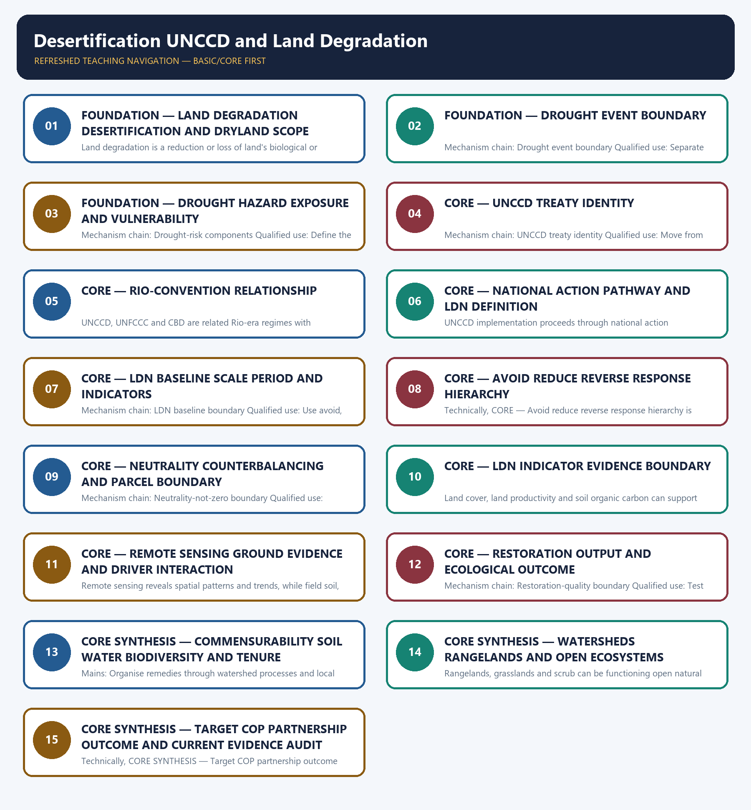

# Desertification UNCCD and Land Degradation — Learner-v2 Complete Learning Session

> **Authoring-only generation:** 2026-09-03. No PDF was rendered and no tracker or index was mutated.

### SOURCE, PROGRESSION AND CURRENT-LINKAGE AUDIT

- **Generation date:** 2026-09-03.
- **Repository-first evidence:** the Basic owner is taught first and preserved in full; the Advanced owner is retained only in the optional final teaching block.
- **OCR evidence:** Repository Markdown was primary. OCR-searchable local official General Studies papers were used only to confirm printed routed demands. No answer key, marking scheme, unsupported page precision, ecological rate, species count, pollution standard, rule threshold, mission outcome or current status was inferred.
- **Qdrant:** not used; repository Markdown and available OCR context were sufficient.
- **PYQ integrity:** Audited ledgers route the verified 2020 GS-I desertification demand and related soil and land concepts. The package does not infer an objective key, atlas statistic, national target achievement or official model answer.
- **Live-link boundary:** UNCCD pages supplied substantive treaty and LDN definitions and the avoid-reduce-reverse hierarchy. Opening negotiations and pledges were not treated as a concluded regime. No degradation extent, LDN target, restored area, drought trend, population, finance or COP outcome is asserted.
- **Fact/inference discipline:** no current-affairs item, PYQ wording, figure or quotation is invented.

### LIVE OFFICIAL-SOURCE ATTEMPT LOG

The checks below were made on 2026-09-03. Substantive official text is used only for the proposition it supports. Stubs, access failures, unrelated pages and thin landing pages are recorded and are not converted into ecological or current-status claims.

- https://www.unccd.int/convention/about-convention — attempted 2026-09-03; the official redirect supplied substantive treaty-purpose text and identified the UNCCD as the legally binding framework on desertification and drought effects.
- https://www.unccd.int/land-and-life/land-degradation-neutrality/overview — attempted 2026-09-03; substantive official text supplied the LDN definition and avoid-reduce-reverse hierarchy; headline global figures were not imported into authored anchors.
- https://www.unccd.int/news-stories/press-releases/global-response-drought-takes-center-stage-un-land-conference-riyadh — attempted 2026-09-03; substantive official text described negotiations and a partnership, but no draft, pledge or opening statement was converted into a binding drought regime or verified outcome.
- https://dolr.gov.in/ — attempted 2026-09-03; no dated topic-specific LDN progress or restoration-outcome text was retrieved for use.
- https://www.sac.gov.in/ — attempted 2026-09-03; no atlas edition, degradation extent or trend figure was imported from the general institutional route.

## BASIC LEARNING SESSION

### DEEP-REVIEW LEARNING CONTRACT

| Control | Binding rule for this package |
|---|---|
| Syllabus boundary | Complete Environment and Ecology Basic/Core is answer-complete before optional Advanced depth. |
| Ecology boundary | System boundary, scale, trophic level, stock/flow, pool/flux, gross/net, unit and time interval are explicit. |
| Species boundary | Taxon, range, habitat, population trend, IUCN assessment, Indian legal schedule, CITES/CMS listing and endemism remain distinct. |
| Law/status boundary | Act, amendment, rule, notification, draft, judgment, policy, target, implementation and observed outcome remain distinct and dated. |
| Institution boundary | Legal form, parent authority, mandate, jurisdiction, standard, consent, enforcement, science and adjudication are not conflated. |
| Treaty boundary | Membership, annex/appendix, amendment acceptance, target, COP decision, national instrument and outcome remain distinct. |
| Climate boundary | Emission flow, concentration stock, cumulative budget, forcing, scenario, baseline, unit, mitigation, adaptation, loss-and-damage, avoidance and removal are exact. |
| Pollution boundary | Source, emission/load, ambient concentration, exposure, parameter, averaging period, unit, standard and jurisdiction are explicit. |
| Causal method | Chronology, designation, expenditure, capacity, registration and correlation are not promoted into ecological or policy outcomes without mechanism and evidence. |
| Practice contract | Every solved item has demand decoding, detailed examiner-grade model, executable timed/compression plan, marks rationale and answer-specific improvement. |
| Approval | This immutable successor remains `approved: false` pending explicit approval. |

**Canonical Basic/Core owner:** `upsc-ai-kit\knowledge\Environment-and-Ecology\basic\23_Desertification-UNCCD-and-Land-Degradation.md`  
**Substantive canonical provenance owner:** `upsc-ai-kit\knowledge\Environment-and-Ecology\learning-sessions\v2\subject-wide-syllabus\environment-and-ecology-23_Learning-Session.md`  
**Optional Advanced owner:** `upsc-ai-kit\knowledge\Environment-and-Ecology\advanced\23_Desertification-UNCCD-and-Land-Degradation.md`  
**Official syllabus mapping:** `upsc-ai-kit\knowledge\Environment-and-Ecology\OFFICIAL-UPSC-SYLLABUS-MAPPING.md`

### EVIDENCE, PYQ AND CURRENT-STATUS CONTROL

- Ecological mechanisms retain direction, pool, flux, limiting factor, spatial scale and time scale.
- Current species/news claims retain taxon, source, event/publication date, assessment/listing date and access date.
- IUCN category never substitutes for Wildlife Protection Act schedule, CITES appendix, CMS appendix or endemism.
- Protected-area categories, treaty designations and institution mandates retain exact legal character.
- Acts, amendments, rules, draft instruments, notifications and judgments retain operative status and date.
- Climate figures retain unit, baseline, period, scenario and stock-flow character; global evidence is not silently downscaled to India.
- Mitigation, adaptation and loss-and-damage remain separate; allowance, offset, avoidance, removal, capture and storage remain separate.
- PYQ wording is preserved only where verified; reconstructed or routed demands remain labelled.
- **Current-status note, rechecked 2026-09-03:** volatile targets, standards, schedules, species status, treaty outcomes and programme claims retain source/date/status.

**Generation-local live/current sources:**
- `https://www.unccd.int/convention/about-convention — attempted 2026-09-03; the official redirect supplied substantive treaty-purpose text and identified the UNCCD as the legally binding framework on desertification and drought effects.`
- `https://www.unccd.int/land-and-life/land-degradation-neutrality/overview — attempted 2026-09-03; substantive official text supplied the LDN definition and avoid-reduce-reverse hierarchy; headline global figures were not imported into authored anchors.`
- `https://www.unccd.int/news-stories/press-releases/global-response-drought-takes-center-stage-un-land-conference-riyadh — attempted 2026-09-03; substantive official text described negotiations and a partnership, but no draft, pledge or opening statement was converted into a binding drought regime or verified outcome.`
- `https://dolr.gov.in/ — attempted 2026-09-03; no dated topic-specific LDN progress or restoration-outcome text was retrieved for use.`
- `https://www.sac.gov.in/ — attempted 2026-09-03; no atlas edition, degradation extent or trend figure was imported from the general institutional route.`

**Topic 26 dedicated Disaster Management cross-owners (scope boundary):**
- Not applicable to this topic.




*Distinct embedded teaching-navigation image. The separate continuous Cārvāka-style flowchart package remains an independent at-a-glance artifact.*

### SESSION 1 — FOUNDATION — LAND DEGRADATION DESERTIFICATION AND DRYLAND SCOPE

#### DEFINITION / WHAT THIS IS CALLED

**Plain-language definition:** Desertification is land degradation in arid, semi-arid and dry sub-humid areas resulting from climatic variations and human activities; it is not simply the outward spread of a sand desert.

**Technical definition:** Land degradation is a reduction or loss of land's biological or economic productivity or ecological function across land types; the driver, indicator and spatial boundary must be stated.

#### ANSWER-GRABBING OPENING — WRITE/ADAPT IN THE EXAM

> Desertification is land degradation in arid, semi-arid and dry sub-humid areas resulting from climatic variations and human activities; it is not simply the outward spread of a sand desert.

#### MUST-WRITE KEYWORDS

- **FOUNDATION**
- **Land degradation desertification**
- **dryland scope**
- **Mechanism chain**
- **Qualified use**
- **Land degradation**

**How to use them:** Frame the answer through FOUNDATION; define Land degradation desertification, connect dryland scope with Mechanism chain to explain the mechanism, and use Qualified use for the decisive comparison or qualification.

#### VISUAL FIRST

```text
LAND DEGRADATION DESERTIFICATION AND DRYLAND SCOPE
01. Land-degradation umbrella
    |
    v
02. Desertification dryland boundary
BOUNDARY -> Do not merge land degradation with desertification.
```

*This topic-specific rail fixes the evidence sequence and its exam boundary before analysis.*

#### CORE EXPLANATION

Land degradation is a reduction or loss of land's biological or economic productivity or ecological function across land types; the driver, indicator and spatial boundary must be stated. Desertification is land degradation in arid, semi-arid and dry sub-humid areas resulting from climatic variations and human activities; it is not simply the outward spread of a sand desert.

#### NAMED EVIDENCE AND MECHANISM

- Land degradation is a reduction or loss of land's biological or economic productivity or ecological function across land types; the driver, indicator and spatial boundary must be stated.
- Desertification is land degradation in arid, semi-arid and dry sub-humid areas resulting from climatic variations and human activities; it is not simply the outward spread of a sand desert.

#### EXAMINER CAUTION

- Do not merge land degradation with desertification.

#### EXAM LINK

- **Prelims:** Preserve the exact receiving medium, system boundary, measured parameter, actor, process, spatial and temporal scale, rule vintage and scientific or legal status; never turn a context-dependent pattern into a universal rule.
- **Mains:** Start with the land-degradation umbrella and narrow desertification to drylands.

#### MINI RECAP

- **Mechanism chain:** Land-degradation umbrella -> Desertification dryland boundary
- **Qualified use:** Start with the land-degradation umbrella and narrow desertification to drylands.

#### CLOSING RECALL FLOW — FOUNDATION — LAND DEGRADATION DESERTIFICATION AND DRYLAND SCOPE

```text
START / CONCEPT: FOUNDATION — Land degradation desertification and dryland scope
        |
        v
EXACT TERMS: FOUNDATION · Land degradation desertification · dryland scope · Mechanism chain · Qualified use · Land degradation
        |
        v
MECHANISM / ARGUMENT: Mechanism chain: Land-degradation umbrella - Desertification dryland boundary Qualified use: Start with the land-degradation umbrella and narrow desertification to drylands.
        |
        v
CONSEQUENCE / CONTRAST: Do not merge land degradation with desertification.
        |
        v
UPSC TRAP / ANSWER-USE: Do not miss this limiting distinction: land degradation is a reduction or loss of land's biological or economic productivity or...
        |
        v
ANSWER-GRABBING FORMULATION: Desertification is land degradation in arid, semi-arid and dry sub-humid areas resulting from climatic variations and human activities; it is not simply the outward spread of a sand desert.
```
### SESSION 2 — FOUNDATION — DROUGHT EVENT BOUNDARY

#### DEFINITION / WHAT THIS IS CALLED

**Plain-language definition:** Drought is a period of abnormal water deficit relative to local conditions and is an event or hazard, while desertification is a degradation process; one can influence the other without becoming identical.

**Technical definition:** Mechanism chain: Drought event boundary Qualified use: Separate drought hazard from exposure, vulnerability and realised loss.

#### ANSWER-GRABBING OPENING — WRITE/ADAPT IN THE EXAM

> Mechanism chain: Drought event boundary Qualified use: Separate drought hazard from exposure, vulnerability and realised loss.

#### MUST-WRITE KEYWORDS

- **FOUNDATION**
- **Drought event boundary**
- **Mechanism chain**
- **Qualified use**
- **Drought**
- **Qualified**

**How to use them:** Frame the answer through FOUNDATION; define Drought event boundary, connect Mechanism chain with Qualified use to explain the mechanism, and use Drought for the decisive comparison or qualification.

#### VISUAL FIRST

```text
DROUGHT EVENT BOUNDARY
01. Drought event boundary
BOUNDARY -> Do not define desertification as advancing sand.
```

*This topic-specific rail fixes the evidence sequence and its exam boundary before analysis.*

#### CORE EXPLANATION

Drought is a period of abnormal water deficit relative to local conditions and is an event or hazard, while desertification is a degradation process; one can influence the other without becoming identical.

#### NAMED EVIDENCE AND MECHANISM

- Drought is a period of abnormal water deficit relative to local conditions and is an event or hazard, while desertification is a degradation process; one can influence the other without becoming identical.

#### EXAMINER CAUTION

- Do not define desertification as advancing sand.

#### EXAM LINK

- **Prelims:** Preserve the exact receiving medium, system boundary, measured parameter, actor, process, spatial and temporal scale, rule vintage and scientific or legal status; never turn a context-dependent pattern into a universal rule.
- **Mains:** Separate drought hazard from exposure, vulnerability and realised loss.

#### MINI RECAP

- **Mechanism chain:** Drought event boundary
- **Qualified use:** Separate drought hazard from exposure, vulnerability and realised loss.

#### CLOSING RECALL FLOW — FOUNDATION — DROUGHT EVENT BOUNDARY

```text
START / CONCEPT: FOUNDATION — Drought event boundary
        |
        v
EXACT TERMS: FOUNDATION · Drought event boundary · Mechanism chain · Qualified use · Drought · Qualified
        |
        v
MECHANISM / ARGUMENT: Drought is a period of abnormal water deficit relative to local conditions and is an event or hazard, while desertification is a degradation process; one can influence the other without becoming identical.
        |
        v
CONSEQUENCE / CONTRAST: Do not define desertification as advancing sand.
        |
        v
UPSC TRAP / ANSWER-USE: Do not miss this limiting distinction: separate drought hazard from exposure, vulnerability and realised loss.
        |
        v
ANSWER-GRABBING FORMULATION: Mechanism chain: Drought event boundary Qualified use: Separate drought hazard from exposure, vulnerability and realised loss.
```
### SESSION 3 — FOUNDATION — DROUGHT HAZARD EXPOSURE AND VULNERABILITY

#### DEFINITION / WHAT THIS IS CALLED

**Plain-language definition:** Drought disaster risk arises from the interaction of hazard, exposure and vulnerability; rainfall deficit alone does not determine livelihood, ecosystem or economic loss.

**Technical definition:** Mechanism chain: Drought-risk components Qualified use: Define the UNCCD and distinguish its object from climate and biodiversity treaties.

#### ANSWER-GRABBING OPENING — WRITE/ADAPT IN THE EXAM

> Drought disaster risk arises from the interaction of hazard, exposure and vulnerability; rainfall deficit alone does not determine livelihood, ecosystem or economic loss.

#### MUST-WRITE KEYWORDS

- **FOUNDATION**
- **Drought hazard exposure**
- **vulnerability**
- **Mechanism chain**
- **Qualified use**
- **Drought**

**How to use them:** Frame the answer through FOUNDATION; define Drought hazard exposure, connect vulnerability with Mechanism chain to explain the mechanism, and use Qualified use for the decisive comparison or qualification.

#### VISUAL FIRST

```text
DROUGHT HAZARD EXPOSURE AND VULNERABILITY
01. Drought-risk components
BOUNDARY -> Do not merge drought events with long-term degradation.
```

*This topic-specific rail fixes the evidence sequence and its exam boundary before analysis.*

#### CORE EXPLANATION

Drought disaster risk arises from the interaction of hazard, exposure and vulnerability; rainfall deficit alone does not determine livelihood, ecosystem or economic loss.

#### NAMED EVIDENCE AND MECHANISM

- Drought disaster risk arises from the interaction of hazard, exposure and vulnerability; rainfall deficit alone does not determine livelihood, ecosystem or economic loss.

#### EXAMINER CAUTION

- Do not merge drought events with long-term degradation.

#### EXAM LINK

- **Prelims:** Preserve the exact receiving medium, system boundary, measured parameter, actor, process, spatial and temporal scale, rule vintage and scientific or legal status; never turn a context-dependent pattern into a universal rule.
- **Mains:** Define the UNCCD and distinguish its object from climate and biodiversity treaties.

#### MINI RECAP

- **Mechanism chain:** Drought-risk components
- **Qualified use:** Define the UNCCD and distinguish its object from climate and biodiversity treaties.

#### CLOSING RECALL FLOW — FOUNDATION — DROUGHT HAZARD EXPOSURE AND VULNERABILITY

```text
START / CONCEPT: FOUNDATION — Drought hazard exposure and vulnerability
        |
        v
EXACT TERMS: FOUNDATION · Drought hazard exposure · vulnerability · Mechanism chain · Qualified use · Drought
        |
        v
MECHANISM / ARGUMENT: Mechanism chain: Drought-risk components Qualified use: Define the UNCCD and distinguish its object from climate and biodiversity treaties.
        |
        v
CONSEQUENCE / CONTRAST: Do not merge drought events with long-term degradation.
        |
        v
UPSC TRAP / ANSWER-USE: Do not miss this limiting distinction: drought disaster risk arises from the interaction of hazard, exposure and vulnerability.
        |
        v
ANSWER-GRABBING FORMULATION: Drought disaster risk arises from the interaction of hazard, exposure and vulnerability; rainfall deficit alone does not determine livelihood, ecosystem or economic loss.
```
### SESSION 4 — CORE — UNCCD TREATY IDENTITY

#### DEFINITION / WHAT THIS IS CALLED

**Plain-language definition:** The UNCCD is the legally binding convention focused on desertification and the effects of drought through cooperation, national action and sustainable land management; treaty purpose is distinct from a single restoration programme.

**Technical definition:** Mechanism chain: UNCCD treaty identity Qualified use: Move from national plan to institutions, finance, participation, monitoring and outcome.

#### ANSWER-GRABBING OPENING — WRITE/ADAPT IN THE EXAM

> The UNCCD is the legally binding convention focused on desertification and the effects of drought through cooperation, national action and sustainable land management; treaty purpose is distinct from a single restoration programme.

#### MUST-WRITE KEYWORDS

- **UNCCD treaty identity**
- **Mechanism chain**
- **Qualified use**
- **The UNCCD**
- **UNCCD**
- **Qualified**

**How to use them:** Frame the answer through UNCCD treaty identity; define Mechanism chain, connect Qualified use with The UNCCD to explain the mechanism, and use UNCCD for the decisive comparison or qualification.

#### VISUAL FIRST

```text
UNCCD TREATY IDENTITY
01. UNCCD treaty identity
BOUNDARY -> Do not equate hazard with disaster risk.
```

*This topic-specific rail fixes the evidence sequence and its exam boundary before analysis.*

#### CORE EXPLANATION

The UNCCD is the legally binding convention focused on desertification and the effects of drought through cooperation, national action and sustainable land management; treaty purpose is distinct from a single restoration programme.

#### NAMED EVIDENCE AND MECHANISM

- The UNCCD is the legally binding convention focused on desertification and the effects of drought through cooperation, national action and sustainable land management; treaty purpose is distinct from a single restoration programme.

#### EXAMINER CAUTION

- Do not equate hazard with disaster risk.

#### EXAM LINK

- **Prelims:** Preserve the exact receiving medium, system boundary, measured parameter, actor, process, spatial and temporal scale, rule vintage and scientific or legal status; never turn a context-dependent pattern into a universal rule.
- **Mains:** Move from national plan to institutions, finance, participation, monitoring and outcome.

#### MINI RECAP

- **Mechanism chain:** UNCCD treaty identity
- **Qualified use:** Move from national plan to institutions, finance, participation, monitoring and outcome.

#### CLOSING RECALL FLOW — CORE — UNCCD TREATY IDENTITY

```text
START / CONCEPT: CORE — UNCCD treaty identity
        |
        v
EXACT TERMS: UNCCD treaty identity · Mechanism chain · Qualified use · The UNCCD · UNCCD · Qualified
        |
        v
MECHANISM / ARGUMENT: Mechanism chain: UNCCD treaty identity Qualified use: Move from national plan to institutions, finance, participation, monitoring and outcome.
        |
        v
CONSEQUENCE / CONTRAST: Do not equate hazard with disaster risk.
        |
        v
UPSC TRAP / ANSWER-USE: Do not miss this limiting distinction: move from national plan to institutions, finance, participation, monitoring and outcome.
        |
        v
ANSWER-GRABBING FORMULATION: The UNCCD is the legally binding convention focused on desertification and the effects of drought through cooperation, national action and sustainable land management; treaty purpose is distinct from a single restoration programme.
```
### SESSION 5 — CORE — RIO-CONVENTION RELATIONSHIP

#### DEFINITION / WHAT THIS IS CALLED

**Plain-language definition:** Mechanism chain: Rio-convention relationship Qualified use: Quote LDN as stability or increase within specified scales.

**Technical definition:** UNCCD, UNFCCC and CBD are related Rio-era regimes with interacting land, climate and biodiversity concerns, but their treaty objects, reporting systems and decisions remain separate.

#### ANSWER-GRABBING OPENING — WRITE/ADAPT IN THE EXAM

> Mechanism chain: Rio-convention relationship Qualified use: Quote LDN as stability or increase within specified scales.

#### MUST-WRITE KEYWORDS

- **Rio-convention relationship**
- **Mechanism chain**
- **Qualified use**
- **UNCCD, UNFCCC and CBD**
- **UNCCD**
- **UNFCCC**

**How to use them:** Frame the answer through Rio-convention relationship; define Mechanism chain, connect Qualified use with UNCCD, UNFCCC and CBD to explain the mechanism, and use UNCCD for the decisive comparison or qualification.

#### VISUAL FIRST

```text
RIO-CONVENTION RELATIONSHIP
01. Rio-convention relationship
BOUNDARY -> Do not reduce the UNCCD to one restoration project.
```

*This topic-specific rail fixes the evidence sequence and its exam boundary before analysis.*

#### CORE EXPLANATION

UNCCD, UNFCCC and CBD are related Rio-era regimes with interacting land, climate and biodiversity concerns, but their treaty objects, reporting systems and decisions remain separate.

#### NAMED EVIDENCE AND MECHANISM

- UNCCD, UNFCCC and CBD are related Rio-era regimes with interacting land, climate and biodiversity concerns, but their treaty objects, reporting systems and decisions remain separate.

#### EXAMINER CAUTION

- Do not reduce the UNCCD to one restoration project.

#### EXAM LINK

- **Prelims:** Preserve the exact receiving medium, system boundary, measured parameter, actor, process, spatial and temporal scale, rule vintage and scientific or legal status; never turn a context-dependent pattern into a universal rule.
- **Mains:** Quote LDN as stability or increase within specified scales.

#### MINI RECAP

- **Mechanism chain:** Rio-convention relationship
- **Qualified use:** Quote LDN as stability or increase within specified scales.

#### CLOSING RECALL FLOW — CORE — RIO-CONVENTION RELATIONSHIP

```text
START / CONCEPT: CORE — Rio-convention relationship
        |
        v
EXACT TERMS: Rio-convention relationship · Mechanism chain · Qualified use · UNCCD, UNFCCC and CBD · UNCCD · UNFCCC
        |
        v
MECHANISM / ARGUMENT: UNCCD, UNFCCC and CBD are related Rio-era regimes with interacting land, climate and biodiversity concerns, but their treaty objects, reporting systems and decisions remain separate.
        |
        v
CONSEQUENCE / CONTRAST: Do not reduce the UNCCD to one restoration project.
        |
        v
UPSC TRAP / ANSWER-USE: Do not miss this limiting distinction: quote LDN as stability or increase within specified scales.
        |
        v
ANSWER-GRABBING FORMULATION: Mechanism chain: Rio-convention relationship Qualified use: Quote LDN as stability or increase within specified scales.
```
### SESSION 6 — CORE — NATIONAL ACTION PATHWAY AND LDN DEFINITION

#### DEFINITION / WHAT THIS IS CALLED

**Plain-language definition:** Mechanism chain: National action pathway - LDN definition Qualified use: State baseline, accounting unit, period and indicators before claiming neutrality.

**Technical definition:** UNCCD implementation proceeds through national action programmes, enabling policy, participation, finance, knowledge and monitoring; submitting a plan does not prove restored land or reduced drought loss.

#### ANSWER-GRABBING OPENING — WRITE/ADAPT IN THE EXAM

> UNCCD implementation proceeds through national action programmes, enabling policy, participation, finance, knowledge and monitoring; submitting a plan does not prove restored land or reduced drought loss.

#### MUST-WRITE KEYWORDS

- **National action pathway**
- **LDN definition**
- **Mechanism chain**
- **Qualified use**
- **UNCCD**
- **Land Degradation Neutrality**

**How to use them:** Frame the answer through National action pathway; define LDN definition, connect Mechanism chain with Qualified use to explain the mechanism, and use UNCCD for the decisive comparison or qualification.

#### VISUAL FIRST

```text
NATIONAL ACTION PATHWAY AND LDN DEFINITION
01. National action pathway
    |
    v
02. LDN definition
BOUNDARY -> Do not merge the three Rio Conventions' obligations.
```

*This topic-specific rail fixes the evidence sequence and its exam boundary before analysis.*

#### CORE EXPLANATION

UNCCD implementation proceeds through national action programmes, enabling policy, participation, finance, knowledge and monitoring; submitting a plan does not prove restored land or reduced drought loss. Land Degradation Neutrality is a state in which the amount and quality of land resources needed to support ecosystem functions and services and food security remain stable or increase within specified spatial and temporal scales.

#### NAMED EVIDENCE AND MECHANISM

- UNCCD implementation proceeds through national action programmes, enabling policy, participation, finance, knowledge and monitoring; submitting a plan does not prove restored land or reduced drought loss.
- Land Degradation Neutrality is a state in which the amount and quality of land resources needed to support ecosystem functions and services and food security remain stable or increase within specified spatial and temporal scales.

#### EXAMINER CAUTION

- Do not merge the three Rio Conventions' obligations.

#### EXAM LINK

- **Prelims:** Preserve the exact receiving medium, system boundary, measured parameter, actor, process, spatial and temporal scale, rule vintage and scientific or legal status; never turn a context-dependent pattern into a universal rule.
- **Mains:** State baseline, accounting unit, period and indicators before claiming neutrality.

#### MINI RECAP

- **Mechanism chain:** National action pathway -> LDN definition
- **Qualified use:** State baseline, accounting unit, period and indicators before claiming neutrality.

#### CLOSING RECALL FLOW — CORE — NATIONAL ACTION PATHWAY AND LDN DEFINITION

```text
START / CONCEPT: CORE — National action pathway and LDN definition
        |
        v
EXACT TERMS: National action pathway · LDN definition · Mechanism chain · Qualified use · UNCCD · Land Degradation Neutrality
        |
        v
MECHANISM / ARGUMENT: Mechanism chain: National action pathway - LDN definition Qualified use: State baseline, accounting unit, period and indicators before claiming neutrality.
        |
        v
CONSEQUENCE / CONTRAST: Do not merge the three Rio Conventions' obligations.
        |
        v
UPSC TRAP / ANSWER-USE: Do not miss this limiting distinction: land Degradation Neutrality is a state in which the amount and quality of land...
        |
        v
ANSWER-GRABBING FORMULATION: UNCCD implementation proceeds through national action programmes, enabling policy, participation, finance, knowledge and monitoring; submitting a plan does not prove restored land or reduced drought loss.
```
### SESSION 7 — CORE — LDN BASELINE SCALE PERIOD AND INDICATORS

#### DEFINITION / WHAT THIS IS CALLED

**Plain-language definition:** An LDN claim requires a defined baseline, accounting unit, spatial scale, period and indicators; neutrality cannot be inferred from a national restoration announcement alone.

**Technical definition:** Mechanism chain: LDN baseline boundary Qualified use: Use avoid, reduce and reverse in that priority order.

#### ANSWER-GRABBING OPENING — WRITE/ADAPT IN THE EXAM

> An LDN claim requires a defined baseline, accounting unit, spatial scale, period and indicators; neutrality cannot be inferred from a national restoration announcement alone.

#### MUST-WRITE KEYWORDS

- **LDN baseline scale period**
- **indicators**
- **Mechanism chain**
- **Qualified use**
- **An LDN**
- **LDN**

**How to use them:** Frame the answer through LDN baseline scale period; define indicators, connect Mechanism chain with Qualified use to explain the mechanism, and use An LDN for the decisive comparison or qualification.

#### VISUAL FIRST

```text
LDN BASELINE SCALE PERIOD AND INDICATORS
01. LDN baseline boundary
BOUNDARY -> Do not treat an action plan as an achieved outcome.
```

*This topic-specific rail fixes the evidence sequence and its exam boundary before analysis.*

#### CORE EXPLANATION

An LDN claim requires a defined baseline, accounting unit, spatial scale, period and indicators; neutrality cannot be inferred from a national restoration announcement alone.

#### NAMED EVIDENCE AND MECHANISM

- An LDN claim requires a defined baseline, accounting unit, spatial scale, period and indicators; neutrality cannot be inferred from a national restoration announcement alone.

#### EXAMINER CAUTION

- Do not treat an action plan as an achieved outcome.

#### EXAM LINK

- **Prelims:** Preserve the exact receiving medium, system boundary, measured parameter, actor, process, spatial and temporal scale, rule vintage and scientific or legal status; never turn a context-dependent pattern into a universal rule.
- **Mains:** Use avoid, reduce and reverse in that priority order.

#### MINI RECAP

- **Mechanism chain:** LDN baseline boundary
- **Qualified use:** Use avoid, reduce and reverse in that priority order.

#### CLOSING RECALL FLOW — CORE — LDN BASELINE SCALE PERIOD AND INDICATORS

```text
START / CONCEPT: CORE — LDN baseline scale period and indicators
        |
        v
EXACT TERMS: LDN baseline scale period · indicators · Mechanism chain · Qualified use · An LDN · LDN
        |
        v
MECHANISM / ARGUMENT: Mechanism chain: LDN baseline boundary Qualified use: Use avoid, reduce and reverse in that priority order.
        |
        v
CONSEQUENCE / CONTRAST: Do not treat an action plan as an achieved outcome.
        |
        v
UPSC TRAP / ANSWER-USE: Mains: Use avoid, reduce and reverse in that priority order.
        |
        v
ANSWER-GRABBING FORMULATION: An LDN claim requires a defined baseline, accounting unit, spatial scale, period and indicators; neutrality cannot be inferred from a national restoration announcement alone.
```
### SESSION 8 — CORE — AVOID REDUCE REVERSE RESPONSE HIERARCHY

#### DEFINITION / WHAT THIS IS CALLED

**Plain-language definition:** Mechanism chain: Avoid-reduce-reverse hierarchy Qualified use: Explain counterbalancing while testing parcel and ecosystem equivalence.

**Technical definition:** Technically, CORE — Avoid reduce reverse response hierarchy is analysed by relating Mechanism chain to Qualified use, then testing the relationship through LDN and Qualified.

#### ANSWER-GRABBING OPENING — WRITE/ADAPT IN THE EXAM

> Mechanism chain: Avoid-reduce-reverse hierarchy Qualified use: Explain counterbalancing while testing parcel and ecosystem equivalence.

#### MUST-WRITE KEYWORDS

- **Mechanism chain**
- **Qualified use**
- **LDN**
- **Qualified**
- **CORE — Avoid reduce reverse response hierarchy**

**How to use them:** Frame the answer through Mechanism chain; define Qualified use, connect LDN with Qualified to explain the mechanism, and use CORE — Avoid reduce reverse response hierarchy for the decisive comparison or qualification.

#### VISUAL FIRST

```text
AVOID REDUCE REVERSE RESPONSE HIERARCHY
01. Avoid-reduce-reverse hierarchy
BOUNDARY -> Do not quote LDN without its spatial and temporal scale.
```

*This topic-specific rail fixes the evidence sequence and its exam boundary before analysis.*

#### CORE EXPLANATION

LDN implementation prioritises avoiding new degradation, reducing ongoing degradation through sustainable land management, and reversing past degradation through restoration or rehabilitation.

#### NAMED EVIDENCE AND MECHANISM

- LDN implementation prioritises avoiding new degradation, reducing ongoing degradation through sustainable land management, and reversing past degradation through restoration or rehabilitation.

#### EXAMINER CAUTION

- Do not quote LDN without its spatial and temporal scale.

#### EXAM LINK

- **Prelims:** Preserve the exact receiving medium, system boundary, measured parameter, actor, process, spatial and temporal scale, rule vintage and scientific or legal status; never turn a context-dependent pattern into a universal rule.
- **Mains:** Explain counterbalancing while testing parcel and ecosystem equivalence.

#### MINI RECAP

- **Mechanism chain:** Avoid-reduce-reverse hierarchy
- **Qualified use:** Explain counterbalancing while testing parcel and ecosystem equivalence.

#### CLOSING RECALL FLOW — CORE — AVOID REDUCE REVERSE RESPONSE HIERARCHY

```text
START / CONCEPT: CORE — Avoid reduce reverse response hierarchy
        |
        v
EXACT TERMS: Mechanism chain · Qualified use · LDN · Qualified · CORE — Avoid reduce reverse response hierarchy
        |
        v
MECHANISM / ARGUMENT: Do not quote LDN without its spatial and temporal scale.
        |
        v
CONSEQUENCE / CONTRAST: Mains: Explain counterbalancing while testing parcel and ecosystem equivalence.
        |
        v
UPSC TRAP / ANSWER-USE: Do not miss this limiting distinction: explain counterbalancing while testing parcel and ecosystem equivalence.
        |
        v
ANSWER-GRABBING FORMULATION: Mechanism chain: Avoid-reduce-reverse hierarchy Qualified use: Explain counterbalancing while testing parcel and ecosystem equivalence.
```
### SESSION 9 — CORE — NEUTRALITY COUNTERBALANCING AND PARCEL BOUNDARY

#### DEFINITION / WHAT THIS IS CALLED

**Plain-language definition:** LDN is a counterbalancing no-net-loss framework at a defined scale, not a promise that no parcel will degrade; gains and losses are not automatically ecologically equivalent.

**Technical definition:** Mechanism chain: Neutrality-not-zero boundary Qualified use: Combine multi-year remote-sensing trends with field evidence.

#### ANSWER-GRABBING OPENING — WRITE/ADAPT IN THE EXAM

> LDN is a counterbalancing no-net-loss framework at a defined scale, not a promise that no parcel will degrade; gains and losses are not automatically ecologically equivalent.

#### MUST-WRITE KEYWORDS

- **Neutrality counterbalancing**
- **parcel boundary**
- **Mechanism chain**
- **Qualified use**
- **LDN**
- **Neutrality-not-zero**

**How to use them:** Frame the answer through Neutrality counterbalancing; define parcel boundary, connect Mechanism chain with Qualified use to explain the mechanism, and use LDN for the decisive comparison or qualification.

#### VISUAL FIRST

```text
NEUTRALITY COUNTERBALANCING AND PARCEL BOUNDARY
01. Neutrality-not-zero boundary
BOUNDARY -> Do not infer neutrality without a baseline and indicators.
```

*This topic-specific rail fixes the evidence sequence and its exam boundary before analysis.*

#### CORE EXPLANATION

LDN is a counterbalancing no-net-loss framework at a defined scale, not a promise that no parcel will degrade; gains and losses are not automatically ecologically equivalent.

#### NAMED EVIDENCE AND MECHANISM

- LDN is a counterbalancing no-net-loss framework at a defined scale, not a promise that no parcel will degrade; gains and losses are not automatically ecologically equivalent.

#### EXAMINER CAUTION

- Do not infer neutrality without a baseline and indicators.

#### EXAM LINK

- **Prelims:** Preserve the exact receiving medium, system boundary, measured parameter, actor, process, spatial and temporal scale, rule vintage and scientific or legal status; never turn a context-dependent pattern into a universal rule.
- **Mains:** Combine multi-year remote-sensing trends with field evidence.

#### MINI RECAP

- **Mechanism chain:** Neutrality-not-zero boundary
- **Qualified use:** Combine multi-year remote-sensing trends with field evidence.

#### CLOSING RECALL FLOW — CORE — NEUTRALITY COUNTERBALANCING AND PARCEL BOUNDARY

```text
START / CONCEPT: CORE — Neutrality counterbalancing and parcel boundary
        |
        v
EXACT TERMS: Neutrality counterbalancing · parcel boundary · Mechanism chain · Qualified use · LDN · Neutrality-not-zero
        |
        v
MECHANISM / ARGUMENT: Mechanism chain: Neutrality-not-zero boundary Qualified use: Combine multi-year remote-sensing trends with field evidence.
        |
        v
CONSEQUENCE / CONTRAST: Do not infer neutrality without a baseline and indicators.
        |
        v
UPSC TRAP / ANSWER-USE: Do not miss this limiting distinction: lDN is a counterbalancing no-net-loss framework at a defined scale, not a promise that...
        |
        v
ANSWER-GRABBING FORMULATION: LDN is a counterbalancing no-net-loss framework at a defined scale, not a promise that no parcel will degrade; gains and losses are not automatically ecologically equivalent.
```
### SESSION 10 — CORE — LDN INDICATOR EVIDENCE BOUNDARY

#### DEFINITION / WHAT THIS IS CALLED

**Plain-language definition:** Mechanism chain: Indicator-evidence boundary Qualified use: Build a causal chain that allows climatic and human interactions.

**Technical definition:** Land cover, land productivity and soil organic carbon can support LDN monitoring, but each indicator has method, resolution and interpretation limits and does not alone establish every ecosystem service.

#### ANSWER-GRABBING OPENING — WRITE/ADAPT IN THE EXAM

> Land cover, land productivity and soil organic carbon can support LDN monitoring, but each indicator has method, resolution and interpretation limits and does not alone establish every ecosystem service.

#### MUST-WRITE KEYWORDS

- **LDN indicator evidence boundary**
- **Mechanism chain**
- **Qualified use**
- **Land**
- **LDN**
- **Build**

**How to use them:** Frame the answer through LDN indicator evidence boundary; define Mechanism chain, connect Qualified use with Land to explain the mechanism, and use LDN for the decisive comparison or qualification.

#### VISUAL FIRST

```text
LDN INDICATOR EVIDENCE BOUNDARY
01. Indicator-evidence boundary
BOUNDARY -> Do not reverse the avoid-reduce-reverse hierarchy.
```

*This topic-specific rail fixes the evidence sequence and its exam boundary before analysis.*

#### CORE EXPLANATION

Land cover, land productivity and soil organic carbon can support LDN monitoring, but each indicator has method, resolution and interpretation limits and does not alone establish every ecosystem service.

#### NAMED EVIDENCE AND MECHANISM

- Land cover, land productivity and soil organic carbon can support LDN monitoring, but each indicator has method, resolution and interpretation limits and does not alone establish every ecosystem service.

#### EXAMINER CAUTION

- Do not reverse the avoid-reduce-reverse hierarchy.

#### EXAM LINK

- **Prelims:** Preserve the exact receiving medium, system boundary, measured parameter, actor, process, spatial and temporal scale, rule vintage and scientific or legal status; never turn a context-dependent pattern into a universal rule.
- **Mains:** Build a causal chain that allows climatic and human interactions.

#### MINI RECAP

- **Mechanism chain:** Indicator-evidence boundary
- **Qualified use:** Build a causal chain that allows climatic and human interactions.

#### CLOSING RECALL FLOW — CORE — LDN INDICATOR EVIDENCE BOUNDARY

```text
START / CONCEPT: CORE — LDN indicator evidence boundary
        |
        v
EXACT TERMS: LDN indicator evidence boundary · Mechanism chain · Qualified use · Land · LDN · Build
        |
        v
MECHANISM / ARGUMENT: Mechanism chain: Indicator-evidence boundary Qualified use: Build a causal chain that allows climatic and human interactions.
        |
        v
CONSEQUENCE / CONTRAST: Do not reverse the avoid-reduce-reverse hierarchy.
        |
        v
UPSC TRAP / ANSWER-USE: Do not miss this limiting distinction: build a causal chain that allows climatic and human interactions.
        |
        v
ANSWER-GRABBING FORMULATION: Land cover, land productivity and soil organic carbon can support LDN monitoring, but each indicator has method, resolution and interpretation limits and does not alone establish every ecosystem service.
```
### SESSION 11 — CORE — REMOTE SENSING GROUND EVIDENCE AND DRIVER INTERACTION

#### DEFINITION / WHAT THIS IS CALLED

**Plain-language definition:** Mechanism chain: Remote-ground integration - Driver interaction Qualified use: Separate expenditure, treatment and planting outputs from functional recovery.

**Technical definition:** Remote sensing reveals spatial patterns and trends, while field soil, water, vegetation and livelihood evidence tests ecological meaning; one image or one season cannot establish a persistent process.

#### ANSWER-GRABBING OPENING — WRITE/ADAPT IN THE EXAM

> Remote sensing reveals spatial patterns and trends, while field soil, water, vegetation and livelihood evidence tests ecological meaning; one image or one season cannot establish a persistent process.

#### MUST-WRITE KEYWORDS

- **Remote sensing ground evidence**
- **driver interaction**
- **Mechanism chain**
- **Qualified use**
- **Remote**
- **Climatic**

**How to use them:** Frame the answer through Remote sensing ground evidence; define driver interaction, connect Mechanism chain with Qualified use to explain the mechanism, and use Remote for the decisive comparison or qualification.

#### VISUAL FIRST

```text
REMOTE SENSING GROUND EVIDENCE AND DRIVER INTERACTION
01. Remote-ground integration
    |
    v
02. Driver interaction
BOUNDARY -> Do not interpret LDN as zero degradation on every parcel.
```

*This topic-specific rail fixes the evidence sequence and its exam boundary before analysis.*

#### CORE EXPLANATION

Remote sensing reveals spatial patterns and trends, while field soil, water, vegetation and livelihood evidence tests ecological meaning; one image or one season cannot establish a persistent process. Climatic variability, vegetation removal, overgrazing, erosion, salinisation, unsustainable cultivation and water use can interact; national degradation totals do not imply one uniform cause.

#### NAMED EVIDENCE AND MECHANISM

- Remote sensing reveals spatial patterns and trends, while field soil, water, vegetation and livelihood evidence tests ecological meaning; one image or one season cannot establish a persistent process.
- Climatic variability, vegetation removal, overgrazing, erosion, salinisation, unsustainable cultivation and water use can interact; national degradation totals do not imply one uniform cause.

#### EXAMINER CAUTION

- Do not interpret LDN as zero degradation on every parcel.

#### EXAM LINK

- **Prelims:** Preserve the exact receiving medium, system boundary, measured parameter, actor, process, spatial and temporal scale, rule vintage and scientific or legal status; never turn a context-dependent pattern into a universal rule.
- **Mains:** Separate expenditure, treatment and planting outputs from functional recovery.

#### MINI RECAP

- **Mechanism chain:** Remote-ground integration -> Driver interaction
- **Qualified use:** Separate expenditure, treatment and planting outputs from functional recovery.

#### CLOSING RECALL FLOW — CORE — REMOTE SENSING GROUND EVIDENCE AND DRIVER INTERACTION

```text
START / CONCEPT: CORE — Remote sensing ground evidence and driver interaction
        |
        v
EXACT TERMS: Remote sensing ground evidence · driver interaction · Mechanism chain · Qualified use · Remote · Climatic
        |
        v
MECHANISM / ARGUMENT: Mechanism chain: Remote-ground integration - Driver interaction Qualified use: Separate expenditure, treatment and planting outputs from functional recovery.
        |
        v
CONSEQUENCE / CONTRAST: Climatic variability, vegetation removal, overgrazing, erosion, salinisation, unsustainable cultivation and water use can interact; national degradation totals do not imply one uniform cause.
        |
        v
UPSC TRAP / ANSWER-USE: Do not interpret LDN as zero degradation on every parcel.
        |
        v
ANSWER-GRABBING FORMULATION: Remote sensing reveals spatial patterns and trends, while field soil, water, vegetation and livelihood evidence tests ecological meaning; one image or one season cannot establish a persistent process.
```
### SESSION 12 — CORE — RESTORATION OUTPUT AND ECOLOGICAL OUTCOME

#### DEFINITION / WHAT THIS IS CALLED

**Plain-language definition:** Area treated, trees planted, money spent and ecological recovery are different outputs or outcomes; restoration quality requires function, native-system suitability, persistence and livelihood evidence.

**Technical definition:** Mechanism chain: Restoration-quality boundary Qualified use: Test soil, hydrology, biodiversity, tenure and livelihood substitutability.

#### ANSWER-GRABBING OPENING — WRITE/ADAPT IN THE EXAM

> Area treated, trees planted, money spent and ecological recovery are different outputs or outcomes; restoration quality requires function, native-system suitability, persistence and livelihood evidence.

#### MUST-WRITE KEYWORDS

- **Restoration output**
- **ecological outcome**
- **Mechanism chain**
- **Qualified use**
- **Area**
- **Restoration-quality**

**How to use them:** Frame the answer through Restoration output; define ecological outcome, connect Mechanism chain with Qualified use to explain the mechanism, and use Area for the decisive comparison or qualification.

#### VISUAL FIRST

```text
RESTORATION OUTPUT AND ECOLOGICAL OUTCOME
01. Restoration-quality boundary
BOUNDARY -> Do not treat one indicator as complete ecological proof.
```

*This topic-specific rail fixes the evidence sequence and its exam boundary before analysis.*

#### CORE EXPLANATION

Area treated, trees planted, money spent and ecological recovery are different outputs or outcomes; restoration quality requires function, native-system suitability, persistence and livelihood evidence.

#### NAMED EVIDENCE AND MECHANISM

- Area treated, trees planted, money spent and ecological recovery are different outputs or outcomes; restoration quality requires function, native-system suitability, persistence and livelihood evidence.

#### EXAMINER CAUTION

- Do not treat one indicator as complete ecological proof.

#### EXAM LINK

- **Prelims:** Preserve the exact receiving medium, system boundary, measured parameter, actor, process, spatial and temporal scale, rule vintage and scientific or legal status; never turn a context-dependent pattern into a universal rule.
- **Mains:** Test soil, hydrology, biodiversity, tenure and livelihood substitutability.

#### MINI RECAP

- **Mechanism chain:** Restoration-quality boundary
- **Qualified use:** Test soil, hydrology, biodiversity, tenure and livelihood substitutability.

#### CLOSING RECALL FLOW — CORE — RESTORATION OUTPUT AND ECOLOGICAL OUTCOME

```text
START / CONCEPT: CORE — Restoration output and ecological outcome
        |
        v
EXACT TERMS: Restoration output · ecological outcome · Mechanism chain · Qualified use · Area · Restoration-quality
        |
        v
MECHANISM / ARGUMENT: Mechanism chain: Restoration-quality boundary Qualified use: Test soil, hydrology, biodiversity, tenure and livelihood substitutability.
        |
        v
CONSEQUENCE / CONTRAST: Do not treat one indicator as complete ecological proof.
        |
        v
UPSC TRAP / ANSWER-USE: Do not miss this limiting distinction: area treated, trees planted, money spent and ecological recovery are different outputs or outcomes.
        |
        v
ANSWER-GRABBING FORMULATION: Area treated, trees planted, money spent and ecological recovery are different outputs or outcomes; restoration quality requires function, native-system suitability, persistence and livelihood evidence.
```
### SESSION 13 — CORE SYNTHESIS — COMMENSURABILITY SOIL WATER BIODIVERSITY AND TENURE

#### DEFINITION / WHAT THIS IS CALLED

**Plain-language definition:** Mechanism chain: Commensurability limit Qualified use: Organise remedies through watershed processes and local land use.

**Technical definition:** Mains: Organise remedies through watershed processes and local land use.

#### ANSWER-GRABBING OPENING — WRITE/ADAPT IN THE EXAM

> Mechanism chain: Commensurability limit Qualified use: Organise remedies through watershed processes and local land use.

#### MUST-WRITE KEYWORDS

- **CORE SYNTHESIS**
- **Commensurability soil water biodiversity**
- **tenure**
- **Mechanism chain**
- **Qualified use**
- **Organise**

**How to use them:** Frame the answer through CORE SYNTHESIS; define Commensurability soil water biodiversity, connect tenure with Mechanism chain to explain the mechanism, and use Qualified use for the decisive comparison or qualification.

#### VISUAL FIRST

```text
COMMENSURABILITY SOIL WATER BIODIVERSITY AND TENURE
01. Commensurability limit
BOUNDARY -> Do not infer a persistent trend from one image or season.
```

*This topic-specific rail fixes the evidence sequence and its exam boundary before analysis.*

#### CORE EXPLANATION

Restoration gains elsewhere may not replace the soil, hydrology, biodiversity, tenure or livelihood functions lost at the degraded site, so LDN accounting needs safeguards beyond aggregate area.

#### NAMED EVIDENCE AND MECHANISM

- Restoration gains elsewhere may not replace the soil, hydrology, biodiversity, tenure or livelihood functions lost at the degraded site, so LDN accounting needs safeguards beyond aggregate area.

#### EXAMINER CAUTION

- Do not infer a persistent trend from one image or season.

#### EXAM LINK

- **Prelims:** Preserve the exact receiving medium, system boundary, measured parameter, actor, process, spatial and temporal scale, rule vintage and scientific or legal status; never turn a context-dependent pattern into a universal rule.
- **Mains:** Organise remedies through watershed processes and local land use.

#### MINI RECAP

- **Mechanism chain:** Commensurability limit
- **Qualified use:** Organise remedies through watershed processes and local land use.

#### CLOSING RECALL FLOW — CORE SYNTHESIS — COMMENSURABILITY SOIL WATER BIODIVERSITY AND TENURE

```text
START / CONCEPT: CORE SYNTHESIS — Commensurability soil water biodiversity and tenure
        |
        v
EXACT TERMS: CORE SYNTHESIS · Commensurability soil water biodiversity · tenure · Mechanism chain · Qualified use · Organise
        |
        v
MECHANISM / ARGUMENT: Mains: Organise remedies through watershed processes and local land use.
        |
        v
CONSEQUENCE / CONTRAST: Do not infer a persistent trend from one image or season.
        |
        v
UPSC TRAP / ANSWER-USE: Do not miss this limiting distinction: organise remedies through watershed processes and local land use.
        |
        v
ANSWER-GRABBING FORMULATION: Mechanism chain: Commensurability limit Qualified use: Organise remedies through watershed processes and local land use.
```
### SESSION 14 — CORE SYNTHESIS — WATERSHEDS RANGELANDS AND OPEN ECOSYSTEMS

#### DEFINITION / WHAT THIS IS CALLED

**Plain-language definition:** Mechanism chain: Watershed response chain - Rangeland and open-ecosystem boundary Qualified use: Recognise functioning open ecosystems before prescribing afforestation.

**Technical definition:** Rangelands, grasslands and scrub can be functioning open natural ecosystems; classifying them as wasteland or afforesting them indiscriminately can create a false restoration claim.

#### ANSWER-GRABBING OPENING — WRITE/ADAPT IN THE EXAM

> Mechanism chain: Watershed response chain - Rangeland and open-ecosystem boundary Qualified use: Recognise functioning open ecosystems before prescribing afforestation.

#### MUST-WRITE KEYWORDS

- **CORE SYNTHESIS**
- **Watersheds rangelands**
- **open ecosystems**
- **Mechanism chain**
- **Qualified use**
- **Dryland**

**How to use them:** Frame the answer through CORE SYNTHESIS; define Watersheds rangelands, connect open ecosystems with Mechanism chain to explain the mechanism, and use Qualified use for the decisive comparison or qualification.

#### VISUAL FIRST

```text
WATERSHEDS RANGELANDS AND OPEN ECOSYSTEMS
01. Watershed response chain
    |
    v
02. Rangeland and open-ecosystem boundary
BOUNDARY -> Do not attribute all degradation to one driver.
```

*This topic-specific rail fixes the evidence sequence and its exam boundary before analysis.*

#### CORE EXPLANATION

Dryland response links soil cover, infiltration, runoff control, groundwater demand, crop or grazing choice and local institutions; tree planting alone is not a universal remedy. Rangelands, grasslands and scrub can be functioning open natural ecosystems; classifying them as wasteland or afforesting them indiscriminately can create a false restoration claim.

#### NAMED EVIDENCE AND MECHANISM

- Dryland response links soil cover, infiltration, runoff control, groundwater demand, crop or grazing choice and local institutions; tree planting alone is not a universal remedy.
- Rangelands, grasslands and scrub can be functioning open natural ecosystems; classifying them as wasteland or afforesting them indiscriminately can create a false restoration claim.

#### EXAMINER CAUTION

- Do not attribute all degradation to one driver.

#### EXAM LINK

- **Prelims:** Preserve the exact receiving medium, system boundary, measured parameter, actor, process, spatial and temporal scale, rule vintage and scientific or legal status; never turn a context-dependent pattern into a universal rule.
- **Mains:** Recognise functioning open ecosystems before prescribing afforestation.

#### MINI RECAP

- **Mechanism chain:** Watershed response chain -> Rangeland and open-ecosystem boundary
- **Qualified use:** Recognise functioning open ecosystems before prescribing afforestation.

#### CLOSING RECALL FLOW — CORE SYNTHESIS — WATERSHEDS RANGELANDS AND OPEN ECOSYSTEMS

```text
START / CONCEPT: CORE SYNTHESIS — Watersheds rangelands and open ecosystems
        |
        v
EXACT TERMS: CORE SYNTHESIS · Watersheds rangelands · open ecosystems · Mechanism chain · Qualified use · Dryland
        |
        v
MECHANISM / ARGUMENT: Rangelands, grasslands and scrub can be functioning open natural ecosystems; classifying them as wasteland or afforesting them indiscriminately can create a false restoration claim.
        |
        v
CONSEQUENCE / CONTRAST: Dryland response links soil cover, infiltration, runoff control, groundwater demand, crop or grazing choice and local institutions; tree planting alone is not a universal remedy.
        |
        v
UPSC TRAP / ANSWER-USE: Do not attribute all degradation to one driver.
        |
        v
ANSWER-GRABBING FORMULATION: Mechanism chain: Watershed response chain - Rangeland and open-ecosystem boundary Qualified use: Recognise functioning open ecosystems before prescribing afforestation.
```
### SESSION 15 — CORE SYNTHESIS — TARGET COP PARTNERSHIP OUTCOME AND CURRENT EVIDENCE AUDIT

#### DEFINITION / WHAT THIS IS CALLED

**Plain-language definition:** A national LDN target, COP declaration, partnership, finance pledge, project approval and verified land or drought outcome are separate statuses and must be attributed precisely.

**Technical definition:** Technically, CORE SYNTHESIS — Target COP partnership outcome and current evidence audit is analysed by relating CORE SYNTHESIS to Target COP partnership outcome, then testing the relationship through current evidence audit and Mechanism chain.

#### ANSWER-GRABBING OPENING — WRITE/ADAPT IN THE EXAM

> A national LDN target, COP declaration, partnership, finance pledge, project approval and verified land or drought outcome are separate statuses and must be attributed precisely.

#### MUST-WRITE KEYWORDS

- **CORE SYNTHESIS**
- **Target COP partnership outcome**
- **current evidence audit**
- **Mechanism chain**
- **Qualified use**
- **Subject**

**How to use them:** Frame the answer through CORE SYNTHESIS; define Target COP partnership outcome, connect current evidence audit with Mechanism chain to explain the mechanism, and use Qualified use for the decisive comparison or qualification.

#### VISUAL FIRST

```text
TARGET COP PARTNERSHIP OUTCOME AND CURRENT EVIDENCE AUDIT
01. Target-decision-outcome boundary
    |
    v
02. Current evidence boundary
BOUNDARY -> Do not merge area treated or trees planted with recovery.
```

*This topic-specific rail fixes the evidence sequence and its exam boundary before analysis.*

#### CORE EXPLANATION

A national LDN target, COP declaration, partnership, finance pledge, project approval and verified land or drought outcome are separate statuses and must be attributed precisely. Land-degradation extent, LDN targets, restored area, drought trends, affected population, finance and COP outcomes require a dated official atlas, UNCCD decision or national report; scheduled negotiations are not outcomes.

#### NAMED EVIDENCE AND MECHANISM

- A national LDN target, COP declaration, partnership, finance pledge, project approval and verified land or drought outcome are separate statuses and must be attributed precisely.
- Land-degradation extent, LDN targets, restored area, drought trends, affected population, finance and COP outcomes require a dated official atlas, UNCCD decision or national report; scheduled negotiations are not outcomes.

#### EXAMINER CAUTION

- Do not merge area treated or trees planted with recovery.

#### EXAM LINK

- **Prelims:** Preserve the exact receiving medium, system boundary, measured parameter, actor, process, spatial and temporal scale, rule vintage and scientific or legal status; never turn a context-dependent pattern into a universal rule.
- **Mains:** Close with dated official targets, decisions, atlases and outcomes.

#### MINI RECAP

- **Mechanism chain:** Target-decision-outcome boundary -> Current evidence boundary
- **Qualified use:** Close with dated official targets, decisions, atlases and outcomes.
#### COMPLETE BASIC OWNER EVIDENCE BANK

> **Subject:** Environment and Ecology | **Tier:** Must-Do (foundation) | **GS Paper:** GS-III (Environment) + Prelims, with Geography linkage.
> **Core area:** Land-degradation science and multilateral governance.
> **Grounded in:** United Nations Convention to Combat Desertification (UNCCD, 1994) official framework; UNCCD COP14 (New Delhi, 2019) outcomes; audited UPSC Environment PYQs (2024-2026 Prelims and 2024-2025 Mains).
> ✅ = source-grounded | ⚠️ = analytical linkage | 📰 = dated current-affairs anchor.
> *Companion: `advanced/23_Desertification-UNCCD-and-Land-Degradation.md`.*

#### 1. Visual foundation

```text
DESERTIFICATION vs LAND DEGRADATION vs DROUGHT - THREE DISTINCT BUT RELATED CONCEPTS

Land degradation  -> reduction/loss of biological or economic productivity of land (general)
Desertification   -> LAND DEGRADATION specifically in DRYLANDS (arid, semi-arid,
                       dry sub-humid areas), from climatic variations AND human activities
Drought            -> a naturally occurring, TEMPORARY climatic phenomenon (below-normal
                       precipitation), distinct from the more persistent, often human-driven
                       process of desertification

LAND DEGRADATION NEUTRALITY (LDN) - the UNCCD's target framework:
   amount and quality of land resources needed to support ecosystem functions/services
   remains STABLE or INCREASES over a specified time/spatial scale
```

**Core proposition:** Desertification is a specific subset of land degradation occurring in
drylands, distinct from drought (a temporary climatic event); the UNCCD's Land Degradation
Neutrality framework provides the current global target-setting mechanism translating this
distinction into measurable national commitments — precise definitional accuracy here is
frequently tested.

#### 2. Essential definitions

| Concept | Exam-ready meaning |
|---|---|
| ✅ **Land degradation** | Reduction or loss of the biological or economic productivity of land, from any cause, in any land type. |
| ✅ **Desertification** | Land degradation specifically in arid, semi-arid and dry sub-humid areas (drylands), resulting from climatic variations and human activities. |
| ✅ **Drought** | A naturally occurring phenomenon of significantly below-normal precipitation over a period, a temporary climatic condition distinct from the longer-term process of desertification. |
| ✅ **UNCCD (1994)** | United Nations Convention to Combat Desertification — the multilateral treaty addressing desertification, land degradation and drought, particularly in Africa. |
| ✅ **Land Degradation Neutrality (LDN)** | A UNCCD target framework (endorsed globally, linked to Sustainable Development Goal 15.3) under which the amount and quality of land resources remains stable or improves over a defined time and spatial scale. |
| ✅ **Bonn Challenge** | A global voluntary effort (not a UNCCD instrument itself, but aligned with its goals) to bring degraded and deforested land into restoration, which India has committed to under its own restoration pledges. |

#### 3. Topic mechanism

1. Desertification results from the interaction of natural climatic variability (e.g.,
   rainfall variability in drylands) with human activities such as overgrazing, deforestation,
   unsustainable agricultural practices, and unsustainable water use — it is not caused by
   climate alone or human activity alone, but their combination in already fragile dryland
   ecosystems.
2. The UNCCD (1994), one of the three Rio Conventions (alongside the UNFCCC and CBD, all
   originating from the 1992 Rio Earth Summit), specifically addresses this dryland-focused
   land-degradation problem through national action programmes and international
   cooperation, with particular historical attention to Africa's Sahel region.
3. Land Degradation Neutrality (LDN), the UNCCD's current core target framework, is
   operationalised through a "counterbalancing mechanism" — anticipated land-degradation
   losses in one area/activity are offset by land-restoration/rehabilitation gains elsewhere,
   aiming for a net-zero (neutral) land-degradation outcome at the national level.
4. UNCCD member countries, including India, set voluntary national LDN targets and report
   progress, similar in structural logic to the NDC mechanism under the Paris Agreement
   (voluntary, nationally determined, but subject to periodic international review).
5. India hosted UNCCD's 14th Conference of the Parties (COP14) in New Delhi (2019), where it
   announced enhanced land-restoration commitments, reflecting its active role in this
   Rio Convention alongside its engagement with the UNFCCC and CBD.

#### 4. Institutions and policy tools

- ✅ **UNCCD Secretariat (Bonn, Germany):** administers the Convention and its Conference of
  the Parties.
- ✅ **MoEFCC / Department of Land Resources:** coordinate India's UNCCD implementation and
  national LDN target-setting.
- ✅ **Indian Council of Forestry Research and Education (ICFRE) / Indian Space Research
  Organisation (ISRO):** contribute land-degradation mapping (e.g., via remote-sensing-based
  desertification/land-degradation atlases).
- ⚠️ State-level watershed-development and soil-conservation programmes are key domestic
  implementation vehicles for India's land-restoration commitments.

#### 5. Indian applications and examples

- ⚠️ The Thar Desert (Rajasthan) and adjoining semi-arid tracts illustrate India's most
  extensive dryland/desertification-prone zone, requiring dedicated land- and water-
  management strategies.
- ⚠️ India's watershed-development and integrated dryland-farming programmes exemplify
  domestic responses combining soil-and-water conservation with sustainable agricultural
  livelihoods in degradation-prone regions.
- ⚠️ India's hosting of UNCCD COP14 (2019) in New Delhi and its associated enhanced
  restoration pledges reflect a significant diplomatic and policy commitment to the Land
  Degradation Neutrality agenda.

#### 6. Must-Know Facts for Prelims

- ✅ Desertification refers specifically to land degradation in drylands (arid, semi-arid,
  dry sub-humid areas); land degradation is the broader, more general term.
- ✅ Drought is a temporary climatic phenomenon, distinct from desertification, which is a
  longer-term degradation process.
- ✅ The UNCCD (1994) is one of the three Rio Conventions, alongside the UNFCCC and the CBD,
  all stemming from the 1992 Rio Earth Summit.
- ✅ Land Degradation Neutrality (LDN) is linked to Sustainable Development Goal 15.3 and
  operates through a counterbalancing (loss-offset-by-restoration-gain) mechanism.
- ✅ India hosted UNCCD's 14th Conference of the Parties (COP14) in New Delhi in 2019.
- ✅ **UNCCD COP17: Ulaanbaatar, Mongolia, 17-28 August 2026**, theme **"Restoring Land.
  Restoring Hope"**; the Convention has **197 Parties**.
- ✅ **2026 is the UN International Year of Rangelands and Pastoralists (IYRP)** — rangelands
  cover more than half the Earth's land surface, support roughly 500 million people's
  livelihoods, and supply about one-sixth of global nutrition.
- ✅ UNCCD's current framing is that **up to 40% of the world's land** is already degraded.
- ✅ The UNCCD is the **only Rio Convention with a specific regional-annex structure**, giving
  particular attention to Africa — which is why its founding text names Africa explicitly
  while the UNFCCC and CBD do not name any region.

#### 7. UPSC traps

- ❌ Desertification means the physical spread/advance of existing deserts into new
  territory. -> It refers to land-degradation processes occurring within existing drylands,
  not literal geographic expansion of sand-desert landscapes.
- ❌ Drought and desertification are the same phenomenon. -> Drought is a temporary climatic
  event; desertification is a longer-term degradation process resulting from combined
  climatic and human factors.
- ❌ The UNCCD is not one of the Rio Conventions. -> It is one of the three Rio Conventions,
  alongside the UNFCCC and CBD.
- ❌ Land Degradation Neutrality requires zero land degradation anywhere. -> It allows for a
  counterbalancing mechanism where degradation in one area is offset by restoration gains
  elsewhere, aiming for a net-neutral outcome.
- ❌ India has never hosted a major UNCCD event. -> India hosted UNCCD COP14 in New Delhi in
  2019.

#### 8. 📰 Current anchor

- 📰 **UNCCD COP17 is scheduled for Ulaanbaatar, Mongolia, 17-28 August 2026**, under the
  theme **"Restoring Land. Restoring Hope."** It will bring together delegates from the
  UNCCD's **197 Parties**. (Source: unccd.int, verified **2 August 2026** — this is an
  *upcoming* session; do not attribute outcomes to it until they are adopted.)
- 📰 UNCCD's own headline framing for COP17: **land degradation is already affecting up to
  40% of the world's land**, with consequences for food production, water availability,
  livelihoods and economic stability. Mongolia, the host, has **~77% of its land degraded**
  across a territory of 1.56 million sq km, and runs a President-led **"Billion Trees"
  campaign** (launched 2021, targeting one billion trees by 2030).
- 📰 **2026 is the UN International Year of Rangelands and Pastoralists (IYRP)**, declared by
  the UN General Assembly and championed by Mongolia. Rangelands cover **more than half of
  the Earth's land surface**, support the direct livelihoods of around **500 million people**
  and provide about **one-sixth of the world's nutrition** — yet remain among the most
  overlooked and increasingly degraded ecosystems. ⚠️ This is the single most useful 2026
  hook for this topic, and it connects directly to the **Open Natural Ecosystems** argument
  in `advanced/03` — India's grasslands are rangelands, administratively recorded as
  "wasteland".
- 📰 **UNCCD COP16, Riyadh (December 2024):** advanced negotiations toward
  a global drought regime and launched the Riyadh Global Drought Resilience
  Partnership. This is a process/partnership outcome—not a completed binding
  drought treaty. [UNCCD source](https://www.unccd.int/news-stories/press-releases/global-response-drought-takes-center-stage-un-land-conference-riyadh).

- 📰 India's enhanced land-restoration commitments announced around UNCCD COP14 (New Delhi,
  2019) remain the current reference point for its domestic Land Degradation Neutrality
  target; verify the latest progress-reporting figures against the most recent Department
  of Land Resources/ISRO desertification-and-land-degradation-atlas update before citing a
  specific restored-area figure.

⚠️ **Interpretation caution:** national desertification/land-degradation extent figures for
India are periodically updated through remote-sensing-based atlases — cite the specific
atlas edition and year rather than a static historical figure. Distinguish also a
**scheduled COP** (COP17, August 2026) from a **concluded COP** (COP16, Riyadh, 2024) — only
the latter has outcomes to cite.

#### 9. PYQ application

- ⚠️ Recurring Prelims pattern: precisely distinguish desertification, land degradation and
  drought, and identify the UNCCD as one of the three Rio Conventions.
- ✅ **UPSC Mains 2024, Essay (Section A): "Forests precede civilizations and deserts follow
  them."** This topic owns the second half of that essay. The disciplined treatment
  distinguishes **desertification** (degradation *within* drylands) from the popular image of
  advancing sand — the essay's metaphor is about *civilisational* land exhaustion, and the
  precise definitional correction is itself a scoring point. Pair with Topic 03 (succession
  thresholds) and Topic 11 (forest classification).
- ⚠️ Mains linkage: the Land Degradation Neutrality framework is used to argue for
  integrated soil-water-livelihood strategies in India's dryland regions.

#### 10. Mains angles

- ⚠️ Argue that desertification, arising from the interaction of climatic variability and
  human land-use pressure, requires integrated responses (sustainable agriculture, water
  management, afforestation) rather than a single-cause, single-solution framing.
- ⚠️ Use India's UNCCD COP14 hosting and enhanced restoration pledges to argue for its active
  leadership role across all three Rio Conventions (UNFCCC, CBD, UNCCD), not just climate
  negotiations.
- ⚠️ Conclude with an integrated-landscape-restoration thesis: Land Degradation Neutrality
  targets are credible only when backed by robust land-use monitoring and genuine
  restoration quality (echoing the ecological-restoration-quality critique from Topics 03
  and 12).

> **Answer thesis:** Precisely distinguish desertification (dryland-specific land degradation) from drought (a temporary climatic event) and from land degradation generally, and treat India's Land Degradation Neutrality commitments as credible only when backed by robust monitoring and genuine (not merely counted) restoration quality.

#### 11. Probable questions

- ⚠️ **Prelims:** Distinguish desertification, land degradation and drought precisely.
- ⚠️ **Mains (10 marks):** Explain the Land Degradation Neutrality framework and its
  relevance to India's dryland regions.
- ⚠️ **Mains (15 marks):** Discuss India's role in the UNCCD, including its COP14 hosting,
  and evaluate its land-restoration commitments.

#### 12. Study links

- ✅ Advanced companion: `advanced/23_Desertification-UNCCD-and-Land-Degradation.md`.
- ✅ `03_Ecological-Succession-and-Biomes.md` — the ecological-restoration-quality standard
  relevant to land-restoration claims.
- ✅ `22_Multilateral-Environmental-Conventions-CBD-Basel-Stockholm-Montreal.md` — the other
  Rio Conventions this treaty is grouped with.
- ✅ Geography companion: `Geography/basic/07_Arid-Desert-Landforms.md` — the physical-
  geography basis of dryland/desert landscapes.

#### 13. Core answer architecture (10/15/20-mark support)

##### 13.1 Demand decoder and thesis

- Define **land degradation**, then narrow to **desertification in drylands**, and keep **drought** as a temporary climatic event. Only then bring in UNCCD/LDN.
- **Thesis:** LDN is a useful national planning framework, but “neutrality” is credible only when restoration quality, local water/soil processes and livelihood effects are monitored, not merely offset on a map.

##### 13.2 Reusable evidence units

| Claim | Named evidence/example → significance | Qualification |
|---|---|---|
| Dryland degradation is multi-causal. | **Thar/semi-arid landscapes: rainfall variability + grazing/vegetation loss + unsustainable water/soil use** → calls for watershed and livelihood, not tree-only, responses. | Do not say desertification is literal expansion of sand or climate alone. |
| LDN has a structural offset limit. | **LDN counterbalancing and CAMPA comparison** → restoration elsewhere may not replace soil, biodiversity or water functions lost at the original site. | This is a quality critique, not a claim that every offset is invalid. |
| Future COP information is not an outcome. | **UNCCD COP17, Ulaanbaatar, 17–28 August 2026** → a scheduled agenda anchor. | As of this audit date it is scheduled, not concluded; attribute no decision or target outcome to it. |

##### 13.3 Essay and mark-scaled spines

- **10 marks:** definitions → causal chain → dryland-specific remedies.
- **15/20 marks:** add UNCCD/LDN, remote-sensing-plus-ground-truthing, watershed/agroecology/rangeland governance and an area-versus-function verdict.
- For the forests–deserts essay, pair this topic with succession/forest governance: civilisation can exhaust soil/water and expose drylands, but deserts also have natural climatic/geographic causes and open ecosystems must not be “restored” through indiscriminate afforestation.

<!-- BEGIN GENERATED PYQ INTEGRATION: 2018-2023 -->

#### Historical PYQ Integration (2018-2023)

> **Status:** Question-level PYQ demand is integrated into this owner.
> **Provenance:** Audited local official-paper routing ledgers: `_PYQ-ROUTING-MAINS-GS1-GS2-ESSAY-2018-2023.md`, `_PYQ-ROUTING-PRELIMS-2018-2023.md`.
> **Answer-key rule:** The official 2018-2023 Prelims/CSAT keys are not held locally; no option or answer has been inferred.

- **Years represented:** 2018, 2020
- **Paper(s):** GS-I, Prelims GS-I
- **Routed question demands:** 2

| Year | Paper | Q | PYQ demand (neutral rendering) | Directive / format | Source status | Owner requirement |
|---:|---|---:|---|---|---|---|
| 2018 | Prelims GS-I | 82 | Agricultural soil organic matter sulfur cycle and salinization | Objective question; official key unavailable locally | Routed; key unavailable locally | Cover the named fact/concept and its likely statement-level distinctions. |
| 2020 | GS-I | 5 | Desertification as a process without climatic boundaries | Justify with examples · 10 marks · 150 words | Routed to owning topic | Prepare context, core dimensions, evidence/examples, counterpoint and a concise conclusion. |

##### What this owner must now support

- Agricultural soil organic matter sulfur cycle and salinization
- Desertification as a process without climatic boundaries

> The table integrates the examinable demand and paper metadata. It does not turn an unkeyed objective question into a solved answer, and it does not claim that lexical presence alone proves full conceptual sufficiency.
<!-- END GENERATED PYQ INTEGRATION: 2018-2023 -->

#### CLOSING RECALL FLOW — CORE SYNTHESIS — TARGET COP PARTNERSHIP OUTCOME AND CURRENT EVIDENCE AUDIT

```text
START / CONCEPT: CORE SYNTHESIS — Target COP partnership outcome and current evidence audit
        |
        v
EXACT TERMS: CORE SYNTHESIS · Target COP partnership outcome · current evidence audit · Mechanism chain · Qualified use · Subject
        |
        v
MECHANISM / ARGUMENT: Mechanism chain: Target-decision-outcome boundary - Current evidence boundary Qualified use: Close with dated official targets, decisions, atlases and outcomes.
        |
        v
CONSEQUENCE / CONTRAST: Land-degradation extent, LDN targets, restored area, drought trends, affected population, finance and COP outcomes require a dated official atlas, UNCCD decision or national report; scheduled negotiations are not outcomes.
        |
        v
UPSC TRAP / ANSWER-USE: This is a process/partnership outcome—not a completed binding drought treaty.
        |
        v
ANSWER-GRABBING FORMULATION: A national LDN target, COP declaration, partnership, finance pledge, project approval and verified land or drought outcome are separate statuses and must be attributed precisely.
```
### ENVIRONMENT AND ECOLOGY DEEP-REVIEW CORE CONTROL

- **Must remember:** UNCCD addresses desertification, land degradation and drought through national action, drought resilience and land-degradation neutrality, which balances quantified losses and gains within a defined spatial and temporal frame.
- **Close distinction:** Desertification is not desert expansion, land degradation neutrality is not zero degradation everywhere, restoration area is not verified functional recovery, and global land figures cannot be asserted for India.
- **Mechanism / status / evidence limit:** State definition, baseline, indicator, geography, target/status and source date; distinguish pledge, mapped degradation, intervention, monitored gain and net outcome.

### CLOSING SEMANTIC LEDGER A — WATER, GRANT FORMS, INTERMEDIARIES AND STATE DEBATE

#### Why this supplement is necessary

[ANALYSIS] A complete account cannot move directly from dynastic war to temples.
It must show the material and intermediary mechanisms that connected a court to
uneven local societies.

| Missing bridge | Evidence-led reconstruction | Limit |
|---|---|---|
| Irrigation | Tanks, wells and channels supported cultivation in rainfall-variable zones; donors, local bodies and institutions could share maintenance | An inscription naming a work does not prove uniform state irrigation |
| Grant forms | *Brahmadeya* and *agrahara* primarily concern Brahmana beneficiaries; *devadana* assigns resources to a deity or temple | Formula and actual enforcement must be separated |
| Intermediary power | Princes, officers, tributary chiefs, military retainers, village bodies and beneficiaries connected core courts to localities | A campaign zone is not automatically an annexed province |
| Production society | Peasants, pastoralists, artisans and service groups sustained agrarian and temple networks | Elite records create severe source silence |
| Gendered patronage | Queen Lokamahadevi is associated with Virupaksha and Queen Trailokyamahadevi with Mallikarjuna at Pattadakal | Elite female patronage does not establish general equality |

```text
court and military core
          |
          v
chiefs / officers / beneficiaries / local bodies
          |
          v
grant + irrigation + settlement + production
          |
          v
revenue, ritual centres and political integration
          |
          v
cooperation, hierarchy, resistance and regional variation
```

#### State-formation debate

| Model | What it illuminates | Why it is insufficient alone |
|---|---|---|
| Indian-feudalism interpretation | Fiscal immunities, landed intermediaries and possible peasant dependence | Grants varied; royal capacity, towns and exchange did not vanish uniformly |
| Segmentary-state heuristic | Stronger core, graded authority and ritual claims beyond direct control | It was developed most fully for later Chola evidence and cannot be pasted onto every Pallava-Chalukya phase |
| Integrative/processual approach | Grants, cults, alliances and local institutions as polity-building mechanisms | Integration remained unequal and conflictual |
| Peasantization/agrarian-expansion approach | Incorporation of forest, pastoral and cultivating populations | Change was not one-way or identical in every ecology |

**Qualified verdict:** Pallava and Chalukya states combined coercion, tribute,
redistribution, intermediary negotiation and ritual-cultural integration.

### CLOSING SEMANTIC LEDGER B — NEGOTIATED CULTURE, LANGUAGE AND BOUNDARY CONTROL

#### Brahmanization was negotiated and uneven

- [FACT] Grants record Brahmana migration and beneficiary networks, but they are
  not complete population maps.
- [ANALYSIS] *Sanskritization* identifies some adoption of high-status practices;
  *localization* and vernacularization show how received forms were changed in
  Tamil, Kannada and Telugu-region settings.
- [ANALYSIS] Puranic identifications could incorporate local deities without
  erasing local names, myths, festivals or constituencies.
- [LIMIT] Varna idioms interacted with occupational and locality-based jatis;
  the peninsula did not become a copy of a northern normative text.
- [LIMIT] Bhakti could broaden devotional access and criticize hierarchy, yet
  temple institutions could reproduce rank. It was not solely an anti-caste
  protest.

#### Language and script matrix

| Context | Exam-safe formulation |
|---|---|
| Pallava chancery | Early Prakrit and then Sanskrit charters; later Sanskrit eulogy often coexisted with Tamil documentary content |
| Badami Chalukya realm | Sanskrit court poetry coexisted with expanding Kannada epigraphic expression |
| Vengi | Sanskrit prestige interacted with regional documentary practice; major Telugu literary florescence belongs substantially to later centuries |
| Literacy | Epigraphic production proves institutional literacy, not mass literacy |

#### Correct eastern and transition boundary

- [FACT] Pulakeshin II's brother Kubja Vishnuvardhana founded the Eastern Chalukya
  line in Vengi in the early seventh century.
- [FACT] The branch continued into the eleventh century. Rajaraja I intervened
  in Vengi succession politics and backed restoration; this must not be rewritten
  as a simple conquest ending the dynasty in AD 999.
- [FACT] Rashtrakuta displacement of Kirtivarman II is conventionally placed
  around AD 753. It ends Badami Chalukya rule, not every Chalukya line.
- [BOUNDARY] Full Rashtrakuta history and later Chola-Vengi integration remain
  outside Topic 23.

#### Final source-control checklist

1. Court eulogy is evidence of a claim, not an audited campaign map.
2. A grant formula is not proof that every listed right was uniformly exercised.
3. Monument style is not a rigid ethnic identity.
4. Royal patronage does not erase artisans, queens, local donors or institutions.
5. Modern linguistic-state boundaries must not be projected backward.
6. Contact with Sri Lanka or Southeast Asia is not proof of a colonial empire.

## BASIC MCQS / REMEDIATION

### Q1. Which statement correctly identifies Land-degradation umbrella?

A. Land degradation is a reduction or loss of land's biological or economic productivity or ecological function across land types; the driver, indicator and spatial boundary must be stated.
B. Drought disaster risk arises from the interaction of hazard, exposure and vulnerability; rainfall deficit alone does not determine livelihood, ecosystem or economic loss.
C. Drought is a period of abnormal water deficit relative to local conditions and is an event or hazard, while desertification is a degradation process; one can influence the other without becoming identical.
D. Desertification is land degradation in arid, semi-arid and dry sub-humid areas resulting from climatic variations and human activities; it is not simply the outward spread of a sand desert.

**Answer: A.**
**Explanation:** Land degradation is a reduction or loss of land's biological or economic productivity or ecological function across land types; the driver, indicator and spatial boundary must be stated. The other options belong to different media, parameters, processes, scales, actors, institutions, instruments or status categories.

### Q2. Which option preserves the ecological boundary of Land-degradation umbrella?

A. Drought disaster risk arises from the interaction of hazard, exposure and vulnerability; rainfall deficit alone does not determine livelihood, ecosystem or economic loss.
B. Land degradation is a reduction or loss of land's biological or economic productivity or ecological function across land types; the driver, indicator and spatial boundary must be stated.
C. The UNCCD is the legally binding convention focused on desertification and the effects of drought through cooperation, national action and sustainable land management; treaty purpose is distinct from a single restoration programme.
D. Drought is a period of abnormal water deficit relative to local conditions and is an event or hazard, while desertification is a degradation process; one can influence the other without becoming identical.

**Answer: B.**
**Explanation:** Land degradation is a reduction or loss of land's biological or economic productivity or ecological function across land types; the driver, indicator and spatial boundary must be stated. The other options belong to different media, parameters, processes, scales, actors, institutions, instruments or status categories.

### Q3. Which statement uses Land-degradation umbrella without changing its scale, parameter or status?

A. UNCCD, UNFCCC and CBD are related Rio-era regimes with interacting land, climate and biodiversity concerns, but their treaty objects, reporting systems and decisions remain separate.
B. The UNCCD is the legally binding convention focused on desertification and the effects of drought through cooperation, national action and sustainable land management; treaty purpose is distinct from a single restoration programme.
C. Land degradation is a reduction or loss of land's biological or economic productivity or ecological function across land types; the driver, indicator and spatial boundary must be stated.
D. Drought disaster risk arises from the interaction of hazard, exposure and vulnerability; rainfall deficit alone does not determine livelihood, ecosystem or economic loss.

**Answer: C.**
**Explanation:** Land degradation is a reduction or loss of land's biological or economic productivity or ecological function across land types; the driver, indicator and spatial boundary must be stated. The other options belong to different media, parameters, processes, scales, actors, institutions, instruments or status categories.

### Q4. Which option avoids the standard UPSC close-option trap about Land-degradation umbrella?

A. UNCCD, UNFCCC and CBD are related Rio-era regimes with interacting land, climate and biodiversity concerns, but their treaty objects, reporting systems and decisions remain separate.
B. The UNCCD is the legally binding convention focused on desertification and the effects of drought through cooperation, national action and sustainable land management; treaty purpose is distinct from a single restoration programme.
C. UNCCD implementation proceeds through national action programmes, enabling policy, participation, finance, knowledge and monitoring; submitting a plan does not prove restored land or reduced drought loss.
D. Land degradation is a reduction or loss of land's biological or economic productivity or ecological function across land types; the driver, indicator and spatial boundary must be stated.

**Answer: D.**
**Explanation:** Land degradation is a reduction or loss of land's biological or economic productivity or ecological function across land types; the driver, indicator and spatial boundary must be stated. The other options belong to different media, parameters, processes, scales, actors, institutions, instruments or status categories.

### Q5. Which statement correctly identifies Desertification dryland boundary?

A. Desertification is land degradation in arid, semi-arid and dry sub-humid areas resulting from climatic variations and human activities; it is not simply the outward spread of a sand desert.
B. Drought disaster risk arises from the interaction of hazard, exposure and vulnerability; rainfall deficit alone does not determine livelihood, ecosystem or economic loss.
C. Drought is a period of abnormal water deficit relative to local conditions and is an event or hazard, while desertification is a degradation process; one can influence the other without becoming identical.
D. The UNCCD is the legally binding convention focused on desertification and the effects of drought through cooperation, national action and sustainable land management; treaty purpose is distinct from a single restoration programme.

**Answer: A.**
**Explanation:** Desertification is land degradation in arid, semi-arid and dry sub-humid areas resulting from climatic variations and human activities; it is not simply the outward spread of a sand desert. The other options belong to different media, parameters, processes, scales, actors, institutions, instruments or status categories.

### Q6. Which option preserves the ecological boundary of Desertification dryland boundary?

A. UNCCD, UNFCCC and CBD are related Rio-era regimes with interacting land, climate and biodiversity concerns, but their treaty objects, reporting systems and decisions remain separate.
B. Desertification is land degradation in arid, semi-arid and dry sub-humid areas resulting from climatic variations and human activities; it is not simply the outward spread of a sand desert.
C. The UNCCD is the legally binding convention focused on desertification and the effects of drought through cooperation, national action and sustainable land management; treaty purpose is distinct from a single restoration programme.
D. Drought disaster risk arises from the interaction of hazard, exposure and vulnerability; rainfall deficit alone does not determine livelihood, ecosystem or economic loss.

**Answer: B.**
**Explanation:** Desertification is land degradation in arid, semi-arid and dry sub-humid areas resulting from climatic variations and human activities; it is not simply the outward spread of a sand desert. The other options belong to different media, parameters, processes, scales, actors, institutions, instruments or status categories.

### Q7. Which statement uses Desertification dryland boundary without changing its scale, parameter or status?

A. The UNCCD is the legally binding convention focused on desertification and the effects of drought through cooperation, national action and sustainable land management; treaty purpose is distinct from a single restoration programme.
B. UNCCD implementation proceeds through national action programmes, enabling policy, participation, finance, knowledge and monitoring; submitting a plan does not prove restored land or reduced drought loss.
C. Desertification is land degradation in arid, semi-arid and dry sub-humid areas resulting from climatic variations and human activities; it is not simply the outward spread of a sand desert.
D. UNCCD, UNFCCC and CBD are related Rio-era regimes with interacting land, climate and biodiversity concerns, but their treaty objects, reporting systems and decisions remain separate.

**Answer: C.**
**Explanation:** Desertification is land degradation in arid, semi-arid and dry sub-humid areas resulting from climatic variations and human activities; it is not simply the outward spread of a sand desert. The other options belong to different media, parameters, processes, scales, actors, institutions, instruments or status categories.

### Q8. Which option avoids the standard UPSC close-option trap about Desertification dryland boundary?

A. UNCCD implementation proceeds through national action programmes, enabling policy, participation, finance, knowledge and monitoring; submitting a plan does not prove restored land or reduced drought loss.
B. Land Degradation Neutrality is a state in which the amount and quality of land resources needed to support ecosystem functions and services and food security remain stable or increase within specified spatial and temporal scales.
C. UNCCD, UNFCCC and CBD are related Rio-era regimes with interacting land, climate and biodiversity concerns, but their treaty objects, reporting systems and decisions remain separate.
D. Desertification is land degradation in arid, semi-arid and dry sub-humid areas resulting from climatic variations and human activities; it is not simply the outward spread of a sand desert.

**Answer: D.**
**Explanation:** Desertification is land degradation in arid, semi-arid and dry sub-humid areas resulting from climatic variations and human activities; it is not simply the outward spread of a sand desert. The other options belong to different media, parameters, processes, scales, actors, institutions, instruments or status categories.

### Q9. Which statement correctly identifies Drought event boundary?

A. Drought is a period of abnormal water deficit relative to local conditions and is an event or hazard, while desertification is a degradation process; one can influence the other without becoming identical.
B. Drought disaster risk arises from the interaction of hazard, exposure and vulnerability; rainfall deficit alone does not determine livelihood, ecosystem or economic loss.
C. The UNCCD is the legally binding convention focused on desertification and the effects of drought through cooperation, national action and sustainable land management; treaty purpose is distinct from a single restoration programme.
D. UNCCD, UNFCCC and CBD are related Rio-era regimes with interacting land, climate and biodiversity concerns, but their treaty objects, reporting systems and decisions remain separate.

**Answer: A.**
**Explanation:** Drought is a period of abnormal water deficit relative to local conditions and is an event or hazard, while desertification is a degradation process; one can influence the other without becoming identical. The other options belong to different media, parameters, processes, scales, actors, institutions, instruments or status categories.

### Q10. Which option preserves the ecological boundary of Drought event boundary?

A. The UNCCD is the legally binding convention focused on desertification and the effects of drought through cooperation, national action and sustainable land management; treaty purpose is distinct from a single restoration programme.
B. Drought is a period of abnormal water deficit relative to local conditions and is an event or hazard, while desertification is a degradation process; one can influence the other without becoming identical.
C. UNCCD, UNFCCC and CBD are related Rio-era regimes with interacting land, climate and biodiversity concerns, but their treaty objects, reporting systems and decisions remain separate.
D. UNCCD implementation proceeds through national action programmes, enabling policy, participation, finance, knowledge and monitoring; submitting a plan does not prove restored land or reduced drought loss.

**Answer: B.**
**Explanation:** Drought is a period of abnormal water deficit relative to local conditions and is an event or hazard, while desertification is a degradation process; one can influence the other without becoming identical. The other options belong to different media, parameters, processes, scales, actors, institutions, instruments or status categories.

### Q11. Which statement uses Drought event boundary without changing its scale, parameter or status?

A. UNCCD implementation proceeds through national action programmes, enabling policy, participation, finance, knowledge and monitoring; submitting a plan does not prove restored land or reduced drought loss.
B. Land Degradation Neutrality is a state in which the amount and quality of land resources needed to support ecosystem functions and services and food security remain stable or increase within specified spatial and temporal scales.
C. Drought is a period of abnormal water deficit relative to local conditions and is an event or hazard, while desertification is a degradation process; one can influence the other without becoming identical.
D. UNCCD, UNFCCC and CBD are related Rio-era regimes with interacting land, climate and biodiversity concerns, but their treaty objects, reporting systems and decisions remain separate.

**Answer: C.**
**Explanation:** Drought is a period of abnormal water deficit relative to local conditions and is an event or hazard, while desertification is a degradation process; one can influence the other without becoming identical. The other options belong to different media, parameters, processes, scales, actors, institutions, instruments or status categories.

### Q12. Which option avoids the standard UPSC close-option trap about Drought event boundary?

A. Land Degradation Neutrality is a state in which the amount and quality of land resources needed to support ecosystem functions and services and food security remain stable or increase within specified spatial and temporal scales.
B. An LDN claim requires a defined baseline, accounting unit, spatial scale, period and indicators; neutrality cannot be inferred from a national restoration announcement alone.
C. UNCCD implementation proceeds through national action programmes, enabling policy, participation, finance, knowledge and monitoring; submitting a plan does not prove restored land or reduced drought loss.
D. Drought is a period of abnormal water deficit relative to local conditions and is an event or hazard, while desertification is a degradation process; one can influence the other without becoming identical.

**Answer: D.**
**Explanation:** Drought is a period of abnormal water deficit relative to local conditions and is an event or hazard, while desertification is a degradation process; one can influence the other without becoming identical. The other options belong to different media, parameters, processes, scales, actors, institutions, instruments or status categories.

### Q13. Which statement correctly identifies Drought-risk components?

A. Drought disaster risk arises from the interaction of hazard, exposure and vulnerability; rainfall deficit alone does not determine livelihood, ecosystem or economic loss.
B. UNCCD, UNFCCC and CBD are related Rio-era regimes with interacting land, climate and biodiversity concerns, but their treaty objects, reporting systems and decisions remain separate.
C. The UNCCD is the legally binding convention focused on desertification and the effects of drought through cooperation, national action and sustainable land management; treaty purpose is distinct from a single restoration programme.
D. UNCCD implementation proceeds through national action programmes, enabling policy, participation, finance, knowledge and monitoring; submitting a plan does not prove restored land or reduced drought loss.

**Answer: A.**
**Explanation:** Drought disaster risk arises from the interaction of hazard, exposure and vulnerability; rainfall deficit alone does not determine livelihood, ecosystem or economic loss. The other options belong to different media, parameters, processes, scales, actors, institutions, instruments or status categories.

### Q14. Which option preserves the ecological boundary of Drought-risk components?

A. UNCCD implementation proceeds through national action programmes, enabling policy, participation, finance, knowledge and monitoring; submitting a plan does not prove restored land or reduced drought loss.
B. Drought disaster risk arises from the interaction of hazard, exposure and vulnerability; rainfall deficit alone does not determine livelihood, ecosystem or economic loss.
C. Land Degradation Neutrality is a state in which the amount and quality of land resources needed to support ecosystem functions and services and food security remain stable or increase within specified spatial and temporal scales.
D. UNCCD, UNFCCC and CBD are related Rio-era regimes with interacting land, climate and biodiversity concerns, but their treaty objects, reporting systems and decisions remain separate.

**Answer: B.**
**Explanation:** Drought disaster risk arises from the interaction of hazard, exposure and vulnerability; rainfall deficit alone does not determine livelihood, ecosystem or economic loss. The other options belong to different media, parameters, processes, scales, actors, institutions, instruments or status categories.

### Q15. Which statement uses Drought-risk components without changing its scale, parameter or status?

A. An LDN claim requires a defined baseline, accounting unit, spatial scale, period and indicators; neutrality cannot be inferred from a national restoration announcement alone.
B. Land Degradation Neutrality is a state in which the amount and quality of land resources needed to support ecosystem functions and services and food security remain stable or increase within specified spatial and temporal scales.
C. Drought disaster risk arises from the interaction of hazard, exposure and vulnerability; rainfall deficit alone does not determine livelihood, ecosystem or economic loss.
D. UNCCD implementation proceeds through national action programmes, enabling policy, participation, finance, knowledge and monitoring; submitting a plan does not prove restored land or reduced drought loss.

**Answer: C.**
**Explanation:** Drought disaster risk arises from the interaction of hazard, exposure and vulnerability; rainfall deficit alone does not determine livelihood, ecosystem or economic loss. The other options belong to different media, parameters, processes, scales, actors, institutions, instruments or status categories.

### Q16. Which option avoids the standard UPSC close-option trap about Drought-risk components?

A. Land Degradation Neutrality is a state in which the amount and quality of land resources needed to support ecosystem functions and services and food security remain stable or increase within specified spatial and temporal scales.
B. LDN implementation prioritises avoiding new degradation, reducing ongoing degradation through sustainable land management, and reversing past degradation through restoration or rehabilitation.
C. An LDN claim requires a defined baseline, accounting unit, spatial scale, period and indicators; neutrality cannot be inferred from a national restoration announcement alone.
D. Drought disaster risk arises from the interaction of hazard, exposure and vulnerability; rainfall deficit alone does not determine livelihood, ecosystem or economic loss.

**Answer: D.**
**Explanation:** Drought disaster risk arises from the interaction of hazard, exposure and vulnerability; rainfall deficit alone does not determine livelihood, ecosystem or economic loss. The other options belong to different media, parameters, processes, scales, actors, institutions, instruments or status categories.

### Q17. Which statement correctly identifies UNCCD treaty identity?

A. The UNCCD is the legally binding convention focused on desertification and the effects of drought through cooperation, national action and sustainable land management; treaty purpose is distinct from a single restoration programme.
B. UNCCD, UNFCCC and CBD are related Rio-era regimes with interacting land, climate and biodiversity concerns, but their treaty objects, reporting systems and decisions remain separate.
C. UNCCD implementation proceeds through national action programmes, enabling policy, participation, finance, knowledge and monitoring; submitting a plan does not prove restored land or reduced drought loss.
D. Land Degradation Neutrality is a state in which the amount and quality of land resources needed to support ecosystem functions and services and food security remain stable or increase within specified spatial and temporal scales.

**Answer: A.**
**Explanation:** The UNCCD is the legally binding convention focused on desertification and the effects of drought through cooperation, national action and sustainable land management; treaty purpose is distinct from a single restoration programme. The other options belong to different media, parameters, processes, scales, actors, institutions, instruments or status categories.

### Q18. Which option preserves the ecological boundary of UNCCD treaty identity?

A. An LDN claim requires a defined baseline, accounting unit, spatial scale, period and indicators; neutrality cannot be inferred from a national restoration announcement alone.
B. The UNCCD is the legally binding convention focused on desertification and the effects of drought through cooperation, national action and sustainable land management; treaty purpose is distinct from a single restoration programme.
C. UNCCD implementation proceeds through national action programmes, enabling policy, participation, finance, knowledge and monitoring; submitting a plan does not prove restored land or reduced drought loss.
D. Land Degradation Neutrality is a state in which the amount and quality of land resources needed to support ecosystem functions and services and food security remain stable or increase within specified spatial and temporal scales.

**Answer: B.**
**Explanation:** The UNCCD is the legally binding convention focused on desertification and the effects of drought through cooperation, national action and sustainable land management; treaty purpose is distinct from a single restoration programme. The other options belong to different media, parameters, processes, scales, actors, institutions, instruments or status categories.

### Q19. Which statement uses UNCCD treaty identity without changing its scale, parameter or status?

A. LDN implementation prioritises avoiding new degradation, reducing ongoing degradation through sustainable land management, and reversing past degradation through restoration or rehabilitation.
B. An LDN claim requires a defined baseline, accounting unit, spatial scale, period and indicators; neutrality cannot be inferred from a national restoration announcement alone.
C. The UNCCD is the legally binding convention focused on desertification and the effects of drought through cooperation, national action and sustainable land management; treaty purpose is distinct from a single restoration programme.
D. Land Degradation Neutrality is a state in which the amount and quality of land resources needed to support ecosystem functions and services and food security remain stable or increase within specified spatial and temporal scales.

**Answer: C.**
**Explanation:** The UNCCD is the legally binding convention focused on desertification and the effects of drought through cooperation, national action and sustainable land management; treaty purpose is distinct from a single restoration programme. The other options belong to different media, parameters, processes, scales, actors, institutions, instruments or status categories.

### Q20. Which option avoids the standard UPSC close-option trap about UNCCD treaty identity?

A. An LDN claim requires a defined baseline, accounting unit, spatial scale, period and indicators; neutrality cannot be inferred from a national restoration announcement alone.
B. LDN is a counterbalancing no-net-loss framework at a defined scale, not a promise that no parcel will degrade; gains and losses are not automatically ecologically equivalent.
C. LDN implementation prioritises avoiding new degradation, reducing ongoing degradation through sustainable land management, and reversing past degradation through restoration or rehabilitation.
D. The UNCCD is the legally binding convention focused on desertification and the effects of drought through cooperation, national action and sustainable land management; treaty purpose is distinct from a single restoration programme.

**Answer: D.**
**Explanation:** The UNCCD is the legally binding convention focused on desertification and the effects of drought through cooperation, national action and sustainable land management; treaty purpose is distinct from a single restoration programme. The other options belong to different media, parameters, processes, scales, actors, institutions, instruments or status categories.

### Q21. Which statement correctly identifies Rio-convention relationship?

A. UNCCD, UNFCCC and CBD are related Rio-era regimes with interacting land, climate and biodiversity concerns, but their treaty objects, reporting systems and decisions remain separate.
B. Land Degradation Neutrality is a state in which the amount and quality of land resources needed to support ecosystem functions and services and food security remain stable or increase within specified spatial and temporal scales.
C. An LDN claim requires a defined baseline, accounting unit, spatial scale, period and indicators; neutrality cannot be inferred from a national restoration announcement alone.
D. UNCCD implementation proceeds through national action programmes, enabling policy, participation, finance, knowledge and monitoring; submitting a plan does not prove restored land or reduced drought loss.

**Answer: A.**
**Explanation:** UNCCD, UNFCCC and CBD are related Rio-era regimes with interacting land, climate and biodiversity concerns, but their treaty objects, reporting systems and decisions remain separate. The other options belong to different media, parameters, processes, scales, actors, institutions, instruments or status categories.

### Q22. Which option preserves the ecological boundary of Rio-convention relationship?

A. Land Degradation Neutrality is a state in which the amount and quality of land resources needed to support ecosystem functions and services and food security remain stable or increase within specified spatial and temporal scales.
B. UNCCD, UNFCCC and CBD are related Rio-era regimes with interacting land, climate and biodiversity concerns, but their treaty objects, reporting systems and decisions remain separate.
C. LDN implementation prioritises avoiding new degradation, reducing ongoing degradation through sustainable land management, and reversing past degradation through restoration or rehabilitation.
D. An LDN claim requires a defined baseline, accounting unit, spatial scale, period and indicators; neutrality cannot be inferred from a national restoration announcement alone.

**Answer: B.**
**Explanation:** UNCCD, UNFCCC and CBD are related Rio-era regimes with interacting land, climate and biodiversity concerns, but their treaty objects, reporting systems and decisions remain separate. The other options belong to different media, parameters, processes, scales, actors, institutions, instruments or status categories.

### Q23. Which statement uses Rio-convention relationship without changing its scale, parameter or status?

A. An LDN claim requires a defined baseline, accounting unit, spatial scale, period and indicators; neutrality cannot be inferred from a national restoration announcement alone.
B. LDN implementation prioritises avoiding new degradation, reducing ongoing degradation through sustainable land management, and reversing past degradation through restoration or rehabilitation.
C. UNCCD, UNFCCC and CBD are related Rio-era regimes with interacting land, climate and biodiversity concerns, but their treaty objects, reporting systems and decisions remain separate.
D. LDN is a counterbalancing no-net-loss framework at a defined scale, not a promise that no parcel will degrade; gains and losses are not automatically ecologically equivalent.

**Answer: C.**
**Explanation:** UNCCD, UNFCCC and CBD are related Rio-era regimes with interacting land, climate and biodiversity concerns, but their treaty objects, reporting systems and decisions remain separate. The other options belong to different media, parameters, processes, scales, actors, institutions, instruments or status categories.

### Q24. Which option avoids the standard UPSC close-option trap about Rio-convention relationship?

A. LDN implementation prioritises avoiding new degradation, reducing ongoing degradation through sustainable land management, and reversing past degradation through restoration or rehabilitation.
B. LDN is a counterbalancing no-net-loss framework at a defined scale, not a promise that no parcel will degrade; gains and losses are not automatically ecologically equivalent.
C. Land cover, land productivity and soil organic carbon can support LDN monitoring, but each indicator has method, resolution and interpretation limits and does not alone establish every ecosystem service.
D. UNCCD, UNFCCC and CBD are related Rio-era regimes with interacting land, climate and biodiversity concerns, but their treaty objects, reporting systems and decisions remain separate.

**Answer: D.**
**Explanation:** UNCCD, UNFCCC and CBD are related Rio-era regimes with interacting land, climate and biodiversity concerns, but their treaty objects, reporting systems and decisions remain separate. The other options belong to different media, parameters, processes, scales, actors, institutions, instruments or status categories.

### Q25. Which statement correctly identifies National action pathway?

A. UNCCD implementation proceeds through national action programmes, enabling policy, participation, finance, knowledge and monitoring; submitting a plan does not prove restored land or reduced drought loss.
B. Land Degradation Neutrality is a state in which the amount and quality of land resources needed to support ecosystem functions and services and food security remain stable or increase within specified spatial and temporal scales.
C. An LDN claim requires a defined baseline, accounting unit, spatial scale, period and indicators; neutrality cannot be inferred from a national restoration announcement alone.
D. LDN implementation prioritises avoiding new degradation, reducing ongoing degradation through sustainable land management, and reversing past degradation through restoration or rehabilitation.

**Answer: A.**
**Explanation:** UNCCD implementation proceeds through national action programmes, enabling policy, participation, finance, knowledge and monitoring; submitting a plan does not prove restored land or reduced drought loss. The other options belong to different media, parameters, processes, scales, actors, institutions, instruments or status categories.

### Q26. Which option preserves the ecological boundary of National action pathway?

A. LDN implementation prioritises avoiding new degradation, reducing ongoing degradation through sustainable land management, and reversing past degradation through restoration or rehabilitation.
B. UNCCD implementation proceeds through national action programmes, enabling policy, participation, finance, knowledge and monitoring; submitting a plan does not prove restored land or reduced drought loss.
C. LDN is a counterbalancing no-net-loss framework at a defined scale, not a promise that no parcel will degrade; gains and losses are not automatically ecologically equivalent.
D. An LDN claim requires a defined baseline, accounting unit, spatial scale, period and indicators; neutrality cannot be inferred from a national restoration announcement alone.

**Answer: B.**
**Explanation:** UNCCD implementation proceeds through national action programmes, enabling policy, participation, finance, knowledge and monitoring; submitting a plan does not prove restored land or reduced drought loss. The other options belong to different media, parameters, processes, scales, actors, institutions, instruments or status categories.

### Q27. Which statement uses National action pathway without changing its scale, parameter or status?

A. LDN is a counterbalancing no-net-loss framework at a defined scale, not a promise that no parcel will degrade; gains and losses are not automatically ecologically equivalent.
B. Land cover, land productivity and soil organic carbon can support LDN monitoring, but each indicator has method, resolution and interpretation limits and does not alone establish every ecosystem service.
C. UNCCD implementation proceeds through national action programmes, enabling policy, participation, finance, knowledge and monitoring; submitting a plan does not prove restored land or reduced drought loss.
D. LDN implementation prioritises avoiding new degradation, reducing ongoing degradation through sustainable land management, and reversing past degradation through restoration or rehabilitation.

**Answer: C.**
**Explanation:** UNCCD implementation proceeds through national action programmes, enabling policy, participation, finance, knowledge and monitoring; submitting a plan does not prove restored land or reduced drought loss. The other options belong to different media, parameters, processes, scales, actors, institutions, instruments or status categories.

### Q28. Which option avoids the standard UPSC close-option trap about National action pathway?

A. LDN is a counterbalancing no-net-loss framework at a defined scale, not a promise that no parcel will degrade; gains and losses are not automatically ecologically equivalent.
B. Land cover, land productivity and soil organic carbon can support LDN monitoring, but each indicator has method, resolution and interpretation limits and does not alone establish every ecosystem service.
C. Remote sensing reveals spatial patterns and trends, while field soil, water, vegetation and livelihood evidence tests ecological meaning; one image or one season cannot establish a persistent process.
D. UNCCD implementation proceeds through national action programmes, enabling policy, participation, finance, knowledge and monitoring; submitting a plan does not prove restored land or reduced drought loss.

**Answer: D.**
**Explanation:** UNCCD implementation proceeds through national action programmes, enabling policy, participation, finance, knowledge and monitoring; submitting a plan does not prove restored land or reduced drought loss. The other options belong to different media, parameters, processes, scales, actors, institutions, instruments or status categories.

### Q29. Which statement correctly identifies LDN definition?

A. Land Degradation Neutrality is a state in which the amount and quality of land resources needed to support ecosystem functions and services and food security remain stable or increase within specified spatial and temporal scales.
B. An LDN claim requires a defined baseline, accounting unit, spatial scale, period and indicators; neutrality cannot be inferred from a national restoration announcement alone.
C. LDN is a counterbalancing no-net-loss framework at a defined scale, not a promise that no parcel will degrade; gains and losses are not automatically ecologically equivalent.
D. LDN implementation prioritises avoiding new degradation, reducing ongoing degradation through sustainable land management, and reversing past degradation through restoration or rehabilitation.

**Answer: A.**
**Explanation:** Land Degradation Neutrality is a state in which the amount and quality of land resources needed to support ecosystem functions and services and food security remain stable or increase within specified spatial and temporal scales. The other options belong to different media, parameters, processes, scales, actors, institutions, instruments or status categories.

### Q30. Which option preserves the ecological boundary of LDN definition?

A. Land cover, land productivity and soil organic carbon can support LDN monitoring, but each indicator has method, resolution and interpretation limits and does not alone establish every ecosystem service.
B. Land Degradation Neutrality is a state in which the amount and quality of land resources needed to support ecosystem functions and services and food security remain stable or increase within specified spatial and temporal scales.
C. LDN is a counterbalancing no-net-loss framework at a defined scale, not a promise that no parcel will degrade; gains and losses are not automatically ecologically equivalent.
D. LDN implementation prioritises avoiding new degradation, reducing ongoing degradation through sustainable land management, and reversing past degradation through restoration or rehabilitation.

**Answer: B.**
**Explanation:** Land Degradation Neutrality is a state in which the amount and quality of land resources needed to support ecosystem functions and services and food security remain stable or increase within specified spatial and temporal scales. The other options belong to different media, parameters, processes, scales, actors, institutions, instruments or status categories.

### Q31. Which statement uses LDN definition without changing its scale, parameter or status?

A. Remote sensing reveals spatial patterns and trends, while field soil, water, vegetation and livelihood evidence tests ecological meaning; one image or one season cannot establish a persistent process.
B. LDN is a counterbalancing no-net-loss framework at a defined scale, not a promise that no parcel will degrade; gains and losses are not automatically ecologically equivalent.
C. Land Degradation Neutrality is a state in which the amount and quality of land resources needed to support ecosystem functions and services and food security remain stable or increase within specified spatial and temporal scales.
D. Land cover, land productivity and soil organic carbon can support LDN monitoring, but each indicator has method, resolution and interpretation limits and does not alone establish every ecosystem service.

**Answer: C.**
**Explanation:** Land Degradation Neutrality is a state in which the amount and quality of land resources needed to support ecosystem functions and services and food security remain stable or increase within specified spatial and temporal scales. The other options belong to different media, parameters, processes, scales, actors, institutions, instruments or status categories.

### Q32. Which option avoids the standard UPSC close-option trap about LDN definition?

A. Remote sensing reveals spatial patterns and trends, while field soil, water, vegetation and livelihood evidence tests ecological meaning; one image or one season cannot establish a persistent process.
B. Climatic variability, vegetation removal, overgrazing, erosion, salinisation, unsustainable cultivation and water use can interact; national degradation totals do not imply one uniform cause.
C. Land cover, land productivity and soil organic carbon can support LDN monitoring, but each indicator has method, resolution and interpretation limits and does not alone establish every ecosystem service.
D. Land Degradation Neutrality is a state in which the amount and quality of land resources needed to support ecosystem functions and services and food security remain stable or increase within specified spatial and temporal scales.

**Answer: D.**
**Explanation:** Land Degradation Neutrality is a state in which the amount and quality of land resources needed to support ecosystem functions and services and food security remain stable or increase within specified spatial and temporal scales. The other options belong to different media, parameters, processes, scales, actors, institutions, instruments or status categories.

### Q33. Which statement correctly identifies LDN baseline boundary?

A. An LDN claim requires a defined baseline, accounting unit, spatial scale, period and indicators; neutrality cannot be inferred from a national restoration announcement alone.
B. LDN implementation prioritises avoiding new degradation, reducing ongoing degradation through sustainable land management, and reversing past degradation through restoration or rehabilitation.
C. LDN is a counterbalancing no-net-loss framework at a defined scale, not a promise that no parcel will degrade; gains and losses are not automatically ecologically equivalent.
D. Land cover, land productivity and soil organic carbon can support LDN monitoring, but each indicator has method, resolution and interpretation limits and does not alone establish every ecosystem service.

**Answer: A.**
**Explanation:** An LDN claim requires a defined baseline, accounting unit, spatial scale, period and indicators; neutrality cannot be inferred from a national restoration announcement alone. The other options belong to different media, parameters, processes, scales, actors, institutions, instruments or status categories.

### Q34. Which option preserves the ecological boundary of LDN baseline boundary?

A. LDN is a counterbalancing no-net-loss framework at a defined scale, not a promise that no parcel will degrade; gains and losses are not automatically ecologically equivalent.
B. An LDN claim requires a defined baseline, accounting unit, spatial scale, period and indicators; neutrality cannot be inferred from a national restoration announcement alone.
C. Land cover, land productivity and soil organic carbon can support LDN monitoring, but each indicator has method, resolution and interpretation limits and does not alone establish every ecosystem service.
D. Remote sensing reveals spatial patterns and trends, while field soil, water, vegetation and livelihood evidence tests ecological meaning; one image or one season cannot establish a persistent process.

**Answer: B.**
**Explanation:** An LDN claim requires a defined baseline, accounting unit, spatial scale, period and indicators; neutrality cannot be inferred from a national restoration announcement alone. The other options belong to different media, parameters, processes, scales, actors, institutions, instruments or status categories.

### Q35. Which statement uses LDN baseline boundary without changing its scale, parameter or status?

A. Land cover, land productivity and soil organic carbon can support LDN monitoring, but each indicator has method, resolution and interpretation limits and does not alone establish every ecosystem service.
B. Remote sensing reveals spatial patterns and trends, while field soil, water, vegetation and livelihood evidence tests ecological meaning; one image or one season cannot establish a persistent process.
C. An LDN claim requires a defined baseline, accounting unit, spatial scale, period and indicators; neutrality cannot be inferred from a national restoration announcement alone.
D. Climatic variability, vegetation removal, overgrazing, erosion, salinisation, unsustainable cultivation and water use can interact; national degradation totals do not imply one uniform cause.

**Answer: C.**
**Explanation:** An LDN claim requires a defined baseline, accounting unit, spatial scale, period and indicators; neutrality cannot be inferred from a national restoration announcement alone. The other options belong to different media, parameters, processes, scales, actors, institutions, instruments or status categories.

### Q36. Which option avoids the standard UPSC close-option trap about LDN baseline boundary?

A. Climatic variability, vegetation removal, overgrazing, erosion, salinisation, unsustainable cultivation and water use can interact; national degradation totals do not imply one uniform cause.
B. Area treated, trees planted, money spent and ecological recovery are different outputs or outcomes; restoration quality requires function, native-system suitability, persistence and livelihood evidence.
C. Remote sensing reveals spatial patterns and trends, while field soil, water, vegetation and livelihood evidence tests ecological meaning; one image or one season cannot establish a persistent process.
D. An LDN claim requires a defined baseline, accounting unit, spatial scale, period and indicators; neutrality cannot be inferred from a national restoration announcement alone.

**Answer: D.**
**Explanation:** An LDN claim requires a defined baseline, accounting unit, spatial scale, period and indicators; neutrality cannot be inferred from a national restoration announcement alone. The other options belong to different media, parameters, processes, scales, actors, institutions, instruments or status categories.

### Q37. Which statement correctly identifies Avoid-reduce-reverse hierarchy?

A. LDN implementation prioritises avoiding new degradation, reducing ongoing degradation through sustainable land management, and reversing past degradation through restoration or rehabilitation.
B. Land cover, land productivity and soil organic carbon can support LDN monitoring, but each indicator has method, resolution and interpretation limits and does not alone establish every ecosystem service.
C. LDN is a counterbalancing no-net-loss framework at a defined scale, not a promise that no parcel will degrade; gains and losses are not automatically ecologically equivalent.
D. Remote sensing reveals spatial patterns and trends, while field soil, water, vegetation and livelihood evidence tests ecological meaning; one image or one season cannot establish a persistent process.

**Answer: A.**
**Explanation:** LDN implementation prioritises avoiding new degradation, reducing ongoing degradation through sustainable land management, and reversing past degradation through restoration or rehabilitation. The other options belong to different media, parameters, processes, scales, actors, institutions, instruments or status categories.

### Q38. Which option preserves the ecological boundary of Avoid-reduce-reverse hierarchy?

A. Remote sensing reveals spatial patterns and trends, while field soil, water, vegetation and livelihood evidence tests ecological meaning; one image or one season cannot establish a persistent process.
B. LDN implementation prioritises avoiding new degradation, reducing ongoing degradation through sustainable land management, and reversing past degradation through restoration or rehabilitation.
C. Climatic variability, vegetation removal, overgrazing, erosion, salinisation, unsustainable cultivation and water use can interact; national degradation totals do not imply one uniform cause.
D. Land cover, land productivity and soil organic carbon can support LDN monitoring, but each indicator has method, resolution and interpretation limits and does not alone establish every ecosystem service.

**Answer: B.**
**Explanation:** LDN implementation prioritises avoiding new degradation, reducing ongoing degradation through sustainable land management, and reversing past degradation through restoration or rehabilitation. The other options belong to different media, parameters, processes, scales, actors, institutions, instruments or status categories.

### Q39. Which statement uses Avoid-reduce-reverse hierarchy without changing its scale, parameter or status?

A. Remote sensing reveals spatial patterns and trends, while field soil, water, vegetation and livelihood evidence tests ecological meaning; one image or one season cannot establish a persistent process.
B. Climatic variability, vegetation removal, overgrazing, erosion, salinisation, unsustainable cultivation and water use can interact; national degradation totals do not imply one uniform cause.
C. LDN implementation prioritises avoiding new degradation, reducing ongoing degradation through sustainable land management, and reversing past degradation through restoration or rehabilitation.
D. Area treated, trees planted, money spent and ecological recovery are different outputs or outcomes; restoration quality requires function, native-system suitability, persistence and livelihood evidence.

**Answer: C.**
**Explanation:** LDN implementation prioritises avoiding new degradation, reducing ongoing degradation through sustainable land management, and reversing past degradation through restoration or rehabilitation. The other options belong to different media, parameters, processes, scales, actors, institutions, instruments or status categories.

### Q40. Which option avoids the standard UPSC close-option trap about Avoid-reduce-reverse hierarchy?

A. Climatic variability, vegetation removal, overgrazing, erosion, salinisation, unsustainable cultivation and water use can interact; national degradation totals do not imply one uniform cause.
B. Restoration gains elsewhere may not replace the soil, hydrology, biodiversity, tenure or livelihood functions lost at the degraded site, so LDN accounting needs safeguards beyond aggregate area.
C. Area treated, trees planted, money spent and ecological recovery are different outputs or outcomes; restoration quality requires function, native-system suitability, persistence and livelihood evidence.
D. LDN implementation prioritises avoiding new degradation, reducing ongoing degradation through sustainable land management, and reversing past degradation through restoration or rehabilitation.

**Answer: D.**
**Explanation:** LDN implementation prioritises avoiding new degradation, reducing ongoing degradation through sustainable land management, and reversing past degradation through restoration or rehabilitation. The other options belong to different media, parameters, processes, scales, actors, institutions, instruments or status categories.

### Q41. Which statement correctly identifies Neutrality-not-zero boundary?

A. LDN is a counterbalancing no-net-loss framework at a defined scale, not a promise that no parcel will degrade; gains and losses are not automatically ecologically equivalent.
B. Climatic variability, vegetation removal, overgrazing, erosion, salinisation, unsustainable cultivation and water use can interact; national degradation totals do not imply one uniform cause.
C. Land cover, land productivity and soil organic carbon can support LDN monitoring, but each indicator has method, resolution and interpretation limits and does not alone establish every ecosystem service.
D. Remote sensing reveals spatial patterns and trends, while field soil, water, vegetation and livelihood evidence tests ecological meaning; one image or one season cannot establish a persistent process.

**Answer: A.**
**Explanation:** LDN is a counterbalancing no-net-loss framework at a defined scale, not a promise that no parcel will degrade; gains and losses are not automatically ecologically equivalent. The other options belong to different media, parameters, processes, scales, actors, institutions, instruments or status categories.

### Q42. Which option preserves the ecological boundary of Neutrality-not-zero boundary?

A. Remote sensing reveals spatial patterns and trends, while field soil, water, vegetation and livelihood evidence tests ecological meaning; one image or one season cannot establish a persistent process.
B. LDN is a counterbalancing no-net-loss framework at a defined scale, not a promise that no parcel will degrade; gains and losses are not automatically ecologically equivalent.
C. Area treated, trees planted, money spent and ecological recovery are different outputs or outcomes; restoration quality requires function, native-system suitability, persistence and livelihood evidence.
D. Climatic variability, vegetation removal, overgrazing, erosion, salinisation, unsustainable cultivation and water use can interact; national degradation totals do not imply one uniform cause.

**Answer: B.**
**Explanation:** LDN is a counterbalancing no-net-loss framework at a defined scale, not a promise that no parcel will degrade; gains and losses are not automatically ecologically equivalent. The other options belong to different media, parameters, processes, scales, actors, institutions, instruments or status categories.

### Q43. Which statement uses Neutrality-not-zero boundary without changing its scale, parameter or status?

A. Restoration gains elsewhere may not replace the soil, hydrology, biodiversity, tenure or livelihood functions lost at the degraded site, so LDN accounting needs safeguards beyond aggregate area.
B. Area treated, trees planted, money spent and ecological recovery are different outputs or outcomes; restoration quality requires function, native-system suitability, persistence and livelihood evidence.
C. LDN is a counterbalancing no-net-loss framework at a defined scale, not a promise that no parcel will degrade; gains and losses are not automatically ecologically equivalent.
D. Climatic variability, vegetation removal, overgrazing, erosion, salinisation, unsustainable cultivation and water use can interact; national degradation totals do not imply one uniform cause.

**Answer: C.**
**Explanation:** LDN is a counterbalancing no-net-loss framework at a defined scale, not a promise that no parcel will degrade; gains and losses are not automatically ecologically equivalent. The other options belong to different media, parameters, processes, scales, actors, institutions, instruments or status categories.

### Q44. Which option avoids the standard UPSC close-option trap about Neutrality-not-zero boundary?

A. Restoration gains elsewhere may not replace the soil, hydrology, biodiversity, tenure or livelihood functions lost at the degraded site, so LDN accounting needs safeguards beyond aggregate area.
B. Dryland response links soil cover, infiltration, runoff control, groundwater demand, crop or grazing choice and local institutions; tree planting alone is not a universal remedy.
C. Area treated, trees planted, money spent and ecological recovery are different outputs or outcomes; restoration quality requires function, native-system suitability, persistence and livelihood evidence.
D. LDN is a counterbalancing no-net-loss framework at a defined scale, not a promise that no parcel will degrade; gains and losses are not automatically ecologically equivalent.

**Answer: D.**
**Explanation:** LDN is a counterbalancing no-net-loss framework at a defined scale, not a promise that no parcel will degrade; gains and losses are not automatically ecologically equivalent. The other options belong to different media, parameters, processes, scales, actors, institutions, instruments or status categories.

### Q45. Which statement correctly identifies Indicator-evidence boundary?

A. Land cover, land productivity and soil organic carbon can support LDN monitoring, but each indicator has method, resolution and interpretation limits and does not alone establish every ecosystem service.
B. Climatic variability, vegetation removal, overgrazing, erosion, salinisation, unsustainable cultivation and water use can interact; national degradation totals do not imply one uniform cause.
C. Remote sensing reveals spatial patterns and trends, while field soil, water, vegetation and livelihood evidence tests ecological meaning; one image or one season cannot establish a persistent process.
D. Area treated, trees planted, money spent and ecological recovery are different outputs or outcomes; restoration quality requires function, native-system suitability, persistence and livelihood evidence.

**Answer: A.**
**Explanation:** Land cover, land productivity and soil organic carbon can support LDN monitoring, but each indicator has method, resolution and interpretation limits and does not alone establish every ecosystem service. The other options belong to different media, parameters, processes, scales, actors, institutions, instruments or status categories.

### Q46. Which option preserves the ecological boundary of Indicator-evidence boundary?

A. Area treated, trees planted, money spent and ecological recovery are different outputs or outcomes; restoration quality requires function, native-system suitability, persistence and livelihood evidence.
B. Land cover, land productivity and soil organic carbon can support LDN monitoring, but each indicator has method, resolution and interpretation limits and does not alone establish every ecosystem service.
C. Climatic variability, vegetation removal, overgrazing, erosion, salinisation, unsustainable cultivation and water use can interact; national degradation totals do not imply one uniform cause.
D. Restoration gains elsewhere may not replace the soil, hydrology, biodiversity, tenure or livelihood functions lost at the degraded site, so LDN accounting needs safeguards beyond aggregate area.

**Answer: B.**
**Explanation:** Land cover, land productivity and soil organic carbon can support LDN monitoring, but each indicator has method, resolution and interpretation limits and does not alone establish every ecosystem service. The other options belong to different media, parameters, processes, scales, actors, institutions, instruments or status categories.

### Q47. Which statement uses Indicator-evidence boundary without changing its scale, parameter or status?

A. Restoration gains elsewhere may not replace the soil, hydrology, biodiversity, tenure or livelihood functions lost at the degraded site, so LDN accounting needs safeguards beyond aggregate area.
B. Area treated, trees planted, money spent and ecological recovery are different outputs or outcomes; restoration quality requires function, native-system suitability, persistence and livelihood evidence.
C. Land cover, land productivity and soil organic carbon can support LDN monitoring, but each indicator has method, resolution and interpretation limits and does not alone establish every ecosystem service.
D. Dryland response links soil cover, infiltration, runoff control, groundwater demand, crop or grazing choice and local institutions; tree planting alone is not a universal remedy.

**Answer: C.**
**Explanation:** Land cover, land productivity and soil organic carbon can support LDN monitoring, but each indicator has method, resolution and interpretation limits and does not alone establish every ecosystem service. The other options belong to different media, parameters, processes, scales, actors, institutions, instruments or status categories.

### Q48. Which option avoids the standard UPSC close-option trap about Indicator-evidence boundary?

A. Dryland response links soil cover, infiltration, runoff control, groundwater demand, crop or grazing choice and local institutions; tree planting alone is not a universal remedy.
B. Rangelands, grasslands and scrub can be functioning open natural ecosystems; classifying them as wasteland or afforesting them indiscriminately can create a false restoration claim.
C. Restoration gains elsewhere may not replace the soil, hydrology, biodiversity, tenure or livelihood functions lost at the degraded site, so LDN accounting needs safeguards beyond aggregate area.
D. Land cover, land productivity and soil organic carbon can support LDN monitoring, but each indicator has method, resolution and interpretation limits and does not alone establish every ecosystem service.

**Answer: D.**
**Explanation:** Land cover, land productivity and soil organic carbon can support LDN monitoring, but each indicator has method, resolution and interpretation limits and does not alone establish every ecosystem service. The other options belong to different media, parameters, processes, scales, actors, institutions, instruments or status categories.

### Q49. Which statement correctly identifies Remote-ground integration?

A. Remote sensing reveals spatial patterns and trends, while field soil, water, vegetation and livelihood evidence tests ecological meaning; one image or one season cannot establish a persistent process.
B. Area treated, trees planted, money spent and ecological recovery are different outputs or outcomes; restoration quality requires function, native-system suitability, persistence and livelihood evidence.
C. Climatic variability, vegetation removal, overgrazing, erosion, salinisation, unsustainable cultivation and water use can interact; national degradation totals do not imply one uniform cause.
D. Restoration gains elsewhere may not replace the soil, hydrology, biodiversity, tenure or livelihood functions lost at the degraded site, so LDN accounting needs safeguards beyond aggregate area.

**Answer: A.**
**Explanation:** Remote sensing reveals spatial patterns and trends, while field soil, water, vegetation and livelihood evidence tests ecological meaning; one image or one season cannot establish a persistent process. The other options belong to different media, parameters, processes, scales, actors, institutions, instruments or status categories.

### Q50. Which option preserves the ecological boundary of Remote-ground integration?

A. Area treated, trees planted, money spent and ecological recovery are different outputs or outcomes; restoration quality requires function, native-system suitability, persistence and livelihood evidence.
B. Remote sensing reveals spatial patterns and trends, while field soil, water, vegetation and livelihood evidence tests ecological meaning; one image or one season cannot establish a persistent process.
C. Dryland response links soil cover, infiltration, runoff control, groundwater demand, crop or grazing choice and local institutions; tree planting alone is not a universal remedy.
D. Restoration gains elsewhere may not replace the soil, hydrology, biodiversity, tenure or livelihood functions lost at the degraded site, so LDN accounting needs safeguards beyond aggregate area.

**Answer: B.**
**Explanation:** Remote sensing reveals spatial patterns and trends, while field soil, water, vegetation and livelihood evidence tests ecological meaning; one image or one season cannot establish a persistent process. The other options belong to different media, parameters, processes, scales, actors, institutions, instruments or status categories.

### Q51. Which statement uses Remote-ground integration without changing its scale, parameter or status?

A. Dryland response links soil cover, infiltration, runoff control, groundwater demand, crop or grazing choice and local institutions; tree planting alone is not a universal remedy.
B. Rangelands, grasslands and scrub can be functioning open natural ecosystems; classifying them as wasteland or afforesting them indiscriminately can create a false restoration claim.
C. Remote sensing reveals spatial patterns and trends, while field soil, water, vegetation and livelihood evidence tests ecological meaning; one image or one season cannot establish a persistent process.
D. Restoration gains elsewhere may not replace the soil, hydrology, biodiversity, tenure or livelihood functions lost at the degraded site, so LDN accounting needs safeguards beyond aggregate area.

**Answer: C.**
**Explanation:** Remote sensing reveals spatial patterns and trends, while field soil, water, vegetation and livelihood evidence tests ecological meaning; one image or one season cannot establish a persistent process. The other options belong to different media, parameters, processes, scales, actors, institutions, instruments or status categories.

### Q52. Which option avoids the standard UPSC close-option trap about Remote-ground integration?

A. Dryland response links soil cover, infiltration, runoff control, groundwater demand, crop or grazing choice and local institutions; tree planting alone is not a universal remedy.
B. Rangelands, grasslands and scrub can be functioning open natural ecosystems; classifying them as wasteland or afforesting them indiscriminately can create a false restoration claim.
C. A national LDN target, COP declaration, partnership, finance pledge, project approval and verified land or drought outcome are separate statuses and must be attributed precisely.
D. Remote sensing reveals spatial patterns and trends, while field soil, water, vegetation and livelihood evidence tests ecological meaning; one image or one season cannot establish a persistent process.

**Answer: D.**
**Explanation:** Remote sensing reveals spatial patterns and trends, while field soil, water, vegetation and livelihood evidence tests ecological meaning; one image or one season cannot establish a persistent process. The other options belong to different media, parameters, processes, scales, actors, institutions, instruments or status categories.

### Q53. Which statement correctly identifies Driver interaction?

A. Climatic variability, vegetation removal, overgrazing, erosion, salinisation, unsustainable cultivation and water use can interact; national degradation totals do not imply one uniform cause.
B. Restoration gains elsewhere may not replace the soil, hydrology, biodiversity, tenure or livelihood functions lost at the degraded site, so LDN accounting needs safeguards beyond aggregate area.
C. Dryland response links soil cover, infiltration, runoff control, groundwater demand, crop or grazing choice and local institutions; tree planting alone is not a universal remedy.
D. Area treated, trees planted, money spent and ecological recovery are different outputs or outcomes; restoration quality requires function, native-system suitability, persistence and livelihood evidence.

**Answer: A.**
**Explanation:** Climatic variability, vegetation removal, overgrazing, erosion, salinisation, unsustainable cultivation and water use can interact; national degradation totals do not imply one uniform cause. The other options belong to different media, parameters, processes, scales, actors, institutions, instruments or status categories.

### Q54. Which option preserves the ecological boundary of Driver interaction?

A. Restoration gains elsewhere may not replace the soil, hydrology, biodiversity, tenure or livelihood functions lost at the degraded site, so LDN accounting needs safeguards beyond aggregate area.
B. Climatic variability, vegetation removal, overgrazing, erosion, salinisation, unsustainable cultivation and water use can interact; national degradation totals do not imply one uniform cause.
C. Dryland response links soil cover, infiltration, runoff control, groundwater demand, crop or grazing choice and local institutions; tree planting alone is not a universal remedy.
D. Rangelands, grasslands and scrub can be functioning open natural ecosystems; classifying them as wasteland or afforesting them indiscriminately can create a false restoration claim.

**Answer: B.**
**Explanation:** Climatic variability, vegetation removal, overgrazing, erosion, salinisation, unsustainable cultivation and water use can interact; national degradation totals do not imply one uniform cause. The other options belong to different media, parameters, processes, scales, actors, institutions, instruments or status categories.

### Q55. Which statement uses Driver interaction without changing its scale, parameter or status?

A. Dryland response links soil cover, infiltration, runoff control, groundwater demand, crop or grazing choice and local institutions; tree planting alone is not a universal remedy.
B. Rangelands, grasslands and scrub can be functioning open natural ecosystems; classifying them as wasteland or afforesting them indiscriminately can create a false restoration claim.
C. Climatic variability, vegetation removal, overgrazing, erosion, salinisation, unsustainable cultivation and water use can interact; national degradation totals do not imply one uniform cause.
D. A national LDN target, COP declaration, partnership, finance pledge, project approval and verified land or drought outcome are separate statuses and must be attributed precisely.

**Answer: C.**
**Explanation:** Climatic variability, vegetation removal, overgrazing, erosion, salinisation, unsustainable cultivation and water use can interact; national degradation totals do not imply one uniform cause. The other options belong to different media, parameters, processes, scales, actors, institutions, instruments or status categories.

### Q56. Which option avoids the standard UPSC close-option trap about Driver interaction?

A. A national LDN target, COP declaration, partnership, finance pledge, project approval and verified land or drought outcome are separate statuses and must be attributed precisely.
B. Land-degradation extent, LDN targets, restored area, drought trends, affected population, finance and COP outcomes require a dated official atlas, UNCCD decision or national report; scheduled negotiations are not outcomes.
C. Rangelands, grasslands and scrub can be functioning open natural ecosystems; classifying them as wasteland or afforesting them indiscriminately can create a false restoration claim.
D. Climatic variability, vegetation removal, overgrazing, erosion, salinisation, unsustainable cultivation and water use can interact; national degradation totals do not imply one uniform cause.

**Answer: D.**
**Explanation:** Climatic variability, vegetation removal, overgrazing, erosion, salinisation, unsustainable cultivation and water use can interact; national degradation totals do not imply one uniform cause. The other options belong to different media, parameters, processes, scales, actors, institutions, instruments or status categories.

### Q57. Which statement correctly identifies Restoration-quality boundary?

A. Area treated, trees planted, money spent and ecological recovery are different outputs or outcomes; restoration quality requires function, native-system suitability, persistence and livelihood evidence.
B. Rangelands, grasslands and scrub can be functioning open natural ecosystems; classifying them as wasteland or afforesting them indiscriminately can create a false restoration claim.
C. Dryland response links soil cover, infiltration, runoff control, groundwater demand, crop or grazing choice and local institutions; tree planting alone is not a universal remedy.
D. Restoration gains elsewhere may not replace the soil, hydrology, biodiversity, tenure or livelihood functions lost at the degraded site, so LDN accounting needs safeguards beyond aggregate area.

**Answer: A.**
**Explanation:** Area treated, trees planted, money spent and ecological recovery are different outputs or outcomes; restoration quality requires function, native-system suitability, persistence and livelihood evidence. The other options belong to different media, parameters, processes, scales, actors, institutions, instruments or status categories.

### Q58. Which option preserves the ecological boundary of Restoration-quality boundary?

A. Rangelands, grasslands and scrub can be functioning open natural ecosystems; classifying them as wasteland or afforesting them indiscriminately can create a false restoration claim.
B. Area treated, trees planted, money spent and ecological recovery are different outputs or outcomes; restoration quality requires function, native-system suitability, persistence and livelihood evidence.
C. A national LDN target, COP declaration, partnership, finance pledge, project approval and verified land or drought outcome are separate statuses and must be attributed precisely.
D. Dryland response links soil cover, infiltration, runoff control, groundwater demand, crop or grazing choice and local institutions; tree planting alone is not a universal remedy.

**Answer: B.**
**Explanation:** Area treated, trees planted, money spent and ecological recovery are different outputs or outcomes; restoration quality requires function, native-system suitability, persistence and livelihood evidence. The other options belong to different media, parameters, processes, scales, actors, institutions, instruments or status categories.

### Q59. Which statement uses Restoration-quality boundary without changing its scale, parameter or status?

A. Rangelands, grasslands and scrub can be functioning open natural ecosystems; classifying them as wasteland or afforesting them indiscriminately can create a false restoration claim.
B. A national LDN target, COP declaration, partnership, finance pledge, project approval and verified land or drought outcome are separate statuses and must be attributed precisely.
C. Area treated, trees planted, money spent and ecological recovery are different outputs or outcomes; restoration quality requires function, native-system suitability, persistence and livelihood evidence.
D. Land-degradation extent, LDN targets, restored area, drought trends, affected population, finance and COP outcomes require a dated official atlas, UNCCD decision or national report; scheduled negotiations are not outcomes.

**Answer: C.**
**Explanation:** Area treated, trees planted, money spent and ecological recovery are different outputs or outcomes; restoration quality requires function, native-system suitability, persistence and livelihood evidence. The other options belong to different media, parameters, processes, scales, actors, institutions, instruments or status categories.

### Q60. Which option avoids the standard UPSC close-option trap about Restoration-quality boundary?

A. Land degradation is a reduction or loss of land's biological or economic productivity or ecological function across land types; the driver, indicator and spatial boundary must be stated.
B. A national LDN target, COP declaration, partnership, finance pledge, project approval and verified land or drought outcome are separate statuses and must be attributed precisely.
C. Land-degradation extent, LDN targets, restored area, drought trends, affected population, finance and COP outcomes require a dated official atlas, UNCCD decision or national report; scheduled negotiations are not outcomes.
D. Area treated, trees planted, money spent and ecological recovery are different outputs or outcomes; restoration quality requires function, native-system suitability, persistence and livelihood evidence.

**Answer: D.**
**Explanation:** Area treated, trees planted, money spent and ecological recovery are different outputs or outcomes; restoration quality requires function, native-system suitability, persistence and livelihood evidence. The other options belong to different media, parameters, processes, scales, actors, institutions, instruments or status categories.

### Q61. Which statement correctly identifies Commensurability limit?

A. Restoration gains elsewhere may not replace the soil, hydrology, biodiversity, tenure or livelihood functions lost at the degraded site, so LDN accounting needs safeguards beyond aggregate area.
B. Rangelands, grasslands and scrub can be functioning open natural ecosystems; classifying them as wasteland or afforesting them indiscriminately can create a false restoration claim.
C. A national LDN target, COP declaration, partnership, finance pledge, project approval and verified land or drought outcome are separate statuses and must be attributed precisely.
D. Dryland response links soil cover, infiltration, runoff control, groundwater demand, crop or grazing choice and local institutions; tree planting alone is not a universal remedy.

**Answer: A.**
**Explanation:** Restoration gains elsewhere may not replace the soil, hydrology, biodiversity, tenure or livelihood functions lost at the degraded site, so LDN accounting needs safeguards beyond aggregate area. The other options belong to different media, parameters, processes, scales, actors, institutions, instruments or status categories.

### Q62. Which option preserves the ecological boundary of Commensurability limit?

A. Land-degradation extent, LDN targets, restored area, drought trends, affected population, finance and COP outcomes require a dated official atlas, UNCCD decision or national report; scheduled negotiations are not outcomes.
B. Restoration gains elsewhere may not replace the soil, hydrology, biodiversity, tenure or livelihood functions lost at the degraded site, so LDN accounting needs safeguards beyond aggregate area.
C. Rangelands, grasslands and scrub can be functioning open natural ecosystems; classifying them as wasteland or afforesting them indiscriminately can create a false restoration claim.
D. A national LDN target, COP declaration, partnership, finance pledge, project approval and verified land or drought outcome are separate statuses and must be attributed precisely.

**Answer: B.**
**Explanation:** Restoration gains elsewhere may not replace the soil, hydrology, biodiversity, tenure or livelihood functions lost at the degraded site, so LDN accounting needs safeguards beyond aggregate area. The other options belong to different media, parameters, processes, scales, actors, institutions, instruments or status categories.

### Q63. Which statement uses Commensurability limit without changing its scale, parameter or status?

A. A national LDN target, COP declaration, partnership, finance pledge, project approval and verified land or drought outcome are separate statuses and must be attributed precisely.
B. Land-degradation extent, LDN targets, restored area, drought trends, affected population, finance and COP outcomes require a dated official atlas, UNCCD decision or national report; scheduled negotiations are not outcomes.
C. Restoration gains elsewhere may not replace the soil, hydrology, biodiversity, tenure or livelihood functions lost at the degraded site, so LDN accounting needs safeguards beyond aggregate area.
D. Land degradation is a reduction or loss of land's biological or economic productivity or ecological function across land types; the driver, indicator and spatial boundary must be stated.

**Answer: C.**
**Explanation:** Restoration gains elsewhere may not replace the soil, hydrology, biodiversity, tenure or livelihood functions lost at the degraded site, so LDN accounting needs safeguards beyond aggregate area. The other options belong to different media, parameters, processes, scales, actors, institutions, instruments or status categories.

### Q64. Which option avoids the standard UPSC close-option trap about Commensurability limit?

A. Land-degradation extent, LDN targets, restored area, drought trends, affected population, finance and COP outcomes require a dated official atlas, UNCCD decision or national report; scheduled negotiations are not outcomes.
B. Land degradation is a reduction or loss of land's biological or economic productivity or ecological function across land types; the driver, indicator and spatial boundary must be stated.
C. Desertification is land degradation in arid, semi-arid and dry sub-humid areas resulting from climatic variations and human activities; it is not simply the outward spread of a sand desert.
D. Restoration gains elsewhere may not replace the soil, hydrology, biodiversity, tenure or livelihood functions lost at the degraded site, so LDN accounting needs safeguards beyond aggregate area.

**Answer: D.**
**Explanation:** Restoration gains elsewhere may not replace the soil, hydrology, biodiversity, tenure or livelihood functions lost at the degraded site, so LDN accounting needs safeguards beyond aggregate area. The other options belong to different media, parameters, processes, scales, actors, institutions, instruments or status categories.

### Q65. Which statement correctly identifies Watershed response chain?

A. Dryland response links soil cover, infiltration, runoff control, groundwater demand, crop or grazing choice and local institutions; tree planting alone is not a universal remedy.
B. Rangelands, grasslands and scrub can be functioning open natural ecosystems; classifying them as wasteland or afforesting them indiscriminately can create a false restoration claim.
C. A national LDN target, COP declaration, partnership, finance pledge, project approval and verified land or drought outcome are separate statuses and must be attributed precisely.
D. Land-degradation extent, LDN targets, restored area, drought trends, affected population, finance and COP outcomes require a dated official atlas, UNCCD decision or national report; scheduled negotiations are not outcomes.

**Answer: A.**
**Explanation:** Dryland response links soil cover, infiltration, runoff control, groundwater demand, crop or grazing choice and local institutions; tree planting alone is not a universal remedy. The other options belong to different media, parameters, processes, scales, actors, institutions, instruments or status categories.

### Q66. Which option preserves the ecological boundary of Watershed response chain?

A. Land degradation is a reduction or loss of land's biological or economic productivity or ecological function across land types; the driver, indicator and spatial boundary must be stated.
B. Dryland response links soil cover, infiltration, runoff control, groundwater demand, crop or grazing choice and local institutions; tree planting alone is not a universal remedy.
C. Land-degradation extent, LDN targets, restored area, drought trends, affected population, finance and COP outcomes require a dated official atlas, UNCCD decision or national report; scheduled negotiations are not outcomes.
D. A national LDN target, COP declaration, partnership, finance pledge, project approval and verified land or drought outcome are separate statuses and must be attributed precisely.

**Answer: B.**
**Explanation:** Dryland response links soil cover, infiltration, runoff control, groundwater demand, crop or grazing choice and local institutions; tree planting alone is not a universal remedy. The other options belong to different media, parameters, processes, scales, actors, institutions, instruments or status categories.

### Q67. Which statement uses Watershed response chain without changing its scale, parameter or status?

A. Desertification is land degradation in arid, semi-arid and dry sub-humid areas resulting from climatic variations and human activities; it is not simply the outward spread of a sand desert.
B. Land degradation is a reduction or loss of land's biological or economic productivity or ecological function across land types; the driver, indicator and spatial boundary must be stated.
C. Dryland response links soil cover, infiltration, runoff control, groundwater demand, crop or grazing choice and local institutions; tree planting alone is not a universal remedy.
D. Land-degradation extent, LDN targets, restored area, drought trends, affected population, finance and COP outcomes require a dated official atlas, UNCCD decision or national report; scheduled negotiations are not outcomes.

**Answer: C.**
**Explanation:** Dryland response links soil cover, infiltration, runoff control, groundwater demand, crop or grazing choice and local institutions; tree planting alone is not a universal remedy. The other options belong to different media, parameters, processes, scales, actors, institutions, instruments or status categories.

### Q68. Which option avoids the standard UPSC close-option trap about Watershed response chain?

A. Land degradation is a reduction or loss of land's biological or economic productivity or ecological function across land types; the driver, indicator and spatial boundary must be stated.
B. Drought is a period of abnormal water deficit relative to local conditions and is an event or hazard, while desertification is a degradation process; one can influence the other without becoming identical.
C. Desertification is land degradation in arid, semi-arid and dry sub-humid areas resulting from climatic variations and human activities; it is not simply the outward spread of a sand desert.
D. Dryland response links soil cover, infiltration, runoff control, groundwater demand, crop or grazing choice and local institutions; tree planting alone is not a universal remedy.

**Answer: D.**
**Explanation:** Dryland response links soil cover, infiltration, runoff control, groundwater demand, crop or grazing choice and local institutions; tree planting alone is not a universal remedy. The other options belong to different media, parameters, processes, scales, actors, institutions, instruments or status categories.

### Q69. Which statement correctly identifies Rangeland and open-ecosystem boundary?

A. Rangelands, grasslands and scrub can be functioning open natural ecosystems; classifying them as wasteland or afforesting them indiscriminately can create a false restoration claim.
B. Land-degradation extent, LDN targets, restored area, drought trends, affected population, finance and COP outcomes require a dated official atlas, UNCCD decision or national report; scheduled negotiations are not outcomes.
C. Land degradation is a reduction or loss of land's biological or economic productivity or ecological function across land types; the driver, indicator and spatial boundary must be stated.
D. A national LDN target, COP declaration, partnership, finance pledge, project approval and verified land or drought outcome are separate statuses and must be attributed precisely.

**Answer: A.**
**Explanation:** Rangelands, grasslands and scrub can be functioning open natural ecosystems; classifying them as wasteland or afforesting them indiscriminately can create a false restoration claim. The other options belong to different media, parameters, processes, scales, actors, institutions, instruments or status categories.

### Q70. Which option preserves the ecological boundary of Rangeland and open-ecosystem boundary?

A. Desertification is land degradation in arid, semi-arid and dry sub-humid areas resulting from climatic variations and human activities; it is not simply the outward spread of a sand desert.
B. Rangelands, grasslands and scrub can be functioning open natural ecosystems; classifying them as wasteland or afforesting them indiscriminately can create a false restoration claim.
C. Land-degradation extent, LDN targets, restored area, drought trends, affected population, finance and COP outcomes require a dated official atlas, UNCCD decision or national report; scheduled negotiations are not outcomes.
D. Land degradation is a reduction or loss of land's biological or economic productivity or ecological function across land types; the driver, indicator and spatial boundary must be stated.

**Answer: B.**
**Explanation:** Rangelands, grasslands and scrub can be functioning open natural ecosystems; classifying them as wasteland or afforesting them indiscriminately can create a false restoration claim. The other options belong to different media, parameters, processes, scales, actors, institutions, instruments or status categories.

### Q71. Which statement uses Rangeland and open-ecosystem boundary without changing its scale, parameter or status?

A. Drought is a period of abnormal water deficit relative to local conditions and is an event or hazard, while desertification is a degradation process; one can influence the other without becoming identical.
B. Desertification is land degradation in arid, semi-arid and dry sub-humid areas resulting from climatic variations and human activities; it is not simply the outward spread of a sand desert.
C. Rangelands, grasslands and scrub can be functioning open natural ecosystems; classifying them as wasteland or afforesting them indiscriminately can create a false restoration claim.
D. Land degradation is a reduction or loss of land's biological or economic productivity or ecological function across land types; the driver, indicator and spatial boundary must be stated.

**Answer: C.**
**Explanation:** Rangelands, grasslands and scrub can be functioning open natural ecosystems; classifying them as wasteland or afforesting them indiscriminately can create a false restoration claim. The other options belong to different media, parameters, processes, scales, actors, institutions, instruments or status categories.

### Q72. Which option avoids the standard UPSC close-option trap about Rangeland and open-ecosystem boundary?

A. Drought is a period of abnormal water deficit relative to local conditions and is an event or hazard, while desertification is a degradation process; one can influence the other without becoming identical.
B. Desertification is land degradation in arid, semi-arid and dry sub-humid areas resulting from climatic variations and human activities; it is not simply the outward spread of a sand desert.
C. Drought disaster risk arises from the interaction of hazard, exposure and vulnerability; rainfall deficit alone does not determine livelihood, ecosystem or economic loss.
D. Rangelands, grasslands and scrub can be functioning open natural ecosystems; classifying them as wasteland or afforesting them indiscriminately can create a false restoration claim.

**Answer: D.**
**Explanation:** Rangelands, grasslands and scrub can be functioning open natural ecosystems; classifying them as wasteland or afforesting them indiscriminately can create a false restoration claim. The other options belong to different media, parameters, processes, scales, actors, institutions, instruments or status categories.

### Q73. Which statement correctly identifies Target-decision-outcome boundary?

A. A national LDN target, COP declaration, partnership, finance pledge, project approval and verified land or drought outcome are separate statuses and must be attributed precisely.
B. Land-degradation extent, LDN targets, restored area, drought trends, affected population, finance and COP outcomes require a dated official atlas, UNCCD decision or national report; scheduled negotiations are not outcomes.
C. Desertification is land degradation in arid, semi-arid and dry sub-humid areas resulting from climatic variations and human activities; it is not simply the outward spread of a sand desert.
D. Land degradation is a reduction or loss of land's biological or economic productivity or ecological function across land types; the driver, indicator and spatial boundary must be stated.

**Answer: A.**
**Explanation:** A national LDN target, COP declaration, partnership, finance pledge, project approval and verified land or drought outcome are separate statuses and must be attributed precisely. The other options belong to different media, parameters, processes, scales, actors, institutions, instruments or status categories.

### Q74. Which option preserves the ecological boundary of Target-decision-outcome boundary?

A. Land degradation is a reduction or loss of land's biological or economic productivity or ecological function across land types; the driver, indicator and spatial boundary must be stated.
B. A national LDN target, COP declaration, partnership, finance pledge, project approval and verified land or drought outcome are separate statuses and must be attributed precisely.
C. Drought is a period of abnormal water deficit relative to local conditions and is an event or hazard, while desertification is a degradation process; one can influence the other without becoming identical.
D. Desertification is land degradation in arid, semi-arid and dry sub-humid areas resulting from climatic variations and human activities; it is not simply the outward spread of a sand desert.

**Answer: B.**
**Explanation:** A national LDN target, COP declaration, partnership, finance pledge, project approval and verified land or drought outcome are separate statuses and must be attributed precisely. The other options belong to different media, parameters, processes, scales, actors, institutions, instruments or status categories.

### Q75. Which statement uses Target-decision-outcome boundary without changing its scale, parameter or status?

A. Drought is a period of abnormal water deficit relative to local conditions and is an event or hazard, while desertification is a degradation process; one can influence the other without becoming identical.
B. Drought disaster risk arises from the interaction of hazard, exposure and vulnerability; rainfall deficit alone does not determine livelihood, ecosystem or economic loss.
C. A national LDN target, COP declaration, partnership, finance pledge, project approval and verified land or drought outcome are separate statuses and must be attributed precisely.
D. Desertification is land degradation in arid, semi-arid and dry sub-humid areas resulting from climatic variations and human activities; it is not simply the outward spread of a sand desert.

**Answer: C.**
**Explanation:** A national LDN target, COP declaration, partnership, finance pledge, project approval and verified land or drought outcome are separate statuses and must be attributed precisely. The other options belong to different media, parameters, processes, scales, actors, institutions, instruments or status categories.

### Q76. Which option avoids the standard UPSC close-option trap about Target-decision-outcome boundary?

A. Drought is a period of abnormal water deficit relative to local conditions and is an event or hazard, while desertification is a degradation process; one can influence the other without becoming identical.
B. The UNCCD is the legally binding convention focused on desertification and the effects of drought through cooperation, national action and sustainable land management; treaty purpose is distinct from a single restoration programme.
C. Drought disaster risk arises from the interaction of hazard, exposure and vulnerability; rainfall deficit alone does not determine livelihood, ecosystem or economic loss.
D. A national LDN target, COP declaration, partnership, finance pledge, project approval and verified land or drought outcome are separate statuses and must be attributed precisely.

**Answer: D.**
**Explanation:** A national LDN target, COP declaration, partnership, finance pledge, project approval and verified land or drought outcome are separate statuses and must be attributed precisely. The other options belong to different media, parameters, processes, scales, actors, institutions, instruments or status categories.

### Q77. Which statement correctly identifies Current evidence boundary?

A. Land-degradation extent, LDN targets, restored area, drought trends, affected population, finance and COP outcomes require a dated official atlas, UNCCD decision or national report; scheduled negotiations are not outcomes.
B. Drought is a period of abnormal water deficit relative to local conditions and is an event or hazard, while desertification is a degradation process; one can influence the other without becoming identical.
C. Land degradation is a reduction or loss of land's biological or economic productivity or ecological function across land types; the driver, indicator and spatial boundary must be stated.
D. Desertification is land degradation in arid, semi-arid and dry sub-humid areas resulting from climatic variations and human activities; it is not simply the outward spread of a sand desert.

**Answer: A.**
**Explanation:** Land-degradation extent, LDN targets, restored area, drought trends, affected population, finance and COP outcomes require a dated official atlas, UNCCD decision or national report; scheduled negotiations are not outcomes. The other options belong to different media, parameters, processes, scales, actors, institutions, instruments or status categories.

### Q78. Which option preserves the ecological boundary of Current evidence boundary?

A. Drought disaster risk arises from the interaction of hazard, exposure and vulnerability; rainfall deficit alone does not determine livelihood, ecosystem or economic loss.
B. Land-degradation extent, LDN targets, restored area, drought trends, affected population, finance and COP outcomes require a dated official atlas, UNCCD decision or national report; scheduled negotiations are not outcomes.
C. Desertification is land degradation in arid, semi-arid and dry sub-humid areas resulting from climatic variations and human activities; it is not simply the outward spread of a sand desert.
D. Drought is a period of abnormal water deficit relative to local conditions and is an event or hazard, while desertification is a degradation process; one can influence the other without becoming identical.

**Answer: B.**
**Explanation:** Land-degradation extent, LDN targets, restored area, drought trends, affected population, finance and COP outcomes require a dated official atlas, UNCCD decision or national report; scheduled negotiations are not outcomes. The other options belong to different media, parameters, processes, scales, actors, institutions, instruments or status categories.

### Q79. Which statement uses Current evidence boundary without changing its scale, parameter or status?

A. The UNCCD is the legally binding convention focused on desertification and the effects of drought through cooperation, national action and sustainable land management; treaty purpose is distinct from a single restoration programme.
B. Drought disaster risk arises from the interaction of hazard, exposure and vulnerability; rainfall deficit alone does not determine livelihood, ecosystem or economic loss.
C. Land-degradation extent, LDN targets, restored area, drought trends, affected population, finance and COP outcomes require a dated official atlas, UNCCD decision or national report; scheduled negotiations are not outcomes.
D. Drought is a period of abnormal water deficit relative to local conditions and is an event or hazard, while desertification is a degradation process; one can influence the other without becoming identical.

**Answer: C.**
**Explanation:** Land-degradation extent, LDN targets, restored area, drought trends, affected population, finance and COP outcomes require a dated official atlas, UNCCD decision or national report; scheduled negotiations are not outcomes. The other options belong to different media, parameters, processes, scales, actors, institutions, instruments or status categories.

### Q80. Which option avoids the standard UPSC close-option trap about Current evidence boundary?

A. Drought disaster risk arises from the interaction of hazard, exposure and vulnerability; rainfall deficit alone does not determine livelihood, ecosystem or economic loss.
B. UNCCD, UNFCCC and CBD are related Rio-era regimes with interacting land, climate and biodiversity concerns, but their treaty objects, reporting systems and decisions remain separate.
C. The UNCCD is the legally binding convention focused on desertification and the effects of drought through cooperation, national action and sustainable land management; treaty purpose is distinct from a single restoration programme.
D. Land-degradation extent, LDN targets, restored area, drought trends, affected population, finance and COP outcomes require a dated official atlas, UNCCD decision or national report; scheduled negotiations are not outcomes.

**Answer: D.**
**Explanation:** Land-degradation extent, LDN targets, restored area, drought trends, affected population, finance and COP outcomes require a dated official atlas, UNCCD decision or national report; scheduled negotiations are not outcomes. The other options belong to different media, parameters, processes, scales, actors, institutions, instruments or status categories.

## PYQS AND ANSWER PRACTICE

### AUDITED DESERTIFICATION, DROUGHT, UNCCD, LDN AND RESTORATION PYQ OWNERSHIP

Audited ledgers route the verified 2020 GS-I desertification demand and related soil and land concepts. The package does not infer an objective key, atlas statistic, national target achievement or official model answer.

**Demand decoding:** The directive **answer** requires a direct position on “AUDITED DESERTIFICATION, DROUGHT, UNCCD, LDN AND RESTORATION PYQ OWNERSHIP”, every clause, exact ecological mechanism and scale, named Indian law or institution, dated treaty/policy status, evidence, trade-offs and a qualified conclusion.

**Detailed examiner-grade model answer:**

**Introduction and thesis:** The answer must resolve the Environment and Ecology demand in “AUDITED DESERTIFICATION, DROUGHT, UNCCD, LDN AND RESTORATION PYQ OWNERSHIP”.

**Analytical body:**

1. **Claim and named evidence:** AUDITED DESERTIFICATION, DROUGHT, UNCCD, LDN AND RESTORATION PYQ OWNERSHIP **Analysis:** Connect the defined system/taxon and named evidence → ecological mechanism or legal/institutional instrument → implementation pathway → ecological and social consequence. **Qualification:** State scale, stock/flow, parameter/unit, source/date/status, jurisdiction, uncertainty, causal limit, exception or residual risk.
2. **Claim and named evidence:** Audited ledgers route the verified 2020 GS-I desertification demand and related soil and land concepts. The package does not infer an objective key, atlas statistic, national target achievement or official model answer. **Analysis:** Connect the defined system/taxon and named evidence → ecological mechanism or legal/institutional instrument → implementation pathway → ecological and social consequence. **Qualification:** State scale, stock/flow, parameter/unit, source/date/status, jurisdiction, uncertainty, causal limit, exception or residual risk.

**Counter-position / limit:** A designation, schedule, COP decision, policy target, budget, installed capacity, registration, treatment capacity or chronological association cannot alone establish ecological recovery, compliance, attribution or net climate benefit; test mechanism, monitoring, counterfactual and implementation.

**Qualified conclusion:** The answer must resolve the Environment and Ecology demand in “AUDITED DESERTIFICATION, DROUGHT, UNCCD, LDN AND RESTORATION PYQ OWNERSHIP”.

**Executable exam-length answer / compression plan:** For 15 marks, spend one-sixth of the time decoding the directive and drawing definition → mechanism/status → institution/instrument → implementation → ecological and social outcome; write four to seven claim → named evidence → analysis → qualification points; reserve the final minute for taxon, unit, baseline, date, jurisdiction, exception, causation and residual-risk checks.

**Why this earns marks:** The answer obeys the directive, explains mechanisms rather than listing schemes, uses India-centric evidence and preserves ecological, species, legal, treaty, institutional, climate-unit, pollution-standard and causal distinctions.

**How to improve this answer:** For “AUDITED DESERTIFICATION, DROUGHT, UNCCD, LDN AND RESTORATION PYQ OWNERSHIP”, replace the weakest catalogue point with one exact mechanism or distinction, named law/institution/treaty/species, dated status, measurable outcome, implementation constraint and answer-specific qualification.

### OWNER PYQ LEDGER EXTRACTS

#### 9. PYQ application

- ⚠️ Recurring Prelims pattern: precisely distinguish desertification, land degradation and
  drought, and identify the UNCCD as one of the three Rio Conventions.
- ✅ **UPSC Mains 2024, Essay (Section A): "Forests precede civilizations and deserts follow
  them."** This topic owns the second half of that essay. The disciplined treatment
  distinguishes **desertification** (degradation *within* drylands) from the popular image of
  advancing sand — the essay's metaphor is about *civilisational* land exhaustion, and the
  precise definitional correction is itself a scoring point. Pair with Topic 03 (succession
  thresholds) and Topic 11 (forest classification).
- ⚠️ Mains linkage: the Land Degradation Neutrality framework is used to argue for
  integrated soil-water-livelihood strategies in India's dryland regions.

#### Historical PYQ Integration (2018-2023)

> **Status:** Question-level PYQ demand is integrated into this owner.
> **Provenance:** Audited local official-paper routing ledgers: `_PYQ-ROUTING-MAINS-GS1-GS2-ESSAY-2018-2023.md`, `_PYQ-ROUTING-PRELIMS-2018-2023.md`.
> **Answer-key rule:** The official 2018-2023 Prelims/CSAT keys are not held locally; no option or answer has been inferred.

- **Years represented:** 2018, 2020
- **Paper(s):** GS-I, Prelims GS-I
- **Routed question demands:** 2

| Year | Paper | Q | PYQ demand (neutral rendering) | Directive / format | Source status | Owner requirement |
|---:|---|---:|---|---|---|---|
| 2018 | Prelims GS-I | 82 | Agricultural soil organic matter sulfur cycle and salinization | Objective question; official key unavailable locally | Routed; key unavailable locally | Cover the named fact/concept and its likely statement-level distinctions. |
| 2020 | GS-I | 5 | Desertification as a process without climatic boundaries | Justify with examples · 10 marks · 150 words | Routed to owning topic | Prepare context, core dimensions, evidence/examples, counterpoint and a concise conclusion. |

##### What this owner must now support

- Agricultural soil organic matter sulfur cycle and salinization
- Desertification as a process without climatic boundaries

> The table integrates the examinable demand and paper metadata. It does not turn an unkeyed objective question into a solved answer, and it does not claim that lexical presence alone proves full conceptual sufficiency.
<!-- END GENERATED PYQ INTEGRATION: 2018-2023 -->

#### 10. PYQ-based analytical application

- ⚠️ Prelims questions distinguishing desertification, drought and land degradation should
  be answered using the dryland-specificity and temporal-persistence criteria precisely.
- ⚠️ Mains answers on "India's land-degradation governance" should explicitly engage the
  ecological-commensurability critique of LDN's counterbalancing mechanism (paralleling the
  CAMPA critique in Topic 12) to demonstrate integrated, cross-topic analytical understanding.

#### Historical PYQ Integration (2018-2023)

> **Status:** Question-level PYQ demand is integrated into this owner.
> **Provenance:** Audited local official-paper routing ledgers: `_PYQ-ROUTING-MAINS-GS1-GS2-ESSAY-2018-2023.md`.

- **Years represented:** 2020
- **Paper(s):** GS-I
- **Routed question demands:** 1

| Year | Paper | Q | PYQ demand (neutral rendering) | Directive / format | Source status | Owner requirement |
|---:|---|---:|---|---|---|---|
| 2020 | GS-I | 5 | Desertification as a process without climatic boundaries | Justify with examples · 10 marks · 150 words | Routed to owning topic | Prepare context, core dimensions, evidence/examples, counterpoint and a concise conclusion. |

##### What this owner must now support

- Desertification as a process without climatic boundaries

> The table integrates the examinable demand and paper metadata. It does not turn an unkeyed objective question into a solved answer, and it does not claim that lexical presence alone proves full conceptual sufficiency.
<!-- END GENERATED PYQ INTEGRATION: 2018-2023 -->

### PYQ DEMAND CARD 1 — 2020 GS-I

**Demand:** Justify that desertification as a process is not confined by climatic boundaries.

**Status:** Verified routed demand; the answer must still preserve the UNCCD dryland definition.

**Model solution:** **Land-degradation umbrella:** Land degradation is a reduction or loss of land's biological or economic productivity or ecological function across land types; the driver, indicator and spatial boundary must be stated. **Desertification dryland boundary:** Desertification is land degradation in arid, semi-arid and dry sub-humid areas resulting from climatic variations and human activities; it is not simply the outward spread of a sand desert. **Drought event boundary:** Drought is a period of abnormal water deficit relative to local conditions and is an event or hazard, while desertification is a degradation process; one can influence the other without becoming identical. **Driver interaction:** Climatic variability, vegetation removal, overgrazing, erosion, salinisation, unsustainable cultivation and water use can interact; national degradation totals do not imply one uniform cause. **Watershed response chain:** Dryland response links soil cover, infiltration, runoff control, groundwater demand, crop or grazing choice and local institutions; tree planting alone is not a universal remedy. **Current evidence boundary:** Land-degradation extent, LDN targets, restored area, drought trends, affected population, finance and COP outcomes require a dated official atlas, UNCCD decision or national report; scheduled negotiations are not outcomes. The answer therefore separates definition, mechanism, evidence and limitation, and does not infer an official model answer or objective key.

**Demand decoding:** The directive **answer** requires a direct position on “PYQ DEMAND CARD 1 — 2020 GS-I”, every clause, exact ecological mechanism and scale, named Indian law or institution, dated treaty/policy status, evidence, trade-offs and a qualified conclusion.

**Detailed examiner-grade model answer:**

**Introduction and thesis:** **Land-degradation umbrella:** Land degradation is a reduction or loss of land's biological or economic productivity or ecological function across land types; the driver, indicator and spatial boundary must be stated. **Desertification dryland boundary:** Desertification is land degradation in arid, semi-arid and dry sub-humid areas resulting from climatic variations and human activities; it is not simply the outward spread of a sand desert. **Drought event boundary:** Drought is a period of abnormal water deficit relative to local conditions and is an event or hazard, while desertification is a degradation process; one can influence the other without becoming identical. **Driver interaction:** Climatic variability, vegetation removal, overgrazing, erosion, salinisation, unsustainable cultivation and water use can interact; national degradation totals do not imply one uniform cause. **Watershed response chain:** Dryland response links soil cover, infiltration, runoff control, groundwater demand, crop or grazing choice and local institutions; tree planting alone is not a universal remedy. **Current evidence boundary:** Land-degradation extent, LDN targets, restored area, drought trends, affected population, finance and COP outcomes require a dated official atlas, UNCCD decision or national report; scheduled negotiations are not outcomes. The answer therefore separates definition, mechanism, evidence and limitation, and does not infer an official model answer or objective key.

**Analytical body:**

1. **Claim and named evidence:** Demand: Justify that desertification as a process is not confined by climatic boundaries. **Analysis:** Connect the defined system/taxon and named evidence → ecological mechanism or legal/institutional instrument → implementation pathway → ecological and social consequence. **Qualification:** State scale, stock/flow, parameter/unit, source/date/status, jurisdiction, uncertainty, causal limit, exception or residual risk.
2. **Claim and named evidence:** Status: Verified routed demand; the answer must still preserve the UNCCD dryland definition. **Analysis:** Connect the defined system/taxon and named evidence → ecological mechanism or legal/institutional instrument → implementation pathway → ecological and social consequence. **Qualification:** State scale, stock/flow, parameter/unit, source/date/status, jurisdiction, uncertainty, causal limit, exception or residual risk.

**Counter-position / limit:** A designation, schedule, COP decision, policy target, budget, installed capacity, registration, treatment capacity or chronological association cannot alone establish ecological recovery, compliance, attribution or net climate benefit; test mechanism, monitoring, counterfactual and implementation.

**Qualified conclusion:** **Land-degradation umbrella:** Land degradation is a reduction or loss of land's biological or economic productivity or ecological function across land types; the driver, indicator and spatial boundary must be stated. **Desertification dryland boundary:** Desertification is land degradation in arid, semi-arid and dry sub-humid areas resulting from climatic variations and human activities; it is not simply the outward spread of a sand desert. **Drought event boundary:** Drought is a period of abnormal water deficit relative to local conditions and is an event or hazard, while desertification is a degradation process; one can influence the other without becoming identical. **Driver interaction:** Climatic variability, vegetation removal, overgrazing, erosion, salinisation, unsustainable cultivation and water use can interact; national degradation totals do not imply one uniform cause. **Watershed response chain:** Dryland response links soil cover, infiltration, runoff control, groundwater demand, crop or grazing choice and local institutions; tree planting alone is not a universal remedy. **Current evidence boundary:** Land-degradation extent, LDN targets, restored area, drought trends, affected population, finance and COP outcomes require a dated official atlas, UNCCD decision or national report; scheduled negotiations are not outcomes. The answer therefore separates definition, mechanism, evidence and limitation, and does not infer an official model answer or objective key.

**Executable exam-length answer / compression plan:** For 15 marks, spend one-sixth of the time decoding the directive and drawing definition → mechanism/status → institution/instrument → implementation → ecological and social outcome; write four to seven claim → named evidence → analysis → qualification points; reserve the final minute for taxon, unit, baseline, date, jurisdiction, exception, causation and residual-risk checks.

**Why this earns marks:** The answer obeys the directive, explains mechanisms rather than listing schemes, uses India-centric evidence and preserves ecological, species, legal, treaty, institutional, climate-unit, pollution-standard and causal distinctions.

**How to improve this answer:** For “PYQ DEMAND CARD 1 — 2020 GS-I”, replace the weakest catalogue point with one exact mechanism or distinction, named law/institution/treaty/species, dated status, measurable outcome, implementation constraint and answer-specific qualification.

### ORIGINAL MAINS 1 — 10 MARKS

**Question:** Distinguish land degradation, desertification and drought. Answer in about 150 words.

**Model thesis:** **Claim:** Land-degradation umbrella. **Named evidence/example:** Land degradation is a reduction or loss of land's biological or economic productivity or ecological function across land types; the driver, indicator and spatial boundary must be stated. **Analysis:** This identifies the environmental mechanism, system boundary, measured parameter, responsible actor and causal link that make the claim examinable. **Qualification:** The conclusion must retain the source's ecological or regulatory scale, temporal stage, rule vintage, legal status, metric and evidence boundary rather than generalise beyond the owner. **Claim:** Desertification dryland boundary. **Named evidence/example:** Desertification is land degradation in arid, semi-arid and dry sub-humid areas resulting from climatic variations and human activities; it is not simply the outward spread of a sand desert. **Analysis:** This identifies the environmental mechanism, system boundary, measured parameter, responsible actor and causal link that make the claim examinable. **Qualification:** The conclusion must retain the source's ecological or regulatory scale, temporal stage, rule vintage, legal status, metric and evidence boundary rather than generalise beyond the owner. **Claim:** Drought event boundary. **Named evidence/example:** Drought is a period of abnormal water deficit relative to local conditions and is an event or hazard, while desertification is a degradation process; one can influence the other without becoming identical. **Analysis:** This identifies the environmental mechanism, system boundary, measured parameter, responsible actor and causal link that make the claim examinable. **Qualification:** The conclusion must retain the source's ecological or regulatory scale, temporal stage, rule vintage, legal status, metric and evidence boundary rather than generalise beyond the owner. **Claim:** Drought-risk components. **Named evidence/example:** Drought disaster risk arises from the interaction of hazard, exposure and vulnerability; rainfall deficit alone does not determine livelihood, ecosystem or economic loss. **Analysis:** This identifies the environmental mechanism, system boundary, measured parameter, responsible actor and causal link that make the claim examinable. **Qualification:** The conclusion must retain the source's ecological or regulatory scale, temporal stage, rule vintage, legal status, metric and evidence boundary rather than generalise beyond the owner.

**Claim → named evidence → analysis → qualification:**

- Land degradation is a reduction or loss of land's biological or economic productivity or ecological function across land types; the driver, indicator and spatial boundary must be stated.
- Desertification is land degradation in arid, semi-arid and dry sub-humid areas resulting from climatic variations and human activities; it is not simply the outward spread of a sand desert.
- Drought is a period of abnormal water deficit relative to local conditions and is an event or hazard, while desertification is a degradation process; one can influence the other without becoming identical.
- Drought disaster risk arises from the interaction of hazard, exposure and vulnerability; rainfall deficit alone does not determine livelihood, ecosystem or economic loss.

**Qualified conclusion:** **Claim:** Land-degradation umbrella. **Named evidence/example:** Land degradation is a reduction or loss of land's biological or economic productivity or ecological function across land types; the driver, indicator and spatial boundary must be stated. **Analysis:** This identifies the environmental mechanism, system boundary, measured parameter, responsible actor and causal link that make the claim examinable. **Qualification:** The conclusion must retain the source's ecological or regulatory scale, temporal stage, rule vintage, legal status, metric and evidence boundary rather than generalise beyond the owner. **Claim:** Desertification dryland boundary. **Named evidence/example:** Desertification is land degradation in arid, semi-arid and dry sub-humid areas resulting from climatic variations and human activities; it is not simply the outward spread of a sand desert. **Analysis:** This identifies the environmental mechanism, system boundary, measured parameter, responsible actor and causal link that make the claim examinable. **Qualification:** The conclusion must retain the source's ecological or regulatory scale, temporal stage, rule vintage, legal status, metric and evidence boundary rather than generalise beyond the owner. **Claim:** Drought event boundary. **Named evidence/example:** Drought is a period of abnormal water deficit relative to local conditions and is an event or hazard, while desertification is a degradation process; one can influence the other without becoming identical. **Analysis:** This identifies the environmental mechanism, system boundary, measured parameter, responsible actor and causal link that make the claim examinable. **Qualification:** The conclusion must retain the source's ecological or regulatory scale, temporal stage, rule vintage, legal status, metric and evidence boundary rather than generalise beyond the owner. **Claim:** Drought-risk components. **Named evidence/example:** Drought disaster risk arises from the interaction of hazard, exposure and vulnerability; rainfall deficit alone does not determine livelihood, ecosystem or economic loss. **Analysis:** This identifies the environmental mechanism, system boundary, measured parameter, responsible actor and causal link that make the claim examinable. **Qualification:** The conclusion must retain the source's ecological or regulatory scale, temporal stage, rule vintage, legal status, metric and evidence boundary rather than generalise beyond the owner.

**Demand decoding:** The directive **answer** requires a direct position on “Distinguish land degradation, desertification and drought. Answer in about 150 words.”, every clause, exact ecological mechanism and scale, named Indian law or institution, dated treaty/policy status, evidence, trade-offs and a qualified conclusion.

**Detailed examiner-grade model answer:**

**Introduction and thesis:** **Claim:** Land-degradation umbrella. **Named evidence/example:** Land degradation is a reduction or loss of land's biological or economic productivity or ecological function across land types; the driver, indicator and spatial boundary must be stated. **Analysis:** This identifies the environmental mechanism, system boundary, measured parameter, responsible actor and causal link that make the claim examinable. **Qualification:** The conclusion must retain the source's ecological or regulatory scale, temporal stage, rule vintage, legal status, metric and evidence boundary rather than generalise beyond the owner. **Claim:** Desertification dryland boundary. **Named evidence/example:** Desertification is land degradation in arid, semi-arid and dry sub-humid areas resulting from climatic variations and human activities; it is not simply the outward spread of a sand desert. **Analysis:** This identifies the environmental mechanism, system boundary, measured parameter, responsible actor and causal link that make the claim examinable. **Qualification:** The conclusion must retain the source's ecological or regulatory scale, temporal stage, rule vintage, legal status, metric and evidence boundary rather than generalise beyond the owner. **Claim:** Drought event boundary. **Named evidence/example:** Drought is a period of abnormal water deficit relative to local conditions and is an event or hazard, while desertification is a degradation process; one can influence the other without becoming identical. **Analysis:** This identifies the environmental mechanism, system boundary, measured parameter, responsible actor and causal link that make the claim examinable. **Qualification:** The conclusion must retain the source's ecological or regulatory scale, temporal stage, rule vintage, legal status, metric and evidence boundary rather than generalise beyond the owner. **Claim:** Drought-risk components. **Named evidence/example:** Drought disaster risk arises from the interaction of hazard, exposure and vulnerability; rainfall deficit alone does not determine livelihood, ecosystem or economic loss. **Analysis:** This identifies the environmental mechanism, system boundary, measured parameter, responsible actor and causal link that make the claim examinable. **Qualification:** The conclusion must retain the source's ecological or regulatory scale, temporal stage, rule vintage, legal status, metric and evidence boundary rather than generalise beyond the owner.

**Analytical body:**

1. **Claim and named evidence:** Land degradation is a reduction or loss of land's biological or economic productivity or ecological function across land types; the driver, indicator and spatial boundary must be stated. **Analysis:** Connect the defined system/taxon and named evidence → ecological mechanism or legal/institutional instrument → implementation pathway → ecological and social consequence. **Qualification:** State scale, stock/flow, parameter/unit, source/date/status, jurisdiction, uncertainty, causal limit, exception or residual risk.
2. **Claim and named evidence:** Desertification is land degradation in arid, semi-arid and dry sub-humid areas resulting from climatic variations and human activities; it is not simply the outward spread of a sand desert. **Analysis:** Connect the defined system/taxon and named evidence → ecological mechanism or legal/institutional instrument → implementation pathway → ecological and social consequence. **Qualification:** State scale, stock/flow, parameter/unit, source/date/status, jurisdiction, uncertainty, causal limit, exception or residual risk.
3. **Claim and named evidence:** Drought is a period of abnormal water deficit relative to local conditions and is an event or hazard, while desertification is a degradation process; one can influence the other without becoming identical. **Analysis:** Connect the defined system/taxon and named evidence → ecological mechanism or legal/institutional instrument → implementation pathway → ecological and social consequence. **Qualification:** State scale, stock/flow, parameter/unit, source/date/status, jurisdiction, uncertainty, causal limit, exception or residual risk.
4. **Claim and named evidence:** Drought disaster risk arises from the interaction of hazard, exposure and vulnerability; rainfall deficit alone does not determine livelihood, ecosystem or economic loss. **Analysis:** Connect the defined system/taxon and named evidence → ecological mechanism or legal/institutional instrument → implementation pathway → ecological and social consequence. **Qualification:** State scale, stock/flow, parameter/unit, source/date/status, jurisdiction, uncertainty, causal limit, exception or residual risk.

**Counter-position / limit:** A designation, schedule, COP decision, policy target, budget, installed capacity, registration, treatment capacity or chronological association cannot alone establish ecological recovery, compliance, attribution or net climate benefit; test mechanism, monitoring, counterfactual and implementation.

**Qualified conclusion:** **Claim:** Land-degradation umbrella. **Named evidence/example:** Land degradation is a reduction or loss of land's biological or economic productivity or ecological function across land types; the driver, indicator and spatial boundary must be stated. **Analysis:** This identifies the environmental mechanism, system boundary, measured parameter, responsible actor and causal link that make the claim examinable. **Qualification:** The conclusion must retain the source's ecological or regulatory scale, temporal stage, rule vintage, legal status, metric and evidence boundary rather than generalise beyond the owner. **Claim:** Desertification dryland boundary. **Named evidence/example:** Desertification is land degradation in arid, semi-arid and dry sub-humid areas resulting from climatic variations and human activities; it is not simply the outward spread of a sand desert. **Analysis:** This identifies the environmental mechanism, system boundary, measured parameter, responsible actor and causal link that make the claim examinable. **Qualification:** The conclusion must retain the source's ecological or regulatory scale, temporal stage, rule vintage, legal status, metric and evidence boundary rather than generalise beyond the owner. **Claim:** Drought event boundary. **Named evidence/example:** Drought is a period of abnormal water deficit relative to local conditions and is an event or hazard, while desertification is a degradation process; one can influence the other without becoming identical. **Analysis:** This identifies the environmental mechanism, system boundary, measured parameter, responsible actor and causal link that make the claim examinable. **Qualification:** The conclusion must retain the source's ecological or regulatory scale, temporal stage, rule vintage, legal status, metric and evidence boundary rather than generalise beyond the owner. **Claim:** Drought-risk components. **Named evidence/example:** Drought disaster risk arises from the interaction of hazard, exposure and vulnerability; rainfall deficit alone does not determine livelihood, ecosystem or economic loss. **Analysis:** This identifies the environmental mechanism, system boundary, measured parameter, responsible actor and causal link that make the claim examinable. **Qualification:** The conclusion must retain the source's ecological or regulatory scale, temporal stage, rule vintage, legal status, metric and evidence boundary rather than generalise beyond the owner.

**Executable exam-length answer / compression plan:** For 10 marks, spend one-sixth of the time decoding the directive and drawing definition → mechanism/status → institution/instrument → implementation → ecological and social outcome; write four to seven claim → named evidence → analysis → qualification points; reserve the final minute for taxon, unit, baseline, date, jurisdiction, exception, causation and residual-risk checks.

**Why this earns marks:** The answer obeys the directive, explains mechanisms rather than listing schemes, uses India-centric evidence and preserves ecological, species, legal, treaty, institutional, climate-unit, pollution-standard and causal distinctions.

**How to improve this answer:** For “Distinguish land degradation, desertification and drought. Answer in about 150 words.”, replace the weakest catalogue point with one exact mechanism or distinction, named law/institution/treaty/species, dated status, measurable outcome, implementation constraint and answer-specific qualification.

### ORIGINAL MAINS 2 — 10 MARKS

**Question:** Explain the UNCCD implementation pathway. Answer in about 150 words.

**Model thesis:** **Claim:** UNCCD treaty identity. **Named evidence/example:** The UNCCD is the legally binding convention focused on desertification and the effects of drought through cooperation, national action and sustainable land management; treaty purpose is distinct from a single restoration programme. **Analysis:** This identifies the environmental mechanism, system boundary, measured parameter, responsible actor and causal link that make the claim examinable. **Qualification:** The conclusion must retain the source's ecological or regulatory scale, temporal stage, rule vintage, legal status, metric and evidence boundary rather than generalise beyond the owner. **Claim:** Rio-convention relationship. **Named evidence/example:** UNCCD, UNFCCC and CBD are related Rio-era regimes with interacting land, climate and biodiversity concerns, but their treaty objects, reporting systems and decisions remain separate. **Analysis:** This identifies the environmental mechanism, system boundary, measured parameter, responsible actor and causal link that make the claim examinable. **Qualification:** The conclusion must retain the source's ecological or regulatory scale, temporal stage, rule vintage, legal status, metric and evidence boundary rather than generalise beyond the owner. **Claim:** National action pathway. **Named evidence/example:** UNCCD implementation proceeds through national action programmes, enabling policy, participation, finance, knowledge and monitoring; submitting a plan does not prove restored land or reduced drought loss. **Analysis:** This identifies the environmental mechanism, system boundary, measured parameter, responsible actor and causal link that make the claim examinable. **Qualification:** The conclusion must retain the source's ecological or regulatory scale, temporal stage, rule vintage, legal status, metric and evidence boundary rather than generalise beyond the owner.

**Claim → named evidence → analysis → qualification:**

- The UNCCD is the legally binding convention focused on desertification and the effects of drought through cooperation, national action and sustainable land management; treaty purpose is distinct from a single restoration programme.
- UNCCD, UNFCCC and CBD are related Rio-era regimes with interacting land, climate and biodiversity concerns, but their treaty objects, reporting systems and decisions remain separate.
- UNCCD implementation proceeds through national action programmes, enabling policy, participation, finance, knowledge and monitoring; submitting a plan does not prove restored land or reduced drought loss.

**Qualified conclusion:** **Claim:** UNCCD treaty identity. **Named evidence/example:** The UNCCD is the legally binding convention focused on desertification and the effects of drought through cooperation, national action and sustainable land management; treaty purpose is distinct from a single restoration programme. **Analysis:** This identifies the environmental mechanism, system boundary, measured parameter, responsible actor and causal link that make the claim examinable. **Qualification:** The conclusion must retain the source's ecological or regulatory scale, temporal stage, rule vintage, legal status, metric and evidence boundary rather than generalise beyond the owner. **Claim:** Rio-convention relationship. **Named evidence/example:** UNCCD, UNFCCC and CBD are related Rio-era regimes with interacting land, climate and biodiversity concerns, but their treaty objects, reporting systems and decisions remain separate. **Analysis:** This identifies the environmental mechanism, system boundary, measured parameter, responsible actor and causal link that make the claim examinable. **Qualification:** The conclusion must retain the source's ecological or regulatory scale, temporal stage, rule vintage, legal status, metric and evidence boundary rather than generalise beyond the owner. **Claim:** National action pathway. **Named evidence/example:** UNCCD implementation proceeds through national action programmes, enabling policy, participation, finance, knowledge and monitoring; submitting a plan does not prove restored land or reduced drought loss. **Analysis:** This identifies the environmental mechanism, system boundary, measured parameter, responsible actor and causal link that make the claim examinable. **Qualification:** The conclusion must retain the source's ecological or regulatory scale, temporal stage, rule vintage, legal status, metric and evidence boundary rather than generalise beyond the owner.

**Demand decoding:** The directive **explain** requires a direct position on “Explain the UNCCD implementation pathway. Answer in about 150 words.”, every clause, exact ecological mechanism and scale, named Indian law or institution, dated treaty/policy status, evidence, trade-offs and a qualified conclusion.

**Detailed examiner-grade model answer:**

**Introduction and thesis:** **Claim:** UNCCD treaty identity. **Named evidence/example:** The UNCCD is the legally binding convention focused on desertification and the effects of drought through cooperation, national action and sustainable land management; treaty purpose is distinct from a single restoration programme. **Analysis:** This identifies the environmental mechanism, system boundary, measured parameter, responsible actor and causal link that make the claim examinable. **Qualification:** The conclusion must retain the source's ecological or regulatory scale, temporal stage, rule vintage, legal status, metric and evidence boundary rather than generalise beyond the owner. **Claim:** Rio-convention relationship. **Named evidence/example:** UNCCD, UNFCCC and CBD are related Rio-era regimes with interacting land, climate and biodiversity concerns, but their treaty objects, reporting systems and decisions remain separate. **Analysis:** This identifies the environmental mechanism, system boundary, measured parameter, responsible actor and causal link that make the claim examinable. **Qualification:** The conclusion must retain the source's ecological or regulatory scale, temporal stage, rule vintage, legal status, metric and evidence boundary rather than generalise beyond the owner. **Claim:** National action pathway. **Named evidence/example:** UNCCD implementation proceeds through national action programmes, enabling policy, participation, finance, knowledge and monitoring; submitting a plan does not prove restored land or reduced drought loss. **Analysis:** This identifies the environmental mechanism, system boundary, measured parameter, responsible actor and causal link that make the claim examinable. **Qualification:** The conclusion must retain the source's ecological or regulatory scale, temporal stage, rule vintage, legal status, metric and evidence boundary rather than generalise beyond the owner.

**Analytical body:**

1. **Claim and named evidence:** The UNCCD is the legally binding convention focused on desertification and the effects of drought through cooperation, national action and sustainable land management; treaty purpose is distinct from a single restoration programme. **Analysis:** Connect the defined system/taxon and named evidence → ecological mechanism or legal/institutional instrument → implementation pathway → ecological and social consequence. **Qualification:** State scale, stock/flow, parameter/unit, source/date/status, jurisdiction, uncertainty, causal limit, exception or residual risk.
2. **Claim and named evidence:** UNCCD, UNFCCC and CBD are related Rio-era regimes with interacting land, climate and biodiversity concerns, but their treaty objects, reporting systems and decisions remain separate. **Analysis:** Connect the defined system/taxon and named evidence → ecological mechanism or legal/institutional instrument → implementation pathway → ecological and social consequence. **Qualification:** State scale, stock/flow, parameter/unit, source/date/status, jurisdiction, uncertainty, causal limit, exception or residual risk.
3. **Claim and named evidence:** UNCCD implementation proceeds through national action programmes, enabling policy, participation, finance, knowledge and monitoring; submitting a plan does not prove restored land or reduced drought loss. **Analysis:** Connect the defined system/taxon and named evidence → ecological mechanism or legal/institutional instrument → implementation pathway → ecological and social consequence. **Qualification:** State scale, stock/flow, parameter/unit, source/date/status, jurisdiction, uncertainty, causal limit, exception or residual risk.

**Counter-position / limit:** A designation, schedule, COP decision, policy target, budget, installed capacity, registration, treatment capacity or chronological association cannot alone establish ecological recovery, compliance, attribution or net climate benefit; test mechanism, monitoring, counterfactual and implementation.

**Qualified conclusion:** **Claim:** UNCCD treaty identity. **Named evidence/example:** The UNCCD is the legally binding convention focused on desertification and the effects of drought through cooperation, national action and sustainable land management; treaty purpose is distinct from a single restoration programme. **Analysis:** This identifies the environmental mechanism, system boundary, measured parameter, responsible actor and causal link that make the claim examinable. **Qualification:** The conclusion must retain the source's ecological or regulatory scale, temporal stage, rule vintage, legal status, metric and evidence boundary rather than generalise beyond the owner. **Claim:** Rio-convention relationship. **Named evidence/example:** UNCCD, UNFCCC and CBD are related Rio-era regimes with interacting land, climate and biodiversity concerns, but their treaty objects, reporting systems and decisions remain separate. **Analysis:** This identifies the environmental mechanism, system boundary, measured parameter, responsible actor and causal link that make the claim examinable. **Qualification:** The conclusion must retain the source's ecological or regulatory scale, temporal stage, rule vintage, legal status, metric and evidence boundary rather than generalise beyond the owner. **Claim:** National action pathway. **Named evidence/example:** UNCCD implementation proceeds through national action programmes, enabling policy, participation, finance, knowledge and monitoring; submitting a plan does not prove restored land or reduced drought loss. **Analysis:** This identifies the environmental mechanism, system boundary, measured parameter, responsible actor and causal link that make the claim examinable. **Qualification:** The conclusion must retain the source's ecological or regulatory scale, temporal stage, rule vintage, legal status, metric and evidence boundary rather than generalise beyond the owner.

**Executable exam-length answer / compression plan:** For 10 marks, spend one-sixth of the time decoding the directive and drawing definition → mechanism/status → institution/instrument → implementation → ecological and social outcome; write four to seven claim → named evidence → analysis → qualification points; reserve the final minute for taxon, unit, baseline, date, jurisdiction, exception, causation and residual-risk checks.

**Why this earns marks:** The answer obeys the directive, explains mechanisms rather than listing schemes, uses India-centric evidence and preserves ecological, species, legal, treaty, institutional, climate-unit, pollution-standard and causal distinctions.

**How to improve this answer:** For “Explain the UNCCD implementation pathway. Answer in about 150 words.”, replace the weakest catalogue point with one exact mechanism or distinction, named law/institution/treaty/species, dated status, measurable outcome, implementation constraint and answer-specific qualification.

### ORIGINAL MAINS 3 — 15 MARKS

**Question:** Explain LDN definition, baseline and response hierarchy. Answer in about 250 words.

**Model thesis:** **Claim:** LDN definition. **Named evidence/example:** Land Degradation Neutrality is a state in which the amount and quality of land resources needed to support ecosystem functions and services and food security remain stable or increase within specified spatial and temporal scales. **Analysis:** This identifies the environmental mechanism, system boundary, measured parameter, responsible actor and causal link that make the claim examinable. **Qualification:** The conclusion must retain the source's ecological or regulatory scale, temporal stage, rule vintage, legal status, metric and evidence boundary rather than generalise beyond the owner. **Claim:** LDN baseline boundary. **Named evidence/example:** An LDN claim requires a defined baseline, accounting unit, spatial scale, period and indicators; neutrality cannot be inferred from a national restoration announcement alone. **Analysis:** This identifies the environmental mechanism, system boundary, measured parameter, responsible actor and causal link that make the claim examinable. **Qualification:** The conclusion must retain the source's ecological or regulatory scale, temporal stage, rule vintage, legal status, metric and evidence boundary rather than generalise beyond the owner. **Claim:** Avoid-reduce-reverse hierarchy. **Named evidence/example:** LDN implementation prioritises avoiding new degradation, reducing ongoing degradation through sustainable land management, and reversing past degradation through restoration or rehabilitation. **Analysis:** This identifies the environmental mechanism, system boundary, measured parameter, responsible actor and causal link that make the claim examinable. **Qualification:** The conclusion must retain the source's ecological or regulatory scale, temporal stage, rule vintage, legal status, metric and evidence boundary rather than generalise beyond the owner. **Claim:** Neutrality-not-zero boundary. **Named evidence/example:** LDN is a counterbalancing no-net-loss framework at a defined scale, not a promise that no parcel will degrade; gains and losses are not automatically ecologically equivalent. **Analysis:** This identifies the environmental mechanism, system boundary, measured parameter, responsible actor and causal link that make the claim examinable. **Qualification:** The conclusion must retain the source's ecological or regulatory scale, temporal stage, rule vintage, legal status, metric and evidence boundary rather than generalise beyond the owner. **Claim:** Indicator-evidence boundary. **Named evidence/example:** Land cover, land productivity and soil organic carbon can support LDN monitoring, but each indicator has method, resolution and interpretation limits and does not alone establish every ecosystem service. **Analysis:** This identifies the environmental mechanism, system boundary, measured parameter, responsible actor and causal link that make the claim examinable. **Qualification:** The conclusion must retain the source's ecological or regulatory scale, temporal stage, rule vintage, legal status, metric and evidence boundary rather than generalise beyond the owner.

**Claim → named evidence → analysis → qualification:**

- Land Degradation Neutrality is a state in which the amount and quality of land resources needed to support ecosystem functions and services and food security remain stable or increase within specified spatial and temporal scales.
- An LDN claim requires a defined baseline, accounting unit, spatial scale, period and indicators; neutrality cannot be inferred from a national restoration announcement alone.
- LDN implementation prioritises avoiding new degradation, reducing ongoing degradation through sustainable land management, and reversing past degradation through restoration or rehabilitation.
- LDN is a counterbalancing no-net-loss framework at a defined scale, not a promise that no parcel will degrade; gains and losses are not automatically ecologically equivalent.
- Land cover, land productivity and soil organic carbon can support LDN monitoring, but each indicator has method, resolution and interpretation limits and does not alone establish every ecosystem service.

**Qualified conclusion:** **Claim:** LDN definition. **Named evidence/example:** Land Degradation Neutrality is a state in which the amount and quality of land resources needed to support ecosystem functions and services and food security remain stable or increase within specified spatial and temporal scales. **Analysis:** This identifies the environmental mechanism, system boundary, measured parameter, responsible actor and causal link that make the claim examinable. **Qualification:** The conclusion must retain the source's ecological or regulatory scale, temporal stage, rule vintage, legal status, metric and evidence boundary rather than generalise beyond the owner. **Claim:** LDN baseline boundary. **Named evidence/example:** An LDN claim requires a defined baseline, accounting unit, spatial scale, period and indicators; neutrality cannot be inferred from a national restoration announcement alone. **Analysis:** This identifies the environmental mechanism, system boundary, measured parameter, responsible actor and causal link that make the claim examinable. **Qualification:** The conclusion must retain the source's ecological or regulatory scale, temporal stage, rule vintage, legal status, metric and evidence boundary rather than generalise beyond the owner. **Claim:** Avoid-reduce-reverse hierarchy. **Named evidence/example:** LDN implementation prioritises avoiding new degradation, reducing ongoing degradation through sustainable land management, and reversing past degradation through restoration or rehabilitation. **Analysis:** This identifies the environmental mechanism, system boundary, measured parameter, responsible actor and causal link that make the claim examinable. **Qualification:** The conclusion must retain the source's ecological or regulatory scale, temporal stage, rule vintage, legal status, metric and evidence boundary rather than generalise beyond the owner. **Claim:** Neutrality-not-zero boundary. **Named evidence/example:** LDN is a counterbalancing no-net-loss framework at a defined scale, not a promise that no parcel will degrade; gains and losses are not automatically ecologically equivalent. **Analysis:** This identifies the environmental mechanism, system boundary, measured parameter, responsible actor and causal link that make the claim examinable. **Qualification:** The conclusion must retain the source's ecological or regulatory scale, temporal stage, rule vintage, legal status, metric and evidence boundary rather than generalise beyond the owner. **Claim:** Indicator-evidence boundary. **Named evidence/example:** Land cover, land productivity and soil organic carbon can support LDN monitoring, but each indicator has method, resolution and interpretation limits and does not alone establish every ecosystem service. **Analysis:** This identifies the environmental mechanism, system boundary, measured parameter, responsible actor and causal link that make the claim examinable. **Qualification:** The conclusion must retain the source's ecological or regulatory scale, temporal stage, rule vintage, legal status, metric and evidence boundary rather than generalise beyond the owner.

**Demand decoding:** The directive **explain** requires a direct position on “Explain LDN definition, baseline and response hierarchy. Answer in about 250 words.”, every clause, exact ecological mechanism and scale, named Indian law or institution, dated treaty/policy status, evidence, trade-offs and a qualified conclusion.

**Detailed examiner-grade model answer:**

**Introduction and thesis:** **Claim:** LDN definition. **Named evidence/example:** Land Degradation Neutrality is a state in which the amount and quality of land resources needed to support ecosystem functions and services and food security remain stable or increase within specified spatial and temporal scales. **Analysis:** This identifies the environmental mechanism, system boundary, measured parameter, responsible actor and causal link that make the claim examinable. **Qualification:** The conclusion must retain the source's ecological or regulatory scale, temporal stage, rule vintage, legal status, metric and evidence boundary rather than generalise beyond the owner. **Claim:** LDN baseline boundary. **Named evidence/example:** An LDN claim requires a defined baseline, accounting unit, spatial scale, period and indicators; neutrality cannot be inferred from a national restoration announcement alone. **Analysis:** This identifies the environmental mechanism, system boundary, measured parameter, responsible actor and causal link that make the claim examinable. **Qualification:** The conclusion must retain the source's ecological or regulatory scale, temporal stage, rule vintage, legal status, metric and evidence boundary rather than generalise beyond the owner. **Claim:** Avoid-reduce-reverse hierarchy. **Named evidence/example:** LDN implementation prioritises avoiding new degradation, reducing ongoing degradation through sustainable land management, and reversing past degradation through restoration or rehabilitation. **Analysis:** This identifies the environmental mechanism, system boundary, measured parameter, responsible actor and causal link that make the claim examinable. **Qualification:** The conclusion must retain the source's ecological or regulatory scale, temporal stage, rule vintage, legal status, metric and evidence boundary rather than generalise beyond the owner. **Claim:** Neutrality-not-zero boundary. **Named evidence/example:** LDN is a counterbalancing no-net-loss framework at a defined scale, not a promise that no parcel will degrade; gains and losses are not automatically ecologically equivalent. **Analysis:** This identifies the environmental mechanism, system boundary, measured parameter, responsible actor and causal link that make the claim examinable. **Qualification:** The conclusion must retain the source's ecological or regulatory scale, temporal stage, rule vintage, legal status, metric and evidence boundary rather than generalise beyond the owner. **Claim:** Indicator-evidence boundary. **Named evidence/example:** Land cover, land productivity and soil organic carbon can support LDN monitoring, but each indicator has method, resolution and interpretation limits and does not alone establish every ecosystem service. **Analysis:** This identifies the environmental mechanism, system boundary, measured parameter, responsible actor and causal link that make the claim examinable. **Qualification:** The conclusion must retain the source's ecological or regulatory scale, temporal stage, rule vintage, legal status, metric and evidence boundary rather than generalise beyond the owner.

**Analytical body:**

1. **Claim and named evidence:** Land Degradation Neutrality is a state in which the amount and quality of land resources needed to support ecosystem functions and services and food security remain stable or increase within specified spatial and temporal scales. **Analysis:** Connect the defined system/taxon and named evidence → ecological mechanism or legal/institutional instrument → implementation pathway → ecological and social consequence. **Qualification:** State scale, stock/flow, parameter/unit, source/date/status, jurisdiction, uncertainty, causal limit, exception or residual risk.
2. **Claim and named evidence:** An LDN claim requires a defined baseline, accounting unit, spatial scale, period and indicators; neutrality cannot be inferred from a national restoration announcement alone. **Analysis:** Connect the defined system/taxon and named evidence → ecological mechanism or legal/institutional instrument → implementation pathway → ecological and social consequence. **Qualification:** State scale, stock/flow, parameter/unit, source/date/status, jurisdiction, uncertainty, causal limit, exception or residual risk.
3. **Claim and named evidence:** LDN implementation prioritises avoiding new degradation, reducing ongoing degradation through sustainable land management, and reversing past degradation through restoration or rehabilitation. **Analysis:** Connect the defined system/taxon and named evidence → ecological mechanism or legal/institutional instrument → implementation pathway → ecological and social consequence. **Qualification:** State scale, stock/flow, parameter/unit, source/date/status, jurisdiction, uncertainty, causal limit, exception or residual risk.
4. **Claim and named evidence:** LDN is a counterbalancing no-net-loss framework at a defined scale, not a promise that no parcel will degrade; gains and losses are not automatically ecologically equivalent. **Analysis:** Connect the defined system/taxon and named evidence → ecological mechanism or legal/institutional instrument → implementation pathway → ecological and social consequence. **Qualification:** State scale, stock/flow, parameter/unit, source/date/status, jurisdiction, uncertainty, causal limit, exception or residual risk.
5. **Claim and named evidence:** Land cover, land productivity and soil organic carbon can support LDN monitoring, but each indicator has method, resolution and interpretation limits and does not alone establish every ecosystem service. **Analysis:** Connect the defined system/taxon and named evidence → ecological mechanism or legal/institutional instrument → implementation pathway → ecological and social consequence. **Qualification:** State scale, stock/flow, parameter/unit, source/date/status, jurisdiction, uncertainty, causal limit, exception or residual risk.

**Counter-position / limit:** A designation, schedule, COP decision, policy target, budget, installed capacity, registration, treatment capacity or chronological association cannot alone establish ecological recovery, compliance, attribution or net climate benefit; test mechanism, monitoring, counterfactual and implementation.

**Qualified conclusion:** **Claim:** LDN definition. **Named evidence/example:** Land Degradation Neutrality is a state in which the amount and quality of land resources needed to support ecosystem functions and services and food security remain stable or increase within specified spatial and temporal scales. **Analysis:** This identifies the environmental mechanism, system boundary, measured parameter, responsible actor and causal link that make the claim examinable. **Qualification:** The conclusion must retain the source's ecological or regulatory scale, temporal stage, rule vintage, legal status, metric and evidence boundary rather than generalise beyond the owner. **Claim:** LDN baseline boundary. **Named evidence/example:** An LDN claim requires a defined baseline, accounting unit, spatial scale, period and indicators; neutrality cannot be inferred from a national restoration announcement alone. **Analysis:** This identifies the environmental mechanism, system boundary, measured parameter, responsible actor and causal link that make the claim examinable. **Qualification:** The conclusion must retain the source's ecological or regulatory scale, temporal stage, rule vintage, legal status, metric and evidence boundary rather than generalise beyond the owner. **Claim:** Avoid-reduce-reverse hierarchy. **Named evidence/example:** LDN implementation prioritises avoiding new degradation, reducing ongoing degradation through sustainable land management, and reversing past degradation through restoration or rehabilitation. **Analysis:** This identifies the environmental mechanism, system boundary, measured parameter, responsible actor and causal link that make the claim examinable. **Qualification:** The conclusion must retain the source's ecological or regulatory scale, temporal stage, rule vintage, legal status, metric and evidence boundary rather than generalise beyond the owner. **Claim:** Neutrality-not-zero boundary. **Named evidence/example:** LDN is a counterbalancing no-net-loss framework at a defined scale, not a promise that no parcel will degrade; gains and losses are not automatically ecologically equivalent. **Analysis:** This identifies the environmental mechanism, system boundary, measured parameter, responsible actor and causal link that make the claim examinable. **Qualification:** The conclusion must retain the source's ecological or regulatory scale, temporal stage, rule vintage, legal status, metric and evidence boundary rather than generalise beyond the owner. **Claim:** Indicator-evidence boundary. **Named evidence/example:** Land cover, land productivity and soil organic carbon can support LDN monitoring, but each indicator has method, resolution and interpretation limits and does not alone establish every ecosystem service. **Analysis:** This identifies the environmental mechanism, system boundary, measured parameter, responsible actor and causal link that make the claim examinable. **Qualification:** The conclusion must retain the source's ecological or regulatory scale, temporal stage, rule vintage, legal status, metric and evidence boundary rather than generalise beyond the owner.

**Executable exam-length answer / compression plan:** For 15 marks, spend one-sixth of the time decoding the directive and drawing definition → mechanism/status → institution/instrument → implementation → ecological and social outcome; write four to seven claim → named evidence → analysis → qualification points; reserve the final minute for taxon, unit, baseline, date, jurisdiction, exception, causation and residual-risk checks.

**Why this earns marks:** The answer obeys the directive, explains mechanisms rather than listing schemes, uses India-centric evidence and preserves ecological, species, legal, treaty, institutional, climate-unit, pollution-standard and causal distinctions.

**How to improve this answer:** For “Explain LDN definition, baseline and response hierarchy. Answer in about 250 words.”, replace the weakest catalogue point with one exact mechanism or distinction, named law/institution/treaty/species, dated status, measurable outcome, implementation constraint and answer-specific qualification.

### ORIGINAL MAINS 4 — 15 MARKS

**Question:** Assess how land degradation should be monitored. Answer in about 250 words.

**Model thesis:** **Claim:** Indicator-evidence boundary. **Named evidence/example:** Land cover, land productivity and soil organic carbon can support LDN monitoring, but each indicator has method, resolution and interpretation limits and does not alone establish every ecosystem service. **Analysis:** This identifies the environmental mechanism, system boundary, measured parameter, responsible actor and causal link that make the claim examinable. **Qualification:** The conclusion must retain the source's ecological or regulatory scale, temporal stage, rule vintage, legal status, metric and evidence boundary rather than generalise beyond the owner. **Claim:** Remote-ground integration. **Named evidence/example:** Remote sensing reveals spatial patterns and trends, while field soil, water, vegetation and livelihood evidence tests ecological meaning; one image or one season cannot establish a persistent process. **Analysis:** This identifies the environmental mechanism, system boundary, measured parameter, responsible actor and causal link that make the claim examinable. **Qualification:** The conclusion must retain the source's ecological or regulatory scale, temporal stage, rule vintage, legal status, metric and evidence boundary rather than generalise beyond the owner. **Claim:** Driver interaction. **Named evidence/example:** Climatic variability, vegetation removal, overgrazing, erosion, salinisation, unsustainable cultivation and water use can interact; national degradation totals do not imply one uniform cause. **Analysis:** This identifies the environmental mechanism, system boundary, measured parameter, responsible actor and causal link that make the claim examinable. **Qualification:** The conclusion must retain the source's ecological or regulatory scale, temporal stage, rule vintage, legal status, metric and evidence boundary rather than generalise beyond the owner. **Claim:** Current evidence boundary. **Named evidence/example:** Land-degradation extent, LDN targets, restored area, drought trends, affected population, finance and COP outcomes require a dated official atlas, UNCCD decision or national report; scheduled negotiations are not outcomes. **Analysis:** This identifies the environmental mechanism, system boundary, measured parameter, responsible actor and causal link that make the claim examinable. **Qualification:** The conclusion must retain the source's ecological or regulatory scale, temporal stage, rule vintage, legal status, metric and evidence boundary rather than generalise beyond the owner.

**Claim → named evidence → analysis → qualification:**

- Land cover, land productivity and soil organic carbon can support LDN monitoring, but each indicator has method, resolution and interpretation limits and does not alone establish every ecosystem service.
- Remote sensing reveals spatial patterns and trends, while field soil, water, vegetation and livelihood evidence tests ecological meaning; one image or one season cannot establish a persistent process.
- Climatic variability, vegetation removal, overgrazing, erosion, salinisation, unsustainable cultivation and water use can interact; national degradation totals do not imply one uniform cause.
- Land-degradation extent, LDN targets, restored area, drought trends, affected population, finance and COP outcomes require a dated official atlas, UNCCD decision or national report; scheduled negotiations are not outcomes.

**Qualified conclusion:** **Claim:** Indicator-evidence boundary. **Named evidence/example:** Land cover, land productivity and soil organic carbon can support LDN monitoring, but each indicator has method, resolution and interpretation limits and does not alone establish every ecosystem service. **Analysis:** This identifies the environmental mechanism, system boundary, measured parameter, responsible actor and causal link that make the claim examinable. **Qualification:** The conclusion must retain the source's ecological or regulatory scale, temporal stage, rule vintage, legal status, metric and evidence boundary rather than generalise beyond the owner. **Claim:** Remote-ground integration. **Named evidence/example:** Remote sensing reveals spatial patterns and trends, while field soil, water, vegetation and livelihood evidence tests ecological meaning; one image or one season cannot establish a persistent process. **Analysis:** This identifies the environmental mechanism, system boundary, measured parameter, responsible actor and causal link that make the claim examinable. **Qualification:** The conclusion must retain the source's ecological or regulatory scale, temporal stage, rule vintage, legal status, metric and evidence boundary rather than generalise beyond the owner. **Claim:** Driver interaction. **Named evidence/example:** Climatic variability, vegetation removal, overgrazing, erosion, salinisation, unsustainable cultivation and water use can interact; national degradation totals do not imply one uniform cause. **Analysis:** This identifies the environmental mechanism, system boundary, measured parameter, responsible actor and causal link that make the claim examinable. **Qualification:** The conclusion must retain the source's ecological or regulatory scale, temporal stage, rule vintage, legal status, metric and evidence boundary rather than generalise beyond the owner. **Claim:** Current evidence boundary. **Named evidence/example:** Land-degradation extent, LDN targets, restored area, drought trends, affected population, finance and COP outcomes require a dated official atlas, UNCCD decision or national report; scheduled negotiations are not outcomes. **Analysis:** This identifies the environmental mechanism, system boundary, measured parameter, responsible actor and causal link that make the claim examinable. **Qualification:** The conclusion must retain the source's ecological or regulatory scale, temporal stage, rule vintage, legal status, metric and evidence boundary rather than generalise beyond the owner.

**Demand decoding:** The directive **assess** requires a direct position on “Assess how land degradation should be monitored. Answer in about 250 words.”, every clause, exact ecological mechanism and scale, named Indian law or institution, dated treaty/policy status, evidence, trade-offs and a qualified conclusion.

**Detailed examiner-grade model answer:**

**Introduction and thesis:** **Claim:** Indicator-evidence boundary. **Named evidence/example:** Land cover, land productivity and soil organic carbon can support LDN monitoring, but each indicator has method, resolution and interpretation limits and does not alone establish every ecosystem service. **Analysis:** This identifies the environmental mechanism, system boundary, measured parameter, responsible actor and causal link that make the claim examinable. **Qualification:** The conclusion must retain the source's ecological or regulatory scale, temporal stage, rule vintage, legal status, metric and evidence boundary rather than generalise beyond the owner. **Claim:** Remote-ground integration. **Named evidence/example:** Remote sensing reveals spatial patterns and trends, while field soil, water, vegetation and livelihood evidence tests ecological meaning; one image or one season cannot establish a persistent process. **Analysis:** This identifies the environmental mechanism, system boundary, measured parameter, responsible actor and causal link that make the claim examinable. **Qualification:** The conclusion must retain the source's ecological or regulatory scale, temporal stage, rule vintage, legal status, metric and evidence boundary rather than generalise beyond the owner. **Claim:** Driver interaction. **Named evidence/example:** Climatic variability, vegetation removal, overgrazing, erosion, salinisation, unsustainable cultivation and water use can interact; national degradation totals do not imply one uniform cause. **Analysis:** This identifies the environmental mechanism, system boundary, measured parameter, responsible actor and causal link that make the claim examinable. **Qualification:** The conclusion must retain the source's ecological or regulatory scale, temporal stage, rule vintage, legal status, metric and evidence boundary rather than generalise beyond the owner. **Claim:** Current evidence boundary. **Named evidence/example:** Land-degradation extent, LDN targets, restored area, drought trends, affected population, finance and COP outcomes require a dated official atlas, UNCCD decision or national report; scheduled negotiations are not outcomes. **Analysis:** This identifies the environmental mechanism, system boundary, measured parameter, responsible actor and causal link that make the claim examinable. **Qualification:** The conclusion must retain the source's ecological or regulatory scale, temporal stage, rule vintage, legal status, metric and evidence boundary rather than generalise beyond the owner.

**Analytical body:**

1. **Claim and named evidence:** Land cover, land productivity and soil organic carbon can support LDN monitoring, but each indicator has method, resolution and interpretation limits and does not alone establish every ecosystem service. **Analysis:** Connect the defined system/taxon and named evidence → ecological mechanism or legal/institutional instrument → implementation pathway → ecological and social consequence. **Qualification:** State scale, stock/flow, parameter/unit, source/date/status, jurisdiction, uncertainty, causal limit, exception or residual risk.
2. **Claim and named evidence:** Remote sensing reveals spatial patterns and trends, while field soil, water, vegetation and livelihood evidence tests ecological meaning; one image or one season cannot establish a persistent process. **Analysis:** Connect the defined system/taxon and named evidence → ecological mechanism or legal/institutional instrument → implementation pathway → ecological and social consequence. **Qualification:** State scale, stock/flow, parameter/unit, source/date/status, jurisdiction, uncertainty, causal limit, exception or residual risk.
3. **Claim and named evidence:** Climatic variability, vegetation removal, overgrazing, erosion, salinisation, unsustainable cultivation and water use can interact; national degradation totals do not imply one uniform cause. **Analysis:** Connect the defined system/taxon and named evidence → ecological mechanism or legal/institutional instrument → implementation pathway → ecological and social consequence. **Qualification:** State scale, stock/flow, parameter/unit, source/date/status, jurisdiction, uncertainty, causal limit, exception or residual risk.
4. **Claim and named evidence:** Land-degradation extent, LDN targets, restored area, drought trends, affected population, finance and COP outcomes require a dated official atlas, UNCCD decision or national report; scheduled negotiations are not outcomes. **Analysis:** Connect the defined system/taxon and named evidence → ecological mechanism or legal/institutional instrument → implementation pathway → ecological and social consequence. **Qualification:** State scale, stock/flow, parameter/unit, source/date/status, jurisdiction, uncertainty, causal limit, exception or residual risk.

**Counter-position / limit:** A designation, schedule, COP decision, policy target, budget, installed capacity, registration, treatment capacity or chronological association cannot alone establish ecological recovery, compliance, attribution or net climate benefit; test mechanism, monitoring, counterfactual and implementation.

**Qualified conclusion:** **Claim:** Indicator-evidence boundary. **Named evidence/example:** Land cover, land productivity and soil organic carbon can support LDN monitoring, but each indicator has method, resolution and interpretation limits and does not alone establish every ecosystem service. **Analysis:** This identifies the environmental mechanism, system boundary, measured parameter, responsible actor and causal link that make the claim examinable. **Qualification:** The conclusion must retain the source's ecological or regulatory scale, temporal stage, rule vintage, legal status, metric and evidence boundary rather than generalise beyond the owner. **Claim:** Remote-ground integration. **Named evidence/example:** Remote sensing reveals spatial patterns and trends, while field soil, water, vegetation and livelihood evidence tests ecological meaning; one image or one season cannot establish a persistent process. **Analysis:** This identifies the environmental mechanism, system boundary, measured parameter, responsible actor and causal link that make the claim examinable. **Qualification:** The conclusion must retain the source's ecological or regulatory scale, temporal stage, rule vintage, legal status, metric and evidence boundary rather than generalise beyond the owner. **Claim:** Driver interaction. **Named evidence/example:** Climatic variability, vegetation removal, overgrazing, erosion, salinisation, unsustainable cultivation and water use can interact; national degradation totals do not imply one uniform cause. **Analysis:** This identifies the environmental mechanism, system boundary, measured parameter, responsible actor and causal link that make the claim examinable. **Qualification:** The conclusion must retain the source's ecological or regulatory scale, temporal stage, rule vintage, legal status, metric and evidence boundary rather than generalise beyond the owner. **Claim:** Current evidence boundary. **Named evidence/example:** Land-degradation extent, LDN targets, restored area, drought trends, affected population, finance and COP outcomes require a dated official atlas, UNCCD decision or national report; scheduled negotiations are not outcomes. **Analysis:** This identifies the environmental mechanism, system boundary, measured parameter, responsible actor and causal link that make the claim examinable. **Qualification:** The conclusion must retain the source's ecological or regulatory scale, temporal stage, rule vintage, legal status, metric and evidence boundary rather than generalise beyond the owner.

**Executable exam-length answer / compression plan:** For 15 marks, spend one-sixth of the time decoding the directive and drawing definition → mechanism/status → institution/instrument → implementation → ecological and social outcome; write four to seven claim → named evidence → analysis → qualification points; reserve the final minute for taxon, unit, baseline, date, jurisdiction, exception, causation and residual-risk checks.

**Why this earns marks:** The answer obeys the directive, explains mechanisms rather than listing schemes, uses India-centric evidence and preserves ecological, species, legal, treaty, institutional, climate-unit, pollution-standard and causal distinctions.

**How to improve this answer:** For “Assess how land degradation should be monitored. Answer in about 250 words.”, replace the weakest catalogue point with one exact mechanism or distinction, named law/institution/treaty/species, dated status, measurable outcome, implementation constraint and answer-specific qualification.

### ORIGINAL MAINS 5 — 20 MARKS

**Question:** Critically evaluate LDN counterbalancing and restoration quality. Answer in about 300 words.

**Model thesis:** **Claim:** LDN baseline boundary. **Named evidence/example:** An LDN claim requires a defined baseline, accounting unit, spatial scale, period and indicators; neutrality cannot be inferred from a national restoration announcement alone. **Analysis:** This identifies the environmental mechanism, system boundary, measured parameter, responsible actor and causal link that make the claim examinable. **Qualification:** The conclusion must retain the source's ecological or regulatory scale, temporal stage, rule vintage, legal status, metric and evidence boundary rather than generalise beyond the owner. **Claim:** Neutrality-not-zero boundary. **Named evidence/example:** LDN is a counterbalancing no-net-loss framework at a defined scale, not a promise that no parcel will degrade; gains and losses are not automatically ecologically equivalent. **Analysis:** This identifies the environmental mechanism, system boundary, measured parameter, responsible actor and causal link that make the claim examinable. **Qualification:** The conclusion must retain the source's ecological or regulatory scale, temporal stage, rule vintage, legal status, metric and evidence boundary rather than generalise beyond the owner. **Claim:** Restoration-quality boundary. **Named evidence/example:** Area treated, trees planted, money spent and ecological recovery are different outputs or outcomes; restoration quality requires function, native-system suitability, persistence and livelihood evidence. **Analysis:** This identifies the environmental mechanism, system boundary, measured parameter, responsible actor and causal link that make the claim examinable. **Qualification:** The conclusion must retain the source's ecological or regulatory scale, temporal stage, rule vintage, legal status, metric and evidence boundary rather than generalise beyond the owner. **Claim:** Commensurability limit. **Named evidence/example:** Restoration gains elsewhere may not replace the soil, hydrology, biodiversity, tenure or livelihood functions lost at the degraded site, so LDN accounting needs safeguards beyond aggregate area. **Analysis:** This identifies the environmental mechanism, system boundary, measured parameter, responsible actor and causal link that make the claim examinable. **Qualification:** The conclusion must retain the source's ecological or regulatory scale, temporal stage, rule vintage, legal status, metric and evidence boundary rather than generalise beyond the owner. **Claim:** Rangeland and open-ecosystem boundary. **Named evidence/example:** Rangelands, grasslands and scrub can be functioning open natural ecosystems; classifying them as wasteland or afforesting them indiscriminately can create a false restoration claim. **Analysis:** This identifies the environmental mechanism, system boundary, measured parameter, responsible actor and causal link that make the claim examinable. **Qualification:** The conclusion must retain the source's ecological or regulatory scale, temporal stage, rule vintage, legal status, metric and evidence boundary rather than generalise beyond the owner.

**Claim → named evidence → analysis → qualification:**

- An LDN claim requires a defined baseline, accounting unit, spatial scale, period and indicators; neutrality cannot be inferred from a national restoration announcement alone.
- LDN is a counterbalancing no-net-loss framework at a defined scale, not a promise that no parcel will degrade; gains and losses are not automatically ecologically equivalent.
- Area treated, trees planted, money spent and ecological recovery are different outputs or outcomes; restoration quality requires function, native-system suitability, persistence and livelihood evidence.
- Restoration gains elsewhere may not replace the soil, hydrology, biodiversity, tenure or livelihood functions lost at the degraded site, so LDN accounting needs safeguards beyond aggregate area.
- Rangelands, grasslands and scrub can be functioning open natural ecosystems; classifying them as wasteland or afforesting them indiscriminately can create a false restoration claim.

**Qualified conclusion:** **Claim:** LDN baseline boundary. **Named evidence/example:** An LDN claim requires a defined baseline, accounting unit, spatial scale, period and indicators; neutrality cannot be inferred from a national restoration announcement alone. **Analysis:** This identifies the environmental mechanism, system boundary, measured parameter, responsible actor and causal link that make the claim examinable. **Qualification:** The conclusion must retain the source's ecological or regulatory scale, temporal stage, rule vintage, legal status, metric and evidence boundary rather than generalise beyond the owner. **Claim:** Neutrality-not-zero boundary. **Named evidence/example:** LDN is a counterbalancing no-net-loss framework at a defined scale, not a promise that no parcel will degrade; gains and losses are not automatically ecologically equivalent. **Analysis:** This identifies the environmental mechanism, system boundary, measured parameter, responsible actor and causal link that make the claim examinable. **Qualification:** The conclusion must retain the source's ecological or regulatory scale, temporal stage, rule vintage, legal status, metric and evidence boundary rather than generalise beyond the owner. **Claim:** Restoration-quality boundary. **Named evidence/example:** Area treated, trees planted, money spent and ecological recovery are different outputs or outcomes; restoration quality requires function, native-system suitability, persistence and livelihood evidence. **Analysis:** This identifies the environmental mechanism, system boundary, measured parameter, responsible actor and causal link that make the claim examinable. **Qualification:** The conclusion must retain the source's ecological or regulatory scale, temporal stage, rule vintage, legal status, metric and evidence boundary rather than generalise beyond the owner. **Claim:** Commensurability limit. **Named evidence/example:** Restoration gains elsewhere may not replace the soil, hydrology, biodiversity, tenure or livelihood functions lost at the degraded site, so LDN accounting needs safeguards beyond aggregate area. **Analysis:** This identifies the environmental mechanism, system boundary, measured parameter, responsible actor and causal link that make the claim examinable. **Qualification:** The conclusion must retain the source's ecological or regulatory scale, temporal stage, rule vintage, legal status, metric and evidence boundary rather than generalise beyond the owner. **Claim:** Rangeland and open-ecosystem boundary. **Named evidence/example:** Rangelands, grasslands and scrub can be functioning open natural ecosystems; classifying them as wasteland or afforesting them indiscriminately can create a false restoration claim. **Analysis:** This identifies the environmental mechanism, system boundary, measured parameter, responsible actor and causal link that make the claim examinable. **Qualification:** The conclusion must retain the source's ecological or regulatory scale, temporal stage, rule vintage, legal status, metric and evidence boundary rather than generalise beyond the owner.

**Demand decoding:** The directive **evaluate** requires a direct position on “Critically evaluate LDN counterbalancing and restoration quality. Answer in about 300 words.”, every clause, exact ecological mechanism and scale, named Indian law or institution, dated treaty/policy status, evidence, trade-offs and a qualified conclusion.

**Detailed examiner-grade model answer:**

**Introduction and thesis:** **Claim:** LDN baseline boundary. **Named evidence/example:** An LDN claim requires a defined baseline, accounting unit, spatial scale, period and indicators; neutrality cannot be inferred from a national restoration announcement alone. **Analysis:** This identifies the environmental mechanism, system boundary, measured parameter, responsible actor and causal link that make the claim examinable. **Qualification:** The conclusion must retain the source's ecological or regulatory scale, temporal stage, rule vintage, legal status, metric and evidence boundary rather than generalise beyond the owner. **Claim:** Neutrality-not-zero boundary. **Named evidence/example:** LDN is a counterbalancing no-net-loss framework at a defined scale, not a promise that no parcel will degrade; gains and losses are not automatically ecologically equivalent. **Analysis:** This identifies the environmental mechanism, system boundary, measured parameter, responsible actor and causal link that make the claim examinable. **Qualification:** The conclusion must retain the source's ecological or regulatory scale, temporal stage, rule vintage, legal status, metric and evidence boundary rather than generalise beyond the owner. **Claim:** Restoration-quality boundary. **Named evidence/example:** Area treated, trees planted, money spent and ecological recovery are different outputs or outcomes; restoration quality requires function, native-system suitability, persistence and livelihood evidence. **Analysis:** This identifies the environmental mechanism, system boundary, measured parameter, responsible actor and causal link that make the claim examinable. **Qualification:** The conclusion must retain the source's ecological or regulatory scale, temporal stage, rule vintage, legal status, metric and evidence boundary rather than generalise beyond the owner. **Claim:** Commensurability limit. **Named evidence/example:** Restoration gains elsewhere may not replace the soil, hydrology, biodiversity, tenure or livelihood functions lost at the degraded site, so LDN accounting needs safeguards beyond aggregate area. **Analysis:** This identifies the environmental mechanism, system boundary, measured parameter, responsible actor and causal link that make the claim examinable. **Qualification:** The conclusion must retain the source's ecological or regulatory scale, temporal stage, rule vintage, legal status, metric and evidence boundary rather than generalise beyond the owner. **Claim:** Rangeland and open-ecosystem boundary. **Named evidence/example:** Rangelands, grasslands and scrub can be functioning open natural ecosystems; classifying them as wasteland or afforesting them indiscriminately can create a false restoration claim. **Analysis:** This identifies the environmental mechanism, system boundary, measured parameter, responsible actor and causal link that make the claim examinable. **Qualification:** The conclusion must retain the source's ecological or regulatory scale, temporal stage, rule vintage, legal status, metric and evidence boundary rather than generalise beyond the owner.

**Analytical body:**

1. **Claim and named evidence:** An LDN claim requires a defined baseline, accounting unit, spatial scale, period and indicators; neutrality cannot be inferred from a national restoration announcement alone. **Analysis:** Connect the defined system/taxon and named evidence → ecological mechanism or legal/institutional instrument → implementation pathway → ecological and social consequence. **Qualification:** State scale, stock/flow, parameter/unit, source/date/status, jurisdiction, uncertainty, causal limit, exception or residual risk.
2. **Claim and named evidence:** LDN is a counterbalancing no-net-loss framework at a defined scale, not a promise that no parcel will degrade; gains and losses are not automatically ecologically equivalent. **Analysis:** Connect the defined system/taxon and named evidence → ecological mechanism or legal/institutional instrument → implementation pathway → ecological and social consequence. **Qualification:** State scale, stock/flow, parameter/unit, source/date/status, jurisdiction, uncertainty, causal limit, exception or residual risk.
3. **Claim and named evidence:** Area treated, trees planted, money spent and ecological recovery are different outputs or outcomes; restoration quality requires function, native-system suitability, persistence and livelihood evidence. **Analysis:** Connect the defined system/taxon and named evidence → ecological mechanism or legal/institutional instrument → implementation pathway → ecological and social consequence. **Qualification:** State scale, stock/flow, parameter/unit, source/date/status, jurisdiction, uncertainty, causal limit, exception or residual risk.
4. **Claim and named evidence:** Restoration gains elsewhere may not replace the soil, hydrology, biodiversity, tenure or livelihood functions lost at the degraded site, so LDN accounting needs safeguards beyond aggregate area. **Analysis:** Connect the defined system/taxon and named evidence → ecological mechanism or legal/institutional instrument → implementation pathway → ecological and social consequence. **Qualification:** State scale, stock/flow, parameter/unit, source/date/status, jurisdiction, uncertainty, causal limit, exception or residual risk.
5. **Claim and named evidence:** Rangelands, grasslands and scrub can be functioning open natural ecosystems; classifying them as wasteland or afforesting them indiscriminately can create a false restoration claim. **Analysis:** Connect the defined system/taxon and named evidence → ecological mechanism or legal/institutional instrument → implementation pathway → ecological and social consequence. **Qualification:** State scale, stock/flow, parameter/unit, source/date/status, jurisdiction, uncertainty, causal limit, exception or residual risk.

**Counter-position / limit:** A designation, schedule, COP decision, policy target, budget, installed capacity, registration, treatment capacity or chronological association cannot alone establish ecological recovery, compliance, attribution or net climate benefit; test mechanism, monitoring, counterfactual and implementation.

**Qualified conclusion:** **Claim:** LDN baseline boundary. **Named evidence/example:** An LDN claim requires a defined baseline, accounting unit, spatial scale, period and indicators; neutrality cannot be inferred from a national restoration announcement alone. **Analysis:** This identifies the environmental mechanism, system boundary, measured parameter, responsible actor and causal link that make the claim examinable. **Qualification:** The conclusion must retain the source's ecological or regulatory scale, temporal stage, rule vintage, legal status, metric and evidence boundary rather than generalise beyond the owner. **Claim:** Neutrality-not-zero boundary. **Named evidence/example:** LDN is a counterbalancing no-net-loss framework at a defined scale, not a promise that no parcel will degrade; gains and losses are not automatically ecologically equivalent. **Analysis:** This identifies the environmental mechanism, system boundary, measured parameter, responsible actor and causal link that make the claim examinable. **Qualification:** The conclusion must retain the source's ecological or regulatory scale, temporal stage, rule vintage, legal status, metric and evidence boundary rather than generalise beyond the owner. **Claim:** Restoration-quality boundary. **Named evidence/example:** Area treated, trees planted, money spent and ecological recovery are different outputs or outcomes; restoration quality requires function, native-system suitability, persistence and livelihood evidence. **Analysis:** This identifies the environmental mechanism, system boundary, measured parameter, responsible actor and causal link that make the claim examinable. **Qualification:** The conclusion must retain the source's ecological or regulatory scale, temporal stage, rule vintage, legal status, metric and evidence boundary rather than generalise beyond the owner. **Claim:** Commensurability limit. **Named evidence/example:** Restoration gains elsewhere may not replace the soil, hydrology, biodiversity, tenure or livelihood functions lost at the degraded site, so LDN accounting needs safeguards beyond aggregate area. **Analysis:** This identifies the environmental mechanism, system boundary, measured parameter, responsible actor and causal link that make the claim examinable. **Qualification:** The conclusion must retain the source's ecological or regulatory scale, temporal stage, rule vintage, legal status, metric and evidence boundary rather than generalise beyond the owner. **Claim:** Rangeland and open-ecosystem boundary. **Named evidence/example:** Rangelands, grasslands and scrub can be functioning open natural ecosystems; classifying them as wasteland or afforesting them indiscriminately can create a false restoration claim. **Analysis:** This identifies the environmental mechanism, system boundary, measured parameter, responsible actor and causal link that make the claim examinable. **Qualification:** The conclusion must retain the source's ecological or regulatory scale, temporal stage, rule vintage, legal status, metric and evidence boundary rather than generalise beyond the owner.

**Executable exam-length answer / compression plan:** For 20 marks, spend one-sixth of the time decoding the directive and drawing definition → mechanism/status → institution/instrument → implementation → ecological and social outcome; write four to seven claim → named evidence → analysis → qualification points; reserve the final minute for taxon, unit, baseline, date, jurisdiction, exception, causation and residual-risk checks.

**Why this earns marks:** The answer obeys the directive, explains mechanisms rather than listing schemes, uses India-centric evidence and preserves ecological, species, legal, treaty, institutional, climate-unit, pollution-standard and causal distinctions.

**How to improve this answer:** For “Critically evaluate LDN counterbalancing and restoration quality. Answer in about 300 words.”, replace the weakest catalogue point with one exact mechanism or distinction, named law/institution/treaty/species, dated status, measurable outcome, implementation constraint and answer-specific qualification.

### ORIGINAL MAINS 6 — 20 MARKS

**Question:** Design an integrated dryland and drought-resilience response. Answer in about 300 words.

**Model thesis:** **Claim:** Drought event boundary. **Named evidence/example:** Drought is a period of abnormal water deficit relative to local conditions and is an event or hazard, while desertification is a degradation process; one can influence the other without becoming identical. **Analysis:** This identifies the environmental mechanism, system boundary, measured parameter, responsible actor and causal link that make the claim examinable. **Qualification:** The conclusion must retain the source's ecological or regulatory scale, temporal stage, rule vintage, legal status, metric and evidence boundary rather than generalise beyond the owner. **Claim:** Drought-risk components. **Named evidence/example:** Drought disaster risk arises from the interaction of hazard, exposure and vulnerability; rainfall deficit alone does not determine livelihood, ecosystem or economic loss. **Analysis:** This identifies the environmental mechanism, system boundary, measured parameter, responsible actor and causal link that make the claim examinable. **Qualification:** The conclusion must retain the source's ecological or regulatory scale, temporal stage, rule vintage, legal status, metric and evidence boundary rather than generalise beyond the owner. **Claim:** Driver interaction. **Named evidence/example:** Climatic variability, vegetation removal, overgrazing, erosion, salinisation, unsustainable cultivation and water use can interact; national degradation totals do not imply one uniform cause. **Analysis:** This identifies the environmental mechanism, system boundary, measured parameter, responsible actor and causal link that make the claim examinable. **Qualification:** The conclusion must retain the source's ecological or regulatory scale, temporal stage, rule vintage, legal status, metric and evidence boundary rather than generalise beyond the owner. **Claim:** Watershed response chain. **Named evidence/example:** Dryland response links soil cover, infiltration, runoff control, groundwater demand, crop or grazing choice and local institutions; tree planting alone is not a universal remedy. **Analysis:** This identifies the environmental mechanism, system boundary, measured parameter, responsible actor and causal link that make the claim examinable. **Qualification:** The conclusion must retain the source's ecological or regulatory scale, temporal stage, rule vintage, legal status, metric and evidence boundary rather than generalise beyond the owner. **Claim:** Rangeland and open-ecosystem boundary. **Named evidence/example:** Rangelands, grasslands and scrub can be functioning open natural ecosystems; classifying them as wasteland or afforesting them indiscriminately can create a false restoration claim. **Analysis:** This identifies the environmental mechanism, system boundary, measured parameter, responsible actor and causal link that make the claim examinable. **Qualification:** The conclusion must retain the source's ecological or regulatory scale, temporal stage, rule vintage, legal status, metric and evidence boundary rather than generalise beyond the owner. **Claim:** Target-decision-outcome boundary. **Named evidence/example:** A national LDN target, COP declaration, partnership, finance pledge, project approval and verified land or drought outcome are separate statuses and must be attributed precisely. **Analysis:** This identifies the environmental mechanism, system boundary, measured parameter, responsible actor and causal link that make the claim examinable. **Qualification:** The conclusion must retain the source's ecological or regulatory scale, temporal stage, rule vintage, legal status, metric and evidence boundary rather than generalise beyond the owner. **Claim:** Current evidence boundary. **Named evidence/example:** Land-degradation extent, LDN targets, restored area, drought trends, affected population, finance and COP outcomes require a dated official atlas, UNCCD decision or national report; scheduled negotiations are not outcomes. **Analysis:** This identifies the environmental mechanism, system boundary, measured parameter, responsible actor and causal link that make the claim examinable. **Qualification:** The conclusion must retain the source's ecological or regulatory scale, temporal stage, rule vintage, legal status, metric and evidence boundary rather than generalise beyond the owner.

**Claim → named evidence → analysis → qualification:**

- Drought is a period of abnormal water deficit relative to local conditions and is an event or hazard, while desertification is a degradation process; one can influence the other without becoming identical.
- Drought disaster risk arises from the interaction of hazard, exposure and vulnerability; rainfall deficit alone does not determine livelihood, ecosystem or economic loss.
- Climatic variability, vegetation removal, overgrazing, erosion, salinisation, unsustainable cultivation and water use can interact; national degradation totals do not imply one uniform cause.
- Dryland response links soil cover, infiltration, runoff control, groundwater demand, crop or grazing choice and local institutions; tree planting alone is not a universal remedy.
- Rangelands, grasslands and scrub can be functioning open natural ecosystems; classifying them as wasteland or afforesting them indiscriminately can create a false restoration claim.
- A national LDN target, COP declaration, partnership, finance pledge, project approval and verified land or drought outcome are separate statuses and must be attributed precisely.
- Land-degradation extent, LDN targets, restored area, drought trends, affected population, finance and COP outcomes require a dated official atlas, UNCCD decision or national report; scheduled negotiations are not outcomes.

**Qualified conclusion:** **Claim:** Drought event boundary. **Named evidence/example:** Drought is a period of abnormal water deficit relative to local conditions and is an event or hazard, while desertification is a degradation process; one can influence the other without becoming identical. **Analysis:** This identifies the environmental mechanism, system boundary, measured parameter, responsible actor and causal link that make the claim examinable. **Qualification:** The conclusion must retain the source's ecological or regulatory scale, temporal stage, rule vintage, legal status, metric and evidence boundary rather than generalise beyond the owner. **Claim:** Drought-risk components. **Named evidence/example:** Drought disaster risk arises from the interaction of hazard, exposure and vulnerability; rainfall deficit alone does not determine livelihood, ecosystem or economic loss. **Analysis:** This identifies the environmental mechanism, system boundary, measured parameter, responsible actor and causal link that make the claim examinable. **Qualification:** The conclusion must retain the source's ecological or regulatory scale, temporal stage, rule vintage, legal status, metric and evidence boundary rather than generalise beyond the owner. **Claim:** Driver interaction. **Named evidence/example:** Climatic variability, vegetation removal, overgrazing, erosion, salinisation, unsustainable cultivation and water use can interact; national degradation totals do not imply one uniform cause. **Analysis:** This identifies the environmental mechanism, system boundary, measured parameter, responsible actor and causal link that make the claim examinable. **Qualification:** The conclusion must retain the source's ecological or regulatory scale, temporal stage, rule vintage, legal status, metric and evidence boundary rather than generalise beyond the owner. **Claim:** Watershed response chain. **Named evidence/example:** Dryland response links soil cover, infiltration, runoff control, groundwater demand, crop or grazing choice and local institutions; tree planting alone is not a universal remedy. **Analysis:** This identifies the environmental mechanism, system boundary, measured parameter, responsible actor and causal link that make the claim examinable. **Qualification:** The conclusion must retain the source's ecological or regulatory scale, temporal stage, rule vintage, legal status, metric and evidence boundary rather than generalise beyond the owner. **Claim:** Rangeland and open-ecosystem boundary. **Named evidence/example:** Rangelands, grasslands and scrub can be functioning open natural ecosystems; classifying them as wasteland or afforesting them indiscriminately can create a false restoration claim. **Analysis:** This identifies the environmental mechanism, system boundary, measured parameter, responsible actor and causal link that make the claim examinable. **Qualification:** The conclusion must retain the source's ecological or regulatory scale, temporal stage, rule vintage, legal status, metric and evidence boundary rather than generalise beyond the owner. **Claim:** Target-decision-outcome boundary. **Named evidence/example:** A national LDN target, COP declaration, partnership, finance pledge, project approval and verified land or drought outcome are separate statuses and must be attributed precisely. **Analysis:** This identifies the environmental mechanism, system boundary, measured parameter, responsible actor and causal link that make the claim examinable. **Qualification:** The conclusion must retain the source's ecological or regulatory scale, temporal stage, rule vintage, legal status, metric and evidence boundary rather than generalise beyond the owner. **Claim:** Current evidence boundary. **Named evidence/example:** Land-degradation extent, LDN targets, restored area, drought trends, affected population, finance and COP outcomes require a dated official atlas, UNCCD decision or national report; scheduled negotiations are not outcomes. **Analysis:** This identifies the environmental mechanism, system boundary, measured parameter, responsible actor and causal link that make the claim examinable. **Qualification:** The conclusion must retain the source's ecological or regulatory scale, temporal stage, rule vintage, legal status, metric and evidence boundary rather than generalise beyond the owner.

**Demand decoding:** The directive **answer** requires a direct position on “Design an integrated dryland and drought-resilience response. Answer in about 300 words.”, every clause, exact ecological mechanism and scale, named Indian law or institution, dated treaty/policy status, evidence, trade-offs and a qualified conclusion.

**Detailed examiner-grade model answer:**

**Introduction and thesis:** **Claim:** Drought event boundary. **Named evidence/example:** Drought is a period of abnormal water deficit relative to local conditions and is an event or hazard, while desertification is a degradation process; one can influence the other without becoming identical. **Analysis:** This identifies the environmental mechanism, system boundary, measured parameter, responsible actor and causal link that make the claim examinable. **Qualification:** The conclusion must retain the source's ecological or regulatory scale, temporal stage, rule vintage, legal status, metric and evidence boundary rather than generalise beyond the owner. **Claim:** Drought-risk components. **Named evidence/example:** Drought disaster risk arises from the interaction of hazard, exposure and vulnerability; rainfall deficit alone does not determine livelihood, ecosystem or economic loss. **Analysis:** This identifies the environmental mechanism, system boundary, measured parameter, responsible actor and causal link that make the claim examinable. **Qualification:** The conclusion must retain the source's ecological or regulatory scale, temporal stage, rule vintage, legal status, metric and evidence boundary rather than generalise beyond the owner. **Claim:** Driver interaction. **Named evidence/example:** Climatic variability, vegetation removal, overgrazing, erosion, salinisation, unsustainable cultivation and water use can interact; national degradation totals do not imply one uniform cause. **Analysis:** This identifies the environmental mechanism, system boundary, measured parameter, responsible actor and causal link that make the claim examinable. **Qualification:** The conclusion must retain the source's ecological or regulatory scale, temporal stage, rule vintage, legal status, metric and evidence boundary rather than generalise beyond the owner. **Claim:** Watershed response chain. **Named evidence/example:** Dryland response links soil cover, infiltration, runoff control, groundwater demand, crop or grazing choice and local institutions; tree planting alone is not a universal remedy. **Analysis:** This identifies the environmental mechanism, system boundary, measured parameter, responsible actor and causal link that make the claim examinable. **Qualification:** The conclusion must retain the source's ecological or regulatory scale, temporal stage, rule vintage, legal status, metric and evidence boundary rather than generalise beyond the owner. **Claim:** Rangeland and open-ecosystem boundary. **Named evidence/example:** Rangelands, grasslands and scrub can be functioning open natural ecosystems; classifying them as wasteland or afforesting them indiscriminately can create a false restoration claim. **Analysis:** This identifies the environmental mechanism, system boundary, measured parameter, responsible actor and causal link that make the claim examinable. **Qualification:** The conclusion must retain the source's ecological or regulatory scale, temporal stage, rule vintage, legal status, metric and evidence boundary rather than generalise beyond the owner. **Claim:** Target-decision-outcome boundary. **Named evidence/example:** A national LDN target, COP declaration, partnership, finance pledge, project approval and verified land or drought outcome are separate statuses and must be attributed precisely. **Analysis:** This identifies the environmental mechanism, system boundary, measured parameter, responsible actor and causal link that make the claim examinable. **Qualification:** The conclusion must retain the source's ecological or regulatory scale, temporal stage, rule vintage, legal status, metric and evidence boundary rather than generalise beyond the owner. **Claim:** Current evidence boundary. **Named evidence/example:** Land-degradation extent, LDN targets, restored area, drought trends, affected population, finance and COP outcomes require a dated official atlas, UNCCD decision or national report; scheduled negotiations are not outcomes. **Analysis:** This identifies the environmental mechanism, system boundary, measured parameter, responsible actor and causal link that make the claim examinable. **Qualification:** The conclusion must retain the source's ecological or regulatory scale, temporal stage, rule vintage, legal status, metric and evidence boundary rather than generalise beyond the owner.

**Analytical body:**

1. **Claim and named evidence:** Drought is a period of abnormal water deficit relative to local conditions and is an event or hazard, while desertification is a degradation process; one can influence the other without becoming identical. **Analysis:** Connect the defined system/taxon and named evidence → ecological mechanism or legal/institutional instrument → implementation pathway → ecological and social consequence. **Qualification:** State scale, stock/flow, parameter/unit, source/date/status, jurisdiction, uncertainty, causal limit, exception or residual risk.
2. **Claim and named evidence:** Drought disaster risk arises from the interaction of hazard, exposure and vulnerability; rainfall deficit alone does not determine livelihood, ecosystem or economic loss. **Analysis:** Connect the defined system/taxon and named evidence → ecological mechanism or legal/institutional instrument → implementation pathway → ecological and social consequence. **Qualification:** State scale, stock/flow, parameter/unit, source/date/status, jurisdiction, uncertainty, causal limit, exception or residual risk.
3. **Claim and named evidence:** Climatic variability, vegetation removal, overgrazing, erosion, salinisation, unsustainable cultivation and water use can interact; national degradation totals do not imply one uniform cause. **Analysis:** Connect the defined system/taxon and named evidence → ecological mechanism or legal/institutional instrument → implementation pathway → ecological and social consequence. **Qualification:** State scale, stock/flow, parameter/unit, source/date/status, jurisdiction, uncertainty, causal limit, exception or residual risk.
4. **Claim and named evidence:** Dryland response links soil cover, infiltration, runoff control, groundwater demand, crop or grazing choice and local institutions; tree planting alone is not a universal remedy. **Analysis:** Connect the defined system/taxon and named evidence → ecological mechanism or legal/institutional instrument → implementation pathway → ecological and social consequence. **Qualification:** State scale, stock/flow, parameter/unit, source/date/status, jurisdiction, uncertainty, causal limit, exception or residual risk.
5. **Claim and named evidence:** Rangelands, grasslands and scrub can be functioning open natural ecosystems; classifying them as wasteland or afforesting them indiscriminately can create a false restoration claim. **Analysis:** Connect the defined system/taxon and named evidence → ecological mechanism or legal/institutional instrument → implementation pathway → ecological and social consequence. **Qualification:** State scale, stock/flow, parameter/unit, source/date/status, jurisdiction, uncertainty, causal limit, exception or residual risk.
6. **Claim and named evidence:** A national LDN target, COP declaration, partnership, finance pledge, project approval and verified land or drought outcome are separate statuses and must be attributed precisely. **Analysis:** Connect the defined system/taxon and named evidence → ecological mechanism or legal/institutional instrument → implementation pathway → ecological and social consequence. **Qualification:** State scale, stock/flow, parameter/unit, source/date/status, jurisdiction, uncertainty, causal limit, exception or residual risk.
7. **Claim and named evidence:** Land-degradation extent, LDN targets, restored area, drought trends, affected population, finance and COP outcomes require a dated official atlas, UNCCD decision or national report; scheduled negotiations are not outcomes. **Analysis:** Connect the defined system/taxon and named evidence → ecological mechanism or legal/institutional instrument → implementation pathway → ecological and social consequence. **Qualification:** State scale, stock/flow, parameter/unit, source/date/status, jurisdiction, uncertainty, causal limit, exception or residual risk.

**Counter-position / limit:** A designation, schedule, COP decision, policy target, budget, installed capacity, registration, treatment capacity or chronological association cannot alone establish ecological recovery, compliance, attribution or net climate benefit; test mechanism, monitoring, counterfactual and implementation.

**Qualified conclusion:** **Claim:** Drought event boundary. **Named evidence/example:** Drought is a period of abnormal water deficit relative to local conditions and is an event or hazard, while desertification is a degradation process; one can influence the other without becoming identical. **Analysis:** This identifies the environmental mechanism, system boundary, measured parameter, responsible actor and causal link that make the claim examinable. **Qualification:** The conclusion must retain the source's ecological or regulatory scale, temporal stage, rule vintage, legal status, metric and evidence boundary rather than generalise beyond the owner. **Claim:** Drought-risk components. **Named evidence/example:** Drought disaster risk arises from the interaction of hazard, exposure and vulnerability; rainfall deficit alone does not determine livelihood, ecosystem or economic loss. **Analysis:** This identifies the environmental mechanism, system boundary, measured parameter, responsible actor and causal link that make the claim examinable. **Qualification:** The conclusion must retain the source's ecological or regulatory scale, temporal stage, rule vintage, legal status, metric and evidence boundary rather than generalise beyond the owner. **Claim:** Driver interaction. **Named evidence/example:** Climatic variability, vegetation removal, overgrazing, erosion, salinisation, unsustainable cultivation and water use can interact; national degradation totals do not imply one uniform cause. **Analysis:** This identifies the environmental mechanism, system boundary, measured parameter, responsible actor and causal link that make the claim examinable. **Qualification:** The conclusion must retain the source's ecological or regulatory scale, temporal stage, rule vintage, legal status, metric and evidence boundary rather than generalise beyond the owner. **Claim:** Watershed response chain. **Named evidence/example:** Dryland response links soil cover, infiltration, runoff control, groundwater demand, crop or grazing choice and local institutions; tree planting alone is not a universal remedy. **Analysis:** This identifies the environmental mechanism, system boundary, measured parameter, responsible actor and causal link that make the claim examinable. **Qualification:** The conclusion must retain the source's ecological or regulatory scale, temporal stage, rule vintage, legal status, metric and evidence boundary rather than generalise beyond the owner. **Claim:** Rangeland and open-ecosystem boundary. **Named evidence/example:** Rangelands, grasslands and scrub can be functioning open natural ecosystems; classifying them as wasteland or afforesting them indiscriminately can create a false restoration claim. **Analysis:** This identifies the environmental mechanism, system boundary, measured parameter, responsible actor and causal link that make the claim examinable. **Qualification:** The conclusion must retain the source's ecological or regulatory scale, temporal stage, rule vintage, legal status, metric and evidence boundary rather than generalise beyond the owner. **Claim:** Target-decision-outcome boundary. **Named evidence/example:** A national LDN target, COP declaration, partnership, finance pledge, project approval and verified land or drought outcome are separate statuses and must be attributed precisely. **Analysis:** This identifies the environmental mechanism, system boundary, measured parameter, responsible actor and causal link that make the claim examinable. **Qualification:** The conclusion must retain the source's ecological or regulatory scale, temporal stage, rule vintage, legal status, metric and evidence boundary rather than generalise beyond the owner. **Claim:** Current evidence boundary. **Named evidence/example:** Land-degradation extent, LDN targets, restored area, drought trends, affected population, finance and COP outcomes require a dated official atlas, UNCCD decision or national report; scheduled negotiations are not outcomes. **Analysis:** This identifies the environmental mechanism, system boundary, measured parameter, responsible actor and causal link that make the claim examinable. **Qualification:** The conclusion must retain the source's ecological or regulatory scale, temporal stage, rule vintage, legal status, metric and evidence boundary rather than generalise beyond the owner.

**Executable exam-length answer / compression plan:** For 20 marks, spend one-sixth of the time decoding the directive and drawing definition → mechanism/status → institution/instrument → implementation → ecological and social outcome; write four to seven claim → named evidence → analysis → qualification points; reserve the final minute for taxon, unit, baseline, date, jurisdiction, exception, causation and residual-risk checks.

**Why this earns marks:** The answer obeys the directive, explains mechanisms rather than listing schemes, uses India-centric evidence and preserves ecological, species, legal, treaty, institutional, climate-unit, pollution-standard and causal distinctions.

**How to improve this answer:** For “Design an integrated dryland and drought-resilience response. Answer in about 300 words.”, replace the weakest catalogue point with one exact mechanism or distinction, named law/institution/treaty/species, dated status, measurable outcome, implementation constraint and answer-specific qualification.

## OPTIONAL ADVANCED DEPTH — NOT REQUIRED FOR A CORE ANSWER

> **Subject:** Environment and Ecology | **Tier:** Advanced | **GS Paper:** GS-III (Environment) + Prelims, with Geography linkage.
> **Core area:** Land-degradation science and multilateral governance.
> **Grounded in:** UNCCD LDN scientific conceptual framework; UNCCD COP14 (New Delhi, 2019) Delhi Declaration; ISRO/Space Applications Centre Desertification and Land Degradation Atlas; audited UPSC Environment PYQs (2024-2026 Prelims and 2024-2025 Mains).
> ✅ = source-grounded | ⚠️ = inference/analysis | 📰 = dated current-affairs anchor.
> *Companion: `basic/23_Desertification-UNCCD-and-Land-Degradation.md`.*

#### 1. Why the UNCCD is the "least resourced" of the three Rio Conventions — an analytical fact worth explaining

⚠️ A frequently tested advanced-level observation: among the three Rio Conventions (UNFCCC,
CBD, UNCCD), the UNCCD has historically received comparatively less international
political attention, dedicated finance and public visibility than the UNFCCC (climate) or,
to a lesser extent, the CBD (biodiversity) — despite land degradation directly undermining
both climate-mitigation potential (soil/vegetation carbon sinks) and biodiversity
(habitat degradation). This relative neglect is often explained by land degradation's more
diffuse, slow-onset nature (compared to the more visible, immediately quantifiable metrics
of temperature rise or species extinction), and its perception in some international fora
as primarily a regional/developing-country agricultural issue rather than a universal
existential concern — a framing India's COP14 hosting explicitly sought to help correct by
elevating the issue's profile and cross-cutting relevance (land degradation's clear links to
food security, migration, and climate resilience) on the global agenda.

#### 2. Land Degradation Neutrality: the counterbalancing mechanism in analytical depth

1. ✅ LDN's core mechanism is a "no net loss" counterbalancing approach: anticipated
   degradation from planned land-use changes (e.g., converting some land to
   infrastructure/agriculture) is offset by deliberate restoration/rehabilitation
   interventions elsewhere, targeting a net-neutral (or better) outcome in total land-based
   ecosystem-service capacity at a national level over a defined baseline period.
2. ⚠️ **Analytical parallel:** this "counterbalancing" logic is structurally similar to
   CAMPA's compensatory-afforestation concept (Topic 12) and therefore invites the same
   ecological-commensurability critique — restoring land elsewhere may not fully replicate
   the specific ecological functions/services lost at the original degraded site, especially
   if restoration quality (native-species fidelity, genuine ecological function, not just
   area counted) is weak.
3. ⚠️ LDN targets are voluntary and nationally self-set (India set its own enhanced LDN
   target around COP14), following the same "nationally determined, internationally
   reviewed" architecture seen in the Paris Agreement's NDC mechanism (Topic 19) — reflecting
   a broader trend across all three Rio Conventions toward nationally driven, rather than
   externally imposed, target-setting.

#### 3. Measuring desertification: methodological complexity

- ⚠️ Assessing desertification/land-degradation extent combines remote-sensing-based
  vegetation-cover and land-productivity trend analysis (e.g., India's Space Applications
  Centre/ISRO-led Desertification and Land Degradation Atlas, periodically updated) with
  ground-truthing of soil health, water-table trends and socio-economic land-use data —
  a multi-method approach necessary because satellite vegetation-index data alone cannot
  fully distinguish, for example, a temporary drought-driven vegetation dip from a genuine,
  longer-term degradation trend.
- ⚠️ **Analytical caution:** distinguishing "desertification" (a longer-term, largely
  irreversible-without-intervention degradation trend) from a temporary "drought" effect on
  vegetation greenness requires multi-year trend analysis, not a single-year satellite
  snapshot — a methodological nuance worth citing when discussing land-degradation
  monitoring rigour.

#### 4. India's dryland-management strategy: integrated, not single-instrument

- ⚠️ India's approach to desertification combines multiple policy instruments — watershed-
  development programmes (soil-and-water conservation at the micro-catchment level),
  integrated dryland/rainfed-farming systems research and extension, afforestation/
  agroforestry in degradation-prone zones, and groundwater-management regulation — reflecting
  the multi-causal nature of desertification (climatic variability plus human land/water-use
  pressure) discussed in the basic tier.
- ⚠️ **Implementation critique:** as with other large Indian environmental-restoration
  programmes (CAMPA, Green India Mission — Topic 12), independent assessments of India's
  land-restoration progress have flagged concerns about verifying genuine, long-term
  ecological recovery (soil health, native vegetation re-establishment, water-table
  stabilisation) as distinct from area-based "restoration achieved" reporting — the same
  quantity-versus-quality implementation-gap pattern recurring across Indian environmental
  governance.

#### 5. Data and conceptual limitations

- ⚠️ National desertification/land-degradation extent figures for India are periodically
  updated through ISRO/Space Applications Centre atlases using satellite-derived
  methodology with defined confidence limitations; cite the specific atlas edition and year
  rather than treating any single figure as a permanently fixed national statistic.
- ⚠️ LDN target-setting baselines and progress-reporting are self-reported by member
  countries to the UNCCD, with variable independent verification rigour across countries —
  a similar self-reporting/verification-capacity caveat to that noted for NDCs under the
  Paris Agreement (Topic 19).
- ⚠️ Attributing a specific instance of land degradation precisely to climatic variability
  versus human land-use pressure (versus their interaction) requires site-specific
  scientific study; broad national-level desertification statistics should not be assumed to
  imply a single, uniform causal mechanism across all affected areas.

#### 6. Recurring UPSC analytical tensions

| Tension | Balanced framing |
|---|---|
| UNCCD's comparatively lower international profile vs its cross-cutting relevance to climate/biodiversity/food security | India's COP14 hosting reflects a deliberate effort to elevate this profile; genuine progress requires matching this profile-raising with adequate international finance, echoing the finance-adequacy debates in the UNFCCC context. |
| LDN's "no net loss" counterbalancing logic vs ecological-commensurability limits | The mechanism is a pragmatic policy tool, but restoration quality (native-species fidelity, genuine function) must be rigorously verified, not assumed, for the "neutrality" claim to be ecologically meaningful. |
| Area-based restoration reporting vs genuine long-term ecological recovery | A recurring implementation-gap pattern across Indian environmental restoration programmes (CAMPA, GIM, LDN) — credible progress requires independent, long-term ecological monitoring, not just area/hectare counts. |

#### 7. Must-Know Facts for Advanced Prelims

- ✅ The UNCCD has historically received comparatively less international political
  attention and dedicated finance than the UNFCCC or CBD, despite land degradation's direct
  links to climate and biodiversity outcomes.
- ✅ Land Degradation Neutrality's "no net loss" counterbalancing mechanism is structurally
  analogous to compensatory-afforestation logic and faces a similar ecological-
  commensurability critique.
- ✅ Distinguishing desertification from temporary drought-driven vegetation change requires
  multi-year satellite trend analysis, not a single-year snapshot.
- ✅ India's Desertification and Land Degradation Atlas (ISRO/Space Applications Centre) is
  the primary domestic remote-sensing-based monitoring instrument for tracking land-
  degradation extent and trend.

#### 8. Advanced Prelims traps

- ❌ The UNCCD receives comparable international political attention and dedicated finance
  to the UNFCCC. -> It has historically received comparatively less attention/finance
  despite land degradation's cross-cutting relevance to climate and biodiversity.
- ❌ Land Degradation Neutrality requires eliminating all land degradation in every specific
  location. -> It uses a national-level counterbalancing mechanism (loss offset by
  restoration gain elsewhere), not a zero-degradation-everywhere standard.
- ❌ Satellite vegetation-index data alone can definitively distinguish desertification from
  a temporary drought effect in a single year. -> This distinction requires multi-year trend
  analysis combined with ground-truthing, not a single-year snapshot.
- ❌ India's land-restoration progress under its LDN target has been independently, fully
  verified for long-term ecological recovery quality. -> Implementation critiques have
  flagged the same area-based-versus-ecological-quality reporting gap seen in CAMPA/GIM.

#### 9. 📰 Current anchor — analytical use

📰 **UNCCD COP16 (Riyadh, 2024)** advanced global drought-regime
negotiations and launched the Riyadh Global Drought Resilience Partnership. It
did not itself complete a binding global drought treaty. [UNCCD source](https://www.unccd.int/news-stories/press-releases/global-response-drought-takes-center-stage-un-land-conference-riyadh).

| Verified current anchor | Topic-specific analytical use |
|---|---|
| 📰 India's enhanced land-restoration commitments announced around UNCCD COP14 (New Delhi, 2019) remain the current LDN target reference point (verify latest Department of Land Resources/ISRO progress figures and their reporting date before citing specifics). | Use as the current commitment baseline while pairing it with the counterbalancing-mechanism ecological-commensurability critique and the area-versus-quality implementation-gap pattern for full analytical depth. |
| 📰 **UNCCD COP17: Ulaanbaatar, Mongolia, 17-28 August 2026**, theme "Restoring Land. Restoring Hope"; **197 Parties**; UNCCD frames **up to 40% of the world's land** as already degraded (unccd.int, verified 2 August 2026). ⚠️ **Scheduled, not concluded** — do not attribute outcomes to it. | The agenda signalled by the Presidency — rangelands, drought resilience, the **land-water nexus**, food systems and soil health, plus financing — tells you where the negotiation is heading. The analytically important shift is from *land degradation* framed as an environmental problem to land degradation framed as a **security and displacement** problem: UNCCD's own language ties land failure to lost livelihoods, forced displacement and competition over scarce resources. That reframing is what makes this a GS-III *and* GS-II/internal-security crossover topic. |
| 📰 **2026 = UN International Year of Rangelands and Pastoralists**; rangelands cover **more than half of Earth's land surface**, support ~**500 million** people's livelihoods and supply ~**one-sixth of world nutrition** (unccd.int). | The sharpest India-specific application in this whole topic: India's grasslands and scrublands are rangelands, but are recorded administratively as "wasteland" and are the default siting choice for plantations and solar parks (see `advanced/03`, Open Natural Ecosystems). IYRP 2026 gives a dated, first-party hook for arguing that India's **land-classification system**, not its restoration budget, is the binding constraint on LDN. |
| ✅ Mongolia (host): ~**77% of land degraded** across 1.56 million sq km; President-led **"Billion Trees"** campaign (2021, one billion trees by 2030). | A useful comparator for the **quantity-versus-quality** critique: a tree-count pledge in a rangeland-dominated country raises exactly the same afforestation-of-non-forest-biomes question India faces — showing the critique is structural, not India-specific. |

#### 10. PYQ-based analytical application

- ⚠️ Prelims questions distinguishing desertification, drought and land degradation should
  be answered using the dryland-specificity and temporal-persistence criteria precisely.
- ⚠️ Mains answers on "India's land-degradation governance" should explicitly engage the
  ecological-commensurability critique of LDN's counterbalancing mechanism (paralleling the
  CAMPA critique in Topic 12) to demonstrate integrated, cross-topic analytical understanding.

#### 11. Mains-ready framework

**Central thesis:** The UNCCD and its Land Degradation Neutrality framework address a
cross-cutting but historically under-resourced global problem whose "no net loss"
counterbalancing mechanism, while a pragmatic policy tool, faces the same ecological-
commensurability critique seen in India's compensatory-afforestation practice; India's
active COP14 leadership role should be matched by rigorous, independently verified
monitoring of genuine (not merely area-based) land-restoration quality to make its enhanced
LDN commitments credible.

1. Define desertification precisely against land degradation and drought, and place the
   UNCCD among the three Rio Conventions.
2. Explain the LDN counterbalancing mechanism and its structural parallel to CAMPA's
   compensatory-afforestation logic (Topic 12).
3. Analyse the UNCCD's comparatively lower international profile/finance as a distinct,
   examinable governance observation.
4. Cite India's COP14 hosting and enhanced restoration commitments, alongside the
   implementation-gap critique (area versus ecological-quality reporting).
5. Conclude with a recommendation for independent, long-term ecological monitoring to
   validate genuine land-restoration progress.

#### 12. Probable questions

- ⚠️ **Prelims:** Distinguish desertification, land degradation and drought using precise
  definitional criteria.
- ⚠️ **Mains (10 marks):** Why has the UNCCD historically received less international
  attention and finance than the UNFCCC, despite land degradation's cross-cutting relevance?
- ⚠️ **Mains (15 marks):** Critically evaluate India's Land Degradation Neutrality
  commitments, drawing an analogy with the ecological-commensurability critique of
  compensatory afforestation.

#### 13. Study links

- ✅ Foundation companion: `basic/23_Desertification-UNCCD-and-Land-Degradation.md`.
- ✅ `12_Forest-Governance-CAMPA-and-Green-India-Mission.md` — the parallel ecological-
  commensurability critique of compensatory restoration mechanisms.
- ✅ `19_UNFCCC-COP-Kyoto-Paris-Agreement.md` — the comparable nationally-determined,
  internationally-reviewed target architecture (NDCs vs LDN targets).
- ✅ Geography companion: `Geography/basic/07_Arid-Desert-Landforms.md` — physical-geography
  context for India's dryland regions.

<!-- BEGIN GENERATED PYQ INTEGRATION: 2018-2023 -->

#### Historical PYQ Integration (2018-2023)

> **Status:** Question-level PYQ demand is integrated into this owner.
> **Provenance:** Audited local official-paper routing ledgers: `_PYQ-ROUTING-MAINS-GS1-GS2-ESSAY-2018-2023.md`.

- **Years represented:** 2020
- **Paper(s):** GS-I
- **Routed question demands:** 1

| Year | Paper | Q | PYQ demand (neutral rendering) | Directive / format | Source status | Owner requirement |
|---:|---|---:|---|---|---|---|
| 2020 | GS-I | 5 | Desertification as a process without climatic boundaries | Justify with examples · 10 marks · 150 words | Routed to owning topic | Prepare context, core dimensions, evidence/examples, counterpoint and a concise conclusion. |

##### What this owner must now support

- Desertification as a process without climatic boundaries

> The table integrates the examinable demand and paper metadata. It does not turn an unkeyed objective question into a solved answer, and it does not claim that lexical presence alone proves full conceptual sufficiency.
<!-- END GENERATED PYQ INTEGRATION: 2018-2023 -->

## CONSOLIDATED REGISTER NOTES

### Desertification UNCCD and Land Degradation: DRYLAND, DROUGHT-RISK, UNCCD AND LDN MAP

1. **Land-degradation umbrella:** Land degradation is a reduction or loss of land's biological or economic productivity or ecological function across land types; the driver, indicator and spatial boundary must be stated.
2. **Desertification dryland boundary:** Desertification is land degradation in arid, semi-arid and dry sub-humid areas resulting from climatic variations and human activities; it is not simply the outward spread of a sand desert.
3. **Drought event boundary:** Drought is a period of abnormal water deficit relative to local conditions and is an event or hazard, while desertification is a degradation process; one can influence the other without becoming identical.
4. **Drought-risk components:** Drought disaster risk arises from the interaction of hazard, exposure and vulnerability; rainfall deficit alone does not determine livelihood, ecosystem or economic loss.
5. **UNCCD treaty identity:** The UNCCD is the legally binding convention focused on desertification and the effects of drought through cooperation, national action and sustainable land management; treaty purpose is distinct from a single restoration programme.
6. **Rio-convention relationship:** UNCCD, UNFCCC and CBD are related Rio-era regimes with interacting land, climate and biodiversity concerns, but their treaty objects, reporting systems and decisions remain separate.
7. **National action pathway:** UNCCD implementation proceeds through national action programmes, enabling policy, participation, finance, knowledge and monitoring; submitting a plan does not prove restored land or reduced drought loss.
8. **LDN definition:** Land Degradation Neutrality is a state in which the amount and quality of land resources needed to support ecosystem functions and services and food security remain stable or increase within specified spatial and temporal scales.
9. **LDN baseline boundary:** An LDN claim requires a defined baseline, accounting unit, spatial scale, period and indicators; neutrality cannot be inferred from a national restoration announcement alone.
10. **Avoid-reduce-reverse hierarchy:** LDN implementation prioritises avoiding new degradation, reducing ongoing degradation through sustainable land management, and reversing past degradation through restoration or rehabilitation.
11. **Neutrality-not-zero boundary:** LDN is a counterbalancing no-net-loss framework at a defined scale, not a promise that no parcel will degrade; gains and losses are not automatically ecologically equivalent.
12. **Indicator-evidence boundary:** Land cover, land productivity and soil organic carbon can support LDN monitoring, but each indicator has method, resolution and interpretation limits and does not alone establish every ecosystem service.
13. **Remote-ground integration:** Remote sensing reveals spatial patterns and trends, while field soil, water, vegetation and livelihood evidence tests ecological meaning; one image or one season cannot establish a persistent process.
14. **Driver interaction:** Climatic variability, vegetation removal, overgrazing, erosion, salinisation, unsustainable cultivation and water use can interact; national degradation totals do not imply one uniform cause.
15. **Restoration-quality boundary:** Area treated, trees planted, money spent and ecological recovery are different outputs or outcomes; restoration quality requires function, native-system suitability, persistence and livelihood evidence.
16. **Commensurability limit:** Restoration gains elsewhere may not replace the soil, hydrology, biodiversity, tenure or livelihood functions lost at the degraded site, so LDN accounting needs safeguards beyond aggregate area.
17. **Watershed response chain:** Dryland response links soil cover, infiltration, runoff control, groundwater demand, crop or grazing choice and local institutions; tree planting alone is not a universal remedy.
18. **Rangeland and open-ecosystem boundary:** Rangelands, grasslands and scrub can be functioning open natural ecosystems; classifying them as wasteland or afforesting them indiscriminately can create a false restoration claim.
19. **Target-decision-outcome boundary:** A national LDN target, COP declaration, partnership, finance pledge, project approval and verified land or drought outcome are separate statuses and must be attributed precisely.
20. **Current evidence boundary:** Land-degradation extent, LDN targets, restored area, drought trends, affected population, finance and COP outcomes require a dated official atlas, UNCCD decision or national report; scheduled negotiations are not outcomes.

### Desertification UNCCD and Land Degradation: BASELINE, INDICATOR, COUNTERBALANCING AND RESTORATION-QUALITY TRAPS

- Do not merge land degradation with desertification.
- Do not define desertification as advancing sand.
- Do not merge drought events with long-term degradation.
- Do not equate hazard with disaster risk.
- Do not reduce the UNCCD to one restoration project.
- Do not merge the three Rio Conventions' obligations.
- Do not treat an action plan as an achieved outcome.
- Do not quote LDN without its spatial and temporal scale.
- Do not infer neutrality without a baseline and indicators.
- Do not reverse the avoid-reduce-reverse hierarchy.
- Do not interpret LDN as zero degradation on every parcel.
- Do not treat one indicator as complete ecological proof.
- Do not infer a persistent trend from one image or season.
- Do not attribute all degradation to one driver.
- Do not merge area treated or trees planted with recovery.
- Do not assume restoration sites are ecologically interchangeable.
- Do not prescribe tree planting as the universal dryland response.
- Do not call functioning rangeland wasteland by default.
- Do not merge target, pledge, project and verified outcome.
- Do not invent degradation, target, drought, finance or COP figures.

### Desertification UNCCD and Land Degradation: LAND-DEGRADATION ANSWER SPINE

```text
DEFINE LAND DEGRADATION THEN NARROW DESERTIFICATION TO DRYLANDS
-> SEPARATE DROUGHT HAZARD FROM EXPOSURE VULNERABILITY AND LOSS
-> PLACE UNCCD AND LDN WITHIN THEIR TREATY AND ACCOUNTING SCOPE
-> STATE BASELINE SCALE PERIOD INDICATORS AND AVOID-REDUCE-REVERSE
-> TEST REMOTE SENSING WITH SOIL WATER VEGETATION AND LIVELIHOOD EVIDENCE
-> TEST RESTORATION QUALITY COMMENSURABILITY AND OPEN-ECOSYSTEM SUITABILITY
-> CONCLUDE WITH DATED ATLAS TARGET COP FINANCE AND OUTCOME EVIDENCE
```

### Desertification UNCCD and Land Degradation: LIVE ATLAS, TARGET, DROUGHT, FINANCE AND COP-OUTCOME EVIDENCE BOUNDARY

UNCCD pages supplied substantive treaty and LDN definitions and the avoid-reduce-reverse hierarchy. Opening negotiations and pledges were not treated as a concluded regime. No degradation extent, LDN target, restored area, drought trend, population, finance or COP outcome is asserted.

### COMPLETE TOPIC ASCII MASTER FLOW DIAGRAM

#### ASCII MASTER FLOW — PANEL 1/12: Land concept nesting

```ascii-master
LAND DEGRADATION -> broad productivity and function loss
DESERTIFICATION -> degradation inside defined drylands
DROUGHT -> abnormal water-deficit event or hazard
INTERACTION -> drought can intensify degradation
NO MERGER -> process event and spatial scope differ
MUST REMEMBER: UNCCD addresses desertification, land degradation and drought through...
```

#### ASCII MASTER FLOW — PANEL 2/12: Drought-risk triangle

```ascii-master
HAZARD -> severity duration timing and spatial extent
EXPOSURE -> people crops livestock ecosystems and assets
VULNERABILITY -> sensitivity and coping capacity
RISK -> interaction of all three
LOSS -> realised impact, not rainfall deficit alone
```

#### ASCII MASTER FLOW — PANEL 3/12: Rio convention map

```ascii-master
UNCCD -> desertification land degradation and drought effects
UNFCCC -> climate system and greenhouse-gas response
CBD -> biodiversity conservation use and benefit-sharing
SYNERGY -> land connects all three
RULE -> institutions reports and decisions remain distinct
```

#### ASCII MASTER FLOW — PANEL 4/12: UNCCD implementation rail

```ascii-master
TREATY OBJECTIVE -> cooperation and land stewardship
NATIONAL ACTION PROGRAMME -> country planning
ENABLING POLICY AND FINANCE -> implementation capacity
PARTICIPATION -> land users and local institutions
MONITORING AND OUTCOME -> separate evidence stage
```

#### ASCII MASTER FLOW — PANEL 5/12: LDN accounting frame

```ascii-master
BASELINE -> starting condition
SPATIAL SCALE -> accounting boundary
TEMPORAL SCALE -> comparison period
AMOUNT AND QUALITY -> land resource condition
NEUTRALITY -> stable or increased functional resource base
```

#### ASCII MASTER FLOW — PANEL 6/12: LDN response hierarchy

```ascii-master
AVOID -> protect healthy land first
REDUCE -> slow current degradation
REVERSE -> restore or rehabilitate degraded land
MONITOR -> indicators against baseline
SAFEGUARD -> no automatic ecological equivalence
```

#### ASCII MASTER FLOW — PANEL 7/12: Indicator evidence board

```ascii-master
LAND COVER -> class and conversion pattern
LAND PRODUCTIVITY -> trend in productive function
SOIL ORGANIC CARBON -> soil carbon condition
METHOD LIMIT -> resolution baseline and interpretation
GROUND CHECK -> soil water vegetation and livelihoods
```

#### ASCII MASTER FLOW — PANEL 8/12: Degradation driver web

```ascii-master
CLIMATE VARIABILITY -> water stress and disturbance
VEGETATION LOSS OR OVERGRAZING -> exposed soil
EROSION OR SALINISATION -> declining function
UNSUSTAINABLE WATER USE -> hydrological stress
FEEDBACK -> lower resilience and greater drought impact
```

#### ASCII MASTER FLOW — PANEL 9/12: Restoration evidence ladder

```ascii-master
MONEY SPENT -> financial input
AREA TREATED -> programme output
TREES OR STRUCTURES -> physical output
FUNCTION RECOVERED -> ecological outcome
PERSISTENCE AND LIVELIHOODS -> long-term result
```

#### ASCII MASTER FLOW — PANEL 10/12: Commensurability test

```ascii-master
SOIL -> fertility erosion and carbon function comparable
WATER -> infiltration runoff and aquifer effect comparable
BIODIVERSITY -> native open or wooded system respected
TENURE AND LIVELIHOOD -> users and rights considered
VERDICT -> aggregate area alone cannot prove replacement
CLOSE DISTINCTION: Desertification is not desert expansion, land degradation neutrality...
```

#### ASCII MASTER FLOW — PANEL 11/12: Dryland response chain

```ascii-master
SOIL COVER -> reduce erosion
INFILTRATION AND RUNOFF -> watershed treatment
DEMAND -> groundwater crops and grazing pressure
INSTITUTIONS -> commons tenure and participation
ADAPTIVE MONITORING -> drought and recovery feedback
EVIDENCE LIMIT: MECHANISM / STATUS / CAUSATION: State definition, baseline, indicator,...
```

#### ASCII MASTER FLOW — PANEL 12/12: UNCCD answer spine

```ascii-master
DEFINE -> degradation desertification drought and risk
PLACE -> UNCCD and LDN within distinct treaty roles
ACCOUNT -> baseline scale period indicators and hierarchy
TEST -> causes quality commensurability and open ecosystems
VERIFY -> target atlas COP finance and measured outcome
```
