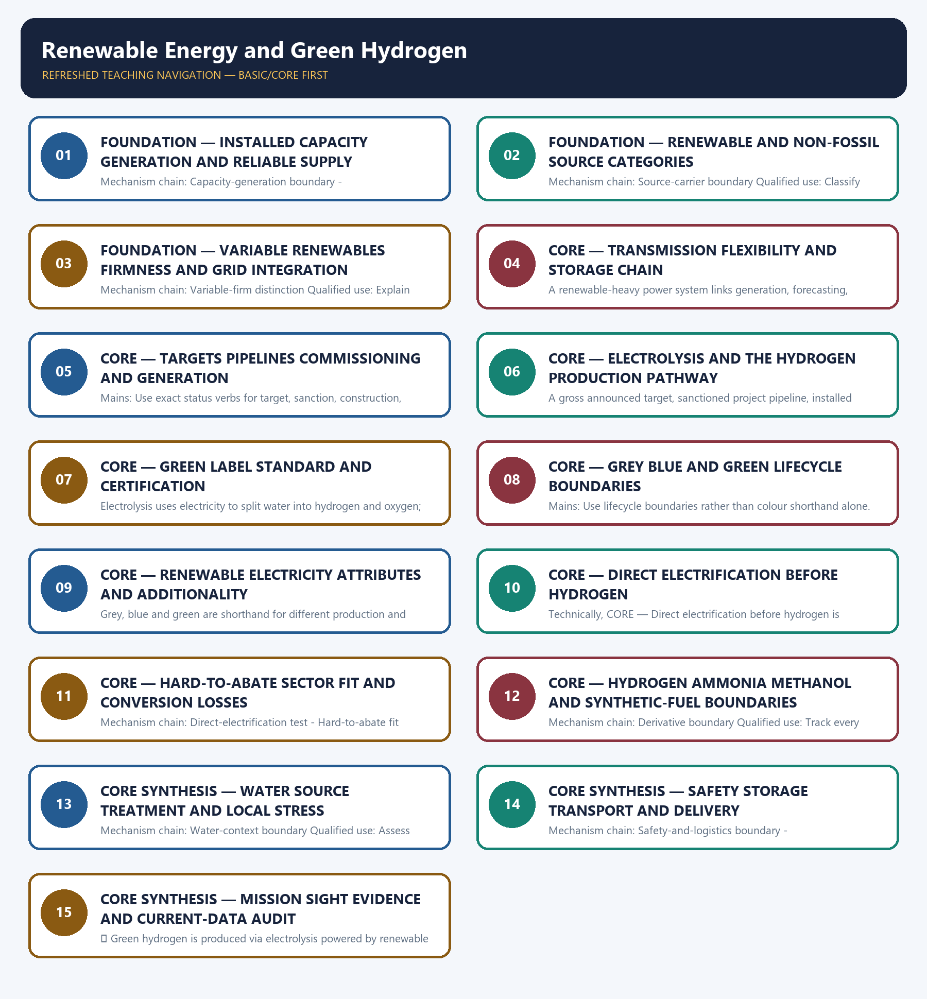

# Renewable Energy and Green Hydrogen — Learner-v2 Complete Learning Session

> **Authoring-only generation:** 2026-09-03. No PDF was rendered and no tracker or index was mutated.

### SOURCE, PROGRESSION AND CURRENT-LINKAGE AUDIT

- **Generation date:** 2026-09-03.
- **Repository-first evidence:** the Basic owner is taught first and preserved in full; the Advanced owner is retained only in the optional final teaching block.
- **OCR evidence:** Repository Markdown was primary. OCR-searchable local official General Studies papers were used only to confirm printed routed demands. No answer key, marking scheme, unsupported page precision, ecological rate, species count, pollution standard, rule threshold, mission outcome or current status was inferred.
- **Qdrant:** not used; repository Markdown and available OCR context were sufficient.
- **PYQ integrity:** Audited ledgers route renewable, solar, wind, grid, storage, bioenergy and hydrogen demands. No provisional objective key, installed-capacity value, generation figure, cost or achieved mission outcome is inferred.
- **Live-link boundary:** MNRE supplied substantive mission architecture and a dated installed-capacity table. No installed-capacity, generation, cost, target-achievement, electrolyser, hydrogen-output, classification or certification value is asserted in the authored anchors.
- **Fact/inference discipline:** no current-affairs item, PYQ wording, figure or quotation is invented.

### LIVE OFFICIAL-SOURCE ATTEMPT LOG

The checks below were made on 2026-09-03. Substantive official text is used only for the proposition it supports. Stubs, access failures, unrelated pages and thin landing pages are recorded and are not converted into ecological or current-status claims.

- https://mnre.gov.in/en/national-green-hydrogen-mission/ — attempted 2026-09-03; substantive official text confirmed policy-enabling, infrastructure, standards, research, skills and governance components. The page was not used to convert an announced mission scale into achieved output.
- https://mnre.gov.in/en/physical-progress/ — attempted 2026-09-03; the official table was dated 31 July 2026 and clearly reported installed capacity. Its changing values were not imported, and installed capacity was not rewritten as generation.
- https://mnre.gov.in/en/green-hydrogen/ — attempted 2026-09-03; the route returned no additional substantive standard or certification text for use.
- https://powermin.gov.in/ — attempted 2026-09-03; no topic-specific dated generation, storage or reliability result was imported from the general route.

## BASIC LEARNING SESSION

### DEEP-REVIEW LEARNING CONTRACT

| Control | Binding rule for this package |
|---|---|
| Syllabus boundary | Complete Environment and Ecology Basic/Core is answer-complete before optional Advanced depth. |
| Ecology boundary | System boundary, scale, trophic level, stock/flow, pool/flux, gross/net, unit and time interval are explicit. |
| Species boundary | Taxon, range, habitat, population trend, IUCN assessment, Indian legal schedule, CITES/CMS listing and endemism remain distinct. |
| Law/status boundary | Act, amendment, rule, notification, draft, judgment, policy, target, implementation and observed outcome remain distinct and dated. |
| Institution boundary | Legal form, parent authority, mandate, jurisdiction, standard, consent, enforcement, science and adjudication are not conflated. |
| Treaty boundary | Membership, annex/appendix, amendment acceptance, target, COP decision, national instrument and outcome remain distinct. |
| Climate boundary | Emission flow, concentration stock, cumulative budget, forcing, scenario, baseline, unit, mitigation, adaptation, loss-and-damage, avoidance and removal are exact. |
| Pollution boundary | Source, emission/load, ambient concentration, exposure, parameter, averaging period, unit, standard and jurisdiction are explicit. |
| Causal method | Chronology, designation, expenditure, capacity, registration and correlation are not promoted into ecological or policy outcomes without mechanism and evidence. |
| Practice contract | Every solved item has demand decoding, detailed examiner-grade model, executable timed/compression plan, marks rationale and answer-specific improvement. |
| Approval | This immutable successor remains `approved: false` pending explicit approval. |

**Canonical Basic/Core owner:** `upsc-ai-kit\knowledge\Environment-and-Ecology\basic\25_Renewable-Energy-and-Green-Hydrogen.md`  
**Substantive canonical provenance owner:** `upsc-ai-kit\knowledge\Environment-and-Ecology\learning-sessions\v2\subject-wide-syllabus\environment-and-ecology-25_Learning-Session.md`  
**Optional Advanced owner:** `upsc-ai-kit\knowledge\Environment-and-Ecology\advanced\25_Renewable-Energy-and-Green-Hydrogen.md`  
**Official syllabus mapping:** `upsc-ai-kit\knowledge\Environment-and-Ecology\OFFICIAL-UPSC-SYLLABUS-MAPPING.md`

### EVIDENCE, PYQ AND CURRENT-STATUS CONTROL

- Ecological mechanisms retain direction, pool, flux, limiting factor, spatial scale and time scale.
- Current species/news claims retain taxon, source, event/publication date, assessment/listing date and access date.
- IUCN category never substitutes for Wildlife Protection Act schedule, CITES appendix, CMS appendix or endemism.
- Protected-area categories, treaty designations and institution mandates retain exact legal character.
- Acts, amendments, rules, draft instruments, notifications and judgments retain operative status and date.
- Climate figures retain unit, baseline, period, scenario and stock-flow character; global evidence is not silently downscaled to India.
- Mitigation, adaptation and loss-and-damage remain separate; allowance, offset, avoidance, removal, capture and storage remain separate.
- PYQ wording is preserved only where verified; reconstructed or routed demands remain labelled.
- **Current-status note, rechecked 2026-09-03:** volatile targets, standards, schedules, species status, treaty outcomes and programme claims retain source/date/status.

**Generation-local live/current sources:**
- `https://mnre.gov.in/en/national-green-hydrogen-mission/ — attempted 2026-09-03; substantive official text confirmed policy-enabling, infrastructure, standards, research, skills and governance components. The page was not used to convert an announced mission scale into achieved output.`
- `https://mnre.gov.in/en/physical-progress/ — attempted 2026-09-03; the official table was dated 31 July 2026 and clearly reported installed capacity. Its changing values were not imported, and installed capacity was not rewritten as generation.`
- `https://mnre.gov.in/en/green-hydrogen/ — attempted 2026-09-03; the route returned no additional substantive standard or certification text for use.`
- `https://powermin.gov.in/ — attempted 2026-09-03; no topic-specific dated generation, storage or reliability result was imported from the general route.`

**Topic 26 dedicated Disaster Management cross-owners (scope boundary):**
- Not applicable to this topic.




*Distinct embedded teaching-navigation image. The separate continuous Cārvāka-style flowchart package remains an independent at-a-glance artifact.*

### SESSION 1 — FOUNDATION — INSTALLED CAPACITY GENERATION AND RELIABLE SUPPLY

#### DEFINITION / WHAT THIS IS CALLED

**Plain-language definition:** Installed capacity is nameplate power capability, while generation is electrical energy actually produced over time; neither capacity share nor capacity addition proves generation share or reliable supply.

**Technical definition:** Mechanism chain: Capacity-generation boundary - Renewable-non-fossil boundary Qualified use: Open by separating installed capacity, generation and dependable supply.

#### ANSWER-GRABBING OPENING — WRITE/ADAPT IN THE EXAM

> Installed capacity is nameplate power capability, while generation is electrical energy actually produced over time; neither capacity share nor capacity addition proves generation share or reliable supply.

#### MUST-WRITE KEYWORDS

- **FOUNDATION**
- **Installed capacity generation**
- **reliable supply**
- **Mechanism chain**
- **Qualified use**
- **Installed capacity**

**How to use them:** Frame the answer through FOUNDATION; define Installed capacity generation, connect reliable supply with Mechanism chain to explain the mechanism, and use Qualified use for the decisive comparison or qualification.

#### VISUAL FIRST

```text
INSTALLED CAPACITY GENERATION AND RELIABLE SUPPLY
01. Capacity-generation boundary
    |
    v
02. Renewable-non-fossil boundary
BOUNDARY -> Do not quote installed capacity as electricity generation.
```

*This topic-specific rail fixes the evidence sequence and its exam boundary before analysis.*

#### CORE EXPLANATION

Installed capacity is nameplate power capability, while generation is electrical energy actually produced over time; neither capacity share nor capacity addition proves generation share or reliable supply. Solar, wind, hydro, biomass and geothermal are renewable sources, while non-fossil is a wider category that can include nuclear power; the two labels are not interchangeable.

#### NAMED EVIDENCE AND MECHANISM

- Installed capacity is nameplate power capability, while generation is electrical energy actually produced over time; neither capacity share nor capacity addition proves generation share or reliable supply.
- Solar, wind, hydro, biomass and geothermal are renewable sources, while non-fossil is a wider category that can include nuclear power; the two labels are not interchangeable.

#### EXAMINER CAUTION

- Do not quote installed capacity as electricity generation.

#### EXAM LINK

- **Prelims:** Preserve the exact receiving medium, system boundary, measured parameter, actor, process, spatial and temporal scale, rule vintage and scientific or legal status; never turn a context-dependent pattern into a universal rule.
- **Mains:** Open by separating installed capacity, generation and dependable supply.

#### MINI RECAP

- **Mechanism chain:** Capacity-generation boundary -> Renewable-non-fossil boundary
- **Qualified use:** Open by separating installed capacity, generation and dependable supply.

#### CLOSING RECALL FLOW — FOUNDATION — INSTALLED CAPACITY GENERATION AND RELIABLE SUPPLY

```text
START / CONCEPT: FOUNDATION — Installed capacity generation and reliable supply
        |
        v
EXACT TERMS: FOUNDATION · Installed capacity generation · reliable supply · Mechanism chain · Qualified use · Installed capacity
        |
        v
MECHANISM / ARGUMENT: Mechanism chain: Capacity-generation boundary - Renewable-non-fossil boundary Qualified use: Open by separating installed capacity, generation and dependable supply.
        |
        v
CONSEQUENCE / CONTRAST: Do not quote installed capacity as electricity generation.
        |
        v
UPSC TRAP / ANSWER-USE: Solar, wind, hydro, biomass and geothermal are renewable sources, while non-fossil is a wider category that can include nuclear power; the two labels are not interchangeable.
        |
        v
ANSWER-GRABBING FORMULATION: Installed capacity is nameplate power capability, while generation is electrical energy actually produced over time; neither capacity share nor capacity addition proves generation share or reliable supply.
```
### SESSION 2 — FOUNDATION — RENEWABLE AND NON-FOSSIL SOURCE CATEGORIES

#### DEFINITION / WHAT THIS IS CALLED

**Plain-language definition:** Renewable electricity is an energy source output, while hydrogen is an energy carrier produced using an input pathway; hydrogen is not a primary renewable resource by itself.

**Technical definition:** Mechanism chain: Source-carrier boundary Qualified use: Classify renewable and non-fossil sources before using a target.

#### ANSWER-GRABBING OPENING — WRITE/ADAPT IN THE EXAM

> Do not merge renewable and non-fossil categories.

#### MUST-WRITE KEYWORDS

- **FOUNDATION**
- **Renewable**
- **non-fossil source categories**
- **Mechanism chain**
- **Qualified use**
- **Renewable electricity**

**How to use them:** Frame the answer through FOUNDATION; define Renewable, connect non-fossil source categories with Mechanism chain to explain the mechanism, and use Qualified use for the decisive comparison or qualification.

#### VISUAL FIRST

```text
RENEWABLE AND NON-FOSSIL SOURCE CATEGORIES
01. Source-carrier boundary
BOUNDARY -> Do not merge renewable and non-fossil categories.
```

*This topic-specific rail fixes the evidence sequence and its exam boundary before analysis.*

#### CORE EXPLANATION

Renewable electricity is an energy source output, while hydrogen is an energy carrier produced using an input pathway; hydrogen is not a primary renewable resource by itself.

#### NAMED EVIDENCE AND MECHANISM

- Renewable electricity is an energy source output, while hydrogen is an energy carrier produced using an input pathway; hydrogen is not a primary renewable resource by itself.

#### EXAMINER CAUTION

- Do not merge renewable and non-fossil categories.

#### EXAM LINK

- **Prelims:** Preserve the exact receiving medium, system boundary, measured parameter, actor, process, spatial and temporal scale, rule vintage and scientific or legal status; never turn a context-dependent pattern into a universal rule.
- **Mains:** Classify renewable and non-fossil sources before using a target.

#### MINI RECAP

- **Mechanism chain:** Source-carrier boundary
- **Qualified use:** Classify renewable and non-fossil sources before using a target.

#### CLOSING RECALL FLOW — FOUNDATION — RENEWABLE AND NON-FOSSIL SOURCE CATEGORIES

```text
START / CONCEPT: FOUNDATION — Renewable and non-fossil source categories
        |
        v
EXACT TERMS: FOUNDATION · Renewable · non-fossil source categories · Mechanism chain · Qualified use · Renewable electricity
        |
        v
MECHANISM / ARGUMENT: Mechanism chain: Source-carrier boundary Qualified use: Classify renewable and non-fossil sources before using a target.
        |
        v
CONSEQUENCE / CONTRAST: Renewable electricity is an energy source output, while hydrogen is an energy carrier produced using an input pathway; hydrogen is not a primary renewable resource by itself.
        |
        v
UPSC TRAP / ANSWER-USE: Do not miss this limiting distinction: do not merge renewable and non-fossil categories.
        |
        v
ANSWER-GRABBING FORMULATION: Do not merge renewable and non-fossil categories.
```
### SESSION 3 — FOUNDATION — VARIABLE RENEWABLES FIRMNESS AND GRID INTEGRATION

#### DEFINITION / WHAT THIS IS CALLED

**Plain-language definition:** Solar and wind output varies with resource availability, whereas dispatchable or firm supply can be scheduled or supported to meet demand; nameplate capacity alone does not establish firmness.

**Technical definition:** Mechanism chain: Variable-firm distinction Qualified use: Explain variability through forecasting, transmission, flexibility and storage.

#### ANSWER-GRABBING OPENING — WRITE/ADAPT IN THE EXAM

> Solar and wind output varies with resource availability, whereas dispatchable or firm supply can be scheduled or supported to meet demand; nameplate capacity alone does not establish firmness.

#### MUST-WRITE KEYWORDS

- **FOUNDATION**
- **Variable renewables firmness**
- **grid integration**
- **Mechanism chain**
- **Qualified use**
- **Solar**

**How to use them:** Frame the answer through FOUNDATION; define Variable renewables firmness, connect grid integration with Mechanism chain to explain the mechanism, and use Qualified use for the decisive comparison or qualification.

#### VISUAL FIRST

```text
VARIABLE RENEWABLES FIRMNESS AND GRID INTEGRATION
01. Variable-firm distinction
BOUNDARY -> Do not call hydrogen a primary renewable energy source.
```

*This topic-specific rail fixes the evidence sequence and its exam boundary before analysis.*

#### CORE EXPLANATION

Solar and wind output varies with resource availability, whereas dispatchable or firm supply can be scheduled or supported to meet demand; nameplate capacity alone does not establish firmness.

#### NAMED EVIDENCE AND MECHANISM

- Solar and wind output varies with resource availability, whereas dispatchable or firm supply can be scheduled or supported to meet demand; nameplate capacity alone does not establish firmness.

#### EXAMINER CAUTION

- Do not call hydrogen a primary renewable energy source.

#### EXAM LINK

- **Prelims:** Preserve the exact receiving medium, system boundary, measured parameter, actor, process, spatial and temporal scale, rule vintage and scientific or legal status; never turn a context-dependent pattern into a universal rule.
- **Mains:** Explain variability through forecasting, transmission, flexibility and storage.

#### MINI RECAP

- **Mechanism chain:** Variable-firm distinction
- **Qualified use:** Explain variability through forecasting, transmission, flexibility and storage.

#### CLOSING RECALL FLOW — FOUNDATION — VARIABLE RENEWABLES FIRMNESS AND GRID INTEGRATION

```text
START / CONCEPT: FOUNDATION — Variable renewables firmness and grid integration
        |
        v
EXACT TERMS: FOUNDATION · Variable renewables firmness · grid integration · Mechanism chain · Qualified use · Solar
        |
        v
MECHANISM / ARGUMENT: Mechanism chain: Variable-firm distinction Qualified use: Explain variability through forecasting, transmission, flexibility and storage.
        |
        v
CONSEQUENCE / CONTRAST: Do not call hydrogen a primary renewable energy source.
        |
        v
UPSC TRAP / ANSWER-USE: Do not miss this limiting distinction: explain variability through forecasting, transmission, flexibility and storage.
        |
        v
ANSWER-GRABBING FORMULATION: Solar and wind output varies with resource availability, whereas dispatchable or firm supply can be scheduled or supported to meet demand; nameplate capacity alone does not establish firmness.
```
### SESSION 4 — CORE — TRANSMISSION FLEXIBILITY AND STORAGE CHAIN

#### DEFINITION / WHAT THIS IS CALLED

**Plain-language definition:** Mechanism chain: Integration chain Qualified use: Separate an energy-shifting technology from a primary energy source.

**Technical definition:** A renewable-heavy power system links generation, forecasting, transmission, flexible demand, balancing resources and storage; adding generation without the rest can leave congestion or reliability constraints.

#### ANSWER-GRABBING OPENING — WRITE/ADAPT IN THE EXAM

> Mechanism chain: Integration chain Qualified use: Separate an energy-shifting technology from a primary energy source.

#### MUST-WRITE KEYWORDS

- **Transmission flexibility**
- **storage chain**
- **Mechanism chain**
- **Qualified use**
- **Integration**
- **Qualified**

**How to use them:** Frame the answer through Transmission flexibility; define storage chain, connect Mechanism chain with Qualified use to explain the mechanism, and use Integration for the decisive comparison or qualification.

#### VISUAL FIRST

```text
TRANSMISSION FLEXIBILITY AND STORAGE CHAIN
01. Integration chain
BOUNDARY -> Do not treat variable nameplate capacity as firm supply.
```

*This topic-specific rail fixes the evidence sequence and its exam boundary before analysis.*

#### CORE EXPLANATION

A renewable-heavy power system links generation, forecasting, transmission, flexible demand, balancing resources and storage; adding generation without the rest can leave congestion or reliability constraints.

#### NAMED EVIDENCE AND MECHANISM

- A renewable-heavy power system links generation, forecasting, transmission, flexible demand, balancing resources and storage; adding generation without the rest can leave congestion or reliability constraints.

#### EXAMINER CAUTION

- Do not treat variable nameplate capacity as firm supply.

#### EXAM LINK

- **Prelims:** Preserve the exact receiving medium, system boundary, measured parameter, actor, process, spatial and temporal scale, rule vintage and scientific or legal status; never turn a context-dependent pattern into a universal rule.
- **Mains:** Separate an energy-shifting technology from a primary energy source.

#### MINI RECAP

- **Mechanism chain:** Integration chain
- **Qualified use:** Separate an energy-shifting technology from a primary energy source.

#### CLOSING RECALL FLOW — CORE — TRANSMISSION FLEXIBILITY AND STORAGE CHAIN

```text
START / CONCEPT: CORE — Transmission flexibility and storage chain
        |
        v
EXACT TERMS: Transmission flexibility · storage chain · Mechanism chain · Qualified use · Integration · Qualified
        |
        v
MECHANISM / ARGUMENT: A renewable-heavy power system links generation, forecasting, transmission, flexible demand, balancing resources and storage; adding generation without the rest can leave congestion or reliability constraints.
        |
        v
CONSEQUENCE / CONTRAST: Do not treat variable nameplate capacity as firm supply.
        |
        v
UPSC TRAP / ANSWER-USE: Do not miss this limiting distinction: separate an energy-shifting technology from a primary energy source.
        |
        v
ANSWER-GRABBING FORMULATION: Mechanism chain: Integration chain Qualified use: Separate an energy-shifting technology from a primary energy source.
```
### SESSION 5 — CORE — TARGETS PIPELINES COMMISSIONING AND GENERATION

#### DEFINITION / WHAT THIS IS CALLED

**Plain-language definition:** Mechanism chain: Storage boundary Qualified use: Use exact status verbs for target, sanction, construction, commission and output.

**Technical definition:** Mains: Use exact status verbs for target, sanction, construction, commission and output.

#### ANSWER-GRABBING OPENING — WRITE/ADAPT IN THE EXAM

> Mechanism chain: Storage boundary Qualified use: Use exact status verbs for target, sanction, construction, commission and output.

#### MUST-WRITE KEYWORDS

- **Targets pipelines commissioning**
- **generation**
- **Mechanism chain**
- **Qualified use**
- **Battery**
- **Storage**

**How to use them:** Frame the answer through Targets pipelines commissioning; define generation, connect Mechanism chain with Qualified use to explain the mechanism, and use Battery for the decisive comparison or qualification.

#### VISUAL FIRST

```text
TARGETS PIPELINES COMMISSIONING AND GENERATION
01. Storage boundary
BOUNDARY -> Do not omit transmission, flexibility and storage from integration.
```

*This topic-specific rail fixes the evidence sequence and its exam boundary before analysis.*

#### CORE EXPLANATION

Battery and pumped-storage systems shift energy across time and provide grid services, but storage consumes previously generated energy and is not an independent primary energy source.

#### NAMED EVIDENCE AND MECHANISM

- Battery and pumped-storage systems shift energy across time and provide grid services, but storage consumes previously generated energy and is not an independent primary energy source.

#### EXAMINER CAUTION

- Do not omit transmission, flexibility and storage from integration.

#### EXAM LINK

- **Prelims:** Preserve the exact receiving medium, system boundary, measured parameter, actor, process, spatial and temporal scale, rule vintage and scientific or legal status; never turn a context-dependent pattern into a universal rule.
- **Mains:** Use exact status verbs for target, sanction, construction, commission and output.

#### MINI RECAP

- **Mechanism chain:** Storage boundary
- **Qualified use:** Use exact status verbs for target, sanction, construction, commission and output.

#### CLOSING RECALL FLOW — CORE — TARGETS PIPELINES COMMISSIONING AND GENERATION

```text
START / CONCEPT: CORE — Targets pipelines commissioning and generation
        |
        v
EXACT TERMS: Targets pipelines commissioning · generation · Mechanism chain · Qualified use · Battery · Storage
        |
        v
MECHANISM / ARGUMENT: Mains: Use exact status verbs for target, sanction, construction, commission and output.
        |
        v
CONSEQUENCE / CONTRAST: Battery and pumped-storage systems shift energy across time and provide grid services, but storage consumes previously generated energy and is not an independent primary energy source.
        |
        v
UPSC TRAP / ANSWER-USE: Do not omit transmission, flexibility and storage from integration.
        |
        v
ANSWER-GRABBING FORMULATION: Mechanism chain: Storage boundary Qualified use: Use exact status verbs for target, sanction, construction, commission and output.
```
### SESSION 6 — CORE — ELECTROLYSIS AND THE HYDROGEN PRODUCTION PATHWAY

#### DEFINITION / WHAT THIS IS CALLED

**Plain-language definition:** Mechanism chain: Target-achievement boundary - Status-verb discipline Qualified use: Trace electricity, water, electrolysis and hydrogen without assuming a label.

**Technical definition:** A gross announced target, sanctioned project pipeline, installed capacity, commissioned capacity and achieved generation are separate statuses that require separate dated evidence.

#### ANSWER-GRABBING OPENING — WRITE/ADAPT IN THE EXAM

> Mechanism chain: Target-achievement boundary - Status-verb discipline Qualified use: Trace electricity, water, electrolysis and hydrogen without assuming a label.

#### MUST-WRITE KEYWORDS

- **Electrolysis**
- **the hydrogen production pathway**
- **Mechanism chain**
- **Qualified use**
- **Announced**
- **Target-achievement**

**How to use them:** Frame the answer through Electrolysis; define the hydrogen production pathway, connect Mechanism chain with Qualified use to explain the mechanism, and use Announced for the decisive comparison or qualification.

#### VISUAL FIRST

```text
ELECTROLYSIS AND THE HYDROGEN PRODUCTION PATHWAY
01. Target-achievement boundary
    |
    v
02. Status-verb discipline
BOUNDARY -> Do not call storage an independent source of energy.
```

*This topic-specific rail fixes the evidence sequence and its exam boundary before analysis.*

#### CORE EXPLANATION

A gross announced target, sanctioned project pipeline, installed capacity, commissioned capacity and achieved generation are separate statuses that require separate dated evidence. Announced, approved, allocated, awarded, under construction, commissioned and producing describe different project stages; one stage must never be substituted for another.

#### NAMED EVIDENCE AND MECHANISM

- A gross announced target, sanctioned project pipeline, installed capacity, commissioned capacity and achieved generation are separate statuses that require separate dated evidence.
- Announced, approved, allocated, awarded, under construction, commissioned and producing describe different project stages; one stage must never be substituted for another.

#### EXAMINER CAUTION

- Do not call storage an independent source of energy.

#### EXAM LINK

- **Prelims:** Preserve the exact receiving medium, system boundary, measured parameter, actor, process, spatial and temporal scale, rule vintage and scientific or legal status; never turn a context-dependent pattern into a universal rule.
- **Mains:** Trace electricity, water, electrolysis and hydrogen without assuming a label.

#### MINI RECAP

- **Mechanism chain:** Target-achievement boundary -> Status-verb discipline
- **Qualified use:** Trace electricity, water, electrolysis and hydrogen without assuming a label.

#### CLOSING RECALL FLOW — CORE — ELECTROLYSIS AND THE HYDROGEN PRODUCTION PATHWAY

```text
START / CONCEPT: CORE — Electrolysis and the hydrogen production pathway
        |
        v
EXACT TERMS: Electrolysis · the hydrogen production pathway · Mechanism chain · Qualified use · Announced · Target-achievement
        |
        v
MECHANISM / ARGUMENT: A gross announced target, sanctioned project pipeline, installed capacity, commissioned capacity and achieved generation are separate statuses that require separate dated evidence.
        |
        v
CONSEQUENCE / CONTRAST: Do not call storage an independent source of energy.
        |
        v
UPSC TRAP / ANSWER-USE: Announced, approved, allocated, awarded, under construction, commissioned and producing describe different project stages; one stage must never be substituted for another.
        |
        v
ANSWER-GRABBING FORMULATION: Mechanism chain: Target-achievement boundary - Status-verb discipline Qualified use: Trace electricity, water, electrolysis and hydrogen without assuming a label.
```
### SESSION 7 — CORE — GREEN LABEL STANDARD AND CERTIFICATION

#### DEFINITION / WHAT THIS IS CALLED

**Plain-language definition:** Mechanism chain: Electrolysis pathway Qualified use: Identify the applicable definition, standard and certification evidence.

**Technical definition:** Electrolysis uses electricity to split water into hydrogen and oxygen; calling the product green depends on the electricity and accounting pathway, not on the chemical identity of hydrogen.

#### ANSWER-GRABBING OPENING — WRITE/ADAPT IN THE EXAM

> Mechanism chain: Electrolysis pathway Qualified use: Identify the applicable definition, standard and certification evidence.

#### MUST-WRITE KEYWORDS

- **Green label standard**
- **certification**
- **Mechanism chain**
- **Qualified use**
- **Electrolysis**
- **Qualified**

**How to use them:** Frame the answer through Green label standard; define certification, connect Mechanism chain with Qualified use to explain the mechanism, and use Electrolysis for the decisive comparison or qualification.

#### VISUAL FIRST

```text
GREEN LABEL STANDARD AND CERTIFICATION
01. Electrolysis pathway
BOUNDARY -> Do not merge target, pipeline, installation and generation.
```

*This topic-specific rail fixes the evidence sequence and its exam boundary before analysis.*

#### CORE EXPLANATION

Electrolysis uses electricity to split water into hydrogen and oxygen; calling the product green depends on the electricity and accounting pathway, not on the chemical identity of hydrogen.

#### NAMED EVIDENCE AND MECHANISM

- Electrolysis uses electricity to split water into hydrogen and oxygen; calling the product green depends on the electricity and accounting pathway, not on the chemical identity of hydrogen.

#### EXAMINER CAUTION

- Do not merge target, pipeline, installation and generation.

#### EXAM LINK

- **Prelims:** Preserve the exact receiving medium, system boundary, measured parameter, actor, process, spatial and temporal scale, rule vintage and scientific or legal status; never turn a context-dependent pattern into a universal rule.
- **Mains:** Identify the applicable definition, standard and certification evidence.

#### MINI RECAP

- **Mechanism chain:** Electrolysis pathway
- **Qualified use:** Identify the applicable definition, standard and certification evidence.

#### CLOSING RECALL FLOW — CORE — GREEN LABEL STANDARD AND CERTIFICATION

```text
START / CONCEPT: CORE — Green label standard and certification
        |
        v
EXACT TERMS: Green label standard · certification · Mechanism chain · Qualified use · Electrolysis · Qualified
        |
        v
MECHANISM / ARGUMENT: Electrolysis uses electricity to split water into hydrogen and oxygen; calling the product green depends on the electricity and accounting pathway, not on the chemical identity of hydrogen.
        |
        v
CONSEQUENCE / CONTRAST: Do not merge target, pipeline, installation and generation.
        |
        v
UPSC TRAP / ANSWER-USE: Do not miss this limiting distinction: identify the applicable definition, standard and certification evidence.
        |
        v
ANSWER-GRABBING FORMULATION: Mechanism chain: Electrolysis pathway Qualified use: Identify the applicable definition, standard and certification evidence.
```
### SESSION 8 — CORE — GREY BLUE AND GREEN LIFECYCLE BOUNDARIES

#### DEFINITION / WHAT THIS IS CALLED

**Plain-language definition:** Mechanism chain: Label-standard-certification boundary Qualified use: Use lifecycle boundaries rather than colour shorthand alone.

**Technical definition:** Mains: Use lifecycle boundaries rather than colour shorthand alone.

#### ANSWER-GRABBING OPENING — WRITE/ADAPT IN THE EXAM

> Mechanism chain: Label-standard-certification boundary Qualified use: Use lifecycle boundaries rather than colour shorthand alone.

#### MUST-WRITE KEYWORDS

- **Grey blue**
- **green lifecycle boundaries**
- **Mechanism chain**
- **Qualified use**
- **Label-standard-certification**
- **Qualified**

**How to use them:** Frame the answer through Grey blue; define green lifecycle boundaries, connect Mechanism chain with Qualified use to explain the mechanism, and use Label-standard-certification for the decisive comparison or qualification.

#### VISUAL FIRST

```text
GREY BLUE AND GREEN LIFECYCLE BOUNDARIES
01. Label-standard-certification boundary
BOUNDARY -> Do not rewrite awarded or allocated capacity as production.
```

*This topic-specific rail fixes the evidence sequence and its exam boundary before analysis.*

#### CORE EXPLANATION

A production pathway, a government definition or standard, a certification method and a market label are distinct layers; a pathway description alone does not prove certified compliance.

#### NAMED EVIDENCE AND MECHANISM

- A production pathway, a government definition or standard, a certification method and a market label are distinct layers; a pathway description alone does not prove certified compliance.

#### EXAMINER CAUTION

- Do not rewrite awarded or allocated capacity as production.

#### EXAM LINK

- **Prelims:** Preserve the exact receiving medium, system boundary, measured parameter, actor, process, spatial and temporal scale, rule vintage and scientific or legal status; never turn a context-dependent pattern into a universal rule.
- **Mains:** Use lifecycle boundaries rather than colour shorthand alone.

#### MINI RECAP

- **Mechanism chain:** Label-standard-certification boundary
- **Qualified use:** Use lifecycle boundaries rather than colour shorthand alone.

#### CLOSING RECALL FLOW — CORE — GREY BLUE AND GREEN LIFECYCLE BOUNDARIES

```text
START / CONCEPT: CORE — Grey blue and green lifecycle boundaries
        |
        v
EXACT TERMS: Grey blue · green lifecycle boundaries · Mechanism chain · Qualified use · Label-standard-certification · Qualified
        |
        v
MECHANISM / ARGUMENT: Mains: Use lifecycle boundaries rather than colour shorthand alone.
        |
        v
CONSEQUENCE / CONTRAST: A production pathway, a government definition or standard, a certification method and a market label are distinct layers; a pathway description alone does not prove certified compliance.
        |
        v
UPSC TRAP / ANSWER-USE: Do not rewrite awarded or allocated capacity as production.
        |
        v
ANSWER-GRABBING FORMULATION: Mechanism chain: Label-standard-certification boundary Qualified use: Use lifecycle boundaries rather than colour shorthand alone.
```
### SESSION 9 — CORE — RENEWABLE ELECTRICITY ATTRIBUTES AND ADDITIONALITY

#### DEFINITION / WHAT THIS IS CALLED

**Plain-language definition:** Mechanism chain: Hydrogen-colour boundary Qualified use: State sourcing, time, geography and additionality only when the rule owns them.

**Technical definition:** Grey, blue and green are shorthand for different production and emissions-management pathways; colour language does not replace a stated lifecycle boundary, capture performance or official standard.

#### ANSWER-GRABBING OPENING — WRITE/ADAPT IN THE EXAM

> Mechanism chain: Hydrogen-colour boundary Qualified use: State sourcing, time, geography and additionality only when the rule owns them.

#### MUST-WRITE KEYWORDS

- **Renewable electricity attributes**
- **additionality**
- **Mechanism chain**
- **Qualified use**
- **Grey, blue and green**
- **Grey**

**How to use them:** Frame the answer through Renewable electricity attributes; define additionality, connect Mechanism chain with Qualified use to explain the mechanism, and use Grey, blue and green for the decisive comparison or qualification.

#### VISUAL FIRST

```text
RENEWABLE ELECTRICITY ATTRIBUTES AND ADDITIONALITY
01. Hydrogen-colour boundary
BOUNDARY -> Do not call every electrolytic pathway green.
```

*This topic-specific rail fixes the evidence sequence and its exam boundary before analysis.*

#### CORE EXPLANATION

Grey, blue and green are shorthand for different production and emissions-management pathways; colour language does not replace a stated lifecycle boundary, capture performance or official standard.

#### NAMED EVIDENCE AND MECHANISM

- Grey, blue and green are shorthand for different production and emissions-management pathways; colour language does not replace a stated lifecycle boundary, capture performance or official standard.

#### EXAMINER CAUTION

- Do not call every electrolytic pathway green.

#### EXAM LINK

- **Prelims:** Preserve the exact receiving medium, system boundary, measured parameter, actor, process, spatial and temporal scale, rule vintage and scientific or legal status; never turn a context-dependent pattern into a universal rule.
- **Mains:** State sourcing, time, geography and additionality only when the rule owns them.

#### MINI RECAP

- **Mechanism chain:** Hydrogen-colour boundary
- **Qualified use:** State sourcing, time, geography and additionality only when the rule owns them.

#### CLOSING RECALL FLOW — CORE — RENEWABLE ELECTRICITY ATTRIBUTES AND ADDITIONALITY

```text
START / CONCEPT: CORE — Renewable electricity attributes and additionality
        |
        v
EXACT TERMS: Renewable electricity attributes · additionality · Mechanism chain · Qualified use · Grey, blue and green · Grey
        |
        v
MECHANISM / ARGUMENT: Grey, blue and green are shorthand for different production and emissions-management pathways; colour language does not replace a stated lifecycle boundary, capture performance or official standard.
        |
        v
CONSEQUENCE / CONTRAST: Do not call every electrolytic pathway green.
        |
        v
UPSC TRAP / ANSWER-USE: Do not miss this limiting distinction: grey, blue and green are shorthand for different production and emissions-management pathways.
        |
        v
ANSWER-GRABBING FORMULATION: Mechanism chain: Hydrogen-colour boundary Qualified use: State sourcing, time, geography and additionality only when the rule owns them.
```
### SESSION 10 — CORE — DIRECT ELECTRIFICATION BEFORE HYDROGEN

#### DEFINITION / WHAT THIS IS CALLED

**Plain-language definition:** Mechanism chain: Electricity-attribute boundary Qualified use: Apply a direct-electrification-first screening test.

**Technical definition:** Technically, CORE — Direct electrification before hydrogen is analysed by relating Direct electrification before hydrogen to Mechanism chain, then testing the relationship through Qualified use and Electricity-attribute.

#### ANSWER-GRABBING OPENING — WRITE/ADAPT IN THE EXAM

> Mechanism chain: Electricity-attribute boundary Qualified use: Apply a direct-electrification-first screening test.

#### MUST-WRITE KEYWORDS

- **Direct electrification before hydrogen**
- **Mechanism chain**
- **Qualified use**
- **Electricity-attribute**
- **Qualified**
- **Apply**

**How to use them:** Frame the answer through Direct electrification before hydrogen; define Mechanism chain, connect Qualified use with Electricity-attribute to explain the mechanism, and use Qualified for the decisive comparison or qualification.

#### VISUAL FIRST

```text
DIRECT ELECTRIFICATION BEFORE HYDROGEN
01. Electricity-attribute boundary
BOUNDARY -> Do not merge pathway, standard, label and certification.
```

*This topic-specific rail fixes the evidence sequence and its exam boundary before analysis.*

#### CORE EXPLANATION

Claims about renewable electricity used for hydrogen may depend on sourcing, temporal matching, geography and additionality rules in the applicable standard; those attributes require documentary evidence.

#### NAMED EVIDENCE AND MECHANISM

- Claims about renewable electricity used for hydrogen may depend on sourcing, temporal matching, geography and additionality rules in the applicable standard; those attributes require documentary evidence.

#### EXAMINER CAUTION

- Do not merge pathway, standard, label and certification.

#### EXAM LINK

- **Prelims:** Preserve the exact receiving medium, system boundary, measured parameter, actor, process, spatial and temporal scale, rule vintage and scientific or legal status; never turn a context-dependent pattern into a universal rule.
- **Mains:** Apply a direct-electrification-first screening test.

#### MINI RECAP

- **Mechanism chain:** Electricity-attribute boundary
- **Qualified use:** Apply a direct-electrification-first screening test.

#### CLOSING RECALL FLOW — CORE — DIRECT ELECTRIFICATION BEFORE HYDROGEN

```text
START / CONCEPT: CORE — Direct electrification before hydrogen
        |
        v
EXACT TERMS: Direct electrification before hydrogen · Mechanism chain · Qualified use · Electricity-attribute · Qualified · Apply
        |
        v
MECHANISM / ARGUMENT: Do not merge pathway, standard, label and certification.
        |
        v
CONSEQUENCE / CONTRAST: The resulting consequence is that mechanism chain: Electricity-attribute boundary Qualified use: Apply a direct-electrification-first screening test.
        |
        v
UPSC TRAP / ANSWER-USE: Do not miss this limiting distinction: mechanism chain: Electricity-attribute boundary Qualified use: Apply a direct-electrification-first screening test.
        |
        v
ANSWER-GRABBING FORMULATION: Mechanism chain: Electricity-attribute boundary Qualified use: Apply a direct-electrification-first screening test.
```
### SESSION 11 — CORE — HARD-TO-ABATE SECTOR FIT AND CONVERSION LOSSES

#### DEFINITION / WHAT THIS IS CALLED

**Plain-language definition:** Fertiliser, refining, selected steel processes, shipping fuels and some heavy transport can use hydrogen or derivatives, but sector suitability and conversion losses must be assessed rather than assumed.

**Technical definition:** Mechanism chain: Direct-electrification test - Hard-to-abate fit Qualified use: Match hydrogen to a technically hard-to-abate use and disclose conversion loss.

#### ANSWER-GRABBING OPENING — WRITE/ADAPT IN THE EXAM

> Fertiliser, refining, selected steel processes, shipping fuels and some heavy transport can use hydrogen or derivatives, but sector suitability and conversion losses must be assessed rather than assumed.

#### MUST-WRITE KEYWORDS

- **Hard-to-abate sector fit**
- **conversion losses**
- **Mechanism chain**
- **Qualified use**
- **Direct use of clean electricity**
- **Direct**

**How to use them:** Frame the answer through Hard-to-abate sector fit; define conversion losses, connect Mechanism chain with Qualified use to explain the mechanism, and use Direct use of clean electricity for the decisive comparison or qualification.

#### VISUAL FIRST

```text
HARD-TO-ABATE SECTOR FIT AND CONVERSION LOSSES
01. Direct-electrification test
    |
    v
02. Hard-to-abate fit
BOUNDARY -> Do not use colour shorthand as a complete lifecycle assessment.
```

*This topic-specific rail fixes the evidence sequence and its exam boundary before analysis.*

#### CORE EXPLANATION

Direct use of clean electricity is generally the first option where technically suitable, while hydrogen is considered where molecules, high-temperature heat, long-duration storage or weight constraints matter. Fertiliser, refining, selected steel processes, shipping fuels and some heavy transport can use hydrogen or derivatives, but sector suitability and conversion losses must be assessed rather than assumed.

#### NAMED EVIDENCE AND MECHANISM

- Direct use of clean electricity is generally the first option where technically suitable, while hydrogen is considered where molecules, high-temperature heat, long-duration storage or weight constraints matter.
- Fertiliser, refining, selected steel processes, shipping fuels and some heavy transport can use hydrogen or derivatives, but sector suitability and conversion losses must be assessed rather than assumed.

#### EXAMINER CAUTION

- Do not use colour shorthand as a complete lifecycle assessment.

#### EXAM LINK

- **Prelims:** Preserve the exact receiving medium, system boundary, measured parameter, actor, process, spatial and temporal scale, rule vintage and scientific or legal status; never turn a context-dependent pattern into a universal rule.
- **Mains:** Match hydrogen to a technically hard-to-abate use and disclose conversion loss.

#### MINI RECAP

- **Mechanism chain:** Direct-electrification test -> Hard-to-abate fit
- **Qualified use:** Match hydrogen to a technically hard-to-abate use and disclose conversion loss.

#### CLOSING RECALL FLOW — CORE — HARD-TO-ABATE SECTOR FIT AND CONVERSION LOSSES

```text
START / CONCEPT: CORE — Hard-to-abate sector fit and conversion losses
        |
        v
EXACT TERMS: Hard-to-abate sector fit · conversion losses · Mechanism chain · Qualified use · Direct use of clean electricity · Direct
        |
        v
MECHANISM / ARGUMENT: Mechanism chain: Direct-electrification test - Hard-to-abate fit Qualified use: Match hydrogen to a technically hard-to-abate use and disclose conversion loss.
        |
        v
CONSEQUENCE / CONTRAST: Direct use of clean electricity is generally the first option where technically suitable, while hydrogen is considered where molecules, high-temperature heat, long-duration storage or weight constraints matter.
        |
        v
UPSC TRAP / ANSWER-USE: Do not use colour shorthand as a complete lifecycle assessment.
        |
        v
ANSWER-GRABBING FORMULATION: Fertiliser, refining, selected steel processes, shipping fuels and some heavy transport can use hydrogen or derivatives, but sector suitability and conversion losses must be assessed rather than assumed.
```
### SESSION 12 — CORE — HYDROGEN AMMONIA METHANOL AND SYNTHETIC-FUEL BOUNDARIES

#### DEFINITION / WHAT THIS IS CALLED

**Plain-language definition:** Hydrogen, ammonia, methanol and synthetic fuels are related but different products with different conversion steps, handling requirements and end uses; a hydrogen target is not automatically a derivative-output target.

**Technical definition:** Mechanism chain: Derivative boundary Qualified use: Track every derivative conversion and end-use boundary.

#### ANSWER-GRABBING OPENING — WRITE/ADAPT IN THE EXAM

> Hydrogen, ammonia, methanol and synthetic fuels are related but different products with different conversion steps, handling requirements and end uses; a hydrogen target is not automatically a derivative-output target.

#### MUST-WRITE KEYWORDS

- **Hydrogen ammonia methanol**
- **synthetic-fuel boundaries**
- **Mechanism chain**
- **Qualified use**
- **Hydrogen, ammonia, methanol and synthetic fuels**
- **Hydrogen**

**How to use them:** Frame the answer through Hydrogen ammonia methanol; define synthetic-fuel boundaries, connect Mechanism chain with Qualified use to explain the mechanism, and use Hydrogen, ammonia, methanol and synthetic fuels for the decisive comparison or qualification.

#### VISUAL FIRST

```text
HYDROGEN AMMONIA METHANOL AND SYNTHETIC-FUEL BOUNDARIES
01. Derivative boundary
BOUNDARY -> Do not infer renewable attributes without the applicable rules.
```

*This topic-specific rail fixes the evidence sequence and its exam boundary before analysis.*

#### CORE EXPLANATION

Hydrogen, ammonia, methanol and synthetic fuels are related but different products with different conversion steps, handling requirements and end uses; a hydrogen target is not automatically a derivative-output target.

#### NAMED EVIDENCE AND MECHANISM

- Hydrogen, ammonia, methanol and synthetic fuels are related but different products with different conversion steps, handling requirements and end uses; a hydrogen target is not automatically a derivative-output target.

#### EXAMINER CAUTION

- Do not infer renewable attributes without the applicable rules.

#### EXAM LINK

- **Prelims:** Preserve the exact receiving medium, system boundary, measured parameter, actor, process, spatial and temporal scale, rule vintage and scientific or legal status; never turn a context-dependent pattern into a universal rule.
- **Mains:** Track every derivative conversion and end-use boundary.

#### MINI RECAP

- **Mechanism chain:** Derivative boundary
- **Qualified use:** Track every derivative conversion and end-use boundary.

#### CLOSING RECALL FLOW — CORE — HYDROGEN AMMONIA METHANOL AND SYNTHETIC-FUEL BOUNDARIES

```text
START / CONCEPT: CORE — Hydrogen ammonia methanol and synthetic-fuel boundaries
        |
        v
EXACT TERMS: Hydrogen ammonia methanol · synthetic-fuel boundaries · Mechanism chain · Qualified use · Hydrogen, ammonia, methanol and synthetic fuels · Hydrogen
        |
        v
MECHANISM / ARGUMENT: Mechanism chain: Derivative boundary Qualified use: Track every derivative conversion and end-use boundary.
        |
        v
CONSEQUENCE / CONTRAST: Do not infer renewable attributes without the applicable rules.
        |
        v
UPSC TRAP / ANSWER-USE: Do not miss this limiting distinction: track every derivative conversion and end-use boundary.
        |
        v
ANSWER-GRABBING FORMULATION: Hydrogen, ammonia, methanol and synthetic fuels are related but different products with different conversion steps, handling requirements and end uses; a hydrogen target is not automatically a derivative-output target.
```
### SESSION 13 — CORE SYNTHESIS — WATER SOURCE TREATMENT AND LOCAL STRESS

#### DEFINITION / WHAT THIS IS CALLED

**Plain-language definition:** Electrolysis requires water and upstream treatment, but project-level water stress depends on source, quality, location, competing demand and management; no universal water-impact value should be inferred.

**Technical definition:** Mechanism chain: Water-context boundary Qualified use: Assess project water context rather than importing a universal figure.

#### ANSWER-GRABBING OPENING — WRITE/ADAPT IN THE EXAM

> Electrolysis requires water and upstream treatment, but project-level water stress depends on source, quality, location, competing demand and management; no universal water-impact value should be inferred.

#### MUST-WRITE KEYWORDS

- **CORE SYNTHESIS**
- **Water source treatment**
- **local stress**
- **Mechanism chain**
- **Qualified use**
- **Electrolysis**

**How to use them:** Frame the answer through CORE SYNTHESIS; define Water source treatment, connect local stress with Mechanism chain to explain the mechanism, and use Qualified use for the decisive comparison or qualification.

#### VISUAL FIRST

```text
WATER SOURCE TREATMENT AND LOCAL STRESS
01. Water-context boundary
BOUNDARY -> Do not prescribe hydrogen where direct electrification is preferable.
```

*This topic-specific rail fixes the evidence sequence and its exam boundary before analysis.*

#### CORE EXPLANATION

Electrolysis requires water and upstream treatment, but project-level water stress depends on source, quality, location, competing demand and management; no universal water-impact value should be inferred.

#### NAMED EVIDENCE AND MECHANISM

- Electrolysis requires water and upstream treatment, but project-level water stress depends on source, quality, location, competing demand and management; no universal water-impact value should be inferred.

#### EXAMINER CAUTION

- Do not prescribe hydrogen where direct electrification is preferable.

#### EXAM LINK

- **Prelims:** Preserve the exact receiving medium, system boundary, measured parameter, actor, process, spatial and temporal scale, rule vintage and scientific or legal status; never turn a context-dependent pattern into a universal rule.
- **Mains:** Assess project water context rather than importing a universal figure.

#### MINI RECAP

- **Mechanism chain:** Water-context boundary
- **Qualified use:** Assess project water context rather than importing a universal figure.

#### CLOSING RECALL FLOW — CORE SYNTHESIS — WATER SOURCE TREATMENT AND LOCAL STRESS

```text
START / CONCEPT: CORE SYNTHESIS — Water source treatment and local stress
        |
        v
EXACT TERMS: CORE SYNTHESIS · Water source treatment · local stress · Mechanism chain · Qualified use · Electrolysis
        |
        v
MECHANISM / ARGUMENT: Mechanism chain: Water-context boundary Qualified use: Assess project water context rather than importing a universal figure.
        |
        v
CONSEQUENCE / CONTRAST: Do not prescribe hydrogen where direct electrification is preferable.
        |
        v
UPSC TRAP / ANSWER-USE: Do not miss this limiting distinction: electrolysis requires water and upstream treatment.
        |
        v
ANSWER-GRABBING FORMULATION: Electrolysis requires water and upstream treatment, but project-level water stress depends on source, quality, location, competing demand and management; no universal water-impact value should be inferred.
```
### SESSION 14 — CORE SYNTHESIS — SAFETY STORAGE TRANSPORT AND DELIVERY

#### DEFINITION / WHAT THIS IS CALLED

**Plain-language definition:** Hydrogen production, compression, liquefaction, storage, pipelines, ports and end use create distinct engineering and safety requirements; production capacity does not prove delivered usable fuel.

**Technical definition:** Mechanism chain: Safety-and-logistics boundary - Mission-target-outcome boundary Qualified use: Carry the chain from production to safe delivered end use.

#### ANSWER-GRABBING OPENING — WRITE/ADAPT IN THE EXAM

> Hydrogen production, compression, liquefaction, storage, pipelines, ports and end use create distinct engineering and safety requirements; production capacity does not prove delivered usable fuel.

#### MUST-WRITE KEYWORDS

- **CORE SYNTHESIS**
- **Safety storage transport**
- **delivery**
- **Mechanism chain**
- **Qualified use**
- **Hydrogen**

**How to use them:** Frame the answer through CORE SYNTHESIS; define Safety storage transport, connect delivery with Mechanism chain to explain the mechanism, and use Qualified use for the decisive comparison or qualification.

#### VISUAL FIRST

```text
SAFETY STORAGE TRANSPORT AND DELIVERY
01. Safety-and-logistics boundary
    |
    v
02. Mission-target-outcome boundary
BOUNDARY -> Do not describe every sector as hard to abate.
```

*This topic-specific rail fixes the evidence sequence and its exam boundary before analysis.*

#### CORE EXPLANATION

Hydrogen production, compression, liquefaction, storage, pipelines, ports and end use create distinct engineering and safety requirements; production capacity does not prove delivered usable fuel. A mission target expresses intended future scale, while allocation, manufacturing award, commissioning, output and emissions outcome are separate evidence stages.

#### NAMED EVIDENCE AND MECHANISM

- Hydrogen production, compression, liquefaction, storage, pipelines, ports and end use create distinct engineering and safety requirements; production capacity does not prove delivered usable fuel.
- A mission target expresses intended future scale, while allocation, manufacturing award, commissioning, output and emissions outcome are separate evidence stages.

#### EXAMINER CAUTION

- Do not describe every sector as hard to abate.

#### EXAM LINK

- **Prelims:** Preserve the exact receiving medium, system boundary, measured parameter, actor, process, spatial and temporal scale, rule vintage and scientific or legal status; never turn a context-dependent pattern into a universal rule.
- **Mains:** Carry the chain from production to safe delivered end use.

#### MINI RECAP

- **Mechanism chain:** Safety-and-logistics boundary -> Mission-target-outcome boundary
- **Qualified use:** Carry the chain from production to safe delivered end use.

#### CLOSING RECALL FLOW — CORE SYNTHESIS — SAFETY STORAGE TRANSPORT AND DELIVERY

```text
START / CONCEPT: CORE SYNTHESIS — Safety storage transport and delivery
        |
        v
EXACT TERMS: CORE SYNTHESIS · Safety storage transport · delivery · Mechanism chain · Qualified use · Hydrogen
        |
        v
MECHANISM / ARGUMENT: Mechanism chain: Safety-and-logistics boundary - Mission-target-outcome boundary Qualified use: Carry the chain from production to safe delivered end use.
        |
        v
CONSEQUENCE / CONTRAST: A mission target expresses intended future scale, while allocation, manufacturing award, commissioning, output and emissions outcome are separate evidence stages.
        |
        v
UPSC TRAP / ANSWER-USE: Do not describe every sector as hard to abate.
        |
        v
ANSWER-GRABBING FORMULATION: Hydrogen production, compression, liquefaction, storage, pipelines, ports and end use create distinct engineering and safety requirements; production capacity does not prove delivered usable fuel.
```
### SESSION 15 — CORE SYNTHESIS — MISSION SIGHT EVIDENCE AND CURRENT-DATA AUDIT

#### DEFINITION / WHAT THIS IS CALLED

**Plain-language definition:** The SIGHT programme distinguishes support for electrolyser manufacturing from support for green-hydrogen production; manufacturing capability and hydrogen output are related but not identical.

**Technical definition:** ✅ Green hydrogen is produced via electrolysis powered by renewable electricity, distinguishing it from grey hydrogen (fossil-fuel-based, no capture) and blue hydrogen (fossil-fuel-based, with carbon capture). ✅ The National Green Hydrogen Mission, approved in January 2023, targets 5 million metric tonnes per annum of green-hydrogen production capacity by 2030. ✅ The SIGHT Programme is the National Green Hydrogen Mission's key financial-incentive scheme for electrolyser manufacturing and green-hydrogen production. ✅ Green hydrogen is strategically targeted at hard-to-abate sectors (steel, fertiliser, refining, heavy transport, shipping) where direct electrification is technically difficult. ✅ India's renewable-energy expansion (solar, wind) is the foundational input enabling cost-competitive green-hydrogen production. ✅ Non-fossil sources reached 51.93% of India's installed power capacity at end-December capacity was added in 2025-26 up to 31 December 2025 — 30.16 GW solar, 4.47 GW wind, 3.24 GW hydro, 0.03 GW bio-power (Economic Survey 2025-26, Ch.

#### ANSWER-GRABBING OPENING — WRITE/ADAPT IN THE EXAM

> ✅ Green hydrogen is produced via electrolysis powered by renewable electricity, distinguishing it from grey hydrogen (fossil-fuel-based, no capture) and blue hydrogen (fossil-fuel-based, with carbon capture). ✅ The National Green Hydrogen Mission, approved in January 2023, targets 5 million metric tonnes per annum of green-hydrogen production capacity by 2030. ✅ The SIGHT Programme is the National Green Hydrogen Mission's key financial-incentive scheme for electrolyser manufacturing and green-hydrogen production. ✅ Green hydrogen is strategically targeted at hard-to-abate sectors (steel, fertiliser, refining, heavy transport, shipping) where direct electrification is technically difficult. ✅ India's renewable-energy expansion (solar, wind) is the foundational input enabling cost-competitive green-hydrogen production. ✅ Non-fossil sources reached 51.93% of India's installed power capacity at end-December capacity was added in 2025-26 up to 31 December 2025 — 30.16 GW solar, 4.47 GW wind, 3.24 GW hydro, 0.03 GW bio-power (Economic Survey 2025-26, Ch.

#### MUST-WRITE KEYWORDS

- **CORE SYNTHESIS**
- **Mission SIGHT evidence**
- **current-data audit**
- **Mechanism chain**
- **Qualified use**
- **Subject**

**How to use them:** Frame the answer through CORE SYNTHESIS; define Mission SIGHT evidence, connect current-data audit with Mechanism chain to explain the mechanism, and use Qualified use for the decisive comparison or qualification.

#### VISUAL FIRST

```text
MISSION SIGHT EVIDENCE AND CURRENT-DATA AUDIT
01. SIGHT-dual-pillar boundary
    |
    v
02. Current evidence boundary
BOUNDARY -> Do not merge hydrogen with ammonia or synthetic fuels.
```

*This topic-specific rail fixes the evidence sequence and its exam boundary before analysis.*

#### CORE EXPLANATION

The SIGHT programme distinguishes support for electrolyser manufacturing from support for green-hydrogen production; manufacturing capability and hydrogen output are related but not identical. Installed capacity, generation, project cost, mission target, achieved output, electrolyser scale, hydrogen classification and certification status require a dated MNRE, power-system or applicable standards source.

#### NAMED EVIDENCE AND MECHANISM

- The SIGHT programme distinguishes support for electrolyser manufacturing from support for green-hydrogen production; manufacturing capability and hydrogen output are related but not identical.
- Installed capacity, generation, project cost, mission target, achieved output, electrolyser scale, hydrogen classification and certification status require a dated MNRE, power-system or applicable standards source.

#### EXAMINER CAUTION

- Do not merge hydrogen with ammonia or synthetic fuels.

#### EXAM LINK

- **Prelims:** Preserve the exact receiving medium, system boundary, measured parameter, actor, process, spatial and temporal scale, rule vintage and scientific or legal status; never turn a context-dependent pattern into a universal rule.
- **Mains:** Close with dated official target, award, commission, production and certification evidence.

#### MINI RECAP

- **Mechanism chain:** SIGHT-dual-pillar boundary -> Current evidence boundary
- **Qualified use:** Close with dated official target, award, commission, production and certification evidence.
#### COMPLETE BASIC OWNER EVIDENCE BANK

> **Subject:** Environment and Ecology | **Tier:** Must-Do (foundation) | **GS Paper:** GS-III (Environment/Infrastructure) + Prelims.
> **Core area:** India's energy-transition policy architecture.
> **Grounded in:** Ministry of New and Renewable Energy (MNRE) policy framework; National Green Hydrogen Mission (approved January 2023); audited UPSC Environment PYQs (2024-2026 Prelims and 2024-2025 Mains).
> ✅ = source-grounded | ⚠️ = analytical linkage | 📰 = dated current-affairs anchor.
> *Companion: `advanced/25_Renewable-Energy-and-Green-Hydrogen.md`.*

#### 1. Visual foundation

```text
INDIA'S RENEWABLE-ENERGY-TO-GREEN-HYDROGEN PATHWAY

SOLAR + WIND (+ hydro, other renewables) generation capacity
        |
        v
RENEWABLE ELECTRICITY -> powers ELECTROLYSIS of water (splitting H2O into H2 and O2)
        |
        v
GREEN HYDROGEN (H2 produced using renewable electricity, near-zero lifecycle emissions)
        |
        v
USES: fertiliser (ammonia), steel, refining, shipping fuel, heavy transport,
      energy storage -> decarbonising "HARD-TO-ABATE" SECTORS that direct
      electrification cannot easily reach
```

**Core proposition:** Renewable electricity (solar, wind and others) is the foundational
layer of India's energy transition; green hydrogen, produced by using that renewable
electricity to split water via electrolysis, is the next-layer strategy specifically
targeting hard-to-abate sectors (steel, fertiliser, heavy transport, shipping) that cannot be
decarbonised through direct electrification alone.

#### 2. Essential definitions

| Concept | Exam-ready meaning |
|---|---|
| ✅ **Renewable energy** | Energy from naturally replenishing sources — solar, wind, hydro, biomass, geothermal — as opposed to finite fossil fuels. |
| ✅ **Grid parity** | The point at which renewable-electricity generation cost becomes equal to or lower than conventional (fossil-fuel-based) generation cost without subsidy. |
| ✅ **Electrolysis** | The process of using electricity to split water (H₂O) into hydrogen (H₂) and oxygen (O₂). |
| ✅ **Green hydrogen** | Hydrogen produced via electrolysis powered by renewable electricity, distinguished by its near-zero lifecycle greenhouse-gas emissions (contrasted with "grey hydrogen" from fossil fuels without capture, or "blue hydrogen" from fossil fuels with carbon capture). |
| ✅ **National Green Hydrogen Mission (approved January 2023)** | India's mission targeting 5 million metric tonnes per annum green-hydrogen production capacity by 2030, alongside associated renewable-capacity addition, investment and job-creation goals. |
| ✅ **SIGHT Programme** | Strategic Interventions for Green Hydrogen Transition — the National Green Hydrogen Mission's financial-incentive scheme supporting electrolyser manufacturing and green-hydrogen production. |

#### 3. Topic mechanism

1. India's renewable-energy expansion (chiefly solar and wind, supported by MNRE policy and
   incentive schemes) provides increasingly low-cost electricity, directly supporting the
   Panchamrit's 500 GW non-fossil-capacity and 50% renewable-energy-share targets by 2030
   (cross-refer Topic 20).
2. Green hydrogen production requires this renewable electricity as an input to power
   electrolysis, meaning green hydrogen's genuine climate benefit and cost-competitiveness
   depend directly on the availability of cheap, abundant renewable electricity — the two
   strategies are sequentially linked, not independent.
3. The National Green Hydrogen Mission (approved January 2023) targets 5 million metric
   tonnes per annum of green-hydrogen production capacity by 2030, alongside roughly 125 GW
   of associated additional renewable-energy capacity, aiming to leverage over ₹8 lakh crore
   in total investment and abate a significant volume of annual greenhouse-gas emissions.
4. Green hydrogen is strategically targeted at "hard-to-abate" sectors — steel production
   (as a reducing agent alternative to coking coal), fertiliser manufacturing (as an input
   to ammonia synthesis), oil refining, and heavy/long-haul transport and shipping — where
   direct electrification (e.g., battery-electric vehicles) is technically difficult or
   currently infeasible at the required scale or duty cycle.
5. The SIGHT Programme provides financial incentives for both electrolyser manufacturing
   (building domestic production capacity) and green-hydrogen production itself, reflecting
   a dual strategy of building domestic industrial capability alongside end-product
   incentives.

#### 4. Institutions and policy tools

- ✅ **Ministry of New and Renewable Energy (MNRE):** nodal ministry for renewable-energy
  policy and the National Green Hydrogen Mission.
- ✅ **Ministry of Power / Central Electricity Authority:** manage grid integration, storage
  and transmission planning for increasing renewable-capacity shares.
- ✅ **Solar Energy Corporation of India (SECI):** implements solar-project auctions and
  related renewable-energy programmes.
- ⚠️ Public-sector undertakings (e.g., in oil/gas, fertiliser and steel sectors) are key
  early adopters/pilot implementers of green-hydrogen use cases in India.

#### 5. Indian applications and examples

- ⚠️ Large-scale solar parks and offshore/onshore wind projects across states like
  Rajasthan, Gujarat and Tamil Nadu illustrate India's renewable-capacity-addition strategy
  underlying its Panchamrit targets.
- ⚠️ Pilot green-hydrogen and green-ammonia projects (e.g., by public-sector fertiliser and
  energy companies) illustrate early-stage implementation of the National Green Hydrogen
  Mission's sectoral targets.
- ⚠️ Grid-integration challenges (managing solar/wind's intermittent generation profile)
  have driven increasing policy attention to battery-storage and pumped-hydro-storage
  capacity addition alongside generation-capacity growth.

#### 6. Must-Know Facts for Prelims

- ✅ Green hydrogen is produced via electrolysis powered by renewable electricity,
  distinguishing it from grey hydrogen (fossil-fuel-based, no capture) and blue hydrogen
  (fossil-fuel-based, with carbon capture).
- ✅ The National Green Hydrogen Mission, approved in January 2023, targets 5 million metric
  tonnes per annum of green-hydrogen production capacity by 2030.
- ✅ The SIGHT Programme is the National Green Hydrogen Mission's key financial-incentive
  scheme for electrolyser manufacturing and green-hydrogen production.
- ✅ Green hydrogen is strategically targeted at hard-to-abate sectors (steel, fertiliser,
  refining, heavy transport, shipping) where direct electrification is technically
  difficult.
- ✅ India's renewable-energy expansion (solar, wind) is the foundational input enabling
  cost-competitive green-hydrogen production.
- ✅ **Non-fossil sources reached 51.93% of India's installed power capacity at end-December
  2025**, surpassing the ~50%-by-2030 NDC target ahead of schedule; **38.61 GW** of renewable
  capacity was added in 2025-26 up to 31 December 2025 — **30.16 GW solar, 4.47 GW wind,
  3.24 GW hydro, 0.03 GW bio-power** (Economic Survey 2025-26, Ch. 10).
- ✅ Per **IRENA's Renewable Energy Statistics 2025**, India ranks **fourth globally** in
  total installed renewable capacity (after China, the USA and Brazil).
- ✅ **Solar** grew roughly forty-five-fold, from about **3 GW in 2014 to 135.81 GW by
  December 2025**; **PM Surya Ghar** had delivered **8 GW of rooftop capacity** by December
  2025; **55 solar parks** with 39,973 MW sanctioned capacity were approved, of which
  16,121 MW was installed.
- ✅ **Wind** stood at **54.51 GW (December 2025)** — the **fourth-highest** installed wind
  capacity in the world — with 4.74 GW added between April and December 2025, 30.04 GW under
  implementation, and 83.35 billion units generated in 2024-25. Viability Gap Funding
  supports **offshore** wind.
- ✅ **Nuclear:** India's installed nuclear capacity is about **8,780 MW**; the **Nuclear
  Energy Mission** (Union Budget 2025-26, ₹20,000 crore) targets **at least five indigenously
  designed, operational Small Modular Reactors by 2033**, and the CEA roadmap projects
  **100 GW of nuclear capacity by 2047** through 700 MWe indigenous PHWRs, imported reactors,
  the **Bharat Small Modular Reactor (BSMR-200)** and **SMR-55**.
- ✅ The **SHANTI Act (Sustainable Harnessing and Advancement of Nuclear Energy for
  Transforming India), December 2025**, consolidates and modifies the **Atomic Energy Act,
  1962** and the **Civil Liability for Nuclear Damage Act, 2010** to permit **private-sector
  and state-government participation** in nuclear plant operation, generation, equipment
  manufacturing and research, and establishes a **graded liability framework** without
  diluting victim compensation.
- ✅ **Storage:** the CEA projects a requirement of about **411 GWh of battery energy storage
  by 2031-32**; the Advanced Chemistry Cell PLI covers **50 GWh**, of which **10 GWh** is
  earmarked for grid-scale storage.

#### 7. UPSC traps

- ❌ Green hydrogen and grey hydrogen are the same product with different names. -> They are
  produced through different processes (renewable-electricity electrolysis versus
  fossil-fuel-based processes) with very different lifecycle emissions profiles.
- ❌ Green hydrogen is primarily intended to replace passenger electric vehicles. -> Battery-
  electric vehicles are generally more efficient for passenger transport; green hydrogen is
  strategically targeted at hard-to-abate sectors like steel, fertiliser and heavy/long-haul
  transport instead.
- ❌ The National Green Hydrogen Mission targets 50 million metric tonnes per annum
  production by 2030. -> The target is 5 million metric tonnes per annum by 2030.
- ❌ India's 51.93% non-fossil figure means more than half of India's electricity is
  generated from non-fossil sources. -> It is **installed capacity share** at end-December
  2025; generation share is materially lower because solar and wind have lower capacity
  utilisation factors than thermal.
- ❌ Nuclear power in India is closed to private participation. -> The **SHANTI Act
  (December 2025)** consolidates the Atomic Energy Act, 1962 and the CLNDA, 2010 and permits
  private-sector and state-government participation, with a graded liability framework.
- ❌ Allocated green-hydrogen capacity means green hydrogen is being produced at that scale.
  -> **862,000 tonnes per year allocated to 18 companies** is contracted intent; commissioned
  production is a separate figure.
- ❌ Renewable-energy expansion and green-hydrogen production are independent, unrelated
  strategies. -> Green hydrogen's cost-competitiveness and climate benefit depend directly on
  the availability of cheap renewable electricity as an input.
- ❌ Blue hydrogen has zero lifecycle greenhouse-gas emissions like green hydrogen. -> Blue
  hydrogen (fossil-fuel-based with carbon capture) still involves some emissions, depending
  on capture-rate efficiency, and is not equivalent to green hydrogen's near-zero profile.

#### 8. 📰 Current anchor

- 📰 The National Green Hydrogen Mission (approved January 2023) targets 5 MMT per annum
  green-hydrogen production capacity by 2030, ~125 GW additional renewable capacity, over
  ₹8 lakh crore in investment leverage, and significant annual greenhouse-gas abatement and
  job-creation goals, with a total financial outlay of approximately ₹19,744 crore up to
  2029-30.
- 📰 **NGHM progress as reported in Economic Survey 2025-26 (Ch. 10):** production capacity
  of **862,000 tonnes of green hydrogen per year has been allocated to 18 companies**, and
  **15 firms have been awarded 3,000 MW of annual electrolyser manufacturing capacity**.
  **Three Green Hydrogen Hubs** have been designated — **Deendayal Port Authority (Gujarat),
  V.O. Chidambaranar Port Authority (Tamil Nadu) and Paradip Port Authority (Odisha)**.
  ⚠️ Read these precisely: *allocated* and *awarded* capacity is contracted intent, **not**
  commissioned production.
- 📰 **Non-fossil capacity milestone: 51.93% of installed power capacity at end-December
  2025**, with 38.61 GW of renewable capacity added in 2025-26 up to 31 December 2025;
  India ranks **fourth globally** in installed renewable capacity per IRENA's *Renewable
  Energy Statistics 2025* (Economic Survey 2025-26, Ch. 10).
- 📰 **Bio-energy (as of October 2025):** biomass power and cogeneration at about **9.82 GW
  grid-connected** plus 0.935 GWeq off-grid; waste-to-energy at **309.34 MW grid-connected**
  plus 546.28 MWeq off-grid; **51.21 lakh small biogas plants** and 361 medium-sized biogas
  plants (aggregate 11.5 MW) installed.
- 📰 **Nuclear:** the **SHANTI Act, December 2025** opens nuclear generation and manufacturing
  to private and state participation; the **Nuclear Energy Mission** targets at least five
  indigenous SMRs by 2033 and the CEA roadmap projects **100 GW nuclear by 2047** from a base
  of about **8,780 MW** (Economic Survey 2025-26, Ch. 10, Box X.2).
- 📰 **The Survey's own list of remaining constraints:** high capital costs, land-acquisition
  delays, grid availability, the **material intensity** of solar and wind, **critical-mineral**
  access, and capital-intensive storage requirements — plus grid-stability risk under high
  variable-renewable output, which the Survey illustrates with international grid incidents.

⚠️ **Interpretation caution:** green-hydrogen production costs and electrolyser-capacity
figures are rapidly evolving with technology development — cite the specific source and date
for any cost or capacity claim. Keep four statuses strictly apart: **target announced**,
**capacity allocated/awarded**, **capacity commissioned**, and **output produced**. Most
weak answers on this topic quote an allocation figure as though it were production.

#### 9. PYQ application

- ✅ **2025 GS-III direct PYQ (150 words):** “How can India achieve energy independence
  through clean technology by 2047? How can biotechnology play a crucial role in this
  endeavour?” ⚠️ Two distinct demands. The **clean-technology** half is owned by this file
  (renewables, storage, nuclear/SHANTI Act, green hydrogen, grid and critical minerals); the
  **biotechnology** half needs bio-energy specifics — the National Bio-Energy Programme,
  compressed bio-gas, ethanol blending, enzymatic/algal routes to biofuels, and biomass
  cogeneration (9.82 GW grid-connected as of October 2025).
- ✅ **2025 GS-III cross-route (150 words):** the ITER/fusion question is a Science-and-
  Technology demand, but this file supplies the correct framing for why fusion sits **outside**
  the 2030-2047 energy-transition arithmetic — it is a post-2050 option, not a Panchamrit
  instrument.
- ⚠️ Recurring Prelims pattern: distinguish green, grey and blue hydrogen by production
  process and emissions profile, and identify the National Green Hydrogen Mission's key
  targets and the SIGHT Programme's function.
- ⚠️ Mains linkage: the hard-to-abate-sector rationale is used to argue for green hydrogen as
  a complement to, not substitute for, direct electrification and renewable-capacity
  expansion.

#### 10. Mains angles

- ⚠️ Argue that green hydrogen's strategic value lies specifically in hard-to-abate sectors,
  and that indiscriminately promoting it for applications better served by direct
  electrification (e.g., passenger vehicles) would be an inefficient use of renewable
  electricity.
- ⚠️ Use the renewable-electricity-as-input dependency to argue that green-hydrogen success
  is structurally tied to continued renewable-capacity and grid-storage expansion.
- ⚠️ Conclude with a sequenced-strategy thesis: renewable-electricity expansion first,
  enabling cost-competitive green hydrogen for hard-to-abate sectors second, together forming
  India's core energy-transition and industrial-decarbonisation pathway.

> **Answer thesis:** Treat renewable-energy expansion and green-hydrogen development as sequentially linked, not independent strategies, and evaluate green hydrogen's role specifically by its fit for hard-to-abate sectors rather than as a universal decarbonisation solution.

#### 11. Probable questions

- ⚠️ **Prelims:** Distinguish green, grey and blue hydrogen by production process and
  emissions profile.
- ⚠️ **Mains (10 marks):** Why is green hydrogen strategically targeted at hard-to-abate
  sectors rather than passenger transport?
- ⚠️ **Mains (15 marks):** Discuss how India's renewable-energy expansion underpins the
  feasibility of its National Green Hydrogen Mission targets.

#### 12. Study links

- ✅ Advanced companion: `advanced/25_Renewable-Energy-and-Green-Hydrogen.md`.
- ✅ `20_India-Climate-Policy-NAPCC-Panchamrit-LTLEDS.md` — the Panchamrit/LT-LEDS targets
  this energy transition implements.
- ✅ `21_Carbon-Markets-CCUS-and-Direct-Air-Capture.md` — the complementary technology
  pathway for sectors less suited to hydrogen/electrification.
- ✅ `05_IUCN-Red-List-and-Endemism.md` — the renewable-infrastructure-siting tension with
  Critically Endangered species habitat (e.g., Great Indian Bustard).
- ✅ `../../Economy/basic/31_Energy-Infrastructure-Economics-Power-Fuels-and-Energy-Security.md`
  — tariffs, grids, DISCOMs, fuel security, investment and transition economics.
<!-- BEGIN GENERATED PYQ INTEGRATION: 2026 -->

#### 2026 PYQ Integration

> **Status:** 2026 question-level PYQ demand is integrated into this owner.
> **Provenance:** Audited local official-paper routing ledgers: `_PYQ-ROUTING-PRELIMS-2026.md`.
> **Answer-key rule:** The 2026 Prelims and CSAT Set-A keys held locally are **provisional**; no option or answer is recorded or inferred in this integration.

- **Year represented:** 2026
- **Paper(s):** Prelims GS-I
- **Routed question demands:** 1

| Year | Paper | Q | PYQ demand (neutral rendering) | Directive / format | Source status | Owner requirement |
|---:|---|---|---|---|---|---|
| 2026 | Prelims GS-I | 45 | Green hydrogen production pathways and India's National Green Hydrogen Mission | Objective question; provisional 2026 Set-A key present locally, answer not inferred | Provisional 2026 Set-A key present locally (`Ans-2026-GS1-Provisional`); key is provisional - no answer letter recorded or inferred here | Cover the named fact/concept and its likely statement-level distinctions. |

##### What this owner must now support

- Green hydrogen production pathways and India's National Green Hydrogen Mission

> This block integrates the 2026 examinable demand and paper metadata. It is kept separate from the 2018-2023 and 2024-2025 blocks and does not convert a provisionally-keyed, answer-free objective question into a solved answer.
<!-- END GENERATED PYQ INTEGRATION: 2026 -->

<!-- BEGIN GENERATED PYQ INTEGRATION: 2024-2025 -->

#### Recent PYQ Integration (2024-2025)

> **Status:** 2024-2025 question-level PYQ demand is integrated into this owner.
> **Provenance:** Audited local official-paper routing ledgers: `_PYQ-ROUTING-MAINS-GS1-GS2-ESSAY-2024-2025.md`, `_PYQ-ROUTING-MAINS-GS3-GS4-2024-2025.md`, `_PYQ-ROUTING-PRELIMS-2024-2025.md`.
> **Answer-key rule:** The official 2024-2025 Prelims Set-A keys are present in the repository and CSAT Set-A keys are supplied; even so, no option or answer is recorded or inferred in this integration.

- **Years represented:** 2024, 2025
- **Paper(s):** GS-I, GS-III, Prelims GS-I
- **Routed question demands:** 6

| Year | Paper | Q | PYQ demand (neutral rendering) | Directive / format | Source status | Owner requirement |
|---:|---|---|---|---|---|---|
| 2024 | Prelims GS-I | 27 | Distributed Energy Resources (battery storage, biomass, fuel cells, rooftop solar) | Objective question; official Set-A key available locally, answer not inferred | Key available locally (official Set-A answer key present); answer not recorded here | Cover the named fact/concept and its likely statement-level distinctions. |
| 2024 | Prelims GS-I | 38 | 'Pumped-storage hydropower' (long-duration energy storage) | Objective question; official Set-A key available locally, answer not inferred | Key available locally (official Set-A answer key present); answer not recorded here | Cover the named fact/concept and its likely statement-level distinctions. |
| 2024 | Prelims GS-I | 46 | Feedstock for Sustainable Aviation Fuel | Objective question; official Set-A key available locally, answer not inferred | Key available locally (official Set-A answer key present); answer not recorded here | Cover the named fact/concept and its likely statement-level distinctions. |
| 2025 | GS-I | 6 | Ecological and economic benefits of solar energy generation in India | Explain · 10 marks · 150 words | Routed to owning topic | Prepare context, core dimensions, evidence/examples, counterpoint and a concise conclusion. |
| 2025 | GS-III | 6 | Energy independence by 2047 through clean tech; role of biotechnology | Discuss · 10 marks · 150 words | Routed to owning topic | Prepare context, core dimensions, evidence/examples, counterpoint and a concise conclusion. |
| 2025 | Prelims GS-I | 70 | PM Surya Ghar Muft Bijli Yojana - solar rooftop | Objective question; official Set-A key available locally, answer not inferred | Key available locally (official Set-A answer key present); answer not recorded here | Cover the named fact/concept and its likely statement-level distinctions. |

##### What this owner must now support

- Distributed Energy Resources (battery storage, biomass, fuel cells, rooftop solar)
- 'Pumped-storage hydropower' (long-duration energy storage)
- Feedstock for Sustainable Aviation Fuel
- Ecological and economic benefits of solar energy generation in India
- Energy independence by 2047 through clean tech; role of biotechnology
- PM Surya Ghar Muft Bijli Yojana - solar rooftop

> This block integrates the 2024-2025 examinable demand and paper metadata. It is kept separate from the 2018-2023 block and does not convert an unkeyed/answer-free objective question into a solved answer.
<!-- END GENERATED PYQ INTEGRATION: 2024-2025 -->

#### 13. Core answer architecture (10/15/20-mark support)

##### 13.1 Direct demand — energy independence through clean technology and biotechnology (2025 GS-III, 10 marks)

**Thesis:** energy independence means reducing exposure to imported fossil fuels and concentrated supply chains through a reliable, diversified low-carbon system; it does not mean autarky or mere installation of renewable megawatts.

| Lever | Claim → named evidence/example → significance | Trade-off/qualification |
|---|---|---|
| Clean electricity and reliability | **Solar/wind plus transmission, demand response, battery/pumped storage and firm low-carbon capacity** → turns installed capacity into dependable supply; Economic Survey 2025-26 records 51.93% non-fossil *installed* capacity at end-December 2025. | Installed capacity is not generation/reliability; storage, minerals, land and grid constraints remain. |
| Industrial decarbonisation | **National Green Hydrogen Mission/SIGHT** → renewable hydrogen can target fertiliser, refining and selected steel/shipping uses. | Allocated electrolyser/hydrogen capacity is not commissioned production; direct electrification is often preferable where feasible. |
| Biotechnology and bioenergy | **National Bio-energy Programme**: biomass, biogas and waste-to-energy; microbial/enzymatic conversion can turn non-food residues into advanced biofuels, and anaerobic digestion can produce biogas/CBG from organic waste. | Feedstock collection, land/food competition, methane leakage, local air pollution and lifecycle accounting determine whether a route is genuinely clean. |
| Bio-based innovation | **DBT/BIRAC BioE3** supports high-performance biomanufacturing, bio-based chemicals/enzymes and carbon-capture/utilisation research. | BioE3 approval/proposals are enabling inputs, not proof of commercial energy output. |

**150-word spine:** define energy independence → clean-technology system (generation–grid–storage–efficiency) → biotechnology/bioenergy routes → constraints and a diversified-supply verdict. Use Science-and-Technology `basic/13` for deeper biotech mechanisms; this Core section independently supplies the energy linkage.

##### 13.2 15/20-mark energy-transition spine

Compare renewable capacity with dispatchability; add green hydrogen’s hard-to-abate role, critical-mineral/circular-economy needs, species-sensitive siting (Great Indian Bustard example with current order status) and affordability/just-transition conditions. Conclude with **integration, not installation** as the 2026–2047 test.

##### 13.3 Historical renewable-energy demand bank

| Demand family | Core answer route | Qualification |
|---|---|---|
| Solar/wind potential and benefits | Resource endowment plus modular, fuel-free operation → energy-access, emissions and import-dependence gains; then add land, variability, transmission/storage and local ecological constraints. | Do not infer actual generation from nameplate capacity or call all non-fossil power renewable. |
| Grid cooperation/Green Grid | Diverse time zones and resource profiles can reduce curtailment/reserve pressure; pair interconnection with domestic transmission, storage, cybersecurity and clear commercial rules. | A grid initiative is not itself delivered cross-border electricity; verify current participating instruments and projects. |
| Shift from fossil subsidies | Identify consumer protection, producer support and tax/price signals; sequence reform with clean alternatives, worker/region transition and grid investment. | “Phase down inefficient subsidies” is not a blanket instruction to remove all support, especially where energy access and equity remain at stake. |

<!-- BEGIN GENERATED PYQ INTEGRATION: 2018-2023 -->

#### Historical PYQ Integration (2018-2023)

> **Status:** Question-level PYQ demand is integrated into this owner.
> **Provenance:** Audited local official-paper routing ledgers: `_PYQ-ROUTING-MAINS-GS1-GS2-ESSAY-2018-2023.md`, `_PYQ-ROUTING-MAINS-GS3-GS4-2018-2023.md`, `_PYQ-ROUTING-PRELIMS-2018-2023.md`.
> **Answer-key rule:** The official 2018-2023 Prelims/CSAT keys are not held locally; no option or answer has been inferred.

- **Years represented:** 2018, 2020, 2021, 2022, 2023
- **Paper(s):** GS-I, GS-III, Prelims GS-I
- **Routed question demands:** 11

| Year | Paper | Q | PYQ demand (neutral rendering) | Directive / format | Source status | Owner requirement |
|---:|---|---:|---|---|---|---|
| 2018 | Prelims GS-I | 67 | Solar power production silicon wafers and tariff regulation India | Objective question; official key unavailable locally | Cross-routed to solar-technology and energy-regulation owners; key unavailable locally | Cover the named fact/concept and its likely statement-level distinctions. |
| 2020 | GS-I | 16 | Solar energy potential and its regional variations in India | Elaborate · 15 marks · 250 words | Routed to owning topic | Prepare context, core dimensions, evidence/examples, counterpoint and a concise conclusion. |
| 2020 | GS-III | 16 | Solar energy benefits versus conventional energy and government initiatives | Describe · 15 marks · 250 words | Cross-routed to renewable-technology and exam-complete Core energy-infrastructure owner | Prepare context, core dimensions, evidence/examples, counterpoint and a concise conclusion. |
| 2020 | Prelims GS-I | 84 | Biofuels raw materials permitted under National Policy | Objective question; official key unavailable locally | Routed; key unavailable locally | Cover the named fact/concept and its likely statement-level distinctions. |
| 2020 | Prelims GS-I | 88 | Solar water pumps surface submersible centrifugal piston types | Objective question; official key unavailable locally | Routed; key unavailable locally | Cover the named fact/concept and its likely statement-level distinctions. |
| 2021 | GS-III | 6 | Green Grid Initiative purpose at COP26 and ISA origin | Explain · 10 marks · 150 words | Cross-routed to climate/solar and exam-complete Core grid-integration owners | Prepare context, core dimensions, evidence/examples, counterpoint and a concise conclusion. |
| 2022 | GS-I | 7 | Wind energy potential in India and its limited spatial spread | Examine and explain · 10 marks · 150 words | Routed to owning topic | Prepare context, core dimensions, evidence/examples, counterpoint and a concise conclusion. |
| 2022 | GS-III | 12 | Renewable energy 2030 target and shift from fossil fuel subsidies | Justify · 15 marks · 250 words | Cross-routed to climate-transition and exam-complete Core subsidy/energy-market owner | Prepare context, core dimensions, evidence/examples, counterpoint and a concise conclusion. |
| 2022 | Prelims GS-I | 84 | Solar parks floating solar and airport projects Indian states | Objective question; official key unavailable locally | Routed; key unavailable locally | Cover the named fact/concept and its likely statement-level distinctions. |
| 2023 | Prelims GS-I | 60 | Green hydrogen applications fuel blending and fuel cells | Objective question; official key unavailable locally | Routed; key unavailable locally | Cover the named fact/concept and its likely statement-level distinctions. |
| 2023 | Prelims GS-I | 99 | Green hydrogen decarbonizing fertilizer oil refinery steel industries | Objective question; official key unavailable locally | Routed; key unavailable locally | Cover the named fact/concept and its likely statement-level distinctions. |

##### What this owner must now support

- Solar power production silicon wafers and tariff regulation India
- Solar energy potential and its regional variations in India
- Solar energy benefits versus conventional energy and government initiatives
- Biofuels raw materials permitted under National Policy
- Solar water pumps surface submersible centrifugal piston types
- Green Grid Initiative purpose at COP26 and ISA origin
- Wind energy potential in India and its limited spatial spread
- Renewable energy 2030 target and shift from fossil fuel subsidies
- Solar parks floating solar and airport projects Indian states
- Green hydrogen applications fuel blending and fuel cells
- Green hydrogen decarbonizing fertilizer oil refinery steel industries

> The table integrates the examinable demand and paper metadata. It does not turn an unkeyed objective question into a solved answer, and it does not claim that lexical presence alone proves full conceptual sufficiency.
<!-- END GENERATED PYQ INTEGRATION: 2018-2023 -->

#### CLOSING RECALL FLOW — CORE SYNTHESIS — MISSION SIGHT EVIDENCE AND CURRENT-DATA AUDIT

```text
START / CONCEPT: CORE SYNTHESIS — Mission SIGHT evidence and current-data audit
        |
        v
EXACT TERMS: CORE SYNTHESIS · Mission SIGHT evidence · current-data audit · Mechanism chain · Qualified use · Subject
        |
        v
MECHANISM / ARGUMENT: Mechanism chain: SIGHT-dual-pillar boundary - Current evidence boundary Qualified use: Close with dated official target, award, commission, production and certification evidence.
        |
        v
CONSEQUENCE / CONTRAST: The SIGHT programme distinguishes support for electrolyser manufacturing from support for green-hydrogen production; manufacturing capability and hydrogen output are related but not identical.
        |
        v
UPSC TRAP / ANSWER-USE: Technology demand, but this file supplies the correct framing for why fusion sits outside the 2030-2047 energy-transition arithmetic — it is a post-2050 option, not a Panchamrit instrument. ⚠️ Recurring Prelims pattern: distinguish green, grey and blue hydrogen by production process and emissions profile, and identify the National Green Hydrogen Mission's key targets and the SIGHT Programme's function. ⚠️ Mains linkage: the hard-to-abate-sector rationale is used to argue for green hydrogen as a complement to, not substitute for, direct electrification and renewable-capacity expansion.
        |
        v
ANSWER-GRABBING FORMULATION: ✅ Green hydrogen is produced via electrolysis powered by renewable electricity, distinguishing it from grey hydrogen (fossil-fuel-based, no capture) and blue hydrogen (fossil-fuel-based, with carbon capture). ✅ The National Green Hydrogen Mission, approved in January 2023, targets 5 million metric tonnes per annum of green-hydrogen production capacity by 2030. ✅ The SIGHT Programme is the National Green Hydrogen Mission's key financial-incentive scheme for electrolyser manufacturing and green-hydrogen production. ✅ Green hydrogen is strategically targeted at hard-to-abate sectors (steel, fertiliser, refining, heavy transport, shipping) where direct electrification is technically difficult. ✅ India's renewable-energy expansion (solar, wind) is the foundational input enabling cost-competitive green-hydrogen production. ✅ Non-fossil sources reached 51.93% of India's installed power capacity at end-December capacity was added in 2025-26 up to 31 December 2025 — 30.16 GW solar, 4.47 GW wind, 3.24 GW hydro, 0.03 GW bio-power (Economic Survey 2025-26, Ch.
```
### ENVIRONMENT AND ECOLOGY DEEP-REVIEW CORE CONTROL

- **Must remember:** Renewable-energy transition must connect resource, installed capacity, generation, variability, grid integration, storage, land/material impacts and lifecycle emissions; green hydrogen adds electricity source, electrolyser, transport and end use.
- **Close distinction:** Capacity in MW is not generation in MWh, renewable is not impact-free, green label is not certification, mission target is not achievement, and hydrogen colour is not a complete lifecycle-emissions proof.
- **Mechanism / status / evidence limit:** State technology, unit, capacity/generation period, target/status, standard and certification boundary; distinguish announcement, tender, financial closure, commissioning, utilisation and measured displacement.

### CONNECTED-HISTORY EVIDENCE LEDGER — TOPIC 25

#### Source and inference control

| Evidence | Secure claim | Hard limit |
|---|---|---|
| Inscriptions | local ruler, donor, language, script, title and religious claim | Sanskrit does not prove Indian political rule or population replacement |
| Archaeology and ceramics | dated ports, settlements, imports, production and consumption | an imported object does not establish a colony |
| Art and architecture | locally commissioned form, iconography and workshop interaction | resemblance cannot identify every artisan or route |
| Manuscripts and translations | selected text, translation institution and conceptual remaking | surviving copy date is not original composition date |
| Chinese travel accounts | route, monastery, text search and observed practice | pilgrim purpose, hearsay and uneven access |
| Sri Lankan/local chronicles | monastic lineage, relic and dynastic memory | later legitimation is not contemporary inscription |
| Greater India/nationalist histories | history of interpretation | cultural pride is not primary evidence |

**Method:** direct evidence -> local tradition -> stylistic comparison -> modern
inference. Keep all four levels visible.

#### Buddhist and translation chronology

| Network/figure | Historical role | Caution |
|---|---|---|
| Sri Lanka | early Brahmi/monastic evidence, Pali preservation and Theravada lineages | Mahavamsa mission memory is later than Ashoka's edicts |
| Khotan and Kucha | oasis monasteries, manuscripts and caravan-linked institutions | changing local political settings |
| Kumarajiva, c. 344-413 | Kucha-connected translator active at Chang'an | Chinese teams and audiences remade terminology |
| Faxian, c. 399-414 journey | sought monastic texts and travelled through India/Sri Lanka | selective Buddhist account |
| Xuanzang, 629-645 journey | studied in India and translated texts in China | not eyewitness to every historical claim |
| Yijing, 671-695 travels | studied via Srivijaya and Indian centres | proves a network, not Indian sovereignty |

Theravada, Mahayana and Vajrayana/Mantrayana transmissions followed overlapping
and changing routes. No single council, route or state explains their spread.

### LOCALIZATION, TRADE AND RECIPROCITY LEDGER — TOPIC 25

#### Southeast Asian chronology

| Zone | Bounded marker | Anti-anachronism rule |
|---|---|---|
| Funan/Oc-Eo | early Mekong-delta exchange and Chinese/local evidence | not an Indian colony |
| Champa/My Son | regional Cham polities, Sanskrit/Cham records and Shaiva-Buddhist patronage | not one timeless centralized state |
| Pyu and Dvaravati | first-millennium Myanmar/Thailand-zone urban and Buddhist networks | modern borders are only location aids |
| Srivijaya | seventh-century onward Straits-centred maritime and Buddhist network | extent and political control changed |
| Sailendra/Borobudur | eighth-ninth-century Javanese patronage and local Buddhist monument | monument attribution requires inscription, archaeology and style |
| Prambanan/Angkor | ninth-century and later boundary examples | neither is an ancient Indian monument |

#### Trade and reciprocal effects

- Monsoon navigation connected ports, straits and hinterlands; ships, coins and
  ceramics require dated archaeological context.
- Textiles, beads, aromatics, metals, silk, horses and forest/marine products
  circulated unevenly.
- Foreign merchants, monks, artisans and political groups formed communities in
  Indian ports and frontier zones.
- Hellenistic, Iranian and Central Asian motifs shaped Gandhara; Asian products,
  technologies and translation archives affected India.
- Sri Lankan Pali and monastic traditions and Southeast Asian patronage created
  return flows rather than passive reception.
- Calendrical, astronomical and statecraft vocabulary travelled selectively;
  similarity alone cannot establish one source.

#### PYQ ownership control

The repository routes **zero direct PYQs** to Topic 25. Retained questions are
adjacent or boundary practice only:

- 2019 GS-I Q1 -> Art and Culture plus Topic 16;
- 2019 Prelims Q9 and 2020 Q31 -> Topic 10;
- 2024 Q64 -> Topic 10;
- 2025 Q15 -> Topic 20;
- 2025 Q16 -> Topic 27;
- 2026 Q7 -> Art and Culture Topic 11, provisional key only.

**Final answer method:** route + agent + medium + local selection + transformed
outcome + reciprocal effect + source limit.

## BASIC MCQS / REMEDIATION

### Q1. Which statement correctly identifies Capacity-generation boundary?

A. Installed capacity is nameplate power capability, while generation is electrical energy actually produced over time; neither capacity share nor capacity addition proves generation share or reliable supply.
B. Solar and wind output varies with resource availability, whereas dispatchable or firm supply can be scheduled or supported to meet demand; nameplate capacity alone does not establish firmness.
C. Solar, wind, hydro, biomass and geothermal are renewable sources, while non-fossil is a wider category that can include nuclear power; the two labels are not interchangeable.
D. Renewable electricity is an energy source output, while hydrogen is an energy carrier produced using an input pathway; hydrogen is not a primary renewable resource by itself.

**Answer: A.**
**Explanation:** Installed capacity is nameplate power capability, while generation is electrical energy actually produced over time; neither capacity share nor capacity addition proves generation share or reliable supply. The other options belong to different media, parameters, processes, scales, actors, institutions, instruments or status categories.

### Q2. Which option preserves the ecological boundary of Capacity-generation boundary?

A. Solar and wind output varies with resource availability, whereas dispatchable or firm supply can be scheduled or supported to meet demand; nameplate capacity alone does not establish firmness.
B. Installed capacity is nameplate power capability, while generation is electrical energy actually produced over time; neither capacity share nor capacity addition proves generation share or reliable supply.
C. Renewable electricity is an energy source output, while hydrogen is an energy carrier produced using an input pathway; hydrogen is not a primary renewable resource by itself.
D. A renewable-heavy power system links generation, forecasting, transmission, flexible demand, balancing resources and storage; adding generation without the rest can leave congestion or reliability constraints.

**Answer: B.**
**Explanation:** Installed capacity is nameplate power capability, while generation is electrical energy actually produced over time; neither capacity share nor capacity addition proves generation share or reliable supply. The other options belong to different media, parameters, processes, scales, actors, institutions, instruments or status categories.

### Q3. Which statement uses Capacity-generation boundary without changing its scale, parameter or status?

A. Battery and pumped-storage systems shift energy across time and provide grid services, but storage consumes previously generated energy and is not an independent primary energy source.
B. Solar and wind output varies with resource availability, whereas dispatchable or firm supply can be scheduled or supported to meet demand; nameplate capacity alone does not establish firmness.
C. Installed capacity is nameplate power capability, while generation is electrical energy actually produced over time; neither capacity share nor capacity addition proves generation share or reliable supply.
D. A renewable-heavy power system links generation, forecasting, transmission, flexible demand, balancing resources and storage; adding generation without the rest can leave congestion or reliability constraints.

**Answer: C.**
**Explanation:** Installed capacity is nameplate power capability, while generation is electrical energy actually produced over time; neither capacity share nor capacity addition proves generation share or reliable supply. The other options belong to different media, parameters, processes, scales, actors, institutions, instruments or status categories.

### Q4. Which option avoids the standard UPSC close-option trap about Capacity-generation boundary?

A. A gross announced target, sanctioned project pipeline, installed capacity, commissioned capacity and achieved generation are separate statuses that require separate dated evidence.
B. A renewable-heavy power system links generation, forecasting, transmission, flexible demand, balancing resources and storage; adding generation without the rest can leave congestion or reliability constraints.
C. Battery and pumped-storage systems shift energy across time and provide grid services, but storage consumes previously generated energy and is not an independent primary energy source.
D. Installed capacity is nameplate power capability, while generation is electrical energy actually produced over time; neither capacity share nor capacity addition proves generation share or reliable supply.

**Answer: D.**
**Explanation:** Installed capacity is nameplate power capability, while generation is electrical energy actually produced over time; neither capacity share nor capacity addition proves generation share or reliable supply. The other options belong to different media, parameters, processes, scales, actors, institutions, instruments or status categories.

### Q5. Which statement correctly identifies Renewable-non-fossil boundary?

A. Solar, wind, hydro, biomass and geothermal are renewable sources, while non-fossil is a wider category that can include nuclear power; the two labels are not interchangeable.
B. Renewable electricity is an energy source output, while hydrogen is an energy carrier produced using an input pathway; hydrogen is not a primary renewable resource by itself.
C. A renewable-heavy power system links generation, forecasting, transmission, flexible demand, balancing resources and storage; adding generation without the rest can leave congestion or reliability constraints.
D. Solar and wind output varies with resource availability, whereas dispatchable or firm supply can be scheduled or supported to meet demand; nameplate capacity alone does not establish firmness.

**Answer: A.**
**Explanation:** Solar, wind, hydro, biomass and geothermal are renewable sources, while non-fossil is a wider category that can include nuclear power; the two labels are not interchangeable. The other options belong to different media, parameters, processes, scales, actors, institutions, instruments or status categories.

### Q6. Which option preserves the ecological boundary of Renewable-non-fossil boundary?

A. Battery and pumped-storage systems shift energy across time and provide grid services, but storage consumes previously generated energy and is not an independent primary energy source.
B. Solar, wind, hydro, biomass and geothermal are renewable sources, while non-fossil is a wider category that can include nuclear power; the two labels are not interchangeable.
C. Solar and wind output varies with resource availability, whereas dispatchable or firm supply can be scheduled or supported to meet demand; nameplate capacity alone does not establish firmness.
D. A renewable-heavy power system links generation, forecasting, transmission, flexible demand, balancing resources and storage; adding generation without the rest can leave congestion or reliability constraints.

**Answer: B.**
**Explanation:** Solar, wind, hydro, biomass and geothermal are renewable sources, while non-fossil is a wider category that can include nuclear power; the two labels are not interchangeable. The other options belong to different media, parameters, processes, scales, actors, institutions, instruments or status categories.

### Q7. Which statement uses Renewable-non-fossil boundary without changing its scale, parameter or status?

A. A renewable-heavy power system links generation, forecasting, transmission, flexible demand, balancing resources and storage; adding generation without the rest can leave congestion or reliability constraints.
B. A gross announced target, sanctioned project pipeline, installed capacity, commissioned capacity and achieved generation are separate statuses that require separate dated evidence.
C. Solar, wind, hydro, biomass and geothermal are renewable sources, while non-fossil is a wider category that can include nuclear power; the two labels are not interchangeable.
D. Battery and pumped-storage systems shift energy across time and provide grid services, but storage consumes previously generated energy and is not an independent primary energy source.

**Answer: C.**
**Explanation:** Solar, wind, hydro, biomass and geothermal are renewable sources, while non-fossil is a wider category that can include nuclear power; the two labels are not interchangeable. The other options belong to different media, parameters, processes, scales, actors, institutions, instruments or status categories.

### Q8. Which option avoids the standard UPSC close-option trap about Renewable-non-fossil boundary?

A. Announced, approved, allocated, awarded, under construction, commissioned and producing describe different project stages; one stage must never be substituted for another.
B. Battery and pumped-storage systems shift energy across time and provide grid services, but storage consumes previously generated energy and is not an independent primary energy source.
C. A gross announced target, sanctioned project pipeline, installed capacity, commissioned capacity and achieved generation are separate statuses that require separate dated evidence.
D. Solar, wind, hydro, biomass and geothermal are renewable sources, while non-fossil is a wider category that can include nuclear power; the two labels are not interchangeable.

**Answer: D.**
**Explanation:** Solar, wind, hydro, biomass and geothermal are renewable sources, while non-fossil is a wider category that can include nuclear power; the two labels are not interchangeable. The other options belong to different media, parameters, processes, scales, actors, institutions, instruments or status categories.

### Q9. Which statement correctly identifies Source-carrier boundary?

A. Renewable electricity is an energy source output, while hydrogen is an energy carrier produced using an input pathway; hydrogen is not a primary renewable resource by itself.
B. Battery and pumped-storage systems shift energy across time and provide grid services, but storage consumes previously generated energy and is not an independent primary energy source.
C. Solar and wind output varies with resource availability, whereas dispatchable or firm supply can be scheduled or supported to meet demand; nameplate capacity alone does not establish firmness.
D. A renewable-heavy power system links generation, forecasting, transmission, flexible demand, balancing resources and storage; adding generation without the rest can leave congestion or reliability constraints.

**Answer: A.**
**Explanation:** Renewable electricity is an energy source output, while hydrogen is an energy carrier produced using an input pathway; hydrogen is not a primary renewable resource by itself. The other options belong to different media, parameters, processes, scales, actors, institutions, instruments or status categories.

### Q10. Which option preserves the ecological boundary of Source-carrier boundary?

A. A gross announced target, sanctioned project pipeline, installed capacity, commissioned capacity and achieved generation are separate statuses that require separate dated evidence.
B. Renewable electricity is an energy source output, while hydrogen is an energy carrier produced using an input pathway; hydrogen is not a primary renewable resource by itself.
C. Battery and pumped-storage systems shift energy across time and provide grid services, but storage consumes previously generated energy and is not an independent primary energy source.
D. A renewable-heavy power system links generation, forecasting, transmission, flexible demand, balancing resources and storage; adding generation without the rest can leave congestion or reliability constraints.

**Answer: B.**
**Explanation:** Renewable electricity is an energy source output, while hydrogen is an energy carrier produced using an input pathway; hydrogen is not a primary renewable resource by itself. The other options belong to different media, parameters, processes, scales, actors, institutions, instruments or status categories.

### Q11. Which statement uses Source-carrier boundary without changing its scale, parameter or status?

A. A gross announced target, sanctioned project pipeline, installed capacity, commissioned capacity and achieved generation are separate statuses that require separate dated evidence.
B. Battery and pumped-storage systems shift energy across time and provide grid services, but storage consumes previously generated energy and is not an independent primary energy source.
C. Renewable electricity is an energy source output, while hydrogen is an energy carrier produced using an input pathway; hydrogen is not a primary renewable resource by itself.
D. Announced, approved, allocated, awarded, under construction, commissioned and producing describe different project stages; one stage must never be substituted for another.

**Answer: C.**
**Explanation:** Renewable electricity is an energy source output, while hydrogen is an energy carrier produced using an input pathway; hydrogen is not a primary renewable resource by itself. The other options belong to different media, parameters, processes, scales, actors, institutions, instruments or status categories.

### Q12. Which option avoids the standard UPSC close-option trap about Source-carrier boundary?

A. Announced, approved, allocated, awarded, under construction, commissioned and producing describe different project stages; one stage must never be substituted for another.
B. Electrolysis uses electricity to split water into hydrogen and oxygen; calling the product green depends on the electricity and accounting pathway, not on the chemical identity of hydrogen.
C. A gross announced target, sanctioned project pipeline, installed capacity, commissioned capacity and achieved generation are separate statuses that require separate dated evidence.
D. Renewable electricity is an energy source output, while hydrogen is an energy carrier produced using an input pathway; hydrogen is not a primary renewable resource by itself.

**Answer: D.**
**Explanation:** Renewable electricity is an energy source output, while hydrogen is an energy carrier produced using an input pathway; hydrogen is not a primary renewable resource by itself. The other options belong to different media, parameters, processes, scales, actors, institutions, instruments or status categories.

### Q13. Which statement correctly identifies Variable-firm distinction?

A. Solar and wind output varies with resource availability, whereas dispatchable or firm supply can be scheduled or supported to meet demand; nameplate capacity alone does not establish firmness.
B. A renewable-heavy power system links generation, forecasting, transmission, flexible demand, balancing resources and storage; adding generation without the rest can leave congestion or reliability constraints.
C. Battery and pumped-storage systems shift energy across time and provide grid services, but storage consumes previously generated energy and is not an independent primary energy source.
D. A gross announced target, sanctioned project pipeline, installed capacity, commissioned capacity and achieved generation are separate statuses that require separate dated evidence.

**Answer: A.**
**Explanation:** Solar and wind output varies with resource availability, whereas dispatchable or firm supply can be scheduled or supported to meet demand; nameplate capacity alone does not establish firmness. The other options belong to different media, parameters, processes, scales, actors, institutions, instruments or status categories.

### Q14. Which option preserves the ecological boundary of Variable-firm distinction?

A. A gross announced target, sanctioned project pipeline, installed capacity, commissioned capacity and achieved generation are separate statuses that require separate dated evidence.
B. Solar and wind output varies with resource availability, whereas dispatchable or firm supply can be scheduled or supported to meet demand; nameplate capacity alone does not establish firmness.
C. Battery and pumped-storage systems shift energy across time and provide grid services, but storage consumes previously generated energy and is not an independent primary energy source.
D. Announced, approved, allocated, awarded, under construction, commissioned and producing describe different project stages; one stage must never be substituted for another.

**Answer: B.**
**Explanation:** Solar and wind output varies with resource availability, whereas dispatchable or firm supply can be scheduled or supported to meet demand; nameplate capacity alone does not establish firmness. The other options belong to different media, parameters, processes, scales, actors, institutions, instruments or status categories.

### Q15. Which statement uses Variable-firm distinction without changing its scale, parameter or status?

A. Announced, approved, allocated, awarded, under construction, commissioned and producing describe different project stages; one stage must never be substituted for another.
B. Electrolysis uses electricity to split water into hydrogen and oxygen; calling the product green depends on the electricity and accounting pathway, not on the chemical identity of hydrogen.
C. Solar and wind output varies with resource availability, whereas dispatchable or firm supply can be scheduled or supported to meet demand; nameplate capacity alone does not establish firmness.
D. A gross announced target, sanctioned project pipeline, installed capacity, commissioned capacity and achieved generation are separate statuses that require separate dated evidence.

**Answer: C.**
**Explanation:** Solar and wind output varies with resource availability, whereas dispatchable or firm supply can be scheduled or supported to meet demand; nameplate capacity alone does not establish firmness. The other options belong to different media, parameters, processes, scales, actors, institutions, instruments or status categories.

### Q16. Which option avoids the standard UPSC close-option trap about Variable-firm distinction?

A. Electrolysis uses electricity to split water into hydrogen and oxygen; calling the product green depends on the electricity and accounting pathway, not on the chemical identity of hydrogen.
B. Announced, approved, allocated, awarded, under construction, commissioned and producing describe different project stages; one stage must never be substituted for another.
C. A production pathway, a government definition or standard, a certification method and a market label are distinct layers; a pathway description alone does not prove certified compliance.
D. Solar and wind output varies with resource availability, whereas dispatchable or firm supply can be scheduled or supported to meet demand; nameplate capacity alone does not establish firmness.

**Answer: D.**
**Explanation:** Solar and wind output varies with resource availability, whereas dispatchable or firm supply can be scheduled or supported to meet demand; nameplate capacity alone does not establish firmness. The other options belong to different media, parameters, processes, scales, actors, institutions, instruments or status categories.

### Q17. Which statement correctly identifies Integration chain?

A. A renewable-heavy power system links generation, forecasting, transmission, flexible demand, balancing resources and storage; adding generation without the rest can leave congestion or reliability constraints.
B. Announced, approved, allocated, awarded, under construction, commissioned and producing describe different project stages; one stage must never be substituted for another.
C. Battery and pumped-storage systems shift energy across time and provide grid services, but storage consumes previously generated energy and is not an independent primary energy source.
D. A gross announced target, sanctioned project pipeline, installed capacity, commissioned capacity and achieved generation are separate statuses that require separate dated evidence.

**Answer: A.**
**Explanation:** A renewable-heavy power system links generation, forecasting, transmission, flexible demand, balancing resources and storage; adding generation without the rest can leave congestion or reliability constraints. The other options belong to different media, parameters, processes, scales, actors, institutions, instruments or status categories.

### Q18. Which option preserves the ecological boundary of Integration chain?

A. A gross announced target, sanctioned project pipeline, installed capacity, commissioned capacity and achieved generation are separate statuses that require separate dated evidence.
B. A renewable-heavy power system links generation, forecasting, transmission, flexible demand, balancing resources and storage; adding generation without the rest can leave congestion or reliability constraints.
C. Electrolysis uses electricity to split water into hydrogen and oxygen; calling the product green depends on the electricity and accounting pathway, not on the chemical identity of hydrogen.
D. Announced, approved, allocated, awarded, under construction, commissioned and producing describe different project stages; one stage must never be substituted for another.

**Answer: B.**
**Explanation:** A renewable-heavy power system links generation, forecasting, transmission, flexible demand, balancing resources and storage; adding generation without the rest can leave congestion or reliability constraints. The other options belong to different media, parameters, processes, scales, actors, institutions, instruments or status categories.

### Q19. Which statement uses Integration chain without changing its scale, parameter or status?

A. Electrolysis uses electricity to split water into hydrogen and oxygen; calling the product green depends on the electricity and accounting pathway, not on the chemical identity of hydrogen.
B. Announced, approved, allocated, awarded, under construction, commissioned and producing describe different project stages; one stage must never be substituted for another.
C. A renewable-heavy power system links generation, forecasting, transmission, flexible demand, balancing resources and storage; adding generation without the rest can leave congestion or reliability constraints.
D. A production pathway, a government definition or standard, a certification method and a market label are distinct layers; a pathway description alone does not prove certified compliance.

**Answer: C.**
**Explanation:** A renewable-heavy power system links generation, forecasting, transmission, flexible demand, balancing resources and storage; adding generation without the rest can leave congestion or reliability constraints. The other options belong to different media, parameters, processes, scales, actors, institutions, instruments or status categories.

### Q20. Which option avoids the standard UPSC close-option trap about Integration chain?

A. Grey, blue and green are shorthand for different production and emissions-management pathways; colour language does not replace a stated lifecycle boundary, capture performance or official standard.
B. Electrolysis uses electricity to split water into hydrogen and oxygen; calling the product green depends on the electricity and accounting pathway, not on the chemical identity of hydrogen.
C. A production pathway, a government definition or standard, a certification method and a market label are distinct layers; a pathway description alone does not prove certified compliance.
D. A renewable-heavy power system links generation, forecasting, transmission, flexible demand, balancing resources and storage; adding generation without the rest can leave congestion or reliability constraints.

**Answer: D.**
**Explanation:** A renewable-heavy power system links generation, forecasting, transmission, flexible demand, balancing resources and storage; adding generation without the rest can leave congestion or reliability constraints. The other options belong to different media, parameters, processes, scales, actors, institutions, instruments or status categories.

### Q21. Which statement correctly identifies Storage boundary?

A. Battery and pumped-storage systems shift energy across time and provide grid services, but storage consumes previously generated energy and is not an independent primary energy source.
B. A gross announced target, sanctioned project pipeline, installed capacity, commissioned capacity and achieved generation are separate statuses that require separate dated evidence.
C. Announced, approved, allocated, awarded, under construction, commissioned and producing describe different project stages; one stage must never be substituted for another.
D. Electrolysis uses electricity to split water into hydrogen and oxygen; calling the product green depends on the electricity and accounting pathway, not on the chemical identity of hydrogen.

**Answer: A.**
**Explanation:** Battery and pumped-storage systems shift energy across time and provide grid services, but storage consumes previously generated energy and is not an independent primary energy source. The other options belong to different media, parameters, processes, scales, actors, institutions, instruments or status categories.

### Q22. Which option preserves the ecological boundary of Storage boundary?

A. A production pathway, a government definition or standard, a certification method and a market label are distinct layers; a pathway description alone does not prove certified compliance.
B. Battery and pumped-storage systems shift energy across time and provide grid services, but storage consumes previously generated energy and is not an independent primary energy source.
C. Electrolysis uses electricity to split water into hydrogen and oxygen; calling the product green depends on the electricity and accounting pathway, not on the chemical identity of hydrogen.
D. Announced, approved, allocated, awarded, under construction, commissioned and producing describe different project stages; one stage must never be substituted for another.

**Answer: B.**
**Explanation:** Battery and pumped-storage systems shift energy across time and provide grid services, but storage consumes previously generated energy and is not an independent primary energy source. The other options belong to different media, parameters, processes, scales, actors, institutions, instruments or status categories.

### Q23. Which statement uses Storage boundary without changing its scale, parameter or status?

A. Grey, blue and green are shorthand for different production and emissions-management pathways; colour language does not replace a stated lifecycle boundary, capture performance or official standard.
B. Electrolysis uses electricity to split water into hydrogen and oxygen; calling the product green depends on the electricity and accounting pathway, not on the chemical identity of hydrogen.
C. Battery and pumped-storage systems shift energy across time and provide grid services, but storage consumes previously generated energy and is not an independent primary energy source.
D. A production pathway, a government definition or standard, a certification method and a market label are distinct layers; a pathway description alone does not prove certified compliance.

**Answer: C.**
**Explanation:** Battery and pumped-storage systems shift energy across time and provide grid services, but storage consumes previously generated energy and is not an independent primary energy source. The other options belong to different media, parameters, processes, scales, actors, institutions, instruments or status categories.

### Q24. Which option avoids the standard UPSC close-option trap about Storage boundary?

A. Claims about renewable electricity used for hydrogen may depend on sourcing, temporal matching, geography and additionality rules in the applicable standard; those attributes require documentary evidence.
B. Grey, blue and green are shorthand for different production and emissions-management pathways; colour language does not replace a stated lifecycle boundary, capture performance or official standard.
C. A production pathway, a government definition or standard, a certification method and a market label are distinct layers; a pathway description alone does not prove certified compliance.
D. Battery and pumped-storage systems shift energy across time and provide grid services, but storage consumes previously generated energy and is not an independent primary energy source.

**Answer: D.**
**Explanation:** Battery and pumped-storage systems shift energy across time and provide grid services, but storage consumes previously generated energy and is not an independent primary energy source. The other options belong to different media, parameters, processes, scales, actors, institutions, instruments or status categories.

### Q25. Which statement correctly identifies Target-achievement boundary?

A. A gross announced target, sanctioned project pipeline, installed capacity, commissioned capacity and achieved generation are separate statuses that require separate dated evidence.
B. Announced, approved, allocated, awarded, under construction, commissioned and producing describe different project stages; one stage must never be substituted for another.
C. A production pathway, a government definition or standard, a certification method and a market label are distinct layers; a pathway description alone does not prove certified compliance.
D. Electrolysis uses electricity to split water into hydrogen and oxygen; calling the product green depends on the electricity and accounting pathway, not on the chemical identity of hydrogen.

**Answer: A.**
**Explanation:** A gross announced target, sanctioned project pipeline, installed capacity, commissioned capacity and achieved generation are separate statuses that require separate dated evidence. The other options belong to different media, parameters, processes, scales, actors, institutions, instruments or status categories.

### Q26. Which option preserves the ecological boundary of Target-achievement boundary?

A. A production pathway, a government definition or standard, a certification method and a market label are distinct layers; a pathway description alone does not prove certified compliance.
B. A gross announced target, sanctioned project pipeline, installed capacity, commissioned capacity and achieved generation are separate statuses that require separate dated evidence.
C. Grey, blue and green are shorthand for different production and emissions-management pathways; colour language does not replace a stated lifecycle boundary, capture performance or official standard.
D. Electrolysis uses electricity to split water into hydrogen and oxygen; calling the product green depends on the electricity and accounting pathway, not on the chemical identity of hydrogen.

**Answer: B.**
**Explanation:** A gross announced target, sanctioned project pipeline, installed capacity, commissioned capacity and achieved generation are separate statuses that require separate dated evidence. The other options belong to different media, parameters, processes, scales, actors, institutions, instruments or status categories.

### Q27. Which statement uses Target-achievement boundary without changing its scale, parameter or status?

A. A production pathway, a government definition or standard, a certification method and a market label are distinct layers; a pathway description alone does not prove certified compliance.
B. Claims about renewable electricity used for hydrogen may depend on sourcing, temporal matching, geography and additionality rules in the applicable standard; those attributes require documentary evidence.
C. A gross announced target, sanctioned project pipeline, installed capacity, commissioned capacity and achieved generation are separate statuses that require separate dated evidence.
D. Grey, blue and green are shorthand for different production and emissions-management pathways; colour language does not replace a stated lifecycle boundary, capture performance or official standard.

**Answer: C.**
**Explanation:** A gross announced target, sanctioned project pipeline, installed capacity, commissioned capacity and achieved generation are separate statuses that require separate dated evidence. The other options belong to different media, parameters, processes, scales, actors, institutions, instruments or status categories.

### Q28. Which option avoids the standard UPSC close-option trap about Target-achievement boundary?

A. Claims about renewable electricity used for hydrogen may depend on sourcing, temporal matching, geography and additionality rules in the applicable standard; those attributes require documentary evidence.
B. Direct use of clean electricity is generally the first option where technically suitable, while hydrogen is considered where molecules, high-temperature heat, long-duration storage or weight constraints matter.
C. Grey, blue and green are shorthand for different production and emissions-management pathways; colour language does not replace a stated lifecycle boundary, capture performance or official standard.
D. A gross announced target, sanctioned project pipeline, installed capacity, commissioned capacity and achieved generation are separate statuses that require separate dated evidence.

**Answer: D.**
**Explanation:** A gross announced target, sanctioned project pipeline, installed capacity, commissioned capacity and achieved generation are separate statuses that require separate dated evidence. The other options belong to different media, parameters, processes, scales, actors, institutions, instruments or status categories.

### Q29. Which statement correctly identifies Status-verb discipline?

A. Announced, approved, allocated, awarded, under construction, commissioned and producing describe different project stages; one stage must never be substituted for another.
B. A production pathway, a government definition or standard, a certification method and a market label are distinct layers; a pathway description alone does not prove certified compliance.
C. Electrolysis uses electricity to split water into hydrogen and oxygen; calling the product green depends on the electricity and accounting pathway, not on the chemical identity of hydrogen.
D. Grey, blue and green are shorthand for different production and emissions-management pathways; colour language does not replace a stated lifecycle boundary, capture performance or official standard.

**Answer: A.**
**Explanation:** Announced, approved, allocated, awarded, under construction, commissioned and producing describe different project stages; one stage must never be substituted for another. The other options belong to different media, parameters, processes, scales, actors, institutions, instruments or status categories.

### Q30. Which option preserves the ecological boundary of Status-verb discipline?

A. A production pathway, a government definition or standard, a certification method and a market label are distinct layers; a pathway description alone does not prove certified compliance.
B. Announced, approved, allocated, awarded, under construction, commissioned and producing describe different project stages; one stage must never be substituted for another.
C. Claims about renewable electricity used for hydrogen may depend on sourcing, temporal matching, geography and additionality rules in the applicable standard; those attributes require documentary evidence.
D. Grey, blue and green are shorthand for different production and emissions-management pathways; colour language does not replace a stated lifecycle boundary, capture performance or official standard.

**Answer: B.**
**Explanation:** Announced, approved, allocated, awarded, under construction, commissioned and producing describe different project stages; one stage must never be substituted for another. The other options belong to different media, parameters, processes, scales, actors, institutions, instruments or status categories.

### Q31. Which statement uses Status-verb discipline without changing its scale, parameter or status?

A. Direct use of clean electricity is generally the first option where technically suitable, while hydrogen is considered where molecules, high-temperature heat, long-duration storage or weight constraints matter.
B. Claims about renewable electricity used for hydrogen may depend on sourcing, temporal matching, geography and additionality rules in the applicable standard; those attributes require documentary evidence.
C. Announced, approved, allocated, awarded, under construction, commissioned and producing describe different project stages; one stage must never be substituted for another.
D. Grey, blue and green are shorthand for different production and emissions-management pathways; colour language does not replace a stated lifecycle boundary, capture performance or official standard.

**Answer: C.**
**Explanation:** Announced, approved, allocated, awarded, under construction, commissioned and producing describe different project stages; one stage must never be substituted for another. The other options belong to different media, parameters, processes, scales, actors, institutions, instruments or status categories.

### Q32. Which option avoids the standard UPSC close-option trap about Status-verb discipline?

A. Claims about renewable electricity used for hydrogen may depend on sourcing, temporal matching, geography and additionality rules in the applicable standard; those attributes require documentary evidence.
B. Fertiliser, refining, selected steel processes, shipping fuels and some heavy transport can use hydrogen or derivatives, but sector suitability and conversion losses must be assessed rather than assumed.
C. Direct use of clean electricity is generally the first option where technically suitable, while hydrogen is considered where molecules, high-temperature heat, long-duration storage or weight constraints matter.
D. Announced, approved, allocated, awarded, under construction, commissioned and producing describe different project stages; one stage must never be substituted for another.

**Answer: D.**
**Explanation:** Announced, approved, allocated, awarded, under construction, commissioned and producing describe different project stages; one stage must never be substituted for another. The other options belong to different media, parameters, processes, scales, actors, institutions, instruments or status categories.

### Q33. Which statement correctly identifies Electrolysis pathway?

A. Electrolysis uses electricity to split water into hydrogen and oxygen; calling the product green depends on the electricity and accounting pathway, not on the chemical identity of hydrogen.
B. Claims about renewable electricity used for hydrogen may depend on sourcing, temporal matching, geography and additionality rules in the applicable standard; those attributes require documentary evidence.
C. Grey, blue and green are shorthand for different production and emissions-management pathways; colour language does not replace a stated lifecycle boundary, capture performance or official standard.
D. A production pathway, a government definition or standard, a certification method and a market label are distinct layers; a pathway description alone does not prove certified compliance.

**Answer: A.**
**Explanation:** Electrolysis uses electricity to split water into hydrogen and oxygen; calling the product green depends on the electricity and accounting pathway, not on the chemical identity of hydrogen. The other options belong to different media, parameters, processes, scales, actors, institutions, instruments or status categories.

### Q34. Which option preserves the ecological boundary of Electrolysis pathway?

A. Direct use of clean electricity is generally the first option where technically suitable, while hydrogen is considered where molecules, high-temperature heat, long-duration storage or weight constraints matter.
B. Electrolysis uses electricity to split water into hydrogen and oxygen; calling the product green depends on the electricity and accounting pathway, not on the chemical identity of hydrogen.
C. Grey, blue and green are shorthand for different production and emissions-management pathways; colour language does not replace a stated lifecycle boundary, capture performance or official standard.
D. Claims about renewable electricity used for hydrogen may depend on sourcing, temporal matching, geography and additionality rules in the applicable standard; those attributes require documentary evidence.

**Answer: B.**
**Explanation:** Electrolysis uses electricity to split water into hydrogen and oxygen; calling the product green depends on the electricity and accounting pathway, not on the chemical identity of hydrogen. The other options belong to different media, parameters, processes, scales, actors, institutions, instruments or status categories.

### Q35. Which statement uses Electrolysis pathway without changing its scale, parameter or status?

A. Claims about renewable electricity used for hydrogen may depend on sourcing, temporal matching, geography and additionality rules in the applicable standard; those attributes require documentary evidence.
B. Fertiliser, refining, selected steel processes, shipping fuels and some heavy transport can use hydrogen or derivatives, but sector suitability and conversion losses must be assessed rather than assumed.
C. Electrolysis uses electricity to split water into hydrogen and oxygen; calling the product green depends on the electricity and accounting pathway, not on the chemical identity of hydrogen.
D. Direct use of clean electricity is generally the first option where technically suitable, while hydrogen is considered where molecules, high-temperature heat, long-duration storage or weight constraints matter.

**Answer: C.**
**Explanation:** Electrolysis uses electricity to split water into hydrogen and oxygen; calling the product green depends on the electricity and accounting pathway, not on the chemical identity of hydrogen. The other options belong to different media, parameters, processes, scales, actors, institutions, instruments or status categories.

### Q36. Which option avoids the standard UPSC close-option trap about Electrolysis pathway?

A. Direct use of clean electricity is generally the first option where technically suitable, while hydrogen is considered where molecules, high-temperature heat, long-duration storage or weight constraints matter.
B. Fertiliser, refining, selected steel processes, shipping fuels and some heavy transport can use hydrogen or derivatives, but sector suitability and conversion losses must be assessed rather than assumed.
C. Hydrogen, ammonia, methanol and synthetic fuels are related but different products with different conversion steps, handling requirements and end uses; a hydrogen target is not automatically a derivative-output target.
D. Electrolysis uses electricity to split water into hydrogen and oxygen; calling the product green depends on the electricity and accounting pathway, not on the chemical identity of hydrogen.

**Answer: D.**
**Explanation:** Electrolysis uses electricity to split water into hydrogen and oxygen; calling the product green depends on the electricity and accounting pathway, not on the chemical identity of hydrogen. The other options belong to different media, parameters, processes, scales, actors, institutions, instruments or status categories.

### Q37. Which statement correctly identifies Label-standard-certification boundary?

A. A production pathway, a government definition or standard, a certification method and a market label are distinct layers; a pathway description alone does not prove certified compliance.
B. Claims about renewable electricity used for hydrogen may depend on sourcing, temporal matching, geography and additionality rules in the applicable standard; those attributes require documentary evidence.
C. Direct use of clean electricity is generally the first option where technically suitable, while hydrogen is considered where molecules, high-temperature heat, long-duration storage or weight constraints matter.
D. Grey, blue and green are shorthand for different production and emissions-management pathways; colour language does not replace a stated lifecycle boundary, capture performance or official standard.

**Answer: A.**
**Explanation:** A production pathway, a government definition or standard, a certification method and a market label are distinct layers; a pathway description alone does not prove certified compliance. The other options belong to different media, parameters, processes, scales, actors, institutions, instruments or status categories.

### Q38. Which option preserves the ecological boundary of Label-standard-certification boundary?

A. Fertiliser, refining, selected steel processes, shipping fuels and some heavy transport can use hydrogen or derivatives, but sector suitability and conversion losses must be assessed rather than assumed.
B. A production pathway, a government definition or standard, a certification method and a market label are distinct layers; a pathway description alone does not prove certified compliance.
C. Claims about renewable electricity used for hydrogen may depend on sourcing, temporal matching, geography and additionality rules in the applicable standard; those attributes require documentary evidence.
D. Direct use of clean electricity is generally the first option where technically suitable, while hydrogen is considered where molecules, high-temperature heat, long-duration storage or weight constraints matter.

**Answer: B.**
**Explanation:** A production pathway, a government definition or standard, a certification method and a market label are distinct layers; a pathway description alone does not prove certified compliance. The other options belong to different media, parameters, processes, scales, actors, institutions, instruments or status categories.

### Q39. Which statement uses Label-standard-certification boundary without changing its scale, parameter or status?

A. Direct use of clean electricity is generally the first option where technically suitable, while hydrogen is considered where molecules, high-temperature heat, long-duration storage or weight constraints matter.
B. Fertiliser, refining, selected steel processes, shipping fuels and some heavy transport can use hydrogen or derivatives, but sector suitability and conversion losses must be assessed rather than assumed.
C. A production pathway, a government definition or standard, a certification method and a market label are distinct layers; a pathway description alone does not prove certified compliance.
D. Hydrogen, ammonia, methanol and synthetic fuels are related but different products with different conversion steps, handling requirements and end uses; a hydrogen target is not automatically a derivative-output target.

**Answer: C.**
**Explanation:** A production pathway, a government definition or standard, a certification method and a market label are distinct layers; a pathway description alone does not prove certified compliance. The other options belong to different media, parameters, processes, scales, actors, institutions, instruments or status categories.

### Q40. Which option avoids the standard UPSC close-option trap about Label-standard-certification boundary?

A. Electrolysis requires water and upstream treatment, but project-level water stress depends on source, quality, location, competing demand and management; no universal water-impact value should be inferred.
B. Hydrogen, ammonia, methanol and synthetic fuels are related but different products with different conversion steps, handling requirements and end uses; a hydrogen target is not automatically a derivative-output target.
C. Fertiliser, refining, selected steel processes, shipping fuels and some heavy transport can use hydrogen or derivatives, but sector suitability and conversion losses must be assessed rather than assumed.
D. A production pathway, a government definition or standard, a certification method and a market label are distinct layers; a pathway description alone does not prove certified compliance.

**Answer: D.**
**Explanation:** A production pathway, a government definition or standard, a certification method and a market label are distinct layers; a pathway description alone does not prove certified compliance. The other options belong to different media, parameters, processes, scales, actors, institutions, instruments or status categories.

### Q41. Which statement correctly identifies Hydrogen-colour boundary?

A. Grey, blue and green are shorthand for different production and emissions-management pathways; colour language does not replace a stated lifecycle boundary, capture performance or official standard.
B. Fertiliser, refining, selected steel processes, shipping fuels and some heavy transport can use hydrogen or derivatives, but sector suitability and conversion losses must be assessed rather than assumed.
C. Direct use of clean electricity is generally the first option where technically suitable, while hydrogen is considered where molecules, high-temperature heat, long-duration storage or weight constraints matter.
D. Claims about renewable electricity used for hydrogen may depend on sourcing, temporal matching, geography and additionality rules in the applicable standard; those attributes require documentary evidence.

**Answer: A.**
**Explanation:** Grey, blue and green are shorthand for different production and emissions-management pathways; colour language does not replace a stated lifecycle boundary, capture performance or official standard. The other options belong to different media, parameters, processes, scales, actors, institutions, instruments or status categories.

### Q42. Which option preserves the ecological boundary of Hydrogen-colour boundary?

A. Direct use of clean electricity is generally the first option where technically suitable, while hydrogen is considered where molecules, high-temperature heat, long-duration storage or weight constraints matter.
B. Grey, blue and green are shorthand for different production and emissions-management pathways; colour language does not replace a stated lifecycle boundary, capture performance or official standard.
C. Hydrogen, ammonia, methanol and synthetic fuels are related but different products with different conversion steps, handling requirements and end uses; a hydrogen target is not automatically a derivative-output target.
D. Fertiliser, refining, selected steel processes, shipping fuels and some heavy transport can use hydrogen or derivatives, but sector suitability and conversion losses must be assessed rather than assumed.

**Answer: B.**
**Explanation:** Grey, blue and green are shorthand for different production and emissions-management pathways; colour language does not replace a stated lifecycle boundary, capture performance or official standard. The other options belong to different media, parameters, processes, scales, actors, institutions, instruments or status categories.

### Q43. Which statement uses Hydrogen-colour boundary without changing its scale, parameter or status?

A. Fertiliser, refining, selected steel processes, shipping fuels and some heavy transport can use hydrogen or derivatives, but sector suitability and conversion losses must be assessed rather than assumed.
B. Hydrogen, ammonia, methanol and synthetic fuels are related but different products with different conversion steps, handling requirements and end uses; a hydrogen target is not automatically a derivative-output target.
C. Grey, blue and green are shorthand for different production and emissions-management pathways; colour language does not replace a stated lifecycle boundary, capture performance or official standard.
D. Electrolysis requires water and upstream treatment, but project-level water stress depends on source, quality, location, competing demand and management; no universal water-impact value should be inferred.

**Answer: C.**
**Explanation:** Grey, blue and green are shorthand for different production and emissions-management pathways; colour language does not replace a stated lifecycle boundary, capture performance or official standard. The other options belong to different media, parameters, processes, scales, actors, institutions, instruments or status categories.

### Q44. Which option avoids the standard UPSC close-option trap about Hydrogen-colour boundary?

A. Hydrogen, ammonia, methanol and synthetic fuels are related but different products with different conversion steps, handling requirements and end uses; a hydrogen target is not automatically a derivative-output target.
B. Electrolysis requires water and upstream treatment, but project-level water stress depends on source, quality, location, competing demand and management; no universal water-impact value should be inferred.
C. Hydrogen production, compression, liquefaction, storage, pipelines, ports and end use create distinct engineering and safety requirements; production capacity does not prove delivered usable fuel.
D. Grey, blue and green are shorthand for different production and emissions-management pathways; colour language does not replace a stated lifecycle boundary, capture performance or official standard.

**Answer: D.**
**Explanation:** Grey, blue and green are shorthand for different production and emissions-management pathways; colour language does not replace a stated lifecycle boundary, capture performance or official standard. The other options belong to different media, parameters, processes, scales, actors, institutions, instruments or status categories.

### Q45. Which statement correctly identifies Electricity-attribute boundary?

A. Claims about renewable electricity used for hydrogen may depend on sourcing, temporal matching, geography and additionality rules in the applicable standard; those attributes require documentary evidence.
B. Fertiliser, refining, selected steel processes, shipping fuels and some heavy transport can use hydrogen or derivatives, but sector suitability and conversion losses must be assessed rather than assumed.
C. Direct use of clean electricity is generally the first option where technically suitable, while hydrogen is considered where molecules, high-temperature heat, long-duration storage or weight constraints matter.
D. Hydrogen, ammonia, methanol and synthetic fuels are related but different products with different conversion steps, handling requirements and end uses; a hydrogen target is not automatically a derivative-output target.

**Answer: A.**
**Explanation:** Claims about renewable electricity used for hydrogen may depend on sourcing, temporal matching, geography and additionality rules in the applicable standard; those attributes require documentary evidence. The other options belong to different media, parameters, processes, scales, actors, institutions, instruments or status categories.

### Q46. Which option preserves the ecological boundary of Electricity-attribute boundary?

A. Hydrogen, ammonia, methanol and synthetic fuels are related but different products with different conversion steps, handling requirements and end uses; a hydrogen target is not automatically a derivative-output target.
B. Claims about renewable electricity used for hydrogen may depend on sourcing, temporal matching, geography and additionality rules in the applicable standard; those attributes require documentary evidence.
C. Fertiliser, refining, selected steel processes, shipping fuels and some heavy transport can use hydrogen or derivatives, but sector suitability and conversion losses must be assessed rather than assumed.
D. Electrolysis requires water and upstream treatment, but project-level water stress depends on source, quality, location, competing demand and management; no universal water-impact value should be inferred.

**Answer: B.**
**Explanation:** Claims about renewable electricity used for hydrogen may depend on sourcing, temporal matching, geography and additionality rules in the applicable standard; those attributes require documentary evidence. The other options belong to different media, parameters, processes, scales, actors, institutions, instruments or status categories.

### Q47. Which statement uses Electricity-attribute boundary without changing its scale, parameter or status?

A. Hydrogen, ammonia, methanol and synthetic fuels are related but different products with different conversion steps, handling requirements and end uses; a hydrogen target is not automatically a derivative-output target.
B. Electrolysis requires water and upstream treatment, but project-level water stress depends on source, quality, location, competing demand and management; no universal water-impact value should be inferred.
C. Claims about renewable electricity used for hydrogen may depend on sourcing, temporal matching, geography and additionality rules in the applicable standard; those attributes require documentary evidence.
D. Hydrogen production, compression, liquefaction, storage, pipelines, ports and end use create distinct engineering and safety requirements; production capacity does not prove delivered usable fuel.

**Answer: C.**
**Explanation:** Claims about renewable electricity used for hydrogen may depend on sourcing, temporal matching, geography and additionality rules in the applicable standard; those attributes require documentary evidence. The other options belong to different media, parameters, processes, scales, actors, institutions, instruments or status categories.

### Q48. Which option avoids the standard UPSC close-option trap about Electricity-attribute boundary?

A. Electrolysis requires water and upstream treatment, but project-level water stress depends on source, quality, location, competing demand and management; no universal water-impact value should be inferred.
B. A mission target expresses intended future scale, while allocation, manufacturing award, commissioning, output and emissions outcome are separate evidence stages.
C. Hydrogen production, compression, liquefaction, storage, pipelines, ports and end use create distinct engineering and safety requirements; production capacity does not prove delivered usable fuel.
D. Claims about renewable electricity used for hydrogen may depend on sourcing, temporal matching, geography and additionality rules in the applicable standard; those attributes require documentary evidence.

**Answer: D.**
**Explanation:** Claims about renewable electricity used for hydrogen may depend on sourcing, temporal matching, geography and additionality rules in the applicable standard; those attributes require documentary evidence. The other options belong to different media, parameters, processes, scales, actors, institutions, instruments or status categories.

### Q49. Which statement correctly identifies Direct-electrification test?

A. Direct use of clean electricity is generally the first option where technically suitable, while hydrogen is considered where molecules, high-temperature heat, long-duration storage or weight constraints matter.
B. Hydrogen, ammonia, methanol and synthetic fuels are related but different products with different conversion steps, handling requirements and end uses; a hydrogen target is not automatically a derivative-output target.
C. Fertiliser, refining, selected steel processes, shipping fuels and some heavy transport can use hydrogen or derivatives, but sector suitability and conversion losses must be assessed rather than assumed.
D. Electrolysis requires water and upstream treatment, but project-level water stress depends on source, quality, location, competing demand and management; no universal water-impact value should be inferred.

**Answer: A.**
**Explanation:** Direct use of clean electricity is generally the first option where technically suitable, while hydrogen is considered where molecules, high-temperature heat, long-duration storage or weight constraints matter. The other options belong to different media, parameters, processes, scales, actors, institutions, instruments or status categories.

### Q50. Which option preserves the ecological boundary of Direct-electrification test?

A. Hydrogen production, compression, liquefaction, storage, pipelines, ports and end use create distinct engineering and safety requirements; production capacity does not prove delivered usable fuel.
B. Direct use of clean electricity is generally the first option where technically suitable, while hydrogen is considered where molecules, high-temperature heat, long-duration storage or weight constraints matter.
C. Electrolysis requires water and upstream treatment, but project-level water stress depends on source, quality, location, competing demand and management; no universal water-impact value should be inferred.
D. Hydrogen, ammonia, methanol and synthetic fuels are related but different products with different conversion steps, handling requirements and end uses; a hydrogen target is not automatically a derivative-output target.

**Answer: B.**
**Explanation:** Direct use of clean electricity is generally the first option where technically suitable, while hydrogen is considered where molecules, high-temperature heat, long-duration storage or weight constraints matter. The other options belong to different media, parameters, processes, scales, actors, institutions, instruments or status categories.

### Q51. Which statement uses Direct-electrification test without changing its scale, parameter or status?

A. Electrolysis requires water and upstream treatment, but project-level water stress depends on source, quality, location, competing demand and management; no universal water-impact value should be inferred.
B. A mission target expresses intended future scale, while allocation, manufacturing award, commissioning, output and emissions outcome are separate evidence stages.
C. Direct use of clean electricity is generally the first option where technically suitable, while hydrogen is considered where molecules, high-temperature heat, long-duration storage or weight constraints matter.
D. Hydrogen production, compression, liquefaction, storage, pipelines, ports and end use create distinct engineering and safety requirements; production capacity does not prove delivered usable fuel.

**Answer: C.**
**Explanation:** Direct use of clean electricity is generally the first option where technically suitable, while hydrogen is considered where molecules, high-temperature heat, long-duration storage or weight constraints matter. The other options belong to different media, parameters, processes, scales, actors, institutions, instruments or status categories.

### Q52. Which option avoids the standard UPSC close-option trap about Direct-electrification test?

A. A mission target expresses intended future scale, while allocation, manufacturing award, commissioning, output and emissions outcome are separate evidence stages.
B. Hydrogen production, compression, liquefaction, storage, pipelines, ports and end use create distinct engineering and safety requirements; production capacity does not prove delivered usable fuel.
C. The SIGHT programme distinguishes support for electrolyser manufacturing from support for green-hydrogen production; manufacturing capability and hydrogen output are related but not identical.
D. Direct use of clean electricity is generally the first option where technically suitable, while hydrogen is considered where molecules, high-temperature heat, long-duration storage or weight constraints matter.

**Answer: D.**
**Explanation:** Direct use of clean electricity is generally the first option where technically suitable, while hydrogen is considered where molecules, high-temperature heat, long-duration storage or weight constraints matter. The other options belong to different media, parameters, processes, scales, actors, institutions, instruments or status categories.

### Q53. Which statement correctly identifies Hard-to-abate fit?

A. Fertiliser, refining, selected steel processes, shipping fuels and some heavy transport can use hydrogen or derivatives, but sector suitability and conversion losses must be assessed rather than assumed.
B. Hydrogen, ammonia, methanol and synthetic fuels are related but different products with different conversion steps, handling requirements and end uses; a hydrogen target is not automatically a derivative-output target.
C. Electrolysis requires water and upstream treatment, but project-level water stress depends on source, quality, location, competing demand and management; no universal water-impact value should be inferred.
D. Hydrogen production, compression, liquefaction, storage, pipelines, ports and end use create distinct engineering and safety requirements; production capacity does not prove delivered usable fuel.

**Answer: A.**
**Explanation:** Fertiliser, refining, selected steel processes, shipping fuels and some heavy transport can use hydrogen or derivatives, but sector suitability and conversion losses must be assessed rather than assumed. The other options belong to different media, parameters, processes, scales, actors, institutions, instruments or status categories.

### Q54. Which option preserves the ecological boundary of Hard-to-abate fit?

A. A mission target expresses intended future scale, while allocation, manufacturing award, commissioning, output and emissions outcome are separate evidence stages.
B. Fertiliser, refining, selected steel processes, shipping fuels and some heavy transport can use hydrogen or derivatives, but sector suitability and conversion losses must be assessed rather than assumed.
C. Electrolysis requires water and upstream treatment, but project-level water stress depends on source, quality, location, competing demand and management; no universal water-impact value should be inferred.
D. Hydrogen production, compression, liquefaction, storage, pipelines, ports and end use create distinct engineering and safety requirements; production capacity does not prove delivered usable fuel.

**Answer: B.**
**Explanation:** Fertiliser, refining, selected steel processes, shipping fuels and some heavy transport can use hydrogen or derivatives, but sector suitability and conversion losses must be assessed rather than assumed. The other options belong to different media, parameters, processes, scales, actors, institutions, instruments or status categories.

### Q55. Which statement uses Hard-to-abate fit without changing its scale, parameter or status?

A. The SIGHT programme distinguishes support for electrolyser manufacturing from support for green-hydrogen production; manufacturing capability and hydrogen output are related but not identical.
B. Hydrogen production, compression, liquefaction, storage, pipelines, ports and end use create distinct engineering and safety requirements; production capacity does not prove delivered usable fuel.
C. Fertiliser, refining, selected steel processes, shipping fuels and some heavy transport can use hydrogen or derivatives, but sector suitability and conversion losses must be assessed rather than assumed.
D. A mission target expresses intended future scale, while allocation, manufacturing award, commissioning, output and emissions outcome are separate evidence stages.

**Answer: C.**
**Explanation:** Fertiliser, refining, selected steel processes, shipping fuels and some heavy transport can use hydrogen or derivatives, but sector suitability and conversion losses must be assessed rather than assumed. The other options belong to different media, parameters, processes, scales, actors, institutions, instruments or status categories.

### Q56. Which option avoids the standard UPSC close-option trap about Hard-to-abate fit?

A. The SIGHT programme distinguishes support for electrolyser manufacturing from support for green-hydrogen production; manufacturing capability and hydrogen output are related but not identical.
B. A mission target expresses intended future scale, while allocation, manufacturing award, commissioning, output and emissions outcome are separate evidence stages.
C. Installed capacity, generation, project cost, mission target, achieved output, electrolyser scale, hydrogen classification and certification status require a dated MNRE, power-system or applicable standards source.
D. Fertiliser, refining, selected steel processes, shipping fuels and some heavy transport can use hydrogen or derivatives, but sector suitability and conversion losses must be assessed rather than assumed.

**Answer: D.**
**Explanation:** Fertiliser, refining, selected steel processes, shipping fuels and some heavy transport can use hydrogen or derivatives, but sector suitability and conversion losses must be assessed rather than assumed. The other options belong to different media, parameters, processes, scales, actors, institutions, instruments or status categories.

### Q57. Which statement correctly identifies Derivative boundary?

A. Hydrogen, ammonia, methanol and synthetic fuels are related but different products with different conversion steps, handling requirements and end uses; a hydrogen target is not automatically a derivative-output target.
B. Electrolysis requires water and upstream treatment, but project-level water stress depends on source, quality, location, competing demand and management; no universal water-impact value should be inferred.
C. Hydrogen production, compression, liquefaction, storage, pipelines, ports and end use create distinct engineering and safety requirements; production capacity does not prove delivered usable fuel.
D. A mission target expresses intended future scale, while allocation, manufacturing award, commissioning, output and emissions outcome are separate evidence stages.

**Answer: A.**
**Explanation:** Hydrogen, ammonia, methanol and synthetic fuels are related but different products with different conversion steps, handling requirements and end uses; a hydrogen target is not automatically a derivative-output target. The other options belong to different media, parameters, processes, scales, actors, institutions, instruments or status categories.

### Q58. Which option preserves the ecological boundary of Derivative boundary?

A. Hydrogen production, compression, liquefaction, storage, pipelines, ports and end use create distinct engineering and safety requirements; production capacity does not prove delivered usable fuel.
B. Hydrogen, ammonia, methanol and synthetic fuels are related but different products with different conversion steps, handling requirements and end uses; a hydrogen target is not automatically a derivative-output target.
C. The SIGHT programme distinguishes support for electrolyser manufacturing from support for green-hydrogen production; manufacturing capability and hydrogen output are related but not identical.
D. A mission target expresses intended future scale, while allocation, manufacturing award, commissioning, output and emissions outcome are separate evidence stages.

**Answer: B.**
**Explanation:** Hydrogen, ammonia, methanol and synthetic fuels are related but different products with different conversion steps, handling requirements and end uses; a hydrogen target is not automatically a derivative-output target. The other options belong to different media, parameters, processes, scales, actors, institutions, instruments or status categories.

### Q59. Which statement uses Derivative boundary without changing its scale, parameter or status?

A. Installed capacity, generation, project cost, mission target, achieved output, electrolyser scale, hydrogen classification and certification status require a dated MNRE, power-system or applicable standards source.
B. The SIGHT programme distinguishes support for electrolyser manufacturing from support for green-hydrogen production; manufacturing capability and hydrogen output are related but not identical.
C. Hydrogen, ammonia, methanol and synthetic fuels are related but different products with different conversion steps, handling requirements and end uses; a hydrogen target is not automatically a derivative-output target.
D. A mission target expresses intended future scale, while allocation, manufacturing award, commissioning, output and emissions outcome are separate evidence stages.

**Answer: C.**
**Explanation:** Hydrogen, ammonia, methanol and synthetic fuels are related but different products with different conversion steps, handling requirements and end uses; a hydrogen target is not automatically a derivative-output target. The other options belong to different media, parameters, processes, scales, actors, institutions, instruments or status categories.

### Q60. Which option avoids the standard UPSC close-option trap about Derivative boundary?

A. Installed capacity is nameplate power capability, while generation is electrical energy actually produced over time; neither capacity share nor capacity addition proves generation share or reliable supply.
B. Installed capacity, generation, project cost, mission target, achieved output, electrolyser scale, hydrogen classification and certification status require a dated MNRE, power-system or applicable standards source.
C. The SIGHT programme distinguishes support for electrolyser manufacturing from support for green-hydrogen production; manufacturing capability and hydrogen output are related but not identical.
D. Hydrogen, ammonia, methanol and synthetic fuels are related but different products with different conversion steps, handling requirements and end uses; a hydrogen target is not automatically a derivative-output target.

**Answer: D.**
**Explanation:** Hydrogen, ammonia, methanol and synthetic fuels are related but different products with different conversion steps, handling requirements and end uses; a hydrogen target is not automatically a derivative-output target. The other options belong to different media, parameters, processes, scales, actors, institutions, instruments or status categories.

### Q61. Which statement correctly identifies Water-context boundary?

A. Electrolysis requires water and upstream treatment, but project-level water stress depends on source, quality, location, competing demand and management; no universal water-impact value should be inferred.
B. Hydrogen production, compression, liquefaction, storage, pipelines, ports and end use create distinct engineering and safety requirements; production capacity does not prove delivered usable fuel.
C. A mission target expresses intended future scale, while allocation, manufacturing award, commissioning, output and emissions outcome are separate evidence stages.
D. The SIGHT programme distinguishes support for electrolyser manufacturing from support for green-hydrogen production; manufacturing capability and hydrogen output are related but not identical.

**Answer: A.**
**Explanation:** Electrolysis requires water and upstream treatment, but project-level water stress depends on source, quality, location, competing demand and management; no universal water-impact value should be inferred. The other options belong to different media, parameters, processes, scales, actors, institutions, instruments or status categories.

### Q62. Which option preserves the ecological boundary of Water-context boundary?

A. The SIGHT programme distinguishes support for electrolyser manufacturing from support for green-hydrogen production; manufacturing capability and hydrogen output are related but not identical.
B. Electrolysis requires water and upstream treatment, but project-level water stress depends on source, quality, location, competing demand and management; no universal water-impact value should be inferred.
C. A mission target expresses intended future scale, while allocation, manufacturing award, commissioning, output and emissions outcome are separate evidence stages.
D. Installed capacity, generation, project cost, mission target, achieved output, electrolyser scale, hydrogen classification and certification status require a dated MNRE, power-system or applicable standards source.

**Answer: B.**
**Explanation:** Electrolysis requires water and upstream treatment, but project-level water stress depends on source, quality, location, competing demand and management; no universal water-impact value should be inferred. The other options belong to different media, parameters, processes, scales, actors, institutions, instruments or status categories.

### Q63. Which statement uses Water-context boundary without changing its scale, parameter or status?

A. The SIGHT programme distinguishes support for electrolyser manufacturing from support for green-hydrogen production; manufacturing capability and hydrogen output are related but not identical.
B. Installed capacity is nameplate power capability, while generation is electrical energy actually produced over time; neither capacity share nor capacity addition proves generation share or reliable supply.
C. Electrolysis requires water and upstream treatment, but project-level water stress depends on source, quality, location, competing demand and management; no universal water-impact value should be inferred.
D. Installed capacity, generation, project cost, mission target, achieved output, electrolyser scale, hydrogen classification and certification status require a dated MNRE, power-system or applicable standards source.

**Answer: C.**
**Explanation:** Electrolysis requires water and upstream treatment, but project-level water stress depends on source, quality, location, competing demand and management; no universal water-impact value should be inferred. The other options belong to different media, parameters, processes, scales, actors, institutions, instruments or status categories.

### Q64. Which option avoids the standard UPSC close-option trap about Water-context boundary?

A. Installed capacity, generation, project cost, mission target, achieved output, electrolyser scale, hydrogen classification and certification status require a dated MNRE, power-system or applicable standards source.
B. Installed capacity is nameplate power capability, while generation is electrical energy actually produced over time; neither capacity share nor capacity addition proves generation share or reliable supply.
C. Solar, wind, hydro, biomass and geothermal are renewable sources, while non-fossil is a wider category that can include nuclear power; the two labels are not interchangeable.
D. Electrolysis requires water and upstream treatment, but project-level water stress depends on source, quality, location, competing demand and management; no universal water-impact value should be inferred.

**Answer: D.**
**Explanation:** Electrolysis requires water and upstream treatment, but project-level water stress depends on source, quality, location, competing demand and management; no universal water-impact value should be inferred. The other options belong to different media, parameters, processes, scales, actors, institutions, instruments or status categories.

### Q65. Which statement correctly identifies Safety-and-logistics boundary?

A. Hydrogen production, compression, liquefaction, storage, pipelines, ports and end use create distinct engineering and safety requirements; production capacity does not prove delivered usable fuel.
B. The SIGHT programme distinguishes support for electrolyser manufacturing from support for green-hydrogen production; manufacturing capability and hydrogen output are related but not identical.
C. A mission target expresses intended future scale, while allocation, manufacturing award, commissioning, output and emissions outcome are separate evidence stages.
D. Installed capacity, generation, project cost, mission target, achieved output, electrolyser scale, hydrogen classification and certification status require a dated MNRE, power-system or applicable standards source.

**Answer: A.**
**Explanation:** Hydrogen production, compression, liquefaction, storage, pipelines, ports and end use create distinct engineering and safety requirements; production capacity does not prove delivered usable fuel. The other options belong to different media, parameters, processes, scales, actors, institutions, instruments or status categories.

### Q66. Which option preserves the ecological boundary of Safety-and-logistics boundary?

A. Installed capacity is nameplate power capability, while generation is electrical energy actually produced over time; neither capacity share nor capacity addition proves generation share or reliable supply.
B. Hydrogen production, compression, liquefaction, storage, pipelines, ports and end use create distinct engineering and safety requirements; production capacity does not prove delivered usable fuel.
C. Installed capacity, generation, project cost, mission target, achieved output, electrolyser scale, hydrogen classification and certification status require a dated MNRE, power-system or applicable standards source.
D. The SIGHT programme distinguishes support for electrolyser manufacturing from support for green-hydrogen production; manufacturing capability and hydrogen output are related but not identical.

**Answer: B.**
**Explanation:** Hydrogen production, compression, liquefaction, storage, pipelines, ports and end use create distinct engineering and safety requirements; production capacity does not prove delivered usable fuel. The other options belong to different media, parameters, processes, scales, actors, institutions, instruments or status categories.

### Q67. Which statement uses Safety-and-logistics boundary without changing its scale, parameter or status?

A. Installed capacity, generation, project cost, mission target, achieved output, electrolyser scale, hydrogen classification and certification status require a dated MNRE, power-system or applicable standards source.
B. Installed capacity is nameplate power capability, while generation is electrical energy actually produced over time; neither capacity share nor capacity addition proves generation share or reliable supply.
C. Hydrogen production, compression, liquefaction, storage, pipelines, ports and end use create distinct engineering and safety requirements; production capacity does not prove delivered usable fuel.
D. Solar, wind, hydro, biomass and geothermal are renewable sources, while non-fossil is a wider category that can include nuclear power; the two labels are not interchangeable.

**Answer: C.**
**Explanation:** Hydrogen production, compression, liquefaction, storage, pipelines, ports and end use create distinct engineering and safety requirements; production capacity does not prove delivered usable fuel. The other options belong to different media, parameters, processes, scales, actors, institutions, instruments or status categories.

### Q68. Which option avoids the standard UPSC close-option trap about Safety-and-logistics boundary?

A. Renewable electricity is an energy source output, while hydrogen is an energy carrier produced using an input pathway; hydrogen is not a primary renewable resource by itself.
B. Solar, wind, hydro, biomass and geothermal are renewable sources, while non-fossil is a wider category that can include nuclear power; the two labels are not interchangeable.
C. Installed capacity is nameplate power capability, while generation is electrical energy actually produced over time; neither capacity share nor capacity addition proves generation share or reliable supply.
D. Hydrogen production, compression, liquefaction, storage, pipelines, ports and end use create distinct engineering and safety requirements; production capacity does not prove delivered usable fuel.

**Answer: D.**
**Explanation:** Hydrogen production, compression, liquefaction, storage, pipelines, ports and end use create distinct engineering and safety requirements; production capacity does not prove delivered usable fuel. The other options belong to different media, parameters, processes, scales, actors, institutions, instruments or status categories.

### Q69. Which statement correctly identifies Mission-target-outcome boundary?

A. A mission target expresses intended future scale, while allocation, manufacturing award, commissioning, output and emissions outcome are separate evidence stages.
B. The SIGHT programme distinguishes support for electrolyser manufacturing from support for green-hydrogen production; manufacturing capability and hydrogen output are related but not identical.
C. Installed capacity is nameplate power capability, while generation is electrical energy actually produced over time; neither capacity share nor capacity addition proves generation share or reliable supply.
D. Installed capacity, generation, project cost, mission target, achieved output, electrolyser scale, hydrogen classification and certification status require a dated MNRE, power-system or applicable standards source.

**Answer: A.**
**Explanation:** A mission target expresses intended future scale, while allocation, manufacturing award, commissioning, output and emissions outcome are separate evidence stages. The other options belong to different media, parameters, processes, scales, actors, institutions, instruments or status categories.

### Q70. Which option preserves the ecological boundary of Mission-target-outcome boundary?

A. Solar, wind, hydro, biomass and geothermal are renewable sources, while non-fossil is a wider category that can include nuclear power; the two labels are not interchangeable.
B. A mission target expresses intended future scale, while allocation, manufacturing award, commissioning, output and emissions outcome are separate evidence stages.
C. Installed capacity, generation, project cost, mission target, achieved output, electrolyser scale, hydrogen classification and certification status require a dated MNRE, power-system or applicable standards source.
D. Installed capacity is nameplate power capability, while generation is electrical energy actually produced over time; neither capacity share nor capacity addition proves generation share or reliable supply.

**Answer: B.**
**Explanation:** A mission target expresses intended future scale, while allocation, manufacturing award, commissioning, output and emissions outcome are separate evidence stages. The other options belong to different media, parameters, processes, scales, actors, institutions, instruments or status categories.

### Q71. Which statement uses Mission-target-outcome boundary without changing its scale, parameter or status?

A. Solar, wind, hydro, biomass and geothermal are renewable sources, while non-fossil is a wider category that can include nuclear power; the two labels are not interchangeable.
B. Installed capacity is nameplate power capability, while generation is electrical energy actually produced over time; neither capacity share nor capacity addition proves generation share or reliable supply.
C. A mission target expresses intended future scale, while allocation, manufacturing award, commissioning, output and emissions outcome are separate evidence stages.
D. Renewable electricity is an energy source output, while hydrogen is an energy carrier produced using an input pathway; hydrogen is not a primary renewable resource by itself.

**Answer: C.**
**Explanation:** A mission target expresses intended future scale, while allocation, manufacturing award, commissioning, output and emissions outcome are separate evidence stages. The other options belong to different media, parameters, processes, scales, actors, institutions, instruments or status categories.

### Q72. Which option avoids the standard UPSC close-option trap about Mission-target-outcome boundary?

A. Solar and wind output varies with resource availability, whereas dispatchable or firm supply can be scheduled or supported to meet demand; nameplate capacity alone does not establish firmness.
B. Renewable electricity is an energy source output, while hydrogen is an energy carrier produced using an input pathway; hydrogen is not a primary renewable resource by itself.
C. Solar, wind, hydro, biomass and geothermal are renewable sources, while non-fossil is a wider category that can include nuclear power; the two labels are not interchangeable.
D. A mission target expresses intended future scale, while allocation, manufacturing award, commissioning, output and emissions outcome are separate evidence stages.

**Answer: D.**
**Explanation:** A mission target expresses intended future scale, while allocation, manufacturing award, commissioning, output and emissions outcome are separate evidence stages. The other options belong to different media, parameters, processes, scales, actors, institutions, instruments or status categories.

### Q73. Which statement correctly identifies SIGHT-dual-pillar boundary?

A. The SIGHT programme distinguishes support for electrolyser manufacturing from support for green-hydrogen production; manufacturing capability and hydrogen output are related but not identical.
B. Installed capacity is nameplate power capability, while generation is electrical energy actually produced over time; neither capacity share nor capacity addition proves generation share or reliable supply.
C. Solar, wind, hydro, biomass and geothermal are renewable sources, while non-fossil is a wider category that can include nuclear power; the two labels are not interchangeable.
D. Installed capacity, generation, project cost, mission target, achieved output, electrolyser scale, hydrogen classification and certification status require a dated MNRE, power-system or applicable standards source.

**Answer: A.**
**Explanation:** The SIGHT programme distinguishes support for electrolyser manufacturing from support for green-hydrogen production; manufacturing capability and hydrogen output are related but not identical. The other options belong to different media, parameters, processes, scales, actors, institutions, instruments or status categories.

### Q74. Which option preserves the ecological boundary of SIGHT-dual-pillar boundary?

A. Renewable electricity is an energy source output, while hydrogen is an energy carrier produced using an input pathway; hydrogen is not a primary renewable resource by itself.
B. The SIGHT programme distinguishes support for electrolyser manufacturing from support for green-hydrogen production; manufacturing capability and hydrogen output are related but not identical.
C. Installed capacity is nameplate power capability, while generation is electrical energy actually produced over time; neither capacity share nor capacity addition proves generation share or reliable supply.
D. Solar, wind, hydro, biomass and geothermal are renewable sources, while non-fossil is a wider category that can include nuclear power; the two labels are not interchangeable.

**Answer: B.**
**Explanation:** The SIGHT programme distinguishes support for electrolyser manufacturing from support for green-hydrogen production; manufacturing capability and hydrogen output are related but not identical. The other options belong to different media, parameters, processes, scales, actors, institutions, instruments or status categories.

### Q75. Which statement uses SIGHT-dual-pillar boundary without changing its scale, parameter or status?

A. Solar and wind output varies with resource availability, whereas dispatchable or firm supply can be scheduled or supported to meet demand; nameplate capacity alone does not establish firmness.
B. Solar, wind, hydro, biomass and geothermal are renewable sources, while non-fossil is a wider category that can include nuclear power; the two labels are not interchangeable.
C. The SIGHT programme distinguishes support for electrolyser manufacturing from support for green-hydrogen production; manufacturing capability and hydrogen output are related but not identical.
D. Renewable electricity is an energy source output, while hydrogen is an energy carrier produced using an input pathway; hydrogen is not a primary renewable resource by itself.

**Answer: C.**
**Explanation:** The SIGHT programme distinguishes support for electrolyser manufacturing from support for green-hydrogen production; manufacturing capability and hydrogen output are related but not identical. The other options belong to different media, parameters, processes, scales, actors, institutions, instruments or status categories.

### Q76. Which option avoids the standard UPSC close-option trap about SIGHT-dual-pillar boundary?

A. A renewable-heavy power system links generation, forecasting, transmission, flexible demand, balancing resources and storage; adding generation without the rest can leave congestion or reliability constraints.
B. Solar and wind output varies with resource availability, whereas dispatchable or firm supply can be scheduled or supported to meet demand; nameplate capacity alone does not establish firmness.
C. Renewable electricity is an energy source output, while hydrogen is an energy carrier produced using an input pathway; hydrogen is not a primary renewable resource by itself.
D. The SIGHT programme distinguishes support for electrolyser manufacturing from support for green-hydrogen production; manufacturing capability and hydrogen output are related but not identical.

**Answer: D.**
**Explanation:** The SIGHT programme distinguishes support for electrolyser manufacturing from support for green-hydrogen production; manufacturing capability and hydrogen output are related but not identical. The other options belong to different media, parameters, processes, scales, actors, institutions, instruments or status categories.

### Q77. Which statement correctly identifies Current evidence boundary?

A. Installed capacity, generation, project cost, mission target, achieved output, electrolyser scale, hydrogen classification and certification status require a dated MNRE, power-system or applicable standards source.
B. Renewable electricity is an energy source output, while hydrogen is an energy carrier produced using an input pathway; hydrogen is not a primary renewable resource by itself.
C. Installed capacity is nameplate power capability, while generation is electrical energy actually produced over time; neither capacity share nor capacity addition proves generation share or reliable supply.
D. Solar, wind, hydro, biomass and geothermal are renewable sources, while non-fossil is a wider category that can include nuclear power; the two labels are not interchangeable.

**Answer: A.**
**Explanation:** Installed capacity, generation, project cost, mission target, achieved output, electrolyser scale, hydrogen classification and certification status require a dated MNRE, power-system or applicable standards source. The other options belong to different media, parameters, processes, scales, actors, institutions, instruments or status categories.

### Q78. Which option preserves the ecological boundary of Current evidence boundary?

A. Renewable electricity is an energy source output, while hydrogen is an energy carrier produced using an input pathway; hydrogen is not a primary renewable resource by itself.
B. Installed capacity, generation, project cost, mission target, achieved output, electrolyser scale, hydrogen classification and certification status require a dated MNRE, power-system or applicable standards source.
C. Solar and wind output varies with resource availability, whereas dispatchable or firm supply can be scheduled or supported to meet demand; nameplate capacity alone does not establish firmness.
D. Solar, wind, hydro, biomass and geothermal are renewable sources, while non-fossil is a wider category that can include nuclear power; the two labels are not interchangeable.

**Answer: B.**
**Explanation:** Installed capacity, generation, project cost, mission target, achieved output, electrolyser scale, hydrogen classification and certification status require a dated MNRE, power-system or applicable standards source. The other options belong to different media, parameters, processes, scales, actors, institutions, instruments or status categories.

### Q79. Which statement uses Current evidence boundary without changing its scale, parameter or status?

A. Solar and wind output varies with resource availability, whereas dispatchable or firm supply can be scheduled or supported to meet demand; nameplate capacity alone does not establish firmness.
B. A renewable-heavy power system links generation, forecasting, transmission, flexible demand, balancing resources and storage; adding generation without the rest can leave congestion or reliability constraints.
C. Installed capacity, generation, project cost, mission target, achieved output, electrolyser scale, hydrogen classification and certification status require a dated MNRE, power-system or applicable standards source.
D. Renewable electricity is an energy source output, while hydrogen is an energy carrier produced using an input pathway; hydrogen is not a primary renewable resource by itself.

**Answer: C.**
**Explanation:** Installed capacity, generation, project cost, mission target, achieved output, electrolyser scale, hydrogen classification and certification status require a dated MNRE, power-system or applicable standards source. The other options belong to different media, parameters, processes, scales, actors, institutions, instruments or status categories.

### Q80. Which option avoids the standard UPSC close-option trap about Current evidence boundary?

A. Solar and wind output varies with resource availability, whereas dispatchable or firm supply can be scheduled or supported to meet demand; nameplate capacity alone does not establish firmness.
B. Battery and pumped-storage systems shift energy across time and provide grid services, but storage consumes previously generated energy and is not an independent primary energy source.
C. A renewable-heavy power system links generation, forecasting, transmission, flexible demand, balancing resources and storage; adding generation without the rest can leave congestion or reliability constraints.
D. Installed capacity, generation, project cost, mission target, achieved output, electrolyser scale, hydrogen classification and certification status require a dated MNRE, power-system or applicable standards source.

**Answer: D.**
**Explanation:** Installed capacity, generation, project cost, mission target, achieved output, electrolyser scale, hydrogen classification and certification status require a dated MNRE, power-system or applicable standards source. The other options belong to different media, parameters, processes, scales, actors, institutions, instruments or status categories.

## PYQS AND ANSWER PRACTICE

### AUDITED RENEWABLE, GRID, STORAGE, HYDROGEN AND ENERGY-INDEPENDENCE PYQ OWNERSHIP

Audited ledgers route renewable, solar, wind, grid, storage, bioenergy and hydrogen demands. No provisional objective key, installed-capacity value, generation figure, cost or achieved mission outcome is inferred.

### OWNER PYQ LEDGER EXTRACTS

#### 9. PYQ application

- ✅ **2025 GS-III direct PYQ (150 words):** “How can India achieve energy independence
  through clean technology by 2047? How can biotechnology play a crucial role in this
  endeavour?” ⚠️ Two distinct demands. The **clean-technology** half is owned by this file
  (renewables, storage, nuclear/SHANTI Act, green hydrogen, grid and critical minerals); the
  **biotechnology** half needs bio-energy specifics — the National Bio-Energy Programme,
  compressed bio-gas, ethanol blending, enzymatic/algal routes to biofuels, and biomass
  cogeneration (9.82 GW grid-connected as of October 2025).
- ✅ **2025 GS-III cross-route (150 words):** the ITER/fusion question is a Science-and-
  Technology demand, but this file supplies the correct framing for why fusion sits **outside**
  the 2030-2047 energy-transition arithmetic — it is a post-2050 option, not a Panchamrit
  instrument.
- ⚠️ Recurring Prelims pattern: distinguish green, grey and blue hydrogen by production
  process and emissions profile, and identify the National Green Hydrogen Mission's key
  targets and the SIGHT Programme's function.
- ⚠️ Mains linkage: the hard-to-abate-sector rationale is used to argue for green hydrogen as
  a complement to, not substitute for, direct electrification and renewable-capacity
  expansion.

#### 2026 PYQ Integration

> **Status:** 2026 question-level PYQ demand is integrated into this owner.
> **Provenance:** Audited local official-paper routing ledgers: `_PYQ-ROUTING-PRELIMS-2026.md`.
> **Answer-key rule:** The 2026 Prelims and CSAT Set-A keys held locally are **provisional**; no option or answer is recorded or inferred in this integration.

- **Year represented:** 2026
- **Paper(s):** Prelims GS-I
- **Routed question demands:** 1

| Year | Paper | Q | PYQ demand (neutral rendering) | Directive / format | Source status | Owner requirement |
|---:|---|---|---|---|---|---|
| 2026 | Prelims GS-I | 45 | Green hydrogen production pathways and India's National Green Hydrogen Mission | Objective question; provisional 2026 Set-A key present locally, answer not inferred | Provisional 2026 Set-A key present locally (`Ans-2026-GS1-Provisional`); key is provisional - no answer letter recorded or inferred here | Cover the named fact/concept and its likely statement-level distinctions. |

##### What this owner must now support

- Green hydrogen production pathways and India's National Green Hydrogen Mission

> This block integrates the 2026 examinable demand and paper metadata. It is kept separate from the 2018-2023 and 2024-2025 blocks and does not convert a provisionally-keyed, answer-free objective question into a solved answer.
<!-- END GENERATED PYQ INTEGRATION: 2026 -->

<!-- BEGIN GENERATED PYQ INTEGRATION: 2024-2025 -->

#### Recent PYQ Integration (2024-2025)

> **Status:** 2024-2025 question-level PYQ demand is integrated into this owner.
> **Provenance:** Audited local official-paper routing ledgers: `_PYQ-ROUTING-MAINS-GS1-GS2-ESSAY-2024-2025.md`, `_PYQ-ROUTING-MAINS-GS3-GS4-2024-2025.md`, `_PYQ-ROUTING-PRELIMS-2024-2025.md`.
> **Answer-key rule:** The official 2024-2025 Prelims Set-A keys are present in the repository and CSAT Set-A keys are supplied; even so, no option or answer is recorded or inferred in this integration.

- **Years represented:** 2024, 2025
- **Paper(s):** GS-I, GS-III, Prelims GS-I
- **Routed question demands:** 6

| Year | Paper | Q | PYQ demand (neutral rendering) | Directive / format | Source status | Owner requirement |
|---:|---|---|---|---|---|---|
| 2024 | Prelims GS-I | 27 | Distributed Energy Resources (battery storage, biomass, fuel cells, rooftop solar) | Objective question; official Set-A key available locally, answer not inferred | Key available locally (official Set-A answer key present); answer not recorded here | Cover the named fact/concept and its likely statement-level distinctions. |
| 2024 | Prelims GS-I | 38 | 'Pumped-storage hydropower' (long-duration energy storage) | Objective question; official Set-A key available locally, answer not inferred | Key available locally (official Set-A answer key present); answer not recorded here | Cover the named fact/concept and its likely statement-level distinctions. |
| 2024 | Prelims GS-I | 46 | Feedstock for Sustainable Aviation Fuel | Objective question; official Set-A key available locally, answer not inferred | Key available locally (official Set-A answer key present); answer not recorded here | Cover the named fact/concept and its likely statement-level distinctions. |
| 2025 | GS-I | 6 | Ecological and economic benefits of solar energy generation in India | Explain · 10 marks · 150 words | Routed to owning topic | Prepare context, core dimensions, evidence/examples, counterpoint and a concise conclusion. |
| 2025 | GS-III | 6 | Energy independence by 2047 through clean tech; role of biotechnology | Discuss · 10 marks · 150 words | Routed to owning topic | Prepare context, core dimensions, evidence/examples, counterpoint and a concise conclusion. |
| 2025 | Prelims GS-I | 70 | PM Surya Ghar Muft Bijli Yojana - solar rooftop | Objective question; official Set-A key available locally, answer not inferred | Key available locally (official Set-A answer key present); answer not recorded here | Cover the named fact/concept and its likely statement-level distinctions. |

##### What this owner must now support

- Distributed Energy Resources (battery storage, biomass, fuel cells, rooftop solar)
- 'Pumped-storage hydropower' (long-duration energy storage)
- Feedstock for Sustainable Aviation Fuel
- Ecological and economic benefits of solar energy generation in India
- Energy independence by 2047 through clean tech; role of biotechnology
- PM Surya Ghar Muft Bijli Yojana - solar rooftop

> This block integrates the 2024-2025 examinable demand and paper metadata. It is kept separate from the 2018-2023 block and does not convert an unkeyed/answer-free objective question into a solved answer.
<!-- END GENERATED PYQ INTEGRATION: 2024-2025 -->

#### Historical PYQ Integration (2018-2023)

> **Status:** Question-level PYQ demand is integrated into this owner.
> **Provenance:** Audited local official-paper routing ledgers: `_PYQ-ROUTING-MAINS-GS1-GS2-ESSAY-2018-2023.md`, `_PYQ-ROUTING-MAINS-GS3-GS4-2018-2023.md`, `_PYQ-ROUTING-PRELIMS-2018-2023.md`.
> **Answer-key rule:** The official 2018-2023 Prelims/CSAT keys are not held locally; no option or answer has been inferred.

- **Years represented:** 2018, 2020, 2021, 2022, 2023
- **Paper(s):** GS-I, GS-III, Prelims GS-I
- **Routed question demands:** 11

| Year | Paper | Q | PYQ demand (neutral rendering) | Directive / format | Source status | Owner requirement |
|---:|---|---:|---|---|---|---|
| 2018 | Prelims GS-I | 67 | Solar power production silicon wafers and tariff regulation India | Objective question; official key unavailable locally | Cross-routed to solar-technology and energy-regulation owners; key unavailable locally | Cover the named fact/concept and its likely statement-level distinctions. |
| 2020 | GS-I | 16 | Solar energy potential and its regional variations in India | Elaborate · 15 marks · 250 words | Routed to owning topic | Prepare context, core dimensions, evidence/examples, counterpoint and a concise conclusion. |
| 2020 | GS-III | 16 | Solar energy benefits versus conventional energy and government initiatives | Describe · 15 marks · 250 words | Cross-routed to renewable-technology and exam-complete Core energy-infrastructure owner | Prepare context, core dimensions, evidence/examples, counterpoint and a concise conclusion. |
| 2020 | Prelims GS-I | 84 | Biofuels raw materials permitted under National Policy | Objective question; official key unavailable locally | Routed; key unavailable locally | Cover the named fact/concept and its likely statement-level distinctions. |
| 2020 | Prelims GS-I | 88 | Solar water pumps surface submersible centrifugal piston types | Objective question; official key unavailable locally | Routed; key unavailable locally | Cover the named fact/concept and its likely statement-level distinctions. |
| 2021 | GS-III | 6 | Green Grid Initiative purpose at COP26 and ISA origin | Explain · 10 marks · 150 words | Cross-routed to climate/solar and exam-complete Core grid-integration owners | Prepare context, core dimensions, evidence/examples, counterpoint and a concise conclusion. |
| 2022 | GS-I | 7 | Wind energy potential in India and its limited spatial spread | Examine and explain · 10 marks · 150 words | Routed to owning topic | Prepare context, core dimensions, evidence/examples, counterpoint and a concise conclusion. |
| 2022 | GS-III | 12 | Renewable energy 2030 target and shift from fossil fuel subsidies | Justify · 15 marks · 250 words | Cross-routed to climate-transition and exam-complete Core subsidy/energy-market owner | Prepare context, core dimensions, evidence/examples, counterpoint and a concise conclusion. |
| 2022 | Prelims GS-I | 84 | Solar parks floating solar and airport projects Indian states | Objective question; official key unavailable locally | Routed; key unavailable locally | Cover the named fact/concept and its likely statement-level distinctions. |
| 2023 | Prelims GS-I | 60 | Green hydrogen applications fuel blending and fuel cells | Objective question; official key unavailable locally | Routed; key unavailable locally | Cover the named fact/concept and its likely statement-level distinctions. |
| 2023 | Prelims GS-I | 99 | Green hydrogen decarbonizing fertilizer oil refinery steel industries | Objective question; official key unavailable locally | Routed; key unavailable locally | Cover the named fact/concept and its likely statement-level distinctions. |

##### What this owner must now support

- Solar power production silicon wafers and tariff regulation India
- Solar energy potential and its regional variations in India
- Solar energy benefits versus conventional energy and government initiatives
- Biofuels raw materials permitted under National Policy
- Solar water pumps surface submersible centrifugal piston types
- Green Grid Initiative purpose at COP26 and ISA origin
- Wind energy potential in India and its limited spatial spread
- Renewable energy 2030 target and shift from fossil fuel subsidies
- Solar parks floating solar and airport projects Indian states
- Green hydrogen applications fuel blending and fuel cells
- Green hydrogen decarbonizing fertilizer oil refinery steel industries

> The table integrates the examinable demand and paper metadata. It does not turn an unkeyed objective question into a solved answer, and it does not claim that lexical presence alone proves full conceptual sufficiency.
<!-- END GENERATED PYQ INTEGRATION: 2018-2023 -->

#### 10. PYQ-based analytical application

- ⚠️ Prelims questions on green/grey/blue hydrogen distinctions or National Green Hydrogen
  Mission targets should be answered by applying the precise process/target definitions.
- ⚠️ Mains answers on "India's energy transition" should explicitly engage the intermittency/
  storage challenge and the renewable-siting-versus-species-habitat tension to demonstrate
  analytical depth beyond describing capacity-addition targets.

#### Historical PYQ Integration (2018-2023)

> **Status:** Question-level PYQ demand is integrated into this owner.
> **Provenance:** Audited local official-paper routing ledgers: `_PYQ-ROUTING-MAINS-GS1-GS2-ESSAY-2018-2023.md`, `_PYQ-ROUTING-MAINS-GS3-GS4-2018-2023.md`.

- **Years represented:** 2020, 2021, 2022
- **Paper(s):** GS-I, GS-III
- **Routed question demands:** 5

| Year | Paper | Q | PYQ demand (neutral rendering) | Directive / format | Source status | Owner requirement |
|---:|---|---:|---|---|---|---|
| 2020 | GS-I | 16 | Solar energy potential and its regional variations in India | Elaborate · 15 marks · 250 words | Routed to owning topic | Prepare context, core dimensions, evidence/examples, counterpoint and a concise conclusion. |
| 2020 | GS-III | 16 | Solar energy benefits versus conventional energy and government initiatives | Describe · 15 marks · 250 words | Cross-routed to renewable-technology and exam-complete Core energy-infrastructure owner | Prepare context, core dimensions, evidence/examples, counterpoint and a concise conclusion. |
| 2021 | GS-III | 6 | Green Grid Initiative purpose at COP26 and ISA origin | Explain · 10 marks · 150 words | Cross-routed to climate/solar and exam-complete Core grid-integration owners | Prepare context, core dimensions, evidence/examples, counterpoint and a concise conclusion. |
| 2022 | GS-I | 7 | Wind energy potential in India and its limited spatial spread | Examine and explain · 10 marks · 150 words | Routed to owning topic | Prepare context, core dimensions, evidence/examples, counterpoint and a concise conclusion. |
| 2022 | GS-III | 12 | Renewable energy 2030 target and shift from fossil fuel subsidies | Justify · 15 marks · 250 words | Cross-routed to climate-transition and exam-complete Core subsidy/energy-market owner | Prepare context, core dimensions, evidence/examples, counterpoint and a concise conclusion. |

##### What this owner must now support

- Solar energy potential and its regional variations in India
- Solar energy benefits versus conventional energy and government initiatives
- Green Grid Initiative purpose at COP26 and ISA origin
- Wind energy potential in India and its limited spatial spread
- Renewable energy 2030 target and shift from fossil fuel subsidies

> The table integrates the examinable demand and paper metadata. It does not turn an unkeyed objective question into a solved answer, and it does not claim that lexical presence alone proves full conceptual sufficiency.
<!-- END GENERATED PYQ INTEGRATION: 2018-2023 -->

### PYQ DEMAND CARD 1 — 2025 GS-I

**Demand:** Explain ecological and economic benefits of solar energy generation in India.

**Status:** Verified routed Mains demand; no current capacity or generation value is inferred.

**Model solution:** **Capacity-generation boundary:** Installed capacity is nameplate power capability, while generation is electrical energy actually produced over time; neither capacity share nor capacity addition proves generation share or reliable supply. **Variable-firm distinction:** Solar and wind output varies with resource availability, whereas dispatchable or firm supply can be scheduled or supported to meet demand; nameplate capacity alone does not establish firmness. **Integration chain:** A renewable-heavy power system links generation, forecasting, transmission, flexible demand, balancing resources and storage; adding generation without the rest can leave congestion or reliability constraints. **Target-achievement boundary:** A gross announced target, sanctioned project pipeline, installed capacity, commissioned capacity and achieved generation are separate statuses that require separate dated evidence. **Current evidence boundary:** Installed capacity, generation, project cost, mission target, achieved output, electrolyser scale, hydrogen classification and certification status require a dated MNRE, power-system or applicable standards source. The answer therefore separates definition, mechanism, evidence and limitation, and does not infer an official model answer or objective key.

**Demand decoding:** The directive **answer** requires a direct position on “PYQ DEMAND CARD 1 — 2025 GS-I”, every clause, exact ecological mechanism and scale, named Indian law or institution, dated treaty/policy status, evidence, trade-offs and a qualified conclusion.

**Detailed examiner-grade model answer:**

**Introduction and thesis:** **Capacity-generation boundary:** Installed capacity is nameplate power capability, while generation is electrical energy actually produced over time; neither capacity share nor capacity addition proves generation share or reliable supply. **Variable-firm distinction:** Solar and wind output varies with resource availability, whereas dispatchable or firm supply can be scheduled or supported to meet demand; nameplate capacity alone does not establish firmness. **Integration chain:** A renewable-heavy power system links generation, forecasting, transmission, flexible demand, balancing resources and storage; adding generation without the rest can leave congestion or reliability constraints. **Target-achievement boundary:** A gross announced target, sanctioned project pipeline, installed capacity, commissioned capacity and achieved generation are separate statuses that require separate dated evidence. **Current evidence boundary:** Installed capacity, generation, project cost, mission target, achieved output, electrolyser scale, hydrogen classification and certification status require a dated MNRE, power-system or applicable standards source. The answer therefore separates definition, mechanism, evidence and limitation, and does not infer an official model answer or objective key.

**Analytical body:**

1. **Claim and named evidence:** Demand: Explain ecological and economic benefits of solar energy generation in India. **Analysis:** Connect the defined system/taxon and named evidence → ecological mechanism or legal/institutional instrument → implementation pathway → ecological and social consequence. **Qualification:** State scale, stock/flow, parameter/unit, source/date/status, jurisdiction, uncertainty, causal limit, exception or residual risk.
2. **Claim and named evidence:** Status: Verified routed Mains demand; no current capacity or generation value is inferred. **Analysis:** Connect the defined system/taxon and named evidence → ecological mechanism or legal/institutional instrument → implementation pathway → ecological and social consequence. **Qualification:** State scale, stock/flow, parameter/unit, source/date/status, jurisdiction, uncertainty, causal limit, exception or residual risk.

**Counter-position / limit:** A designation, schedule, COP decision, policy target, budget, installed capacity, registration, treatment capacity or chronological association cannot alone establish ecological recovery, compliance, attribution or net climate benefit; test mechanism, monitoring, counterfactual and implementation.

**Qualified conclusion:** **Capacity-generation boundary:** Installed capacity is nameplate power capability, while generation is electrical energy actually produced over time; neither capacity share nor capacity addition proves generation share or reliable supply. **Variable-firm distinction:** Solar and wind output varies with resource availability, whereas dispatchable or firm supply can be scheduled or supported to meet demand; nameplate capacity alone does not establish firmness. **Integration chain:** A renewable-heavy power system links generation, forecasting, transmission, flexible demand, balancing resources and storage; adding generation without the rest can leave congestion or reliability constraints. **Target-achievement boundary:** A gross announced target, sanctioned project pipeline, installed capacity, commissioned capacity and achieved generation are separate statuses that require separate dated evidence. **Current evidence boundary:** Installed capacity, generation, project cost, mission target, achieved output, electrolyser scale, hydrogen classification and certification status require a dated MNRE, power-system or applicable standards source. The answer therefore separates definition, mechanism, evidence and limitation, and does not infer an official model answer or objective key.

**Executable exam-length answer / compression plan:** For 15 marks, spend one-sixth of the time decoding the directive and drawing definition → mechanism/status → institution/instrument → implementation → ecological and social outcome; write four to seven claim → named evidence → analysis → qualification points; reserve the final minute for taxon, unit, baseline, date, jurisdiction, exception, causation and residual-risk checks.

**Why this earns marks:** The answer obeys the directive, explains mechanisms rather than listing schemes, uses India-centric evidence and preserves ecological, species, legal, treaty, institutional, climate-unit, pollution-standard and causal distinctions.

**How to improve this answer:** For “PYQ DEMAND CARD 1 — 2025 GS-I”, replace the weakest catalogue point with one exact mechanism or distinction, named law/institution/treaty/species, dated status, measurable outcome, implementation constraint and answer-specific qualification.

### PYQ DEMAND CARD 2 — 2025 GS-III

**Demand:** Explain how clean technology can support energy independence and the role of biotechnology.

**Status:** Verified routed Mains demand; this topic owns the renewable-grid-hydrogen half only.

**Model solution:** **Capacity-generation boundary:** Installed capacity is nameplate power capability, while generation is electrical energy actually produced over time; neither capacity share nor capacity addition proves generation share or reliable supply. **Renewable-non-fossil boundary:** Solar, wind, hydro, biomass and geothermal are renewable sources, while non-fossil is a wider category that can include nuclear power; the two labels are not interchangeable. **Integration chain:** A renewable-heavy power system links generation, forecasting, transmission, flexible demand, balancing resources and storage; adding generation without the rest can leave congestion or reliability constraints. **Direct-electrification test:** Direct use of clean electricity is generally the first option where technically suitable, while hydrogen is considered where molecules, high-temperature heat, long-duration storage or weight constraints matter. **Hard-to-abate fit:** Fertiliser, refining, selected steel processes, shipping fuels and some heavy transport can use hydrogen or derivatives, but sector suitability and conversion losses must be assessed rather than assumed. **Mission-target-outcome boundary:** A mission target expresses intended future scale, while allocation, manufacturing award, commissioning, output and emissions outcome are separate evidence stages. **Current evidence boundary:** Installed capacity, generation, project cost, mission target, achieved output, electrolyser scale, hydrogen classification and certification status require a dated MNRE, power-system or applicable standards source. The answer therefore separates definition, mechanism, evidence and limitation, and does not infer an official model answer or objective key.

**Demand decoding:** The directive **answer** requires a direct position on “PYQ DEMAND CARD 2 — 2025 GS-III”, every clause, exact ecological mechanism and scale, named Indian law or institution, dated treaty/policy status, evidence, trade-offs and a qualified conclusion.

**Detailed examiner-grade model answer:**

**Introduction and thesis:** **Capacity-generation boundary:** Installed capacity is nameplate power capability, while generation is electrical energy actually produced over time; neither capacity share nor capacity addition proves generation share or reliable supply. **Renewable-non-fossil boundary:** Solar, wind, hydro, biomass and geothermal are renewable sources, while non-fossil is a wider category that can include nuclear power; the two labels are not interchangeable. **Integration chain:** A renewable-heavy power system links generation, forecasting, transmission, flexible demand, balancing resources and storage; adding generation without the rest can leave congestion or reliability constraints. **Direct-electrification test:** Direct use of clean electricity is generally the first option where technically suitable, while hydrogen is considered where molecules, high-temperature heat, long-duration storage or weight constraints matter. **Hard-to-abate fit:** Fertiliser, refining, selected steel processes, shipping fuels and some heavy transport can use hydrogen or derivatives, but sector suitability and conversion losses must be assessed rather than assumed. **Mission-target-outcome boundary:** A mission target expresses intended future scale, while allocation, manufacturing award, commissioning, output and emissions outcome are separate evidence stages. **Current evidence boundary:** Installed capacity, generation, project cost, mission target, achieved output, electrolyser scale, hydrogen classification and certification status require a dated MNRE, power-system or applicable standards source. The answer therefore separates definition, mechanism, evidence and limitation, and does not infer an official model answer or objective key.

**Analytical body:**

1. **Claim and named evidence:** Demand: Explain how clean technology can support energy independence and the role of biotechnology. **Analysis:** Connect the defined system/taxon and named evidence → ecological mechanism or legal/institutional instrument → implementation pathway → ecological and social consequence. **Qualification:** State scale, stock/flow, parameter/unit, source/date/status, jurisdiction, uncertainty, causal limit, exception or residual risk.
2. **Claim and named evidence:** Status: Verified routed Mains demand; this topic owns the renewable-grid-hydrogen half only. **Analysis:** Connect the defined system/taxon and named evidence → ecological mechanism or legal/institutional instrument → implementation pathway → ecological and social consequence. **Qualification:** State scale, stock/flow, parameter/unit, source/date/status, jurisdiction, uncertainty, causal limit, exception or residual risk.

**Counter-position / limit:** A designation, schedule, COP decision, policy target, budget, installed capacity, registration, treatment capacity or chronological association cannot alone establish ecological recovery, compliance, attribution or net climate benefit; test mechanism, monitoring, counterfactual and implementation.

**Qualified conclusion:** **Capacity-generation boundary:** Installed capacity is nameplate power capability, while generation is electrical energy actually produced over time; neither capacity share nor capacity addition proves generation share or reliable supply. **Renewable-non-fossil boundary:** Solar, wind, hydro, biomass and geothermal are renewable sources, while non-fossil is a wider category that can include nuclear power; the two labels are not interchangeable. **Integration chain:** A renewable-heavy power system links generation, forecasting, transmission, flexible demand, balancing resources and storage; adding generation without the rest can leave congestion or reliability constraints. **Direct-electrification test:** Direct use of clean electricity is generally the first option where technically suitable, while hydrogen is considered where molecules, high-temperature heat, long-duration storage or weight constraints matter. **Hard-to-abate fit:** Fertiliser, refining, selected steel processes, shipping fuels and some heavy transport can use hydrogen or derivatives, but sector suitability and conversion losses must be assessed rather than assumed. **Mission-target-outcome boundary:** A mission target expresses intended future scale, while allocation, manufacturing award, commissioning, output and emissions outcome are separate evidence stages. **Current evidence boundary:** Installed capacity, generation, project cost, mission target, achieved output, electrolyser scale, hydrogen classification and certification status require a dated MNRE, power-system or applicable standards source. The answer therefore separates definition, mechanism, evidence and limitation, and does not infer an official model answer or objective key.

**Executable exam-length answer / compression plan:** For 15 marks, spend one-sixth of the time decoding the directive and drawing definition → mechanism/status → institution/instrument → implementation → ecological and social outcome; write four to seven claim → named evidence → analysis → qualification points; reserve the final minute for taxon, unit, baseline, date, jurisdiction, exception, causation and residual-risk checks.

**Why this earns marks:** The answer obeys the directive, explains mechanisms rather than listing schemes, uses India-centric evidence and preserves ecological, species, legal, treaty, institutional, climate-unit, pollution-standard and causal distinctions.

**How to improve this answer:** For “PYQ DEMAND CARD 2 — 2025 GS-III”, replace the weakest catalogue point with one exact mechanism or distinction, named law/institution/treaty/species, dated status, measurable outcome, implementation constraint and answer-specific qualification.

### ORIGINAL MAINS 1 — 10 MARKS

**Question:** Distinguish renewable installed capacity, generation and reliable supply. Answer in about 150 words.

**Model thesis:** **Claim:** Capacity-generation boundary. **Named evidence/example:** Installed capacity is nameplate power capability, while generation is electrical energy actually produced over time; neither capacity share nor capacity addition proves generation share or reliable supply. **Analysis:** This identifies the environmental mechanism, system boundary, measured parameter, responsible actor and causal link that make the claim examinable. **Qualification:** The conclusion must retain the source's ecological or regulatory scale, temporal stage, rule vintage, legal status, metric and evidence boundary rather than generalise beyond the owner. **Claim:** Variable-firm distinction. **Named evidence/example:** Solar and wind output varies with resource availability, whereas dispatchable or firm supply can be scheduled or supported to meet demand; nameplate capacity alone does not establish firmness. **Analysis:** This identifies the environmental mechanism, system boundary, measured parameter, responsible actor and causal link that make the claim examinable. **Qualification:** The conclusion must retain the source's ecological or regulatory scale, temporal stage, rule vintage, legal status, metric and evidence boundary rather than generalise beyond the owner. **Claim:** Integration chain. **Named evidence/example:** A renewable-heavy power system links generation, forecasting, transmission, flexible demand, balancing resources and storage; adding generation without the rest can leave congestion or reliability constraints. **Analysis:** This identifies the environmental mechanism, system boundary, measured parameter, responsible actor and causal link that make the claim examinable. **Qualification:** The conclusion must retain the source's ecological or regulatory scale, temporal stage, rule vintage, legal status, metric and evidence boundary rather than generalise beyond the owner. **Claim:** Storage boundary. **Named evidence/example:** Battery and pumped-storage systems shift energy across time and provide grid services, but storage consumes previously generated energy and is not an independent primary energy source. **Analysis:** This identifies the environmental mechanism, system boundary, measured parameter, responsible actor and causal link that make the claim examinable. **Qualification:** The conclusion must retain the source's ecological or regulatory scale, temporal stage, rule vintage, legal status, metric and evidence boundary rather than generalise beyond the owner.

**Claim → named evidence → analysis → qualification:**

- Installed capacity is nameplate power capability, while generation is electrical energy actually produced over time; neither capacity share nor capacity addition proves generation share or reliable supply.
- Solar and wind output varies with resource availability, whereas dispatchable or firm supply can be scheduled or supported to meet demand; nameplate capacity alone does not establish firmness.
- A renewable-heavy power system links generation, forecasting, transmission, flexible demand, balancing resources and storage; adding generation without the rest can leave congestion or reliability constraints.
- Battery and pumped-storage systems shift energy across time and provide grid services, but storage consumes previously generated energy and is not an independent primary energy source.

**Qualified conclusion:** **Claim:** Capacity-generation boundary. **Named evidence/example:** Installed capacity is nameplate power capability, while generation is electrical energy actually produced over time; neither capacity share nor capacity addition proves generation share or reliable supply. **Analysis:** This identifies the environmental mechanism, system boundary, measured parameter, responsible actor and causal link that make the claim examinable. **Qualification:** The conclusion must retain the source's ecological or regulatory scale, temporal stage, rule vintage, legal status, metric and evidence boundary rather than generalise beyond the owner. **Claim:** Variable-firm distinction. **Named evidence/example:** Solar and wind output varies with resource availability, whereas dispatchable or firm supply can be scheduled or supported to meet demand; nameplate capacity alone does not establish firmness. **Analysis:** This identifies the environmental mechanism, system boundary, measured parameter, responsible actor and causal link that make the claim examinable. **Qualification:** The conclusion must retain the source's ecological or regulatory scale, temporal stage, rule vintage, legal status, metric and evidence boundary rather than generalise beyond the owner. **Claim:** Integration chain. **Named evidence/example:** A renewable-heavy power system links generation, forecasting, transmission, flexible demand, balancing resources and storage; adding generation without the rest can leave congestion or reliability constraints. **Analysis:** This identifies the environmental mechanism, system boundary, measured parameter, responsible actor and causal link that make the claim examinable. **Qualification:** The conclusion must retain the source's ecological or regulatory scale, temporal stage, rule vintage, legal status, metric and evidence boundary rather than generalise beyond the owner. **Claim:** Storage boundary. **Named evidence/example:** Battery and pumped-storage systems shift energy across time and provide grid services, but storage consumes previously generated energy and is not an independent primary energy source. **Analysis:** This identifies the environmental mechanism, system boundary, measured parameter, responsible actor and causal link that make the claim examinable. **Qualification:** The conclusion must retain the source's ecological or regulatory scale, temporal stage, rule vintage, legal status, metric and evidence boundary rather than generalise beyond the owner.

**Demand decoding:** The directive **answer** requires a direct position on “Distinguish renewable installed capacity, generation and reliable supply. Answer in about 150…”, every clause, exact ecological mechanism and scale, named Indian law or institution, dated treaty/policy status, evidence, trade-offs and a qualified conclusion.

**Detailed examiner-grade model answer:**

**Introduction and thesis:** **Claim:** Capacity-generation boundary. **Named evidence/example:** Installed capacity is nameplate power capability, while generation is electrical energy actually produced over time; neither capacity share nor capacity addition proves generation share or reliable supply. **Analysis:** This identifies the environmental mechanism, system boundary, measured parameter, responsible actor and causal link that make the claim examinable. **Qualification:** The conclusion must retain the source's ecological or regulatory scale, temporal stage, rule vintage, legal status, metric and evidence boundary rather than generalise beyond the owner. **Claim:** Variable-firm distinction. **Named evidence/example:** Solar and wind output varies with resource availability, whereas dispatchable or firm supply can be scheduled or supported to meet demand; nameplate capacity alone does not establish firmness. **Analysis:** This identifies the environmental mechanism, system boundary, measured parameter, responsible actor and causal link that make the claim examinable. **Qualification:** The conclusion must retain the source's ecological or regulatory scale, temporal stage, rule vintage, legal status, metric and evidence boundary rather than generalise beyond the owner. **Claim:** Integration chain. **Named evidence/example:** A renewable-heavy power system links generation, forecasting, transmission, flexible demand, balancing resources and storage; adding generation without the rest can leave congestion or reliability constraints. **Analysis:** This identifies the environmental mechanism, system boundary, measured parameter, responsible actor and causal link that make the claim examinable. **Qualification:** The conclusion must retain the source's ecological or regulatory scale, temporal stage, rule vintage, legal status, metric and evidence boundary rather than generalise beyond the owner. **Claim:** Storage boundary. **Named evidence/example:** Battery and pumped-storage systems shift energy across time and provide grid services, but storage consumes previously generated energy and is not an independent primary energy source. **Analysis:** This identifies the environmental mechanism, system boundary, measured parameter, responsible actor and causal link that make the claim examinable. **Qualification:** The conclusion must retain the source's ecological or regulatory scale, temporal stage, rule vintage, legal status, metric and evidence boundary rather than generalise beyond the owner.

**Analytical body:**

1. **Claim and named evidence:** Installed capacity is nameplate power capability, while generation is electrical energy actually produced over time; neither capacity share nor capacity addition proves generation share or reliable supply. **Analysis:** Connect the defined system/taxon and named evidence → ecological mechanism or legal/institutional instrument → implementation pathway → ecological and social consequence. **Qualification:** State scale, stock/flow, parameter/unit, source/date/status, jurisdiction, uncertainty, causal limit, exception or residual risk.
2. **Claim and named evidence:** Solar and wind output varies with resource availability, whereas dispatchable or firm supply can be scheduled or supported to meet demand; nameplate capacity alone does not establish firmness. **Analysis:** Connect the defined system/taxon and named evidence → ecological mechanism or legal/institutional instrument → implementation pathway → ecological and social consequence. **Qualification:** State scale, stock/flow, parameter/unit, source/date/status, jurisdiction, uncertainty, causal limit, exception or residual risk.
3. **Claim and named evidence:** A renewable-heavy power system links generation, forecasting, transmission, flexible demand, balancing resources and storage; adding generation without the rest can leave congestion or reliability constraints. **Analysis:** Connect the defined system/taxon and named evidence → ecological mechanism or legal/institutional instrument → implementation pathway → ecological and social consequence. **Qualification:** State scale, stock/flow, parameter/unit, source/date/status, jurisdiction, uncertainty, causal limit, exception or residual risk.
4. **Claim and named evidence:** Battery and pumped-storage systems shift energy across time and provide grid services, but storage consumes previously generated energy and is not an independent primary energy source. **Analysis:** Connect the defined system/taxon and named evidence → ecological mechanism or legal/institutional instrument → implementation pathway → ecological and social consequence. **Qualification:** State scale, stock/flow, parameter/unit, source/date/status, jurisdiction, uncertainty, causal limit, exception or residual risk.

**Counter-position / limit:** A designation, schedule, COP decision, policy target, budget, installed capacity, registration, treatment capacity or chronological association cannot alone establish ecological recovery, compliance, attribution or net climate benefit; test mechanism, monitoring, counterfactual and implementation.

**Qualified conclusion:** **Claim:** Capacity-generation boundary. **Named evidence/example:** Installed capacity is nameplate power capability, while generation is electrical energy actually produced over time; neither capacity share nor capacity addition proves generation share or reliable supply. **Analysis:** This identifies the environmental mechanism, system boundary, measured parameter, responsible actor and causal link that make the claim examinable. **Qualification:** The conclusion must retain the source's ecological or regulatory scale, temporal stage, rule vintage, legal status, metric and evidence boundary rather than generalise beyond the owner. **Claim:** Variable-firm distinction. **Named evidence/example:** Solar and wind output varies with resource availability, whereas dispatchable or firm supply can be scheduled or supported to meet demand; nameplate capacity alone does not establish firmness. **Analysis:** This identifies the environmental mechanism, system boundary, measured parameter, responsible actor and causal link that make the claim examinable. **Qualification:** The conclusion must retain the source's ecological or regulatory scale, temporal stage, rule vintage, legal status, metric and evidence boundary rather than generalise beyond the owner. **Claim:** Integration chain. **Named evidence/example:** A renewable-heavy power system links generation, forecasting, transmission, flexible demand, balancing resources and storage; adding generation without the rest can leave congestion or reliability constraints. **Analysis:** This identifies the environmental mechanism, system boundary, measured parameter, responsible actor and causal link that make the claim examinable. **Qualification:** The conclusion must retain the source's ecological or regulatory scale, temporal stage, rule vintage, legal status, metric and evidence boundary rather than generalise beyond the owner. **Claim:** Storage boundary. **Named evidence/example:** Battery and pumped-storage systems shift energy across time and provide grid services, but storage consumes previously generated energy and is not an independent primary energy source. **Analysis:** This identifies the environmental mechanism, system boundary, measured parameter, responsible actor and causal link that make the claim examinable. **Qualification:** The conclusion must retain the source's ecological or regulatory scale, temporal stage, rule vintage, legal status, metric and evidence boundary rather than generalise beyond the owner.

**Executable exam-length answer / compression plan:** For 10 marks, spend one-sixth of the time decoding the directive and drawing definition → mechanism/status → institution/instrument → implementation → ecological and social outcome; write four to seven claim → named evidence → analysis → qualification points; reserve the final minute for taxon, unit, baseline, date, jurisdiction, exception, causation and residual-risk checks.

**Why this earns marks:** The answer obeys the directive, explains mechanisms rather than listing schemes, uses India-centric evidence and preserves ecological, species, legal, treaty, institutional, climate-unit, pollution-standard and causal distinctions.

**How to improve this answer:** For “Distinguish renewable installed capacity, generation and reliable supply. Answer in about 150…”, replace the weakest catalogue point with one exact mechanism or distinction, named law/institution/treaty/species, dated status, measurable outcome, implementation constraint and answer-specific qualification.

### ORIGINAL MAINS 2 — 10 MARKS

**Question:** Explain the electrolysis pathway and the evidence needed for a green-hydrogen claim. Answer in about 150 words.

**Model thesis:** **Claim:** Electrolysis pathway. **Named evidence/example:** Electrolysis uses electricity to split water into hydrogen and oxygen; calling the product green depends on the electricity and accounting pathway, not on the chemical identity of hydrogen. **Analysis:** This identifies the environmental mechanism, system boundary, measured parameter, responsible actor and causal link that make the claim examinable. **Qualification:** The conclusion must retain the source's ecological or regulatory scale, temporal stage, rule vintage, legal status, metric and evidence boundary rather than generalise beyond the owner. **Claim:** Label-standard-certification boundary. **Named evidence/example:** A production pathway, a government definition or standard, a certification method and a market label are distinct layers; a pathway description alone does not prove certified compliance. **Analysis:** This identifies the environmental mechanism, system boundary, measured parameter, responsible actor and causal link that make the claim examinable. **Qualification:** The conclusion must retain the source's ecological or regulatory scale, temporal stage, rule vintage, legal status, metric and evidence boundary rather than generalise beyond the owner. **Claim:** Hydrogen-colour boundary. **Named evidence/example:** Grey, blue and green are shorthand for different production and emissions-management pathways; colour language does not replace a stated lifecycle boundary, capture performance or official standard. **Analysis:** This identifies the environmental mechanism, system boundary, measured parameter, responsible actor and causal link that make the claim examinable. **Qualification:** The conclusion must retain the source's ecological or regulatory scale, temporal stage, rule vintage, legal status, metric and evidence boundary rather than generalise beyond the owner. **Claim:** Electricity-attribute boundary. **Named evidence/example:** Claims about renewable electricity used for hydrogen may depend on sourcing, temporal matching, geography and additionality rules in the applicable standard; those attributes require documentary evidence. **Analysis:** This identifies the environmental mechanism, system boundary, measured parameter, responsible actor and causal link that make the claim examinable. **Qualification:** The conclusion must retain the source's ecological or regulatory scale, temporal stage, rule vintage, legal status, metric and evidence boundary rather than generalise beyond the owner.

**Claim → named evidence → analysis → qualification:**

- Electrolysis uses electricity to split water into hydrogen and oxygen; calling the product green depends on the electricity and accounting pathway, not on the chemical identity of hydrogen.
- A production pathway, a government definition or standard, a certification method and a market label are distinct layers; a pathway description alone does not prove certified compliance.
- Grey, blue and green are shorthand for different production and emissions-management pathways; colour language does not replace a stated lifecycle boundary, capture performance or official standard.
- Claims about renewable electricity used for hydrogen may depend on sourcing, temporal matching, geography and additionality rules in the applicable standard; those attributes require documentary evidence.

**Qualified conclusion:** **Claim:** Electrolysis pathway. **Named evidence/example:** Electrolysis uses electricity to split water into hydrogen and oxygen; calling the product green depends on the electricity and accounting pathway, not on the chemical identity of hydrogen. **Analysis:** This identifies the environmental mechanism, system boundary, measured parameter, responsible actor and causal link that make the claim examinable. **Qualification:** The conclusion must retain the source's ecological or regulatory scale, temporal stage, rule vintage, legal status, metric and evidence boundary rather than generalise beyond the owner. **Claim:** Label-standard-certification boundary. **Named evidence/example:** A production pathway, a government definition or standard, a certification method and a market label are distinct layers; a pathway description alone does not prove certified compliance. **Analysis:** This identifies the environmental mechanism, system boundary, measured parameter, responsible actor and causal link that make the claim examinable. **Qualification:** The conclusion must retain the source's ecological or regulatory scale, temporal stage, rule vintage, legal status, metric and evidence boundary rather than generalise beyond the owner. **Claim:** Hydrogen-colour boundary. **Named evidence/example:** Grey, blue and green are shorthand for different production and emissions-management pathways; colour language does not replace a stated lifecycle boundary, capture performance or official standard. **Analysis:** This identifies the environmental mechanism, system boundary, measured parameter, responsible actor and causal link that make the claim examinable. **Qualification:** The conclusion must retain the source's ecological or regulatory scale, temporal stage, rule vintage, legal status, metric and evidence boundary rather than generalise beyond the owner. **Claim:** Electricity-attribute boundary. **Named evidence/example:** Claims about renewable electricity used for hydrogen may depend on sourcing, temporal matching, geography and additionality rules in the applicable standard; those attributes require documentary evidence. **Analysis:** This identifies the environmental mechanism, system boundary, measured parameter, responsible actor and causal link that make the claim examinable. **Qualification:** The conclusion must retain the source's ecological or regulatory scale, temporal stage, rule vintage, legal status, metric and evidence boundary rather than generalise beyond the owner.

**Demand decoding:** The directive **explain** requires a direct position on “Explain the electrolysis pathway and the evidence needed for a green-hydrogen claim. Answer…”, every clause, exact ecological mechanism and scale, named Indian law or institution, dated treaty/policy status, evidence, trade-offs and a qualified conclusion.

**Detailed examiner-grade model answer:**

**Introduction and thesis:** **Claim:** Electrolysis pathway. **Named evidence/example:** Electrolysis uses electricity to split water into hydrogen and oxygen; calling the product green depends on the electricity and accounting pathway, not on the chemical identity of hydrogen. **Analysis:** This identifies the environmental mechanism, system boundary, measured parameter, responsible actor and causal link that make the claim examinable. **Qualification:** The conclusion must retain the source's ecological or regulatory scale, temporal stage, rule vintage, legal status, metric and evidence boundary rather than generalise beyond the owner. **Claim:** Label-standard-certification boundary. **Named evidence/example:** A production pathway, a government definition or standard, a certification method and a market label are distinct layers; a pathway description alone does not prove certified compliance. **Analysis:** This identifies the environmental mechanism, system boundary, measured parameter, responsible actor and causal link that make the claim examinable. **Qualification:** The conclusion must retain the source's ecological or regulatory scale, temporal stage, rule vintage, legal status, metric and evidence boundary rather than generalise beyond the owner. **Claim:** Hydrogen-colour boundary. **Named evidence/example:** Grey, blue and green are shorthand for different production and emissions-management pathways; colour language does not replace a stated lifecycle boundary, capture performance or official standard. **Analysis:** This identifies the environmental mechanism, system boundary, measured parameter, responsible actor and causal link that make the claim examinable. **Qualification:** The conclusion must retain the source's ecological or regulatory scale, temporal stage, rule vintage, legal status, metric and evidence boundary rather than generalise beyond the owner. **Claim:** Electricity-attribute boundary. **Named evidence/example:** Claims about renewable electricity used for hydrogen may depend on sourcing, temporal matching, geography and additionality rules in the applicable standard; those attributes require documentary evidence. **Analysis:** This identifies the environmental mechanism, system boundary, measured parameter, responsible actor and causal link that make the claim examinable. **Qualification:** The conclusion must retain the source's ecological or regulatory scale, temporal stage, rule vintage, legal status, metric and evidence boundary rather than generalise beyond the owner.

**Analytical body:**

1. **Claim and named evidence:** Electrolysis uses electricity to split water into hydrogen and oxygen; calling the product green depends on the electricity and accounting pathway, not on the chemical identity of hydrogen. **Analysis:** Connect the defined system/taxon and named evidence → ecological mechanism or legal/institutional instrument → implementation pathway → ecological and social consequence. **Qualification:** State scale, stock/flow, parameter/unit, source/date/status, jurisdiction, uncertainty, causal limit, exception or residual risk.
2. **Claim and named evidence:** A production pathway, a government definition or standard, a certification method and a market label are distinct layers; a pathway description alone does not prove certified compliance. **Analysis:** Connect the defined system/taxon and named evidence → ecological mechanism or legal/institutional instrument → implementation pathway → ecological and social consequence. **Qualification:** State scale, stock/flow, parameter/unit, source/date/status, jurisdiction, uncertainty, causal limit, exception or residual risk.
3. **Claim and named evidence:** Grey, blue and green are shorthand for different production and emissions-management pathways; colour language does not replace a stated lifecycle boundary, capture performance or official standard. **Analysis:** Connect the defined system/taxon and named evidence → ecological mechanism or legal/institutional instrument → implementation pathway → ecological and social consequence. **Qualification:** State scale, stock/flow, parameter/unit, source/date/status, jurisdiction, uncertainty, causal limit, exception or residual risk.
4. **Claim and named evidence:** Claims about renewable electricity used for hydrogen may depend on sourcing, temporal matching, geography and additionality rules in the applicable standard; those attributes require documentary evidence. **Analysis:** Connect the defined system/taxon and named evidence → ecological mechanism or legal/institutional instrument → implementation pathway → ecological and social consequence. **Qualification:** State scale, stock/flow, parameter/unit, source/date/status, jurisdiction, uncertainty, causal limit, exception or residual risk.

**Counter-position / limit:** A designation, schedule, COP decision, policy target, budget, installed capacity, registration, treatment capacity or chronological association cannot alone establish ecological recovery, compliance, attribution or net climate benefit; test mechanism, monitoring, counterfactual and implementation.

**Qualified conclusion:** **Claim:** Electrolysis pathway. **Named evidence/example:** Electrolysis uses electricity to split water into hydrogen and oxygen; calling the product green depends on the electricity and accounting pathway, not on the chemical identity of hydrogen. **Analysis:** This identifies the environmental mechanism, system boundary, measured parameter, responsible actor and causal link that make the claim examinable. **Qualification:** The conclusion must retain the source's ecological or regulatory scale, temporal stage, rule vintage, legal status, metric and evidence boundary rather than generalise beyond the owner. **Claim:** Label-standard-certification boundary. **Named evidence/example:** A production pathway, a government definition or standard, a certification method and a market label are distinct layers; a pathway description alone does not prove certified compliance. **Analysis:** This identifies the environmental mechanism, system boundary, measured parameter, responsible actor and causal link that make the claim examinable. **Qualification:** The conclusion must retain the source's ecological or regulatory scale, temporal stage, rule vintage, legal status, metric and evidence boundary rather than generalise beyond the owner. **Claim:** Hydrogen-colour boundary. **Named evidence/example:** Grey, blue and green are shorthand for different production and emissions-management pathways; colour language does not replace a stated lifecycle boundary, capture performance or official standard. **Analysis:** This identifies the environmental mechanism, system boundary, measured parameter, responsible actor and causal link that make the claim examinable. **Qualification:** The conclusion must retain the source's ecological or regulatory scale, temporal stage, rule vintage, legal status, metric and evidence boundary rather than generalise beyond the owner. **Claim:** Electricity-attribute boundary. **Named evidence/example:** Claims about renewable electricity used for hydrogen may depend on sourcing, temporal matching, geography and additionality rules in the applicable standard; those attributes require documentary evidence. **Analysis:** This identifies the environmental mechanism, system boundary, measured parameter, responsible actor and causal link that make the claim examinable. **Qualification:** The conclusion must retain the source's ecological or regulatory scale, temporal stage, rule vintage, legal status, metric and evidence boundary rather than generalise beyond the owner.

**Executable exam-length answer / compression plan:** For 10 marks, spend one-sixth of the time decoding the directive and drawing definition → mechanism/status → institution/instrument → implementation → ecological and social outcome; write four to seven claim → named evidence → analysis → qualification points; reserve the final minute for taxon, unit, baseline, date, jurisdiction, exception, causation and residual-risk checks.

**Why this earns marks:** The answer obeys the directive, explains mechanisms rather than listing schemes, uses India-centric evidence and preserves ecological, species, legal, treaty, institutional, climate-unit, pollution-standard and causal distinctions.

**How to improve this answer:** For “Explain the electrolysis pathway and the evidence needed for a green-hydrogen claim. Answer…”, replace the weakest catalogue point with one exact mechanism or distinction, named law/institution/treaty/species, dated status, measurable outcome, implementation constraint and answer-specific qualification.

### ORIGINAL MAINS 3 — 15 MARKS

**Question:** Assess grid integration requirements for variable renewable energy. Answer in about 250 words.

**Model thesis:** **Claim:** Capacity-generation boundary. **Named evidence/example:** Installed capacity is nameplate power capability, while generation is electrical energy actually produced over time; neither capacity share nor capacity addition proves generation share or reliable supply. **Analysis:** This identifies the environmental mechanism, system boundary, measured parameter, responsible actor and causal link that make the claim examinable. **Qualification:** The conclusion must retain the source's ecological or regulatory scale, temporal stage, rule vintage, legal status, metric and evidence boundary rather than generalise beyond the owner. **Claim:** Variable-firm distinction. **Named evidence/example:** Solar and wind output varies with resource availability, whereas dispatchable or firm supply can be scheduled or supported to meet demand; nameplate capacity alone does not establish firmness. **Analysis:** This identifies the environmental mechanism, system boundary, measured parameter, responsible actor and causal link that make the claim examinable. **Qualification:** The conclusion must retain the source's ecological or regulatory scale, temporal stage, rule vintage, legal status, metric and evidence boundary rather than generalise beyond the owner. **Claim:** Integration chain. **Named evidence/example:** A renewable-heavy power system links generation, forecasting, transmission, flexible demand, balancing resources and storage; adding generation without the rest can leave congestion or reliability constraints. **Analysis:** This identifies the environmental mechanism, system boundary, measured parameter, responsible actor and causal link that make the claim examinable. **Qualification:** The conclusion must retain the source's ecological or regulatory scale, temporal stage, rule vintage, legal status, metric and evidence boundary rather than generalise beyond the owner. **Claim:** Storage boundary. **Named evidence/example:** Battery and pumped-storage systems shift energy across time and provide grid services, but storage consumes previously generated energy and is not an independent primary energy source. **Analysis:** This identifies the environmental mechanism, system boundary, measured parameter, responsible actor and causal link that make the claim examinable. **Qualification:** The conclusion must retain the source's ecological or regulatory scale, temporal stage, rule vintage, legal status, metric and evidence boundary rather than generalise beyond the owner. **Claim:** Target-achievement boundary. **Named evidence/example:** A gross announced target, sanctioned project pipeline, installed capacity, commissioned capacity and achieved generation are separate statuses that require separate dated evidence. **Analysis:** This identifies the environmental mechanism, system boundary, measured parameter, responsible actor and causal link that make the claim examinable. **Qualification:** The conclusion must retain the source's ecological or regulatory scale, temporal stage, rule vintage, legal status, metric and evidence boundary rather than generalise beyond the owner.

**Claim → named evidence → analysis → qualification:**

- Installed capacity is nameplate power capability, while generation is electrical energy actually produced over time; neither capacity share nor capacity addition proves generation share or reliable supply.
- Solar and wind output varies with resource availability, whereas dispatchable or firm supply can be scheduled or supported to meet demand; nameplate capacity alone does not establish firmness.
- A renewable-heavy power system links generation, forecasting, transmission, flexible demand, balancing resources and storage; adding generation without the rest can leave congestion or reliability constraints.
- Battery and pumped-storage systems shift energy across time and provide grid services, but storage consumes previously generated energy and is not an independent primary energy source.
- A gross announced target, sanctioned project pipeline, installed capacity, commissioned capacity and achieved generation are separate statuses that require separate dated evidence.

**Qualified conclusion:** **Claim:** Capacity-generation boundary. **Named evidence/example:** Installed capacity is nameplate power capability, while generation is electrical energy actually produced over time; neither capacity share nor capacity addition proves generation share or reliable supply. **Analysis:** This identifies the environmental mechanism, system boundary, measured parameter, responsible actor and causal link that make the claim examinable. **Qualification:** The conclusion must retain the source's ecological or regulatory scale, temporal stage, rule vintage, legal status, metric and evidence boundary rather than generalise beyond the owner. **Claim:** Variable-firm distinction. **Named evidence/example:** Solar and wind output varies with resource availability, whereas dispatchable or firm supply can be scheduled or supported to meet demand; nameplate capacity alone does not establish firmness. **Analysis:** This identifies the environmental mechanism, system boundary, measured parameter, responsible actor and causal link that make the claim examinable. **Qualification:** The conclusion must retain the source's ecological or regulatory scale, temporal stage, rule vintage, legal status, metric and evidence boundary rather than generalise beyond the owner. **Claim:** Integration chain. **Named evidence/example:** A renewable-heavy power system links generation, forecasting, transmission, flexible demand, balancing resources and storage; adding generation without the rest can leave congestion or reliability constraints. **Analysis:** This identifies the environmental mechanism, system boundary, measured parameter, responsible actor and causal link that make the claim examinable. **Qualification:** The conclusion must retain the source's ecological or regulatory scale, temporal stage, rule vintage, legal status, metric and evidence boundary rather than generalise beyond the owner. **Claim:** Storage boundary. **Named evidence/example:** Battery and pumped-storage systems shift energy across time and provide grid services, but storage consumes previously generated energy and is not an independent primary energy source. **Analysis:** This identifies the environmental mechanism, system boundary, measured parameter, responsible actor and causal link that make the claim examinable. **Qualification:** The conclusion must retain the source's ecological or regulatory scale, temporal stage, rule vintage, legal status, metric and evidence boundary rather than generalise beyond the owner. **Claim:** Target-achievement boundary. **Named evidence/example:** A gross announced target, sanctioned project pipeline, installed capacity, commissioned capacity and achieved generation are separate statuses that require separate dated evidence. **Analysis:** This identifies the environmental mechanism, system boundary, measured parameter, responsible actor and causal link that make the claim examinable. **Qualification:** The conclusion must retain the source's ecological or regulatory scale, temporal stage, rule vintage, legal status, metric and evidence boundary rather than generalise beyond the owner.

**Demand decoding:** The directive **assess** requires a direct position on “Assess grid integration requirements for variable renewable energy. Answer in about 250 words.”, every clause, exact ecological mechanism and scale, named Indian law or institution, dated treaty/policy status, evidence, trade-offs and a qualified conclusion.

**Detailed examiner-grade model answer:**

**Introduction and thesis:** **Claim:** Capacity-generation boundary. **Named evidence/example:** Installed capacity is nameplate power capability, while generation is electrical energy actually produced over time; neither capacity share nor capacity addition proves generation share or reliable supply. **Analysis:** This identifies the environmental mechanism, system boundary, measured parameter, responsible actor and causal link that make the claim examinable. **Qualification:** The conclusion must retain the source's ecological or regulatory scale, temporal stage, rule vintage, legal status, metric and evidence boundary rather than generalise beyond the owner. **Claim:** Variable-firm distinction. **Named evidence/example:** Solar and wind output varies with resource availability, whereas dispatchable or firm supply can be scheduled or supported to meet demand; nameplate capacity alone does not establish firmness. **Analysis:** This identifies the environmental mechanism, system boundary, measured parameter, responsible actor and causal link that make the claim examinable. **Qualification:** The conclusion must retain the source's ecological or regulatory scale, temporal stage, rule vintage, legal status, metric and evidence boundary rather than generalise beyond the owner. **Claim:** Integration chain. **Named evidence/example:** A renewable-heavy power system links generation, forecasting, transmission, flexible demand, balancing resources and storage; adding generation without the rest can leave congestion or reliability constraints. **Analysis:** This identifies the environmental mechanism, system boundary, measured parameter, responsible actor and causal link that make the claim examinable. **Qualification:** The conclusion must retain the source's ecological or regulatory scale, temporal stage, rule vintage, legal status, metric and evidence boundary rather than generalise beyond the owner. **Claim:** Storage boundary. **Named evidence/example:** Battery and pumped-storage systems shift energy across time and provide grid services, but storage consumes previously generated energy and is not an independent primary energy source. **Analysis:** This identifies the environmental mechanism, system boundary, measured parameter, responsible actor and causal link that make the claim examinable. **Qualification:** The conclusion must retain the source's ecological or regulatory scale, temporal stage, rule vintage, legal status, metric and evidence boundary rather than generalise beyond the owner. **Claim:** Target-achievement boundary. **Named evidence/example:** A gross announced target, sanctioned project pipeline, installed capacity, commissioned capacity and achieved generation are separate statuses that require separate dated evidence. **Analysis:** This identifies the environmental mechanism, system boundary, measured parameter, responsible actor and causal link that make the claim examinable. **Qualification:** The conclusion must retain the source's ecological or regulatory scale, temporal stage, rule vintage, legal status, metric and evidence boundary rather than generalise beyond the owner.

**Analytical body:**

1. **Claim and named evidence:** Installed capacity is nameplate power capability, while generation is electrical energy actually produced over time; neither capacity share nor capacity addition proves generation share or reliable supply. **Analysis:** Connect the defined system/taxon and named evidence → ecological mechanism or legal/institutional instrument → implementation pathway → ecological and social consequence. **Qualification:** State scale, stock/flow, parameter/unit, source/date/status, jurisdiction, uncertainty, causal limit, exception or residual risk.
2. **Claim and named evidence:** Solar and wind output varies with resource availability, whereas dispatchable or firm supply can be scheduled or supported to meet demand; nameplate capacity alone does not establish firmness. **Analysis:** Connect the defined system/taxon and named evidence → ecological mechanism or legal/institutional instrument → implementation pathway → ecological and social consequence. **Qualification:** State scale, stock/flow, parameter/unit, source/date/status, jurisdiction, uncertainty, causal limit, exception or residual risk.
3. **Claim and named evidence:** A renewable-heavy power system links generation, forecasting, transmission, flexible demand, balancing resources and storage; adding generation without the rest can leave congestion or reliability constraints. **Analysis:** Connect the defined system/taxon and named evidence → ecological mechanism or legal/institutional instrument → implementation pathway → ecological and social consequence. **Qualification:** State scale, stock/flow, parameter/unit, source/date/status, jurisdiction, uncertainty, causal limit, exception or residual risk.
4. **Claim and named evidence:** Battery and pumped-storage systems shift energy across time and provide grid services, but storage consumes previously generated energy and is not an independent primary energy source. **Analysis:** Connect the defined system/taxon and named evidence → ecological mechanism or legal/institutional instrument → implementation pathway → ecological and social consequence. **Qualification:** State scale, stock/flow, parameter/unit, source/date/status, jurisdiction, uncertainty, causal limit, exception or residual risk.
5. **Claim and named evidence:** A gross announced target, sanctioned project pipeline, installed capacity, commissioned capacity and achieved generation are separate statuses that require separate dated evidence. **Analysis:** Connect the defined system/taxon and named evidence → ecological mechanism or legal/institutional instrument → implementation pathway → ecological and social consequence. **Qualification:** State scale, stock/flow, parameter/unit, source/date/status, jurisdiction, uncertainty, causal limit, exception or residual risk.

**Counter-position / limit:** A designation, schedule, COP decision, policy target, budget, installed capacity, registration, treatment capacity or chronological association cannot alone establish ecological recovery, compliance, attribution or net climate benefit; test mechanism, monitoring, counterfactual and implementation.

**Qualified conclusion:** **Claim:** Capacity-generation boundary. **Named evidence/example:** Installed capacity is nameplate power capability, while generation is electrical energy actually produced over time; neither capacity share nor capacity addition proves generation share or reliable supply. **Analysis:** This identifies the environmental mechanism, system boundary, measured parameter, responsible actor and causal link that make the claim examinable. **Qualification:** The conclusion must retain the source's ecological or regulatory scale, temporal stage, rule vintage, legal status, metric and evidence boundary rather than generalise beyond the owner. **Claim:** Variable-firm distinction. **Named evidence/example:** Solar and wind output varies with resource availability, whereas dispatchable or firm supply can be scheduled or supported to meet demand; nameplate capacity alone does not establish firmness. **Analysis:** This identifies the environmental mechanism, system boundary, measured parameter, responsible actor and causal link that make the claim examinable. **Qualification:** The conclusion must retain the source's ecological or regulatory scale, temporal stage, rule vintage, legal status, metric and evidence boundary rather than generalise beyond the owner. **Claim:** Integration chain. **Named evidence/example:** A renewable-heavy power system links generation, forecasting, transmission, flexible demand, balancing resources and storage; adding generation without the rest can leave congestion or reliability constraints. **Analysis:** This identifies the environmental mechanism, system boundary, measured parameter, responsible actor and causal link that make the claim examinable. **Qualification:** The conclusion must retain the source's ecological or regulatory scale, temporal stage, rule vintage, legal status, metric and evidence boundary rather than generalise beyond the owner. **Claim:** Storage boundary. **Named evidence/example:** Battery and pumped-storage systems shift energy across time and provide grid services, but storage consumes previously generated energy and is not an independent primary energy source. **Analysis:** This identifies the environmental mechanism, system boundary, measured parameter, responsible actor and causal link that make the claim examinable. **Qualification:** The conclusion must retain the source's ecological or regulatory scale, temporal stage, rule vintage, legal status, metric and evidence boundary rather than generalise beyond the owner. **Claim:** Target-achievement boundary. **Named evidence/example:** A gross announced target, sanctioned project pipeline, installed capacity, commissioned capacity and achieved generation are separate statuses that require separate dated evidence. **Analysis:** This identifies the environmental mechanism, system boundary, measured parameter, responsible actor and causal link that make the claim examinable. **Qualification:** The conclusion must retain the source's ecological or regulatory scale, temporal stage, rule vintage, legal status, metric and evidence boundary rather than generalise beyond the owner.

**Executable exam-length answer / compression plan:** For 15 marks, spend one-sixth of the time decoding the directive and drawing definition → mechanism/status → institution/instrument → implementation → ecological and social outcome; write four to seven claim → named evidence → analysis → qualification points; reserve the final minute for taxon, unit, baseline, date, jurisdiction, exception, causation and residual-risk checks.

**Why this earns marks:** The answer obeys the directive, explains mechanisms rather than listing schemes, uses India-centric evidence and preserves ecological, species, legal, treaty, institutional, climate-unit, pollution-standard and causal distinctions.

**How to improve this answer:** For “Assess grid integration requirements for variable renewable energy. Answer in about 250 words.”, replace the weakest catalogue point with one exact mechanism or distinction, named law/institution/treaty/species, dated status, measurable outcome, implementation constraint and answer-specific qualification.

### ORIGINAL MAINS 4 — 15 MARKS

**Question:** Explain why hydrogen should be targeted selectively at hard-to-abate uses. Answer in about 250 words.

**Model thesis:** **Claim:** Direct-electrification test. **Named evidence/example:** Direct use of clean electricity is generally the first option where technically suitable, while hydrogen is considered where molecules, high-temperature heat, long-duration storage or weight constraints matter. **Analysis:** This identifies the environmental mechanism, system boundary, measured parameter, responsible actor and causal link that make the claim examinable. **Qualification:** The conclusion must retain the source's ecological or regulatory scale, temporal stage, rule vintage, legal status, metric and evidence boundary rather than generalise beyond the owner. **Claim:** Hard-to-abate fit. **Named evidence/example:** Fertiliser, refining, selected steel processes, shipping fuels and some heavy transport can use hydrogen or derivatives, but sector suitability and conversion losses must be assessed rather than assumed. **Analysis:** This identifies the environmental mechanism, system boundary, measured parameter, responsible actor and causal link that make the claim examinable. **Qualification:** The conclusion must retain the source's ecological or regulatory scale, temporal stage, rule vintage, legal status, metric and evidence boundary rather than generalise beyond the owner. **Claim:** Derivative boundary. **Named evidence/example:** Hydrogen, ammonia, methanol and synthetic fuels are related but different products with different conversion steps, handling requirements and end uses; a hydrogen target is not automatically a derivative-output target. **Analysis:** This identifies the environmental mechanism, system boundary, measured parameter, responsible actor and causal link that make the claim examinable. **Qualification:** The conclusion must retain the source's ecological or regulatory scale, temporal stage, rule vintage, legal status, metric and evidence boundary rather than generalise beyond the owner. **Claim:** Safety-and-logistics boundary. **Named evidence/example:** Hydrogen production, compression, liquefaction, storage, pipelines, ports and end use create distinct engineering and safety requirements; production capacity does not prove delivered usable fuel. **Analysis:** This identifies the environmental mechanism, system boundary, measured parameter, responsible actor and causal link that make the claim examinable. **Qualification:** The conclusion must retain the source's ecological or regulatory scale, temporal stage, rule vintage, legal status, metric and evidence boundary rather than generalise beyond the owner.

**Claim → named evidence → analysis → qualification:**

- Direct use of clean electricity is generally the first option where technically suitable, while hydrogen is considered where molecules, high-temperature heat, long-duration storage or weight constraints matter.
- Fertiliser, refining, selected steel processes, shipping fuels and some heavy transport can use hydrogen or derivatives, but sector suitability and conversion losses must be assessed rather than assumed.
- Hydrogen, ammonia, methanol and synthetic fuels are related but different products with different conversion steps, handling requirements and end uses; a hydrogen target is not automatically a derivative-output target.
- Hydrogen production, compression, liquefaction, storage, pipelines, ports and end use create distinct engineering and safety requirements; production capacity does not prove delivered usable fuel.

**Qualified conclusion:** **Claim:** Direct-electrification test. **Named evidence/example:** Direct use of clean electricity is generally the first option where technically suitable, while hydrogen is considered where molecules, high-temperature heat, long-duration storage or weight constraints matter. **Analysis:** This identifies the environmental mechanism, system boundary, measured parameter, responsible actor and causal link that make the claim examinable. **Qualification:** The conclusion must retain the source's ecological or regulatory scale, temporal stage, rule vintage, legal status, metric and evidence boundary rather than generalise beyond the owner. **Claim:** Hard-to-abate fit. **Named evidence/example:** Fertiliser, refining, selected steel processes, shipping fuels and some heavy transport can use hydrogen or derivatives, but sector suitability and conversion losses must be assessed rather than assumed. **Analysis:** This identifies the environmental mechanism, system boundary, measured parameter, responsible actor and causal link that make the claim examinable. **Qualification:** The conclusion must retain the source's ecological or regulatory scale, temporal stage, rule vintage, legal status, metric and evidence boundary rather than generalise beyond the owner. **Claim:** Derivative boundary. **Named evidence/example:** Hydrogen, ammonia, methanol and synthetic fuels are related but different products with different conversion steps, handling requirements and end uses; a hydrogen target is not automatically a derivative-output target. **Analysis:** This identifies the environmental mechanism, system boundary, measured parameter, responsible actor and causal link that make the claim examinable. **Qualification:** The conclusion must retain the source's ecological or regulatory scale, temporal stage, rule vintage, legal status, metric and evidence boundary rather than generalise beyond the owner. **Claim:** Safety-and-logistics boundary. **Named evidence/example:** Hydrogen production, compression, liquefaction, storage, pipelines, ports and end use create distinct engineering and safety requirements; production capacity does not prove delivered usable fuel. **Analysis:** This identifies the environmental mechanism, system boundary, measured parameter, responsible actor and causal link that make the claim examinable. **Qualification:** The conclusion must retain the source's ecological or regulatory scale, temporal stage, rule vintage, legal status, metric and evidence boundary rather than generalise beyond the owner.

**Demand decoding:** The directive **explain** requires a direct position on “Explain why hydrogen should be targeted selectively at hard-to-abate uses. Answer in about…”, every clause, exact ecological mechanism and scale, named Indian law or institution, dated treaty/policy status, evidence, trade-offs and a qualified conclusion.

**Detailed examiner-grade model answer:**

**Introduction and thesis:** **Claim:** Direct-electrification test. **Named evidence/example:** Direct use of clean electricity is generally the first option where technically suitable, while hydrogen is considered where molecules, high-temperature heat, long-duration storage or weight constraints matter. **Analysis:** This identifies the environmental mechanism, system boundary, measured parameter, responsible actor and causal link that make the claim examinable. **Qualification:** The conclusion must retain the source's ecological or regulatory scale, temporal stage, rule vintage, legal status, metric and evidence boundary rather than generalise beyond the owner. **Claim:** Hard-to-abate fit. **Named evidence/example:** Fertiliser, refining, selected steel processes, shipping fuels and some heavy transport can use hydrogen or derivatives, but sector suitability and conversion losses must be assessed rather than assumed. **Analysis:** This identifies the environmental mechanism, system boundary, measured parameter, responsible actor and causal link that make the claim examinable. **Qualification:** The conclusion must retain the source's ecological or regulatory scale, temporal stage, rule vintage, legal status, metric and evidence boundary rather than generalise beyond the owner. **Claim:** Derivative boundary. **Named evidence/example:** Hydrogen, ammonia, methanol and synthetic fuels are related but different products with different conversion steps, handling requirements and end uses; a hydrogen target is not automatically a derivative-output target. **Analysis:** This identifies the environmental mechanism, system boundary, measured parameter, responsible actor and causal link that make the claim examinable. **Qualification:** The conclusion must retain the source's ecological or regulatory scale, temporal stage, rule vintage, legal status, metric and evidence boundary rather than generalise beyond the owner. **Claim:** Safety-and-logistics boundary. **Named evidence/example:** Hydrogen production, compression, liquefaction, storage, pipelines, ports and end use create distinct engineering and safety requirements; production capacity does not prove delivered usable fuel. **Analysis:** This identifies the environmental mechanism, system boundary, measured parameter, responsible actor and causal link that make the claim examinable. **Qualification:** The conclusion must retain the source's ecological or regulatory scale, temporal stage, rule vintage, legal status, metric and evidence boundary rather than generalise beyond the owner.

**Analytical body:**

1. **Claim and named evidence:** Direct use of clean electricity is generally the first option where technically suitable, while hydrogen is considered where molecules, high-temperature heat, long-duration storage or weight constraints matter. **Analysis:** Connect the defined system/taxon and named evidence → ecological mechanism or legal/institutional instrument → implementation pathway → ecological and social consequence. **Qualification:** State scale, stock/flow, parameter/unit, source/date/status, jurisdiction, uncertainty, causal limit, exception or residual risk.
2. **Claim and named evidence:** Fertiliser, refining, selected steel processes, shipping fuels and some heavy transport can use hydrogen or derivatives, but sector suitability and conversion losses must be assessed rather than assumed. **Analysis:** Connect the defined system/taxon and named evidence → ecological mechanism or legal/institutional instrument → implementation pathway → ecological and social consequence. **Qualification:** State scale, stock/flow, parameter/unit, source/date/status, jurisdiction, uncertainty, causal limit, exception or residual risk.
3. **Claim and named evidence:** Hydrogen, ammonia, methanol and synthetic fuels are related but different products with different conversion steps, handling requirements and end uses; a hydrogen target is not automatically a derivative-output target. **Analysis:** Connect the defined system/taxon and named evidence → ecological mechanism or legal/institutional instrument → implementation pathway → ecological and social consequence. **Qualification:** State scale, stock/flow, parameter/unit, source/date/status, jurisdiction, uncertainty, causal limit, exception or residual risk.
4. **Claim and named evidence:** Hydrogen production, compression, liquefaction, storage, pipelines, ports and end use create distinct engineering and safety requirements; production capacity does not prove delivered usable fuel. **Analysis:** Connect the defined system/taxon and named evidence → ecological mechanism or legal/institutional instrument → implementation pathway → ecological and social consequence. **Qualification:** State scale, stock/flow, parameter/unit, source/date/status, jurisdiction, uncertainty, causal limit, exception or residual risk.

**Counter-position / limit:** A designation, schedule, COP decision, policy target, budget, installed capacity, registration, treatment capacity or chronological association cannot alone establish ecological recovery, compliance, attribution or net climate benefit; test mechanism, monitoring, counterfactual and implementation.

**Qualified conclusion:** **Claim:** Direct-electrification test. **Named evidence/example:** Direct use of clean electricity is generally the first option where technically suitable, while hydrogen is considered where molecules, high-temperature heat, long-duration storage or weight constraints matter. **Analysis:** This identifies the environmental mechanism, system boundary, measured parameter, responsible actor and causal link that make the claim examinable. **Qualification:** The conclusion must retain the source's ecological or regulatory scale, temporal stage, rule vintage, legal status, metric and evidence boundary rather than generalise beyond the owner. **Claim:** Hard-to-abate fit. **Named evidence/example:** Fertiliser, refining, selected steel processes, shipping fuels and some heavy transport can use hydrogen or derivatives, but sector suitability and conversion losses must be assessed rather than assumed. **Analysis:** This identifies the environmental mechanism, system boundary, measured parameter, responsible actor and causal link that make the claim examinable. **Qualification:** The conclusion must retain the source's ecological or regulatory scale, temporal stage, rule vintage, legal status, metric and evidence boundary rather than generalise beyond the owner. **Claim:** Derivative boundary. **Named evidence/example:** Hydrogen, ammonia, methanol and synthetic fuels are related but different products with different conversion steps, handling requirements and end uses; a hydrogen target is not automatically a derivative-output target. **Analysis:** This identifies the environmental mechanism, system boundary, measured parameter, responsible actor and causal link that make the claim examinable. **Qualification:** The conclusion must retain the source's ecological or regulatory scale, temporal stage, rule vintage, legal status, metric and evidence boundary rather than generalise beyond the owner. **Claim:** Safety-and-logistics boundary. **Named evidence/example:** Hydrogen production, compression, liquefaction, storage, pipelines, ports and end use create distinct engineering and safety requirements; production capacity does not prove delivered usable fuel. **Analysis:** This identifies the environmental mechanism, system boundary, measured parameter, responsible actor and causal link that make the claim examinable. **Qualification:** The conclusion must retain the source's ecological or regulatory scale, temporal stage, rule vintage, legal status, metric and evidence boundary rather than generalise beyond the owner.

**Executable exam-length answer / compression plan:** For 15 marks, spend one-sixth of the time decoding the directive and drawing definition → mechanism/status → institution/instrument → implementation → ecological and social outcome; write four to seven claim → named evidence → analysis → qualification points; reserve the final minute for taxon, unit, baseline, date, jurisdiction, exception, causation and residual-risk checks.

**Why this earns marks:** The answer obeys the directive, explains mechanisms rather than listing schemes, uses India-centric evidence and preserves ecological, species, legal, treaty, institutional, climate-unit, pollution-standard and causal distinctions.

**How to improve this answer:** For “Explain why hydrogen should be targeted selectively at hard-to-abate uses. Answer in about…”, replace the weakest catalogue point with one exact mechanism or distinction, named law/institution/treaty/species, dated status, measurable outcome, implementation constraint and answer-specific qualification.

### ORIGINAL MAINS 5 — 20 MARKS

**Question:** Evaluate the National Green Hydrogen Mission through target-to-outcome discipline. Answer in about 300 words.

**Model thesis:** **Claim:** Target-achievement boundary. **Named evidence/example:** A gross announced target, sanctioned project pipeline, installed capacity, commissioned capacity and achieved generation are separate statuses that require separate dated evidence. **Analysis:** This identifies the environmental mechanism, system boundary, measured parameter, responsible actor and causal link that make the claim examinable. **Qualification:** The conclusion must retain the source's ecological or regulatory scale, temporal stage, rule vintage, legal status, metric and evidence boundary rather than generalise beyond the owner. **Claim:** Status-verb discipline. **Named evidence/example:** Announced, approved, allocated, awarded, under construction, commissioned and producing describe different project stages; one stage must never be substituted for another. **Analysis:** This identifies the environmental mechanism, system boundary, measured parameter, responsible actor and causal link that make the claim examinable. **Qualification:** The conclusion must retain the source's ecological or regulatory scale, temporal stage, rule vintage, legal status, metric and evidence boundary rather than generalise beyond the owner. **Claim:** Label-standard-certification boundary. **Named evidence/example:** A production pathway, a government definition or standard, a certification method and a market label are distinct layers; a pathway description alone does not prove certified compliance. **Analysis:** This identifies the environmental mechanism, system boundary, measured parameter, responsible actor and causal link that make the claim examinable. **Qualification:** The conclusion must retain the source's ecological or regulatory scale, temporal stage, rule vintage, legal status, metric and evidence boundary rather than generalise beyond the owner. **Claim:** Mission-target-outcome boundary. **Named evidence/example:** A mission target expresses intended future scale, while allocation, manufacturing award, commissioning, output and emissions outcome are separate evidence stages. **Analysis:** This identifies the environmental mechanism, system boundary, measured parameter, responsible actor and causal link that make the claim examinable. **Qualification:** The conclusion must retain the source's ecological or regulatory scale, temporal stage, rule vintage, legal status, metric and evidence boundary rather than generalise beyond the owner. **Claim:** SIGHT-dual-pillar boundary. **Named evidence/example:** The SIGHT programme distinguishes support for electrolyser manufacturing from support for green-hydrogen production; manufacturing capability and hydrogen output are related but not identical. **Analysis:** This identifies the environmental mechanism, system boundary, measured parameter, responsible actor and causal link that make the claim examinable. **Qualification:** The conclusion must retain the source's ecological or regulatory scale, temporal stage, rule vintage, legal status, metric and evidence boundary rather than generalise beyond the owner. **Claim:** Current evidence boundary. **Named evidence/example:** Installed capacity, generation, project cost, mission target, achieved output, electrolyser scale, hydrogen classification and certification status require a dated MNRE, power-system or applicable standards source. **Analysis:** This identifies the environmental mechanism, system boundary, measured parameter, responsible actor and causal link that make the claim examinable. **Qualification:** The conclusion must retain the source's ecological or regulatory scale, temporal stage, rule vintage, legal status, metric and evidence boundary rather than generalise beyond the owner.

**Claim → named evidence → analysis → qualification:**

- A gross announced target, sanctioned project pipeline, installed capacity, commissioned capacity and achieved generation are separate statuses that require separate dated evidence.
- Announced, approved, allocated, awarded, under construction, commissioned and producing describe different project stages; one stage must never be substituted for another.
- A production pathway, a government definition or standard, a certification method and a market label are distinct layers; a pathway description alone does not prove certified compliance.
- A mission target expresses intended future scale, while allocation, manufacturing award, commissioning, output and emissions outcome are separate evidence stages.
- The SIGHT programme distinguishes support for electrolyser manufacturing from support for green-hydrogen production; manufacturing capability and hydrogen output are related but not identical.
- Installed capacity, generation, project cost, mission target, achieved output, electrolyser scale, hydrogen classification and certification status require a dated MNRE, power-system or applicable standards source.

**Qualified conclusion:** **Claim:** Target-achievement boundary. **Named evidence/example:** A gross announced target, sanctioned project pipeline, installed capacity, commissioned capacity and achieved generation are separate statuses that require separate dated evidence. **Analysis:** This identifies the environmental mechanism, system boundary, measured parameter, responsible actor and causal link that make the claim examinable. **Qualification:** The conclusion must retain the source's ecological or regulatory scale, temporal stage, rule vintage, legal status, metric and evidence boundary rather than generalise beyond the owner. **Claim:** Status-verb discipline. **Named evidence/example:** Announced, approved, allocated, awarded, under construction, commissioned and producing describe different project stages; one stage must never be substituted for another. **Analysis:** This identifies the environmental mechanism, system boundary, measured parameter, responsible actor and causal link that make the claim examinable. **Qualification:** The conclusion must retain the source's ecological or regulatory scale, temporal stage, rule vintage, legal status, metric and evidence boundary rather than generalise beyond the owner. **Claim:** Label-standard-certification boundary. **Named evidence/example:** A production pathway, a government definition or standard, a certification method and a market label are distinct layers; a pathway description alone does not prove certified compliance. **Analysis:** This identifies the environmental mechanism, system boundary, measured parameter, responsible actor and causal link that make the claim examinable. **Qualification:** The conclusion must retain the source's ecological or regulatory scale, temporal stage, rule vintage, legal status, metric and evidence boundary rather than generalise beyond the owner. **Claim:** Mission-target-outcome boundary. **Named evidence/example:** A mission target expresses intended future scale, while allocation, manufacturing award, commissioning, output and emissions outcome are separate evidence stages. **Analysis:** This identifies the environmental mechanism, system boundary, measured parameter, responsible actor and causal link that make the claim examinable. **Qualification:** The conclusion must retain the source's ecological or regulatory scale, temporal stage, rule vintage, legal status, metric and evidence boundary rather than generalise beyond the owner. **Claim:** SIGHT-dual-pillar boundary. **Named evidence/example:** The SIGHT programme distinguishes support for electrolyser manufacturing from support for green-hydrogen production; manufacturing capability and hydrogen output are related but not identical. **Analysis:** This identifies the environmental mechanism, system boundary, measured parameter, responsible actor and causal link that make the claim examinable. **Qualification:** The conclusion must retain the source's ecological or regulatory scale, temporal stage, rule vintage, legal status, metric and evidence boundary rather than generalise beyond the owner. **Claim:** Current evidence boundary. **Named evidence/example:** Installed capacity, generation, project cost, mission target, achieved output, electrolyser scale, hydrogen classification and certification status require a dated MNRE, power-system or applicable standards source. **Analysis:** This identifies the environmental mechanism, system boundary, measured parameter, responsible actor and causal link that make the claim examinable. **Qualification:** The conclusion must retain the source's ecological or regulatory scale, temporal stage, rule vintage, legal status, metric and evidence boundary rather than generalise beyond the owner.

**Demand decoding:** The directive **evaluate** requires a direct position on “Evaluate the National Green Hydrogen Mission through target-to-outcome discipline. Answer in…”, every clause, exact ecological mechanism and scale, named Indian law or institution, dated treaty/policy status, evidence, trade-offs and a qualified conclusion.

**Detailed examiner-grade model answer:**

**Introduction and thesis:** **Claim:** Target-achievement boundary. **Named evidence/example:** A gross announced target, sanctioned project pipeline, installed capacity, commissioned capacity and achieved generation are separate statuses that require separate dated evidence. **Analysis:** This identifies the environmental mechanism, system boundary, measured parameter, responsible actor and causal link that make the claim examinable. **Qualification:** The conclusion must retain the source's ecological or regulatory scale, temporal stage, rule vintage, legal status, metric and evidence boundary rather than generalise beyond the owner. **Claim:** Status-verb discipline. **Named evidence/example:** Announced, approved, allocated, awarded, under construction, commissioned and producing describe different project stages; one stage must never be substituted for another. **Analysis:** This identifies the environmental mechanism, system boundary, measured parameter, responsible actor and causal link that make the claim examinable. **Qualification:** The conclusion must retain the source's ecological or regulatory scale, temporal stage, rule vintage, legal status, metric and evidence boundary rather than generalise beyond the owner. **Claim:** Label-standard-certification boundary. **Named evidence/example:** A production pathway, a government definition or standard, a certification method and a market label are distinct layers; a pathway description alone does not prove certified compliance. **Analysis:** This identifies the environmental mechanism, system boundary, measured parameter, responsible actor and causal link that make the claim examinable. **Qualification:** The conclusion must retain the source's ecological or regulatory scale, temporal stage, rule vintage, legal status, metric and evidence boundary rather than generalise beyond the owner. **Claim:** Mission-target-outcome boundary. **Named evidence/example:** A mission target expresses intended future scale, while allocation, manufacturing award, commissioning, output and emissions outcome are separate evidence stages. **Analysis:** This identifies the environmental mechanism, system boundary, measured parameter, responsible actor and causal link that make the claim examinable. **Qualification:** The conclusion must retain the source's ecological or regulatory scale, temporal stage, rule vintage, legal status, metric and evidence boundary rather than generalise beyond the owner. **Claim:** SIGHT-dual-pillar boundary. **Named evidence/example:** The SIGHT programme distinguishes support for electrolyser manufacturing from support for green-hydrogen production; manufacturing capability and hydrogen output are related but not identical. **Analysis:** This identifies the environmental mechanism, system boundary, measured parameter, responsible actor and causal link that make the claim examinable. **Qualification:** The conclusion must retain the source's ecological or regulatory scale, temporal stage, rule vintage, legal status, metric and evidence boundary rather than generalise beyond the owner. **Claim:** Current evidence boundary. **Named evidence/example:** Installed capacity, generation, project cost, mission target, achieved output, electrolyser scale, hydrogen classification and certification status require a dated MNRE, power-system or applicable standards source. **Analysis:** This identifies the environmental mechanism, system boundary, measured parameter, responsible actor and causal link that make the claim examinable. **Qualification:** The conclusion must retain the source's ecological or regulatory scale, temporal stage, rule vintage, legal status, metric and evidence boundary rather than generalise beyond the owner.

**Analytical body:**

1. **Claim and named evidence:** A gross announced target, sanctioned project pipeline, installed capacity, commissioned capacity and achieved generation are separate statuses that require separate dated evidence. **Analysis:** Connect the defined system/taxon and named evidence → ecological mechanism or legal/institutional instrument → implementation pathway → ecological and social consequence. **Qualification:** State scale, stock/flow, parameter/unit, source/date/status, jurisdiction, uncertainty, causal limit, exception or residual risk.
2. **Claim and named evidence:** Announced, approved, allocated, awarded, under construction, commissioned and producing describe different project stages; one stage must never be substituted for another. **Analysis:** Connect the defined system/taxon and named evidence → ecological mechanism or legal/institutional instrument → implementation pathway → ecological and social consequence. **Qualification:** State scale, stock/flow, parameter/unit, source/date/status, jurisdiction, uncertainty, causal limit, exception or residual risk.
3. **Claim and named evidence:** A production pathway, a government definition or standard, a certification method and a market label are distinct layers; a pathway description alone does not prove certified compliance. **Analysis:** Connect the defined system/taxon and named evidence → ecological mechanism or legal/institutional instrument → implementation pathway → ecological and social consequence. **Qualification:** State scale, stock/flow, parameter/unit, source/date/status, jurisdiction, uncertainty, causal limit, exception or residual risk.
4. **Claim and named evidence:** A mission target expresses intended future scale, while allocation, manufacturing award, commissioning, output and emissions outcome are separate evidence stages. **Analysis:** Connect the defined system/taxon and named evidence → ecological mechanism or legal/institutional instrument → implementation pathway → ecological and social consequence. **Qualification:** State scale, stock/flow, parameter/unit, source/date/status, jurisdiction, uncertainty, causal limit, exception or residual risk.
5. **Claim and named evidence:** The SIGHT programme distinguishes support for electrolyser manufacturing from support for green-hydrogen production; manufacturing capability and hydrogen output are related but not identical. **Analysis:** Connect the defined system/taxon and named evidence → ecological mechanism or legal/institutional instrument → implementation pathway → ecological and social consequence. **Qualification:** State scale, stock/flow, parameter/unit, source/date/status, jurisdiction, uncertainty, causal limit, exception or residual risk.
6. **Claim and named evidence:** Installed capacity, generation, project cost, mission target, achieved output, electrolyser scale, hydrogen classification and certification status require a dated MNRE, power-system or applicable standards source. **Analysis:** Connect the defined system/taxon and named evidence → ecological mechanism or legal/institutional instrument → implementation pathway → ecological and social consequence. **Qualification:** State scale, stock/flow, parameter/unit, source/date/status, jurisdiction, uncertainty, causal limit, exception or residual risk.

**Counter-position / limit:** A designation, schedule, COP decision, policy target, budget, installed capacity, registration, treatment capacity or chronological association cannot alone establish ecological recovery, compliance, attribution or net climate benefit; test mechanism, monitoring, counterfactual and implementation.

**Qualified conclusion:** **Claim:** Target-achievement boundary. **Named evidence/example:** A gross announced target, sanctioned project pipeline, installed capacity, commissioned capacity and achieved generation are separate statuses that require separate dated evidence. **Analysis:** This identifies the environmental mechanism, system boundary, measured parameter, responsible actor and causal link that make the claim examinable. **Qualification:** The conclusion must retain the source's ecological or regulatory scale, temporal stage, rule vintage, legal status, metric and evidence boundary rather than generalise beyond the owner. **Claim:** Status-verb discipline. **Named evidence/example:** Announced, approved, allocated, awarded, under construction, commissioned and producing describe different project stages; one stage must never be substituted for another. **Analysis:** This identifies the environmental mechanism, system boundary, measured parameter, responsible actor and causal link that make the claim examinable. **Qualification:** The conclusion must retain the source's ecological or regulatory scale, temporal stage, rule vintage, legal status, metric and evidence boundary rather than generalise beyond the owner. **Claim:** Label-standard-certification boundary. **Named evidence/example:** A production pathway, a government definition or standard, a certification method and a market label are distinct layers; a pathway description alone does not prove certified compliance. **Analysis:** This identifies the environmental mechanism, system boundary, measured parameter, responsible actor and causal link that make the claim examinable. **Qualification:** The conclusion must retain the source's ecological or regulatory scale, temporal stage, rule vintage, legal status, metric and evidence boundary rather than generalise beyond the owner. **Claim:** Mission-target-outcome boundary. **Named evidence/example:** A mission target expresses intended future scale, while allocation, manufacturing award, commissioning, output and emissions outcome are separate evidence stages. **Analysis:** This identifies the environmental mechanism, system boundary, measured parameter, responsible actor and causal link that make the claim examinable. **Qualification:** The conclusion must retain the source's ecological or regulatory scale, temporal stage, rule vintage, legal status, metric and evidence boundary rather than generalise beyond the owner. **Claim:** SIGHT-dual-pillar boundary. **Named evidence/example:** The SIGHT programme distinguishes support for electrolyser manufacturing from support for green-hydrogen production; manufacturing capability and hydrogen output are related but not identical. **Analysis:** This identifies the environmental mechanism, system boundary, measured parameter, responsible actor and causal link that make the claim examinable. **Qualification:** The conclusion must retain the source's ecological or regulatory scale, temporal stage, rule vintage, legal status, metric and evidence boundary rather than generalise beyond the owner. **Claim:** Current evidence boundary. **Named evidence/example:** Installed capacity, generation, project cost, mission target, achieved output, electrolyser scale, hydrogen classification and certification status require a dated MNRE, power-system or applicable standards source. **Analysis:** This identifies the environmental mechanism, system boundary, measured parameter, responsible actor and causal link that make the claim examinable. **Qualification:** The conclusion must retain the source's ecological or regulatory scale, temporal stage, rule vintage, legal status, metric and evidence boundary rather than generalise beyond the owner.

**Executable exam-length answer / compression plan:** For 20 marks, spend one-sixth of the time decoding the directive and drawing definition → mechanism/status → institution/instrument → implementation → ecological and social outcome; write four to seven claim → named evidence → analysis → qualification points; reserve the final minute for taxon, unit, baseline, date, jurisdiction, exception, causation and residual-risk checks.

**Why this earns marks:** The answer obeys the directive, explains mechanisms rather than listing schemes, uses India-centric evidence and preserves ecological, species, legal, treaty, institutional, climate-unit, pollution-standard and causal distinctions.

**How to improve this answer:** For “Evaluate the National Green Hydrogen Mission through target-to-outcome discipline. Answer in…”, replace the weakest catalogue point with one exact mechanism or distinction, named law/institution/treaty/species, dated status, measurable outcome, implementation constraint and answer-specific qualification.

### ORIGINAL MAINS 6 — 20 MARKS

**Question:** Design a sequenced renewable-electricity-to-green-hydrogen transition strategy. Answer in about 300 words.

**Model thesis:** **Claim:** Capacity-generation boundary. **Named evidence/example:** Installed capacity is nameplate power capability, while generation is electrical energy actually produced over time; neither capacity share nor capacity addition proves generation share or reliable supply. **Analysis:** This identifies the environmental mechanism, system boundary, measured parameter, responsible actor and causal link that make the claim examinable. **Qualification:** The conclusion must retain the source's ecological or regulatory scale, temporal stage, rule vintage, legal status, metric and evidence boundary rather than generalise beyond the owner. **Claim:** Renewable-non-fossil boundary. **Named evidence/example:** Solar, wind, hydro, biomass and geothermal are renewable sources, while non-fossil is a wider category that can include nuclear power; the two labels are not interchangeable. **Analysis:** This identifies the environmental mechanism, system boundary, measured parameter, responsible actor and causal link that make the claim examinable. **Qualification:** The conclusion must retain the source's ecological or regulatory scale, temporal stage, rule vintage, legal status, metric and evidence boundary rather than generalise beyond the owner. **Claim:** Source-carrier boundary. **Named evidence/example:** Renewable electricity is an energy source output, while hydrogen is an energy carrier produced using an input pathway; hydrogen is not a primary renewable resource by itself. **Analysis:** This identifies the environmental mechanism, system boundary, measured parameter, responsible actor and causal link that make the claim examinable. **Qualification:** The conclusion must retain the source's ecological or regulatory scale, temporal stage, rule vintage, legal status, metric and evidence boundary rather than generalise beyond the owner. **Claim:** Integration chain. **Named evidence/example:** A renewable-heavy power system links generation, forecasting, transmission, flexible demand, balancing resources and storage; adding generation without the rest can leave congestion or reliability constraints. **Analysis:** This identifies the environmental mechanism, system boundary, measured parameter, responsible actor and causal link that make the claim examinable. **Qualification:** The conclusion must retain the source's ecological or regulatory scale, temporal stage, rule vintage, legal status, metric and evidence boundary rather than generalise beyond the owner. **Claim:** Electrolysis pathway. **Named evidence/example:** Electrolysis uses electricity to split water into hydrogen and oxygen; calling the product green depends on the electricity and accounting pathway, not on the chemical identity of hydrogen. **Analysis:** This identifies the environmental mechanism, system boundary, measured parameter, responsible actor and causal link that make the claim examinable. **Qualification:** The conclusion must retain the source's ecological or regulatory scale, temporal stage, rule vintage, legal status, metric and evidence boundary rather than generalise beyond the owner. **Claim:** Direct-electrification test. **Named evidence/example:** Direct use of clean electricity is generally the first option where technically suitable, while hydrogen is considered where molecules, high-temperature heat, long-duration storage or weight constraints matter. **Analysis:** This identifies the environmental mechanism, system boundary, measured parameter, responsible actor and causal link that make the claim examinable. **Qualification:** The conclusion must retain the source's ecological or regulatory scale, temporal stage, rule vintage, legal status, metric and evidence boundary rather than generalise beyond the owner. **Claim:** Hard-to-abate fit. **Named evidence/example:** Fertiliser, refining, selected steel processes, shipping fuels and some heavy transport can use hydrogen or derivatives, but sector suitability and conversion losses must be assessed rather than assumed. **Analysis:** This identifies the environmental mechanism, system boundary, measured parameter, responsible actor and causal link that make the claim examinable. **Qualification:** The conclusion must retain the source's ecological or regulatory scale, temporal stage, rule vintage, legal status, metric and evidence boundary rather than generalise beyond the owner. **Claim:** Water-context boundary. **Named evidence/example:** Electrolysis requires water and upstream treatment, but project-level water stress depends on source, quality, location, competing demand and management; no universal water-impact value should be inferred. **Analysis:** This identifies the environmental mechanism, system boundary, measured parameter, responsible actor and causal link that make the claim examinable. **Qualification:** The conclusion must retain the source's ecological or regulatory scale, temporal stage, rule vintage, legal status, metric and evidence boundary rather than generalise beyond the owner. **Claim:** Safety-and-logistics boundary. **Named evidence/example:** Hydrogen production, compression, liquefaction, storage, pipelines, ports and end use create distinct engineering and safety requirements; production capacity does not prove delivered usable fuel. **Analysis:** This identifies the environmental mechanism, system boundary, measured parameter, responsible actor and causal link that make the claim examinable. **Qualification:** The conclusion must retain the source's ecological or regulatory scale, temporal stage, rule vintage, legal status, metric and evidence boundary rather than generalise beyond the owner. **Claim:** Current evidence boundary. **Named evidence/example:** Installed capacity, generation, project cost, mission target, achieved output, electrolyser scale, hydrogen classification and certification status require a dated MNRE, power-system or applicable standards source. **Analysis:** This identifies the environmental mechanism, system boundary, measured parameter, responsible actor and causal link that make the claim examinable. **Qualification:** The conclusion must retain the source's ecological or regulatory scale, temporal stage, rule vintage, legal status, metric and evidence boundary rather than generalise beyond the owner.

**Claim → named evidence → analysis → qualification:**

- Installed capacity is nameplate power capability, while generation is electrical energy actually produced over time; neither capacity share nor capacity addition proves generation share or reliable supply.
- Solar, wind, hydro, biomass and geothermal are renewable sources, while non-fossil is a wider category that can include nuclear power; the two labels are not interchangeable.
- Renewable electricity is an energy source output, while hydrogen is an energy carrier produced using an input pathway; hydrogen is not a primary renewable resource by itself.
- A renewable-heavy power system links generation, forecasting, transmission, flexible demand, balancing resources and storage; adding generation without the rest can leave congestion or reliability constraints.
- Electrolysis uses electricity to split water into hydrogen and oxygen; calling the product green depends on the electricity and accounting pathway, not on the chemical identity of hydrogen.
- Direct use of clean electricity is generally the first option where technically suitable, while hydrogen is considered where molecules, high-temperature heat, long-duration storage or weight constraints matter.
- Fertiliser, refining, selected steel processes, shipping fuels and some heavy transport can use hydrogen or derivatives, but sector suitability and conversion losses must be assessed rather than assumed.
- Electrolysis requires water and upstream treatment, but project-level water stress depends on source, quality, location, competing demand and management; no universal water-impact value should be inferred.
- Hydrogen production, compression, liquefaction, storage, pipelines, ports and end use create distinct engineering and safety requirements; production capacity does not prove delivered usable fuel.
- Installed capacity, generation, project cost, mission target, achieved output, electrolyser scale, hydrogen classification and certification status require a dated MNRE, power-system or applicable standards source.

**Qualified conclusion:** **Claim:** Capacity-generation boundary. **Named evidence/example:** Installed capacity is nameplate power capability, while generation is electrical energy actually produced over time; neither capacity share nor capacity addition proves generation share or reliable supply. **Analysis:** This identifies the environmental mechanism, system boundary, measured parameter, responsible actor and causal link that make the claim examinable. **Qualification:** The conclusion must retain the source's ecological or regulatory scale, temporal stage, rule vintage, legal status, metric and evidence boundary rather than generalise beyond the owner. **Claim:** Renewable-non-fossil boundary. **Named evidence/example:** Solar, wind, hydro, biomass and geothermal are renewable sources, while non-fossil is a wider category that can include nuclear power; the two labels are not interchangeable. **Analysis:** This identifies the environmental mechanism, system boundary, measured parameter, responsible actor and causal link that make the claim examinable. **Qualification:** The conclusion must retain the source's ecological or regulatory scale, temporal stage, rule vintage, legal status, metric and evidence boundary rather than generalise beyond the owner. **Claim:** Source-carrier boundary. **Named evidence/example:** Renewable electricity is an energy source output, while hydrogen is an energy carrier produced using an input pathway; hydrogen is not a primary renewable resource by itself. **Analysis:** This identifies the environmental mechanism, system boundary, measured parameter, responsible actor and causal link that make the claim examinable. **Qualification:** The conclusion must retain the source's ecological or regulatory scale, temporal stage, rule vintage, legal status, metric and evidence boundary rather than generalise beyond the owner. **Claim:** Integration chain. **Named evidence/example:** A renewable-heavy power system links generation, forecasting, transmission, flexible demand, balancing resources and storage; adding generation without the rest can leave congestion or reliability constraints. **Analysis:** This identifies the environmental mechanism, system boundary, measured parameter, responsible actor and causal link that make the claim examinable. **Qualification:** The conclusion must retain the source's ecological or regulatory scale, temporal stage, rule vintage, legal status, metric and evidence boundary rather than generalise beyond the owner. **Claim:** Electrolysis pathway. **Named evidence/example:** Electrolysis uses electricity to split water into hydrogen and oxygen; calling the product green depends on the electricity and accounting pathway, not on the chemical identity of hydrogen. **Analysis:** This identifies the environmental mechanism, system boundary, measured parameter, responsible actor and causal link that make the claim examinable. **Qualification:** The conclusion must retain the source's ecological or regulatory scale, temporal stage, rule vintage, legal status, metric and evidence boundary rather than generalise beyond the owner. **Claim:** Direct-electrification test. **Named evidence/example:** Direct use of clean electricity is generally the first option where technically suitable, while hydrogen is considered where molecules, high-temperature heat, long-duration storage or weight constraints matter. **Analysis:** This identifies the environmental mechanism, system boundary, measured parameter, responsible actor and causal link that make the claim examinable. **Qualification:** The conclusion must retain the source's ecological or regulatory scale, temporal stage, rule vintage, legal status, metric and evidence boundary rather than generalise beyond the owner. **Claim:** Hard-to-abate fit. **Named evidence/example:** Fertiliser, refining, selected steel processes, shipping fuels and some heavy transport can use hydrogen or derivatives, but sector suitability and conversion losses must be assessed rather than assumed. **Analysis:** This identifies the environmental mechanism, system boundary, measured parameter, responsible actor and causal link that make the claim examinable. **Qualification:** The conclusion must retain the source's ecological or regulatory scale, temporal stage, rule vintage, legal status, metric and evidence boundary rather than generalise beyond the owner. **Claim:** Water-context boundary. **Named evidence/example:** Electrolysis requires water and upstream treatment, but project-level water stress depends on source, quality, location, competing demand and management; no universal water-impact value should be inferred. **Analysis:** This identifies the environmental mechanism, system boundary, measured parameter, responsible actor and causal link that make the claim examinable. **Qualification:** The conclusion must retain the source's ecological or regulatory scale, temporal stage, rule vintage, legal status, metric and evidence boundary rather than generalise beyond the owner. **Claim:** Safety-and-logistics boundary. **Named evidence/example:** Hydrogen production, compression, liquefaction, storage, pipelines, ports and end use create distinct engineering and safety requirements; production capacity does not prove delivered usable fuel. **Analysis:** This identifies the environmental mechanism, system boundary, measured parameter, responsible actor and causal link that make the claim examinable. **Qualification:** The conclusion must retain the source's ecological or regulatory scale, temporal stage, rule vintage, legal status, metric and evidence boundary rather than generalise beyond the owner. **Claim:** Current evidence boundary. **Named evidence/example:** Installed capacity, generation, project cost, mission target, achieved output, electrolyser scale, hydrogen classification and certification status require a dated MNRE, power-system or applicable standards source. **Analysis:** This identifies the environmental mechanism, system boundary, measured parameter, responsible actor and causal link that make the claim examinable. **Qualification:** The conclusion must retain the source's ecological or regulatory scale, temporal stage, rule vintage, legal status, metric and evidence boundary rather than generalise beyond the owner.

**Demand decoding:** The directive **answer** requires a direct position on “Design a sequenced renewable-electricity-to-green-hydrogen transition strategy. Answer in…”, every clause, exact ecological mechanism and scale, named Indian law or institution, dated treaty/policy status, evidence, trade-offs and a qualified conclusion.

**Detailed examiner-grade model answer:**

**Introduction and thesis:** **Claim:** Capacity-generation boundary. **Named evidence/example:** Installed capacity is nameplate power capability, while generation is electrical energy actually produced over time; neither capacity share nor capacity addition proves generation share or reliable supply. **Analysis:** This identifies the environmental mechanism, system boundary, measured parameter, responsible actor and causal link that make the claim examinable. **Qualification:** The conclusion must retain the source's ecological or regulatory scale, temporal stage, rule vintage, legal status, metric and evidence boundary rather than generalise beyond the owner. **Claim:** Renewable-non-fossil boundary. **Named evidence/example:** Solar, wind, hydro, biomass and geothermal are renewable sources, while non-fossil is a wider category that can include nuclear power; the two labels are not interchangeable. **Analysis:** This identifies the environmental mechanism, system boundary, measured parameter, responsible actor and causal link that make the claim examinable. **Qualification:** The conclusion must retain the source's ecological or regulatory scale, temporal stage, rule vintage, legal status, metric and evidence boundary rather than generalise beyond the owner. **Claim:** Source-carrier boundary. **Named evidence/example:** Renewable electricity is an energy source output, while hydrogen is an energy carrier produced using an input pathway; hydrogen is not a primary renewable resource by itself. **Analysis:** This identifies the environmental mechanism, system boundary, measured parameter, responsible actor and causal link that make the claim examinable. **Qualification:** The conclusion must retain the source's ecological or regulatory scale, temporal stage, rule vintage, legal status, metric and evidence boundary rather than generalise beyond the owner. **Claim:** Integration chain. **Named evidence/example:** A renewable-heavy power system links generation, forecasting, transmission, flexible demand, balancing resources and storage; adding generation without the rest can leave congestion or reliability constraints. **Analysis:** This identifies the environmental mechanism, system boundary, measured parameter, responsible actor and causal link that make the claim examinable. **Qualification:** The conclusion must retain the source's ecological or regulatory scale, temporal stage, rule vintage, legal status, metric and evidence boundary rather than generalise beyond the owner. **Claim:** Electrolysis pathway. **Named evidence/example:** Electrolysis uses electricity to split water into hydrogen and oxygen; calling the product green depends on the electricity and accounting pathway, not on the chemical identity of hydrogen. **Analysis:** This identifies the environmental mechanism, system boundary, measured parameter, responsible actor and causal link that make the claim examinable. **Qualification:** The conclusion must retain the source's ecological or regulatory scale, temporal stage, rule vintage, legal status, metric and evidence boundary rather than generalise beyond the owner. **Claim:** Direct-electrification test. **Named evidence/example:** Direct use of clean electricity is generally the first option where technically suitable, while hydrogen is considered where molecules, high-temperature heat, long-duration storage or weight constraints matter. **Analysis:** This identifies the environmental mechanism, system boundary, measured parameter, responsible actor and causal link that make the claim examinable. **Qualification:** The conclusion must retain the source's ecological or regulatory scale, temporal stage, rule vintage, legal status, metric and evidence boundary rather than generalise beyond the owner. **Claim:** Hard-to-abate fit. **Named evidence/example:** Fertiliser, refining, selected steel processes, shipping fuels and some heavy transport can use hydrogen or derivatives, but sector suitability and conversion losses must be assessed rather than assumed. **Analysis:** This identifies the environmental mechanism, system boundary, measured parameter, responsible actor and causal link that make the claim examinable. **Qualification:** The conclusion must retain the source's ecological or regulatory scale, temporal stage, rule vintage, legal status, metric and evidence boundary rather than generalise beyond the owner. **Claim:** Water-context boundary. **Named evidence/example:** Electrolysis requires water and upstream treatment, but project-level water stress depends on source, quality, location, competing demand and management; no universal water-impact value should be inferred. **Analysis:** This identifies the environmental mechanism, system boundary, measured parameter, responsible actor and causal link that make the claim examinable. **Qualification:** The conclusion must retain the source's ecological or regulatory scale, temporal stage, rule vintage, legal status, metric and evidence boundary rather than generalise beyond the owner. **Claim:** Safety-and-logistics boundary. **Named evidence/example:** Hydrogen production, compression, liquefaction, storage, pipelines, ports and end use create distinct engineering and safety requirements; production capacity does not prove delivered usable fuel. **Analysis:** This identifies the environmental mechanism, system boundary, measured parameter, responsible actor and causal link that make the claim examinable. **Qualification:** The conclusion must retain the source's ecological or regulatory scale, temporal stage, rule vintage, legal status, metric and evidence boundary rather than generalise beyond the owner. **Claim:** Current evidence boundary. **Named evidence/example:** Installed capacity, generation, project cost, mission target, achieved output, electrolyser scale, hydrogen classification and certification status require a dated MNRE, power-system or applicable standards source. **Analysis:** This identifies the environmental mechanism, system boundary, measured parameter, responsible actor and causal link that make the claim examinable. **Qualification:** The conclusion must retain the source's ecological or regulatory scale, temporal stage, rule vintage, legal status, metric and evidence boundary rather than generalise beyond the owner.

**Analytical body:**

1. **Claim and named evidence:** Installed capacity is nameplate power capability, while generation is electrical energy actually produced over time; neither capacity share nor capacity addition proves generation share or reliable supply. **Analysis:** Connect the defined system/taxon and named evidence → ecological mechanism or legal/institutional instrument → implementation pathway → ecological and social consequence. **Qualification:** State scale, stock/flow, parameter/unit, source/date/status, jurisdiction, uncertainty, causal limit, exception or residual risk.
2. **Claim and named evidence:** Solar, wind, hydro, biomass and geothermal are renewable sources, while non-fossil is a wider category that can include nuclear power; the two labels are not interchangeable. **Analysis:** Connect the defined system/taxon and named evidence → ecological mechanism or legal/institutional instrument → implementation pathway → ecological and social consequence. **Qualification:** State scale, stock/flow, parameter/unit, source/date/status, jurisdiction, uncertainty, causal limit, exception or residual risk.
3. **Claim and named evidence:** Renewable electricity is an energy source output, while hydrogen is an energy carrier produced using an input pathway; hydrogen is not a primary renewable resource by itself. **Analysis:** Connect the defined system/taxon and named evidence → ecological mechanism or legal/institutional instrument → implementation pathway → ecological and social consequence. **Qualification:** State scale, stock/flow, parameter/unit, source/date/status, jurisdiction, uncertainty, causal limit, exception or residual risk.
4. **Claim and named evidence:** A renewable-heavy power system links generation, forecasting, transmission, flexible demand, balancing resources and storage; adding generation without the rest can leave congestion or reliability constraints. **Analysis:** Connect the defined system/taxon and named evidence → ecological mechanism or legal/institutional instrument → implementation pathway → ecological and social consequence. **Qualification:** State scale, stock/flow, parameter/unit, source/date/status, jurisdiction, uncertainty, causal limit, exception or residual risk.
5. **Claim and named evidence:** Electrolysis uses electricity to split water into hydrogen and oxygen; calling the product green depends on the electricity and accounting pathway, not on the chemical identity of hydrogen. **Analysis:** Connect the defined system/taxon and named evidence → ecological mechanism or legal/institutional instrument → implementation pathway → ecological and social consequence. **Qualification:** State scale, stock/flow, parameter/unit, source/date/status, jurisdiction, uncertainty, causal limit, exception or residual risk.
6. **Claim and named evidence:** Direct use of clean electricity is generally the first option where technically suitable, while hydrogen is considered where molecules, high-temperature heat, long-duration storage or weight constraints matter. **Analysis:** Connect the defined system/taxon and named evidence → ecological mechanism or legal/institutional instrument → implementation pathway → ecological and social consequence. **Qualification:** State scale, stock/flow, parameter/unit, source/date/status, jurisdiction, uncertainty, causal limit, exception or residual risk.
7. **Claim and named evidence:** Fertiliser, refining, selected steel processes, shipping fuels and some heavy transport can use hydrogen or derivatives, but sector suitability and conversion losses must be assessed rather than assumed. **Analysis:** Connect the defined system/taxon and named evidence → ecological mechanism or legal/institutional instrument → implementation pathway → ecological and social consequence. **Qualification:** State scale, stock/flow, parameter/unit, source/date/status, jurisdiction, uncertainty, causal limit, exception or residual risk.
8. **Claim and named evidence:** Electrolysis requires water and upstream treatment, but project-level water stress depends on source, quality, location, competing demand and management; no universal water-impact value should be inferred. **Analysis:** Connect the defined system/taxon and named evidence → ecological mechanism or legal/institutional instrument → implementation pathway → ecological and social consequence. **Qualification:** State scale, stock/flow, parameter/unit, source/date/status, jurisdiction, uncertainty, causal limit, exception or residual risk.
9. **Claim and named evidence:** Hydrogen production, compression, liquefaction, storage, pipelines, ports and end use create distinct engineering and safety requirements; production capacity does not prove delivered usable fuel. **Analysis:** Connect the defined system/taxon and named evidence → ecological mechanism or legal/institutional instrument → implementation pathway → ecological and social consequence. **Qualification:** State scale, stock/flow, parameter/unit, source/date/status, jurisdiction, uncertainty, causal limit, exception or residual risk.
10. **Claim and named evidence:** Installed capacity, generation, project cost, mission target, achieved output, electrolyser scale, hydrogen classification and certification status require a dated MNRE, power-system or applicable standards source. **Analysis:** Connect the defined system/taxon and named evidence → ecological mechanism or legal/institutional instrument → implementation pathway → ecological and social consequence. **Qualification:** State scale, stock/flow, parameter/unit, source/date/status, jurisdiction, uncertainty, causal limit, exception or residual risk.

**Counter-position / limit:** A designation, schedule, COP decision, policy target, budget, installed capacity, registration, treatment capacity or chronological association cannot alone establish ecological recovery, compliance, attribution or net climate benefit; test mechanism, monitoring, counterfactual and implementation.

**Qualified conclusion:** **Claim:** Capacity-generation boundary. **Named evidence/example:** Installed capacity is nameplate power capability, while generation is electrical energy actually produced over time; neither capacity share nor capacity addition proves generation share or reliable supply. **Analysis:** This identifies the environmental mechanism, system boundary, measured parameter, responsible actor and causal link that make the claim examinable. **Qualification:** The conclusion must retain the source's ecological or regulatory scale, temporal stage, rule vintage, legal status, metric and evidence boundary rather than generalise beyond the owner. **Claim:** Renewable-non-fossil boundary. **Named evidence/example:** Solar, wind, hydro, biomass and geothermal are renewable sources, while non-fossil is a wider category that can include nuclear power; the two labels are not interchangeable. **Analysis:** This identifies the environmental mechanism, system boundary, measured parameter, responsible actor and causal link that make the claim examinable. **Qualification:** The conclusion must retain the source's ecological or regulatory scale, temporal stage, rule vintage, legal status, metric and evidence boundary rather than generalise beyond the owner. **Claim:** Source-carrier boundary. **Named evidence/example:** Renewable electricity is an energy source output, while hydrogen is an energy carrier produced using an input pathway; hydrogen is not a primary renewable resource by itself. **Analysis:** This identifies the environmental mechanism, system boundary, measured parameter, responsible actor and causal link that make the claim examinable. **Qualification:** The conclusion must retain the source's ecological or regulatory scale, temporal stage, rule vintage, legal status, metric and evidence boundary rather than generalise beyond the owner. **Claim:** Integration chain. **Named evidence/example:** A renewable-heavy power system links generation, forecasting, transmission, flexible demand, balancing resources and storage; adding generation without the rest can leave congestion or reliability constraints. **Analysis:** This identifies the environmental mechanism, system boundary, measured parameter, responsible actor and causal link that make the claim examinable. **Qualification:** The conclusion must retain the source's ecological or regulatory scale, temporal stage, rule vintage, legal status, metric and evidence boundary rather than generalise beyond the owner. **Claim:** Electrolysis pathway. **Named evidence/example:** Electrolysis uses electricity to split water into hydrogen and oxygen; calling the product green depends on the electricity and accounting pathway, not on the chemical identity of hydrogen. **Analysis:** This identifies the environmental mechanism, system boundary, measured parameter, responsible actor and causal link that make the claim examinable. **Qualification:** The conclusion must retain the source's ecological or regulatory scale, temporal stage, rule vintage, legal status, metric and evidence boundary rather than generalise beyond the owner. **Claim:** Direct-electrification test. **Named evidence/example:** Direct use of clean electricity is generally the first option where technically suitable, while hydrogen is considered where molecules, high-temperature heat, long-duration storage or weight constraints matter. **Analysis:** This identifies the environmental mechanism, system boundary, measured parameter, responsible actor and causal link that make the claim examinable. **Qualification:** The conclusion must retain the source's ecological or regulatory scale, temporal stage, rule vintage, legal status, metric and evidence boundary rather than generalise beyond the owner. **Claim:** Hard-to-abate fit. **Named evidence/example:** Fertiliser, refining, selected steel processes, shipping fuels and some heavy transport can use hydrogen or derivatives, but sector suitability and conversion losses must be assessed rather than assumed. **Analysis:** This identifies the environmental mechanism, system boundary, measured parameter, responsible actor and causal link that make the claim examinable. **Qualification:** The conclusion must retain the source's ecological or regulatory scale, temporal stage, rule vintage, legal status, metric and evidence boundary rather than generalise beyond the owner. **Claim:** Water-context boundary. **Named evidence/example:** Electrolysis requires water and upstream treatment, but project-level water stress depends on source, quality, location, competing demand and management; no universal water-impact value should be inferred. **Analysis:** This identifies the environmental mechanism, system boundary, measured parameter, responsible actor and causal link that make the claim examinable. **Qualification:** The conclusion must retain the source's ecological or regulatory scale, temporal stage, rule vintage, legal status, metric and evidence boundary rather than generalise beyond the owner. **Claim:** Safety-and-logistics boundary. **Named evidence/example:** Hydrogen production, compression, liquefaction, storage, pipelines, ports and end use create distinct engineering and safety requirements; production capacity does not prove delivered usable fuel. **Analysis:** This identifies the environmental mechanism, system boundary, measured parameter, responsible actor and causal link that make the claim examinable. **Qualification:** The conclusion must retain the source's ecological or regulatory scale, temporal stage, rule vintage, legal status, metric and evidence boundary rather than generalise beyond the owner. **Claim:** Current evidence boundary. **Named evidence/example:** Installed capacity, generation, project cost, mission target, achieved output, electrolyser scale, hydrogen classification and certification status require a dated MNRE, power-system or applicable standards source. **Analysis:** This identifies the environmental mechanism, system boundary, measured parameter, responsible actor and causal link that make the claim examinable. **Qualification:** The conclusion must retain the source's ecological or regulatory scale, temporal stage, rule vintage, legal status, metric and evidence boundary rather than generalise beyond the owner.

**Executable exam-length answer / compression plan:** For 20 marks, spend one-sixth of the time decoding the directive and drawing definition → mechanism/status → institution/instrument → implementation → ecological and social outcome; write four to seven claim → named evidence → analysis → qualification points; reserve the final minute for taxon, unit, baseline, date, jurisdiction, exception, causation and residual-risk checks.

**Why this earns marks:** The answer obeys the directive, explains mechanisms rather than listing schemes, uses India-centric evidence and preserves ecological, species, legal, treaty, institutional, climate-unit, pollution-standard and causal distinctions.

**How to improve this answer:** For “Design a sequenced renewable-electricity-to-green-hydrogen transition strategy. Answer in…”, replace the weakest catalogue point with one exact mechanism or distinction, named law/institution/treaty/species, dated status, measurable outcome, implementation constraint and answer-specific qualification.

## OPTIONAL ADVANCED DEPTH — NOT REQUIRED FOR A CORE ANSWER

> **Subject:** Environment and Ecology | **Tier:** Advanced | **GS Paper:** GS-III (Environment/Infrastructure) + Prelims.
> **Core area:** India's energy-transition policy architecture.
> **Grounded in:** National Green Hydrogen Mission full policy document (2023); MNRE renewable-capacity and storage-policy framework; Supreme Court Great Indian Bustard proceedings on renewable-infrastructure siting; audited UPSC Environment PYQs (2024-2026 Prelims and 2024-2025 Mains).
> ✅ = source-grounded | ⚠️ = inference/analysis | 📰 = dated current-affairs anchor.
> *Companion: `basic/25_Renewable-Energy-and-Green-Hydrogen.md`.*

#### 1. Why intermittency, not generation capacity, is the advanced-level bottleneck

⚠️ The most important advanced-level insight: India's renewable-energy challenge has shifted
from "can we build enough solar/wind capacity" (increasingly solved, given rapidly falling
costs and rising installed capacity) to "can we manage the *intermittency* of that
capacity" — solar and wind generation is variable and non-dispatchable (it does not generate
on demand), requiring storage (battery, pumped-hydro), demand-response mechanisms, and
grid-balancing infrastructure to translate installed capacity into reliable, round-the-clock
power. A Mains answer that treats "GW of renewable capacity installed" as a sufficient
success metric misses this crucial capacity-versus-reliable-supply distinction.

#### 2. Green hydrogen economics: the cost-competitiveness threshold problem

1. ⚠️ Green hydrogen's cost today remains generally higher than grey hydrogen (fossil-fuel-
   based, without carbon capture) in most markets, primarily due to electrolyser capital
   costs and the cost of the renewable electricity input itself — meaning green hydrogen's
   large-scale adoption depends on a favourable combination of falling electrolyser costs
   (through manufacturing scale, the SIGHT Programme's stated aim) and falling renewable-
   electricity costs (through continued solar/wind cost declines and improved capacity
   utilisation).
2. ⚠️ **Analytical point:** the "green hydrogen cost-competitiveness threshold" (the point
   at which green hydrogen becomes cost-competitive with grey hydrogen without subsidy) is a
   moving target dependent on both technology-cost trajectories and, importantly, on carbon
   pricing/regulation that would raise grey hydrogen's effective cost by pricing its
   emissions — linking green-hydrogen viability directly to carbon-market development
   (Topic 21) and international carbon-border mechanisms (e.g., the EU's Carbon Border
   Adjustment Mechanism, which could affect the competitiveness of Indian exports produced
   using grey- versus green-hydrogen-based processes).
3. ⚠️ India's SIGHT Programme structure (incentivising both electrolyser manufacturing and
   hydrogen production) reflects a deliberate industrial-policy choice to build domestic
   electrolyser manufacturing capability (reducing import dependency and potentially
   enabling export competitiveness) alongside demand-side production incentives — a
   two-pronged approach distinct from simply subsidising hydrogen purchase.

#### 3. The renewable-infrastructure-siting tension: a genuine, quantifiable trade-off

- ⚠️ Large-scale solar and wind infrastructure requires substantial land area and, for wind
  turbines and associated transmission lines, can pose collision risk to birds — most
  prominently examined in India in relation to the Critically Endangered Great Indian
  Bustard's grassland habitat in Rajasthan/Gujarat, where the Supreme Court has engaged with
  the tension between renewable-energy transmission infrastructure development and bustard-
  habitat protection (cross-refer Topic 05).
- ⚠️ **Balanced framing:** this is not a case where either renewable energy or species
  conservation is simply "correct" — it is a genuine siting and infrastructure-design
  problem requiring species-sensitivity mapping (identifying and avoiding the most critical
  habitat corridors), technological mitigation (bird diverters on transmission lines,
  selective undergrounding in the most sensitive stretches), and possibly alternative site
  selection for new capacity away from the most critical remaining bustard habitat — a
  solvable but non-trivial coordination problem between two nationally important policy
  priorities.

#### 4. Grid-integration and storage: the underexamined implementation layer

- ⚠️ Battery-storage costs have been falling but remain a substantial cost component of a
  fully reliable renewable-heavy grid; pumped-hydro storage offers another option but is
  geographically constrained (requiring suitable elevation-differential sites) and carries
  its own land/ecological footprint considerations.
- ⚠️ **Analytical point:** India's renewable-capacity-addition targets (500 GW non-fossil by
  2030) are necessary but not sufficient without matching investment in transmission
  infrastructure (to move power from resource-rich regions like Rajasthan/Gujarat to
  demand centres) and storage/grid-balancing capacity — a three-part infrastructure
  challenge (generation, transmission, storage) that is sometimes reduced in public
  discourse to generation capacity alone.

#### 5. Data and conceptual limitations

- ⚠️ Green-hydrogen production-cost figures and electrolyser-capacity figures change rapidly
  with technology development and are best cited from specific, dated MNRE/industry reports
  rather than treated as fixed figures.
- ⚠️ Progress toward the National Green Hydrogen Mission's 5 MMT/year 2030 target and the
  500 GW non-fossil-capacity Panchamrit target should be verified against the latest MNRE/
  Ministry of Power progress reports, since both are actively evolving, multi-year targets
  with periodically updated achieved-to-date figures.
- ⚠️ Quantifying the precise trade-off between renewable-infrastructure expansion and
  species-habitat protection (e.g., exact bustard-mortality figures from power-line
  collision) requires site-specific field studies (typically WII-led), which are
  necessarily sample-based rather than a complete census.

#### 6. Recurring UPSC analytical tensions

| Tension | Balanced framing |
|---|---|
| Renewable-capacity-addition success vs intermittency/reliability challenge | Both are true simultaneously — capacity addition is progressing well, but reliable, round-the-clock supply requires matching storage/grid investment, which lags capacity growth. |
| Green-hydrogen strategic promise vs current cost-competitiveness gap | The mission's SIGHT-Programme design reflects a deliberate bet on falling costs through scale and carbon-pricing evolution, not an assumption that green hydrogen is already fully cost-competitive today. |
| Renewable-infrastructure siting vs Critically Endangered species habitat protection | Both are legitimate national priorities; the genuine solution lies in species-sensitivity-informed siting and technological mitigation, not choosing one priority over the other. |

#### 7. Must-Know Facts for Advanced Prelims

- ✅ Solar and wind generation are variable/non-dispatchable, requiring storage and grid-
  balancing infrastructure to convert installed capacity into reliable, round-the-clock
  power supply.
- ✅ Green hydrogen's cost-competitiveness depends on both falling electrolyser/renewable-
  electricity costs and on carbon-pricing/regulation that raises grey hydrogen's effective
  cost.
- ✅ The Supreme Court has engaged with the tension between renewable-energy transmission
  infrastructure development and Great Indian Bustard habitat protection in Rajasthan/
  Gujarat, considering mitigation measures like undergrounding power lines or installing
  bird diverters.
- ✅ The SIGHT Programme's dual incentive structure (electrolyser manufacturing plus
  hydrogen production) reflects a deliberate industrial-policy choice to build domestic
  manufacturing capability alongside demand-side incentives.

#### 8. Advanced Prelims traps

- ❌ India's renewable-energy challenge today is primarily about building enough generation
  capacity. -> The more pressing advanced-level challenge is managing intermittency through
  storage and grid-balancing infrastructure, alongside continued capacity addition.
- ❌ Green hydrogen is already cost-competitive with grey hydrogen without any policy
  support. -> It generally remains more costly today, with cost-competitiveness dependent on
  technology-cost declines and carbon-pricing evolution.
- ❌ Renewable-energy infrastructure siting near Critically Endangered species habitat has
  been fully and permanently resolved through blanket prohibition of renewable projects in
  such areas. -> It remains an active, evolving siting and mitigation challenge involving
  species-sensitivity mapping and technological measures, not a simple prohibition.
- ❌ The SIGHT Programme incentivises only hydrogen production, not electrolyser
  manufacturing. -> It incentivises both, reflecting a dual industrial-policy and demand-
  side strategy.

#### 9. 📰 Current anchor — analytical use

| Verified current anchor | Topic-specific analytical use |
|---|---|
| 📰 National Green Hydrogen Mission (approved January 2023): 5 MMT/year target by 2030, ~125 GW additional renewable capacity, ~₹19,744 crore outlay to 2029-30 (verify latest achieved-to-date progress before citing specifics). | Use as the current mission-target baseline while pairing it with the cost-competitiveness-threshold and storage/grid-integration analytical points for full depth. |
| 📰 **NGHM contracting progress (Economic Survey 2025-26, Ch. 10):** **862,000 t/yr allocated to 18 companies**; **3,000 MW/yr electrolyser manufacturing awarded to 15 firms**; **three Green Hydrogen Hubs** at Deendayal Port (Gujarat), V.O. Chidambaranar Port (Tamil Nadu) and Paradip Port (Odisha). | The hub siting is the analytically interesting fact: all three are **ports**. That reveals the actual near-term business case is **export and bunkering**, not domestic hard-to-abate decarbonisation — which reframes green hydrogen as an **industrial-trade strategy** (with CBAM and shipping-fuel regulation as the demand drivers) rather than purely a domestic mitigation instrument. |
| 📰 **The transition's next binding constraints, per the Survey itself:** material intensity of solar and wind, **critical-mineral** access and supply concentration, capital-intensive storage (CEA: **411 GWh of battery storage needed by 2031-32**; ACC PLI 50 GWh with 10 GWh grid-scale), high capital costs, land-acquisition delays and grid availability — plus grid-stability risk under high variable-renewable output, described as an **"entropy effect"** in which well-intentioned transition strategies multiply system bottlenecks. | This is the highest-value passage in the Survey for this topic. It lets an answer move past "India is adding renewables fast" to the real 2026-2030 question: **integration, not installation**. Non-fossil capacity is already 51.93% (Dec 2025); the constraint has shifted from megawatts to megawatt-hours, minerals and grid physics. |
| 📰 **SHANTI Act (December 2025)** — consolidates the Atomic Energy Act, 1962 and CLNDA, 2010; enables private-sector and state participation with a **graded liability framework** without diluting victim compensation; Nuclear Energy Mission targets ≥5 indigenous SMRs by 2033 against a base of ~8,780 MW, with a CEA roadmap to 100 GW by 2047. | The structural argument for nuclear in this file is **firmness**, not cleanliness: as variable renewables cross half of installed capacity, the scarce commodity becomes dispatchable low-carbon power. The SHANTI Act is best analysed as an attempt to solve the *financing and liability* bottleneck that capital-intensive firm capacity faces — not as an energy-source preference. |
| 📰 Supreme Court-monitored Great Indian Bustard power-line mitigation proceedings — **M.K. Ranjitsinh v. Union of India, 21 March 2024** (verify latest order date). | Use as the concrete case study for the renewable-infrastructure-siting-versus-species-habitat tension, and note that the Court resolved it by **re-scoping the remedy** rather than ranking the two values. |

#### 10. PYQ-based analytical application

- ⚠️ Prelims questions on green/grey/blue hydrogen distinctions or National Green Hydrogen
  Mission targets should be answered by applying the precise process/target definitions.
- ⚠️ Mains answers on "India's energy transition" should explicitly engage the intermittency/
  storage challenge and the renewable-siting-versus-species-habitat tension to demonstrate
  analytical depth beyond describing capacity-addition targets.

#### 11. Mains-ready framework

**Central thesis:** India's energy-transition success depends less on renewable-generation-
capacity addition alone (which is progressing well) and more on three underexamined
implementation layers — storage/grid-balancing infrastructure to manage intermittency,
falling green-hydrogen costs relative to grey hydrogen (linked to carbon-pricing evolution)
to make hard-to-abate-sector decarbonisation viable, and species-sensitivity-informed
infrastructure siting to reconcile renewable-energy expansion with Critically Endangered
species habitat protection.

1. Distinguish renewable-capacity addition from reliable-supply delivery, introducing the
   intermittency/storage challenge.
2. Explain green hydrogen's cost-competitiveness dependency on both technology costs and
   carbon-pricing evolution.
3. Use the Great Indian Bustard case to illustrate the renewable-siting-versus-species-
   habitat tension and its mitigation-based (not prohibition-based) resolution.
4. Flag data limitations in cost/progress figures given the rapidly evolving technology and
   policy landscape.
5. Conclude with a three-layer infrastructure investment recommendation (generation,
   transmission, storage) alongside species-sensitivity siting protocols.

#### 12. Probable questions

- ⚠️ **Prelims:** Identify the correct distinguishing feature of green, grey and blue
  hydrogen and the National Green Hydrogen Mission's key 2030 targets.
- ⚠️ **Mains (10 marks):** Why is managing renewable-energy intermittency as important as
  adding renewable-generation capacity?
- ⚠️ **Mains (15 marks):** Discuss the tension between renewable-energy infrastructure
  expansion and Critically Endangered species habitat protection, using the Great Indian
  Bustard case.

#### 13. Study links

- ✅ Foundation companion: `basic/25_Renewable-Energy-and-Green-Hydrogen.md`.
- ✅ `05_IUCN-Red-List-and-Endemism.md` — the Great Indian Bustard case in full risk-
  assessment detail.
- ✅ `20_India-Climate-Policy-NAPCC-Panchamrit-LTLEDS.md` — the Panchamrit targets this
  energy transition implements.
- ✅ `21_Carbon-Markets-CCUS-and-Direct-Air-Capture.md` — the carbon-pricing linkage to
  green-hydrogen cost-competitiveness.

<!-- BEGIN GENERATED PYQ INTEGRATION: 2018-2023 -->

#### Historical PYQ Integration (2018-2023)

> **Status:** Question-level PYQ demand is integrated into this owner.
> **Provenance:** Audited local official-paper routing ledgers: `_PYQ-ROUTING-MAINS-GS1-GS2-ESSAY-2018-2023.md`, `_PYQ-ROUTING-MAINS-GS3-GS4-2018-2023.md`.

- **Years represented:** 2020, 2021, 2022
- **Paper(s):** GS-I, GS-III
- **Routed question demands:** 5

| Year | Paper | Q | PYQ demand (neutral rendering) | Directive / format | Source status | Owner requirement |
|---:|---|---:|---|---|---|---|
| 2020 | GS-I | 16 | Solar energy potential and its regional variations in India | Elaborate · 15 marks · 250 words | Routed to owning topic | Prepare context, core dimensions, evidence/examples, counterpoint and a concise conclusion. |
| 2020 | GS-III | 16 | Solar energy benefits versus conventional energy and government initiatives | Describe · 15 marks · 250 words | Cross-routed to renewable-technology and exam-complete Core energy-infrastructure owner | Prepare context, core dimensions, evidence/examples, counterpoint and a concise conclusion. |
| 2021 | GS-III | 6 | Green Grid Initiative purpose at COP26 and ISA origin | Explain · 10 marks · 150 words | Cross-routed to climate/solar and exam-complete Core grid-integration owners | Prepare context, core dimensions, evidence/examples, counterpoint and a concise conclusion. |
| 2022 | GS-I | 7 | Wind energy potential in India and its limited spatial spread | Examine and explain · 10 marks · 150 words | Routed to owning topic | Prepare context, core dimensions, evidence/examples, counterpoint and a concise conclusion. |
| 2022 | GS-III | 12 | Renewable energy 2030 target and shift from fossil fuel subsidies | Justify · 15 marks · 250 words | Cross-routed to climate-transition and exam-complete Core subsidy/energy-market owner | Prepare context, core dimensions, evidence/examples, counterpoint and a concise conclusion. |

##### What this owner must now support

- Solar energy potential and its regional variations in India
- Solar energy benefits versus conventional energy and government initiatives
- Green Grid Initiative purpose at COP26 and ISA origin
- Wind energy potential in India and its limited spatial spread
- Renewable energy 2030 target and shift from fossil fuel subsidies

> The table integrates the examinable demand and paper metadata. It does not turn an unkeyed objective question into a solved answer, and it does not claim that lexical presence alone proves full conceptual sufficiency.
<!-- END GENERATED PYQ INTEGRATION: 2018-2023 -->

## CONSOLIDATED REGISTER NOTES

### Renewable Energy and Green Hydrogen: CAPACITY, GENERATION, GRID AND HYDROGEN PATHWAY MAP

1. **Capacity-generation boundary:** Installed capacity is nameplate power capability, while generation is electrical energy actually produced over time; neither capacity share nor capacity addition proves generation share or reliable supply.
2. **Renewable-non-fossil boundary:** Solar, wind, hydro, biomass and geothermal are renewable sources, while non-fossil is a wider category that can include nuclear power; the two labels are not interchangeable.
3. **Source-carrier boundary:** Renewable electricity is an energy source output, while hydrogen is an energy carrier produced using an input pathway; hydrogen is not a primary renewable resource by itself.
4. **Variable-firm distinction:** Solar and wind output varies with resource availability, whereas dispatchable or firm supply can be scheduled or supported to meet demand; nameplate capacity alone does not establish firmness.
5. **Integration chain:** A renewable-heavy power system links generation, forecasting, transmission, flexible demand, balancing resources and storage; adding generation without the rest can leave congestion or reliability constraints.
6. **Storage boundary:** Battery and pumped-storage systems shift energy across time and provide grid services, but storage consumes previously generated energy and is not an independent primary energy source.
7. **Target-achievement boundary:** A gross announced target, sanctioned project pipeline, installed capacity, commissioned capacity and achieved generation are separate statuses that require separate dated evidence.
8. **Status-verb discipline:** Announced, approved, allocated, awarded, under construction, commissioned and producing describe different project stages; one stage must never be substituted for another.
9. **Electrolysis pathway:** Electrolysis uses electricity to split water into hydrogen and oxygen; calling the product green depends on the electricity and accounting pathway, not on the chemical identity of hydrogen.
10. **Label-standard-certification boundary:** A production pathway, a government definition or standard, a certification method and a market label are distinct layers; a pathway description alone does not prove certified compliance.
11. **Hydrogen-colour boundary:** Grey, blue and green are shorthand for different production and emissions-management pathways; colour language does not replace a stated lifecycle boundary, capture performance or official standard.
12. **Electricity-attribute boundary:** Claims about renewable electricity used for hydrogen may depend on sourcing, temporal matching, geography and additionality rules in the applicable standard; those attributes require documentary evidence.
13. **Direct-electrification test:** Direct use of clean electricity is generally the first option where technically suitable, while hydrogen is considered where molecules, high-temperature heat, long-duration storage or weight constraints matter.
14. **Hard-to-abate fit:** Fertiliser, refining, selected steel processes, shipping fuels and some heavy transport can use hydrogen or derivatives, but sector suitability and conversion losses must be assessed rather than assumed.
15. **Derivative boundary:** Hydrogen, ammonia, methanol and synthetic fuels are related but different products with different conversion steps, handling requirements and end uses; a hydrogen target is not automatically a derivative-output target.
16. **Water-context boundary:** Electrolysis requires water and upstream treatment, but project-level water stress depends on source, quality, location, competing demand and management; no universal water-impact value should be inferred.
17. **Safety-and-logistics boundary:** Hydrogen production, compression, liquefaction, storage, pipelines, ports and end use create distinct engineering and safety requirements; production capacity does not prove delivered usable fuel.
18. **Mission-target-outcome boundary:** A mission target expresses intended future scale, while allocation, manufacturing award, commissioning, output and emissions outcome are separate evidence stages.
19. **SIGHT-dual-pillar boundary:** The SIGHT programme distinguishes support for electrolyser manufacturing from support for green-hydrogen production; manufacturing capability and hydrogen output are related but not identical.
20. **Current evidence boundary:** Installed capacity, generation, project cost, mission target, achieved output, electrolyser scale, hydrogen classification and certification status require a dated MNRE, power-system or applicable standards source.

### Renewable Energy and Green Hydrogen: TARGET, STATUS, LABEL, CERTIFICATION AND USE-CASE TRAPS

- Do not quote installed capacity as electricity generation.
- Do not merge renewable and non-fossil categories.
- Do not call hydrogen a primary renewable energy source.
- Do not treat variable nameplate capacity as firm supply.
- Do not omit transmission, flexibility and storage from integration.
- Do not call storage an independent source of energy.
- Do not merge target, pipeline, installation and generation.
- Do not rewrite awarded or allocated capacity as production.
- Do not call every electrolytic pathway green.
- Do not merge pathway, standard, label and certification.
- Do not use colour shorthand as a complete lifecycle assessment.
- Do not infer renewable attributes without the applicable rules.
- Do not prescribe hydrogen where direct electrification is preferable.
- Do not describe every sector as hard to abate.
- Do not merge hydrogen with ammonia or synthetic fuels.
- Do not invent a universal electrolyser water impact.
- Do not infer delivered fuel from production capacity.
- Do not turn an announced mission target into an outcome.
- Do not merge electrolyser manufacturing with hydrogen production.
- Do not invent capacity, generation, cost, target or certification values.

### Renewable Energy and Green Hydrogen: RENEWABLE-TO-HYDROGEN ANSWER SPINE

```text
SEPARATE INSTALLED CAPACITY GENERATION AND RELIABLE SUPPLY
-> CLASSIFY RENEWABLE NON-FOSSIL ELECTRICITY SOURCE AND HYDROGEN CARRIER
-> TRACE FORECASTING TRANSMISSION FLEXIBILITY STORAGE AND DELIVERY
-> TRACE ELECTROLYSIS THEN STANDARD CERTIFICATION AND LIFECYCLE BOUNDARY
-> APPLY DIRECT-ELECTRIFICATION-FIRST AND HARD-TO-ABATE FIT
-> SEPARATE TARGET AWARD COMMISSION PRODUCTION AND CLIMATE OUTCOME
-> CONCLUDE WITH DATED MNRE POWER-SYSTEM AND STANDARD EVIDENCE
```

### Renewable Energy and Green Hydrogen: LIVE CAPACITY, GENERATION, COST, TARGET, OUTPUT AND CERTIFICATION EVIDENCE BOUNDARY

MNRE supplied substantive mission architecture and a dated installed-capacity table. No installed-capacity, generation, cost, target-achievement, electrolyser, hydrogen-output, classification or certification value is asserted in the authored anchors.

### COMPLETE TOPIC ASCII MASTER FLOW DIAGRAM

#### ASCII MASTER FLOW — PANEL 1/12: Power metric firewall

```ascii-master
INSTALLED CAPACITY -> nameplate power capability
GENERATION -> electrical energy produced over time
CAPACITY SHARE -> portfolio capability, not output share
RELIABLE SUPPLY -> timing, flexibility and network matter
RULE -> never convert megawatts into generation without evidence
MUST REMEMBER: Renewable-energy transition must connect resource, installed capacity,...
```

#### ASCII MASTER FLOW — PANEL 2/12: Energy category map

```ascii-master
RENEWABLE -> solar wind hydro biomass geothermal
NON-FOSSIL -> renewable sources plus other non-fossil sources
ELECTRICITY -> generated energy output
HYDROGEN -> manufactured energy carrier
RULE -> source, output and carrier are different categories
```

#### ASCII MASTER FLOW — PANEL 3/12: Grid integration rail

```ascii-master
VARIABLE GENERATION -> forecast resource-dependent output
TRANSMISSION -> move power from resource to demand
FLEXIBLE DEMAND AND BALANCING -> match system conditions
STORAGE -> shift energy and provide selected services
DELIVERY -> reliability is a system outcome
```

#### ASCII MASTER FLOW — PANEL 4/12: Project status ladder

```ascii-master
TARGET OR ANNOUNCEMENT -> intended future scale
ALLOCATION OR AWARD -> contractual or policy commitment
CONSTRUCTION -> physical implementation stage
COMMISSIONING -> asset enters service
GENERATION OR PRODUCTION -> measured operating output
```

#### ASCII MASTER FLOW — PANEL 5/12: Electrolysis pathway

```ascii-master
ELECTRICITY SOURCE -> attribute must be evidenced
WATER AND TREATMENT -> project-specific input context
ELECTROLYSER -> water split into hydrogen and oxygen
HYDROGEN OUTPUT -> chemical product
GREEN CLAIM -> standard and certification layer still required
```

#### ASCII MASTER FLOW — PANEL 6/12: Hydrogen claim stack

```ascii-master
PRODUCTION PATHWAY -> how hydrogen is made
LIFECYCLE BOUNDARY -> included emissions stages
OFFICIAL STANDARD -> qualifying conditions
CERTIFICATION -> documented conformity
MARKET LABEL -> cannot replace the layers below
```

#### ASCII MASTER FLOW — PANEL 7/12: Use-case decision tree

```ascii-master
CAN CLEAN ELECTRICITY BE USED DIRECTLY -> prefer direct route
MOLECULE OR HIGH HEAT NEEDED -> test hydrogen fit
SECTOR AND DUTY CYCLE -> identify technical constraint
CONVERSION LOSS AND INFRASTRUCTURE -> disclose trade-off
VERDICT -> hydrogen is selective, not universal
```

#### ASCII MASTER FLOW — PANEL 8/12: Derivative conversion map

```ascii-master
HYDROGEN -> base energy carrier and feedstock
AMMONIA -> nitrogen-based derivative
METHANOL OR SYNTHETIC FUEL -> carbon-containing derivative
CONVERSION AND DELIVERY -> extra energy and infrastructure
RULE -> product targets and outputs remain separate
```

#### ASCII MASTER FLOW — PANEL 9/12: Water and site screen

```ascii-master
SOURCE -> freshwater treated water or other verified supply
QUALITY -> pretreatment requirement
LOCATION -> basin and local scarcity context
COMPETING DEMAND -> ecological and social claims
VERDICT -> project evidence, not a universal water number
```

#### ASCII MASTER FLOW — PANEL 10/12: Hydrogen logistics chain

```ascii-master
PRODUCTION -> hydrogen leaves electrolyser
CONDITIONING -> compression liquefaction or conversion
STORAGE AND TRANSPORT -> vessel pipeline tanker or port
END USE -> equipment and safety compatibility
OUTCOME -> delivered service differs from production capacity
CLOSE DISTINCTION: Capacity in MW is not generation in MWh, renewable is not impact-free,...
```

#### ASCII MASTER FLOW — PANEL 11/12: Mission and SIGHT map

```ascii-master
MISSION TARGET -> intended future production scale
SIGHT MANUFACTURING -> electrolyser capability support
SIGHT PRODUCTION -> hydrogen output support
COMMISSIONED OUTPUT -> later measured evidence
CLIMATE OUTCOME -> separate lifecycle result
EVIDENCE LIMIT: MECHANISM / STATUS / CAUSATION: State technology, unit,...
```

#### ASCII MASTER FLOW — PANEL 12/12: Energy-transition answer spine

```ascii-master
DEFINE -> capacity generation reliability source and carrier
TRACE -> grid integration electrolysis certification and delivery
SCREEN -> direct electrification before selective hydrogen use
SEPARATE -> target award commission output and outcome
VERIFY -> dated MNRE power-system and standards evidence
```
