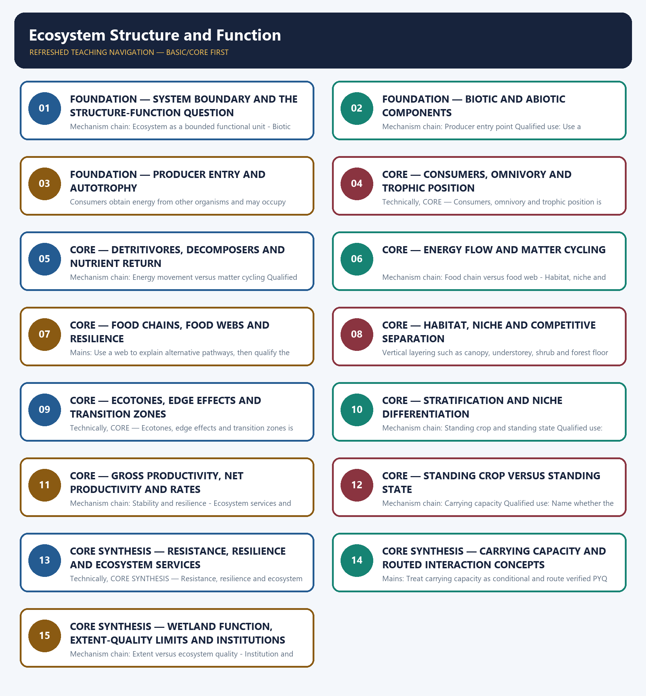

# Ecosystem Structure and Function — Learner-v2 Complete Learning Session

> **Authoring-only generation:** 2026-09-03. No PDF was rendered and no tracker or index was mutated.

### SOURCE, PROGRESSION AND CURRENT-LINKAGE AUDIT

- **Generation date:** 2026-09-03.
- **Repository-first evidence:** the Basic owner is taught first and preserved in full; the Advanced owner is retained only in the optional final teaching block.
- **OCR evidence:** Repository Markdown was primary. OCR-searchable local official General Studies papers were used only to confirm printed routed demands. No answer key, marking scheme, unsupported page precision, ecological rate, species count or current status was inferred.
- **Qdrant:** not used; repository Markdown and available OCR context were sufficient.
- **PYQ integrity:** The audited owners route the 2019 GS-III carrying-capacity demand directly to this topic and route objective concepts on primary producers, filter feeders, detritivores, symbiosis, parasitoids, fig pollination and wetland function. The direct Mains demand is solved as a demand card; objective routes remain answer-free because this package does not infer an official option or key.
- **Live-link boundary:** No new topic-specific live ecological fact was imported on 2026-09-03. The Forest Survey of India page returned only contact text, the IPCC page returned only a report title, the MoEFCC page carried an unrelated recruitment notice and PIB returned HTTP 403. The CBD Target 3 guidance was substantive but is not evidence for ecosystem productivity, cover quality or carrying capacity. All numbers and PYQ claims therefore remain bounded to repository owners and audited ledgers.
- **Fact/inference discipline:** no current-affairs item, PYQ wording, figure or quotation is invented.

### LIVE OFFICIAL-SOURCE ATTEMPT LOG

The checks below were made on 2026-09-03. Substantive official text is used only for the proposition it supports. Stubs, access failures, unrelated pages and thin landing pages are recorded and are not converted into ecological or current-status claims.

- https://fsi.nic.in/forest-report-2023 — attempted 2026-09-03; the fetch returned only the Forest Survey of India contact address, so no report figure, edition claim or ecosystem-status statement was taken from that contact-only stub.
- https://www.cbd.int/gbf/targets/3 — attempted 2026-09-03; the CBD Secretariat page returned substantive Target 3 guidance and expressly said that the guidance does not replace or qualify COP decisions 15/4 or 15/5. It was used only for that status boundary, not for a hotspot threshold, Indian extent or implementation claim.
- https://www.ipcc.ch/report/ar6/syr/ — attempted 2026-09-03; the fetch returned only the title 'AR6 Synthesis Report: Climate Change 2023', so no temperature, carbon-budget or cycle figure was imported.
- https://moef.gov.in/ — attempted 2026-09-03; the page returned a current but unrelated 2026 recruitment-rule consultation notice, so it supplied no topic-specific ecological claim.
- https://www.pib.gov.in/indexd.aspx?reg=3&lang=1 — attempted 2026-09-03; the request returned HTTP 403, so no PIB release was used.

## BASIC LEARNING SESSION



*Distinct embedded teaching-navigation image. The separate continuous Cārvāka-style flowchart package remains an independent at-a-glance artifact.*

### SESSION 1 — FOUNDATION — SYSTEM BOUNDARY AND THE STRUCTURE-FUNCTION QUESTION

#### DEFINITION / WHAT THIS IS CALLED

**Plain-language definition:** Tansley coined the term in 1935, and every claim must state the practical system boundary rather than treat all nature as one unit.

**Technical definition:** Mechanism chain: Ecosystem as a bounded functional unit - Biotic and abiotic structure Qualified use: Open by fixing the ecosystem boundary and then pair each structural component with its function.

#### ANSWER-GRABBING OPENING — WRITE/ADAPT IN THE EXAM

> Do not discuss an ecosystem without fixing a defensible spatial and functional boundary.

#### MUST-WRITE KEYWORDS

- **FOUNDATION**
- **System boundary**
- **the structure-function question**
- **Mechanism chain**
- **Qualified use**
- **Tansley**

**How to use them:** Frame the answer through FOUNDATION; define System boundary, connect the structure-function question with Mechanism chain to explain the mechanism, and use Qualified use for the decisive comparison or qualification.

#### VISUAL FIRST

```text
SYSTEM BOUNDARY AND THE STRUCTURE-FUNCTION QUESTION
01. Ecosystem as a bounded functional unit
    |
    v
02. Biotic and abiotic structure
BOUNDARY -> Do not discuss an ecosystem without fixing a defensible spatial and functional boundary.
```

*This topic-specific rail fixes the evidence sequence and its exam boundary before analysis.*

#### CORE EXPLANATION

The owner defines an ecosystem as interacting biotic communities and their abiotic physical and chemical environment exchanging energy and matter; A. G. Tansley coined the term in 1935, and every claim must state the practical system boundary rather than treat all nature as one unit. Biotic structure comprises producers, consumers, decomposers and detritivores, while abiotic structure comprises climatic, edaphic, water and nutrient conditions; structure identifies what is present before function explains what those components do.

#### NAMED EVIDENCE AND MECHANISM

- The owner defines an ecosystem as interacting biotic communities and their abiotic physical and chemical environment exchanging energy and matter; A. G. Tansley coined the term in 1935, and every claim must state the practical system boundary rather than treat all nature as one unit.
- Biotic structure comprises producers, consumers, decomposers and detritivores, while abiotic structure comprises climatic, edaphic, water and nutrient conditions; structure identifies what is present before function explains what those components do.

#### EXAMINER CAUTION

- Do not discuss an ecosystem without fixing a defensible spatial and functional boundary.

#### EXAM LINK

- **Prelims:** Preserve the exact ecological level, system boundary, stock or flow, pyramid parameter, succession substrate, biome scale, taxonomic term and scientific or legal status; never turn a context-dependent pattern into a universal rule.
- **Mains:** Open by fixing the ecosystem boundary and then pair each structural component with its function.

#### MINI RECAP

- **Mechanism chain:** Ecosystem as a bounded functional unit -> Biotic and abiotic structure
- **Qualified use:** Open by fixing the ecosystem boundary and then pair each structural component with its function.

#### CLOSING RECALL FLOW — FOUNDATION — SYSTEM BOUNDARY AND THE STRUCTURE-FUNCTION QUESTION

```text
START / CONCEPT: FOUNDATION — System boundary and the structure-function question
        |
        v
EXACT TERMS: FOUNDATION · System boundary · the structure-function question · Mechanism chain · Qualified use · Tansley
        |
        v
MECHANISM / ARGUMENT: Mechanism chain: Ecosystem as a bounded functional unit - Biotic and abiotic structure Qualified use: Open by fixing the ecosystem boundary and then pair each structural component with its function.
        |
        v
CONSEQUENCE / CONTRAST: Tansley coined the term in 1935, and every claim must state the practical system boundary rather than treat all nature as one unit.
        |
        v
UPSC TRAP / ANSWER-USE: Biotic structure comprises producers, consumers, decomposers and detritivores, while abiotic structure comprises climatic, edaphic, water and nutrient conditions; structure identifies what is present before function explains what those components do.
        |
        v
ANSWER-GRABBING FORMULATION: Do not discuss an ecosystem without fixing a defensible spatial and functional boundary.
```
### SESSION 2 — FOUNDATION — BIOTIC AND ABIOTIC COMPONENTS

#### DEFINITION / WHAT THIS IS CALLED

**Plain-language definition:** Producers introduce usable chemical energy through photosynthesis or chemosynthesis; green plants are not the only producers, and the source does not support treating consumers or decomposers as an energy entry point.

**Technical definition:** Mechanism chain: Producer entry point Qualified use: Use a two-column biotic-abiotic frame before tracing any process.

#### ANSWER-GRABBING OPENING — WRITE/ADAPT IN THE EXAM

> Do not treat biotic structure and ecosystem function as interchangeable descriptions.

#### MUST-WRITE KEYWORDS

- **FOUNDATION**
- **Biotic**
- **abiotic components**
- **Mechanism chain**
- **Qualified use**
- **Producers**

**How to use them:** Frame the answer through FOUNDATION; define Biotic, connect abiotic components with Mechanism chain to explain the mechanism, and use Qualified use for the decisive comparison or qualification.

#### VISUAL FIRST

```text
BIOTIC AND ABIOTIC COMPONENTS
01. Producer entry point
BOUNDARY -> Do not treat biotic structure and ecosystem function as interchangeable descriptions.
```

*This topic-specific rail fixes the evidence sequence and its exam boundary before analysis.*

#### CORE EXPLANATION

Producers introduce usable chemical energy through photosynthesis or chemosynthesis; green plants are not the only producers, and the source does not support treating consumers or decomposers as an energy entry point.

#### NAMED EVIDENCE AND MECHANISM

- Producers introduce usable chemical energy through photosynthesis or chemosynthesis; green plants are not the only producers, and the source does not support treating consumers or decomposers as an energy entry point.

#### EXAMINER CAUTION

- Do not treat biotic structure and ecosystem function as interchangeable descriptions.

#### EXAM LINK

- **Prelims:** Preserve the exact ecological level, system boundary, stock or flow, pyramid parameter, succession substrate, biome scale, taxonomic term and scientific or legal status; never turn a context-dependent pattern into a universal rule.
- **Mains:** Use a two-column biotic-abiotic frame before tracing any process.

#### MINI RECAP

- **Mechanism chain:** Producer entry point
- **Qualified use:** Use a two-column biotic-abiotic frame before tracing any process.

#### CLOSING RECALL FLOW — FOUNDATION — BIOTIC AND ABIOTIC COMPONENTS

```text
START / CONCEPT: FOUNDATION — Biotic and abiotic components
        |
        v
EXACT TERMS: FOUNDATION · Biotic · abiotic components · Mechanism chain · Qualified use · Producers
        |
        v
MECHANISM / ARGUMENT: Mechanism chain: Producer entry point Qualified use: Use a two-column biotic-abiotic frame before tracing any process.
        |
        v
CONSEQUENCE / CONTRAST: Producers introduce usable chemical energy through photosynthesis or chemosynthesis; green plants are not the only producers, and the source does not support treating consumers or decomposers as an energy entry point.
        |
        v
UPSC TRAP / ANSWER-USE: Do not miss this limiting distinction: use a two-column biotic-abiotic frame before tracing any process.
        |
        v
ANSWER-GRABBING FORMULATION: Do not treat biotic structure and ecosystem function as interchangeable descriptions.
```
### SESSION 3 — FOUNDATION — PRODUCER ENTRY AND AUTOTROPHY

#### DEFINITION / WHAT THIS IS CALLED

**Plain-language definition:** Mechanism chain: Consumers and trophic position Qualified use: Identify the actual energy entry route before discussing trophic transfer.

**Technical definition:** Consumers obtain energy from other organisms and may occupy more than one trophic position when omnivory occurs, so trophic level is a feeding relation within the stated web rather than a permanent taxonomic rank.

#### ANSWER-GRABBING OPENING — WRITE/ADAPT IN THE EXAM

> Do not describe green plants as the only possible producers.

#### MUST-WRITE KEYWORDS

- **FOUNDATION**
- **Producer entry**
- **autotrophy**
- **Mechanism chain**
- **Qualified use**
- **Consumers**

**How to use them:** Frame the answer through FOUNDATION; define Producer entry, connect autotrophy with Mechanism chain to explain the mechanism, and use Qualified use for the decisive comparison or qualification.

#### VISUAL FIRST

```text
PRODUCER ENTRY AND AUTOTROPHY
01. Consumers and trophic position
BOUNDARY -> Do not describe green plants as the only possible producers.
```

*This topic-specific rail fixes the evidence sequence and its exam boundary before analysis.*

#### CORE EXPLANATION

Consumers obtain energy from other organisms and may occupy more than one trophic position when omnivory occurs, so trophic level is a feeding relation within the stated web rather than a permanent taxonomic rank.

#### NAMED EVIDENCE AND MECHANISM

- Consumers obtain energy from other organisms and may occupy more than one trophic position when omnivory occurs, so trophic level is a feeding relation within the stated web rather than a permanent taxonomic rank.

#### EXAMINER CAUTION

- Do not describe green plants as the only possible producers.

#### EXAM LINK

- **Prelims:** Preserve the exact ecological level, system boundary, stock or flow, pyramid parameter, succession substrate, biome scale, taxonomic term and scientific or legal status; never turn a context-dependent pattern into a universal rule.
- **Mains:** Identify the actual energy entry route before discussing trophic transfer.

#### MINI RECAP

- **Mechanism chain:** Consumers and trophic position
- **Qualified use:** Identify the actual energy entry route before discussing trophic transfer.

#### CLOSING RECALL FLOW — FOUNDATION — PRODUCER ENTRY AND AUTOTROPHY

```text
START / CONCEPT: FOUNDATION — Producer entry and autotrophy
        |
        v
EXACT TERMS: FOUNDATION · Producer entry · autotrophy · Mechanism chain · Qualified use · Consumers
        |
        v
MECHANISM / ARGUMENT: Mechanism chain: Consumers and trophic position Qualified use: Identify the actual energy entry route before discussing trophic transfer.
        |
        v
CONSEQUENCE / CONTRAST: Consumers obtain energy from other organisms and may occupy more than one trophic position when omnivory occurs, so trophic level is a feeding relation within the stated web rather than a permanent taxonomic rank.
        |
        v
UPSC TRAP / ANSWER-USE: Do not miss this limiting distinction: do not describe green plants as the only possible producers.
        |
        v
ANSWER-GRABBING FORMULATION: Do not describe green plants as the only possible producers.
```
### SESSION 4 — CORE — CONSUMERS, OMNIVORY AND TROPHIC POSITION

#### DEFINITION / WHAT THIS IS CALLED

**Plain-language definition:** Mechanism chain: Detritivore and decomposer distinction Qualified use: State the feeding relation and allow for omnivory rather than assigning a permanent rank.

**Technical definition:** Technically, CORE — Consumers, omnivory and trophic position is analysed by relating Consumers to omnivory, then testing the relationship through trophic position and Mechanism chain.

#### ANSWER-GRABBING OPENING — WRITE/ADAPT IN THE EXAM

> Do not turn trophic position into a permanent taxonomic rank.

#### MUST-WRITE KEYWORDS

- **Consumers**
- **omnivory**
- **trophic position**
- **Mechanism chain**
- **Qualified use**
- **Detritivores**

**How to use them:** Frame the answer through Consumers; define omnivory, connect trophic position with Mechanism chain to explain the mechanism, and use Qualified use for the decisive comparison or qualification.

#### VISUAL FIRST

```text
CONSUMERS, OMNIVORY AND TROPHIC POSITION
01. Detritivore and decomposer distinction
BOUNDARY -> Do not turn trophic position into a permanent taxonomic rank.
```

*This topic-specific rail fixes the evidence sequence and its exam boundary before analysis.*

#### CORE EXPLANATION

Detritivores physically fragment dead organic material, whereas microbial decomposers such as bacteria and fungi chemically break it down and release nutrients; the two roles cooperate but are not synonyms.

#### NAMED EVIDENCE AND MECHANISM

- Detritivores physically fragment dead organic material, whereas microbial decomposers such as bacteria and fungi chemically break it down and release nutrients; the two roles cooperate but are not synonyms.

#### EXAMINER CAUTION

- Do not turn trophic position into a permanent taxonomic rank.

#### EXAM LINK

- **Prelims:** Preserve the exact ecological level, system boundary, stock or flow, pyramid parameter, succession substrate, biome scale, taxonomic term and scientific or legal status; never turn a context-dependent pattern into a universal rule.
- **Mains:** State the feeding relation and allow for omnivory rather than assigning a permanent rank.

#### MINI RECAP

- **Mechanism chain:** Detritivore and decomposer distinction
- **Qualified use:** State the feeding relation and allow for omnivory rather than assigning a permanent rank.

#### CLOSING RECALL FLOW — CORE — CONSUMERS, OMNIVORY AND TROPHIC POSITION

```text
START / CONCEPT: CORE — Consumers, omnivory and trophic position
        |
        v
EXACT TERMS: Consumers · omnivory · trophic position · Mechanism chain · Qualified use · Detritivores
        |
        v
MECHANISM / ARGUMENT: Mechanism chain: Detritivore and decomposer distinction Qualified use: State the feeding relation and allow for omnivory rather than assigning a permanent rank.
        |
        v
CONSEQUENCE / CONTRAST: Detritivores physically fragment dead organic material, whereas microbial decomposers such as bacteria and fungi chemically break it down and release nutrients; the two roles cooperate but are not synonyms.
        |
        v
UPSC TRAP / ANSWER-USE: Do not miss this limiting distinction: do not turn trophic position into a permanent taxonomic rank.
        |
        v
ANSWER-GRABBING FORMULATION: Do not turn trophic position into a permanent taxonomic rank.
```
### SESSION 5 — CORE — DETRITIVORES, DECOMPOSERS AND NUTRIENT RETURN

#### DEFINITION / WHAT THIS IS CALLED

**Plain-language definition:** Energy passes one way through trophic transfers and dissipates as heat, whereas chemical matter returns through decomposition and uptake; energy is not recycled merely because nutrients are.

**Technical definition:** Mechanism chain: Energy movement versus matter cycling Qualified use: Trace fragmentation, chemical breakdown and nutrient release as distinct steps.

#### ANSWER-GRABBING OPENING — WRITE/ADAPT IN THE EXAM

> Energy passes one way through trophic transfers and dissipates as heat, whereas chemical matter returns through decomposition and uptake; energy is not recycled merely because nutrients are.

#### MUST-WRITE KEYWORDS

- **Detritivores**
- **decomposers**
- **nutrient return**
- **Mechanism chain**
- **Qualified use**
- **Energy**

**How to use them:** Frame the answer through Detritivores; define decomposers, connect nutrient return with Mechanism chain to explain the mechanism, and use Qualified use for the decisive comparison or qualification.

#### VISUAL FIRST

```text
DETRITIVORES, DECOMPOSERS AND NUTRIENT RETURN
01. Energy movement versus matter cycling
BOUNDARY -> Do not use detritivore and decomposer as synonyms.
```

*This topic-specific rail fixes the evidence sequence and its exam boundary before analysis.*

#### CORE EXPLANATION

Energy passes one way through trophic transfers and dissipates as heat, whereas chemical matter returns through decomposition and uptake; energy is not recycled merely because nutrients are.

#### NAMED EVIDENCE AND MECHANISM

- Energy passes one way through trophic transfers and dissipates as heat, whereas chemical matter returns through decomposition and uptake; energy is not recycled merely because nutrients are.

#### EXAMINER CAUTION

- Do not use detritivore and decomposer as synonyms.

#### EXAM LINK

- **Prelims:** Preserve the exact ecological level, system boundary, stock or flow, pyramid parameter, succession substrate, biome scale, taxonomic term and scientific or legal status; never turn a context-dependent pattern into a universal rule.
- **Mains:** Trace fragmentation, chemical breakdown and nutrient release as distinct steps.

#### MINI RECAP

- **Mechanism chain:** Energy movement versus matter cycling
- **Qualified use:** Trace fragmentation, chemical breakdown and nutrient release as distinct steps.

#### CLOSING RECALL FLOW — CORE — DETRITIVORES, DECOMPOSERS AND NUTRIENT RETURN

```text
START / CONCEPT: CORE — Detritivores, decomposers and nutrient return
        |
        v
EXACT TERMS: Detritivores · decomposers · nutrient return · Mechanism chain · Qualified use · Energy
        |
        v
MECHANISM / ARGUMENT: Mechanism chain: Energy movement versus matter cycling Qualified use: Trace fragmentation, chemical breakdown and nutrient release as distinct steps.
        |
        v
CONSEQUENCE / CONTRAST: Do not use detritivore and decomposer as synonyms.
        |
        v
UPSC TRAP / ANSWER-USE: Do not miss this limiting distinction: energy passes one way through trophic transfers and dissipates as heat.
        |
        v
ANSWER-GRABBING FORMULATION: Energy passes one way through trophic transfers and dissipates as heat, whereas chemical matter returns through decomposition and uptake; energy is not recycled merely because nutrients are.
```
### SESSION 6 — CORE — ENERGY FLOW AND MATTER CYCLING

#### DEFINITION / WHAT THIS IS CALLED

**Plain-language definition:** Mains: Write the decisive contrast: energy is dissipative, matter is recyclable.

**Technical definition:** Mechanism chain: Food chain versus food web - Habitat, niche and niche dimensions Qualified use: Write the decisive contrast: energy is dissipative, matter is recyclable.

#### ANSWER-GRABBING OPENING — WRITE/ADAPT IN THE EXAM

> Mechanism chain: Food chain versus food web - Habitat, niche and niche dimensions Qualified use: Write the decisive contrast: energy is dissipative, matter is recyclable.

#### MUST-WRITE KEYWORDS

- **Energy flow**
- **matter cycling**
- **Mechanism chain**
- **Qualified use**
- **A food chain**
- **Habitat**

**How to use them:** Frame the answer through Energy flow; define matter cycling, connect Mechanism chain with Qualified use to explain the mechanism, and use A food chain for the decisive comparison or qualification.

#### VISUAL FIRST

```text
ENERGY FLOW AND MATTER CYCLING
01. Food chain versus food web
    |
    v
02. Habitat, niche and niche dimensions
BOUNDARY -> Do not say energy cycles because nutrients cycle.
```

*This topic-specific rail fixes the evidence sequence and its exam boundary before analysis.*

#### CORE EXPLANATION

A food chain is one linear feeding route, while a food web is the network of interconnected chains; alternative links can support resilience, but a web does not make every disturbance harmless. Habitat is the physical place a species occupies, while niche is its functional resource use and interactions; the owner separates habitat, trophic or food, and reproductive dimensions of niche.

#### NAMED EVIDENCE AND MECHANISM

- A food chain is one linear feeding route, while a food web is the network of interconnected chains; alternative links can support resilience, but a web does not make every disturbance harmless.
- Habitat is the physical place a species occupies, while niche is its functional resource use and interactions; the owner separates habitat, trophic or food, and reproductive dimensions of niche.

#### EXAMINER CAUTION

- Do not say energy cycles because nutrients cycle.

#### EXAM LINK

- **Prelims:** Preserve the exact ecological level, system boundary, stock or flow, pyramid parameter, succession substrate, biome scale, taxonomic term and scientific or legal status; never turn a context-dependent pattern into a universal rule.
- **Mains:** Write the decisive contrast: energy is dissipative, matter is recyclable.

#### MINI RECAP

- **Mechanism chain:** Food chain versus food web -> Habitat, niche and niche dimensions
- **Qualified use:** Write the decisive contrast: energy is dissipative, matter is recyclable.

#### CLOSING RECALL FLOW — CORE — ENERGY FLOW AND MATTER CYCLING

```text
START / CONCEPT: CORE — Energy flow and matter cycling
        |
        v
EXACT TERMS: Energy flow · matter cycling · Mechanism chain · Qualified use · A food chain · Habitat
        |
        v
MECHANISM / ARGUMENT: Do not say energy cycles because nutrients cycle.
        |
        v
CONSEQUENCE / CONTRAST: Mains: Write the decisive contrast: energy is dissipative, matter is recyclable.
        |
        v
UPSC TRAP / ANSWER-USE: A food chain is one linear feeding route, while a food web is the network of interconnected chains; alternative links can support resilience, but a web does not make every disturbance harmless.
        |
        v
ANSWER-GRABBING FORMULATION: Mechanism chain: Food chain versus food web - Habitat, niche and niche dimensions Qualified use: Write the decisive contrast: energy is dissipative, matter is recyclable.
```
### SESSION 7 — CORE — FOOD CHAINS, FOOD WEBS AND RESILIENCE

#### DEFINITION / WHAT THIS IS CALLED

**Plain-language definition:** Mechanism chain: Ecotone and edge effect Qualified use: Use a web to explain alternative pathways, then qualify the resilience claim.

**Technical definition:** Mains: Use a web to explain alternative pathways, then qualify the resilience claim.

#### ANSWER-GRABBING OPENING — WRITE/ADAPT IN THE EXAM

> Mechanism chain: Ecotone and edge effect Qualified use: Use a web to explain alternative pathways, then qualify the resilience claim.

#### MUST-WRITE KEYWORDS

- **Food chains**
- **food webs**
- **resilience**
- **Mechanism chain**
- **Qualified use**
- **An ecotone**

**How to use them:** Frame the answer through Food chains; define food webs, connect resilience with Mechanism chain to explain the mechanism, and use Qualified use for the decisive comparison or qualification.

#### VISUAL FIRST

```text
FOOD CHAINS, FOOD WEBS AND RESILIENCE
01. Ecotone and edge effect
BOUNDARY -> Do not use food chain and food web interchangeably.
```

*This topic-specific rail fixes the evidence sequence and its exam boundary before analysis.*

#### CORE EXPLANATION

An ecotone is a transition zone of variable width between adjoining ecosystems and may show an edge effect, but the higher density or variety often associated with an edge is a pattern, not the definition of the zone.

#### NAMED EVIDENCE AND MECHANISM

- An ecotone is a transition zone of variable width between adjoining ecosystems and may show an edge effect, but the higher density or variety often associated with an edge is a pattern, not the definition of the zone.

#### EXAMINER CAUTION

- Do not use food chain and food web interchangeably.

#### EXAM LINK

- **Prelims:** Preserve the exact ecological level, system boundary, stock or flow, pyramid parameter, succession substrate, biome scale, taxonomic term and scientific or legal status; never turn a context-dependent pattern into a universal rule.
- **Mains:** Use a web to explain alternative pathways, then qualify the resilience claim.

#### MINI RECAP

- **Mechanism chain:** Ecotone and edge effect
- **Qualified use:** Use a web to explain alternative pathways, then qualify the resilience claim.

#### CLOSING RECALL FLOW — CORE — FOOD CHAINS, FOOD WEBS AND RESILIENCE

```text
START / CONCEPT: CORE — Food chains, food webs and resilience
        |
        v
EXACT TERMS: Food chains · food webs · resilience · Mechanism chain · Qualified use · An ecotone
        |
        v
MECHANISM / ARGUMENT: Mains: Use a web to explain alternative pathways, then qualify the resilience claim.
        |
        v
CONSEQUENCE / CONTRAST: Do not use food chain and food web interchangeably.
        |
        v
UPSC TRAP / ANSWER-USE: An ecotone is a transition zone of variable width between adjoining ecosystems and may show an edge effect, but the higher density or variety often associated with an edge is a pattern, not the definition of the zone.
        |
        v
ANSWER-GRABBING FORMULATION: Mechanism chain: Ecotone and edge effect Qualified use: Use a web to explain alternative pathways, then qualify the resilience claim.
```
### SESSION 8 — CORE — HABITAT, NICHE AND COMPETITIVE SEPARATION

#### DEFINITION / WHAT THIS IS CALLED

**Plain-language definition:** Mechanism chain: Stratification and resource partitioning Qualified use: Define habitat as place and niche as role before applying competition or partitioning.

**Technical definition:** Vertical layering such as canopy, understorey, shrub and forest floor creates different microhabitats and niches; greater layering may support coexistence without proving universal stability or biodiversity.

#### ANSWER-GRABBING OPENING — WRITE/ADAPT IN THE EXAM

> Do not collapse habitat into niche or omit niche dimensions.

#### MUST-WRITE KEYWORDS

- **Habitat**
- **niche**
- **competitive separation**
- **Mechanism chain**
- **Qualified use**
- **Vertical**

**How to use them:** Frame the answer through Habitat; define niche, connect competitive separation with Mechanism chain to explain the mechanism, and use Qualified use for the decisive comparison or qualification.

#### VISUAL FIRST

```text
HABITAT, NICHE AND COMPETITIVE SEPARATION
01. Stratification and resource partitioning
BOUNDARY -> Do not collapse habitat into niche or omit niche dimensions.
```

*This topic-specific rail fixes the evidence sequence and its exam boundary before analysis.*

#### CORE EXPLANATION

Vertical layering such as canopy, understorey, shrub and forest floor creates different microhabitats and niches; greater layering may support coexistence without proving universal stability or biodiversity.

#### NAMED EVIDENCE AND MECHANISM

- Vertical layering such as canopy, understorey, shrub and forest floor creates different microhabitats and niches; greater layering may support coexistence without proving universal stability or biodiversity.

#### EXAMINER CAUTION

- Do not collapse habitat into niche or omit niche dimensions.

#### EXAM LINK

- **Prelims:** Preserve the exact ecological level, system boundary, stock or flow, pyramid parameter, succession substrate, biome scale, taxonomic term and scientific or legal status; never turn a context-dependent pattern into a universal rule.
- **Mains:** Define habitat as place and niche as role before applying competition or partitioning.

#### MINI RECAP

- **Mechanism chain:** Stratification and resource partitioning
- **Qualified use:** Define habitat as place and niche as role before applying competition or partitioning.

#### CLOSING RECALL FLOW — CORE — HABITAT, NICHE AND COMPETITIVE SEPARATION

```text
START / CONCEPT: CORE — Habitat, niche and competitive separation
        |
        v
EXACT TERMS: Habitat · niche · competitive separation · Mechanism chain · Qualified use · Vertical
        |
        v
MECHANISM / ARGUMENT: Mechanism chain: Stratification and resource partitioning Qualified use: Define habitat as place and niche as role before applying competition or partitioning.
        |
        v
CONSEQUENCE / CONTRAST: Vertical layering such as canopy, understorey, shrub and forest floor creates different microhabitats and niches; greater layering may support coexistence without proving universal stability or biodiversity.
        |
        v
UPSC TRAP / ANSWER-USE: Do not miss this limiting distinction: do not collapse habitat into niche or omit niche dimensions.
        |
        v
ANSWER-GRABBING FORMULATION: Do not collapse habitat into niche or omit niche dimensions.
```
### SESSION 9 — CORE — ECOTONES, EDGE EFFECTS AND TRANSITION ZONES

#### DEFINITION / WHAT THIS IS CALLED

**Plain-language definition:** Mechanism chain: Gross and net primary productivity Qualified use: Separate the transition zone from the possible edge pattern.

**Technical definition:** Technically, CORE — Ecotones, edge effects and transition zones is analysed by relating Ecotones to edge effects, then testing the relationship through transition zones and Mechanism chain.

#### ANSWER-GRABBING OPENING — WRITE/ADAPT IN THE EXAM

> Mechanism chain: Gross and net primary productivity Qualified use: Separate the transition zone from the possible edge pattern.

#### MUST-WRITE KEYWORDS

- **Ecotones**
- **edge effects**
- **transition zones**
- **Mechanism chain**
- **Qualified use**
- **Gross primary productivity**

**How to use them:** Frame the answer through Ecotones; define edge effects, connect transition zones with Mechanism chain to explain the mechanism, and use Qualified use for the decisive comparison or qualification.

#### VISUAL FIRST

```text
ECOTONES, EDGE EFFECTS AND TRANSITION ZONES
01. Gross and net primary productivity
BOUNDARY -> Do not define an ecotone merely by a claimed increase in richness.
```

*This topic-specific rail fixes the evidence sequence and its exam boundary before analysis.*

#### CORE EXPLANATION

Gross primary productivity is total producer fixation over time, while net primary productivity is gross primary productivity minus producer respiration and is the production available for growth and consumers.

#### NAMED EVIDENCE AND MECHANISM

- Gross primary productivity is total producer fixation over time, while net primary productivity is gross primary productivity minus producer respiration and is the production available for growth and consumers.

#### EXAMINER CAUTION

- Do not define an ecotone merely by a claimed increase in richness.

#### EXAM LINK

- **Prelims:** Preserve the exact ecological level, system boundary, stock or flow, pyramid parameter, succession substrate, biome scale, taxonomic term and scientific or legal status; never turn a context-dependent pattern into a universal rule.
- **Mains:** Separate the transition zone from the possible edge pattern.

#### MINI RECAP

- **Mechanism chain:** Gross and net primary productivity
- **Qualified use:** Separate the transition zone from the possible edge pattern.

#### CLOSING RECALL FLOW — CORE — ECOTONES, EDGE EFFECTS AND TRANSITION ZONES

```text
START / CONCEPT: CORE — Ecotones, edge effects and transition zones
        |
        v
EXACT TERMS: Ecotones · edge effects · transition zones · Mechanism chain · Qualified use · Gross primary productivity
        |
        v
MECHANISM / ARGUMENT: Do not define an ecotone merely by a claimed increase in richness.
        |
        v
CONSEQUENCE / CONTRAST: Gross primary productivity is total producer fixation over time, while net primary productivity is gross primary productivity minus producer respiration and is the production available for growth and consumers.
        |
        v
UPSC TRAP / ANSWER-USE: Do not miss this limiting distinction: gross and net primary productivity Qualified use.
        |
        v
ANSWER-GRABBING FORMULATION: Mechanism chain: Gross and net primary productivity Qualified use: Separate the transition zone from the possible edge pattern.
```
### SESSION 10 — CORE — STRATIFICATION AND NICHE DIFFERENTIATION

#### DEFINITION / WHAT THIS IS CALLED

**Plain-language definition:** Standing crop is living material present at a stated time and is often expressed as biomass or number, whereas standing state is the quantity of an abiotic nutrient in the ecosystem; neither is a productivity rate.

**Technical definition:** Mechanism chain: Standing crop and standing state Qualified use: Link layering to microclimate and resource partitioning without claiming an automatic outcome.

#### ANSWER-GRABBING OPENING — WRITE/ADAPT IN THE EXAM

> Do not infer stability or biodiversity from stratification alone.

#### MUST-WRITE KEYWORDS

- **Stratification**
- **niche differentiation**
- **Mechanism chain**
- **Qualified use**
- **Standing crop**
- **Standing**

**How to use them:** Frame the answer through Stratification; define niche differentiation, connect Mechanism chain with Qualified use to explain the mechanism, and use Standing crop for the decisive comparison or qualification.

#### VISUAL FIRST

```text
STRATIFICATION AND NICHE DIFFERENTIATION
01. Standing crop and standing state
BOUNDARY -> Do not infer stability or biodiversity from stratification alone.
```

*This topic-specific rail fixes the evidence sequence and its exam boundary before analysis.*

#### CORE EXPLANATION

Standing crop is living material present at a stated time and is often expressed as biomass or number, whereas standing state is the quantity of an abiotic nutrient in the ecosystem; neither is a productivity rate.

#### NAMED EVIDENCE AND MECHANISM

- Standing crop is living material present at a stated time and is often expressed as biomass or number, whereas standing state is the quantity of an abiotic nutrient in the ecosystem; neither is a productivity rate.

#### EXAMINER CAUTION

- Do not infer stability or biodiversity from stratification alone.

#### EXAM LINK

- **Prelims:** Preserve the exact ecological level, system boundary, stock or flow, pyramid parameter, succession substrate, biome scale, taxonomic term and scientific or legal status; never turn a context-dependent pattern into a universal rule.
- **Mains:** Link layering to microclimate and resource partitioning without claiming an automatic outcome.

#### MINI RECAP

- **Mechanism chain:** Standing crop and standing state
- **Qualified use:** Link layering to microclimate and resource partitioning without claiming an automatic outcome.

#### CLOSING RECALL FLOW — CORE — STRATIFICATION AND NICHE DIFFERENTIATION

```text
START / CONCEPT: CORE — Stratification and niche differentiation
        |
        v
EXACT TERMS: Stratification · niche differentiation · Mechanism chain · Qualified use · Standing crop · Standing
        |
        v
MECHANISM / ARGUMENT: Mechanism chain: Standing crop and standing state Qualified use: Link layering to microclimate and resource partitioning without claiming an automatic outcome.
        |
        v
CONSEQUENCE / CONTRAST: Standing crop is living material present at a stated time and is often expressed as biomass or number, whereas standing state is the quantity of an abiotic nutrient in the ecosystem; neither is a productivity rate.
        |
        v
UPSC TRAP / ANSWER-USE: Do not miss this limiting distinction: standing crop is living material present at a stated time and is often expressed...
        |
        v
ANSWER-GRABBING FORMULATION: Do not infer stability or biodiversity from stratification alone.
```
### SESSION 11 — CORE — GROSS PRODUCTIVITY, NET PRODUCTIVITY AND RATES

#### DEFINITION / WHAT THIS IS CALLED

**Plain-language definition:** Stability or resistance describes limited change under disturbance, whereas resilience describes recovery after disturbance; a uniform plantation can appear stable yet remain poorly resilient to a specific shock.

**Technical definition:** Mechanism chain: Stability and resilience - Ecosystem services and NCP Qualified use: Write GPP, producer respiration and NPP in the correct gross-to-net relation.

#### ANSWER-GRABBING OPENING — WRITE/ADAPT IN THE EXAM

> Do not confuse gross productivity, net productivity and standing biomass.

#### MUST-WRITE KEYWORDS

- **Gross productivity**
- **net productivity**
- **rates**
- **Mechanism chain**
- **Qualified use**
- **Stability or resistance**

**How to use them:** Frame the answer through Gross productivity; define net productivity, connect rates with Mechanism chain to explain the mechanism, and use Qualified use for the decisive comparison or qualification.

#### VISUAL FIRST

```text
GROSS PRODUCTIVITY, NET PRODUCTIVITY AND RATES
01. Stability and resilience
    |
    v
02. Ecosystem services and NCP
BOUNDARY -> Do not confuse gross productivity, net productivity and standing biomass.
```

*This topic-specific rail fixes the evidence sequence and its exam boundary before analysis.*

#### CORE EXPLANATION

Stability or resistance describes limited change under disturbance, whereas resilience describes recovery after disturbance; a uniform plantation can appear stable yet remain poorly resilient to a specific shock. The owner uses provisioning, regulating, supporting and cultural services as the Millennium Ecosystem Assessment vocabulary, while IPBES Nature's Contributions to People broadens valuation to relational and indigenous or local-knowledge values.

#### NAMED EVIDENCE AND MECHANISM

- Stability or resistance describes limited change under disturbance, whereas resilience describes recovery after disturbance; a uniform plantation can appear stable yet remain poorly resilient to a specific shock.
- The owner uses provisioning, regulating, supporting and cultural services as the Millennium Ecosystem Assessment vocabulary, while IPBES Nature's Contributions to People broadens valuation to relational and indigenous or local-knowledge values.

#### EXAMINER CAUTION

- Do not confuse gross productivity, net productivity and standing biomass.

#### EXAM LINK

- **Prelims:** Preserve the exact ecological level, system boundary, stock or flow, pyramid parameter, succession substrate, biome scale, taxonomic term and scientific or legal status; never turn a context-dependent pattern into a universal rule.
- **Mains:** Write GPP, producer respiration and NPP in the correct gross-to-net relation.

#### MINI RECAP

- **Mechanism chain:** Stability and resilience -> Ecosystem services and NCP
- **Qualified use:** Write GPP, producer respiration and NPP in the correct gross-to-net relation.

#### CLOSING RECALL FLOW — CORE — GROSS PRODUCTIVITY, NET PRODUCTIVITY AND RATES

```text
START / CONCEPT: CORE — Gross productivity, net productivity and rates
        |
        v
EXACT TERMS: Gross productivity · net productivity · rates · Mechanism chain · Qualified use · Stability or resistance
        |
        v
MECHANISM / ARGUMENT: Mechanism chain: Stability and resilience - Ecosystem services and NCP Qualified use: Write GPP, producer respiration and NPP in the correct gross-to-net relation.
        |
        v
CONSEQUENCE / CONTRAST: Stability or resistance describes limited change under disturbance, whereas resilience describes recovery after disturbance; a uniform plantation can appear stable yet remain poorly resilient to a specific shock.
        |
        v
UPSC TRAP / ANSWER-USE: The owner uses provisioning, regulating, supporting and cultural services as the Millennium Ecosystem Assessment vocabulary, while IPBES Nature's Contributions to People broadens valuation to relational and indigenous or local-knowledge values.
        |
        v
ANSWER-GRABBING FORMULATION: Do not confuse gross productivity, net productivity and standing biomass.
```
### SESSION 12 — CORE — STANDING CROP VERSUS STANDING STATE

#### DEFINITION / WHAT THIS IS CALLED

**Plain-language definition:** Carrying capacity is the population or project load an ecosystem can sustain over time without eroding regenerative functions; it is a conditional threshold shaped by consumption, technology and governance, not a fixed headcount.

**Technical definition:** Mechanism chain: Carrying capacity Qualified use: Name whether the question measures living stock, abiotic nutrient stock or production rate.

#### ANSWER-GRABBING OPENING — WRITE/ADAPT IN THE EXAM

> Do not confuse standing crop with standing state or either with a rate.

#### MUST-WRITE KEYWORDS

- **Standing crop versus standing state**
- **Mechanism chain**
- **Qualified use**
- **Carrying capacity**
- **Carrying**
- **Name**

**How to use them:** Frame the answer through Standing crop versus standing state; define Mechanism chain, connect Qualified use with Carrying capacity to explain the mechanism, and use Carrying for the decisive comparison or qualification.

#### VISUAL FIRST

```text
STANDING CROP VERSUS STANDING STATE
01. Carrying capacity
BOUNDARY -> Do not confuse standing crop with standing state or either with a rate.
```

*This topic-specific rail fixes the evidence sequence and its exam boundary before analysis.*

#### CORE EXPLANATION

Carrying capacity is the population or project load an ecosystem can sustain over time without eroding regenerative functions; it is a conditional threshold shaped by consumption, technology and governance, not a fixed headcount.

#### NAMED EVIDENCE AND MECHANISM

- Carrying capacity is the population or project load an ecosystem can sustain over time without eroding regenerative functions; it is a conditional threshold shaped by consumption, technology and governance, not a fixed headcount.

#### EXAMINER CAUTION

- Do not confuse standing crop with standing state or either with a rate.

#### EXAM LINK

- **Prelims:** Preserve the exact ecological level, system boundary, stock or flow, pyramid parameter, succession substrate, biome scale, taxonomic term and scientific or legal status; never turn a context-dependent pattern into a universal rule.
- **Mains:** Name whether the question measures living stock, abiotic nutrient stock or production rate.

#### MINI RECAP

- **Mechanism chain:** Carrying capacity
- **Qualified use:** Name whether the question measures living stock, abiotic nutrient stock or production rate.

#### CLOSING RECALL FLOW — CORE — STANDING CROP VERSUS STANDING STATE

```text
START / CONCEPT: CORE — Standing crop versus standing state
        |
        v
EXACT TERMS: Standing crop versus standing state · Mechanism chain · Qualified use · Carrying capacity · Carrying · Name
        |
        v
MECHANISM / ARGUMENT: Mechanism chain: Carrying capacity Qualified use: Name whether the question measures living stock, abiotic nutrient stock or production rate.
        |
        v
CONSEQUENCE / CONTRAST: Carrying capacity is the population or project load an ecosystem can sustain over time without eroding regenerative functions; it is a conditional threshold shaped by consumption, technology and governance, not a fixed headcount.
        |
        v
UPSC TRAP / ANSWER-USE: Do not miss this limiting distinction: name whether the question measures living stock, abiotic nutrient stock or production rate.
        |
        v
ANSWER-GRABBING FORMULATION: Do not confuse standing crop with standing state or either with a rate.
```
### SESSION 13 — CORE SYNTHESIS — RESISTANCE, RESILIENCE AND ECOSYSTEM SERVICES

#### DEFINITION / WHAT THIS IS CALLED

**Plain-language definition:** Mechanism chain: Interaction and coevolution PYQ routes Qualified use: Distinguish resistance, recovery and the service category actually affected.

**Technical definition:** Technically, CORE SYNTHESIS — Resistance, resilience and ecosystem services is analysed by relating CORE SYNTHESIS to Resistance, then testing the relationship through resilience and ecosystem services.

#### ANSWER-GRABBING OPENING — WRITE/ADAPT IN THE EXAM

> Mechanism chain: Interaction and coevolution PYQ routes Qualified use: Distinguish resistance, recovery and the service category actually affected.

#### MUST-WRITE KEYWORDS

- **CORE SYNTHESIS**
- **Resistance**
- **resilience**
- **ecosystem services**
- **Mechanism chain**
- **Qualified use**

**How to use them:** Frame the answer through CORE SYNTHESIS; define Resistance, connect resilience with ecosystem services to explain the mechanism, and use Mechanism chain for the decisive comparison or qualification.

#### VISUAL FIRST

```text
RESISTANCE, RESILIENCE AND ECOSYSTEM SERVICES
01. Interaction and coevolution PYQ routes
BOUNDARY -> Do not equate resistance with recovery.
```

*This topic-specific rail fixes the evidence sequence and its exam boundary before analysis.*

#### CORE EXPLANATION

The Basic owner carries routed objective concepts on parasitoids, fig pollination, symbiosis and fungus cultivation; these are interaction types within ecological networks, and no official answer option is inferred.

#### NAMED EVIDENCE AND MECHANISM

- The Basic owner carries routed objective concepts on parasitoids, fig pollination, symbiosis and fungus cultivation; these are interaction types within ecological networks, and no official answer option is inferred.

#### EXAMINER CAUTION

- Do not equate resistance with recovery.

#### EXAM LINK

- **Prelims:** Preserve the exact ecological level, system boundary, stock or flow, pyramid parameter, succession substrate, biome scale, taxonomic term and scientific or legal status; never turn a context-dependent pattern into a universal rule.
- **Mains:** Distinguish resistance, recovery and the service category actually affected.

#### MINI RECAP

- **Mechanism chain:** Interaction and coevolution PYQ routes
- **Qualified use:** Distinguish resistance, recovery and the service category actually affected.

#### CLOSING RECALL FLOW — CORE SYNTHESIS — RESISTANCE, RESILIENCE AND ECOSYSTEM SERVICES

```text
START / CONCEPT: CORE SYNTHESIS — Resistance, resilience and ecosystem services
        |
        v
EXACT TERMS: CORE SYNTHESIS · Resistance · resilience · ecosystem services · Mechanism chain · Qualified use
        |
        v
MECHANISM / ARGUMENT: Do not equate resistance with recovery.
        |
        v
CONSEQUENCE / CONTRAST: The Basic owner carries routed objective concepts on parasitoids, fig pollination, symbiosis and fungus cultivation; these are interaction types within ecological networks, and no official answer option is inferred.
        |
        v
UPSC TRAP / ANSWER-USE: Do not miss this limiting distinction: interaction and coevolution PYQ routes Qualified use.
        |
        v
ANSWER-GRABBING FORMULATION: Mechanism chain: Interaction and coevolution PYQ routes Qualified use: Distinguish resistance, recovery and the service category actually affected.
```
### SESSION 14 — CORE SYNTHESIS — CARRYING CAPACITY AND ROUTED INTERACTION CONCEPTS

#### DEFINITION / WHAT THIS IS CALLED

**Plain-language definition:** Mechanism chain: Ocean producers, filter feeders and detritivores - Wetland filtering as structure-function evidence Qualified use: Treat carrying capacity as conditional and route verified PYQ concepts without inventing keys.

**Technical definition:** Mains: Treat carrying capacity as conditional and route verified PYQ concepts without inventing keys.

#### ANSWER-GRABBING OPENING — WRITE/ADAPT IN THE EXAM

> Mechanism chain: Ocean producers, filter feeders and detritivores - Wetland filtering as structure-function evidence Qualified use: Treat carrying capacity as conditional and route verified PYQ concepts without inventing keys.

#### MUST-WRITE KEYWORDS

- **CORE SYNTHESIS**
- **Carrying capacity**
- **routed interaction concepts**
- **Mechanism chain**
- **Qualified use**
- **Basic**

**How to use them:** Frame the answer through CORE SYNTHESIS; define Carrying capacity, connect routed interaction concepts with Mechanism chain to explain the mechanism, and use Qualified use for the decisive comparison or qualification.

#### VISUAL FIRST

```text
CARRYING CAPACITY AND ROUTED INTERACTION CONCEPTS
01. Ocean producers, filter feeders and detritivores
    |
    v
02. Wetland filtering as structure-function evidence
BOUNDARY -> Do not reduce ecosystem services to marketable provisioning benefits.
```

*This topic-specific rail fixes the evidence sequence and its exam boundary before analysis.*

#### CORE EXPLANATION

The audited routes require primary producers in ocean food chains, filter-feeding organisms and detritivore function to remain in Basic practice; each is a functional role and not a claim about one universal species list. Wetland vegetation, sediments and microbial processes can retain or transform pollutants and support flood regulation, but a routed wetland function does not justify an unsupported universal removal percentage.

#### NAMED EVIDENCE AND MECHANISM

- The audited routes require primary producers in ocean food chains, filter-feeding organisms and detritivore function to remain in Basic practice; each is a functional role and not a claim about one universal species list.
- Wetland vegetation, sediments and microbial processes can retain or transform pollutants and support flood regulation, but a routed wetland function does not justify an unsupported universal removal percentage.

#### EXAMINER CAUTION

- Do not reduce ecosystem services to marketable provisioning benefits.

#### EXAM LINK

- **Prelims:** Preserve the exact ecological level, system boundary, stock or flow, pyramid parameter, succession substrate, biome scale, taxonomic term and scientific or legal status; never turn a context-dependent pattern into a universal rule.
- **Mains:** Treat carrying capacity as conditional and route verified PYQ concepts without inventing keys.

#### MINI RECAP

- **Mechanism chain:** Ocean producers, filter feeders and detritivores -> Wetland filtering as structure-function evidence
- **Qualified use:** Treat carrying capacity as conditional and route verified PYQ concepts without inventing keys.

#### CLOSING RECALL FLOW — CORE SYNTHESIS — CARRYING CAPACITY AND ROUTED INTERACTION CONCEPTS

```text
START / CONCEPT: CORE SYNTHESIS — Carrying capacity and routed interaction concepts
        |
        v
EXACT TERMS: CORE SYNTHESIS · Carrying capacity · routed interaction concepts · Mechanism chain · Qualified use · Basic
        |
        v
MECHANISM / ARGUMENT: Mains: Treat carrying capacity as conditional and route verified PYQ concepts without inventing keys.
        |
        v
CONSEQUENCE / CONTRAST: Wetland vegetation, sediments and microbial processes can retain or transform pollutants and support flood regulation, but a routed wetland function does not justify an unsupported universal removal percentage.
        |
        v
UPSC TRAP / ANSWER-USE: The audited routes require primary producers in ocean food chains, filter-feeding organisms and detritivore function to remain in Basic practice; each is a functional role and not a claim about one universal species list.
        |
        v
ANSWER-GRABBING FORMULATION: Mechanism chain: Ocean producers, filter feeders and detritivores - Wetland filtering as structure-function evidence Qualified use: Treat carrying capacity as conditional and route verified PYQ concepts without inventing keys.
```
### SESSION 15 — CORE SYNTHESIS — WETLAND FUNCTION, EXTENT-QUALITY LIMITS AND INSTITUTIONS

#### DEFINITION / WHAT THIS IS CALLED

**Plain-language definition:** Core proposition: An ecosystem is a self-regulating functional unit in which energy flows unidirectionally while matter cycles; structure (who is present) and function (what they do) must both be read together to answer any ecosystem question.

**Technical definition:** Mechanism chain: Extent versus ecosystem quality - Institution and evidence boundary Qualified use: Close by separating monitored extent, ecological quality and institutional evidence.

#### ANSWER-GRABBING OPENING — WRITE/ADAPT IN THE EXAM

> 20 marks / carrying capacity: organise under regenerative supply, assimilative capacity, habitat connectivity and institutional safeguards (EIA, protected-area/forest law); compare a resilient mangrove/wetland system with a simplified plantation or sealed urban catchment; conclude that consumption pattern, technology and governance alter the threshold but do not abolish ecological limits.

#### MUST-WRITE KEYWORDS

- **CORE SYNTHESIS**
- **Wetland function**
- **extent-quality limits**
- **institutions**
- **Mechanism chain**
- **Qualified use**

**How to use them:** Frame the answer through CORE SYNTHESIS; define Wetland function, connect extent-quality limits with institutions to explain the mechanism, and use Mechanism chain for the decisive comparison or qualification.

#### VISUAL FIRST

```text
WETLAND FUNCTION, EXTENT-QUALITY LIMITS AND INSTITUTIONS
01. Extent versus ecosystem quality
    |
    v
02. Institution and evidence boundary
BOUNDARY -> Do not quote carrying capacity as a timeless fixed number.
```

*This topic-specific rail fixes the evidence sequence and its exam boundary before analysis.*

#### CORE EXPLANATION

Forest or tree-cover extent is a canopy measure and cannot by itself establish native composition, age structure, biodiversity, resilience or ecosystem functioning; extent and ecological quality are different claims. MoEFCC, WII, BSI, ZSI and FSI occupy different policy, research, taxonomic and monitoring roles; the owner and audited routing ledgers remain primary, while thin live pages and unavailable answer keys add no claim.

#### NAMED EVIDENCE AND MECHANISM

- Forest or tree-cover extent is a canopy measure and cannot by itself establish native composition, age structure, biodiversity, resilience or ecosystem functioning; extent and ecological quality are different claims.
- MoEFCC, WII, BSI, ZSI and FSI occupy different policy, research, taxonomic and monitoring roles; the owner and audited routing ledgers remain primary, while thin live pages and unavailable answer keys add no claim.

#### EXAMINER CAUTION

- Do not quote carrying capacity as a timeless fixed number.

#### EXAM LINK

- **Prelims:** Preserve the exact ecological level, system boundary, stock or flow, pyramid parameter, succession substrate, biome scale, taxonomic term and scientific or legal status; never turn a context-dependent pattern into a universal rule.
- **Mains:** Close by separating monitored extent, ecological quality and institutional evidence.

#### MINI RECAP

- **Mechanism chain:** Extent versus ecosystem quality -> Institution and evidence boundary
- **Qualified use:** Close by separating monitored extent, ecological quality and institutional evidence.
#### COMPLETE BASIC OWNER EVIDENCE BANK

> **Subject:** Environment and Ecology | **Tier:** Must-Do (foundation) | **GS Paper:** GS-III (Environment) + Prelims.
> **Core area:** Ecological fundamentals.
> **Grounded in:** NCERT Class XII Biology, Ch. "Ecosystem"; NIOS Environmental Studies; Majid Husain, *Indian and World Geography*, Ch. 5 "Biogeography"; audited UPSC Environment PYQs (2024-2026 Prelims and 2024-2025 Mains).
> ✅ = source-grounded | ⚠️ = analytical linkage | 📰 = dated current-affairs anchor.
> *Companion: `advanced/01_Ecosystem-Structure-and-Function.md`.*

#### 1. Visual foundation

```text
1. ABIOTIC COMPONENT (soil, climate, water, nutrients)
   |
   v
2. PRODUCERS fix solar energy (photosynthesis/chemosynthesis)
   |
   v
3. CONSUMERS transfer energy (herbivore -> carnivore -> top carnivore)
   |
   v
4. DECOMPOSERS release locked nutrients back to the abiotic pool
   |
   v
5. NUTRIENTS RECYCLE, ENERGY FLOWS ONE-WAY AND DISSIPATES AS HEAT
```

**Core proposition:** An ecosystem is a self-regulating functional unit in which energy flows
unidirectionally while matter cycles; structure (who is present) and function (what they do)
must both be read together to answer any ecosystem question.

#### 2. Essential definitions

| Concept | Exam-ready meaning |
|---|---|
| ✅ **Ecosystem** | A self-regulating functional unit of interacting biotic communities and their abiotic (physical and chemical) environment exchanging energy and matter. The term was coined by the British ecologist **A.G. Tansley (1935)**. |
| ✅ **Biotic component** | Living part — producers, consumers (herbivore/carnivore/omnivore), decomposers/detritivores. The biotic subsystems are conventionally read as plants, animals (including humans) and micro-organisms. |
| ✅ **Abiotic component** | Non-living part — climatic (temperature, light, rainfall) and edaphic (soil, minerals, topography) factors; at the biosphere scale this means the lithosphere, atmosphere and hydrosphere. |
| ✅ **Habitat vs niche** | Habitat is the physical address of a species; niche is its functional role, resource use and interactions — its "occupation" or "job" in the community. |
| ✅ **Three components of a niche** | A niche has a **habitat niche** (where it lives), a **trophic/food niche** (how it feeds) and a **reproductive niche** (how it breeds) — the standard biogeography decomposition. |
| ✅ **Ecotone** | Boundary transition zone between two adjoining ecosystems (e.g., mangrove, grassland-forest edge), varying in width and acting as a zone of *tension* where species of both communities compete for resources. |
| ✅ **Edge effect** | Tendency for greater species density/variety at the ecotone/community junction. |
| ✅ **Biomass** | Net dry weight of organic material — the material base that actually feeds the food chain. |
| ✅ **Life zone** | Altitudinal zonation of plants and animals forming distinctive communities, each with its own temperature-precipitation regime. |

#### 3. Topic mechanism

1. Producers (autotrophs) convert solar/chemical energy into chemical (food) energy — the
   only true energy entry point of an ecosystem.
2. Energy moves through trophic levels via food chains; interlocking chains form a food web,
   which gives an ecosystem resilience against the loss of any single link.
3. At each transfer, most energy is lost as metabolic heat (second law of thermodynamics), so
   energy flow is one-way and progressively diminishing — it is never recycled.
4. Decomposers (bacteria, fungi) break down dead organic matter, releasing nutrients back into
   soil/water/air, which producers reabsorb — this is why matter, unlike energy, cycles.
5. Two structural components — stratification (vertical layering of species, e.g., canopy to
   forest floor) and productivity (rate of biomass generation) — define how "developed" an
   ecosystem is.

#### 4. Institutions and policy tools

- ✅ **MoEFCC:** apex ministry for ecosystem/biodiversity policy and international convention
  implementation.
- ✅ **Wildlife Institute of India (WII), Dehradun:** research on ecosystem and species
  ecology supporting management plans.
- ✅ **Botanical Survey of India (BSI) / Zoological Survey of India (ZSI):** taxonomic and
  ecological surveys of flora and fauna underpinning ecosystem assessments.
- ⚠️ Ecosystem concepts underlie every protected-area, EIA and afforestation decision, so this
  topic is the base layer for Topics 04-16.

#### 5. Indian applications and examples

- ⚠️ A mangrove ecotone (e.g., Sundarbans) buffers cyclones, nurseries fish and stores "blue
  carbon" — illustrating structure (species zonation) enabling function (coastal protection).
- ⚠️ A degraded grassland with a broken food web (e.g., loss of apex predators) can trigger
  herbivore overgrazing and desertification — a structure-function collapse.
- ⚠️ Western Ghats montane forest stratification (canopy, understorey, shrub, floor) supports
  high endemism because each layer offers a distinct niche.

#### 6. Must-Know Facts for Prelims

- ✅ Producers are the sole entry point of energy into an ecosystem; energy flow is
  unidirectional and matter/nutrient flow is cyclic.
- ✅ A food web is a network of interconnected food chains, giving greater ecosystem stability
  than a single linear chain.
- ✅ Decomposers are heterotrophic and act on dead organic matter; detritivores (e.g.,
  earthworms) physically fragment it before microbial decomposition.
- ✅ Ecotones typically show the "edge effect" — higher species richness than either
  neighbouring community.
- ✅ Niche cannot be shared identically by two species in the same habitat (competitive
  exclusion) — the basis of resource partitioning.
- ✅ The term "ecosystem" was coined by **A.G. Tansley (1935)**; the biosphere's abiotic
  frame is the lithosphere + atmosphere + hydrosphere.
- ✅ A niche is decomposed into habitat, trophic (food) and reproductive niches — a
  frequently examined three-part classification.
- ✅ **Biomass** is measured as *net dry weight* of organic matter, not fresh/wet weight —
  the standard basis for pyramid-of-biomass comparisons.

#### 7. UPSC traps

- ❌ Energy cycles like nutrients in an ecosystem. -> Energy flows one-way and dissipates;
  only matter/nutrients cycle.
- ❌ Habitat and niche are the same thing. -> Habitat is the address; niche is the functional
  role and resource use.
- ❌ Decomposers are only bacteria. -> Fungi and detritivores (e.g., earthworms, dung
  beetles) are equally central to decomposition.
- ❌ A food chain and a food web are interchangeable terms. -> A food web is the sum of
  interconnected food chains and gives more stability.
- ❌ Producers are always green plants. -> Chemosynthetic bacteria (e.g., at hydrothermal
  vents) are also producers without sunlight.
- ❌ An ecotone is simply a boundary line. -> It is a *zone* of variable width and a zone of
  ecological tension/competition, not a line on a map.
- ❌ "Biomass" means the live weight of organisms. -> It is conventionally the **net dry
  weight** of organic material.

#### 8. 📰 Current anchor

- 📰 As of the 18th India State of Forest Report (ISFR 2023, released December 2024 — the
  latest ISFR edition verified for this knowledge base as on **2 August 2026**), India's
  total forest and tree cover is 8,27,357 sq km — 25.17% of the geographical area (forest
  cover 21.76%, tree cover 3.41%) — the base ecosystem-extent statistic to cite with its date.
  ⚠️ ISFR is a **biennial** FSI publication, so verify against the newest edition on
  `fsi.nic.in` before quoting in an answer written later than this date.
- 📰 Economic Survey 2025-26 (Ch. 10, *Environment and Climate Change*) frames India's
  policy direction as "ecosystem-led, development-integrated climate resilience" — the
  government's own vocabulary for treating ecosystem function (mangroves, wetlands, forests)
  as adaptation infrastructure rather than as a separate conservation silo.

⚠️ **Interpretation caution:** forest/tree cover statistics measure canopy extent, not
ecosystem health, species diversity or forest quality — do not conflate the two in answers.

#### 9. PYQ application

- ⚠️ Recurring Prelims pattern: identify correct statements on energy flow, trophic levels
  and decomposer function using elimination against the traps above.
- ⚠️ Mains linkage: ecosystem-services framing (provisioning, regulating, supporting,
  cultural) is used to justify conservation and EIA arguments across GS-III.

#### 10. Mains angles

- ⚠️ Frame any ecosystem answer around structure (components, stratification) enabling
  function (energy flow, nutrient cycling, resilience).
- ⚠️ Link ecosystem degradation to loss of ecosystem services and downstream socio-economic
  costs (e.g., loss of pollination, flood buffering).
- ⚠️ Conclude with an ecosystem-based-management thesis: policy must protect structure to
  preserve function, not just protect an isolated flagship species.

> **Answer thesis:** Treat structure (components and their arrangement) and function (energy
> flow, matter cycling, resilience) as two faces of the same ecosystem, and evaluate any
> disturbance by asking whether it breaks a structural link that a critical function depends on.

#### 11. Probable questions

- ⚠️ **Prelims:** Distinguish habitat, niche, ecotone and edge effect with an Indian example.
- ⚠️ **Mains (10 marks):** Explain why energy flow in an ecosystem is unidirectional while
  nutrient flow is cyclic.
- ⚠️ **Mains (15 marks):** Discuss how loss of stratification/keystone species destabilises
  ecosystem function, with a Western Ghats or Sundarbans example.

#### 12. Study links

- ✅ Advanced companion: `advanced/01_Ecosystem-Structure-and-Function.md`.
- ✅ `02_Biogeochemical-Cycles-and-Ecological-Pyramids.md` — quantifying the energy/matter
  flows introduced here.
- ✅ `03_Ecological-Succession-and-Biomes.md` — how ecosystems develop and are classified
  globally.
- ✅ `04_Biodiversity-Levels-and-Hotspots.md` — species-level consequence of ecosystem
  structure.
<!-- BEGIN GENERATED PYQ INTEGRATION: 2024-2025 -->

#### Recent PYQ Integration (2024-2025)

> **Status:** 2024-2025 question-level PYQ demand is integrated into this owner.
> **Provenance:** Audited local official-paper routing ledgers: `_PYQ-ROUTING-PRELIMS-2024-2025.md`.
> **Answer-key rule:** The official 2024-2025 Prelims Set-A keys are present in the repository and CSAT Set-A keys are supplied; even so, no option or answer is recorded or inferred in this integration.

- **Years represented:** 2024, 2025
- **Paper(s):** Prelims GS-I
- **Routed question demands:** 3

| Year | Paper | Q | PYQ demand (neutral rendering) | Directive / format | Source status | Owner requirement |
|---:|---|---|---|---|---|---|
| 2024 | Prelims GS-I | 18 | Parasitoid species among organisms (carabid beetles, centipedes, flies, termites, wasps) | Objective question; official Set-A key available locally, answer not inferred | Key available locally (official Set-A answer key present); answer not recorded here | Cover the named fact/concept and its likely statement-level distinctions. |
| 2024 | Prelims GS-I | 28 | Tree uniquely pollinated by a coevolved insect (fig) | Objective question; official Set-A key available locally, answer not inferred | Key available locally (official Set-A answer key present); answer not recorded here | Cover the named fact/concept and its likely statement-level distinctions. |
| 2025 | Prelims GS-I | 40 | Sources of the planet's oxygen (rainforests, phytoplankton, surface water) | Objective question; official Set-A key available locally, answer not inferred | Key available locally (official Set-A answer key present); answer not recorded here | Cover the named fact/concept and its likely statement-level distinctions. |

##### What this owner must now support

- Parasitoid species among organisms (carabid beetles, centipedes, flies, termites, wasps)
- Tree uniquely pollinated by a coevolved insect (fig)
- Sources of the planet's oxygen (rainforests, phytoplankton, surface water)

> This block integrates the 2024-2025 examinable demand and paper metadata. It is kept separate from the 2018-2023 block and does not convert an unkeyed/answer-free objective question into a solved answer.
<!-- END GENERATED PYQ INTEGRATION: 2024-2025 -->

#### 13. Core answer architecture (10/15/20-mark support)

##### 13.1 Demand decoder and thesis

- For a **mechanism** question, draw `abiotic conditions → producers → food web → decomposers → nutrient pool`; then state explicitly that energy is one-way while matter cycles.
- For an **ecosystem-service/impact** question, begin with the structural element lost and the function that fails. For **carrying capacity**, define it as the population or project load an ecosystem can sustain over time *without eroding its regenerative functions*; it is a conditional threshold, not a fixed headcount.
- **Thesis:** ecosystem policy succeeds only when it protects the structural links that deliver regulating, provisioning, supporting and cultural functions, rather than counting a single species or canopy area alone.

##### 13.2 Reusable evidence units

| Claim | Named evidence/example → significance | Qualification |
|---|---|---|
| Ecosystem structure is risk-reduction infrastructure. | **Sundarbans mangrove ecotone** → its zonation supports fish nursery habitat, blue-carbon storage and storm-surge buffering. | Do not turn this into a universal quantified protection claim without a site-specific study. |
| A network is more resilient than a linear chain. | **Food web** rather than one food chain → alternative trophic links can reduce the consequence of a single-link loss. | Resilience is recovery capacity; it is not proof that every diverse-looking system resists every shock. |
| Extent is not ecological quality. | **ISFR 2023 forest-and-tree-cover measure** → establishes a dated canopy-extent baseline. | Canopy cover does not establish native composition, age structure, biodiversity or functioning. |

##### 13.3 Mark-scaled spines

- **10 marks:** definition and one compact flow; explain one disturbance chain; use one Indian evidence unit; finish with a qualified structure-function verdict.
- **15 marks:** use the four ecosystem-service categories, then contrast a short-run gain with a regulating/supporting-service loss; add the ISFR quality caveat.
- **20 marks / carrying capacity:** organise under regenerative supply, assimilative capacity, habitat connectivity and institutional safeguards (EIA, protected-area/forest law); compare a resilient mangrove/wetland system with a simplified plantation or sealed urban catchment; conclude that consumption pattern, technology and governance alter the threshold but do not abolish ecological limits.

<!-- BEGIN GENERATED PYQ INTEGRATION: 2018-2023 -->

#### Historical PYQ Integration (2018-2023)

> **Status:** Question-level PYQ demand is integrated into this owner.
> **Provenance:** Audited local official-paper routing ledgers: `_PYQ-ROUTING-MAINS-GS3-GS4-2018-2023.md`, `_PYQ-ROUTING-PRELIMS-2018-2023.md`.
> **Answer-key rule:** The official 2018-2023 Prelims/CSAT keys are not held locally; no option or answer has been inferred.

- **Years represented:** 2019, 2021, 2022
- **Paper(s):** GS-III, Prelims GS-I
- **Routed question demands:** 8

| Year | Paper | Q | PYQ demand (neutral rendering) | Directive / format | Source status | Owner requirement |
|---:|---|---:|---|---|---|---|
| 2019 | GS-III | 17 | Ecosystem carrying capacity concept and sustainable development planning | Define · 15 marks · 250 words | Routed to owning topic | Prepare context, core dimensions, evidence/examples, counterpoint and a concise conclusion. |
| 2019 | Prelims GS-I | 28 | Marine and reptile animal dietary and reproductive characteristics | Objective question; official key unavailable locally | Routed; key unavailable locally | Cover the named fact/concept and its likely statement-level distinctions. |
| 2021 | Prelims GS-I | 22 | Primary producers in ocean food chains | Objective question; official key unavailable locally | Routed; key unavailable locally | Cover the named fact/concept and its likely statement-level distinctions. |
| 2021 | Prelims GS-I | 26 | Filter feeder organisms in marine ecology | Objective question; official key unavailable locally | Routed; key unavailable locally | Cover the named fact/concept and its likely statement-level distinctions. |
| 2021 | Prelims GS-I | 28 | Detritivores and their role in decomposition | Objective question; official key unavailable locally | Routed; key unavailable locally | Cover the named fact/concept and its likely statement-level distinctions. |
| 2021 | Prelims GS-I | 30 | Organisms capable of establishing symbiotic relationships | Objective question; official key unavailable locally | Routed; key unavailable locally | Cover the named fact/concept and its likely statement-level distinctions. |
| 2022 | Prelims GS-I | 43 | Wetland ecosystem filtering and heavy metal absorption functions | Objective question; official key unavailable locally | Routed; key unavailable locally | Cover the named fact/concept and its likely statement-level distinctions. |
| 2022 | Prelims GS-I | 90 | Species known for cultivating fungi symbiotic relationship | Objective question; official key unavailable locally | Routed; key unavailable locally | Cover the named fact/concept and its likely statement-level distinctions. |

##### What this owner must now support

- Ecosystem carrying capacity concept and sustainable development planning
- Marine and reptile animal dietary and reproductive characteristics
- Primary producers in ocean food chains
- Filter feeder organisms in marine ecology
- Detritivores and their role in decomposition
- Organisms capable of establishing symbiotic relationships
- Wetland ecosystem filtering and heavy metal absorption functions
- Species known for cultivating fungi symbiotic relationship

> The table integrates the examinable demand and paper metadata. It does not turn an unkeyed objective question into a solved answer, and it does not claim that lexical presence alone proves full conceptual sufficiency.
<!-- END GENERATED PYQ INTEGRATION: 2018-2023 -->

#### CLOSING RECALL FLOW — CORE SYNTHESIS — WETLAND FUNCTION, EXTENT-QUALITY LIMITS AND INSTITUTIONS

```text
START / CONCEPT: CORE SYNTHESIS — Wetland function, extent-quality limits and institutions
        |
        v
EXACT TERMS: CORE SYNTHESIS · Wetland function · extent-quality limits · institutions · Mechanism chain · Qualified use
        |
        v
MECHANISM / ARGUMENT: Mechanism chain: Extent versus ecosystem quality - Institution and evidence boundary Qualified use: Close by separating monitored extent, ecological quality and institutional evidence.
        |
        v
CONSEQUENCE / CONTRAST: Core proposition: An ecosystem is a self-regulating functional unit in which energy flows unidirectionally while matter cycles; structure (who is present) and function (what they do) must both be read together to answer any ecosystem question.
        |
        v
UPSC TRAP / ANSWER-USE: For carrying capacity, define it as the population or project load an ecosystem can sustain over time without eroding its regenerative functions; it is a conditional threshold, not a fixed headcount.
        |
        v
ANSWER-GRABBING FORMULATION: 20 marks / carrying capacity: organise under regenerative supply, assimilative capacity, habitat connectivity and institutional safeguards (EIA, protected-area/forest law); compare a resilient mangrove/wetland system with a simplified plantation or sealed urban catchment; conclude that consumption pattern, technology and governance alter the threshold but do not abolish ecological limits.
```
## BASIC MCQS / REMEDIATION

### Q1. Which statement correctly identifies Ecosystem as a bounded functional unit?

A. The owner defines an ecosystem as interacting biotic communities and their abiotic physical and chemical environment exchanging energy and matter; A. G. Tansley coined the term in 1935, and every claim must state the practical system boundary rather than treat all nature as one unit.
B. Producers introduce usable chemical energy through photosynthesis or chemosynthesis; green plants are not the only producers, and the source does not support treating consumers or decomposers as an energy entry point.
C. Biotic structure comprises producers, consumers, decomposers and detritivores, while abiotic structure comprises climatic, edaphic, water and nutrient conditions; structure identifies what is present before function explains what those components do.
D. Consumers obtain energy from other organisms and may occupy more than one trophic position when omnivory occurs, so trophic level is a feeding relation within the stated web rather than a permanent taxonomic rank.

**Answer: A.**
**Explanation:** The owner defines an ecosystem as interacting biotic communities and their abiotic physical and chemical environment exchanging energy and matter; A. G. Tansley coined the term in 1935, and every claim must state the practical system boundary rather than treat all nature as one unit. The other options belong to different ecological levels, parameters, processes, scales, institutions or status categories.

### Q2. Which option preserves the ecological boundary of Ecosystem as a bounded functional unit?

A. Detritivores physically fragment dead organic material, whereas microbial decomposers such as bacteria and fungi chemically break it down and release nutrients; the two roles cooperate but are not synonyms.
B. The owner defines an ecosystem as interacting biotic communities and their abiotic physical and chemical environment exchanging energy and matter; A. G. Tansley coined the term in 1935, and every claim must state the practical system boundary rather than treat all nature as one unit.
C. Consumers obtain energy from other organisms and may occupy more than one trophic position when omnivory occurs, so trophic level is a feeding relation within the stated web rather than a permanent taxonomic rank.
D. Producers introduce usable chemical energy through photosynthesis or chemosynthesis; green plants are not the only producers, and the source does not support treating consumers or decomposers as an energy entry point.

**Answer: B.**
**Explanation:** The owner defines an ecosystem as interacting biotic communities and their abiotic physical and chemical environment exchanging energy and matter; A. G. Tansley coined the term in 1935, and every claim must state the practical system boundary rather than treat all nature as one unit. The other options belong to different ecological levels, parameters, processes, scales, institutions or status categories.

### Q3. Which statement uses Ecosystem as a bounded functional unit without changing its scale, parameter or status?

A. Energy passes one way through trophic transfers and dissipates as heat, whereas chemical matter returns through decomposition and uptake; energy is not recycled merely because nutrients are.
B. Consumers obtain energy from other organisms and may occupy more than one trophic position when omnivory occurs, so trophic level is a feeding relation within the stated web rather than a permanent taxonomic rank.
C. The owner defines an ecosystem as interacting biotic communities and their abiotic physical and chemical environment exchanging energy and matter; A. G. Tansley coined the term in 1935, and every claim must state the practical system boundary rather than treat all nature as one unit.
D. Detritivores physically fragment dead organic material, whereas microbial decomposers such as bacteria and fungi chemically break it down and release nutrients; the two roles cooperate but are not synonyms.

**Answer: C.**
**Explanation:** The owner defines an ecosystem as interacting biotic communities and their abiotic physical and chemical environment exchanging energy and matter; A. G. Tansley coined the term in 1935, and every claim must state the practical system boundary rather than treat all nature as one unit. The other options belong to different ecological levels, parameters, processes, scales, institutions or status categories.

### Q4. Which option avoids the standard UPSC close-option trap about Ecosystem as a bounded functional unit?

A. Detritivores physically fragment dead organic material, whereas microbial decomposers such as bacteria and fungi chemically break it down and release nutrients; the two roles cooperate but are not synonyms.
B. A food chain is one linear feeding route, while a food web is the network of interconnected chains; alternative links can support resilience, but a web does not make every disturbance harmless.
C. Energy passes one way through trophic transfers and dissipates as heat, whereas chemical matter returns through decomposition and uptake; energy is not recycled merely because nutrients are.
D. The owner defines an ecosystem as interacting biotic communities and their abiotic physical and chemical environment exchanging energy and matter; A. G. Tansley coined the term in 1935, and every claim must state the practical system boundary rather than treat all nature as one unit.

**Answer: D.**
**Explanation:** The owner defines an ecosystem as interacting biotic communities and their abiotic physical and chemical environment exchanging energy and matter; A. G. Tansley coined the term in 1935, and every claim must state the practical system boundary rather than treat all nature as one unit. The other options belong to different ecological levels, parameters, processes, scales, institutions or status categories.

### Q5. Which statement correctly identifies Biotic and abiotic structure?

A. Biotic structure comprises producers, consumers, decomposers and detritivores, while abiotic structure comprises climatic, edaphic, water and nutrient conditions; structure identifies what is present before function explains what those components do.
B. Consumers obtain energy from other organisms and may occupy more than one trophic position when omnivory occurs, so trophic level is a feeding relation within the stated web rather than a permanent taxonomic rank.
C. Detritivores physically fragment dead organic material, whereas microbial decomposers such as bacteria and fungi chemically break it down and release nutrients; the two roles cooperate but are not synonyms.
D. Producers introduce usable chemical energy through photosynthesis or chemosynthesis; green plants are not the only producers, and the source does not support treating consumers or decomposers as an energy entry point.

**Answer: A.**
**Explanation:** Biotic structure comprises producers, consumers, decomposers and detritivores, while abiotic structure comprises climatic, edaphic, water and nutrient conditions; structure identifies what is present before function explains what those components do. The other options belong to different ecological levels, parameters, processes, scales, institutions or status categories.

### Q6. Which option preserves the ecological boundary of Biotic and abiotic structure?

A. Energy passes one way through trophic transfers and dissipates as heat, whereas chemical matter returns through decomposition and uptake; energy is not recycled merely because nutrients are.
B. Biotic structure comprises producers, consumers, decomposers and detritivores, while abiotic structure comprises climatic, edaphic, water and nutrient conditions; structure identifies what is present before function explains what those components do.
C. Consumers obtain energy from other organisms and may occupy more than one trophic position when omnivory occurs, so trophic level is a feeding relation within the stated web rather than a permanent taxonomic rank.
D. Detritivores physically fragment dead organic material, whereas microbial decomposers such as bacteria and fungi chemically break it down and release nutrients; the two roles cooperate but are not synonyms.

**Answer: B.**
**Explanation:** Biotic structure comprises producers, consumers, decomposers and detritivores, while abiotic structure comprises climatic, edaphic, water and nutrient conditions; structure identifies what is present before function explains what those components do. The other options belong to different ecological levels, parameters, processes, scales, institutions or status categories.

### Q7. Which statement uses Biotic and abiotic structure without changing its scale, parameter or status?

A. Energy passes one way through trophic transfers and dissipates as heat, whereas chemical matter returns through decomposition and uptake; energy is not recycled merely because nutrients are.
B. A food chain is one linear feeding route, while a food web is the network of interconnected chains; alternative links can support resilience, but a web does not make every disturbance harmless.
C. Biotic structure comprises producers, consumers, decomposers and detritivores, while abiotic structure comprises climatic, edaphic, water and nutrient conditions; structure identifies what is present before function explains what those components do.
D. Detritivores physically fragment dead organic material, whereas microbial decomposers such as bacteria and fungi chemically break it down and release nutrients; the two roles cooperate but are not synonyms.

**Answer: C.**
**Explanation:** Biotic structure comprises producers, consumers, decomposers and detritivores, while abiotic structure comprises climatic, edaphic, water and nutrient conditions; structure identifies what is present before function explains what those components do. The other options belong to different ecological levels, parameters, processes, scales, institutions or status categories.

### Q8. Which option avoids the standard UPSC close-option trap about Biotic and abiotic structure?

A. Habitat is the physical place a species occupies, while niche is its functional resource use and interactions; the owner separates habitat, trophic or food, and reproductive dimensions of niche.
B. A food chain is one linear feeding route, while a food web is the network of interconnected chains; alternative links can support resilience, but a web does not make every disturbance harmless.
C. Energy passes one way through trophic transfers and dissipates as heat, whereas chemical matter returns through decomposition and uptake; energy is not recycled merely because nutrients are.
D. Biotic structure comprises producers, consumers, decomposers and detritivores, while abiotic structure comprises climatic, edaphic, water and nutrient conditions; structure identifies what is present before function explains what those components do.

**Answer: D.**
**Explanation:** Biotic structure comprises producers, consumers, decomposers and detritivores, while abiotic structure comprises climatic, edaphic, water and nutrient conditions; structure identifies what is present before function explains what those components do. The other options belong to different ecological levels, parameters, processes, scales, institutions or status categories.

### Q9. Which statement correctly identifies Producer entry point?

A. Producers introduce usable chemical energy through photosynthesis or chemosynthesis; green plants are not the only producers, and the source does not support treating consumers or decomposers as an energy entry point.
B. Detritivores physically fragment dead organic material, whereas microbial decomposers such as bacteria and fungi chemically break it down and release nutrients; the two roles cooperate but are not synonyms.
C. Consumers obtain energy from other organisms and may occupy more than one trophic position when omnivory occurs, so trophic level is a feeding relation within the stated web rather than a permanent taxonomic rank.
D. Energy passes one way through trophic transfers and dissipates as heat, whereas chemical matter returns through decomposition and uptake; energy is not recycled merely because nutrients are.

**Answer: A.**
**Explanation:** Producers introduce usable chemical energy through photosynthesis or chemosynthesis; green plants are not the only producers, and the source does not support treating consumers or decomposers as an energy entry point. The other options belong to different ecological levels, parameters, processes, scales, institutions or status categories.

### Q10. Which option preserves the ecological boundary of Producer entry point?

A. Energy passes one way through trophic transfers and dissipates as heat, whereas chemical matter returns through decomposition and uptake; energy is not recycled merely because nutrients are.
B. Producers introduce usable chemical energy through photosynthesis or chemosynthesis; green plants are not the only producers, and the source does not support treating consumers or decomposers as an energy entry point.
C. A food chain is one linear feeding route, while a food web is the network of interconnected chains; alternative links can support resilience, but a web does not make every disturbance harmless.
D. Detritivores physically fragment dead organic material, whereas microbial decomposers such as bacteria and fungi chemically break it down and release nutrients; the two roles cooperate but are not synonyms.

**Answer: B.**
**Explanation:** Producers introduce usable chemical energy through photosynthesis or chemosynthesis; green plants are not the only producers, and the source does not support treating consumers or decomposers as an energy entry point. The other options belong to different ecological levels, parameters, processes, scales, institutions or status categories.

### Q11. Which statement uses Producer entry point without changing its scale, parameter or status?

A. A food chain is one linear feeding route, while a food web is the network of interconnected chains; alternative links can support resilience, but a web does not make every disturbance harmless.
B. Energy passes one way through trophic transfers and dissipates as heat, whereas chemical matter returns through decomposition and uptake; energy is not recycled merely because nutrients are.
C. Producers introduce usable chemical energy through photosynthesis or chemosynthesis; green plants are not the only producers, and the source does not support treating consumers or decomposers as an energy entry point.
D. Habitat is the physical place a species occupies, while niche is its functional resource use and interactions; the owner separates habitat, trophic or food, and reproductive dimensions of niche.

**Answer: C.**
**Explanation:** Producers introduce usable chemical energy through photosynthesis or chemosynthesis; green plants are not the only producers, and the source does not support treating consumers or decomposers as an energy entry point. The other options belong to different ecological levels, parameters, processes, scales, institutions or status categories.

### Q12. Which option avoids the standard UPSC close-option trap about Producer entry point?

A. An ecotone is a transition zone of variable width between adjoining ecosystems and may show an edge effect, but the higher density or variety often associated with an edge is a pattern, not the definition of the zone.
B. Habitat is the physical place a species occupies, while niche is its functional resource use and interactions; the owner separates habitat, trophic or food, and reproductive dimensions of niche.
C. A food chain is one linear feeding route, while a food web is the network of interconnected chains; alternative links can support resilience, but a web does not make every disturbance harmless.
D. Producers introduce usable chemical energy through photosynthesis or chemosynthesis; green plants are not the only producers, and the source does not support treating consumers or decomposers as an energy entry point.

**Answer: D.**
**Explanation:** Producers introduce usable chemical energy through photosynthesis or chemosynthesis; green plants are not the only producers, and the source does not support treating consumers or decomposers as an energy entry point. The other options belong to different ecological levels, parameters, processes, scales, institutions or status categories.

### Q13. Which statement correctly identifies Consumers and trophic position?

A. Consumers obtain energy from other organisms and may occupy more than one trophic position when omnivory occurs, so trophic level is a feeding relation within the stated web rather than a permanent taxonomic rank.
B. Detritivores physically fragment dead organic material, whereas microbial decomposers such as bacteria and fungi chemically break it down and release nutrients; the two roles cooperate but are not synonyms.
C. A food chain is one linear feeding route, while a food web is the network of interconnected chains; alternative links can support resilience, but a web does not make every disturbance harmless.
D. Energy passes one way through trophic transfers and dissipates as heat, whereas chemical matter returns through decomposition and uptake; energy is not recycled merely because nutrients are.

**Answer: A.**
**Explanation:** Consumers obtain energy from other organisms and may occupy more than one trophic position when omnivory occurs, so trophic level is a feeding relation within the stated web rather than a permanent taxonomic rank. The other options belong to different ecological levels, parameters, processes, scales, institutions or status categories.

### Q14. Which option preserves the ecological boundary of Consumers and trophic position?

A. Habitat is the physical place a species occupies, while niche is its functional resource use and interactions; the owner separates habitat, trophic or food, and reproductive dimensions of niche.
B. Consumers obtain energy from other organisms and may occupy more than one trophic position when omnivory occurs, so trophic level is a feeding relation within the stated web rather than a permanent taxonomic rank.
C. Energy passes one way through trophic transfers and dissipates as heat, whereas chemical matter returns through decomposition and uptake; energy is not recycled merely because nutrients are.
D. A food chain is one linear feeding route, while a food web is the network of interconnected chains; alternative links can support resilience, but a web does not make every disturbance harmless.

**Answer: B.**
**Explanation:** Consumers obtain energy from other organisms and may occupy more than one trophic position when omnivory occurs, so trophic level is a feeding relation within the stated web rather than a permanent taxonomic rank. The other options belong to different ecological levels, parameters, processes, scales, institutions or status categories.

### Q15. Which statement uses Consumers and trophic position without changing its scale, parameter or status?

A. A food chain is one linear feeding route, while a food web is the network of interconnected chains; alternative links can support resilience, but a web does not make every disturbance harmless.
B. Habitat is the physical place a species occupies, while niche is its functional resource use and interactions; the owner separates habitat, trophic or food, and reproductive dimensions of niche.
C. Consumers obtain energy from other organisms and may occupy more than one trophic position when omnivory occurs, so trophic level is a feeding relation within the stated web rather than a permanent taxonomic rank.
D. An ecotone is a transition zone of variable width between adjoining ecosystems and may show an edge effect, but the higher density or variety often associated with an edge is a pattern, not the definition of the zone.

**Answer: C.**
**Explanation:** Consumers obtain energy from other organisms and may occupy more than one trophic position when omnivory occurs, so trophic level is a feeding relation within the stated web rather than a permanent taxonomic rank. The other options belong to different ecological levels, parameters, processes, scales, institutions or status categories.

### Q16. Which option avoids the standard UPSC close-option trap about Consumers and trophic position?

A. Habitat is the physical place a species occupies, while niche is its functional resource use and interactions; the owner separates habitat, trophic or food, and reproductive dimensions of niche.
B. An ecotone is a transition zone of variable width between adjoining ecosystems and may show an edge effect, but the higher density or variety often associated with an edge is a pattern, not the definition of the zone.
C. Vertical layering such as canopy, understorey, shrub and forest floor creates different microhabitats and niches; greater layering may support coexistence without proving universal stability or biodiversity.
D. Consumers obtain energy from other organisms and may occupy more than one trophic position when omnivory occurs, so trophic level is a feeding relation within the stated web rather than a permanent taxonomic rank.

**Answer: D.**
**Explanation:** Consumers obtain energy from other organisms and may occupy more than one trophic position when omnivory occurs, so trophic level is a feeding relation within the stated web rather than a permanent taxonomic rank. The other options belong to different ecological levels, parameters, processes, scales, institutions or status categories.

### Q17. Which statement correctly identifies Detritivore and decomposer distinction?

A. Detritivores physically fragment dead organic material, whereas microbial decomposers such as bacteria and fungi chemically break it down and release nutrients; the two roles cooperate but are not synonyms.
B. Habitat is the physical place a species occupies, while niche is its functional resource use and interactions; the owner separates habitat, trophic or food, and reproductive dimensions of niche.
C. A food chain is one linear feeding route, while a food web is the network of interconnected chains; alternative links can support resilience, but a web does not make every disturbance harmless.
D. Energy passes one way through trophic transfers and dissipates as heat, whereas chemical matter returns through decomposition and uptake; energy is not recycled merely because nutrients are.

**Answer: A.**
**Explanation:** Detritivores physically fragment dead organic material, whereas microbial decomposers such as bacteria and fungi chemically break it down and release nutrients; the two roles cooperate but are not synonyms. The other options belong to different ecological levels, parameters, processes, scales, institutions or status categories.

### Q18. Which option preserves the ecological boundary of Detritivore and decomposer distinction?

A. An ecotone is a transition zone of variable width between adjoining ecosystems and may show an edge effect, but the higher density or variety often associated with an edge is a pattern, not the definition of the zone.
B. Detritivores physically fragment dead organic material, whereas microbial decomposers such as bacteria and fungi chemically break it down and release nutrients; the two roles cooperate but are not synonyms.
C. Habitat is the physical place a species occupies, while niche is its functional resource use and interactions; the owner separates habitat, trophic or food, and reproductive dimensions of niche.
D. A food chain is one linear feeding route, while a food web is the network of interconnected chains; alternative links can support resilience, but a web does not make every disturbance harmless.

**Answer: B.**
**Explanation:** Detritivores physically fragment dead organic material, whereas microbial decomposers such as bacteria and fungi chemically break it down and release nutrients; the two roles cooperate but are not synonyms. The other options belong to different ecological levels, parameters, processes, scales, institutions or status categories.

### Q19. Which statement uses Detritivore and decomposer distinction without changing its scale, parameter or status?

A. An ecotone is a transition zone of variable width between adjoining ecosystems and may show an edge effect, but the higher density or variety often associated with an edge is a pattern, not the definition of the zone.
B. Vertical layering such as canopy, understorey, shrub and forest floor creates different microhabitats and niches; greater layering may support coexistence without proving universal stability or biodiversity.
C. Detritivores physically fragment dead organic material, whereas microbial decomposers such as bacteria and fungi chemically break it down and release nutrients; the two roles cooperate but are not synonyms.
D. Habitat is the physical place a species occupies, while niche is its functional resource use and interactions; the owner separates habitat, trophic or food, and reproductive dimensions of niche.

**Answer: C.**
**Explanation:** Detritivores physically fragment dead organic material, whereas microbial decomposers such as bacteria and fungi chemically break it down and release nutrients; the two roles cooperate but are not synonyms. The other options belong to different ecological levels, parameters, processes, scales, institutions or status categories.

### Q20. Which option avoids the standard UPSC close-option trap about Detritivore and decomposer distinction?

A. Gross primary productivity is total producer fixation over time, while net primary productivity is gross primary productivity minus producer respiration and is the production available for growth and consumers.
B. An ecotone is a transition zone of variable width between adjoining ecosystems and may show an edge effect, but the higher density or variety often associated with an edge is a pattern, not the definition of the zone.
C. Vertical layering such as canopy, understorey, shrub and forest floor creates different microhabitats and niches; greater layering may support coexistence without proving universal stability or biodiversity.
D. Detritivores physically fragment dead organic material, whereas microbial decomposers such as bacteria and fungi chemically break it down and release nutrients; the two roles cooperate but are not synonyms.

**Answer: D.**
**Explanation:** Detritivores physically fragment dead organic material, whereas microbial decomposers such as bacteria and fungi chemically break it down and release nutrients; the two roles cooperate but are not synonyms. The other options belong to different ecological levels, parameters, processes, scales, institutions or status categories.

### Q21. Which statement correctly identifies Energy movement versus matter cycling?

A. Energy passes one way through trophic transfers and dissipates as heat, whereas chemical matter returns through decomposition and uptake; energy is not recycled merely because nutrients are.
B. Habitat is the physical place a species occupies, while niche is its functional resource use and interactions; the owner separates habitat, trophic or food, and reproductive dimensions of niche.
C. An ecotone is a transition zone of variable width between adjoining ecosystems and may show an edge effect, but the higher density or variety often associated with an edge is a pattern, not the definition of the zone.
D. A food chain is one linear feeding route, while a food web is the network of interconnected chains; alternative links can support resilience, but a web does not make every disturbance harmless.

**Answer: A.**
**Explanation:** Energy passes one way through trophic transfers and dissipates as heat, whereas chemical matter returns through decomposition and uptake; energy is not recycled merely because nutrients are. The other options belong to different ecological levels, parameters, processes, scales, institutions or status categories.

### Q22. Which option preserves the ecological boundary of Energy movement versus matter cycling?

A. Vertical layering such as canopy, understorey, shrub and forest floor creates different microhabitats and niches; greater layering may support coexistence without proving universal stability or biodiversity.
B. Energy passes one way through trophic transfers and dissipates as heat, whereas chemical matter returns through decomposition and uptake; energy is not recycled merely because nutrients are.
C. An ecotone is a transition zone of variable width between adjoining ecosystems and may show an edge effect, but the higher density or variety often associated with an edge is a pattern, not the definition of the zone.
D. Habitat is the physical place a species occupies, while niche is its functional resource use and interactions; the owner separates habitat, trophic or food, and reproductive dimensions of niche.

**Answer: B.**
**Explanation:** Energy passes one way through trophic transfers and dissipates as heat, whereas chemical matter returns through decomposition and uptake; energy is not recycled merely because nutrients are. The other options belong to different ecological levels, parameters, processes, scales, institutions or status categories.

### Q23. Which statement uses Energy movement versus matter cycling without changing its scale, parameter or status?

A. Vertical layering such as canopy, understorey, shrub and forest floor creates different microhabitats and niches; greater layering may support coexistence without proving universal stability or biodiversity.
B. An ecotone is a transition zone of variable width between adjoining ecosystems and may show an edge effect, but the higher density or variety often associated with an edge is a pattern, not the definition of the zone.
C. Energy passes one way through trophic transfers and dissipates as heat, whereas chemical matter returns through decomposition and uptake; energy is not recycled merely because nutrients are.
D. Gross primary productivity is total producer fixation over time, while net primary productivity is gross primary productivity minus producer respiration and is the production available for growth and consumers.

**Answer: C.**
**Explanation:** Energy passes one way through trophic transfers and dissipates as heat, whereas chemical matter returns through decomposition and uptake; energy is not recycled merely because nutrients are. The other options belong to different ecological levels, parameters, processes, scales, institutions or status categories.

### Q24. Which option avoids the standard UPSC close-option trap about Energy movement versus matter cycling?

A. Standing crop is living material present at a stated time and is often expressed as biomass or number, whereas standing state is the quantity of an abiotic nutrient in the ecosystem; neither is a productivity rate.
B. Vertical layering such as canopy, understorey, shrub and forest floor creates different microhabitats and niches; greater layering may support coexistence without proving universal stability or biodiversity.
C. Gross primary productivity is total producer fixation over time, while net primary productivity is gross primary productivity minus producer respiration and is the production available for growth and consumers.
D. Energy passes one way through trophic transfers and dissipates as heat, whereas chemical matter returns through decomposition and uptake; energy is not recycled merely because nutrients are.

**Answer: D.**
**Explanation:** Energy passes one way through trophic transfers and dissipates as heat, whereas chemical matter returns through decomposition and uptake; energy is not recycled merely because nutrients are. The other options belong to different ecological levels, parameters, processes, scales, institutions or status categories.

### Q25. Which statement correctly identifies Food chain versus food web?

A. A food chain is one linear feeding route, while a food web is the network of interconnected chains; alternative links can support resilience, but a web does not make every disturbance harmless.
B. An ecotone is a transition zone of variable width between adjoining ecosystems and may show an edge effect, but the higher density or variety often associated with an edge is a pattern, not the definition of the zone.
C. Vertical layering such as canopy, understorey, shrub and forest floor creates different microhabitats and niches; greater layering may support coexistence without proving universal stability or biodiversity.
D. Habitat is the physical place a species occupies, while niche is its functional resource use and interactions; the owner separates habitat, trophic or food, and reproductive dimensions of niche.

**Answer: A.**
**Explanation:** A food chain is one linear feeding route, while a food web is the network of interconnected chains; alternative links can support resilience, but a web does not make every disturbance harmless. The other options belong to different ecological levels, parameters, processes, scales, institutions or status categories.

### Q26. Which option preserves the ecological boundary of Food chain versus food web?

A. Vertical layering such as canopy, understorey, shrub and forest floor creates different microhabitats and niches; greater layering may support coexistence without proving universal stability or biodiversity.
B. A food chain is one linear feeding route, while a food web is the network of interconnected chains; alternative links can support resilience, but a web does not make every disturbance harmless.
C. Gross primary productivity is total producer fixation over time, while net primary productivity is gross primary productivity minus producer respiration and is the production available for growth and consumers.
D. An ecotone is a transition zone of variable width between adjoining ecosystems and may show an edge effect, but the higher density or variety often associated with an edge is a pattern, not the definition of the zone.

**Answer: B.**
**Explanation:** A food chain is one linear feeding route, while a food web is the network of interconnected chains; alternative links can support resilience, but a web does not make every disturbance harmless. The other options belong to different ecological levels, parameters, processes, scales, institutions or status categories.

### Q27. Which statement uses Food chain versus food web without changing its scale, parameter or status?

A. Gross primary productivity is total producer fixation over time, while net primary productivity is gross primary productivity minus producer respiration and is the production available for growth and consumers.
B. Vertical layering such as canopy, understorey, shrub and forest floor creates different microhabitats and niches; greater layering may support coexistence without proving universal stability or biodiversity.
C. A food chain is one linear feeding route, while a food web is the network of interconnected chains; alternative links can support resilience, but a web does not make every disturbance harmless.
D. Standing crop is living material present at a stated time and is often expressed as biomass or number, whereas standing state is the quantity of an abiotic nutrient in the ecosystem; neither is a productivity rate.

**Answer: C.**
**Explanation:** A food chain is one linear feeding route, while a food web is the network of interconnected chains; alternative links can support resilience, but a web does not make every disturbance harmless. The other options belong to different ecological levels, parameters, processes, scales, institutions or status categories.

### Q28. Which option avoids the standard UPSC close-option trap about Food chain versus food web?

A. Stability or resistance describes limited change under disturbance, whereas resilience describes recovery after disturbance; a uniform plantation can appear stable yet remain poorly resilient to a specific shock.
B. Standing crop is living material present at a stated time and is often expressed as biomass or number, whereas standing state is the quantity of an abiotic nutrient in the ecosystem; neither is a productivity rate.
C. Gross primary productivity is total producer fixation over time, while net primary productivity is gross primary productivity minus producer respiration and is the production available for growth and consumers.
D. A food chain is one linear feeding route, while a food web is the network of interconnected chains; alternative links can support resilience, but a web does not make every disturbance harmless.

**Answer: D.**
**Explanation:** A food chain is one linear feeding route, while a food web is the network of interconnected chains; alternative links can support resilience, but a web does not make every disturbance harmless. The other options belong to different ecological levels, parameters, processes, scales, institutions or status categories.

### Q29. Which statement correctly identifies Habitat, niche and niche dimensions?

A. Habitat is the physical place a species occupies, while niche is its functional resource use and interactions; the owner separates habitat, trophic or food, and reproductive dimensions of niche.
B. Gross primary productivity is total producer fixation over time, while net primary productivity is gross primary productivity minus producer respiration and is the production available for growth and consumers.
C. An ecotone is a transition zone of variable width between adjoining ecosystems and may show an edge effect, but the higher density or variety often associated with an edge is a pattern, not the definition of the zone.
D. Vertical layering such as canopy, understorey, shrub and forest floor creates different microhabitats and niches; greater layering may support coexistence without proving universal stability or biodiversity.

**Answer: A.**
**Explanation:** Habitat is the physical place a species occupies, while niche is its functional resource use and interactions; the owner separates habitat, trophic or food, and reproductive dimensions of niche. The other options belong to different ecological levels, parameters, processes, scales, institutions or status categories.

### Q30. Which option preserves the ecological boundary of Habitat, niche and niche dimensions?

A. Vertical layering such as canopy, understorey, shrub and forest floor creates different microhabitats and niches; greater layering may support coexistence without proving universal stability or biodiversity.
B. Habitat is the physical place a species occupies, while niche is its functional resource use and interactions; the owner separates habitat, trophic or food, and reproductive dimensions of niche.
C. Standing crop is living material present at a stated time and is often expressed as biomass or number, whereas standing state is the quantity of an abiotic nutrient in the ecosystem; neither is a productivity rate.
D. Gross primary productivity is total producer fixation over time, while net primary productivity is gross primary productivity minus producer respiration and is the production available for growth and consumers.

**Answer: B.**
**Explanation:** Habitat is the physical place a species occupies, while niche is its functional resource use and interactions; the owner separates habitat, trophic or food, and reproductive dimensions of niche. The other options belong to different ecological levels, parameters, processes, scales, institutions or status categories.

### Q31. Which statement uses Habitat, niche and niche dimensions without changing its scale, parameter or status?

A. Stability or resistance describes limited change under disturbance, whereas resilience describes recovery after disturbance; a uniform plantation can appear stable yet remain poorly resilient to a specific shock.
B. Gross primary productivity is total producer fixation over time, while net primary productivity is gross primary productivity minus producer respiration and is the production available for growth and consumers.
C. Habitat is the physical place a species occupies, while niche is its functional resource use and interactions; the owner separates habitat, trophic or food, and reproductive dimensions of niche.
D. Standing crop is living material present at a stated time and is often expressed as biomass or number, whereas standing state is the quantity of an abiotic nutrient in the ecosystem; neither is a productivity rate.

**Answer: C.**
**Explanation:** Habitat is the physical place a species occupies, while niche is its functional resource use and interactions; the owner separates habitat, trophic or food, and reproductive dimensions of niche. The other options belong to different ecological levels, parameters, processes, scales, institutions or status categories.

### Q32. Which option avoids the standard UPSC close-option trap about Habitat, niche and niche dimensions?

A. The owner uses provisioning, regulating, supporting and cultural services as the Millennium Ecosystem Assessment vocabulary, while IPBES Nature's Contributions to People broadens valuation to relational and indigenous or local-knowledge values.
B. Standing crop is living material present at a stated time and is often expressed as biomass or number, whereas standing state is the quantity of an abiotic nutrient in the ecosystem; neither is a productivity rate.
C. Stability or resistance describes limited change under disturbance, whereas resilience describes recovery after disturbance; a uniform plantation can appear stable yet remain poorly resilient to a specific shock.
D. Habitat is the physical place a species occupies, while niche is its functional resource use and interactions; the owner separates habitat, trophic or food, and reproductive dimensions of niche.

**Answer: D.**
**Explanation:** Habitat is the physical place a species occupies, while niche is its functional resource use and interactions; the owner separates habitat, trophic or food, and reproductive dimensions of niche. The other options belong to different ecological levels, parameters, processes, scales, institutions or status categories.

### Q33. Which statement correctly identifies Ecotone and edge effect?

A. An ecotone is a transition zone of variable width between adjoining ecosystems and may show an edge effect, but the higher density or variety often associated with an edge is a pattern, not the definition of the zone.
B. Standing crop is living material present at a stated time and is often expressed as biomass or number, whereas standing state is the quantity of an abiotic nutrient in the ecosystem; neither is a productivity rate.
C. Gross primary productivity is total producer fixation over time, while net primary productivity is gross primary productivity minus producer respiration and is the production available for growth and consumers.
D. Vertical layering such as canopy, understorey, shrub and forest floor creates different microhabitats and niches; greater layering may support coexistence without proving universal stability or biodiversity.

**Answer: A.**
**Explanation:** An ecotone is a transition zone of variable width between adjoining ecosystems and may show an edge effect, but the higher density or variety often associated with an edge is a pattern, not the definition of the zone. The other options belong to different ecological levels, parameters, processes, scales, institutions or status categories.

### Q34. Which option preserves the ecological boundary of Ecotone and edge effect?

A. Standing crop is living material present at a stated time and is often expressed as biomass or number, whereas standing state is the quantity of an abiotic nutrient in the ecosystem; neither is a productivity rate.
B. An ecotone is a transition zone of variable width between adjoining ecosystems and may show an edge effect, but the higher density or variety often associated with an edge is a pattern, not the definition of the zone.
C. Stability or resistance describes limited change under disturbance, whereas resilience describes recovery after disturbance; a uniform plantation can appear stable yet remain poorly resilient to a specific shock.
D. Gross primary productivity is total producer fixation over time, while net primary productivity is gross primary productivity minus producer respiration and is the production available for growth and consumers.

**Answer: B.**
**Explanation:** An ecotone is a transition zone of variable width between adjoining ecosystems and may show an edge effect, but the higher density or variety often associated with an edge is a pattern, not the definition of the zone. The other options belong to different ecological levels, parameters, processes, scales, institutions or status categories.

### Q35. Which statement uses Ecotone and edge effect without changing its scale, parameter or status?

A. Stability or resistance describes limited change under disturbance, whereas resilience describes recovery after disturbance; a uniform plantation can appear stable yet remain poorly resilient to a specific shock.
B. The owner uses provisioning, regulating, supporting and cultural services as the Millennium Ecosystem Assessment vocabulary, while IPBES Nature's Contributions to People broadens valuation to relational and indigenous or local-knowledge values.
C. An ecotone is a transition zone of variable width between adjoining ecosystems and may show an edge effect, but the higher density or variety often associated with an edge is a pattern, not the definition of the zone.
D. Standing crop is living material present at a stated time and is often expressed as biomass or number, whereas standing state is the quantity of an abiotic nutrient in the ecosystem; neither is a productivity rate.

**Answer: C.**
**Explanation:** An ecotone is a transition zone of variable width between adjoining ecosystems and may show an edge effect, but the higher density or variety often associated with an edge is a pattern, not the definition of the zone. The other options belong to different ecological levels, parameters, processes, scales, institutions or status categories.

### Q36. Which option avoids the standard UPSC close-option trap about Ecotone and edge effect?

A. Stability or resistance describes limited change under disturbance, whereas resilience describes recovery after disturbance; a uniform plantation can appear stable yet remain poorly resilient to a specific shock.
B. Carrying capacity is the population or project load an ecosystem can sustain over time without eroding regenerative functions; it is a conditional threshold shaped by consumption, technology and governance, not a fixed headcount.
C. The owner uses provisioning, regulating, supporting and cultural services as the Millennium Ecosystem Assessment vocabulary, while IPBES Nature's Contributions to People broadens valuation to relational and indigenous or local-knowledge values.
D. An ecotone is a transition zone of variable width between adjoining ecosystems and may show an edge effect, but the higher density or variety often associated with an edge is a pattern, not the definition of the zone.

**Answer: D.**
**Explanation:** An ecotone is a transition zone of variable width between adjoining ecosystems and may show an edge effect, but the higher density or variety often associated with an edge is a pattern, not the definition of the zone. The other options belong to different ecological levels, parameters, processes, scales, institutions or status categories.

### Q37. Which statement correctly identifies Stratification and resource partitioning?

A. Vertical layering such as canopy, understorey, shrub and forest floor creates different microhabitats and niches; greater layering may support coexistence without proving universal stability or biodiversity.
B. Stability or resistance describes limited change under disturbance, whereas resilience describes recovery after disturbance; a uniform plantation can appear stable yet remain poorly resilient to a specific shock.
C. Gross primary productivity is total producer fixation over time, while net primary productivity is gross primary productivity minus producer respiration and is the production available for growth and consumers.
D. Standing crop is living material present at a stated time and is often expressed as biomass or number, whereas standing state is the quantity of an abiotic nutrient in the ecosystem; neither is a productivity rate.

**Answer: A.**
**Explanation:** Vertical layering such as canopy, understorey, shrub and forest floor creates different microhabitats and niches; greater layering may support coexistence without proving universal stability or biodiversity. The other options belong to different ecological levels, parameters, processes, scales, institutions or status categories.

### Q38. Which option preserves the ecological boundary of Stratification and resource partitioning?

A. Standing crop is living material present at a stated time and is often expressed as biomass or number, whereas standing state is the quantity of an abiotic nutrient in the ecosystem; neither is a productivity rate.
B. Vertical layering such as canopy, understorey, shrub and forest floor creates different microhabitats and niches; greater layering may support coexistence without proving universal stability or biodiversity.
C. The owner uses provisioning, regulating, supporting and cultural services as the Millennium Ecosystem Assessment vocabulary, while IPBES Nature's Contributions to People broadens valuation to relational and indigenous or local-knowledge values.
D. Stability or resistance describes limited change under disturbance, whereas resilience describes recovery after disturbance; a uniform plantation can appear stable yet remain poorly resilient to a specific shock.

**Answer: B.**
**Explanation:** Vertical layering such as canopy, understorey, shrub and forest floor creates different microhabitats and niches; greater layering may support coexistence without proving universal stability or biodiversity. The other options belong to different ecological levels, parameters, processes, scales, institutions or status categories.

### Q39. Which statement uses Stratification and resource partitioning without changing its scale, parameter or status?

A. Carrying capacity is the population or project load an ecosystem can sustain over time without eroding regenerative functions; it is a conditional threshold shaped by consumption, technology and governance, not a fixed headcount.
B. Stability or resistance describes limited change under disturbance, whereas resilience describes recovery after disturbance; a uniform plantation can appear stable yet remain poorly resilient to a specific shock.
C. Vertical layering such as canopy, understorey, shrub and forest floor creates different microhabitats and niches; greater layering may support coexistence without proving universal stability or biodiversity.
D. The owner uses provisioning, regulating, supporting and cultural services as the Millennium Ecosystem Assessment vocabulary, while IPBES Nature's Contributions to People broadens valuation to relational and indigenous or local-knowledge values.

**Answer: C.**
**Explanation:** Vertical layering such as canopy, understorey, shrub and forest floor creates different microhabitats and niches; greater layering may support coexistence without proving universal stability or biodiversity. The other options belong to different ecological levels, parameters, processes, scales, institutions or status categories.

### Q40. Which option avoids the standard UPSC close-option trap about Stratification and resource partitioning?

A. The Basic owner carries routed objective concepts on parasitoids, fig pollination, symbiosis and fungus cultivation; these are interaction types within ecological networks, and no official answer option is inferred.
B. The owner uses provisioning, regulating, supporting and cultural services as the Millennium Ecosystem Assessment vocabulary, while IPBES Nature's Contributions to People broadens valuation to relational and indigenous or local-knowledge values.
C. Carrying capacity is the population or project load an ecosystem can sustain over time without eroding regenerative functions; it is a conditional threshold shaped by consumption, technology and governance, not a fixed headcount.
D. Vertical layering such as canopy, understorey, shrub and forest floor creates different microhabitats and niches; greater layering may support coexistence without proving universal stability or biodiversity.

**Answer: D.**
**Explanation:** Vertical layering such as canopy, understorey, shrub and forest floor creates different microhabitats and niches; greater layering may support coexistence without proving universal stability or biodiversity. The other options belong to different ecological levels, parameters, processes, scales, institutions or status categories.

### Q41. Which statement correctly identifies Gross and net primary productivity?

A. Gross primary productivity is total producer fixation over time, while net primary productivity is gross primary productivity minus producer respiration and is the production available for growth and consumers.
B. Standing crop is living material present at a stated time and is often expressed as biomass or number, whereas standing state is the quantity of an abiotic nutrient in the ecosystem; neither is a productivity rate.
C. The owner uses provisioning, regulating, supporting and cultural services as the Millennium Ecosystem Assessment vocabulary, while IPBES Nature's Contributions to People broadens valuation to relational and indigenous or local-knowledge values.
D. Stability or resistance describes limited change under disturbance, whereas resilience describes recovery after disturbance; a uniform plantation can appear stable yet remain poorly resilient to a specific shock.

**Answer: A.**
**Explanation:** Gross primary productivity is total producer fixation over time, while net primary productivity is gross primary productivity minus producer respiration and is the production available for growth and consumers. The other options belong to different ecological levels, parameters, processes, scales, institutions or status categories.

### Q42. Which option preserves the ecological boundary of Gross and net primary productivity?

A. Carrying capacity is the population or project load an ecosystem can sustain over time without eroding regenerative functions; it is a conditional threshold shaped by consumption, technology and governance, not a fixed headcount.
B. Gross primary productivity is total producer fixation over time, while net primary productivity is gross primary productivity minus producer respiration and is the production available for growth and consumers.
C. Stability or resistance describes limited change under disturbance, whereas resilience describes recovery after disturbance; a uniform plantation can appear stable yet remain poorly resilient to a specific shock.
D. The owner uses provisioning, regulating, supporting and cultural services as the Millennium Ecosystem Assessment vocabulary, while IPBES Nature's Contributions to People broadens valuation to relational and indigenous or local-knowledge values.

**Answer: B.**
**Explanation:** Gross primary productivity is total producer fixation over time, while net primary productivity is gross primary productivity minus producer respiration and is the production available for growth and consumers. The other options belong to different ecological levels, parameters, processes, scales, institutions or status categories.

### Q43. Which statement uses Gross and net primary productivity without changing its scale, parameter or status?

A. The Basic owner carries routed objective concepts on parasitoids, fig pollination, symbiosis and fungus cultivation; these are interaction types within ecological networks, and no official answer option is inferred.
B. The owner uses provisioning, regulating, supporting and cultural services as the Millennium Ecosystem Assessment vocabulary, while IPBES Nature's Contributions to People broadens valuation to relational and indigenous or local-knowledge values.
C. Gross primary productivity is total producer fixation over time, while net primary productivity is gross primary productivity minus producer respiration and is the production available for growth and consumers.
D. Carrying capacity is the population or project load an ecosystem can sustain over time without eroding regenerative functions; it is a conditional threshold shaped by consumption, technology and governance, not a fixed headcount.

**Answer: C.**
**Explanation:** Gross primary productivity is total producer fixation over time, while net primary productivity is gross primary productivity minus producer respiration and is the production available for growth and consumers. The other options belong to different ecological levels, parameters, processes, scales, institutions or status categories.

### Q44. Which option avoids the standard UPSC close-option trap about Gross and net primary productivity?

A. Carrying capacity is the population or project load an ecosystem can sustain over time without eroding regenerative functions; it is a conditional threshold shaped by consumption, technology and governance, not a fixed headcount.
B. The audited routes require primary producers in ocean food chains, filter-feeding organisms and detritivore function to remain in Basic practice; each is a functional role and not a claim about one universal species list.
C. The Basic owner carries routed objective concepts on parasitoids, fig pollination, symbiosis and fungus cultivation; these are interaction types within ecological networks, and no official answer option is inferred.
D. Gross primary productivity is total producer fixation over time, while net primary productivity is gross primary productivity minus producer respiration and is the production available for growth and consumers.

**Answer: D.**
**Explanation:** Gross primary productivity is total producer fixation over time, while net primary productivity is gross primary productivity minus producer respiration and is the production available for growth and consumers. The other options belong to different ecological levels, parameters, processes, scales, institutions or status categories.

### Q45. Which statement correctly identifies Standing crop and standing state?

A. Standing crop is living material present at a stated time and is often expressed as biomass or number, whereas standing state is the quantity of an abiotic nutrient in the ecosystem; neither is a productivity rate.
B. The owner uses provisioning, regulating, supporting and cultural services as the Millennium Ecosystem Assessment vocabulary, while IPBES Nature's Contributions to People broadens valuation to relational and indigenous or local-knowledge values.
C. Carrying capacity is the population or project load an ecosystem can sustain over time without eroding regenerative functions; it is a conditional threshold shaped by consumption, technology and governance, not a fixed headcount.
D. Stability or resistance describes limited change under disturbance, whereas resilience describes recovery after disturbance; a uniform plantation can appear stable yet remain poorly resilient to a specific shock.

**Answer: A.**
**Explanation:** Standing crop is living material present at a stated time and is often expressed as biomass or number, whereas standing state is the quantity of an abiotic nutrient in the ecosystem; neither is a productivity rate. The other options belong to different ecological levels, parameters, processes, scales, institutions or status categories.

### Q46. Which option preserves the ecological boundary of Standing crop and standing state?

A. The owner uses provisioning, regulating, supporting and cultural services as the Millennium Ecosystem Assessment vocabulary, while IPBES Nature's Contributions to People broadens valuation to relational and indigenous or local-knowledge values.
B. Standing crop is living material present at a stated time and is often expressed as biomass or number, whereas standing state is the quantity of an abiotic nutrient in the ecosystem; neither is a productivity rate.
C. The Basic owner carries routed objective concepts on parasitoids, fig pollination, symbiosis and fungus cultivation; these are interaction types within ecological networks, and no official answer option is inferred.
D. Carrying capacity is the population or project load an ecosystem can sustain over time without eroding regenerative functions; it is a conditional threshold shaped by consumption, technology and governance, not a fixed headcount.

**Answer: B.**
**Explanation:** Standing crop is living material present at a stated time and is often expressed as biomass or number, whereas standing state is the quantity of an abiotic nutrient in the ecosystem; neither is a productivity rate. The other options belong to different ecological levels, parameters, processes, scales, institutions or status categories.

### Q47. Which statement uses Standing crop and standing state without changing its scale, parameter or status?

A. Carrying capacity is the population or project load an ecosystem can sustain over time without eroding regenerative functions; it is a conditional threshold shaped by consumption, technology and governance, not a fixed headcount.
B. The Basic owner carries routed objective concepts on parasitoids, fig pollination, symbiosis and fungus cultivation; these are interaction types within ecological networks, and no official answer option is inferred.
C. Standing crop is living material present at a stated time and is often expressed as biomass or number, whereas standing state is the quantity of an abiotic nutrient in the ecosystem; neither is a productivity rate.
D. The audited routes require primary producers in ocean food chains, filter-feeding organisms and detritivore function to remain in Basic practice; each is a functional role and not a claim about one universal species list.

**Answer: C.**
**Explanation:** Standing crop is living material present at a stated time and is often expressed as biomass or number, whereas standing state is the quantity of an abiotic nutrient in the ecosystem; neither is a productivity rate. The other options belong to different ecological levels, parameters, processes, scales, institutions or status categories.

### Q48. Which option avoids the standard UPSC close-option trap about Standing crop and standing state?

A. Wetland vegetation, sediments and microbial processes can retain or transform pollutants and support flood regulation, but a routed wetland function does not justify an unsupported universal removal percentage.
B. The Basic owner carries routed objective concepts on parasitoids, fig pollination, symbiosis and fungus cultivation; these are interaction types within ecological networks, and no official answer option is inferred.
C. The audited routes require primary producers in ocean food chains, filter-feeding organisms and detritivore function to remain in Basic practice; each is a functional role and not a claim about one universal species list.
D. Standing crop is living material present at a stated time and is often expressed as biomass or number, whereas standing state is the quantity of an abiotic nutrient in the ecosystem; neither is a productivity rate.

**Answer: D.**
**Explanation:** Standing crop is living material present at a stated time and is often expressed as biomass or number, whereas standing state is the quantity of an abiotic nutrient in the ecosystem; neither is a productivity rate. The other options belong to different ecological levels, parameters, processes, scales, institutions or status categories.

### Q49. Which statement correctly identifies Stability and resilience?

A. Stability or resistance describes limited change under disturbance, whereas resilience describes recovery after disturbance; a uniform plantation can appear stable yet remain poorly resilient to a specific shock.
B. The Basic owner carries routed objective concepts on parasitoids, fig pollination, symbiosis and fungus cultivation; these are interaction types within ecological networks, and no official answer option is inferred.
C. The owner uses provisioning, regulating, supporting and cultural services as the Millennium Ecosystem Assessment vocabulary, while IPBES Nature's Contributions to People broadens valuation to relational and indigenous or local-knowledge values.
D. Carrying capacity is the population or project load an ecosystem can sustain over time without eroding regenerative functions; it is a conditional threshold shaped by consumption, technology and governance, not a fixed headcount.

**Answer: A.**
**Explanation:** Stability or resistance describes limited change under disturbance, whereas resilience describes recovery after disturbance; a uniform plantation can appear stable yet remain poorly resilient to a specific shock. The other options belong to different ecological levels, parameters, processes, scales, institutions or status categories.

### Q50. Which option preserves the ecological boundary of Stability and resilience?

A. Carrying capacity is the population or project load an ecosystem can sustain over time without eroding regenerative functions; it is a conditional threshold shaped by consumption, technology and governance, not a fixed headcount.
B. Stability or resistance describes limited change under disturbance, whereas resilience describes recovery after disturbance; a uniform plantation can appear stable yet remain poorly resilient to a specific shock.
C. The audited routes require primary producers in ocean food chains, filter-feeding organisms and detritivore function to remain in Basic practice; each is a functional role and not a claim about one universal species list.
D. The Basic owner carries routed objective concepts on parasitoids, fig pollination, symbiosis and fungus cultivation; these are interaction types within ecological networks, and no official answer option is inferred.

**Answer: B.**
**Explanation:** Stability or resistance describes limited change under disturbance, whereas resilience describes recovery after disturbance; a uniform plantation can appear stable yet remain poorly resilient to a specific shock. The other options belong to different ecological levels, parameters, processes, scales, institutions or status categories.

### Q51. Which statement uses Stability and resilience without changing its scale, parameter or status?

A. The Basic owner carries routed objective concepts on parasitoids, fig pollination, symbiosis and fungus cultivation; these are interaction types within ecological networks, and no official answer option is inferred.
B. The audited routes require primary producers in ocean food chains, filter-feeding organisms and detritivore function to remain in Basic practice; each is a functional role and not a claim about one universal species list.
C. Stability or resistance describes limited change under disturbance, whereas resilience describes recovery after disturbance; a uniform plantation can appear stable yet remain poorly resilient to a specific shock.
D. Wetland vegetation, sediments and microbial processes can retain or transform pollutants and support flood regulation, but a routed wetland function does not justify an unsupported universal removal percentage.

**Answer: C.**
**Explanation:** Stability or resistance describes limited change under disturbance, whereas resilience describes recovery after disturbance; a uniform plantation can appear stable yet remain poorly resilient to a specific shock. The other options belong to different ecological levels, parameters, processes, scales, institutions or status categories.

### Q52. Which option avoids the standard UPSC close-option trap about Stability and resilience?

A. The audited routes require primary producers in ocean food chains, filter-feeding organisms and detritivore function to remain in Basic practice; each is a functional role and not a claim about one universal species list.
B. Forest or tree-cover extent is a canopy measure and cannot by itself establish native composition, age structure, biodiversity, resilience or ecosystem functioning; extent and ecological quality are different claims.
C. Wetland vegetation, sediments and microbial processes can retain or transform pollutants and support flood regulation, but a routed wetland function does not justify an unsupported universal removal percentage.
D. Stability or resistance describes limited change under disturbance, whereas resilience describes recovery after disturbance; a uniform plantation can appear stable yet remain poorly resilient to a specific shock.

**Answer: D.**
**Explanation:** Stability or resistance describes limited change under disturbance, whereas resilience describes recovery after disturbance; a uniform plantation can appear stable yet remain poorly resilient to a specific shock. The other options belong to different ecological levels, parameters, processes, scales, institutions or status categories.

### Q53. Which statement correctly identifies Ecosystem services and NCP?

A. The owner uses provisioning, regulating, supporting and cultural services as the Millennium Ecosystem Assessment vocabulary, while IPBES Nature's Contributions to People broadens valuation to relational and indigenous or local-knowledge values.
B. The Basic owner carries routed objective concepts on parasitoids, fig pollination, symbiosis and fungus cultivation; these are interaction types within ecological networks, and no official answer option is inferred.
C. Carrying capacity is the population or project load an ecosystem can sustain over time without eroding regenerative functions; it is a conditional threshold shaped by consumption, technology and governance, not a fixed headcount.
D. The audited routes require primary producers in ocean food chains, filter-feeding organisms and detritivore function to remain in Basic practice; each is a functional role and not a claim about one universal species list.

**Answer: A.**
**Explanation:** The owner uses provisioning, regulating, supporting and cultural services as the Millennium Ecosystem Assessment vocabulary, while IPBES Nature's Contributions to People broadens valuation to relational and indigenous or local-knowledge values. The other options belong to different ecological levels, parameters, processes, scales, institutions or status categories.

### Q54. Which option preserves the ecological boundary of Ecosystem services and NCP?

A. Wetland vegetation, sediments and microbial processes can retain or transform pollutants and support flood regulation, but a routed wetland function does not justify an unsupported universal removal percentage.
B. The owner uses provisioning, regulating, supporting and cultural services as the Millennium Ecosystem Assessment vocabulary, while IPBES Nature's Contributions to People broadens valuation to relational and indigenous or local-knowledge values.
C. The audited routes require primary producers in ocean food chains, filter-feeding organisms and detritivore function to remain in Basic practice; each is a functional role and not a claim about one universal species list.
D. The Basic owner carries routed objective concepts on parasitoids, fig pollination, symbiosis and fungus cultivation; these are interaction types within ecological networks, and no official answer option is inferred.

**Answer: B.**
**Explanation:** The owner uses provisioning, regulating, supporting and cultural services as the Millennium Ecosystem Assessment vocabulary, while IPBES Nature's Contributions to People broadens valuation to relational and indigenous or local-knowledge values. The other options belong to different ecological levels, parameters, processes, scales, institutions or status categories.

### Q55. Which statement uses Ecosystem services and NCP without changing its scale, parameter or status?

A. Forest or tree-cover extent is a canopy measure and cannot by itself establish native composition, age structure, biodiversity, resilience or ecosystem functioning; extent and ecological quality are different claims.
B. The audited routes require primary producers in ocean food chains, filter-feeding organisms and detritivore function to remain in Basic practice; each is a functional role and not a claim about one universal species list.
C. The owner uses provisioning, regulating, supporting and cultural services as the Millennium Ecosystem Assessment vocabulary, while IPBES Nature's Contributions to People broadens valuation to relational and indigenous or local-knowledge values.
D. Wetland vegetation, sediments and microbial processes can retain or transform pollutants and support flood regulation, but a routed wetland function does not justify an unsupported universal removal percentage.

**Answer: C.**
**Explanation:** The owner uses provisioning, regulating, supporting and cultural services as the Millennium Ecosystem Assessment vocabulary, while IPBES Nature's Contributions to People broadens valuation to relational and indigenous or local-knowledge values. The other options belong to different ecological levels, parameters, processes, scales, institutions or status categories.

### Q56. Which option avoids the standard UPSC close-option trap about Ecosystem services and NCP?

A. Wetland vegetation, sediments and microbial processes can retain or transform pollutants and support flood regulation, but a routed wetland function does not justify an unsupported universal removal percentage.
B. Forest or tree-cover extent is a canopy measure and cannot by itself establish native composition, age structure, biodiversity, resilience or ecosystem functioning; extent and ecological quality are different claims.
C. MoEFCC, WII, BSI, ZSI and FSI occupy different policy, research, taxonomic and monitoring roles; the owner and audited routing ledgers remain primary, while thin live pages and unavailable answer keys add no claim.
D. The owner uses provisioning, regulating, supporting and cultural services as the Millennium Ecosystem Assessment vocabulary, while IPBES Nature's Contributions to People broadens valuation to relational and indigenous or local-knowledge values.

**Answer: D.**
**Explanation:** The owner uses provisioning, regulating, supporting and cultural services as the Millennium Ecosystem Assessment vocabulary, while IPBES Nature's Contributions to People broadens valuation to relational and indigenous or local-knowledge values. The other options belong to different ecological levels, parameters, processes, scales, institutions or status categories.

### Q57. Which statement correctly identifies Carrying capacity?

A. Carrying capacity is the population or project load an ecosystem can sustain over time without eroding regenerative functions; it is a conditional threshold shaped by consumption, technology and governance, not a fixed headcount.
B. Wetland vegetation, sediments and microbial processes can retain or transform pollutants and support flood regulation, but a routed wetland function does not justify an unsupported universal removal percentage.
C. The audited routes require primary producers in ocean food chains, filter-feeding organisms and detritivore function to remain in Basic practice; each is a functional role and not a claim about one universal species list.
D. The Basic owner carries routed objective concepts on parasitoids, fig pollination, symbiosis and fungus cultivation; these are interaction types within ecological networks, and no official answer option is inferred.

**Answer: A.**
**Explanation:** Carrying capacity is the population or project load an ecosystem can sustain over time without eroding regenerative functions; it is a conditional threshold shaped by consumption, technology and governance, not a fixed headcount. The other options belong to different ecological levels, parameters, processes, scales, institutions or status categories.

### Q58. Which option preserves the ecological boundary of Carrying capacity?

A. Forest or tree-cover extent is a canopy measure and cannot by itself establish native composition, age structure, biodiversity, resilience or ecosystem functioning; extent and ecological quality are different claims.
B. Carrying capacity is the population or project load an ecosystem can sustain over time without eroding regenerative functions; it is a conditional threshold shaped by consumption, technology and governance, not a fixed headcount.
C. The audited routes require primary producers in ocean food chains, filter-feeding organisms and detritivore function to remain in Basic practice; each is a functional role and not a claim about one universal species list.
D. Wetland vegetation, sediments and microbial processes can retain or transform pollutants and support flood regulation, but a routed wetland function does not justify an unsupported universal removal percentage.

**Answer: B.**
**Explanation:** Carrying capacity is the population or project load an ecosystem can sustain over time without eroding regenerative functions; it is a conditional threshold shaped by consumption, technology and governance, not a fixed headcount. The other options belong to different ecological levels, parameters, processes, scales, institutions or status categories.

### Q59. Which statement uses Carrying capacity without changing its scale, parameter or status?

A. MoEFCC, WII, BSI, ZSI and FSI occupy different policy, research, taxonomic and monitoring roles; the owner and audited routing ledgers remain primary, while thin live pages and unavailable answer keys add no claim.
B. Wetland vegetation, sediments and microbial processes can retain or transform pollutants and support flood regulation, but a routed wetland function does not justify an unsupported universal removal percentage.
C. Carrying capacity is the population or project load an ecosystem can sustain over time without eroding regenerative functions; it is a conditional threshold shaped by consumption, technology and governance, not a fixed headcount.
D. Forest or tree-cover extent is a canopy measure and cannot by itself establish native composition, age structure, biodiversity, resilience or ecosystem functioning; extent and ecological quality are different claims.

**Answer: C.**
**Explanation:** Carrying capacity is the population or project load an ecosystem can sustain over time without eroding regenerative functions; it is a conditional threshold shaped by consumption, technology and governance, not a fixed headcount. The other options belong to different ecological levels, parameters, processes, scales, institutions or status categories.

### Q60. Which option avoids the standard UPSC close-option trap about Carrying capacity?

A. The owner defines an ecosystem as interacting biotic communities and their abiotic physical and chemical environment exchanging energy and matter; A. G. Tansley coined the term in 1935, and every claim must state the practical system boundary rather than treat all nature as one unit.
B. Forest or tree-cover extent is a canopy measure and cannot by itself establish native composition, age structure, biodiversity, resilience or ecosystem functioning; extent and ecological quality are different claims.
C. MoEFCC, WII, BSI, ZSI and FSI occupy different policy, research, taxonomic and monitoring roles; the owner and audited routing ledgers remain primary, while thin live pages and unavailable answer keys add no claim.
D. Carrying capacity is the population or project load an ecosystem can sustain over time without eroding regenerative functions; it is a conditional threshold shaped by consumption, technology and governance, not a fixed headcount.

**Answer: D.**
**Explanation:** Carrying capacity is the population or project load an ecosystem can sustain over time without eroding regenerative functions; it is a conditional threshold shaped by consumption, technology and governance, not a fixed headcount. The other options belong to different ecological levels, parameters, processes, scales, institutions or status categories.

### Q61. Which statement correctly identifies Interaction and coevolution PYQ routes?

A. The Basic owner carries routed objective concepts on parasitoids, fig pollination, symbiosis and fungus cultivation; these are interaction types within ecological networks, and no official answer option is inferred.
B. Forest or tree-cover extent is a canopy measure and cannot by itself establish native composition, age structure, biodiversity, resilience or ecosystem functioning; extent and ecological quality are different claims.
C. The audited routes require primary producers in ocean food chains, filter-feeding organisms and detritivore function to remain in Basic practice; each is a functional role and not a claim about one universal species list.
D. Wetland vegetation, sediments and microbial processes can retain or transform pollutants and support flood regulation, but a routed wetland function does not justify an unsupported universal removal percentage.

**Answer: A.**
**Explanation:** The Basic owner carries routed objective concepts on parasitoids, fig pollination, symbiosis and fungus cultivation; these are interaction types within ecological networks, and no official answer option is inferred. The other options belong to different ecological levels, parameters, processes, scales, institutions or status categories.

### Q62. Which option preserves the ecological boundary of Interaction and coevolution PYQ routes?

A. MoEFCC, WII, BSI, ZSI and FSI occupy different policy, research, taxonomic and monitoring roles; the owner and audited routing ledgers remain primary, while thin live pages and unavailable answer keys add no claim.
B. The Basic owner carries routed objective concepts on parasitoids, fig pollination, symbiosis and fungus cultivation; these are interaction types within ecological networks, and no official answer option is inferred.
C. Forest or tree-cover extent is a canopy measure and cannot by itself establish native composition, age structure, biodiversity, resilience or ecosystem functioning; extent and ecological quality are different claims.
D. Wetland vegetation, sediments and microbial processes can retain or transform pollutants and support flood regulation, but a routed wetland function does not justify an unsupported universal removal percentage.

**Answer: B.**
**Explanation:** The Basic owner carries routed objective concepts on parasitoids, fig pollination, symbiosis and fungus cultivation; these are interaction types within ecological networks, and no official answer option is inferred. The other options belong to different ecological levels, parameters, processes, scales, institutions or status categories.

### Q63. Which statement uses Interaction and coevolution PYQ routes without changing its scale, parameter or status?

A. Forest or tree-cover extent is a canopy measure and cannot by itself establish native composition, age structure, biodiversity, resilience or ecosystem functioning; extent and ecological quality are different claims.
B. The owner defines an ecosystem as interacting biotic communities and their abiotic physical and chemical environment exchanging energy and matter; A. G. Tansley coined the term in 1935, and every claim must state the practical system boundary rather than treat all nature as one unit.
C. The Basic owner carries routed objective concepts on parasitoids, fig pollination, symbiosis and fungus cultivation; these are interaction types within ecological networks, and no official answer option is inferred.
D. MoEFCC, WII, BSI, ZSI and FSI occupy different policy, research, taxonomic and monitoring roles; the owner and audited routing ledgers remain primary, while thin live pages and unavailable answer keys add no claim.

**Answer: C.**
**Explanation:** The Basic owner carries routed objective concepts on parasitoids, fig pollination, symbiosis and fungus cultivation; these are interaction types within ecological networks, and no official answer option is inferred. The other options belong to different ecological levels, parameters, processes, scales, institutions or status categories.

### Q64. Which option avoids the standard UPSC close-option trap about Interaction and coevolution PYQ routes?

A. The owner defines an ecosystem as interacting biotic communities and their abiotic physical and chemical environment exchanging energy and matter; A. G. Tansley coined the term in 1935, and every claim must state the practical system boundary rather than treat all nature as one unit.
B. MoEFCC, WII, BSI, ZSI and FSI occupy different policy, research, taxonomic and monitoring roles; the owner and audited routing ledgers remain primary, while thin live pages and unavailable answer keys add no claim.
C. Biotic structure comprises producers, consumers, decomposers and detritivores, while abiotic structure comprises climatic, edaphic, water and nutrient conditions; structure identifies what is present before function explains what those components do.
D. The Basic owner carries routed objective concepts on parasitoids, fig pollination, symbiosis and fungus cultivation; these are interaction types within ecological networks, and no official answer option is inferred.

**Answer: D.**
**Explanation:** The Basic owner carries routed objective concepts on parasitoids, fig pollination, symbiosis and fungus cultivation; these are interaction types within ecological networks, and no official answer option is inferred. The other options belong to different ecological levels, parameters, processes, scales, institutions or status categories.

### Q65. Which statement correctly identifies Ocean producers, filter feeders and detritivores?

A. The audited routes require primary producers in ocean food chains, filter-feeding organisms and detritivore function to remain in Basic practice; each is a functional role and not a claim about one universal species list.
B. MoEFCC, WII, BSI, ZSI and FSI occupy different policy, research, taxonomic and monitoring roles; the owner and audited routing ledgers remain primary, while thin live pages and unavailable answer keys add no claim.
C. Wetland vegetation, sediments and microbial processes can retain or transform pollutants and support flood regulation, but a routed wetland function does not justify an unsupported universal removal percentage.
D. Forest or tree-cover extent is a canopy measure and cannot by itself establish native composition, age structure, biodiversity, resilience or ecosystem functioning; extent and ecological quality are different claims.

**Answer: A.**
**Explanation:** The audited routes require primary producers in ocean food chains, filter-feeding organisms and detritivore function to remain in Basic practice; each is a functional role and not a claim about one universal species list. The other options belong to different ecological levels, parameters, processes, scales, institutions or status categories.

### Q66. Which option preserves the ecological boundary of Ocean producers, filter feeders and detritivores?

A. Forest or tree-cover extent is a canopy measure and cannot by itself establish native composition, age structure, biodiversity, resilience or ecosystem functioning; extent and ecological quality are different claims.
B. The audited routes require primary producers in ocean food chains, filter-feeding organisms and detritivore function to remain in Basic practice; each is a functional role and not a claim about one universal species list.
C. MoEFCC, WII, BSI, ZSI and FSI occupy different policy, research, taxonomic and monitoring roles; the owner and audited routing ledgers remain primary, while thin live pages and unavailable answer keys add no claim.
D. The owner defines an ecosystem as interacting biotic communities and their abiotic physical and chemical environment exchanging energy and matter; A. G. Tansley coined the term in 1935, and every claim must state the practical system boundary rather than treat all nature as one unit.

**Answer: B.**
**Explanation:** The audited routes require primary producers in ocean food chains, filter-feeding organisms and detritivore function to remain in Basic practice; each is a functional role and not a claim about one universal species list. The other options belong to different ecological levels, parameters, processes, scales, institutions or status categories.

### Q67. Which statement uses Ocean producers, filter feeders and detritivores without changing its scale, parameter or status?

A. MoEFCC, WII, BSI, ZSI and FSI occupy different policy, research, taxonomic and monitoring roles; the owner and audited routing ledgers remain primary, while thin live pages and unavailable answer keys add no claim.
B. The owner defines an ecosystem as interacting biotic communities and their abiotic physical and chemical environment exchanging energy and matter; A. G. Tansley coined the term in 1935, and every claim must state the practical system boundary rather than treat all nature as one unit.
C. The audited routes require primary producers in ocean food chains, filter-feeding organisms and detritivore function to remain in Basic practice; each is a functional role and not a claim about one universal species list.
D. Biotic structure comprises producers, consumers, decomposers and detritivores, while abiotic structure comprises climatic, edaphic, water and nutrient conditions; structure identifies what is present before function explains what those components do.

**Answer: C.**
**Explanation:** The audited routes require primary producers in ocean food chains, filter-feeding organisms and detritivore function to remain in Basic practice; each is a functional role and not a claim about one universal species list. The other options belong to different ecological levels, parameters, processes, scales, institutions or status categories.

### Q68. Which option avoids the standard UPSC close-option trap about Ocean producers, filter feeders and detritivores?

A. The owner defines an ecosystem as interacting biotic communities and their abiotic physical and chemical environment exchanging energy and matter; A. G. Tansley coined the term in 1935, and every claim must state the practical system boundary rather than treat all nature as one unit.
B. Biotic structure comprises producers, consumers, decomposers and detritivores, while abiotic structure comprises climatic, edaphic, water and nutrient conditions; structure identifies what is present before function explains what those components do.
C. Producers introduce usable chemical energy through photosynthesis or chemosynthesis; green plants are not the only producers, and the source does not support treating consumers or decomposers as an energy entry point.
D. The audited routes require primary producers in ocean food chains, filter-feeding organisms and detritivore function to remain in Basic practice; each is a functional role and not a claim about one universal species list.

**Answer: D.**
**Explanation:** The audited routes require primary producers in ocean food chains, filter-feeding organisms and detritivore function to remain in Basic practice; each is a functional role and not a claim about one universal species list. The other options belong to different ecological levels, parameters, processes, scales, institutions or status categories.

### Q69. Which statement correctly identifies Wetland filtering as structure-function evidence?

A. Wetland vegetation, sediments and microbial processes can retain or transform pollutants and support flood regulation, but a routed wetland function does not justify an unsupported universal removal percentage.
B. MoEFCC, WII, BSI, ZSI and FSI occupy different policy, research, taxonomic and monitoring roles; the owner and audited routing ledgers remain primary, while thin live pages and unavailable answer keys add no claim.
C. The owner defines an ecosystem as interacting biotic communities and their abiotic physical and chemical environment exchanging energy and matter; A. G. Tansley coined the term in 1935, and every claim must state the practical system boundary rather than treat all nature as one unit.
D. Forest or tree-cover extent is a canopy measure and cannot by itself establish native composition, age structure, biodiversity, resilience or ecosystem functioning; extent and ecological quality are different claims.

**Answer: A.**
**Explanation:** Wetland vegetation, sediments and microbial processes can retain or transform pollutants and support flood regulation, but a routed wetland function does not justify an unsupported universal removal percentage. The other options belong to different ecological levels, parameters, processes, scales, institutions or status categories.

### Q70. Which option preserves the ecological boundary of Wetland filtering as structure-function evidence?

A. The owner defines an ecosystem as interacting biotic communities and their abiotic physical and chemical environment exchanging energy and matter; A. G. Tansley coined the term in 1935, and every claim must state the practical system boundary rather than treat all nature as one unit.
B. Wetland vegetation, sediments and microbial processes can retain or transform pollutants and support flood regulation, but a routed wetland function does not justify an unsupported universal removal percentage.
C. Biotic structure comprises producers, consumers, decomposers and detritivores, while abiotic structure comprises climatic, edaphic, water and nutrient conditions; structure identifies what is present before function explains what those components do.
D. MoEFCC, WII, BSI, ZSI and FSI occupy different policy, research, taxonomic and monitoring roles; the owner and audited routing ledgers remain primary, while thin live pages and unavailable answer keys add no claim.

**Answer: B.**
**Explanation:** Wetland vegetation, sediments and microbial processes can retain or transform pollutants and support flood regulation, but a routed wetland function does not justify an unsupported universal removal percentage. The other options belong to different ecological levels, parameters, processes, scales, institutions or status categories.

### Q71. Which statement uses Wetland filtering as structure-function evidence without changing its scale, parameter or status?

A. The owner defines an ecosystem as interacting biotic communities and their abiotic physical and chemical environment exchanging energy and matter; A. G. Tansley coined the term in 1935, and every claim must state the practical system boundary rather than treat all nature as one unit.
B. Producers introduce usable chemical energy through photosynthesis or chemosynthesis; green plants are not the only producers, and the source does not support treating consumers or decomposers as an energy entry point.
C. Wetland vegetation, sediments and microbial processes can retain or transform pollutants and support flood regulation, but a routed wetland function does not justify an unsupported universal removal percentage.
D. Biotic structure comprises producers, consumers, decomposers and detritivores, while abiotic structure comprises climatic, edaphic, water and nutrient conditions; structure identifies what is present before function explains what those components do.

**Answer: C.**
**Explanation:** Wetland vegetation, sediments and microbial processes can retain or transform pollutants and support flood regulation, but a routed wetland function does not justify an unsupported universal removal percentage. The other options belong to different ecological levels, parameters, processes, scales, institutions or status categories.

### Q72. Which option avoids the standard UPSC close-option trap about Wetland filtering as structure-function evidence?

A. Biotic structure comprises producers, consumers, decomposers and detritivores, while abiotic structure comprises climatic, edaphic, water and nutrient conditions; structure identifies what is present before function explains what those components do.
B. Consumers obtain energy from other organisms and may occupy more than one trophic position when omnivory occurs, so trophic level is a feeding relation within the stated web rather than a permanent taxonomic rank.
C. Producers introduce usable chemical energy through photosynthesis or chemosynthesis; green plants are not the only producers, and the source does not support treating consumers or decomposers as an energy entry point.
D. Wetland vegetation, sediments and microbial processes can retain or transform pollutants and support flood regulation, but a routed wetland function does not justify an unsupported universal removal percentage.

**Answer: D.**
**Explanation:** Wetland vegetation, sediments and microbial processes can retain or transform pollutants and support flood regulation, but a routed wetland function does not justify an unsupported universal removal percentage. The other options belong to different ecological levels, parameters, processes, scales, institutions or status categories.

### Q73. Which statement correctly identifies Extent versus ecosystem quality?

A. Forest or tree-cover extent is a canopy measure and cannot by itself establish native composition, age structure, biodiversity, resilience or ecosystem functioning; extent and ecological quality are different claims.
B. Biotic structure comprises producers, consumers, decomposers and detritivores, while abiotic structure comprises climatic, edaphic, water and nutrient conditions; structure identifies what is present before function explains what those components do.
C. The owner defines an ecosystem as interacting biotic communities and their abiotic physical and chemical environment exchanging energy and matter; A. G. Tansley coined the term in 1935, and every claim must state the practical system boundary rather than treat all nature as one unit.
D. MoEFCC, WII, BSI, ZSI and FSI occupy different policy, research, taxonomic and monitoring roles; the owner and audited routing ledgers remain primary, while thin live pages and unavailable answer keys add no claim.

**Answer: A.**
**Explanation:** Forest or tree-cover extent is a canopy measure and cannot by itself establish native composition, age structure, biodiversity, resilience or ecosystem functioning; extent and ecological quality are different claims. The other options belong to different ecological levels, parameters, processes, scales, institutions or status categories.

### Q74. Which option preserves the ecological boundary of Extent versus ecosystem quality?

A. The owner defines an ecosystem as interacting biotic communities and their abiotic physical and chemical environment exchanging energy and matter; A. G. Tansley coined the term in 1935, and every claim must state the practical system boundary rather than treat all nature as one unit.
B. Forest or tree-cover extent is a canopy measure and cannot by itself establish native composition, age structure, biodiversity, resilience or ecosystem functioning; extent and ecological quality are different claims.
C. Producers introduce usable chemical energy through photosynthesis or chemosynthesis; green plants are not the only producers, and the source does not support treating consumers or decomposers as an energy entry point.
D. Biotic structure comprises producers, consumers, decomposers and detritivores, while abiotic structure comprises climatic, edaphic, water and nutrient conditions; structure identifies what is present before function explains what those components do.

**Answer: B.**
**Explanation:** Forest or tree-cover extent is a canopy measure and cannot by itself establish native composition, age structure, biodiversity, resilience or ecosystem functioning; extent and ecological quality are different claims. The other options belong to different ecological levels, parameters, processes, scales, institutions or status categories.

### Q75. Which statement uses Extent versus ecosystem quality without changing its scale, parameter or status?

A. Biotic structure comprises producers, consumers, decomposers and detritivores, while abiotic structure comprises climatic, edaphic, water and nutrient conditions; structure identifies what is present before function explains what those components do.
B. Consumers obtain energy from other organisms and may occupy more than one trophic position when omnivory occurs, so trophic level is a feeding relation within the stated web rather than a permanent taxonomic rank.
C. Forest or tree-cover extent is a canopy measure and cannot by itself establish native composition, age structure, biodiversity, resilience or ecosystem functioning; extent and ecological quality are different claims.
D. Producers introduce usable chemical energy through photosynthesis or chemosynthesis; green plants are not the only producers, and the source does not support treating consumers or decomposers as an energy entry point.

**Answer: C.**
**Explanation:** Forest or tree-cover extent is a canopy measure and cannot by itself establish native composition, age structure, biodiversity, resilience or ecosystem functioning; extent and ecological quality are different claims. The other options belong to different ecological levels, parameters, processes, scales, institutions or status categories.

### Q76. Which option avoids the standard UPSC close-option trap about Extent versus ecosystem quality?

A. Producers introduce usable chemical energy through photosynthesis or chemosynthesis; green plants are not the only producers, and the source does not support treating consumers or decomposers as an energy entry point.
B. Consumers obtain energy from other organisms and may occupy more than one trophic position when omnivory occurs, so trophic level is a feeding relation within the stated web rather than a permanent taxonomic rank.
C. Detritivores physically fragment dead organic material, whereas microbial decomposers such as bacteria and fungi chemically break it down and release nutrients; the two roles cooperate but are not synonyms.
D. Forest or tree-cover extent is a canopy measure and cannot by itself establish native composition, age structure, biodiversity, resilience or ecosystem functioning; extent and ecological quality are different claims.

**Answer: D.**
**Explanation:** Forest or tree-cover extent is a canopy measure and cannot by itself establish native composition, age structure, biodiversity, resilience or ecosystem functioning; extent and ecological quality are different claims. The other options belong to different ecological levels, parameters, processes, scales, institutions or status categories.

### Q77. Which statement correctly identifies Institution and evidence boundary?

A. MoEFCC, WII, BSI, ZSI and FSI occupy different policy, research, taxonomic and monitoring roles; the owner and audited routing ledgers remain primary, while thin live pages and unavailable answer keys add no claim.
B. Producers introduce usable chemical energy through photosynthesis or chemosynthesis; green plants are not the only producers, and the source does not support treating consumers or decomposers as an energy entry point.
C. The owner defines an ecosystem as interacting biotic communities and their abiotic physical and chemical environment exchanging energy and matter; A. G. Tansley coined the term in 1935, and every claim must state the practical system boundary rather than treat all nature as one unit.
D. Biotic structure comprises producers, consumers, decomposers and detritivores, while abiotic structure comprises climatic, edaphic, water and nutrient conditions; structure identifies what is present before function explains what those components do.

**Answer: A.**
**Explanation:** MoEFCC, WII, BSI, ZSI and FSI occupy different policy, research, taxonomic and monitoring roles; the owner and audited routing ledgers remain primary, while thin live pages and unavailable answer keys add no claim. The other options belong to different ecological levels, parameters, processes, scales, institutions or status categories.

### Q78. Which option preserves the ecological boundary of Institution and evidence boundary?

A. Biotic structure comprises producers, consumers, decomposers and detritivores, while abiotic structure comprises climatic, edaphic, water and nutrient conditions; structure identifies what is present before function explains what those components do.
B. MoEFCC, WII, BSI, ZSI and FSI occupy different policy, research, taxonomic and monitoring roles; the owner and audited routing ledgers remain primary, while thin live pages and unavailable answer keys add no claim.
C. Producers introduce usable chemical energy through photosynthesis or chemosynthesis; green plants are not the only producers, and the source does not support treating consumers or decomposers as an energy entry point.
D. Consumers obtain energy from other organisms and may occupy more than one trophic position when omnivory occurs, so trophic level is a feeding relation within the stated web rather than a permanent taxonomic rank.

**Answer: B.**
**Explanation:** MoEFCC, WII, BSI, ZSI and FSI occupy different policy, research, taxonomic and monitoring roles; the owner and audited routing ledgers remain primary, while thin live pages and unavailable answer keys add no claim. The other options belong to different ecological levels, parameters, processes, scales, institutions or status categories.

### Q79. Which statement uses Institution and evidence boundary without changing its scale, parameter or status?

A. Producers introduce usable chemical energy through photosynthesis or chemosynthesis; green plants are not the only producers, and the source does not support treating consumers or decomposers as an energy entry point.
B. Detritivores physically fragment dead organic material, whereas microbial decomposers such as bacteria and fungi chemically break it down and release nutrients; the two roles cooperate but are not synonyms.
C. MoEFCC, WII, BSI, ZSI and FSI occupy different policy, research, taxonomic and monitoring roles; the owner and audited routing ledgers remain primary, while thin live pages and unavailable answer keys add no claim.
D. Consumers obtain energy from other organisms and may occupy more than one trophic position when omnivory occurs, so trophic level is a feeding relation within the stated web rather than a permanent taxonomic rank.

**Answer: C.**
**Explanation:** MoEFCC, WII, BSI, ZSI and FSI occupy different policy, research, taxonomic and monitoring roles; the owner and audited routing ledgers remain primary, while thin live pages and unavailable answer keys add no claim. The other options belong to different ecological levels, parameters, processes, scales, institutions or status categories.

### Q80. Which option avoids the standard UPSC close-option trap about Institution and evidence boundary?

A. Energy passes one way through trophic transfers and dissipates as heat, whereas chemical matter returns through decomposition and uptake; energy is not recycled merely because nutrients are.
B. Consumers obtain energy from other organisms and may occupy more than one trophic position when omnivory occurs, so trophic level is a feeding relation within the stated web rather than a permanent taxonomic rank.
C. Detritivores physically fragment dead organic material, whereas microbial decomposers such as bacteria and fungi chemically break it down and release nutrients; the two roles cooperate but are not synonyms.
D. MoEFCC, WII, BSI, ZSI and FSI occupy different policy, research, taxonomic and monitoring roles; the owner and audited routing ledgers remain primary, while thin live pages and unavailable answer keys add no claim.

**Answer: D.**
**Explanation:** MoEFCC, WII, BSI, ZSI and FSI occupy different policy, research, taxonomic and monitoring roles; the owner and audited routing ledgers remain primary, while thin live pages and unavailable answer keys add no claim. The other options belong to different ecological levels, parameters, processes, scales, institutions or status categories.

## PYQS AND ANSWER PRACTICE

### VERIFIED PYQ OWNERSHIP AUDIT

The audited owners route the 2019 GS-III carrying-capacity demand directly to this topic and route objective concepts on primary producers, filter feeders, detritivores, symbiosis, parasitoids, fig pollination and wetland function. The direct Mains demand is solved as a demand card; objective routes remain answer-free because this package does not infer an official option or key.

### OWNER PYQ LEDGER EXTRACTS

#### 9. PYQ application

- ⚠️ Recurring Prelims pattern: identify correct statements on energy flow, trophic levels
  and decomposer function using elimination against the traps above.
- ⚠️ Mains linkage: ecosystem-services framing (provisioning, regulating, supporting,
  cultural) is used to justify conservation and EIA arguments across GS-III.

#### Recent PYQ Integration (2024-2025)

> **Status:** 2024-2025 question-level PYQ demand is integrated into this owner.
> **Provenance:** Audited local official-paper routing ledgers: `_PYQ-ROUTING-PRELIMS-2024-2025.md`.
> **Answer-key rule:** The official 2024-2025 Prelims Set-A keys are present in the repository and CSAT Set-A keys are supplied; even so, no option or answer is recorded or inferred in this integration.

- **Years represented:** 2024, 2025
- **Paper(s):** Prelims GS-I
- **Routed question demands:** 3

| Year | Paper | Q | PYQ demand (neutral rendering) | Directive / format | Source status | Owner requirement |
|---:|---|---|---|---|---|---|
| 2024 | Prelims GS-I | 18 | Parasitoid species among organisms (carabid beetles, centipedes, flies, termites, wasps) | Objective question; official Set-A key available locally, answer not inferred | Key available locally (official Set-A answer key present); answer not recorded here | Cover the named fact/concept and its likely statement-level distinctions. |
| 2024 | Prelims GS-I | 28 | Tree uniquely pollinated by a coevolved insect (fig) | Objective question; official Set-A key available locally, answer not inferred | Key available locally (official Set-A answer key present); answer not recorded here | Cover the named fact/concept and its likely statement-level distinctions. |
| 2025 | Prelims GS-I | 40 | Sources of the planet's oxygen (rainforests, phytoplankton, surface water) | Objective question; official Set-A key available locally, answer not inferred | Key available locally (official Set-A answer key present); answer not recorded here | Cover the named fact/concept and its likely statement-level distinctions. |

##### What this owner must now support

- Parasitoid species among organisms (carabid beetles, centipedes, flies, termites, wasps)
- Tree uniquely pollinated by a coevolved insect (fig)
- Sources of the planet's oxygen (rainforests, phytoplankton, surface water)

> This block integrates the 2024-2025 examinable demand and paper metadata. It is kept separate from the 2018-2023 block and does not convert an unkeyed/answer-free objective question into a solved answer.
<!-- END GENERATED PYQ INTEGRATION: 2024-2025 -->

#### Historical PYQ Integration (2018-2023)

> **Status:** Question-level PYQ demand is integrated into this owner.
> **Provenance:** Audited local official-paper routing ledgers: `_PYQ-ROUTING-MAINS-GS3-GS4-2018-2023.md`, `_PYQ-ROUTING-PRELIMS-2018-2023.md`.
> **Answer-key rule:** The official 2018-2023 Prelims/CSAT keys are not held locally; no option or answer has been inferred.

- **Years represented:** 2019, 2021, 2022
- **Paper(s):** GS-III, Prelims GS-I
- **Routed question demands:** 8

| Year | Paper | Q | PYQ demand (neutral rendering) | Directive / format | Source status | Owner requirement |
|---:|---|---:|---|---|---|---|
| 2019 | GS-III | 17 | Ecosystem carrying capacity concept and sustainable development planning | Define · 15 marks · 250 words | Routed to owning topic | Prepare context, core dimensions, evidence/examples, counterpoint and a concise conclusion. |
| 2019 | Prelims GS-I | 28 | Marine and reptile animal dietary and reproductive characteristics | Objective question; official key unavailable locally | Routed; key unavailable locally | Cover the named fact/concept and its likely statement-level distinctions. |
| 2021 | Prelims GS-I | 22 | Primary producers in ocean food chains | Objective question; official key unavailable locally | Routed; key unavailable locally | Cover the named fact/concept and its likely statement-level distinctions. |
| 2021 | Prelims GS-I | 26 | Filter feeder organisms in marine ecology | Objective question; official key unavailable locally | Routed; key unavailable locally | Cover the named fact/concept and its likely statement-level distinctions. |
| 2021 | Prelims GS-I | 28 | Detritivores and their role in decomposition | Objective question; official key unavailable locally | Routed; key unavailable locally | Cover the named fact/concept and its likely statement-level distinctions. |
| 2021 | Prelims GS-I | 30 | Organisms capable of establishing symbiotic relationships | Objective question; official key unavailable locally | Routed; key unavailable locally | Cover the named fact/concept and its likely statement-level distinctions. |
| 2022 | Prelims GS-I | 43 | Wetland ecosystem filtering and heavy metal absorption functions | Objective question; official key unavailable locally | Routed; key unavailable locally | Cover the named fact/concept and its likely statement-level distinctions. |
| 2022 | Prelims GS-I | 90 | Species known for cultivating fungi symbiotic relationship | Objective question; official key unavailable locally | Routed; key unavailable locally | Cover the named fact/concept and its likely statement-level distinctions. |

##### What this owner must now support

- Ecosystem carrying capacity concept and sustainable development planning
- Marine and reptile animal dietary and reproductive characteristics
- Primary producers in ocean food chains
- Filter feeder organisms in marine ecology
- Detritivores and their role in decomposition
- Organisms capable of establishing symbiotic relationships
- Wetland ecosystem filtering and heavy metal absorption functions
- Species known for cultivating fungi symbiotic relationship

> The table integrates the examinable demand and paper metadata. It does not turn an unkeyed objective question into a solved answer, and it does not claim that lexical presence alone proves full conceptual sufficiency.
<!-- END GENERATED PYQ INTEGRATION: 2018-2023 -->

#### 10. PYQ-based analytical application

- ⚠️ Trophic-level and energy-flow statement-based Prelims questions are answered fastest by
  applying the one-way-energy / cyclic-matter rule and the ecological-efficiency figure.
- ⚠️ Mains questions on "ecosystem services" or "valuing nature" expect the four-category
  framework plus a governance-gap critique (Section 4-5 above), not a textbook definition.

#### Historical PYQ Integration (2018-2023)

> **Status:** Question-level PYQ demand is integrated into this owner.
> **Provenance:** Audited local official-paper routing ledgers: `_PYQ-ROUTING-MAINS-GS3-GS4-2018-2023.md`.

- **Years represented:** 2019
- **Paper(s):** GS-III
- **Routed question demands:** 1

| Year | Paper | Q | PYQ demand (neutral rendering) | Directive / format | Source status | Owner requirement |
|---:|---|---:|---|---|---|---|
| 2019 | GS-III | 17 | Ecosystem carrying capacity concept and sustainable development planning | Define · 15 marks · 250 words | Routed to owning topic | Prepare context, core dimensions, evidence/examples, counterpoint and a concise conclusion. |

##### What this owner must now support

- Ecosystem carrying capacity concept and sustainable development planning

> The table integrates the examinable demand and paper metadata. It does not turn an unkeyed objective question into a solved answer, and it does not claim that lexical presence alone proves full conceptual sufficiency.
<!-- END GENERATED PYQ INTEGRATION: 2018-2023 -->

### PYQ DEMAND CARD 1 — 2019 GS-III, Question 17

**Demand:** Define ecosystem carrying capacity and explain its relevance to sustainable development planning.

**Status:** Verified routed Mains demand; model answer is original and not an official UPSC solution.

**Model solution:** **Ecosystem as a bounded functional unit:** The owner defines an ecosystem as interacting biotic communities and their abiotic physical and chemical environment exchanging energy and matter; A. G. Tansley coined the term in 1935, and every claim must state the practical system boundary rather than treat all nature as one unit. **Stability and resilience:** Stability or resistance describes limited change under disturbance, whereas resilience describes recovery after disturbance; a uniform plantation can appear stable yet remain poorly resilient to a specific shock. **Carrying capacity:** Carrying capacity is the population or project load an ecosystem can sustain over time without eroding regenerative functions; it is a conditional threshold shaped by consumption, technology and governance, not a fixed headcount. **Wetland filtering as structure-function evidence:** Wetland vegetation, sediments and microbial processes can retain or transform pollutants and support flood regulation, but a routed wetland function does not justify an unsupported universal removal percentage. **Extent versus ecosystem quality:** Forest or tree-cover extent is a canopy measure and cannot by itself establish native composition, age structure, biodiversity, resilience or ecosystem functioning; extent and ecological quality are different claims. The answer therefore separates definition, mechanism, evidence and limitation, and does not infer an official model answer or objective key.

### ORIGINAL MAINS 1 — 10 MARKS

**Question:** Explain why energy flow is unidirectional while matter cycles in an ecosystem. Answer in about 150 words.

**Model thesis:** **Claim:** Producer entry point. **Named evidence/example:** Producers introduce usable chemical energy through photosynthesis or chemosynthesis; green plants are not the only producers, and the source does not support treating consumers or decomposers as an energy entry point. **Analysis:** This identifies the ecological mechanism, system boundary, state variable and causal link that make the claim examinable. **Qualification:** The conclusion must retain the source's ecosystem, trophic parameter, spatial scale, temporal stage, taxonomic level, legal status and evidence boundary rather than generalise beyond the owner. **Claim:** Detritivore and decomposer distinction. **Named evidence/example:** Detritivores physically fragment dead organic material, whereas microbial decomposers such as bacteria and fungi chemically break it down and release nutrients; the two roles cooperate but are not synonyms. **Analysis:** This identifies the ecological mechanism, system boundary, state variable and causal link that make the claim examinable. **Qualification:** The conclusion must retain the source's ecosystem, trophic parameter, spatial scale, temporal stage, taxonomic level, legal status and evidence boundary rather than generalise beyond the owner. **Claim:** Energy movement versus matter cycling. **Named evidence/example:** Energy passes one way through trophic transfers and dissipates as heat, whereas chemical matter returns through decomposition and uptake; energy is not recycled merely because nutrients are. **Analysis:** This identifies the ecological mechanism, system boundary, state variable and causal link that make the claim examinable. **Qualification:** The conclusion must retain the source's ecosystem, trophic parameter, spatial scale, temporal stage, taxonomic level, legal status and evidence boundary rather than generalise beyond the owner.

**Claim → named evidence → analysis → qualification:**

- Producers introduce usable chemical energy through photosynthesis or chemosynthesis; green plants are not the only producers, and the source does not support treating consumers or decomposers as an energy entry point.
- Detritivores physically fragment dead organic material, whereas microbial decomposers such as bacteria and fungi chemically break it down and release nutrients; the two roles cooperate but are not synonyms.
- Energy passes one way through trophic transfers and dissipates as heat, whereas chemical matter returns through decomposition and uptake; energy is not recycled merely because nutrients are.

**Qualified conclusion:** **Claim:** Producer entry point. **Named evidence/example:** Producers introduce usable chemical energy through photosynthesis or chemosynthesis; green plants are not the only producers, and the source does not support treating consumers or decomposers as an energy entry point. **Analysis:** This identifies the ecological mechanism, system boundary, state variable and causal link that make the claim examinable. **Qualification:** The conclusion must retain the source's ecosystem, trophic parameter, spatial scale, temporal stage, taxonomic level, legal status and evidence boundary rather than generalise beyond the owner. **Claim:** Detritivore and decomposer distinction. **Named evidence/example:** Detritivores physically fragment dead organic material, whereas microbial decomposers such as bacteria and fungi chemically break it down and release nutrients; the two roles cooperate but are not synonyms. **Analysis:** This identifies the ecological mechanism, system boundary, state variable and causal link that make the claim examinable. **Qualification:** The conclusion must retain the source's ecosystem, trophic parameter, spatial scale, temporal stage, taxonomic level, legal status and evidence boundary rather than generalise beyond the owner. **Claim:** Energy movement versus matter cycling. **Named evidence/example:** Energy passes one way through trophic transfers and dissipates as heat, whereas chemical matter returns through decomposition and uptake; energy is not recycled merely because nutrients are. **Analysis:** This identifies the ecological mechanism, system boundary, state variable and causal link that make the claim examinable. **Qualification:** The conclusion must retain the source's ecosystem, trophic parameter, spatial scale, temporal stage, taxonomic level, legal status and evidence boundary rather than generalise beyond the owner.

### ORIGINAL MAINS 2 — 10 MARKS

**Question:** Distinguish habitat, niche, ecotone and edge effect. Answer in about 150 words.

**Model thesis:** **Claim:** Habitat, niche and niche dimensions. **Named evidence/example:** Habitat is the physical place a species occupies, while niche is its functional resource use and interactions; the owner separates habitat, trophic or food, and reproductive dimensions of niche. **Analysis:** This identifies the ecological mechanism, system boundary, state variable and causal link that make the claim examinable. **Qualification:** The conclusion must retain the source's ecosystem, trophic parameter, spatial scale, temporal stage, taxonomic level, legal status and evidence boundary rather than generalise beyond the owner. **Claim:** Ecotone and edge effect. **Named evidence/example:** An ecotone is a transition zone of variable width between adjoining ecosystems and may show an edge effect, but the higher density or variety often associated with an edge is a pattern, not the definition of the zone. **Analysis:** This identifies the ecological mechanism, system boundary, state variable and causal link that make the claim examinable. **Qualification:** The conclusion must retain the source's ecosystem, trophic parameter, spatial scale, temporal stage, taxonomic level, legal status and evidence boundary rather than generalise beyond the owner.

**Claim → named evidence → analysis → qualification:**

- Habitat is the physical place a species occupies, while niche is its functional resource use and interactions; the owner separates habitat, trophic or food, and reproductive dimensions of niche.
- An ecotone is a transition zone of variable width between adjoining ecosystems and may show an edge effect, but the higher density or variety often associated with an edge is a pattern, not the definition of the zone.

**Qualified conclusion:** **Claim:** Habitat, niche and niche dimensions. **Named evidence/example:** Habitat is the physical place a species occupies, while niche is its functional resource use and interactions; the owner separates habitat, trophic or food, and reproductive dimensions of niche. **Analysis:** This identifies the ecological mechanism, system boundary, state variable and causal link that make the claim examinable. **Qualification:** The conclusion must retain the source's ecosystem, trophic parameter, spatial scale, temporal stage, taxonomic level, legal status and evidence boundary rather than generalise beyond the owner. **Claim:** Ecotone and edge effect. **Named evidence/example:** An ecotone is a transition zone of variable width between adjoining ecosystems and may show an edge effect, but the higher density or variety often associated with an edge is a pattern, not the definition of the zone. **Analysis:** This identifies the ecological mechanism, system boundary, state variable and causal link that make the claim examinable. **Qualification:** The conclusion must retain the source's ecosystem, trophic parameter, spatial scale, temporal stage, taxonomic level, legal status and evidence boundary rather than generalise beyond the owner.

### ORIGINAL MAINS 3 — 15 MARKS

**Question:** Define ecosystem carrying capacity and explain its relevance to sustainable planning. Answer in about 250 words.

**Model thesis:** **Claim:** Ecosystem as a bounded functional unit. **Named evidence/example:** The owner defines an ecosystem as interacting biotic communities and their abiotic physical and chemical environment exchanging energy and matter; A. G. Tansley coined the term in 1935, and every claim must state the practical system boundary rather than treat all nature as one unit. **Analysis:** This identifies the ecological mechanism, system boundary, state variable and causal link that make the claim examinable. **Qualification:** The conclusion must retain the source's ecosystem, trophic parameter, spatial scale, temporal stage, taxonomic level, legal status and evidence boundary rather than generalise beyond the owner. **Claim:** Stability and resilience. **Named evidence/example:** Stability or resistance describes limited change under disturbance, whereas resilience describes recovery after disturbance; a uniform plantation can appear stable yet remain poorly resilient to a specific shock. **Analysis:** This identifies the ecological mechanism, system boundary, state variable and causal link that make the claim examinable. **Qualification:** The conclusion must retain the source's ecosystem, trophic parameter, spatial scale, temporal stage, taxonomic level, legal status and evidence boundary rather than generalise beyond the owner. **Claim:** Carrying capacity. **Named evidence/example:** Carrying capacity is the population or project load an ecosystem can sustain over time without eroding regenerative functions; it is a conditional threshold shaped by consumption, technology and governance, not a fixed headcount. **Analysis:** This identifies the ecological mechanism, system boundary, state variable and causal link that make the claim examinable. **Qualification:** The conclusion must retain the source's ecosystem, trophic parameter, spatial scale, temporal stage, taxonomic level, legal status and evidence boundary rather than generalise beyond the owner. **Claim:** Extent versus ecosystem quality. **Named evidence/example:** Forest or tree-cover extent is a canopy measure and cannot by itself establish native composition, age structure, biodiversity, resilience or ecosystem functioning; extent and ecological quality are different claims. **Analysis:** This identifies the ecological mechanism, system boundary, state variable and causal link that make the claim examinable. **Qualification:** The conclusion must retain the source's ecosystem, trophic parameter, spatial scale, temporal stage, taxonomic level, legal status and evidence boundary rather than generalise beyond the owner.

**Claim → named evidence → analysis → qualification:**

- The owner defines an ecosystem as interacting biotic communities and their abiotic physical and chemical environment exchanging energy and matter; A. G. Tansley coined the term in 1935, and every claim must state the practical system boundary rather than treat all nature as one unit.
- Stability or resistance describes limited change under disturbance, whereas resilience describes recovery after disturbance; a uniform plantation can appear stable yet remain poorly resilient to a specific shock.
- Carrying capacity is the population or project load an ecosystem can sustain over time without eroding regenerative functions; it is a conditional threshold shaped by consumption, technology and governance, not a fixed headcount.
- Forest or tree-cover extent is a canopy measure and cannot by itself establish native composition, age structure, biodiversity, resilience or ecosystem functioning; extent and ecological quality are different claims.

**Qualified conclusion:** **Claim:** Ecosystem as a bounded functional unit. **Named evidence/example:** The owner defines an ecosystem as interacting biotic communities and their abiotic physical and chemical environment exchanging energy and matter; A. G. Tansley coined the term in 1935, and every claim must state the practical system boundary rather than treat all nature as one unit. **Analysis:** This identifies the ecological mechanism, system boundary, state variable and causal link that make the claim examinable. **Qualification:** The conclusion must retain the source's ecosystem, trophic parameter, spatial scale, temporal stage, taxonomic level, legal status and evidence boundary rather than generalise beyond the owner. **Claim:** Stability and resilience. **Named evidence/example:** Stability or resistance describes limited change under disturbance, whereas resilience describes recovery after disturbance; a uniform plantation can appear stable yet remain poorly resilient to a specific shock. **Analysis:** This identifies the ecological mechanism, system boundary, state variable and causal link that make the claim examinable. **Qualification:** The conclusion must retain the source's ecosystem, trophic parameter, spatial scale, temporal stage, taxonomic level, legal status and evidence boundary rather than generalise beyond the owner. **Claim:** Carrying capacity. **Named evidence/example:** Carrying capacity is the population or project load an ecosystem can sustain over time without eroding regenerative functions; it is a conditional threshold shaped by consumption, technology and governance, not a fixed headcount. **Analysis:** This identifies the ecological mechanism, system boundary, state variable and causal link that make the claim examinable. **Qualification:** The conclusion must retain the source's ecosystem, trophic parameter, spatial scale, temporal stage, taxonomic level, legal status and evidence boundary rather than generalise beyond the owner. **Claim:** Extent versus ecosystem quality. **Named evidence/example:** Forest or tree-cover extent is a canopy measure and cannot by itself establish native composition, age structure, biodiversity, resilience or ecosystem functioning; extent and ecological quality are different claims. **Analysis:** This identifies the ecological mechanism, system boundary, state variable and causal link that make the claim examinable. **Qualification:** The conclusion must retain the source's ecosystem, trophic parameter, spatial scale, temporal stage, taxonomic level, legal status and evidence boundary rather than generalise beyond the owner.

### ORIGINAL MAINS 4 — 15 MARKS

**Question:** Analyse how ecosystem structure enables ecosystem services. Answer in about 250 words.

**Model thesis:** **Claim:** Biotic and abiotic structure. **Named evidence/example:** Biotic structure comprises producers, consumers, decomposers and detritivores, while abiotic structure comprises climatic, edaphic, water and nutrient conditions; structure identifies what is present before function explains what those components do. **Analysis:** This identifies the ecological mechanism, system boundary, state variable and causal link that make the claim examinable. **Qualification:** The conclusion must retain the source's ecosystem, trophic parameter, spatial scale, temporal stage, taxonomic level, legal status and evidence boundary rather than generalise beyond the owner. **Claim:** Stratification and resource partitioning. **Named evidence/example:** Vertical layering such as canopy, understorey, shrub and forest floor creates different microhabitats and niches; greater layering may support coexistence without proving universal stability or biodiversity. **Analysis:** This identifies the ecological mechanism, system boundary, state variable and causal link that make the claim examinable. **Qualification:** The conclusion must retain the source's ecosystem, trophic parameter, spatial scale, temporal stage, taxonomic level, legal status and evidence boundary rather than generalise beyond the owner. **Claim:** Ecosystem services and NCP. **Named evidence/example:** The owner uses provisioning, regulating, supporting and cultural services as the Millennium Ecosystem Assessment vocabulary, while IPBES Nature's Contributions to People broadens valuation to relational and indigenous or local-knowledge values. **Analysis:** This identifies the ecological mechanism, system boundary, state variable and causal link that make the claim examinable. **Qualification:** The conclusion must retain the source's ecosystem, trophic parameter, spatial scale, temporal stage, taxonomic level, legal status and evidence boundary rather than generalise beyond the owner. **Claim:** Wetland filtering as structure-function evidence. **Named evidence/example:** Wetland vegetation, sediments and microbial processes can retain or transform pollutants and support flood regulation, but a routed wetland function does not justify an unsupported universal removal percentage. **Analysis:** This identifies the ecological mechanism, system boundary, state variable and causal link that make the claim examinable. **Qualification:** The conclusion must retain the source's ecosystem, trophic parameter, spatial scale, temporal stage, taxonomic level, legal status and evidence boundary rather than generalise beyond the owner.

**Claim → named evidence → analysis → qualification:**

- Biotic structure comprises producers, consumers, decomposers and detritivores, while abiotic structure comprises climatic, edaphic, water and nutrient conditions; structure identifies what is present before function explains what those components do.
- Vertical layering such as canopy, understorey, shrub and forest floor creates different microhabitats and niches; greater layering may support coexistence without proving universal stability or biodiversity.
- The owner uses provisioning, regulating, supporting and cultural services as the Millennium Ecosystem Assessment vocabulary, while IPBES Nature's Contributions to People broadens valuation to relational and indigenous or local-knowledge values.
- Wetland vegetation, sediments and microbial processes can retain or transform pollutants and support flood regulation, but a routed wetland function does not justify an unsupported universal removal percentage.

**Qualified conclusion:** **Claim:** Biotic and abiotic structure. **Named evidence/example:** Biotic structure comprises producers, consumers, decomposers and detritivores, while abiotic structure comprises climatic, edaphic, water and nutrient conditions; structure identifies what is present before function explains what those components do. **Analysis:** This identifies the ecological mechanism, system boundary, state variable and causal link that make the claim examinable. **Qualification:** The conclusion must retain the source's ecosystem, trophic parameter, spatial scale, temporal stage, taxonomic level, legal status and evidence boundary rather than generalise beyond the owner. **Claim:** Stratification and resource partitioning. **Named evidence/example:** Vertical layering such as canopy, understorey, shrub and forest floor creates different microhabitats and niches; greater layering may support coexistence without proving universal stability or biodiversity. **Analysis:** This identifies the ecological mechanism, system boundary, state variable and causal link that make the claim examinable. **Qualification:** The conclusion must retain the source's ecosystem, trophic parameter, spatial scale, temporal stage, taxonomic level, legal status and evidence boundary rather than generalise beyond the owner. **Claim:** Ecosystem services and NCP. **Named evidence/example:** The owner uses provisioning, regulating, supporting and cultural services as the Millennium Ecosystem Assessment vocabulary, while IPBES Nature's Contributions to People broadens valuation to relational and indigenous or local-knowledge values. **Analysis:** This identifies the ecological mechanism, system boundary, state variable and causal link that make the claim examinable. **Qualification:** The conclusion must retain the source's ecosystem, trophic parameter, spatial scale, temporal stage, taxonomic level, legal status and evidence boundary rather than generalise beyond the owner. **Claim:** Wetland filtering as structure-function evidence. **Named evidence/example:** Wetland vegetation, sediments and microbial processes can retain or transform pollutants and support flood regulation, but a routed wetland function does not justify an unsupported universal removal percentage. **Analysis:** This identifies the ecological mechanism, system boundary, state variable and causal link that make the claim examinable. **Qualification:** The conclusion must retain the source's ecosystem, trophic parameter, spatial scale, temporal stage, taxonomic level, legal status and evidence boundary rather than generalise beyond the owner.

### ORIGINAL MAINS 5 — 20 MARKS

**Question:** Assess whether food-web complexity necessarily guarantees ecosystem resilience. Answer in about 300 words.

**Model thesis:** **Claim:** Consumers and trophic position. **Named evidence/example:** Consumers obtain energy from other organisms and may occupy more than one trophic position when omnivory occurs, so trophic level is a feeding relation within the stated web rather than a permanent taxonomic rank. **Analysis:** This identifies the ecological mechanism, system boundary, state variable and causal link that make the claim examinable. **Qualification:** The conclusion must retain the source's ecosystem, trophic parameter, spatial scale, temporal stage, taxonomic level, legal status and evidence boundary rather than generalise beyond the owner. **Claim:** Food chain versus food web. **Named evidence/example:** A food chain is one linear feeding route, while a food web is the network of interconnected chains; alternative links can support resilience, but a web does not make every disturbance harmless. **Analysis:** This identifies the ecological mechanism, system boundary, state variable and causal link that make the claim examinable. **Qualification:** The conclusion must retain the source's ecosystem, trophic parameter, spatial scale, temporal stage, taxonomic level, legal status and evidence boundary rather than generalise beyond the owner. **Claim:** Stability and resilience. **Named evidence/example:** Stability or resistance describes limited change under disturbance, whereas resilience describes recovery after disturbance; a uniform plantation can appear stable yet remain poorly resilient to a specific shock. **Analysis:** This identifies the ecological mechanism, system boundary, state variable and causal link that make the claim examinable. **Qualification:** The conclusion must retain the source's ecosystem, trophic parameter, spatial scale, temporal stage, taxonomic level, legal status and evidence boundary rather than generalise beyond the owner. **Claim:** Interaction and coevolution PYQ routes. **Named evidence/example:** The Basic owner carries routed objective concepts on parasitoids, fig pollination, symbiosis and fungus cultivation; these are interaction types within ecological networks, and no official answer option is inferred. **Analysis:** This identifies the ecological mechanism, system boundary, state variable and causal link that make the claim examinable. **Qualification:** The conclusion must retain the source's ecosystem, trophic parameter, spatial scale, temporal stage, taxonomic level, legal status and evidence boundary rather than generalise beyond the owner.

**Claim → named evidence → analysis → qualification:**

- Consumers obtain energy from other organisms and may occupy more than one trophic position when omnivory occurs, so trophic level is a feeding relation within the stated web rather than a permanent taxonomic rank.
- A food chain is one linear feeding route, while a food web is the network of interconnected chains; alternative links can support resilience, but a web does not make every disturbance harmless.
- Stability or resistance describes limited change under disturbance, whereas resilience describes recovery after disturbance; a uniform plantation can appear stable yet remain poorly resilient to a specific shock.
- The Basic owner carries routed objective concepts on parasitoids, fig pollination, symbiosis and fungus cultivation; these are interaction types within ecological networks, and no official answer option is inferred.

**Qualified conclusion:** **Claim:** Consumers and trophic position. **Named evidence/example:** Consumers obtain energy from other organisms and may occupy more than one trophic position when omnivory occurs, so trophic level is a feeding relation within the stated web rather than a permanent taxonomic rank. **Analysis:** This identifies the ecological mechanism, system boundary, state variable and causal link that make the claim examinable. **Qualification:** The conclusion must retain the source's ecosystem, trophic parameter, spatial scale, temporal stage, taxonomic level, legal status and evidence boundary rather than generalise beyond the owner. **Claim:** Food chain versus food web. **Named evidence/example:** A food chain is one linear feeding route, while a food web is the network of interconnected chains; alternative links can support resilience, but a web does not make every disturbance harmless. **Analysis:** This identifies the ecological mechanism, system boundary, state variable and causal link that make the claim examinable. **Qualification:** The conclusion must retain the source's ecosystem, trophic parameter, spatial scale, temporal stage, taxonomic level, legal status and evidence boundary rather than generalise beyond the owner. **Claim:** Stability and resilience. **Named evidence/example:** Stability or resistance describes limited change under disturbance, whereas resilience describes recovery after disturbance; a uniform plantation can appear stable yet remain poorly resilient to a specific shock. **Analysis:** This identifies the ecological mechanism, system boundary, state variable and causal link that make the claim examinable. **Qualification:** The conclusion must retain the source's ecosystem, trophic parameter, spatial scale, temporal stage, taxonomic level, legal status and evidence boundary rather than generalise beyond the owner. **Claim:** Interaction and coevolution PYQ routes. **Named evidence/example:** The Basic owner carries routed objective concepts on parasitoids, fig pollination, symbiosis and fungus cultivation; these are interaction types within ecological networks, and no official answer option is inferred. **Analysis:** This identifies the ecological mechanism, system boundary, state variable and causal link that make the claim examinable. **Qualification:** The conclusion must retain the source's ecosystem, trophic parameter, spatial scale, temporal stage, taxonomic level, legal status and evidence boundary rather than generalise beyond the owner.

### ORIGINAL MAINS 6 — 20 MARKS

**Question:** Evaluate the limits of using forest or tree cover as a proxy for ecosystem health. Answer in about 300 words.

**Model thesis:** **Claim:** Gross and net primary productivity. **Named evidence/example:** Gross primary productivity is total producer fixation over time, while net primary productivity is gross primary productivity minus producer respiration and is the production available for growth and consumers. **Analysis:** This identifies the ecological mechanism, system boundary, state variable and causal link that make the claim examinable. **Qualification:** The conclusion must retain the source's ecosystem, trophic parameter, spatial scale, temporal stage, taxonomic level, legal status and evidence boundary rather than generalise beyond the owner. **Claim:** Standing crop and standing state. **Named evidence/example:** Standing crop is living material present at a stated time and is often expressed as biomass or number, whereas standing state is the quantity of an abiotic nutrient in the ecosystem; neither is a productivity rate. **Analysis:** This identifies the ecological mechanism, system boundary, state variable and causal link that make the claim examinable. **Qualification:** The conclusion must retain the source's ecosystem, trophic parameter, spatial scale, temporal stage, taxonomic level, legal status and evidence boundary rather than generalise beyond the owner. **Claim:** Wetland filtering as structure-function evidence. **Named evidence/example:** Wetland vegetation, sediments and microbial processes can retain or transform pollutants and support flood regulation, but a routed wetland function does not justify an unsupported universal removal percentage. **Analysis:** This identifies the ecological mechanism, system boundary, state variable and causal link that make the claim examinable. **Qualification:** The conclusion must retain the source's ecosystem, trophic parameter, spatial scale, temporal stage, taxonomic level, legal status and evidence boundary rather than generalise beyond the owner. **Claim:** Extent versus ecosystem quality. **Named evidence/example:** Forest or tree-cover extent is a canopy measure and cannot by itself establish native composition, age structure, biodiversity, resilience or ecosystem functioning; extent and ecological quality are different claims. **Analysis:** This identifies the ecological mechanism, system boundary, state variable and causal link that make the claim examinable. **Qualification:** The conclusion must retain the source's ecosystem, trophic parameter, spatial scale, temporal stage, taxonomic level, legal status and evidence boundary rather than generalise beyond the owner. **Claim:** Institution and evidence boundary. **Named evidence/example:** MoEFCC, WII, BSI, ZSI and FSI occupy different policy, research, taxonomic and monitoring roles; the owner and audited routing ledgers remain primary, while thin live pages and unavailable answer keys add no claim. **Analysis:** This identifies the ecological mechanism, system boundary, state variable and causal link that make the claim examinable. **Qualification:** The conclusion must retain the source's ecosystem, trophic parameter, spatial scale, temporal stage, taxonomic level, legal status and evidence boundary rather than generalise beyond the owner.

**Claim → named evidence → analysis → qualification:**

- Gross primary productivity is total producer fixation over time, while net primary productivity is gross primary productivity minus producer respiration and is the production available for growth and consumers.
- Standing crop is living material present at a stated time and is often expressed as biomass or number, whereas standing state is the quantity of an abiotic nutrient in the ecosystem; neither is a productivity rate.
- Wetland vegetation, sediments and microbial processes can retain or transform pollutants and support flood regulation, but a routed wetland function does not justify an unsupported universal removal percentage.
- Forest or tree-cover extent is a canopy measure and cannot by itself establish native composition, age structure, biodiversity, resilience or ecosystem functioning; extent and ecological quality are different claims.
- MoEFCC, WII, BSI, ZSI and FSI occupy different policy, research, taxonomic and monitoring roles; the owner and audited routing ledgers remain primary, while thin live pages and unavailable answer keys add no claim.

**Qualified conclusion:** **Claim:** Gross and net primary productivity. **Named evidence/example:** Gross primary productivity is total producer fixation over time, while net primary productivity is gross primary productivity minus producer respiration and is the production available for growth and consumers. **Analysis:** This identifies the ecological mechanism, system boundary, state variable and causal link that make the claim examinable. **Qualification:** The conclusion must retain the source's ecosystem, trophic parameter, spatial scale, temporal stage, taxonomic level, legal status and evidence boundary rather than generalise beyond the owner. **Claim:** Standing crop and standing state. **Named evidence/example:** Standing crop is living material present at a stated time and is often expressed as biomass or number, whereas standing state is the quantity of an abiotic nutrient in the ecosystem; neither is a productivity rate. **Analysis:** This identifies the ecological mechanism, system boundary, state variable and causal link that make the claim examinable. **Qualification:** The conclusion must retain the source's ecosystem, trophic parameter, spatial scale, temporal stage, taxonomic level, legal status and evidence boundary rather than generalise beyond the owner. **Claim:** Wetland filtering as structure-function evidence. **Named evidence/example:** Wetland vegetation, sediments and microbial processes can retain or transform pollutants and support flood regulation, but a routed wetland function does not justify an unsupported universal removal percentage. **Analysis:** This identifies the ecological mechanism, system boundary, state variable and causal link that make the claim examinable. **Qualification:** The conclusion must retain the source's ecosystem, trophic parameter, spatial scale, temporal stage, taxonomic level, legal status and evidence boundary rather than generalise beyond the owner. **Claim:** Extent versus ecosystem quality. **Named evidence/example:** Forest or tree-cover extent is a canopy measure and cannot by itself establish native composition, age structure, biodiversity, resilience or ecosystem functioning; extent and ecological quality are different claims. **Analysis:** This identifies the ecological mechanism, system boundary, state variable and causal link that make the claim examinable. **Qualification:** The conclusion must retain the source's ecosystem, trophic parameter, spatial scale, temporal stage, taxonomic level, legal status and evidence boundary rather than generalise beyond the owner. **Claim:** Institution and evidence boundary. **Named evidence/example:** MoEFCC, WII, BSI, ZSI and FSI occupy different policy, research, taxonomic and monitoring roles; the owner and audited routing ledgers remain primary, while thin live pages and unavailable answer keys add no claim. **Analysis:** This identifies the ecological mechanism, system boundary, state variable and causal link that make the claim examinable. **Qualification:** The conclusion must retain the source's ecosystem, trophic parameter, spatial scale, temporal stage, taxonomic level, legal status and evidence boundary rather than generalise beyond the owner.

## OPTIONAL ADVANCED DEPTH — NOT REQUIRED FOR A CORE ANSWER

> **Subject:** Environment and Ecology | **Tier:** Advanced | **GS Paper:** GS-III (Environment) + Prelims.
> **Core area:** Ecological fundamentals.
> **Grounded in:** NCERT Class XII Biology, Ch. "Ecosystem"; MoEFCC/ISFR data; Economic Survey 2025-26 Ch. 10 (Environment and Climate Change); ecosystem-services literature (MEA framework); audited UPSC Environment PYQs (2024-2026 Prelims and 2024-2025 Mains).
> ✅ = source-grounded | ⚠️ = inference/analysis | 📰 = dated current-affairs anchor.
> *Companion: `basic/01_Ecosystem-Structure-and-Function.md`.*

#### 1. Why this is the base layer, not just "Biology revision"

⚠️ Every downstream Environment topic in this knowledge base — biodiversity loss, protected
areas, EIA, forest law, climate impacts — is ultimately an argument about a structural
component of an ecosystem being altered and a function it performed being lost or degraded.
Examiners test whether a candidate can trace that causal chain, not whether they can define
"ecosystem."

#### 2. The ecosystem-services lens (analytical upgrade)

| Service category | Definition | Loss example if degraded |
|---|---|---|
| ⚠️ Provisioning | Direct material outputs — food, timber, water, fibre. | Fishery collapse from wetland loss. |
| ⚠️ Regulating | Ecosystem control of natural processes — flood buffering, pollination, climate moderation. | Mangrove removal raising cyclone-surge damage. |
| ⚠️ Supporting | Underlying processes enabling all other services — nutrient cycling, soil formation, primary production. | Soil biota loss reducing long-term fertility. |
| ⚠️ Cultural | Non-material benefits — recreation, spiritual, aesthetic, scientific value. | Loss of sacred groves reducing community-led conservation incentive. |

⚠️ This four-category framework (drawn from the globally used Millennium Ecosystem
Assessment structure) is the standard vocabulary examiners expect when a question asks
candidates to "assess the value of an ecosystem" rather than merely describe it.

⚠️ **Analytical upgrade — MEA is not the end of the story.** The MEA (2005) classification
has since been reframed by IPBES (the Intergovernmental Science-Policy Platform on
Biodiversity and Ecosystem Services) as **"Nature's Contributions to People" (NCP)**, which
deliberately widens the lens beyond a market/utilitarian reading to include relational and
indigenous/local-knowledge values of nature. A high-scoring answer names MEA for the
four-fold taxonomy but flags the NCP reframing as the reason "ecosystem services" is no
longer treated as a purely economic-valuation concept.

#### 2A. Ecosystem function as adaptation infrastructure (the current policy frame)

⚠️ The operational significance of "structure enables function" in Indian policy today is
that ecosystem function is being treated as **infrastructure**, not sentiment:

| Instrument | Ecosystem structure protected | Function purchased | Verified anchor |
|---|---|---|---|
| ✅ MISHTI (Mangrove Initiative for Shoreline Habitats & Tangible Incomes) | Mangrove zonation along the coast | Storm-surge buffering, fish nursery, blue carbon | ~540 sq km restoration across **9 coastal States and 4 UTs**, 2023-2028; ~22.8 million person-days of employment; estimated carbon sink ~4.5 million tonnes (Economic Survey 2025-26, Ch. 10) |
| ✅ National Plan for Conservation of Aquatic Ecosystems (NPCA) | Wetland hydrology and vegetation | Flood moderation, water security | ES 2025-26 credits NPCA with expanding protected wetlands that act as "critical buffers under climate stress" |
| ✅ National Coastal Mission | Coastal landform-vegetation complex | Reduced vulnerability to sea-level rise/extreme events | ES 2025-26, Ch. 10 |

⚠️ **Why this matters for marking:** it converts an abstract "ecosystem services" paragraph
into a named-scheme, dated, quantified argument — the difference between a 5/10 and an
8/10 answer on ecosystem-value questions.

#### 3. Structural analysis: stratification, productivity, and stability

1. **Stratification** (vertical species layering) is a proxy for niche differentiation — more
   layers generally mean more niches and hence more species can coexist without direct
   competition (resource partitioning).
2. **Productivity** — gross primary productivity (GPP) minus respiration gives net primary
   productivity (NPP), the biomass actually available to the next trophic level; only 10%
   or so of a level's energy typically reaches the next (the ecological efficiency
   argument used to justify why food chains rarely exceed 4-5 links).
3. **Stability vs resilience:** a "stable" ecosystem resists change; a "resilient" one
   recovers after disturbance. ⚠️ UPSC answers should not conflate the two — a monoculture
   plantation can look structurally uniform (stable-looking) yet be ecologically fragile
   (low resilience to pest outbreaks or drought).

#### 4. Governance and implementation linkage

- ✅ **MoEFCC** operationalises ecosystem concepts through species/habitat law (Topics 06-10),
  forest law (Topics 11-12) and clearance regimes (Topic 16).
- ✅ **WII, BSI, ZSI** generate the baseline ecological data (species inventories, habitat
  assessments) on which protected-area boundaries and EIA studies are built.
- ⚠️ **Implementation gap:** ecosystem-services value is rarely monetised in Indian project
  appraisal, so an EIA can approve a project after assessing only a narrow set of listed
  environmental parameters while ignoring harder-to-quantify supporting/cultural services —
  a recurring critique in Mains answers on EIA effectiveness (cross-refer Topic 16).

#### 5. Data and conceptual limitations (answer-writing caution)

- ⚠️ Forest/tree cover statistics (ISFR) measure canopy density thresholds, not species
  composition, age structure or ecosystem function — a monoculture plantation and an old-
  growth forest can register identically as "forest cover."
- ⚠️ "Ecosystem health" has no single agreed metric; examiners reward candidates who name
  specific indicators (species richness, NPP, nutrient-cycling rate, resilience to
  disturbance) rather than asserting health in the abstract.
- ⚠️ Keystone-species arguments (e.g., apex predator removal triggering trophic cascade) are
  well-evidenced globally but site-specific data for many Indian ecosystems remains thin —
  qualify such claims as illustrative rather than universally quantified.

#### 6. Recurring UPSC analytical tensions

| Tension | Balanced framing |
|---|---|
| Single-species conservation vs ecosystem conservation | A flagship species (tiger, elephant) can be an "umbrella" that indirectly protects whole ecosystem structure — but only if habitat connectivity, not just the animal, is protected. |
| Productivity vs biodiversity | High-productivity systems (monocultures) are not necessarily high-biodiversity or high-resilience systems. |
| Development vs ecosystem-service loss | Growth needs land/water; the ecosystem-services framework lets planners price the foregone regulating/supporting services rather than treat them as free. |

#### 7. Must-Know Facts for Advanced Prelims

- ✅ Only about 10% of energy is transferred on average from one trophic level to the next
  (ecological efficiency), which is why food chains are typically short.
- ✅ Net Primary Productivity (NPP) = Gross Primary Productivity (GPP) − respiratory loss by
  producers; NPP is what is available to consumers.
- ✅ The Millennium Ecosystem Assessment's four-fold service classification (provisioning,
  regulating, supporting, cultural) is the standard analytical vocabulary for ecosystem-value
  questions.
- ✅ Ecotones show the edge effect — higher species density and variety than either bordering
  community due to overlapping resource availability.
- ✅ IPBES reframed the MEA's "ecosystem services" as **Nature's Contributions to People
  (NCP)** to admit relational and indigenous/local-knowledge values alongside instrumental
  ones — the vocabulary shift examiners increasingly reward.
- ✅ A niche is not a single attribute: it decomposes into habitat, trophic (food) and
  reproductive niches, which is why two species can overlap in one dimension and still
  coexist.

#### 8. Advanced Prelims traps

- ❌ A stable-looking ecosystem is automatically resilient. -> Stability (resistance to
  change) and resilience (capacity to recover) are distinct properties.
- ❌ Forest cover data reflects ecosystem quality. -> ISFR measures canopy density thresholds,
  not composition or ecological function.
- ❌ Protecting one flagship species is equivalent to protecting the ecosystem. -> It works
  only if habitat structure and connectivity are also protected (umbrella-species logic).
- ❌ Energy efficiency between trophic levels is close to 100%. -> Roughly 90% is lost as
  heat/metabolism at each transfer.

#### 9. 📰 Current anchor — analytical use

| Verified current anchor | Topic-specific analytical use |
|---|---|
| 📰 ISFR 2023 (December 2024; latest ISFR verified as on 2 August 2026): forest+tree cover 8,27,357 sq km, 25.17% of geographical area (forest 21.76%, tree cover 3.41%). | Use as the quantitative base for any "extent of forest ecosystem" answer, but immediately flag the quality/quantity distinction to earn analytical credit. ISFR is biennial — always re-verify the edition. |
| 📰 Economic Survey 2025-26 (Ch. 10): India's adaptation-relevant expenditure rose to **5.6% of GDP in FY22** (source: India's Initial Adaptation Communication / Third National Communication to UNFCCC, 2023). | Converts "ecosystems are valuable" into a fiscal claim: India is already spending at ecosystem-adaptation scale, so the policy question is *allocative efficiency*, not whether to spend. |
| 📰 Economic Survey 2025-26 (Ch. 10): MISHTI targets ~540 sq km of mangrove restoration across 9 coastal States and 4 UTs (2023-2028), with an estimated 4.5 million tonne carbon sink. | The single best worked example of "structure (mangrove zonation) purchased for function (surge buffering + blue carbon + livelihoods)". |

⚠️ **Announced-target vs achievement discipline:** MISHTI's 540 sq km and 4.5 Mt figures are
*programme targets/estimates*, not audited outcomes — say "targets/envisages", never
"has restored", unless a completion figure is cited.

#### 10. PYQ-based analytical application

- ⚠️ Trophic-level and energy-flow statement-based Prelims questions are answered fastest by
  applying the one-way-energy / cyclic-matter rule and the ecological-efficiency figure.
- ⚠️ Mains questions on "ecosystem services" or "valuing nature" expect the four-category
  framework plus a governance-gap critique (Section 4-5 above), not a textbook definition.

#### 11. Mains-ready framework

**Central thesis:** Treat structure and function as inseparable; evaluate any disturbance,
policy or project by asking which structural component it removes and which ecosystem
service consequently fails — then assess whether current governance (EIA, forest law,
protected-area law) actually prices or protects that service.

1. Define ecosystem structure (biotic + abiotic components, stratification) and function
   (energy flow, nutrient cycling, resilience).
2. Introduce the four-fold ecosystem-services framework as the analytical bridge to policy.
3. Apply governance linkage — cite the institution (MoEFCC/WII/BSI/ZSI) and the legal
   instrument (EIA, forest law, protected-area law) relevant to the specific service at risk.
4. State the implementation/data limitation (e.g., EIA rarely monetises supporting/cultural
   services; forest-cover metrics do not capture quality).
5. Conclude with an ecosystem-based-management recommendation, not a single-species fix.

#### 12. Probable questions

- ⚠️ **Prelims:** Apply ecological-efficiency and one-way-energy-flow logic to eliminate
  incorrect statements on trophic transfer.
- ⚠️ **Mains (10 marks):** Explain the Millennium Ecosystem Assessment's four categories of
  ecosystem services with one Indian example each.
- ⚠️ **Mains (15 marks):** "Protecting a flagship species is not the same as protecting an
  ecosystem." Critically examine with reference to Indian conservation practice.

#### 13. Study links

- ✅ Foundation companion: `basic/01_Ecosystem-Structure-and-Function.md`.
- ✅ `02_Biogeochemical-Cycles-and-Ecological-Pyramids.md` — quantitative treatment of the
  energy/matter flows analysed here.
- ✅ `16_Environmental-Impact-Assessment-and-NGT.md` — where the ecosystem-services pricing
  gap becomes a governance and litigation issue.
- ✅ `27_Environmental-Institutions-MoEFCC-CPCB-NBA-WII.md` — mandates of the institutions
  cited in Section 4.

<!-- BEGIN GENERATED PYQ INTEGRATION: 2018-2023 -->

#### Historical PYQ Integration (2018-2023)

> **Status:** Question-level PYQ demand is integrated into this owner.
> **Provenance:** Audited local official-paper routing ledgers: `_PYQ-ROUTING-MAINS-GS3-GS4-2018-2023.md`.

- **Years represented:** 2019
- **Paper(s):** GS-III
- **Routed question demands:** 1

| Year | Paper | Q | PYQ demand (neutral rendering) | Directive / format | Source status | Owner requirement |
|---:|---|---:|---|---|---|---|
| 2019 | GS-III | 17 | Ecosystem carrying capacity concept and sustainable development planning | Define · 15 marks · 250 words | Routed to owning topic | Prepare context, core dimensions, evidence/examples, counterpoint and a concise conclusion. |

##### What this owner must now support

- Ecosystem carrying capacity concept and sustainable development planning

> The table integrates the examinable demand and paper metadata. It does not turn an unkeyed objective question into a solved answer, and it does not claim that lexical presence alone proves full conceptual sufficiency.
<!-- END GENERATED PYQ INTEGRATION: 2018-2023 -->

## CONSOLIDATED REGISTER NOTES

### Ecosystem Structure and Function: RAPID SYSTEM, PROCESS AND SCALE MAP

1. **Ecosystem as a bounded functional unit:** The owner defines an ecosystem as interacting biotic communities and their abiotic physical and chemical environment exchanging energy and matter; A. G. Tansley coined the term in 1935, and every claim must state the practical system boundary rather than treat all nature as one unit.
2. **Biotic and abiotic structure:** Biotic structure comprises producers, consumers, decomposers and detritivores, while abiotic structure comprises climatic, edaphic, water and nutrient conditions; structure identifies what is present before function explains what those components do.
3. **Producer entry point:** Producers introduce usable chemical energy through photosynthesis or chemosynthesis; green plants are not the only producers, and the source does not support treating consumers or decomposers as an energy entry point.
4. **Consumers and trophic position:** Consumers obtain energy from other organisms and may occupy more than one trophic position when omnivory occurs, so trophic level is a feeding relation within the stated web rather than a permanent taxonomic rank.
5. **Detritivore and decomposer distinction:** Detritivores physically fragment dead organic material, whereas microbial decomposers such as bacteria and fungi chemically break it down and release nutrients; the two roles cooperate but are not synonyms.
6. **Energy movement versus matter cycling:** Energy passes one way through trophic transfers and dissipates as heat, whereas chemical matter returns through decomposition and uptake; energy is not recycled merely because nutrients are.
7. **Food chain versus food web:** A food chain is one linear feeding route, while a food web is the network of interconnected chains; alternative links can support resilience, but a web does not make every disturbance harmless.
8. **Habitat, niche and niche dimensions:** Habitat is the physical place a species occupies, while niche is its functional resource use and interactions; the owner separates habitat, trophic or food, and reproductive dimensions of niche.
9. **Ecotone and edge effect:** An ecotone is a transition zone of variable width between adjoining ecosystems and may show an edge effect, but the higher density or variety often associated with an edge is a pattern, not the definition of the zone.
10. **Stratification and resource partitioning:** Vertical layering such as canopy, understorey, shrub and forest floor creates different microhabitats and niches; greater layering may support coexistence without proving universal stability or biodiversity.
11. **Gross and net primary productivity:** Gross primary productivity is total producer fixation over time, while net primary productivity is gross primary productivity minus producer respiration and is the production available for growth and consumers.
12. **Standing crop and standing state:** Standing crop is living material present at a stated time and is often expressed as biomass or number, whereas standing state is the quantity of an abiotic nutrient in the ecosystem; neither is a productivity rate.
13. **Stability and resilience:** Stability or resistance describes limited change under disturbance, whereas resilience describes recovery after disturbance; a uniform plantation can appear stable yet remain poorly resilient to a specific shock.
14. **Ecosystem services and NCP:** The owner uses provisioning, regulating, supporting and cultural services as the Millennium Ecosystem Assessment vocabulary, while IPBES Nature's Contributions to People broadens valuation to relational and indigenous or local-knowledge values.
15. **Carrying capacity:** Carrying capacity is the population or project load an ecosystem can sustain over time without eroding regenerative functions; it is a conditional threshold shaped by consumption, technology and governance, not a fixed headcount.
16. **Interaction and coevolution PYQ routes:** The Basic owner carries routed objective concepts on parasitoids, fig pollination, symbiosis and fungus cultivation; these are interaction types within ecological networks, and no official answer option is inferred.
17. **Ocean producers, filter feeders and detritivores:** The audited routes require primary producers in ocean food chains, filter-feeding organisms and detritivore function to remain in Basic practice; each is a functional role and not a claim about one universal species list.
18. **Wetland filtering as structure-function evidence:** Wetland vegetation, sediments and microbial processes can retain or transform pollutants and support flood regulation, but a routed wetland function does not justify an unsupported universal removal percentage.
19. **Extent versus ecosystem quality:** Forest or tree-cover extent is a canopy measure and cannot by itself establish native composition, age structure, biodiversity, resilience or ecosystem functioning; extent and ecological quality are different claims.
20. **Institution and evidence boundary:** MoEFCC, WII, BSI, ZSI and FSI occupy different policy, research, taxonomic and monitoring roles; the owner and audited routing ledgers remain primary, while thin live pages and unavailable answer keys add no claim.

### Ecosystem Structure and Function: STOCK-FLOW, LEVEL, PYRAMID, SUCCESSION AND STATUS TRAPS

- Do not discuss an ecosystem without fixing a defensible spatial and functional boundary.
- Do not treat biotic structure and ecosystem function as interchangeable descriptions.
- Do not describe green plants as the only possible producers.
- Do not turn trophic position into a permanent taxonomic rank.
- Do not use detritivore and decomposer as synonyms.
- Do not say energy cycles because nutrients cycle.
- Do not use food chain and food web interchangeably.
- Do not collapse habitat into niche or omit niche dimensions.
- Do not define an ecotone merely by a claimed increase in richness.
- Do not infer stability or biodiversity from stratification alone.
- Do not confuse gross productivity, net productivity and standing biomass.
- Do not confuse standing crop with standing state or either with a rate.
- Do not equate resistance with recovery.
- Do not reduce ecosystem services to marketable provisioning benefits.
- Do not quote carrying capacity as a timeless fixed number.
- Do not infer official PYQ answers from a routed concept.
- Do not treat every named organism as occupying one universal ecological role.
- Do not attach an invented filtration percentage to a wetland function.
- Do not treat canopy extent as proof of ecological quality.
- Do not upgrade a thin live landing page into current ecological evidence.

### Ecosystem Structure and Function: ANSWER-WRITING SPINE

```text
FIX THE SYSTEM BOUNDARY, ECOLOGICAL LEVEL AND QUESTION PARAMETER
-> SEPARATE STRUCTURE FROM FUNCTION, STOCK FROM FLOW, ENERGY FROM MATTER
-> TRACE THE MECHANISM: INPUT, TRANSFER, FEEDBACK, DISTURBANCE, RESPONSE
-> NAME THE PYRAMID, SUCCESSION TYPE, BIOME OR BIODIVERSITY LEVEL EXACTLY
-> ADD ONE SOURCE-BOUNDED INDIA EXAMPLE AND ITS LIMIT
-> SEPARATE SCIENTIFIC LABEL, ADMINISTRATIVE LABEL AND LEGAL STATUS
-> CONCLUDE WITH A QUALIFIED ECOLOGICAL AND GOVERNANCE VERDICT
```

### Ecosystem Structure and Function: LIVE-SOURCE, DESIGNATION AND EVIDENCE BOUNDARY

No new topic-specific live ecological fact was imported on 2026-09-03. The Forest Survey of India page returned only contact text, the IPCC page returned only a report title, the MoEFCC page carried an unrelated recruitment notice and PIB returned HTTP 403. The CBD Target 3 guidance was substantive but is not evidence for ecosystem productivity, cover quality or carrying capacity. All numbers and PYQ claims therefore remain bounded to repository owners and audited ledgers.

### COMPLETE TOPIC ASCII MASTER FLOW DIAGRAM

**High-yield use:** Follow the panels as one topic-specific conceptual atlas: root question, classifications, processes or arguments, comparisons, objections and a final answer-writing spine. This text-native master is separate from both graphical flowchart artifacts.

#### ASCII MASTER FLOW — PANEL 1/12: Ecosystem boundary card

```ascii-master
BOUNDARY -> state the pond, forest patch, wetland or landscape being analysed
ABIOTIC -> climate, water, soil, minerals and topography inside that boundary
BIOTIC -> producers, consumers, detritivores and microbial decomposers
FUNCTION -> energy transfer, matter cycling, productivity and recovery
RULE -> a boundary is analytical; it must match the question and evidence
```

#### ASCII MASTER FLOW — PANEL 2/12: Energy and matter split

```ascii-master
SOLAR OR CHEMICAL INPUT -> producer fixation -> consumer transfer
AT EACH TRANSFER -> respiration and heat dissipation reduce usable energy
DEAD ORGANIC MATTER -> fragmentation -> microbial decomposition
RELEASED NUTRIENTS -> abiotic pool -> producer uptake
VERDICT -> energy moves one way; matter can cycle
```

#### ASCII MASTER FLOW — PANEL 3/12: Functional guild ladder

```ascii-master
PRODUCERS -> create organic matter from inorganic inputs
PRIMARY CONSUMERS -> feed directly on producers
HIGHER CONSUMERS -> feed through one or more trophic routes
DETRITIVORES -> fragment dead material
DECOMPOSERS -> chemically release nutrients
```

#### ASCII MASTER FLOW — PANEL 4/12: Chain and web comparison

```ascii-master
FOOD CHAIN -> one selected linear route
FOOD WEB -> connected set of chains within the same boundary
ALTERNATIVE LINKS -> may reduce dependence on one route
OMNIVORY -> one organism may feed across trophic positions
LIMIT -> connectivity does not immunise a system against every disturbance
```

#### ASCII MASTER FLOW — PANEL 5/12: Habitat and niche matrix

```ascii-master
HABITAT -> physical address
HABITAT NICHE -> where within that address the organism operates
TROPHIC NICHE -> resources and feeding relations
REPRODUCTIVE NICHE -> breeding requirements and timing
RULE -> overlap in place does not prove identical functional niches
```

#### ASCII MASTER FLOW — PANEL 6/12: Ecotone logic

```ascii-master
ECOSYSTEM A -> transition zone of variable width -> ECOSYSTEM B
OVERLAPPING CONDITIONS -> species from both sides may occur
NEW EDGE CONDITIONS -> some additional specialists may occur
COMPETITION AND TENSION -> the zone is not automatically benign
EDGE EFFECT -> possible density or variety pattern, not the definition
```

#### ASCII MASTER FLOW — PANEL 7/12: Forest stratification section

```ascii-master
CANOPY -> high light, wind exposure and arboreal niches
UNDERSTOREY -> filtered light and humid microclimate
SHRUB AND HERB LAYERS -> near-ground resource partitioning
FOREST FLOOR -> litter, detritivores and decomposer activity
CAUTION -> more layers do not prove universal stability
```

#### ASCII MASTER FLOW — PANEL 8/12: Productivity accounting

```ascii-master
GROSS PRIMARY PRODUCTIVITY -> total producer fixation per unit time
MINUS PRODUCER RESPIRATION -> metabolic energy used by producers
NET PRIMARY PRODUCTIVITY -> growth and production available onward
STANDING CROP -> living stock at a stated instant
RULE -> a stock cannot substitute for a production rate
```

#### ASCII MASTER FLOW — PANEL 9/12: Resistance and resilience

```ascii-master
RESISTANCE -> limited departure from prior condition during a disturbance
RESILIENCE -> recovery after the disturbance
MONOCULTURE -> may look uniform while remaining shock-specific and fragile
DIVERSE WEB -> may provide response options but no universal guarantee
ANSWER -> name the shock, response variable and time frame
```

#### ASCII MASTER FLOW — PANEL 10/12: Services and contributions

```ascii-master
PROVISIONING -> material outputs such as food, fibre and water
REGULATING -> flood buffering, pollination and climate moderation
SUPPORTING -> soil formation, primary production and nutrient cycling
CULTURAL -> spiritual, aesthetic, recreational and knowledge values
NCP -> includes relational and indigenous or local-knowledge values
```

#### ASCII MASTER FLOW — PANEL 11/12: Carrying-capacity answer spine

```ascii-master
DEFINE -> sustained load without erosion of regenerative functions
MEASURE -> regenerative supply, assimilative capacity and connectivity
CONTEXT -> consumption, technology and governance alter the threshold
LIMIT -> no timeless fixed headcount follows from the concept
CONCLUDE -> plan within ecological limits and monitor the response
```

#### ASCII MASTER FLOW — PANEL 12/12: Evidence and institution firewall

```ascii-master
BASIC OWNER -> definitions, mechanisms and verified PYQ concepts
ROUTING LEDGER -> paper, year and neutral demand ownership
OFFICIAL PAPER OCR -> printed wording only, never an inferred answer key
FSI OR SURVEY BODY -> extent or inventory within its stated method
LIVE STUB -> recorded as a failure, never converted into a current claim
```
