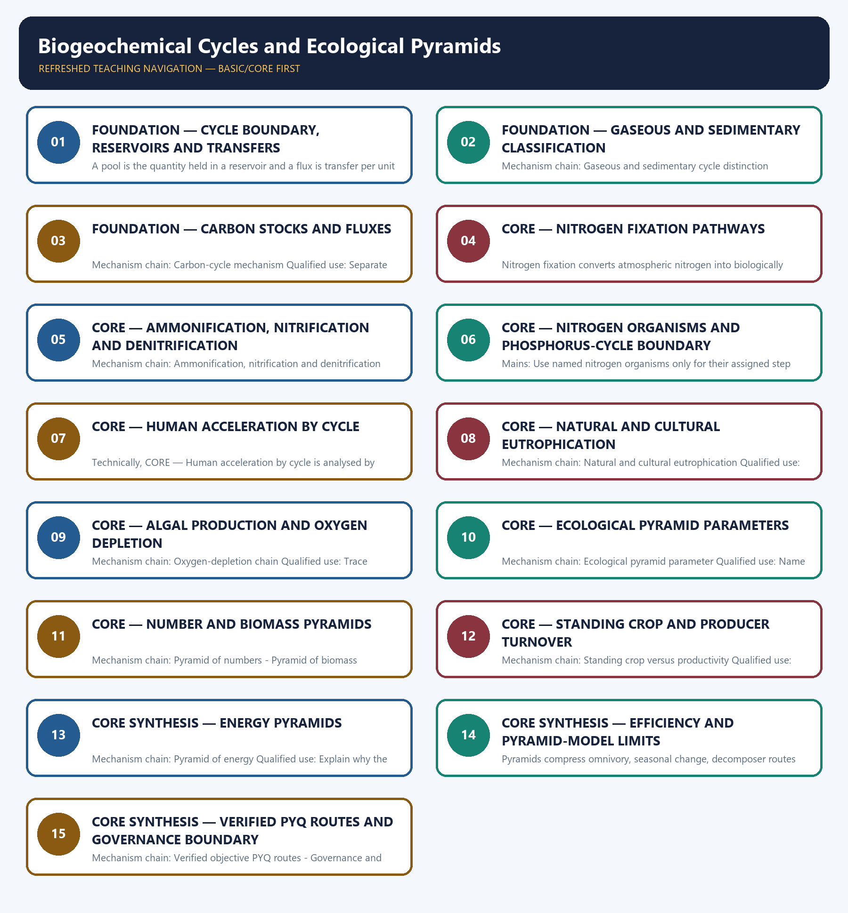

# Biogeochemical Cycles and Ecological Pyramids — Learner-v2 Complete Learning Session

> **Authoring-only generation:** 2026-09-03. No PDF was rendered and no tracker or index was mutated.

### SOURCE, PROGRESSION AND CURRENT-LINKAGE AUDIT

- **Generation date:** 2026-09-03.
- **Repository-first evidence:** the Basic owner is taught first and preserved in full; the Advanced owner is retained only in the optional final teaching block.
- **OCR evidence:** Repository Markdown was primary. OCR-searchable local official General Studies papers were used only to confirm printed routed demands. No answer key, marking scheme, unsupported page precision, ecological rate, species count or current status was inferred.
- **Qdrant:** not used; repository Markdown and available OCR context were sufficient.
- **PYQ integrity:** The audited Prelims ledger routes 2019 agricultural and livestock nitrogen compounds, 2021 phosphorus from rock weathering and 2022 nitrogen-fixing plant associations to this topic. They are retained in Basic sessions, MCQs and the owner extracts. No direct Mains demand or official objective answer is manufactured.
- **Live-link boundary:** No new quantitative cycle or pyramid claim was imported from live sources on 2026-09-03. FSI returned a contact-only stub, IPCC returned only the AR6 Synthesis Report title, MoEFCC returned an unrelated notice and PIB returned HTTP 403. The substantive CBD Target 3 guidance concerns area-based conservation and does not establish nutrient pools, fluxes, residence times, trophic efficiencies or pyramid shapes.
- **Fact/inference discipline:** no current-affairs item, PYQ wording, figure or quotation is invented.

### LIVE OFFICIAL-SOURCE ATTEMPT LOG

The checks below were made on 2026-09-03. Substantive official text is used only for the proposition it supports. Stubs, access failures, unrelated pages and thin landing pages are recorded and are not converted into ecological or current-status claims.

- https://fsi.nic.in/forest-report-2023 — attempted 2026-09-03; the fetch returned only the Forest Survey of India contact address, so no report figure, edition claim or ecosystem-status statement was taken from that contact-only stub.
- https://www.cbd.int/gbf/targets/3 — attempted 2026-09-03; the CBD Secretariat page returned substantive Target 3 guidance and expressly said that the guidance does not replace or qualify COP decisions 15/4 or 15/5. It was used only for that status boundary, not for a hotspot threshold, Indian extent or implementation claim.
- https://www.ipcc.ch/report/ar6/syr/ — attempted 2026-09-03; the fetch returned only the title 'AR6 Synthesis Report: Climate Change 2023', so no temperature, carbon-budget or cycle figure was imported.
- https://moef.gov.in/ — attempted 2026-09-03; the page returned a current but unrelated 2026 recruitment-rule consultation notice, so it supplied no topic-specific ecological claim.
- https://www.pib.gov.in/indexd.aspx?reg=3&lang=1 — attempted 2026-09-03; the request returned HTTP 403, so no PIB release was used.

## BASIC LEARNING SESSION



*Distinct embedded teaching-navigation image. The separate continuous Cārvāka-style flowchart package remains an independent at-a-glance artifact.*

### SESSION 1 — FOUNDATION — CYCLE BOUNDARY, RESERVOIRS AND TRANSFERS

#### DEFINITION / WHAT THIS IS CALLED

**Plain-language definition:** A biogeochemical cycle is movement of an element or compound between organisms and physical reservoirs; the analysis must identify the reservoir, the transfer process and the boundary within which a balance is claimed.

**Technical definition:** A pool is the quantity held in a reservoir and a flux is transfer per unit time; residence time requires a stated pool and outgoing flux, so none of the three may be replaced by an unsupported nutrient figure.

#### ANSWER-GRABBING OPENING — WRITE/ADAPT IN THE EXAM

> A biogeochemical cycle is movement of an element or compound between organisms and physical reservoirs; the analysis must identify the reservoir, the transfer process and the boundary within which a balance is claimed.

#### MUST-WRITE KEYWORDS

- **FOUNDATION**
- **Cycle boundary**
- **reservoirs**
- **transfers**
- **Mechanism chain**
- **Qualified use**

**How to use them:** Frame the answer through FOUNDATION; define Cycle boundary, connect reservoirs with transfers to explain the mechanism, and use Mechanism chain for the decisive comparison or qualification.

#### VISUAL FIRST

```text
CYCLE BOUNDARY, RESERVOIRS AND TRANSFERS
01. Biogeochemical cycle
    |
    v
02. Pool, flux and residence-time boundary
BOUNDARY -> Do not draw a cycle without naming its principal reservoir and transfer processes.
```

*This topic-specific rail fixes the evidence sequence and its exam boundary before analysis.*

#### CORE EXPLANATION

A biogeochemical cycle is movement of an element or compound between organisms and physical reservoirs; the analysis must identify the reservoir, the transfer process and the boundary within which a balance is claimed. A pool is the quantity held in a reservoir and a flux is transfer per unit time; residence time requires a stated pool and outgoing flux, so none of the three may be replaced by an unsupported nutrient figure.

#### NAMED EVIDENCE AND MECHANISM

- A biogeochemical cycle is movement of an element or compound between organisms and physical reservoirs; the analysis must identify the reservoir, the transfer process and the boundary within which a balance is claimed.
- A pool is the quantity held in a reservoir and a flux is transfer per unit time; residence time requires a stated pool and outgoing flux, so none of the three may be replaced by an unsupported nutrient figure.

#### EXAMINER CAUTION

- Do not draw a cycle without naming its principal reservoir and transfer processes.

#### EXAM LINK

- **Prelims:** Preserve the exact ecological level, system boundary, stock or flow, pyramid parameter, succession substrate, biome scale, taxonomic term and scientific or legal status; never turn a context-dependent pattern into a universal rule.
- **Mains:** Begin with reservoir and transfer arrows before discussing imbalance.

#### MINI RECAP

- **Mechanism chain:** Biogeochemical cycle -> Pool, flux and residence-time boundary
- **Qualified use:** Begin with reservoir and transfer arrows before discussing imbalance.

#### CLOSING RECALL FLOW — FOUNDATION — CYCLE BOUNDARY, RESERVOIRS AND TRANSFERS

```text
START / CONCEPT: FOUNDATION — Cycle boundary, reservoirs and transfers
        |
        v
EXACT TERMS: FOUNDATION · Cycle boundary · reservoirs · transfers · Mechanism chain · Qualified use
        |
        v
MECHANISM / ARGUMENT: Mechanism chain: Biogeochemical cycle - Pool, flux and residence-time boundary Qualified use: Begin with reservoir and transfer arrows before discussing imbalance.
        |
        v
CONSEQUENCE / CONTRAST: Do not draw a cycle without naming its principal reservoir and transfer processes.
        |
        v
UPSC TRAP / ANSWER-USE: Do not miss this limiting distinction: a pool is the quantity held in a reservoir and a flux is transfer...
        |
        v
ANSWER-GRABBING FORMULATION: A biogeochemical cycle is movement of an element or compound between organisms and physical reservoirs; the analysis must identify the reservoir, the transfer process and the boundary within which a balance is claimed.
```
### SESSION 2 — FOUNDATION — GASEOUS AND SEDIMENTARY CLASSIFICATION

#### DEFINITION / WHAT THIS IS CALLED

**Plain-language definition:** Gaseous cycles have a major atmosphere or ocean reservoir and sedimentary cycles are centred in crust, soil or sediment; this is a reservoir classification, not a claim that every transfer is fast or reversible.

**Technical definition:** Mechanism chain: Gaseous and sedimentary cycle distinction Qualified use: Classify by reservoir and then qualify the speed or reversibility claim.

#### ANSWER-GRABBING OPENING — WRITE/ADAPT IN THE EXAM

> Gaseous cycles have a major atmosphere or ocean reservoir and sedimentary cycles are centred in crust, soil or sediment; this is a reservoir classification, not a claim that every transfer is fast or reversible.

#### MUST-WRITE KEYWORDS

- **FOUNDATION**
- **Gaseous**
- **sedimentary classification**
- **Mechanism chain**
- **Qualified use**
- **Qualified**

**How to use them:** Frame the answer through FOUNDATION; define Gaseous, connect sedimentary classification with Mechanism chain to explain the mechanism, and use Qualified use for the decisive comparison or qualification.

#### VISUAL FIRST

```text
GASEOUS AND SEDIMENTARY CLASSIFICATION
01. Gaseous and sedimentary cycle distinction
BOUNDARY -> Do not confuse a reservoir pool with a flux or infer residence time without both.
```

*This topic-specific rail fixes the evidence sequence and its exam boundary before analysis.*

#### CORE EXPLANATION

Gaseous cycles have a major atmosphere or ocean reservoir and sedimentary cycles are centred in crust, soil or sediment; this is a reservoir classification, not a claim that every transfer is fast or reversible.

#### NAMED EVIDENCE AND MECHANISM

- Gaseous cycles have a major atmosphere or ocean reservoir and sedimentary cycles are centred in crust, soil or sediment; this is a reservoir classification, not a claim that every transfer is fast or reversible.

#### EXAMINER CAUTION

- Do not confuse a reservoir pool with a flux or infer residence time without both.

#### EXAM LINK

- **Prelims:** Preserve the exact ecological level, system boundary, stock or flow, pyramid parameter, succession substrate, biome scale, taxonomic term and scientific or legal status; never turn a context-dependent pattern into a universal rule.
- **Mains:** Classify by reservoir and then qualify the speed or reversibility claim.

#### MINI RECAP

- **Mechanism chain:** Gaseous and sedimentary cycle distinction
- **Qualified use:** Classify by reservoir and then qualify the speed or reversibility claim.

#### CLOSING RECALL FLOW — FOUNDATION — GASEOUS AND SEDIMENTARY CLASSIFICATION

```text
START / CONCEPT: FOUNDATION — Gaseous and sedimentary classification
        |
        v
EXACT TERMS: FOUNDATION · Gaseous · sedimentary classification · Mechanism chain · Qualified use · Qualified
        |
        v
MECHANISM / ARGUMENT: Mechanism chain: Gaseous and sedimentary cycle distinction Qualified use: Classify by reservoir and then qualify the speed or reversibility claim.
        |
        v
CONSEQUENCE / CONTRAST: Do not confuse a reservoir pool with a flux or infer residence time without both.
        |
        v
UPSC TRAP / ANSWER-USE: Do not miss this limiting distinction: gaseous cycles have a major atmosphere or ocean reservoir and sedimentary cycles are centred...
        |
        v
ANSWER-GRABBING FORMULATION: Gaseous cycles have a major atmosphere or ocean reservoir and sedimentary cycles are centred in crust, soil or sediment; this is a reservoir classification, not a claim that every transfer is fast or reversible.
```
### SESSION 3 — FOUNDATION — CARBON STOCKS AND FLUXES

#### DEFINITION / WHAT THIS IS CALLED

**Plain-language definition:** Photosynthesis transfers carbon into biomass, while respiration, decomposition and combustion return carbon to environmental reservoirs; a carbon stock and an annual carbon flux are different quantities.

**Technical definition:** Mechanism chain: Carbon-cycle mechanism Qualified use: Separate stored carbon from carbon transferred during a stated interval.

#### ANSWER-GRABBING OPENING — WRITE/ADAPT IN THE EXAM

> Photosynthesis transfers carbon into biomass, while respiration, decomposition and combustion return carbon to environmental reservoirs; a carbon stock and an annual carbon flux are different quantities.

#### MUST-WRITE KEYWORDS

- **FOUNDATION**
- **Carbon stocks**
- **fluxes**
- **Mechanism chain**
- **Qualified use**
- **Photosynthesis**

**How to use them:** Frame the answer through FOUNDATION; define Carbon stocks, connect fluxes with Mechanism chain to explain the mechanism, and use Qualified use for the decisive comparison or qualification.

#### VISUAL FIRST

```text
CARBON STOCKS AND FLUXES
01. Carbon-cycle mechanism
BOUNDARY -> Do not treat gaseous versus sedimentary as a universal fast-versus-slow law.
```

*This topic-specific rail fixes the evidence sequence and its exam boundary before analysis.*

#### CORE EXPLANATION

Photosynthesis transfers carbon into biomass, while respiration, decomposition and combustion return carbon to environmental reservoirs; a carbon stock and an annual carbon flux are different quantities.

#### NAMED EVIDENCE AND MECHANISM

- Photosynthesis transfers carbon into biomass, while respiration, decomposition and combustion return carbon to environmental reservoirs; a carbon stock and an annual carbon flux are different quantities.

#### EXAMINER CAUTION

- Do not treat gaseous versus sedimentary as a universal fast-versus-slow law.

#### EXAM LINK

- **Prelims:** Preserve the exact ecological level, system boundary, stock or flow, pyramid parameter, succession substrate, biome scale, taxonomic term and scientific or legal status; never turn a context-dependent pattern into a universal rule.
- **Mains:** Separate stored carbon from carbon transferred during a stated interval.

#### MINI RECAP

- **Mechanism chain:** Carbon-cycle mechanism
- **Qualified use:** Separate stored carbon from carbon transferred during a stated interval.

#### CLOSING RECALL FLOW — FOUNDATION — CARBON STOCKS AND FLUXES

```text
START / CONCEPT: FOUNDATION — Carbon stocks and fluxes
        |
        v
EXACT TERMS: FOUNDATION · Carbon stocks · fluxes · Mechanism chain · Qualified use · Photosynthesis
        |
        v
MECHANISM / ARGUMENT: Mechanism chain: Carbon-cycle mechanism Qualified use: Separate stored carbon from carbon transferred during a stated interval.
        |
        v
CONSEQUENCE / CONTRAST: Do not treat gaseous versus sedimentary as a universal fast-versus-slow law.
        |
        v
UPSC TRAP / ANSWER-USE: Do not miss this limiting distinction: while respiration, decomposition and combustion return carbon to environmental reservoirs.
        |
        v
ANSWER-GRABBING FORMULATION: Photosynthesis transfers carbon into biomass, while respiration, decomposition and combustion return carbon to environmental reservoirs; a carbon stock and an annual carbon flux are different quantities.
```
### SESSION 4 — CORE — NITROGEN FIXATION PATHWAYS

#### DEFINITION / WHAT THIS IS CALLED

**Plain-language definition:** Mechanism chain: Nitrogen fixation Qualified use: Identify the fixation pathway and the organism-process relationship.

**Technical definition:** Nitrogen fixation converts atmospheric nitrogen into biologically usable forms through biological, atmospheric or industrial pathways; plants do not perform symbiotic bacterial fixation by themselves.

#### ANSWER-GRABBING OPENING — WRITE/ADAPT IN THE EXAM

> Nitrogen fixation converts atmospheric nitrogen into biologically usable forms through biological, atmospheric or industrial pathways; plants do not perform symbiotic bacterial fixation by themselves.

#### MUST-WRITE KEYWORDS

- **Nitrogen fixation pathways**
- **Mechanism chain**
- **Qualified use**
- **Nitrogen**
- **Qualified**
- **Identify**

**How to use them:** Frame the answer through Nitrogen fixation pathways; define Mechanism chain, connect Qualified use with Nitrogen to explain the mechanism, and use Qualified for the decisive comparison or qualification.

#### VISUAL FIRST

```text
NITROGEN FIXATION PATHWAYS
01. Nitrogen fixation
BOUNDARY -> Do not confuse a carbon stock with an annual carbon flow.
```

*This topic-specific rail fixes the evidence sequence and its exam boundary before analysis.*

#### CORE EXPLANATION

Nitrogen fixation converts atmospheric nitrogen into biologically usable forms through biological, atmospheric or industrial pathways; plants do not perform symbiotic bacterial fixation by themselves.

#### NAMED EVIDENCE AND MECHANISM

- Nitrogen fixation converts atmospheric nitrogen into biologically usable forms through biological, atmospheric or industrial pathways; plants do not perform symbiotic bacterial fixation by themselves.

#### EXAMINER CAUTION

- Do not confuse a carbon stock with an annual carbon flow.

#### EXAM LINK

- **Prelims:** Preserve the exact ecological level, system boundary, stock or flow, pyramid parameter, succession substrate, biome scale, taxonomic term and scientific or legal status; never turn a context-dependent pattern into a universal rule.
- **Mains:** Identify the fixation pathway and the organism-process relationship.

#### MINI RECAP

- **Mechanism chain:** Nitrogen fixation
- **Qualified use:** Identify the fixation pathway and the organism-process relationship.

#### CLOSING RECALL FLOW — CORE — NITROGEN FIXATION PATHWAYS

```text
START / CONCEPT: CORE — Nitrogen fixation pathways
        |
        v
EXACT TERMS: Nitrogen fixation pathways · Mechanism chain · Qualified use · Nitrogen · Qualified · Identify
        |
        v
MECHANISM / ARGUMENT: Mechanism chain: Nitrogen fixation Qualified use: Identify the fixation pathway and the organism-process relationship.
        |
        v
CONSEQUENCE / CONTRAST: Do not confuse a carbon stock with an annual carbon flow.
        |
        v
UPSC TRAP / ANSWER-USE: Do not miss this limiting distinction: nitrogen fixation converts atmospheric nitrogen into biologically usable forms through biological, atmospheric or industrial...
        |
        v
ANSWER-GRABBING FORMULATION: Nitrogen fixation converts atmospheric nitrogen into biologically usable forms through biological, atmospheric or industrial pathways; plants do not perform symbiotic bacterial fixation by themselves.
```
### SESSION 5 — CORE — AMMONIFICATION, NITRIFICATION AND DENITRIFICATION

#### DEFINITION / WHAT THIS IS CALLED

**Plain-language definition:** Ammonification releases ammonia from organic nitrogen, nitrification oxidises ammonia through nitrite to nitrate, and denitrification reduces nitrate toward atmospheric nitrogen; these are distinct microbial processes.

**Technical definition:** Mechanism chain: Ammonification, nitrification and denitrification Qualified use: Write the microbial sequence in the correct direction.

#### ANSWER-GRABBING OPENING — WRITE/ADAPT IN THE EXAM

> Ammonification releases ammonia from organic nitrogen, nitrification oxidises ammonia through nitrite to nitrate, and denitrification reduces nitrate toward atmospheric nitrogen; these are distinct microbial processes.

#### MUST-WRITE KEYWORDS

- **Ammonification**
- **nitrification**
- **denitrification**
- **Mechanism chain**
- **Qualified use**
- **Qualified**

**How to use them:** Frame the answer through Ammonification; define nitrification, connect denitrification with Mechanism chain to explain the mechanism, and use Qualified use for the decisive comparison or qualification.

#### VISUAL FIRST

```text
AMMONIFICATION, NITRIFICATION AND DENITRIFICATION
01. Ammonification, nitrification and denitrification
BOUNDARY -> Do not say plants independently fix atmospheric nitrogen.
```

*This topic-specific rail fixes the evidence sequence and its exam boundary before analysis.*

#### CORE EXPLANATION

Ammonification releases ammonia from organic nitrogen, nitrification oxidises ammonia through nitrite to nitrate, and denitrification reduces nitrate toward atmospheric nitrogen; these are distinct microbial processes.

#### NAMED EVIDENCE AND MECHANISM

- Ammonification releases ammonia from organic nitrogen, nitrification oxidises ammonia through nitrite to nitrate, and denitrification reduces nitrate toward atmospheric nitrogen; these are distinct microbial processes.

#### EXAMINER CAUTION

- Do not say plants independently fix atmospheric nitrogen.

#### EXAM LINK

- **Prelims:** Preserve the exact ecological level, system boundary, stock or flow, pyramid parameter, succession substrate, biome scale, taxonomic term and scientific or legal status; never turn a context-dependent pattern into a universal rule.
- **Mains:** Write the microbial sequence in the correct direction.

#### MINI RECAP

- **Mechanism chain:** Ammonification, nitrification and denitrification
- **Qualified use:** Write the microbial sequence in the correct direction.

#### CLOSING RECALL FLOW — CORE — AMMONIFICATION, NITRIFICATION AND DENITRIFICATION

```text
START / CONCEPT: CORE — Ammonification, nitrification and denitrification
        |
        v
EXACT TERMS: Ammonification · nitrification · denitrification · Mechanism chain · Qualified use · Qualified
        |
        v
MECHANISM / ARGUMENT: Mechanism chain: Ammonification, nitrification and denitrification Qualified use: Write the microbial sequence in the correct direction.
        |
        v
CONSEQUENCE / CONTRAST: Do not say plants independently fix atmospheric nitrogen.
        |
        v
UPSC TRAP / ANSWER-USE: Do not miss this limiting distinction: ammonification, nitrification and denitrification Qualified use.
        |
        v
ANSWER-GRABBING FORMULATION: Ammonification releases ammonia from organic nitrogen, nitrification oxidises ammonia through nitrite to nitrate, and denitrification reduces nitrate toward atmospheric nitrogen; these are distinct microbial processes.
```
### SESSION 6 — CORE — NITROGEN ORGANISMS AND PHOSPHORUS-CYCLE BOUNDARY

#### DEFINITION / WHAT THIS IS CALLED

**Plain-language definition:** Mechanism chain: Nitrogen-cycle organism routes - Phosphorus-cycle boundary Qualified use: Use named nitrogen organisms only for their assigned step and keep phosphorus in its reservoir frame.

**Technical definition:** Mains: Use named nitrogen organisms only for their assigned step and keep phosphorus in its reservoir frame.

#### ANSWER-GRABBING OPENING — WRITE/ADAPT IN THE EXAM

> Mechanism chain: Nitrogen-cycle organism routes - Phosphorus-cycle boundary Qualified use: Use named nitrogen organisms only for their assigned step and keep phosphorus in its reservoir frame.

#### MUST-WRITE KEYWORDS

- **Nitrogen organisms**
- **phosphorus-cycle boundary**
- **Mechanism chain**
- **Qualified use**
- **Rock**
- **Nitrogen-cycle**

**How to use them:** Frame the answer through Nitrogen organisms; define phosphorus-cycle boundary, connect Mechanism chain with Qualified use to explain the mechanism, and use Rock for the decisive comparison or qualification.

#### VISUAL FIRST

```text
NITROGEN ORGANISMS AND PHOSPHORUS-CYCLE BOUNDARY
01. Nitrogen-cycle organism routes
    |
    v
02. Phosphorus-cycle boundary
BOUNDARY -> Do not merge ammonification, nitrification and denitrification.
```

*This topic-specific rail fixes the evidence sequence and its exam boundary before analysis.*

#### CORE EXPLANATION

The owner names Rhizobium and Azotobacter for fixation, Nitrosomonas and Nitrobacter for nitrification and Pseudomonas-type organisms for denitrification, while routed PYQs also require nitrogen-fixing plant associations. Rock weathering releases phosphate for biological uptake and later sedimentation; the owner treats phosphorus as having no significant atmospheric phase, so runoff and dispersed losses cannot be analysed as an atmospheric cycle.

#### NAMED EVIDENCE AND MECHANISM

- The owner names Rhizobium and Azotobacter for fixation, Nitrosomonas and Nitrobacter for nitrification and Pseudomonas-type organisms for denitrification, while routed PYQs also require nitrogen-fixing plant associations.
- Rock weathering releases phosphate for biological uptake and later sedimentation; the owner treats phosphorus as having no significant atmospheric phase, so runoff and dispersed losses cannot be analysed as an atmospheric cycle.

#### EXAMINER CAUTION

- Do not merge ammonification, nitrification and denitrification.

#### EXAM LINK

- **Prelims:** Preserve the exact ecological level, system boundary, stock or flow, pyramid parameter, succession substrate, biome scale, taxonomic term and scientific or legal status; never turn a context-dependent pattern into a universal rule.
- **Mains:** Use named nitrogen organisms only for their assigned step and keep phosphorus in its reservoir frame.

#### MINI RECAP

- **Mechanism chain:** Nitrogen-cycle organism routes -> Phosphorus-cycle boundary
- **Qualified use:** Use named nitrogen organisms only for their assigned step and keep phosphorus in its reservoir frame.

#### CLOSING RECALL FLOW — CORE — NITROGEN ORGANISMS AND PHOSPHORUS-CYCLE BOUNDARY

```text
START / CONCEPT: CORE — Nitrogen organisms and phosphorus-cycle boundary
        |
        v
EXACT TERMS: Nitrogen organisms · phosphorus-cycle boundary · Mechanism chain · Qualified use · Rock · Nitrogen-cycle
        |
        v
MECHANISM / ARGUMENT: Mains: Use named nitrogen organisms only for their assigned step and keep phosphorus in its reservoir frame.
        |
        v
CONSEQUENCE / CONTRAST: Do not merge ammonification, nitrification and denitrification.
        |
        v
UPSC TRAP / ANSWER-USE: Rock weathering releases phosphate for biological uptake and later sedimentation; the owner treats phosphorus as having no significant atmospheric phase, so runoff and dispersed losses cannot be analysed as an atmospheric cycle.
        |
        v
ANSWER-GRABBING FORMULATION: Mechanism chain: Nitrogen-cycle organism routes - Phosphorus-cycle boundary Qualified use: Use named nitrogen organisms only for their assigned step and keep phosphorus in its reservoir frame.
```
### SESSION 7 — CORE — HUMAN ACCELERATION BY CYCLE

#### DEFINITION / WHAT THIS IS CALLED

**Plain-language definition:** Mechanism chain: Human acceleration is cycle-specific Qualified use: Match combustion, fertiliser and mining to different cycle disruptions.

**Technical definition:** Technically, CORE — Human acceleration by cycle is analysed by relating Human acceleration by cycle to Mechanism chain, then testing the relationship through Qualified use and Mechanism chain: Human acceleration.

#### ANSWER-GRABBING OPENING — WRITE/ADAPT IN THE EXAM

> Mechanism chain: Human acceleration is cycle-specific Qualified use: Match combustion, fertiliser and mining to different cycle disruptions.

#### MUST-WRITE KEYWORDS

- **Human acceleration by cycle**
- **Mechanism chain**
- **Qualified use**
- **Mechanism chain: Human acceleration**
- **Human**
- **Qualified**

**How to use them:** Frame the answer through Human acceleration by cycle; define Mechanism chain, connect Qualified use with Mechanism chain: Human acceleration to explain the mechanism, and use Human for the decisive comparison or qualification.

#### VISUAL FIRST

```text
HUMAN ACCELERATION BY CYCLE
01. Human acceleration is cycle-specific
BOUNDARY -> Do not assign one microorganism to every nitrogen transformation.
```

*This topic-specific rail fixes the evidence sequence and its exam boundary before analysis.*

#### CORE EXPLANATION

Fossil-fuel combustion alters carbon transfers, synthetic fertiliser alters reactive nitrogen inputs, and phosphate mining and runoff alter phosphorus movement; different causes and reservoirs require different policy levers.

#### NAMED EVIDENCE AND MECHANISM

- Fossil-fuel combustion alters carbon transfers, synthetic fertiliser alters reactive nitrogen inputs, and phosphate mining and runoff alter phosphorus movement; different causes and reservoirs require different policy levers.

#### EXAMINER CAUTION

- Do not assign one microorganism to every nitrogen transformation.

#### EXAM LINK

- **Prelims:** Preserve the exact ecological level, system boundary, stock or flow, pyramid parameter, succession substrate, biome scale, taxonomic term and scientific or legal status; never turn a context-dependent pattern into a universal rule.
- **Mains:** Match combustion, fertiliser and mining to different cycle disruptions.

#### MINI RECAP

- **Mechanism chain:** Human acceleration is cycle-specific
- **Qualified use:** Match combustion, fertiliser and mining to different cycle disruptions.

#### CLOSING RECALL FLOW — CORE — HUMAN ACCELERATION BY CYCLE

```text
START / CONCEPT: CORE — Human acceleration by cycle
        |
        v
EXACT TERMS: Human acceleration by cycle · Mechanism chain · Qualified use · Mechanism chain: Human acceleration · Human · Qualified
        |
        v
MECHANISM / ARGUMENT: Do not assign one microorganism to every nitrogen transformation.
        |
        v
CONSEQUENCE / CONTRAST: The resulting consequence is that human acceleration is cycle-specific Qualified use.
        |
        v
UPSC TRAP / ANSWER-USE: Do not miss this limiting distinction: human acceleration is cycle-specific Qualified use.
        |
        v
ANSWER-GRABBING FORMULATION: Mechanism chain: Human acceleration is cycle-specific Qualified use: Match combustion, fertiliser and mining to different cycle disruptions.
```
### SESSION 8 — CORE — NATURAL AND CULTURAL EUTROPHICATION

#### DEFINITION / WHAT THIS IS CALLED

**Plain-language definition:** Eutrophication can describe gradual natural enrichment and ageing of a water body, whereas cultural eutrophication is human-accelerated nutrient enrichment from sources such as sewage or fertiliser runoff.

**Technical definition:** Mechanism chain: Natural and cultural eutrophication Qualified use: Distinguish natural ageing from human acceleration before stating impacts.

#### ANSWER-GRABBING OPENING — WRITE/ADAPT IN THE EXAM

> Eutrophication can describe gradual natural enrichment and ageing of a water body, whereas cultural eutrophication is human-accelerated nutrient enrichment from sources such as sewage or fertiliser runoff.

#### MUST-WRITE KEYWORDS

- **Natural**
- **cultural eutrophication**
- **Mechanism chain**
- **Qualified use**
- **Eutrophication**
- **Qualified**

**How to use them:** Frame the answer through Natural; define cultural eutrophication, connect Mechanism chain with Qualified use to explain the mechanism, and use Eutrophication for the decisive comparison or qualification.

#### VISUAL FIRST

```text
NATURAL AND CULTURAL EUTROPHICATION
01. Natural and cultural eutrophication
BOUNDARY -> Do not give phosphorus a major atmospheric phase.
```

*This topic-specific rail fixes the evidence sequence and its exam boundary before analysis.*

#### CORE EXPLANATION

Eutrophication can describe gradual natural enrichment and ageing of a water body, whereas cultural eutrophication is human-accelerated nutrient enrichment from sources such as sewage or fertiliser runoff.

#### NAMED EVIDENCE AND MECHANISM

- Eutrophication can describe gradual natural enrichment and ageing of a water body, whereas cultural eutrophication is human-accelerated nutrient enrichment from sources such as sewage or fertiliser runoff.

#### EXAMINER CAUTION

- Do not give phosphorus a major atmospheric phase.

#### EXAM LINK

- **Prelims:** Preserve the exact ecological level, system boundary, stock or flow, pyramid parameter, succession substrate, biome scale, taxonomic term and scientific or legal status; never turn a context-dependent pattern into a universal rule.
- **Mains:** Distinguish natural ageing from human acceleration before stating impacts.

#### MINI RECAP

- **Mechanism chain:** Natural and cultural eutrophication
- **Qualified use:** Distinguish natural ageing from human acceleration before stating impacts.

#### CLOSING RECALL FLOW — CORE — NATURAL AND CULTURAL EUTROPHICATION

```text
START / CONCEPT: CORE — Natural and cultural eutrophication
        |
        v
EXACT TERMS: Natural · cultural eutrophication · Mechanism chain · Qualified use · Eutrophication · Qualified
        |
        v
MECHANISM / ARGUMENT: Mechanism chain: Natural and cultural eutrophication Qualified use: Distinguish natural ageing from human acceleration before stating impacts.
        |
        v
CONSEQUENCE / CONTRAST: Do not give phosphorus a major atmospheric phase.
        |
        v
UPSC TRAP / ANSWER-USE: Do not miss this limiting distinction: eutrophication can describe gradual natural enrichment and ageing of a water body.
        |
        v
ANSWER-GRABBING FORMULATION: Eutrophication can describe gradual natural enrichment and ageing of a water body, whereas cultural eutrophication is human-accelerated nutrient enrichment from sources such as sewage or fertiliser runoff.
```
### SESSION 9 — CORE — ALGAL PRODUCTION AND OXYGEN DEPLETION

#### DEFINITION / WHAT THIS IS CALLED

**Plain-language definition:** Nutrient enrichment can stimulate algal production; decomposition of the resulting organic material raises oxygen demand and can lower dissolved oxygen, but no universal bloom or fish-kill threshold is asserted.

**Technical definition:** Mechanism chain: Oxygen-depletion chain Qualified use: Trace nutrient input to production, decomposition, oxygen demand and ecological effect.

#### ANSWER-GRABBING OPENING — WRITE/ADAPT IN THE EXAM

> Nutrient enrichment can stimulate algal production; decomposition of the resulting organic material raises oxygen demand and can lower dissolved oxygen, but no universal bloom or fish-kill threshold is asserted.

#### MUST-WRITE KEYWORDS

- **Algal production**
- **oxygen depletion**
- **Mechanism chain**
- **Qualified use**
- **Nutrient**
- **Qualified**

**How to use them:** Frame the answer through Algal production; define oxygen depletion, connect Mechanism chain with Qualified use to explain the mechanism, and use Nutrient for the decisive comparison or qualification.

#### VISUAL FIRST

```text
ALGAL PRODUCTION AND OXYGEN DEPLETION
01. Oxygen-depletion chain
BOUNDARY -> Do not prescribe one generic pollution lever for all cycles.
```

*This topic-specific rail fixes the evidence sequence and its exam boundary before analysis.*

#### CORE EXPLANATION

Nutrient enrichment can stimulate algal production; decomposition of the resulting organic material raises oxygen demand and can lower dissolved oxygen, but no universal bloom or fish-kill threshold is asserted.

#### NAMED EVIDENCE AND MECHANISM

- Nutrient enrichment can stimulate algal production; decomposition of the resulting organic material raises oxygen demand and can lower dissolved oxygen, but no universal bloom or fish-kill threshold is asserted.

#### EXAMINER CAUTION

- Do not prescribe one generic pollution lever for all cycles.

#### EXAM LINK

- **Prelims:** Preserve the exact ecological level, system boundary, stock or flow, pyramid parameter, succession substrate, biome scale, taxonomic term and scientific or legal status; never turn a context-dependent pattern into a universal rule.
- **Mains:** Trace nutrient input to production, decomposition, oxygen demand and ecological effect.

#### MINI RECAP

- **Mechanism chain:** Oxygen-depletion chain
- **Qualified use:** Trace nutrient input to production, decomposition, oxygen demand and ecological effect.

#### CLOSING RECALL FLOW — CORE — ALGAL PRODUCTION AND OXYGEN DEPLETION

```text
START / CONCEPT: CORE — Algal production and oxygen depletion
        |
        v
EXACT TERMS: Algal production · oxygen depletion · Mechanism chain · Qualified use · Nutrient · Qualified
        |
        v
MECHANISM / ARGUMENT: Mechanism chain: Oxygen-depletion chain Qualified use: Trace nutrient input to production, decomposition, oxygen demand and ecological effect.
        |
        v
CONSEQUENCE / CONTRAST: Do not prescribe one generic pollution lever for all cycles.
        |
        v
UPSC TRAP / ANSWER-USE: Do not miss this limiting distinction: nutrient enrichment can stimulate algal production.
        |
        v
ANSWER-GRABBING FORMULATION: Nutrient enrichment can stimulate algal production; decomposition of the resulting organic material raises oxygen demand and can lower dissolved oxygen, but no universal bloom or fish-kill threshold is asserted.
```
### SESSION 10 — CORE — ECOLOGICAL PYRAMID PARAMETERS

#### DEFINITION / WHAT THIS IS CALLED

**Plain-language definition:** An ecological pyramid represents number, biomass or energy across successive trophic levels; its shape is meaningless unless the parameter, ecosystem and time basis are named.

**Technical definition:** Mechanism chain: Ecological pyramid parameter Qualified use: Name number, biomass or energy before interpreting a pyramid.

#### ANSWER-GRABBING OPENING — WRITE/ADAPT IN THE EXAM

> An ecological pyramid represents number, biomass or energy across successive trophic levels; its shape is meaningless unless the parameter, ecosystem and time basis are named.

#### MUST-WRITE KEYWORDS

- **Ecological pyramid parameters**
- **Mechanism chain**
- **Qualified use**
- **Ecological**
- **Qualified**
- **Name**

**How to use them:** Frame the answer through Ecological pyramid parameters; define Mechanism chain, connect Qualified use with Ecological to explain the mechanism, and use Qualified for the decisive comparison or qualification.

#### VISUAL FIRST

```text
ECOLOGICAL PYRAMID PARAMETERS
01. Ecological pyramid parameter
BOUNDARY -> Do not use eutrophication and cultural eutrophication as exact synonyms.
```

*This topic-specific rail fixes the evidence sequence and its exam boundary before analysis.*

#### CORE EXPLANATION

An ecological pyramid represents number, biomass or energy across successive trophic levels; its shape is meaningless unless the parameter, ecosystem and time basis are named.

#### NAMED EVIDENCE AND MECHANISM

- An ecological pyramid represents number, biomass or energy across successive trophic levels; its shape is meaningless unless the parameter, ecosystem and time basis are named.

#### EXAMINER CAUTION

- Do not use eutrophication and cultural eutrophication as exact synonyms.

#### EXAM LINK

- **Prelims:** Preserve the exact ecological level, system boundary, stock or flow, pyramid parameter, succession substrate, biome scale, taxonomic term and scientific or legal status; never turn a context-dependent pattern into a universal rule.
- **Mains:** Name number, biomass or energy before interpreting a pyramid.

#### MINI RECAP

- **Mechanism chain:** Ecological pyramid parameter
- **Qualified use:** Name number, biomass or energy before interpreting a pyramid.

#### CLOSING RECALL FLOW — CORE — ECOLOGICAL PYRAMID PARAMETERS

```text
START / CONCEPT: CORE — Ecological pyramid parameters
        |
        v
EXACT TERMS: Ecological pyramid parameters · Mechanism chain · Qualified use · Ecological · Qualified · Name
        |
        v
MECHANISM / ARGUMENT: Mechanism chain: Ecological pyramid parameter Qualified use: Name number, biomass or energy before interpreting a pyramid.
        |
        v
CONSEQUENCE / CONTRAST: Do not use eutrophication and cultural eutrophication as exact synonyms.
        |
        v
UPSC TRAP / ANSWER-USE: Do not miss this limiting distinction: name number, biomass or energy before interpreting a pyramid.
        |
        v
ANSWER-GRABBING FORMULATION: An ecological pyramid represents number, biomass or energy across successive trophic levels; its shape is meaningless unless the parameter, ecosystem and time basis are named.
```
### SESSION 11 — CORE — NUMBER AND BIOMASS PYRAMIDS

#### DEFINITION / WHAT THIS IS CALLED

**Plain-language definition:** A numbers pyramid counts organisms and may be upright in a grassland or inverted where one large producer supports many consumers; organism size and count are not interchangeable.

**Technical definition:** Mechanism chain: Pyramid of numbers - Pyramid of biomass Qualified use: Separate organism count from standing biomass and explain context-dependent inversion.

#### ANSWER-GRABBING OPENING — WRITE/ADAPT IN THE EXAM

> Mechanism chain: Pyramid of numbers - Pyramid of biomass Qualified use: Separate organism count from standing biomass and explain context-dependent inversion.

#### MUST-WRITE KEYWORDS

- **Number**
- **biomass pyramids**
- **Mechanism chain**
- **Qualified use**
- **A biomass pyramid compares standing living material and**
- **Separate**

**How to use them:** Frame the answer through Number; define biomass pyramids, connect Mechanism chain with Qualified use to explain the mechanism, and use A biomass pyramid compares standing living material and for the decisive comparison or qualification.

#### VISUAL FIRST

```text
NUMBER AND BIOMASS PYRAMIDS
01. Pyramid of numbers
    |
    v
02. Pyramid of biomass
BOUNDARY -> Do not invent a universal nutrient or oxygen threshold.
```

*This topic-specific rail fixes the evidence sequence and its exam boundary before analysis.*

#### CORE EXPLANATION

A numbers pyramid counts organisms and may be upright in a grassland or inverted where one large producer supports many consumers; organism size and count are not interchangeable. A biomass pyramid compares standing living material and is commonly upright on land but may invert in aquatic systems where a small producer standing crop is replenished rapidly.

#### NAMED EVIDENCE AND MECHANISM

- A numbers pyramid counts organisms and may be upright in a grassland or inverted where one large producer supports many consumers; organism size and count are not interchangeable.
- A biomass pyramid compares standing living material and is commonly upright on land but may invert in aquatic systems where a small producer standing crop is replenished rapidly.

#### EXAMINER CAUTION

- Do not invent a universal nutrient or oxygen threshold.

#### EXAM LINK

- **Prelims:** Preserve the exact ecological level, system boundary, stock or flow, pyramid parameter, succession substrate, biome scale, taxonomic term and scientific or legal status; never turn a context-dependent pattern into a universal rule.
- **Mains:** Separate organism count from standing biomass and explain context-dependent inversion.

#### MINI RECAP

- **Mechanism chain:** Pyramid of numbers -> Pyramid of biomass
- **Qualified use:** Separate organism count from standing biomass and explain context-dependent inversion.

#### CLOSING RECALL FLOW — CORE — NUMBER AND BIOMASS PYRAMIDS

```text
START / CONCEPT: CORE — Number and biomass pyramids
        |
        v
EXACT TERMS: Number · biomass pyramids · Mechanism chain · Qualified use · A biomass pyramid compares standing living material and · Separate
        |
        v
MECHANISM / ARGUMENT: A numbers pyramid counts organisms and may be upright in a grassland or inverted where one large producer supports many consumers; organism size and count are not interchangeable.
        |
        v
CONSEQUENCE / CONTRAST: A biomass pyramid compares standing living material and is commonly upright on land but may invert in aquatic systems where a small producer standing crop is replenished rapidly.
        |
        v
UPSC TRAP / ANSWER-USE: Do not invent a universal nutrient or oxygen threshold.
        |
        v
ANSWER-GRABBING FORMULATION: Mechanism chain: Pyramid of numbers - Pyramid of biomass Qualified use: Separate organism count from standing biomass and explain context-dependent inversion.
```
### SESSION 12 — CORE — STANDING CROP AND PRODUCER TURNOVER

#### DEFINITION / WHAT THIS IS CALLED

**Plain-language definition:** A small standing crop can support consumers when producer turnover and productivity are high; an inverted biomass pyramid therefore does not prove low production or ecosystem dysfunction.

**Technical definition:** Mechanism chain: Standing crop versus productivity Qualified use: Use rapid producer turnover to separate standing crop from productivity.

#### ANSWER-GRABBING OPENING — WRITE/ADAPT IN THE EXAM

> A small standing crop can support consumers when producer turnover and productivity are high; an inverted biomass pyramid therefore does not prove low production or ecosystem dysfunction.

#### MUST-WRITE KEYWORDS

- **Standing crop**
- **producer turnover**
- **Mechanism chain**
- **Qualified use**
- **Standing**
- **Qualified**

**How to use them:** Frame the answer through Standing crop; define producer turnover, connect Mechanism chain with Qualified use to explain the mechanism, and use Standing for the decisive comparison or qualification.

#### VISUAL FIRST

```text
STANDING CROP AND PRODUCER TURNOVER
01. Standing crop versus productivity
BOUNDARY -> Do not describe a pyramid without naming number, biomass or energy.
```

*This topic-specific rail fixes the evidence sequence and its exam boundary before analysis.*

#### CORE EXPLANATION

A small standing crop can support consumers when producer turnover and productivity are high; an inverted biomass pyramid therefore does not prove low production or ecosystem dysfunction.

#### NAMED EVIDENCE AND MECHANISM

- A small standing crop can support consumers when producer turnover and productivity are high; an inverted biomass pyramid therefore does not prove low production or ecosystem dysfunction.

#### EXAMINER CAUTION

- Do not describe a pyramid without naming number, biomass or energy.

#### EXAM LINK

- **Prelims:** Preserve the exact ecological level, system boundary, stock or flow, pyramid parameter, succession substrate, biome scale, taxonomic term and scientific or legal status; never turn a context-dependent pattern into a universal rule.
- **Mains:** Use rapid producer turnover to separate standing crop from productivity.

#### MINI RECAP

- **Mechanism chain:** Standing crop versus productivity
- **Qualified use:** Use rapid producer turnover to separate standing crop from productivity.

#### CLOSING RECALL FLOW — CORE — STANDING CROP AND PRODUCER TURNOVER

```text
START / CONCEPT: CORE — Standing crop and producer turnover
        |
        v
EXACT TERMS: Standing crop · producer turnover · Mechanism chain · Qualified use · Standing · Qualified
        |
        v
MECHANISM / ARGUMENT: Mechanism chain: Standing crop versus productivity Qualified use: Use rapid producer turnover to separate standing crop from productivity.
        |
        v
CONSEQUENCE / CONTRAST: Mains: Use rapid producer turnover to separate standing crop from productivity.
        |
        v
UPSC TRAP / ANSWER-USE: Do not describe a pyramid without naming number, biomass or energy.
        |
        v
ANSWER-GRABBING FORMULATION: A small standing crop can support consumers when producer turnover and productivity are high; an inverted biomass pyramid therefore does not prove low production or ecosystem dysfunction.
```
### SESSION 13 — CORE SYNTHESIS — ENERGY PYRAMIDS

#### DEFINITION / WHAT THIS IS CALLED

**Plain-language definition:** An energy pyramid is always upright because usable energy diminishes across trophic transfers; this thermodynamic direction does not imply that matter follows the same one-way path.

**Technical definition:** Mechanism chain: Pyramid of energy Qualified use: Explain why the energy pyramid remains upright.

#### ANSWER-GRABBING OPENING — WRITE/ADAPT IN THE EXAM

> Mechanism chain: Pyramid of energy Qualified use: Explain why the energy pyramid remains upright.

#### MUST-WRITE KEYWORDS

- **CORE SYNTHESIS**
- **Energy pyramids**
- **Mechanism chain**
- **Qualified use**
- **An energy pyramid**
- **Pyramid**

**How to use them:** Frame the answer through CORE SYNTHESIS; define Energy pyramids, connect Mechanism chain with Qualified use to explain the mechanism, and use An energy pyramid for the decisive comparison or qualification.

#### VISUAL FIRST

```text
ENERGY PYRAMIDS
01. Pyramid of energy
BOUNDARY -> Do not infer biomass or energy from organism count.
```

*This topic-specific rail fixes the evidence sequence and its exam boundary before analysis.*

#### CORE EXPLANATION

An energy pyramid is always upright because usable energy diminishes across trophic transfers; this thermodynamic direction does not imply that matter follows the same one-way path.

#### NAMED EVIDENCE AND MECHANISM

- An energy pyramid is always upright because usable energy diminishes across trophic transfers; this thermodynamic direction does not imply that matter follows the same one-way path.

#### EXAMINER CAUTION

- Do not infer biomass or energy from organism count.

#### EXAM LINK

- **Prelims:** Preserve the exact ecological level, system boundary, stock or flow, pyramid parameter, succession substrate, biome scale, taxonomic term and scientific or legal status; never turn a context-dependent pattern into a universal rule.
- **Mains:** Explain why the energy pyramid remains upright.

#### MINI RECAP

- **Mechanism chain:** Pyramid of energy
- **Qualified use:** Explain why the energy pyramid remains upright.

#### CLOSING RECALL FLOW — CORE SYNTHESIS — ENERGY PYRAMIDS

```text
START / CONCEPT: CORE SYNTHESIS — Energy pyramids
        |
        v
EXACT TERMS: CORE SYNTHESIS · Energy pyramids · Mechanism chain · Qualified use · An energy pyramid · Pyramid
        |
        v
MECHANISM / ARGUMENT: An energy pyramid is always upright because usable energy diminishes across trophic transfers; this thermodynamic direction does not imply that matter follows the same one-way path.
        |
        v
CONSEQUENCE / CONTRAST: Do not infer biomass or energy from organism count.
        |
        v
UPSC TRAP / ANSWER-USE: Do not miss this limiting distinction: explain why the energy pyramid remains upright.
        |
        v
ANSWER-GRABBING FORMULATION: Mechanism chain: Pyramid of energy Qualified use: Explain why the energy pyramid remains upright.
```
### SESSION 14 — CORE SYNTHESIS — EFFICIENCY AND PYRAMID-MODEL LIMITS

#### DEFINITION / WHAT THIS IS CALLED

**Plain-language definition:** Mechanism chain: Ecological-efficiency caution - Pyramid simplification limit Qualified use: Treat the transfer heuristic as non-universal and pyramids as simplified models.

**Technical definition:** Pyramids compress omnivory, seasonal change, decomposer routes and interlocking food webs into trophic levels; they are diagnostic models, not complete maps of ecosystem interaction.

#### ANSWER-GRABBING OPENING — WRITE/ADAPT IN THE EXAM

> Mechanism chain: Ecological-efficiency caution - Pyramid simplification limit Qualified use: Treat the transfer heuristic as non-universal and pyramids as simplified models.

#### MUST-WRITE KEYWORDS

- **CORE SYNTHESIS**
- **Efficiency**
- **pyramid-model limits**
- **Mechanism chain**
- **Qualified use**
- **Pyramids**

**How to use them:** Frame the answer through CORE SYNTHESIS; define Efficiency, connect pyramid-model limits with Mechanism chain to explain the mechanism, and use Qualified use for the decisive comparison or qualification.

#### VISUAL FIRST

```text
EFFICIENCY AND PYRAMID-MODEL LIMITS
01. Ecological-efficiency caution
    |
    v
02. Pyramid simplification limit
BOUNDARY -> Do not call an inverted aquatic biomass pyramid an inverted energy pyramid.
```

*This topic-specific rail fixes the evidence sequence and its exam boundary before analysis.*

#### CORE EXPLANATION

The owner carries the roughly ten-per-cent rule only as an average heuristic and expressly rejects it as a fixed law; this package uses the qualitative dissipation rule unless a source-specific value is required. Pyramids compress omnivory, seasonal change, decomposer routes and interlocking food webs into trophic levels; they are diagnostic models, not complete maps of ecosystem interaction.

#### NAMED EVIDENCE AND MECHANISM

- The owner carries the roughly ten-per-cent rule only as an average heuristic and expressly rejects it as a fixed law; this package uses the qualitative dissipation rule unless a source-specific value is required.
- Pyramids compress omnivory, seasonal change, decomposer routes and interlocking food webs into trophic levels; they are diagnostic models, not complete maps of ecosystem interaction.

#### EXAMINER CAUTION

- Do not call an inverted aquatic biomass pyramid an inverted energy pyramid.

#### EXAM LINK

- **Prelims:** Preserve the exact ecological level, system boundary, stock or flow, pyramid parameter, succession substrate, biome scale, taxonomic term and scientific or legal status; never turn a context-dependent pattern into a universal rule.
- **Mains:** Treat the transfer heuristic as non-universal and pyramids as simplified models.

#### MINI RECAP

- **Mechanism chain:** Ecological-efficiency caution -> Pyramid simplification limit
- **Qualified use:** Treat the transfer heuristic as non-universal and pyramids as simplified models.

#### CLOSING RECALL FLOW — CORE SYNTHESIS — EFFICIENCY AND PYRAMID-MODEL LIMITS

```text
START / CONCEPT: CORE SYNTHESIS — Efficiency and pyramid-model limits
        |
        v
EXACT TERMS: CORE SYNTHESIS · Efficiency · pyramid-model limits · Mechanism chain · Qualified use · Pyramids
        |
        v
MECHANISM / ARGUMENT: Pyramids compress omnivory, seasonal change, decomposer routes and interlocking food webs into trophic levels; they are diagnostic models, not complete maps of ecosystem interaction.
        |
        v
CONSEQUENCE / CONTRAST: Do not call an inverted aquatic biomass pyramid an inverted energy pyramid.
        |
        v
UPSC TRAP / ANSWER-USE: Do not miss this limiting distinction: treat the transfer heuristic as non-universal and pyramids as simplified models.
        |
        v
ANSWER-GRABBING FORMULATION: Mechanism chain: Ecological-efficiency caution - Pyramid simplification limit Qualified use: Treat the transfer heuristic as non-universal and pyramids as simplified models.
```
### SESSION 15 — CORE SYNTHESIS — VERIFIED PYQ ROUTES AND GOVERNANCE BOUNDARY

#### DEFINITION / WHAT THIS IS CALLED

**Plain-language definition:** The audited ledger routes nitrogen compounds from agriculture and livestock, phosphorus from rock weathering and nitrogen-fixing plant associations to this topic; no official answer option is recorded or inferred.

**Technical definition:** Mechanism chain: Verified objective PYQ routes - Governance and evidence boundary Qualified use: Close with verified route, answer-key and quantitative evidence limits.

#### ANSWER-GRABBING OPENING — WRITE/ADAPT IN THE EXAM

> Mechanism chain: Verified objective PYQ routes - Governance and evidence boundary Qualified use: Close with verified route, answer-key and quantitative evidence limits.

#### MUST-WRITE KEYWORDS

- **CORE SYNTHESIS**
- **Verified PYQ routes**
- **governance boundary**
- **Mechanism chain**
- **Qualified use**
- **Subject**

**How to use them:** Frame the answer through CORE SYNTHESIS; define Verified PYQ routes, connect governance boundary with Mechanism chain to explain the mechanism, and use Qualified use for the decisive comparison or qualification.

#### VISUAL FIRST

```text
VERIFIED PYQ ROUTES AND GOVERNANCE BOUNDARY
01. Verified objective PYQ routes
    |
    v
02. Governance and evidence boundary
BOUNDARY -> Do not confuse standing crop with productivity or turnover.
```

*This topic-specific rail fixes the evidence sequence and its exam boundary before analysis.*

#### CORE EXPLANATION

The audited ledger routes nitrogen compounds from agriculture and livestock, phosphorus from rock weathering and nitrogen-fixing plant associations to this topic; no official answer option is recorded or inferred. CPCB water-quality monitoring and fertiliser policy are distinct levers on nutrient-cycle outcomes; thin live pages supplied no new cycle rate, pool size, trophic efficiency or current ecological status.

#### NAMED EVIDENCE AND MECHANISM

- The audited ledger routes nitrogen compounds from agriculture and livestock, phosphorus from rock weathering and nitrogen-fixing plant associations to this topic; no official answer option is recorded or inferred.
- CPCB water-quality monitoring and fertiliser policy are distinct levers on nutrient-cycle outcomes; thin live pages supplied no new cycle rate, pool size, trophic efficiency or current ecological status.

#### EXAMINER CAUTION

- Do not confuse standing crop with productivity or turnover.

#### EXAM LINK

- **Prelims:** Preserve the exact ecological level, system boundary, stock or flow, pyramid parameter, succession substrate, biome scale, taxonomic term and scientific or legal status; never turn a context-dependent pattern into a universal rule.
- **Mains:** Close with verified route, answer-key and quantitative evidence limits.

#### MINI RECAP

- **Mechanism chain:** Verified objective PYQ routes -> Governance and evidence boundary
- **Qualified use:** Close with verified route, answer-key and quantitative evidence limits.
#### COMPLETE BASIC OWNER EVIDENCE BANK

> **Subject:** Environment and Ecology | **Tier:** Must-Do (foundation) | **GS Paper:** GS-III (Environment) + Prelims.
> **Core area:** Matter cycling and energy quantification.
> **Grounded in:** NCERT Class XII Biology, Ch. "Ecosystem"; NIOS Environmental Studies; audited UPSC Environment PYQs (2024-2026 Prelims and 2024-2025 Mains).
> ✅ = source-grounded | ⚠️ = analytical linkage | 📰 = dated current-affairs anchor.
> *Companion: `advanced/02_Biogeochemical-Cycles-and-Ecological-Pyramids.md`.*

#### 1. Visual foundation

```text
GASEOUS CYCLES (large atmospheric reservoir)        SEDIMENTARY CYCLES (reservoir in crust/soil)
   Carbon, Nitrogen, Oxygen, Water                      Phosphorus, Sulphur, Calcium
        |                                                        |
        v                                                        v
  fast atmospheric exchange                          slower, weathering/mining-driven exchange
        |                                                        |
        +----------------------> shared pool: LIVING BIOMASS <----------------------+
                                          |
                                          v
                         PYRAMIDS: quantify NUMBERS / BIOMASS / ENERGY
                              at each trophic level of this biomass
```

**Core proposition:** Biogeochemical cycles explain how matter moves between abiotic
reservoirs and living biomass; ecological pyramids quantify how much of that biomass, energy
or organism-count exists at each trophic level at one point in time.

#### 2. Essential definitions

| Concept | Exam-ready meaning |
|---|---|
| ✅ **Biogeochemical cycle** | Circulation of a chemical element/compound between organisms and the physical environment. |
| ✅ **Gaseous cycle** | Cycle with atmosphere/ocean as the main reservoir (carbon, nitrogen, oxygen, water) — fast, self-regulating. |
| ✅ **Sedimentary cycle** | Cycle with earth's crust as the main reservoir (phosphorus, sulphur, calcium) — slower, more easily disrupted. |
| ✅ **Nitrogen fixation** | Conversion of atmospheric N₂ into usable ammonia/nitrate by bacteria (e.g., *Rhizobium*) or lightning. |
| ✅ **Ammonification → nitrification → denitrification** | The three sequential microbial steps that follow fixation: decomposers convert organic N to ammonia (ammonification); *Nitrosomonas* oxidises ammonia to nitrite and *Nitrobacter* nitrite to nitrate (nitrification); *Pseudomonas*-type bacteria reduce nitrate back to N₂ (denitrification), closing the loop. |
| ✅ **Eutrophication** | Enrichment of a water body with nutrients and sediment. It is a **natural ageing process** of lakes (gradual filling and ageing); when accelerated by sewage and fertiliser runoff it is called **cultural (anthropogenic) eutrophication** — the exam-relevant distinction. |
| ✅ **Ecological pyramid** | Graphical representation of number, biomass or energy at successive trophic levels. |

#### 3. Topic mechanism

1. In the **carbon cycle**, producers fix atmospheric/dissolved CO₂ via photosynthesis;
   respiration, decomposition and combustion return it — oceans and forests are major sinks.
2. In the **nitrogen cycle**, fixation (biological/atmospheric/industrial) converts inert N₂
   into usable forms; nitrification and denitrification complete the loop back to the
   atmosphere.
3. In the **phosphorus cycle** (a sedimentary cycle with no significant atmospheric phase),
   weathering of rocks releases phosphate, taken up by plants and cycled through consumers and
   decomposers, eventually re-sedimenting — making phosphorus often the limiting nutrient.
4. **Pyramid of numbers** can be upright (grassland) or inverted (a single large tree hosting
   many insects); **pyramid of biomass** is usually upright on land but often inverted in
   aquatic systems (small-biomass, fast-reproducing phytoplankton supporting larger consumer
   biomass); **pyramid of energy** is always upright because energy dissipates at each
   transfer (second law of thermodynamics).
5. Human interventions (fossil-fuel combustion, synthetic (Haber-Bosch) fertiliser, mining)
   have measurably accelerated the carbon, nitrogen and phosphorus cycles beyond natural
   rates, driving climate change and eutrophication respectively.

#### 4. Institutions and policy tools

- ✅ **MoEFCC / CPCB:** monitor nutrient pollution (eutrophication) linked to disrupted
  nitrogen/phosphorus cycling in water bodies (cross-refer Topic 14).
- ✅ **Ministry of Agriculture and Farmers Welfare:** regulates fertiliser use, directly
  altering the nitrogen and phosphorus cycles at field scale.
- ⚠️ Carbon-cycle science underlies the entire climate-change policy architecture (Topics
  17-21) — this topic is their scientific foundation.

#### 5. Indian applications and examples

- ⚠️ Excess nitrogen/phosphorus fertiliser run-off into rivers and lakes (e.g., parts of the
  Ganga basin) causes eutrophication and algal blooms, a direct sedimentary/gaseous-cycle
  disruption with water-quality consequences.
- ⚠️ Mangrove and peatland "blue/brown carbon" sinks in India store carbon outside the
  standard forest-carbon accounting, illustrating a lesser-known carbon-cycle pathway.
- ⚠️ Inverted biomass pyramids are typical of Indian marine/pond ecosystems where
  phytoplankton biomass is small but energy/turnover rate is high.

#### 6. Must-Know Facts for Prelims

- ✅ Carbon, nitrogen, oxygen and water are gaseous (atmosphere/ocean-reservoir) cycles;
  phosphorus, sulphur and calcium are sedimentary (crust-reservoir) cycles.
- ✅ Biological nitrogen fixation is chiefly carried out by bacteria (free-living, e.g.
  *Azotobacter*, and symbiotic, e.g. *Rhizobium* in legume root nodules).
- ✅ Phosphorus has no significant atmospheric phase, unlike carbon and nitrogen.
- ✅ Pyramid of energy is always upright; pyramids of number and biomass can be inverted in
  specific ecosystems (e.g., biomass pyramid inverted in most aquatic ecosystems).
- ✅ Eutrophication is nutrient (commonly nitrogen/phosphorus) over-enrichment of a water body
  leading to algal blooms and oxygen depletion.
- ✅ Eutrophication is a **natural** lake-ageing process; the exam-relevant term for the
  human-accelerated version is **cultural eutrophication** — do not treat the two as
  synonyms.
- ✅ Nitrification is carried out by *Nitrosomonas* (ammonia → nitrite) and *Nitrobacter*
  (nitrite → nitrate); denitrification returns nitrogen to the atmosphere as N₂.
- ✅ Nitrous oxide (N₂O), a nitrogen-cycle by-product of fertilised soils, is both a potent
  greenhouse gas and (per the ozone literature) a significant stratospheric ozone-depleting
  substance not controlled by the Montreal Protocol — a favourite cross-topic link
  (Topics 17 and 22).

#### 7. UPSC traps

- ❌ All ecological pyramids are always upright. -> Only the pyramid of energy is always
  upright; number and biomass pyramids can be inverted.
- ❌ Phosphorus cycle has a major atmospheric phase like carbon. -> It is a sedimentary cycle
  with negligible atmospheric presence.
- ❌ Eutrophication is always man-made. -> It is a natural lake-ageing process; only its
  accelerated form is *cultural* eutrophication.
- ❌ Nitrogen fixation is done only by plants. -> It is done by bacteria (free-living/
  symbiotic), cyanobacteria, lightning and industrial (Haber-Bosch) processes — plants do not
  fix nitrogen themselves.
- ❌ Eutrophication indicates a healthy, nutrient-rich ecosystem. -> It signals nutrient
  overload causing oxygen depletion and biodiversity loss.
- ❌ A single ecosystem always shows the same pyramid shape for numbers, biomass and energy.
  -> Shape differs by parameter and ecosystem type (e.g., aquatic biomass pyramids commonly
  invert while the energy pyramid for the same system stays upright).

#### 8. 📰 Current anchor

- 📰 Rising atmospheric CO₂ concentration (tracked by global monitoring networks) and the
  IPCC AR6 Synthesis Report's (2023) confirmation of roughly 1.1°C observed warming above
  pre-industrial levels illustrate the human-scale acceleration of the natural carbon cycle
  discussed in Section 3 (see Topic 18 for full IPCC detail).

⚠️ **Interpretation caution:** cite atmospheric/warming figures with their IPCC AR6 (2023)
source and date rather than as a static, unchanging number.

#### 9. PYQ application

- ⚠️ Recurring Prelims pattern: match cycle-to-reservoir type (gaseous vs sedimentary) and
  identify the correct pyramid shape for a described ecosystem.
- ⚠️ Mains linkage: nutrient-cycle disruption (eutrophication, nitrogen pollution) is a
  standard example when answers require "human impact on biogeochemical cycles."

#### 10. Mains angles

- ⚠️ Use the gaseous-versus-sedimentary distinction to explain why phosphorus scarcity is a
  slower-building but harder-to-reverse constraint than carbon or nitrogen excess.
- ⚠️ Connect accelerated cycling (fossil fuels, synthetic fertiliser) to two distinct
  problems — climate change (carbon) and eutrophication (nitrogen/phosphorus) — rather than
  treating "pollution" as one undifferentiated issue.
- ⚠️ Conclude with a nutrient-stewardship thesis: manage input intensity (fertiliser,
  combustion) rather than only treating downstream symptoms.

> **Answer thesis:** Distinguish gaseous from sedimentary cycles by reservoir and reversibility, and use trophic-level pyramids only as one point-in-time snapshot of a continuously flowing system.

#### 11. Probable questions

- ⚠️ **Prelims:** Identify which of the listed elements/compounds follow a gaseous cycle and
  which follow a sedimentary cycle.
- ⚠️ **Mains (10 marks):** Why is the phosphorus cycle considered more vulnerable to
  human disruption than the carbon cycle?
- ⚠️ **Mains (15 marks):** Explain how human acceleration of the nitrogen and carbon cycles
  has created two distinct categories of environmental problems.

#### 12. Study links

- ✅ Advanced companion: `advanced/02_Biogeochemical-Cycles-and-Ecological-Pyramids.md`.
- ✅ `01_Ecosystem-Structure-and-Function.md` — the structural context these cycles operate
  within.
- ✅ `14_Water-Pollution-and-River-Cleaning-Missions.md` — eutrophication as a governance
  problem.
- ✅ `17_Climate-Change-Science-Greenhouse-Effect.md` — carbon-cycle disruption as the driver
  of anthropogenic warming.

#### 13. Core answer architecture (10/15/20-mark support)

##### 13.1 Demand decoder and thesis

- Separate **reservoir**, **transfer process**, **human acceleration** and **policy lever** before writing. Do not use a pyramid to answer a cycle question unless trophic stock is actually asked.
- **Thesis:** human activity changes the rate and balance of cycles; carbon, nitrogen and phosphorus therefore create different externalities and require source-specific regulation.

##### 13.2 Reusable evidence units

| Claim | Named evidence/example → significance | Qualification |
|---|---|---|
| Carbon and nutrient disruption are not one generic “pollution” problem. | **Fossil-fuel combustion** accelerates the carbon cycle → atmospheric forcing; **fertiliser runoff** accelerates nitrogen/phosphorus loading → eutrophication. | A global warming datum is not evidence of an India-specific river outcome. |
| Phosphorus needs upstream stewardship. | **Rock weathering–mining–fertiliser–runoff chain** → phosphorus has no significant atmospheric phase and is difficult to recover after diffuse loss. | “Limiting nutrient” depends on the ecosystem; do not declare it universal. |
| Pyramid shape must match the measure. | **Aquatic phytoplankton** can support higher standing consumer biomass through rapid turnover → biomass may invert; energy still dissipates at each transfer. | The roughly 10% transfer rule is an average heuristic, not a fixed law. |

##### 13.3 Mark-scaled spines

- **10 marks:** draw the relevant cycle and show one altered link, then give a matching remedy (fertiliser precision/buffer strips for nutrients; emission reduction for carbon).
- **15 marks:** compare gaseous and sedimentary cycles, add the eutrophication oxygen-depletion chain, and distinguish standing biomass from productivity.
- **20 marks:** organise by food security, water quality, climate and governance; use CPCB/water-quality monitoring and agriculture-input policy as separate institutional levers; conclude with input reduction and recovery, not downstream treatment alone.

<!-- BEGIN GENERATED PYQ INTEGRATION: 2018-2023 -->

#### Historical PYQ Integration (2018-2023)

> **Status:** Question-level PYQ demand is integrated into this owner.
> **Provenance:** Audited local official-paper routing ledgers: `_PYQ-ROUTING-PRELIMS-2018-2023.md`.
> **Answer-key rule:** The official 2018-2023 Prelims/CSAT keys are not held locally; no option or answer has been inferred.

- **Years represented:** 2019, 2021, 2022
- **Paper(s):** Prelims GS-I
- **Routed question demands:** 3

| Year | Paper | Q | PYQ demand (neutral rendering) | Directive / format | Source status | Owner requirement |
|---:|---|---:|---|---|---|---|
| 2019 | Prelims GS-I | 41 | Nitrogen compounds released from agricultural and livestock activities | Objective question; official key unavailable locally | Cross-routed to nitrogen-cycle and animal-production externality owners; key unavailable locally | Cover the named fact/concept and its likely statement-level distinctions. |
| 2021 | Prelims GS-I | 27 | Phosphorus cycle and rock weathering as source | Objective question; official key unavailable locally | Routed; key unavailable locally | Cover the named fact/concept and its likely statement-level distinctions. |
| 2022 | Prelims GS-I | 48 | Nitrogen-fixing plant species identification in agriculture | Objective question; official key unavailable locally | Routed; key unavailable locally | Cover the named fact/concept and its likely statement-level distinctions. |

##### What this owner must now support

- Nitrogen compounds released from agricultural and livestock activities
- Phosphorus cycle and rock weathering as source
- Nitrogen-fixing plant species identification in agriculture

> The table integrates the examinable demand and paper metadata. It does not turn an unkeyed objective question into a solved answer, and it does not claim that lexical presence alone proves full conceptual sufficiency.
<!-- END GENERATED PYQ INTEGRATION: 2018-2023 -->

#### CLOSING RECALL FLOW — CORE SYNTHESIS — VERIFIED PYQ ROUTES AND GOVERNANCE BOUNDARY

```text
START / CONCEPT: CORE SYNTHESIS — Verified PYQ routes and governance boundary
        |
        v
EXACT TERMS: CORE SYNTHESIS · Verified PYQ routes · governance boundary · Mechanism chain · Qualified use · Subject
        |
        v
MECHANISM / ARGUMENT: 20 marks: organise by food security, water quality, climate and governance; use CPCB/water-quality monitoring and agriculture-input policy as separate institutional levers; conclude with input reduction and recovery, not downstream treatment alone.
        |
        v
CONSEQUENCE / CONTRAST: Do not use a pyramid to answer a cycle question unless trophic stock is actually asked.
        |
        v
UPSC TRAP / ANSWER-USE: Do not miss this limiting distinction: human activity changes the rate and balance of cycles.
        |
        v
ANSWER-GRABBING FORMULATION: Mechanism chain: Verified objective PYQ routes - Governance and evidence boundary Qualified use: Close with verified route, answer-key and quantitative evidence limits.
```
## BASIC MCQS / REMEDIATION

### Q1. Which statement correctly identifies Biogeochemical cycle?

A. A biogeochemical cycle is movement of an element or compound between organisms and physical reservoirs; the analysis must identify the reservoir, the transfer process and the boundary within which a balance is claimed.
B. A pool is the quantity held in a reservoir and a flux is transfer per unit time; residence time requires a stated pool and outgoing flux, so none of the three may be replaced by an unsupported nutrient figure.
C. Gaseous cycles have a major atmosphere or ocean reservoir and sedimentary cycles are centred in crust, soil or sediment; this is a reservoir classification, not a claim that every transfer is fast or reversible.
D. Photosynthesis transfers carbon into biomass, while respiration, decomposition and combustion return carbon to environmental reservoirs; a carbon stock and an annual carbon flux are different quantities.

**Answer: A.**
**Explanation:** A biogeochemical cycle is movement of an element or compound between organisms and physical reservoirs; the analysis must identify the reservoir, the transfer process and the boundary within which a balance is claimed. The other options belong to different ecological levels, parameters, processes, scales, institutions or status categories.

### Q2. Which option preserves the ecological boundary of Biogeochemical cycle?

A. Gaseous cycles have a major atmosphere or ocean reservoir and sedimentary cycles are centred in crust, soil or sediment; this is a reservoir classification, not a claim that every transfer is fast or reversible.
B. A biogeochemical cycle is movement of an element or compound between organisms and physical reservoirs; the analysis must identify the reservoir, the transfer process and the boundary within which a balance is claimed.
C. Nitrogen fixation converts atmospheric nitrogen into biologically usable forms through biological, atmospheric or industrial pathways; plants do not perform symbiotic bacterial fixation by themselves.
D. Photosynthesis transfers carbon into biomass, while respiration, decomposition and combustion return carbon to environmental reservoirs; a carbon stock and an annual carbon flux are different quantities.

**Answer: B.**
**Explanation:** A biogeochemical cycle is movement of an element or compound between organisms and physical reservoirs; the analysis must identify the reservoir, the transfer process and the boundary within which a balance is claimed. The other options belong to different ecological levels, parameters, processes, scales, institutions or status categories.

### Q3. Which statement uses Biogeochemical cycle without changing its scale, parameter or status?

A. Ammonification releases ammonia from organic nitrogen, nitrification oxidises ammonia through nitrite to nitrate, and denitrification reduces nitrate toward atmospheric nitrogen; these are distinct microbial processes.
B. Photosynthesis transfers carbon into biomass, while respiration, decomposition and combustion return carbon to environmental reservoirs; a carbon stock and an annual carbon flux are different quantities.
C. A biogeochemical cycle is movement of an element or compound between organisms and physical reservoirs; the analysis must identify the reservoir, the transfer process and the boundary within which a balance is claimed.
D. Nitrogen fixation converts atmospheric nitrogen into biologically usable forms through biological, atmospheric or industrial pathways; plants do not perform symbiotic bacterial fixation by themselves.

**Answer: C.**
**Explanation:** A biogeochemical cycle is movement of an element or compound between organisms and physical reservoirs; the analysis must identify the reservoir, the transfer process and the boundary within which a balance is claimed. The other options belong to different ecological levels, parameters, processes, scales, institutions or status categories.

### Q4. Which option avoids the standard UPSC close-option trap about Biogeochemical cycle?

A. Nitrogen fixation converts atmospheric nitrogen into biologically usable forms through biological, atmospheric or industrial pathways; plants do not perform symbiotic bacterial fixation by themselves.
B. The owner names Rhizobium and Azotobacter for fixation, Nitrosomonas and Nitrobacter for nitrification and Pseudomonas-type organisms for denitrification, while routed PYQs also require nitrogen-fixing plant associations.
C. Ammonification releases ammonia from organic nitrogen, nitrification oxidises ammonia through nitrite to nitrate, and denitrification reduces nitrate toward atmospheric nitrogen; these are distinct microbial processes.
D. A biogeochemical cycle is movement of an element or compound between organisms and physical reservoirs; the analysis must identify the reservoir, the transfer process and the boundary within which a balance is claimed.

**Answer: D.**
**Explanation:** A biogeochemical cycle is movement of an element or compound between organisms and physical reservoirs; the analysis must identify the reservoir, the transfer process and the boundary within which a balance is claimed. The other options belong to different ecological levels, parameters, processes, scales, institutions or status categories.

### Q5. Which statement correctly identifies Pool, flux and residence-time boundary?

A. A pool is the quantity held in a reservoir and a flux is transfer per unit time; residence time requires a stated pool and outgoing flux, so none of the three may be replaced by an unsupported nutrient figure.
B. Photosynthesis transfers carbon into biomass, while respiration, decomposition and combustion return carbon to environmental reservoirs; a carbon stock and an annual carbon flux are different quantities.
C. Nitrogen fixation converts atmospheric nitrogen into biologically usable forms through biological, atmospheric or industrial pathways; plants do not perform symbiotic bacterial fixation by themselves.
D. Gaseous cycles have a major atmosphere or ocean reservoir and sedimentary cycles are centred in crust, soil or sediment; this is a reservoir classification, not a claim that every transfer is fast or reversible.

**Answer: A.**
**Explanation:** A pool is the quantity held in a reservoir and a flux is transfer per unit time; residence time requires a stated pool and outgoing flux, so none of the three may be replaced by an unsupported nutrient figure. The other options belong to different ecological levels, parameters, processes, scales, institutions or status categories.

### Q6. Which option preserves the ecological boundary of Pool, flux and residence-time boundary?

A. Nitrogen fixation converts atmospheric nitrogen into biologically usable forms through biological, atmospheric or industrial pathways; plants do not perform symbiotic bacterial fixation by themselves.
B. A pool is the quantity held in a reservoir and a flux is transfer per unit time; residence time requires a stated pool and outgoing flux, so none of the three may be replaced by an unsupported nutrient figure.
C. Photosynthesis transfers carbon into biomass, while respiration, decomposition and combustion return carbon to environmental reservoirs; a carbon stock and an annual carbon flux are different quantities.
D. Ammonification releases ammonia from organic nitrogen, nitrification oxidises ammonia through nitrite to nitrate, and denitrification reduces nitrate toward atmospheric nitrogen; these are distinct microbial processes.

**Answer: B.**
**Explanation:** A pool is the quantity held in a reservoir and a flux is transfer per unit time; residence time requires a stated pool and outgoing flux, so none of the three may be replaced by an unsupported nutrient figure. The other options belong to different ecological levels, parameters, processes, scales, institutions or status categories.

### Q7. Which statement uses Pool, flux and residence-time boundary without changing its scale, parameter or status?

A. The owner names Rhizobium and Azotobacter for fixation, Nitrosomonas and Nitrobacter for nitrification and Pseudomonas-type organisms for denitrification, while routed PYQs also require nitrogen-fixing plant associations.
B. Nitrogen fixation converts atmospheric nitrogen into biologically usable forms through biological, atmospheric or industrial pathways; plants do not perform symbiotic bacterial fixation by themselves.
C. A pool is the quantity held in a reservoir and a flux is transfer per unit time; residence time requires a stated pool and outgoing flux, so none of the three may be replaced by an unsupported nutrient figure.
D. Ammonification releases ammonia from organic nitrogen, nitrification oxidises ammonia through nitrite to nitrate, and denitrification reduces nitrate toward atmospheric nitrogen; these are distinct microbial processes.

**Answer: C.**
**Explanation:** A pool is the quantity held in a reservoir and a flux is transfer per unit time; residence time requires a stated pool and outgoing flux, so none of the three may be replaced by an unsupported nutrient figure. The other options belong to different ecological levels, parameters, processes, scales, institutions or status categories.

### Q8. Which option avoids the standard UPSC close-option trap about Pool, flux and residence-time boundary?

A. The owner names Rhizobium and Azotobacter for fixation, Nitrosomonas and Nitrobacter for nitrification and Pseudomonas-type organisms for denitrification, while routed PYQs also require nitrogen-fixing plant associations.
B. Ammonification releases ammonia from organic nitrogen, nitrification oxidises ammonia through nitrite to nitrate, and denitrification reduces nitrate toward atmospheric nitrogen; these are distinct microbial processes.
C. Rock weathering releases phosphate for biological uptake and later sedimentation; the owner treats phosphorus as having no significant atmospheric phase, so runoff and dispersed losses cannot be analysed as an atmospheric cycle.
D. A pool is the quantity held in a reservoir and a flux is transfer per unit time; residence time requires a stated pool and outgoing flux, so none of the three may be replaced by an unsupported nutrient figure.

**Answer: D.**
**Explanation:** A pool is the quantity held in a reservoir and a flux is transfer per unit time; residence time requires a stated pool and outgoing flux, so none of the three may be replaced by an unsupported nutrient figure. The other options belong to different ecological levels, parameters, processes, scales, institutions or status categories.

### Q9. Which statement correctly identifies Gaseous and sedimentary cycle distinction?

A. Gaseous cycles have a major atmosphere or ocean reservoir and sedimentary cycles are centred in crust, soil or sediment; this is a reservoir classification, not a claim that every transfer is fast or reversible.
B. Ammonification releases ammonia from organic nitrogen, nitrification oxidises ammonia through nitrite to nitrate, and denitrification reduces nitrate toward atmospheric nitrogen; these are distinct microbial processes.
C. Photosynthesis transfers carbon into biomass, while respiration, decomposition and combustion return carbon to environmental reservoirs; a carbon stock and an annual carbon flux are different quantities.
D. Nitrogen fixation converts atmospheric nitrogen into biologically usable forms through biological, atmospheric or industrial pathways; plants do not perform symbiotic bacterial fixation by themselves.

**Answer: A.**
**Explanation:** Gaseous cycles have a major atmosphere or ocean reservoir and sedimentary cycles are centred in crust, soil or sediment; this is a reservoir classification, not a claim that every transfer is fast or reversible. The other options belong to different ecological levels, parameters, processes, scales, institutions or status categories.

### Q10. Which option preserves the ecological boundary of Gaseous and sedimentary cycle distinction?

A. The owner names Rhizobium and Azotobacter for fixation, Nitrosomonas and Nitrobacter for nitrification and Pseudomonas-type organisms for denitrification, while routed PYQs also require nitrogen-fixing plant associations.
B. Gaseous cycles have a major atmosphere or ocean reservoir and sedimentary cycles are centred in crust, soil or sediment; this is a reservoir classification, not a claim that every transfer is fast or reversible.
C. Ammonification releases ammonia from organic nitrogen, nitrification oxidises ammonia through nitrite to nitrate, and denitrification reduces nitrate toward atmospheric nitrogen; these are distinct microbial processes.
D. Nitrogen fixation converts atmospheric nitrogen into biologically usable forms through biological, atmospheric or industrial pathways; plants do not perform symbiotic bacterial fixation by themselves.

**Answer: B.**
**Explanation:** Gaseous cycles have a major atmosphere or ocean reservoir and sedimentary cycles are centred in crust, soil or sediment; this is a reservoir classification, not a claim that every transfer is fast or reversible. The other options belong to different ecological levels, parameters, processes, scales, institutions or status categories.

### Q11. Which statement uses Gaseous and sedimentary cycle distinction without changing its scale, parameter or status?

A. The owner names Rhizobium and Azotobacter for fixation, Nitrosomonas and Nitrobacter for nitrification and Pseudomonas-type organisms for denitrification, while routed PYQs also require nitrogen-fixing plant associations.
B. Rock weathering releases phosphate for biological uptake and later sedimentation; the owner treats phosphorus as having no significant atmospheric phase, so runoff and dispersed losses cannot be analysed as an atmospheric cycle.
C. Gaseous cycles have a major atmosphere or ocean reservoir and sedimentary cycles are centred in crust, soil or sediment; this is a reservoir classification, not a claim that every transfer is fast or reversible.
D. Ammonification releases ammonia from organic nitrogen, nitrification oxidises ammonia through nitrite to nitrate, and denitrification reduces nitrate toward atmospheric nitrogen; these are distinct microbial processes.

**Answer: C.**
**Explanation:** Gaseous cycles have a major atmosphere or ocean reservoir and sedimentary cycles are centred in crust, soil or sediment; this is a reservoir classification, not a claim that every transfer is fast or reversible. The other options belong to different ecological levels, parameters, processes, scales, institutions or status categories.

### Q12. Which option avoids the standard UPSC close-option trap about Gaseous and sedimentary cycle distinction?

A. Rock weathering releases phosphate for biological uptake and later sedimentation; the owner treats phosphorus as having no significant atmospheric phase, so runoff and dispersed losses cannot be analysed as an atmospheric cycle.
B. Fossil-fuel combustion alters carbon transfers, synthetic fertiliser alters reactive nitrogen inputs, and phosphate mining and runoff alter phosphorus movement; different causes and reservoirs require different policy levers.
C. The owner names Rhizobium and Azotobacter for fixation, Nitrosomonas and Nitrobacter for nitrification and Pseudomonas-type organisms for denitrification, while routed PYQs also require nitrogen-fixing plant associations.
D. Gaseous cycles have a major atmosphere or ocean reservoir and sedimentary cycles are centred in crust, soil or sediment; this is a reservoir classification, not a claim that every transfer is fast or reversible.

**Answer: D.**
**Explanation:** Gaseous cycles have a major atmosphere or ocean reservoir and sedimentary cycles are centred in crust, soil or sediment; this is a reservoir classification, not a claim that every transfer is fast or reversible. The other options belong to different ecological levels, parameters, processes, scales, institutions or status categories.

### Q13. Which statement correctly identifies Carbon-cycle mechanism?

A. Photosynthesis transfers carbon into biomass, while respiration, decomposition and combustion return carbon to environmental reservoirs; a carbon stock and an annual carbon flux are different quantities.
B. Ammonification releases ammonia from organic nitrogen, nitrification oxidises ammonia through nitrite to nitrate, and denitrification reduces nitrate toward atmospheric nitrogen; these are distinct microbial processes.
C. The owner names Rhizobium and Azotobacter for fixation, Nitrosomonas and Nitrobacter for nitrification and Pseudomonas-type organisms for denitrification, while routed PYQs also require nitrogen-fixing plant associations.
D. Nitrogen fixation converts atmospheric nitrogen into biologically usable forms through biological, atmospheric or industrial pathways; plants do not perform symbiotic bacterial fixation by themselves.

**Answer: A.**
**Explanation:** Photosynthesis transfers carbon into biomass, while respiration, decomposition and combustion return carbon to environmental reservoirs; a carbon stock and an annual carbon flux are different quantities. The other options belong to different ecological levels, parameters, processes, scales, institutions or status categories.

### Q14. Which option preserves the ecological boundary of Carbon-cycle mechanism?

A. Ammonification releases ammonia from organic nitrogen, nitrification oxidises ammonia through nitrite to nitrate, and denitrification reduces nitrate toward atmospheric nitrogen; these are distinct microbial processes.
B. Photosynthesis transfers carbon into biomass, while respiration, decomposition and combustion return carbon to environmental reservoirs; a carbon stock and an annual carbon flux are different quantities.
C. The owner names Rhizobium and Azotobacter for fixation, Nitrosomonas and Nitrobacter for nitrification and Pseudomonas-type organisms for denitrification, while routed PYQs also require nitrogen-fixing plant associations.
D. Rock weathering releases phosphate for biological uptake and later sedimentation; the owner treats phosphorus as having no significant atmospheric phase, so runoff and dispersed losses cannot be analysed as an atmospheric cycle.

**Answer: B.**
**Explanation:** Photosynthesis transfers carbon into biomass, while respiration, decomposition and combustion return carbon to environmental reservoirs; a carbon stock and an annual carbon flux are different quantities. The other options belong to different ecological levels, parameters, processes, scales, institutions or status categories.

### Q15. Which statement uses Carbon-cycle mechanism without changing its scale, parameter or status?

A. Fossil-fuel combustion alters carbon transfers, synthetic fertiliser alters reactive nitrogen inputs, and phosphate mining and runoff alter phosphorus movement; different causes and reservoirs require different policy levers.
B. Rock weathering releases phosphate for biological uptake and later sedimentation; the owner treats phosphorus as having no significant atmospheric phase, so runoff and dispersed losses cannot be analysed as an atmospheric cycle.
C. Photosynthesis transfers carbon into biomass, while respiration, decomposition and combustion return carbon to environmental reservoirs; a carbon stock and an annual carbon flux are different quantities.
D. The owner names Rhizobium and Azotobacter for fixation, Nitrosomonas and Nitrobacter for nitrification and Pseudomonas-type organisms for denitrification, while routed PYQs also require nitrogen-fixing plant associations.

**Answer: C.**
**Explanation:** Photosynthesis transfers carbon into biomass, while respiration, decomposition and combustion return carbon to environmental reservoirs; a carbon stock and an annual carbon flux are different quantities. The other options belong to different ecological levels, parameters, processes, scales, institutions or status categories.

### Q16. Which option avoids the standard UPSC close-option trap about Carbon-cycle mechanism?

A. Eutrophication can describe gradual natural enrichment and ageing of a water body, whereas cultural eutrophication is human-accelerated nutrient enrichment from sources such as sewage or fertiliser runoff.
B. Rock weathering releases phosphate for biological uptake and later sedimentation; the owner treats phosphorus as having no significant atmospheric phase, so runoff and dispersed losses cannot be analysed as an atmospheric cycle.
C. Fossil-fuel combustion alters carbon transfers, synthetic fertiliser alters reactive nitrogen inputs, and phosphate mining and runoff alter phosphorus movement; different causes and reservoirs require different policy levers.
D. Photosynthesis transfers carbon into biomass, while respiration, decomposition and combustion return carbon to environmental reservoirs; a carbon stock and an annual carbon flux are different quantities.

**Answer: D.**
**Explanation:** Photosynthesis transfers carbon into biomass, while respiration, decomposition and combustion return carbon to environmental reservoirs; a carbon stock and an annual carbon flux are different quantities. The other options belong to different ecological levels, parameters, processes, scales, institutions or status categories.

### Q17. Which statement correctly identifies Nitrogen fixation?

A. Nitrogen fixation converts atmospheric nitrogen into biologically usable forms through biological, atmospheric or industrial pathways; plants do not perform symbiotic bacterial fixation by themselves.
B. Rock weathering releases phosphate for biological uptake and later sedimentation; the owner treats phosphorus as having no significant atmospheric phase, so runoff and dispersed losses cannot be analysed as an atmospheric cycle.
C. Ammonification releases ammonia from organic nitrogen, nitrification oxidises ammonia through nitrite to nitrate, and denitrification reduces nitrate toward atmospheric nitrogen; these are distinct microbial processes.
D. The owner names Rhizobium and Azotobacter for fixation, Nitrosomonas and Nitrobacter for nitrification and Pseudomonas-type organisms for denitrification, while routed PYQs also require nitrogen-fixing plant associations.

**Answer: A.**
**Explanation:** Nitrogen fixation converts atmospheric nitrogen into biologically usable forms through biological, atmospheric or industrial pathways; plants do not perform symbiotic bacterial fixation by themselves. The other options belong to different ecological levels, parameters, processes, scales, institutions or status categories.

### Q18. Which option preserves the ecological boundary of Nitrogen fixation?

A. The owner names Rhizobium and Azotobacter for fixation, Nitrosomonas and Nitrobacter for nitrification and Pseudomonas-type organisms for denitrification, while routed PYQs also require nitrogen-fixing plant associations.
B. Nitrogen fixation converts atmospheric nitrogen into biologically usable forms through biological, atmospheric or industrial pathways; plants do not perform symbiotic bacterial fixation by themselves.
C. Rock weathering releases phosphate for biological uptake and later sedimentation; the owner treats phosphorus as having no significant atmospheric phase, so runoff and dispersed losses cannot be analysed as an atmospheric cycle.
D. Fossil-fuel combustion alters carbon transfers, synthetic fertiliser alters reactive nitrogen inputs, and phosphate mining and runoff alter phosphorus movement; different causes and reservoirs require different policy levers.

**Answer: B.**
**Explanation:** Nitrogen fixation converts atmospheric nitrogen into biologically usable forms through biological, atmospheric or industrial pathways; plants do not perform symbiotic bacterial fixation by themselves. The other options belong to different ecological levels, parameters, processes, scales, institutions or status categories.

### Q19. Which statement uses Nitrogen fixation without changing its scale, parameter or status?

A. Rock weathering releases phosphate for biological uptake and later sedimentation; the owner treats phosphorus as having no significant atmospheric phase, so runoff and dispersed losses cannot be analysed as an atmospheric cycle.
B. Eutrophication can describe gradual natural enrichment and ageing of a water body, whereas cultural eutrophication is human-accelerated nutrient enrichment from sources such as sewage or fertiliser runoff.
C. Nitrogen fixation converts atmospheric nitrogen into biologically usable forms through biological, atmospheric or industrial pathways; plants do not perform symbiotic bacterial fixation by themselves.
D. Fossil-fuel combustion alters carbon transfers, synthetic fertiliser alters reactive nitrogen inputs, and phosphate mining and runoff alter phosphorus movement; different causes and reservoirs require different policy levers.

**Answer: C.**
**Explanation:** Nitrogen fixation converts atmospheric nitrogen into biologically usable forms through biological, atmospheric or industrial pathways; plants do not perform symbiotic bacterial fixation by themselves. The other options belong to different ecological levels, parameters, processes, scales, institutions or status categories.

### Q20. Which option avoids the standard UPSC close-option trap about Nitrogen fixation?

A. Fossil-fuel combustion alters carbon transfers, synthetic fertiliser alters reactive nitrogen inputs, and phosphate mining and runoff alter phosphorus movement; different causes and reservoirs require different policy levers.
B. Eutrophication can describe gradual natural enrichment and ageing of a water body, whereas cultural eutrophication is human-accelerated nutrient enrichment from sources such as sewage or fertiliser runoff.
C. Nutrient enrichment can stimulate algal production; decomposition of the resulting organic material raises oxygen demand and can lower dissolved oxygen, but no universal bloom or fish-kill threshold is asserted.
D. Nitrogen fixation converts atmospheric nitrogen into biologically usable forms through biological, atmospheric or industrial pathways; plants do not perform symbiotic bacterial fixation by themselves.

**Answer: D.**
**Explanation:** Nitrogen fixation converts atmospheric nitrogen into biologically usable forms through biological, atmospheric or industrial pathways; plants do not perform symbiotic bacterial fixation by themselves. The other options belong to different ecological levels, parameters, processes, scales, institutions or status categories.

### Q21. Which statement correctly identifies Ammonification, nitrification and denitrification?

A. Ammonification releases ammonia from organic nitrogen, nitrification oxidises ammonia through nitrite to nitrate, and denitrification reduces nitrate toward atmospheric nitrogen; these are distinct microbial processes.
B. Fossil-fuel combustion alters carbon transfers, synthetic fertiliser alters reactive nitrogen inputs, and phosphate mining and runoff alter phosphorus movement; different causes and reservoirs require different policy levers.
C. The owner names Rhizobium and Azotobacter for fixation, Nitrosomonas and Nitrobacter for nitrification and Pseudomonas-type organisms for denitrification, while routed PYQs also require nitrogen-fixing plant associations.
D. Rock weathering releases phosphate for biological uptake and later sedimentation; the owner treats phosphorus as having no significant atmospheric phase, so runoff and dispersed losses cannot be analysed as an atmospheric cycle.

**Answer: A.**
**Explanation:** Ammonification releases ammonia from organic nitrogen, nitrification oxidises ammonia through nitrite to nitrate, and denitrification reduces nitrate toward atmospheric nitrogen; these are distinct microbial processes. The other options belong to different ecological levels, parameters, processes, scales, institutions or status categories.

### Q22. Which option preserves the ecological boundary of Ammonification, nitrification and denitrification?

A. Fossil-fuel combustion alters carbon transfers, synthetic fertiliser alters reactive nitrogen inputs, and phosphate mining and runoff alter phosphorus movement; different causes and reservoirs require different policy levers.
B. Ammonification releases ammonia from organic nitrogen, nitrification oxidises ammonia through nitrite to nitrate, and denitrification reduces nitrate toward atmospheric nitrogen; these are distinct microbial processes.
C. Eutrophication can describe gradual natural enrichment and ageing of a water body, whereas cultural eutrophication is human-accelerated nutrient enrichment from sources such as sewage or fertiliser runoff.
D. Rock weathering releases phosphate for biological uptake and later sedimentation; the owner treats phosphorus as having no significant atmospheric phase, so runoff and dispersed losses cannot be analysed as an atmospheric cycle.

**Answer: B.**
**Explanation:** Ammonification releases ammonia from organic nitrogen, nitrification oxidises ammonia through nitrite to nitrate, and denitrification reduces nitrate toward atmospheric nitrogen; these are distinct microbial processes. The other options belong to different ecological levels, parameters, processes, scales, institutions or status categories.

### Q23. Which statement uses Ammonification, nitrification and denitrification without changing its scale, parameter or status?

A. Fossil-fuel combustion alters carbon transfers, synthetic fertiliser alters reactive nitrogen inputs, and phosphate mining and runoff alter phosphorus movement; different causes and reservoirs require different policy levers.
B. Eutrophication can describe gradual natural enrichment and ageing of a water body, whereas cultural eutrophication is human-accelerated nutrient enrichment from sources such as sewage or fertiliser runoff.
C. Ammonification releases ammonia from organic nitrogen, nitrification oxidises ammonia through nitrite to nitrate, and denitrification reduces nitrate toward atmospheric nitrogen; these are distinct microbial processes.
D. Nutrient enrichment can stimulate algal production; decomposition of the resulting organic material raises oxygen demand and can lower dissolved oxygen, but no universal bloom or fish-kill threshold is asserted.

**Answer: C.**
**Explanation:** Ammonification releases ammonia from organic nitrogen, nitrification oxidises ammonia through nitrite to nitrate, and denitrification reduces nitrate toward atmospheric nitrogen; these are distinct microbial processes. The other options belong to different ecological levels, parameters, processes, scales, institutions or status categories.

### Q24. Which option avoids the standard UPSC close-option trap about Ammonification, nitrification and denitrification?

A. An ecological pyramid represents number, biomass or energy across successive trophic levels; its shape is meaningless unless the parameter, ecosystem and time basis are named.
B. Nutrient enrichment can stimulate algal production; decomposition of the resulting organic material raises oxygen demand and can lower dissolved oxygen, but no universal bloom or fish-kill threshold is asserted.
C. Eutrophication can describe gradual natural enrichment and ageing of a water body, whereas cultural eutrophication is human-accelerated nutrient enrichment from sources such as sewage or fertiliser runoff.
D. Ammonification releases ammonia from organic nitrogen, nitrification oxidises ammonia through nitrite to nitrate, and denitrification reduces nitrate toward atmospheric nitrogen; these are distinct microbial processes.

**Answer: D.**
**Explanation:** Ammonification releases ammonia from organic nitrogen, nitrification oxidises ammonia through nitrite to nitrate, and denitrification reduces nitrate toward atmospheric nitrogen; these are distinct microbial processes. The other options belong to different ecological levels, parameters, processes, scales, institutions or status categories.

### Q25. Which statement correctly identifies Nitrogen-cycle organism routes?

A. The owner names Rhizobium and Azotobacter for fixation, Nitrosomonas and Nitrobacter for nitrification and Pseudomonas-type organisms for denitrification, while routed PYQs also require nitrogen-fixing plant associations.
B. Rock weathering releases phosphate for biological uptake and later sedimentation; the owner treats phosphorus as having no significant atmospheric phase, so runoff and dispersed losses cannot be analysed as an atmospheric cycle.
C. Eutrophication can describe gradual natural enrichment and ageing of a water body, whereas cultural eutrophication is human-accelerated nutrient enrichment from sources such as sewage or fertiliser runoff.
D. Fossil-fuel combustion alters carbon transfers, synthetic fertiliser alters reactive nitrogen inputs, and phosphate mining and runoff alter phosphorus movement; different causes and reservoirs require different policy levers.

**Answer: A.**
**Explanation:** The owner names Rhizobium and Azotobacter for fixation, Nitrosomonas and Nitrobacter for nitrification and Pseudomonas-type organisms for denitrification, while routed PYQs also require nitrogen-fixing plant associations. The other options belong to different ecological levels, parameters, processes, scales, institutions or status categories.

### Q26. Which option preserves the ecological boundary of Nitrogen-cycle organism routes?

A. Nutrient enrichment can stimulate algal production; decomposition of the resulting organic material raises oxygen demand and can lower dissolved oxygen, but no universal bloom or fish-kill threshold is asserted.
B. The owner names Rhizobium and Azotobacter for fixation, Nitrosomonas and Nitrobacter for nitrification and Pseudomonas-type organisms for denitrification, while routed PYQs also require nitrogen-fixing plant associations.
C. Fossil-fuel combustion alters carbon transfers, synthetic fertiliser alters reactive nitrogen inputs, and phosphate mining and runoff alter phosphorus movement; different causes and reservoirs require different policy levers.
D. Eutrophication can describe gradual natural enrichment and ageing of a water body, whereas cultural eutrophication is human-accelerated nutrient enrichment from sources such as sewage or fertiliser runoff.

**Answer: B.**
**Explanation:** The owner names Rhizobium and Azotobacter for fixation, Nitrosomonas and Nitrobacter for nitrification and Pseudomonas-type organisms for denitrification, while routed PYQs also require nitrogen-fixing plant associations. The other options belong to different ecological levels, parameters, processes, scales, institutions or status categories.

### Q27. Which statement uses Nitrogen-cycle organism routes without changing its scale, parameter or status?

A. Eutrophication can describe gradual natural enrichment and ageing of a water body, whereas cultural eutrophication is human-accelerated nutrient enrichment from sources such as sewage or fertiliser runoff.
B. An ecological pyramid represents number, biomass or energy across successive trophic levels; its shape is meaningless unless the parameter, ecosystem and time basis are named.
C. The owner names Rhizobium and Azotobacter for fixation, Nitrosomonas and Nitrobacter for nitrification and Pseudomonas-type organisms for denitrification, while routed PYQs also require nitrogen-fixing plant associations.
D. Nutrient enrichment can stimulate algal production; decomposition of the resulting organic material raises oxygen demand and can lower dissolved oxygen, but no universal bloom or fish-kill threshold is asserted.

**Answer: C.**
**Explanation:** The owner names Rhizobium and Azotobacter for fixation, Nitrosomonas and Nitrobacter for nitrification and Pseudomonas-type organisms for denitrification, while routed PYQs also require nitrogen-fixing plant associations. The other options belong to different ecological levels, parameters, processes, scales, institutions or status categories.

### Q28. Which option avoids the standard UPSC close-option trap about Nitrogen-cycle organism routes?

A. Nutrient enrichment can stimulate algal production; decomposition of the resulting organic material raises oxygen demand and can lower dissolved oxygen, but no universal bloom or fish-kill threshold is asserted.
B. An ecological pyramid represents number, biomass or energy across successive trophic levels; its shape is meaningless unless the parameter, ecosystem and time basis are named.
C. A numbers pyramid counts organisms and may be upright in a grassland or inverted where one large producer supports many consumers; organism size and count are not interchangeable.
D. The owner names Rhizobium and Azotobacter for fixation, Nitrosomonas and Nitrobacter for nitrification and Pseudomonas-type organisms for denitrification, while routed PYQs also require nitrogen-fixing plant associations.

**Answer: D.**
**Explanation:** The owner names Rhizobium and Azotobacter for fixation, Nitrosomonas and Nitrobacter for nitrification and Pseudomonas-type organisms for denitrification, while routed PYQs also require nitrogen-fixing plant associations. The other options belong to different ecological levels, parameters, processes, scales, institutions or status categories.

### Q29. Which statement correctly identifies Phosphorus-cycle boundary?

A. Rock weathering releases phosphate for biological uptake and later sedimentation; the owner treats phosphorus as having no significant atmospheric phase, so runoff and dispersed losses cannot be analysed as an atmospheric cycle.
B. Nutrient enrichment can stimulate algal production; decomposition of the resulting organic material raises oxygen demand and can lower dissolved oxygen, but no universal bloom or fish-kill threshold is asserted.
C. Eutrophication can describe gradual natural enrichment and ageing of a water body, whereas cultural eutrophication is human-accelerated nutrient enrichment from sources such as sewage or fertiliser runoff.
D. Fossil-fuel combustion alters carbon transfers, synthetic fertiliser alters reactive nitrogen inputs, and phosphate mining and runoff alter phosphorus movement; different causes and reservoirs require different policy levers.

**Answer: A.**
**Explanation:** Rock weathering releases phosphate for biological uptake and later sedimentation; the owner treats phosphorus as having no significant atmospheric phase, so runoff and dispersed losses cannot be analysed as an atmospheric cycle. The other options belong to different ecological levels, parameters, processes, scales, institutions or status categories.

### Q30. Which option preserves the ecological boundary of Phosphorus-cycle boundary?

A. An ecological pyramid represents number, biomass or energy across successive trophic levels; its shape is meaningless unless the parameter, ecosystem and time basis are named.
B. Rock weathering releases phosphate for biological uptake and later sedimentation; the owner treats phosphorus as having no significant atmospheric phase, so runoff and dispersed losses cannot be analysed as an atmospheric cycle.
C. Nutrient enrichment can stimulate algal production; decomposition of the resulting organic material raises oxygen demand and can lower dissolved oxygen, but no universal bloom or fish-kill threshold is asserted.
D. Eutrophication can describe gradual natural enrichment and ageing of a water body, whereas cultural eutrophication is human-accelerated nutrient enrichment from sources such as sewage or fertiliser runoff.

**Answer: B.**
**Explanation:** Rock weathering releases phosphate for biological uptake and later sedimentation; the owner treats phosphorus as having no significant atmospheric phase, so runoff and dispersed losses cannot be analysed as an atmospheric cycle. The other options belong to different ecological levels, parameters, processes, scales, institutions or status categories.

### Q31. Which statement uses Phosphorus-cycle boundary without changing its scale, parameter or status?

A. Nutrient enrichment can stimulate algal production; decomposition of the resulting organic material raises oxygen demand and can lower dissolved oxygen, but no universal bloom or fish-kill threshold is asserted.
B. An ecological pyramid represents number, biomass or energy across successive trophic levels; its shape is meaningless unless the parameter, ecosystem and time basis are named.
C. Rock weathering releases phosphate for biological uptake and later sedimentation; the owner treats phosphorus as having no significant atmospheric phase, so runoff and dispersed losses cannot be analysed as an atmospheric cycle.
D. A numbers pyramid counts organisms and may be upright in a grassland or inverted where one large producer supports many consumers; organism size and count are not interchangeable.

**Answer: C.**
**Explanation:** Rock weathering releases phosphate for biological uptake and later sedimentation; the owner treats phosphorus as having no significant atmospheric phase, so runoff and dispersed losses cannot be analysed as an atmospheric cycle. The other options belong to different ecological levels, parameters, processes, scales, institutions or status categories.

### Q32. Which option avoids the standard UPSC close-option trap about Phosphorus-cycle boundary?

A. A biomass pyramid compares standing living material and is commonly upright on land but may invert in aquatic systems where a small producer standing crop is replenished rapidly.
B. An ecological pyramid represents number, biomass or energy across successive trophic levels; its shape is meaningless unless the parameter, ecosystem and time basis are named.
C. A numbers pyramid counts organisms and may be upright in a grassland or inverted where one large producer supports many consumers; organism size and count are not interchangeable.
D. Rock weathering releases phosphate for biological uptake and later sedimentation; the owner treats phosphorus as having no significant atmospheric phase, so runoff and dispersed losses cannot be analysed as an atmospheric cycle.

**Answer: D.**
**Explanation:** Rock weathering releases phosphate for biological uptake and later sedimentation; the owner treats phosphorus as having no significant atmospheric phase, so runoff and dispersed losses cannot be analysed as an atmospheric cycle. The other options belong to different ecological levels, parameters, processes, scales, institutions or status categories.

### Q33. Which statement correctly identifies Human acceleration is cycle-specific?

A. Fossil-fuel combustion alters carbon transfers, synthetic fertiliser alters reactive nitrogen inputs, and phosphate mining and runoff alter phosphorus movement; different causes and reservoirs require different policy levers.
B. An ecological pyramid represents number, biomass or energy across successive trophic levels; its shape is meaningless unless the parameter, ecosystem and time basis are named.
C. Eutrophication can describe gradual natural enrichment and ageing of a water body, whereas cultural eutrophication is human-accelerated nutrient enrichment from sources such as sewage or fertiliser runoff.
D. Nutrient enrichment can stimulate algal production; decomposition of the resulting organic material raises oxygen demand and can lower dissolved oxygen, but no universal bloom or fish-kill threshold is asserted.

**Answer: A.**
**Explanation:** Fossil-fuel combustion alters carbon transfers, synthetic fertiliser alters reactive nitrogen inputs, and phosphate mining and runoff alter phosphorus movement; different causes and reservoirs require different policy levers. The other options belong to different ecological levels, parameters, processes, scales, institutions or status categories.

### Q34. Which option preserves the ecological boundary of Human acceleration is cycle-specific?

A. An ecological pyramid represents number, biomass or energy across successive trophic levels; its shape is meaningless unless the parameter, ecosystem and time basis are named.
B. Fossil-fuel combustion alters carbon transfers, synthetic fertiliser alters reactive nitrogen inputs, and phosphate mining and runoff alter phosphorus movement; different causes and reservoirs require different policy levers.
C. A numbers pyramid counts organisms and may be upright in a grassland or inverted where one large producer supports many consumers; organism size and count are not interchangeable.
D. Nutrient enrichment can stimulate algal production; decomposition of the resulting organic material raises oxygen demand and can lower dissolved oxygen, but no universal bloom or fish-kill threshold is asserted.

**Answer: B.**
**Explanation:** Fossil-fuel combustion alters carbon transfers, synthetic fertiliser alters reactive nitrogen inputs, and phosphate mining and runoff alter phosphorus movement; different causes and reservoirs require different policy levers. The other options belong to different ecological levels, parameters, processes, scales, institutions or status categories.

### Q35. Which statement uses Human acceleration is cycle-specific without changing its scale, parameter or status?

A. A biomass pyramid compares standing living material and is commonly upright on land but may invert in aquatic systems where a small producer standing crop is replenished rapidly.
B. A numbers pyramid counts organisms and may be upright in a grassland or inverted where one large producer supports many consumers; organism size and count are not interchangeable.
C. Fossil-fuel combustion alters carbon transfers, synthetic fertiliser alters reactive nitrogen inputs, and phosphate mining and runoff alter phosphorus movement; different causes and reservoirs require different policy levers.
D. An ecological pyramid represents number, biomass or energy across successive trophic levels; its shape is meaningless unless the parameter, ecosystem and time basis are named.

**Answer: C.**
**Explanation:** Fossil-fuel combustion alters carbon transfers, synthetic fertiliser alters reactive nitrogen inputs, and phosphate mining and runoff alter phosphorus movement; different causes and reservoirs require different policy levers. The other options belong to different ecological levels, parameters, processes, scales, institutions or status categories.

### Q36. Which option avoids the standard UPSC close-option trap about Human acceleration is cycle-specific?

A. A numbers pyramid counts organisms and may be upright in a grassland or inverted where one large producer supports many consumers; organism size and count are not interchangeable.
B. A small standing crop can support consumers when producer turnover and productivity are high; an inverted biomass pyramid therefore does not prove low production or ecosystem dysfunction.
C. A biomass pyramid compares standing living material and is commonly upright on land but may invert in aquatic systems where a small producer standing crop is replenished rapidly.
D. Fossil-fuel combustion alters carbon transfers, synthetic fertiliser alters reactive nitrogen inputs, and phosphate mining and runoff alter phosphorus movement; different causes and reservoirs require different policy levers.

**Answer: D.**
**Explanation:** Fossil-fuel combustion alters carbon transfers, synthetic fertiliser alters reactive nitrogen inputs, and phosphate mining and runoff alter phosphorus movement; different causes and reservoirs require different policy levers. The other options belong to different ecological levels, parameters, processes, scales, institutions or status categories.

### Q37. Which statement correctly identifies Natural and cultural eutrophication?

A. Eutrophication can describe gradual natural enrichment and ageing of a water body, whereas cultural eutrophication is human-accelerated nutrient enrichment from sources such as sewage or fertiliser runoff.
B. An ecological pyramid represents number, biomass or energy across successive trophic levels; its shape is meaningless unless the parameter, ecosystem and time basis are named.
C. A numbers pyramid counts organisms and may be upright in a grassland or inverted where one large producer supports many consumers; organism size and count are not interchangeable.
D. Nutrient enrichment can stimulate algal production; decomposition of the resulting organic material raises oxygen demand and can lower dissolved oxygen, but no universal bloom or fish-kill threshold is asserted.

**Answer: A.**
**Explanation:** Eutrophication can describe gradual natural enrichment and ageing of a water body, whereas cultural eutrophication is human-accelerated nutrient enrichment from sources such as sewage or fertiliser runoff. The other options belong to different ecological levels, parameters, processes, scales, institutions or status categories.

### Q38. Which option preserves the ecological boundary of Natural and cultural eutrophication?

A. An ecological pyramid represents number, biomass or energy across successive trophic levels; its shape is meaningless unless the parameter, ecosystem and time basis are named.
B. Eutrophication can describe gradual natural enrichment and ageing of a water body, whereas cultural eutrophication is human-accelerated nutrient enrichment from sources such as sewage or fertiliser runoff.
C. A numbers pyramid counts organisms and may be upright in a grassland or inverted where one large producer supports many consumers; organism size and count are not interchangeable.
D. A biomass pyramid compares standing living material and is commonly upright on land but may invert in aquatic systems where a small producer standing crop is replenished rapidly.

**Answer: B.**
**Explanation:** Eutrophication can describe gradual natural enrichment and ageing of a water body, whereas cultural eutrophication is human-accelerated nutrient enrichment from sources such as sewage or fertiliser runoff. The other options belong to different ecological levels, parameters, processes, scales, institutions or status categories.

### Q39. Which statement uses Natural and cultural eutrophication without changing its scale, parameter or status?

A. A numbers pyramid counts organisms and may be upright in a grassland or inverted where one large producer supports many consumers; organism size and count are not interchangeable.
B. A biomass pyramid compares standing living material and is commonly upright on land but may invert in aquatic systems where a small producer standing crop is replenished rapidly.
C. Eutrophication can describe gradual natural enrichment and ageing of a water body, whereas cultural eutrophication is human-accelerated nutrient enrichment from sources such as sewage or fertiliser runoff.
D. A small standing crop can support consumers when producer turnover and productivity are high; an inverted biomass pyramid therefore does not prove low production or ecosystem dysfunction.

**Answer: C.**
**Explanation:** Eutrophication can describe gradual natural enrichment and ageing of a water body, whereas cultural eutrophication is human-accelerated nutrient enrichment from sources such as sewage or fertiliser runoff. The other options belong to different ecological levels, parameters, processes, scales, institutions or status categories.

### Q40. Which option avoids the standard UPSC close-option trap about Natural and cultural eutrophication?

A. An energy pyramid is always upright because usable energy diminishes across trophic transfers; this thermodynamic direction does not imply that matter follows the same one-way path.
B. A small standing crop can support consumers when producer turnover and productivity are high; an inverted biomass pyramid therefore does not prove low production or ecosystem dysfunction.
C. A biomass pyramid compares standing living material and is commonly upright on land but may invert in aquatic systems where a small producer standing crop is replenished rapidly.
D. Eutrophication can describe gradual natural enrichment and ageing of a water body, whereas cultural eutrophication is human-accelerated nutrient enrichment from sources such as sewage or fertiliser runoff.

**Answer: D.**
**Explanation:** Eutrophication can describe gradual natural enrichment and ageing of a water body, whereas cultural eutrophication is human-accelerated nutrient enrichment from sources such as sewage or fertiliser runoff. The other options belong to different ecological levels, parameters, processes, scales, institutions or status categories.

### Q41. Which statement correctly identifies Oxygen-depletion chain?

A. Nutrient enrichment can stimulate algal production; decomposition of the resulting organic material raises oxygen demand and can lower dissolved oxygen, but no universal bloom or fish-kill threshold is asserted.
B. A biomass pyramid compares standing living material and is commonly upright on land but may invert in aquatic systems where a small producer standing crop is replenished rapidly.
C. An ecological pyramid represents number, biomass or energy across successive trophic levels; its shape is meaningless unless the parameter, ecosystem and time basis are named.
D. A numbers pyramid counts organisms and may be upright in a grassland or inverted where one large producer supports many consumers; organism size and count are not interchangeable.

**Answer: A.**
**Explanation:** Nutrient enrichment can stimulate algal production; decomposition of the resulting organic material raises oxygen demand and can lower dissolved oxygen, but no universal bloom or fish-kill threshold is asserted. The other options belong to different ecological levels, parameters, processes, scales, institutions or status categories.

### Q42. Which option preserves the ecological boundary of Oxygen-depletion chain?

A. A small standing crop can support consumers when producer turnover and productivity are high; an inverted biomass pyramid therefore does not prove low production or ecosystem dysfunction.
B. Nutrient enrichment can stimulate algal production; decomposition of the resulting organic material raises oxygen demand and can lower dissolved oxygen, but no universal bloom or fish-kill threshold is asserted.
C. A biomass pyramid compares standing living material and is commonly upright on land but may invert in aquatic systems where a small producer standing crop is replenished rapidly.
D. A numbers pyramid counts organisms and may be upright in a grassland or inverted where one large producer supports many consumers; organism size and count are not interchangeable.

**Answer: B.**
**Explanation:** Nutrient enrichment can stimulate algal production; decomposition of the resulting organic material raises oxygen demand and can lower dissolved oxygen, but no universal bloom or fish-kill threshold is asserted. The other options belong to different ecological levels, parameters, processes, scales, institutions or status categories.

### Q43. Which statement uses Oxygen-depletion chain without changing its scale, parameter or status?

A. An energy pyramid is always upright because usable energy diminishes across trophic transfers; this thermodynamic direction does not imply that matter follows the same one-way path.
B. A biomass pyramid compares standing living material and is commonly upright on land but may invert in aquatic systems where a small producer standing crop is replenished rapidly.
C. Nutrient enrichment can stimulate algal production; decomposition of the resulting organic material raises oxygen demand and can lower dissolved oxygen, but no universal bloom or fish-kill threshold is asserted.
D. A small standing crop can support consumers when producer turnover and productivity are high; an inverted biomass pyramid therefore does not prove low production or ecosystem dysfunction.

**Answer: C.**
**Explanation:** Nutrient enrichment can stimulate algal production; decomposition of the resulting organic material raises oxygen demand and can lower dissolved oxygen, but no universal bloom or fish-kill threshold is asserted. The other options belong to different ecological levels, parameters, processes, scales, institutions or status categories.

### Q44. Which option avoids the standard UPSC close-option trap about Oxygen-depletion chain?

A. A small standing crop can support consumers when producer turnover and productivity are high; an inverted biomass pyramid therefore does not prove low production or ecosystem dysfunction.
B. The owner carries the roughly ten-per-cent rule only as an average heuristic and expressly rejects it as a fixed law; this package uses the qualitative dissipation rule unless a source-specific value is required.
C. An energy pyramid is always upright because usable energy diminishes across trophic transfers; this thermodynamic direction does not imply that matter follows the same one-way path.
D. Nutrient enrichment can stimulate algal production; decomposition of the resulting organic material raises oxygen demand and can lower dissolved oxygen, but no universal bloom or fish-kill threshold is asserted.

**Answer: D.**
**Explanation:** Nutrient enrichment can stimulate algal production; decomposition of the resulting organic material raises oxygen demand and can lower dissolved oxygen, but no universal bloom or fish-kill threshold is asserted. The other options belong to different ecological levels, parameters, processes, scales, institutions or status categories.

### Q45. Which statement correctly identifies Ecological pyramid parameter?

A. An ecological pyramid represents number, biomass or energy across successive trophic levels; its shape is meaningless unless the parameter, ecosystem and time basis are named.
B. A biomass pyramid compares standing living material and is commonly upright on land but may invert in aquatic systems where a small producer standing crop is replenished rapidly.
C. A small standing crop can support consumers when producer turnover and productivity are high; an inverted biomass pyramid therefore does not prove low production or ecosystem dysfunction.
D. A numbers pyramid counts organisms and may be upright in a grassland or inverted where one large producer supports many consumers; organism size and count are not interchangeable.

**Answer: A.**
**Explanation:** An ecological pyramid represents number, biomass or energy across successive trophic levels; its shape is meaningless unless the parameter, ecosystem and time basis are named. The other options belong to different ecological levels, parameters, processes, scales, institutions or status categories.

### Q46. Which option preserves the ecological boundary of Ecological pyramid parameter?

A. An energy pyramid is always upright because usable energy diminishes across trophic transfers; this thermodynamic direction does not imply that matter follows the same one-way path.
B. An ecological pyramid represents number, biomass or energy across successive trophic levels; its shape is meaningless unless the parameter, ecosystem and time basis are named.
C. A small standing crop can support consumers when producer turnover and productivity are high; an inverted biomass pyramid therefore does not prove low production or ecosystem dysfunction.
D. A biomass pyramid compares standing living material and is commonly upright on land but may invert in aquatic systems where a small producer standing crop is replenished rapidly.

**Answer: B.**
**Explanation:** An ecological pyramid represents number, biomass or energy across successive trophic levels; its shape is meaningless unless the parameter, ecosystem and time basis are named. The other options belong to different ecological levels, parameters, processes, scales, institutions or status categories.

### Q47. Which statement uses Ecological pyramid parameter without changing its scale, parameter or status?

A. An energy pyramid is always upright because usable energy diminishes across trophic transfers; this thermodynamic direction does not imply that matter follows the same one-way path.
B. The owner carries the roughly ten-per-cent rule only as an average heuristic and expressly rejects it as a fixed law; this package uses the qualitative dissipation rule unless a source-specific value is required.
C. An ecological pyramid represents number, biomass or energy across successive trophic levels; its shape is meaningless unless the parameter, ecosystem and time basis are named.
D. A small standing crop can support consumers when producer turnover and productivity are high; an inverted biomass pyramid therefore does not prove low production or ecosystem dysfunction.

**Answer: C.**
**Explanation:** An ecological pyramid represents number, biomass or energy across successive trophic levels; its shape is meaningless unless the parameter, ecosystem and time basis are named. The other options belong to different ecological levels, parameters, processes, scales, institutions or status categories.

### Q48. Which option avoids the standard UPSC close-option trap about Ecological pyramid parameter?

A. The owner carries the roughly ten-per-cent rule only as an average heuristic and expressly rejects it as a fixed law; this package uses the qualitative dissipation rule unless a source-specific value is required.
B. An energy pyramid is always upright because usable energy diminishes across trophic transfers; this thermodynamic direction does not imply that matter follows the same one-way path.
C. Pyramids compress omnivory, seasonal change, decomposer routes and interlocking food webs into trophic levels; they are diagnostic models, not complete maps of ecosystem interaction.
D. An ecological pyramid represents number, biomass or energy across successive trophic levels; its shape is meaningless unless the parameter, ecosystem and time basis are named.

**Answer: D.**
**Explanation:** An ecological pyramid represents number, biomass or energy across successive trophic levels; its shape is meaningless unless the parameter, ecosystem and time basis are named. The other options belong to different ecological levels, parameters, processes, scales, institutions or status categories.

### Q49. Which statement correctly identifies Pyramid of numbers?

A. A numbers pyramid counts organisms and may be upright in a grassland or inverted where one large producer supports many consumers; organism size and count are not interchangeable.
B. An energy pyramid is always upright because usable energy diminishes across trophic transfers; this thermodynamic direction does not imply that matter follows the same one-way path.
C. A small standing crop can support consumers when producer turnover and productivity are high; an inverted biomass pyramid therefore does not prove low production or ecosystem dysfunction.
D. A biomass pyramid compares standing living material and is commonly upright on land but may invert in aquatic systems where a small producer standing crop is replenished rapidly.

**Answer: A.**
**Explanation:** A numbers pyramid counts organisms and may be upright in a grassland or inverted where one large producer supports many consumers; organism size and count are not interchangeable. The other options belong to different ecological levels, parameters, processes, scales, institutions or status categories.

### Q50. Which option preserves the ecological boundary of Pyramid of numbers?

A. An energy pyramid is always upright because usable energy diminishes across trophic transfers; this thermodynamic direction does not imply that matter follows the same one-way path.
B. A numbers pyramid counts organisms and may be upright in a grassland or inverted where one large producer supports many consumers; organism size and count are not interchangeable.
C. A small standing crop can support consumers when producer turnover and productivity are high; an inverted biomass pyramid therefore does not prove low production or ecosystem dysfunction.
D. The owner carries the roughly ten-per-cent rule only as an average heuristic and expressly rejects it as a fixed law; this package uses the qualitative dissipation rule unless a source-specific value is required.

**Answer: B.**
**Explanation:** A numbers pyramid counts organisms and may be upright in a grassland or inverted where one large producer supports many consumers; organism size and count are not interchangeable. The other options belong to different ecological levels, parameters, processes, scales, institutions or status categories.

### Q51. Which statement uses Pyramid of numbers without changing its scale, parameter or status?

A. The owner carries the roughly ten-per-cent rule only as an average heuristic and expressly rejects it as a fixed law; this package uses the qualitative dissipation rule unless a source-specific value is required.
B. Pyramids compress omnivory, seasonal change, decomposer routes and interlocking food webs into trophic levels; they are diagnostic models, not complete maps of ecosystem interaction.
C. A numbers pyramid counts organisms and may be upright in a grassland or inverted where one large producer supports many consumers; organism size and count are not interchangeable.
D. An energy pyramid is always upright because usable energy diminishes across trophic transfers; this thermodynamic direction does not imply that matter follows the same one-way path.

**Answer: C.**
**Explanation:** A numbers pyramid counts organisms and may be upright in a grassland or inverted where one large producer supports many consumers; organism size and count are not interchangeable. The other options belong to different ecological levels, parameters, processes, scales, institutions or status categories.

### Q52. Which option avoids the standard UPSC close-option trap about Pyramid of numbers?

A. Pyramids compress omnivory, seasonal change, decomposer routes and interlocking food webs into trophic levels; they are diagnostic models, not complete maps of ecosystem interaction.
B. The owner carries the roughly ten-per-cent rule only as an average heuristic and expressly rejects it as a fixed law; this package uses the qualitative dissipation rule unless a source-specific value is required.
C. The audited ledger routes nitrogen compounds from agriculture and livestock, phosphorus from rock weathering and nitrogen-fixing plant associations to this topic; no official answer option is recorded or inferred.
D. A numbers pyramid counts organisms and may be upright in a grassland or inverted where one large producer supports many consumers; organism size and count are not interchangeable.

**Answer: D.**
**Explanation:** A numbers pyramid counts organisms and may be upright in a grassland or inverted where one large producer supports many consumers; organism size and count are not interchangeable. The other options belong to different ecological levels, parameters, processes, scales, institutions or status categories.

### Q53. Which statement correctly identifies Pyramid of biomass?

A. A biomass pyramid compares standing living material and is commonly upright on land but may invert in aquatic systems where a small producer standing crop is replenished rapidly.
B. An energy pyramid is always upright because usable energy diminishes across trophic transfers; this thermodynamic direction does not imply that matter follows the same one-way path.
C. A small standing crop can support consumers when producer turnover and productivity are high; an inverted biomass pyramid therefore does not prove low production or ecosystem dysfunction.
D. The owner carries the roughly ten-per-cent rule only as an average heuristic and expressly rejects it as a fixed law; this package uses the qualitative dissipation rule unless a source-specific value is required.

**Answer: A.**
**Explanation:** A biomass pyramid compares standing living material and is commonly upright on land but may invert in aquatic systems where a small producer standing crop is replenished rapidly. The other options belong to different ecological levels, parameters, processes, scales, institutions or status categories.

### Q54. Which option preserves the ecological boundary of Pyramid of biomass?

A. The owner carries the roughly ten-per-cent rule only as an average heuristic and expressly rejects it as a fixed law; this package uses the qualitative dissipation rule unless a source-specific value is required.
B. A biomass pyramid compares standing living material and is commonly upright on land but may invert in aquatic systems where a small producer standing crop is replenished rapidly.
C. An energy pyramid is always upright because usable energy diminishes across trophic transfers; this thermodynamic direction does not imply that matter follows the same one-way path.
D. Pyramids compress omnivory, seasonal change, decomposer routes and interlocking food webs into trophic levels; they are diagnostic models, not complete maps of ecosystem interaction.

**Answer: B.**
**Explanation:** A biomass pyramid compares standing living material and is commonly upright on land but may invert in aquatic systems where a small producer standing crop is replenished rapidly. The other options belong to different ecological levels, parameters, processes, scales, institutions or status categories.

### Q55. Which statement uses Pyramid of biomass without changing its scale, parameter or status?

A. The audited ledger routes nitrogen compounds from agriculture and livestock, phosphorus from rock weathering and nitrogen-fixing plant associations to this topic; no official answer option is recorded or inferred.
B. The owner carries the roughly ten-per-cent rule only as an average heuristic and expressly rejects it as a fixed law; this package uses the qualitative dissipation rule unless a source-specific value is required.
C. A biomass pyramid compares standing living material and is commonly upright on land but may invert in aquatic systems where a small producer standing crop is replenished rapidly.
D. Pyramids compress omnivory, seasonal change, decomposer routes and interlocking food webs into trophic levels; they are diagnostic models, not complete maps of ecosystem interaction.

**Answer: C.**
**Explanation:** A biomass pyramid compares standing living material and is commonly upright on land but may invert in aquatic systems where a small producer standing crop is replenished rapidly. The other options belong to different ecological levels, parameters, processes, scales, institutions or status categories.

### Q56. Which option avoids the standard UPSC close-option trap about Pyramid of biomass?

A. The audited ledger routes nitrogen compounds from agriculture and livestock, phosphorus from rock weathering and nitrogen-fixing plant associations to this topic; no official answer option is recorded or inferred.
B. CPCB water-quality monitoring and fertiliser policy are distinct levers on nutrient-cycle outcomes; thin live pages supplied no new cycle rate, pool size, trophic efficiency or current ecological status.
C. Pyramids compress omnivory, seasonal change, decomposer routes and interlocking food webs into trophic levels; they are diagnostic models, not complete maps of ecosystem interaction.
D. A biomass pyramid compares standing living material and is commonly upright on land but may invert in aquatic systems where a small producer standing crop is replenished rapidly.

**Answer: D.**
**Explanation:** A biomass pyramid compares standing living material and is commonly upright on land but may invert in aquatic systems where a small producer standing crop is replenished rapidly. The other options belong to different ecological levels, parameters, processes, scales, institutions or status categories.

### Q57. Which statement correctly identifies Standing crop versus productivity?

A. A small standing crop can support consumers when producer turnover and productivity are high; an inverted biomass pyramid therefore does not prove low production or ecosystem dysfunction.
B. Pyramids compress omnivory, seasonal change, decomposer routes and interlocking food webs into trophic levels; they are diagnostic models, not complete maps of ecosystem interaction.
C. The owner carries the roughly ten-per-cent rule only as an average heuristic and expressly rejects it as a fixed law; this package uses the qualitative dissipation rule unless a source-specific value is required.
D. An energy pyramid is always upright because usable energy diminishes across trophic transfers; this thermodynamic direction does not imply that matter follows the same one-way path.

**Answer: A.**
**Explanation:** A small standing crop can support consumers when producer turnover and productivity are high; an inverted biomass pyramid therefore does not prove low production or ecosystem dysfunction. The other options belong to different ecological levels, parameters, processes, scales, institutions or status categories.

### Q58. Which option preserves the ecological boundary of Standing crop versus productivity?

A. The audited ledger routes nitrogen compounds from agriculture and livestock, phosphorus from rock weathering and nitrogen-fixing plant associations to this topic; no official answer option is recorded or inferred.
B. A small standing crop can support consumers when producer turnover and productivity are high; an inverted biomass pyramid therefore does not prove low production or ecosystem dysfunction.
C. Pyramids compress omnivory, seasonal change, decomposer routes and interlocking food webs into trophic levels; they are diagnostic models, not complete maps of ecosystem interaction.
D. The owner carries the roughly ten-per-cent rule only as an average heuristic and expressly rejects it as a fixed law; this package uses the qualitative dissipation rule unless a source-specific value is required.

**Answer: B.**
**Explanation:** A small standing crop can support consumers when producer turnover and productivity are high; an inverted biomass pyramid therefore does not prove low production or ecosystem dysfunction. The other options belong to different ecological levels, parameters, processes, scales, institutions or status categories.

### Q59. Which statement uses Standing crop versus productivity without changing its scale, parameter or status?

A. Pyramids compress omnivory, seasonal change, decomposer routes and interlocking food webs into trophic levels; they are diagnostic models, not complete maps of ecosystem interaction.
B. CPCB water-quality monitoring and fertiliser policy are distinct levers on nutrient-cycle outcomes; thin live pages supplied no new cycle rate, pool size, trophic efficiency or current ecological status.
C. A small standing crop can support consumers when producer turnover and productivity are high; an inverted biomass pyramid therefore does not prove low production or ecosystem dysfunction.
D. The audited ledger routes nitrogen compounds from agriculture and livestock, phosphorus from rock weathering and nitrogen-fixing plant associations to this topic; no official answer option is recorded or inferred.

**Answer: C.**
**Explanation:** A small standing crop can support consumers when producer turnover and productivity are high; an inverted biomass pyramid therefore does not prove low production or ecosystem dysfunction. The other options belong to different ecological levels, parameters, processes, scales, institutions or status categories.

### Q60. Which option avoids the standard UPSC close-option trap about Standing crop versus productivity?

A. The audited ledger routes nitrogen compounds from agriculture and livestock, phosphorus from rock weathering and nitrogen-fixing plant associations to this topic; no official answer option is recorded or inferred.
B. A biogeochemical cycle is movement of an element or compound between organisms and physical reservoirs; the analysis must identify the reservoir, the transfer process and the boundary within which a balance is claimed.
C. CPCB water-quality monitoring and fertiliser policy are distinct levers on nutrient-cycle outcomes; thin live pages supplied no new cycle rate, pool size, trophic efficiency or current ecological status.
D. A small standing crop can support consumers when producer turnover and productivity are high; an inverted biomass pyramid therefore does not prove low production or ecosystem dysfunction.

**Answer: D.**
**Explanation:** A small standing crop can support consumers when producer turnover and productivity are high; an inverted biomass pyramid therefore does not prove low production or ecosystem dysfunction. The other options belong to different ecological levels, parameters, processes, scales, institutions or status categories.

### Q61. Which statement correctly identifies Pyramid of energy?

A. An energy pyramid is always upright because usable energy diminishes across trophic transfers; this thermodynamic direction does not imply that matter follows the same one-way path.
B. The audited ledger routes nitrogen compounds from agriculture and livestock, phosphorus from rock weathering and nitrogen-fixing plant associations to this topic; no official answer option is recorded or inferred.
C. Pyramids compress omnivory, seasonal change, decomposer routes and interlocking food webs into trophic levels; they are diagnostic models, not complete maps of ecosystem interaction.
D. The owner carries the roughly ten-per-cent rule only as an average heuristic and expressly rejects it as a fixed law; this package uses the qualitative dissipation rule unless a source-specific value is required.

**Answer: A.**
**Explanation:** An energy pyramid is always upright because usable energy diminishes across trophic transfers; this thermodynamic direction does not imply that matter follows the same one-way path. The other options belong to different ecological levels, parameters, processes, scales, institutions or status categories.

### Q62. Which option preserves the ecological boundary of Pyramid of energy?

A. The audited ledger routes nitrogen compounds from agriculture and livestock, phosphorus from rock weathering and nitrogen-fixing plant associations to this topic; no official answer option is recorded or inferred.
B. An energy pyramid is always upright because usable energy diminishes across trophic transfers; this thermodynamic direction does not imply that matter follows the same one-way path.
C. Pyramids compress omnivory, seasonal change, decomposer routes and interlocking food webs into trophic levels; they are diagnostic models, not complete maps of ecosystem interaction.
D. CPCB water-quality monitoring and fertiliser policy are distinct levers on nutrient-cycle outcomes; thin live pages supplied no new cycle rate, pool size, trophic efficiency or current ecological status.

**Answer: B.**
**Explanation:** An energy pyramid is always upright because usable energy diminishes across trophic transfers; this thermodynamic direction does not imply that matter follows the same one-way path. The other options belong to different ecological levels, parameters, processes, scales, institutions or status categories.

### Q63. Which statement uses Pyramid of energy without changing its scale, parameter or status?

A. CPCB water-quality monitoring and fertiliser policy are distinct levers on nutrient-cycle outcomes; thin live pages supplied no new cycle rate, pool size, trophic efficiency or current ecological status.
B. A biogeochemical cycle is movement of an element or compound between organisms and physical reservoirs; the analysis must identify the reservoir, the transfer process and the boundary within which a balance is claimed.
C. An energy pyramid is always upright because usable energy diminishes across trophic transfers; this thermodynamic direction does not imply that matter follows the same one-way path.
D. The audited ledger routes nitrogen compounds from agriculture and livestock, phosphorus from rock weathering and nitrogen-fixing plant associations to this topic; no official answer option is recorded or inferred.

**Answer: C.**
**Explanation:** An energy pyramid is always upright because usable energy diminishes across trophic transfers; this thermodynamic direction does not imply that matter follows the same one-way path. The other options belong to different ecological levels, parameters, processes, scales, institutions or status categories.

### Q64. Which option avoids the standard UPSC close-option trap about Pyramid of energy?

A. A pool is the quantity held in a reservoir and a flux is transfer per unit time; residence time requires a stated pool and outgoing flux, so none of the three may be replaced by an unsupported nutrient figure.
B. CPCB water-quality monitoring and fertiliser policy are distinct levers on nutrient-cycle outcomes; thin live pages supplied no new cycle rate, pool size, trophic efficiency or current ecological status.
C. A biogeochemical cycle is movement of an element or compound between organisms and physical reservoirs; the analysis must identify the reservoir, the transfer process and the boundary within which a balance is claimed.
D. An energy pyramid is always upright because usable energy diminishes across trophic transfers; this thermodynamic direction does not imply that matter follows the same one-way path.

**Answer: D.**
**Explanation:** An energy pyramid is always upright because usable energy diminishes across trophic transfers; this thermodynamic direction does not imply that matter follows the same one-way path. The other options belong to different ecological levels, parameters, processes, scales, institutions or status categories.

### Q65. Which statement correctly identifies Ecological-efficiency caution?

A. The owner carries the roughly ten-per-cent rule only as an average heuristic and expressly rejects it as a fixed law; this package uses the qualitative dissipation rule unless a source-specific value is required.
B. Pyramids compress omnivory, seasonal change, decomposer routes and interlocking food webs into trophic levels; they are diagnostic models, not complete maps of ecosystem interaction.
C. CPCB water-quality monitoring and fertiliser policy are distinct levers on nutrient-cycle outcomes; thin live pages supplied no new cycle rate, pool size, trophic efficiency or current ecological status.
D. The audited ledger routes nitrogen compounds from agriculture and livestock, phosphorus from rock weathering and nitrogen-fixing plant associations to this topic; no official answer option is recorded or inferred.

**Answer: A.**
**Explanation:** The owner carries the roughly ten-per-cent rule only as an average heuristic and expressly rejects it as a fixed law; this package uses the qualitative dissipation rule unless a source-specific value is required. The other options belong to different ecological levels, parameters, processes, scales, institutions or status categories.

### Q66. Which option preserves the ecological boundary of Ecological-efficiency caution?

A. The audited ledger routes nitrogen compounds from agriculture and livestock, phosphorus from rock weathering and nitrogen-fixing plant associations to this topic; no official answer option is recorded or inferred.
B. The owner carries the roughly ten-per-cent rule only as an average heuristic and expressly rejects it as a fixed law; this package uses the qualitative dissipation rule unless a source-specific value is required.
C. A biogeochemical cycle is movement of an element or compound between organisms and physical reservoirs; the analysis must identify the reservoir, the transfer process and the boundary within which a balance is claimed.
D. CPCB water-quality monitoring and fertiliser policy are distinct levers on nutrient-cycle outcomes; thin live pages supplied no new cycle rate, pool size, trophic efficiency or current ecological status.

**Answer: B.**
**Explanation:** The owner carries the roughly ten-per-cent rule only as an average heuristic and expressly rejects it as a fixed law; this package uses the qualitative dissipation rule unless a source-specific value is required. The other options belong to different ecological levels, parameters, processes, scales, institutions or status categories.

### Q67. Which statement uses Ecological-efficiency caution without changing its scale, parameter or status?

A. CPCB water-quality monitoring and fertiliser policy are distinct levers on nutrient-cycle outcomes; thin live pages supplied no new cycle rate, pool size, trophic efficiency or current ecological status.
B. A pool is the quantity held in a reservoir and a flux is transfer per unit time; residence time requires a stated pool and outgoing flux, so none of the three may be replaced by an unsupported nutrient figure.
C. The owner carries the roughly ten-per-cent rule only as an average heuristic and expressly rejects it as a fixed law; this package uses the qualitative dissipation rule unless a source-specific value is required.
D. A biogeochemical cycle is movement of an element or compound between organisms and physical reservoirs; the analysis must identify the reservoir, the transfer process and the boundary within which a balance is claimed.

**Answer: C.**
**Explanation:** The owner carries the roughly ten-per-cent rule only as an average heuristic and expressly rejects it as a fixed law; this package uses the qualitative dissipation rule unless a source-specific value is required. The other options belong to different ecological levels, parameters, processes, scales, institutions or status categories.

### Q68. Which option avoids the standard UPSC close-option trap about Ecological-efficiency caution?

A. Gaseous cycles have a major atmosphere or ocean reservoir and sedimentary cycles are centred in crust, soil or sediment; this is a reservoir classification, not a claim that every transfer is fast or reversible.
B. A pool is the quantity held in a reservoir and a flux is transfer per unit time; residence time requires a stated pool and outgoing flux, so none of the three may be replaced by an unsupported nutrient figure.
C. A biogeochemical cycle is movement of an element or compound between organisms and physical reservoirs; the analysis must identify the reservoir, the transfer process and the boundary within which a balance is claimed.
D. The owner carries the roughly ten-per-cent rule only as an average heuristic and expressly rejects it as a fixed law; this package uses the qualitative dissipation rule unless a source-specific value is required.

**Answer: D.**
**Explanation:** The owner carries the roughly ten-per-cent rule only as an average heuristic and expressly rejects it as a fixed law; this package uses the qualitative dissipation rule unless a source-specific value is required. The other options belong to different ecological levels, parameters, processes, scales, institutions or status categories.

### Q69. Which statement correctly identifies Pyramid simplification limit?

A. Pyramids compress omnivory, seasonal change, decomposer routes and interlocking food webs into trophic levels; they are diagnostic models, not complete maps of ecosystem interaction.
B. The audited ledger routes nitrogen compounds from agriculture and livestock, phosphorus from rock weathering and nitrogen-fixing plant associations to this topic; no official answer option is recorded or inferred.
C. A biogeochemical cycle is movement of an element or compound between organisms and physical reservoirs; the analysis must identify the reservoir, the transfer process and the boundary within which a balance is claimed.
D. CPCB water-quality monitoring and fertiliser policy are distinct levers on nutrient-cycle outcomes; thin live pages supplied no new cycle rate, pool size, trophic efficiency or current ecological status.

**Answer: A.**
**Explanation:** Pyramids compress omnivory, seasonal change, decomposer routes and interlocking food webs into trophic levels; they are diagnostic models, not complete maps of ecosystem interaction. The other options belong to different ecological levels, parameters, processes, scales, institutions or status categories.

### Q70. Which option preserves the ecological boundary of Pyramid simplification limit?

A. A biogeochemical cycle is movement of an element or compound between organisms and physical reservoirs; the analysis must identify the reservoir, the transfer process and the boundary within which a balance is claimed.
B. Pyramids compress omnivory, seasonal change, decomposer routes and interlocking food webs into trophic levels; they are diagnostic models, not complete maps of ecosystem interaction.
C. CPCB water-quality monitoring and fertiliser policy are distinct levers on nutrient-cycle outcomes; thin live pages supplied no new cycle rate, pool size, trophic efficiency or current ecological status.
D. A pool is the quantity held in a reservoir and a flux is transfer per unit time; residence time requires a stated pool and outgoing flux, so none of the three may be replaced by an unsupported nutrient figure.

**Answer: B.**
**Explanation:** Pyramids compress omnivory, seasonal change, decomposer routes and interlocking food webs into trophic levels; they are diagnostic models, not complete maps of ecosystem interaction. The other options belong to different ecological levels, parameters, processes, scales, institutions or status categories.

### Q71. Which statement uses Pyramid simplification limit without changing its scale, parameter or status?

A. Gaseous cycles have a major atmosphere or ocean reservoir and sedimentary cycles are centred in crust, soil or sediment; this is a reservoir classification, not a claim that every transfer is fast or reversible.
B. A pool is the quantity held in a reservoir and a flux is transfer per unit time; residence time requires a stated pool and outgoing flux, so none of the three may be replaced by an unsupported nutrient figure.
C. Pyramids compress omnivory, seasonal change, decomposer routes and interlocking food webs into trophic levels; they are diagnostic models, not complete maps of ecosystem interaction.
D. A biogeochemical cycle is movement of an element or compound between organisms and physical reservoirs; the analysis must identify the reservoir, the transfer process and the boundary within which a balance is claimed.

**Answer: C.**
**Explanation:** Pyramids compress omnivory, seasonal change, decomposer routes and interlocking food webs into trophic levels; they are diagnostic models, not complete maps of ecosystem interaction. The other options belong to different ecological levels, parameters, processes, scales, institutions or status categories.

### Q72. Which option avoids the standard UPSC close-option trap about Pyramid simplification limit?

A. A pool is the quantity held in a reservoir and a flux is transfer per unit time; residence time requires a stated pool and outgoing flux, so none of the three may be replaced by an unsupported nutrient figure.
B. Photosynthesis transfers carbon into biomass, while respiration, decomposition and combustion return carbon to environmental reservoirs; a carbon stock and an annual carbon flux are different quantities.
C. Gaseous cycles have a major atmosphere or ocean reservoir and sedimentary cycles are centred in crust, soil or sediment; this is a reservoir classification, not a claim that every transfer is fast or reversible.
D. Pyramids compress omnivory, seasonal change, decomposer routes and interlocking food webs into trophic levels; they are diagnostic models, not complete maps of ecosystem interaction.

**Answer: D.**
**Explanation:** Pyramids compress omnivory, seasonal change, decomposer routes and interlocking food webs into trophic levels; they are diagnostic models, not complete maps of ecosystem interaction. The other options belong to different ecological levels, parameters, processes, scales, institutions or status categories.

### Q73. Which statement correctly identifies Verified objective PYQ routes?

A. The audited ledger routes nitrogen compounds from agriculture and livestock, phosphorus from rock weathering and nitrogen-fixing plant associations to this topic; no official answer option is recorded or inferred.
B. A biogeochemical cycle is movement of an element or compound between organisms and physical reservoirs; the analysis must identify the reservoir, the transfer process and the boundary within which a balance is claimed.
C. A pool is the quantity held in a reservoir and a flux is transfer per unit time; residence time requires a stated pool and outgoing flux, so none of the three may be replaced by an unsupported nutrient figure.
D. CPCB water-quality monitoring and fertiliser policy are distinct levers on nutrient-cycle outcomes; thin live pages supplied no new cycle rate, pool size, trophic efficiency or current ecological status.

**Answer: A.**
**Explanation:** The audited ledger routes nitrogen compounds from agriculture and livestock, phosphorus from rock weathering and nitrogen-fixing plant associations to this topic; no official answer option is recorded or inferred. The other options belong to different ecological levels, parameters, processes, scales, institutions or status categories.

### Q74. Which option preserves the ecological boundary of Verified objective PYQ routes?

A. A pool is the quantity held in a reservoir and a flux is transfer per unit time; residence time requires a stated pool and outgoing flux, so none of the three may be replaced by an unsupported nutrient figure.
B. The audited ledger routes nitrogen compounds from agriculture and livestock, phosphorus from rock weathering and nitrogen-fixing plant associations to this topic; no official answer option is recorded or inferred.
C. Gaseous cycles have a major atmosphere or ocean reservoir and sedimentary cycles are centred in crust, soil or sediment; this is a reservoir classification, not a claim that every transfer is fast or reversible.
D. A biogeochemical cycle is movement of an element or compound between organisms and physical reservoirs; the analysis must identify the reservoir, the transfer process and the boundary within which a balance is claimed.

**Answer: B.**
**Explanation:** The audited ledger routes nitrogen compounds from agriculture and livestock, phosphorus from rock weathering and nitrogen-fixing plant associations to this topic; no official answer option is recorded or inferred. The other options belong to different ecological levels, parameters, processes, scales, institutions or status categories.

### Q75. Which statement uses Verified objective PYQ routes without changing its scale, parameter or status?

A. A pool is the quantity held in a reservoir and a flux is transfer per unit time; residence time requires a stated pool and outgoing flux, so none of the three may be replaced by an unsupported nutrient figure.
B. Gaseous cycles have a major atmosphere or ocean reservoir and sedimentary cycles are centred in crust, soil or sediment; this is a reservoir classification, not a claim that every transfer is fast or reversible.
C. The audited ledger routes nitrogen compounds from agriculture and livestock, phosphorus from rock weathering and nitrogen-fixing plant associations to this topic; no official answer option is recorded or inferred.
D. Photosynthesis transfers carbon into biomass, while respiration, decomposition and combustion return carbon to environmental reservoirs; a carbon stock and an annual carbon flux are different quantities.

**Answer: C.**
**Explanation:** The audited ledger routes nitrogen compounds from agriculture and livestock, phosphorus from rock weathering and nitrogen-fixing plant associations to this topic; no official answer option is recorded or inferred. The other options belong to different ecological levels, parameters, processes, scales, institutions or status categories.

### Q76. Which option avoids the standard UPSC close-option trap about Verified objective PYQ routes?

A. Nitrogen fixation converts atmospheric nitrogen into biologically usable forms through biological, atmospheric or industrial pathways; plants do not perform symbiotic bacterial fixation by themselves.
B. Photosynthesis transfers carbon into biomass, while respiration, decomposition and combustion return carbon to environmental reservoirs; a carbon stock and an annual carbon flux are different quantities.
C. Gaseous cycles have a major atmosphere or ocean reservoir and sedimentary cycles are centred in crust, soil or sediment; this is a reservoir classification, not a claim that every transfer is fast or reversible.
D. The audited ledger routes nitrogen compounds from agriculture and livestock, phosphorus from rock weathering and nitrogen-fixing plant associations to this topic; no official answer option is recorded or inferred.

**Answer: D.**
**Explanation:** The audited ledger routes nitrogen compounds from agriculture and livestock, phosphorus from rock weathering and nitrogen-fixing plant associations to this topic; no official answer option is recorded or inferred. The other options belong to different ecological levels, parameters, processes, scales, institutions or status categories.

### Q77. Which statement correctly identifies Governance and evidence boundary?

A. CPCB water-quality monitoring and fertiliser policy are distinct levers on nutrient-cycle outcomes; thin live pages supplied no new cycle rate, pool size, trophic efficiency or current ecological status.
B. A biogeochemical cycle is movement of an element or compound between organisms and physical reservoirs; the analysis must identify the reservoir, the transfer process and the boundary within which a balance is claimed.
C. A pool is the quantity held in a reservoir and a flux is transfer per unit time; residence time requires a stated pool and outgoing flux, so none of the three may be replaced by an unsupported nutrient figure.
D. Gaseous cycles have a major atmosphere or ocean reservoir and sedimentary cycles are centred in crust, soil or sediment; this is a reservoir classification, not a claim that every transfer is fast or reversible.

**Answer: A.**
**Explanation:** CPCB water-quality monitoring and fertiliser policy are distinct levers on nutrient-cycle outcomes; thin live pages supplied no new cycle rate, pool size, trophic efficiency or current ecological status. The other options belong to different ecological levels, parameters, processes, scales, institutions or status categories.

### Q78. Which option preserves the ecological boundary of Governance and evidence boundary?

A. A pool is the quantity held in a reservoir and a flux is transfer per unit time; residence time requires a stated pool and outgoing flux, so none of the three may be replaced by an unsupported nutrient figure.
B. CPCB water-quality monitoring and fertiliser policy are distinct levers on nutrient-cycle outcomes; thin live pages supplied no new cycle rate, pool size, trophic efficiency or current ecological status.
C. Photosynthesis transfers carbon into biomass, while respiration, decomposition and combustion return carbon to environmental reservoirs; a carbon stock and an annual carbon flux are different quantities.
D. Gaseous cycles have a major atmosphere or ocean reservoir and sedimentary cycles are centred in crust, soil or sediment; this is a reservoir classification, not a claim that every transfer is fast or reversible.

**Answer: B.**
**Explanation:** CPCB water-quality monitoring and fertiliser policy are distinct levers on nutrient-cycle outcomes; thin live pages supplied no new cycle rate, pool size, trophic efficiency or current ecological status. The other options belong to different ecological levels, parameters, processes, scales, institutions or status categories.

### Q79. Which statement uses Governance and evidence boundary without changing its scale, parameter or status?

A. Nitrogen fixation converts atmospheric nitrogen into biologically usable forms through biological, atmospheric or industrial pathways; plants do not perform symbiotic bacterial fixation by themselves.
B. Gaseous cycles have a major atmosphere or ocean reservoir and sedimentary cycles are centred in crust, soil or sediment; this is a reservoir classification, not a claim that every transfer is fast or reversible.
C. CPCB water-quality monitoring and fertiliser policy are distinct levers on nutrient-cycle outcomes; thin live pages supplied no new cycle rate, pool size, trophic efficiency or current ecological status.
D. Photosynthesis transfers carbon into biomass, while respiration, decomposition and combustion return carbon to environmental reservoirs; a carbon stock and an annual carbon flux are different quantities.

**Answer: C.**
**Explanation:** CPCB water-quality monitoring and fertiliser policy are distinct levers on nutrient-cycle outcomes; thin live pages supplied no new cycle rate, pool size, trophic efficiency or current ecological status. The other options belong to different ecological levels, parameters, processes, scales, institutions or status categories.

### Q80. Which option avoids the standard UPSC close-option trap about Governance and evidence boundary?

A. Nitrogen fixation converts atmospheric nitrogen into biologically usable forms through biological, atmospheric or industrial pathways; plants do not perform symbiotic bacterial fixation by themselves.
B. Ammonification releases ammonia from organic nitrogen, nitrification oxidises ammonia through nitrite to nitrate, and denitrification reduces nitrate toward atmospheric nitrogen; these are distinct microbial processes.
C. Photosynthesis transfers carbon into biomass, while respiration, decomposition and combustion return carbon to environmental reservoirs; a carbon stock and an annual carbon flux are different quantities.
D. CPCB water-quality monitoring and fertiliser policy are distinct levers on nutrient-cycle outcomes; thin live pages supplied no new cycle rate, pool size, trophic efficiency or current ecological status.

**Answer: D.**
**Explanation:** CPCB water-quality monitoring and fertiliser policy are distinct levers on nutrient-cycle outcomes; thin live pages supplied no new cycle rate, pool size, trophic efficiency or current ecological status. The other options belong to different ecological levels, parameters, processes, scales, institutions or status categories.

## PYQS AND ANSWER PRACTICE

### VERIFIED OBJECTIVE-ONLY PYQ OWNERSHIP AUDIT

The audited Prelims ledger routes 2019 agricultural and livestock nitrogen compounds, 2021 phosphorus from rock weathering and 2022 nitrogen-fixing plant associations to this topic. They are retained in Basic sessions, MCQs and the owner extracts. No direct Mains demand or official objective answer is manufactured.

### OWNER PYQ LEDGER EXTRACTS

#### 9. PYQ application

- ⚠️ Recurring Prelims pattern: match cycle-to-reservoir type (gaseous vs sedimentary) and
  identify the correct pyramid shape for a described ecosystem.
- ⚠️ Mains linkage: nutrient-cycle disruption (eutrophication, nitrogen pollution) is a
  standard example when answers require "human impact on biogeochemical cycles."

#### Historical PYQ Integration (2018-2023)

> **Status:** Question-level PYQ demand is integrated into this owner.
> **Provenance:** Audited local official-paper routing ledgers: `_PYQ-ROUTING-PRELIMS-2018-2023.md`.
> **Answer-key rule:** The official 2018-2023 Prelims/CSAT keys are not held locally; no option or answer has been inferred.

- **Years represented:** 2019, 2021, 2022
- **Paper(s):** Prelims GS-I
- **Routed question demands:** 3

| Year | Paper | Q | PYQ demand (neutral rendering) | Directive / format | Source status | Owner requirement |
|---:|---|---:|---|---|---|---|
| 2019 | Prelims GS-I | 41 | Nitrogen compounds released from agricultural and livestock activities | Objective question; official key unavailable locally | Cross-routed to nitrogen-cycle and animal-production externality owners; key unavailable locally | Cover the named fact/concept and its likely statement-level distinctions. |
| 2021 | Prelims GS-I | 27 | Phosphorus cycle and rock weathering as source | Objective question; official key unavailable locally | Routed; key unavailable locally | Cover the named fact/concept and its likely statement-level distinctions. |
| 2022 | Prelims GS-I | 48 | Nitrogen-fixing plant species identification in agriculture | Objective question; official key unavailable locally | Routed; key unavailable locally | Cover the named fact/concept and its likely statement-level distinctions. |

##### What this owner must now support

- Nitrogen compounds released from agricultural and livestock activities
- Phosphorus cycle and rock weathering as source
- Nitrogen-fixing plant species identification in agriculture

> The table integrates the examinable demand and paper metadata. It does not turn an unkeyed objective question into a solved answer, and it does not claim that lexical presence alone proves full conceptual sufficiency.
<!-- END GENERATED PYQ INTEGRATION: 2018-2023 -->

#### 10. PYQ-based analytical application

- ⚠️ Statement-based Prelims items testing cycle classification (gaseous vs sedimentary) and
  pyramid-shape identification are best solved by applying the reservoir-type and
  thermodynamic rules in Sections 2-3, not rote memorisation of specific ecosystem examples.
- ⚠️ Mains answers linking "human impact on biogeochemical cycles" should differentiate at
  least two distinct failure modes (climate change vs eutrophication) to show analytical
  range.

### ORIGINAL MAINS 1 — 10 MARKS

**Question:** Distinguish pool, flux and residence time in biogeochemical analysis. Answer in about 150 words.

**Model thesis:** **Claim:** Biogeochemical cycle. **Named evidence/example:** A biogeochemical cycle is movement of an element or compound between organisms and physical reservoirs; the analysis must identify the reservoir, the transfer process and the boundary within which a balance is claimed. **Analysis:** This identifies the ecological mechanism, system boundary, state variable and causal link that make the claim examinable. **Qualification:** The conclusion must retain the source's ecosystem, trophic parameter, spatial scale, temporal stage, taxonomic level, legal status and evidence boundary rather than generalise beyond the owner. **Claim:** Pool, flux and residence-time boundary. **Named evidence/example:** A pool is the quantity held in a reservoir and a flux is transfer per unit time; residence time requires a stated pool and outgoing flux, so none of the three may be replaced by an unsupported nutrient figure. **Analysis:** This identifies the ecological mechanism, system boundary, state variable and causal link that make the claim examinable. **Qualification:** The conclusion must retain the source's ecosystem, trophic parameter, spatial scale, temporal stage, taxonomic level, legal status and evidence boundary rather than generalise beyond the owner. **Claim:** Carbon-cycle mechanism. **Named evidence/example:** Photosynthesis transfers carbon into biomass, while respiration, decomposition and combustion return carbon to environmental reservoirs; a carbon stock and an annual carbon flux are different quantities. **Analysis:** This identifies the ecological mechanism, system boundary, state variable and causal link that make the claim examinable. **Qualification:** The conclusion must retain the source's ecosystem, trophic parameter, spatial scale, temporal stage, taxonomic level, legal status and evidence boundary rather than generalise beyond the owner.

**Claim → named evidence → analysis → qualification:**

- A biogeochemical cycle is movement of an element or compound between organisms and physical reservoirs; the analysis must identify the reservoir, the transfer process and the boundary within which a balance is claimed.
- A pool is the quantity held in a reservoir and a flux is transfer per unit time; residence time requires a stated pool and outgoing flux, so none of the three may be replaced by an unsupported nutrient figure.
- Photosynthesis transfers carbon into biomass, while respiration, decomposition and combustion return carbon to environmental reservoirs; a carbon stock and an annual carbon flux are different quantities.

**Qualified conclusion:** **Claim:** Biogeochemical cycle. **Named evidence/example:** A biogeochemical cycle is movement of an element or compound between organisms and physical reservoirs; the analysis must identify the reservoir, the transfer process and the boundary within which a balance is claimed. **Analysis:** This identifies the ecological mechanism, system boundary, state variable and causal link that make the claim examinable. **Qualification:** The conclusion must retain the source's ecosystem, trophic parameter, spatial scale, temporal stage, taxonomic level, legal status and evidence boundary rather than generalise beyond the owner. **Claim:** Pool, flux and residence-time boundary. **Named evidence/example:** A pool is the quantity held in a reservoir and a flux is transfer per unit time; residence time requires a stated pool and outgoing flux, so none of the three may be replaced by an unsupported nutrient figure. **Analysis:** This identifies the ecological mechanism, system boundary, state variable and causal link that make the claim examinable. **Qualification:** The conclusion must retain the source's ecosystem, trophic parameter, spatial scale, temporal stage, taxonomic level, legal status and evidence boundary rather than generalise beyond the owner. **Claim:** Carbon-cycle mechanism. **Named evidence/example:** Photosynthesis transfers carbon into biomass, while respiration, decomposition and combustion return carbon to environmental reservoirs; a carbon stock and an annual carbon flux are different quantities. **Analysis:** This identifies the ecological mechanism, system boundary, state variable and causal link that make the claim examinable. **Qualification:** The conclusion must retain the source's ecosystem, trophic parameter, spatial scale, temporal stage, taxonomic level, legal status and evidence boundary rather than generalise beyond the owner.

### ORIGINAL MAINS 2 — 10 MARKS

**Question:** Why is the phosphorus cycle analytically different from carbon and nitrogen cycles? Answer in about 150 words.

**Model thesis:** **Claim:** Gaseous and sedimentary cycle distinction. **Named evidence/example:** Gaseous cycles have a major atmosphere or ocean reservoir and sedimentary cycles are centred in crust, soil or sediment; this is a reservoir classification, not a claim that every transfer is fast or reversible. **Analysis:** This identifies the ecological mechanism, system boundary, state variable and causal link that make the claim examinable. **Qualification:** The conclusion must retain the source's ecosystem, trophic parameter, spatial scale, temporal stage, taxonomic level, legal status and evidence boundary rather than generalise beyond the owner. **Claim:** Phosphorus-cycle boundary. **Named evidence/example:** Rock weathering releases phosphate for biological uptake and later sedimentation; the owner treats phosphorus as having no significant atmospheric phase, so runoff and dispersed losses cannot be analysed as an atmospheric cycle. **Analysis:** This identifies the ecological mechanism, system boundary, state variable and causal link that make the claim examinable. **Qualification:** The conclusion must retain the source's ecosystem, trophic parameter, spatial scale, temporal stage, taxonomic level, legal status and evidence boundary rather than generalise beyond the owner. **Claim:** Human acceleration is cycle-specific. **Named evidence/example:** Fossil-fuel combustion alters carbon transfers, synthetic fertiliser alters reactive nitrogen inputs, and phosphate mining and runoff alter phosphorus movement; different causes and reservoirs require different policy levers. **Analysis:** This identifies the ecological mechanism, system boundary, state variable and causal link that make the claim examinable. **Qualification:** The conclusion must retain the source's ecosystem, trophic parameter, spatial scale, temporal stage, taxonomic level, legal status and evidence boundary rather than generalise beyond the owner.

**Claim → named evidence → analysis → qualification:**

- Gaseous cycles have a major atmosphere or ocean reservoir and sedimentary cycles are centred in crust, soil or sediment; this is a reservoir classification, not a claim that every transfer is fast or reversible.
- Rock weathering releases phosphate for biological uptake and later sedimentation; the owner treats phosphorus as having no significant atmospheric phase, so runoff and dispersed losses cannot be analysed as an atmospheric cycle.
- Fossil-fuel combustion alters carbon transfers, synthetic fertiliser alters reactive nitrogen inputs, and phosphate mining and runoff alter phosphorus movement; different causes and reservoirs require different policy levers.

**Qualified conclusion:** **Claim:** Gaseous and sedimentary cycle distinction. **Named evidence/example:** Gaseous cycles have a major atmosphere or ocean reservoir and sedimentary cycles are centred in crust, soil or sediment; this is a reservoir classification, not a claim that every transfer is fast or reversible. **Analysis:** This identifies the ecological mechanism, system boundary, state variable and causal link that make the claim examinable. **Qualification:** The conclusion must retain the source's ecosystem, trophic parameter, spatial scale, temporal stage, taxonomic level, legal status and evidence boundary rather than generalise beyond the owner. **Claim:** Phosphorus-cycle boundary. **Named evidence/example:** Rock weathering releases phosphate for biological uptake and later sedimentation; the owner treats phosphorus as having no significant atmospheric phase, so runoff and dispersed losses cannot be analysed as an atmospheric cycle. **Analysis:** This identifies the ecological mechanism, system boundary, state variable and causal link that make the claim examinable. **Qualification:** The conclusion must retain the source's ecosystem, trophic parameter, spatial scale, temporal stage, taxonomic level, legal status and evidence boundary rather than generalise beyond the owner. **Claim:** Human acceleration is cycle-specific. **Named evidence/example:** Fossil-fuel combustion alters carbon transfers, synthetic fertiliser alters reactive nitrogen inputs, and phosphate mining and runoff alter phosphorus movement; different causes and reservoirs require different policy levers. **Analysis:** This identifies the ecological mechanism, system boundary, state variable and causal link that make the claim examinable. **Qualification:** The conclusion must retain the source's ecosystem, trophic parameter, spatial scale, temporal stage, taxonomic level, legal status and evidence boundary rather than generalise beyond the owner.

### ORIGINAL MAINS 3 — 15 MARKS

**Question:** Explain the microbial sequence of the nitrogen cycle and its major close-option traps. Answer in about 250 words.

**Model thesis:** **Claim:** Nitrogen fixation. **Named evidence/example:** Nitrogen fixation converts atmospheric nitrogen into biologically usable forms through biological, atmospheric or industrial pathways; plants do not perform symbiotic bacterial fixation by themselves. **Analysis:** This identifies the ecological mechanism, system boundary, state variable and causal link that make the claim examinable. **Qualification:** The conclusion must retain the source's ecosystem, trophic parameter, spatial scale, temporal stage, taxonomic level, legal status and evidence boundary rather than generalise beyond the owner. **Claim:** Ammonification, nitrification and denitrification. **Named evidence/example:** Ammonification releases ammonia from organic nitrogen, nitrification oxidises ammonia through nitrite to nitrate, and denitrification reduces nitrate toward atmospheric nitrogen; these are distinct microbial processes. **Analysis:** This identifies the ecological mechanism, system boundary, state variable and causal link that make the claim examinable. **Qualification:** The conclusion must retain the source's ecosystem, trophic parameter, spatial scale, temporal stage, taxonomic level, legal status and evidence boundary rather than generalise beyond the owner. **Claim:** Nitrogen-cycle organism routes. **Named evidence/example:** The owner names Rhizobium and Azotobacter for fixation, Nitrosomonas and Nitrobacter for nitrification and Pseudomonas-type organisms for denitrification, while routed PYQs also require nitrogen-fixing plant associations. **Analysis:** This identifies the ecological mechanism, system boundary, state variable and causal link that make the claim examinable. **Qualification:** The conclusion must retain the source's ecosystem, trophic parameter, spatial scale, temporal stage, taxonomic level, legal status and evidence boundary rather than generalise beyond the owner.

**Claim → named evidence → analysis → qualification:**

- Nitrogen fixation converts atmospheric nitrogen into biologically usable forms through biological, atmospheric or industrial pathways; plants do not perform symbiotic bacterial fixation by themselves.
- Ammonification releases ammonia from organic nitrogen, nitrification oxidises ammonia through nitrite to nitrate, and denitrification reduces nitrate toward atmospheric nitrogen; these are distinct microbial processes.
- The owner names Rhizobium and Azotobacter for fixation, Nitrosomonas and Nitrobacter for nitrification and Pseudomonas-type organisms for denitrification, while routed PYQs also require nitrogen-fixing plant associations.

**Qualified conclusion:** **Claim:** Nitrogen fixation. **Named evidence/example:** Nitrogen fixation converts atmospheric nitrogen into biologically usable forms through biological, atmospheric or industrial pathways; plants do not perform symbiotic bacterial fixation by themselves. **Analysis:** This identifies the ecological mechanism, system boundary, state variable and causal link that make the claim examinable. **Qualification:** The conclusion must retain the source's ecosystem, trophic parameter, spatial scale, temporal stage, taxonomic level, legal status and evidence boundary rather than generalise beyond the owner. **Claim:** Ammonification, nitrification and denitrification. **Named evidence/example:** Ammonification releases ammonia from organic nitrogen, nitrification oxidises ammonia through nitrite to nitrate, and denitrification reduces nitrate toward atmospheric nitrogen; these are distinct microbial processes. **Analysis:** This identifies the ecological mechanism, system boundary, state variable and causal link that make the claim examinable. **Qualification:** The conclusion must retain the source's ecosystem, trophic parameter, spatial scale, temporal stage, taxonomic level, legal status and evidence boundary rather than generalise beyond the owner. **Claim:** Nitrogen-cycle organism routes. **Named evidence/example:** The owner names Rhizobium and Azotobacter for fixation, Nitrosomonas and Nitrobacter for nitrification and Pseudomonas-type organisms for denitrification, while routed PYQs also require nitrogen-fixing plant associations. **Analysis:** This identifies the ecological mechanism, system boundary, state variable and causal link that make the claim examinable. **Qualification:** The conclusion must retain the source's ecosystem, trophic parameter, spatial scale, temporal stage, taxonomic level, legal status and evidence boundary rather than generalise beyond the owner.

### ORIGINAL MAINS 4 — 15 MARKS

**Question:** Explain natural and cultural eutrophication through a complete oxygen-depletion chain. Answer in about 250 words.

**Model thesis:** **Claim:** Human acceleration is cycle-specific. **Named evidence/example:** Fossil-fuel combustion alters carbon transfers, synthetic fertiliser alters reactive nitrogen inputs, and phosphate mining and runoff alter phosphorus movement; different causes and reservoirs require different policy levers. **Analysis:** This identifies the ecological mechanism, system boundary, state variable and causal link that make the claim examinable. **Qualification:** The conclusion must retain the source's ecosystem, trophic parameter, spatial scale, temporal stage, taxonomic level, legal status and evidence boundary rather than generalise beyond the owner. **Claim:** Natural and cultural eutrophication. **Named evidence/example:** Eutrophication can describe gradual natural enrichment and ageing of a water body, whereas cultural eutrophication is human-accelerated nutrient enrichment from sources such as sewage or fertiliser runoff. **Analysis:** This identifies the ecological mechanism, system boundary, state variable and causal link that make the claim examinable. **Qualification:** The conclusion must retain the source's ecosystem, trophic parameter, spatial scale, temporal stage, taxonomic level, legal status and evidence boundary rather than generalise beyond the owner. **Claim:** Oxygen-depletion chain. **Named evidence/example:** Nutrient enrichment can stimulate algal production; decomposition of the resulting organic material raises oxygen demand and can lower dissolved oxygen, but no universal bloom or fish-kill threshold is asserted. **Analysis:** This identifies the ecological mechanism, system boundary, state variable and causal link that make the claim examinable. **Qualification:** The conclusion must retain the source's ecosystem, trophic parameter, spatial scale, temporal stage, taxonomic level, legal status and evidence boundary rather than generalise beyond the owner. **Claim:** Governance and evidence boundary. **Named evidence/example:** CPCB water-quality monitoring and fertiliser policy are distinct levers on nutrient-cycle outcomes; thin live pages supplied no new cycle rate, pool size, trophic efficiency or current ecological status. **Analysis:** This identifies the ecological mechanism, system boundary, state variable and causal link that make the claim examinable. **Qualification:** The conclusion must retain the source's ecosystem, trophic parameter, spatial scale, temporal stage, taxonomic level, legal status and evidence boundary rather than generalise beyond the owner.

**Claim → named evidence → analysis → qualification:**

- Fossil-fuel combustion alters carbon transfers, synthetic fertiliser alters reactive nitrogen inputs, and phosphate mining and runoff alter phosphorus movement; different causes and reservoirs require different policy levers.
- Eutrophication can describe gradual natural enrichment and ageing of a water body, whereas cultural eutrophication is human-accelerated nutrient enrichment from sources such as sewage or fertiliser runoff.
- Nutrient enrichment can stimulate algal production; decomposition of the resulting organic material raises oxygen demand and can lower dissolved oxygen, but no universal bloom or fish-kill threshold is asserted.
- CPCB water-quality monitoring and fertiliser policy are distinct levers on nutrient-cycle outcomes; thin live pages supplied no new cycle rate, pool size, trophic efficiency or current ecological status.

**Qualified conclusion:** **Claim:** Human acceleration is cycle-specific. **Named evidence/example:** Fossil-fuel combustion alters carbon transfers, synthetic fertiliser alters reactive nitrogen inputs, and phosphate mining and runoff alter phosphorus movement; different causes and reservoirs require different policy levers. **Analysis:** This identifies the ecological mechanism, system boundary, state variable and causal link that make the claim examinable. **Qualification:** The conclusion must retain the source's ecosystem, trophic parameter, spatial scale, temporal stage, taxonomic level, legal status and evidence boundary rather than generalise beyond the owner. **Claim:** Natural and cultural eutrophication. **Named evidence/example:** Eutrophication can describe gradual natural enrichment and ageing of a water body, whereas cultural eutrophication is human-accelerated nutrient enrichment from sources such as sewage or fertiliser runoff. **Analysis:** This identifies the ecological mechanism, system boundary, state variable and causal link that make the claim examinable. **Qualification:** The conclusion must retain the source's ecosystem, trophic parameter, spatial scale, temporal stage, taxonomic level, legal status and evidence boundary rather than generalise beyond the owner. **Claim:** Oxygen-depletion chain. **Named evidence/example:** Nutrient enrichment can stimulate algal production; decomposition of the resulting organic material raises oxygen demand and can lower dissolved oxygen, but no universal bloom or fish-kill threshold is asserted. **Analysis:** This identifies the ecological mechanism, system boundary, state variable and causal link that make the claim examinable. **Qualification:** The conclusion must retain the source's ecosystem, trophic parameter, spatial scale, temporal stage, taxonomic level, legal status and evidence boundary rather than generalise beyond the owner. **Claim:** Governance and evidence boundary. **Named evidence/example:** CPCB water-quality monitoring and fertiliser policy are distinct levers on nutrient-cycle outcomes; thin live pages supplied no new cycle rate, pool size, trophic efficiency or current ecological status. **Analysis:** This identifies the ecological mechanism, system boundary, state variable and causal link that make the claim examinable. **Qualification:** The conclusion must retain the source's ecosystem, trophic parameter, spatial scale, temporal stage, taxonomic level, legal status and evidence boundary rather than generalise beyond the owner.

### ORIGINAL MAINS 5 — 20 MARKS

**Question:** Ecological pyramids can invert, but an energy pyramid cannot. Analyse. Answer in about 300 words.

**Model thesis:** **Claim:** Ecological pyramid parameter. **Named evidence/example:** An ecological pyramid represents number, biomass or energy across successive trophic levels; its shape is meaningless unless the parameter, ecosystem and time basis are named. **Analysis:** This identifies the ecological mechanism, system boundary, state variable and causal link that make the claim examinable. **Qualification:** The conclusion must retain the source's ecosystem, trophic parameter, spatial scale, temporal stage, taxonomic level, legal status and evidence boundary rather than generalise beyond the owner. **Claim:** Pyramid of numbers. **Named evidence/example:** A numbers pyramid counts organisms and may be upright in a grassland or inverted where one large producer supports many consumers; organism size and count are not interchangeable. **Analysis:** This identifies the ecological mechanism, system boundary, state variable and causal link that make the claim examinable. **Qualification:** The conclusion must retain the source's ecosystem, trophic parameter, spatial scale, temporal stage, taxonomic level, legal status and evidence boundary rather than generalise beyond the owner. **Claim:** Pyramid of biomass. **Named evidence/example:** A biomass pyramid compares standing living material and is commonly upright on land but may invert in aquatic systems where a small producer standing crop is replenished rapidly. **Analysis:** This identifies the ecological mechanism, system boundary, state variable and causal link that make the claim examinable. **Qualification:** The conclusion must retain the source's ecosystem, trophic parameter, spatial scale, temporal stage, taxonomic level, legal status and evidence boundary rather than generalise beyond the owner. **Claim:** Standing crop versus productivity. **Named evidence/example:** A small standing crop can support consumers when producer turnover and productivity are high; an inverted biomass pyramid therefore does not prove low production or ecosystem dysfunction. **Analysis:** This identifies the ecological mechanism, system boundary, state variable and causal link that make the claim examinable. **Qualification:** The conclusion must retain the source's ecosystem, trophic parameter, spatial scale, temporal stage, taxonomic level, legal status and evidence boundary rather than generalise beyond the owner. **Claim:** Pyramid of energy. **Named evidence/example:** An energy pyramid is always upright because usable energy diminishes across trophic transfers; this thermodynamic direction does not imply that matter follows the same one-way path. **Analysis:** This identifies the ecological mechanism, system boundary, state variable and causal link that make the claim examinable. **Qualification:** The conclusion must retain the source's ecosystem, trophic parameter, spatial scale, temporal stage, taxonomic level, legal status and evidence boundary rather than generalise beyond the owner.

**Claim → named evidence → analysis → qualification:**

- An ecological pyramid represents number, biomass or energy across successive trophic levels; its shape is meaningless unless the parameter, ecosystem and time basis are named.
- A numbers pyramid counts organisms and may be upright in a grassland or inverted where one large producer supports many consumers; organism size and count are not interchangeable.
- A biomass pyramid compares standing living material and is commonly upright on land but may invert in aquatic systems where a small producer standing crop is replenished rapidly.
- A small standing crop can support consumers when producer turnover and productivity are high; an inverted biomass pyramid therefore does not prove low production or ecosystem dysfunction.
- An energy pyramid is always upright because usable energy diminishes across trophic transfers; this thermodynamic direction does not imply that matter follows the same one-way path.

**Qualified conclusion:** **Claim:** Ecological pyramid parameter. **Named evidence/example:** An ecological pyramid represents number, biomass or energy across successive trophic levels; its shape is meaningless unless the parameter, ecosystem and time basis are named. **Analysis:** This identifies the ecological mechanism, system boundary, state variable and causal link that make the claim examinable. **Qualification:** The conclusion must retain the source's ecosystem, trophic parameter, spatial scale, temporal stage, taxonomic level, legal status and evidence boundary rather than generalise beyond the owner. **Claim:** Pyramid of numbers. **Named evidence/example:** A numbers pyramid counts organisms and may be upright in a grassland or inverted where one large producer supports many consumers; organism size and count are not interchangeable. **Analysis:** This identifies the ecological mechanism, system boundary, state variable and causal link that make the claim examinable. **Qualification:** The conclusion must retain the source's ecosystem, trophic parameter, spatial scale, temporal stage, taxonomic level, legal status and evidence boundary rather than generalise beyond the owner. **Claim:** Pyramid of biomass. **Named evidence/example:** A biomass pyramid compares standing living material and is commonly upright on land but may invert in aquatic systems where a small producer standing crop is replenished rapidly. **Analysis:** This identifies the ecological mechanism, system boundary, state variable and causal link that make the claim examinable. **Qualification:** The conclusion must retain the source's ecosystem, trophic parameter, spatial scale, temporal stage, taxonomic level, legal status and evidence boundary rather than generalise beyond the owner. **Claim:** Standing crop versus productivity. **Named evidence/example:** A small standing crop can support consumers when producer turnover and productivity are high; an inverted biomass pyramid therefore does not prove low production or ecosystem dysfunction. **Analysis:** This identifies the ecological mechanism, system boundary, state variable and causal link that make the claim examinable. **Qualification:** The conclusion must retain the source's ecosystem, trophic parameter, spatial scale, temporal stage, taxonomic level, legal status and evidence boundary rather than generalise beyond the owner. **Claim:** Pyramid of energy. **Named evidence/example:** An energy pyramid is always upright because usable energy diminishes across trophic transfers; this thermodynamic direction does not imply that matter follows the same one-way path. **Analysis:** This identifies the ecological mechanism, system boundary, state variable and causal link that make the claim examinable. **Qualification:** The conclusion must retain the source's ecosystem, trophic parameter, spatial scale, temporal stage, taxonomic level, legal status and evidence boundary rather than generalise beyond the owner.

### ORIGINAL MAINS 6 — 20 MARKS

**Question:** Assess the usefulness and limitations of ecological pyramids for understanding real food webs. Answer in about 300 words.

**Model thesis:** **Claim:** Standing crop versus productivity. **Named evidence/example:** A small standing crop can support consumers when producer turnover and productivity are high; an inverted biomass pyramid therefore does not prove low production or ecosystem dysfunction. **Analysis:** This identifies the ecological mechanism, system boundary, state variable and causal link that make the claim examinable. **Qualification:** The conclusion must retain the source's ecosystem, trophic parameter, spatial scale, temporal stage, taxonomic level, legal status and evidence boundary rather than generalise beyond the owner. **Claim:** Pyramid of energy. **Named evidence/example:** An energy pyramid is always upright because usable energy diminishes across trophic transfers; this thermodynamic direction does not imply that matter follows the same one-way path. **Analysis:** This identifies the ecological mechanism, system boundary, state variable and causal link that make the claim examinable. **Qualification:** The conclusion must retain the source's ecosystem, trophic parameter, spatial scale, temporal stage, taxonomic level, legal status and evidence boundary rather than generalise beyond the owner. **Claim:** Ecological-efficiency caution. **Named evidence/example:** The owner carries the roughly ten-per-cent rule only as an average heuristic and expressly rejects it as a fixed law; this package uses the qualitative dissipation rule unless a source-specific value is required. **Analysis:** This identifies the ecological mechanism, system boundary, state variable and causal link that make the claim examinable. **Qualification:** The conclusion must retain the source's ecosystem, trophic parameter, spatial scale, temporal stage, taxonomic level, legal status and evidence boundary rather than generalise beyond the owner. **Claim:** Pyramid simplification limit. **Named evidence/example:** Pyramids compress omnivory, seasonal change, decomposer routes and interlocking food webs into trophic levels; they are diagnostic models, not complete maps of ecosystem interaction. **Analysis:** This identifies the ecological mechanism, system boundary, state variable and causal link that make the claim examinable. **Qualification:** The conclusion must retain the source's ecosystem, trophic parameter, spatial scale, temporal stage, taxonomic level, legal status and evidence boundary rather than generalise beyond the owner. **Claim:** Verified objective PYQ routes. **Named evidence/example:** The audited ledger routes nitrogen compounds from agriculture and livestock, phosphorus from rock weathering and nitrogen-fixing plant associations to this topic; no official answer option is recorded or inferred. **Analysis:** This identifies the ecological mechanism, system boundary, state variable and causal link that make the claim examinable. **Qualification:** The conclusion must retain the source's ecosystem, trophic parameter, spatial scale, temporal stage, taxonomic level, legal status and evidence boundary rather than generalise beyond the owner.

**Claim → named evidence → analysis → qualification:**

- A small standing crop can support consumers when producer turnover and productivity are high; an inverted biomass pyramid therefore does not prove low production or ecosystem dysfunction.
- An energy pyramid is always upright because usable energy diminishes across trophic transfers; this thermodynamic direction does not imply that matter follows the same one-way path.
- The owner carries the roughly ten-per-cent rule only as an average heuristic and expressly rejects it as a fixed law; this package uses the qualitative dissipation rule unless a source-specific value is required.
- Pyramids compress omnivory, seasonal change, decomposer routes and interlocking food webs into trophic levels; they are diagnostic models, not complete maps of ecosystem interaction.
- The audited ledger routes nitrogen compounds from agriculture and livestock, phosphorus from rock weathering and nitrogen-fixing plant associations to this topic; no official answer option is recorded or inferred.

**Qualified conclusion:** **Claim:** Standing crop versus productivity. **Named evidence/example:** A small standing crop can support consumers when producer turnover and productivity are high; an inverted biomass pyramid therefore does not prove low production or ecosystem dysfunction. **Analysis:** This identifies the ecological mechanism, system boundary, state variable and causal link that make the claim examinable. **Qualification:** The conclusion must retain the source's ecosystem, trophic parameter, spatial scale, temporal stage, taxonomic level, legal status and evidence boundary rather than generalise beyond the owner. **Claim:** Pyramid of energy. **Named evidence/example:** An energy pyramid is always upright because usable energy diminishes across trophic transfers; this thermodynamic direction does not imply that matter follows the same one-way path. **Analysis:** This identifies the ecological mechanism, system boundary, state variable and causal link that make the claim examinable. **Qualification:** The conclusion must retain the source's ecosystem, trophic parameter, spatial scale, temporal stage, taxonomic level, legal status and evidence boundary rather than generalise beyond the owner. **Claim:** Ecological-efficiency caution. **Named evidence/example:** The owner carries the roughly ten-per-cent rule only as an average heuristic and expressly rejects it as a fixed law; this package uses the qualitative dissipation rule unless a source-specific value is required. **Analysis:** This identifies the ecological mechanism, system boundary, state variable and causal link that make the claim examinable. **Qualification:** The conclusion must retain the source's ecosystem, trophic parameter, spatial scale, temporal stage, taxonomic level, legal status and evidence boundary rather than generalise beyond the owner. **Claim:** Pyramid simplification limit. **Named evidence/example:** Pyramids compress omnivory, seasonal change, decomposer routes and interlocking food webs into trophic levels; they are diagnostic models, not complete maps of ecosystem interaction. **Analysis:** This identifies the ecological mechanism, system boundary, state variable and causal link that make the claim examinable. **Qualification:** The conclusion must retain the source's ecosystem, trophic parameter, spatial scale, temporal stage, taxonomic level, legal status and evidence boundary rather than generalise beyond the owner. **Claim:** Verified objective PYQ routes. **Named evidence/example:** The audited ledger routes nitrogen compounds from agriculture and livestock, phosphorus from rock weathering and nitrogen-fixing plant associations to this topic; no official answer option is recorded or inferred. **Analysis:** This identifies the ecological mechanism, system boundary, state variable and causal link that make the claim examinable. **Qualification:** The conclusion must retain the source's ecosystem, trophic parameter, spatial scale, temporal stage, taxonomic level, legal status and evidence boundary rather than generalise beyond the owner.

## OPTIONAL ADVANCED DEPTH — NOT REQUIRED FOR A CORE ANSWER

> **Subject:** Environment and Ecology | **Tier:** Advanced | **GS Paper:** GS-III (Environment) + Prelims.
> **Core area:** Matter cycling and energy quantification.
> **Grounded in:** NCERT Class XII Biology; IPCC AR6 Synthesis Report (2023) carbon-cycle findings; CPCB nutrient-pollution data framework; audited UPSC Environment PYQs (2024-2026 Prelims and 2024-2025 Mains).
> ✅ = source-grounded | ⚠️ = inference/analysis | 📰 = dated current-affairs anchor.
> *Companion: `basic/02_Biogeochemical-Cycles-and-Ecological-Pyramids.md`.*

#### 1. Why cycles, not just "diagrams to memorise"

⚠️ Prelims tests recall of cycle mechanics, but Mains and integrated GS-III questions test
whether a candidate understands that **rate of cycling**, not merely the existence of a
cycle, is what human activity has altered — and that different cycles fail in different ways
(climate change vs eutrophication vs soil-nutrient depletion).

#### 2. Cycle-by-cycle analytical depth

| Cycle | Natural regulator | Human acceleration pathway | Resulting problem |
|---|---|---|---|
| ✅ Carbon | Photosynthesis-respiration balance; ocean/forest sinks. | Fossil-fuel combustion, deforestation, cement production. | Anthropogenic climate change (Topics 17-20). |
| ✅ Nitrogen | Fixation-nitrification-denitrification balance. | Haber-Bosch synthetic fertiliser, fossil-fuel combustion (NOx). | Eutrophication, groundwater nitrate contamination, N₂O (a potent greenhouse gas). |
| ✅ Phosphorus | Weathering-uptake-sedimentation, no atmospheric buffer. | Mining of phosphate rock for fertiliser; runoff. | Eutrophication; long-term risk of "peak phosphorus" resource scarcity. |
| ⚠️ Sulphur | Volcanic/biogenic emission and sedimentation. | Fossil-fuel (especially coal) combustion. | Acid deposition affecting soils and monuments. |

⚠️ **Key analytical point:** because phosphorus has no atmospheric phase, it cannot be
"scrubbed" from the air the way sulphur or carbon emissions partly can — its cycle is
essentially irreversible at human timescales once mined and dispersed, making phosphorus
stewardship a distinct policy category from carbon or nitrogen mitigation.

#### 2A. The planetary-boundaries reading (distinct analytical layer)

⚠️ The most useful advanced framing is that biogeochemical flows are one of the **planetary
boundaries** — and that the nitrogen/phosphorus boundary is generally assessed as *more*
transgressed than the climate boundary, even though climate receives far more policy
attention. Three consequences a strong answer draws out:

1. ⚠️ **Attention asymmetry:** carbon has a treaty (UNFCCC/Paris), a market (CCTS, EU ETS)
   and an assessment body (IPCC); reactive nitrogen and phosphorus have no equivalent
   global compliance architecture — only soft instruments (UNEP resolutions on sustainable
   nitrogen management, the Colombo Declaration's aspirational halving of nitrogen waste).
2. ⚠️ **Substitutability asymmetry:** fossil carbon has substitutes (renewables, nuclear —
   Topic 25); phosphate rock has **no substitute** as a plant nutrient, so a phosphorus
   constraint is a food-security constraint, not merely an emissions problem.
3. ⚠️ **Geopolitical asymmetry:** phosphate rock reserves are highly geographically
   concentrated, so nutrient security sits in the same analytical family as critical-mineral
   security (Economic Survey 2025-26 treats critical-mineral concentration as a systemic
   transition risk — the same logic applies to fertiliser feedstock).

#### 3. Pyramids as a diagnostic tool, not a static shape

1. Pyramid shape is **ecosystem- and parameter-specific**: a grassland gives an upright
   number pyramid; a single-tree ecosystem gives an inverted number pyramid (many insects on
   one producer); most aquatic ecosystems give an inverted biomass pyramid because fast-
   turnover phytoplankton hold little standing biomass despite high productivity.
2. ⚠️ **Standing crop vs turnover rate:** an inverted biomass pyramid does not mean an
   inefficient system — it means biomass is small but replenished rapidly, and only the
   always-upright energy pyramid captures this correctly. Candidates should use the energy
   pyramid whenever the question is about "how much life a level can support," and the
   biomass/number pyramids only when explicitly asked for standing stock.
3. ⚠️ **Ecological efficiency (~10% rule)** derived from thermodynamic loss at each
   trophic transfer explains why pyramids narrow upward for energy regardless of the
   inversions seen in numbers/biomass.

#### 4. Governance linkage and implementation gaps

- ✅ **CPCB** monitors water-quality parameters (BOD, dissolved oxygen, nutrient load) that
  are direct indicators of nitrogen/phosphorus cycle disruption from agricultural runoff and
  untreated sewage (cross-refer Topic 14).
- ✅ **Ministry of Agriculture and Farmers Welfare / Department of Fertilizers:** regulate
  fertiliser subsidy and use, the single largest human lever on the nitrogen and phosphorus
  cycles in India.
- ⚠️ **Implementation gap:** fertiliser subsidy design in India has historically favoured
  nitrogenous fertiliser (urea) price control over balanced NPK (nitrogen-phosphorus-
  potassium) use, contributing to skewed nutrient ratios in soil and higher eutrophication
  risk in agriculturally intensive river basins — a standard Mains critique point.
- ⚠️ Carbon-cycle science (IPCC AR6, 2023) is the scientific spine of the entire UNFCCC/Paris
  Agreement architecture (Topics 18-19); a Mains answer on climate policy should trace back
  to this cycle-level mechanism rather than start directly at treaty text.

#### 5. Data and conceptual limitations

- ⚠️ National-scale nutrient-cycle disruption (e.g., total agricultural nitrogen runoff) is
  harder to measure comprehensively than point-source pollution; most publicly cited figures
  are modelled estimates rather than direct measurement — flag this uncertainty rather than
  quoting a precise national number.
- ⚠️ "Ecological efficiency of 10%" is an average heuristic; actual transfer efficiency
  varies substantially by taxon and ecosystem (e.g., ectotherms vs endotherms), so use it as
  an illustrative rule, not a universal constant.

#### 6. Recurring UPSC analytical tensions

| Tension | Balanced framing |
|---|---|
| Fertiliser-driven food security vs nutrient-cycle disruption | Balanced/precision nutrient management (soil-health-card-based dosing) can protect yields while reducing runoff. |
| Fossil-fuel development vs carbon-cycle stability | Energy transition (Topic 25) is the structural fix; carbon markets/CCUS (Topic 21) are transitional tools. |
| Simplicity of pyramids vs real-ecosystem complexity | Pyramids are a teaching simplification; real ecosystems have omnivory, seasonal shifts and multiple co-existing food webs that pyramids do not capture. |

#### 7. Must-Know Facts for Advanced Prelims

- ✅ Gaseous cycles (carbon, nitrogen, oxygen, water) self-regulate faster than sedimentary
  cycles (phosphorus, sulphur, calcium) because the atmosphere/ocean acts as a rapidly mixed
  reservoir.
- ✅ Biological nitrogen fixation converts atmospheric N₂ to ammonia; industrial fixation via
  the Haber-Bosch process is the largest anthropogenic addition to the nitrogen cycle.
- ✅ The pyramid of energy is always upright due to progressive energy loss at each trophic
  transfer (thermodynamic constraint); number and biomass pyramids are context-dependent.
- ✅ Eutrophication depletes dissolved oxygen as decomposer microbial activity spikes to
  break down algal biomass, causing fish kills.

#### 8. Advanced Prelims traps

- ❌ Nutrient pollution and carbon emissions are governed by the same policy lever. -> They
  arise from different cycles (nitrogen/phosphorus vs carbon) and require different
  instruments (fertiliser policy vs energy/industrial policy).
- ❌ An inverted biomass pyramid means an unhealthy ecosystem. -> It reflects fast nutrient
  turnover in producers (e.g., phytoplankton), not dysfunction.
- ❌ Phosphorus pollution can be addressed the way carbon emissions are (through atmospheric
  capture). -> Phosphorus has no atmospheric phase; management must target runoff/mining/use
  efficiency instead.
- ❌ The 10% ecological-efficiency rule is a fixed law of nature. -> It is an average
  heuristic; actual values vary by ecosystem and taxon.
- ❌ Nitrogen and phosphorus pollution is a "smaller" problem than climate change because it
  gets less attention. -> On planetary-boundary assessments the biogeochemical-flows boundary
  is judged more transgressed than the climate boundary; the difference is in governance
  architecture, not in severity.

#### 9. 📰 Current anchor — analytical use

| Verified current anchor | Topic-specific analytical use |
|---|---|
| 📰 IPCC AR6 Synthesis Report (2023): ~1.1°C observed warming above pre-industrial levels, driven overwhelmingly by anthropogenic CO₂. | Use as direct evidence of human-scale carbon-cycle acceleration — the scientific premise for the entire climate-policy stack (Topics 17-21). |
| 📰 IPCC's **seventh assessment cycle (AR7)** now includes a **2027 Methodology Report on Carbon Dioxide Removal Technologies, CCUS for National Greenhouse Gas Inventories**, whose scientific content was agreed at IPCC-63 (Lima, Peru, October 2025) — source: ipcc.ch, verified 2 August 2026. | Shows that the carbon cycle is being re-engineered as an *accounting* object: removals now need inventory rules, not just science. Use when a question asks how carbon-cycle science translates into policy machinery (link Topic 21). |

⚠️ **Global vs Indian evidence discipline:** the ~1.1°C figure and the CDR methodology work
are *global* science-assessment outputs. Do not present them as measurements of Indian
warming or of Indian removals — for India-specific carbon-cycle claims use FSI carbon-stock
data (ISFR) or India's National Communication / Biennial Update Reports to the UNFCCC.

#### 10. PYQ-based analytical application

- ⚠️ Statement-based Prelims items testing cycle classification (gaseous vs sedimentary) and
  pyramid-shape identification are best solved by applying the reservoir-type and
  thermodynamic rules in Sections 2-3, not rote memorisation of specific ecosystem examples.
- ⚠️ Mains answers linking "human impact on biogeochemical cycles" should differentiate at
  least two distinct failure modes (climate change vs eutrophication) to show analytical
  range.

#### 11. Mains-ready framework

**Central thesis:** Human activity has not created new cycles but has altered the *rate* at
which existing gaseous and sedimentary cycles operate; the resulting problems differ by
cycle (climate change from carbon, eutrophication from nitrogen/phosphorus) and therefore
need cycle-specific, not generic, policy responses.

1. Classify the cycle at issue as gaseous or sedimentary and identify its natural regulator.
2. Identify the specific human acceleration pathway (combustion, synthetic fertiliser,
   mining) relevant to the question.
3. Name the institution/policy lever responsible in India (CPCB, Department of Fertilizers,
   MoEFCC) and the specific implementation gap (e.g., urea-skewed subsidy).
4. Use the pyramid framework only where the question requires quantifying trophic-level
   biomass/energy, and note the energy-pyramid exception explicitly.
5. Conclude with a cycle-specific policy recommendation, avoiding a single "go green"
   generality.

#### 12. Probable questions

- ⚠️ **Prelims:** Apply reservoir-type logic to classify carbon, nitrogen, phosphorus and
  sulphur cycles correctly.
- ⚠️ **Mains (10 marks):** Why does fertiliser-subsidy design in India matter for the
  nitrogen and phosphorus cycles?
- ⚠️ **Mains (15 marks):** "Ecological pyramids can be inverted, but the energy pyramid
  cannot." Explain the thermodynamic reasoning and its policy relevance.

#### 13. Study links

- ✅ Foundation companion: `basic/02_Biogeochemical-Cycles-and-Ecological-Pyramids.md`.
- ✅ `14_Water-Pollution-and-River-Cleaning-Missions.md` — eutrophication governance.
- ✅ `17_Climate-Change-Science-Greenhouse-Effect.md` — carbon-cycle acceleration mechanics.
- ✅ `25_Renewable-Energy-and-Green-Hydrogen.md` — structural response to carbon-cycle
  disruption.

## CONSOLIDATED REGISTER NOTES

### Biogeochemical Cycles and Ecological Pyramids: RAPID SYSTEM, PROCESS AND SCALE MAP

1. **Biogeochemical cycle:** A biogeochemical cycle is movement of an element or compound between organisms and physical reservoirs; the analysis must identify the reservoir, the transfer process and the boundary within which a balance is claimed.
2. **Pool, flux and residence-time boundary:** A pool is the quantity held in a reservoir and a flux is transfer per unit time; residence time requires a stated pool and outgoing flux, so none of the three may be replaced by an unsupported nutrient figure.
3. **Gaseous and sedimentary cycle distinction:** Gaseous cycles have a major atmosphere or ocean reservoir and sedimentary cycles are centred in crust, soil or sediment; this is a reservoir classification, not a claim that every transfer is fast or reversible.
4. **Carbon-cycle mechanism:** Photosynthesis transfers carbon into biomass, while respiration, decomposition and combustion return carbon to environmental reservoirs; a carbon stock and an annual carbon flux are different quantities.
5. **Nitrogen fixation:** Nitrogen fixation converts atmospheric nitrogen into biologically usable forms through biological, atmospheric or industrial pathways; plants do not perform symbiotic bacterial fixation by themselves.
6. **Ammonification, nitrification and denitrification:** Ammonification releases ammonia from organic nitrogen, nitrification oxidises ammonia through nitrite to nitrate, and denitrification reduces nitrate toward atmospheric nitrogen; these are distinct microbial processes.
7. **Nitrogen-cycle organism routes:** The owner names Rhizobium and Azotobacter for fixation, Nitrosomonas and Nitrobacter for nitrification and Pseudomonas-type organisms for denitrification, while routed PYQs also require nitrogen-fixing plant associations.
8. **Phosphorus-cycle boundary:** Rock weathering releases phosphate for biological uptake and later sedimentation; the owner treats phosphorus as having no significant atmospheric phase, so runoff and dispersed losses cannot be analysed as an atmospheric cycle.
9. **Human acceleration is cycle-specific:** Fossil-fuel combustion alters carbon transfers, synthetic fertiliser alters reactive nitrogen inputs, and phosphate mining and runoff alter phosphorus movement; different causes and reservoirs require different policy levers.
10. **Natural and cultural eutrophication:** Eutrophication can describe gradual natural enrichment and ageing of a water body, whereas cultural eutrophication is human-accelerated nutrient enrichment from sources such as sewage or fertiliser runoff.
11. **Oxygen-depletion chain:** Nutrient enrichment can stimulate algal production; decomposition of the resulting organic material raises oxygen demand and can lower dissolved oxygen, but no universal bloom or fish-kill threshold is asserted.
12. **Ecological pyramid parameter:** An ecological pyramid represents number, biomass or energy across successive trophic levels; its shape is meaningless unless the parameter, ecosystem and time basis are named.
13. **Pyramid of numbers:** A numbers pyramid counts organisms and may be upright in a grassland or inverted where one large producer supports many consumers; organism size and count are not interchangeable.
14. **Pyramid of biomass:** A biomass pyramid compares standing living material and is commonly upright on land but may invert in aquatic systems where a small producer standing crop is replenished rapidly.
15. **Standing crop versus productivity:** A small standing crop can support consumers when producer turnover and productivity are high; an inverted biomass pyramid therefore does not prove low production or ecosystem dysfunction.
16. **Pyramid of energy:** An energy pyramid is always upright because usable energy diminishes across trophic transfers; this thermodynamic direction does not imply that matter follows the same one-way path.
17. **Ecological-efficiency caution:** The owner carries the roughly ten-per-cent rule only as an average heuristic and expressly rejects it as a fixed law; this package uses the qualitative dissipation rule unless a source-specific value is required.
18. **Pyramid simplification limit:** Pyramids compress omnivory, seasonal change, decomposer routes and interlocking food webs into trophic levels; they are diagnostic models, not complete maps of ecosystem interaction.
19. **Verified objective PYQ routes:** The audited ledger routes nitrogen compounds from agriculture and livestock, phosphorus from rock weathering and nitrogen-fixing plant associations to this topic; no official answer option is recorded or inferred.
20. **Governance and evidence boundary:** CPCB water-quality monitoring and fertiliser policy are distinct levers on nutrient-cycle outcomes; thin live pages supplied no new cycle rate, pool size, trophic efficiency or current ecological status.

### Biogeochemical Cycles and Ecological Pyramids: STOCK-FLOW, LEVEL, PYRAMID, SUCCESSION AND STATUS TRAPS

- Do not draw a cycle without naming its principal reservoir and transfer processes.
- Do not confuse a reservoir pool with a flux or infer residence time without both.
- Do not treat gaseous versus sedimentary as a universal fast-versus-slow law.
- Do not confuse a carbon stock with an annual carbon flow.
- Do not say plants independently fix atmospheric nitrogen.
- Do not merge ammonification, nitrification and denitrification.
- Do not assign one microorganism to every nitrogen transformation.
- Do not give phosphorus a major atmospheric phase.
- Do not prescribe one generic pollution lever for all cycles.
- Do not use eutrophication and cultural eutrophication as exact synonyms.
- Do not invent a universal nutrient or oxygen threshold.
- Do not describe a pyramid without naming number, biomass or energy.
- Do not infer biomass or energy from organism count.
- Do not call an inverted aquatic biomass pyramid an inverted energy pyramid.
- Do not confuse standing crop with productivity or turnover.
- Do not claim matter must also move one way because energy does.
- Do not present the ten-per-cent heuristic as an invariant law.
- Do not treat an ecological pyramid as a complete food-web model.
- Do not infer official PYQ answer keys from routed concepts.
- Do not convert a thin live page into a quantitative cycle claim.

### Biogeochemical Cycles and Ecological Pyramids: ANSWER-WRITING SPINE

```text
FIX THE SYSTEM BOUNDARY, ECOLOGICAL LEVEL AND QUESTION PARAMETER
-> SEPARATE STRUCTURE FROM FUNCTION, STOCK FROM FLOW, ENERGY FROM MATTER
-> TRACE THE MECHANISM: INPUT, TRANSFER, FEEDBACK, DISTURBANCE, RESPONSE
-> NAME THE PYRAMID, SUCCESSION TYPE, BIOME OR BIODIVERSITY LEVEL EXACTLY
-> ADD ONE SOURCE-BOUNDED INDIA EXAMPLE AND ITS LIMIT
-> SEPARATE SCIENTIFIC LABEL, ADMINISTRATIVE LABEL AND LEGAL STATUS
-> CONCLUDE WITH A QUALIFIED ECOLOGICAL AND GOVERNANCE VERDICT
```

### Biogeochemical Cycles and Ecological Pyramids: LIVE-SOURCE, DESIGNATION AND EVIDENCE BOUNDARY

No new quantitative cycle or pyramid claim was imported from live sources on 2026-09-03. FSI returned a contact-only stub, IPCC returned only the AR6 Synthesis Report title, MoEFCC returned an unrelated notice and PIB returned HTTP 403. The substantive CBD Target 3 guidance concerns area-based conservation and does not establish nutrient pools, fluxes, residence times, trophic efficiencies or pyramid shapes.

### COMPLETE TOPIC ASCII MASTER FLOW DIAGRAM

**High-yield use:** Follow the panels as one topic-specific conceptual atlas: root question, classifications, processes or arguments, comparisons, objections and a final answer-writing spine. This text-native master is separate from both graphical flowchart artifacts.

#### ASCII MASTER FLOW — PANEL 1/12: Cycle accounting frame

```ascii-master
SYSTEM BOUNDARY -> atmosphere, water, soil, sediment and living biomass included
POOL -> amount held in one reservoir at a stated time
FLUX -> transfer between reservoirs per stated time
PROCESS -> biological, chemical or geological transformation
BALANCE -> inputs minus outputs; never assumed from one isolated stock
```

#### ASCII MASTER FLOW — PANEL 2/12: Reservoir classification

```ascii-master
GASEOUS -> major atmosphere or ocean reservoir
SEDIMENTARY -> major crust, soil or sediment reservoir
CARBON AND NITROGEN -> prominent atmospheric exchange
PHOSPHORUS -> rock-weathering and sediment pathway
CAUTION -> class does not set one universal cycling speed
```

#### ASCII MASTER FLOW — PANEL 3/12: Carbon movement

```ascii-master
ATMOSPHERIC OR DISSOLVED CARBON -> photosynthetic fixation
PRODUCER BIOMASS -> consumers and detrital pathways
RESPIRATION -> carbon returned during metabolism
DECOMPOSITION AND COMBUSTION -> additional return pathways
RULE -> stored carbon and annual transfer are different measures
```

#### ASCII MASTER FLOW — PANEL 4/12: Nitrogen transformation rail

```ascii-master
ATMOSPHERIC NITROGEN -> fixation -> ammonia or usable nitrogen forms
ORGANIC NITROGEN -> ammonification -> ammonia
AMMONIA -> nitrification -> nitrite -> nitrate
NITRATE -> plant uptake or denitrification
DENITRIFICATION -> return toward atmospheric nitrogen
```

#### ASCII MASTER FLOW — PANEL 5/12: Nitrogen organism map

```ascii-master
RHIZOBIUM -> symbiotic fixation associated with legume roots
AZOTOBACTER -> free-living fixation example in the owner
NITROSOMONAS -> ammonia to nitrite step
NITROBACTER -> nitrite to nitrate step
PSEUDOMONAS-TYPE -> denitrification route
```

#### ASCII MASTER FLOW — PANEL 6/12: Phosphorus path

```ascii-master
PHOSPHATE ROCK -> weathering -> soil or water phosphate
PLANT UPTAKE -> consumer transfer -> detrital return
RUNOFF -> aquatic loading -> sedimentation
MINING AND FERTILISER -> accelerate extraction and dispersal
BOUNDARY -> no significant atmospheric phase in the owner
```

#### ASCII MASTER FLOW — PANEL 7/12: Cycle-specific human pressure

```ascii-master
CARBON -> fossil-fuel combustion and land-cover change
NITROGEN -> synthetic fertiliser and combustion-related reactive nitrogen
PHOSPHORUS -> mining, fertiliser application and runoff
OUTCOMES -> climate forcing, nutrient pollution and resource loss differ
POLICY -> source control must match the cycle and reservoir
```

#### ASCII MASTER FLOW — PANEL 8/12: Eutrophication mechanism

```ascii-master
NUTRIENT ENRICHMENT -> increased algal or plant production
ORGANIC MATERIAL ACCUMULATES -> decomposer activity rises
OXYGEN DEMAND RISES -> dissolved oxygen may decline
ECOLOGICAL STRESS -> composition changes and mortality may occur
CLASSIFY -> natural ageing versus human-accelerated cultural eutrophication
```

#### ASCII MASTER FLOW — PANEL 9/12: Three pyramid parameters

```ascii-master
NUMBERS -> count of organisms at each trophic level
BIOMASS -> standing living material at a stated time
ENERGY -> transfer through trophic levels over time
SHAPE -> depends on parameter and ecosystem
RULE -> only the energy pyramid is always upright
```

#### ASCII MASTER FLOW — PANEL 10/12: Aquatic biomass inversion

```ascii-master
SMALL PHYTOPLANKTON STANDING CROP -> rapid replacement
HIGH TURNOVER -> continued production over the measurement period
CONSUMER STANDING BIOMASS -> may exceed producer biomass at one instant
ENERGY TRANSFER -> still declines upward
VERDICT -> biomass inversion is not energy inversion
```

#### ASCII MASTER FLOW — PANEL 11/12: Heuristic and model firewall

```ascii-master
ENERGY LOSS -> qualitative thermodynamic direction is robust
TEN-PER-CENT RULE -> owner labels it an average heuristic
OMNIVORY -> weakens a rigid one-level assignment
SEASONALITY -> changes standing stocks and feeding relations
PYRAMID -> useful summary, not a complete food web
```

#### ASCII MASTER FLOW — PANEL 12/12: PYQ and evidence boundary

```ascii-master
ROUTED CONCEPTS -> agricultural nitrogen, rock-weathered phosphorus, fixation links
BASIC PRACTICE -> reservoir, process and organism distinctions
OFFICIAL PAPER -> demand wording only
NO KEY -> no option or answer inferred
LIVE CHECK -> no rate, pool, efficiency or status imported from a stub
```
