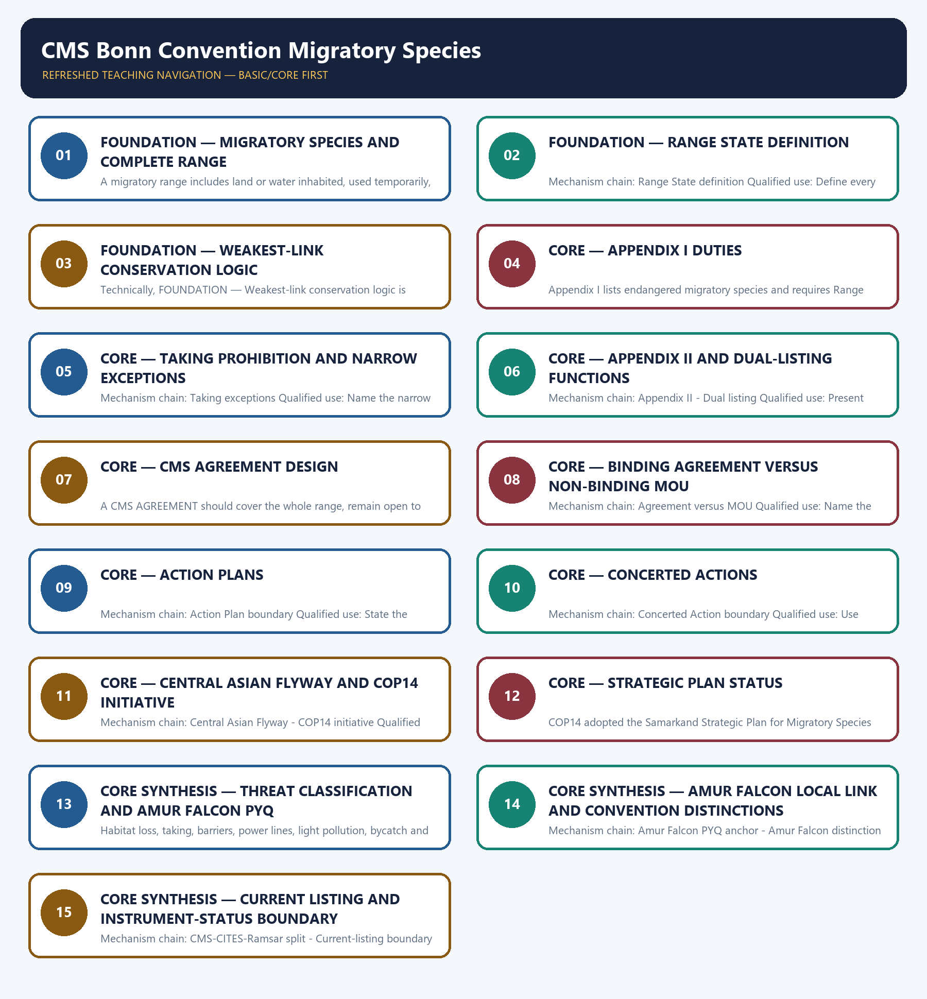

# CMS Bonn Convention Migratory Species — Learner-v2 Complete Learning Session

> **Authoring-only generation:** 2026-09-03. No PDF was rendered and no tracker or index was mutated.

### SOURCE, PROGRESSION AND CURRENT-LINKAGE AUDIT

- **Generation date:** 2026-09-03.
- **Repository-first evidence:** the Basic owner is taught first and preserved in full; the Advanced owner is retained only in the optional final teaching block.
- **OCR evidence:** Repository Markdown was primary. OCR-searchable local official General Studies papers were used only to confirm printed routed demands. No answer key, marking scheme, unsupported page precision, ecological rate, species count or current status was inferred.
- **Qdrant:** not used; repository Markdown and available OCR context were sufficient.
- **PYQ integrity:** The audited provisional 2026 routing ledger carries one Topic 10 objective demand: Amur Falcon migration to Doyang Lake and community-based conservation. The provisional answer key is not recorded or inferred.
- **Live-link boundary:** The CMS Convention text and official COP14 outcome release were substantively retrieved on 2026-09-03. They support definitions, Appendix mechanics, AGREEMENT design, the dated Central Asian Flyway initiative and strategic-plan adoption. No current Appendix species list, Party count, MOU count or implementation outcome was inferred.
- **Fact/inference discipline:** no current-affairs item, PYQ wording, figure or quotation is invented.

### LIVE OFFICIAL-SOURCE ATTEMPT LOG

The checks below were made on 2026-09-03. Substantive official text is used only for the proposition it supports. Stubs, access failures, unrelated pages and thin landing pages are recorded and are not converted into ecological or current-status claims.

- https://www.cms.int/convention-text — attempted 2026-09-03; the official Convention text was substantively retrievable. It supports the exact migratory-species and Range State definitions, Appendix I and II duties, dual listing, taking exceptions and AGREEMENT design.
- https://www.cms.int/en/legalinstrument/cms — attempted 2026-09-03; the official legal-instrument page returned HTTP 403, so no separate instrument-status or membership claim was imported from it.
- https://www.cms.int/en/news/historic-un-wildlife-meeting-concludes-major-set-actions-conservation-migratory-species-wild — attempted 2026-09-03; the official COP14 release was substantively retrievable. It supports the Samarkand date, 2024-2032 strategic-plan adoption and the Central Asian Flyway initiative with a coordinating unit in India.
- https://www.cms.int/en/convention-text — attempted 2026-09-03; the redirect resolved to the substantive Convention text rather than a stub. No current Appendix species list was inferred from that text.
- https://www.pib.gov.in/indexd.aspx?reg=3&lang=1 — attempted 2026-09-03; the request returned HTTP 403, so no Indian migratory-species announcement or action-plan outcome was imported.

## BASIC LEARNING SESSION



*Distinct embedded teaching-navigation image. The separate continuous Cārvāka-style flowchart package remains an independent at-a-glance artifact.*

### SESSION 1 — FOUNDATION — MIGRATORY SPECIES AND COMPLETE RANGE

#### DEFINITION / WHAT THIS IS CALLED

**Plain-language definition:** The CMS Convention text defines a migratory species through a significant proportion of members cyclically and predictably crossing one or more national jurisdictional boundaries; merely moving within one landscape is not enough.

**Technical definition:** A migratory range includes land or water inhabited, used temporarily, crossed or overflown on the normal migration route; breeding and wintering sites are not the only relevant places.

#### ANSWER-GRABBING OPENING — WRITE/ADAPT IN THE EXAM

> The CMS Convention text defines a migratory species through a significant proportion of members cyclically and predictably crossing one or more national jurisdictional boundaries; merely moving within one landscape is not enough.

#### MUST-WRITE KEYWORDS

- **FOUNDATION**
- **Migratory species**
- **complete range**
- **Mechanism chain**
- **Qualified use**
- **The CMS Convention**

**How to use them:** Frame the answer through FOUNDATION; define Migratory species, connect complete range with Mechanism chain to explain the mechanism, and use Qualified use for the decisive comparison or qualification.

#### VISUAL FIRST

```text
MIGRATORY SPECIES AND COMPLETE RANGE
01. Migratory-species test
    |
    v
02. Range definition
BOUNDARY -> Do not call every mobile or seasonally shifting animal a CMS migratory species.
```

*This topic-specific rail fixes the evidence sequence and its exam boundary before analysis.*

#### CORE EXPLANATION

The CMS Convention text defines a migratory species through a significant proportion of members cyclically and predictably crossing one or more national jurisdictional boundaries; merely moving within one landscape is not enough. A migratory range includes land or water inhabited, used temporarily, crossed or overflown on the normal migration route; breeding and wintering sites are not the only relevant places.

#### NAMED EVIDENCE AND MECHANISM

- The CMS Convention text defines a migratory species through a significant proportion of members cyclically and predictably crossing one or more national jurisdictional boundaries; merely moving within one landscape is not enough.
- A migratory range includes land or water inhabited, used temporarily, crossed or overflown on the normal migration route; breeding and wintering sites are not the only relevant places.

#### EXAMINER CAUTION

- Do not call every mobile or seasonally shifting animal a CMS migratory species.

#### EXAM LINK

- **Prelims:** Preserve the exact ecological level, system boundary, stock or flow, pyramid parameter, succession substrate, biome scale, taxonomic term and scientific or legal status; never turn a context-dependent pattern into a universal rule.
- **Mains:** Apply the cross-boundary migration test and map the complete life-cycle range.

#### MINI RECAP

- **Mechanism chain:** Migratory-species test -> Range definition
- **Qualified use:** Apply the cross-boundary migration test and map the complete life-cycle range.

#### CLOSING RECALL FLOW — FOUNDATION — MIGRATORY SPECIES AND COMPLETE RANGE

```text
START / CONCEPT: FOUNDATION — Migratory species and complete range
        |
        v
EXACT TERMS: FOUNDATION · Migratory species · complete range · Mechanism chain · Qualified use · The CMS Convention
        |
        v
MECHANISM / ARGUMENT: Mechanism chain: Migratory-species test - Range definition Qualified use: Apply the cross-boundary migration test and map the complete life-cycle range.
        |
        v
CONSEQUENCE / CONTRAST: Do not call every mobile or seasonally shifting animal a CMS migratory species.
        |
        v
UPSC TRAP / ANSWER-USE: A migratory range includes land or water inhabited, used temporarily, crossed or overflown on the normal migration route; breeding and wintering sites are not the only relevant places.
        |
        v
ANSWER-GRABBING FORMULATION: The CMS Convention text defines a migratory species through a significant proportion of members cyclically and predictably crossing one or more national jurisdictional boundaries; merely moving within one landscape is not enough.
```
### SESSION 2 — FOUNDATION — RANGE STATE DEFINITION

#### DEFINITION / WHAT THIS IS CALLED

**Plain-language definition:** A Range State exercises jurisdiction over any part of that range, with the Convention text also addressing relevant flag-vessel situations; it is not limited to the breeding State or final destination.

**Technical definition:** Mechanism chain: Range State definition Qualified use: Define every jurisdiction touching the route as potentially relevant.

#### ANSWER-GRABBING OPENING — WRITE/ADAPT IN THE EXAM

> A Range State exercises jurisdiction over any part of that range, with the Convention text also addressing relevant flag-vessel situations; it is not limited to the breeding State or final destination.

#### MUST-WRITE KEYWORDS

- **FOUNDATION**
- **Range State definition**
- **Mechanism chain**
- **Qualified use**
- **Range State**
- **Convention**

**How to use them:** Frame the answer through FOUNDATION; define Range State definition, connect Mechanism chain with Qualified use to explain the mechanism, and use Range State for the decisive comparison or qualification.

#### VISUAL FIRST

```text
RANGE STATE DEFINITION
01. Range State definition
BOUNDARY -> Do not reduce range to breeding and destination sites.
```

*This topic-specific rail fixes the evidence sequence and its exam boundary before analysis.*

#### CORE EXPLANATION

A Range State exercises jurisdiction over any part of that range, with the Convention text also addressing relevant flag-vessel situations; it is not limited to the breeding State or final destination.

#### NAMED EVIDENCE AND MECHANISM

- A Range State exercises jurisdiction over any part of that range, with the Convention text also addressing relevant flag-vessel situations; it is not limited to the breeding State or final destination.

#### EXAMINER CAUTION

- Do not reduce range to breeding and destination sites.

#### EXAM LINK

- **Prelims:** Preserve the exact ecological level, system boundary, stock or flow, pyramid parameter, succession substrate, biome scale, taxonomic term and scientific or legal status; never turn a context-dependent pattern into a universal rule.
- **Mains:** Define every jurisdiction touching the route as potentially relevant.

#### MINI RECAP

- **Mechanism chain:** Range State definition
- **Qualified use:** Define every jurisdiction touching the route as potentially relevant.

#### CLOSING RECALL FLOW — FOUNDATION — RANGE STATE DEFINITION

```text
START / CONCEPT: FOUNDATION — Range State definition
        |
        v
EXACT TERMS: FOUNDATION · Range State definition · Mechanism chain · Qualified use · Range State · Convention
        |
        v
MECHANISM / ARGUMENT: Mechanism chain: Range State definition Qualified use: Define every jurisdiction touching the route as potentially relevant.
        |
        v
CONSEQUENCE / CONTRAST: Do not reduce range to breeding and destination sites.
        |
        v
UPSC TRAP / ANSWER-USE: Do not miss this limiting distinction: a Range State exercises jurisdiction over any part of that range, with the Convention...
        |
        v
ANSWER-GRABBING FORMULATION: A Range State exercises jurisdiction over any part of that range, with the Convention text also addressing relevant flag-vessel situations; it is not limited to the breeding State or final destination.
```
### SESSION 3 — FOUNDATION — WEAKEST-LINK CONSERVATION LOGIC

#### DEFINITION / WHAT THIS IS CALLED

**Plain-language definition:** Mechanism chain: Weakest-link logic Qualified use: Explain why one unprotected route segment can defeat protection elsewhere.

**Technical definition:** Technically, FOUNDATION — Weakest-link conservation logic is analysed by relating FOUNDATION to Weakest-link conservation logic, then testing the relationship through Mechanism chain and Qualified use.

#### ANSWER-GRABBING OPENING — WRITE/ADAPT IN THE EXAM

> Mechanism chain: Weakest-link logic Qualified use: Explain why one unprotected route segment can defeat protection elsewhere.

#### MUST-WRITE KEYWORDS

- **FOUNDATION**
- **Weakest-link conservation logic**
- **Mechanism chain**
- **Qualified use**
- **Because**
- **CMS**

**How to use them:** Frame the answer through FOUNDATION; define Weakest-link conservation logic, connect Mechanism chain with Qualified use to explain the mechanism, and use Because for the decisive comparison or qualification.

#### VISUAL FIRST

```text
WEAKEST-LINK CONSERVATION LOGIC
01. Weakest-link logic
BOUNDARY -> Do not restrict Range State to the State where breeding occurs.
```

*This topic-specific rail fixes the evidence sequence and its exam boundary before analysis.*

#### CORE EXPLANATION

Because the life cycle spans route segments and jurisdictions, loss at one breeding, stopover, wintering or passage site can undermine protection elsewhere; CMS is a coordination response to that transboundary problem.

#### NAMED EVIDENCE AND MECHANISM

- Because the life cycle spans route segments and jurisdictions, loss at one breeding, stopover, wintering or passage site can undermine protection elsewhere; CMS is a coordination response to that transboundary problem.

#### EXAMINER CAUTION

- Do not restrict Range State to the State where breeding occurs.

#### EXAM LINK

- **Prelims:** Preserve the exact ecological level, system boundary, stock or flow, pyramid parameter, succession substrate, biome scale, taxonomic term and scientific or legal status; never turn a context-dependent pattern into a universal rule.
- **Mains:** Explain why one unprotected route segment can defeat protection elsewhere.

#### MINI RECAP

- **Mechanism chain:** Weakest-link logic
- **Qualified use:** Explain why one unprotected route segment can defeat protection elsewhere.

#### CLOSING RECALL FLOW — FOUNDATION — WEAKEST-LINK CONSERVATION LOGIC

```text
START / CONCEPT: FOUNDATION — Weakest-link conservation logic
        |
        v
EXACT TERMS: FOUNDATION · Weakest-link conservation logic · Mechanism chain · Qualified use · Because · CMS
        |
        v
MECHANISM / ARGUMENT: Because the life cycle spans route segments and jurisdictions, loss at one breeding, stopover, wintering or passage site can undermine protection elsewhere; CMS is a coordination response to that transboundary problem.
        |
        v
CONSEQUENCE / CONTRAST: Do not restrict Range State to the State where breeding occurs.
        |
        v
UPSC TRAP / ANSWER-USE: Do not miss this limiting distinction: explain why one unprotected route segment can defeat protection elsewhere.
        |
        v
ANSWER-GRABBING FORMULATION: Mechanism chain: Weakest-link logic Qualified use: Explain why one unprotected route segment can defeat protection elsewhere.
```
### SESSION 4 — CORE — APPENDIX I DUTIES

#### DEFINITION / WHAT THIS IS CALLED

**Plain-language definition:** Mechanism chain: Appendix I Qualified use: State endangered listing, habitat duties, obstacle response and taking rule.

**Technical definition:** Appendix I lists endangered migratory species and requires Range States to endeavour to conserve or restore important habitat, address migration obstacles and prohibit taking subject only to precise Convention exceptions.

#### ANSWER-GRABBING OPENING — WRITE/ADAPT IN THE EXAM

> Do not treat Appendix I exceptions as a general taking permission.

#### MUST-WRITE KEYWORDS

- **Appendix I duties**
- **Mechanism chain**
- **Qualified use**
- **Appendix**
- **Range States**
- **Convention**

**How to use them:** Frame the answer through Appendix I duties; define Mechanism chain, connect Qualified use with Appendix to explain the mechanism, and use Range States for the decisive comparison or qualification.

#### VISUAL FIRST

```text
APPENDIX I DUTIES
01. Appendix I
BOUNDARY -> Do not treat Appendix I exceptions as a general taking permission.
```

*This topic-specific rail fixes the evidence sequence and its exam boundary before analysis.*

#### CORE EXPLANATION

Appendix I lists endangered migratory species and requires Range States to endeavour to conserve or restore important habitat, address migration obstacles and prohibit taking subject only to precise Convention exceptions.

#### NAMED EVIDENCE AND MECHANISM

- Appendix I lists endangered migratory species and requires Range States to endeavour to conserve or restore important habitat, address migration obstacles and prohibit taking subject only to precise Convention exceptions.

#### EXAMINER CAUTION

- Do not treat Appendix I exceptions as a general taking permission.

#### EXAM LINK

- **Prelims:** Preserve the exact ecological level, system boundary, stock or flow, pyramid parameter, succession substrate, biome scale, taxonomic term and scientific or legal status; never turn a context-dependent pattern into a universal rule.
- **Mains:** State endangered listing, habitat duties, obstacle response and taking rule.

#### MINI RECAP

- **Mechanism chain:** Appendix I
- **Qualified use:** State endangered listing, habitat duties, obstacle response and taking rule.

#### CLOSING RECALL FLOW — CORE — APPENDIX I DUTIES

```text
START / CONCEPT: CORE — Appendix I duties
        |
        v
EXACT TERMS: Appendix I duties · Mechanism chain · Qualified use · Appendix · Range States · Convention
        |
        v
MECHANISM / ARGUMENT: Mechanism chain: Appendix I Qualified use: State endangered listing, habitat duties, obstacle response and taking rule.
        |
        v
CONSEQUENCE / CONTRAST: Appendix I lists endangered migratory species and requires Range States to endeavour to conserve or restore important habitat, address migration obstacles and prohibit taking subject only to precise Convention exceptions.
        |
        v
UPSC TRAP / ANSWER-USE: Do not miss this limiting distinction: do not treat Appendix I exceptions as a general taking permission.
        |
        v
ANSWER-GRABBING FORMULATION: Do not treat Appendix I exceptions as a general taking permission.
```
### SESSION 5 — CORE — TAKING PROHIBITION AND NARROW EXCEPTIONS

#### DEFINITION / WHAT THIS IS CALLED

**Plain-language definition:** Appendix I exceptions for taking must fit the Convention grounds and remain precise in content and limited in space and time; an exception is not a general permission.

**Technical definition:** Mechanism chain: Taking exceptions Qualified use: Name the narrow Convention ground and retain space-time limits.

#### ANSWER-GRABBING OPENING — WRITE/ADAPT IN THE EXAM

> Appendix I exceptions for taking must fit the Convention grounds and remain precise in content and limited in space and time; an exception is not a general permission.

#### MUST-WRITE KEYWORDS

- **Taking prohibition**
- **narrow exceptions**
- **Mechanism chain**
- **Qualified use**
- **Appendix**
- **Convention**

**How to use them:** Frame the answer through Taking prohibition; define narrow exceptions, connect Mechanism chain with Qualified use to explain the mechanism, and use Appendix for the decisive comparison or qualification.

#### VISUAL FIRST

```text
TAKING PROHIBITION AND NARROW EXCEPTIONS
01. Taking exceptions
BOUNDARY -> Do not say Appendix II creates the same duty as Appendix I.
```

*This topic-specific rail fixes the evidence sequence and its exam boundary before analysis.*

#### CORE EXPLANATION

Appendix I exceptions for taking must fit the Convention grounds and remain precise in content and limited in space and time; an exception is not a general permission.

#### NAMED EVIDENCE AND MECHANISM

- Appendix I exceptions for taking must fit the Convention grounds and remain precise in content and limited in space and time; an exception is not a general permission.

#### EXAMINER CAUTION

- Do not say Appendix II creates the same duty as Appendix I.

#### EXAM LINK

- **Prelims:** Preserve the exact ecological level, system boundary, stock or flow, pyramid parameter, succession substrate, biome scale, taxonomic term and scientific or legal status; never turn a context-dependent pattern into a universal rule.
- **Mains:** Name the narrow Convention ground and retain space-time limits.

#### MINI RECAP

- **Mechanism chain:** Taking exceptions
- **Qualified use:** Name the narrow Convention ground and retain space-time limits.

#### CLOSING RECALL FLOW — CORE — TAKING PROHIBITION AND NARROW EXCEPTIONS

```text
START / CONCEPT: CORE — Taking prohibition and narrow exceptions
        |
        v
EXACT TERMS: Taking prohibition · narrow exceptions · Mechanism chain · Qualified use · Appendix · Convention
        |
        v
MECHANISM / ARGUMENT: Mechanism chain: Taking exceptions Qualified use: Name the narrow Convention ground and retain space-time limits.
        |
        v
CONSEQUENCE / CONTRAST: Do not say Appendix II creates the same duty as Appendix I.
        |
        v
UPSC TRAP / ANSWER-USE: Do not miss this limiting distinction: appendix I exceptions for taking must fit the Convention grounds and remain precise in...
        |
        v
ANSWER-GRABBING FORMULATION: Appendix I exceptions for taking must fit the Convention grounds and remain precise in content and limited in space and time; an exception is not a general permission.
```
### SESSION 6 — CORE — APPENDIX II AND DUAL-LISTING FUNCTIONS

#### DEFINITION / WHAT THIS IS CALLED

**Plain-language definition:** Appendix I and II are not mutually exclusive; dual listing serves separate functions.

**Technical definition:** Mechanism chain: Appendix II - Dual listing Qualified use: Present Appendix II and simultaneous listing through their distinct functions.

#### ANSWER-GRABBING OPENING — WRITE/ADAPT IN THE EXAM

> Appendix I and II are not mutually exclusive; dual listing serves separate functions.

#### MUST-WRITE KEYWORDS

- **Appendix II**
- **dual-listing functions**
- **Mechanism chain**
- **Qualified use**
- **Appendix**
- **Appendix I and II**

**How to use them:** Frame the answer through Appendix II; define dual-listing functions, connect Mechanism chain with Qualified use to explain the mechanism, and use Appendix for the decisive comparison or qualification.

#### VISUAL FIRST

```text
APPENDIX II AND DUAL-LISTING FUNCTIONS
01. Appendix II
    |
    v
02. Dual listing
BOUNDARY -> Appendix I and II are not mutually exclusive; dual listing serves separate functions.
```

*This topic-specific rail fixes the evidence sequence and its exam boundary before analysis.*

#### CORE EXPLANATION

Appendix II covers migratory species with unfavourable conservation status requiring agreements and species that would significantly benefit from international cooperation; it opens a cooperation route rather than duplicating Appendix I. The Convention expressly permits a migratory species to be listed in both Appendix I and Appendix II because strict protection and cooperative agreement serve different functions.

#### NAMED EVIDENCE AND MECHANISM

- Appendix II covers migratory species with unfavourable conservation status requiring agreements and species that would significantly benefit from international cooperation; it opens a cooperation route rather than duplicating Appendix I.
- The Convention expressly permits a migratory species to be listed in both Appendix I and Appendix II because strict protection and cooperative agreement serve different functions.

#### EXAMINER CAUTION

- Appendix I and II are not mutually exclusive; dual listing serves separate functions.

#### EXAM LINK

- **Prelims:** Preserve the exact ecological level, system boundary, stock or flow, pyramid parameter, succession substrate, biome scale, taxonomic term and scientific or legal status; never turn a context-dependent pattern into a universal rule.
- **Mains:** Present Appendix II and simultaneous listing through their distinct functions.

#### MINI RECAP

- **Mechanism chain:** Appendix II -> Dual listing
- **Qualified use:** Present Appendix II and simultaneous listing through their distinct functions.

#### CLOSING RECALL FLOW — CORE — APPENDIX II AND DUAL-LISTING FUNCTIONS

```text
START / CONCEPT: CORE — Appendix II and dual-listing functions
        |
        v
EXACT TERMS: Appendix II · dual-listing functions · Mechanism chain · Qualified use · Appendix · Appendix I and II
        |
        v
MECHANISM / ARGUMENT: Mechanism chain: Appendix II - Dual listing Qualified use: Present Appendix II and simultaneous listing through their distinct functions.
        |
        v
CONSEQUENCE / CONTRAST: Appendix II covers migratory species with unfavourable conservation status requiring agreements and species that would significantly benefit from international cooperation; it opens a cooperation route rather than duplicating Appendix I.
        |
        v
UPSC TRAP / ANSWER-USE: Do not miss this limiting distinction: appendix I and II are not mutually exclusive.
        |
        v
ANSWER-GRABBING FORMULATION: Appendix I and II are not mutually exclusive; dual listing serves separate functions.
```
### SESSION 7 — CORE — CMS AGREEMENT DESIGN

#### DEFINITION / WHAT THIS IS CALLED

**Plain-language definition:** Mechanism chain: AGREEMENT architecture Qualified use: Describe whole-range and open-to-Range-States agreement design.

**Technical definition:** A CMS AGREEMENT should cover the whole range, remain open to Range States and address coordinated conservation, monitoring, information exchange, habitat networks and obstacles as applicable.

#### ANSWER-GRABBING OPENING — WRITE/ADAPT IN THE EXAM

> Mechanism chain: AGREEMENT architecture Qualified use: Describe whole-range and open-to-Range-States agreement design.

#### MUST-WRITE KEYWORDS

- **CMS AGREEMENT design**
- **Mechanism chain**
- **Qualified use**
- **CMS AGREEMENT**
- **Range States**
- **CMS**

**How to use them:** Frame the answer through CMS AGREEMENT design; define Mechanism chain, connect Qualified use with CMS AGREEMENT to explain the mechanism, and use Range States for the decisive comparison or qualification.

#### VISUAL FIRST

```text
CMS AGREEMENT DESIGN
01. AGREEMENT architecture
BOUNDARY -> Do not treat every CMS instrument as legally binding.
```

*This topic-specific rail fixes the evidence sequence and its exam boundary before analysis.*

#### CORE EXPLANATION

A CMS AGREEMENT should cover the whole range, remain open to Range States and address coordinated conservation, monitoring, information exchange, habitat networks and obstacles as applicable.

#### NAMED EVIDENCE AND MECHANISM

- A CMS AGREEMENT should cover the whole range, remain open to Range States and address coordinated conservation, monitoring, information exchange, habitat networks and obstacles as applicable.

#### EXAMINER CAUTION

- Do not treat every CMS instrument as legally binding.

#### EXAM LINK

- **Prelims:** Preserve the exact ecological level, system boundary, stock or flow, pyramid parameter, succession substrate, biome scale, taxonomic term and scientific or legal status; never turn a context-dependent pattern into a universal rule.
- **Mains:** Describe whole-range and open-to-Range-States agreement design.

#### MINI RECAP

- **Mechanism chain:** AGREEMENT architecture
- **Qualified use:** Describe whole-range and open-to-Range-States agreement design.

#### CLOSING RECALL FLOW — CORE — CMS AGREEMENT DESIGN

```text
START / CONCEPT: CORE — CMS AGREEMENT design
        |
        v
EXACT TERMS: CMS AGREEMENT design · Mechanism chain · Qualified use · CMS AGREEMENT · Range States · CMS
        |
        v
MECHANISM / ARGUMENT: A CMS AGREEMENT should cover the whole range, remain open to Range States and address coordinated conservation, monitoring, information exchange, habitat networks and obstacles as applicable.
        |
        v
CONSEQUENCE / CONTRAST: Do not treat every CMS instrument as legally binding.
        |
        v
UPSC TRAP / ANSWER-USE: Do not miss this limiting distinction: describe whole-range and open-to-Range-States agreement design.
        |
        v
ANSWER-GRABBING FORMULATION: Mechanism chain: AGREEMENT architecture Qualified use: Describe whole-range and open-to-Range-States agreement design.
```
### SESSION 8 — CORE — BINDING AGREEMENT VERSUS NON-BINDING MOU

#### DEFINITION / WHAT THIS IS CALLED

**Plain-language definition:** A binding Agreement and a non-binding Memorandum of Understanding must be identified by the exact instrument; neither an Appendix listing nor an Action Plan proves that one of those instruments exists.

**Technical definition:** Mechanism chain: Agreement versus MOU Qualified use: Name the exact instrument and its binding status.

#### ANSWER-GRABBING OPENING — WRITE/ADAPT IN THE EXAM

> A binding Agreement and a non-binding Memorandum of Understanding must be identified by the exact instrument; neither an Appendix listing nor an Action Plan proves that one of those instruments exists.

#### MUST-WRITE KEYWORDS

- **Binding Agreement versus non-binding MOU**
- **Mechanism chain**
- **Qualified use**
- **Agreement**
- **Memorandum**
- **Understanding**

**How to use them:** Frame the answer through Binding Agreement versus non-binding MOU; define Mechanism chain, connect Qualified use with Agreement to explain the mechanism, and use Memorandum for the decisive comparison or qualification.

#### VISUAL FIRST

```text
BINDING AGREEMENT VERSUS NON-BINDING MOU
01. Agreement versus MOU
BOUNDARY -> Do not call an Action Plan an Agreement or MOU without the instrument.
```

*This topic-specific rail fixes the evidence sequence and its exam boundary before analysis.*

#### CORE EXPLANATION

A binding Agreement and a non-binding Memorandum of Understanding must be identified by the exact instrument; neither an Appendix listing nor an Action Plan proves that one of those instruments exists.

#### NAMED EVIDENCE AND MECHANISM

- A binding Agreement and a non-binding Memorandum of Understanding must be identified by the exact instrument; neither an Appendix listing nor an Action Plan proves that one of those instruments exists.

#### EXAMINER CAUTION

- Do not call an Action Plan an Agreement or MOU without the instrument.

#### EXAM LINK

- **Prelims:** Preserve the exact ecological level, system boundary, stock or flow, pyramid parameter, succession substrate, biome scale, taxonomic term and scientific or legal status; never turn a context-dependent pattern into a universal rule.
- **Mains:** Name the exact instrument and its binding status.

#### MINI RECAP

- **Mechanism chain:** Agreement versus MOU
- **Qualified use:** Name the exact instrument and its binding status.

#### CLOSING RECALL FLOW — CORE — BINDING AGREEMENT VERSUS NON-BINDING MOU

```text
START / CONCEPT: CORE — Binding Agreement versus non-binding MOU
        |
        v
EXACT TERMS: Binding Agreement versus non-binding MOU · Mechanism chain · Qualified use · Agreement · Memorandum · Understanding
        |
        v
MECHANISM / ARGUMENT: Mechanism chain: Agreement versus MOU Qualified use: Name the exact instrument and its binding status.
        |
        v
CONSEQUENCE / CONTRAST: Do not call an Action Plan an Agreement or MOU without the instrument.
        |
        v
UPSC TRAP / ANSWER-USE: Do not miss this limiting distinction: a binding Agreement and a non-binding Memorandum of Understanding must be identified by the...
        |
        v
ANSWER-GRABBING FORMULATION: A binding Agreement and a non-binding Memorandum of Understanding must be identified by the exact instrument; neither an Appendix listing nor an Action Plan proves that one of those instruments exists.
```
### SESSION 9 — CORE — ACTION PLANS

#### DEFINITION / WHAT THIS IS CALLED

**Plain-language definition:** An Action Plan can organise conservation measures for a species or flyway, but its legal and institutional status must be read from the adopting instrument; plan adoption is not a recovery outcome.

**Technical definition:** Mechanism chain: Action Plan boundary Qualified use: State the plan's measures without upgrading its legal status or outcomes.

#### ANSWER-GRABBING OPENING — WRITE/ADAPT IN THE EXAM

> An Action Plan can organise conservation measures for a species or flyway, but its legal and institutional status must be read from the adopting instrument; plan adoption is not a recovery outcome.

#### MUST-WRITE KEYWORDS

- **Action Plans**
- **Mechanism chain**
- **Qualified use**
- **An Action Plan**
- **Concerted Action**
- **Appendix**

**How to use them:** Frame the answer through Action Plans; define Mechanism chain, connect Qualified use with An Action Plan to explain the mechanism, and use Concerted Action for the decisive comparison or qualification.

#### VISUAL FIRST

```text
ACTION PLANS
01. Action Plan boundary
BOUNDARY -> Do not convert a Concerted Action into an Appendix amendment.
```

*This topic-specific rail fixes the evidence sequence and its exam boundary before analysis.*

#### CORE EXPLANATION

An Action Plan can organise conservation measures for a species or flyway, but its legal and institutional status must be read from the adopting instrument; plan adoption is not a recovery outcome.

#### NAMED EVIDENCE AND MECHANISM

- An Action Plan can organise conservation measures for a species or flyway, but its legal and institutional status must be read from the adopting instrument; plan adoption is not a recovery outcome.

#### EXAMINER CAUTION

- Do not convert a Concerted Action into an Appendix amendment.

#### EXAM LINK

- **Prelims:** Preserve the exact ecological level, system boundary, stock or flow, pyramid parameter, succession substrate, biome scale, taxonomic term and scientific or legal status; never turn a context-dependent pattern into a universal rule.
- **Mains:** State the plan's measures without upgrading its legal status or outcomes.

#### MINI RECAP

- **Mechanism chain:** Action Plan boundary
- **Qualified use:** State the plan's measures without upgrading its legal status or outcomes.

#### CLOSING RECALL FLOW — CORE — ACTION PLANS

```text
START / CONCEPT: CORE — Action Plans
        |
        v
EXACT TERMS: Action Plans · Mechanism chain · Qualified use · An Action Plan · Concerted Action · Appendix
        |
        v
MECHANISM / ARGUMENT: Mechanism chain: Action Plan boundary Qualified use: State the plan's measures without upgrading its legal status or outcomes.
        |
        v
CONSEQUENCE / CONTRAST: Do not convert a Concerted Action into an Appendix amendment.
        |
        v
UPSC TRAP / ANSWER-USE: Do not miss this limiting distinction: state the plan's measures without upgrading its legal status or outcomes.
        |
        v
ANSWER-GRABBING FORMULATION: An Action Plan can organise conservation measures for a species or flyway, but its legal and institutional status must be read from the adopting instrument; plan adoption is not a recovery outcome.
```
### SESSION 10 — CORE — CONCERTED ACTIONS

#### DEFINITION / WHAT THIS IS CALLED

**Plain-language definition:** CMS Concerted Actions prioritise focused cooperative work between COPs; they do not replace Appendix status, an Agreement, an MOU or domestic legal protection.

**Technical definition:** Mechanism chain: Concerted Action boundary Qualified use: Use priority action as an operational bridge, not a new listing.

#### ANSWER-GRABBING OPENING — WRITE/ADAPT IN THE EXAM

> CMS Concerted Actions prioritise focused cooperative work between COPs; they do not replace Appendix status, an Agreement, an MOU or domestic legal protection.

#### MUST-WRITE KEYWORDS

- **Concerted Actions**
- **Mechanism chain**
- **Qualified use**
- **CMS Concerted Actions**
- **COPs**
- **Appendix**

**How to use them:** Frame the answer through Concerted Actions; define Mechanism chain, connect Qualified use with CMS Concerted Actions to explain the mechanism, and use COPs for the decisive comparison or qualification.

#### VISUAL FIRST

```text
CONCERTED ACTIONS
01. Concerted Action boundary
BOUNDARY -> Do not call the Central Asian Flyway a treaty.
```

*This topic-specific rail fixes the evidence sequence and its exam boundary before analysis.*

#### CORE EXPLANATION

CMS Concerted Actions prioritise focused cooperative work between COPs; they do not replace Appendix status, an Agreement, an MOU or domestic legal protection.

#### NAMED EVIDENCE AND MECHANISM

- CMS Concerted Actions prioritise focused cooperative work between COPs; they do not replace Appendix status, an Agreement, an MOU or domestic legal protection.

#### EXAMINER CAUTION

- Do not call the Central Asian Flyway a treaty.

#### EXAM LINK

- **Prelims:** Preserve the exact ecological level, system boundary, stock or flow, pyramid parameter, succession substrate, biome scale, taxonomic term and scientific or legal status; never turn a context-dependent pattern into a universal rule.
- **Mains:** Use priority action as an operational bridge, not a new listing.

#### MINI RECAP

- **Mechanism chain:** Concerted Action boundary
- **Qualified use:** Use priority action as an operational bridge, not a new listing.

#### CLOSING RECALL FLOW — CORE — CONCERTED ACTIONS

```text
START / CONCEPT: CORE — Concerted Actions
        |
        v
EXACT TERMS: Concerted Actions · Mechanism chain · Qualified use · CMS Concerted Actions · COPs · Appendix
        |
        v
MECHANISM / ARGUMENT: Mechanism chain: Concerted Action boundary Qualified use: Use priority action as an operational bridge, not a new listing.
        |
        v
CONSEQUENCE / CONTRAST: Mains: Use priority action as an operational bridge, not a new listing.
        |
        v
UPSC TRAP / ANSWER-USE: Do not call the Central Asian Flyway a treaty.
        |
        v
ANSWER-GRABBING FORMULATION: CMS Concerted Actions prioritise focused cooperative work between COPs; they do not replace Appendix status, an Agreement, an MOU or domestic legal protection.
```
### SESSION 11 — CORE — CENTRAL ASIAN FLYWAY AND COP14 INITIATIVE

#### DEFINITION / WHAT THIS IS CALLED

**Plain-language definition:** The flyway is an ecological route and cooperation geography, not itself a species, Appendix or treaty; every claim about its institution, Range States or action plan requires the dated official instrument.

**Technical definition:** Mechanism chain: Central Asian Flyway - COP14 initiative Qualified use: Describe the flyway separately from the COP14 initiative and its coordinating unit.

#### ANSWER-GRABBING OPENING — WRITE/ADAPT IN THE EXAM

> The official CMS COP14 release states that Samarkand in February 2024 adopted a Central Asian Flyway initiative including a coordinating unit in India with Indian Government financial support; it must be called an initiative, not silently upgraded to an Agreement or MOU.

#### MUST-WRITE KEYWORDS

- **Central Asian Flyway**
- **COP14 initiative**
- **Mechanism chain**
- **Qualified use**
- **The flyway**
- **Appendix**

**How to use them:** Frame the answer through Central Asian Flyway; define COP14 initiative, connect Mechanism chain with Qualified use to explain the mechanism, and use The flyway for the decisive comparison or qualification.

#### VISUAL FIRST

```text
CENTRAL ASIAN FLYWAY AND COP14 INITIATIVE
01. Central Asian Flyway
    |
    v
02. COP14 initiative
BOUNDARY -> Do not upgrade the COP14 initiative to a binding Agreement.
```

*This topic-specific rail fixes the evidence sequence and its exam boundary before analysis.*

#### CORE EXPLANATION

The flyway is an ecological route and cooperation geography, not itself a species, Appendix or treaty; every claim about its institution, Range States or action plan requires the dated official instrument. The official CMS COP14 release states that Samarkand in February 2024 adopted a Central Asian Flyway initiative including a coordinating unit in India with Indian Government financial support; it must be called an initiative, not silently upgraded to an Agreement or MOU.

#### NAMED EVIDENCE AND MECHANISM

- The flyway is an ecological route and cooperation geography, not itself a species, Appendix or treaty; every claim about its institution, Range States or action plan requires the dated official instrument.
- The official CMS COP14 release states that Samarkand in February 2024 adopted a Central Asian Flyway initiative including a coordinating unit in India with Indian Government financial support; it must be called an initiative, not silently upgraded to an Agreement or MOU.

#### EXAMINER CAUTION

- Do not upgrade the COP14 initiative to a binding Agreement.

#### EXAM LINK

- **Prelims:** Preserve the exact ecological level, system boundary, stock or flow, pyramid parameter, succession substrate, biome scale, taxonomic term and scientific or legal status; never turn a context-dependent pattern into a universal rule.
- **Mains:** Describe the flyway separately from the COP14 initiative and its coordinating unit.

#### MINI RECAP

- **Mechanism chain:** Central Asian Flyway -> COP14 initiative
- **Qualified use:** Describe the flyway separately from the COP14 initiative and its coordinating unit.

#### CLOSING RECALL FLOW — CORE — CENTRAL ASIAN FLYWAY AND COP14 INITIATIVE

```text
START / CONCEPT: CORE — Central Asian Flyway and COP14 initiative
        |
        v
EXACT TERMS: Central Asian Flyway · COP14 initiative · Mechanism chain · Qualified use · The flyway · Appendix
        |
        v
MECHANISM / ARGUMENT: Mechanism chain: Central Asian Flyway - COP14 initiative Qualified use: Describe the flyway separately from the COP14 initiative and its coordinating unit.
        |
        v
CONSEQUENCE / CONTRAST: The flyway is an ecological route and cooperation geography, not itself a species, Appendix or treaty; every claim about its institution, Range States or action plan requires the dated official instrument.
        |
        v
UPSC TRAP / ANSWER-USE: Do not upgrade the COP14 initiative to a binding Agreement.
        |
        v
ANSWER-GRABBING FORMULATION: The official CMS COP14 release states that Samarkand in February 2024 adopted a Central Asian Flyway initiative including a coordinating unit in India with Indian Government financial support; it must be called an initiative, not silently upgraded to an Agreement or MOU.
```
### SESSION 12 — CORE — STRATEGIC PLAN STATUS

#### DEFINITION / WHAT THIS IS CALLED

**Plain-language definition:** Mechanism chain: Strategic plan status Qualified use: Separate adopted initiative and targets from achieved conservation results.

**Technical definition:** COP14 adopted the Samarkand Strategic Plan for Migratory Species 2024-2032; adoption establishes targets and direction, not proof that populations, habitats or route safety improved.

#### ANSWER-GRABBING OPENING — WRITE/ADAPT IN THE EXAM

> COP14 adopted the Samarkand Strategic Plan for Migratory Species 2024-2032; adoption establishes targets and direction, not proof that populations, habitats or route safety improved.

#### MUST-WRITE KEYWORDS

- **Strategic plan status**
- **Mechanism chain**
- **Qualified use**
- **Samarkand Strategic Plan**
- **Migratory Species**
- **2024-2032**

**How to use them:** Frame the answer through Strategic plan status; define Mechanism chain, connect Qualified use with Samarkand Strategic Plan to explain the mechanism, and use Migratory Species for the decisive comparison or qualification.

#### VISUAL FIRST

```text
STRATEGIC PLAN STATUS
01. Strategic plan status
BOUNDARY -> Do not report a strategic-plan target as a conservation outcome.
```

*This topic-specific rail fixes the evidence sequence and its exam boundary before analysis.*

#### CORE EXPLANATION

COP14 adopted the Samarkand Strategic Plan for Migratory Species 2024-2032; adoption establishes targets and direction, not proof that populations, habitats or route safety improved.

#### NAMED EVIDENCE AND MECHANISM

- COP14 adopted the Samarkand Strategic Plan for Migratory Species 2024-2032; adoption establishes targets and direction, not proof that populations, habitats or route safety improved.

#### EXAMINER CAUTION

- Do not report a strategic-plan target as a conservation outcome.

#### EXAM LINK

- **Prelims:** Preserve the exact ecological level, system boundary, stock or flow, pyramid parameter, succession substrate, biome scale, taxonomic term and scientific or legal status; never turn a context-dependent pattern into a universal rule.
- **Mains:** Separate adopted initiative and targets from achieved conservation results.

#### MINI RECAP

- **Mechanism chain:** Strategic plan status
- **Qualified use:** Separate adopted initiative and targets from achieved conservation results.

#### CLOSING RECALL FLOW — CORE — STRATEGIC PLAN STATUS

```text
START / CONCEPT: CORE — Strategic plan status
        |
        v
EXACT TERMS: Strategic plan status · Mechanism chain · Qualified use · Samarkand Strategic Plan · Migratory Species · 2024-2032
        |
        v
MECHANISM / ARGUMENT: Mechanism chain: Strategic plan status Qualified use: Separate adopted initiative and targets from achieved conservation results.
        |
        v
CONSEQUENCE / CONTRAST: Do not report a strategic-plan target as a conservation outcome.
        |
        v
UPSC TRAP / ANSWER-USE: Do not miss this limiting distinction: separate adopted initiative and targets from achieved conservation results.
        |
        v
ANSWER-GRABBING FORMULATION: COP14 adopted the Samarkand Strategic Plan for Migratory Species 2024-2032; adoption establishes targets and direction, not proof that populations, habitats or route safety improved.
```
### SESSION 13 — CORE SYNTHESIS — THREAT CLASSIFICATION AND AMUR FALCON PYQ

#### DEFINITION / WHAT THIS IS CALLED

**Plain-language definition:** Mechanism chain: Threat classification Qualified use: Classify the threat and carry the provisional Amur Falcon concept without a key.

**Technical definition:** Habitat loss, taking, barriers, power lines, light pollution, bycatch and other pressures must be located on the route; some are transboundary coordination failures and others are domestic implementation failures.

#### ANSWER-GRABBING OPENING — WRITE/ADAPT IN THE EXAM

> Mechanism chain: Threat classification Qualified use: Classify the threat and carry the provisional Amur Falcon concept without a key.

#### MUST-WRITE KEYWORDS

- **CORE SYNTHESIS**
- **Threat classification**
- **Amur Falcon PYQ**
- **Mechanism chain**
- **Qualified use**
- **Habitat**

**How to use them:** Frame the answer through CORE SYNTHESIS; define Threat classification, connect Amur Falcon PYQ with Mechanism chain to explain the mechanism, and use Qualified use for the decisive comparison or qualification.

#### VISUAL FIRST

```text
THREAT CLASSIFICATION AND AMUR FALCON PYQ
01. Threat classification
BOUNDARY -> Do not classify every threat as a transboundary failure.
```

*This topic-specific rail fixes the evidence sequence and its exam boundary before analysis.*

#### CORE EXPLANATION

Habitat loss, taking, barriers, power lines, light pollution, bycatch and other pressures must be located on the route; some are transboundary coordination failures and others are domestic implementation failures.

#### NAMED EVIDENCE AND MECHANISM

- Habitat loss, taking, barriers, power lines, light pollution, bycatch and other pressures must be located on the route; some are transboundary coordination failures and others are domestic implementation failures.

#### EXAMINER CAUTION

- Do not classify every threat as a transboundary failure.

#### EXAM LINK

- **Prelims:** Preserve the exact ecological level, system boundary, stock or flow, pyramid parameter, succession substrate, biome scale, taxonomic term and scientific or legal status; never turn a context-dependent pattern into a universal rule.
- **Mains:** Classify the threat and carry the provisional Amur Falcon concept without a key.

#### MINI RECAP

- **Mechanism chain:** Threat classification
- **Qualified use:** Classify the threat and carry the provisional Amur Falcon concept without a key.

#### CLOSING RECALL FLOW — CORE SYNTHESIS — THREAT CLASSIFICATION AND AMUR FALCON PYQ

```text
START / CONCEPT: CORE SYNTHESIS — Threat classification and Amur Falcon PYQ
        |
        v
EXACT TERMS: CORE SYNTHESIS · Threat classification · Amur Falcon PYQ · Mechanism chain · Qualified use · Habitat
        |
        v
MECHANISM / ARGUMENT: Habitat loss, taking, barriers, power lines, light pollution, bycatch and other pressures must be located on the route; some are transboundary coordination failures and others are domestic implementation failures.
        |
        v
CONSEQUENCE / CONTRAST: Do not classify every threat as a transboundary failure.
        |
        v
UPSC TRAP / ANSWER-USE: Do not miss this limiting distinction: classify the threat and carry the provisional Amur Falcon concept without a key.
        |
        v
ANSWER-GRABBING FORMULATION: Mechanism chain: Threat classification Qualified use: Classify the threat and carry the provisional Amur Falcon concept without a key.
```
### SESSION 14 — CORE SYNTHESIS — AMUR FALCON LOCAL LINK AND CONVENTION DISTINCTIONS

#### DEFINITION / WHAT THIS IS CALLED

**Plain-language definition:** The provisional 2026 routed demand concerns Amur Falcon migration to Doyang Lake and community-based conservation; it is carried as an answer-free concept anchor without inferring the option key.

**Technical definition:** Mechanism chain: Amur Falcon PYQ anchor - Amur Falcon distinction Qualified use: Use the local stopover link, then distinguish CMS, CITES and Ramsar.

#### ANSWER-GRABBING OPENING — WRITE/ADAPT IN THE EXAM

> Mechanism chain: Amur Falcon PYQ anchor - Amur Falcon distinction Qualified use: Use the local stopover link, then distinguish CMS, CITES and Ramsar.

#### MUST-WRITE KEYWORDS

- **CORE SYNTHESIS**
- **Amur Falcon local link**
- **convention distinctions**
- **Mechanism chain**
- **Qualified use**
- **Amur Falcon**

**How to use them:** Frame the answer through CORE SYNTHESIS; define Amur Falcon local link, connect convention distinctions with Mechanism chain to explain the mechanism, and use Qualified use for the decisive comparison or qualification.

#### VISUAL FIRST

```text
AMUR FALCON LOCAL LINK AND CONVENTION DISTINCTIONS
01. Amur Falcon PYQ anchor
    |
    v
02. Amur Falcon distinction
BOUNDARY -> Do not infer the 2026 provisional PYQ key.
```

*This topic-specific rail fixes the evidence sequence and its exam boundary before analysis.*

#### CORE EXPLANATION

The provisional 2026 routed demand concerns Amur Falcon migration to Doyang Lake and community-based conservation; it is carried as an answer-free concept anchor without inferring the option key. The Doyang or Pangti conservation example illustrates protection of a stopover or roost link through local action; it does not by itself prove protection across the species' complete migratory circuit.

#### NAMED EVIDENCE AND MECHANISM

- The provisional 2026 routed demand concerns Amur Falcon migration to Doyang Lake and community-based conservation; it is carried as an answer-free concept anchor without inferring the option key.
- The Doyang or Pangti conservation example illustrates protection of a stopover or roost link through local action; it does not by itself prove protection across the species' complete migratory circuit.

#### EXAMINER CAUTION

- Do not infer the 2026 provisional PYQ key.

#### EXAM LINK

- **Prelims:** Preserve the exact ecological level, system boundary, stock or flow, pyramid parameter, succession substrate, biome scale, taxonomic term and scientific or legal status; never turn a context-dependent pattern into a universal rule.
- **Mains:** Use the local stopover link, then distinguish CMS, CITES and Ramsar.

#### MINI RECAP

- **Mechanism chain:** Amur Falcon PYQ anchor -> Amur Falcon distinction
- **Qualified use:** Use the local stopover link, then distinguish CMS, CITES and Ramsar.

#### CLOSING RECALL FLOW — CORE SYNTHESIS — AMUR FALCON LOCAL LINK AND CONVENTION DISTINCTIONS

```text
START / CONCEPT: CORE SYNTHESIS — Amur Falcon local link and convention distinctions
        |
        v
EXACT TERMS: CORE SYNTHESIS · Amur Falcon local link · convention distinctions · Mechanism chain · Qualified use · Amur Falcon
        |
        v
MECHANISM / ARGUMENT: The Doyang or Pangti conservation example illustrates protection of a stopover or roost link through local action; it does not by itself prove protection across the species' complete migratory circuit.
        |
        v
CONSEQUENCE / CONTRAST: The provisional 2026 routed demand concerns Amur Falcon migration to Doyang Lake and community-based conservation; it is carried as an answer-free concept anchor without inferring the option key.
        |
        v
UPSC TRAP / ANSWER-USE: Do not infer the 2026 provisional PYQ key.
        |
        v
ANSWER-GRABBING FORMULATION: Mechanism chain: Amur Falcon PYQ anchor - Amur Falcon distinction Qualified use: Use the local stopover link, then distinguish CMS, CITES and Ramsar.
```
### SESSION 15 — CORE SYNTHESIS — CURRENT LISTING AND INSTRUMENT-STATUS BOUNDARY

#### DEFINITION / WHAT THIS IS CALLED

**Plain-language definition:** CORE SYNTHESIS — Current listing and instrument-status boundary comprises CORE SYNTHESIS, Current listing and instrument-status boundary as its core connected dimensions.

**Technical definition:** Mechanism chain: CMS-CITES-Ramsar split - Current-listing boundary Qualified use: Close without inventing current listings, Parties or instrument status.

#### ANSWER-GRABBING OPENING — WRITE/ADAPT IN THE EXAM

> Mechanism chain: CMS-CITES-Ramsar split - Current-listing boundary Qualified use: Close without inventing current listings, Parties or instrument status.

#### MUST-WRITE KEYWORDS

- **CORE SYNTHESIS**
- **Current listing**
- **instrument-status boundary**
- **Mechanism chain**
- **Qualified use**
- **Subject**

**How to use them:** Frame the answer through CORE SYNTHESIS; define Current listing, connect instrument-status boundary with Mechanism chain to explain the mechanism, and use Qualified use for the decisive comparison or qualification.

#### VISUAL FIRST

```text
CURRENT LISTING AND INSTRUMENT-STATUS BOUNDARY
01. CMS-CITES-Ramsar split
    |
    v
02. Current-listing boundary
BOUNDARY -> Do not invent a current Appendix or membership count.
```

*This topic-specific rail fixes the evidence sequence and its exam boundary before analysis.*

#### CORE EXPLANATION

CMS coordinates migratory-range conservation, CITES regulates international trade and Ramsar concerns wetland wise use and designation; one migratory bird can engage all three without merging their legal effects. The package does not assert a current species Appendix, Party count, MOU signatory count or post-COP14 action-plan status unless it was substantively retrieved from the dated official source.

#### NAMED EVIDENCE AND MECHANISM

- CMS coordinates migratory-range conservation, CITES regulates international trade and Ramsar concerns wetland wise use and designation; one migratory bird can engage all three without merging their legal effects.
- The package does not assert a current species Appendix, Party count, MOU signatory count or post-COP14 action-plan status unless it was substantively retrieved from the dated official source.

#### EXAMINER CAUTION

- Do not invent a current Appendix or membership count.

#### EXAM LINK

- **Prelims:** Preserve the exact ecological level, system boundary, stock or flow, pyramid parameter, succession substrate, biome scale, taxonomic term and scientific or legal status; never turn a context-dependent pattern into a universal rule.
- **Mains:** Close without inventing current listings, Parties or instrument status.

#### MINI RECAP

- **Mechanism chain:** CMS-CITES-Ramsar split -> Current-listing boundary
- **Qualified use:** Close without inventing current listings, Parties or instrument status.
#### COMPLETE BASIC OWNER EVIDENCE BANK

> **Subject:** Environment and Ecology | **Tier:** Must-Do (foundation) | **GS Paper:** GS-III (Environment) + Prelims, with GS-II international-cooperation linkage.
> **Core area:** Range-state cooperation for migratory species.
> **Grounded in:** Convention on the Conservation of Migratory Species of Wild Animals (CMS/Bonn Convention, 1979) official framework; CMS CoP13 (India, 2020) outcomes; audited UPSC Environment PYQs (2024-2026 Prelims and 2024-2025 Mains).
> ✅ = source-grounded | ⚠️ = analytical linkage | 📰 = dated current-affairs anchor.
> *Companion: `advanced/10_CMS-Bonn-Convention-Migratory-Species.md`.*

#### 1. Visual foundation

```text
CMS APPENDIX STRUCTURE (Bonn Convention, 1979)
Appendix I  -> ENDANGERED migratory species -> range states must STRICTLY PROTECT
               (prohibit taking, conserve/restore habitat)
Appendix II -> species needing/benefiting from international cooperation ->
               range states encouraged to conclude AGREEMENTS (regional/species-specific
               instruments) for coordinated conservation across their entire migratory range

KEY IDEA: A migratory species crosses MULTIPLE COUNTRIES' jurisdictions in its life cycle,
so no single national law can protect it fully -> CMS exists to coordinate "RANGE STATES."
```

**Core proposition:** CMS (the Bonn Convention) is the multilateral framework specifically
addressing species whose survival depends on protection across an entire migratory range
spanning multiple countries — its logic is range-state coordination, distinct from CITES'
trade focus and from any single country's domestic wildlife law.

#### 2. Essential definitions

| Concept | Exam-ready meaning |
|---|---|
| ✅ **CMS / Bonn Convention (1979)** | UN Environment Programme-administered treaty for conserving migratory species across their range, signed at Bonn, Germany. |
| ✅ **Range state** | Any country whose jurisdiction a migratory species' range passes through at any point in its life cycle. |
| ✅ **CMS Appendix I** | Endangered migratory species requiring strict protection and habitat conservation/restoration by all range states. |
| ✅ **CMS Appendix II** | Migratory species with unfavourable conservation status (or that would benefit significantly from international cooperation), for which range states are encouraged to conclude specific Agreements. |
| ✅ **CMS Agreement/MOU** | A binding Agreement or non-binding Memorandum of Understanding concluded under CMS among relevant range states for a specific species or species group (e.g., raptors, dugongs, sharks). |

#### 3. Topic mechanism

1. A migratory species (bird, mammal, fish, insect) may breed in one country, stop over in
   several others, and winter in yet another — meaning its conservation cannot succeed if
   even one critical range state fails to protect it at a key life-cycle stage.
2. CMS Appendix I obliges range states to prohibit taking (except in narrow exceptions) and
   to conserve/restore habitats critical to the species, with special attention to
   preventing/removing obstacles (e.g., structures) that impede migration.
3. CMS Appendix II encourages (rather than strictly mandates) range states to negotiate
   specific Agreements or Memoranda of Understanding tailored to a species or species group,
   allowing flexible, regionally appropriate cooperation mechanisms.
4. CMS periodically reviews and updates Appendix listings and adopts new species-specific
   Agreements/MOUs at its Conference of the Parties (CoP), held roughly every three years.
5. India, as a range state along major flyways (notably the Central Asian Flyway for
   migratory birds), participates in CMS-linked cooperation to protect migratory birds,
   marine species (e.g., dugongs, marine turtles) and terrestrial migrants moving through or
   near its territory.

#### 4. Institutions and policy tools

- ✅ **CMS Secretariat (administered under UNEP, headquartered in Bonn, Germany):**
  coordinates the Convention's implementation and Conference of the Parties.
- ✅ **MoEFCC:** India's nodal ministry for CMS implementation and Conference of the Parties
  participation.
- ✅ **Wildlife Institute of India (WII):** provides scientific/technical input on migratory-
  species tracking and habitat assessment (e.g., satellite telemetry studies).
- ⚠️ Regional flyway-specific coordination (e.g., Central Asian Flyway range states)
  functions as an informal-to-formal cooperative mechanism linked to, but not always a
  fully binding CMS Agreement, for migratory bird conservation across South and Central
  Asia.

#### 5. Indian applications and examples

- ⚠️ India hosted the 13th Conference of the Parties to CMS (CMS CoP13) in Gandhinagar,
  Gujarat, in 2020, where India held the CMS Presidency for the following three-year term
  and various species-specific outcomes were adopted, including attention to the Great
  Indian Bustard and Bengal Florican among Central Asian Flyway species.
- ⚠️ The dugong (a marine mammal found in India's coastal waters, e.g., Gulf of Mannar and
  Andaman-Nicobar waters) is a CMS-listed migratory marine species subject to specific
  conservation attention including a dedicated MOU framework.
- ⚠️ Migratory raptors and waterfowl using the Central Asian Flyway (which passes through
  India) illustrate the range-state coordination logic — protecting only Indian wetlands
  without corresponding protection in Central Asian breeding/staging grounds would be
  insufficient for species recovery.

#### 6. Must-Know Facts for Prelims

- ✅ CMS (Bonn Convention, 1979) is administered under UNEP and focuses specifically on
  migratory species conservation across their entire range.
- ✅ CMS has two main Appendices: Appendix I (strict protection) and Appendix II (cooperation
  encouraged through specific Agreements/MOUs).
- ✅ India hosted CMS CoP13 in Gandhinagar, Gujarat, in 2020, and subsequently held the CMS
  Presidency.
- ✅ A "range state" is any country through which a migratory species passes during its life
  cycle, not just its breeding or final destination country.
- ✅ The dugong and various Central Asian Flyway birds are prominent Indian examples of
  CMS-relevant migratory species.
- ✅ **India has been a Party to CMS since 1983.** It is a signatory to four CMS
  species-specific **non-legally-binding MOUs**: the **Siberian Crane**, **Marine Turtles**
  (Indian Ocean-South-East Asian region), **Dugong**, and **Raptors (Birds of Prey)** MOUs.
- ✅ A species may be listed on **both** Appendix I and Appendix II simultaneously — the two
  Appendices serve different functions (strict protection vs cooperative agreement) rather
  than being mutually exclusive tiers.
- ✅ CMS's **"Concerted Actions"** mechanism designates priority species/populations for
  focused, time-bound cooperative measures between CoPs — the operational bridge between an
  Appendix listing and on-ground work.
- ✅ CMS CoP13 (Gandhinagar, 2020) had the Great Indian Bustard-inspired mascot **"Gibi"**,
  the theme *"Migratory species connect the planet and we welcome them home"*, and produced
  the **Gandhinagar Declaration** highlighting migratory species' role in ecological
  connectivity.

#### 7. UPSC traps

- ❌ CMS regulates international trade in migratory species like CITES does. -> CMS focuses
  on habitat protection and range-state cooperation for conservation, not trade regulation
  (that is CITES' function).
- ❌ Only the country where a species breeds is considered its "range state." -> Any country
  the species passes through during its life cycle qualifies as a range state.
- ❌ CMS Appendix II listing carries the same strict, mandatory protection obligation as
  Appendix I. -> Appendix II primarily encourages range states to negotiate cooperative
  Agreements/MOUs, a more flexible mechanism than Appendix I's strict-protection duty.
- ❌ India has never hosted a major CMS event. -> India hosted CMS CoP13 in Gandhinagar in
  2020 and held the subsequent CMS Presidency.
- ❌ CMS only covers birds. -> It covers migratory mammals, fish, reptiles and insects as
  well as birds (e.g., dugongs, sharks, marine turtles).
- ❌ A species must be on either Appendix I or Appendix II, never both. -> Dual listing is
  common and deliberate: Appendix I imposes protection duties, Appendix II opens the route to
  a cooperative Agreement/MOU.
- ❌ All CMS instruments are legally binding. -> CMS supports both binding **Agreements** and
  non-binding **Memoranda of Understanding**; all four instruments India has signed under CMS
  are MOUs, not binding Agreements.

#### 8. 📰 Current anchor

- 📰 **CMS COP14, Samarkand (February 2024):** adopted the Samarkand
  Strategic Plan for Migratory Species 2024-2032, launched the first *State of
  the World's Migratory Species* report and advanced a Central Asian Flyway
  initiative with a coordinating unit in India.
- ✅ India's COP13 hosting/presidency remains historical context; COP14 is the
  current completed COP anchor. [CMS outcome](https://www.cms.int/news/historic-un-wildlife-meeting-concludes-major-set-actions-conservation-migratory-species-wild).

- ✅ **Historical context:** India's CMS COP13 Presidency (Gandhinagar,
  2020) shaped its subsequent Central Asian Flyway engagement; do not present
  COP13 as the latest completed COP.

⚠️ **Interpretation caution:** CMS CoP outcomes and Appendix updates occur periodically —
always cite the specific CoP year when referencing a listing or Agreement status. CMS CoPs
meet roughly triennially, so a CoP after Samarkand (2024) may have occurred by the time an
answer is written; verify on cms.int rather than assuming COP14 is still the latest.
Distinguish also between a species being **proposed** for listing at a CoP and a proposal
being **adopted** — only the latter changes legal status.

#### 9. PYQ application

- ⚠️ Recurring Prelims pattern: identify CMS's distinct focus (range-state, migratory-
  species cooperation) versus CITES (trade regulation) and Ramsar (wetland-specific).
- ⚠️ Mains linkage: the Central Asian Flyway and dugong examples are used to argue for
  transboundary cooperation as essential to migratory-species conservation.

#### 10. Mains angles

- ⚠️ Argue that migratory-species conservation inherently requires transboundary
  cooperation — no single range state's domestic law, however strong, can succeed alone.
- ⚠️ Use India's CMS CoP13 hosting/Presidency to argue for India's active leadership role in
  shaping migratory-species conservation diplomacy, particularly for the Central Asian
  Flyway.
- ⚠️ Conclude with a range-state-coordination thesis: durable migratory-species conservation
  needs synchronised habitat protection and threat mitigation (e.g., power-line collision,
  poaching) across every country the species passes through.

> **Answer thesis:** Distinguish CMS's range-state-cooperation, habitat-focused mandate from CITES' trade-regulation mandate, and use India's active CMS engagement (CoP13 hosting/Presidency) to argue that migratory-species survival depends on coordinated action across every country in the species' range, not unilateral domestic protection alone.

#### 11. Probable questions

- ⚠️ **Prelims:** Distinguish CMS Appendix I and Appendix II obligations and define "range
  state."
- ⚠️ **Mains (10 marks):** Why can migratory-species conservation not succeed through a
  single country's domestic law alone?
- ⚠️ **Mains (15 marks):** Discuss India's role in CMS, including its CoP13 hosting and
  Presidency, in strengthening Central Asian Flyway conservation.

#### 12. Study links

- ✅ Advanced companion: `advanced/10_CMS-Bonn-Convention-Migratory-Species.md`.
- ✅ `09_CITES-and-Wildlife-Trade.md` — the trade-focused counterpart convention, contrasted
  here.
- ✅ `07_Biosphere-Reserves-and-Ramsar-Sites.md` — wetland stopover-habitat protection
  relevant to migratory birds.
- ✅ `05_IUCN-Red-List-and-Endemism.md` — extinction-risk assessment for CMS-listed species
  like the Great Indian Bustard.

<!-- BEGIN GENERATED PYQ INTEGRATION: 2026 -->

#### 2026 PYQ Integration

> **Status:** 2026 question-level PYQ demand is integrated into this owner.
> **Provenance:** Audited local official-paper routing ledgers: `_PYQ-ROUTING-PRELIMS-2026.md`.
> **Answer-key rule:** The 2026 Prelims and CSAT Set-A keys held locally are **provisional**; no option or answer is recorded or inferred in this integration.

- **Year represented:** 2026
- **Paper(s):** Prelims GS-I
- **Routed question demands:** 1

| Year | Paper | Q | PYQ demand (neutral rendering) | Directive / format | Source status | Owner requirement |
|---:|---|---|---|---|---|---|
| 2026 | Prelims GS-I | 27 | Amur Falcon migration to Doyang Lake and community-based conservation | Objective question; provisional 2026 Set-A key present locally, answer not inferred | Provisional 2026 Set-A key present locally (`Ans-2026-GS1-Provisional`); key is provisional - no answer letter recorded or inferred here | Cover the named fact/concept and its likely statement-level distinctions. |

##### What this owner must now support

- Amur Falcon migration to Doyang Lake and community-based conservation

> This block integrates the 2026 examinable demand and paper metadata. It is kept separate from the 2018-2023 and 2024-2025 blocks and does not convert a provisionally-keyed, answer-free objective question into a solved answer.
<!-- END GENERATED PYQ INTEGRATION: 2026 -->

#### 13. Core answer architecture (10/15/20-mark support)

##### 13.1 Demand decoder and thesis

- Define the **range-state life-cycle problem** before listing appendices. Then identify whether the threat is transboundary coordination or a domestic implementation failure.
- **Thesis:** migratory-species conservation is a weakest-link problem; CMS supplies graded cooperation, but a plan or MOU is not evidence of protection on each route segment.

##### 13.2 Reusable evidence units

| Claim | Named evidence/example → significance | Qualification |
|---|---|---|
| Legal weight varies within CMS. | **Appendix I, Appendix II, Agreements and MOUs** → separates strict-protection duties from cooperative instruments. | Do not call every CMS instrument legally binding. |
| Flyway protection needs local action as well as diplomacy. | **Amur Falcon at Doyang/Pangti, Nagaland** → community protection of a stopover can repair one vulnerable link in a long route. | One local success does not establish protection along the whole flyway. |
| The latest completed anchor matters. | **CMS COP14, Samarkand 2024** → Strategic Plan/first global report are process and assessment milestones. | Do not convert adoption of a plan into a species-recovery outcome. |

##### 13.3 Mark-scaled spines

- **10 marks:** define range state, distinguish appendices and use Amur Falcon as a mechanism case.
- **15/20 marks:** map flyway stages, use a cooperative and a domestic mitigation example, discuss habitat/power-line/poaching risks and end with synchronised range-state plus local-community action.

#### CLOSING RECALL FLOW — CORE SYNTHESIS — CURRENT LISTING AND INSTRUMENT-STATUS BOUNDARY

```text
START / CONCEPT: CORE SYNTHESIS — Current listing and instrument-status boundary
        |
        v
EXACT TERMS: CORE SYNTHESIS · Current listing · instrument-status boundary · Mechanism chain · Qualified use · Subject
        |
        v
MECHANISM / ARGUMENT: It is a signatory to four CMS species-specific non-legally-binding MOUs: the Siberian Crane, Marine Turtles (Indian Ocean-South-East Asian region), Dugong, and Raptors (Birds of Prey) MOUs. ✅ A species may be listed on both Appendix I and Appendix II simultaneously — the two Appendices serve different functions (strict protection vs cooperative agreement) rather than being mutually exclusive tiers. ✅ CMS's "Concerted Actions" mechanism designates priority species/populations for focused, time-bound cooperative measures between CoPs — the operational bridge between an Appendix listing and on-ground work. ✅ CMS CoP13 (Gandhinagar, 2020) had the Great Indian Bustard-inspired mascot "Gibi", the theme "Migratory species connect the planet and we welcome them home", and produced the Gandhinagar Declaration highlighting migratory species' role in ecological connectivity.
        |
        v
CONSEQUENCE / CONTRAST: ❌ CMS regulates international trade in migratory species like CITES does. - CMS focuses on habitat protection and range-state cooperation for conservation, not trade regulation (that is CITES' function). ❌ Only the country where a species breeds is considered its "range state." - Any country the species passes through during its life cycle qualifies as a range state. ❌ CMS Appendix II listing carries the same strict, mandatory protection obligation as Appendix I. - Appendix II primarily encourages range states to negotiate cooperative Agreements/MOUs, a more flexible mechanism than Appendix I's strict-protection duty. ❌ India has never hosted a major CMS event. - India hosted CMS CoP13 in Gandhinagar in ❌ CMS only covers birds. - It covers migratory mammals, fish, reptiles and insects as well as birds (e.g., dugongs, sharks, marine turtles). ❌ A species must be on either Appendix I or Appendix II, never both. - Dual listing is common and deliberate: Appendix I imposes protection duties, Appendix II opens the route to a cooperative Agreement/MOU. ❌ All CMS instruments are legally binding. - CMS supports both binding Agreements and non-binding Memoranda of Understanding; all four instruments India has signed under CMS are MOUs, not binding Agreements.
        |
        v
UPSC TRAP / ANSWER-USE: The package does not assert a current species Appendix, Party count, MOU signatory count or post-COP14 action-plan status unless it was substantively retrieved from the dated official source.
        |
        v
ANSWER-GRABBING FORMULATION: Mechanism chain: CMS-CITES-Ramsar split - Current-listing boundary Qualified use: Close without inventing current listings, Parties or instrument status.
```
## BASIC MCQS / REMEDIATION

### Q1. Which statement correctly identifies Migratory-species test?

A. The CMS Convention text defines a migratory species through a significant proportion of members cyclically and predictably crossing one or more national jurisdictional boundaries; merely moving within one landscape is not enough.
B. A migratory range includes land or water inhabited, used temporarily, crossed or overflown on the normal migration route; breeding and wintering sites are not the only relevant places.
C. Because the life cycle spans route segments and jurisdictions, loss at one breeding, stopover, wintering or passage site can undermine protection elsewhere; CMS is a coordination response to that transboundary problem.
D. A Range State exercises jurisdiction over any part of that range, with the Convention text also addressing relevant flag-vessel situations; it is not limited to the breeding State or final destination.

**Answer: A.**
**Explanation:** The CMS Convention text defines a migratory species through a significant proportion of members cyclically and predictably crossing one or more national jurisdictional boundaries; merely moving within one landscape is not enough. The other options belong to different ecological levels, parameters, processes, scales, institutions or status categories.

### Q2. Which option preserves the ecological boundary of Migratory-species test?

A. Because the life cycle spans route segments and jurisdictions, loss at one breeding, stopover, wintering or passage site can undermine protection elsewhere; CMS is a coordination response to that transboundary problem.
B. The CMS Convention text defines a migratory species through a significant proportion of members cyclically and predictably crossing one or more national jurisdictional boundaries; merely moving within one landscape is not enough.
C. A Range State exercises jurisdiction over any part of that range, with the Convention text also addressing relevant flag-vessel situations; it is not limited to the breeding State or final destination.
D. Appendix I lists endangered migratory species and requires Range States to endeavour to conserve or restore important habitat, address migration obstacles and prohibit taking subject only to precise Convention exceptions.

**Answer: B.**
**Explanation:** The CMS Convention text defines a migratory species through a significant proportion of members cyclically and predictably crossing one or more national jurisdictional boundaries; merely moving within one landscape is not enough. The other options belong to different ecological levels, parameters, processes, scales, institutions or status categories.

### Q3. Which statement uses Migratory-species test without changing its scale, parameter or status?

A. Appendix I exceptions for taking must fit the Convention grounds and remain precise in content and limited in space and time; an exception is not a general permission.
B. Because the life cycle spans route segments and jurisdictions, loss at one breeding, stopover, wintering or passage site can undermine protection elsewhere; CMS is a coordination response to that transboundary problem.
C. The CMS Convention text defines a migratory species through a significant proportion of members cyclically and predictably crossing one or more national jurisdictional boundaries; merely moving within one landscape is not enough.
D. Appendix I lists endangered migratory species and requires Range States to endeavour to conserve or restore important habitat, address migration obstacles and prohibit taking subject only to precise Convention exceptions.

**Answer: C.**
**Explanation:** The CMS Convention text defines a migratory species through a significant proportion of members cyclically and predictably crossing one or more national jurisdictional boundaries; merely moving within one landscape is not enough. The other options belong to different ecological levels, parameters, processes, scales, institutions or status categories.

### Q4. Which option avoids the standard UPSC close-option trap about Migratory-species test?

A. Appendix II covers migratory species with unfavourable conservation status requiring agreements and species that would significantly benefit from international cooperation; it opens a cooperation route rather than duplicating Appendix I.
B. Appendix I exceptions for taking must fit the Convention grounds and remain precise in content and limited in space and time; an exception is not a general permission.
C. Appendix I lists endangered migratory species and requires Range States to endeavour to conserve or restore important habitat, address migration obstacles and prohibit taking subject only to precise Convention exceptions.
D. The CMS Convention text defines a migratory species through a significant proportion of members cyclically and predictably crossing one or more national jurisdictional boundaries; merely moving within one landscape is not enough.

**Answer: D.**
**Explanation:** The CMS Convention text defines a migratory species through a significant proportion of members cyclically and predictably crossing one or more national jurisdictional boundaries; merely moving within one landscape is not enough. The other options belong to different ecological levels, parameters, processes, scales, institutions or status categories.

### Q5. Which statement correctly identifies Range definition?

A. A migratory range includes land or water inhabited, used temporarily, crossed or overflown on the normal migration route; breeding and wintering sites are not the only relevant places.
B. Because the life cycle spans route segments and jurisdictions, loss at one breeding, stopover, wintering or passage site can undermine protection elsewhere; CMS is a coordination response to that transboundary problem.
C. A Range State exercises jurisdiction over any part of that range, with the Convention text also addressing relevant flag-vessel situations; it is not limited to the breeding State or final destination.
D. Appendix I lists endangered migratory species and requires Range States to endeavour to conserve or restore important habitat, address migration obstacles and prohibit taking subject only to precise Convention exceptions.

**Answer: A.**
**Explanation:** A migratory range includes land or water inhabited, used temporarily, crossed or overflown on the normal migration route; breeding and wintering sites are not the only relevant places. The other options belong to different ecological levels, parameters, processes, scales, institutions or status categories.

### Q6. Which option preserves the ecological boundary of Range definition?

A. Because the life cycle spans route segments and jurisdictions, loss at one breeding, stopover, wintering or passage site can undermine protection elsewhere; CMS is a coordination response to that transboundary problem.
B. A migratory range includes land or water inhabited, used temporarily, crossed or overflown on the normal migration route; breeding and wintering sites are not the only relevant places.
C. Appendix I lists endangered migratory species and requires Range States to endeavour to conserve or restore important habitat, address migration obstacles and prohibit taking subject only to precise Convention exceptions.
D. Appendix I exceptions for taking must fit the Convention grounds and remain precise in content and limited in space and time; an exception is not a general permission.

**Answer: B.**
**Explanation:** A migratory range includes land or water inhabited, used temporarily, crossed or overflown on the normal migration route; breeding and wintering sites are not the only relevant places. The other options belong to different ecological levels, parameters, processes, scales, institutions or status categories.

### Q7. Which statement uses Range definition without changing its scale, parameter or status?

A. Appendix I lists endangered migratory species and requires Range States to endeavour to conserve or restore important habitat, address migration obstacles and prohibit taking subject only to precise Convention exceptions.
B. Appendix I exceptions for taking must fit the Convention grounds and remain precise in content and limited in space and time; an exception is not a general permission.
C. A migratory range includes land or water inhabited, used temporarily, crossed or overflown on the normal migration route; breeding and wintering sites are not the only relevant places.
D. Appendix II covers migratory species with unfavourable conservation status requiring agreements and species that would significantly benefit from international cooperation; it opens a cooperation route rather than duplicating Appendix I.

**Answer: C.**
**Explanation:** A migratory range includes land or water inhabited, used temporarily, crossed or overflown on the normal migration route; breeding and wintering sites are not the only relevant places. The other options belong to different ecological levels, parameters, processes, scales, institutions or status categories.

### Q8. Which option avoids the standard UPSC close-option trap about Range definition?

A. Appendix II covers migratory species with unfavourable conservation status requiring agreements and species that would significantly benefit from international cooperation; it opens a cooperation route rather than duplicating Appendix I.
B. Appendix I exceptions for taking must fit the Convention grounds and remain precise in content and limited in space and time; an exception is not a general permission.
C. The Convention expressly permits a migratory species to be listed in both Appendix I and Appendix II because strict protection and cooperative agreement serve different functions.
D. A migratory range includes land or water inhabited, used temporarily, crossed or overflown on the normal migration route; breeding and wintering sites are not the only relevant places.

**Answer: D.**
**Explanation:** A migratory range includes land or water inhabited, used temporarily, crossed or overflown on the normal migration route; breeding and wintering sites are not the only relevant places. The other options belong to different ecological levels, parameters, processes, scales, institutions or status categories.

### Q9. Which statement correctly identifies Range State definition?

A. A Range State exercises jurisdiction over any part of that range, with the Convention text also addressing relevant flag-vessel situations; it is not limited to the breeding State or final destination.
B. Appendix I exceptions for taking must fit the Convention grounds and remain precise in content and limited in space and time; an exception is not a general permission.
C. Appendix I lists endangered migratory species and requires Range States to endeavour to conserve or restore important habitat, address migration obstacles and prohibit taking subject only to precise Convention exceptions.
D. Because the life cycle spans route segments and jurisdictions, loss at one breeding, stopover, wintering or passage site can undermine protection elsewhere; CMS is a coordination response to that transboundary problem.

**Answer: A.**
**Explanation:** A Range State exercises jurisdiction over any part of that range, with the Convention text also addressing relevant flag-vessel situations; it is not limited to the breeding State or final destination. The other options belong to different ecological levels, parameters, processes, scales, institutions or status categories.

### Q10. Which option preserves the ecological boundary of Range State definition?

A. Appendix I lists endangered migratory species and requires Range States to endeavour to conserve or restore important habitat, address migration obstacles and prohibit taking subject only to precise Convention exceptions.
B. A Range State exercises jurisdiction over any part of that range, with the Convention text also addressing relevant flag-vessel situations; it is not limited to the breeding State or final destination.
C. Appendix II covers migratory species with unfavourable conservation status requiring agreements and species that would significantly benefit from international cooperation; it opens a cooperation route rather than duplicating Appendix I.
D. Appendix I exceptions for taking must fit the Convention grounds and remain precise in content and limited in space and time; an exception is not a general permission.

**Answer: B.**
**Explanation:** A Range State exercises jurisdiction over any part of that range, with the Convention text also addressing relevant flag-vessel situations; it is not limited to the breeding State or final destination. The other options belong to different ecological levels, parameters, processes, scales, institutions or status categories.

### Q11. Which statement uses Range State definition without changing its scale, parameter or status?

A. Appendix II covers migratory species with unfavourable conservation status requiring agreements and species that would significantly benefit from international cooperation; it opens a cooperation route rather than duplicating Appendix I.
B. Appendix I exceptions for taking must fit the Convention grounds and remain precise in content and limited in space and time; an exception is not a general permission.
C. A Range State exercises jurisdiction over any part of that range, with the Convention text also addressing relevant flag-vessel situations; it is not limited to the breeding State or final destination.
D. The Convention expressly permits a migratory species to be listed in both Appendix I and Appendix II because strict protection and cooperative agreement serve different functions.

**Answer: C.**
**Explanation:** A Range State exercises jurisdiction over any part of that range, with the Convention text also addressing relevant flag-vessel situations; it is not limited to the breeding State or final destination. The other options belong to different ecological levels, parameters, processes, scales, institutions or status categories.

### Q12. Which option avoids the standard UPSC close-option trap about Range State definition?

A. A CMS AGREEMENT should cover the whole range, remain open to Range States and address coordinated conservation, monitoring, information exchange, habitat networks and obstacles as applicable.
B. The Convention expressly permits a migratory species to be listed in both Appendix I and Appendix II because strict protection and cooperative agreement serve different functions.
C. Appendix II covers migratory species with unfavourable conservation status requiring agreements and species that would significantly benefit from international cooperation; it opens a cooperation route rather than duplicating Appendix I.
D. A Range State exercises jurisdiction over any part of that range, with the Convention text also addressing relevant flag-vessel situations; it is not limited to the breeding State or final destination.

**Answer: D.**
**Explanation:** A Range State exercises jurisdiction over any part of that range, with the Convention text also addressing relevant flag-vessel situations; it is not limited to the breeding State or final destination. The other options belong to different ecological levels, parameters, processes, scales, institutions or status categories.

### Q13. Which statement correctly identifies Weakest-link logic?

A. Because the life cycle spans route segments and jurisdictions, loss at one breeding, stopover, wintering or passage site can undermine protection elsewhere; CMS is a coordination response to that transboundary problem.
B. Appendix II covers migratory species with unfavourable conservation status requiring agreements and species that would significantly benefit from international cooperation; it opens a cooperation route rather than duplicating Appendix I.
C. Appendix I lists endangered migratory species and requires Range States to endeavour to conserve or restore important habitat, address migration obstacles and prohibit taking subject only to precise Convention exceptions.
D. Appendix I exceptions for taking must fit the Convention grounds and remain precise in content and limited in space and time; an exception is not a general permission.

**Answer: A.**
**Explanation:** Because the life cycle spans route segments and jurisdictions, loss at one breeding, stopover, wintering or passage site can undermine protection elsewhere; CMS is a coordination response to that transboundary problem. The other options belong to different ecological levels, parameters, processes, scales, institutions or status categories.

### Q14. Which option preserves the ecological boundary of Weakest-link logic?

A. Appendix II covers migratory species with unfavourable conservation status requiring agreements and species that would significantly benefit from international cooperation; it opens a cooperation route rather than duplicating Appendix I.
B. Because the life cycle spans route segments and jurisdictions, loss at one breeding, stopover, wintering or passage site can undermine protection elsewhere; CMS is a coordination response to that transboundary problem.
C. The Convention expressly permits a migratory species to be listed in both Appendix I and Appendix II because strict protection and cooperative agreement serve different functions.
D. Appendix I exceptions for taking must fit the Convention grounds and remain precise in content and limited in space and time; an exception is not a general permission.

**Answer: B.**
**Explanation:** Because the life cycle spans route segments and jurisdictions, loss at one breeding, stopover, wintering or passage site can undermine protection elsewhere; CMS is a coordination response to that transboundary problem. The other options belong to different ecological levels, parameters, processes, scales, institutions or status categories.

### Q15. Which statement uses Weakest-link logic without changing its scale, parameter or status?

A. Appendix II covers migratory species with unfavourable conservation status requiring agreements and species that would significantly benefit from international cooperation; it opens a cooperation route rather than duplicating Appendix I.
B. The Convention expressly permits a migratory species to be listed in both Appendix I and Appendix II because strict protection and cooperative agreement serve different functions.
C. Because the life cycle spans route segments and jurisdictions, loss at one breeding, stopover, wintering or passage site can undermine protection elsewhere; CMS is a coordination response to that transboundary problem.
D. A CMS AGREEMENT should cover the whole range, remain open to Range States and address coordinated conservation, monitoring, information exchange, habitat networks and obstacles as applicable.

**Answer: C.**
**Explanation:** Because the life cycle spans route segments and jurisdictions, loss at one breeding, stopover, wintering or passage site can undermine protection elsewhere; CMS is a coordination response to that transboundary problem. The other options belong to different ecological levels, parameters, processes, scales, institutions or status categories.

### Q16. Which option avoids the standard UPSC close-option trap about Weakest-link logic?

A. A binding Agreement and a non-binding Memorandum of Understanding must be identified by the exact instrument; neither an Appendix listing nor an Action Plan proves that one of those instruments exists.
B. The Convention expressly permits a migratory species to be listed in both Appendix I and Appendix II because strict protection and cooperative agreement serve different functions.
C. A CMS AGREEMENT should cover the whole range, remain open to Range States and address coordinated conservation, monitoring, information exchange, habitat networks and obstacles as applicable.
D. Because the life cycle spans route segments and jurisdictions, loss at one breeding, stopover, wintering or passage site can undermine protection elsewhere; CMS is a coordination response to that transboundary problem.

**Answer: D.**
**Explanation:** Because the life cycle spans route segments and jurisdictions, loss at one breeding, stopover, wintering or passage site can undermine protection elsewhere; CMS is a coordination response to that transboundary problem. The other options belong to different ecological levels, parameters, processes, scales, institutions or status categories.

### Q17. Which statement correctly identifies Appendix I?

A. Appendix I lists endangered migratory species and requires Range States to endeavour to conserve or restore important habitat, address migration obstacles and prohibit taking subject only to precise Convention exceptions.
B. Appendix I exceptions for taking must fit the Convention grounds and remain precise in content and limited in space and time; an exception is not a general permission.
C. The Convention expressly permits a migratory species to be listed in both Appendix I and Appendix II because strict protection and cooperative agreement serve different functions.
D. Appendix II covers migratory species with unfavourable conservation status requiring agreements and species that would significantly benefit from international cooperation; it opens a cooperation route rather than duplicating Appendix I.

**Answer: A.**
**Explanation:** Appendix I lists endangered migratory species and requires Range States to endeavour to conserve or restore important habitat, address migration obstacles and prohibit taking subject only to precise Convention exceptions. The other options belong to different ecological levels, parameters, processes, scales, institutions or status categories.

### Q18. Which option preserves the ecological boundary of Appendix I?

A. Appendix II covers migratory species with unfavourable conservation status requiring agreements and species that would significantly benefit from international cooperation; it opens a cooperation route rather than duplicating Appendix I.
B. Appendix I lists endangered migratory species and requires Range States to endeavour to conserve or restore important habitat, address migration obstacles and prohibit taking subject only to precise Convention exceptions.
C. The Convention expressly permits a migratory species to be listed in both Appendix I and Appendix II because strict protection and cooperative agreement serve different functions.
D. A CMS AGREEMENT should cover the whole range, remain open to Range States and address coordinated conservation, monitoring, information exchange, habitat networks and obstacles as applicable.

**Answer: B.**
**Explanation:** Appendix I lists endangered migratory species and requires Range States to endeavour to conserve or restore important habitat, address migration obstacles and prohibit taking subject only to precise Convention exceptions. The other options belong to different ecological levels, parameters, processes, scales, institutions or status categories.

### Q19. Which statement uses Appendix I without changing its scale, parameter or status?

A. A binding Agreement and a non-binding Memorandum of Understanding must be identified by the exact instrument; neither an Appendix listing nor an Action Plan proves that one of those instruments exists.
B. A CMS AGREEMENT should cover the whole range, remain open to Range States and address coordinated conservation, monitoring, information exchange, habitat networks and obstacles as applicable.
C. Appendix I lists endangered migratory species and requires Range States to endeavour to conserve or restore important habitat, address migration obstacles and prohibit taking subject only to precise Convention exceptions.
D. The Convention expressly permits a migratory species to be listed in both Appendix I and Appendix II because strict protection and cooperative agreement serve different functions.

**Answer: C.**
**Explanation:** Appendix I lists endangered migratory species and requires Range States to endeavour to conserve or restore important habitat, address migration obstacles and prohibit taking subject only to precise Convention exceptions. The other options belong to different ecological levels, parameters, processes, scales, institutions or status categories.

### Q20. Which option avoids the standard UPSC close-option trap about Appendix I?

A. A binding Agreement and a non-binding Memorandum of Understanding must be identified by the exact instrument; neither an Appendix listing nor an Action Plan proves that one of those instruments exists.
B. An Action Plan can organise conservation measures for a species or flyway, but its legal and institutional status must be read from the adopting instrument; plan adoption is not a recovery outcome.
C. A CMS AGREEMENT should cover the whole range, remain open to Range States and address coordinated conservation, monitoring, information exchange, habitat networks and obstacles as applicable.
D. Appendix I lists endangered migratory species and requires Range States to endeavour to conserve or restore important habitat, address migration obstacles and prohibit taking subject only to precise Convention exceptions.

**Answer: D.**
**Explanation:** Appendix I lists endangered migratory species and requires Range States to endeavour to conserve or restore important habitat, address migration obstacles and prohibit taking subject only to precise Convention exceptions. The other options belong to different ecological levels, parameters, processes, scales, institutions or status categories.

### Q21. Which statement correctly identifies Taking exceptions?

A. Appendix I exceptions for taking must fit the Convention grounds and remain precise in content and limited in space and time; an exception is not a general permission.
B. Appendix II covers migratory species with unfavourable conservation status requiring agreements and species that would significantly benefit from international cooperation; it opens a cooperation route rather than duplicating Appendix I.
C. The Convention expressly permits a migratory species to be listed in both Appendix I and Appendix II because strict protection and cooperative agreement serve different functions.
D. A CMS AGREEMENT should cover the whole range, remain open to Range States and address coordinated conservation, monitoring, information exchange, habitat networks and obstacles as applicable.

**Answer: A.**
**Explanation:** Appendix I exceptions for taking must fit the Convention grounds and remain precise in content and limited in space and time; an exception is not a general permission. The other options belong to different ecological levels, parameters, processes, scales, institutions or status categories.

### Q22. Which option preserves the ecological boundary of Taking exceptions?

A. A binding Agreement and a non-binding Memorandum of Understanding must be identified by the exact instrument; neither an Appendix listing nor an Action Plan proves that one of those instruments exists.
B. Appendix I exceptions for taking must fit the Convention grounds and remain precise in content and limited in space and time; an exception is not a general permission.
C. The Convention expressly permits a migratory species to be listed in both Appendix I and Appendix II because strict protection and cooperative agreement serve different functions.
D. A CMS AGREEMENT should cover the whole range, remain open to Range States and address coordinated conservation, monitoring, information exchange, habitat networks and obstacles as applicable.

**Answer: B.**
**Explanation:** Appendix I exceptions for taking must fit the Convention grounds and remain precise in content and limited in space and time; an exception is not a general permission. The other options belong to different ecological levels, parameters, processes, scales, institutions or status categories.

### Q23. Which statement uses Taking exceptions without changing its scale, parameter or status?

A. An Action Plan can organise conservation measures for a species or flyway, but its legal and institutional status must be read from the adopting instrument; plan adoption is not a recovery outcome.
B. A CMS AGREEMENT should cover the whole range, remain open to Range States and address coordinated conservation, monitoring, information exchange, habitat networks and obstacles as applicable.
C. Appendix I exceptions for taking must fit the Convention grounds and remain precise in content and limited in space and time; an exception is not a general permission.
D. A binding Agreement and a non-binding Memorandum of Understanding must be identified by the exact instrument; neither an Appendix listing nor an Action Plan proves that one of those instruments exists.

**Answer: C.**
**Explanation:** Appendix I exceptions for taking must fit the Convention grounds and remain precise in content and limited in space and time; an exception is not a general permission. The other options belong to different ecological levels, parameters, processes, scales, institutions or status categories.

### Q24. Which option avoids the standard UPSC close-option trap about Taking exceptions?

A. An Action Plan can organise conservation measures for a species or flyway, but its legal and institutional status must be read from the adopting instrument; plan adoption is not a recovery outcome.
B. A binding Agreement and a non-binding Memorandum of Understanding must be identified by the exact instrument; neither an Appendix listing nor an Action Plan proves that one of those instruments exists.
C. CMS Concerted Actions prioritise focused cooperative work between COPs; they do not replace Appendix status, an Agreement, an MOU or domestic legal protection.
D. Appendix I exceptions for taking must fit the Convention grounds and remain precise in content and limited in space and time; an exception is not a general permission.

**Answer: D.**
**Explanation:** Appendix I exceptions for taking must fit the Convention grounds and remain precise in content and limited in space and time; an exception is not a general permission. The other options belong to different ecological levels, parameters, processes, scales, institutions or status categories.

### Q25. Which statement correctly identifies Appendix II?

A. Appendix II covers migratory species with unfavourable conservation status requiring agreements and species that would significantly benefit from international cooperation; it opens a cooperation route rather than duplicating Appendix I.
B. The Convention expressly permits a migratory species to be listed in both Appendix I and Appendix II because strict protection and cooperative agreement serve different functions.
C. A CMS AGREEMENT should cover the whole range, remain open to Range States and address coordinated conservation, monitoring, information exchange, habitat networks and obstacles as applicable.
D. A binding Agreement and a non-binding Memorandum of Understanding must be identified by the exact instrument; neither an Appendix listing nor an Action Plan proves that one of those instruments exists.

**Answer: A.**
**Explanation:** Appendix II covers migratory species with unfavourable conservation status requiring agreements and species that would significantly benefit from international cooperation; it opens a cooperation route rather than duplicating Appendix I. The other options belong to different ecological levels, parameters, processes, scales, institutions or status categories.

### Q26. Which option preserves the ecological boundary of Appendix II?

A. A CMS AGREEMENT should cover the whole range, remain open to Range States and address coordinated conservation, monitoring, information exchange, habitat networks and obstacles as applicable.
B. Appendix II covers migratory species with unfavourable conservation status requiring agreements and species that would significantly benefit from international cooperation; it opens a cooperation route rather than duplicating Appendix I.
C. A binding Agreement and a non-binding Memorandum of Understanding must be identified by the exact instrument; neither an Appendix listing nor an Action Plan proves that one of those instruments exists.
D. An Action Plan can organise conservation measures for a species or flyway, but its legal and institutional status must be read from the adopting instrument; plan adoption is not a recovery outcome.

**Answer: B.**
**Explanation:** Appendix II covers migratory species with unfavourable conservation status requiring agreements and species that would significantly benefit from international cooperation; it opens a cooperation route rather than duplicating Appendix I. The other options belong to different ecological levels, parameters, processes, scales, institutions or status categories.

### Q27. Which statement uses Appendix II without changing its scale, parameter or status?

A. An Action Plan can organise conservation measures for a species or flyway, but its legal and institutional status must be read from the adopting instrument; plan adoption is not a recovery outcome.
B. CMS Concerted Actions prioritise focused cooperative work between COPs; they do not replace Appendix status, an Agreement, an MOU or domestic legal protection.
C. Appendix II covers migratory species with unfavourable conservation status requiring agreements and species that would significantly benefit from international cooperation; it opens a cooperation route rather than duplicating Appendix I.
D. A binding Agreement and a non-binding Memorandum of Understanding must be identified by the exact instrument; neither an Appendix listing nor an Action Plan proves that one of those instruments exists.

**Answer: C.**
**Explanation:** Appendix II covers migratory species with unfavourable conservation status requiring agreements and species that would significantly benefit from international cooperation; it opens a cooperation route rather than duplicating Appendix I. The other options belong to different ecological levels, parameters, processes, scales, institutions or status categories.

### Q28. Which option avoids the standard UPSC close-option trap about Appendix II?

A. The flyway is an ecological route and cooperation geography, not itself a species, Appendix or treaty; every claim about its institution, Range States or action plan requires the dated official instrument.
B. An Action Plan can organise conservation measures for a species or flyway, but its legal and institutional status must be read from the adopting instrument; plan adoption is not a recovery outcome.
C. CMS Concerted Actions prioritise focused cooperative work between COPs; they do not replace Appendix status, an Agreement, an MOU or domestic legal protection.
D. Appendix II covers migratory species with unfavourable conservation status requiring agreements and species that would significantly benefit from international cooperation; it opens a cooperation route rather than duplicating Appendix I.

**Answer: D.**
**Explanation:** Appendix II covers migratory species with unfavourable conservation status requiring agreements and species that would significantly benefit from international cooperation; it opens a cooperation route rather than duplicating Appendix I. The other options belong to different ecological levels, parameters, processes, scales, institutions or status categories.

### Q29. Which statement correctly identifies Dual listing?

A. The Convention expressly permits a migratory species to be listed in both Appendix I and Appendix II because strict protection and cooperative agreement serve different functions.
B. A CMS AGREEMENT should cover the whole range, remain open to Range States and address coordinated conservation, monitoring, information exchange, habitat networks and obstacles as applicable.
C. An Action Plan can organise conservation measures for a species or flyway, but its legal and institutional status must be read from the adopting instrument; plan adoption is not a recovery outcome.
D. A binding Agreement and a non-binding Memorandum of Understanding must be identified by the exact instrument; neither an Appendix listing nor an Action Plan proves that one of those instruments exists.

**Answer: A.**
**Explanation:** The Convention expressly permits a migratory species to be listed in both Appendix I and Appendix II because strict protection and cooperative agreement serve different functions. The other options belong to different ecological levels, parameters, processes, scales, institutions or status categories.

### Q30. Which option preserves the ecological boundary of Dual listing?

A. An Action Plan can organise conservation measures for a species or flyway, but its legal and institutional status must be read from the adopting instrument; plan adoption is not a recovery outcome.
B. The Convention expressly permits a migratory species to be listed in both Appendix I and Appendix II because strict protection and cooperative agreement serve different functions.
C. CMS Concerted Actions prioritise focused cooperative work between COPs; they do not replace Appendix status, an Agreement, an MOU or domestic legal protection.
D. A binding Agreement and a non-binding Memorandum of Understanding must be identified by the exact instrument; neither an Appendix listing nor an Action Plan proves that one of those instruments exists.

**Answer: B.**
**Explanation:** The Convention expressly permits a migratory species to be listed in both Appendix I and Appendix II because strict protection and cooperative agreement serve different functions. The other options belong to different ecological levels, parameters, processes, scales, institutions or status categories.

### Q31. Which statement uses Dual listing without changing its scale, parameter or status?

A. CMS Concerted Actions prioritise focused cooperative work between COPs; they do not replace Appendix status, an Agreement, an MOU or domestic legal protection.
B. An Action Plan can organise conservation measures for a species or flyway, but its legal and institutional status must be read from the adopting instrument; plan adoption is not a recovery outcome.
C. The Convention expressly permits a migratory species to be listed in both Appendix I and Appendix II because strict protection and cooperative agreement serve different functions.
D. The flyway is an ecological route and cooperation geography, not itself a species, Appendix or treaty; every claim about its institution, Range States or action plan requires the dated official instrument.

**Answer: C.**
**Explanation:** The Convention expressly permits a migratory species to be listed in both Appendix I and Appendix II because strict protection and cooperative agreement serve different functions. The other options belong to different ecological levels, parameters, processes, scales, institutions or status categories.

### Q32. Which option avoids the standard UPSC close-option trap about Dual listing?

A. CMS Concerted Actions prioritise focused cooperative work between COPs; they do not replace Appendix status, an Agreement, an MOU or domestic legal protection.
B. The official CMS COP14 release states that Samarkand in February 2024 adopted a Central Asian Flyway initiative including a coordinating unit in India with Indian Government financial support; it must be called an initiative, not silently upgraded to an Agreement or MOU.
C. The flyway is an ecological route and cooperation geography, not itself a species, Appendix or treaty; every claim about its institution, Range States or action plan requires the dated official instrument.
D. The Convention expressly permits a migratory species to be listed in both Appendix I and Appendix II because strict protection and cooperative agreement serve different functions.

**Answer: D.**
**Explanation:** The Convention expressly permits a migratory species to be listed in both Appendix I and Appendix II because strict protection and cooperative agreement serve different functions. The other options belong to different ecological levels, parameters, processes, scales, institutions or status categories.

### Q33. Which statement correctly identifies AGREEMENT architecture?

A. A CMS AGREEMENT should cover the whole range, remain open to Range States and address coordinated conservation, monitoring, information exchange, habitat networks and obstacles as applicable.
B. A binding Agreement and a non-binding Memorandum of Understanding must be identified by the exact instrument; neither an Appendix listing nor an Action Plan proves that one of those instruments exists.
C. CMS Concerted Actions prioritise focused cooperative work between COPs; they do not replace Appendix status, an Agreement, an MOU or domestic legal protection.
D. An Action Plan can organise conservation measures for a species or flyway, but its legal and institutional status must be read from the adopting instrument; plan adoption is not a recovery outcome.

**Answer: A.**
**Explanation:** A CMS AGREEMENT should cover the whole range, remain open to Range States and address coordinated conservation, monitoring, information exchange, habitat networks and obstacles as applicable. The other options belong to different ecological levels, parameters, processes, scales, institutions or status categories.

### Q34. Which option preserves the ecological boundary of AGREEMENT architecture?

A. An Action Plan can organise conservation measures for a species or flyway, but its legal and institutional status must be read from the adopting instrument; plan adoption is not a recovery outcome.
B. A CMS AGREEMENT should cover the whole range, remain open to Range States and address coordinated conservation, monitoring, information exchange, habitat networks and obstacles as applicable.
C. The flyway is an ecological route and cooperation geography, not itself a species, Appendix or treaty; every claim about its institution, Range States or action plan requires the dated official instrument.
D. CMS Concerted Actions prioritise focused cooperative work between COPs; they do not replace Appendix status, an Agreement, an MOU or domestic legal protection.

**Answer: B.**
**Explanation:** A CMS AGREEMENT should cover the whole range, remain open to Range States and address coordinated conservation, monitoring, information exchange, habitat networks and obstacles as applicable. The other options belong to different ecological levels, parameters, processes, scales, institutions or status categories.

### Q35. Which statement uses AGREEMENT architecture without changing its scale, parameter or status?

A. The flyway is an ecological route and cooperation geography, not itself a species, Appendix or treaty; every claim about its institution, Range States or action plan requires the dated official instrument.
B. The official CMS COP14 release states that Samarkand in February 2024 adopted a Central Asian Flyway initiative including a coordinating unit in India with Indian Government financial support; it must be called an initiative, not silently upgraded to an Agreement or MOU.
C. A CMS AGREEMENT should cover the whole range, remain open to Range States and address coordinated conservation, monitoring, information exchange, habitat networks and obstacles as applicable.
D. CMS Concerted Actions prioritise focused cooperative work between COPs; they do not replace Appendix status, an Agreement, an MOU or domestic legal protection.

**Answer: C.**
**Explanation:** A CMS AGREEMENT should cover the whole range, remain open to Range States and address coordinated conservation, monitoring, information exchange, habitat networks and obstacles as applicable. The other options belong to different ecological levels, parameters, processes, scales, institutions or status categories.

### Q36. Which option avoids the standard UPSC close-option trap about AGREEMENT architecture?

A. The flyway is an ecological route and cooperation geography, not itself a species, Appendix or treaty; every claim about its institution, Range States or action plan requires the dated official instrument.
B. COP14 adopted the Samarkand Strategic Plan for Migratory Species 2024-2032; adoption establishes targets and direction, not proof that populations, habitats or route safety improved.
C. The official CMS COP14 release states that Samarkand in February 2024 adopted a Central Asian Flyway initiative including a coordinating unit in India with Indian Government financial support; it must be called an initiative, not silently upgraded to an Agreement or MOU.
D. A CMS AGREEMENT should cover the whole range, remain open to Range States and address coordinated conservation, monitoring, information exchange, habitat networks and obstacles as applicable.

**Answer: D.**
**Explanation:** A CMS AGREEMENT should cover the whole range, remain open to Range States and address coordinated conservation, monitoring, information exchange, habitat networks and obstacles as applicable. The other options belong to different ecological levels, parameters, processes, scales, institutions or status categories.

### Q37. Which statement correctly identifies Agreement versus MOU?

A. A binding Agreement and a non-binding Memorandum of Understanding must be identified by the exact instrument; neither an Appendix listing nor an Action Plan proves that one of those instruments exists.
B. CMS Concerted Actions prioritise focused cooperative work between COPs; they do not replace Appendix status, an Agreement, an MOU or domestic legal protection.
C. An Action Plan can organise conservation measures for a species or flyway, but its legal and institutional status must be read from the adopting instrument; plan adoption is not a recovery outcome.
D. The flyway is an ecological route and cooperation geography, not itself a species, Appendix or treaty; every claim about its institution, Range States or action plan requires the dated official instrument.

**Answer: A.**
**Explanation:** A binding Agreement and a non-binding Memorandum of Understanding must be identified by the exact instrument; neither an Appendix listing nor an Action Plan proves that one of those instruments exists. The other options belong to different ecological levels, parameters, processes, scales, institutions or status categories.

### Q38. Which option preserves the ecological boundary of Agreement versus MOU?

A. CMS Concerted Actions prioritise focused cooperative work between COPs; they do not replace Appendix status, an Agreement, an MOU or domestic legal protection.
B. A binding Agreement and a non-binding Memorandum of Understanding must be identified by the exact instrument; neither an Appendix listing nor an Action Plan proves that one of those instruments exists.
C. The official CMS COP14 release states that Samarkand in February 2024 adopted a Central Asian Flyway initiative including a coordinating unit in India with Indian Government financial support; it must be called an initiative, not silently upgraded to an Agreement or MOU.
D. The flyway is an ecological route and cooperation geography, not itself a species, Appendix or treaty; every claim about its institution, Range States or action plan requires the dated official instrument.

**Answer: B.**
**Explanation:** A binding Agreement and a non-binding Memorandum of Understanding must be identified by the exact instrument; neither an Appendix listing nor an Action Plan proves that one of those instruments exists. The other options belong to different ecological levels, parameters, processes, scales, institutions or status categories.

### Q39. Which statement uses Agreement versus MOU without changing its scale, parameter or status?

A. The flyway is an ecological route and cooperation geography, not itself a species, Appendix or treaty; every claim about its institution, Range States or action plan requires the dated official instrument.
B. COP14 adopted the Samarkand Strategic Plan for Migratory Species 2024-2032; adoption establishes targets and direction, not proof that populations, habitats or route safety improved.
C. A binding Agreement and a non-binding Memorandum of Understanding must be identified by the exact instrument; neither an Appendix listing nor an Action Plan proves that one of those instruments exists.
D. The official CMS COP14 release states that Samarkand in February 2024 adopted a Central Asian Flyway initiative including a coordinating unit in India with Indian Government financial support; it must be called an initiative, not silently upgraded to an Agreement or MOU.

**Answer: C.**
**Explanation:** A binding Agreement and a non-binding Memorandum of Understanding must be identified by the exact instrument; neither an Appendix listing nor an Action Plan proves that one of those instruments exists. The other options belong to different ecological levels, parameters, processes, scales, institutions or status categories.

### Q40. Which option avoids the standard UPSC close-option trap about Agreement versus MOU?

A. Habitat loss, taking, barriers, power lines, light pollution, bycatch and other pressures must be located on the route; some are transboundary coordination failures and others are domestic implementation failures.
B. The official CMS COP14 release states that Samarkand in February 2024 adopted a Central Asian Flyway initiative including a coordinating unit in India with Indian Government financial support; it must be called an initiative, not silently upgraded to an Agreement or MOU.
C. COP14 adopted the Samarkand Strategic Plan for Migratory Species 2024-2032; adoption establishes targets and direction, not proof that populations, habitats or route safety improved.
D. A binding Agreement and a non-binding Memorandum of Understanding must be identified by the exact instrument; neither an Appendix listing nor an Action Plan proves that one of those instruments exists.

**Answer: D.**
**Explanation:** A binding Agreement and a non-binding Memorandum of Understanding must be identified by the exact instrument; neither an Appendix listing nor an Action Plan proves that one of those instruments exists. The other options belong to different ecological levels, parameters, processes, scales, institutions or status categories.

### Q41. Which statement correctly identifies Action Plan boundary?

A. An Action Plan can organise conservation measures for a species or flyway, but its legal and institutional status must be read from the adopting instrument; plan adoption is not a recovery outcome.
B. CMS Concerted Actions prioritise focused cooperative work between COPs; they do not replace Appendix status, an Agreement, an MOU or domestic legal protection.
C. The official CMS COP14 release states that Samarkand in February 2024 adopted a Central Asian Flyway initiative including a coordinating unit in India with Indian Government financial support; it must be called an initiative, not silently upgraded to an Agreement or MOU.
D. The flyway is an ecological route and cooperation geography, not itself a species, Appendix or treaty; every claim about its institution, Range States or action plan requires the dated official instrument.

**Answer: A.**
**Explanation:** An Action Plan can organise conservation measures for a species or flyway, but its legal and institutional status must be read from the adopting instrument; plan adoption is not a recovery outcome. The other options belong to different ecological levels, parameters, processes, scales, institutions or status categories.

### Q42. Which option preserves the ecological boundary of Action Plan boundary?

A. The official CMS COP14 release states that Samarkand in February 2024 adopted a Central Asian Flyway initiative including a coordinating unit in India with Indian Government financial support; it must be called an initiative, not silently upgraded to an Agreement or MOU.
B. An Action Plan can organise conservation measures for a species or flyway, but its legal and institutional status must be read from the adopting instrument; plan adoption is not a recovery outcome.
C. COP14 adopted the Samarkand Strategic Plan for Migratory Species 2024-2032; adoption establishes targets and direction, not proof that populations, habitats or route safety improved.
D. The flyway is an ecological route and cooperation geography, not itself a species, Appendix or treaty; every claim about its institution, Range States or action plan requires the dated official instrument.

**Answer: B.**
**Explanation:** An Action Plan can organise conservation measures for a species or flyway, but its legal and institutional status must be read from the adopting instrument; plan adoption is not a recovery outcome. The other options belong to different ecological levels, parameters, processes, scales, institutions or status categories.

### Q43. Which statement uses Action Plan boundary without changing its scale, parameter or status?

A. Habitat loss, taking, barriers, power lines, light pollution, bycatch and other pressures must be located on the route; some are transboundary coordination failures and others are domestic implementation failures.
B. COP14 adopted the Samarkand Strategic Plan for Migratory Species 2024-2032; adoption establishes targets and direction, not proof that populations, habitats or route safety improved.
C. An Action Plan can organise conservation measures for a species or flyway, but its legal and institutional status must be read from the adopting instrument; plan adoption is not a recovery outcome.
D. The official CMS COP14 release states that Samarkand in February 2024 adopted a Central Asian Flyway initiative including a coordinating unit in India with Indian Government financial support; it must be called an initiative, not silently upgraded to an Agreement or MOU.

**Answer: C.**
**Explanation:** An Action Plan can organise conservation measures for a species or flyway, but its legal and institutional status must be read from the adopting instrument; plan adoption is not a recovery outcome. The other options belong to different ecological levels, parameters, processes, scales, institutions or status categories.

### Q44. Which option avoids the standard UPSC close-option trap about Action Plan boundary?

A. COP14 adopted the Samarkand Strategic Plan for Migratory Species 2024-2032; adoption establishes targets and direction, not proof that populations, habitats or route safety improved.
B. Habitat loss, taking, barriers, power lines, light pollution, bycatch and other pressures must be located on the route; some are transboundary coordination failures and others are domestic implementation failures.
C. The provisional 2026 routed demand concerns Amur Falcon migration to Doyang Lake and community-based conservation; it is carried as an answer-free concept anchor without inferring the option key.
D. An Action Plan can organise conservation measures for a species or flyway, but its legal and institutional status must be read from the adopting instrument; plan adoption is not a recovery outcome.

**Answer: D.**
**Explanation:** An Action Plan can organise conservation measures for a species or flyway, but its legal and institutional status must be read from the adopting instrument; plan adoption is not a recovery outcome. The other options belong to different ecological levels, parameters, processes, scales, institutions or status categories.

### Q45. Which statement correctly identifies Concerted Action boundary?

A. CMS Concerted Actions prioritise focused cooperative work between COPs; they do not replace Appendix status, an Agreement, an MOU or domestic legal protection.
B. The flyway is an ecological route and cooperation geography, not itself a species, Appendix or treaty; every claim about its institution, Range States or action plan requires the dated official instrument.
C. COP14 adopted the Samarkand Strategic Plan for Migratory Species 2024-2032; adoption establishes targets and direction, not proof that populations, habitats or route safety improved.
D. The official CMS COP14 release states that Samarkand in February 2024 adopted a Central Asian Flyway initiative including a coordinating unit in India with Indian Government financial support; it must be called an initiative, not silently upgraded to an Agreement or MOU.

**Answer: A.**
**Explanation:** CMS Concerted Actions prioritise focused cooperative work between COPs; they do not replace Appendix status, an Agreement, an MOU or domestic legal protection. The other options belong to different ecological levels, parameters, processes, scales, institutions or status categories.

### Q46. Which option preserves the ecological boundary of Concerted Action boundary?

A. The official CMS COP14 release states that Samarkand in February 2024 adopted a Central Asian Flyway initiative including a coordinating unit in India with Indian Government financial support; it must be called an initiative, not silently upgraded to an Agreement or MOU.
B. CMS Concerted Actions prioritise focused cooperative work between COPs; they do not replace Appendix status, an Agreement, an MOU or domestic legal protection.
C. COP14 adopted the Samarkand Strategic Plan for Migratory Species 2024-2032; adoption establishes targets and direction, not proof that populations, habitats or route safety improved.
D. Habitat loss, taking, barriers, power lines, light pollution, bycatch and other pressures must be located on the route; some are transboundary coordination failures and others are domestic implementation failures.

**Answer: B.**
**Explanation:** CMS Concerted Actions prioritise focused cooperative work between COPs; they do not replace Appendix status, an Agreement, an MOU or domestic legal protection. The other options belong to different ecological levels, parameters, processes, scales, institutions or status categories.

### Q47. Which statement uses Concerted Action boundary without changing its scale, parameter or status?

A. Habitat loss, taking, barriers, power lines, light pollution, bycatch and other pressures must be located on the route; some are transboundary coordination failures and others are domestic implementation failures.
B. The provisional 2026 routed demand concerns Amur Falcon migration to Doyang Lake and community-based conservation; it is carried as an answer-free concept anchor without inferring the option key.
C. CMS Concerted Actions prioritise focused cooperative work between COPs; they do not replace Appendix status, an Agreement, an MOU or domestic legal protection.
D. COP14 adopted the Samarkand Strategic Plan for Migratory Species 2024-2032; adoption establishes targets and direction, not proof that populations, habitats or route safety improved.

**Answer: C.**
**Explanation:** CMS Concerted Actions prioritise focused cooperative work between COPs; they do not replace Appendix status, an Agreement, an MOU or domestic legal protection. The other options belong to different ecological levels, parameters, processes, scales, institutions or status categories.

### Q48. Which option avoids the standard UPSC close-option trap about Concerted Action boundary?

A. The provisional 2026 routed demand concerns Amur Falcon migration to Doyang Lake and community-based conservation; it is carried as an answer-free concept anchor without inferring the option key.
B. The Doyang or Pangti conservation example illustrates protection of a stopover or roost link through local action; it does not by itself prove protection across the species' complete migratory circuit.
C. Habitat loss, taking, barriers, power lines, light pollution, bycatch and other pressures must be located on the route; some are transboundary coordination failures and others are domestic implementation failures.
D. CMS Concerted Actions prioritise focused cooperative work between COPs; they do not replace Appendix status, an Agreement, an MOU or domestic legal protection.

**Answer: D.**
**Explanation:** CMS Concerted Actions prioritise focused cooperative work between COPs; they do not replace Appendix status, an Agreement, an MOU or domestic legal protection. The other options belong to different ecological levels, parameters, processes, scales, institutions or status categories.

### Q49. Which statement correctly identifies Central Asian Flyway?

A. The flyway is an ecological route and cooperation geography, not itself a species, Appendix or treaty; every claim about its institution, Range States or action plan requires the dated official instrument.
B. Habitat loss, taking, barriers, power lines, light pollution, bycatch and other pressures must be located on the route; some are transboundary coordination failures and others are domestic implementation failures.
C. The official CMS COP14 release states that Samarkand in February 2024 adopted a Central Asian Flyway initiative including a coordinating unit in India with Indian Government financial support; it must be called an initiative, not silently upgraded to an Agreement or MOU.
D. COP14 adopted the Samarkand Strategic Plan for Migratory Species 2024-2032; adoption establishes targets and direction, not proof that populations, habitats or route safety improved.

**Answer: A.**
**Explanation:** The flyway is an ecological route and cooperation geography, not itself a species, Appendix or treaty; every claim about its institution, Range States or action plan requires the dated official instrument. The other options belong to different ecological levels, parameters, processes, scales, institutions or status categories.

### Q50. Which option preserves the ecological boundary of Central Asian Flyway?

A. Habitat loss, taking, barriers, power lines, light pollution, bycatch and other pressures must be located on the route; some are transboundary coordination failures and others are domestic implementation failures.
B. The flyway is an ecological route and cooperation geography, not itself a species, Appendix or treaty; every claim about its institution, Range States or action plan requires the dated official instrument.
C. COP14 adopted the Samarkand Strategic Plan for Migratory Species 2024-2032; adoption establishes targets and direction, not proof that populations, habitats or route safety improved.
D. The provisional 2026 routed demand concerns Amur Falcon migration to Doyang Lake and community-based conservation; it is carried as an answer-free concept anchor without inferring the option key.

**Answer: B.**
**Explanation:** The flyway is an ecological route and cooperation geography, not itself a species, Appendix or treaty; every claim about its institution, Range States or action plan requires the dated official instrument. The other options belong to different ecological levels, parameters, processes, scales, institutions or status categories.

### Q51. Which statement uses Central Asian Flyway without changing its scale, parameter or status?

A. The provisional 2026 routed demand concerns Amur Falcon migration to Doyang Lake and community-based conservation; it is carried as an answer-free concept anchor without inferring the option key.
B. Habitat loss, taking, barriers, power lines, light pollution, bycatch and other pressures must be located on the route; some are transboundary coordination failures and others are domestic implementation failures.
C. The flyway is an ecological route and cooperation geography, not itself a species, Appendix or treaty; every claim about its institution, Range States or action plan requires the dated official instrument.
D. The Doyang or Pangti conservation example illustrates protection of a stopover or roost link through local action; it does not by itself prove protection across the species' complete migratory circuit.

**Answer: C.**
**Explanation:** The flyway is an ecological route and cooperation geography, not itself a species, Appendix or treaty; every claim about its institution, Range States or action plan requires the dated official instrument. The other options belong to different ecological levels, parameters, processes, scales, institutions or status categories.

### Q52. Which option avoids the standard UPSC close-option trap about Central Asian Flyway?

A. The Doyang or Pangti conservation example illustrates protection of a stopover or roost link through local action; it does not by itself prove protection across the species' complete migratory circuit.
B. The provisional 2026 routed demand concerns Amur Falcon migration to Doyang Lake and community-based conservation; it is carried as an answer-free concept anchor without inferring the option key.
C. CMS coordinates migratory-range conservation, CITES regulates international trade and Ramsar concerns wetland wise use and designation; one migratory bird can engage all three without merging their legal effects.
D. The flyway is an ecological route and cooperation geography, not itself a species, Appendix or treaty; every claim about its institution, Range States or action plan requires the dated official instrument.

**Answer: D.**
**Explanation:** The flyway is an ecological route and cooperation geography, not itself a species, Appendix or treaty; every claim about its institution, Range States or action plan requires the dated official instrument. The other options belong to different ecological levels, parameters, processes, scales, institutions or status categories.

### Q53. Which statement correctly identifies COP14 initiative?

A. The official CMS COP14 release states that Samarkand in February 2024 adopted a Central Asian Flyway initiative including a coordinating unit in India with Indian Government financial support; it must be called an initiative, not silently upgraded to an Agreement or MOU.
B. Habitat loss, taking, barriers, power lines, light pollution, bycatch and other pressures must be located on the route; some are transboundary coordination failures and others are domestic implementation failures.
C. The provisional 2026 routed demand concerns Amur Falcon migration to Doyang Lake and community-based conservation; it is carried as an answer-free concept anchor without inferring the option key.
D. COP14 adopted the Samarkand Strategic Plan for Migratory Species 2024-2032; adoption establishes targets and direction, not proof that populations, habitats or route safety improved.

**Answer: A.**
**Explanation:** The official CMS COP14 release states that Samarkand in February 2024 adopted a Central Asian Flyway initiative including a coordinating unit in India with Indian Government financial support; it must be called an initiative, not silently upgraded to an Agreement or MOU. The other options belong to different ecological levels, parameters, processes, scales, institutions or status categories.

### Q54. Which option preserves the ecological boundary of COP14 initiative?

A. The Doyang or Pangti conservation example illustrates protection of a stopover or roost link through local action; it does not by itself prove protection across the species' complete migratory circuit.
B. The official CMS COP14 release states that Samarkand in February 2024 adopted a Central Asian Flyway initiative including a coordinating unit in India with Indian Government financial support; it must be called an initiative, not silently upgraded to an Agreement or MOU.
C. The provisional 2026 routed demand concerns Amur Falcon migration to Doyang Lake and community-based conservation; it is carried as an answer-free concept anchor without inferring the option key.
D. Habitat loss, taking, barriers, power lines, light pollution, bycatch and other pressures must be located on the route; some are transboundary coordination failures and others are domestic implementation failures.

**Answer: B.**
**Explanation:** The official CMS COP14 release states that Samarkand in February 2024 adopted a Central Asian Flyway initiative including a coordinating unit in India with Indian Government financial support; it must be called an initiative, not silently upgraded to an Agreement or MOU. The other options belong to different ecological levels, parameters, processes, scales, institutions or status categories.

### Q55. Which statement uses COP14 initiative without changing its scale, parameter or status?

A. CMS coordinates migratory-range conservation, CITES regulates international trade and Ramsar concerns wetland wise use and designation; one migratory bird can engage all three without merging their legal effects.
B. The Doyang or Pangti conservation example illustrates protection of a stopover or roost link through local action; it does not by itself prove protection across the species' complete migratory circuit.
C. The official CMS COP14 release states that Samarkand in February 2024 adopted a Central Asian Flyway initiative including a coordinating unit in India with Indian Government financial support; it must be called an initiative, not silently upgraded to an Agreement or MOU.
D. The provisional 2026 routed demand concerns Amur Falcon migration to Doyang Lake and community-based conservation; it is carried as an answer-free concept anchor without inferring the option key.

**Answer: C.**
**Explanation:** The official CMS COP14 release states that Samarkand in February 2024 adopted a Central Asian Flyway initiative including a coordinating unit in India with Indian Government financial support; it must be called an initiative, not silently upgraded to an Agreement or MOU. The other options belong to different ecological levels, parameters, processes, scales, institutions or status categories.

### Q56. Which option avoids the standard UPSC close-option trap about COP14 initiative?

A. The Doyang or Pangti conservation example illustrates protection of a stopover or roost link through local action; it does not by itself prove protection across the species' complete migratory circuit.
B. CMS coordinates migratory-range conservation, CITES regulates international trade and Ramsar concerns wetland wise use and designation; one migratory bird can engage all three without merging their legal effects.
C. The package does not assert a current species Appendix, Party count, MOU signatory count or post-COP14 action-plan status unless it was substantively retrieved from the dated official source.
D. The official CMS COP14 release states that Samarkand in February 2024 adopted a Central Asian Flyway initiative including a coordinating unit in India with Indian Government financial support; it must be called an initiative, not silently upgraded to an Agreement or MOU.

**Answer: D.**
**Explanation:** The official CMS COP14 release states that Samarkand in February 2024 adopted a Central Asian Flyway initiative including a coordinating unit in India with Indian Government financial support; it must be called an initiative, not silently upgraded to an Agreement or MOU. The other options belong to different ecological levels, parameters, processes, scales, institutions or status categories.

### Q57. Which statement correctly identifies Strategic plan status?

A. COP14 adopted the Samarkand Strategic Plan for Migratory Species 2024-2032; adoption establishes targets and direction, not proof that populations, habitats or route safety improved.
B. The provisional 2026 routed demand concerns Amur Falcon migration to Doyang Lake and community-based conservation; it is carried as an answer-free concept anchor without inferring the option key.
C. The Doyang or Pangti conservation example illustrates protection of a stopover or roost link through local action; it does not by itself prove protection across the species' complete migratory circuit.
D. Habitat loss, taking, barriers, power lines, light pollution, bycatch and other pressures must be located on the route; some are transboundary coordination failures and others are domestic implementation failures.

**Answer: A.**
**Explanation:** COP14 adopted the Samarkand Strategic Plan for Migratory Species 2024-2032; adoption establishes targets and direction, not proof that populations, habitats or route safety improved. The other options belong to different ecological levels, parameters, processes, scales, institutions or status categories.

### Q58. Which option preserves the ecological boundary of Strategic plan status?

A. The Doyang or Pangti conservation example illustrates protection of a stopover or roost link through local action; it does not by itself prove protection across the species' complete migratory circuit.
B. COP14 adopted the Samarkand Strategic Plan for Migratory Species 2024-2032; adoption establishes targets and direction, not proof that populations, habitats or route safety improved.
C. CMS coordinates migratory-range conservation, CITES regulates international trade and Ramsar concerns wetland wise use and designation; one migratory bird can engage all three without merging their legal effects.
D. The provisional 2026 routed demand concerns Amur Falcon migration to Doyang Lake and community-based conservation; it is carried as an answer-free concept anchor without inferring the option key.

**Answer: B.**
**Explanation:** COP14 adopted the Samarkand Strategic Plan for Migratory Species 2024-2032; adoption establishes targets and direction, not proof that populations, habitats or route safety improved. The other options belong to different ecological levels, parameters, processes, scales, institutions or status categories.

### Q59. Which statement uses Strategic plan status without changing its scale, parameter or status?

A. CMS coordinates migratory-range conservation, CITES regulates international trade and Ramsar concerns wetland wise use and designation; one migratory bird can engage all three without merging their legal effects.
B. The Doyang or Pangti conservation example illustrates protection of a stopover or roost link through local action; it does not by itself prove protection across the species' complete migratory circuit.
C. COP14 adopted the Samarkand Strategic Plan for Migratory Species 2024-2032; adoption establishes targets and direction, not proof that populations, habitats or route safety improved.
D. The package does not assert a current species Appendix, Party count, MOU signatory count or post-COP14 action-plan status unless it was substantively retrieved from the dated official source.

**Answer: C.**
**Explanation:** COP14 adopted the Samarkand Strategic Plan for Migratory Species 2024-2032; adoption establishes targets and direction, not proof that populations, habitats or route safety improved. The other options belong to different ecological levels, parameters, processes, scales, institutions or status categories.

### Q60. Which option avoids the standard UPSC close-option trap about Strategic plan status?

A. The CMS Convention text defines a migratory species through a significant proportion of members cyclically and predictably crossing one or more national jurisdictional boundaries; merely moving within one landscape is not enough.
B. The package does not assert a current species Appendix, Party count, MOU signatory count or post-COP14 action-plan status unless it was substantively retrieved from the dated official source.
C. CMS coordinates migratory-range conservation, CITES regulates international trade and Ramsar concerns wetland wise use and designation; one migratory bird can engage all three without merging their legal effects.
D. COP14 adopted the Samarkand Strategic Plan for Migratory Species 2024-2032; adoption establishes targets and direction, not proof that populations, habitats or route safety improved.

**Answer: D.**
**Explanation:** COP14 adopted the Samarkand Strategic Plan for Migratory Species 2024-2032; adoption establishes targets and direction, not proof that populations, habitats or route safety improved. The other options belong to different ecological levels, parameters, processes, scales, institutions or status categories.

### Q61. Which statement correctly identifies Threat classification?

A. Habitat loss, taking, barriers, power lines, light pollution, bycatch and other pressures must be located on the route; some are transboundary coordination failures and others are domestic implementation failures.
B. The provisional 2026 routed demand concerns Amur Falcon migration to Doyang Lake and community-based conservation; it is carried as an answer-free concept anchor without inferring the option key.
C. The Doyang or Pangti conservation example illustrates protection of a stopover or roost link through local action; it does not by itself prove protection across the species' complete migratory circuit.
D. CMS coordinates migratory-range conservation, CITES regulates international trade and Ramsar concerns wetland wise use and designation; one migratory bird can engage all three without merging their legal effects.

**Answer: A.**
**Explanation:** Habitat loss, taking, barriers, power lines, light pollution, bycatch and other pressures must be located on the route; some are transboundary coordination failures and others are domestic implementation failures. The other options belong to different ecological levels, parameters, processes, scales, institutions or status categories.

### Q62. Which option preserves the ecological boundary of Threat classification?

A. The package does not assert a current species Appendix, Party count, MOU signatory count or post-COP14 action-plan status unless it was substantively retrieved from the dated official source.
B. Habitat loss, taking, barriers, power lines, light pollution, bycatch and other pressures must be located on the route; some are transboundary coordination failures and others are domestic implementation failures.
C. CMS coordinates migratory-range conservation, CITES regulates international trade and Ramsar concerns wetland wise use and designation; one migratory bird can engage all three without merging their legal effects.
D. The Doyang or Pangti conservation example illustrates protection of a stopover or roost link through local action; it does not by itself prove protection across the species' complete migratory circuit.

**Answer: B.**
**Explanation:** Habitat loss, taking, barriers, power lines, light pollution, bycatch and other pressures must be located on the route; some are transboundary coordination failures and others are domestic implementation failures. The other options belong to different ecological levels, parameters, processes, scales, institutions or status categories.

### Q63. Which statement uses Threat classification without changing its scale, parameter or status?

A. The package does not assert a current species Appendix, Party count, MOU signatory count or post-COP14 action-plan status unless it was substantively retrieved from the dated official source.
B. CMS coordinates migratory-range conservation, CITES regulates international trade and Ramsar concerns wetland wise use and designation; one migratory bird can engage all three without merging their legal effects.
C. Habitat loss, taking, barriers, power lines, light pollution, bycatch and other pressures must be located on the route; some are transboundary coordination failures and others are domestic implementation failures.
D. The CMS Convention text defines a migratory species through a significant proportion of members cyclically and predictably crossing one or more national jurisdictional boundaries; merely moving within one landscape is not enough.

**Answer: C.**
**Explanation:** Habitat loss, taking, barriers, power lines, light pollution, bycatch and other pressures must be located on the route; some are transboundary coordination failures and others are domestic implementation failures. The other options belong to different ecological levels, parameters, processes, scales, institutions or status categories.

### Q64. Which option avoids the standard UPSC close-option trap about Threat classification?

A. A migratory range includes land or water inhabited, used temporarily, crossed or overflown on the normal migration route; breeding and wintering sites are not the only relevant places.
B. The package does not assert a current species Appendix, Party count, MOU signatory count or post-COP14 action-plan status unless it was substantively retrieved from the dated official source.
C. The CMS Convention text defines a migratory species through a significant proportion of members cyclically and predictably crossing one or more national jurisdictional boundaries; merely moving within one landscape is not enough.
D. Habitat loss, taking, barriers, power lines, light pollution, bycatch and other pressures must be located on the route; some are transboundary coordination failures and others are domestic implementation failures.

**Answer: D.**
**Explanation:** Habitat loss, taking, barriers, power lines, light pollution, bycatch and other pressures must be located on the route; some are transboundary coordination failures and others are domestic implementation failures. The other options belong to different ecological levels, parameters, processes, scales, institutions or status categories.

### Q65. Which statement correctly identifies Amur Falcon PYQ anchor?

A. The provisional 2026 routed demand concerns Amur Falcon migration to Doyang Lake and community-based conservation; it is carried as an answer-free concept anchor without inferring the option key.
B. The package does not assert a current species Appendix, Party count, MOU signatory count or post-COP14 action-plan status unless it was substantively retrieved from the dated official source.
C. The Doyang or Pangti conservation example illustrates protection of a stopover or roost link through local action; it does not by itself prove protection across the species' complete migratory circuit.
D. CMS coordinates migratory-range conservation, CITES regulates international trade and Ramsar concerns wetland wise use and designation; one migratory bird can engage all three without merging their legal effects.

**Answer: A.**
**Explanation:** The provisional 2026 routed demand concerns Amur Falcon migration to Doyang Lake and community-based conservation; it is carried as an answer-free concept anchor without inferring the option key. The other options belong to different ecological levels, parameters, processes, scales, institutions or status categories.

### Q66. Which option preserves the ecological boundary of Amur Falcon PYQ anchor?

A. The package does not assert a current species Appendix, Party count, MOU signatory count or post-COP14 action-plan status unless it was substantively retrieved from the dated official source.
B. The provisional 2026 routed demand concerns Amur Falcon migration to Doyang Lake and community-based conservation; it is carried as an answer-free concept anchor without inferring the option key.
C. CMS coordinates migratory-range conservation, CITES regulates international trade and Ramsar concerns wetland wise use and designation; one migratory bird can engage all three without merging their legal effects.
D. The CMS Convention text defines a migratory species through a significant proportion of members cyclically and predictably crossing one or more national jurisdictional boundaries; merely moving within one landscape is not enough.

**Answer: B.**
**Explanation:** The provisional 2026 routed demand concerns Amur Falcon migration to Doyang Lake and community-based conservation; it is carried as an answer-free concept anchor without inferring the option key. The other options belong to different ecological levels, parameters, processes, scales, institutions or status categories.

### Q67. Which statement uses Amur Falcon PYQ anchor without changing its scale, parameter or status?

A. A migratory range includes land or water inhabited, used temporarily, crossed or overflown on the normal migration route; breeding and wintering sites are not the only relevant places.
B. The package does not assert a current species Appendix, Party count, MOU signatory count or post-COP14 action-plan status unless it was substantively retrieved from the dated official source.
C. The provisional 2026 routed demand concerns Amur Falcon migration to Doyang Lake and community-based conservation; it is carried as an answer-free concept anchor without inferring the option key.
D. The CMS Convention text defines a migratory species through a significant proportion of members cyclically and predictably crossing one or more national jurisdictional boundaries; merely moving within one landscape is not enough.

**Answer: C.**
**Explanation:** The provisional 2026 routed demand concerns Amur Falcon migration to Doyang Lake and community-based conservation; it is carried as an answer-free concept anchor without inferring the option key. The other options belong to different ecological levels, parameters, processes, scales, institutions or status categories.

### Q68. Which option avoids the standard UPSC close-option trap about Amur Falcon PYQ anchor?

A. A Range State exercises jurisdiction over any part of that range, with the Convention text also addressing relevant flag-vessel situations; it is not limited to the breeding State or final destination.
B. The CMS Convention text defines a migratory species through a significant proportion of members cyclically and predictably crossing one or more national jurisdictional boundaries; merely moving within one landscape is not enough.
C. A migratory range includes land or water inhabited, used temporarily, crossed or overflown on the normal migration route; breeding and wintering sites are not the only relevant places.
D. The provisional 2026 routed demand concerns Amur Falcon migration to Doyang Lake and community-based conservation; it is carried as an answer-free concept anchor without inferring the option key.

**Answer: D.**
**Explanation:** The provisional 2026 routed demand concerns Amur Falcon migration to Doyang Lake and community-based conservation; it is carried as an answer-free concept anchor without inferring the option key. The other options belong to different ecological levels, parameters, processes, scales, institutions or status categories.

### Q69. Which statement correctly identifies Amur Falcon distinction?

A. The Doyang or Pangti conservation example illustrates protection of a stopover or roost link through local action; it does not by itself prove protection across the species' complete migratory circuit.
B. The CMS Convention text defines a migratory species through a significant proportion of members cyclically and predictably crossing one or more national jurisdictional boundaries; merely moving within one landscape is not enough.
C. The package does not assert a current species Appendix, Party count, MOU signatory count or post-COP14 action-plan status unless it was substantively retrieved from the dated official source.
D. CMS coordinates migratory-range conservation, CITES regulates international trade and Ramsar concerns wetland wise use and designation; one migratory bird can engage all three without merging their legal effects.

**Answer: A.**
**Explanation:** The Doyang or Pangti conservation example illustrates protection of a stopover or roost link through local action; it does not by itself prove protection across the species' complete migratory circuit. The other options belong to different ecological levels, parameters, processes, scales, institutions or status categories.

### Q70. Which option preserves the ecological boundary of Amur Falcon distinction?

A. The package does not assert a current species Appendix, Party count, MOU signatory count or post-COP14 action-plan status unless it was substantively retrieved from the dated official source.
B. The Doyang or Pangti conservation example illustrates protection of a stopover or roost link through local action; it does not by itself prove protection across the species' complete migratory circuit.
C. The CMS Convention text defines a migratory species through a significant proportion of members cyclically and predictably crossing one or more national jurisdictional boundaries; merely moving within one landscape is not enough.
D. A migratory range includes land or water inhabited, used temporarily, crossed or overflown on the normal migration route; breeding and wintering sites are not the only relevant places.

**Answer: B.**
**Explanation:** The Doyang or Pangti conservation example illustrates protection of a stopover or roost link through local action; it does not by itself prove protection across the species' complete migratory circuit. The other options belong to different ecological levels, parameters, processes, scales, institutions or status categories.

### Q71. Which statement uses Amur Falcon distinction without changing its scale, parameter or status?

A. A Range State exercises jurisdiction over any part of that range, with the Convention text also addressing relevant flag-vessel situations; it is not limited to the breeding State or final destination.
B. The CMS Convention text defines a migratory species through a significant proportion of members cyclically and predictably crossing one or more national jurisdictional boundaries; merely moving within one landscape is not enough.
C. The Doyang or Pangti conservation example illustrates protection of a stopover or roost link through local action; it does not by itself prove protection across the species' complete migratory circuit.
D. A migratory range includes land or water inhabited, used temporarily, crossed or overflown on the normal migration route; breeding and wintering sites are not the only relevant places.

**Answer: C.**
**Explanation:** The Doyang or Pangti conservation example illustrates protection of a stopover or roost link through local action; it does not by itself prove protection across the species' complete migratory circuit. The other options belong to different ecological levels, parameters, processes, scales, institutions or status categories.

### Q72. Which option avoids the standard UPSC close-option trap about Amur Falcon distinction?

A. A migratory range includes land or water inhabited, used temporarily, crossed or overflown on the normal migration route; breeding and wintering sites are not the only relevant places.
B. Because the life cycle spans route segments and jurisdictions, loss at one breeding, stopover, wintering or passage site can undermine protection elsewhere; CMS is a coordination response to that transboundary problem.
C. A Range State exercises jurisdiction over any part of that range, with the Convention text also addressing relevant flag-vessel situations; it is not limited to the breeding State or final destination.
D. The Doyang or Pangti conservation example illustrates protection of a stopover or roost link through local action; it does not by itself prove protection across the species' complete migratory circuit.

**Answer: D.**
**Explanation:** The Doyang or Pangti conservation example illustrates protection of a stopover or roost link through local action; it does not by itself prove protection across the species' complete migratory circuit. The other options belong to different ecological levels, parameters, processes, scales, institutions or status categories.

### Q73. Which statement correctly identifies CMS-CITES-Ramsar split?

A. CMS coordinates migratory-range conservation, CITES regulates international trade and Ramsar concerns wetland wise use and designation; one migratory bird can engage all three without merging their legal effects.
B. The package does not assert a current species Appendix, Party count, MOU signatory count or post-COP14 action-plan status unless it was substantively retrieved from the dated official source.
C. A migratory range includes land or water inhabited, used temporarily, crossed or overflown on the normal migration route; breeding and wintering sites are not the only relevant places.
D. The CMS Convention text defines a migratory species through a significant proportion of members cyclically and predictably crossing one or more national jurisdictional boundaries; merely moving within one landscape is not enough.

**Answer: A.**
**Explanation:** CMS coordinates migratory-range conservation, CITES regulates international trade and Ramsar concerns wetland wise use and designation; one migratory bird can engage all three without merging their legal effects. The other options belong to different ecological levels, parameters, processes, scales, institutions or status categories.

### Q74. Which option preserves the ecological boundary of CMS-CITES-Ramsar split?

A. A Range State exercises jurisdiction over any part of that range, with the Convention text also addressing relevant flag-vessel situations; it is not limited to the breeding State or final destination.
B. CMS coordinates migratory-range conservation, CITES regulates international trade and Ramsar concerns wetland wise use and designation; one migratory bird can engage all three without merging their legal effects.
C. A migratory range includes land or water inhabited, used temporarily, crossed or overflown on the normal migration route; breeding and wintering sites are not the only relevant places.
D. The CMS Convention text defines a migratory species through a significant proportion of members cyclically and predictably crossing one or more national jurisdictional boundaries; merely moving within one landscape is not enough.

**Answer: B.**
**Explanation:** CMS coordinates migratory-range conservation, CITES regulates international trade and Ramsar concerns wetland wise use and designation; one migratory bird can engage all three without merging their legal effects. The other options belong to different ecological levels, parameters, processes, scales, institutions or status categories.

### Q75. Which statement uses CMS-CITES-Ramsar split without changing its scale, parameter or status?

A. A migratory range includes land or water inhabited, used temporarily, crossed or overflown on the normal migration route; breeding and wintering sites are not the only relevant places.
B. A Range State exercises jurisdiction over any part of that range, with the Convention text also addressing relevant flag-vessel situations; it is not limited to the breeding State or final destination.
C. CMS coordinates migratory-range conservation, CITES regulates international trade and Ramsar concerns wetland wise use and designation; one migratory bird can engage all three without merging their legal effects.
D. Because the life cycle spans route segments and jurisdictions, loss at one breeding, stopover, wintering or passage site can undermine protection elsewhere; CMS is a coordination response to that transboundary problem.

**Answer: C.**
**Explanation:** CMS coordinates migratory-range conservation, CITES regulates international trade and Ramsar concerns wetland wise use and designation; one migratory bird can engage all three without merging their legal effects. The other options belong to different ecological levels, parameters, processes, scales, institutions or status categories.

### Q76. Which option avoids the standard UPSC close-option trap about CMS-CITES-Ramsar split?

A. Because the life cycle spans route segments and jurisdictions, loss at one breeding, stopover, wintering or passage site can undermine protection elsewhere; CMS is a coordination response to that transboundary problem.
B. Appendix I lists endangered migratory species and requires Range States to endeavour to conserve or restore important habitat, address migration obstacles and prohibit taking subject only to precise Convention exceptions.
C. A Range State exercises jurisdiction over any part of that range, with the Convention text also addressing relevant flag-vessel situations; it is not limited to the breeding State or final destination.
D. CMS coordinates migratory-range conservation, CITES regulates international trade and Ramsar concerns wetland wise use and designation; one migratory bird can engage all three without merging their legal effects.

**Answer: D.**
**Explanation:** CMS coordinates migratory-range conservation, CITES regulates international trade and Ramsar concerns wetland wise use and designation; one migratory bird can engage all three without merging their legal effects. The other options belong to different ecological levels, parameters, processes, scales, institutions or status categories.

### Q77. Which statement correctly identifies Current-listing boundary?

A. The package does not assert a current species Appendix, Party count, MOU signatory count or post-COP14 action-plan status unless it was substantively retrieved from the dated official source.
B. A Range State exercises jurisdiction over any part of that range, with the Convention text also addressing relevant flag-vessel situations; it is not limited to the breeding State or final destination.
C. The CMS Convention text defines a migratory species through a significant proportion of members cyclically and predictably crossing one or more national jurisdictional boundaries; merely moving within one landscape is not enough.
D. A migratory range includes land or water inhabited, used temporarily, crossed or overflown on the normal migration route; breeding and wintering sites are not the only relevant places.

**Answer: A.**
**Explanation:** The package does not assert a current species Appendix, Party count, MOU signatory count or post-COP14 action-plan status unless it was substantively retrieved from the dated official source. The other options belong to different ecological levels, parameters, processes, scales, institutions or status categories.

### Q78. Which option preserves the ecological boundary of Current-listing boundary?

A. A Range State exercises jurisdiction over any part of that range, with the Convention text also addressing relevant flag-vessel situations; it is not limited to the breeding State or final destination.
B. The package does not assert a current species Appendix, Party count, MOU signatory count or post-COP14 action-plan status unless it was substantively retrieved from the dated official source.
C. Because the life cycle spans route segments and jurisdictions, loss at one breeding, stopover, wintering or passage site can undermine protection elsewhere; CMS is a coordination response to that transboundary problem.
D. A migratory range includes land or water inhabited, used temporarily, crossed or overflown on the normal migration route; breeding and wintering sites are not the only relevant places.

**Answer: B.**
**Explanation:** The package does not assert a current species Appendix, Party count, MOU signatory count or post-COP14 action-plan status unless it was substantively retrieved from the dated official source. The other options belong to different ecological levels, parameters, processes, scales, institutions or status categories.

### Q79. Which statement uses Current-listing boundary without changing its scale, parameter or status?

A. Because the life cycle spans route segments and jurisdictions, loss at one breeding, stopover, wintering or passage site can undermine protection elsewhere; CMS is a coordination response to that transboundary problem.
B. Appendix I lists endangered migratory species and requires Range States to endeavour to conserve or restore important habitat, address migration obstacles and prohibit taking subject only to precise Convention exceptions.
C. The package does not assert a current species Appendix, Party count, MOU signatory count or post-COP14 action-plan status unless it was substantively retrieved from the dated official source.
D. A Range State exercises jurisdiction over any part of that range, with the Convention text also addressing relevant flag-vessel situations; it is not limited to the breeding State or final destination.

**Answer: C.**
**Explanation:** The package does not assert a current species Appendix, Party count, MOU signatory count or post-COP14 action-plan status unless it was substantively retrieved from the dated official source. The other options belong to different ecological levels, parameters, processes, scales, institutions or status categories.

### Q80. Which option avoids the standard UPSC close-option trap about Current-listing boundary?

A. Because the life cycle spans route segments and jurisdictions, loss at one breeding, stopover, wintering or passage site can undermine protection elsewhere; CMS is a coordination response to that transboundary problem.
B. Appendix I exceptions for taking must fit the Convention grounds and remain precise in content and limited in space and time; an exception is not a general permission.
C. Appendix I lists endangered migratory species and requires Range States to endeavour to conserve or restore important habitat, address migration obstacles and prohibit taking subject only to precise Convention exceptions.
D. The package does not assert a current species Appendix, Party count, MOU signatory count or post-COP14 action-plan status unless it was substantively retrieved from the dated official source.

**Answer: D.**
**Explanation:** The package does not assert a current species Appendix, Party count, MOU signatory count or post-COP14 action-plan status unless it was substantively retrieved from the dated official source. The other options belong to different ecological levels, parameters, processes, scales, institutions or status categories.

## PYQS AND ANSWER PRACTICE

### PROVISIONAL OBJECTIVE-ONLY PYQ OWNERSHIP AUDIT

The audited provisional 2026 routing ledger carries one Topic 10 objective demand: Amur Falcon migration to Doyang Lake and community-based conservation. The provisional answer key is not recorded or inferred.

### OWNER PYQ LEDGER EXTRACTS

#### 9. PYQ application

- ⚠️ Recurring Prelims pattern: identify CMS's distinct focus (range-state, migratory-
  species cooperation) versus CITES (trade regulation) and Ramsar (wetland-specific).
- ⚠️ Mains linkage: the Central Asian Flyway and dugong examples are used to argue for
  transboundary cooperation as essential to migratory-species conservation.

#### 2026 PYQ Integration

> **Status:** 2026 question-level PYQ demand is integrated into this owner.
> **Provenance:** Audited local official-paper routing ledgers: `_PYQ-ROUTING-PRELIMS-2026.md`.
> **Answer-key rule:** The 2026 Prelims and CSAT Set-A keys held locally are **provisional**; no option or answer is recorded or inferred in this integration.

- **Year represented:** 2026
- **Paper(s):** Prelims GS-I
- **Routed question demands:** 1

| Year | Paper | Q | PYQ demand (neutral rendering) | Directive / format | Source status | Owner requirement |
|---:|---|---|---|---|---|---|
| 2026 | Prelims GS-I | 27 | Amur Falcon migration to Doyang Lake and community-based conservation | Objective question; provisional 2026 Set-A key present locally, answer not inferred | Provisional 2026 Set-A key present locally (`Ans-2026-GS1-Provisional`); key is provisional - no answer letter recorded or inferred here | Cover the named fact/concept and its likely statement-level distinctions. |

##### What this owner must now support

- Amur Falcon migration to Doyang Lake and community-based conservation

> This block integrates the 2026 examinable demand and paper metadata. It is kept separate from the 2018-2023 and 2024-2025 blocks and does not convert a provisionally-keyed, answer-free objective question into a solved answer.
<!-- END GENERATED PYQ INTEGRATION: 2026 -->

#### 10. PYQ-based analytical application

- ⚠️ Prelims questions distinguishing CMS Appendix I/II obligations from Agreements/MOUs
  should be solved by applying the graduated binding-versus-voluntary toolkit logic.
- ⚠️ Mains answers on migratory-species conservation should explicitly identify whether the
  cited threat is a range-state-coordination problem (requiring CMS-type cooperation) or a
  domestic-implementation problem (requiring purely national fixes) to show precise
  analytical framing.

### ORIGINAL MAINS 1 — 10 MARKS

**Question:** Define a CMS migratory species, its range and a Range State. Answer in about 150 words.

**Model thesis:** **Claim:** Migratory-species test. **Named evidence/example:** The CMS Convention text defines a migratory species through a significant proportion of members cyclically and predictably crossing one or more national jurisdictional boundaries; merely moving within one landscape is not enough. **Analysis:** This identifies the ecological mechanism, system boundary, state variable and causal link that make the claim examinable. **Qualification:** The conclusion must retain the source's ecosystem, trophic parameter, spatial scale, temporal stage, taxonomic level, legal status and evidence boundary rather than generalise beyond the owner. **Claim:** Range definition. **Named evidence/example:** A migratory range includes land or water inhabited, used temporarily, crossed or overflown on the normal migration route; breeding and wintering sites are not the only relevant places. **Analysis:** This identifies the ecological mechanism, system boundary, state variable and causal link that make the claim examinable. **Qualification:** The conclusion must retain the source's ecosystem, trophic parameter, spatial scale, temporal stage, taxonomic level, legal status and evidence boundary rather than generalise beyond the owner. **Claim:** Range State definition. **Named evidence/example:** A Range State exercises jurisdiction over any part of that range, with the Convention text also addressing relevant flag-vessel situations; it is not limited to the breeding State or final destination. **Analysis:** This identifies the ecological mechanism, system boundary, state variable and causal link that make the claim examinable. **Qualification:** The conclusion must retain the source's ecosystem, trophic parameter, spatial scale, temporal stage, taxonomic level, legal status and evidence boundary rather than generalise beyond the owner.

**Claim → named evidence → analysis → qualification:**

- The CMS Convention text defines a migratory species through a significant proportion of members cyclically and predictably crossing one or more national jurisdictional boundaries; merely moving within one landscape is not enough.
- A migratory range includes land or water inhabited, used temporarily, crossed or overflown on the normal migration route; breeding and wintering sites are not the only relevant places.
- A Range State exercises jurisdiction over any part of that range, with the Convention text also addressing relevant flag-vessel situations; it is not limited to the breeding State or final destination.

**Qualified conclusion:** **Claim:** Migratory-species test. **Named evidence/example:** The CMS Convention text defines a migratory species through a significant proportion of members cyclically and predictably crossing one or more national jurisdictional boundaries; merely moving within one landscape is not enough. **Analysis:** This identifies the ecological mechanism, system boundary, state variable and causal link that make the claim examinable. **Qualification:** The conclusion must retain the source's ecosystem, trophic parameter, spatial scale, temporal stage, taxonomic level, legal status and evidence boundary rather than generalise beyond the owner. **Claim:** Range definition. **Named evidence/example:** A migratory range includes land or water inhabited, used temporarily, crossed or overflown on the normal migration route; breeding and wintering sites are not the only relevant places. **Analysis:** This identifies the ecological mechanism, system boundary, state variable and causal link that make the claim examinable. **Qualification:** The conclusion must retain the source's ecosystem, trophic parameter, spatial scale, temporal stage, taxonomic level, legal status and evidence boundary rather than generalise beyond the owner. **Claim:** Range State definition. **Named evidence/example:** A Range State exercises jurisdiction over any part of that range, with the Convention text also addressing relevant flag-vessel situations; it is not limited to the breeding State or final destination. **Analysis:** This identifies the ecological mechanism, system boundary, state variable and causal link that make the claim examinable. **Qualification:** The conclusion must retain the source's ecosystem, trophic parameter, spatial scale, temporal stage, taxonomic level, legal status and evidence boundary rather than generalise beyond the owner.

### ORIGINAL MAINS 2 — 10 MARKS

**Question:** Distinguish CMS Appendix I, Appendix II and dual listing. Answer in about 150 words.

**Model thesis:** **Claim:** Appendix I. **Named evidence/example:** Appendix I lists endangered migratory species and requires Range States to endeavour to conserve or restore important habitat, address migration obstacles and prohibit taking subject only to precise Convention exceptions. **Analysis:** This identifies the ecological mechanism, system boundary, state variable and causal link that make the claim examinable. **Qualification:** The conclusion must retain the source's ecosystem, trophic parameter, spatial scale, temporal stage, taxonomic level, legal status and evidence boundary rather than generalise beyond the owner. **Claim:** Taking exceptions. **Named evidence/example:** Appendix I exceptions for taking must fit the Convention grounds and remain precise in content and limited in space and time; an exception is not a general permission. **Analysis:** This identifies the ecological mechanism, system boundary, state variable and causal link that make the claim examinable. **Qualification:** The conclusion must retain the source's ecosystem, trophic parameter, spatial scale, temporal stage, taxonomic level, legal status and evidence boundary rather than generalise beyond the owner. **Claim:** Appendix II. **Named evidence/example:** Appendix II covers migratory species with unfavourable conservation status requiring agreements and species that would significantly benefit from international cooperation; it opens a cooperation route rather than duplicating Appendix I. **Analysis:** This identifies the ecological mechanism, system boundary, state variable and causal link that make the claim examinable. **Qualification:** The conclusion must retain the source's ecosystem, trophic parameter, spatial scale, temporal stage, taxonomic level, legal status and evidence boundary rather than generalise beyond the owner. **Claim:** Dual listing. **Named evidence/example:** The Convention expressly permits a migratory species to be listed in both Appendix I and Appendix II because strict protection and cooperative agreement serve different functions. **Analysis:** This identifies the ecological mechanism, system boundary, state variable and causal link that make the claim examinable. **Qualification:** The conclusion must retain the source's ecosystem, trophic parameter, spatial scale, temporal stage, taxonomic level, legal status and evidence boundary rather than generalise beyond the owner.

**Claim → named evidence → analysis → qualification:**

- Appendix I lists endangered migratory species and requires Range States to endeavour to conserve or restore important habitat, address migration obstacles and prohibit taking subject only to precise Convention exceptions.
- Appendix I exceptions for taking must fit the Convention grounds and remain precise in content and limited in space and time; an exception is not a general permission.
- Appendix II covers migratory species with unfavourable conservation status requiring agreements and species that would significantly benefit from international cooperation; it opens a cooperation route rather than duplicating Appendix I.
- The Convention expressly permits a migratory species to be listed in both Appendix I and Appendix II because strict protection and cooperative agreement serve different functions.

**Qualified conclusion:** **Claim:** Appendix I. **Named evidence/example:** Appendix I lists endangered migratory species and requires Range States to endeavour to conserve or restore important habitat, address migration obstacles and prohibit taking subject only to precise Convention exceptions. **Analysis:** This identifies the ecological mechanism, system boundary, state variable and causal link that make the claim examinable. **Qualification:** The conclusion must retain the source's ecosystem, trophic parameter, spatial scale, temporal stage, taxonomic level, legal status and evidence boundary rather than generalise beyond the owner. **Claim:** Taking exceptions. **Named evidence/example:** Appendix I exceptions for taking must fit the Convention grounds and remain precise in content and limited in space and time; an exception is not a general permission. **Analysis:** This identifies the ecological mechanism, system boundary, state variable and causal link that make the claim examinable. **Qualification:** The conclusion must retain the source's ecosystem, trophic parameter, spatial scale, temporal stage, taxonomic level, legal status and evidence boundary rather than generalise beyond the owner. **Claim:** Appendix II. **Named evidence/example:** Appendix II covers migratory species with unfavourable conservation status requiring agreements and species that would significantly benefit from international cooperation; it opens a cooperation route rather than duplicating Appendix I. **Analysis:** This identifies the ecological mechanism, system boundary, state variable and causal link that make the claim examinable. **Qualification:** The conclusion must retain the source's ecosystem, trophic parameter, spatial scale, temporal stage, taxonomic level, legal status and evidence boundary rather than generalise beyond the owner. **Claim:** Dual listing. **Named evidence/example:** The Convention expressly permits a migratory species to be listed in both Appendix I and Appendix II because strict protection and cooperative agreement serve different functions. **Analysis:** This identifies the ecological mechanism, system boundary, state variable and causal link that make the claim examinable. **Qualification:** The conclusion must retain the source's ecosystem, trophic parameter, spatial scale, temporal stage, taxonomic level, legal status and evidence boundary rather than generalise beyond the owner.

### ORIGINAL MAINS 3 — 15 MARKS

**Question:** Explain the legal and functional differences among Agreements, MOUs, Action Plans and Concerted Actions. Answer in about 250 words.

**Model thesis:** **Claim:** AGREEMENT architecture. **Named evidence/example:** A CMS AGREEMENT should cover the whole range, remain open to Range States and address coordinated conservation, monitoring, information exchange, habitat networks and obstacles as applicable. **Analysis:** This identifies the ecological mechanism, system boundary, state variable and causal link that make the claim examinable. **Qualification:** The conclusion must retain the source's ecosystem, trophic parameter, spatial scale, temporal stage, taxonomic level, legal status and evidence boundary rather than generalise beyond the owner. **Claim:** Agreement versus MOU. **Named evidence/example:** A binding Agreement and a non-binding Memorandum of Understanding must be identified by the exact instrument; neither an Appendix listing nor an Action Plan proves that one of those instruments exists. **Analysis:** This identifies the ecological mechanism, system boundary, state variable and causal link that make the claim examinable. **Qualification:** The conclusion must retain the source's ecosystem, trophic parameter, spatial scale, temporal stage, taxonomic level, legal status and evidence boundary rather than generalise beyond the owner. **Claim:** Action Plan boundary. **Named evidence/example:** An Action Plan can organise conservation measures for a species or flyway, but its legal and institutional status must be read from the adopting instrument; plan adoption is not a recovery outcome. **Analysis:** This identifies the ecological mechanism, system boundary, state variable and causal link that make the claim examinable. **Qualification:** The conclusion must retain the source's ecosystem, trophic parameter, spatial scale, temporal stage, taxonomic level, legal status and evidence boundary rather than generalise beyond the owner. **Claim:** Concerted Action boundary. **Named evidence/example:** CMS Concerted Actions prioritise focused cooperative work between COPs; they do not replace Appendix status, an Agreement, an MOU or domestic legal protection. **Analysis:** This identifies the ecological mechanism, system boundary, state variable and causal link that make the claim examinable. **Qualification:** The conclusion must retain the source's ecosystem, trophic parameter, spatial scale, temporal stage, taxonomic level, legal status and evidence boundary rather than generalise beyond the owner.

**Claim → named evidence → analysis → qualification:**

- A CMS AGREEMENT should cover the whole range, remain open to Range States and address coordinated conservation, monitoring, information exchange, habitat networks and obstacles as applicable.
- A binding Agreement and a non-binding Memorandum of Understanding must be identified by the exact instrument; neither an Appendix listing nor an Action Plan proves that one of those instruments exists.
- An Action Plan can organise conservation measures for a species or flyway, but its legal and institutional status must be read from the adopting instrument; plan adoption is not a recovery outcome.
- CMS Concerted Actions prioritise focused cooperative work between COPs; they do not replace Appendix status, an Agreement, an MOU or domestic legal protection.

**Qualified conclusion:** **Claim:** AGREEMENT architecture. **Named evidence/example:** A CMS AGREEMENT should cover the whole range, remain open to Range States and address coordinated conservation, monitoring, information exchange, habitat networks and obstacles as applicable. **Analysis:** This identifies the ecological mechanism, system boundary, state variable and causal link that make the claim examinable. **Qualification:** The conclusion must retain the source's ecosystem, trophic parameter, spatial scale, temporal stage, taxonomic level, legal status and evidence boundary rather than generalise beyond the owner. **Claim:** Agreement versus MOU. **Named evidence/example:** A binding Agreement and a non-binding Memorandum of Understanding must be identified by the exact instrument; neither an Appendix listing nor an Action Plan proves that one of those instruments exists. **Analysis:** This identifies the ecological mechanism, system boundary, state variable and causal link that make the claim examinable. **Qualification:** The conclusion must retain the source's ecosystem, trophic parameter, spatial scale, temporal stage, taxonomic level, legal status and evidence boundary rather than generalise beyond the owner. **Claim:** Action Plan boundary. **Named evidence/example:** An Action Plan can organise conservation measures for a species or flyway, but its legal and institutional status must be read from the adopting instrument; plan adoption is not a recovery outcome. **Analysis:** This identifies the ecological mechanism, system boundary, state variable and causal link that make the claim examinable. **Qualification:** The conclusion must retain the source's ecosystem, trophic parameter, spatial scale, temporal stage, taxonomic level, legal status and evidence boundary rather than generalise beyond the owner. **Claim:** Concerted Action boundary. **Named evidence/example:** CMS Concerted Actions prioritise focused cooperative work between COPs; they do not replace Appendix status, an Agreement, an MOU or domestic legal protection. **Analysis:** This identifies the ecological mechanism, system boundary, state variable and causal link that make the claim examinable. **Qualification:** The conclusion must retain the source's ecosystem, trophic parameter, spatial scale, temporal stage, taxonomic level, legal status and evidence boundary rather than generalise beyond the owner.

### ORIGINAL MAINS 4 — 15 MARKS

**Question:** Explain the Central Asian Flyway's status after CMS COP14 without overstating the instrument or outcome. Answer in about 250 words.

**Model thesis:** **Claim:** Central Asian Flyway. **Named evidence/example:** The flyway is an ecological route and cooperation geography, not itself a species, Appendix or treaty; every claim about its institution, Range States or action plan requires the dated official instrument. **Analysis:** This identifies the ecological mechanism, system boundary, state variable and causal link that make the claim examinable. **Qualification:** The conclusion must retain the source's ecosystem, trophic parameter, spatial scale, temporal stage, taxonomic level, legal status and evidence boundary rather than generalise beyond the owner. **Claim:** COP14 initiative. **Named evidence/example:** The official CMS COP14 release states that Samarkand in February 2024 adopted a Central Asian Flyway initiative including a coordinating unit in India with Indian Government financial support; it must be called an initiative, not silently upgraded to an Agreement or MOU. **Analysis:** This identifies the ecological mechanism, system boundary, state variable and causal link that make the claim examinable. **Qualification:** The conclusion must retain the source's ecosystem, trophic parameter, spatial scale, temporal stage, taxonomic level, legal status and evidence boundary rather than generalise beyond the owner. **Claim:** Strategic plan status. **Named evidence/example:** COP14 adopted the Samarkand Strategic Plan for Migratory Species 2024-2032; adoption establishes targets and direction, not proof that populations, habitats or route safety improved. **Analysis:** This identifies the ecological mechanism, system boundary, state variable and causal link that make the claim examinable. **Qualification:** The conclusion must retain the source's ecosystem, trophic parameter, spatial scale, temporal stage, taxonomic level, legal status and evidence boundary rather than generalise beyond the owner.

**Claim → named evidence → analysis → qualification:**

- The flyway is an ecological route and cooperation geography, not itself a species, Appendix or treaty; every claim about its institution, Range States or action plan requires the dated official instrument.
- The official CMS COP14 release states that Samarkand in February 2024 adopted a Central Asian Flyway initiative including a coordinating unit in India with Indian Government financial support; it must be called an initiative, not silently upgraded to an Agreement or MOU.
- COP14 adopted the Samarkand Strategic Plan for Migratory Species 2024-2032; adoption establishes targets and direction, not proof that populations, habitats or route safety improved.

**Qualified conclusion:** **Claim:** Central Asian Flyway. **Named evidence/example:** The flyway is an ecological route and cooperation geography, not itself a species, Appendix or treaty; every claim about its institution, Range States or action plan requires the dated official instrument. **Analysis:** This identifies the ecological mechanism, system boundary, state variable and causal link that make the claim examinable. **Qualification:** The conclusion must retain the source's ecosystem, trophic parameter, spatial scale, temporal stage, taxonomic level, legal status and evidence boundary rather than generalise beyond the owner. **Claim:** COP14 initiative. **Named evidence/example:** The official CMS COP14 release states that Samarkand in February 2024 adopted a Central Asian Flyway initiative including a coordinating unit in India with Indian Government financial support; it must be called an initiative, not silently upgraded to an Agreement or MOU. **Analysis:** This identifies the ecological mechanism, system boundary, state variable and causal link that make the claim examinable. **Qualification:** The conclusion must retain the source's ecosystem, trophic parameter, spatial scale, temporal stage, taxonomic level, legal status and evidence boundary rather than generalise beyond the owner. **Claim:** Strategic plan status. **Named evidence/example:** COP14 adopted the Samarkand Strategic Plan for Migratory Species 2024-2032; adoption establishes targets and direction, not proof that populations, habitats or route safety improved. **Analysis:** This identifies the ecological mechanism, system boundary, state variable and causal link that make the claim examinable. **Qualification:** The conclusion must retain the source's ecosystem, trophic parameter, spatial scale, temporal stage, taxonomic level, legal status and evidence boundary rather than generalise beyond the owner.

### ORIGINAL MAINS 5 — 20 MARKS

**Question:** Assess migratory-species conservation as a weakest-link problem requiring both international and domestic action. Answer in about 300 words.

**Model thesis:** **Claim:** Range definition. **Named evidence/example:** A migratory range includes land or water inhabited, used temporarily, crossed or overflown on the normal migration route; breeding and wintering sites are not the only relevant places. **Analysis:** This identifies the ecological mechanism, system boundary, state variable and causal link that make the claim examinable. **Qualification:** The conclusion must retain the source's ecosystem, trophic parameter, spatial scale, temporal stage, taxonomic level, legal status and evidence boundary rather than generalise beyond the owner. **Claim:** Range State definition. **Named evidence/example:** A Range State exercises jurisdiction over any part of that range, with the Convention text also addressing relevant flag-vessel situations; it is not limited to the breeding State or final destination. **Analysis:** This identifies the ecological mechanism, system boundary, state variable and causal link that make the claim examinable. **Qualification:** The conclusion must retain the source's ecosystem, trophic parameter, spatial scale, temporal stage, taxonomic level, legal status and evidence boundary rather than generalise beyond the owner. **Claim:** Weakest-link logic. **Named evidence/example:** Because the life cycle spans route segments and jurisdictions, loss at one breeding, stopover, wintering or passage site can undermine protection elsewhere; CMS is a coordination response to that transboundary problem. **Analysis:** This identifies the ecological mechanism, system boundary, state variable and causal link that make the claim examinable. **Qualification:** The conclusion must retain the source's ecosystem, trophic parameter, spatial scale, temporal stage, taxonomic level, legal status and evidence boundary rather than generalise beyond the owner. **Claim:** Threat classification. **Named evidence/example:** Habitat loss, taking, barriers, power lines, light pollution, bycatch and other pressures must be located on the route; some are transboundary coordination failures and others are domestic implementation failures. **Analysis:** This identifies the ecological mechanism, system boundary, state variable and causal link that make the claim examinable. **Qualification:** The conclusion must retain the source's ecosystem, trophic parameter, spatial scale, temporal stage, taxonomic level, legal status and evidence boundary rather than generalise beyond the owner. **Claim:** Amur Falcon distinction. **Named evidence/example:** The Doyang or Pangti conservation example illustrates protection of a stopover or roost link through local action; it does not by itself prove protection across the species' complete migratory circuit. **Analysis:** This identifies the ecological mechanism, system boundary, state variable and causal link that make the claim examinable. **Qualification:** The conclusion must retain the source's ecosystem, trophic parameter, spatial scale, temporal stage, taxonomic level, legal status and evidence boundary rather than generalise beyond the owner.

**Claim → named evidence → analysis → qualification:**

- A migratory range includes land or water inhabited, used temporarily, crossed or overflown on the normal migration route; breeding and wintering sites are not the only relevant places.
- A Range State exercises jurisdiction over any part of that range, with the Convention text also addressing relevant flag-vessel situations; it is not limited to the breeding State or final destination.
- Because the life cycle spans route segments and jurisdictions, loss at one breeding, stopover, wintering or passage site can undermine protection elsewhere; CMS is a coordination response to that transboundary problem.
- Habitat loss, taking, barriers, power lines, light pollution, bycatch and other pressures must be located on the route; some are transboundary coordination failures and others are domestic implementation failures.
- The Doyang or Pangti conservation example illustrates protection of a stopover or roost link through local action; it does not by itself prove protection across the species' complete migratory circuit.

**Qualified conclusion:** **Claim:** Range definition. **Named evidence/example:** A migratory range includes land or water inhabited, used temporarily, crossed or overflown on the normal migration route; breeding and wintering sites are not the only relevant places. **Analysis:** This identifies the ecological mechanism, system boundary, state variable and causal link that make the claim examinable. **Qualification:** The conclusion must retain the source's ecosystem, trophic parameter, spatial scale, temporal stage, taxonomic level, legal status and evidence boundary rather than generalise beyond the owner. **Claim:** Range State definition. **Named evidence/example:** A Range State exercises jurisdiction over any part of that range, with the Convention text also addressing relevant flag-vessel situations; it is not limited to the breeding State or final destination. **Analysis:** This identifies the ecological mechanism, system boundary, state variable and causal link that make the claim examinable. **Qualification:** The conclusion must retain the source's ecosystem, trophic parameter, spatial scale, temporal stage, taxonomic level, legal status and evidence boundary rather than generalise beyond the owner. **Claim:** Weakest-link logic. **Named evidence/example:** Because the life cycle spans route segments and jurisdictions, loss at one breeding, stopover, wintering or passage site can undermine protection elsewhere; CMS is a coordination response to that transboundary problem. **Analysis:** This identifies the ecological mechanism, system boundary, state variable and causal link that make the claim examinable. **Qualification:** The conclusion must retain the source's ecosystem, trophic parameter, spatial scale, temporal stage, taxonomic level, legal status and evidence boundary rather than generalise beyond the owner. **Claim:** Threat classification. **Named evidence/example:** Habitat loss, taking, barriers, power lines, light pollution, bycatch and other pressures must be located on the route; some are transboundary coordination failures and others are domestic implementation failures. **Analysis:** This identifies the ecological mechanism, system boundary, state variable and causal link that make the claim examinable. **Qualification:** The conclusion must retain the source's ecosystem, trophic parameter, spatial scale, temporal stage, taxonomic level, legal status and evidence boundary rather than generalise beyond the owner. **Claim:** Amur Falcon distinction. **Named evidence/example:** The Doyang or Pangti conservation example illustrates protection of a stopover or roost link through local action; it does not by itself prove protection across the species' complete migratory circuit. **Analysis:** This identifies the ecological mechanism, system boundary, state variable and causal link that make the claim examinable. **Qualification:** The conclusion must retain the source's ecosystem, trophic parameter, spatial scale, temporal stage, taxonomic level, legal status and evidence boundary rather than generalise beyond the owner.

### ORIGINAL MAINS 6 — 20 MARKS

**Question:** Use the Amur Falcon route to build a source-disciplined CMS answer. Answer in about 300 words.

**Model thesis:** **Claim:** Migratory-species test. **Named evidence/example:** The CMS Convention text defines a migratory species through a significant proportion of members cyclically and predictably crossing one or more national jurisdictional boundaries; merely moving within one landscape is not enough. **Analysis:** This identifies the ecological mechanism, system boundary, state variable and causal link that make the claim examinable. **Qualification:** The conclusion must retain the source's ecosystem, trophic parameter, spatial scale, temporal stage, taxonomic level, legal status and evidence boundary rather than generalise beyond the owner. **Claim:** Weakest-link logic. **Named evidence/example:** Because the life cycle spans route segments and jurisdictions, loss at one breeding, stopover, wintering or passage site can undermine protection elsewhere; CMS is a coordination response to that transboundary problem. **Analysis:** This identifies the ecological mechanism, system boundary, state variable and causal link that make the claim examinable. **Qualification:** The conclusion must retain the source's ecosystem, trophic parameter, spatial scale, temporal stage, taxonomic level, legal status and evidence boundary rather than generalise beyond the owner. **Claim:** Central Asian Flyway. **Named evidence/example:** The flyway is an ecological route and cooperation geography, not itself a species, Appendix or treaty; every claim about its institution, Range States or action plan requires the dated official instrument. **Analysis:** This identifies the ecological mechanism, system boundary, state variable and causal link that make the claim examinable. **Qualification:** The conclusion must retain the source's ecosystem, trophic parameter, spatial scale, temporal stage, taxonomic level, legal status and evidence boundary rather than generalise beyond the owner. **Claim:** Amur Falcon PYQ anchor. **Named evidence/example:** The provisional 2026 routed demand concerns Amur Falcon migration to Doyang Lake and community-based conservation; it is carried as an answer-free concept anchor without inferring the option key. **Analysis:** This identifies the ecological mechanism, system boundary, state variable and causal link that make the claim examinable. **Qualification:** The conclusion must retain the source's ecosystem, trophic parameter, spatial scale, temporal stage, taxonomic level, legal status and evidence boundary rather than generalise beyond the owner. **Claim:** Amur Falcon distinction. **Named evidence/example:** The Doyang or Pangti conservation example illustrates protection of a stopover or roost link through local action; it does not by itself prove protection across the species' complete migratory circuit. **Analysis:** This identifies the ecological mechanism, system boundary, state variable and causal link that make the claim examinable. **Qualification:** The conclusion must retain the source's ecosystem, trophic parameter, spatial scale, temporal stage, taxonomic level, legal status and evidence boundary rather than generalise beyond the owner. **Claim:** CMS-CITES-Ramsar split. **Named evidence/example:** CMS coordinates migratory-range conservation, CITES regulates international trade and Ramsar concerns wetland wise use and designation; one migratory bird can engage all three without merging their legal effects. **Analysis:** This identifies the ecological mechanism, system boundary, state variable and causal link that make the claim examinable. **Qualification:** The conclusion must retain the source's ecosystem, trophic parameter, spatial scale, temporal stage, taxonomic level, legal status and evidence boundary rather than generalise beyond the owner. **Claim:** Current-listing boundary. **Named evidence/example:** The package does not assert a current species Appendix, Party count, MOU signatory count or post-COP14 action-plan status unless it was substantively retrieved from the dated official source. **Analysis:** This identifies the ecological mechanism, system boundary, state variable and causal link that make the claim examinable. **Qualification:** The conclusion must retain the source's ecosystem, trophic parameter, spatial scale, temporal stage, taxonomic level, legal status and evidence boundary rather than generalise beyond the owner.

**Claim → named evidence → analysis → qualification:**

- The CMS Convention text defines a migratory species through a significant proportion of members cyclically and predictably crossing one or more national jurisdictional boundaries; merely moving within one landscape is not enough.
- Because the life cycle spans route segments and jurisdictions, loss at one breeding, stopover, wintering or passage site can undermine protection elsewhere; CMS is a coordination response to that transboundary problem.
- The flyway is an ecological route and cooperation geography, not itself a species, Appendix or treaty; every claim about its institution, Range States or action plan requires the dated official instrument.
- The provisional 2026 routed demand concerns Amur Falcon migration to Doyang Lake and community-based conservation; it is carried as an answer-free concept anchor without inferring the option key.
- The Doyang or Pangti conservation example illustrates protection of a stopover or roost link through local action; it does not by itself prove protection across the species' complete migratory circuit.
- CMS coordinates migratory-range conservation, CITES regulates international trade and Ramsar concerns wetland wise use and designation; one migratory bird can engage all three without merging their legal effects.
- The package does not assert a current species Appendix, Party count, MOU signatory count or post-COP14 action-plan status unless it was substantively retrieved from the dated official source.

**Qualified conclusion:** **Claim:** Migratory-species test. **Named evidence/example:** The CMS Convention text defines a migratory species through a significant proportion of members cyclically and predictably crossing one or more national jurisdictional boundaries; merely moving within one landscape is not enough. **Analysis:** This identifies the ecological mechanism, system boundary, state variable and causal link that make the claim examinable. **Qualification:** The conclusion must retain the source's ecosystem, trophic parameter, spatial scale, temporal stage, taxonomic level, legal status and evidence boundary rather than generalise beyond the owner. **Claim:** Weakest-link logic. **Named evidence/example:** Because the life cycle spans route segments and jurisdictions, loss at one breeding, stopover, wintering or passage site can undermine protection elsewhere; CMS is a coordination response to that transboundary problem. **Analysis:** This identifies the ecological mechanism, system boundary, state variable and causal link that make the claim examinable. **Qualification:** The conclusion must retain the source's ecosystem, trophic parameter, spatial scale, temporal stage, taxonomic level, legal status and evidence boundary rather than generalise beyond the owner. **Claim:** Central Asian Flyway. **Named evidence/example:** The flyway is an ecological route and cooperation geography, not itself a species, Appendix or treaty; every claim about its institution, Range States or action plan requires the dated official instrument. **Analysis:** This identifies the ecological mechanism, system boundary, state variable and causal link that make the claim examinable. **Qualification:** The conclusion must retain the source's ecosystem, trophic parameter, spatial scale, temporal stage, taxonomic level, legal status and evidence boundary rather than generalise beyond the owner. **Claim:** Amur Falcon PYQ anchor. **Named evidence/example:** The provisional 2026 routed demand concerns Amur Falcon migration to Doyang Lake and community-based conservation; it is carried as an answer-free concept anchor without inferring the option key. **Analysis:** This identifies the ecological mechanism, system boundary, state variable and causal link that make the claim examinable. **Qualification:** The conclusion must retain the source's ecosystem, trophic parameter, spatial scale, temporal stage, taxonomic level, legal status and evidence boundary rather than generalise beyond the owner. **Claim:** Amur Falcon distinction. **Named evidence/example:** The Doyang or Pangti conservation example illustrates protection of a stopover or roost link through local action; it does not by itself prove protection across the species' complete migratory circuit. **Analysis:** This identifies the ecological mechanism, system boundary, state variable and causal link that make the claim examinable. **Qualification:** The conclusion must retain the source's ecosystem, trophic parameter, spatial scale, temporal stage, taxonomic level, legal status and evidence boundary rather than generalise beyond the owner. **Claim:** CMS-CITES-Ramsar split. **Named evidence/example:** CMS coordinates migratory-range conservation, CITES regulates international trade and Ramsar concerns wetland wise use and designation; one migratory bird can engage all three without merging their legal effects. **Analysis:** This identifies the ecological mechanism, system boundary, state variable and causal link that make the claim examinable. **Qualification:** The conclusion must retain the source's ecosystem, trophic parameter, spatial scale, temporal stage, taxonomic level, legal status and evidence boundary rather than generalise beyond the owner. **Claim:** Current-listing boundary. **Named evidence/example:** The package does not assert a current species Appendix, Party count, MOU signatory count or post-COP14 action-plan status unless it was substantively retrieved from the dated official source. **Analysis:** This identifies the ecological mechanism, system boundary, state variable and causal link that make the claim examinable. **Qualification:** The conclusion must retain the source's ecosystem, trophic parameter, spatial scale, temporal stage, taxonomic level, legal status and evidence boundary rather than generalise beyond the owner.

## OPTIONAL ADVANCED DEPTH — NOT REQUIRED FOR A CORE ANSWER

> **Subject:** Environment and Ecology | **Tier:** Advanced | **GS Paper:** GS-III (Environment) + Prelims, with GS-II international-cooperation linkage.
> **Core area:** Range-state cooperation for migratory species.
> **Grounded in:** CMS treaty text and CoP13 (Gandhinagar, 2020) outcomes; CMS Central Asian Flyway initiative documents; Supreme Court Great Indian Bustard proceedings; audited UPSC Environment PYQs (2024-2026 Prelims and 2024-2025 Mains).
> ✅ = source-grounded | ⚠️ = inference/analysis | 📰 = dated current-affairs anchor.
> *Companion: `basic/10_CMS-Bonn-Convention-Migratory-Species.md`.*

#### 1. Why CMS is structurally the "weakest-link" conservation problem

⚠️ The defining analytical feature of migratory-species conservation is that species-level
outcomes are only as strong as the *weakest-protected* range state in the entire migratory
circuit. A species can receive rigorous protection in India (breeding/wintering ground) yet
still decline because of unregulated hunting, habitat loss or unmitigated infrastructure
hazards (e.g., wind turbines, power lines) in another range state along its route. This
"weakest-link" framing is the central reason CMS exists as a coordination mechanism rather
than leaving migratory-species protection purely to bilateral or unilateral domestic action.

#### 2. CMS instruments: a graduated cooperation toolkit

| Instrument | Legal weight | Illustrative CMS example |
|---|---|---|
| ✅ Appendix I listing | Binding strict-protection obligation on all range states. | Requires prohibition of taking and habitat conservation/restoration duties. |
| ✅ Appendix II listing | Non-binding encouragement to negotiate a specific Agreement. | Basis for concluding tailored regional/species instruments. |
| ✅ CMS Agreement (legally binding among signatories) | Binding on the specific range states that sign it. | E.g., agreements for specific taxa such as certain raptors or aquatic mammals in defined regions. |
| ✅ CMS Memorandum of Understanding (MOU, non-binding) | Voluntary cooperative framework, more flexible/faster to conclude than a binding Agreement. | Used for species/initiatives such as dugong conservation and various flyway-coordination arrangements. |

⚠️ **Analytical point:** this graduated toolkit — from binding Appendix I duties down to
voluntary MOUs — reflects a deliberate design trade-off: stronger legal instruments (binding
Agreements) are harder to negotiate and achieve universal range-state buy-in, while weaker
instruments (MOUs) are easier to conclude but rely on voluntary compliance. A sophisticated
Mains answer should note that CMS's overall effectiveness depends on which instrument tier a
given species' conservation actually operates under, not just whether it is "CMS-listed."

#### 3. The Central Asian Flyway: a case study in incomplete institutionalisation

1. ⚠️ Unlike some other major flyways worldwide that have long-standing, well-resourced
   formal flyway-partnership institutions, the Central Asian Flyway (spanning Arctic
   Russia/Central Asia through South Asia to the Indian Ocean, and passing directly through
   India) has historically had a comparatively less formalised institutional/coordination
   architecture, despite CMS-linked efforts (including a CMS Action Plan framework) to
   strengthen range-state cooperation along it.
2. ⚠️ **Analytical significance:** this institutional gap is directly relevant to species
   like the Amur Falcon (a long-distance migrant partly reliant on safe passage/stopover
   conditions across this flyway) and various waterfowl — conservation success depends on
   coordinated protection across multiple, institutionally uneven range states, making the
   Central Asian Flyway a frequently cited example of the "weakest-link" problem in
   practice.
3. ⚠️ India's hosting of CMS CoP13 (Gandhinagar, 2020) and subsequent CMS Presidency term
   were substantively used to push for strengthened Central Asian Flyway coordination — a
   concrete instance of India using its CMS leadership position to address an
   institutional gap rather than a purely ceremonial hosting role.

#### 4. Species case study: Great Indian Bustard as a cross-convention test case

- ⚠️ The Great Indian Bustard sits at the intersection of multiple frameworks studied across
  this knowledge base: IUCN Critically Endangered (Topic 05), Wildlife Protection Act
  Schedule I (Topic 08), and CMS-relevant migratory/range considerations for its regional
  movements — illustrating how a single flagship species' conservation draws on overlapping
  but distinct international and domestic instruments simultaneously.
- ⚠️ The species' primary documented threat (collision with high-voltage overhead
  transmission lines in its grassland habitat, subject to ongoing Supreme Court-monitored
  mitigation directions) is fundamentally a domestic infrastructure-siting problem rather
  than a classic multi-range-state migratory-cooperation problem — a useful contrast case
  showing that not every CMS-relevant species' primary threat is actually a "range-state
  coordination failure"; some are domestic implementation failures within a single country.

#### 5. Data and conceptual limitations

- ⚠️ Migratory-species population and route data increasingly rely on satellite telemetry
  studies (e.g., WII-led tagging projects), which provide precise but necessarily
  sample-limited route information — broad flyway maps are informed estimates built from
  tagged-individual data, not a complete census of all individuals' routes.
- ⚠️ The distinction between a binding CMS Agreement and a non-binding MOU is sometimes
  blurred in general/coaching-style sources; an advanced answer should specify which
  instrument type applies to a cited example rather than treating all CMS cooperative
  instruments as equally binding.
- ⚠️ Comprehensive assessment of "how well" a given flyway is institutionally coordinated is
  qualitative and evolving; avoid asserting a precise comparative ranking between flyways
  without citing a specific CMS or flyway-partnership assessment document.

#### 6. Recurring UPSC analytical tensions

| Tension | Balanced framing |
|---|---|
| Binding Agreements vs voluntary MOUs | Stronger instruments offer more assurance but are harder to conclude; MOUs enable faster, broader initial cooperation that can mature into stronger instruments over time. |
| Domestic infrastructure-siting failure vs range-state coordination failure | Not every migratory-species threat is a multi-country coordination problem — some (like bustard power-line collisions) are primarily domestic implementation issues requiring domestic fixes. |
| Flyway leadership role vs institutional capacity gap | India's CMS CoP13 hosting/Presidency signals leadership intent, but translating this into a fully institutionalised, resourced Central Asian Flyway partnership remains an ongoing effort. |

#### 7. Must-Know Facts for Advanced Prelims

- ✅ CMS instruments range from binding Appendix I obligations and binding Agreements to
  non-binding Appendix II encouragement and non-binding MOUs — a graduated cooperation
  toolkit, not a single uniform obligation level.
- ✅ India hosted CMS CoP13 in Gandhinagar, Gujarat (2020) and held the subsequent CMS
  Presidency, using it to push Central Asian Flyway coordination.
- ✅ The Central Asian Flyway passes through India and has historically had a less
  formalised institutional architecture compared to some other major global flyways.
- ✅ The Great Indian Bustard's primary documented threat (power-line collision) is a
  domestic infrastructure-siting issue, distinct from a classic range-state-coordination
  failure.

#### 8. Advanced Prelims traps

- ❌ All CMS-listed species are protected through the same binding legal mechanism. -> CMS
  uses a graduated toolkit — binding Appendix I duties, binding Agreements, non-binding
  Appendix II encouragement and non-binding MOUs — with differing legal weight.
- ❌ The Central Asian Flyway has an equally formalised, long-standing institutional
  partnership as other major global flyways. -> It has historically had a comparatively
  less formalised coordination architecture, an active area of CMS-linked strengthening
  efforts.
- ❌ Every threat to a CMS-listed migratory species is necessarily a multi-country
  coordination failure. -> Some threats (e.g., the bustard's power-line collision risk) are
  primarily domestic infrastructure/implementation issues.
- ❌ India's CMS CoP13 hosting was a purely ceremonial, one-time event with no follow-on
  role. -> India held the subsequent CMS Presidency term and used it substantively for
  Central Asian Flyway coordination efforts.

#### 9. 📰 Current anchor — analytical use

📰 **Latest completed COP:** CMS COP14 (Samarkand, 2024) adopted the
2024-2032 strategic plan, launched the first global migratory-species status
report and advanced Central Asian Flyway coordination in India. COP13 remains
India's prior hosting/presidency context. [CMS source](https://www.cms.int/news/historic-un-wildlife-meeting-concludes-major-set-actions-conservation-migratory-species-wild).

| Verified current anchor | Topic-specific analytical use |
|---|---|
| ✅ Historical context: CMS COP13 (Gandhinagar, 2020) and India's subsequent Presidency term. | Use as evidence of prior leadership, not as the latest COP; pair it with the COP14 Central Asian Flyway outcome above. |
| 📰 The first *State of the World's Migratory Species* report (launched at CMS COP14, Samarkand, February 2024) is the first global stocktake of CMS-listed species. ⚠️ Cite its specific percentages only from the report itself — this file deliberately does not reproduce them from memory. | Its structural finding is the usable one: a large share of CMS-listed species show declining population trends, and **fish are the worst-affected CMS-listed group**, because migratory fish face barriers (dams, weirs), overexploitation and pollution across an entire river or ocean basin. Use it to argue that river-connectivity policy (Topic 14) is migratory-species policy. |
| ✅ **Amur Falcon and Pangti/Doyang, Nagaland** — the standard Indian case of a community-led reversal, where large-scale trapping of a long-distance migrant at its stopover was replaced by community protection and roost-based ecotourism. | The counterweight to the Great Indian Bustard case: the bustard shows a *domestic infrastructure* failure; the Amur Falcon shows a *domestic community-institution success* on a species whose survival depends on range states from north-east Asia to southern Africa. Together they let an answer argue that CMS's weakest-link problem is solved locally, not only diplomatically. |

⚠️ **Announced vs achieved discipline:** the Samarkand Strategic Plan for Migratory Species
2024-2032 sets *targets*; it is not evidence of improved species status. Never present the
adoption of a strategic plan as a conservation outcome.
| 📰 Supreme Court-monitored Great Indian Bustard power-line mitigation proceedings (verify latest order date). | Use as the domestic-implementation contrast case to the range-state-coordination framing of typical CMS problems. |

#### 10. PYQ-based analytical application

- ⚠️ Prelims questions distinguishing CMS Appendix I/II obligations from Agreements/MOUs
  should be solved by applying the graduated binding-versus-voluntary toolkit logic.
- ⚠️ Mains answers on migratory-species conservation should explicitly identify whether the
  cited threat is a range-state-coordination problem (requiring CMS-type cooperation) or a
  domestic-implementation problem (requiring purely national fixes) to show precise
  analytical framing.

#### 11. Mains-ready framework

**Central thesis:** CMS provides a graduated, flexible toolkit (from binding Appendix I
duties to voluntary MOUs) for the fundamentally "weakest-link" problem of migratory-species
conservation, and India's active leadership (CMS CoP13 hosting/Presidency) has been
substantively directed at strengthening the comparatively under-institutionalised Central
Asian Flyway — but not every migratory-species threat is a range-state-coordination failure,
and analytically sound answers must distinguish coordination failures from purely domestic
implementation failures (as in the Great Indian Bustard's power-line collision case).

1. Define CMS's range-state logic and its graduated instrument toolkit (Appendix I/II,
   Agreements, MOUs).
2. Use the Central Asian Flyway as a case study of an under-institutionalised cooperation
   architecture and India's CoP13/Presidency-driven strengthening effort.
3. Distinguish range-state-coordination failures from domestic-implementation failures using
   the Great Indian Bustard case as the contrast example.
4. Flag the data/institutional-assessment limitations (telemetry sampling, qualitative
   flyway-comparison claims).
5. Conclude with a dual-track recommendation: strengthen flyway-level institutional
   architecture where the problem is genuinely transboundary, and fix domestic
   infrastructure/implementation gaps where it is not.

#### 12. Probable questions

- ⚠️ **Prelims:** Distinguish CMS Agreements from CMS Memoranda of Understanding by legal
  weight and give an example of each.
- ⚠️ **Mains (10 marks):** Why is the Central Asian Flyway considered less institutionally
  developed than other major global flyways, and what has India done to address this?
- ⚠️ **Mains (15 marks):** Using the Great Indian Bustard case, distinguish between
  range-state-coordination failures and domestic-implementation failures in migratory-
  species conservation.

#### 13. Study links

- ✅ Foundation companion: `basic/10_CMS-Bonn-Convention-Migratory-Species.md`.
- ✅ `05_IUCN-Red-List-and-Endemism.md` — the Great Indian Bustard case in full risk-
  assessment and legal-layer detail.
- ✅ `09_CITES-and-Wildlife-Trade.md` — the trade-focused counterpart, contrasted with CMS's
  range-state/habitat focus.
- ✅ `28_Species-and-Current-Affairs-Tracker.md` — dated updates on flyway coordination and
  species-specific developments.

## CONSOLIDATED REGISTER NOTES

### CMS Bonn Convention Migratory Species: MIGRATORY-SPECIES, RANGE, RANGE-STATE AND APPENDIX MAP

1. **Migratory-species test:** The CMS Convention text defines a migratory species through a significant proportion of members cyclically and predictably crossing one or more national jurisdictional boundaries; merely moving within one landscape is not enough.
2. **Range definition:** A migratory range includes land or water inhabited, used temporarily, crossed or overflown on the normal migration route; breeding and wintering sites are not the only relevant places.
3. **Range State definition:** A Range State exercises jurisdiction over any part of that range, with the Convention text also addressing relevant flag-vessel situations; it is not limited to the breeding State or final destination.
4. **Weakest-link logic:** Because the life cycle spans route segments and jurisdictions, loss at one breeding, stopover, wintering or passage site can undermine protection elsewhere; CMS is a coordination response to that transboundary problem.
5. **Appendix I:** Appendix I lists endangered migratory species and requires Range States to endeavour to conserve or restore important habitat, address migration obstacles and prohibit taking subject only to precise Convention exceptions.
6. **Taking exceptions:** Appendix I exceptions for taking must fit the Convention grounds and remain precise in content and limited in space and time; an exception is not a general permission.
7. **Appendix II:** Appendix II covers migratory species with unfavourable conservation status requiring agreements and species that would significantly benefit from international cooperation; it opens a cooperation route rather than duplicating Appendix I.
8. **Dual listing:** The Convention expressly permits a migratory species to be listed in both Appendix I and Appendix II because strict protection and cooperative agreement serve different functions.
9. **AGREEMENT architecture:** A CMS AGREEMENT should cover the whole range, remain open to Range States and address coordinated conservation, monitoring, information exchange, habitat networks and obstacles as applicable.
10. **Agreement versus MOU:** A binding Agreement and a non-binding Memorandum of Understanding must be identified by the exact instrument; neither an Appendix listing nor an Action Plan proves that one of those instruments exists.
11. **Action Plan boundary:** An Action Plan can organise conservation measures for a species or flyway, but its legal and institutional status must be read from the adopting instrument; plan adoption is not a recovery outcome.
12. **Concerted Action boundary:** CMS Concerted Actions prioritise focused cooperative work between COPs; they do not replace Appendix status, an Agreement, an MOU or domestic legal protection.
13. **Central Asian Flyway:** The flyway is an ecological route and cooperation geography, not itself a species, Appendix or treaty; every claim about its institution, Range States or action plan requires the dated official instrument.
14. **COP14 initiative:** The official CMS COP14 release states that Samarkand in February 2024 adopted a Central Asian Flyway initiative including a coordinating unit in India with Indian Government financial support; it must be called an initiative, not silently upgraded to an Agreement or MOU.
15. **Strategic plan status:** COP14 adopted the Samarkand Strategic Plan for Migratory Species 2024-2032; adoption establishes targets and direction, not proof that populations, habitats or route safety improved.
16. **Threat classification:** Habitat loss, taking, barriers, power lines, light pollution, bycatch and other pressures must be located on the route; some are transboundary coordination failures and others are domestic implementation failures.
17. **Amur Falcon PYQ anchor:** The provisional 2026 routed demand concerns Amur Falcon migration to Doyang Lake and community-based conservation; it is carried as an answer-free concept anchor without inferring the option key.
18. **Amur Falcon distinction:** The Doyang or Pangti conservation example illustrates protection of a stopover or roost link through local action; it does not by itself prove protection across the species' complete migratory circuit.
19. **CMS-CITES-Ramsar split:** CMS coordinates migratory-range conservation, CITES regulates international trade and Ramsar concerns wetland wise use and designation; one migratory bird can engage all three without merging their legal effects.
20. **Current-listing boundary:** The package does not assert a current species Appendix, Party count, MOU signatory count or post-COP14 action-plan status unless it was substantively retrieved from the dated official source.

### CMS Bonn Convention Migratory Species: AGREEMENT, MOU, ACTION-PLAN, FLYWAY AND OUTCOME TRAPS

- Do not call every mobile or seasonally shifting animal a CMS migratory species.
- Do not reduce range to breeding and destination sites.
- Do not restrict Range State to the State where breeding occurs.
- Do not treat Appendix I exceptions as a general taking permission.
- Do not say Appendix II creates the same duty as Appendix I.
- Appendix I and II are not mutually exclusive; dual listing serves separate functions.
- Do not treat every CMS instrument as legally binding.
- Do not call an Action Plan an Agreement or MOU without the instrument.
- Do not convert a Concerted Action into an Appendix amendment.
- Do not call the Central Asian Flyway a treaty.
- Do not upgrade the COP14 initiative to a binding Agreement.
- Do not report a strategic-plan target as a conservation outcome.
- Do not classify every threat as a transboundary failure.
- Do not infer the 2026 provisional PYQ key.
- Do not invent a current Appendix or membership count.

### CMS Bonn Convention Migratory Species: CMS ANSWER SPINE

```text
APPLY THE CYCLICAL AND PREDICTABLE CROSS-BOUNDARY TEST
-> MAP THE COMPLETE RANGE AND EVERY MATERIAL RANGE STATE
-> DISTINGUISH APPENDIX I, APPENDIX II AND DUAL LISTING
-> NAME THE EXACT AGREEMENT, MOU, ACTION PLAN OR CONCERTED ACTION
-> LOCATE EACH THREAT AS TRANSBOUNDARY OR DOMESTIC
-> USE AMUR FALCON AS A LOCAL LINK, NOT WHOLE-ROUTE PROOF
-> CONCLUDE WITH SYNCHRONISED RANGE-STATE AND LOCAL IMPLEMENTATION
```

### CMS Bonn Convention Migratory Species: LIVE COP, LISTING, INSTRUMENT AND PROVISIONAL-PYQ BOUNDARY

The CMS Convention text and official COP14 outcome release were substantively retrieved on 2026-09-03. They support definitions, Appendix mechanics, AGREEMENT design, the dated Central Asian Flyway initiative and strategic-plan adoption. No current Appendix species list, Party count, MOU count or implementation outcome was inferred.

### COMPLETE TOPIC ASCII MASTER FLOW DIAGRAM

**High-yield use:** Follow the panels as one topic-specific conceptual atlas: root question, classifications, processes or arguments, comparisons, objections and a final answer-writing spine. This text-native master is separate from both graphical flowchart artifacts.

#### ASCII MASTER FLOW — PANEL 1/12: Migratory-species gate

```ascii-master
MOVEMENT OBSERVED -> ask whether it crosses national jurisdiction
PATTERN -> significant proportion crosses cyclically and predictably
YES -> CMS migratory-species test may be met
NO -> mobility alone does not establish CMS status
VERIFY -> use the taxon and current Appendix record
```

#### ASCII MASTER FLOW — PANEL 2/12: Range geography

```ascii-master
BREEDING SITE -> life-cycle stage
PASSAGE AND STOPOVER -> temporary habitat and route link
WINTERING OR FEEDING SITE -> another life-cycle stage
OVERFLIGHT OR WATER ROUTE -> also within Convention range
RULE -> conserve the connected circuit, not only endpoints
```

#### ASCII MASTER FLOW — PANEL 3/12: Range State map

```ascii-master
STATE A -> breeding jurisdiction
STATE B -> passage or stopover jurisdiction
STATE C -> wintering jurisdiction
FLAG STATE -> relevant taking beyond national limits where applicable
CMS TASK -> coordinate every material jurisdiction
```

#### ASCII MASTER FLOW — PANEL 4/12: Appendix I duty chain

```ascii-master
ENDANGERED MIGRATORY SPECIES -> Appendix I
HABITAT -> conserve and restore where feasible and appropriate
OBSTACLES -> prevent, remove, compensate for or minimize
TAKING -> prohibit subject to narrow Convention exceptions
EXCEPTION -> precise content plus space-and-time limits
```

#### ASCII MASTER FLOW — PANEL 5/12: Appendix II cooperation chain

```ascii-master
UNFAVOURABLE STATUS OR SIGNIFICANT BENEFIT -> Appendix II
RANGE STATES -> endeavour to conclude AGREEMENTS
WHOLE RANGE -> agreement design objective
COORDINATION -> habitat, monitoring, information and threats
RULE -> cooperation route is not Appendix I duplication
```

#### ASCII MASTER FLOW — PANEL 6/12: Dual-listing matrix

```ascii-master
APPENDIX I -> endangered status and immediate protection duties
APPENDIX II -> international-cooperation and agreement route
BOTH -> expressly possible under Article IV
NOT HIERARCHY -> functions overlap without cancelling each other
ANSWER -> state each consequence separately
```

#### ASCII MASTER FLOW — PANEL 7/12: Instrument-status ladder

```ascii-master
APPENDIX -> Convention listing status
AGREEMENT -> identify exact binding instrument
MOU -> identify exact non-binding instrument
ACTION PLAN -> planned measures under its adopting authority
CONCERTED ACTION -> priority cooperative work between COPs
```

#### ASCII MASTER FLOW — PANEL 8/12: AGREEMENT design rail

```ascii-master
SCOPE -> whole migratory range
ACCESS -> open to relevant Range States
SCIENCE -> status review, research and information exchange
HABITAT -> network, restoration and obstacle response
GOVERNANCE -> authority, monitoring, reporting and coordination
```

#### ASCII MASTER FLOW — PANEL 9/12: Central Asian Flyway firewall

```ascii-master
FLYWAY -> ecological migration geography
INITIATIVE -> COP14 cooperation arrangement
COORDINATING UNIT -> official release locates it in India
AGREEMENT OR MOU -> not inferred
OUTCOME -> not inferred from institutional adoption
```

#### ASCII MASTER FLOW — PANEL 10/12: Plan-versus-outcome gate

```ascii-master
COP14 -> Samarkand, February 2024
STRATEGIC PLAN -> 2024-2032 direction and targets
INITIATIVE -> Central Asian Flyway coordination step
MONITORING -> needed for implementation evidence
RULE -> adoption is an output, not species recovery
```

#### ASCII MASTER FLOW — PANEL 11/12: Threat-location matrix

```ascii-master
ROUTE-WIDE -> habitat network, taking and shared data
DOMESTIC -> power line, wetland loss or local enforcement
LOCAL SUCCESS -> Doyang or Pangti stopover protection
LIMIT -> one repaired link does not prove whole-route safety
RESPONSE -> match institution to threat location
```

#### ASCII MASTER FLOW — PANEL 12/12: PYQ and convention spine

```ascii-master
DEFINE -> migratory species, range and Range State
CLASSIFY -> Appendix I, II or both
NAME -> Agreement, MOU, Action Plan or Concerted Action
APPLY -> Amur Falcon answer-free route-and-community concept
SEPARATE -> CMS, CITES, Ramsar and current-listing evidence
```
