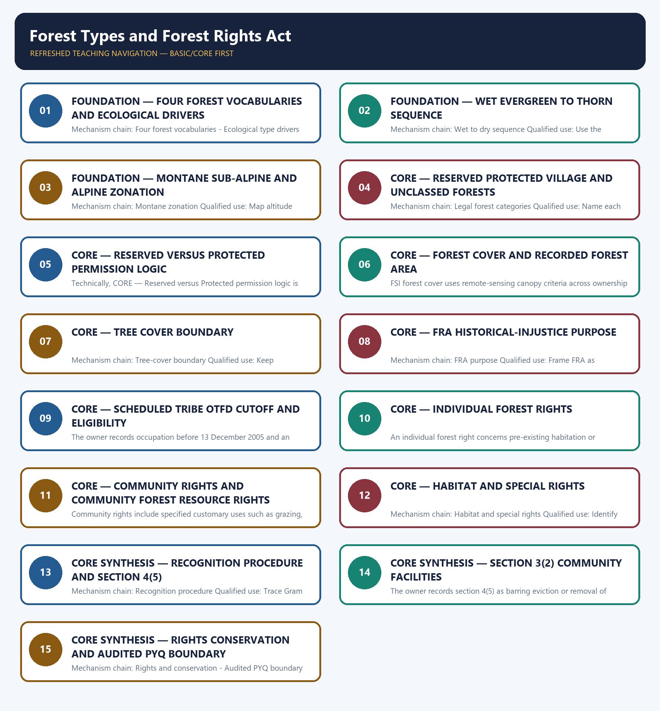

# Forest Types and Forest Rights Act — Learner-v2 Complete Learning Session

> **Authoring-only generation:** 2026-09-03. No PDF was rendered and no tracker or index was mutated.

### SOURCE, PROGRESSION AND CURRENT-LINKAGE AUDIT

- **Generation date:** 2026-09-03.
- **Repository-first evidence:** the Basic owner is taught first and preserved in full; the Advanced owner is retained only in the optional final teaching block.
- **OCR evidence:** Repository Markdown was primary. OCR-searchable local official General Studies papers were used only to confirm printed routed demands. No answer key, marking scheme, unsupported page precision, ecological rate, species count or current status was inferred.
- **Qdrant:** not used; repository Markdown and available OCR context were sufficient.
- **PYQ integrity:** Audited ledgers route seven Topic 11 demands: 2018 FRA critical wildlife habitat and Baiga rights; 2019 forest-cover ranking and bamboo as minor forest produce; 2020 GS-I forest resources; 2022 Miyawaki; 2023 deciduous trees; and 2024 native-tree identification. Objective keys are not inferred. The direct 2020 Mains demand receives a model route.
- **Live-link boundary:** The Ministry of Tribal Affairs FRA page was substantively retrieved for the historical-injustice purpose, right families, Gram Sabha role and conservation responsibilities. Its official Act-and-Rules PDF was raw bytes and was not text-mined. No current claims total, title area, forest-cover figure or ecological outcome was imported.
- **Fact/inference discipline:** no current-affairs item, PYQ wording, figure or quotation is invented.

### LIVE OFFICIAL-SOURCE ATTEMPT LOG

The checks below were made on 2026-09-03. Substantive official text is used only for the proposition it supports. Stubs, access failures, unrelated pages and thin landing pages are recorded and are not converted into ecological or current-status claims.

- https://tribal.nic.in/FRA.aspx — attempted 2026-09-03; the official Ministry of Tribal Affairs page was substantively retrievable. It supports the historical-injustice objective, individual and community right families, Gram Sabha role and conservation responsibilities.
- https://tribal.nic.in/downloads/FRA/FRAActnRulesBook.pdf — attempted 2026-09-03; the official Act-and-Rules PDF was retrievable only as raw PDF bytes and was not text-mined for a section, cutoff or figure.
- https://moef.gov.in/forest-conservation — attempted 2026-09-03; the official MoEFCC page returned substantive Hindi text on the separate FRA, forest-conservation and Indian Forest Act frameworks. It supplied no claim-processing total, title count or current forest-cover figure.
- https://fsi.nic.in/forest-report-2023 — attempted 2026-09-03; the fetch returned only the Forest Survey of India contact address, so no forest-cover, tree-cover, type-area or density figure was imported.
- https://www.pib.gov.in/indexd.aspx?reg=3&lang=1 — attempted 2026-09-03; the request returned HTTP 403, so no FRA implementation total or current forest statistic was used.

## BASIC LEARNING SESSION



*Distinct embedded teaching-navigation image. The separate continuous Cārvāka-style flowchart package remains an independent at-a-glance artifact.*

### SESSION 1 — FOUNDATION — FOUR FOREST VOCABULARIES AND ECOLOGICAL DRIVERS

#### DEFINITION / WHAT THIS IS CALLED

**Plain-language definition:** Forest type is an ecological classification, Reserved or Protected Forest is a legal category, recorded forest area is a government-record category, and forest or tree cover is a canopy measurement; none can substitute automatically for another.

**Technical definition:** Mechanism chain: Four forest vocabularies - Ecological type drivers Qualified use: Open with the four vocabularies, then qualify ecological type with local drivers.

#### ANSWER-GRABBING OPENING — WRITE/ADAPT IN THE EXAM

> Mechanism chain: Four forest vocabularies - Ecological type drivers Qualified use: Open with the four vocabularies, then qualify ecological type with local drivers.

#### MUST-WRITE KEYWORDS

- **FOUNDATION**
- **Four forest vocabularies**
- **ecological drivers**
- **Mechanism chain**
- **Qualified use**
- **Forest type**

**How to use them:** Frame the answer through FOUNDATION; define Four forest vocabularies, connect ecological drivers with Mechanism chain to explain the mechanism, and use Qualified use for the decisive comparison or qualification.

#### VISUAL FIRST

```text
FOUR FOREST VOCABULARIES AND ECOLOGICAL DRIVERS
01. Four forest vocabularies
    |
    v
02. Ecological type drivers
BOUNDARY -> Do not equate ecological forest type with legal forest category.
```

*This topic-specific rail fixes the evidence sequence and its exam boundary before analysis.*

#### CORE EXPLANATION

Forest type is an ecological classification, Reserved or Protected Forest is a legal category, recorded forest area is a government-record category, and forest or tree cover is a canopy measurement; none can substitute automatically for another. Champion-Seth-style forest types organise vegetation mainly through climate, rainfall and altitude, while soils, fire, grazing and land-use history can modify local expression.

#### NAMED EVIDENCE AND MECHANISM

- Forest type is an ecological classification, Reserved or Protected Forest is a legal category, recorded forest area is a government-record category, and forest or tree cover is a canopy measurement; none can substitute automatically for another.
- Champion-Seth-style forest types organise vegetation mainly through climate, rainfall and altitude, while soils, fire, grazing and land-use history can modify local expression.

#### EXAMINER CAUTION

- Do not equate ecological forest type with legal forest category.

#### EXAM LINK

- **Prelims:** Preserve the exact ecological level, system boundary, stock or flow, pyramid parameter, succession substrate, biome scale, taxonomic term and scientific or legal status; never turn a context-dependent pattern into a universal rule.
- **Mains:** Open with the four vocabularies, then qualify ecological type with local drivers.

#### MINI RECAP

- **Mechanism chain:** Four forest vocabularies -> Ecological type drivers
- **Qualified use:** Open with the four vocabularies, then qualify ecological type with local drivers.

#### CLOSING RECALL FLOW — FOUNDATION — FOUR FOREST VOCABULARIES AND ECOLOGICAL DRIVERS

```text
START / CONCEPT: FOUNDATION — Four forest vocabularies and ecological drivers
        |
        v
EXACT TERMS: FOUNDATION · Four forest vocabularies · ecological drivers · Mechanism chain · Qualified use · Forest type
        |
        v
MECHANISM / ARGUMENT: Champion-Seth-style forest types organise vegetation mainly through climate, rainfall and altitude, while soils, fire, grazing and land-use history can modify local expression.
        |
        v
CONSEQUENCE / CONTRAST: Do not equate ecological forest type with legal forest category.
        |
        v
UPSC TRAP / ANSWER-USE: Do not miss this limiting distinction: forest type is an ecological classification, Reserved or Protected Forest is a legal category...
        |
        v
ANSWER-GRABBING FORMULATION: Mechanism chain: Four forest vocabularies - Ecological type drivers Qualified use: Open with the four vocabularies, then qualify ecological type with local drivers.
```
### SESSION 2 — FOUNDATION — WET EVERGREEN TO THORN SEQUENCE

#### DEFINITION / WHAT THIS IS CALLED

**Plain-language definition:** Tropical wet evergreen, semi-evergreen, moist deciduous, dry deciduous and thorn formations represent different ecological conditions; they are not canopy-density grades or legal protection ranks.

**Technical definition:** Mechanism chain: Wet to dry sequence Qualified use: Use the moisture sequence without turning it into a protection rank.

#### ANSWER-GRABBING OPENING — WRITE/ADAPT IN THE EXAM

> Tropical wet evergreen, semi-evergreen, moist deciduous, dry deciduous and thorn formations represent different ecological conditions; they are not canopy-density grades or legal protection ranks.

#### MUST-WRITE KEYWORDS

- **FOUNDATION**
- **Wet evergreen to thorn sequence**
- **Mechanism chain**
- **Qualified use**
- **Tropical**
- **Wet**

**How to use them:** Frame the answer through FOUNDATION; define Wet evergreen to thorn sequence, connect Mechanism chain with Qualified use to explain the mechanism, and use Tropical for the decisive comparison or qualification.

#### VISUAL FIRST

```text
WET EVERGREEN TO THORN SEQUENCE
01. Wet to dry sequence
BOUNDARY -> Do not equate forest cover with recorded forest area.
```

*This topic-specific rail fixes the evidence sequence and its exam boundary before analysis.*

#### CORE EXPLANATION

Tropical wet evergreen, semi-evergreen, moist deciduous, dry deciduous and thorn formations represent different ecological conditions; they are not canopy-density grades or legal protection ranks.

#### NAMED EVIDENCE AND MECHANISM

- Tropical wet evergreen, semi-evergreen, moist deciduous, dry deciduous and thorn formations represent different ecological conditions; they are not canopy-density grades or legal protection ranks.

#### EXAMINER CAUTION

- Do not equate forest cover with recorded forest area.

#### EXAM LINK

- **Prelims:** Preserve the exact ecological level, system boundary, stock or flow, pyramid parameter, succession substrate, biome scale, taxonomic term and scientific or legal status; never turn a context-dependent pattern into a universal rule.
- **Mains:** Use the moisture sequence without turning it into a protection rank.

#### MINI RECAP

- **Mechanism chain:** Wet to dry sequence
- **Qualified use:** Use the moisture sequence without turning it into a protection rank.

#### CLOSING RECALL FLOW — FOUNDATION — WET EVERGREEN TO THORN SEQUENCE

```text
START / CONCEPT: FOUNDATION — Wet evergreen to thorn sequence
        |
        v
EXACT TERMS: FOUNDATION · Wet evergreen to thorn sequence · Mechanism chain · Qualified use · Tropical · Wet
        |
        v
MECHANISM / ARGUMENT: Mechanism chain: Wet to dry sequence Qualified use: Use the moisture sequence without turning it into a protection rank.
        |
        v
CONSEQUENCE / CONTRAST: Do not equate forest cover with recorded forest area.
        |
        v
UPSC TRAP / ANSWER-USE: Do not miss this limiting distinction: use the moisture sequence without turning it into a protection rank.
        |
        v
ANSWER-GRABBING FORMULATION: Tropical wet evergreen, semi-evergreen, moist deciduous, dry deciduous and thorn formations represent different ecological conditions; they are not canopy-density grades or legal protection ranks.
```
### SESSION 3 — FOUNDATION — MONTANE SUB-ALPINE AND ALPINE ZONATION

#### DEFINITION / WHAT THIS IS CALLED

**Plain-language definition:** Montane, sub-alpine and alpine vegetation reflect altitude and exposure in mountain systems; an elevational belt must not be presented as one nationwide legal forest category.

**Technical definition:** Mechanism chain: Montane zonation Qualified use: Map altitude belts without making one legal category.

#### ANSWER-GRABBING OPENING — WRITE/ADAPT IN THE EXAM

> Montane, sub-alpine and alpine vegetation reflect altitude and exposure in mountain systems; an elevational belt must not be presented as one nationwide legal forest category.

#### MUST-WRITE KEYWORDS

- **FOUNDATION**
- **Montane sub-alpine**
- **alpine zonation**
- **Mechanism chain**
- **Qualified use**
- **Montane**

**How to use them:** Frame the answer through FOUNDATION; define Montane sub-alpine, connect alpine zonation with Mechanism chain to explain the mechanism, and use Qualified use for the decisive comparison or qualification.

#### VISUAL FIRST

```text
MONTANE SUB-ALPINE AND ALPINE ZONATION
01. Montane zonation
BOUNDARY -> Do not treat tree cover as proof of a forest right or natural forest.
```

*This topic-specific rail fixes the evidence sequence and its exam boundary before analysis.*

#### CORE EXPLANATION

Montane, sub-alpine and alpine vegetation reflect altitude and exposure in mountain systems; an elevational belt must not be presented as one nationwide legal forest category.

#### NAMED EVIDENCE AND MECHANISM

- Montane, sub-alpine and alpine vegetation reflect altitude and exposure in mountain systems; an elevational belt must not be presented as one nationwide legal forest category.

#### EXAMINER CAUTION

- Do not treat tree cover as proof of a forest right or natural forest.

#### EXAM LINK

- **Prelims:** Preserve the exact ecological level, system boundary, stock or flow, pyramid parameter, succession substrate, biome scale, taxonomic term and scientific or legal status; never turn a context-dependent pattern into a universal rule.
- **Mains:** Map altitude belts without making one legal category.

#### MINI RECAP

- **Mechanism chain:** Montane zonation
- **Qualified use:** Map altitude belts without making one legal category.

#### CLOSING RECALL FLOW — FOUNDATION — MONTANE SUB-ALPINE AND ALPINE ZONATION

```text
START / CONCEPT: FOUNDATION — Montane sub-alpine and alpine zonation
        |
        v
EXACT TERMS: FOUNDATION · Montane sub-alpine · alpine zonation · Mechanism chain · Qualified use · Montane
        |
        v
MECHANISM / ARGUMENT: Mechanism chain: Montane zonation Qualified use: Map altitude belts without making one legal category.
        |
        v
CONSEQUENCE / CONTRAST: Do not treat tree cover as proof of a forest right or natural forest.
        |
        v
UPSC TRAP / ANSWER-USE: Do not miss this limiting distinction: montane, sub-alpine and alpine vegetation reflect altitude and exposure in mountain systems.
        |
        v
ANSWER-GRABBING FORMULATION: Montane, sub-alpine and alpine vegetation reflect altitude and exposure in mountain systems; an elevational belt must not be presented as one nationwide legal forest category.
```
### SESSION 4 — CORE — RESERVED PROTECTED VILLAGE AND UNCLASSED FORESTS

#### DEFINITION / WHAT THIS IS CALLED

**Plain-language definition:** Reserved Forest, Protected Forest and Village Forest arise through the Indian Forest Act framework, while unclassed forest is a record or administration expression; legal consequence must be checked from the applicable notification and law.

**Technical definition:** Mechanism chain: Legal forest categories Qualified use: Name each legal or record class and verify its notification source.

#### ANSWER-GRABBING OPENING — WRITE/ADAPT IN THE EXAM

> Reserved Forest, Protected Forest and Village Forest arise through the Indian Forest Act framework, while unclassed forest is a record or administration expression; legal consequence must be checked from the applicable notification and law.

#### MUST-WRITE KEYWORDS

- **Reserved Protected Village**
- **unclassed forests**
- **Mechanism chain**
- **Qualified use**
- **Reserved Forest**
- **Protected Forest**

**How to use them:** Frame the answer through Reserved Protected Village; define unclassed forests, connect Mechanism chain with Qualified use to explain the mechanism, and use Reserved Forest for the decisive comparison or qualification.

#### VISUAL FIRST

```text
RESERVED PROTECTED VILLAGE AND UNCLASSED FORESTS
01. Legal forest categories
BOUNDARY -> Do not classify evergreen, deciduous and thorn as canopy-density classes.
```

*This topic-specific rail fixes the evidence sequence and its exam boundary before analysis.*

#### CORE EXPLANATION

Reserved Forest, Protected Forest and Village Forest arise through the Indian Forest Act framework, while unclassed forest is a record or administration expression; legal consequence must be checked from the applicable notification and law.

#### NAMED EVIDENCE AND MECHANISM

- Reserved Forest, Protected Forest and Village Forest arise through the Indian Forest Act framework, while unclassed forest is a record or administration expression; legal consequence must be checked from the applicable notification and law.

#### EXAMINER CAUTION

- Do not classify evergreen, deciduous and thorn as canopy-density classes.

#### EXAM LINK

- **Prelims:** Preserve the exact ecological level, system boundary, stock or flow, pyramid parameter, succession substrate, biome scale, taxonomic term and scientific or legal status; never turn a context-dependent pattern into a universal rule.
- **Mains:** Name each legal or record class and verify its notification source.

#### MINI RECAP

- **Mechanism chain:** Legal forest categories
- **Qualified use:** Name each legal or record class and verify its notification source.

#### CLOSING RECALL FLOW — CORE — RESERVED PROTECTED VILLAGE AND UNCLASSED FORESTS

```text
START / CONCEPT: CORE — Reserved Protected Village and unclassed forests
        |
        v
EXACT TERMS: Reserved Protected Village · unclassed forests · Mechanism chain · Qualified use · Reserved Forest · Protected Forest
        |
        v
MECHANISM / ARGUMENT: Mechanism chain: Legal forest categories Qualified use: Name each legal or record class and verify its notification source.
        |
        v
CONSEQUENCE / CONTRAST: Do not classify evergreen, deciduous and thorn as canopy-density classes.
        |
        v
UPSC TRAP / ANSWER-USE: Do not miss this limiting distinction: reserved Forest, Protected Forest and Village Forest arise through the Indian Forest Act framework.
        |
        v
ANSWER-GRABBING FORMULATION: Reserved Forest, Protected Forest and Village Forest arise through the Indian Forest Act framework, while unclassed forest is a record or administration expression; legal consequence must be checked from the applicable notification and law.
```
### SESSION 5 — CORE — RESERVED VERSUS PROTECTED PERMISSION LOGIC

#### DEFINITION / WHAT THIS IS CALLED

**Plain-language definition:** The owner preserves the classic exam distinction: a Reserved Forest uses a more restrictive permission logic, whereas a Protected Forest does not create the same presumption; neither label is an ecological forest type.

**Technical definition:** Technically, CORE — Reserved versus Protected permission logic is analysed by relating Reserved versus Protected permission logic to Mechanism chain, then testing the relationship through Qualified use and Reserved Forest.

#### ANSWER-GRABBING OPENING — WRITE/ADAPT IN THE EXAM

> The owner preserves the classic exam distinction: a Reserved Forest uses a more restrictive permission logic, whereas a Protected Forest does not create the same presumption; neither label is an ecological forest type.

#### MUST-WRITE KEYWORDS

- **Reserved versus Protected permission logic**
- **Mechanism chain**
- **Qualified use**
- **Reserved Forest**
- **Protected Forest**
- **Reserved**

**How to use them:** Frame the answer through Reserved versus Protected permission logic; define Mechanism chain, connect Qualified use with Reserved Forest to explain the mechanism, and use Protected Forest for the decisive comparison or qualification.

#### VISUAL FIRST

```text
RESERVED VERSUS PROTECTED PERMISSION LOGIC
01. Reserved-Protected reversal
BOUNDARY -> Do not treat Reserved and Protected Forest permission logic as identical.
```

*This topic-specific rail fixes the evidence sequence and its exam boundary before analysis.*

#### CORE EXPLANATION

The owner preserves the classic exam distinction: a Reserved Forest uses a more restrictive permission logic, whereas a Protected Forest does not create the same presumption; neither label is an ecological forest type.

#### NAMED EVIDENCE AND MECHANISM

- The owner preserves the classic exam distinction: a Reserved Forest uses a more restrictive permission logic, whereas a Protected Forest does not create the same presumption; neither label is an ecological forest type.

#### EXAMINER CAUTION

- Do not treat Reserved and Protected Forest permission logic as identical.

#### EXAM LINK

- **Prelims:** Preserve the exact ecological level, system boundary, stock or flow, pyramid parameter, succession substrate, biome scale, taxonomic term and scientific or legal status; never turn a context-dependent pattern into a universal rule.
- **Mains:** Use the classic reversal only within the Indian Forest Act context.

#### MINI RECAP

- **Mechanism chain:** Reserved-Protected reversal
- **Qualified use:** Use the classic reversal only within the Indian Forest Act context.

#### CLOSING RECALL FLOW — CORE — RESERVED VERSUS PROTECTED PERMISSION LOGIC

```text
START / CONCEPT: CORE — Reserved versus Protected permission logic
        |
        v
EXACT TERMS: Reserved versus Protected permission logic · Mechanism chain · Qualified use · Reserved Forest · Protected Forest · Reserved
        |
        v
MECHANISM / ARGUMENT: Do not treat Reserved and Protected Forest permission logic as identical.
        |
        v
CONSEQUENCE / CONTRAST: Mechanism chain: Reserved-Protected reversal Qualified use: Use the classic reversal only within the Indian Forest Act context.
        |
        v
UPSC TRAP / ANSWER-USE: Do not miss this limiting distinction: use the classic reversal only within the Indian Forest Act context.
        |
        v
ANSWER-GRABBING FORMULATION: The owner preserves the classic exam distinction: a Reserved Forest uses a more restrictive permission logic, whereas a Protected Forest does not create the same presumption; neither label is an ecological forest type.
```
### SESSION 6 — CORE — FOREST COVER AND RECORDED FOREST AREA

#### DEFINITION / WHAT THIS IS CALLED

**Plain-language definition:** Recorded forest area refers to land entered as forest in government records and may include different legal classes; degraded recorded forest can have little measured canopy, while measured cover can occur outside recorded forest.

**Technical definition:** FSI forest cover uses remote-sensing canopy criteria across ownership and legal status; plantations or orchards can enter the cover measure, so canopy presence is not proof of natural-forest quality or legal forest status.

#### ANSWER-GRABBING OPENING — WRITE/ADAPT IN THE EXAM

> Recorded forest area refers to land entered as forest in government records and may include different legal classes; degraded recorded forest can have little measured canopy, while measured cover can occur outside recorded forest.

#### MUST-WRITE KEYWORDS

- **Forest cover**
- **recorded forest area**
- **Mechanism chain**
- **Qualified use**
- **FSI**
- **Recorded**

**How to use them:** Frame the answer through Forest cover; define recorded forest area, connect Mechanism chain with Qualified use to explain the mechanism, and use FSI for the decisive comparison or qualification.

#### VISUAL FIRST

```text
FOREST COVER AND RECORDED FOREST AREA
01. Forest-cover measurement
    |
    v
02. Recorded forest area
BOUNDARY -> Do not say FRA applies only to Scheduled Tribes.
```

*This topic-specific rail fixes the evidence sequence and its exam boundary before analysis.*

#### CORE EXPLANATION

FSI forest cover uses remote-sensing canopy criteria across ownership and legal status; plantations or orchards can enter the cover measure, so canopy presence is not proof of natural-forest quality or legal forest status. Recorded forest area refers to land entered as forest in government records and may include different legal classes; degraded recorded forest can have little measured canopy, while measured cover can occur outside recorded forest.

#### NAMED EVIDENCE AND MECHANISM

- FSI forest cover uses remote-sensing canopy criteria across ownership and legal status; plantations or orchards can enter the cover measure, so canopy presence is not proof of natural-forest quality or legal forest status.
- Recorded forest area refers to land entered as forest in government records and may include different legal classes; degraded recorded forest can have little measured canopy, while measured cover can occur outside recorded forest.

#### EXAMINER CAUTION

- Do not say FRA applies only to Scheduled Tribes.

#### EXAM LINK

- **Prelims:** Preserve the exact ecological level, system boundary, stock or flow, pyramid parameter, succession substrate, biome scale, taxonomic term and scientific or legal status; never turn a context-dependent pattern into a universal rule.
- **Mains:** Contrast remotely sensed canopy with the government forest record.

#### MINI RECAP

- **Mechanism chain:** Forest-cover measurement -> Recorded forest area
- **Qualified use:** Contrast remotely sensed canopy with the government forest record.

#### CLOSING RECALL FLOW — CORE — FOREST COVER AND RECORDED FOREST AREA

```text
START / CONCEPT: CORE — Forest cover and recorded forest area
        |
        v
EXACT TERMS: Forest cover · recorded forest area · Mechanism chain · Qualified use · FSI · Recorded
        |
        v
MECHANISM / ARGUMENT: Mechanism chain: Forest-cover measurement - Recorded forest area Qualified use: Contrast remotely sensed canopy with the government forest record.
        |
        v
CONSEQUENCE / CONTRAST: FSI forest cover uses remote-sensing canopy criteria across ownership and legal status; plantations or orchards can enter the cover measure, so canopy presence is not proof of natural-forest quality or legal forest status.
        |
        v
UPSC TRAP / ANSWER-USE: Do not say FRA applies only to Scheduled Tribes.
        |
        v
ANSWER-GRABBING FORMULATION: Recorded forest area refers to land entered as forest in government records and may include different legal classes; degraded recorded forest can have little measured canopy, while measured cover can occur outside recorded forest.
```
### SESSION 7 — CORE — TREE COVER BOUNDARY

#### DEFINITION / WHAT THIS IS CALLED

**Plain-language definition:** Tree cover is measured separately from forest cover under the applicable FSI methodology; combining them can describe canopy extent but cannot establish forest type, tenure or rights.

**Technical definition:** Mechanism chain: Tree-cover boundary Qualified use: Keep tree-cover extent separate from type, rights and ecological quality.

#### ANSWER-GRABBING OPENING — WRITE/ADAPT IN THE EXAM

> Tree cover is measured separately from forest cover under the applicable FSI methodology; combining them can describe canopy extent but cannot establish forest type, tenure or rights.

#### MUST-WRITE KEYWORDS

- **Tree cover boundary**
- **Mechanism chain**
- **Qualified use**
- **Tree cover**
- **Tree**
- **FSI**

**How to use them:** Frame the answer through Tree cover boundary; define Mechanism chain, connect Qualified use with Tree cover to explain the mechanism, and use Tree for the decisive comparison or qualification.

#### VISUAL FIRST

```text
TREE COVER BOUNDARY
01. Tree-cover boundary
BOUNDARY -> Do not apply the OTFD three-generation test to Scheduled Tribe claimants.
```

*This topic-specific rail fixes the evidence sequence and its exam boundary before analysis.*

#### CORE EXPLANATION

Tree cover is measured separately from forest cover under the applicable FSI methodology; combining them can describe canopy extent but cannot establish forest type, tenure or rights.

#### NAMED EVIDENCE AND MECHANISM

- Tree cover is measured separately from forest cover under the applicable FSI methodology; combining them can describe canopy extent but cannot establish forest type, tenure or rights.

#### EXAMINER CAUTION

- Do not apply the OTFD three-generation test to Scheduled Tribe claimants.

#### EXAM LINK

- **Prelims:** Preserve the exact ecological level, system boundary, stock or flow, pyramid parameter, succession substrate, biome scale, taxonomic term and scientific or legal status; never turn a context-dependent pattern into a universal rule.
- **Mains:** Keep tree-cover extent separate from type, rights and ecological quality.

#### MINI RECAP

- **Mechanism chain:** Tree-cover boundary
- **Qualified use:** Keep tree-cover extent separate from type, rights and ecological quality.

#### CLOSING RECALL FLOW — CORE — TREE COVER BOUNDARY

```text
START / CONCEPT: CORE — Tree cover boundary
        |
        v
EXACT TERMS: Tree cover boundary · Mechanism chain · Qualified use · Tree cover · Tree · FSI
        |
        v
MECHANISM / ARGUMENT: Mechanism chain: Tree-cover boundary Qualified use: Keep tree-cover extent separate from type, rights and ecological quality.
        |
        v
CONSEQUENCE / CONTRAST: Do not apply the OTFD three-generation test to Scheduled Tribe claimants.
        |
        v
UPSC TRAP / ANSWER-USE: Do not miss this limiting distinction: tree cover is measured separately from forest cover under the applicable FSI methodology.
        |
        v
ANSWER-GRABBING FORMULATION: Tree cover is measured separately from forest cover under the applicable FSI methodology; combining them can describe canopy extent but cannot establish forest type, tenure or rights.
```
### SESSION 8 — CORE — FRA HISTORICAL-INJUSTICE PURPOSE

#### DEFINITION / WHAT THIS IS CALLED

**Plain-language definition:** The Forest Rights Act, 2006 is a rights-recognition and historical-injustice statute for forest-dwelling Scheduled Tribes and eligible Other Traditional Forest Dwellers, not a blanket transfer of every forest to private ownership.

**Technical definition:** Mechanism chain: FRA purpose Qualified use: Frame FRA as recognition of historical rights, not blanket ownership transfer.

#### ANSWER-GRABBING OPENING — WRITE/ADAPT IN THE EXAM

> The Forest Rights Act, 2006 is a rights-recognition and historical-injustice statute for forest-dwelling Scheduled Tribes and eligible Other Traditional Forest Dwellers, not a blanket transfer of every forest to private ownership.

#### MUST-WRITE KEYWORDS

- **FRA historical-injustice purpose**
- **Mechanism chain**
- **Qualified use**
- **The Forest Rights Act, 2006**
- **The Forest Rights Act**
- **Scheduled Tribes**

**How to use them:** Frame the answer through FRA historical-injustice purpose; define Mechanism chain, connect Qualified use with The Forest Rights Act, 2006 to explain the mechanism, and use The Forest Rights Act for the decisive comparison or qualification.

#### VISUAL FIRST

```text
FRA HISTORICAL-INJUSTICE PURPOSE
01. FRA purpose
BOUNDARY -> Do not treat IFR as permission for fresh occupation.
```

*This topic-specific rail fixes the evidence sequence and its exam boundary before analysis.*

#### CORE EXPLANATION

The Forest Rights Act, 2006 is a rights-recognition and historical-injustice statute for forest-dwelling Scheduled Tribes and eligible Other Traditional Forest Dwellers, not a blanket transfer of every forest to private ownership.

#### NAMED EVIDENCE AND MECHANISM

- The Forest Rights Act, 2006 is a rights-recognition and historical-injustice statute for forest-dwelling Scheduled Tribes and eligible Other Traditional Forest Dwellers, not a blanket transfer of every forest to private ownership.

#### EXAMINER CAUTION

- Do not treat IFR as permission for fresh occupation.

#### EXAM LINK

- **Prelims:** Preserve the exact ecological level, system boundary, stock or flow, pyramid parameter, succession substrate, biome scale, taxonomic term and scientific or legal status; never turn a context-dependent pattern into a universal rule.
- **Mains:** Frame FRA as recognition of historical rights, not blanket ownership transfer.

#### MINI RECAP

- **Mechanism chain:** FRA purpose
- **Qualified use:** Frame FRA as recognition of historical rights, not blanket ownership transfer.

#### CLOSING RECALL FLOW — CORE — FRA HISTORICAL-INJUSTICE PURPOSE

```text
START / CONCEPT: CORE — FRA historical-injustice purpose
        |
        v
EXACT TERMS: FRA historical-injustice purpose · Mechanism chain · Qualified use · The Forest Rights Act, 2006 · The Forest Rights Act · Scheduled Tribes
        |
        v
MECHANISM / ARGUMENT: Mechanism chain: FRA purpose Qualified use: Frame FRA as recognition of historical rights, not blanket ownership transfer.
        |
        v
CONSEQUENCE / CONTRAST: Do not treat IFR as permission for fresh occupation.
        |
        v
UPSC TRAP / ANSWER-USE: Do not miss this limiting distinction: the Forest Rights Act, 2006 is a rights-recognition and historical-injustice statute for forest-dwelling Scheduled...
        |
        v
ANSWER-GRABBING FORMULATION: The Forest Rights Act, 2006 is a rights-recognition and historical-injustice statute for forest-dwelling Scheduled Tribes and eligible Other Traditional Forest Dwellers, not a blanket transfer of every forest to private ownership.
```
### SESSION 9 — CORE — SCHEDULED TRIBE OTFD CUTOFF AND ELIGIBILITY

#### DEFINITION / WHAT THIS IS CALLED

**Plain-language definition:** Mechanism chain: Eligibility and cutoff Qualified use: State the cutoff and apply the additional test only to OTFDs.

**Technical definition:** The owner records occupation before 13 December 2005 and an additional three-generation or 75-year residence-and-dependence test for Other Traditional Forest Dwellers; Scheduled Tribe claimants do not face that OTFD generational test.

#### ANSWER-GRABBING OPENING — WRITE/ADAPT IN THE EXAM

> The owner records occupation before 13 December 2005 and an additional three-generation or 75-year residence-and-dependence test for Other Traditional Forest Dwellers; Scheduled Tribe claimants do not face that OTFD generational test.

#### MUST-WRITE KEYWORDS

- **Scheduled Tribe OTFD cutoff**
- **eligibility**
- **Mechanism chain**
- **Qualified use**
- **Other Traditional Forest Dwellers**
- **Scheduled Tribe**

**How to use them:** Frame the answer through Scheduled Tribe OTFD cutoff; define eligibility, connect Mechanism chain with Qualified use to explain the mechanism, and use Other Traditional Forest Dwellers for the decisive comparison or qualification.

#### VISUAL FIRST

```text
SCHEDULED TRIBE OTFD CUTOFF AND ELIGIBILITY
01. Eligibility and cutoff
BOUNDARY -> Do not merge community rights and community forest resource rights.
```

*This topic-specific rail fixes the evidence sequence and its exam boundary before analysis.*

#### CORE EXPLANATION

The owner records occupation before 13 December 2005 and an additional three-generation or 75-year residence-and-dependence test for Other Traditional Forest Dwellers; Scheduled Tribe claimants do not face that OTFD generational test.

#### NAMED EVIDENCE AND MECHANISM

- The owner records occupation before 13 December 2005 and an additional three-generation or 75-year residence-and-dependence test for Other Traditional Forest Dwellers; Scheduled Tribe claimants do not face that OTFD generational test.

#### EXAMINER CAUTION

- Do not merge community rights and community forest resource rights.

#### EXAM LINK

- **Prelims:** Preserve the exact ecological level, system boundary, stock or flow, pyramid parameter, succession substrate, biome scale, taxonomic term and scientific or legal status; never turn a context-dependent pattern into a universal rule.
- **Mains:** State the cutoff and apply the additional test only to OTFDs.

#### MINI RECAP

- **Mechanism chain:** Eligibility and cutoff
- **Qualified use:** State the cutoff and apply the additional test only to OTFDs.

#### CLOSING RECALL FLOW — CORE — SCHEDULED TRIBE OTFD CUTOFF AND ELIGIBILITY

```text
START / CONCEPT: CORE — Scheduled Tribe OTFD cutoff and eligibility
        |
        v
EXACT TERMS: Scheduled Tribe OTFD cutoff · eligibility · Mechanism chain · Qualified use · Other Traditional Forest Dwellers · Scheduled Tribe
        |
        v
MECHANISM / ARGUMENT: Mechanism chain: Eligibility and cutoff Qualified use: State the cutoff and apply the additional test only to OTFDs.
        |
        v
CONSEQUENCE / CONTRAST: Do not merge community rights and community forest resource rights.
        |
        v
UPSC TRAP / ANSWER-USE: Do not miss this limiting distinction: the owner records occupation before 13 December 2005 and an additional three-generation or 75-year...
        |
        v
ANSWER-GRABBING FORMULATION: The owner records occupation before 13 December 2005 and an additional three-generation or 75-year residence-and-dependence test for Other Traditional Forest Dwellers; Scheduled Tribe claimants do not face that OTFD generational test.
```
### SESSION 10 — CORE — INDIVIDUAL FOREST RIGHTS

#### DEFINITION / WHAT THIS IS CALLED

**Plain-language definition:** Mechanism chain: Individual forest right Qualified use: Tie IFR to actual prior occupation and statutory conditions.

**Technical definition:** An individual forest right concerns pre-existing habitation or self-cultivation under actual occupation, subject to the Act's conditions and statutory ceiling; recognition does not authorise fresh encroachment.

#### ANSWER-GRABBING OPENING — WRITE/ADAPT IN THE EXAM

> An individual forest right concerns pre-existing habitation or self-cultivation under actual occupation, subject to the Act's conditions and statutory ceiling; recognition does not authorise fresh encroachment.

#### MUST-WRITE KEYWORDS

- **Individual forest rights**
- **Mechanism chain**
- **Qualified use**
- **Act's**
- **Gram Sabha**
- **Individual**

**How to use them:** Frame the answer through Individual forest rights; define Mechanism chain, connect Qualified use with Act's to explain the mechanism, and use Gram Sabha for the decisive comparison or qualification.

#### VISUAL FIRST

```text
INDIVIDUAL FOREST RIGHTS
01. Individual forest right
BOUNDARY -> Do not treat a Gram Sabha resolution as the final title.
```

*This topic-specific rail fixes the evidence sequence and its exam boundary before analysis.*

#### CORE EXPLANATION

An individual forest right concerns pre-existing habitation or self-cultivation under actual occupation, subject to the Act's conditions and statutory ceiling; recognition does not authorise fresh encroachment.

#### NAMED EVIDENCE AND MECHANISM

- An individual forest right concerns pre-existing habitation or self-cultivation under actual occupation, subject to the Act's conditions and statutory ceiling; recognition does not authorise fresh encroachment.

#### EXAMINER CAUTION

- Do not treat a Gram Sabha resolution as the final title.

#### EXAM LINK

- **Prelims:** Preserve the exact ecological level, system boundary, stock or flow, pyramid parameter, succession substrate, biome scale, taxonomic term and scientific or legal status; never turn a context-dependent pattern into a universal rule.
- **Mains:** Tie IFR to actual prior occupation and statutory conditions.

#### MINI RECAP

- **Mechanism chain:** Individual forest right
- **Qualified use:** Tie IFR to actual prior occupation and statutory conditions.

#### CLOSING RECALL FLOW — CORE — INDIVIDUAL FOREST RIGHTS

```text
START / CONCEPT: CORE — Individual forest rights
        |
        v
EXACT TERMS: Individual forest rights · Mechanism chain · Qualified use · Act's · Gram Sabha · Individual
        |
        v
MECHANISM / ARGUMENT: Mechanism chain: Individual forest right Qualified use: Tie IFR to actual prior occupation and statutory conditions.
        |
        v
CONSEQUENCE / CONTRAST: Do not treat a Gram Sabha resolution as the final title.
        |
        v
UPSC TRAP / ANSWER-USE: Do not miss this limiting distinction: an individual forest right concerns pre-existing habitation or self-cultivation under actual occupation, subject to...
        |
        v
ANSWER-GRABBING FORMULATION: An individual forest right concerns pre-existing habitation or self-cultivation under actual occupation, subject to the Act's conditions and statutory ceiling; recognition does not authorise fresh encroachment.
```
### SESSION 11 — CORE — COMMUNITY RIGHTS AND COMMUNITY FOREST RESOURCE RIGHTS

#### DEFINITION / WHAT THIS IS CALLED

**Plain-language definition:** A community forest resource right is the community-level right to protect, regenerate, conserve and manage a traditionally used community forest resource; it is distinct from both IFR and the wider set of community-use rights.

**Technical definition:** Community rights include specified customary uses such as grazing, access to water bodies and ownership, access, use or disposal of minor forest produce; they are not identical to individual cultivation rights.

#### ANSWER-GRABBING OPENING — WRITE/ADAPT IN THE EXAM

> A community forest resource right is the community-level right to protect, regenerate, conserve and manage a traditionally used community forest resource; it is distinct from both IFR and the wider set of community-use rights.

#### MUST-WRITE KEYWORDS

- **Community rights**
- **community forest resource rights**
- **Mechanism chain**
- **Qualified use**
- **Community**
- **A community forest resource right**

**How to use them:** Frame the answer through Community rights; define community forest resource rights, connect Mechanism chain with Qualified use to explain the mechanism, and use Community for the decisive comparison or qualification.

#### VISUAL FIRST

```text
COMMUNITY RIGHTS AND COMMUNITY FOREST RESOURCE RIGHTS
01. Community rights
    |
    v
02. Community forest resource right
BOUNDARY -> Do not treat section 4(5) as automatic approval of every claim.
```

*This topic-specific rail fixes the evidence sequence and its exam boundary before analysis.*

#### CORE EXPLANATION

Community rights include specified customary uses such as grazing, access to water bodies and ownership, access, use or disposal of minor forest produce; they are not identical to individual cultivation rights. A community forest resource right is the community-level right to protect, regenerate, conserve and manage a traditionally used community forest resource; it is distinct from both IFR and the wider set of community-use rights.

#### NAMED EVIDENCE AND MECHANISM

- Community rights include specified customary uses such as grazing, access to water bodies and ownership, access, use or disposal of minor forest produce; they are not identical to individual cultivation rights.
- A community forest resource right is the community-level right to protect, regenerate, conserve and manage a traditionally used community forest resource; it is distinct from both IFR and the wider set of community-use rights.

#### EXAMINER CAUTION

- Do not treat section 4(5) as automatic approval of every claim.

#### EXAM LINK

- **Prelims:** Preserve the exact ecological level, system boundary, stock or flow, pyramid parameter, succession substrate, biome scale, taxonomic term and scientific or legal status; never turn a context-dependent pattern into a universal rule.
- **Mains:** Separate customary community uses from the CFR management right.

#### MINI RECAP

- **Mechanism chain:** Community rights -> Community forest resource right
- **Qualified use:** Separate customary community uses from the CFR management right.

#### CLOSING RECALL FLOW — CORE — COMMUNITY RIGHTS AND COMMUNITY FOREST RESOURCE RIGHTS

```text
START / CONCEPT: CORE — Community rights and community forest resource rights
        |
        v
EXACT TERMS: Community rights · community forest resource rights · Mechanism chain · Qualified use · Community · A community forest resource right
        |
        v
MECHANISM / ARGUMENT: Mechanism chain: Community rights - Community forest resource right Qualified use: Separate customary community uses from the CFR management right.
        |
        v
CONSEQUENCE / CONTRAST: Community rights include specified customary uses such as grazing, access to water bodies and ownership, access, use or disposal of minor forest produce; they are not identical to individual cultivation rights.
        |
        v
UPSC TRAP / ANSWER-USE: Do not treat section 4(5) as automatic approval of every claim.
        |
        v
ANSWER-GRABBING FORMULATION: A community forest resource right is the community-level right to protect, regenerate, conserve and manage a traditionally used community forest resource; it is distinct from both IFR and the wider set of community-use rights.
```
### SESSION 12 — CORE — HABITAT AND SPECIAL RIGHTS

#### DEFINITION / WHAT THIS IS CALLED

**Plain-language definition:** The Act also recognises habitat rights for Particularly Vulnerable Tribal Groups and pre-agricultural communities and traditional seasonal resource access where the statutory conditions are met.

**Technical definition:** Mechanism chain: Habitat and special rights Qualified use: Identify habitat and seasonal-resource rights without extending eligibility.

#### ANSWER-GRABBING OPENING — WRITE/ADAPT IN THE EXAM

> The Act also recognises habitat rights for Particularly Vulnerable Tribal Groups and pre-agricultural communities and traditional seasonal resource access where the statutory conditions are met.

#### MUST-WRITE KEYWORDS

- **Habitat**
- **special rights**
- **Mechanism chain**
- **Qualified use**
- **The Act**
- **Particularly Vulnerable Tribal Groups**

**How to use them:** Frame the answer through Habitat; define special rights, connect Mechanism chain with Qualified use to explain the mechanism, and use The Act for the decisive comparison or qualification.

#### VISUAL FIRST

```text
HABITAT AND SPECIAL RIGHTS
01. Habitat and special rights
BOUNDARY -> Do not convert section 3(2) into a general diversion exemption.
```

*This topic-specific rail fixes the evidence sequence and its exam boundary before analysis.*

#### CORE EXPLANATION

The Act also recognises habitat rights for Particularly Vulnerable Tribal Groups and pre-agricultural communities and traditional seasonal resource access where the statutory conditions are met.

#### NAMED EVIDENCE AND MECHANISM

- The Act also recognises habitat rights for Particularly Vulnerable Tribal Groups and pre-agricultural communities and traditional seasonal resource access where the statutory conditions are met.

#### EXAMINER CAUTION

- Do not convert section 3(2) into a general diversion exemption.

#### EXAM LINK

- **Prelims:** Preserve the exact ecological level, system boundary, stock or flow, pyramid parameter, succession substrate, biome scale, taxonomic term and scientific or legal status; never turn a context-dependent pattern into a universal rule.
- **Mains:** Identify habitat and seasonal-resource rights without extending eligibility.

#### MINI RECAP

- **Mechanism chain:** Habitat and special rights
- **Qualified use:** Identify habitat and seasonal-resource rights without extending eligibility.

#### CLOSING RECALL FLOW — CORE — HABITAT AND SPECIAL RIGHTS

```text
START / CONCEPT: CORE — Habitat and special rights
        |
        v
EXACT TERMS: Habitat · special rights · Mechanism chain · Qualified use · The Act · Particularly Vulnerable Tribal Groups
        |
        v
MECHANISM / ARGUMENT: Mechanism chain: Habitat and special rights Qualified use: Identify habitat and seasonal-resource rights without extending eligibility.
        |
        v
CONSEQUENCE / CONTRAST: Do not convert section 3(2) into a general diversion exemption.
        |
        v
UPSC TRAP / ANSWER-USE: Do not miss this limiting distinction: habitat and special rights Qualified use.
        |
        v
ANSWER-GRABBING FORMULATION: The Act also recognises habitat rights for Particularly Vulnerable Tribal Groups and pre-agricultural communities and traditional seasonal resource access where the statutory conditions are met.
```
### SESSION 13 — CORE SYNTHESIS — RECOGNITION PROCEDURE AND SECTION 4(5)

#### DEFINITION / WHAT THIS IS CALLED

**Plain-language definition:** The claims route begins with the Gram Sabha and proceeds through Sub-Divisional and District Level Committees; filing or recommendation is not the same as final recognition, and recognition is not assumed without the completed procedure.

**Technical definition:** Mechanism chain: Recognition procedure Qualified use: Trace Gram Sabha to DLC and retain the no-eviction sequencing safeguard.

#### ANSWER-GRABBING OPENING — WRITE/ADAPT IN THE EXAM

> The claims route begins with the Gram Sabha and proceeds through Sub-Divisional and District Level Committees; filing or recommendation is not the same as final recognition, and recognition is not assumed without the completed procedure.

#### MUST-WRITE KEYWORDS

- **CORE SYNTHESIS**
- **Recognition procedure**
- **section 4(5)**
- **Mechanism chain**
- **Qualified use**
- **Gram Sabha**

**How to use them:** Frame the answer through CORE SYNTHESIS; define Recognition procedure, connect section 4(5) with Mechanism chain to explain the mechanism, and use Qualified use for the decisive comparison or qualification.

#### VISUAL FIRST

```text
RECOGNITION PROCEDURE AND SECTION 4(5)
01. Recognition procedure
BOUNDARY -> Do not say rights recognition automatically proves conservation improvement.
```

*This topic-specific rail fixes the evidence sequence and its exam boundary before analysis.*

#### CORE EXPLANATION

The claims route begins with the Gram Sabha and proceeds through Sub-Divisional and District Level Committees; filing or recommendation is not the same as final recognition, and recognition is not assumed without the completed procedure.

#### NAMED EVIDENCE AND MECHANISM

- The claims route begins with the Gram Sabha and proceeds through Sub-Divisional and District Level Committees; filing or recommendation is not the same as final recognition, and recognition is not assumed without the completed procedure.

#### EXAMINER CAUTION

- Do not say rights recognition automatically proves conservation improvement.

#### EXAM LINK

- **Prelims:** Preserve the exact ecological level, system boundary, stock or flow, pyramid parameter, succession substrate, biome scale, taxonomic term and scientific or legal status; never turn a context-dependent pattern into a universal rule.
- **Mains:** Trace Gram Sabha to DLC and retain the no-eviction sequencing safeguard.

#### MINI RECAP

- **Mechanism chain:** Recognition procedure
- **Qualified use:** Trace Gram Sabha to DLC and retain the no-eviction sequencing safeguard.

#### CLOSING RECALL FLOW — CORE SYNTHESIS — RECOGNITION PROCEDURE AND SECTION 4(5)

```text
START / CONCEPT: CORE SYNTHESIS — Recognition procedure and section 4(5)
        |
        v
EXACT TERMS: CORE SYNTHESIS · Recognition procedure · section 4(5) · Mechanism chain · Qualified use · Gram Sabha
        |
        v
MECHANISM / ARGUMENT: Mechanism chain: Recognition procedure Qualified use: Trace Gram Sabha to DLC and retain the no-eviction sequencing safeguard.
        |
        v
CONSEQUENCE / CONTRAST: Do not say rights recognition automatically proves conservation improvement.
        |
        v
UPSC TRAP / ANSWER-USE: Do not miss this limiting distinction: the claims route begins with the Gram Sabha and proceeds through Sub-Divisional and District...
        |
        v
ANSWER-GRABBING FORMULATION: The claims route begins with the Gram Sabha and proceeds through Sub-Divisional and District Level Committees; filing or recommendation is not the same as final recognition, and recognition is not assumed without the completed procedure.
```
### SESSION 14 — CORE SYNTHESIS — SECTION 3(2) COMMUNITY FACILITIES

#### DEFINITION / WHAT THIS IS CALLED

**Plain-language definition:** The owner records a conditional route for specified community development facilities on forest land through section 3(2), including area, tree-felling and Gram Sabha recommendation limits; it is not a general exemption for any project.

**Technical definition:** The owner records section 4(5) as barring eviction or removal of eligible forest dwellers until recognition and verification are complete; it is a sequencing safeguard, not an automatic finding that every claim succeeds.

#### ANSWER-GRABBING OPENING — WRITE/ADAPT IN THE EXAM

> The owner records a conditional route for specified community development facilities on forest land through section 3(2), including area, tree-felling and Gram Sabha recommendation limits; it is not a general exemption for any project.

#### MUST-WRITE KEYWORDS

- **CORE SYNTHESIS**
- **Section 3(2) community facilities**
- **Mechanism chain**
- **Qualified use**
- **Gram Sabha**
- **Section**

**How to use them:** Frame the answer through CORE SYNTHESIS; define Section 3(2) community facilities, connect Mechanism chain with Qualified use to explain the mechanism, and use Gram Sabha for the decisive comparison or qualification.

#### VISUAL FIRST

```text
SECTION 3(2) COMMUNITY FACILITIES
01. Section 4(5) safeguard
    |
    v
02. Section 3(2) facilities
BOUNDARY -> Do not use a forest-cover figure to establish forest quality or tenure.
```

*This topic-specific rail fixes the evidence sequence and its exam boundary before analysis.*

#### CORE EXPLANATION

The owner records section 4(5) as barring eviction or removal of eligible forest dwellers until recognition and verification are complete; it is a sequencing safeguard, not an automatic finding that every claim succeeds. The owner records a conditional route for specified community development facilities on forest land through section 3(2), including area, tree-felling and Gram Sabha recommendation limits; it is not a general exemption for any project.

#### NAMED EVIDENCE AND MECHANISM

- The owner records section 4(5) as barring eviction or removal of eligible forest dwellers until recognition and verification are complete; it is a sequencing safeguard, not an automatic finding that every claim succeeds.
- The owner records a conditional route for specified community development facilities on forest land through section 3(2), including area, tree-felling and Gram Sabha recommendation limits; it is not a general exemption for any project.

#### EXAMINER CAUTION

- Do not use a forest-cover figure to establish forest quality or tenure.

#### EXAM LINK

- **Prelims:** Preserve the exact ecological level, system boundary, stock or flow, pyramid parameter, succession substrate, biome scale, taxonomic term and scientific or legal status; never turn a context-dependent pattern into a universal rule.
- **Mains:** Apply the facility route only within its statutory conditions.

#### MINI RECAP

- **Mechanism chain:** Section 4(5) safeguard -> Section 3(2) facilities
- **Qualified use:** Apply the facility route only within its statutory conditions.

#### CLOSING RECALL FLOW — CORE SYNTHESIS — SECTION 3(2) COMMUNITY FACILITIES

```text
START / CONCEPT: CORE SYNTHESIS — Section 3(2) community facilities
        |
        v
EXACT TERMS: CORE SYNTHESIS · Section 3(2) community facilities · Mechanism chain · Qualified use · Gram Sabha · Section
        |
        v
MECHANISM / ARGUMENT: Mechanism chain: Section 4(5) safeguard - Section 3(2) facilities Qualified use: Apply the facility route only within its statutory conditions.
        |
        v
CONSEQUENCE / CONTRAST: The owner records section 4(5) as barring eviction or removal of eligible forest dwellers until recognition and verification are complete; it is a sequencing safeguard, not an automatic finding that every claim succeeds.
        |
        v
UPSC TRAP / ANSWER-USE: Do not use a forest-cover figure to establish forest quality or tenure.
        |
        v
ANSWER-GRABBING FORMULATION: The owner records a conditional route for specified community development facilities on forest land through section 3(2), including area, tree-felling and Gram Sabha recommendation limits; it is not a general exemption for any project.
```
### SESSION 15 — CORE SYNTHESIS — RIGHTS CONSERVATION AND AUDITED PYQ BOUNDARY

#### DEFINITION / WHAT THIS IS CALLED

**Plain-language definition:** Audited ledgers route forest type, forest cover, FRA, bamboo, critical wildlife habitat, Miyawaki and forest-resource demands to Topic 11; objective keys are not inferred, while the 2020 GS-I Mains demand receives a source-bounded model route.

**Technical definition:** Mechanism chain: Rights and conservation - Audited PYQ boundary Qualified use: Close with conditional stewardship and the answer-free objective PYQ audit.

#### ANSWER-GRABBING OPENING — WRITE/ADAPT IN THE EXAM

> Mechanism chain: Rights and conservation - Audited PYQ boundary Qualified use: Close with conditional stewardship and the answer-free objective PYQ audit.

#### MUST-WRITE KEYWORDS

- **CORE SYNTHESIS**
- **Rights conservation**
- **audited PYQ boundary**
- **Mechanism chain**
- **Qualified use**
- **Subject**

**How to use them:** Frame the answer through CORE SYNTHESIS; define Rights conservation, connect audited PYQ boundary with Mechanism chain to explain the mechanism, and use Qualified use for the decisive comparison or qualification.

#### VISUAL FIRST

```text
RIGHTS CONSERVATION AND AUDITED PYQ BOUNDARY
01. Rights and conservation
    |
    v
02. Audited PYQ boundary
BOUNDARY -> Do not infer an objective PYQ key from the routing ledger.
```

*This topic-specific rail fixes the evidence sequence and its exam boundary before analysis.*

#### CORE EXPLANATION

FRA assigns conservation responsibilities and CFR can support stewardship, but title recognition alone does not prove an ecological outcome; capacity, tenure security, monitoring and coordination still matter. Audited ledgers route forest type, forest cover, FRA, bamboo, critical wildlife habitat, Miyawaki and forest-resource demands to Topic 11; objective keys are not inferred, while the 2020 GS-I Mains demand receives a source-bounded model route.

#### NAMED EVIDENCE AND MECHANISM

- FRA assigns conservation responsibilities and CFR can support stewardship, but title recognition alone does not prove an ecological outcome; capacity, tenure security, monitoring and coordination still matter.
- Audited ledgers route forest type, forest cover, FRA, bamboo, critical wildlife habitat, Miyawaki and forest-resource demands to Topic 11; objective keys are not inferred, while the 2020 GS-I Mains demand receives a source-bounded model route.

#### EXAMINER CAUTION

- Do not infer an objective PYQ key from the routing ledger.

#### EXAM LINK

- **Prelims:** Preserve the exact ecological level, system boundary, stock or flow, pyramid parameter, succession substrate, biome scale, taxonomic term and scientific or legal status; never turn a context-dependent pattern into a universal rule.
- **Mains:** Close with conditional stewardship and the answer-free objective PYQ audit.

#### MINI RECAP

- **Mechanism chain:** Rights and conservation -> Audited PYQ boundary
- **Qualified use:** Close with conditional stewardship and the answer-free objective PYQ audit.
#### COMPLETE BASIC OWNER EVIDENCE BANK

> **Subject:** Environment and Ecology | **Tier:** Must-Do (foundation) | **GS Paper:** GS-III (Environment) + Prelims, with GS-II tribal-rights/governance linkage.
> **Core area:** India's forest classification and forest-dweller tenure law.
> **Grounded in:** NCERT biogeography (forest-type classification, Champion-Seth system reference); Scheduled Tribes and Other Traditional Forest Dwellers (Recognition of Forest Rights) Act, 2006 (India Code); FSI ISFR; audited UPSC Environment PYQs (2024-2026 Prelims and 2024-2025 Mains).
> ✅ = source-grounded | ⚠️ = analytical linkage | 📰 = dated current-affairs anchor.
> *Companion: `advanced/11_Forest-Types-and-Forest-Rights-Act.md`.*

#### 1. Visual foundation

```text
MAJOR INDIAN FOREST TYPES (Champion-Seth classification, rainfall-driven gradient)
Tropical Wet Evergreen -> Tropical Semi-Evergreen -> Tropical Moist Deciduous ->
Tropical Dry Deciduous -> Tropical Thorn -> Montane/Sub-alpine/Alpine (Himalayan altitude belt)
   (highest rainfall)                                              (rainfall/altitude falling)

FOREST RIGHTS ACT, 2006 - THREE MAIN RIGHT CATEGORIES
Individual Forest Rights (IFR) | Community Forest Rights (CFR) | Community Forest
   (habitation/cultivation)         (grazing, minor forest          Resource (CFR-R)
                                     produce, community use)         (protect/manage/
                                                                       conserve forest)
```

**Core proposition:** India's forest cover is classified into distinct rainfall/altitude-
driven types (Champion-Seth system), while the Forest Rights Act, 2006 is the separate legal
instrument recognising the pre-existing land, use and management rights of forest-dwelling
Scheduled Tribes and Other Traditional Forest Dwellers over these forest lands.

#### 2. Essential definitions

| Concept | Exam-ready meaning |
|---|---|
| ✅ **Tropical Wet Evergreen Forest** | Dense, multi-storeyed forest in very high-rainfall zones (e.g., Western Ghats windward slopes, parts of Northeast India). |
| ✅ **Tropical Moist/Dry Deciduous Forest** | Forest with trees shedding leaves seasonally, covering the largest share of India's forested area, found across much of the peninsula and Himalayan foothills. |
| ✅ **Tropical Thorn Forest** | Sparse, thorny, drought-adapted vegetation in low-rainfall/arid zones (e.g., parts of Rajasthan, Gujarat, Deccan interior). |
| ✅ **Montane/Alpine Forest** | Altitude-driven forest zonation in the Himalaya, transitioning from temperate to sub-alpine to alpine vegetation with rising elevation. |
| ✅ **Forest Rights Act (FRA), 2006** | Law recognising individual and community rights of forest-dwelling Scheduled Tribes (STs) and Other Traditional Forest Dwellers (OTFDs) over forest land they have traditionally occupied. Its full title is the *Scheduled Tribes and Other Traditional Forest Dwellers (Recognition of Forest Rights) Act, 2006*. |
| ✅ **The 13 December 2005 cut-off** | Rights are recognised for occupation **prior to 13 December 2005**. For **OTFDs** there is an additional threshold — primary residence and dependence on the forest for **at least three generations (75 years)** before that date. STs face no such generational test. |
| ✅ **Individual Forest Rights (IFR)** | Right to hold and live in forest land under individual/family occupation for habitation or self-cultivation (capped at the area under actual occupation, subject to a statutory maximum of 4 hectares). |
| ✅ **Community Forest Resource (CFR) rights** | Right of a community to protect, regenerate, conserve and manage a community forest resource that it has traditionally protected/used. |
| ✅ **Legal forest categories (Indian Forest Act, 1927)** | **Reserved Forest** (most restrictive — everything prohibited unless permitted), **Protected Forest** (everything permitted unless prohibited), **Village/Unclassed Forest**. These are *legal* categories. |
| ✅ **FSI canopy-density classes** | **Very Dense Forest** (canopy ≥70%), **Moderately Dense Forest** (40-70%), **Open Forest** (10-40%), **Scrub** (<10%). ⚠️ These are *administrative measurement* classes, not legal categories, and "forest cover" in ISFR means **all land ≥1 hectare with tree canopy density above 10%, irrespective of ownership or legal status** — which is why plantations and orchards can count. |

#### 3. Topic mechanism

1. India's forest types are primarily determined by rainfall gradient (evergreen in the
   wettest zones, progressively drier types toward thorn forest) and, in the Himalaya, by
   altitude (temperate to alpine zonation). The standard framework is the **Champion and Seth
   (1968) revised survey**, which groups India's forests into **16 forest type groups** under
   five broad classes — **tropical moist, tropical dry, montane subtropical, montane temperate
   and alpine**.
2. Historically, colonial-era and early independent-India forest law treated forests
   primarily as state property for timber/revenue purposes, without formally recognising the
   customary rights of communities who had lived in and depended on these forests for
   generations.
3. The Forest Rights Act, 2006 was enacted to correct this "historical injustice" (the Act's
   own stated rationale) by legally recognising and vesting forest rights and occupation in
   forest-dwelling Scheduled Tribes and Other Traditional Forest Dwellers who had been in
   occupation of forest land before a specified cut-off date.
4. The Act creates a multi-tier claims process — Gram Sabha (village assembly) verification,
   followed by Sub-Divisional and District Level Committees — through which individual and
   community claims are examined and titles granted.
5. Community Forest Resource rights are distinct from individual rights: they empower
   communities to protect, regenerate and manage forest resources they have traditionally
   used, giving them a formal governance role rather than only a use-permission.

#### 4. Institutions and policy tools

- ✅ **Ministry of Tribal Affairs:** nodal ministry for implementing the Forest Rights Act,
  2006.
- ✅ **Gram Sabha:** the foundational unit for initiating and verifying forest-rights claims
  under the Act.
- ✅ **Forest Survey of India (FSI):** classifies and monitors forest-type extent and cover
  change through the biennial State of Forest Report.
- ⚠️ State Forest Departments retain jurisdiction over forest management and often
  interact/overlap with FRA implementation, creating a recurring coordination dynamic.

#### 5. Indian applications and examples

- ⚠️ Central Indian tribal-belt states (e.g., Madhya Pradesh, Chhattisgarh, Odisha,
  Jharkhand) have seen significant Individual and Community Forest Resource rights claims
  under the FRA, reflecting the concentration of forest-dwelling tribal populations there.
- ⚠️ Community Forest Resource rights have, in various documented cases, enabled communities
  to formally take over sustainable management of forest produce (e.g., tendu leaf, other
  minor forest produce) that they had informally used for generations.
- ⚠️ Overlap between FRA claims processing and protected-area/tiger-reserve core-habitat
  relocation (cross-refer Topic 06) is a recurring friction point in central Indian forest
  landscapes.

#### 6. Must-Know Facts for Prelims

- ✅ India's major forest types (by the Champion-Seth-style classification) include tropical
  wet evergreen, tropical moist/dry deciduous, tropical thorn, and montane/alpine types.
- ✅ Tropical moist and dry deciduous forests together cover the largest share of India's
  forested area.
- ✅ The Forest Rights Act, 2006 recognises rights for both Scheduled Tribes and Other
  Traditional Forest Dwellers (OTFDs), the latter subject to a specified generations-of-
  occupation criterion.
- ✅ The Act provides for Individual Forest Rights, Community Rights and Community Forest
  Resource rights as distinct categories.
- ✅ The Gram Sabha is the starting point of the claims-verification process under the Act.
- ✅ The FRA cut-off is **13 December 2005**; OTFDs must additionally show **three generations
  (75 years)** of primary residence and dependence before that date, whereas STs need not.
- ✅ **Section 4(5) FRA:** no member of a forest-dwelling ST or OTFD shall be **evicted or
  removed** from forest land until the recognition and verification procedure is complete —
  the Act's strongest procedural safeguard.
- ✅ **Section 3(2) FRA** permits diversion of forest land (up to **1 hectare**, with felling
  of not more than 75 trees per hectare) for **13 categories of community development
  facilities** — schools, hospitals, anganwadis, fair-price shops, roads, drinking water,
  minor irrigation, electric/telecom lines, tanks, vocational centres, community centres,
  rainwater harvesting and non-conventional energy — on the **recommendation of the Gram
  Sabha**.
- ✅ FRA also recognises rights over **minor forest produce (MFP)** — the right of ownership,
  access, use and disposal — and grants rights to **Particularly Vulnerable Tribal Groups
  (PVTGs) and pre-agricultural communities** over habitat.
- ✅ **Reserved Forest** = everything prohibited unless expressly permitted; **Protected
  Forest** = everything permitted unless expressly prohibited — the classic reversal pair
  under the Indian Forest Act, 1927.
- ✅ FSI's "forest cover" counts **any land ≥1 ha with >10% canopy density regardless of legal
  status or ownership**, which is why forest *cover* and "recorded forest area" are different
  numbers and must never be used interchangeably.

#### 7. UPSC traps

- ❌ The Forest Rights Act, 2006 applies only to Scheduled Tribes. -> It also covers Other
  Traditional Forest Dwellers meeting the Act's occupation criteria.
- ❌ Community Forest Resource rights are the same as Individual Forest Rights. -> CFR rights
  are a distinct, community-level right to protect/manage forest resources, not an
  individual habitation/cultivation right.
- ❌ Tropical thorn forest covers the largest area of Indian forest. -> Tropical moist/dry
  deciduous forest covers the largest share.
- ❌ Forest classification in India is based only on altitude. -> Rainfall gradient is the
  primary determinant across most of India; altitude becomes the key factor specifically in
  the Himalayan zone.
- ❌ The Forest Rights Act removes all state authority over forest land. -> It recognises
  specific rights of forest dwellers within the broader framework of forest governance,
  rather than transferring full ownership/control away from the state.
- ❌ "Forest cover" and "recorded forest area" mean the same thing. -> Forest **cover** is a
  canopy-density measurement (≥1 ha, >10% canopy, any ownership); **recorded forest area** is
  the legally notified forest land in government records. The two rarely coincide.
- ❌ Reserved and Protected Forests differ only in name. -> The permission logic is inverted:
  in a Reserved Forest everything is prohibited unless permitted; in a Protected Forest
  everything is permitted unless prohibited.
- ❌ The FRA cut-off date is the date the Act came into force. -> The statutory cut-off is
  **13 December 2005**, prior to the Act's enactment.

#### 8. 📰 Current anchor

- 📰 The 18th ISFR (2023, released December 2024) reports total forest and tree cover at
  8,27,357 sq km (25.17% of geographical area); use this as the base statistic for
  discussing forest-type extent, while noting FRA implementation data (claims filed/
  titles granted) should be sourced separately from Ministry of Tribal Affairs reports with
  their own reporting date.

⚠️ **Interpretation caution:** FRA claims-processing statistics (filed vs. approved vs.
rejected) vary significantly by state and reporting period — always cite the specific
source and date rather than a single undifferentiated national figure.

#### 9. PYQ application

- ⚠️ Recurring Prelims pattern: match forest types to their rainfall/altitude driver and
  correctly distinguish Individual, Community and Community Forest Resource rights under
  the FRA.
- ⚠️ Mains linkage: the "historical injustice" rationale of the FRA is used to argue for
  tenure security as a precondition for sustainable forest management by local communities.

#### 10. Mains angles

- ⚠️ Argue that Community Forest Resource rights represent a shift from a purely
  restriction-based forest-governance model to a community-empowerment model.
- ⚠️ Use the FRA-versus-protected-area relocation tension to argue for better inter-
  departmental (Tribal Affairs-Environment/Forest) coordination in claims processing.
- ⚠️ Conclude with a tenure-security thesis: secure, recognised forest rights can align
  community incentives with sustainable forest conservation rather than treating forest
  dwellers as a conservation obstacle.

> **Answer thesis:** Distinguish India's rainfall/altitude-driven forest-type classification from the Forest Rights Act's tenure-recognition purpose, and treat secure Community Forest Resource rights as a potential complement to, not a conflict with, sustainable forest conservation.

#### 11. Probable questions

- ⚠️ **Prelims:** Identify the correct forest type for a described rainfall/altitude
  scenario, and distinguish Individual, Community and Community Forest Resource rights.
- ⚠️ **Mains (10 marks):** Explain the "historical injustice" rationale behind the Forest
  Rights Act, 2006.
- ⚠️ **Mains (15 marks):** Discuss how Community Forest Resource rights under the FRA can
  align tribal livelihood security with sustainable forest conservation.

#### 12. Study links

- ✅ Advanced companion: `advanced/11_Forest-Types-and-Forest-Rights-Act.md`.
- ✅ `06_Protected-Area-Network-India.md` — the relocation-versus-FRA tension discussed there.
- ✅ `12_Forest-Governance-CAMPA-and-Green-India-Mission.md` — the afforestation/forest-
  governance policy layer built on this classification.
- ✅ `03_Ecological-Succession-and-Biomes.md` — the ecological basis of forest-type
  classification.
<!-- BEGIN GENERATED PYQ INTEGRATION: 2024-2025 -->

#### Recent PYQ Integration (2024-2025)

> **Status:** 2024-2025 question-level PYQ demand is integrated into this owner.
> **Provenance:** Audited local official-paper routing ledgers: `_PYQ-ROUTING-PRELIMS-2024-2025.md`.
> **Answer-key rule:** The official 2024-2025 Prelims Set-A keys are present in the repository and CSAT Set-A keys are supplied; even so, no option or answer is recorded or inferred in this integration.

- **Years represented:** 2024
- **Paper(s):** Prelims GS-I
- **Routed question demands:** 1

| Year | Paper | Q | PYQ demand (neutral rendering) | Directive / format | Source status | Owner requirement |
|---:|---|---|---|---|---|---|
| 2024 | Prelims GS-I | 30 | Tree species native to India (cashew, papaya, red sanders) | Objective question; official Set-A key available locally, answer not inferred | Key available locally (official Set-A answer key present); answer not recorded here | Cover the named fact/concept and its likely statement-level distinctions. |

##### What this owner must now support

- Tree species native to India (cashew, papaya, red sanders)

> This block integrates the 2024-2025 examinable demand and paper metadata. It is kept separate from the 2018-2023 block and does not convert an unkeyed/answer-free objective question into a solved answer.
<!-- END GENERATED PYQ INTEGRATION: 2024-2025 -->

#### 13. Core answer architecture (10/15/20-mark support)

##### 13.1 Demand decoder and thesis

- Separate **forest type** (ecology), **forest cover** (canopy measurement), **legal forest category** and **rights** (FRA). A question that mixes them is testing category discipline.
- **Thesis:** the FRA is a rights-restoration statute whose Community Forest Resource potential can support conservation only if claims, technical capacity and wildlife-law coordination are handled fairly.

##### 13.2 Reusable evidence units

| Claim | Named evidence/example → significance | Qualification |
|---|---|---|
| Tenure security can support stewardship. | **CFR rights under FRA** → community can protect, regenerate and manage a traditionally used forest resource. | A title alone does not prove ecological improvement without support and monitoring. |
| Rights recognition has a procedural safeguard. | **Section 4(5), FRA** → bars eviction until recognition and verification are complete. | It does not erase every lawful conservation or diversion process; sequencing and facts matter. |
| Cover data cannot answer a tenure/type question. | **FSI ≥1 ha and >10% canopy definition** → measures canopy across ownership/legal status. | It is not recorded forest area, forest type or proof of community rights. |

##### 13.3 Mark-scaled spines

- **10 marks:** explain the historical-injustice rationale, distinguish IFR/community/CFR and trace Gram Sabha → SDLC → DLC.
- **15/20 marks:** add forest-type/rainfall logic, rights-process friction and protected-area relocation sequencing; give a balanced rights-and-conservation verdict.
- For a forest-resource/climate answer, use ISFR 2023 only as dated extent evidence, then qualify forest quality, natural grasslands and carbon-stock inference.

<!-- BEGIN GENERATED PYQ INTEGRATION: 2018-2023 -->

#### Historical PYQ Integration (2018-2023)

> **Status:** Question-level PYQ demand is integrated into this owner.
> **Provenance:** Audited local official-paper routing ledgers: `_PYQ-ROUTING-MAINS-GS1-GS2-ESSAY-2018-2023.md`, `_PYQ-ROUTING-PRELIMS-2018-2023.md`.
> **Answer-key rule:** The official 2018-2023 Prelims/CSAT keys are not held locally; no option or answer has been inferred.

- **Years represented:** 2018, 2019, 2020, 2022, 2023
- **Paper(s):** GS-I, Prelims GS-I
- **Routed question demands:** 6

| Year | Paper | Q | PYQ demand (neutral rendering) | Directive / format | Source status | Owner requirement |
|---:|---|---:|---|---|---|---|
| 2018 | Prelims GS-I | 98 | Forest Rights Act Critical Wildlife Habitat and Baiga rights | Objective question; official key unavailable locally | Routed; key unavailable locally | Cover the named fact/concept and its likely statement-level distinctions. |
| 2019 | Prelims GS-I | 33 | Indian states ranked by forest cover percentage | Objective question; official key unavailable locally | Routed; key unavailable locally | Cover the named fact/concept and its likely statement-level distinctions. |
| 2019 | Prelims GS-I | 55 | Forest Rights Act bamboo as minor forest produce | Objective question; official key unavailable locally | Routed; key unavailable locally | Cover the named fact/concept and its likely statement-level distinctions. |
| 2020 | GS-I | 17 | Status of India's forest resources and impact on climate change | Examine · 15 marks · 250 words | Routed to owning topic | Prepare context, core dimensions, evidence/examples, counterpoint and a concise conclusion. |
| 2022 | Prelims GS-I | 50 | Miyawaki method for urban mini forest creation | Objective question; official key unavailable locally | Routed; key unavailable locally | Cover the named fact/concept and its likely statement-level distinctions. |
| 2023 | Prelims GS-I | 3 | Deciduous trees Jackfruit Mahua Teak classification | Objective question; official key unavailable locally | Routed; key unavailable locally | Cover the named fact/concept and its likely statement-level distinctions. |

##### What this owner must now support

- Forest Rights Act Critical Wildlife Habitat and Baiga rights
- Indian states ranked by forest cover percentage
- Forest Rights Act bamboo as minor forest produce
- Status of India's forest resources and impact on climate change
- Miyawaki method for urban mini forest creation
- Deciduous trees Jackfruit Mahua Teak classification

> The table integrates the examinable demand and paper metadata. It does not turn an unkeyed objective question into a solved answer, and it does not claim that lexical presence alone proves full conceptual sufficiency.
<!-- END GENERATED PYQ INTEGRATION: 2018-2023 -->

#### CLOSING RECALL FLOW — CORE SYNTHESIS — RIGHTS CONSERVATION AND AUDITED PYQ BOUNDARY

```text
START / CONCEPT: CORE SYNTHESIS — Rights conservation and audited PYQ boundary
        |
        v
EXACT TERMS: CORE SYNTHESIS · Rights conservation · audited PYQ boundary · Mechanism chain · Qualified use · Subject
        |
        v
MECHANISM / ARGUMENT: ✅ India's major forest types (by the Champion-Seth-style classification) include tropical wet evergreen, tropical moist/dry deciduous, tropical thorn, and montane/alpine types. ✅ Tropical moist and dry deciduous forests together cover the largest share of India's forested area. ✅ The Forest Rights Act, 2006 recognises rights for both Scheduled Tribes and Other Traditional Forest Dwellers (OTFDs), the latter subject to a specified generations-of occupation criterion. ✅ The Act provides for Individual Forest Rights, Community Rights and Community Forest Resource rights as distinct categories. ✅ The Gram Sabha is the starting point of the claims-verification process under the Act. ✅ The FRA cut-off is 13 December 2005; OTFDs must additionally show three generations (75 years) of primary residence and dependence before that date, whereas STs need not. ✅ Section 4(5) FRA: no member of a forest-dwelling ST or OTFD shall be evicted or removed from forest land until the recognition and verification procedure is complete — the Act's strongest procedural safeguard. ✅ Section 3(2) FRA permits diversion of forest land (up to 1 hectare, with felling of not more than 75 trees per hectare) for 13 categories of community development facilities — schools, hospitals, anganwadis, fair-price shops, roads, drinking water, minor irrigation, electric/telecom lines, tanks, vocational centres, community centres, rainwater harvesting and non-conventional energy — on the recommendation of the Gram Sabha. ✅ FRA also recognises rights over minor forest produce (MFP) — the right of ownership, access, use and disposal — and grants rights to Particularly Vulnerable Tribal Groups (PVTGs) and pre-agricultural communities over habitat. ✅ Reserved Forest = everything prohibited unless expressly permitted; Protected Forest = everything permitted unless expressly prohibited — the classic reversal pair under the Indian Forest Act, 1927. ✅ FSI's "forest cover" counts any land ≥1 ha with 10% canopy density regardless of legal status or ownership, which is why forest cover and "recorded forest area" are different numbers and must never be used interchangeably.
        |
        v
CONSEQUENCE / CONTRAST: Answer thesis: Distinguish India's rainfall/altitude-driven forest-type classification from the Forest Rights Act's tenure-recognition purpose, and treat secure Community Forest Resource rights as a potential complement to, not a conflict with, sustainable forest conservation.
        |
        v
UPSC TRAP / ANSWER-USE: FRA assigns conservation responsibilities and CFR can support stewardship, but title recognition alone does not prove an ecological outcome; capacity, tenure security, monitoring and coordination still matter.
        |
        v
ANSWER-GRABBING FORMULATION: Mechanism chain: Rights and conservation - Audited PYQ boundary Qualified use: Close with conditional stewardship and the answer-free objective PYQ audit.
```
## BASIC MCQS / REMEDIATION

### Q1. Which statement correctly identifies Four forest vocabularies?

A. Forest type is an ecological classification, Reserved or Protected Forest is a legal category, recorded forest area is a government-record category, and forest or tree cover is a canopy measurement; none can substitute automatically for another.
B. Champion-Seth-style forest types organise vegetation mainly through climate, rainfall and altitude, while soils, fire, grazing and land-use history can modify local expression.
C. Tropical wet evergreen, semi-evergreen, moist deciduous, dry deciduous and thorn formations represent different ecological conditions; they are not canopy-density grades or legal protection ranks.
D. Montane, sub-alpine and alpine vegetation reflect altitude and exposure in mountain systems; an elevational belt must not be presented as one nationwide legal forest category.

**Answer: A.**
**Explanation:** Forest type is an ecological classification, Reserved or Protected Forest is a legal category, recorded forest area is a government-record category, and forest or tree cover is a canopy measurement; none can substitute automatically for another. The other options belong to different ecological levels, parameters, processes, scales, institutions or status categories.

### Q2. Which option preserves the ecological boundary of Four forest vocabularies?

A. Montane, sub-alpine and alpine vegetation reflect altitude and exposure in mountain systems; an elevational belt must not be presented as one nationwide legal forest category.
B. Forest type is an ecological classification, Reserved or Protected Forest is a legal category, recorded forest area is a government-record category, and forest or tree cover is a canopy measurement; none can substitute automatically for another.
C. Tropical wet evergreen, semi-evergreen, moist deciduous, dry deciduous and thorn formations represent different ecological conditions; they are not canopy-density grades or legal protection ranks.
D. Reserved Forest, Protected Forest and Village Forest arise through the Indian Forest Act framework, while unclassed forest is a record or administration expression; legal consequence must be checked from the applicable notification and law.

**Answer: B.**
**Explanation:** Forest type is an ecological classification, Reserved or Protected Forest is a legal category, recorded forest area is a government-record category, and forest or tree cover is a canopy measurement; none can substitute automatically for another. The other options belong to different ecological levels, parameters, processes, scales, institutions or status categories.

### Q3. Which statement uses Four forest vocabularies without changing its scale, parameter or status?

A. The owner preserves the classic exam distinction: a Reserved Forest uses a more restrictive permission logic, whereas a Protected Forest does not create the same presumption; neither label is an ecological forest type.
B. Montane, sub-alpine and alpine vegetation reflect altitude and exposure in mountain systems; an elevational belt must not be presented as one nationwide legal forest category.
C. Forest type is an ecological classification, Reserved or Protected Forest is a legal category, recorded forest area is a government-record category, and forest or tree cover is a canopy measurement; none can substitute automatically for another.
D. Reserved Forest, Protected Forest and Village Forest arise through the Indian Forest Act framework, while unclassed forest is a record or administration expression; legal consequence must be checked from the applicable notification and law.

**Answer: C.**
**Explanation:** Forest type is an ecological classification, Reserved or Protected Forest is a legal category, recorded forest area is a government-record category, and forest or tree cover is a canopy measurement; none can substitute automatically for another. The other options belong to different ecological levels, parameters, processes, scales, institutions or status categories.

### Q4. Which option avoids the standard UPSC close-option trap about Four forest vocabularies?

A. Reserved Forest, Protected Forest and Village Forest arise through the Indian Forest Act framework, while unclassed forest is a record or administration expression; legal consequence must be checked from the applicable notification and law.
B. FSI forest cover uses remote-sensing canopy criteria across ownership and legal status; plantations or orchards can enter the cover measure, so canopy presence is not proof of natural-forest quality or legal forest status.
C. The owner preserves the classic exam distinction: a Reserved Forest uses a more restrictive permission logic, whereas a Protected Forest does not create the same presumption; neither label is an ecological forest type.
D. Forest type is an ecological classification, Reserved or Protected Forest is a legal category, recorded forest area is a government-record category, and forest or tree cover is a canopy measurement; none can substitute automatically for another.

**Answer: D.**
**Explanation:** Forest type is an ecological classification, Reserved or Protected Forest is a legal category, recorded forest area is a government-record category, and forest or tree cover is a canopy measurement; none can substitute automatically for another. The other options belong to different ecological levels, parameters, processes, scales, institutions or status categories.

### Q5. Which statement correctly identifies Ecological type drivers?

A. Champion-Seth-style forest types organise vegetation mainly through climate, rainfall and altitude, while soils, fire, grazing and land-use history can modify local expression.
B. Tropical wet evergreen, semi-evergreen, moist deciduous, dry deciduous and thorn formations represent different ecological conditions; they are not canopy-density grades or legal protection ranks.
C. Montane, sub-alpine and alpine vegetation reflect altitude and exposure in mountain systems; an elevational belt must not be presented as one nationwide legal forest category.
D. Reserved Forest, Protected Forest and Village Forest arise through the Indian Forest Act framework, while unclassed forest is a record or administration expression; legal consequence must be checked from the applicable notification and law.

**Answer: A.**
**Explanation:** Champion-Seth-style forest types organise vegetation mainly through climate, rainfall and altitude, while soils, fire, grazing and land-use history can modify local expression. The other options belong to different ecological levels, parameters, processes, scales, institutions or status categories.

### Q6. Which option preserves the ecological boundary of Ecological type drivers?

A. Montane, sub-alpine and alpine vegetation reflect altitude and exposure in mountain systems; an elevational belt must not be presented as one nationwide legal forest category.
B. Champion-Seth-style forest types organise vegetation mainly through climate, rainfall and altitude, while soils, fire, grazing and land-use history can modify local expression.
C. The owner preserves the classic exam distinction: a Reserved Forest uses a more restrictive permission logic, whereas a Protected Forest does not create the same presumption; neither label is an ecological forest type.
D. Reserved Forest, Protected Forest and Village Forest arise through the Indian Forest Act framework, while unclassed forest is a record or administration expression; legal consequence must be checked from the applicable notification and law.

**Answer: B.**
**Explanation:** Champion-Seth-style forest types organise vegetation mainly through climate, rainfall and altitude, while soils, fire, grazing and land-use history can modify local expression. The other options belong to different ecological levels, parameters, processes, scales, institutions or status categories.

### Q7. Which statement uses Ecological type drivers without changing its scale, parameter or status?

A. FSI forest cover uses remote-sensing canopy criteria across ownership and legal status; plantations or orchards can enter the cover measure, so canopy presence is not proof of natural-forest quality or legal forest status.
B. The owner preserves the classic exam distinction: a Reserved Forest uses a more restrictive permission logic, whereas a Protected Forest does not create the same presumption; neither label is an ecological forest type.
C. Champion-Seth-style forest types organise vegetation mainly through climate, rainfall and altitude, while soils, fire, grazing and land-use history can modify local expression.
D. Reserved Forest, Protected Forest and Village Forest arise through the Indian Forest Act framework, while unclassed forest is a record or administration expression; legal consequence must be checked from the applicable notification and law.

**Answer: C.**
**Explanation:** Champion-Seth-style forest types organise vegetation mainly through climate, rainfall and altitude, while soils, fire, grazing and land-use history can modify local expression. The other options belong to different ecological levels, parameters, processes, scales, institutions or status categories.

### Q8. Which option avoids the standard UPSC close-option trap about Ecological type drivers?

A. Recorded forest area refers to land entered as forest in government records and may include different legal classes; degraded recorded forest can have little measured canopy, while measured cover can occur outside recorded forest.
B. The owner preserves the classic exam distinction: a Reserved Forest uses a more restrictive permission logic, whereas a Protected Forest does not create the same presumption; neither label is an ecological forest type.
C. FSI forest cover uses remote-sensing canopy criteria across ownership and legal status; plantations or orchards can enter the cover measure, so canopy presence is not proof of natural-forest quality or legal forest status.
D. Champion-Seth-style forest types organise vegetation mainly through climate, rainfall and altitude, while soils, fire, grazing and land-use history can modify local expression.

**Answer: D.**
**Explanation:** Champion-Seth-style forest types organise vegetation mainly through climate, rainfall and altitude, while soils, fire, grazing and land-use history can modify local expression. The other options belong to different ecological levels, parameters, processes, scales, institutions or status categories.

### Q9. Which statement correctly identifies Wet to dry sequence?

A. Tropical wet evergreen, semi-evergreen, moist deciduous, dry deciduous and thorn formations represent different ecological conditions; they are not canopy-density grades or legal protection ranks.
B. The owner preserves the classic exam distinction: a Reserved Forest uses a more restrictive permission logic, whereas a Protected Forest does not create the same presumption; neither label is an ecological forest type.
C. Reserved Forest, Protected Forest and Village Forest arise through the Indian Forest Act framework, while unclassed forest is a record or administration expression; legal consequence must be checked from the applicable notification and law.
D. Montane, sub-alpine and alpine vegetation reflect altitude and exposure in mountain systems; an elevational belt must not be presented as one nationwide legal forest category.

**Answer: A.**
**Explanation:** Tropical wet evergreen, semi-evergreen, moist deciduous, dry deciduous and thorn formations represent different ecological conditions; they are not canopy-density grades or legal protection ranks. The other options belong to different ecological levels, parameters, processes, scales, institutions or status categories.

### Q10. Which option preserves the ecological boundary of Wet to dry sequence?

A. The owner preserves the classic exam distinction: a Reserved Forest uses a more restrictive permission logic, whereas a Protected Forest does not create the same presumption; neither label is an ecological forest type.
B. Tropical wet evergreen, semi-evergreen, moist deciduous, dry deciduous and thorn formations represent different ecological conditions; they are not canopy-density grades or legal protection ranks.
C. FSI forest cover uses remote-sensing canopy criteria across ownership and legal status; plantations or orchards can enter the cover measure, so canopy presence is not proof of natural-forest quality or legal forest status.
D. Reserved Forest, Protected Forest and Village Forest arise through the Indian Forest Act framework, while unclassed forest is a record or administration expression; legal consequence must be checked from the applicable notification and law.

**Answer: B.**
**Explanation:** Tropical wet evergreen, semi-evergreen, moist deciduous, dry deciduous and thorn formations represent different ecological conditions; they are not canopy-density grades or legal protection ranks. The other options belong to different ecological levels, parameters, processes, scales, institutions or status categories.

### Q11. Which statement uses Wet to dry sequence without changing its scale, parameter or status?

A. Recorded forest area refers to land entered as forest in government records and may include different legal classes; degraded recorded forest can have little measured canopy, while measured cover can occur outside recorded forest.
B. The owner preserves the classic exam distinction: a Reserved Forest uses a more restrictive permission logic, whereas a Protected Forest does not create the same presumption; neither label is an ecological forest type.
C. Tropical wet evergreen, semi-evergreen, moist deciduous, dry deciduous and thorn formations represent different ecological conditions; they are not canopy-density grades or legal protection ranks.
D. FSI forest cover uses remote-sensing canopy criteria across ownership and legal status; plantations or orchards can enter the cover measure, so canopy presence is not proof of natural-forest quality or legal forest status.

**Answer: C.**
**Explanation:** Tropical wet evergreen, semi-evergreen, moist deciduous, dry deciduous and thorn formations represent different ecological conditions; they are not canopy-density grades or legal protection ranks. The other options belong to different ecological levels, parameters, processes, scales, institutions or status categories.

### Q12. Which option avoids the standard UPSC close-option trap about Wet to dry sequence?

A. FSI forest cover uses remote-sensing canopy criteria across ownership and legal status; plantations or orchards can enter the cover measure, so canopy presence is not proof of natural-forest quality or legal forest status.
B. Tree cover is measured separately from forest cover under the applicable FSI methodology; combining them can describe canopy extent but cannot establish forest type, tenure or rights.
C. Recorded forest area refers to land entered as forest in government records and may include different legal classes; degraded recorded forest can have little measured canopy, while measured cover can occur outside recorded forest.
D. Tropical wet evergreen, semi-evergreen, moist deciduous, dry deciduous and thorn formations represent different ecological conditions; they are not canopy-density grades or legal protection ranks.

**Answer: D.**
**Explanation:** Tropical wet evergreen, semi-evergreen, moist deciduous, dry deciduous and thorn formations represent different ecological conditions; they are not canopy-density grades or legal protection ranks. The other options belong to different ecological levels, parameters, processes, scales, institutions or status categories.

### Q13. Which statement correctly identifies Montane zonation?

A. Montane, sub-alpine and alpine vegetation reflect altitude and exposure in mountain systems; an elevational belt must not be presented as one nationwide legal forest category.
B. FSI forest cover uses remote-sensing canopy criteria across ownership and legal status; plantations or orchards can enter the cover measure, so canopy presence is not proof of natural-forest quality or legal forest status.
C. The owner preserves the classic exam distinction: a Reserved Forest uses a more restrictive permission logic, whereas a Protected Forest does not create the same presumption; neither label is an ecological forest type.
D. Reserved Forest, Protected Forest and Village Forest arise through the Indian Forest Act framework, while unclassed forest is a record or administration expression; legal consequence must be checked from the applicable notification and law.

**Answer: A.**
**Explanation:** Montane, sub-alpine and alpine vegetation reflect altitude and exposure in mountain systems; an elevational belt must not be presented as one nationwide legal forest category. The other options belong to different ecological levels, parameters, processes, scales, institutions or status categories.

### Q14. Which option preserves the ecological boundary of Montane zonation?

A. The owner preserves the classic exam distinction: a Reserved Forest uses a more restrictive permission logic, whereas a Protected Forest does not create the same presumption; neither label is an ecological forest type.
B. Montane, sub-alpine and alpine vegetation reflect altitude and exposure in mountain systems; an elevational belt must not be presented as one nationwide legal forest category.
C. Recorded forest area refers to land entered as forest in government records and may include different legal classes; degraded recorded forest can have little measured canopy, while measured cover can occur outside recorded forest.
D. FSI forest cover uses remote-sensing canopy criteria across ownership and legal status; plantations or orchards can enter the cover measure, so canopy presence is not proof of natural-forest quality or legal forest status.

**Answer: B.**
**Explanation:** Montane, sub-alpine and alpine vegetation reflect altitude and exposure in mountain systems; an elevational belt must not be presented as one nationwide legal forest category. The other options belong to different ecological levels, parameters, processes, scales, institutions or status categories.

### Q15. Which statement uses Montane zonation without changing its scale, parameter or status?

A. Recorded forest area refers to land entered as forest in government records and may include different legal classes; degraded recorded forest can have little measured canopy, while measured cover can occur outside recorded forest.
B. Tree cover is measured separately from forest cover under the applicable FSI methodology; combining them can describe canopy extent but cannot establish forest type, tenure or rights.
C. Montane, sub-alpine and alpine vegetation reflect altitude and exposure in mountain systems; an elevational belt must not be presented as one nationwide legal forest category.
D. FSI forest cover uses remote-sensing canopy criteria across ownership and legal status; plantations or orchards can enter the cover measure, so canopy presence is not proof of natural-forest quality or legal forest status.

**Answer: C.**
**Explanation:** Montane, sub-alpine and alpine vegetation reflect altitude and exposure in mountain systems; an elevational belt must not be presented as one nationwide legal forest category. The other options belong to different ecological levels, parameters, processes, scales, institutions or status categories.

### Q16. Which option avoids the standard UPSC close-option trap about Montane zonation?

A. The Forest Rights Act, 2006 is a rights-recognition and historical-injustice statute for forest-dwelling Scheduled Tribes and eligible Other Traditional Forest Dwellers, not a blanket transfer of every forest to private ownership.
B. Tree cover is measured separately from forest cover under the applicable FSI methodology; combining them can describe canopy extent but cannot establish forest type, tenure or rights.
C. Recorded forest area refers to land entered as forest in government records and may include different legal classes; degraded recorded forest can have little measured canopy, while measured cover can occur outside recorded forest.
D. Montane, sub-alpine and alpine vegetation reflect altitude and exposure in mountain systems; an elevational belt must not be presented as one nationwide legal forest category.

**Answer: D.**
**Explanation:** Montane, sub-alpine and alpine vegetation reflect altitude and exposure in mountain systems; an elevational belt must not be presented as one nationwide legal forest category. The other options belong to different ecological levels, parameters, processes, scales, institutions or status categories.

### Q17. Which statement correctly identifies Legal forest categories?

A. Reserved Forest, Protected Forest and Village Forest arise through the Indian Forest Act framework, while unclassed forest is a record or administration expression; legal consequence must be checked from the applicable notification and law.
B. Recorded forest area refers to land entered as forest in government records and may include different legal classes; degraded recorded forest can have little measured canopy, while measured cover can occur outside recorded forest.
C. The owner preserves the classic exam distinction: a Reserved Forest uses a more restrictive permission logic, whereas a Protected Forest does not create the same presumption; neither label is an ecological forest type.
D. FSI forest cover uses remote-sensing canopy criteria across ownership and legal status; plantations or orchards can enter the cover measure, so canopy presence is not proof of natural-forest quality or legal forest status.

**Answer: A.**
**Explanation:** Reserved Forest, Protected Forest and Village Forest arise through the Indian Forest Act framework, while unclassed forest is a record or administration expression; legal consequence must be checked from the applicable notification and law. The other options belong to different ecological levels, parameters, processes, scales, institutions or status categories.

### Q18. Which option preserves the ecological boundary of Legal forest categories?

A. Recorded forest area refers to land entered as forest in government records and may include different legal classes; degraded recorded forest can have little measured canopy, while measured cover can occur outside recorded forest.
B. Reserved Forest, Protected Forest and Village Forest arise through the Indian Forest Act framework, while unclassed forest is a record or administration expression; legal consequence must be checked from the applicable notification and law.
C. FSI forest cover uses remote-sensing canopy criteria across ownership and legal status; plantations or orchards can enter the cover measure, so canopy presence is not proof of natural-forest quality or legal forest status.
D. Tree cover is measured separately from forest cover under the applicable FSI methodology; combining them can describe canopy extent but cannot establish forest type, tenure or rights.

**Answer: B.**
**Explanation:** Reserved Forest, Protected Forest and Village Forest arise through the Indian Forest Act framework, while unclassed forest is a record or administration expression; legal consequence must be checked from the applicable notification and law. The other options belong to different ecological levels, parameters, processes, scales, institutions or status categories.

### Q19. Which statement uses Legal forest categories without changing its scale, parameter or status?

A. Recorded forest area refers to land entered as forest in government records and may include different legal classes; degraded recorded forest can have little measured canopy, while measured cover can occur outside recorded forest.
B. Tree cover is measured separately from forest cover under the applicable FSI methodology; combining them can describe canopy extent but cannot establish forest type, tenure or rights.
C. Reserved Forest, Protected Forest and Village Forest arise through the Indian Forest Act framework, while unclassed forest is a record or administration expression; legal consequence must be checked from the applicable notification and law.
D. The Forest Rights Act, 2006 is a rights-recognition and historical-injustice statute for forest-dwelling Scheduled Tribes and eligible Other Traditional Forest Dwellers, not a blanket transfer of every forest to private ownership.

**Answer: C.**
**Explanation:** Reserved Forest, Protected Forest and Village Forest arise through the Indian Forest Act framework, while unclassed forest is a record or administration expression; legal consequence must be checked from the applicable notification and law. The other options belong to different ecological levels, parameters, processes, scales, institutions or status categories.

### Q20. Which option avoids the standard UPSC close-option trap about Legal forest categories?

A. The Forest Rights Act, 2006 is a rights-recognition and historical-injustice statute for forest-dwelling Scheduled Tribes and eligible Other Traditional Forest Dwellers, not a blanket transfer of every forest to private ownership.
B. Tree cover is measured separately from forest cover under the applicable FSI methodology; combining them can describe canopy extent but cannot establish forest type, tenure or rights.
C. The owner records occupation before 13 December 2005 and an additional three-generation or 75-year residence-and-dependence test for Other Traditional Forest Dwellers; Scheduled Tribe claimants do not face that OTFD generational test.
D. Reserved Forest, Protected Forest and Village Forest arise through the Indian Forest Act framework, while unclassed forest is a record or administration expression; legal consequence must be checked from the applicable notification and law.

**Answer: D.**
**Explanation:** Reserved Forest, Protected Forest and Village Forest arise through the Indian Forest Act framework, while unclassed forest is a record or administration expression; legal consequence must be checked from the applicable notification and law. The other options belong to different ecological levels, parameters, processes, scales, institutions or status categories.

### Q21. Which statement correctly identifies Reserved-Protected reversal?

A. The owner preserves the classic exam distinction: a Reserved Forest uses a more restrictive permission logic, whereas a Protected Forest does not create the same presumption; neither label is an ecological forest type.
B. Recorded forest area refers to land entered as forest in government records and may include different legal classes; degraded recorded forest can have little measured canopy, while measured cover can occur outside recorded forest.
C. FSI forest cover uses remote-sensing canopy criteria across ownership and legal status; plantations or orchards can enter the cover measure, so canopy presence is not proof of natural-forest quality or legal forest status.
D. Tree cover is measured separately from forest cover under the applicable FSI methodology; combining them can describe canopy extent but cannot establish forest type, tenure or rights.

**Answer: A.**
**Explanation:** The owner preserves the classic exam distinction: a Reserved Forest uses a more restrictive permission logic, whereas a Protected Forest does not create the same presumption; neither label is an ecological forest type. The other options belong to different ecological levels, parameters, processes, scales, institutions or status categories.

### Q22. Which option preserves the ecological boundary of Reserved-Protected reversal?

A. The Forest Rights Act, 2006 is a rights-recognition and historical-injustice statute for forest-dwelling Scheduled Tribes and eligible Other Traditional Forest Dwellers, not a blanket transfer of every forest to private ownership.
B. The owner preserves the classic exam distinction: a Reserved Forest uses a more restrictive permission logic, whereas a Protected Forest does not create the same presumption; neither label is an ecological forest type.
C. Tree cover is measured separately from forest cover under the applicable FSI methodology; combining them can describe canopy extent but cannot establish forest type, tenure or rights.
D. Recorded forest area refers to land entered as forest in government records and may include different legal classes; degraded recorded forest can have little measured canopy, while measured cover can occur outside recorded forest.

**Answer: B.**
**Explanation:** The owner preserves the classic exam distinction: a Reserved Forest uses a more restrictive permission logic, whereas a Protected Forest does not create the same presumption; neither label is an ecological forest type. The other options belong to different ecological levels, parameters, processes, scales, institutions or status categories.

### Q23. Which statement uses Reserved-Protected reversal without changing its scale, parameter or status?

A. The owner records occupation before 13 December 2005 and an additional three-generation or 75-year residence-and-dependence test for Other Traditional Forest Dwellers; Scheduled Tribe claimants do not face that OTFD generational test.
B. Tree cover is measured separately from forest cover under the applicable FSI methodology; combining them can describe canopy extent but cannot establish forest type, tenure or rights.
C. The owner preserves the classic exam distinction: a Reserved Forest uses a more restrictive permission logic, whereas a Protected Forest does not create the same presumption; neither label is an ecological forest type.
D. The Forest Rights Act, 2006 is a rights-recognition and historical-injustice statute for forest-dwelling Scheduled Tribes and eligible Other Traditional Forest Dwellers, not a blanket transfer of every forest to private ownership.

**Answer: C.**
**Explanation:** The owner preserves the classic exam distinction: a Reserved Forest uses a more restrictive permission logic, whereas a Protected Forest does not create the same presumption; neither label is an ecological forest type. The other options belong to different ecological levels, parameters, processes, scales, institutions or status categories.

### Q24. Which option avoids the standard UPSC close-option trap about Reserved-Protected reversal?

A. The owner records occupation before 13 December 2005 and an additional three-generation or 75-year residence-and-dependence test for Other Traditional Forest Dwellers; Scheduled Tribe claimants do not face that OTFD generational test.
B. An individual forest right concerns pre-existing habitation or self-cultivation under actual occupation, subject to the Act's conditions and statutory ceiling; recognition does not authorise fresh encroachment.
C. The Forest Rights Act, 2006 is a rights-recognition and historical-injustice statute for forest-dwelling Scheduled Tribes and eligible Other Traditional Forest Dwellers, not a blanket transfer of every forest to private ownership.
D. The owner preserves the classic exam distinction: a Reserved Forest uses a more restrictive permission logic, whereas a Protected Forest does not create the same presumption; neither label is an ecological forest type.

**Answer: D.**
**Explanation:** The owner preserves the classic exam distinction: a Reserved Forest uses a more restrictive permission logic, whereas a Protected Forest does not create the same presumption; neither label is an ecological forest type. The other options belong to different ecological levels, parameters, processes, scales, institutions or status categories.

### Q25. Which statement correctly identifies Forest-cover measurement?

A. FSI forest cover uses remote-sensing canopy criteria across ownership and legal status; plantations or orchards can enter the cover measure, so canopy presence is not proof of natural-forest quality or legal forest status.
B. Tree cover is measured separately from forest cover under the applicable FSI methodology; combining them can describe canopy extent but cannot establish forest type, tenure or rights.
C. The Forest Rights Act, 2006 is a rights-recognition and historical-injustice statute for forest-dwelling Scheduled Tribes and eligible Other Traditional Forest Dwellers, not a blanket transfer of every forest to private ownership.
D. Recorded forest area refers to land entered as forest in government records and may include different legal classes; degraded recorded forest can have little measured canopy, while measured cover can occur outside recorded forest.

**Answer: A.**
**Explanation:** FSI forest cover uses remote-sensing canopy criteria across ownership and legal status; plantations or orchards can enter the cover measure, so canopy presence is not proof of natural-forest quality or legal forest status. The other options belong to different ecological levels, parameters, processes, scales, institutions or status categories.

### Q26. Which option preserves the ecological boundary of Forest-cover measurement?

A. The owner records occupation before 13 December 2005 and an additional three-generation or 75-year residence-and-dependence test for Other Traditional Forest Dwellers; Scheduled Tribe claimants do not face that OTFD generational test.
B. FSI forest cover uses remote-sensing canopy criteria across ownership and legal status; plantations or orchards can enter the cover measure, so canopy presence is not proof of natural-forest quality or legal forest status.
C. The Forest Rights Act, 2006 is a rights-recognition and historical-injustice statute for forest-dwelling Scheduled Tribes and eligible Other Traditional Forest Dwellers, not a blanket transfer of every forest to private ownership.
D. Tree cover is measured separately from forest cover under the applicable FSI methodology; combining them can describe canopy extent but cannot establish forest type, tenure or rights.

**Answer: B.**
**Explanation:** FSI forest cover uses remote-sensing canopy criteria across ownership and legal status; plantations or orchards can enter the cover measure, so canopy presence is not proof of natural-forest quality or legal forest status. The other options belong to different ecological levels, parameters, processes, scales, institutions or status categories.

### Q27. Which statement uses Forest-cover measurement without changing its scale, parameter or status?

A. The Forest Rights Act, 2006 is a rights-recognition and historical-injustice statute for forest-dwelling Scheduled Tribes and eligible Other Traditional Forest Dwellers, not a blanket transfer of every forest to private ownership.
B. The owner records occupation before 13 December 2005 and an additional three-generation or 75-year residence-and-dependence test for Other Traditional Forest Dwellers; Scheduled Tribe claimants do not face that OTFD generational test.
C. FSI forest cover uses remote-sensing canopy criteria across ownership and legal status; plantations or orchards can enter the cover measure, so canopy presence is not proof of natural-forest quality or legal forest status.
D. An individual forest right concerns pre-existing habitation or self-cultivation under actual occupation, subject to the Act's conditions and statutory ceiling; recognition does not authorise fresh encroachment.

**Answer: C.**
**Explanation:** FSI forest cover uses remote-sensing canopy criteria across ownership and legal status; plantations or orchards can enter the cover measure, so canopy presence is not proof of natural-forest quality or legal forest status. The other options belong to different ecological levels, parameters, processes, scales, institutions or status categories.

### Q28. Which option avoids the standard UPSC close-option trap about Forest-cover measurement?

A. An individual forest right concerns pre-existing habitation or self-cultivation under actual occupation, subject to the Act's conditions and statutory ceiling; recognition does not authorise fresh encroachment.
B. The owner records occupation before 13 December 2005 and an additional three-generation or 75-year residence-and-dependence test for Other Traditional Forest Dwellers; Scheduled Tribe claimants do not face that OTFD generational test.
C. Community rights include specified customary uses such as grazing, access to water bodies and ownership, access, use or disposal of minor forest produce; they are not identical to individual cultivation rights.
D. FSI forest cover uses remote-sensing canopy criteria across ownership and legal status; plantations or orchards can enter the cover measure, so canopy presence is not proof of natural-forest quality or legal forest status.

**Answer: D.**
**Explanation:** FSI forest cover uses remote-sensing canopy criteria across ownership and legal status; plantations or orchards can enter the cover measure, so canopy presence is not proof of natural-forest quality or legal forest status. The other options belong to different ecological levels, parameters, processes, scales, institutions or status categories.

### Q29. Which statement correctly identifies Recorded forest area?

A. Recorded forest area refers to land entered as forest in government records and may include different legal classes; degraded recorded forest can have little measured canopy, while measured cover can occur outside recorded forest.
B. The Forest Rights Act, 2006 is a rights-recognition and historical-injustice statute for forest-dwelling Scheduled Tribes and eligible Other Traditional Forest Dwellers, not a blanket transfer of every forest to private ownership.
C. The owner records occupation before 13 December 2005 and an additional three-generation or 75-year residence-and-dependence test for Other Traditional Forest Dwellers; Scheduled Tribe claimants do not face that OTFD generational test.
D. Tree cover is measured separately from forest cover under the applicable FSI methodology; combining them can describe canopy extent but cannot establish forest type, tenure or rights.

**Answer: A.**
**Explanation:** Recorded forest area refers to land entered as forest in government records and may include different legal classes; degraded recorded forest can have little measured canopy, while measured cover can occur outside recorded forest. The other options belong to different ecological levels, parameters, processes, scales, institutions or status categories.

### Q30. Which option preserves the ecological boundary of Recorded forest area?

A. An individual forest right concerns pre-existing habitation or self-cultivation under actual occupation, subject to the Act's conditions and statutory ceiling; recognition does not authorise fresh encroachment.
B. Recorded forest area refers to land entered as forest in government records and may include different legal classes; degraded recorded forest can have little measured canopy, while measured cover can occur outside recorded forest.
C. The Forest Rights Act, 2006 is a rights-recognition and historical-injustice statute for forest-dwelling Scheduled Tribes and eligible Other Traditional Forest Dwellers, not a blanket transfer of every forest to private ownership.
D. The owner records occupation before 13 December 2005 and an additional three-generation or 75-year residence-and-dependence test for Other Traditional Forest Dwellers; Scheduled Tribe claimants do not face that OTFD generational test.

**Answer: B.**
**Explanation:** Recorded forest area refers to land entered as forest in government records and may include different legal classes; degraded recorded forest can have little measured canopy, while measured cover can occur outside recorded forest. The other options belong to different ecological levels, parameters, processes, scales, institutions or status categories.

### Q31. Which statement uses Recorded forest area without changing its scale, parameter or status?

A. The owner records occupation before 13 December 2005 and an additional three-generation or 75-year residence-and-dependence test for Other Traditional Forest Dwellers; Scheduled Tribe claimants do not face that OTFD generational test.
B. An individual forest right concerns pre-existing habitation or self-cultivation under actual occupation, subject to the Act's conditions and statutory ceiling; recognition does not authorise fresh encroachment.
C. Recorded forest area refers to land entered as forest in government records and may include different legal classes; degraded recorded forest can have little measured canopy, while measured cover can occur outside recorded forest.
D. Community rights include specified customary uses such as grazing, access to water bodies and ownership, access, use or disposal of minor forest produce; they are not identical to individual cultivation rights.

**Answer: C.**
**Explanation:** Recorded forest area refers to land entered as forest in government records and may include different legal classes; degraded recorded forest can have little measured canopy, while measured cover can occur outside recorded forest. The other options belong to different ecological levels, parameters, processes, scales, institutions or status categories.

### Q32. Which option avoids the standard UPSC close-option trap about Recorded forest area?

A. A community forest resource right is the community-level right to protect, regenerate, conserve and manage a traditionally used community forest resource; it is distinct from both IFR and the wider set of community-use rights.
B. An individual forest right concerns pre-existing habitation or self-cultivation under actual occupation, subject to the Act's conditions and statutory ceiling; recognition does not authorise fresh encroachment.
C. Community rights include specified customary uses such as grazing, access to water bodies and ownership, access, use or disposal of minor forest produce; they are not identical to individual cultivation rights.
D. Recorded forest area refers to land entered as forest in government records and may include different legal classes; degraded recorded forest can have little measured canopy, while measured cover can occur outside recorded forest.

**Answer: D.**
**Explanation:** Recorded forest area refers to land entered as forest in government records and may include different legal classes; degraded recorded forest can have little measured canopy, while measured cover can occur outside recorded forest. The other options belong to different ecological levels, parameters, processes, scales, institutions or status categories.

### Q33. Which statement correctly identifies Tree-cover boundary?

A. Tree cover is measured separately from forest cover under the applicable FSI methodology; combining them can describe canopy extent but cannot establish forest type, tenure or rights.
B. The owner records occupation before 13 December 2005 and an additional three-generation or 75-year residence-and-dependence test for Other Traditional Forest Dwellers; Scheduled Tribe claimants do not face that OTFD generational test.
C. The Forest Rights Act, 2006 is a rights-recognition and historical-injustice statute for forest-dwelling Scheduled Tribes and eligible Other Traditional Forest Dwellers, not a blanket transfer of every forest to private ownership.
D. An individual forest right concerns pre-existing habitation or self-cultivation under actual occupation, subject to the Act's conditions and statutory ceiling; recognition does not authorise fresh encroachment.

**Answer: A.**
**Explanation:** Tree cover is measured separately from forest cover under the applicable FSI methodology; combining them can describe canopy extent but cannot establish forest type, tenure or rights. The other options belong to different ecological levels, parameters, processes, scales, institutions or status categories.

### Q34. Which option preserves the ecological boundary of Tree-cover boundary?

A. The owner records occupation before 13 December 2005 and an additional three-generation or 75-year residence-and-dependence test for Other Traditional Forest Dwellers; Scheduled Tribe claimants do not face that OTFD generational test.
B. Tree cover is measured separately from forest cover under the applicable FSI methodology; combining them can describe canopy extent but cannot establish forest type, tenure or rights.
C. Community rights include specified customary uses such as grazing, access to water bodies and ownership, access, use or disposal of minor forest produce; they are not identical to individual cultivation rights.
D. An individual forest right concerns pre-existing habitation or self-cultivation under actual occupation, subject to the Act's conditions and statutory ceiling; recognition does not authorise fresh encroachment.

**Answer: B.**
**Explanation:** Tree cover is measured separately from forest cover under the applicable FSI methodology; combining them can describe canopy extent but cannot establish forest type, tenure or rights. The other options belong to different ecological levels, parameters, processes, scales, institutions or status categories.

### Q35. Which statement uses Tree-cover boundary without changing its scale, parameter or status?

A. A community forest resource right is the community-level right to protect, regenerate, conserve and manage a traditionally used community forest resource; it is distinct from both IFR and the wider set of community-use rights.
B. An individual forest right concerns pre-existing habitation or self-cultivation under actual occupation, subject to the Act's conditions and statutory ceiling; recognition does not authorise fresh encroachment.
C. Tree cover is measured separately from forest cover under the applicable FSI methodology; combining them can describe canopy extent but cannot establish forest type, tenure or rights.
D. Community rights include specified customary uses such as grazing, access to water bodies and ownership, access, use or disposal of minor forest produce; they are not identical to individual cultivation rights.

**Answer: C.**
**Explanation:** Tree cover is measured separately from forest cover under the applicable FSI methodology; combining them can describe canopy extent but cannot establish forest type, tenure or rights. The other options belong to different ecological levels, parameters, processes, scales, institutions or status categories.

### Q36. Which option avoids the standard UPSC close-option trap about Tree-cover boundary?

A. The Act also recognises habitat rights for Particularly Vulnerable Tribal Groups and pre-agricultural communities and traditional seasonal resource access where the statutory conditions are met.
B. A community forest resource right is the community-level right to protect, regenerate, conserve and manage a traditionally used community forest resource; it is distinct from both IFR and the wider set of community-use rights.
C. Community rights include specified customary uses such as grazing, access to water bodies and ownership, access, use or disposal of minor forest produce; they are not identical to individual cultivation rights.
D. Tree cover is measured separately from forest cover under the applicable FSI methodology; combining them can describe canopy extent but cannot establish forest type, tenure or rights.

**Answer: D.**
**Explanation:** Tree cover is measured separately from forest cover under the applicable FSI methodology; combining them can describe canopy extent but cannot establish forest type, tenure or rights. The other options belong to different ecological levels, parameters, processes, scales, institutions or status categories.

### Q37. Which statement correctly identifies FRA purpose?

A. The Forest Rights Act, 2006 is a rights-recognition and historical-injustice statute for forest-dwelling Scheduled Tribes and eligible Other Traditional Forest Dwellers, not a blanket transfer of every forest to private ownership.
B. Community rights include specified customary uses such as grazing, access to water bodies and ownership, access, use or disposal of minor forest produce; they are not identical to individual cultivation rights.
C. An individual forest right concerns pre-existing habitation or self-cultivation under actual occupation, subject to the Act's conditions and statutory ceiling; recognition does not authorise fresh encroachment.
D. The owner records occupation before 13 December 2005 and an additional three-generation or 75-year residence-and-dependence test for Other Traditional Forest Dwellers; Scheduled Tribe claimants do not face that OTFD generational test.

**Answer: A.**
**Explanation:** The Forest Rights Act, 2006 is a rights-recognition and historical-injustice statute for forest-dwelling Scheduled Tribes and eligible Other Traditional Forest Dwellers, not a blanket transfer of every forest to private ownership. The other options belong to different ecological levels, parameters, processes, scales, institutions or status categories.

### Q38. Which option preserves the ecological boundary of FRA purpose?

A. An individual forest right concerns pre-existing habitation or self-cultivation under actual occupation, subject to the Act's conditions and statutory ceiling; recognition does not authorise fresh encroachment.
B. The Forest Rights Act, 2006 is a rights-recognition and historical-injustice statute for forest-dwelling Scheduled Tribes and eligible Other Traditional Forest Dwellers, not a blanket transfer of every forest to private ownership.
C. Community rights include specified customary uses such as grazing, access to water bodies and ownership, access, use or disposal of minor forest produce; they are not identical to individual cultivation rights.
D. A community forest resource right is the community-level right to protect, regenerate, conserve and manage a traditionally used community forest resource; it is distinct from both IFR and the wider set of community-use rights.

**Answer: B.**
**Explanation:** The Forest Rights Act, 2006 is a rights-recognition and historical-injustice statute for forest-dwelling Scheduled Tribes and eligible Other Traditional Forest Dwellers, not a blanket transfer of every forest to private ownership. The other options belong to different ecological levels, parameters, processes, scales, institutions or status categories.

### Q39. Which statement uses FRA purpose without changing its scale, parameter or status?

A. Community rights include specified customary uses such as grazing, access to water bodies and ownership, access, use or disposal of minor forest produce; they are not identical to individual cultivation rights.
B. The Act also recognises habitat rights for Particularly Vulnerable Tribal Groups and pre-agricultural communities and traditional seasonal resource access where the statutory conditions are met.
C. The Forest Rights Act, 2006 is a rights-recognition and historical-injustice statute for forest-dwelling Scheduled Tribes and eligible Other Traditional Forest Dwellers, not a blanket transfer of every forest to private ownership.
D. A community forest resource right is the community-level right to protect, regenerate, conserve and manage a traditionally used community forest resource; it is distinct from both IFR and the wider set of community-use rights.

**Answer: C.**
**Explanation:** The Forest Rights Act, 2006 is a rights-recognition and historical-injustice statute for forest-dwelling Scheduled Tribes and eligible Other Traditional Forest Dwellers, not a blanket transfer of every forest to private ownership. The other options belong to different ecological levels, parameters, processes, scales, institutions or status categories.

### Q40. Which option avoids the standard UPSC close-option trap about FRA purpose?

A. A community forest resource right is the community-level right to protect, regenerate, conserve and manage a traditionally used community forest resource; it is distinct from both IFR and the wider set of community-use rights.
B. The Act also recognises habitat rights for Particularly Vulnerable Tribal Groups and pre-agricultural communities and traditional seasonal resource access where the statutory conditions are met.
C. The claims route begins with the Gram Sabha and proceeds through Sub-Divisional and District Level Committees; filing or recommendation is not the same as final recognition, and recognition is not assumed without the completed procedure.
D. The Forest Rights Act, 2006 is a rights-recognition and historical-injustice statute for forest-dwelling Scheduled Tribes and eligible Other Traditional Forest Dwellers, not a blanket transfer of every forest to private ownership.

**Answer: D.**
**Explanation:** The Forest Rights Act, 2006 is a rights-recognition and historical-injustice statute for forest-dwelling Scheduled Tribes and eligible Other Traditional Forest Dwellers, not a blanket transfer of every forest to private ownership. The other options belong to different ecological levels, parameters, processes, scales, institutions or status categories.

### Q41. Which statement correctly identifies Eligibility and cutoff?

A. The owner records occupation before 13 December 2005 and an additional three-generation or 75-year residence-and-dependence test for Other Traditional Forest Dwellers; Scheduled Tribe claimants do not face that OTFD generational test.
B. An individual forest right concerns pre-existing habitation or self-cultivation under actual occupation, subject to the Act's conditions and statutory ceiling; recognition does not authorise fresh encroachment.
C. A community forest resource right is the community-level right to protect, regenerate, conserve and manage a traditionally used community forest resource; it is distinct from both IFR and the wider set of community-use rights.
D. Community rights include specified customary uses such as grazing, access to water bodies and ownership, access, use or disposal of minor forest produce; they are not identical to individual cultivation rights.

**Answer: A.**
**Explanation:** The owner records occupation before 13 December 2005 and an additional three-generation or 75-year residence-and-dependence test for Other Traditional Forest Dwellers; Scheduled Tribe claimants do not face that OTFD generational test. The other options belong to different ecological levels, parameters, processes, scales, institutions or status categories.

### Q42. Which option preserves the ecological boundary of Eligibility and cutoff?

A. Community rights include specified customary uses such as grazing, access to water bodies and ownership, access, use or disposal of minor forest produce; they are not identical to individual cultivation rights.
B. The owner records occupation before 13 December 2005 and an additional three-generation or 75-year residence-and-dependence test for Other Traditional Forest Dwellers; Scheduled Tribe claimants do not face that OTFD generational test.
C. A community forest resource right is the community-level right to protect, regenerate, conserve and manage a traditionally used community forest resource; it is distinct from both IFR and the wider set of community-use rights.
D. The Act also recognises habitat rights for Particularly Vulnerable Tribal Groups and pre-agricultural communities and traditional seasonal resource access where the statutory conditions are met.

**Answer: B.**
**Explanation:** The owner records occupation before 13 December 2005 and an additional three-generation or 75-year residence-and-dependence test for Other Traditional Forest Dwellers; Scheduled Tribe claimants do not face that OTFD generational test. The other options belong to different ecological levels, parameters, processes, scales, institutions or status categories.

### Q43. Which statement uses Eligibility and cutoff without changing its scale, parameter or status?

A. The Act also recognises habitat rights for Particularly Vulnerable Tribal Groups and pre-agricultural communities and traditional seasonal resource access where the statutory conditions are met.
B. A community forest resource right is the community-level right to protect, regenerate, conserve and manage a traditionally used community forest resource; it is distinct from both IFR and the wider set of community-use rights.
C. The owner records occupation before 13 December 2005 and an additional three-generation or 75-year residence-and-dependence test for Other Traditional Forest Dwellers; Scheduled Tribe claimants do not face that OTFD generational test.
D. The claims route begins with the Gram Sabha and proceeds through Sub-Divisional and District Level Committees; filing or recommendation is not the same as final recognition, and recognition is not assumed without the completed procedure.

**Answer: C.**
**Explanation:** The owner records occupation before 13 December 2005 and an additional three-generation or 75-year residence-and-dependence test for Other Traditional Forest Dwellers; Scheduled Tribe claimants do not face that OTFD generational test. The other options belong to different ecological levels, parameters, processes, scales, institutions or status categories.

### Q44. Which option avoids the standard UPSC close-option trap about Eligibility and cutoff?

A. The owner records section 4(5) as barring eviction or removal of eligible forest dwellers until recognition and verification are complete; it is a sequencing safeguard, not an automatic finding that every claim succeeds.
B. The Act also recognises habitat rights for Particularly Vulnerable Tribal Groups and pre-agricultural communities and traditional seasonal resource access where the statutory conditions are met.
C. The claims route begins with the Gram Sabha and proceeds through Sub-Divisional and District Level Committees; filing or recommendation is not the same as final recognition, and recognition is not assumed without the completed procedure.
D. The owner records occupation before 13 December 2005 and an additional three-generation or 75-year residence-and-dependence test for Other Traditional Forest Dwellers; Scheduled Tribe claimants do not face that OTFD generational test.

**Answer: D.**
**Explanation:** The owner records occupation before 13 December 2005 and an additional three-generation or 75-year residence-and-dependence test for Other Traditional Forest Dwellers; Scheduled Tribe claimants do not face that OTFD generational test. The other options belong to different ecological levels, parameters, processes, scales, institutions or status categories.

### Q45. Which statement correctly identifies Individual forest right?

A. An individual forest right concerns pre-existing habitation or self-cultivation under actual occupation, subject to the Act's conditions and statutory ceiling; recognition does not authorise fresh encroachment.
B. The Act also recognises habitat rights for Particularly Vulnerable Tribal Groups and pre-agricultural communities and traditional seasonal resource access where the statutory conditions are met.
C. Community rights include specified customary uses such as grazing, access to water bodies and ownership, access, use or disposal of minor forest produce; they are not identical to individual cultivation rights.
D. A community forest resource right is the community-level right to protect, regenerate, conserve and manage a traditionally used community forest resource; it is distinct from both IFR and the wider set of community-use rights.

**Answer: A.**
**Explanation:** An individual forest right concerns pre-existing habitation or self-cultivation under actual occupation, subject to the Act's conditions and statutory ceiling; recognition does not authorise fresh encroachment. The other options belong to different ecological levels, parameters, processes, scales, institutions or status categories.

### Q46. Which option preserves the ecological boundary of Individual forest right?

A. The claims route begins with the Gram Sabha and proceeds through Sub-Divisional and District Level Committees; filing or recommendation is not the same as final recognition, and recognition is not assumed without the completed procedure.
B. An individual forest right concerns pre-existing habitation or self-cultivation under actual occupation, subject to the Act's conditions and statutory ceiling; recognition does not authorise fresh encroachment.
C. A community forest resource right is the community-level right to protect, regenerate, conserve and manage a traditionally used community forest resource; it is distinct from both IFR and the wider set of community-use rights.
D. The Act also recognises habitat rights for Particularly Vulnerable Tribal Groups and pre-agricultural communities and traditional seasonal resource access where the statutory conditions are met.

**Answer: B.**
**Explanation:** An individual forest right concerns pre-existing habitation or self-cultivation under actual occupation, subject to the Act's conditions and statutory ceiling; recognition does not authorise fresh encroachment. The other options belong to different ecological levels, parameters, processes, scales, institutions or status categories.

### Q47. Which statement uses Individual forest right without changing its scale, parameter or status?

A. The Act also recognises habitat rights for Particularly Vulnerable Tribal Groups and pre-agricultural communities and traditional seasonal resource access where the statutory conditions are met.
B. The claims route begins with the Gram Sabha and proceeds through Sub-Divisional and District Level Committees; filing or recommendation is not the same as final recognition, and recognition is not assumed without the completed procedure.
C. An individual forest right concerns pre-existing habitation or self-cultivation under actual occupation, subject to the Act's conditions and statutory ceiling; recognition does not authorise fresh encroachment.
D. The owner records section 4(5) as barring eviction or removal of eligible forest dwellers until recognition and verification are complete; it is a sequencing safeguard, not an automatic finding that every claim succeeds.

**Answer: C.**
**Explanation:** An individual forest right concerns pre-existing habitation or self-cultivation under actual occupation, subject to the Act's conditions and statutory ceiling; recognition does not authorise fresh encroachment. The other options belong to different ecological levels, parameters, processes, scales, institutions or status categories.

### Q48. Which option avoids the standard UPSC close-option trap about Individual forest right?

A. The owner records section 4(5) as barring eviction or removal of eligible forest dwellers until recognition and verification are complete; it is a sequencing safeguard, not an automatic finding that every claim succeeds.
B. The claims route begins with the Gram Sabha and proceeds through Sub-Divisional and District Level Committees; filing or recommendation is not the same as final recognition, and recognition is not assumed without the completed procedure.
C. The owner records a conditional route for specified community development facilities on forest land through section 3(2), including area, tree-felling and Gram Sabha recommendation limits; it is not a general exemption for any project.
D. An individual forest right concerns pre-existing habitation or self-cultivation under actual occupation, subject to the Act's conditions and statutory ceiling; recognition does not authorise fresh encroachment.

**Answer: D.**
**Explanation:** An individual forest right concerns pre-existing habitation or self-cultivation under actual occupation, subject to the Act's conditions and statutory ceiling; recognition does not authorise fresh encroachment. The other options belong to different ecological levels, parameters, processes, scales, institutions or status categories.

### Q49. Which statement correctly identifies Community rights?

A. Community rights include specified customary uses such as grazing, access to water bodies and ownership, access, use or disposal of minor forest produce; they are not identical to individual cultivation rights.
B. The claims route begins with the Gram Sabha and proceeds through Sub-Divisional and District Level Committees; filing or recommendation is not the same as final recognition, and recognition is not assumed without the completed procedure.
C. A community forest resource right is the community-level right to protect, regenerate, conserve and manage a traditionally used community forest resource; it is distinct from both IFR and the wider set of community-use rights.
D. The Act also recognises habitat rights for Particularly Vulnerable Tribal Groups and pre-agricultural communities and traditional seasonal resource access where the statutory conditions are met.

**Answer: A.**
**Explanation:** Community rights include specified customary uses such as grazing, access to water bodies and ownership, access, use or disposal of minor forest produce; they are not identical to individual cultivation rights. The other options belong to different ecological levels, parameters, processes, scales, institutions or status categories.

### Q50. Which option preserves the ecological boundary of Community rights?

A. The owner records section 4(5) as barring eviction or removal of eligible forest dwellers until recognition and verification are complete; it is a sequencing safeguard, not an automatic finding that every claim succeeds.
B. Community rights include specified customary uses such as grazing, access to water bodies and ownership, access, use or disposal of minor forest produce; they are not identical to individual cultivation rights.
C. The Act also recognises habitat rights for Particularly Vulnerable Tribal Groups and pre-agricultural communities and traditional seasonal resource access where the statutory conditions are met.
D. The claims route begins with the Gram Sabha and proceeds through Sub-Divisional and District Level Committees; filing or recommendation is not the same as final recognition, and recognition is not assumed without the completed procedure.

**Answer: B.**
**Explanation:** Community rights include specified customary uses such as grazing, access to water bodies and ownership, access, use or disposal of minor forest produce; they are not identical to individual cultivation rights. The other options belong to different ecological levels, parameters, processes, scales, institutions or status categories.

### Q51. Which statement uses Community rights without changing its scale, parameter or status?

A. The owner records a conditional route for specified community development facilities on forest land through section 3(2), including area, tree-felling and Gram Sabha recommendation limits; it is not a general exemption for any project.
B. The owner records section 4(5) as barring eviction or removal of eligible forest dwellers until recognition and verification are complete; it is a sequencing safeguard, not an automatic finding that every claim succeeds.
C. Community rights include specified customary uses such as grazing, access to water bodies and ownership, access, use or disposal of minor forest produce; they are not identical to individual cultivation rights.
D. The claims route begins with the Gram Sabha and proceeds through Sub-Divisional and District Level Committees; filing or recommendation is not the same as final recognition, and recognition is not assumed without the completed procedure.

**Answer: C.**
**Explanation:** Community rights include specified customary uses such as grazing, access to water bodies and ownership, access, use or disposal of minor forest produce; they are not identical to individual cultivation rights. The other options belong to different ecological levels, parameters, processes, scales, institutions or status categories.

### Q52. Which option avoids the standard UPSC close-option trap about Community rights?

A. The owner records a conditional route for specified community development facilities on forest land through section 3(2), including area, tree-felling and Gram Sabha recommendation limits; it is not a general exemption for any project.
B. FRA assigns conservation responsibilities and CFR can support stewardship, but title recognition alone does not prove an ecological outcome; capacity, tenure security, monitoring and coordination still matter.
C. The owner records section 4(5) as barring eviction or removal of eligible forest dwellers until recognition and verification are complete; it is a sequencing safeguard, not an automatic finding that every claim succeeds.
D. Community rights include specified customary uses such as grazing, access to water bodies and ownership, access, use or disposal of minor forest produce; they are not identical to individual cultivation rights.

**Answer: D.**
**Explanation:** Community rights include specified customary uses such as grazing, access to water bodies and ownership, access, use or disposal of minor forest produce; they are not identical to individual cultivation rights. The other options belong to different ecological levels, parameters, processes, scales, institutions or status categories.

### Q53. Which statement correctly identifies Community forest resource right?

A. A community forest resource right is the community-level right to protect, regenerate, conserve and manage a traditionally used community forest resource; it is distinct from both IFR and the wider set of community-use rights.
B. The claims route begins with the Gram Sabha and proceeds through Sub-Divisional and District Level Committees; filing or recommendation is not the same as final recognition, and recognition is not assumed without the completed procedure.
C. The owner records section 4(5) as barring eviction or removal of eligible forest dwellers until recognition and verification are complete; it is a sequencing safeguard, not an automatic finding that every claim succeeds.
D. The Act also recognises habitat rights for Particularly Vulnerable Tribal Groups and pre-agricultural communities and traditional seasonal resource access where the statutory conditions are met.

**Answer: A.**
**Explanation:** A community forest resource right is the community-level right to protect, regenerate, conserve and manage a traditionally used community forest resource; it is distinct from both IFR and the wider set of community-use rights. The other options belong to different ecological levels, parameters, processes, scales, institutions or status categories.

### Q54. Which option preserves the ecological boundary of Community forest resource right?

A. The owner records a conditional route for specified community development facilities on forest land through section 3(2), including area, tree-felling and Gram Sabha recommendation limits; it is not a general exemption for any project.
B. A community forest resource right is the community-level right to protect, regenerate, conserve and manage a traditionally used community forest resource; it is distinct from both IFR and the wider set of community-use rights.
C. The owner records section 4(5) as barring eviction or removal of eligible forest dwellers until recognition and verification are complete; it is a sequencing safeguard, not an automatic finding that every claim succeeds.
D. The claims route begins with the Gram Sabha and proceeds through Sub-Divisional and District Level Committees; filing or recommendation is not the same as final recognition, and recognition is not assumed without the completed procedure.

**Answer: B.**
**Explanation:** A community forest resource right is the community-level right to protect, regenerate, conserve and manage a traditionally used community forest resource; it is distinct from both IFR and the wider set of community-use rights. The other options belong to different ecological levels, parameters, processes, scales, institutions or status categories.

### Q55. Which statement uses Community forest resource right without changing its scale, parameter or status?

A. FRA assigns conservation responsibilities and CFR can support stewardship, but title recognition alone does not prove an ecological outcome; capacity, tenure security, monitoring and coordination still matter.
B. The owner records section 4(5) as barring eviction or removal of eligible forest dwellers until recognition and verification are complete; it is a sequencing safeguard, not an automatic finding that every claim succeeds.
C. A community forest resource right is the community-level right to protect, regenerate, conserve and manage a traditionally used community forest resource; it is distinct from both IFR and the wider set of community-use rights.
D. The owner records a conditional route for specified community development facilities on forest land through section 3(2), including area, tree-felling and Gram Sabha recommendation limits; it is not a general exemption for any project.

**Answer: C.**
**Explanation:** A community forest resource right is the community-level right to protect, regenerate, conserve and manage a traditionally used community forest resource; it is distinct from both IFR and the wider set of community-use rights. The other options belong to different ecological levels, parameters, processes, scales, institutions or status categories.

### Q56. Which option avoids the standard UPSC close-option trap about Community forest resource right?

A. FRA assigns conservation responsibilities and CFR can support stewardship, but title recognition alone does not prove an ecological outcome; capacity, tenure security, monitoring and coordination still matter.
B. Audited ledgers route forest type, forest cover, FRA, bamboo, critical wildlife habitat, Miyawaki and forest-resource demands to Topic 11; objective keys are not inferred, while the 2020 GS-I Mains demand receives a source-bounded model route.
C. The owner records a conditional route for specified community development facilities on forest land through section 3(2), including area, tree-felling and Gram Sabha recommendation limits; it is not a general exemption for any project.
D. A community forest resource right is the community-level right to protect, regenerate, conserve and manage a traditionally used community forest resource; it is distinct from both IFR and the wider set of community-use rights.

**Answer: D.**
**Explanation:** A community forest resource right is the community-level right to protect, regenerate, conserve and manage a traditionally used community forest resource; it is distinct from both IFR and the wider set of community-use rights. The other options belong to different ecological levels, parameters, processes, scales, institutions or status categories.

### Q57. Which statement correctly identifies Habitat and special rights?

A. The Act also recognises habitat rights for Particularly Vulnerable Tribal Groups and pre-agricultural communities and traditional seasonal resource access where the statutory conditions are met.
B. The owner records a conditional route for specified community development facilities on forest land through section 3(2), including area, tree-felling and Gram Sabha recommendation limits; it is not a general exemption for any project.
C. The claims route begins with the Gram Sabha and proceeds through Sub-Divisional and District Level Committees; filing or recommendation is not the same as final recognition, and recognition is not assumed without the completed procedure.
D. The owner records section 4(5) as barring eviction or removal of eligible forest dwellers until recognition and verification are complete; it is a sequencing safeguard, not an automatic finding that every claim succeeds.

**Answer: A.**
**Explanation:** The Act also recognises habitat rights for Particularly Vulnerable Tribal Groups and pre-agricultural communities and traditional seasonal resource access where the statutory conditions are met. The other options belong to different ecological levels, parameters, processes, scales, institutions or status categories.

### Q58. Which option preserves the ecological boundary of Habitat and special rights?

A. The owner records a conditional route for specified community development facilities on forest land through section 3(2), including area, tree-felling and Gram Sabha recommendation limits; it is not a general exemption for any project.
B. The Act also recognises habitat rights for Particularly Vulnerable Tribal Groups and pre-agricultural communities and traditional seasonal resource access where the statutory conditions are met.
C. FRA assigns conservation responsibilities and CFR can support stewardship, but title recognition alone does not prove an ecological outcome; capacity, tenure security, monitoring and coordination still matter.
D. The owner records section 4(5) as barring eviction or removal of eligible forest dwellers until recognition and verification are complete; it is a sequencing safeguard, not an automatic finding that every claim succeeds.

**Answer: B.**
**Explanation:** The Act also recognises habitat rights for Particularly Vulnerable Tribal Groups and pre-agricultural communities and traditional seasonal resource access where the statutory conditions are met. The other options belong to different ecological levels, parameters, processes, scales, institutions or status categories.

### Q59. Which statement uses Habitat and special rights without changing its scale, parameter or status?

A. FRA assigns conservation responsibilities and CFR can support stewardship, but title recognition alone does not prove an ecological outcome; capacity, tenure security, monitoring and coordination still matter.
B. The owner records a conditional route for specified community development facilities on forest land through section 3(2), including area, tree-felling and Gram Sabha recommendation limits; it is not a general exemption for any project.
C. The Act also recognises habitat rights for Particularly Vulnerable Tribal Groups and pre-agricultural communities and traditional seasonal resource access where the statutory conditions are met.
D. Audited ledgers route forest type, forest cover, FRA, bamboo, critical wildlife habitat, Miyawaki and forest-resource demands to Topic 11; objective keys are not inferred, while the 2020 GS-I Mains demand receives a source-bounded model route.

**Answer: C.**
**Explanation:** The Act also recognises habitat rights for Particularly Vulnerable Tribal Groups and pre-agricultural communities and traditional seasonal resource access where the statutory conditions are met. The other options belong to different ecological levels, parameters, processes, scales, institutions or status categories.

### Q60. Which option avoids the standard UPSC close-option trap about Habitat and special rights?

A. Forest type is an ecological classification, Reserved or Protected Forest is a legal category, recorded forest area is a government-record category, and forest or tree cover is a canopy measurement; none can substitute automatically for another.
B. FRA assigns conservation responsibilities and CFR can support stewardship, but title recognition alone does not prove an ecological outcome; capacity, tenure security, monitoring and coordination still matter.
C. Audited ledgers route forest type, forest cover, FRA, bamboo, critical wildlife habitat, Miyawaki and forest-resource demands to Topic 11; objective keys are not inferred, while the 2020 GS-I Mains demand receives a source-bounded model route.
D. The Act also recognises habitat rights for Particularly Vulnerable Tribal Groups and pre-agricultural communities and traditional seasonal resource access where the statutory conditions are met.

**Answer: D.**
**Explanation:** The Act also recognises habitat rights for Particularly Vulnerable Tribal Groups and pre-agricultural communities and traditional seasonal resource access where the statutory conditions are met. The other options belong to different ecological levels, parameters, processes, scales, institutions or status categories.

### Q61. Which statement correctly identifies Recognition procedure?

A. The claims route begins with the Gram Sabha and proceeds through Sub-Divisional and District Level Committees; filing or recommendation is not the same as final recognition, and recognition is not assumed without the completed procedure.
B. FRA assigns conservation responsibilities and CFR can support stewardship, but title recognition alone does not prove an ecological outcome; capacity, tenure security, monitoring and coordination still matter.
C. The owner records section 4(5) as barring eviction or removal of eligible forest dwellers until recognition and verification are complete; it is a sequencing safeguard, not an automatic finding that every claim succeeds.
D. The owner records a conditional route for specified community development facilities on forest land through section 3(2), including area, tree-felling and Gram Sabha recommendation limits; it is not a general exemption for any project.

**Answer: A.**
**Explanation:** The claims route begins with the Gram Sabha and proceeds through Sub-Divisional and District Level Committees; filing or recommendation is not the same as final recognition, and recognition is not assumed without the completed procedure. The other options belong to different ecological levels, parameters, processes, scales, institutions or status categories.

### Q62. Which option preserves the ecological boundary of Recognition procedure?

A. FRA assigns conservation responsibilities and CFR can support stewardship, but title recognition alone does not prove an ecological outcome; capacity, tenure security, monitoring and coordination still matter.
B. The claims route begins with the Gram Sabha and proceeds through Sub-Divisional and District Level Committees; filing or recommendation is not the same as final recognition, and recognition is not assumed without the completed procedure.
C. The owner records a conditional route for specified community development facilities on forest land through section 3(2), including area, tree-felling and Gram Sabha recommendation limits; it is not a general exemption for any project.
D. Audited ledgers route forest type, forest cover, FRA, bamboo, critical wildlife habitat, Miyawaki and forest-resource demands to Topic 11; objective keys are not inferred, while the 2020 GS-I Mains demand receives a source-bounded model route.

**Answer: B.**
**Explanation:** The claims route begins with the Gram Sabha and proceeds through Sub-Divisional and District Level Committees; filing or recommendation is not the same as final recognition, and recognition is not assumed without the completed procedure. The other options belong to different ecological levels, parameters, processes, scales, institutions or status categories.

### Q63. Which statement uses Recognition procedure without changing its scale, parameter or status?

A. FRA assigns conservation responsibilities and CFR can support stewardship, but title recognition alone does not prove an ecological outcome; capacity, tenure security, monitoring and coordination still matter.
B. Audited ledgers route forest type, forest cover, FRA, bamboo, critical wildlife habitat, Miyawaki and forest-resource demands to Topic 11; objective keys are not inferred, while the 2020 GS-I Mains demand receives a source-bounded model route.
C. The claims route begins with the Gram Sabha and proceeds through Sub-Divisional and District Level Committees; filing or recommendation is not the same as final recognition, and recognition is not assumed without the completed procedure.
D. Forest type is an ecological classification, Reserved or Protected Forest is a legal category, recorded forest area is a government-record category, and forest or tree cover is a canopy measurement; none can substitute automatically for another.

**Answer: C.**
**Explanation:** The claims route begins with the Gram Sabha and proceeds through Sub-Divisional and District Level Committees; filing or recommendation is not the same as final recognition, and recognition is not assumed without the completed procedure. The other options belong to different ecological levels, parameters, processes, scales, institutions or status categories.

### Q64. Which option avoids the standard UPSC close-option trap about Recognition procedure?

A. Audited ledgers route forest type, forest cover, FRA, bamboo, critical wildlife habitat, Miyawaki and forest-resource demands to Topic 11; objective keys are not inferred, while the 2020 GS-I Mains demand receives a source-bounded model route.
B. Forest type is an ecological classification, Reserved or Protected Forest is a legal category, recorded forest area is a government-record category, and forest or tree cover is a canopy measurement; none can substitute automatically for another.
C. Champion-Seth-style forest types organise vegetation mainly through climate, rainfall and altitude, while soils, fire, grazing and land-use history can modify local expression.
D. The claims route begins with the Gram Sabha and proceeds through Sub-Divisional and District Level Committees; filing or recommendation is not the same as final recognition, and recognition is not assumed without the completed procedure.

**Answer: D.**
**Explanation:** The claims route begins with the Gram Sabha and proceeds through Sub-Divisional and District Level Committees; filing or recommendation is not the same as final recognition, and recognition is not assumed without the completed procedure. The other options belong to different ecological levels, parameters, processes, scales, institutions or status categories.

### Q65. Which statement correctly identifies Section 4(5) safeguard?

A. The owner records section 4(5) as barring eviction or removal of eligible forest dwellers until recognition and verification are complete; it is a sequencing safeguard, not an automatic finding that every claim succeeds.
B. FRA assigns conservation responsibilities and CFR can support stewardship, but title recognition alone does not prove an ecological outcome; capacity, tenure security, monitoring and coordination still matter.
C. The owner records a conditional route for specified community development facilities on forest land through section 3(2), including area, tree-felling and Gram Sabha recommendation limits; it is not a general exemption for any project.
D. Audited ledgers route forest type, forest cover, FRA, bamboo, critical wildlife habitat, Miyawaki and forest-resource demands to Topic 11; objective keys are not inferred, while the 2020 GS-I Mains demand receives a source-bounded model route.

**Answer: A.**
**Explanation:** The owner records section 4(5) as barring eviction or removal of eligible forest dwellers until recognition and verification are complete; it is a sequencing safeguard, not an automatic finding that every claim succeeds. The other options belong to different ecological levels, parameters, processes, scales, institutions or status categories.

### Q66. Which option preserves the ecological boundary of Section 4(5) safeguard?

A. FRA assigns conservation responsibilities and CFR can support stewardship, but title recognition alone does not prove an ecological outcome; capacity, tenure security, monitoring and coordination still matter.
B. The owner records section 4(5) as barring eviction or removal of eligible forest dwellers until recognition and verification are complete; it is a sequencing safeguard, not an automatic finding that every claim succeeds.
C. Audited ledgers route forest type, forest cover, FRA, bamboo, critical wildlife habitat, Miyawaki and forest-resource demands to Topic 11; objective keys are not inferred, while the 2020 GS-I Mains demand receives a source-bounded model route.
D. Forest type is an ecological classification, Reserved or Protected Forest is a legal category, recorded forest area is a government-record category, and forest or tree cover is a canopy measurement; none can substitute automatically for another.

**Answer: B.**
**Explanation:** The owner records section 4(5) as barring eviction or removal of eligible forest dwellers until recognition and verification are complete; it is a sequencing safeguard, not an automatic finding that every claim succeeds. The other options belong to different ecological levels, parameters, processes, scales, institutions or status categories.

### Q67. Which statement uses Section 4(5) safeguard without changing its scale, parameter or status?

A. Champion-Seth-style forest types organise vegetation mainly through climate, rainfall and altitude, while soils, fire, grazing and land-use history can modify local expression.
B. Audited ledgers route forest type, forest cover, FRA, bamboo, critical wildlife habitat, Miyawaki and forest-resource demands to Topic 11; objective keys are not inferred, while the 2020 GS-I Mains demand receives a source-bounded model route.
C. The owner records section 4(5) as barring eviction or removal of eligible forest dwellers until recognition and verification are complete; it is a sequencing safeguard, not an automatic finding that every claim succeeds.
D. Forest type is an ecological classification, Reserved or Protected Forest is a legal category, recorded forest area is a government-record category, and forest or tree cover is a canopy measurement; none can substitute automatically for another.

**Answer: C.**
**Explanation:** The owner records section 4(5) as barring eviction or removal of eligible forest dwellers until recognition and verification are complete; it is a sequencing safeguard, not an automatic finding that every claim succeeds. The other options belong to different ecological levels, parameters, processes, scales, institutions or status categories.

### Q68. Which option avoids the standard UPSC close-option trap about Section 4(5) safeguard?

A. Champion-Seth-style forest types organise vegetation mainly through climate, rainfall and altitude, while soils, fire, grazing and land-use history can modify local expression.
B. Forest type is an ecological classification, Reserved or Protected Forest is a legal category, recorded forest area is a government-record category, and forest or tree cover is a canopy measurement; none can substitute automatically for another.
C. Tropical wet evergreen, semi-evergreen, moist deciduous, dry deciduous and thorn formations represent different ecological conditions; they are not canopy-density grades or legal protection ranks.
D. The owner records section 4(5) as barring eviction or removal of eligible forest dwellers until recognition and verification are complete; it is a sequencing safeguard, not an automatic finding that every claim succeeds.

**Answer: D.**
**Explanation:** The owner records section 4(5) as barring eviction or removal of eligible forest dwellers until recognition and verification are complete; it is a sequencing safeguard, not an automatic finding that every claim succeeds. The other options belong to different ecological levels, parameters, processes, scales, institutions or status categories.

### Q69. Which statement correctly identifies Section 3(2) facilities?

A. The owner records a conditional route for specified community development facilities on forest land through section 3(2), including area, tree-felling and Gram Sabha recommendation limits; it is not a general exemption for any project.
B. FRA assigns conservation responsibilities and CFR can support stewardship, but title recognition alone does not prove an ecological outcome; capacity, tenure security, monitoring and coordination still matter.
C. Forest type is an ecological classification, Reserved or Protected Forest is a legal category, recorded forest area is a government-record category, and forest or tree cover is a canopy measurement; none can substitute automatically for another.
D. Audited ledgers route forest type, forest cover, FRA, bamboo, critical wildlife habitat, Miyawaki and forest-resource demands to Topic 11; objective keys are not inferred, while the 2020 GS-I Mains demand receives a source-bounded model route.

**Answer: A.**
**Explanation:** The owner records a conditional route for specified community development facilities on forest land through section 3(2), including area, tree-felling and Gram Sabha recommendation limits; it is not a general exemption for any project. The other options belong to different ecological levels, parameters, processes, scales, institutions or status categories.

### Q70. Which option preserves the ecological boundary of Section 3(2) facilities?

A. Forest type is an ecological classification, Reserved or Protected Forest is a legal category, recorded forest area is a government-record category, and forest or tree cover is a canopy measurement; none can substitute automatically for another.
B. The owner records a conditional route for specified community development facilities on forest land through section 3(2), including area, tree-felling and Gram Sabha recommendation limits; it is not a general exemption for any project.
C. Champion-Seth-style forest types organise vegetation mainly through climate, rainfall and altitude, while soils, fire, grazing and land-use history can modify local expression.
D. Audited ledgers route forest type, forest cover, FRA, bamboo, critical wildlife habitat, Miyawaki and forest-resource demands to Topic 11; objective keys are not inferred, while the 2020 GS-I Mains demand receives a source-bounded model route.

**Answer: B.**
**Explanation:** The owner records a conditional route for specified community development facilities on forest land through section 3(2), including area, tree-felling and Gram Sabha recommendation limits; it is not a general exemption for any project. The other options belong to different ecological levels, parameters, processes, scales, institutions or status categories.

### Q71. Which statement uses Section 3(2) facilities without changing its scale, parameter or status?

A. Champion-Seth-style forest types organise vegetation mainly through climate, rainfall and altitude, while soils, fire, grazing and land-use history can modify local expression.
B. Forest type is an ecological classification, Reserved or Protected Forest is a legal category, recorded forest area is a government-record category, and forest or tree cover is a canopy measurement; none can substitute automatically for another.
C. The owner records a conditional route for specified community development facilities on forest land through section 3(2), including area, tree-felling and Gram Sabha recommendation limits; it is not a general exemption for any project.
D. Tropical wet evergreen, semi-evergreen, moist deciduous, dry deciduous and thorn formations represent different ecological conditions; they are not canopy-density grades or legal protection ranks.

**Answer: C.**
**Explanation:** The owner records a conditional route for specified community development facilities on forest land through section 3(2), including area, tree-felling and Gram Sabha recommendation limits; it is not a general exemption for any project. The other options belong to different ecological levels, parameters, processes, scales, institutions or status categories.

### Q72. Which option avoids the standard UPSC close-option trap about Section 3(2) facilities?

A. Tropical wet evergreen, semi-evergreen, moist deciduous, dry deciduous and thorn formations represent different ecological conditions; they are not canopy-density grades or legal protection ranks.
B. Champion-Seth-style forest types organise vegetation mainly through climate, rainfall and altitude, while soils, fire, grazing and land-use history can modify local expression.
C. Montane, sub-alpine and alpine vegetation reflect altitude and exposure in mountain systems; an elevational belt must not be presented as one nationwide legal forest category.
D. The owner records a conditional route for specified community development facilities on forest land through section 3(2), including area, tree-felling and Gram Sabha recommendation limits; it is not a general exemption for any project.

**Answer: D.**
**Explanation:** The owner records a conditional route for specified community development facilities on forest land through section 3(2), including area, tree-felling and Gram Sabha recommendation limits; it is not a general exemption for any project. The other options belong to different ecological levels, parameters, processes, scales, institutions or status categories.

### Q73. Which statement correctly identifies Rights and conservation?

A. FRA assigns conservation responsibilities and CFR can support stewardship, but title recognition alone does not prove an ecological outcome; capacity, tenure security, monitoring and coordination still matter.
B. Champion-Seth-style forest types organise vegetation mainly through climate, rainfall and altitude, while soils, fire, grazing and land-use history can modify local expression.
C. Audited ledgers route forest type, forest cover, FRA, bamboo, critical wildlife habitat, Miyawaki and forest-resource demands to Topic 11; objective keys are not inferred, while the 2020 GS-I Mains demand receives a source-bounded model route.
D. Forest type is an ecological classification, Reserved or Protected Forest is a legal category, recorded forest area is a government-record category, and forest or tree cover is a canopy measurement; none can substitute automatically for another.

**Answer: A.**
**Explanation:** FRA assigns conservation responsibilities and CFR can support stewardship, but title recognition alone does not prove an ecological outcome; capacity, tenure security, monitoring and coordination still matter. The other options belong to different ecological levels, parameters, processes, scales, institutions or status categories.

### Q74. Which option preserves the ecological boundary of Rights and conservation?

A. Forest type is an ecological classification, Reserved or Protected Forest is a legal category, recorded forest area is a government-record category, and forest or tree cover is a canopy measurement; none can substitute automatically for another.
B. FRA assigns conservation responsibilities and CFR can support stewardship, but title recognition alone does not prove an ecological outcome; capacity, tenure security, monitoring and coordination still matter.
C. Champion-Seth-style forest types organise vegetation mainly through climate, rainfall and altitude, while soils, fire, grazing and land-use history can modify local expression.
D. Tropical wet evergreen, semi-evergreen, moist deciduous, dry deciduous and thorn formations represent different ecological conditions; they are not canopy-density grades or legal protection ranks.

**Answer: B.**
**Explanation:** FRA assigns conservation responsibilities and CFR can support stewardship, but title recognition alone does not prove an ecological outcome; capacity, tenure security, monitoring and coordination still matter. The other options belong to different ecological levels, parameters, processes, scales, institutions or status categories.

### Q75. Which statement uses Rights and conservation without changing its scale, parameter or status?

A. Tropical wet evergreen, semi-evergreen, moist deciduous, dry deciduous and thorn formations represent different ecological conditions; they are not canopy-density grades or legal protection ranks.
B. Montane, sub-alpine and alpine vegetation reflect altitude and exposure in mountain systems; an elevational belt must not be presented as one nationwide legal forest category.
C. FRA assigns conservation responsibilities and CFR can support stewardship, but title recognition alone does not prove an ecological outcome; capacity, tenure security, monitoring and coordination still matter.
D. Champion-Seth-style forest types organise vegetation mainly through climate, rainfall and altitude, while soils, fire, grazing and land-use history can modify local expression.

**Answer: C.**
**Explanation:** FRA assigns conservation responsibilities and CFR can support stewardship, but title recognition alone does not prove an ecological outcome; capacity, tenure security, monitoring and coordination still matter. The other options belong to different ecological levels, parameters, processes, scales, institutions or status categories.

### Q76. Which option avoids the standard UPSC close-option trap about Rights and conservation?

A. Montane, sub-alpine and alpine vegetation reflect altitude and exposure in mountain systems; an elevational belt must not be presented as one nationwide legal forest category.
B. Tropical wet evergreen, semi-evergreen, moist deciduous, dry deciduous and thorn formations represent different ecological conditions; they are not canopy-density grades or legal protection ranks.
C. Reserved Forest, Protected Forest and Village Forest arise through the Indian Forest Act framework, while unclassed forest is a record or administration expression; legal consequence must be checked from the applicable notification and law.
D. FRA assigns conservation responsibilities and CFR can support stewardship, but title recognition alone does not prove an ecological outcome; capacity, tenure security, monitoring and coordination still matter.

**Answer: D.**
**Explanation:** FRA assigns conservation responsibilities and CFR can support stewardship, but title recognition alone does not prove an ecological outcome; capacity, tenure security, monitoring and coordination still matter. The other options belong to different ecological levels, parameters, processes, scales, institutions or status categories.

### Q77. Which statement correctly identifies Audited PYQ boundary?

A. Audited ledgers route forest type, forest cover, FRA, bamboo, critical wildlife habitat, Miyawaki and forest-resource demands to Topic 11; objective keys are not inferred, while the 2020 GS-I Mains demand receives a source-bounded model route.
B. Tropical wet evergreen, semi-evergreen, moist deciduous, dry deciduous and thorn formations represent different ecological conditions; they are not canopy-density grades or legal protection ranks.
C. Forest type is an ecological classification, Reserved or Protected Forest is a legal category, recorded forest area is a government-record category, and forest or tree cover is a canopy measurement; none can substitute automatically for another.
D. Champion-Seth-style forest types organise vegetation mainly through climate, rainfall and altitude, while soils, fire, grazing and land-use history can modify local expression.

**Answer: A.**
**Explanation:** Audited ledgers route forest type, forest cover, FRA, bamboo, critical wildlife habitat, Miyawaki and forest-resource demands to Topic 11; objective keys are not inferred, while the 2020 GS-I Mains demand receives a source-bounded model route. The other options belong to different ecological levels, parameters, processes, scales, institutions or status categories.

### Q78. Which option preserves the ecological boundary of Audited PYQ boundary?

A. Champion-Seth-style forest types organise vegetation mainly through climate, rainfall and altitude, while soils, fire, grazing and land-use history can modify local expression.
B. Audited ledgers route forest type, forest cover, FRA, bamboo, critical wildlife habitat, Miyawaki and forest-resource demands to Topic 11; objective keys are not inferred, while the 2020 GS-I Mains demand receives a source-bounded model route.
C. Tropical wet evergreen, semi-evergreen, moist deciduous, dry deciduous and thorn formations represent different ecological conditions; they are not canopy-density grades or legal protection ranks.
D. Montane, sub-alpine and alpine vegetation reflect altitude and exposure in mountain systems; an elevational belt must not be presented as one nationwide legal forest category.

**Answer: B.**
**Explanation:** Audited ledgers route forest type, forest cover, FRA, bamboo, critical wildlife habitat, Miyawaki and forest-resource demands to Topic 11; objective keys are not inferred, while the 2020 GS-I Mains demand receives a source-bounded model route. The other options belong to different ecological levels, parameters, processes, scales, institutions or status categories.

### Q79. Which statement uses Audited PYQ boundary without changing its scale, parameter or status?

A. Montane, sub-alpine and alpine vegetation reflect altitude and exposure in mountain systems; an elevational belt must not be presented as one nationwide legal forest category.
B. Tropical wet evergreen, semi-evergreen, moist deciduous, dry deciduous and thorn formations represent different ecological conditions; they are not canopy-density grades or legal protection ranks.
C. Audited ledgers route forest type, forest cover, FRA, bamboo, critical wildlife habitat, Miyawaki and forest-resource demands to Topic 11; objective keys are not inferred, while the 2020 GS-I Mains demand receives a source-bounded model route.
D. Reserved Forest, Protected Forest and Village Forest arise through the Indian Forest Act framework, while unclassed forest is a record or administration expression; legal consequence must be checked from the applicable notification and law.

**Answer: C.**
**Explanation:** Audited ledgers route forest type, forest cover, FRA, bamboo, critical wildlife habitat, Miyawaki and forest-resource demands to Topic 11; objective keys are not inferred, while the 2020 GS-I Mains demand receives a source-bounded model route. The other options belong to different ecological levels, parameters, processes, scales, institutions or status categories.

### Q80. Which option avoids the standard UPSC close-option trap about Audited PYQ boundary?

A. Reserved Forest, Protected Forest and Village Forest arise through the Indian Forest Act framework, while unclassed forest is a record or administration expression; legal consequence must be checked from the applicable notification and law.
B. The owner preserves the classic exam distinction: a Reserved Forest uses a more restrictive permission logic, whereas a Protected Forest does not create the same presumption; neither label is an ecological forest type.
C. Montane, sub-alpine and alpine vegetation reflect altitude and exposure in mountain systems; an elevational belt must not be presented as one nationwide legal forest category.
D. Audited ledgers route forest type, forest cover, FRA, bamboo, critical wildlife habitat, Miyawaki and forest-resource demands to Topic 11; objective keys are not inferred, while the 2020 GS-I Mains demand receives a source-bounded model route.

**Answer: D.**
**Explanation:** Audited ledgers route forest type, forest cover, FRA, bamboo, critical wildlife habitat, Miyawaki and forest-resource demands to Topic 11; objective keys are not inferred, while the 2020 GS-I Mains demand receives a source-bounded model route. The other options belong to different ecological levels, parameters, processes, scales, institutions or status categories.

## PYQS AND ANSWER PRACTICE

### AUDITED FOREST-TYPE, COVER AND FRA PYQ OWNERSHIP

Audited ledgers route seven Topic 11 demands: 2018 FRA critical wildlife habitat and Baiga rights; 2019 forest-cover ranking and bamboo as minor forest produce; 2020 GS-I forest resources; 2022 Miyawaki; 2023 deciduous trees; and 2024 native-tree identification. Objective keys are not inferred. The direct 2020 Mains demand receives a model route.

### OWNER PYQ LEDGER EXTRACTS

#### 9. PYQ application

- ⚠️ Recurring Prelims pattern: match forest types to their rainfall/altitude driver and
  correctly distinguish Individual, Community and Community Forest Resource rights under
  the FRA.
- ⚠️ Mains linkage: the "historical injustice" rationale of the FRA is used to argue for
  tenure security as a precondition for sustainable forest management by local communities.

#### Recent PYQ Integration (2024-2025)

> **Status:** 2024-2025 question-level PYQ demand is integrated into this owner.
> **Provenance:** Audited local official-paper routing ledgers: `_PYQ-ROUTING-PRELIMS-2024-2025.md`.
> **Answer-key rule:** The official 2024-2025 Prelims Set-A keys are present in the repository and CSAT Set-A keys are supplied; even so, no option or answer is recorded or inferred in this integration.

- **Years represented:** 2024
- **Paper(s):** Prelims GS-I
- **Routed question demands:** 1

| Year | Paper | Q | PYQ demand (neutral rendering) | Directive / format | Source status | Owner requirement |
|---:|---|---|---|---|---|---|
| 2024 | Prelims GS-I | 30 | Tree species native to India (cashew, papaya, red sanders) | Objective question; official Set-A key available locally, answer not inferred | Key available locally (official Set-A answer key present); answer not recorded here | Cover the named fact/concept and its likely statement-level distinctions. |

##### What this owner must now support

- Tree species native to India (cashew, papaya, red sanders)

> This block integrates the 2024-2025 examinable demand and paper metadata. It is kept separate from the 2018-2023 block and does not convert an unkeyed/answer-free objective question into a solved answer.
<!-- END GENERATED PYQ INTEGRATION: 2024-2025 -->

#### Historical PYQ Integration (2018-2023)

> **Status:** Question-level PYQ demand is integrated into this owner.
> **Provenance:** Audited local official-paper routing ledgers: `_PYQ-ROUTING-MAINS-GS1-GS2-ESSAY-2018-2023.md`, `_PYQ-ROUTING-PRELIMS-2018-2023.md`.
> **Answer-key rule:** The official 2018-2023 Prelims/CSAT keys are not held locally; no option or answer has been inferred.

- **Years represented:** 2018, 2019, 2020, 2022, 2023
- **Paper(s):** GS-I, Prelims GS-I
- **Routed question demands:** 6

| Year | Paper | Q | PYQ demand (neutral rendering) | Directive / format | Source status | Owner requirement |
|---:|---|---:|---|---|---|---|
| 2018 | Prelims GS-I | 98 | Forest Rights Act Critical Wildlife Habitat and Baiga rights | Objective question; official key unavailable locally | Routed; key unavailable locally | Cover the named fact/concept and its likely statement-level distinctions. |
| 2019 | Prelims GS-I | 33 | Indian states ranked by forest cover percentage | Objective question; official key unavailable locally | Routed; key unavailable locally | Cover the named fact/concept and its likely statement-level distinctions. |
| 2019 | Prelims GS-I | 55 | Forest Rights Act bamboo as minor forest produce | Objective question; official key unavailable locally | Routed; key unavailable locally | Cover the named fact/concept and its likely statement-level distinctions. |
| 2020 | GS-I | 17 | Status of India's forest resources and impact on climate change | Examine · 15 marks · 250 words | Routed to owning topic | Prepare context, core dimensions, evidence/examples, counterpoint and a concise conclusion. |
| 2022 | Prelims GS-I | 50 | Miyawaki method for urban mini forest creation | Objective question; official key unavailable locally | Routed; key unavailable locally | Cover the named fact/concept and its likely statement-level distinctions. |
| 2023 | Prelims GS-I | 3 | Deciduous trees Jackfruit Mahua Teak classification | Objective question; official key unavailable locally | Routed; key unavailable locally | Cover the named fact/concept and its likely statement-level distinctions. |

##### What this owner must now support

- Forest Rights Act Critical Wildlife Habitat and Baiga rights
- Indian states ranked by forest cover percentage
- Forest Rights Act bamboo as minor forest produce
- Status of India's forest resources and impact on climate change
- Miyawaki method for urban mini forest creation
- Deciduous trees Jackfruit Mahua Teak classification

> The table integrates the examinable demand and paper metadata. It does not turn an unkeyed objective question into a solved answer, and it does not claim that lexical presence alone proves full conceptual sufficiency.
<!-- END GENERATED PYQ INTEGRATION: 2018-2023 -->

#### 11. PYQ-based analytical application

- ⚠️ Prelims questions on the FRA claims process should be solved by applying the
  Gram Sabha → SDLC → DLC sequence precisely.
- ⚠️ Mains answers on "forest governance and tribal rights" should explicitly address the
  FRA-versus-wildlife-law coordination problem (Section 4) to demonstrate integrated
  understanding across GS-II and GS-III themes.

#### Historical PYQ Integration (2018-2023)

> **Status:** Question-level PYQ demand is integrated into this owner.
> **Provenance:** Audited local official-paper routing ledgers: `_PYQ-ROUTING-MAINS-GS1-GS2-ESSAY-2018-2023.md`.

- **Years represented:** 2020
- **Paper(s):** GS-I
- **Routed question demands:** 1

| Year | Paper | Q | PYQ demand (neutral rendering) | Directive / format | Source status | Owner requirement |
|---:|---|---:|---|---|---|---|
| 2020 | GS-I | 17 | Status of India's forest resources and impact on climate change | Examine · 15 marks · 250 words | Routed to owning topic | Prepare context, core dimensions, evidence/examples, counterpoint and a concise conclusion. |

##### What this owner must now support

- Status of India's forest resources and impact on climate change

> The table integrates the examinable demand and paper metadata. It does not turn an unkeyed objective question into a solved answer, and it does not claim that lexical presence alone proves full conceptual sufficiency.
<!-- END GENERATED PYQ INTEGRATION: 2018-2023 -->

### PYQ DEMAND CARD 1 — 2020 GS-I Q17 · 15 marks · 250 words

**Demand:** Examine the status of forest resources in India and their impact on climate change.

**Status:** Official-paper demand routed to Topic 11; this is a repository-authored model route, not an official UPSC solution.

**Model solution:** **Four forest vocabularies:** Forest type is an ecological classification, Reserved or Protected Forest is a legal category, recorded forest area is a government-record category, and forest or tree cover is a canopy measurement; none can substitute automatically for another. **Ecological type drivers:** Champion-Seth-style forest types organise vegetation mainly through climate, rainfall and altitude, while soils, fire, grazing and land-use history can modify local expression. **Forest-cover measurement:** FSI forest cover uses remote-sensing canopy criteria across ownership and legal status; plantations or orchards can enter the cover measure, so canopy presence is not proof of natural-forest quality or legal forest status. **Recorded forest area:** Recorded forest area refers to land entered as forest in government records and may include different legal classes; degraded recorded forest can have little measured canopy, while measured cover can occur outside recorded forest. **Tree-cover boundary:** Tree cover is measured separately from forest cover under the applicable FSI methodology; combining them can describe canopy extent but cannot establish forest type, tenure or rights. **Rights and conservation:** FRA assigns conservation responsibilities and CFR can support stewardship, but title recognition alone does not prove an ecological outcome; capacity, tenure security, monitoring and coordination still matter. The answer therefore separates definition, mechanism, evidence and limitation, and does not infer an official model answer or objective key.

### ORIGINAL MAINS 1 — 10 MARKS

**Question:** Distinguish forest type, legal forest category, recorded forest area, forest cover and tree cover. Answer in about 150 words.

**Model thesis:** **Claim:** Four forest vocabularies. **Named evidence/example:** Forest type is an ecological classification, Reserved or Protected Forest is a legal category, recorded forest area is a government-record category, and forest or tree cover is a canopy measurement; none can substitute automatically for another. **Analysis:** This identifies the ecological mechanism, system boundary, state variable and causal link that make the claim examinable. **Qualification:** The conclusion must retain the source's ecosystem, trophic parameter, spatial scale, temporal stage, taxonomic level, legal status and evidence boundary rather than generalise beyond the owner. **Claim:** Ecological type drivers. **Named evidence/example:** Champion-Seth-style forest types organise vegetation mainly through climate, rainfall and altitude, while soils, fire, grazing and land-use history can modify local expression. **Analysis:** This identifies the ecological mechanism, system boundary, state variable and causal link that make the claim examinable. **Qualification:** The conclusion must retain the source's ecosystem, trophic parameter, spatial scale, temporal stage, taxonomic level, legal status and evidence boundary rather than generalise beyond the owner. **Claim:** Legal forest categories. **Named evidence/example:** Reserved Forest, Protected Forest and Village Forest arise through the Indian Forest Act framework, while unclassed forest is a record or administration expression; legal consequence must be checked from the applicable notification and law. **Analysis:** This identifies the ecological mechanism, system boundary, state variable and causal link that make the claim examinable. **Qualification:** The conclusion must retain the source's ecosystem, trophic parameter, spatial scale, temporal stage, taxonomic level, legal status and evidence boundary rather than generalise beyond the owner. **Claim:** Forest-cover measurement. **Named evidence/example:** FSI forest cover uses remote-sensing canopy criteria across ownership and legal status; plantations or orchards can enter the cover measure, so canopy presence is not proof of natural-forest quality or legal forest status. **Analysis:** This identifies the ecological mechanism, system boundary, state variable and causal link that make the claim examinable. **Qualification:** The conclusion must retain the source's ecosystem, trophic parameter, spatial scale, temporal stage, taxonomic level, legal status and evidence boundary rather than generalise beyond the owner. **Claim:** Recorded forest area. **Named evidence/example:** Recorded forest area refers to land entered as forest in government records and may include different legal classes; degraded recorded forest can have little measured canopy, while measured cover can occur outside recorded forest. **Analysis:** This identifies the ecological mechanism, system boundary, state variable and causal link that make the claim examinable. **Qualification:** The conclusion must retain the source's ecosystem, trophic parameter, spatial scale, temporal stage, taxonomic level, legal status and evidence boundary rather than generalise beyond the owner. **Claim:** Tree-cover boundary. **Named evidence/example:** Tree cover is measured separately from forest cover under the applicable FSI methodology; combining them can describe canopy extent but cannot establish forest type, tenure or rights. **Analysis:** This identifies the ecological mechanism, system boundary, state variable and causal link that make the claim examinable. **Qualification:** The conclusion must retain the source's ecosystem, trophic parameter, spatial scale, temporal stage, taxonomic level, legal status and evidence boundary rather than generalise beyond the owner.

**Claim → named evidence → analysis → qualification:**

- Forest type is an ecological classification, Reserved or Protected Forest is a legal category, recorded forest area is a government-record category, and forest or tree cover is a canopy measurement; none can substitute automatically for another.
- Champion-Seth-style forest types organise vegetation mainly through climate, rainfall and altitude, while soils, fire, grazing and land-use history can modify local expression.
- Reserved Forest, Protected Forest and Village Forest arise through the Indian Forest Act framework, while unclassed forest is a record or administration expression; legal consequence must be checked from the applicable notification and law.
- FSI forest cover uses remote-sensing canopy criteria across ownership and legal status; plantations or orchards can enter the cover measure, so canopy presence is not proof of natural-forest quality or legal forest status.
- Recorded forest area refers to land entered as forest in government records and may include different legal classes; degraded recorded forest can have little measured canopy, while measured cover can occur outside recorded forest.
- Tree cover is measured separately from forest cover under the applicable FSI methodology; combining them can describe canopy extent but cannot establish forest type, tenure or rights.

**Qualified conclusion:** **Claim:** Four forest vocabularies. **Named evidence/example:** Forest type is an ecological classification, Reserved or Protected Forest is a legal category, recorded forest area is a government-record category, and forest or tree cover is a canopy measurement; none can substitute automatically for another. **Analysis:** This identifies the ecological mechanism, system boundary, state variable and causal link that make the claim examinable. **Qualification:** The conclusion must retain the source's ecosystem, trophic parameter, spatial scale, temporal stage, taxonomic level, legal status and evidence boundary rather than generalise beyond the owner. **Claim:** Ecological type drivers. **Named evidence/example:** Champion-Seth-style forest types organise vegetation mainly through climate, rainfall and altitude, while soils, fire, grazing and land-use history can modify local expression. **Analysis:** This identifies the ecological mechanism, system boundary, state variable and causal link that make the claim examinable. **Qualification:** The conclusion must retain the source's ecosystem, trophic parameter, spatial scale, temporal stage, taxonomic level, legal status and evidence boundary rather than generalise beyond the owner. **Claim:** Legal forest categories. **Named evidence/example:** Reserved Forest, Protected Forest and Village Forest arise through the Indian Forest Act framework, while unclassed forest is a record or administration expression; legal consequence must be checked from the applicable notification and law. **Analysis:** This identifies the ecological mechanism, system boundary, state variable and causal link that make the claim examinable. **Qualification:** The conclusion must retain the source's ecosystem, trophic parameter, spatial scale, temporal stage, taxonomic level, legal status and evidence boundary rather than generalise beyond the owner. **Claim:** Forest-cover measurement. **Named evidence/example:** FSI forest cover uses remote-sensing canopy criteria across ownership and legal status; plantations or orchards can enter the cover measure, so canopy presence is not proof of natural-forest quality or legal forest status. **Analysis:** This identifies the ecological mechanism, system boundary, state variable and causal link that make the claim examinable. **Qualification:** The conclusion must retain the source's ecosystem, trophic parameter, spatial scale, temporal stage, taxonomic level, legal status and evidence boundary rather than generalise beyond the owner. **Claim:** Recorded forest area. **Named evidence/example:** Recorded forest area refers to land entered as forest in government records and may include different legal classes; degraded recorded forest can have little measured canopy, while measured cover can occur outside recorded forest. **Analysis:** This identifies the ecological mechanism, system boundary, state variable and causal link that make the claim examinable. **Qualification:** The conclusion must retain the source's ecosystem, trophic parameter, spatial scale, temporal stage, taxonomic level, legal status and evidence boundary rather than generalise beyond the owner. **Claim:** Tree-cover boundary. **Named evidence/example:** Tree cover is measured separately from forest cover under the applicable FSI methodology; combining them can describe canopy extent but cannot establish forest type, tenure or rights. **Analysis:** This identifies the ecological mechanism, system boundary, state variable and causal link that make the claim examinable. **Qualification:** The conclusion must retain the source's ecosystem, trophic parameter, spatial scale, temporal stage, taxonomic level, legal status and evidence boundary rather than generalise beyond the owner.

### ORIGINAL MAINS 2 — 10 MARKS

**Question:** Explain the FRA eligibility and recognition route for Scheduled Tribes and OTFDs. Answer in about 150 words.

**Model thesis:** **Claim:** FRA purpose. **Named evidence/example:** The Forest Rights Act, 2006 is a rights-recognition and historical-injustice statute for forest-dwelling Scheduled Tribes and eligible Other Traditional Forest Dwellers, not a blanket transfer of every forest to private ownership. **Analysis:** This identifies the ecological mechanism, system boundary, state variable and causal link that make the claim examinable. **Qualification:** The conclusion must retain the source's ecosystem, trophic parameter, spatial scale, temporal stage, taxonomic level, legal status and evidence boundary rather than generalise beyond the owner. **Claim:** Eligibility and cutoff. **Named evidence/example:** The owner records occupation before 13 December 2005 and an additional three-generation or 75-year residence-and-dependence test for Other Traditional Forest Dwellers; Scheduled Tribe claimants do not face that OTFD generational test. **Analysis:** This identifies the ecological mechanism, system boundary, state variable and causal link that make the claim examinable. **Qualification:** The conclusion must retain the source's ecosystem, trophic parameter, spatial scale, temporal stage, taxonomic level, legal status and evidence boundary rather than generalise beyond the owner. **Claim:** Recognition procedure. **Named evidence/example:** The claims route begins with the Gram Sabha and proceeds through Sub-Divisional and District Level Committees; filing or recommendation is not the same as final recognition, and recognition is not assumed without the completed procedure. **Analysis:** This identifies the ecological mechanism, system boundary, state variable and causal link that make the claim examinable. **Qualification:** The conclusion must retain the source's ecosystem, trophic parameter, spatial scale, temporal stage, taxonomic level, legal status and evidence boundary rather than generalise beyond the owner. **Claim:** Section 4(5) safeguard. **Named evidence/example:** The owner records section 4(5) as barring eviction or removal of eligible forest dwellers until recognition and verification are complete; it is a sequencing safeguard, not an automatic finding that every claim succeeds. **Analysis:** This identifies the ecological mechanism, system boundary, state variable and causal link that make the claim examinable. **Qualification:** The conclusion must retain the source's ecosystem, trophic parameter, spatial scale, temporal stage, taxonomic level, legal status and evidence boundary rather than generalise beyond the owner.

**Claim → named evidence → analysis → qualification:**

- The Forest Rights Act, 2006 is a rights-recognition and historical-injustice statute for forest-dwelling Scheduled Tribes and eligible Other Traditional Forest Dwellers, not a blanket transfer of every forest to private ownership.
- The owner records occupation before 13 December 2005 and an additional three-generation or 75-year residence-and-dependence test for Other Traditional Forest Dwellers; Scheduled Tribe claimants do not face that OTFD generational test.
- The claims route begins with the Gram Sabha and proceeds through Sub-Divisional and District Level Committees; filing or recommendation is not the same as final recognition, and recognition is not assumed without the completed procedure.
- The owner records section 4(5) as barring eviction or removal of eligible forest dwellers until recognition and verification are complete; it is a sequencing safeguard, not an automatic finding that every claim succeeds.

**Qualified conclusion:** **Claim:** FRA purpose. **Named evidence/example:** The Forest Rights Act, 2006 is a rights-recognition and historical-injustice statute for forest-dwelling Scheduled Tribes and eligible Other Traditional Forest Dwellers, not a blanket transfer of every forest to private ownership. **Analysis:** This identifies the ecological mechanism, system boundary, state variable and causal link that make the claim examinable. **Qualification:** The conclusion must retain the source's ecosystem, trophic parameter, spatial scale, temporal stage, taxonomic level, legal status and evidence boundary rather than generalise beyond the owner. **Claim:** Eligibility and cutoff. **Named evidence/example:** The owner records occupation before 13 December 2005 and an additional three-generation or 75-year residence-and-dependence test for Other Traditional Forest Dwellers; Scheduled Tribe claimants do not face that OTFD generational test. **Analysis:** This identifies the ecological mechanism, system boundary, state variable and causal link that make the claim examinable. **Qualification:** The conclusion must retain the source's ecosystem, trophic parameter, spatial scale, temporal stage, taxonomic level, legal status and evidence boundary rather than generalise beyond the owner. **Claim:** Recognition procedure. **Named evidence/example:** The claims route begins with the Gram Sabha and proceeds through Sub-Divisional and District Level Committees; filing or recommendation is not the same as final recognition, and recognition is not assumed without the completed procedure. **Analysis:** This identifies the ecological mechanism, system boundary, state variable and causal link that make the claim examinable. **Qualification:** The conclusion must retain the source's ecosystem, trophic parameter, spatial scale, temporal stage, taxonomic level, legal status and evidence boundary rather than generalise beyond the owner. **Claim:** Section 4(5) safeguard. **Named evidence/example:** The owner records section 4(5) as barring eviction or removal of eligible forest dwellers until recognition and verification are complete; it is a sequencing safeguard, not an automatic finding that every claim succeeds. **Analysis:** This identifies the ecological mechanism, system boundary, state variable and causal link that make the claim examinable. **Qualification:** The conclusion must retain the source's ecosystem, trophic parameter, spatial scale, temporal stage, taxonomic level, legal status and evidence boundary rather than generalise beyond the owner.

### ORIGINAL MAINS 3 — 15 MARKS

**Question:** Distinguish individual, community, community forest resource and habitat rights. Answer in about 250 words.

**Model thesis:** **Claim:** Individual forest right. **Named evidence/example:** An individual forest right concerns pre-existing habitation or self-cultivation under actual occupation, subject to the Act's conditions and statutory ceiling; recognition does not authorise fresh encroachment. **Analysis:** This identifies the ecological mechanism, system boundary, state variable and causal link that make the claim examinable. **Qualification:** The conclusion must retain the source's ecosystem, trophic parameter, spatial scale, temporal stage, taxonomic level, legal status and evidence boundary rather than generalise beyond the owner. **Claim:** Community rights. **Named evidence/example:** Community rights include specified customary uses such as grazing, access to water bodies and ownership, access, use or disposal of minor forest produce; they are not identical to individual cultivation rights. **Analysis:** This identifies the ecological mechanism, system boundary, state variable and causal link that make the claim examinable. **Qualification:** The conclusion must retain the source's ecosystem, trophic parameter, spatial scale, temporal stage, taxonomic level, legal status and evidence boundary rather than generalise beyond the owner. **Claim:** Community forest resource right. **Named evidence/example:** A community forest resource right is the community-level right to protect, regenerate, conserve and manage a traditionally used community forest resource; it is distinct from both IFR and the wider set of community-use rights. **Analysis:** This identifies the ecological mechanism, system boundary, state variable and causal link that make the claim examinable. **Qualification:** The conclusion must retain the source's ecosystem, trophic parameter, spatial scale, temporal stage, taxonomic level, legal status and evidence boundary rather than generalise beyond the owner. **Claim:** Habitat and special rights. **Named evidence/example:** The Act also recognises habitat rights for Particularly Vulnerable Tribal Groups and pre-agricultural communities and traditional seasonal resource access where the statutory conditions are met. **Analysis:** This identifies the ecological mechanism, system boundary, state variable and causal link that make the claim examinable. **Qualification:** The conclusion must retain the source's ecosystem, trophic parameter, spatial scale, temporal stage, taxonomic level, legal status and evidence boundary rather than generalise beyond the owner.

**Claim → named evidence → analysis → qualification:**

- An individual forest right concerns pre-existing habitation or self-cultivation under actual occupation, subject to the Act's conditions and statutory ceiling; recognition does not authorise fresh encroachment.
- Community rights include specified customary uses such as grazing, access to water bodies and ownership, access, use or disposal of minor forest produce; they are not identical to individual cultivation rights.
- A community forest resource right is the community-level right to protect, regenerate, conserve and manage a traditionally used community forest resource; it is distinct from both IFR and the wider set of community-use rights.
- The Act also recognises habitat rights for Particularly Vulnerable Tribal Groups and pre-agricultural communities and traditional seasonal resource access where the statutory conditions are met.

**Qualified conclusion:** **Claim:** Individual forest right. **Named evidence/example:** An individual forest right concerns pre-existing habitation or self-cultivation under actual occupation, subject to the Act's conditions and statutory ceiling; recognition does not authorise fresh encroachment. **Analysis:** This identifies the ecological mechanism, system boundary, state variable and causal link that make the claim examinable. **Qualification:** The conclusion must retain the source's ecosystem, trophic parameter, spatial scale, temporal stage, taxonomic level, legal status and evidence boundary rather than generalise beyond the owner. **Claim:** Community rights. **Named evidence/example:** Community rights include specified customary uses such as grazing, access to water bodies and ownership, access, use or disposal of minor forest produce; they are not identical to individual cultivation rights. **Analysis:** This identifies the ecological mechanism, system boundary, state variable and causal link that make the claim examinable. **Qualification:** The conclusion must retain the source's ecosystem, trophic parameter, spatial scale, temporal stage, taxonomic level, legal status and evidence boundary rather than generalise beyond the owner. **Claim:** Community forest resource right. **Named evidence/example:** A community forest resource right is the community-level right to protect, regenerate, conserve and manage a traditionally used community forest resource; it is distinct from both IFR and the wider set of community-use rights. **Analysis:** This identifies the ecological mechanism, system boundary, state variable and causal link that make the claim examinable. **Qualification:** The conclusion must retain the source's ecosystem, trophic parameter, spatial scale, temporal stage, taxonomic level, legal status and evidence boundary rather than generalise beyond the owner. **Claim:** Habitat and special rights. **Named evidence/example:** The Act also recognises habitat rights for Particularly Vulnerable Tribal Groups and pre-agricultural communities and traditional seasonal resource access where the statutory conditions are met. **Analysis:** This identifies the ecological mechanism, system boundary, state variable and causal link that make the claim examinable. **Qualification:** The conclusion must retain the source's ecosystem, trophic parameter, spatial scale, temporal stage, taxonomic level, legal status and evidence boundary rather than generalise beyond the owner.

### ORIGINAL MAINS 4 — 15 MARKS

**Question:** Assess how FRA procedure can reconcile tenure security and conservation. Answer in about 250 words.

**Model thesis:** **Claim:** FRA purpose. **Named evidence/example:** The Forest Rights Act, 2006 is a rights-recognition and historical-injustice statute for forest-dwelling Scheduled Tribes and eligible Other Traditional Forest Dwellers, not a blanket transfer of every forest to private ownership. **Analysis:** This identifies the ecological mechanism, system boundary, state variable and causal link that make the claim examinable. **Qualification:** The conclusion must retain the source's ecosystem, trophic parameter, spatial scale, temporal stage, taxonomic level, legal status and evidence boundary rather than generalise beyond the owner. **Claim:** Recognition procedure. **Named evidence/example:** The claims route begins with the Gram Sabha and proceeds through Sub-Divisional and District Level Committees; filing or recommendation is not the same as final recognition, and recognition is not assumed without the completed procedure. **Analysis:** This identifies the ecological mechanism, system boundary, state variable and causal link that make the claim examinable. **Qualification:** The conclusion must retain the source's ecosystem, trophic parameter, spatial scale, temporal stage, taxonomic level, legal status and evidence boundary rather than generalise beyond the owner. **Claim:** Section 4(5) safeguard. **Named evidence/example:** The owner records section 4(5) as barring eviction or removal of eligible forest dwellers until recognition and verification are complete; it is a sequencing safeguard, not an automatic finding that every claim succeeds. **Analysis:** This identifies the ecological mechanism, system boundary, state variable and causal link that make the claim examinable. **Qualification:** The conclusion must retain the source's ecosystem, trophic parameter, spatial scale, temporal stage, taxonomic level, legal status and evidence boundary rather than generalise beyond the owner. **Claim:** Rights and conservation. **Named evidence/example:** FRA assigns conservation responsibilities and CFR can support stewardship, but title recognition alone does not prove an ecological outcome; capacity, tenure security, monitoring and coordination still matter. **Analysis:** This identifies the ecological mechanism, system boundary, state variable and causal link that make the claim examinable. **Qualification:** The conclusion must retain the source's ecosystem, trophic parameter, spatial scale, temporal stage, taxonomic level, legal status and evidence boundary rather than generalise beyond the owner.

**Claim → named evidence → analysis → qualification:**

- The Forest Rights Act, 2006 is a rights-recognition and historical-injustice statute for forest-dwelling Scheduled Tribes and eligible Other Traditional Forest Dwellers, not a blanket transfer of every forest to private ownership.
- The claims route begins with the Gram Sabha and proceeds through Sub-Divisional and District Level Committees; filing or recommendation is not the same as final recognition, and recognition is not assumed without the completed procedure.
- The owner records section 4(5) as barring eviction or removal of eligible forest dwellers until recognition and verification are complete; it is a sequencing safeguard, not an automatic finding that every claim succeeds.
- FRA assigns conservation responsibilities and CFR can support stewardship, but title recognition alone does not prove an ecological outcome; capacity, tenure security, monitoring and coordination still matter.

**Qualified conclusion:** **Claim:** FRA purpose. **Named evidence/example:** The Forest Rights Act, 2006 is a rights-recognition and historical-injustice statute for forest-dwelling Scheduled Tribes and eligible Other Traditional Forest Dwellers, not a blanket transfer of every forest to private ownership. **Analysis:** This identifies the ecological mechanism, system boundary, state variable and causal link that make the claim examinable. **Qualification:** The conclusion must retain the source's ecosystem, trophic parameter, spatial scale, temporal stage, taxonomic level, legal status and evidence boundary rather than generalise beyond the owner. **Claim:** Recognition procedure. **Named evidence/example:** The claims route begins with the Gram Sabha and proceeds through Sub-Divisional and District Level Committees; filing or recommendation is not the same as final recognition, and recognition is not assumed without the completed procedure. **Analysis:** This identifies the ecological mechanism, system boundary, state variable and causal link that make the claim examinable. **Qualification:** The conclusion must retain the source's ecosystem, trophic parameter, spatial scale, temporal stage, taxonomic level, legal status and evidence boundary rather than generalise beyond the owner. **Claim:** Section 4(5) safeguard. **Named evidence/example:** The owner records section 4(5) as barring eviction or removal of eligible forest dwellers until recognition and verification are complete; it is a sequencing safeguard, not an automatic finding that every claim succeeds. **Analysis:** This identifies the ecological mechanism, system boundary, state variable and causal link that make the claim examinable. **Qualification:** The conclusion must retain the source's ecosystem, trophic parameter, spatial scale, temporal stage, taxonomic level, legal status and evidence boundary rather than generalise beyond the owner. **Claim:** Rights and conservation. **Named evidence/example:** FRA assigns conservation responsibilities and CFR can support stewardship, but title recognition alone does not prove an ecological outcome; capacity, tenure security, monitoring and coordination still matter. **Analysis:** This identifies the ecological mechanism, system boundary, state variable and causal link that make the claim examinable. **Qualification:** The conclusion must retain the source's ecosystem, trophic parameter, spatial scale, temporal stage, taxonomic level, legal status and evidence boundary rather than generalise beyond the owner.

### ORIGINAL MAINS 5 — 20 MARKS

**Question:** Analyse the category errors that weaken Indian forest-governance debates. Answer in about 300 words.

**Model thesis:** **Claim:** Four forest vocabularies. **Named evidence/example:** Forest type is an ecological classification, Reserved or Protected Forest is a legal category, recorded forest area is a government-record category, and forest or tree cover is a canopy measurement; none can substitute automatically for another. **Analysis:** This identifies the ecological mechanism, system boundary, state variable and causal link that make the claim examinable. **Qualification:** The conclusion must retain the source's ecosystem, trophic parameter, spatial scale, temporal stage, taxonomic level, legal status and evidence boundary rather than generalise beyond the owner. **Claim:** Wet to dry sequence. **Named evidence/example:** Tropical wet evergreen, semi-evergreen, moist deciduous, dry deciduous and thorn formations represent different ecological conditions; they are not canopy-density grades or legal protection ranks. **Analysis:** This identifies the ecological mechanism, system boundary, state variable and causal link that make the claim examinable. **Qualification:** The conclusion must retain the source's ecosystem, trophic parameter, spatial scale, temporal stage, taxonomic level, legal status and evidence boundary rather than generalise beyond the owner. **Claim:** Montane zonation. **Named evidence/example:** Montane, sub-alpine and alpine vegetation reflect altitude and exposure in mountain systems; an elevational belt must not be presented as one nationwide legal forest category. **Analysis:** This identifies the ecological mechanism, system boundary, state variable and causal link that make the claim examinable. **Qualification:** The conclusion must retain the source's ecosystem, trophic parameter, spatial scale, temporal stage, taxonomic level, legal status and evidence boundary rather than generalise beyond the owner. **Claim:** Legal forest categories. **Named evidence/example:** Reserved Forest, Protected Forest and Village Forest arise through the Indian Forest Act framework, while unclassed forest is a record or administration expression; legal consequence must be checked from the applicable notification and law. **Analysis:** This identifies the ecological mechanism, system boundary, state variable and causal link that make the claim examinable. **Qualification:** The conclusion must retain the source's ecosystem, trophic parameter, spatial scale, temporal stage, taxonomic level, legal status and evidence boundary rather than generalise beyond the owner. **Claim:** Forest-cover measurement. **Named evidence/example:** FSI forest cover uses remote-sensing canopy criteria across ownership and legal status; plantations or orchards can enter the cover measure, so canopy presence is not proof of natural-forest quality or legal forest status. **Analysis:** This identifies the ecological mechanism, system boundary, state variable and causal link that make the claim examinable. **Qualification:** The conclusion must retain the source's ecosystem, trophic parameter, spatial scale, temporal stage, taxonomic level, legal status and evidence boundary rather than generalise beyond the owner. **Claim:** Recorded forest area. **Named evidence/example:** Recorded forest area refers to land entered as forest in government records and may include different legal classes; degraded recorded forest can have little measured canopy, while measured cover can occur outside recorded forest. **Analysis:** This identifies the ecological mechanism, system boundary, state variable and causal link that make the claim examinable. **Qualification:** The conclusion must retain the source's ecosystem, trophic parameter, spatial scale, temporal stage, taxonomic level, legal status and evidence boundary rather than generalise beyond the owner. **Claim:** Tree-cover boundary. **Named evidence/example:** Tree cover is measured separately from forest cover under the applicable FSI methodology; combining them can describe canopy extent but cannot establish forest type, tenure or rights. **Analysis:** This identifies the ecological mechanism, system boundary, state variable and causal link that make the claim examinable. **Qualification:** The conclusion must retain the source's ecosystem, trophic parameter, spatial scale, temporal stage, taxonomic level, legal status and evidence boundary rather than generalise beyond the owner.

**Claim → named evidence → analysis → qualification:**

- Forest type is an ecological classification, Reserved or Protected Forest is a legal category, recorded forest area is a government-record category, and forest or tree cover is a canopy measurement; none can substitute automatically for another.
- Tropical wet evergreen, semi-evergreen, moist deciduous, dry deciduous and thorn formations represent different ecological conditions; they are not canopy-density grades or legal protection ranks.
- Montane, sub-alpine and alpine vegetation reflect altitude and exposure in mountain systems; an elevational belt must not be presented as one nationwide legal forest category.
- Reserved Forest, Protected Forest and Village Forest arise through the Indian Forest Act framework, while unclassed forest is a record or administration expression; legal consequence must be checked from the applicable notification and law.
- FSI forest cover uses remote-sensing canopy criteria across ownership and legal status; plantations or orchards can enter the cover measure, so canopy presence is not proof of natural-forest quality or legal forest status.
- Recorded forest area refers to land entered as forest in government records and may include different legal classes; degraded recorded forest can have little measured canopy, while measured cover can occur outside recorded forest.
- Tree cover is measured separately from forest cover under the applicable FSI methodology; combining them can describe canopy extent but cannot establish forest type, tenure or rights.

**Qualified conclusion:** **Claim:** Four forest vocabularies. **Named evidence/example:** Forest type is an ecological classification, Reserved or Protected Forest is a legal category, recorded forest area is a government-record category, and forest or tree cover is a canopy measurement; none can substitute automatically for another. **Analysis:** This identifies the ecological mechanism, system boundary, state variable and causal link that make the claim examinable. **Qualification:** The conclusion must retain the source's ecosystem, trophic parameter, spatial scale, temporal stage, taxonomic level, legal status and evidence boundary rather than generalise beyond the owner. **Claim:** Wet to dry sequence. **Named evidence/example:** Tropical wet evergreen, semi-evergreen, moist deciduous, dry deciduous and thorn formations represent different ecological conditions; they are not canopy-density grades or legal protection ranks. **Analysis:** This identifies the ecological mechanism, system boundary, state variable and causal link that make the claim examinable. **Qualification:** The conclusion must retain the source's ecosystem, trophic parameter, spatial scale, temporal stage, taxonomic level, legal status and evidence boundary rather than generalise beyond the owner. **Claim:** Montane zonation. **Named evidence/example:** Montane, sub-alpine and alpine vegetation reflect altitude and exposure in mountain systems; an elevational belt must not be presented as one nationwide legal forest category. **Analysis:** This identifies the ecological mechanism, system boundary, state variable and causal link that make the claim examinable. **Qualification:** The conclusion must retain the source's ecosystem, trophic parameter, spatial scale, temporal stage, taxonomic level, legal status and evidence boundary rather than generalise beyond the owner. **Claim:** Legal forest categories. **Named evidence/example:** Reserved Forest, Protected Forest and Village Forest arise through the Indian Forest Act framework, while unclassed forest is a record or administration expression; legal consequence must be checked from the applicable notification and law. **Analysis:** This identifies the ecological mechanism, system boundary, state variable and causal link that make the claim examinable. **Qualification:** The conclusion must retain the source's ecosystem, trophic parameter, spatial scale, temporal stage, taxonomic level, legal status and evidence boundary rather than generalise beyond the owner. **Claim:** Forest-cover measurement. **Named evidence/example:** FSI forest cover uses remote-sensing canopy criteria across ownership and legal status; plantations or orchards can enter the cover measure, so canopy presence is not proof of natural-forest quality or legal forest status. **Analysis:** This identifies the ecological mechanism, system boundary, state variable and causal link that make the claim examinable. **Qualification:** The conclusion must retain the source's ecosystem, trophic parameter, spatial scale, temporal stage, taxonomic level, legal status and evidence boundary rather than generalise beyond the owner. **Claim:** Recorded forest area. **Named evidence/example:** Recorded forest area refers to land entered as forest in government records and may include different legal classes; degraded recorded forest can have little measured canopy, while measured cover can occur outside recorded forest. **Analysis:** This identifies the ecological mechanism, system boundary, state variable and causal link that make the claim examinable. **Qualification:** The conclusion must retain the source's ecosystem, trophic parameter, spatial scale, temporal stage, taxonomic level, legal status and evidence boundary rather than generalise beyond the owner. **Claim:** Tree-cover boundary. **Named evidence/example:** Tree cover is measured separately from forest cover under the applicable FSI methodology; combining them can describe canopy extent but cannot establish forest type, tenure or rights. **Analysis:** This identifies the ecological mechanism, system boundary, state variable and causal link that make the claim examinable. **Qualification:** The conclusion must retain the source's ecosystem, trophic parameter, spatial scale, temporal stage, taxonomic level, legal status and evidence boundary rather than generalise beyond the owner.

### ORIGINAL MAINS 6 — 20 MARKS

**Question:** Evaluate FRA as a rights-restoration statute with conservation implications and implementation limits. Answer in about 300 words.

**Model thesis:** **Claim:** FRA purpose. **Named evidence/example:** The Forest Rights Act, 2006 is a rights-recognition and historical-injustice statute for forest-dwelling Scheduled Tribes and eligible Other Traditional Forest Dwellers, not a blanket transfer of every forest to private ownership. **Analysis:** This identifies the ecological mechanism, system boundary, state variable and causal link that make the claim examinable. **Qualification:** The conclusion must retain the source's ecosystem, trophic parameter, spatial scale, temporal stage, taxonomic level, legal status and evidence boundary rather than generalise beyond the owner. **Claim:** Eligibility and cutoff. **Named evidence/example:** The owner records occupation before 13 December 2005 and an additional three-generation or 75-year residence-and-dependence test for Other Traditional Forest Dwellers; Scheduled Tribe claimants do not face that OTFD generational test. **Analysis:** This identifies the ecological mechanism, system boundary, state variable and causal link that make the claim examinable. **Qualification:** The conclusion must retain the source's ecosystem, trophic parameter, spatial scale, temporal stage, taxonomic level, legal status and evidence boundary rather than generalise beyond the owner. **Claim:** Individual forest right. **Named evidence/example:** An individual forest right concerns pre-existing habitation or self-cultivation under actual occupation, subject to the Act's conditions and statutory ceiling; recognition does not authorise fresh encroachment. **Analysis:** This identifies the ecological mechanism, system boundary, state variable and causal link that make the claim examinable. **Qualification:** The conclusion must retain the source's ecosystem, trophic parameter, spatial scale, temporal stage, taxonomic level, legal status and evidence boundary rather than generalise beyond the owner. **Claim:** Community rights. **Named evidence/example:** Community rights include specified customary uses such as grazing, access to water bodies and ownership, access, use or disposal of minor forest produce; they are not identical to individual cultivation rights. **Analysis:** This identifies the ecological mechanism, system boundary, state variable and causal link that make the claim examinable. **Qualification:** The conclusion must retain the source's ecosystem, trophic parameter, spatial scale, temporal stage, taxonomic level, legal status and evidence boundary rather than generalise beyond the owner. **Claim:** Community forest resource right. **Named evidence/example:** A community forest resource right is the community-level right to protect, regenerate, conserve and manage a traditionally used community forest resource; it is distinct from both IFR and the wider set of community-use rights. **Analysis:** This identifies the ecological mechanism, system boundary, state variable and causal link that make the claim examinable. **Qualification:** The conclusion must retain the source's ecosystem, trophic parameter, spatial scale, temporal stage, taxonomic level, legal status and evidence boundary rather than generalise beyond the owner. **Claim:** Recognition procedure. **Named evidence/example:** The claims route begins with the Gram Sabha and proceeds through Sub-Divisional and District Level Committees; filing or recommendation is not the same as final recognition, and recognition is not assumed without the completed procedure. **Analysis:** This identifies the ecological mechanism, system boundary, state variable and causal link that make the claim examinable. **Qualification:** The conclusion must retain the source's ecosystem, trophic parameter, spatial scale, temporal stage, taxonomic level, legal status and evidence boundary rather than generalise beyond the owner. **Claim:** Rights and conservation. **Named evidence/example:** FRA assigns conservation responsibilities and CFR can support stewardship, but title recognition alone does not prove an ecological outcome; capacity, tenure security, monitoring and coordination still matter. **Analysis:** This identifies the ecological mechanism, system boundary, state variable and causal link that make the claim examinable. **Qualification:** The conclusion must retain the source's ecosystem, trophic parameter, spatial scale, temporal stage, taxonomic level, legal status and evidence boundary rather than generalise beyond the owner. **Claim:** Audited PYQ boundary. **Named evidence/example:** Audited ledgers route forest type, forest cover, FRA, bamboo, critical wildlife habitat, Miyawaki and forest-resource demands to Topic 11; objective keys are not inferred, while the 2020 GS-I Mains demand receives a source-bounded model route. **Analysis:** This identifies the ecological mechanism, system boundary, state variable and causal link that make the claim examinable. **Qualification:** The conclusion must retain the source's ecosystem, trophic parameter, spatial scale, temporal stage, taxonomic level, legal status and evidence boundary rather than generalise beyond the owner.

**Claim → named evidence → analysis → qualification:**

- The Forest Rights Act, 2006 is a rights-recognition and historical-injustice statute for forest-dwelling Scheduled Tribes and eligible Other Traditional Forest Dwellers, not a blanket transfer of every forest to private ownership.
- The owner records occupation before 13 December 2005 and an additional three-generation or 75-year residence-and-dependence test for Other Traditional Forest Dwellers; Scheduled Tribe claimants do not face that OTFD generational test.
- An individual forest right concerns pre-existing habitation or self-cultivation under actual occupation, subject to the Act's conditions and statutory ceiling; recognition does not authorise fresh encroachment.
- Community rights include specified customary uses such as grazing, access to water bodies and ownership, access, use or disposal of minor forest produce; they are not identical to individual cultivation rights.
- A community forest resource right is the community-level right to protect, regenerate, conserve and manage a traditionally used community forest resource; it is distinct from both IFR and the wider set of community-use rights.
- The claims route begins with the Gram Sabha and proceeds through Sub-Divisional and District Level Committees; filing or recommendation is not the same as final recognition, and recognition is not assumed without the completed procedure.
- FRA assigns conservation responsibilities and CFR can support stewardship, but title recognition alone does not prove an ecological outcome; capacity, tenure security, monitoring and coordination still matter.
- Audited ledgers route forest type, forest cover, FRA, bamboo, critical wildlife habitat, Miyawaki and forest-resource demands to Topic 11; objective keys are not inferred, while the 2020 GS-I Mains demand receives a source-bounded model route.

**Qualified conclusion:** **Claim:** FRA purpose. **Named evidence/example:** The Forest Rights Act, 2006 is a rights-recognition and historical-injustice statute for forest-dwelling Scheduled Tribes and eligible Other Traditional Forest Dwellers, not a blanket transfer of every forest to private ownership. **Analysis:** This identifies the ecological mechanism, system boundary, state variable and causal link that make the claim examinable. **Qualification:** The conclusion must retain the source's ecosystem, trophic parameter, spatial scale, temporal stage, taxonomic level, legal status and evidence boundary rather than generalise beyond the owner. **Claim:** Eligibility and cutoff. **Named evidence/example:** The owner records occupation before 13 December 2005 and an additional three-generation or 75-year residence-and-dependence test for Other Traditional Forest Dwellers; Scheduled Tribe claimants do not face that OTFD generational test. **Analysis:** This identifies the ecological mechanism, system boundary, state variable and causal link that make the claim examinable. **Qualification:** The conclusion must retain the source's ecosystem, trophic parameter, spatial scale, temporal stage, taxonomic level, legal status and evidence boundary rather than generalise beyond the owner. **Claim:** Individual forest right. **Named evidence/example:** An individual forest right concerns pre-existing habitation or self-cultivation under actual occupation, subject to the Act's conditions and statutory ceiling; recognition does not authorise fresh encroachment. **Analysis:** This identifies the ecological mechanism, system boundary, state variable and causal link that make the claim examinable. **Qualification:** The conclusion must retain the source's ecosystem, trophic parameter, spatial scale, temporal stage, taxonomic level, legal status and evidence boundary rather than generalise beyond the owner. **Claim:** Community rights. **Named evidence/example:** Community rights include specified customary uses such as grazing, access to water bodies and ownership, access, use or disposal of minor forest produce; they are not identical to individual cultivation rights. **Analysis:** This identifies the ecological mechanism, system boundary, state variable and causal link that make the claim examinable. **Qualification:** The conclusion must retain the source's ecosystem, trophic parameter, spatial scale, temporal stage, taxonomic level, legal status and evidence boundary rather than generalise beyond the owner. **Claim:** Community forest resource right. **Named evidence/example:** A community forest resource right is the community-level right to protect, regenerate, conserve and manage a traditionally used community forest resource; it is distinct from both IFR and the wider set of community-use rights. **Analysis:** This identifies the ecological mechanism, system boundary, state variable and causal link that make the claim examinable. **Qualification:** The conclusion must retain the source's ecosystem, trophic parameter, spatial scale, temporal stage, taxonomic level, legal status and evidence boundary rather than generalise beyond the owner. **Claim:** Recognition procedure. **Named evidence/example:** The claims route begins with the Gram Sabha and proceeds through Sub-Divisional and District Level Committees; filing or recommendation is not the same as final recognition, and recognition is not assumed without the completed procedure. **Analysis:** This identifies the ecological mechanism, system boundary, state variable and causal link that make the claim examinable. **Qualification:** The conclusion must retain the source's ecosystem, trophic parameter, spatial scale, temporal stage, taxonomic level, legal status and evidence boundary rather than generalise beyond the owner. **Claim:** Rights and conservation. **Named evidence/example:** FRA assigns conservation responsibilities and CFR can support stewardship, but title recognition alone does not prove an ecological outcome; capacity, tenure security, monitoring and coordination still matter. **Analysis:** This identifies the ecological mechanism, system boundary, state variable and causal link that make the claim examinable. **Qualification:** The conclusion must retain the source's ecosystem, trophic parameter, spatial scale, temporal stage, taxonomic level, legal status and evidence boundary rather than generalise beyond the owner. **Claim:** Audited PYQ boundary. **Named evidence/example:** Audited ledgers route forest type, forest cover, FRA, bamboo, critical wildlife habitat, Miyawaki and forest-resource demands to Topic 11; objective keys are not inferred, while the 2020 GS-I Mains demand receives a source-bounded model route. **Analysis:** This identifies the ecological mechanism, system boundary, state variable and causal link that make the claim examinable. **Qualification:** The conclusion must retain the source's ecosystem, trophic parameter, spatial scale, temporal stage, taxonomic level, legal status and evidence boundary rather than generalise beyond the owner.

## OPTIONAL ADVANCED DEPTH — NOT REQUIRED FOR A CORE ANSWER

> **Subject:** Environment and Ecology | **Tier:** Advanced | **GS Paper:** GS-III (Environment) + Prelims, with GS-II tribal-rights/governance linkage.
> **Core area:** India's forest classification and forest-dweller tenure law.
> **Grounded in:** Forest Rights Act, 2006 and its 2012 Rules/amendments (India Code); Ministry of Tribal Affairs implementation reports; FSI ISFR data; audited UPSC Environment PYQs (2024-2026 Prelims and 2024-2025 Mains).
> ✅ = source-grounded | ⚠️ = inference/analysis | 📰 = dated current-affairs anchor.
> *Companion: `basic/11_Forest-Types-and-Forest-Rights-Act.md`.*

#### 1. The FRA as a rights-restoration statute, not a forest-management statute

⚠️ A crucial distinction for Mains precision: the Forest Rights Act, 2006 is fundamentally a
**rights-restoration** law addressing historical exclusion of forest-dwelling communities
from land they occupied before forest laws (colonial and post-independence) formalised state
ownership — it is not primarily a forest-management or conservation statute, even though its
Community Forest Resource provisions have significant conservation implications. Conflating
the two purposes weakens analytical answers on FRA's scope and limits.

#### 2. The claims process: statutory design versus implementation record

| Stage | Statutory design | Documented implementation friction |
|---|---|---|
| ✅ Gram Sabha resolution | Community-level identification and initial verification of claims (individual and community). | Capacity and awareness gaps in some Gram Sabhas have led to incomplete or improperly documented claims. |
| ✅ Sub-Divisional Level Committee (SDLC) review | Examines Gram Sabha resolutions, may require additional evidence. | Backlogs and inconsistent evidentiary standards across states/districts. |
| ✅ District Level Committee (DLC) final approval | Final approval/rejection of claims and title issuance. | High rejection rates in several states have been a persistent criticism, often linked to demanding documentary-evidence standards that are difficult for oral/customary-tenure communities to satisfy. |

⚠️ **Analytical point:** the recurring critique of FRA implementation is not primarily about
the statute's design (which is broadly considered progressive) but about evidentiary and
capacity gaps at the claims-verification stage — a distinction that allows a Mains answer to
credit the law's intent while substantively critiquing its execution.

#### 3. Individual, Community and Community Forest Resource rights: legal-functional distinctions

1. ✅ **Individual Forest Rights (IFR):** vest occupation/cultivation rights in individual
   families for pre-existing habitation/self-cultivation, capped by defined land-extent
   limits and evidentiary requirements (occupation before a specified cut-off date).
2. ✅ **Community Rights:** cover uses such as grazing, access to water bodies, and minor
   forest produce (own use), traditionally exercised by the community as a whole rather than
   individually.
3. ✅ **Community Forest Resource (CFR) rights:** the most institutionally significant
   category — they vest the community with the right and responsibility to protect,
   regenerate, conserve and manage a community forest resource that it has traditionally
   protected and conserved for sustainable use, effectively creating a formal, statutory
   community forest-governance role.
4. ⚠️ **Analytical significance:** CFR rights are the provision most directly relevant to
   conservation outcomes (Section 4) because they legally empower the very communities
   whose customary stewardship often pre-dates formal forest departments' involvement,
   potentially aligning livelihood incentives with long-term forest health — but this
   potential is realised only where CFR titles are actually granted and communities are
   supported (technically/financially) to exercise the management role meaningfully.

#### 4. The FRA-versus-conservation-law coordination problem in depth

- ⚠️ **Structural tension:** the Wildlife Protection Act's core/critical-habitat relocation
  process (Topic 06) and the FRA's rights-recognition process both operate in the same
  central Indian tiger/forest landscapes, but were designed under different statutes with
  different objectives (habitat inviolability versus tenure recognition) and are
  administered by different central ministries (Environment/Forest versus Tribal Affairs).
- ⚠️ **Documented friction:** in various protected-area landscapes, relocation processes
  under wildlife law have proceeded without FRA claims in the same area being fully
  processed/settled first, or vice versa — creating legal and administrative ambiguity
  about whether "voluntary" relocation is genuinely free of pressure when a community's
  underlying land rights have not yet been formally recognised or denied.
- ⚠️ **Balanced framing for Mains:** present this not as one law being "correct" and the
  other "wrong," but as a genuine inter-ministerial/inter-statute sequencing and
  coordination challenge that pre-relocation FRA claims settlement (as recommended by
  various expert and parliamentary committee reviews) could substantially mitigate.

#### 5. Forest-type classification: analytical nuance beyond memorisation

- ⚠️ The Champion-Seth-style classification (used as the standard reference framework) is
  primarily rainfall- and altitude-driven, but actual forest-type boundaries are further
  shaped by soil type, historical fire regime, grazing pressure and human land-use history —
  meaning real forest-type maps show considerable local variation within broad climatic
  zones (an application of the biome/ecotone nuance from Topics 01 and 03).
- ⚠️ FSI's canopy-density-based forest-cover measurement (very dense, moderately dense, open
  forest categories) is a distinct methodology from the ecological forest-*type*
  classification — an answer should not conflate "forest cover density category" (a
  measurement construct) with "forest type" (an ecological/climatic classification).

#### 6. Data and conceptual limitations

- ⚠️ FRA claims-processing statistics (total claims filed, titles granted, rejection rates)
  are compiled by the Ministry of Tribal Affairs and vary significantly in completeness and
  timeliness across states; national aggregate figures should be cited with their specific
  reporting date and should be understood as a moving, incomplete implementation picture
  rather than a final settled outcome.
- ⚠️ CFR-area statistics (total community forest resource area formally vested) are
  similarly evolving and state-variable; avoid quoting a single national percentage without
  its source and date.
- ⚠️ Assessing whether CFR rights have measurably improved forest-conservation outcomes
  requires site-specific ecological monitoring, which is unevenly available across the many
  areas where CFR titles have been granted — treat broad claims of CFR's conservation
  benefit as a plausible, evidence-supported hypothesis in specific studied cases rather
  than a universally proven, generalised outcome.

#### 7. Recurring UPSC analytical tensions

| Tension | Balanced framing |
|---|---|
| Rights-restoration intent vs evidentiary/documentation burden | Statutory design is progressive; implementation friction stems from documentary-evidence standards poorly suited to oral/customary tenure. |
| FRA claims settlement vs protected-area core-habitat relocation | Both are legitimate objectives; sequencing FRA settlement before relocation reduces coercion risk and administrative ambiguity. |
| Community Forest Resource empowerment vs capacity to exercise it | Legal vesting of CFR rights is necessary but insufficient without technical/financial support for communities to manage forest resources sustainably. |

#### 7A. Three legal orders on the same piece of land

⚠️ The reason FRA questions are hard is that a single hectare of Indian forest can sit
simultaneously inside **three incompatible classification systems**, each with its own
authority, evidentiary standard and remedy:

| Layer | Instrument | What it classifies | Who decides |
|---|---|---|---|
| ✅ **Legal-tenure layer** | Indian Forest Act, 1927 (Reserved / Protected / Village forest) and the **Van (Sanrakshan Evam Samvardhan) Adhiniyam, 1980** (formerly the Forest (Conservation) Act, renamed by the 2023 amendment) | Whether land is legally "forest" and whether its diversion needs prior central approval | State notification + central approval; and, on the meaning of "forest", the **Supreme Court's February 2024** interim direction preserving the broad *Godavarman* (1996) dictionary meaning pending State expert-committee records |
| ✅ **Measurement layer** | FSI's ISFR — "forest cover" = any land ≥1 ha with **>10% canopy density, irrespective of ownership or legal status**, graded Very Dense (≥70%) / Moderately Dense (40-70%) / Open (10-40%) / Scrub (<10%) | How much canopy exists | FSI, by remote sensing |
| ✅ **Rights layer** | Forest Rights Act, 2006 — IFR, Community Rights and CFR rights, with a **13 December 2005** cut-off and a **75-year/three-generation** test for OTFDs | Who holds what rights over the land | Gram Sabha → SDLC → DLC |

⚠️ **Four consequences a strong answer draws out:**

1. **"Forest cover" is not "recorded forest area".** A plantation or orchard can register as
   forest cover; a degraded but legally notified reserved forest may not. Answers that use
   ISFR numbers to make legal or tenure claims are committing a category error.
2. **The 2023 amendment and the 2024 direction pull in opposite directions.** The statute
   narrowed applicability to notified/recorded forest; the Court kept the ecological test
   alive in the interim. State the sequence, not just an endpoint (cross-refer Topic 12).
3. **The exemptions are spatially concentrated.** The 2023 amendment's border-area exemption
   (within 100 km of international borders/LoC/LAC for strategic linear projects) falls
   largely on the Himalaya and the North-East — exactly where forest biodiversity and FRA
   claims are densest.
4. **Section 4(5) is the pivot.** The FRA bars eviction until the recognition and
   verification process is complete. Wherever a relocation, diversion or exemption proceeds
   in an area with unsettled claims, that provision — not a general appeal to tribal welfare
   — is the precise legal argument.

#### 8. Must-Know Facts for Advanced Prelims

- ✅ The FRA's claims process runs through Gram Sabha, Sub-Divisional Level Committee and
  District Level Committee stages before final title approval.
- ✅ Community Forest Resource (CFR) rights are distinct from Community Rights and Individual
  Forest Rights, vesting a formal protect-regenerate-conserve-manage role in the community.
- ✅ High claim-rejection rates in several states have been linked primarily to demanding
  documentary-evidence standards rather than to the statute's substantive design.
- ✅ FSI's canopy-density-based forest-cover categories (very dense/moderately dense/open
  forest) are a measurement methodology distinct from ecological forest-type classification.

#### 9. Advanced Prelims traps

- ❌ The Forest Rights Act is primarily a forest-conservation/forest-management law. -> It is
  primarily a rights-restoration law addressing historical exclusion of forest dwellers;
  conservation implications (via CFR rights) are a significant but secondary effect.
- ❌ FRA claims and protected-area relocation processes are fully harmonised and sequenced in
  current practice nationwide. -> Coordination gaps and sequencing ambiguity remain a
  documented, persistent implementation challenge.
- ❌ "Forest cover" (FSI canopy-density measurement) and "forest type" (ecological/climatic
  classification) are the same concept. -> They are distinct: one measures canopy density
  thresholds, the other classifies vegetation by climatic/ecological driver.
- ❌ CFR rights automatically and universally improve forest conservation outcomes wherever
  granted. -> The outcome depends on communities receiving adequate technical/financial
  support to exercise the management role; evidence is site-specific, not universal.

#### 10. 📰 Current anchor — analytical use

| Verified current anchor | Topic-specific analytical use |
|---|---|
| 📰 ISFR 2023 (Dec 2024): total forest+tree cover 8,27,357 sq km (25.17% of geographical area). | Use as the ecological baseline; pair with Ministry of Tribal Affairs FRA implementation data (cited separately with its own date) to discuss the tenure-and-conservation intersection without conflating the two datasets. |
| 📰 **Forest (Conservation) Amendment Act, 2023** renaming the 1980 Act to the **Van (Sanrakshan Evam Samvardhan) Adhiniyam, 1980**, read with the **Supreme Court's February 2024** interim direction preserving the *Godavarman* definition of forest pending State expert-committee records. | The current legal baseline for any FRA-adjacent question on diversion, exemption or "what counts as forest". Cite both together — the statute alone overstates the narrowing; the order alone understates the change. |
| 📰 Economic Survey 2025-26 (Ch. 10): ecosystem-based restoration is being incentivised through the **Afforestation and Green Credit Programme**, encouraging public and private participation in compensatory afforestation and degraded-forest restoration. | Raises a distinctively FRA-shaped question that most answers miss: **whose consent is required** before "degraded forest land" is committed to a credit-earning plantation? Where CFR rights are recognised or claims are pending, the Gram Sabha is a rights-holder, not a stakeholder to be consulted (cross-refer Topic 12). |

#### 11. PYQ-based analytical application

- ⚠️ Prelims questions on the FRA claims process should be solved by applying the
  Gram Sabha → SDLC → DLC sequence precisely.
- ⚠️ Mains answers on "forest governance and tribal rights" should explicitly address the
  FRA-versus-wildlife-law coordination problem (Section 4) to demonstrate integrated
  understanding across GS-II and GS-III themes.

#### 12. Mains-ready framework

**Central thesis:** The Forest Rights Act, 2006 is best understood as a rights-restoration
statute correcting historical exclusion of forest-dwelling communities, whose Community
Forest Resource provisions carry genuine (though evidence-dependent) conservation potential;
its principal implementation challenge is not the law's design but evidentiary/documentation
gaps at the claims-verification stage and unresolved sequencing with protected-area
relocation processes under separate wildlife law.

1. Define the FRA's rights-restoration purpose and its three right categories (IFR,
   Community Rights, CFR).
2. Trace the Gram Sabha-SDLC-DLC claims process and its documented evidentiary/capacity
   friction.
3. Analyse the FRA-versus-Wildlife-Protection-Act relocation coordination problem as a
   genuine inter-statute sequencing challenge.
4. Distinguish forest-cover measurement (FSI canopy density) from forest-type
   classification (ecological/climatic).
5. Conclude with a recommendation to prioritise FRA claims settlement before relocation
   processes and to resource CFR-holding communities for effective forest management.

#### 13. Probable questions

- ⚠️ **Prelims:** Identify the correct sequence of bodies in the FRA claims-verification
  process and distinguish Community Rights from Community Forest Resource rights.
- ⚠️ **Mains (10 marks):** Why have claim-rejection rates under the Forest Rights Act been
  high in several states, and is this a design or implementation problem?
- ⚠️ **Mains (15 marks):** Discuss the coordination challenge between the Forest Rights Act
  and protected-area relocation processes under the Wildlife Protection Act, with policy
  recommendations.

#### 14. Study links

- ✅ Foundation companion: `basic/11_Forest-Types-and-Forest-Rights-Act.md`.
- ✅ `06_Protected-Area-Network-India.md` — the relocation process analysed in tension here.
- ✅ `12_Forest-Governance-CAMPA-and-Green-India-Mission.md` — how CFR rights interact with
  compensatory-afforestation and Green India Mission implementation.
- ✅ `27_Environmental-Institutions-MoEFCC-CPCB-NBA-WII.md` — FSI's forest-cover measurement
  methodology in institutional detail.

<!-- BEGIN GENERATED PYQ INTEGRATION: 2018-2023 -->

#### Historical PYQ Integration (2018-2023)

> **Status:** Question-level PYQ demand is integrated into this owner.
> **Provenance:** Audited local official-paper routing ledgers: `_PYQ-ROUTING-MAINS-GS1-GS2-ESSAY-2018-2023.md`.

- **Years represented:** 2020
- **Paper(s):** GS-I
- **Routed question demands:** 1

| Year | Paper | Q | PYQ demand (neutral rendering) | Directive / format | Source status | Owner requirement |
|---:|---|---:|---|---|---|---|
| 2020 | GS-I | 17 | Status of India's forest resources and impact on climate change | Examine · 15 marks · 250 words | Routed to owning topic | Prepare context, core dimensions, evidence/examples, counterpoint and a concise conclusion. |

##### What this owner must now support

- Status of India's forest resources and impact on climate change

> The table integrates the examinable demand and paper metadata. It does not turn an unkeyed objective question into a solved answer, and it does not claim that lexical presence alone proves full conceptual sufficiency.
<!-- END GENERATED PYQ INTEGRATION: 2018-2023 -->

## CONSOLIDATED REGISTER NOTES

### Forest Types and Forest Rights Act: FOREST TYPE, LEGAL CATEGORY, RECORD, COVER AND TREE MAP

1. **Four forest vocabularies:** Forest type is an ecological classification, Reserved or Protected Forest is a legal category, recorded forest area is a government-record category, and forest or tree cover is a canopy measurement; none can substitute automatically for another.
2. **Ecological type drivers:** Champion-Seth-style forest types organise vegetation mainly through climate, rainfall and altitude, while soils, fire, grazing and land-use history can modify local expression.
3. **Wet to dry sequence:** Tropical wet evergreen, semi-evergreen, moist deciduous, dry deciduous and thorn formations represent different ecological conditions; they are not canopy-density grades or legal protection ranks.
4. **Montane zonation:** Montane, sub-alpine and alpine vegetation reflect altitude and exposure in mountain systems; an elevational belt must not be presented as one nationwide legal forest category.
5. **Legal forest categories:** Reserved Forest, Protected Forest and Village Forest arise through the Indian Forest Act framework, while unclassed forest is a record or administration expression; legal consequence must be checked from the applicable notification and law.
6. **Reserved-Protected reversal:** The owner preserves the classic exam distinction: a Reserved Forest uses a more restrictive permission logic, whereas a Protected Forest does not create the same presumption; neither label is an ecological forest type.
7. **Forest-cover measurement:** FSI forest cover uses remote-sensing canopy criteria across ownership and legal status; plantations or orchards can enter the cover measure, so canopy presence is not proof of natural-forest quality or legal forest status.
8. **Recorded forest area:** Recorded forest area refers to land entered as forest in government records and may include different legal classes; degraded recorded forest can have little measured canopy, while measured cover can occur outside recorded forest.
9. **Tree-cover boundary:** Tree cover is measured separately from forest cover under the applicable FSI methodology; combining them can describe canopy extent but cannot establish forest type, tenure or rights.
10. **FRA purpose:** The Forest Rights Act, 2006 is a rights-recognition and historical-injustice statute for forest-dwelling Scheduled Tribes and eligible Other Traditional Forest Dwellers, not a blanket transfer of every forest to private ownership.
11. **Eligibility and cutoff:** The owner records occupation before 13 December 2005 and an additional three-generation or 75-year residence-and-dependence test for Other Traditional Forest Dwellers; Scheduled Tribe claimants do not face that OTFD generational test.
12. **Individual forest right:** An individual forest right concerns pre-existing habitation or self-cultivation under actual occupation, subject to the Act's conditions and statutory ceiling; recognition does not authorise fresh encroachment.
13. **Community rights:** Community rights include specified customary uses such as grazing, access to water bodies and ownership, access, use or disposal of minor forest produce; they are not identical to individual cultivation rights.
14. **Community forest resource right:** A community forest resource right is the community-level right to protect, regenerate, conserve and manage a traditionally used community forest resource; it is distinct from both IFR and the wider set of community-use rights.
15. **Habitat and special rights:** The Act also recognises habitat rights for Particularly Vulnerable Tribal Groups and pre-agricultural communities and traditional seasonal resource access where the statutory conditions are met.
16. **Recognition procedure:** The claims route begins with the Gram Sabha and proceeds through Sub-Divisional and District Level Committees; filing or recommendation is not the same as final recognition, and recognition is not assumed without the completed procedure.
17. **Section 4(5) safeguard:** The owner records section 4(5) as barring eviction or removal of eligible forest dwellers until recognition and verification are complete; it is a sequencing safeguard, not an automatic finding that every claim succeeds.
18. **Section 3(2) facilities:** The owner records a conditional route for specified community development facilities on forest land through section 3(2), including area, tree-felling and Gram Sabha recommendation limits; it is not a general exemption for any project.
19. **Rights and conservation:** FRA assigns conservation responsibilities and CFR can support stewardship, but title recognition alone does not prove an ecological outcome; capacity, tenure security, monitoring and coordination still matter.
20. **Audited PYQ boundary:** Audited ledgers route forest type, forest cover, FRA, bamboo, critical wildlife habitat, Miyawaki and forest-resource demands to Topic 11; objective keys are not inferred, while the 2020 GS-I Mains demand receives a source-bounded model route.

### Forest Types and Forest Rights Act: ELIGIBILITY, RIGHTS, PROCEDURE AND CONSERVATION TRAPS

- Do not equate ecological forest type with legal forest category.
- Do not equate forest cover with recorded forest area.
- Do not treat tree cover as proof of a forest right or natural forest.
- Do not classify evergreen, deciduous and thorn as canopy-density classes.
- Do not treat Reserved and Protected Forest permission logic as identical.
- Do not say FRA applies only to Scheduled Tribes.
- Do not apply the OTFD three-generation test to Scheduled Tribe claimants.
- Do not treat IFR as permission for fresh occupation.
- Do not merge community rights and community forest resource rights.
- Do not treat a Gram Sabha resolution as the final title.
- Do not treat section 4(5) as automatic approval of every claim.
- Do not convert section 3(2) into a general diversion exemption.
- Do not say rights recognition automatically proves conservation improvement.
- Do not use a forest-cover figure to establish forest quality or tenure.
- Do not infer an objective PYQ key from the routing ledger.

### Forest Types and Forest Rights Act: FOREST-RIGHTS ANSWER SPINE

```text
CLASSIFY THE QUESTION: ECOLOGY, LAW, RECORD, CANOPY OR RIGHTS
-> MAP CLIMATE AND ALTITUDE ONLY FOR ECOLOGICAL FOREST TYPE
-> NAME RESERVED, PROTECTED OR OTHER LEGAL-RECORD STATUS PRECISELY
-> APPLY FRA CLAIMANT, CUTOFF AND RIGHT CATEGORY
-> TRACE GRAM SABHA TO SDLC TO DLC WITHOUT ASSUMING CONFERMENT
-> ADD SECTION 4(5), SECTION 3(2) OR CFR ONLY WHERE RELEVANT
-> CONCLUDE WITH TENURE SECURITY PLUS ECOLOGICAL MONITORING
```

### Forest Types and Forest Rights Act: LIVE FRA, FSI, TITLE, COVER AND PYQ EVIDENCE BOUNDARY

The Ministry of Tribal Affairs FRA page was substantively retrieved for the historical-injustice purpose, right families, Gram Sabha role and conservation responsibilities. Its official Act-and-Rules PDF was raw bytes and was not text-mined. No current claims total, title area, forest-cover figure or ecological outcome was imported.

### COMPLETE TOPIC ASCII MASTER FLOW DIAGRAM

**High-yield use:** Follow the panels as one topic-specific conceptual atlas: root question, classifications, processes or arguments, comparisons, objections and a final answer-writing spine. This text-native master is separate from both graphical flowchart artifacts.

#### ASCII MASTER FLOW — PANEL 1/12: Four-vocabulary firewall

```ascii-master
FOREST TYPE -> ecology, climate and vegetation
LEGAL CATEGORY -> Reserved, Protected or Village Forest
RECORDED FOREST AREA -> government forest record
FOREST OR TREE COVER -> canopy measurement
RULE -> never use one vocabulary as automatic proof of another
```

#### ASCII MASTER FLOW — PANEL 2/12: Moisture-gradient map

```ascii-master
VERY WET -> tropical wet evergreen
TRANSITION -> semi-evergreen
SEASONAL MOISTURE -> moist deciduous
DRIER SEASONAL CLIMATE -> dry deciduous
ARIDITY -> thorn and drought-adapted vegetation
```

#### ASCII MASTER FLOW — PANEL 3/12: Mountain-zonation rail

```ascii-master
LOWER SLOPES -> climate and aspect condition forest
MONTANE BELTS -> changing temperature and moisture
SUB-ALPINE -> upper tree-limit transition
ALPINE -> vegetation above forest limit
CAUTION -> local exposure and land use modify the ideal sequence
```

#### ASCII MASTER FLOW — PANEL 4/12: Legal-category matrix

```ascii-master
RESERVED FOREST -> restrictive permission presumption
PROTECTED FOREST -> different permission and prohibition structure
VILLAGE FOREST -> statutory management category
UNCLASSED FOREST -> verify record and applicable legal basis
NONE -> an ecological type or canopy-density class
```

#### ASCII MASTER FLOW — PANEL 5/12: Cover-record divergence

```ascii-master
RECORDED FOREST WITH LOW CANOPY -> legal record can remain
PLANTATION OR ORCHARD WITH CANOPY -> may enter cover measurement
FOREST COVER -> remote-sensing criterion
TREE COVER -> separate measurement category
RESULT -> area figures answer different questions
```

#### ASCII MASTER FLOW — PANEL 6/12: FRA purpose gate

```ascii-master
PAST EXCLUSION -> historical injustice
ELIGIBLE FOREST DWELLER -> statutory claimant category
RIGHT CLAIM -> evidence and procedure
RECOGNITION -> defined right and title
NO BLANKET TRANSFER -> State governance framework continues
```

#### ASCII MASTER FLOW — PANEL 7/12: Eligibility decision tree

```ascii-master
CLAIMANT -> forest-dwelling Scheduled Tribe or OTFD
OCCUPATION -> before 13 December 2005
OTFD ONLY -> three generations or 75 years plus dependence
EVIDENCE -> apply statutory and Rules-based forms
PROCEDURE -> eligibility claim still requires verification
```

#### ASCII MASTER FLOW — PANEL 8/12: Rights matrix

```ascii-master
IFR -> prior habitation or self-cultivation under actual occupation
COMMUNITY RIGHTS -> customary access, grazing, water and MFP
CFR RIGHT -> protect, regenerate, conserve and manage resource
HABITAT RIGHT -> PVTG or pre-agricultural community route
RULE -> right categories have different holders and content
```

#### ASCII MASTER FLOW — PANEL 9/12: Recognition procedure

```ascii-master
GRAM SABHA -> initiate, receive and verify claims
SDLC -> scrutinise and hear the intermediate claim stage
DLC -> final district-level decision
TITLE OR REASONED REJECTION -> outcome after procedure
NO ASSUMPTION -> filing or recommendation is not conferment
```

#### ASCII MASTER FLOW — PANEL 10/12: Safeguard and facility gate

```ascii-master
SECTION 4(5) -> no eviction before recognition process completes
LIMIT -> safeguard does not automatically approve every claim
SECTION 3(2) -> specified community facilities only
CONDITIONS -> retain area, tree and Gram Sabha limits from the owner
NO EXTENSION -> not a general non-forest-use exemption
```

#### ASCII MASTER FLOW — PANEL 11/12: Rights-conservation bridge

```ascii-master
RECOGNISED TENURE -> stronger stewardship incentive may follow
CFR INSTITUTION -> community management authority
SUPPORT -> ecological, technical and livelihood capacity
MONITOR -> forest condition and distributional outcomes
QUALIFY -> title is an input, not automatic ecological success
```

#### ASCII MASTER FLOW — PANEL 12/12: PYQ answer spine

```ascii-master
CLASSIFY -> type, legal category, record, cover or right
DEFINE -> claimant, right holder and procedure
TRACE -> Gram Sabha, SDLC and DLC
APPLY -> bamboo, habitat, forest type, Miyawaki or resource demand
QUALIFY -> dated data and objective keys remain source-bounded
```
