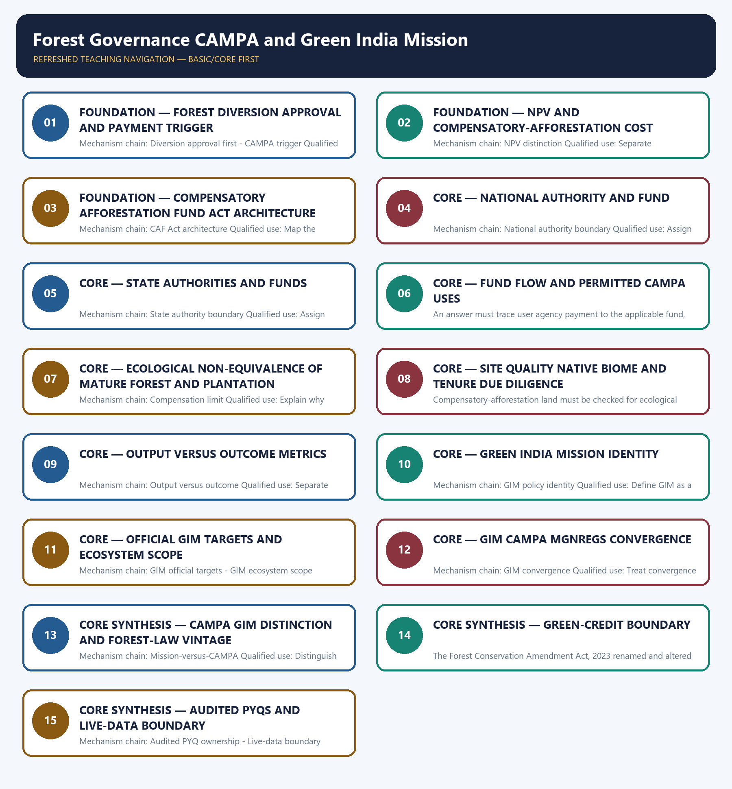

# Forest Governance CAMPA and Green India Mission — Learner-v2 Complete Learning Session

> **Authoring-only generation:** 2026-09-03. No PDF was rendered and no tracker or index was mutated.

### SOURCE, PROGRESSION AND CURRENT-LINKAGE AUDIT

- **Generation date:** 2026-09-03.
- **Repository-first evidence:** the Basic owner is taught first and preserved in full; the Advanced owner is retained only in the optional final teaching block.
- **OCR evidence:** Repository Markdown was primary. OCR-searchable local official General Studies papers were used only to confirm printed routed demands. No answer key, marking scheme, unsupported page precision, ecological rate, species count or current status was inferred.
- **Qdrant:** not used; repository Markdown and available OCR context were sufficient.
- **PYQ integrity:** Audited ledgers route four objective demands: CAMPA in 2019, the New York Declaration on Forests and Tree City in 2021, and provisional 2026 Plan Vivo community forest carbon. No direct Mains demand or objective answer key is invented; the concepts are carried into practice.
- **Live-link boundary:** The official MoEFCC GIM page was substantively retrieved for mission identity, ecosystem scope, convergence and published targets. Those targets are not reported as achievements. CAMPA paths failed with HTTP 404 or DNS error and the FSI page was a contact-only stub, so no fund, allocation, expenditure, area, survival or outcome figure was used.
- **Fact/inference discipline:** no current-affairs item, PYQ wording, figure or quotation is invented.

### LIVE OFFICIAL-SOURCE ATTEMPT LOG

The checks below were made on 2026-09-03. Substantive official text is used only for the proposition it supports. Stubs, access failures, unrelated pages and thin landing pages are recorded and are not converted into ecological or current-status claims.

- https://moef.gov.in/green-india-mission-gim — attempted 2026-09-03; the official MoEFCC page was substantively retrievable. It identifies GIM as one of the original eight NAPCC missions, states its ecosystem-service approach and publishes mission targets; targets were not reported as achieved outputs or outcomes.
- https://moef.gov.in/forest-conservation — attempted 2026-09-03; the official MoEFCC page returned substantive Hindi text confirming that prior Central approval regulates forest land used for non-forest purposes. It did not provide a CAMPA fund or expenditure figure.
- https://moef.gov.in/campa — attempted 2026-09-03; the official MoEFCC path returned HTTP 404, so no fund allocation, release, expenditure or afforestation-area claim was imported.
- https://campa.gov.in/ — attempted 2026-09-03; the host could not be resolved, so no National or State CAMPA dashboard value was used.
- https://fsi.nic.in/forest-report-2023 — attempted 2026-09-03; the fetch returned only the Forest Survey of India contact address, so no forest-cover or restoration-outcome figure was imported.

## BASIC LEARNING SESSION



*Distinct embedded teaching-navigation image. The separate continuous Cārvāka-style flowchart package remains an independent at-a-glance artifact.*

### SESSION 1 — FOUNDATION — FOREST DIVERSION APPROVAL AND PAYMENT TRIGGER

#### DEFINITION / WHAT THIS IS CALLED

**Plain-language definition:** Prior Central approval for specified non-forest use of covered forest land belongs to the forest-conservation statute; approval, rejection or exemption is a legal decision distinct from later compensatory-afforestation finance.

**Technical definition:** Mechanism chain: Diversion approval first - CAMPA trigger Qualified use: Begin with the legal decision, then trace conditions to user-agency payment.

#### ANSWER-GRABBING OPENING — WRITE/ADAPT IN THE EXAM

> Do not treat CAMPA payment as the legal approval for diversion.

#### MUST-WRITE KEYWORDS

- **FOUNDATION**
- **Forest diversion approval**
- **payment trigger**
- **Mechanism chain**
- **Qualified use**
- **Prior Central**

**How to use them:** Frame the answer through FOUNDATION; define Forest diversion approval, connect payment trigger with Mechanism chain to explain the mechanism, and use Qualified use for the decisive comparison or qualification.

#### VISUAL FIRST

```text
FOREST DIVERSION APPROVAL AND PAYMENT TRIGGER
01. Diversion approval first
    |
    v
02. CAMPA trigger
BOUNDARY -> Do not treat CAMPA payment as the legal approval for diversion.
```

*This topic-specific rail fixes the evidence sequence and its exam boundary before analysis.*

#### CORE EXPLANATION

Prior Central approval for specified non-forest use of covered forest land belongs to the forest-conservation statute; approval, rejection or exemption is a legal decision distinct from later compensatory-afforestation finance. When an approved diversion carries compensatory conditions, the user agency pays the applicable compensatory-afforestation cost and Net Present Value; a fund flow does not itself grant diversion approval.

#### NAMED EVIDENCE AND MECHANISM

- Prior Central approval for specified non-forest use of covered forest land belongs to the forest-conservation statute; approval, rejection or exemption is a legal decision distinct from later compensatory-afforestation finance.
- When an approved diversion carries compensatory conditions, the user agency pays the applicable compensatory-afforestation cost and Net Present Value; a fund flow does not itself grant diversion approval.

#### EXAMINER CAUTION

- Do not treat CAMPA payment as the legal approval for diversion.

#### EXAM LINK

- **Prelims:** Preserve the exact ecological level, system boundary, stock or flow, pyramid parameter, succession substrate, biome scale, taxonomic term and scientific or legal status; never turn a context-dependent pattern into a universal rule.
- **Mains:** Begin with the legal decision, then trace conditions to user-agency payment.

#### MINI RECAP

- **Mechanism chain:** Diversion approval first -> CAMPA trigger
- **Qualified use:** Begin with the legal decision, then trace conditions to user-agency payment.

#### CLOSING RECALL FLOW — FOUNDATION — FOREST DIVERSION APPROVAL AND PAYMENT TRIGGER

```text
START / CONCEPT: FOUNDATION — Forest diversion approval and payment trigger
        |
        v
EXACT TERMS: FOUNDATION · Forest diversion approval · payment trigger · Mechanism chain · Qualified use · Prior Central
        |
        v
MECHANISM / ARGUMENT: Mechanism chain: Diversion approval first - CAMPA trigger Qualified use: Begin with the legal decision, then trace conditions to user-agency payment.
        |
        v
CONSEQUENCE / CONTRAST: When an approved diversion carries compensatory conditions, the user agency pays the applicable compensatory-afforestation cost and Net Present Value; a fund flow does not itself grant diversion approval.
        |
        v
UPSC TRAP / ANSWER-USE: Do not miss this limiting distinction: prior Central approval for specified non-forest use of covered forest land belongs to the...
        |
        v
ANSWER-GRABBING FORMULATION: Do not treat CAMPA payment as the legal approval for diversion.
```
### SESSION 2 — FOUNDATION — NPV AND COMPENSATORY-AFFORESTATION COST

#### DEFINITION / WHAT THIS IS CALLED

**Plain-language definition:** Net Present Value monetises specified foregone forest ecosystem services for the approval framework, while compensatory-afforestation cost finances plantation or restoration activity; the two payments are related but not identical.

**Technical definition:** Mechanism chain: NPV distinction Qualified use: Separate ecosystem-service valuation from activity cost.

#### ANSWER-GRABBING OPENING — WRITE/ADAPT IN THE EXAM

> Net Present Value monetises specified foregone forest ecosystem services for the approval framework, while compensatory-afforestation cost finances plantation or restoration activity; the two payments are related but not identical.

#### MUST-WRITE KEYWORDS

- **FOUNDATION**
- **NPV**
- **compensatory-afforestation cost**
- **Mechanism chain**
- **Qualified use**
- **Net Present Value**

**How to use them:** Frame the answer through FOUNDATION; define NPV, connect compensatory-afforestation cost with Mechanism chain to explain the mechanism, and use Qualified use for the decisive comparison or qualification.

#### VISUAL FIRST

```text
NPV AND COMPENSATORY-AFFORESTATION COST
01. NPV distinction
BOUNDARY -> Do not merge NPV and compensatory-afforestation cost.
```

*This topic-specific rail fixes the evidence sequence and its exam boundary before analysis.*

#### CORE EXPLANATION

Net Present Value monetises specified foregone forest ecosystem services for the approval framework, while compensatory-afforestation cost finances plantation or restoration activity; the two payments are related but not identical.

#### NAMED EVIDENCE AND MECHANISM

- Net Present Value monetises specified foregone forest ecosystem services for the approval framework, while compensatory-afforestation cost finances plantation or restoration activity; the two payments are related but not identical.

#### EXAMINER CAUTION

- Do not merge NPV and compensatory-afforestation cost.

#### EXAM LINK

- **Prelims:** Preserve the exact ecological level, system boundary, stock or flow, pyramid parameter, succession substrate, biome scale, taxonomic term and scientific or legal status; never turn a context-dependent pattern into a universal rule.
- **Mains:** Separate ecosystem-service valuation from activity cost.

#### MINI RECAP

- **Mechanism chain:** NPV distinction
- **Qualified use:** Separate ecosystem-service valuation from activity cost.

#### CLOSING RECALL FLOW — FOUNDATION — NPV AND COMPENSATORY-AFFORESTATION COST

```text
START / CONCEPT: FOUNDATION — NPV and compensatory-afforestation cost
        |
        v
EXACT TERMS: FOUNDATION · NPV · compensatory-afforestation cost · Mechanism chain · Qualified use · Net Present Value
        |
        v
MECHANISM / ARGUMENT: Mechanism chain: NPV distinction Qualified use: Separate ecosystem-service valuation from activity cost.
        |
        v
CONSEQUENCE / CONTRAST: Do not merge NPV and compensatory-afforestation cost.
        |
        v
UPSC TRAP / ANSWER-USE: Do not miss this limiting distinction: net Present Value monetises specified foregone forest ecosystem services for the approval framework.
        |
        v
ANSWER-GRABBING FORMULATION: Net Present Value monetises specified foregone forest ecosystem services for the approval framework, while compensatory-afforestation cost finances plantation or restoration activity; the two payments are related but not identical.
```
### SESSION 3 — FOUNDATION — COMPENSATORY AFFORESTATION FUND ACT ARCHITECTURE

#### DEFINITION / WHAT THIS IS CALLED

**Plain-language definition:** The Compensatory Afforestation Fund Act, 2016 establishes National and State Compensatory Afforestation Funds and their authorities for receiving and using eligible monies under the statutory framework.

**Technical definition:** Mechanism chain: CAF Act architecture Qualified use: Map the statute, funds and authorities before discussing implementation.

#### ANSWER-GRABBING OPENING — WRITE/ADAPT IN THE EXAM

> The Compensatory Afforestation Fund Act, 2016 establishes National and State Compensatory Afforestation Funds and their authorities for receiving and using eligible monies under the statutory framework.

#### MUST-WRITE KEYWORDS

- **FOUNDATION**
- **Compensatory Afforestation Fund Act architecture**
- **Mechanism chain**
- **Qualified use**
- **The Compensatory Afforestation Fund Act**
- **National**

**How to use them:** Frame the answer through FOUNDATION; define Compensatory Afforestation Fund Act architecture, connect Mechanism chain with Qualified use to explain the mechanism, and use The Compensatory Afforestation Fund Act for the decisive comparison or qualification.

#### VISUAL FIRST

```text
COMPENSATORY AFFORESTATION FUND ACT ARCHITECTURE
01. CAF Act architecture
BOUNDARY -> Do not assign State implementation to the National Authority.
```

*This topic-specific rail fixes the evidence sequence and its exam boundary before analysis.*

#### CORE EXPLANATION

The Compensatory Afforestation Fund Act, 2016 establishes National and State Compensatory Afforestation Funds and their authorities for receiving and using eligible monies under the statutory framework.

#### NAMED EVIDENCE AND MECHANISM

- The Compensatory Afforestation Fund Act, 2016 establishes National and State Compensatory Afforestation Funds and their authorities for receiving and using eligible monies under the statutory framework.

#### EXAMINER CAUTION

- Do not assign State implementation to the National Authority.

#### EXAM LINK

- **Prelims:** Preserve the exact ecological level, system boundary, stock or flow, pyramid parameter, succession substrate, biome scale, taxonomic term and scientific or legal status; never turn a context-dependent pattern into a universal rule.
- **Mains:** Map the statute, funds and authorities before discussing implementation.

#### MINI RECAP

- **Mechanism chain:** CAF Act architecture
- **Qualified use:** Map the statute, funds and authorities before discussing implementation.

#### CLOSING RECALL FLOW — FOUNDATION — COMPENSATORY AFFORESTATION FUND ACT ARCHITECTURE

```text
START / CONCEPT: FOUNDATION — Compensatory Afforestation Fund Act architecture
        |
        v
EXACT TERMS: FOUNDATION · Compensatory Afforestation Fund Act architecture · Mechanism chain · Qualified use · The Compensatory Afforestation Fund Act · National
        |
        v
MECHANISM / ARGUMENT: Mechanism chain: CAF Act architecture Qualified use: Map the statute, funds and authorities before discussing implementation.
        |
        v
CONSEQUENCE / CONTRAST: Do not assign State implementation to the National Authority.
        |
        v
UPSC TRAP / ANSWER-USE: Do not miss this limiting distinction: the Compensatory Afforestation Fund Act, 2016 establishes National and State Compensatory Afforestation Funds and...
        |
        v
ANSWER-GRABBING FORMULATION: The Compensatory Afforestation Fund Act, 2016 establishes National and State Compensatory Afforestation Funds and their authorities for receiving and using eligible monies under the statutory framework.
```
### SESSION 4 — CORE — NATIONAL AUTHORITY AND FUND

#### DEFINITION / WHAT THIS IS CALLED

**Plain-language definition:** The National Authority and National Fund perform central planning, coordination, monitoring and nationally assigned functions; they do not replace State Authorities as the ordinary executors of state plans.

**Technical definition:** Mechanism chain: National authority boundary Qualified use: Assign central planning and monitoring to the National layer.

#### ANSWER-GRABBING OPENING — WRITE/ADAPT IN THE EXAM

> The National Authority and National Fund perform central planning, coordination, monitoring and nationally assigned functions; they do not replace State Authorities as the ordinary executors of state plans.

#### MUST-WRITE KEYWORDS

- **National Authority**
- **Fund**
- **Mechanism chain**
- **Qualified use**
- **The National Authority**
- **National Fund**

**How to use them:** Frame the answer through National Authority; define Fund, connect Mechanism chain with Qualified use to explain the mechanism, and use The National Authority for the decisive comparison or qualification.

#### VISUAL FIRST

```text
NATIONAL AUTHORITY AND FUND
01. National authority boundary
BOUNDARY -> Do not assign national coordination to a State Authority.
```

*This topic-specific rail fixes the evidence sequence and its exam boundary before analysis.*

#### CORE EXPLANATION

The National Authority and National Fund perform central planning, coordination, monitoring and nationally assigned functions; they do not replace State Authorities as the ordinary executors of state plans.

#### NAMED EVIDENCE AND MECHANISM

- The National Authority and National Fund perform central planning, coordination, monitoring and nationally assigned functions; they do not replace State Authorities as the ordinary executors of state plans.

#### EXAMINER CAUTION

- Do not assign national coordination to a State Authority.

#### EXAM LINK

- **Prelims:** Preserve the exact ecological level, system boundary, stock or flow, pyramid parameter, succession substrate, biome scale, taxonomic term and scientific or legal status; never turn a context-dependent pattern into a universal rule.
- **Mains:** Assign central planning and monitoring to the National layer.

#### MINI RECAP

- **Mechanism chain:** National authority boundary
- **Qualified use:** Assign central planning and monitoring to the National layer.

#### CLOSING RECALL FLOW — CORE — NATIONAL AUTHORITY AND FUND

```text
START / CONCEPT: CORE — National Authority and Fund
        |
        v
EXACT TERMS: National Authority · Fund · Mechanism chain · Qualified use · The National Authority · National Fund
        |
        v
MECHANISM / ARGUMENT: Mechanism chain: National authority boundary Qualified use: Assign central planning and monitoring to the National layer.
        |
        v
CONSEQUENCE / CONTRAST: Do not assign national coordination to a State Authority.
        |
        v
UPSC TRAP / ANSWER-USE: Do not miss this limiting distinction: the National Authority and National Fund perform central planning, coordination, monitoring and nationally assigned...
        |
        v
ANSWER-GRABBING FORMULATION: The National Authority and National Fund perform central planning, coordination, monitoring and nationally assigned functions; they do not replace State Authorities as the ordinary executors of state plans.
```
### SESSION 5 — CORE — STATE AUTHORITIES AND FUNDS

#### DEFINITION / WHAT THIS IS CALLED

**Plain-language definition:** State Authorities prepare and implement the applicable annual plans and use State Fund resources for permitted activities; a release or approved plan is not proof of completed ecological restoration.

**Technical definition:** Mechanism chain: State authority boundary Qualified use: Assign state plans and execution to the State layer.

#### ANSWER-GRABBING OPENING — WRITE/ADAPT IN THE EXAM

> State Authorities prepare and implement the applicable annual plans and use State Fund resources for permitted activities; a release or approved plan is not proof of completed ecological restoration.

#### MUST-WRITE KEYWORDS

- **Funds**
- **Mechanism chain**
- **Qualified use**
- **Qualified**
- **Assign**
- **CORE — State Authorities and Funds**

**How to use them:** Frame the answer through Funds; define Mechanism chain, connect Qualified use with Qualified to explain the mechanism, and use Assign for the decisive comparison or qualification.

#### VISUAL FIRST

```text
STATE AUTHORITIES AND FUNDS
01. State authority boundary
BOUNDARY -> Do not treat an approved annual plan as completed work.
```

*This topic-specific rail fixes the evidence sequence and its exam boundary before analysis.*

#### CORE EXPLANATION

State Authorities prepare and implement the applicable annual plans and use State Fund resources for permitted activities; a release or approved plan is not proof of completed ecological restoration.

#### NAMED EVIDENCE AND MECHANISM

- State Authorities prepare and implement the applicable annual plans and use State Fund resources for permitted activities; a release or approved plan is not proof of completed ecological restoration.

#### EXAMINER CAUTION

- Do not treat an approved annual plan as completed work.

#### EXAM LINK

- **Prelims:** Preserve the exact ecological level, system boundary, stock or flow, pyramid parameter, succession substrate, biome scale, taxonomic term and scientific or legal status; never turn a context-dependent pattern into a universal rule.
- **Mains:** Assign state plans and execution to the State layer.

#### MINI RECAP

- **Mechanism chain:** State authority boundary
- **Qualified use:** Assign state plans and execution to the State layer.

#### CLOSING RECALL FLOW — CORE — STATE AUTHORITIES AND FUNDS

```text
START / CONCEPT: CORE — State Authorities and Funds
        |
        v
EXACT TERMS: Funds · Mechanism chain · Qualified use · Qualified · Assign · CORE — State Authorities and Funds
        |
        v
MECHANISM / ARGUMENT: Mechanism chain: State authority boundary Qualified use: Assign state plans and execution to the State layer.
        |
        v
CONSEQUENCE / CONTRAST: Do not treat an approved annual plan as completed work.
        |
        v
UPSC TRAP / ANSWER-USE: Do not miss this limiting distinction: state Authorities prepare and implement the applicable annual plans and use State Fund resources...
        |
        v
ANSWER-GRABBING FORMULATION: State Authorities prepare and implement the applicable annual plans and use State Fund resources for permitted activities; a release or approved plan is not proof of completed ecological restoration.
```
### SESSION 6 — CORE — FUND FLOW AND PERMITTED CAMPA USES

#### DEFINITION / WHAT THIS IS CALLED

**Plain-language definition:** CAMPA monies may support compensatory afforestation and other permitted forest, wildlife, regeneration, protection or infrastructure activities under the Act and Rules; no allocation or expenditure value is assumed without the dated record.

**Technical definition:** An answer must trace user agency payment to the applicable fund, authority, approved plan, release, expenditure, physical output and ecological outcome; each is a separate accounting or performance stage.

#### ANSWER-GRABBING OPENING — WRITE/ADAPT IN THE EXAM

> CAMPA monies may support compensatory afforestation and other permitted forest, wildlife, regeneration, protection or infrastructure activities under the Act and Rules; no allocation or expenditure value is assumed without the dated record.

#### MUST-WRITE KEYWORDS

- **Fund flow**
- **permitted CAMPA uses**
- **Mechanism chain**
- **Qualified use**
- **CAMPA**
- **Act**

**How to use them:** Frame the answer through Fund flow; define permitted CAMPA uses, connect Mechanism chain with Qualified use to explain the mechanism, and use CAMPA for the decisive comparison or qualification.

#### VISUAL FIRST

```text
FUND FLOW AND PERMITTED CAMPA USES
01. Fund-flow discipline
    |
    v
02. Permitted-use boundary
BOUNDARY -> Do not report accrued funds as expenditure.
```

*This topic-specific rail fixes the evidence sequence and its exam boundary before analysis.*

#### CORE EXPLANATION

An answer must trace user agency payment to the applicable fund, authority, approved plan, release, expenditure, physical output and ecological outcome; each is a separate accounting or performance stage. CAMPA monies may support compensatory afforestation and other permitted forest, wildlife, regeneration, protection or infrastructure activities under the Act and Rules; no allocation or expenditure value is assumed without the dated record.

#### NAMED EVIDENCE AND MECHANISM

- An answer must trace user agency payment to the applicable fund, authority, approved plan, release, expenditure, physical output and ecological outcome; each is a separate accounting or performance stage.
- CAMPA monies may support compensatory afforestation and other permitted forest, wildlife, regeneration, protection or infrastructure activities under the Act and Rules; no allocation or expenditure value is assumed without the dated record.

#### EXAMINER CAUTION

- Do not report accrued funds as expenditure.

#### EXAM LINK

- **Prelims:** Preserve the exact ecological level, system boundary, stock or flow, pyramid parameter, succession substrate, biome scale, taxonomic term and scientific or legal status; never turn a context-dependent pattern into a universal rule.
- **Mains:** Trace the fund stages and name only uses allowed by the Act, Rules and plan.

#### MINI RECAP

- **Mechanism chain:** Fund-flow discipline -> Permitted-use boundary
- **Qualified use:** Trace the fund stages and name only uses allowed by the Act, Rules and plan.

#### CLOSING RECALL FLOW — CORE — FUND FLOW AND PERMITTED CAMPA USES

```text
START / CONCEPT: CORE — Fund flow and permitted CAMPA uses
        |
        v
EXACT TERMS: Fund flow · permitted CAMPA uses · Mechanism chain · Qualified use · CAMPA · Act
        |
        v
MECHANISM / ARGUMENT: Mechanism chain: Fund-flow discipline - Permitted-use boundary Qualified use: Trace the fund stages and name only uses allowed by the Act, Rules and plan.
        |
        v
CONSEQUENCE / CONTRAST: Do not report accrued funds as expenditure.
        |
        v
UPSC TRAP / ANSWER-USE: Do not miss this limiting distinction: trace the fund stages and name only uses allowed by the Act, Rules and...
        |
        v
ANSWER-GRABBING FORMULATION: CAMPA monies may support compensatory afforestation and other permitted forest, wildlife, regeneration, protection or infrastructure activities under the Act and Rules; no allocation or expenditure value is assumed without the dated record.
```
### SESSION 7 — CORE — ECOLOGICAL NON-EQUIVALENCE OF MATURE FOREST AND PLANTATION

#### DEFINITION / WHAT THIS IS CALLED

**Plain-language definition:** A plantation cannot reproduce the structure, species composition, soil history, spatial location and accumulated services of a mature natural forest within the project accounting period; finance mitigates loss but does not prove ecological equivalence.

**Technical definition:** Mechanism chain: Compensation limit Qualified use: Explain why restoration finance cannot establish like-for-like replacement.

#### ANSWER-GRABBING OPENING — WRITE/ADAPT IN THE EXAM

> A plantation cannot reproduce the structure, species composition, soil history, spatial location and accumulated services of a mature natural forest within the project accounting period; finance mitigates loss but does not prove ecological equivalence.

#### MUST-WRITE KEYWORDS

- **Ecological non-equivalence of mature forest**
- **plantation**
- **Mechanism chain**
- **Qualified use**
- **Compensation**
- **Qualified**

**How to use them:** Frame the answer through Ecological non-equivalence of mature forest; define plantation, connect Mechanism chain with Qualified use to explain the mechanism, and use Compensation for the decisive comparison or qualification.

#### VISUAL FIRST

```text
ECOLOGICAL NON-EQUIVALENCE OF MATURE FOREST AND PLANTATION
01. Compensation limit
BOUNDARY -> Do not report expenditure as plantation survival or ecosystem restoration.
```

*This topic-specific rail fixes the evidence sequence and its exam boundary before analysis.*

#### CORE EXPLANATION

A plantation cannot reproduce the structure, species composition, soil history, spatial location and accumulated services of a mature natural forest within the project accounting period; finance mitigates loss but does not prove ecological equivalence.

#### NAMED EVIDENCE AND MECHANISM

- A plantation cannot reproduce the structure, species composition, soil history, spatial location and accumulated services of a mature natural forest within the project accounting period; finance mitigates loss but does not prove ecological equivalence.

#### EXAMINER CAUTION

- Do not report expenditure as plantation survival or ecosystem restoration.

#### EXAM LINK

- **Prelims:** Preserve the exact ecological level, system boundary, stock or flow, pyramid parameter, succession substrate, biome scale, taxonomic term and scientific or legal status; never turn a context-dependent pattern into a universal rule.
- **Mains:** Explain why restoration finance cannot establish like-for-like replacement.

#### MINI RECAP

- **Mechanism chain:** Compensation limit
- **Qualified use:** Explain why restoration finance cannot establish like-for-like replacement.

#### CLOSING RECALL FLOW — CORE — ECOLOGICAL NON-EQUIVALENCE OF MATURE FOREST AND PLANTATION

```text
START / CONCEPT: CORE — Ecological non-equivalence of mature forest and plantation
        |
        v
EXACT TERMS: Ecological non-equivalence of mature forest · plantation · Mechanism chain · Qualified use · Compensation · Qualified
        |
        v
MECHANISM / ARGUMENT: Mechanism chain: Compensation limit Qualified use: Explain why restoration finance cannot establish like-for-like replacement.
        |
        v
CONSEQUENCE / CONTRAST: Do not report expenditure as plantation survival or ecosystem restoration.
        |
        v
UPSC TRAP / ANSWER-USE: Mains: Explain why restoration finance cannot establish like-for-like replacement.
        |
        v
ANSWER-GRABBING FORMULATION: A plantation cannot reproduce the structure, species composition, soil history, spatial location and accumulated services of a mature natural forest within the project accounting period; finance mitigates loss but does not prove ecological equivalence.
```
### SESSION 8 — CORE — SITE QUALITY NATIVE BIOME AND TENURE DUE DILIGENCE

#### DEFINITION / WHAT THIS IS CALLED

**Plain-language definition:** Mechanism chain: Site and tenure due diligence Qualified use: Test ecology, land tenure and pending rights before site selection.

**Technical definition:** Compensatory-afforestation land must be checked for ecological suitability, native-biome fidelity, existing use and recognised or pending forest rights; describing land as degraded does not make it rights-free or ecologically empty.

#### ANSWER-GRABBING OPENING — WRITE/ADAPT IN THE EXAM

> Mechanism chain: Site and tenure due diligence Qualified use: Test ecology, land tenure and pending rights before site selection.

#### MUST-WRITE KEYWORDS

- **Site quality native biome**
- **tenure due diligence**
- **Mechanism chain**
- **Qualified use**
- **Compensatory-afforestation**
- **Site**

**How to use them:** Frame the answer through Site quality native biome; define tenure due diligence, connect Mechanism chain with Qualified use to explain the mechanism, and use Compensatory-afforestation for the decisive comparison or qualification.

#### VISUAL FIRST

```text
SITE QUALITY NATIVE BIOME AND TENURE DUE DILIGENCE
01. Site and tenure due diligence
BOUNDARY -> Do not treat compensatory plantation as like-for-like mature forest.
```

*This topic-specific rail fixes the evidence sequence and its exam boundary before analysis.*

#### CORE EXPLANATION

Compensatory-afforestation land must be checked for ecological suitability, native-biome fidelity, existing use and recognised or pending forest rights; describing land as degraded does not make it rights-free or ecologically empty.

#### NAMED EVIDENCE AND MECHANISM

- Compensatory-afforestation land must be checked for ecological suitability, native-biome fidelity, existing use and recognised or pending forest rights; describing land as degraded does not make it rights-free or ecologically empty.

#### EXAMINER CAUTION

- Do not treat compensatory plantation as like-for-like mature forest.

#### EXAM LINK

- **Prelims:** Preserve the exact ecological level, system boundary, stock or flow, pyramid parameter, succession substrate, biome scale, taxonomic term and scientific or legal status; never turn a context-dependent pattern into a universal rule.
- **Mains:** Test ecology, land tenure and pending rights before site selection.

#### MINI RECAP

- **Mechanism chain:** Site and tenure due diligence
- **Qualified use:** Test ecology, land tenure and pending rights before site selection.

#### CLOSING RECALL FLOW — CORE — SITE QUALITY NATIVE BIOME AND TENURE DUE DILIGENCE

```text
START / CONCEPT: CORE — Site quality native biome and tenure due diligence
        |
        v
EXACT TERMS: Site quality native biome · tenure due diligence · Mechanism chain · Qualified use · Compensatory-afforestation · Site
        |
        v
MECHANISM / ARGUMENT: Compensatory-afforestation land must be checked for ecological suitability, native-biome fidelity, existing use and recognised or pending forest rights; describing land as degraded does not make it rights-free or ecologically empty.
        |
        v
CONSEQUENCE / CONTRAST: Do not treat compensatory plantation as like-for-like mature forest.
        |
        v
UPSC TRAP / ANSWER-USE: Do not miss this limiting distinction: site and tenure due diligence Qualified use.
        |
        v
ANSWER-GRABBING FORMULATION: Mechanism chain: Site and tenure due diligence Qualified use: Test ecology, land tenure and pending rights before site selection.
```
### SESSION 9 — CORE — OUTPUT VERSUS OUTCOME METRICS

#### DEFINITION / WHAT THIS IS CALLED

**Plain-language definition:** Money accrued, money spent, seedlings planted, area treated, canopy detected and ecosystem function restored are different metrics; none can be substituted for the next without monitoring evidence.

**Technical definition:** Mechanism chain: Output versus outcome Qualified use: Separate accrual, expenditure, physical output and ecological outcome.

#### ANSWER-GRABBING OPENING — WRITE/ADAPT IN THE EXAM

> Mechanism chain: Output versus outcome Qualified use: Separate accrual, expenditure, physical output and ecological outcome.

#### MUST-WRITE KEYWORDS

- **Output versus outcome metrics**
- **Mechanism chain**
- **Qualified use**
- **Money**
- **Do not assume degraded land**
- **Output**

**How to use them:** Frame the answer through Output versus outcome metrics; define Mechanism chain, connect Qualified use with Money to explain the mechanism, and use Do not assume degraded land for the decisive comparison or qualification.

#### VISUAL FIRST

```text
OUTPUT VERSUS OUTCOME METRICS
01. Output versus outcome
BOUNDARY -> Do not assume degraded land is rights-free.
```

*This topic-specific rail fixes the evidence sequence and its exam boundary before analysis.*

#### CORE EXPLANATION

Money accrued, money spent, seedlings planted, area treated, canopy detected and ecosystem function restored are different metrics; none can be substituted for the next without monitoring evidence.

#### NAMED EVIDENCE AND MECHANISM

- Money accrued, money spent, seedlings planted, area treated, canopy detected and ecosystem function restored are different metrics; none can be substituted for the next without monitoring evidence.

#### EXAMINER CAUTION

- Do not assume degraded land is rights-free.

#### EXAM LINK

- **Prelims:** Preserve the exact ecological level, system boundary, stock or flow, pyramid parameter, succession substrate, biome scale, taxonomic term and scientific or legal status; never turn a context-dependent pattern into a universal rule.
- **Mains:** Separate accrual, expenditure, physical output and ecological outcome.

#### MINI RECAP

- **Mechanism chain:** Output versus outcome
- **Qualified use:** Separate accrual, expenditure, physical output and ecological outcome.

#### CLOSING RECALL FLOW — CORE — OUTPUT VERSUS OUTCOME METRICS

```text
START / CONCEPT: CORE — Output versus outcome metrics
        |
        v
EXACT TERMS: Output versus outcome metrics · Mechanism chain · Qualified use · Money · Do not assume degraded land · Output
        |
        v
MECHANISM / ARGUMENT: Money accrued, money spent, seedlings planted, area treated, canopy detected and ecosystem function restored are different metrics; none can be substituted for the next without monitoring evidence.
        |
        v
CONSEQUENCE / CONTRAST: Do not assume degraded land is rights-free.
        |
        v
UPSC TRAP / ANSWER-USE: Do not miss this limiting distinction: separate accrual, expenditure, physical output and ecological outcome.
        |
        v
ANSWER-GRABBING FORMULATION: Mechanism chain: Output versus outcome Qualified use: Separate accrual, expenditure, physical output and ecological outcome.
```
### SESSION 10 — CORE — GREEN INDIA MISSION IDENTITY

#### DEFINITION / WHAT THIS IS CALLED

**Plain-language definition:** The Green India Mission is one of the original eight missions under the National Action Plan on Climate Change and combines adaptation and mitigation through forest and ecosystem restoration; it is not the CAMPA statute.

**Technical definition:** Mechanism chain: GIM policy identity Qualified use: Define GIM as a NAPCC mission, not a compensatory fund.

#### ANSWER-GRABBING OPENING — WRITE/ADAPT IN THE EXAM

> The Green India Mission is one of the original eight missions under the National Action Plan on Climate Change and combines adaptation and mitigation through forest and ecosystem restoration; it is not the CAMPA statute.

#### MUST-WRITE KEYWORDS

- **Green India Mission identity**
- **Mechanism chain**
- **Qualified use**
- **The Green India Mission**
- **National Action Plan**
- **Climate Change**

**How to use them:** Frame the answer through Green India Mission identity; define Mechanism chain, connect Qualified use with The Green India Mission to explain the mechanism, and use National Action Plan for the decisive comparison or qualification.

#### VISUAL FIRST

```text
GREEN INDIA MISSION IDENTITY
01. GIM policy identity
BOUNDARY -> Do not merge CAMPA and Green India Mission.
```

*This topic-specific rail fixes the evidence sequence and its exam boundary before analysis.*

#### CORE EXPLANATION

The Green India Mission is one of the original eight missions under the National Action Plan on Climate Change and combines adaptation and mitigation through forest and ecosystem restoration; it is not the CAMPA statute.

#### NAMED EVIDENCE AND MECHANISM

- The Green India Mission is one of the original eight missions under the National Action Plan on Climate Change and combines adaptation and mitigation through forest and ecosystem restoration; it is not the CAMPA statute.

#### EXAMINER CAUTION

- Do not merge CAMPA and Green India Mission.

#### EXAM LINK

- **Prelims:** Preserve the exact ecological level, system boundary, stock or flow, pyramid parameter, succession substrate, biome scale, taxonomic term and scientific or legal status; never turn a context-dependent pattern into a universal rule.
- **Mains:** Define GIM as a NAPCC mission, not a compensatory fund.

#### MINI RECAP

- **Mechanism chain:** GIM policy identity
- **Qualified use:** Define GIM as a NAPCC mission, not a compensatory fund.

#### CLOSING RECALL FLOW — CORE — GREEN INDIA MISSION IDENTITY

```text
START / CONCEPT: CORE — Green India Mission identity
        |
        v
EXACT TERMS: Green India Mission identity · Mechanism chain · Qualified use · The Green India Mission · National Action Plan · Climate Change
        |
        v
MECHANISM / ARGUMENT: Mechanism chain: GIM policy identity Qualified use: Define GIM as a NAPCC mission, not a compensatory fund.
        |
        v
CONSEQUENCE / CONTRAST: Do not merge CAMPA and Green India Mission.
        |
        v
UPSC TRAP / ANSWER-USE: Do not miss this limiting distinction: the Green India Mission is one of the original eight missions under the National...
        |
        v
ANSWER-GRABBING FORMULATION: The Green India Mission is one of the original eight missions under the National Action Plan on Climate Change and combines adaptation and mitigation through forest and ecosystem restoration; it is not the CAMPA statute.
```
### SESSION 11 — CORE — OFFICIAL GIM TARGETS AND ECOSYSTEM SCOPE

#### DEFINITION / WHAT THIS IS CALLED

**Plain-language definition:** The official page emphasises biodiversity, water, biomass, mangroves, wetlands, critical habitats, carbon storage, agroforestry, social forestry and urban or peri-urban tree cover; GIM is broader than compensating one diverted parcel.

**Technical definition:** Mechanism chain: GIM official targets - GIM ecosystem scope Qualified use: Quote official targets as targets and connect them to ecosystem services.

#### ANSWER-GRABBING OPENING — WRITE/ADAPT IN THE EXAM

> Mechanism chain: GIM official targets - GIM ecosystem scope Qualified use: Quote official targets as targets and connect them to ecosystem services.

#### MUST-WRITE KEYWORDS

- **Official GIM targets**
- **ecosystem scope**
- **Mechanism chain**
- **Qualified use**
- **MoEFCC**
- **GIM**

**How to use them:** Frame the answer through Official GIM targets; define ecosystem scope, connect Mechanism chain with Qualified use to explain the mechanism, and use MoEFCC for the decisive comparison or qualification.

#### VISUAL FIRST

```text
OFFICIAL GIM TARGETS AND ECOSYSTEM SCOPE
01. GIM official targets
    |
    v
02. GIM ecosystem scope
BOUNDARY -> Do not report GIM targets as achieved outputs or outcomes.
```

*This topic-specific rail fixes the evidence sequence and its exam boundary before analysis.*

#### CORE EXPLANATION

The retrieved MoEFCC page publishes mission targets of increasing forest or tree cover over 5 million hectares, improving quality over another 5 million hectares and enhancing forest-based livelihood income for about 3 million families; these are targets, not verified achievements. The official page emphasises biodiversity, water, biomass, mangroves, wetlands, critical habitats, carbon storage, agroforestry, social forestry and urban or peri-urban tree cover; GIM is broader than compensating one diverted parcel.

#### NAMED EVIDENCE AND MECHANISM

- The retrieved MoEFCC page publishes mission targets of increasing forest or tree cover over 5 million hectares, improving quality over another 5 million hectares and enhancing forest-based livelihood income for about 3 million families; these are targets, not verified achievements.
- The official page emphasises biodiversity, water, biomass, mangroves, wetlands, critical habitats, carbon storage, agroforestry, social forestry and urban or peri-urban tree cover; GIM is broader than compensating one diverted parcel.

#### EXAMINER CAUTION

- Do not report GIM targets as achieved outputs or outcomes.

#### EXAM LINK

- **Prelims:** Preserve the exact ecological level, system boundary, stock or flow, pyramid parameter, succession substrate, biome scale, taxonomic term and scientific or legal status; never turn a context-dependent pattern into a universal rule.
- **Mains:** Quote official targets as targets and connect them to ecosystem services.

#### MINI RECAP

- **Mechanism chain:** GIM official targets -> GIM ecosystem scope
- **Qualified use:** Quote official targets as targets and connect them to ecosystem services.

#### CLOSING RECALL FLOW — CORE — OFFICIAL GIM TARGETS AND ECOSYSTEM SCOPE

```text
START / CONCEPT: CORE — Official GIM targets and ecosystem scope
        |
        v
EXACT TERMS: Official GIM targets · ecosystem scope · Mechanism chain · Qualified use · MoEFCC · GIM
        |
        v
MECHANISM / ARGUMENT: The official page emphasises biodiversity, water, biomass, mangroves, wetlands, critical habitats, carbon storage, agroforestry, social forestry and urban or peri-urban tree cover; GIM is broader than compensating one diverted parcel.
        |
        v
CONSEQUENCE / CONTRAST: Do not report GIM targets as achieved outputs or outcomes.
        |
        v
UPSC TRAP / ANSWER-USE: The retrieved MoEFCC page publishes mission targets of increasing forest or tree cover over 5 million hectares, improving quality over another 5 million hectares and enhancing forest-based livelihood income for about 3 million families; these are targets, not verified achievements.
        |
        v
ANSWER-GRABBING FORMULATION: Mechanism chain: GIM official targets - GIM ecosystem scope Qualified use: Quote official targets as targets and connect them to ecosystem services.
```
### SESSION 12 — CORE — GIM CAMPA MGNREGS CONVERGENCE

#### DEFINITION / WHAT THIS IS CALLED

**Plain-language definition:** MoEFCC describes convergence with CAMPA and MGNREGS and a role for local communities; convergence is a planning approach, not automatic pooling of every fund or proof of implementation.

**Technical definition:** Mechanism chain: GIM convergence Qualified use: Treat convergence as coordinated planning rather than automatic fund merger.

#### ANSWER-GRABBING OPENING — WRITE/ADAPT IN THE EXAM

> MoEFCC describes convergence with CAMPA and MGNREGS and a role for local communities; convergence is a planning approach, not automatic pooling of every fund or proof of implementation.

#### MUST-WRITE KEYWORDS

- **GIM CAMPA MGNREGS convergence**
- **Mechanism chain**
- **Qualified use**
- **MoEFCC**
- **CAMPA**
- **MGNREGS**

**How to use them:** Frame the answer through GIM CAMPA MGNREGS convergence; define Mechanism chain, connect Qualified use with MoEFCC to explain the mechanism, and use CAMPA for the decisive comparison or qualification.

#### VISUAL FIRST

```text
GIM CAMPA MGNREGS CONVERGENCE
01. GIM convergence
BOUNDARY -> Do not infer fund convergence from policy convergence.
```

*This topic-specific rail fixes the evidence sequence and its exam boundary before analysis.*

#### CORE EXPLANATION

MoEFCC describes convergence with CAMPA and MGNREGS and a role for local communities; convergence is a planning approach, not automatic pooling of every fund or proof of implementation.

#### NAMED EVIDENCE AND MECHANISM

- MoEFCC describes convergence with CAMPA and MGNREGS and a role for local communities; convergence is a planning approach, not automatic pooling of every fund or proof of implementation.

#### EXAMINER CAUTION

- Do not infer fund convergence from policy convergence.

#### EXAM LINK

- **Prelims:** Preserve the exact ecological level, system boundary, stock or flow, pyramid parameter, succession substrate, biome scale, taxonomic term and scientific or legal status; never turn a context-dependent pattern into a universal rule.
- **Mains:** Treat convergence as coordinated planning rather than automatic fund merger.

#### MINI RECAP

- **Mechanism chain:** GIM convergence
- **Qualified use:** Treat convergence as coordinated planning rather than automatic fund merger.

#### CLOSING RECALL FLOW — CORE — GIM CAMPA MGNREGS CONVERGENCE

```text
START / CONCEPT: CORE — GIM CAMPA MGNREGS convergence
        |
        v
EXACT TERMS: GIM CAMPA MGNREGS convergence · Mechanism chain · Qualified use · MoEFCC · CAMPA · MGNREGS
        |
        v
MECHANISM / ARGUMENT: Mechanism chain: GIM convergence Qualified use: Treat convergence as coordinated planning rather than automatic fund merger.
        |
        v
CONSEQUENCE / CONTRAST: Do not infer fund convergence from policy convergence.
        |
        v
UPSC TRAP / ANSWER-USE: Mains: Treat convergence as coordinated planning rather than automatic fund merger.
        |
        v
ANSWER-GRABBING FORMULATION: MoEFCC describes convergence with CAMPA and MGNREGS and a role for local communities; convergence is a planning approach, not automatic pooling of every fund or proof of implementation.
```
### SESSION 13 — CORE SYNTHESIS — CAMPA GIM DISTINCTION AND FOREST-LAW VINTAGE

#### DEFINITION / WHAT THIS IS CALLED

**Plain-language definition:** CAMPA is diversion-triggered statutory compensation finance, whereas GIM is a broader mission with ecosystem-service objectives and multiple implementation channels; overlap in activity does not make them one programme.

**Technical definition:** Mechanism chain: Mission-versus-CAMPA Qualified use: Distinguish CAMPA and GIM while stating the statute-court sequence.

#### ANSWER-GRABBING OPENING — WRITE/ADAPT IN THE EXAM

> Mechanism chain: Mission-versus-CAMPA Qualified use: Distinguish CAMPA and GIM while stating the statute-court sequence.

#### MUST-WRITE KEYWORDS

- **CORE SYNTHESIS**
- **CAMPA GIM distinction**
- **forest-law vintage**
- **Mechanism chain**
- **Qualified use**
- **CAMPA**

**How to use them:** Frame the answer through CORE SYNTHESIS; define CAMPA GIM distinction, connect forest-law vintage with Mechanism chain to explain the mechanism, and use Qualified use for the decisive comparison or qualification.

#### VISUAL FIRST

```text
CAMPA GIM DISTINCTION AND FOREST-LAW VINTAGE
01. Mission-versus-CAMPA
BOUNDARY -> Do not state the 2023 amendment without the 2024 interim judicial direction.
```

*This topic-specific rail fixes the evidence sequence and its exam boundary before analysis.*

#### CORE EXPLANATION

CAMPA is diversion-triggered statutory compensation finance, whereas GIM is a broader mission with ecosystem-service objectives and multiple implementation channels; overlap in activity does not make them one programme.

#### NAMED EVIDENCE AND MECHANISM

- CAMPA is diversion-triggered statutory compensation finance, whereas GIM is a broader mission with ecosystem-service objectives and multiple implementation channels; overlap in activity does not make them one programme.

#### EXAMINER CAUTION

- Do not state the 2023 amendment without the 2024 interim judicial direction.

#### EXAM LINK

- **Prelims:** Preserve the exact ecological level, system boundary, stock or flow, pyramid parameter, succession substrate, biome scale, taxonomic term and scientific or legal status; never turn a context-dependent pattern into a universal rule.
- **Mains:** Distinguish CAMPA and GIM while stating the statute-court sequence.

#### MINI RECAP

- **Mechanism chain:** Mission-versus-CAMPA
- **Qualified use:** Distinguish CAMPA and GIM while stating the statute-court sequence.

#### CLOSING RECALL FLOW — CORE SYNTHESIS — CAMPA GIM DISTINCTION AND FOREST-LAW VINTAGE

```text
START / CONCEPT: CORE SYNTHESIS — CAMPA GIM distinction and forest-law vintage
        |
        v
EXACT TERMS: CORE SYNTHESIS · CAMPA GIM distinction · forest-law vintage · Mechanism chain · Qualified use · CAMPA
        |
        v
MECHANISM / ARGUMENT: CAMPA is diversion-triggered statutory compensation finance, whereas GIM is a broader mission with ecosystem-service objectives and multiple implementation channels; overlap in activity does not make them one programme.
        |
        v
CONSEQUENCE / CONTRAST: Do not state the 2023 amendment without the 2024 interim judicial direction.
        |
        v
UPSC TRAP / ANSWER-USE: Do not miss this limiting distinction: distinguish CAMPA and GIM while stating the statute-court sequence.
        |
        v
ANSWER-GRABBING FORMULATION: Mechanism chain: Mission-versus-CAMPA Qualified use: Distinguish CAMPA and GIM while stating the statute-court sequence.
```
### SESSION 14 — CORE SYNTHESIS — GREEN-CREDIT BOUNDARY

#### DEFINITION / WHAT THIS IS CALLED

**Plain-language definition:** Mechanism chain: Forest-law vintage - Green-credit boundary Qualified use: Keep green credit separate from carbon accounting and restoration proof.

**Technical definition:** The Forest Conservation Amendment Act, 2023 renamed and altered the scope of the 1980 statute, while the Supreme Court's February 2024 interim direction preserved the broader Godavarman forest meaning pending State records; both must be stated together.

#### ANSWER-GRABBING OPENING — WRITE/ADAPT IN THE EXAM

> Mechanism chain: Forest-law vintage - Green-credit boundary Qualified use: Keep green credit separate from carbon accounting and restoration proof.

#### MUST-WRITE KEYWORDS

- **CORE SYNTHESIS**
- **Green-credit boundary**
- **Mechanism chain**
- **Qualified use**
- **The Forest Conservation Amendment Act**
- **Supreme Court's February**

**How to use them:** Frame the answer through CORE SYNTHESIS; define Green-credit boundary, connect Mechanism chain with Qualified use to explain the mechanism, and use The Forest Conservation Amendment Act for the decisive comparison or qualification.

#### VISUAL FIRST

```text
GREEN-CREDIT BOUNDARY
01. Forest-law vintage
    |
    v
02. Green-credit boundary
BOUNDARY -> Do not equate green credit with carbon credit.
```

*This topic-specific rail fixes the evidence sequence and its exam boundary before analysis.*

#### CORE EXPLANATION

The Forest Conservation Amendment Act, 2023 renamed and altered the scope of the 1980 statute, while the Supreme Court's February 2024 interim direction preserved the broader Godavarman forest meaning pending State records; both must be stated together. A green credit for an eligible environmental action is not a carbon credit and is not proof that a diverted mature ecosystem has been replaced; action registration, carbon accounting and ecological outcome are separate.

#### NAMED EVIDENCE AND MECHANISM

- The Forest Conservation Amendment Act, 2023 renamed and altered the scope of the 1980 statute, while the Supreme Court's February 2024 interim direction preserved the broader Godavarman forest meaning pending State records; both must be stated together.
- A green credit for an eligible environmental action is not a carbon credit and is not proof that a diverted mature ecosystem has been replaced; action registration, carbon accounting and ecological outcome are separate.

#### EXAMINER CAUTION

- Do not equate green credit with carbon credit.

#### EXAM LINK

- **Prelims:** Preserve the exact ecological level, system boundary, stock or flow, pyramid parameter, succession substrate, biome scale, taxonomic term and scientific or legal status; never turn a context-dependent pattern into a universal rule.
- **Mains:** Keep green credit separate from carbon accounting and restoration proof.

#### MINI RECAP

- **Mechanism chain:** Forest-law vintage -> Green-credit boundary
- **Qualified use:** Keep green credit separate from carbon accounting and restoration proof.

#### CLOSING RECALL FLOW — CORE SYNTHESIS — GREEN-CREDIT BOUNDARY

```text
START / CONCEPT: CORE SYNTHESIS — Green-credit boundary
        |
        v
EXACT TERMS: CORE SYNTHESIS · Green-credit boundary · Mechanism chain · Qualified use · The Forest Conservation Amendment Act · Supreme Court's February
        |
        v
MECHANISM / ARGUMENT: The Forest Conservation Amendment Act, 2023 renamed and altered the scope of the 1980 statute, while the Supreme Court's February 2024 interim direction preserved the broader Godavarman forest meaning pending State records; both must be stated together.
        |
        v
CONSEQUENCE / CONTRAST: A green credit for an eligible environmental action is not a carbon credit and is not proof that a diverted mature ecosystem has been replaced; action registration, carbon accounting and ecological outcome are separate.
        |
        v
UPSC TRAP / ANSWER-USE: Do not equate green credit with carbon credit.
        |
        v
ANSWER-GRABBING FORMULATION: Mechanism chain: Forest-law vintage - Green-credit boundary Qualified use: Keep green credit separate from carbon accounting and restoration proof.
```
### SESSION 15 — CORE SYNTHESIS — AUDITED PYQS AND LIVE-DATA BOUNDARY

#### DEFINITION / WHAT THIS IS CALLED

**Plain-language definition:** Audited ledgers route 2019 CAMPA, 2021 New York Declaration on Forests, 2021 Tree City and provisional 2026 Plan Vivo community-carbon demands to Topic 12; no objective key is inferred.

**Technical definition:** Mechanism chain: Audited PYQ ownership - Live-data boundary Qualified use: Close with answer-free PYQs and failed current fund-data attempts.

#### ANSWER-GRABBING OPENING — WRITE/ADAPT IN THE EXAM

> Mechanism chain: Audited PYQ ownership - Live-data boundary Qualified use: Close with answer-free PYQs and failed current fund-data attempts.

#### MUST-WRITE KEYWORDS

- **CORE SYNTHESIS**
- **Audited PYQs**
- **live-data boundary**
- **Mechanism chain**
- **Qualified use**
- **Subject**

**How to use them:** Frame the answer through CORE SYNTHESIS; define Audited PYQs, connect live-data boundary with Mechanism chain to explain the mechanism, and use Qualified use for the decisive comparison or qualification.

#### VISUAL FIRST

```text
AUDITED PYQS AND LIVE-DATA BOUNDARY
01. Audited PYQ ownership
    |
    v
02. Live-data boundary
BOUNDARY -> Do not infer PYQ keys or current fund figures from stubs.
```

*This topic-specific rail fixes the evidence sequence and its exam boundary before analysis.*

#### CORE EXPLANATION

Audited ledgers route 2019 CAMPA, 2021 New York Declaration on Forests, 2021 Tree City and provisional 2026 Plan Vivo community-carbon demands to Topic 12; no objective key is inferred. Official CAMPA pages attempted on 2026-09-03 yielded HTTP 404 or DNS failure and the FSI page was a contact-only stub, so no fund, allocation, expenditure, afforestation-area, survival or outcome figure is asserted.

#### NAMED EVIDENCE AND MECHANISM

- Audited ledgers route 2019 CAMPA, 2021 New York Declaration on Forests, 2021 Tree City and provisional 2026 Plan Vivo community-carbon demands to Topic 12; no objective key is inferred.
- Official CAMPA pages attempted on 2026-09-03 yielded HTTP 404 or DNS failure and the FSI page was a contact-only stub, so no fund, allocation, expenditure, afforestation-area, survival or outcome figure is asserted.

#### EXAMINER CAUTION

- Do not infer PYQ keys or current fund figures from stubs.

#### EXAM LINK

- **Prelims:** Preserve the exact ecological level, system boundary, stock or flow, pyramid parameter, succession substrate, biome scale, taxonomic term and scientific or legal status; never turn a context-dependent pattern into a universal rule.
- **Mains:** Close with answer-free PYQs and failed current fund-data attempts.

#### MINI RECAP

- **Mechanism chain:** Audited PYQ ownership -> Live-data boundary
- **Qualified use:** Close with answer-free PYQs and failed current fund-data attempts.
#### COMPLETE BASIC OWNER EVIDENCE BANK

> **Subject:** Environment and Ecology | **Tier:** Must-Do (foundation) | **GS Paper:** GS-III (Environment) + Prelims.
> **Core area:** Compensatory afforestation and national forest-restoration policy.
> **Grounded in:** Compensatory Afforestation Fund Act, 2016 (India Code); National Mission for a Green India (under NAPCC); MoEFCC/FSI reporting; audited UPSC Environment PYQs (2024-2026 Prelims and 2024-2025 Mains).
> ✅ = source-grounded | ⚠️ = analytical linkage | 📰 = dated current-affairs anchor.
> *Companion: `advanced/12_Forest-Governance-CAMPA-and-Green-India-Mission.md`.*

#### 1. Visual foundation

```text
FOREST LAND DIVERTED FOR NON-FOREST (DEVELOPMENT) USE
       |
       v
USER AGENCY PAYS: Net Present Value (NPV) of forest land + cost of Compensatory Afforestation
       |
       v
FUNDS FLOW TO: CAMPA (Compensatory Afforestation Fund Management and Planning Authority)
       |
       v
   National CAF                    State CAFs
 (kept centrally,          (released to states for
  smaller retained share)   compensatory afforestation,
                             forest regeneration, wildlife
                             management, infrastructure)

SEPARATELY: GREEN INDIA MISSION (GIM) - one of NAPCC's original 8 missions
  (NAPCC is now described by Government as 9 missions, with health added) - targets
  forest/tree-cover QUALITY improvement and ecosystem-service enhancement, not only
  quantity-replacement for diverted forest land.
```

**Core proposition:** CAMPA is a compensatory financial mechanism specifically tied to
diversion of forest land for non-forest use, funded by user agencies; the Green India
Mission is a broader national climate-and-ecosystem policy goal aiming to improve forest
quality and cover more generally — the two are related but distinct forest-governance
instruments with different triggers and objectives.

#### 2. Essential definitions

| Concept | Exam-ready meaning |
|---|---|
| ✅ **Compensatory afforestation** | Afforestation undertaken to compensate for forest land diverted to non-forest use, typically on equivalent non-forest land (or degraded forest land where non-forest land is unavailable). |
| ✅ **Net Present Value (NPV)** | A calculated monetary value of the ecosystem services lost when forest land is diverted, paid by the user agency into the CAF. |
| ✅ **CAMPA** | Compensatory Afforestation Fund Management and Planning Authority — manages funds collected for compensatory afforestation and related forest/wildlife activities. |
| ✅ **Compensatory Afforestation Fund Act, 2016** | Law establishing the National and State Compensatory Afforestation Funds (CAF) and their governance/utilisation framework. |
| ✅ **Van (Sanrakshan Evam Samvardhan) Adhiniyam, 1980** | The **renamed** Forest (Conservation) Act, 1980 — the Forest (Conservation) Amendment Act, 2023 changed its title and restructured its scope. This is the statute whose prior approval is required before forest land is diverted to non-forest use, and it is therefore the *trigger* for CAMPA payments. |
| ✅ **Green India Mission (GIM)** | One of the National Action Plan on Climate Change (NAPCC) missions, focused on protecting, restoring and enhancing India's forest cover and ecosystem services. ⚠️ NAPCC was launched with **eight** missions; the Economic Survey 2025-26 (Ch. 10) now describes NAPCC as operating through **nine** missions, the ninth being on **health** (the National Programme on Climate Change and Human Health). State both if a question asks for the count. |
| ✅ **National Afforestation Programme (NAP)** | A distinct, older centrally sponsored afforestation scheme for degraded forest land, involving Joint Forest Management Committees. |
| ✅ **Green Credit Programme** | A market-style instrument notified under the Environment (Protection) Act (Green Credit Rules, 2023) under which entities earn tradable green credits for voluntary environmental actions, most prominently tree plantation on degraded forest land. Economic Survey 2025-26 refers to the combined **"Afforestation and Green Credit Programme"** as the vehicle for incentivising public and private participation in compensatory afforestation and degraded-forest restoration. ⚠️ Distinguish it sharply from a **carbon** credit (Topic 21): a green credit is not denominated in tCO₂e. |

#### 3. Topic mechanism

1. When forest land is legally diverted for a non-forest purpose (e.g., mining, roads,
   industry) under the **Van (Sanrakshan Evam Samvardhan) Adhiniyam, 1980** (the renamed
   Forest (Conservation) Act, 1980), the user agency must pay compensatory-
   afforestation costs and the calculated Net Present Value of the diverted forest land.
2. The **Forest (Conservation) Amendment Act, 2023** made three structural changes worth
   knowing precisely: (i) it **renamed** the 1980 Act; (ii) it specified the **categories of
   land to which the Act applies** — land declared/notified as forest under the Indian Forest
   Act, 1927 or any other law, and land recorded as forest in government records on or after
   25 October 1980; and (iii) it **exempted certain categories** from prior approval, notably
   land within 100 km of international borders/LoC/LAC proposed for strategic linear projects
   of national importance and security, small tracts for security infrastructure and defence
   projects, and land alongside rail lines/public roads for access facilities, subject to
   conditions.
3. ⚠️ **The judicial counterweight:** the Supreme Court's **February 2024** interim direction
   in the *Ashok Kumar Sharma v. Union of India* proceedings required that, pending the
   compilation of State expert-committee forest records, the **broad "dictionary meaning" of
   forest laid down in *T.N. Godavarman Thirumulpad* (1996)** continue to govern — preserving
   protection for forest-like land that is not formally recorded as forest. Read the
   amendment and this order **together**: the statute narrowed the recorded-forest test, the
   Court kept the ecological test alive in the interim.
4. These payments accumulate in the Compensatory Afforestation Fund (CAF), structured as a
   National CAF (retaining a smaller share centrally) and State CAFs (receiving the larger
   share for actual afforestation and forest-management activities in the respective state).
5. CAMPA, established under the Compensatory Afforestation Fund Act, 2016, is the statutory
   authority managing planning, fund release and monitoring of how these funds are utilised
   by states for compensatory afforestation, forest regeneration, wildlife management, and
   forest infrastructure.
6. The Green India Mission, in contrast, is a broader climate-policy mission (part of NAPCC)
   aiming to increase forest/tree cover quality and area on a defined target timeline, using
   multiple funding streams (not only CAMPA funds) and emphasising ecosystem-service value
   (carbon sequestration, biodiversity, water regulation) alongside simple area coverage.
7. Both mechanisms interact with, but are legally distinct from, the National Afforestation
   Programme, the Green Credit Programme and various state-specific afforestation schemes,
   creating a layered (and sometimes overlapping) forest-restoration funding landscape in
   India.

#### 4. Institutions and policy tools

- ✅ **CAMPA (national and state-level bodies):** manages Compensatory Afforestation Fund
  planning, disbursal and utilisation monitoring.
- ✅ **MoEFCC:** administers the Forest (Conservation) Act diversion-approval process that
  triggers CAMPA payments, and oversees Green India Mission implementation.
- ✅ **State Forest Departments:** primary on-ground implementing agencies for both CAMPA-
  funded afforestation and Green India Mission activities.
- ✅ **Forest Survey of India (FSI):** monitors forest-cover change that indirectly reflects
  the combined outcome of these programmes.

#### 5. Indian applications and examples

- ⚠️ Large infrastructure and mining projects requiring forest-land diversion (e.g., in
  central Indian mineral-rich forest states) are the primary source of CAMPA fund inflows,
  linking industrial/infrastructure growth directly to afforestation-funding availability.
- ⚠️ Green India Mission implementation has focused on landscape-level restoration
  (including agroforestry, wetland and grassland ecosystem components), reflecting its
  broader ecosystem-service mandate beyond simple tree planting.
- ⚠️ Community involvement (e.g., through Joint Forest Management Committees historically
  associated with the National Afforestation Programme, and increasingly Community Forest
  Resource rights-holders under the FRA) is an important implementation channel for both
  CAMPA-funded and Green India Mission afforestation activities.

#### 6. Must-Know Facts for Prelims

- ✅ CAMPA is triggered specifically by diversion of forest land for non-forest use and is
  funded by user-agency payments (Net Present Value plus compensatory-afforestation cost).
- ✅ The Compensatory Afforestation Fund Act, 2016 established the National and State
  Compensatory Afforestation Funds and CAMPA's statutory governance structure.
- ✅ The Green India Mission is one of the **eight original** missions under the National
  Action Plan on Climate Change (NAPCC); the Government now describes NAPCC as operating
  through nine missions, with health added.
- ✅ The **Forest (Conservation) Act, 1980 was renamed the Van (Sanrakshan Evam Samvardhan)
  Adhiniyam, 1980** by the Forest (Conservation) Amendment Act, 2023, which also defined the
  land categories covered and created border-area/strategic-project and rail/road-side
  exemptions from prior central approval.
- ✅ The Supreme Court in **February 2024** directed that the broad *Godavarman* (1996)
  "dictionary meaning" of forest continue to apply pending State expert-committee records —
  so the operative definition of "forest" is currently the product of statute **and** judicial
  order together.
- ✅ **Green credits (Green Credit Rules, 2023) are not carbon credits** — they reward
  specified voluntary environmental actions and are not denominated in tCO₂e.
- ✅ Compensatory afforestation is required to occur on non-forest land equivalent in extent
  to the diverted area, or on degraded forest land twice the extent if non-forest land is
  unavailable.
- ✅ The Green India Mission's mandate covers forest-cover quality, ecosystem-service
  enhancement and biodiversity — broader than a simple area-replacement objective.

#### 7. UPSC traps

- ❌ CAMPA and the Green India Mission are the same programme. -> CAMPA is a compensatory,
  diversion-triggered financial mechanism; GIM is a broader NAPCC climate-policy mission
  with its own objectives and funding streams.
- ❌ Compensatory afforestation always occurs on forest land. -> It is required on
  equivalent non-forest land where available, or on a larger area of degraded forest land
  as a fallback.
- ❌ CAMPA funds are entirely retained by the central government. -> A larger share flows to
  State CAFs for state-level utilisation; a smaller share is retained nationally.
- ❌ The Green India Mission is one of India's international UNFCCC-mandated obligations
  specifically named in the Paris Agreement text. -> It is a domestic NAPCC mission that
  contributes to, but was not created by, India's international climate commitments.
- ❌ The National Afforestation Programme and CAMPA are identical schemes. -> They are
  distinct funding/implementation mechanisms, though both fund afforestation activity.
- ❌ The Forest (Conservation) Act, 1980 has been repealed. -> It was **renamed** the Van
  (Sanrakshan Evam Samvardhan) Adhiniyam, 1980 and amended in 2023; it remains in force.
- ❌ A green credit is a carbon credit by another name. -> Green credits (2023 Rules) reward
  specified voluntary environmental actions such as plantation; carbon credit certificates
  under the CCTS (Topic 21) are denominated in tonnes of CO₂-equivalent.
- ❌ After the 2023 amendment, only land recorded as forest in government records is
  protected. -> The Supreme Court's February 2024 interim direction kept the broader
  *Godavarman* ecological definition operative pending State records.

#### 8. 📰 Current anchor

- 📰 Cumulative CAMPA fund accrual (principal and interest from diverted-forest-land
  payments) has been reported at a large and growing figure by MoEFCC/CAG-linked reporting
  in recent years; verify the latest cumulative CAF corpus figure and its reporting date
  against the most recent MoEFCC/CAG report before citing a specific number in an answer.

⚠️ **Interpretation caution:** CAMPA fund utilisation rates (how much of the accrued corpus
has actually been spent on the ground versus remaining unspent) have been a recurring
audit/parliamentary-committee concern — cite the specific report and date when referencing
utilisation performance.

#### 9. PYQ application

- ⚠️ Recurring Prelims pattern: distinguish CAMPA's diversion-triggered, compensatory
  funding logic from the Green India Mission's broader climate-policy mandate.
- ⚠️ Mains linkage: CAMPA fund utilisation and quality-of-restoration critiques are used to
  argue for stronger monitoring of afforestation outcomes rather than a focus on quantity
  planted alone.

#### 10. Mains angles

- ⚠️ Argue that compensatory afforestation should be judged by ecological restoration
  quality (native-species fidelity, survival rate, ecosystem-service recovery), not just
  hectares planted or funds disbursed.
- ⚠️ Use the Green India Mission's ecosystem-service framing to argue for integrating
  afforestation policy with climate-mitigation (carbon sequestration) and livelihood
  (agroforestry, non-timber forest produce) objectives simultaneously.
- ⚠️ Conclude with an outcome-monitoring thesis: fund availability (CAMPA corpus) is not
  itself evidence of successful forest restoration without independent ecological outcome
  verification.

> **Answer thesis:** Distinguish CAMPA's diversion-triggered compensatory-financing role from the Green India Mission's broader climate-and-ecosystem restoration mandate, and judge both by ecological restoration quality and independently verified outcomes, not by fund corpus size or area-planted figures alone.

#### 11. Probable questions

- ⚠️ **Prelims:** Distinguish the triggering mechanism and funding source of CAMPA from the
  Green India Mission's mandate under NAPCC.
- ⚠️ **Mains (10 marks):** Explain how the Compensatory Afforestation Fund is generated and
  utilised under the CAMPA framework.
- ⚠️ **Mains (15 marks):** "Quantity of afforestation funding does not guarantee quality of
  ecological restoration." Discuss with reference to CAMPA and the Green India Mission.

#### 12. Study links

- ✅ Advanced companion: `advanced/12_Forest-Governance-CAMPA-and-Green-India-Mission.md`.
- ✅ `03_Ecological-Succession-and-Biomes.md` — the successional-restoration-quality
  standard this topic's afforestation should be judged against.
- ✅ `11_Forest-Types-and-Forest-Rights-Act.md` — community-rights interaction with
  afforestation implementation.
- ✅ `20_India-Climate-Policy-NAPCC-Panchamrit-LTLEDS.md` — the Green India Mission's full
  NAPCC policy context.
<!-- BEGIN GENERATED PYQ INTEGRATION: 2026 -->

#### 2026 PYQ Integration

> **Status:** 2026 question-level PYQ demand is integrated into this owner.
> **Provenance:** Audited local official-paper routing ledgers: `_PYQ-ROUTING-PRELIMS-2026.md`.
> **Answer-key rule:** The 2026 Prelims and CSAT Set-A keys held locally are **provisional**; no option or answer is recorded or inferred in this integration.

- **Year represented:** 2026
- **Paper(s):** Prelims GS-I
- **Routed question demands:** 1

| Year | Paper | Q | PYQ demand (neutral rendering) | Directive / format | Source status | Owner requirement |
|---:|---|---|---|---|---|---|
| 2026 | Prelims GS-I | 40 | Plan Vivo certified REDD+ projects and community forest carbon conservation | Objective question; provisional 2026 Set-A key present locally, answer not inferred | Provisional 2026 Set-A key present locally (`Ans-2026-GS1-Provisional`); key is provisional - no answer letter recorded or inferred here | Cover the named fact/concept and its likely statement-level distinctions. |

##### What this owner must now support

- Plan Vivo certified REDD+ projects and community forest carbon conservation

> This block integrates the 2026 examinable demand and paper metadata. It is kept separate from the 2018-2023 and 2024-2025 blocks and does not convert a provisionally-keyed, answer-free objective question into a solved answer.
<!-- END GENERATED PYQ INTEGRATION: 2026 -->

#### 13. Core answer architecture (10/15/20-mark support)

##### 13.1 Demand decoder and thesis

- Start with the trigger: **forest diversion → user-agency payment → CAF/CAMPA**. Contrast it with **GIM’s broader ecosystem-service mission** before evaluating either.
- **Thesis:** CAMPA can finance mitigation of diversion, but neither a fund balance, a plantation nor a green credit is evidence that a mature ecosystem has been replaced.

##### 13.2 Reusable evidence units

| Claim | Named evidence/example → significance | Qualification |
|---|---|---|
| The instrument is legally triggered, not a general greening programme. | **Van (Sanrakshan Evam Samvardhan) Adhiniyam/forest-diversion approval + NPV and compensatory-afforestation payments** → explains CAMPA’s source of funds. | The 2023 statutory scope and the February 2024 interim *Godavarman* direction must be read together; do not state either as the whole law. |
| Offset accounting has an ecological limit. | **Mature forest diversion versus new compensatory plantation** → succession, soil, species composition and location make like-for-like replacement difficult. | This critiques equivalence, not the need for restoration finance. |
| Metrics measure different things. | **CAF accrual, green-credit action and ISFR canopy** → money, registered action and detected cover are separate outputs. | None independently proves ecological restoration achieved. |

##### 13.3 Mark-scaled spines

- **10 marks:** show payment/fund flow, then contrast CAMPA and GIM.
- **15/20 marks:** add native-biome/site-selection, FRA/Gram Sabha due diligence, independent survival/function monitoring and fund-utilisation timing.
- **NAPCC discipline:** say **eight original missions; nine as currently described by Government with the health mission**. Do not claim that a historical eight-mission list has been legally replaced by a new NAPCC statute.

##### 13.4 2026 community-carbon micro-card

**Khasi Hills Community REDD+ Project, East Khasi Hills, Meghalaya** is India’s first
**Plan Vivo-certified REDD+** project (Plan Vivo project record; certification 2013). Use it
to illustrate community-led forest-carbon conservation, traditional local governance and
benefit-sharing. Do not infer a current carbon-credit volume, community-income share or
ecological outcome without the relevant verified project monitoring period.

<!-- BEGIN GENERATED PYQ INTEGRATION: 2018-2023 -->

#### Historical PYQ Integration (2018-2023)

> **Status:** Question-level PYQ demand is integrated into this owner.
> **Provenance:** Audited local official-paper routing ledgers: `_PYQ-ROUTING-PRELIMS-2018-2023.md`.
> **Answer-key rule:** The official 2018-2023 Prelims/CSAT keys are not held locally; no option or answer has been inferred.

- **Years represented:** 2019, 2021
- **Paper(s):** Prelims GS-I
- **Routed question demands:** 3

| Year | Paper | Q | PYQ demand (neutral rendering) | Directive / format | Source status | Owner requirement |
|---:|---|---:|---|---|---|---|
| 2019 | Prelims GS-I | 68 | Compensatory Afforestation Fund Management Planning Authority | Objective question; official key unavailable locally | Routed; key unavailable locally | Cover the named fact/concept and its likely statement-level distinctions. |
| 2021 | Prelims GS-I | 24 | New York Declaration on Forests and deforestation | Objective question; official key unavailable locally | Routed; key unavailable locally | Cover the named fact/concept and its likely statement-level distinctions. |
| 2021 | Prelims GS-I | 97 | Hyderabad recognition as Tree City of the World | Objective question; official key unavailable locally | Routed; key unavailable locally | Cover the named fact/concept and its likely statement-level distinctions. |

##### What this owner must now support

- Compensatory Afforestation Fund Management Planning Authority
- New York Declaration on Forests and deforestation
- Hyderabad recognition as Tree City of the World

> The table integrates the examinable demand and paper metadata. It does not turn an unkeyed objective question into a solved answer, and it does not claim that lexical presence alone proves full conceptual sufficiency.
<!-- END GENERATED PYQ INTEGRATION: 2018-2023 -->

#### CLOSING RECALL FLOW — CORE SYNTHESIS — AUDITED PYQS AND LIVE-DATA BOUNDARY

```text
START / CONCEPT: CORE SYNTHESIS — Audited PYQs and live-data boundary
        |
        v
EXACT TERMS: CORE SYNTHESIS · Audited PYQs · live-data boundary · Mechanism chain · Qualified use · Subject
        |
        v
MECHANISM / ARGUMENT: CAMPA, established under the Compensatory Afforestation Fund Act, 2016, is the statutory authority managing planning, fund release and monitoring of how these funds are utilised by states for compensatory afforestation, forest regeneration, wildlife management, and forest infrastructure.
        |
        v
CONSEQUENCE / CONTRAST: Do not infer PYQ keys or current fund figures from stubs.
        |
        v
UPSC TRAP / ANSWER-USE: Godavarman Thirumulpad (1996) continue to govern — preserving protection for forest-like land that is not formally recorded as forest.
        |
        v
ANSWER-GRABBING FORMULATION: Mechanism chain: Audited PYQ ownership - Live-data boundary Qualified use: Close with answer-free PYQs and failed current fund-data attempts.
```
## BASIC MCQS / REMEDIATION

### Q1. Which statement correctly identifies Diversion approval first?

A. Prior Central approval for specified non-forest use of covered forest land belongs to the forest-conservation statute; approval, rejection or exemption is a legal decision distinct from later compensatory-afforestation finance.
B. When an approved diversion carries compensatory conditions, the user agency pays the applicable compensatory-afforestation cost and Net Present Value; a fund flow does not itself grant diversion approval.
C. Net Present Value monetises specified foregone forest ecosystem services for the approval framework, while compensatory-afforestation cost finances plantation or restoration activity; the two payments are related but not identical.
D. The Compensatory Afforestation Fund Act, 2016 establishes National and State Compensatory Afforestation Funds and their authorities for receiving and using eligible monies under the statutory framework.

**Answer: A.**
**Explanation:** Prior Central approval for specified non-forest use of covered forest land belongs to the forest-conservation statute; approval, rejection or exemption is a legal decision distinct from later compensatory-afforestation finance. The other options belong to different ecological levels, parameters, processes, scales, institutions or status categories.

### Q2. Which option preserves the ecological boundary of Diversion approval first?

A. The Compensatory Afforestation Fund Act, 2016 establishes National and State Compensatory Afforestation Funds and their authorities for receiving and using eligible monies under the statutory framework.
B. Prior Central approval for specified non-forest use of covered forest land belongs to the forest-conservation statute; approval, rejection or exemption is a legal decision distinct from later compensatory-afforestation finance.
C. The National Authority and National Fund perform central planning, coordination, monitoring and nationally assigned functions; they do not replace State Authorities as the ordinary executors of state plans.
D. Net Present Value monetises specified foregone forest ecosystem services for the approval framework, while compensatory-afforestation cost finances plantation or restoration activity; the two payments are related but not identical.

**Answer: B.**
**Explanation:** Prior Central approval for specified non-forest use of covered forest land belongs to the forest-conservation statute; approval, rejection or exemption is a legal decision distinct from later compensatory-afforestation finance. The other options belong to different ecological levels, parameters, processes, scales, institutions or status categories.

### Q3. Which statement uses Diversion approval first without changing its scale, parameter or status?

A. The Compensatory Afforestation Fund Act, 2016 establishes National and State Compensatory Afforestation Funds and their authorities for receiving and using eligible monies under the statutory framework.
B. State Authorities prepare and implement the applicable annual plans and use State Fund resources for permitted activities; a release or approved plan is not proof of completed ecological restoration.
C. Prior Central approval for specified non-forest use of covered forest land belongs to the forest-conservation statute; approval, rejection or exemption is a legal decision distinct from later compensatory-afforestation finance.
D. The National Authority and National Fund perform central planning, coordination, monitoring and nationally assigned functions; they do not replace State Authorities as the ordinary executors of state plans.

**Answer: C.**
**Explanation:** Prior Central approval for specified non-forest use of covered forest land belongs to the forest-conservation statute; approval, rejection or exemption is a legal decision distinct from later compensatory-afforestation finance. The other options belong to different ecological levels, parameters, processes, scales, institutions or status categories.

### Q4. Which option avoids the standard UPSC close-option trap about Diversion approval first?

A. The National Authority and National Fund perform central planning, coordination, monitoring and nationally assigned functions; they do not replace State Authorities as the ordinary executors of state plans.
B. State Authorities prepare and implement the applicable annual plans and use State Fund resources for permitted activities; a release or approved plan is not proof of completed ecological restoration.
C. An answer must trace user agency payment to the applicable fund, authority, approved plan, release, expenditure, physical output and ecological outcome; each is a separate accounting or performance stage.
D. Prior Central approval for specified non-forest use of covered forest land belongs to the forest-conservation statute; approval, rejection or exemption is a legal decision distinct from later compensatory-afforestation finance.

**Answer: D.**
**Explanation:** Prior Central approval for specified non-forest use of covered forest land belongs to the forest-conservation statute; approval, rejection or exemption is a legal decision distinct from later compensatory-afforestation finance. The other options belong to different ecological levels, parameters, processes, scales, institutions or status categories.

### Q5. Which statement correctly identifies CAMPA trigger?

A. When an approved diversion carries compensatory conditions, the user agency pays the applicable compensatory-afforestation cost and Net Present Value; a fund flow does not itself grant diversion approval.
B. The Compensatory Afforestation Fund Act, 2016 establishes National and State Compensatory Afforestation Funds and their authorities for receiving and using eligible monies under the statutory framework.
C. Net Present Value monetises specified foregone forest ecosystem services for the approval framework, while compensatory-afforestation cost finances plantation or restoration activity; the two payments are related but not identical.
D. The National Authority and National Fund perform central planning, coordination, monitoring and nationally assigned functions; they do not replace State Authorities as the ordinary executors of state plans.

**Answer: A.**
**Explanation:** When an approved diversion carries compensatory conditions, the user agency pays the applicable compensatory-afforestation cost and Net Present Value; a fund flow does not itself grant diversion approval. The other options belong to different ecological levels, parameters, processes, scales, institutions or status categories.

### Q6. Which option preserves the ecological boundary of CAMPA trigger?

A. The National Authority and National Fund perform central planning, coordination, monitoring and nationally assigned functions; they do not replace State Authorities as the ordinary executors of state plans.
B. When an approved diversion carries compensatory conditions, the user agency pays the applicable compensatory-afforestation cost and Net Present Value; a fund flow does not itself grant diversion approval.
C. The Compensatory Afforestation Fund Act, 2016 establishes National and State Compensatory Afforestation Funds and their authorities for receiving and using eligible monies under the statutory framework.
D. State Authorities prepare and implement the applicable annual plans and use State Fund resources for permitted activities; a release or approved plan is not proof of completed ecological restoration.

**Answer: B.**
**Explanation:** When an approved diversion carries compensatory conditions, the user agency pays the applicable compensatory-afforestation cost and Net Present Value; a fund flow does not itself grant diversion approval. The other options belong to different ecological levels, parameters, processes, scales, institutions or status categories.

### Q7. Which statement uses CAMPA trigger without changing its scale, parameter or status?

A. An answer must trace user agency payment to the applicable fund, authority, approved plan, release, expenditure, physical output and ecological outcome; each is a separate accounting or performance stage.
B. State Authorities prepare and implement the applicable annual plans and use State Fund resources for permitted activities; a release or approved plan is not proof of completed ecological restoration.
C. When an approved diversion carries compensatory conditions, the user agency pays the applicable compensatory-afforestation cost and Net Present Value; a fund flow does not itself grant diversion approval.
D. The National Authority and National Fund perform central planning, coordination, monitoring and nationally assigned functions; they do not replace State Authorities as the ordinary executors of state plans.

**Answer: C.**
**Explanation:** When an approved diversion carries compensatory conditions, the user agency pays the applicable compensatory-afforestation cost and Net Present Value; a fund flow does not itself grant diversion approval. The other options belong to different ecological levels, parameters, processes, scales, institutions or status categories.

### Q8. Which option avoids the standard UPSC close-option trap about CAMPA trigger?

A. An answer must trace user agency payment to the applicable fund, authority, approved plan, release, expenditure, physical output and ecological outcome; each is a separate accounting or performance stage.
B. State Authorities prepare and implement the applicable annual plans and use State Fund resources for permitted activities; a release or approved plan is not proof of completed ecological restoration.
C. CAMPA monies may support compensatory afforestation and other permitted forest, wildlife, regeneration, protection or infrastructure activities under the Act and Rules; no allocation or expenditure value is assumed without the dated record.
D. When an approved diversion carries compensatory conditions, the user agency pays the applicable compensatory-afforestation cost and Net Present Value; a fund flow does not itself grant diversion approval.

**Answer: D.**
**Explanation:** When an approved diversion carries compensatory conditions, the user agency pays the applicable compensatory-afforestation cost and Net Present Value; a fund flow does not itself grant diversion approval. The other options belong to different ecological levels, parameters, processes, scales, institutions or status categories.

### Q9. Which statement correctly identifies NPV distinction?

A. Net Present Value monetises specified foregone forest ecosystem services for the approval framework, while compensatory-afforestation cost finances plantation or restoration activity; the two payments are related but not identical.
B. The Compensatory Afforestation Fund Act, 2016 establishes National and State Compensatory Afforestation Funds and their authorities for receiving and using eligible monies under the statutory framework.
C. State Authorities prepare and implement the applicable annual plans and use State Fund resources for permitted activities; a release or approved plan is not proof of completed ecological restoration.
D. The National Authority and National Fund perform central planning, coordination, monitoring and nationally assigned functions; they do not replace State Authorities as the ordinary executors of state plans.

**Answer: A.**
**Explanation:** Net Present Value monetises specified foregone forest ecosystem services for the approval framework, while compensatory-afforestation cost finances plantation or restoration activity; the two payments are related but not identical. The other options belong to different ecological levels, parameters, processes, scales, institutions or status categories.

### Q10. Which option preserves the ecological boundary of NPV distinction?

A. An answer must trace user agency payment to the applicable fund, authority, approved plan, release, expenditure, physical output and ecological outcome; each is a separate accounting or performance stage.
B. Net Present Value monetises specified foregone forest ecosystem services for the approval framework, while compensatory-afforestation cost finances plantation or restoration activity; the two payments are related but not identical.
C. State Authorities prepare and implement the applicable annual plans and use State Fund resources for permitted activities; a release or approved plan is not proof of completed ecological restoration.
D. The National Authority and National Fund perform central planning, coordination, monitoring and nationally assigned functions; they do not replace State Authorities as the ordinary executors of state plans.

**Answer: B.**
**Explanation:** Net Present Value monetises specified foregone forest ecosystem services for the approval framework, while compensatory-afforestation cost finances plantation or restoration activity; the two payments are related but not identical. The other options belong to different ecological levels, parameters, processes, scales, institutions or status categories.

### Q11. Which statement uses NPV distinction without changing its scale, parameter or status?

A. State Authorities prepare and implement the applicable annual plans and use State Fund resources for permitted activities; a release or approved plan is not proof of completed ecological restoration.
B. CAMPA monies may support compensatory afforestation and other permitted forest, wildlife, regeneration, protection or infrastructure activities under the Act and Rules; no allocation or expenditure value is assumed without the dated record.
C. Net Present Value monetises specified foregone forest ecosystem services for the approval framework, while compensatory-afforestation cost finances plantation or restoration activity; the two payments are related but not identical.
D. An answer must trace user agency payment to the applicable fund, authority, approved plan, release, expenditure, physical output and ecological outcome; each is a separate accounting or performance stage.

**Answer: C.**
**Explanation:** Net Present Value monetises specified foregone forest ecosystem services for the approval framework, while compensatory-afforestation cost finances plantation or restoration activity; the two payments are related but not identical. The other options belong to different ecological levels, parameters, processes, scales, institutions or status categories.

### Q12. Which option avoids the standard UPSC close-option trap about NPV distinction?

A. A plantation cannot reproduce the structure, species composition, soil history, spatial location and accumulated services of a mature natural forest within the project accounting period; finance mitigates loss but does not prove ecological equivalence.
B. CAMPA monies may support compensatory afforestation and other permitted forest, wildlife, regeneration, protection or infrastructure activities under the Act and Rules; no allocation or expenditure value is assumed without the dated record.
C. An answer must trace user agency payment to the applicable fund, authority, approved plan, release, expenditure, physical output and ecological outcome; each is a separate accounting or performance stage.
D. Net Present Value monetises specified foregone forest ecosystem services for the approval framework, while compensatory-afforestation cost finances plantation or restoration activity; the two payments are related but not identical.

**Answer: D.**
**Explanation:** Net Present Value monetises specified foregone forest ecosystem services for the approval framework, while compensatory-afforestation cost finances plantation or restoration activity; the two payments are related but not identical. The other options belong to different ecological levels, parameters, processes, scales, institutions or status categories.

### Q13. Which statement correctly identifies CAF Act architecture?

A. The Compensatory Afforestation Fund Act, 2016 establishes National and State Compensatory Afforestation Funds and their authorities for receiving and using eligible monies under the statutory framework.
B. State Authorities prepare and implement the applicable annual plans and use State Fund resources for permitted activities; a release or approved plan is not proof of completed ecological restoration.
C. An answer must trace user agency payment to the applicable fund, authority, approved plan, release, expenditure, physical output and ecological outcome; each is a separate accounting or performance stage.
D. The National Authority and National Fund perform central planning, coordination, monitoring and nationally assigned functions; they do not replace State Authorities as the ordinary executors of state plans.

**Answer: A.**
**Explanation:** The Compensatory Afforestation Fund Act, 2016 establishes National and State Compensatory Afforestation Funds and their authorities for receiving and using eligible monies under the statutory framework. The other options belong to different ecological levels, parameters, processes, scales, institutions or status categories.

### Q14. Which option preserves the ecological boundary of CAF Act architecture?

A. CAMPA monies may support compensatory afforestation and other permitted forest, wildlife, regeneration, protection or infrastructure activities under the Act and Rules; no allocation or expenditure value is assumed without the dated record.
B. The Compensatory Afforestation Fund Act, 2016 establishes National and State Compensatory Afforestation Funds and their authorities for receiving and using eligible monies under the statutory framework.
C. State Authorities prepare and implement the applicable annual plans and use State Fund resources for permitted activities; a release or approved plan is not proof of completed ecological restoration.
D. An answer must trace user agency payment to the applicable fund, authority, approved plan, release, expenditure, physical output and ecological outcome; each is a separate accounting or performance stage.

**Answer: B.**
**Explanation:** The Compensatory Afforestation Fund Act, 2016 establishes National and State Compensatory Afforestation Funds and their authorities for receiving and using eligible monies under the statutory framework. The other options belong to different ecological levels, parameters, processes, scales, institutions or status categories.

### Q15. Which statement uses CAF Act architecture without changing its scale, parameter or status?

A. An answer must trace user agency payment to the applicable fund, authority, approved plan, release, expenditure, physical output and ecological outcome; each is a separate accounting or performance stage.
B. A plantation cannot reproduce the structure, species composition, soil history, spatial location and accumulated services of a mature natural forest within the project accounting period; finance mitigates loss but does not prove ecological equivalence.
C. The Compensatory Afforestation Fund Act, 2016 establishes National and State Compensatory Afforestation Funds and their authorities for receiving and using eligible monies under the statutory framework.
D. CAMPA monies may support compensatory afforestation and other permitted forest, wildlife, regeneration, protection or infrastructure activities under the Act and Rules; no allocation or expenditure value is assumed without the dated record.

**Answer: C.**
**Explanation:** The Compensatory Afforestation Fund Act, 2016 establishes National and State Compensatory Afforestation Funds and their authorities for receiving and using eligible monies under the statutory framework. The other options belong to different ecological levels, parameters, processes, scales, institutions or status categories.

### Q16. Which option avoids the standard UPSC close-option trap about CAF Act architecture?

A. Compensatory-afforestation land must be checked for ecological suitability, native-biome fidelity, existing use and recognised or pending forest rights; describing land as degraded does not make it rights-free or ecologically empty.
B. CAMPA monies may support compensatory afforestation and other permitted forest, wildlife, regeneration, protection or infrastructure activities under the Act and Rules; no allocation or expenditure value is assumed without the dated record.
C. A plantation cannot reproduce the structure, species composition, soil history, spatial location and accumulated services of a mature natural forest within the project accounting period; finance mitigates loss but does not prove ecological equivalence.
D. The Compensatory Afforestation Fund Act, 2016 establishes National and State Compensatory Afforestation Funds and their authorities for receiving and using eligible monies under the statutory framework.

**Answer: D.**
**Explanation:** The Compensatory Afforestation Fund Act, 2016 establishes National and State Compensatory Afforestation Funds and their authorities for receiving and using eligible monies under the statutory framework. The other options belong to different ecological levels, parameters, processes, scales, institutions or status categories.

### Q17. Which statement correctly identifies National authority boundary?

A. The National Authority and National Fund perform central planning, coordination, monitoring and nationally assigned functions; they do not replace State Authorities as the ordinary executors of state plans.
B. An answer must trace user agency payment to the applicable fund, authority, approved plan, release, expenditure, physical output and ecological outcome; each is a separate accounting or performance stage.
C. CAMPA monies may support compensatory afforestation and other permitted forest, wildlife, regeneration, protection or infrastructure activities under the Act and Rules; no allocation or expenditure value is assumed without the dated record.
D. State Authorities prepare and implement the applicable annual plans and use State Fund resources for permitted activities; a release or approved plan is not proof of completed ecological restoration.

**Answer: A.**
**Explanation:** The National Authority and National Fund perform central planning, coordination, monitoring and nationally assigned functions; they do not replace State Authorities as the ordinary executors of state plans. The other options belong to different ecological levels, parameters, processes, scales, institutions or status categories.

### Q18. Which option preserves the ecological boundary of National authority boundary?

A. A plantation cannot reproduce the structure, species composition, soil history, spatial location and accumulated services of a mature natural forest within the project accounting period; finance mitigates loss but does not prove ecological equivalence.
B. The National Authority and National Fund perform central planning, coordination, monitoring and nationally assigned functions; they do not replace State Authorities as the ordinary executors of state plans.
C. CAMPA monies may support compensatory afforestation and other permitted forest, wildlife, regeneration, protection or infrastructure activities under the Act and Rules; no allocation or expenditure value is assumed without the dated record.
D. An answer must trace user agency payment to the applicable fund, authority, approved plan, release, expenditure, physical output and ecological outcome; each is a separate accounting or performance stage.

**Answer: B.**
**Explanation:** The National Authority and National Fund perform central planning, coordination, monitoring and nationally assigned functions; they do not replace State Authorities as the ordinary executors of state plans. The other options belong to different ecological levels, parameters, processes, scales, institutions or status categories.

### Q19. Which statement uses National authority boundary without changing its scale, parameter or status?

A. Compensatory-afforestation land must be checked for ecological suitability, native-biome fidelity, existing use and recognised or pending forest rights; describing land as degraded does not make it rights-free or ecologically empty.
B. A plantation cannot reproduce the structure, species composition, soil history, spatial location and accumulated services of a mature natural forest within the project accounting period; finance mitigates loss but does not prove ecological equivalence.
C. The National Authority and National Fund perform central planning, coordination, monitoring and nationally assigned functions; they do not replace State Authorities as the ordinary executors of state plans.
D. CAMPA monies may support compensatory afforestation and other permitted forest, wildlife, regeneration, protection or infrastructure activities under the Act and Rules; no allocation or expenditure value is assumed without the dated record.

**Answer: C.**
**Explanation:** The National Authority and National Fund perform central planning, coordination, monitoring and nationally assigned functions; they do not replace State Authorities as the ordinary executors of state plans. The other options belong to different ecological levels, parameters, processes, scales, institutions or status categories.

### Q20. Which option avoids the standard UPSC close-option trap about National authority boundary?

A. Compensatory-afforestation land must be checked for ecological suitability, native-biome fidelity, existing use and recognised or pending forest rights; describing land as degraded does not make it rights-free or ecologically empty.
B. A plantation cannot reproduce the structure, species composition, soil history, spatial location and accumulated services of a mature natural forest within the project accounting period; finance mitigates loss but does not prove ecological equivalence.
C. Money accrued, money spent, seedlings planted, area treated, canopy detected and ecosystem function restored are different metrics; none can be substituted for the next without monitoring evidence.
D. The National Authority and National Fund perform central planning, coordination, monitoring and nationally assigned functions; they do not replace State Authorities as the ordinary executors of state plans.

**Answer: D.**
**Explanation:** The National Authority and National Fund perform central planning, coordination, monitoring and nationally assigned functions; they do not replace State Authorities as the ordinary executors of state plans. The other options belong to different ecological levels, parameters, processes, scales, institutions or status categories.

### Q21. Which statement correctly identifies State authority boundary?

A. State Authorities prepare and implement the applicable annual plans and use State Fund resources for permitted activities; a release or approved plan is not proof of completed ecological restoration.
B. A plantation cannot reproduce the structure, species composition, soil history, spatial location and accumulated services of a mature natural forest within the project accounting period; finance mitigates loss but does not prove ecological equivalence.
C. CAMPA monies may support compensatory afforestation and other permitted forest, wildlife, regeneration, protection or infrastructure activities under the Act and Rules; no allocation or expenditure value is assumed without the dated record.
D. An answer must trace user agency payment to the applicable fund, authority, approved plan, release, expenditure, physical output and ecological outcome; each is a separate accounting or performance stage.

**Answer: A.**
**Explanation:** State Authorities prepare and implement the applicable annual plans and use State Fund resources for permitted activities; a release or approved plan is not proof of completed ecological restoration. The other options belong to different ecological levels, parameters, processes, scales, institutions or status categories.

### Q22. Which option preserves the ecological boundary of State authority boundary?

A. Compensatory-afforestation land must be checked for ecological suitability, native-biome fidelity, existing use and recognised or pending forest rights; describing land as degraded does not make it rights-free or ecologically empty.
B. State Authorities prepare and implement the applicable annual plans and use State Fund resources for permitted activities; a release or approved plan is not proof of completed ecological restoration.
C. CAMPA monies may support compensatory afforestation and other permitted forest, wildlife, regeneration, protection or infrastructure activities under the Act and Rules; no allocation or expenditure value is assumed without the dated record.
D. A plantation cannot reproduce the structure, species composition, soil history, spatial location and accumulated services of a mature natural forest within the project accounting period; finance mitigates loss but does not prove ecological equivalence.

**Answer: B.**
**Explanation:** State Authorities prepare and implement the applicable annual plans and use State Fund resources for permitted activities; a release or approved plan is not proof of completed ecological restoration. The other options belong to different ecological levels, parameters, processes, scales, institutions or status categories.

### Q23. Which statement uses State authority boundary without changing its scale, parameter or status?

A. Money accrued, money spent, seedlings planted, area treated, canopy detected and ecosystem function restored are different metrics; none can be substituted for the next without monitoring evidence.
B. A plantation cannot reproduce the structure, species composition, soil history, spatial location and accumulated services of a mature natural forest within the project accounting period; finance mitigates loss but does not prove ecological equivalence.
C. State Authorities prepare and implement the applicable annual plans and use State Fund resources for permitted activities; a release or approved plan is not proof of completed ecological restoration.
D. Compensatory-afforestation land must be checked for ecological suitability, native-biome fidelity, existing use and recognised or pending forest rights; describing land as degraded does not make it rights-free or ecologically empty.

**Answer: C.**
**Explanation:** State Authorities prepare and implement the applicable annual plans and use State Fund resources for permitted activities; a release or approved plan is not proof of completed ecological restoration. The other options belong to different ecological levels, parameters, processes, scales, institutions or status categories.

### Q24. Which option avoids the standard UPSC close-option trap about State authority boundary?

A. Money accrued, money spent, seedlings planted, area treated, canopy detected and ecosystem function restored are different metrics; none can be substituted for the next without monitoring evidence.
B. Compensatory-afforestation land must be checked for ecological suitability, native-biome fidelity, existing use and recognised or pending forest rights; describing land as degraded does not make it rights-free or ecologically empty.
C. The Green India Mission is one of the original eight missions under the National Action Plan on Climate Change and combines adaptation and mitigation through forest and ecosystem restoration; it is not the CAMPA statute.
D. State Authorities prepare and implement the applicable annual plans and use State Fund resources for permitted activities; a release or approved plan is not proof of completed ecological restoration.

**Answer: D.**
**Explanation:** State Authorities prepare and implement the applicable annual plans and use State Fund resources for permitted activities; a release or approved plan is not proof of completed ecological restoration. The other options belong to different ecological levels, parameters, processes, scales, institutions or status categories.

### Q25. Which statement correctly identifies Fund-flow discipline?

A. An answer must trace user agency payment to the applicable fund, authority, approved plan, release, expenditure, physical output and ecological outcome; each is a separate accounting or performance stage.
B. Compensatory-afforestation land must be checked for ecological suitability, native-biome fidelity, existing use and recognised or pending forest rights; describing land as degraded does not make it rights-free or ecologically empty.
C. CAMPA monies may support compensatory afforestation and other permitted forest, wildlife, regeneration, protection or infrastructure activities under the Act and Rules; no allocation or expenditure value is assumed without the dated record.
D. A plantation cannot reproduce the structure, species composition, soil history, spatial location and accumulated services of a mature natural forest within the project accounting period; finance mitigates loss but does not prove ecological equivalence.

**Answer: A.**
**Explanation:** An answer must trace user agency payment to the applicable fund, authority, approved plan, release, expenditure, physical output and ecological outcome; each is a separate accounting or performance stage. The other options belong to different ecological levels, parameters, processes, scales, institutions or status categories.

### Q26. Which option preserves the ecological boundary of Fund-flow discipline?

A. Compensatory-afforestation land must be checked for ecological suitability, native-biome fidelity, existing use and recognised or pending forest rights; describing land as degraded does not make it rights-free or ecologically empty.
B. An answer must trace user agency payment to the applicable fund, authority, approved plan, release, expenditure, physical output and ecological outcome; each is a separate accounting or performance stage.
C. A plantation cannot reproduce the structure, species composition, soil history, spatial location and accumulated services of a mature natural forest within the project accounting period; finance mitigates loss but does not prove ecological equivalence.
D. Money accrued, money spent, seedlings planted, area treated, canopy detected and ecosystem function restored are different metrics; none can be substituted for the next without monitoring evidence.

**Answer: B.**
**Explanation:** An answer must trace user agency payment to the applicable fund, authority, approved plan, release, expenditure, physical output and ecological outcome; each is a separate accounting or performance stage. The other options belong to different ecological levels, parameters, processes, scales, institutions or status categories.

### Q27. Which statement uses Fund-flow discipline without changing its scale, parameter or status?

A. The Green India Mission is one of the original eight missions under the National Action Plan on Climate Change and combines adaptation and mitigation through forest and ecosystem restoration; it is not the CAMPA statute.
B. Compensatory-afforestation land must be checked for ecological suitability, native-biome fidelity, existing use and recognised or pending forest rights; describing land as degraded does not make it rights-free or ecologically empty.
C. An answer must trace user agency payment to the applicable fund, authority, approved plan, release, expenditure, physical output and ecological outcome; each is a separate accounting or performance stage.
D. Money accrued, money spent, seedlings planted, area treated, canopy detected and ecosystem function restored are different metrics; none can be substituted for the next without monitoring evidence.

**Answer: C.**
**Explanation:** An answer must trace user agency payment to the applicable fund, authority, approved plan, release, expenditure, physical output and ecological outcome; each is a separate accounting or performance stage. The other options belong to different ecological levels, parameters, processes, scales, institutions or status categories.

### Q28. Which option avoids the standard UPSC close-option trap about Fund-flow discipline?

A. The retrieved MoEFCC page publishes mission targets of increasing forest or tree cover over 5 million hectares, improving quality over another 5 million hectares and enhancing forest-based livelihood income for about 3 million families; these are targets, not verified achievements.
B. Money accrued, money spent, seedlings planted, area treated, canopy detected and ecosystem function restored are different metrics; none can be substituted for the next without monitoring evidence.
C. The Green India Mission is one of the original eight missions under the National Action Plan on Climate Change and combines adaptation and mitigation through forest and ecosystem restoration; it is not the CAMPA statute.
D. An answer must trace user agency payment to the applicable fund, authority, approved plan, release, expenditure, physical output and ecological outcome; each is a separate accounting or performance stage.

**Answer: D.**
**Explanation:** An answer must trace user agency payment to the applicable fund, authority, approved plan, release, expenditure, physical output and ecological outcome; each is a separate accounting or performance stage. The other options belong to different ecological levels, parameters, processes, scales, institutions or status categories.

### Q29. Which statement correctly identifies Permitted-use boundary?

A. CAMPA monies may support compensatory afforestation and other permitted forest, wildlife, regeneration, protection or infrastructure activities under the Act and Rules; no allocation or expenditure value is assumed without the dated record.
B. Money accrued, money spent, seedlings planted, area treated, canopy detected and ecosystem function restored are different metrics; none can be substituted for the next without monitoring evidence.
C. Compensatory-afforestation land must be checked for ecological suitability, native-biome fidelity, existing use and recognised or pending forest rights; describing land as degraded does not make it rights-free or ecologically empty.
D. A plantation cannot reproduce the structure, species composition, soil history, spatial location and accumulated services of a mature natural forest within the project accounting period; finance mitigates loss but does not prove ecological equivalence.

**Answer: A.**
**Explanation:** CAMPA monies may support compensatory afforestation and other permitted forest, wildlife, regeneration, protection or infrastructure activities under the Act and Rules; no allocation or expenditure value is assumed without the dated record. The other options belong to different ecological levels, parameters, processes, scales, institutions or status categories.

### Q30. Which option preserves the ecological boundary of Permitted-use boundary?

A. Compensatory-afforestation land must be checked for ecological suitability, native-biome fidelity, existing use and recognised or pending forest rights; describing land as degraded does not make it rights-free or ecologically empty.
B. CAMPA monies may support compensatory afforestation and other permitted forest, wildlife, regeneration, protection or infrastructure activities under the Act and Rules; no allocation or expenditure value is assumed without the dated record.
C. Money accrued, money spent, seedlings planted, area treated, canopy detected and ecosystem function restored are different metrics; none can be substituted for the next without monitoring evidence.
D. The Green India Mission is one of the original eight missions under the National Action Plan on Climate Change and combines adaptation and mitigation through forest and ecosystem restoration; it is not the CAMPA statute.

**Answer: B.**
**Explanation:** CAMPA monies may support compensatory afforestation and other permitted forest, wildlife, regeneration, protection or infrastructure activities under the Act and Rules; no allocation or expenditure value is assumed without the dated record. The other options belong to different ecological levels, parameters, processes, scales, institutions or status categories.

### Q31. Which statement uses Permitted-use boundary without changing its scale, parameter or status?

A. Money accrued, money spent, seedlings planted, area treated, canopy detected and ecosystem function restored are different metrics; none can be substituted for the next without monitoring evidence.
B. The retrieved MoEFCC page publishes mission targets of increasing forest or tree cover over 5 million hectares, improving quality over another 5 million hectares and enhancing forest-based livelihood income for about 3 million families; these are targets, not verified achievements.
C. CAMPA monies may support compensatory afforestation and other permitted forest, wildlife, regeneration, protection or infrastructure activities under the Act and Rules; no allocation or expenditure value is assumed without the dated record.
D. The Green India Mission is one of the original eight missions under the National Action Plan on Climate Change and combines adaptation and mitigation through forest and ecosystem restoration; it is not the CAMPA statute.

**Answer: C.**
**Explanation:** CAMPA monies may support compensatory afforestation and other permitted forest, wildlife, regeneration, protection or infrastructure activities under the Act and Rules; no allocation or expenditure value is assumed without the dated record. The other options belong to different ecological levels, parameters, processes, scales, institutions or status categories.

### Q32. Which option avoids the standard UPSC close-option trap about Permitted-use boundary?

A. The Green India Mission is one of the original eight missions under the National Action Plan on Climate Change and combines adaptation and mitigation through forest and ecosystem restoration; it is not the CAMPA statute.
B. The retrieved MoEFCC page publishes mission targets of increasing forest or tree cover over 5 million hectares, improving quality over another 5 million hectares and enhancing forest-based livelihood income for about 3 million families; these are targets, not verified achievements.
C. The official page emphasises biodiversity, water, biomass, mangroves, wetlands, critical habitats, carbon storage, agroforestry, social forestry and urban or peri-urban tree cover; GIM is broader than compensating one diverted parcel.
D. CAMPA monies may support compensatory afforestation and other permitted forest, wildlife, regeneration, protection or infrastructure activities under the Act and Rules; no allocation or expenditure value is assumed without the dated record.

**Answer: D.**
**Explanation:** CAMPA monies may support compensatory afforestation and other permitted forest, wildlife, regeneration, protection or infrastructure activities under the Act and Rules; no allocation or expenditure value is assumed without the dated record. The other options belong to different ecological levels, parameters, processes, scales, institutions or status categories.

### Q33. Which statement correctly identifies Compensation limit?

A. A plantation cannot reproduce the structure, species composition, soil history, spatial location and accumulated services of a mature natural forest within the project accounting period; finance mitigates loss but does not prove ecological equivalence.
B. Money accrued, money spent, seedlings planted, area treated, canopy detected and ecosystem function restored are different metrics; none can be substituted for the next without monitoring evidence.
C. The Green India Mission is one of the original eight missions under the National Action Plan on Climate Change and combines adaptation and mitigation through forest and ecosystem restoration; it is not the CAMPA statute.
D. Compensatory-afforestation land must be checked for ecological suitability, native-biome fidelity, existing use and recognised or pending forest rights; describing land as degraded does not make it rights-free or ecologically empty.

**Answer: A.**
**Explanation:** A plantation cannot reproduce the structure, species composition, soil history, spatial location and accumulated services of a mature natural forest within the project accounting period; finance mitigates loss but does not prove ecological equivalence. The other options belong to different ecological levels, parameters, processes, scales, institutions or status categories.

### Q34. Which option preserves the ecological boundary of Compensation limit?

A. The retrieved MoEFCC page publishes mission targets of increasing forest or tree cover over 5 million hectares, improving quality over another 5 million hectares and enhancing forest-based livelihood income for about 3 million families; these are targets, not verified achievements.
B. A plantation cannot reproduce the structure, species composition, soil history, spatial location and accumulated services of a mature natural forest within the project accounting period; finance mitigates loss but does not prove ecological equivalence.
C. Money accrued, money spent, seedlings planted, area treated, canopy detected and ecosystem function restored are different metrics; none can be substituted for the next without monitoring evidence.
D. The Green India Mission is one of the original eight missions under the National Action Plan on Climate Change and combines adaptation and mitigation through forest and ecosystem restoration; it is not the CAMPA statute.

**Answer: B.**
**Explanation:** A plantation cannot reproduce the structure, species composition, soil history, spatial location and accumulated services of a mature natural forest within the project accounting period; finance mitigates loss but does not prove ecological equivalence. The other options belong to different ecological levels, parameters, processes, scales, institutions or status categories.

### Q35. Which statement uses Compensation limit without changing its scale, parameter or status?

A. The Green India Mission is one of the original eight missions under the National Action Plan on Climate Change and combines adaptation and mitigation through forest and ecosystem restoration; it is not the CAMPA statute.
B. The retrieved MoEFCC page publishes mission targets of increasing forest or tree cover over 5 million hectares, improving quality over another 5 million hectares and enhancing forest-based livelihood income for about 3 million families; these are targets, not verified achievements.
C. A plantation cannot reproduce the structure, species composition, soil history, spatial location and accumulated services of a mature natural forest within the project accounting period; finance mitigates loss but does not prove ecological equivalence.
D. The official page emphasises biodiversity, water, biomass, mangroves, wetlands, critical habitats, carbon storage, agroforestry, social forestry and urban or peri-urban tree cover; GIM is broader than compensating one diverted parcel.

**Answer: C.**
**Explanation:** A plantation cannot reproduce the structure, species composition, soil history, spatial location and accumulated services of a mature natural forest within the project accounting period; finance mitigates loss but does not prove ecological equivalence. The other options belong to different ecological levels, parameters, processes, scales, institutions or status categories.

### Q36. Which option avoids the standard UPSC close-option trap about Compensation limit?

A. The official page emphasises biodiversity, water, biomass, mangroves, wetlands, critical habitats, carbon storage, agroforestry, social forestry and urban or peri-urban tree cover; GIM is broader than compensating one diverted parcel.
B. MoEFCC describes convergence with CAMPA and MGNREGS and a role for local communities; convergence is a planning approach, not automatic pooling of every fund or proof of implementation.
C. The retrieved MoEFCC page publishes mission targets of increasing forest or tree cover over 5 million hectares, improving quality over another 5 million hectares and enhancing forest-based livelihood income for about 3 million families; these are targets, not verified achievements.
D. A plantation cannot reproduce the structure, species composition, soil history, spatial location and accumulated services of a mature natural forest within the project accounting period; finance mitigates loss but does not prove ecological equivalence.

**Answer: D.**
**Explanation:** A plantation cannot reproduce the structure, species composition, soil history, spatial location and accumulated services of a mature natural forest within the project accounting period; finance mitigates loss but does not prove ecological equivalence. The other options belong to different ecological levels, parameters, processes, scales, institutions or status categories.

### Q37. Which statement correctly identifies Site and tenure due diligence?

A. Compensatory-afforestation land must be checked for ecological suitability, native-biome fidelity, existing use and recognised or pending forest rights; describing land as degraded does not make it rights-free or ecologically empty.
B. The retrieved MoEFCC page publishes mission targets of increasing forest or tree cover over 5 million hectares, improving quality over another 5 million hectares and enhancing forest-based livelihood income for about 3 million families; these are targets, not verified achievements.
C. Money accrued, money spent, seedlings planted, area treated, canopy detected and ecosystem function restored are different metrics; none can be substituted for the next without monitoring evidence.
D. The Green India Mission is one of the original eight missions under the National Action Plan on Climate Change and combines adaptation and mitigation through forest and ecosystem restoration; it is not the CAMPA statute.

**Answer: A.**
**Explanation:** Compensatory-afforestation land must be checked for ecological suitability, native-biome fidelity, existing use and recognised or pending forest rights; describing land as degraded does not make it rights-free or ecologically empty. The other options belong to different ecological levels, parameters, processes, scales, institutions or status categories.

### Q38. Which option preserves the ecological boundary of Site and tenure due diligence?

A. The Green India Mission is one of the original eight missions under the National Action Plan on Climate Change and combines adaptation and mitigation through forest and ecosystem restoration; it is not the CAMPA statute.
B. Compensatory-afforestation land must be checked for ecological suitability, native-biome fidelity, existing use and recognised or pending forest rights; describing land as degraded does not make it rights-free or ecologically empty.
C. The official page emphasises biodiversity, water, biomass, mangroves, wetlands, critical habitats, carbon storage, agroforestry, social forestry and urban or peri-urban tree cover; GIM is broader than compensating one diverted parcel.
D. The retrieved MoEFCC page publishes mission targets of increasing forest or tree cover over 5 million hectares, improving quality over another 5 million hectares and enhancing forest-based livelihood income for about 3 million families; these are targets, not verified achievements.

**Answer: B.**
**Explanation:** Compensatory-afforestation land must be checked for ecological suitability, native-biome fidelity, existing use and recognised or pending forest rights; describing land as degraded does not make it rights-free or ecologically empty. The other options belong to different ecological levels, parameters, processes, scales, institutions or status categories.

### Q39. Which statement uses Site and tenure due diligence without changing its scale, parameter or status?

A. The official page emphasises biodiversity, water, biomass, mangroves, wetlands, critical habitats, carbon storage, agroforestry, social forestry and urban or peri-urban tree cover; GIM is broader than compensating one diverted parcel.
B. MoEFCC describes convergence with CAMPA and MGNREGS and a role for local communities; convergence is a planning approach, not automatic pooling of every fund or proof of implementation.
C. Compensatory-afforestation land must be checked for ecological suitability, native-biome fidelity, existing use and recognised or pending forest rights; describing land as degraded does not make it rights-free or ecologically empty.
D. The retrieved MoEFCC page publishes mission targets of increasing forest or tree cover over 5 million hectares, improving quality over another 5 million hectares and enhancing forest-based livelihood income for about 3 million families; these are targets, not verified achievements.

**Answer: C.**
**Explanation:** Compensatory-afforestation land must be checked for ecological suitability, native-biome fidelity, existing use and recognised or pending forest rights; describing land as degraded does not make it rights-free or ecologically empty. The other options belong to different ecological levels, parameters, processes, scales, institutions or status categories.

### Q40. Which option avoids the standard UPSC close-option trap about Site and tenure due diligence?

A. The official page emphasises biodiversity, water, biomass, mangroves, wetlands, critical habitats, carbon storage, agroforestry, social forestry and urban or peri-urban tree cover; GIM is broader than compensating one diverted parcel.
B. MoEFCC describes convergence with CAMPA and MGNREGS and a role for local communities; convergence is a planning approach, not automatic pooling of every fund or proof of implementation.
C. CAMPA is diversion-triggered statutory compensation finance, whereas GIM is a broader mission with ecosystem-service objectives and multiple implementation channels; overlap in activity does not make them one programme.
D. Compensatory-afforestation land must be checked for ecological suitability, native-biome fidelity, existing use and recognised or pending forest rights; describing land as degraded does not make it rights-free or ecologically empty.

**Answer: D.**
**Explanation:** Compensatory-afforestation land must be checked for ecological suitability, native-biome fidelity, existing use and recognised or pending forest rights; describing land as degraded does not make it rights-free or ecologically empty. The other options belong to different ecological levels, parameters, processes, scales, institutions or status categories.

### Q41. Which statement correctly identifies Output versus outcome?

A. Money accrued, money spent, seedlings planted, area treated, canopy detected and ecosystem function restored are different metrics; none can be substituted for the next without monitoring evidence.
B. The Green India Mission is one of the original eight missions under the National Action Plan on Climate Change and combines adaptation and mitigation through forest and ecosystem restoration; it is not the CAMPA statute.
C. The official page emphasises biodiversity, water, biomass, mangroves, wetlands, critical habitats, carbon storage, agroforestry, social forestry and urban or peri-urban tree cover; GIM is broader than compensating one diverted parcel.
D. The retrieved MoEFCC page publishes mission targets of increasing forest or tree cover over 5 million hectares, improving quality over another 5 million hectares and enhancing forest-based livelihood income for about 3 million families; these are targets, not verified achievements.

**Answer: A.**
**Explanation:** Money accrued, money spent, seedlings planted, area treated, canopy detected and ecosystem function restored are different metrics; none can be substituted for the next without monitoring evidence. The other options belong to different ecological levels, parameters, processes, scales, institutions or status categories.

### Q42. Which option preserves the ecological boundary of Output versus outcome?

A. MoEFCC describes convergence with CAMPA and MGNREGS and a role for local communities; convergence is a planning approach, not automatic pooling of every fund or proof of implementation.
B. Money accrued, money spent, seedlings planted, area treated, canopy detected and ecosystem function restored are different metrics; none can be substituted for the next without monitoring evidence.
C. The official page emphasises biodiversity, water, biomass, mangroves, wetlands, critical habitats, carbon storage, agroforestry, social forestry and urban or peri-urban tree cover; GIM is broader than compensating one diverted parcel.
D. The retrieved MoEFCC page publishes mission targets of increasing forest or tree cover over 5 million hectares, improving quality over another 5 million hectares and enhancing forest-based livelihood income for about 3 million families; these are targets, not verified achievements.

**Answer: B.**
**Explanation:** Money accrued, money spent, seedlings planted, area treated, canopy detected and ecosystem function restored are different metrics; none can be substituted for the next without monitoring evidence. The other options belong to different ecological levels, parameters, processes, scales, institutions or status categories.

### Q43. Which statement uses Output versus outcome without changing its scale, parameter or status?

A. CAMPA is diversion-triggered statutory compensation finance, whereas GIM is a broader mission with ecosystem-service objectives and multiple implementation channels; overlap in activity does not make them one programme.
B. The official page emphasises biodiversity, water, biomass, mangroves, wetlands, critical habitats, carbon storage, agroforestry, social forestry and urban or peri-urban tree cover; GIM is broader than compensating one diverted parcel.
C. Money accrued, money spent, seedlings planted, area treated, canopy detected and ecosystem function restored are different metrics; none can be substituted for the next without monitoring evidence.
D. MoEFCC describes convergence with CAMPA and MGNREGS and a role for local communities; convergence is a planning approach, not automatic pooling of every fund or proof of implementation.

**Answer: C.**
**Explanation:** Money accrued, money spent, seedlings planted, area treated, canopy detected and ecosystem function restored are different metrics; none can be substituted for the next without monitoring evidence. The other options belong to different ecological levels, parameters, processes, scales, institutions or status categories.

### Q44. Which option avoids the standard UPSC close-option trap about Output versus outcome?

A. CAMPA is diversion-triggered statutory compensation finance, whereas GIM is a broader mission with ecosystem-service objectives and multiple implementation channels; overlap in activity does not make them one programme.
B. The Forest Conservation Amendment Act, 2023 renamed and altered the scope of the 1980 statute, while the Supreme Court's February 2024 interim direction preserved the broader Godavarman forest meaning pending State records; both must be stated together.
C. MoEFCC describes convergence with CAMPA and MGNREGS and a role for local communities; convergence is a planning approach, not automatic pooling of every fund or proof of implementation.
D. Money accrued, money spent, seedlings planted, area treated, canopy detected and ecosystem function restored are different metrics; none can be substituted for the next without monitoring evidence.

**Answer: D.**
**Explanation:** Money accrued, money spent, seedlings planted, area treated, canopy detected and ecosystem function restored are different metrics; none can be substituted for the next without monitoring evidence. The other options belong to different ecological levels, parameters, processes, scales, institutions or status categories.

### Q45. Which statement correctly identifies GIM policy identity?

A. The Green India Mission is one of the original eight missions under the National Action Plan on Climate Change and combines adaptation and mitigation through forest and ecosystem restoration; it is not the CAMPA statute.
B. The retrieved MoEFCC page publishes mission targets of increasing forest or tree cover over 5 million hectares, improving quality over another 5 million hectares and enhancing forest-based livelihood income for about 3 million families; these are targets, not verified achievements.
C. MoEFCC describes convergence with CAMPA and MGNREGS and a role for local communities; convergence is a planning approach, not automatic pooling of every fund or proof of implementation.
D. The official page emphasises biodiversity, water, biomass, mangroves, wetlands, critical habitats, carbon storage, agroforestry, social forestry and urban or peri-urban tree cover; GIM is broader than compensating one diverted parcel.

**Answer: A.**
**Explanation:** The Green India Mission is one of the original eight missions under the National Action Plan on Climate Change and combines adaptation and mitigation through forest and ecosystem restoration; it is not the CAMPA statute. The other options belong to different ecological levels, parameters, processes, scales, institutions or status categories.

### Q46. Which option preserves the ecological boundary of GIM policy identity?

A. CAMPA is diversion-triggered statutory compensation finance, whereas GIM is a broader mission with ecosystem-service objectives and multiple implementation channels; overlap in activity does not make them one programme.
B. The Green India Mission is one of the original eight missions under the National Action Plan on Climate Change and combines adaptation and mitigation through forest and ecosystem restoration; it is not the CAMPA statute.
C. The official page emphasises biodiversity, water, biomass, mangroves, wetlands, critical habitats, carbon storage, agroforestry, social forestry and urban or peri-urban tree cover; GIM is broader than compensating one diverted parcel.
D. MoEFCC describes convergence with CAMPA and MGNREGS and a role for local communities; convergence is a planning approach, not automatic pooling of every fund or proof of implementation.

**Answer: B.**
**Explanation:** The Green India Mission is one of the original eight missions under the National Action Plan on Climate Change and combines adaptation and mitigation through forest and ecosystem restoration; it is not the CAMPA statute. The other options belong to different ecological levels, parameters, processes, scales, institutions or status categories.

### Q47. Which statement uses GIM policy identity without changing its scale, parameter or status?

A. MoEFCC describes convergence with CAMPA and MGNREGS and a role for local communities; convergence is a planning approach, not automatic pooling of every fund or proof of implementation.
B. CAMPA is diversion-triggered statutory compensation finance, whereas GIM is a broader mission with ecosystem-service objectives and multiple implementation channels; overlap in activity does not make them one programme.
C. The Green India Mission is one of the original eight missions under the National Action Plan on Climate Change and combines adaptation and mitigation through forest and ecosystem restoration; it is not the CAMPA statute.
D. The Forest Conservation Amendment Act, 2023 renamed and altered the scope of the 1980 statute, while the Supreme Court's February 2024 interim direction preserved the broader Godavarman forest meaning pending State records; both must be stated together.

**Answer: C.**
**Explanation:** The Green India Mission is one of the original eight missions under the National Action Plan on Climate Change and combines adaptation and mitigation through forest and ecosystem restoration; it is not the CAMPA statute. The other options belong to different ecological levels, parameters, processes, scales, institutions or status categories.

### Q48. Which option avoids the standard UPSC close-option trap about GIM policy identity?

A. CAMPA is diversion-triggered statutory compensation finance, whereas GIM is a broader mission with ecosystem-service objectives and multiple implementation channels; overlap in activity does not make them one programme.
B. The Forest Conservation Amendment Act, 2023 renamed and altered the scope of the 1980 statute, while the Supreme Court's February 2024 interim direction preserved the broader Godavarman forest meaning pending State records; both must be stated together.
C. A green credit for an eligible environmental action is not a carbon credit and is not proof that a diverted mature ecosystem has been replaced; action registration, carbon accounting and ecological outcome are separate.
D. The Green India Mission is one of the original eight missions under the National Action Plan on Climate Change and combines adaptation and mitigation through forest and ecosystem restoration; it is not the CAMPA statute.

**Answer: D.**
**Explanation:** The Green India Mission is one of the original eight missions under the National Action Plan on Climate Change and combines adaptation and mitigation through forest and ecosystem restoration; it is not the CAMPA statute. The other options belong to different ecological levels, parameters, processes, scales, institutions or status categories.

### Q49. Which statement correctly identifies GIM official targets?

A. The retrieved MoEFCC page publishes mission targets of increasing forest or tree cover over 5 million hectares, improving quality over another 5 million hectares and enhancing forest-based livelihood income for about 3 million families; these are targets, not verified achievements.
B. CAMPA is diversion-triggered statutory compensation finance, whereas GIM is a broader mission with ecosystem-service objectives and multiple implementation channels; overlap in activity does not make them one programme.
C. MoEFCC describes convergence with CAMPA and MGNREGS and a role for local communities; convergence is a planning approach, not automatic pooling of every fund or proof of implementation.
D. The official page emphasises biodiversity, water, biomass, mangroves, wetlands, critical habitats, carbon storage, agroforestry, social forestry and urban or peri-urban tree cover; GIM is broader than compensating one diverted parcel.

**Answer: A.**
**Explanation:** The retrieved MoEFCC page publishes mission targets of increasing forest or tree cover over 5 million hectares, improving quality over another 5 million hectares and enhancing forest-based livelihood income for about 3 million families; these are targets, not verified achievements. The other options belong to different ecological levels, parameters, processes, scales, institutions or status categories.

### Q50. Which option preserves the ecological boundary of GIM official targets?

A. The Forest Conservation Amendment Act, 2023 renamed and altered the scope of the 1980 statute, while the Supreme Court's February 2024 interim direction preserved the broader Godavarman forest meaning pending State records; both must be stated together.
B. The retrieved MoEFCC page publishes mission targets of increasing forest or tree cover over 5 million hectares, improving quality over another 5 million hectares and enhancing forest-based livelihood income for about 3 million families; these are targets, not verified achievements.
C. CAMPA is diversion-triggered statutory compensation finance, whereas GIM is a broader mission with ecosystem-service objectives and multiple implementation channels; overlap in activity does not make them one programme.
D. MoEFCC describes convergence with CAMPA and MGNREGS and a role for local communities; convergence is a planning approach, not automatic pooling of every fund or proof of implementation.

**Answer: B.**
**Explanation:** The retrieved MoEFCC page publishes mission targets of increasing forest or tree cover over 5 million hectares, improving quality over another 5 million hectares and enhancing forest-based livelihood income for about 3 million families; these are targets, not verified achievements. The other options belong to different ecological levels, parameters, processes, scales, institutions or status categories.

### Q51. Which statement uses GIM official targets without changing its scale, parameter or status?

A. CAMPA is diversion-triggered statutory compensation finance, whereas GIM is a broader mission with ecosystem-service objectives and multiple implementation channels; overlap in activity does not make them one programme.
B. A green credit for an eligible environmental action is not a carbon credit and is not proof that a diverted mature ecosystem has been replaced; action registration, carbon accounting and ecological outcome are separate.
C. The retrieved MoEFCC page publishes mission targets of increasing forest or tree cover over 5 million hectares, improving quality over another 5 million hectares and enhancing forest-based livelihood income for about 3 million families; these are targets, not verified achievements.
D. The Forest Conservation Amendment Act, 2023 renamed and altered the scope of the 1980 statute, while the Supreme Court's February 2024 interim direction preserved the broader Godavarman forest meaning pending State records; both must be stated together.

**Answer: C.**
**Explanation:** The retrieved MoEFCC page publishes mission targets of increasing forest or tree cover over 5 million hectares, improving quality over another 5 million hectares and enhancing forest-based livelihood income for about 3 million families; these are targets, not verified achievements. The other options belong to different ecological levels, parameters, processes, scales, institutions or status categories.

### Q52. Which option avoids the standard UPSC close-option trap about GIM official targets?

A. A green credit for an eligible environmental action is not a carbon credit and is not proof that a diverted mature ecosystem has been replaced; action registration, carbon accounting and ecological outcome are separate.
B. Audited ledgers route 2019 CAMPA, 2021 New York Declaration on Forests, 2021 Tree City and provisional 2026 Plan Vivo community-carbon demands to Topic 12; no objective key is inferred.
C. The Forest Conservation Amendment Act, 2023 renamed and altered the scope of the 1980 statute, while the Supreme Court's February 2024 interim direction preserved the broader Godavarman forest meaning pending State records; both must be stated together.
D. The retrieved MoEFCC page publishes mission targets of increasing forest or tree cover over 5 million hectares, improving quality over another 5 million hectares and enhancing forest-based livelihood income for about 3 million families; these are targets, not verified achievements.

**Answer: D.**
**Explanation:** The retrieved MoEFCC page publishes mission targets of increasing forest or tree cover over 5 million hectares, improving quality over another 5 million hectares and enhancing forest-based livelihood income for about 3 million families; these are targets, not verified achievements. The other options belong to different ecological levels, parameters, processes, scales, institutions or status categories.

### Q53. Which statement correctly identifies GIM ecosystem scope?

A. The official page emphasises biodiversity, water, biomass, mangroves, wetlands, critical habitats, carbon storage, agroforestry, social forestry and urban or peri-urban tree cover; GIM is broader than compensating one diverted parcel.
B. The Forest Conservation Amendment Act, 2023 renamed and altered the scope of the 1980 statute, while the Supreme Court's February 2024 interim direction preserved the broader Godavarman forest meaning pending State records; both must be stated together.
C. MoEFCC describes convergence with CAMPA and MGNREGS and a role for local communities; convergence is a planning approach, not automatic pooling of every fund or proof of implementation.
D. CAMPA is diversion-triggered statutory compensation finance, whereas GIM is a broader mission with ecosystem-service objectives and multiple implementation channels; overlap in activity does not make them one programme.

**Answer: A.**
**Explanation:** The official page emphasises biodiversity, water, biomass, mangroves, wetlands, critical habitats, carbon storage, agroforestry, social forestry and urban or peri-urban tree cover; GIM is broader than compensating one diverted parcel. The other options belong to different ecological levels, parameters, processes, scales, institutions or status categories.

### Q54. Which option preserves the ecological boundary of GIM ecosystem scope?

A. A green credit for an eligible environmental action is not a carbon credit and is not proof that a diverted mature ecosystem has been replaced; action registration, carbon accounting and ecological outcome are separate.
B. The official page emphasises biodiversity, water, biomass, mangroves, wetlands, critical habitats, carbon storage, agroforestry, social forestry and urban or peri-urban tree cover; GIM is broader than compensating one diverted parcel.
C. The Forest Conservation Amendment Act, 2023 renamed and altered the scope of the 1980 statute, while the Supreme Court's February 2024 interim direction preserved the broader Godavarman forest meaning pending State records; both must be stated together.
D. CAMPA is diversion-triggered statutory compensation finance, whereas GIM is a broader mission with ecosystem-service objectives and multiple implementation channels; overlap in activity does not make them one programme.

**Answer: B.**
**Explanation:** The official page emphasises biodiversity, water, biomass, mangroves, wetlands, critical habitats, carbon storage, agroforestry, social forestry and urban or peri-urban tree cover; GIM is broader than compensating one diverted parcel. The other options belong to different ecological levels, parameters, processes, scales, institutions or status categories.

### Q55. Which statement uses GIM ecosystem scope without changing its scale, parameter or status?

A. A green credit for an eligible environmental action is not a carbon credit and is not proof that a diverted mature ecosystem has been replaced; action registration, carbon accounting and ecological outcome are separate.
B. Audited ledgers route 2019 CAMPA, 2021 New York Declaration on Forests, 2021 Tree City and provisional 2026 Plan Vivo community-carbon demands to Topic 12; no objective key is inferred.
C. The official page emphasises biodiversity, water, biomass, mangroves, wetlands, critical habitats, carbon storage, agroforestry, social forestry and urban or peri-urban tree cover; GIM is broader than compensating one diverted parcel.
D. The Forest Conservation Amendment Act, 2023 renamed and altered the scope of the 1980 statute, while the Supreme Court's February 2024 interim direction preserved the broader Godavarman forest meaning pending State records; both must be stated together.

**Answer: C.**
**Explanation:** The official page emphasises biodiversity, water, biomass, mangroves, wetlands, critical habitats, carbon storage, agroforestry, social forestry and urban or peri-urban tree cover; GIM is broader than compensating one diverted parcel. The other options belong to different ecological levels, parameters, processes, scales, institutions or status categories.

### Q56. Which option avoids the standard UPSC close-option trap about GIM ecosystem scope?

A. Official CAMPA pages attempted on 2026-09-03 yielded HTTP 404 or DNS failure and the FSI page was a contact-only stub, so no fund, allocation, expenditure, afforestation-area, survival or outcome figure is asserted.
B. A green credit for an eligible environmental action is not a carbon credit and is not proof that a diverted mature ecosystem has been replaced; action registration, carbon accounting and ecological outcome are separate.
C. Audited ledgers route 2019 CAMPA, 2021 New York Declaration on Forests, 2021 Tree City and provisional 2026 Plan Vivo community-carbon demands to Topic 12; no objective key is inferred.
D. The official page emphasises biodiversity, water, biomass, mangroves, wetlands, critical habitats, carbon storage, agroforestry, social forestry and urban or peri-urban tree cover; GIM is broader than compensating one diverted parcel.

**Answer: D.**
**Explanation:** The official page emphasises biodiversity, water, biomass, mangroves, wetlands, critical habitats, carbon storage, agroforestry, social forestry and urban or peri-urban tree cover; GIM is broader than compensating one diverted parcel. The other options belong to different ecological levels, parameters, processes, scales, institutions or status categories.

### Q57. Which statement correctly identifies GIM convergence?

A. MoEFCC describes convergence with CAMPA and MGNREGS and a role for local communities; convergence is a planning approach, not automatic pooling of every fund or proof of implementation.
B. The Forest Conservation Amendment Act, 2023 renamed and altered the scope of the 1980 statute, while the Supreme Court's February 2024 interim direction preserved the broader Godavarman forest meaning pending State records; both must be stated together.
C. A green credit for an eligible environmental action is not a carbon credit and is not proof that a diverted mature ecosystem has been replaced; action registration, carbon accounting and ecological outcome are separate.
D. CAMPA is diversion-triggered statutory compensation finance, whereas GIM is a broader mission with ecosystem-service objectives and multiple implementation channels; overlap in activity does not make them one programme.

**Answer: A.**
**Explanation:** MoEFCC describes convergence with CAMPA and MGNREGS and a role for local communities; convergence is a planning approach, not automatic pooling of every fund or proof of implementation. The other options belong to different ecological levels, parameters, processes, scales, institutions or status categories.

### Q58. Which option preserves the ecological boundary of GIM convergence?

A. A green credit for an eligible environmental action is not a carbon credit and is not proof that a diverted mature ecosystem has been replaced; action registration, carbon accounting and ecological outcome are separate.
B. MoEFCC describes convergence with CAMPA and MGNREGS and a role for local communities; convergence is a planning approach, not automatic pooling of every fund or proof of implementation.
C. The Forest Conservation Amendment Act, 2023 renamed and altered the scope of the 1980 statute, while the Supreme Court's February 2024 interim direction preserved the broader Godavarman forest meaning pending State records; both must be stated together.
D. Audited ledgers route 2019 CAMPA, 2021 New York Declaration on Forests, 2021 Tree City and provisional 2026 Plan Vivo community-carbon demands to Topic 12; no objective key is inferred.

**Answer: B.**
**Explanation:** MoEFCC describes convergence with CAMPA and MGNREGS and a role for local communities; convergence is a planning approach, not automatic pooling of every fund or proof of implementation. The other options belong to different ecological levels, parameters, processes, scales, institutions or status categories.

### Q59. Which statement uses GIM convergence without changing its scale, parameter or status?

A. Official CAMPA pages attempted on 2026-09-03 yielded HTTP 404 or DNS failure and the FSI page was a contact-only stub, so no fund, allocation, expenditure, afforestation-area, survival or outcome figure is asserted.
B. A green credit for an eligible environmental action is not a carbon credit and is not proof that a diverted mature ecosystem has been replaced; action registration, carbon accounting and ecological outcome are separate.
C. MoEFCC describes convergence with CAMPA and MGNREGS and a role for local communities; convergence is a planning approach, not automatic pooling of every fund or proof of implementation.
D. Audited ledgers route 2019 CAMPA, 2021 New York Declaration on Forests, 2021 Tree City and provisional 2026 Plan Vivo community-carbon demands to Topic 12; no objective key is inferred.

**Answer: C.**
**Explanation:** MoEFCC describes convergence with CAMPA and MGNREGS and a role for local communities; convergence is a planning approach, not automatic pooling of every fund or proof of implementation. The other options belong to different ecological levels, parameters, processes, scales, institutions or status categories.

### Q60. Which option avoids the standard UPSC close-option trap about GIM convergence?

A. Prior Central approval for specified non-forest use of covered forest land belongs to the forest-conservation statute; approval, rejection or exemption is a legal decision distinct from later compensatory-afforestation finance.
B. Audited ledgers route 2019 CAMPA, 2021 New York Declaration on Forests, 2021 Tree City and provisional 2026 Plan Vivo community-carbon demands to Topic 12; no objective key is inferred.
C. Official CAMPA pages attempted on 2026-09-03 yielded HTTP 404 or DNS failure and the FSI page was a contact-only stub, so no fund, allocation, expenditure, afforestation-area, survival or outcome figure is asserted.
D. MoEFCC describes convergence with CAMPA and MGNREGS and a role for local communities; convergence is a planning approach, not automatic pooling of every fund or proof of implementation.

**Answer: D.**
**Explanation:** MoEFCC describes convergence with CAMPA and MGNREGS and a role for local communities; convergence is a planning approach, not automatic pooling of every fund or proof of implementation. The other options belong to different ecological levels, parameters, processes, scales, institutions or status categories.

### Q61. Which statement correctly identifies Mission-versus-CAMPA?

A. CAMPA is diversion-triggered statutory compensation finance, whereas GIM is a broader mission with ecosystem-service objectives and multiple implementation channels; overlap in activity does not make them one programme.
B. The Forest Conservation Amendment Act, 2023 renamed and altered the scope of the 1980 statute, while the Supreme Court's February 2024 interim direction preserved the broader Godavarman forest meaning pending State records; both must be stated together.
C. Audited ledgers route 2019 CAMPA, 2021 New York Declaration on Forests, 2021 Tree City and provisional 2026 Plan Vivo community-carbon demands to Topic 12; no objective key is inferred.
D. A green credit for an eligible environmental action is not a carbon credit and is not proof that a diverted mature ecosystem has been replaced; action registration, carbon accounting and ecological outcome are separate.

**Answer: A.**
**Explanation:** CAMPA is diversion-triggered statutory compensation finance, whereas GIM is a broader mission with ecosystem-service objectives and multiple implementation channels; overlap in activity does not make them one programme. The other options belong to different ecological levels, parameters, processes, scales, institutions or status categories.

### Q62. Which option preserves the ecological boundary of Mission-versus-CAMPA?

A. Official CAMPA pages attempted on 2026-09-03 yielded HTTP 404 or DNS failure and the FSI page was a contact-only stub, so no fund, allocation, expenditure, afforestation-area, survival or outcome figure is asserted.
B. CAMPA is diversion-triggered statutory compensation finance, whereas GIM is a broader mission with ecosystem-service objectives and multiple implementation channels; overlap in activity does not make them one programme.
C. A green credit for an eligible environmental action is not a carbon credit and is not proof that a diverted mature ecosystem has been replaced; action registration, carbon accounting and ecological outcome are separate.
D. Audited ledgers route 2019 CAMPA, 2021 New York Declaration on Forests, 2021 Tree City and provisional 2026 Plan Vivo community-carbon demands to Topic 12; no objective key is inferred.

**Answer: B.**
**Explanation:** CAMPA is diversion-triggered statutory compensation finance, whereas GIM is a broader mission with ecosystem-service objectives and multiple implementation channels; overlap in activity does not make them one programme. The other options belong to different ecological levels, parameters, processes, scales, institutions or status categories.

### Q63. Which statement uses Mission-versus-CAMPA without changing its scale, parameter or status?

A. Official CAMPA pages attempted on 2026-09-03 yielded HTTP 404 or DNS failure and the FSI page was a contact-only stub, so no fund, allocation, expenditure, afforestation-area, survival or outcome figure is asserted.
B. Audited ledgers route 2019 CAMPA, 2021 New York Declaration on Forests, 2021 Tree City and provisional 2026 Plan Vivo community-carbon demands to Topic 12; no objective key is inferred.
C. CAMPA is diversion-triggered statutory compensation finance, whereas GIM is a broader mission with ecosystem-service objectives and multiple implementation channels; overlap in activity does not make them one programme.
D. Prior Central approval for specified non-forest use of covered forest land belongs to the forest-conservation statute; approval, rejection or exemption is a legal decision distinct from later compensatory-afforestation finance.

**Answer: C.**
**Explanation:** CAMPA is diversion-triggered statutory compensation finance, whereas GIM is a broader mission with ecosystem-service objectives and multiple implementation channels; overlap in activity does not make them one programme. The other options belong to different ecological levels, parameters, processes, scales, institutions or status categories.

### Q64. Which option avoids the standard UPSC close-option trap about Mission-versus-CAMPA?

A. Prior Central approval for specified non-forest use of covered forest land belongs to the forest-conservation statute; approval, rejection or exemption is a legal decision distinct from later compensatory-afforestation finance.
B. Official CAMPA pages attempted on 2026-09-03 yielded HTTP 404 or DNS failure and the FSI page was a contact-only stub, so no fund, allocation, expenditure, afforestation-area, survival or outcome figure is asserted.
C. When an approved diversion carries compensatory conditions, the user agency pays the applicable compensatory-afforestation cost and Net Present Value; a fund flow does not itself grant diversion approval.
D. CAMPA is diversion-triggered statutory compensation finance, whereas GIM is a broader mission with ecosystem-service objectives and multiple implementation channels; overlap in activity does not make them one programme.

**Answer: D.**
**Explanation:** CAMPA is diversion-triggered statutory compensation finance, whereas GIM is a broader mission with ecosystem-service objectives and multiple implementation channels; overlap in activity does not make them one programme. The other options belong to different ecological levels, parameters, processes, scales, institutions or status categories.

### Q65. Which statement correctly identifies Forest-law vintage?

A. The Forest Conservation Amendment Act, 2023 renamed and altered the scope of the 1980 statute, while the Supreme Court's February 2024 interim direction preserved the broader Godavarman forest meaning pending State records; both must be stated together.
B. Official CAMPA pages attempted on 2026-09-03 yielded HTTP 404 or DNS failure and the FSI page was a contact-only stub, so no fund, allocation, expenditure, afforestation-area, survival or outcome figure is asserted.
C. A green credit for an eligible environmental action is not a carbon credit and is not proof that a diverted mature ecosystem has been replaced; action registration, carbon accounting and ecological outcome are separate.
D. Audited ledgers route 2019 CAMPA, 2021 New York Declaration on Forests, 2021 Tree City and provisional 2026 Plan Vivo community-carbon demands to Topic 12; no objective key is inferred.

**Answer: A.**
**Explanation:** The Forest Conservation Amendment Act, 2023 renamed and altered the scope of the 1980 statute, while the Supreme Court's February 2024 interim direction preserved the broader Godavarman forest meaning pending State records; both must be stated together. The other options belong to different ecological levels, parameters, processes, scales, institutions or status categories.

### Q66. Which option preserves the ecological boundary of Forest-law vintage?

A. Prior Central approval for specified non-forest use of covered forest land belongs to the forest-conservation statute; approval, rejection or exemption is a legal decision distinct from later compensatory-afforestation finance.
B. The Forest Conservation Amendment Act, 2023 renamed and altered the scope of the 1980 statute, while the Supreme Court's February 2024 interim direction preserved the broader Godavarman forest meaning pending State records; both must be stated together.
C. Official CAMPA pages attempted on 2026-09-03 yielded HTTP 404 or DNS failure and the FSI page was a contact-only stub, so no fund, allocation, expenditure, afforestation-area, survival or outcome figure is asserted.
D. Audited ledgers route 2019 CAMPA, 2021 New York Declaration on Forests, 2021 Tree City and provisional 2026 Plan Vivo community-carbon demands to Topic 12; no objective key is inferred.

**Answer: B.**
**Explanation:** The Forest Conservation Amendment Act, 2023 renamed and altered the scope of the 1980 statute, while the Supreme Court's February 2024 interim direction preserved the broader Godavarman forest meaning pending State records; both must be stated together. The other options belong to different ecological levels, parameters, processes, scales, institutions or status categories.

### Q67. Which statement uses Forest-law vintage without changing its scale, parameter or status?

A. Official CAMPA pages attempted on 2026-09-03 yielded HTTP 404 or DNS failure and the FSI page was a contact-only stub, so no fund, allocation, expenditure, afforestation-area, survival or outcome figure is asserted.
B. Prior Central approval for specified non-forest use of covered forest land belongs to the forest-conservation statute; approval, rejection or exemption is a legal decision distinct from later compensatory-afforestation finance.
C. The Forest Conservation Amendment Act, 2023 renamed and altered the scope of the 1980 statute, while the Supreme Court's February 2024 interim direction preserved the broader Godavarman forest meaning pending State records; both must be stated together.
D. When an approved diversion carries compensatory conditions, the user agency pays the applicable compensatory-afforestation cost and Net Present Value; a fund flow does not itself grant diversion approval.

**Answer: C.**
**Explanation:** The Forest Conservation Amendment Act, 2023 renamed and altered the scope of the 1980 statute, while the Supreme Court's February 2024 interim direction preserved the broader Godavarman forest meaning pending State records; both must be stated together. The other options belong to different ecological levels, parameters, processes, scales, institutions or status categories.

### Q68. Which option avoids the standard UPSC close-option trap about Forest-law vintage?

A. Net Present Value monetises specified foregone forest ecosystem services for the approval framework, while compensatory-afforestation cost finances plantation or restoration activity; the two payments are related but not identical.
B. When an approved diversion carries compensatory conditions, the user agency pays the applicable compensatory-afforestation cost and Net Present Value; a fund flow does not itself grant diversion approval.
C. Prior Central approval for specified non-forest use of covered forest land belongs to the forest-conservation statute; approval, rejection or exemption is a legal decision distinct from later compensatory-afforestation finance.
D. The Forest Conservation Amendment Act, 2023 renamed and altered the scope of the 1980 statute, while the Supreme Court's February 2024 interim direction preserved the broader Godavarman forest meaning pending State records; both must be stated together.

**Answer: D.**
**Explanation:** The Forest Conservation Amendment Act, 2023 renamed and altered the scope of the 1980 statute, while the Supreme Court's February 2024 interim direction preserved the broader Godavarman forest meaning pending State records; both must be stated together. The other options belong to different ecological levels, parameters, processes, scales, institutions or status categories.

### Q69. Which statement correctly identifies Green-credit boundary?

A. A green credit for an eligible environmental action is not a carbon credit and is not proof that a diverted mature ecosystem has been replaced; action registration, carbon accounting and ecological outcome are separate.
B. Audited ledgers route 2019 CAMPA, 2021 New York Declaration on Forests, 2021 Tree City and provisional 2026 Plan Vivo community-carbon demands to Topic 12; no objective key is inferred.
C. Prior Central approval for specified non-forest use of covered forest land belongs to the forest-conservation statute; approval, rejection or exemption is a legal decision distinct from later compensatory-afforestation finance.
D. Official CAMPA pages attempted on 2026-09-03 yielded HTTP 404 or DNS failure and the FSI page was a contact-only stub, so no fund, allocation, expenditure, afforestation-area, survival or outcome figure is asserted.

**Answer: A.**
**Explanation:** A green credit for an eligible environmental action is not a carbon credit and is not proof that a diverted mature ecosystem has been replaced; action registration, carbon accounting and ecological outcome are separate. The other options belong to different ecological levels, parameters, processes, scales, institutions or status categories.

### Q70. Which option preserves the ecological boundary of Green-credit boundary?

A. Prior Central approval for specified non-forest use of covered forest land belongs to the forest-conservation statute; approval, rejection or exemption is a legal decision distinct from later compensatory-afforestation finance.
B. A green credit for an eligible environmental action is not a carbon credit and is not proof that a diverted mature ecosystem has been replaced; action registration, carbon accounting and ecological outcome are separate.
C. Official CAMPA pages attempted on 2026-09-03 yielded HTTP 404 or DNS failure and the FSI page was a contact-only stub, so no fund, allocation, expenditure, afforestation-area, survival or outcome figure is asserted.
D. When an approved diversion carries compensatory conditions, the user agency pays the applicable compensatory-afforestation cost and Net Present Value; a fund flow does not itself grant diversion approval.

**Answer: B.**
**Explanation:** A green credit for an eligible environmental action is not a carbon credit and is not proof that a diverted mature ecosystem has been replaced; action registration, carbon accounting and ecological outcome are separate. The other options belong to different ecological levels, parameters, processes, scales, institutions or status categories.

### Q71. Which statement uses Green-credit boundary without changing its scale, parameter or status?

A. When an approved diversion carries compensatory conditions, the user agency pays the applicable compensatory-afforestation cost and Net Present Value; a fund flow does not itself grant diversion approval.
B. Prior Central approval for specified non-forest use of covered forest land belongs to the forest-conservation statute; approval, rejection or exemption is a legal decision distinct from later compensatory-afforestation finance.
C. A green credit for an eligible environmental action is not a carbon credit and is not proof that a diverted mature ecosystem has been replaced; action registration, carbon accounting and ecological outcome are separate.
D. Net Present Value monetises specified foregone forest ecosystem services for the approval framework, while compensatory-afforestation cost finances plantation or restoration activity; the two payments are related but not identical.

**Answer: C.**
**Explanation:** A green credit for an eligible environmental action is not a carbon credit and is not proof that a diverted mature ecosystem has been replaced; action registration, carbon accounting and ecological outcome are separate. The other options belong to different ecological levels, parameters, processes, scales, institutions or status categories.

### Q72. Which option avoids the standard UPSC close-option trap about Green-credit boundary?

A. When an approved diversion carries compensatory conditions, the user agency pays the applicable compensatory-afforestation cost and Net Present Value; a fund flow does not itself grant diversion approval.
B. The Compensatory Afforestation Fund Act, 2016 establishes National and State Compensatory Afforestation Funds and their authorities for receiving and using eligible monies under the statutory framework.
C. Net Present Value monetises specified foregone forest ecosystem services for the approval framework, while compensatory-afforestation cost finances plantation or restoration activity; the two payments are related but not identical.
D. A green credit for an eligible environmental action is not a carbon credit and is not proof that a diverted mature ecosystem has been replaced; action registration, carbon accounting and ecological outcome are separate.

**Answer: D.**
**Explanation:** A green credit for an eligible environmental action is not a carbon credit and is not proof that a diverted mature ecosystem has been replaced; action registration, carbon accounting and ecological outcome are separate. The other options belong to different ecological levels, parameters, processes, scales, institutions or status categories.

### Q73. Which statement correctly identifies Audited PYQ ownership?

A. Audited ledgers route 2019 CAMPA, 2021 New York Declaration on Forests, 2021 Tree City and provisional 2026 Plan Vivo community-carbon demands to Topic 12; no objective key is inferred.
B. Prior Central approval for specified non-forest use of covered forest land belongs to the forest-conservation statute; approval, rejection or exemption is a legal decision distinct from later compensatory-afforestation finance.
C. Official CAMPA pages attempted on 2026-09-03 yielded HTTP 404 or DNS failure and the FSI page was a contact-only stub, so no fund, allocation, expenditure, afforestation-area, survival or outcome figure is asserted.
D. When an approved diversion carries compensatory conditions, the user agency pays the applicable compensatory-afforestation cost and Net Present Value; a fund flow does not itself grant diversion approval.

**Answer: A.**
**Explanation:** Audited ledgers route 2019 CAMPA, 2021 New York Declaration on Forests, 2021 Tree City and provisional 2026 Plan Vivo community-carbon demands to Topic 12; no objective key is inferred. The other options belong to different ecological levels, parameters, processes, scales, institutions or status categories.

### Q74. Which option preserves the ecological boundary of Audited PYQ ownership?

A. Net Present Value monetises specified foregone forest ecosystem services for the approval framework, while compensatory-afforestation cost finances plantation or restoration activity; the two payments are related but not identical.
B. Audited ledgers route 2019 CAMPA, 2021 New York Declaration on Forests, 2021 Tree City and provisional 2026 Plan Vivo community-carbon demands to Topic 12; no objective key is inferred.
C. When an approved diversion carries compensatory conditions, the user agency pays the applicable compensatory-afforestation cost and Net Present Value; a fund flow does not itself grant diversion approval.
D. Prior Central approval for specified non-forest use of covered forest land belongs to the forest-conservation statute; approval, rejection or exemption is a legal decision distinct from later compensatory-afforestation finance.

**Answer: B.**
**Explanation:** Audited ledgers route 2019 CAMPA, 2021 New York Declaration on Forests, 2021 Tree City and provisional 2026 Plan Vivo community-carbon demands to Topic 12; no objective key is inferred. The other options belong to different ecological levels, parameters, processes, scales, institutions or status categories.

### Q75. Which statement uses Audited PYQ ownership without changing its scale, parameter or status?

A. The Compensatory Afforestation Fund Act, 2016 establishes National and State Compensatory Afforestation Funds and their authorities for receiving and using eligible monies under the statutory framework.
B. When an approved diversion carries compensatory conditions, the user agency pays the applicable compensatory-afforestation cost and Net Present Value; a fund flow does not itself grant diversion approval.
C. Audited ledgers route 2019 CAMPA, 2021 New York Declaration on Forests, 2021 Tree City and provisional 2026 Plan Vivo community-carbon demands to Topic 12; no objective key is inferred.
D. Net Present Value monetises specified foregone forest ecosystem services for the approval framework, while compensatory-afforestation cost finances plantation or restoration activity; the two payments are related but not identical.

**Answer: C.**
**Explanation:** Audited ledgers route 2019 CAMPA, 2021 New York Declaration on Forests, 2021 Tree City and provisional 2026 Plan Vivo community-carbon demands to Topic 12; no objective key is inferred. The other options belong to different ecological levels, parameters, processes, scales, institutions or status categories.

### Q76. Which option avoids the standard UPSC close-option trap about Audited PYQ ownership?

A. The Compensatory Afforestation Fund Act, 2016 establishes National and State Compensatory Afforestation Funds and their authorities for receiving and using eligible monies under the statutory framework.
B. Net Present Value monetises specified foregone forest ecosystem services for the approval framework, while compensatory-afforestation cost finances plantation or restoration activity; the two payments are related but not identical.
C. The National Authority and National Fund perform central planning, coordination, monitoring and nationally assigned functions; they do not replace State Authorities as the ordinary executors of state plans.
D. Audited ledgers route 2019 CAMPA, 2021 New York Declaration on Forests, 2021 Tree City and provisional 2026 Plan Vivo community-carbon demands to Topic 12; no objective key is inferred.

**Answer: D.**
**Explanation:** Audited ledgers route 2019 CAMPA, 2021 New York Declaration on Forests, 2021 Tree City and provisional 2026 Plan Vivo community-carbon demands to Topic 12; no objective key is inferred. The other options belong to different ecological levels, parameters, processes, scales, institutions or status categories.

### Q77. Which statement correctly identifies Live-data boundary?

A. Official CAMPA pages attempted on 2026-09-03 yielded HTTP 404 or DNS failure and the FSI page was a contact-only stub, so no fund, allocation, expenditure, afforestation-area, survival or outcome figure is asserted.
B. Prior Central approval for specified non-forest use of covered forest land belongs to the forest-conservation statute; approval, rejection or exemption is a legal decision distinct from later compensatory-afforestation finance.
C. Net Present Value monetises specified foregone forest ecosystem services for the approval framework, while compensatory-afforestation cost finances plantation or restoration activity; the two payments are related but not identical.
D. When an approved diversion carries compensatory conditions, the user agency pays the applicable compensatory-afforestation cost and Net Present Value; a fund flow does not itself grant diversion approval.

**Answer: A.**
**Explanation:** Official CAMPA pages attempted on 2026-09-03 yielded HTTP 404 or DNS failure and the FSI page was a contact-only stub, so no fund, allocation, expenditure, afforestation-area, survival or outcome figure is asserted. The other options belong to different ecological levels, parameters, processes, scales, institutions or status categories.

### Q78. Which option preserves the ecological boundary of Live-data boundary?

A. The Compensatory Afforestation Fund Act, 2016 establishes National and State Compensatory Afforestation Funds and their authorities for receiving and using eligible monies under the statutory framework.
B. Official CAMPA pages attempted on 2026-09-03 yielded HTTP 404 or DNS failure and the FSI page was a contact-only stub, so no fund, allocation, expenditure, afforestation-area, survival or outcome figure is asserted.
C. When an approved diversion carries compensatory conditions, the user agency pays the applicable compensatory-afforestation cost and Net Present Value; a fund flow does not itself grant diversion approval.
D. Net Present Value monetises specified foregone forest ecosystem services for the approval framework, while compensatory-afforestation cost finances plantation or restoration activity; the two payments are related but not identical.

**Answer: B.**
**Explanation:** Official CAMPA pages attempted on 2026-09-03 yielded HTTP 404 or DNS failure and the FSI page was a contact-only stub, so no fund, allocation, expenditure, afforestation-area, survival or outcome figure is asserted. The other options belong to different ecological levels, parameters, processes, scales, institutions or status categories.

### Q79. Which statement uses Live-data boundary without changing its scale, parameter or status?

A. Net Present Value monetises specified foregone forest ecosystem services for the approval framework, while compensatory-afforestation cost finances plantation or restoration activity; the two payments are related but not identical.
B. The Compensatory Afforestation Fund Act, 2016 establishes National and State Compensatory Afforestation Funds and their authorities for receiving and using eligible monies under the statutory framework.
C. Official CAMPA pages attempted on 2026-09-03 yielded HTTP 404 or DNS failure and the FSI page was a contact-only stub, so no fund, allocation, expenditure, afforestation-area, survival or outcome figure is asserted.
D. The National Authority and National Fund perform central planning, coordination, monitoring and nationally assigned functions; they do not replace State Authorities as the ordinary executors of state plans.

**Answer: C.**
**Explanation:** Official CAMPA pages attempted on 2026-09-03 yielded HTTP 404 or DNS failure and the FSI page was a contact-only stub, so no fund, allocation, expenditure, afforestation-area, survival or outcome figure is asserted. The other options belong to different ecological levels, parameters, processes, scales, institutions or status categories.

### Q80. Which option avoids the standard UPSC close-option trap about Live-data boundary?

A. State Authorities prepare and implement the applicable annual plans and use State Fund resources for permitted activities; a release or approved plan is not proof of completed ecological restoration.
B. The Compensatory Afforestation Fund Act, 2016 establishes National and State Compensatory Afforestation Funds and their authorities for receiving and using eligible monies under the statutory framework.
C. The National Authority and National Fund perform central planning, coordination, monitoring and nationally assigned functions; they do not replace State Authorities as the ordinary executors of state plans.
D. Official CAMPA pages attempted on 2026-09-03 yielded HTTP 404 or DNS failure and the FSI page was a contact-only stub, so no fund, allocation, expenditure, afforestation-area, survival or outcome figure is asserted.

**Answer: D.**
**Explanation:** Official CAMPA pages attempted on 2026-09-03 yielded HTTP 404 or DNS failure and the FSI page was a contact-only stub, so no fund, allocation, expenditure, afforestation-area, survival or outcome figure is asserted. The other options belong to different ecological levels, parameters, processes, scales, institutions or status categories.

## PYQS AND ANSWER PRACTICE

### AUDITED CAMPA, FOREST-POLICY AND COMMUNITY-CARBON PYQ OWNERSHIP

Audited ledgers route four objective demands: CAMPA in 2019, the New York Declaration on Forests and Tree City in 2021, and provisional 2026 Plan Vivo community forest carbon. No direct Mains demand or objective answer key is invented; the concepts are carried into practice.

### OWNER PYQ LEDGER EXTRACTS

#### 9. PYQ application

- ⚠️ Recurring Prelims pattern: distinguish CAMPA's diversion-triggered, compensatory
  funding logic from the Green India Mission's broader climate-policy mandate.
- ⚠️ Mains linkage: CAMPA fund utilisation and quality-of-restoration critiques are used to
  argue for stronger monitoring of afforestation outcomes rather than a focus on quantity
  planted alone.

#### 2026 PYQ Integration

> **Status:** 2026 question-level PYQ demand is integrated into this owner.
> **Provenance:** Audited local official-paper routing ledgers: `_PYQ-ROUTING-PRELIMS-2026.md`.
> **Answer-key rule:** The 2026 Prelims and CSAT Set-A keys held locally are **provisional**; no option or answer is recorded or inferred in this integration.

- **Year represented:** 2026
- **Paper(s):** Prelims GS-I
- **Routed question demands:** 1

| Year | Paper | Q | PYQ demand (neutral rendering) | Directive / format | Source status | Owner requirement |
|---:|---|---|---|---|---|---|
| 2026 | Prelims GS-I | 40 | Plan Vivo certified REDD+ projects and community forest carbon conservation | Objective question; provisional 2026 Set-A key present locally, answer not inferred | Provisional 2026 Set-A key present locally (`Ans-2026-GS1-Provisional`); key is provisional - no answer letter recorded or inferred here | Cover the named fact/concept and its likely statement-level distinctions. |

##### What this owner must now support

- Plan Vivo certified REDD+ projects and community forest carbon conservation

> This block integrates the 2026 examinable demand and paper metadata. It is kept separate from the 2018-2023 and 2024-2025 blocks and does not convert a provisionally-keyed, answer-free objective question into a solved answer.
<!-- END GENERATED PYQ INTEGRATION: 2026 -->

#### Historical PYQ Integration (2018-2023)

> **Status:** Question-level PYQ demand is integrated into this owner.
> **Provenance:** Audited local official-paper routing ledgers: `_PYQ-ROUTING-PRELIMS-2018-2023.md`.
> **Answer-key rule:** The official 2018-2023 Prelims/CSAT keys are not held locally; no option or answer has been inferred.

- **Years represented:** 2019, 2021
- **Paper(s):** Prelims GS-I
- **Routed question demands:** 3

| Year | Paper | Q | PYQ demand (neutral rendering) | Directive / format | Source status | Owner requirement |
|---:|---|---:|---|---|---|---|
| 2019 | Prelims GS-I | 68 | Compensatory Afforestation Fund Management Planning Authority | Objective question; official key unavailable locally | Routed; key unavailable locally | Cover the named fact/concept and its likely statement-level distinctions. |
| 2021 | Prelims GS-I | 24 | New York Declaration on Forests and deforestation | Objective question; official key unavailable locally | Routed; key unavailable locally | Cover the named fact/concept and its likely statement-level distinctions. |
| 2021 | Prelims GS-I | 97 | Hyderabad recognition as Tree City of the World | Objective question; official key unavailable locally | Routed; key unavailable locally | Cover the named fact/concept and its likely statement-level distinctions. |

##### What this owner must now support

- Compensatory Afforestation Fund Management Planning Authority
- New York Declaration on Forests and deforestation
- Hyderabad recognition as Tree City of the World

> The table integrates the examinable demand and paper metadata. It does not turn an unkeyed objective question into a solved answer, and it does not claim that lexical presence alone proves full conceptual sufficiency.
<!-- END GENERATED PYQ INTEGRATION: 2018-2023 -->

#### 10. PYQ-based analytical application

- ⚠️ Prelims questions on CAMPA typically test the National/State CAF share-split logic and
  the NPV/compensatory-afforestation-cost payment trigger — apply these mechanics directly.
- ⚠️ Mains answers on "forest restoration policy" should explicitly engage the ecological-
  commensurability critique (Section 1) and the fund-utilisation-gap critique (Section 2)
  together, rather than describing CAMPA/GIM only descriptively.

### ORIGINAL MAINS 1 — 10 MARKS

**Question:** Explain the sequence from forest-diversion approval to compensatory payments. Answer in about 150 words.

**Model thesis:** **Claim:** Diversion approval first. **Named evidence/example:** Prior Central approval for specified non-forest use of covered forest land belongs to the forest-conservation statute; approval, rejection or exemption is a legal decision distinct from later compensatory-afforestation finance. **Analysis:** This identifies the ecological mechanism, system boundary, state variable and causal link that make the claim examinable. **Qualification:** The conclusion must retain the source's ecosystem, trophic parameter, spatial scale, temporal stage, taxonomic level, legal status and evidence boundary rather than generalise beyond the owner. **Claim:** CAMPA trigger. **Named evidence/example:** When an approved diversion carries compensatory conditions, the user agency pays the applicable compensatory-afforestation cost and Net Present Value; a fund flow does not itself grant diversion approval. **Analysis:** This identifies the ecological mechanism, system boundary, state variable and causal link that make the claim examinable. **Qualification:** The conclusion must retain the source's ecosystem, trophic parameter, spatial scale, temporal stage, taxonomic level, legal status and evidence boundary rather than generalise beyond the owner. **Claim:** NPV distinction. **Named evidence/example:** Net Present Value monetises specified foregone forest ecosystem services for the approval framework, while compensatory-afforestation cost finances plantation or restoration activity; the two payments are related but not identical. **Analysis:** This identifies the ecological mechanism, system boundary, state variable and causal link that make the claim examinable. **Qualification:** The conclusion must retain the source's ecosystem, trophic parameter, spatial scale, temporal stage, taxonomic level, legal status and evidence boundary rather than generalise beyond the owner.

**Claim → named evidence → analysis → qualification:**

- Prior Central approval for specified non-forest use of covered forest land belongs to the forest-conservation statute; approval, rejection or exemption is a legal decision distinct from later compensatory-afforestation finance.
- When an approved diversion carries compensatory conditions, the user agency pays the applicable compensatory-afforestation cost and Net Present Value; a fund flow does not itself grant diversion approval.
- Net Present Value monetises specified foregone forest ecosystem services for the approval framework, while compensatory-afforestation cost finances plantation or restoration activity; the two payments are related but not identical.

**Qualified conclusion:** **Claim:** Diversion approval first. **Named evidence/example:** Prior Central approval for specified non-forest use of covered forest land belongs to the forest-conservation statute; approval, rejection or exemption is a legal decision distinct from later compensatory-afforestation finance. **Analysis:** This identifies the ecological mechanism, system boundary, state variable and causal link that make the claim examinable. **Qualification:** The conclusion must retain the source's ecosystem, trophic parameter, spatial scale, temporal stage, taxonomic level, legal status and evidence boundary rather than generalise beyond the owner. **Claim:** CAMPA trigger. **Named evidence/example:** When an approved diversion carries compensatory conditions, the user agency pays the applicable compensatory-afforestation cost and Net Present Value; a fund flow does not itself grant diversion approval. **Analysis:** This identifies the ecological mechanism, system boundary, state variable and causal link that make the claim examinable. **Qualification:** The conclusion must retain the source's ecosystem, trophic parameter, spatial scale, temporal stage, taxonomic level, legal status and evidence boundary rather than generalise beyond the owner. **Claim:** NPV distinction. **Named evidence/example:** Net Present Value monetises specified foregone forest ecosystem services for the approval framework, while compensatory-afforestation cost finances plantation or restoration activity; the two payments are related but not identical. **Analysis:** This identifies the ecological mechanism, system boundary, state variable and causal link that make the claim examinable. **Qualification:** The conclusion must retain the source's ecosystem, trophic parameter, spatial scale, temporal stage, taxonomic level, legal status and evidence boundary rather than generalise beyond the owner.

### ORIGINAL MAINS 2 — 10 MARKS

**Question:** Distinguish the National and State Compensatory Afforestation Fund authorities. Answer in about 150 words.

**Model thesis:** **Claim:** CAF Act architecture. **Named evidence/example:** The Compensatory Afforestation Fund Act, 2016 establishes National and State Compensatory Afforestation Funds and their authorities for receiving and using eligible monies under the statutory framework. **Analysis:** This identifies the ecological mechanism, system boundary, state variable and causal link that make the claim examinable. **Qualification:** The conclusion must retain the source's ecosystem, trophic parameter, spatial scale, temporal stage, taxonomic level, legal status and evidence boundary rather than generalise beyond the owner. **Claim:** National authority boundary. **Named evidence/example:** The National Authority and National Fund perform central planning, coordination, monitoring and nationally assigned functions; they do not replace State Authorities as the ordinary executors of state plans. **Analysis:** This identifies the ecological mechanism, system boundary, state variable and causal link that make the claim examinable. **Qualification:** The conclusion must retain the source's ecosystem, trophic parameter, spatial scale, temporal stage, taxonomic level, legal status and evidence boundary rather than generalise beyond the owner. **Claim:** State authority boundary. **Named evidence/example:** State Authorities prepare and implement the applicable annual plans and use State Fund resources for permitted activities; a release or approved plan is not proof of completed ecological restoration. **Analysis:** This identifies the ecological mechanism, system boundary, state variable and causal link that make the claim examinable. **Qualification:** The conclusion must retain the source's ecosystem, trophic parameter, spatial scale, temporal stage, taxonomic level, legal status and evidence boundary rather than generalise beyond the owner. **Claim:** Fund-flow discipline. **Named evidence/example:** An answer must trace user agency payment to the applicable fund, authority, approved plan, release, expenditure, physical output and ecological outcome; each is a separate accounting or performance stage. **Analysis:** This identifies the ecological mechanism, system boundary, state variable and causal link that make the claim examinable. **Qualification:** The conclusion must retain the source's ecosystem, trophic parameter, spatial scale, temporal stage, taxonomic level, legal status and evidence boundary rather than generalise beyond the owner.

**Claim → named evidence → analysis → qualification:**

- The Compensatory Afforestation Fund Act, 2016 establishes National and State Compensatory Afforestation Funds and their authorities for receiving and using eligible monies under the statutory framework.
- The National Authority and National Fund perform central planning, coordination, monitoring and nationally assigned functions; they do not replace State Authorities as the ordinary executors of state plans.
- State Authorities prepare and implement the applicable annual plans and use State Fund resources for permitted activities; a release or approved plan is not proof of completed ecological restoration.
- An answer must trace user agency payment to the applicable fund, authority, approved plan, release, expenditure, physical output and ecological outcome; each is a separate accounting or performance stage.

**Qualified conclusion:** **Claim:** CAF Act architecture. **Named evidence/example:** The Compensatory Afforestation Fund Act, 2016 establishes National and State Compensatory Afforestation Funds and their authorities for receiving and using eligible monies under the statutory framework. **Analysis:** This identifies the ecological mechanism, system boundary, state variable and causal link that make the claim examinable. **Qualification:** The conclusion must retain the source's ecosystem, trophic parameter, spatial scale, temporal stage, taxonomic level, legal status and evidence boundary rather than generalise beyond the owner. **Claim:** National authority boundary. **Named evidence/example:** The National Authority and National Fund perform central planning, coordination, monitoring and nationally assigned functions; they do not replace State Authorities as the ordinary executors of state plans. **Analysis:** This identifies the ecological mechanism, system boundary, state variable and causal link that make the claim examinable. **Qualification:** The conclusion must retain the source's ecosystem, trophic parameter, spatial scale, temporal stage, taxonomic level, legal status and evidence boundary rather than generalise beyond the owner. **Claim:** State authority boundary. **Named evidence/example:** State Authorities prepare and implement the applicable annual plans and use State Fund resources for permitted activities; a release or approved plan is not proof of completed ecological restoration. **Analysis:** This identifies the ecological mechanism, system boundary, state variable and causal link that make the claim examinable. **Qualification:** The conclusion must retain the source's ecosystem, trophic parameter, spatial scale, temporal stage, taxonomic level, legal status and evidence boundary rather than generalise beyond the owner. **Claim:** Fund-flow discipline. **Named evidence/example:** An answer must trace user agency payment to the applicable fund, authority, approved plan, release, expenditure, physical output and ecological outcome; each is a separate accounting or performance stage. **Analysis:** This identifies the ecological mechanism, system boundary, state variable and causal link that make the claim examinable. **Qualification:** The conclusion must retain the source's ecosystem, trophic parameter, spatial scale, temporal stage, taxonomic level, legal status and evidence boundary rather than generalise beyond the owner.

### ORIGINAL MAINS 3 — 15 MARKS

**Question:** Explain why CAMPA performance must be tracked from accrual through ecological outcome. Answer in about 250 words.

**Model thesis:** **Claim:** Fund-flow discipline. **Named evidence/example:** An answer must trace user agency payment to the applicable fund, authority, approved plan, release, expenditure, physical output and ecological outcome; each is a separate accounting or performance stage. **Analysis:** This identifies the ecological mechanism, system boundary, state variable and causal link that make the claim examinable. **Qualification:** The conclusion must retain the source's ecosystem, trophic parameter, spatial scale, temporal stage, taxonomic level, legal status and evidence boundary rather than generalise beyond the owner. **Claim:** Permitted-use boundary. **Named evidence/example:** CAMPA monies may support compensatory afforestation and other permitted forest, wildlife, regeneration, protection or infrastructure activities under the Act and Rules; no allocation or expenditure value is assumed without the dated record. **Analysis:** This identifies the ecological mechanism, system boundary, state variable and causal link that make the claim examinable. **Qualification:** The conclusion must retain the source's ecosystem, trophic parameter, spatial scale, temporal stage, taxonomic level, legal status and evidence boundary rather than generalise beyond the owner. **Claim:** Output versus outcome. **Named evidence/example:** Money accrued, money spent, seedlings planted, area treated, canopy detected and ecosystem function restored are different metrics; none can be substituted for the next without monitoring evidence. **Analysis:** This identifies the ecological mechanism, system boundary, state variable and causal link that make the claim examinable. **Qualification:** The conclusion must retain the source's ecosystem, trophic parameter, spatial scale, temporal stage, taxonomic level, legal status and evidence boundary rather than generalise beyond the owner. **Claim:** Live-data boundary. **Named evidence/example:** Official CAMPA pages attempted on 2026-09-03 yielded HTTP 404 or DNS failure and the FSI page was a contact-only stub, so no fund, allocation, expenditure, afforestation-area, survival or outcome figure is asserted. **Analysis:** This identifies the ecological mechanism, system boundary, state variable and causal link that make the claim examinable. **Qualification:** The conclusion must retain the source's ecosystem, trophic parameter, spatial scale, temporal stage, taxonomic level, legal status and evidence boundary rather than generalise beyond the owner.

**Claim → named evidence → analysis → qualification:**

- An answer must trace user agency payment to the applicable fund, authority, approved plan, release, expenditure, physical output and ecological outcome; each is a separate accounting or performance stage.
- CAMPA monies may support compensatory afforestation and other permitted forest, wildlife, regeneration, protection or infrastructure activities under the Act and Rules; no allocation or expenditure value is assumed without the dated record.
- Money accrued, money spent, seedlings planted, area treated, canopy detected and ecosystem function restored are different metrics; none can be substituted for the next without monitoring evidence.
- Official CAMPA pages attempted on 2026-09-03 yielded HTTP 404 or DNS failure and the FSI page was a contact-only stub, so no fund, allocation, expenditure, afforestation-area, survival or outcome figure is asserted.

**Qualified conclusion:** **Claim:** Fund-flow discipline. **Named evidence/example:** An answer must trace user agency payment to the applicable fund, authority, approved plan, release, expenditure, physical output and ecological outcome; each is a separate accounting or performance stage. **Analysis:** This identifies the ecological mechanism, system boundary, state variable and causal link that make the claim examinable. **Qualification:** The conclusion must retain the source's ecosystem, trophic parameter, spatial scale, temporal stage, taxonomic level, legal status and evidence boundary rather than generalise beyond the owner. **Claim:** Permitted-use boundary. **Named evidence/example:** CAMPA monies may support compensatory afforestation and other permitted forest, wildlife, regeneration, protection or infrastructure activities under the Act and Rules; no allocation or expenditure value is assumed without the dated record. **Analysis:** This identifies the ecological mechanism, system boundary, state variable and causal link that make the claim examinable. **Qualification:** The conclusion must retain the source's ecosystem, trophic parameter, spatial scale, temporal stage, taxonomic level, legal status and evidence boundary rather than generalise beyond the owner. **Claim:** Output versus outcome. **Named evidence/example:** Money accrued, money spent, seedlings planted, area treated, canopy detected and ecosystem function restored are different metrics; none can be substituted for the next without monitoring evidence. **Analysis:** This identifies the ecological mechanism, system boundary, state variable and causal link that make the claim examinable. **Qualification:** The conclusion must retain the source's ecosystem, trophic parameter, spatial scale, temporal stage, taxonomic level, legal status and evidence boundary rather than generalise beyond the owner. **Claim:** Live-data boundary. **Named evidence/example:** Official CAMPA pages attempted on 2026-09-03 yielded HTTP 404 or DNS failure and the FSI page was a contact-only stub, so no fund, allocation, expenditure, afforestation-area, survival or outcome figure is asserted. **Analysis:** This identifies the ecological mechanism, system boundary, state variable and causal link that make the claim examinable. **Qualification:** The conclusion must retain the source's ecosystem, trophic parameter, spatial scale, temporal stage, taxonomic level, legal status and evidence boundary rather than generalise beyond the owner.

### ORIGINAL MAINS 4 — 15 MARKS

**Question:** Distinguish Green India Mission from CAMPA and classify the official GIM targets correctly. Answer in about 250 words.

**Model thesis:** **Claim:** GIM policy identity. **Named evidence/example:** The Green India Mission is one of the original eight missions under the National Action Plan on Climate Change and combines adaptation and mitigation through forest and ecosystem restoration; it is not the CAMPA statute. **Analysis:** This identifies the ecological mechanism, system boundary, state variable and causal link that make the claim examinable. **Qualification:** The conclusion must retain the source's ecosystem, trophic parameter, spatial scale, temporal stage, taxonomic level, legal status and evidence boundary rather than generalise beyond the owner. **Claim:** GIM official targets. **Named evidence/example:** The retrieved MoEFCC page publishes mission targets of increasing forest or tree cover over 5 million hectares, improving quality over another 5 million hectares and enhancing forest-based livelihood income for about 3 million families; these are targets, not verified achievements. **Analysis:** This identifies the ecological mechanism, system boundary, state variable and causal link that make the claim examinable. **Qualification:** The conclusion must retain the source's ecosystem, trophic parameter, spatial scale, temporal stage, taxonomic level, legal status and evidence boundary rather than generalise beyond the owner. **Claim:** GIM ecosystem scope. **Named evidence/example:** The official page emphasises biodiversity, water, biomass, mangroves, wetlands, critical habitats, carbon storage, agroforestry, social forestry and urban or peri-urban tree cover; GIM is broader than compensating one diverted parcel. **Analysis:** This identifies the ecological mechanism, system boundary, state variable and causal link that make the claim examinable. **Qualification:** The conclusion must retain the source's ecosystem, trophic parameter, spatial scale, temporal stage, taxonomic level, legal status and evidence boundary rather than generalise beyond the owner. **Claim:** GIM convergence. **Named evidence/example:** MoEFCC describes convergence with CAMPA and MGNREGS and a role for local communities; convergence is a planning approach, not automatic pooling of every fund or proof of implementation. **Analysis:** This identifies the ecological mechanism, system boundary, state variable and causal link that make the claim examinable. **Qualification:** The conclusion must retain the source's ecosystem, trophic parameter, spatial scale, temporal stage, taxonomic level, legal status and evidence boundary rather than generalise beyond the owner. **Claim:** Mission-versus-CAMPA. **Named evidence/example:** CAMPA is diversion-triggered statutory compensation finance, whereas GIM is a broader mission with ecosystem-service objectives and multiple implementation channels; overlap in activity does not make them one programme. **Analysis:** This identifies the ecological mechanism, system boundary, state variable and causal link that make the claim examinable. **Qualification:** The conclusion must retain the source's ecosystem, trophic parameter, spatial scale, temporal stage, taxonomic level, legal status and evidence boundary rather than generalise beyond the owner.

**Claim → named evidence → analysis → qualification:**

- The Green India Mission is one of the original eight missions under the National Action Plan on Climate Change and combines adaptation and mitigation through forest and ecosystem restoration; it is not the CAMPA statute.
- The retrieved MoEFCC page publishes mission targets of increasing forest or tree cover over 5 million hectares, improving quality over another 5 million hectares and enhancing forest-based livelihood income for about 3 million families; these are targets, not verified achievements.
- The official page emphasises biodiversity, water, biomass, mangroves, wetlands, critical habitats, carbon storage, agroforestry, social forestry and urban or peri-urban tree cover; GIM is broader than compensating one diverted parcel.
- MoEFCC describes convergence with CAMPA and MGNREGS and a role for local communities; convergence is a planning approach, not automatic pooling of every fund or proof of implementation.
- CAMPA is diversion-triggered statutory compensation finance, whereas GIM is a broader mission with ecosystem-service objectives and multiple implementation channels; overlap in activity does not make them one programme.

**Qualified conclusion:** **Claim:** GIM policy identity. **Named evidence/example:** The Green India Mission is one of the original eight missions under the National Action Plan on Climate Change and combines adaptation and mitigation through forest and ecosystem restoration; it is not the CAMPA statute. **Analysis:** This identifies the ecological mechanism, system boundary, state variable and causal link that make the claim examinable. **Qualification:** The conclusion must retain the source's ecosystem, trophic parameter, spatial scale, temporal stage, taxonomic level, legal status and evidence boundary rather than generalise beyond the owner. **Claim:** GIM official targets. **Named evidence/example:** The retrieved MoEFCC page publishes mission targets of increasing forest or tree cover over 5 million hectares, improving quality over another 5 million hectares and enhancing forest-based livelihood income for about 3 million families; these are targets, not verified achievements. **Analysis:** This identifies the ecological mechanism, system boundary, state variable and causal link that make the claim examinable. **Qualification:** The conclusion must retain the source's ecosystem, trophic parameter, spatial scale, temporal stage, taxonomic level, legal status and evidence boundary rather than generalise beyond the owner. **Claim:** GIM ecosystem scope. **Named evidence/example:** The official page emphasises biodiversity, water, biomass, mangroves, wetlands, critical habitats, carbon storage, agroforestry, social forestry and urban or peri-urban tree cover; GIM is broader than compensating one diverted parcel. **Analysis:** This identifies the ecological mechanism, system boundary, state variable and causal link that make the claim examinable. **Qualification:** The conclusion must retain the source's ecosystem, trophic parameter, spatial scale, temporal stage, taxonomic level, legal status and evidence boundary rather than generalise beyond the owner. **Claim:** GIM convergence. **Named evidence/example:** MoEFCC describes convergence with CAMPA and MGNREGS and a role for local communities; convergence is a planning approach, not automatic pooling of every fund or proof of implementation. **Analysis:** This identifies the ecological mechanism, system boundary, state variable and causal link that make the claim examinable. **Qualification:** The conclusion must retain the source's ecosystem, trophic parameter, spatial scale, temporal stage, taxonomic level, legal status and evidence boundary rather than generalise beyond the owner. **Claim:** Mission-versus-CAMPA. **Named evidence/example:** CAMPA is diversion-triggered statutory compensation finance, whereas GIM is a broader mission with ecosystem-service objectives and multiple implementation channels; overlap in activity does not make them one programme. **Analysis:** This identifies the ecological mechanism, system boundary, state variable and causal link that make the claim examinable. **Qualification:** The conclusion must retain the source's ecosystem, trophic parameter, spatial scale, temporal stage, taxonomic level, legal status and evidence boundary rather than generalise beyond the owner.

### ORIGINAL MAINS 5 — 20 MARKS

**Question:** Critically examine the ecological equivalence and tenure assumptions in compensatory afforestation. Answer in about 300 words.

**Model thesis:** **Claim:** Compensation limit. **Named evidence/example:** A plantation cannot reproduce the structure, species composition, soil history, spatial location and accumulated services of a mature natural forest within the project accounting period; finance mitigates loss but does not prove ecological equivalence. **Analysis:** This identifies the ecological mechanism, system boundary, state variable and causal link that make the claim examinable. **Qualification:** The conclusion must retain the source's ecosystem, trophic parameter, spatial scale, temporal stage, taxonomic level, legal status and evidence boundary rather than generalise beyond the owner. **Claim:** Site and tenure due diligence. **Named evidence/example:** Compensatory-afforestation land must be checked for ecological suitability, native-biome fidelity, existing use and recognised or pending forest rights; describing land as degraded does not make it rights-free or ecologically empty. **Analysis:** This identifies the ecological mechanism, system boundary, state variable and causal link that make the claim examinable. **Qualification:** The conclusion must retain the source's ecosystem, trophic parameter, spatial scale, temporal stage, taxonomic level, legal status and evidence boundary rather than generalise beyond the owner. **Claim:** Output versus outcome. **Named evidence/example:** Money accrued, money spent, seedlings planted, area treated, canopy detected and ecosystem function restored are different metrics; none can be substituted for the next without monitoring evidence. **Analysis:** This identifies the ecological mechanism, system boundary, state variable and causal link that make the claim examinable. **Qualification:** The conclusion must retain the source's ecosystem, trophic parameter, spatial scale, temporal stage, taxonomic level, legal status and evidence boundary rather than generalise beyond the owner. **Claim:** Green-credit boundary. **Named evidence/example:** A green credit for an eligible environmental action is not a carbon credit and is not proof that a diverted mature ecosystem has been replaced; action registration, carbon accounting and ecological outcome are separate. **Analysis:** This identifies the ecological mechanism, system boundary, state variable and causal link that make the claim examinable. **Qualification:** The conclusion must retain the source's ecosystem, trophic parameter, spatial scale, temporal stage, taxonomic level, legal status and evidence boundary rather than generalise beyond the owner.

**Claim → named evidence → analysis → qualification:**

- A plantation cannot reproduce the structure, species composition, soil history, spatial location and accumulated services of a mature natural forest within the project accounting period; finance mitigates loss but does not prove ecological equivalence.
- Compensatory-afforestation land must be checked for ecological suitability, native-biome fidelity, existing use and recognised or pending forest rights; describing land as degraded does not make it rights-free or ecologically empty.
- Money accrued, money spent, seedlings planted, area treated, canopy detected and ecosystem function restored are different metrics; none can be substituted for the next without monitoring evidence.
- A green credit for an eligible environmental action is not a carbon credit and is not proof that a diverted mature ecosystem has been replaced; action registration, carbon accounting and ecological outcome are separate.

**Qualified conclusion:** **Claim:** Compensation limit. **Named evidence/example:** A plantation cannot reproduce the structure, species composition, soil history, spatial location and accumulated services of a mature natural forest within the project accounting period; finance mitigates loss but does not prove ecological equivalence. **Analysis:** This identifies the ecological mechanism, system boundary, state variable and causal link that make the claim examinable. **Qualification:** The conclusion must retain the source's ecosystem, trophic parameter, spatial scale, temporal stage, taxonomic level, legal status and evidence boundary rather than generalise beyond the owner. **Claim:** Site and tenure due diligence. **Named evidence/example:** Compensatory-afforestation land must be checked for ecological suitability, native-biome fidelity, existing use and recognised or pending forest rights; describing land as degraded does not make it rights-free or ecologically empty. **Analysis:** This identifies the ecological mechanism, system boundary, state variable and causal link that make the claim examinable. **Qualification:** The conclusion must retain the source's ecosystem, trophic parameter, spatial scale, temporal stage, taxonomic level, legal status and evidence boundary rather than generalise beyond the owner. **Claim:** Output versus outcome. **Named evidence/example:** Money accrued, money spent, seedlings planted, area treated, canopy detected and ecosystem function restored are different metrics; none can be substituted for the next without monitoring evidence. **Analysis:** This identifies the ecological mechanism, system boundary, state variable and causal link that make the claim examinable. **Qualification:** The conclusion must retain the source's ecosystem, trophic parameter, spatial scale, temporal stage, taxonomic level, legal status and evidence boundary rather than generalise beyond the owner. **Claim:** Green-credit boundary. **Named evidence/example:** A green credit for an eligible environmental action is not a carbon credit and is not proof that a diverted mature ecosystem has been replaced; action registration, carbon accounting and ecological outcome are separate. **Analysis:** This identifies the ecological mechanism, system boundary, state variable and causal link that make the claim examinable. **Qualification:** The conclusion must retain the source's ecosystem, trophic parameter, spatial scale, temporal stage, taxonomic level, legal status and evidence boundary rather than generalise beyond the owner.

### ORIGINAL MAINS 6 — 20 MARKS

**Question:** Build a current forest-governance answer integrating law, CAMPA, GIM and evidence limits. Answer in about 300 words.

**Model thesis:** **Claim:** Diversion approval first. **Named evidence/example:** Prior Central approval for specified non-forest use of covered forest land belongs to the forest-conservation statute; approval, rejection or exemption is a legal decision distinct from later compensatory-afforestation finance. **Analysis:** This identifies the ecological mechanism, system boundary, state variable and causal link that make the claim examinable. **Qualification:** The conclusion must retain the source's ecosystem, trophic parameter, spatial scale, temporal stage, taxonomic level, legal status and evidence boundary rather than generalise beyond the owner. **Claim:** CAF Act architecture. **Named evidence/example:** The Compensatory Afforestation Fund Act, 2016 establishes National and State Compensatory Afforestation Funds and their authorities for receiving and using eligible monies under the statutory framework. **Analysis:** This identifies the ecological mechanism, system boundary, state variable and causal link that make the claim examinable. **Qualification:** The conclusion must retain the source's ecosystem, trophic parameter, spatial scale, temporal stage, taxonomic level, legal status and evidence boundary rather than generalise beyond the owner. **Claim:** Fund-flow discipline. **Named evidence/example:** An answer must trace user agency payment to the applicable fund, authority, approved plan, release, expenditure, physical output and ecological outcome; each is a separate accounting or performance stage. **Analysis:** This identifies the ecological mechanism, system boundary, state variable and causal link that make the claim examinable. **Qualification:** The conclusion must retain the source's ecosystem, trophic parameter, spatial scale, temporal stage, taxonomic level, legal status and evidence boundary rather than generalise beyond the owner. **Claim:** GIM policy identity. **Named evidence/example:** The Green India Mission is one of the original eight missions under the National Action Plan on Climate Change and combines adaptation and mitigation through forest and ecosystem restoration; it is not the CAMPA statute. **Analysis:** This identifies the ecological mechanism, system boundary, state variable and causal link that make the claim examinable. **Qualification:** The conclusion must retain the source's ecosystem, trophic parameter, spatial scale, temporal stage, taxonomic level, legal status and evidence boundary rather than generalise beyond the owner. **Claim:** GIM official targets. **Named evidence/example:** The retrieved MoEFCC page publishes mission targets of increasing forest or tree cover over 5 million hectares, improving quality over another 5 million hectares and enhancing forest-based livelihood income for about 3 million families; these are targets, not verified achievements. **Analysis:** This identifies the ecological mechanism, system boundary, state variable and causal link that make the claim examinable. **Qualification:** The conclusion must retain the source's ecosystem, trophic parameter, spatial scale, temporal stage, taxonomic level, legal status and evidence boundary rather than generalise beyond the owner. **Claim:** Forest-law vintage. **Named evidence/example:** The Forest Conservation Amendment Act, 2023 renamed and altered the scope of the 1980 statute, while the Supreme Court's February 2024 interim direction preserved the broader Godavarman forest meaning pending State records; both must be stated together. **Analysis:** This identifies the ecological mechanism, system boundary, state variable and causal link that make the claim examinable. **Qualification:** The conclusion must retain the source's ecosystem, trophic parameter, spatial scale, temporal stage, taxonomic level, legal status and evidence boundary rather than generalise beyond the owner. **Claim:** Audited PYQ ownership. **Named evidence/example:** Audited ledgers route 2019 CAMPA, 2021 New York Declaration on Forests, 2021 Tree City and provisional 2026 Plan Vivo community-carbon demands to Topic 12; no objective key is inferred. **Analysis:** This identifies the ecological mechanism, system boundary, state variable and causal link that make the claim examinable. **Qualification:** The conclusion must retain the source's ecosystem, trophic parameter, spatial scale, temporal stage, taxonomic level, legal status and evidence boundary rather than generalise beyond the owner. **Claim:** Live-data boundary. **Named evidence/example:** Official CAMPA pages attempted on 2026-09-03 yielded HTTP 404 or DNS failure and the FSI page was a contact-only stub, so no fund, allocation, expenditure, afforestation-area, survival or outcome figure is asserted. **Analysis:** This identifies the ecological mechanism, system boundary, state variable and causal link that make the claim examinable. **Qualification:** The conclusion must retain the source's ecosystem, trophic parameter, spatial scale, temporal stage, taxonomic level, legal status and evidence boundary rather than generalise beyond the owner.

**Claim → named evidence → analysis → qualification:**

- Prior Central approval for specified non-forest use of covered forest land belongs to the forest-conservation statute; approval, rejection or exemption is a legal decision distinct from later compensatory-afforestation finance.
- The Compensatory Afforestation Fund Act, 2016 establishes National and State Compensatory Afforestation Funds and their authorities for receiving and using eligible monies under the statutory framework.
- An answer must trace user agency payment to the applicable fund, authority, approved plan, release, expenditure, physical output and ecological outcome; each is a separate accounting or performance stage.
- The Green India Mission is one of the original eight missions under the National Action Plan on Climate Change and combines adaptation and mitigation through forest and ecosystem restoration; it is not the CAMPA statute.
- The retrieved MoEFCC page publishes mission targets of increasing forest or tree cover over 5 million hectares, improving quality over another 5 million hectares and enhancing forest-based livelihood income for about 3 million families; these are targets, not verified achievements.
- The Forest Conservation Amendment Act, 2023 renamed and altered the scope of the 1980 statute, while the Supreme Court's February 2024 interim direction preserved the broader Godavarman forest meaning pending State records; both must be stated together.
- Audited ledgers route 2019 CAMPA, 2021 New York Declaration on Forests, 2021 Tree City and provisional 2026 Plan Vivo community-carbon demands to Topic 12; no objective key is inferred.
- Official CAMPA pages attempted on 2026-09-03 yielded HTTP 404 or DNS failure and the FSI page was a contact-only stub, so no fund, allocation, expenditure, afforestation-area, survival or outcome figure is asserted.

**Qualified conclusion:** **Claim:** Diversion approval first. **Named evidence/example:** Prior Central approval for specified non-forest use of covered forest land belongs to the forest-conservation statute; approval, rejection or exemption is a legal decision distinct from later compensatory-afforestation finance. **Analysis:** This identifies the ecological mechanism, system boundary, state variable and causal link that make the claim examinable. **Qualification:** The conclusion must retain the source's ecosystem, trophic parameter, spatial scale, temporal stage, taxonomic level, legal status and evidence boundary rather than generalise beyond the owner. **Claim:** CAF Act architecture. **Named evidence/example:** The Compensatory Afforestation Fund Act, 2016 establishes National and State Compensatory Afforestation Funds and their authorities for receiving and using eligible monies under the statutory framework. **Analysis:** This identifies the ecological mechanism, system boundary, state variable and causal link that make the claim examinable. **Qualification:** The conclusion must retain the source's ecosystem, trophic parameter, spatial scale, temporal stage, taxonomic level, legal status and evidence boundary rather than generalise beyond the owner. **Claim:** Fund-flow discipline. **Named evidence/example:** An answer must trace user agency payment to the applicable fund, authority, approved plan, release, expenditure, physical output and ecological outcome; each is a separate accounting or performance stage. **Analysis:** This identifies the ecological mechanism, system boundary, state variable and causal link that make the claim examinable. **Qualification:** The conclusion must retain the source's ecosystem, trophic parameter, spatial scale, temporal stage, taxonomic level, legal status and evidence boundary rather than generalise beyond the owner. **Claim:** GIM policy identity. **Named evidence/example:** The Green India Mission is one of the original eight missions under the National Action Plan on Climate Change and combines adaptation and mitigation through forest and ecosystem restoration; it is not the CAMPA statute. **Analysis:** This identifies the ecological mechanism, system boundary, state variable and causal link that make the claim examinable. **Qualification:** The conclusion must retain the source's ecosystem, trophic parameter, spatial scale, temporal stage, taxonomic level, legal status and evidence boundary rather than generalise beyond the owner. **Claim:** GIM official targets. **Named evidence/example:** The retrieved MoEFCC page publishes mission targets of increasing forest or tree cover over 5 million hectares, improving quality over another 5 million hectares and enhancing forest-based livelihood income for about 3 million families; these are targets, not verified achievements. **Analysis:** This identifies the ecological mechanism, system boundary, state variable and causal link that make the claim examinable. **Qualification:** The conclusion must retain the source's ecosystem, trophic parameter, spatial scale, temporal stage, taxonomic level, legal status and evidence boundary rather than generalise beyond the owner. **Claim:** Forest-law vintage. **Named evidence/example:** The Forest Conservation Amendment Act, 2023 renamed and altered the scope of the 1980 statute, while the Supreme Court's February 2024 interim direction preserved the broader Godavarman forest meaning pending State records; both must be stated together. **Analysis:** This identifies the ecological mechanism, system boundary, state variable and causal link that make the claim examinable. **Qualification:** The conclusion must retain the source's ecosystem, trophic parameter, spatial scale, temporal stage, taxonomic level, legal status and evidence boundary rather than generalise beyond the owner. **Claim:** Audited PYQ ownership. **Named evidence/example:** Audited ledgers route 2019 CAMPA, 2021 New York Declaration on Forests, 2021 Tree City and provisional 2026 Plan Vivo community-carbon demands to Topic 12; no objective key is inferred. **Analysis:** This identifies the ecological mechanism, system boundary, state variable and causal link that make the claim examinable. **Qualification:** The conclusion must retain the source's ecosystem, trophic parameter, spatial scale, temporal stage, taxonomic level, legal status and evidence boundary rather than generalise beyond the owner. **Claim:** Live-data boundary. **Named evidence/example:** Official CAMPA pages attempted on 2026-09-03 yielded HTTP 404 or DNS failure and the FSI page was a contact-only stub, so no fund, allocation, expenditure, afforestation-area, survival or outcome figure is asserted. **Analysis:** This identifies the ecological mechanism, system boundary, state variable and causal link that make the claim examinable. **Qualification:** The conclusion must retain the source's ecosystem, trophic parameter, spatial scale, temporal stage, taxonomic level, legal status and evidence boundary rather than generalise beyond the owner.

## OPTIONAL ADVANCED DEPTH — NOT REQUIRED FOR A CORE ANSWER

> **Subject:** Environment and Ecology | **Tier:** Advanced | **GS Paper:** GS-III (Environment) + Prelims.
> **Core area:** Compensatory afforestation and national forest-restoration policy.
> **Grounded in:** Compensatory Afforestation Fund Act, 2016 and Rules, 2018 (India Code); CAG/parliamentary committee reports on CAF utilisation; Green India Mission operational guidelines; audited UPSC Environment PYQs (2024-2026 Prelims and 2024-2025 Mains).
> ✅ = source-grounded | ⚠️ = inference/analysis | 📰 = dated current-affairs anchor.
> *Companion: `basic/12_Forest-Governance-CAMPA-and-Green-India-Mission.md`.*

#### 1. The "compensation" premise and its ecological critique

⚠️ The single most important advanced-level critique of CAMPA is conceptual: it assumes a
biodiversity-rich, mature natural forest (often diverted for mining/infrastructure) can be
"compensated" by planting an equivalent area of new afforestation elsewhere — but ecological
succession theory (Topic 03) shows that a newly planted stand cannot replicate a mature
forest's structure, species composition or accumulated ecosystem services within any
policy-relevant timeframe. This is why "no net loss" framing in official communication is
frequently challenged by ecologists as ecologically incommensurable rather than a genuine
like-for-like offset — a sophisticated point for Mains answers evaluating CAMPA's design.

#### 2. Fund architecture and the fund-utilisation gap

| Layer | Statutory function | Documented performance concern |
|---|---|---|
| ✅ National CAF | Retains a smaller specified share of accrued funds for national priorities (e.g., cross-state or strategic afforestation/wildlife activities). | Utilisation and planning at the national level have faced periodic parliamentary-committee/CAG scrutiny regarding pace of disbursal. |
| ✅ State CAFs | Receive the larger share for state-level compensatory afforestation, forest regeneration, wildlife management, and permitted forest infrastructure. | A recurring audit finding across several years has been that a substantial share of accrued state CAF corpus remained unspent or under-utilised relative to available funds, alongside quality concerns about how spent funds were utilised. |

⚠️ **Analytical point:** the fund-utilisation gap (large accrued corpus with comparatively
slow/uneven spending) has been a repeated theme in CAG and parliamentary standing committee
reviews of CAMPA — this is distinct from, but compounds, the deeper ecological-
commensurability critique in Section 1: even if compensation were ecologically adequate in
principle, slow fund utilisation further delays any restoration benefit.

#### 3. Green India Mission: scope, targets and implementation reality

1. ✅ The Green India Mission (GIM), one of NAPCC's eight missions, is explicitly designed
   around ecosystem-service enhancement — carbon sequestration, biodiversity, water
   regulation, and livelihood support through agroforestry and non-timber forest produce —
   rather than a narrow area-of-tree-cover target alone.
2. ⚠️ **Implementation reality:** GIM's cross-cutting mandate (spanning forest quality,
   agroforestry, wetlands, grasslands and urban green spaces) has meant its funding and
   institutional ownership are more diffused across multiple schemes and departments
   compared to CAMPA's single, dedicated statutory fund — making GIM's aggregate progress
   harder to track through one unified national metric than CAMPA's more narrowly defined
   spend/output figures.
3. ⚠️ **Analytical synthesis:** GIM and CAMPA can, in principle, be mutually reinforcing —
   CAMPA-funded compensatory afforestation could be designed to meet GIM's ecosystem-
   service and native-species-quality standards rather than being reported as a separate,
   purely quantity-based accounting exercise — but this integration is not automatic and
   depends on deliberate convergence in state-level implementation planning.

#### 3A. The 2023 amendment and the 2024 judicial correction: a two-step legal shift

⚠️ Advanced answers on forest governance now have to handle a **statute-versus-judgment
interaction**, not just a single law:

| Step | What changed | Analytical reading |
|---|---|---|
| ✅ **Forest (Conservation) Amendment Act, 2023** renamed the 1980 Act to the **Van (Sanrakshan Evam Samvardhan) Adhiniyam, 1980** and defined its applicability by reference to land *notified* as forest under the Indian Forest Act, 1927 or *recorded* as forest in government records on or after 25 October 1980. | The reform's stated purpose was regulatory certainty: user agencies and states had faced ambiguity about which land needed prior central approval. | ⚠️ The cost of certainty is coverage: land that is ecologically forest but never entered the record risks falling outside the Act's prior-approval requirement. |
| ✅ The 2023 Act **exempted** specified categories from prior approval — including land within 100 km of international borders/LoC/LAC for strategic linear projects of national importance and security, limited areas for security infrastructure, defence projects, and land alongside rail lines and public roads for access. | Security and connectivity imperatives in border and remote regions. | ⚠️ Note *where* the exemptions bite: the 100 km border belt includes the biodiversity-rich Himalaya and the North-East — so the exemption is not spatially neutral with respect to biodiversity. |
| ✅ **Supreme Court, February 2024** (*Ashok Kumar Sharma v. Union of India* proceedings): directed that the broad **"dictionary meaning" of forest from *T.N. Godavarman Thirumulpad* (1996)** continue to apply pending the compilation and submission of State expert-committee records of forest-like land. | Judicial preservation of the ecological test during the transition. | ⚠️ This is the single most examinable sentence in current Indian forest law: **the statutory definition narrowed, and the Court held the ecological definition in place in the interim.** |

⚠️ **Answer-writing discipline:** describe this as *statute narrowed → Court preserved
interim breadth → State records pending*, and never assert that the *Godavarman* definition
has been either abolished (it has not) or permanently entrenched (the interim direction is
tied to the record-compilation process).

#### 4. Compensatory afforestation site-quality issues in depth

- ⚠️ Independent field studies and civil-society assessments have repeatedly flagged
  concerns including: afforestation carried out with fast-growing, sometimes non-native or
  monoculture species (undermining native-biome fidelity, Topic 03); survival-rate data that
  is not consistently, independently verified years after planting; and instances where
  land nominally used for "degraded forest land" compensatory afforestation already carried
  community use rights or ongoing FRA claims (Topic 11), creating land-use conflict.
- ⚠️ **Balanced framing:** these are documented implementation critiques from a range of
  sources (including government audit bodies themselves), not evidence that the CAMPA
  mechanism is entirely without merit — the statutory fund-collection and planning
  architecture is sound in principle; the gap lies in ecological-quality standards,
  monitoring rigour and land-tenure due diligence at implementation.

#### 5. Data and conceptual limitations

- ⚠️ Precise, currently accurate figures for total CAMPA fund accrual, state-wise
  disbursal and utilisation rate change year to year and are reported through CAG audit
  reports and parliamentary standing committee reports with different reference dates —
  cite the specific report and its date rather than a static corpus figure.
- ⚠️ There is no single, comprehensive, independently verified national dataset tracking the
  long-term (multi-decade) survival and ecological maturation of CAMPA-funded plantations;
  most publicly available assessments are site-specific studies rather than a
  nationwide monitoring system — a genuine, frequently cited data gap.
- ⚠️ Green India Mission's aggregate physical/financial progress reporting is distributed
  across implementing state agencies and multiple central schemes, making a single, precise
  national "GIM achievement" figure difficult to state with confidence without citing a
  specific MoEFCC progress report and its date.

#### 6. Recurring UPSC analytical tensions

| Tension | Balanced framing |
|---|---|
| Development need for forest-land diversion vs ecological irreplaceability of mature forest | CAMPA's compensation framework provides a funding mechanism but cannot fully offset the ecological loss of mature forest in any short-to-medium policy timeframe. |
| Large accrued CAMPA corpus vs slow/uneven fund utilisation | Statutory fund-collection design is effective; the implementation bottleneck is disbursal pace, planning capacity and monitoring rigour at the state level. |
| CAMPA's area/spend-based reporting vs GIM's ecosystem-service-quality standard | Genuine integration (CAMPA funds meeting GIM ecological-quality standards) is possible but requires deliberate state-level convergence, not automatic alignment. |

#### 7. Must-Know Facts for Advanced Prelims

- ✅ CAG and parliamentary standing committee reviews have repeatedly flagged CAMPA fund
  under-utilisation (slow disbursal/spending relative to the accrued corpus) as a
  persistent implementation concern.
- ✅ The Green India Mission's mandate spans forest quality, agroforestry, wetlands,
  grasslands and urban green spaces — broader than a single "tree-planting area" target.
- ✅ Independent assessments have flagged concerns about non-native/monoculture species use
  and inconsistent survival-rate verification in some compensatory-afforestation sites.
- ✅ CAMPA and GIM are governed by different institutional architectures (a single dedicated
  statutory fund for CAMPA versus a multi-scheme, multi-department structure for GIM).

#### 8. Advanced Prelims traps

- ❌ CAMPA fund utilisation has been consistently rapid and fully matches accrued corpus
  every year. -> Audit and parliamentary reviews have repeatedly flagged utilisation lags
  and unspent-corpus concerns.
- ❌ Compensatory afforestation is considered an ecologically equivalent, "no net loss"
  substitute for diverted mature forest by ecological consensus. -> This equivalence is
  widely challenged on ecological-succession grounds; new plantations cannot replicate
  mature-forest structure/services within any short-to-medium timeframe.
- ❌ The Green India Mission has a single, unified national tracking metric analogous to
  CAMPA's fund-accrual figure. -> GIM's progress reporting is more diffused across multiple
  schemes/departments, making a single aggregate metric harder to state precisely.
- ❌ Compensatory-afforestation land is always genuinely unencumbered, rights-free land. ->
  Some documented cases show overlap with existing community-use or FRA-claim areas,
  creating land-use conflict.

#### 9. 📰 Current anchor — analytical use

| Verified current anchor | Topic-specific analytical use |
|---|---|
| 📰 CAG/parliamentary standing committee reviews of CAMPA fund utilisation (verify the latest report and its specific figures/date before citing). | Use to evidence the fund-utilisation-gap critique analytically, rather than citing a specific corpus figure without its report date. |
| 📰 **Forest (Conservation) Amendment Act, 2023** (renaming and scope redefinition) read with the **Supreme Court's February 2024 interim direction** preserving the *Godavarman* definition pending State expert-committee records. | The current legal baseline for any question on forest diversion, CAMPA triggers or "what counts as forest". Always present the two together — quoting only the amendment overstates the narrowing; quoting only the judgment understates the statutory change. |
| 📰 Economic Survey 2025-26 (Ch. 10): ecosystem-based approaches and restoration are being incentivised through the **Afforestation and Green Credit Programme**, encouraging public and private participation in compensatory afforestation and degraded-forest restoration. | The newest layer on the CAMPA stack — and the sharpest current version of the quantity-versus-quality critique, because a credit earned per unit of plantation is, by construction, an *input* metric. |

⚠️ **Announced vs achieved:** CAMPA corpus figures measure **money accrued**, green credits
measure **actions registered**, and ISFR measures **canopy detected**. None of the three
measures **ecological restoration achieved** — say so explicitly in a Mains answer; it is the
single highest-value analytical sentence in this topic.

#### 10. PYQ-based analytical application

- ⚠️ Prelims questions on CAMPA typically test the National/State CAF share-split logic and
  the NPV/compensatory-afforestation-cost payment trigger — apply these mechanics directly.
- ⚠️ Mains answers on "forest restoration policy" should explicitly engage the ecological-
  commensurability critique (Section 1) and the fund-utilisation-gap critique (Section 2)
  together, rather than describing CAMPA/GIM only descriptively.

#### 11. Mains-ready framework

**Central thesis:** CAMPA's statutory fund-collection architecture is sound, but its
underlying "compensation" premise faces a genuine ecological-commensurability critique
(new plantations cannot replicate diverted mature forest within policy-relevant
timeframes), compounded by a documented fund-utilisation gap; genuine progress requires
CAMPA-funded afforestation to be held to the Green India Mission's ecosystem-service-quality
and native-species standards, with independent, long-term ecological monitoring.

1. State CAMPA's diversion-triggered, NPV-based funding mechanism and the National/State CAF
   structure.
2. Introduce the ecological-commensurability critique of the "compensation" premise, linking
   to succession theory (Topic 03).
3. Cite the documented fund-utilisation gap from CAG/parliamentary review as a distinct,
   compounding implementation problem.
4. Explain the Green India Mission's broader ecosystem-service mandate and its more diffused
   institutional/reporting architecture compared to CAMPA.
5. Conclude with a recommendation to integrate CAMPA spending with GIM's ecological-quality
   standards and independent, long-term outcome monitoring.

#### 12. Probable questions

- ⚠️ **Prelims:** Identify the correct National/State CAF fund-share structure and the NPV
  payment trigger under the Compensatory Afforestation Fund Act, 2016.
- ⚠️ **Mains (10 marks):** Why is "no net loss" compensatory afforestation ecologically
  contested as a substitute for diverted mature forest?
- ⚠️ **Mains (15 marks):** Critically evaluate CAMPA's fund-utilisation record and propose
  reforms to align compensatory afforestation with Green India Mission ecological-quality
  standards.

#### 13. Study links

- ✅ Foundation companion: `basic/12_Forest-Governance-CAMPA-and-Green-India-Mission.md`.
- ✅ `03_Ecological-Succession-and-Biomes.md` — the ecological-commensurability critique's
  theoretical basis.
- ✅ `11_Forest-Types-and-Forest-Rights-Act.md` — the land-tenure conflict risk in
  compensatory-afforestation site selection.
- ✅ `20_India-Climate-Policy-NAPCC-Panchamrit-LTLEDS.md` — Green India Mission's place
  within India's full climate-policy architecture.

## CONSOLIDATED REGISTER NOTES

### Forest Governance CAMPA and Green India Mission: DIVERSION, NPV, CA COST, FUND AND AUTHORITY MAP

1. **Diversion approval first:** Prior Central approval for specified non-forest use of covered forest land belongs to the forest-conservation statute; approval, rejection or exemption is a legal decision distinct from later compensatory-afforestation finance.
2. **CAMPA trigger:** When an approved diversion carries compensatory conditions, the user agency pays the applicable compensatory-afforestation cost and Net Present Value; a fund flow does not itself grant diversion approval.
3. **NPV distinction:** Net Present Value monetises specified foregone forest ecosystem services for the approval framework, while compensatory-afforestation cost finances plantation or restoration activity; the two payments are related but not identical.
4. **CAF Act architecture:** The Compensatory Afforestation Fund Act, 2016 establishes National and State Compensatory Afforestation Funds and their authorities for receiving and using eligible monies under the statutory framework.
5. **National authority boundary:** The National Authority and National Fund perform central planning, coordination, monitoring and nationally assigned functions; they do not replace State Authorities as the ordinary executors of state plans.
6. **State authority boundary:** State Authorities prepare and implement the applicable annual plans and use State Fund resources for permitted activities; a release or approved plan is not proof of completed ecological restoration.
7. **Fund-flow discipline:** An answer must trace user agency payment to the applicable fund, authority, approved plan, release, expenditure, physical output and ecological outcome; each is a separate accounting or performance stage.
8. **Permitted-use boundary:** CAMPA monies may support compensatory afforestation and other permitted forest, wildlife, regeneration, protection or infrastructure activities under the Act and Rules; no allocation or expenditure value is assumed without the dated record.
9. **Compensation limit:** A plantation cannot reproduce the structure, species composition, soil history, spatial location and accumulated services of a mature natural forest within the project accounting period; finance mitigates loss but does not prove ecological equivalence.
10. **Site and tenure due diligence:** Compensatory-afforestation land must be checked for ecological suitability, native-biome fidelity, existing use and recognised or pending forest rights; describing land as degraded does not make it rights-free or ecologically empty.
11. **Output versus outcome:** Money accrued, money spent, seedlings planted, area treated, canopy detected and ecosystem function restored are different metrics; none can be substituted for the next without monitoring evidence.
12. **GIM policy identity:** The Green India Mission is one of the original eight missions under the National Action Plan on Climate Change and combines adaptation and mitigation through forest and ecosystem restoration; it is not the CAMPA statute.
13. **GIM official targets:** The retrieved MoEFCC page publishes mission targets of increasing forest or tree cover over 5 million hectares, improving quality over another 5 million hectares and enhancing forest-based livelihood income for about 3 million families; these are targets, not verified achievements.
14. **GIM ecosystem scope:** The official page emphasises biodiversity, water, biomass, mangroves, wetlands, critical habitats, carbon storage, agroforestry, social forestry and urban or peri-urban tree cover; GIM is broader than compensating one diverted parcel.
15. **GIM convergence:** MoEFCC describes convergence with CAMPA and MGNREGS and a role for local communities; convergence is a planning approach, not automatic pooling of every fund or proof of implementation.
16. **Mission-versus-CAMPA:** CAMPA is diversion-triggered statutory compensation finance, whereas GIM is a broader mission with ecosystem-service objectives and multiple implementation channels; overlap in activity does not make them one programme.
17. **Forest-law vintage:** The Forest Conservation Amendment Act, 2023 renamed and altered the scope of the 1980 statute, while the Supreme Court's February 2024 interim direction preserved the broader Godavarman forest meaning pending State records; both must be stated together.
18. **Green-credit boundary:** A green credit for an eligible environmental action is not a carbon credit and is not proof that a diverted mature ecosystem has been replaced; action registration, carbon accounting and ecological outcome are separate.
19. **Audited PYQ ownership:** Audited ledgers route 2019 CAMPA, 2021 New York Declaration on Forests, 2021 Tree City and provisional 2026 Plan Vivo community-carbon demands to Topic 12; no objective key is inferred.
20. **Live-data boundary:** Official CAMPA pages attempted on 2026-09-03 yielded HTTP 404 or DNS failure and the FSI page was a contact-only stub, so no fund, allocation, expenditure, afforestation-area, survival or outcome figure is asserted.

### Forest Governance CAMPA and Green India Mission: CAMPA, GIM, TARGET, TENURE, METRIC AND EQUIVALENCE TRAPS

- Do not treat CAMPA payment as the legal approval for diversion.
- Do not merge NPV and compensatory-afforestation cost.
- Do not assign State implementation to the National Authority.
- Do not assign national coordination to a State Authority.
- Do not treat an approved annual plan as completed work.
- Do not report accrued funds as expenditure.
- Do not report expenditure as plantation survival or ecosystem restoration.
- Do not treat compensatory plantation as like-for-like mature forest.
- Do not assume degraded land is rights-free.
- Do not merge CAMPA and Green India Mission.
- Do not report GIM targets as achieved outputs or outcomes.
- Do not infer fund convergence from policy convergence.
- Do not state the 2023 amendment without the 2024 interim judicial direction.
- Do not equate green credit with carbon credit.
- Do not infer PYQ keys or current fund figures from stubs.

### Forest Governance CAMPA and Green India Mission: FOREST-GOVERNANCE ANSWER SPINE

```text
START WITH THE FOREST-DIVERSION APPROVAL OR EXEMPTION QUESTION
-> SEPARATE NPV FROM COMPENSATORY-AFFORESTATION COST
-> TRACE NATIONAL AND STATE FUND-AUTHORITY ROLES
-> MOVE FROM ACCRUAL TO PLAN TO RELEASE TO SPEND TO OUTPUT TO OUTCOME
-> DISTINGUISH CAMPA'S TRIGGER FROM GIM'S MISSION OBJECTIVES
-> LABEL EVERY GIM NUMBER AS TARGET OR DATED ACHIEVEMENT
-> CONCLUDE WITH NATIVE-BIOME, FRA AND LONG-TERM MONITORING SAFEGUARDS
```

### Forest Governance CAMPA and Green India Mission: LIVE FUND, EXPENDITURE, AREA, OUTCOME AND PYQ EVIDENCE BOUNDARY

The official MoEFCC GIM page was substantively retrieved for mission identity, ecosystem scope, convergence and published targets. Those targets are not reported as achievements. CAMPA paths failed with HTTP 404 or DNS error and the FSI page was a contact-only stub, so no fund, allocation, expenditure, area, survival or outcome figure was used.

### COMPLETE TOPIC ASCII MASTER FLOW DIAGRAM

**High-yield use:** Follow the panels as one topic-specific conceptual atlas: root question, classifications, processes or arguments, comparisons, objections and a final answer-writing spine. This text-native master is separate from both graphical flowchart artifacts.

#### ASCII MASTER FLOW — PANEL 1/12: Diversion-to-finance firewall

```ascii-master
PROJECT PROPOSAL -> forest-conservation legal scrutiny
PRIOR CENTRAL APPROVAL OR EXEMPTION TEST -> legal decision
CONDITIONS -> compensatory afforestation and NPV where applicable
USER AGENCY PAYMENT -> finance trigger
RULE -> payment never substitutes for approval
```

#### ASCII MASTER FLOW — PANEL 2/12: Payment distinction

```ascii-master
NPV -> specified ecosystem-service value in the approval framework
CA COST -> finances compensatory plantation or restoration activity
BOTH -> may arise from an approved diversion condition
NEITHER -> evidence that ecological replacement has occurred
VERIFY -> rate, category and date from the applicable order
```

#### ASCII MASTER FLOW — PANEL 3/12: Fund architecture

```ascii-master
CAF ACT 2016 -> statutory framework
NATIONAL FUND -> centrally assigned receipts and uses
NATIONAL AUTHORITY -> central planning, coordination and monitoring
STATE FUND -> state-assigned receipts and uses
STATE AUTHORITY -> annual plan and on-ground implementation
```

#### ASCII MASTER FLOW — PANEL 4/12: National-State authority matrix

```ascii-master
NATIONAL -> coordination, national functions and oversight
STATE -> plan preparation, execution and reporting
TRANSFER OR RELEASE -> financial stage
EXPENDITURE -> accounting stage
OUTCOME -> ecological evidence stage
```

#### ASCII MASTER FLOW — PANEL 5/12: Performance chain

```ascii-master
ACCRUAL -> money received
PLAN -> approved proposed activity
RELEASE -> money made available
EXPENDITURE -> money booked as spent
OUTPUT AND OUTCOME -> physical work then ecological effect
```

#### ASCII MASTER FLOW — PANEL 6/12: Permitted-use gate

```ascii-master
PROPOSED ACTIVITY -> locate Act, Rules and annual plan authority
PERMITTED USE -> afforestation or other eligible forest activity
AUTHORITY -> National or State role
RECORD -> dated sanction and expenditure evidence
NO FIGURE -> never infer allocation, spend or area
```

#### ASCII MASTER FLOW — PANEL 7/12: Ecological equivalence test

```ascii-master
DIVERTED MATURE FOREST -> layered structure and accumulated history
NEW PLANTATION -> young stand with different location and trajectory
AREA MATCH -> administrative comparison only
CANOPY GAIN -> does not prove biodiversity or hydrological recovery
VERDICT -> compensation finance is not like-for-like replacement
```

#### ASCII MASTER FLOW — PANEL 8/12: Site and rights gate

```ascii-master
LAND IDENTIFIED -> verify legal and recorded status
ECOLOGY -> match native biome, soil, water and connectivity
TENURE -> check recognised and pending FRA rights
COMMUNITY -> include rights holders in planning and monitoring
NO EMPTY-LAND ASSUMPTION -> degraded does not mean unused
```

#### ASCII MASTER FLOW — PANEL 9/12: GIM identity and scope

```ascii-master
NAPCC -> original eight-mission architecture
GIM -> adaptation plus mitigation mission
ECOSYSTEMS -> forests, wetlands, mangroves and critical habitats
LANDSCAPES -> agroforestry, social forestry and urban tree cover
LIVELIHOODS -> forest-dependent households and local communities
```

#### ASCII MASTER FLOW — PANEL 10/12: Target-versus-achievement gate

```ascii-master
OFFICIAL TARGET -> 5 mha cover increase
OFFICIAL TARGET -> quality improvement over another 5 mha
OFFICIAL TARGET -> livelihood income for about 3 million families
ACHIEVEMENT CLAIM -> requires dated monitoring evidence
RULE -> mission target is not actual output or outcome
```

#### ASCII MASTER FLOW — PANEL 11/12: Convergence matrix

```ascii-master
GIM -> ecosystem-service mission objectives
CAMPA -> diversion-triggered statutory finance
MGNREGS -> eligible labour and asset channel
CONVERGENCE -> align plans, sites and monitoring
NO AUTOMATICITY -> institutions and accounts remain distinct
```

#### ASCII MASTER FLOW — PANEL 12/12: Law metric and PYQ spine

```ascii-master
LAW -> 2023 statute plus February 2024 interim direction
FINANCE -> approval, NPV, CA cost and fund flow
MISSION -> GIM targets separated from achievements
METRIC -> accrual, spend, output and outcome kept distinct
AUDIT -> objective PYQs and failed live figures remain answer-free
```
