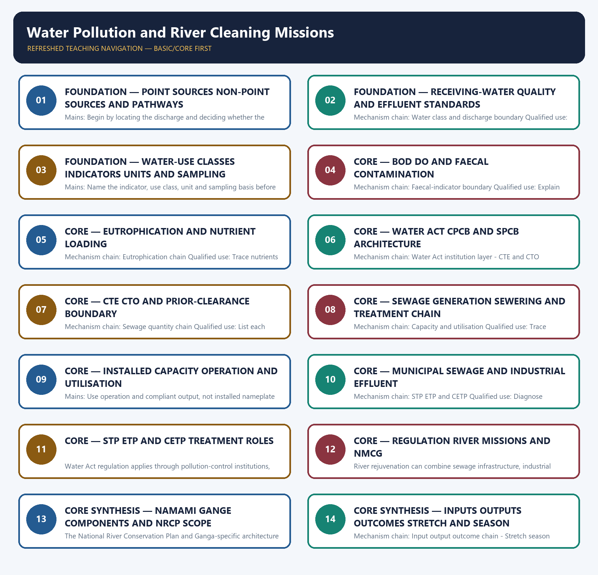

# Water Pollution and River Cleaning Missions — Learner-v2 Complete Learning Session

> **Authoring-only generation:** 2026-09-03. No PDF was rendered and no tracker or index was mutated.

### SOURCE, PROGRESSION AND CURRENT-LINKAGE AUDIT

- **Generation date:** 2026-09-03.
- **Repository-first evidence:** the Basic owner is taught first and preserved in full; the Advanced owner is retained only in the optional final teaching block.
- **OCR evidence:** Repository Markdown was primary. OCR-searchable local official General Studies papers were used only to confirm printed routed demands. No answer key, marking scheme, unsupported page precision, ecological rate, species count, pollution standard, rule threshold, mission outcome or current status was inferred.
- **Qdrant:** not used; repository Markdown and available OCR context were sufficient.
- **PYQ integrity:** Audited ledgers route direct Mains demands on industrial river pollution and freshwater technologies, plus objective concepts on membrane bioreactors, activated carbon, PFAS, microbeads and sand-mining effects. No objective key or current mission metric is inferred.
- **Live-link boundary:** NMCG home, status and guideline pages were stubs; the 2026 press PDF was retrievable only as raw bytes; CPCB pages exposed only a yearly-data heading or board title. No outlay, target, sewage generation, installed or utilised capacity, project count, river value or outcome was imported.
- **Fact/inference discipline:** no current-affairs item, PYQ wording, figure or quotation is invented.

### LIVE OFFICIAL-SOURCE ATTEMPT LOG

The checks below were made on 2026-09-03. Substantive official text is used only for the proposition it supports. Stubs, access failures, unrelated pages and thin landing pages are recorded and are not converted into ecological or current-status claims.

- https://nmcg.nic.in/ — attempted 2026-09-03; the official NMCG home page returned minister profile headings but no substantive programme metric. No mission outlay, project count or outcome was imported.
- https://nmcg.nic.in/status_report.aspx — attempted 2026-09-03; the official page returned only the title 'Status Reports'. No sewerage capacity, utilisation or water-quality value was extracted.
- https://nmcg.nic.in/Guideline.aspx — attempted 2026-09-03; the official page returned only the guidelines title. No standard, target or institutional power was inferred from the stub.
- https://nmcg.nic.in/press_pdf/Status%20of%20Namami%20Gange%20Programme%202026%20ENG%20Press%20Release.pdf — attempted 2026-09-03; the official PDF was retrievable only as raw PDF bytes. It was logged but not text-mined for outlays, capacities, outputs or outcomes.
- https://cpcb.nic.in/nwmp-data/ — attempted 2026-09-03; the official CPCB page returned the heading 'WATER QUALITY DATA (YEARLY)' without a substantive dated table. No river-quality value was imported.
- https://cpcb.nic.in/water-quality-criteria/ — attempted 2026-09-03; the official CPCB page returned only the board title. No designated-best-use class, criterion, unit or effluent standard was transcribed.

## BASIC LEARNING SESSION



*Distinct embedded teaching-navigation image. The separate continuous Cārvāka-style flowchart package remains an independent at-a-glance artifact.*

### SESSION 1 — FOUNDATION — POINT SOURCES NON-POINT SOURCES AND PATHWAYS

#### DEFINITION / WHAT THIS IS CALLED

**Plain-language definition:** Mechanism chain: Point and non-point sources - Water-quality and effluent boundary Qualified use: Begin by locating the discharge and deciding whether the source is point or diffuse.

**Technical definition:** Mains: Begin by locating the discharge and deciding whether the source is point or diffuse.

#### ANSWER-GRABBING OPENING — WRITE/ADAPT IN THE EXAM

> Mechanism chain: Point and non-point sources - Water-quality and effluent boundary Qualified use: Begin by locating the discharge and deciding whether the source is point or diffuse.

#### MUST-WRITE KEYWORDS

- **FOUNDATION**
- **Point sources non-point sources**
- **pathways**
- **Mechanism chain**
- **Qualified use**
- **Receiving-water quality**

**How to use them:** Frame the answer through FOUNDATION; define Point sources non-point sources, connect pathways with Mechanism chain to explain the mechanism, and use Qualified use for the decisive comparison or qualification.

#### VISUAL FIRST

```text
POINT SOURCES NON-POINT SOURCES AND PATHWAYS
01. Point and non-point sources
    |
    v
02. Water-quality and effluent boundary
BOUNDARY -> Do not write a receiving-water criterion as an effluent limit.
```

*This topic-specific rail fixes the evidence sequence and its exam boundary before analysis.*

#### CORE EXPLANATION

A point source has an identifiable discharge location, while non-point pollution is diffuse across a catchment; the monitoring and regulatory tools are therefore different. Receiving-water quality describes the water body, whereas an effluent standard controls a discharge from a source; meeting one cannot be assumed from the other.

#### NAMED EVIDENCE AND MECHANISM

- A point source has an identifiable discharge location, while non-point pollution is diffuse across a catchment; the monitoring and regulatory tools are therefore different.
- Receiving-water quality describes the water body, whereas an effluent standard controls a discharge from a source; meeting one cannot be assumed from the other.

#### EXAMINER CAUTION

- Do not write a receiving-water criterion as an effluent limit.

#### EXAM LINK

- **Prelims:** Preserve the exact ecological level, system boundary, stock or flow, pyramid parameter, succession substrate, biome scale, taxonomic term and scientific or legal status; never turn a context-dependent pattern into a universal rule.
- **Mains:** Begin by locating the discharge and deciding whether the source is point or diffuse.

#### MINI RECAP

- **Mechanism chain:** Point and non-point sources -> Water-quality and effluent boundary
- **Qualified use:** Begin by locating the discharge and deciding whether the source is point or diffuse.

#### CLOSING RECALL FLOW — FOUNDATION — POINT SOURCES NON-POINT SOURCES AND PATHWAYS

```text
START / CONCEPT: FOUNDATION — Point sources non-point sources and pathways
        |
        v
EXACT TERMS: FOUNDATION · Point sources non-point sources · pathways · Mechanism chain · Qualified use · Receiving-water quality
        |
        v
MECHANISM / ARGUMENT: Mains: Begin by locating the discharge and deciding whether the source is point or diffuse.
        |
        v
CONSEQUENCE / CONTRAST: A point source has an identifiable discharge location, while non-point pollution is diffuse across a catchment; the monitoring and regulatory tools are therefore different.
        |
        v
UPSC TRAP / ANSWER-USE: Receiving-water quality describes the water body, whereas an effluent standard controls a discharge from a source; meeting one cannot be assumed from the other.
        |
        v
ANSWER-GRABBING FORMULATION: Mechanism chain: Point and non-point sources - Water-quality and effluent boundary Qualified use: Begin by locating the discharge and deciding whether the source is point or diffuse.
```
### SESSION 2 — FOUNDATION — RECEIVING-WATER QUALITY AND EFFLUENT STANDARDS

#### DEFINITION / WHAT THIS IS CALLED

**Plain-language definition:** A designated water-use class or criterion is not an industry effluent limit; each numeric value must retain its indicator, unit, sampling basis and legal source.

**Technical definition:** Mechanism chain: Water class and discharge boundary Qualified use: Keep receiving-water and source-discharge standards on separate lines.

#### ANSWER-GRABBING OPENING — WRITE/ADAPT IN THE EXAM

> A designated water-use class or criterion is not an industry effluent limit; each numeric value must retain its indicator, unit, sampling basis and legal source.

#### MUST-WRITE KEYWORDS

- **FOUNDATION**
- **Receiving-water quality**
- **effluent standards**
- **Mechanism chain**
- **Qualified use**
- **Water**

**How to use them:** Frame the answer through FOUNDATION; define Receiving-water quality, connect effluent standards with Mechanism chain to explain the mechanism, and use Qualified use for the decisive comparison or qualification.

#### VISUAL FIRST

```text
RECEIVING-WATER QUALITY AND EFFLUENT STANDARDS
01. Water class and discharge boundary
BOUNDARY -> Do not treat a designated water-use class as a source standard.
```

*This topic-specific rail fixes the evidence sequence and its exam boundary before analysis.*

#### CORE EXPLANATION

A designated water-use class or criterion is not an industry effluent limit; each numeric value must retain its indicator, unit, sampling basis and legal source.

#### NAMED EVIDENCE AND MECHANISM

- A designated water-use class or criterion is not an industry effluent limit; each numeric value must retain its indicator, unit, sampling basis and legal source.

#### EXAMINER CAUTION

- Do not treat a designated water-use class as a source standard.

#### EXAM LINK

- **Prelims:** Preserve the exact ecological level, system boundary, stock or flow, pyramid parameter, succession substrate, biome scale, taxonomic term and scientific or legal status; never turn a context-dependent pattern into a universal rule.
- **Mains:** Keep receiving-water and source-discharge standards on separate lines.

#### MINI RECAP

- **Mechanism chain:** Water class and discharge boundary
- **Qualified use:** Keep receiving-water and source-discharge standards on separate lines.

#### CLOSING RECALL FLOW — FOUNDATION — RECEIVING-WATER QUALITY AND EFFLUENT STANDARDS

```text
START / CONCEPT: FOUNDATION — Receiving-water quality and effluent standards
        |
        v
EXACT TERMS: FOUNDATION · Receiving-water quality · effluent standards · Mechanism chain · Qualified use · Water
        |
        v
MECHANISM / ARGUMENT: Mechanism chain: Water class and discharge boundary Qualified use: Keep receiving-water and source-discharge standards on separate lines.
        |
        v
CONSEQUENCE / CONTRAST: Do not treat a designated water-use class as a source standard.
        |
        v
UPSC TRAP / ANSWER-USE: Do not miss this limiting distinction: a designated water-use class or criterion is not an industry effluent limit.
        |
        v
ANSWER-GRABBING FORMULATION: A designated water-use class or criterion is not an industry effluent limit; each numeric value must retain its indicator, unit, sampling basis and legal source.
```
### SESSION 3 — FOUNDATION — WATER-USE CLASSES INDICATORS UNITS AND SAMPLING

#### DEFINITION / WHAT THIS IS CALLED

**Plain-language definition:** Mechanism chain: BOD and DO relation Qualified use: Name the indicator, use class, unit and sampling basis before quoting a value.

**Technical definition:** Mains: Name the indicator, use class, unit and sampling basis before quoting a value.

#### ANSWER-GRABBING OPENING — WRITE/ADAPT IN THE EXAM

> Mechanism chain: BOD and DO relation Qualified use: Name the indicator, use class, unit and sampling basis before quoting a value.

#### MUST-WRITE KEYWORDS

- **FOUNDATION**
- **Water-use classes indicators units**
- **sampling**
- **Mechanism chain**
- **Qualified use**
- **Biochemical Oxygen Demand**

**How to use them:** Frame the answer through FOUNDATION; define Water-use classes indicators units, connect sampling with Mechanism chain to explain the mechanism, and use Qualified use for the decisive comparison or qualification.

#### VISUAL FIRST

```text
WATER-USE CLASSES INDICATORS UNITS AND SAMPLING
01. BOD and DO relation
BOUNDARY -> Do not say high BOD means oxygen-rich clean water.
```

*This topic-specific rail fixes the evidence sequence and its exam boundary before analysis.*

#### CORE EXPLANATION

Biochemical Oxygen Demand indicates oxygen used in microbial decomposition of organic matter, while Dissolved Oxygen is oxygen available in water; high organic load can raise BOD and depress DO.

#### NAMED EVIDENCE AND MECHANISM

- Biochemical Oxygen Demand indicates oxygen used in microbial decomposition of organic matter, while Dissolved Oxygen is oxygen available in water; high organic load can raise BOD and depress DO.

#### EXAMINER CAUTION

- Do not say high BOD means oxygen-rich clean water.

#### EXAM LINK

- **Prelims:** Preserve the exact ecological level, system boundary, stock or flow, pyramid parameter, succession substrate, biome scale, taxonomic term and scientific or legal status; never turn a context-dependent pattern into a universal rule.
- **Mains:** Name the indicator, use class, unit and sampling basis before quoting a value.

#### MINI RECAP

- **Mechanism chain:** BOD and DO relation
- **Qualified use:** Name the indicator, use class, unit and sampling basis before quoting a value.

#### CLOSING RECALL FLOW — FOUNDATION — WATER-USE CLASSES INDICATORS UNITS AND SAMPLING

```text
START / CONCEPT: FOUNDATION — Water-use classes indicators units and sampling
        |
        v
EXACT TERMS: FOUNDATION · Water-use classes indicators units · sampling · Mechanism chain · Qualified use · Biochemical Oxygen Demand
        |
        v
MECHANISM / ARGUMENT: Mains: Name the indicator, use class, unit and sampling basis before quoting a value.
        |
        v
CONSEQUENCE / CONTRAST: Biochemical Oxygen Demand indicates oxygen used in microbial decomposition of organic matter, while Dissolved Oxygen is oxygen available in water; high organic load can raise BOD and depress DO.
        |
        v
UPSC TRAP / ANSWER-USE: Do not say high BOD means oxygen-rich clean water.
        |
        v
ANSWER-GRABBING FORMULATION: Mechanism chain: BOD and DO relation Qualified use: Name the indicator, use class, unit and sampling basis before quoting a value.
```
### SESSION 4 — CORE — BOD DO AND FAECAL CONTAMINATION

#### DEFINITION / WHAT THIS IS CALLED

**Plain-language definition:** Faecal coliform is an indicator of faecal contamination and possible pathogen risk; it is not a direct count of every pathogen or a complete water-quality verdict.

**Technical definition:** Mechanism chain: Faecal-indicator boundary Qualified use: Explain organic load through BOD and DO, then add the pathogen-indicator limit.

#### ANSWER-GRABBING OPENING — WRITE/ADAPT IN THE EXAM

> Faecal coliform is an indicator of faecal contamination and possible pathogen risk; it is not a direct count of every pathogen or a complete water-quality verdict.

#### MUST-WRITE KEYWORDS

- **BOD DO**
- **faecal contamination**
- **Mechanism chain**
- **Qualified use**
- **Faecal coliform**
- **Faecal**

**How to use them:** Frame the answer through BOD DO; define faecal contamination, connect Mechanism chain with Qualified use to explain the mechanism, and use Faecal coliform for the decisive comparison or qualification.

#### VISUAL FIRST

```text
BOD DO AND FAECAL CONTAMINATION
01. Faecal-indicator boundary
BOUNDARY -> Do not treat faecal coliform as a count of every pathogen.
```

*This topic-specific rail fixes the evidence sequence and its exam boundary before analysis.*

#### CORE EXPLANATION

Faecal coliform is an indicator of faecal contamination and possible pathogen risk; it is not a direct count of every pathogen or a complete water-quality verdict.

#### NAMED EVIDENCE AND MECHANISM

- Faecal coliform is an indicator of faecal contamination and possible pathogen risk; it is not a direct count of every pathogen or a complete water-quality verdict.

#### EXAMINER CAUTION

- Do not treat faecal coliform as a count of every pathogen.

#### EXAM LINK

- **Prelims:** Preserve the exact ecological level, system boundary, stock or flow, pyramid parameter, succession substrate, biome scale, taxonomic term and scientific or legal status; never turn a context-dependent pattern into a universal rule.
- **Mains:** Explain organic load through BOD and DO, then add the pathogen-indicator limit.

#### MINI RECAP

- **Mechanism chain:** Faecal-indicator boundary
- **Qualified use:** Explain organic load through BOD and DO, then add the pathogen-indicator limit.

#### CLOSING RECALL FLOW — CORE — BOD DO AND FAECAL CONTAMINATION

```text
START / CONCEPT: CORE — BOD DO and faecal contamination
        |
        v
EXACT TERMS: BOD DO · faecal contamination · Mechanism chain · Qualified use · Faecal coliform · Faecal
        |
        v
MECHANISM / ARGUMENT: Mechanism chain: Faecal-indicator boundary Qualified use: Explain organic load through BOD and DO, then add the pathogen-indicator limit.
        |
        v
CONSEQUENCE / CONTRAST: Do not treat faecal coliform as a count of every pathogen.
        |
        v
UPSC TRAP / ANSWER-USE: Mains: Explain organic load through BOD and DO, then add the pathogen-indicator limit.
        |
        v
ANSWER-GRABBING FORMULATION: Faecal coliform is an indicator of faecal contamination and possible pathogen risk; it is not a direct count of every pathogen or a complete water-quality verdict.
```
### SESSION 5 — CORE — EUTROPHICATION AND NUTRIENT LOADING

#### DEFINITION / WHAT THIS IS CALLED

**Plain-language definition:** Excess nutrient loading can drive algal growth, decomposition and oxygen depletion; nutrient enrichment is distinct from, though it can coexist with, sewage and toxic industrial pollution.

**Technical definition:** Mechanism chain: Eutrophication chain Qualified use: Trace nutrients to algal growth, decomposition and oxygen depletion.

#### ANSWER-GRABBING OPENING — WRITE/ADAPT IN THE EXAM

> Excess nutrient loading can drive algal growth, decomposition and oxygen depletion; nutrient enrichment is distinct from, though it can coexist with, sewage and toxic industrial pollution.

#### MUST-WRITE KEYWORDS

- **Eutrophication**
- **nutrient loading**
- **Mechanism chain**
- **Qualified use**
- **Excess**
- **Qualified**

**How to use them:** Frame the answer through Eutrophication; define nutrient loading, connect Mechanism chain with Qualified use to explain the mechanism, and use Excess for the decisive comparison or qualification.

#### VISUAL FIRST

```text
EUTROPHICATION AND NUTRIENT LOADING
01. Eutrophication chain
BOUNDARY -> Do not merge nutrient eutrophication with every form of sewage pollution.
```

*This topic-specific rail fixes the evidence sequence and its exam boundary before analysis.*

#### CORE EXPLANATION

Excess nutrient loading can drive algal growth, decomposition and oxygen depletion; nutrient enrichment is distinct from, though it can coexist with, sewage and toxic industrial pollution.

#### NAMED EVIDENCE AND MECHANISM

- Excess nutrient loading can drive algal growth, decomposition and oxygen depletion; nutrient enrichment is distinct from, though it can coexist with, sewage and toxic industrial pollution.

#### EXAMINER CAUTION

- Do not merge nutrient eutrophication with every form of sewage pollution.

#### EXAM LINK

- **Prelims:** Preserve the exact ecological level, system boundary, stock or flow, pyramid parameter, succession substrate, biome scale, taxonomic term and scientific or legal status; never turn a context-dependent pattern into a universal rule.
- **Mains:** Trace nutrients to algal growth, decomposition and oxygen depletion.

#### MINI RECAP

- **Mechanism chain:** Eutrophication chain
- **Qualified use:** Trace nutrients to algal growth, decomposition and oxygen depletion.

#### CLOSING RECALL FLOW — CORE — EUTROPHICATION AND NUTRIENT LOADING

```text
START / CONCEPT: CORE — Eutrophication and nutrient loading
        |
        v
EXACT TERMS: Eutrophication · nutrient loading · Mechanism chain · Qualified use · Excess · Qualified
        |
        v
MECHANISM / ARGUMENT: Mechanism chain: Eutrophication chain Qualified use: Trace nutrients to algal growth, decomposition and oxygen depletion.
        |
        v
CONSEQUENCE / CONTRAST: Do not merge nutrient eutrophication with every form of sewage pollution.
        |
        v
UPSC TRAP / ANSWER-USE: Do not miss this limiting distinction: do not merge nutrient eutrophication with every form of sewage pollution.
        |
        v
ANSWER-GRABBING FORMULATION: Excess nutrient loading can drive algal growth, decomposition and oxygen depletion; nutrient enrichment is distinct from, though it can coexist with, sewage and toxic industrial pollution.
```
### SESSION 6 — CORE — WATER ACT CPCB AND SPCB ARCHITECTURE

#### DEFINITION / WHAT THIS IS CALLED

**Plain-language definition:** The Water Act establishes the CPCB-SPCB pollution-control architecture, while state boards administer major consent, monitoring and enforcement functions for discharges.

**Technical definition:** Mechanism chain: Water Act institution layer - CTE and CTO boundary Qualified use: Assign standards, coordination, consent and enforcement to the correct board.

#### ANSWER-GRABBING OPENING — WRITE/ADAPT IN THE EXAM

> The Water Act establishes the CPCB-SPCB pollution-control architecture, while state boards administer major consent, monitoring and enforcement functions for discharges.

#### MUST-WRITE KEYWORDS

- **Water Act CPCB**
- **SPCB architecture**
- **Mechanism chain**
- **Qualified use**
- **The Water Act**
- **CPCB-SPCB**

**How to use them:** Frame the answer through Water Act CPCB; define SPCB architecture, connect Mechanism chain with Qualified use to explain the mechanism, and use The Water Act for the decisive comparison or qualification.

#### VISUAL FIRST

```text
WATER ACT CPCB AND SPCB ARCHITECTURE
01. Water Act institution layer
    |
    v
02. CTE and CTO boundary
BOUNDARY -> Do not exchange CPCB coordination and SPCB consent enforcement.
```

*This topic-specific rail fixes the evidence sequence and its exam boundary before analysis.*

#### CORE EXPLANATION

The Water Act establishes the CPCB-SPCB pollution-control architecture, while state boards administer major consent, monitoring and enforcement functions for discharges. Consent to Establish and Consent to Operate regulate a source under pollution-control law; neither is the same as prior environmental clearance, river-mission approval or proof of continuous compliance.

#### NAMED EVIDENCE AND MECHANISM

- The Water Act establishes the CPCB-SPCB pollution-control architecture, while state boards administer major consent, monitoring and enforcement functions for discharges.
- Consent to Establish and Consent to Operate regulate a source under pollution-control law; neither is the same as prior environmental clearance, river-mission approval or proof of continuous compliance.

#### EXAMINER CAUTION

- Do not exchange CPCB coordination and SPCB consent enforcement.

#### EXAM LINK

- **Prelims:** Preserve the exact ecological level, system boundary, stock or flow, pyramid parameter, succession substrate, biome scale, taxonomic term and scientific or legal status; never turn a context-dependent pattern into a universal rule.
- **Mains:** Assign standards, coordination, consent and enforcement to the correct board.

#### MINI RECAP

- **Mechanism chain:** Water Act institution layer -> CTE and CTO boundary
- **Qualified use:** Assign standards, coordination, consent and enforcement to the correct board.

#### CLOSING RECALL FLOW — CORE — WATER ACT CPCB AND SPCB ARCHITECTURE

```text
START / CONCEPT: CORE — Water Act CPCB and SPCB architecture
        |
        v
EXACT TERMS: Water Act CPCB · SPCB architecture · Mechanism chain · Qualified use · The Water Act · CPCB-SPCB
        |
        v
MECHANISM / ARGUMENT: Mechanism chain: Water Act institution layer - CTE and CTO boundary Qualified use: Assign standards, coordination, consent and enforcement to the correct board.
        |
        v
CONSEQUENCE / CONTRAST: Do not exchange CPCB coordination and SPCB consent enforcement.
        |
        v
UPSC TRAP / ANSWER-USE: Do not miss this limiting distinction: consent to Establish and Consent to Operate regulate a source under pollution-control law.
        |
        v
ANSWER-GRABBING FORMULATION: The Water Act establishes the CPCB-SPCB pollution-control architecture, while state boards administer major consent, monitoring and enforcement functions for discharges.
```
### SESSION 7 — CORE — CTE CTO AND PRIOR-CLEARANCE BOUNDARY

#### DEFINITION / WHAT THIS IS CALLED

**Plain-language definition:** Sewage generated, sewered flow, installed treatment capacity, commissioned capacity, actual inflow, compliant treatment and reuse are separate quantities.

**Technical definition:** Mechanism chain: Sewage quantity chain Qualified use: List each approval separately and never infer compliance from possession.

#### ANSWER-GRABBING OPENING — WRITE/ADAPT IN THE EXAM

> Sewage generated, sewered flow, installed treatment capacity, commissioned capacity, actual inflow, compliant treatment and reuse are separate quantities.

#### MUST-WRITE KEYWORDS

- **CTE CTO**
- **prior-clearance boundary**
- **Mechanism chain**
- **Qualified use**
- **Sewage**
- **CTE**

**How to use them:** Frame the answer through CTE CTO; define prior-clearance boundary, connect Mechanism chain with Qualified use to explain the mechanism, and use Sewage for the decisive comparison or qualification.

#### VISUAL FIRST

```text
CTE CTO AND PRIOR-CLEARANCE BOUNDARY
01. Sewage quantity chain
BOUNDARY -> Do not merge CTE, CTO and prior environmental clearance.
```

*This topic-specific rail fixes the evidence sequence and its exam boundary before analysis.*

#### CORE EXPLANATION

Sewage generated, sewered flow, installed treatment capacity, commissioned capacity, actual inflow, compliant treatment and reuse are separate quantities.

#### NAMED EVIDENCE AND MECHANISM

- Sewage generated, sewered flow, installed treatment capacity, commissioned capacity, actual inflow, compliant treatment and reuse are separate quantities.

#### EXAMINER CAUTION

- Do not merge CTE, CTO and prior environmental clearance.

#### EXAM LINK

- **Prelims:** Preserve the exact ecological level, system boundary, stock or flow, pyramid parameter, succession substrate, biome scale, taxonomic term and scientific or legal status; never turn a context-dependent pattern into a universal rule.
- **Mains:** List each approval separately and never infer compliance from possession.

#### MINI RECAP

- **Mechanism chain:** Sewage quantity chain
- **Qualified use:** List each approval separately and never infer compliance from possession.

#### CLOSING RECALL FLOW — CORE — CTE CTO AND PRIOR-CLEARANCE BOUNDARY

```text
START / CONCEPT: CORE — CTE CTO and prior-clearance boundary
        |
        v
EXACT TERMS: CTE CTO · prior-clearance boundary · Mechanism chain · Qualified use · Sewage · CTE
        |
        v
MECHANISM / ARGUMENT: Mechanism chain: Sewage quantity chain Qualified use: List each approval separately and never infer compliance from possession.
        |
        v
CONSEQUENCE / CONTRAST: Do not merge CTE, CTO and prior environmental clearance.
        |
        v
UPSC TRAP / ANSWER-USE: Do not miss this limiting distinction: do not merge CTE, CTO and prior environmental clearance.
        |
        v
ANSWER-GRABBING FORMULATION: Sewage generated, sewered flow, installed treatment capacity, commissioned capacity, actual inflow, compliant treatment and reuse are separate quantities.
```
### SESSION 8 — CORE — SEWAGE GENERATION SEWERING AND TREATMENT CHAIN

#### DEFINITION / WHAT THIS IS CALLED

**Plain-language definition:** An STP's rated or installed capacity is not its actual operating load, treatment performance, utilisation or receiving-river outcome.

**Technical definition:** Mechanism chain: Capacity and utilisation Qualified use: Trace sewage from generation through sewer connection to actual treatment.

#### ANSWER-GRABBING OPENING — WRITE/ADAPT IN THE EXAM

> Mechanism chain: Capacity and utilisation Qualified use: Trace sewage from generation through sewer connection to actual treatment.

#### MUST-WRITE KEYWORDS

- **Sewage generation sewering**
- **treatment chain**
- **Mechanism chain**
- **Qualified use**
- **An STP's rated or installed capacity**
- **An STP's**

**How to use them:** Frame the answer through Sewage generation sewering; define treatment chain, connect Mechanism chain with Qualified use to explain the mechanism, and use An STP's rated or installed capacity for the decisive comparison or qualification.

#### VISUAL FIRST

```text
SEWAGE GENERATION SEWERING AND TREATMENT CHAIN
01. Capacity and utilisation
BOUNDARY -> Do not report sewage generation as sewered or treated flow.
```

*This topic-specific rail fixes the evidence sequence and its exam boundary before analysis.*

#### CORE EXPLANATION

An STP's rated or installed capacity is not its actual operating load, treatment performance, utilisation or receiving-river outcome.

#### NAMED EVIDENCE AND MECHANISM

- An STP's rated or installed capacity is not its actual operating load, treatment performance, utilisation or receiving-river outcome.

#### EXAMINER CAUTION

- Do not report sewage generation as sewered or treated flow.

#### EXAM LINK

- **Prelims:** Preserve the exact ecological level, system boundary, stock or flow, pyramid parameter, succession substrate, biome scale, taxonomic term and scientific or legal status; never turn a context-dependent pattern into a universal rule.
- **Mains:** Trace sewage from generation through sewer connection to actual treatment.

#### MINI RECAP

- **Mechanism chain:** Capacity and utilisation
- **Qualified use:** Trace sewage from generation through sewer connection to actual treatment.

#### CLOSING RECALL FLOW — CORE — SEWAGE GENERATION SEWERING AND TREATMENT CHAIN

```text
START / CONCEPT: CORE — Sewage generation sewering and treatment chain
        |
        v
EXACT TERMS: Sewage generation sewering · treatment chain · Mechanism chain · Qualified use · An STP's rated or installed capacity · An STP's
        |
        v
MECHANISM / ARGUMENT: Do not report sewage generation as sewered or treated flow.
        |
        v
CONSEQUENCE / CONTRAST: An STP's rated or installed capacity is not its actual operating load, treatment performance, utilisation or receiving-river outcome.
        |
        v
UPSC TRAP / ANSWER-USE: Do not miss this limiting distinction: trace sewage from generation through sewer connection to actual treatment.
        |
        v
ANSWER-GRABBING FORMULATION: Mechanism chain: Capacity and utilisation Qualified use: Trace sewage from generation through sewer connection to actual treatment.
```
### SESSION 9 — CORE — INSTALLED CAPACITY OPERATION AND UTILISATION

#### DEFINITION / WHAT THIS IS CALLED

**Plain-language definition:** Mechanism chain: Municipal and industrial streams Qualified use: Use operation and compliant output, not installed nameplate capacity, as evidence.

**Technical definition:** Mains: Use operation and compliant output, not installed nameplate capacity, as evidence.

#### ANSWER-GRABBING OPENING — WRITE/ADAPT IN THE EXAM

> Mechanism chain: Municipal and industrial streams Qualified use: Use operation and compliant output, not installed nameplate capacity, as evidence.

#### MUST-WRITE KEYWORDS

- **Installed capacity operation**
- **utilisation**
- **Mechanism chain**
- **Qualified use**
- **Municipal**
- **STP**

**How to use them:** Frame the answer through Installed capacity operation; define utilisation, connect Mechanism chain with Qualified use to explain the mechanism, and use Municipal for the decisive comparison or qualification.

#### VISUAL FIRST

```text
INSTALLED CAPACITY OPERATION AND UTILISATION
01. Municipal and industrial streams
BOUNDARY -> Do not report installed STP capacity as utilisation or outcome.
```

*This topic-specific rail fixes the evidence sequence and its exam boundary before analysis.*

#### CORE EXPLANATION

Municipal sewage and industrial effluent differ in source, composition, treatment train, monitoring and responsible institution; neither should be used as a proxy for the other.

#### NAMED EVIDENCE AND MECHANISM

- Municipal sewage and industrial effluent differ in source, composition, treatment train, monitoring and responsible institution; neither should be used as a proxy for the other.

#### EXAMINER CAUTION

- Do not report installed STP capacity as utilisation or outcome.

#### EXAM LINK

- **Prelims:** Preserve the exact ecological level, system boundary, stock or flow, pyramid parameter, succession substrate, biome scale, taxonomic term and scientific or legal status; never turn a context-dependent pattern into a universal rule.
- **Mains:** Use operation and compliant output, not installed nameplate capacity, as evidence.

#### MINI RECAP

- **Mechanism chain:** Municipal and industrial streams
- **Qualified use:** Use operation and compliant output, not installed nameplate capacity, as evidence.

#### CLOSING RECALL FLOW — CORE — INSTALLED CAPACITY OPERATION AND UTILISATION

```text
START / CONCEPT: CORE — Installed capacity operation and utilisation
        |
        v
EXACT TERMS: Installed capacity operation · utilisation · Mechanism chain · Qualified use · Municipal · STP
        |
        v
MECHANISM / ARGUMENT: Do not report installed STP capacity as utilisation or outcome.
        |
        v
CONSEQUENCE / CONTRAST: Mains: Use operation and compliant output, not installed nameplate capacity, as evidence.
        |
        v
UPSC TRAP / ANSWER-USE: Do not miss this limiting distinction: municipal sewage and industrial effluent differ in source, composition, treatment train, monitoring and responsible...
        |
        v
ANSWER-GRABBING FORMULATION: Mechanism chain: Municipal and industrial streams Qualified use: Use operation and compliant output, not installed nameplate capacity, as evidence.
```
### SESSION 10 — CORE — MUNICIPAL SEWAGE AND INDUSTRIAL EFFLUENT

#### DEFINITION / WHAT THIS IS CALLED

**Plain-language definition:** An STP treats sewage, an ETP treats an individual establishment's effluent, and a CETP serves a group of units; installation is not proof of compliant operation.

**Technical definition:** Mechanism chain: STP ETP and CETP Qualified use: Diagnose municipal and industrial streams separately before combining policy.

#### ANSWER-GRABBING OPENING — WRITE/ADAPT IN THE EXAM

> Do not merge municipal sewage with industrial effluent.

#### MUST-WRITE KEYWORDS

- **Municipal sewage**
- **industrial effluent**
- **Mechanism chain**
- **Qualified use**
- **An STP**
- **ETP**

**How to use them:** Frame the answer through Municipal sewage; define industrial effluent, connect Mechanism chain with Qualified use to explain the mechanism, and use An STP for the decisive comparison or qualification.

#### VISUAL FIRST

```text
MUNICIPAL SEWAGE AND INDUSTRIAL EFFLUENT
01. STP ETP and CETP
BOUNDARY -> Do not merge municipal sewage with industrial effluent.
```

*This topic-specific rail fixes the evidence sequence and its exam boundary before analysis.*

#### CORE EXPLANATION

An STP treats sewage, an ETP treats an individual establishment's effluent, and a CETP serves a group of units; installation is not proof of compliant operation.

#### NAMED EVIDENCE AND MECHANISM

- An STP treats sewage, an ETP treats an individual establishment's effluent, and a CETP serves a group of units; installation is not proof of compliant operation.

#### EXAMINER CAUTION

- Do not merge municipal sewage with industrial effluent.

#### EXAM LINK

- **Prelims:** Preserve the exact ecological level, system boundary, stock or flow, pyramid parameter, succession substrate, biome scale, taxonomic term and scientific or legal status; never turn a context-dependent pattern into a universal rule.
- **Mains:** Diagnose municipal and industrial streams separately before combining policy.

#### MINI RECAP

- **Mechanism chain:** STP ETP and CETP
- **Qualified use:** Diagnose municipal and industrial streams separately before combining policy.

#### CLOSING RECALL FLOW — CORE — MUNICIPAL SEWAGE AND INDUSTRIAL EFFLUENT

```text
START / CONCEPT: CORE — Municipal sewage and industrial effluent
        |
        v
EXACT TERMS: Municipal sewage · industrial effluent · Mechanism chain · Qualified use · An STP · ETP
        |
        v
MECHANISM / ARGUMENT: Mechanism chain: STP ETP and CETP Qualified use: Diagnose municipal and industrial streams separately before combining policy.
        |
        v
CONSEQUENCE / CONTRAST: An STP treats sewage, an ETP treats an individual establishment's effluent, and a CETP serves a group of units; installation is not proof of compliant operation.
        |
        v
UPSC TRAP / ANSWER-USE: Do not miss this limiting distinction: do not merge municipal sewage with industrial effluent.
        |
        v
ANSWER-GRABBING FORMULATION: Do not merge municipal sewage with industrial effluent.
```
### SESSION 11 — CORE — STP ETP AND CETP TREATMENT ROLES

#### DEFINITION / WHAT THIS IS CALLED

**Plain-language definition:** Mechanism chain: Regulation and mission boundary - NMCG institutional boundary Qualified use: Match STP, ETP and CETP to the waste stream and responsible operator.

**Technical definition:** Water Act regulation applies through pollution-control institutions, while a river-cleaning mission coordinates projects and basin action; a mission does not replace statutory consent enforcement.

#### ANSWER-GRABBING OPENING — WRITE/ADAPT IN THE EXAM

> Do not treat an installed ETP or CETP as continuous compliance.

#### MUST-WRITE KEYWORDS

- **STP ETP**
- **CETP treatment roles**
- **Mechanism chain**
- **Qualified use**
- **Water Act**
- **NMCG**

**How to use them:** Frame the answer through STP ETP; define CETP treatment roles, connect Mechanism chain with Qualified use to explain the mechanism, and use Water Act for the decisive comparison or qualification.

#### VISUAL FIRST

```text
STP ETP AND CETP TREATMENT ROLES
01. Regulation and mission boundary
    |
    v
02. NMCG institutional boundary
BOUNDARY -> Do not treat an installed ETP or CETP as continuous compliance.
```

*This topic-specific rail fixes the evidence sequence and its exam boundary before analysis.*

#### CORE EXPLANATION

Water Act regulation applies through pollution-control institutions, while a river-cleaning mission coordinates projects and basin action; a mission does not replace statutory consent enforcement. NMCG implements the Ganga mission within its notified institutional architecture; it is not interchangeable with CPCB, an SPCB, an urban local body or a generic all-river regulator.

#### NAMED EVIDENCE AND MECHANISM

- Water Act regulation applies through pollution-control institutions, while a river-cleaning mission coordinates projects and basin action; a mission does not replace statutory consent enforcement.
- NMCG implements the Ganga mission within its notified institutional architecture; it is not interchangeable with CPCB, an SPCB, an urban local body or a generic all-river regulator.

#### EXAMINER CAUTION

- Do not treat an installed ETP or CETP as continuous compliance.

#### EXAM LINK

- **Prelims:** Preserve the exact ecological level, system boundary, stock or flow, pyramid parameter, succession substrate, biome scale, taxonomic term and scientific or legal status; never turn a context-dependent pattern into a universal rule.
- **Mains:** Match STP, ETP and CETP to the waste stream and responsible operator.

#### MINI RECAP

- **Mechanism chain:** Regulation and mission boundary -> NMCG institutional boundary
- **Qualified use:** Match STP, ETP and CETP to the waste stream and responsible operator.

#### CLOSING RECALL FLOW — CORE — STP ETP AND CETP TREATMENT ROLES

```text
START / CONCEPT: CORE — STP ETP and CETP treatment roles
        |
        v
EXACT TERMS: STP ETP · CETP treatment roles · Mechanism chain · Qualified use · Water Act · NMCG
        |
        v
MECHANISM / ARGUMENT: Mechanism chain: Regulation and mission boundary - NMCG institutional boundary Qualified use: Match STP, ETP and CETP to the waste stream and responsible operator.
        |
        v
CONSEQUENCE / CONTRAST: Water Act regulation applies through pollution-control institutions, while a river-cleaning mission coordinates projects and basin action; a mission does not replace statutory consent enforcement.
        |
        v
UPSC TRAP / ANSWER-USE: NMCG implements the Ganga mission within its notified institutional architecture; it is not interchangeable with CPCB, an SPCB, an urban local body or a generic all-river regulator.
        |
        v
ANSWER-GRABBING FORMULATION: Do not treat an installed ETP or CETP as continuous compliance.
```
### SESSION 12 — CORE — REGULATION RIVER MISSIONS AND NMCG

#### DEFINITION / WHAT THIS IS CALLED

**Plain-language definition:** Mechanism chain: Namami Gange component boundary Qualified use: Place statutory regulation beside the mission rather than replacing it.

**Technical definition:** River rejuvenation can combine sewage infrastructure, industrial monitoring, river-surface action, biodiversity, afforestation and public participation; visible works alone do not prove water-quality improvement.

#### ANSWER-GRABBING OPENING — WRITE/ADAPT IN THE EXAM

> River rejuvenation can combine sewage infrastructure, industrial monitoring, river-surface action, biodiversity, afforestation and public participation; visible works alone do not prove water-quality improvement.

#### MUST-WRITE KEYWORDS

- **Regulation river missions**
- **NMCG**
- **Mechanism chain**
- **Qualified use**
- **River**
- **Namami Gange**

**How to use them:** Frame the answer through Regulation river missions; define NMCG, connect Mechanism chain with Qualified use to explain the mechanism, and use River for the decisive comparison or qualification.

#### VISUAL FIRST

```text
REGULATION RIVER MISSIONS AND NMCG
01. Namami Gange component boundary
BOUNDARY -> Do not treat Namami Gange as the Water Act regulator.
```

*This topic-specific rail fixes the evidence sequence and its exam boundary before analysis.*

#### CORE EXPLANATION

River rejuvenation can combine sewage infrastructure, industrial monitoring, river-surface action, biodiversity, afforestation and public participation; visible works alone do not prove water-quality improvement.

#### NAMED EVIDENCE AND MECHANISM

- River rejuvenation can combine sewage infrastructure, industrial monitoring, river-surface action, biodiversity, afforestation and public participation; visible works alone do not prove water-quality improvement.

#### EXAMINER CAUTION

- Do not treat Namami Gange as the Water Act regulator.

#### EXAM LINK

- **Prelims:** Preserve the exact ecological level, system boundary, stock or flow, pyramid parameter, succession substrate, biome scale, taxonomic term and scientific or legal status; never turn a context-dependent pattern into a universal rule.
- **Mains:** Place statutory regulation beside the mission rather than replacing it.

#### MINI RECAP

- **Mechanism chain:** Namami Gange component boundary
- **Qualified use:** Place statutory regulation beside the mission rather than replacing it.

#### CLOSING RECALL FLOW — CORE — REGULATION RIVER MISSIONS AND NMCG

```text
START / CONCEPT: CORE — Regulation river missions and NMCG
        |
        v
EXACT TERMS: Regulation river missions · NMCG · Mechanism chain · Qualified use · River · Namami Gange
        |
        v
MECHANISM / ARGUMENT: Mechanism chain: Namami Gange component boundary Qualified use: Place statutory regulation beside the mission rather than replacing it.
        |
        v
CONSEQUENCE / CONTRAST: Do not treat Namami Gange as the Water Act regulator.
        |
        v
UPSC TRAP / ANSWER-USE: Do not miss this limiting distinction: river rejuvenation can combine sewage infrastructure, industrial monitoring, river-surface action, biodiversity, afforestation and public...
        |
        v
ANSWER-GRABBING FORMULATION: River rejuvenation can combine sewage infrastructure, industrial monitoring, river-surface action, biodiversity, afforestation and public participation; visible works alone do not prove water-quality improvement.
```
### SESSION 13 — CORE SYNTHESIS — NAMAMI GANGE COMPONENTS AND NRCP SCOPE

#### DEFINITION / WHAT THIS IS CALLED

**Plain-language definition:** Mechanism chain: NRCP and river scope Qualified use: State the Ganga-specific and wider river-programme boundaries.

**Technical definition:** The National River Conservation Plan and Ganga-specific architecture have different programme scopes; a Ganga institution or result cannot automatically be assigned to every river.

#### ANSWER-GRABBING OPENING — WRITE/ADAPT IN THE EXAM

> Mechanism chain: NRCP and river scope Qualified use: State the Ganga-specific and wider river-programme boundaries.

#### MUST-WRITE KEYWORDS

- **CORE SYNTHESIS**
- **Namami Gange components**
- **NRCP scope**
- **Mechanism chain**
- **Qualified use**
- **The National River Conservation Plan**

**How to use them:** Frame the answer through CORE SYNTHESIS; define Namami Gange components, connect NRCP scope with Mechanism chain to explain the mechanism, and use Qualified use for the decisive comparison or qualification.

#### VISUAL FIRST

```text
NAMAMI GANGE COMPONENTS AND NRCP SCOPE
01. NRCP and river scope
BOUNDARY -> Do not generalise a Ganga institution or result to every river.
```

*This topic-specific rail fixes the evidence sequence and its exam boundary before analysis.*

#### CORE EXPLANATION

The National River Conservation Plan and Ganga-specific architecture have different programme scopes; a Ganga institution or result cannot automatically be assigned to every river.

#### NAMED EVIDENCE AND MECHANISM

- The National River Conservation Plan and Ganga-specific architecture have different programme scopes; a Ganga institution or result cannot automatically be assigned to every river.

#### EXAMINER CAUTION

- Do not generalise a Ganga institution or result to every river.

#### EXAM LINK

- **Prelims:** Preserve the exact ecological level, system boundary, stock or flow, pyramid parameter, succession substrate, biome scale, taxonomic term and scientific or legal status; never turn a context-dependent pattern into a universal rule.
- **Mains:** State the Ganga-specific and wider river-programme boundaries.

#### MINI RECAP

- **Mechanism chain:** NRCP and river scope
- **Qualified use:** State the Ganga-specific and wider river-programme boundaries.

#### CLOSING RECALL FLOW — CORE SYNTHESIS — NAMAMI GANGE COMPONENTS AND NRCP SCOPE

```text
START / CONCEPT: CORE SYNTHESIS — Namami Gange components and NRCP scope
        |
        v
EXACT TERMS: CORE SYNTHESIS · Namami Gange components · NRCP scope · Mechanism chain · Qualified use · The National River Conservation Plan
        |
        v
MECHANISM / ARGUMENT: The National River Conservation Plan and Ganga-specific architecture have different programme scopes; a Ganga institution or result cannot automatically be assigned to every river.
        |
        v
CONSEQUENCE / CONTRAST: Do not generalise a Ganga institution or result to every river.
        |
        v
UPSC TRAP / ANSWER-USE: Do not miss this limiting distinction: nRCP and river scope Qualified use.
        |
        v
ANSWER-GRABBING FORMULATION: Mechanism chain: NRCP and river scope Qualified use: State the Ganga-specific and wider river-programme boundaries.
```
### SESSION 14 — CORE SYNTHESIS — INPUTS OUTPUTS OUTCOMES STRETCH AND SEASON

#### DEFINITION / WHAT THIS IS CALLED

**Plain-language definition:** River quality varies by monitoring location, season, flow and indicator; a result for one stretch or period cannot establish that an entire river is clean.

**Technical definition:** Mechanism chain: Input output outcome chain - Stretch season indicator Qualified use: Move from money and assets to treated flow, load reduction and monitored outcome.

#### ANSWER-GRABBING OPENING — WRITE/ADAPT IN THE EXAM

> Mechanism chain: Input output outcome chain - Stretch season indicator Qualified use: Move from money and assets to treated flow, load reduction and monitored outcome.

#### MUST-WRITE KEYWORDS

- **CORE SYNTHESIS**
- **Inputs outputs outcomes stretch**
- **season**
- **Mechanism chain**
- **Qualified use**
- **Mission**

**How to use them:** Frame the answer through CORE SYNTHESIS; define Inputs outputs outcomes stretch, connect season with Mechanism chain to explain the mechanism, and use Qualified use for the decisive comparison or qualification.

#### VISUAL FIRST

```text
INPUTS OUTPUTS OUTCOMES STRETCH AND SEASON
01. Input output outcome chain
    |
    v
02. Stretch season indicator
BOUNDARY -> Do not report mission input or output as river-quality outcome.
```

*This topic-specific rail fixes the evidence sequence and its exam boundary before analysis.*

#### CORE EXPLANATION

Mission outlay, sanction, expenditure, infrastructure completed, flow treated, pollutant load reduced and river-quality outcome are distinct stages. River quality varies by monitoring location, season, flow and indicator; a result for one stretch or period cannot establish that an entire river is clean.

#### NAMED EVIDENCE AND MECHANISM

- Mission outlay, sanction, expenditure, infrastructure completed, flow treated, pollutant load reduced and river-quality outcome are distinct stages.
- River quality varies by monitoring location, season, flow and indicator; a result for one stretch or period cannot establish that an entire river is clean.

#### EXAMINER CAUTION

- Do not report mission input or output as river-quality outcome.

#### EXAM LINK

- **Prelims:** Preserve the exact ecological level, system boundary, stock or flow, pyramid parameter, succession substrate, biome scale, taxonomic term and scientific or legal status; never turn a context-dependent pattern into a universal rule.
- **Mains:** Move from money and assets to treated flow, load reduction and monitored outcome.

#### MINI RECAP

- **Mechanism chain:** Input output outcome chain -> Stretch season indicator
- **Qualified use:** Move from money and assets to treated flow, load reduction and monitored outcome.

#### CLOSING RECALL FLOW — CORE SYNTHESIS — INPUTS OUTPUTS OUTCOMES STRETCH AND SEASON

```text
START / CONCEPT: CORE SYNTHESIS — Inputs outputs outcomes stretch and season
        |
        v
EXACT TERMS: CORE SYNTHESIS · Inputs outputs outcomes stretch · season · Mechanism chain · Qualified use · Mission
        |
        v
MECHANISM / ARGUMENT: River quality varies by monitoring location, season, flow and indicator; a result for one stretch or period cannot establish that an entire river is clean.
        |
        v
CONSEQUENCE / CONTRAST: Do not report mission input or output as river-quality outcome.
        |
        v
UPSC TRAP / ANSWER-USE: Do not miss this limiting distinction: mission outlay, sanction, expenditure, infrastructure completed, flow treated, pollutant load reduced and river-quality outcome...
        |
        v
ANSWER-GRABBING FORMULATION: Mechanism chain: Input output outcome chain - Stretch season indicator Qualified use: Move from money and assets to treated flow, load reduction and monitored outcome.
```
### CORE SYNTHESIS — Audited PYQ and live-source boundary

#### VISUAL FIRST

```text
AUDITED PYQ AND LIVE-SOURCE BOUNDARY
01. Dilution and ecological flow
    |
    v
02. Audited evidence boundary
BOUNDARY -> Do not infer an entire river's status from one stretch, season or indicator.
```

*This topic-specific rail fixes the evidence sequence and its exam boundary before analysis.*

#### CORE EXPLANATION

Higher flow may dilute a measured concentration without removing pollutant mass or source discharge; river rejuvenation therefore cannot be reduced to dilution. Audited ledgers carry industrial river pollution, freshwater treatment technologies, membrane bioreactors, activated carbon, microbeads and sand-mining effects into practice without inventing keys, capacities, outlays or river-quality values.

#### NAMED EVIDENCE AND MECHANISM

- Higher flow may dilute a measured concentration without removing pollutant mass or source discharge; river rejuvenation therefore cannot be reduced to dilution.
- Audited ledgers carry industrial river pollution, freshwater treatment technologies, membrane bioreactors, activated carbon, microbeads and sand-mining effects into practice without inventing keys, capacities, outlays or river-quality values.

#### EXAMINER CAUTION

- Do not infer an entire river's status from one stretch, season or indicator.

#### EXAM LINK

- **Prelims:** Preserve the exact ecological level, system boundary, stock or flow, pyramid parameter, succession substrate, biome scale, taxonomic term and scientific or legal status; never turn a context-dependent pattern into a universal rule.
- **Mains:** Close with verified PYQ ownership and explicit current-data limits.

#### MINI RECAP

- **Mechanism chain:** Dilution and ecological flow -> Audited evidence boundary
- **Qualified use:** Close with verified PYQ ownership and explicit current-data limits.
#### COMPLETE BASIC OWNER EVIDENCE BANK

> **Subject:** Environment and Ecology | **Tier:** Must-Do (foundation) | **GS Paper:** GS-III (Environment) + Prelims.
> **Core area:** Water-quality regulation and river-restoration governance.
> **Grounded in:** Water (Prevention and Control of Pollution) Act, 1974 (India Code); National Mission for Clean Ganga (Namami Gange Programme), MoJS; CPCB water-quality criteria; audited UPSC Environment PYQs (2024-2026 Prelims and 2024-2025 Mains).
> ✅ = source-grounded | ⚠️ = analytical linkage | 📰 = dated current-affairs anchor.
> *Companion: `advanced/14_Water-Pollution-and-River-Cleaning-Missions.md`.*

#### 1. Visual foundation

```text
WATER POLLUTION SOURCES              KEY QUALITY INDICATORS              GOVERNANCE RESPONSE
Untreated sewage, industrial   ->    BOD (Biochemical Oxygen        ->   Water Act, 1974 +
effluent, agricultural runoff        Demand), Dissolved Oxygen (DO),      CPCB/SPCB consent
(fertiliser/pesticide),              faecal coliform count, nutrient      mechanism + river-
solid waste dumping                  (N/P) load                           specific missions
                                                                           (Namami Gange, NRCP)

HIGH BOD + LOW DO + HIGH FAECAL COLIFORM = classic sewage/organic-pollution signature
```

**Core proposition:** India's water-pollution governance combines a general regulatory
framework (the Water Act, 1974, administered through CPCB/SPCB "consent" mechanisms) with
dedicated, large-scale river-specific missions (most prominently Namami Gange) — the two
operate together, since general regulation alone has historically proven insufficient for
India's most degraded major rivers.

#### 2. Essential definitions

| Concept | Exam-ready meaning |
|---|---|
| ✅ **BOD (Biochemical Oxygen Demand)** | The amount of dissolved oxygen consumed by microorganisms decomposing organic matter in water; higher BOD indicates greater organic pollution. |
| ✅ **DO (Dissolved Oxygen)** | Oxygen dissolved in water, essential for aquatic life; low DO indicates poor water quality/oxygen depletion. |
| ✅ **Faecal coliform count** | Bacterial indicator of sewage/human or animal waste contamination in water. |
| ✅ **Eutrophication** | Nutrient (nitrogen/phosphorus) over-enrichment of a water body causing algal blooms and subsequent oxygen depletion (cross-refer Topic 02). |
| ✅ **Consent to Establish / Consent to Operate** | Statutory approvals under the Water Act, 1974 (and Air Act, 1981) that industries/projects must obtain from SPCBs before establishing or operating a polluting activity. |
| ✅ **Namami Gange Programme** | India's flagship integrated river-conservation mission for the Ganga, covering sewage treatment infrastructure, industrial effluent monitoring, river-front development, biodiversity and public participation. |
| ✅ **National Ganga Council** | The apex body for Ganga rejuvenation, **chaired by the Prime Minister**, created by the *River Ganga (Rejuvenation, Protection and Management) Authorities Order, 2016* issued under the **Environment (Protection) Act, 1986** — with an Empowered Task Force under the Union Jal Shakti Minister, plus State and District Ganga Committees below it. ⚠️ NMCG is its implementation arm (a registered society vested with Authority powers), not a statutory board like CPCB. |
| ✅ **"National River"** | The Ganga was declared India's **National River in 2008** — a declaratory status that raised priority and funding, not a new legal protection category. |
| ✅ **Arth Ganga** | The economic-model extension of Namami Gange, built on six verticals: zero-budget natural farming, monetisation and reuse of treated water and sludge, livelihood generation, increased public participation, cultural heritage and tourism, and institution building. |
| ✅ **Hybrid Annuity Model (HAM)** | The PPP contracting model used for Namami Gange sewage-treatment plants, under which a share of capital cost is paid during construction and the balance as performance-linked annuities over a long operation period — designed to fix the historic failure mode of *built-but-not-operated* STPs. |

#### 3. Topic mechanism

1. The Water (Prevention and Control of Pollution) Act, 1974 established CPCB (at the
   national level) and SPCBs (at the state level) as the regulatory bodies empowered to set
   effluent standards, grant/refuse "Consent to Establish/Operate" for polluting industries,
   and take enforcement action against violations.
2. Water quality is assessed through indicators like BOD, DO, and faecal coliform count,
   which together diagnose whether pollution is primarily organic/sewage-driven (high BOD,
   low DO, high coliform) or from other sources (industrial chemical effluent, agricultural
   runoff/eutrophication).
3. Despite this general regulatory framework, India's major rivers (especially the Ganga)
   continued to receive large volumes of untreated sewage and industrial effluent, prompting
   dedicated, mission-mode central interventions beyond routine SPCB enforcement.
4. The National Mission for Clean Ganga, operating the Namami Gange Programme, integrates
   sewage-treatment-infrastructure creation, industrial-effluent monitoring, river-surface
   cleaning, biodiversity conservation, afforestation along the riverbank, and public
   awareness/participation as a comprehensive, river-specific mission rather than relying
   solely on general pollution-control law.
5. Similar but generally smaller-scale river-action programmes exist for other rivers under
   the broader National River Conservation Plan (NRCP) framework, reflecting a template of
   dedicated river-specific missions where general regulatory enforcement alone has proven
   insufficient.

#### 4. Institutions and policy tools

- ✅ **CPCB / SPCBs:** set effluent standards and administer the Consent to Establish/Operate
  mechanism under the Water Act, 1974.
- ✅ **National Mission for Clean Ganga (NMCG), under the Ministry of Jal Shakti:** implements
  the Namami Gange Programme.
- ✅ **State-level river-conservation agencies:** implement components of NRCP and other
  river-specific missions at the state level.
- ⚠️ Urban local bodies play a critical, often under-resourced role in sewage-treatment
  infrastructure creation and maintenance, a frequent implementation bottleneck.

#### 5. Indian applications and examples

- ⚠️ Namami Gange's sewage-treatment-infrastructure creation directly targets the largest
  documented pollution source for the Ganga — untreated municipal sewage from riverside
  towns and cities.
- ⚠️ Industrial effluent from sectors like tanneries (e.g., historically significant leather-
  industry clusters along parts of the Ganga basin) has required targeted effluent-treatment
  and compliance monitoring as a distinct pollution-source category from municipal sewage.
- ⚠️ Agricultural runoff (fertiliser/pesticide residues) contributing to nutrient pollution
  and eutrophication in various rivers/water bodies illustrates a non-point-source pollution
  challenge that is harder to regulate than identifiable industrial/municipal point sources.

#### 6. Must-Know Facts for Prelims

- ✅ The Water (Prevention and Control of Pollution) Act, 1974 established CPCB and SPCBs as
  the regulatory bodies for water-pollution control in India.
- ✅ High BOD combined with low Dissolved Oxygen and high faecal coliform count is the
  classic signature of sewage/organic pollution.
- ✅ The Namami Gange Programme is implemented by the National Mission for Clean Ganga under
  the Ministry of Jal Shakti.
- ✅ Untreated municipal sewage has historically been documented as the largest single
  pollution-load contributor to the Ganga.
- ✅ "Consent to Establish" and "Consent to Operate" are statutory approvals industries must
  obtain from SPCBs under the Water Act, 1974.
- ✅ The **National Ganga Council is chaired by the Prime Minister** and was constituted under
  the **Environment (Protection) Act, 1986** through the 2016 Authorities Order — a rare
  instance of a river-governance body created under environmental, not water, legislation.
- ✅ The Ganga was declared a **National River in 2008**.
- ✅ **Arth Ganga** has **six verticals**, of which zero-budget natural farming and the
  monetisation/reuse of treated water and sludge are the most frequently examined.
- ✅ Namami Gange uses the **Hybrid Annuity Model** with a "one city, one operator" approach
  to tie payment to sustained STP *performance* rather than construction completion.
- ✅ Because **"water" is a State List subject**, the criminal provisions of the Water Act,
  1974 were amended (decriminalised) using **Article 252(1)** — legislation by Parliament for
  two or more consenting States — whereas the Air Act, EPA and Indian Forest Act were
  decriminalised directly through the Jan Vishwas route (Economic Survey 2025-26, Ch. 10).

#### 7. UPSC traps

- ❌ High BOD indicates clean, oxygen-rich water. -> High BOD indicates heavy organic
  pollution, which depletes dissolved oxygen as it is broken down.
- ❌ Namami Gange is administered by MoEFCC. -> It is implemented by the National Mission for
  Clean Ganga under the Ministry of Jal Shakti.
- ❌ Industrial effluent is the largest pollution-load contributor to the Ganga. ->
  Untreated municipal sewage has historically been documented as the largest single
  contributor.
- ❌ CPCB alone directly enforces water-pollution law on the ground everywhere. -> On-ground
  enforcement (consent mechanism, monitoring) is primarily carried out by State Pollution
  Control Boards, with CPCB setting standards and coordinating nationally.
- ❌ Eutrophication and organic sewage pollution are the same phenomenon. -> Eutrophication
  is specifically nutrient (N/P) over-enrichment causing algal blooms; sewage pollution is
  broader organic-matter and pathogen contamination, though the two can co-occur.
- ❌ The National Ganga Council is chaired by the Union Jal Shakti Minister. -> It is chaired
  by the **Prime Minister**; the Empowered Task Force is chaired by the Jal Shakti Minister.
- ❌ NMCG is a statutory board like CPCB. -> It is a registered society vested with the powers
  of an Authority under the 2016 Order issued under the Environment (Protection) Act, 1986.
- ❌ Declaring the Ganga a "National River" (2008) created a new legal protection category. ->
  It was a declaratory, priority-signalling status, not a new statutory regime.

#### 8. 📰 Current anchor

- 📰 The Namami Gange Programme remains India's flagship river-conservation mission,
  continuing sewage-treatment-infrastructure expansion and effluent-monitoring efforts along
  the Ganga; verify the latest sewage-treatment-capacity figures and river-stretch water-
  quality status against the most recent NMCG/CPCB report before citing specific numbers.

⚠️ **Interpretation caution:** claims about a river stretch becoming "fit for bathing" or
similar water-quality-improvement milestones should be attributed to the specific CPCB/NMCG
monitoring report and its date, as water quality can vary seasonally and by river stretch.

#### 9. PYQ application

- ✅ **2024 GS-III direct PYQ:** “Industrial pollution of river water is a
  significant environmental issue in India.” It asks for mitigation measures
  and government initiatives. Route the exact demand via `../README.md`.
- ✅ **2024 GS-III direct PYQ (250 words):** “The world is facing an acute shortage of clean
  and safe freshwater. What are the alternative technologies which can solve this crisis?
  Briefly discuss any three such technologies citing their key merits and demerits.” ⚠️ Note
  the exact demand: **three** technologies, each with **merits and demerits** — a structured
  three-block answer (e.g., desalination, wastewater recycling/reuse, atmospheric water
  generation or advanced membrane treatment), not a general water-scarcity essay.
- ✅ **2025 GS-III direct PYQ (250 words):** “Examine the factors responsible for depleting
  groundwater in India. What are the steps taken by the government to mitigate such
  depletion of groundwater?” ⚠️ This is a **groundwater quantity** question; keep it distinct
  from the surface-water **quality** framing of Namami Gange, and use Atal Bhujal Yojana,
  Jal Shakti Abhiyan/Catch the Rain, the Central Ground Water Authority's notified
  over-exploited blocks and the Master Plan for Artificial Recharge as the "steps taken".
- ⚠️ Recurring Prelims pattern: identify the correct water-quality indicator (BOD/DO/
  faecal coliform) implied by a described pollution scenario.
- ⚠️ Mains linkage: the sewage-versus-industrial-effluent pollution-source distinction is
  used to argue for infrastructure investment (sewage treatment) as the primary river-
  cleaning priority.

#### 10. Mains angles

- ⚠️ Argue that river cleaning requires sustained sewage-treatment-infrastructure investment
  and maintenance (not just periodic river-front beautification) since untreated sewage is
  the largest documented pollution source.
- ⚠️ Use the point-source (industrial/municipal) versus non-point-source (agricultural
  runoff) distinction to argue that different pollution types need different regulatory
  tools.
- ⚠️ Conclude with an infrastructure-and-behaviour thesis: technical infrastructure (sewage
  treatment plants) must be paired with urban local body capacity and public participation
  for durable river-water-quality improvement.

> **Answer thesis:** Treat general water-pollution law (Water Act, 1974/CPCB-SPCB consent mechanism) and dedicated river-specific missions (Namami Gange) as complementary layers, and judge river-cleaning success by sustained sewage-treatment infrastructure and maintenance capacity, not by river-front visual improvement alone.

#### 11. Probable questions

- ⚠️ **Prelims:** Identify the water-quality indicators (BOD, DO, faecal coliform) implied
  by a described pollution scenario and their correct interpretation.
- ⚠️ **Mains (10 marks):** Why has untreated municipal sewage been identified as the
  largest pollution-load contributor to the Ganga?
- ⚠️ **Mains (15 marks):** Evaluate the Namami Gange Programme's integrated approach to
  river conservation and identify its key implementation challenges.

#### 12. Study links

- ✅ Advanced companion: `advanced/14_Water-Pollution-and-River-Cleaning-Missions.md`.
- ✅ `02_Biogeochemical-Cycles-and-Ecological-Pyramids.md` — the eutrophication mechanism
  underlying nutrient-pollution discussions.
- ✅ `13_Air-Pollution-and-CPCB-Standards.md` — the parallel CPCB-led air-quality governance
  framework.
- ✅ `15_Solid-Plastic-and-E-Waste-Rules.md` — solid-waste dumping as a contributing water-
  pollution source.
<!-- BEGIN GENERATED PYQ INTEGRATION: 2024-2025 -->

#### Recent PYQ Integration (2024-2025)

> **Status:** 2024-2025 question-level PYQ demand is integrated into this owner.
> **Provenance:** Audited local official-paper routing ledgers: `_PYQ-ROUTING-MAINS-GS3-GS4-2024-2025.md`, `_PYQ-ROUTING-PRELIMS-2024-2025.md`.
> **Answer-key rule:** The official 2024-2025 Prelims Set-A keys are present in the repository and CSAT Set-A keys are supplied; even so, no option or answer is recorded or inferred in this integration.

- **Years represented:** 2024, 2025
- **Paper(s):** GS-III, Prelims GS-I
- **Routed question demands:** 5

| Year | Paper | Q | PYQ demand (neutral rendering) | Directive / format | Source status | Owner requirement |
|---:|---|---|---|---|---|---|
| 2024 | GS-III | 7 | Industrial pollution of river water and mitigation measures | Discuss · 10 marks · 150 words | Routed to owning topic | Prepare context, core dimensions, evidence/examples, counterpoint and a concise conclusion. |
| 2024 | GS-III | 15 | Alternative technologies for the freshwater crisis | Discuss · 15 marks · 250 words | Routed to owning topic | Prepare context, core dimensions, evidence/examples, counterpoint and a concise conclusion. |
| 2024 | Prelims GS-I | 17 | PFAS in consumer products | Objective question; official Set-A key available locally, answer not inferred | Key available locally (official Set-A answer key present); answer not recorded here | Cover the named fact/concept and its likely statement-level distinctions. |
| 2024 | Prelims GS-I | 39 | 'Membrane Bioreactors' in wastewater treatment | Objective question; official Set-A key available locally, answer not inferred | Key available locally (official Set-A answer key present); answer not recorded here | Cover the named fact/concept and its likely statement-level distinctions. |
| 2025 | Prelims GS-I | 50 | Activated carbon for removing pollutants from effluents | Objective question; official Set-A key available locally, answer not inferred | Key available locally (official Set-A answer key present); answer not recorded here | Cover the named fact/concept and its likely statement-level distinctions. |

##### What this owner must now support

- Industrial pollution of river water and mitigation measures
- Alternative technologies for the freshwater crisis
- PFAS in consumer products
- 'Membrane Bioreactors' in wastewater treatment
- Activated carbon for removing pollutants from effluents

> This block integrates the 2024-2025 examinable demand and paper metadata. It is kept separate from the 2018-2023 block and does not convert an unkeyed/answer-free objective question into a solved answer.
<!-- END GENERATED PYQ INTEGRATION: 2024-2025 -->

#### 13. Core answer architecture (10/15/20-mark support)

##### 13.1 Direct demand A — industrial river pollution (2024 GS-III, 10 marks)

**Thesis:** industrial river pollution requires a source-to-river chain: prevent toxic discharge at source, enforce lawful consent and standards, treat residual effluent, and verify receiving-water outcomes; river-front work cannot substitute for this chain.

| Claim | Named evidence/example → significance | Qualification |
|---|---|---|
| Point sources can be controlled before discharge. | **Water Act consent to establish/operate, SPCB effluent standards, ETP/CETP and online monitoring** → connect a factory’s process to enforceable prevention/treatment. | Consent or installed treatment is not proof of continuous compliance. |
| Basin missions complement regulation. | **NMCG/Namami Gange** combines sewage infrastructure, industrial monitoring and river-basin action. | It is Ganga-specific; do not call it a national substitute for every SPCB/ULB. |
| Accountability must survive beyond construction. | **Polluter Pays/NGT remedies and compliance monitoring** → make remediation and closure costs visible. | A penalty after damage cannot fully restore a polluted river stretch. |

**150-word spine:** one-line source diagnosis → three mitigation clusters (cleaner production/segregation; treatment/zero-discharge where technically appropriate; consent-monitoring-liability) → government initiatives (Water Act/CPCB-SPCB, NMCG/Namami Gange) → last-mile verdict on verified operation and basin coordination.

##### 13.2 Direct demand B — three freshwater technologies (2024 GS-III, 15 marks)

| Technology | Mechanism and merit | Demerit/condition |
|---|---|---|
| **Desalination** (reverse osmosis or thermal) | Converts seawater/brackish water into potable supply; useful for water-stressed coasts and islands because source is climate-independent. | Energy/capital intensive; brine and intake need marine safeguards; it does not restore an overdrawn aquifer. |
| **Wastewater recycling and reuse** (tertiary treatment, including membrane bioreactor where justified) | Creates a dependable local non-potable/industrial or, after fit-for-purpose treatment, reuse supply; also reduces river discharge. | Needs sewer connectivity, reliable power/O&M, sludge management, quality monitoring and public trust. |
| **Managed aquifer recharge/rainwater harvesting** | Stores wet-season water underground with low evaporation and can rebuild groundwater where hydrogeology permits. | Requires clean recharge water, suitable aquifer and extraction control; contaminated recharge or impermeable/overdrawn settings can fail. |

**250-word spine:** define fit-for-purpose water security → three equal technology blocks (mechanism + merit + demerit) → allocation/quality/MRV → verdict: a diversified portfolio, not one “silver-bullet” plant.

##### 13.3 Direct demand C — groundwater depletion (2025 GS-III, 15 marks)

**Causal chain:** high irrigation demand and water-intensive cropping + subsidised/cheap pumping incentives + urban/industrial abstraction + sealed recharge zones + variable rainfall and poorly protected recharge areas → falling water table, higher pumping cost, quality/salinity risk and food-security stress.

**Government-response spine:** demand management/crop and micro-irrigation choices; **Atal Bhujal Yojana** participatory groundwater management; **Jal Shakti Abhiyan–Catch the Rain**; **CGWA** abstraction regulation in notified areas; **Master Plan for Artificial Recharge**; recharge/wetland protection. State the implementation condition: aquifer-level data, local water budgets and enforceable extraction discipline.

##### 13.4 Water-quality evidence discipline

Use **high BOD + low DO + high faecal coliform** only for the organic/sewage signature. Keep industrial toxics, nutrients and groundwater quantity analytically separate; an STP’s installed capacity, its actual operation and a river stretch’s monitored quality are three different facts.

<!-- BEGIN GENERATED PYQ INTEGRATION: 2018-2023 -->

#### Historical PYQ Integration (2018-2023)

> **Status:** Question-level PYQ demand is integrated into this owner.
> **Provenance:** Audited local official-paper routing ledgers: `_PYQ-ROUTING-PRELIMS-2018-2023.md`.
> **Answer-key rule:** The official 2018-2023 Prelims/CSAT keys are not held locally; no option or answer has been inferred.

- **Years represented:** 2018, 2019
- **Paper(s):** Prelims GS-I
- **Routed question demands:** 2

| Year | Paper | Q | PYQ demand (neutral rendering) | Directive / format | Source status | Owner requirement |
|---:|---|---:|---|---|---|---|
| 2018 | Prelims GS-I | 81 | Heavy sand mining riverbeds environmental and groundwater consequences | Objective question; official key unavailable locally | Routed; key unavailable locally | Cover the named fact/concept and its likely statement-level distinctions. |
| 2019 | Prelims GS-I | 30 | Environmental concern about microbeads released in water | Objective question; official key unavailable locally | Routed; key unavailable locally | Cover the named fact/concept and its likely statement-level distinctions. |

##### What this owner must now support

- Heavy sand mining riverbeds environmental and groundwater consequences
- Environmental concern about microbeads released in water

> The table integrates the examinable demand and paper metadata. It does not turn an unkeyed objective question into a solved answer, and it does not claim that lexical presence alone proves full conceptual sufficiency.
<!-- END GENERATED PYQ INTEGRATION: 2018-2023 -->
## BASIC MCQS / REMEDIATION

### Q1. Which statement correctly identifies Point and non-point sources?

A. A point source has an identifiable discharge location, while non-point pollution is diffuse across a catchment; the monitoring and regulatory tools are therefore different.
B. A designated water-use class or criterion is not an industry effluent limit; each numeric value must retain its indicator, unit, sampling basis and legal source.
C. Receiving-water quality describes the water body, whereas an effluent standard controls a discharge from a source; meeting one cannot be assumed from the other.
D. Biochemical Oxygen Demand indicates oxygen used in microbial decomposition of organic matter, while Dissolved Oxygen is oxygen available in water; high organic load can raise BOD and depress DO.

**Answer: A.**
**Explanation:** A point source has an identifiable discharge location, while non-point pollution is diffuse across a catchment; the monitoring and regulatory tools are therefore different. The other options belong to different media, parameters, processes, scales, actors, institutions, instruments or status categories.

### Q2. Which option preserves the ecological boundary of Point and non-point sources?

A. Biochemical Oxygen Demand indicates oxygen used in microbial decomposition of organic matter, while Dissolved Oxygen is oxygen available in water; high organic load can raise BOD and depress DO.
B. A point source has an identifiable discharge location, while non-point pollution is diffuse across a catchment; the monitoring and regulatory tools are therefore different.
C. A designated water-use class or criterion is not an industry effluent limit; each numeric value must retain its indicator, unit, sampling basis and legal source.
D. Faecal coliform is an indicator of faecal contamination and possible pathogen risk; it is not a direct count of every pathogen or a complete water-quality verdict.

**Answer: B.**
**Explanation:** A point source has an identifiable discharge location, while non-point pollution is diffuse across a catchment; the monitoring and regulatory tools are therefore different. The other options belong to different media, parameters, processes, scales, actors, institutions, instruments or status categories.

### Q3. Which statement uses Point and non-point sources without changing its scale, parameter or status?

A. Excess nutrient loading can drive algal growth, decomposition and oxygen depletion; nutrient enrichment is distinct from, though it can coexist with, sewage and toxic industrial pollution.
B. Faecal coliform is an indicator of faecal contamination and possible pathogen risk; it is not a direct count of every pathogen or a complete water-quality verdict.
C. A point source has an identifiable discharge location, while non-point pollution is diffuse across a catchment; the monitoring and regulatory tools are therefore different.
D. Biochemical Oxygen Demand indicates oxygen used in microbial decomposition of organic matter, while Dissolved Oxygen is oxygen available in water; high organic load can raise BOD and depress DO.

**Answer: C.**
**Explanation:** A point source has an identifiable discharge location, while non-point pollution is diffuse across a catchment; the monitoring and regulatory tools are therefore different. The other options belong to different media, parameters, processes, scales, actors, institutions, instruments or status categories.

### Q4. Which option avoids the standard UPSC close-option trap about Point and non-point sources?

A. Faecal coliform is an indicator of faecal contamination and possible pathogen risk; it is not a direct count of every pathogen or a complete water-quality verdict.
B. The Water Act establishes the CPCB-SPCB pollution-control architecture, while state boards administer major consent, monitoring and enforcement functions for discharges.
C. Excess nutrient loading can drive algal growth, decomposition and oxygen depletion; nutrient enrichment is distinct from, though it can coexist with, sewage and toxic industrial pollution.
D. A point source has an identifiable discharge location, while non-point pollution is diffuse across a catchment; the monitoring and regulatory tools are therefore different.

**Answer: D.**
**Explanation:** A point source has an identifiable discharge location, while non-point pollution is diffuse across a catchment; the monitoring and regulatory tools are therefore different. The other options belong to different media, parameters, processes, scales, actors, institutions, instruments or status categories.

### Q5. Which statement correctly identifies Water-quality and effluent boundary?

A. Receiving-water quality describes the water body, whereas an effluent standard controls a discharge from a source; meeting one cannot be assumed from the other.
B. Faecal coliform is an indicator of faecal contamination and possible pathogen risk; it is not a direct count of every pathogen or a complete water-quality verdict.
C. A designated water-use class or criterion is not an industry effluent limit; each numeric value must retain its indicator, unit, sampling basis and legal source.
D. Biochemical Oxygen Demand indicates oxygen used in microbial decomposition of organic matter, while Dissolved Oxygen is oxygen available in water; high organic load can raise BOD and depress DO.

**Answer: A.**
**Explanation:** Receiving-water quality describes the water body, whereas an effluent standard controls a discharge from a source; meeting one cannot be assumed from the other. The other options belong to different media, parameters, processes, scales, actors, institutions, instruments or status categories.

### Q6. Which option preserves the ecological boundary of Water-quality and effluent boundary?

A. Biochemical Oxygen Demand indicates oxygen used in microbial decomposition of organic matter, while Dissolved Oxygen is oxygen available in water; high organic load can raise BOD and depress DO.
B. Receiving-water quality describes the water body, whereas an effluent standard controls a discharge from a source; meeting one cannot be assumed from the other.
C. Excess nutrient loading can drive algal growth, decomposition and oxygen depletion; nutrient enrichment is distinct from, though it can coexist with, sewage and toxic industrial pollution.
D. Faecal coliform is an indicator of faecal contamination and possible pathogen risk; it is not a direct count of every pathogen or a complete water-quality verdict.

**Answer: B.**
**Explanation:** Receiving-water quality describes the water body, whereas an effluent standard controls a discharge from a source; meeting one cannot be assumed from the other. The other options belong to different media, parameters, processes, scales, actors, institutions, instruments or status categories.

### Q7. Which statement uses Water-quality and effluent boundary without changing its scale, parameter or status?

A. Excess nutrient loading can drive algal growth, decomposition and oxygen depletion; nutrient enrichment is distinct from, though it can coexist with, sewage and toxic industrial pollution.
B. The Water Act establishes the CPCB-SPCB pollution-control architecture, while state boards administer major consent, monitoring and enforcement functions for discharges.
C. Receiving-water quality describes the water body, whereas an effluent standard controls a discharge from a source; meeting one cannot be assumed from the other.
D. Faecal coliform is an indicator of faecal contamination and possible pathogen risk; it is not a direct count of every pathogen or a complete water-quality verdict.

**Answer: C.**
**Explanation:** Receiving-water quality describes the water body, whereas an effluent standard controls a discharge from a source; meeting one cannot be assumed from the other. The other options belong to different media, parameters, processes, scales, actors, institutions, instruments or status categories.

### Q8. Which option avoids the standard UPSC close-option trap about Water-quality and effluent boundary?

A. The Water Act establishes the CPCB-SPCB pollution-control architecture, while state boards administer major consent, monitoring and enforcement functions for discharges.
B. Consent to Establish and Consent to Operate regulate a source under pollution-control law; neither is the same as prior environmental clearance, river-mission approval or proof of continuous compliance.
C. Excess nutrient loading can drive algal growth, decomposition and oxygen depletion; nutrient enrichment is distinct from, though it can coexist with, sewage and toxic industrial pollution.
D. Receiving-water quality describes the water body, whereas an effluent standard controls a discharge from a source; meeting one cannot be assumed from the other.

**Answer: D.**
**Explanation:** Receiving-water quality describes the water body, whereas an effluent standard controls a discharge from a source; meeting one cannot be assumed from the other. The other options belong to different media, parameters, processes, scales, actors, institutions, instruments or status categories.

### Q9. Which statement correctly identifies Water class and discharge boundary?

A. A designated water-use class or criterion is not an industry effluent limit; each numeric value must retain its indicator, unit, sampling basis and legal source.
B. Faecal coliform is an indicator of faecal contamination and possible pathogen risk; it is not a direct count of every pathogen or a complete water-quality verdict.
C. Biochemical Oxygen Demand indicates oxygen used in microbial decomposition of organic matter, while Dissolved Oxygen is oxygen available in water; high organic load can raise BOD and depress DO.
D. Excess nutrient loading can drive algal growth, decomposition and oxygen depletion; nutrient enrichment is distinct from, though it can coexist with, sewage and toxic industrial pollution.

**Answer: A.**
**Explanation:** A designated water-use class or criterion is not an industry effluent limit; each numeric value must retain its indicator, unit, sampling basis and legal source. The other options belong to different media, parameters, processes, scales, actors, institutions, instruments or status categories.

### Q10. Which option preserves the ecological boundary of Water class and discharge boundary?

A. The Water Act establishes the CPCB-SPCB pollution-control architecture, while state boards administer major consent, monitoring and enforcement functions for discharges.
B. A designated water-use class or criterion is not an industry effluent limit; each numeric value must retain its indicator, unit, sampling basis and legal source.
C. Faecal coliform is an indicator of faecal contamination and possible pathogen risk; it is not a direct count of every pathogen or a complete water-quality verdict.
D. Excess nutrient loading can drive algal growth, decomposition and oxygen depletion; nutrient enrichment is distinct from, though it can coexist with, sewage and toxic industrial pollution.

**Answer: B.**
**Explanation:** A designated water-use class or criterion is not an industry effluent limit; each numeric value must retain its indicator, unit, sampling basis and legal source. The other options belong to different media, parameters, processes, scales, actors, institutions, instruments or status categories.

### Q11. Which statement uses Water class and discharge boundary without changing its scale, parameter or status?

A. Consent to Establish and Consent to Operate regulate a source under pollution-control law; neither is the same as prior environmental clearance, river-mission approval or proof of continuous compliance.
B. Excess nutrient loading can drive algal growth, decomposition and oxygen depletion; nutrient enrichment is distinct from, though it can coexist with, sewage and toxic industrial pollution.
C. A designated water-use class or criterion is not an industry effluent limit; each numeric value must retain its indicator, unit, sampling basis and legal source.
D. The Water Act establishes the CPCB-SPCB pollution-control architecture, while state boards administer major consent, monitoring and enforcement functions for discharges.

**Answer: C.**
**Explanation:** A designated water-use class or criterion is not an industry effluent limit; each numeric value must retain its indicator, unit, sampling basis and legal source. The other options belong to different media, parameters, processes, scales, actors, institutions, instruments or status categories.

### Q12. Which option avoids the standard UPSC close-option trap about Water class and discharge boundary?

A. The Water Act establishes the CPCB-SPCB pollution-control architecture, while state boards administer major consent, monitoring and enforcement functions for discharges.
B. Consent to Establish and Consent to Operate regulate a source under pollution-control law; neither is the same as prior environmental clearance, river-mission approval or proof of continuous compliance.
C. Sewage generated, sewered flow, installed treatment capacity, commissioned capacity, actual inflow, compliant treatment and reuse are separate quantities.
D. A designated water-use class or criterion is not an industry effluent limit; each numeric value must retain its indicator, unit, sampling basis and legal source.

**Answer: D.**
**Explanation:** A designated water-use class or criterion is not an industry effluent limit; each numeric value must retain its indicator, unit, sampling basis and legal source. The other options belong to different media, parameters, processes, scales, actors, institutions, instruments or status categories.

### Q13. Which statement correctly identifies BOD and DO relation?

A. Biochemical Oxygen Demand indicates oxygen used in microbial decomposition of organic matter, while Dissolved Oxygen is oxygen available in water; high organic load can raise BOD and depress DO.
B. Faecal coliform is an indicator of faecal contamination and possible pathogen risk; it is not a direct count of every pathogen or a complete water-quality verdict.
C. The Water Act establishes the CPCB-SPCB pollution-control architecture, while state boards administer major consent, monitoring and enforcement functions for discharges.
D. Excess nutrient loading can drive algal growth, decomposition and oxygen depletion; nutrient enrichment is distinct from, though it can coexist with, sewage and toxic industrial pollution.

**Answer: A.**
**Explanation:** Biochemical Oxygen Demand indicates oxygen used in microbial decomposition of organic matter, while Dissolved Oxygen is oxygen available in water; high organic load can raise BOD and depress DO. The other options belong to different media, parameters, processes, scales, actors, institutions, instruments or status categories.

### Q14. Which option preserves the ecological boundary of BOD and DO relation?

A. The Water Act establishes the CPCB-SPCB pollution-control architecture, while state boards administer major consent, monitoring and enforcement functions for discharges.
B. Biochemical Oxygen Demand indicates oxygen used in microbial decomposition of organic matter, while Dissolved Oxygen is oxygen available in water; high organic load can raise BOD and depress DO.
C. Consent to Establish and Consent to Operate regulate a source under pollution-control law; neither is the same as prior environmental clearance, river-mission approval or proof of continuous compliance.
D. Excess nutrient loading can drive algal growth, decomposition and oxygen depletion; nutrient enrichment is distinct from, though it can coexist with, sewage and toxic industrial pollution.

**Answer: B.**
**Explanation:** Biochemical Oxygen Demand indicates oxygen used in microbial decomposition of organic matter, while Dissolved Oxygen is oxygen available in water; high organic load can raise BOD and depress DO. The other options belong to different media, parameters, processes, scales, actors, institutions, instruments or status categories.

### Q15. Which statement uses BOD and DO relation without changing its scale, parameter or status?

A. Sewage generated, sewered flow, installed treatment capacity, commissioned capacity, actual inflow, compliant treatment and reuse are separate quantities.
B. Consent to Establish and Consent to Operate regulate a source under pollution-control law; neither is the same as prior environmental clearance, river-mission approval or proof of continuous compliance.
C. Biochemical Oxygen Demand indicates oxygen used in microbial decomposition of organic matter, while Dissolved Oxygen is oxygen available in water; high organic load can raise BOD and depress DO.
D. The Water Act establishes the CPCB-SPCB pollution-control architecture, while state boards administer major consent, monitoring and enforcement functions for discharges.

**Answer: C.**
**Explanation:** Biochemical Oxygen Demand indicates oxygen used in microbial decomposition of organic matter, while Dissolved Oxygen is oxygen available in water; high organic load can raise BOD and depress DO. The other options belong to different media, parameters, processes, scales, actors, institutions, instruments or status categories.

### Q16. Which option avoids the standard UPSC close-option trap about BOD and DO relation?

A. Sewage generated, sewered flow, installed treatment capacity, commissioned capacity, actual inflow, compliant treatment and reuse are separate quantities.
B. Consent to Establish and Consent to Operate regulate a source under pollution-control law; neither is the same as prior environmental clearance, river-mission approval or proof of continuous compliance.
C. An STP's rated or installed capacity is not its actual operating load, treatment performance, utilisation or receiving-river outcome.
D. Biochemical Oxygen Demand indicates oxygen used in microbial decomposition of organic matter, while Dissolved Oxygen is oxygen available in water; high organic load can raise BOD and depress DO.

**Answer: D.**
**Explanation:** Biochemical Oxygen Demand indicates oxygen used in microbial decomposition of organic matter, while Dissolved Oxygen is oxygen available in water; high organic load can raise BOD and depress DO. The other options belong to different media, parameters, processes, scales, actors, institutions, instruments or status categories.

### Q17. Which statement correctly identifies Faecal-indicator boundary?

A. Faecal coliform is an indicator of faecal contamination and possible pathogen risk; it is not a direct count of every pathogen or a complete water-quality verdict.
B. Excess nutrient loading can drive algal growth, decomposition and oxygen depletion; nutrient enrichment is distinct from, though it can coexist with, sewage and toxic industrial pollution.
C. The Water Act establishes the CPCB-SPCB pollution-control architecture, while state boards administer major consent, monitoring and enforcement functions for discharges.
D. Consent to Establish and Consent to Operate regulate a source under pollution-control law; neither is the same as prior environmental clearance, river-mission approval or proof of continuous compliance.

**Answer: A.**
**Explanation:** Faecal coliform is an indicator of faecal contamination and possible pathogen risk; it is not a direct count of every pathogen or a complete water-quality verdict. The other options belong to different media, parameters, processes, scales, actors, institutions, instruments or status categories.

### Q18. Which option preserves the ecological boundary of Faecal-indicator boundary?

A. Sewage generated, sewered flow, installed treatment capacity, commissioned capacity, actual inflow, compliant treatment and reuse are separate quantities.
B. Faecal coliform is an indicator of faecal contamination and possible pathogen risk; it is not a direct count of every pathogen or a complete water-quality verdict.
C. The Water Act establishes the CPCB-SPCB pollution-control architecture, while state boards administer major consent, monitoring and enforcement functions for discharges.
D. Consent to Establish and Consent to Operate regulate a source under pollution-control law; neither is the same as prior environmental clearance, river-mission approval or proof of continuous compliance.

**Answer: B.**
**Explanation:** Faecal coliform is an indicator of faecal contamination and possible pathogen risk; it is not a direct count of every pathogen or a complete water-quality verdict. The other options belong to different media, parameters, processes, scales, actors, institutions, instruments or status categories.

### Q19. Which statement uses Faecal-indicator boundary without changing its scale, parameter or status?

A. Consent to Establish and Consent to Operate regulate a source under pollution-control law; neither is the same as prior environmental clearance, river-mission approval or proof of continuous compliance.
B. Sewage generated, sewered flow, installed treatment capacity, commissioned capacity, actual inflow, compliant treatment and reuse are separate quantities.
C. Faecal coliform is an indicator of faecal contamination and possible pathogen risk; it is not a direct count of every pathogen or a complete water-quality verdict.
D. An STP's rated or installed capacity is not its actual operating load, treatment performance, utilisation or receiving-river outcome.

**Answer: C.**
**Explanation:** Faecal coliform is an indicator of faecal contamination and possible pathogen risk; it is not a direct count of every pathogen or a complete water-quality verdict. The other options belong to different media, parameters, processes, scales, actors, institutions, instruments or status categories.

### Q20. Which option avoids the standard UPSC close-option trap about Faecal-indicator boundary?

A. An STP's rated or installed capacity is not its actual operating load, treatment performance, utilisation or receiving-river outcome.
B. Sewage generated, sewered flow, installed treatment capacity, commissioned capacity, actual inflow, compliant treatment and reuse are separate quantities.
C. Municipal sewage and industrial effluent differ in source, composition, treatment train, monitoring and responsible institution; neither should be used as a proxy for the other.
D. Faecal coliform is an indicator of faecal contamination and possible pathogen risk; it is not a direct count of every pathogen or a complete water-quality verdict.

**Answer: D.**
**Explanation:** Faecal coliform is an indicator of faecal contamination and possible pathogen risk; it is not a direct count of every pathogen or a complete water-quality verdict. The other options belong to different media, parameters, processes, scales, actors, institutions, instruments or status categories.

### Q21. Which statement correctly identifies Eutrophication chain?

A. Excess nutrient loading can drive algal growth, decomposition and oxygen depletion; nutrient enrichment is distinct from, though it can coexist with, sewage and toxic industrial pollution.
B. The Water Act establishes the CPCB-SPCB pollution-control architecture, while state boards administer major consent, monitoring and enforcement functions for discharges.
C. Consent to Establish and Consent to Operate regulate a source under pollution-control law; neither is the same as prior environmental clearance, river-mission approval or proof of continuous compliance.
D. Sewage generated, sewered flow, installed treatment capacity, commissioned capacity, actual inflow, compliant treatment and reuse are separate quantities.

**Answer: A.**
**Explanation:** Excess nutrient loading can drive algal growth, decomposition and oxygen depletion; nutrient enrichment is distinct from, though it can coexist with, sewage and toxic industrial pollution. The other options belong to different media, parameters, processes, scales, actors, institutions, instruments or status categories.

### Q22. Which option preserves the ecological boundary of Eutrophication chain?

A. An STP's rated or installed capacity is not its actual operating load, treatment performance, utilisation or receiving-river outcome.
B. Excess nutrient loading can drive algal growth, decomposition and oxygen depletion; nutrient enrichment is distinct from, though it can coexist with, sewage and toxic industrial pollution.
C. Consent to Establish and Consent to Operate regulate a source under pollution-control law; neither is the same as prior environmental clearance, river-mission approval or proof of continuous compliance.
D. Sewage generated, sewered flow, installed treatment capacity, commissioned capacity, actual inflow, compliant treatment and reuse are separate quantities.

**Answer: B.**
**Explanation:** Excess nutrient loading can drive algal growth, decomposition and oxygen depletion; nutrient enrichment is distinct from, though it can coexist with, sewage and toxic industrial pollution. The other options belong to different media, parameters, processes, scales, actors, institutions, instruments or status categories.

### Q23. Which statement uses Eutrophication chain without changing its scale, parameter or status?

A. Sewage generated, sewered flow, installed treatment capacity, commissioned capacity, actual inflow, compliant treatment and reuse are separate quantities.
B. An STP's rated or installed capacity is not its actual operating load, treatment performance, utilisation or receiving-river outcome.
C. Excess nutrient loading can drive algal growth, decomposition and oxygen depletion; nutrient enrichment is distinct from, though it can coexist with, sewage and toxic industrial pollution.
D. Municipal sewage and industrial effluent differ in source, composition, treatment train, monitoring and responsible institution; neither should be used as a proxy for the other.

**Answer: C.**
**Explanation:** Excess nutrient loading can drive algal growth, decomposition and oxygen depletion; nutrient enrichment is distinct from, though it can coexist with, sewage and toxic industrial pollution. The other options belong to different media, parameters, processes, scales, actors, institutions, instruments or status categories.

### Q24. Which option avoids the standard UPSC close-option trap about Eutrophication chain?

A. An STP's rated or installed capacity is not its actual operating load, treatment performance, utilisation or receiving-river outcome.
B. Municipal sewage and industrial effluent differ in source, composition, treatment train, monitoring and responsible institution; neither should be used as a proxy for the other.
C. An STP treats sewage, an ETP treats an individual establishment's effluent, and a CETP serves a group of units; installation is not proof of compliant operation.
D. Excess nutrient loading can drive algal growth, decomposition and oxygen depletion; nutrient enrichment is distinct from, though it can coexist with, sewage and toxic industrial pollution.

**Answer: D.**
**Explanation:** Excess nutrient loading can drive algal growth, decomposition and oxygen depletion; nutrient enrichment is distinct from, though it can coexist with, sewage and toxic industrial pollution. The other options belong to different media, parameters, processes, scales, actors, institutions, instruments or status categories.

### Q25. Which statement correctly identifies Water Act institution layer?

A. The Water Act establishes the CPCB-SPCB pollution-control architecture, while state boards administer major consent, monitoring and enforcement functions for discharges.
B. Sewage generated, sewered flow, installed treatment capacity, commissioned capacity, actual inflow, compliant treatment and reuse are separate quantities.
C. An STP's rated or installed capacity is not its actual operating load, treatment performance, utilisation or receiving-river outcome.
D. Consent to Establish and Consent to Operate regulate a source under pollution-control law; neither is the same as prior environmental clearance, river-mission approval or proof of continuous compliance.

**Answer: A.**
**Explanation:** The Water Act establishes the CPCB-SPCB pollution-control architecture, while state boards administer major consent, monitoring and enforcement functions for discharges. The other options belong to different media, parameters, processes, scales, actors, institutions, instruments or status categories.

### Q26. Which option preserves the ecological boundary of Water Act institution layer?

A. An STP's rated or installed capacity is not its actual operating load, treatment performance, utilisation or receiving-river outcome.
B. The Water Act establishes the CPCB-SPCB pollution-control architecture, while state boards administer major consent, monitoring and enforcement functions for discharges.
C. Sewage generated, sewered flow, installed treatment capacity, commissioned capacity, actual inflow, compliant treatment and reuse are separate quantities.
D. Municipal sewage and industrial effluent differ in source, composition, treatment train, monitoring and responsible institution; neither should be used as a proxy for the other.

**Answer: B.**
**Explanation:** The Water Act establishes the CPCB-SPCB pollution-control architecture, while state boards administer major consent, monitoring and enforcement functions for discharges. The other options belong to different media, parameters, processes, scales, actors, institutions, instruments or status categories.

### Q27. Which statement uses Water Act institution layer without changing its scale, parameter or status?

A. An STP treats sewage, an ETP treats an individual establishment's effluent, and a CETP serves a group of units; installation is not proof of compliant operation.
B. An STP's rated or installed capacity is not its actual operating load, treatment performance, utilisation or receiving-river outcome.
C. The Water Act establishes the CPCB-SPCB pollution-control architecture, while state boards administer major consent, monitoring and enforcement functions for discharges.
D. Municipal sewage and industrial effluent differ in source, composition, treatment train, monitoring and responsible institution; neither should be used as a proxy for the other.

**Answer: C.**
**Explanation:** The Water Act establishes the CPCB-SPCB pollution-control architecture, while state boards administer major consent, monitoring and enforcement functions for discharges. The other options belong to different media, parameters, processes, scales, actors, institutions, instruments or status categories.

### Q28. Which option avoids the standard UPSC close-option trap about Water Act institution layer?

A. Municipal sewage and industrial effluent differ in source, composition, treatment train, monitoring and responsible institution; neither should be used as a proxy for the other.
B. Water Act regulation applies through pollution-control institutions, while a river-cleaning mission coordinates projects and basin action; a mission does not replace statutory consent enforcement.
C. An STP treats sewage, an ETP treats an individual establishment's effluent, and a CETP serves a group of units; installation is not proof of compliant operation.
D. The Water Act establishes the CPCB-SPCB pollution-control architecture, while state boards administer major consent, monitoring and enforcement functions for discharges.

**Answer: D.**
**Explanation:** The Water Act establishes the CPCB-SPCB pollution-control architecture, while state boards administer major consent, monitoring and enforcement functions for discharges. The other options belong to different media, parameters, processes, scales, actors, institutions, instruments or status categories.

### Q29. Which statement correctly identifies CTE and CTO boundary?

A. Consent to Establish and Consent to Operate regulate a source under pollution-control law; neither is the same as prior environmental clearance, river-mission approval or proof of continuous compliance.
B. An STP's rated or installed capacity is not its actual operating load, treatment performance, utilisation or receiving-river outcome.
C. Municipal sewage and industrial effluent differ in source, composition, treatment train, monitoring and responsible institution; neither should be used as a proxy for the other.
D. Sewage generated, sewered flow, installed treatment capacity, commissioned capacity, actual inflow, compliant treatment and reuse are separate quantities.

**Answer: A.**
**Explanation:** Consent to Establish and Consent to Operate regulate a source under pollution-control law; neither is the same as prior environmental clearance, river-mission approval or proof of continuous compliance. The other options belong to different media, parameters, processes, scales, actors, institutions, instruments or status categories.

### Q30. Which option preserves the ecological boundary of CTE and CTO boundary?

A. An STP's rated or installed capacity is not its actual operating load, treatment performance, utilisation or receiving-river outcome.
B. Consent to Establish and Consent to Operate regulate a source under pollution-control law; neither is the same as prior environmental clearance, river-mission approval or proof of continuous compliance.
C. An STP treats sewage, an ETP treats an individual establishment's effluent, and a CETP serves a group of units; installation is not proof of compliant operation.
D. Municipal sewage and industrial effluent differ in source, composition, treatment train, monitoring and responsible institution; neither should be used as a proxy for the other.

**Answer: B.**
**Explanation:** Consent to Establish and Consent to Operate regulate a source under pollution-control law; neither is the same as prior environmental clearance, river-mission approval or proof of continuous compliance. The other options belong to different media, parameters, processes, scales, actors, institutions, instruments or status categories.

### Q31. Which statement uses CTE and CTO boundary without changing its scale, parameter or status?

A. Municipal sewage and industrial effluent differ in source, composition, treatment train, monitoring and responsible institution; neither should be used as a proxy for the other.
B. Water Act regulation applies through pollution-control institutions, while a river-cleaning mission coordinates projects and basin action; a mission does not replace statutory consent enforcement.
C. Consent to Establish and Consent to Operate regulate a source under pollution-control law; neither is the same as prior environmental clearance, river-mission approval or proof of continuous compliance.
D. An STP treats sewage, an ETP treats an individual establishment's effluent, and a CETP serves a group of units; installation is not proof of compliant operation.

**Answer: C.**
**Explanation:** Consent to Establish and Consent to Operate regulate a source under pollution-control law; neither is the same as prior environmental clearance, river-mission approval or proof of continuous compliance. The other options belong to different media, parameters, processes, scales, actors, institutions, instruments or status categories.

### Q32. Which option avoids the standard UPSC close-option trap about CTE and CTO boundary?

A. An STP treats sewage, an ETP treats an individual establishment's effluent, and a CETP serves a group of units; installation is not proof of compliant operation.
B. NMCG implements the Ganga mission within its notified institutional architecture; it is not interchangeable with CPCB, an SPCB, an urban local body or a generic all-river regulator.
C. Water Act regulation applies through pollution-control institutions, while a river-cleaning mission coordinates projects and basin action; a mission does not replace statutory consent enforcement.
D. Consent to Establish and Consent to Operate regulate a source under pollution-control law; neither is the same as prior environmental clearance, river-mission approval or proof of continuous compliance.

**Answer: D.**
**Explanation:** Consent to Establish and Consent to Operate regulate a source under pollution-control law; neither is the same as prior environmental clearance, river-mission approval or proof of continuous compliance. The other options belong to different media, parameters, processes, scales, actors, institutions, instruments or status categories.

### Q33. Which statement correctly identifies Sewage quantity chain?

A. Sewage generated, sewered flow, installed treatment capacity, commissioned capacity, actual inflow, compliant treatment and reuse are separate quantities.
B. An STP treats sewage, an ETP treats an individual establishment's effluent, and a CETP serves a group of units; installation is not proof of compliant operation.
C. An STP's rated or installed capacity is not its actual operating load, treatment performance, utilisation or receiving-river outcome.
D. Municipal sewage and industrial effluent differ in source, composition, treatment train, monitoring and responsible institution; neither should be used as a proxy for the other.

**Answer: A.**
**Explanation:** Sewage generated, sewered flow, installed treatment capacity, commissioned capacity, actual inflow, compliant treatment and reuse are separate quantities. The other options belong to different media, parameters, processes, scales, actors, institutions, instruments or status categories.

### Q34. Which option preserves the ecological boundary of Sewage quantity chain?

A. Municipal sewage and industrial effluent differ in source, composition, treatment train, monitoring and responsible institution; neither should be used as a proxy for the other.
B. Sewage generated, sewered flow, installed treatment capacity, commissioned capacity, actual inflow, compliant treatment and reuse are separate quantities.
C. Water Act regulation applies through pollution-control institutions, while a river-cleaning mission coordinates projects and basin action; a mission does not replace statutory consent enforcement.
D. An STP treats sewage, an ETP treats an individual establishment's effluent, and a CETP serves a group of units; installation is not proof of compliant operation.

**Answer: B.**
**Explanation:** Sewage generated, sewered flow, installed treatment capacity, commissioned capacity, actual inflow, compliant treatment and reuse are separate quantities. The other options belong to different media, parameters, processes, scales, actors, institutions, instruments or status categories.

### Q35. Which statement uses Sewage quantity chain without changing its scale, parameter or status?

A. An STP treats sewage, an ETP treats an individual establishment's effluent, and a CETP serves a group of units; installation is not proof of compliant operation.
B. NMCG implements the Ganga mission within its notified institutional architecture; it is not interchangeable with CPCB, an SPCB, an urban local body or a generic all-river regulator.
C. Sewage generated, sewered flow, installed treatment capacity, commissioned capacity, actual inflow, compliant treatment and reuse are separate quantities.
D. Water Act regulation applies through pollution-control institutions, while a river-cleaning mission coordinates projects and basin action; a mission does not replace statutory consent enforcement.

**Answer: C.**
**Explanation:** Sewage generated, sewered flow, installed treatment capacity, commissioned capacity, actual inflow, compliant treatment and reuse are separate quantities. The other options belong to different media, parameters, processes, scales, actors, institutions, instruments or status categories.

### Q36. Which option avoids the standard UPSC close-option trap about Sewage quantity chain?

A. NMCG implements the Ganga mission within its notified institutional architecture; it is not interchangeable with CPCB, an SPCB, an urban local body or a generic all-river regulator.
B. Water Act regulation applies through pollution-control institutions, while a river-cleaning mission coordinates projects and basin action; a mission does not replace statutory consent enforcement.
C. River rejuvenation can combine sewage infrastructure, industrial monitoring, river-surface action, biodiversity, afforestation and public participation; visible works alone do not prove water-quality improvement.
D. Sewage generated, sewered flow, installed treatment capacity, commissioned capacity, actual inflow, compliant treatment and reuse are separate quantities.

**Answer: D.**
**Explanation:** Sewage generated, sewered flow, installed treatment capacity, commissioned capacity, actual inflow, compliant treatment and reuse are separate quantities. The other options belong to different media, parameters, processes, scales, actors, institutions, instruments or status categories.

### Q37. Which statement correctly identifies Capacity and utilisation?

A. An STP's rated or installed capacity is not its actual operating load, treatment performance, utilisation or receiving-river outcome.
B. Municipal sewage and industrial effluent differ in source, composition, treatment train, monitoring and responsible institution; neither should be used as a proxy for the other.
C. Water Act regulation applies through pollution-control institutions, while a river-cleaning mission coordinates projects and basin action; a mission does not replace statutory consent enforcement.
D. An STP treats sewage, an ETP treats an individual establishment's effluent, and a CETP serves a group of units; installation is not proof of compliant operation.

**Answer: A.**
**Explanation:** An STP's rated or installed capacity is not its actual operating load, treatment performance, utilisation or receiving-river outcome. The other options belong to different media, parameters, processes, scales, actors, institutions, instruments or status categories.

### Q38. Which option preserves the ecological boundary of Capacity and utilisation?

A. Water Act regulation applies through pollution-control institutions, while a river-cleaning mission coordinates projects and basin action; a mission does not replace statutory consent enforcement.
B. An STP's rated or installed capacity is not its actual operating load, treatment performance, utilisation or receiving-river outcome.
C. NMCG implements the Ganga mission within its notified institutional architecture; it is not interchangeable with CPCB, an SPCB, an urban local body or a generic all-river regulator.
D. An STP treats sewage, an ETP treats an individual establishment's effluent, and a CETP serves a group of units; installation is not proof of compliant operation.

**Answer: B.**
**Explanation:** An STP's rated or installed capacity is not its actual operating load, treatment performance, utilisation or receiving-river outcome. The other options belong to different media, parameters, processes, scales, actors, institutions, instruments or status categories.

### Q39. Which statement uses Capacity and utilisation without changing its scale, parameter or status?

A. NMCG implements the Ganga mission within its notified institutional architecture; it is not interchangeable with CPCB, an SPCB, an urban local body or a generic all-river regulator.
B. Water Act regulation applies through pollution-control institutions, while a river-cleaning mission coordinates projects and basin action; a mission does not replace statutory consent enforcement.
C. An STP's rated or installed capacity is not its actual operating load, treatment performance, utilisation or receiving-river outcome.
D. River rejuvenation can combine sewage infrastructure, industrial monitoring, river-surface action, biodiversity, afforestation and public participation; visible works alone do not prove water-quality improvement.

**Answer: C.**
**Explanation:** An STP's rated or installed capacity is not its actual operating load, treatment performance, utilisation or receiving-river outcome. The other options belong to different media, parameters, processes, scales, actors, institutions, instruments or status categories.

### Q40. Which option avoids the standard UPSC close-option trap about Capacity and utilisation?

A. River rejuvenation can combine sewage infrastructure, industrial monitoring, river-surface action, biodiversity, afforestation and public participation; visible works alone do not prove water-quality improvement.
B. NMCG implements the Ganga mission within its notified institutional architecture; it is not interchangeable with CPCB, an SPCB, an urban local body or a generic all-river regulator.
C. The National River Conservation Plan and Ganga-specific architecture have different programme scopes; a Ganga institution or result cannot automatically be assigned to every river.
D. An STP's rated or installed capacity is not its actual operating load, treatment performance, utilisation or receiving-river outcome.

**Answer: D.**
**Explanation:** An STP's rated or installed capacity is not its actual operating load, treatment performance, utilisation or receiving-river outcome. The other options belong to different media, parameters, processes, scales, actors, institutions, instruments or status categories.

### Q41. Which statement correctly identifies Municipal and industrial streams?

A. Municipal sewage and industrial effluent differ in source, composition, treatment train, monitoring and responsible institution; neither should be used as a proxy for the other.
B. NMCG implements the Ganga mission within its notified institutional architecture; it is not interchangeable with CPCB, an SPCB, an urban local body or a generic all-river regulator.
C. An STP treats sewage, an ETP treats an individual establishment's effluent, and a CETP serves a group of units; installation is not proof of compliant operation.
D. Water Act regulation applies through pollution-control institutions, while a river-cleaning mission coordinates projects and basin action; a mission does not replace statutory consent enforcement.

**Answer: A.**
**Explanation:** Municipal sewage and industrial effluent differ in source, composition, treatment train, monitoring and responsible institution; neither should be used as a proxy for the other. The other options belong to different media, parameters, processes, scales, actors, institutions, instruments or status categories.

### Q42. Which option preserves the ecological boundary of Municipal and industrial streams?

A. Water Act regulation applies through pollution-control institutions, while a river-cleaning mission coordinates projects and basin action; a mission does not replace statutory consent enforcement.
B. Municipal sewage and industrial effluent differ in source, composition, treatment train, monitoring and responsible institution; neither should be used as a proxy for the other.
C. NMCG implements the Ganga mission within its notified institutional architecture; it is not interchangeable with CPCB, an SPCB, an urban local body or a generic all-river regulator.
D. River rejuvenation can combine sewage infrastructure, industrial monitoring, river-surface action, biodiversity, afforestation and public participation; visible works alone do not prove water-quality improvement.

**Answer: B.**
**Explanation:** Municipal sewage and industrial effluent differ in source, composition, treatment train, monitoring and responsible institution; neither should be used as a proxy for the other. The other options belong to different media, parameters, processes, scales, actors, institutions, instruments or status categories.

### Q43. Which statement uses Municipal and industrial streams without changing its scale, parameter or status?

A. River rejuvenation can combine sewage infrastructure, industrial monitoring, river-surface action, biodiversity, afforestation and public participation; visible works alone do not prove water-quality improvement.
B. NMCG implements the Ganga mission within its notified institutional architecture; it is not interchangeable with CPCB, an SPCB, an urban local body or a generic all-river regulator.
C. Municipal sewage and industrial effluent differ in source, composition, treatment train, monitoring and responsible institution; neither should be used as a proxy for the other.
D. The National River Conservation Plan and Ganga-specific architecture have different programme scopes; a Ganga institution or result cannot automatically be assigned to every river.

**Answer: C.**
**Explanation:** Municipal sewage and industrial effluent differ in source, composition, treatment train, monitoring and responsible institution; neither should be used as a proxy for the other. The other options belong to different media, parameters, processes, scales, actors, institutions, instruments or status categories.

### Q44. Which option avoids the standard UPSC close-option trap about Municipal and industrial streams?

A. Mission outlay, sanction, expenditure, infrastructure completed, flow treated, pollutant load reduced and river-quality outcome are distinct stages.
B. River rejuvenation can combine sewage infrastructure, industrial monitoring, river-surface action, biodiversity, afforestation and public participation; visible works alone do not prove water-quality improvement.
C. The National River Conservation Plan and Ganga-specific architecture have different programme scopes; a Ganga institution or result cannot automatically be assigned to every river.
D. Municipal sewage and industrial effluent differ in source, composition, treatment train, monitoring and responsible institution; neither should be used as a proxy for the other.

**Answer: D.**
**Explanation:** Municipal sewage and industrial effluent differ in source, composition, treatment train, monitoring and responsible institution; neither should be used as a proxy for the other. The other options belong to different media, parameters, processes, scales, actors, institutions, instruments or status categories.

### Q45. Which statement correctly identifies STP ETP and CETP?

A. An STP treats sewage, an ETP treats an individual establishment's effluent, and a CETP serves a group of units; installation is not proof of compliant operation.
B. River rejuvenation can combine sewage infrastructure, industrial monitoring, river-surface action, biodiversity, afforestation and public participation; visible works alone do not prove water-quality improvement.
C. NMCG implements the Ganga mission within its notified institutional architecture; it is not interchangeable with CPCB, an SPCB, an urban local body or a generic all-river regulator.
D. Water Act regulation applies through pollution-control institutions, while a river-cleaning mission coordinates projects and basin action; a mission does not replace statutory consent enforcement.

**Answer: A.**
**Explanation:** An STP treats sewage, an ETP treats an individual establishment's effluent, and a CETP serves a group of units; installation is not proof of compliant operation. The other options belong to different media, parameters, processes, scales, actors, institutions, instruments or status categories.

### Q46. Which option preserves the ecological boundary of STP ETP and CETP?

A. NMCG implements the Ganga mission within its notified institutional architecture; it is not interchangeable with CPCB, an SPCB, an urban local body or a generic all-river regulator.
B. An STP treats sewage, an ETP treats an individual establishment's effluent, and a CETP serves a group of units; installation is not proof of compliant operation.
C. River rejuvenation can combine sewage infrastructure, industrial monitoring, river-surface action, biodiversity, afforestation and public participation; visible works alone do not prove water-quality improvement.
D. The National River Conservation Plan and Ganga-specific architecture have different programme scopes; a Ganga institution or result cannot automatically be assigned to every river.

**Answer: B.**
**Explanation:** An STP treats sewage, an ETP treats an individual establishment's effluent, and a CETP serves a group of units; installation is not proof of compliant operation. The other options belong to different media, parameters, processes, scales, actors, institutions, instruments or status categories.

### Q47. Which statement uses STP ETP and CETP without changing its scale, parameter or status?

A. River rejuvenation can combine sewage infrastructure, industrial monitoring, river-surface action, biodiversity, afforestation and public participation; visible works alone do not prove water-quality improvement.
B. The National River Conservation Plan and Ganga-specific architecture have different programme scopes; a Ganga institution or result cannot automatically be assigned to every river.
C. An STP treats sewage, an ETP treats an individual establishment's effluent, and a CETP serves a group of units; installation is not proof of compliant operation.
D. Mission outlay, sanction, expenditure, infrastructure completed, flow treated, pollutant load reduced and river-quality outcome are distinct stages.

**Answer: C.**
**Explanation:** An STP treats sewage, an ETP treats an individual establishment's effluent, and a CETP serves a group of units; installation is not proof of compliant operation. The other options belong to different media, parameters, processes, scales, actors, institutions, instruments or status categories.

### Q48. Which option avoids the standard UPSC close-option trap about STP ETP and CETP?

A. River quality varies by monitoring location, season, flow and indicator; a result for one stretch or period cannot establish that an entire river is clean.
B. The National River Conservation Plan and Ganga-specific architecture have different programme scopes; a Ganga institution or result cannot automatically be assigned to every river.
C. Mission outlay, sanction, expenditure, infrastructure completed, flow treated, pollutant load reduced and river-quality outcome are distinct stages.
D. An STP treats sewage, an ETP treats an individual establishment's effluent, and a CETP serves a group of units; installation is not proof of compliant operation.

**Answer: D.**
**Explanation:** An STP treats sewage, an ETP treats an individual establishment's effluent, and a CETP serves a group of units; installation is not proof of compliant operation. The other options belong to different media, parameters, processes, scales, actors, institutions, instruments or status categories.

### Q49. Which statement correctly identifies Regulation and mission boundary?

A. Water Act regulation applies through pollution-control institutions, while a river-cleaning mission coordinates projects and basin action; a mission does not replace statutory consent enforcement.
B. The National River Conservation Plan and Ganga-specific architecture have different programme scopes; a Ganga institution or result cannot automatically be assigned to every river.
C. NMCG implements the Ganga mission within its notified institutional architecture; it is not interchangeable with CPCB, an SPCB, an urban local body or a generic all-river regulator.
D. River rejuvenation can combine sewage infrastructure, industrial monitoring, river-surface action, biodiversity, afforestation and public participation; visible works alone do not prove water-quality improvement.

**Answer: A.**
**Explanation:** Water Act regulation applies through pollution-control institutions, while a river-cleaning mission coordinates projects and basin action; a mission does not replace statutory consent enforcement. The other options belong to different media, parameters, processes, scales, actors, institutions, instruments or status categories.

### Q50. Which option preserves the ecological boundary of Regulation and mission boundary?

A. Mission outlay, sanction, expenditure, infrastructure completed, flow treated, pollutant load reduced and river-quality outcome are distinct stages.
B. Water Act regulation applies through pollution-control institutions, while a river-cleaning mission coordinates projects and basin action; a mission does not replace statutory consent enforcement.
C. River rejuvenation can combine sewage infrastructure, industrial monitoring, river-surface action, biodiversity, afforestation and public participation; visible works alone do not prove water-quality improvement.
D. The National River Conservation Plan and Ganga-specific architecture have different programme scopes; a Ganga institution or result cannot automatically be assigned to every river.

**Answer: B.**
**Explanation:** Water Act regulation applies through pollution-control institutions, while a river-cleaning mission coordinates projects and basin action; a mission does not replace statutory consent enforcement. The other options belong to different media, parameters, processes, scales, actors, institutions, instruments or status categories.

### Q51. Which statement uses Regulation and mission boundary without changing its scale, parameter or status?

A. River quality varies by monitoring location, season, flow and indicator; a result for one stretch or period cannot establish that an entire river is clean.
B. Mission outlay, sanction, expenditure, infrastructure completed, flow treated, pollutant load reduced and river-quality outcome are distinct stages.
C. Water Act regulation applies through pollution-control institutions, while a river-cleaning mission coordinates projects and basin action; a mission does not replace statutory consent enforcement.
D. The National River Conservation Plan and Ganga-specific architecture have different programme scopes; a Ganga institution or result cannot automatically be assigned to every river.

**Answer: C.**
**Explanation:** Water Act regulation applies through pollution-control institutions, while a river-cleaning mission coordinates projects and basin action; a mission does not replace statutory consent enforcement. The other options belong to different media, parameters, processes, scales, actors, institutions, instruments or status categories.

### Q52. Which option avoids the standard UPSC close-option trap about Regulation and mission boundary?

A. Mission outlay, sanction, expenditure, infrastructure completed, flow treated, pollutant load reduced and river-quality outcome are distinct stages.
B. River quality varies by monitoring location, season, flow and indicator; a result for one stretch or period cannot establish that an entire river is clean.
C. Higher flow may dilute a measured concentration without removing pollutant mass or source discharge; river rejuvenation therefore cannot be reduced to dilution.
D. Water Act regulation applies through pollution-control institutions, while a river-cleaning mission coordinates projects and basin action; a mission does not replace statutory consent enforcement.

**Answer: D.**
**Explanation:** Water Act regulation applies through pollution-control institutions, while a river-cleaning mission coordinates projects and basin action; a mission does not replace statutory consent enforcement. The other options belong to different media, parameters, processes, scales, actors, institutions, instruments or status categories.

### Q53. Which statement correctly identifies NMCG institutional boundary?

A. NMCG implements the Ganga mission within its notified institutional architecture; it is not interchangeable with CPCB, an SPCB, an urban local body or a generic all-river regulator.
B. The National River Conservation Plan and Ganga-specific architecture have different programme scopes; a Ganga institution or result cannot automatically be assigned to every river.
C. Mission outlay, sanction, expenditure, infrastructure completed, flow treated, pollutant load reduced and river-quality outcome are distinct stages.
D. River rejuvenation can combine sewage infrastructure, industrial monitoring, river-surface action, biodiversity, afforestation and public participation; visible works alone do not prove water-quality improvement.

**Answer: A.**
**Explanation:** NMCG implements the Ganga mission within its notified institutional architecture; it is not interchangeable with CPCB, an SPCB, an urban local body or a generic all-river regulator. The other options belong to different media, parameters, processes, scales, actors, institutions, instruments or status categories.

### Q54. Which option preserves the ecological boundary of NMCG institutional boundary?

A. River quality varies by monitoring location, season, flow and indicator; a result for one stretch or period cannot establish that an entire river is clean.
B. NMCG implements the Ganga mission within its notified institutional architecture; it is not interchangeable with CPCB, an SPCB, an urban local body or a generic all-river regulator.
C. The National River Conservation Plan and Ganga-specific architecture have different programme scopes; a Ganga institution or result cannot automatically be assigned to every river.
D. Mission outlay, sanction, expenditure, infrastructure completed, flow treated, pollutant load reduced and river-quality outcome are distinct stages.

**Answer: B.**
**Explanation:** NMCG implements the Ganga mission within its notified institutional architecture; it is not interchangeable with CPCB, an SPCB, an urban local body or a generic all-river regulator. The other options belong to different media, parameters, processes, scales, actors, institutions, instruments or status categories.

### Q55. Which statement uses NMCG institutional boundary without changing its scale, parameter or status?

A. Mission outlay, sanction, expenditure, infrastructure completed, flow treated, pollutant load reduced and river-quality outcome are distinct stages.
B. Higher flow may dilute a measured concentration without removing pollutant mass or source discharge; river rejuvenation therefore cannot be reduced to dilution.
C. NMCG implements the Ganga mission within its notified institutional architecture; it is not interchangeable with CPCB, an SPCB, an urban local body or a generic all-river regulator.
D. River quality varies by monitoring location, season, flow and indicator; a result for one stretch or period cannot establish that an entire river is clean.

**Answer: C.**
**Explanation:** NMCG implements the Ganga mission within its notified institutional architecture; it is not interchangeable with CPCB, an SPCB, an urban local body or a generic all-river regulator. The other options belong to different media, parameters, processes, scales, actors, institutions, instruments or status categories.

### Q56. Which option avoids the standard UPSC close-option trap about NMCG institutional boundary?

A. River quality varies by monitoring location, season, flow and indicator; a result for one stretch or period cannot establish that an entire river is clean.
B. Higher flow may dilute a measured concentration without removing pollutant mass or source discharge; river rejuvenation therefore cannot be reduced to dilution.
C. Audited ledgers carry industrial river pollution, freshwater treatment technologies, membrane bioreactors, activated carbon, microbeads and sand-mining effects into practice without inventing keys, capacities, outlays or river-quality values.
D. NMCG implements the Ganga mission within its notified institutional architecture; it is not interchangeable with CPCB, an SPCB, an urban local body or a generic all-river regulator.

**Answer: D.**
**Explanation:** NMCG implements the Ganga mission within its notified institutional architecture; it is not interchangeable with CPCB, an SPCB, an urban local body or a generic all-river regulator. The other options belong to different media, parameters, processes, scales, actors, institutions, instruments or status categories.

### Q57. Which statement correctly identifies Namami Gange component boundary?

A. River rejuvenation can combine sewage infrastructure, industrial monitoring, river-surface action, biodiversity, afforestation and public participation; visible works alone do not prove water-quality improvement.
B. Mission outlay, sanction, expenditure, infrastructure completed, flow treated, pollutant load reduced and river-quality outcome are distinct stages.
C. The National River Conservation Plan and Ganga-specific architecture have different programme scopes; a Ganga institution or result cannot automatically be assigned to every river.
D. River quality varies by monitoring location, season, flow and indicator; a result for one stretch or period cannot establish that an entire river is clean.

**Answer: A.**
**Explanation:** River rejuvenation can combine sewage infrastructure, industrial monitoring, river-surface action, biodiversity, afforestation and public participation; visible works alone do not prove water-quality improvement. The other options belong to different media, parameters, processes, scales, actors, institutions, instruments or status categories.

### Q58. Which option preserves the ecological boundary of Namami Gange component boundary?

A. Mission outlay, sanction, expenditure, infrastructure completed, flow treated, pollutant load reduced and river-quality outcome are distinct stages.
B. River rejuvenation can combine sewage infrastructure, industrial monitoring, river-surface action, biodiversity, afforestation and public participation; visible works alone do not prove water-quality improvement.
C. Higher flow may dilute a measured concentration without removing pollutant mass or source discharge; river rejuvenation therefore cannot be reduced to dilution.
D. River quality varies by monitoring location, season, flow and indicator; a result for one stretch or period cannot establish that an entire river is clean.

**Answer: B.**
**Explanation:** River rejuvenation can combine sewage infrastructure, industrial monitoring, river-surface action, biodiversity, afforestation and public participation; visible works alone do not prove water-quality improvement. The other options belong to different media, parameters, processes, scales, actors, institutions, instruments or status categories.

### Q59. Which statement uses Namami Gange component boundary without changing its scale, parameter or status?

A. Higher flow may dilute a measured concentration without removing pollutant mass or source discharge; river rejuvenation therefore cannot be reduced to dilution.
B. Audited ledgers carry industrial river pollution, freshwater treatment technologies, membrane bioreactors, activated carbon, microbeads and sand-mining effects into practice without inventing keys, capacities, outlays or river-quality values.
C. River rejuvenation can combine sewage infrastructure, industrial monitoring, river-surface action, biodiversity, afforestation and public participation; visible works alone do not prove water-quality improvement.
D. River quality varies by monitoring location, season, flow and indicator; a result for one stretch or period cannot establish that an entire river is clean.

**Answer: C.**
**Explanation:** River rejuvenation can combine sewage infrastructure, industrial monitoring, river-surface action, biodiversity, afforestation and public participation; visible works alone do not prove water-quality improvement. The other options belong to different media, parameters, processes, scales, actors, institutions, instruments or status categories.

### Q60. Which option avoids the standard UPSC close-option trap about Namami Gange component boundary?

A. A point source has an identifiable discharge location, while non-point pollution is diffuse across a catchment; the monitoring and regulatory tools are therefore different.
B. Audited ledgers carry industrial river pollution, freshwater treatment technologies, membrane bioreactors, activated carbon, microbeads and sand-mining effects into practice without inventing keys, capacities, outlays or river-quality values.
C. Higher flow may dilute a measured concentration without removing pollutant mass or source discharge; river rejuvenation therefore cannot be reduced to dilution.
D. River rejuvenation can combine sewage infrastructure, industrial monitoring, river-surface action, biodiversity, afforestation and public participation; visible works alone do not prove water-quality improvement.

**Answer: D.**
**Explanation:** River rejuvenation can combine sewage infrastructure, industrial monitoring, river-surface action, biodiversity, afforestation and public participation; visible works alone do not prove water-quality improvement. The other options belong to different media, parameters, processes, scales, actors, institutions, instruments or status categories.

### Q61. Which statement correctly identifies NRCP and river scope?

A. The National River Conservation Plan and Ganga-specific architecture have different programme scopes; a Ganga institution or result cannot automatically be assigned to every river.
B. River quality varies by monitoring location, season, flow and indicator; a result for one stretch or period cannot establish that an entire river is clean.
C. Higher flow may dilute a measured concentration without removing pollutant mass or source discharge; river rejuvenation therefore cannot be reduced to dilution.
D. Mission outlay, sanction, expenditure, infrastructure completed, flow treated, pollutant load reduced and river-quality outcome are distinct stages.

**Answer: A.**
**Explanation:** The National River Conservation Plan and Ganga-specific architecture have different programme scopes; a Ganga institution or result cannot automatically be assigned to every river. The other options belong to different media, parameters, processes, scales, actors, institutions, instruments or status categories.

### Q62. Which option preserves the ecological boundary of NRCP and river scope?

A. Higher flow may dilute a measured concentration without removing pollutant mass or source discharge; river rejuvenation therefore cannot be reduced to dilution.
B. The National River Conservation Plan and Ganga-specific architecture have different programme scopes; a Ganga institution or result cannot automatically be assigned to every river.
C. Audited ledgers carry industrial river pollution, freshwater treatment technologies, membrane bioreactors, activated carbon, microbeads and sand-mining effects into practice without inventing keys, capacities, outlays or river-quality values.
D. River quality varies by monitoring location, season, flow and indicator; a result for one stretch or period cannot establish that an entire river is clean.

**Answer: B.**
**Explanation:** The National River Conservation Plan and Ganga-specific architecture have different programme scopes; a Ganga institution or result cannot automatically be assigned to every river. The other options belong to different media, parameters, processes, scales, actors, institutions, instruments or status categories.

### Q63. Which statement uses NRCP and river scope without changing its scale, parameter or status?

A. Audited ledgers carry industrial river pollution, freshwater treatment technologies, membrane bioreactors, activated carbon, microbeads and sand-mining effects into practice without inventing keys, capacities, outlays or river-quality values.
B. Higher flow may dilute a measured concentration without removing pollutant mass or source discharge; river rejuvenation therefore cannot be reduced to dilution.
C. The National River Conservation Plan and Ganga-specific architecture have different programme scopes; a Ganga institution or result cannot automatically be assigned to every river.
D. A point source has an identifiable discharge location, while non-point pollution is diffuse across a catchment; the monitoring and regulatory tools are therefore different.

**Answer: C.**
**Explanation:** The National River Conservation Plan and Ganga-specific architecture have different programme scopes; a Ganga institution or result cannot automatically be assigned to every river. The other options belong to different media, parameters, processes, scales, actors, institutions, instruments or status categories.

### Q64. Which option avoids the standard UPSC close-option trap about NRCP and river scope?

A. Audited ledgers carry industrial river pollution, freshwater treatment technologies, membrane bioreactors, activated carbon, microbeads and sand-mining effects into practice without inventing keys, capacities, outlays or river-quality values.
B. Receiving-water quality describes the water body, whereas an effluent standard controls a discharge from a source; meeting one cannot be assumed from the other.
C. A point source has an identifiable discharge location, while non-point pollution is diffuse across a catchment; the monitoring and regulatory tools are therefore different.
D. The National River Conservation Plan and Ganga-specific architecture have different programme scopes; a Ganga institution or result cannot automatically be assigned to every river.

**Answer: D.**
**Explanation:** The National River Conservation Plan and Ganga-specific architecture have different programme scopes; a Ganga institution or result cannot automatically be assigned to every river. The other options belong to different media, parameters, processes, scales, actors, institutions, instruments or status categories.

### Q65. Which statement correctly identifies Input output outcome chain?

A. Mission outlay, sanction, expenditure, infrastructure completed, flow treated, pollutant load reduced and river-quality outcome are distinct stages.
B. Audited ledgers carry industrial river pollution, freshwater treatment technologies, membrane bioreactors, activated carbon, microbeads and sand-mining effects into practice without inventing keys, capacities, outlays or river-quality values.
C. River quality varies by monitoring location, season, flow and indicator; a result for one stretch or period cannot establish that an entire river is clean.
D. Higher flow may dilute a measured concentration without removing pollutant mass or source discharge; river rejuvenation therefore cannot be reduced to dilution.

**Answer: A.**
**Explanation:** Mission outlay, sanction, expenditure, infrastructure completed, flow treated, pollutant load reduced and river-quality outcome are distinct stages. The other options belong to different media, parameters, processes, scales, actors, institutions, instruments or status categories.

### Q66. Which option preserves the ecological boundary of Input output outcome chain?

A. Higher flow may dilute a measured concentration without removing pollutant mass or source discharge; river rejuvenation therefore cannot be reduced to dilution.
B. Mission outlay, sanction, expenditure, infrastructure completed, flow treated, pollutant load reduced and river-quality outcome are distinct stages.
C. Audited ledgers carry industrial river pollution, freshwater treatment technologies, membrane bioreactors, activated carbon, microbeads and sand-mining effects into practice without inventing keys, capacities, outlays or river-quality values.
D. A point source has an identifiable discharge location, while non-point pollution is diffuse across a catchment; the monitoring and regulatory tools are therefore different.

**Answer: B.**
**Explanation:** Mission outlay, sanction, expenditure, infrastructure completed, flow treated, pollutant load reduced and river-quality outcome are distinct stages. The other options belong to different media, parameters, processes, scales, actors, institutions, instruments or status categories.

### Q67. Which statement uses Input output outcome chain without changing its scale, parameter or status?

A. Receiving-water quality describes the water body, whereas an effluent standard controls a discharge from a source; meeting one cannot be assumed from the other.
B. A point source has an identifiable discharge location, while non-point pollution is diffuse across a catchment; the monitoring and regulatory tools are therefore different.
C. Mission outlay, sanction, expenditure, infrastructure completed, flow treated, pollutant load reduced and river-quality outcome are distinct stages.
D. Audited ledgers carry industrial river pollution, freshwater treatment technologies, membrane bioreactors, activated carbon, microbeads and sand-mining effects into practice without inventing keys, capacities, outlays or river-quality values.

**Answer: C.**
**Explanation:** Mission outlay, sanction, expenditure, infrastructure completed, flow treated, pollutant load reduced and river-quality outcome are distinct stages. The other options belong to different media, parameters, processes, scales, actors, institutions, instruments or status categories.

### Q68. Which option avoids the standard UPSC close-option trap about Input output outcome chain?

A. A point source has an identifiable discharge location, while non-point pollution is diffuse across a catchment; the monitoring and regulatory tools are therefore different.
B. A designated water-use class or criterion is not an industry effluent limit; each numeric value must retain its indicator, unit, sampling basis and legal source.
C. Receiving-water quality describes the water body, whereas an effluent standard controls a discharge from a source; meeting one cannot be assumed from the other.
D. Mission outlay, sanction, expenditure, infrastructure completed, flow treated, pollutant load reduced and river-quality outcome are distinct stages.

**Answer: D.**
**Explanation:** Mission outlay, sanction, expenditure, infrastructure completed, flow treated, pollutant load reduced and river-quality outcome are distinct stages. The other options belong to different media, parameters, processes, scales, actors, institutions, instruments or status categories.

### Q69. Which statement correctly identifies Stretch season indicator?

A. River quality varies by monitoring location, season, flow and indicator; a result for one stretch or period cannot establish that an entire river is clean.
B. Higher flow may dilute a measured concentration without removing pollutant mass or source discharge; river rejuvenation therefore cannot be reduced to dilution.
C. Audited ledgers carry industrial river pollution, freshwater treatment technologies, membrane bioreactors, activated carbon, microbeads and sand-mining effects into practice without inventing keys, capacities, outlays or river-quality values.
D. A point source has an identifiable discharge location, while non-point pollution is diffuse across a catchment; the monitoring and regulatory tools are therefore different.

**Answer: A.**
**Explanation:** River quality varies by monitoring location, season, flow and indicator; a result for one stretch or period cannot establish that an entire river is clean. The other options belong to different media, parameters, processes, scales, actors, institutions, instruments or status categories.

### Q70. Which option preserves the ecological boundary of Stretch season indicator?

A. Audited ledgers carry industrial river pollution, freshwater treatment technologies, membrane bioreactors, activated carbon, microbeads and sand-mining effects into practice without inventing keys, capacities, outlays or river-quality values.
B. River quality varies by monitoring location, season, flow and indicator; a result for one stretch or period cannot establish that an entire river is clean.
C. A point source has an identifiable discharge location, while non-point pollution is diffuse across a catchment; the monitoring and regulatory tools are therefore different.
D. Receiving-water quality describes the water body, whereas an effluent standard controls a discharge from a source; meeting one cannot be assumed from the other.

**Answer: B.**
**Explanation:** River quality varies by monitoring location, season, flow and indicator; a result for one stretch or period cannot establish that an entire river is clean. The other options belong to different media, parameters, processes, scales, actors, institutions, instruments or status categories.

### Q71. Which statement uses Stretch season indicator without changing its scale, parameter or status?

A. Receiving-water quality describes the water body, whereas an effluent standard controls a discharge from a source; meeting one cannot be assumed from the other.
B. A designated water-use class or criterion is not an industry effluent limit; each numeric value must retain its indicator, unit, sampling basis and legal source.
C. River quality varies by monitoring location, season, flow and indicator; a result for one stretch or period cannot establish that an entire river is clean.
D. A point source has an identifiable discharge location, while non-point pollution is diffuse across a catchment; the monitoring and regulatory tools are therefore different.

**Answer: C.**
**Explanation:** River quality varies by monitoring location, season, flow and indicator; a result for one stretch or period cannot establish that an entire river is clean. The other options belong to different media, parameters, processes, scales, actors, institutions, instruments or status categories.

### Q72. Which option avoids the standard UPSC close-option trap about Stretch season indicator?

A. Receiving-water quality describes the water body, whereas an effluent standard controls a discharge from a source; meeting one cannot be assumed from the other.
B. A designated water-use class or criterion is not an industry effluent limit; each numeric value must retain its indicator, unit, sampling basis and legal source.
C. Biochemical Oxygen Demand indicates oxygen used in microbial decomposition of organic matter, while Dissolved Oxygen is oxygen available in water; high organic load can raise BOD and depress DO.
D. River quality varies by monitoring location, season, flow and indicator; a result for one stretch or period cannot establish that an entire river is clean.

**Answer: D.**
**Explanation:** River quality varies by monitoring location, season, flow and indicator; a result for one stretch or period cannot establish that an entire river is clean. The other options belong to different media, parameters, processes, scales, actors, institutions, instruments or status categories.

### Q73. Which statement correctly identifies Dilution and ecological flow?

A. Higher flow may dilute a measured concentration without removing pollutant mass or source discharge; river rejuvenation therefore cannot be reduced to dilution.
B. Audited ledgers carry industrial river pollution, freshwater treatment technologies, membrane bioreactors, activated carbon, microbeads and sand-mining effects into practice without inventing keys, capacities, outlays or river-quality values.
C. A point source has an identifiable discharge location, while non-point pollution is diffuse across a catchment; the monitoring and regulatory tools are therefore different.
D. Receiving-water quality describes the water body, whereas an effluent standard controls a discharge from a source; meeting one cannot be assumed from the other.

**Answer: A.**
**Explanation:** Higher flow may dilute a measured concentration without removing pollutant mass or source discharge; river rejuvenation therefore cannot be reduced to dilution. The other options belong to different media, parameters, processes, scales, actors, institutions, instruments or status categories.

### Q74. Which option preserves the ecological boundary of Dilution and ecological flow?

A. A point source has an identifiable discharge location, while non-point pollution is diffuse across a catchment; the monitoring and regulatory tools are therefore different.
B. Higher flow may dilute a measured concentration without removing pollutant mass or source discharge; river rejuvenation therefore cannot be reduced to dilution.
C. Receiving-water quality describes the water body, whereas an effluent standard controls a discharge from a source; meeting one cannot be assumed from the other.
D. A designated water-use class or criterion is not an industry effluent limit; each numeric value must retain its indicator, unit, sampling basis and legal source.

**Answer: B.**
**Explanation:** Higher flow may dilute a measured concentration without removing pollutant mass or source discharge; river rejuvenation therefore cannot be reduced to dilution. The other options belong to different media, parameters, processes, scales, actors, institutions, instruments or status categories.

### Q75. Which statement uses Dilution and ecological flow without changing its scale, parameter or status?

A. A designated water-use class or criterion is not an industry effluent limit; each numeric value must retain its indicator, unit, sampling basis and legal source.
B. Biochemical Oxygen Demand indicates oxygen used in microbial decomposition of organic matter, while Dissolved Oxygen is oxygen available in water; high organic load can raise BOD and depress DO.
C. Higher flow may dilute a measured concentration without removing pollutant mass or source discharge; river rejuvenation therefore cannot be reduced to dilution.
D. Receiving-water quality describes the water body, whereas an effluent standard controls a discharge from a source; meeting one cannot be assumed from the other.

**Answer: C.**
**Explanation:** Higher flow may dilute a measured concentration without removing pollutant mass or source discharge; river rejuvenation therefore cannot be reduced to dilution. The other options belong to different media, parameters, processes, scales, actors, institutions, instruments or status categories.

### Q76. Which option avoids the standard UPSC close-option trap about Dilution and ecological flow?

A. Faecal coliform is an indicator of faecal contamination and possible pathogen risk; it is not a direct count of every pathogen or a complete water-quality verdict.
B. A designated water-use class or criterion is not an industry effluent limit; each numeric value must retain its indicator, unit, sampling basis and legal source.
C. Biochemical Oxygen Demand indicates oxygen used in microbial decomposition of organic matter, while Dissolved Oxygen is oxygen available in water; high organic load can raise BOD and depress DO.
D. Higher flow may dilute a measured concentration without removing pollutant mass or source discharge; river rejuvenation therefore cannot be reduced to dilution.

**Answer: D.**
**Explanation:** Higher flow may dilute a measured concentration without removing pollutant mass or source discharge; river rejuvenation therefore cannot be reduced to dilution. The other options belong to different media, parameters, processes, scales, actors, institutions, instruments or status categories.

### Q77. Which statement correctly identifies Audited evidence boundary?

A. Audited ledgers carry industrial river pollution, freshwater treatment technologies, membrane bioreactors, activated carbon, microbeads and sand-mining effects into practice without inventing keys, capacities, outlays or river-quality values.
B. A designated water-use class or criterion is not an industry effluent limit; each numeric value must retain its indicator, unit, sampling basis and legal source.
C. A point source has an identifiable discharge location, while non-point pollution is diffuse across a catchment; the monitoring and regulatory tools are therefore different.
D. Receiving-water quality describes the water body, whereas an effluent standard controls a discharge from a source; meeting one cannot be assumed from the other.

**Answer: A.**
**Explanation:** Audited ledgers carry industrial river pollution, freshwater treatment technologies, membrane bioreactors, activated carbon, microbeads and sand-mining effects into practice without inventing keys, capacities, outlays or river-quality values. The other options belong to different media, parameters, processes, scales, actors, institutions, instruments or status categories.

### Q78. Which option preserves the ecological boundary of Audited evidence boundary?

A. A designated water-use class or criterion is not an industry effluent limit; each numeric value must retain its indicator, unit, sampling basis and legal source.
B. Audited ledgers carry industrial river pollution, freshwater treatment technologies, membrane bioreactors, activated carbon, microbeads and sand-mining effects into practice without inventing keys, capacities, outlays or river-quality values.
C. Receiving-water quality describes the water body, whereas an effluent standard controls a discharge from a source; meeting one cannot be assumed from the other.
D. Biochemical Oxygen Demand indicates oxygen used in microbial decomposition of organic matter, while Dissolved Oxygen is oxygen available in water; high organic load can raise BOD and depress DO.

**Answer: B.**
**Explanation:** Audited ledgers carry industrial river pollution, freshwater treatment technologies, membrane bioreactors, activated carbon, microbeads and sand-mining effects into practice without inventing keys, capacities, outlays or river-quality values. The other options belong to different media, parameters, processes, scales, actors, institutions, instruments or status categories.

### Q79. Which statement uses Audited evidence boundary without changing its scale, parameter or status?

A. Faecal coliform is an indicator of faecal contamination and possible pathogen risk; it is not a direct count of every pathogen or a complete water-quality verdict.
B. A designated water-use class or criterion is not an industry effluent limit; each numeric value must retain its indicator, unit, sampling basis and legal source.
C. Audited ledgers carry industrial river pollution, freshwater treatment technologies, membrane bioreactors, activated carbon, microbeads and sand-mining effects into practice without inventing keys, capacities, outlays or river-quality values.
D. Biochemical Oxygen Demand indicates oxygen used in microbial decomposition of organic matter, while Dissolved Oxygen is oxygen available in water; high organic load can raise BOD and depress DO.

**Answer: C.**
**Explanation:** Audited ledgers carry industrial river pollution, freshwater treatment technologies, membrane bioreactors, activated carbon, microbeads and sand-mining effects into practice without inventing keys, capacities, outlays or river-quality values. The other options belong to different media, parameters, processes, scales, actors, institutions, instruments or status categories.

### Q80. Which option avoids the standard UPSC close-option trap about Audited evidence boundary?

A. Faecal coliform is an indicator of faecal contamination and possible pathogen risk; it is not a direct count of every pathogen or a complete water-quality verdict.
B. Excess nutrient loading can drive algal growth, decomposition and oxygen depletion; nutrient enrichment is distinct from, though it can coexist with, sewage and toxic industrial pollution.
C. Biochemical Oxygen Demand indicates oxygen used in microbial decomposition of organic matter, while Dissolved Oxygen is oxygen available in water; high organic load can raise BOD and depress DO.
D. Audited ledgers carry industrial river pollution, freshwater treatment technologies, membrane bioreactors, activated carbon, microbeads and sand-mining effects into practice without inventing keys, capacities, outlays or river-quality values.

**Answer: D.**
**Explanation:** Audited ledgers carry industrial river pollution, freshwater treatment technologies, membrane bioreactors, activated carbon, microbeads and sand-mining effects into practice without inventing keys, capacities, outlays or river-quality values. The other options belong to different media, parameters, processes, scales, actors, institutions, instruments or status categories.

## PYQS AND ANSWER PRACTICE

### AUDITED WATER-POLLUTION, TREATMENT AND RIVER-MISSION PYQ OWNERSHIP

Audited ledgers route direct Mains demands on industrial river pollution and freshwater technologies, plus objective concepts on membrane bioreactors, activated carbon, PFAS, microbeads and sand-mining effects. No objective key or current mission metric is inferred.

### OWNER PYQ LEDGER EXTRACTS

#### 9. PYQ application

- ✅ **2024 GS-III direct PYQ:** “Industrial pollution of river water is a
  significant environmental issue in India.” It asks for mitigation measures
  and government initiatives. Route the exact demand via `../README.md`.
- ✅ **2024 GS-III direct PYQ (250 words):** “The world is facing an acute shortage of clean
  and safe freshwater. What are the alternative technologies which can solve this crisis?
  Briefly discuss any three such technologies citing their key merits and demerits.” ⚠️ Note
  the exact demand: **three** technologies, each with **merits and demerits** — a structured
  three-block answer (e.g., desalination, wastewater recycling/reuse, atmospheric water
  generation or advanced membrane treatment), not a general water-scarcity essay.
- ✅ **2025 GS-III direct PYQ (250 words):** “Examine the factors responsible for depleting
  groundwater in India. What are the steps taken by the government to mitigate such
  depletion of groundwater?” ⚠️ This is a **groundwater quantity** question; keep it distinct
  from the surface-water **quality** framing of Namami Gange, and use Atal Bhujal Yojana,
  Jal Shakti Abhiyan/Catch the Rain, the Central Ground Water Authority's notified
  over-exploited blocks and the Master Plan for Artificial Recharge as the "steps taken".
- ⚠️ Recurring Prelims pattern: identify the correct water-quality indicator (BOD/DO/
  faecal coliform) implied by a described pollution scenario.
- ⚠️ Mains linkage: the sewage-versus-industrial-effluent pollution-source distinction is
  used to argue for infrastructure investment (sewage treatment) as the primary river-
  cleaning priority.

#### Recent PYQ Integration (2024-2025)

> **Status:** 2024-2025 question-level PYQ demand is integrated into this owner.
> **Provenance:** Audited local official-paper routing ledgers: `_PYQ-ROUTING-MAINS-GS3-GS4-2024-2025.md`, `_PYQ-ROUTING-PRELIMS-2024-2025.md`.
> **Answer-key rule:** The official 2024-2025 Prelims Set-A keys are present in the repository and CSAT Set-A keys are supplied; even so, no option or answer is recorded or inferred in this integration.

- **Years represented:** 2024, 2025
- **Paper(s):** GS-III, Prelims GS-I
- **Routed question demands:** 5

| Year | Paper | Q | PYQ demand (neutral rendering) | Directive / format | Source status | Owner requirement |
|---:|---|---|---|---|---|---|
| 2024 | GS-III | 7 | Industrial pollution of river water and mitigation measures | Discuss · 10 marks · 150 words | Routed to owning topic | Prepare context, core dimensions, evidence/examples, counterpoint and a concise conclusion. |
| 2024 | GS-III | 15 | Alternative technologies for the freshwater crisis | Discuss · 15 marks · 250 words | Routed to owning topic | Prepare context, core dimensions, evidence/examples, counterpoint and a concise conclusion. |
| 2024 | Prelims GS-I | 17 | PFAS in consumer products | Objective question; official Set-A key available locally, answer not inferred | Key available locally (official Set-A answer key present); answer not recorded here | Cover the named fact/concept and its likely statement-level distinctions. |
| 2024 | Prelims GS-I | 39 | 'Membrane Bioreactors' in wastewater treatment | Objective question; official Set-A key available locally, answer not inferred | Key available locally (official Set-A answer key present); answer not recorded here | Cover the named fact/concept and its likely statement-level distinctions. |
| 2025 | Prelims GS-I | 50 | Activated carbon for removing pollutants from effluents | Objective question; official Set-A key available locally, answer not inferred | Key available locally (official Set-A answer key present); answer not recorded here | Cover the named fact/concept and its likely statement-level distinctions. |

##### What this owner must now support

- Industrial pollution of river water and mitigation measures
- Alternative technologies for the freshwater crisis
- PFAS in consumer products
- 'Membrane Bioreactors' in wastewater treatment
- Activated carbon for removing pollutants from effluents

> This block integrates the 2024-2025 examinable demand and paper metadata. It is kept separate from the 2018-2023 block and does not convert an unkeyed/answer-free objective question into a solved answer.
<!-- END GENERATED PYQ INTEGRATION: 2024-2025 -->

#### Historical PYQ Integration (2018-2023)

> **Status:** Question-level PYQ demand is integrated into this owner.
> **Provenance:** Audited local official-paper routing ledgers: `_PYQ-ROUTING-PRELIMS-2018-2023.md`.
> **Answer-key rule:** The official 2018-2023 Prelims/CSAT keys are not held locally; no option or answer has been inferred.

- **Years represented:** 2018, 2019
- **Paper(s):** Prelims GS-I
- **Routed question demands:** 2

| Year | Paper | Q | PYQ demand (neutral rendering) | Directive / format | Source status | Owner requirement |
|---:|---|---:|---|---|---|---|
| 2018 | Prelims GS-I | 81 | Heavy sand mining riverbeds environmental and groundwater consequences | Objective question; official key unavailable locally | Routed; key unavailable locally | Cover the named fact/concept and its likely statement-level distinctions. |
| 2019 | Prelims GS-I | 30 | Environmental concern about microbeads released in water | Objective question; official key unavailable locally | Routed; key unavailable locally | Cover the named fact/concept and its likely statement-level distinctions. |

##### What this owner must now support

- Heavy sand mining riverbeds environmental and groundwater consequences
- Environmental concern about microbeads released in water

> The table integrates the examinable demand and paper metadata. It does not turn an unkeyed objective question into a solved answer, and it does not claim that lexical presence alone proves full conceptual sufficiency.
<!-- END GENERATED PYQ INTEGRATION: 2018-2023 -->

#### 10. PYQ-based analytical application

- ✅ **2024 GS-III direct PYQ:** industrial river-water pollution—mitigation
  measures plus government initiatives. Use source segregation, consent/
  monitoring, treatment, liability and basin governance; exact route:
  `../README.md`.

- ⚠️ Prelims questions on Namami Gange's institutional home (Ministry of Jal Shakli/NMCG) and
  its multi-component design should be answered by recalling the full component list, not
  just the infrastructure element.
- ⚠️ Mains answers on "river cleaning in India" should explicitly engage the "last-mile" gap
  and the stretch/season-specific water-quality-claim caution to demonstrate analytical
  rigour beyond a simple programme description.

### ORIGINAL MAINS 1 — 10 MARKS

**Question:** Distinguish receiving-water criteria from source-effluent standards. Answer in about 150 words.

**Model thesis:** **Claim:** Point and non-point sources. **Named evidence/example:** A point source has an identifiable discharge location, while non-point pollution is diffuse across a catchment; the monitoring and regulatory tools are therefore different. **Analysis:** This identifies the environmental mechanism, system boundary, measured parameter, responsible actor and causal link that make the claim examinable. **Qualification:** The conclusion must retain the source's ecological or regulatory scale, temporal stage, rule vintage, legal status, metric and evidence boundary rather than generalise beyond the owner. **Claim:** Water-quality and effluent boundary. **Named evidence/example:** Receiving-water quality describes the water body, whereas an effluent standard controls a discharge from a source; meeting one cannot be assumed from the other. **Analysis:** This identifies the environmental mechanism, system boundary, measured parameter, responsible actor and causal link that make the claim examinable. **Qualification:** The conclusion must retain the source's ecological or regulatory scale, temporal stage, rule vintage, legal status, metric and evidence boundary rather than generalise beyond the owner. **Claim:** Water class and discharge boundary. **Named evidence/example:** A designated water-use class or criterion is not an industry effluent limit; each numeric value must retain its indicator, unit, sampling basis and legal source. **Analysis:** This identifies the environmental mechanism, system boundary, measured parameter, responsible actor and causal link that make the claim examinable. **Qualification:** The conclusion must retain the source's ecological or regulatory scale, temporal stage, rule vintage, legal status, metric and evidence boundary rather than generalise beyond the owner.

**Claim → named evidence → analysis → qualification:**

- A point source has an identifiable discharge location, while non-point pollution is diffuse across a catchment; the monitoring and regulatory tools are therefore different.
- Receiving-water quality describes the water body, whereas an effluent standard controls a discharge from a source; meeting one cannot be assumed from the other.
- A designated water-use class or criterion is not an industry effluent limit; each numeric value must retain its indicator, unit, sampling basis and legal source.

**Qualified conclusion:** **Claim:** Point and non-point sources. **Named evidence/example:** A point source has an identifiable discharge location, while non-point pollution is diffuse across a catchment; the monitoring and regulatory tools are therefore different. **Analysis:** This identifies the environmental mechanism, system boundary, measured parameter, responsible actor and causal link that make the claim examinable. **Qualification:** The conclusion must retain the source's ecological or regulatory scale, temporal stage, rule vintage, legal status, metric and evidence boundary rather than generalise beyond the owner. **Claim:** Water-quality and effluent boundary. **Named evidence/example:** Receiving-water quality describes the water body, whereas an effluent standard controls a discharge from a source; meeting one cannot be assumed from the other. **Analysis:** This identifies the environmental mechanism, system boundary, measured parameter, responsible actor and causal link that make the claim examinable. **Qualification:** The conclusion must retain the source's ecological or regulatory scale, temporal stage, rule vintage, legal status, metric and evidence boundary rather than generalise beyond the owner. **Claim:** Water class and discharge boundary. **Named evidence/example:** A designated water-use class or criterion is not an industry effluent limit; each numeric value must retain its indicator, unit, sampling basis and legal source. **Analysis:** This identifies the environmental mechanism, system boundary, measured parameter, responsible actor and causal link that make the claim examinable. **Qualification:** The conclusion must retain the source's ecological or regulatory scale, temporal stage, rule vintage, legal status, metric and evidence boundary rather than generalise beyond the owner.

### ORIGINAL MAINS 2 — 10 MARKS

**Question:** Explain the use and limits of BOD, DO and faecal indicators. Answer in about 150 words.

**Model thesis:** **Claim:** BOD and DO relation. **Named evidence/example:** Biochemical Oxygen Demand indicates oxygen used in microbial decomposition of organic matter, while Dissolved Oxygen is oxygen available in water; high organic load can raise BOD and depress DO. **Analysis:** This identifies the environmental mechanism, system boundary, measured parameter, responsible actor and causal link that make the claim examinable. **Qualification:** The conclusion must retain the source's ecological or regulatory scale, temporal stage, rule vintage, legal status, metric and evidence boundary rather than generalise beyond the owner. **Claim:** Faecal-indicator boundary. **Named evidence/example:** Faecal coliform is an indicator of faecal contamination and possible pathogen risk; it is not a direct count of every pathogen or a complete water-quality verdict. **Analysis:** This identifies the environmental mechanism, system boundary, measured parameter, responsible actor and causal link that make the claim examinable. **Qualification:** The conclusion must retain the source's ecological or regulatory scale, temporal stage, rule vintage, legal status, metric and evidence boundary rather than generalise beyond the owner. **Claim:** Eutrophication chain. **Named evidence/example:** Excess nutrient loading can drive algal growth, decomposition and oxygen depletion; nutrient enrichment is distinct from, though it can coexist with, sewage and toxic industrial pollution. **Analysis:** This identifies the environmental mechanism, system boundary, measured parameter, responsible actor and causal link that make the claim examinable. **Qualification:** The conclusion must retain the source's ecological or regulatory scale, temporal stage, rule vintage, legal status, metric and evidence boundary rather than generalise beyond the owner.

**Claim → named evidence → analysis → qualification:**

- Biochemical Oxygen Demand indicates oxygen used in microbial decomposition of organic matter, while Dissolved Oxygen is oxygen available in water; high organic load can raise BOD and depress DO.
- Faecal coliform is an indicator of faecal contamination and possible pathogen risk; it is not a direct count of every pathogen or a complete water-quality verdict.
- Excess nutrient loading can drive algal growth, decomposition and oxygen depletion; nutrient enrichment is distinct from, though it can coexist with, sewage and toxic industrial pollution.

**Qualified conclusion:** **Claim:** BOD and DO relation. **Named evidence/example:** Biochemical Oxygen Demand indicates oxygen used in microbial decomposition of organic matter, while Dissolved Oxygen is oxygen available in water; high organic load can raise BOD and depress DO. **Analysis:** This identifies the environmental mechanism, system boundary, measured parameter, responsible actor and causal link that make the claim examinable. **Qualification:** The conclusion must retain the source's ecological or regulatory scale, temporal stage, rule vintage, legal status, metric and evidence boundary rather than generalise beyond the owner. **Claim:** Faecal-indicator boundary. **Named evidence/example:** Faecal coliform is an indicator of faecal contamination and possible pathogen risk; it is not a direct count of every pathogen or a complete water-quality verdict. **Analysis:** This identifies the environmental mechanism, system boundary, measured parameter, responsible actor and causal link that make the claim examinable. **Qualification:** The conclusion must retain the source's ecological or regulatory scale, temporal stage, rule vintage, legal status, metric and evidence boundary rather than generalise beyond the owner. **Claim:** Eutrophication chain. **Named evidence/example:** Excess nutrient loading can drive algal growth, decomposition and oxygen depletion; nutrient enrichment is distinct from, though it can coexist with, sewage and toxic industrial pollution. **Analysis:** This identifies the environmental mechanism, system boundary, measured parameter, responsible actor and causal link that make the claim examinable. **Qualification:** The conclusion must retain the source's ecological or regulatory scale, temporal stage, rule vintage, legal status, metric and evidence boundary rather than generalise beyond the owner.

### ORIGINAL MAINS 3 — 15 MARKS

**Question:** Trace sewage from generation to compliant treatment and reuse. Answer in about 250 words.

**Model thesis:** **Claim:** Sewage quantity chain. **Named evidence/example:** Sewage generated, sewered flow, installed treatment capacity, commissioned capacity, actual inflow, compliant treatment and reuse are separate quantities. **Analysis:** This identifies the environmental mechanism, system boundary, measured parameter, responsible actor and causal link that make the claim examinable. **Qualification:** The conclusion must retain the source's ecological or regulatory scale, temporal stage, rule vintage, legal status, metric and evidence boundary rather than generalise beyond the owner. **Claim:** Capacity and utilisation. **Named evidence/example:** An STP's rated or installed capacity is not its actual operating load, treatment performance, utilisation or receiving-river outcome. **Analysis:** This identifies the environmental mechanism, system boundary, measured parameter, responsible actor and causal link that make the claim examinable. **Qualification:** The conclusion must retain the source's ecological or regulatory scale, temporal stage, rule vintage, legal status, metric and evidence boundary rather than generalise beyond the owner. **Claim:** STP ETP and CETP. **Named evidence/example:** An STP treats sewage, an ETP treats an individual establishment's effluent, and a CETP serves a group of units; installation is not proof of compliant operation. **Analysis:** This identifies the environmental mechanism, system boundary, measured parameter, responsible actor and causal link that make the claim examinable. **Qualification:** The conclusion must retain the source's ecological or regulatory scale, temporal stage, rule vintage, legal status, metric and evidence boundary rather than generalise beyond the owner.

**Claim → named evidence → analysis → qualification:**

- Sewage generated, sewered flow, installed treatment capacity, commissioned capacity, actual inflow, compliant treatment and reuse are separate quantities.
- An STP's rated or installed capacity is not its actual operating load, treatment performance, utilisation or receiving-river outcome.
- An STP treats sewage, an ETP treats an individual establishment's effluent, and a CETP serves a group of units; installation is not proof of compliant operation.

**Qualified conclusion:** **Claim:** Sewage quantity chain. **Named evidence/example:** Sewage generated, sewered flow, installed treatment capacity, commissioned capacity, actual inflow, compliant treatment and reuse are separate quantities. **Analysis:** This identifies the environmental mechanism, system boundary, measured parameter, responsible actor and causal link that make the claim examinable. **Qualification:** The conclusion must retain the source's ecological or regulatory scale, temporal stage, rule vintage, legal status, metric and evidence boundary rather than generalise beyond the owner. **Claim:** Capacity and utilisation. **Named evidence/example:** An STP's rated or installed capacity is not its actual operating load, treatment performance, utilisation or receiving-river outcome. **Analysis:** This identifies the environmental mechanism, system boundary, measured parameter, responsible actor and causal link that make the claim examinable. **Qualification:** The conclusion must retain the source's ecological or regulatory scale, temporal stage, rule vintage, legal status, metric and evidence boundary rather than generalise beyond the owner. **Claim:** STP ETP and CETP. **Named evidence/example:** An STP treats sewage, an ETP treats an individual establishment's effluent, and a CETP serves a group of units; installation is not proof of compliant operation. **Analysis:** This identifies the environmental mechanism, system boundary, measured parameter, responsible actor and causal link that make the claim examinable. **Qualification:** The conclusion must retain the source's ecological or regulatory scale, temporal stage, rule vintage, legal status, metric and evidence boundary rather than generalise beyond the owner.

### ORIGINAL MAINS 4 — 15 MARKS

**Question:** Distinguish Water Act regulation from river-mission implementation. Answer in about 250 words.

**Model thesis:** **Claim:** Water Act institution layer. **Named evidence/example:** The Water Act establishes the CPCB-SPCB pollution-control architecture, while state boards administer major consent, monitoring and enforcement functions for discharges. **Analysis:** This identifies the environmental mechanism, system boundary, measured parameter, responsible actor and causal link that make the claim examinable. **Qualification:** The conclusion must retain the source's ecological or regulatory scale, temporal stage, rule vintage, legal status, metric and evidence boundary rather than generalise beyond the owner. **Claim:** CTE and CTO boundary. **Named evidence/example:** Consent to Establish and Consent to Operate regulate a source under pollution-control law; neither is the same as prior environmental clearance, river-mission approval or proof of continuous compliance. **Analysis:** This identifies the environmental mechanism, system boundary, measured parameter, responsible actor and causal link that make the claim examinable. **Qualification:** The conclusion must retain the source's ecological or regulatory scale, temporal stage, rule vintage, legal status, metric and evidence boundary rather than generalise beyond the owner. **Claim:** Regulation and mission boundary. **Named evidence/example:** Water Act regulation applies through pollution-control institutions, while a river-cleaning mission coordinates projects and basin action; a mission does not replace statutory consent enforcement. **Analysis:** This identifies the environmental mechanism, system boundary, measured parameter, responsible actor and causal link that make the claim examinable. **Qualification:** The conclusion must retain the source's ecological or regulatory scale, temporal stage, rule vintage, legal status, metric and evidence boundary rather than generalise beyond the owner. **Claim:** NMCG institutional boundary. **Named evidence/example:** NMCG implements the Ganga mission within its notified institutional architecture; it is not interchangeable with CPCB, an SPCB, an urban local body or a generic all-river regulator. **Analysis:** This identifies the environmental mechanism, system boundary, measured parameter, responsible actor and causal link that make the claim examinable. **Qualification:** The conclusion must retain the source's ecological or regulatory scale, temporal stage, rule vintage, legal status, metric and evidence boundary rather than generalise beyond the owner. **Claim:** NRCP and river scope. **Named evidence/example:** The National River Conservation Plan and Ganga-specific architecture have different programme scopes; a Ganga institution or result cannot automatically be assigned to every river. **Analysis:** This identifies the environmental mechanism, system boundary, measured parameter, responsible actor and causal link that make the claim examinable. **Qualification:** The conclusion must retain the source's ecological or regulatory scale, temporal stage, rule vintage, legal status, metric and evidence boundary rather than generalise beyond the owner.

**Claim → named evidence → analysis → qualification:**

- The Water Act establishes the CPCB-SPCB pollution-control architecture, while state boards administer major consent, monitoring and enforcement functions for discharges.
- Consent to Establish and Consent to Operate regulate a source under pollution-control law; neither is the same as prior environmental clearance, river-mission approval or proof of continuous compliance.
- Water Act regulation applies through pollution-control institutions, while a river-cleaning mission coordinates projects and basin action; a mission does not replace statutory consent enforcement.
- NMCG implements the Ganga mission within its notified institutional architecture; it is not interchangeable with CPCB, an SPCB, an urban local body or a generic all-river regulator.
- The National River Conservation Plan and Ganga-specific architecture have different programme scopes; a Ganga institution or result cannot automatically be assigned to every river.

**Qualified conclusion:** **Claim:** Water Act institution layer. **Named evidence/example:** The Water Act establishes the CPCB-SPCB pollution-control architecture, while state boards administer major consent, monitoring and enforcement functions for discharges. **Analysis:** This identifies the environmental mechanism, system boundary, measured parameter, responsible actor and causal link that make the claim examinable. **Qualification:** The conclusion must retain the source's ecological or regulatory scale, temporal stage, rule vintage, legal status, metric and evidence boundary rather than generalise beyond the owner. **Claim:** CTE and CTO boundary. **Named evidence/example:** Consent to Establish and Consent to Operate regulate a source under pollution-control law; neither is the same as prior environmental clearance, river-mission approval or proof of continuous compliance. **Analysis:** This identifies the environmental mechanism, system boundary, measured parameter, responsible actor and causal link that make the claim examinable. **Qualification:** The conclusion must retain the source's ecological or regulatory scale, temporal stage, rule vintage, legal status, metric and evidence boundary rather than generalise beyond the owner. **Claim:** Regulation and mission boundary. **Named evidence/example:** Water Act regulation applies through pollution-control institutions, while a river-cleaning mission coordinates projects and basin action; a mission does not replace statutory consent enforcement. **Analysis:** This identifies the environmental mechanism, system boundary, measured parameter, responsible actor and causal link that make the claim examinable. **Qualification:** The conclusion must retain the source's ecological or regulatory scale, temporal stage, rule vintage, legal status, metric and evidence boundary rather than generalise beyond the owner. **Claim:** NMCG institutional boundary. **Named evidence/example:** NMCG implements the Ganga mission within its notified institutional architecture; it is not interchangeable with CPCB, an SPCB, an urban local body or a generic all-river regulator. **Analysis:** This identifies the environmental mechanism, system boundary, measured parameter, responsible actor and causal link that make the claim examinable. **Qualification:** The conclusion must retain the source's ecological or regulatory scale, temporal stage, rule vintage, legal status, metric and evidence boundary rather than generalise beyond the owner. **Claim:** NRCP and river scope. **Named evidence/example:** The National River Conservation Plan and Ganga-specific architecture have different programme scopes; a Ganga institution or result cannot automatically be assigned to every river. **Analysis:** This identifies the environmental mechanism, system boundary, measured parameter, responsible actor and causal link that make the claim examinable. **Qualification:** The conclusion must retain the source's ecological or regulatory scale, temporal stage, rule vintage, legal status, metric and evidence boundary rather than generalise beyond the owner.

### ORIGINAL MAINS 5 — 20 MARKS

**Question:** Evaluate river cleaning through input, output, utilisation and outcome metrics. Answer in about 300 words.

**Model thesis:** **Claim:** Sewage quantity chain. **Named evidence/example:** Sewage generated, sewered flow, installed treatment capacity, commissioned capacity, actual inflow, compliant treatment and reuse are separate quantities. **Analysis:** This identifies the environmental mechanism, system boundary, measured parameter, responsible actor and causal link that make the claim examinable. **Qualification:** The conclusion must retain the source's ecological or regulatory scale, temporal stage, rule vintage, legal status, metric and evidence boundary rather than generalise beyond the owner. **Claim:** Capacity and utilisation. **Named evidence/example:** An STP's rated or installed capacity is not its actual operating load, treatment performance, utilisation or receiving-river outcome. **Analysis:** This identifies the environmental mechanism, system boundary, measured parameter, responsible actor and causal link that make the claim examinable. **Qualification:** The conclusion must retain the source's ecological or regulatory scale, temporal stage, rule vintage, legal status, metric and evidence boundary rather than generalise beyond the owner. **Claim:** Namami Gange component boundary. **Named evidence/example:** River rejuvenation can combine sewage infrastructure, industrial monitoring, river-surface action, biodiversity, afforestation and public participation; visible works alone do not prove water-quality improvement. **Analysis:** This identifies the environmental mechanism, system boundary, measured parameter, responsible actor and causal link that make the claim examinable. **Qualification:** The conclusion must retain the source's ecological or regulatory scale, temporal stage, rule vintage, legal status, metric and evidence boundary rather than generalise beyond the owner. **Claim:** Input output outcome chain. **Named evidence/example:** Mission outlay, sanction, expenditure, infrastructure completed, flow treated, pollutant load reduced and river-quality outcome are distinct stages. **Analysis:** This identifies the environmental mechanism, system boundary, measured parameter, responsible actor and causal link that make the claim examinable. **Qualification:** The conclusion must retain the source's ecological or regulatory scale, temporal stage, rule vintage, legal status, metric and evidence boundary rather than generalise beyond the owner. **Claim:** Stretch season indicator. **Named evidence/example:** River quality varies by monitoring location, season, flow and indicator; a result for one stretch or period cannot establish that an entire river is clean. **Analysis:** This identifies the environmental mechanism, system boundary, measured parameter, responsible actor and causal link that make the claim examinable. **Qualification:** The conclusion must retain the source's ecological or regulatory scale, temporal stage, rule vintage, legal status, metric and evidence boundary rather than generalise beyond the owner. **Claim:** Dilution and ecological flow. **Named evidence/example:** Higher flow may dilute a measured concentration without removing pollutant mass or source discharge; river rejuvenation therefore cannot be reduced to dilution. **Analysis:** This identifies the environmental mechanism, system boundary, measured parameter, responsible actor and causal link that make the claim examinable. **Qualification:** The conclusion must retain the source's ecological or regulatory scale, temporal stage, rule vintage, legal status, metric and evidence boundary rather than generalise beyond the owner.

**Claim → named evidence → analysis → qualification:**

- Sewage generated, sewered flow, installed treatment capacity, commissioned capacity, actual inflow, compliant treatment and reuse are separate quantities.
- An STP's rated or installed capacity is not its actual operating load, treatment performance, utilisation or receiving-river outcome.
- River rejuvenation can combine sewage infrastructure, industrial monitoring, river-surface action, biodiversity, afforestation and public participation; visible works alone do not prove water-quality improvement.
- Mission outlay, sanction, expenditure, infrastructure completed, flow treated, pollutant load reduced and river-quality outcome are distinct stages.
- River quality varies by monitoring location, season, flow and indicator; a result for one stretch or period cannot establish that an entire river is clean.
- Higher flow may dilute a measured concentration without removing pollutant mass or source discharge; river rejuvenation therefore cannot be reduced to dilution.

**Qualified conclusion:** **Claim:** Sewage quantity chain. **Named evidence/example:** Sewage generated, sewered flow, installed treatment capacity, commissioned capacity, actual inflow, compliant treatment and reuse are separate quantities. **Analysis:** This identifies the environmental mechanism, system boundary, measured parameter, responsible actor and causal link that make the claim examinable. **Qualification:** The conclusion must retain the source's ecological or regulatory scale, temporal stage, rule vintage, legal status, metric and evidence boundary rather than generalise beyond the owner. **Claim:** Capacity and utilisation. **Named evidence/example:** An STP's rated or installed capacity is not its actual operating load, treatment performance, utilisation or receiving-river outcome. **Analysis:** This identifies the environmental mechanism, system boundary, measured parameter, responsible actor and causal link that make the claim examinable. **Qualification:** The conclusion must retain the source's ecological or regulatory scale, temporal stage, rule vintage, legal status, metric and evidence boundary rather than generalise beyond the owner. **Claim:** Namami Gange component boundary. **Named evidence/example:** River rejuvenation can combine sewage infrastructure, industrial monitoring, river-surface action, biodiversity, afforestation and public participation; visible works alone do not prove water-quality improvement. **Analysis:** This identifies the environmental mechanism, system boundary, measured parameter, responsible actor and causal link that make the claim examinable. **Qualification:** The conclusion must retain the source's ecological or regulatory scale, temporal stage, rule vintage, legal status, metric and evidence boundary rather than generalise beyond the owner. **Claim:** Input output outcome chain. **Named evidence/example:** Mission outlay, sanction, expenditure, infrastructure completed, flow treated, pollutant load reduced and river-quality outcome are distinct stages. **Analysis:** This identifies the environmental mechanism, system boundary, measured parameter, responsible actor and causal link that make the claim examinable. **Qualification:** The conclusion must retain the source's ecological or regulatory scale, temporal stage, rule vintage, legal status, metric and evidence boundary rather than generalise beyond the owner. **Claim:** Stretch season indicator. **Named evidence/example:** River quality varies by monitoring location, season, flow and indicator; a result for one stretch or period cannot establish that an entire river is clean. **Analysis:** This identifies the environmental mechanism, system boundary, measured parameter, responsible actor and causal link that make the claim examinable. **Qualification:** The conclusion must retain the source's ecological or regulatory scale, temporal stage, rule vintage, legal status, metric and evidence boundary rather than generalise beyond the owner. **Claim:** Dilution and ecological flow. **Named evidence/example:** Higher flow may dilute a measured concentration without removing pollutant mass or source discharge; river rejuvenation therefore cannot be reduced to dilution. **Analysis:** This identifies the environmental mechanism, system boundary, measured parameter, responsible actor and causal link that make the claim examinable. **Qualification:** The conclusion must retain the source's ecological or regulatory scale, temporal stage, rule vintage, legal status, metric and evidence boundary rather than generalise beyond the owner.

### ORIGINAL MAINS 6 — 20 MARKS

**Question:** Build an integrated response to municipal, industrial and diffuse water pollution. Answer in about 300 words.

**Model thesis:** **Claim:** Point and non-point sources. **Named evidence/example:** A point source has an identifiable discharge location, while non-point pollution is diffuse across a catchment; the monitoring and regulatory tools are therefore different. **Analysis:** This identifies the environmental mechanism, system boundary, measured parameter, responsible actor and causal link that make the claim examinable. **Qualification:** The conclusion must retain the source's ecological or regulatory scale, temporal stage, rule vintage, legal status, metric and evidence boundary rather than generalise beyond the owner. **Claim:** Eutrophication chain. **Named evidence/example:** Excess nutrient loading can drive algal growth, decomposition and oxygen depletion; nutrient enrichment is distinct from, though it can coexist with, sewage and toxic industrial pollution. **Analysis:** This identifies the environmental mechanism, system boundary, measured parameter, responsible actor and causal link that make the claim examinable. **Qualification:** The conclusion must retain the source's ecological or regulatory scale, temporal stage, rule vintage, legal status, metric and evidence boundary rather than generalise beyond the owner. **Claim:** Water Act institution layer. **Named evidence/example:** The Water Act establishes the CPCB-SPCB pollution-control architecture, while state boards administer major consent, monitoring and enforcement functions for discharges. **Analysis:** This identifies the environmental mechanism, system boundary, measured parameter, responsible actor and causal link that make the claim examinable. **Qualification:** The conclusion must retain the source's ecological or regulatory scale, temporal stage, rule vintage, legal status, metric and evidence boundary rather than generalise beyond the owner. **Claim:** Municipal and industrial streams. **Named evidence/example:** Municipal sewage and industrial effluent differ in source, composition, treatment train, monitoring and responsible institution; neither should be used as a proxy for the other. **Analysis:** This identifies the environmental mechanism, system boundary, measured parameter, responsible actor and causal link that make the claim examinable. **Qualification:** The conclusion must retain the source's ecological or regulatory scale, temporal stage, rule vintage, legal status, metric and evidence boundary rather than generalise beyond the owner. **Claim:** STP ETP and CETP. **Named evidence/example:** An STP treats sewage, an ETP treats an individual establishment's effluent, and a CETP serves a group of units; installation is not proof of compliant operation. **Analysis:** This identifies the environmental mechanism, system boundary, measured parameter, responsible actor and causal link that make the claim examinable. **Qualification:** The conclusion must retain the source's ecological or regulatory scale, temporal stage, rule vintage, legal status, metric and evidence boundary rather than generalise beyond the owner. **Claim:** Regulation and mission boundary. **Named evidence/example:** Water Act regulation applies through pollution-control institutions, while a river-cleaning mission coordinates projects and basin action; a mission does not replace statutory consent enforcement. **Analysis:** This identifies the environmental mechanism, system boundary, measured parameter, responsible actor and causal link that make the claim examinable. **Qualification:** The conclusion must retain the source's ecological or regulatory scale, temporal stage, rule vintage, legal status, metric and evidence boundary rather than generalise beyond the owner. **Claim:** Stretch season indicator. **Named evidence/example:** River quality varies by monitoring location, season, flow and indicator; a result for one stretch or period cannot establish that an entire river is clean. **Analysis:** This identifies the environmental mechanism, system boundary, measured parameter, responsible actor and causal link that make the claim examinable. **Qualification:** The conclusion must retain the source's ecological or regulatory scale, temporal stage, rule vintage, legal status, metric and evidence boundary rather than generalise beyond the owner. **Claim:** Audited evidence boundary. **Named evidence/example:** Audited ledgers carry industrial river pollution, freshwater treatment technologies, membrane bioreactors, activated carbon, microbeads and sand-mining effects into practice without inventing keys, capacities, outlays or river-quality values. **Analysis:** This identifies the environmental mechanism, system boundary, measured parameter, responsible actor and causal link that make the claim examinable. **Qualification:** The conclusion must retain the source's ecological or regulatory scale, temporal stage, rule vintage, legal status, metric and evidence boundary rather than generalise beyond the owner.

**Claim → named evidence → analysis → qualification:**

- A point source has an identifiable discharge location, while non-point pollution is diffuse across a catchment; the monitoring and regulatory tools are therefore different.
- Excess nutrient loading can drive algal growth, decomposition and oxygen depletion; nutrient enrichment is distinct from, though it can coexist with, sewage and toxic industrial pollution.
- The Water Act establishes the CPCB-SPCB pollution-control architecture, while state boards administer major consent, monitoring and enforcement functions for discharges.
- Municipal sewage and industrial effluent differ in source, composition, treatment train, monitoring and responsible institution; neither should be used as a proxy for the other.
- An STP treats sewage, an ETP treats an individual establishment's effluent, and a CETP serves a group of units; installation is not proof of compliant operation.
- Water Act regulation applies through pollution-control institutions, while a river-cleaning mission coordinates projects and basin action; a mission does not replace statutory consent enforcement.
- River quality varies by monitoring location, season, flow and indicator; a result for one stretch or period cannot establish that an entire river is clean.
- Audited ledgers carry industrial river pollution, freshwater treatment technologies, membrane bioreactors, activated carbon, microbeads and sand-mining effects into practice without inventing keys, capacities, outlays or river-quality values.

**Qualified conclusion:** **Claim:** Point and non-point sources. **Named evidence/example:** A point source has an identifiable discharge location, while non-point pollution is diffuse across a catchment; the monitoring and regulatory tools are therefore different. **Analysis:** This identifies the environmental mechanism, system boundary, measured parameter, responsible actor and causal link that make the claim examinable. **Qualification:** The conclusion must retain the source's ecological or regulatory scale, temporal stage, rule vintage, legal status, metric and evidence boundary rather than generalise beyond the owner. **Claim:** Eutrophication chain. **Named evidence/example:** Excess nutrient loading can drive algal growth, decomposition and oxygen depletion; nutrient enrichment is distinct from, though it can coexist with, sewage and toxic industrial pollution. **Analysis:** This identifies the environmental mechanism, system boundary, measured parameter, responsible actor and causal link that make the claim examinable. **Qualification:** The conclusion must retain the source's ecological or regulatory scale, temporal stage, rule vintage, legal status, metric and evidence boundary rather than generalise beyond the owner. **Claim:** Water Act institution layer. **Named evidence/example:** The Water Act establishes the CPCB-SPCB pollution-control architecture, while state boards administer major consent, monitoring and enforcement functions for discharges. **Analysis:** This identifies the environmental mechanism, system boundary, measured parameter, responsible actor and causal link that make the claim examinable. **Qualification:** The conclusion must retain the source's ecological or regulatory scale, temporal stage, rule vintage, legal status, metric and evidence boundary rather than generalise beyond the owner. **Claim:** Municipal and industrial streams. **Named evidence/example:** Municipal sewage and industrial effluent differ in source, composition, treatment train, monitoring and responsible institution; neither should be used as a proxy for the other. **Analysis:** This identifies the environmental mechanism, system boundary, measured parameter, responsible actor and causal link that make the claim examinable. **Qualification:** The conclusion must retain the source's ecological or regulatory scale, temporal stage, rule vintage, legal status, metric and evidence boundary rather than generalise beyond the owner. **Claim:** STP ETP and CETP. **Named evidence/example:** An STP treats sewage, an ETP treats an individual establishment's effluent, and a CETP serves a group of units; installation is not proof of compliant operation. **Analysis:** This identifies the environmental mechanism, system boundary, measured parameter, responsible actor and causal link that make the claim examinable. **Qualification:** The conclusion must retain the source's ecological or regulatory scale, temporal stage, rule vintage, legal status, metric and evidence boundary rather than generalise beyond the owner. **Claim:** Regulation and mission boundary. **Named evidence/example:** Water Act regulation applies through pollution-control institutions, while a river-cleaning mission coordinates projects and basin action; a mission does not replace statutory consent enforcement. **Analysis:** This identifies the environmental mechanism, system boundary, measured parameter, responsible actor and causal link that make the claim examinable. **Qualification:** The conclusion must retain the source's ecological or regulatory scale, temporal stage, rule vintage, legal status, metric and evidence boundary rather than generalise beyond the owner. **Claim:** Stretch season indicator. **Named evidence/example:** River quality varies by monitoring location, season, flow and indicator; a result for one stretch or period cannot establish that an entire river is clean. **Analysis:** This identifies the environmental mechanism, system boundary, measured parameter, responsible actor and causal link that make the claim examinable. **Qualification:** The conclusion must retain the source's ecological or regulatory scale, temporal stage, rule vintage, legal status, metric and evidence boundary rather than generalise beyond the owner. **Claim:** Audited evidence boundary. **Named evidence/example:** Audited ledgers carry industrial river pollution, freshwater treatment technologies, membrane bioreactors, activated carbon, microbeads and sand-mining effects into practice without inventing keys, capacities, outlays or river-quality values. **Analysis:** This identifies the environmental mechanism, system boundary, measured parameter, responsible actor and causal link that make the claim examinable. **Qualification:** The conclusion must retain the source's ecological or regulatory scale, temporal stage, rule vintage, legal status, metric and evidence boundary rather than generalise beyond the owner.

## OPTIONAL ADVANCED DEPTH — NOT REQUIRED FOR A CORE ANSWER

> **Subject:** Environment and Ecology | **Tier:** Advanced | **GS Paper:** GS-III (Environment) + Prelims.
> **Core area:** Water-quality regulation and river-restoration governance.
> **Grounded in:** Water (Prevention and Control of Pollution) Act, 1974; National Mission for Clean Ganga institutional framework; CAG/parliamentary standing committee reviews of Namami Gange; audited UPSC Environment PYQs (2024-2026 Prelims and 2024-2025 Mains).
> ✅ = source-grounded | ⚠️ = inference/analysis | 📰 = dated current-affairs anchor.
> *Companion: `basic/14_Water-Pollution-and-River-Cleaning-Missions.md`.*

#### 1. Why India moved from regulation to mission-mode: a governance-design question

⚠️ The key advanced-level question this topic tests is *why* general pollution law (Water
Act, 1974, in force since the mid-1970s) proved insufficient to prevent continued severe
Ganga pollution for decades, necessitating a dedicated, heavily resourced mission (Namami
Gange, launched 2014-15) instead of simply strengthening SPCB enforcement. The standard
analytical answer cites: fragmented responsibility across many state governments and urban
local bodies along the river's course, chronic under-investment in sewage-treatment
infrastructure relative to rapidly growing urban sewage generation, weak SPCB enforcement
capacity/independence in several states, and the absence of a single empowered, adequately
funded coordinating authority prior to the mission's creation.

#### 2. Namami Gange's institutional architecture and its "infrastructure-first" logic

| Component | Function | Analytical significance |
|---|---|---|
| ✅ Sewage treatment infrastructure creation (STPs) | Builds/upgrades sewage-treatment-plant capacity in riverside towns and cities. | Directly targets the largest documented pollution-load source; treatment *capacity* creation, however, does not guarantee treatment *utilisation* if sewer networks connecting households to STPs remain incomplete. |
| ✅ Industrial effluent monitoring | Real-time/periodic monitoring of Grossly Polluting Industries (GPIs) along the river. | Targets point-source industrial pollution (e.g., tanneries, distilleries) distinct from municipal sewage. |
| ⚠️ River-front development and "Ghat" beautification | Public-facing infrastructure and cultural/religious-site improvement. | Frequently critiqued as the most visible but least water-quality-relevant component if not matched by underlying sewage-treatment capacity — a recurring Mains critique point. |
| ⚠️ Afforestation, biodiversity and public-participation components | Riverbank afforestation, aquatic-species conservation, public awareness campaigns. | Addresses ecological and behavioural dimensions beyond pure engineering infrastructure, reflecting a broader river-ecosystem (not just pipe-and-plant) conception of "cleaning." |

⚠️ **Key analytical insight — the "last-mile" gap:** even where STP capacity has been
created, actual pollution-load reduction depends on the completion of sewer networks
connecting households/establishments to that capacity and on STPs operating continuously at
their rated capacity (not merely existing on paper) — a documented implementation gap
flagged in various government and independent assessments of river-cleaning missions.

#### 3. Water-quality trend interpretation: a genuinely contested empirical question

- ⚠️ River water-quality monitoring (BOD, DO, faecal coliform trends at various monitoring
  points along the Ganga) shows measurable improvement at some monitored stretches over
  the mission period, according to CPCB/NMCG reporting, but water quality varies
  significantly by season (dry season versus monsoon dilution effects) and by specific
  river stretch (heavily industrialised/urbanised stretches versus less-impacted upstream
  stretches).
- ⚠️ **Analytical caution:** a claim that "the Ganga is now clean" or "is now fit for
  bathing" at a national scale overstates what stretch-specific and seasonally variable
  monitoring data can support; a precise answer should specify the stretch, indicator and
  reporting period rather than making a blanket national claim.

#### 4. Governance and implementation critique: fund utilisation and coordination

- ⚠️ Parliamentary standing committee and CAG-type reviews of large river-mission spending
  have periodically flagged concerns including project-completion delays, cost overruns,
  and gaps between sanctioned STP capacity and actually operational/utilised capacity —
  paralleling the CAMPA fund-utilisation critique pattern seen in forest governance (Topic
  12), suggesting a more general Indian large-mission-implementation challenge rather than
  one unique to river cleaning.
- ⚠️ **Federal coordination challenge:** because the Ganga flows through multiple states
  (each with its own urban local bodies, SPCB capacity and political priorities), sustained
  central-state coordination is required for consistent sewage-infrastructure investment and
  maintenance — a structurally harder coordination problem than pollution control confined
  within a single state's jurisdiction.

#### 5. Data and conceptual limitations

- ⚠️ Precise, real-time figures for sewage-treatment capacity created versus actually
  operational, and for pollution-load reduction achieved, are reported through periodic
  NMCG/CPCB documents and should be cited with their specific reporting date rather than
  treated as a permanently fixed achievement figure.
- ⚠️ Non-point-source agricultural-runoff pollution (fertiliser/pesticide-driven nutrient
  loading) is inherently harder to measure and attribute precisely than point-source
  municipal/industrial discharge, since it is diffuse across an entire agricultural
  catchment rather than emerging from an identifiable pipe/outfall — this measurement
  asymmetry should be acknowledged when comparing point-source and non-point-source
  pollution-control progress.

#### 6. Recurring UPSC analytical tensions

| Tension | Balanced framing |
|---|---|
| Visible river-front development vs underlying sewage-treatment infrastructure | Both have a role, but water-quality outcomes depend fundamentally on treatment capacity and sewer-network completion, not visual/cultural-site improvement alone. |
| Mission-mode central funding vs state/local implementation capacity | Central mission funding is necessary but insufficient without adequate state SPCB and urban local body execution capacity and sustained O&M (operations and maintenance) funding. |
| Point-source industrial/municipal control vs diffuse agricultural-runoff pollution | Point-source pollution is more tractable through existing consent/monitoring mechanisms; non-point-source pollution requires different tools (e.g., buffer zones, fertiliser-use practices) that are less developed in current Indian water-pollution governance. |

#### 7. Must-Know Facts for Advanced Prelims

- ✅ Namami Gange addresses multiple components — sewage-treatment infrastructure,
  industrial-effluent monitoring, river-front development, afforestation, biodiversity and
  public participation — rather than being a single-intervention programme.
- ✅ A documented implementation gap in river-cleaning missions is the "last-mile" problem:
  STP capacity creation does not guarantee full sewer-network connection or continuous
  operational utilisation.
- ✅ River water-quality improvement is stretch-specific and season-variable; blanket
  national claims about a river being "clean" oversimplify CPCB/NMCG monitoring data.
- ✅ Non-point-source agricultural-runoff pollution is measured and regulated with
  fundamentally different (and less mature) tools than point-source industrial/municipal
  pollution in India.

#### 8. Advanced Prelims traps

- ❌ Namami Gange is solely a sewage-treatment-infrastructure programme. -> It integrates
  multiple components including river-front development, afforestation, biodiversity and
  public participation alongside infrastructure creation.
- ❌ Created sewage-treatment-plant capacity automatically means proportionate pollution-load
  reduction. -> Actual reduction depends on completed sewer-network connectivity and
  continuous operational utilisation of that capacity — the "last-mile" gap.
- ❌ Ganga water-quality improvement is uniform across its entire length and all seasons. ->
  Improvement is stretch-specific and varies seasonally; blanket claims oversimplify
  monitoring data.
- ❌ Agricultural-runoff pollution is regulated through the same consent-based mechanism as
  industrial effluent. -> Non-point-source runoff is diffuse and lacks an equivalent
  point-source consent/monitoring mechanism in current governance.

#### 9. 📰 Current anchor — analytical use

| Verified current anchor | Topic-specific analytical use |
|---|---|
| 📰 Namami Gange Programme continuing sewage-treatment-infrastructure expansion and effluent monitoring (verify latest NMCG/CPCB capacity and water-quality figures with their report date before citing). | Use to illustrate the infrastructure-first governance model while explicitly flagging the "last-mile" implementation gap and the stretch/season-specific nature of water-quality claims. |
| 📰 **Water Act criminal provisions amended under Article 252(1)**, alongside Jan Vishwas decriminalisation of the EPA, Air Act and Indian Forest Act (Economic Survey 2025-26, Ch. 10); MoEFCC has also issued **uniform guidelines for grant of consent to establish/operate across all SPCBs**. | Two distinct analytical points. First, the **federal** one: water's State List status forced a different constitutional route — a precise GS-II crossover. Second, the **regulatory-design** one: uniform consent guidelines attack the inter-state variability that made "same industry, different SPCB, different outcome" a standing critique. |
| 📰 **Environment Audit Rules, 2025** introduce **certified third-party environmental auditors** under major environmental statutes, and **PARIVESH 3.0** provides a single-window clearance and post-approval compliance platform (Economic Survey 2025-26, Ch. 10). | The structural answer to the classic "SPCBs lack monitoring capacity" critique is **outsourcing verification while retaining sanction**. A balanced answer notes the obvious risk: third-party auditors are paid by the audited entity, which is precisely the conflict of interest that has undermined audit regimes elsewhere. |

⚠️ **Capacity-created vs capacity-used discipline:** installed **STP capacity (MLD)** is not
the same as **capacity actually operated at design load**, which is not the same as
**river-stretch water quality**. The recurring CAG/standing-committee finding in this sector
is the gap between the first and second — say which of the three a cited number measures.

#### 10. PYQ-based analytical application

- ✅ **2024 GS-III direct PYQ:** industrial river-water pollution—mitigation
  measures plus government initiatives. Use source segregation, consent/
  monitoring, treatment, liability and basin governance; exact route:
  `../README.md`.

- ⚠️ Prelims questions on Namami Gange's institutional home (Ministry of Jal Shakli/NMCG) and
  its multi-component design should be answered by recalling the full component list, not
  just the infrastructure element.
- ⚠️ Mains answers on "river cleaning in India" should explicitly engage the "last-mile" gap
  and the stretch/season-specific water-quality-claim caution to demonstrate analytical
  rigour beyond a simple programme description.

#### 11. Mains-ready framework

**Central thesis:** India's shift from general pollution-control law to dedicated,
mission-mode river cleaning (Namami Gange) reflects a deliberate governance response to
fragmented multi-state responsibility and chronic sewage-infrastructure under-investment,
but genuine, durable water-quality improvement depends on closing the "last-mile" gap
between created treatment capacity and actual, continuous operational utilisation — a
challenge that mirrors broader Indian large-mission implementation patterns seen elsewhere
(e.g., forest-fund utilisation).

1. Explain why general Water Act, 1974 regulation proved insufficient, necessitating
   mission-mode intervention.
2. Describe Namami Gange's multi-component architecture, emphasising the infrastructure-
   first logic and its components beyond sewage treatment.
3. Introduce the "last-mile" implementation gap (STP capacity versus actual utilisation) as
   the central critique.
4. Caution against blanket national water-quality-improvement claims, citing the stretch/
   season-specific nature of the data.
5. Conclude with a sustained O&M-funding and sewer-network-completion recommendation as the
   genuine determinant of long-term success.

#### 12. Probable questions

- ⚠️ **Prelims:** Identify the correct institutional home and full component list of the
  Namami Gange Programme.
- ⚠️ **Mains (10 marks):** What is the "last-mile" implementation gap in India's river-
  cleaning missions, and why does it matter?
- ⚠️ **Mains (15 marks):** Critically evaluate why general water-pollution law proved
  insufficient for the Ganga, necessitating a dedicated mission-mode intervention.

#### 13. Study links

- ✅ Foundation companion: `basic/14_Water-Pollution-and-River-Cleaning-Missions.md`.
- ✅ `02_Biogeochemical-Cycles-and-Ecological-Pyramids.md` — the eutrophication/nutrient-
  pollution mechanism relevant to agricultural-runoff discussion.
- ✅ `12_Forest-Governance-CAMPA-and-Green-India-Mission.md` — the parallel fund-utilisation
  implementation-gap pattern in large Indian environmental missions.
- ✅ `27_Environmental-Institutions-MoEFCC-CPCB-NBA-WII.md` — CPCB's institutional mandate in
  full.

## CONSOLIDATED REGISTER NOTES

### Water Pollution and River Cleaning Missions: SOURCE, PATHWAY, INDICATOR, STANDARD AND TREATMENT MAP

1. **Point and non-point sources:** A point source has an identifiable discharge location, while non-point pollution is diffuse across a catchment; the monitoring and regulatory tools are therefore different.
2. **Water-quality and effluent boundary:** Receiving-water quality describes the water body, whereas an effluent standard controls a discharge from a source; meeting one cannot be assumed from the other.
3. **Water class and discharge boundary:** A designated water-use class or criterion is not an industry effluent limit; each numeric value must retain its indicator, unit, sampling basis and legal source.
4. **BOD and DO relation:** Biochemical Oxygen Demand indicates oxygen used in microbial decomposition of organic matter, while Dissolved Oxygen is oxygen available in water; high organic load can raise BOD and depress DO.
5. **Faecal-indicator boundary:** Faecal coliform is an indicator of faecal contamination and possible pathogen risk; it is not a direct count of every pathogen or a complete water-quality verdict.
6. **Eutrophication chain:** Excess nutrient loading can drive algal growth, decomposition and oxygen depletion; nutrient enrichment is distinct from, though it can coexist with, sewage and toxic industrial pollution.
7. **Water Act institution layer:** The Water Act establishes the CPCB-SPCB pollution-control architecture, while state boards administer major consent, monitoring and enforcement functions for discharges.
8. **CTE and CTO boundary:** Consent to Establish and Consent to Operate regulate a source under pollution-control law; neither is the same as prior environmental clearance, river-mission approval or proof of continuous compliance.
9. **Sewage quantity chain:** Sewage generated, sewered flow, installed treatment capacity, commissioned capacity, actual inflow, compliant treatment and reuse are separate quantities.
10. **Capacity and utilisation:** An STP's rated or installed capacity is not its actual operating load, treatment performance, utilisation or receiving-river outcome.
11. **Municipal and industrial streams:** Municipal sewage and industrial effluent differ in source, composition, treatment train, monitoring and responsible institution; neither should be used as a proxy for the other.
12. **STP ETP and CETP:** An STP treats sewage, an ETP treats an individual establishment's effluent, and a CETP serves a group of units; installation is not proof of compliant operation.
13. **Regulation and mission boundary:** Water Act regulation applies through pollution-control institutions, while a river-cleaning mission coordinates projects and basin action; a mission does not replace statutory consent enforcement.
14. **NMCG institutional boundary:** NMCG implements the Ganga mission within its notified institutional architecture; it is not interchangeable with CPCB, an SPCB, an urban local body or a generic all-river regulator.
15. **Namami Gange component boundary:** River rejuvenation can combine sewage infrastructure, industrial monitoring, river-surface action, biodiversity, afforestation and public participation; visible works alone do not prove water-quality improvement.
16. **NRCP and river scope:** The National River Conservation Plan and Ganga-specific architecture have different programme scopes; a Ganga institution or result cannot automatically be assigned to every river.
17. **Input output outcome chain:** Mission outlay, sanction, expenditure, infrastructure completed, flow treated, pollutant load reduced and river-quality outcome are distinct stages.
18. **Stretch season indicator:** River quality varies by monitoring location, season, flow and indicator; a result for one stretch or period cannot establish that an entire river is clean.
19. **Dilution and ecological flow:** Higher flow may dilute a measured concentration without removing pollutant mass or source discharge; river rejuvenation therefore cannot be reduced to dilution.
20. **Audited evidence boundary:** Audited ledgers carry industrial river pollution, freshwater treatment technologies, membrane bioreactors, activated carbon, microbeads and sand-mining effects into practice without inventing keys, capacities, outlays or river-quality values.

### Water Pollution and River Cleaning Missions: WATER CLASS, EFFLUENT, CAPACITY, UTILISATION AND OUTCOME TRAPS

- Do not write a receiving-water criterion as an effluent limit.
- Do not treat a designated water-use class as a source standard.
- Do not say high BOD means oxygen-rich clean water.
- Do not treat faecal coliform as a count of every pathogen.
- Do not merge nutrient eutrophication with every form of sewage pollution.
- Do not exchange CPCB coordination and SPCB consent enforcement.
- Do not merge CTE, CTO and prior environmental clearance.
- Do not report sewage generation as sewered or treated flow.
- Do not report installed STP capacity as utilisation or outcome.
- Do not merge municipal sewage with industrial effluent.
- Do not treat an installed ETP or CETP as continuous compliance.
- Do not treat Namami Gange as the Water Act regulator.
- Do not generalise a Ganga institution or result to every river.
- Do not report mission input or output as river-quality outcome.
- Do not infer an entire river's status from one stretch, season or indicator.

### Water Pollution and River Cleaning Missions: RIVER-CLEANING GOVERNANCE ANSWER SPINE

```text
IDENTIFY POINT OR NON-POINT SOURCE AND RECEIVING WATER
-> SEPARATE WATER-QUALITY CRITERION FROM EFFLUENT STANDARD
-> USE BOD, DO, FAECAL INDICATOR AND NUTRIENTS PRECISELY
-> TRACE GENERATED, SEWERED, INSTALLED, OPERATED AND TREATED FLOW
-> MATCH STP, ETP AND CETP TO THE CORRECT STREAM
-> SEPARATE WATER ACT REGULATION FROM RIVER-MISSION DELIVERY
-> CONCLUDE WITH LOAD REDUCTION AND STRETCH-SEASON OUTCOME MONITORING
```

### Water Pollution and River Cleaning Missions: LIVE CAPACITY, OUTLAY, RIVER-QUALITY AND PYQ EVIDENCE BOUNDARY

NMCG home, status and guideline pages were stubs; the 2026 press PDF was retrievable only as raw bytes; CPCB pages exposed only a yearly-data heading or board title. No outlay, target, sewage generation, installed or utilised capacity, project count, river value or outcome was imported.

### COMPLETE TOPIC ASCII MASTER FLOW DIAGRAM

**High-yield use:** Follow the panels as one topic-specific conceptual atlas: root question, classifications, processes or arguments, comparisons, objections and a final answer-writing spine. This text-native master is separate from both graphical flowchart artifacts.

#### ASCII MASTER FLOW — PANEL 1/12: Source-pathway map

```ascii-master
POINT SOURCE -> identifiable pipe, drain or outfall
NON-POINT SOURCE -> diffuse catchment runoff
PATHWAY -> source to receiving water
MONITORING -> source sample versus catchment evidence
CONTROL -> tool must match the pathway
```

#### ASCII MASTER FLOW — PANEL 2/12: Standard firewall

```ascii-master
EFFLUENT STANDARD -> controls discharge from a source
WATER-QUALITY CRITERION -> describes receiving water
USE CLASS -> intended-water-use framework
UNIT AND SAMPLING -> belong to the exact indicator
RULE -> never exchange these values
```

#### ASCII MASTER FLOW — PANEL 3/12: Organic-pollution diagnostic

```ascii-master
ORGANIC LOAD -> microbial decomposition
BOD -> oxygen demand during decomposition
DO -> oxygen remaining for aquatic life
FAECAL INDICATOR -> contamination warning
DIAGNOSIS -> use indicators together, not interchangeably
```

#### ASCII MASTER FLOW — PANEL 4/12: Eutrophication chain

```ascii-master
NUTRIENT INPUT -> nitrogen or phosphorus enrichment
ALGAL GROWTH -> biomass increase
DECOMPOSITION -> oxygen demand
LOW OXYGEN -> ecological stress
BOUNDARY -> not identical to toxic industrial discharge
```

#### ASCII MASTER FLOW — PANEL 5/12: Institution and approval ladder

```ascii-master
WATER ACT -> statutory pollution-control framework
CPCB -> national coordination and framework
SPCB OR PCC -> consent, monitoring and enforcement
CTE OR CTO -> source permission layer
ENVIRONMENTAL CLEARANCE -> separate prior-appraisal layer
```

#### ASCII MASTER FLOW — PANEL 6/12: Sewage quantity ledger

```ascii-master
GENERATED -> total wastewater produced
SEWERED -> flow reaching a network
INSTALLED -> nameplate treatment capacity
ACTUALLY TREATED -> operating inflow and performance
REUSED OR DISCHARGED -> final pathway and quality
```

#### ASCII MASTER FLOW — PANEL 7/12: Treatment-plant matrix

```ascii-master
STP -> municipal or domestic sewage
ETP -> one establishment's industrial effluent
CETP -> common treatment for a group of units
INSTALLATION -> infrastructure output
COMPLIANT OPERATION -> separately verified performance
```

#### ASCII MASTER FLOW — PANEL 8/12: Regulator-mission firewall

```ascii-master
CPCB OR SPCB -> statutory pollution-control role
RIVER MISSION -> project and basin coordination
NMCG -> Ganga mission implementation architecture
ULB -> sewerage service and local operation
RULE -> one actor never substitutes for all others
```

#### ASCII MASTER FLOW — PANEL 9/12: River-mission component wheel

```ascii-master
SEWAGE INFRASTRUCTURE -> intercept and treat flow
INDUSTRIAL MONITORING -> source compliance
ECOLOGY -> biodiversity and riverbank measures
PUBLIC PARTICIPATION -> behaviour and accountability
VISIBLE WORK -> not itself a water-quality outcome
```

#### ASCII MASTER FLOW — PANEL 10/12: Programme-scope gate

```ascii-master
GANGA QUESTION -> use notified Ganga architecture
OTHER RIVER -> identify applicable programme and state actors
NRCP -> wider river-conservation programme context
RESULT -> retain river, stretch and date
NO TRANSFER -> never move one mission result to another river
```

#### ASCII MASTER FLOW — PANEL 11/12: Performance and evidence chain

```ascii-master
OUTLAY OR SANCTION -> input
EXPENDITURE -> financial activity
ASSET COMPLETED -> physical output
FLOW TREATED OR LOAD REDUCED -> operational result
RIVER QUALITY -> stretch-season-indicator outcome
```

#### ASCII MASTER FLOW — PANEL 12/12: Water answer spine

```ascii-master
DIAGNOSE -> source, pathway and pollutant
MEASURE -> indicator, unit, location, season and sampling
REGULATE -> consent, effluent control and enforcement
TREAT -> sewer network, STP, ETP or CETP operation
JUDGE -> load and river outcome, with PYQ and live-data limits
```
