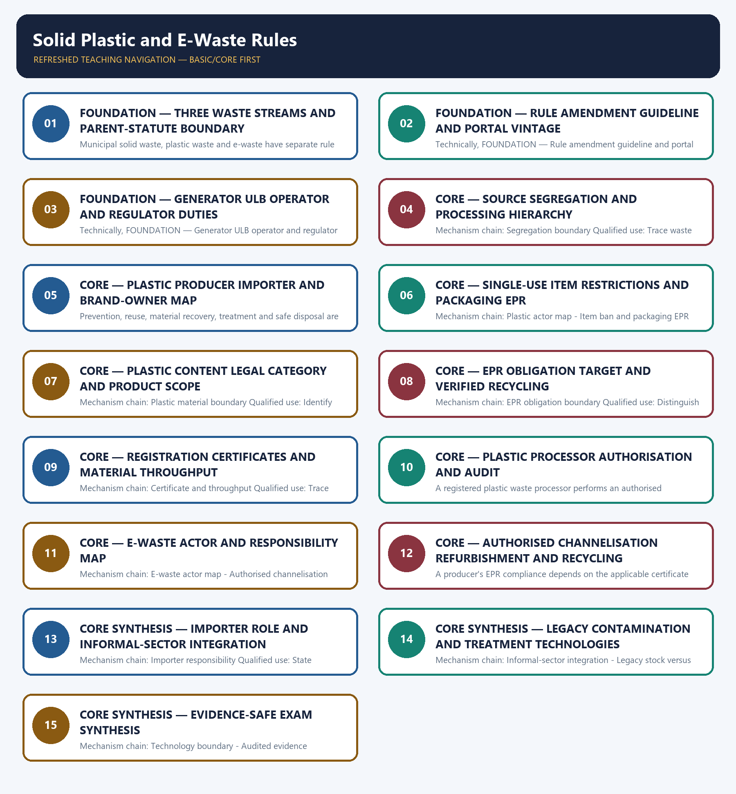

# Solid Plastic and E-Waste Rules — Learner-v2 Complete Learning Session

> **Authoring-only generation:** 2026-09-03. No PDF was rendered and no tracker or index was mutated.

### SOURCE, PROGRESSION AND CURRENT-LINKAGE AUDIT

- **Generation date:** 2026-09-03.
- **Repository-first evidence:** the Basic owner is taught first and preserved in full; the Advanced owner is retained only in the optional final teaching block.
- **OCR evidence:** Repository Markdown was primary. OCR-searchable local official General Studies papers were used only to confirm printed routed demands. No answer key, marking scheme, unsupported page precision, ecological rate, species count, pollution standard, rule threshold, mission outcome or current status was inferred.
- **Qdrant:** not used; repository Markdown and available OCR context were sufficient.
- **PYQ integrity:** Audited ledgers route direct Mains demand on solid-waste and toxic-waste management, plus objective concepts on SWM Rules, EPR, PET, pyrolysis, plasma gasification, electronics recycling, chewing-gum base and plastic-containing everyday products. Keys are not inferred.
- **Live-link boundary:** The MoEFCC rules page substantively confirmed that solid, plastic, e-waste, battery, contaminated-site and end-of-life-vehicle rules are separate families. CPCB pages and the plastic EPR portal were title-only, and the vehicle PDF failed at transport level. No target, ban list, quantity, registration, certificate or recycling outcome was used.
- **Fact/inference discipline:** no current-affairs item, PYQ wording, figure or quotation is invented.

### LIVE OFFICIAL-SOURCE ATTEMPT LOG

The checks below were made on 2026-09-03. Substantive official text is used only for the proposition it supports. Stubs, access failures, unrelated pages and thin landing pages are recorded and are not converted into ecological or current-status claims.

- https://moef.gov.in/rules-regulations-3 — attempted 2026-09-03; the official MoEFCC page substantively listed separate solid-waste, plastic-waste, e-waste, battery-waste, contaminated-site and end-of-life-vehicle rule families. It did not expose amendment text, EPR targets, waste quantities or recycling outcomes in the fetched page.
- https://eprplastic.cpcb.gov.in/ — attempted 2026-09-03; the official CPCB portal returned only the title 'Centralized EPR Portal for Plastic Packaging'. Registration, certificate and recycling figures were not imported.
- https://cpcb.nic.in/plastic-waste-management-rules/ — attempted 2026-09-03; the official CPCB path returned only the board title. No ban list, thickness requirement, EPR target or amendment date was transcribed.
- https://cpcb.nic.in/e-waste/ — attempted 2026-09-03; the official CPCB page returned only the board title. No EPR target, certificate quantity, registration total or recycling claim was used.
- https://www.moef.gov.in/storage/tender/1736939644.pdf — attempted 2026-09-03; the official MoEFCC PDF request failed at transport level. No end-of-life-vehicle date, target or obligation was imported.

## BASIC LEARNING SESSION



*Distinct embedded teaching-navigation image. The separate continuous Cārvāka-style flowchart package remains an independent at-a-glance artifact.*

### SESSION 1 — FOUNDATION — THREE WASTE STREAMS AND PARENT-STATUTE BOUNDARY

#### DEFINITION / WHAT THIS IS CALLED

**Plain-language definition:** Mechanism chain: Separate waste streams - Rule-vintage discipline Qualified use: Classify the material stream before naming a rule or actor.

**Technical definition:** Municipal solid waste, plastic waste and e-waste have separate rule frameworks, materials, actors and processing chains; a common parent statute does not make them one waste stream.

#### ANSWER-GRABBING OPENING — WRITE/ADAPT IN THE EXAM

> Municipal solid waste, plastic waste and e-waste have separate rule frameworks, materials, actors and processing chains; a common parent statute does not make them one waste stream.

#### MUST-WRITE KEYWORDS

- **FOUNDATION**
- **Three waste streams**
- **parent-statute boundary**
- **Mechanism chain**
- **Qualified use**
- **Municipal**

**How to use them:** Frame the answer through FOUNDATION; define Three waste streams, connect parent-statute boundary with Mechanism chain to explain the mechanism, and use Qualified use for the decisive comparison or qualification.

#### VISUAL FIRST

```text
THREE WASTE STREAMS AND PARENT-STATUTE BOUNDARY
01. Separate waste streams
    |
    v
02. Rule-vintage discipline
BOUNDARY -> Do not merge solid, plastic and e-waste into one rule document.
```

*This topic-specific rail fixes the evidence sequence and its exam boundary before analysis.*

#### CORE EXPLANATION

Municipal solid waste, plastic waste and e-waste have separate rule frameworks, materials, actors and processing chains; a common parent statute does not make them one waste stream. A rule, amendment, guideline, portal procedure and later waste-stream notification have different legal status and dates; the applicable vintage must be identified before stating an obligation.

#### NAMED EVIDENCE AND MECHANISM

- Municipal solid waste, plastic waste and e-waste have separate rule frameworks, materials, actors and processing chains; a common parent statute does not make them one waste stream.
- A rule, amendment, guideline, portal procedure and later waste-stream notification have different legal status and dates; the applicable vintage must be identified before stating an obligation.

#### EXAMINER CAUTION

- Do not merge solid, plastic and e-waste into one rule document.

#### EXAM LINK

- **Prelims:** Preserve the exact receiving medium, system boundary, measured parameter, actor, process, spatial and temporal scale, rule vintage and scientific or legal status; never turn a context-dependent pattern into a universal rule.
- **Mains:** Classify the material stream before naming a rule or actor.

#### MINI RECAP

- **Mechanism chain:** Separate waste streams -> Rule-vintage discipline
- **Qualified use:** Classify the material stream before naming a rule or actor.

#### CLOSING RECALL FLOW — FOUNDATION — THREE WASTE STREAMS AND PARENT-STATUTE BOUNDARY

```text
START / CONCEPT: FOUNDATION — Three waste streams and parent-statute boundary
        |
        v
EXACT TERMS: FOUNDATION · Three waste streams · parent-statute boundary · Mechanism chain · Qualified use · Municipal
        |
        v
MECHANISM / ARGUMENT: Mechanism chain: Separate waste streams - Rule-vintage discipline Qualified use: Classify the material stream before naming a rule or actor.
        |
        v
CONSEQUENCE / CONTRAST: Do not merge solid, plastic and e-waste into one rule document.
        |
        v
UPSC TRAP / ANSWER-USE: Do not miss this limiting distinction: a rule, amendment, guideline, portal procedure and later waste-stream notification have different legal status...
        |
        v
ANSWER-GRABBING FORMULATION: Municipal solid waste, plastic waste and e-waste have separate rule frameworks, materials, actors and processing chains; a common parent statute does not make them one waste stream.
```
### SESSION 2 — FOUNDATION — RULE AMENDMENT GUIDELINE AND PORTAL VINTAGE

#### DEFINITION / WHAT THIS IS CALLED

**Plain-language definition:** Mechanism chain: Waste-generator duty Qualified use: Date the rule, amendment and portal procedure separately.

**Technical definition:** Technically, FOUNDATION — Rule amendment guideline and portal vintage is analysed by relating FOUNDATION to Rule amendment guideline, then testing the relationship through portal vintage and Mechanism chain.

#### ANSWER-GRABBING OPENING — WRITE/ADAPT IN THE EXAM

> Do not state an obligation without checking the rule and amendment vintage.

#### MUST-WRITE KEYWORDS

- **FOUNDATION**
- **Rule amendment guideline**
- **portal vintage**
- **Mechanism chain**
- **Qualified use**
- **Waste-generator**

**How to use them:** Frame the answer through FOUNDATION; define Rule amendment guideline, connect portal vintage with Mechanism chain to explain the mechanism, and use Qualified use for the decisive comparison or qualification.

#### VISUAL FIRST

```text
RULE AMENDMENT GUIDELINE AND PORTAL VINTAGE
01. Waste-generator duty
BOUNDARY -> Do not state an obligation without checking the rule and amendment vintage.
```

*This topic-specific rail fixes the evidence sequence and its exam boundary before analysis.*

#### CORE EXPLANATION

A waste generator must segregate and hand over waste through the applicable authorised system; generator duty does not transfer producer, importer, local-body or recycler obligations.

#### NAMED EVIDENCE AND MECHANISM

- A waste generator must segregate and hand over waste through the applicable authorised system; generator duty does not transfer producer, importer, local-body or recycler obligations.

#### EXAMINER CAUTION

- Do not state an obligation without checking the rule and amendment vintage.

#### EXAM LINK

- **Prelims:** Preserve the exact receiving medium, system boundary, measured parameter, actor, process, spatial and temporal scale, rule vintage and scientific or legal status; never turn a context-dependent pattern into a universal rule.
- **Mains:** Date the rule, amendment and portal procedure separately.

#### MINI RECAP

- **Mechanism chain:** Waste-generator duty
- **Qualified use:** Date the rule, amendment and portal procedure separately.

#### CLOSING RECALL FLOW — FOUNDATION — RULE AMENDMENT GUIDELINE AND PORTAL VINTAGE

```text
START / CONCEPT: FOUNDATION — Rule amendment guideline and portal vintage
        |
        v
EXACT TERMS: FOUNDATION · Rule amendment guideline · portal vintage · Mechanism chain · Qualified use · Waste-generator
        |
        v
MECHANISM / ARGUMENT: Mechanism chain: Waste-generator duty Qualified use: Date the rule, amendment and portal procedure separately.
        |
        v
CONSEQUENCE / CONTRAST: A waste generator must segregate and hand over waste through the applicable authorised system; generator duty does not transfer producer, importer, local-body or recycler obligations.
        |
        v
UPSC TRAP / ANSWER-USE: Do not miss this limiting distinction: do not state an obligation without checking the rule and amendment vintage.
        |
        v
ANSWER-GRABBING FORMULATION: Do not state an obligation without checking the rule and amendment vintage.
```
### SESSION 3 — FOUNDATION — GENERATOR ULB OPERATOR AND REGULATOR DUTIES

#### DEFINITION / WHAT THIS IS CALLED

**Plain-language definition:** Mechanism chain: ULB solid-waste role Qualified use: Assign generator, local-body, operator and regulator duties one by one.

**Technical definition:** Technically, FOUNDATION — Generator ULB operator and regulator duties is analysed by relating FOUNDATION to Generator ULB operator, then testing the relationship through regulator duties and Mechanism chain.

#### ANSWER-GRABBING OPENING — WRITE/ADAPT IN THE EXAM

> Mechanism chain: ULB solid-waste role Qualified use: Assign generator, local-body, operator and regulator duties one by one.

#### MUST-WRITE KEYWORDS

- **FOUNDATION**
- **Generator ULB operator**
- **regulator duties**
- **Mechanism chain**
- **Qualified use**
- **ULB**

**How to use them:** Frame the answer through FOUNDATION; define Generator ULB operator, connect regulator duties with Mechanism chain to explain the mechanism, and use Qualified use for the decisive comparison or qualification.

#### VISUAL FIRST

```text
GENERATOR ULB OPERATOR AND REGULATOR DUTIES
01. ULB solid-waste role
BOUNDARY -> Do not shift producer duties to the waste generator or ULB.
```

*This topic-specific rail fixes the evidence sequence and its exam boundary before analysis.*

#### CORE EXPLANATION

Urban local bodies organise major municipal collection and processing functions, while households, bulk generators, operators and state regulators retain their own duties.

#### NAMED EVIDENCE AND MECHANISM

- Urban local bodies organise major municipal collection and processing functions, while households, bulk generators, operators and state regulators retain their own duties.

#### EXAMINER CAUTION

- Do not shift producer duties to the waste generator or ULB.

#### EXAM LINK

- **Prelims:** Preserve the exact receiving medium, system boundary, measured parameter, actor, process, spatial and temporal scale, rule vintage and scientific or legal status; never turn a context-dependent pattern into a universal rule.
- **Mains:** Assign generator, local-body, operator and regulator duties one by one.

#### MINI RECAP

- **Mechanism chain:** ULB solid-waste role
- **Qualified use:** Assign generator, local-body, operator and regulator duties one by one.

#### CLOSING RECALL FLOW — FOUNDATION — GENERATOR ULB OPERATOR AND REGULATOR DUTIES

```text
START / CONCEPT: FOUNDATION — Generator ULB operator and regulator duties
        |
        v
EXACT TERMS: FOUNDATION · Generator ULB operator · regulator duties · Mechanism chain · Qualified use · ULB
        |
        v
MECHANISM / ARGUMENT: Do not shift producer duties to the waste generator or ULB.
        |
        v
CONSEQUENCE / CONTRAST: The resulting consequence is that assign generator, local-body, operator and regulator duties one by one.
        |
        v
UPSC TRAP / ANSWER-USE: Do not miss this limiting distinction: assign generator, local-body, operator and regulator duties one by one.
        |
        v
ANSWER-GRABBING FORMULATION: Mechanism chain: ULB solid-waste role Qualified use: Assign generator, local-body, operator and regulator duties one by one.
```
### SESSION 4 — CORE — SOURCE SEGREGATION AND PROCESSING HIERARCHY

#### DEFINITION / WHAT THIS IS CALLED

**Plain-language definition:** Wet, dry and domestic-hazardous segregation supports different collection and processing routes; mixing at source can defeat later recovery and safe handling.

**Technical definition:** Mechanism chain: Segregation boundary Qualified use: Trace waste from segregation to recovery, treatment and residue disposal.

#### ANSWER-GRABBING OPENING — WRITE/ADAPT IN THE EXAM

> Do not treat source segregation as completed recycling.

#### MUST-WRITE KEYWORDS

- **Source segregation**
- **processing hierarchy**
- **Mechanism chain**
- **Qualified use**
- **Wet**
- **Segregation**

**How to use them:** Frame the answer through Source segregation; define processing hierarchy, connect Mechanism chain with Qualified use to explain the mechanism, and use Wet for the decisive comparison or qualification.

#### VISUAL FIRST

```text
SOURCE SEGREGATION AND PROCESSING HIERARCHY
01. Segregation boundary
BOUNDARY -> Do not treat source segregation as completed recycling.
```

*This topic-specific rail fixes the evidence sequence and its exam boundary before analysis.*

#### CORE EXPLANATION

Wet, dry and domestic-hazardous segregation supports different collection and processing routes; mixing at source can defeat later recovery and safe handling.

#### NAMED EVIDENCE AND MECHANISM

- Wet, dry and domestic-hazardous segregation supports different collection and processing routes; mixing at source can defeat later recovery and safe handling.

#### EXAMINER CAUTION

- Do not treat source segregation as completed recycling.

#### EXAM LINK

- **Prelims:** Preserve the exact receiving medium, system boundary, measured parameter, actor, process, spatial and temporal scale, rule vintage and scientific or legal status; never turn a context-dependent pattern into a universal rule.
- **Mains:** Trace waste from segregation to recovery, treatment and residue disposal.

#### MINI RECAP

- **Mechanism chain:** Segregation boundary
- **Qualified use:** Trace waste from segregation to recovery, treatment and residue disposal.

#### CLOSING RECALL FLOW — CORE — SOURCE SEGREGATION AND PROCESSING HIERARCHY

```text
START / CONCEPT: CORE — Source segregation and processing hierarchy
        |
        v
EXACT TERMS: Source segregation · processing hierarchy · Mechanism chain · Qualified use · Wet · Segregation
        |
        v
MECHANISM / ARGUMENT: Mechanism chain: Segregation boundary Qualified use: Trace waste from segregation to recovery, treatment and residue disposal.
        |
        v
CONSEQUENCE / CONTRAST: Wet, dry and domestic-hazardous segregation supports different collection and processing routes; mixing at source can defeat later recovery and safe handling.
        |
        v
UPSC TRAP / ANSWER-USE: Do not miss this limiting distinction: do not treat source segregation as completed recycling.
        |
        v
ANSWER-GRABBING FORMULATION: Do not treat source segregation as completed recycling.
```
### SESSION 5 — CORE — PLASTIC PRODUCER IMPORTER AND BRAND-OWNER MAP

#### DEFINITION / WHAT THIS IS CALLED

**Plain-language definition:** Mechanism chain: Processing hierarchy Qualified use: Map producer, importer and brand owner before discussing compliance.

**Technical definition:** Prevention, reuse, material recovery, treatment and safe disposal are different stages; collection or transport alone is not recycling or scientific disposal.

#### ANSWER-GRABBING OPENING — WRITE/ADAPT IN THE EXAM

> Mechanism chain: Processing hierarchy Qualified use: Map producer, importer and brand owner before discussing compliance.

#### MUST-WRITE KEYWORDS

- **Plastic producer importer**
- **brand-owner map**
- **Mechanism chain**
- **Qualified use**
- **Prevention, reuse, material recovery, treatment and safe disposal**
- **Prevention**

**How to use them:** Frame the answer through Plastic producer importer; define brand-owner map, connect Mechanism chain with Qualified use to explain the mechanism, and use Prevention, reuse, material recovery, treatment and safe disposal for the decisive comparison or qualification.

#### VISUAL FIRST

```text
PLASTIC PRODUCER IMPORTER AND BRAND-OWNER MAP
01. Processing hierarchy
BOUNDARY -> Do not treat collection or transport as material recovery.
```

*This topic-specific rail fixes the evidence sequence and its exam boundary before analysis.*

#### CORE EXPLANATION

Prevention, reuse, material recovery, treatment and safe disposal are different stages; collection or transport alone is not recycling or scientific disposal.

#### NAMED EVIDENCE AND MECHANISM

- Prevention, reuse, material recovery, treatment and safe disposal are different stages; collection or transport alone is not recycling or scientific disposal.

#### EXAMINER CAUTION

- Do not treat collection or transport as material recovery.

#### EXAM LINK

- **Prelims:** Preserve the exact receiving medium, system boundary, measured parameter, actor, process, spatial and temporal scale, rule vintage and scientific or legal status; never turn a context-dependent pattern into a universal rule.
- **Mains:** Map producer, importer and brand owner before discussing compliance.

#### MINI RECAP

- **Mechanism chain:** Processing hierarchy
- **Qualified use:** Map producer, importer and brand owner before discussing compliance.

#### CLOSING RECALL FLOW — CORE — PLASTIC PRODUCER IMPORTER AND BRAND-OWNER MAP

```text
START / CONCEPT: CORE — Plastic producer importer and brand-owner map
        |
        v
EXACT TERMS: Plastic producer importer · brand-owner map · Mechanism chain · Qualified use · Prevention, reuse, material recovery, treatment and safe disposal · Prevention
        |
        v
MECHANISM / ARGUMENT: Prevention, reuse, material recovery, treatment and safe disposal are different stages; collection or transport alone is not recycling or scientific disposal.
        |
        v
CONSEQUENCE / CONTRAST: Do not treat collection or transport as material recovery.
        |
        v
UPSC TRAP / ANSWER-USE: Do not miss this limiting distinction: prevention, reuse, material recovery, treatment and safe disposal are different stages.
        |
        v
ANSWER-GRABBING FORMULATION: Mechanism chain: Processing hierarchy Qualified use: Map producer, importer and brand owner before discussing compliance.
```
### SESSION 6 — CORE — SINGLE-USE ITEM RESTRICTIONS AND PACKAGING EPR

#### DEFINITION / WHAT THIS IS CALLED

**Plain-language definition:** Restrictions on identified single-use items and EPR for plastic packaging are separate control approaches; an item-specific restriction is not a blanket ban on all plastic.

**Technical definition:** Mechanism chain: Plastic actor map - Item ban and packaging EPR Qualified use: Separate item restrictions from packaging lifecycle responsibility.

#### ANSWER-GRABBING OPENING — WRITE/ADAPT IN THE EXAM

> Restrictions on identified single-use items and EPR for plastic packaging are separate control approaches; an item-specific restriction is not a blanket ban on all plastic.

#### MUST-WRITE KEYWORDS

- **Single-use item restrictions**
- **packaging EPR**
- **Mechanism chain**
- **Qualified use**
- **Plastic**
- **EPR**

**How to use them:** Frame the answer through Single-use item restrictions; define packaging EPR, connect Mechanism chain with Qualified use to explain the mechanism, and use Plastic for the decisive comparison or qualification.

#### VISUAL FIRST

```text
SINGLE-USE ITEM RESTRICTIONS AND PACKAGING EPR
01. Plastic actor map
    |
    v
02. Item ban and packaging EPR
BOUNDARY -> Do not merge producer, importer and brand-owner roles.
```

*This topic-specific rail fixes the evidence sequence and its exam boundary before analysis.*

#### CORE EXPLANATION

Plastic producers, importers and brand owners have distinct registration and EPR responsibilities under the applicable framework; a retailer or ULB cannot automatically be substituted for them. Restrictions on identified single-use items and EPR for plastic packaging are separate control approaches; an item-specific restriction is not a blanket ban on all plastic.

#### NAMED EVIDENCE AND MECHANISM

- Plastic producers, importers and brand owners have distinct registration and EPR responsibilities under the applicable framework; a retailer or ULB cannot automatically be substituted for them.
- Restrictions on identified single-use items and EPR for plastic packaging are separate control approaches; an item-specific restriction is not a blanket ban on all plastic.

#### EXAMINER CAUTION

- Do not merge producer, importer and brand-owner roles.

#### EXAM LINK

- **Prelims:** Preserve the exact receiving medium, system boundary, measured parameter, actor, process, spatial and temporal scale, rule vintage and scientific or legal status; never turn a context-dependent pattern into a universal rule.
- **Mains:** Separate item restrictions from packaging lifecycle responsibility.

#### MINI RECAP

- **Mechanism chain:** Plastic actor map -> Item ban and packaging EPR
- **Qualified use:** Separate item restrictions from packaging lifecycle responsibility.

#### CLOSING RECALL FLOW — CORE — SINGLE-USE ITEM RESTRICTIONS AND PACKAGING EPR

```text
START / CONCEPT: CORE — Single-use item restrictions and packaging EPR
        |
        v
EXACT TERMS: Single-use item restrictions · packaging EPR · Mechanism chain · Qualified use · Plastic · EPR
        |
        v
MECHANISM / ARGUMENT: Mechanism chain: Plastic actor map - Item ban and packaging EPR Qualified use: Separate item restrictions from packaging lifecycle responsibility.
        |
        v
CONSEQUENCE / CONTRAST: Do not merge producer, importer and brand-owner roles.
        |
        v
UPSC TRAP / ANSWER-USE: Plastic producers, importers and brand owners have distinct registration and EPR responsibilities under the applicable framework; a retailer or ULB cannot automatically be substituted for them.
        |
        v
ANSWER-GRABBING FORMULATION: Restrictions on identified single-use items and EPR for plastic packaging are separate control approaches; an item-specific restriction is not a blanket ban on all plastic.
```
### SESSION 7 — CORE — PLASTIC CONTENT LEGAL CATEGORY AND PRODUCT SCOPE

#### DEFINITION / WHAT THIS IS CALLED

**Plain-language definition:** A product may contain plastic without falling within the same banned-item list, packaging category or EPR obligation; material identification and legal classification are separate questions.

**Technical definition:** Mechanism chain: Plastic material boundary Qualified use: Identify material composition first, then apply the exact legal category.

#### ANSWER-GRABBING OPENING — WRITE/ADAPT IN THE EXAM

> A product may contain plastic without falling within the same banned-item list, packaging category or EPR obligation; material identification and legal classification are separate questions.

#### MUST-WRITE KEYWORDS

- **Plastic content legal category**
- **product scope**
- **Mechanism chain**
- **Qualified use**
- **EPR**
- **Plastic**

**How to use them:** Frame the answer through Plastic content legal category; define product scope, connect Mechanism chain with Qualified use to explain the mechanism, and use EPR for the decisive comparison or qualification.

#### VISUAL FIRST

```text
PLASTIC CONTENT LEGAL CATEGORY AND PRODUCT SCOPE
01. Plastic material boundary
BOUNDARY -> Do not convert an item-specific restriction into a blanket plastic ban.
```

*This topic-specific rail fixes the evidence sequence and its exam boundary before analysis.*

#### CORE EXPLANATION

A product may contain plastic without falling within the same banned-item list, packaging category or EPR obligation; material identification and legal classification are separate questions.

#### NAMED EVIDENCE AND MECHANISM

- A product may contain plastic without falling within the same banned-item list, packaging category or EPR obligation; material identification and legal classification are separate questions.

#### EXAMINER CAUTION

- Do not convert an item-specific restriction into a blanket plastic ban.

#### EXAM LINK

- **Prelims:** Preserve the exact receiving medium, system boundary, measured parameter, actor, process, spatial and temporal scale, rule vintage and scientific or legal status; never turn a context-dependent pattern into a universal rule.
- **Mains:** Identify material composition first, then apply the exact legal category.

#### MINI RECAP

- **Mechanism chain:** Plastic material boundary
- **Qualified use:** Identify material composition first, then apply the exact legal category.

#### CLOSING RECALL FLOW — CORE — PLASTIC CONTENT LEGAL CATEGORY AND PRODUCT SCOPE

```text
START / CONCEPT: CORE — Plastic content legal category and product scope
        |
        v
EXACT TERMS: Plastic content legal category · product scope · Mechanism chain · Qualified use · EPR · Plastic
        |
        v
MECHANISM / ARGUMENT: Mechanism chain: Plastic material boundary Qualified use: Identify material composition first, then apply the exact legal category.
        |
        v
CONSEQUENCE / CONTRAST: Do not convert an item-specific restriction into a blanket plastic ban.
        |
        v
UPSC TRAP / ANSWER-USE: Do not miss this limiting distinction: a product may contain plastic without falling within the same banned-item list, packaging category...
        |
        v
ANSWER-GRABBING FORMULATION: A product may contain plastic without falling within the same banned-item list, packaging category or EPR obligation; material identification and legal classification are separate questions.
```
### SESSION 8 — CORE — EPR OBLIGATION TARGET AND VERIFIED RECYCLING

#### DEFINITION / WHAT THIS IS CALLED

**Plain-language definition:** Extended Producer Responsibility creates an end-of-life compliance obligation; an assigned target or certificate liability is not proof that physical recycling occurred.

**Technical definition:** Mechanism chain: EPR obligation boundary Qualified use: Distinguish obligation, target and evidence of physical recovery.

#### ANSWER-GRABBING OPENING — WRITE/ADAPT IN THE EXAM

> Extended Producer Responsibility creates an end-of-life compliance obligation; an assigned target or certificate liability is not proof that physical recycling occurred.

#### MUST-WRITE KEYWORDS

- **EPR obligation target**
- **verified recycling**
- **Mechanism chain**
- **Qualified use**
- **Extended Producer Responsibility**
- **EPR**

**How to use them:** Frame the answer through EPR obligation target; define verified recycling, connect Mechanism chain with Qualified use to explain the mechanism, and use Extended Producer Responsibility for the decisive comparison or qualification.

#### VISUAL FIRST

```text
EPR OBLIGATION TARGET AND VERIFIED RECYCLING
01. EPR obligation boundary
BOUNDARY -> Do not infer a legal category only because an item contains plastic.
```

*This topic-specific rail fixes the evidence sequence and its exam boundary before analysis.*

#### CORE EXPLANATION

Extended Producer Responsibility creates an end-of-life compliance obligation; an assigned target or certificate liability is not proof that physical recycling occurred.

#### NAMED EVIDENCE AND MECHANISM

- Extended Producer Responsibility creates an end-of-life compliance obligation; an assigned target or certificate liability is not proof that physical recycling occurred.

#### EXAMINER CAUTION

- Do not infer a legal category only because an item contains plastic.

#### EXAM LINK

- **Prelims:** Preserve the exact receiving medium, system boundary, measured parameter, actor, process, spatial and temporal scale, rule vintage and scientific or legal status; never turn a context-dependent pattern into a universal rule.
- **Mains:** Distinguish obligation, target and evidence of physical recovery.

#### MINI RECAP

- **Mechanism chain:** EPR obligation boundary
- **Qualified use:** Distinguish obligation, target and evidence of physical recovery.

#### CLOSING RECALL FLOW — CORE — EPR OBLIGATION TARGET AND VERIFIED RECYCLING

```text
START / CONCEPT: CORE — EPR obligation target and verified recycling
        |
        v
EXACT TERMS: EPR obligation target · verified recycling · Mechanism chain · Qualified use · Extended Producer Responsibility · EPR
        |
        v
MECHANISM / ARGUMENT: Mechanism chain: EPR obligation boundary Qualified use: Distinguish obligation, target and evidence of physical recovery.
        |
        v
CONSEQUENCE / CONTRAST: Do not infer a legal category only because an item contains plastic.
        |
        v
UPSC TRAP / ANSWER-USE: Do not miss this limiting distinction: extended Producer Responsibility creates an end-of-life compliance obligation.
        |
        v
ANSWER-GRABBING FORMULATION: Extended Producer Responsibility creates an end-of-life compliance obligation; an assigned target or certificate liability is not proof that physical recycling occurred.
```
### SESSION 9 — CORE — REGISTRATION CERTIFICATES AND MATERIAL THROUGHPUT

#### DEFINITION / WHAT THIS IS CALLED

**Plain-language definition:** Registration, EPR certificate generation or transfer, reported recycling throughput and independently verified material recovery are different records.

**Technical definition:** Mechanism chain: Certificate and throughput Qualified use: Trace registration, certificate accounting, throughput and independent audit.

#### ANSWER-GRABBING OPENING — WRITE/ADAPT IN THE EXAM

> Registration, EPR certificate generation or transfer, reported recycling throughput and independently verified material recovery are different records.

#### MUST-WRITE KEYWORDS

- **Registration certificates**
- **material throughput**
- **Mechanism chain**
- **Qualified use**
- **Registration**
- **EPR**

**How to use them:** Frame the answer through Registration certificates; define material throughput, connect Mechanism chain with Qualified use to explain the mechanism, and use Registration for the decisive comparison or qualification.

#### VISUAL FIRST

```text
REGISTRATION CERTIFICATES AND MATERIAL THROUGHPUT
01. Certificate and throughput
BOUNDARY -> Do not report an EPR target or liability as verified recycling.
```

*This topic-specific rail fixes the evidence sequence and its exam boundary before analysis.*

#### CORE EXPLANATION

Registration, EPR certificate generation or transfer, reported recycling throughput and independently verified material recovery are different records.

#### NAMED EVIDENCE AND MECHANISM

- Registration, EPR certificate generation or transfer, reported recycling throughput and independently verified material recovery are different records.

#### EXAMINER CAUTION

- Do not report an EPR target or liability as verified recycling.

#### EXAM LINK

- **Prelims:** Preserve the exact receiving medium, system boundary, measured parameter, actor, process, spatial and temporal scale, rule vintage and scientific or legal status; never turn a context-dependent pattern into a universal rule.
- **Mains:** Trace registration, certificate accounting, throughput and independent audit.

#### MINI RECAP

- **Mechanism chain:** Certificate and throughput
- **Qualified use:** Trace registration, certificate accounting, throughput and independent audit.

#### CLOSING RECALL FLOW — CORE — REGISTRATION CERTIFICATES AND MATERIAL THROUGHPUT

```text
START / CONCEPT: CORE — Registration certificates and material throughput
        |
        v
EXACT TERMS: Registration certificates · material throughput · Mechanism chain · Qualified use · Registration · EPR
        |
        v
MECHANISM / ARGUMENT: Mechanism chain: Certificate and throughput Qualified use: Trace registration, certificate accounting, throughput and independent audit.
        |
        v
CONSEQUENCE / CONTRAST: Do not report an EPR target or liability as verified recycling.
        |
        v
UPSC TRAP / ANSWER-USE: Do not miss this limiting distinction: registration, EPR certificate generation or transfer, reported recycling throughput and independently verified material recovery...
        |
        v
ANSWER-GRABBING FORMULATION: Registration, EPR certificate generation or transfer, reported recycling throughput and independently verified material recovery are different records.
```
### SESSION 10 — CORE — PLASTIC PROCESSOR AUTHORISATION AND AUDIT

#### DEFINITION / WHAT THIS IS CALLED

**Plain-language definition:** Mechanism chain: Plastic processor role Qualified use: Treat authorisation as entry to regulation, not proof of outcome.

**Technical definition:** A registered plastic waste processor performs an authorised end-of-life activity within the applicable category; authorisation does not prove every claimed quantity or environmental outcome.

#### ANSWER-GRABBING OPENING — WRITE/ADAPT IN THE EXAM

> Mechanism chain: Plastic processor role Qualified use: Treat authorisation as entry to regulation, not proof of outcome.

#### MUST-WRITE KEYWORDS

- **Plastic processor authorisation**
- **audit**
- **Mechanism chain**
- **Qualified use**
- **Treat**
- **Plastic**

**How to use them:** Frame the answer through Plastic processor authorisation; define audit, connect Mechanism chain with Qualified use to explain the mechanism, and use Treat for the decisive comparison or qualification.

#### VISUAL FIRST

```text
PLASTIC PROCESSOR AUTHORISATION AND AUDIT
01. Plastic processor role
BOUNDARY -> Do not equate registration, certificates and physical throughput.
```

*This topic-specific rail fixes the evidence sequence and its exam boundary before analysis.*

#### CORE EXPLANATION

A registered plastic waste processor performs an authorised end-of-life activity within the applicable category; authorisation does not prove every claimed quantity or environmental outcome.

#### NAMED EVIDENCE AND MECHANISM

- A registered plastic waste processor performs an authorised end-of-life activity within the applicable category; authorisation does not prove every claimed quantity or environmental outcome.

#### EXAMINER CAUTION

- Do not equate registration, certificates and physical throughput.

#### EXAM LINK

- **Prelims:** Preserve the exact receiving medium, system boundary, measured parameter, actor, process, spatial and temporal scale, rule vintage and scientific or legal status; never turn a context-dependent pattern into a universal rule.
- **Mains:** Treat authorisation as entry to regulation, not proof of outcome.

#### MINI RECAP

- **Mechanism chain:** Plastic processor role
- **Qualified use:** Treat authorisation as entry to regulation, not proof of outcome.

#### CLOSING RECALL FLOW — CORE — PLASTIC PROCESSOR AUTHORISATION AND AUDIT

```text
START / CONCEPT: CORE — Plastic processor authorisation and audit
        |
        v
EXACT TERMS: Plastic processor authorisation · audit · Mechanism chain · Qualified use · Treat · Plastic
        |
        v
MECHANISM / ARGUMENT: A registered plastic waste processor performs an authorised end-of-life activity within the applicable category; authorisation does not prove every claimed quantity or environmental outcome.
        |
        v
CONSEQUENCE / CONTRAST: Mains: Treat authorisation as entry to regulation, not proof of outcome.
        |
        v
UPSC TRAP / ANSWER-USE: Do not equate registration, certificates and physical throughput.
        |
        v
ANSWER-GRABBING FORMULATION: Mechanism chain: Plastic processor role Qualified use: Treat authorisation as entry to regulation, not proof of outcome.
```
### SESSION 11 — CORE — E-WASTE ACTOR AND RESPONSIBILITY MAP

#### DEFINITION / WHAT THIS IS CALLED

**Plain-language definition:** E-waste should move to the applicable registered or authorised refurbishment and recycling chain; informal collection reach is distinct from unsafe dismantling or recovery.

**Technical definition:** Mechanism chain: E-waste actor map - Authorised channelisation Qualified use: Separate market actors from refurbishers and end-of-life processors.

#### ANSWER-GRABBING OPENING — WRITE/ADAPT IN THE EXAM

> Manufacturer, producer, importer, consumer, bulk consumer, refurbisher and recycler have different roles; the product-market actor and end-of-life processor must not be merged.

#### MUST-WRITE KEYWORDS

- **E-waste actor**
- **responsibility map**
- **Mechanism chain**
- **Qualified use**
- **Manufacturer**
- **E-waste**

**How to use them:** Frame the answer through E-waste actor; define responsibility map, connect Mechanism chain with Qualified use to explain the mechanism, and use Manufacturer for the decisive comparison or qualification.

#### VISUAL FIRST

```text
E-WASTE ACTOR AND RESPONSIBILITY MAP
01. E-waste actor map
    |
    v
02. Authorised channelisation
BOUNDARY -> Do not treat recycler authorisation as proof of every claimed quantity.
```

*This topic-specific rail fixes the evidence sequence and its exam boundary before analysis.*

#### CORE EXPLANATION

Manufacturer, producer, importer, consumer, bulk consumer, refurbisher and recycler have different roles; the product-market actor and end-of-life processor must not be merged. E-waste should move to the applicable registered or authorised refurbishment and recycling chain; informal collection reach is distinct from unsafe dismantling or recovery.

#### NAMED EVIDENCE AND MECHANISM

- Manufacturer, producer, importer, consumer, bulk consumer, refurbisher and recycler have different roles; the product-market actor and end-of-life processor must not be merged.
- E-waste should move to the applicable registered or authorised refurbishment and recycling chain; informal collection reach is distinct from unsafe dismantling or recovery.

#### EXAMINER CAUTION

- Do not treat recycler authorisation as proof of every claimed quantity.

#### EXAM LINK

- **Prelims:** Preserve the exact receiving medium, system boundary, measured parameter, actor, process, spatial and temporal scale, rule vintage and scientific or legal status; never turn a context-dependent pattern into a universal rule.
- **Mains:** Separate market actors from refurbishers and end-of-life processors.

#### MINI RECAP

- **Mechanism chain:** E-waste actor map -> Authorised channelisation
- **Qualified use:** Separate market actors from refurbishers and end-of-life processors.

#### CLOSING RECALL FLOW — CORE — E-WASTE ACTOR AND RESPONSIBILITY MAP

```text
START / CONCEPT: CORE — E-waste actor and responsibility map
        |
        v
EXACT TERMS: E-waste actor · responsibility map · Mechanism chain · Qualified use · Manufacturer · E-waste
        |
        v
MECHANISM / ARGUMENT: Mechanism chain: E-waste actor map - Authorised channelisation Qualified use: Separate market actors from refurbishers and end-of-life processors.
        |
        v
CONSEQUENCE / CONTRAST: Do not treat recycler authorisation as proof of every claimed quantity.
        |
        v
UPSC TRAP / ANSWER-USE: Do not miss this limiting distinction: e-waste should move to the applicable registered or authorised refurbishment and recycling chain.
        |
        v
ANSWER-GRABBING FORMULATION: Manufacturer, producer, importer, consumer, bulk consumer, refurbisher and recycler have different roles; the product-market actor and end-of-life processor must not be merged.
```
### SESSION 12 — CORE — AUTHORISED CHANNELISATION REFURBISHMENT AND RECYCLING

#### DEFINITION / WHAT THIS IS CALLED

**Plain-language definition:** Mechanism chain: E-waste EPR verification Qualified use: Route e-waste through safer authorised processing while preserving collection reach.

**Technical definition:** A producer's EPR compliance depends on the applicable certificate and recycling framework, but certificate accounting must remain distinct from the actual material processed.

#### ANSWER-GRABBING OPENING — WRITE/ADAPT IN THE EXAM

> Mechanism chain: E-waste EPR verification Qualified use: Route e-waste through safer authorised processing while preserving collection reach.

#### MUST-WRITE KEYWORDS

- **Authorised channelisation refurbishment**
- **recycling**
- **Mechanism chain**
- **Qualified use**
- **EPR**
- **E-waste EPR**

**How to use them:** Frame the answer through Authorised channelisation refurbishment; define recycling, connect Mechanism chain with Qualified use to explain the mechanism, and use EPR for the decisive comparison or qualification.

#### VISUAL FIRST

```text
AUTHORISED CHANNELISATION REFURBISHMENT AND RECYCLING
01. E-waste EPR verification
BOUNDARY -> Do not merge e-waste producer, refurbisher and recycler roles.
```

*This topic-specific rail fixes the evidence sequence and its exam boundary before analysis.*

#### CORE EXPLANATION

A producer's EPR compliance depends on the applicable certificate and recycling framework, but certificate accounting must remain distinct from the actual material processed.

#### NAMED EVIDENCE AND MECHANISM

- A producer's EPR compliance depends on the applicable certificate and recycling framework, but certificate accounting must remain distinct from the actual material processed.

#### EXAMINER CAUTION

- Do not merge e-waste producer, refurbisher and recycler roles.

#### EXAM LINK

- **Prelims:** Preserve the exact receiving medium, system boundary, measured parameter, actor, process, spatial and temporal scale, rule vintage and scientific or legal status; never turn a context-dependent pattern into a universal rule.
- **Mains:** Route e-waste through safer authorised processing while preserving collection reach.

#### MINI RECAP

- **Mechanism chain:** E-waste EPR verification
- **Qualified use:** Route e-waste through safer authorised processing while preserving collection reach.

#### CLOSING RECALL FLOW — CORE — AUTHORISED CHANNELISATION REFURBISHMENT AND RECYCLING

```text
START / CONCEPT: CORE — Authorised channelisation refurbishment and recycling
        |
        v
EXACT TERMS: Authorised channelisation refurbishment · recycling · Mechanism chain · Qualified use · EPR · E-waste EPR
        |
        v
MECHANISM / ARGUMENT: A producer's EPR compliance depends on the applicable certificate and recycling framework, but certificate accounting must remain distinct from the actual material processed.
        |
        v
CONSEQUENCE / CONTRAST: Do not merge e-waste producer, refurbisher and recycler roles.
        |
        v
UPSC TRAP / ANSWER-USE: Do not miss this limiting distinction: route e-waste through safer authorised processing while preserving collection reach.
        |
        v
ANSWER-GRABBING FORMULATION: Mechanism chain: E-waste EPR verification Qualified use: Route e-waste through safer authorised processing while preserving collection reach.
```
### SESSION 13 — CORE SYNTHESIS — IMPORTER ROLE AND INFORMAL-SECTOR INTEGRATION

#### DEFINITION / WHAT THIS IS CALLED

**Plain-language definition:** Importing covered products can create producer-side responsibility under the applicable rule; importing, manufacturing, branding and recycling are not interchangeable roles.

**Technical definition:** Mechanism chain: Importer responsibility Qualified use: State importer responsibility and a just-transition route for informal workers.

#### ANSWER-GRABBING OPENING — WRITE/ADAPT IN THE EXAM

> Importing covered products can create producer-side responsibility under the applicable rule; importing, manufacturing, branding and recycling are not interchangeable roles.

#### MUST-WRITE KEYWORDS

- **CORE SYNTHESIS**
- **Importer role**
- **informal-sector integration**
- **Mechanism chain**
- **Qualified use**
- **Importing**

**How to use them:** Frame the answer through CORE SYNTHESIS; define Importer role, connect informal-sector integration with Mechanism chain to explain the mechanism, and use Qualified use for the decisive comparison or qualification.

#### VISUAL FIRST

```text
IMPORTER ROLE AND INFORMAL-SECTOR INTEGRATION
01. Importer responsibility
BOUNDARY -> Do not treat informal collection as permission for unsafe processing.
```

*This topic-specific rail fixes the evidence sequence and its exam boundary before analysis.*

#### CORE EXPLANATION

Importing covered products can create producer-side responsibility under the applicable rule; importing, manufacturing, branding and recycling are not interchangeable roles.

#### NAMED EVIDENCE AND MECHANISM

- Importing covered products can create producer-side responsibility under the applicable rule; importing, manufacturing, branding and recycling are not interchangeable roles.

#### EXAMINER CAUTION

- Do not treat informal collection as permission for unsafe processing.

#### EXAM LINK

- **Prelims:** Preserve the exact receiving medium, system boundary, measured parameter, actor, process, spatial and temporal scale, rule vintage and scientific or legal status; never turn a context-dependent pattern into a universal rule.
- **Mains:** State importer responsibility and a just-transition route for informal workers.

#### MINI RECAP

- **Mechanism chain:** Importer responsibility
- **Qualified use:** State importer responsibility and a just-transition route for informal workers.

#### CLOSING RECALL FLOW — CORE SYNTHESIS — IMPORTER ROLE AND INFORMAL-SECTOR INTEGRATION

```text
START / CONCEPT: CORE SYNTHESIS — Importer role and informal-sector integration
        |
        v
EXACT TERMS: CORE SYNTHESIS · Importer role · informal-sector integration · Mechanism chain · Qualified use · Importing
        |
        v
MECHANISM / ARGUMENT: Mechanism chain: Importer responsibility Qualified use: State importer responsibility and a just-transition route for informal workers.
        |
        v
CONSEQUENCE / CONTRAST: Do not treat informal collection as permission for unsafe processing.
        |
        v
UPSC TRAP / ANSWER-USE: Do not miss this limiting distinction: importing covered products can create producer-side responsibility under the applicable rule.
        |
        v
ANSWER-GRABBING FORMULATION: Importing covered products can create producer-side responsibility under the applicable rule; importing, manufacturing, branding and recycling are not interchangeable roles.
```
### SESSION 14 — CORE SYNTHESIS — LEGACY CONTAMINATION AND TREATMENT TECHNOLOGIES

#### DEFINITION / WHAT THIS IS CALLED

**Plain-language definition:** Contaminated sites and accumulated dumps are legacy stocks, while EPR principally governs current product and waste flows; remediation and flow control need different instruments.

**Technical definition:** Mechanism chain: Informal-sector integration - Legacy stock versus new flow Qualified use: Separate legacy stock remediation from new-flow control and compare technologies conditionally.

#### ANSWER-GRABBING OPENING — WRITE/ADAPT IN THE EXAM

> Contaminated sites and accumulated dumps are legacy stocks, while EPR principally governs current product and waste flows; remediation and flow control need different instruments.

#### MUST-WRITE KEYWORDS

- **CORE SYNTHESIS**
- **Legacy contamination**
- **treatment technologies**
- **Mechanism chain**
- **Qualified use**
- **Waste**

**How to use them:** Frame the answer through CORE SYNTHESIS; define Legacy contamination, connect treatment technologies with Mechanism chain to explain the mechanism, and use Qualified use for the decisive comparison or qualification.

#### VISUAL FIRST

```text
LEGACY CONTAMINATION AND TREATMENT TECHNOLOGIES
01. Informal-sector integration
    |
    v
02. Legacy stock versus new flow
BOUNDARY -> Do not use current-flow EPR as proof of legacy-site remediation.
```

*This topic-specific rail fixes the evidence sequence and its exam boundary before analysis.*

#### CORE EXPLANATION

Waste pickers and informal collectors can provide collection reach and livelihoods, while hazardous processing requires safer integration with authorised facilities rather than exclusion or romanticisation. Contaminated sites and accumulated dumps are legacy stocks, while EPR principally governs current product and waste flows; remediation and flow control need different instruments.

#### NAMED EVIDENCE AND MECHANISM

- Waste pickers and informal collectors can provide collection reach and livelihoods, while hazardous processing requires safer integration with authorised facilities rather than exclusion or romanticisation.
- Contaminated sites and accumulated dumps are legacy stocks, while EPR principally governs current product and waste flows; remediation and flow control need different instruments.

#### EXAMINER CAUTION

- Do not use current-flow EPR as proof of legacy-site remediation.

#### EXAM LINK

- **Prelims:** Preserve the exact receiving medium, system boundary, measured parameter, actor, process, spatial and temporal scale, rule vintage and scientific or legal status; never turn a context-dependent pattern into a universal rule.
- **Mains:** Separate legacy stock remediation from new-flow control and compare technologies conditionally.

#### MINI RECAP

- **Mechanism chain:** Informal-sector integration -> Legacy stock versus new flow
- **Qualified use:** Separate legacy stock remediation from new-flow control and compare technologies conditionally.

#### CLOSING RECALL FLOW — CORE SYNTHESIS — LEGACY CONTAMINATION AND TREATMENT TECHNOLOGIES

```text
START / CONCEPT: CORE SYNTHESIS — Legacy contamination and treatment technologies
        |
        v
EXACT TERMS: CORE SYNTHESIS · Legacy contamination · treatment technologies · Mechanism chain · Qualified use · Waste
        |
        v
MECHANISM / ARGUMENT: Mechanism chain: Informal-sector integration - Legacy stock versus new flow Qualified use: Separate legacy stock remediation from new-flow control and compare technologies conditionally.
        |
        v
CONSEQUENCE / CONTRAST: Waste pickers and informal collectors can provide collection reach and livelihoods, while hazardous processing requires safer integration with authorised facilities rather than exclusion or romanticisation.
        |
        v
UPSC TRAP / ANSWER-USE: Do not use current-flow EPR as proof of legacy-site remediation.
        |
        v
ANSWER-GRABBING FORMULATION: Contaminated sites and accumulated dumps are legacy stocks, while EPR principally governs current product and waste flows; remediation and flow control need different instruments.
```
### SESSION 15 — CORE SYNTHESIS — EVIDENCE-SAFE EXAM SYNTHESIS

#### DEFINITION / WHAT THIS IS CALLED

**Plain-language definition:** CORE SYNTHESIS — Evidence-safe exam synthesis comprises CORE SYNTHESIS, Evidence-safe exam synthesis and Mechanism chain as its core connected dimensions.

**Technical definition:** Mechanism chain: Technology boundary - Audited evidence boundary Qualified use: Close with verified demand ownership and explicit numeric limits.

#### ANSWER-GRABBING OPENING — WRITE/ADAPT IN THE EXAM

> CORE SYNTHESIS — Evidence-safe exam synthesis comprises CORE SYNTHESIS, Evidence-safe exam synthesis and Mechanism chain as its core connected dimensions.

#### MUST-WRITE KEYWORDS

- **CORE SYNTHESIS**
- **Evidence-safe exam synthesis**
- **Mechanism chain**
- **Qualified use**
- **Subject**
- **Tier**

**How to use them:** Frame the answer through CORE SYNTHESIS; define Evidence-safe exam synthesis, connect Mechanism chain with Qualified use to explain the mechanism, and use Subject for the decisive comparison or qualification.

#### VISUAL FIRST

```text
EVIDENCE-SAFE EXAM SYNTHESIS
01. Technology boundary
    |
    v
02. Audited evidence boundary
BOUNDARY -> Do not declare a treatment technology universally clean or superior.
```

*This topic-specific rail fixes the evidence sequence and its exam boundary before analysis.*

#### CORE EXPLANATION

Pyrolysis, plasma gasification, recycling, co-processing and disposal have feedstock, emission, energy and residue conditions; no technology is universally superior merely by name. Audited ledgers carry solid-waste governance, EPR, plastic-containing products, PET, pyrolysis, plasma gasification and electronics-recycling concepts into practice without inventing keys, targets, quantities or outcomes.

#### NAMED EVIDENCE AND MECHANISM

- Pyrolysis, plasma gasification, recycling, co-processing and disposal have feedstock, emission, energy and residue conditions; no technology is universally superior merely by name.
- Audited ledgers carry solid-waste governance, EPR, plastic-containing products, PET, pyrolysis, plasma gasification and electronics-recycling concepts into practice without inventing keys, targets, quantities or outcomes.

#### EXAMINER CAUTION

- Do not declare a treatment technology universally clean or superior.

#### EXAM LINK

- **Prelims:** Preserve the exact receiving medium, system boundary, measured parameter, actor, process, spatial and temporal scale, rule vintage and scientific or legal status; never turn a context-dependent pattern into a universal rule.
- **Mains:** Close with verified demand ownership and explicit numeric limits.

#### MINI RECAP

- **Mechanism chain:** Technology boundary -> Audited evidence boundary
- **Qualified use:** Close with verified demand ownership and explicit numeric limits.
#### COMPLETE BASIC OWNER EVIDENCE BANK

> **Subject:** Environment and Ecology | **Tier:** Must-Do (foundation) | **GS Paper:** GS-III (Environment) + Prelims.
> **Core area:** Waste-management legal framework.
> **Grounded in:** Solid Waste Management Rules, 2016; Plastic Waste Management Rules, 2016 (as amended); E-Waste (Management) Rules, 2022 (India Code); CPCB implementation guidance; audited UPSC Environment PYQs (2024-2026 Prelims and 2024-2025 Mains).
> ✅ = source-grounded | ⚠️ = analytical linkage | 📰 = dated current-affairs anchor.
> *Companion: `advanced/15_Solid-Plastic-and-E-Waste-Rules.md`.*

#### 1. Visual foundation

```text
THREE PARALLEL WASTE-STREAM RULE FRAMEWORKS (all under Environment (Protection) Act, 1986)

Solid Waste Management Rules, 2016     -> municipal/household waste: segregation
                                            (wet/dry/hazardous), collection, processing
Plastic Waste Management Rules, 2016   -> plastic packaging/products: Extended Producer
   (as amended, incl. 2021/2022)          Responsibility (EPR), single-use-plastic phase-out
E-Waste (Management) Rules, 2022       -> electronic/electrical waste: EPR-based recycling,
                                            authorised dismantler/recycler certification

COMMON MECHANISM ACROSS ALL THREE: EXTENDED PRODUCER RESPONSIBILITY (EPR) -
   producers/brand owners made responsible for end-of-life management of their products.
```

**Core proposition:** India regulates its major waste streams (municipal solid waste,
plastic waste, e-waste) through three parallel, rule-based frameworks under the Environment
(Protection) Act, 1986, increasingly converging on Extended Producer Responsibility (EPR) as
the common accountability mechanism, shifting waste-management responsibility partly from
municipalities/consumers to producers and brand owners.

#### 2. Essential definitions

| Concept | Exam-ready meaning |
|---|---|
| ✅ **Solid Waste Management Rules, 2016** | Rules mandating source segregation (wet/dry/hazardous), door-to-door collection, and scientific processing/disposal of municipal solid waste. |
| ✅ **Plastic Waste Management Rules, 2016 (as amended)** | Rules regulating plastic packaging and products, mandating Extended Producer Responsibility and phasing out identified single-use plastic items. |
| ✅ **E-Waste (Management) Rules, 2022** | Rules governing environmentally sound management of electronic/electrical waste, mandating EPR and authorised recycling/dismantling. |
| ✅ **Extended Producer Responsibility (EPR)** | A policy principle making producers/brand owners financially/physically responsible for the collection, recycling or disposal of their products after consumer use. |
| ✅ **Single-use plastic (SUP)** | Plastic items designed for one-time use before disposal. India banned **12 identified SUP items** with high littering potential and low utility from **1 July 2022** — ear buds with plastic sticks, plastic sticks for balloons, plastic flags, candy sticks, ice-cream sticks, polystyrene (thermocol) for decoration, plates/cups/glasses/cutlery (forks, spoons, knives, straws, trays), wrapping or packing films around sweet boxes, invitation cards and cigarette packets, PVC banners under 100 microns, and stirrers (Economic Survey 2025-26, Ch. 10). |
| ✅ **Plastic carry-bag thickness** | Raised progressively to **120 microns** to make bags easier to collect and recycle — a design-standard lever rather than a ban. |
| ✅ **Battery Waste Management Rules, 2022** | EPR framework for all battery types (portable, automotive, industrial, electric-vehicle), replacing the earlier lead-acid-focused rules and mandating minimum recovery and recycled-content obligations. |
| ✅ **Circular Economy Action Plans** | India has adopted action plans across **10 waste categories** — lithium-ion batteries, e-waste, toxic and hazardous industrial waste, ferrous and non-ferrous scrap metal, tyre and rubber, end-of-life vehicles, gypsum, used oil, solar panels and municipal solid waste (Economic Survey 2025-26, Ch. 10). |
| ✅ **Urban Local Bodies (ULBs)** | Municipal-level bodies primarily responsible for household/municipal solid-waste collection, segregation infrastructure and processing under the Solid Waste Management Rules. |

#### 3. Topic mechanism

1. The Solid Waste Management Rules, 2016 require source segregation of household/municipal
   waste into wet (biodegradable), dry (recyclable) and hazardous/domestic-hazardous
   categories, placing primary implementation responsibility on Urban Local Bodies with
   supporting roles for waste generators (households, bulk generators) and processors.
2. The Plastic Waste Management Rules, 2016 (progressively amended, including bans on
   specified single-use plastic items and introduction of EPR targets for plastic
   packaging) require producers, importers and brand owners to ensure a defined share of
   their plastic packaging is collected and recycled/processed, rather than relying solely
   on municipal collection systems.
3. The E-Waste (Management) Rules, 2022 similarly mandate EPR for producers of electrical
   and electronic equipment, requiring e-waste to be channelled to authorised dismantlers/
   recyclers rather than informal, often environmentally unsafe, recycling operations.
4. Across all three frameworks, a recurring structural shift is visible: from a purely
   municipal-collection/disposal model toward a producer-accountability model (EPR), driven
   by the recognition that municipal systems alone struggled to keep pace with rapidly
   growing waste volumes, especially for plastic and electronic waste.
5. CPCB administers the EPR registration and target-tracking systems (including digital EPR
   portals for plastic and e-waste) that verify whether producers are meeting their
   collection/recycling obligations.

#### 4. Institutions and policy tools

- ✅ **CPCB:** administers EPR registration, target-setting and compliance monitoring for
  plastic and e-waste under the respective Rules.
- ✅ **Urban Local Bodies (ULBs):** primary implementers of source segregation, collection
  and processing infrastructure under the Solid Waste Management Rules.
- ✅ **State Pollution Control Boards (SPCBs):** authorise and monitor waste-processing/
  recycling facilities at the state level.
- ⚠️ **Informal waste sector (waste-pickers, informal recyclers):** plays a substantial,
  often under-integrated role in India's actual waste-collection and recycling economy,
  particularly for plastic and e-waste, ahead of full formal EPR-system integration.

#### 5. Indian applications and examples

- ⚠️ India's phase-out of identified single-use plastic items (e.g., certain plastic
  cutlery, stirrers, specified thin plastic films) illustrates a targeted-ban approach
  applied to specific product categories rather than a blanket plastic ban.
- ⚠️ E-waste generation has been rising rapidly with expanding electronics consumption,
  making the shift from informal, often hazardous, backyard-recycling practices to
  authorised, environmentally sound dismantling/recycling a central implementation priority
  under the 2022 E-Waste Rules.
- ⚠️ Segregation-at-source compliance under the Solid Waste Management Rules varies
  significantly across Indian cities, reflecting differing ULB capacity and citizen
  behaviour-change progress.

#### 6. Must-Know Facts for Prelims

- ✅ India regulates municipal solid waste, plastic waste and e-waste through three separate
  rule frameworks, all notified under the Environment (Protection) Act, 1986.
- ✅ Extended Producer Responsibility (EPR) is the common accountability mechanism across
  the plastic and e-waste rule frameworks, making producers responsible for end-of-life
  product management.
- ✅ The Solid Waste Management Rules, 2016 mandate source segregation into wet, dry and
  hazardous/domestic-hazardous categories.
- ✅ India has phased out specified single-use plastic items under amendments to the Plastic
  Waste Management Rules.
- ✅ The E-Waste (Management) Rules, 2022 mandate that e-waste be channelled to authorised
  dismantlers/recyclers under an EPR framework.
- ✅ **12 identified single-use plastic items** were banned from **1 July 2022**; plastic
  carry-bag thickness was raised to **120 microns**. The policy is item-specific, not a
  blanket plastic ban.
- ✅ India now runs **EPR frameworks across eight waste streams** — plastic packaging,
  batteries, e-waste, waste tyres, used oil, end-of-life vehicles, construction and
  demolition waste, and non-ferrous metal scrap — supported by centralised digital portals
  (Economic Survey 2025-26, Ch. 10).
- ✅ **Circular Economy Action Plans** now cover **10 waste categories**, including solar
  panels and gypsum — categories most candidates omit.
- ✅ All these rule frameworks are subordinate legislation notified under the **Environment
  (Protection) Act, 1986**, not standalone statutes.

#### 7. UPSC traps

- ❌ India has imposed a complete, blanket ban on all plastic. -> The policy targets
  specified single-use plastic items and mandates EPR for plastic packaging generally,
  rather than banning all plastic products.
- ❌ Urban Local Bodies are responsible for plastic-waste EPR compliance. -> EPR compliance
  responsibility rests with producers, importers and brand owners; CPCB administers the EPR
  tracking system.
- ❌ The Solid Waste Management Rules, Plastic Waste Management Rules and E-Waste Rules are a
  single combined rule document. -> They are three separate, parallel rule frameworks
  addressing distinct waste streams.
- ❌ Informal waste-pickers/recyclers play no significant role in India's actual waste
  economy. -> They play a substantial, often under-integrated role, especially in plastic
  and e-waste collection and recycling.
- ❌ E-waste in India is primarily managed through formal, authorised recyclers today. -> A
  significant share has historically been processed through informal, often environmentally
  unsafe channels, which the 2022 Rules aim to shift toward authorised recycling.
- ❌ India has banned single-use plastics generally. -> **12 specified items** were banned
  from 1 July 2022; other single-use plastics remain legal but subject to EPR and thickness
  standards.
- ❌ EPR applies only to plastic and e-waste. -> EPR frameworks now cover **eight** streams,
  including waste tyres, used oil, end-of-life vehicles, construction and demolition waste
  and non-ferrous metal scrap.
- ❌ Solar panels are outside India's waste policy. -> Solar panels are one of the **10 waste
  categories** covered by Circular Economy Action Plans.

#### 8. 📰 Current anchor

- 📰 **Environment Protection (End-of-Life Vehicles) Rules, 2025**
  (S.O. 98(E), effective 1 April 2025) add a vehicle-specific EPR/scrapping
  chain covering producers, owners/bulk consumers and registered scrapping/
  collection entities. Batteries, plastics, e-waste and hazardous waste remain
  under their separate rules. [MoEFCC notification](https://www.moef.gov.in/storage/tender/1736939644.pdf).

- 📰 The E-Waste (Management) Rules, 2022 and amended Plastic Waste Management Rules remain
  the current governing framework; verify the latest EPR target percentages and any newly
  specified single-use-plastic-item bans against the most recent MoEFCC/CPCB notification
  before citing specific figures.
- 📰 **EPR portal position as on 14 November 2025** (Economic Survey 2025-26, Ch. 10):
  **69,116 producers** and **4,377 recyclers** registered; approximately **308 lakh tonnes**
  of waste (plastic packaging, battery, e-waste and waste tyres) recycled, against which
  **296.53 lakh tonnes** of EPR certificates were generated. ⚠️ Date-stamp this figure — it
  is a rolling cumulative number.
- 📰 **Environment Protection (Management of Contaminated Sites) Rules, 2025** establish a
  framework for identifying and remediating contaminated sites, and the **Environmental
  Relief Fund** (under the amended Public Liability Insurance Act) can now be used for that
  remediation (Economic Survey 2025-26, Ch. 10) — closing a long-standing legacy-waste gap
  that the three waste-stream rules never addressed.

⚠️ **Registered vs recycled vs recovered discipline:** producer/recycler *registrations*
measure participation, tonnage *recycled* measures throughput, and EPR *certificates*
measure the tradable instrument generated — none of the three is a measure of material
actually returned to productive use. Say which one a cited number is.

⚠️ **Interpretation caution:** EPR target percentages and specific banned single-use-plastic
item lists have been revised over time — cite the specific notification and its date rather
than an assumed fixed list.

#### 9. PYQ application

- ⚠️ Recurring Prelims pattern: distinguish the scope and mechanism of the Solid Waste
  Management Rules, Plastic Waste Management Rules and E-Waste Rules from one another.
- ⚠️ Mains linkage: the EPR mechanism is used to argue for shifting waste-management cost
  and responsibility toward producers rather than only municipalities/taxpayers.

#### 10. Mains angles

- ⚠️ Argue that EPR represents a structural shift in waste-governance philosophy — from
  end-of-pipe municipal disposal to producer-accountable lifecycle management.
- ⚠️ Use the informal-sector-integration challenge to argue that successful EPR
  implementation must formally recognise and integrate waste-pickers/informal recyclers
  rather than bypass them.
- ⚠️ Conclude with an implementation-verification thesis: EPR targets on paper are
  meaningful only if CPCB's tracking/verification systems can reliably confirm actual
  collection and recycling outcomes.

> **Answer thesis:** Treat Extended Producer Responsibility as India's central emerging waste-governance mechanism across plastic and e-waste, and judge its real effectiveness by verified collection/recycling outcomes and informal-sector integration, not by target percentages announced on paper.

#### 11. Probable questions

- ⚠️ **Prelims:** Distinguish the scope of the Solid Waste Management Rules, 2016, Plastic
  Waste Management Rules, 2016 (as amended), and E-Waste (Management) Rules, 2022.
- ⚠️ **Mains (10 marks):** Explain the concept of Extended Producer Responsibility and its
  application to India's plastic and e-waste governance.
- ⚠️ **Mains (15 marks):** Discuss the challenge of integrating India's informal waste
  sector into the formal EPR-based e-waste and plastic-waste management framework.

#### 12. Study links

- ✅ Advanced companion: `advanced/15_Solid-Plastic-and-E-Waste-Rules.md`.
- ✅ `14_Water-Pollution-and-River-Cleaning-Missions.md` — solid-waste dumping as a
  contributing water-pollution source.
- ✅ `21_Carbon-Markets-CCUS-and-Direct-Air-Capture.md` — circular-economy/resource-
  efficiency linkages relevant to waste-to-value approaches.
- ✅ `27_Environmental-Institutions-MoEFCC-CPCB-NBA-WII.md` — CPCB's EPR administration role.
<!-- BEGIN GENERATED PYQ INTEGRATION: 2024-2025 -->

#### Recent PYQ Integration (2024-2025)

> **Status:** 2024-2025 question-level PYQ demand is integrated into this owner.
> **Provenance:** Audited local official-paper routing ledgers: `_PYQ-ROUTING-PRELIMS-2024-2025.md`.
> **Answer-key rule:** The official 2024-2025 Prelims Set-A keys are present in the repository and CSAT Set-A keys are supplied; even so, no option or answer is recorded or inferred in this integration.

- **Years represented:** 2024, 2025
- **Paper(s):** Prelims GS-I
- **Routed question demands:** 2

| Year | Paper | Q | PYQ demand (neutral rendering) | Directive / format | Source status | Owner requirement |
|---:|---|---|---|---|---|---|
| 2024 | Prelims GS-I | 22 | Chewing gum plastic base as environmental pollution | Objective question; official Set-A key available locally, answer not inferred | Key available locally (official Set-A answer key present); answer not recorded here | Cover the named fact/concept and its likely statement-level distinctions. |
| 2025 | Prelims GS-I | 44 | Everyday items that contain plastic (cigarette butts, eyeglass lenses, car tyres) | Objective question; official Set-A key available locally, answer not inferred | Key available locally (official Set-A answer key present); answer not recorded here | Cover the named fact/concept and its likely statement-level distinctions. |

##### What this owner must now support

- Chewing gum plastic base as environmental pollution
- Everyday items that contain plastic (cigarette butts, eyeglass lenses, car tyres)

> This block integrates the 2024-2025 examinable demand and paper metadata. It is kept separate from the 2018-2023 block and does not convert an unkeyed/answer-free objective question into a solved answer.
<!-- END GENERATED PYQ INTEGRATION: 2024-2025 -->

#### 13. Core answer architecture (10/15/20-mark support)

##### 13.1 Demand decoder and thesis

- Identify the **material stream**, then the responsible actor and stage: generation, collection, authorised processing, certificate/verification and legacy contamination.
- **Thesis:** EPR shifts lifecycle responsibility upstream, but a certificate market only improves outcomes if it corresponds to verified material recovery and does not exclude the informal collection workforce.

##### 13.2 Reusable evidence units

| Claim | Named evidence/example → significance | Qualification |
|---|---|---|
| Waste rules serve different streams. | **SWM Rules 2016; Plastic Waste Management Rules; E-Waste Rules 2022** → align municipal segregation, packaging EPR and electronic-waste processing. | A common parent statute does not make them one combined rule. |
| EPR needs traceability. | **CPCB EPR portals/certificates** → permits producer accountability beyond municipal disposal. | Registrations, certificates and reported tonnes are not identical to independently verified circular use. |
| Informal workers are part of the system. | **Waste pickers and informal e-waste collectors** → provide collection reach and livelihood link. | Unsafe dismantling/exposure requires integration with authorised processing, not romanticising informality. |

##### 13.3 Mark-scaled spines

- **10 marks:** show the waste-flow hierarchy and assign legal responsibility.
- **15/20 marks:** compare targeted SUP restrictions with EPR, evaluate verification and informal-sector trade-offs, then add contaminated-site rules for legacy stock rather than conflating it with new waste flows.
- **PYQ micro-facts:** chewing-gum base, cigarette butts, spectacle lenses and tyres may contain plastic; use them as material-identification examples, not proof that all such items fall under the same ban or EPR obligation.

<!-- BEGIN GENERATED PYQ INTEGRATION: 2018-2023 -->

#### Historical PYQ Integration (2018-2023)

> **Status:** Question-level PYQ demand is integrated into this owner.
> **Provenance:** Audited local official-paper routing ledgers: `_PYQ-ROUTING-MAINS-GS3-GS4-2018-2023.md`, `_PYQ-ROUTING-PRELIMS-2018-2023.md`.
> **Answer-key rule:** The official 2018-2023 Prelims/CSAT keys are not held locally; no option or answer has been inferred.

- **Years represented:** 2018, 2019, 2020, 2021, 2022
- **Paper(s):** GS-III, Prelims GS-I
- **Routed question demands:** 7

| Year | Paper | Q | PYQ demand (neutral rendering) | Directive / format | Source status | Owner requirement |
|---:|---|---:|---|---|---|---|
| 2018 | GS-III | 6 | Solid waste disposal challenges and toxic waste management | Discuss · 10 marks · 150 words | Routed to owning topic | Prepare context, core dimensions, evidence/examples, counterpoint and a concise conclusion. |
| 2019 | Prelims GS-I | 26 | Pyrolysis and plasma gasification in waste management | Objective question; official key unavailable locally | Routed; key unavailable locally | Cover the named fact/concept and its likely statement-level distinctions. |
| 2019 | Prelims GS-I | 59 | Solid Waste Management Rules 2016 India provisions | Objective question; official key unavailable locally | Routed; key unavailable locally | Cover the named fact/concept and its likely statement-level distinctions. |
| 2019 | Prelims GS-I | 78 | Extended producer responsibility introduction in Indian rules | Objective question; official key unavailable locally | Routed; key unavailable locally | Cover the named fact/concept and its likely statement-level distinctions. |
| 2020 | Prelims GS-I | 76 | Steel slag uses in road construction and agriculture | Objective question; official key unavailable locally | Routed; key unavailable locally | Cover the named fact/concept and its likely statement-level distinctions. |
| 2021 | Prelims GS-I | 16 | R2 Code of Practices electronics recycling industry | Objective question; official key unavailable locally | Routed; key unavailable locally | Cover the named fact/concept and its likely statement-level distinctions. |
| 2022 | Prelims GS-I | 46 | Polyethylene terephthalate properties blending recycling disposal | Objective question; official key unavailable locally | Routed; key unavailable locally | Cover the named fact/concept and its likely statement-level distinctions. |

##### What this owner must now support

- Solid waste disposal challenges and toxic waste management
- Pyrolysis and plasma gasification in waste management
- Solid Waste Management Rules 2016 India provisions
- Extended producer responsibility introduction in Indian rules
- Steel slag uses in road construction and agriculture
- R2 Code of Practices electronics recycling industry
- Polyethylene terephthalate properties blending recycling disposal

> The table integrates the examinable demand and paper metadata. It does not turn an unkeyed objective question into a solved answer, and it does not claim that lexical presence alone proves full conceptual sufficiency.
<!-- END GENERATED PYQ INTEGRATION: 2018-2023 -->

#### CLOSING RECALL FLOW — CORE SYNTHESIS — EVIDENCE-SAFE EXAM SYNTHESIS

```text
START / CONCEPT: CORE SYNTHESIS — Evidence-safe exam synthesis
        |
        v
EXACT TERMS: CORE SYNTHESIS · Evidence-safe exam synthesis · Mechanism chain · Qualified use · Subject · Tier
        |
        v
MECHANISM / ARGUMENT: Mechanism chain: Technology boundary - Audited evidence boundary Qualified use: Close with verified demand ownership and explicit numeric limits.
        |
        v
CONSEQUENCE / CONTRAST: Do not declare a treatment technology universally clean or superior.
        |
        v
UPSC TRAP / ANSWER-USE: Answer thesis: Treat Extended Producer Responsibility as India's central emerging waste-governance mechanism across plastic and e-waste, and judge its real effectiveness by verified collection/recycling outcomes and informal-sector integration, not by target percentages announced on paper.
        |
        v
ANSWER-GRABBING FORMULATION: CORE SYNTHESIS — Evidence-safe exam synthesis comprises CORE SYNTHESIS, Evidence-safe exam synthesis and Mechanism chain as its core connected dimensions.
```
## BASIC MCQS / REMEDIATION

### Q1. Which statement correctly identifies Separate waste streams?

A. Municipal solid waste, plastic waste and e-waste have separate rule frameworks, materials, actors and processing chains; a common parent statute does not make them one waste stream.
B. Urban local bodies organise major municipal collection and processing functions, while households, bulk generators, operators and state regulators retain their own duties.
C. A waste generator must segregate and hand over waste through the applicable authorised system; generator duty does not transfer producer, importer, local-body or recycler obligations.
D. A rule, amendment, guideline, portal procedure and later waste-stream notification have different legal status and dates; the applicable vintage must be identified before stating an obligation.

**Answer: A.**
**Explanation:** Municipal solid waste, plastic waste and e-waste have separate rule frameworks, materials, actors and processing chains; a common parent statute does not make them one waste stream. The other options belong to different media, parameters, processes, scales, actors, institutions, instruments or status categories.

### Q2. Which option preserves the ecological boundary of Separate waste streams?

A. Wet, dry and domestic-hazardous segregation supports different collection and processing routes; mixing at source can defeat later recovery and safe handling.
B. Municipal solid waste, plastic waste and e-waste have separate rule frameworks, materials, actors and processing chains; a common parent statute does not make them one waste stream.
C. A waste generator must segregate and hand over waste through the applicable authorised system; generator duty does not transfer producer, importer, local-body or recycler obligations.
D. Urban local bodies organise major municipal collection and processing functions, while households, bulk generators, operators and state regulators retain their own duties.

**Answer: B.**
**Explanation:** Municipal solid waste, plastic waste and e-waste have separate rule frameworks, materials, actors and processing chains; a common parent statute does not make them one waste stream. The other options belong to different media, parameters, processes, scales, actors, institutions, instruments or status categories.

### Q3. Which statement uses Separate waste streams without changing its scale, parameter or status?

A. Prevention, reuse, material recovery, treatment and safe disposal are different stages; collection or transport alone is not recycling or scientific disposal.
B. Urban local bodies organise major municipal collection and processing functions, while households, bulk generators, operators and state regulators retain their own duties.
C. Municipal solid waste, plastic waste and e-waste have separate rule frameworks, materials, actors and processing chains; a common parent statute does not make them one waste stream.
D. Wet, dry and domestic-hazardous segregation supports different collection and processing routes; mixing at source can defeat later recovery and safe handling.

**Answer: C.**
**Explanation:** Municipal solid waste, plastic waste and e-waste have separate rule frameworks, materials, actors and processing chains; a common parent statute does not make them one waste stream. The other options belong to different media, parameters, processes, scales, actors, institutions, instruments or status categories.

### Q4. Which option avoids the standard UPSC close-option trap about Separate waste streams?

A. Wet, dry and domestic-hazardous segregation supports different collection and processing routes; mixing at source can defeat later recovery and safe handling.
B. Prevention, reuse, material recovery, treatment and safe disposal are different stages; collection or transport alone is not recycling or scientific disposal.
C. Plastic producers, importers and brand owners have distinct registration and EPR responsibilities under the applicable framework; a retailer or ULB cannot automatically be substituted for them.
D. Municipal solid waste, plastic waste and e-waste have separate rule frameworks, materials, actors and processing chains; a common parent statute does not make them one waste stream.

**Answer: D.**
**Explanation:** Municipal solid waste, plastic waste and e-waste have separate rule frameworks, materials, actors and processing chains; a common parent statute does not make them one waste stream. The other options belong to different media, parameters, processes, scales, actors, institutions, instruments or status categories.

### Q5. Which statement correctly identifies Rule-vintage discipline?

A. A rule, amendment, guideline, portal procedure and later waste-stream notification have different legal status and dates; the applicable vintage must be identified before stating an obligation.
B. Wet, dry and domestic-hazardous segregation supports different collection and processing routes; mixing at source can defeat later recovery and safe handling.
C. Urban local bodies organise major municipal collection and processing functions, while households, bulk generators, operators and state regulators retain their own duties.
D. A waste generator must segregate and hand over waste through the applicable authorised system; generator duty does not transfer producer, importer, local-body or recycler obligations.

**Answer: A.**
**Explanation:** A rule, amendment, guideline, portal procedure and later waste-stream notification have different legal status and dates; the applicable vintage must be identified before stating an obligation. The other options belong to different media, parameters, processes, scales, actors, institutions, instruments or status categories.

### Q6. Which option preserves the ecological boundary of Rule-vintage discipline?

A. Prevention, reuse, material recovery, treatment and safe disposal are different stages; collection or transport alone is not recycling or scientific disposal.
B. A rule, amendment, guideline, portal procedure and later waste-stream notification have different legal status and dates; the applicable vintage must be identified before stating an obligation.
C. Urban local bodies organise major municipal collection and processing functions, while households, bulk generators, operators and state regulators retain their own duties.
D. Wet, dry and domestic-hazardous segregation supports different collection and processing routes; mixing at source can defeat later recovery and safe handling.

**Answer: B.**
**Explanation:** A rule, amendment, guideline, portal procedure and later waste-stream notification have different legal status and dates; the applicable vintage must be identified before stating an obligation. The other options belong to different media, parameters, processes, scales, actors, institutions, instruments or status categories.

### Q7. Which statement uses Rule-vintage discipline without changing its scale, parameter or status?

A. Prevention, reuse, material recovery, treatment and safe disposal are different stages; collection or transport alone is not recycling or scientific disposal.
B. Plastic producers, importers and brand owners have distinct registration and EPR responsibilities under the applicable framework; a retailer or ULB cannot automatically be substituted for them.
C. A rule, amendment, guideline, portal procedure and later waste-stream notification have different legal status and dates; the applicable vintage must be identified before stating an obligation.
D. Wet, dry and domestic-hazardous segregation supports different collection and processing routes; mixing at source can defeat later recovery and safe handling.

**Answer: C.**
**Explanation:** A rule, amendment, guideline, portal procedure and later waste-stream notification have different legal status and dates; the applicable vintage must be identified before stating an obligation. The other options belong to different media, parameters, processes, scales, actors, institutions, instruments or status categories.

### Q8. Which option avoids the standard UPSC close-option trap about Rule-vintage discipline?

A. Plastic producers, importers and brand owners have distinct registration and EPR responsibilities under the applicable framework; a retailer or ULB cannot automatically be substituted for them.
B. Prevention, reuse, material recovery, treatment and safe disposal are different stages; collection or transport alone is not recycling or scientific disposal.
C. Restrictions on identified single-use items and EPR for plastic packaging are separate control approaches; an item-specific restriction is not a blanket ban on all plastic.
D. A rule, amendment, guideline, portal procedure and later waste-stream notification have different legal status and dates; the applicable vintage must be identified before stating an obligation.

**Answer: D.**
**Explanation:** A rule, amendment, guideline, portal procedure and later waste-stream notification have different legal status and dates; the applicable vintage must be identified before stating an obligation. The other options belong to different media, parameters, processes, scales, actors, institutions, instruments or status categories.

### Q9. Which statement correctly identifies Waste-generator duty?

A. A waste generator must segregate and hand over waste through the applicable authorised system; generator duty does not transfer producer, importer, local-body or recycler obligations.
B. Prevention, reuse, material recovery, treatment and safe disposal are different stages; collection or transport alone is not recycling or scientific disposal.
C. Wet, dry and domestic-hazardous segregation supports different collection and processing routes; mixing at source can defeat later recovery and safe handling.
D. Urban local bodies organise major municipal collection and processing functions, while households, bulk generators, operators and state regulators retain their own duties.

**Answer: A.**
**Explanation:** A waste generator must segregate and hand over waste through the applicable authorised system; generator duty does not transfer producer, importer, local-body or recycler obligations. The other options belong to different media, parameters, processes, scales, actors, institutions, instruments or status categories.

### Q10. Which option preserves the ecological boundary of Waste-generator duty?

A. Plastic producers, importers and brand owners have distinct registration and EPR responsibilities under the applicable framework; a retailer or ULB cannot automatically be substituted for them.
B. A waste generator must segregate and hand over waste through the applicable authorised system; generator duty does not transfer producer, importer, local-body or recycler obligations.
C. Prevention, reuse, material recovery, treatment and safe disposal are different stages; collection or transport alone is not recycling or scientific disposal.
D. Wet, dry and domestic-hazardous segregation supports different collection and processing routes; mixing at source can defeat later recovery and safe handling.

**Answer: B.**
**Explanation:** A waste generator must segregate and hand over waste through the applicable authorised system; generator duty does not transfer producer, importer, local-body or recycler obligations. The other options belong to different media, parameters, processes, scales, actors, institutions, instruments or status categories.

### Q11. Which statement uses Waste-generator duty without changing its scale, parameter or status?

A. Prevention, reuse, material recovery, treatment and safe disposal are different stages; collection or transport alone is not recycling or scientific disposal.
B. Restrictions on identified single-use items and EPR for plastic packaging are separate control approaches; an item-specific restriction is not a blanket ban on all plastic.
C. A waste generator must segregate and hand over waste through the applicable authorised system; generator duty does not transfer producer, importer, local-body or recycler obligations.
D. Plastic producers, importers and brand owners have distinct registration and EPR responsibilities under the applicable framework; a retailer or ULB cannot automatically be substituted for them.

**Answer: C.**
**Explanation:** A waste generator must segregate and hand over waste through the applicable authorised system; generator duty does not transfer producer, importer, local-body or recycler obligations. The other options belong to different media, parameters, processes, scales, actors, institutions, instruments or status categories.

### Q12. Which option avoids the standard UPSC close-option trap about Waste-generator duty?

A. A product may contain plastic without falling within the same banned-item list, packaging category or EPR obligation; material identification and legal classification are separate questions.
B. Plastic producers, importers and brand owners have distinct registration and EPR responsibilities under the applicable framework; a retailer or ULB cannot automatically be substituted for them.
C. Restrictions on identified single-use items and EPR for plastic packaging are separate control approaches; an item-specific restriction is not a blanket ban on all plastic.
D. A waste generator must segregate and hand over waste through the applicable authorised system; generator duty does not transfer producer, importer, local-body or recycler obligations.

**Answer: D.**
**Explanation:** A waste generator must segregate and hand over waste through the applicable authorised system; generator duty does not transfer producer, importer, local-body or recycler obligations. The other options belong to different media, parameters, processes, scales, actors, institutions, instruments or status categories.

### Q13. Which statement correctly identifies ULB solid-waste role?

A. Urban local bodies organise major municipal collection and processing functions, while households, bulk generators, operators and state regulators retain their own duties.
B. Prevention, reuse, material recovery, treatment and safe disposal are different stages; collection or transport alone is not recycling or scientific disposal.
C. Plastic producers, importers and brand owners have distinct registration and EPR responsibilities under the applicable framework; a retailer or ULB cannot automatically be substituted for them.
D. Wet, dry and domestic-hazardous segregation supports different collection and processing routes; mixing at source can defeat later recovery and safe handling.

**Answer: A.**
**Explanation:** Urban local bodies organise major municipal collection and processing functions, while households, bulk generators, operators and state regulators retain their own duties. The other options belong to different media, parameters, processes, scales, actors, institutions, instruments or status categories.

### Q14. Which option preserves the ecological boundary of ULB solid-waste role?

A. Prevention, reuse, material recovery, treatment and safe disposal are different stages; collection or transport alone is not recycling or scientific disposal.
B. Urban local bodies organise major municipal collection and processing functions, while households, bulk generators, operators and state regulators retain their own duties.
C. Plastic producers, importers and brand owners have distinct registration and EPR responsibilities under the applicable framework; a retailer or ULB cannot automatically be substituted for them.
D. Restrictions on identified single-use items and EPR for plastic packaging are separate control approaches; an item-specific restriction is not a blanket ban on all plastic.

**Answer: B.**
**Explanation:** Urban local bodies organise major municipal collection and processing functions, while households, bulk generators, operators and state regulators retain their own duties. The other options belong to different media, parameters, processes, scales, actors, institutions, instruments or status categories.

### Q15. Which statement uses ULB solid-waste role without changing its scale, parameter or status?

A. Restrictions on identified single-use items and EPR for plastic packaging are separate control approaches; an item-specific restriction is not a blanket ban on all plastic.
B. Plastic producers, importers and brand owners have distinct registration and EPR responsibilities under the applicable framework; a retailer or ULB cannot automatically be substituted for them.
C. Urban local bodies organise major municipal collection and processing functions, while households, bulk generators, operators and state regulators retain their own duties.
D. A product may contain plastic without falling within the same banned-item list, packaging category or EPR obligation; material identification and legal classification are separate questions.

**Answer: C.**
**Explanation:** Urban local bodies organise major municipal collection and processing functions, while households, bulk generators, operators and state regulators retain their own duties. The other options belong to different media, parameters, processes, scales, actors, institutions, instruments or status categories.

### Q16. Which option avoids the standard UPSC close-option trap about ULB solid-waste role?

A. Restrictions on identified single-use items and EPR for plastic packaging are separate control approaches; an item-specific restriction is not a blanket ban on all plastic.
B. Extended Producer Responsibility creates an end-of-life compliance obligation; an assigned target or certificate liability is not proof that physical recycling occurred.
C. A product may contain plastic without falling within the same banned-item list, packaging category or EPR obligation; material identification and legal classification are separate questions.
D. Urban local bodies organise major municipal collection and processing functions, while households, bulk generators, operators and state regulators retain their own duties.

**Answer: D.**
**Explanation:** Urban local bodies organise major municipal collection and processing functions, while households, bulk generators, operators and state regulators retain their own duties. The other options belong to different media, parameters, processes, scales, actors, institutions, instruments or status categories.

### Q17. Which statement correctly identifies Segregation boundary?

A. Wet, dry and domestic-hazardous segregation supports different collection and processing routes; mixing at source can defeat later recovery and safe handling.
B. Prevention, reuse, material recovery, treatment and safe disposal are different stages; collection or transport alone is not recycling or scientific disposal.
C. Restrictions on identified single-use items and EPR for plastic packaging are separate control approaches; an item-specific restriction is not a blanket ban on all plastic.
D. Plastic producers, importers and brand owners have distinct registration and EPR responsibilities under the applicable framework; a retailer or ULB cannot automatically be substituted for them.

**Answer: A.**
**Explanation:** Wet, dry and domestic-hazardous segregation supports different collection and processing routes; mixing at source can defeat later recovery and safe handling. The other options belong to different media, parameters, processes, scales, actors, institutions, instruments or status categories.

### Q18. Which option preserves the ecological boundary of Segregation boundary?

A. Plastic producers, importers and brand owners have distinct registration and EPR responsibilities under the applicable framework; a retailer or ULB cannot automatically be substituted for them.
B. Wet, dry and domestic-hazardous segregation supports different collection and processing routes; mixing at source can defeat later recovery and safe handling.
C. Restrictions on identified single-use items and EPR for plastic packaging are separate control approaches; an item-specific restriction is not a blanket ban on all plastic.
D. A product may contain plastic without falling within the same banned-item list, packaging category or EPR obligation; material identification and legal classification are separate questions.

**Answer: B.**
**Explanation:** Wet, dry and domestic-hazardous segregation supports different collection and processing routes; mixing at source can defeat later recovery and safe handling. The other options belong to different media, parameters, processes, scales, actors, institutions, instruments or status categories.

### Q19. Which statement uses Segregation boundary without changing its scale, parameter or status?

A. A product may contain plastic without falling within the same banned-item list, packaging category or EPR obligation; material identification and legal classification are separate questions.
B. Restrictions on identified single-use items and EPR for plastic packaging are separate control approaches; an item-specific restriction is not a blanket ban on all plastic.
C. Wet, dry and domestic-hazardous segregation supports different collection and processing routes; mixing at source can defeat later recovery and safe handling.
D. Extended Producer Responsibility creates an end-of-life compliance obligation; an assigned target or certificate liability is not proof that physical recycling occurred.

**Answer: C.**
**Explanation:** Wet, dry and domestic-hazardous segregation supports different collection and processing routes; mixing at source can defeat later recovery and safe handling. The other options belong to different media, parameters, processes, scales, actors, institutions, instruments or status categories.

### Q20. Which option avoids the standard UPSC close-option trap about Segregation boundary?

A. A product may contain plastic without falling within the same banned-item list, packaging category or EPR obligation; material identification and legal classification are separate questions.
B. Extended Producer Responsibility creates an end-of-life compliance obligation; an assigned target or certificate liability is not proof that physical recycling occurred.
C. Registration, EPR certificate generation or transfer, reported recycling throughput and independently verified material recovery are different records.
D. Wet, dry and domestic-hazardous segregation supports different collection and processing routes; mixing at source can defeat later recovery and safe handling.

**Answer: D.**
**Explanation:** Wet, dry and domestic-hazardous segregation supports different collection and processing routes; mixing at source can defeat later recovery and safe handling. The other options belong to different media, parameters, processes, scales, actors, institutions, instruments or status categories.

### Q21. Which statement correctly identifies Processing hierarchy?

A. Prevention, reuse, material recovery, treatment and safe disposal are different stages; collection or transport alone is not recycling or scientific disposal.
B. Restrictions on identified single-use items and EPR for plastic packaging are separate control approaches; an item-specific restriction is not a blanket ban on all plastic.
C. Plastic producers, importers and brand owners have distinct registration and EPR responsibilities under the applicable framework; a retailer or ULB cannot automatically be substituted for them.
D. A product may contain plastic without falling within the same banned-item list, packaging category or EPR obligation; material identification and legal classification are separate questions.

**Answer: A.**
**Explanation:** Prevention, reuse, material recovery, treatment and safe disposal are different stages; collection or transport alone is not recycling or scientific disposal. The other options belong to different media, parameters, processes, scales, actors, institutions, instruments or status categories.

### Q22. Which option preserves the ecological boundary of Processing hierarchy?

A. Restrictions on identified single-use items and EPR for plastic packaging are separate control approaches; an item-specific restriction is not a blanket ban on all plastic.
B. Prevention, reuse, material recovery, treatment and safe disposal are different stages; collection or transport alone is not recycling or scientific disposal.
C. A product may contain plastic without falling within the same banned-item list, packaging category or EPR obligation; material identification and legal classification are separate questions.
D. Extended Producer Responsibility creates an end-of-life compliance obligation; an assigned target or certificate liability is not proof that physical recycling occurred.

**Answer: B.**
**Explanation:** Prevention, reuse, material recovery, treatment and safe disposal are different stages; collection or transport alone is not recycling or scientific disposal. The other options belong to different media, parameters, processes, scales, actors, institutions, instruments or status categories.

### Q23. Which statement uses Processing hierarchy without changing its scale, parameter or status?

A. Registration, EPR certificate generation or transfer, reported recycling throughput and independently verified material recovery are different records.
B. Extended Producer Responsibility creates an end-of-life compliance obligation; an assigned target or certificate liability is not proof that physical recycling occurred.
C. Prevention, reuse, material recovery, treatment and safe disposal are different stages; collection or transport alone is not recycling or scientific disposal.
D. A product may contain plastic without falling within the same banned-item list, packaging category or EPR obligation; material identification and legal classification are separate questions.

**Answer: C.**
**Explanation:** Prevention, reuse, material recovery, treatment and safe disposal are different stages; collection or transport alone is not recycling or scientific disposal. The other options belong to different media, parameters, processes, scales, actors, institutions, instruments or status categories.

### Q24. Which option avoids the standard UPSC close-option trap about Processing hierarchy?

A. Extended Producer Responsibility creates an end-of-life compliance obligation; an assigned target or certificate liability is not proof that physical recycling occurred.
B. A registered plastic waste processor performs an authorised end-of-life activity within the applicable category; authorisation does not prove every claimed quantity or environmental outcome.
C. Registration, EPR certificate generation or transfer, reported recycling throughput and independently verified material recovery are different records.
D. Prevention, reuse, material recovery, treatment and safe disposal are different stages; collection or transport alone is not recycling or scientific disposal.

**Answer: D.**
**Explanation:** Prevention, reuse, material recovery, treatment and safe disposal are different stages; collection or transport alone is not recycling or scientific disposal. The other options belong to different media, parameters, processes, scales, actors, institutions, instruments or status categories.

### Q25. Which statement correctly identifies Plastic actor map?

A. Plastic producers, importers and brand owners have distinct registration and EPR responsibilities under the applicable framework; a retailer or ULB cannot automatically be substituted for them.
B. Restrictions on identified single-use items and EPR for plastic packaging are separate control approaches; an item-specific restriction is not a blanket ban on all plastic.
C. A product may contain plastic without falling within the same banned-item list, packaging category or EPR obligation; material identification and legal classification are separate questions.
D. Extended Producer Responsibility creates an end-of-life compliance obligation; an assigned target or certificate liability is not proof that physical recycling occurred.

**Answer: A.**
**Explanation:** Plastic producers, importers and brand owners have distinct registration and EPR responsibilities under the applicable framework; a retailer or ULB cannot automatically be substituted for them. The other options belong to different media, parameters, processes, scales, actors, institutions, instruments or status categories.

### Q26. Which option preserves the ecological boundary of Plastic actor map?

A. A product may contain plastic without falling within the same banned-item list, packaging category or EPR obligation; material identification and legal classification are separate questions.
B. Plastic producers, importers and brand owners have distinct registration and EPR responsibilities under the applicable framework; a retailer or ULB cannot automatically be substituted for them.
C. Extended Producer Responsibility creates an end-of-life compliance obligation; an assigned target or certificate liability is not proof that physical recycling occurred.
D. Registration, EPR certificate generation or transfer, reported recycling throughput and independently verified material recovery are different records.

**Answer: B.**
**Explanation:** Plastic producers, importers and brand owners have distinct registration and EPR responsibilities under the applicable framework; a retailer or ULB cannot automatically be substituted for them. The other options belong to different media, parameters, processes, scales, actors, institutions, instruments or status categories.

### Q27. Which statement uses Plastic actor map without changing its scale, parameter or status?

A. Extended Producer Responsibility creates an end-of-life compliance obligation; an assigned target or certificate liability is not proof that physical recycling occurred.
B. Registration, EPR certificate generation or transfer, reported recycling throughput and independently verified material recovery are different records.
C. Plastic producers, importers and brand owners have distinct registration and EPR responsibilities under the applicable framework; a retailer or ULB cannot automatically be substituted for them.
D. A registered plastic waste processor performs an authorised end-of-life activity within the applicable category; authorisation does not prove every claimed quantity or environmental outcome.

**Answer: C.**
**Explanation:** Plastic producers, importers and brand owners have distinct registration and EPR responsibilities under the applicable framework; a retailer or ULB cannot automatically be substituted for them. The other options belong to different media, parameters, processes, scales, actors, institutions, instruments or status categories.

### Q28. Which option avoids the standard UPSC close-option trap about Plastic actor map?

A. Manufacturer, producer, importer, consumer, bulk consumer, refurbisher and recycler have different roles; the product-market actor and end-of-life processor must not be merged.
B. Registration, EPR certificate generation or transfer, reported recycling throughput and independently verified material recovery are different records.
C. A registered plastic waste processor performs an authorised end-of-life activity within the applicable category; authorisation does not prove every claimed quantity or environmental outcome.
D. Plastic producers, importers and brand owners have distinct registration and EPR responsibilities under the applicable framework; a retailer or ULB cannot automatically be substituted for them.

**Answer: D.**
**Explanation:** Plastic producers, importers and brand owners have distinct registration and EPR responsibilities under the applicable framework; a retailer or ULB cannot automatically be substituted for them. The other options belong to different media, parameters, processes, scales, actors, institutions, instruments or status categories.

### Q29. Which statement correctly identifies Item ban and packaging EPR?

A. Restrictions on identified single-use items and EPR for plastic packaging are separate control approaches; an item-specific restriction is not a blanket ban on all plastic.
B. A product may contain plastic without falling within the same banned-item list, packaging category or EPR obligation; material identification and legal classification are separate questions.
C. Registration, EPR certificate generation or transfer, reported recycling throughput and independently verified material recovery are different records.
D. Extended Producer Responsibility creates an end-of-life compliance obligation; an assigned target or certificate liability is not proof that physical recycling occurred.

**Answer: A.**
**Explanation:** Restrictions on identified single-use items and EPR for plastic packaging are separate control approaches; an item-specific restriction is not a blanket ban on all plastic. The other options belong to different media, parameters, processes, scales, actors, institutions, instruments or status categories.

### Q30. Which option preserves the ecological boundary of Item ban and packaging EPR?

A. Registration, EPR certificate generation or transfer, reported recycling throughput and independently verified material recovery are different records.
B. Restrictions on identified single-use items and EPR for plastic packaging are separate control approaches; an item-specific restriction is not a blanket ban on all plastic.
C. Extended Producer Responsibility creates an end-of-life compliance obligation; an assigned target or certificate liability is not proof that physical recycling occurred.
D. A registered plastic waste processor performs an authorised end-of-life activity within the applicable category; authorisation does not prove every claimed quantity or environmental outcome.

**Answer: B.**
**Explanation:** Restrictions on identified single-use items and EPR for plastic packaging are separate control approaches; an item-specific restriction is not a blanket ban on all plastic. The other options belong to different media, parameters, processes, scales, actors, institutions, instruments or status categories.

### Q31. Which statement uses Item ban and packaging EPR without changing its scale, parameter or status?

A. A registered plastic waste processor performs an authorised end-of-life activity within the applicable category; authorisation does not prove every claimed quantity or environmental outcome.
B. Manufacturer, producer, importer, consumer, bulk consumer, refurbisher and recycler have different roles; the product-market actor and end-of-life processor must not be merged.
C. Restrictions on identified single-use items and EPR for plastic packaging are separate control approaches; an item-specific restriction is not a blanket ban on all plastic.
D. Registration, EPR certificate generation or transfer, reported recycling throughput and independently verified material recovery are different records.

**Answer: C.**
**Explanation:** Restrictions on identified single-use items and EPR for plastic packaging are separate control approaches; an item-specific restriction is not a blanket ban on all plastic. The other options belong to different media, parameters, processes, scales, actors, institutions, instruments or status categories.

### Q32. Which option avoids the standard UPSC close-option trap about Item ban and packaging EPR?

A. A registered plastic waste processor performs an authorised end-of-life activity within the applicable category; authorisation does not prove every claimed quantity or environmental outcome.
B. Manufacturer, producer, importer, consumer, bulk consumer, refurbisher and recycler have different roles; the product-market actor and end-of-life processor must not be merged.
C. E-waste should move to the applicable registered or authorised refurbishment and recycling chain; informal collection reach is distinct from unsafe dismantling or recovery.
D. Restrictions on identified single-use items and EPR for plastic packaging are separate control approaches; an item-specific restriction is not a blanket ban on all plastic.

**Answer: D.**
**Explanation:** Restrictions on identified single-use items and EPR for plastic packaging are separate control approaches; an item-specific restriction is not a blanket ban on all plastic. The other options belong to different media, parameters, processes, scales, actors, institutions, instruments or status categories.

### Q33. Which statement correctly identifies Plastic material boundary?

A. A product may contain plastic without falling within the same banned-item list, packaging category or EPR obligation; material identification and legal classification are separate questions.
B. Extended Producer Responsibility creates an end-of-life compliance obligation; an assigned target or certificate liability is not proof that physical recycling occurred.
C. A registered plastic waste processor performs an authorised end-of-life activity within the applicable category; authorisation does not prove every claimed quantity or environmental outcome.
D. Registration, EPR certificate generation or transfer, reported recycling throughput and independently verified material recovery are different records.

**Answer: A.**
**Explanation:** A product may contain plastic without falling within the same banned-item list, packaging category or EPR obligation; material identification and legal classification are separate questions. The other options belong to different media, parameters, processes, scales, actors, institutions, instruments or status categories.

### Q34. Which option preserves the ecological boundary of Plastic material boundary?

A. Manufacturer, producer, importer, consumer, bulk consumer, refurbisher and recycler have different roles; the product-market actor and end-of-life processor must not be merged.
B. A product may contain plastic without falling within the same banned-item list, packaging category or EPR obligation; material identification and legal classification are separate questions.
C. A registered plastic waste processor performs an authorised end-of-life activity within the applicable category; authorisation does not prove every claimed quantity or environmental outcome.
D. Registration, EPR certificate generation or transfer, reported recycling throughput and independently verified material recovery are different records.

**Answer: B.**
**Explanation:** A product may contain plastic without falling within the same banned-item list, packaging category or EPR obligation; material identification and legal classification are separate questions. The other options belong to different media, parameters, processes, scales, actors, institutions, instruments or status categories.

### Q35. Which statement uses Plastic material boundary without changing its scale, parameter or status?

A. E-waste should move to the applicable registered or authorised refurbishment and recycling chain; informal collection reach is distinct from unsafe dismantling or recovery.
B. A registered plastic waste processor performs an authorised end-of-life activity within the applicable category; authorisation does not prove every claimed quantity or environmental outcome.
C. A product may contain plastic without falling within the same banned-item list, packaging category or EPR obligation; material identification and legal classification are separate questions.
D. Manufacturer, producer, importer, consumer, bulk consumer, refurbisher and recycler have different roles; the product-market actor and end-of-life processor must not be merged.

**Answer: C.**
**Explanation:** A product may contain plastic without falling within the same banned-item list, packaging category or EPR obligation; material identification and legal classification are separate questions. The other options belong to different media, parameters, processes, scales, actors, institutions, instruments or status categories.

### Q36. Which option avoids the standard UPSC close-option trap about Plastic material boundary?

A. Manufacturer, producer, importer, consumer, bulk consumer, refurbisher and recycler have different roles; the product-market actor and end-of-life processor must not be merged.
B. A producer's EPR compliance depends on the applicable certificate and recycling framework, but certificate accounting must remain distinct from the actual material processed.
C. E-waste should move to the applicable registered or authorised refurbishment and recycling chain; informal collection reach is distinct from unsafe dismantling or recovery.
D. A product may contain plastic without falling within the same banned-item list, packaging category or EPR obligation; material identification and legal classification are separate questions.

**Answer: D.**
**Explanation:** A product may contain plastic without falling within the same banned-item list, packaging category or EPR obligation; material identification and legal classification are separate questions. The other options belong to different media, parameters, processes, scales, actors, institutions, instruments or status categories.

### Q37. Which statement correctly identifies EPR obligation boundary?

A. Extended Producer Responsibility creates an end-of-life compliance obligation; an assigned target or certificate liability is not proof that physical recycling occurred.
B. Manufacturer, producer, importer, consumer, bulk consumer, refurbisher and recycler have different roles; the product-market actor and end-of-life processor must not be merged.
C. Registration, EPR certificate generation or transfer, reported recycling throughput and independently verified material recovery are different records.
D. A registered plastic waste processor performs an authorised end-of-life activity within the applicable category; authorisation does not prove every claimed quantity or environmental outcome.

**Answer: A.**
**Explanation:** Extended Producer Responsibility creates an end-of-life compliance obligation; an assigned target or certificate liability is not proof that physical recycling occurred. The other options belong to different media, parameters, processes, scales, actors, institutions, instruments or status categories.

### Q38. Which option preserves the ecological boundary of EPR obligation boundary?

A. A registered plastic waste processor performs an authorised end-of-life activity within the applicable category; authorisation does not prove every claimed quantity or environmental outcome.
B. Extended Producer Responsibility creates an end-of-life compliance obligation; an assigned target or certificate liability is not proof that physical recycling occurred.
C. E-waste should move to the applicable registered or authorised refurbishment and recycling chain; informal collection reach is distinct from unsafe dismantling or recovery.
D. Manufacturer, producer, importer, consumer, bulk consumer, refurbisher and recycler have different roles; the product-market actor and end-of-life processor must not be merged.

**Answer: B.**
**Explanation:** Extended Producer Responsibility creates an end-of-life compliance obligation; an assigned target or certificate liability is not proof that physical recycling occurred. The other options belong to different media, parameters, processes, scales, actors, institutions, instruments or status categories.

### Q39. Which statement uses EPR obligation boundary without changing its scale, parameter or status?

A. E-waste should move to the applicable registered or authorised refurbishment and recycling chain; informal collection reach is distinct from unsafe dismantling or recovery.
B. Manufacturer, producer, importer, consumer, bulk consumer, refurbisher and recycler have different roles; the product-market actor and end-of-life processor must not be merged.
C. Extended Producer Responsibility creates an end-of-life compliance obligation; an assigned target or certificate liability is not proof that physical recycling occurred.
D. A producer's EPR compliance depends on the applicable certificate and recycling framework, but certificate accounting must remain distinct from the actual material processed.

**Answer: C.**
**Explanation:** Extended Producer Responsibility creates an end-of-life compliance obligation; an assigned target or certificate liability is not proof that physical recycling occurred. The other options belong to different media, parameters, processes, scales, actors, institutions, instruments or status categories.

### Q40. Which option avoids the standard UPSC close-option trap about EPR obligation boundary?

A. Importing covered products can create producer-side responsibility under the applicable rule; importing, manufacturing, branding and recycling are not interchangeable roles.
B. A producer's EPR compliance depends on the applicable certificate and recycling framework, but certificate accounting must remain distinct from the actual material processed.
C. E-waste should move to the applicable registered or authorised refurbishment and recycling chain; informal collection reach is distinct from unsafe dismantling or recovery.
D. Extended Producer Responsibility creates an end-of-life compliance obligation; an assigned target or certificate liability is not proof that physical recycling occurred.

**Answer: D.**
**Explanation:** Extended Producer Responsibility creates an end-of-life compliance obligation; an assigned target or certificate liability is not proof that physical recycling occurred. The other options belong to different media, parameters, processes, scales, actors, institutions, instruments or status categories.

### Q41. Which statement correctly identifies Certificate and throughput?

A. Registration, EPR certificate generation or transfer, reported recycling throughput and independently verified material recovery are different records.
B. Manufacturer, producer, importer, consumer, bulk consumer, refurbisher and recycler have different roles; the product-market actor and end-of-life processor must not be merged.
C. A registered plastic waste processor performs an authorised end-of-life activity within the applicable category; authorisation does not prove every claimed quantity or environmental outcome.
D. E-waste should move to the applicable registered or authorised refurbishment and recycling chain; informal collection reach is distinct from unsafe dismantling or recovery.

**Answer: A.**
**Explanation:** Registration, EPR certificate generation or transfer, reported recycling throughput and independently verified material recovery are different records. The other options belong to different media, parameters, processes, scales, actors, institutions, instruments or status categories.

### Q42. Which option preserves the ecological boundary of Certificate and throughput?

A. E-waste should move to the applicable registered or authorised refurbishment and recycling chain; informal collection reach is distinct from unsafe dismantling or recovery.
B. Registration, EPR certificate generation or transfer, reported recycling throughput and independently verified material recovery are different records.
C. Manufacturer, producer, importer, consumer, bulk consumer, refurbisher and recycler have different roles; the product-market actor and end-of-life processor must not be merged.
D. A producer's EPR compliance depends on the applicable certificate and recycling framework, but certificate accounting must remain distinct from the actual material processed.

**Answer: B.**
**Explanation:** Registration, EPR certificate generation or transfer, reported recycling throughput and independently verified material recovery are different records. The other options belong to different media, parameters, processes, scales, actors, institutions, instruments or status categories.

### Q43. Which statement uses Certificate and throughput without changing its scale, parameter or status?

A. A producer's EPR compliance depends on the applicable certificate and recycling framework, but certificate accounting must remain distinct from the actual material processed.
B. E-waste should move to the applicable registered or authorised refurbishment and recycling chain; informal collection reach is distinct from unsafe dismantling or recovery.
C. Registration, EPR certificate generation or transfer, reported recycling throughput and independently verified material recovery are different records.
D. Importing covered products can create producer-side responsibility under the applicable rule; importing, manufacturing, branding and recycling are not interchangeable roles.

**Answer: C.**
**Explanation:** Registration, EPR certificate generation or transfer, reported recycling throughput and independently verified material recovery are different records. The other options belong to different media, parameters, processes, scales, actors, institutions, instruments or status categories.

### Q44. Which option avoids the standard UPSC close-option trap about Certificate and throughput?

A. Importing covered products can create producer-side responsibility under the applicable rule; importing, manufacturing, branding and recycling are not interchangeable roles.
B. A producer's EPR compliance depends on the applicable certificate and recycling framework, but certificate accounting must remain distinct from the actual material processed.
C. Waste pickers and informal collectors can provide collection reach and livelihoods, while hazardous processing requires safer integration with authorised facilities rather than exclusion or romanticisation.
D. Registration, EPR certificate generation or transfer, reported recycling throughput and independently verified material recovery are different records.

**Answer: D.**
**Explanation:** Registration, EPR certificate generation or transfer, reported recycling throughput and independently verified material recovery are different records. The other options belong to different media, parameters, processes, scales, actors, institutions, instruments or status categories.

### Q45. Which statement correctly identifies Plastic processor role?

A. A registered plastic waste processor performs an authorised end-of-life activity within the applicable category; authorisation does not prove every claimed quantity or environmental outcome.
B. Manufacturer, producer, importer, consumer, bulk consumer, refurbisher and recycler have different roles; the product-market actor and end-of-life processor must not be merged.
C. A producer's EPR compliance depends on the applicable certificate and recycling framework, but certificate accounting must remain distinct from the actual material processed.
D. E-waste should move to the applicable registered or authorised refurbishment and recycling chain; informal collection reach is distinct from unsafe dismantling or recovery.

**Answer: A.**
**Explanation:** A registered plastic waste processor performs an authorised end-of-life activity within the applicable category; authorisation does not prove every claimed quantity or environmental outcome. The other options belong to different media, parameters, processes, scales, actors, institutions, instruments or status categories.

### Q46. Which option preserves the ecological boundary of Plastic processor role?

A. A producer's EPR compliance depends on the applicable certificate and recycling framework, but certificate accounting must remain distinct from the actual material processed.
B. A registered plastic waste processor performs an authorised end-of-life activity within the applicable category; authorisation does not prove every claimed quantity or environmental outcome.
C. Importing covered products can create producer-side responsibility under the applicable rule; importing, manufacturing, branding and recycling are not interchangeable roles.
D. E-waste should move to the applicable registered or authorised refurbishment and recycling chain; informal collection reach is distinct from unsafe dismantling or recovery.

**Answer: B.**
**Explanation:** A registered plastic waste processor performs an authorised end-of-life activity within the applicable category; authorisation does not prove every claimed quantity or environmental outcome. The other options belong to different media, parameters, processes, scales, actors, institutions, instruments or status categories.

### Q47. Which statement uses Plastic processor role without changing its scale, parameter or status?

A. Importing covered products can create producer-side responsibility under the applicable rule; importing, manufacturing, branding and recycling are not interchangeable roles.
B. A producer's EPR compliance depends on the applicable certificate and recycling framework, but certificate accounting must remain distinct from the actual material processed.
C. A registered plastic waste processor performs an authorised end-of-life activity within the applicable category; authorisation does not prove every claimed quantity or environmental outcome.
D. Waste pickers and informal collectors can provide collection reach and livelihoods, while hazardous processing requires safer integration with authorised facilities rather than exclusion or romanticisation.

**Answer: C.**
**Explanation:** A registered plastic waste processor performs an authorised end-of-life activity within the applicable category; authorisation does not prove every claimed quantity or environmental outcome. The other options belong to different media, parameters, processes, scales, actors, institutions, instruments or status categories.

### Q48. Which option avoids the standard UPSC close-option trap about Plastic processor role?

A. Waste pickers and informal collectors can provide collection reach and livelihoods, while hazardous processing requires safer integration with authorised facilities rather than exclusion or romanticisation.
B. Importing covered products can create producer-side responsibility under the applicable rule; importing, manufacturing, branding and recycling are not interchangeable roles.
C. Contaminated sites and accumulated dumps are legacy stocks, while EPR principally governs current product and waste flows; remediation and flow control need different instruments.
D. A registered plastic waste processor performs an authorised end-of-life activity within the applicable category; authorisation does not prove every claimed quantity or environmental outcome.

**Answer: D.**
**Explanation:** A registered plastic waste processor performs an authorised end-of-life activity within the applicable category; authorisation does not prove every claimed quantity or environmental outcome. The other options belong to different media, parameters, processes, scales, actors, institutions, instruments or status categories.

### Q49. Which statement correctly identifies E-waste actor map?

A. Manufacturer, producer, importer, consumer, bulk consumer, refurbisher and recycler have different roles; the product-market actor and end-of-life processor must not be merged.
B. Importing covered products can create producer-side responsibility under the applicable rule; importing, manufacturing, branding and recycling are not interchangeable roles.
C. E-waste should move to the applicable registered or authorised refurbishment and recycling chain; informal collection reach is distinct from unsafe dismantling or recovery.
D. A producer's EPR compliance depends on the applicable certificate and recycling framework, but certificate accounting must remain distinct from the actual material processed.

**Answer: A.**
**Explanation:** Manufacturer, producer, importer, consumer, bulk consumer, refurbisher and recycler have different roles; the product-market actor and end-of-life processor must not be merged. The other options belong to different media, parameters, processes, scales, actors, institutions, instruments or status categories.

### Q50. Which option preserves the ecological boundary of E-waste actor map?

A. Waste pickers and informal collectors can provide collection reach and livelihoods, while hazardous processing requires safer integration with authorised facilities rather than exclusion or romanticisation.
B. Manufacturer, producer, importer, consumer, bulk consumer, refurbisher and recycler have different roles; the product-market actor and end-of-life processor must not be merged.
C. Importing covered products can create producer-side responsibility under the applicable rule; importing, manufacturing, branding and recycling are not interchangeable roles.
D. A producer's EPR compliance depends on the applicable certificate and recycling framework, but certificate accounting must remain distinct from the actual material processed.

**Answer: B.**
**Explanation:** Manufacturer, producer, importer, consumer, bulk consumer, refurbisher and recycler have different roles; the product-market actor and end-of-life processor must not be merged. The other options belong to different media, parameters, processes, scales, actors, institutions, instruments or status categories.

### Q51. Which statement uses E-waste actor map without changing its scale, parameter or status?

A. Waste pickers and informal collectors can provide collection reach and livelihoods, while hazardous processing requires safer integration with authorised facilities rather than exclusion or romanticisation.
B. Importing covered products can create producer-side responsibility under the applicable rule; importing, manufacturing, branding and recycling are not interchangeable roles.
C. Manufacturer, producer, importer, consumer, bulk consumer, refurbisher and recycler have different roles; the product-market actor and end-of-life processor must not be merged.
D. Contaminated sites and accumulated dumps are legacy stocks, while EPR principally governs current product and waste flows; remediation and flow control need different instruments.

**Answer: C.**
**Explanation:** Manufacturer, producer, importer, consumer, bulk consumer, refurbisher and recycler have different roles; the product-market actor and end-of-life processor must not be merged. The other options belong to different media, parameters, processes, scales, actors, institutions, instruments or status categories.

### Q52. Which option avoids the standard UPSC close-option trap about E-waste actor map?

A. Waste pickers and informal collectors can provide collection reach and livelihoods, while hazardous processing requires safer integration with authorised facilities rather than exclusion or romanticisation.
B. Contaminated sites and accumulated dumps are legacy stocks, while EPR principally governs current product and waste flows; remediation and flow control need different instruments.
C. Pyrolysis, plasma gasification, recycling, co-processing and disposal have feedstock, emission, energy and residue conditions; no technology is universally superior merely by name.
D. Manufacturer, producer, importer, consumer, bulk consumer, refurbisher and recycler have different roles; the product-market actor and end-of-life processor must not be merged.

**Answer: D.**
**Explanation:** Manufacturer, producer, importer, consumer, bulk consumer, refurbisher and recycler have different roles; the product-market actor and end-of-life processor must not be merged. The other options belong to different media, parameters, processes, scales, actors, institutions, instruments or status categories.

### Q53. Which statement correctly identifies Authorised channelisation?

A. E-waste should move to the applicable registered or authorised refurbishment and recycling chain; informal collection reach is distinct from unsafe dismantling or recovery.
B. A producer's EPR compliance depends on the applicable certificate and recycling framework, but certificate accounting must remain distinct from the actual material processed.
C. Importing covered products can create producer-side responsibility under the applicable rule; importing, manufacturing, branding and recycling are not interchangeable roles.
D. Waste pickers and informal collectors can provide collection reach and livelihoods, while hazardous processing requires safer integration with authorised facilities rather than exclusion or romanticisation.

**Answer: A.**
**Explanation:** E-waste should move to the applicable registered or authorised refurbishment and recycling chain; informal collection reach is distinct from unsafe dismantling or recovery. The other options belong to different media, parameters, processes, scales, actors, institutions, instruments or status categories.

### Q54. Which option preserves the ecological boundary of Authorised channelisation?

A. Waste pickers and informal collectors can provide collection reach and livelihoods, while hazardous processing requires safer integration with authorised facilities rather than exclusion or romanticisation.
B. E-waste should move to the applicable registered or authorised refurbishment and recycling chain; informal collection reach is distinct from unsafe dismantling or recovery.
C. Contaminated sites and accumulated dumps are legacy stocks, while EPR principally governs current product and waste flows; remediation and flow control need different instruments.
D. Importing covered products can create producer-side responsibility under the applicable rule; importing, manufacturing, branding and recycling are not interchangeable roles.

**Answer: B.**
**Explanation:** E-waste should move to the applicable registered or authorised refurbishment and recycling chain; informal collection reach is distinct from unsafe dismantling or recovery. The other options belong to different media, parameters, processes, scales, actors, institutions, instruments or status categories.

### Q55. Which statement uses Authorised channelisation without changing its scale, parameter or status?

A. Contaminated sites and accumulated dumps are legacy stocks, while EPR principally governs current product and waste flows; remediation and flow control need different instruments.
B. Pyrolysis, plasma gasification, recycling, co-processing and disposal have feedstock, emission, energy and residue conditions; no technology is universally superior merely by name.
C. E-waste should move to the applicable registered or authorised refurbishment and recycling chain; informal collection reach is distinct from unsafe dismantling or recovery.
D. Waste pickers and informal collectors can provide collection reach and livelihoods, while hazardous processing requires safer integration with authorised facilities rather than exclusion or romanticisation.

**Answer: C.**
**Explanation:** E-waste should move to the applicable registered or authorised refurbishment and recycling chain; informal collection reach is distinct from unsafe dismantling or recovery. The other options belong to different media, parameters, processes, scales, actors, institutions, instruments or status categories.

### Q56. Which option avoids the standard UPSC close-option trap about Authorised channelisation?

A. Pyrolysis, plasma gasification, recycling, co-processing and disposal have feedstock, emission, energy and residue conditions; no technology is universally superior merely by name.
B. Audited ledgers carry solid-waste governance, EPR, plastic-containing products, PET, pyrolysis, plasma gasification and electronics-recycling concepts into practice without inventing keys, targets, quantities or outcomes.
C. Contaminated sites and accumulated dumps are legacy stocks, while EPR principally governs current product and waste flows; remediation and flow control need different instruments.
D. E-waste should move to the applicable registered or authorised refurbishment and recycling chain; informal collection reach is distinct from unsafe dismantling or recovery.

**Answer: D.**
**Explanation:** E-waste should move to the applicable registered or authorised refurbishment and recycling chain; informal collection reach is distinct from unsafe dismantling or recovery. The other options belong to different media, parameters, processes, scales, actors, institutions, instruments or status categories.

### Q57. Which statement correctly identifies E-waste EPR verification?

A. A producer's EPR compliance depends on the applicable certificate and recycling framework, but certificate accounting must remain distinct from the actual material processed.
B. Importing covered products can create producer-side responsibility under the applicable rule; importing, manufacturing, branding and recycling are not interchangeable roles.
C. Contaminated sites and accumulated dumps are legacy stocks, while EPR principally governs current product and waste flows; remediation and flow control need different instruments.
D. Waste pickers and informal collectors can provide collection reach and livelihoods, while hazardous processing requires safer integration with authorised facilities rather than exclusion or romanticisation.

**Answer: A.**
**Explanation:** A producer's EPR compliance depends on the applicable certificate and recycling framework, but certificate accounting must remain distinct from the actual material processed. The other options belong to different media, parameters, processes, scales, actors, institutions, instruments or status categories.

### Q58. Which option preserves the ecological boundary of E-waste EPR verification?

A. Pyrolysis, plasma gasification, recycling, co-processing and disposal have feedstock, emission, energy and residue conditions; no technology is universally superior merely by name.
B. A producer's EPR compliance depends on the applicable certificate and recycling framework, but certificate accounting must remain distinct from the actual material processed.
C. Contaminated sites and accumulated dumps are legacy stocks, while EPR principally governs current product and waste flows; remediation and flow control need different instruments.
D. Waste pickers and informal collectors can provide collection reach and livelihoods, while hazardous processing requires safer integration with authorised facilities rather than exclusion or romanticisation.

**Answer: B.**
**Explanation:** A producer's EPR compliance depends on the applicable certificate and recycling framework, but certificate accounting must remain distinct from the actual material processed. The other options belong to different media, parameters, processes, scales, actors, institutions, instruments or status categories.

### Q59. Which statement uses E-waste EPR verification without changing its scale, parameter or status?

A. Contaminated sites and accumulated dumps are legacy stocks, while EPR principally governs current product and waste flows; remediation and flow control need different instruments.
B. Audited ledgers carry solid-waste governance, EPR, plastic-containing products, PET, pyrolysis, plasma gasification and electronics-recycling concepts into practice without inventing keys, targets, quantities or outcomes.
C. A producer's EPR compliance depends on the applicable certificate and recycling framework, but certificate accounting must remain distinct from the actual material processed.
D. Pyrolysis, plasma gasification, recycling, co-processing and disposal have feedstock, emission, energy and residue conditions; no technology is universally superior merely by name.

**Answer: C.**
**Explanation:** A producer's EPR compliance depends on the applicable certificate and recycling framework, but certificate accounting must remain distinct from the actual material processed. The other options belong to different media, parameters, processes, scales, actors, institutions, instruments or status categories.

### Q60. Which option avoids the standard UPSC close-option trap about E-waste EPR verification?

A. Audited ledgers carry solid-waste governance, EPR, plastic-containing products, PET, pyrolysis, plasma gasification and electronics-recycling concepts into practice without inventing keys, targets, quantities or outcomes.
B. Municipal solid waste, plastic waste and e-waste have separate rule frameworks, materials, actors and processing chains; a common parent statute does not make them one waste stream.
C. Pyrolysis, plasma gasification, recycling, co-processing and disposal have feedstock, emission, energy and residue conditions; no technology is universally superior merely by name.
D. A producer's EPR compliance depends on the applicable certificate and recycling framework, but certificate accounting must remain distinct from the actual material processed.

**Answer: D.**
**Explanation:** A producer's EPR compliance depends on the applicable certificate and recycling framework, but certificate accounting must remain distinct from the actual material processed. The other options belong to different media, parameters, processes, scales, actors, institutions, instruments or status categories.

### Q61. Which statement correctly identifies Importer responsibility?

A. Importing covered products can create producer-side responsibility under the applicable rule; importing, manufacturing, branding and recycling are not interchangeable roles.
B. Contaminated sites and accumulated dumps are legacy stocks, while EPR principally governs current product and waste flows; remediation and flow control need different instruments.
C. Pyrolysis, plasma gasification, recycling, co-processing and disposal have feedstock, emission, energy and residue conditions; no technology is universally superior merely by name.
D. Waste pickers and informal collectors can provide collection reach and livelihoods, while hazardous processing requires safer integration with authorised facilities rather than exclusion or romanticisation.

**Answer: A.**
**Explanation:** Importing covered products can create producer-side responsibility under the applicable rule; importing, manufacturing, branding and recycling are not interchangeable roles. The other options belong to different media, parameters, processes, scales, actors, institutions, instruments or status categories.

### Q62. Which option preserves the ecological boundary of Importer responsibility?

A. Audited ledgers carry solid-waste governance, EPR, plastic-containing products, PET, pyrolysis, plasma gasification and electronics-recycling concepts into practice without inventing keys, targets, quantities or outcomes.
B. Importing covered products can create producer-side responsibility under the applicable rule; importing, manufacturing, branding and recycling are not interchangeable roles.
C. Contaminated sites and accumulated dumps are legacy stocks, while EPR principally governs current product and waste flows; remediation and flow control need different instruments.
D. Pyrolysis, plasma gasification, recycling, co-processing and disposal have feedstock, emission, energy and residue conditions; no technology is universally superior merely by name.

**Answer: B.**
**Explanation:** Importing covered products can create producer-side responsibility under the applicable rule; importing, manufacturing, branding and recycling are not interchangeable roles. The other options belong to different media, parameters, processes, scales, actors, institutions, instruments or status categories.

### Q63. Which statement uses Importer responsibility without changing its scale, parameter or status?

A. Municipal solid waste, plastic waste and e-waste have separate rule frameworks, materials, actors and processing chains; a common parent statute does not make them one waste stream.
B. Audited ledgers carry solid-waste governance, EPR, plastic-containing products, PET, pyrolysis, plasma gasification and electronics-recycling concepts into practice without inventing keys, targets, quantities or outcomes.
C. Importing covered products can create producer-side responsibility under the applicable rule; importing, manufacturing, branding and recycling are not interchangeable roles.
D. Pyrolysis, plasma gasification, recycling, co-processing and disposal have feedstock, emission, energy and residue conditions; no technology is universally superior merely by name.

**Answer: C.**
**Explanation:** Importing covered products can create producer-side responsibility under the applicable rule; importing, manufacturing, branding and recycling are not interchangeable roles. The other options belong to different media, parameters, processes, scales, actors, institutions, instruments or status categories.

### Q64. Which option avoids the standard UPSC close-option trap about Importer responsibility?

A. Municipal solid waste, plastic waste and e-waste have separate rule frameworks, materials, actors and processing chains; a common parent statute does not make them one waste stream.
B. Audited ledgers carry solid-waste governance, EPR, plastic-containing products, PET, pyrolysis, plasma gasification and electronics-recycling concepts into practice without inventing keys, targets, quantities or outcomes.
C. A rule, amendment, guideline, portal procedure and later waste-stream notification have different legal status and dates; the applicable vintage must be identified before stating an obligation.
D. Importing covered products can create producer-side responsibility under the applicable rule; importing, manufacturing, branding and recycling are not interchangeable roles.

**Answer: D.**
**Explanation:** Importing covered products can create producer-side responsibility under the applicable rule; importing, manufacturing, branding and recycling are not interchangeable roles. The other options belong to different media, parameters, processes, scales, actors, institutions, instruments or status categories.

### Q65. Which statement correctly identifies Informal-sector integration?

A. Waste pickers and informal collectors can provide collection reach and livelihoods, while hazardous processing requires safer integration with authorised facilities rather than exclusion or romanticisation.
B. Pyrolysis, plasma gasification, recycling, co-processing and disposal have feedstock, emission, energy and residue conditions; no technology is universally superior merely by name.
C. Audited ledgers carry solid-waste governance, EPR, plastic-containing products, PET, pyrolysis, plasma gasification and electronics-recycling concepts into practice without inventing keys, targets, quantities or outcomes.
D. Contaminated sites and accumulated dumps are legacy stocks, while EPR principally governs current product and waste flows; remediation and flow control need different instruments.

**Answer: A.**
**Explanation:** Waste pickers and informal collectors can provide collection reach and livelihoods, while hazardous processing requires safer integration with authorised facilities rather than exclusion or romanticisation. The other options belong to different media, parameters, processes, scales, actors, institutions, instruments or status categories.

### Q66. Which option preserves the ecological boundary of Informal-sector integration?

A. Pyrolysis, plasma gasification, recycling, co-processing and disposal have feedstock, emission, energy and residue conditions; no technology is universally superior merely by name.
B. Waste pickers and informal collectors can provide collection reach and livelihoods, while hazardous processing requires safer integration with authorised facilities rather than exclusion or romanticisation.
C. Municipal solid waste, plastic waste and e-waste have separate rule frameworks, materials, actors and processing chains; a common parent statute does not make them one waste stream.
D. Audited ledgers carry solid-waste governance, EPR, plastic-containing products, PET, pyrolysis, plasma gasification and electronics-recycling concepts into practice without inventing keys, targets, quantities or outcomes.

**Answer: B.**
**Explanation:** Waste pickers and informal collectors can provide collection reach and livelihoods, while hazardous processing requires safer integration with authorised facilities rather than exclusion or romanticisation. The other options belong to different media, parameters, processes, scales, actors, institutions, instruments or status categories.

### Q67. Which statement uses Informal-sector integration without changing its scale, parameter or status?

A. A rule, amendment, guideline, portal procedure and later waste-stream notification have different legal status and dates; the applicable vintage must be identified before stating an obligation.
B. Audited ledgers carry solid-waste governance, EPR, plastic-containing products, PET, pyrolysis, plasma gasification and electronics-recycling concepts into practice without inventing keys, targets, quantities or outcomes.
C. Waste pickers and informal collectors can provide collection reach and livelihoods, while hazardous processing requires safer integration with authorised facilities rather than exclusion or romanticisation.
D. Municipal solid waste, plastic waste and e-waste have separate rule frameworks, materials, actors and processing chains; a common parent statute does not make them one waste stream.

**Answer: C.**
**Explanation:** Waste pickers and informal collectors can provide collection reach and livelihoods, while hazardous processing requires safer integration with authorised facilities rather than exclusion or romanticisation. The other options belong to different media, parameters, processes, scales, actors, institutions, instruments or status categories.

### Q68. Which option avoids the standard UPSC close-option trap about Informal-sector integration?

A. A waste generator must segregate and hand over waste through the applicable authorised system; generator duty does not transfer producer, importer, local-body or recycler obligations.
B. A rule, amendment, guideline, portal procedure and later waste-stream notification have different legal status and dates; the applicable vintage must be identified before stating an obligation.
C. Municipal solid waste, plastic waste and e-waste have separate rule frameworks, materials, actors and processing chains; a common parent statute does not make them one waste stream.
D. Waste pickers and informal collectors can provide collection reach and livelihoods, while hazardous processing requires safer integration with authorised facilities rather than exclusion or romanticisation.

**Answer: D.**
**Explanation:** Waste pickers and informal collectors can provide collection reach and livelihoods, while hazardous processing requires safer integration with authorised facilities rather than exclusion or romanticisation. The other options belong to different media, parameters, processes, scales, actors, institutions, instruments or status categories.

### Q69. Which statement correctly identifies Legacy stock versus new flow?

A. Contaminated sites and accumulated dumps are legacy stocks, while EPR principally governs current product and waste flows; remediation and flow control need different instruments.
B. Audited ledgers carry solid-waste governance, EPR, plastic-containing products, PET, pyrolysis, plasma gasification and electronics-recycling concepts into practice without inventing keys, targets, quantities or outcomes.
C. Municipal solid waste, plastic waste and e-waste have separate rule frameworks, materials, actors and processing chains; a common parent statute does not make them one waste stream.
D. Pyrolysis, plasma gasification, recycling, co-processing and disposal have feedstock, emission, energy and residue conditions; no technology is universally superior merely by name.

**Answer: A.**
**Explanation:** Contaminated sites and accumulated dumps are legacy stocks, while EPR principally governs current product and waste flows; remediation and flow control need different instruments. The other options belong to different media, parameters, processes, scales, actors, institutions, instruments or status categories.

### Q70. Which option preserves the ecological boundary of Legacy stock versus new flow?

A. Audited ledgers carry solid-waste governance, EPR, plastic-containing products, PET, pyrolysis, plasma gasification and electronics-recycling concepts into practice without inventing keys, targets, quantities or outcomes.
B. Contaminated sites and accumulated dumps are legacy stocks, while EPR principally governs current product and waste flows; remediation and flow control need different instruments.
C. A rule, amendment, guideline, portal procedure and later waste-stream notification have different legal status and dates; the applicable vintage must be identified before stating an obligation.
D. Municipal solid waste, plastic waste and e-waste have separate rule frameworks, materials, actors and processing chains; a common parent statute does not make them one waste stream.

**Answer: B.**
**Explanation:** Contaminated sites and accumulated dumps are legacy stocks, while EPR principally governs current product and waste flows; remediation and flow control need different instruments. The other options belong to different media, parameters, processes, scales, actors, institutions, instruments or status categories.

### Q71. Which statement uses Legacy stock versus new flow without changing its scale, parameter or status?

A. Municipal solid waste, plastic waste and e-waste have separate rule frameworks, materials, actors and processing chains; a common parent statute does not make them one waste stream.
B. A rule, amendment, guideline, portal procedure and later waste-stream notification have different legal status and dates; the applicable vintage must be identified before stating an obligation.
C. Contaminated sites and accumulated dumps are legacy stocks, while EPR principally governs current product and waste flows; remediation and flow control need different instruments.
D. A waste generator must segregate and hand over waste through the applicable authorised system; generator duty does not transfer producer, importer, local-body or recycler obligations.

**Answer: C.**
**Explanation:** Contaminated sites and accumulated dumps are legacy stocks, while EPR principally governs current product and waste flows; remediation and flow control need different instruments. The other options belong to different media, parameters, processes, scales, actors, institutions, instruments or status categories.

### Q72. Which option avoids the standard UPSC close-option trap about Legacy stock versus new flow?

A. Urban local bodies organise major municipal collection and processing functions, while households, bulk generators, operators and state regulators retain their own duties.
B. A rule, amendment, guideline, portal procedure and later waste-stream notification have different legal status and dates; the applicable vintage must be identified before stating an obligation.
C. A waste generator must segregate and hand over waste through the applicable authorised system; generator duty does not transfer producer, importer, local-body or recycler obligations.
D. Contaminated sites and accumulated dumps are legacy stocks, while EPR principally governs current product and waste flows; remediation and flow control need different instruments.

**Answer: D.**
**Explanation:** Contaminated sites and accumulated dumps are legacy stocks, while EPR principally governs current product and waste flows; remediation and flow control need different instruments. The other options belong to different media, parameters, processes, scales, actors, institutions, instruments or status categories.

### Q73. Which statement correctly identifies Technology boundary?

A. Pyrolysis, plasma gasification, recycling, co-processing and disposal have feedstock, emission, energy and residue conditions; no technology is universally superior merely by name.
B. A rule, amendment, guideline, portal procedure and later waste-stream notification have different legal status and dates; the applicable vintage must be identified before stating an obligation.
C. Municipal solid waste, plastic waste and e-waste have separate rule frameworks, materials, actors and processing chains; a common parent statute does not make them one waste stream.
D. Audited ledgers carry solid-waste governance, EPR, plastic-containing products, PET, pyrolysis, plasma gasification and electronics-recycling concepts into practice without inventing keys, targets, quantities or outcomes.

**Answer: A.**
**Explanation:** Pyrolysis, plasma gasification, recycling, co-processing and disposal have feedstock, emission, energy and residue conditions; no technology is universally superior merely by name. The other options belong to different media, parameters, processes, scales, actors, institutions, instruments or status categories.

### Q74. Which option preserves the ecological boundary of Technology boundary?

A. Municipal solid waste, plastic waste and e-waste have separate rule frameworks, materials, actors and processing chains; a common parent statute does not make them one waste stream.
B. Pyrolysis, plasma gasification, recycling, co-processing and disposal have feedstock, emission, energy and residue conditions; no technology is universally superior merely by name.
C. A rule, amendment, guideline, portal procedure and later waste-stream notification have different legal status and dates; the applicable vintage must be identified before stating an obligation.
D. A waste generator must segregate and hand over waste through the applicable authorised system; generator duty does not transfer producer, importer, local-body or recycler obligations.

**Answer: B.**
**Explanation:** Pyrolysis, plasma gasification, recycling, co-processing and disposal have feedstock, emission, energy and residue conditions; no technology is universally superior merely by name. The other options belong to different media, parameters, processes, scales, actors, institutions, instruments or status categories.

### Q75. Which statement uses Technology boundary without changing its scale, parameter or status?

A. A waste generator must segregate and hand over waste through the applicable authorised system; generator duty does not transfer producer, importer, local-body or recycler obligations.
B. A rule, amendment, guideline, portal procedure and later waste-stream notification have different legal status and dates; the applicable vintage must be identified before stating an obligation.
C. Pyrolysis, plasma gasification, recycling, co-processing and disposal have feedstock, emission, energy and residue conditions; no technology is universally superior merely by name.
D. Urban local bodies organise major municipal collection and processing functions, while households, bulk generators, operators and state regulators retain their own duties.

**Answer: C.**
**Explanation:** Pyrolysis, plasma gasification, recycling, co-processing and disposal have feedstock, emission, energy and residue conditions; no technology is universally superior merely by name. The other options belong to different media, parameters, processes, scales, actors, institutions, instruments or status categories.

### Q76. Which option avoids the standard UPSC close-option trap about Technology boundary?

A. A waste generator must segregate and hand over waste through the applicable authorised system; generator duty does not transfer producer, importer, local-body or recycler obligations.
B. Urban local bodies organise major municipal collection and processing functions, while households, bulk generators, operators and state regulators retain their own duties.
C. Wet, dry and domestic-hazardous segregation supports different collection and processing routes; mixing at source can defeat later recovery and safe handling.
D. Pyrolysis, plasma gasification, recycling, co-processing and disposal have feedstock, emission, energy and residue conditions; no technology is universally superior merely by name.

**Answer: D.**
**Explanation:** Pyrolysis, plasma gasification, recycling, co-processing and disposal have feedstock, emission, energy and residue conditions; no technology is universally superior merely by name. The other options belong to different media, parameters, processes, scales, actors, institutions, instruments or status categories.

### Q77. Which statement correctly identifies Audited evidence boundary?

A. Audited ledgers carry solid-waste governance, EPR, plastic-containing products, PET, pyrolysis, plasma gasification and electronics-recycling concepts into practice without inventing keys, targets, quantities or outcomes.
B. A waste generator must segregate and hand over waste through the applicable authorised system; generator duty does not transfer producer, importer, local-body or recycler obligations.
C. A rule, amendment, guideline, portal procedure and later waste-stream notification have different legal status and dates; the applicable vintage must be identified before stating an obligation.
D. Municipal solid waste, plastic waste and e-waste have separate rule frameworks, materials, actors and processing chains; a common parent statute does not make them one waste stream.

**Answer: A.**
**Explanation:** Audited ledgers carry solid-waste governance, EPR, plastic-containing products, PET, pyrolysis, plasma gasification and electronics-recycling concepts into practice without inventing keys, targets, quantities or outcomes. The other options belong to different media, parameters, processes, scales, actors, institutions, instruments or status categories.

### Q78. Which option preserves the ecological boundary of Audited evidence boundary?

A. A waste generator must segregate and hand over waste through the applicable authorised system; generator duty does not transfer producer, importer, local-body or recycler obligations.
B. Audited ledgers carry solid-waste governance, EPR, plastic-containing products, PET, pyrolysis, plasma gasification and electronics-recycling concepts into practice without inventing keys, targets, quantities or outcomes.
C. A rule, amendment, guideline, portal procedure and later waste-stream notification have different legal status and dates; the applicable vintage must be identified before stating an obligation.
D. Urban local bodies organise major municipal collection and processing functions, while households, bulk generators, operators and state regulators retain their own duties.

**Answer: B.**
**Explanation:** Audited ledgers carry solid-waste governance, EPR, plastic-containing products, PET, pyrolysis, plasma gasification and electronics-recycling concepts into practice without inventing keys, targets, quantities or outcomes. The other options belong to different media, parameters, processes, scales, actors, institutions, instruments or status categories.

### Q79. Which statement uses Audited evidence boundary without changing its scale, parameter or status?

A. A waste generator must segregate and hand over waste through the applicable authorised system; generator duty does not transfer producer, importer, local-body or recycler obligations.
B. Urban local bodies organise major municipal collection and processing functions, while households, bulk generators, operators and state regulators retain their own duties.
C. Audited ledgers carry solid-waste governance, EPR, plastic-containing products, PET, pyrolysis, plasma gasification and electronics-recycling concepts into practice without inventing keys, targets, quantities or outcomes.
D. Wet, dry and domestic-hazardous segregation supports different collection and processing routes; mixing at source can defeat later recovery and safe handling.

**Answer: C.**
**Explanation:** Audited ledgers carry solid-waste governance, EPR, plastic-containing products, PET, pyrolysis, plasma gasification and electronics-recycling concepts into practice without inventing keys, targets, quantities or outcomes. The other options belong to different media, parameters, processes, scales, actors, institutions, instruments or status categories.

### Q80. Which option avoids the standard UPSC close-option trap about Audited evidence boundary?

A. Wet, dry and domestic-hazardous segregation supports different collection and processing routes; mixing at source can defeat later recovery and safe handling.
B. Urban local bodies organise major municipal collection and processing functions, while households, bulk generators, operators and state regulators retain their own duties.
C. Prevention, reuse, material recovery, treatment and safe disposal are different stages; collection or transport alone is not recycling or scientific disposal.
D. Audited ledgers carry solid-waste governance, EPR, plastic-containing products, PET, pyrolysis, plasma gasification and electronics-recycling concepts into practice without inventing keys, targets, quantities or outcomes.

**Answer: D.**
**Explanation:** Audited ledgers carry solid-waste governance, EPR, plastic-containing products, PET, pyrolysis, plasma gasification and electronics-recycling concepts into practice without inventing keys, targets, quantities or outcomes. The other options belong to different media, parameters, processes, scales, actors, institutions, instruments or status categories.

## PYQS AND ANSWER PRACTICE

### AUDITED SOLID-WASTE, PLASTIC, EPR AND E-WASTE PYQ OWNERSHIP

Audited ledgers route direct Mains demand on solid-waste and toxic-waste management, plus objective concepts on SWM Rules, EPR, PET, pyrolysis, plasma gasification, electronics recycling, chewing-gum base and plastic-containing everyday products. Keys are not inferred.

### OWNER PYQ LEDGER EXTRACTS

#### 9. PYQ application

- ⚠️ Recurring Prelims pattern: distinguish the scope and mechanism of the Solid Waste
  Management Rules, Plastic Waste Management Rules and E-Waste Rules from one another.
- ⚠️ Mains linkage: the EPR mechanism is used to argue for shifting waste-management cost
  and responsibility toward producers rather than only municipalities/taxpayers.

#### Recent PYQ Integration (2024-2025)

> **Status:** 2024-2025 question-level PYQ demand is integrated into this owner.
> **Provenance:** Audited local official-paper routing ledgers: `_PYQ-ROUTING-PRELIMS-2024-2025.md`.
> **Answer-key rule:** The official 2024-2025 Prelims Set-A keys are present in the repository and CSAT Set-A keys are supplied; even so, no option or answer is recorded or inferred in this integration.

- **Years represented:** 2024, 2025
- **Paper(s):** Prelims GS-I
- **Routed question demands:** 2

| Year | Paper | Q | PYQ demand (neutral rendering) | Directive / format | Source status | Owner requirement |
|---:|---|---|---|---|---|---|
| 2024 | Prelims GS-I | 22 | Chewing gum plastic base as environmental pollution | Objective question; official Set-A key available locally, answer not inferred | Key available locally (official Set-A answer key present); answer not recorded here | Cover the named fact/concept and its likely statement-level distinctions. |
| 2025 | Prelims GS-I | 44 | Everyday items that contain plastic (cigarette butts, eyeglass lenses, car tyres) | Objective question; official Set-A key available locally, answer not inferred | Key available locally (official Set-A answer key present); answer not recorded here | Cover the named fact/concept and its likely statement-level distinctions. |

##### What this owner must now support

- Chewing gum plastic base as environmental pollution
- Everyday items that contain plastic (cigarette butts, eyeglass lenses, car tyres)

> This block integrates the 2024-2025 examinable demand and paper metadata. It is kept separate from the 2018-2023 block and does not convert an unkeyed/answer-free objective question into a solved answer.
<!-- END GENERATED PYQ INTEGRATION: 2024-2025 -->

#### Historical PYQ Integration (2018-2023)

> **Status:** Question-level PYQ demand is integrated into this owner.
> **Provenance:** Audited local official-paper routing ledgers: `_PYQ-ROUTING-MAINS-GS3-GS4-2018-2023.md`, `_PYQ-ROUTING-PRELIMS-2018-2023.md`.
> **Answer-key rule:** The official 2018-2023 Prelims/CSAT keys are not held locally; no option or answer has been inferred.

- **Years represented:** 2018, 2019, 2020, 2021, 2022
- **Paper(s):** GS-III, Prelims GS-I
- **Routed question demands:** 7

| Year | Paper | Q | PYQ demand (neutral rendering) | Directive / format | Source status | Owner requirement |
|---:|---|---:|---|---|---|---|
| 2018 | GS-III | 6 | Solid waste disposal challenges and toxic waste management | Discuss · 10 marks · 150 words | Routed to owning topic | Prepare context, core dimensions, evidence/examples, counterpoint and a concise conclusion. |
| 2019 | Prelims GS-I | 26 | Pyrolysis and plasma gasification in waste management | Objective question; official key unavailable locally | Routed; key unavailable locally | Cover the named fact/concept and its likely statement-level distinctions. |
| 2019 | Prelims GS-I | 59 | Solid Waste Management Rules 2016 India provisions | Objective question; official key unavailable locally | Routed; key unavailable locally | Cover the named fact/concept and its likely statement-level distinctions. |
| 2019 | Prelims GS-I | 78 | Extended producer responsibility introduction in Indian rules | Objective question; official key unavailable locally | Routed; key unavailable locally | Cover the named fact/concept and its likely statement-level distinctions. |
| 2020 | Prelims GS-I | 76 | Steel slag uses in road construction and agriculture | Objective question; official key unavailable locally | Routed; key unavailable locally | Cover the named fact/concept and its likely statement-level distinctions. |
| 2021 | Prelims GS-I | 16 | R2 Code of Practices electronics recycling industry | Objective question; official key unavailable locally | Routed; key unavailable locally | Cover the named fact/concept and its likely statement-level distinctions. |
| 2022 | Prelims GS-I | 46 | Polyethylene terephthalate properties blending recycling disposal | Objective question; official key unavailable locally | Routed; key unavailable locally | Cover the named fact/concept and its likely statement-level distinctions. |

##### What this owner must now support

- Solid waste disposal challenges and toxic waste management
- Pyrolysis and plasma gasification in waste management
- Solid Waste Management Rules 2016 India provisions
- Extended producer responsibility introduction in Indian rules
- Steel slag uses in road construction and agriculture
- R2 Code of Practices electronics recycling industry
- Polyethylene terephthalate properties blending recycling disposal

> The table integrates the examinable demand and paper metadata. It does not turn an unkeyed objective question into a solved answer, and it does not claim that lexical presence alone proves full conceptual sufficiency.
<!-- END GENERATED PYQ INTEGRATION: 2018-2023 -->

#### 10. PYQ-based analytical application

- ⚠️ Prelims questions distinguishing the three rule frameworks (Solid Waste/Plastic/E-Waste)
  and their EPR mechanisms should be solved by applying the "which waste stream, which
  producer obligation" mapping precisely.
- ⚠️ Mains answers on "waste management reform in India" should explicitly engage the
  EPR-verification and informal-sector-integration challenges to demonstrate analytical
  depth beyond describing the rules.

#### Historical PYQ Integration (2018-2023)

> **Status:** Question-level PYQ demand is integrated into this owner.
> **Provenance:** Audited local official-paper routing ledgers: `_PYQ-ROUTING-MAINS-GS3-GS4-2018-2023.md`.

- **Years represented:** 2018
- **Paper(s):** GS-III
- **Routed question demands:** 1

| Year | Paper | Q | PYQ demand (neutral rendering) | Directive / format | Source status | Owner requirement |
|---:|---|---:|---|---|---|---|
| 2018 | GS-III | 6 | Solid waste disposal challenges and toxic waste management | Discuss · 10 marks · 150 words | Routed to owning topic | Prepare context, core dimensions, evidence/examples, counterpoint and a concise conclusion. |

##### What this owner must now support

- Solid waste disposal challenges and toxic waste management

> The table integrates the examinable demand and paper metadata. It does not turn an unkeyed objective question into a solved answer, and it does not claim that lexical presence alone proves full conceptual sufficiency.
<!-- END GENERATED PYQ INTEGRATION: 2018-2023 -->

### ORIGINAL MAINS 1 — 10 MARKS

**Question:** Distinguish solid-waste, plastic-waste and e-waste rule frameworks. Answer in about 150 words.

**Model thesis:** **Claim:** Separate waste streams. **Named evidence/example:** Municipal solid waste, plastic waste and e-waste have separate rule frameworks, materials, actors and processing chains; a common parent statute does not make them one waste stream. **Analysis:** This identifies the environmental mechanism, system boundary, measured parameter, responsible actor and causal link that make the claim examinable. **Qualification:** The conclusion must retain the source's ecological or regulatory scale, temporal stage, rule vintage, legal status, metric and evidence boundary rather than generalise beyond the owner. **Claim:** Rule-vintage discipline. **Named evidence/example:** A rule, amendment, guideline, portal procedure and later waste-stream notification have different legal status and dates; the applicable vintage must be identified before stating an obligation. **Analysis:** This identifies the environmental mechanism, system boundary, measured parameter, responsible actor and causal link that make the claim examinable. **Qualification:** The conclusion must retain the source's ecological or regulatory scale, temporal stage, rule vintage, legal status, metric and evidence boundary rather than generalise beyond the owner. **Claim:** Waste-generator duty. **Named evidence/example:** A waste generator must segregate and hand over waste through the applicable authorised system; generator duty does not transfer producer, importer, local-body or recycler obligations. **Analysis:** This identifies the environmental mechanism, system boundary, measured parameter, responsible actor and causal link that make the claim examinable. **Qualification:** The conclusion must retain the source's ecological or regulatory scale, temporal stage, rule vintage, legal status, metric and evidence boundary rather than generalise beyond the owner. **Claim:** ULB solid-waste role. **Named evidence/example:** Urban local bodies organise major municipal collection and processing functions, while households, bulk generators, operators and state regulators retain their own duties. **Analysis:** This identifies the environmental mechanism, system boundary, measured parameter, responsible actor and causal link that make the claim examinable. **Qualification:** The conclusion must retain the source's ecological or regulatory scale, temporal stage, rule vintage, legal status, metric and evidence boundary rather than generalise beyond the owner.

**Claim → named evidence → analysis → qualification:**

- Municipal solid waste, plastic waste and e-waste have separate rule frameworks, materials, actors and processing chains; a common parent statute does not make them one waste stream.
- A rule, amendment, guideline, portal procedure and later waste-stream notification have different legal status and dates; the applicable vintage must be identified before stating an obligation.
- A waste generator must segregate and hand over waste through the applicable authorised system; generator duty does not transfer producer, importer, local-body or recycler obligations.
- Urban local bodies organise major municipal collection and processing functions, while households, bulk generators, operators and state regulators retain their own duties.

**Qualified conclusion:** **Claim:** Separate waste streams. **Named evidence/example:** Municipal solid waste, plastic waste and e-waste have separate rule frameworks, materials, actors and processing chains; a common parent statute does not make them one waste stream. **Analysis:** This identifies the environmental mechanism, system boundary, measured parameter, responsible actor and causal link that make the claim examinable. **Qualification:** The conclusion must retain the source's ecological or regulatory scale, temporal stage, rule vintage, legal status, metric and evidence boundary rather than generalise beyond the owner. **Claim:** Rule-vintage discipline. **Named evidence/example:** A rule, amendment, guideline, portal procedure and later waste-stream notification have different legal status and dates; the applicable vintage must be identified before stating an obligation. **Analysis:** This identifies the environmental mechanism, system boundary, measured parameter, responsible actor and causal link that make the claim examinable. **Qualification:** The conclusion must retain the source's ecological or regulatory scale, temporal stage, rule vintage, legal status, metric and evidence boundary rather than generalise beyond the owner. **Claim:** Waste-generator duty. **Named evidence/example:** A waste generator must segregate and hand over waste through the applicable authorised system; generator duty does not transfer producer, importer, local-body or recycler obligations. **Analysis:** This identifies the environmental mechanism, system boundary, measured parameter, responsible actor and causal link that make the claim examinable. **Qualification:** The conclusion must retain the source's ecological or regulatory scale, temporal stage, rule vintage, legal status, metric and evidence boundary rather than generalise beyond the owner. **Claim:** ULB solid-waste role. **Named evidence/example:** Urban local bodies organise major municipal collection and processing functions, while households, bulk generators, operators and state regulators retain their own duties. **Analysis:** This identifies the environmental mechanism, system boundary, measured parameter, responsible actor and causal link that make the claim examinable. **Qualification:** The conclusion must retain the source's ecological or regulatory scale, temporal stage, rule vintage, legal status, metric and evidence boundary rather than generalise beyond the owner.

### ORIGINAL MAINS 2 — 10 MARKS

**Question:** Explain Extended Producer Responsibility without equating it with recycling. Answer in about 150 words.

**Model thesis:** **Claim:** Plastic actor map. **Named evidence/example:** Plastic producers, importers and brand owners have distinct registration and EPR responsibilities under the applicable framework; a retailer or ULB cannot automatically be substituted for them. **Analysis:** This identifies the environmental mechanism, system boundary, measured parameter, responsible actor and causal link that make the claim examinable. **Qualification:** The conclusion must retain the source's ecological or regulatory scale, temporal stage, rule vintage, legal status, metric and evidence boundary rather than generalise beyond the owner. **Claim:** EPR obligation boundary. **Named evidence/example:** Extended Producer Responsibility creates an end-of-life compliance obligation; an assigned target or certificate liability is not proof that physical recycling occurred. **Analysis:** This identifies the environmental mechanism, system boundary, measured parameter, responsible actor and causal link that make the claim examinable. **Qualification:** The conclusion must retain the source's ecological or regulatory scale, temporal stage, rule vintage, legal status, metric and evidence boundary rather than generalise beyond the owner. **Claim:** Certificate and throughput. **Named evidence/example:** Registration, EPR certificate generation or transfer, reported recycling throughput and independently verified material recovery are different records. **Analysis:** This identifies the environmental mechanism, system boundary, measured parameter, responsible actor and causal link that make the claim examinable. **Qualification:** The conclusion must retain the source's ecological or regulatory scale, temporal stage, rule vintage, legal status, metric and evidence boundary rather than generalise beyond the owner.

**Claim → named evidence → analysis → qualification:**

- Plastic producers, importers and brand owners have distinct registration and EPR responsibilities under the applicable framework; a retailer or ULB cannot automatically be substituted for them.
- Extended Producer Responsibility creates an end-of-life compliance obligation; an assigned target or certificate liability is not proof that physical recycling occurred.
- Registration, EPR certificate generation or transfer, reported recycling throughput and independently verified material recovery are different records.

**Qualified conclusion:** **Claim:** Plastic actor map. **Named evidence/example:** Plastic producers, importers and brand owners have distinct registration and EPR responsibilities under the applicable framework; a retailer or ULB cannot automatically be substituted for them. **Analysis:** This identifies the environmental mechanism, system boundary, measured parameter, responsible actor and causal link that make the claim examinable. **Qualification:** The conclusion must retain the source's ecological or regulatory scale, temporal stage, rule vintage, legal status, metric and evidence boundary rather than generalise beyond the owner. **Claim:** EPR obligation boundary. **Named evidence/example:** Extended Producer Responsibility creates an end-of-life compliance obligation; an assigned target or certificate liability is not proof that physical recycling occurred. **Analysis:** This identifies the environmental mechanism, system boundary, measured parameter, responsible actor and causal link that make the claim examinable. **Qualification:** The conclusion must retain the source's ecological or regulatory scale, temporal stage, rule vintage, legal status, metric and evidence boundary rather than generalise beyond the owner. **Claim:** Certificate and throughput. **Named evidence/example:** Registration, EPR certificate generation or transfer, reported recycling throughput and independently verified material recovery are different records. **Analysis:** This identifies the environmental mechanism, system boundary, measured parameter, responsible actor and causal link that make the claim examinable. **Qualification:** The conclusion must retain the source's ecological or regulatory scale, temporal stage, rule vintage, legal status, metric and evidence boundary rather than generalise beyond the owner.

### ORIGINAL MAINS 3 — 15 MARKS

**Question:** Map duties from waste generation to authorised processing. Answer in about 250 words.

**Model thesis:** **Claim:** Waste-generator duty. **Named evidence/example:** A waste generator must segregate and hand over waste through the applicable authorised system; generator duty does not transfer producer, importer, local-body or recycler obligations. **Analysis:** This identifies the environmental mechanism, system boundary, measured parameter, responsible actor and causal link that make the claim examinable. **Qualification:** The conclusion must retain the source's ecological or regulatory scale, temporal stage, rule vintage, legal status, metric and evidence boundary rather than generalise beyond the owner. **Claim:** ULB solid-waste role. **Named evidence/example:** Urban local bodies organise major municipal collection and processing functions, while households, bulk generators, operators and state regulators retain their own duties. **Analysis:** This identifies the environmental mechanism, system boundary, measured parameter, responsible actor and causal link that make the claim examinable. **Qualification:** The conclusion must retain the source's ecological or regulatory scale, temporal stage, rule vintage, legal status, metric and evidence boundary rather than generalise beyond the owner. **Claim:** Segregation boundary. **Named evidence/example:** Wet, dry and domestic-hazardous segregation supports different collection and processing routes; mixing at source can defeat later recovery and safe handling. **Analysis:** This identifies the environmental mechanism, system boundary, measured parameter, responsible actor and causal link that make the claim examinable. **Qualification:** The conclusion must retain the source's ecological or regulatory scale, temporal stage, rule vintage, legal status, metric and evidence boundary rather than generalise beyond the owner. **Claim:** Processing hierarchy. **Named evidence/example:** Prevention, reuse, material recovery, treatment and safe disposal are different stages; collection or transport alone is not recycling or scientific disposal. **Analysis:** This identifies the environmental mechanism, system boundary, measured parameter, responsible actor and causal link that make the claim examinable. **Qualification:** The conclusion must retain the source's ecological or regulatory scale, temporal stage, rule vintage, legal status, metric and evidence boundary rather than generalise beyond the owner. **Claim:** Plastic processor role. **Named evidence/example:** A registered plastic waste processor performs an authorised end-of-life activity within the applicable category; authorisation does not prove every claimed quantity or environmental outcome. **Analysis:** This identifies the environmental mechanism, system boundary, measured parameter, responsible actor and causal link that make the claim examinable. **Qualification:** The conclusion must retain the source's ecological or regulatory scale, temporal stage, rule vintage, legal status, metric and evidence boundary rather than generalise beyond the owner.

**Claim → named evidence → analysis → qualification:**

- A waste generator must segregate and hand over waste through the applicable authorised system; generator duty does not transfer producer, importer, local-body or recycler obligations.
- Urban local bodies organise major municipal collection and processing functions, while households, bulk generators, operators and state regulators retain their own duties.
- Wet, dry and domestic-hazardous segregation supports different collection and processing routes; mixing at source can defeat later recovery and safe handling.
- Prevention, reuse, material recovery, treatment and safe disposal are different stages; collection or transport alone is not recycling or scientific disposal.
- A registered plastic waste processor performs an authorised end-of-life activity within the applicable category; authorisation does not prove every claimed quantity or environmental outcome.

**Qualified conclusion:** **Claim:** Waste-generator duty. **Named evidence/example:** A waste generator must segregate and hand over waste through the applicable authorised system; generator duty does not transfer producer, importer, local-body or recycler obligations. **Analysis:** This identifies the environmental mechanism, system boundary, measured parameter, responsible actor and causal link that make the claim examinable. **Qualification:** The conclusion must retain the source's ecological or regulatory scale, temporal stage, rule vintage, legal status, metric and evidence boundary rather than generalise beyond the owner. **Claim:** ULB solid-waste role. **Named evidence/example:** Urban local bodies organise major municipal collection and processing functions, while households, bulk generators, operators and state regulators retain their own duties. **Analysis:** This identifies the environmental mechanism, system boundary, measured parameter, responsible actor and causal link that make the claim examinable. **Qualification:** The conclusion must retain the source's ecological or regulatory scale, temporal stage, rule vintage, legal status, metric and evidence boundary rather than generalise beyond the owner. **Claim:** Segregation boundary. **Named evidence/example:** Wet, dry and domestic-hazardous segregation supports different collection and processing routes; mixing at source can defeat later recovery and safe handling. **Analysis:** This identifies the environmental mechanism, system boundary, measured parameter, responsible actor and causal link that make the claim examinable. **Qualification:** The conclusion must retain the source's ecological or regulatory scale, temporal stage, rule vintage, legal status, metric and evidence boundary rather than generalise beyond the owner. **Claim:** Processing hierarchy. **Named evidence/example:** Prevention, reuse, material recovery, treatment and safe disposal are different stages; collection or transport alone is not recycling or scientific disposal. **Analysis:** This identifies the environmental mechanism, system boundary, measured parameter, responsible actor and causal link that make the claim examinable. **Qualification:** The conclusion must retain the source's ecological or regulatory scale, temporal stage, rule vintage, legal status, metric and evidence boundary rather than generalise beyond the owner. **Claim:** Plastic processor role. **Named evidence/example:** A registered plastic waste processor performs an authorised end-of-life activity within the applicable category; authorisation does not prove every claimed quantity or environmental outcome. **Analysis:** This identifies the environmental mechanism, system boundary, measured parameter, responsible actor and causal link that make the claim examinable. **Qualification:** The conclusion must retain the source's ecological or regulatory scale, temporal stage, rule vintage, legal status, metric and evidence boundary rather than generalise beyond the owner.

### ORIGINAL MAINS 4 — 15 MARKS

**Question:** Distinguish item-specific plastic restrictions from packaging EPR. Answer in about 250 words.

**Model thesis:** **Claim:** Plastic actor map. **Named evidence/example:** Plastic producers, importers and brand owners have distinct registration and EPR responsibilities under the applicable framework; a retailer or ULB cannot automatically be substituted for them. **Analysis:** This identifies the environmental mechanism, system boundary, measured parameter, responsible actor and causal link that make the claim examinable. **Qualification:** The conclusion must retain the source's ecological or regulatory scale, temporal stage, rule vintage, legal status, metric and evidence boundary rather than generalise beyond the owner. **Claim:** Item ban and packaging EPR. **Named evidence/example:** Restrictions on identified single-use items and EPR for plastic packaging are separate control approaches; an item-specific restriction is not a blanket ban on all plastic. **Analysis:** This identifies the environmental mechanism, system boundary, measured parameter, responsible actor and causal link that make the claim examinable. **Qualification:** The conclusion must retain the source's ecological or regulatory scale, temporal stage, rule vintage, legal status, metric and evidence boundary rather than generalise beyond the owner. **Claim:** Plastic material boundary. **Named evidence/example:** A product may contain plastic without falling within the same banned-item list, packaging category or EPR obligation; material identification and legal classification are separate questions. **Analysis:** This identifies the environmental mechanism, system boundary, measured parameter, responsible actor and causal link that make the claim examinable. **Qualification:** The conclusion must retain the source's ecological or regulatory scale, temporal stage, rule vintage, legal status, metric and evidence boundary rather than generalise beyond the owner. **Claim:** Importer responsibility. **Named evidence/example:** Importing covered products can create producer-side responsibility under the applicable rule; importing, manufacturing, branding and recycling are not interchangeable roles. **Analysis:** This identifies the environmental mechanism, system boundary, measured parameter, responsible actor and causal link that make the claim examinable. **Qualification:** The conclusion must retain the source's ecological or regulatory scale, temporal stage, rule vintage, legal status, metric and evidence boundary rather than generalise beyond the owner.

**Claim → named evidence → analysis → qualification:**

- Plastic producers, importers and brand owners have distinct registration and EPR responsibilities under the applicable framework; a retailer or ULB cannot automatically be substituted for them.
- Restrictions on identified single-use items and EPR for plastic packaging are separate control approaches; an item-specific restriction is not a blanket ban on all plastic.
- A product may contain plastic without falling within the same banned-item list, packaging category or EPR obligation; material identification and legal classification are separate questions.
- Importing covered products can create producer-side responsibility under the applicable rule; importing, manufacturing, branding and recycling are not interchangeable roles.

**Qualified conclusion:** **Claim:** Plastic actor map. **Named evidence/example:** Plastic producers, importers and brand owners have distinct registration and EPR responsibilities under the applicable framework; a retailer or ULB cannot automatically be substituted for them. **Analysis:** This identifies the environmental mechanism, system boundary, measured parameter, responsible actor and causal link that make the claim examinable. **Qualification:** The conclusion must retain the source's ecological or regulatory scale, temporal stage, rule vintage, legal status, metric and evidence boundary rather than generalise beyond the owner. **Claim:** Item ban and packaging EPR. **Named evidence/example:** Restrictions on identified single-use items and EPR for plastic packaging are separate control approaches; an item-specific restriction is not a blanket ban on all plastic. **Analysis:** This identifies the environmental mechanism, system boundary, measured parameter, responsible actor and causal link that make the claim examinable. **Qualification:** The conclusion must retain the source's ecological or regulatory scale, temporal stage, rule vintage, legal status, metric and evidence boundary rather than generalise beyond the owner. **Claim:** Plastic material boundary. **Named evidence/example:** A product may contain plastic without falling within the same banned-item list, packaging category or EPR obligation; material identification and legal classification are separate questions. **Analysis:** This identifies the environmental mechanism, system boundary, measured parameter, responsible actor and causal link that make the claim examinable. **Qualification:** The conclusion must retain the source's ecological or regulatory scale, temporal stage, rule vintage, legal status, metric and evidence boundary rather than generalise beyond the owner. **Claim:** Importer responsibility. **Named evidence/example:** Importing covered products can create producer-side responsibility under the applicable rule; importing, manufacturing, branding and recycling are not interchangeable roles. **Analysis:** This identifies the environmental mechanism, system boundary, measured parameter, responsible actor and causal link that make the claim examinable. **Qualification:** The conclusion must retain the source's ecological or regulatory scale, temporal stage, rule vintage, legal status, metric and evidence boundary rather than generalise beyond the owner.

### ORIGINAL MAINS 5 — 20 MARKS

**Question:** Evaluate EPR certificate systems through verification and actor responsibility. Answer in about 300 words.

**Model thesis:** **Claim:** EPR obligation boundary. **Named evidence/example:** Extended Producer Responsibility creates an end-of-life compliance obligation; an assigned target or certificate liability is not proof that physical recycling occurred. **Analysis:** This identifies the environmental mechanism, system boundary, measured parameter, responsible actor and causal link that make the claim examinable. **Qualification:** The conclusion must retain the source's ecological or regulatory scale, temporal stage, rule vintage, legal status, metric and evidence boundary rather than generalise beyond the owner. **Claim:** Certificate and throughput. **Named evidence/example:** Registration, EPR certificate generation or transfer, reported recycling throughput and independently verified material recovery are different records. **Analysis:** This identifies the environmental mechanism, system boundary, measured parameter, responsible actor and causal link that make the claim examinable. **Qualification:** The conclusion must retain the source's ecological or regulatory scale, temporal stage, rule vintage, legal status, metric and evidence boundary rather than generalise beyond the owner. **Claim:** Plastic processor role. **Named evidence/example:** A registered plastic waste processor performs an authorised end-of-life activity within the applicable category; authorisation does not prove every claimed quantity or environmental outcome. **Analysis:** This identifies the environmental mechanism, system boundary, measured parameter, responsible actor and causal link that make the claim examinable. **Qualification:** The conclusion must retain the source's ecological or regulatory scale, temporal stage, rule vintage, legal status, metric and evidence boundary rather than generalise beyond the owner. **Claim:** E-waste actor map. **Named evidence/example:** Manufacturer, producer, importer, consumer, bulk consumer, refurbisher and recycler have different roles; the product-market actor and end-of-life processor must not be merged. **Analysis:** This identifies the environmental mechanism, system boundary, measured parameter, responsible actor and causal link that make the claim examinable. **Qualification:** The conclusion must retain the source's ecological or regulatory scale, temporal stage, rule vintage, legal status, metric and evidence boundary rather than generalise beyond the owner. **Claim:** E-waste EPR verification. **Named evidence/example:** A producer's EPR compliance depends on the applicable certificate and recycling framework, but certificate accounting must remain distinct from the actual material processed. **Analysis:** This identifies the environmental mechanism, system boundary, measured parameter, responsible actor and causal link that make the claim examinable. **Qualification:** The conclusion must retain the source's ecological or regulatory scale, temporal stage, rule vintage, legal status, metric and evidence boundary rather than generalise beyond the owner. **Claim:** Importer responsibility. **Named evidence/example:** Importing covered products can create producer-side responsibility under the applicable rule; importing, manufacturing, branding and recycling are not interchangeable roles. **Analysis:** This identifies the environmental mechanism, system boundary, measured parameter, responsible actor and causal link that make the claim examinable. **Qualification:** The conclusion must retain the source's ecological or regulatory scale, temporal stage, rule vintage, legal status, metric and evidence boundary rather than generalise beyond the owner.

**Claim → named evidence → analysis → qualification:**

- Extended Producer Responsibility creates an end-of-life compliance obligation; an assigned target or certificate liability is not proof that physical recycling occurred.
- Registration, EPR certificate generation or transfer, reported recycling throughput and independently verified material recovery are different records.
- A registered plastic waste processor performs an authorised end-of-life activity within the applicable category; authorisation does not prove every claimed quantity or environmental outcome.
- Manufacturer, producer, importer, consumer, bulk consumer, refurbisher and recycler have different roles; the product-market actor and end-of-life processor must not be merged.
- A producer's EPR compliance depends on the applicable certificate and recycling framework, but certificate accounting must remain distinct from the actual material processed.
- Importing covered products can create producer-side responsibility under the applicable rule; importing, manufacturing, branding and recycling are not interchangeable roles.

**Qualified conclusion:** **Claim:** EPR obligation boundary. **Named evidence/example:** Extended Producer Responsibility creates an end-of-life compliance obligation; an assigned target or certificate liability is not proof that physical recycling occurred. **Analysis:** This identifies the environmental mechanism, system boundary, measured parameter, responsible actor and causal link that make the claim examinable. **Qualification:** The conclusion must retain the source's ecological or regulatory scale, temporal stage, rule vintage, legal status, metric and evidence boundary rather than generalise beyond the owner. **Claim:** Certificate and throughput. **Named evidence/example:** Registration, EPR certificate generation or transfer, reported recycling throughput and independently verified material recovery are different records. **Analysis:** This identifies the environmental mechanism, system boundary, measured parameter, responsible actor and causal link that make the claim examinable. **Qualification:** The conclusion must retain the source's ecological or regulatory scale, temporal stage, rule vintage, legal status, metric and evidence boundary rather than generalise beyond the owner. **Claim:** Plastic processor role. **Named evidence/example:** A registered plastic waste processor performs an authorised end-of-life activity within the applicable category; authorisation does not prove every claimed quantity or environmental outcome. **Analysis:** This identifies the environmental mechanism, system boundary, measured parameter, responsible actor and causal link that make the claim examinable. **Qualification:** The conclusion must retain the source's ecological or regulatory scale, temporal stage, rule vintage, legal status, metric and evidence boundary rather than generalise beyond the owner. **Claim:** E-waste actor map. **Named evidence/example:** Manufacturer, producer, importer, consumer, bulk consumer, refurbisher and recycler have different roles; the product-market actor and end-of-life processor must not be merged. **Analysis:** This identifies the environmental mechanism, system boundary, measured parameter, responsible actor and causal link that make the claim examinable. **Qualification:** The conclusion must retain the source's ecological or regulatory scale, temporal stage, rule vintage, legal status, metric and evidence boundary rather than generalise beyond the owner. **Claim:** E-waste EPR verification. **Named evidence/example:** A producer's EPR compliance depends on the applicable certificate and recycling framework, but certificate accounting must remain distinct from the actual material processed. **Analysis:** This identifies the environmental mechanism, system boundary, measured parameter, responsible actor and causal link that make the claim examinable. **Qualification:** The conclusion must retain the source's ecological or regulatory scale, temporal stage, rule vintage, legal status, metric and evidence boundary rather than generalise beyond the owner. **Claim:** Importer responsibility. **Named evidence/example:** Importing covered products can create producer-side responsibility under the applicable rule; importing, manufacturing, branding and recycling are not interchangeable roles. **Analysis:** This identifies the environmental mechanism, system boundary, measured parameter, responsible actor and causal link that make the claim examinable. **Qualification:** The conclusion must retain the source's ecological or regulatory scale, temporal stage, rule vintage, legal status, metric and evidence boundary rather than generalise beyond the owner.

### ORIGINAL MAINS 6 — 20 MARKS

**Question:** Build an inclusive waste-governance strategy for current flows and legacy stocks. Answer in about 300 words.

**Model thesis:** **Claim:** Separate waste streams. **Named evidence/example:** Municipal solid waste, plastic waste and e-waste have separate rule frameworks, materials, actors and processing chains; a common parent statute does not make them one waste stream. **Analysis:** This identifies the environmental mechanism, system boundary, measured parameter, responsible actor and causal link that make the claim examinable. **Qualification:** The conclusion must retain the source's ecological or regulatory scale, temporal stage, rule vintage, legal status, metric and evidence boundary rather than generalise beyond the owner. **Claim:** Processing hierarchy. **Named evidence/example:** Prevention, reuse, material recovery, treatment and safe disposal are different stages; collection or transport alone is not recycling or scientific disposal. **Analysis:** This identifies the environmental mechanism, system boundary, measured parameter, responsible actor and causal link that make the claim examinable. **Qualification:** The conclusion must retain the source's ecological or regulatory scale, temporal stage, rule vintage, legal status, metric and evidence boundary rather than generalise beyond the owner. **Claim:** Authorised channelisation. **Named evidence/example:** E-waste should move to the applicable registered or authorised refurbishment and recycling chain; informal collection reach is distinct from unsafe dismantling or recovery. **Analysis:** This identifies the environmental mechanism, system boundary, measured parameter, responsible actor and causal link that make the claim examinable. **Qualification:** The conclusion must retain the source's ecological or regulatory scale, temporal stage, rule vintage, legal status, metric and evidence boundary rather than generalise beyond the owner. **Claim:** Informal-sector integration. **Named evidence/example:** Waste pickers and informal collectors can provide collection reach and livelihoods, while hazardous processing requires safer integration with authorised facilities rather than exclusion or romanticisation. **Analysis:** This identifies the environmental mechanism, system boundary, measured parameter, responsible actor and causal link that make the claim examinable. **Qualification:** The conclusion must retain the source's ecological or regulatory scale, temporal stage, rule vintage, legal status, metric and evidence boundary rather than generalise beyond the owner. **Claim:** Legacy stock versus new flow. **Named evidence/example:** Contaminated sites and accumulated dumps are legacy stocks, while EPR principally governs current product and waste flows; remediation and flow control need different instruments. **Analysis:** This identifies the environmental mechanism, system boundary, measured parameter, responsible actor and causal link that make the claim examinable. **Qualification:** The conclusion must retain the source's ecological or regulatory scale, temporal stage, rule vintage, legal status, metric and evidence boundary rather than generalise beyond the owner. **Claim:** Technology boundary. **Named evidence/example:** Pyrolysis, plasma gasification, recycling, co-processing and disposal have feedstock, emission, energy and residue conditions; no technology is universally superior merely by name. **Analysis:** This identifies the environmental mechanism, system boundary, measured parameter, responsible actor and causal link that make the claim examinable. **Qualification:** The conclusion must retain the source's ecological or regulatory scale, temporal stage, rule vintage, legal status, metric and evidence boundary rather than generalise beyond the owner. **Claim:** Audited evidence boundary. **Named evidence/example:** Audited ledgers carry solid-waste governance, EPR, plastic-containing products, PET, pyrolysis, plasma gasification and electronics-recycling concepts into practice without inventing keys, targets, quantities or outcomes. **Analysis:** This identifies the environmental mechanism, system boundary, measured parameter, responsible actor and causal link that make the claim examinable. **Qualification:** The conclusion must retain the source's ecological or regulatory scale, temporal stage, rule vintage, legal status, metric and evidence boundary rather than generalise beyond the owner.

**Claim → named evidence → analysis → qualification:**

- Municipal solid waste, plastic waste and e-waste have separate rule frameworks, materials, actors and processing chains; a common parent statute does not make them one waste stream.
- Prevention, reuse, material recovery, treatment and safe disposal are different stages; collection or transport alone is not recycling or scientific disposal.
- E-waste should move to the applicable registered or authorised refurbishment and recycling chain; informal collection reach is distinct from unsafe dismantling or recovery.
- Waste pickers and informal collectors can provide collection reach and livelihoods, while hazardous processing requires safer integration with authorised facilities rather than exclusion or romanticisation.
- Contaminated sites and accumulated dumps are legacy stocks, while EPR principally governs current product and waste flows; remediation and flow control need different instruments.
- Pyrolysis, plasma gasification, recycling, co-processing and disposal have feedstock, emission, energy and residue conditions; no technology is universally superior merely by name.
- Audited ledgers carry solid-waste governance, EPR, plastic-containing products, PET, pyrolysis, plasma gasification and electronics-recycling concepts into practice without inventing keys, targets, quantities or outcomes.

**Qualified conclusion:** **Claim:** Separate waste streams. **Named evidence/example:** Municipal solid waste, plastic waste and e-waste have separate rule frameworks, materials, actors and processing chains; a common parent statute does not make them one waste stream. **Analysis:** This identifies the environmental mechanism, system boundary, measured parameter, responsible actor and causal link that make the claim examinable. **Qualification:** The conclusion must retain the source's ecological or regulatory scale, temporal stage, rule vintage, legal status, metric and evidence boundary rather than generalise beyond the owner. **Claim:** Processing hierarchy. **Named evidence/example:** Prevention, reuse, material recovery, treatment and safe disposal are different stages; collection or transport alone is not recycling or scientific disposal. **Analysis:** This identifies the environmental mechanism, system boundary, measured parameter, responsible actor and causal link that make the claim examinable. **Qualification:** The conclusion must retain the source's ecological or regulatory scale, temporal stage, rule vintage, legal status, metric and evidence boundary rather than generalise beyond the owner. **Claim:** Authorised channelisation. **Named evidence/example:** E-waste should move to the applicable registered or authorised refurbishment and recycling chain; informal collection reach is distinct from unsafe dismantling or recovery. **Analysis:** This identifies the environmental mechanism, system boundary, measured parameter, responsible actor and causal link that make the claim examinable. **Qualification:** The conclusion must retain the source's ecological or regulatory scale, temporal stage, rule vintage, legal status, metric and evidence boundary rather than generalise beyond the owner. **Claim:** Informal-sector integration. **Named evidence/example:** Waste pickers and informal collectors can provide collection reach and livelihoods, while hazardous processing requires safer integration with authorised facilities rather than exclusion or romanticisation. **Analysis:** This identifies the environmental mechanism, system boundary, measured parameter, responsible actor and causal link that make the claim examinable. **Qualification:** The conclusion must retain the source's ecological or regulatory scale, temporal stage, rule vintage, legal status, metric and evidence boundary rather than generalise beyond the owner. **Claim:** Legacy stock versus new flow. **Named evidence/example:** Contaminated sites and accumulated dumps are legacy stocks, while EPR principally governs current product and waste flows; remediation and flow control need different instruments. **Analysis:** This identifies the environmental mechanism, system boundary, measured parameter, responsible actor and causal link that make the claim examinable. **Qualification:** The conclusion must retain the source's ecological or regulatory scale, temporal stage, rule vintage, legal status, metric and evidence boundary rather than generalise beyond the owner. **Claim:** Technology boundary. **Named evidence/example:** Pyrolysis, plasma gasification, recycling, co-processing and disposal have feedstock, emission, energy and residue conditions; no technology is universally superior merely by name. **Analysis:** This identifies the environmental mechanism, system boundary, measured parameter, responsible actor and causal link that make the claim examinable. **Qualification:** The conclusion must retain the source's ecological or regulatory scale, temporal stage, rule vintage, legal status, metric and evidence boundary rather than generalise beyond the owner. **Claim:** Audited evidence boundary. **Named evidence/example:** Audited ledgers carry solid-waste governance, EPR, plastic-containing products, PET, pyrolysis, plasma gasification and electronics-recycling concepts into practice without inventing keys, targets, quantities or outcomes. **Analysis:** This identifies the environmental mechanism, system boundary, measured parameter, responsible actor and causal link that make the claim examinable. **Qualification:** The conclusion must retain the source's ecological or regulatory scale, temporal stage, rule vintage, legal status, metric and evidence boundary rather than generalise beyond the owner.

## OPTIONAL ADVANCED DEPTH — NOT REQUIRED FOR A CORE ANSWER

> **Subject:** Environment and Ecology | **Tier:** Advanced | **GS Paper:** GS-III (Environment) + Prelims.
> **Core area:** Waste-management legal framework.
> **Grounded in:** Plastic Waste Management Rules, 2016 (as amended 2021/2022); E-Waste (Management) Rules, 2022; CPCB EPR portal design documents; audited UPSC Environment PYQs (2024-2026 Prelims and 2024-2025 Mains).
> ✅ = source-grounded | ⚠️ = inference/analysis | 📰 = dated current-affairs anchor.
> *Companion: `basic/15_Solid-Plastic-and-E-Waste-Rules.md`.*

#### 1. EPR as a verification problem, not just a policy-design problem

⚠️ The advanced-level insight examiners look for: Extended Producer Responsibility is
conceptually simple (make producers responsible for end-of-life management) but
operationally hinges entirely on **verification** — confirming that claimed
collection/recycling actually occurred, was not double-counted, and reached genuinely
authorised processing rather than informal or unsafe disposal. Without robust digital
tracking (certificates, chain-of-custody documentation) EPR risks becoming a paperwork
compliance exercise rather than a genuine environmental-outcome mechanism.

#### 2. CPCB's EPR portal architecture: how verification is attempted

1. ✅ CPCB operates centralised digital portals for plastic-waste and e-waste EPR
   registration, where producers/importers/brand owners register, declare targets, and
   generate/purchase EPR certificates from registered recyclers to demonstrate compliance.
2. ⚠️ **Analytical point:** the certificate-trading design (where a producer can meet its
   obligation by purchasing certificates from any registered recycler, not necessarily one
   handling that specific producer's own waste) is analogous in structure to a market-based
   compliance instrument (comparable conceptually to tradable-certificate systems seen in
   other regulatory contexts, e.g., renewable energy certificates) — it improves market
   flexibility but requires very robust auditing to prevent certificate fraud or double-
   counting, a documented concern raised by waste-sector analysts.
3. ⚠️ **Implementation challenge:** verifying that a registered "recycler" is genuinely
   processing waste to environmentally sound standards (rather than simply issuing
   certificates without matching actual material throughput) requires physical audit
   capacity that regulatory bodies have had to build up progressively — a capacity-building
   challenge similar in kind to other Indian environmental-compliance-verification systems.

#### 3. The informal sector: a structural feature, not a peripheral issue

- ⚠️ India's informal waste economy (waste-pickers, kabadiwalas/scrap dealers, informal
  e-waste dismantling clusters) has historically handled a very substantial share of
  actual plastic and e-waste collection and initial processing — often more effectively, in
  terms of collection reach, than nascent formal systems, but frequently using
  environmentally unsafe methods (e.g., open burning of e-waste components to recover
  metals, exposing workers to toxic substances).
- ⚠️ **Policy tension:** formal EPR systems risk bypassing or displacing this informal
  workforce (which depends on waste-collection income) unless deliberately designed to
  integrate them — for example, through formal recognition, safety-equipment provision, and
  channelling collected material through informal collectors into formally authorised
  processing facilities rather than excluding them entirely.
- ⚠️ This is a recurring, genuinely two-sided policy dilemma: purely informal processing
  causes environmental/health harm (toxic exposure, uncontrolled emissions), but abrupt
  formalisation without livelihood transition support risks harming an already vulnerable
  workforce — a nuance Mains answers should explicitly acknowledge.

#### 4. Single-use plastic phase-out: design logic and enforcement reality

- ✅ India's single-use-plastic restrictions target specifically identified items (based on
  criteria such as low utility/high littering potential and recycling difficulty) rather
  than plastic as a material category broadly — reflecting a targeted, rather than blanket,
  regulatory design philosophy.
- ⚠️ **Enforcement reality:** effective enforcement of item-specific bans requires
  extensive market surveillance (given the vast number of small manufacturers and
  retailers) and has faced documented challenges including continued availability of
  banned items through informal supply chains and inconsistent state-level enforcement
  capacity — a common critique of "ban announced, but not fully enforced" implementation
  gaps in Indian environmental regulation.

#### 5. Data and conceptual limitations

- ⚠️ National aggregate figures for plastic-waste generation, collection rate and recycling
  rate are compiled from a mix of CPCB reporting, state submissions and industry-reported
  EPR data, which are not always independently, physically verified at a granular level —
  treat specific percentage claims (e.g., "X% of plastic waste recycled") as reported
  figures requiring source/date attribution rather than independently audited certainties.
- ⚠️ E-waste generation growth estimates are typically modelled from electronics-sales data
  and average product-lifespan assumptions rather than direct waste-stream measurement,
  introducing estimation uncertainty that should be acknowledged when citing specific
  tonnage figures.

#### 6. Recurring UPSC analytical tensions

| Tension | Balanced framing |
|---|---|
| EPR certificate-trading flexibility vs verification/fraud risk | Market-based flexibility is efficient in principle but requires strong, resourced physical-audit capacity to prevent certificate fraud and double-counting. |
| Formal EPR-based recycling vs informal-sector livelihoods | Genuine solutions integrate (not displace) the informal workforce through recognition, safety support and channelling into authorised processing, rather than treating formalisation as a simple substitution. |
| Targeted single-use-plastic bans vs enforcement capacity | Targeted (not blanket) bans are the sound regulatory design choice, but require sustained market surveillance to avoid becoming symbolic, poorly enforced measures. |

#### 7. Must-Know Facts for Advanced Prelims

- ✅ CPCB's EPR portals allow producers to meet obligations by acquiring EPR certificates
  from registered recyclers, a market-based, certificate-trading compliance design.
- ✅ India's informal waste sector has historically handled a substantial share of actual
  plastic and e-waste collection/processing, often using environmentally unsafe methods for
  the latter (e.g., informal e-waste dismantling).
- ✅ India's single-use-plastic restrictions target specifically identified items rather
  than banning plastic as a material category broadly.
- ✅ National plastic/e-waste generation and recycling-rate figures are largely modelled/
  reported estimates, not independently, granularly audited measurements.

#### 8. Advanced Prelims traps

- ❌ EPR compliance requires a producer's own waste to be physically recycled by a specific
  linked recycler. -> The certificate-trading design allows producers to meet obligations
  via certificates from any registered recycler, not necessarily one handling their own
  specific waste stream.
- ❌ India's single-use-plastic policy is a comprehensive ban on all plastic products. -> It
  targets specifically identified items; plastic packaging broadly is instead governed
  through the EPR mechanism.
- ❌ Informal waste-pickers and recyclers have been fully integrated into India's formal EPR
  system nationwide. -> Integration remains partial and uneven; this is an ongoing,
  unresolved policy challenge, not a completed reform.
- ❌ National plastic-waste recycling-rate figures are based on independently verified,
  granular physical audits. -> They are largely compiled from reported/modelled data with
  acknowledged verification limitations.

#### 9. 📰 Current anchor — analytical use

📰 **End-of-Life Vehicles Rules, 2025** (effective 1 April 2025) extend
EPR comparison to vehicle producers/owners/scrapping centres while preserving
separate battery, plastic, e-waste and hazardous-waste regimes.
[MoEFCC S.O. 98(E)](https://www.moef.gov.in/storage/tender/1736939644.pdf).

| Verified current anchor | Topic-specific analytical use |
|---|---|
| 📰 E-Waste (Management) Rules, 2022 and amended Plastic Waste Management Rules — current EPR-based governing framework (verify latest EPR target percentages/notifications before citing). | Use as the baseline for any question on India's waste-governance reform trajectory, paired with the verification-capacity and informal-sector-integration critiques for full analytical depth. |
| 📰 **EPR portal, as on 14 November 2025:** 69,116 producers and 4,377 recyclers registered; ~308 lakh tonnes recycled; 296.53 lakh tonnes of EPR certificates generated, of which a portion transferred to producers (Economic Survey 2025-26, Ch. 10). | The certificate market is the analytical crux. EPR in India has become a **tradable-certificate** system, which means its integrity depends on whether a certificate corresponds to real, verified material recovery. Under-capacity in physical audit plus a liquid certificate market is exactly the design that produced "paper recycling" problems in other jurisdictions — a precise, evidence-anchored critique. |
| 📰 **Circular Economy Action Plans across 10 waste categories** and **EPR across 8 streams**, supported by centralised digital portals (Economic Survey 2025-26, Ch. 10). | Use to argue that India has moved from *waste rules* to a *materials policy*: the unit of governance is now the material stream (gypsum, solar panels, used oil), not the municipal bin. This reframing is what separates a top-decile answer from a rules-listing answer. |
| 📰 **Environment Protection (Management of Contaminated Sites) Rules, 2025**, with the Environmental Relief Fund usable for remediation (Economic Survey 2025-26, Ch. 10). | Closes the **legacy/orphan-site** gap: EPR governs *flows* of new waste, while contaminated-site rules address the *stock* of historic contamination. Naming the flow-versus-stock distinction is the cleanest way to show conceptual command of waste governance. |

#### 10. PYQ-based analytical application

- ⚠️ Prelims questions distinguishing the three rule frameworks (Solid Waste/Plastic/E-Waste)
  and their EPR mechanisms should be solved by applying the "which waste stream, which
  producer obligation" mapping precisely.
- ⚠️ Mains answers on "waste management reform in India" should explicitly engage the
  EPR-verification and informal-sector-integration challenges to demonstrate analytical
  depth beyond describing the rules.

#### 11. Mains-ready framework

**Central thesis:** India's shift toward Extended Producer Responsibility across plastic and
e-waste governance is a sound structural reform, but its real environmental effectiveness
depends on two under-appreciated implementation challenges — building robust verification
capacity for the certificate-trading compliance mechanism, and genuinely integrating (rather
than displacing) the informal waste sector that has historically driven much of India's
actual waste collection and processing.

1. Explain the EPR mechanism and CPCB's certificate-trading compliance-verification design.
2. Identify the verification/fraud-risk challenge inherent in a certificate-trading system.
3. Analyse the informal-sector integration dilemma as a genuine two-sided policy challenge.
4. Note the targeted (not blanket) design of single-use-plastic restrictions and its
   enforcement-capacity limitation.
5. Conclude with a recommendation to strengthen physical-audit capacity and formally
   integrate informal waste-workers into the EPR value chain.

#### 12. Probable questions

- ⚠️ **Prelims:** Identify the correct mechanism by which producers can meet EPR obligations
  under CPCB's plastic/e-waste portals.
- ⚠️ **Mains (10 marks):** Why does Extended Producer Responsibility depend fundamentally on
  verification capacity rather than target-setting alone?
- ⚠️ **Mains (15 marks):** Discuss the challenge of integrating India's informal waste
  sector into the formal EPR framework, balancing environmental and livelihood concerns.

#### 13. Study links

- ✅ Foundation companion: `basic/15_Solid-Plastic-and-E-Waste-Rules.md`.
- ✅ `14_Water-Pollution-and-River-Cleaning-Missions.md` — solid-waste dumping's water-
  pollution linkage.
- ✅ `12_Forest-Governance-CAMPA-and-Green-India-Mission.md` — a parallel verification/
  fund-utilisation implementation-gap pattern in Indian environmental governance.
- ✅ `27_Environmental-Institutions-MoEFCC-CPCB-NBA-WII.md` — CPCB's EPR-portal
  administration role in institutional detail.

<!-- BEGIN GENERATED PYQ INTEGRATION: 2018-2023 -->

#### Historical PYQ Integration (2018-2023)

> **Status:** Question-level PYQ demand is integrated into this owner.
> **Provenance:** Audited local official-paper routing ledgers: `_PYQ-ROUTING-MAINS-GS3-GS4-2018-2023.md`.

- **Years represented:** 2018
- **Paper(s):** GS-III
- **Routed question demands:** 1

| Year | Paper | Q | PYQ demand (neutral rendering) | Directive / format | Source status | Owner requirement |
|---:|---|---:|---|---|---|---|
| 2018 | GS-III | 6 | Solid waste disposal challenges and toxic waste management | Discuss · 10 marks · 150 words | Routed to owning topic | Prepare context, core dimensions, evidence/examples, counterpoint and a concise conclusion. |

##### What this owner must now support

- Solid waste disposal challenges and toxic waste management

> The table integrates the examinable demand and paper metadata. It does not turn an unkeyed objective question into a solved answer, and it does not claim that lexical presence alone proves full conceptual sufficiency.
<!-- END GENERATED PYQ INTEGRATION: 2018-2023 -->

## CONSOLIDATED REGISTER NOTES

### Solid Plastic and E-Waste Rules: WASTE STREAM, ACTOR, RULE VINTAGE AND PROCESSING MAP

1. **Separate waste streams:** Municipal solid waste, plastic waste and e-waste have separate rule frameworks, materials, actors and processing chains; a common parent statute does not make them one waste stream.
2. **Rule-vintage discipline:** A rule, amendment, guideline, portal procedure and later waste-stream notification have different legal status and dates; the applicable vintage must be identified before stating an obligation.
3. **Waste-generator duty:** A waste generator must segregate and hand over waste through the applicable authorised system; generator duty does not transfer producer, importer, local-body or recycler obligations.
4. **ULB solid-waste role:** Urban local bodies organise major municipal collection and processing functions, while households, bulk generators, operators and state regulators retain their own duties.
5. **Segregation boundary:** Wet, dry and domestic-hazardous segregation supports different collection and processing routes; mixing at source can defeat later recovery and safe handling.
6. **Processing hierarchy:** Prevention, reuse, material recovery, treatment and safe disposal are different stages; collection or transport alone is not recycling or scientific disposal.
7. **Plastic actor map:** Plastic producers, importers and brand owners have distinct registration and EPR responsibilities under the applicable framework; a retailer or ULB cannot automatically be substituted for them.
8. **Item ban and packaging EPR:** Restrictions on identified single-use items and EPR for plastic packaging are separate control approaches; an item-specific restriction is not a blanket ban on all plastic.
9. **Plastic material boundary:** A product may contain plastic without falling within the same banned-item list, packaging category or EPR obligation; material identification and legal classification are separate questions.
10. **EPR obligation boundary:** Extended Producer Responsibility creates an end-of-life compliance obligation; an assigned target or certificate liability is not proof that physical recycling occurred.
11. **Certificate and throughput:** Registration, EPR certificate generation or transfer, reported recycling throughput and independently verified material recovery are different records.
12. **Plastic processor role:** A registered plastic waste processor performs an authorised end-of-life activity within the applicable category; authorisation does not prove every claimed quantity or environmental outcome.
13. **E-waste actor map:** Manufacturer, producer, importer, consumer, bulk consumer, refurbisher and recycler have different roles; the product-market actor and end-of-life processor must not be merged.
14. **Authorised channelisation:** E-waste should move to the applicable registered or authorised refurbishment and recycling chain; informal collection reach is distinct from unsafe dismantling or recovery.
15. **E-waste EPR verification:** A producer's EPR compliance depends on the applicable certificate and recycling framework, but certificate accounting must remain distinct from the actual material processed.
16. **Importer responsibility:** Importing covered products can create producer-side responsibility under the applicable rule; importing, manufacturing, branding and recycling are not interchangeable roles.
17. **Informal-sector integration:** Waste pickers and informal collectors can provide collection reach and livelihoods, while hazardous processing requires safer integration with authorised facilities rather than exclusion or romanticisation.
18. **Legacy stock versus new flow:** Contaminated sites and accumulated dumps are legacy stocks, while EPR principally governs current product and waste flows; remediation and flow control need different instruments.
19. **Technology boundary:** Pyrolysis, plasma gasification, recycling, co-processing and disposal have feedstock, emission, energy and residue conditions; no technology is universally superior merely by name.
20. **Audited evidence boundary:** Audited ledgers carry solid-waste governance, EPR, plastic-containing products, PET, pyrolysis, plasma gasification and electronics-recycling concepts into practice without inventing keys, targets, quantities or outcomes.

### Solid Plastic and E-Waste Rules: BAN, EPR, CERTIFICATE, THROUGHPUT AND RECYCLING TRAPS

- Do not merge solid, plastic and e-waste into one rule document.
- Do not state an obligation without checking the rule and amendment vintage.
- Do not shift producer duties to the waste generator or ULB.
- Do not treat source segregation as completed recycling.
- Do not treat collection or transport as material recovery.
- Do not merge producer, importer and brand-owner roles.
- Do not convert an item-specific restriction into a blanket plastic ban.
- Do not infer a legal category only because an item contains plastic.
- Do not report an EPR target or liability as verified recycling.
- Do not equate registration, certificates and physical throughput.
- Do not treat recycler authorisation as proof of every claimed quantity.
- Do not merge e-waste producer, refurbisher and recycler roles.
- Do not treat informal collection as permission for unsafe processing.
- Do not use current-flow EPR as proof of legacy-site remediation.
- Do not declare a treatment technology universally clean or superior.

### Solid Plastic and E-Waste Rules: WASTE-GOVERNANCE ANSWER SPINE

```text
CLASSIFY THE SOLID, PLASTIC OR E-WASTE STREAM
-> IDENTIFY THE APPLICABLE RULE AND AMENDMENT VINTAGE
-> ASSIGN GENERATOR, ULB, PRODUCER, IMPORTER AND PROCESSOR DUTIES
-> TRACE SEGREGATION, COLLECTION, RECOVERY, TREATMENT AND RESIDUE
-> SEPARATE EPR OBLIGATION, CERTIFICATE AND VERIFIED RECYCLING
-> INTEGRATE INFORMAL COLLECTORS WITH SAFE AUTHORISED PROCESSING
-> CONCLUDE WITH TRACEABILITY, AUDIT AND LEGACY-SITE REMEDIATION
```

### Solid Plastic and E-Waste Rules: LIVE TARGET, QUANTITY, AMENDMENT AND PYQ EVIDENCE BOUNDARY

The MoEFCC rules page substantively confirmed that solid, plastic, e-waste, battery, contaminated-site and end-of-life-vehicle rules are separate families. CPCB pages and the plastic EPR portal were title-only, and the vehicle PDF failed at transport level. No target, ban list, quantity, registration, certificate or recycling outcome was used.

### COMPLETE TOPIC ASCII MASTER FLOW DIAGRAM

**High-yield use:** Follow the panels as one topic-specific conceptual atlas: root question, classifications, processes or arguments, comparisons, objections and a final answer-writing spine. This text-native master is separate from both graphical flowchart artifacts.

#### ASCII MASTER FLOW — PANEL 1/12: Three-stream firewall

```ascii-master
SOLID WASTE -> municipal generation, segregation and local services
PLASTIC WASTE -> product and packaging controls plus EPR
E-WASTE -> electrical and electronic end-of-life chain
COMMON PARENT -> Environment Protection Act framework
RULE -> separate streams remain legally distinct
```

#### ASCII MASTER FLOW — PANEL 2/12: Rule-vintage ladder

```ascii-master
BASE RULE -> identify notification
AMENDMENT -> identify changed provision and date
GUIDELINE OR SOP -> implementation instruction
PORTAL PROCEDURE -> digital compliance workflow
CURRENT CLAIM -> verify all later changes
```

#### ASCII MASTER FLOW — PANEL 3/12: Municipal responsibility map

```ascii-master
GENERATOR -> segregate and hand over
BULK GENERATOR -> additional applicable duties
ULB -> collection and processing system
OPERATOR -> run authorised facility
SPCB OR PCC -> authorisation and monitoring
```

#### ASCII MASTER FLOW — PANEL 4/12: Segregation-to-disposal chain

```ascii-master
PREVENT OR REDUCE -> avoid waste
SEGREGATE -> preserve recoverable streams
COLLECT AND TRANSPORT -> move without remixing
RECOVER OR TREAT -> process by stream
RESIDUE -> safe final disposal
```

#### ASCII MASTER FLOW — PANEL 5/12: Plastic actor matrix

```ascii-master
PRODUCER -> covered product or packaging responsibility
IMPORTER -> covered imported product responsibility
BRAND OWNER -> branded packaging responsibility
PROCESSOR -> authorised end-of-life activity
ULB -> municipal service role, not automatic EPR substitute
```

#### ASCII MASTER FLOW — PANEL 6/12: Ban-versus-EPR gate

```ascii-master
IDENTIFIED ITEM -> test the exact restriction and vintage
PLASTIC PACKAGING -> test EPR category and obligation
OTHER PRODUCT -> do not infer ban from plastic content
MATERIAL FACT -> composition question
LEGAL FACT -> rule-specific classification
```

#### ASCII MASTER FLOW — PANEL 7/12: EPR evidence ladder

```ascii-master
OBLIGATION OR TARGET -> legal requirement
REGISTRATION -> actor enters portal
CERTIFICATE -> compliance instrument
REPORTED THROUGHPUT -> claimed processing
VERIFIED RECOVERY -> physical outcome evidence
```

#### ASCII MASTER FLOW — PANEL 8/12: Processor audit gate

```ascii-master
REGISTRATION -> formal eligibility
INPUT RECORD -> material received
PROCESS RECORD -> actual authorised operation
OUTPUT AND RESIDUE -> destination and safe handling
AUDIT -> quantity and outcome require verification
```

#### ASCII MASTER FLOW — PANEL 9/12: E-waste actor chain

```ascii-master
MANUFACTURER OR IMPORTER -> product enters market
PRODUCER -> EPR-side responsibility
CONSUMER OR BULK CONSUMER -> channelisation duty
REFURBISHER -> life extension where applicable
RECYCLER -> authorised material recovery
```

#### ASCII MASTER FLOW — PANEL 10/12: Formal-informal integration map

```ascii-master
INFORMAL COLLECTOR -> reach and livelihood
UNSAFE DISMANTLING -> exposure and pollution risk
AUTHORISED FACILITY -> controlled processing route
INTEGRATION -> recognition, safety and traceability
VERDICT -> formalise processing without erasing livelihoods
```

#### ASCII MASTER FLOW — PANEL 11/12: Stock-flow and technology matrix

```ascii-master
CURRENT WASTE FLOW -> EPR and collection controls
LEGACY DUMP OR SITE -> remediation problem
RECYCLING -> material recovery route
THERMAL OR CHEMICAL ROUTE -> feedstock and emission conditions
NO UNIVERSAL WINNER -> compare complete mass and residue balance
```

#### ASCII MASTER FLOW — PANEL 12/12: Waste-governance answer spine

```ascii-master
CLASSIFY -> stream, material and rule vintage
ASSIGN -> generator, ULB, producer, importer and processor
TRACE -> segregation, collection, processing and residue
VERIFY -> obligation, certificate, throughput and recovery
QUALIFY -> informal sector, legacy stock, technology and PYQ limits
```
