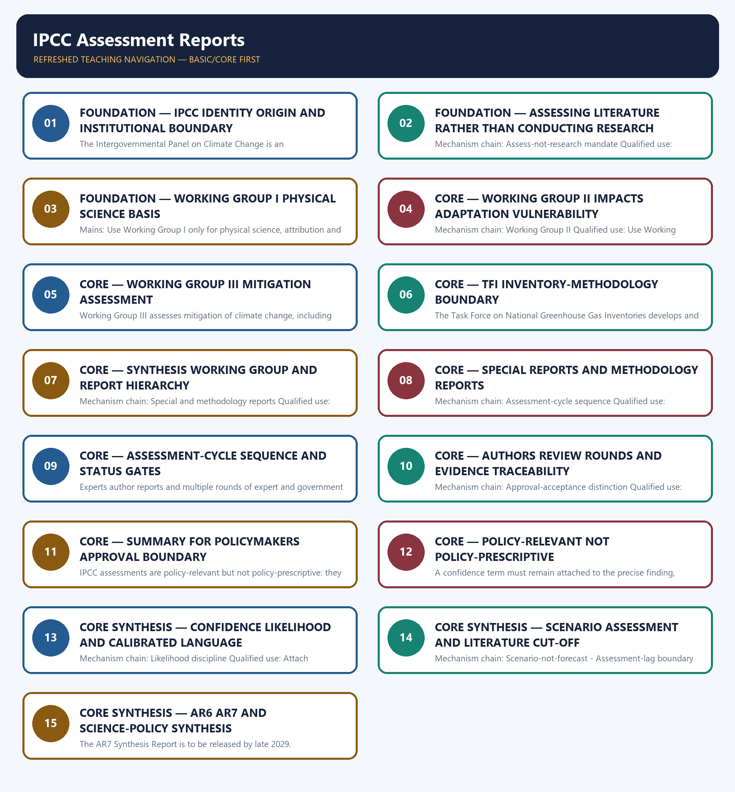

# IPCC Assessment Reports — Learner-v2 Complete Learning Session

> **Authoring-only generation:** 2026-09-03. No PDF was rendered and no tracker or index was mutated.

### SOURCE, PROGRESSION AND CURRENT-LINKAGE AUDIT

- **Generation date:** 2026-09-03.
- **Repository-first evidence:** the Basic owner is taught first and preserved in full; the Advanced owner is retained only in the optional final teaching block.
- **OCR evidence:** Repository Markdown was primary. OCR-searchable local official General Studies papers were used only to confirm printed routed demands. No answer key, marking scheme, unsupported page precision, ecological rate, species count, pollution standard, rule threshold, mission outcome or current status was inferred.
- **Qdrant:** not used; repository Markdown and available OCR context were sufficient.
- **PYQ integrity:** Audited ledgers route the verified 2023 GS-III demand on an IPCC sea-level-rise prediction and Indian Ocean impacts. Recurring objective distinctions concern founding institutions, Working Group mandates, inventory methodology and the assess-not-research boundary. No unverified question, key, projection or model answer is inferred.
- **Live-link boundary:** The official IPCC About page and AR7 page returned substantive process information. The AR6 landing page and glossary response were thin, and a Working Group URL redirected to an unrelated event. AR7 is recorded only as a cycle in progress; no planned report, outline, date, confidence term, likelihood threshold, scenario or projection was treated as a finding.
- **Fact/inference discipline:** no current-affairs item, PYQ wording, figure or quotation is invented.

### LIVE OFFICIAL-SOURCE ATTEMPT LOG

The checks below were made on 2026-09-03. Substantive official text is used only for the proposition it supports. Stubs, access failures, unrelated pages and thin landing pages are recorded and are not converted into ecological or current-status claims.

- https://www.ipcc.ch/about/ — attempted 2026-09-03; substantive IPCC text confirms creation by WMO and UNEP in 1988, assessment of published science, open expert-and-government review and that the IPCC does not conduct its own research.
- https://www.ipcc.ch/assessment-report/ar7/ — attempted 2026-09-03; substantive IPCC text states that AR7 is under way, that three Working Group contributions will be produced and that the Synthesis Report is planned after them. Planned products were not treated as published findings.
- https://www.ipcc.ch/report/ar6/syr/ — attempted 2026-09-03; the official landing page returned only the title 'Climate Change 2023'. No headline figure or calibrated finding was reconstructed from the stub.
- https://apps.ipcc.ch/glossary/ — attempted 2026-09-03; the official glossary application returned only its copyright/version footer. No confidence or likelihood threshold was transcribed from that thin response.
- https://www.ipcc.ch/working-group/ — attempted 2026-09-03; the URL redirected to an unrelated Working Group II outreach-event page. It was not used to define Working Group mandates.

## BASIC LEARNING SESSION



*Distinct embedded teaching-navigation image. The separate continuous Cārvāka-style flowchart package remains an independent at-a-glance artifact.*

### SESSION 1 — FOUNDATION — IPCC IDENTITY ORIGIN AND INSTITUTIONAL BOUNDARY

#### DEFINITION / WHAT THIS IS CALLED

**Plain-language definition:** Mechanism chain: IPCC identity - WMO-UNEP origin Qualified use: Define the IPCC and separate assessment from UNFCCC negotiation.

**Technical definition:** The Intergovernmental Panel on Climate Change is an intergovernmental scientific-assessment body that provides policy-relevant climate information; it is not the UNFCCC negotiating forum.

#### ANSWER-GRABBING OPENING — WRITE/ADAPT IN THE EXAM

> Mechanism chain: IPCC identity - WMO-UNEP origin Qualified use: Define the IPCC and separate assessment from UNFCCC negotiation.

#### MUST-WRITE KEYWORDS

- **FOUNDATION**
- **IPCC identity origin**
- **institutional boundary**
- **Mechanism chain**
- **Qualified use**
- **The Intergovernmental Panel on Climate Change**

**How to use them:** Frame the answer through FOUNDATION; define IPCC identity origin, connect institutional boundary with Mechanism chain to explain the mechanism, and use Qualified use for the decisive comparison or qualification.

#### VISUAL FIRST

```text
IPCC IDENTITY ORIGIN AND INSTITUTIONAL BOUNDARY
01. IPCC identity
    |
    v
02. WMO-UNEP origin
BOUNDARY -> Do not call the IPCC a negotiating body, treaty secretariat or climate regulator.
```

*This topic-specific rail fixes the evidence sequence and its exam boundary before analysis.*

#### CORE EXPLANATION

The Intergovernmental Panel on Climate Change is an intergovernmental scientific-assessment body that provides policy-relevant climate information; it is not the UNFCCC negotiating forum. The IPCC was created in 1988 by the World Meteorological Organization and the United Nations Environment Programme; founding bodies, current members and report authors are distinct categories.

#### NAMED EVIDENCE AND MECHANISM

- The Intergovernmental Panel on Climate Change is an intergovernmental scientific-assessment body that provides policy-relevant climate information; it is not the UNFCCC negotiating forum.
- The IPCC was created in 1988 by the World Meteorological Organization and the United Nations Environment Programme; founding bodies, current members and report authors are distinct categories.

#### EXAMINER CAUTION

- Do not call the IPCC a negotiating body, treaty secretariat or climate regulator.

#### EXAM LINK

- **Prelims:** Preserve the exact receiving medium, system boundary, measured parameter, actor, process, spatial and temporal scale, rule vintage and scientific or legal status; never turn a context-dependent pattern into a universal rule.
- **Mains:** Define the IPCC and separate assessment from UNFCCC negotiation.

#### MINI RECAP

- **Mechanism chain:** IPCC identity -> WMO-UNEP origin
- **Qualified use:** Define the IPCC and separate assessment from UNFCCC negotiation.

#### CLOSING RECALL FLOW — FOUNDATION — IPCC IDENTITY ORIGIN AND INSTITUTIONAL BOUNDARY

```text
START / CONCEPT: FOUNDATION — IPCC identity origin and institutional boundary
        |
        v
EXACT TERMS: FOUNDATION · IPCC identity origin · institutional boundary · Mechanism chain · Qualified use · The Intergovernmental Panel on Climate Change
        |
        v
MECHANISM / ARGUMENT: Do not call the IPCC a negotiating body, treaty secretariat or climate regulator.
        |
        v
CONSEQUENCE / CONTRAST: The Intergovernmental Panel on Climate Change is an intergovernmental scientific-assessment body that provides policy-relevant climate information; it is not the UNFCCC negotiating forum.
        |
        v
UPSC TRAP / ANSWER-USE: Do not miss this limiting distinction: iPCC identity - WMO-UNEP origin Qualified use.
        |
        v
ANSWER-GRABBING FORMULATION: Mechanism chain: IPCC identity - WMO-UNEP origin Qualified use: Define the IPCC and separate assessment from UNFCCC negotiation.
```
### SESSION 2 — FOUNDATION — ASSESSING LITERATURE RATHER THAN CONDUCTING RESEARCH

#### DEFINITION / WHAT THIS IS CALLED

**Plain-language definition:** The IPCC assesses published scientific, technical and socio-economic literature and identifies agreement and knowledge gaps; it does not conduct its own original research.

**Technical definition:** Mechanism chain: Assess-not-research mandate Qualified use: Explain literature synthesis, author assessment and knowledge-gap identification.

#### ANSWER-GRABBING OPENING — WRITE/ADAPT IN THE EXAM

> The IPCC assesses published scientific, technical and socio-economic literature and identifies agreement and knowledge gaps; it does not conduct its own original research.

#### MUST-WRITE KEYWORDS

- **FOUNDATION**
- **Assessing literature rather than conducting research**
- **Mechanism chain**
- **Qualified use**
- **The IPCC**
- **IPCC**

**How to use them:** Frame the answer through FOUNDATION; define Assessing literature rather than conducting research, connect Mechanism chain with Qualified use to explain the mechanism, and use The IPCC for the decisive comparison or qualification.

#### VISUAL FIRST

```text
ASSESSING LITERATURE RATHER THAN CONDUCTING RESEARCH
01. Assess-not-research mandate
BOUNDARY -> Do not say the IPCC conducts its own primary experiments or observations.
```

*This topic-specific rail fixes the evidence sequence and its exam boundary before analysis.*

#### CORE EXPLANATION

The IPCC assesses published scientific, technical and socio-economic literature and identifies agreement and knowledge gaps; it does not conduct its own original research.

#### NAMED EVIDENCE AND MECHANISM

- The IPCC assesses published scientific, technical and socio-economic literature and identifies agreement and knowledge gaps; it does not conduct its own original research.

#### EXAMINER CAUTION

- Do not say the IPCC conducts its own primary experiments or observations.

#### EXAM LINK

- **Prelims:** Preserve the exact receiving medium, system boundary, measured parameter, actor, process, spatial and temporal scale, rule vintage and scientific or legal status; never turn a context-dependent pattern into a universal rule.
- **Mains:** Explain literature synthesis, author assessment and knowledge-gap identification.

#### MINI RECAP

- **Mechanism chain:** Assess-not-research mandate
- **Qualified use:** Explain literature synthesis, author assessment and knowledge-gap identification.

#### CLOSING RECALL FLOW — FOUNDATION — ASSESSING LITERATURE RATHER THAN CONDUCTING RESEARCH

```text
START / CONCEPT: FOUNDATION — Assessing literature rather than conducting research
        |
        v
EXACT TERMS: FOUNDATION · Assessing literature rather than conducting research · Mechanism chain · Qualified use · The IPCC · IPCC
        |
        v
MECHANISM / ARGUMENT: Mechanism chain: Assess-not-research mandate Qualified use: Explain literature synthesis, author assessment and knowledge-gap identification.
        |
        v
CONSEQUENCE / CONTRAST: Do not say the IPCC conducts its own primary experiments or observations.
        |
        v
UPSC TRAP / ANSWER-USE: Do not miss this limiting distinction: explain literature synthesis, author assessment and knowledge-gap identification.
        |
        v
ANSWER-GRABBING FORMULATION: The IPCC assesses published scientific, technical and socio-economic literature and identifies agreement and knowledge gaps; it does not conduct its own original research.
```
### SESSION 3 — FOUNDATION — WORKING GROUP I PHYSICAL SCIENCE BASIS

#### DEFINITION / WHAT THIS IS CALLED

**Plain-language definition:** Mechanism chain: Working Group I Qualified use: Use Working Group I only for physical science, attribution and projections.

**Technical definition:** Mains: Use Working Group I only for physical science, attribution and projections.

#### ANSWER-GRABBING OPENING — WRITE/ADAPT IN THE EXAM

> Do not swap the mandates of Working Groups I, II and III.

#### MUST-WRITE KEYWORDS

- **FOUNDATION**
- **Working Group I physical science basis**
- **Mechanism chain**
- **Qualified use**
- **Working Groups**
- **II**

**How to use them:** Frame the answer through FOUNDATION; define Working Group I physical science basis, connect Mechanism chain with Qualified use to explain the mechanism, and use Working Groups for the decisive comparison or qualification.

#### VISUAL FIRST

```text
WORKING GROUP I PHYSICAL SCIENCE BASIS
01. Working Group I
BOUNDARY -> Do not swap the mandates of Working Groups I, II and III.
```

*This topic-specific rail fixes the evidence sequence and its exam boundary before analysis.*

#### CORE EXPLANATION

Working Group I assesses the physical science basis of climate change, including observations, drivers, attribution and conditional projections.

#### NAMED EVIDENCE AND MECHANISM

- Working Group I assesses the physical science basis of climate change, including observations, drivers, attribution and conditional projections.

#### EXAMINER CAUTION

- Do not swap the mandates of Working Groups I, II and III.

#### EXAM LINK

- **Prelims:** Preserve the exact receiving medium, system boundary, measured parameter, actor, process, spatial and temporal scale, rule vintage and scientific or legal status; never turn a context-dependent pattern into a universal rule.
- **Mains:** Use Working Group I only for physical science, attribution and projections.

#### MINI RECAP

- **Mechanism chain:** Working Group I
- **Qualified use:** Use Working Group I only for physical science, attribution and projections.

#### CLOSING RECALL FLOW — FOUNDATION — WORKING GROUP I PHYSICAL SCIENCE BASIS

```text
START / CONCEPT: FOUNDATION — Working Group I physical science basis
        |
        v
EXACT TERMS: FOUNDATION · Working Group I physical science basis · Mechanism chain · Qualified use · Working Groups · II
        |
        v
MECHANISM / ARGUMENT: Mechanism chain: Working Group I Qualified use: Use Working Group I only for physical science, attribution and projections.
        |
        v
CONSEQUENCE / CONTRAST: Mains: Use Working Group I only for physical science, attribution and projections.
        |
        v
UPSC TRAP / ANSWER-USE: Do not miss this limiting distinction: do not swap the mandates of Working Groups I, II and III.
        |
        v
ANSWER-GRABBING FORMULATION: Do not swap the mandates of Working Groups I, II and III.
```
### SESSION 4 — CORE — WORKING GROUP II IMPACTS ADAPTATION VULNERABILITY

#### DEFINITION / WHAT THIS IS CALLED

**Plain-language definition:** Working Group II assesses impacts, adaptation and vulnerability; it is not the mitigation-options working group.

**Technical definition:** Mechanism chain: Working Group II Qualified use: Use Working Group II for impacts, vulnerability, adaptation and limits.

#### ANSWER-GRABBING OPENING — WRITE/ADAPT IN THE EXAM

> Working Group II assesses impacts, adaptation and vulnerability; it is not the mitigation-options working group.

#### MUST-WRITE KEYWORDS

- **Working Group II impacts adaptation vulnerability**
- **Mechanism chain**
- **Qualified use**
- **Working Group II**
- **Task Force**
- **Inventories**

**How to use them:** Frame the answer through Working Group II impacts adaptation vulnerability; define Mechanism chain, connect Qualified use with Working Group II to explain the mechanism, and use Task Force for the decisive comparison or qualification.

#### VISUAL FIRST

```text
WORKING GROUP II IMPACTS ADAPTATION VULNERABILITY
01. Working Group II
BOUNDARY -> Do not call the Task Force on Inventories a fourth Working Group.
```

*This topic-specific rail fixes the evidence sequence and its exam boundary before analysis.*

#### CORE EXPLANATION

Working Group II assesses impacts, adaptation and vulnerability; it is not the mitigation-options working group.

#### NAMED EVIDENCE AND MECHANISM

- Working Group II assesses impacts, adaptation and vulnerability; it is not the mitigation-options working group.

#### EXAMINER CAUTION

- Do not call the Task Force on Inventories a fourth Working Group.

#### EXAM LINK

- **Prelims:** Preserve the exact receiving medium, system boundary, measured parameter, actor, process, spatial and temporal scale, rule vintage and scientific or legal status; never turn a context-dependent pattern into a universal rule.
- **Mains:** Use Working Group II for impacts, vulnerability, adaptation and limits.

#### MINI RECAP

- **Mechanism chain:** Working Group II
- **Qualified use:** Use Working Group II for impacts, vulnerability, adaptation and limits.

#### CLOSING RECALL FLOW — CORE — WORKING GROUP II IMPACTS ADAPTATION VULNERABILITY

```text
START / CONCEPT: CORE — Working Group II impacts adaptation vulnerability
        |
        v
EXACT TERMS: Working Group II impacts adaptation vulnerability · Mechanism chain · Qualified use · Working Group II · Task Force · Inventories
        |
        v
MECHANISM / ARGUMENT: Mechanism chain: Working Group II Qualified use: Use Working Group II for impacts, vulnerability, adaptation and limits.
        |
        v
CONSEQUENCE / CONTRAST: Mains: Use Working Group II for impacts, vulnerability, adaptation and limits.
        |
        v
UPSC TRAP / ANSWER-USE: Do not call the Task Force on Inventories a fourth Working Group.
        |
        v
ANSWER-GRABBING FORMULATION: Working Group II assesses impacts, adaptation and vulnerability; it is not the mitigation-options working group.
```
### SESSION 5 — CORE — WORKING GROUP III MITIGATION ASSESSMENT

#### DEFINITION / WHAT THIS IS CALLED

**Plain-language definition:** Mechanism chain: Working Group III Qualified use: Use Working Group III for mitigation pathways and enabling conditions.

**Technical definition:** Working Group III assesses mitigation of climate change, including pathways, sectors and enabling conditions; it does not negotiate national commitments.

#### ANSWER-GRABBING OPENING — WRITE/ADAPT IN THE EXAM

> Working Group III assesses mitigation of climate change, including pathways, sectors and enabling conditions; it does not negotiate national commitments.

#### MUST-WRITE KEYWORDS

- **Working Group III mitigation assessment**
- **Mechanism chain**
- **Qualified use**
- **Working Group III**
- **Working Group**
- **Synthesis Report**

**How to use them:** Frame the answer through Working Group III mitigation assessment; define Mechanism chain, connect Qualified use with Working Group III to explain the mechanism, and use Working Group for the decisive comparison or qualification.

#### VISUAL FIRST

```text
WORKING GROUP III MITIGATION ASSESSMENT
01. Working Group III
BOUNDARY -> Do not merge a Working Group report with the Synthesis Report.
```

*This topic-specific rail fixes the evidence sequence and its exam boundary before analysis.*

#### CORE EXPLANATION

Working Group III assesses mitigation of climate change, including pathways, sectors and enabling conditions; it does not negotiate national commitments.

#### NAMED EVIDENCE AND MECHANISM

- Working Group III assesses mitigation of climate change, including pathways, sectors and enabling conditions; it does not negotiate national commitments.

#### EXAMINER CAUTION

- Do not merge a Working Group report with the Synthesis Report.

#### EXAM LINK

- **Prelims:** Preserve the exact receiving medium, system boundary, measured parameter, actor, process, spatial and temporal scale, rule vintage and scientific or legal status; never turn a context-dependent pattern into a universal rule.
- **Mains:** Use Working Group III for mitigation pathways and enabling conditions.

#### MINI RECAP

- **Mechanism chain:** Working Group III
- **Qualified use:** Use Working Group III for mitigation pathways and enabling conditions.

#### CLOSING RECALL FLOW — CORE — WORKING GROUP III MITIGATION ASSESSMENT

```text
START / CONCEPT: CORE — Working Group III mitigation assessment
        |
        v
EXACT TERMS: Working Group III mitigation assessment · Mechanism chain · Qualified use · Working Group III · Working Group · Synthesis Report
        |
        v
MECHANISM / ARGUMENT: Mechanism chain: Working Group III Qualified use: Use Working Group III for mitigation pathways and enabling conditions.
        |
        v
CONSEQUENCE / CONTRAST: Do not merge a Working Group report with the Synthesis Report.
        |
        v
UPSC TRAP / ANSWER-USE: Do not miss this limiting distinction: use Working Group III for mitigation pathways and enabling conditions.
        |
        v
ANSWER-GRABBING FORMULATION: Working Group III assesses mitigation of climate change, including pathways, sectors and enabling conditions; it does not negotiate national commitments.
```
### SESSION 6 — CORE — TFI INVENTORY-METHODOLOGY BOUNDARY

#### DEFINITION / WHAT THIS IS CALLED

**Plain-language definition:** Mechanism chain: TFI boundary - Synthesis Report Qualified use: Explain TFI as inventory methodology rather than a thematic Working Group.

**Technical definition:** The Task Force on National Greenhouse Gas Inventories develops and refines inventory methodologies; it is a distinct IPCC body, not a fourth thematic Working Group.

#### ANSWER-GRABBING OPENING — WRITE/ADAPT IN THE EXAM

> Mechanism chain: TFI boundary - Synthesis Report Qualified use: Explain TFI as inventory methodology rather than a thematic Working Group.

#### MUST-WRITE KEYWORDS

- **TFI inventory-methodology boundary**
- **Mechanism chain**
- **Qualified use**
- **The Task Force**
- **National Greenhouse Gas Inventories**
- **IPCC**

**How to use them:** Frame the answer through TFI inventory-methodology boundary; define Mechanism chain, connect Qualified use with The Task Force to explain the mechanism, and use National Greenhouse Gas Inventories for the decisive comparison or qualification.

#### VISUAL FIRST

```text
TFI INVENTORY-METHODOLOGY BOUNDARY
01. TFI boundary
    |
    v
02. Synthesis Report
BOUNDARY -> Do not treat a Special Report or Methodology Report as a full assessment cycle.
```

*This topic-specific rail fixes the evidence sequence and its exam boundary before analysis.*

#### CORE EXPLANATION

The Task Force on National Greenhouse Gas Inventories develops and refines inventory methodologies; it is a distinct IPCC body, not a fourth thematic Working Group. A Synthesis Report integrates assessment-cycle findings across the Working Group contributions and relevant products; it is not simply another Working Group report.

#### NAMED EVIDENCE AND MECHANISM

- The Task Force on National Greenhouse Gas Inventories develops and refines inventory methodologies; it is a distinct IPCC body, not a fourth thematic Working Group.
- A Synthesis Report integrates assessment-cycle findings across the Working Group contributions and relevant products; it is not simply another Working Group report.

#### EXAMINER CAUTION

- Do not treat a Special Report or Methodology Report as a full assessment cycle.

#### EXAM LINK

- **Prelims:** Preserve the exact receiving medium, system boundary, measured parameter, actor, process, spatial and temporal scale, rule vintage and scientific or legal status; never turn a context-dependent pattern into a universal rule.
- **Mains:** Explain TFI as inventory methodology rather than a thematic Working Group.

#### MINI RECAP

- **Mechanism chain:** TFI boundary -> Synthesis Report
- **Qualified use:** Explain TFI as inventory methodology rather than a thematic Working Group.

#### CLOSING RECALL FLOW — CORE — TFI INVENTORY-METHODOLOGY BOUNDARY

```text
START / CONCEPT: CORE — TFI inventory-methodology boundary
        |
        v
EXACT TERMS: TFI inventory-methodology boundary · Mechanism chain · Qualified use · The Task Force · National Greenhouse Gas Inventories · IPCC
        |
        v
MECHANISM / ARGUMENT: The Task Force on National Greenhouse Gas Inventories develops and refines inventory methodologies; it is a distinct IPCC body, not a fourth thematic Working Group.
        |
        v
CONSEQUENCE / CONTRAST: A Synthesis Report integrates assessment-cycle findings across the Working Group contributions and relevant products; it is not simply another Working Group report.
        |
        v
UPSC TRAP / ANSWER-USE: Do not treat a Special Report or Methodology Report as a full assessment cycle.
        |
        v
ANSWER-GRABBING FORMULATION: Mechanism chain: TFI boundary - Synthesis Report Qualified use: Explain TFI as inventory methodology rather than a thematic Working Group.
```
### SESSION 7 — CORE — SYNTHESIS WORKING GROUP AND REPORT HIERARCHY

#### DEFINITION / WHAT THIS IS CALLED

**Plain-language definition:** Special Reports assess defined policy-relevant themes, while Methodology Reports support measurement and inventory methods; neither label means a completed full assessment cycle.

**Technical definition:** Mechanism chain: Special and methodology reports Qualified use: Place each report within the cycle before citing its conclusion.

#### ANSWER-GRABBING OPENING — WRITE/ADAPT IN THE EXAM

> Special Reports assess defined policy-relevant themes, while Methodology Reports support measurement and inventory methods; neither label means a completed full assessment cycle.

#### MUST-WRITE KEYWORDS

- **Synthesis Working Group**
- **report hierarchy**
- **Mechanism chain**
- **Qualified use**
- **Special Reports**
- **Methodology Reports**

**How to use them:** Frame the answer through Synthesis Working Group; define report hierarchy, connect Mechanism chain with Qualified use to explain the mechanism, and use Special Reports for the decisive comparison or qualification.

#### VISUAL FIRST

```text
SYNTHESIS WORKING GROUP AND REPORT HIERARCHY
01. Special and methodology reports
BOUNDARY -> Do not convert an outline, scoping decision or workplan into a published finding.
```

*This topic-specific rail fixes the evidence sequence and its exam boundary before analysis.*

#### CORE EXPLANATION

Special Reports assess defined policy-relevant themes, while Methodology Reports support measurement and inventory methods; neither label means a completed full assessment cycle.

#### NAMED EVIDENCE AND MECHANISM

- Special Reports assess defined policy-relevant themes, while Methodology Reports support measurement and inventory methods; neither label means a completed full assessment cycle.

#### EXAMINER CAUTION

- Do not convert an outline, scoping decision or workplan into a published finding.

#### EXAM LINK

- **Prelims:** Preserve the exact receiving medium, system boundary, measured parameter, actor, process, spatial and temporal scale, rule vintage and scientific or legal status; never turn a context-dependent pattern into a universal rule.
- **Mains:** Place each report within the cycle before citing its conclusion.

#### MINI RECAP

- **Mechanism chain:** Special and methodology reports
- **Qualified use:** Place each report within the cycle before citing its conclusion.

#### CLOSING RECALL FLOW — CORE — SYNTHESIS WORKING GROUP AND REPORT HIERARCHY

```text
START / CONCEPT: CORE — Synthesis Working Group and report hierarchy
        |
        v
EXACT TERMS: Synthesis Working Group · report hierarchy · Mechanism chain · Qualified use · Special Reports · Methodology Reports
        |
        v
MECHANISM / ARGUMENT: Mechanism chain: Special and methodology reports Qualified use: Place each report within the cycle before citing its conclusion.
        |
        v
CONSEQUENCE / CONTRAST: Do not convert an outline, scoping decision or workplan into a published finding.
        |
        v
UPSC TRAP / ANSWER-USE: Do not miss this limiting distinction: special Reports assess defined policy-relevant themes.
        |
        v
ANSWER-GRABBING FORMULATION: Special Reports assess defined policy-relevant themes, while Methodology Reports support measurement and inventory methods; neither label means a completed full assessment cycle.
```
### SESSION 8 — CORE — SPECIAL REPORTS AND METHODOLOGY REPORTS

#### DEFINITION / WHAT THIS IS CALLED

**Plain-language definition:** CORE — Special Reports and Methodology Reports comprises Special Reports, Methodology Reports and Mechanism chain as its core connected dimensions.

**Technical definition:** Mechanism chain: Assessment-cycle sequence Qualified use: Distinguish topic-specific assessment from inventory-method guidance.

#### ANSWER-GRABBING OPENING — WRITE/ADAPT IN THE EXAM

> Do not describe government SPM consideration as government authorship of the science.

#### MUST-WRITE KEYWORDS

- **Special Reports**
- **Methodology Reports**
- **Mechanism chain**
- **Qualified use**
- **SPM**
- **Assessment-cycle**

**How to use them:** Frame the answer through Special Reports; define Methodology Reports, connect Mechanism chain with Qualified use to explain the mechanism, and use SPM for the decisive comparison or qualification.

#### VISUAL FIRST

```text
SPECIAL REPORTS AND METHODOLOGY REPORTS
01. Assessment-cycle sequence
BOUNDARY -> Do not describe government SPM consideration as government authorship of the science.
```

*This topic-specific rail fixes the evidence sequence and its exam boundary before analysis.*

#### CORE EXPLANATION

An assessment cycle proceeds through scoped products, author selection, drafts, review, revision and plenary consideration; a planned outline or workplan is not a published scientific finding.

#### NAMED EVIDENCE AND MECHANISM

- An assessment cycle proceeds through scoped products, author selection, drafts, review, revision and plenary consideration; a planned outline or workplan is not a published scientific finding.

#### EXAMINER CAUTION

- Do not describe government SPM consideration as government authorship of the science.

#### EXAM LINK

- **Prelims:** Preserve the exact receiving medium, system boundary, measured parameter, actor, process, spatial and temporal scale, rule vintage and scientific or legal status; never turn a context-dependent pattern into a universal rule.
- **Mains:** Distinguish topic-specific assessment from inventory-method guidance.

#### MINI RECAP

- **Mechanism chain:** Assessment-cycle sequence
- **Qualified use:** Distinguish topic-specific assessment from inventory-method guidance.

#### CLOSING RECALL FLOW — CORE — SPECIAL REPORTS AND METHODOLOGY REPORTS

```text
START / CONCEPT: CORE — Special Reports and Methodology Reports
        |
        v
EXACT TERMS: Special Reports · Methodology Reports · Mechanism chain · Qualified use · SPM · Assessment-cycle
        |
        v
MECHANISM / ARGUMENT: Mechanism chain: Assessment-cycle sequence Qualified use: Distinguish topic-specific assessment from inventory-method guidance.
        |
        v
CONSEQUENCE / CONTRAST: An assessment cycle proceeds through scoped products, author selection, drafts, review, revision and plenary consideration; a planned outline or workplan is not a published scientific finding.
        |
        v
UPSC TRAP / ANSWER-USE: Do not miss this limiting distinction: do not describe government SPM consideration as government authorship of the science.
        |
        v
ANSWER-GRABBING FORMULATION: Do not describe government SPM consideration as government authorship of the science.
```
### SESSION 9 — CORE — ASSESSMENT-CYCLE SEQUENCE AND STATUS GATES

#### DEFINITION / WHAT THIS IS CALLED

**Plain-language definition:** Mechanism chain: Author-review architecture Qualified use: Move through scope, draft, review, revision and plenary status without skipping gates.

**Technical definition:** Experts author reports and multiple rounds of expert and government review test completeness, balance and traceability; reviewers do not automatically become report authors.

#### ANSWER-GRABBING OPENING — WRITE/ADAPT IN THE EXAM

> Mechanism chain: Author-review architecture Qualified use: Move through scope, draft, review, revision and plenary status without skipping gates.

#### MUST-WRITE KEYWORDS

- **Assessment-cycle sequence**
- **status gates**
- **Mechanism chain**
- **Qualified use**
- **Experts**
- **Author-review**

**How to use them:** Frame the answer through Assessment-cycle sequence; define status gates, connect Mechanism chain with Qualified use to explain the mechanism, and use Experts for the decisive comparison or qualification.

#### VISUAL FIRST

```text
ASSESSMENT-CYCLE SEQUENCE AND STATUS GATES
01. Author-review architecture
BOUNDARY -> Do not treat policy-relevant as policy-prescriptive.
```

*This topic-specific rail fixes the evidence sequence and its exam boundary before analysis.*

#### CORE EXPLANATION

Experts author reports and multiple rounds of expert and government review test completeness, balance and traceability; reviewers do not automatically become report authors.

#### NAMED EVIDENCE AND MECHANISM

- Experts author reports and multiple rounds of expert and government review test completeness, balance and traceability; reviewers do not automatically become report authors.

#### EXAMINER CAUTION

- Do not treat policy-relevant as policy-prescriptive.

#### EXAM LINK

- **Prelims:** Preserve the exact receiving medium, system boundary, measured parameter, actor, process, spatial and temporal scale, rule vintage and scientific or legal status; never turn a context-dependent pattern into a universal rule.
- **Mains:** Move through scope, draft, review, revision and plenary status without skipping gates.

#### MINI RECAP

- **Mechanism chain:** Author-review architecture
- **Qualified use:** Move through scope, draft, review, revision and plenary status without skipping gates.

#### CLOSING RECALL FLOW — CORE — ASSESSMENT-CYCLE SEQUENCE AND STATUS GATES

```text
START / CONCEPT: CORE — Assessment-cycle sequence and status gates
        |
        v
EXACT TERMS: Assessment-cycle sequence · status gates · Mechanism chain · Qualified use · Experts · Author-review
        |
        v
MECHANISM / ARGUMENT: Experts author reports and multiple rounds of expert and government review test completeness, balance and traceability; reviewers do not automatically become report authors.
        |
        v
CONSEQUENCE / CONTRAST: Do not treat policy-relevant as policy-prescriptive.
        |
        v
UPSC TRAP / ANSWER-USE: Do not miss this limiting distinction: move through scope, draft, review, revision and plenary status without skipping gates.
        |
        v
ANSWER-GRABBING FORMULATION: Mechanism chain: Author-review architecture Qualified use: Move through scope, draft, review, revision and plenary status without skipping gates.
```
### SESSION 10 — CORE — AUTHORS REVIEW ROUNDS AND EVIDENCE TRACEABILITY

#### DEFINITION / WHAT THIS IS CALLED

**Plain-language definition:** Summaries for Policymakers are considered line by line with governments and authors, while longer reports follow their applicable acceptance or approval procedure; government involvement must not be misdescribed as governments conducting the science.

**Technical definition:** Mechanism chain: Approval-acceptance distinction Qualified use: Show how review improves traceability without implying reviewer authorship.

#### ANSWER-GRABBING OPENING — WRITE/ADAPT IN THE EXAM

> Mechanism chain: Approval-acceptance distinction Qualified use: Show how review improves traceability without implying reviewer authorship.

#### MUST-WRITE KEYWORDS

- **Authors review rounds**
- **evidence traceability**
- **Mechanism chain**
- **Qualified use**
- **Summaries for Policymakers**
- **Summaries**

**How to use them:** Frame the answer through Authors review rounds; define evidence traceability, connect Mechanism chain with Qualified use to explain the mechanism, and use Summaries for Policymakers for the decisive comparison or qualification.

#### VISUAL FIRST

```text
AUTHORS REVIEW ROUNDS AND EVIDENCE TRACEABILITY
01. Approval-acceptance distinction
BOUNDARY -> Do not use confidence and likelihood as interchangeable labels.
```

*This topic-specific rail fixes the evidence sequence and its exam boundary before analysis.*

#### CORE EXPLANATION

Summaries for Policymakers are considered line by line with governments and authors, while longer reports follow their applicable acceptance or approval procedure; government involvement must not be misdescribed as governments conducting the science.

#### NAMED EVIDENCE AND MECHANISM

- Summaries for Policymakers are considered line by line with governments and authors, while longer reports follow their applicable acceptance or approval procedure; government involvement must not be misdescribed as governments conducting the science.

#### EXAMINER CAUTION

- Do not use confidence and likelihood as interchangeable labels.

#### EXAM LINK

- **Prelims:** Preserve the exact receiving medium, system boundary, measured parameter, actor, process, spatial and temporal scale, rule vintage and scientific or legal status; never turn a context-dependent pattern into a universal rule.
- **Mains:** Show how review improves traceability without implying reviewer authorship.

#### MINI RECAP

- **Mechanism chain:** Approval-acceptance distinction
- **Qualified use:** Show how review improves traceability without implying reviewer authorship.

#### CLOSING RECALL FLOW — CORE — AUTHORS REVIEW ROUNDS AND EVIDENCE TRACEABILITY

```text
START / CONCEPT: CORE — Authors review rounds and evidence traceability
        |
        v
EXACT TERMS: Authors review rounds · evidence traceability · Mechanism chain · Qualified use · Summaries for Policymakers · Summaries
        |
        v
MECHANISM / ARGUMENT: Summaries for Policymakers are considered line by line with governments and authors, while longer reports follow their applicable acceptance or approval procedure; government involvement must not be misdescribed as governments conducting the science.
        |
        v
CONSEQUENCE / CONTRAST: Mains: Show how review improves traceability without implying reviewer authorship.
        |
        v
UPSC TRAP / ANSWER-USE: Do not use confidence and likelihood as interchangeable labels.
        |
        v
ANSWER-GRABBING FORMULATION: Mechanism chain: Approval-acceptance distinction Qualified use: Show how review improves traceability without implying reviewer authorship.
```
### SESSION 11 — CORE — SUMMARY FOR POLICYMAKERS APPROVAL BOUNDARY

#### DEFINITION / WHAT THIS IS CALLED

**Plain-language definition:** Mechanism chain: Policy-relevant boundary - Confidence-likelihood distinction Qualified use: Separate line-by-line SPM consideration from the status of the underlying report.

**Technical definition:** IPCC assessments are policy-relevant but not policy-prescriptive: they assess evidence, risks and response options without selecting a national policy or negotiating a treaty target.

#### ANSWER-GRABBING OPENING — WRITE/ADAPT IN THE EXAM

> Mechanism chain: Policy-relevant boundary - Confidence-likelihood distinction Qualified use: Separate line-by-line SPM consideration from the status of the underlying report.

#### MUST-WRITE KEYWORDS

- **Summary for Policymakers approval boundary**
- **Mechanism chain**
- **Qualified use**
- **IPCC assessments**
- **IPCC**
- **Confidence**

**How to use them:** Frame the answer through Summary for Policymakers approval boundary; define Mechanism chain, connect Qualified use with IPCC assessments to explain the mechanism, and use IPCC for the decisive comparison or qualification.

#### VISUAL FIRST

```text
SUMMARY FOR POLICYMAKERS APPROVAL BOUNDARY
01. Policy-relevant boundary
    |
    v
02. Confidence-likelihood distinction
BOUNDARY -> Do not transfer calibrated language from one finding or scale to another.
```

*This topic-specific rail fixes the evidence sequence and its exam boundary before analysis.*

#### CORE EXPLANATION

IPCC assessments are policy-relevant but not policy-prescriptive: they assess evidence, risks and response options without selecting a national policy or negotiating a treaty target. Confidence communicates the validity of a finding through evidence and agreement, whereas likelihood expresses an assessed probability for a well-defined outcome; the two calibrated dimensions are not synonyms.

#### NAMED EVIDENCE AND MECHANISM

- IPCC assessments are policy-relevant but not policy-prescriptive: they assess evidence, risks and response options without selecting a national policy or negotiating a treaty target.
- Confidence communicates the validity of a finding through evidence and agreement, whereas likelihood expresses an assessed probability for a well-defined outcome; the two calibrated dimensions are not synonyms.

#### EXAMINER CAUTION

- Do not transfer calibrated language from one finding or scale to another.

#### EXAM LINK

- **Prelims:** Preserve the exact receiving medium, system boundary, measured parameter, actor, process, spatial and temporal scale, rule vintage and scientific or legal status; never turn a context-dependent pattern into a universal rule.
- **Mains:** Separate line-by-line SPM consideration from the status of the underlying report.

#### MINI RECAP

- **Mechanism chain:** Policy-relevant boundary -> Confidence-likelihood distinction
- **Qualified use:** Separate line-by-line SPM consideration from the status of the underlying report.

#### CLOSING RECALL FLOW — CORE — SUMMARY FOR POLICYMAKERS APPROVAL BOUNDARY

```text
START / CONCEPT: CORE — Summary for Policymakers approval boundary
        |
        v
EXACT TERMS: Summary for Policymakers approval boundary · Mechanism chain · Qualified use · IPCC assessments · IPCC · Confidence
        |
        v
MECHANISM / ARGUMENT: Confidence communicates the validity of a finding through evidence and agreement, whereas likelihood expresses an assessed probability for a well-defined outcome; the two calibrated dimensions are not synonyms.
        |
        v
CONSEQUENCE / CONTRAST: IPCC assessments are policy-relevant but not policy-prescriptive: they assess evidence, risks and response options without selecting a national policy or negotiating a treaty target.
        |
        v
UPSC TRAP / ANSWER-USE: Do not transfer calibrated language from one finding or scale to another.
        |
        v
ANSWER-GRABBING FORMULATION: Mechanism chain: Policy-relevant boundary - Confidence-likelihood distinction Qualified use: Separate line-by-line SPM consideration from the status of the underlying report.
```
### SESSION 12 — CORE — POLICY-RELEVANT NOT POLICY-PRESCRIPTIVE

#### DEFINITION / WHAT THIS IS CALLED

**Plain-language definition:** Mechanism chain: Confidence discipline Qualified use: Present options and risks without attributing a policy recommendation to the IPCC.

**Technical definition:** A confidence term must remain attached to the precise finding, evidence base, scale and report that used it; it cannot be transferred to a broader claim.

#### ANSWER-GRABBING OPENING — WRITE/ADAPT IN THE EXAM

> Mechanism chain: Confidence discipline Qualified use: Present options and risks without attributing a policy recommendation to the IPCC.

#### MUST-WRITE KEYWORDS

- **Policy-relevant not policy-prescriptive**
- **Mechanism chain**
- **Qualified use**
- **Confidence**
- **Qualified**
- **Present**

**How to use them:** Frame the answer through Policy-relevant not policy-prescriptive; define Mechanism chain, connect Qualified use with Confidence to explain the mechanism, and use Qualified for the decisive comparison or qualification.

#### VISUAL FIRST

```text
POLICY-RELEVANT NOT POLICY-PRESCRIPTIVE
01. Confidence discipline
BOUNDARY -> Do not call a scenario a forecast.
```

*This topic-specific rail fixes the evidence sequence and its exam boundary before analysis.*

#### CORE EXPLANATION

A confidence term must remain attached to the precise finding, evidence base, scale and report that used it; it cannot be transferred to a broader claim.

#### NAMED EVIDENCE AND MECHANISM

- A confidence term must remain attached to the precise finding, evidence base, scale and report that used it; it cannot be transferred to a broader claim.

#### EXAMINER CAUTION

- Do not call a scenario a forecast.

#### EXAM LINK

- **Prelims:** Preserve the exact receiving medium, system boundary, measured parameter, actor, process, spatial and temporal scale, rule vintage and scientific or legal status; never turn a context-dependent pattern into a universal rule.
- **Mains:** Present options and risks without attributing a policy recommendation to the IPCC.

#### MINI RECAP

- **Mechanism chain:** Confidence discipline
- **Qualified use:** Present options and risks without attributing a policy recommendation to the IPCC.

#### CLOSING RECALL FLOW — CORE — POLICY-RELEVANT NOT POLICY-PRESCRIPTIVE

```text
START / CONCEPT: CORE — Policy-relevant not policy-prescriptive
        |
        v
EXACT TERMS: Policy-relevant not policy-prescriptive · Mechanism chain · Qualified use · Confidence · Qualified · Present
        |
        v
MECHANISM / ARGUMENT: A confidence term must remain attached to the precise finding, evidence base, scale and report that used it; it cannot be transferred to a broader claim.
        |
        v
CONSEQUENCE / CONTRAST: Do not call a scenario a forecast.
        |
        v
UPSC TRAP / ANSWER-USE: Do not miss this limiting distinction: present options and risks without attributing a policy recommendation to the IPCC.
        |
        v
ANSWER-GRABBING FORMULATION: Mechanism chain: Confidence discipline Qualified use: Present options and risks without attributing a policy recommendation to the IPCC.
```
### SESSION 13 — CORE SYNTHESIS — CONFIDENCE LIKELIHOOD AND CALIBRATED LANGUAGE

#### DEFINITION / WHAT THIS IS CALLED

**Plain-language definition:** A likelihood term is meaningful only within the IPCC calibrated framework and the statement to which it applies; no probability threshold is quoted unless verified from the cited report guidance.

**Technical definition:** Mechanism chain: Likelihood discipline Qualified use: Attach confidence or likelihood only to the exact assessed statement.

#### ANSWER-GRABBING OPENING — WRITE/ADAPT IN THE EXAM

> A likelihood term is meaningful only within the IPCC calibrated framework and the statement to which it applies; no probability threshold is quoted unless verified from the cited report guidance.

#### MUST-WRITE KEYWORDS

- **CORE SYNTHESIS**
- **Confidence likelihood**
- **calibrated language**
- **Mechanism chain**
- **Qualified use**
- **A likelihood term**

**How to use them:** Frame the answer through CORE SYNTHESIS; define Confidence likelihood, connect calibrated language with Mechanism chain to explain the mechanism, and use Qualified use for the decisive comparison or qualification.

#### VISUAL FIRST

```text
CONFIDENCE LIKELIHOOD AND CALIBRATED LANGUAGE
01. Likelihood discipline
BOUNDARY -> Do not present AR7 process milestones as replacement evidence for AR6.
```

*This topic-specific rail fixes the evidence sequence and its exam boundary before analysis.*

#### CORE EXPLANATION

A likelihood term is meaningful only within the IPCC calibrated framework and the statement to which it applies; no probability threshold is quoted unless verified from the cited report guidance.

#### NAMED EVIDENCE AND MECHANISM

- A likelihood term is meaningful only within the IPCC calibrated framework and the statement to which it applies; no probability threshold is quoted unless verified from the cited report guidance.

#### EXAMINER CAUTION

- Do not present AR7 process milestones as replacement evidence for AR6.

#### EXAM LINK

- **Prelims:** Preserve the exact receiving medium, system boundary, measured parameter, actor, process, spatial and temporal scale, rule vintage and scientific or legal status; never turn a context-dependent pattern into a universal rule.
- **Mains:** Attach confidence or likelihood only to the exact assessed statement.

#### MINI RECAP

- **Mechanism chain:** Likelihood discipline
- **Qualified use:** Attach confidence or likelihood only to the exact assessed statement.

#### CLOSING RECALL FLOW — CORE SYNTHESIS — CONFIDENCE LIKELIHOOD AND CALIBRATED LANGUAGE

```text
START / CONCEPT: CORE SYNTHESIS — Confidence likelihood and calibrated language
        |
        v
EXACT TERMS: CORE SYNTHESIS · Confidence likelihood · calibrated language · Mechanism chain · Qualified use · A likelihood term
        |
        v
MECHANISM / ARGUMENT: Mechanism chain: Likelihood discipline Qualified use: Attach confidence or likelihood only to the exact assessed statement.
        |
        v
CONSEQUENCE / CONTRAST: Do not present AR7 process milestones as replacement evidence for AR6.
        |
        v
UPSC TRAP / ANSWER-USE: Do not miss this limiting distinction: attach confidence or likelihood only to the exact assessed statement.
        |
        v
ANSWER-GRABBING FORMULATION: A likelihood term is meaningful only within the IPCC calibrated framework and the statement to which it applies; no probability threshold is quoted unless verified from the cited report guidance.
```
### SESSION 14 — CORE SYNTHESIS — SCENARIO ASSESSMENT AND LITERATURE CUT-OFF

#### DEFINITION / WHAT THIS IS CALLED

**Plain-language definition:** IPCC scenarios and pathways explore conditional futures under stated assumptions; an assessed scenario is not an unconditional forecast or a promise that policy will follow it.

**Technical definition:** Mechanism chain: Scenario-not-forecast - Assessment-lag boundary Qualified use: State scenario assumptions and literature cut-off before using a projection.

#### ANSWER-GRABBING OPENING — WRITE/ADAPT IN THE EXAM

> Mechanism chain: Scenario-not-forecast - Assessment-lag boundary Qualified use: State scenario assumptions and literature cut-off before using a projection.

#### MUST-WRITE KEYWORDS

- **CORE SYNTHESIS**
- **Scenario assessment**
- **literature cut-off**
- **Mechanism chain**
- **Qualified use**
- **IPCC**

**How to use them:** Frame the answer through CORE SYNTHESIS; define Scenario assessment, connect literature cut-off with Mechanism chain to explain the mechanism, and use Qualified use for the decisive comparison or qualification.

#### VISUAL FIRST

```text
SCENARIO ASSESSMENT AND LITERATURE CUT-OFF
01. Scenario-not-forecast
    |
    v
02. Assessment-lag boundary
BOUNDARY -> Do not invent a report publication date, status, confidence or likelihood threshold.
```

*This topic-specific rail fixes the evidence sequence and its exam boundary before analysis.*

#### CORE EXPLANATION

IPCC scenarios and pathways explore conditional futures under stated assumptions; an assessed scenario is not an unconditional forecast or a promise that policy will follow it. Assessments synthesise literature available within defined cut-offs, so the completed report remains authoritative for its scope but does not automatically include later studies or events.

#### NAMED EVIDENCE AND MECHANISM

- IPCC scenarios and pathways explore conditional futures under stated assumptions; an assessed scenario is not an unconditional forecast or a promise that policy will follow it.
- Assessments synthesise literature available within defined cut-offs, so the completed report remains authoritative for its scope but does not automatically include later studies or events.

#### EXAMINER CAUTION

- Do not invent a report publication date, status, confidence or likelihood threshold.

#### EXAM LINK

- **Prelims:** Preserve the exact receiving medium, system boundary, measured parameter, actor, process, spatial and temporal scale, rule vintage and scientific or legal status; never turn a context-dependent pattern into a universal rule.
- **Mains:** State scenario assumptions and literature cut-off before using a projection.

#### MINI RECAP

- **Mechanism chain:** Scenario-not-forecast -> Assessment-lag boundary
- **Qualified use:** State scenario assumptions and literature cut-off before using a projection.

#### CLOSING RECALL FLOW — CORE SYNTHESIS — SCENARIO ASSESSMENT AND LITERATURE CUT-OFF

```text
START / CONCEPT: CORE SYNTHESIS — Scenario assessment and literature cut-off
        |
        v
EXACT TERMS: CORE SYNTHESIS · Scenario assessment · literature cut-off · Mechanism chain · Qualified use · IPCC
        |
        v
MECHANISM / ARGUMENT: Assessments synthesise literature available within defined cut-offs, so the completed report remains authoritative for its scope but does not automatically include later studies or events.
        |
        v
CONSEQUENCE / CONTRAST: IPCC scenarios and pathways explore conditional futures under stated assumptions; an assessed scenario is not an unconditional forecast or a promise that policy will follow it.
        |
        v
UPSC TRAP / ANSWER-USE: Do not invent a report publication date, status, confidence or likelihood threshold.
        |
        v
ANSWER-GRABBING FORMULATION: Mechanism chain: Scenario-not-forecast - Assessment-lag boundary Qualified use: State scenario assumptions and literature cut-off before using a projection.
```
### SESSION 15 — CORE SYNTHESIS — AR6 AR7 AND SCIENCE-POLICY SYNTHESIS

#### DEFINITION / WHAT THIS IS CALLED

**Plain-language definition:** 📰 The AR6 Synthesis Report (2023) is the latest completed full assessment; the seventh assessment cycle (AR7) is under way.

**Technical definition:** The AR7 Synthesis Report is to be released by late 2029.

#### ANSWER-GRABBING OPENING — WRITE/ADAPT IN THE EXAM

> 📰 The AR6 Synthesis Report (2023) is the latest completed full assessment; the seventh assessment cycle (AR7) is under way.

#### MUST-WRITE KEYWORDS

- **CORE SYNTHESIS**
- **AR6 AR7**
- **science-policy synthesis**
- **Mechanism chain**
- **Qualified use**
- **Subject**

**How to use them:** Frame the answer through CORE SYNTHESIS; define AR6 AR7, connect science-policy synthesis with Mechanism chain to explain the mechanism, and use Qualified use for the decisive comparison or qualification.

#### VISUAL FIRST

```text
AR6 AR7 AND SCIENCE-POLICY SYNTHESIS
01. AR6-AR7 status
    |
    v
02. Science-policy evidence boundary
BOUNDARY -> Do not convert IPCC assessment language into a legal obligation for a Party.
```

*This topic-specific rail fixes the evidence sequence and its exam boundary before analysis.*

#### CORE EXPLANATION

AR6 is the latest completed assessment cycle in the official material checked, while AR7 is a cycle in progress with planned products; an AR7 outline or schedule is not an AR7 finding. An IPCC finding, UNFCCC decision, national NDC, media summary and model output have different authorship and legal status; every answer must cite the exact report, cycle, working group and status.

#### NAMED EVIDENCE AND MECHANISM

- AR6 is the latest completed assessment cycle in the official material checked, while AR7 is a cycle in progress with planned products; an AR7 outline or schedule is not an AR7 finding.
- An IPCC finding, UNFCCC decision, national NDC, media summary and model output have different authorship and legal status; every answer must cite the exact report, cycle, working group and status.

#### EXAMINER CAUTION

- Do not convert IPCC assessment language into a legal obligation for a Party.

#### EXAM LINK

- **Prelims:** Preserve the exact receiving medium, system boundary, measured parameter, actor, process, spatial and temporal scale, rule vintage and scientific or legal status; never turn a context-dependent pattern into a universal rule.
- **Mains:** Use AR6 findings and label AR7 only as an in-progress assessment cycle.

#### MINI RECAP

- **Mechanism chain:** AR6-AR7 status -> Science-policy evidence boundary
- **Qualified use:** Use AR6 findings and label AR7 only as an in-progress assessment cycle.
#### COMPLETE BASIC OWNER EVIDENCE BANK

> **Subject:** Environment and Ecology | **Tier:** Must-Do (foundation) | **GS Paper:** GS-III (Environment) + Prelims, with GS-II international-institutions linkage.
> **Core area:** Global climate-science assessment architecture.
> **Grounded in:** IPCC official structure and AR6 (2021-2023) reports; audited UPSC Environment PYQs (2024-2026 Prelims and 2024-2025 Mains).
> ✅ = source-grounded | ⚠️ = analytical linkage | 📰 = dated current-affairs anchor.
> *Companion: `advanced/18_IPCC-Assessment-Reports.md`.*

#### 1. Visual foundation

```text
IPCC STRUCTURE (established 1988, by WMO and UNEP jointly)
   Working Group I  -> The Physical Science Basis
   Working Group II -> Impacts, Adaptation and Vulnerability
   Working Group III -> Mitigation of Climate Change
        |
        v
   SYNTHESIS REPORT (integrates all three Working Group reports + Special Reports)

ASSESSMENT CYCLE: IPCC does NOT conduct its own original research ->
   it ASSESSES and SYNTHESISES existing published scientific literature ->
   producing periodic Assessment Reports (AR1 through AR6, roughly every 5-7 years)
```

**Core proposition:** The IPCC is a scientific assessment body, not a research institution
or a policy-making/negotiating body — it synthesises existing peer-reviewed climate science
into policy-relevant (but not policy-prescriptive) reports through three Working Groups,
providing the scientific foundation on which UNFCCC negotiations (Topic 19) are built.

#### 2. Essential definitions

| Concept | Exam-ready meaning |
|---|---|
| ✅ **IPCC** | Intergovernmental Panel on Climate Change — established in 1988 by the World Meteorological Organization (WMO) and UN Environment Programme (UNEP) to assess climate-change science for policymakers. |
| ✅ **Working Group I** | Assesses the physical science basis of climate change (e.g., observed warming, greenhouse gas concentrations, projections). |
| ✅ **Working Group II** | Assesses climate-change impacts, vulnerability and adaptation options. |
| ✅ **Working Group III** | Assesses mitigation options and pathways for reducing greenhouse gas emissions. |
| ✅ **Task Force on National Greenhouse Gas Inventories (TFI)** | The IPCC's **fourth body** alongside the three Working Groups. It develops and refines the methodologies countries use to compile national GHG inventories — the technical rulebook that makes UNFCCC reporting comparable across countries. |
| ✅ **Special Report / Methodology Report** | Reports produced between full assessments on a specific theme (e.g., the Special Report on Global Warming of 1.5°C) or on inventory methodology (produced by the TFI). |
| ✅ **Synthesis Report** | Integrates findings from all three Working Group reports (and relevant Special Reports) into a single overarching assessment at the end of an assessment cycle. |
| ✅ **Summary for Policymakers (SPM)** | A concise, line-by-line government-approved summary of each report's key findings, the most frequently cited document in policy and exam contexts. |

#### 3. Topic mechanism

1. The IPCC does not conduct its own primary climate research; instead, it assesses and
   synthesises the vast body of existing published, peer-reviewed scientific literature to
   provide policymakers with a comprehensive, authoritative summary of current climate
   knowledge — a "policy-relevant but not policy-prescriptive" mandate.
2. Each assessment cycle (numbered AR1 through the current AR6, roughly every five to seven
   years) produces three Working Group reports plus a Synthesis Report, alongside periodic
   Special Reports on specific topics (e.g., the widely cited Special Report on Global
   Warming of 1.5°C).
3. The Summary for Policymakers for each report is negotiated and approved line-by-line by
   government representatives in session with the report's scientist-authors, giving it
   both scientific credibility and government-endorsed authority — a distinctive
   institutional design feature.
4. IPCC AR6 Synthesis Report (2023) confirmed with high confidence that human activities
   have unequivocally caused global warming of approximately 1.1°C above pre-industrial
   levels, and that risks escalate substantially with every additional increment of warming.
5. IPCC findings directly underpin the scientific basis for UNFCCC negotiations (Topic 19),
   national climate policies (Topic 20), and international climate-finance/mitigation-target
   discussions, functioning as the common scientific reference point across the entire
   global climate-governance architecture.

#### 4. Institutions and policy tools

- ✅ **IPCC Secretariat (hosted by WMO, Geneva):** coordinates the assessment process and
  report production.
- ✅ **World Meteorological Organization (WMO) and UN Environment Programme (UNEP):**
  co-founding parent organisations of the IPCC.
- ✅ **National governments (through their delegations):** participate in approving Summary
  for Policymakers text, giving the IPCC's outputs an intergovernmental-endorsement
  dimension alongside their scientific basis.
- ⚠️ India's Ministry of Earth Sciences and various national scientific institutions
  contribute author expertise and review input to IPCC assessment cycles.

#### 5. Indian applications and examples

- ⚠️ IPCC assessment findings on South Asian monsoon variability, Himalayan glacier retreat
  and sea-level rise risk to India's coastline are frequently cited in Indian climate-policy
  documents and Economic Survey climate chapters.
- ⚠️ India's climate negotiators reference IPCC's carbon-budget and equity-relevant findings
  (e.g., historical cumulative-emissions data) to support its positions in UNFCCC
  negotiations on differentiated responsibility.
- ⚠️ Indian scientists have served as authors and reviewers across IPCC Working Groups,
  reflecting India's substantive participation in the assessment process beyond being a
  policy recipient.

#### 6. Must-Know Facts for Prelims

- ✅ The IPCC was established in 1988 by the WMO and UNEP.
- ✅ The IPCC has three Working Groups: I (Physical Science Basis), II (Impacts, Adaptation
  and Vulnerability), III (Mitigation of Climate Change).
- ✅ The IPCC does not conduct its own original research; it assesses and synthesises
  existing published scientific literature.
- ✅ The Summary for Policymakers is approved line-by-line by government representatives in
  conjunction with the report's scientist-authors.
- ✅ IPCC AR6 Synthesis Report (2023) confirmed observed warming of approximately 1.1°C above
  pre-industrial levels, attributed to human influence.
- ✅ The IPCC has a **fourth body** besides the three Working Groups — the **Task Force on
  National Greenhouse Gas Inventories (TFI)**, which writes the methodology countries use to
  report emissions to the UNFCCC.
- ✅ The **AR7 cycle** (agreed at IPCC-60, Istanbul, January 2024) comprises three Working
  Group reports plus a Synthesis Report **due by late 2029**, a **Special Report on Climate
  Change and Cities**, a **2027 Methodology Report on Short-Lived Climate Forcers**, and a
  **2027 Methodology Report on Carbon Dioxide Removal Technologies, CCUS**.
- ✅ AR7 Working Group **outlines were agreed at IPCC-62 (Hangzhou, China, February 2025)**;
  the CDR/CCUS methodology report's scientific content was agreed at **IPCC-63 (Lima, Peru,
  October 2025)**.

#### 7. UPSC traps

- ❌ The IPCC conducts its own climate experiments and data collection like a research
  laboratory. -> It assesses and synthesises existing published literature; it does not
  conduct primary research itself.
- ❌ The IPCC is a negotiating or policy-making body like the UNFCCC Conference of the
  Parties. -> It is a scientific-assessment body; policy negotiation happens separately
  under the UNFCCC process (Topic 19).
- ❌ IPCC reports are written entirely by scientists with no government involvement. -> The
  Summary for Policymakers specifically undergoes government-approved, line-by-line
  negotiation alongside the scientist-authors.
- ❌ The IPCC has only one working group covering all climate topics. -> It has three
  distinct Working Groups (science, impacts/adaptation, mitigation) plus a Synthesis Report.
- ❌ AR6 is the first IPCC assessment report. -> AR6 is the sixth in a series beginning with
  AR1, each roughly five to seven years apart.
- ❌ The IPCC has only three bodies. -> It has three Working Groups **plus the Task Force on
  National Greenhouse Gas Inventories**.
- ❌ AR7 has replaced AR6 as the citable scientific baseline. -> As of 2 August 2026 the AR7
  Working Group reports are in preparation (outlines agreed 2025, Synthesis Report due by
  late 2029); **AR6 (2023) remains the latest completed assessment**.

#### 8. 📰 Current anchor

- 📰 **The AR6 Synthesis Report (2023) is the latest completed full assessment; the seventh
  assessment cycle (AR7) is under way.** Verified from ipcc.ch on **2 August 2026**, the AR7
  timeline is:
  - **IPCC-60, Istanbul, Türkiye (January 2024):** the Panel agreed to produce the three
    Working Group contributions to AR7 (Physical Science Basis; Impacts, Adaptation and
    Vulnerability; Mitigation of Climate Change).
  - **IPCC-61, Sofia, Bulgaria (27 July - 2 August 2024):** agreed the outline of the
    **Special Report on Climate Change and Cities** (Decision IPCC-LXI-5), following a
    scoping meeting in Riga, Latvia in April 2024. It is being developed under the joint
    scientific leadership of Working Groups I, II and III.
  - **IPCC-62, Hangzhou, China (February 2025):** agreed the **outlines of the three AR7
    Working Group contributions**.
  - **IPCC-63, Lima, Peru (October 2025):** agreed the scientific content of the **2027
    Methodology Report on Carbon Dioxide Removal Technologies, Carbon Capture, Utilization
    and Storage** for national greenhouse gas inventories, and agreed the **2026 workplan**
    for the three Working Group contributions.
  - The **AR7 Synthesis Report is to be released by late 2029**.
  - The cycle also includes a **2027 Methodology Report on Inventories for Short-Lived
    Climate Forcers**.
- ⚠️ **Status discipline:** an *agreed outline* and an *approved workplan* are not published
  findings. Until an AR7 Working Group report is released and its Summary for Policymakers
  approved, AR6 remains the citable scientific baseline.

⚠️ **Interpretation caution:** always cite the specific assessment report (e.g., "AR6
Synthesis Report, 2023") rather than referring to "the IPCC report" generically, since
findings and confidence levels can be refined across cycles.

#### 9. PYQ application

- ⚠️ Recurring Prelims pattern: identify the IPCC's founding organisations, its three
  Working Groups' distinct focus areas, and its non-research, assessment-only mandate.
- ⚠️ Mains linkage: IPCC findings are used as the scientific evidentiary basis when
  constructing any climate-policy analysis answer.

#### 10. Mains angles

- ⚠️ Argue that the IPCC's distinctive "scientist-authored, government-approved summary"
  design gives its findings unusual dual authority (scientific credibility plus political
  buy-in), strengthening their role as the common reference point for global climate
  negotiations.
- ⚠️ Use the three-Working-Group structure to organise any comprehensive climate-policy
  answer around science, impacts/adaptation and mitigation as distinct analytical layers.
- ⚠️ Conclude with a science-policy-interface thesis: the IPCC provides the evidentiary
  foundation, but translating its findings into binding action remains the separate,
  harder political task of the UNFCCC process.

> **Answer thesis:** Treat the IPCC strictly as a scientific-assessment body (not a negotiating body) whose three-Working-Group structure and government-approved Summary for Policymakers give its findings unique scientific-and-political authority as the common evidentiary foundation for all subsequent global climate policy.

#### 11. Probable questions

- ⚠️ **Prelims:** Identify the IPCC's founding year, founding organisations and the focus of
  each of its three Working Groups.
- ⚠️ **Mains (10 marks):** Explain why the IPCC's Summary for Policymakers approval process
  gives its findings unique scientific and political authority.
- ⚠️ **Mains (15 marks):** Discuss the relationship between IPCC scientific assessments and
  the UNFCCC policy-negotiation process.

#### 12. Study links

- ✅ Advanced companion: `advanced/18_IPCC-Assessment-Reports.md`.
- ✅ `17_Climate-Change-Science-Greenhouse-Effect.md` — the physical-science content
  assessed by Working Group I.
- ✅ `19_UNFCCC-COP-Kyoto-Paris-Agreement.md` — the policy-negotiation process this science
  feeds into.
- ✅ `20_India-Climate-Policy-NAPCC-Panchamrit-LTLEDS.md` — India's domestic policy response
  informed by IPCC findings.

#### 13. Core answer architecture (10/15/20-mark support)

##### 13.1 Demand decoder and thesis

- Answer **what IPCC is**, **how it makes a finding** and **what it cannot do**. Keep scientific assessment distinct from UNFCCC negotiation and national implementation.
- **Thesis:** IPCC’s assess-not-research and policy-relevant-not-prescriptive design provides a shared evidence base, while its calibrated uncertainty and assessment-cycle lag require precise, dated use.

##### 13.2 Reusable evidence units

| Claim | Named evidence/example → significance | Qualification |
|---|---|---|
| Institutional design creates dual authority. | **WMO–UNEP, three Working Groups, TFI and line-by-line SPM approval** → combines scientific synthesis with government ownership. | Approval is not political authorship of the underlying report; it can, however, create cautious consensus wording. |
| Special reports bridge policy-relevant themes. | **SR1.5, SROCC and SRCCL** → connect 1.5°C, oceans/cryosphere and land/food to live policy questions. | Cite the particular report/year, not “IPCC” generically. |
| AR7 is a process, not a source of findings yet. | **AR6 (2023) remains the completed assessment; AR7 products/workplans and 2027 methodology reports are scheduled process milestones.** | An outline, workplan or agreed methodology scope is not an AR7 scientific conclusion. |

##### 13.3 Mark-scaled spines

- **10 marks:** mandate, three Working Groups and assess-versus-negotiate distinction.
- **15/20 marks:** add SPM consensus trade-off, calibrated confidence/likelihood language, Special Reports and the science-to-policy gap; conclude that IPCC evidence informs but cannot compel a treaty outcome.

##### 13.4 Sea-level and Indian Ocean demand route

**Mechanism:** warming ocean water expands; glacier/ice-sheet mass loss adds water; regional sea level and impacts vary with ocean dynamics, land motion and local exposure.
**Answer spine:** use **SROCC (2019)** and AR6 as the assessment anchors → explain impacts on low-lying coasts/islands, freshwater salinisation, ecosystems, ports and livelihoods → combine emissions mitigation with risk-sensitive coastal planning, early warning and ecosystem buffers.
**Qualification:** do not invent a single India-wide sea-level figure or present a global projection as a local forecast; cite the specific IPCC scenario/report and a location-specific Indian source when a number is required.

<!-- BEGIN GENERATED PYQ INTEGRATION: 2018-2023 -->

#### Historical PYQ Integration (2018-2023)

> **Status:** Question-level PYQ demand is integrated into this owner.
> **Provenance:** Audited local official-paper routing ledgers: `_PYQ-ROUTING-MAINS-GS3-GS4-2018-2023.md`.

- **Years represented:** 2023
- **Paper(s):** GS-III
- **Routed question demands:** 1

| Year | Paper | Q | PYQ demand (neutral rendering) | Directive / format | Source status | Owner requirement |
|---:|---|---:|---|---|---|---|
| 2023 | GS-III | 18 | IPCC sea level rise prediction and impact on Indian Ocean | Discuss · 15 marks · 250 words | Routed to owning topic | Prepare context, core dimensions, evidence/examples, counterpoint and a concise conclusion. |

##### What this owner must now support

- IPCC sea level rise prediction and impact on Indian Ocean

> The table integrates the examinable demand and paper metadata. It does not turn an unkeyed objective question into a solved answer, and it does not claim that lexical presence alone proves full conceptual sufficiency.
<!-- END GENERATED PYQ INTEGRATION: 2018-2023 -->

#### CLOSING RECALL FLOW — CORE SYNTHESIS — AR6 AR7 AND SCIENCE-POLICY SYNTHESIS

```text
START / CONCEPT: CORE SYNTHESIS — AR6 AR7 and science-policy synthesis
        |
        v
EXACT TERMS: CORE SYNTHESIS · AR6 AR7 · science-policy synthesis · Mechanism chain · Qualified use · Subject
        |
        v
MECHANISM / ARGUMENT: Mechanism chain: AR6-AR7 status - Science-policy evidence boundary Qualified use: Use AR6 findings and label AR7 only as an in-progress assessment cycle.
        |
        v
CONSEQUENCE / CONTRAST: ✅ The IPCC was established in 1988 by the WMO and UNEP. ✅ The IPCC has three Working Groups: I (Physical Science Basis), II (Impacts, Adaptation and Vulnerability), III (Mitigation of Climate Change). ✅ The IPCC does not conduct its own original research; it assesses and synthesises existing published scientific literature. ✅ The Summary for Policymakers is approved line-by-line by government representatives in conjunction with the report's scientist-authors. ✅ IPCC AR6 Synthesis Report (2023) confirmed observed warming of approximately 1.1°C above pre-industrial levels, attributed to human influence. ✅ The IPCC has a fourth body besides the three Working Groups — the Task Force on National Greenhouse Gas Inventories (TFI), which writes the methodology countries use to report emissions to the UNFCCC. ✅ The AR7 cycle (agreed at IPCC-60, Istanbul, January 2024) comprises three Working Group reports plus a Synthesis Report due by late 2029, a Special Report on Climate Change and Cities, a 2027 Methodology Report on Short-Lived Climate Forcers, and a ✅ AR7 Working Group outlines were agreed at IPCC-62 (Hangzhou, China, February 2025); the CDR/CCUS methodology report's scientific content was agreed at IPCC-63 (Lima, Peru,.
        |
        v
UPSC TRAP / ANSWER-USE: ❌ The IPCC conducts its own climate experiments and data collection like a research laboratory. - It assesses and synthesises existing published literature; it does not conduct primary research itself. ❌ The IPCC is a negotiating or policy-making body like the UNFCCC Conference of the Parties. - It is a scientific-assessment body; policy negotiation happens separately under the UNFCCC process (Topic 19). ❌ IPCC reports are written entirely by scientists with no government involvement. - The Summary for Policymakers specifically undergoes government-approved, line-by-line negotiation alongside the scientist-authors. ❌ The IPCC has only one working group covering all climate topics. - It has three distinct Working Groups (science, impacts/adaptation, mitigation) plus a Synthesis Report. ❌ AR6 is the first IPCC assessment report. - AR6 is the sixth in a series beginning with AR1, each roughly five to seven years apart. ❌ The IPCC has only three bodies. - It has three Working Groups plus the Task Force on National Greenhouse Gas Inventories. ❌ AR7 has replaced AR6 as the citable scientific baseline. - As of 2 August 2026 the AR7 Working Group reports are in preparation (outlines agreed 2025, Synthesis Report due by late 2029); AR6 (2023) remains the latest completed assessment.
        |
        v
ANSWER-GRABBING FORMULATION: 📰 The AR6 Synthesis Report (2023) is the latest completed full assessment; the seventh assessment cycle (AR7) is under way.
```
## BASIC MCQS / REMEDIATION

### Q1. Which statement correctly identifies IPCC identity?

A. The Intergovernmental Panel on Climate Change is an intergovernmental scientific-assessment body that provides policy-relevant climate information; it is not the UNFCCC negotiating forum.
B. Working Group I assesses the physical science basis of climate change, including observations, drivers, attribution and conditional projections.
C. The IPCC was created in 1988 by the World Meteorological Organization and the United Nations Environment Programme; founding bodies, current members and report authors are distinct categories.
D. The IPCC assesses published scientific, technical and socio-economic literature and identifies agreement and knowledge gaps; it does not conduct its own original research.

**Answer: A.**
**Explanation:** The Intergovernmental Panel on Climate Change is an intergovernmental scientific-assessment body that provides policy-relevant climate information; it is not the UNFCCC negotiating forum. The other options belong to different media, parameters, processes, scales, actors, institutions, instruments or status categories.

### Q2. Which option preserves the ecological boundary of IPCC identity?

A. The IPCC assesses published scientific, technical and socio-economic literature and identifies agreement and knowledge gaps; it does not conduct its own original research.
B. The Intergovernmental Panel on Climate Change is an intergovernmental scientific-assessment body that provides policy-relevant climate information; it is not the UNFCCC negotiating forum.
C. Working Group II assesses impacts, adaptation and vulnerability; it is not the mitigation-options working group.
D. Working Group I assesses the physical science basis of climate change, including observations, drivers, attribution and conditional projections.

**Answer: B.**
**Explanation:** The Intergovernmental Panel on Climate Change is an intergovernmental scientific-assessment body that provides policy-relevant climate information; it is not the UNFCCC negotiating forum. The other options belong to different media, parameters, processes, scales, actors, institutions, instruments or status categories.

### Q3. Which statement uses IPCC identity without changing its scale, parameter or status?

A. Working Group I assesses the physical science basis of climate change, including observations, drivers, attribution and conditional projections.
B. Working Group II assesses impacts, adaptation and vulnerability; it is not the mitigation-options working group.
C. The Intergovernmental Panel on Climate Change is an intergovernmental scientific-assessment body that provides policy-relevant climate information; it is not the UNFCCC negotiating forum.
D. Working Group III assesses mitigation of climate change, including pathways, sectors and enabling conditions; it does not negotiate national commitments.

**Answer: C.**
**Explanation:** The Intergovernmental Panel on Climate Change is an intergovernmental scientific-assessment body that provides policy-relevant climate information; it is not the UNFCCC negotiating forum. The other options belong to different media, parameters, processes, scales, actors, institutions, instruments or status categories.

### Q4. Which option avoids the standard UPSC close-option trap about IPCC identity?

A. Working Group II assesses impacts, adaptation and vulnerability; it is not the mitigation-options working group.
B. The Task Force on National Greenhouse Gas Inventories develops and refines inventory methodologies; it is a distinct IPCC body, not a fourth thematic Working Group.
C. Working Group III assesses mitigation of climate change, including pathways, sectors and enabling conditions; it does not negotiate national commitments.
D. The Intergovernmental Panel on Climate Change is an intergovernmental scientific-assessment body that provides policy-relevant climate information; it is not the UNFCCC negotiating forum.

**Answer: D.**
**Explanation:** The Intergovernmental Panel on Climate Change is an intergovernmental scientific-assessment body that provides policy-relevant climate information; it is not the UNFCCC negotiating forum. The other options belong to different media, parameters, processes, scales, actors, institutions, instruments or status categories.

### Q5. Which statement correctly identifies WMO-UNEP origin?

A. The IPCC was created in 1988 by the World Meteorological Organization and the United Nations Environment Programme; founding bodies, current members and report authors are distinct categories.
B. Working Group I assesses the physical science basis of climate change, including observations, drivers, attribution and conditional projections.
C. Working Group II assesses impacts, adaptation and vulnerability; it is not the mitigation-options working group.
D. The IPCC assesses published scientific, technical and socio-economic literature and identifies agreement and knowledge gaps; it does not conduct its own original research.

**Answer: A.**
**Explanation:** The IPCC was created in 1988 by the World Meteorological Organization and the United Nations Environment Programme; founding bodies, current members and report authors are distinct categories. The other options belong to different media, parameters, processes, scales, actors, institutions, instruments or status categories.

### Q6. Which option preserves the ecological boundary of WMO-UNEP origin?

A. Working Group III assesses mitigation of climate change, including pathways, sectors and enabling conditions; it does not negotiate national commitments.
B. The IPCC was created in 1988 by the World Meteorological Organization and the United Nations Environment Programme; founding bodies, current members and report authors are distinct categories.
C. Working Group I assesses the physical science basis of climate change, including observations, drivers, attribution and conditional projections.
D. Working Group II assesses impacts, adaptation and vulnerability; it is not the mitigation-options working group.

**Answer: B.**
**Explanation:** The IPCC was created in 1988 by the World Meteorological Organization and the United Nations Environment Programme; founding bodies, current members and report authors are distinct categories. The other options belong to different media, parameters, processes, scales, actors, institutions, instruments or status categories.

### Q7. Which statement uses WMO-UNEP origin without changing its scale, parameter or status?

A. Working Group III assesses mitigation of climate change, including pathways, sectors and enabling conditions; it does not negotiate national commitments.
B. Working Group II assesses impacts, adaptation and vulnerability; it is not the mitigation-options working group.
C. The IPCC was created in 1988 by the World Meteorological Organization and the United Nations Environment Programme; founding bodies, current members and report authors are distinct categories.
D. The Task Force on National Greenhouse Gas Inventories develops and refines inventory methodologies; it is a distinct IPCC body, not a fourth thematic Working Group.

**Answer: C.**
**Explanation:** The IPCC was created in 1988 by the World Meteorological Organization and the United Nations Environment Programme; founding bodies, current members and report authors are distinct categories. The other options belong to different media, parameters, processes, scales, actors, institutions, instruments or status categories.

### Q8. Which option avoids the standard UPSC close-option trap about WMO-UNEP origin?

A. A Synthesis Report integrates assessment-cycle findings across the Working Group contributions and relevant products; it is not simply another Working Group report.
B. Working Group III assesses mitigation of climate change, including pathways, sectors and enabling conditions; it does not negotiate national commitments.
C. The Task Force on National Greenhouse Gas Inventories develops and refines inventory methodologies; it is a distinct IPCC body, not a fourth thematic Working Group.
D. The IPCC was created in 1988 by the World Meteorological Organization and the United Nations Environment Programme; founding bodies, current members and report authors are distinct categories.

**Answer: D.**
**Explanation:** The IPCC was created in 1988 by the World Meteorological Organization and the United Nations Environment Programme; founding bodies, current members and report authors are distinct categories. The other options belong to different media, parameters, processes, scales, actors, institutions, instruments or status categories.

### Q9. Which statement correctly identifies Assess-not-research mandate?

A. The IPCC assesses published scientific, technical and socio-economic literature and identifies agreement and knowledge gaps; it does not conduct its own original research.
B. Working Group II assesses impacts, adaptation and vulnerability; it is not the mitigation-options working group.
C. Working Group I assesses the physical science basis of climate change, including observations, drivers, attribution and conditional projections.
D. Working Group III assesses mitigation of climate change, including pathways, sectors and enabling conditions; it does not negotiate national commitments.

**Answer: A.**
**Explanation:** The IPCC assesses published scientific, technical and socio-economic literature and identifies agreement and knowledge gaps; it does not conduct its own original research. The other options belong to different media, parameters, processes, scales, actors, institutions, instruments or status categories.

### Q10. Which option preserves the ecological boundary of Assess-not-research mandate?

A. The Task Force on National Greenhouse Gas Inventories develops and refines inventory methodologies; it is a distinct IPCC body, not a fourth thematic Working Group.
B. The IPCC assesses published scientific, technical and socio-economic literature and identifies agreement and knowledge gaps; it does not conduct its own original research.
C. Working Group II assesses impacts, adaptation and vulnerability; it is not the mitigation-options working group.
D. Working Group III assesses mitigation of climate change, including pathways, sectors and enabling conditions; it does not negotiate national commitments.

**Answer: B.**
**Explanation:** The IPCC assesses published scientific, technical and socio-economic literature and identifies agreement and knowledge gaps; it does not conduct its own original research. The other options belong to different media, parameters, processes, scales, actors, institutions, instruments or status categories.

### Q11. Which statement uses Assess-not-research mandate without changing its scale, parameter or status?

A. A Synthesis Report integrates assessment-cycle findings across the Working Group contributions and relevant products; it is not simply another Working Group report.
B. Working Group III assesses mitigation of climate change, including pathways, sectors and enabling conditions; it does not negotiate national commitments.
C. The IPCC assesses published scientific, technical and socio-economic literature and identifies agreement and knowledge gaps; it does not conduct its own original research.
D. The Task Force on National Greenhouse Gas Inventories develops and refines inventory methodologies; it is a distinct IPCC body, not a fourth thematic Working Group.

**Answer: C.**
**Explanation:** The IPCC assesses published scientific, technical and socio-economic literature and identifies agreement and knowledge gaps; it does not conduct its own original research. The other options belong to different media, parameters, processes, scales, actors, institutions, instruments or status categories.

### Q12. Which option avoids the standard UPSC close-option trap about Assess-not-research mandate?

A. A Synthesis Report integrates assessment-cycle findings across the Working Group contributions and relevant products; it is not simply another Working Group report.
B. Special Reports assess defined policy-relevant themes, while Methodology Reports support measurement and inventory methods; neither label means a completed full assessment cycle.
C. The Task Force on National Greenhouse Gas Inventories develops and refines inventory methodologies; it is a distinct IPCC body, not a fourth thematic Working Group.
D. The IPCC assesses published scientific, technical and socio-economic literature and identifies agreement and knowledge gaps; it does not conduct its own original research.

**Answer: D.**
**Explanation:** The IPCC assesses published scientific, technical and socio-economic literature and identifies agreement and knowledge gaps; it does not conduct its own original research. The other options belong to different media, parameters, processes, scales, actors, institutions, instruments or status categories.

### Q13. Which statement correctly identifies Working Group I?

A. Working Group I assesses the physical science basis of climate change, including observations, drivers, attribution and conditional projections.
B. Working Group II assesses impacts, adaptation and vulnerability; it is not the mitigation-options working group.
C. Working Group III assesses mitigation of climate change, including pathways, sectors and enabling conditions; it does not negotiate national commitments.
D. The Task Force on National Greenhouse Gas Inventories develops and refines inventory methodologies; it is a distinct IPCC body, not a fourth thematic Working Group.

**Answer: A.**
**Explanation:** Working Group I assesses the physical science basis of climate change, including observations, drivers, attribution and conditional projections. The other options belong to different media, parameters, processes, scales, actors, institutions, instruments or status categories.

### Q14. Which option preserves the ecological boundary of Working Group I?

A. The Task Force on National Greenhouse Gas Inventories develops and refines inventory methodologies; it is a distinct IPCC body, not a fourth thematic Working Group.
B. Working Group I assesses the physical science basis of climate change, including observations, drivers, attribution and conditional projections.
C. Working Group III assesses mitigation of climate change, including pathways, sectors and enabling conditions; it does not negotiate national commitments.
D. A Synthesis Report integrates assessment-cycle findings across the Working Group contributions and relevant products; it is not simply another Working Group report.

**Answer: B.**
**Explanation:** Working Group I assesses the physical science basis of climate change, including observations, drivers, attribution and conditional projections. The other options belong to different media, parameters, processes, scales, actors, institutions, instruments or status categories.

### Q15. Which statement uses Working Group I without changing its scale, parameter or status?

A. Special Reports assess defined policy-relevant themes, while Methodology Reports support measurement and inventory methods; neither label means a completed full assessment cycle.
B. A Synthesis Report integrates assessment-cycle findings across the Working Group contributions and relevant products; it is not simply another Working Group report.
C. Working Group I assesses the physical science basis of climate change, including observations, drivers, attribution and conditional projections.
D. The Task Force on National Greenhouse Gas Inventories develops and refines inventory methodologies; it is a distinct IPCC body, not a fourth thematic Working Group.

**Answer: C.**
**Explanation:** Working Group I assesses the physical science basis of climate change, including observations, drivers, attribution and conditional projections. The other options belong to different media, parameters, processes, scales, actors, institutions, instruments or status categories.

### Q16. Which option avoids the standard UPSC close-option trap about Working Group I?

A. A Synthesis Report integrates assessment-cycle findings across the Working Group contributions and relevant products; it is not simply another Working Group report.
B. An assessment cycle proceeds through scoped products, author selection, drafts, review, revision and plenary consideration; a planned outline or workplan is not a published scientific finding.
C. Special Reports assess defined policy-relevant themes, while Methodology Reports support measurement and inventory methods; neither label means a completed full assessment cycle.
D. Working Group I assesses the physical science basis of climate change, including observations, drivers, attribution and conditional projections.

**Answer: D.**
**Explanation:** Working Group I assesses the physical science basis of climate change, including observations, drivers, attribution and conditional projections. The other options belong to different media, parameters, processes, scales, actors, institutions, instruments or status categories.

### Q17. Which statement correctly identifies Working Group II?

A. Working Group II assesses impacts, adaptation and vulnerability; it is not the mitigation-options working group.
B. The Task Force on National Greenhouse Gas Inventories develops and refines inventory methodologies; it is a distinct IPCC body, not a fourth thematic Working Group.
C. A Synthesis Report integrates assessment-cycle findings across the Working Group contributions and relevant products; it is not simply another Working Group report.
D. Working Group III assesses mitigation of climate change, including pathways, sectors and enabling conditions; it does not negotiate national commitments.

**Answer: A.**
**Explanation:** Working Group II assesses impacts, adaptation and vulnerability; it is not the mitigation-options working group. The other options belong to different media, parameters, processes, scales, actors, institutions, instruments or status categories.

### Q18. Which option preserves the ecological boundary of Working Group II?

A. A Synthesis Report integrates assessment-cycle findings across the Working Group contributions and relevant products; it is not simply another Working Group report.
B. Working Group II assesses impacts, adaptation and vulnerability; it is not the mitigation-options working group.
C. The Task Force on National Greenhouse Gas Inventories develops and refines inventory methodologies; it is a distinct IPCC body, not a fourth thematic Working Group.
D. Special Reports assess defined policy-relevant themes, while Methodology Reports support measurement and inventory methods; neither label means a completed full assessment cycle.

**Answer: B.**
**Explanation:** Working Group II assesses impacts, adaptation and vulnerability; it is not the mitigation-options working group. The other options belong to different media, parameters, processes, scales, actors, institutions, instruments or status categories.

### Q19. Which statement uses Working Group II without changing its scale, parameter or status?

A. A Synthesis Report integrates assessment-cycle findings across the Working Group contributions and relevant products; it is not simply another Working Group report.
B. Special Reports assess defined policy-relevant themes, while Methodology Reports support measurement and inventory methods; neither label means a completed full assessment cycle.
C. Working Group II assesses impacts, adaptation and vulnerability; it is not the mitigation-options working group.
D. An assessment cycle proceeds through scoped products, author selection, drafts, review, revision and plenary consideration; a planned outline or workplan is not a published scientific finding.

**Answer: C.**
**Explanation:** Working Group II assesses impacts, adaptation and vulnerability; it is not the mitigation-options working group. The other options belong to different media, parameters, processes, scales, actors, institutions, instruments or status categories.

### Q20. Which option avoids the standard UPSC close-option trap about Working Group II?

A. An assessment cycle proceeds through scoped products, author selection, drafts, review, revision and plenary consideration; a planned outline or workplan is not a published scientific finding.
B. Special Reports assess defined policy-relevant themes, while Methodology Reports support measurement and inventory methods; neither label means a completed full assessment cycle.
C. Experts author reports and multiple rounds of expert and government review test completeness, balance and traceability; reviewers do not automatically become report authors.
D. Working Group II assesses impacts, adaptation and vulnerability; it is not the mitigation-options working group.

**Answer: D.**
**Explanation:** Working Group II assesses impacts, adaptation and vulnerability; it is not the mitigation-options working group. The other options belong to different media, parameters, processes, scales, actors, institutions, instruments or status categories.

### Q21. Which statement correctly identifies Working Group III?

A. Working Group III assesses mitigation of climate change, including pathways, sectors and enabling conditions; it does not negotiate national commitments.
B. A Synthesis Report integrates assessment-cycle findings across the Working Group contributions and relevant products; it is not simply another Working Group report.
C. The Task Force on National Greenhouse Gas Inventories develops and refines inventory methodologies; it is a distinct IPCC body, not a fourth thematic Working Group.
D. Special Reports assess defined policy-relevant themes, while Methodology Reports support measurement and inventory methods; neither label means a completed full assessment cycle.

**Answer: A.**
**Explanation:** Working Group III assesses mitigation of climate change, including pathways, sectors and enabling conditions; it does not negotiate national commitments. The other options belong to different media, parameters, processes, scales, actors, institutions, instruments or status categories.

### Q22. Which option preserves the ecological boundary of Working Group III?

A. A Synthesis Report integrates assessment-cycle findings across the Working Group contributions and relevant products; it is not simply another Working Group report.
B. Working Group III assesses mitigation of climate change, including pathways, sectors and enabling conditions; it does not negotiate national commitments.
C. Special Reports assess defined policy-relevant themes, while Methodology Reports support measurement and inventory methods; neither label means a completed full assessment cycle.
D. An assessment cycle proceeds through scoped products, author selection, drafts, review, revision and plenary consideration; a planned outline or workplan is not a published scientific finding.

**Answer: B.**
**Explanation:** Working Group III assesses mitigation of climate change, including pathways, sectors and enabling conditions; it does not negotiate national commitments. The other options belong to different media, parameters, processes, scales, actors, institutions, instruments or status categories.

### Q23. Which statement uses Working Group III without changing its scale, parameter or status?

A. An assessment cycle proceeds through scoped products, author selection, drafts, review, revision and plenary consideration; a planned outline or workplan is not a published scientific finding.
B. Experts author reports and multiple rounds of expert and government review test completeness, balance and traceability; reviewers do not automatically become report authors.
C. Working Group III assesses mitigation of climate change, including pathways, sectors and enabling conditions; it does not negotiate national commitments.
D. Special Reports assess defined policy-relevant themes, while Methodology Reports support measurement and inventory methods; neither label means a completed full assessment cycle.

**Answer: C.**
**Explanation:** Working Group III assesses mitigation of climate change, including pathways, sectors and enabling conditions; it does not negotiate national commitments. The other options belong to different media, parameters, processes, scales, actors, institutions, instruments or status categories.

### Q24. Which option avoids the standard UPSC close-option trap about Working Group III?

A. Experts author reports and multiple rounds of expert and government review test completeness, balance and traceability; reviewers do not automatically become report authors.
B. Summaries for Policymakers are considered line by line with governments and authors, while longer reports follow their applicable acceptance or approval procedure; government involvement must not be misdescribed as governments conducting the science.
C. An assessment cycle proceeds through scoped products, author selection, drafts, review, revision and plenary consideration; a planned outline or workplan is not a published scientific finding.
D. Working Group III assesses mitigation of climate change, including pathways, sectors and enabling conditions; it does not negotiate national commitments.

**Answer: D.**
**Explanation:** Working Group III assesses mitigation of climate change, including pathways, sectors and enabling conditions; it does not negotiate national commitments. The other options belong to different media, parameters, processes, scales, actors, institutions, instruments or status categories.

### Q25. Which statement correctly identifies TFI boundary?

A. The Task Force on National Greenhouse Gas Inventories develops and refines inventory methodologies; it is a distinct IPCC body, not a fourth thematic Working Group.
B. Special Reports assess defined policy-relevant themes, while Methodology Reports support measurement and inventory methods; neither label means a completed full assessment cycle.
C. A Synthesis Report integrates assessment-cycle findings across the Working Group contributions and relevant products; it is not simply another Working Group report.
D. An assessment cycle proceeds through scoped products, author selection, drafts, review, revision and plenary consideration; a planned outline or workplan is not a published scientific finding.

**Answer: A.**
**Explanation:** The Task Force on National Greenhouse Gas Inventories develops and refines inventory methodologies; it is a distinct IPCC body, not a fourth thematic Working Group. The other options belong to different media, parameters, processes, scales, actors, institutions, instruments or status categories.

### Q26. Which option preserves the ecological boundary of TFI boundary?

A. Experts author reports and multiple rounds of expert and government review test completeness, balance and traceability; reviewers do not automatically become report authors.
B. The Task Force on National Greenhouse Gas Inventories develops and refines inventory methodologies; it is a distinct IPCC body, not a fourth thematic Working Group.
C. Special Reports assess defined policy-relevant themes, while Methodology Reports support measurement and inventory methods; neither label means a completed full assessment cycle.
D. An assessment cycle proceeds through scoped products, author selection, drafts, review, revision and plenary consideration; a planned outline or workplan is not a published scientific finding.

**Answer: B.**
**Explanation:** The Task Force on National Greenhouse Gas Inventories develops and refines inventory methodologies; it is a distinct IPCC body, not a fourth thematic Working Group. The other options belong to different media, parameters, processes, scales, actors, institutions, instruments or status categories.

### Q27. Which statement uses TFI boundary without changing its scale, parameter or status?

A. Summaries for Policymakers are considered line by line with governments and authors, while longer reports follow their applicable acceptance or approval procedure; government involvement must not be misdescribed as governments conducting the science.
B. An assessment cycle proceeds through scoped products, author selection, drafts, review, revision and plenary consideration; a planned outline or workplan is not a published scientific finding.
C. The Task Force on National Greenhouse Gas Inventories develops and refines inventory methodologies; it is a distinct IPCC body, not a fourth thematic Working Group.
D. Experts author reports and multiple rounds of expert and government review test completeness, balance and traceability; reviewers do not automatically become report authors.

**Answer: C.**
**Explanation:** The Task Force on National Greenhouse Gas Inventories develops and refines inventory methodologies; it is a distinct IPCC body, not a fourth thematic Working Group. The other options belong to different media, parameters, processes, scales, actors, institutions, instruments or status categories.

### Q28. Which option avoids the standard UPSC close-option trap about TFI boundary?

A. Experts author reports and multiple rounds of expert and government review test completeness, balance and traceability; reviewers do not automatically become report authors.
B. Summaries for Policymakers are considered line by line with governments and authors, while longer reports follow their applicable acceptance or approval procedure; government involvement must not be misdescribed as governments conducting the science.
C. IPCC assessments are policy-relevant but not policy-prescriptive: they assess evidence, risks and response options without selecting a national policy or negotiating a treaty target.
D. The Task Force on National Greenhouse Gas Inventories develops and refines inventory methodologies; it is a distinct IPCC body, not a fourth thematic Working Group.

**Answer: D.**
**Explanation:** The Task Force on National Greenhouse Gas Inventories develops and refines inventory methodologies; it is a distinct IPCC body, not a fourth thematic Working Group. The other options belong to different media, parameters, processes, scales, actors, institutions, instruments or status categories.

### Q29. Which statement correctly identifies Synthesis Report?

A. A Synthesis Report integrates assessment-cycle findings across the Working Group contributions and relevant products; it is not simply another Working Group report.
B. An assessment cycle proceeds through scoped products, author selection, drafts, review, revision and plenary consideration; a planned outline or workplan is not a published scientific finding.
C. Experts author reports and multiple rounds of expert and government review test completeness, balance and traceability; reviewers do not automatically become report authors.
D. Special Reports assess defined policy-relevant themes, while Methodology Reports support measurement and inventory methods; neither label means a completed full assessment cycle.

**Answer: A.**
**Explanation:** A Synthesis Report integrates assessment-cycle findings across the Working Group contributions and relevant products; it is not simply another Working Group report. The other options belong to different media, parameters, processes, scales, actors, institutions, instruments or status categories.

### Q30. Which option preserves the ecological boundary of Synthesis Report?

A. Summaries for Policymakers are considered line by line with governments and authors, while longer reports follow their applicable acceptance or approval procedure; government involvement must not be misdescribed as governments conducting the science.
B. A Synthesis Report integrates assessment-cycle findings across the Working Group contributions and relevant products; it is not simply another Working Group report.
C. An assessment cycle proceeds through scoped products, author selection, drafts, review, revision and plenary consideration; a planned outline or workplan is not a published scientific finding.
D. Experts author reports and multiple rounds of expert and government review test completeness, balance and traceability; reviewers do not automatically become report authors.

**Answer: B.**
**Explanation:** A Synthesis Report integrates assessment-cycle findings across the Working Group contributions and relevant products; it is not simply another Working Group report. The other options belong to different media, parameters, processes, scales, actors, institutions, instruments or status categories.

### Q31. Which statement uses Synthesis Report without changing its scale, parameter or status?

A. IPCC assessments are policy-relevant but not policy-prescriptive: they assess evidence, risks and response options without selecting a national policy or negotiating a treaty target.
B. Experts author reports and multiple rounds of expert and government review test completeness, balance and traceability; reviewers do not automatically become report authors.
C. A Synthesis Report integrates assessment-cycle findings across the Working Group contributions and relevant products; it is not simply another Working Group report.
D. Summaries for Policymakers are considered line by line with governments and authors, while longer reports follow their applicable acceptance or approval procedure; government involvement must not be misdescribed as governments conducting the science.

**Answer: C.**
**Explanation:** A Synthesis Report integrates assessment-cycle findings across the Working Group contributions and relevant products; it is not simply another Working Group report. The other options belong to different media, parameters, processes, scales, actors, institutions, instruments or status categories.

### Q32. Which option avoids the standard UPSC close-option trap about Synthesis Report?

A. Confidence communicates the validity of a finding through evidence and agreement, whereas likelihood expresses an assessed probability for a well-defined outcome; the two calibrated dimensions are not synonyms.
B. IPCC assessments are policy-relevant but not policy-prescriptive: they assess evidence, risks and response options without selecting a national policy or negotiating a treaty target.
C. Summaries for Policymakers are considered line by line with governments and authors, while longer reports follow their applicable acceptance or approval procedure; government involvement must not be misdescribed as governments conducting the science.
D. A Synthesis Report integrates assessment-cycle findings across the Working Group contributions and relevant products; it is not simply another Working Group report.

**Answer: D.**
**Explanation:** A Synthesis Report integrates assessment-cycle findings across the Working Group contributions and relevant products; it is not simply another Working Group report. The other options belong to different media, parameters, processes, scales, actors, institutions, instruments or status categories.

### Q33. Which statement correctly identifies Special and methodology reports?

A. Special Reports assess defined policy-relevant themes, while Methodology Reports support measurement and inventory methods; neither label means a completed full assessment cycle.
B. Experts author reports and multiple rounds of expert and government review test completeness, balance and traceability; reviewers do not automatically become report authors.
C. An assessment cycle proceeds through scoped products, author selection, drafts, review, revision and plenary consideration; a planned outline or workplan is not a published scientific finding.
D. Summaries for Policymakers are considered line by line with governments and authors, while longer reports follow their applicable acceptance or approval procedure; government involvement must not be misdescribed as governments conducting the science.

**Answer: A.**
**Explanation:** Special Reports assess defined policy-relevant themes, while Methodology Reports support measurement and inventory methods; neither label means a completed full assessment cycle. The other options belong to different media, parameters, processes, scales, actors, institutions, instruments or status categories.

### Q34. Which option preserves the ecological boundary of Special and methodology reports?

A. Experts author reports and multiple rounds of expert and government review test completeness, balance and traceability; reviewers do not automatically become report authors.
B. Special Reports assess defined policy-relevant themes, while Methodology Reports support measurement and inventory methods; neither label means a completed full assessment cycle.
C. Summaries for Policymakers are considered line by line with governments and authors, while longer reports follow their applicable acceptance or approval procedure; government involvement must not be misdescribed as governments conducting the science.
D. IPCC assessments are policy-relevant but not policy-prescriptive: they assess evidence, risks and response options without selecting a national policy or negotiating a treaty target.

**Answer: B.**
**Explanation:** Special Reports assess defined policy-relevant themes, while Methodology Reports support measurement and inventory methods; neither label means a completed full assessment cycle. The other options belong to different media, parameters, processes, scales, actors, institutions, instruments or status categories.

### Q35. Which statement uses Special and methodology reports without changing its scale, parameter or status?

A. Confidence communicates the validity of a finding through evidence and agreement, whereas likelihood expresses an assessed probability for a well-defined outcome; the two calibrated dimensions are not synonyms.
B. IPCC assessments are policy-relevant but not policy-prescriptive: they assess evidence, risks and response options without selecting a national policy or negotiating a treaty target.
C. Special Reports assess defined policy-relevant themes, while Methodology Reports support measurement and inventory methods; neither label means a completed full assessment cycle.
D. Summaries for Policymakers are considered line by line with governments and authors, while longer reports follow their applicable acceptance or approval procedure; government involvement must not be misdescribed as governments conducting the science.

**Answer: C.**
**Explanation:** Special Reports assess defined policy-relevant themes, while Methodology Reports support measurement and inventory methods; neither label means a completed full assessment cycle. The other options belong to different media, parameters, processes, scales, actors, institutions, instruments or status categories.

### Q36. Which option avoids the standard UPSC close-option trap about Special and methodology reports?

A. Confidence communicates the validity of a finding through evidence and agreement, whereas likelihood expresses an assessed probability for a well-defined outcome; the two calibrated dimensions are not synonyms.
B. A confidence term must remain attached to the precise finding, evidence base, scale and report that used it; it cannot be transferred to a broader claim.
C. IPCC assessments are policy-relevant but not policy-prescriptive: they assess evidence, risks and response options without selecting a national policy or negotiating a treaty target.
D. Special Reports assess defined policy-relevant themes, while Methodology Reports support measurement and inventory methods; neither label means a completed full assessment cycle.

**Answer: D.**
**Explanation:** Special Reports assess defined policy-relevant themes, while Methodology Reports support measurement and inventory methods; neither label means a completed full assessment cycle. The other options belong to different media, parameters, processes, scales, actors, institutions, instruments or status categories.

### Q37. Which statement correctly identifies Assessment-cycle sequence?

A. An assessment cycle proceeds through scoped products, author selection, drafts, review, revision and plenary consideration; a planned outline or workplan is not a published scientific finding.
B. IPCC assessments are policy-relevant but not policy-prescriptive: they assess evidence, risks and response options without selecting a national policy or negotiating a treaty target.
C. Summaries for Policymakers are considered line by line with governments and authors, while longer reports follow their applicable acceptance or approval procedure; government involvement must not be misdescribed as governments conducting the science.
D. Experts author reports and multiple rounds of expert and government review test completeness, balance and traceability; reviewers do not automatically become report authors.

**Answer: A.**
**Explanation:** An assessment cycle proceeds through scoped products, author selection, drafts, review, revision and plenary consideration; a planned outline or workplan is not a published scientific finding. The other options belong to different media, parameters, processes, scales, actors, institutions, instruments or status categories.

### Q38. Which option preserves the ecological boundary of Assessment-cycle sequence?

A. Summaries for Policymakers are considered line by line with governments and authors, while longer reports follow their applicable acceptance or approval procedure; government involvement must not be misdescribed as governments conducting the science.
B. An assessment cycle proceeds through scoped products, author selection, drafts, review, revision and plenary consideration; a planned outline or workplan is not a published scientific finding.
C. Confidence communicates the validity of a finding through evidence and agreement, whereas likelihood expresses an assessed probability for a well-defined outcome; the two calibrated dimensions are not synonyms.
D. IPCC assessments are policy-relevant but not policy-prescriptive: they assess evidence, risks and response options without selecting a national policy or negotiating a treaty target.

**Answer: B.**
**Explanation:** An assessment cycle proceeds through scoped products, author selection, drafts, review, revision and plenary consideration; a planned outline or workplan is not a published scientific finding. The other options belong to different media, parameters, processes, scales, actors, institutions, instruments or status categories.

### Q39. Which statement uses Assessment-cycle sequence without changing its scale, parameter or status?

A. Confidence communicates the validity of a finding through evidence and agreement, whereas likelihood expresses an assessed probability for a well-defined outcome; the two calibrated dimensions are not synonyms.
B. IPCC assessments are policy-relevant but not policy-prescriptive: they assess evidence, risks and response options without selecting a national policy or negotiating a treaty target.
C. An assessment cycle proceeds through scoped products, author selection, drafts, review, revision and plenary consideration; a planned outline or workplan is not a published scientific finding.
D. A confidence term must remain attached to the precise finding, evidence base, scale and report that used it; it cannot be transferred to a broader claim.

**Answer: C.**
**Explanation:** An assessment cycle proceeds through scoped products, author selection, drafts, review, revision and plenary consideration; a planned outline or workplan is not a published scientific finding. The other options belong to different media, parameters, processes, scales, actors, institutions, instruments or status categories.

### Q40. Which option avoids the standard UPSC close-option trap about Assessment-cycle sequence?

A. Confidence communicates the validity of a finding through evidence and agreement, whereas likelihood expresses an assessed probability for a well-defined outcome; the two calibrated dimensions are not synonyms.
B. A confidence term must remain attached to the precise finding, evidence base, scale and report that used it; it cannot be transferred to a broader claim.
C. A likelihood term is meaningful only within the IPCC calibrated framework and the statement to which it applies; no probability threshold is quoted unless verified from the cited report guidance.
D. An assessment cycle proceeds through scoped products, author selection, drafts, review, revision and plenary consideration; a planned outline or workplan is not a published scientific finding.

**Answer: D.**
**Explanation:** An assessment cycle proceeds through scoped products, author selection, drafts, review, revision and plenary consideration; a planned outline or workplan is not a published scientific finding. The other options belong to different media, parameters, processes, scales, actors, institutions, instruments or status categories.

### Q41. Which statement correctly identifies Author-review architecture?

A. Experts author reports and multiple rounds of expert and government review test completeness, balance and traceability; reviewers do not automatically become report authors.
B. Confidence communicates the validity of a finding through evidence and agreement, whereas likelihood expresses an assessed probability for a well-defined outcome; the two calibrated dimensions are not synonyms.
C. Summaries for Policymakers are considered line by line with governments and authors, while longer reports follow their applicable acceptance or approval procedure; government involvement must not be misdescribed as governments conducting the science.
D. IPCC assessments are policy-relevant but not policy-prescriptive: they assess evidence, risks and response options without selecting a national policy or negotiating a treaty target.

**Answer: A.**
**Explanation:** Experts author reports and multiple rounds of expert and government review test completeness, balance and traceability; reviewers do not automatically become report authors. The other options belong to different media, parameters, processes, scales, actors, institutions, instruments or status categories.

### Q42. Which option preserves the ecological boundary of Author-review architecture?

A. IPCC assessments are policy-relevant but not policy-prescriptive: they assess evidence, risks and response options without selecting a national policy or negotiating a treaty target.
B. Experts author reports and multiple rounds of expert and government review test completeness, balance and traceability; reviewers do not automatically become report authors.
C. A confidence term must remain attached to the precise finding, evidence base, scale and report that used it; it cannot be transferred to a broader claim.
D. Confidence communicates the validity of a finding through evidence and agreement, whereas likelihood expresses an assessed probability for a well-defined outcome; the two calibrated dimensions are not synonyms.

**Answer: B.**
**Explanation:** Experts author reports and multiple rounds of expert and government review test completeness, balance and traceability; reviewers do not automatically become report authors. The other options belong to different media, parameters, processes, scales, actors, institutions, instruments or status categories.

### Q43. Which statement uses Author-review architecture without changing its scale, parameter or status?

A. Confidence communicates the validity of a finding through evidence and agreement, whereas likelihood expresses an assessed probability for a well-defined outcome; the two calibrated dimensions are not synonyms.
B. A likelihood term is meaningful only within the IPCC calibrated framework and the statement to which it applies; no probability threshold is quoted unless verified from the cited report guidance.
C. Experts author reports and multiple rounds of expert and government review test completeness, balance and traceability; reviewers do not automatically become report authors.
D. A confidence term must remain attached to the precise finding, evidence base, scale and report that used it; it cannot be transferred to a broader claim.

**Answer: C.**
**Explanation:** Experts author reports and multiple rounds of expert and government review test completeness, balance and traceability; reviewers do not automatically become report authors. The other options belong to different media, parameters, processes, scales, actors, institutions, instruments or status categories.

### Q44. Which option avoids the standard UPSC close-option trap about Author-review architecture?

A. IPCC scenarios and pathways explore conditional futures under stated assumptions; an assessed scenario is not an unconditional forecast or a promise that policy will follow it.
B. A confidence term must remain attached to the precise finding, evidence base, scale and report that used it; it cannot be transferred to a broader claim.
C. A likelihood term is meaningful only within the IPCC calibrated framework and the statement to which it applies; no probability threshold is quoted unless verified from the cited report guidance.
D. Experts author reports and multiple rounds of expert and government review test completeness, balance and traceability; reviewers do not automatically become report authors.

**Answer: D.**
**Explanation:** Experts author reports and multiple rounds of expert and government review test completeness, balance and traceability; reviewers do not automatically become report authors. The other options belong to different media, parameters, processes, scales, actors, institutions, instruments or status categories.

### Q45. Which statement correctly identifies Approval-acceptance distinction?

A. Summaries for Policymakers are considered line by line with governments and authors, while longer reports follow their applicable acceptance or approval procedure; government involvement must not be misdescribed as governments conducting the science.
B. Confidence communicates the validity of a finding through evidence and agreement, whereas likelihood expresses an assessed probability for a well-defined outcome; the two calibrated dimensions are not synonyms.
C. A confidence term must remain attached to the precise finding, evidence base, scale and report that used it; it cannot be transferred to a broader claim.
D. IPCC assessments are policy-relevant but not policy-prescriptive: they assess evidence, risks and response options without selecting a national policy or negotiating a treaty target.

**Answer: A.**
**Explanation:** Summaries for Policymakers are considered line by line with governments and authors, while longer reports follow their applicable acceptance or approval procedure; government involvement must not be misdescribed as governments conducting the science. The other options belong to different media, parameters, processes, scales, actors, institutions, instruments or status categories.

### Q46. Which option preserves the ecological boundary of Approval-acceptance distinction?

A. A confidence term must remain attached to the precise finding, evidence base, scale and report that used it; it cannot be transferred to a broader claim.
B. Summaries for Policymakers are considered line by line with governments and authors, while longer reports follow their applicable acceptance or approval procedure; government involvement must not be misdescribed as governments conducting the science.
C. Confidence communicates the validity of a finding through evidence and agreement, whereas likelihood expresses an assessed probability for a well-defined outcome; the two calibrated dimensions are not synonyms.
D. A likelihood term is meaningful only within the IPCC calibrated framework and the statement to which it applies; no probability threshold is quoted unless verified from the cited report guidance.

**Answer: B.**
**Explanation:** Summaries for Policymakers are considered line by line with governments and authors, while longer reports follow their applicable acceptance or approval procedure; government involvement must not be misdescribed as governments conducting the science. The other options belong to different media, parameters, processes, scales, actors, institutions, instruments or status categories.

### Q47. Which statement uses Approval-acceptance distinction without changing its scale, parameter or status?

A. A confidence term must remain attached to the precise finding, evidence base, scale and report that used it; it cannot be transferred to a broader claim.
B. IPCC scenarios and pathways explore conditional futures under stated assumptions; an assessed scenario is not an unconditional forecast or a promise that policy will follow it.
C. Summaries for Policymakers are considered line by line with governments and authors, while longer reports follow their applicable acceptance or approval procedure; government involvement must not be misdescribed as governments conducting the science.
D. A likelihood term is meaningful only within the IPCC calibrated framework and the statement to which it applies; no probability threshold is quoted unless verified from the cited report guidance.

**Answer: C.**
**Explanation:** Summaries for Policymakers are considered line by line with governments and authors, while longer reports follow their applicable acceptance or approval procedure; government involvement must not be misdescribed as governments conducting the science. The other options belong to different media, parameters, processes, scales, actors, institutions, instruments or status categories.

### Q48. Which option avoids the standard UPSC close-option trap about Approval-acceptance distinction?

A. A likelihood term is meaningful only within the IPCC calibrated framework and the statement to which it applies; no probability threshold is quoted unless verified from the cited report guidance.
B. Assessments synthesise literature available within defined cut-offs, so the completed report remains authoritative for its scope but does not automatically include later studies or events.
C. IPCC scenarios and pathways explore conditional futures under stated assumptions; an assessed scenario is not an unconditional forecast or a promise that policy will follow it.
D. Summaries for Policymakers are considered line by line with governments and authors, while longer reports follow their applicable acceptance or approval procedure; government involvement must not be misdescribed as governments conducting the science.

**Answer: D.**
**Explanation:** Summaries for Policymakers are considered line by line with governments and authors, while longer reports follow their applicable acceptance or approval procedure; government involvement must not be misdescribed as governments conducting the science. The other options belong to different media, parameters, processes, scales, actors, institutions, instruments or status categories.

### Q49. Which statement correctly identifies Policy-relevant boundary?

A. IPCC assessments are policy-relevant but not policy-prescriptive: they assess evidence, risks and response options without selecting a national policy or negotiating a treaty target.
B. A likelihood term is meaningful only within the IPCC calibrated framework and the statement to which it applies; no probability threshold is quoted unless verified from the cited report guidance.
C. A confidence term must remain attached to the precise finding, evidence base, scale and report that used it; it cannot be transferred to a broader claim.
D. Confidence communicates the validity of a finding through evidence and agreement, whereas likelihood expresses an assessed probability for a well-defined outcome; the two calibrated dimensions are not synonyms.

**Answer: A.**
**Explanation:** IPCC assessments are policy-relevant but not policy-prescriptive: they assess evidence, risks and response options without selecting a national policy or negotiating a treaty target. The other options belong to different media, parameters, processes, scales, actors, institutions, instruments or status categories.

### Q50. Which option preserves the ecological boundary of Policy-relevant boundary?

A. IPCC scenarios and pathways explore conditional futures under stated assumptions; an assessed scenario is not an unconditional forecast or a promise that policy will follow it.
B. IPCC assessments are policy-relevant but not policy-prescriptive: they assess evidence, risks and response options without selecting a national policy or negotiating a treaty target.
C. A likelihood term is meaningful only within the IPCC calibrated framework and the statement to which it applies; no probability threshold is quoted unless verified from the cited report guidance.
D. A confidence term must remain attached to the precise finding, evidence base, scale and report that used it; it cannot be transferred to a broader claim.

**Answer: B.**
**Explanation:** IPCC assessments are policy-relevant but not policy-prescriptive: they assess evidence, risks and response options without selecting a national policy or negotiating a treaty target. The other options belong to different media, parameters, processes, scales, actors, institutions, instruments or status categories.

### Q51. Which statement uses Policy-relevant boundary without changing its scale, parameter or status?

A. Assessments synthesise literature available within defined cut-offs, so the completed report remains authoritative for its scope but does not automatically include later studies or events.
B. A likelihood term is meaningful only within the IPCC calibrated framework and the statement to which it applies; no probability threshold is quoted unless verified from the cited report guidance.
C. IPCC assessments are policy-relevant but not policy-prescriptive: they assess evidence, risks and response options without selecting a national policy or negotiating a treaty target.
D. IPCC scenarios and pathways explore conditional futures under stated assumptions; an assessed scenario is not an unconditional forecast or a promise that policy will follow it.

**Answer: C.**
**Explanation:** IPCC assessments are policy-relevant but not policy-prescriptive: they assess evidence, risks and response options without selecting a national policy or negotiating a treaty target. The other options belong to different media, parameters, processes, scales, actors, institutions, instruments or status categories.

### Q52. Which option avoids the standard UPSC close-option trap about Policy-relevant boundary?

A. IPCC scenarios and pathways explore conditional futures under stated assumptions; an assessed scenario is not an unconditional forecast or a promise that policy will follow it.
B. AR6 is the latest completed assessment cycle in the official material checked, while AR7 is a cycle in progress with planned products; an AR7 outline or schedule is not an AR7 finding.
C. Assessments synthesise literature available within defined cut-offs, so the completed report remains authoritative for its scope but does not automatically include later studies or events.
D. IPCC assessments are policy-relevant but not policy-prescriptive: they assess evidence, risks and response options without selecting a national policy or negotiating a treaty target.

**Answer: D.**
**Explanation:** IPCC assessments are policy-relevant but not policy-prescriptive: they assess evidence, risks and response options without selecting a national policy or negotiating a treaty target. The other options belong to different media, parameters, processes, scales, actors, institutions, instruments or status categories.

### Q53. Which statement correctly identifies Confidence-likelihood distinction?

A. Confidence communicates the validity of a finding through evidence and agreement, whereas likelihood expresses an assessed probability for a well-defined outcome; the two calibrated dimensions are not synonyms.
B. IPCC scenarios and pathways explore conditional futures under stated assumptions; an assessed scenario is not an unconditional forecast or a promise that policy will follow it.
C. A likelihood term is meaningful only within the IPCC calibrated framework and the statement to which it applies; no probability threshold is quoted unless verified from the cited report guidance.
D. A confidence term must remain attached to the precise finding, evidence base, scale and report that used it; it cannot be transferred to a broader claim.

**Answer: A.**
**Explanation:** Confidence communicates the validity of a finding through evidence and agreement, whereas likelihood expresses an assessed probability for a well-defined outcome; the two calibrated dimensions are not synonyms. The other options belong to different media, parameters, processes, scales, actors, institutions, instruments or status categories.

### Q54. Which option preserves the ecological boundary of Confidence-likelihood distinction?

A. IPCC scenarios and pathways explore conditional futures under stated assumptions; an assessed scenario is not an unconditional forecast or a promise that policy will follow it.
B. Confidence communicates the validity of a finding through evidence and agreement, whereas likelihood expresses an assessed probability for a well-defined outcome; the two calibrated dimensions are not synonyms.
C. Assessments synthesise literature available within defined cut-offs, so the completed report remains authoritative for its scope but does not automatically include later studies or events.
D. A likelihood term is meaningful only within the IPCC calibrated framework and the statement to which it applies; no probability threshold is quoted unless verified from the cited report guidance.

**Answer: B.**
**Explanation:** Confidence communicates the validity of a finding through evidence and agreement, whereas likelihood expresses an assessed probability for a well-defined outcome; the two calibrated dimensions are not synonyms. The other options belong to different media, parameters, processes, scales, actors, institutions, instruments or status categories.

### Q55. Which statement uses Confidence-likelihood distinction without changing its scale, parameter or status?

A. IPCC scenarios and pathways explore conditional futures under stated assumptions; an assessed scenario is not an unconditional forecast or a promise that policy will follow it.
B. AR6 is the latest completed assessment cycle in the official material checked, while AR7 is a cycle in progress with planned products; an AR7 outline or schedule is not an AR7 finding.
C. Confidence communicates the validity of a finding through evidence and agreement, whereas likelihood expresses an assessed probability for a well-defined outcome; the two calibrated dimensions are not synonyms.
D. Assessments synthesise literature available within defined cut-offs, so the completed report remains authoritative for its scope but does not automatically include later studies or events.

**Answer: C.**
**Explanation:** Confidence communicates the validity of a finding through evidence and agreement, whereas likelihood expresses an assessed probability for a well-defined outcome; the two calibrated dimensions are not synonyms. The other options belong to different media, parameters, processes, scales, actors, institutions, instruments or status categories.

### Q56. Which option avoids the standard UPSC close-option trap about Confidence-likelihood distinction?

A. An IPCC finding, UNFCCC decision, national NDC, media summary and model output have different authorship and legal status; every answer must cite the exact report, cycle, working group and status.
B. AR6 is the latest completed assessment cycle in the official material checked, while AR7 is a cycle in progress with planned products; an AR7 outline or schedule is not an AR7 finding.
C. Assessments synthesise literature available within defined cut-offs, so the completed report remains authoritative for its scope but does not automatically include later studies or events.
D. Confidence communicates the validity of a finding through evidence and agreement, whereas likelihood expresses an assessed probability for a well-defined outcome; the two calibrated dimensions are not synonyms.

**Answer: D.**
**Explanation:** Confidence communicates the validity of a finding through evidence and agreement, whereas likelihood expresses an assessed probability for a well-defined outcome; the two calibrated dimensions are not synonyms. The other options belong to different media, parameters, processes, scales, actors, institutions, instruments or status categories.

### Q57. Which statement correctly identifies Confidence discipline?

A. A confidence term must remain attached to the precise finding, evidence base, scale and report that used it; it cannot be transferred to a broader claim.
B. Assessments synthesise literature available within defined cut-offs, so the completed report remains authoritative for its scope but does not automatically include later studies or events.
C. A likelihood term is meaningful only within the IPCC calibrated framework and the statement to which it applies; no probability threshold is quoted unless verified from the cited report guidance.
D. IPCC scenarios and pathways explore conditional futures under stated assumptions; an assessed scenario is not an unconditional forecast or a promise that policy will follow it.

**Answer: A.**
**Explanation:** A confidence term must remain attached to the precise finding, evidence base, scale and report that used it; it cannot be transferred to a broader claim. The other options belong to different media, parameters, processes, scales, actors, institutions, instruments or status categories.

### Q58. Which option preserves the ecological boundary of Confidence discipline?

A. Assessments synthesise literature available within defined cut-offs, so the completed report remains authoritative for its scope but does not automatically include later studies or events.
B. A confidence term must remain attached to the precise finding, evidence base, scale and report that used it; it cannot be transferred to a broader claim.
C. IPCC scenarios and pathways explore conditional futures under stated assumptions; an assessed scenario is not an unconditional forecast or a promise that policy will follow it.
D. AR6 is the latest completed assessment cycle in the official material checked, while AR7 is a cycle in progress with planned products; an AR7 outline or schedule is not an AR7 finding.

**Answer: B.**
**Explanation:** A confidence term must remain attached to the precise finding, evidence base, scale and report that used it; it cannot be transferred to a broader claim. The other options belong to different media, parameters, processes, scales, actors, institutions, instruments or status categories.

### Q59. Which statement uses Confidence discipline without changing its scale, parameter or status?

A. Assessments synthesise literature available within defined cut-offs, so the completed report remains authoritative for its scope but does not automatically include later studies or events.
B. AR6 is the latest completed assessment cycle in the official material checked, while AR7 is a cycle in progress with planned products; an AR7 outline or schedule is not an AR7 finding.
C. A confidence term must remain attached to the precise finding, evidence base, scale and report that used it; it cannot be transferred to a broader claim.
D. An IPCC finding, UNFCCC decision, national NDC, media summary and model output have different authorship and legal status; every answer must cite the exact report, cycle, working group and status.

**Answer: C.**
**Explanation:** A confidence term must remain attached to the precise finding, evidence base, scale and report that used it; it cannot be transferred to a broader claim. The other options belong to different media, parameters, processes, scales, actors, institutions, instruments or status categories.

### Q60. Which option avoids the standard UPSC close-option trap about Confidence discipline?

A. The Intergovernmental Panel on Climate Change is an intergovernmental scientific-assessment body that provides policy-relevant climate information; it is not the UNFCCC negotiating forum.
B. An IPCC finding, UNFCCC decision, national NDC, media summary and model output have different authorship and legal status; every answer must cite the exact report, cycle, working group and status.
C. AR6 is the latest completed assessment cycle in the official material checked, while AR7 is a cycle in progress with planned products; an AR7 outline or schedule is not an AR7 finding.
D. A confidence term must remain attached to the precise finding, evidence base, scale and report that used it; it cannot be transferred to a broader claim.

**Answer: D.**
**Explanation:** A confidence term must remain attached to the precise finding, evidence base, scale and report that used it; it cannot be transferred to a broader claim. The other options belong to different media, parameters, processes, scales, actors, institutions, instruments or status categories.

### Q61. Which statement correctly identifies Likelihood discipline?

A. A likelihood term is meaningful only within the IPCC calibrated framework and the statement to which it applies; no probability threshold is quoted unless verified from the cited report guidance.
B. AR6 is the latest completed assessment cycle in the official material checked, while AR7 is a cycle in progress with planned products; an AR7 outline or schedule is not an AR7 finding.
C. Assessments synthesise literature available within defined cut-offs, so the completed report remains authoritative for its scope but does not automatically include later studies or events.
D. IPCC scenarios and pathways explore conditional futures under stated assumptions; an assessed scenario is not an unconditional forecast or a promise that policy will follow it.

**Answer: A.**
**Explanation:** A likelihood term is meaningful only within the IPCC calibrated framework and the statement to which it applies; no probability threshold is quoted unless verified from the cited report guidance. The other options belong to different media, parameters, processes, scales, actors, institutions, instruments or status categories.

### Q62. Which option preserves the ecological boundary of Likelihood discipline?

A. An IPCC finding, UNFCCC decision, national NDC, media summary and model output have different authorship and legal status; every answer must cite the exact report, cycle, working group and status.
B. A likelihood term is meaningful only within the IPCC calibrated framework and the statement to which it applies; no probability threshold is quoted unless verified from the cited report guidance.
C. Assessments synthesise literature available within defined cut-offs, so the completed report remains authoritative for its scope but does not automatically include later studies or events.
D. AR6 is the latest completed assessment cycle in the official material checked, while AR7 is a cycle in progress with planned products; an AR7 outline or schedule is not an AR7 finding.

**Answer: B.**
**Explanation:** A likelihood term is meaningful only within the IPCC calibrated framework and the statement to which it applies; no probability threshold is quoted unless verified from the cited report guidance. The other options belong to different media, parameters, processes, scales, actors, institutions, instruments or status categories.

### Q63. Which statement uses Likelihood discipline without changing its scale, parameter or status?

A. An IPCC finding, UNFCCC decision, national NDC, media summary and model output have different authorship and legal status; every answer must cite the exact report, cycle, working group and status.
B. The Intergovernmental Panel on Climate Change is an intergovernmental scientific-assessment body that provides policy-relevant climate information; it is not the UNFCCC negotiating forum.
C. A likelihood term is meaningful only within the IPCC calibrated framework and the statement to which it applies; no probability threshold is quoted unless verified from the cited report guidance.
D. AR6 is the latest completed assessment cycle in the official material checked, while AR7 is a cycle in progress with planned products; an AR7 outline or schedule is not an AR7 finding.

**Answer: C.**
**Explanation:** A likelihood term is meaningful only within the IPCC calibrated framework and the statement to which it applies; no probability threshold is quoted unless verified from the cited report guidance. The other options belong to different media, parameters, processes, scales, actors, institutions, instruments or status categories.

### Q64. Which option avoids the standard UPSC close-option trap about Likelihood discipline?

A. The Intergovernmental Panel on Climate Change is an intergovernmental scientific-assessment body that provides policy-relevant climate information; it is not the UNFCCC negotiating forum.
B. An IPCC finding, UNFCCC decision, national NDC, media summary and model output have different authorship and legal status; every answer must cite the exact report, cycle, working group and status.
C. The IPCC was created in 1988 by the World Meteorological Organization and the United Nations Environment Programme; founding bodies, current members and report authors are distinct categories.
D. A likelihood term is meaningful only within the IPCC calibrated framework and the statement to which it applies; no probability threshold is quoted unless verified from the cited report guidance.

**Answer: D.**
**Explanation:** A likelihood term is meaningful only within the IPCC calibrated framework and the statement to which it applies; no probability threshold is quoted unless verified from the cited report guidance. The other options belong to different media, parameters, processes, scales, actors, institutions, instruments or status categories.

### Q65. Which statement correctly identifies Scenario-not-forecast?

A. IPCC scenarios and pathways explore conditional futures under stated assumptions; an assessed scenario is not an unconditional forecast or a promise that policy will follow it.
B. An IPCC finding, UNFCCC decision, national NDC, media summary and model output have different authorship and legal status; every answer must cite the exact report, cycle, working group and status.
C. Assessments synthesise literature available within defined cut-offs, so the completed report remains authoritative for its scope but does not automatically include later studies or events.
D. AR6 is the latest completed assessment cycle in the official material checked, while AR7 is a cycle in progress with planned products; an AR7 outline or schedule is not an AR7 finding.

**Answer: A.**
**Explanation:** IPCC scenarios and pathways explore conditional futures under stated assumptions; an assessed scenario is not an unconditional forecast or a promise that policy will follow it. The other options belong to different media, parameters, processes, scales, actors, institutions, instruments or status categories.

### Q66. Which option preserves the ecological boundary of Scenario-not-forecast?

A. AR6 is the latest completed assessment cycle in the official material checked, while AR7 is a cycle in progress with planned products; an AR7 outline or schedule is not an AR7 finding.
B. IPCC scenarios and pathways explore conditional futures under stated assumptions; an assessed scenario is not an unconditional forecast or a promise that policy will follow it.
C. An IPCC finding, UNFCCC decision, national NDC, media summary and model output have different authorship and legal status; every answer must cite the exact report, cycle, working group and status.
D. The Intergovernmental Panel on Climate Change is an intergovernmental scientific-assessment body that provides policy-relevant climate information; it is not the UNFCCC negotiating forum.

**Answer: B.**
**Explanation:** IPCC scenarios and pathways explore conditional futures under stated assumptions; an assessed scenario is not an unconditional forecast or a promise that policy will follow it. The other options belong to different media, parameters, processes, scales, actors, institutions, instruments or status categories.

### Q67. Which statement uses Scenario-not-forecast without changing its scale, parameter or status?

A. The Intergovernmental Panel on Climate Change is an intergovernmental scientific-assessment body that provides policy-relevant climate information; it is not the UNFCCC negotiating forum.
B. An IPCC finding, UNFCCC decision, national NDC, media summary and model output have different authorship and legal status; every answer must cite the exact report, cycle, working group and status.
C. IPCC scenarios and pathways explore conditional futures under stated assumptions; an assessed scenario is not an unconditional forecast or a promise that policy will follow it.
D. The IPCC was created in 1988 by the World Meteorological Organization and the United Nations Environment Programme; founding bodies, current members and report authors are distinct categories.

**Answer: C.**
**Explanation:** IPCC scenarios and pathways explore conditional futures under stated assumptions; an assessed scenario is not an unconditional forecast or a promise that policy will follow it. The other options belong to different media, parameters, processes, scales, actors, institutions, instruments or status categories.

### Q68. Which option avoids the standard UPSC close-option trap about Scenario-not-forecast?

A. The IPCC assesses published scientific, technical and socio-economic literature and identifies agreement and knowledge gaps; it does not conduct its own original research.
B. The Intergovernmental Panel on Climate Change is an intergovernmental scientific-assessment body that provides policy-relevant climate information; it is not the UNFCCC negotiating forum.
C. The IPCC was created in 1988 by the World Meteorological Organization and the United Nations Environment Programme; founding bodies, current members and report authors are distinct categories.
D. IPCC scenarios and pathways explore conditional futures under stated assumptions; an assessed scenario is not an unconditional forecast or a promise that policy will follow it.

**Answer: D.**
**Explanation:** IPCC scenarios and pathways explore conditional futures under stated assumptions; an assessed scenario is not an unconditional forecast or a promise that policy will follow it. The other options belong to different media, parameters, processes, scales, actors, institutions, instruments or status categories.

### Q69. Which statement correctly identifies Assessment-lag boundary?

A. Assessments synthesise literature available within defined cut-offs, so the completed report remains authoritative for its scope but does not automatically include later studies or events.
B. The Intergovernmental Panel on Climate Change is an intergovernmental scientific-assessment body that provides policy-relevant climate information; it is not the UNFCCC negotiating forum.
C. AR6 is the latest completed assessment cycle in the official material checked, while AR7 is a cycle in progress with planned products; an AR7 outline or schedule is not an AR7 finding.
D. An IPCC finding, UNFCCC decision, national NDC, media summary and model output have different authorship and legal status; every answer must cite the exact report, cycle, working group and status.

**Answer: A.**
**Explanation:** Assessments synthesise literature available within defined cut-offs, so the completed report remains authoritative for its scope but does not automatically include later studies or events. The other options belong to different media, parameters, processes, scales, actors, institutions, instruments or status categories.

### Q70. Which option preserves the ecological boundary of Assessment-lag boundary?

A. The Intergovernmental Panel on Climate Change is an intergovernmental scientific-assessment body that provides policy-relevant climate information; it is not the UNFCCC negotiating forum.
B. Assessments synthesise literature available within defined cut-offs, so the completed report remains authoritative for its scope but does not automatically include later studies or events.
C. An IPCC finding, UNFCCC decision, national NDC, media summary and model output have different authorship and legal status; every answer must cite the exact report, cycle, working group and status.
D. The IPCC was created in 1988 by the World Meteorological Organization and the United Nations Environment Programme; founding bodies, current members and report authors are distinct categories.

**Answer: B.**
**Explanation:** Assessments synthesise literature available within defined cut-offs, so the completed report remains authoritative for its scope but does not automatically include later studies or events. The other options belong to different media, parameters, processes, scales, actors, institutions, instruments or status categories.

### Q71. Which statement uses Assessment-lag boundary without changing its scale, parameter or status?

A. The IPCC was created in 1988 by the World Meteorological Organization and the United Nations Environment Programme; founding bodies, current members and report authors are distinct categories.
B. The Intergovernmental Panel on Climate Change is an intergovernmental scientific-assessment body that provides policy-relevant climate information; it is not the UNFCCC negotiating forum.
C. Assessments synthesise literature available within defined cut-offs, so the completed report remains authoritative for its scope but does not automatically include later studies or events.
D. The IPCC assesses published scientific, technical and socio-economic literature and identifies agreement and knowledge gaps; it does not conduct its own original research.

**Answer: C.**
**Explanation:** Assessments synthesise literature available within defined cut-offs, so the completed report remains authoritative for its scope but does not automatically include later studies or events. The other options belong to different media, parameters, processes, scales, actors, institutions, instruments or status categories.

### Q72. Which option avoids the standard UPSC close-option trap about Assessment-lag boundary?

A. Working Group I assesses the physical science basis of climate change, including observations, drivers, attribution and conditional projections.
B. The IPCC was created in 1988 by the World Meteorological Organization and the United Nations Environment Programme; founding bodies, current members and report authors are distinct categories.
C. The IPCC assesses published scientific, technical and socio-economic literature and identifies agreement and knowledge gaps; it does not conduct its own original research.
D. Assessments synthesise literature available within defined cut-offs, so the completed report remains authoritative for its scope but does not automatically include later studies or events.

**Answer: D.**
**Explanation:** Assessments synthesise literature available within defined cut-offs, so the completed report remains authoritative for its scope but does not automatically include later studies or events. The other options belong to different media, parameters, processes, scales, actors, institutions, instruments or status categories.

### Q73. Which statement correctly identifies AR6-AR7 status?

A. AR6 is the latest completed assessment cycle in the official material checked, while AR7 is a cycle in progress with planned products; an AR7 outline or schedule is not an AR7 finding.
B. The IPCC was created in 1988 by the World Meteorological Organization and the United Nations Environment Programme; founding bodies, current members and report authors are distinct categories.
C. The Intergovernmental Panel on Climate Change is an intergovernmental scientific-assessment body that provides policy-relevant climate information; it is not the UNFCCC negotiating forum.
D. An IPCC finding, UNFCCC decision, national NDC, media summary and model output have different authorship and legal status; every answer must cite the exact report, cycle, working group and status.

**Answer: A.**
**Explanation:** AR6 is the latest completed assessment cycle in the official material checked, while AR7 is a cycle in progress with planned products; an AR7 outline or schedule is not an AR7 finding. The other options belong to different media, parameters, processes, scales, actors, institutions, instruments or status categories.

### Q74. Which option preserves the ecological boundary of AR6-AR7 status?

A. The IPCC was created in 1988 by the World Meteorological Organization and the United Nations Environment Programme; founding bodies, current members and report authors are distinct categories.
B. AR6 is the latest completed assessment cycle in the official material checked, while AR7 is a cycle in progress with planned products; an AR7 outline or schedule is not an AR7 finding.
C. The IPCC assesses published scientific, technical and socio-economic literature and identifies agreement and knowledge gaps; it does not conduct its own original research.
D. The Intergovernmental Panel on Climate Change is an intergovernmental scientific-assessment body that provides policy-relevant climate information; it is not the UNFCCC negotiating forum.

**Answer: B.**
**Explanation:** AR6 is the latest completed assessment cycle in the official material checked, while AR7 is a cycle in progress with planned products; an AR7 outline or schedule is not an AR7 finding. The other options belong to different media, parameters, processes, scales, actors, institutions, instruments or status categories.

### Q75. Which statement uses AR6-AR7 status without changing its scale, parameter or status?

A. The IPCC assesses published scientific, technical and socio-economic literature and identifies agreement and knowledge gaps; it does not conduct its own original research.
B. The IPCC was created in 1988 by the World Meteorological Organization and the United Nations Environment Programme; founding bodies, current members and report authors are distinct categories.
C. AR6 is the latest completed assessment cycle in the official material checked, while AR7 is a cycle in progress with planned products; an AR7 outline or schedule is not an AR7 finding.
D. Working Group I assesses the physical science basis of climate change, including observations, drivers, attribution and conditional projections.

**Answer: C.**
**Explanation:** AR6 is the latest completed assessment cycle in the official material checked, while AR7 is a cycle in progress with planned products; an AR7 outline or schedule is not an AR7 finding. The other options belong to different media, parameters, processes, scales, actors, institutions, instruments or status categories.

### Q76. Which option avoids the standard UPSC close-option trap about AR6-AR7 status?

A. Working Group II assesses impacts, adaptation and vulnerability; it is not the mitigation-options working group.
B. Working Group I assesses the physical science basis of climate change, including observations, drivers, attribution and conditional projections.
C. The IPCC assesses published scientific, technical and socio-economic literature and identifies agreement and knowledge gaps; it does not conduct its own original research.
D. AR6 is the latest completed assessment cycle in the official material checked, while AR7 is a cycle in progress with planned products; an AR7 outline or schedule is not an AR7 finding.

**Answer: D.**
**Explanation:** AR6 is the latest completed assessment cycle in the official material checked, while AR7 is a cycle in progress with planned products; an AR7 outline or schedule is not an AR7 finding. The other options belong to different media, parameters, processes, scales, actors, institutions, instruments or status categories.

### Q77. Which statement correctly identifies Science-policy evidence boundary?

A. An IPCC finding, UNFCCC decision, national NDC, media summary and model output have different authorship and legal status; every answer must cite the exact report, cycle, working group and status.
B. The IPCC was created in 1988 by the World Meteorological Organization and the United Nations Environment Programme; founding bodies, current members and report authors are distinct categories.
C. The IPCC assesses published scientific, technical and socio-economic literature and identifies agreement and knowledge gaps; it does not conduct its own original research.
D. The Intergovernmental Panel on Climate Change is an intergovernmental scientific-assessment body that provides policy-relevant climate information; it is not the UNFCCC negotiating forum.

**Answer: A.**
**Explanation:** An IPCC finding, UNFCCC decision, national NDC, media summary and model output have different authorship and legal status; every answer must cite the exact report, cycle, working group and status. The other options belong to different media, parameters, processes, scales, actors, institutions, instruments or status categories.

### Q78. Which option preserves the ecological boundary of Science-policy evidence boundary?

A. The IPCC was created in 1988 by the World Meteorological Organization and the United Nations Environment Programme; founding bodies, current members and report authors are distinct categories.
B. An IPCC finding, UNFCCC decision, national NDC, media summary and model output have different authorship and legal status; every answer must cite the exact report, cycle, working group and status.
C. The IPCC assesses published scientific, technical and socio-economic literature and identifies agreement and knowledge gaps; it does not conduct its own original research.
D. Working Group I assesses the physical science basis of climate change, including observations, drivers, attribution and conditional projections.

**Answer: B.**
**Explanation:** An IPCC finding, UNFCCC decision, national NDC, media summary and model output have different authorship and legal status; every answer must cite the exact report, cycle, working group and status. The other options belong to different media, parameters, processes, scales, actors, institutions, instruments or status categories.

### Q79. Which statement uses Science-policy evidence boundary without changing its scale, parameter or status?

A. The IPCC assesses published scientific, technical and socio-economic literature and identifies agreement and knowledge gaps; it does not conduct its own original research.
B. Working Group I assesses the physical science basis of climate change, including observations, drivers, attribution and conditional projections.
C. An IPCC finding, UNFCCC decision, national NDC, media summary and model output have different authorship and legal status; every answer must cite the exact report, cycle, working group and status.
D. Working Group II assesses impacts, adaptation and vulnerability; it is not the mitigation-options working group.

**Answer: C.**
**Explanation:** An IPCC finding, UNFCCC decision, national NDC, media summary and model output have different authorship and legal status; every answer must cite the exact report, cycle, working group and status. The other options belong to different media, parameters, processes, scales, actors, institutions, instruments or status categories.

### Q80. Which option avoids the standard UPSC close-option trap about Science-policy evidence boundary?

A. Working Group I assesses the physical science basis of climate change, including observations, drivers, attribution and conditional projections.
B. Working Group III assesses mitigation of climate change, including pathways, sectors and enabling conditions; it does not negotiate national commitments.
C. Working Group II assesses impacts, adaptation and vulnerability; it is not the mitigation-options working group.
D. An IPCC finding, UNFCCC decision, national NDC, media summary and model output have different authorship and legal status; every answer must cite the exact report, cycle, working group and status.

**Answer: D.**
**Explanation:** An IPCC finding, UNFCCC decision, national NDC, media summary and model output have different authorship and legal status; every answer must cite the exact report, cycle, working group and status. The other options belong to different media, parameters, processes, scales, actors, institutions, instruments or status categories.

## PYQS AND ANSWER PRACTICE

### AUDITED IPCC ARCHITECTURE, ASSESSMENT AND SEA-LEVEL PYQ OWNERSHIP

Audited ledgers route the verified 2023 GS-III demand on an IPCC sea-level-rise prediction and Indian Ocean impacts. Recurring objective distinctions concern founding institutions, Working Group mandates, inventory methodology and the assess-not-research boundary. No unverified question, key, projection or model answer is inferred.

### OWNER PYQ LEDGER EXTRACTS

#### 9. PYQ application

- ⚠️ Recurring Prelims pattern: identify the IPCC's founding organisations, its three
  Working Groups' distinct focus areas, and its non-research, assessment-only mandate.
- ⚠️ Mains linkage: IPCC findings are used as the scientific evidentiary basis when
  constructing any climate-policy analysis answer.

#### Historical PYQ Integration (2018-2023)

> **Status:** Question-level PYQ demand is integrated into this owner.
> **Provenance:** Audited local official-paper routing ledgers: `_PYQ-ROUTING-MAINS-GS3-GS4-2018-2023.md`.

- **Years represented:** 2023
- **Paper(s):** GS-III
- **Routed question demands:** 1

| Year | Paper | Q | PYQ demand (neutral rendering) | Directive / format | Source status | Owner requirement |
|---:|---|---:|---|---|---|---|
| 2023 | GS-III | 18 | IPCC sea level rise prediction and impact on Indian Ocean | Discuss · 15 marks · 250 words | Routed to owning topic | Prepare context, core dimensions, evidence/examples, counterpoint and a concise conclusion. |

##### What this owner must now support

- IPCC sea level rise prediction and impact on Indian Ocean

> The table integrates the examinable demand and paper metadata. It does not turn an unkeyed objective question into a solved answer, and it does not claim that lexical presence alone proves full conceptual sufficiency.
<!-- END GENERATED PYQ INTEGRATION: 2018-2023 -->

#### 10. PYQ-based analytical application

- ⚠️ Prelims questions distinguishing IPCC's three Working Groups, its founding
  organisations, and its non-research mandate should be answered by directly applying the
  assess-don't-research and policy-relevant-not-prescriptive framings.
- ⚠️ Mains answers on "the role of science in global climate governance" should explicitly
  discuss the consensus-approval trade-off (Section 1) and the calibrated-uncertainty
  language system (Section 2) to demonstrate advanced understanding of how IPCC findings
  are constructed and communicated.

#### Historical PYQ Integration (2018-2023)

> **Status:** Question-level PYQ demand is integrated into this owner.
> **Provenance:** Audited local official-paper routing ledgers: `_PYQ-ROUTING-MAINS-GS3-GS4-2018-2023.md`.

- **Years represented:** 2023
- **Paper(s):** GS-III
- **Routed question demands:** 1

| Year | Paper | Q | PYQ demand (neutral rendering) | Directive / format | Source status | Owner requirement |
|---:|---|---:|---|---|---|---|
| 2023 | GS-III | 18 | IPCC sea level rise prediction and impact on Indian Ocean | Discuss · 15 marks · 250 words | Routed to owning topic | Prepare context, core dimensions, evidence/examples, counterpoint and a concise conclusion. |

##### What this owner must now support

- IPCC sea level rise prediction and impact on Indian Ocean

> The table integrates the examinable demand and paper metadata. It does not turn an unkeyed objective question into a solved answer, and it does not claim that lexical presence alone proves full conceptual sufficiency.
<!-- END GENERATED PYQ INTEGRATION: 2018-2023 -->

### PYQ DEMAND CARD 1 — 2023 GS-III

**Demand:** Discuss IPCC sea-level-rise assessment and impacts on the Indian Ocean region.

**Status:** Verified routed Mains demand; no unverified regional projection is supplied.

**Model solution:** **IPCC identity:** The Intergovernmental Panel on Climate Change is an intergovernmental scientific-assessment body that provides policy-relevant climate information; it is not the UNFCCC negotiating forum. **Working Group I:** Working Group I assesses the physical science basis of climate change, including observations, drivers, attribution and conditional projections. **Working Group II:** Working Group II assesses impacts, adaptation and vulnerability; it is not the mitigation-options working group. **Synthesis Report:** A Synthesis Report integrates assessment-cycle findings across the Working Group contributions and relevant products; it is not simply another Working Group report. **Confidence-likelihood distinction:** Confidence communicates the validity of a finding through evidence and agreement, whereas likelihood expresses an assessed probability for a well-defined outcome; the two calibrated dimensions are not synonyms. **Scenario-not-forecast:** IPCC scenarios and pathways explore conditional futures under stated assumptions; an assessed scenario is not an unconditional forecast or a promise that policy will follow it. **Assessment-lag boundary:** Assessments synthesise literature available within defined cut-offs, so the completed report remains authoritative for its scope but does not automatically include later studies or events. **Science-policy evidence boundary:** An IPCC finding, UNFCCC decision, national NDC, media summary and model output have different authorship and legal status; every answer must cite the exact report, cycle, working group and status. The answer therefore separates definition, mechanism, evidence and limitation, and does not infer an official model answer or objective key.

### ORIGINAL MAINS 1 — 10 MARKS

**Question:** Explain the IPCC's assess-not-research mandate and institutional identity. Answer in about 150 words.

**Model thesis:** **Claim:** IPCC identity. **Named evidence/example:** The Intergovernmental Panel on Climate Change is an intergovernmental scientific-assessment body that provides policy-relevant climate information; it is not the UNFCCC negotiating forum. **Analysis:** This identifies the environmental mechanism, system boundary, measured parameter, responsible actor and causal link that make the claim examinable. **Qualification:** The conclusion must retain the source's ecological or regulatory scale, temporal stage, rule vintage, legal status, metric and evidence boundary rather than generalise beyond the owner. **Claim:** WMO-UNEP origin. **Named evidence/example:** The IPCC was created in 1988 by the World Meteorological Organization and the United Nations Environment Programme; founding bodies, current members and report authors are distinct categories. **Analysis:** This identifies the environmental mechanism, system boundary, measured parameter, responsible actor and causal link that make the claim examinable. **Qualification:** The conclusion must retain the source's ecological or regulatory scale, temporal stage, rule vintage, legal status, metric and evidence boundary rather than generalise beyond the owner. **Claim:** Assess-not-research mandate. **Named evidence/example:** The IPCC assesses published scientific, technical and socio-economic literature and identifies agreement and knowledge gaps; it does not conduct its own original research. **Analysis:** This identifies the environmental mechanism, system boundary, measured parameter, responsible actor and causal link that make the claim examinable. **Qualification:** The conclusion must retain the source's ecological or regulatory scale, temporal stage, rule vintage, legal status, metric and evidence boundary rather than generalise beyond the owner.

**Claim → named evidence → analysis → qualification:**

- The Intergovernmental Panel on Climate Change is an intergovernmental scientific-assessment body that provides policy-relevant climate information; it is not the UNFCCC negotiating forum.
- The IPCC was created in 1988 by the World Meteorological Organization and the United Nations Environment Programme; founding bodies, current members and report authors are distinct categories.
- The IPCC assesses published scientific, technical and socio-economic literature and identifies agreement and knowledge gaps; it does not conduct its own original research.

**Qualified conclusion:** **Claim:** IPCC identity. **Named evidence/example:** The Intergovernmental Panel on Climate Change is an intergovernmental scientific-assessment body that provides policy-relevant climate information; it is not the UNFCCC negotiating forum. **Analysis:** This identifies the environmental mechanism, system boundary, measured parameter, responsible actor and causal link that make the claim examinable. **Qualification:** The conclusion must retain the source's ecological or regulatory scale, temporal stage, rule vintage, legal status, metric and evidence boundary rather than generalise beyond the owner. **Claim:** WMO-UNEP origin. **Named evidence/example:** The IPCC was created in 1988 by the World Meteorological Organization and the United Nations Environment Programme; founding bodies, current members and report authors are distinct categories. **Analysis:** This identifies the environmental mechanism, system boundary, measured parameter, responsible actor and causal link that make the claim examinable. **Qualification:** The conclusion must retain the source's ecological or regulatory scale, temporal stage, rule vintage, legal status, metric and evidence boundary rather than generalise beyond the owner. **Claim:** Assess-not-research mandate. **Named evidence/example:** The IPCC assesses published scientific, technical and socio-economic literature and identifies agreement and knowledge gaps; it does not conduct its own original research. **Analysis:** This identifies the environmental mechanism, system boundary, measured parameter, responsible actor and causal link that make the claim examinable. **Qualification:** The conclusion must retain the source's ecological or regulatory scale, temporal stage, rule vintage, legal status, metric and evidence boundary rather than generalise beyond the owner.

### ORIGINAL MAINS 2 — 10 MARKS

**Question:** Differentiate the three Working Groups, TFI and Synthesis Report. Answer in about 150 words.

**Model thesis:** **Claim:** Working Group I. **Named evidence/example:** Working Group I assesses the physical science basis of climate change, including observations, drivers, attribution and conditional projections. **Analysis:** This identifies the environmental mechanism, system boundary, measured parameter, responsible actor and causal link that make the claim examinable. **Qualification:** The conclusion must retain the source's ecological or regulatory scale, temporal stage, rule vintage, legal status, metric and evidence boundary rather than generalise beyond the owner. **Claim:** Working Group II. **Named evidence/example:** Working Group II assesses impacts, adaptation and vulnerability; it is not the mitigation-options working group. **Analysis:** This identifies the environmental mechanism, system boundary, measured parameter, responsible actor and causal link that make the claim examinable. **Qualification:** The conclusion must retain the source's ecological or regulatory scale, temporal stage, rule vintage, legal status, metric and evidence boundary rather than generalise beyond the owner. **Claim:** Working Group III. **Named evidence/example:** Working Group III assesses mitigation of climate change, including pathways, sectors and enabling conditions; it does not negotiate national commitments. **Analysis:** This identifies the environmental mechanism, system boundary, measured parameter, responsible actor and causal link that make the claim examinable. **Qualification:** The conclusion must retain the source's ecological or regulatory scale, temporal stage, rule vintage, legal status, metric and evidence boundary rather than generalise beyond the owner. **Claim:** TFI boundary. **Named evidence/example:** The Task Force on National Greenhouse Gas Inventories develops and refines inventory methodologies; it is a distinct IPCC body, not a fourth thematic Working Group. **Analysis:** This identifies the environmental mechanism, system boundary, measured parameter, responsible actor and causal link that make the claim examinable. **Qualification:** The conclusion must retain the source's ecological or regulatory scale, temporal stage, rule vintage, legal status, metric and evidence boundary rather than generalise beyond the owner. **Claim:** Synthesis Report. **Named evidence/example:** A Synthesis Report integrates assessment-cycle findings across the Working Group contributions and relevant products; it is not simply another Working Group report. **Analysis:** This identifies the environmental mechanism, system boundary, measured parameter, responsible actor and causal link that make the claim examinable. **Qualification:** The conclusion must retain the source's ecological or regulatory scale, temporal stage, rule vintage, legal status, metric and evidence boundary rather than generalise beyond the owner.

**Claim → named evidence → analysis → qualification:**

- Working Group I assesses the physical science basis of climate change, including observations, drivers, attribution and conditional projections.
- Working Group II assesses impacts, adaptation and vulnerability; it is not the mitigation-options working group.
- Working Group III assesses mitigation of climate change, including pathways, sectors and enabling conditions; it does not negotiate national commitments.
- The Task Force on National Greenhouse Gas Inventories develops and refines inventory methodologies; it is a distinct IPCC body, not a fourth thematic Working Group.
- A Synthesis Report integrates assessment-cycle findings across the Working Group contributions and relevant products; it is not simply another Working Group report.

**Qualified conclusion:** **Claim:** Working Group I. **Named evidence/example:** Working Group I assesses the physical science basis of climate change, including observations, drivers, attribution and conditional projections. **Analysis:** This identifies the environmental mechanism, system boundary, measured parameter, responsible actor and causal link that make the claim examinable. **Qualification:** The conclusion must retain the source's ecological or regulatory scale, temporal stage, rule vintage, legal status, metric and evidence boundary rather than generalise beyond the owner. **Claim:** Working Group II. **Named evidence/example:** Working Group II assesses impacts, adaptation and vulnerability; it is not the mitigation-options working group. **Analysis:** This identifies the environmental mechanism, system boundary, measured parameter, responsible actor and causal link that make the claim examinable. **Qualification:** The conclusion must retain the source's ecological or regulatory scale, temporal stage, rule vintage, legal status, metric and evidence boundary rather than generalise beyond the owner. **Claim:** Working Group III. **Named evidence/example:** Working Group III assesses mitigation of climate change, including pathways, sectors and enabling conditions; it does not negotiate national commitments. **Analysis:** This identifies the environmental mechanism, system boundary, measured parameter, responsible actor and causal link that make the claim examinable. **Qualification:** The conclusion must retain the source's ecological or regulatory scale, temporal stage, rule vintage, legal status, metric and evidence boundary rather than generalise beyond the owner. **Claim:** TFI boundary. **Named evidence/example:** The Task Force on National Greenhouse Gas Inventories develops and refines inventory methodologies; it is a distinct IPCC body, not a fourth thematic Working Group. **Analysis:** This identifies the environmental mechanism, system boundary, measured parameter, responsible actor and causal link that make the claim examinable. **Qualification:** The conclusion must retain the source's ecological or regulatory scale, temporal stage, rule vintage, legal status, metric and evidence boundary rather than generalise beyond the owner. **Claim:** Synthesis Report. **Named evidence/example:** A Synthesis Report integrates assessment-cycle findings across the Working Group contributions and relevant products; it is not simply another Working Group report. **Analysis:** This identifies the environmental mechanism, system boundary, measured parameter, responsible actor and causal link that make the claim examinable. **Qualification:** The conclusion must retain the source's ecological or regulatory scale, temporal stage, rule vintage, legal status, metric and evidence boundary rather than generalise beyond the owner.

### ORIGINAL MAINS 3 — 15 MARKS

**Question:** Explain the assessment cycle, review process and Summary for Policymakers. Answer in about 250 words.

**Model thesis:** **Claim:** Assessment-cycle sequence. **Named evidence/example:** An assessment cycle proceeds through scoped products, author selection, drafts, review, revision and plenary consideration; a planned outline or workplan is not a published scientific finding. **Analysis:** This identifies the environmental mechanism, system boundary, measured parameter, responsible actor and causal link that make the claim examinable. **Qualification:** The conclusion must retain the source's ecological or regulatory scale, temporal stage, rule vintage, legal status, metric and evidence boundary rather than generalise beyond the owner. **Claim:** Author-review architecture. **Named evidence/example:** Experts author reports and multiple rounds of expert and government review test completeness, balance and traceability; reviewers do not automatically become report authors. **Analysis:** This identifies the environmental mechanism, system boundary, measured parameter, responsible actor and causal link that make the claim examinable. **Qualification:** The conclusion must retain the source's ecological or regulatory scale, temporal stage, rule vintage, legal status, metric and evidence boundary rather than generalise beyond the owner. **Claim:** Approval-acceptance distinction. **Named evidence/example:** Summaries for Policymakers are considered line by line with governments and authors, while longer reports follow their applicable acceptance or approval procedure; government involvement must not be misdescribed as governments conducting the science. **Analysis:** This identifies the environmental mechanism, system boundary, measured parameter, responsible actor and causal link that make the claim examinable. **Qualification:** The conclusion must retain the source's ecological or regulatory scale, temporal stage, rule vintage, legal status, metric and evidence boundary rather than generalise beyond the owner. **Claim:** Policy-relevant boundary. **Named evidence/example:** IPCC assessments are policy-relevant but not policy-prescriptive: they assess evidence, risks and response options without selecting a national policy or negotiating a treaty target. **Analysis:** This identifies the environmental mechanism, system boundary, measured parameter, responsible actor and causal link that make the claim examinable. **Qualification:** The conclusion must retain the source's ecological or regulatory scale, temporal stage, rule vintage, legal status, metric and evidence boundary rather than generalise beyond the owner.

**Claim → named evidence → analysis → qualification:**

- An assessment cycle proceeds through scoped products, author selection, drafts, review, revision and plenary consideration; a planned outline or workplan is not a published scientific finding.
- Experts author reports and multiple rounds of expert and government review test completeness, balance and traceability; reviewers do not automatically become report authors.
- Summaries for Policymakers are considered line by line with governments and authors, while longer reports follow their applicable acceptance or approval procedure; government involvement must not be misdescribed as governments conducting the science.
- IPCC assessments are policy-relevant but not policy-prescriptive: they assess evidence, risks and response options without selecting a national policy or negotiating a treaty target.

**Qualified conclusion:** **Claim:** Assessment-cycle sequence. **Named evidence/example:** An assessment cycle proceeds through scoped products, author selection, drafts, review, revision and plenary consideration; a planned outline or workplan is not a published scientific finding. **Analysis:** This identifies the environmental mechanism, system boundary, measured parameter, responsible actor and causal link that make the claim examinable. **Qualification:** The conclusion must retain the source's ecological or regulatory scale, temporal stage, rule vintage, legal status, metric and evidence boundary rather than generalise beyond the owner. **Claim:** Author-review architecture. **Named evidence/example:** Experts author reports and multiple rounds of expert and government review test completeness, balance and traceability; reviewers do not automatically become report authors. **Analysis:** This identifies the environmental mechanism, system boundary, measured parameter, responsible actor and causal link that make the claim examinable. **Qualification:** The conclusion must retain the source's ecological or regulatory scale, temporal stage, rule vintage, legal status, metric and evidence boundary rather than generalise beyond the owner. **Claim:** Approval-acceptance distinction. **Named evidence/example:** Summaries for Policymakers are considered line by line with governments and authors, while longer reports follow their applicable acceptance or approval procedure; government involvement must not be misdescribed as governments conducting the science. **Analysis:** This identifies the environmental mechanism, system boundary, measured parameter, responsible actor and causal link that make the claim examinable. **Qualification:** The conclusion must retain the source's ecological or regulatory scale, temporal stage, rule vintage, legal status, metric and evidence boundary rather than generalise beyond the owner. **Claim:** Policy-relevant boundary. **Named evidence/example:** IPCC assessments are policy-relevant but not policy-prescriptive: they assess evidence, risks and response options without selecting a national policy or negotiating a treaty target. **Analysis:** This identifies the environmental mechanism, system boundary, measured parameter, responsible actor and causal link that make the claim examinable. **Qualification:** The conclusion must retain the source's ecological or regulatory scale, temporal stage, rule vintage, legal status, metric and evidence boundary rather than generalise beyond the owner.

### ORIGINAL MAINS 4 — 15 MARKS

**Question:** Distinguish IPCC confidence, likelihood, scenarios and projections. Answer in about 250 words.

**Model thesis:** **Claim:** Confidence-likelihood distinction. **Named evidence/example:** Confidence communicates the validity of a finding through evidence and agreement, whereas likelihood expresses an assessed probability for a well-defined outcome; the two calibrated dimensions are not synonyms. **Analysis:** This identifies the environmental mechanism, system boundary, measured parameter, responsible actor and causal link that make the claim examinable. **Qualification:** The conclusion must retain the source's ecological or regulatory scale, temporal stage, rule vintage, legal status, metric and evidence boundary rather than generalise beyond the owner. **Claim:** Confidence discipline. **Named evidence/example:** A confidence term must remain attached to the precise finding, evidence base, scale and report that used it; it cannot be transferred to a broader claim. **Analysis:** This identifies the environmental mechanism, system boundary, measured parameter, responsible actor and causal link that make the claim examinable. **Qualification:** The conclusion must retain the source's ecological or regulatory scale, temporal stage, rule vintage, legal status, metric and evidence boundary rather than generalise beyond the owner. **Claim:** Likelihood discipline. **Named evidence/example:** A likelihood term is meaningful only within the IPCC calibrated framework and the statement to which it applies; no probability threshold is quoted unless verified from the cited report guidance. **Analysis:** This identifies the environmental mechanism, system boundary, measured parameter, responsible actor and causal link that make the claim examinable. **Qualification:** The conclusion must retain the source's ecological or regulatory scale, temporal stage, rule vintage, legal status, metric and evidence boundary rather than generalise beyond the owner. **Claim:** Scenario-not-forecast. **Named evidence/example:** IPCC scenarios and pathways explore conditional futures under stated assumptions; an assessed scenario is not an unconditional forecast or a promise that policy will follow it. **Analysis:** This identifies the environmental mechanism, system boundary, measured parameter, responsible actor and causal link that make the claim examinable. **Qualification:** The conclusion must retain the source's ecological or regulatory scale, temporal stage, rule vintage, legal status, metric and evidence boundary rather than generalise beyond the owner.

**Claim → named evidence → analysis → qualification:**

- Confidence communicates the validity of a finding through evidence and agreement, whereas likelihood expresses an assessed probability for a well-defined outcome; the two calibrated dimensions are not synonyms.
- A confidence term must remain attached to the precise finding, evidence base, scale and report that used it; it cannot be transferred to a broader claim.
- A likelihood term is meaningful only within the IPCC calibrated framework and the statement to which it applies; no probability threshold is quoted unless verified from the cited report guidance.
- IPCC scenarios and pathways explore conditional futures under stated assumptions; an assessed scenario is not an unconditional forecast or a promise that policy will follow it.

**Qualified conclusion:** **Claim:** Confidence-likelihood distinction. **Named evidence/example:** Confidence communicates the validity of a finding through evidence and agreement, whereas likelihood expresses an assessed probability for a well-defined outcome; the two calibrated dimensions are not synonyms. **Analysis:** This identifies the environmental mechanism, system boundary, measured parameter, responsible actor and causal link that make the claim examinable. **Qualification:** The conclusion must retain the source's ecological or regulatory scale, temporal stage, rule vintage, legal status, metric and evidence boundary rather than generalise beyond the owner. **Claim:** Confidence discipline. **Named evidence/example:** A confidence term must remain attached to the precise finding, evidence base, scale and report that used it; it cannot be transferred to a broader claim. **Analysis:** This identifies the environmental mechanism, system boundary, measured parameter, responsible actor and causal link that make the claim examinable. **Qualification:** The conclusion must retain the source's ecological or regulatory scale, temporal stage, rule vintage, legal status, metric and evidence boundary rather than generalise beyond the owner. **Claim:** Likelihood discipline. **Named evidence/example:** A likelihood term is meaningful only within the IPCC calibrated framework and the statement to which it applies; no probability threshold is quoted unless verified from the cited report guidance. **Analysis:** This identifies the environmental mechanism, system boundary, measured parameter, responsible actor and causal link that make the claim examinable. **Qualification:** The conclusion must retain the source's ecological or regulatory scale, temporal stage, rule vintage, legal status, metric and evidence boundary rather than generalise beyond the owner. **Claim:** Scenario-not-forecast. **Named evidence/example:** IPCC scenarios and pathways explore conditional futures under stated assumptions; an assessed scenario is not an unconditional forecast or a promise that policy will follow it. **Analysis:** This identifies the environmental mechanism, system boundary, measured parameter, responsible actor and causal link that make the claim examinable. **Qualification:** The conclusion must retain the source's ecological or regulatory scale, temporal stage, rule vintage, legal status, metric and evidence boundary rather than generalise beyond the owner.

### ORIGINAL MAINS 5 — 20 MARKS

**Question:** Evaluate the IPCC as a science-policy interface. Answer in about 300 words.

**Model thesis:** **Claim:** IPCC identity. **Named evidence/example:** The Intergovernmental Panel on Climate Change is an intergovernmental scientific-assessment body that provides policy-relevant climate information; it is not the UNFCCC negotiating forum. **Analysis:** This identifies the environmental mechanism, system boundary, measured parameter, responsible actor and causal link that make the claim examinable. **Qualification:** The conclusion must retain the source's ecological or regulatory scale, temporal stage, rule vintage, legal status, metric and evidence boundary rather than generalise beyond the owner. **Claim:** Assess-not-research mandate. **Named evidence/example:** The IPCC assesses published scientific, technical and socio-economic literature and identifies agreement and knowledge gaps; it does not conduct its own original research. **Analysis:** This identifies the environmental mechanism, system boundary, measured parameter, responsible actor and causal link that make the claim examinable. **Qualification:** The conclusion must retain the source's ecological or regulatory scale, temporal stage, rule vintage, legal status, metric and evidence boundary rather than generalise beyond the owner. **Claim:** Synthesis Report. **Named evidence/example:** A Synthesis Report integrates assessment-cycle findings across the Working Group contributions and relevant products; it is not simply another Working Group report. **Analysis:** This identifies the environmental mechanism, system boundary, measured parameter, responsible actor and causal link that make the claim examinable. **Qualification:** The conclusion must retain the source's ecological or regulatory scale, temporal stage, rule vintage, legal status, metric and evidence boundary rather than generalise beyond the owner. **Claim:** Author-review architecture. **Named evidence/example:** Experts author reports and multiple rounds of expert and government review test completeness, balance and traceability; reviewers do not automatically become report authors. **Analysis:** This identifies the environmental mechanism, system boundary, measured parameter, responsible actor and causal link that make the claim examinable. **Qualification:** The conclusion must retain the source's ecological or regulatory scale, temporal stage, rule vintage, legal status, metric and evidence boundary rather than generalise beyond the owner. **Claim:** Approval-acceptance distinction. **Named evidence/example:** Summaries for Policymakers are considered line by line with governments and authors, while longer reports follow their applicable acceptance or approval procedure; government involvement must not be misdescribed as governments conducting the science. **Analysis:** This identifies the environmental mechanism, system boundary, measured parameter, responsible actor and causal link that make the claim examinable. **Qualification:** The conclusion must retain the source's ecological or regulatory scale, temporal stage, rule vintage, legal status, metric and evidence boundary rather than generalise beyond the owner. **Claim:** Policy-relevant boundary. **Named evidence/example:** IPCC assessments are policy-relevant but not policy-prescriptive: they assess evidence, risks and response options without selecting a national policy or negotiating a treaty target. **Analysis:** This identifies the environmental mechanism, system boundary, measured parameter, responsible actor and causal link that make the claim examinable. **Qualification:** The conclusion must retain the source's ecological or regulatory scale, temporal stage, rule vintage, legal status, metric and evidence boundary rather than generalise beyond the owner. **Claim:** Confidence-likelihood distinction. **Named evidence/example:** Confidence communicates the validity of a finding through evidence and agreement, whereas likelihood expresses an assessed probability for a well-defined outcome; the two calibrated dimensions are not synonyms. **Analysis:** This identifies the environmental mechanism, system boundary, measured parameter, responsible actor and causal link that make the claim examinable. **Qualification:** The conclusion must retain the source's ecological or regulatory scale, temporal stage, rule vintage, legal status, metric and evidence boundary rather than generalise beyond the owner. **Claim:** Assessment-lag boundary. **Named evidence/example:** Assessments synthesise literature available within defined cut-offs, so the completed report remains authoritative for its scope but does not automatically include later studies or events. **Analysis:** This identifies the environmental mechanism, system boundary, measured parameter, responsible actor and causal link that make the claim examinable. **Qualification:** The conclusion must retain the source's ecological or regulatory scale, temporal stage, rule vintage, legal status, metric and evidence boundary rather than generalise beyond the owner.

**Claim → named evidence → analysis → qualification:**

- The Intergovernmental Panel on Climate Change is an intergovernmental scientific-assessment body that provides policy-relevant climate information; it is not the UNFCCC negotiating forum.
- The IPCC assesses published scientific, technical and socio-economic literature and identifies agreement and knowledge gaps; it does not conduct its own original research.
- A Synthesis Report integrates assessment-cycle findings across the Working Group contributions and relevant products; it is not simply another Working Group report.
- Experts author reports and multiple rounds of expert and government review test completeness, balance and traceability; reviewers do not automatically become report authors.
- Summaries for Policymakers are considered line by line with governments and authors, while longer reports follow their applicable acceptance or approval procedure; government involvement must not be misdescribed as governments conducting the science.
- IPCC assessments are policy-relevant but not policy-prescriptive: they assess evidence, risks and response options without selecting a national policy or negotiating a treaty target.
- Confidence communicates the validity of a finding through evidence and agreement, whereas likelihood expresses an assessed probability for a well-defined outcome; the two calibrated dimensions are not synonyms.
- Assessments synthesise literature available within defined cut-offs, so the completed report remains authoritative for its scope but does not automatically include later studies or events.

**Qualified conclusion:** **Claim:** IPCC identity. **Named evidence/example:** The Intergovernmental Panel on Climate Change is an intergovernmental scientific-assessment body that provides policy-relevant climate information; it is not the UNFCCC negotiating forum. **Analysis:** This identifies the environmental mechanism, system boundary, measured parameter, responsible actor and causal link that make the claim examinable. **Qualification:** The conclusion must retain the source's ecological or regulatory scale, temporal stage, rule vintage, legal status, metric and evidence boundary rather than generalise beyond the owner. **Claim:** Assess-not-research mandate. **Named evidence/example:** The IPCC assesses published scientific, technical and socio-economic literature and identifies agreement and knowledge gaps; it does not conduct its own original research. **Analysis:** This identifies the environmental mechanism, system boundary, measured parameter, responsible actor and causal link that make the claim examinable. **Qualification:** The conclusion must retain the source's ecological or regulatory scale, temporal stage, rule vintage, legal status, metric and evidence boundary rather than generalise beyond the owner. **Claim:** Synthesis Report. **Named evidence/example:** A Synthesis Report integrates assessment-cycle findings across the Working Group contributions and relevant products; it is not simply another Working Group report. **Analysis:** This identifies the environmental mechanism, system boundary, measured parameter, responsible actor and causal link that make the claim examinable. **Qualification:** The conclusion must retain the source's ecological or regulatory scale, temporal stage, rule vintage, legal status, metric and evidence boundary rather than generalise beyond the owner. **Claim:** Author-review architecture. **Named evidence/example:** Experts author reports and multiple rounds of expert and government review test completeness, balance and traceability; reviewers do not automatically become report authors. **Analysis:** This identifies the environmental mechanism, system boundary, measured parameter, responsible actor and causal link that make the claim examinable. **Qualification:** The conclusion must retain the source's ecological or regulatory scale, temporal stage, rule vintage, legal status, metric and evidence boundary rather than generalise beyond the owner. **Claim:** Approval-acceptance distinction. **Named evidence/example:** Summaries for Policymakers are considered line by line with governments and authors, while longer reports follow their applicable acceptance or approval procedure; government involvement must not be misdescribed as governments conducting the science. **Analysis:** This identifies the environmental mechanism, system boundary, measured parameter, responsible actor and causal link that make the claim examinable. **Qualification:** The conclusion must retain the source's ecological or regulatory scale, temporal stage, rule vintage, legal status, metric and evidence boundary rather than generalise beyond the owner. **Claim:** Policy-relevant boundary. **Named evidence/example:** IPCC assessments are policy-relevant but not policy-prescriptive: they assess evidence, risks and response options without selecting a national policy or negotiating a treaty target. **Analysis:** This identifies the environmental mechanism, system boundary, measured parameter, responsible actor and causal link that make the claim examinable. **Qualification:** The conclusion must retain the source's ecological or regulatory scale, temporal stage, rule vintage, legal status, metric and evidence boundary rather than generalise beyond the owner. **Claim:** Confidence-likelihood distinction. **Named evidence/example:** Confidence communicates the validity of a finding through evidence and agreement, whereas likelihood expresses an assessed probability for a well-defined outcome; the two calibrated dimensions are not synonyms. **Analysis:** This identifies the environmental mechanism, system boundary, measured parameter, responsible actor and causal link that make the claim examinable. **Qualification:** The conclusion must retain the source's ecological or regulatory scale, temporal stage, rule vintage, legal status, metric and evidence boundary rather than generalise beyond the owner. **Claim:** Assessment-lag boundary. **Named evidence/example:** Assessments synthesise literature available within defined cut-offs, so the completed report remains authoritative for its scope but does not automatically include later studies or events. **Analysis:** This identifies the environmental mechanism, system boundary, measured parameter, responsible actor and causal link that make the claim examinable. **Qualification:** The conclusion must retain the source's ecological or regulatory scale, temporal stage, rule vintage, legal status, metric and evidence boundary rather than generalise beyond the owner.

### ORIGINAL MAINS 6 — 20 MARKS

**Question:** Build a status-disciplined answer comparing completed and in-progress assessments. Answer in about 300 words.

**Model thesis:** **Claim:** Special and methodology reports. **Named evidence/example:** Special Reports assess defined policy-relevant themes, while Methodology Reports support measurement and inventory methods; neither label means a completed full assessment cycle. **Analysis:** This identifies the environmental mechanism, system boundary, measured parameter, responsible actor and causal link that make the claim examinable. **Qualification:** The conclusion must retain the source's ecological or regulatory scale, temporal stage, rule vintage, legal status, metric and evidence boundary rather than generalise beyond the owner. **Claim:** Assessment-cycle sequence. **Named evidence/example:** An assessment cycle proceeds through scoped products, author selection, drafts, review, revision and plenary consideration; a planned outline or workplan is not a published scientific finding. **Analysis:** This identifies the environmental mechanism, system boundary, measured parameter, responsible actor and causal link that make the claim examinable. **Qualification:** The conclusion must retain the source's ecological or regulatory scale, temporal stage, rule vintage, legal status, metric and evidence boundary rather than generalise beyond the owner. **Claim:** Scenario-not-forecast. **Named evidence/example:** IPCC scenarios and pathways explore conditional futures under stated assumptions; an assessed scenario is not an unconditional forecast or a promise that policy will follow it. **Analysis:** This identifies the environmental mechanism, system boundary, measured parameter, responsible actor and causal link that make the claim examinable. **Qualification:** The conclusion must retain the source's ecological or regulatory scale, temporal stage, rule vintage, legal status, metric and evidence boundary rather than generalise beyond the owner. **Claim:** Assessment-lag boundary. **Named evidence/example:** Assessments synthesise literature available within defined cut-offs, so the completed report remains authoritative for its scope but does not automatically include later studies or events. **Analysis:** This identifies the environmental mechanism, system boundary, measured parameter, responsible actor and causal link that make the claim examinable. **Qualification:** The conclusion must retain the source's ecological or regulatory scale, temporal stage, rule vintage, legal status, metric and evidence boundary rather than generalise beyond the owner. **Claim:** AR6-AR7 status. **Named evidence/example:** AR6 is the latest completed assessment cycle in the official material checked, while AR7 is a cycle in progress with planned products; an AR7 outline or schedule is not an AR7 finding. **Analysis:** This identifies the environmental mechanism, system boundary, measured parameter, responsible actor and causal link that make the claim examinable. **Qualification:** The conclusion must retain the source's ecological or regulatory scale, temporal stage, rule vintage, legal status, metric and evidence boundary rather than generalise beyond the owner. **Claim:** Science-policy evidence boundary. **Named evidence/example:** An IPCC finding, UNFCCC decision, national NDC, media summary and model output have different authorship and legal status; every answer must cite the exact report, cycle, working group and status. **Analysis:** This identifies the environmental mechanism, system boundary, measured parameter, responsible actor and causal link that make the claim examinable. **Qualification:** The conclusion must retain the source's ecological or regulatory scale, temporal stage, rule vintage, legal status, metric and evidence boundary rather than generalise beyond the owner.

**Claim → named evidence → analysis → qualification:**

- Special Reports assess defined policy-relevant themes, while Methodology Reports support measurement and inventory methods; neither label means a completed full assessment cycle.
- An assessment cycle proceeds through scoped products, author selection, drafts, review, revision and plenary consideration; a planned outline or workplan is not a published scientific finding.
- IPCC scenarios and pathways explore conditional futures under stated assumptions; an assessed scenario is not an unconditional forecast or a promise that policy will follow it.
- Assessments synthesise literature available within defined cut-offs, so the completed report remains authoritative for its scope but does not automatically include later studies or events.
- AR6 is the latest completed assessment cycle in the official material checked, while AR7 is a cycle in progress with planned products; an AR7 outline or schedule is not an AR7 finding.
- An IPCC finding, UNFCCC decision, national NDC, media summary and model output have different authorship and legal status; every answer must cite the exact report, cycle, working group and status.

**Qualified conclusion:** **Claim:** Special and methodology reports. **Named evidence/example:** Special Reports assess defined policy-relevant themes, while Methodology Reports support measurement and inventory methods; neither label means a completed full assessment cycle. **Analysis:** This identifies the environmental mechanism, system boundary, measured parameter, responsible actor and causal link that make the claim examinable. **Qualification:** The conclusion must retain the source's ecological or regulatory scale, temporal stage, rule vintage, legal status, metric and evidence boundary rather than generalise beyond the owner. **Claim:** Assessment-cycle sequence. **Named evidence/example:** An assessment cycle proceeds through scoped products, author selection, drafts, review, revision and plenary consideration; a planned outline or workplan is not a published scientific finding. **Analysis:** This identifies the environmental mechanism, system boundary, measured parameter, responsible actor and causal link that make the claim examinable. **Qualification:** The conclusion must retain the source's ecological or regulatory scale, temporal stage, rule vintage, legal status, metric and evidence boundary rather than generalise beyond the owner. **Claim:** Scenario-not-forecast. **Named evidence/example:** IPCC scenarios and pathways explore conditional futures under stated assumptions; an assessed scenario is not an unconditional forecast or a promise that policy will follow it. **Analysis:** This identifies the environmental mechanism, system boundary, measured parameter, responsible actor and causal link that make the claim examinable. **Qualification:** The conclusion must retain the source's ecological or regulatory scale, temporal stage, rule vintage, legal status, metric and evidence boundary rather than generalise beyond the owner. **Claim:** Assessment-lag boundary. **Named evidence/example:** Assessments synthesise literature available within defined cut-offs, so the completed report remains authoritative for its scope but does not automatically include later studies or events. **Analysis:** This identifies the environmental mechanism, system boundary, measured parameter, responsible actor and causal link that make the claim examinable. **Qualification:** The conclusion must retain the source's ecological or regulatory scale, temporal stage, rule vintage, legal status, metric and evidence boundary rather than generalise beyond the owner. **Claim:** AR6-AR7 status. **Named evidence/example:** AR6 is the latest completed assessment cycle in the official material checked, while AR7 is a cycle in progress with planned products; an AR7 outline or schedule is not an AR7 finding. **Analysis:** This identifies the environmental mechanism, system boundary, measured parameter, responsible actor and causal link that make the claim examinable. **Qualification:** The conclusion must retain the source's ecological or regulatory scale, temporal stage, rule vintage, legal status, metric and evidence boundary rather than generalise beyond the owner. **Claim:** Science-policy evidence boundary. **Named evidence/example:** An IPCC finding, UNFCCC decision, national NDC, media summary and model output have different authorship and legal status; every answer must cite the exact report, cycle, working group and status. **Analysis:** This identifies the environmental mechanism, system boundary, measured parameter, responsible actor and causal link that make the claim examinable. **Qualification:** The conclusion must retain the source's ecological or regulatory scale, temporal stage, rule vintage, legal status, metric and evidence boundary rather than generalise beyond the owner.

## OPTIONAL ADVANCED DEPTH — NOT REQUIRED FOR A CORE ANSWER

> **Subject:** Environment and Ecology | **Tier:** Advanced | **GS Paper:** GS-III (Environment) + Prelims, with GS-II international-institutions linkage.
> **Core area:** Global climate-science assessment architecture.
> **Grounded in:** IPCC procedures and AR6 (2021-2023) Working Group/Synthesis reports; IPCC Special Reports (SR1.5, SROCC, SRCCL); audited UPSC Environment PYQs (2024-2026 Prelims and 2024-2025 Mains).
> ✅ = source-grounded | ⚠️ = inference/analysis | 📰 = dated current-affairs anchor.
> *Companion: `basic/18_IPCC-Assessment-Reports.md`.*

#### 1. The IPCC's "consensus-through-negotiation" design and its analytical implications

⚠️ A sophisticated point often missed: the IPCC's Summary for Policymakers approval process
is not merely a formality — it is a deliberate institutional design where government
delegates (including those representing fossil-fuel-producing or climate-vulnerable
economies with divergent interests) must reach line-by-line consensus with scientist-authors
on the exact wording of key findings. This can, on one hand, occasionally lead to more
cautious or conservative phrasing than some underlying scientific literature might support
(a documented critique that IPCC reports can be "conservative by design" due to the need for
unanimous government sign-off), while on the other hand giving the final text unmatched
political legitimacy and buy-in across the full range of UN member states — a genuine
trade-off between scientific boldness and political universality that advanced answers
should articulate rather than treating IPCC reports as either purely objective science or
purely political documents.

#### 2. Confidence and likelihood language: the IPCC's calibrated-uncertainty framework

1. ✅ IPCC reports use a standardised, calibrated language system to communicate scientific
   confidence: qualitative confidence levels (e.g., "high confidence," "medium confidence,"
   "low confidence") based on the amount and quality of evidence and degree of expert
   agreement, alongside quantitative likelihood terms (e.g., "virtually certain" ≥99%,
   "extremely likely" ≥95%, "likely" ≥66%) for probabilistic findings.
2. ⚠️ **Analytical point:** this calibrated-language system is itself an examinable feature —
   a Mains or Prelims answer that correctly distinguishes "high confidence" (about the
   strength of evidence/agreement) from "likely" (about a specific probabilistic estimate)
   demonstrates a nuanced understanding of how IPCC communicates scientific uncertainty
   precisely, rather than presenting all findings as uniformly "proven facts."

#### 3. Special Reports: targeted deep-dives beyond the regular assessment cycle

| Special Report | Focus | Key contribution |
|---|---|---|
| ✅ Special Report on Global Warming of 1.5°C (SR1.5, 2018) | Impacts of and pathways to limiting warming to 1.5°C versus 2°C. | Provided the scientific basis widely cited in strengthening the Paris Agreement's 1.5°C aspirational goal (Topic 19). |
| ✅ Special Report on the Ocean and Cryosphere in a Changing Climate (SROCC, 2019) | Ocean warming, sea-level rise, glacier/ice-sheet melt, permafrost thaw. | Directly relevant to India's Himalayan glacier and coastal/marine vulnerability analysis (cross-refer Topic 24). |
| ✅ Special Report on Climate Change and Land (SRCCL, 2019) | Land degradation, desertification, food security and land-based mitigation. | Connects directly to India's land-degradation and agriculture-climate policy discussions (cross-refer Topic 23). |

⚠️ **Analytical point:** these Special Reports demonstrate that the IPCC's assessment
function extends beyond the regular multi-year Working Group cycle to address specific,
policy-urgent questions between full assessment cycles — a useful fact when arguing that
IPCC's institutional design is responsive, not purely mechanical/periodic.

#### 4. The science-policy interface: IPCC's deliberate non-prescriptiveness

- ✅ The IPCC's mandate is explicitly to be "policy-relevant but not policy-prescriptive" —
  it assesses the scientific evidence for various mitigation/adaptation pathways and their
  associated costs/trade-offs, but deliberately does not recommend which specific policy a
  government should adopt, preserving its role as a neutral scientific-assessment body
  rather than a policy advocate.
- ⚠️ **Analytical significance:** this design choice is precisely what allows the IPCC's
  findings to be accepted as the common scientific reference point across UNFCCC
  negotiations by countries with otherwise sharply divergent policy preferences (e.g.,
  fossil-fuel-exporting versus climate-vulnerable island states) — its credibility as an
  honest broker depends on this non-prescriptive stance being consistently maintained.

#### 5. Data and conceptual limitations

- ⚠️ IPCC assessment cycles are necessarily backward-looking to some degree, since they
  synthesise already-published peer-reviewed literature, meaning the very latest emerging
  research (published after an assessment's literature cut-off date) is not reflected until
  the next cycle or a relevant Special Report — a structural, acknowledged lag between
  cutting-edge science and the assessed consensus.
- ⚠️ The "conservative by design" critique (Section 1) is a documented viewpoint among some
  climate scientists and commentators, not a universally accepted characterisation; present
  it as one recognised critique alongside the credibility benefits of the consensus-
  approval process, rather than as an established fact discrediting IPCC findings.
- ⚠️ Regional-scale projections (e.g., specific South Asian monsoon-shift magnitude) carry
  greater uncertainty than global-average findings, reflecting the greater complexity and
  data limitations of regional climate modelling — cite the confidence level explicitly when
  using regional projections in an answer.

#### 6. Recurring UPSC analytical tensions

| Tension | Balanced framing |
|---|---|
| Political-consensus approval vs scientific-boldness of specific wording | Both create real value — universal government buy-in and rigorous, well-communicated uncertainty language — but can produce cautious phrasing relative to some underlying literature. |
| Backward-looking literature-synthesis design vs the need for cutting-edge, real-time science | Special Reports and the next assessment cycle serve as the mechanism to incorporate newer findings; treat any single IPCC report as time-bound to its literature cut-off. |
| Global-average confidence vs regional-projection uncertainty | Use global findings for high-confidence overarching claims; qualify regional (e.g., South Asian monsoon) claims with their specific, generally lower confidence level. |

#### 7. Must-Know Facts for Advanced Prelims

- ✅ IPCC uses a calibrated dual-language system: qualitative confidence levels (evidence/
  agreement-based) and quantitative likelihood terms (probability-based) to communicate
  uncertainty precisely.
- ✅ The Special Report on Global Warming of 1.5°C (2018) directly informed the Paris
  Agreement's strengthened 1.5°C goal.
- ✅ The IPCC's mandate is explicitly "policy-relevant but not policy-prescriptive."
- ✅ IPCC assessments are inherently time-bound to their literature cut-off date, creating an
  acknowledged lag before newer research is incorporated in the next cycle or a Special
  Report.

#### 8. Advanced Prelims traps

- ❌ "High confidence" and "likely" are interchangeable IPCC terms meaning the same thing. ->
  "Confidence" reflects evidence/agreement strength; "likelihood" terms (e.g., "likely,"
  "virtually certain") reflect specific quantitative probability ranges — they are distinct
  calibration dimensions.
- ❌ The IPCC recommends specific national policies for governments to adopt. -> Its mandate
  is deliberately policy-relevant but non-prescriptive; it assesses evidence and options
  without recommending specific policy choices.
- ❌ IPCC Special Reports are simply shorter versions of the regular assessment cycle. ->
  They are targeted, deep-dive assessments on specific urgent topics commissioned between
  regular assessment cycles (e.g., SR1.5, SROCC, SRCCL).
- ❌ Regional climate projections carry the same confidence level as global-average
  findings. -> Regional projections generally carry greater uncertainty due to modelling
  complexity and data limitations.

#### 9. 📰 Current anchor — analytical use

| Verified current anchor | Topic-specific analytical use |
|---|---|
| 📰 IPCC AR6 Synthesis Report (2023) as the most recent completed full assessment cycle (verify whether a newer AR7-cycle report has been released before citing further updates). | Use as the current authoritative reference point, explicitly noting its literature cut-off limitation when discussing very recent developments not yet assessed. |
| 📰 **AR7 cycle status, verified from ipcc.ch on 2 August 2026:** three Working Group reports agreed at IPCC-60 (Istanbul, January 2024); Special Report on **Climate Change and Cities** outlined at IPCC-61 (Sofia, July-August 2024, Decision IPCC-LXI-5); Working Group outlines agreed at IPCC-62 (Hangzhou, February 2025); the **2027 Methodology Report on Carbon Dioxide Removal Technologies, CCUS** agreed at IPCC-63 (Lima, October 2025); AR7 **Synthesis Report due by late 2029**; plus a **2027 Methodology Report on Inventories for Short-Lived Climate Forcers**. | Three distinct analytical uses. **(1) Timing versus the Global Stocktake:** an AR7 Synthesis Report arriving by late 2029 sits awkwardly against the UNFCCC's five-yearly Global Stocktake rhythm — a genuine science-policy-synchronisation critique (Topic 19). **(2) Methodology as power:** the CDR/CCUS and SLCF methodology reports decide *how removals and methane get counted*, which is often more consequential than headline findings — the accounting rulebook shapes what a country can claim (Topics 20, 21). **(3) Cities as a unit of climate science:** a dedicated Special Report on Cities validates urban local bodies as climate actors, a direct hook for GS-II governance and GS-I urbanisation answers. |

⚠️ **Agreed-outline vs published-finding discipline:** IPCC plenary decisions on outlines,
workplans and methodology scope are **process milestones**, not scientific conclusions. Never
attribute a substantive finding to AR7 before its Summary for Policymakers is approved.

#### 10. PYQ-based analytical application

- ⚠️ Prelims questions distinguishing IPCC's three Working Groups, its founding
  organisations, and its non-research mandate should be answered by directly applying the
  assess-don't-research and policy-relevant-not-prescriptive framings.
- ⚠️ Mains answers on "the role of science in global climate governance" should explicitly
  discuss the consensus-approval trade-off (Section 1) and the calibrated-uncertainty
  language system (Section 2) to demonstrate advanced understanding of how IPCC findings
  are constructed and communicated.

#### 11. Mains-ready framework

**Central thesis:** The IPCC's unique institutional design — synthesising (not conducting)
climate science through three Working Groups, communicating findings via a calibrated
confidence/likelihood language system, and securing government-negotiated consensus on its
Summary for Policymakers — gives its assessments unmatched dual scientific-and-political
authority as the common evidentiary foundation for global climate governance, even as this
same consensus-driven design creates an acknowledged trade-off with scientific boldness and
real-time responsiveness.

1. Define the IPCC's assess-don't-research mandate and three-Working-Group structure.
2. Explain the calibrated confidence/likelihood language system precisely.
3. Introduce the consensus-approval trade-off (political legitimacy versus potential
   phrasing conservatism) as a balanced critique.
4. Cite relevant Special Reports (SR1.5, SROCC, SRCCL) as evidence of the IPCC's
   responsiveness beyond the regular assessment cycle.
5. Conclude with the IPCC's role as the science-policy interface underpinning, but distinct
   from, the UNFCCC negotiation process.

#### 12. Probable questions

- ⚠️ **Prelims:** Distinguish IPCC's confidence-level language from its likelihood-term
  language with examples.
- ⚠️ **Mains (10 marks):** Why is the IPCC's Summary for Policymakers approval process
  described as both a scientific and political achievement?
- ⚠️ **Mains (15 marks):** Discuss the significance of IPCC Special Reports (e.g., SR1.5)
  in shaping international climate-policy commitments.

#### 13. Study links

- ✅ Foundation companion: `basic/18_IPCC-Assessment-Reports.md`.
- ✅ `17_Climate-Change-Science-Greenhouse-Effect.md` — the Working Group I science this
  topic's assessment architecture organises.
- ✅ `19_UNFCCC-COP-Kyoto-Paris-Agreement.md` — the policy-negotiation process informed by
  IPCC assessments.
- ✅ `24_Coastal-and-Marine-Ecology-CRZ-Blue-Economy.md` — SROCC's ocean/cryosphere findings
  relevant to India's coastal vulnerability.

<!-- BEGIN GENERATED PYQ INTEGRATION: 2018-2023 -->

#### Historical PYQ Integration (2018-2023)

> **Status:** Question-level PYQ demand is integrated into this owner.
> **Provenance:** Audited local official-paper routing ledgers: `_PYQ-ROUTING-MAINS-GS3-GS4-2018-2023.md`.

- **Years represented:** 2023
- **Paper(s):** GS-III
- **Routed question demands:** 1

| Year | Paper | Q | PYQ demand (neutral rendering) | Directive / format | Source status | Owner requirement |
|---:|---|---:|---|---|---|---|
| 2023 | GS-III | 18 | IPCC sea level rise prediction and impact on Indian Ocean | Discuss · 15 marks · 250 words | Routed to owning topic | Prepare context, core dimensions, evidence/examples, counterpoint and a concise conclusion. |

##### What this owner must now support

- IPCC sea level rise prediction and impact on Indian Ocean

> The table integrates the examinable demand and paper metadata. It does not turn an unkeyed objective question into a solved answer, and it does not claim that lexical presence alone proves full conceptual sufficiency.
<!-- END GENERATED PYQ INTEGRATION: 2018-2023 -->

## CONSOLIDATED REGISTER NOTES

### IPCC Assessment Reports: IPCC BODY, WORKING GROUP, TFI AND REPORT-FAMILY MAP

1. **IPCC identity:** The Intergovernmental Panel on Climate Change is an intergovernmental scientific-assessment body that provides policy-relevant climate information; it is not the UNFCCC negotiating forum.
2. **WMO-UNEP origin:** The IPCC was created in 1988 by the World Meteorological Organization and the United Nations Environment Programme; founding bodies, current members and report authors are distinct categories.
3. **Assess-not-research mandate:** The IPCC assesses published scientific, technical and socio-economic literature and identifies agreement and knowledge gaps; it does not conduct its own original research.
4. **Working Group I:** Working Group I assesses the physical science basis of climate change, including observations, drivers, attribution and conditional projections.
5. **Working Group II:** Working Group II assesses impacts, adaptation and vulnerability; it is not the mitigation-options working group.
6. **Working Group III:** Working Group III assesses mitigation of climate change, including pathways, sectors and enabling conditions; it does not negotiate national commitments.
7. **TFI boundary:** The Task Force on National Greenhouse Gas Inventories develops and refines inventory methodologies; it is a distinct IPCC body, not a fourth thematic Working Group.
8. **Synthesis Report:** A Synthesis Report integrates assessment-cycle findings across the Working Group contributions and relevant products; it is not simply another Working Group report.
9. **Special and methodology reports:** Special Reports assess defined policy-relevant themes, while Methodology Reports support measurement and inventory methods; neither label means a completed full assessment cycle.
10. **Assessment-cycle sequence:** An assessment cycle proceeds through scoped products, author selection, drafts, review, revision and plenary consideration; a planned outline or workplan is not a published scientific finding.
11. **Author-review architecture:** Experts author reports and multiple rounds of expert and government review test completeness, balance and traceability; reviewers do not automatically become report authors.
12. **Approval-acceptance distinction:** Summaries for Policymakers are considered line by line with governments and authors, while longer reports follow their applicable acceptance or approval procedure; government involvement must not be misdescribed as governments conducting the science.
13. **Policy-relevant boundary:** IPCC assessments are policy-relevant but not policy-prescriptive: they assess evidence, risks and response options without selecting a national policy or negotiating a treaty target.
14. **Confidence-likelihood distinction:** Confidence communicates the validity of a finding through evidence and agreement, whereas likelihood expresses an assessed probability for a well-defined outcome; the two calibrated dimensions are not synonyms.
15. **Confidence discipline:** A confidence term must remain attached to the precise finding, evidence base, scale and report that used it; it cannot be transferred to a broader claim.
16. **Likelihood discipline:** A likelihood term is meaningful only within the IPCC calibrated framework and the statement to which it applies; no probability threshold is quoted unless verified from the cited report guidance.
17. **Scenario-not-forecast:** IPCC scenarios and pathways explore conditional futures under stated assumptions; an assessed scenario is not an unconditional forecast or a promise that policy will follow it.
18. **Assessment-lag boundary:** Assessments synthesise literature available within defined cut-offs, so the completed report remains authoritative for its scope but does not automatically include later studies or events.
19. **AR6-AR7 status:** AR6 is the latest completed assessment cycle in the official material checked, while AR7 is a cycle in progress with planned products; an AR7 outline or schedule is not an AR7 finding.
20. **Science-policy evidence boundary:** An IPCC finding, UNFCCC decision, national NDC, media summary and model output have different authorship and legal status; every answer must cite the exact report, cycle, working group and status.

### IPCC Assessment Reports: CYCLE, SPM, CONFIDENCE, LIKELIHOOD AND SCENARIO TRAPS

- Do not call the IPCC a negotiating body, treaty secretariat or climate regulator.
- Do not say the IPCC conducts its own primary experiments or observations.
- Do not swap the mandates of Working Groups I, II and III.
- Do not call the Task Force on Inventories a fourth Working Group.
- Do not merge a Working Group report with the Synthesis Report.
- Do not treat a Special Report or Methodology Report as a full assessment cycle.
- Do not convert an outline, scoping decision or workplan into a published finding.
- Do not describe government SPM consideration as government authorship of the science.
- Do not treat policy-relevant as policy-prescriptive.
- Do not use confidence and likelihood as interchangeable labels.
- Do not transfer calibrated language from one finding or scale to another.
- Do not call a scenario a forecast.
- Do not present AR7 process milestones as replacement evidence for AR6.
- Do not invent a report publication date, status, confidence or likelihood threshold.
- Do not convert IPCC assessment language into a legal obligation for a Party.

### IPCC Assessment Reports: IPCC SCIENCE-POLICY ANSWER SPINE

```text
DEFINE THE IPCC AS AN ASSESSMENT BODY CREATED BY WMO AND UNEP
-> STATE THAT IT ASSESSES PUBLISHED LITERATURE AND DOES NOT RESEARCH
-> SEPARATE WG I, WG II, WG III, TFI AND THE SYNTHESIS REPORT
-> TRACE SCOPE, AUTHORS, REVIEW, SPM AND PRODUCT-SPECIFIC STATUS
-> DISTINGUISH CONFIDENCE FROM LIKELIHOOD
-> LABEL SCENARIOS AND PROJECTIONS AS CONDITIONAL, NOT FORECASTS
-> CONNECT IPCC EVIDENCE TO UNFCCC POLICY WITHOUT MERGING THEIR ROLES
```

### IPCC Assessment Reports: LIVE REPORT, PUBLICATION, STATUS AND CALIBRATION EVIDENCE BOUNDARY

The official IPCC About page and AR7 page returned substantive process information. The AR6 landing page and glossary response were thin, and a Working Group URL redirected to an unrelated event. AR7 is recorded only as a cycle in progress; no planned report, outline, date, confidence term, likelihood threshold, scenario or projection was treated as a finding.

### COMPLETE TOPIC ASCII MASTER FLOW DIAGRAM

**High-yield use:** Follow the panels as one topic-specific conceptual atlas: root question, classifications, processes or arguments, comparisons, objections and a final answer-writing spine. This text-native master is separate from both graphical flowchart artifacts.

#### ASCII MASTER FLOW — PANEL 1/12: Institutional identity map

```ascii-master
IPCC -> scientific assessment by an intergovernmental body
UNFCCC -> treaty framework and negotiation process
COP OR CMA -> party decision-making forum
NATIONAL GOVERNMENT -> policy and implementation
RULE -> assessment evidence is not a negotiated obligation
```

#### ASCII MASTER FLOW — PANEL 2/12: Assessment-production rail

```ascii-master
PUBLISHED LITERATURE -> assessed evidence base
AUTHORS -> evaluate findings, agreement and gaps
DRAFTS -> expert and government review
REVISION -> comments addressed and traceability strengthened
PLENARY STATUS -> product-specific approval or acceptance
```

#### ASCII MASTER FLOW — PANEL 3/12: Three-Working-Group matrix

```ascii-master
WG I -> physical science, observations, drivers and projections
WG II -> impacts, adaptation and vulnerability
WG III -> mitigation pathways and enabling conditions
NO NEGOTIATION -> none sets a Party's NDC
INTEGRATION -> Synthesis Report joins assessment findings
```

#### ASCII MASTER FLOW — PANEL 4/12: TFI firewall

```ascii-master
IPCC BODY -> Task Force on National Greenhouse Gas Inventories
FUNCTION -> methodology development and refinement
OUTPUT -> inventory guidance and methodology reports
NOT WG IV -> no fourth thematic assessment mandate
LINK -> supports comparable national reporting methods
```

#### ASCII MASTER FLOW — PANEL 5/12: Report-family hierarchy

```ascii-master
ASSESSMENT CYCLE -> Working Group contributions
SYNTHESIS REPORT -> integration across the cycle
SPECIAL REPORT -> defined urgent theme
METHODOLOGY REPORT -> measurement or inventory method
STATUS -> title, outline and publication are different facts
```

#### ASCII MASTER FLOW — PANEL 6/12: Cycle status gate

```ascii-master
SCOPING OR OUTLINE -> intended coverage
AUTHORING -> draft evidence assessment
REVIEW -> expert and government comments
APPROVAL OR ACCEPTANCE -> product-specific plenary act
PUBLICATION -> citable completed product
```

#### ASCII MASTER FLOW — PANEL 7/12: SPM governance ladder

```ascii-master
SCIENTIST AUTHORS -> defend assessed basis
GOVERNMENT DELEGATIONS -> consider wording line by line
CONSISTENCY GATE -> summary must remain tied to report
APPROVED SPM -> policy-relevant high-level text
LIMIT -> not a treaty target or national law
```

#### ASCII MASTER FLOW — PANEL 8/12: Calibrated-language matrix

```ascii-master
CONFIDENCE -> evidence and agreement supporting a finding
LIKELIHOOD -> assessed probability of a defined outcome
SCALE -> global, regional and local claims differ
ATTACHMENT -> term stays with its exact sentence
NO BORROWING -> one calibrated term cannot validate another claim
```

#### ASCII MASTER FLOW — PANEL 9/12: Scenario firewall

```ascii-master
ASSUMPTIONS -> socioeconomic or emissions pathway
MODEL RESPONSE -> conditional climate projection
RISK ASSESSMENT -> impacts under the stated pathway
POLICY OPTION -> separately evaluated
NOT FORECAST -> no unconditional prediction
```

#### ASCII MASTER FLOW — PANEL 10/12: Assessment-lag timeline

```ascii-master
LITERATURE CUT-OFF -> evidence eligible for assessment
DRAFT AND REVIEW -> synthesis takes time
PUBLICATION -> completed assessment baseline
NEW STUDIES -> may post-date the cut-off
NEXT PRODUCT -> later incorporation is not automatic
```

#### ASCII MASTER FLOW — PANEL 11/12: AR6-AR7 status board

```ascii-master
AR6 -> completed assessment cycle
AR7 -> cycle in progress in official material checked
OUTLINE -> planned coverage, not evidence
SCHEDULE -> intended timing, not publication
EXAM RULE -> cite report, year, group and status exactly
```

#### ASCII MASTER FLOW — PANEL 12/12: IPCC answer spine

```ascii-master
DEFINE -> assessment body, origin and non-research mandate
ORGANISE -> WG I, WG II, WG III, TFI and Synthesis
TRACE -> authors, review, SPM and product status
QUALIFY -> confidence, likelihood, scenario and cut-off
CONNECT -> informs UNFCCC but does not negotiate policy
```
