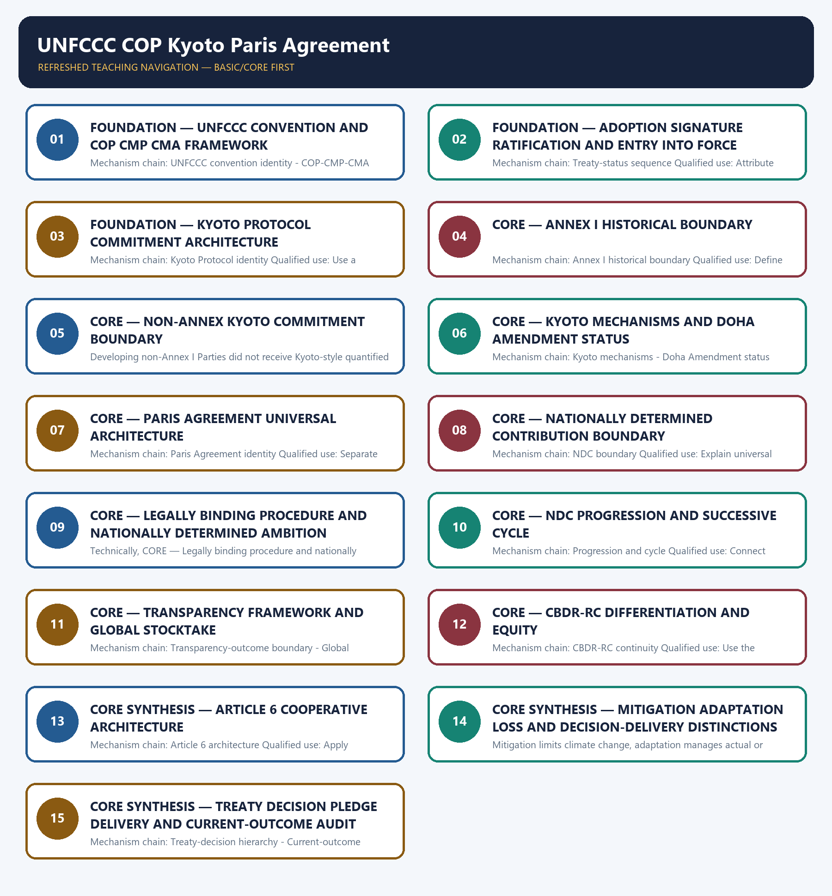

# UNFCCC COP Kyoto Paris Agreement — Learner-v2 Complete Learning Session

> **Authoring-only generation:** 2026-09-03. No PDF was rendered and no tracker or index was mutated.

### SOURCE, PROGRESSION AND CURRENT-LINKAGE AUDIT

- **Generation date:** 2026-09-03.
- **Repository-first evidence:** the Basic owner is taught first and preserved in full; the Advanced owner is retained only in the optional final teaching block.
- **OCR evidence:** Repository Markdown was primary. OCR-searchable local official General Studies papers were used only to confirm printed routed demands. No answer key, marking scheme, unsupported page precision, ecological rate, species count, pollution standard, rule threshold, mission outcome or current status was inferred.
- **Qdrant:** not used; repository Markdown and available OCR context were sufficient.
- **PYQ integrity:** Audited ledgers route verified Mains demands on COP26, Kyoto measures, clean energy in international fora and India's Paris-to-updated-NDC progression, plus objective demands on climate initiatives and COP28 health declarations. The package records the demands without inventing a key, Party position, COP outcome or official model answer.
- **Live-link boundary:** Direct UNFCCC retrieval was repeatedly blocked by Incapsula. Official search discovery located treaty-status, COP29 NCQG and COP30 package pages, but proposals, roadmaps and action-agenda releases were not converted into adopted decisions. No Party count, finance delivery, post-2025 NDC status or unverified COP outcome was asserted.
- **Fact/inference discipline:** no current-affairs item, PYQ wording, figure or quotation is invented.

### LIVE OFFICIAL-SOURCE ATTEMPT LOG

The checks below were made on 2026-09-03. Substantive official text is used only for the proposition it supports. Stubs, access failures, unrelated pages and thin landing pages are recorded and are not converted into ecological or current-status claims.

- https://unfccc.int/process-and-meetings/what-is-the-united-nations-framework-convention-on-climate-change — attempted 2026-09-03; the official page returned only an Incapsula shell. No treaty article, party count, date or obligation was inferred.
- https://unfccc.int/kyoto_protocol — attempted 2026-09-03; the official page returned only an Incapsula shell. Kyoto dates, country groupings and mechanisms therefore remain bounded to repository owners and audited text.
- https://unfccc.int/process-and-meetings/the-paris-agreement — attempted 2026-09-03; the official page returned only an Incapsula shell. No article wording, ratification total or current NDC status was imported.
- https://unfccc.int/NCQG — attempted 2026-09-03; the official page returned only an Incapsula shell. Search discovery located official decision material, but the package treats a finance goal, pledge and verified delivery as distinct and asserts no delivery claim.
- https://unfccc.int/cop30/belem-political-package — attempted 2026-09-03; direct retrieval was blocked by Incapsula. Official-search discovery located the adopted-package page, but no proposal, roadmap or action-agenda statement was silently converted into a COP decision.
- https://unfccc.int/process/the-paris-agreement/status-of-ratification — attempted 2026-09-03; direct retrieval was blocked by Incapsula, so no current Party count or ratification status was quoted.

## BASIC LEARNING SESSION



*Distinct embedded teaching-navigation image. The separate continuous Cārvāka-style flowchart package remains an independent at-a-glance artifact.*

### SESSION 1 — FOUNDATION — UNFCCC CONVENTION AND COP CMP CMA FRAMEWORK

#### DEFINITION / WHAT THIS IS CALLED

**Plain-language definition:** The UNFCCC is the framework convention that establishes the climate objective, principles, institutions and continuing negotiation process; it is distinct from later protocols, agreements and COP decisions.

**Technical definition:** Mechanism chain: UNFCCC convention identity - COP-CMP-CMA boundary Qualified use: Start with the Convention as framework and place every later instrument beneath it.

#### ANSWER-GRABBING OPENING — WRITE/ADAPT IN THE EXAM

> Do not merge the UNFCCC convention with the Kyoto Protocol or Paris Agreement.

#### MUST-WRITE KEYWORDS

- **FOUNDATION**
- **UNFCCC convention**
- **COP CMP CMA framework**
- **Mechanism chain**
- **Qualified use**
- **The UNFCCC**

**How to use them:** Frame the answer through FOUNDATION; define UNFCCC convention, connect COP CMP CMA framework with Mechanism chain to explain the mechanism, and use Qualified use for the decisive comparison or qualification.

#### VISUAL FIRST

```text
UNFCCC CONVENTION AND COP CMP CMA FRAMEWORK
01. UNFCCC convention identity
    |
    v
02. COP-CMP-CMA boundary
BOUNDARY -> Do not merge the UNFCCC convention with the Kyoto Protocol or Paris Agreement.
```

*This topic-specific rail fixes the evidence sequence and its exam boundary before analysis.*

#### CORE EXPLANATION

The UNFCCC is the framework convention that establishes the climate objective, principles, institutions and continuing negotiation process; it is distinct from later protocols, agreements and COP decisions. The COP is the Convention's supreme body, while the CMP and CMA are meetings of Parties to the Kyoto Protocol and Paris Agreement respectively; their decisions must be attributed to the correct governing body.

#### NAMED EVIDENCE AND MECHANISM

- The UNFCCC is the framework convention that establishes the climate objective, principles, institutions and continuing negotiation process; it is distinct from later protocols, agreements and COP decisions.
- The COP is the Convention's supreme body, while the CMP and CMA are meetings of Parties to the Kyoto Protocol and Paris Agreement respectively; their decisions must be attributed to the correct governing body.

#### EXAMINER CAUTION

- Do not merge the UNFCCC convention with the Kyoto Protocol or Paris Agreement.

#### EXAM LINK

- **Prelims:** Preserve the exact receiving medium, system boundary, measured parameter, actor, process, spatial and temporal scale, rule vintage and scientific or legal status; never turn a context-dependent pattern into a universal rule.
- **Mains:** Start with the Convention as framework and place every later instrument beneath it.

#### MINI RECAP

- **Mechanism chain:** UNFCCC convention identity -> COP-CMP-CMA boundary
- **Qualified use:** Start with the Convention as framework and place every later instrument beneath it.

#### CLOSING RECALL FLOW — FOUNDATION — UNFCCC CONVENTION AND COP CMP CMA FRAMEWORK

```text
START / CONCEPT: FOUNDATION — UNFCCC convention and COP CMP CMA framework
        |
        v
EXACT TERMS: FOUNDATION · UNFCCC convention · COP CMP CMA framework · Mechanism chain · Qualified use · The UNFCCC
        |
        v
MECHANISM / ARGUMENT: Mechanism chain: UNFCCC convention identity - COP-CMP-CMA boundary Qualified use: Start with the Convention as framework and place every later instrument beneath it.
        |
        v
CONSEQUENCE / CONTRAST: The UNFCCC is the framework convention that establishes the climate objective, principles, institutions and continuing negotiation process; it is distinct from later protocols, agreements and COP decisions.
        |
        v
UPSC TRAP / ANSWER-USE: The COP is the Convention's supreme body, while the CMP and CMA are meetings of Parties to the Kyoto Protocol and Paris Agreement respectively; their decisions must be attributed to the correct governing body.
        |
        v
ANSWER-GRABBING FORMULATION: Do not merge the UNFCCC convention with the Kyoto Protocol or Paris Agreement.
```
### SESSION 2 — FOUNDATION — ADOPTION SIGNATURE RATIFICATION AND ENTRY INTO FORCE

#### DEFINITION / WHAT THIS IS CALLED

**Plain-language definition:** Adoption, signature, ratification or accession, entry into force and domestic implementation are separate legal or political stages; completion of one stage does not prove another.

**Technical definition:** Mechanism chain: Treaty-status sequence Qualified use: Attribute each decision to COP, CMP or CMA and the relevant instrument.

#### ANSWER-GRABBING OPENING — WRITE/ADAPT IN THE EXAM

> Adoption, signature, ratification or accession, entry into force and domestic implementation are separate legal or political stages; completion of one stage does not prove another.

#### MUST-WRITE KEYWORDS

- **FOUNDATION**
- **Adoption signature ratification**
- **entry into force**
- **Mechanism chain**
- **Qualified use**
- **Adoption**

**How to use them:** Frame the answer through FOUNDATION; define Adoption signature ratification, connect entry into force with Mechanism chain to explain the mechanism, and use Qualified use for the decisive comparison or qualification.

#### VISUAL FIRST

```text
ADOPTION SIGNATURE RATIFICATION AND ENTRY INTO FORCE
01. Treaty-status sequence
BOUNDARY -> Do not attribute a CMP or CMA decision generically to the COP without precision.
```

*This topic-specific rail fixes the evidence sequence and its exam boundary before analysis.*

#### CORE EXPLANATION

Adoption, signature, ratification or accession, entry into force and domestic implementation are separate legal or political stages; completion of one stage does not prove another.

#### NAMED EVIDENCE AND MECHANISM

- Adoption, signature, ratification or accession, entry into force and domestic implementation are separate legal or political stages; completion of one stage does not prove another.

#### EXAMINER CAUTION

- Do not attribute a CMP or CMA decision generically to the COP without precision.

#### EXAM LINK

- **Prelims:** Preserve the exact receiving medium, system boundary, measured parameter, actor, process, spatial and temporal scale, rule vintage and scientific or legal status; never turn a context-dependent pattern into a universal rule.
- **Mains:** Attribute each decision to COP, CMP or CMA and the relevant instrument.

#### MINI RECAP

- **Mechanism chain:** Treaty-status sequence
- **Qualified use:** Attribute each decision to COP, CMP or CMA and the relevant instrument.

#### CLOSING RECALL FLOW — FOUNDATION — ADOPTION SIGNATURE RATIFICATION AND ENTRY INTO FORCE

```text
START / CONCEPT: FOUNDATION — Adoption signature ratification and entry into force
        |
        v
EXACT TERMS: FOUNDATION · Adoption signature ratification · entry into force · Mechanism chain · Qualified use · Adoption
        |
        v
MECHANISM / ARGUMENT: Mechanism chain: Treaty-status sequence Qualified use: Attribute each decision to COP, CMP or CMA and the relevant instrument.
        |
        v
CONSEQUENCE / CONTRAST: Do not attribute a CMP or CMA decision generically to the COP without precision.
        |
        v
UPSC TRAP / ANSWER-USE: Do not miss this limiting distinction: adoption, signature, ratification or accession, entry into force and domestic implementation are separate legal...
        |
        v
ANSWER-GRABBING FORMULATION: Adoption, signature, ratification or accession, entry into force and domestic implementation are separate legal or political stages; completion of one stage does not prove another.
```
### SESSION 3 — FOUNDATION — KYOTO PROTOCOL COMMITMENT ARCHITECTURE

#### DEFINITION / WHAT THIS IS CALLED

**Plain-language definition:** The Kyoto Protocol operationalised the Convention through quantified commitments for the covered developed-country group during commitment periods; it did not impose the same target architecture on every Party.

**Technical definition:** Mechanism chain: Kyoto Protocol identity Qualified use: Use a legal-status timeline before claiming an instrument became operative.

#### ANSWER-GRABBING OPENING — WRITE/ADAPT IN THE EXAM

> The Kyoto Protocol operationalised the Convention through quantified commitments for the covered developed-country group during commitment periods; it did not impose the same target architecture on every Party.

#### MUST-WRITE KEYWORDS

- **FOUNDATION**
- **Kyoto Protocol commitment architecture**
- **Mechanism chain**
- **Qualified use**
- **The Kyoto Protocol**
- **Convention**

**How to use them:** Frame the answer through FOUNDATION; define Kyoto Protocol commitment architecture, connect Mechanism chain with Qualified use to explain the mechanism, and use The Kyoto Protocol for the decisive comparison or qualification.

#### VISUAL FIRST

```text
KYOTO PROTOCOL COMMITMENT ARCHITECTURE
01. Kyoto Protocol identity
BOUNDARY -> Do not merge adoption, signature, ratification and entry into force.
```

*This topic-specific rail fixes the evidence sequence and its exam boundary before analysis.*

#### CORE EXPLANATION

The Kyoto Protocol operationalised the Convention through quantified commitments for the covered developed-country group during commitment periods; it did not impose the same target architecture on every Party.

#### NAMED EVIDENCE AND MECHANISM

- The Kyoto Protocol operationalised the Convention through quantified commitments for the covered developed-country group during commitment periods; it did not impose the same target architecture on every Party.

#### EXAMINER CAUTION

- Do not merge adoption, signature, ratification and entry into force.

#### EXAM LINK

- **Prelims:** Preserve the exact receiving medium, system boundary, measured parameter, actor, process, spatial and temporal scale, rule vintage and scientific or legal status; never turn a context-dependent pattern into a universal rule.
- **Mains:** Use a legal-status timeline before claiming an instrument became operative.

#### MINI RECAP

- **Mechanism chain:** Kyoto Protocol identity
- **Qualified use:** Use a legal-status timeline before claiming an instrument became operative.

#### CLOSING RECALL FLOW — FOUNDATION — KYOTO PROTOCOL COMMITMENT ARCHITECTURE

```text
START / CONCEPT: FOUNDATION — Kyoto Protocol commitment architecture
        |
        v
EXACT TERMS: FOUNDATION · Kyoto Protocol commitment architecture · Mechanism chain · Qualified use · The Kyoto Protocol · Convention
        |
        v
MECHANISM / ARGUMENT: Mechanism chain: Kyoto Protocol identity Qualified use: Use a legal-status timeline before claiming an instrument became operative.
        |
        v
CONSEQUENCE / CONTRAST: Do not merge adoption, signature, ratification and entry into force.
        |
        v
UPSC TRAP / ANSWER-USE: Do not miss this limiting distinction: use a legal-status timeline before claiming an instrument became operative.
        |
        v
ANSWER-GRABBING FORMULATION: The Kyoto Protocol operationalised the Convention through quantified commitments for the covered developed-country group during commitment periods; it did not impose the same target architecture on every Party.
```
### SESSION 4 — CORE — ANNEX I HISTORICAL BOUNDARY

#### DEFINITION / WHAT THIS IS CALLED

**Plain-language definition:** Annex I is a Convention grouping used in the historical Kyoto architecture; any claim about Annex obligations must identify the instrument, period and obligation rather than project the label onto every Paris duty.

**Technical definition:** Mechanism chain: Annex I historical boundary Qualified use: Define Kyoto by covered group, commitment period and quantified commitment architecture.

#### ANSWER-GRABBING OPENING — WRITE/ADAPT IN THE EXAM

> Annex I is a Convention grouping used in the historical Kyoto architecture; any claim about Annex obligations must identify the instrument, period and obligation rather than project the label onto every Paris duty.

#### MUST-WRITE KEYWORDS

- **Annex I historical boundary**
- **Mechanism chain**
- **Qualified use**
- **Annex I**
- **Annex**
- **Convention**

**How to use them:** Frame the answer through Annex I historical boundary; define Mechanism chain, connect Qualified use with Annex I to explain the mechanism, and use Annex for the decisive comparison or qualification.

#### VISUAL FIRST

```text
ANNEX I HISTORICAL BOUNDARY
01. Annex I historical boundary
BOUNDARY -> Do not say Kyoto imposed identical binding targets on every country.
```

*This topic-specific rail fixes the evidence sequence and its exam boundary before analysis.*

#### CORE EXPLANATION

Annex I is a Convention grouping used in the historical Kyoto architecture; any claim about Annex obligations must identify the instrument, period and obligation rather than project the label onto every Paris duty.

#### NAMED EVIDENCE AND MECHANISM

- Annex I is a Convention grouping used in the historical Kyoto architecture; any claim about Annex obligations must identify the instrument, period and obligation rather than project the label onto every Paris duty.

#### EXAMINER CAUTION

- Do not say Kyoto imposed identical binding targets on every country.

#### EXAM LINK

- **Prelims:** Preserve the exact receiving medium, system boundary, measured parameter, actor, process, spatial and temporal scale, rule vintage and scientific or legal status; never turn a context-dependent pattern into a universal rule.
- **Mains:** Define Kyoto by covered group, commitment period and quantified commitment architecture.

#### MINI RECAP

- **Mechanism chain:** Annex I historical boundary
- **Qualified use:** Define Kyoto by covered group, commitment period and quantified commitment architecture.

#### CLOSING RECALL FLOW — CORE — ANNEX I HISTORICAL BOUNDARY

```text
START / CONCEPT: CORE — Annex I historical boundary
        |
        v
EXACT TERMS: Annex I historical boundary · Mechanism chain · Qualified use · Annex I · Annex · Convention
        |
        v
MECHANISM / ARGUMENT: Mechanism chain: Annex I historical boundary Qualified use: Define Kyoto by covered group, commitment period and quantified commitment architecture.
        |
        v
CONSEQUENCE / CONTRAST: Do not say Kyoto imposed identical binding targets on every country.
        |
        v
UPSC TRAP / ANSWER-USE: Do not miss this limiting distinction: define Kyoto by covered group, commitment period and quantified commitment architecture.
        |
        v
ANSWER-GRABBING FORMULATION: Annex I is a Convention grouping used in the historical Kyoto architecture; any claim about Annex obligations must identify the instrument, period and obligation rather than project the label onto every Paris duty.
```
### SESSION 5 — CORE — NON-ANNEX KYOTO COMMITMENT BOUNDARY

#### DEFINITION / WHAT THIS IS CALLED

**Plain-language definition:** Mechanism chain: Non-Annex Kyoto boundary Qualified use: Use Annex terminology only with its treaty and historical function.

**Technical definition:** Developing non-Annex I Parties did not receive Kyoto-style quantified emission-limitation or reduction commitments, although they had other Convention and Protocol roles.

#### ANSWER-GRABBING OPENING — WRITE/ADAPT IN THE EXAM

> Developing non-Annex I Parties did not receive Kyoto-style quantified emission-limitation or reduction commitments, although they had other Convention and Protocol roles.

#### MUST-WRITE KEYWORDS

- **Non-Annex Kyoto commitment boundary**
- **Mechanism chain**
- **Qualified use**
- **Developing**
- **Annex**
- **Parties**

**How to use them:** Frame the answer through Non-Annex Kyoto commitment boundary; define Mechanism chain, connect Qualified use with Developing to explain the mechanism, and use Annex for the decisive comparison or qualification.

#### VISUAL FIRST

```text
NON-ANNEX KYOTO COMMITMENT BOUNDARY
01. Non-Annex Kyoto boundary
BOUNDARY -> Do not use Annex and non-Annex labels without the instrument and historical context.
```

*This topic-specific rail fixes the evidence sequence and its exam boundary before analysis.*

#### CORE EXPLANATION

Developing non-Annex I Parties did not receive Kyoto-style quantified emission-limitation or reduction commitments, although they had other Convention and Protocol roles.

#### NAMED EVIDENCE AND MECHANISM

- Developing non-Annex I Parties did not receive Kyoto-style quantified emission-limitation or reduction commitments, although they had other Convention and Protocol roles.

#### EXAMINER CAUTION

- Do not use Annex and non-Annex labels without the instrument and historical context.

#### EXAM LINK

- **Prelims:** Preserve the exact receiving medium, system boundary, measured parameter, actor, process, spatial and temporal scale, rule vintage and scientific or legal status; never turn a context-dependent pattern into a universal rule.
- **Mains:** Use Annex terminology only with its treaty and historical function.

#### MINI RECAP

- **Mechanism chain:** Non-Annex Kyoto boundary
- **Qualified use:** Use Annex terminology only with its treaty and historical function.

#### CLOSING RECALL FLOW — CORE — NON-ANNEX KYOTO COMMITMENT BOUNDARY

```text
START / CONCEPT: CORE — Non-Annex Kyoto commitment boundary
        |
        v
EXACT TERMS: Non-Annex Kyoto commitment boundary · Mechanism chain · Qualified use · Developing · Annex · Parties
        |
        v
MECHANISM / ARGUMENT: Mechanism chain: Non-Annex Kyoto boundary Qualified use: Use Annex terminology only with its treaty and historical function.
        |
        v
CONSEQUENCE / CONTRAST: Do not use Annex and non-Annex labels without the instrument and historical context.
        |
        v
UPSC TRAP / ANSWER-USE: Do not miss this limiting distinction: use Annex terminology only with its treaty and historical function.
        |
        v
ANSWER-GRABBING FORMULATION: Developing non-Annex I Parties did not receive Kyoto-style quantified emission-limitation or reduction commitments, although they had other Convention and Protocol roles.
```
### SESSION 6 — CORE — KYOTO MECHANISMS AND DOHA AMENDMENT STATUS

#### DEFINITION / WHAT THIS IS CALLED

**Plain-language definition:** International emissions trading, Joint Implementation and the Clean Development Mechanism are distinct Kyoto mechanisms with different participants and project or unit pathways.

**Technical definition:** Mechanism chain: Kyoto mechanisms - Doha Amendment status Qualified use: Compare each Kyoto mechanism by participants, unit and transaction pathway.

#### ANSWER-GRABBING OPENING — WRITE/ADAPT IN THE EXAM

> Mechanism chain: Kyoto mechanisms - Doha Amendment status Qualified use: Compare each Kyoto mechanism by participants, unit and transaction pathway.

#### MUST-WRITE KEYWORDS

- **Kyoto mechanisms**
- **Doha Amendment status**
- **Mechanism chain**
- **Qualified use**
- **International**
- **Joint Implementation**

**How to use them:** Frame the answer through Kyoto mechanisms; define Doha Amendment status, connect Mechanism chain with Qualified use to explain the mechanism, and use International for the decisive comparison or qualification.

#### VISUAL FIRST

```text
KYOTO MECHANISMS AND DOHA AMENDMENT STATUS
01. Kyoto mechanisms
    |
    v
02. Doha Amendment status
BOUNDARY -> Do not merge CDM, Joint Implementation and international emissions trading.
```

*This topic-specific rail fixes the evidence sequence and its exam boundary before analysis.*

#### CORE EXPLANATION

International emissions trading, Joint Implementation and the Clean Development Mechanism are distinct Kyoto mechanisms with different participants and project or unit pathways. The Doha Amendment concerns Kyoto's second commitment period and has its own adoption and entry-into-force history; amendment adoption and operative legal status are not interchangeable.

#### NAMED EVIDENCE AND MECHANISM

- International emissions trading, Joint Implementation and the Clean Development Mechanism are distinct Kyoto mechanisms with different participants and project or unit pathways.
- The Doha Amendment concerns Kyoto's second commitment period and has its own adoption and entry-into-force history; amendment adoption and operative legal status are not interchangeable.

#### EXAMINER CAUTION

- Do not merge CDM, Joint Implementation and international emissions trading.

#### EXAM LINK

- **Prelims:** Preserve the exact receiving medium, system boundary, measured parameter, actor, process, spatial and temporal scale, rule vintage and scientific or legal status; never turn a context-dependent pattern into a universal rule.
- **Mains:** Compare each Kyoto mechanism by participants, unit and transaction pathway.

#### MINI RECAP

- **Mechanism chain:** Kyoto mechanisms -> Doha Amendment status
- **Qualified use:** Compare each Kyoto mechanism by participants, unit and transaction pathway.

#### CLOSING RECALL FLOW — CORE — KYOTO MECHANISMS AND DOHA AMENDMENT STATUS

```text
START / CONCEPT: CORE — Kyoto mechanisms and Doha Amendment status
        |
        v
EXACT TERMS: Kyoto mechanisms · Doha Amendment status · Mechanism chain · Qualified use · International · Joint Implementation
        |
        v
MECHANISM / ARGUMENT: International emissions trading, Joint Implementation and the Clean Development Mechanism are distinct Kyoto mechanisms with different participants and project or unit pathways.
        |
        v
CONSEQUENCE / CONTRAST: The Doha Amendment concerns Kyoto's second commitment period and has its own adoption and entry-into-force history; amendment adoption and operative legal status are not interchangeable.
        |
        v
UPSC TRAP / ANSWER-USE: Do not merge CDM, Joint Implementation and international emissions trading.
        |
        v
ANSWER-GRABBING FORMULATION: Mechanism chain: Kyoto mechanisms - Doha Amendment status Qualified use: Compare each Kyoto mechanism by participants, unit and transaction pathway.
```
### SESSION 7 — CORE — PARIS AGREEMENT UNIVERSAL ARCHITECTURE

#### DEFINITION / WHAT THIS IS CALLED

**Plain-language definition:** The Paris Agreement is an agreement under the Convention built around universal participation, nationally determined contributions, transparency, stocktaking and successive cycles.

**Technical definition:** Mechanism chain: Paris Agreement identity Qualified use: Separate amendment text, ratification threshold, entry into force and period covered.

#### ANSWER-GRABBING OPENING — WRITE/ADAPT IN THE EXAM

> The Paris Agreement is an agreement under the Convention built around universal participation, nationally determined contributions, transparency, stocktaking and successive cycles.

#### MUST-WRITE KEYWORDS

- **Paris Agreement universal architecture**
- **Mechanism chain**
- **Qualified use**
- **The Paris Agreement**
- **Convention**
- **Separate**

**How to use them:** Frame the answer through Paris Agreement universal architecture; define Mechanism chain, connect Qualified use with The Paris Agreement to explain the mechanism, and use Convention for the decisive comparison or qualification.

#### VISUAL FIRST

```text
PARIS AGREEMENT UNIVERSAL ARCHITECTURE
01. Paris Agreement identity
BOUNDARY -> Do not treat amendment adoption as entry into force.
```

*This topic-specific rail fixes the evidence sequence and its exam boundary before analysis.*

#### CORE EXPLANATION

The Paris Agreement is an agreement under the Convention built around universal participation, nationally determined contributions, transparency, stocktaking and successive cycles.

#### NAMED EVIDENCE AND MECHANISM

- The Paris Agreement is an agreement under the Convention built around universal participation, nationally determined contributions, transparency, stocktaking and successive cycles.

#### EXAMINER CAUTION

- Do not treat amendment adoption as entry into force.

#### EXAM LINK

- **Prelims:** Preserve the exact receiving medium, system boundary, measured parameter, actor, process, spatial and temporal scale, rule vintage and scientific or legal status; never turn a context-dependent pattern into a universal rule.
- **Mains:** Separate amendment text, ratification threshold, entry into force and period covered.

#### MINI RECAP

- **Mechanism chain:** Paris Agreement identity
- **Qualified use:** Separate amendment text, ratification threshold, entry into force and period covered.

#### CLOSING RECALL FLOW — CORE — PARIS AGREEMENT UNIVERSAL ARCHITECTURE

```text
START / CONCEPT: CORE — Paris Agreement universal architecture
        |
        v
EXACT TERMS: Paris Agreement universal architecture · Mechanism chain · Qualified use · The Paris Agreement · Convention · Separate
        |
        v
MECHANISM / ARGUMENT: Mechanism chain: Paris Agreement identity Qualified use: Separate amendment text, ratification threshold, entry into force and period covered.
        |
        v
CONSEQUENCE / CONTRAST: Do not treat amendment adoption as entry into force.
        |
        v
UPSC TRAP / ANSWER-USE: Do not miss this limiting distinction: separate amendment text, ratification threshold, entry into force and period covered.
        |
        v
ANSWER-GRABBING FORMULATION: The Paris Agreement is an agreement under the Convention built around universal participation, nationally determined contributions, transparency, stocktaking and successive cycles.
```
### SESSION 8 — CORE — NATIONALLY DETERMINED CONTRIBUTION BOUNDARY

#### DEFINITION / WHAT THIS IS CALLED

**Plain-language definition:** An NDC is nationally determined and communicated by a Party; the Paris Agreement does not itself assign one identical substantive numerical target to all Parties.

**Technical definition:** Mechanism chain: NDC boundary Qualified use: Explain universal participation through nationally determined contributions.

#### ANSWER-GRABBING OPENING — WRITE/ADAPT IN THE EXAM

> Mechanism chain: NDC boundary Qualified use: Explain universal participation through nationally determined contributions.

#### MUST-WRITE KEYWORDS

- **Nationally Determined Contribution boundary**
- **Mechanism chain**
- **Qualified use**
- **An NDC**
- **Party**
- **Paris Agreement**

**How to use them:** Frame the answer through Nationally Determined Contribution boundary; define Mechanism chain, connect Qualified use with An NDC to explain the mechanism, and use Party for the decisive comparison or qualification.

#### VISUAL FIRST

```text
NATIONALLY DETERMINED CONTRIBUTION BOUNDARY
01. NDC boundary
BOUNDARY -> Do not say Paris assigns the same substantive numerical target to all Parties.
```

*This topic-specific rail fixes the evidence sequence and its exam boundary before analysis.*

#### CORE EXPLANATION

An NDC is nationally determined and communicated by a Party; the Paris Agreement does not itself assign one identical substantive numerical target to all Parties.

#### NAMED EVIDENCE AND MECHANISM

- An NDC is nationally determined and communicated by a Party; the Paris Agreement does not itself assign one identical substantive numerical target to all Parties.

#### EXAMINER CAUTION

- Do not say Paris assigns the same substantive numerical target to all Parties.

#### EXAM LINK

- **Prelims:** Preserve the exact receiving medium, system boundary, measured parameter, actor, process, spatial and temporal scale, rule vintage and scientific or legal status; never turn a context-dependent pattern into a universal rule.
- **Mains:** Explain universal participation through nationally determined contributions.

#### MINI RECAP

- **Mechanism chain:** NDC boundary
- **Qualified use:** Explain universal participation through nationally determined contributions.

#### CLOSING RECALL FLOW — CORE — NATIONALLY DETERMINED CONTRIBUTION BOUNDARY

```text
START / CONCEPT: CORE — Nationally Determined Contribution boundary
        |
        v
EXACT TERMS: Nationally Determined Contribution boundary · Mechanism chain · Qualified use · An NDC · Party · Paris Agreement
        |
        v
MECHANISM / ARGUMENT: An NDC is nationally determined and communicated by a Party; the Paris Agreement does not itself assign one identical substantive numerical target to all Parties.
        |
        v
CONSEQUENCE / CONTRAST: Do not say Paris assigns the same substantive numerical target to all Parties.
        |
        v
UPSC TRAP / ANSWER-USE: Do not miss this limiting distinction: explain universal participation through nationally determined contributions.
        |
        v
ANSWER-GRABBING FORMULATION: Mechanism chain: NDC boundary Qualified use: Explain universal participation through nationally determined contributions.
```
### SESSION 9 — CORE — LEGALLY BINDING PROCEDURE AND NATIONALLY DETERMINED AMBITION

#### DEFINITION / WHAT THIS IS CALLED

**Plain-language definition:** Paris creates legally binding procedural duties such as preparing, communicating and maintaining successive NDCs and pursuing domestic measures, while the substantive level of each Party's mitigation ambition remains nationally determined.

**Technical definition:** Technically, CORE — Legally binding procedure and nationally determined ambition is analysed by relating Legally binding procedure to nationally determined ambition, then testing the relationship through Mechanism chain and Qualified use.

#### ANSWER-GRABBING OPENING — WRITE/ADAPT IN THE EXAM

> Paris creates legally binding procedural duties such as preparing, communicating and maintaining successive NDCs and pursuing domestic measures, while the substantive level of each Party's mitigation ambition remains nationally determined.

#### MUST-WRITE KEYWORDS

- **Legally binding procedure**
- **nationally determined ambition**
- **Mechanism chain**
- **Qualified use**
- **Paris**
- **NDCs**

**How to use them:** Frame the answer through Legally binding procedure; define nationally determined ambition, connect Mechanism chain with Qualified use to explain the mechanism, and use Paris for the decisive comparison or qualification.

#### VISUAL FIRST

```text
LEGALLY BINDING PROCEDURE AND NATIONALLY DETERMINED AMBITION
01. Procedure-ambition distinction
BOUNDARY -> Do not merge legally binding procedural duties with nationally determined ambition.
```

*This topic-specific rail fixes the evidence sequence and its exam boundary before analysis.*

#### CORE EXPLANATION

Paris creates legally binding procedural duties such as preparing, communicating and maintaining successive NDCs and pursuing domestic measures, while the substantive level of each Party's mitigation ambition remains nationally determined.

#### NAMED EVIDENCE AND MECHANISM

- Paris creates legally binding procedural duties such as preparing, communicating and maintaining successive NDCs and pursuing domestic measures, while the substantive level of each Party's mitigation ambition remains nationally determined.

#### EXAMINER CAUTION

- Do not merge legally binding procedural duties with nationally determined ambition.

#### EXAM LINK

- **Prelims:** Preserve the exact receiving medium, system boundary, measured parameter, actor, process, spatial and temporal scale, rule vintage and scientific or legal status; never turn a context-dependent pattern into a universal rule.
- **Mains:** List procedural duties separately from the self-determined target level.

#### MINI RECAP

- **Mechanism chain:** Procedure-ambition distinction
- **Qualified use:** List procedural duties separately from the self-determined target level.

#### CLOSING RECALL FLOW — CORE — LEGALLY BINDING PROCEDURE AND NATIONALLY DETERMINED AMBITION

```text
START / CONCEPT: CORE — Legally binding procedure and nationally determined ambition
        |
        v
EXACT TERMS: Legally binding procedure · nationally determined ambition · Mechanism chain · Qualified use · Paris · NDCs
        |
        v
MECHANISM / ARGUMENT: Do not merge legally binding procedural duties with nationally determined ambition.
        |
        v
CONSEQUENCE / CONTRAST: Mechanism chain: Procedure-ambition distinction Qualified use: List procedural duties separately from the self-determined target level.
        |
        v
UPSC TRAP / ANSWER-USE: Do not miss this limiting distinction: paris creates legally binding procedural duties such as preparing, communicating and maintaining successive NDCs...
        |
        v
ANSWER-GRABBING FORMULATION: Paris creates legally binding procedural duties such as preparing, communicating and maintaining successive NDCs and pursuing domestic measures, while the substantive level of each Party's mitigation ambition remains nationally determined.
```
### SESSION 10 — CORE — NDC PROGRESSION AND SUCCESSIVE CYCLE

#### DEFINITION / WHAT THIS IS CALLED

**Plain-language definition:** Successive NDCs are expected to represent progression and highest possible ambition within the Agreement's cycle; this standard does not prescribe one universal percentage increase.

**Technical definition:** Mechanism chain: Progression and cycle Qualified use: Connect progression, highest possible ambition and successive communication without inventing a rate.

#### ANSWER-GRABBING OPENING — WRITE/ADAPT IN THE EXAM

> Successive NDCs are expected to represent progression and highest possible ambition within the Agreement's cycle; this standard does not prescribe one universal percentage increase.

#### MUST-WRITE KEYWORDS

- **NDC progression**
- **successive cycle**
- **Mechanism chain**
- **Qualified use**
- **Successive NDCs**
- **Agreement's**

**How to use them:** Frame the answer through NDC progression; define successive cycle, connect Mechanism chain with Qualified use to explain the mechanism, and use Successive NDCs for the decisive comparison or qualification.

#### VISUAL FIRST

```text
NDC PROGRESSION AND SUCCESSIVE CYCLE
01. Progression and cycle
BOUNDARY -> Do not turn progression into a mandatory universal percentage.
```

*This topic-specific rail fixes the evidence sequence and its exam boundary before analysis.*

#### CORE EXPLANATION

Successive NDCs are expected to represent progression and highest possible ambition within the Agreement's cycle; this standard does not prescribe one universal percentage increase.

#### NAMED EVIDENCE AND MECHANISM

- Successive NDCs are expected to represent progression and highest possible ambition within the Agreement's cycle; this standard does not prescribe one universal percentage increase.

#### EXAMINER CAUTION

- Do not turn progression into a mandatory universal percentage.

#### EXAM LINK

- **Prelims:** Preserve the exact receiving medium, system boundary, measured parameter, actor, process, spatial and temporal scale, rule vintage and scientific or legal status; never turn a context-dependent pattern into a universal rule.
- **Mains:** Connect progression, highest possible ambition and successive communication without inventing a rate.

#### MINI RECAP

- **Mechanism chain:** Progression and cycle
- **Qualified use:** Connect progression, highest possible ambition and successive communication without inventing a rate.

#### CLOSING RECALL FLOW — CORE — NDC PROGRESSION AND SUCCESSIVE CYCLE

```text
START / CONCEPT: CORE — NDC progression and successive cycle
        |
        v
EXACT TERMS: NDC progression · successive cycle · Mechanism chain · Qualified use · Successive NDCs · Agreement's
        |
        v
MECHANISM / ARGUMENT: Mechanism chain: Progression and cycle Qualified use: Connect progression, highest possible ambition and successive communication without inventing a rate.
        |
        v
CONSEQUENCE / CONTRAST: Do not turn progression into a mandatory universal percentage.
        |
        v
UPSC TRAP / ANSWER-USE: Do not miss this limiting distinction: successive NDCs are expected to represent progression and highest possible ambition within the Agreement's...
        |
        v
ANSWER-GRABBING FORMULATION: Successive NDCs are expected to represent progression and highest possible ambition within the Agreement's cycle; this standard does not prescribe one universal percentage increase.
```
### SESSION 11 — CORE — TRANSPARENCY FRAMEWORK AND GLOBAL STOCKTAKE

#### DEFINITION / WHAT THIS IS CALLED

**Plain-language definition:** The Global Stocktake assesses collective progress toward the Agreement's purposes and informs later national action; it is not a country-specific compliance verdict or a replacement NDC.

**Technical definition:** Mechanism chain: Transparency-outcome boundary - Global Stocktake boundary Qualified use: Treat transparency as evidence infrastructure rather than an achievement certificate.

#### ANSWER-GRABBING OPENING — WRITE/ADAPT IN THE EXAM

> The Global Stocktake assesses collective progress toward the Agreement's purposes and informs later national action; it is not a country-specific compliance verdict or a replacement NDC.

#### MUST-WRITE KEYWORDS

- **Transparency framework**
- **Global Stocktake**
- **Mechanism chain**
- **Qualified use**
- **Reporting**
- **The Global Stocktake**

**How to use them:** Frame the answer through Transparency framework; define Global Stocktake, connect Mechanism chain with Qualified use to explain the mechanism, and use Reporting for the decisive comparison or qualification.

#### VISUAL FIRST

```text
TRANSPARENCY FRAMEWORK AND GLOBAL STOCKTAKE
01. Transparency-outcome boundary
    |
    v
02. Global Stocktake boundary
BOUNDARY -> Do not treat transparency reporting as proof of target achievement.
```

*This topic-specific rail fixes the evidence sequence and its exam boundary before analysis.*

#### CORE EXPLANATION

Reporting, technical review and multilateral consideration improve transparency and accountability, but a submitted report or reviewed inventory is not proof that a target was achieved. The Global Stocktake assesses collective progress toward the Agreement's purposes and informs later national action; it is not a country-specific compliance verdict or a replacement NDC.

#### NAMED EVIDENCE AND MECHANISM

- Reporting, technical review and multilateral consideration improve transparency and accountability, but a submitted report or reviewed inventory is not proof that a target was achieved.
- The Global Stocktake assesses collective progress toward the Agreement's purposes and informs later national action; it is not a country-specific compliance verdict or a replacement NDC.

#### EXAMINER CAUTION

- Do not treat transparency reporting as proof of target achievement.

#### EXAM LINK

- **Prelims:** Preserve the exact receiving medium, system boundary, measured parameter, actor, process, spatial and temporal scale, rule vintage and scientific or legal status; never turn a context-dependent pattern into a universal rule.
- **Mains:** Treat transparency as evidence infrastructure rather than an achievement certificate.

#### MINI RECAP

- **Mechanism chain:** Transparency-outcome boundary -> Global Stocktake boundary
- **Qualified use:** Treat transparency as evidence infrastructure rather than an achievement certificate.

#### CLOSING RECALL FLOW — CORE — TRANSPARENCY FRAMEWORK AND GLOBAL STOCKTAKE

```text
START / CONCEPT: CORE — Transparency framework and Global Stocktake
        |
        v
EXACT TERMS: Transparency framework · Global Stocktake · Mechanism chain · Qualified use · Reporting · The Global Stocktake
        |
        v
MECHANISM / ARGUMENT: Mechanism chain: Transparency-outcome boundary - Global Stocktake boundary Qualified use: Treat transparency as evidence infrastructure rather than an achievement certificate.
        |
        v
CONSEQUENCE / CONTRAST: Reporting, technical review and multilateral consideration improve transparency and accountability, but a submitted report or reviewed inventory is not proof that a target was achieved.
        |
        v
UPSC TRAP / ANSWER-USE: Do not treat transparency reporting as proof of target achievement.
        |
        v
ANSWER-GRABBING FORMULATION: The Global Stocktake assesses collective progress toward the Agreement's purposes and informs later national action; it is not a country-specific compliance verdict or a replacement NDC.
```
### SESSION 12 — CORE — CBDR-RC DIFFERENTIATION AND EQUITY

#### DEFINITION / WHAT THIS IS CALLED

**Plain-language definition:** Common but differentiated responsibilities and respective capabilities remains an equity principle, applied in light of different national circumstances; Paris universality did not erase differentiation.

**Technical definition:** Mechanism chain: CBDR-RC continuity Qualified use: Use the stocktake for collective progress and subsequent national updating.

#### ANSWER-GRABBING OPENING — WRITE/ADAPT IN THE EXAM

> Common but differentiated responsibilities and respective capabilities remains an equity principle, applied in light of different national circumstances; Paris universality did not erase differentiation.

#### MUST-WRITE KEYWORDS

- **CBDR-RC differentiation**
- **equity**
- **Mechanism chain**
- **Qualified use**
- **Common**
- **Paris**

**How to use them:** Frame the answer through CBDR-RC differentiation; define equity, connect Mechanism chain with Qualified use to explain the mechanism, and use Common for the decisive comparison or qualification.

#### VISUAL FIRST

```text
CBDR-RC DIFFERENTIATION AND EQUITY
01. CBDR-RC continuity
BOUNDARY -> Do not treat the Global Stocktake as a national compliance verdict.
```

*This topic-specific rail fixes the evidence sequence and its exam boundary before analysis.*

#### CORE EXPLANATION

Common but differentiated responsibilities and respective capabilities remains an equity principle, applied in light of different national circumstances; Paris universality did not erase differentiation.

#### NAMED EVIDENCE AND MECHANISM

- Common but differentiated responsibilities and respective capabilities remains an equity principle, applied in light of different national circumstances; Paris universality did not erase differentiation.

#### EXAMINER CAUTION

- Do not treat the Global Stocktake as a national compliance verdict.

#### EXAM LINK

- **Prelims:** Preserve the exact receiving medium, system boundary, measured parameter, actor, process, spatial and temporal scale, rule vintage and scientific or legal status; never turn a context-dependent pattern into a universal rule.
- **Mains:** Use the stocktake for collective progress and subsequent national updating.

#### MINI RECAP

- **Mechanism chain:** CBDR-RC continuity
- **Qualified use:** Use the stocktake for collective progress and subsequent national updating.

#### CLOSING RECALL FLOW — CORE — CBDR-RC DIFFERENTIATION AND EQUITY

```text
START / CONCEPT: CORE — CBDR-RC differentiation and equity
        |
        v
EXACT TERMS: CBDR-RC differentiation · equity · Mechanism chain · Qualified use · Common · Paris
        |
        v
MECHANISM / ARGUMENT: Mechanism chain: CBDR-RC continuity Qualified use: Use the stocktake for collective progress and subsequent national updating.
        |
        v
CONSEQUENCE / CONTRAST: Do not treat the Global Stocktake as a national compliance verdict.
        |
        v
UPSC TRAP / ANSWER-USE: Do not miss this limiting distinction: use the stocktake for collective progress and subsequent national updating.
        |
        v
ANSWER-GRABBING FORMULATION: Common but differentiated responsibilities and respective capabilities remains an equity principle, applied in light of different national circumstances; Paris universality did not erase differentiation.
```
### SESSION 13 — CORE SYNTHESIS — ARTICLE 6 COOPERATIVE ARCHITECTURE

#### DEFINITION / WHAT THIS IS CALLED

**Plain-language definition:** Article 6.2 cooperative approaches, the Article 6.4 mechanism and Article 6.8 non-market approaches are distinct pathways; authorisation, accounting and delivery claims must not be merged.

**Technical definition:** Mechanism chain: Article 6 architecture Qualified use: Apply differentiation through responsibility, capability and national circumstances.

#### ANSWER-GRABBING OPENING — WRITE/ADAPT IN THE EXAM

> Article 6.2 cooperative approaches, the Article 6.4 mechanism and Article 6.8 non-market approaches are distinct pathways; authorisation, accounting and delivery claims must not be merged.

#### MUST-WRITE KEYWORDS

- **CORE SYNTHESIS**
- **Article 6 cooperative architecture**
- **Mechanism chain**
- **Qualified use**
- **Article 6**
- **Article**

**How to use them:** Frame the answer through CORE SYNTHESIS; define Article 6 cooperative architecture, connect Mechanism chain with Qualified use to explain the mechanism, and use Article 6 for the decisive comparison or qualification.

#### VISUAL FIRST

```text
ARTICLE 6 COOPERATIVE ARCHITECTURE
01. Article 6 architecture
BOUNDARY -> Do not say Paris abolished CBDR-RC.
```

*This topic-specific rail fixes the evidence sequence and its exam boundary before analysis.*

#### CORE EXPLANATION

Article 6.2 cooperative approaches, the Article 6.4 mechanism and Article 6.8 non-market approaches are distinct pathways; authorisation, accounting and delivery claims must not be merged.

#### NAMED EVIDENCE AND MECHANISM

- Article 6.2 cooperative approaches, the Article 6.4 mechanism and Article 6.8 non-market approaches are distinct pathways; authorisation, accounting and delivery claims must not be merged.

#### EXAMINER CAUTION

- Do not say Paris abolished CBDR-RC.

#### EXAM LINK

- **Prelims:** Preserve the exact receiving medium, system boundary, measured parameter, actor, process, spatial and temporal scale, rule vintage and scientific or legal status; never turn a context-dependent pattern into a universal rule.
- **Mains:** Apply differentiation through responsibility, capability and national circumstances.

#### MINI RECAP

- **Mechanism chain:** Article 6 architecture
- **Qualified use:** Apply differentiation through responsibility, capability and national circumstances.

#### CLOSING RECALL FLOW — CORE SYNTHESIS — ARTICLE 6 COOPERATIVE ARCHITECTURE

```text
START / CONCEPT: CORE SYNTHESIS — Article 6 cooperative architecture
        |
        v
EXACT TERMS: CORE SYNTHESIS · Article 6 cooperative architecture · Mechanism chain · Qualified use · Article 6 · Article
        |
        v
MECHANISM / ARGUMENT: Mechanism chain: Article 6 architecture Qualified use: Apply differentiation through responsibility, capability and national circumstances.
        |
        v
CONSEQUENCE / CONTRAST: Do not say Paris abolished CBDR-RC.
        |
        v
UPSC TRAP / ANSWER-USE: Do not miss this limiting distinction: article 6.2 cooperative approaches, the Article 6.4 mechanism and Article 6.8 non-market approaches are...
        |
        v
ANSWER-GRABBING FORMULATION: Article 6.2 cooperative approaches, the Article 6.4 mechanism and Article 6.8 non-market approaches are distinct pathways; authorisation, accounting and delivery claims must not be merged.
```
### SESSION 14 — CORE SYNTHESIS — MITIGATION ADAPTATION LOSS AND DECISION-DELIVERY DISTINCTIONS

#### DEFINITION / WHAT THIS IS CALLED

**Plain-language definition:** Mechanism chain: Mitigation-adaptation-loss boundary - Decision-pledge-delivery distinction Qualified use: Separate Article 6 pathways and then distinguish mitigation, adaptation and residual harm.

**Technical definition:** Mitigation limits climate change, adaptation manages actual or expected impacts, and loss and damage concerns harms that remain; finance labels and institutions must preserve these distinctions.

#### ANSWER-GRABBING OPENING — WRITE/ADAPT IN THE EXAM

> Mechanism chain: Mitigation-adaptation-loss boundary - Decision-pledge-delivery distinction Qualified use: Separate Article 6 pathways and then distinguish mitigation, adaptation and residual harm.

#### MUST-WRITE KEYWORDS

- **CORE SYNTHESIS**
- **Mitigation adaptation loss**
- **decision-delivery distinctions**
- **Mechanism chain**
- **Qualified use**
- **Article 6**

**How to use them:** Frame the answer through CORE SYNTHESIS; define Mitigation adaptation loss, connect decision-delivery distinctions with Mechanism chain to explain the mechanism, and use Qualified use for the decisive comparison or qualification.

#### VISUAL FIRST

```text
MITIGATION ADAPTATION LOSS AND DECISION-DELIVERY DISTINCTIONS
01. Mitigation-adaptation-loss boundary
    |
    v
02. Decision-pledge-delivery distinction
BOUNDARY -> Do not merge Article 6.2, 6.4 and 6.8.
```

*This topic-specific rail fixes the evidence sequence and its exam boundary before analysis.*

#### CORE EXPLANATION

Mitigation limits climate change, adaptation manages actual or expected impacts, and loss and damage concerns harms that remain; finance labels and institutions must preserve these distinctions. An adopted COP or CMA decision, a Party announcement, a voluntary pledge, a finance goal, a contribution and verified disbursement are different facts with different legal and evidentiary status.

#### NAMED EVIDENCE AND MECHANISM

- Mitigation limits climate change, adaptation manages actual or expected impacts, and loss and damage concerns harms that remain; finance labels and institutions must preserve these distinctions.
- An adopted COP or CMA decision, a Party announcement, a voluntary pledge, a finance goal, a contribution and verified disbursement are different facts with different legal and evidentiary status.

#### EXAMINER CAUTION

- Do not merge Article 6.2, 6.4 and 6.8.

#### EXAM LINK

- **Prelims:** Preserve the exact receiving medium, system boundary, measured parameter, actor, process, spatial and temporal scale, rule vintage and scientific or legal status; never turn a context-dependent pattern into a universal rule.
- **Mains:** Separate Article 6 pathways and then distinguish mitigation, adaptation and residual harm.

#### MINI RECAP

- **Mechanism chain:** Mitigation-adaptation-loss boundary -> Decision-pledge-delivery distinction
- **Qualified use:** Separate Article 6 pathways and then distinguish mitigation, adaptation and residual harm.

#### CLOSING RECALL FLOW — CORE SYNTHESIS — MITIGATION ADAPTATION LOSS AND DECISION-DELIVERY DISTINCTIONS

```text
START / CONCEPT: CORE SYNTHESIS — Mitigation adaptation loss and decision-delivery distinctions
        |
        v
EXACT TERMS: CORE SYNTHESIS · Mitigation adaptation loss · decision-delivery distinctions · Mechanism chain · Qualified use · Article 6
        |
        v
MECHANISM / ARGUMENT: Mitigation limits climate change, adaptation manages actual or expected impacts, and loss and damage concerns harms that remain; finance labels and institutions must preserve these distinctions.
        |
        v
CONSEQUENCE / CONTRAST: Do not merge Article 6.2, 6.4 and 6.8.
        |
        v
UPSC TRAP / ANSWER-USE: Do not miss this limiting distinction: an adopted COP or CMA decision, a Party announcement, a voluntary pledge, a finance...
        |
        v
ANSWER-GRABBING FORMULATION: Mechanism chain: Mitigation-adaptation-loss boundary - Decision-pledge-delivery distinction Qualified use: Separate Article 6 pathways and then distinguish mitigation, adaptation and residual harm.
```
### SESSION 15 — CORE SYNTHESIS — TREATY DECISION PLEDGE DELIVERY AND CURRENT-OUTCOME AUDIT

#### DEFINITION / WHAT THIS IS CALLED

**Plain-language definition:** A presidency proposal, negotiating draft, roadmap, action-agenda release and adopted decision are not equivalent; current COP outcomes, Party counts, finance claims and NDC status require the final official source.

**Technical definition:** Mechanism chain: Treaty-decision hierarchy - Current-outcome evidence boundary Qualified use: Close by ranking treaty text, adopted decision, announcement, finance goal and delivery evidence.

#### ANSWER-GRABBING OPENING — WRITE/ADAPT IN THE EXAM

> Mechanism chain: Treaty-decision hierarchy - Current-outcome evidence boundary Qualified use: Close by ranking treaty text, adopted decision, announcement, finance goal and delivery evidence.

#### MUST-WRITE KEYWORDS

- **CORE SYNTHESIS**
- **Treaty decision pledge delivery**
- **current-outcome audit**
- **Mechanism chain**
- **Qualified use**
- **Subject**

**How to use them:** Frame the answer through CORE SYNTHESIS; define Treaty decision pledge delivery, connect current-outcome audit with Mechanism chain to explain the mechanism, and use Qualified use for the decisive comparison or qualification.

#### VISUAL FIRST

```text
TREATY DECISION PLEDGE DELIVERY AND CURRENT-OUTCOME AUDIT
01. Treaty-decision hierarchy
    |
    v
02. Current-outcome evidence boundary
BOUNDARY -> Do not merge mitigation, adaptation and loss and damage.
```

*This topic-specific rail fixes the evidence sequence and its exam boundary before analysis.*

#### CORE EXPLANATION

The Convention, Protocol, Agreement, amendment, COP or CMA decision, rulebook guidance and national instrument have different legal functions; a later decision implements but does not silently rewrite treaty text. A presidency proposal, negotiating draft, roadmap, action-agenda release and adopted decision are not equivalent; current COP outcomes, Party counts, finance claims and NDC status require the final official source.

#### NAMED EVIDENCE AND MECHANISM

- The Convention, Protocol, Agreement, amendment, COP or CMA decision, rulebook guidance and national instrument have different legal functions; a later decision implements but does not silently rewrite treaty text.
- A presidency proposal, negotiating draft, roadmap, action-agenda release and adopted decision are not equivalent; current COP outcomes, Party counts, finance claims and NDC status require the final official source.

#### EXAMINER CAUTION

- Do not merge mitigation, adaptation and loss and damage.

#### EXAM LINK

- **Prelims:** Preserve the exact receiving medium, system boundary, measured parameter, actor, process, spatial and temporal scale, rule vintage and scientific or legal status; never turn a context-dependent pattern into a universal rule.
- **Mains:** Close by ranking treaty text, adopted decision, announcement, finance goal and delivery evidence.

#### MINI RECAP

- **Mechanism chain:** Treaty-decision hierarchy -> Current-outcome evidence boundary
- **Qualified use:** Close by ranking treaty text, adopted decision, announcement, finance goal and delivery evidence.
#### COMPLETE BASIC OWNER EVIDENCE BANK

> **Subject:** Environment and Ecology | **Tier:** Must-Do (foundation) | **GS Paper:** GS-III (Environment) + Prelims, with GS-II international-relations linkage.
> **Core area:** Global climate-negotiation architecture.
> **Grounded in:** UNFCCC (1992) treaty text; Kyoto Protocol (1997); Paris Agreement (2015) text; COP29 Baku (2024)/COP30 Belém (2025) outcomes; audited UPSC Environment PYQs (2024-2026 Prelims and 2024-2025 Mains).
> ✅ = source-grounded | ⚠️ = analytical linkage | 📰 = dated current-affairs anchor.
> *Companion: `advanced/19_UNFCCC-COP-Kyoto-Paris-Agreement.md`.*

#### 1. Visual foundation

```text
TIMELINE OF THE GLOBAL CLIMATE-TREATY ARCHITECTURE
1992: UNFCCC (Rio Earth Summit) - the FRAMEWORK convention, sets the goal but no binding
        numeric targets; created the annual Conference of the Parties (COP)
        |
1997: KYOTO PROTOCOL - first binding emission-reduction targets, but ONLY for developed
        (Annex I) countries; developing countries had no binding targets
        |
2015: PARIS AGREEMENT (COP21) - binding on ALL parties to submit and pursue
        Nationally Determined Contributions (NDCs); no binding numeric target itself,
        but a binding PROCESS obligation (submit, implement, report, ratchet up ambition)
        |
2024-2025: COP29 (Baku) sets New Collective Quantified Goal (NCQG) on climate finance;
        COP30 (Belem) advances implementation and adaptation-finance tracking
```

**Core proposition:** Global climate governance evolved from a framework treaty with no
binding targets (UNFCCC, 1992) to a binding-but-narrow top-down target regime for developed
countries only (Kyoto Protocol, 1997), to a universally applicable but nationally
self-determined bottom-up process (Paris Agreement, 2015) — understanding this evolution in
architecture (not just dates) is the key to answering most UPSC questions on this topic.

#### 2. Essential definitions

| Concept | Exam-ready meaning |
|---|---|
| ✅ **UNFCCC (1992)** | United Nations Framework Convention on Climate Change — the parent treaty establishing the goal of stabilising greenhouse gas concentrations, with the Conference of the Parties (COP) as its governing body. |
| ✅ **COP (Conference of the Parties)** | The annual supreme decision-making body of the UNFCCC, where member states negotiate climate commitments and mechanisms. |
| ✅ **Kyoto Protocol (1997)** | The first treaty setting legally binding emission-reduction targets, applicable only to developed ("Annex I") countries, based on the principle of common but differentiated responsibilities. |
| ✅ **Paris Agreement (2015, adopted at COP21)** | A universally applicable agreement under which all parties submit Nationally Determined Contributions (NDCs), with a long-term goal of holding warming well below 2°C and pursuing efforts to limit it to 1.5°C. |
| ✅ **Nationally Determined Contribution (NDC)** | A country's self-determined climate-action pledge (mitigation targets, and often adaptation plans) submitted under the Paris Agreement, to be updated with increasing ambition over time. |
| ✅ **Annex I / Annex II / non-Annex I** | UNFCCC's country groupings. **Annex I** = industrialised countries plus economies in transition (the group that took emission commitments). **Annex II** = a subset of Annex I (OECD members, excluding economies in transition) that additionally bears **finance and technology-transfer** obligations. **Non-Annex I** = developing countries, including India. ⚠️ The Paris Agreement did not abolish these annexes; it built a parallel universal NDC architecture alongside them. |
| ✅ **Kyoto flexibility mechanisms** | Three market/project mechanisms: **Clean Development Mechanism (CDM)** — projects in developing countries generating credits for Annex I buyers; **Joint Implementation (JI)** — projects between Annex I countries; and **International Emissions Trading**. India was one of the largest CDM host countries. |
| ✅ **Doha Amendment (2012)** | Established the Kyoto Protocol's **second commitment period (2013-2020)**; it entered into force only on **31 December 2020**, the very day the period ended — the standard illustration of ratification lag defeating a treaty's purpose. |
| ✅ **Global Stocktake (GST)** | The Paris Agreement's five-yearly collective assessment of progress toward its goals, designed to inform the next round of NDCs. The **first GST concluded at COP28 (Dubai, 2023)** in the "UAE Consensus", which called on Parties to contribute to **transitioning away from fossil fuels in energy systems**, and to **triple global renewable energy capacity and double the rate of energy-efficiency improvement by 2030**. |
| ✅ **Loss and Damage Fund** | Agreed in principle at **COP27 (Sharm el-Sheikh, 2022)** and **operationalised at COP28 (Dubai, 2023)** with initial pledges — the third pillar of climate response alongside mitigation and adaptation, addressing harms that adaptation cannot prevent. |
| ✅ **Common But Differentiated Responsibilities (CBDR-RC)** | The UNFCCC's foundational equity principle recognising that all countries share responsibility for climate action but developed countries bear greater responsibility given historical emissions and capability. |

#### 3. Topic mechanism

1. The UNFCCC (1992) established the overarching goal (preventing dangerous anthropogenic
   interference with the climate system) and created the COP as the annual forum for
   subsequent, more specific negotiated agreements — it set no binding numeric emission
   targets itself.
2. The Kyoto Protocol (1997) operationalised binding targets specifically for developed
   (Annex I) countries, reflecting the CBDR-RC principle that historically high-emitting
   industrialised nations should act first and with binding commitments, while developing
   countries (including India and China) had no binding reduction targets under Kyoto.
3. The Paris Agreement (2015) fundamentally restructured this approach: rather than
   negotiated, externally imposed targets, every country (developed and developing)
   submits its own Nationally Determined Contribution, self-determined but subject to a
   binding procedural obligation to submit, implement, transparently report on, and
   periodically strengthen (the "ratchet mechanism") its NDC every five years.
4. The Paris Agreement's long-term temperature goal is to hold the increase in global
   average temperature well below 2°C above pre-industrial levels, while pursuing efforts to
   limit the increase to 1.5°C, recognising this would significantly reduce climate risks.
5. Subsequent COPs continue to negotiate implementation details — carbon-market rules
   (Article 6, cross-refer Topic 21), climate-finance goals (e.g., the New Collective
   Quantified Goal agreed at COP29, Baku, 2024, setting a finance mobilisation goal for
   developing countries), and adaptation/loss-and-damage mechanisms — showing the Paris
   Agreement functions as a living framework requiring ongoing COP-level elaboration.

#### 4. Institutions and policy tools

- ✅ **UNFCCC Secretariat (Bonn, Germany):** administers the Convention and organises the
  COP.
- ✅ **Conference of the Parties (COP):** the supreme annual decision-making body.
- ✅ **MoEFCC:** India's nodal ministry for UNFCCC/COP negotiations and NDC formulation.
- ⚠️ **Green Climate Fund and other climate-finance mechanisms:** operationalise the
  finance-transfer commitments from developed to developing countries under the UNFCCC/
  Paris framework.

#### 5. Indian applications and examples

- ⚠️ India's NDC under the Paris Agreement includes emissions-intensity reduction and
  non-fossil capacity targets, closely linked to its Panchamrit commitments announced at
  COP26 (cross-refer Topic 20).
- ⚠️ India has consistently emphasised climate finance and technology transfer as essential
  preconditions for developing-country climate ambition in COP negotiations, reflecting the
  CBDR-RC principle's continued centrality to its negotiating position.
- ⚠️ India's per-capita emissions remain well below the global average and far below major
  developed economies, a point frequently invoked in its COP negotiating stance on equity.

#### 6. Must-Know Facts for Prelims

- ✅ The UNFCCC (1992) is the parent framework treaty; it set no binding emission-reduction
  targets itself.
- ✅ The Kyoto Protocol (1997) set binding targets only for developed (Annex I) countries.
- ✅ The Paris Agreement (2015, adopted at COP21) is universally applicable, based on
  self-determined Nationally Determined Contributions (NDCs), with a binding process (not
  binding numeric target) obligation.
- ✅ The Paris Agreement's long-term temperature goal is well below 2°C, pursuing efforts to
  limit warming to 1.5°C above pre-industrial levels.
- ✅ Common But Differentiated Responsibilities (CBDR-RC) is the foundational UNFCCC equity
  principle distinguishing developed and developing country obligations.
- ✅ **Annex II is a subset of Annex I** and carries the additional finance and
  technology-transfer obligations; India is **non-Annex I**.
- ✅ Kyoto's three flexibility mechanisms are **CDM, Joint Implementation and International
  Emissions Trading**; the **Doha Amendment (2012)** created the second commitment period
  (2013-2020) but entered into force only on **31 December 2020**.
- ✅ The **first Global Stocktake concluded at COP28 (Dubai, 2023)**, producing the "UAE
  Consensus" call to transition away from fossil fuels in energy systems and to triple
  renewable capacity and double the energy-efficiency improvement rate by 2030.
- ✅ The **Loss and Damage Fund** was agreed at **COP27 (2022)** and **operationalised at
  COP28 (2023)**.
- ✅ **Article 6** of the Paris Agreement provides the cooperative-approaches architecture:
  **6.2** (bilateral cooperative approaches using Internationally Transferred Mitigation
  Outcomes — ITMOs), **6.4** (a centralised UN crediting mechanism, the Paris Agreement
  Crediting Mechanism/PACM, successor to the CDM) and **6.8** (non-market approaches).

#### 7. UPSC traps

- ❌ The Paris Agreement sets a single binding global emission-reduction target that all
  countries must legally meet in a specific number. -> It sets a binding *process*
  obligation (submit/implement/report/ratchet NDCs); the specific numeric NDC targets
  themselves are nationally self-determined, not internationally imposed.
- ❌ The Kyoto Protocol applied binding targets to all countries including India and China.
  -> Binding targets applied only to developed (Annex I) countries; developing countries had
  no binding targets under Kyoto.
- ❌ The UNFCCC itself contains binding numeric emission targets. -> It is a framework treaty
  setting the overarching goal and negotiation architecture; specific targets came later
  through Kyoto and NDCs under Paris.
- ❌ 1.5°C is the Paris Agreement's primary legally binding temperature target. -> The
  primary goal is "well below 2°C," with 1.5°C as an aspirational effort to pursue, not a
  separately binding numeric commitment.
- ❌ CBDR-RC has been abandoned in the Paris Agreement framework. -> It remains a foundational
  principle, though Paris operationalises it through universal participation with
  self-determined, nationally differentiated ambition rather than Kyoto-style binary
  developed/developing bifurcation.
- ❌ Annex I and Annex II are alternative names for the same group. -> **Annex II is a subset
  of Annex I**, carrying the additional finance and technology-transfer obligations.
- ❌ The COP28 "UAE Consensus" committed the world to a fossil-fuel **phase-out**. -> The
  agreed language was "**transitioning away from** fossil fuels in energy systems" — a
  deliberately weaker formulation, and the precise wording is what examiners test.
- ❌ The Loss and Damage Fund was created at COP28. -> It was **agreed at COP27 (2022)** and
  **operationalised at COP28 (2023)**.
- ❌ The Doha Amendment never took effect. -> It **entered into force on 31 December 2020** —
  the final day of the very commitment period it governed.

#### 8. 📰 Current anchor

- 📰 COP29 (Baku, 2024) agreed a New Collective Quantified Goal (NCQG) on climate finance,
  setting a goal of at least USD 300 billion per year by 2035 for developing countries from
  developed countries, alongside a broader aspirational call for USD 1.3 trillion per year
  in total climate finance mobilisation by 2035 (the "Baku to Belém Roadmap"); many
  developing countries, including India, publicly expressed the finance goal as inadequate
  relative to needs.
- 📰 COP30 (Belém, Brazil, 2025) continued work on the Baku-to-Belém Roadmap, adaptation-
  finance scaling, and operationalising the loss-and-damage fund, without securing a
  specific binding fossil-fuel phase-out commitment.

⚠️ **Interpretation caution:** climate-finance figures and COP outcome details are
politically negotiated and evolve each year — always cite the specific COP and year. Three
further discipline points for this topic:
- Distinguish a **decision text** (adopted by the COP/CMA) from a **pledge** (voluntary,
  by individual parties) from **money delivered** (verified disbursement). The NCQG's
  USD 300 billion figure is a *goal*, not a receipt.
- Distinguish the **1.3 trillion "Baku to Belém Roadmap"** aspiration (all sources, all
  actors) from the **USD 300 billion** goal (developed-country-led, to developing countries) —
  conflating the two is the most common error on this topic.
- ⚠️ This file deliberately does **not** state the host or outcome of any COP after Belém
  (COP30, 2025), nor India's post-2025 NDC submission status. Verify both on unfccc.int
  before citing; a COP has ordinarily been held each November.

#### 9. PYQ application

- ✅ **2025 GS-III direct PYQ:** review India's Paris Agreement commitments,
  explain COP26 strengthening, and show how the first NDC was updated in 2022.
  This file owns the treaty/COP architecture; route domestic targets to topic
  20. Exact audit: `../README.md`.

- ⚠️ Recurring Prelims pattern: distinguish the binding/non-binding nature and country
  coverage of the UNFCCC, Kyoto Protocol and Paris Agreement.
- ⚠️ Mains linkage: the CBDR-RC principle and climate-finance adequacy debates are used to
  frame India's negotiating position in COP-related answers.

#### 10. Mains angles

- ⚠️ Argue that the shift from Kyoto's binding-target model to Paris's self-determined,
  ratchet-mechanism model reflects a pragmatic trade-off — universal participation achieved
  at the cost of weaker immediate binding ambition, relying instead on periodic
  strengthening and transparency.
- ⚠️ Use the climate-finance-adequacy debate (COP29's contested USD 300 billion goal) to
  argue that mitigation ambition from developing countries is conditioned on genuine,
  adequate finance and technology transfer from developed countries.
- ⚠️ Conclude with a differentiated-but-universal-action thesis: effective global climate
  governance must combine near-universal participation (Paris's strength) with credible
  finance and ambition-ratcheting mechanisms (its current weak point).

> **Answer thesis:** Trace the UNFCCC-Kyoto-Paris evolution as a shift from framework-only, to binding-but-narrow, to universal-but-self-determined climate governance, and evaluate current COP outcomes (climate finance, NDC ambition) against the CBDR-RC principle's continuing centrality to equitable global climate action.

#### 11. Probable questions

- ⚠️ **Prelims:** Distinguish the binding nature and country coverage of the UNFCCC, Kyoto
  Protocol and Paris Agreement.
- ⚠️ **Mains (10 marks):** Explain the Common But Differentiated Responsibilities principle
  and its application across the Kyoto Protocol and Paris Agreement.
- ⚠️ **Mains (15 marks):** Critically evaluate whether the climate-finance outcomes of
  COP29 (Baku) and COP30 (Belém) adequately address developing countries' needs.

#### 12. Study links

- ✅ Advanced companion: `advanced/19_UNFCCC-COP-Kyoto-Paris-Agreement.md`.
- ✅ `18_IPCC-Assessment-Reports.md` — the scientific basis underlying these negotiations.
- ✅ `20_India-Climate-Policy-NAPCC-Panchamrit-LTLEDS.md` — India's domestic NDC/policy
  translation of these commitments.
- ✅ `21_Carbon-Markets-CCUS-and-Direct-Air-Capture.md` — Paris Agreement Article 6 carbon-
  market mechanisms.
<!-- BEGIN GENERATED PYQ INTEGRATION: 2024-2025 -->

#### Recent PYQ Integration (2024-2025)

> **Status:** 2024-2025 question-level PYQ demand is integrated into this owner.
> **Provenance:** Audited local official-paper routing ledgers: `_PYQ-ROUTING-PRELIMS-2024-2025.md`.
> **Answer-key rule:** The official 2024-2025 Prelims Set-A keys are present in the repository and CSAT Set-A keys are supplied; even so, no option or answer is recorded or inferred in this integration.

- **Years represented:** 2025
- **Paper(s):** Prelims GS-I
- **Routed question demands:** 1

| Year | Paper | Q | PYQ demand (neutral rendering) | Directive / format | Source status | Owner requirement |
|---:|---|---|---|---|---|---|
| 2025 | Prelims GS-I | 32 | COP28 Declaration on Climate and Health; India's position | Objective question; official Set-A key available locally, answer not inferred | Key available locally (official Set-A answer key present); answer not recorded here | Cover the named fact/concept and its likely statement-level distinctions. |

##### What this owner must now support

- COP28 Declaration on Climate and Health; India's position

> This block integrates the 2024-2025 examinable demand and paper metadata. It is kept separate from the 2018-2023 block and does not convert an unkeyed/answer-free objective question into a solved answer.
<!-- END GENERATED PYQ INTEGRATION: 2024-2025 -->

#### 13. Core answer architecture (10/15/20-mark support)

##### 13.1 Demand decoder and thesis

- Trace an **architectural shift**, not a date list: framework → developed-country binding targets → universal nationally determined process.
- **Thesis:** Paris gained participation and durability by trading Kyoto-style top-down targets for NDCs, transparency and ratcheting; its credibility now turns on ambition, accounting integrity and equity/finance.

##### 13.2 Reusable evidence units

| Claim | Named evidence/example → significance | Qualification |
|---|---|---|
| Paris manages a sovereignty–ambition trade-off. | **Article 4 NDC progression and Global Stocktake; first GST/COP28** → attempts to raise successive nationally determined pledges. | A ratchet process does not itself impose a numerical emissions cut. |
| Finance has separate layers. | **COP29 NCQG: at least USD 300 billion/year by 2035; broader USD 1.3 trillion mobilisation aspiration** → supports an equity argument. | A COP goal, a voluntary pledge and verified disbursement are different facts. |
| Treaty mechanisms have defined functions. | **Paris Article 6.2/6.4/6.8** → cooperative approaches, central crediting and non-market approaches. | Do not claim a proposal or an ITMO accounting design has delivered an emission reduction without verified MRV. |

##### 13.3 Mark-scaled spines

- **10 marks:** compare UNFCCC, Kyoto and Paris by coverage, obligation and implementation tool.
- **15/20 marks:** add CBDR-RC, GST, Article 6, finance and Loss-and-Damage distinction; use a reasoned verdict on universality versus adequacy.
- For India’s commitments, this file supplies treaty/COP architecture; use Topic 20’s original-NDC/COP26/updated-NDC table for the domestic target review. Do not call a COP announcement an automatically updated NDC.

##### 13.4 COP26/Glasgow historical-demand route

Use two separate blocks: **(1) the COP outcome** — the Glasgow Climate Pact’s negotiated language, including the carefully worded coal *phase-down* and inefficient fossil-fuel-subsidy language; **(2) India’s national announcement** — Panchamrit, which Topic 20 separates from the later 2022 NDC update.
**Verdict:** Glasgow mattered because it widened implementation pressure and surfaced coal/finance equity, but a negotiated COP text and a national announcement must be assessed against later notified, financed and achieved action rather than treated as equivalent outcomes.

<!-- BEGIN GENERATED PYQ INTEGRATION: 2018-2023 -->

#### Historical PYQ Integration (2018-2023)

> **Status:** Question-level PYQ demand is integrated into this owner.
> **Provenance:** Audited local official-paper routing ledgers: `_PYQ-ROUTING-MAINS-GS1-GS2-ESSAY-2018-2023.md`, `_PYQ-ROUTING-MAINS-GS3-GS4-2018-2023.md`, `_PYQ-ROUTING-PRELIMS-2018-2023.md`.
> **Answer-key rule:** The official 2018-2023 Prelims/CSAT keys are not held locally; no option or answer has been inferred.

- **Years represented:** 2018, 2021, 2022
- **Paper(s):** GS-II, GS-III, Prelims GS-I
- **Routed question demands:** 8

| Year | Paper | Q | PYQ demand (neutral rendering) | Directive / format | Source status | Owner requirement |
|---:|---|---:|---|---|---|---|
| 2018 | Prelims GS-I | 35 | Global Alliance for Climate-Smart Agriculture features and membership | Objective question; official key unavailable locally | Routed; key unavailable locally | Cover the named fact/concept and its likely statement-level distinctions. |
| 2018 | Prelims GS-I | 83 | Partnership for Action on Green Economy PAGE UN mechanism | Objective question; official key unavailable locally | Routed; key unavailable locally | Cover the named fact/concept and its likely statement-level distinctions. |
| 2018 | Prelims GS-I | 88 | Momentum for Change Climate Neutral Now initiative and originator | Objective question; official key unavailable locally | Routed; key unavailable locally | Cover the named fact/concept and its likely statement-level distinctions. |
| 2021 | GS-III | 17 | COP26 major outcomes and India's climate commitments at Glasgow | Describe · 15 marks · 250 words | Routed to owning topic | Prepare context, core dimensions, evidence/examples, counterpoint and a concise conclusion. |
| 2022 | GS-II | 20 | Clean energy and India's climate policy in international fora | Describe briefly · 15 marks · 250 words | IR Core owns diplomatic/institutional dimension | Prepare context, core dimensions, evidence/examples, counterpoint and a concise conclusion. |
| 2022 | GS-III | 17 | Global warming greenhouse gas effects and Kyoto Protocol measures | Discuss · 15 marks · 250 words | Routed to owning topic | Prepare context, core dimensions, evidence/examples, counterpoint and a concise conclusion. |
| 2022 | Prelims GS-I | 41 | Climate Action Tracker emission pledge monitoring body | Objective question; official key unavailable locally | Routed; key unavailable locally | Cover the named fact/concept and its likely statement-level distinctions. |
| 2022 | Prelims GS-I | 42 | Climate Group EP100 and Under2 Coalition energy initiatives | Objective question; official key unavailable locally | Routed; key unavailable locally | Cover the named fact/concept and its likely statement-level distinctions. |

##### What this owner must now support

- Global Alliance for Climate-Smart Agriculture features and membership
- Partnership for Action on Green Economy PAGE UN mechanism
- Momentum for Change Climate Neutral Now initiative and originator
- COP26 major outcomes and India's climate commitments at Glasgow
- Clean energy and India's climate policy in international fora
- Global warming greenhouse gas effects and Kyoto Protocol measures
- Climate Action Tracker emission pledge monitoring body
- Climate Group EP100 and Under2 Coalition energy initiatives

> The table integrates the examinable demand and paper metadata. It does not turn an unkeyed objective question into a solved answer, and it does not claim that lexical presence alone proves full conceptual sufficiency.
<!-- END GENERATED PYQ INTEGRATION: 2018-2023 -->

#### CLOSING RECALL FLOW — CORE SYNTHESIS — TREATY DECISION PLEDGE DELIVERY AND CURRENT-OUTCOME AUDIT

```text
START / CONCEPT: CORE SYNTHESIS — Treaty decision pledge delivery and current-outcome audit
        |
        v
EXACT TERMS: CORE SYNTHESIS · Treaty decision pledge delivery · current-outcome audit · Mechanism chain · Qualified use · Subject
        |
        v
MECHANISM / ARGUMENT: ✅ The UNFCCC (1992) is the parent framework treaty; it set no binding emission-reduction targets itself. ✅ The Kyoto Protocol (1997) set binding targets only for developed (Annex I) countries. ✅ The Paris Agreement (2015, adopted at COP21) is universally applicable, based on self-determined Nationally Determined Contributions (NDCs), with a binding process (not binding numeric target) obligation. ✅ The Paris Agreement's long-term temperature goal is well below 2°C, pursuing efforts to limit warming to 1.5°C above pre-industrial levels. ✅ Common But Differentiated Responsibilities (CBDR-RC) is the foundational UNFCCC equity principle distinguishing developed and developing country obligations. ✅ Annex II is a subset of Annex I and carries the additional finance and technology-transfer obligations; India is non-Annex I. ✅ Kyoto's three flexibility mechanisms are CDM, Joint Implementation and International Emissions Trading; the Doha Amendment (2012) created the second commitment period (2013-2020) but entered into force only on 31 December 2020. ✅ The first Global Stocktake concluded at COP28 (Dubai, 2023), producing the "UAE Consensus" call to transition away from fossil fuels in energy systems and to triple renewable capacity and double the energy-efficiency improvement rate by 2030. ✅ The Loss and Damage Fund was agreed at COP27 (2022) and operationalised at COP28 (2023). ✅ Article 6 of the Paris Agreement provides the cooperative-approaches architecture 6.2 (bilateral cooperative approaches using Internationally Transferred Mitigation Outcomes — ITMOs), 6.4 (a centralised UN crediting mechanism, the Paris Agreement Crediting Mechanism/PACM, successor to the CDM) and 6.8 (non-market approaches).
        |
        v
CONSEQUENCE / CONTRAST: The Convention, Protocol, Agreement, amendment, COP or CMA decision, rulebook guidance and national instrument have different legal functions; a later decision implements but does not silently rewrite treaty text.
        |
        v
UPSC TRAP / ANSWER-USE: A presidency proposal, negotiating draft, roadmap, action-agenda release and adopted decision are not equivalent; current COP outcomes, Party counts, finance claims and NDC status require the final official source.
        |
        v
ANSWER-GRABBING FORMULATION: Mechanism chain: Treaty-decision hierarchy - Current-outcome evidence boundary Qualified use: Close by ranking treaty text, adopted decision, announcement, finance goal and delivery evidence.
```
## BASIC MCQS / REMEDIATION

### Q1. Which statement correctly identifies UNFCCC convention identity?

A. The UNFCCC is the framework convention that establishes the climate objective, principles, institutions and continuing negotiation process; it is distinct from later protocols, agreements and COP decisions.
B. Adoption, signature, ratification or accession, entry into force and domestic implementation are separate legal or political stages; completion of one stage does not prove another.
C. The COP is the Convention's supreme body, while the CMP and CMA are meetings of Parties to the Kyoto Protocol and Paris Agreement respectively; their decisions must be attributed to the correct governing body.
D. The Kyoto Protocol operationalised the Convention through quantified commitments for the covered developed-country group during commitment periods; it did not impose the same target architecture on every Party.

**Answer: A.**
**Explanation:** The UNFCCC is the framework convention that establishes the climate objective, principles, institutions and continuing negotiation process; it is distinct from later protocols, agreements and COP decisions. The other options belong to different media, parameters, processes, scales, actors, institutions, instruments or status categories.

### Q2. Which option preserves the ecological boundary of UNFCCC convention identity?

A. The Kyoto Protocol operationalised the Convention through quantified commitments for the covered developed-country group during commitment periods; it did not impose the same target architecture on every Party.
B. The UNFCCC is the framework convention that establishes the climate objective, principles, institutions and continuing negotiation process; it is distinct from later protocols, agreements and COP decisions.
C. Annex I is a Convention grouping used in the historical Kyoto architecture; any claim about Annex obligations must identify the instrument, period and obligation rather than project the label onto every Paris duty.
D. Adoption, signature, ratification or accession, entry into force and domestic implementation are separate legal or political stages; completion of one stage does not prove another.

**Answer: B.**
**Explanation:** The UNFCCC is the framework convention that establishes the climate objective, principles, institutions and continuing negotiation process; it is distinct from later protocols, agreements and COP decisions. The other options belong to different media, parameters, processes, scales, actors, institutions, instruments or status categories.

### Q3. Which statement uses UNFCCC convention identity without changing its scale, parameter or status?

A. Annex I is a Convention grouping used in the historical Kyoto architecture; any claim about Annex obligations must identify the instrument, period and obligation rather than project the label onto every Paris duty.
B. Developing non-Annex I Parties did not receive Kyoto-style quantified emission-limitation or reduction commitments, although they had other Convention and Protocol roles.
C. The UNFCCC is the framework convention that establishes the climate objective, principles, institutions and continuing negotiation process; it is distinct from later protocols, agreements and COP decisions.
D. The Kyoto Protocol operationalised the Convention through quantified commitments for the covered developed-country group during commitment periods; it did not impose the same target architecture on every Party.

**Answer: C.**
**Explanation:** The UNFCCC is the framework convention that establishes the climate objective, principles, institutions and continuing negotiation process; it is distinct from later protocols, agreements and COP decisions. The other options belong to different media, parameters, processes, scales, actors, institutions, instruments or status categories.

### Q4. Which option avoids the standard UPSC close-option trap about UNFCCC convention identity?

A. International emissions trading, Joint Implementation and the Clean Development Mechanism are distinct Kyoto mechanisms with different participants and project or unit pathways.
B. Developing non-Annex I Parties did not receive Kyoto-style quantified emission-limitation or reduction commitments, although they had other Convention and Protocol roles.
C. Annex I is a Convention grouping used in the historical Kyoto architecture; any claim about Annex obligations must identify the instrument, period and obligation rather than project the label onto every Paris duty.
D. The UNFCCC is the framework convention that establishes the climate objective, principles, institutions and continuing negotiation process; it is distinct from later protocols, agreements and COP decisions.

**Answer: D.**
**Explanation:** The UNFCCC is the framework convention that establishes the climate objective, principles, institutions and continuing negotiation process; it is distinct from later protocols, agreements and COP decisions. The other options belong to different media, parameters, processes, scales, actors, institutions, instruments or status categories.

### Q5. Which statement correctly identifies COP-CMP-CMA boundary?

A. The COP is the Convention's supreme body, while the CMP and CMA are meetings of Parties to the Kyoto Protocol and Paris Agreement respectively; their decisions must be attributed to the correct governing body.
B. Annex I is a Convention grouping used in the historical Kyoto architecture; any claim about Annex obligations must identify the instrument, period and obligation rather than project the label onto every Paris duty.
C. The Kyoto Protocol operationalised the Convention through quantified commitments for the covered developed-country group during commitment periods; it did not impose the same target architecture on every Party.
D. Adoption, signature, ratification or accession, entry into force and domestic implementation are separate legal or political stages; completion of one stage does not prove another.

**Answer: A.**
**Explanation:** The COP is the Convention's supreme body, while the CMP and CMA are meetings of Parties to the Kyoto Protocol and Paris Agreement respectively; their decisions must be attributed to the correct governing body. The other options belong to different media, parameters, processes, scales, actors, institutions, instruments or status categories.

### Q6. Which option preserves the ecological boundary of COP-CMP-CMA boundary?

A. The Kyoto Protocol operationalised the Convention through quantified commitments for the covered developed-country group during commitment periods; it did not impose the same target architecture on every Party.
B. The COP is the Convention's supreme body, while the CMP and CMA are meetings of Parties to the Kyoto Protocol and Paris Agreement respectively; their decisions must be attributed to the correct governing body.
C. Annex I is a Convention grouping used in the historical Kyoto architecture; any claim about Annex obligations must identify the instrument, period and obligation rather than project the label onto every Paris duty.
D. Developing non-Annex I Parties did not receive Kyoto-style quantified emission-limitation or reduction commitments, although they had other Convention and Protocol roles.

**Answer: B.**
**Explanation:** The COP is the Convention's supreme body, while the CMP and CMA are meetings of Parties to the Kyoto Protocol and Paris Agreement respectively; their decisions must be attributed to the correct governing body. The other options belong to different media, parameters, processes, scales, actors, institutions, instruments or status categories.

### Q7. Which statement uses COP-CMP-CMA boundary without changing its scale, parameter or status?

A. International emissions trading, Joint Implementation and the Clean Development Mechanism are distinct Kyoto mechanisms with different participants and project or unit pathways.
B. Developing non-Annex I Parties did not receive Kyoto-style quantified emission-limitation or reduction commitments, although they had other Convention and Protocol roles.
C. The COP is the Convention's supreme body, while the CMP and CMA are meetings of Parties to the Kyoto Protocol and Paris Agreement respectively; their decisions must be attributed to the correct governing body.
D. Annex I is a Convention grouping used in the historical Kyoto architecture; any claim about Annex obligations must identify the instrument, period and obligation rather than project the label onto every Paris duty.

**Answer: C.**
**Explanation:** The COP is the Convention's supreme body, while the CMP and CMA are meetings of Parties to the Kyoto Protocol and Paris Agreement respectively; their decisions must be attributed to the correct governing body. The other options belong to different media, parameters, processes, scales, actors, institutions, instruments or status categories.

### Q8. Which option avoids the standard UPSC close-option trap about COP-CMP-CMA boundary?

A. International emissions trading, Joint Implementation and the Clean Development Mechanism are distinct Kyoto mechanisms with different participants and project or unit pathways.
B. The Doha Amendment concerns Kyoto's second commitment period and has its own adoption and entry-into-force history; amendment adoption and operative legal status are not interchangeable.
C. Developing non-Annex I Parties did not receive Kyoto-style quantified emission-limitation or reduction commitments, although they had other Convention and Protocol roles.
D. The COP is the Convention's supreme body, while the CMP and CMA are meetings of Parties to the Kyoto Protocol and Paris Agreement respectively; their decisions must be attributed to the correct governing body.

**Answer: D.**
**Explanation:** The COP is the Convention's supreme body, while the CMP and CMA are meetings of Parties to the Kyoto Protocol and Paris Agreement respectively; their decisions must be attributed to the correct governing body. The other options belong to different media, parameters, processes, scales, actors, institutions, instruments or status categories.

### Q9. Which statement correctly identifies Treaty-status sequence?

A. Adoption, signature, ratification or accession, entry into force and domestic implementation are separate legal or political stages; completion of one stage does not prove another.
B. Annex I is a Convention grouping used in the historical Kyoto architecture; any claim about Annex obligations must identify the instrument, period and obligation rather than project the label onto every Paris duty.
C. Developing non-Annex I Parties did not receive Kyoto-style quantified emission-limitation or reduction commitments, although they had other Convention and Protocol roles.
D. The Kyoto Protocol operationalised the Convention through quantified commitments for the covered developed-country group during commitment periods; it did not impose the same target architecture on every Party.

**Answer: A.**
**Explanation:** Adoption, signature, ratification or accession, entry into force and domestic implementation are separate legal or political stages; completion of one stage does not prove another. The other options belong to different media, parameters, processes, scales, actors, institutions, instruments or status categories.

### Q10. Which option preserves the ecological boundary of Treaty-status sequence?

A. Developing non-Annex I Parties did not receive Kyoto-style quantified emission-limitation or reduction commitments, although they had other Convention and Protocol roles.
B. Adoption, signature, ratification or accession, entry into force and domestic implementation are separate legal or political stages; completion of one stage does not prove another.
C. Annex I is a Convention grouping used in the historical Kyoto architecture; any claim about Annex obligations must identify the instrument, period and obligation rather than project the label onto every Paris duty.
D. International emissions trading, Joint Implementation and the Clean Development Mechanism are distinct Kyoto mechanisms with different participants and project or unit pathways.

**Answer: B.**
**Explanation:** Adoption, signature, ratification or accession, entry into force and domestic implementation are separate legal or political stages; completion of one stage does not prove another. The other options belong to different media, parameters, processes, scales, actors, institutions, instruments or status categories.

### Q11. Which statement uses Treaty-status sequence without changing its scale, parameter or status?

A. Developing non-Annex I Parties did not receive Kyoto-style quantified emission-limitation or reduction commitments, although they had other Convention and Protocol roles.
B. The Doha Amendment concerns Kyoto's second commitment period and has its own adoption and entry-into-force history; amendment adoption and operative legal status are not interchangeable.
C. Adoption, signature, ratification or accession, entry into force and domestic implementation are separate legal or political stages; completion of one stage does not prove another.
D. International emissions trading, Joint Implementation and the Clean Development Mechanism are distinct Kyoto mechanisms with different participants and project or unit pathways.

**Answer: C.**
**Explanation:** Adoption, signature, ratification or accession, entry into force and domestic implementation are separate legal or political stages; completion of one stage does not prove another. The other options belong to different media, parameters, processes, scales, actors, institutions, instruments or status categories.

### Q12. Which option avoids the standard UPSC close-option trap about Treaty-status sequence?

A. The Paris Agreement is an agreement under the Convention built around universal participation, nationally determined contributions, transparency, stocktaking and successive cycles.
B. International emissions trading, Joint Implementation and the Clean Development Mechanism are distinct Kyoto mechanisms with different participants and project or unit pathways.
C. The Doha Amendment concerns Kyoto's second commitment period and has its own adoption and entry-into-force history; amendment adoption and operative legal status are not interchangeable.
D. Adoption, signature, ratification or accession, entry into force and domestic implementation are separate legal or political stages; completion of one stage does not prove another.

**Answer: D.**
**Explanation:** Adoption, signature, ratification or accession, entry into force and domestic implementation are separate legal or political stages; completion of one stage does not prove another. The other options belong to different media, parameters, processes, scales, actors, institutions, instruments or status categories.

### Q13. Which statement correctly identifies Kyoto Protocol identity?

A. The Kyoto Protocol operationalised the Convention through quantified commitments for the covered developed-country group during commitment periods; it did not impose the same target architecture on every Party.
B. Developing non-Annex I Parties did not receive Kyoto-style quantified emission-limitation or reduction commitments, although they had other Convention and Protocol roles.
C. International emissions trading, Joint Implementation and the Clean Development Mechanism are distinct Kyoto mechanisms with different participants and project or unit pathways.
D. Annex I is a Convention grouping used in the historical Kyoto architecture; any claim about Annex obligations must identify the instrument, period and obligation rather than project the label onto every Paris duty.

**Answer: A.**
**Explanation:** The Kyoto Protocol operationalised the Convention through quantified commitments for the covered developed-country group during commitment periods; it did not impose the same target architecture on every Party. The other options belong to different media, parameters, processes, scales, actors, institutions, instruments or status categories.

### Q14. Which option preserves the ecological boundary of Kyoto Protocol identity?

A. International emissions trading, Joint Implementation and the Clean Development Mechanism are distinct Kyoto mechanisms with different participants and project or unit pathways.
B. The Kyoto Protocol operationalised the Convention through quantified commitments for the covered developed-country group during commitment periods; it did not impose the same target architecture on every Party.
C. The Doha Amendment concerns Kyoto's second commitment period and has its own adoption and entry-into-force history; amendment adoption and operative legal status are not interchangeable.
D. Developing non-Annex I Parties did not receive Kyoto-style quantified emission-limitation or reduction commitments, although they had other Convention and Protocol roles.

**Answer: B.**
**Explanation:** The Kyoto Protocol operationalised the Convention through quantified commitments for the covered developed-country group during commitment periods; it did not impose the same target architecture on every Party. The other options belong to different media, parameters, processes, scales, actors, institutions, instruments or status categories.

### Q15. Which statement uses Kyoto Protocol identity without changing its scale, parameter or status?

A. The Paris Agreement is an agreement under the Convention built around universal participation, nationally determined contributions, transparency, stocktaking and successive cycles.
B. The Doha Amendment concerns Kyoto's second commitment period and has its own adoption and entry-into-force history; amendment adoption and operative legal status are not interchangeable.
C. The Kyoto Protocol operationalised the Convention through quantified commitments for the covered developed-country group during commitment periods; it did not impose the same target architecture on every Party.
D. International emissions trading, Joint Implementation and the Clean Development Mechanism are distinct Kyoto mechanisms with different participants and project or unit pathways.

**Answer: C.**
**Explanation:** The Kyoto Protocol operationalised the Convention through quantified commitments for the covered developed-country group during commitment periods; it did not impose the same target architecture on every Party. The other options belong to different media, parameters, processes, scales, actors, institutions, instruments or status categories.

### Q16. Which option avoids the standard UPSC close-option trap about Kyoto Protocol identity?

A. The Paris Agreement is an agreement under the Convention built around universal participation, nationally determined contributions, transparency, stocktaking and successive cycles.
B. The Doha Amendment concerns Kyoto's second commitment period and has its own adoption and entry-into-force history; amendment adoption and operative legal status are not interchangeable.
C. An NDC is nationally determined and communicated by a Party; the Paris Agreement does not itself assign one identical substantive numerical target to all Parties.
D. The Kyoto Protocol operationalised the Convention through quantified commitments for the covered developed-country group during commitment periods; it did not impose the same target architecture on every Party.

**Answer: D.**
**Explanation:** The Kyoto Protocol operationalised the Convention through quantified commitments for the covered developed-country group during commitment periods; it did not impose the same target architecture on every Party. The other options belong to different media, parameters, processes, scales, actors, institutions, instruments or status categories.

### Q17. Which statement correctly identifies Annex I historical boundary?

A. Annex I is a Convention grouping used in the historical Kyoto architecture; any claim about Annex obligations must identify the instrument, period and obligation rather than project the label onto every Paris duty.
B. Developing non-Annex I Parties did not receive Kyoto-style quantified emission-limitation or reduction commitments, although they had other Convention and Protocol roles.
C. The Doha Amendment concerns Kyoto's second commitment period and has its own adoption and entry-into-force history; amendment adoption and operative legal status are not interchangeable.
D. International emissions trading, Joint Implementation and the Clean Development Mechanism are distinct Kyoto mechanisms with different participants and project or unit pathways.

**Answer: A.**
**Explanation:** Annex I is a Convention grouping used in the historical Kyoto architecture; any claim about Annex obligations must identify the instrument, period and obligation rather than project the label onto every Paris duty. The other options belong to different media, parameters, processes, scales, actors, institutions, instruments or status categories.

### Q18. Which option preserves the ecological boundary of Annex I historical boundary?

A. The Paris Agreement is an agreement under the Convention built around universal participation, nationally determined contributions, transparency, stocktaking and successive cycles.
B. Annex I is a Convention grouping used in the historical Kyoto architecture; any claim about Annex obligations must identify the instrument, period and obligation rather than project the label onto every Paris duty.
C. International emissions trading, Joint Implementation and the Clean Development Mechanism are distinct Kyoto mechanisms with different participants and project or unit pathways.
D. The Doha Amendment concerns Kyoto's second commitment period and has its own adoption and entry-into-force history; amendment adoption and operative legal status are not interchangeable.

**Answer: B.**
**Explanation:** Annex I is a Convention grouping used in the historical Kyoto architecture; any claim about Annex obligations must identify the instrument, period and obligation rather than project the label onto every Paris duty. The other options belong to different media, parameters, processes, scales, actors, institutions, instruments or status categories.

### Q19. Which statement uses Annex I historical boundary without changing its scale, parameter or status?

A. An NDC is nationally determined and communicated by a Party; the Paris Agreement does not itself assign one identical substantive numerical target to all Parties.
B. The Paris Agreement is an agreement under the Convention built around universal participation, nationally determined contributions, transparency, stocktaking and successive cycles.
C. Annex I is a Convention grouping used in the historical Kyoto architecture; any claim about Annex obligations must identify the instrument, period and obligation rather than project the label onto every Paris duty.
D. The Doha Amendment concerns Kyoto's second commitment period and has its own adoption and entry-into-force history; amendment adoption and operative legal status are not interchangeable.

**Answer: C.**
**Explanation:** Annex I is a Convention grouping used in the historical Kyoto architecture; any claim about Annex obligations must identify the instrument, period and obligation rather than project the label onto every Paris duty. The other options belong to different media, parameters, processes, scales, actors, institutions, instruments or status categories.

### Q20. Which option avoids the standard UPSC close-option trap about Annex I historical boundary?

A. An NDC is nationally determined and communicated by a Party; the Paris Agreement does not itself assign one identical substantive numerical target to all Parties.
B. Paris creates legally binding procedural duties such as preparing, communicating and maintaining successive NDCs and pursuing domestic measures, while the substantive level of each Party's mitigation ambition remains nationally determined.
C. The Paris Agreement is an agreement under the Convention built around universal participation, nationally determined contributions, transparency, stocktaking and successive cycles.
D. Annex I is a Convention grouping used in the historical Kyoto architecture; any claim about Annex obligations must identify the instrument, period and obligation rather than project the label onto every Paris duty.

**Answer: D.**
**Explanation:** Annex I is a Convention grouping used in the historical Kyoto architecture; any claim about Annex obligations must identify the instrument, period and obligation rather than project the label onto every Paris duty. The other options belong to different media, parameters, processes, scales, actors, institutions, instruments or status categories.

### Q21. Which statement correctly identifies Non-Annex Kyoto boundary?

A. Developing non-Annex I Parties did not receive Kyoto-style quantified emission-limitation or reduction commitments, although they had other Convention and Protocol roles.
B. The Paris Agreement is an agreement under the Convention built around universal participation, nationally determined contributions, transparency, stocktaking and successive cycles.
C. The Doha Amendment concerns Kyoto's second commitment period and has its own adoption and entry-into-force history; amendment adoption and operative legal status are not interchangeable.
D. International emissions trading, Joint Implementation and the Clean Development Mechanism are distinct Kyoto mechanisms with different participants and project or unit pathways.

**Answer: A.**
**Explanation:** Developing non-Annex I Parties did not receive Kyoto-style quantified emission-limitation or reduction commitments, although they had other Convention and Protocol roles. The other options belong to different media, parameters, processes, scales, actors, institutions, instruments or status categories.

### Q22. Which option preserves the ecological boundary of Non-Annex Kyoto boundary?

A. An NDC is nationally determined and communicated by a Party; the Paris Agreement does not itself assign one identical substantive numerical target to all Parties.
B. Developing non-Annex I Parties did not receive Kyoto-style quantified emission-limitation or reduction commitments, although they had other Convention and Protocol roles.
C. The Doha Amendment concerns Kyoto's second commitment period and has its own adoption and entry-into-force history; amendment adoption and operative legal status are not interchangeable.
D. The Paris Agreement is an agreement under the Convention built around universal participation, nationally determined contributions, transparency, stocktaking and successive cycles.

**Answer: B.**
**Explanation:** Developing non-Annex I Parties did not receive Kyoto-style quantified emission-limitation or reduction commitments, although they had other Convention and Protocol roles. The other options belong to different media, parameters, processes, scales, actors, institutions, instruments or status categories.

### Q23. Which statement uses Non-Annex Kyoto boundary without changing its scale, parameter or status?

A. An NDC is nationally determined and communicated by a Party; the Paris Agreement does not itself assign one identical substantive numerical target to all Parties.
B. The Paris Agreement is an agreement under the Convention built around universal participation, nationally determined contributions, transparency, stocktaking and successive cycles.
C. Developing non-Annex I Parties did not receive Kyoto-style quantified emission-limitation or reduction commitments, although they had other Convention and Protocol roles.
D. Paris creates legally binding procedural duties such as preparing, communicating and maintaining successive NDCs and pursuing domestic measures, while the substantive level of each Party's mitigation ambition remains nationally determined.

**Answer: C.**
**Explanation:** Developing non-Annex I Parties did not receive Kyoto-style quantified emission-limitation or reduction commitments, although they had other Convention and Protocol roles. The other options belong to different media, parameters, processes, scales, actors, institutions, instruments or status categories.

### Q24. Which option avoids the standard UPSC close-option trap about Non-Annex Kyoto boundary?

A. Paris creates legally binding procedural duties such as preparing, communicating and maintaining successive NDCs and pursuing domestic measures, while the substantive level of each Party's mitigation ambition remains nationally determined.
B. Successive NDCs are expected to represent progression and highest possible ambition within the Agreement's cycle; this standard does not prescribe one universal percentage increase.
C. An NDC is nationally determined and communicated by a Party; the Paris Agreement does not itself assign one identical substantive numerical target to all Parties.
D. Developing non-Annex I Parties did not receive Kyoto-style quantified emission-limitation or reduction commitments, although they had other Convention and Protocol roles.

**Answer: D.**
**Explanation:** Developing non-Annex I Parties did not receive Kyoto-style quantified emission-limitation or reduction commitments, although they had other Convention and Protocol roles. The other options belong to different media, parameters, processes, scales, actors, institutions, instruments or status categories.

### Q25. Which statement correctly identifies Kyoto mechanisms?

A. International emissions trading, Joint Implementation and the Clean Development Mechanism are distinct Kyoto mechanisms with different participants and project or unit pathways.
B. An NDC is nationally determined and communicated by a Party; the Paris Agreement does not itself assign one identical substantive numerical target to all Parties.
C. The Paris Agreement is an agreement under the Convention built around universal participation, nationally determined contributions, transparency, stocktaking and successive cycles.
D. The Doha Amendment concerns Kyoto's second commitment period and has its own adoption and entry-into-force history; amendment adoption and operative legal status are not interchangeable.

**Answer: A.**
**Explanation:** International emissions trading, Joint Implementation and the Clean Development Mechanism are distinct Kyoto mechanisms with different participants and project or unit pathways. The other options belong to different media, parameters, processes, scales, actors, institutions, instruments or status categories.

### Q26. Which option preserves the ecological boundary of Kyoto mechanisms?

A. The Paris Agreement is an agreement under the Convention built around universal participation, nationally determined contributions, transparency, stocktaking and successive cycles.
B. International emissions trading, Joint Implementation and the Clean Development Mechanism are distinct Kyoto mechanisms with different participants and project or unit pathways.
C. Paris creates legally binding procedural duties such as preparing, communicating and maintaining successive NDCs and pursuing domestic measures, while the substantive level of each Party's mitigation ambition remains nationally determined.
D. An NDC is nationally determined and communicated by a Party; the Paris Agreement does not itself assign one identical substantive numerical target to all Parties.

**Answer: B.**
**Explanation:** International emissions trading, Joint Implementation and the Clean Development Mechanism are distinct Kyoto mechanisms with different participants and project or unit pathways. The other options belong to different media, parameters, processes, scales, actors, institutions, instruments or status categories.

### Q27. Which statement uses Kyoto mechanisms without changing its scale, parameter or status?

A. An NDC is nationally determined and communicated by a Party; the Paris Agreement does not itself assign one identical substantive numerical target to all Parties.
B. Paris creates legally binding procedural duties such as preparing, communicating and maintaining successive NDCs and pursuing domestic measures, while the substantive level of each Party's mitigation ambition remains nationally determined.
C. International emissions trading, Joint Implementation and the Clean Development Mechanism are distinct Kyoto mechanisms with different participants and project or unit pathways.
D. Successive NDCs are expected to represent progression and highest possible ambition within the Agreement's cycle; this standard does not prescribe one universal percentage increase.

**Answer: C.**
**Explanation:** International emissions trading, Joint Implementation and the Clean Development Mechanism are distinct Kyoto mechanisms with different participants and project or unit pathways. The other options belong to different media, parameters, processes, scales, actors, institutions, instruments or status categories.

### Q28. Which option avoids the standard UPSC close-option trap about Kyoto mechanisms?

A. Reporting, technical review and multilateral consideration improve transparency and accountability, but a submitted report or reviewed inventory is not proof that a target was achieved.
B. Paris creates legally binding procedural duties such as preparing, communicating and maintaining successive NDCs and pursuing domestic measures, while the substantive level of each Party's mitigation ambition remains nationally determined.
C. Successive NDCs are expected to represent progression and highest possible ambition within the Agreement's cycle; this standard does not prescribe one universal percentage increase.
D. International emissions trading, Joint Implementation and the Clean Development Mechanism are distinct Kyoto mechanisms with different participants and project or unit pathways.

**Answer: D.**
**Explanation:** International emissions trading, Joint Implementation and the Clean Development Mechanism are distinct Kyoto mechanisms with different participants and project or unit pathways. The other options belong to different media, parameters, processes, scales, actors, institutions, instruments or status categories.

### Q29. Which statement correctly identifies Doha Amendment status?

A. The Doha Amendment concerns Kyoto's second commitment period and has its own adoption and entry-into-force history; amendment adoption and operative legal status are not interchangeable.
B. Paris creates legally binding procedural duties such as preparing, communicating and maintaining successive NDCs and pursuing domestic measures, while the substantive level of each Party's mitigation ambition remains nationally determined.
C. The Paris Agreement is an agreement under the Convention built around universal participation, nationally determined contributions, transparency, stocktaking and successive cycles.
D. An NDC is nationally determined and communicated by a Party; the Paris Agreement does not itself assign one identical substantive numerical target to all Parties.

**Answer: A.**
**Explanation:** The Doha Amendment concerns Kyoto's second commitment period and has its own adoption and entry-into-force history; amendment adoption and operative legal status are not interchangeable. The other options belong to different media, parameters, processes, scales, actors, institutions, instruments or status categories.

### Q30. Which option preserves the ecological boundary of Doha Amendment status?

A. Paris creates legally binding procedural duties such as preparing, communicating and maintaining successive NDCs and pursuing domestic measures, while the substantive level of each Party's mitigation ambition remains nationally determined.
B. The Doha Amendment concerns Kyoto's second commitment period and has its own adoption and entry-into-force history; amendment adoption and operative legal status are not interchangeable.
C. Successive NDCs are expected to represent progression and highest possible ambition within the Agreement's cycle; this standard does not prescribe one universal percentage increase.
D. An NDC is nationally determined and communicated by a Party; the Paris Agreement does not itself assign one identical substantive numerical target to all Parties.

**Answer: B.**
**Explanation:** The Doha Amendment concerns Kyoto's second commitment period and has its own adoption and entry-into-force history; amendment adoption and operative legal status are not interchangeable. The other options belong to different media, parameters, processes, scales, actors, institutions, instruments or status categories.

### Q31. Which statement uses Doha Amendment status without changing its scale, parameter or status?

A. Reporting, technical review and multilateral consideration improve transparency and accountability, but a submitted report or reviewed inventory is not proof that a target was achieved.
B. Successive NDCs are expected to represent progression and highest possible ambition within the Agreement's cycle; this standard does not prescribe one universal percentage increase.
C. The Doha Amendment concerns Kyoto's second commitment period and has its own adoption and entry-into-force history; amendment adoption and operative legal status are not interchangeable.
D. Paris creates legally binding procedural duties such as preparing, communicating and maintaining successive NDCs and pursuing domestic measures, while the substantive level of each Party's mitigation ambition remains nationally determined.

**Answer: C.**
**Explanation:** The Doha Amendment concerns Kyoto's second commitment period and has its own adoption and entry-into-force history; amendment adoption and operative legal status are not interchangeable. The other options belong to different media, parameters, processes, scales, actors, institutions, instruments or status categories.

### Q32. Which option avoids the standard UPSC close-option trap about Doha Amendment status?

A. Reporting, technical review and multilateral consideration improve transparency and accountability, but a submitted report or reviewed inventory is not proof that a target was achieved.
B. Successive NDCs are expected to represent progression and highest possible ambition within the Agreement's cycle; this standard does not prescribe one universal percentage increase.
C. The Global Stocktake assesses collective progress toward the Agreement's purposes and informs later national action; it is not a country-specific compliance verdict or a replacement NDC.
D. The Doha Amendment concerns Kyoto's second commitment period and has its own adoption and entry-into-force history; amendment adoption and operative legal status are not interchangeable.

**Answer: D.**
**Explanation:** The Doha Amendment concerns Kyoto's second commitment period and has its own adoption and entry-into-force history; amendment adoption and operative legal status are not interchangeable. The other options belong to different media, parameters, processes, scales, actors, institutions, instruments or status categories.

### Q33. Which statement correctly identifies Paris Agreement identity?

A. The Paris Agreement is an agreement under the Convention built around universal participation, nationally determined contributions, transparency, stocktaking and successive cycles.
B. Paris creates legally binding procedural duties such as preparing, communicating and maintaining successive NDCs and pursuing domestic measures, while the substantive level of each Party's mitigation ambition remains nationally determined.
C. Successive NDCs are expected to represent progression and highest possible ambition within the Agreement's cycle; this standard does not prescribe one universal percentage increase.
D. An NDC is nationally determined and communicated by a Party; the Paris Agreement does not itself assign one identical substantive numerical target to all Parties.

**Answer: A.**
**Explanation:** The Paris Agreement is an agreement under the Convention built around universal participation, nationally determined contributions, transparency, stocktaking and successive cycles. The other options belong to different media, parameters, processes, scales, actors, institutions, instruments or status categories.

### Q34. Which option preserves the ecological boundary of Paris Agreement identity?

A. Successive NDCs are expected to represent progression and highest possible ambition within the Agreement's cycle; this standard does not prescribe one universal percentage increase.
B. The Paris Agreement is an agreement under the Convention built around universal participation, nationally determined contributions, transparency, stocktaking and successive cycles.
C. Reporting, technical review and multilateral consideration improve transparency and accountability, but a submitted report or reviewed inventory is not proof that a target was achieved.
D. Paris creates legally binding procedural duties such as preparing, communicating and maintaining successive NDCs and pursuing domestic measures, while the substantive level of each Party's mitigation ambition remains nationally determined.

**Answer: B.**
**Explanation:** The Paris Agreement is an agreement under the Convention built around universal participation, nationally determined contributions, transparency, stocktaking and successive cycles. The other options belong to different media, parameters, processes, scales, actors, institutions, instruments or status categories.

### Q35. Which statement uses Paris Agreement identity without changing its scale, parameter or status?

A. Reporting, technical review and multilateral consideration improve transparency and accountability, but a submitted report or reviewed inventory is not proof that a target was achieved.
B. The Global Stocktake assesses collective progress toward the Agreement's purposes and informs later national action; it is not a country-specific compliance verdict or a replacement NDC.
C. The Paris Agreement is an agreement under the Convention built around universal participation, nationally determined contributions, transparency, stocktaking and successive cycles.
D. Successive NDCs are expected to represent progression and highest possible ambition within the Agreement's cycle; this standard does not prescribe one universal percentage increase.

**Answer: C.**
**Explanation:** The Paris Agreement is an agreement under the Convention built around universal participation, nationally determined contributions, transparency, stocktaking and successive cycles. The other options belong to different media, parameters, processes, scales, actors, institutions, instruments or status categories.

### Q36. Which option avoids the standard UPSC close-option trap about Paris Agreement identity?

A. The Global Stocktake assesses collective progress toward the Agreement's purposes and informs later national action; it is not a country-specific compliance verdict or a replacement NDC.
B. Common but differentiated responsibilities and respective capabilities remains an equity principle, applied in light of different national circumstances; Paris universality did not erase differentiation.
C. Reporting, technical review and multilateral consideration improve transparency and accountability, but a submitted report or reviewed inventory is not proof that a target was achieved.
D. The Paris Agreement is an agreement under the Convention built around universal participation, nationally determined contributions, transparency, stocktaking and successive cycles.

**Answer: D.**
**Explanation:** The Paris Agreement is an agreement under the Convention built around universal participation, nationally determined contributions, transparency, stocktaking and successive cycles. The other options belong to different media, parameters, processes, scales, actors, institutions, instruments or status categories.

### Q37. Which statement correctly identifies NDC boundary?

A. An NDC is nationally determined and communicated by a Party; the Paris Agreement does not itself assign one identical substantive numerical target to all Parties.
B. Reporting, technical review and multilateral consideration improve transparency and accountability, but a submitted report or reviewed inventory is not proof that a target was achieved.
C. Paris creates legally binding procedural duties such as preparing, communicating and maintaining successive NDCs and pursuing domestic measures, while the substantive level of each Party's mitigation ambition remains nationally determined.
D. Successive NDCs are expected to represent progression and highest possible ambition within the Agreement's cycle; this standard does not prescribe one universal percentage increase.

**Answer: A.**
**Explanation:** An NDC is nationally determined and communicated by a Party; the Paris Agreement does not itself assign one identical substantive numerical target to all Parties. The other options belong to different media, parameters, processes, scales, actors, institutions, instruments or status categories.

### Q38. Which option preserves the ecological boundary of NDC boundary?

A. The Global Stocktake assesses collective progress toward the Agreement's purposes and informs later national action; it is not a country-specific compliance verdict or a replacement NDC.
B. An NDC is nationally determined and communicated by a Party; the Paris Agreement does not itself assign one identical substantive numerical target to all Parties.
C. Reporting, technical review and multilateral consideration improve transparency and accountability, but a submitted report or reviewed inventory is not proof that a target was achieved.
D. Successive NDCs are expected to represent progression and highest possible ambition within the Agreement's cycle; this standard does not prescribe one universal percentage increase.

**Answer: B.**
**Explanation:** An NDC is nationally determined and communicated by a Party; the Paris Agreement does not itself assign one identical substantive numerical target to all Parties. The other options belong to different media, parameters, processes, scales, actors, institutions, instruments or status categories.

### Q39. Which statement uses NDC boundary without changing its scale, parameter or status?

A. Reporting, technical review and multilateral consideration improve transparency and accountability, but a submitted report or reviewed inventory is not proof that a target was achieved.
B. The Global Stocktake assesses collective progress toward the Agreement's purposes and informs later national action; it is not a country-specific compliance verdict or a replacement NDC.
C. An NDC is nationally determined and communicated by a Party; the Paris Agreement does not itself assign one identical substantive numerical target to all Parties.
D. Common but differentiated responsibilities and respective capabilities remains an equity principle, applied in light of different national circumstances; Paris universality did not erase differentiation.

**Answer: C.**
**Explanation:** An NDC is nationally determined and communicated by a Party; the Paris Agreement does not itself assign one identical substantive numerical target to all Parties. The other options belong to different media, parameters, processes, scales, actors, institutions, instruments or status categories.

### Q40. Which option avoids the standard UPSC close-option trap about NDC boundary?

A. The Global Stocktake assesses collective progress toward the Agreement's purposes and informs later national action; it is not a country-specific compliance verdict or a replacement NDC.
B. Article 6.2 cooperative approaches, the Article 6.4 mechanism and Article 6.8 non-market approaches are distinct pathways; authorisation, accounting and delivery claims must not be merged.
C. Common but differentiated responsibilities and respective capabilities remains an equity principle, applied in light of different national circumstances; Paris universality did not erase differentiation.
D. An NDC is nationally determined and communicated by a Party; the Paris Agreement does not itself assign one identical substantive numerical target to all Parties.

**Answer: D.**
**Explanation:** An NDC is nationally determined and communicated by a Party; the Paris Agreement does not itself assign one identical substantive numerical target to all Parties. The other options belong to different media, parameters, processes, scales, actors, institutions, instruments or status categories.

### Q41. Which statement correctly identifies Procedure-ambition distinction?

A. Paris creates legally binding procedural duties such as preparing, communicating and maintaining successive NDCs and pursuing domestic measures, while the substantive level of each Party's mitigation ambition remains nationally determined.
B. The Global Stocktake assesses collective progress toward the Agreement's purposes and informs later national action; it is not a country-specific compliance verdict or a replacement NDC.
C. Reporting, technical review and multilateral consideration improve transparency and accountability, but a submitted report or reviewed inventory is not proof that a target was achieved.
D. Successive NDCs are expected to represent progression and highest possible ambition within the Agreement's cycle; this standard does not prescribe one universal percentage increase.

**Answer: A.**
**Explanation:** Paris creates legally binding procedural duties such as preparing, communicating and maintaining successive NDCs and pursuing domestic measures, while the substantive level of each Party's mitigation ambition remains nationally determined. The other options belong to different media, parameters, processes, scales, actors, institutions, instruments or status categories.

### Q42. Which option preserves the ecological boundary of Procedure-ambition distinction?

A. Common but differentiated responsibilities and respective capabilities remains an equity principle, applied in light of different national circumstances; Paris universality did not erase differentiation.
B. Paris creates legally binding procedural duties such as preparing, communicating and maintaining successive NDCs and pursuing domestic measures, while the substantive level of each Party's mitigation ambition remains nationally determined.
C. Reporting, technical review and multilateral consideration improve transparency and accountability, but a submitted report or reviewed inventory is not proof that a target was achieved.
D. The Global Stocktake assesses collective progress toward the Agreement's purposes and informs later national action; it is not a country-specific compliance verdict or a replacement NDC.

**Answer: B.**
**Explanation:** Paris creates legally binding procedural duties such as preparing, communicating and maintaining successive NDCs and pursuing domestic measures, while the substantive level of each Party's mitigation ambition remains nationally determined. The other options belong to different media, parameters, processes, scales, actors, institutions, instruments or status categories.

### Q43. Which statement uses Procedure-ambition distinction without changing its scale, parameter or status?

A. The Global Stocktake assesses collective progress toward the Agreement's purposes and informs later national action; it is not a country-specific compliance verdict or a replacement NDC.
B. Common but differentiated responsibilities and respective capabilities remains an equity principle, applied in light of different national circumstances; Paris universality did not erase differentiation.
C. Paris creates legally binding procedural duties such as preparing, communicating and maintaining successive NDCs and pursuing domestic measures, while the substantive level of each Party's mitigation ambition remains nationally determined.
D. Article 6.2 cooperative approaches, the Article 6.4 mechanism and Article 6.8 non-market approaches are distinct pathways; authorisation, accounting and delivery claims must not be merged.

**Answer: C.**
**Explanation:** Paris creates legally binding procedural duties such as preparing, communicating and maintaining successive NDCs and pursuing domestic measures, while the substantive level of each Party's mitigation ambition remains nationally determined. The other options belong to different media, parameters, processes, scales, actors, institutions, instruments or status categories.

### Q44. Which option avoids the standard UPSC close-option trap about Procedure-ambition distinction?

A. Common but differentiated responsibilities and respective capabilities remains an equity principle, applied in light of different national circumstances; Paris universality did not erase differentiation.
B. Article 6.2 cooperative approaches, the Article 6.4 mechanism and Article 6.8 non-market approaches are distinct pathways; authorisation, accounting and delivery claims must not be merged.
C. Mitigation limits climate change, adaptation manages actual or expected impacts, and loss and damage concerns harms that remain; finance labels and institutions must preserve these distinctions.
D. Paris creates legally binding procedural duties such as preparing, communicating and maintaining successive NDCs and pursuing domestic measures, while the substantive level of each Party's mitigation ambition remains nationally determined.

**Answer: D.**
**Explanation:** Paris creates legally binding procedural duties such as preparing, communicating and maintaining successive NDCs and pursuing domestic measures, while the substantive level of each Party's mitigation ambition remains nationally determined. The other options belong to different media, parameters, processes, scales, actors, institutions, instruments or status categories.

### Q45. Which statement correctly identifies Progression and cycle?

A. Successive NDCs are expected to represent progression and highest possible ambition within the Agreement's cycle; this standard does not prescribe one universal percentage increase.
B. The Global Stocktake assesses collective progress toward the Agreement's purposes and informs later national action; it is not a country-specific compliance verdict or a replacement NDC.
C. Reporting, technical review and multilateral consideration improve transparency and accountability, but a submitted report or reviewed inventory is not proof that a target was achieved.
D. Common but differentiated responsibilities and respective capabilities remains an equity principle, applied in light of different national circumstances; Paris universality did not erase differentiation.

**Answer: A.**
**Explanation:** Successive NDCs are expected to represent progression and highest possible ambition within the Agreement's cycle; this standard does not prescribe one universal percentage increase. The other options belong to different media, parameters, processes, scales, actors, institutions, instruments or status categories.

### Q46. Which option preserves the ecological boundary of Progression and cycle?

A. The Global Stocktake assesses collective progress toward the Agreement's purposes and informs later national action; it is not a country-specific compliance verdict or a replacement NDC.
B. Successive NDCs are expected to represent progression and highest possible ambition within the Agreement's cycle; this standard does not prescribe one universal percentage increase.
C. Common but differentiated responsibilities and respective capabilities remains an equity principle, applied in light of different national circumstances; Paris universality did not erase differentiation.
D. Article 6.2 cooperative approaches, the Article 6.4 mechanism and Article 6.8 non-market approaches are distinct pathways; authorisation, accounting and delivery claims must not be merged.

**Answer: B.**
**Explanation:** Successive NDCs are expected to represent progression and highest possible ambition within the Agreement's cycle; this standard does not prescribe one universal percentage increase. The other options belong to different media, parameters, processes, scales, actors, institutions, instruments or status categories.

### Q47. Which statement uses Progression and cycle without changing its scale, parameter or status?

A. Common but differentiated responsibilities and respective capabilities remains an equity principle, applied in light of different national circumstances; Paris universality did not erase differentiation.
B. Article 6.2 cooperative approaches, the Article 6.4 mechanism and Article 6.8 non-market approaches are distinct pathways; authorisation, accounting and delivery claims must not be merged.
C. Successive NDCs are expected to represent progression and highest possible ambition within the Agreement's cycle; this standard does not prescribe one universal percentage increase.
D. Mitigation limits climate change, adaptation manages actual or expected impacts, and loss and damage concerns harms that remain; finance labels and institutions must preserve these distinctions.

**Answer: C.**
**Explanation:** Successive NDCs are expected to represent progression and highest possible ambition within the Agreement's cycle; this standard does not prescribe one universal percentage increase. The other options belong to different media, parameters, processes, scales, actors, institutions, instruments or status categories.

### Q48. Which option avoids the standard UPSC close-option trap about Progression and cycle?

A. Mitigation limits climate change, adaptation manages actual or expected impacts, and loss and damage concerns harms that remain; finance labels and institutions must preserve these distinctions.
B. An adopted COP or CMA decision, a Party announcement, a voluntary pledge, a finance goal, a contribution and verified disbursement are different facts with different legal and evidentiary status.
C. Article 6.2 cooperative approaches, the Article 6.4 mechanism and Article 6.8 non-market approaches are distinct pathways; authorisation, accounting and delivery claims must not be merged.
D. Successive NDCs are expected to represent progression and highest possible ambition within the Agreement's cycle; this standard does not prescribe one universal percentage increase.

**Answer: D.**
**Explanation:** Successive NDCs are expected to represent progression and highest possible ambition within the Agreement's cycle; this standard does not prescribe one universal percentage increase. The other options belong to different media, parameters, processes, scales, actors, institutions, instruments or status categories.

### Q49. Which statement correctly identifies Transparency-outcome boundary?

A. Reporting, technical review and multilateral consideration improve transparency and accountability, but a submitted report or reviewed inventory is not proof that a target was achieved.
B. Common but differentiated responsibilities and respective capabilities remains an equity principle, applied in light of different national circumstances; Paris universality did not erase differentiation.
C. The Global Stocktake assesses collective progress toward the Agreement's purposes and informs later national action; it is not a country-specific compliance verdict or a replacement NDC.
D. Article 6.2 cooperative approaches, the Article 6.4 mechanism and Article 6.8 non-market approaches are distinct pathways; authorisation, accounting and delivery claims must not be merged.

**Answer: A.**
**Explanation:** Reporting, technical review and multilateral consideration improve transparency and accountability, but a submitted report or reviewed inventory is not proof that a target was achieved. The other options belong to different media, parameters, processes, scales, actors, institutions, instruments or status categories.

### Q50. Which option preserves the ecological boundary of Transparency-outcome boundary?

A. Mitigation limits climate change, adaptation manages actual or expected impacts, and loss and damage concerns harms that remain; finance labels and institutions must preserve these distinctions.
B. Reporting, technical review and multilateral consideration improve transparency and accountability, but a submitted report or reviewed inventory is not proof that a target was achieved.
C. Article 6.2 cooperative approaches, the Article 6.4 mechanism and Article 6.8 non-market approaches are distinct pathways; authorisation, accounting and delivery claims must not be merged.
D. Common but differentiated responsibilities and respective capabilities remains an equity principle, applied in light of different national circumstances; Paris universality did not erase differentiation.

**Answer: B.**
**Explanation:** Reporting, technical review and multilateral consideration improve transparency and accountability, but a submitted report or reviewed inventory is not proof that a target was achieved. The other options belong to different media, parameters, processes, scales, actors, institutions, instruments or status categories.

### Q51. Which statement uses Transparency-outcome boundary without changing its scale, parameter or status?

A. An adopted COP or CMA decision, a Party announcement, a voluntary pledge, a finance goal, a contribution and verified disbursement are different facts with different legal and evidentiary status.
B. Article 6.2 cooperative approaches, the Article 6.4 mechanism and Article 6.8 non-market approaches are distinct pathways; authorisation, accounting and delivery claims must not be merged.
C. Reporting, technical review and multilateral consideration improve transparency and accountability, but a submitted report or reviewed inventory is not proof that a target was achieved.
D. Mitigation limits climate change, adaptation manages actual or expected impacts, and loss and damage concerns harms that remain; finance labels and institutions must preserve these distinctions.

**Answer: C.**
**Explanation:** Reporting, technical review and multilateral consideration improve transparency and accountability, but a submitted report or reviewed inventory is not proof that a target was achieved. The other options belong to different media, parameters, processes, scales, actors, institutions, instruments or status categories.

### Q52. Which option avoids the standard UPSC close-option trap about Transparency-outcome boundary?

A. Mitigation limits climate change, adaptation manages actual or expected impacts, and loss and damage concerns harms that remain; finance labels and institutions must preserve these distinctions.
B. An adopted COP or CMA decision, a Party announcement, a voluntary pledge, a finance goal, a contribution and verified disbursement are different facts with different legal and evidentiary status.
C. The Convention, Protocol, Agreement, amendment, COP or CMA decision, rulebook guidance and national instrument have different legal functions; a later decision implements but does not silently rewrite treaty text.
D. Reporting, technical review and multilateral consideration improve transparency and accountability, but a submitted report or reviewed inventory is not proof that a target was achieved.

**Answer: D.**
**Explanation:** Reporting, technical review and multilateral consideration improve transparency and accountability, but a submitted report or reviewed inventory is not proof that a target was achieved. The other options belong to different media, parameters, processes, scales, actors, institutions, instruments or status categories.

### Q53. Which statement correctly identifies Global Stocktake boundary?

A. The Global Stocktake assesses collective progress toward the Agreement's purposes and informs later national action; it is not a country-specific compliance verdict or a replacement NDC.
B. Common but differentiated responsibilities and respective capabilities remains an equity principle, applied in light of different national circumstances; Paris universality did not erase differentiation.
C. Mitigation limits climate change, adaptation manages actual or expected impacts, and loss and damage concerns harms that remain; finance labels and institutions must preserve these distinctions.
D. Article 6.2 cooperative approaches, the Article 6.4 mechanism and Article 6.8 non-market approaches are distinct pathways; authorisation, accounting and delivery claims must not be merged.

**Answer: A.**
**Explanation:** The Global Stocktake assesses collective progress toward the Agreement's purposes and informs later national action; it is not a country-specific compliance verdict or a replacement NDC. The other options belong to different media, parameters, processes, scales, actors, institutions, instruments or status categories.

### Q54. Which option preserves the ecological boundary of Global Stocktake boundary?

A. Article 6.2 cooperative approaches, the Article 6.4 mechanism and Article 6.8 non-market approaches are distinct pathways; authorisation, accounting and delivery claims must not be merged.
B. The Global Stocktake assesses collective progress toward the Agreement's purposes and informs later national action; it is not a country-specific compliance verdict or a replacement NDC.
C. An adopted COP or CMA decision, a Party announcement, a voluntary pledge, a finance goal, a contribution and verified disbursement are different facts with different legal and evidentiary status.
D. Mitigation limits climate change, adaptation manages actual or expected impacts, and loss and damage concerns harms that remain; finance labels and institutions must preserve these distinctions.

**Answer: B.**
**Explanation:** The Global Stocktake assesses collective progress toward the Agreement's purposes and informs later national action; it is not a country-specific compliance verdict or a replacement NDC. The other options belong to different media, parameters, processes, scales, actors, institutions, instruments or status categories.

### Q55. Which statement uses Global Stocktake boundary without changing its scale, parameter or status?

A. Mitigation limits climate change, adaptation manages actual or expected impacts, and loss and damage concerns harms that remain; finance labels and institutions must preserve these distinctions.
B. An adopted COP or CMA decision, a Party announcement, a voluntary pledge, a finance goal, a contribution and verified disbursement are different facts with different legal and evidentiary status.
C. The Global Stocktake assesses collective progress toward the Agreement's purposes and informs later national action; it is not a country-specific compliance verdict or a replacement NDC.
D. The Convention, Protocol, Agreement, amendment, COP or CMA decision, rulebook guidance and national instrument have different legal functions; a later decision implements but does not silently rewrite treaty text.

**Answer: C.**
**Explanation:** The Global Stocktake assesses collective progress toward the Agreement's purposes and informs later national action; it is not a country-specific compliance verdict or a replacement NDC. The other options belong to different media, parameters, processes, scales, actors, institutions, instruments or status categories.

### Q56. Which option avoids the standard UPSC close-option trap about Global Stocktake boundary?

A. An adopted COP or CMA decision, a Party announcement, a voluntary pledge, a finance goal, a contribution and verified disbursement are different facts with different legal and evidentiary status.
B. The Convention, Protocol, Agreement, amendment, COP or CMA decision, rulebook guidance and national instrument have different legal functions; a later decision implements but does not silently rewrite treaty text.
C. A presidency proposal, negotiating draft, roadmap, action-agenda release and adopted decision are not equivalent; current COP outcomes, Party counts, finance claims and NDC status require the final official source.
D. The Global Stocktake assesses collective progress toward the Agreement's purposes and informs later national action; it is not a country-specific compliance verdict or a replacement NDC.

**Answer: D.**
**Explanation:** The Global Stocktake assesses collective progress toward the Agreement's purposes and informs later national action; it is not a country-specific compliance verdict or a replacement NDC. The other options belong to different media, parameters, processes, scales, actors, institutions, instruments or status categories.

### Q57. Which statement correctly identifies CBDR-RC continuity?

A. Common but differentiated responsibilities and respective capabilities remains an equity principle, applied in light of different national circumstances; Paris universality did not erase differentiation.
B. Article 6.2 cooperative approaches, the Article 6.4 mechanism and Article 6.8 non-market approaches are distinct pathways; authorisation, accounting and delivery claims must not be merged.
C. An adopted COP or CMA decision, a Party announcement, a voluntary pledge, a finance goal, a contribution and verified disbursement are different facts with different legal and evidentiary status.
D. Mitigation limits climate change, adaptation manages actual or expected impacts, and loss and damage concerns harms that remain; finance labels and institutions must preserve these distinctions.

**Answer: A.**
**Explanation:** Common but differentiated responsibilities and respective capabilities remains an equity principle, applied in light of different national circumstances; Paris universality did not erase differentiation. The other options belong to different media, parameters, processes, scales, actors, institutions, instruments or status categories.

### Q58. Which option preserves the ecological boundary of CBDR-RC continuity?

A. The Convention, Protocol, Agreement, amendment, COP or CMA decision, rulebook guidance and national instrument have different legal functions; a later decision implements but does not silently rewrite treaty text.
B. Common but differentiated responsibilities and respective capabilities remains an equity principle, applied in light of different national circumstances; Paris universality did not erase differentiation.
C. Mitigation limits climate change, adaptation manages actual or expected impacts, and loss and damage concerns harms that remain; finance labels and institutions must preserve these distinctions.
D. An adopted COP or CMA decision, a Party announcement, a voluntary pledge, a finance goal, a contribution and verified disbursement are different facts with different legal and evidentiary status.

**Answer: B.**
**Explanation:** Common but differentiated responsibilities and respective capabilities remains an equity principle, applied in light of different national circumstances; Paris universality did not erase differentiation. The other options belong to different media, parameters, processes, scales, actors, institutions, instruments or status categories.

### Q59. Which statement uses CBDR-RC continuity without changing its scale, parameter or status?

A. The Convention, Protocol, Agreement, amendment, COP or CMA decision, rulebook guidance and national instrument have different legal functions; a later decision implements but does not silently rewrite treaty text.
B. An adopted COP or CMA decision, a Party announcement, a voluntary pledge, a finance goal, a contribution and verified disbursement are different facts with different legal and evidentiary status.
C. Common but differentiated responsibilities and respective capabilities remains an equity principle, applied in light of different national circumstances; Paris universality did not erase differentiation.
D. A presidency proposal, negotiating draft, roadmap, action-agenda release and adopted decision are not equivalent; current COP outcomes, Party counts, finance claims and NDC status require the final official source.

**Answer: C.**
**Explanation:** Common but differentiated responsibilities and respective capabilities remains an equity principle, applied in light of different national circumstances; Paris universality did not erase differentiation. The other options belong to different media, parameters, processes, scales, actors, institutions, instruments or status categories.

### Q60. Which option avoids the standard UPSC close-option trap about CBDR-RC continuity?

A. The Convention, Protocol, Agreement, amendment, COP or CMA decision, rulebook guidance and national instrument have different legal functions; a later decision implements but does not silently rewrite treaty text.
B. The UNFCCC is the framework convention that establishes the climate objective, principles, institutions and continuing negotiation process; it is distinct from later protocols, agreements and COP decisions.
C. A presidency proposal, negotiating draft, roadmap, action-agenda release and adopted decision are not equivalent; current COP outcomes, Party counts, finance claims and NDC status require the final official source.
D. Common but differentiated responsibilities and respective capabilities remains an equity principle, applied in light of different national circumstances; Paris universality did not erase differentiation.

**Answer: D.**
**Explanation:** Common but differentiated responsibilities and respective capabilities remains an equity principle, applied in light of different national circumstances; Paris universality did not erase differentiation. The other options belong to different media, parameters, processes, scales, actors, institutions, instruments or status categories.

### Q61. Which statement correctly identifies Article 6 architecture?

A. Article 6.2 cooperative approaches, the Article 6.4 mechanism and Article 6.8 non-market approaches are distinct pathways; authorisation, accounting and delivery claims must not be merged.
B. The Convention, Protocol, Agreement, amendment, COP or CMA decision, rulebook guidance and national instrument have different legal functions; a later decision implements but does not silently rewrite treaty text.
C. An adopted COP or CMA decision, a Party announcement, a voluntary pledge, a finance goal, a contribution and verified disbursement are different facts with different legal and evidentiary status.
D. Mitigation limits climate change, adaptation manages actual or expected impacts, and loss and damage concerns harms that remain; finance labels and institutions must preserve these distinctions.

**Answer: A.**
**Explanation:** Article 6.2 cooperative approaches, the Article 6.4 mechanism and Article 6.8 non-market approaches are distinct pathways; authorisation, accounting and delivery claims must not be merged. The other options belong to different media, parameters, processes, scales, actors, institutions, instruments or status categories.

### Q62. Which option preserves the ecological boundary of Article 6 architecture?

A. An adopted COP or CMA decision, a Party announcement, a voluntary pledge, a finance goal, a contribution and verified disbursement are different facts with different legal and evidentiary status.
B. Article 6.2 cooperative approaches, the Article 6.4 mechanism and Article 6.8 non-market approaches are distinct pathways; authorisation, accounting and delivery claims must not be merged.
C. A presidency proposal, negotiating draft, roadmap, action-agenda release and adopted decision are not equivalent; current COP outcomes, Party counts, finance claims and NDC status require the final official source.
D. The Convention, Protocol, Agreement, amendment, COP or CMA decision, rulebook guidance and national instrument have different legal functions; a later decision implements but does not silently rewrite treaty text.

**Answer: B.**
**Explanation:** Article 6.2 cooperative approaches, the Article 6.4 mechanism and Article 6.8 non-market approaches are distinct pathways; authorisation, accounting and delivery claims must not be merged. The other options belong to different media, parameters, processes, scales, actors, institutions, instruments or status categories.

### Q63. Which statement uses Article 6 architecture without changing its scale, parameter or status?

A. The Convention, Protocol, Agreement, amendment, COP or CMA decision, rulebook guidance and national instrument have different legal functions; a later decision implements but does not silently rewrite treaty text.
B. A presidency proposal, negotiating draft, roadmap, action-agenda release and adopted decision are not equivalent; current COP outcomes, Party counts, finance claims and NDC status require the final official source.
C. Article 6.2 cooperative approaches, the Article 6.4 mechanism and Article 6.8 non-market approaches are distinct pathways; authorisation, accounting and delivery claims must not be merged.
D. The UNFCCC is the framework convention that establishes the climate objective, principles, institutions and continuing negotiation process; it is distinct from later protocols, agreements and COP decisions.

**Answer: C.**
**Explanation:** Article 6.2 cooperative approaches, the Article 6.4 mechanism and Article 6.8 non-market approaches are distinct pathways; authorisation, accounting and delivery claims must not be merged. The other options belong to different media, parameters, processes, scales, actors, institutions, instruments or status categories.

### Q64. Which option avoids the standard UPSC close-option trap about Article 6 architecture?

A. The COP is the Convention's supreme body, while the CMP and CMA are meetings of Parties to the Kyoto Protocol and Paris Agreement respectively; their decisions must be attributed to the correct governing body.
B. A presidency proposal, negotiating draft, roadmap, action-agenda release and adopted decision are not equivalent; current COP outcomes, Party counts, finance claims and NDC status require the final official source.
C. The UNFCCC is the framework convention that establishes the climate objective, principles, institutions and continuing negotiation process; it is distinct from later protocols, agreements and COP decisions.
D. Article 6.2 cooperative approaches, the Article 6.4 mechanism and Article 6.8 non-market approaches are distinct pathways; authorisation, accounting and delivery claims must not be merged.

**Answer: D.**
**Explanation:** Article 6.2 cooperative approaches, the Article 6.4 mechanism and Article 6.8 non-market approaches are distinct pathways; authorisation, accounting and delivery claims must not be merged. The other options belong to different media, parameters, processes, scales, actors, institutions, instruments or status categories.

### Q65. Which statement correctly identifies Mitigation-adaptation-loss boundary?

A. Mitigation limits climate change, adaptation manages actual or expected impacts, and loss and damage concerns harms that remain; finance labels and institutions must preserve these distinctions.
B. A presidency proposal, negotiating draft, roadmap, action-agenda release and adopted decision are not equivalent; current COP outcomes, Party counts, finance claims and NDC status require the final official source.
C. The Convention, Protocol, Agreement, amendment, COP or CMA decision, rulebook guidance and national instrument have different legal functions; a later decision implements but does not silently rewrite treaty text.
D. An adopted COP or CMA decision, a Party announcement, a voluntary pledge, a finance goal, a contribution and verified disbursement are different facts with different legal and evidentiary status.

**Answer: A.**
**Explanation:** Mitigation limits climate change, adaptation manages actual or expected impacts, and loss and damage concerns harms that remain; finance labels and institutions must preserve these distinctions. The other options belong to different media, parameters, processes, scales, actors, institutions, instruments or status categories.

### Q66. Which option preserves the ecological boundary of Mitigation-adaptation-loss boundary?

A. The Convention, Protocol, Agreement, amendment, COP or CMA decision, rulebook guidance and national instrument have different legal functions; a later decision implements but does not silently rewrite treaty text.
B. Mitigation limits climate change, adaptation manages actual or expected impacts, and loss and damage concerns harms that remain; finance labels and institutions must preserve these distinctions.
C. The UNFCCC is the framework convention that establishes the climate objective, principles, institutions and continuing negotiation process; it is distinct from later protocols, agreements and COP decisions.
D. A presidency proposal, negotiating draft, roadmap, action-agenda release and adopted decision are not equivalent; current COP outcomes, Party counts, finance claims and NDC status require the final official source.

**Answer: B.**
**Explanation:** Mitigation limits climate change, adaptation manages actual or expected impacts, and loss and damage concerns harms that remain; finance labels and institutions must preserve these distinctions. The other options belong to different media, parameters, processes, scales, actors, institutions, instruments or status categories.

### Q67. Which statement uses Mitigation-adaptation-loss boundary without changing its scale, parameter or status?

A. The UNFCCC is the framework convention that establishes the climate objective, principles, institutions and continuing negotiation process; it is distinct from later protocols, agreements and COP decisions.
B. A presidency proposal, negotiating draft, roadmap, action-agenda release and adopted decision are not equivalent; current COP outcomes, Party counts, finance claims and NDC status require the final official source.
C. Mitigation limits climate change, adaptation manages actual or expected impacts, and loss and damage concerns harms that remain; finance labels and institutions must preserve these distinctions.
D. The COP is the Convention's supreme body, while the CMP and CMA are meetings of Parties to the Kyoto Protocol and Paris Agreement respectively; their decisions must be attributed to the correct governing body.

**Answer: C.**
**Explanation:** Mitigation limits climate change, adaptation manages actual or expected impacts, and loss and damage concerns harms that remain; finance labels and institutions must preserve these distinctions. The other options belong to different media, parameters, processes, scales, actors, institutions, instruments or status categories.

### Q68. Which option avoids the standard UPSC close-option trap about Mitigation-adaptation-loss boundary?

A. Adoption, signature, ratification or accession, entry into force and domestic implementation are separate legal or political stages; completion of one stage does not prove another.
B. The UNFCCC is the framework convention that establishes the climate objective, principles, institutions and continuing negotiation process; it is distinct from later protocols, agreements and COP decisions.
C. The COP is the Convention's supreme body, while the CMP and CMA are meetings of Parties to the Kyoto Protocol and Paris Agreement respectively; their decisions must be attributed to the correct governing body.
D. Mitigation limits climate change, adaptation manages actual or expected impacts, and loss and damage concerns harms that remain; finance labels and institutions must preserve these distinctions.

**Answer: D.**
**Explanation:** Mitigation limits climate change, adaptation manages actual or expected impacts, and loss and damage concerns harms that remain; finance labels and institutions must preserve these distinctions. The other options belong to different media, parameters, processes, scales, actors, institutions, instruments or status categories.

### Q69. Which statement correctly identifies Decision-pledge-delivery distinction?

A. An adopted COP or CMA decision, a Party announcement, a voluntary pledge, a finance goal, a contribution and verified disbursement are different facts with different legal and evidentiary status.
B. The UNFCCC is the framework convention that establishes the climate objective, principles, institutions and continuing negotiation process; it is distinct from later protocols, agreements and COP decisions.
C. The Convention, Protocol, Agreement, amendment, COP or CMA decision, rulebook guidance and national instrument have different legal functions; a later decision implements but does not silently rewrite treaty text.
D. A presidency proposal, negotiating draft, roadmap, action-agenda release and adopted decision are not equivalent; current COP outcomes, Party counts, finance claims and NDC status require the final official source.

**Answer: A.**
**Explanation:** An adopted COP or CMA decision, a Party announcement, a voluntary pledge, a finance goal, a contribution and verified disbursement are different facts with different legal and evidentiary status. The other options belong to different media, parameters, processes, scales, actors, institutions, instruments or status categories.

### Q70. Which option preserves the ecological boundary of Decision-pledge-delivery distinction?

A. The UNFCCC is the framework convention that establishes the climate objective, principles, institutions and continuing negotiation process; it is distinct from later protocols, agreements and COP decisions.
B. An adopted COP or CMA decision, a Party announcement, a voluntary pledge, a finance goal, a contribution and verified disbursement are different facts with different legal and evidentiary status.
C. The COP is the Convention's supreme body, while the CMP and CMA are meetings of Parties to the Kyoto Protocol and Paris Agreement respectively; their decisions must be attributed to the correct governing body.
D. A presidency proposal, negotiating draft, roadmap, action-agenda release and adopted decision are not equivalent; current COP outcomes, Party counts, finance claims and NDC status require the final official source.

**Answer: B.**
**Explanation:** An adopted COP or CMA decision, a Party announcement, a voluntary pledge, a finance goal, a contribution and verified disbursement are different facts with different legal and evidentiary status. The other options belong to different media, parameters, processes, scales, actors, institutions, instruments or status categories.

### Q71. Which statement uses Decision-pledge-delivery distinction without changing its scale, parameter or status?

A. The COP is the Convention's supreme body, while the CMP and CMA are meetings of Parties to the Kyoto Protocol and Paris Agreement respectively; their decisions must be attributed to the correct governing body.
B. Adoption, signature, ratification or accession, entry into force and domestic implementation are separate legal or political stages; completion of one stage does not prove another.
C. An adopted COP or CMA decision, a Party announcement, a voluntary pledge, a finance goal, a contribution and verified disbursement are different facts with different legal and evidentiary status.
D. The UNFCCC is the framework convention that establishes the climate objective, principles, institutions and continuing negotiation process; it is distinct from later protocols, agreements and COP decisions.

**Answer: C.**
**Explanation:** An adopted COP or CMA decision, a Party announcement, a voluntary pledge, a finance goal, a contribution and verified disbursement are different facts with different legal and evidentiary status. The other options belong to different media, parameters, processes, scales, actors, institutions, instruments or status categories.

### Q72. Which option avoids the standard UPSC close-option trap about Decision-pledge-delivery distinction?

A. The COP is the Convention's supreme body, while the CMP and CMA are meetings of Parties to the Kyoto Protocol and Paris Agreement respectively; their decisions must be attributed to the correct governing body.
B. Adoption, signature, ratification or accession, entry into force and domestic implementation are separate legal or political stages; completion of one stage does not prove another.
C. The Kyoto Protocol operationalised the Convention through quantified commitments for the covered developed-country group during commitment periods; it did not impose the same target architecture on every Party.
D. An adopted COP or CMA decision, a Party announcement, a voluntary pledge, a finance goal, a contribution and verified disbursement are different facts with different legal and evidentiary status.

**Answer: D.**
**Explanation:** An adopted COP or CMA decision, a Party announcement, a voluntary pledge, a finance goal, a contribution and verified disbursement are different facts with different legal and evidentiary status. The other options belong to different media, parameters, processes, scales, actors, institutions, instruments or status categories.

### Q73. Which statement correctly identifies Treaty-decision hierarchy?

A. The Convention, Protocol, Agreement, amendment, COP or CMA decision, rulebook guidance and national instrument have different legal functions; a later decision implements but does not silently rewrite treaty text.
B. A presidency proposal, negotiating draft, roadmap, action-agenda release and adopted decision are not equivalent; current COP outcomes, Party counts, finance claims and NDC status require the final official source.
C. The UNFCCC is the framework convention that establishes the climate objective, principles, institutions and continuing negotiation process; it is distinct from later protocols, agreements and COP decisions.
D. The COP is the Convention's supreme body, while the CMP and CMA are meetings of Parties to the Kyoto Protocol and Paris Agreement respectively; their decisions must be attributed to the correct governing body.

**Answer: A.**
**Explanation:** The Convention, Protocol, Agreement, amendment, COP or CMA decision, rulebook guidance and national instrument have different legal functions; a later decision implements but does not silently rewrite treaty text. The other options belong to different media, parameters, processes, scales, actors, institutions, instruments or status categories.

### Q74. Which option preserves the ecological boundary of Treaty-decision hierarchy?

A. The UNFCCC is the framework convention that establishes the climate objective, principles, institutions and continuing negotiation process; it is distinct from later protocols, agreements and COP decisions.
B. The Convention, Protocol, Agreement, amendment, COP or CMA decision, rulebook guidance and national instrument have different legal functions; a later decision implements but does not silently rewrite treaty text.
C. Adoption, signature, ratification or accession, entry into force and domestic implementation are separate legal or political stages; completion of one stage does not prove another.
D. The COP is the Convention's supreme body, while the CMP and CMA are meetings of Parties to the Kyoto Protocol and Paris Agreement respectively; their decisions must be attributed to the correct governing body.

**Answer: B.**
**Explanation:** The Convention, Protocol, Agreement, amendment, COP or CMA decision, rulebook guidance and national instrument have different legal functions; a later decision implements but does not silently rewrite treaty text. The other options belong to different media, parameters, processes, scales, actors, institutions, instruments or status categories.

### Q75. Which statement uses Treaty-decision hierarchy without changing its scale, parameter or status?

A. The COP is the Convention's supreme body, while the CMP and CMA are meetings of Parties to the Kyoto Protocol and Paris Agreement respectively; their decisions must be attributed to the correct governing body.
B. Adoption, signature, ratification or accession, entry into force and domestic implementation are separate legal or political stages; completion of one stage does not prove another.
C. The Convention, Protocol, Agreement, amendment, COP or CMA decision, rulebook guidance and national instrument have different legal functions; a later decision implements but does not silently rewrite treaty text.
D. The Kyoto Protocol operationalised the Convention through quantified commitments for the covered developed-country group during commitment periods; it did not impose the same target architecture on every Party.

**Answer: C.**
**Explanation:** The Convention, Protocol, Agreement, amendment, COP or CMA decision, rulebook guidance and national instrument have different legal functions; a later decision implements but does not silently rewrite treaty text. The other options belong to different media, parameters, processes, scales, actors, institutions, instruments or status categories.

### Q76. Which option avoids the standard UPSC close-option trap about Treaty-decision hierarchy?

A. Annex I is a Convention grouping used in the historical Kyoto architecture; any claim about Annex obligations must identify the instrument, period and obligation rather than project the label onto every Paris duty.
B. Adoption, signature, ratification or accession, entry into force and domestic implementation are separate legal or political stages; completion of one stage does not prove another.
C. The Kyoto Protocol operationalised the Convention through quantified commitments for the covered developed-country group during commitment periods; it did not impose the same target architecture on every Party.
D. The Convention, Protocol, Agreement, amendment, COP or CMA decision, rulebook guidance and national instrument have different legal functions; a later decision implements but does not silently rewrite treaty text.

**Answer: D.**
**Explanation:** The Convention, Protocol, Agreement, amendment, COP or CMA decision, rulebook guidance and national instrument have different legal functions; a later decision implements but does not silently rewrite treaty text. The other options belong to different media, parameters, processes, scales, actors, institutions, instruments or status categories.

### Q77. Which statement correctly identifies Current-outcome evidence boundary?

A. A presidency proposal, negotiating draft, roadmap, action-agenda release and adopted decision are not equivalent; current COP outcomes, Party counts, finance claims and NDC status require the final official source.
B. Adoption, signature, ratification or accession, entry into force and domestic implementation are separate legal or political stages; completion of one stage does not prove another.
C. The COP is the Convention's supreme body, while the CMP and CMA are meetings of Parties to the Kyoto Protocol and Paris Agreement respectively; their decisions must be attributed to the correct governing body.
D. The UNFCCC is the framework convention that establishes the climate objective, principles, institutions and continuing negotiation process; it is distinct from later protocols, agreements and COP decisions.

**Answer: A.**
**Explanation:** A presidency proposal, negotiating draft, roadmap, action-agenda release and adopted decision are not equivalent; current COP outcomes, Party counts, finance claims and NDC status require the final official source. The other options belong to different media, parameters, processes, scales, actors, institutions, instruments or status categories.

### Q78. Which option preserves the ecological boundary of Current-outcome evidence boundary?

A. The COP is the Convention's supreme body, while the CMP and CMA are meetings of Parties to the Kyoto Protocol and Paris Agreement respectively; their decisions must be attributed to the correct governing body.
B. A presidency proposal, negotiating draft, roadmap, action-agenda release and adopted decision are not equivalent; current COP outcomes, Party counts, finance claims and NDC status require the final official source.
C. Adoption, signature, ratification or accession, entry into force and domestic implementation are separate legal or political stages; completion of one stage does not prove another.
D. The Kyoto Protocol operationalised the Convention through quantified commitments for the covered developed-country group during commitment periods; it did not impose the same target architecture on every Party.

**Answer: B.**
**Explanation:** A presidency proposal, negotiating draft, roadmap, action-agenda release and adopted decision are not equivalent; current COP outcomes, Party counts, finance claims and NDC status require the final official source. The other options belong to different media, parameters, processes, scales, actors, institutions, instruments or status categories.

### Q79. Which statement uses Current-outcome evidence boundary without changing its scale, parameter or status?

A. Annex I is a Convention grouping used in the historical Kyoto architecture; any claim about Annex obligations must identify the instrument, period and obligation rather than project the label onto every Paris duty.
B. The Kyoto Protocol operationalised the Convention through quantified commitments for the covered developed-country group during commitment periods; it did not impose the same target architecture on every Party.
C. A presidency proposal, negotiating draft, roadmap, action-agenda release and adopted decision are not equivalent; current COP outcomes, Party counts, finance claims and NDC status require the final official source.
D. Adoption, signature, ratification or accession, entry into force and domestic implementation are separate legal or political stages; completion of one stage does not prove another.

**Answer: C.**
**Explanation:** A presidency proposal, negotiating draft, roadmap, action-agenda release and adopted decision are not equivalent; current COP outcomes, Party counts, finance claims and NDC status require the final official source. The other options belong to different media, parameters, processes, scales, actors, institutions, instruments or status categories.

### Q80. Which option avoids the standard UPSC close-option trap about Current-outcome evidence boundary?

A. Annex I is a Convention grouping used in the historical Kyoto architecture; any claim about Annex obligations must identify the instrument, period and obligation rather than project the label onto every Paris duty.
B. Developing non-Annex I Parties did not receive Kyoto-style quantified emission-limitation or reduction commitments, although they had other Convention and Protocol roles.
C. The Kyoto Protocol operationalised the Convention through quantified commitments for the covered developed-country group during commitment periods; it did not impose the same target architecture on every Party.
D. A presidency proposal, negotiating draft, roadmap, action-agenda release and adopted decision are not equivalent; current COP outcomes, Party counts, finance claims and NDC status require the final official source.

**Answer: D.**
**Explanation:** A presidency proposal, negotiating draft, roadmap, action-agenda release and adopted decision are not equivalent; current COP outcomes, Party counts, finance claims and NDC status require the final official source. The other options belong to different media, parameters, processes, scales, actors, institutions, instruments or status categories.

## PYQS AND ANSWER PRACTICE

### AUDITED UNFCCC, KYOTO, PARIS, COP AND INDIA-COMMITMENT PYQ OWNERSHIP

Audited ledgers route verified Mains demands on COP26, Kyoto measures, clean energy in international fora and India's Paris-to-updated-NDC progression, plus objective demands on climate initiatives and COP28 health declarations. The package records the demands without inventing a key, Party position, COP outcome or official model answer.

### OWNER PYQ LEDGER EXTRACTS

#### 9. PYQ application

- ✅ **2025 GS-III direct PYQ:** review India's Paris Agreement commitments,
  explain COP26 strengthening, and show how the first NDC was updated in 2022.
  This file owns the treaty/COP architecture; route domestic targets to topic
  20. Exact audit: `../README.md`.

- ⚠️ Recurring Prelims pattern: distinguish the binding/non-binding nature and country
  coverage of the UNFCCC, Kyoto Protocol and Paris Agreement.
- ⚠️ Mains linkage: the CBDR-RC principle and climate-finance adequacy debates are used to
  frame India's negotiating position in COP-related answers.

#### Recent PYQ Integration (2024-2025)

> **Status:** 2024-2025 question-level PYQ demand is integrated into this owner.
> **Provenance:** Audited local official-paper routing ledgers: `_PYQ-ROUTING-PRELIMS-2024-2025.md`.
> **Answer-key rule:** The official 2024-2025 Prelims Set-A keys are present in the repository and CSAT Set-A keys are supplied; even so, no option or answer is recorded or inferred in this integration.

- **Years represented:** 2025
- **Paper(s):** Prelims GS-I
- **Routed question demands:** 1

| Year | Paper | Q | PYQ demand (neutral rendering) | Directive / format | Source status | Owner requirement |
|---:|---|---|---|---|---|---|
| 2025 | Prelims GS-I | 32 | COP28 Declaration on Climate and Health; India's position | Objective question; official Set-A key available locally, answer not inferred | Key available locally (official Set-A answer key present); answer not recorded here | Cover the named fact/concept and its likely statement-level distinctions. |

##### What this owner must now support

- COP28 Declaration on Climate and Health; India's position

> This block integrates the 2024-2025 examinable demand and paper metadata. It is kept separate from the 2018-2023 block and does not convert an unkeyed/answer-free objective question into a solved answer.
<!-- END GENERATED PYQ INTEGRATION: 2024-2025 -->

#### Historical PYQ Integration (2018-2023)

> **Status:** Question-level PYQ demand is integrated into this owner.
> **Provenance:** Audited local official-paper routing ledgers: `_PYQ-ROUTING-MAINS-GS1-GS2-ESSAY-2018-2023.md`, `_PYQ-ROUTING-MAINS-GS3-GS4-2018-2023.md`, `_PYQ-ROUTING-PRELIMS-2018-2023.md`.
> **Answer-key rule:** The official 2018-2023 Prelims/CSAT keys are not held locally; no option or answer has been inferred.

- **Years represented:** 2018, 2021, 2022
- **Paper(s):** GS-II, GS-III, Prelims GS-I
- **Routed question demands:** 8

| Year | Paper | Q | PYQ demand (neutral rendering) | Directive / format | Source status | Owner requirement |
|---:|---|---:|---|---|---|---|
| 2018 | Prelims GS-I | 35 | Global Alliance for Climate-Smart Agriculture features and membership | Objective question; official key unavailable locally | Routed; key unavailable locally | Cover the named fact/concept and its likely statement-level distinctions. |
| 2018 | Prelims GS-I | 83 | Partnership for Action on Green Economy PAGE UN mechanism | Objective question; official key unavailable locally | Routed; key unavailable locally | Cover the named fact/concept and its likely statement-level distinctions. |
| 2018 | Prelims GS-I | 88 | Momentum for Change Climate Neutral Now initiative and originator | Objective question; official key unavailable locally | Routed; key unavailable locally | Cover the named fact/concept and its likely statement-level distinctions. |
| 2021 | GS-III | 17 | COP26 major outcomes and India's climate commitments at Glasgow | Describe · 15 marks · 250 words | Routed to owning topic | Prepare context, core dimensions, evidence/examples, counterpoint and a concise conclusion. |
| 2022 | GS-II | 20 | Clean energy and India's climate policy in international fora | Describe briefly · 15 marks · 250 words | IR Core owns diplomatic/institutional dimension | Prepare context, core dimensions, evidence/examples, counterpoint and a concise conclusion. |
| 2022 | GS-III | 17 | Global warming greenhouse gas effects and Kyoto Protocol measures | Discuss · 15 marks · 250 words | Routed to owning topic | Prepare context, core dimensions, evidence/examples, counterpoint and a concise conclusion. |
| 2022 | Prelims GS-I | 41 | Climate Action Tracker emission pledge monitoring body | Objective question; official key unavailable locally | Routed; key unavailable locally | Cover the named fact/concept and its likely statement-level distinctions. |
| 2022 | Prelims GS-I | 42 | Climate Group EP100 and Under2 Coalition energy initiatives | Objective question; official key unavailable locally | Routed; key unavailable locally | Cover the named fact/concept and its likely statement-level distinctions. |

##### What this owner must now support

- Global Alliance for Climate-Smart Agriculture features and membership
- Partnership for Action on Green Economy PAGE UN mechanism
- Momentum for Change Climate Neutral Now initiative and originator
- COP26 major outcomes and India's climate commitments at Glasgow
- Clean energy and India's climate policy in international fora
- Global warming greenhouse gas effects and Kyoto Protocol measures
- Climate Action Tracker emission pledge monitoring body
- Climate Group EP100 and Under2 Coalition energy initiatives

> The table integrates the examinable demand and paper metadata. It does not turn an unkeyed objective question into a solved answer, and it does not claim that lexical presence alone proves full conceptual sufficiency.
<!-- END GENERATED PYQ INTEGRATION: 2018-2023 -->

#### 11. PYQ-based analytical application

- ✅ **2025 GS-III direct PYQ:** Paris commitments → COP26 strengthening →
  2022 NDC update. Keep treaty architecture here and quantitative India detail
  in topic 20; exact route: `../README.md`.

- ⚠️ Prelims questions distinguishing Article 6.2/6.4, or the NCQG's two finance figures,
  should be solved by applying the specific mechanism-name/figure-source distinctions
  directly.
- ⚠️ Mains answers on "global climate governance" should explicitly engage the sovereignty-
  versus-ambition trade-off (Section 1) as the master framework organising the entire
  UNFCCC-Kyoto-Paris evolution, rather than a purely chronological description.

#### Historical PYQ Integration (2018-2023)

> **Status:** Question-level PYQ demand is integrated into this owner.
> **Provenance:** Audited local official-paper routing ledgers: `_PYQ-ROUTING-MAINS-GS1-GS2-ESSAY-2018-2023.md`, `_PYQ-ROUTING-MAINS-GS3-GS4-2018-2023.md`.

- **Years represented:** 2021, 2022
- **Paper(s):** GS-II, GS-III
- **Routed question demands:** 3

| Year | Paper | Q | PYQ demand (neutral rendering) | Directive / format | Source status | Owner requirement |
|---:|---|---:|---|---|---|---|
| 2021 | GS-III | 17 | COP26 major outcomes and India's climate commitments at Glasgow | Describe · 15 marks · 250 words | Routed to owning topic | Prepare context, core dimensions, evidence/examples, counterpoint and a concise conclusion. |
| 2022 | GS-II | 20 | Clean energy and India's climate policy in international fora | Describe briefly · 15 marks · 250 words | IR Core owns diplomatic/institutional dimension | Prepare context, core dimensions, evidence/examples, counterpoint and a concise conclusion. |
| 2022 | GS-III | 17 | Global warming greenhouse gas effects and Kyoto Protocol measures | Discuss · 15 marks · 250 words | Routed to owning topic | Prepare context, core dimensions, evidence/examples, counterpoint and a concise conclusion. |

##### What this owner must now support

- COP26 major outcomes and India's climate commitments at Glasgow
- Clean energy and India's climate policy in international fora
- Global warming greenhouse gas effects and Kyoto Protocol measures

> The table integrates the examinable demand and paper metadata. It does not turn an unkeyed objective question into a solved answer, and it does not claim that lexical presence alone proves full conceptual sufficiency.
<!-- END GENERATED PYQ INTEGRATION: 2018-2023 -->

### PYQ DEMAND CARD 1 — 2021 GS-III

**Demand:** Describe major COP26 outcomes and India's climate commitments at Glasgow.

**Status:** Verified routed Mains demand; India's target details are cross-owned by Topic 20.

**Model solution:** **UNFCCC convention identity:** The UNFCCC is the framework convention that establishes the climate objective, principles, institutions and continuing negotiation process; it is distinct from later protocols, agreements and COP decisions. **COP-CMP-CMA boundary:** The COP is the Convention's supreme body, while the CMP and CMA are meetings of Parties to the Kyoto Protocol and Paris Agreement respectively; their decisions must be attributed to the correct governing body. **Paris Agreement identity:** The Paris Agreement is an agreement under the Convention built around universal participation, nationally determined contributions, transparency, stocktaking and successive cycles. **NDC boundary:** An NDC is nationally determined and communicated by a Party; the Paris Agreement does not itself assign one identical substantive numerical target to all Parties. **Procedure-ambition distinction:** Paris creates legally binding procedural duties such as preparing, communicating and maintaining successive NDCs and pursuing domestic measures, while the substantive level of each Party's mitigation ambition remains nationally determined. **CBDR-RC continuity:** Common but differentiated responsibilities and respective capabilities remains an equity principle, applied in light of different national circumstances; Paris universality did not erase differentiation. **Decision-pledge-delivery distinction:** An adopted COP or CMA decision, a Party announcement, a voluntary pledge, a finance goal, a contribution and verified disbursement are different facts with different legal and evidentiary status. **Current-outcome evidence boundary:** A presidency proposal, negotiating draft, roadmap, action-agenda release and adopted decision are not equivalent; current COP outcomes, Party counts, finance claims and NDC status require the final official source. The answer therefore separates definition, mechanism, evidence and limitation, and does not infer an official model answer or objective key.

### PYQ DEMAND CARD 2 — 2022 GS-III

**Demand:** Discuss Kyoto Protocol measures while explaining global-warming greenhouse-gas effects.

**Status:** Verified routed Mains demand; physical science is cross-owned by Topic 17.

**Model solution:** **UNFCCC convention identity:** The UNFCCC is the framework convention that establishes the climate objective, principles, institutions and continuing negotiation process; it is distinct from later protocols, agreements and COP decisions. **Kyoto Protocol identity:** The Kyoto Protocol operationalised the Convention through quantified commitments for the covered developed-country group during commitment periods; it did not impose the same target architecture on every Party. **Annex I historical boundary:** Annex I is a Convention grouping used in the historical Kyoto architecture; any claim about Annex obligations must identify the instrument, period and obligation rather than project the label onto every Paris duty. **Non-Annex Kyoto boundary:** Developing non-Annex I Parties did not receive Kyoto-style quantified emission-limitation or reduction commitments, although they had other Convention and Protocol roles. **Kyoto mechanisms:** International emissions trading, Joint Implementation and the Clean Development Mechanism are distinct Kyoto mechanisms with different participants and project or unit pathways. **Doha Amendment status:** The Doha Amendment concerns Kyoto's second commitment period and has its own adoption and entry-into-force history; amendment adoption and operative legal status are not interchangeable. **CBDR-RC continuity:** Common but differentiated responsibilities and respective capabilities remains an equity principle, applied in light of different national circumstances; Paris universality did not erase differentiation. **Treaty-decision hierarchy:** The Convention, Protocol, Agreement, amendment, COP or CMA decision, rulebook guidance and national instrument have different legal functions; a later decision implements but does not silently rewrite treaty text. The answer therefore separates definition, mechanism, evidence and limitation, and does not infer an official model answer or objective key.

### PYQ DEMAND CARD 3 — 2025 GS-III

**Demand:** Review India's Paris commitments, COP26 strengthening and updated NDC.

**Status:** Verified routed Mains demand; domestic targets are cross-owned by Topic 20.

**Model solution:** **Paris Agreement identity:** The Paris Agreement is an agreement under the Convention built around universal participation, nationally determined contributions, transparency, stocktaking and successive cycles. **NDC boundary:** An NDC is nationally determined and communicated by a Party; the Paris Agreement does not itself assign one identical substantive numerical target to all Parties. **Procedure-ambition distinction:** Paris creates legally binding procedural duties such as preparing, communicating and maintaining successive NDCs and pursuing domestic measures, while the substantive level of each Party's mitigation ambition remains nationally determined. **Progression and cycle:** Successive NDCs are expected to represent progression and highest possible ambition within the Agreement's cycle; this standard does not prescribe one universal percentage increase. **Transparency-outcome boundary:** Reporting, technical review and multilateral consideration improve transparency and accountability, but a submitted report or reviewed inventory is not proof that a target was achieved. **Global Stocktake boundary:** The Global Stocktake assesses collective progress toward the Agreement's purposes and informs later national action; it is not a country-specific compliance verdict or a replacement NDC. **Decision-pledge-delivery distinction:** An adopted COP or CMA decision, a Party announcement, a voluntary pledge, a finance goal, a contribution and verified disbursement are different facts with different legal and evidentiary status. **Current-outcome evidence boundary:** A presidency proposal, negotiating draft, roadmap, action-agenda release and adopted decision are not equivalent; current COP outcomes, Party counts, finance claims and NDC status require the final official source. The answer therefore separates definition, mechanism, evidence and limitation, and does not infer an official model answer or objective key.

### ORIGINAL MAINS 1 — 10 MARKS

**Question:** Differentiate the UNFCCC, Kyoto Protocol and Paris Agreement. Answer in about 150 words.

**Model thesis:** **Claim:** UNFCCC convention identity. **Named evidence/example:** The UNFCCC is the framework convention that establishes the climate objective, principles, institutions and continuing negotiation process; it is distinct from later protocols, agreements and COP decisions. **Analysis:** This identifies the environmental mechanism, system boundary, measured parameter, responsible actor and causal link that make the claim examinable. **Qualification:** The conclusion must retain the source's ecological or regulatory scale, temporal stage, rule vintage, legal status, metric and evidence boundary rather than generalise beyond the owner. **Claim:** Kyoto Protocol identity. **Named evidence/example:** The Kyoto Protocol operationalised the Convention through quantified commitments for the covered developed-country group during commitment periods; it did not impose the same target architecture on every Party. **Analysis:** This identifies the environmental mechanism, system boundary, measured parameter, responsible actor and causal link that make the claim examinable. **Qualification:** The conclusion must retain the source's ecological or regulatory scale, temporal stage, rule vintage, legal status, metric and evidence boundary rather than generalise beyond the owner. **Claim:** Paris Agreement identity. **Named evidence/example:** The Paris Agreement is an agreement under the Convention built around universal participation, nationally determined contributions, transparency, stocktaking and successive cycles. **Analysis:** This identifies the environmental mechanism, system boundary, measured parameter, responsible actor and causal link that make the claim examinable. **Qualification:** The conclusion must retain the source's ecological or regulatory scale, temporal stage, rule vintage, legal status, metric and evidence boundary rather than generalise beyond the owner.

**Claim → named evidence → analysis → qualification:**

- The UNFCCC is the framework convention that establishes the climate objective, principles, institutions and continuing negotiation process; it is distinct from later protocols, agreements and COP decisions.
- The Kyoto Protocol operationalised the Convention through quantified commitments for the covered developed-country group during commitment periods; it did not impose the same target architecture on every Party.
- The Paris Agreement is an agreement under the Convention built around universal participation, nationally determined contributions, transparency, stocktaking and successive cycles.

**Qualified conclusion:** **Claim:** UNFCCC convention identity. **Named evidence/example:** The UNFCCC is the framework convention that establishes the climate objective, principles, institutions and continuing negotiation process; it is distinct from later protocols, agreements and COP decisions. **Analysis:** This identifies the environmental mechanism, system boundary, measured parameter, responsible actor and causal link that make the claim examinable. **Qualification:** The conclusion must retain the source's ecological or regulatory scale, temporal stage, rule vintage, legal status, metric and evidence boundary rather than generalise beyond the owner. **Claim:** Kyoto Protocol identity. **Named evidence/example:** The Kyoto Protocol operationalised the Convention through quantified commitments for the covered developed-country group during commitment periods; it did not impose the same target architecture on every Party. **Analysis:** This identifies the environmental mechanism, system boundary, measured parameter, responsible actor and causal link that make the claim examinable. **Qualification:** The conclusion must retain the source's ecological or regulatory scale, temporal stage, rule vintage, legal status, metric and evidence boundary rather than generalise beyond the owner. **Claim:** Paris Agreement identity. **Named evidence/example:** The Paris Agreement is an agreement under the Convention built around universal participation, nationally determined contributions, transparency, stocktaking and successive cycles. **Analysis:** This identifies the environmental mechanism, system boundary, measured parameter, responsible actor and causal link that make the claim examinable. **Qualification:** The conclusion must retain the source's ecological or regulatory scale, temporal stage, rule vintage, legal status, metric and evidence boundary rather than generalise beyond the owner.

### ORIGINAL MAINS 2 — 10 MARKS

**Question:** Distinguish adoption, ratification, entry into force and implementation. Answer in about 150 words.

**Model thesis:** **Claim:** Treaty-status sequence. **Named evidence/example:** Adoption, signature, ratification or accession, entry into force and domestic implementation are separate legal or political stages; completion of one stage does not prove another. **Analysis:** This identifies the environmental mechanism, system boundary, measured parameter, responsible actor and causal link that make the claim examinable. **Qualification:** The conclusion must retain the source's ecological or regulatory scale, temporal stage, rule vintage, legal status, metric and evidence boundary rather than generalise beyond the owner. **Claim:** Doha Amendment status. **Named evidence/example:** The Doha Amendment concerns Kyoto's second commitment period and has its own adoption and entry-into-force history; amendment adoption and operative legal status are not interchangeable. **Analysis:** This identifies the environmental mechanism, system boundary, measured parameter, responsible actor and causal link that make the claim examinable. **Qualification:** The conclusion must retain the source's ecological or regulatory scale, temporal stage, rule vintage, legal status, metric and evidence boundary rather than generalise beyond the owner. **Claim:** Treaty-decision hierarchy. **Named evidence/example:** The Convention, Protocol, Agreement, amendment, COP or CMA decision, rulebook guidance and national instrument have different legal functions; a later decision implements but does not silently rewrite treaty text. **Analysis:** This identifies the environmental mechanism, system boundary, measured parameter, responsible actor and causal link that make the claim examinable. **Qualification:** The conclusion must retain the source's ecological or regulatory scale, temporal stage, rule vintage, legal status, metric and evidence boundary rather than generalise beyond the owner.

**Claim → named evidence → analysis → qualification:**

- Adoption, signature, ratification or accession, entry into force and domestic implementation are separate legal or political stages; completion of one stage does not prove another.
- The Doha Amendment concerns Kyoto's second commitment period and has its own adoption and entry-into-force history; amendment adoption and operative legal status are not interchangeable.
- The Convention, Protocol, Agreement, amendment, COP or CMA decision, rulebook guidance and national instrument have different legal functions; a later decision implements but does not silently rewrite treaty text.

**Qualified conclusion:** **Claim:** Treaty-status sequence. **Named evidence/example:** Adoption, signature, ratification or accession, entry into force and domestic implementation are separate legal or political stages; completion of one stage does not prove another. **Analysis:** This identifies the environmental mechanism, system boundary, measured parameter, responsible actor and causal link that make the claim examinable. **Qualification:** The conclusion must retain the source's ecological or regulatory scale, temporal stage, rule vintage, legal status, metric and evidence boundary rather than generalise beyond the owner. **Claim:** Doha Amendment status. **Named evidence/example:** The Doha Amendment concerns Kyoto's second commitment period and has its own adoption and entry-into-force history; amendment adoption and operative legal status are not interchangeable. **Analysis:** This identifies the environmental mechanism, system boundary, measured parameter, responsible actor and causal link that make the claim examinable. **Qualification:** The conclusion must retain the source's ecological or regulatory scale, temporal stage, rule vintage, legal status, metric and evidence boundary rather than generalise beyond the owner. **Claim:** Treaty-decision hierarchy. **Named evidence/example:** The Convention, Protocol, Agreement, amendment, COP or CMA decision, rulebook guidance and national instrument have different legal functions; a later decision implements but does not silently rewrite treaty text. **Analysis:** This identifies the environmental mechanism, system boundary, measured parameter, responsible actor and causal link that make the claim examinable. **Qualification:** The conclusion must retain the source's ecological or regulatory scale, temporal stage, rule vintage, legal status, metric and evidence boundary rather than generalise beyond the owner.

### ORIGINAL MAINS 3 — 15 MARKS

**Question:** Compare Kyoto's commitment architecture with Paris NDCs. Answer in about 250 words.

**Model thesis:** **Claim:** Kyoto Protocol identity. **Named evidence/example:** The Kyoto Protocol operationalised the Convention through quantified commitments for the covered developed-country group during commitment periods; it did not impose the same target architecture on every Party. **Analysis:** This identifies the environmental mechanism, system boundary, measured parameter, responsible actor and causal link that make the claim examinable. **Qualification:** The conclusion must retain the source's ecological or regulatory scale, temporal stage, rule vintage, legal status, metric and evidence boundary rather than generalise beyond the owner. **Claim:** Annex I historical boundary. **Named evidence/example:** Annex I is a Convention grouping used in the historical Kyoto architecture; any claim about Annex obligations must identify the instrument, period and obligation rather than project the label onto every Paris duty. **Analysis:** This identifies the environmental mechanism, system boundary, measured parameter, responsible actor and causal link that make the claim examinable. **Qualification:** The conclusion must retain the source's ecological or regulatory scale, temporal stage, rule vintage, legal status, metric and evidence boundary rather than generalise beyond the owner. **Claim:** Non-Annex Kyoto boundary. **Named evidence/example:** Developing non-Annex I Parties did not receive Kyoto-style quantified emission-limitation or reduction commitments, although they had other Convention and Protocol roles. **Analysis:** This identifies the environmental mechanism, system boundary, measured parameter, responsible actor and causal link that make the claim examinable. **Qualification:** The conclusion must retain the source's ecological or regulatory scale, temporal stage, rule vintage, legal status, metric and evidence boundary rather than generalise beyond the owner. **Claim:** Paris Agreement identity. **Named evidence/example:** The Paris Agreement is an agreement under the Convention built around universal participation, nationally determined contributions, transparency, stocktaking and successive cycles. **Analysis:** This identifies the environmental mechanism, system boundary, measured parameter, responsible actor and causal link that make the claim examinable. **Qualification:** The conclusion must retain the source's ecological or regulatory scale, temporal stage, rule vintage, legal status, metric and evidence boundary rather than generalise beyond the owner. **Claim:** NDC boundary. **Named evidence/example:** An NDC is nationally determined and communicated by a Party; the Paris Agreement does not itself assign one identical substantive numerical target to all Parties. **Analysis:** This identifies the environmental mechanism, system boundary, measured parameter, responsible actor and causal link that make the claim examinable. **Qualification:** The conclusion must retain the source's ecological or regulatory scale, temporal stage, rule vintage, legal status, metric and evidence boundary rather than generalise beyond the owner. **Claim:** Procedure-ambition distinction. **Named evidence/example:** Paris creates legally binding procedural duties such as preparing, communicating and maintaining successive NDCs and pursuing domestic measures, while the substantive level of each Party's mitigation ambition remains nationally determined. **Analysis:** This identifies the environmental mechanism, system boundary, measured parameter, responsible actor and causal link that make the claim examinable. **Qualification:** The conclusion must retain the source's ecological or regulatory scale, temporal stage, rule vintage, legal status, metric and evidence boundary rather than generalise beyond the owner.

**Claim → named evidence → analysis → qualification:**

- The Kyoto Protocol operationalised the Convention through quantified commitments for the covered developed-country group during commitment periods; it did not impose the same target architecture on every Party.
- Annex I is a Convention grouping used in the historical Kyoto architecture; any claim about Annex obligations must identify the instrument, period and obligation rather than project the label onto every Paris duty.
- Developing non-Annex I Parties did not receive Kyoto-style quantified emission-limitation or reduction commitments, although they had other Convention and Protocol roles.
- The Paris Agreement is an agreement under the Convention built around universal participation, nationally determined contributions, transparency, stocktaking and successive cycles.
- An NDC is nationally determined and communicated by a Party; the Paris Agreement does not itself assign one identical substantive numerical target to all Parties.
- Paris creates legally binding procedural duties such as preparing, communicating and maintaining successive NDCs and pursuing domestic measures, while the substantive level of each Party's mitigation ambition remains nationally determined.

**Qualified conclusion:** **Claim:** Kyoto Protocol identity. **Named evidence/example:** The Kyoto Protocol operationalised the Convention through quantified commitments for the covered developed-country group during commitment periods; it did not impose the same target architecture on every Party. **Analysis:** This identifies the environmental mechanism, system boundary, measured parameter, responsible actor and causal link that make the claim examinable. **Qualification:** The conclusion must retain the source's ecological or regulatory scale, temporal stage, rule vintage, legal status, metric and evidence boundary rather than generalise beyond the owner. **Claim:** Annex I historical boundary. **Named evidence/example:** Annex I is a Convention grouping used in the historical Kyoto architecture; any claim about Annex obligations must identify the instrument, period and obligation rather than project the label onto every Paris duty. **Analysis:** This identifies the environmental mechanism, system boundary, measured parameter, responsible actor and causal link that make the claim examinable. **Qualification:** The conclusion must retain the source's ecological or regulatory scale, temporal stage, rule vintage, legal status, metric and evidence boundary rather than generalise beyond the owner. **Claim:** Non-Annex Kyoto boundary. **Named evidence/example:** Developing non-Annex I Parties did not receive Kyoto-style quantified emission-limitation or reduction commitments, although they had other Convention and Protocol roles. **Analysis:** This identifies the environmental mechanism, system boundary, measured parameter, responsible actor and causal link that make the claim examinable. **Qualification:** The conclusion must retain the source's ecological or regulatory scale, temporal stage, rule vintage, legal status, metric and evidence boundary rather than generalise beyond the owner. **Claim:** Paris Agreement identity. **Named evidence/example:** The Paris Agreement is an agreement under the Convention built around universal participation, nationally determined contributions, transparency, stocktaking and successive cycles. **Analysis:** This identifies the environmental mechanism, system boundary, measured parameter, responsible actor and causal link that make the claim examinable. **Qualification:** The conclusion must retain the source's ecological or regulatory scale, temporal stage, rule vintage, legal status, metric and evidence boundary rather than generalise beyond the owner. **Claim:** NDC boundary. **Named evidence/example:** An NDC is nationally determined and communicated by a Party; the Paris Agreement does not itself assign one identical substantive numerical target to all Parties. **Analysis:** This identifies the environmental mechanism, system boundary, measured parameter, responsible actor and causal link that make the claim examinable. **Qualification:** The conclusion must retain the source's ecological or regulatory scale, temporal stage, rule vintage, legal status, metric and evidence boundary rather than generalise beyond the owner. **Claim:** Procedure-ambition distinction. **Named evidence/example:** Paris creates legally binding procedural duties such as preparing, communicating and maintaining successive NDCs and pursuing domestic measures, while the substantive level of each Party's mitigation ambition remains nationally determined. **Analysis:** This identifies the environmental mechanism, system boundary, measured parameter, responsible actor and causal link that make the claim examinable. **Qualification:** The conclusion must retain the source's ecological or regulatory scale, temporal stage, rule vintage, legal status, metric and evidence boundary rather than generalise beyond the owner.

### ORIGINAL MAINS 4 — 15 MARKS

**Question:** Explain the Paris progression, transparency and Global Stocktake cycle. Answer in about 250 words.

**Model thesis:** **Claim:** Progression and cycle. **Named evidence/example:** Successive NDCs are expected to represent progression and highest possible ambition within the Agreement's cycle; this standard does not prescribe one universal percentage increase. **Analysis:** This identifies the environmental mechanism, system boundary, measured parameter, responsible actor and causal link that make the claim examinable. **Qualification:** The conclusion must retain the source's ecological or regulatory scale, temporal stage, rule vintage, legal status, metric and evidence boundary rather than generalise beyond the owner. **Claim:** Transparency-outcome boundary. **Named evidence/example:** Reporting, technical review and multilateral consideration improve transparency and accountability, but a submitted report or reviewed inventory is not proof that a target was achieved. **Analysis:** This identifies the environmental mechanism, system boundary, measured parameter, responsible actor and causal link that make the claim examinable. **Qualification:** The conclusion must retain the source's ecological or regulatory scale, temporal stage, rule vintage, legal status, metric and evidence boundary rather than generalise beyond the owner. **Claim:** Global Stocktake boundary. **Named evidence/example:** The Global Stocktake assesses collective progress toward the Agreement's purposes and informs later national action; it is not a country-specific compliance verdict or a replacement NDC. **Analysis:** This identifies the environmental mechanism, system boundary, measured parameter, responsible actor and causal link that make the claim examinable. **Qualification:** The conclusion must retain the source's ecological or regulatory scale, temporal stage, rule vintage, legal status, metric and evidence boundary rather than generalise beyond the owner.

**Claim → named evidence → analysis → qualification:**

- Successive NDCs are expected to represent progression and highest possible ambition within the Agreement's cycle; this standard does not prescribe one universal percentage increase.
- Reporting, technical review and multilateral consideration improve transparency and accountability, but a submitted report or reviewed inventory is not proof that a target was achieved.
- The Global Stocktake assesses collective progress toward the Agreement's purposes and informs later national action; it is not a country-specific compliance verdict or a replacement NDC.

**Qualified conclusion:** **Claim:** Progression and cycle. **Named evidence/example:** Successive NDCs are expected to represent progression and highest possible ambition within the Agreement's cycle; this standard does not prescribe one universal percentage increase. **Analysis:** This identifies the environmental mechanism, system boundary, measured parameter, responsible actor and causal link that make the claim examinable. **Qualification:** The conclusion must retain the source's ecological or regulatory scale, temporal stage, rule vintage, legal status, metric and evidence boundary rather than generalise beyond the owner. **Claim:** Transparency-outcome boundary. **Named evidence/example:** Reporting, technical review and multilateral consideration improve transparency and accountability, but a submitted report or reviewed inventory is not proof that a target was achieved. **Analysis:** This identifies the environmental mechanism, system boundary, measured parameter, responsible actor and causal link that make the claim examinable. **Qualification:** The conclusion must retain the source's ecological or regulatory scale, temporal stage, rule vintage, legal status, metric and evidence boundary rather than generalise beyond the owner. **Claim:** Global Stocktake boundary. **Named evidence/example:** The Global Stocktake assesses collective progress toward the Agreement's purposes and informs later national action; it is not a country-specific compliance verdict or a replacement NDC. **Analysis:** This identifies the environmental mechanism, system boundary, measured parameter, responsible actor and causal link that make the claim examinable. **Qualification:** The conclusion must retain the source's ecological or regulatory scale, temporal stage, rule vintage, legal status, metric and evidence boundary rather than generalise beyond the owner.

### ORIGINAL MAINS 5 — 20 MARKS

**Question:** Evaluate differentiation, Article 6 and the response-finance architecture. Answer in about 300 words.

**Model thesis:** **Claim:** CBDR-RC continuity. **Named evidence/example:** Common but differentiated responsibilities and respective capabilities remains an equity principle, applied in light of different national circumstances; Paris universality did not erase differentiation. **Analysis:** This identifies the environmental mechanism, system boundary, measured parameter, responsible actor and causal link that make the claim examinable. **Qualification:** The conclusion must retain the source's ecological or regulatory scale, temporal stage, rule vintage, legal status, metric and evidence boundary rather than generalise beyond the owner. **Claim:** Article 6 architecture. **Named evidence/example:** Article 6.2 cooperative approaches, the Article 6.4 mechanism and Article 6.8 non-market approaches are distinct pathways; authorisation, accounting and delivery claims must not be merged. **Analysis:** This identifies the environmental mechanism, system boundary, measured parameter, responsible actor and causal link that make the claim examinable. **Qualification:** The conclusion must retain the source's ecological or regulatory scale, temporal stage, rule vintage, legal status, metric and evidence boundary rather than generalise beyond the owner. **Claim:** Mitigation-adaptation-loss boundary. **Named evidence/example:** Mitigation limits climate change, adaptation manages actual or expected impacts, and loss and damage concerns harms that remain; finance labels and institutions must preserve these distinctions. **Analysis:** This identifies the environmental mechanism, system boundary, measured parameter, responsible actor and causal link that make the claim examinable. **Qualification:** The conclusion must retain the source's ecological or regulatory scale, temporal stage, rule vintage, legal status, metric and evidence boundary rather than generalise beyond the owner. **Claim:** Decision-pledge-delivery distinction. **Named evidence/example:** An adopted COP or CMA decision, a Party announcement, a voluntary pledge, a finance goal, a contribution and verified disbursement are different facts with different legal and evidentiary status. **Analysis:** This identifies the environmental mechanism, system boundary, measured parameter, responsible actor and causal link that make the claim examinable. **Qualification:** The conclusion must retain the source's ecological or regulatory scale, temporal stage, rule vintage, legal status, metric and evidence boundary rather than generalise beyond the owner.

**Claim → named evidence → analysis → qualification:**

- Common but differentiated responsibilities and respective capabilities remains an equity principle, applied in light of different national circumstances; Paris universality did not erase differentiation.
- Article 6.2 cooperative approaches, the Article 6.4 mechanism and Article 6.8 non-market approaches are distinct pathways; authorisation, accounting and delivery claims must not be merged.
- Mitigation limits climate change, adaptation manages actual or expected impacts, and loss and damage concerns harms that remain; finance labels and institutions must preserve these distinctions.
- An adopted COP or CMA decision, a Party announcement, a voluntary pledge, a finance goal, a contribution and verified disbursement are different facts with different legal and evidentiary status.

**Qualified conclusion:** **Claim:** CBDR-RC continuity. **Named evidence/example:** Common but differentiated responsibilities and respective capabilities remains an equity principle, applied in light of different national circumstances; Paris universality did not erase differentiation. **Analysis:** This identifies the environmental mechanism, system boundary, measured parameter, responsible actor and causal link that make the claim examinable. **Qualification:** The conclusion must retain the source's ecological or regulatory scale, temporal stage, rule vintage, legal status, metric and evidence boundary rather than generalise beyond the owner. **Claim:** Article 6 architecture. **Named evidence/example:** Article 6.2 cooperative approaches, the Article 6.4 mechanism and Article 6.8 non-market approaches are distinct pathways; authorisation, accounting and delivery claims must not be merged. **Analysis:** This identifies the environmental mechanism, system boundary, measured parameter, responsible actor and causal link that make the claim examinable. **Qualification:** The conclusion must retain the source's ecological or regulatory scale, temporal stage, rule vintage, legal status, metric and evidence boundary rather than generalise beyond the owner. **Claim:** Mitigation-adaptation-loss boundary. **Named evidence/example:** Mitigation limits climate change, adaptation manages actual or expected impacts, and loss and damage concerns harms that remain; finance labels and institutions must preserve these distinctions. **Analysis:** This identifies the environmental mechanism, system boundary, measured parameter, responsible actor and causal link that make the claim examinable. **Qualification:** The conclusion must retain the source's ecological or regulatory scale, temporal stage, rule vintage, legal status, metric and evidence boundary rather than generalise beyond the owner. **Claim:** Decision-pledge-delivery distinction. **Named evidence/example:** An adopted COP or CMA decision, a Party announcement, a voluntary pledge, a finance goal, a contribution and verified disbursement are different facts with different legal and evidentiary status. **Analysis:** This identifies the environmental mechanism, system boundary, measured parameter, responsible actor and causal link that make the claim examinable. **Qualification:** The conclusion must retain the source's ecological or regulatory scale, temporal stage, rule vintage, legal status, metric and evidence boundary rather than generalise beyond the owner.

### ORIGINAL MAINS 6 — 20 MARKS

**Question:** Build a legally disciplined answer on climate-treaty evolution and current COP outcomes. Answer in about 300 words.

**Model thesis:** **Claim:** UNFCCC convention identity. **Named evidence/example:** The UNFCCC is the framework convention that establishes the climate objective, principles, institutions and continuing negotiation process; it is distinct from later protocols, agreements and COP decisions. **Analysis:** This identifies the environmental mechanism, system boundary, measured parameter, responsible actor and causal link that make the claim examinable. **Qualification:** The conclusion must retain the source's ecological or regulatory scale, temporal stage, rule vintage, legal status, metric and evidence boundary rather than generalise beyond the owner. **Claim:** COP-CMP-CMA boundary. **Named evidence/example:** The COP is the Convention's supreme body, while the CMP and CMA are meetings of Parties to the Kyoto Protocol and Paris Agreement respectively; their decisions must be attributed to the correct governing body. **Analysis:** This identifies the environmental mechanism, system boundary, measured parameter, responsible actor and causal link that make the claim examinable. **Qualification:** The conclusion must retain the source's ecological or regulatory scale, temporal stage, rule vintage, legal status, metric and evidence boundary rather than generalise beyond the owner. **Claim:** Treaty-status sequence. **Named evidence/example:** Adoption, signature, ratification or accession, entry into force and domestic implementation are separate legal or political stages; completion of one stage does not prove another. **Analysis:** This identifies the environmental mechanism, system boundary, measured parameter, responsible actor and causal link that make the claim examinable. **Qualification:** The conclusion must retain the source's ecological or regulatory scale, temporal stage, rule vintage, legal status, metric and evidence boundary rather than generalise beyond the owner. **Claim:** Kyoto mechanisms. **Named evidence/example:** International emissions trading, Joint Implementation and the Clean Development Mechanism are distinct Kyoto mechanisms with different participants and project or unit pathways. **Analysis:** This identifies the environmental mechanism, system boundary, measured parameter, responsible actor and causal link that make the claim examinable. **Qualification:** The conclusion must retain the source's ecological or regulatory scale, temporal stage, rule vintage, legal status, metric and evidence boundary rather than generalise beyond the owner. **Claim:** Paris Agreement identity. **Named evidence/example:** The Paris Agreement is an agreement under the Convention built around universal participation, nationally determined contributions, transparency, stocktaking and successive cycles. **Analysis:** This identifies the environmental mechanism, system boundary, measured parameter, responsible actor and causal link that make the claim examinable. **Qualification:** The conclusion must retain the source's ecological or regulatory scale, temporal stage, rule vintage, legal status, metric and evidence boundary rather than generalise beyond the owner. **Claim:** Procedure-ambition distinction. **Named evidence/example:** Paris creates legally binding procedural duties such as preparing, communicating and maintaining successive NDCs and pursuing domestic measures, while the substantive level of each Party's mitigation ambition remains nationally determined. **Analysis:** This identifies the environmental mechanism, system boundary, measured parameter, responsible actor and causal link that make the claim examinable. **Qualification:** The conclusion must retain the source's ecological or regulatory scale, temporal stage, rule vintage, legal status, metric and evidence boundary rather than generalise beyond the owner. **Claim:** Global Stocktake boundary. **Named evidence/example:** The Global Stocktake assesses collective progress toward the Agreement's purposes and informs later national action; it is not a country-specific compliance verdict or a replacement NDC. **Analysis:** This identifies the environmental mechanism, system boundary, measured parameter, responsible actor and causal link that make the claim examinable. **Qualification:** The conclusion must retain the source's ecological or regulatory scale, temporal stage, rule vintage, legal status, metric and evidence boundary rather than generalise beyond the owner. **Claim:** Treaty-decision hierarchy. **Named evidence/example:** The Convention, Protocol, Agreement, amendment, COP or CMA decision, rulebook guidance and national instrument have different legal functions; a later decision implements but does not silently rewrite treaty text. **Analysis:** This identifies the environmental mechanism, system boundary, measured parameter, responsible actor and causal link that make the claim examinable. **Qualification:** The conclusion must retain the source's ecological or regulatory scale, temporal stage, rule vintage, legal status, metric and evidence boundary rather than generalise beyond the owner. **Claim:** Current-outcome evidence boundary. **Named evidence/example:** A presidency proposal, negotiating draft, roadmap, action-agenda release and adopted decision are not equivalent; current COP outcomes, Party counts, finance claims and NDC status require the final official source. **Analysis:** This identifies the environmental mechanism, system boundary, measured parameter, responsible actor and causal link that make the claim examinable. **Qualification:** The conclusion must retain the source's ecological or regulatory scale, temporal stage, rule vintage, legal status, metric and evidence boundary rather than generalise beyond the owner.

**Claim → named evidence → analysis → qualification:**

- The UNFCCC is the framework convention that establishes the climate objective, principles, institutions and continuing negotiation process; it is distinct from later protocols, agreements and COP decisions.
- The COP is the Convention's supreme body, while the CMP and CMA are meetings of Parties to the Kyoto Protocol and Paris Agreement respectively; their decisions must be attributed to the correct governing body.
- Adoption, signature, ratification or accession, entry into force and domestic implementation are separate legal or political stages; completion of one stage does not prove another.
- International emissions trading, Joint Implementation and the Clean Development Mechanism are distinct Kyoto mechanisms with different participants and project or unit pathways.
- The Paris Agreement is an agreement under the Convention built around universal participation, nationally determined contributions, transparency, stocktaking and successive cycles.
- Paris creates legally binding procedural duties such as preparing, communicating and maintaining successive NDCs and pursuing domestic measures, while the substantive level of each Party's mitigation ambition remains nationally determined.
- The Global Stocktake assesses collective progress toward the Agreement's purposes and informs later national action; it is not a country-specific compliance verdict or a replacement NDC.
- The Convention, Protocol, Agreement, amendment, COP or CMA decision, rulebook guidance and national instrument have different legal functions; a later decision implements but does not silently rewrite treaty text.
- A presidency proposal, negotiating draft, roadmap, action-agenda release and adopted decision are not equivalent; current COP outcomes, Party counts, finance claims and NDC status require the final official source.

**Qualified conclusion:** **Claim:** UNFCCC convention identity. **Named evidence/example:** The UNFCCC is the framework convention that establishes the climate objective, principles, institutions and continuing negotiation process; it is distinct from later protocols, agreements and COP decisions. **Analysis:** This identifies the environmental mechanism, system boundary, measured parameter, responsible actor and causal link that make the claim examinable. **Qualification:** The conclusion must retain the source's ecological or regulatory scale, temporal stage, rule vintage, legal status, metric and evidence boundary rather than generalise beyond the owner. **Claim:** COP-CMP-CMA boundary. **Named evidence/example:** The COP is the Convention's supreme body, while the CMP and CMA are meetings of Parties to the Kyoto Protocol and Paris Agreement respectively; their decisions must be attributed to the correct governing body. **Analysis:** This identifies the environmental mechanism, system boundary, measured parameter, responsible actor and causal link that make the claim examinable. **Qualification:** The conclusion must retain the source's ecological or regulatory scale, temporal stage, rule vintage, legal status, metric and evidence boundary rather than generalise beyond the owner. **Claim:** Treaty-status sequence. **Named evidence/example:** Adoption, signature, ratification or accession, entry into force and domestic implementation are separate legal or political stages; completion of one stage does not prove another. **Analysis:** This identifies the environmental mechanism, system boundary, measured parameter, responsible actor and causal link that make the claim examinable. **Qualification:** The conclusion must retain the source's ecological or regulatory scale, temporal stage, rule vintage, legal status, metric and evidence boundary rather than generalise beyond the owner. **Claim:** Kyoto mechanisms. **Named evidence/example:** International emissions trading, Joint Implementation and the Clean Development Mechanism are distinct Kyoto mechanisms with different participants and project or unit pathways. **Analysis:** This identifies the environmental mechanism, system boundary, measured parameter, responsible actor and causal link that make the claim examinable. **Qualification:** The conclusion must retain the source's ecological or regulatory scale, temporal stage, rule vintage, legal status, metric and evidence boundary rather than generalise beyond the owner. **Claim:** Paris Agreement identity. **Named evidence/example:** The Paris Agreement is an agreement under the Convention built around universal participation, nationally determined contributions, transparency, stocktaking and successive cycles. **Analysis:** This identifies the environmental mechanism, system boundary, measured parameter, responsible actor and causal link that make the claim examinable. **Qualification:** The conclusion must retain the source's ecological or regulatory scale, temporal stage, rule vintage, legal status, metric and evidence boundary rather than generalise beyond the owner. **Claim:** Procedure-ambition distinction. **Named evidence/example:** Paris creates legally binding procedural duties such as preparing, communicating and maintaining successive NDCs and pursuing domestic measures, while the substantive level of each Party's mitigation ambition remains nationally determined. **Analysis:** This identifies the environmental mechanism, system boundary, measured parameter, responsible actor and causal link that make the claim examinable. **Qualification:** The conclusion must retain the source's ecological or regulatory scale, temporal stage, rule vintage, legal status, metric and evidence boundary rather than generalise beyond the owner. **Claim:** Global Stocktake boundary. **Named evidence/example:** The Global Stocktake assesses collective progress toward the Agreement's purposes and informs later national action; it is not a country-specific compliance verdict or a replacement NDC. **Analysis:** This identifies the environmental mechanism, system boundary, measured parameter, responsible actor and causal link that make the claim examinable. **Qualification:** The conclusion must retain the source's ecological or regulatory scale, temporal stage, rule vintage, legal status, metric and evidence boundary rather than generalise beyond the owner. **Claim:** Treaty-decision hierarchy. **Named evidence/example:** The Convention, Protocol, Agreement, amendment, COP or CMA decision, rulebook guidance and national instrument have different legal functions; a later decision implements but does not silently rewrite treaty text. **Analysis:** This identifies the environmental mechanism, system boundary, measured parameter, responsible actor and causal link that make the claim examinable. **Qualification:** The conclusion must retain the source's ecological or regulatory scale, temporal stage, rule vintage, legal status, metric and evidence boundary rather than generalise beyond the owner. **Claim:** Current-outcome evidence boundary. **Named evidence/example:** A presidency proposal, negotiating draft, roadmap, action-agenda release and adopted decision are not equivalent; current COP outcomes, Party counts, finance claims and NDC status require the final official source. **Analysis:** This identifies the environmental mechanism, system boundary, measured parameter, responsible actor and causal link that make the claim examinable. **Qualification:** The conclusion must retain the source's ecological or regulatory scale, temporal stage, rule vintage, legal status, metric and evidence boundary rather than generalise beyond the owner.

## OPTIONAL ADVANCED DEPTH — NOT REQUIRED FOR A CORE ANSWER

> **Subject:** Environment and Ecology | **Tier:** Advanced | **GS Paper:** GS-III (Environment) + Prelims, with GS-II international-relations linkage.
> **Core area:** Global climate-negotiation architecture.
> **Grounded in:** Paris Agreement full text (Articles 4, 6, 9, 13); COP29 Baku (2024) and COP30 Belém (2025) negotiated outcomes; India's official COP negotiating positions; audited UPSC Environment PYQs (2024-2026 Prelims and 2024-2025 Mains).
> ✅ = source-grounded | ⚠️ = inference/analysis | 📰 = dated current-affairs anchor.
> *Companion: `basic/19_UNFCCC-COP-Kyoto-Paris-Agreement.md`.*

#### 1. The "nationally determined" design: a deliberate sovereignty-versus-ambition trade-off

⚠️ The single most important advanced-level insight: the Paris Agreement's shift to
Nationally Determined Contributions was not a scientific choice but a deliberate
*negotiating-design* response to the Kyoto Protocol's central failure mode — Kyoto's
top-down, externally negotiated binding targets proved politically unsustainable (most
prominently, the United States never ratified Kyoto, and Canada later withdrew), teaching
negotiators that a system requiring every major emitter's binding buy-in to a single
externally set number was fragile. Paris traded lower immediate binding ambition (targets
are self-determined, not negotiated top-down) for near-universal participation (nearly all
UNFCCC parties, including the US at various points and China, are covered), betting that
broad participation plus a binding *transparency and ratchet* process would compound into
greater ambition over time than a narrower but more rigid binding-target system. This
trade-off — universality and durability versus immediate binding ambition — is the
conceptual key to nearly every advanced Paris Agreement question.

#### 2. The ratchet mechanism and Global Stocktake: how Paris tries to compensate for weak initial ambition

1. ✅ Article 4 of the Paris Agreement requires each NDC to represent a progression beyond
   the party's previous NDC and reflect its "highest possible ambition" — the ratchet
   mechanism, operationalised through a five-year NDC update cycle.
2. ✅ The Global Stocktake (first concluded at COP28, Dubai, 2023) is a periodic, collective
   assessment of aggregate global progress toward the Paris Agreement's goals, designed to
   inform and pressure the next round of NDC updates toward greater ambition.
3. ⚠️ **Analytical point:** the ratchet-plus-stocktake design is Paris's answer to the
   sovereignty-versus-ambition trade-off (Section 1) — since binding numeric targets could
   not be imposed, the Agreement instead relies on a binding *transparency and periodic
   review* cycle intended to generate reputational and diplomatic pressure for stronger
   subsequent commitments. Whether this mechanism can deliver adequate ambition remains a
   genuinely open, actively debated question given that current aggregate NDC ambition
   (per Global Stocktake assessments) has been repeatedly found insufficient to meet the
   1.5°C/well-below-2°C goal.

#### 3. Article 6 carbon markets: cooperative mechanisms and their design tension

- ✅ Article 6 of the Paris Agreement establishes frameworks for voluntary international
  cooperation, including Article 6.2 (bilateral/cooperative approaches with
  internationally transferred mitigation outcomes, ITMOs) and Article 6.4 (a centralised,
  UN-supervised crediting mechanism, succeeding the Kyoto Protocol's Clean Development
  Mechanism).
- ⚠️ **Design tension:** carbon-market mechanisms aim to lower the global cost of achieving
  a given mitigation outcome by allowing trading/cooperation across borders, but they
  require robust accounting rules (to prevent "double counting" — both the host country and
  the purchasing country claiming credit for the same emission reduction) — a technical
  negotiating challenge that consumed years of COP negotiation before initial operational
  rules were agreed (cross-refer Topic 21 for India's domestic carbon-market
  implementation).

#### 4. Climate finance: the NCQG as an unresolved equity flashpoint

- ✅ COP29 (Baku, 2024) agreed the New Collective Quantified Goal (NCQG), setting at least
  USD 300 billion per year by 2035 from developed to developing countries, with a broader,
  less binding aspirational call for USD 1.3 trillion per year in total mobilised finance
  (the "Baku to Belém Roadmap," carried forward into COP30, Belém, 2025).
- ⚠️ **Analytical point — the equity gap:** independent expert assessments (e.g., the
  Independent High-Level Expert Group on Climate Finance) have estimated developing-country
  climate-finance needs (excluding China) at a substantially higher figure — often cited
  around USD 2.7 trillion annually by 2030 in expert reporting — than the NCQG's agreed USD
  300 billion floor, illustrating the persistent gap between negotiated finance commitments
  and independently assessed actual need; this gap is central to why India and other
  developing countries publicly characterised the COP29 outcome as inadequate.
- ⚠️ **Balanced framing:** the distinction between the "at least $300bn" binding-ish floor
  and the "$1.3 trillion" broader aspirational mobilisation figure (which includes private
  and multilateral-development-bank finance, not solely developed-country public finance)
  is itself a frequently misunderstood nuance — advanced answers should specify which figure
  and which finance-source category is being discussed.

#### 5. Loss and Damage: the newest pillar of the climate-finance architecture

- ✅ The Loss and Damage Fund (agreed in principle at COP27, Sharm el-Sheikh, 2022, and
  progressed operationally at subsequent COPs including COP28 and COP30) addresses finance
  for climate impacts *beyond* what mitigation and adaptation can prevent — a third
  category distinct from mitigation finance and adaptation finance.
- ⚠️ **Analytical point:** the very existence of a dedicated Loss and Damage pillar reflects
  a hard-won conceptual/political victory for climate-vulnerable developing countries
  (including small island states and India, among others) who had long argued that
  mitigation and adaptation finance alone were insufficient to address already-locked-in,
  unavoidable climate harm — a useful example of how the global climate-finance
  architecture has evolved beyond its original two-pillar (mitigation/adaptation) design.

#### 6. Data and conceptual limitations

- ⚠️ Aggregate NDC-ambition assessments (via the Global Stocktake) rely on self-reported
  national data and modelled projections, introducing some uncertainty in exact
  gap-to-target figures; cite the specific Global Stocktake report and its date.
- ⚠️ Climate-finance figures (both the NCQG's USD 300bn/$1.3tn figures and independent-
  expert-estimated need figures) are negotiated/estimated numbers that can be revised;
  always attribute the specific figure to its source (COP decision text vs. expert-group
  estimate) and year.
- ⚠️ India's precise negotiating positions on any single COP agenda item are best sourced
  to official government/MoEFCC statements at the relevant COP rather than inferred
  generally, since specific tactical positions can shift issue-by-issue.

#### 7. Recurring UPSC analytical tensions

| Tension | Balanced framing |
|---|---|
| Universal participation (Paris) vs binding ambition (Kyoto) | Paris traded rigid bindingness for durability and universality, betting on the ratchet-plus-stocktake mechanism to compound ambition over time — an unresolved, actively tested wager. |
| Negotiated finance floor (NCQG $300bn) vs independently assessed need (~$2.7tn) | The gap illustrates a persistent equity flashpoint; genuine assessment should distinguish the binding-ish public-finance floor from the broader aspirational total-mobilisation figure. |
| Carbon-market cost-efficiency vs accounting integrity | Article 6 mechanisms can lower global mitigation cost, but only if double-counting and environmental-integrity safeguards are rigorously enforced. |

#### 8. Must-Know Facts for Advanced Prelims

- ✅ The Paris Agreement's ratchet mechanism (Article 4) requires each successive NDC to
  represent a progression and "highest possible ambition," reviewed via the periodic Global
  Stocktake (first concluded at COP28, Dubai, 2023).
- ✅ Article 6 of the Paris Agreement establishes both bilateral/cooperative approaches
  (Article 6.2, ITMOs) and a centralised UN-supervised crediting mechanism (Article 6.4).
- ✅ The Loss and Damage Fund, agreed in principle at COP27 (2022), addresses climate-impact
  finance distinct from mitigation and adaptation finance.
- ✅ The NCQG's "at least $300 billion/year by 2035" figure and the broader "$1.3 trillion/
  year" aspirational figure are distinct commitments with different bindingness and
  finance-source composition.

#### 9. Advanced Prelims traps

- ❌ The Paris Agreement's ratchet mechanism legally compels a specific increased emission-
  reduction percentage in each new NDC. -> It requires a progression/highest-possible-
  ambition standard, assessed qualitatively and through peer/public pressure via the Global
  Stocktake, not a specific mandated percentage increase.
- ❌ Article 6.2 and Article 6.4 are the same mechanism. -> 6.2 covers bilateral/cooperative
  approaches (ITMOs); 6.4 is a separate, centralised UN-supervised crediting mechanism.
- ❌ The Loss and Damage Fund is the same as adaptation finance. -> It is a distinct third
  pillar addressing unavoidable climate harm beyond what adaptation/mitigation can prevent.
- ❌ COP29's $300 billion and $1.3 trillion figures refer to the same finance commitment
  with the same bindingness. -> They are distinct: $300bn is the more specific developed-
  to-developing-country goal; $1.3tn is a broader, less binding total-mobilisation
  aspiration including private/multilateral finance.

#### 10. 📰 Current anchor — analytical use

| Verified current anchor | Topic-specific analytical use |
|---|---|
| 📰 COP29 (Baku, 2024): NCQG sets $300bn/year by 2035 (developed-to-developing) and a $1.3tn/year aspirational total-mobilisation goal via the Baku-to-Belém Roadmap; India and other developing countries called the outcome inadequate. | Use to construct the equity-gap argument precisely, distinguishing the two finance figures and citing developing-country reactions. |
| 📰 COP30 (Belém, 2025): continued the Baku-to-Belém Roadmap, progressed Loss and Damage Fund operationalisation, without a binding fossil-fuel phase-out commitment. | Use as evidence of incremental, contested progress on implementation versus persistent gaps on the most structurally difficult issues (fossil-fuel phase-out). |
| ✅ **First Global Stocktake, COP28 (Dubai, 2023)** — the "UAE Consensus" called on Parties to contribute to **transitioning away from fossil fuels in energy systems**, and to **triple renewable capacity and double the energy-efficiency improvement rate by 2030**; the **Loss and Damage Fund**, agreed at COP27 (2022), was **operationalised** there. | The GST is the ratchet's engine: it is the mechanism by which a bottom-up, self-determined system is supposed to become collectively adequate. Evaluating Paris means evaluating whether GST outputs actually raised the next NDC round's ambition — a far sharper thesis than "Paris is non-binding". |
| ⚠️ This file deliberately asserts no host, date or outcome for any COP after Belém (2025), and no post-2025 NDC submission status for India — verify on unfccc.int. | **Treaty-outcome discipline:** never infer an outcome from a negotiating text, a presidency's proposal or a coalition statement. Only adopted decision text counts. |

#### 11. PYQ-based analytical application

- ✅ **2025 GS-III direct PYQ:** Paris commitments → COP26 strengthening →
  2022 NDC update. Keep treaty architecture here and quantitative India detail
  in topic 20; exact route: `../README.md`.

- ⚠️ Prelims questions distinguishing Article 6.2/6.4, or the NCQG's two finance figures,
  should be solved by applying the specific mechanism-name/figure-source distinctions
  directly.
- ⚠️ Mains answers on "global climate governance" should explicitly engage the sovereignty-
  versus-ambition trade-off (Section 1) as the master framework organising the entire
  UNFCCC-Kyoto-Paris evolution, rather than a purely chronological description.

#### 12. Mains-ready framework

**Central thesis:** The Paris Agreement's design deliberately traded Kyoto-style binding,
externally negotiated targets for near-universal participation and a binding transparency-
and-ratchet process, betting that periodic Global Stocktake pressure would compound ambition
over time; whether this bet succeeds depends critically on closing the persistent equity gap
between negotiated climate-finance commitments (like the COP29 NCQG) and independently
assessed developing-country needs, alongside genuine progress on carbon-market integrity and
the newly established Loss and Damage pillar.

1. Trace the UNFCCC-Kyoto-Paris evolution through the sovereignty-versus-ambition
   trade-off lens, not merely chronologically.
2. Explain the ratchet mechanism and Global Stocktake as Paris's structural answer to weak
   initial binding ambition.
3. Analyse Article 6 carbon-market design and its accounting-integrity challenge.
4. Present the NCQG finance-equity gap, distinguishing the two headline figures precisely.
5. Conclude with the Loss and Damage Fund's emergence as evidence of an evolving, still-
   incomplete global climate-finance architecture.

#### 13. Probable questions

- ⚠️ **Prelims:** Distinguish Article 6.2 and Article 6.4 mechanisms, and the NCQG's two
  headline finance figures.
- ⚠️ **Mains (10 marks):** Why did the Paris Agreement replace Kyoto's binding-target model
  with self-determined NDCs, and what mechanism compensates for potentially weaker initial
  ambition?
- ⚠️ **Mains (15 marks):** Critically evaluate the COP29 New Collective Quantified Goal
  against independently assessed developing-country climate-finance needs.

#### 14. Study links

- ✅ Foundation companion: `basic/19_UNFCCC-COP-Kyoto-Paris-Agreement.md`.
- ✅ `18_IPCC-Assessment-Reports.md` — the Global Stocktake's scientific-assessment linkage.
- ✅ `20_India-Climate-Policy-NAPCC-Panchamrit-LTLEDS.md` — India's NDC and domestic policy
  translation.
- ✅ `21_Carbon-Markets-CCUS-and-Direct-Air-Capture.md` — Article 6 mechanisms in domestic
  implementation detail.

<!-- BEGIN GENERATED PYQ INTEGRATION: 2018-2023 -->

#### Historical PYQ Integration (2018-2023)

> **Status:** Question-level PYQ demand is integrated into this owner.
> **Provenance:** Audited local official-paper routing ledgers: `_PYQ-ROUTING-MAINS-GS1-GS2-ESSAY-2018-2023.md`, `_PYQ-ROUTING-MAINS-GS3-GS4-2018-2023.md`.

- **Years represented:** 2021, 2022
- **Paper(s):** GS-II, GS-III
- **Routed question demands:** 3

| Year | Paper | Q | PYQ demand (neutral rendering) | Directive / format | Source status | Owner requirement |
|---:|---|---:|---|---|---|---|
| 2021 | GS-III | 17 | COP26 major outcomes and India's climate commitments at Glasgow | Describe · 15 marks · 250 words | Routed to owning topic | Prepare context, core dimensions, evidence/examples, counterpoint and a concise conclusion. |
| 2022 | GS-II | 20 | Clean energy and India's climate policy in international fora | Describe briefly · 15 marks · 250 words | IR Core owns diplomatic/institutional dimension | Prepare context, core dimensions, evidence/examples, counterpoint and a concise conclusion. |
| 2022 | GS-III | 17 | Global warming greenhouse gas effects and Kyoto Protocol measures | Discuss · 15 marks · 250 words | Routed to owning topic | Prepare context, core dimensions, evidence/examples, counterpoint and a concise conclusion. |

##### What this owner must now support

- COP26 major outcomes and India's climate commitments at Glasgow
- Clean energy and India's climate policy in international fora
- Global warming greenhouse gas effects and Kyoto Protocol measures

> The table integrates the examinable demand and paper metadata. It does not turn an unkeyed objective question into a solved answer, and it does not claim that lexical presence alone proves full conceptual sufficiency.
<!-- END GENERATED PYQ INTEGRATION: 2018-2023 -->

## CONSOLIDATED REGISTER NOTES

### UNFCCC COP Kyoto Paris Agreement: CONVENTION, KYOTO, PARIS, GOVERNING-BODY AND STATUS MAP

1. **UNFCCC convention identity:** The UNFCCC is the framework convention that establishes the climate objective, principles, institutions and continuing negotiation process; it is distinct from later protocols, agreements and COP decisions.
2. **COP-CMP-CMA boundary:** The COP is the Convention's supreme body, while the CMP and CMA are meetings of Parties to the Kyoto Protocol and Paris Agreement respectively; their decisions must be attributed to the correct governing body.
3. **Treaty-status sequence:** Adoption, signature, ratification or accession, entry into force and domestic implementation are separate legal or political stages; completion of one stage does not prove another.
4. **Kyoto Protocol identity:** The Kyoto Protocol operationalised the Convention through quantified commitments for the covered developed-country group during commitment periods; it did not impose the same target architecture on every Party.
5. **Annex I historical boundary:** Annex I is a Convention grouping used in the historical Kyoto architecture; any claim about Annex obligations must identify the instrument, period and obligation rather than project the label onto every Paris duty.
6. **Non-Annex Kyoto boundary:** Developing non-Annex I Parties did not receive Kyoto-style quantified emission-limitation or reduction commitments, although they had other Convention and Protocol roles.
7. **Kyoto mechanisms:** International emissions trading, Joint Implementation and the Clean Development Mechanism are distinct Kyoto mechanisms with different participants and project or unit pathways.
8. **Doha Amendment status:** The Doha Amendment concerns Kyoto's second commitment period and has its own adoption and entry-into-force history; amendment adoption and operative legal status are not interchangeable.
9. **Paris Agreement identity:** The Paris Agreement is an agreement under the Convention built around universal participation, nationally determined contributions, transparency, stocktaking and successive cycles.
10. **NDC boundary:** An NDC is nationally determined and communicated by a Party; the Paris Agreement does not itself assign one identical substantive numerical target to all Parties.
11. **Procedure-ambition distinction:** Paris creates legally binding procedural duties such as preparing, communicating and maintaining successive NDCs and pursuing domestic measures, while the substantive level of each Party's mitigation ambition remains nationally determined.
12. **Progression and cycle:** Successive NDCs are expected to represent progression and highest possible ambition within the Agreement's cycle; this standard does not prescribe one universal percentage increase.
13. **Transparency-outcome boundary:** Reporting, technical review and multilateral consideration improve transparency and accountability, but a submitted report or reviewed inventory is not proof that a target was achieved.
14. **Global Stocktake boundary:** The Global Stocktake assesses collective progress toward the Agreement's purposes and informs later national action; it is not a country-specific compliance verdict or a replacement NDC.
15. **CBDR-RC continuity:** Common but differentiated responsibilities and respective capabilities remains an equity principle, applied in light of different national circumstances; Paris universality did not erase differentiation.
16. **Article 6 architecture:** Article 6.2 cooperative approaches, the Article 6.4 mechanism and Article 6.8 non-market approaches are distinct pathways; authorisation, accounting and delivery claims must not be merged.
17. **Mitigation-adaptation-loss boundary:** Mitigation limits climate change, adaptation manages actual or expected impacts, and loss and damage concerns harms that remain; finance labels and institutions must preserve these distinctions.
18. **Decision-pledge-delivery distinction:** An adopted COP or CMA decision, a Party announcement, a voluntary pledge, a finance goal, a contribution and verified disbursement are different facts with different legal and evidentiary status.
19. **Treaty-decision hierarchy:** The Convention, Protocol, Agreement, amendment, COP or CMA decision, rulebook guidance and national instrument have different legal functions; a later decision implements but does not silently rewrite treaty text.
20. **Current-outcome evidence boundary:** A presidency proposal, negotiating draft, roadmap, action-agenda release and adopted decision are not equivalent; current COP outcomes, Party counts, finance claims and NDC status require the final official source.

### UNFCCC COP Kyoto Paris Agreement: ANNEX, PROCEDURE, NDC, STOCKTAKE, ARTICLE 6 AND FINANCE TRAPS

- Do not merge the UNFCCC convention with the Kyoto Protocol or Paris Agreement.
- Do not attribute a CMP or CMA decision generically to the COP without precision.
- Do not merge adoption, signature, ratification and entry into force.
- Do not say Kyoto imposed identical binding targets on every country.
- Do not use Annex and non-Annex labels without the instrument and historical context.
- Do not merge CDM, Joint Implementation and international emissions trading.
- Do not treat amendment adoption as entry into force.
- Do not say Paris assigns the same substantive numerical target to all Parties.
- Do not merge legally binding procedural duties with nationally determined ambition.
- Do not turn progression into a mandatory universal percentage.
- Do not treat transparency reporting as proof of target achievement.
- Do not treat the Global Stocktake as a national compliance verdict.
- Do not say Paris abolished CBDR-RC.
- Do not merge Article 6.2, 6.4 and 6.8.
- Do not merge mitigation, adaptation and loss and damage.
- Do not call a finance goal or pledge verified delivery.
- Do not convert a proposal, roadmap or draft into an adopted COP outcome.

### UNFCCC COP Kyoto Paris Agreement: CLIMATE-TREATY ANSWER SPINE

```text
IDENTIFY THE CONVENTION, PROTOCOL, AGREEMENT OR IMPLEMENTING DECISION
-> SEPARATE ADOPTION, SIGNATURE, RATIFICATION AND ENTRY INTO FORCE
-> COMPARE KYOTO COVERAGE WITH PARIS UNIVERSAL NDC PARTICIPATION
-> SEPARATE PROCEDURAL DUTIES FROM NATIONALLY DETERMINED AMBITION
-> TRACE TRANSPARENCY, GLOBAL STOCKTAKE AND SUCCESSIVE NDC CYCLE
-> APPLY CBDR-RC AND DISTINGUISH ARTICLE 6 PATHWAYS
-> CONCLUDE WITH ADOPTED TEXT, PLEDGE, GOAL AND DELIVERY DISCIPLINE
```

### UNFCCC COP Kyoto Paris Agreement: LIVE COP DECISION, PARTY, NDC, FINANCE AND DELIVERY EVIDENCE BOUNDARY

Direct UNFCCC retrieval was repeatedly blocked by Incapsula. Official search discovery located treaty-status, COP29 NCQG and COP30 package pages, but proposals, roadmaps and action-agenda releases were not converted into adopted decisions. No Party count, finance delivery, post-2025 NDC status or unverified COP outcome was asserted.

### COMPLETE TOPIC ASCII MASTER FLOW DIAGRAM

**High-yield use:** Follow the panels as one topic-specific conceptual atlas: root question, classifications, processes or arguments, comparisons, objections and a final answer-writing spine. This text-native master is separate from both graphical flowchart artifacts.

#### ASCII MASTER FLOW — PANEL 1/12: Climate-treaty hierarchy

```ascii-master
UNFCCC -> framework convention, principles and institutions
KYOTO PROTOCOL -> commitment-period instrument under Convention
PARIS AGREEMENT -> universal NDC-cycle agreement
COP CMP CMA DECISIONS -> implementation and governance
NATIONAL INSTRUMENTS -> domestic communication and action
```

#### ASCII MASTER FLOW — PANEL 2/12: Governing-body matrix

```ascii-master
COP -> Parties to the Convention
CMP -> Parties to the Kyoto Protocol
CMA -> Parties to the Paris Agreement
DECISION LABEL -> identifies the governing body and session
RULE -> never detach a decision from its instrument
```

#### ASCII MASTER FLOW — PANEL 3/12: Legal-status ladder

```ascii-master
ADOPTION -> text agreed by the competent conference
SIGNATURE -> political authentication where applicable
RATIFICATION OR ACCESSION -> consent to be bound
ENTRY INTO FORCE -> treaty conditions satisfied
IMPLEMENTATION -> domestic and international operation
```

#### ASCII MASTER FLOW — PANEL 4/12: Kyoto coverage map

```ascii-master
ANNEX I COVERED GROUP -> quantified commitment architecture
NON-ANNEX I -> no Kyoto-style quantified commitment
COMMITMENT PERIOD -> time-bounded obligation
CBDR-RC -> developed-country lead in historical design
BOUNDARY -> do not project Kyoto's binary onto every Paris duty
```

#### ASCII MASTER FLOW — PANEL 5/12: Kyoto mechanism matrix

```ascii-master
EMISSIONS TRADING -> unit transfer across covered entities
JOINT IMPLEMENTATION -> project pathway within Annex I setting
CDM -> project pathway hosted in a developing country
ACCOUNTING -> mechanism-specific units and rules
NO MERGER -> participation and credit origins differ
```

#### ASCII MASTER FLOW — PANEL 6/12: Kyoto-to-Paris replacement logic

```ascii-master
KYOTO -> top-down quantified commitments for covered group
PARTICIPATION LIMIT -> narrower substantive target coverage
PARIS -> nationally determined contributions by all Parties
TRANSPARENCY PLUS CYCLE -> iterative accountability design
TRADE-OFF -> universality does not guarantee adequacy
```

#### ASCII MASTER FLOW — PANEL 7/12: Paris obligation split

```ascii-master
PROCEDURE -> prepare, communicate and maintain successive NDCs
DOMESTIC MEASURES -> pursue implementation action
SUBSTANTIVE NUMBER -> nationally determined
PROGRESSION -> next contribution expected to advance ambition
NO UNIVERSAL CUT -> Agreement does not assign one percentage
```

#### ASCII MASTER FLOW — PANEL 8/12: Transparency-to-stocktake rail

```ascii-master
NATIONAL REPORTING -> inventory and progress information
TECHNICAL REVIEW -> methods and consistency examined
MULTILATERAL CONSIDERATION -> transparency dialogue
GLOBAL STOCKTAKE -> collective progress assessment
NEXT NDC -> nationally determined response informed by cycle
```

#### ASCII MASTER FLOW — PANEL 9/12: Differentiation compass

```ascii-master
COMMON RESPONSIBILITY -> all Parties participate
DIFFERENTIATED RESPONSIBILITY -> historical and contextual equity
CAPABILITY -> resources and institutional capacity matter
NATIONAL CIRCUMSTANCES -> Paris application is contextual
FINANCE AND TECHNOLOGY -> distinct support questions
```

#### ASCII MASTER FLOW — PANEL 10/12: Article 6 fork

```ascii-master
6.2 -> cooperative approaches and transferred outcomes
6.4 -> central mechanism under Paris governance
6.8 -> non-market approaches
ACCOUNTING -> authorisation and double-counting safeguards
OUTCOME CLAIM -> requires verified delivery evidence
```

#### ASCII MASTER FLOW — PANEL 11/12: Response-and-finance matrix

```ascii-master
MITIGATION -> limit sources or enhance sinks
ADAPTATION -> reduce vulnerability and manage impacts
LOSS AND DAMAGE -> residual harms
GOAL OR PLEDGE -> stated commitment
DELIVERY -> verified contribution or disbursement
```

#### ASCII MASTER FLOW — PANEL 12/12: Treaty answer spine

```ascii-master
IDENTIFY -> Convention, Protocol, Agreement or decision
DATE -> adoption, ratification and entry into force separately
COMPARE -> coverage, obligation, cycle and mechanism
EVALUATE -> transparency, equity, finance and delivery
AUDIT -> final adopted text, not draft or roadmap
```
