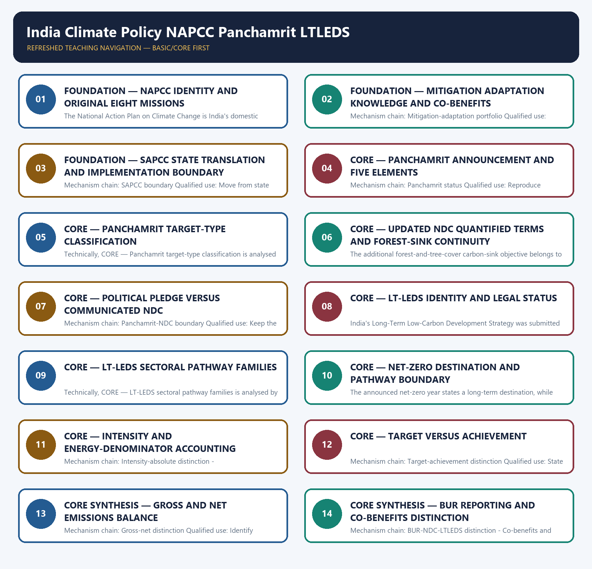

# India Climate Policy NAPCC Panchamrit LTLEDS — Learner-v2 Complete Learning Session

> **Authoring-only generation:** 2026-09-03. No PDF was rendered and no tracker or index was mutated.

### SOURCE, PROGRESSION AND CURRENT-LINKAGE AUDIT

- **Generation date:** 2026-09-03.
- **Repository-first evidence:** the Basic owner is taught first and preserved in full; the Advanced owner is retained only in the optional final teaching block.
- **OCR evidence:** Repository Markdown was primary. OCR-searchable local official General Studies papers were used only to confirm printed routed demands. No answer key, marking scheme, unsupported page precision, ecological rate, species count, pollution standard, rule threshold, mission outcome or current status was inferred.
- **Qdrant:** not used; repository Markdown and available OCR context were sufficient.
- **PYQ integrity:** Audited ledgers route the verified 2025 GS-III review of India's Paris commitments, COP26 announcement and updated NDC, and a 2026 objective demand distinguishing LT-LEDS, BUR reporting, net-zero pathway and resilience. Provisional or unavailable objective keys are not inferred.
- **Live-link boundary:** MoEFCC returned only a NAPCC title and its dashboard failed at transport level. Official UNFCCC NDC and LT-LEDS PDFs were raw bytes, PIB returned 403, and official-registry search results conflicted on post-2022 NDC status. The package therefore asserts no new NDC, current mission count, capacity, generation, emissions, sink, finance or achievement figure.
- **Fact/inference discipline:** no current-affairs item, PYQ wording, figure or quotation is invented.

### LIVE OFFICIAL-SOURCE ATTEMPT LOG

The checks below were made on 2026-09-03. Substantive official text is used only for the proposition it supports. Stubs, access failures, unrelated pages and thin landing pages are recorded and are not converted into ecological or current-status claims.

- https://moef.gov.in/national-action-plan-on-climate-change — attempted 2026-09-03; the official MoEFCC page returned only the NAPCC title. No mission target, achievement, expenditure or current mission count was inferred from that title-only page.
- https://napccindia.moef.gov.in/napcc/ — attempted 2026-09-03; the official NAPCC dashboard failed at transport level. No dashboard target or progress value was imported.
- https://unfccc.int/sites/default/files/NDC/2022-08/India%20Updated%20First%20Nationally%20Determined%20Contrib.pdf — attempted 2026-09-03; the official PDF was retrievable only as raw bytes. Exact 2022 NDC terms remain bounded to the repository owner and the official-document catalogue result, not byte reconstruction.
- https://unfccc.int/sites/default/files/resource/India_LTLEDS.pdf — attempted 2026-09-03; the official LT-LEDS PDF was retrievable only as raw bytes. No pathway, scenario, finance requirement or sector target was text-mined from opaque content.
- https://www.pib.gov.in/PressReleasePage.aspx?PRID=2089589 — attempted 2026-09-03; the official PIB page returned HTTP 403, so no BUR-4 inventory, sink, achievement or reporting-year figure was imported.
- https://unfccc.int/NDCREG — attempted through official-source search on 2026-09-03; discovery results conflicted on India's post-2022 NDC status and one result pointed to a document identifier also associated with older material. The package therefore asserts no NDC 3.0 submission, target or date and directs the reader to verify the live registry.

## BASIC LEARNING SESSION



*Distinct embedded teaching-navigation image. The separate continuous Cārvāka-style flowchart package remains an independent at-a-glance artifact.*

### SESSION 1 — FOUNDATION — NAPCC IDENTITY AND ORIGINAL EIGHT MISSIONS

#### DEFINITION / WHAT THIS IS CALLED

**Plain-language definition:** Mechanism chain: NAPCC identity - Original eight missions Qualified use: Define NAPCC as domestic policy and list the original missions exactly.

**Technical definition:** The National Action Plan on Climate Change is India's domestic mission-based climate framework launched in 2008; it is not an NDC, treaty or long-term strategy.

#### ANSWER-GRABBING OPENING — WRITE/ADAPT IN THE EXAM

> Mechanism chain: NAPCC identity - Original eight missions Qualified use: Define NAPCC as domestic policy and list the original missions exactly.

#### MUST-WRITE KEYWORDS

- **FOUNDATION**
- **NAPCC identity**
- **original eight missions**
- **Mechanism chain**
- **Qualified use**
- **The National Action Plan on Climate Change**

**How to use them:** Frame the answer through FOUNDATION; define NAPCC identity, connect original eight missions with Mechanism chain to explain the mechanism, and use Qualified use for the decisive comparison or qualification.

#### VISUAL FIRST

```text
NAPCC IDENTITY AND ORIGINAL EIGHT MISSIONS
01. NAPCC identity
    |
    v
02. Original eight missions
BOUNDARY -> Do not call NAPCC an NDC, treaty or LT-LEDS.
```

*This topic-specific rail fixes the evidence sequence and its exam boundary before analysis.*

#### CORE EXPLANATION

The National Action Plan on Climate Change is India's domestic mission-based climate framework launched in 2008; it is not an NDC, treaty or long-term strategy. NAPCC originally organised action through eight national missions covering solar energy, enhanced energy efficiency, sustainable habitat, water, the Himalayan ecosystem, Green India, sustainable agriculture and strategic climate knowledge.

#### NAMED EVIDENCE AND MECHANISM

- The National Action Plan on Climate Change is India's domestic mission-based climate framework launched in 2008; it is not an NDC, treaty or long-term strategy.
- NAPCC originally organised action through eight national missions covering solar energy, enhanced energy efficiency, sustainable habitat, water, the Himalayan ecosystem, Green India, sustainable agriculture and strategic climate knowledge.

#### EXAMINER CAUTION

- Do not call NAPCC an NDC, treaty or LT-LEDS.

#### EXAM LINK

- **Prelims:** Preserve the exact receiving medium, system boundary, measured parameter, actor, process, spatial and temporal scale, rule vintage and scientific or legal status; never turn a context-dependent pattern into a universal rule.
- **Mains:** Define NAPCC as domestic policy and list the original missions exactly.

#### MINI RECAP

- **Mechanism chain:** NAPCC identity -> Original eight missions
- **Qualified use:** Define NAPCC as domestic policy and list the original missions exactly.

#### CLOSING RECALL FLOW — FOUNDATION — NAPCC IDENTITY AND ORIGINAL EIGHT MISSIONS

```text
START / CONCEPT: FOUNDATION — NAPCC identity and original eight missions
        |
        v
EXACT TERMS: FOUNDATION · NAPCC identity · original eight missions · Mechanism chain · Qualified use · The National Action Plan on Climate Change
        |
        v
MECHANISM / ARGUMENT: The National Action Plan on Climate Change is India's domestic mission-based climate framework launched in 2008; it is not an NDC, treaty or long-term strategy.
        |
        v
CONSEQUENCE / CONTRAST: Do not call NAPCC an NDC, treaty or LT-LEDS.
        |
        v
UPSC TRAP / ANSWER-USE: Do not miss this limiting distinction: nAPCC identity - Original eight missions Qualified use.
        |
        v
ANSWER-GRABBING FORMULATION: Mechanism chain: NAPCC identity - Original eight missions Qualified use: Define NAPCC as domestic policy and list the original missions exactly.
```
### SESSION 2 — FOUNDATION — MITIGATION ADAPTATION KNOWLEDGE AND CO-BENEFITS

#### DEFINITION / WHAT THIS IS CALLED

**Plain-language definition:** The NAPCC missions combine mitigation, adaptation, knowledge and development co-benefits; no mission label should be assumed to represent only one response category.

**Technical definition:** Mechanism chain: Mitigation-adaptation portfolio Qualified use: Classify each mission by response function while retaining development co-benefits.

#### ANSWER-GRABBING OPENING — WRITE/ADAPT IN THE EXAM

> The NAPCC missions combine mitigation, adaptation, knowledge and development co-benefits; no mission label should be assumed to represent only one response category.

#### MUST-WRITE KEYWORDS

- **FOUNDATION**
- **Mitigation adaptation knowledge**
- **co-benefits**
- **Mechanism chain**
- **Qualified use**
- **The NAPCC**

**How to use them:** Frame the answer through FOUNDATION; define Mitigation adaptation knowledge, connect co-benefits with Mechanism chain to explain the mechanism, and use Qualified use for the decisive comparison or qualification.

#### VISUAL FIRST

```text
MITIGATION ADAPTATION KNOWLEDGE AND CO-BENEFITS
01. Mitigation-adaptation portfolio
BOUNDARY -> Do not replace the original eight NAPCC missions with an undated current count.
```

*This topic-specific rail fixes the evidence sequence and its exam boundary before analysis.*

#### CORE EXPLANATION

The NAPCC missions combine mitigation, adaptation, knowledge and development co-benefits; no mission label should be assumed to represent only one response category.

#### NAMED EVIDENCE AND MECHANISM

- The NAPCC missions combine mitigation, adaptation, knowledge and development co-benefits; no mission label should be assumed to represent only one response category.

#### EXAMINER CAUTION

- Do not replace the original eight NAPCC missions with an undated current count.

#### EXAM LINK

- **Prelims:** Preserve the exact receiving medium, system boundary, measured parameter, actor, process, spatial and temporal scale, rule vintage and scientific or legal status; never turn a context-dependent pattern into a universal rule.
- **Mains:** Classify each mission by response function while retaining development co-benefits.

#### MINI RECAP

- **Mechanism chain:** Mitigation-adaptation portfolio
- **Qualified use:** Classify each mission by response function while retaining development co-benefits.

#### CLOSING RECALL FLOW — FOUNDATION — MITIGATION ADAPTATION KNOWLEDGE AND CO-BENEFITS

```text
START / CONCEPT: FOUNDATION — Mitigation adaptation knowledge and co-benefits
        |
        v
EXACT TERMS: FOUNDATION · Mitigation adaptation knowledge · co-benefits · Mechanism chain · Qualified use · The NAPCC
        |
        v
MECHANISM / ARGUMENT: Mechanism chain: Mitigation-adaptation portfolio Qualified use: Classify each mission by response function while retaining development co-benefits.
        |
        v
CONSEQUENCE / CONTRAST: Do not replace the original eight NAPCC missions with an undated current count.
        |
        v
UPSC TRAP / ANSWER-USE: Do not miss this limiting distinction: the NAPCC missions combine mitigation, adaptation, knowledge and development co-benefits.
        |
        v
ANSWER-GRABBING FORMULATION: The NAPCC missions combine mitigation, adaptation, knowledge and development co-benefits; no mission label should be assumed to represent only one response category.
```
### SESSION 3 — FOUNDATION — SAPCC STATE TRANSLATION AND IMPLEMENTATION BOUNDARY

#### DEFINITION / WHAT THIS IS CALLED

**Plain-language definition:** State Action Plans on Climate Change translate climate priorities into state contexts; a state plan is not proof of implementation, finance or achieved resilience.

**Technical definition:** Mechanism chain: SAPCC boundary Qualified use: Move from state planning to finance, implementation, monitoring and outcome evidence.

#### ANSWER-GRABBING OPENING — WRITE/ADAPT IN THE EXAM

> State Action Plans on Climate Change translate climate priorities into state contexts; a state plan is not proof of implementation, finance or achieved resilience.

#### MUST-WRITE KEYWORDS

- **FOUNDATION**
- **SAPCC state translation**
- **implementation boundary**
- **Mechanism chain**
- **Qualified use**
- **Climate Change**

**How to use them:** Frame the answer through FOUNDATION; define SAPCC state translation, connect implementation boundary with Mechanism chain to explain the mechanism, and use Qualified use for the decisive comparison or qualification.

#### VISUAL FIRST

```text
SAPCC STATE TRANSLATION AND IMPLEMENTATION BOUNDARY
01. SAPCC boundary
BOUNDARY -> Do not treat every mission as exclusively mitigation or exclusively adaptation.
```

*This topic-specific rail fixes the evidence sequence and its exam boundary before analysis.*

#### CORE EXPLANATION

State Action Plans on Climate Change translate climate priorities into state contexts; a state plan is not proof of implementation, finance or achieved resilience.

#### NAMED EVIDENCE AND MECHANISM

- State Action Plans on Climate Change translate climate priorities into state contexts; a state plan is not proof of implementation, finance or achieved resilience.

#### EXAMINER CAUTION

- Do not treat every mission as exclusively mitigation or exclusively adaptation.

#### EXAM LINK

- **Prelims:** Preserve the exact receiving medium, system boundary, measured parameter, actor, process, spatial and temporal scale, rule vintage and scientific or legal status; never turn a context-dependent pattern into a universal rule.
- **Mains:** Move from state planning to finance, implementation, monitoring and outcome evidence.

#### MINI RECAP

- **Mechanism chain:** SAPCC boundary
- **Qualified use:** Move from state planning to finance, implementation, monitoring and outcome evidence.

#### CLOSING RECALL FLOW — FOUNDATION — SAPCC STATE TRANSLATION AND IMPLEMENTATION BOUNDARY

```text
START / CONCEPT: FOUNDATION — SAPCC state translation and implementation boundary
        |
        v
EXACT TERMS: FOUNDATION · SAPCC state translation · implementation boundary · Mechanism chain · Qualified use · Climate Change
        |
        v
MECHANISM / ARGUMENT: Mechanism chain: SAPCC boundary Qualified use: Move from state planning to finance, implementation, monitoring and outcome evidence.
        |
        v
CONSEQUENCE / CONTRAST: Do not treat every mission as exclusively mitigation or exclusively adaptation.
        |
        v
UPSC TRAP / ANSWER-USE: Do not miss this limiting distinction: state Action Plans on Climate Change translate climate priorities into state contexts.
        |
        v
ANSWER-GRABBING FORMULATION: State Action Plans on Climate Change translate climate priorities into state contexts; a state plan is not proof of implementation, finance or achieved resilience.
```
### SESSION 4 — CORE — PANCHAMRIT ANNOUNCEMENT AND FIVE ELEMENTS

#### DEFINITION / WHAT THIS IS CALLED

**Plain-language definition:** Panchamrit is the five-part political announcement made by India at COP26; announcement, later NDC communication, domestic implementation and verified achievement are distinct stages.

**Technical definition:** Mechanism chain: Panchamrit status Qualified use: Reproduce Panchamrit only with the exact official wording, metric and year.

#### ANSWER-GRABBING OPENING — WRITE/ADAPT IN THE EXAM

> Panchamrit is the five-part political announcement made by India at COP26; announcement, later NDC communication, domestic implementation and verified achievement are distinct stages.

#### MUST-WRITE KEYWORDS

- **Panchamrit announcement**
- **five elements**
- **Mechanism chain**
- **Qualified use**
- **Panchamrit**
- **India**

**How to use them:** Frame the answer through Panchamrit announcement; define five elements, connect Mechanism chain with Qualified use to explain the mechanism, and use Panchamrit for the decisive comparison or qualification.

#### VISUAL FIRST

```text
PANCHAMRIT ANNOUNCEMENT AND FIVE ELEMENTS
01. Panchamrit status
BOUNDARY -> Do not treat an SAPCC document as proof of implementation or outcome.
```

*This topic-specific rail fixes the evidence sequence and its exam boundary before analysis.*

#### CORE EXPLANATION

Panchamrit is the five-part political announcement made by India at COP26; announcement, later NDC communication, domestic implementation and verified achievement are distinct stages.

#### NAMED EVIDENCE AND MECHANISM

- Panchamrit is the five-part political announcement made by India at COP26; announcement, later NDC communication, domestic implementation and verified achievement are distinct stages.

#### EXAMINER CAUTION

- Do not treat an SAPCC document as proof of implementation or outcome.

#### EXAM LINK

- **Prelims:** Preserve the exact receiving medium, system boundary, measured parameter, actor, process, spatial and temporal scale, rule vintage and scientific or legal status; never turn a context-dependent pattern into a universal rule.
- **Mains:** Reproduce Panchamrit only with the exact official wording, metric and year.

#### MINI RECAP

- **Mechanism chain:** Panchamrit status
- **Qualified use:** Reproduce Panchamrit only with the exact official wording, metric and year.

#### CLOSING RECALL FLOW — CORE — PANCHAMRIT ANNOUNCEMENT AND FIVE ELEMENTS

```text
START / CONCEPT: CORE — Panchamrit announcement and five elements
        |
        v
EXACT TERMS: Panchamrit announcement · five elements · Mechanism chain · Qualified use · Panchamrit · India
        |
        v
MECHANISM / ARGUMENT: Mechanism chain: Panchamrit status Qualified use: Reproduce Panchamrit only with the exact official wording, metric and year.
        |
        v
CONSEQUENCE / CONTRAST: Do not treat an SAPCC document as proof of implementation or outcome.
        |
        v
UPSC TRAP / ANSWER-USE: Do not miss this limiting distinction: panchamrit is the five-part political announcement made by India at COP26.
        |
        v
ANSWER-GRABBING FORMULATION: Panchamrit is the five-part political announcement made by India at COP26; announcement, later NDC communication, domestic implementation and verified achievement are distinct stages.
```
### SESSION 5 — CORE — PANCHAMRIT TARGET-TYPE CLASSIFICATION

#### DEFINITION / WHAT THIS IS CALLED

**Plain-language definition:** Mechanism chain: Panchamrit five elements Qualified use: Classify each element as capacity, share, projected reduction, intensity or net-zero goal.

**Technical definition:** Technically, CORE — Panchamrit target-type classification is analysed by relating Panchamrit target-type classification to Mechanism chain, then testing the relationship through Qualified use and Panchamrit.

#### ANSWER-GRABBING OPENING — WRITE/ADAPT IN THE EXAM

> Do not merge a Panchamrit announcement with a communicated NDC.

#### MUST-WRITE KEYWORDS

- **Panchamrit target-type classification**
- **Mechanism chain**
- **Qualified use**
- **Panchamrit**
- **NDC**
- **Qualified**

**How to use them:** Frame the answer through Panchamrit target-type classification; define Mechanism chain, connect Qualified use with Panchamrit to explain the mechanism, and use NDC for the decisive comparison or qualification.

#### VISUAL FIRST

```text
PANCHAMRIT TARGET-TYPE CLASSIFICATION
01. Panchamrit five elements
BOUNDARY -> Do not merge a Panchamrit announcement with a communicated NDC.
```

*This topic-specific rail fixes the evidence sequence and its exam boundary before analysis.*

#### CORE EXPLANATION

The announced Panchamrit comprised 500 GW non-fossil capacity by 2030, 50 percent of energy requirements from renewables by 2030, a one-billion-tonne reduction in projected carbon emissions by 2030, a 45 percent emissions-intensity reduction from 2005 by 2030, and net zero by 2070.

#### NAMED EVIDENCE AND MECHANISM

- The announced Panchamrit comprised 500 GW non-fossil capacity by 2030, 50 percent of energy requirements from renewables by 2030, a one-billion-tonne reduction in projected carbon emissions by 2030, a 45 percent emissions-intensity reduction from 2005 by 2030, and net zero by 2070.

#### EXAMINER CAUTION

- Do not merge a Panchamrit announcement with a communicated NDC.

#### EXAM LINK

- **Prelims:** Preserve the exact receiving medium, system boundary, measured parameter, actor, process, spatial and temporal scale, rule vintage and scientific or legal status; never turn a context-dependent pattern into a universal rule.
- **Mains:** Classify each element as capacity, share, projected reduction, intensity or net-zero goal.

#### MINI RECAP

- **Mechanism chain:** Panchamrit five elements
- **Qualified use:** Classify each element as capacity, share, projected reduction, intensity or net-zero goal.

#### CLOSING RECALL FLOW — CORE — PANCHAMRIT TARGET-TYPE CLASSIFICATION

```text
START / CONCEPT: CORE — Panchamrit target-type classification
        |
        v
EXACT TERMS: Panchamrit target-type classification · Mechanism chain · Qualified use · Panchamrit · NDC · Qualified
        |
        v
MECHANISM / ARGUMENT: Mechanism chain: Panchamrit five elements Qualified use: Classify each element as capacity, share, projected reduction, intensity or net-zero goal.
        |
        v
CONSEQUENCE / CONTRAST: The resulting consequence is that do not merge a Panchamrit announcement with a communicated NDC.
        |
        v
UPSC TRAP / ANSWER-USE: Do not miss this limiting distinction: do not merge a Panchamrit announcement with a communicated NDC.
        |
        v
ANSWER-GRABBING FORMULATION: Do not merge a Panchamrit announcement with a communicated NDC.
```
### SESSION 6 — CORE — UPDATED NDC QUANTIFIED TERMS AND FOREST-SINK CONTINUITY

#### DEFINITION / WHAT THIS IS CALLED

**Plain-language definition:** Mechanism chain: Updated NDC quantified terms - Forest-sink continuity Qualified use: Quote only the two strengthened quantified 2030 terms in the updated NDC.

**Technical definition:** The additional forest-and-tree-cover carbon-sink objective belongs to India's communicated NDC architecture and must be distinguished from Panchamrit's five announced elements and from a verified sink achievement.

#### ANSWER-GRABBING OPENING — WRITE/ADAPT IN THE EXAM

> Mechanism chain: Updated NDC quantified terms - Forest-sink continuity Qualified use: Quote only the two strengthened quantified 2030 terms in the updated NDC.

#### MUST-WRITE KEYWORDS

- **Updated NDC quantified terms**
- **forest-sink continuity**
- **Mechanism chain**
- **Qualified use**
- **India's**
- **NDC**

**How to use them:** Frame the answer through Updated NDC quantified terms; define forest-sink continuity, connect Mechanism chain with Qualified use to explain the mechanism, and use India's for the decisive comparison or qualification.

#### VISUAL FIRST

```text
UPDATED NDC QUANTIFIED TERMS AND FOREST-SINK CONTINUITY
01. Updated NDC quantified terms
    |
    v
02. Forest-sink continuity
BOUNDARY -> Do not alter the Panchamrit wording, target year, percentage, baseline or denominator.
```

*This topic-specific rail fixes the evidence sequence and its exam boundary before analysis.*

#### CORE EXPLANATION

India's 2022 updated NDC formally strengthened the quantified 2030 emissions-intensity target to 45 percent from the 2005 level and the cumulative installed electric-power capacity target to about 50 percent from non-fossil sources. The additional forest-and-tree-cover carbon-sink objective belongs to India's communicated NDC architecture and must be distinguished from Panchamrit's five announced elements and from a verified sink achievement.

#### NAMED EVIDENCE AND MECHANISM

- India's 2022 updated NDC formally strengthened the quantified 2030 emissions-intensity target to 45 percent from the 2005 level and the cumulative installed electric-power capacity target to about 50 percent from non-fossil sources.
- The additional forest-and-tree-cover carbon-sink objective belongs to India's communicated NDC architecture and must be distinguished from Panchamrit's five announced elements and from a verified sink achievement.

#### EXAMINER CAUTION

- Do not alter the Panchamrit wording, target year, percentage, baseline or denominator.

#### EXAM LINK

- **Prelims:** Preserve the exact receiving medium, system boundary, measured parameter, actor, process, spatial and temporal scale, rule vintage and scientific or legal status; never turn a context-dependent pattern into a universal rule.
- **Mains:** Quote only the two strengthened quantified 2030 terms in the updated NDC.

#### MINI RECAP

- **Mechanism chain:** Updated NDC quantified terms -> Forest-sink continuity
- **Qualified use:** Quote only the two strengthened quantified 2030 terms in the updated NDC.

#### CLOSING RECALL FLOW — CORE — UPDATED NDC QUANTIFIED TERMS AND FOREST-SINK CONTINUITY

```text
START / CONCEPT: CORE — Updated NDC quantified terms and forest-sink continuity
        |
        v
EXACT TERMS: Updated NDC quantified terms · forest-sink continuity · Mechanism chain · Qualified use · India's · NDC
        |
        v
MECHANISM / ARGUMENT: The additional forest-and-tree-cover carbon-sink objective belongs to India's communicated NDC architecture and must be distinguished from Panchamrit's five announced elements and from a verified sink achievement.
        |
        v
CONSEQUENCE / CONTRAST: Do not alter the Panchamrit wording, target year, percentage, baseline or denominator.
        |
        v
UPSC TRAP / ANSWER-USE: Do not miss this limiting distinction: updated NDC quantified terms - Forest-sink continuity Qualified use.
        |
        v
ANSWER-GRABBING FORMULATION: Mechanism chain: Updated NDC quantified terms - Forest-sink continuity Qualified use: Quote only the two strengthened quantified 2030 terms in the updated NDC.
```
### SESSION 7 — CORE — POLITICAL PLEDGE VERSUS COMMUNICATED NDC

#### DEFINITION / WHAT THIS IS CALLED

**Plain-language definition:** Not every Panchamrit phrase became a separately quantified term in the 2022 updated NDC; the political announcement and communicated contribution must be read as separate official instruments.

**Technical definition:** Mechanism chain: Panchamrit-NDC boundary Qualified use: Keep the forest-sink objective inside the communicated NDC architecture.

#### ANSWER-GRABBING OPENING — WRITE/ADAPT IN THE EXAM

> Not every Panchamrit phrase became a separately quantified term in the 2022 updated NDC; the political announcement and communicated contribution must be read as separate official instruments.

#### MUST-WRITE KEYWORDS

- **Political pledge versus communicated NDC**
- **Mechanism chain**
- **Qualified use**
- **Not**
- **Panchamrit**
- **NDC**

**How to use them:** Frame the answer through Political pledge versus communicated NDC; define Mechanism chain, connect Qualified use with Not to explain the mechanism, and use Panchamrit for the decisive comparison or qualification.

#### VISUAL FIRST

```text
POLITICAL PLEDGE VERSUS COMMUNICATED NDC
01. Panchamrit-NDC boundary
BOUNDARY -> Do not say all five Panchamrit elements became quantified 2022 NDC targets.
```

*This topic-specific rail fixes the evidence sequence and its exam boundary before analysis.*

#### CORE EXPLANATION

Not every Panchamrit phrase became a separately quantified term in the 2022 updated NDC; the political announcement and communicated contribution must be read as separate official instruments.

#### NAMED EVIDENCE AND MECHANISM

- Not every Panchamrit phrase became a separately quantified term in the 2022 updated NDC; the political announcement and communicated contribution must be read as separate official instruments.

#### EXAMINER CAUTION

- Do not say all five Panchamrit elements became quantified 2022 NDC targets.

#### EXAM LINK

- **Prelims:** Preserve the exact receiving medium, system boundary, measured parameter, actor, process, spatial and temporal scale, rule vintage and scientific or legal status; never turn a context-dependent pattern into a universal rule.
- **Mains:** Keep the forest-sink objective inside the communicated NDC architecture.

#### MINI RECAP

- **Mechanism chain:** Panchamrit-NDC boundary
- **Qualified use:** Keep the forest-sink objective inside the communicated NDC architecture.

#### CLOSING RECALL FLOW — CORE — POLITICAL PLEDGE VERSUS COMMUNICATED NDC

```text
START / CONCEPT: CORE — Political pledge versus communicated NDC
        |
        v
EXACT TERMS: Political pledge versus communicated NDC · Mechanism chain · Qualified use · Not · Panchamrit · NDC
        |
        v
MECHANISM / ARGUMENT: Mechanism chain: Panchamrit-NDC boundary Qualified use: Keep the forest-sink objective inside the communicated NDC architecture.
        |
        v
CONSEQUENCE / CONTRAST: Do not say all five Panchamrit elements became quantified 2022 NDC targets.
        |
        v
UPSC TRAP / ANSWER-USE: Do not miss this limiting distinction: not every Panchamrit phrase became a separately quantified term in the 2022 updated NDC.
        |
        v
ANSWER-GRABBING FORMULATION: Not every Panchamrit phrase became a separately quantified term in the 2022 updated NDC; the political announcement and communicated contribution must be read as separate official instruments.
```
### SESSION 8 — CORE — LT-LEDS IDENTITY AND LEGAL STATUS

#### DEFINITION / WHAT THIS IS CALLED

**Plain-language definition:** Mechanism chain: LT-LEDS identity Qualified use: Separate speech announcement, formal communication and domestic action.

**Technical definition:** India's Long-Term Low-Carbon Development Strategy was submitted to the UNFCCC in 2022 as a long-horizon strategic pathway; it is distinct from the shorter-term NDC and is not a domestic penalty-bearing law.

#### ANSWER-GRABBING OPENING — WRITE/ADAPT IN THE EXAM

> Mechanism chain: LT-LEDS identity Qualified use: Separate speech announcement, formal communication and domestic action.

#### MUST-WRITE KEYWORDS

- **LT-LEDS identity**
- **legal status**
- **Mechanism chain**
- **Qualified use**
- **India's Long-Term Low-Carbon Development Strategy**
- **UNFCCC**

**How to use them:** Frame the answer through LT-LEDS identity; define legal status, connect Mechanism chain with Qualified use to explain the mechanism, and use India's Long-Term Low-Carbon Development Strategy for the decisive comparison or qualification.

#### VISUAL FIRST

```text
LT-LEDS IDENTITY AND LEGAL STATUS
01. LT-LEDS identity
BOUNDARY -> Do not call the forest-sink objective a separate Panchamrit element.
```

*This topic-specific rail fixes the evidence sequence and its exam boundary before analysis.*

#### CORE EXPLANATION

India's Long-Term Low-Carbon Development Strategy was submitted to the UNFCCC in 2022 as a long-horizon strategic pathway; it is distinct from the shorter-term NDC and is not a domestic penalty-bearing law.

#### NAMED EVIDENCE AND MECHANISM

- India's Long-Term Low-Carbon Development Strategy was submitted to the UNFCCC in 2022 as a long-horizon strategic pathway; it is distinct from the shorter-term NDC and is not a domestic penalty-bearing law.

#### EXAMINER CAUTION

- Do not call the forest-sink objective a separate Panchamrit element.

#### EXAM LINK

- **Prelims:** Preserve the exact receiving medium, system boundary, measured parameter, actor, process, spatial and temporal scale, rule vintage and scientific or legal status; never turn a context-dependent pattern into a universal rule.
- **Mains:** Separate speech announcement, formal communication and domestic action.

#### MINI RECAP

- **Mechanism chain:** LT-LEDS identity
- **Qualified use:** Separate speech announcement, formal communication and domestic action.

#### CLOSING RECALL FLOW — CORE — LT-LEDS IDENTITY AND LEGAL STATUS

```text
START / CONCEPT: CORE — LT-LEDS identity and legal status
        |
        v
EXACT TERMS: LT-LEDS identity · legal status · Mechanism chain · Qualified use · India's Long-Term Low-Carbon Development Strategy · UNFCCC
        |
        v
MECHANISM / ARGUMENT: India's Long-Term Low-Carbon Development Strategy was submitted to the UNFCCC in 2022 as a long-horizon strategic pathway; it is distinct from the shorter-term NDC and is not a domestic penalty-bearing law.
        |
        v
CONSEQUENCE / CONTRAST: Do not call the forest-sink objective a separate Panchamrit element.
        |
        v
UPSC TRAP / ANSWER-USE: Do not miss this limiting distinction: india's Long-Term Low-Carbon Development Strategy was submitted to the UNFCCC in 2022 as a...
        |
        v
ANSWER-GRABBING FORMULATION: Mechanism chain: LT-LEDS identity Qualified use: Separate speech announcement, formal communication and domestic action.
```
### SESSION 9 — CORE — LT-LEDS SECTORAL PATHWAY FAMILIES

#### DEFINITION / WHAT THIS IS CALLED

**Plain-language definition:** Mechanism chain: LT-LEDS pathway families Qualified use: Define LT-LEDS as a long-term strategy rather than a binding domestic statute.

**Technical definition:** Technically, CORE — LT-LEDS sectoral pathway families is analysed by relating LT-LEDS sectoral pathway families to Mechanism chain, then testing the relationship through Qualified use and LT-LEDS.

#### ANSWER-GRABBING OPENING — WRITE/ADAPT IN THE EXAM

> Mechanism chain: LT-LEDS pathway families Qualified use: Define LT-LEDS as a long-term strategy rather than a binding domestic statute.

#### MUST-WRITE KEYWORDS

- **LT-LEDS sectoral pathway families**
- **Mechanism chain**
- **Qualified use**
- **LT-LEDS**
- **NDC**
- **Qualified**

**How to use them:** Frame the answer through LT-LEDS sectoral pathway families; define Mechanism chain, connect Qualified use with LT-LEDS to explain the mechanism, and use NDC for the decisive comparison or qualification.

#### VISUAL FIRST

```text
LT-LEDS SECTORAL PATHWAY FAMILIES
01. LT-LEDS pathway families
BOUNDARY -> Do not call LT-LEDS the same document as the NDC.
```

*This topic-specific rail fixes the evidence sequence and its exam boundary before analysis.*

#### CORE EXPLANATION

The LT-LEDS addresses low-carbon electricity, integrated transport, sustainable urbanisation and buildings, lower-emission industry, carbon-dioxide removal, forest and vegetative cover, and economic or financial aspects of transition.

#### NAMED EVIDENCE AND MECHANISM

- The LT-LEDS addresses low-carbon electricity, integrated transport, sustainable urbanisation and buildings, lower-emission industry, carbon-dioxide removal, forest and vegetative cover, and economic or financial aspects of transition.

#### EXAMINER CAUTION

- Do not call LT-LEDS the same document as the NDC.

#### EXAM LINK

- **Prelims:** Preserve the exact receiving medium, system boundary, measured parameter, actor, process, spatial and temporal scale, rule vintage and scientific or legal status; never turn a context-dependent pattern into a universal rule.
- **Mains:** Define LT-LEDS as a long-term strategy rather than a binding domestic statute.

#### MINI RECAP

- **Mechanism chain:** LT-LEDS pathway families
- **Qualified use:** Define LT-LEDS as a long-term strategy rather than a binding domestic statute.

#### CLOSING RECALL FLOW — CORE — LT-LEDS SECTORAL PATHWAY FAMILIES

```text
START / CONCEPT: CORE — LT-LEDS sectoral pathway families
        |
        v
EXACT TERMS: LT-LEDS sectoral pathway families · Mechanism chain · Qualified use · LT-LEDS · NDC · Qualified
        |
        v
MECHANISM / ARGUMENT: Do not call LT-LEDS the same document as the NDC.
        |
        v
CONSEQUENCE / CONTRAST: The resulting consequence is that define LT-LEDS as a long-term strategy rather than a binding domestic statute.
        |
        v
UPSC TRAP / ANSWER-USE: Do not miss this limiting distinction: define LT-LEDS as a long-term strategy rather than a binding domestic statute.
        |
        v
ANSWER-GRABBING FORMULATION: Mechanism chain: LT-LEDS pathway families Qualified use: Define LT-LEDS as a long-term strategy rather than a binding domestic statute.
```
### SESSION 10 — CORE — NET-ZERO DESTINATION AND PATHWAY BOUNDARY

#### DEFINITION / WHAT THIS IS CALLED

**Plain-language definition:** Mechanism chain: Net-zero pathway boundary Qualified use: Organise the strategy by interacting sectoral transitions and enabling conditions.

**Technical definition:** The announced net-zero year states a long-term destination, while LT-LEDS discusses pathways and enabling conditions; neither proves a linear trajectory or achieved net-zero balance.

#### ANSWER-GRABBING OPENING — WRITE/ADAPT IN THE EXAM

> The announced net-zero year states a long-term destination, while LT-LEDS discusses pathways and enabling conditions; neither proves a linear trajectory or achieved net-zero balance.

#### MUST-WRITE KEYWORDS

- **Net-zero destination**
- **pathway boundary**
- **Mechanism chain**
- **Qualified use**
- **LT-LEDS**
- **Net-zero**

**How to use them:** Frame the answer through Net-zero destination; define pathway boundary, connect Mechanism chain with Qualified use to explain the mechanism, and use LT-LEDS for the decisive comparison or qualification.

#### VISUAL FIRST

```text
NET-ZERO DESTINATION AND PATHWAY BOUNDARY
01. Net-zero pathway boundary
BOUNDARY -> Do not treat LT-LEDS pathways as legally binding sectoral caps or penalties.
```

*This topic-specific rail fixes the evidence sequence and its exam boundary before analysis.*

#### CORE EXPLANATION

The announced net-zero year states a long-term destination, while LT-LEDS discusses pathways and enabling conditions; neither proves a linear trajectory or achieved net-zero balance.

#### NAMED EVIDENCE AND MECHANISM

- The announced net-zero year states a long-term destination, while LT-LEDS discusses pathways and enabling conditions; neither proves a linear trajectory or achieved net-zero balance.

#### EXAMINER CAUTION

- Do not treat LT-LEDS pathways as legally binding sectoral caps or penalties.

#### EXAM LINK

- **Prelims:** Preserve the exact receiving medium, system boundary, measured parameter, actor, process, spatial and temporal scale, rule vintage and scientific or legal status; never turn a context-dependent pattern into a universal rule.
- **Mains:** Organise the strategy by interacting sectoral transitions and enabling conditions.

#### MINI RECAP

- **Mechanism chain:** Net-zero pathway boundary
- **Qualified use:** Organise the strategy by interacting sectoral transitions and enabling conditions.

#### CLOSING RECALL FLOW — CORE — NET-ZERO DESTINATION AND PATHWAY BOUNDARY

```text
START / CONCEPT: CORE — Net-zero destination and pathway boundary
        |
        v
EXACT TERMS: Net-zero destination · pathway boundary · Mechanism chain · Qualified use · LT-LEDS · Net-zero
        |
        v
MECHANISM / ARGUMENT: Mechanism chain: Net-zero pathway boundary Qualified use: Organise the strategy by interacting sectoral transitions and enabling conditions.
        |
        v
CONSEQUENCE / CONTRAST: Do not treat LT-LEDS pathways as legally binding sectoral caps or penalties.
        |
        v
UPSC TRAP / ANSWER-USE: Do not miss this limiting distinction: the announced net-zero year states a long-term destination.
        |
        v
ANSWER-GRABBING FORMULATION: The announced net-zero year states a long-term destination, while LT-LEDS discusses pathways and enabling conditions; neither proves a linear trajectory or achieved net-zero balance.
```
### SESSION 11 — CORE — INTENSITY AND ENERGY-DENOMINATOR ACCOUNTING

#### DEFINITION / WHAT THIS IS CALLED

**Plain-language definition:** Emissions intensity measures emissions per unit of economic output, whereas absolute emissions measure total emissions; intensity can fall while total emissions follow a different path.

**Technical definition:** Mechanism chain: Intensity-absolute distinction - Capacity-generation-energy distinction Qualified use: Separate long-term destination, strategic pathway and measured trajectory.

#### ANSWER-GRABBING OPENING — WRITE/ADAPT IN THE EXAM

> Emissions intensity measures emissions per unit of economic output, whereas absolute emissions measure total emissions; intensity can fall while total emissions follow a different path.

#### MUST-WRITE KEYWORDS

- **Intensity**
- **energy-denominator accounting**
- **Mechanism chain**
- **Qualified use**
- **Emissions**
- **Installed**

**How to use them:** Frame the answer through Intensity; define energy-denominator accounting, connect Mechanism chain with Qualified use to explain the mechanism, and use Emissions for the decisive comparison or qualification.

#### VISUAL FIRST

```text
INTENSITY AND ENERGY-DENOMINATOR ACCOUNTING
01. Intensity-absolute distinction
    |
    v
02. Capacity-generation-energy distinction
BOUNDARY -> Do not merge emissions intensity with absolute emissions.
```

*This topic-specific rail fixes the evidence sequence and its exam boundary before analysis.*

#### CORE EXPLANATION

Emissions intensity measures emissions per unit of economic output, whereas absolute emissions measure total emissions; intensity can fall while total emissions follow a different path. Installed power capacity, electricity generation and the share of total energy requirements are different denominators; a non-fossil capacity percentage cannot be relabelled as renewable generation or total-energy share.

#### NAMED EVIDENCE AND MECHANISM

- Emissions intensity measures emissions per unit of economic output, whereas absolute emissions measure total emissions; intensity can fall while total emissions follow a different path.
- Installed power capacity, electricity generation and the share of total energy requirements are different denominators; a non-fossil capacity percentage cannot be relabelled as renewable generation or total-energy share.

#### EXAMINER CAUTION

- Do not merge emissions intensity with absolute emissions.

#### EXAM LINK

- **Prelims:** Preserve the exact receiving medium, system boundary, measured parameter, actor, process, spatial and temporal scale, rule vintage and scientific or legal status; never turn a context-dependent pattern into a universal rule.
- **Mains:** Separate long-term destination, strategic pathway and measured trajectory.

#### MINI RECAP

- **Mechanism chain:** Intensity-absolute distinction -> Capacity-generation-energy distinction
- **Qualified use:** Separate long-term destination, strategic pathway and measured trajectory.

#### CLOSING RECALL FLOW — CORE — INTENSITY AND ENERGY-DENOMINATOR ACCOUNTING

```text
START / CONCEPT: CORE — Intensity and energy-denominator accounting
        |
        v
EXACT TERMS: Intensity · energy-denominator accounting · Mechanism chain · Qualified use · Emissions · Installed
        |
        v
MECHANISM / ARGUMENT: Mechanism chain: Intensity-absolute distinction - Capacity-generation-energy distinction Qualified use: Separate long-term destination, strategic pathway and measured trajectory.
        |
        v
CONSEQUENCE / CONTRAST: Do not merge emissions intensity with absolute emissions.
        |
        v
UPSC TRAP / ANSWER-USE: Installed power capacity, electricity generation and the share of total energy requirements are different denominators; a non-fossil capacity percentage cannot be relabelled as renewable generation or total-energy share.
        |
        v
ANSWER-GRABBING FORMULATION: Emissions intensity measures emissions per unit of economic output, whereas absolute emissions measure total emissions; intensity can fall while total emissions follow a different path.
```
### SESSION 12 — CORE — TARGET VERSUS ACHIEVEMENT

#### DEFINITION / WHAT THIS IS CALLED

**Plain-language definition:** A target states an intended future result, while achievement requires source-dated measured evidence against the same metric, boundary, baseline and target year.

**Technical definition:** Mechanism chain: Target-achievement distinction Qualified use: State the numerator, denominator, baseline, period and netting boundary.

#### ANSWER-GRABBING OPENING — WRITE/ADAPT IN THE EXAM

> A target states an intended future result, while achievement requires source-dated measured evidence against the same metric, boundary, baseline and target year.

#### MUST-WRITE KEYWORDS

- **Target versus achievement**
- **Mechanism chain**
- **Qualified use**
- **Target-achievement**
- **Qualified**
- **CORE — Target versus achievement**

**How to use them:** Frame the answer through Target versus achievement; define Mechanism chain, connect Qualified use with Target-achievement to explain the mechanism, and use Qualified for the decisive comparison or qualification.

#### VISUAL FIRST

```text
TARGET VERSUS ACHIEVEMENT
01. Target-achievement distinction
BOUNDARY -> Do not merge installed capacity, electricity generation and total energy requirements.
```

*This topic-specific rail fixes the evidence sequence and its exam boundary before analysis.*

#### CORE EXPLANATION

A target states an intended future result, while achievement requires source-dated measured evidence against the same metric, boundary, baseline and target year.

#### NAMED EVIDENCE AND MECHANISM

- A target states an intended future result, while achievement requires source-dated measured evidence against the same metric, boundary, baseline and target year.

#### EXAMINER CAUTION

- Do not merge installed capacity, electricity generation and total energy requirements.

#### EXAM LINK

- **Prelims:** Preserve the exact receiving medium, system boundary, measured parameter, actor, process, spatial and temporal scale, rule vintage and scientific or legal status; never turn a context-dependent pattern into a universal rule.
- **Mains:** State the numerator, denominator, baseline, period and netting boundary.

#### MINI RECAP

- **Mechanism chain:** Target-achievement distinction
- **Qualified use:** State the numerator, denominator, baseline, period and netting boundary.

#### CLOSING RECALL FLOW — CORE — TARGET VERSUS ACHIEVEMENT

```text
START / CONCEPT: CORE — Target versus achievement
        |
        v
EXACT TERMS: Target versus achievement · Mechanism chain · Qualified use · Target-achievement · Qualified · CORE — Target versus achievement
        |
        v
MECHANISM / ARGUMENT: Mechanism chain: Target-achievement distinction Qualified use: State the numerator, denominator, baseline, period and netting boundary.
        |
        v
CONSEQUENCE / CONTRAST: Do not merge installed capacity, electricity generation and total energy requirements.
        |
        v
UPSC TRAP / ANSWER-USE: Do not miss this limiting distinction: a target states an intended future result.
        |
        v
ANSWER-GRABBING FORMULATION: A target states an intended future result, while achievement requires source-dated measured evidence against the same metric, boundary, baseline and target year.
```
### SESSION 13 — CORE SYNTHESIS — GROSS AND NET EMISSIONS BALANCE

#### DEFINITION / WHAT THIS IS CALLED

**Plain-language definition:** Gross emissions, gross removals and net emissions balance are separate quantities; a net-zero claim requires a defined boundary and cannot be inferred from one sectoral capacity milestone.

**Technical definition:** Mechanism chain: Gross-net distinction Qualified use: Identify whether the claim concerns capacity, generation, electricity or total energy.

#### ANSWER-GRABBING OPENING — WRITE/ADAPT IN THE EXAM

> Gross emissions, gross removals and net emissions balance are separate quantities; a net-zero claim requires a defined boundary and cannot be inferred from one sectoral capacity milestone.

#### MUST-WRITE KEYWORDS

- **CORE SYNTHESIS**
- **Gross**
- **net emissions balance**
- **Mechanism chain**
- **Qualified use**
- **Gross emissions, gross removals and net emissions balance**

**How to use them:** Frame the answer through CORE SYNTHESIS; define Gross, connect net emissions balance with Mechanism chain to explain the mechanism, and use Qualified use for the decisive comparison or qualification.

#### VISUAL FIRST

```text
GROSS AND NET EMISSIONS BALANCE
01. Gross-net distinction
BOUNDARY -> Do not present a target as an achievement.
```

*This topic-specific rail fixes the evidence sequence and its exam boundary before analysis.*

#### CORE EXPLANATION

Gross emissions, gross removals and net emissions balance are separate quantities; a net-zero claim requires a defined boundary and cannot be inferred from one sectoral capacity milestone.

#### NAMED EVIDENCE AND MECHANISM

- Gross emissions, gross removals and net emissions balance are separate quantities; a net-zero claim requires a defined boundary and cannot be inferred from one sectoral capacity milestone.

#### EXAMINER CAUTION

- Do not present a target as an achievement.

#### EXAM LINK

- **Prelims:** Preserve the exact receiving medium, system boundary, measured parameter, actor, process, spatial and temporal scale, rule vintage and scientific or legal status; never turn a context-dependent pattern into a universal rule.
- **Mains:** Identify whether the claim concerns capacity, generation, electricity or total energy.

#### MINI RECAP

- **Mechanism chain:** Gross-net distinction
- **Qualified use:** Identify whether the claim concerns capacity, generation, electricity or total energy.

#### CLOSING RECALL FLOW — CORE SYNTHESIS — GROSS AND NET EMISSIONS BALANCE

```text
START / CONCEPT: CORE SYNTHESIS — Gross and net emissions balance
        |
        v
EXACT TERMS: CORE SYNTHESIS · Gross · net emissions balance · Mechanism chain · Qualified use · Gross emissions, gross removals and net emissions balance
        |
        v
MECHANISM / ARGUMENT: Mechanism chain: Gross-net distinction Qualified use: Identify whether the claim concerns capacity, generation, electricity or total energy.
        |
        v
CONSEQUENCE / CONTRAST: Do not present a target as an achievement.
        |
        v
UPSC TRAP / ANSWER-USE: Do not miss this limiting distinction: gross emissions, gross removals and net emissions balance are separate quantities.
        |
        v
ANSWER-GRABBING FORMULATION: Gross emissions, gross removals and net emissions balance are separate quantities; a net-zero claim requires a defined boundary and cannot be inferred from one sectoral capacity milestone.
```
### SESSION 14 — CORE SYNTHESIS — BUR REPORTING AND CO-BENEFITS DISTINCTION

#### DEFINITION / WHAT THIS IS CALLED

**Plain-language definition:** A Biennial Update Report is backward-looking reporting, an NDC is a forward nationally determined contribution, and LT-LEDS is a long-term strategy; none is a substitute for the others.

**Technical definition:** Mechanism chain: BUR-NDC-LTLEDS distinction - Co-benefits and equity Qualified use: Match every achievement claim to a dated official measurement and reporting instrument.

#### ANSWER-GRABBING OPENING — WRITE/ADAPT IN THE EXAM

> A Biennial Update Report is backward-looking reporting, an NDC is a forward nationally determined contribution, and LT-LEDS is a long-term strategy; none is a substitute for the others.

#### MUST-WRITE KEYWORDS

- **CORE SYNTHESIS**
- **BUR reporting**
- **co-benefits distinction**
- **Mechanism chain**
- **Qualified use**
- **A Biennial Update Report**

**How to use them:** Frame the answer through CORE SYNTHESIS; define BUR reporting, connect co-benefits distinction with Mechanism chain to explain the mechanism, and use Qualified use for the decisive comparison or qualification.

#### VISUAL FIRST

```text
BUR REPORTING AND CO-BENEFITS DISTINCTION
01. BUR-NDC-LTLEDS distinction
    |
    v
02. Co-benefits and equity
BOUNDARY -> Do not infer net zero from one sectoral or capacity milestone.
```

*This topic-specific rail fixes the evidence sequence and its exam boundary before analysis.*

#### CORE EXPLANATION

A Biennial Update Report is backward-looking reporting, an NDC is a forward nationally determined contribution, and LT-LEDS is a long-term strategy; none is a substitute for the others. India frames climate action alongside development, energy access, resilience, equity and CBDR-RC; this analytical framing does not remove the need to evaluate measurable domestic implementation.

#### NAMED EVIDENCE AND MECHANISM

- A Biennial Update Report is backward-looking reporting, an NDC is a forward nationally determined contribution, and LT-LEDS is a long-term strategy; none is a substitute for the others.
- India frames climate action alongside development, energy access, resilience, equity and CBDR-RC; this analytical framing does not remove the need to evaluate measurable domestic implementation.

#### EXAMINER CAUTION

- Do not infer net zero from one sectoral or capacity milestone.

#### EXAM LINK

- **Prelims:** Preserve the exact receiving medium, system boundary, measured parameter, actor, process, spatial and temporal scale, rule vintage and scientific or legal status; never turn a context-dependent pattern into a universal rule.
- **Mains:** Match every achievement claim to a dated official measurement and reporting instrument.

#### MINI RECAP

- **Mechanism chain:** BUR-NDC-LTLEDS distinction -> Co-benefits and equity
- **Qualified use:** Match every achievement claim to a dated official measurement and reporting instrument.

#### CLOSING RECALL FLOW — CORE SYNTHESIS — BUR REPORTING AND CO-BENEFITS DISTINCTION

```text
START / CONCEPT: CORE SYNTHESIS — BUR reporting and co-benefits distinction
        |
        v
EXACT TERMS: CORE SYNTHESIS · BUR reporting · co-benefits distinction · Mechanism chain · Qualified use · A Biennial Update Report
        |
        v
MECHANISM / ARGUMENT: Mechanism chain: BUR-NDC-LTLEDS distinction - Co-benefits and equity Qualified use: Match every achievement claim to a dated official measurement and reporting instrument.
        |
        v
CONSEQUENCE / CONTRAST: India frames climate action alongside development, energy access, resilience, equity and CBDR-RC; this analytical framing does not remove the need to evaluate measurable domestic implementation.
        |
        v
UPSC TRAP / ANSWER-USE: Do not infer net zero from one sectoral or capacity milestone.
        |
        v
ANSWER-GRABBING FORMULATION: A Biennial Update Report is backward-looking reporting, an NDC is a forward nationally determined contribution, and LT-LEDS is a long-term strategy; none is a substitute for the others.
```
### CORE SYNTHESIS — Equity interdependency and current-status audit

#### VISUAL FIRST

```text
EQUITY INTERDEPENDENCY AND CURRENT-STATUS AUDIT
01. Sector-interdependency
    |
    v
02. Current-status evidence boundary
BOUNDARY -> Do not merge BUR reporting, NDC pledge and LT-LEDS strategy.
```

*This topic-specific rail fixes the evidence sequence and its exam boundary before analysis.*

#### CORE EXPLANATION

Power, transport, industry, buildings, land and finance pathways interact, so progress in one sector can depend on grid, storage, technology, land, institutions and capital elsewhere. Current mission counts, NDC status, installed capacity, generation, emissions, sinks, finance and achievement claims must come from a dated official source; conflicting registry discovery is recorded rather than resolved by guesswork.

#### NAMED EVIDENCE AND MECHANISM

- Power, transport, industry, buildings, land and finance pathways interact, so progress in one sector can depend on grid, storage, technology, land, institutions and capital elsewhere.
- Current mission counts, NDC status, installed capacity, generation, emissions, sinks, finance and achievement claims must come from a dated official source; conflicting registry discovery is recorded rather than resolved by guesswork.

#### EXAMINER CAUTION

- Do not merge BUR reporting, NDC pledge and LT-LEDS strategy.

#### EXAM LINK

- **Prelims:** Preserve the exact receiving medium, system boundary, measured parameter, actor, process, spatial and temporal scale, rule vintage and scientific or legal status; never turn a context-dependent pattern into a universal rule.
- **Mains:** Conclude with equity and co-benefits while auditing current status and cross-sector constraints.

#### MINI RECAP

- **Mechanism chain:** Sector-interdependency -> Current-status evidence boundary
- **Qualified use:** Conclude with equity and co-benefits while auditing current status and cross-sector constraints.
#### COMPLETE BASIC OWNER EVIDENCE BANK

> **Subject:** Environment and Ecology | **Tier:** Must-Do (foundation) | **GS Paper:** GS-III (Environment) + Prelims.
> **Core area:** India's domestic climate-policy architecture.
> **Grounded in:** National Action Plan on Climate Change (NAPCC, 2008); India's COP26 Panchamrit announcement (2021); India's Long-Term Low-Emission Development Strategy (LT-LEDS, submitted to UNFCCC, 2022); audited UPSC Environment PYQs (2024-2026 Prelims and 2024-2025 Mains).
> ✅ = source-grounded | ⚠️ = analytical linkage | 📰 = dated current-affairs anchor.
> *Companion: `advanced/20_India-Climate-Policy-NAPCC-Panchamrit-LTLEDS.md`.*

#### 1. Visual foundation

```text
INDIA'S CLIMATE-POLICY TIMELINE
2008: NAPCC - 8 National Missions (Solar, Energy Efficiency, Sustainable Habitat, Water,
        Himalayan Ecosystem, Green India, Sustainable Agriculture, Strategic Knowledge)
        |
2015: INDIA'S FIRST NDC (Paris Agreement) - emissions-intensity reduction, non-fossil
        capacity and forest-carbon-sink targets
        |
2021 (COP26, Glasgow): "PANCHAMRIT" - five climate pledges announced by PM Modi
        |
2022: UPDATED NDC + LT-LEDS (Long-Term Low-Emission Development Strategy) submitted to
        UNFCCC, operationalising the net-zero-by-2070 pathway
```

**Core proposition:** India's climate policy has evolved from a domestically framed,
co-benefits-oriented plan (NAPCC, 2008) through internationally pledged headline targets
(Panchamrit, COP26, 2021) to a formal, UNFCCC-submitted long-term strategy (LT-LEDS, 2022) —
together forming a layered architecture linking domestic missions to international
commitments.

#### 2. Essential definitions

| Concept | Exam-ready meaning |
|---|---|
| ✅ **NAPCC (2008)** | National Action Plan on Climate Change — India's foundational domestic climate strategy. It was launched with **eight** National Missions covering both mitigation and adaptation. ⚠️ Economic Survey 2025-26 (Ch. 10) now describes NAPCC as spearheading climate action through **nine** missions, the ninth being on **health** (the National Programme on Climate Change and Human Health). If asked for a number, state "eight originally; nine as currently described by the Government." |
| ✅ **Mission LiFE (Lifestyle for Environment)** | India's behaviour-change initiative linking individual and community consumption choices to climate action. Economic Survey 2025-26 states explicitly that **"LiFE is an integral part of India's NDC"** — so it is a formal component of India's international pledge, not merely a campaign. |
| ✅ **State Action Plans on Climate Change (SAPCCs)** | State-level translations of NAPCC objectives. Their **revised** versions have shifted from a mitigation emphasis toward **adaptation-led development**, with greater weight on contextual risk, sectoral vulnerability and district-level development priorities (Economic Survey 2025-26, Ch. 10). |
| ✅ **Adaptation Communication** | India submitted its **Initial Adaptation Communication** as part of its Third National Communication (2023), which is the source for the finding that India's adaptation-relevant expenditure rose to **5.6% of GDP in FY22**. |
| ✅ **Panchamrit** | The five climate pledges announced by India at COP26 (Glasgow, 2021): 500 GW non-fossil capacity by 2030; 50% of energy requirements from renewables by 2030; reducing total projected carbon emissions by one billion tonnes by 2030; reducing carbon intensity of the economy by 45% by 2030 (from 2005 levels); achieving net-zero emissions by 2070. |
| ✅ **LT-LEDS** | Long-Term Low-Emission Development Strategy — India's formal, UNFCCC-submitted (2022) strategy document outlining pathways toward its net-zero-by-2070 goal across key sectors. |
| ✅ **Nationally Determined Contribution (NDC)** | India's Paris Agreement pledge, updated in 2022 to reflect the Panchamrit commitments. |
| ✅ **National Solar Mission** | One of NAPCC's **eight original** missions, focused on scaling solar energy deployment (now substantially superseded in scale by subsequent renewable-energy programmes, cross-refer Topic 25). |

#### 3. Topic mechanism

1. NAPCC (2008) was India's first comprehensive domestic climate framework, structured
   around its eight original National Missions spanning both mitigation (solar, energy efficiency) and
   adaptation (water, Himalayan ecosystem, sustainable agriculture) — reflecting a
   co-benefits approach linking climate action to development priorities rather than a
   narrow emissions-only framing.
2. India's climate pledges evolved further at COP26 (2021) with the Panchamrit
   announcement — five specific, headline-level, time-bound targets, most prominently the
   500 GW non-fossil capacity by 2030 and the net-zero-by-2070 goal, representing India's
   first formal net-zero commitment.
3. Following Panchamrit, India formally updated its NDC (2022) to reflect the strengthened
   emissions-intensity and non-fossil-capacity targets, and separately submitted its
   Long-Term Low-Emission Development Strategy (LT-LEDS) to the UNFCCC, outlining
   sector-specific pathways (power, transport, industry, forestry, and others) toward the
   2070 net-zero goal.
4. This layered architecture — NAPCC's domestic missions, Panchamrit's headline pledges, the
   NDC's formal international commitment, and LT-LEDS's long-term pathway detail — allows
   India to combine short/medium-term domestic implementation programmes with a coherent
   long-term international commitment structure.
5. India's climate-policy positioning consistently emphasises the principle of equity and
   Common But Differentiated Responsibilities (cross-refer Topic 19), arguing that its
   climate ambition must be matched by adequate international finance and technology
   transfer given its developmental priorities and historically low per-capita/cumulative
   emissions.

#### 4. Institutions and policy tools

- ✅ **MoEFCC:** nodal ministry for NAPCC coordination, NDC formulation and LT-LEDS
  preparation.
- ✅ **NITI Aayog:** contributes to strategic and sectoral climate-policy planning,
  including inputs relevant to the LT-LEDS.
- ✅ **Ministry of New and Renewable Energy (MNRE):** implements the National Solar Mission
  and broader renewable-capacity targets underlying the Panchamrit pledges (cross-refer
  Topic 25).
- ✅ **State-level Climate Change Action Plans:** align state-level implementation with the
  national NAPCC framework.

#### 5. Indian applications and examples

- ⚠️ The National Mission for a Green India (one of the eight original NAPCC missions) links directly
  to forest-carbon-sink targets in India's NDC (cross-refer Topic 12).
- ⚠️ India's rapid solar and wind capacity addition in recent years is the primary
  implementation vehicle for the Panchamrit's 500 GW non-fossil capacity by 2030 target.
- ⚠️ Industrial decarbonisation pathways (e.g., green hydrogen for steel/fertiliser,
  cross-refer Topic 25) are a key sectoral component of the LT-LEDS' long-term strategy for
  "hard-to-abate" sectors.

#### 6. Must-Know Facts for Prelims

- ✅ NAPCC (2008) launched with eight National Missions: Solar, Enhanced Energy Efficiency,
  Sustainable Habitat, Water, Sustaining the Himalayan Ecosystem, Green India, Sustainable
  Agriculture, and Strategic Knowledge for Climate Change.
- ✅ India's Panchamrit (COP26, 2021) includes five pledges: 500 GW non-fossil capacity by
  2030; 50% renewable energy share by 2030; one billion tonnes emissions reduction by 2030;
  45% reduction in carbon intensity by 2030 (from 2005 levels); net-zero by 2070.
- ✅ India submitted its Long-Term Low-Emission Development Strategy (LT-LEDS) to the UNFCCC
  in 2022, operationalising the net-zero-by-2070 pathway.
- ✅ India updated its NDC in 2022 to formally reflect the Panchamrit commitments.
- ✅ Net-zero by 2070 was India's first formal, economy-wide net-zero commitment.
- ✅ **The 2022 updated NDC quantified only two of the five Panchamrit pledges** as formal
  international targets: (i) reduce the **emissions intensity of GDP by 45% by 2030 from the
  2005 level**, and (ii) achieve about **50% cumulative electric power installed capacity
  from non-fossil-fuel-based energy resources by 2030**. The 500 GW figure, the one-billion-
  tonne reduction and the 2070 net-zero date are **announced pledges**, not quantified NDC
  targets — a precise distinction examiners reward.
- ✅ **Mission LiFE is an integral part of India's NDC** (Economic Survey 2025-26, Ch. 10).
- ✅ India's adaptation-relevant expenditure rose to **5.6% of GDP in FY22** (Initial
  Adaptation Communication / Third National Communication, 2023).
- ✅ **India has surpassed the 50% non-fossil installed-capacity goal ahead of schedule** —
  non-fossil sources stood at **51.93% of installed power capacity at end-December 2025**
  (Ministry of Power data, cited in Economic Survey 2025-26, Ch. 10). ⚠️ This is
  *installed capacity*, not generation share, and not the separate "50% of energy
  requirements" Panchamrit pledge.

#### 7. UPSC traps

- ❌ NAPCC has a single timeless mission count. -> It launched with eight missions; the
  Government now describes nine, with the health mission added. State the reference period.
- ❌ India's net-zero target year is 2050, matching many developed-country pledges. -> India's
  pledged net-zero target year is 2070.
- ❌ The Panchamrit's "50% renewable energy" target refers to installed capacity share. -> It
  specifically refers to meeting 50% of energy *requirements* from renewable sources by
  2030, distinct from the separate 500 GW non-fossil installed-capacity target.
- ❌ LT-LEDS is the same document as India's NDC. -> LT-LEDS is a distinct, longer-term
  (to 2070) sectoral-pathway strategy document, submitted separately from the shorter-term
  NDC.
- ❌ India's carbon-intensity-reduction target is measured from a 2015 baseline. -> The
  Panchamrit's 45% carbon-intensity-reduction target is measured against a 2005 baseline.
- ❌ All five Panchamrit pledges are quantified targets in India's updated NDC. -> Only two
  were — the **45% emissions-intensity cut by 2030 from 2005** and about **50% non-fossil
  installed capacity by 2030**.
- ❌ India's 51.93% non-fossil figure means half of India's electricity is generated from
  non-fossil sources. -> It is **installed capacity**, not generation; generation share is
  materially lower because of capacity-utilisation differences.
- ❌ Mission LiFE is a purely domestic awareness campaign outside India's international
  commitments. -> The Government states it is **an integral part of India's NDC**.

#### 8. 📰 Current anchor

- 📰 **India crossed its 50% non-fossil installed-capacity milestone ahead of the 2030
  deadline: 51.93% of installed power capacity at end-December 2025** (Ministry of Power data
  cited in Economic Survey 2025-26, Ch. 10). During 2025-26 up to 31 December 2025, India
  added **38.61 GW of renewable capacity** (30.16 GW solar, 4.47 GW wind, 3.24 GW hydro,
  0.03 GW bio-power).
- 📰 Per **IRENA's Renewable Energy Statistics 2025**, India ranks **fourth globally** in
  total installed renewable energy capacity, after China, the USA and Brazil (cited in
  Economic Survey 2025-26, Ch. 10).
- 📰 **Adaptation**: India's adaptation-relevant expenditure reached **5.6% of GDP in FY22**;
  the Government's stated direction is "ecosystem-led, development-integrated climate
  resilience", operationalised through NAPCC missions, **MISHTI** (mangroves), the
  **National Coastal Mission**, **NPCA** (aquatic ecosystems) and revised, adaptation-led
  **SAPCCs** (Economic Survey 2025-26, Ch. 10).
- 📰 India's Panchamrit pledges (COP26, 2021), its 2022-updated NDC, and its 2022-submitted
  LT-LEDS remain the formal architecture of its international climate commitments. ⚠️ Under
  the Paris ratchet, Parties were expected to communicate NDCs with **2035** targets in the
  round following the first Global Stocktake — verify India's current NDC submission status
  on unfccc.int before asserting it in an answer; this file does not assert one.

⚠️ **Interpretation caution:** progress-tracking figures toward Panchamrit targets change
frequently — cite the specific source and reporting date. Keep three quantities strictly
apart: **installed capacity share** (51.93%, Dec 2025), **generation share** (a different
and lower number, because solar and wind have lower capacity utilisation factors), and
**share of energy requirements met** (the Panchamrit formulation). Conflating them is the
single most common error on this topic.

#### 9. PYQ application

- ✅ **2025 GS-III direct PYQ:** review India's Paris commitments, COP26
  strengthening and the **2022 updated NDC**. This file owns the India-target/
  domestic-policy part; treaty mechanics remain in topic 19. Exact route:
  `../README.md`.

- ⚠️ Recurring Prelims pattern: correctly list the eight original NAPCC missions (and note the current Government description of nine) and the five
  Panchamrit pledges with their precise figures and baseline years.
- ⚠️ Mains linkage: the NAPCC-to-Panchamrit-to-LT-LEDS evolution is used to argue for a
  coherent, escalating Indian climate-ambition trajectory linked to international
  commitments.

#### 10. Mains angles

- ⚠️ Argue that India's climate policy demonstrates a deliberate co-benefits approach
  (linking climate action to development, energy security and public-health goals) rather
  than a narrow emissions-reduction-only framing.
- ⚠️ Use the Panchamrit-to-LT-LEDS progression to argue that headline international pledges
  require detailed, sector-specific domestic implementation strategy to be credible.
- ⚠️ Conclude with a finance-conditionality thesis: India's stated climate ambition remains
  explicitly linked to adequate international finance, technology transfer and equitable
  burden-sharing (cross-refer Topic 19's CBDR-RC discussion).

> **Answer thesis:** Treat India's climate-policy evolution (NAPCC to Panchamrit to LT-LEDS/updated NDC) as a coherent, escalating domestic-to-international commitment architecture grounded in a co-benefits (not narrow emissions-only) approach, and evaluate its credibility by sector-specific implementation progress, not headline pledges alone.

#### 11. Probable questions

- ⚠️ **Prelims:** List the eight original NAPCC missions, state the current nine-mission description, and list the five Panchamrit pledges with their
  precise figures and baseline years.
- ⚠️ **Mains (10 marks):** Explain how India's Long-Term Low-Emission Development Strategy
  operationalises its net-zero-by-2070 commitment.
- ⚠️ **Mains (15 marks):** Discuss India's climate-policy evolution from NAPCC (2008) to the
  Panchamrit (2021) and LT-LEDS (2022), and evaluate its coherence and credibility.

#### 12. Study links

- ✅ Advanced companion: `advanced/20_India-Climate-Policy-NAPCC-Panchamrit-LTLEDS.md`.
- ✅ `19_UNFCCC-COP-Kyoto-Paris-Agreement.md` — the international treaty architecture this
  domestic policy responds to.
- ✅ `12_Forest-Governance-CAMPA-and-Green-India-Mission.md` — the Green India Mission's
  role within NAPCC.
- ✅ `25_Renewable-Energy-and-Green-Hydrogen.md` — the implementation vehicle for the
  Panchamrit's energy-transition targets.
<!-- BEGIN GENERATED PYQ INTEGRATION: 2026 -->

#### 2026 PYQ Integration

> **Status:** 2026 question-level PYQ demand is integrated into this owner.
> **Provenance:** Audited local official-paper routing ledgers: `_PYQ-ROUTING-PRELIMS-2026.md`.
> **Answer-key rule:** The 2026 Prelims and CSAT Set-A keys held locally are **provisional**; no option or answer is recorded or inferred in this integration.

- **Year represented:** 2026
- **Paper(s):** Prelims GS-I
- **Routed question demands:** 1

| Year | Paper | Q | PYQ demand (neutral rendering) | Directive / format | Source status | Owner requirement |
|---:|---|---|---|---|---|---|
| 2026 | Prelims GS-I | 21 | India's LT-LEDS, BUR-4, net-zero pathway, and climate resilience | Objective question; provisional 2026 Set-A key present locally, answer not inferred | Provisional 2026 Set-A key present locally (`Ans-2026-GS1-Provisional`); key is provisional - no answer letter recorded or inferred here | Cover the named fact/concept and its likely statement-level distinctions. |

##### What this owner must now support

- India's LT-LEDS, BUR-4, net-zero pathway, and climate resilience

> This block integrates the 2026 examinable demand and paper metadata. It is kept separate from the 2018-2023 and 2024-2025 blocks and does not convert a provisionally-keyed, answer-free objective question into a solved answer.
<!-- END GENERATED PYQ INTEGRATION: 2026 -->

<!-- BEGIN GENERATED PYQ INTEGRATION: 2024-2025 -->

#### Recent PYQ Integration (2024-2025)

> **Status:** 2024-2025 question-level PYQ demand is integrated into this owner.
> **Provenance:** Audited local official-paper routing ledgers: `_PYQ-ROUTING-MAINS-GS3-GS4-2024-2025.md`.

- **Years represented:** 2025
- **Paper(s):** GS-III
- **Routed question demands:** 1

| Year | Paper | Q | PYQ demand (neutral rendering) | Directive / format | Source status | Owner requirement |
|---:|---|---|---|---|---|---|
| 2025 | GS-III | 18 | India's Paris Agreement commitments, COP26 and updated NDC | Review · 15 marks · 250 words | Routed to owning topic | Prepare context, core dimensions, evidence/examples, counterpoint and a concise conclusion. |

##### What this owner must now support

- India's Paris Agreement commitments, COP26 and updated NDC

> This block integrates the 2024-2025 examinable demand and paper metadata. It is kept separate from the 2018-2023 block and does not convert an unkeyed/answer-free objective question into a solved answer.
<!-- END GENERATED PYQ INTEGRATION: 2024-2025 -->

#### 13. Core answer architecture (10/15/20-mark support)

##### 13.1 Direct demand — Paris commitments, COP26 and the 2022 NDC update (2025 GS-III, 15 marks)

**Thesis:** India’s climate architecture moved from a first NDC with intensity, non-fossil-capacity and forest-sink commitments, through COP26’s five Panchamrit announcements, to a 2022 update that formally strengthened two quantified NDC targets; evaluate implementation by source-dated outcomes, not by conflating the three instruments.

| Stage | Claim → named evidence → significance | Qualification |
|---|---|---|
| **First NDC (2015)** | 33–35% reduction in emissions intensity of GDP from 2005 by 2030; about 40% cumulative electric-power installed capacity from non-fossil sources by 2030 (with technology/low-cost finance); additional 2.5–3 billion tCO₂e forest/tree sink → original Paris contribution. | These are original pledge terms, not a description of later achievement. |
| **COP26/Panchamrit (2021)** | 500 GW non-fossil capacity, 50% energy requirements from renewables, one-billion-tonne projected-emissions reduction, 45% intensity reduction and net zero by 2070 → stronger national political direction. | Panchamrit contains different target types; an announcement is not automatically a quantified NDC entry. |
| **Updated NDC (2022)** | 45% emissions-intensity reduction from 2005 and about 50% cumulative installed electric-power capacity from non-fossil sources by 2030 → formal strengthened quantified targets. | 500 GW, one billion tonnes and net zero 2070 remain announced Panchamrit commitments rather than additional quantified NDC targets in the 2022 update. |
| **Implementation evidence** | **51.93% non-fossil installed capacity at end-December 2025** (Economic Survey 2025-26) → evidence of early capacity-target progress. | Installed capacity is neither generation share nor the “energy requirements” share; use its as-on date. |

##### 13.2 Mark-scaled spines

- **10 marks:** distinguish NAPCC, NDC and LT-LEDS; classify a target as intensity, capacity/share, sink or long-term pathway.
- **15 marks (direct PYQ):** three chronological blocks above → one implementation evidence unit → technology/grid/finance/adaptation limits → balanced conclusion on credible but unfinished transition.
- **20 marks:** add sector pathways (power, transport, industry, forestry), federal SAPCC implementation, adaptation expenditure/context and CBDR-RC/finance; avoid treating net zero as a near-term statutory cap.

##### 13.3 Status controls

State **eight original NAPCC missions; nine as currently described by Government with health**. Distinguish announced, submitted, notified and achieved; never use the 51.93% installed-capacity figure as proof of a 50% generation or energy-requirements outcome.

##### 13.4 2026 BUR-4 distinction

**India’s Fourth Biennial Update Report (BUR-4)** was submitted to the UNFCCC as a
backward-looking transparency/inventory-and-mitigation report (PIB PRID 2089589). It is
neither an **NDC** (a forward pledge) nor **LT-LEDS** (a long-term strategy). In an objective
question, use `BUR-4 = reporting`, `NDC = nationally determined pledge`, and `LT-LEDS =
long-horizon pathway`; quote BUR-4 emissions/sink figures only with their reference year.
## BASIC MCQS / REMEDIATION

### Q1. Which statement correctly identifies NAPCC identity?

A. The National Action Plan on Climate Change is India's domestic mission-based climate framework launched in 2008; it is not an NDC, treaty or long-term strategy.
B. State Action Plans on Climate Change translate climate priorities into state contexts; a state plan is not proof of implementation, finance or achieved resilience.
C. NAPCC originally organised action through eight national missions covering solar energy, enhanced energy efficiency, sustainable habitat, water, the Himalayan ecosystem, Green India, sustainable agriculture and strategic climate knowledge.
D. The NAPCC missions combine mitigation, adaptation, knowledge and development co-benefits; no mission label should be assumed to represent only one response category.

**Answer: A.**
**Explanation:** The National Action Plan on Climate Change is India's domestic mission-based climate framework launched in 2008; it is not an NDC, treaty or long-term strategy. The other options belong to different media, parameters, processes, scales, actors, institutions, instruments or status categories.

### Q2. Which option preserves the ecological boundary of NAPCC identity?

A. State Action Plans on Climate Change translate climate priorities into state contexts; a state plan is not proof of implementation, finance or achieved resilience.
B. The National Action Plan on Climate Change is India's domestic mission-based climate framework launched in 2008; it is not an NDC, treaty or long-term strategy.
C. Panchamrit is the five-part political announcement made by India at COP26; announcement, later NDC communication, domestic implementation and verified achievement are distinct stages.
D. The NAPCC missions combine mitigation, adaptation, knowledge and development co-benefits; no mission label should be assumed to represent only one response category.

**Answer: B.**
**Explanation:** The National Action Plan on Climate Change is India's domestic mission-based climate framework launched in 2008; it is not an NDC, treaty or long-term strategy. The other options belong to different media, parameters, processes, scales, actors, institutions, instruments or status categories.

### Q3. Which statement uses NAPCC identity without changing its scale, parameter or status?

A. Panchamrit is the five-part political announcement made by India at COP26; announcement, later NDC communication, domestic implementation and verified achievement are distinct stages.
B. State Action Plans on Climate Change translate climate priorities into state contexts; a state plan is not proof of implementation, finance or achieved resilience.
C. The National Action Plan on Climate Change is India's domestic mission-based climate framework launched in 2008; it is not an NDC, treaty or long-term strategy.
D. The announced Panchamrit comprised 500 GW non-fossil capacity by 2030, 50 percent of energy requirements from renewables by 2030, a one-billion-tonne reduction in projected carbon emissions by 2030, a 45 percent emissions-intensity reduction from 2005 by 2030, and net zero by 2070.

**Answer: C.**
**Explanation:** The National Action Plan on Climate Change is India's domestic mission-based climate framework launched in 2008; it is not an NDC, treaty or long-term strategy. The other options belong to different media, parameters, processes, scales, actors, institutions, instruments or status categories.

### Q4. Which option avoids the standard UPSC close-option trap about NAPCC identity?

A. India's 2022 updated NDC formally strengthened the quantified 2030 emissions-intensity target to 45 percent from the 2005 level and the cumulative installed electric-power capacity target to about 50 percent from non-fossil sources.
B. The announced Panchamrit comprised 500 GW non-fossil capacity by 2030, 50 percent of energy requirements from renewables by 2030, a one-billion-tonne reduction in projected carbon emissions by 2030, a 45 percent emissions-intensity reduction from 2005 by 2030, and net zero by 2070.
C. Panchamrit is the five-part political announcement made by India at COP26; announcement, later NDC communication, domestic implementation and verified achievement are distinct stages.
D. The National Action Plan on Climate Change is India's domestic mission-based climate framework launched in 2008; it is not an NDC, treaty or long-term strategy.

**Answer: D.**
**Explanation:** The National Action Plan on Climate Change is India's domestic mission-based climate framework launched in 2008; it is not an NDC, treaty or long-term strategy. The other options belong to different media, parameters, processes, scales, actors, institutions, instruments or status categories.

### Q5. Which statement correctly identifies Original eight missions?

A. NAPCC originally organised action through eight national missions covering solar energy, enhanced energy efficiency, sustainable habitat, water, the Himalayan ecosystem, Green India, sustainable agriculture and strategic climate knowledge.
B. Panchamrit is the five-part political announcement made by India at COP26; announcement, later NDC communication, domestic implementation and verified achievement are distinct stages.
C. State Action Plans on Climate Change translate climate priorities into state contexts; a state plan is not proof of implementation, finance or achieved resilience.
D. The NAPCC missions combine mitigation, adaptation, knowledge and development co-benefits; no mission label should be assumed to represent only one response category.

**Answer: A.**
**Explanation:** NAPCC originally organised action through eight national missions covering solar energy, enhanced energy efficiency, sustainable habitat, water, the Himalayan ecosystem, Green India, sustainable agriculture and strategic climate knowledge. The other options belong to different media, parameters, processes, scales, actors, institutions, instruments or status categories.

### Q6. Which option preserves the ecological boundary of Original eight missions?

A. Panchamrit is the five-part political announcement made by India at COP26; announcement, later NDC communication, domestic implementation and verified achievement are distinct stages.
B. NAPCC originally organised action through eight national missions covering solar energy, enhanced energy efficiency, sustainable habitat, water, the Himalayan ecosystem, Green India, sustainable agriculture and strategic climate knowledge.
C. The announced Panchamrit comprised 500 GW non-fossil capacity by 2030, 50 percent of energy requirements from renewables by 2030, a one-billion-tonne reduction in projected carbon emissions by 2030, a 45 percent emissions-intensity reduction from 2005 by 2030, and net zero by 2070.
D. State Action Plans on Climate Change translate climate priorities into state contexts; a state plan is not proof of implementation, finance or achieved resilience.

**Answer: B.**
**Explanation:** NAPCC originally organised action through eight national missions covering solar energy, enhanced energy efficiency, sustainable habitat, water, the Himalayan ecosystem, Green India, sustainable agriculture and strategic climate knowledge. The other options belong to different media, parameters, processes, scales, actors, institutions, instruments or status categories.

### Q7. Which statement uses Original eight missions without changing its scale, parameter or status?

A. The announced Panchamrit comprised 500 GW non-fossil capacity by 2030, 50 percent of energy requirements from renewables by 2030, a one-billion-tonne reduction in projected carbon emissions by 2030, a 45 percent emissions-intensity reduction from 2005 by 2030, and net zero by 2070.
B. Panchamrit is the five-part political announcement made by India at COP26; announcement, later NDC communication, domestic implementation and verified achievement are distinct stages.
C. NAPCC originally organised action through eight national missions covering solar energy, enhanced energy efficiency, sustainable habitat, water, the Himalayan ecosystem, Green India, sustainable agriculture and strategic climate knowledge.
D. India's 2022 updated NDC formally strengthened the quantified 2030 emissions-intensity target to 45 percent from the 2005 level and the cumulative installed electric-power capacity target to about 50 percent from non-fossil sources.

**Answer: C.**
**Explanation:** NAPCC originally organised action through eight national missions covering solar energy, enhanced energy efficiency, sustainable habitat, water, the Himalayan ecosystem, Green India, sustainable agriculture and strategic climate knowledge. The other options belong to different media, parameters, processes, scales, actors, institutions, instruments or status categories.

### Q8. Which option avoids the standard UPSC close-option trap about Original eight missions?

A. The announced Panchamrit comprised 500 GW non-fossil capacity by 2030, 50 percent of energy requirements from renewables by 2030, a one-billion-tonne reduction in projected carbon emissions by 2030, a 45 percent emissions-intensity reduction from 2005 by 2030, and net zero by 2070.
B. India's 2022 updated NDC formally strengthened the quantified 2030 emissions-intensity target to 45 percent from the 2005 level and the cumulative installed electric-power capacity target to about 50 percent from non-fossil sources.
C. The additional forest-and-tree-cover carbon-sink objective belongs to India's communicated NDC architecture and must be distinguished from Panchamrit's five announced elements and from a verified sink achievement.
D. NAPCC originally organised action through eight national missions covering solar energy, enhanced energy efficiency, sustainable habitat, water, the Himalayan ecosystem, Green India, sustainable agriculture and strategic climate knowledge.

**Answer: D.**
**Explanation:** NAPCC originally organised action through eight national missions covering solar energy, enhanced energy efficiency, sustainable habitat, water, the Himalayan ecosystem, Green India, sustainable agriculture and strategic climate knowledge. The other options belong to different media, parameters, processes, scales, actors, institutions, instruments or status categories.

### Q9. Which statement correctly identifies Mitigation-adaptation portfolio?

A. The NAPCC missions combine mitigation, adaptation, knowledge and development co-benefits; no mission label should be assumed to represent only one response category.
B. State Action Plans on Climate Change translate climate priorities into state contexts; a state plan is not proof of implementation, finance or achieved resilience.
C. Panchamrit is the five-part political announcement made by India at COP26; announcement, later NDC communication, domestic implementation and verified achievement are distinct stages.
D. The announced Panchamrit comprised 500 GW non-fossil capacity by 2030, 50 percent of energy requirements from renewables by 2030, a one-billion-tonne reduction in projected carbon emissions by 2030, a 45 percent emissions-intensity reduction from 2005 by 2030, and net zero by 2070.

**Answer: A.**
**Explanation:** The NAPCC missions combine mitigation, adaptation, knowledge and development co-benefits; no mission label should be assumed to represent only one response category. The other options belong to different media, parameters, processes, scales, actors, institutions, instruments or status categories.

### Q10. Which option preserves the ecological boundary of Mitigation-adaptation portfolio?

A. The announced Panchamrit comprised 500 GW non-fossil capacity by 2030, 50 percent of energy requirements from renewables by 2030, a one-billion-tonne reduction in projected carbon emissions by 2030, a 45 percent emissions-intensity reduction from 2005 by 2030, and net zero by 2070.
B. The NAPCC missions combine mitigation, adaptation, knowledge and development co-benefits; no mission label should be assumed to represent only one response category.
C. India's 2022 updated NDC formally strengthened the quantified 2030 emissions-intensity target to 45 percent from the 2005 level and the cumulative installed electric-power capacity target to about 50 percent from non-fossil sources.
D. Panchamrit is the five-part political announcement made by India at COP26; announcement, later NDC communication, domestic implementation and verified achievement are distinct stages.

**Answer: B.**
**Explanation:** The NAPCC missions combine mitigation, adaptation, knowledge and development co-benefits; no mission label should be assumed to represent only one response category. The other options belong to different media, parameters, processes, scales, actors, institutions, instruments or status categories.

### Q11. Which statement uses Mitigation-adaptation portfolio without changing its scale, parameter or status?

A. India's 2022 updated NDC formally strengthened the quantified 2030 emissions-intensity target to 45 percent from the 2005 level and the cumulative installed electric-power capacity target to about 50 percent from non-fossil sources.
B. The additional forest-and-tree-cover carbon-sink objective belongs to India's communicated NDC architecture and must be distinguished from Panchamrit's five announced elements and from a verified sink achievement.
C. The NAPCC missions combine mitigation, adaptation, knowledge and development co-benefits; no mission label should be assumed to represent only one response category.
D. The announced Panchamrit comprised 500 GW non-fossil capacity by 2030, 50 percent of energy requirements from renewables by 2030, a one-billion-tonne reduction in projected carbon emissions by 2030, a 45 percent emissions-intensity reduction from 2005 by 2030, and net zero by 2070.

**Answer: C.**
**Explanation:** The NAPCC missions combine mitigation, adaptation, knowledge and development co-benefits; no mission label should be assumed to represent only one response category. The other options belong to different media, parameters, processes, scales, actors, institutions, instruments or status categories.

### Q12. Which option avoids the standard UPSC close-option trap about Mitigation-adaptation portfolio?

A. India's 2022 updated NDC formally strengthened the quantified 2030 emissions-intensity target to 45 percent from the 2005 level and the cumulative installed electric-power capacity target to about 50 percent from non-fossil sources.
B. Not every Panchamrit phrase became a separately quantified term in the 2022 updated NDC; the political announcement and communicated contribution must be read as separate official instruments.
C. The additional forest-and-tree-cover carbon-sink objective belongs to India's communicated NDC architecture and must be distinguished from Panchamrit's five announced elements and from a verified sink achievement.
D. The NAPCC missions combine mitigation, adaptation, knowledge and development co-benefits; no mission label should be assumed to represent only one response category.

**Answer: D.**
**Explanation:** The NAPCC missions combine mitigation, adaptation, knowledge and development co-benefits; no mission label should be assumed to represent only one response category. The other options belong to different media, parameters, processes, scales, actors, institutions, instruments or status categories.

### Q13. Which statement correctly identifies SAPCC boundary?

A. State Action Plans on Climate Change translate climate priorities into state contexts; a state plan is not proof of implementation, finance or achieved resilience.
B. The announced Panchamrit comprised 500 GW non-fossil capacity by 2030, 50 percent of energy requirements from renewables by 2030, a one-billion-tonne reduction in projected carbon emissions by 2030, a 45 percent emissions-intensity reduction from 2005 by 2030, and net zero by 2070.
C. Panchamrit is the five-part political announcement made by India at COP26; announcement, later NDC communication, domestic implementation and verified achievement are distinct stages.
D. India's 2022 updated NDC formally strengthened the quantified 2030 emissions-intensity target to 45 percent from the 2005 level and the cumulative installed electric-power capacity target to about 50 percent from non-fossil sources.

**Answer: A.**
**Explanation:** State Action Plans on Climate Change translate climate priorities into state contexts; a state plan is not proof of implementation, finance or achieved resilience. The other options belong to different media, parameters, processes, scales, actors, institutions, instruments or status categories.

### Q14. Which option preserves the ecological boundary of SAPCC boundary?

A. The announced Panchamrit comprised 500 GW non-fossil capacity by 2030, 50 percent of energy requirements from renewables by 2030, a one-billion-tonne reduction in projected carbon emissions by 2030, a 45 percent emissions-intensity reduction from 2005 by 2030, and net zero by 2070.
B. State Action Plans on Climate Change translate climate priorities into state contexts; a state plan is not proof of implementation, finance or achieved resilience.
C. The additional forest-and-tree-cover carbon-sink objective belongs to India's communicated NDC architecture and must be distinguished from Panchamrit's five announced elements and from a verified sink achievement.
D. India's 2022 updated NDC formally strengthened the quantified 2030 emissions-intensity target to 45 percent from the 2005 level and the cumulative installed electric-power capacity target to about 50 percent from non-fossil sources.

**Answer: B.**
**Explanation:** State Action Plans on Climate Change translate climate priorities into state contexts; a state plan is not proof of implementation, finance or achieved resilience. The other options belong to different media, parameters, processes, scales, actors, institutions, instruments or status categories.

### Q15. Which statement uses SAPCC boundary without changing its scale, parameter or status?

A. The additional forest-and-tree-cover carbon-sink objective belongs to India's communicated NDC architecture and must be distinguished from Panchamrit's five announced elements and from a verified sink achievement.
B. India's 2022 updated NDC formally strengthened the quantified 2030 emissions-intensity target to 45 percent from the 2005 level and the cumulative installed electric-power capacity target to about 50 percent from non-fossil sources.
C. State Action Plans on Climate Change translate climate priorities into state contexts; a state plan is not proof of implementation, finance or achieved resilience.
D. Not every Panchamrit phrase became a separately quantified term in the 2022 updated NDC; the political announcement and communicated contribution must be read as separate official instruments.

**Answer: C.**
**Explanation:** State Action Plans on Climate Change translate climate priorities into state contexts; a state plan is not proof of implementation, finance or achieved resilience. The other options belong to different media, parameters, processes, scales, actors, institutions, instruments or status categories.

### Q16. Which option avoids the standard UPSC close-option trap about SAPCC boundary?

A. The additional forest-and-tree-cover carbon-sink objective belongs to India's communicated NDC architecture and must be distinguished from Panchamrit's five announced elements and from a verified sink achievement.
B. India's Long-Term Low-Carbon Development Strategy was submitted to the UNFCCC in 2022 as a long-horizon strategic pathway; it is distinct from the shorter-term NDC and is not a domestic penalty-bearing law.
C. Not every Panchamrit phrase became a separately quantified term in the 2022 updated NDC; the political announcement and communicated contribution must be read as separate official instruments.
D. State Action Plans on Climate Change translate climate priorities into state contexts; a state plan is not proof of implementation, finance or achieved resilience.

**Answer: D.**
**Explanation:** State Action Plans on Climate Change translate climate priorities into state contexts; a state plan is not proof of implementation, finance or achieved resilience. The other options belong to different media, parameters, processes, scales, actors, institutions, instruments or status categories.

### Q17. Which statement correctly identifies Panchamrit status?

A. Panchamrit is the five-part political announcement made by India at COP26; announcement, later NDC communication, domestic implementation and verified achievement are distinct stages.
B. India's 2022 updated NDC formally strengthened the quantified 2030 emissions-intensity target to 45 percent from the 2005 level and the cumulative installed electric-power capacity target to about 50 percent from non-fossil sources.
C. The announced Panchamrit comprised 500 GW non-fossil capacity by 2030, 50 percent of energy requirements from renewables by 2030, a one-billion-tonne reduction in projected carbon emissions by 2030, a 45 percent emissions-intensity reduction from 2005 by 2030, and net zero by 2070.
D. The additional forest-and-tree-cover carbon-sink objective belongs to India's communicated NDC architecture and must be distinguished from Panchamrit's five announced elements and from a verified sink achievement.

**Answer: A.**
**Explanation:** Panchamrit is the five-part political announcement made by India at COP26; announcement, later NDC communication, domestic implementation and verified achievement are distinct stages. The other options belong to different media, parameters, processes, scales, actors, institutions, instruments or status categories.

### Q18. Which option preserves the ecological boundary of Panchamrit status?

A. India's 2022 updated NDC formally strengthened the quantified 2030 emissions-intensity target to 45 percent from the 2005 level and the cumulative installed electric-power capacity target to about 50 percent from non-fossil sources.
B. Panchamrit is the five-part political announcement made by India at COP26; announcement, later NDC communication, domestic implementation and verified achievement are distinct stages.
C. The additional forest-and-tree-cover carbon-sink objective belongs to India's communicated NDC architecture and must be distinguished from Panchamrit's five announced elements and from a verified sink achievement.
D. Not every Panchamrit phrase became a separately quantified term in the 2022 updated NDC; the political announcement and communicated contribution must be read as separate official instruments.

**Answer: B.**
**Explanation:** Panchamrit is the five-part political announcement made by India at COP26; announcement, later NDC communication, domestic implementation and verified achievement are distinct stages. The other options belong to different media, parameters, processes, scales, actors, institutions, instruments or status categories.

### Q19. Which statement uses Panchamrit status without changing its scale, parameter or status?

A. Not every Panchamrit phrase became a separately quantified term in the 2022 updated NDC; the political announcement and communicated contribution must be read as separate official instruments.
B. India's Long-Term Low-Carbon Development Strategy was submitted to the UNFCCC in 2022 as a long-horizon strategic pathway; it is distinct from the shorter-term NDC and is not a domestic penalty-bearing law.
C. Panchamrit is the five-part political announcement made by India at COP26; announcement, later NDC communication, domestic implementation and verified achievement are distinct stages.
D. The additional forest-and-tree-cover carbon-sink objective belongs to India's communicated NDC architecture and must be distinguished from Panchamrit's five announced elements and from a verified sink achievement.

**Answer: C.**
**Explanation:** Panchamrit is the five-part political announcement made by India at COP26; announcement, later NDC communication, domestic implementation and verified achievement are distinct stages. The other options belong to different media, parameters, processes, scales, actors, institutions, instruments or status categories.

### Q20. Which option avoids the standard UPSC close-option trap about Panchamrit status?

A. The LT-LEDS addresses low-carbon electricity, integrated transport, sustainable urbanisation and buildings, lower-emission industry, carbon-dioxide removal, forest and vegetative cover, and economic or financial aspects of transition.
B. India's Long-Term Low-Carbon Development Strategy was submitted to the UNFCCC in 2022 as a long-horizon strategic pathway; it is distinct from the shorter-term NDC and is not a domestic penalty-bearing law.
C. Not every Panchamrit phrase became a separately quantified term in the 2022 updated NDC; the political announcement and communicated contribution must be read as separate official instruments.
D. Panchamrit is the five-part political announcement made by India at COP26; announcement, later NDC communication, domestic implementation and verified achievement are distinct stages.

**Answer: D.**
**Explanation:** Panchamrit is the five-part political announcement made by India at COP26; announcement, later NDC communication, domestic implementation and verified achievement are distinct stages. The other options belong to different media, parameters, processes, scales, actors, institutions, instruments or status categories.

### Q21. Which statement correctly identifies Panchamrit five elements?

A. The announced Panchamrit comprised 500 GW non-fossil capacity by 2030, 50 percent of energy requirements from renewables by 2030, a one-billion-tonne reduction in projected carbon emissions by 2030, a 45 percent emissions-intensity reduction from 2005 by 2030, and net zero by 2070.
B. The additional forest-and-tree-cover carbon-sink objective belongs to India's communicated NDC architecture and must be distinguished from Panchamrit's five announced elements and from a verified sink achievement.
C. Not every Panchamrit phrase became a separately quantified term in the 2022 updated NDC; the political announcement and communicated contribution must be read as separate official instruments.
D. India's 2022 updated NDC formally strengthened the quantified 2030 emissions-intensity target to 45 percent from the 2005 level and the cumulative installed electric-power capacity target to about 50 percent from non-fossil sources.

**Answer: A.**
**Explanation:** The announced Panchamrit comprised 500 GW non-fossil capacity by 2030, 50 percent of energy requirements from renewables by 2030, a one-billion-tonne reduction in projected carbon emissions by 2030, a 45 percent emissions-intensity reduction from 2005 by 2030, and net zero by 2070. The other options belong to different media, parameters, processes, scales, actors, institutions, instruments or status categories.

### Q22. Which option preserves the ecological boundary of Panchamrit five elements?

A. The additional forest-and-tree-cover carbon-sink objective belongs to India's communicated NDC architecture and must be distinguished from Panchamrit's five announced elements and from a verified sink achievement.
B. The announced Panchamrit comprised 500 GW non-fossil capacity by 2030, 50 percent of energy requirements from renewables by 2030, a one-billion-tonne reduction in projected carbon emissions by 2030, a 45 percent emissions-intensity reduction from 2005 by 2030, and net zero by 2070.
C. Not every Panchamrit phrase became a separately quantified term in the 2022 updated NDC; the political announcement and communicated contribution must be read as separate official instruments.
D. India's Long-Term Low-Carbon Development Strategy was submitted to the UNFCCC in 2022 as a long-horizon strategic pathway; it is distinct from the shorter-term NDC and is not a domestic penalty-bearing law.

**Answer: B.**
**Explanation:** The announced Panchamrit comprised 500 GW non-fossil capacity by 2030, 50 percent of energy requirements from renewables by 2030, a one-billion-tonne reduction in projected carbon emissions by 2030, a 45 percent emissions-intensity reduction from 2005 by 2030, and net zero by 2070. The other options belong to different media, parameters, processes, scales, actors, institutions, instruments or status categories.

### Q23. Which statement uses Panchamrit five elements without changing its scale, parameter or status?

A. The LT-LEDS addresses low-carbon electricity, integrated transport, sustainable urbanisation and buildings, lower-emission industry, carbon-dioxide removal, forest and vegetative cover, and economic or financial aspects of transition.
B. Not every Panchamrit phrase became a separately quantified term in the 2022 updated NDC; the political announcement and communicated contribution must be read as separate official instruments.
C. The announced Panchamrit comprised 500 GW non-fossil capacity by 2030, 50 percent of energy requirements from renewables by 2030, a one-billion-tonne reduction in projected carbon emissions by 2030, a 45 percent emissions-intensity reduction from 2005 by 2030, and net zero by 2070.
D. India's Long-Term Low-Carbon Development Strategy was submitted to the UNFCCC in 2022 as a long-horizon strategic pathway; it is distinct from the shorter-term NDC and is not a domestic penalty-bearing law.

**Answer: C.**
**Explanation:** The announced Panchamrit comprised 500 GW non-fossil capacity by 2030, 50 percent of energy requirements from renewables by 2030, a one-billion-tonne reduction in projected carbon emissions by 2030, a 45 percent emissions-intensity reduction from 2005 by 2030, and net zero by 2070. The other options belong to different media, parameters, processes, scales, actors, institutions, instruments or status categories.

### Q24. Which option avoids the standard UPSC close-option trap about Panchamrit five elements?

A. India's Long-Term Low-Carbon Development Strategy was submitted to the UNFCCC in 2022 as a long-horizon strategic pathway; it is distinct from the shorter-term NDC and is not a domestic penalty-bearing law.
B. The announced net-zero year states a long-term destination, while LT-LEDS discusses pathways and enabling conditions; neither proves a linear trajectory or achieved net-zero balance.
C. The LT-LEDS addresses low-carbon electricity, integrated transport, sustainable urbanisation and buildings, lower-emission industry, carbon-dioxide removal, forest and vegetative cover, and economic or financial aspects of transition.
D. The announced Panchamrit comprised 500 GW non-fossil capacity by 2030, 50 percent of energy requirements from renewables by 2030, a one-billion-tonne reduction in projected carbon emissions by 2030, a 45 percent emissions-intensity reduction from 2005 by 2030, and net zero by 2070.

**Answer: D.**
**Explanation:** The announced Panchamrit comprised 500 GW non-fossil capacity by 2030, 50 percent of energy requirements from renewables by 2030, a one-billion-tonne reduction in projected carbon emissions by 2030, a 45 percent emissions-intensity reduction from 2005 by 2030, and net zero by 2070. The other options belong to different media, parameters, processes, scales, actors, institutions, instruments or status categories.

### Q25. Which statement correctly identifies Updated NDC quantified terms?

A. India's 2022 updated NDC formally strengthened the quantified 2030 emissions-intensity target to 45 percent from the 2005 level and the cumulative installed electric-power capacity target to about 50 percent from non-fossil sources.
B. India's Long-Term Low-Carbon Development Strategy was submitted to the UNFCCC in 2022 as a long-horizon strategic pathway; it is distinct from the shorter-term NDC and is not a domestic penalty-bearing law.
C. The additional forest-and-tree-cover carbon-sink objective belongs to India's communicated NDC architecture and must be distinguished from Panchamrit's five announced elements and from a verified sink achievement.
D. Not every Panchamrit phrase became a separately quantified term in the 2022 updated NDC; the political announcement and communicated contribution must be read as separate official instruments.

**Answer: A.**
**Explanation:** India's 2022 updated NDC formally strengthened the quantified 2030 emissions-intensity target to 45 percent from the 2005 level and the cumulative installed electric-power capacity target to about 50 percent from non-fossil sources. The other options belong to different media, parameters, processes, scales, actors, institutions, instruments or status categories.

### Q26. Which option preserves the ecological boundary of Updated NDC quantified terms?

A. India's Long-Term Low-Carbon Development Strategy was submitted to the UNFCCC in 2022 as a long-horizon strategic pathway; it is distinct from the shorter-term NDC and is not a domestic penalty-bearing law.
B. India's 2022 updated NDC formally strengthened the quantified 2030 emissions-intensity target to 45 percent from the 2005 level and the cumulative installed electric-power capacity target to about 50 percent from non-fossil sources.
C. Not every Panchamrit phrase became a separately quantified term in the 2022 updated NDC; the political announcement and communicated contribution must be read as separate official instruments.
D. The LT-LEDS addresses low-carbon electricity, integrated transport, sustainable urbanisation and buildings, lower-emission industry, carbon-dioxide removal, forest and vegetative cover, and economic or financial aspects of transition.

**Answer: B.**
**Explanation:** India's 2022 updated NDC formally strengthened the quantified 2030 emissions-intensity target to 45 percent from the 2005 level and the cumulative installed electric-power capacity target to about 50 percent from non-fossil sources. The other options belong to different media, parameters, processes, scales, actors, institutions, instruments or status categories.

### Q27. Which statement uses Updated NDC quantified terms without changing its scale, parameter or status?

A. The LT-LEDS addresses low-carbon electricity, integrated transport, sustainable urbanisation and buildings, lower-emission industry, carbon-dioxide removal, forest and vegetative cover, and economic or financial aspects of transition.
B. The announced net-zero year states a long-term destination, while LT-LEDS discusses pathways and enabling conditions; neither proves a linear trajectory or achieved net-zero balance.
C. India's 2022 updated NDC formally strengthened the quantified 2030 emissions-intensity target to 45 percent from the 2005 level and the cumulative installed electric-power capacity target to about 50 percent from non-fossil sources.
D. India's Long-Term Low-Carbon Development Strategy was submitted to the UNFCCC in 2022 as a long-horizon strategic pathway; it is distinct from the shorter-term NDC and is not a domestic penalty-bearing law.

**Answer: C.**
**Explanation:** India's 2022 updated NDC formally strengthened the quantified 2030 emissions-intensity target to 45 percent from the 2005 level and the cumulative installed electric-power capacity target to about 50 percent from non-fossil sources. The other options belong to different media, parameters, processes, scales, actors, institutions, instruments or status categories.

### Q28. Which option avoids the standard UPSC close-option trap about Updated NDC quantified terms?

A. Emissions intensity measures emissions per unit of economic output, whereas absolute emissions measure total emissions; intensity can fall while total emissions follow a different path.
B. The announced net-zero year states a long-term destination, while LT-LEDS discusses pathways and enabling conditions; neither proves a linear trajectory or achieved net-zero balance.
C. The LT-LEDS addresses low-carbon electricity, integrated transport, sustainable urbanisation and buildings, lower-emission industry, carbon-dioxide removal, forest and vegetative cover, and economic or financial aspects of transition.
D. India's 2022 updated NDC formally strengthened the quantified 2030 emissions-intensity target to 45 percent from the 2005 level and the cumulative installed electric-power capacity target to about 50 percent from non-fossil sources.

**Answer: D.**
**Explanation:** India's 2022 updated NDC formally strengthened the quantified 2030 emissions-intensity target to 45 percent from the 2005 level and the cumulative installed electric-power capacity target to about 50 percent from non-fossil sources. The other options belong to different media, parameters, processes, scales, actors, institutions, instruments or status categories.

### Q29. Which statement correctly identifies Forest-sink continuity?

A. The additional forest-and-tree-cover carbon-sink objective belongs to India's communicated NDC architecture and must be distinguished from Panchamrit's five announced elements and from a verified sink achievement.
B. The LT-LEDS addresses low-carbon electricity, integrated transport, sustainable urbanisation and buildings, lower-emission industry, carbon-dioxide removal, forest and vegetative cover, and economic or financial aspects of transition.
C. India's Long-Term Low-Carbon Development Strategy was submitted to the UNFCCC in 2022 as a long-horizon strategic pathway; it is distinct from the shorter-term NDC and is not a domestic penalty-bearing law.
D. Not every Panchamrit phrase became a separately quantified term in the 2022 updated NDC; the political announcement and communicated contribution must be read as separate official instruments.

**Answer: A.**
**Explanation:** The additional forest-and-tree-cover carbon-sink objective belongs to India's communicated NDC architecture and must be distinguished from Panchamrit's five announced elements and from a verified sink achievement. The other options belong to different media, parameters, processes, scales, actors, institutions, instruments or status categories.

### Q30. Which option preserves the ecological boundary of Forest-sink continuity?

A. India's Long-Term Low-Carbon Development Strategy was submitted to the UNFCCC in 2022 as a long-horizon strategic pathway; it is distinct from the shorter-term NDC and is not a domestic penalty-bearing law.
B. The additional forest-and-tree-cover carbon-sink objective belongs to India's communicated NDC architecture and must be distinguished from Panchamrit's five announced elements and from a verified sink achievement.
C. The LT-LEDS addresses low-carbon electricity, integrated transport, sustainable urbanisation and buildings, lower-emission industry, carbon-dioxide removal, forest and vegetative cover, and economic or financial aspects of transition.
D. The announced net-zero year states a long-term destination, while LT-LEDS discusses pathways and enabling conditions; neither proves a linear trajectory or achieved net-zero balance.

**Answer: B.**
**Explanation:** The additional forest-and-tree-cover carbon-sink objective belongs to India's communicated NDC architecture and must be distinguished from Panchamrit's five announced elements and from a verified sink achievement. The other options belong to different media, parameters, processes, scales, actors, institutions, instruments or status categories.

### Q31. Which statement uses Forest-sink continuity without changing its scale, parameter or status?

A. The LT-LEDS addresses low-carbon electricity, integrated transport, sustainable urbanisation and buildings, lower-emission industry, carbon-dioxide removal, forest and vegetative cover, and economic or financial aspects of transition.
B. Emissions intensity measures emissions per unit of economic output, whereas absolute emissions measure total emissions; intensity can fall while total emissions follow a different path.
C. The additional forest-and-tree-cover carbon-sink objective belongs to India's communicated NDC architecture and must be distinguished from Panchamrit's five announced elements and from a verified sink achievement.
D. The announced net-zero year states a long-term destination, while LT-LEDS discusses pathways and enabling conditions; neither proves a linear trajectory or achieved net-zero balance.

**Answer: C.**
**Explanation:** The additional forest-and-tree-cover carbon-sink objective belongs to India's communicated NDC architecture and must be distinguished from Panchamrit's five announced elements and from a verified sink achievement. The other options belong to different media, parameters, processes, scales, actors, institutions, instruments or status categories.

### Q32. Which option avoids the standard UPSC close-option trap about Forest-sink continuity?

A. Installed power capacity, electricity generation and the share of total energy requirements are different denominators; a non-fossil capacity percentage cannot be relabelled as renewable generation or total-energy share.
B. The announced net-zero year states a long-term destination, while LT-LEDS discusses pathways and enabling conditions; neither proves a linear trajectory or achieved net-zero balance.
C. Emissions intensity measures emissions per unit of economic output, whereas absolute emissions measure total emissions; intensity can fall while total emissions follow a different path.
D. The additional forest-and-tree-cover carbon-sink objective belongs to India's communicated NDC architecture and must be distinguished from Panchamrit's five announced elements and from a verified sink achievement.

**Answer: D.**
**Explanation:** The additional forest-and-tree-cover carbon-sink objective belongs to India's communicated NDC architecture and must be distinguished from Panchamrit's five announced elements and from a verified sink achievement. The other options belong to different media, parameters, processes, scales, actors, institutions, instruments or status categories.

### Q33. Which statement correctly identifies Panchamrit-NDC boundary?

A. Not every Panchamrit phrase became a separately quantified term in the 2022 updated NDC; the political announcement and communicated contribution must be read as separate official instruments.
B. The announced net-zero year states a long-term destination, while LT-LEDS discusses pathways and enabling conditions; neither proves a linear trajectory or achieved net-zero balance.
C. India's Long-Term Low-Carbon Development Strategy was submitted to the UNFCCC in 2022 as a long-horizon strategic pathway; it is distinct from the shorter-term NDC and is not a domestic penalty-bearing law.
D. The LT-LEDS addresses low-carbon electricity, integrated transport, sustainable urbanisation and buildings, lower-emission industry, carbon-dioxide removal, forest and vegetative cover, and economic or financial aspects of transition.

**Answer: A.**
**Explanation:** Not every Panchamrit phrase became a separately quantified term in the 2022 updated NDC; the political announcement and communicated contribution must be read as separate official instruments. The other options belong to different media, parameters, processes, scales, actors, institutions, instruments or status categories.

### Q34. Which option preserves the ecological boundary of Panchamrit-NDC boundary?

A. The LT-LEDS addresses low-carbon electricity, integrated transport, sustainable urbanisation and buildings, lower-emission industry, carbon-dioxide removal, forest and vegetative cover, and economic or financial aspects of transition.
B. Not every Panchamrit phrase became a separately quantified term in the 2022 updated NDC; the political announcement and communicated contribution must be read as separate official instruments.
C. The announced net-zero year states a long-term destination, while LT-LEDS discusses pathways and enabling conditions; neither proves a linear trajectory or achieved net-zero balance.
D. Emissions intensity measures emissions per unit of economic output, whereas absolute emissions measure total emissions; intensity can fall while total emissions follow a different path.

**Answer: B.**
**Explanation:** Not every Panchamrit phrase became a separately quantified term in the 2022 updated NDC; the political announcement and communicated contribution must be read as separate official instruments. The other options belong to different media, parameters, processes, scales, actors, institutions, instruments or status categories.

### Q35. Which statement uses Panchamrit-NDC boundary without changing its scale, parameter or status?

A. Emissions intensity measures emissions per unit of economic output, whereas absolute emissions measure total emissions; intensity can fall while total emissions follow a different path.
B. Installed power capacity, electricity generation and the share of total energy requirements are different denominators; a non-fossil capacity percentage cannot be relabelled as renewable generation or total-energy share.
C. Not every Panchamrit phrase became a separately quantified term in the 2022 updated NDC; the political announcement and communicated contribution must be read as separate official instruments.
D. The announced net-zero year states a long-term destination, while LT-LEDS discusses pathways and enabling conditions; neither proves a linear trajectory or achieved net-zero balance.

**Answer: C.**
**Explanation:** Not every Panchamrit phrase became a separately quantified term in the 2022 updated NDC; the political announcement and communicated contribution must be read as separate official instruments. The other options belong to different media, parameters, processes, scales, actors, institutions, instruments or status categories.

### Q36. Which option avoids the standard UPSC close-option trap about Panchamrit-NDC boundary?

A. Emissions intensity measures emissions per unit of economic output, whereas absolute emissions measure total emissions; intensity can fall while total emissions follow a different path.
B. A target states an intended future result, while achievement requires source-dated measured evidence against the same metric, boundary, baseline and target year.
C. Installed power capacity, electricity generation and the share of total energy requirements are different denominators; a non-fossil capacity percentage cannot be relabelled as renewable generation or total-energy share.
D. Not every Panchamrit phrase became a separately quantified term in the 2022 updated NDC; the political announcement and communicated contribution must be read as separate official instruments.

**Answer: D.**
**Explanation:** Not every Panchamrit phrase became a separately quantified term in the 2022 updated NDC; the political announcement and communicated contribution must be read as separate official instruments. The other options belong to different media, parameters, processes, scales, actors, institutions, instruments or status categories.

### Q37. Which statement correctly identifies LT-LEDS identity?

A. India's Long-Term Low-Carbon Development Strategy was submitted to the UNFCCC in 2022 as a long-horizon strategic pathway; it is distinct from the shorter-term NDC and is not a domestic penalty-bearing law.
B. The announced net-zero year states a long-term destination, while LT-LEDS discusses pathways and enabling conditions; neither proves a linear trajectory or achieved net-zero balance.
C. The LT-LEDS addresses low-carbon electricity, integrated transport, sustainable urbanisation and buildings, lower-emission industry, carbon-dioxide removal, forest and vegetative cover, and economic or financial aspects of transition.
D. Emissions intensity measures emissions per unit of economic output, whereas absolute emissions measure total emissions; intensity can fall while total emissions follow a different path.

**Answer: A.**
**Explanation:** India's Long-Term Low-Carbon Development Strategy was submitted to the UNFCCC in 2022 as a long-horizon strategic pathway; it is distinct from the shorter-term NDC and is not a domestic penalty-bearing law. The other options belong to different media, parameters, processes, scales, actors, institutions, instruments or status categories.

### Q38. Which option preserves the ecological boundary of LT-LEDS identity?

A. The announced net-zero year states a long-term destination, while LT-LEDS discusses pathways and enabling conditions; neither proves a linear trajectory or achieved net-zero balance.
B. India's Long-Term Low-Carbon Development Strategy was submitted to the UNFCCC in 2022 as a long-horizon strategic pathway; it is distinct from the shorter-term NDC and is not a domestic penalty-bearing law.
C. Installed power capacity, electricity generation and the share of total energy requirements are different denominators; a non-fossil capacity percentage cannot be relabelled as renewable generation or total-energy share.
D. Emissions intensity measures emissions per unit of economic output, whereas absolute emissions measure total emissions; intensity can fall while total emissions follow a different path.

**Answer: B.**
**Explanation:** India's Long-Term Low-Carbon Development Strategy was submitted to the UNFCCC in 2022 as a long-horizon strategic pathway; it is distinct from the shorter-term NDC and is not a domestic penalty-bearing law. The other options belong to different media, parameters, processes, scales, actors, institutions, instruments or status categories.

### Q39. Which statement uses LT-LEDS identity without changing its scale, parameter or status?

A. Installed power capacity, electricity generation and the share of total energy requirements are different denominators; a non-fossil capacity percentage cannot be relabelled as renewable generation or total-energy share.
B. A target states an intended future result, while achievement requires source-dated measured evidence against the same metric, boundary, baseline and target year.
C. India's Long-Term Low-Carbon Development Strategy was submitted to the UNFCCC in 2022 as a long-horizon strategic pathway; it is distinct from the shorter-term NDC and is not a domestic penalty-bearing law.
D. Emissions intensity measures emissions per unit of economic output, whereas absolute emissions measure total emissions; intensity can fall while total emissions follow a different path.

**Answer: C.**
**Explanation:** India's Long-Term Low-Carbon Development Strategy was submitted to the UNFCCC in 2022 as a long-horizon strategic pathway; it is distinct from the shorter-term NDC and is not a domestic penalty-bearing law. The other options belong to different media, parameters, processes, scales, actors, institutions, instruments or status categories.

### Q40. Which option avoids the standard UPSC close-option trap about LT-LEDS identity?

A. Gross emissions, gross removals and net emissions balance are separate quantities; a net-zero claim requires a defined boundary and cannot be inferred from one sectoral capacity milestone.
B. A target states an intended future result, while achievement requires source-dated measured evidence against the same metric, boundary, baseline and target year.
C. Installed power capacity, electricity generation and the share of total energy requirements are different denominators; a non-fossil capacity percentage cannot be relabelled as renewable generation or total-energy share.
D. India's Long-Term Low-Carbon Development Strategy was submitted to the UNFCCC in 2022 as a long-horizon strategic pathway; it is distinct from the shorter-term NDC and is not a domestic penalty-bearing law.

**Answer: D.**
**Explanation:** India's Long-Term Low-Carbon Development Strategy was submitted to the UNFCCC in 2022 as a long-horizon strategic pathway; it is distinct from the shorter-term NDC and is not a domestic penalty-bearing law. The other options belong to different media, parameters, processes, scales, actors, institutions, instruments or status categories.

### Q41. Which statement correctly identifies LT-LEDS pathway families?

A. The LT-LEDS addresses low-carbon electricity, integrated transport, sustainable urbanisation and buildings, lower-emission industry, carbon-dioxide removal, forest and vegetative cover, and economic or financial aspects of transition.
B. Emissions intensity measures emissions per unit of economic output, whereas absolute emissions measure total emissions; intensity can fall while total emissions follow a different path.
C. The announced net-zero year states a long-term destination, while LT-LEDS discusses pathways and enabling conditions; neither proves a linear trajectory or achieved net-zero balance.
D. Installed power capacity, electricity generation and the share of total energy requirements are different denominators; a non-fossil capacity percentage cannot be relabelled as renewable generation or total-energy share.

**Answer: A.**
**Explanation:** The LT-LEDS addresses low-carbon electricity, integrated transport, sustainable urbanisation and buildings, lower-emission industry, carbon-dioxide removal, forest and vegetative cover, and economic or financial aspects of transition. The other options belong to different media, parameters, processes, scales, actors, institutions, instruments or status categories.

### Q42. Which option preserves the ecological boundary of LT-LEDS pathway families?

A. A target states an intended future result, while achievement requires source-dated measured evidence against the same metric, boundary, baseline and target year.
B. The LT-LEDS addresses low-carbon electricity, integrated transport, sustainable urbanisation and buildings, lower-emission industry, carbon-dioxide removal, forest and vegetative cover, and economic or financial aspects of transition.
C. Emissions intensity measures emissions per unit of economic output, whereas absolute emissions measure total emissions; intensity can fall while total emissions follow a different path.
D. Installed power capacity, electricity generation and the share of total energy requirements are different denominators; a non-fossil capacity percentage cannot be relabelled as renewable generation or total-energy share.

**Answer: B.**
**Explanation:** The LT-LEDS addresses low-carbon electricity, integrated transport, sustainable urbanisation and buildings, lower-emission industry, carbon-dioxide removal, forest and vegetative cover, and economic or financial aspects of transition. The other options belong to different media, parameters, processes, scales, actors, institutions, instruments or status categories.

### Q43. Which statement uses LT-LEDS pathway families without changing its scale, parameter or status?

A. Installed power capacity, electricity generation and the share of total energy requirements are different denominators; a non-fossil capacity percentage cannot be relabelled as renewable generation or total-energy share.
B. Gross emissions, gross removals and net emissions balance are separate quantities; a net-zero claim requires a defined boundary and cannot be inferred from one sectoral capacity milestone.
C. The LT-LEDS addresses low-carbon electricity, integrated transport, sustainable urbanisation and buildings, lower-emission industry, carbon-dioxide removal, forest and vegetative cover, and economic or financial aspects of transition.
D. A target states an intended future result, while achievement requires source-dated measured evidence against the same metric, boundary, baseline and target year.

**Answer: C.**
**Explanation:** The LT-LEDS addresses low-carbon electricity, integrated transport, sustainable urbanisation and buildings, lower-emission industry, carbon-dioxide removal, forest and vegetative cover, and economic or financial aspects of transition. The other options belong to different media, parameters, processes, scales, actors, institutions, instruments or status categories.

### Q44. Which option avoids the standard UPSC close-option trap about LT-LEDS pathway families?

A. A Biennial Update Report is backward-looking reporting, an NDC is a forward nationally determined contribution, and LT-LEDS is a long-term strategy; none is a substitute for the others.
B. Gross emissions, gross removals and net emissions balance are separate quantities; a net-zero claim requires a defined boundary and cannot be inferred from one sectoral capacity milestone.
C. A target states an intended future result, while achievement requires source-dated measured evidence against the same metric, boundary, baseline and target year.
D. The LT-LEDS addresses low-carbon electricity, integrated transport, sustainable urbanisation and buildings, lower-emission industry, carbon-dioxide removal, forest and vegetative cover, and economic or financial aspects of transition.

**Answer: D.**
**Explanation:** The LT-LEDS addresses low-carbon electricity, integrated transport, sustainable urbanisation and buildings, lower-emission industry, carbon-dioxide removal, forest and vegetative cover, and economic or financial aspects of transition. The other options belong to different media, parameters, processes, scales, actors, institutions, instruments or status categories.

### Q45. Which statement correctly identifies Net-zero pathway boundary?

A. The announced net-zero year states a long-term destination, while LT-LEDS discusses pathways and enabling conditions; neither proves a linear trajectory or achieved net-zero balance.
B. Installed power capacity, electricity generation and the share of total energy requirements are different denominators; a non-fossil capacity percentage cannot be relabelled as renewable generation or total-energy share.
C. A target states an intended future result, while achievement requires source-dated measured evidence against the same metric, boundary, baseline and target year.
D. Emissions intensity measures emissions per unit of economic output, whereas absolute emissions measure total emissions; intensity can fall while total emissions follow a different path.

**Answer: A.**
**Explanation:** The announced net-zero year states a long-term destination, while LT-LEDS discusses pathways and enabling conditions; neither proves a linear trajectory or achieved net-zero balance. The other options belong to different media, parameters, processes, scales, actors, institutions, instruments or status categories.

### Q46. Which option preserves the ecological boundary of Net-zero pathway boundary?

A. A target states an intended future result, while achievement requires source-dated measured evidence against the same metric, boundary, baseline and target year.
B. The announced net-zero year states a long-term destination, while LT-LEDS discusses pathways and enabling conditions; neither proves a linear trajectory or achieved net-zero balance.
C. Gross emissions, gross removals and net emissions balance are separate quantities; a net-zero claim requires a defined boundary and cannot be inferred from one sectoral capacity milestone.
D. Installed power capacity, electricity generation and the share of total energy requirements are different denominators; a non-fossil capacity percentage cannot be relabelled as renewable generation or total-energy share.

**Answer: B.**
**Explanation:** The announced net-zero year states a long-term destination, while LT-LEDS discusses pathways and enabling conditions; neither proves a linear trajectory or achieved net-zero balance. The other options belong to different media, parameters, processes, scales, actors, institutions, instruments or status categories.

### Q47. Which statement uses Net-zero pathway boundary without changing its scale, parameter or status?

A. Gross emissions, gross removals and net emissions balance are separate quantities; a net-zero claim requires a defined boundary and cannot be inferred from one sectoral capacity milestone.
B. A target states an intended future result, while achievement requires source-dated measured evidence against the same metric, boundary, baseline and target year.
C. The announced net-zero year states a long-term destination, while LT-LEDS discusses pathways and enabling conditions; neither proves a linear trajectory or achieved net-zero balance.
D. A Biennial Update Report is backward-looking reporting, an NDC is a forward nationally determined contribution, and LT-LEDS is a long-term strategy; none is a substitute for the others.

**Answer: C.**
**Explanation:** The announced net-zero year states a long-term destination, while LT-LEDS discusses pathways and enabling conditions; neither proves a linear trajectory or achieved net-zero balance. The other options belong to different media, parameters, processes, scales, actors, institutions, instruments or status categories.

### Q48. Which option avoids the standard UPSC close-option trap about Net-zero pathway boundary?

A. India frames climate action alongside development, energy access, resilience, equity and CBDR-RC; this analytical framing does not remove the need to evaluate measurable domestic implementation.
B. A Biennial Update Report is backward-looking reporting, an NDC is a forward nationally determined contribution, and LT-LEDS is a long-term strategy; none is a substitute for the others.
C. Gross emissions, gross removals and net emissions balance are separate quantities; a net-zero claim requires a defined boundary and cannot be inferred from one sectoral capacity milestone.
D. The announced net-zero year states a long-term destination, while LT-LEDS discusses pathways and enabling conditions; neither proves a linear trajectory or achieved net-zero balance.

**Answer: D.**
**Explanation:** The announced net-zero year states a long-term destination, while LT-LEDS discusses pathways and enabling conditions; neither proves a linear trajectory or achieved net-zero balance. The other options belong to different media, parameters, processes, scales, actors, institutions, instruments or status categories.

### Q49. Which statement correctly identifies Intensity-absolute distinction?

A. Emissions intensity measures emissions per unit of economic output, whereas absolute emissions measure total emissions; intensity can fall while total emissions follow a different path.
B. Gross emissions, gross removals and net emissions balance are separate quantities; a net-zero claim requires a defined boundary and cannot be inferred from one sectoral capacity milestone.
C. Installed power capacity, electricity generation and the share of total energy requirements are different denominators; a non-fossil capacity percentage cannot be relabelled as renewable generation or total-energy share.
D. A target states an intended future result, while achievement requires source-dated measured evidence against the same metric, boundary, baseline and target year.

**Answer: A.**
**Explanation:** Emissions intensity measures emissions per unit of economic output, whereas absolute emissions measure total emissions; intensity can fall while total emissions follow a different path. The other options belong to different media, parameters, processes, scales, actors, institutions, instruments or status categories.

### Q50. Which option preserves the ecological boundary of Intensity-absolute distinction?

A. A Biennial Update Report is backward-looking reporting, an NDC is a forward nationally determined contribution, and LT-LEDS is a long-term strategy; none is a substitute for the others.
B. Emissions intensity measures emissions per unit of economic output, whereas absolute emissions measure total emissions; intensity can fall while total emissions follow a different path.
C. Gross emissions, gross removals and net emissions balance are separate quantities; a net-zero claim requires a defined boundary and cannot be inferred from one sectoral capacity milestone.
D. A target states an intended future result, while achievement requires source-dated measured evidence against the same metric, boundary, baseline and target year.

**Answer: B.**
**Explanation:** Emissions intensity measures emissions per unit of economic output, whereas absolute emissions measure total emissions; intensity can fall while total emissions follow a different path. The other options belong to different media, parameters, processes, scales, actors, institutions, instruments or status categories.

### Q51. Which statement uses Intensity-absolute distinction without changing its scale, parameter or status?

A. Gross emissions, gross removals and net emissions balance are separate quantities; a net-zero claim requires a defined boundary and cannot be inferred from one sectoral capacity milestone.
B. India frames climate action alongside development, energy access, resilience, equity and CBDR-RC; this analytical framing does not remove the need to evaluate measurable domestic implementation.
C. Emissions intensity measures emissions per unit of economic output, whereas absolute emissions measure total emissions; intensity can fall while total emissions follow a different path.
D. A Biennial Update Report is backward-looking reporting, an NDC is a forward nationally determined contribution, and LT-LEDS is a long-term strategy; none is a substitute for the others.

**Answer: C.**
**Explanation:** Emissions intensity measures emissions per unit of economic output, whereas absolute emissions measure total emissions; intensity can fall while total emissions follow a different path. The other options belong to different media, parameters, processes, scales, actors, institutions, instruments or status categories.

### Q52. Which option avoids the standard UPSC close-option trap about Intensity-absolute distinction?

A. A Biennial Update Report is backward-looking reporting, an NDC is a forward nationally determined contribution, and LT-LEDS is a long-term strategy; none is a substitute for the others.
B. Power, transport, industry, buildings, land and finance pathways interact, so progress in one sector can depend on grid, storage, technology, land, institutions and capital elsewhere.
C. India frames climate action alongside development, energy access, resilience, equity and CBDR-RC; this analytical framing does not remove the need to evaluate measurable domestic implementation.
D. Emissions intensity measures emissions per unit of economic output, whereas absolute emissions measure total emissions; intensity can fall while total emissions follow a different path.

**Answer: D.**
**Explanation:** Emissions intensity measures emissions per unit of economic output, whereas absolute emissions measure total emissions; intensity can fall while total emissions follow a different path. The other options belong to different media, parameters, processes, scales, actors, institutions, instruments or status categories.

### Q53. Which statement correctly identifies Capacity-generation-energy distinction?

A. Installed power capacity, electricity generation and the share of total energy requirements are different denominators; a non-fossil capacity percentage cannot be relabelled as renewable generation or total-energy share.
B. A Biennial Update Report is backward-looking reporting, an NDC is a forward nationally determined contribution, and LT-LEDS is a long-term strategy; none is a substitute for the others.
C. Gross emissions, gross removals and net emissions balance are separate quantities; a net-zero claim requires a defined boundary and cannot be inferred from one sectoral capacity milestone.
D. A target states an intended future result, while achievement requires source-dated measured evidence against the same metric, boundary, baseline and target year.

**Answer: A.**
**Explanation:** Installed power capacity, electricity generation and the share of total energy requirements are different denominators; a non-fossil capacity percentage cannot be relabelled as renewable generation or total-energy share. The other options belong to different media, parameters, processes, scales, actors, institutions, instruments or status categories.

### Q54. Which option preserves the ecological boundary of Capacity-generation-energy distinction?

A. A Biennial Update Report is backward-looking reporting, an NDC is a forward nationally determined contribution, and LT-LEDS is a long-term strategy; none is a substitute for the others.
B. Installed power capacity, electricity generation and the share of total energy requirements are different denominators; a non-fossil capacity percentage cannot be relabelled as renewable generation or total-energy share.
C. Gross emissions, gross removals and net emissions balance are separate quantities; a net-zero claim requires a defined boundary and cannot be inferred from one sectoral capacity milestone.
D. India frames climate action alongside development, energy access, resilience, equity and CBDR-RC; this analytical framing does not remove the need to evaluate measurable domestic implementation.

**Answer: B.**
**Explanation:** Installed power capacity, electricity generation and the share of total energy requirements are different denominators; a non-fossil capacity percentage cannot be relabelled as renewable generation or total-energy share. The other options belong to different media, parameters, processes, scales, actors, institutions, instruments or status categories.

### Q55. Which statement uses Capacity-generation-energy distinction without changing its scale, parameter or status?

A. India frames climate action alongside development, energy access, resilience, equity and CBDR-RC; this analytical framing does not remove the need to evaluate measurable domestic implementation.
B. Power, transport, industry, buildings, land and finance pathways interact, so progress in one sector can depend on grid, storage, technology, land, institutions and capital elsewhere.
C. Installed power capacity, electricity generation and the share of total energy requirements are different denominators; a non-fossil capacity percentage cannot be relabelled as renewable generation or total-energy share.
D. A Biennial Update Report is backward-looking reporting, an NDC is a forward nationally determined contribution, and LT-LEDS is a long-term strategy; none is a substitute for the others.

**Answer: C.**
**Explanation:** Installed power capacity, electricity generation and the share of total energy requirements are different denominators; a non-fossil capacity percentage cannot be relabelled as renewable generation or total-energy share. The other options belong to different media, parameters, processes, scales, actors, institutions, instruments or status categories.

### Q56. Which option avoids the standard UPSC close-option trap about Capacity-generation-energy distinction?

A. Power, transport, industry, buildings, land and finance pathways interact, so progress in one sector can depend on grid, storage, technology, land, institutions and capital elsewhere.
B. Current mission counts, NDC status, installed capacity, generation, emissions, sinks, finance and achievement claims must come from a dated official source; conflicting registry discovery is recorded rather than resolved by guesswork.
C. India frames climate action alongside development, energy access, resilience, equity and CBDR-RC; this analytical framing does not remove the need to evaluate measurable domestic implementation.
D. Installed power capacity, electricity generation and the share of total energy requirements are different denominators; a non-fossil capacity percentage cannot be relabelled as renewable generation or total-energy share.

**Answer: D.**
**Explanation:** Installed power capacity, electricity generation and the share of total energy requirements are different denominators; a non-fossil capacity percentage cannot be relabelled as renewable generation or total-energy share. The other options belong to different media, parameters, processes, scales, actors, institutions, instruments or status categories.

### Q57. Which statement correctly identifies Target-achievement distinction?

A. A target states an intended future result, while achievement requires source-dated measured evidence against the same metric, boundary, baseline and target year.
B. Gross emissions, gross removals and net emissions balance are separate quantities; a net-zero claim requires a defined boundary and cannot be inferred from one sectoral capacity milestone.
C. A Biennial Update Report is backward-looking reporting, an NDC is a forward nationally determined contribution, and LT-LEDS is a long-term strategy; none is a substitute for the others.
D. India frames climate action alongside development, energy access, resilience, equity and CBDR-RC; this analytical framing does not remove the need to evaluate measurable domestic implementation.

**Answer: A.**
**Explanation:** A target states an intended future result, while achievement requires source-dated measured evidence against the same metric, boundary, baseline and target year. The other options belong to different media, parameters, processes, scales, actors, institutions, instruments or status categories.

### Q58. Which option preserves the ecological boundary of Target-achievement distinction?

A. A Biennial Update Report is backward-looking reporting, an NDC is a forward nationally determined contribution, and LT-LEDS is a long-term strategy; none is a substitute for the others.
B. A target states an intended future result, while achievement requires source-dated measured evidence against the same metric, boundary, baseline and target year.
C. Power, transport, industry, buildings, land and finance pathways interact, so progress in one sector can depend on grid, storage, technology, land, institutions and capital elsewhere.
D. India frames climate action alongside development, energy access, resilience, equity and CBDR-RC; this analytical framing does not remove the need to evaluate measurable domestic implementation.

**Answer: B.**
**Explanation:** A target states an intended future result, while achievement requires source-dated measured evidence against the same metric, boundary, baseline and target year. The other options belong to different media, parameters, processes, scales, actors, institutions, instruments or status categories.

### Q59. Which statement uses Target-achievement distinction without changing its scale, parameter or status?

A. India frames climate action alongside development, energy access, resilience, equity and CBDR-RC; this analytical framing does not remove the need to evaluate measurable domestic implementation.
B. Current mission counts, NDC status, installed capacity, generation, emissions, sinks, finance and achievement claims must come from a dated official source; conflicting registry discovery is recorded rather than resolved by guesswork.
C. A target states an intended future result, while achievement requires source-dated measured evidence against the same metric, boundary, baseline and target year.
D. Power, transport, industry, buildings, land and finance pathways interact, so progress in one sector can depend on grid, storage, technology, land, institutions and capital elsewhere.

**Answer: C.**
**Explanation:** A target states an intended future result, while achievement requires source-dated measured evidence against the same metric, boundary, baseline and target year. The other options belong to different media, parameters, processes, scales, actors, institutions, instruments or status categories.

### Q60. Which option avoids the standard UPSC close-option trap about Target-achievement distinction?

A. Power, transport, industry, buildings, land and finance pathways interact, so progress in one sector can depend on grid, storage, technology, land, institutions and capital elsewhere.
B. Current mission counts, NDC status, installed capacity, generation, emissions, sinks, finance and achievement claims must come from a dated official source; conflicting registry discovery is recorded rather than resolved by guesswork.
C. The National Action Plan on Climate Change is India's domestic mission-based climate framework launched in 2008; it is not an NDC, treaty or long-term strategy.
D. A target states an intended future result, while achievement requires source-dated measured evidence against the same metric, boundary, baseline and target year.

**Answer: D.**
**Explanation:** A target states an intended future result, while achievement requires source-dated measured evidence against the same metric, boundary, baseline and target year. The other options belong to different media, parameters, processes, scales, actors, institutions, instruments or status categories.

### Q61. Which statement correctly identifies Gross-net distinction?

A. Gross emissions, gross removals and net emissions balance are separate quantities; a net-zero claim requires a defined boundary and cannot be inferred from one sectoral capacity milestone.
B. A Biennial Update Report is backward-looking reporting, an NDC is a forward nationally determined contribution, and LT-LEDS is a long-term strategy; none is a substitute for the others.
C. Power, transport, industry, buildings, land and finance pathways interact, so progress in one sector can depend on grid, storage, technology, land, institutions and capital elsewhere.
D. India frames climate action alongside development, energy access, resilience, equity and CBDR-RC; this analytical framing does not remove the need to evaluate measurable domestic implementation.

**Answer: A.**
**Explanation:** Gross emissions, gross removals and net emissions balance are separate quantities; a net-zero claim requires a defined boundary and cannot be inferred from one sectoral capacity milestone. The other options belong to different media, parameters, processes, scales, actors, institutions, instruments or status categories.

### Q62. Which option preserves the ecological boundary of Gross-net distinction?

A. India frames climate action alongside development, energy access, resilience, equity and CBDR-RC; this analytical framing does not remove the need to evaluate measurable domestic implementation.
B. Gross emissions, gross removals and net emissions balance are separate quantities; a net-zero claim requires a defined boundary and cannot be inferred from one sectoral capacity milestone.
C. Current mission counts, NDC status, installed capacity, generation, emissions, sinks, finance and achievement claims must come from a dated official source; conflicting registry discovery is recorded rather than resolved by guesswork.
D. Power, transport, industry, buildings, land and finance pathways interact, so progress in one sector can depend on grid, storage, technology, land, institutions and capital elsewhere.

**Answer: B.**
**Explanation:** Gross emissions, gross removals and net emissions balance are separate quantities; a net-zero claim requires a defined boundary and cannot be inferred from one sectoral capacity milestone. The other options belong to different media, parameters, processes, scales, actors, institutions, instruments or status categories.

### Q63. Which statement uses Gross-net distinction without changing its scale, parameter or status?

A. Current mission counts, NDC status, installed capacity, generation, emissions, sinks, finance and achievement claims must come from a dated official source; conflicting registry discovery is recorded rather than resolved by guesswork.
B. Power, transport, industry, buildings, land and finance pathways interact, so progress in one sector can depend on grid, storage, technology, land, institutions and capital elsewhere.
C. Gross emissions, gross removals and net emissions balance are separate quantities; a net-zero claim requires a defined boundary and cannot be inferred from one sectoral capacity milestone.
D. The National Action Plan on Climate Change is India's domestic mission-based climate framework launched in 2008; it is not an NDC, treaty or long-term strategy.

**Answer: C.**
**Explanation:** Gross emissions, gross removals and net emissions balance are separate quantities; a net-zero claim requires a defined boundary and cannot be inferred from one sectoral capacity milestone. The other options belong to different media, parameters, processes, scales, actors, institutions, instruments or status categories.

### Q64. Which option avoids the standard UPSC close-option trap about Gross-net distinction?

A. NAPCC originally organised action through eight national missions covering solar energy, enhanced energy efficiency, sustainable habitat, water, the Himalayan ecosystem, Green India, sustainable agriculture and strategic climate knowledge.
B. The National Action Plan on Climate Change is India's domestic mission-based climate framework launched in 2008; it is not an NDC, treaty or long-term strategy.
C. Current mission counts, NDC status, installed capacity, generation, emissions, sinks, finance and achievement claims must come from a dated official source; conflicting registry discovery is recorded rather than resolved by guesswork.
D. Gross emissions, gross removals and net emissions balance are separate quantities; a net-zero claim requires a defined boundary and cannot be inferred from one sectoral capacity milestone.

**Answer: D.**
**Explanation:** Gross emissions, gross removals and net emissions balance are separate quantities; a net-zero claim requires a defined boundary and cannot be inferred from one sectoral capacity milestone. The other options belong to different media, parameters, processes, scales, actors, institutions, instruments or status categories.

### Q65. Which statement correctly identifies BUR-NDC-LTLEDS distinction?

A. A Biennial Update Report is backward-looking reporting, an NDC is a forward nationally determined contribution, and LT-LEDS is a long-term strategy; none is a substitute for the others.
B. Current mission counts, NDC status, installed capacity, generation, emissions, sinks, finance and achievement claims must come from a dated official source; conflicting registry discovery is recorded rather than resolved by guesswork.
C. Power, transport, industry, buildings, land and finance pathways interact, so progress in one sector can depend on grid, storage, technology, land, institutions and capital elsewhere.
D. India frames climate action alongside development, energy access, resilience, equity and CBDR-RC; this analytical framing does not remove the need to evaluate measurable domestic implementation.

**Answer: A.**
**Explanation:** A Biennial Update Report is backward-looking reporting, an NDC is a forward nationally determined contribution, and LT-LEDS is a long-term strategy; none is a substitute for the others. The other options belong to different media, parameters, processes, scales, actors, institutions, instruments or status categories.

### Q66. Which option preserves the ecological boundary of BUR-NDC-LTLEDS distinction?

A. Current mission counts, NDC status, installed capacity, generation, emissions, sinks, finance and achievement claims must come from a dated official source; conflicting registry discovery is recorded rather than resolved by guesswork.
B. A Biennial Update Report is backward-looking reporting, an NDC is a forward nationally determined contribution, and LT-LEDS is a long-term strategy; none is a substitute for the others.
C. Power, transport, industry, buildings, land and finance pathways interact, so progress in one sector can depend on grid, storage, technology, land, institutions and capital elsewhere.
D. The National Action Plan on Climate Change is India's domestic mission-based climate framework launched in 2008; it is not an NDC, treaty or long-term strategy.

**Answer: B.**
**Explanation:** A Biennial Update Report is backward-looking reporting, an NDC is a forward nationally determined contribution, and LT-LEDS is a long-term strategy; none is a substitute for the others. The other options belong to different media, parameters, processes, scales, actors, institutions, instruments or status categories.

### Q67. Which statement uses BUR-NDC-LTLEDS distinction without changing its scale, parameter or status?

A. The National Action Plan on Climate Change is India's domestic mission-based climate framework launched in 2008; it is not an NDC, treaty or long-term strategy.
B. Current mission counts, NDC status, installed capacity, generation, emissions, sinks, finance and achievement claims must come from a dated official source; conflicting registry discovery is recorded rather than resolved by guesswork.
C. A Biennial Update Report is backward-looking reporting, an NDC is a forward nationally determined contribution, and LT-LEDS is a long-term strategy; none is a substitute for the others.
D. NAPCC originally organised action through eight national missions covering solar energy, enhanced energy efficiency, sustainable habitat, water, the Himalayan ecosystem, Green India, sustainable agriculture and strategic climate knowledge.

**Answer: C.**
**Explanation:** A Biennial Update Report is backward-looking reporting, an NDC is a forward nationally determined contribution, and LT-LEDS is a long-term strategy; none is a substitute for the others. The other options belong to different media, parameters, processes, scales, actors, institutions, instruments or status categories.

### Q68. Which option avoids the standard UPSC close-option trap about BUR-NDC-LTLEDS distinction?

A. The National Action Plan on Climate Change is India's domestic mission-based climate framework launched in 2008; it is not an NDC, treaty or long-term strategy.
B. The NAPCC missions combine mitigation, adaptation, knowledge and development co-benefits; no mission label should be assumed to represent only one response category.
C. NAPCC originally organised action through eight national missions covering solar energy, enhanced energy efficiency, sustainable habitat, water, the Himalayan ecosystem, Green India, sustainable agriculture and strategic climate knowledge.
D. A Biennial Update Report is backward-looking reporting, an NDC is a forward nationally determined contribution, and LT-LEDS is a long-term strategy; none is a substitute for the others.

**Answer: D.**
**Explanation:** A Biennial Update Report is backward-looking reporting, an NDC is a forward nationally determined contribution, and LT-LEDS is a long-term strategy; none is a substitute for the others. The other options belong to different media, parameters, processes, scales, actors, institutions, instruments or status categories.

### Q69. Which statement correctly identifies Co-benefits and equity?

A. India frames climate action alongside development, energy access, resilience, equity and CBDR-RC; this analytical framing does not remove the need to evaluate measurable domestic implementation.
B. The National Action Plan on Climate Change is India's domestic mission-based climate framework launched in 2008; it is not an NDC, treaty or long-term strategy.
C. Power, transport, industry, buildings, land and finance pathways interact, so progress in one sector can depend on grid, storage, technology, land, institutions and capital elsewhere.
D. Current mission counts, NDC status, installed capacity, generation, emissions, sinks, finance and achievement claims must come from a dated official source; conflicting registry discovery is recorded rather than resolved by guesswork.

**Answer: A.**
**Explanation:** India frames climate action alongside development, energy access, resilience, equity and CBDR-RC; this analytical framing does not remove the need to evaluate measurable domestic implementation. The other options belong to different media, parameters, processes, scales, actors, institutions, instruments or status categories.

### Q70. Which option preserves the ecological boundary of Co-benefits and equity?

A. The National Action Plan on Climate Change is India's domestic mission-based climate framework launched in 2008; it is not an NDC, treaty or long-term strategy.
B. India frames climate action alongside development, energy access, resilience, equity and CBDR-RC; this analytical framing does not remove the need to evaluate measurable domestic implementation.
C. Current mission counts, NDC status, installed capacity, generation, emissions, sinks, finance and achievement claims must come from a dated official source; conflicting registry discovery is recorded rather than resolved by guesswork.
D. NAPCC originally organised action through eight national missions covering solar energy, enhanced energy efficiency, sustainable habitat, water, the Himalayan ecosystem, Green India, sustainable agriculture and strategic climate knowledge.

**Answer: B.**
**Explanation:** India frames climate action alongside development, energy access, resilience, equity and CBDR-RC; this analytical framing does not remove the need to evaluate measurable domestic implementation. The other options belong to different media, parameters, processes, scales, actors, institutions, instruments or status categories.

### Q71. Which statement uses Co-benefits and equity without changing its scale, parameter or status?

A. NAPCC originally organised action through eight national missions covering solar energy, enhanced energy efficiency, sustainable habitat, water, the Himalayan ecosystem, Green India, sustainable agriculture and strategic climate knowledge.
B. The NAPCC missions combine mitigation, adaptation, knowledge and development co-benefits; no mission label should be assumed to represent only one response category.
C. India frames climate action alongside development, energy access, resilience, equity and CBDR-RC; this analytical framing does not remove the need to evaluate measurable domestic implementation.
D. The National Action Plan on Climate Change is India's domestic mission-based climate framework launched in 2008; it is not an NDC, treaty or long-term strategy.

**Answer: C.**
**Explanation:** India frames climate action alongside development, energy access, resilience, equity and CBDR-RC; this analytical framing does not remove the need to evaluate measurable domestic implementation. The other options belong to different media, parameters, processes, scales, actors, institutions, instruments or status categories.

### Q72. Which option avoids the standard UPSC close-option trap about Co-benefits and equity?

A. NAPCC originally organised action through eight national missions covering solar energy, enhanced energy efficiency, sustainable habitat, water, the Himalayan ecosystem, Green India, sustainable agriculture and strategic climate knowledge.
B. The NAPCC missions combine mitigation, adaptation, knowledge and development co-benefits; no mission label should be assumed to represent only one response category.
C. State Action Plans on Climate Change translate climate priorities into state contexts; a state plan is not proof of implementation, finance or achieved resilience.
D. India frames climate action alongside development, energy access, resilience, equity and CBDR-RC; this analytical framing does not remove the need to evaluate measurable domestic implementation.

**Answer: D.**
**Explanation:** India frames climate action alongside development, energy access, resilience, equity and CBDR-RC; this analytical framing does not remove the need to evaluate measurable domestic implementation. The other options belong to different media, parameters, processes, scales, actors, institutions, instruments or status categories.

### Q73. Which statement correctly identifies Sector-interdependency?

A. Power, transport, industry, buildings, land and finance pathways interact, so progress in one sector can depend on grid, storage, technology, land, institutions and capital elsewhere.
B. NAPCC originally organised action through eight national missions covering solar energy, enhanced energy efficiency, sustainable habitat, water, the Himalayan ecosystem, Green India, sustainable agriculture and strategic climate knowledge.
C. Current mission counts, NDC status, installed capacity, generation, emissions, sinks, finance and achievement claims must come from a dated official source; conflicting registry discovery is recorded rather than resolved by guesswork.
D. The National Action Plan on Climate Change is India's domestic mission-based climate framework launched in 2008; it is not an NDC, treaty or long-term strategy.

**Answer: A.**
**Explanation:** Power, transport, industry, buildings, land and finance pathways interact, so progress in one sector can depend on grid, storage, technology, land, institutions and capital elsewhere. The other options belong to different media, parameters, processes, scales, actors, institutions, instruments or status categories.

### Q74. Which option preserves the ecological boundary of Sector-interdependency?

A. NAPCC originally organised action through eight national missions covering solar energy, enhanced energy efficiency, sustainable habitat, water, the Himalayan ecosystem, Green India, sustainable agriculture and strategic climate knowledge.
B. Power, transport, industry, buildings, land and finance pathways interact, so progress in one sector can depend on grid, storage, technology, land, institutions and capital elsewhere.
C. The NAPCC missions combine mitigation, adaptation, knowledge and development co-benefits; no mission label should be assumed to represent only one response category.
D. The National Action Plan on Climate Change is India's domestic mission-based climate framework launched in 2008; it is not an NDC, treaty or long-term strategy.

**Answer: B.**
**Explanation:** Power, transport, industry, buildings, land and finance pathways interact, so progress in one sector can depend on grid, storage, technology, land, institutions and capital elsewhere. The other options belong to different media, parameters, processes, scales, actors, institutions, instruments or status categories.

### Q75. Which statement uses Sector-interdependency without changing its scale, parameter or status?

A. State Action Plans on Climate Change translate climate priorities into state contexts; a state plan is not proof of implementation, finance or achieved resilience.
B. The NAPCC missions combine mitigation, adaptation, knowledge and development co-benefits; no mission label should be assumed to represent only one response category.
C. Power, transport, industry, buildings, land and finance pathways interact, so progress in one sector can depend on grid, storage, technology, land, institutions and capital elsewhere.
D. NAPCC originally organised action through eight national missions covering solar energy, enhanced energy efficiency, sustainable habitat, water, the Himalayan ecosystem, Green India, sustainable agriculture and strategic climate knowledge.

**Answer: C.**
**Explanation:** Power, transport, industry, buildings, land and finance pathways interact, so progress in one sector can depend on grid, storage, technology, land, institutions and capital elsewhere. The other options belong to different media, parameters, processes, scales, actors, institutions, instruments or status categories.

### Q76. Which option avoids the standard UPSC close-option trap about Sector-interdependency?

A. The NAPCC missions combine mitigation, adaptation, knowledge and development co-benefits; no mission label should be assumed to represent only one response category.
B. Panchamrit is the five-part political announcement made by India at COP26; announcement, later NDC communication, domestic implementation and verified achievement are distinct stages.
C. State Action Plans on Climate Change translate climate priorities into state contexts; a state plan is not proof of implementation, finance or achieved resilience.
D. Power, transport, industry, buildings, land and finance pathways interact, so progress in one sector can depend on grid, storage, technology, land, institutions and capital elsewhere.

**Answer: D.**
**Explanation:** Power, transport, industry, buildings, land and finance pathways interact, so progress in one sector can depend on grid, storage, technology, land, institutions and capital elsewhere. The other options belong to different media, parameters, processes, scales, actors, institutions, instruments or status categories.

### Q77. Which statement correctly identifies Current-status evidence boundary?

A. Current mission counts, NDC status, installed capacity, generation, emissions, sinks, finance and achievement claims must come from a dated official source; conflicting registry discovery is recorded rather than resolved by guesswork.
B. NAPCC originally organised action through eight national missions covering solar energy, enhanced energy efficiency, sustainable habitat, water, the Himalayan ecosystem, Green India, sustainable agriculture and strategic climate knowledge.
C. The NAPCC missions combine mitigation, adaptation, knowledge and development co-benefits; no mission label should be assumed to represent only one response category.
D. The National Action Plan on Climate Change is India's domestic mission-based climate framework launched in 2008; it is not an NDC, treaty or long-term strategy.

**Answer: A.**
**Explanation:** Current mission counts, NDC status, installed capacity, generation, emissions, sinks, finance and achievement claims must come from a dated official source; conflicting registry discovery is recorded rather than resolved by guesswork. The other options belong to different media, parameters, processes, scales, actors, institutions, instruments or status categories.

### Q78. Which option preserves the ecological boundary of Current-status evidence boundary?

A. The NAPCC missions combine mitigation, adaptation, knowledge and development co-benefits; no mission label should be assumed to represent only one response category.
B. Current mission counts, NDC status, installed capacity, generation, emissions, sinks, finance and achievement claims must come from a dated official source; conflicting registry discovery is recorded rather than resolved by guesswork.
C. NAPCC originally organised action through eight national missions covering solar energy, enhanced energy efficiency, sustainable habitat, water, the Himalayan ecosystem, Green India, sustainable agriculture and strategic climate knowledge.
D. State Action Plans on Climate Change translate climate priorities into state contexts; a state plan is not proof of implementation, finance or achieved resilience.

**Answer: B.**
**Explanation:** Current mission counts, NDC status, installed capacity, generation, emissions, sinks, finance and achievement claims must come from a dated official source; conflicting registry discovery is recorded rather than resolved by guesswork. The other options belong to different media, parameters, processes, scales, actors, institutions, instruments or status categories.

### Q79. Which statement uses Current-status evidence boundary without changing its scale, parameter or status?

A. Panchamrit is the five-part political announcement made by India at COP26; announcement, later NDC communication, domestic implementation and verified achievement are distinct stages.
B. The NAPCC missions combine mitigation, adaptation, knowledge and development co-benefits; no mission label should be assumed to represent only one response category.
C. Current mission counts, NDC status, installed capacity, generation, emissions, sinks, finance and achievement claims must come from a dated official source; conflicting registry discovery is recorded rather than resolved by guesswork.
D. State Action Plans on Climate Change translate climate priorities into state contexts; a state plan is not proof of implementation, finance or achieved resilience.

**Answer: C.**
**Explanation:** Current mission counts, NDC status, installed capacity, generation, emissions, sinks, finance and achievement claims must come from a dated official source; conflicting registry discovery is recorded rather than resolved by guesswork. The other options belong to different media, parameters, processes, scales, actors, institutions, instruments or status categories.

### Q80. Which option avoids the standard UPSC close-option trap about Current-status evidence boundary?

A. Panchamrit is the five-part political announcement made by India at COP26; announcement, later NDC communication, domestic implementation and verified achievement are distinct stages.
B. State Action Plans on Climate Change translate climate priorities into state contexts; a state plan is not proof of implementation, finance or achieved resilience.
C. The announced Panchamrit comprised 500 GW non-fossil capacity by 2030, 50 percent of energy requirements from renewables by 2030, a one-billion-tonne reduction in projected carbon emissions by 2030, a 45 percent emissions-intensity reduction from 2005 by 2030, and net zero by 2070.
D. Current mission counts, NDC status, installed capacity, generation, emissions, sinks, finance and achievement claims must come from a dated official source; conflicting registry discovery is recorded rather than resolved by guesswork.

**Answer: D.**
**Explanation:** Current mission counts, NDC status, installed capacity, generation, emissions, sinks, finance and achievement claims must come from a dated official source; conflicting registry discovery is recorded rather than resolved by guesswork. The other options belong to different media, parameters, processes, scales, actors, institutions, instruments or status categories.

## PYQS AND ANSWER PRACTICE

### AUDITED INDIA CLIMATE-POLICY, NDC, LT-LEDS AND REPORTING PYQ OWNERSHIP

Audited ledgers route the verified 2025 GS-III review of India's Paris commitments, COP26 announcement and updated NDC, and a 2026 objective demand distinguishing LT-LEDS, BUR reporting, net-zero pathway and resilience. Provisional or unavailable objective keys are not inferred.

### OWNER PYQ LEDGER EXTRACTS

#### 9. PYQ application

- ✅ **2025 GS-III direct PYQ:** review India's Paris commitments, COP26
  strengthening and the **2022 updated NDC**. This file owns the India-target/
  domestic-policy part; treaty mechanics remain in topic 19. Exact route:
  `../README.md`.

- ⚠️ Recurring Prelims pattern: correctly list the eight original NAPCC missions (and note the current Government description of nine) and the five
  Panchamrit pledges with their precise figures and baseline years.
- ⚠️ Mains linkage: the NAPCC-to-Panchamrit-to-LT-LEDS evolution is used to argue for a
  coherent, escalating Indian climate-ambition trajectory linked to international
  commitments.

#### 2026 PYQ Integration

> **Status:** 2026 question-level PYQ demand is integrated into this owner.
> **Provenance:** Audited local official-paper routing ledgers: `_PYQ-ROUTING-PRELIMS-2026.md`.
> **Answer-key rule:** The 2026 Prelims and CSAT Set-A keys held locally are **provisional**; no option or answer is recorded or inferred in this integration.

- **Year represented:** 2026
- **Paper(s):** Prelims GS-I
- **Routed question demands:** 1

| Year | Paper | Q | PYQ demand (neutral rendering) | Directive / format | Source status | Owner requirement |
|---:|---|---|---|---|---|---|
| 2026 | Prelims GS-I | 21 | India's LT-LEDS, BUR-4, net-zero pathway, and climate resilience | Objective question; provisional 2026 Set-A key present locally, answer not inferred | Provisional 2026 Set-A key present locally (`Ans-2026-GS1-Provisional`); key is provisional - no answer letter recorded or inferred here | Cover the named fact/concept and its likely statement-level distinctions. |

##### What this owner must now support

- India's LT-LEDS, BUR-4, net-zero pathway, and climate resilience

> This block integrates the 2026 examinable demand and paper metadata. It is kept separate from the 2018-2023 and 2024-2025 blocks and does not convert a provisionally-keyed, answer-free objective question into a solved answer.
<!-- END GENERATED PYQ INTEGRATION: 2026 -->

<!-- BEGIN GENERATED PYQ INTEGRATION: 2024-2025 -->

#### Recent PYQ Integration (2024-2025)

> **Status:** 2024-2025 question-level PYQ demand is integrated into this owner.
> **Provenance:** Audited local official-paper routing ledgers: `_PYQ-ROUTING-MAINS-GS3-GS4-2024-2025.md`.

- **Years represented:** 2025
- **Paper(s):** GS-III
- **Routed question demands:** 1

| Year | Paper | Q | PYQ demand (neutral rendering) | Directive / format | Source status | Owner requirement |
|---:|---|---|---|---|---|---|
| 2025 | GS-III | 18 | India's Paris Agreement commitments, COP26 and updated NDC | Review · 15 marks · 250 words | Routed to owning topic | Prepare context, core dimensions, evidence/examples, counterpoint and a concise conclusion. |

##### What this owner must now support

- India's Paris Agreement commitments, COP26 and updated NDC

> This block integrates the 2024-2025 examinable demand and paper metadata. It is kept separate from the 2018-2023 block and does not convert an unkeyed/answer-free objective question into a solved answer.
<!-- END GENERATED PYQ INTEGRATION: 2024-2025 -->

#### 10. PYQ-based analytical application

- ✅ **2025 GS-III direct PYQ:** India under Paris/COP26/2022 NDC. Separate
  announced pledge, formal NDC and domestic implementation evidence; exact
  route: `../README.md`.

- ⚠️ Prelims questions on Panchamrit should be solved by precisely classifying each pledge's
  target type (absolute/share/intensity/long-term) rather than treating them
  interchangeably.
- ⚠️ Mains answers on "India's climate policy" should explicitly invoke the development-
  co-benefits framing (Section 1) as the interpretive lens for evaluating ambition and
  equity claims, rather than judging India's targets by a developed-country absolute-
  reduction benchmark alone.

### PYQ DEMAND CARD 1 — 2025 GS-III

**Demand:** Review India's Paris commitments, COP26 strengthening and the 2022 updated NDC.

**Status:** Verified routed Mains demand; treaty mechanics are cross-owned by Topic 19.

**Model solution:** **NAPCC identity:** The National Action Plan on Climate Change is India's domestic mission-based climate framework launched in 2008; it is not an NDC, treaty or long-term strategy. **Panchamrit status:** Panchamrit is the five-part political announcement made by India at COP26; announcement, later NDC communication, domestic implementation and verified achievement are distinct stages. **Panchamrit five elements:** The announced Panchamrit comprised 500 GW non-fossil capacity by 2030, 50 percent of energy requirements from renewables by 2030, a one-billion-tonne reduction in projected carbon emissions by 2030, a 45 percent emissions-intensity reduction from 2005 by 2030, and net zero by 2070. **Updated NDC quantified terms:** India's 2022 updated NDC formally strengthened the quantified 2030 emissions-intensity target to 45 percent from the 2005 level and the cumulative installed electric-power capacity target to about 50 percent from non-fossil sources. **Forest-sink continuity:** The additional forest-and-tree-cover carbon-sink objective belongs to India's communicated NDC architecture and must be distinguished from Panchamrit's five announced elements and from a verified sink achievement. **Panchamrit-NDC boundary:** Not every Panchamrit phrase became a separately quantified term in the 2022 updated NDC; the political announcement and communicated contribution must be read as separate official instruments. **LT-LEDS identity:** India's Long-Term Low-Carbon Development Strategy was submitted to the UNFCCC in 2022 as a long-horizon strategic pathway; it is distinct from the shorter-term NDC and is not a domestic penalty-bearing law. **Capacity-generation-energy distinction:** Installed power capacity, electricity generation and the share of total energy requirements are different denominators; a non-fossil capacity percentage cannot be relabelled as renewable generation or total-energy share. **Target-achievement distinction:** A target states an intended future result, while achievement requires source-dated measured evidence against the same metric, boundary, baseline and target year. The answer therefore separates definition, mechanism, evidence and limitation, and does not infer an official model answer or objective key.

### ORIGINAL MAINS 1 — 10 MARKS

**Question:** Explain NAPCC's original mission-based architecture. Answer in about 150 words.

**Model thesis:** **Claim:** NAPCC identity. **Named evidence/example:** The National Action Plan on Climate Change is India's domestic mission-based climate framework launched in 2008; it is not an NDC, treaty or long-term strategy. **Analysis:** This identifies the environmental mechanism, system boundary, measured parameter, responsible actor and causal link that make the claim examinable. **Qualification:** The conclusion must retain the source's ecological or regulatory scale, temporal stage, rule vintage, legal status, metric and evidence boundary rather than generalise beyond the owner. **Claim:** Original eight missions. **Named evidence/example:** NAPCC originally organised action through eight national missions covering solar energy, enhanced energy efficiency, sustainable habitat, water, the Himalayan ecosystem, Green India, sustainable agriculture and strategic climate knowledge. **Analysis:** This identifies the environmental mechanism, system boundary, measured parameter, responsible actor and causal link that make the claim examinable. **Qualification:** The conclusion must retain the source's ecological or regulatory scale, temporal stage, rule vintage, legal status, metric and evidence boundary rather than generalise beyond the owner. **Claim:** Mitigation-adaptation portfolio. **Named evidence/example:** The NAPCC missions combine mitigation, adaptation, knowledge and development co-benefits; no mission label should be assumed to represent only one response category. **Analysis:** This identifies the environmental mechanism, system boundary, measured parameter, responsible actor and causal link that make the claim examinable. **Qualification:** The conclusion must retain the source's ecological or regulatory scale, temporal stage, rule vintage, legal status, metric and evidence boundary rather than generalise beyond the owner. **Claim:** SAPCC boundary. **Named evidence/example:** State Action Plans on Climate Change translate climate priorities into state contexts; a state plan is not proof of implementation, finance or achieved resilience. **Analysis:** This identifies the environmental mechanism, system boundary, measured parameter, responsible actor and causal link that make the claim examinable. **Qualification:** The conclusion must retain the source's ecological or regulatory scale, temporal stage, rule vintage, legal status, metric and evidence boundary rather than generalise beyond the owner.

**Claim → named evidence → analysis → qualification:**

- The National Action Plan on Climate Change is India's domestic mission-based climate framework launched in 2008; it is not an NDC, treaty or long-term strategy.
- NAPCC originally organised action through eight national missions covering solar energy, enhanced energy efficiency, sustainable habitat, water, the Himalayan ecosystem, Green India, sustainable agriculture and strategic climate knowledge.
- The NAPCC missions combine mitigation, adaptation, knowledge and development co-benefits; no mission label should be assumed to represent only one response category.
- State Action Plans on Climate Change translate climate priorities into state contexts; a state plan is not proof of implementation, finance or achieved resilience.

**Qualified conclusion:** **Claim:** NAPCC identity. **Named evidence/example:** The National Action Plan on Climate Change is India's domestic mission-based climate framework launched in 2008; it is not an NDC, treaty or long-term strategy. **Analysis:** This identifies the environmental mechanism, system boundary, measured parameter, responsible actor and causal link that make the claim examinable. **Qualification:** The conclusion must retain the source's ecological or regulatory scale, temporal stage, rule vintage, legal status, metric and evidence boundary rather than generalise beyond the owner. **Claim:** Original eight missions. **Named evidence/example:** NAPCC originally organised action through eight national missions covering solar energy, enhanced energy efficiency, sustainable habitat, water, the Himalayan ecosystem, Green India, sustainable agriculture and strategic climate knowledge. **Analysis:** This identifies the environmental mechanism, system boundary, measured parameter, responsible actor and causal link that make the claim examinable. **Qualification:** The conclusion must retain the source's ecological or regulatory scale, temporal stage, rule vintage, legal status, metric and evidence boundary rather than generalise beyond the owner. **Claim:** Mitigation-adaptation portfolio. **Named evidence/example:** The NAPCC missions combine mitigation, adaptation, knowledge and development co-benefits; no mission label should be assumed to represent only one response category. **Analysis:** This identifies the environmental mechanism, system boundary, measured parameter, responsible actor and causal link that make the claim examinable. **Qualification:** The conclusion must retain the source's ecological or regulatory scale, temporal stage, rule vintage, legal status, metric and evidence boundary rather than generalise beyond the owner. **Claim:** SAPCC boundary. **Named evidence/example:** State Action Plans on Climate Change translate climate priorities into state contexts; a state plan is not proof of implementation, finance or achieved resilience. **Analysis:** This identifies the environmental mechanism, system boundary, measured parameter, responsible actor and causal link that make the claim examinable. **Qualification:** The conclusion must retain the source's ecological or regulatory scale, temporal stage, rule vintage, legal status, metric and evidence boundary rather than generalise beyond the owner.

### ORIGINAL MAINS 2 — 10 MARKS

**Question:** Classify the five Panchamrit elements by target type. Answer in about 150 words.

**Model thesis:** **Claim:** Panchamrit status. **Named evidence/example:** Panchamrit is the five-part political announcement made by India at COP26; announcement, later NDC communication, domestic implementation and verified achievement are distinct stages. **Analysis:** This identifies the environmental mechanism, system boundary, measured parameter, responsible actor and causal link that make the claim examinable. **Qualification:** The conclusion must retain the source's ecological or regulatory scale, temporal stage, rule vintage, legal status, metric and evidence boundary rather than generalise beyond the owner. **Claim:** Panchamrit five elements. **Named evidence/example:** The announced Panchamrit comprised 500 GW non-fossil capacity by 2030, 50 percent of energy requirements from renewables by 2030, a one-billion-tonne reduction in projected carbon emissions by 2030, a 45 percent emissions-intensity reduction from 2005 by 2030, and net zero by 2070. **Analysis:** This identifies the environmental mechanism, system boundary, measured parameter, responsible actor and causal link that make the claim examinable. **Qualification:** The conclusion must retain the source's ecological or regulatory scale, temporal stage, rule vintage, legal status, metric and evidence boundary rather than generalise beyond the owner. **Claim:** Intensity-absolute distinction. **Named evidence/example:** Emissions intensity measures emissions per unit of economic output, whereas absolute emissions measure total emissions; intensity can fall while total emissions follow a different path. **Analysis:** This identifies the environmental mechanism, system boundary, measured parameter, responsible actor and causal link that make the claim examinable. **Qualification:** The conclusion must retain the source's ecological or regulatory scale, temporal stage, rule vintage, legal status, metric and evidence boundary rather than generalise beyond the owner. **Claim:** Capacity-generation-energy distinction. **Named evidence/example:** Installed power capacity, electricity generation and the share of total energy requirements are different denominators; a non-fossil capacity percentage cannot be relabelled as renewable generation or total-energy share. **Analysis:** This identifies the environmental mechanism, system boundary, measured parameter, responsible actor and causal link that make the claim examinable. **Qualification:** The conclusion must retain the source's ecological or regulatory scale, temporal stage, rule vintage, legal status, metric and evidence boundary rather than generalise beyond the owner. **Claim:** Gross-net distinction. **Named evidence/example:** Gross emissions, gross removals and net emissions balance are separate quantities; a net-zero claim requires a defined boundary and cannot be inferred from one sectoral capacity milestone. **Analysis:** This identifies the environmental mechanism, system boundary, measured parameter, responsible actor and causal link that make the claim examinable. **Qualification:** The conclusion must retain the source's ecological or regulatory scale, temporal stage, rule vintage, legal status, metric and evidence boundary rather than generalise beyond the owner.

**Claim → named evidence → analysis → qualification:**

- Panchamrit is the five-part political announcement made by India at COP26; announcement, later NDC communication, domestic implementation and verified achievement are distinct stages.
- The announced Panchamrit comprised 500 GW non-fossil capacity by 2030, 50 percent of energy requirements from renewables by 2030, a one-billion-tonne reduction in projected carbon emissions by 2030, a 45 percent emissions-intensity reduction from 2005 by 2030, and net zero by 2070.
- Emissions intensity measures emissions per unit of economic output, whereas absolute emissions measure total emissions; intensity can fall while total emissions follow a different path.
- Installed power capacity, electricity generation and the share of total energy requirements are different denominators; a non-fossil capacity percentage cannot be relabelled as renewable generation or total-energy share.
- Gross emissions, gross removals and net emissions balance are separate quantities; a net-zero claim requires a defined boundary and cannot be inferred from one sectoral capacity milestone.

**Qualified conclusion:** **Claim:** Panchamrit status. **Named evidence/example:** Panchamrit is the five-part political announcement made by India at COP26; announcement, later NDC communication, domestic implementation and verified achievement are distinct stages. **Analysis:** This identifies the environmental mechanism, system boundary, measured parameter, responsible actor and causal link that make the claim examinable. **Qualification:** The conclusion must retain the source's ecological or regulatory scale, temporal stage, rule vintage, legal status, metric and evidence boundary rather than generalise beyond the owner. **Claim:** Panchamrit five elements. **Named evidence/example:** The announced Panchamrit comprised 500 GW non-fossil capacity by 2030, 50 percent of energy requirements from renewables by 2030, a one-billion-tonne reduction in projected carbon emissions by 2030, a 45 percent emissions-intensity reduction from 2005 by 2030, and net zero by 2070. **Analysis:** This identifies the environmental mechanism, system boundary, measured parameter, responsible actor and causal link that make the claim examinable. **Qualification:** The conclusion must retain the source's ecological or regulatory scale, temporal stage, rule vintage, legal status, metric and evidence boundary rather than generalise beyond the owner. **Claim:** Intensity-absolute distinction. **Named evidence/example:** Emissions intensity measures emissions per unit of economic output, whereas absolute emissions measure total emissions; intensity can fall while total emissions follow a different path. **Analysis:** This identifies the environmental mechanism, system boundary, measured parameter, responsible actor and causal link that make the claim examinable. **Qualification:** The conclusion must retain the source's ecological or regulatory scale, temporal stage, rule vintage, legal status, metric and evidence boundary rather than generalise beyond the owner. **Claim:** Capacity-generation-energy distinction. **Named evidence/example:** Installed power capacity, electricity generation and the share of total energy requirements are different denominators; a non-fossil capacity percentage cannot be relabelled as renewable generation or total-energy share. **Analysis:** This identifies the environmental mechanism, system boundary, measured parameter, responsible actor and causal link that make the claim examinable. **Qualification:** The conclusion must retain the source's ecological or regulatory scale, temporal stage, rule vintage, legal status, metric and evidence boundary rather than generalise beyond the owner. **Claim:** Gross-net distinction. **Named evidence/example:** Gross emissions, gross removals and net emissions balance are separate quantities; a net-zero claim requires a defined boundary and cannot be inferred from one sectoral capacity milestone. **Analysis:** This identifies the environmental mechanism, system boundary, measured parameter, responsible actor and causal link that make the claim examinable. **Qualification:** The conclusion must retain the source's ecological or regulatory scale, temporal stage, rule vintage, legal status, metric and evidence boundary rather than generalise beyond the owner.

### ORIGINAL MAINS 3 — 15 MARKS

**Question:** Distinguish Panchamrit, the 2022 updated NDC and the forest-sink objective. Answer in about 250 words.

**Model thesis:** **Claim:** Panchamrit status. **Named evidence/example:** Panchamrit is the five-part political announcement made by India at COP26; announcement, later NDC communication, domestic implementation and verified achievement are distinct stages. **Analysis:** This identifies the environmental mechanism, system boundary, measured parameter, responsible actor and causal link that make the claim examinable. **Qualification:** The conclusion must retain the source's ecological or regulatory scale, temporal stage, rule vintage, legal status, metric and evidence boundary rather than generalise beyond the owner. **Claim:** Panchamrit five elements. **Named evidence/example:** The announced Panchamrit comprised 500 GW non-fossil capacity by 2030, 50 percent of energy requirements from renewables by 2030, a one-billion-tonne reduction in projected carbon emissions by 2030, a 45 percent emissions-intensity reduction from 2005 by 2030, and net zero by 2070. **Analysis:** This identifies the environmental mechanism, system boundary, measured parameter, responsible actor and causal link that make the claim examinable. **Qualification:** The conclusion must retain the source's ecological or regulatory scale, temporal stage, rule vintage, legal status, metric and evidence boundary rather than generalise beyond the owner. **Claim:** Updated NDC quantified terms. **Named evidence/example:** India's 2022 updated NDC formally strengthened the quantified 2030 emissions-intensity target to 45 percent from the 2005 level and the cumulative installed electric-power capacity target to about 50 percent from non-fossil sources. **Analysis:** This identifies the environmental mechanism, system boundary, measured parameter, responsible actor and causal link that make the claim examinable. **Qualification:** The conclusion must retain the source's ecological or regulatory scale, temporal stage, rule vintage, legal status, metric and evidence boundary rather than generalise beyond the owner. **Claim:** Forest-sink continuity. **Named evidence/example:** The additional forest-and-tree-cover carbon-sink objective belongs to India's communicated NDC architecture and must be distinguished from Panchamrit's five announced elements and from a verified sink achievement. **Analysis:** This identifies the environmental mechanism, system boundary, measured parameter, responsible actor and causal link that make the claim examinable. **Qualification:** The conclusion must retain the source's ecological or regulatory scale, temporal stage, rule vintage, legal status, metric and evidence boundary rather than generalise beyond the owner. **Claim:** Panchamrit-NDC boundary. **Named evidence/example:** Not every Panchamrit phrase became a separately quantified term in the 2022 updated NDC; the political announcement and communicated contribution must be read as separate official instruments. **Analysis:** This identifies the environmental mechanism, system boundary, measured parameter, responsible actor and causal link that make the claim examinable. **Qualification:** The conclusion must retain the source's ecological or regulatory scale, temporal stage, rule vintage, legal status, metric and evidence boundary rather than generalise beyond the owner.

**Claim → named evidence → analysis → qualification:**

- Panchamrit is the five-part political announcement made by India at COP26; announcement, later NDC communication, domestic implementation and verified achievement are distinct stages.
- The announced Panchamrit comprised 500 GW non-fossil capacity by 2030, 50 percent of energy requirements from renewables by 2030, a one-billion-tonne reduction in projected carbon emissions by 2030, a 45 percent emissions-intensity reduction from 2005 by 2030, and net zero by 2070.
- India's 2022 updated NDC formally strengthened the quantified 2030 emissions-intensity target to 45 percent from the 2005 level and the cumulative installed electric-power capacity target to about 50 percent from non-fossil sources.
- The additional forest-and-tree-cover carbon-sink objective belongs to India's communicated NDC architecture and must be distinguished from Panchamrit's five announced elements and from a verified sink achievement.
- Not every Panchamrit phrase became a separately quantified term in the 2022 updated NDC; the political announcement and communicated contribution must be read as separate official instruments.

**Qualified conclusion:** **Claim:** Panchamrit status. **Named evidence/example:** Panchamrit is the five-part political announcement made by India at COP26; announcement, later NDC communication, domestic implementation and verified achievement are distinct stages. **Analysis:** This identifies the environmental mechanism, system boundary, measured parameter, responsible actor and causal link that make the claim examinable. **Qualification:** The conclusion must retain the source's ecological or regulatory scale, temporal stage, rule vintage, legal status, metric and evidence boundary rather than generalise beyond the owner. **Claim:** Panchamrit five elements. **Named evidence/example:** The announced Panchamrit comprised 500 GW non-fossil capacity by 2030, 50 percent of energy requirements from renewables by 2030, a one-billion-tonne reduction in projected carbon emissions by 2030, a 45 percent emissions-intensity reduction from 2005 by 2030, and net zero by 2070. **Analysis:** This identifies the environmental mechanism, system boundary, measured parameter, responsible actor and causal link that make the claim examinable. **Qualification:** The conclusion must retain the source's ecological or regulatory scale, temporal stage, rule vintage, legal status, metric and evidence boundary rather than generalise beyond the owner. **Claim:** Updated NDC quantified terms. **Named evidence/example:** India's 2022 updated NDC formally strengthened the quantified 2030 emissions-intensity target to 45 percent from the 2005 level and the cumulative installed electric-power capacity target to about 50 percent from non-fossil sources. **Analysis:** This identifies the environmental mechanism, system boundary, measured parameter, responsible actor and causal link that make the claim examinable. **Qualification:** The conclusion must retain the source's ecological or regulatory scale, temporal stage, rule vintage, legal status, metric and evidence boundary rather than generalise beyond the owner. **Claim:** Forest-sink continuity. **Named evidence/example:** The additional forest-and-tree-cover carbon-sink objective belongs to India's communicated NDC architecture and must be distinguished from Panchamrit's five announced elements and from a verified sink achievement. **Analysis:** This identifies the environmental mechanism, system boundary, measured parameter, responsible actor and causal link that make the claim examinable. **Qualification:** The conclusion must retain the source's ecological or regulatory scale, temporal stage, rule vintage, legal status, metric and evidence boundary rather than generalise beyond the owner. **Claim:** Panchamrit-NDC boundary. **Named evidence/example:** Not every Panchamrit phrase became a separately quantified term in the 2022 updated NDC; the political announcement and communicated contribution must be read as separate official instruments. **Analysis:** This identifies the environmental mechanism, system boundary, measured parameter, responsible actor and causal link that make the claim examinable. **Qualification:** The conclusion must retain the source's ecological or regulatory scale, temporal stage, rule vintage, legal status, metric and evidence boundary rather than generalise beyond the owner.

### ORIGINAL MAINS 4 — 15 MARKS

**Question:** Explain the purpose and sectoral structure of India's LT-LEDS. Answer in about 250 words.

**Model thesis:** **Claim:** LT-LEDS identity. **Named evidence/example:** India's Long-Term Low-Carbon Development Strategy was submitted to the UNFCCC in 2022 as a long-horizon strategic pathway; it is distinct from the shorter-term NDC and is not a domestic penalty-bearing law. **Analysis:** This identifies the environmental mechanism, system boundary, measured parameter, responsible actor and causal link that make the claim examinable. **Qualification:** The conclusion must retain the source's ecological or regulatory scale, temporal stage, rule vintage, legal status, metric and evidence boundary rather than generalise beyond the owner. **Claim:** LT-LEDS pathway families. **Named evidence/example:** The LT-LEDS addresses low-carbon electricity, integrated transport, sustainable urbanisation and buildings, lower-emission industry, carbon-dioxide removal, forest and vegetative cover, and economic or financial aspects of transition. **Analysis:** This identifies the environmental mechanism, system boundary, measured parameter, responsible actor and causal link that make the claim examinable. **Qualification:** The conclusion must retain the source's ecological or regulatory scale, temporal stage, rule vintage, legal status, metric and evidence boundary rather than generalise beyond the owner. **Claim:** Net-zero pathway boundary. **Named evidence/example:** The announced net-zero year states a long-term destination, while LT-LEDS discusses pathways and enabling conditions; neither proves a linear trajectory or achieved net-zero balance. **Analysis:** This identifies the environmental mechanism, system boundary, measured parameter, responsible actor and causal link that make the claim examinable. **Qualification:** The conclusion must retain the source's ecological or regulatory scale, temporal stage, rule vintage, legal status, metric and evidence boundary rather than generalise beyond the owner. **Claim:** Sector-interdependency. **Named evidence/example:** Power, transport, industry, buildings, land and finance pathways interact, so progress in one sector can depend on grid, storage, technology, land, institutions and capital elsewhere. **Analysis:** This identifies the environmental mechanism, system boundary, measured parameter, responsible actor and causal link that make the claim examinable. **Qualification:** The conclusion must retain the source's ecological or regulatory scale, temporal stage, rule vintage, legal status, metric and evidence boundary rather than generalise beyond the owner.

**Claim → named evidence → analysis → qualification:**

- India's Long-Term Low-Carbon Development Strategy was submitted to the UNFCCC in 2022 as a long-horizon strategic pathway; it is distinct from the shorter-term NDC and is not a domestic penalty-bearing law.
- The LT-LEDS addresses low-carbon electricity, integrated transport, sustainable urbanisation and buildings, lower-emission industry, carbon-dioxide removal, forest and vegetative cover, and economic or financial aspects of transition.
- The announced net-zero year states a long-term destination, while LT-LEDS discusses pathways and enabling conditions; neither proves a linear trajectory or achieved net-zero balance.
- Power, transport, industry, buildings, land and finance pathways interact, so progress in one sector can depend on grid, storage, technology, land, institutions and capital elsewhere.

**Qualified conclusion:** **Claim:** LT-LEDS identity. **Named evidence/example:** India's Long-Term Low-Carbon Development Strategy was submitted to the UNFCCC in 2022 as a long-horizon strategic pathway; it is distinct from the shorter-term NDC and is not a domestic penalty-bearing law. **Analysis:** This identifies the environmental mechanism, system boundary, measured parameter, responsible actor and causal link that make the claim examinable. **Qualification:** The conclusion must retain the source's ecological or regulatory scale, temporal stage, rule vintage, legal status, metric and evidence boundary rather than generalise beyond the owner. **Claim:** LT-LEDS pathway families. **Named evidence/example:** The LT-LEDS addresses low-carbon electricity, integrated transport, sustainable urbanisation and buildings, lower-emission industry, carbon-dioxide removal, forest and vegetative cover, and economic or financial aspects of transition. **Analysis:** This identifies the environmental mechanism, system boundary, measured parameter, responsible actor and causal link that make the claim examinable. **Qualification:** The conclusion must retain the source's ecological or regulatory scale, temporal stage, rule vintage, legal status, metric and evidence boundary rather than generalise beyond the owner. **Claim:** Net-zero pathway boundary. **Named evidence/example:** The announced net-zero year states a long-term destination, while LT-LEDS discusses pathways and enabling conditions; neither proves a linear trajectory or achieved net-zero balance. **Analysis:** This identifies the environmental mechanism, system boundary, measured parameter, responsible actor and causal link that make the claim examinable. **Qualification:** The conclusion must retain the source's ecological or regulatory scale, temporal stage, rule vintage, legal status, metric and evidence boundary rather than generalise beyond the owner. **Claim:** Sector-interdependency. **Named evidence/example:** Power, transport, industry, buildings, land and finance pathways interact, so progress in one sector can depend on grid, storage, technology, land, institutions and capital elsewhere. **Analysis:** This identifies the environmental mechanism, system boundary, measured parameter, responsible actor and causal link that make the claim examinable. **Qualification:** The conclusion must retain the source's ecological or regulatory scale, temporal stage, rule vintage, legal status, metric and evidence boundary rather than generalise beyond the owner.

### ORIGINAL MAINS 5 — 20 MARKS

**Question:** Evaluate India's climate-policy architecture from mission to long-term pathway. Answer in about 300 words.

**Model thesis:** **Claim:** NAPCC identity. **Named evidence/example:** The National Action Plan on Climate Change is India's domestic mission-based climate framework launched in 2008; it is not an NDC, treaty or long-term strategy. **Analysis:** This identifies the environmental mechanism, system boundary, measured parameter, responsible actor and causal link that make the claim examinable. **Qualification:** The conclusion must retain the source's ecological or regulatory scale, temporal stage, rule vintage, legal status, metric and evidence boundary rather than generalise beyond the owner. **Claim:** Mitigation-adaptation portfolio. **Named evidence/example:** The NAPCC missions combine mitigation, adaptation, knowledge and development co-benefits; no mission label should be assumed to represent only one response category. **Analysis:** This identifies the environmental mechanism, system boundary, measured parameter, responsible actor and causal link that make the claim examinable. **Qualification:** The conclusion must retain the source's ecological or regulatory scale, temporal stage, rule vintage, legal status, metric and evidence boundary rather than generalise beyond the owner. **Claim:** SAPCC boundary. **Named evidence/example:** State Action Plans on Climate Change translate climate priorities into state contexts; a state plan is not proof of implementation, finance or achieved resilience. **Analysis:** This identifies the environmental mechanism, system boundary, measured parameter, responsible actor and causal link that make the claim examinable. **Qualification:** The conclusion must retain the source's ecological or regulatory scale, temporal stage, rule vintage, legal status, metric and evidence boundary rather than generalise beyond the owner. **Claim:** Panchamrit status. **Named evidence/example:** Panchamrit is the five-part political announcement made by India at COP26; announcement, later NDC communication, domestic implementation and verified achievement are distinct stages. **Analysis:** This identifies the environmental mechanism, system boundary, measured parameter, responsible actor and causal link that make the claim examinable. **Qualification:** The conclusion must retain the source's ecological or regulatory scale, temporal stage, rule vintage, legal status, metric and evidence boundary rather than generalise beyond the owner. **Claim:** Updated NDC quantified terms. **Named evidence/example:** India's 2022 updated NDC formally strengthened the quantified 2030 emissions-intensity target to 45 percent from the 2005 level and the cumulative installed electric-power capacity target to about 50 percent from non-fossil sources. **Analysis:** This identifies the environmental mechanism, system boundary, measured parameter, responsible actor and causal link that make the claim examinable. **Qualification:** The conclusion must retain the source's ecological or regulatory scale, temporal stage, rule vintage, legal status, metric and evidence boundary rather than generalise beyond the owner. **Claim:** LT-LEDS identity. **Named evidence/example:** India's Long-Term Low-Carbon Development Strategy was submitted to the UNFCCC in 2022 as a long-horizon strategic pathway; it is distinct from the shorter-term NDC and is not a domestic penalty-bearing law. **Analysis:** This identifies the environmental mechanism, system boundary, measured parameter, responsible actor and causal link that make the claim examinable. **Qualification:** The conclusion must retain the source's ecological or regulatory scale, temporal stage, rule vintage, legal status, metric and evidence boundary rather than generalise beyond the owner. **Claim:** LT-LEDS pathway families. **Named evidence/example:** The LT-LEDS addresses low-carbon electricity, integrated transport, sustainable urbanisation and buildings, lower-emission industry, carbon-dioxide removal, forest and vegetative cover, and economic or financial aspects of transition. **Analysis:** This identifies the environmental mechanism, system boundary, measured parameter, responsible actor and causal link that make the claim examinable. **Qualification:** The conclusion must retain the source's ecological or regulatory scale, temporal stage, rule vintage, legal status, metric and evidence boundary rather than generalise beyond the owner. **Claim:** Co-benefits and equity. **Named evidence/example:** India frames climate action alongside development, energy access, resilience, equity and CBDR-RC; this analytical framing does not remove the need to evaluate measurable domestic implementation. **Analysis:** This identifies the environmental mechanism, system boundary, measured parameter, responsible actor and causal link that make the claim examinable. **Qualification:** The conclusion must retain the source's ecological or regulatory scale, temporal stage, rule vintage, legal status, metric and evidence boundary rather than generalise beyond the owner. **Claim:** Sector-interdependency. **Named evidence/example:** Power, transport, industry, buildings, land and finance pathways interact, so progress in one sector can depend on grid, storage, technology, land, institutions and capital elsewhere. **Analysis:** This identifies the environmental mechanism, system boundary, measured parameter, responsible actor and causal link that make the claim examinable. **Qualification:** The conclusion must retain the source's ecological or regulatory scale, temporal stage, rule vintage, legal status, metric and evidence boundary rather than generalise beyond the owner.

**Claim → named evidence → analysis → qualification:**

- The National Action Plan on Climate Change is India's domestic mission-based climate framework launched in 2008; it is not an NDC, treaty or long-term strategy.
- The NAPCC missions combine mitigation, adaptation, knowledge and development co-benefits; no mission label should be assumed to represent only one response category.
- State Action Plans on Climate Change translate climate priorities into state contexts; a state plan is not proof of implementation, finance or achieved resilience.
- Panchamrit is the five-part political announcement made by India at COP26; announcement, later NDC communication, domestic implementation and verified achievement are distinct stages.
- India's 2022 updated NDC formally strengthened the quantified 2030 emissions-intensity target to 45 percent from the 2005 level and the cumulative installed electric-power capacity target to about 50 percent from non-fossil sources.
- India's Long-Term Low-Carbon Development Strategy was submitted to the UNFCCC in 2022 as a long-horizon strategic pathway; it is distinct from the shorter-term NDC and is not a domestic penalty-bearing law.
- The LT-LEDS addresses low-carbon electricity, integrated transport, sustainable urbanisation and buildings, lower-emission industry, carbon-dioxide removal, forest and vegetative cover, and economic or financial aspects of transition.
- India frames climate action alongside development, energy access, resilience, equity and CBDR-RC; this analytical framing does not remove the need to evaluate measurable domestic implementation.
- Power, transport, industry, buildings, land and finance pathways interact, so progress in one sector can depend on grid, storage, technology, land, institutions and capital elsewhere.

**Qualified conclusion:** **Claim:** NAPCC identity. **Named evidence/example:** The National Action Plan on Climate Change is India's domestic mission-based climate framework launched in 2008; it is not an NDC, treaty or long-term strategy. **Analysis:** This identifies the environmental mechanism, system boundary, measured parameter, responsible actor and causal link that make the claim examinable. **Qualification:** The conclusion must retain the source's ecological or regulatory scale, temporal stage, rule vintage, legal status, metric and evidence boundary rather than generalise beyond the owner. **Claim:** Mitigation-adaptation portfolio. **Named evidence/example:** The NAPCC missions combine mitigation, adaptation, knowledge and development co-benefits; no mission label should be assumed to represent only one response category. **Analysis:** This identifies the environmental mechanism, system boundary, measured parameter, responsible actor and causal link that make the claim examinable. **Qualification:** The conclusion must retain the source's ecological or regulatory scale, temporal stage, rule vintage, legal status, metric and evidence boundary rather than generalise beyond the owner. **Claim:** SAPCC boundary. **Named evidence/example:** State Action Plans on Climate Change translate climate priorities into state contexts; a state plan is not proof of implementation, finance or achieved resilience. **Analysis:** This identifies the environmental mechanism, system boundary, measured parameter, responsible actor and causal link that make the claim examinable. **Qualification:** The conclusion must retain the source's ecological or regulatory scale, temporal stage, rule vintage, legal status, metric and evidence boundary rather than generalise beyond the owner. **Claim:** Panchamrit status. **Named evidence/example:** Panchamrit is the five-part political announcement made by India at COP26; announcement, later NDC communication, domestic implementation and verified achievement are distinct stages. **Analysis:** This identifies the environmental mechanism, system boundary, measured parameter, responsible actor and causal link that make the claim examinable. **Qualification:** The conclusion must retain the source's ecological or regulatory scale, temporal stage, rule vintage, legal status, metric and evidence boundary rather than generalise beyond the owner. **Claim:** Updated NDC quantified terms. **Named evidence/example:** India's 2022 updated NDC formally strengthened the quantified 2030 emissions-intensity target to 45 percent from the 2005 level and the cumulative installed electric-power capacity target to about 50 percent from non-fossil sources. **Analysis:** This identifies the environmental mechanism, system boundary, measured parameter, responsible actor and causal link that make the claim examinable. **Qualification:** The conclusion must retain the source's ecological or regulatory scale, temporal stage, rule vintage, legal status, metric and evidence boundary rather than generalise beyond the owner. **Claim:** LT-LEDS identity. **Named evidence/example:** India's Long-Term Low-Carbon Development Strategy was submitted to the UNFCCC in 2022 as a long-horizon strategic pathway; it is distinct from the shorter-term NDC and is not a domestic penalty-bearing law. **Analysis:** This identifies the environmental mechanism, system boundary, measured parameter, responsible actor and causal link that make the claim examinable. **Qualification:** The conclusion must retain the source's ecological or regulatory scale, temporal stage, rule vintage, legal status, metric and evidence boundary rather than generalise beyond the owner. **Claim:** LT-LEDS pathway families. **Named evidence/example:** The LT-LEDS addresses low-carbon electricity, integrated transport, sustainable urbanisation and buildings, lower-emission industry, carbon-dioxide removal, forest and vegetative cover, and economic or financial aspects of transition. **Analysis:** This identifies the environmental mechanism, system boundary, measured parameter, responsible actor and causal link that make the claim examinable. **Qualification:** The conclusion must retain the source's ecological or regulatory scale, temporal stage, rule vintage, legal status, metric and evidence boundary rather than generalise beyond the owner. **Claim:** Co-benefits and equity. **Named evidence/example:** India frames climate action alongside development, energy access, resilience, equity and CBDR-RC; this analytical framing does not remove the need to evaluate measurable domestic implementation. **Analysis:** This identifies the environmental mechanism, system boundary, measured parameter, responsible actor and causal link that make the claim examinable. **Qualification:** The conclusion must retain the source's ecological or regulatory scale, temporal stage, rule vintage, legal status, metric and evidence boundary rather than generalise beyond the owner. **Claim:** Sector-interdependency. **Named evidence/example:** Power, transport, industry, buildings, land and finance pathways interact, so progress in one sector can depend on grid, storage, technology, land, institutions and capital elsewhere. **Analysis:** This identifies the environmental mechanism, system boundary, measured parameter, responsible actor and causal link that make the claim examinable. **Qualification:** The conclusion must retain the source's ecological or regulatory scale, temporal stage, rule vintage, legal status, metric and evidence boundary rather than generalise beyond the owner.

### ORIGINAL MAINS 6 — 20 MARKS

**Question:** Build an evidence-disciplined review of India's targets and achievements. Answer in about 300 words.

**Model thesis:** **Claim:** Panchamrit five elements. **Named evidence/example:** The announced Panchamrit comprised 500 GW non-fossil capacity by 2030, 50 percent of energy requirements from renewables by 2030, a one-billion-tonne reduction in projected carbon emissions by 2030, a 45 percent emissions-intensity reduction from 2005 by 2030, and net zero by 2070. **Analysis:** This identifies the environmental mechanism, system boundary, measured parameter, responsible actor and causal link that make the claim examinable. **Qualification:** The conclusion must retain the source's ecological or regulatory scale, temporal stage, rule vintage, legal status, metric and evidence boundary rather than generalise beyond the owner. **Claim:** Updated NDC quantified terms. **Named evidence/example:** India's 2022 updated NDC formally strengthened the quantified 2030 emissions-intensity target to 45 percent from the 2005 level and the cumulative installed electric-power capacity target to about 50 percent from non-fossil sources. **Analysis:** This identifies the environmental mechanism, system boundary, measured parameter, responsible actor and causal link that make the claim examinable. **Qualification:** The conclusion must retain the source's ecological or regulatory scale, temporal stage, rule vintage, legal status, metric and evidence boundary rather than generalise beyond the owner. **Claim:** Forest-sink continuity. **Named evidence/example:** The additional forest-and-tree-cover carbon-sink objective belongs to India's communicated NDC architecture and must be distinguished from Panchamrit's five announced elements and from a verified sink achievement. **Analysis:** This identifies the environmental mechanism, system boundary, measured parameter, responsible actor and causal link that make the claim examinable. **Qualification:** The conclusion must retain the source's ecological or regulatory scale, temporal stage, rule vintage, legal status, metric and evidence boundary rather than generalise beyond the owner. **Claim:** Panchamrit-NDC boundary. **Named evidence/example:** Not every Panchamrit phrase became a separately quantified term in the 2022 updated NDC; the political announcement and communicated contribution must be read as separate official instruments. **Analysis:** This identifies the environmental mechanism, system boundary, measured parameter, responsible actor and causal link that make the claim examinable. **Qualification:** The conclusion must retain the source's ecological or regulatory scale, temporal stage, rule vintage, legal status, metric and evidence boundary rather than generalise beyond the owner. **Claim:** Intensity-absolute distinction. **Named evidence/example:** Emissions intensity measures emissions per unit of economic output, whereas absolute emissions measure total emissions; intensity can fall while total emissions follow a different path. **Analysis:** This identifies the environmental mechanism, system boundary, measured parameter, responsible actor and causal link that make the claim examinable. **Qualification:** The conclusion must retain the source's ecological or regulatory scale, temporal stage, rule vintage, legal status, metric and evidence boundary rather than generalise beyond the owner. **Claim:** Capacity-generation-energy distinction. **Named evidence/example:** Installed power capacity, electricity generation and the share of total energy requirements are different denominators; a non-fossil capacity percentage cannot be relabelled as renewable generation or total-energy share. **Analysis:** This identifies the environmental mechanism, system boundary, measured parameter, responsible actor and causal link that make the claim examinable. **Qualification:** The conclusion must retain the source's ecological or regulatory scale, temporal stage, rule vintage, legal status, metric and evidence boundary rather than generalise beyond the owner. **Claim:** Target-achievement distinction. **Named evidence/example:** A target states an intended future result, while achievement requires source-dated measured evidence against the same metric, boundary, baseline and target year. **Analysis:** This identifies the environmental mechanism, system boundary, measured parameter, responsible actor and causal link that make the claim examinable. **Qualification:** The conclusion must retain the source's ecological or regulatory scale, temporal stage, rule vintage, legal status, metric and evidence boundary rather than generalise beyond the owner. **Claim:** Gross-net distinction. **Named evidence/example:** Gross emissions, gross removals and net emissions balance are separate quantities; a net-zero claim requires a defined boundary and cannot be inferred from one sectoral capacity milestone. **Analysis:** This identifies the environmental mechanism, system boundary, measured parameter, responsible actor and causal link that make the claim examinable. **Qualification:** The conclusion must retain the source's ecological or regulatory scale, temporal stage, rule vintage, legal status, metric and evidence boundary rather than generalise beyond the owner. **Claim:** BUR-NDC-LTLEDS distinction. **Named evidence/example:** A Biennial Update Report is backward-looking reporting, an NDC is a forward nationally determined contribution, and LT-LEDS is a long-term strategy; none is a substitute for the others. **Analysis:** This identifies the environmental mechanism, system boundary, measured parameter, responsible actor and causal link that make the claim examinable. **Qualification:** The conclusion must retain the source's ecological or regulatory scale, temporal stage, rule vintage, legal status, metric and evidence boundary rather than generalise beyond the owner. **Claim:** Current-status evidence boundary. **Named evidence/example:** Current mission counts, NDC status, installed capacity, generation, emissions, sinks, finance and achievement claims must come from a dated official source; conflicting registry discovery is recorded rather than resolved by guesswork. **Analysis:** This identifies the environmental mechanism, system boundary, measured parameter, responsible actor and causal link that make the claim examinable. **Qualification:** The conclusion must retain the source's ecological or regulatory scale, temporal stage, rule vintage, legal status, metric and evidence boundary rather than generalise beyond the owner.

**Claim → named evidence → analysis → qualification:**

- The announced Panchamrit comprised 500 GW non-fossil capacity by 2030, 50 percent of energy requirements from renewables by 2030, a one-billion-tonne reduction in projected carbon emissions by 2030, a 45 percent emissions-intensity reduction from 2005 by 2030, and net zero by 2070.
- India's 2022 updated NDC formally strengthened the quantified 2030 emissions-intensity target to 45 percent from the 2005 level and the cumulative installed electric-power capacity target to about 50 percent from non-fossil sources.
- The additional forest-and-tree-cover carbon-sink objective belongs to India's communicated NDC architecture and must be distinguished from Panchamrit's five announced elements and from a verified sink achievement.
- Not every Panchamrit phrase became a separately quantified term in the 2022 updated NDC; the political announcement and communicated contribution must be read as separate official instruments.
- Emissions intensity measures emissions per unit of economic output, whereas absolute emissions measure total emissions; intensity can fall while total emissions follow a different path.
- Installed power capacity, electricity generation and the share of total energy requirements are different denominators; a non-fossil capacity percentage cannot be relabelled as renewable generation or total-energy share.
- A target states an intended future result, while achievement requires source-dated measured evidence against the same metric, boundary, baseline and target year.
- Gross emissions, gross removals and net emissions balance are separate quantities; a net-zero claim requires a defined boundary and cannot be inferred from one sectoral capacity milestone.
- A Biennial Update Report is backward-looking reporting, an NDC is a forward nationally determined contribution, and LT-LEDS is a long-term strategy; none is a substitute for the others.
- Current mission counts, NDC status, installed capacity, generation, emissions, sinks, finance and achievement claims must come from a dated official source; conflicting registry discovery is recorded rather than resolved by guesswork.

**Qualified conclusion:** **Claim:** Panchamrit five elements. **Named evidence/example:** The announced Panchamrit comprised 500 GW non-fossil capacity by 2030, 50 percent of energy requirements from renewables by 2030, a one-billion-tonne reduction in projected carbon emissions by 2030, a 45 percent emissions-intensity reduction from 2005 by 2030, and net zero by 2070. **Analysis:** This identifies the environmental mechanism, system boundary, measured parameter, responsible actor and causal link that make the claim examinable. **Qualification:** The conclusion must retain the source's ecological or regulatory scale, temporal stage, rule vintage, legal status, metric and evidence boundary rather than generalise beyond the owner. **Claim:** Updated NDC quantified terms. **Named evidence/example:** India's 2022 updated NDC formally strengthened the quantified 2030 emissions-intensity target to 45 percent from the 2005 level and the cumulative installed electric-power capacity target to about 50 percent from non-fossil sources. **Analysis:** This identifies the environmental mechanism, system boundary, measured parameter, responsible actor and causal link that make the claim examinable. **Qualification:** The conclusion must retain the source's ecological or regulatory scale, temporal stage, rule vintage, legal status, metric and evidence boundary rather than generalise beyond the owner. **Claim:** Forest-sink continuity. **Named evidence/example:** The additional forest-and-tree-cover carbon-sink objective belongs to India's communicated NDC architecture and must be distinguished from Panchamrit's five announced elements and from a verified sink achievement. **Analysis:** This identifies the environmental mechanism, system boundary, measured parameter, responsible actor and causal link that make the claim examinable. **Qualification:** The conclusion must retain the source's ecological or regulatory scale, temporal stage, rule vintage, legal status, metric and evidence boundary rather than generalise beyond the owner. **Claim:** Panchamrit-NDC boundary. **Named evidence/example:** Not every Panchamrit phrase became a separately quantified term in the 2022 updated NDC; the political announcement and communicated contribution must be read as separate official instruments. **Analysis:** This identifies the environmental mechanism, system boundary, measured parameter, responsible actor and causal link that make the claim examinable. **Qualification:** The conclusion must retain the source's ecological or regulatory scale, temporal stage, rule vintage, legal status, metric and evidence boundary rather than generalise beyond the owner. **Claim:** Intensity-absolute distinction. **Named evidence/example:** Emissions intensity measures emissions per unit of economic output, whereas absolute emissions measure total emissions; intensity can fall while total emissions follow a different path. **Analysis:** This identifies the environmental mechanism, system boundary, measured parameter, responsible actor and causal link that make the claim examinable. **Qualification:** The conclusion must retain the source's ecological or regulatory scale, temporal stage, rule vintage, legal status, metric and evidence boundary rather than generalise beyond the owner. **Claim:** Capacity-generation-energy distinction. **Named evidence/example:** Installed power capacity, electricity generation and the share of total energy requirements are different denominators; a non-fossil capacity percentage cannot be relabelled as renewable generation or total-energy share. **Analysis:** This identifies the environmental mechanism, system boundary, measured parameter, responsible actor and causal link that make the claim examinable. **Qualification:** The conclusion must retain the source's ecological or regulatory scale, temporal stage, rule vintage, legal status, metric and evidence boundary rather than generalise beyond the owner. **Claim:** Target-achievement distinction. **Named evidence/example:** A target states an intended future result, while achievement requires source-dated measured evidence against the same metric, boundary, baseline and target year. **Analysis:** This identifies the environmental mechanism, system boundary, measured parameter, responsible actor and causal link that make the claim examinable. **Qualification:** The conclusion must retain the source's ecological or regulatory scale, temporal stage, rule vintage, legal status, metric and evidence boundary rather than generalise beyond the owner. **Claim:** Gross-net distinction. **Named evidence/example:** Gross emissions, gross removals and net emissions balance are separate quantities; a net-zero claim requires a defined boundary and cannot be inferred from one sectoral capacity milestone. **Analysis:** This identifies the environmental mechanism, system boundary, measured parameter, responsible actor and causal link that make the claim examinable. **Qualification:** The conclusion must retain the source's ecological or regulatory scale, temporal stage, rule vintage, legal status, metric and evidence boundary rather than generalise beyond the owner. **Claim:** BUR-NDC-LTLEDS distinction. **Named evidence/example:** A Biennial Update Report is backward-looking reporting, an NDC is a forward nationally determined contribution, and LT-LEDS is a long-term strategy; none is a substitute for the others. **Analysis:** This identifies the environmental mechanism, system boundary, measured parameter, responsible actor and causal link that make the claim examinable. **Qualification:** The conclusion must retain the source's ecological or regulatory scale, temporal stage, rule vintage, legal status, metric and evidence boundary rather than generalise beyond the owner. **Claim:** Current-status evidence boundary. **Named evidence/example:** Current mission counts, NDC status, installed capacity, generation, emissions, sinks, finance and achievement claims must come from a dated official source; conflicting registry discovery is recorded rather than resolved by guesswork. **Analysis:** This identifies the environmental mechanism, system boundary, measured parameter, responsible actor and causal link that make the claim examinable. **Qualification:** The conclusion must retain the source's ecological or regulatory scale, temporal stage, rule vintage, legal status, metric and evidence boundary rather than generalise beyond the owner.

## OPTIONAL ADVANCED DEPTH — NOT REQUIRED FOR A CORE ANSWER

> **Subject:** Environment and Ecology | **Tier:** Advanced | **GS Paper:** GS-III (Environment) + Prelims.
> **Core area:** India's domestic climate-policy architecture.
> **Grounded in:** LT-LEDS full document (submitted to UNFCCC, 2022); India's updated NDC (2022); NITI Aayog/MoEFCC sectoral policy analyses; audited UPSC Environment PYQs (2024-2026 Prelims and 2024-2025 Mains).
> ✅ = source-grounded | ⚠️ = inference/analysis | 📰 = dated current-affairs anchor.
> *Companion: `basic/20_India-Climate-Policy-NAPCC-Panchamrit-LTLEDS.md`.*

#### 1. Why India frames climate policy as "co-benefits," not "carbon budget," logic

⚠️ The most important advanced-level distinction: India's climate-policy architecture
(NAPCC through LT-LEDS) is deliberately framed around **development co-benefits** — energy
security, air-quality improvement, rural livelihoods, water security — rather than adopting
a pure carbon-budget-allocation logic common in some developed-country frameworks. This is
not merely rhetorical: it reflects India's structural negotiating position that its primary
national priority is poverty eradication and development, with climate mitigation pursued
as a co-benefit of sound development choices (e.g., solar deployment serving energy-access
and energy-security goals, not climate goals alone) rather than climate action being pursued
as an independent constraint on development. This framing is essential context for any
Mains answer evaluating the "adequacy" or "ambition" of India's climate commitments — it
explains why India resists frameworks that would treat its climate ambition as directly
comparable, in absolute terms, to a developed country's.

#### 2. LT-LEDS: sectoral pathway logic and its analytical structure

| Sector (from LT-LEDS) | Core strategic direction | Advanced nuance |
|---|---|---|
| ✅ Power | Rapid renewable-capacity expansion (solar, wind), grid modernisation, storage. | The single largest decarbonisation lever given the sector's current fossil-fuel intensity; success depends on solving intermittency (storage, grid-balancing) at scale. |
| ✅ Transport | Electrification (EVs), public-transit expansion, fuel-efficiency standards, biofuels. | Electrification's climate benefit depends on simultaneous power-sector decarbonisation — an EV charged from a coal-heavy grid delivers a smaller net emissions benefit, a systems-level interdependency worth noting. |
| ✅ Industry | Energy efficiency, green hydrogen for "hard-to-abate" sectors (steel, cement, fertiliser), circular economy. | These sectors face the hardest technical decarbonisation pathway globally, making green hydrogen (Topic 25) and CCUS (Topic 21) particularly central here. |
| ✅ Forestry | Enhancing the forest-and-tree-cover carbon sink (linked to India's NDC forest-sink target). | Directly connects to Green India Mission and CAMPA implementation quality concerns (Topic 12) — sink-enhancement ambition depends on genuine ecological restoration, not just area-planted figures. |

⚠️ **Analytical synthesis:** the LT-LEDS' explicit sector-by-sector structure is what
elevates India's climate strategy beyond a single headline number (net-zero by 2070) to an
implementable pathway — but each sector's credibility depends on cross-cutting technology
and infrastructure enablers (storage, hydrogen electrolyser capacity, CCUS deployment) that
are still nascent at the scale required, a genuine implementation-gap risk worth flagging.

#### 3. The Panchamrit's internal structure: distinguishing target types precisely

1. ⚠️ **Analytical point often missed:** the five Panchamrit pledges are not all the same
   *type* of target — some are absolute capacity targets (500 GW non-fossil capacity), some
   are share-based targets (50% of energy requirements from renewables), some are
   intensity targets (45% reduction in emissions intensity of GDP, not absolute emissions
   reduction), and net-zero-by-2070 is a distinct, very long-term, economy-wide goal. A
   precise Mains or Prelims answer should never conflate an intensity target (emissions per
   unit of GDP, which can fall even as absolute emissions rise with economic growth) with an
   absolute-emissions-reduction target.
2. ✅ India's emissions-intensity approach (reducing emissions per unit of GDP, rather than
   an absolute emissions cap) reflects its developmental priority framing (Section 1) —
   allowing continued economic growth and energy-access expansion while still reducing the
   carbon cost per unit of that growth, distinct from an absolute-cap approach that would
   more directly constrain total growth-linked energy consumption.

#### 4. Institutional coordination challenges in domestic implementation

- ⚠️ Implementing the LT-LEDS/Panchamrit architecture requires coordination across multiple
  central ministries (MNRE for renewables, Ministry of Power for grid/storage, Ministry of
  Heavy Industries for EV/industrial policy, MoEFCC for forestry/overall coordination) and
  state governments (which control electricity distribution, land allocation for renewable
  projects, and much environmental/forest clearance) — a multi-actor coordination challenge
  structurally similar to other Indian environmental-governance areas studied in this
  knowledge base (CAQM for air pollution, CAMPA/GIM for forestry).
- ⚠️ **Financing gap:** India's own assessments (and independent analyses) suggest the
  investment required to meet its 2030 Panchamrit targets and 2070 net-zero pathway is very
  substantial, with a significant portion expected to require international climate finance
  and private capital mobilisation — directly linking India's domestic implementation
  credibility to the international climate-finance adequacy debate (cross-refer Topic 19's
  NCQG discussion).

#### 5. Data and conceptual limitations

- ⚠️ Progress-tracking figures toward the 500 GW non-fossil-capacity target (installed
  capacity achieved to date) are updated frequently by MNRE/Ministry of Power and should be
  cited with their specific reporting date rather than treated as a fixed achievement.
- ⚠️ LT-LEDS sectoral pathways describe strategic direction and illustrative scenarios
  rather than binding, legally enforceable sub-targets for each sector — treat LT-LEDS as a
  strategic framework document, not a binding regulatory instrument with penalty
  provisions.
- ⚠️ Estimates of the total investment required to meet India's climate targets vary
  significantly across different studies/institutions depending on modelling assumptions;
  cite the specific source and its assumptions rather than a single, universally agreed
  figure.

#### 6. Recurring UPSC analytical tensions

| Tension | Balanced framing |
|---|---|
| Co-benefits/development-first framing vs pressure for higher absolute ambition | India's intensity-based, development-linked approach is coherent with its equity position, but faces external pressure (including from some Global Stocktake assessments) to demonstrate deeper absolute emissions trajectories over time. |
| Headline Panchamrit pledges vs sector-specific implementation readiness | Credible achievement requires resolving nascent-technology bottlenecks (storage, green hydrogen, CCUS) at unprecedented scale and speed. |
| Domestic implementation ambition vs international climate-finance dependency | India's stated ambition is explicitly conditional on adequate international finance and technology transfer, linking domestic credibility to unresolved global finance-adequacy debates. |

#### 7. Must-Know Facts for Advanced Prelims

- ✅ India's LT-LEDS structures its net-zero-by-2070 pathway around specific sectors: power,
  transport, industry (including hard-to-abate sub-sectors), and forestry, among others.
- ✅ The Panchamrit pledges include distinct target types — absolute capacity (500 GW),
  share-based (50% energy from renewables), intensity-based (45% GDP-emissions-intensity
  reduction), and a long-term absolute goal (net-zero by 2070) — which should not be
  conflated with one another.
- ✅ India's emissions-intensity-reduction approach allows continued economic growth while
  reducing the carbon cost per unit of GDP, distinct from an absolute-emissions-cap
  approach.
- ✅ India's climate-ambition framing is explicitly conditioned on adequate international
  climate finance and technology transfer, linking domestic implementation credibility to
  the international finance-adequacy debate.

#### 8. Advanced Prelims traps

- ❌ All five Panchamrit pledges are the same type of target (e.g., all absolute emission-
  reduction figures). -> They span distinct target types — absolute capacity, share-based,
  intensity-based and a long-term net-zero goal — each with different implications.
- ❌ India's 45% carbon-intensity-reduction target means a 45% reduction in absolute national
  emissions. -> It is an intensity target (emissions per unit of GDP), which can be met even
  as absolute emissions rise with economic growth, if growth outpaces intensity
  improvement's offsetting effect appropriately... i.e., intensity and absolute-emissions
  trends are analytically distinct measures.
- ❌ The LT-LEDS is a legally binding document with enforceable sub-targets and penalties. ->
  It is a strategic pathway framework submitted to the UNFCCC, not a binding domestic
  regulatory instrument with penalty provisions.
- ❌ India's climate ambition is presented as unconditional regardless of international
  finance support. -> India's stated ambition is explicitly conditioned on adequate
  international climate finance and technology transfer.

#### 9. 📰 Current anchor — analytical use

| Verified current anchor | Topic-specific analytical use |
|---|---|
| 📰 India's LT-LEDS (2022) and updated NDC operationalise the Panchamrit's net-zero-by-2070 pathway; verify the latest MNRE/Ministry of Power progress figures toward the 500 GW non-fossil-capacity target before citing a specific achieved-capacity number. | Use as the current formal architecture baseline while pairing it with the sector-specific implementation-gap and international-finance-dependency critiques for full analytical depth. |
| 📰 **Target met early:** non-fossil sources reached **51.93% of India's installed power capacity at end-December 2025** — surpassing the NDC's ~50%-by-2030 target well ahead of schedule; 38.61 GW of renewable capacity was added in 2025-26 up to 31 December 2025; IRENA ranks India **4th globally** in installed renewable capacity (Economic Survey 2025-26, Ch. 10). | The analytically interesting question is no longer *whether* India will hit its capacity target but **what the binding constraint becomes next**. The Survey itself names them: material intensity of solar/wind, critical-mineral access, storage economics, grid stability under high variable-renewable share, and the "entropy effect" whereby transition strategies generate compounding system bottlenecks. That is a far stronger answer than reciting Panchamrit. |
| 📰 **Adaptation is now the larger fiscal story:** adaptation-relevant expenditure reached **5.6% of GDP in FY22** (Initial Adaptation Communication/Third National Communication, 2023), and the Survey frames policy as "ecosystem-led, development-integrated climate resilience" via MISHTI, the National Coastal Mission, NPCA and adaptation-led revised SAPCCs. | Use to rebalance answers that treat Indian climate policy as a mitigation story. India's *revealed* climate priority, measured in rupees, is adaptation — and that is exactly the CBDR-RC argument in fiscal form: a developing country is already paying for a problem it did not cause. |
| ⚠️ **NDC round after the first Global Stocktake:** Parties were expected to communicate NDCs with **2035** targets in the post-GST round. This file does not assert India's submission status — verify on unfccc.int. | Distinguish an **announced pledge** (Panchamrit), a **quantified NDC target** (the two in the 2022 update), a **long-term strategy** (LT-LEDS 2070 pathway) and an **achievement** (51.93% installed capacity, Dec 2025). Most weak answers collapse all four. |

#### 10. PYQ-based analytical application

- ✅ **2025 GS-III direct PYQ:** India under Paris/COP26/2022 NDC. Separate
  announced pledge, formal NDC and domestic implementation evidence; exact
  route: `../README.md`.

- ⚠️ Prelims questions on Panchamrit should be solved by precisely classifying each pledge's
  target type (absolute/share/intensity/long-term) rather than treating them
  interchangeably.
- ⚠️ Mains answers on "India's climate policy" should explicitly invoke the development-
  co-benefits framing (Section 1) as the interpretive lens for evaluating ambition and
  equity claims, rather than judging India's targets by a developed-country absolute-
  reduction benchmark alone.

#### 11. Mains-ready framework

**Central thesis:** India's climate-policy architecture — from NAPCC's co-benefits-oriented
domestic missions through the Panchamrit's mixed-type headline pledges to the LT-LEDS'
sector-specific 2070 pathway — reflects a deliberate development-first framing that resists
direct absolute-ambition comparison with developed economies, and its credibility rests on
resolving nascent cross-cutting technology bottlenecks (storage, green hydrogen, CCUS) and
on securing the international climate finance that India's own commitments explicitly
condition themselves upon.

1. Establish the development-co-benefits framing as the interpretive key to India's climate-
   policy design (NAPCC through LT-LEDS).
2. Precisely classify the Panchamrit's five pledges by target type, avoiding conflation of
   intensity and absolute-emissions concepts.
3. Walk through the LT-LEDS' sectoral pathway logic and its cross-cutting technology-
   readiness dependencies.
4. Flag the institutional multi-actor coordination challenge and the international-finance-
   dependency condition.
5. Conclude with a recommendation to accelerate storage/green-hydrogen/CCUS technology
   readiness and to secure commensurate international finance, as the genuine determinants
   of Panchamrit/LT-LEDS credibility.

#### 12. Probable questions

- ⚠️ **Prelims:** Correctly classify each Panchamrit pledge by target type (absolute
  capacity, share-based, intensity-based, long-term goal).
- ⚠️ **Mains (10 marks):** Why does India frame its climate policy around development
  co-benefits rather than an absolute carbon-budget allocation?
- ⚠️ **Mains (15 marks):** Critically evaluate India's LT-LEDS sectoral pathways and the
  cross-cutting technology bottlenecks that could constrain their credibility.

#### 13. Study links

- ✅ Foundation companion: `basic/20_India-Climate-Policy-NAPCC-Panchamrit-LTLEDS.md`.
- ✅ `19_UNFCCC-COP-Kyoto-Paris-Agreement.md` — the CBDR-RC and finance-equity debate this
  policy responds to.
- ✅ `21_Carbon-Markets-CCUS-and-Direct-Air-Capture.md` — the hard-to-abate-sector
  technology enablers referenced in the LT-LEDS industry pathway.
- ✅ `25_Renewable-Energy-and-Green-Hydrogen.md` — the power/industry-sector implementation
  vehicle for these targets.

## CONSOLIDATED REGISTER NOTES

### India Climate Policy NAPCC Panchamrit LTLEDS: NAPCC, PANCHAMRIT, NDC, LT-LEDS AND REPORTING-INSTRUMENT MAP

1. **NAPCC identity:** The National Action Plan on Climate Change is India's domestic mission-based climate framework launched in 2008; it is not an NDC, treaty or long-term strategy.
2. **Original eight missions:** NAPCC originally organised action through eight national missions covering solar energy, enhanced energy efficiency, sustainable habitat, water, the Himalayan ecosystem, Green India, sustainable agriculture and strategic climate knowledge.
3. **Mitigation-adaptation portfolio:** The NAPCC missions combine mitigation, adaptation, knowledge and development co-benefits; no mission label should be assumed to represent only one response category.
4. **SAPCC boundary:** State Action Plans on Climate Change translate climate priorities into state contexts; a state plan is not proof of implementation, finance or achieved resilience.
5. **Panchamrit status:** Panchamrit is the five-part political announcement made by India at COP26; announcement, later NDC communication, domestic implementation and verified achievement are distinct stages.
6. **Panchamrit five elements:** The announced Panchamrit comprised 500 GW non-fossil capacity by 2030, 50 percent of energy requirements from renewables by 2030, a one-billion-tonne reduction in projected carbon emissions by 2030, a 45 percent emissions-intensity reduction from 2005 by 2030, and net zero by 2070.
7. **Updated NDC quantified terms:** India's 2022 updated NDC formally strengthened the quantified 2030 emissions-intensity target to 45 percent from the 2005 level and the cumulative installed electric-power capacity target to about 50 percent from non-fossil sources.
8. **Forest-sink continuity:** The additional forest-and-tree-cover carbon-sink objective belongs to India's communicated NDC architecture and must be distinguished from Panchamrit's five announced elements and from a verified sink achievement.
9. **Panchamrit-NDC boundary:** Not every Panchamrit phrase became a separately quantified term in the 2022 updated NDC; the political announcement and communicated contribution must be read as separate official instruments.
10. **LT-LEDS identity:** India's Long-Term Low-Carbon Development Strategy was submitted to the UNFCCC in 2022 as a long-horizon strategic pathway; it is distinct from the shorter-term NDC and is not a domestic penalty-bearing law.
11. **LT-LEDS pathway families:** The LT-LEDS addresses low-carbon electricity, integrated transport, sustainable urbanisation and buildings, lower-emission industry, carbon-dioxide removal, forest and vegetative cover, and economic or financial aspects of transition.
12. **Net-zero pathway boundary:** The announced net-zero year states a long-term destination, while LT-LEDS discusses pathways and enabling conditions; neither proves a linear trajectory or achieved net-zero balance.
13. **Intensity-absolute distinction:** Emissions intensity measures emissions per unit of economic output, whereas absolute emissions measure total emissions; intensity can fall while total emissions follow a different path.
14. **Capacity-generation-energy distinction:** Installed power capacity, electricity generation and the share of total energy requirements are different denominators; a non-fossil capacity percentage cannot be relabelled as renewable generation or total-energy share.
15. **Target-achievement distinction:** A target states an intended future result, while achievement requires source-dated measured evidence against the same metric, boundary, baseline and target year.
16. **Gross-net distinction:** Gross emissions, gross removals and net emissions balance are separate quantities; a net-zero claim requires a defined boundary and cannot be inferred from one sectoral capacity milestone.
17. **BUR-NDC-LTLEDS distinction:** A Biennial Update Report is backward-looking reporting, an NDC is a forward nationally determined contribution, and LT-LEDS is a long-term strategy; none is a substitute for the others.
18. **Co-benefits and equity:** India frames climate action alongside development, energy access, resilience, equity and CBDR-RC; this analytical framing does not remove the need to evaluate measurable domestic implementation.
19. **Sector-interdependency:** Power, transport, industry, buildings, land and finance pathways interact, so progress in one sector can depend on grid, storage, technology, land, institutions and capital elsewhere.
20. **Current-status evidence boundary:** Current mission counts, NDC status, installed capacity, generation, emissions, sinks, finance and achievement claims must come from a dated official source; conflicting registry discovery is recorded rather than resolved by guesswork.

### India Climate Policy NAPCC Panchamrit LTLEDS: TARGET-TYPE, DENOMINATOR, GROSS-NET, STATUS AND ACHIEVEMENT TRAPS

- Do not call NAPCC an NDC, treaty or LT-LEDS.
- Do not replace the original eight NAPCC missions with an undated current count.
- Do not treat every mission as exclusively mitigation or exclusively adaptation.
- Do not treat an SAPCC document as proof of implementation or outcome.
- Do not merge a Panchamrit announcement with a communicated NDC.
- Do not alter the Panchamrit wording, target year, percentage, baseline or denominator.
- Do not say all five Panchamrit elements became quantified 2022 NDC targets.
- Do not call the forest-sink objective a separate Panchamrit element.
- Do not call LT-LEDS the same document as the NDC.
- Do not treat LT-LEDS pathways as legally binding sectoral caps or penalties.
- Do not merge emissions intensity with absolute emissions.
- Do not merge installed capacity, electricity generation and total energy requirements.
- Do not present a target as an achievement.
- Do not infer net zero from one sectoral or capacity milestone.
- Do not merge BUR reporting, NDC pledge and LT-LEDS strategy.
- Do not assert a post-2022 India NDC status from conflicting search discovery.

### India Climate Policy NAPCC Panchamrit LTLEDS: INDIA CLIMATE-POLICY ANSWER SPINE

```text
MAP NAPCC, SAPCC, PANCHAMRIT, UPDATED NDC AND LT-LEDS
-> LIST THE ORIGINAL EIGHT MISSIONS AND FIVE PANCHAMRIT ELEMENTS EXACTLY
-> SEPARATE POLITICAL ANNOUNCEMENT FROM COMMUNICATED NDC TERMS
-> CLASSIFY INTENSITY, CAPACITY, SHARE, PROJECTED REDUCTION AND NET ZERO
-> DISTINGUISH INSTALLED CAPACITY, GENERATION AND TOTAL ENERGY REQUIREMENTS
-> DISTINGUISH NDC, LT-LEDS, BUR, TARGET AND ACHIEVEMENT
-> CONCLUDE WITH CO-BENEFITS, EQUITY, INTERDEPENDENCY AND DATED EVIDENCE
```

### India Climate Policy NAPCC Panchamrit LTLEDS: LIVE NDC, MISSION, CAPACITY, GENERATION, SINK AND DELIVERY EVIDENCE BOUNDARY

MoEFCC returned only a NAPCC title and its dashboard failed at transport level. Official UNFCCC NDC and LT-LEDS PDFs were raw bytes, PIB returned 403, and official-registry search results conflicted on post-2022 NDC status. The package therefore asserts no new NDC, current mission count, capacity, generation, emissions, sink, finance or achievement figure.

### COMPLETE TOPIC ASCII MASTER FLOW DIAGRAM

**High-yield use:** Follow the panels as one topic-specific conceptual atlas: root question, classifications, processes or arguments, comparisons, objections and a final answer-writing spine. This text-native master is separate from both graphical flowchart artifacts.

#### ASCII MASTER FLOW — PANEL 1/12: India climate-policy timeline

```ascii-master
2008 NAPCC -> domestic mission-based framework
PARIS NDC -> internationally communicated contribution
COP26 PANCHAMRIT -> five-part political announcement
2022 UPDATED NDC -> strengthened communicated 2030 terms
2022 LT-LEDS -> long-horizon low-carbon development strategy
```

#### ASCII MASTER FLOW — PANEL 2/12: Original mission map

```ascii-master
MITIGATION-HEAVY -> solar and enhanced energy efficiency
ADAPTATION-HEAVY -> water, Himalaya and agriculture
CROSS-CUTTING -> habitat, Green India and strategic knowledge
CO-BENEFITS -> development, resilience and environmental quality
COUNT RULE -> eight original missions in the 2008 architecture
```

#### ASCII MASTER FLOW — PANEL 3/12: Centre-state implementation rail

```ascii-master
NAPCC MISSION -> national direction
MINISTRY OR AGENCY -> programme and guidance
SAPCC -> state-context translation
BUDGET AND EXECUTION -> implementation evidence
MONITORING AND OUTCOME -> separate verification stage
```

#### ASCII MASTER FLOW — PANEL 4/12: Panchamrit five-part board

```ascii-master
500 GW -> non-fossil capacity by 2030
50 PERCENT -> energy requirements from renewables by 2030
ONE BILLION TONNES -> projected carbon-emissions reduction by 2030
45 PERCENT -> emissions-intensity reduction from 2005 by 2030
2070 -> announced net-zero destination
```

#### ASCII MASTER FLOW — PANEL 5/12: Target-type classifier

```ascii-master
CAPACITY -> installed power quantity
SHARE -> renewable fraction of energy requirements
PROJECTED REDUCTION -> counterfactual-dependent emissions quantity
INTENSITY -> emissions per unit of GDP
NET ZERO -> economy-wide net balance with defined boundary
```

#### ASCII MASTER FLOW — PANEL 6/12: Pledge-to-NDC firewall

```ascii-master
COP26 SPEECH -> announced Panchamrit
OFFICIAL NDC DOCUMENT -> communicated international contribution
2022 QUANTIFIED TERMS -> intensity and non-fossil capacity
FOREST SINK -> continuing NDC objective, not Panchamrit item six
RULE -> no automatic one-to-one conversion of every phrase
```

#### ASCII MASTER FLOW — PANEL 7/12: LT-LEDS pathway map

```ascii-master
ELECTRICITY -> lower-carbon supply and system transition
TRANSPORT AND CITIES -> integrated mobility and urban efficiency
INDUSTRY -> lower-emission growth and technology pathways
REMOVALS AND LAND -> carbon dioxide removal and vegetative cover
FINANCE AND ECONOMY -> enabling transition conditions
```

#### ASCII MASTER FLOW — PANEL 8/12: Net-zero status ladder

```ascii-master
ANNOUNCED YEAR -> political long-term destination
LT-LEDS -> strategic pathways
SECTOR POLICY -> programmes and regulation
MEASURED TRAJECTORY -> source-dated emissions and removals
NET RESULT -> defined economy-wide balance, not one milestone
```

#### ASCII MASTER FLOW — PANEL 9/12: Climate-accounting matrix

```ascii-master
ABSOLUTE EMISSIONS -> total flow
EMISSIONS INTENSITY -> flow per unit of GDP
GROSS REMOVALS -> sink uptake before netting
NET EMISSIONS -> emissions minus removals within boundary
BASELINE AND YEAR -> mandatory for comparison
```

#### ASCII MASTER FLOW — PANEL 10/12: Energy-denominator firewall

```ascii-master
INSTALLED CAPACITY -> rated power-system capacity
ELECTRICITY GENERATION -> energy actually produced
NON-FOSSIL -> source classification broader than renewables
TOTAL ENERGY REQUIREMENTS -> wider denominator than electricity
NO RELABELLING -> each metric needs its own source and date
```

#### ASCII MASTER FLOW — PANEL 11/12: Reporting-instrument matrix

```ascii-master
NDC -> forward nationally determined contribution
LT-LEDS -> long-term strategic pathway
BUR -> backward-looking inventory and progress reporting
TARGET -> intended result
ACHIEVEMENT -> verified result on the same metric
```

#### ASCII MASTER FLOW — PANEL 12/12: India climate answer spine

```ascii-master
MAP -> NAPCC, SAPCC, Panchamrit, NDC and LT-LEDS
CLASSIFY -> mitigation, adaptation and target type
DISTINGUISH -> pledge, communication, strategy and report
MEASURE -> baseline, denominator, gross, net and as-on date
EVALUATE -> equity, co-benefits, interdependency and delivery
```
