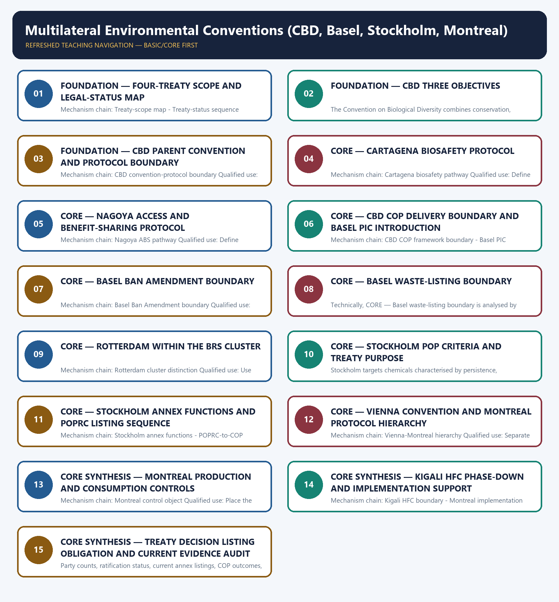

# Multilateral Environmental Conventions (CBD, Basel, Stockholm, Montreal) — Learner-v2 Complete Learning Session

> **Authoring-only generation:** 2026-09-03. No PDF was rendered and no tracker or index was mutated.

### SOURCE, PROGRESSION AND CURRENT-LINKAGE AUDIT

- **Generation date:** 2026-09-03.
- **Repository-first evidence:** the Basic owner is taught first and preserved in full; the Advanced owner is retained only in the optional final teaching block.
- **OCR evidence:** Repository Markdown was primary. OCR-searchable local official General Studies papers were used only to confirm printed routed demands. No answer key, marking scheme, unsupported page precision, ecological rate, species count, pollution standard, rule threshold, mission outcome or current status was inferred.
- **Qdrant:** not used; repository Markdown and available OCR context were sufficient.
- **PYQ integrity:** Audited ledgers route biodiversity, ABS, HFC and hazardous-chemical demands to this comparative owner. Unavailable or provisional objective keys are not inferred, and treaty names are not treated as answers.
- **Live-link boundary:** The Ozone Secretariat supplied substantive high-level treaty text; CBD retrieval was thin or raw, and Basel and Stockholm retrieval failed. No Party count, current annex listing, COP outcome, amendment acceptance, fund figure, national obligation or implementation result is asserted.
- **Fact/inference discipline:** no current-affairs item, PYQ wording, figure or quotation is invented.

### LIVE OFFICIAL-SOURCE ATTEMPT LOG

The checks below were made on 2026-09-03. Substantive official text is used only for the proposition it supports. Stubs, access failures, unrelated pages and thin landing pages are recorded and are not converted into ecological or current-status claims.

- https://www.cbd.int/convention/text — attempted 2026-09-03; the official CBD page returned raw HTML metadata and was not text-mined for obligations, protocol status or Party counts.
- https://www.cbd.int/abs/text/default.shtml — attempted 2026-09-03; the official page returned only an Access and Benefit-sharing title, so no Nagoya obligation or status claim was imported.
- https://www.basel.int/TheConvention/Overview/tabid/1271/Default.aspx — attempted 2026-09-03; official retrieval failed at transport level, so no waste listing, amendment status or Party count was imported.
- https://www.pops.int/TheConvention/Overview/tabid/3351/Default.aspx — attempted 2026-09-03; official retrieval failed at transport level, so no current POP listing or COP outcome was imported.
- https://ozone.unep.org/treaties/montreal-protocol — attempted 2026-09-03; substantive official text confirmed the Protocol's ozone purpose, production-and-consumption phase-out and Kigali HFC phase-down, without supplying a current national compliance result.

## BASIC LEARNING SESSION



*Distinct embedded teaching-navigation image. The separate continuous Cārvāka-style flowchart package remains an independent at-a-glance artifact.*

### SESSION 1 — FOUNDATION — FOUR-TREATY SCOPE AND LEGAL-STATUS MAP

#### DEFINITION / WHAT THIS IS CALLED

**Plain-language definition:** CBD addresses biodiversity, Basel controls transboundary movements and disposal of covered wastes, Stockholm controls persistent organic pollutants, and the Vienna-Montreal regime protects the ozone layer through substance controls; their scopes must not be merged.

**Technical definition:** Mechanism chain: Treaty-scope map - Treaty-status sequence Qualified use: Begin with a four-row environmental object and mechanism comparison.

#### ANSWER-GRABBING OPENING — WRITE/ADAPT IN THE EXAM

> CBD addresses biodiversity, Basel controls transboundary movements and disposal of covered wastes, Stockholm controls persistent organic pollutants, and the Vienna-Montreal regime protects the ozone layer through substance controls; their scopes must not be merged.

#### MUST-WRITE KEYWORDS

- **FOUNDATION**
- **Four-treaty scope**
- **legal-status map**
- **Mechanism chain**
- **Qualified use**
- **CBD**

**How to use them:** Frame the answer through FOUNDATION; define Four-treaty scope, connect legal-status map with Mechanism chain to explain the mechanism, and use Qualified use for the decisive comparison or qualification.

#### VISUAL FIRST

```text
FOUR-TREATY SCOPE AND LEGAL-STATUS MAP
01. Treaty-scope map
    |
    v
02. Treaty-status sequence
BOUNDARY -> Do not merge the four conventions' environmental objects.
```

*This topic-specific rail fixes the evidence sequence and its exam boundary before analysis.*

#### CORE EXPLANATION

CBD addresses biodiversity, Basel controls transboundary movements and disposal of covered wastes, Stockholm controls persistent organic pollutants, and the Vienna-Montreal regime protects the ozone layer through substance controls; their scopes must not be merged. Adoption, signature, ratification or accession, entry into force, amendment acceptance and domestic implementation are separate stages; a COP decision is not automatically a treaty amendment.

#### NAMED EVIDENCE AND MECHANISM

- CBD addresses biodiversity, Basel controls transboundary movements and disposal of covered wastes, Stockholm controls persistent organic pollutants, and the Vienna-Montreal regime protects the ozone layer through substance controls; their scopes must not be merged.
- Adoption, signature, ratification or accession, entry into force, amendment acceptance and domestic implementation are separate stages; a COP decision is not automatically a treaty amendment.

#### EXAMINER CAUTION

- Do not merge the four conventions' environmental objects.

#### EXAM LINK

- **Prelims:** Preserve the exact receiving medium, system boundary, measured parameter, actor, process, spatial and temporal scale, rule vintage and scientific or legal status; never turn a context-dependent pattern into a universal rule.
- **Mains:** Begin with a four-row environmental object and mechanism comparison.

#### MINI RECAP

- **Mechanism chain:** Treaty-scope map -> Treaty-status sequence
- **Qualified use:** Begin with a four-row environmental object and mechanism comparison.

#### CLOSING RECALL FLOW — FOUNDATION — FOUR-TREATY SCOPE AND LEGAL-STATUS MAP

```text
START / CONCEPT: FOUNDATION — Four-treaty scope and legal-status map
        |
        v
EXACT TERMS: FOUNDATION · Four-treaty scope · legal-status map · Mechanism chain · Qualified use · CBD
        |
        v
MECHANISM / ARGUMENT: Mechanism chain: Treaty-scope map - Treaty-status sequence Qualified use: Begin with a four-row environmental object and mechanism comparison.
        |
        v
CONSEQUENCE / CONTRAST: Adoption, signature, ratification or accession, entry into force, amendment acceptance and domestic implementation are separate stages; a COP decision is not automatically a treaty amendment.
        |
        v
UPSC TRAP / ANSWER-USE: Do not merge the four conventions' environmental objects.
        |
        v
ANSWER-GRABBING FORMULATION: CBD addresses biodiversity, Basel controls transboundary movements and disposal of covered wastes, Stockholm controls persistent organic pollutants, and the Vienna-Montreal regime protects the ozone layer through substance controls; their scopes must not be merged.
```
### SESSION 2 — FOUNDATION — CBD THREE OBJECTIVES

#### DEFINITION / WHAT THIS IS CALLED

**Plain-language definition:** Mechanism chain: CBD three objectives Qualified use: Use a legal-status timeline before attributing any obligation.

**Technical definition:** The Convention on Biological Diversity combines conservation, sustainable use and fair and equitable sharing of benefits arising from genetic-resource utilisation; conservation alone is incomplete.

#### ANSWER-GRABBING OPENING — WRITE/ADAPT IN THE EXAM

> Mechanism chain: CBD three objectives Qualified use: Use a legal-status timeline before attributing any obligation.

#### MUST-WRITE KEYWORDS

- **FOUNDATION**
- **CBD three objectives**
- **Mechanism chain**
- **Qualified use**
- **The Convention**
- **Biological Diversity**

**How to use them:** Frame the answer through FOUNDATION; define CBD three objectives, connect Mechanism chain with Qualified use to explain the mechanism, and use The Convention for the decisive comparison or qualification.

#### VISUAL FIRST

```text
CBD THREE OBJECTIVES
01. CBD three objectives
BOUNDARY -> Do not merge adoption, ratification and entry into force.
```

*This topic-specific rail fixes the evidence sequence and its exam boundary before analysis.*

#### CORE EXPLANATION

The Convention on Biological Diversity combines conservation, sustainable use and fair and equitable sharing of benefits arising from genetic-resource utilisation; conservation alone is incomplete.

#### NAMED EVIDENCE AND MECHANISM

- The Convention on Biological Diversity combines conservation, sustainable use and fair and equitable sharing of benefits arising from genetic-resource utilisation; conservation alone is incomplete.

#### EXAMINER CAUTION

- Do not merge adoption, ratification and entry into force.

#### EXAM LINK

- **Prelims:** Preserve the exact receiving medium, system boundary, measured parameter, actor, process, spatial and temporal scale, rule vintage and scientific or legal status; never turn a context-dependent pattern into a universal rule.
- **Mains:** Use a legal-status timeline before attributing any obligation.

#### MINI RECAP

- **Mechanism chain:** CBD three objectives
- **Qualified use:** Use a legal-status timeline before attributing any obligation.

#### CLOSING RECALL FLOW — FOUNDATION — CBD THREE OBJECTIVES

```text
START / CONCEPT: FOUNDATION — CBD three objectives
        |
        v
EXACT TERMS: FOUNDATION · CBD three objectives · Mechanism chain · Qualified use · The Convention · Biological Diversity
        |
        v
MECHANISM / ARGUMENT: The Convention on Biological Diversity combines conservation, sustainable use and fair and equitable sharing of benefits arising from genetic-resource utilisation; conservation alone is incomplete.
        |
        v
CONSEQUENCE / CONTRAST: Do not merge adoption, ratification and entry into force.
        |
        v
UPSC TRAP / ANSWER-USE: Do not miss this limiting distinction: use a legal-status timeline before attributing any obligation.
        |
        v
ANSWER-GRABBING FORMULATION: Mechanism chain: CBD three objectives Qualified use: Use a legal-status timeline before attributing any obligation.
```
### SESSION 3 — FOUNDATION — CBD PARENT CONVENTION AND PROTOCOL BOUNDARY

#### DEFINITION / WHAT THIS IS CALLED

**Plain-language definition:** The CBD is the parent convention, while the Cartagena Protocol addresses biosafety and living modified organisms and the Nagoya Protocol addresses access and benefit-sharing; protocol participation and obligations require separate status checks.

**Technical definition:** Mechanism chain: CBD convention-protocol boundary Qualified use: State all three CBD objectives and separate the parent convention from protocols.

#### ANSWER-GRABBING OPENING — WRITE/ADAPT IN THE EXAM

> The CBD is the parent convention, while the Cartagena Protocol addresses biosafety and living modified organisms and the Nagoya Protocol addresses access and benefit-sharing; protocol participation and obligations require separate status checks.

#### MUST-WRITE KEYWORDS

- **FOUNDATION**
- **CBD parent convention**
- **protocol boundary**
- **Mechanism chain**
- **Qualified use**
- **The CBD**

**How to use them:** Frame the answer through FOUNDATION; define CBD parent convention, connect protocol boundary with Mechanism chain to explain the mechanism, and use Qualified use for the decisive comparison or qualification.

#### VISUAL FIRST

```text
CBD PARENT CONVENTION AND PROTOCOL BOUNDARY
01. CBD convention-protocol boundary
BOUNDARY -> Do not reduce the CBD to conservation alone.
```

*This topic-specific rail fixes the evidence sequence and its exam boundary before analysis.*

#### CORE EXPLANATION

The CBD is the parent convention, while the Cartagena Protocol addresses biosafety and living modified organisms and the Nagoya Protocol addresses access and benefit-sharing; protocol participation and obligations require separate status checks.

#### NAMED EVIDENCE AND MECHANISM

- The CBD is the parent convention, while the Cartagena Protocol addresses biosafety and living modified organisms and the Nagoya Protocol addresses access and benefit-sharing; protocol participation and obligations require separate status checks.

#### EXAMINER CAUTION

- Do not reduce the CBD to conservation alone.

#### EXAM LINK

- **Prelims:** Preserve the exact receiving medium, system boundary, measured parameter, actor, process, spatial and temporal scale, rule vintage and scientific or legal status; never turn a context-dependent pattern into a universal rule.
- **Mains:** State all three CBD objectives and separate the parent convention from protocols.

#### MINI RECAP

- **Mechanism chain:** CBD convention-protocol boundary
- **Qualified use:** State all three CBD objectives and separate the parent convention from protocols.

#### CLOSING RECALL FLOW — FOUNDATION — CBD PARENT CONVENTION AND PROTOCOL BOUNDARY

```text
START / CONCEPT: FOUNDATION — CBD parent convention and protocol boundary
        |
        v
EXACT TERMS: FOUNDATION · CBD parent convention · protocol boundary · Mechanism chain · Qualified use · The CBD
        |
        v
MECHANISM / ARGUMENT: Mechanism chain: CBD convention-protocol boundary Qualified use: State all three CBD objectives and separate the parent convention from protocols.
        |
        v
CONSEQUENCE / CONTRAST: Do not reduce the CBD to conservation alone.
        |
        v
UPSC TRAP / ANSWER-USE: Do not miss this limiting distinction: the CBD is the parent convention.
        |
        v
ANSWER-GRABBING FORMULATION: The CBD is the parent convention, while the Cartagena Protocol addresses biosafety and living modified organisms and the Nagoya Protocol addresses access and benefit-sharing; protocol participation and obligations require separate status checks.
```
### SESSION 4 — CORE — CARTAGENA BIOSAFETY PROTOCOL

#### DEFINITION / WHAT THIS IS CALLED

**Plain-language definition:** The Cartagena Protocol governs safe transfer, handling and use of living modified organisms with transboundary-movement procedures; it is not a general hazardous-waste or pesticide treaty.

**Technical definition:** Mechanism chain: Cartagena biosafety pathway Qualified use: Define Cartagena by living modified organisms and biosafety procedures.

#### ANSWER-GRABBING OPENING — WRITE/ADAPT IN THE EXAM

> The Cartagena Protocol governs safe transfer, handling and use of living modified organisms with transboundary-movement procedures; it is not a general hazardous-waste or pesticide treaty.

#### MUST-WRITE KEYWORDS

- **Cartagena biosafety protocol**
- **Mechanism chain**
- **Qualified use**
- **The Cartagena Protocol**
- **Cartagena**
- **Nagoya**

**How to use them:** Frame the answer through Cartagena biosafety protocol; define Mechanism chain, connect Qualified use with The Cartagena Protocol to explain the mechanism, and use Cartagena for the decisive comparison or qualification.

#### VISUAL FIRST

```text
CARTAGENA BIOSAFETY PROTOCOL
01. Cartagena biosafety pathway
BOUNDARY -> Do not call Cartagena and Nagoya standalone unrelated conventions.
```

*This topic-specific rail fixes the evidence sequence and its exam boundary before analysis.*

#### CORE EXPLANATION

The Cartagena Protocol governs safe transfer, handling and use of living modified organisms with transboundary-movement procedures; it is not a general hazardous-waste or pesticide treaty.

#### NAMED EVIDENCE AND MECHANISM

- The Cartagena Protocol governs safe transfer, handling and use of living modified organisms with transboundary-movement procedures; it is not a general hazardous-waste or pesticide treaty.

#### EXAMINER CAUTION

- Do not call Cartagena and Nagoya standalone unrelated conventions.

#### EXAM LINK

- **Prelims:** Preserve the exact receiving medium, system boundary, measured parameter, actor, process, spatial and temporal scale, rule vintage and scientific or legal status; never turn a context-dependent pattern into a universal rule.
- **Mains:** Define Cartagena by living modified organisms and biosafety procedures.

#### MINI RECAP

- **Mechanism chain:** Cartagena biosafety pathway
- **Qualified use:** Define Cartagena by living modified organisms and biosafety procedures.

#### CLOSING RECALL FLOW — CORE — CARTAGENA BIOSAFETY PROTOCOL

```text
START / CONCEPT: CORE — Cartagena biosafety protocol
        |
        v
EXACT TERMS: Cartagena biosafety protocol · Mechanism chain · Qualified use · The Cartagena Protocol · Cartagena · Nagoya
        |
        v
MECHANISM / ARGUMENT: Mechanism chain: Cartagena biosafety pathway Qualified use: Define Cartagena by living modified organisms and biosafety procedures.
        |
        v
CONSEQUENCE / CONTRAST: Do not call Cartagena and Nagoya standalone unrelated conventions.
        |
        v
UPSC TRAP / ANSWER-USE: Do not miss this limiting distinction: the Cartagena Protocol governs safe transfer, handling and use of living modified organisms with...
        |
        v
ANSWER-GRABBING FORMULATION: The Cartagena Protocol governs safe transfer, handling and use of living modified organisms with transboundary-movement procedures; it is not a general hazardous-waste or pesticide treaty.
```
### SESSION 5 — CORE — NAGOYA ACCESS AND BENEFIT-SHARING PROTOCOL

#### DEFINITION / WHAT THIS IS CALLED

**Plain-language definition:** The Nagoya Protocol concerns access to genetic resources, prior informed consent or mutually agreed terms as applicable, and fair benefit-sharing; it must not be confused with biosafety approval.

**Technical definition:** Mechanism chain: Nagoya ABS pathway Qualified use: Define Nagoya by access, consent or terms and benefit-sharing.

#### ANSWER-GRABBING OPENING — WRITE/ADAPT IN THE EXAM

> The Nagoya Protocol concerns access to genetic resources, prior informed consent or mutually agreed terms as applicable, and fair benefit-sharing; it must not be confused with biosafety approval.

#### MUST-WRITE KEYWORDS

- **Nagoya access**
- **benefit-sharing protocol**
- **Mechanism chain**
- **Qualified use**
- **The Nagoya Protocol**
- **Cartagena**

**How to use them:** Frame the answer through Nagoya access; define benefit-sharing protocol, connect Mechanism chain with Qualified use to explain the mechanism, and use The Nagoya Protocol for the decisive comparison or qualification.

#### VISUAL FIRST

```text
NAGOYA ACCESS AND BENEFIT-SHARING PROTOCOL
01. Nagoya ABS pathway
BOUNDARY -> Do not call Cartagena a hazardous-waste treaty.
```

*This topic-specific rail fixes the evidence sequence and its exam boundary before analysis.*

#### CORE EXPLANATION

The Nagoya Protocol concerns access to genetic resources, prior informed consent or mutually agreed terms as applicable, and fair benefit-sharing; it must not be confused with biosafety approval.

#### NAMED EVIDENCE AND MECHANISM

- The Nagoya Protocol concerns access to genetic resources, prior informed consent or mutually agreed terms as applicable, and fair benefit-sharing; it must not be confused with biosafety approval.

#### EXAMINER CAUTION

- Do not call Cartagena a hazardous-waste treaty.

#### EXAM LINK

- **Prelims:** Preserve the exact receiving medium, system boundary, measured parameter, actor, process, spatial and temporal scale, rule vintage and scientific or legal status; never turn a context-dependent pattern into a universal rule.
- **Mains:** Define Nagoya by access, consent or terms and benefit-sharing.

#### MINI RECAP

- **Mechanism chain:** Nagoya ABS pathway
- **Qualified use:** Define Nagoya by access, consent or terms and benefit-sharing.

#### CLOSING RECALL FLOW — CORE — NAGOYA ACCESS AND BENEFIT-SHARING PROTOCOL

```text
START / CONCEPT: CORE — Nagoya access and benefit-sharing protocol
        |
        v
EXACT TERMS: Nagoya access · benefit-sharing protocol · Mechanism chain · Qualified use · The Nagoya Protocol · Cartagena
        |
        v
MECHANISM / ARGUMENT: Mechanism chain: Nagoya ABS pathway Qualified use: Define Nagoya by access, consent or terms and benefit-sharing.
        |
        v
CONSEQUENCE / CONTRAST: Do not call Cartagena a hazardous-waste treaty.
        |
        v
UPSC TRAP / ANSWER-USE: Do not miss this limiting distinction: the Nagoya Protocol concerns access to genetic resources, prior informed consent or mutually agreed...
        |
        v
ANSWER-GRABBING FORMULATION: The Nagoya Protocol concerns access to genetic resources, prior informed consent or mutually agreed terms as applicable, and fair benefit-sharing; it must not be confused with biosafety approval.
```
### SESSION 6 — CORE — CBD COP DELIVERY BOUNDARY AND BASEL PIC INTRODUCTION

#### DEFINITION / WHAT THIS IS CALLED

**Plain-language definition:** The Basel Convention controls covered transboundary waste movements through prior informed consent and environmentally sound management duties; the original Convention is not an undifferentiated ban on all waste trade.

**Technical definition:** Mechanism chain: CBD COP framework boundary - Basel PIC mechanism Qualified use: Separate collective CBD targets from national law, finance and outcomes.

#### ANSWER-GRABBING OPENING — WRITE/ADAPT IN THE EXAM

> Mechanism chain: CBD COP framework boundary - Basel PIC mechanism Qualified use: Separate collective CBD targets from national law, finance and outcomes.

#### MUST-WRITE KEYWORDS

- **CBD COP delivery boundary**
- **Basel PIC introduction**
- **Mechanism chain**
- **Qualified use**
- **COP**
- **CBD**

**How to use them:** Frame the answer through CBD COP delivery boundary; define Basel PIC introduction, connect Mechanism chain with Qualified use to explain the mechanism, and use COP for the decisive comparison or qualification.

#### VISUAL FIRST

```text
CBD COP DELIVERY BOUNDARY AND BASEL PIC INTRODUCTION
01. CBD COP framework boundary
    |
    v
02. Basel PIC mechanism
BOUNDARY -> Do not call Nagoya a biosafety approval system.
```

*This topic-specific rail fixes the evidence sequence and its exam boundary before analysis.*

#### CORE EXPLANATION

A global biodiversity framework or COP decision guides collective implementation under the CBD, but adoption of a target does not prove national legal incorporation, finance or achieved ecological outcome. The Basel Convention controls covered transboundary waste movements through prior informed consent and environmentally sound management duties; the original Convention is not an undifferentiated ban on all waste trade.

#### NAMED EVIDENCE AND MECHANISM

- A global biodiversity framework or COP decision guides collective implementation under the CBD, but adoption of a target does not prove national legal incorporation, finance or achieved ecological outcome.
- The Basel Convention controls covered transboundary waste movements through prior informed consent and environmentally sound management duties; the original Convention is not an undifferentiated ban on all waste trade.

#### EXAMINER CAUTION

- Do not call Nagoya a biosafety approval system.

#### EXAM LINK

- **Prelims:** Preserve the exact receiving medium, system boundary, measured parameter, actor, process, spatial and temporal scale, rule vintage and scientific or legal status; never turn a context-dependent pattern into a universal rule.
- **Mains:** Separate collective CBD targets from national law, finance and outcomes.

#### MINI RECAP

- **Mechanism chain:** CBD COP framework boundary -> Basel PIC mechanism
- **Qualified use:** Separate collective CBD targets from national law, finance and outcomes.

#### CLOSING RECALL FLOW — CORE — CBD COP DELIVERY BOUNDARY AND BASEL PIC INTRODUCTION

```text
START / CONCEPT: CORE — CBD COP delivery boundary and Basel PIC introduction
        |
        v
EXACT TERMS: CBD COP delivery boundary · Basel PIC introduction · Mechanism chain · Qualified use · COP · CBD
        |
        v
MECHANISM / ARGUMENT: The Basel Convention controls covered transboundary waste movements through prior informed consent and environmentally sound management duties; the original Convention is not an undifferentiated ban on all waste trade.
        |
        v
CONSEQUENCE / CONTRAST: A global biodiversity framework or COP decision guides collective implementation under the CBD, but adoption of a target does not prove national legal incorporation, finance or achieved ecological outcome.
        |
        v
UPSC TRAP / ANSWER-USE: Do not call Nagoya a biosafety approval system.
        |
        v
ANSWER-GRABBING FORMULATION: Mechanism chain: CBD COP framework boundary - Basel PIC mechanism Qualified use: Separate collective CBD targets from national law, finance and outcomes.
```
### SESSION 7 — CORE — BASEL BAN AMENDMENT BOUNDARY

#### DEFINITION / WHAT THIS IS CALLED

**Plain-language definition:** The Basel Ban Amendment is a later strengthening with its own scope and entry-into-force history; it must be distinguished from the Convention's general consent-based movement control.

**Technical definition:** Mechanism chain: Basel Ban Amendment boundary Qualified use: Trace Basel notification, consent, movement and environmentally sound management.

#### ANSWER-GRABBING OPENING — WRITE/ADAPT IN THE EXAM

> The Basel Ban Amendment is a later strengthening with its own scope and entry-into-force history; it must be distinguished from the Convention's general consent-based movement control.

#### MUST-WRITE KEYWORDS

- **Basel Ban Amendment boundary**
- **Mechanism chain**
- **Qualified use**
- **The Basel Ban Amendment**
- **Convention's**
- **CBD**

**How to use them:** Frame the answer through Basel Ban Amendment boundary; define Mechanism chain, connect Qualified use with The Basel Ban Amendment to explain the mechanism, and use Convention's for the decisive comparison or qualification.

#### VISUAL FIRST

```text
BASEL BAN AMENDMENT BOUNDARY
01. Basel Ban Amendment boundary
BOUNDARY -> Do not treat a CBD framework target as achieved domestic conservation.
```

*This topic-specific rail fixes the evidence sequence and its exam boundary before analysis.*

#### CORE EXPLANATION

The Basel Ban Amendment is a later strengthening with its own scope and entry-into-force history; it must be distinguished from the Convention's general consent-based movement control.

#### NAMED EVIDENCE AND MECHANISM

- The Basel Ban Amendment is a later strengthening with its own scope and entry-into-force history; it must be distinguished from the Convention's general consent-based movement control.

#### EXAMINER CAUTION

- Do not treat a CBD framework target as achieved domestic conservation.

#### EXAM LINK

- **Prelims:** Preserve the exact receiving medium, system boundary, measured parameter, actor, process, spatial and temporal scale, rule vintage and scientific or legal status; never turn a context-dependent pattern into a universal rule.
- **Mains:** Trace Basel notification, consent, movement and environmentally sound management.

#### MINI RECAP

- **Mechanism chain:** Basel Ban Amendment boundary
- **Qualified use:** Trace Basel notification, consent, movement and environmentally sound management.

#### CLOSING RECALL FLOW — CORE — BASEL BAN AMENDMENT BOUNDARY

```text
START / CONCEPT: CORE — Basel Ban Amendment boundary
        |
        v
EXACT TERMS: Basel Ban Amendment boundary · Mechanism chain · Qualified use · The Basel Ban Amendment · Convention's · CBD
        |
        v
MECHANISM / ARGUMENT: Mechanism chain: Basel Ban Amendment boundary Qualified use: Trace Basel notification, consent, movement and environmentally sound management.
        |
        v
CONSEQUENCE / CONTRAST: Do not treat a CBD framework target as achieved domestic conservation.
        |
        v
UPSC TRAP / ANSWER-USE: Do not miss this limiting distinction: basel Ban Amendment boundary Qualified use.
        |
        v
ANSWER-GRABBING FORMULATION: The Basel Ban Amendment is a later strengthening with its own scope and entry-into-force history; it must be distinguished from the Convention's general consent-based movement control.
```
### SESSION 8 — CORE — BASEL WASTE-LISTING BOUNDARY

#### DEFINITION / WHAT THIS IS CALLED

**Plain-language definition:** Mechanism chain: Basel waste-listing boundary Qualified use: Identify the amendment, waste category and legal status precisely.

**Technical definition:** Technically, CORE — Basel waste-listing boundary is analysed by relating Basel waste-listing boundary to Mechanism chain, then testing the relationship through Qualified use and Hazardous.

#### ANSWER-GRABBING OPENING — WRITE/ADAPT IN THE EXAM

> Mechanism chain: Basel waste-listing boundary Qualified use: Identify the amendment, waste category and legal status precisely.

#### MUST-WRITE KEYWORDS

- **Basel waste-listing boundary**
- **Mechanism chain**
- **Qualified use**
- **Hazardous**
- **Basel Convention**
- **Basel**

**How to use them:** Frame the answer through Basel waste-listing boundary; define Mechanism chain, connect Qualified use with Hazardous to explain the mechanism, and use Basel Convention for the decisive comparison or qualification.

#### VISUAL FIRST

```text
BASEL WASTE-LISTING BOUNDARY
01. Basel waste-listing boundary
BOUNDARY -> Do not say the original Basel Convention bans all waste trade.
```

*This topic-specific rail fixes the evidence sequence and its exam boundary before analysis.*

#### CORE EXPLANATION

Hazardous, other, plastic and electronic waste claims depend on the applicable annex, amendment, contamination condition and national rule; a material name alone does not settle treaty control.

#### NAMED EVIDENCE AND MECHANISM

- Hazardous, other, plastic and electronic waste claims depend on the applicable annex, amendment, contamination condition and national rule; a material name alone does not settle treaty control.

#### EXAMINER CAUTION

- Do not say the original Basel Convention bans all waste trade.

#### EXAM LINK

- **Prelims:** Preserve the exact receiving medium, system boundary, measured parameter, actor, process, spatial and temporal scale, rule vintage and scientific or legal status; never turn a context-dependent pattern into a universal rule.
- **Mains:** Identify the amendment, waste category and legal status precisely.

#### MINI RECAP

- **Mechanism chain:** Basel waste-listing boundary
- **Qualified use:** Identify the amendment, waste category and legal status precisely.

#### CLOSING RECALL FLOW — CORE — BASEL WASTE-LISTING BOUNDARY

```text
START / CONCEPT: CORE — Basel waste-listing boundary
        |
        v
EXACT TERMS: Basel waste-listing boundary · Mechanism chain · Qualified use · Hazardous · Basel Convention · Basel
        |
        v
MECHANISM / ARGUMENT: Hazardous, other, plastic and electronic waste claims depend on the applicable annex, amendment, contamination condition and national rule; a material name alone does not settle treaty control.
        |
        v
CONSEQUENCE / CONTRAST: Do not say the original Basel Convention bans all waste trade.
        |
        v
UPSC TRAP / ANSWER-USE: Do not miss this limiting distinction: identify the amendment, waste category and legal status precisely.
        |
        v
ANSWER-GRABBING FORMULATION: Mechanism chain: Basel waste-listing boundary Qualified use: Identify the amendment, waste category and legal status precisely.
```
### SESSION 9 — CORE — ROTTERDAM WITHIN THE BRS CLUSTER

#### DEFINITION / WHAT THIS IS CALLED

**Plain-language definition:** The Rotterdam Convention applies prior informed consent to trade in listed hazardous chemicals and pesticides and is jointly administered with Basel and Stockholm, but administrative clustering does not merge treaty scopes.

**Technical definition:** Mechanism chain: Rotterdam cluster distinction Qualified use: Use Rotterdam only for listed chemical and pesticide trade consent.

#### ANSWER-GRABBING OPENING — WRITE/ADAPT IN THE EXAM

> The Rotterdam Convention applies prior informed consent to trade in listed hazardous chemicals and pesticides and is jointly administered with Basel and Stockholm, but administrative clustering does not merge treaty scopes.

#### MUST-WRITE KEYWORDS

- **Rotterdam within the BRS cluster**
- **Mechanism chain**
- **Qualified use**
- **The Rotterdam Convention**
- **Basel**
- **Stockholm**

**How to use them:** Frame the answer through Rotterdam within the BRS cluster; define Mechanism chain, connect Qualified use with The Rotterdam Convention to explain the mechanism, and use Basel for the decisive comparison or qualification.

#### VISUAL FIRST

```text
ROTTERDAM WITHIN THE BRS CLUSTER
01. Rotterdam cluster distinction
BOUNDARY -> Do not merge the Basel Ban Amendment with the Convention's original PIC rule.
```

*This topic-specific rail fixes the evidence sequence and its exam boundary before analysis.*

#### CORE EXPLANATION

The Rotterdam Convention applies prior informed consent to trade in listed hazardous chemicals and pesticides and is jointly administered with Basel and Stockholm, but administrative clustering does not merge treaty scopes.

#### NAMED EVIDENCE AND MECHANISM

- The Rotterdam Convention applies prior informed consent to trade in listed hazardous chemicals and pesticides and is jointly administered with Basel and Stockholm, but administrative clustering does not merge treaty scopes.

#### EXAMINER CAUTION

- Do not merge the Basel Ban Amendment with the Convention's original PIC rule.

#### EXAM LINK

- **Prelims:** Preserve the exact receiving medium, system boundary, measured parameter, actor, process, spatial and temporal scale, rule vintage and scientific or legal status; never turn a context-dependent pattern into a universal rule.
- **Mains:** Use Rotterdam only for listed chemical and pesticide trade consent.

#### MINI RECAP

- **Mechanism chain:** Rotterdam cluster distinction
- **Qualified use:** Use Rotterdam only for listed chemical and pesticide trade consent.

#### CLOSING RECALL FLOW — CORE — ROTTERDAM WITHIN THE BRS CLUSTER

```text
START / CONCEPT: CORE — Rotterdam within the BRS cluster
        |
        v
EXACT TERMS: Rotterdam within the BRS cluster · Mechanism chain · Qualified use · The Rotterdam Convention · Basel · Stockholm
        |
        v
MECHANISM / ARGUMENT: Mechanism chain: Rotterdam cluster distinction Qualified use: Use Rotterdam only for listed chemical and pesticide trade consent.
        |
        v
CONSEQUENCE / CONTRAST: Do not merge the Basel Ban Amendment with the Convention's original PIC rule.
        |
        v
UPSC TRAP / ANSWER-USE: Do not miss this limiting distinction: use Rotterdam only for listed chemical and pesticide trade consent.
        |
        v
ANSWER-GRABBING FORMULATION: The Rotterdam Convention applies prior informed consent to trade in listed hazardous chemicals and pesticides and is jointly administered with Basel and Stockholm, but administrative clustering does not merge treaty scopes.
```
### SESSION 10 — CORE — STOCKHOLM POP CRITERIA AND TREATY PURPOSE

#### DEFINITION / WHAT THIS IS CALLED

**Plain-language definition:** Mechanism chain: Stockholm POP identity Qualified use: Apply persistence, bioaccumulation, effects and long-range transport together.

**Technical definition:** Stockholm targets chemicals characterised by persistence, bioaccumulation, adverse effects and long-range environmental transport; toxicity alone does not establish a POP listing.

#### ANSWER-GRABBING OPENING — WRITE/ADAPT IN THE EXAM

> Stockholm targets chemicals characterised by persistence, bioaccumulation, adverse effects and long-range environmental transport; toxicity alone does not establish a POP listing.

#### MUST-WRITE KEYWORDS

- **Stockholm POP criteria**
- **treaty purpose**
- **Mechanism chain**
- **Qualified use**
- **Stockholm**
- **POP**

**How to use them:** Frame the answer through Stockholm POP criteria; define treaty purpose, connect Mechanism chain with Qualified use to explain the mechanism, and use Stockholm for the decisive comparison or qualification.

#### VISUAL FIRST

```text
STOCKHOLM POP CRITERIA AND TREATY PURPOSE
01. Stockholm POP identity
BOUNDARY -> Do not infer waste-control status from a material name alone.
```

*This topic-specific rail fixes the evidence sequence and its exam boundary before analysis.*

#### CORE EXPLANATION

Stockholm targets chemicals characterised by persistence, bioaccumulation, adverse effects and long-range environmental transport; toxicity alone does not establish a POP listing.

#### NAMED EVIDENCE AND MECHANISM

- Stockholm targets chemicals characterised by persistence, bioaccumulation, adverse effects and long-range environmental transport; toxicity alone does not establish a POP listing.

#### EXAMINER CAUTION

- Do not infer waste-control status from a material name alone.

#### EXAM LINK

- **Prelims:** Preserve the exact receiving medium, system boundary, measured parameter, actor, process, spatial and temporal scale, rule vintage and scientific or legal status; never turn a context-dependent pattern into a universal rule.
- **Mains:** Apply persistence, bioaccumulation, effects and long-range transport together.

#### MINI RECAP

- **Mechanism chain:** Stockholm POP identity
- **Qualified use:** Apply persistence, bioaccumulation, effects and long-range transport together.

#### CLOSING RECALL FLOW — CORE — STOCKHOLM POP CRITERIA AND TREATY PURPOSE

```text
START / CONCEPT: CORE — Stockholm POP criteria and treaty purpose
        |
        v
EXACT TERMS: Stockholm POP criteria · treaty purpose · Mechanism chain · Qualified use · Stockholm · POP
        |
        v
MECHANISM / ARGUMENT: Mechanism chain: Stockholm POP identity Qualified use: Apply persistence, bioaccumulation, effects and long-range transport together.
        |
        v
CONSEQUENCE / CONTRAST: Do not infer waste-control status from a material name alone.
        |
        v
UPSC TRAP / ANSWER-USE: Do not miss this limiting distinction: stockholm targets chemicals characterised by persistence, bioaccumulation, adverse effects and long-range environmental transport.
        |
        v
ANSWER-GRABBING FORMULATION: Stockholm targets chemicals characterised by persistence, bioaccumulation, adverse effects and long-range environmental transport; toxicity alone does not establish a POP listing.
```
### SESSION 11 — CORE — STOCKHOLM ANNEX FUNCTIONS AND POPRC LISTING SEQUENCE

#### DEFINITION / WHAT THIS IS CALLED

**Plain-language definition:** Scientific review by the Persistent Organic Pollutants Review Committee precedes a Conference of the Parties listing decision; nomination, recommendation, adoption and entry into force are distinct statuses.

**Technical definition:** Mechanism chain: Stockholm annex functions - POPRC-to-COP sequence Qualified use: Match Annex A, B and C to their distinct control functions.

#### ANSWER-GRABBING OPENING — WRITE/ADAPT IN THE EXAM

> Mechanism chain: Stockholm annex functions - POPRC-to-COP sequence Qualified use: Match Annex A, B and C to their distinct control functions.

#### MUST-WRITE KEYWORDS

- **Stockholm annex functions**
- **POPRC listing sequence**
- **Mechanism chain**
- **Qualified use**
- **Stockholm Annex**
- **Annex**

**How to use them:** Frame the answer through Stockholm annex functions; define POPRC listing sequence, connect Mechanism chain with Qualified use to explain the mechanism, and use Stockholm Annex for the decisive comparison or qualification.

#### VISUAL FIRST

```text
STOCKHOLM ANNEX FUNCTIONS AND POPRC LISTING SEQUENCE
01. Stockholm annex functions
    |
    v
02. POPRC-to-COP sequence
BOUNDARY -> Do not merge Rotterdam's chemical-trade scope with Stockholm's POP controls.
```

*This topic-specific rail fixes the evidence sequence and its exam boundary before analysis.*

#### CORE EXPLANATION

Stockholm Annex A concerns elimination, Annex B restriction and Annex C unintentional production, subject to treaty-specific exemptions or measures; annex placement must be source-dated. Scientific review by the Persistent Organic Pollutants Review Committee precedes a Conference of the Parties listing decision; nomination, recommendation, adoption and entry into force are distinct statuses.

#### NAMED EVIDENCE AND MECHANISM

- Stockholm Annex A concerns elimination, Annex B restriction and Annex C unintentional production, subject to treaty-specific exemptions or measures; annex placement must be source-dated.
- Scientific review by the Persistent Organic Pollutants Review Committee precedes a Conference of the Parties listing decision; nomination, recommendation, adoption and entry into force are distinct statuses.

#### EXAMINER CAUTION

- Do not merge Rotterdam's chemical-trade scope with Stockholm's POP controls.

#### EXAM LINK

- **Prelims:** Preserve the exact receiving medium, system boundary, measured parameter, actor, process, spatial and temporal scale, rule vintage and scientific or legal status; never turn a context-dependent pattern into a universal rule.
- **Mains:** Match Annex A, B and C to their distinct control functions.

#### MINI RECAP

- **Mechanism chain:** Stockholm annex functions -> POPRC-to-COP sequence
- **Qualified use:** Match Annex A, B and C to their distinct control functions.

#### CLOSING RECALL FLOW — CORE — STOCKHOLM ANNEX FUNCTIONS AND POPRC LISTING SEQUENCE

```text
START / CONCEPT: CORE — Stockholm annex functions and POPRC listing sequence
        |
        v
EXACT TERMS: Stockholm annex functions · POPRC listing sequence · Mechanism chain · Qualified use · Stockholm Annex · Annex
        |
        v
MECHANISM / ARGUMENT: Scientific review by the Persistent Organic Pollutants Review Committee precedes a Conference of the Parties listing decision; nomination, recommendation, adoption and entry into force are distinct statuses.
        |
        v
CONSEQUENCE / CONTRAST: Stockholm Annex A concerns elimination, Annex B restriction and Annex C unintentional production, subject to treaty-specific exemptions or measures; annex placement must be source-dated.
        |
        v
UPSC TRAP / ANSWER-USE: Do not merge Rotterdam's chemical-trade scope with Stockholm's POP controls.
        |
        v
ANSWER-GRABBING FORMULATION: Mechanism chain: Stockholm annex functions - POPRC-to-COP sequence Qualified use: Match Annex A, B and C to their distinct control functions.
```
### SESSION 12 — CORE — VIENNA CONVENTION AND MONTREAL PROTOCOL HIERARCHY

#### DEFINITION / WHAT THIS IS CALLED

**Plain-language definition:** The Vienna Convention is the framework convention for ozone-layer protection, while the Montreal Protocol is the operative substance-control protocol under it.

**Technical definition:** Mechanism chain: Vienna-Montreal hierarchy Qualified use: Separate nomination, scientific recommendation, COP adoption and operative status.

#### ANSWER-GRABBING OPENING — WRITE/ADAPT IN THE EXAM

> The Vienna Convention is the framework convention for ozone-layer protection, while the Montreal Protocol is the operative substance-control protocol under it.

#### MUST-WRITE KEYWORDS

- **Vienna Convention**
- **Montreal Protocol hierarchy**
- **Mechanism chain**
- **Qualified use**
- **The Vienna Convention**
- **Montreal Protocol**

**How to use them:** Frame the answer through Vienna Convention; define Montreal Protocol hierarchy, connect Mechanism chain with Qualified use to explain the mechanism, and use The Vienna Convention for the decisive comparison or qualification.

#### VISUAL FIRST

```text
VIENNA CONVENTION AND MONTREAL PROTOCOL HIERARCHY
01. Vienna-Montreal hierarchy
BOUNDARY -> Do not define a POP by toxicity alone.
```

*This topic-specific rail fixes the evidence sequence and its exam boundary before analysis.*

#### CORE EXPLANATION

The Vienna Convention is the framework convention for ozone-layer protection, while the Montreal Protocol is the operative substance-control protocol under it.

#### NAMED EVIDENCE AND MECHANISM

- The Vienna Convention is the framework convention for ozone-layer protection, while the Montreal Protocol is the operative substance-control protocol under it.

#### EXAMINER CAUTION

- Do not define a POP by toxicity alone.

#### EXAM LINK

- **Prelims:** Preserve the exact receiving medium, system boundary, measured parameter, actor, process, spatial and temporal scale, rule vintage and scientific or legal status; never turn a context-dependent pattern into a universal rule.
- **Mains:** Separate nomination, scientific recommendation, COP adoption and operative status.

#### MINI RECAP

- **Mechanism chain:** Vienna-Montreal hierarchy
- **Qualified use:** Separate nomination, scientific recommendation, COP adoption and operative status.

#### CLOSING RECALL FLOW — CORE — VIENNA CONVENTION AND MONTREAL PROTOCOL HIERARCHY

```text
START / CONCEPT: CORE — Vienna Convention and Montreal Protocol hierarchy
        |
        v
EXACT TERMS: Vienna Convention · Montreal Protocol hierarchy · Mechanism chain · Qualified use · The Vienna Convention · Montreal Protocol
        |
        v
MECHANISM / ARGUMENT: Mechanism chain: Vienna-Montreal hierarchy Qualified use: Separate nomination, scientific recommendation, COP adoption and operative status.
        |
        v
CONSEQUENCE / CONTRAST: Do not define a POP by toxicity alone.
        |
        v
UPSC TRAP / ANSWER-USE: Do not miss this limiting distinction: the Vienna Convention is the framework convention for ozone-layer protection.
        |
        v
ANSWER-GRABBING FORMULATION: The Vienna Convention is the framework convention for ozone-layer protection, while the Montreal Protocol is the operative substance-control protocol under it.
```
### SESSION 13 — CORE SYNTHESIS — MONTREAL PRODUCTION AND CONSUMPTION CONTROLS

#### DEFINITION / WHAT THIS IS CALLED

**Plain-language definition:** The Montreal Protocol controls production and consumption of listed ozone-depleting substances through differentiated schedules and adjustments or amendments; it is not a generic greenhouse-gas treaty.

**Technical definition:** Mechanism chain: Montreal control object Qualified use: Place the Montreal Protocol under the Vienna framework.

#### ANSWER-GRABBING OPENING — WRITE/ADAPT IN THE EXAM

> The Montreal Protocol controls production and consumption of listed ozone-depleting substances through differentiated schedules and adjustments or amendments; it is not a generic greenhouse-gas treaty.

#### MUST-WRITE KEYWORDS

- **CORE SYNTHESIS**
- **Montreal production**
- **consumption controls**
- **Mechanism chain**
- **Qualified use**
- **The Montreal Protocol**

**How to use them:** Frame the answer through CORE SYNTHESIS; define Montreal production, connect consumption controls with Mechanism chain to explain the mechanism, and use Qualified use for the decisive comparison or qualification.

#### VISUAL FIRST

```text
MONTREAL PRODUCTION AND CONSUMPTION CONTROLS
01. Montreal control object
BOUNDARY -> Do not swap Stockholm Annex A, B and C functions.
```

*This topic-specific rail fixes the evidence sequence and its exam boundary before analysis.*

#### CORE EXPLANATION

The Montreal Protocol controls production and consumption of listed ozone-depleting substances through differentiated schedules and adjustments or amendments; it is not a generic greenhouse-gas treaty.

#### NAMED EVIDENCE AND MECHANISM

- The Montreal Protocol controls production and consumption of listed ozone-depleting substances through differentiated schedules and adjustments or amendments; it is not a generic greenhouse-gas treaty.

#### EXAMINER CAUTION

- Do not swap Stockholm Annex A, B and C functions.

#### EXAM LINK

- **Prelims:** Preserve the exact receiving medium, system boundary, measured parameter, actor, process, spatial and temporal scale, rule vintage and scientific or legal status; never turn a context-dependent pattern into a universal rule.
- **Mains:** Place the Montreal Protocol under the Vienna framework.

#### MINI RECAP

- **Mechanism chain:** Montreal control object
- **Qualified use:** Place the Montreal Protocol under the Vienna framework.

#### CLOSING RECALL FLOW — CORE SYNTHESIS — MONTREAL PRODUCTION AND CONSUMPTION CONTROLS

```text
START / CONCEPT: CORE SYNTHESIS — Montreal production and consumption controls
        |
        v
EXACT TERMS: CORE SYNTHESIS · Montreal production · consumption controls · Mechanism chain · Qualified use · The Montreal Protocol
        |
        v
MECHANISM / ARGUMENT: Mechanism chain: Montreal control object Qualified use: Place the Montreal Protocol under the Vienna framework.
        |
        v
CONSEQUENCE / CONTRAST: Do not swap Stockholm Annex A, B and C functions.
        |
        v
UPSC TRAP / ANSWER-USE: Do not miss this limiting distinction: the Montreal Protocol controls production and consumption of listed ozone-depleting substances through differentiated schedules...
        |
        v
ANSWER-GRABBING FORMULATION: The Montreal Protocol controls production and consumption of listed ozone-depleting substances through differentiated schedules and adjustments or amendments; it is not a generic greenhouse-gas treaty.
```
### SESSION 14 — CORE SYNTHESIS — KIGALI HFC PHASE-DOWN AND IMPLEMENTATION SUPPORT

#### DEFINITION / WHAT THIS IS CALLED

**Plain-language definition:** The Kigali Amendment phases down hydrofluorocarbons because of climate impact even though HFCs do not deplete ozone; phase-down is not phase-out and Kigali status must be checked separately.

**Technical definition:** Mechanism chain: Kigali HFC boundary - Montreal implementation support Qualified use: Distinguish ozone-depleting substances, HFC climate control, schedules and finance.

#### ANSWER-GRABBING OPENING — WRITE/ADAPT IN THE EXAM

> The Kigali Amendment phases down hydrofluorocarbons because of climate impact even though HFCs do not deplete ozone; phase-down is not phase-out and Kigali status must be checked separately.

#### MUST-WRITE KEYWORDS

- **CORE SYNTHESIS**
- **Kigali HFC phase-down**
- **implementation support**
- **Mechanism chain**
- **Qualified use**
- **The Kigali Amendment**

**How to use them:** Frame the answer through CORE SYNTHESIS; define Kigali HFC phase-down, connect implementation support with Mechanism chain to explain the mechanism, and use Qualified use for the decisive comparison or qualification.

#### VISUAL FIRST

```text
KIGALI HFC PHASE-DOWN AND IMPLEMENTATION SUPPORT
01. Kigali HFC boundary
    |
    v
02. Montreal implementation support
BOUNDARY -> Do not turn a POPRC recommendation into an adopted listing.
```

*This topic-specific rail fixes the evidence sequence and its exam boundary before analysis.*

#### CORE EXPLANATION

The Kigali Amendment phases down hydrofluorocarbons because of climate impact even though HFCs do not deplete ozone; phase-down is not phase-out and Kigali status must be checked separately. The Multilateral Fund and treaty institutions support developing-country implementation, but a finance mechanism or approved project does not itself prove national compliance or atmospheric recovery.

#### NAMED EVIDENCE AND MECHANISM

- The Kigali Amendment phases down hydrofluorocarbons because of climate impact even though HFCs do not deplete ozone; phase-down is not phase-out and Kigali status must be checked separately.
- The Multilateral Fund and treaty institutions support developing-country implementation, but a finance mechanism or approved project does not itself prove national compliance or atmospheric recovery.

#### EXAMINER CAUTION

- Do not turn a POPRC recommendation into an adopted listing.

#### EXAM LINK

- **Prelims:** Preserve the exact receiving medium, system boundary, measured parameter, actor, process, spatial and temporal scale, rule vintage and scientific or legal status; never turn a context-dependent pattern into a universal rule.
- **Mains:** Distinguish ozone-depleting substances, HFC climate control, schedules and finance.

#### MINI RECAP

- **Mechanism chain:** Kigali HFC boundary -> Montreal implementation support
- **Qualified use:** Distinguish ozone-depleting substances, HFC climate control, schedules and finance.

#### CLOSING RECALL FLOW — CORE SYNTHESIS — KIGALI HFC PHASE-DOWN AND IMPLEMENTATION SUPPORT

```text
START / CONCEPT: CORE SYNTHESIS — Kigali HFC phase-down and implementation support
        |
        v
EXACT TERMS: CORE SYNTHESIS · Kigali HFC phase-down · implementation support · Mechanism chain · Qualified use · The Kigali Amendment
        |
        v
MECHANISM / ARGUMENT: Mechanism chain: Kigali HFC boundary - Montreal implementation support Qualified use: Distinguish ozone-depleting substances, HFC climate control, schedules and finance.
        |
        v
CONSEQUENCE / CONTRAST: The Multilateral Fund and treaty institutions support developing-country implementation, but a finance mechanism or approved project does not itself prove national compliance or atmospheric recovery.
        |
        v
UPSC TRAP / ANSWER-USE: Do not turn a POPRC recommendation into an adopted listing.
        |
        v
ANSWER-GRABBING FORMULATION: The Kigali Amendment phases down hydrofluorocarbons because of climate impact even though HFCs do not deplete ozone; phase-down is not phase-out and Kigali status must be checked separately.
```
### SESSION 15 — CORE SYNTHESIS — TREATY DECISION LISTING OBLIGATION AND CURRENT EVIDENCE AUDIT

#### DEFINITION / WHAT THIS IS CALLED

**Plain-language definition:** The Montreal Protocol's Kigali Amendment (2016) extended its regulatory reach to hydrofluorocarbons (HFCs) — chemicals that were originally adopted as ozone-safe replacements for CFCs but are themselves potent greenhouse gases — illustrating how an existing, proven treaty architecture can be extended to address a related but distinct environmental problem (climate change) rather than negotiating an entirely new instrument.

**Technical definition:** Party counts, ratification status, current annex listings, COP outcomes, fund figures, national obligations and implementation results require the relevant secretariat or official national source and date.

#### ANSWER-GRABBING OPENING — WRITE/ADAPT IN THE EXAM

> A proposed listing, review recommendation, draft decision, adopted COP decision, treaty amendment and domestic notification have different legal effects and must be cited at the correct level.

#### MUST-WRITE KEYWORDS

- **CORE SYNTHESIS**
- **Treaty decision listing obligation**
- **current evidence audit**
- **Mechanism chain**
- **Qualified use**
- **Subject**

**How to use them:** Frame the answer through CORE SYNTHESIS; define Treaty decision listing obligation, connect current evidence audit with Mechanism chain to explain the mechanism, and use Qualified use for the decisive comparison or qualification.

#### VISUAL FIRST

```text
TREATY DECISION LISTING OBLIGATION AND CURRENT EVIDENCE AUDIT
01. Decision-obligation boundary
    |
    v
02. Current evidence boundary
BOUNDARY -> Do not call Montreal a standalone framework convention.
```

*This topic-specific rail fixes the evidence sequence and its exam boundary before analysis.*

#### CORE EXPLANATION

A proposed listing, review recommendation, draft decision, adopted COP decision, treaty amendment and domestic notification have different legal effects and must be cited at the correct level. Party counts, ratification status, current annex listings, COP outcomes, fund figures, national obligations and implementation results require the relevant secretariat or official national source and date.

#### NAMED EVIDENCE AND MECHANISM

- A proposed listing, review recommendation, draft decision, adopted COP decision, treaty amendment and domestic notification have different legal effects and must be cited at the correct level.
- Party counts, ratification status, current annex listings, COP outcomes, fund figures, national obligations and implementation results require the relevant secretariat or official national source and date.

#### EXAMINER CAUTION

- Do not call Montreal a standalone framework convention.

#### EXAM LINK

- **Prelims:** Preserve the exact receiving medium, system boundary, measured parameter, actor, process, spatial and temporal scale, rule vintage and scientific or legal status; never turn a context-dependent pattern into a universal rule.
- **Mains:** Close with secretariat-dated evidence and domestic implementation status.

#### MINI RECAP

- **Mechanism chain:** Decision-obligation boundary -> Current evidence boundary
- **Qualified use:** Close with secretariat-dated evidence and domestic implementation status.
#### COMPLETE BASIC OWNER EVIDENCE BANK

> **Subject:** Environment and Ecology | **Tier:** Must-Do (foundation) | **GS Paper:** GS-III (Environment) + Prelims, with GS-II international-cooperation linkage.
> **Core area:** Comparative multilateral environmental treaty architecture.
> **Grounded in:** Convention on Biological Diversity (CBD, 1992); Basel Convention (1989); Stockholm Convention on POPs (2001); Montreal Protocol (1987); audited UPSC Environment PYQs (2024-2026 Prelims and 2024-2025 Mains).
> ✅ = source-grounded | ⚠️ = analytical linkage | 📰 = dated current-affairs anchor.
> *Companion: `advanced/22_Multilateral-Environmental-Conventions-CBD-Basel-Stockholm-Montreal.md`.*

#### 1. Visual foundation

```text
FOUR DISTINCT MULTILATERAL ENVIRONMENTAL CONVENTIONS - EACH WITH A DIFFERENT TARGET

CBD (1992)        -> BIODIVERSITY conservation, sustainable use, benefit-sharing (3 objectives)
Basel Convention (1989)  -> HAZARDOUS WASTE transboundary movement control ("waste trade")
Stockholm Convention (2001) -> PERSISTENT ORGANIC POLLUTANTS (POPs) elimination/restriction
Montreal Protocol (1987)    -> OZONE-DEPLETING SUBSTANCES phase-out (widely regarded as the
                                most successful multilateral environmental agreement)
```

**Core proposition:** These four conventions each address a distinct environmental problem
(biodiversity, hazardous-waste trade, persistent toxic chemicals, and the ozone layer) with
different mechanisms (target-setting frameworks, prior-informed-consent trade controls,
chemical-elimination lists, and phase-out schedules respectively) — UPSC frequently tests
precise, non-overlapping identification of each convention's specific scope.

#### 2. Essential definitions

| Concept | Exam-ready meaning |
|---|---|
| ✅ **CBD (Convention on Biological Diversity, 1992)** | UN treaty (from the Rio Earth Summit) with three objectives: conservation of biodiversity, sustainable use of its components, and fair/equitable sharing of benefits from genetic resources. |
| ✅ **Kunming-Montreal Global Biodiversity Framework (CBD COP15, 2022)** | The CBD's current global strategic framework, including the widely cited "30x30" target (conserving 30% of terrestrial and marine areas by 2030). |
| ✅ **Cartagena Protocol on Biosafety (2000)** | The CBD's first protocol, governing the safe transfer, handling and use of **living modified organisms (LMOs)** across borders, using the **advance informed agreement** procedure and grounded in the precautionary approach. Its **Nagoya-Kuala Lumpur Supplementary Protocol (2010)** deals with liability and redress. |
| ✅ **Nagoya Protocol (2010)** | The CBD's second protocol, on **access to genetic resources and the fair and equitable sharing of benefits (ABS)** arising from their utilisation — the international instrument India's Biological Diversity Act architecture implements domestically. |
| ✅ **Basel Convention (1989)** | Treaty controlling transboundary movements of hazardous wastes and their disposal, based on prior informed consent between exporting and importing countries. Its **Ban Amendment** (in force from December 2019) prohibits export of hazardous wastes from OECD/EU countries and Liechtenstein to all other Parties, and its **plastic-waste amendments** (adopted 2019, effective January 2021) brought most contaminated and mixed plastic scrap into the prior-informed-consent regime. |
| ✅ **Rotterdam Convention (1998)** | The third member of the chemicals-and-waste cluster: it applies **Prior Informed Consent (PIC)** to international trade in listed hazardous chemicals and pesticides — Parties must be informed and consent before receiving them. Basel, Rotterdam and Stockholm are jointly administered and hold **back-to-back "BRS" COPs**. |
| ✅ **Stockholm Convention (2001)** | Treaty aiming to eliminate or restrict production and use of Persistent Organic Pollutants (POPs) — chemicals that resist degradation, bioaccumulate, and are toxic. It began with the **"dirty dozen"** and operates through three annexes: **Annex A (elimination)**, **Annex B (restriction** — the standard example being DDT, retained for disease-vector control**)** and **Annex C (unintentional production**, e.g., dioxins and furans**)**. |
| ✅ **Vienna Convention (1985) and Montreal Protocol (1987)** | The Vienna Convention is the **framework** treaty for protection of the ozone layer; the **Montreal Protocol** is the operative protocol under it, phasing out production and consumption of ozone-depleting substances (CFCs, halons and others), supported by a dedicated **Multilateral Fund** financing developing-country compliance. |
| ✅ **Kigali Amendment (2016, to the Montreal Protocol)** | Amendment extending the Protocol's phase-down mandate to hydrofluorocarbons (HFCs) — potent greenhouse gases that, while not ozone-depleting, are regulated under this ozone treaty due to its proven institutional effectiveness. |

#### 3. Topic mechanism

1. The CBD operates through nationally prepared strategies (National Biodiversity Strategy
   and Action Plans) and periodic Conference of the Parties decisions (like the
   Kunming-Montreal Global Biodiversity Framework) setting collective global targets that
   parties then translate into domestic action (in India, via the Biological Diversity Act,
   2002, cross-refer Topic 04).
2. The Basel Convention specifically targets the historical problem of hazardous waste being
   exported from wealthier countries to developing countries with weaker regulatory/disposal
   capacity, requiring prior informed consent from the importing country before any
   transboundary hazardous-waste shipment.
3. The Stockholm Convention lists specific Persistent Organic Pollutant chemicals for
   elimination or restricted use, based on scientific evidence of their persistence,
   bioaccumulation and toxicity, with periodic Conference of the Parties reviews adding new
   chemicals to its control lists.
4. The Montreal Protocol set a binding phase-out schedule for ozone-depleting substances
   (CFCs, halons, and others), which has been substantially successful in enabling
   observed ozone-layer recovery — its widely cited status as the most successful
   multilateral environmental agreement stems from its combination of clear, binding
   phase-out timelines, financial/technology-transfer support for developing countries, and
   near-universal ratification.
5. The Montreal Protocol's Kigali Amendment (2016) extended its regulatory reach to
   hydrofluorocarbons (HFCs) — chemicals that were originally adopted as ozone-safe
   replacements for CFCs but are themselves potent greenhouse gases — illustrating how an
   existing, proven treaty architecture can be extended to address a related but distinct
   environmental problem (climate change) rather than negotiating an entirely new
   instrument.

#### 4. Institutions and policy tools

- ✅ **CBD Secretariat (Montreal, Canada):** administers the Convention on Biological
  Diversity.
- ✅ **Basel Convention Secretariat (under UNEP):** administers the hazardous-waste treaty.
- ✅ **Stockholm Convention Secretariat (under UNEP):** administers the POPs treaty.
- ✅ **Rotterdam Convention Secretariat (jointly with Basel and Stockholm, under UNEP):**
  administers the Prior Informed Consent procedure for listed hazardous chemicals and
  pesticides; the three conventions share a joint secretariat and back-to-back COPs.
- ✅ **Ozone Secretariat (under UNEP):** administers the Vienna Convention and Montreal
  Protocol.
- ✅ **Multilateral Fund for the Implementation of the Montreal Protocol:** finances
  developing-country compliance — the feature most often credited for the Protocol's
  near-universal ratification and effectiveness.
- ✅ **MoEFCC:** India's nodal ministry for implementation of and negotiation under all four
  conventions.

#### 5. Indian applications and examples

- ⚠️ India's Biological Diversity Act, 2002 and National Biodiversity Authority (Topic 04)
  are its primary domestic CBD-implementation instruments.
- ⚠️ India's hazardous-waste import/export regulations (under domestic hazardous-waste
  management rules) implement its Basel Convention obligations, particularly relevant given
  historical controversies around ship-breaking and e-waste import issues.
- ⚠️ India has phased out or restricted various POPs pesticides under its Stockholm
  Convention obligations, coordinated with agricultural and industrial-chemical regulation.
- ⚠️ India's implementation of the Montreal Protocol (including the Kigali Amendment's
  HFC phase-down) involves coordinated action across refrigeration, air-conditioning and
  foam-manufacturing industries, given HFCs' widespread use as refrigerants.

#### 6. Must-Know Facts for Prelims

- ✅ The CBD has three specific objectives: conservation, sustainable use, and benefit-
  sharing — not conservation alone.
- ✅ The Basel Convention specifically addresses transboundary hazardous-waste movement,
  based on the prior-informed-consent principle.
- ✅ The Stockholm Convention specifically targets Persistent Organic Pollutants (POPs).
- ✅ The Montreal Protocol (1987) is widely regarded as the most successful multilateral
  environmental agreement, credited with enabling observed ozone-layer recovery.
- ✅ The Kigali Amendment (2016) extended the Montreal Protocol's mandate to
  hydrofluorocarbons (HFCs), which are potent greenhouse gases but not themselves
  ozone-depleting.
- ✅ The CBD has **two protocols**: the **Cartagena Protocol on Biosafety (2000)** on living
  modified organisms, and the **Nagoya Protocol (2010)** on access and benefit-sharing.
- ✅ **Basel, Rotterdam and Stockholm** form the jointly administered **"BRS" chemicals-and-
  waste cluster** and hold back-to-back COPs; the **Rotterdam Convention (1998)** applies the
  Prior Informed Consent procedure to trade in listed hazardous chemicals and pesticides.
- ✅ The **Basel Ban Amendment** entered into force in **December 2019**; **plastic-waste
  amendments** adopted in 2019 took effect in **January 2021**.
- ✅ Stockholm's three annexes are **A (elimination), B (restriction — DDT), C (unintentional
  production — dioxins/furans)**.
- ✅ The **Vienna Convention (1985)** is the framework treaty; the **Montreal Protocol (1987)**
  is the operative instrument under it, financed for developing countries by the
  **Multilateral Fund**.
- ✅ Under Kigali, developing countries phase HFCs **down** (not out) on differentiated
  schedules; India is in the later of the two developing-country groups. ⚠️ Verify India's
  exact baseline years, freeze year and step-down percentages against the Ozone Secretariat
  or the MoEFCC Ozone Cell before quoting them.

#### 7. UPSC traps

- ❌ The CBD covers only biodiversity conservation, with no other objectives. -> It has three
  distinct objectives: conservation, sustainable use, and equitable benefit-sharing.
- ❌ The Basel Convention regulates ozone-depleting substances. -> It regulates transboundary
  hazardous-waste movement; ozone-depleting substances are regulated under the Montreal
  Protocol.
- ❌ The Stockholm Convention and Basel Convention address the same environmental problem. ->
  Stockholm targets specific persistent, bioaccumulative, toxic chemicals (POPs); Basel
  targets the trade/movement of hazardous waste broadly, a distinct scope.
- ❌ HFCs are ozone-depleting substances regulated for that reason under the Kigali
  Amendment. -> HFCs are not ozone-depleting; they are potent greenhouse gases regulated
  under the Montreal Protocol's proven institutional architecture specifically because of
  their climate (not ozone) impact.
- ❌ The "30x30" target originates from the Paris Agreement. -> It originates from the CBD's
  Kunming-Montreal Global Biodiversity Framework (CBD COP15, 2022).
- ❌ The Cartagena and Nagoya Protocols belong to different conventions. -> **Both are
  protocols to the CBD** — Cartagena (2000) on biosafety/LMOs, Nagoya (2010) on ABS.
- ❌ The Montreal Protocol is a standalone treaty. -> It is a protocol under the **Vienna
  Convention (1985)**.
- ❌ Kigali requires developing countries to phase **out** HFCs. -> It mandates a phase-**down**
  on differentiated schedules, not elimination.
- ❌ The Basel Convention bans all hazardous-waste trade. -> The Convention itself imposes
  prior informed consent; the separate **Ban Amendment** (in force December 2019) prohibits
  export specifically from OECD/EU/Liechtenstein to other Parties.
- ❌ DDT is banned outright under the Stockholm Convention. -> It sits in **Annex B
  (restriction)**, permitting continued use for disease-vector control under specified
  conditions.

#### 8. 📰 Current anchor

- 📰 **CBD COP16 (Cali 2024; resumed Rome, February 2025):** completed
  decisions on resource mobilisation and KMGBF monitoring, operationalised the
  DSI benefit-sharing mechanism and launched the **Cali Fund**.
  [CBD outcome](https://www.cbd.int/article/cop16-resumed-session-closing-2025).

- 📰 The CBD's Kunming-Montreal Global Biodiversity Framework (adopted at CBD COP15, 2022)
  remains the current global biodiversity policy reference point, including its 30x30
  target; verify India's specific progress reporting against this framework through the
  latest National Biodiversity Strategy and Action Plan update before citing specific
  domestic progress figures.

⚠️ **Interpretation caution:** each convention's Conference of the Parties periodically
updates its specific chemical/substance lists (Stockholm) or strategic targets (CBD) — cite
the specific COP year for any listed-chemical or target claim.

#### 9. PYQ application

- ⚠️ Recurring Prelims pattern: correctly match each convention (CBD, Basel, Stockholm,
  Montreal) to its precise, non-overlapping subject matter and key mechanism.
- ⚠️ Mains linkage: the Montreal Protocol's success factors (binding timelines, finance/
  technology transfer, universal ratification) are used as a template when discussing what
  makes multilateral environmental agreements effective.

#### 10. Mains angles

- ⚠️ Argue that the Montreal Protocol's success (binding, time-bound phase-out; finance and
  technology-transfer support for developing countries; near-universal ratification)
  provides a replicable template for other, currently less-effective multilateral
  environmental agreements.
- ⚠️ Use the Kigali Amendment's extension of an existing ozone treaty to a climate problem
  (HFCs) to argue for pragmatic use of proven institutional architecture rather than always
  negotiating entirely new instruments.
- ⚠️ Conclude with a differentiated-convention thesis: each convention's specific mechanism
  (target-setting, prior-informed-consent, chemical-listing, phase-out-scheduling) should be
  matched precisely to the type of environmental problem it addresses.

> **Answer thesis:** Distinguish the CBD, Basel, Stockholm and Montreal conventions by their precise, non-overlapping subject matter and mechanism, and use the Montreal Protocol's proven success factors (binding timelines, finance/technology support, universal ratification) as the benchmark for evaluating other multilateral environmental agreements' effectiveness.

#### 11. Probable questions

- ⚠️ **Prelims:** Correctly match the CBD, Basel Convention, Stockholm Convention and
  Montreal Protocol to their precise subject matter and adoption year.
- ⚠️ **Mains (10 marks):** What factors explain the Montreal Protocol's success as a
  multilateral environmental agreement?
- ⚠️ **Mains (15 marks):** Discuss the significance of the Kigali Amendment in linking ozone-
  layer protection and climate-change mitigation.

#### 12. Study links

- ✅ Advanced companion: `advanced/22_Multilateral-Environmental-Conventions-CBD-Basel-Stockholm-Montreal.md`.
- ✅ `04_Biodiversity-Levels-and-Hotspots.md` — the CBD's domestic implementation via the
  Biological Diversity Act, 2002.
- ✅ `15_Solid-Plastic-and-E-Waste-Rules.md` — hazardous/e-waste trade relevant to Basel
  Convention obligations.
- ✅ `17_Climate-Change-Science-Greenhouse-Effect.md` — HFCs' role as potent greenhouse
  gases under the Kigali Amendment.

#### 13. Core answer architecture (10/15/20-mark support)

##### 13.1 Demand decoder and thesis

- First state the **environmental object**, then its mechanism: biodiversity/ABS; hazardous-waste movement; POP chemical controls; ozone-depleting-substance phase-down.
- **Thesis:** convention performance depends on fit between problem, bindingness, finance, monitoring and domestic translation; one treaty’s success cannot be copied mechanically to a different problem.

##### 13.2 Reusable comparative evidence units

| Claim | Named evidence/example → significance | Qualification |
|---|---|---|
| Subject and mechanism are not interchangeable. | **CBD three objectives/Nagoya ABS; Basel PIC; Stockholm Annex A/B/C; Vienna–Montreal phase-out** → prevents treaty-name fact dumping. | Do not call Basel a chemical-production ban or Montreal a standalone convention. |
| Design helps explain Montreal’s relative success. | **Binding schedules + Multilateral Fund + bounded substance list + Kigali adaptation** → connects compliance support and adaptability. | “Successful” does not mean every ozone/climate problem is solved or that HFCs are ozone-depleting. |
| Information changes benefit-sharing. | **CBD COP16 Cali Fund/DSI and India’s 2025 ABS Regulations** → shows genetic information can bypass a physical-sample access model. | A fund’s establishment is not evidence of completed distribution to communities. |

##### 13.3 Mark-scaled spines

- **10 marks:** a four-row comparison table with one mechanism and one trap per treaty.
- **15/20 marks:** compare Montreal’s bounded problem/finance/schedule with CBD/Basel/Stockholm limits; add India’s domestic legal translation and a differentiated conclusion.
- **Status discipline:** distinguish party, protocol, annex/appendix, adopted COP decision, proposed listing and implementation outcome. Verify current COP/listing claims against the relevant Secretariat.

<!-- BEGIN GENERATED PYQ INTEGRATION: 2018-2023 -->

#### Historical PYQ Integration (2018-2023)

> **Status:** Question-level PYQ demand is integrated into this owner.
> **Provenance:** Audited local official-paper routing ledgers: `_PYQ-ROUTING-MAINS-GS3-GS4-2018-2023.md`, `_PYQ-ROUTING-PRELIMS-2018-2023.md`.
> **Answer-key rule:** The official 2018-2023 Prelims/CSAT keys are not held locally; no option or answer has been inferred.

- **Years represented:** 2018, 2023
- **Paper(s):** GS-III, Prelims GS-I
- **Routed question demands:** 4

| Year | Paper | Q | PYQ demand (neutral rendering) | Directive / format | Source status | Owner requirement |
|---:|---|---:|---|---|---|---|
| 2018 | GS-III | 17 | Biodiversity variation in India and Biological Diversity Act 2002 | Discuss · 15 marks · 250 words | Routed to owning topic | Prepare context, core dimensions, evidence/examples, counterpoint and a concise conclusion. |
| 2023 | Prelims GS-I | 20 | Hydrofluorocarbons uses aerosols foam fire retardants lubricants | Objective question; official key unavailable locally | Routed; key unavailable locally | Cover the named fact/concept and its likely statement-level distinctions. |
| 2023 | Prelims GS-I | 59 | Mercury pollution sources gold mining coal plants health | Objective question; official key unavailable locally | Routed; key unavailable locally | Cover the named fact/concept and its likely statement-level distinctions. |
| 2023 | Prelims GS-I | 79 | Biodiversity Management Committees Nagoya Protocol access benefit sharing | Objective question; official key unavailable locally | Routed; key unavailable locally | Cover the named fact/concept and its likely statement-level distinctions. |

##### What this owner must now support

- Biodiversity variation in India and Biological Diversity Act 2002
- Hydrofluorocarbons uses aerosols foam fire retardants lubricants
- Mercury pollution sources gold mining coal plants health
- Biodiversity Management Committees Nagoya Protocol access benefit sharing

> The table integrates the examinable demand and paper metadata. It does not turn an unkeyed objective question into a solved answer, and it does not claim that lexical presence alone proves full conceptual sufficiency.
<!-- END GENERATED PYQ INTEGRATION: 2018-2023 -->

#### CLOSING RECALL FLOW — CORE SYNTHESIS — TREATY DECISION LISTING OBLIGATION AND CURRENT EVIDENCE AUDIT

```text
START / CONCEPT: CORE SYNTHESIS — Treaty decision listing obligation and current evidence audit
        |
        v
EXACT TERMS: CORE SYNTHESIS · Treaty decision listing obligation · current evidence audit · Mechanism chain · Qualified use · Subject
        |
        v
MECHANISM / ARGUMENT: Party counts, ratification status, current annex listings, COP outcomes, fund figures, national obligations and implementation results require the relevant secretariat or official national source and date.
        |
        v
CONSEQUENCE / CONTRAST: The Montreal Protocol's Kigali Amendment (2016) extended its regulatory reach to hydrofluorocarbons (HFCs) — chemicals that were originally adopted as ozone-safe replacements for CFCs but are themselves potent greenhouse gases — illustrating how an existing, proven treaty architecture can be extended to address a related but distinct environmental problem (climate change) rather than negotiating an entirely new instrument.
        |
        v
UPSC TRAP / ANSWER-USE: ✅ The CBD has three specific objectives: conservation, sustainable use, and benefit sharing — not conservation alone. ✅ The Basel Convention specifically addresses transboundary hazardous-waste movement, based on the prior-informed-consent principle. ✅ The Stockholm Convention specifically targets Persistent Organic Pollutants (POPs). ✅ The Montreal Protocol (1987) is widely regarded as the most successful multilateral environmental agreement, credited with enabling observed ozone-layer recovery. ✅ The Kigali Amendment (2016) extended the Montreal Protocol's mandate to hydrofluorocarbons (HFCs), which are potent greenhouse gases but not themselves ozone-depleting. ✅ The CBD has two protocols: the Cartagena Protocol on Biosafety (2000) on living modified organisms, and the Nagoya Protocol (2010) on access and benefit-sharing. ✅ Basel, Rotterdam and Stockholm form the jointly administered "BRS" chemicals-and waste cluster and hold back-to-back COPs; the Rotterdam Convention (1998) applies the Prior Informed Consent procedure to trade in listed hazardous chemicals and pesticides. ✅ The Basel Ban Amendment entered into force in December 2019; plastic-waste amendments adopted in 2019 took effect in January 2021. ✅ Stockholm's three annexes are A (elimination), B (restriction — DDT), C (unintentional production — dioxins/furans). ✅ The Vienna Convention (1985) is the framework treaty; the Montreal Protocol (1987) is the operative instrument under it, financed for developing countries by the Multilateral Fund. ✅ Under Kigali, developing countries phase HFCs down (not out) on differentiated schedules; India is in the later of the two developing-country groups. ⚠️ Verify India's exact baseline years, freeze year and step-down percentages against the Ozone Secretariat or the MoEFCC Ozone Cell before quoting them.
        |
        v
ANSWER-GRABBING FORMULATION: A proposed listing, review recommendation, draft decision, adopted COP decision, treaty amendment and domestic notification have different legal effects and must be cited at the correct level.
```
## BASIC MCQS / REMEDIATION

### Q1. Which statement correctly identifies Treaty-scope map?

A. CBD addresses biodiversity, Basel controls transboundary movements and disposal of covered wastes, Stockholm controls persistent organic pollutants, and the Vienna-Montreal regime protects the ozone layer through substance controls; their scopes must not be merged.
B. The Convention on Biological Diversity combines conservation, sustainable use and fair and equitable sharing of benefits arising from genetic-resource utilisation; conservation alone is incomplete.
C. The CBD is the parent convention, while the Cartagena Protocol addresses biosafety and living modified organisms and the Nagoya Protocol addresses access and benefit-sharing; protocol participation and obligations require separate status checks.
D. Adoption, signature, ratification or accession, entry into force, amendment acceptance and domestic implementation are separate stages; a COP decision is not automatically a treaty amendment.

**Answer: A.**
**Explanation:** CBD addresses biodiversity, Basel controls transboundary movements and disposal of covered wastes, Stockholm controls persistent organic pollutants, and the Vienna-Montreal regime protects the ozone layer through substance controls; their scopes must not be merged. The other options belong to different media, parameters, processes, scales, actors, institutions, instruments or status categories.

### Q2. Which option preserves the ecological boundary of Treaty-scope map?

A. The Convention on Biological Diversity combines conservation, sustainable use and fair and equitable sharing of benefits arising from genetic-resource utilisation; conservation alone is incomplete.
B. CBD addresses biodiversity, Basel controls transboundary movements and disposal of covered wastes, Stockholm controls persistent organic pollutants, and the Vienna-Montreal regime protects the ozone layer through substance controls; their scopes must not be merged.
C. The Cartagena Protocol governs safe transfer, handling and use of living modified organisms with transboundary-movement procedures; it is not a general hazardous-waste or pesticide treaty.
D. The CBD is the parent convention, while the Cartagena Protocol addresses biosafety and living modified organisms and the Nagoya Protocol addresses access and benefit-sharing; protocol participation and obligations require separate status checks.

**Answer: B.**
**Explanation:** CBD addresses biodiversity, Basel controls transboundary movements and disposal of covered wastes, Stockholm controls persistent organic pollutants, and the Vienna-Montreal regime protects the ozone layer through substance controls; their scopes must not be merged. The other options belong to different media, parameters, processes, scales, actors, institutions, instruments or status categories.

### Q3. Which statement uses Treaty-scope map without changing its scale, parameter or status?

A. The Cartagena Protocol governs safe transfer, handling and use of living modified organisms with transboundary-movement procedures; it is not a general hazardous-waste or pesticide treaty.
B. The CBD is the parent convention, while the Cartagena Protocol addresses biosafety and living modified organisms and the Nagoya Protocol addresses access and benefit-sharing; protocol participation and obligations require separate status checks.
C. CBD addresses biodiversity, Basel controls transboundary movements and disposal of covered wastes, Stockholm controls persistent organic pollutants, and the Vienna-Montreal regime protects the ozone layer through substance controls; their scopes must not be merged.
D. The Nagoya Protocol concerns access to genetic resources, prior informed consent or mutually agreed terms as applicable, and fair benefit-sharing; it must not be confused with biosafety approval.

**Answer: C.**
**Explanation:** CBD addresses biodiversity, Basel controls transboundary movements and disposal of covered wastes, Stockholm controls persistent organic pollutants, and the Vienna-Montreal regime protects the ozone layer through substance controls; their scopes must not be merged. The other options belong to different media, parameters, processes, scales, actors, institutions, instruments or status categories.

### Q4. Which option avoids the standard UPSC close-option trap about Treaty-scope map?

A. The Cartagena Protocol governs safe transfer, handling and use of living modified organisms with transboundary-movement procedures; it is not a general hazardous-waste or pesticide treaty.
B. The Nagoya Protocol concerns access to genetic resources, prior informed consent or mutually agreed terms as applicable, and fair benefit-sharing; it must not be confused with biosafety approval.
C. A global biodiversity framework or COP decision guides collective implementation under the CBD, but adoption of a target does not prove national legal incorporation, finance or achieved ecological outcome.
D. CBD addresses biodiversity, Basel controls transboundary movements and disposal of covered wastes, Stockholm controls persistent organic pollutants, and the Vienna-Montreal regime protects the ozone layer through substance controls; their scopes must not be merged.

**Answer: D.**
**Explanation:** CBD addresses biodiversity, Basel controls transboundary movements and disposal of covered wastes, Stockholm controls persistent organic pollutants, and the Vienna-Montreal regime protects the ozone layer through substance controls; their scopes must not be merged. The other options belong to different media, parameters, processes, scales, actors, institutions, instruments or status categories.

### Q5. Which statement correctly identifies Treaty-status sequence?

A. Adoption, signature, ratification or accession, entry into force, amendment acceptance and domestic implementation are separate stages; a COP decision is not automatically a treaty amendment.
B. The CBD is the parent convention, while the Cartagena Protocol addresses biosafety and living modified organisms and the Nagoya Protocol addresses access and benefit-sharing; protocol participation and obligations require separate status checks.
C. The Cartagena Protocol governs safe transfer, handling and use of living modified organisms with transboundary-movement procedures; it is not a general hazardous-waste or pesticide treaty.
D. The Convention on Biological Diversity combines conservation, sustainable use and fair and equitable sharing of benefits arising from genetic-resource utilisation; conservation alone is incomplete.

**Answer: A.**
**Explanation:** Adoption, signature, ratification or accession, entry into force, amendment acceptance and domestic implementation are separate stages; a COP decision is not automatically a treaty amendment. The other options belong to different media, parameters, processes, scales, actors, institutions, instruments or status categories.

### Q6. Which option preserves the ecological boundary of Treaty-status sequence?

A. The CBD is the parent convention, while the Cartagena Protocol addresses biosafety and living modified organisms and the Nagoya Protocol addresses access and benefit-sharing; protocol participation and obligations require separate status checks.
B. Adoption, signature, ratification or accession, entry into force, amendment acceptance and domestic implementation are separate stages; a COP decision is not automatically a treaty amendment.
C. The Nagoya Protocol concerns access to genetic resources, prior informed consent or mutually agreed terms as applicable, and fair benefit-sharing; it must not be confused with biosafety approval.
D. The Cartagena Protocol governs safe transfer, handling and use of living modified organisms with transboundary-movement procedures; it is not a general hazardous-waste or pesticide treaty.

**Answer: B.**
**Explanation:** Adoption, signature, ratification or accession, entry into force, amendment acceptance and domestic implementation are separate stages; a COP decision is not automatically a treaty amendment. The other options belong to different media, parameters, processes, scales, actors, institutions, instruments or status categories.

### Q7. Which statement uses Treaty-status sequence without changing its scale, parameter or status?

A. The Cartagena Protocol governs safe transfer, handling and use of living modified organisms with transboundary-movement procedures; it is not a general hazardous-waste or pesticide treaty.
B. The Nagoya Protocol concerns access to genetic resources, prior informed consent or mutually agreed terms as applicable, and fair benefit-sharing; it must not be confused with biosafety approval.
C. Adoption, signature, ratification or accession, entry into force, amendment acceptance and domestic implementation are separate stages; a COP decision is not automatically a treaty amendment.
D. A global biodiversity framework or COP decision guides collective implementation under the CBD, but adoption of a target does not prove national legal incorporation, finance or achieved ecological outcome.

**Answer: C.**
**Explanation:** Adoption, signature, ratification or accession, entry into force, amendment acceptance and domestic implementation are separate stages; a COP decision is not automatically a treaty amendment. The other options belong to different media, parameters, processes, scales, actors, institutions, instruments or status categories.

### Q8. Which option avoids the standard UPSC close-option trap about Treaty-status sequence?

A. The Nagoya Protocol concerns access to genetic resources, prior informed consent or mutually agreed terms as applicable, and fair benefit-sharing; it must not be confused with biosafety approval.
B. The Basel Convention controls covered transboundary waste movements through prior informed consent and environmentally sound management duties; the original Convention is not an undifferentiated ban on all waste trade.
C. A global biodiversity framework or COP decision guides collective implementation under the CBD, but adoption of a target does not prove national legal incorporation, finance or achieved ecological outcome.
D. Adoption, signature, ratification or accession, entry into force, amendment acceptance and domestic implementation are separate stages; a COP decision is not automatically a treaty amendment.

**Answer: D.**
**Explanation:** Adoption, signature, ratification or accession, entry into force, amendment acceptance and domestic implementation are separate stages; a COP decision is not automatically a treaty amendment. The other options belong to different media, parameters, processes, scales, actors, institutions, instruments or status categories.

### Q9. Which statement correctly identifies CBD three objectives?

A. The Convention on Biological Diversity combines conservation, sustainable use and fair and equitable sharing of benefits arising from genetic-resource utilisation; conservation alone is incomplete.
B. The CBD is the parent convention, while the Cartagena Protocol addresses biosafety and living modified organisms and the Nagoya Protocol addresses access and benefit-sharing; protocol participation and obligations require separate status checks.
C. The Nagoya Protocol concerns access to genetic resources, prior informed consent or mutually agreed terms as applicable, and fair benefit-sharing; it must not be confused with biosafety approval.
D. The Cartagena Protocol governs safe transfer, handling and use of living modified organisms with transboundary-movement procedures; it is not a general hazardous-waste or pesticide treaty.

**Answer: A.**
**Explanation:** The Convention on Biological Diversity combines conservation, sustainable use and fair and equitable sharing of benefits arising from genetic-resource utilisation; conservation alone is incomplete. The other options belong to different media, parameters, processes, scales, actors, institutions, instruments or status categories.

### Q10. Which option preserves the ecological boundary of CBD three objectives?

A. The Nagoya Protocol concerns access to genetic resources, prior informed consent or mutually agreed terms as applicable, and fair benefit-sharing; it must not be confused with biosafety approval.
B. The Convention on Biological Diversity combines conservation, sustainable use and fair and equitable sharing of benefits arising from genetic-resource utilisation; conservation alone is incomplete.
C. The Cartagena Protocol governs safe transfer, handling and use of living modified organisms with transboundary-movement procedures; it is not a general hazardous-waste or pesticide treaty.
D. A global biodiversity framework or COP decision guides collective implementation under the CBD, but adoption of a target does not prove national legal incorporation, finance or achieved ecological outcome.

**Answer: B.**
**Explanation:** The Convention on Biological Diversity combines conservation, sustainable use and fair and equitable sharing of benefits arising from genetic-resource utilisation; conservation alone is incomplete. The other options belong to different media, parameters, processes, scales, actors, institutions, instruments or status categories.

### Q11. Which statement uses CBD three objectives without changing its scale, parameter or status?

A. The Nagoya Protocol concerns access to genetic resources, prior informed consent or mutually agreed terms as applicable, and fair benefit-sharing; it must not be confused with biosafety approval.
B. A global biodiversity framework or COP decision guides collective implementation under the CBD, but adoption of a target does not prove national legal incorporation, finance or achieved ecological outcome.
C. The Convention on Biological Diversity combines conservation, sustainable use and fair and equitable sharing of benefits arising from genetic-resource utilisation; conservation alone is incomplete.
D. The Basel Convention controls covered transboundary waste movements through prior informed consent and environmentally sound management duties; the original Convention is not an undifferentiated ban on all waste trade.

**Answer: C.**
**Explanation:** The Convention on Biological Diversity combines conservation, sustainable use and fair and equitable sharing of benefits arising from genetic-resource utilisation; conservation alone is incomplete. The other options belong to different media, parameters, processes, scales, actors, institutions, instruments or status categories.

### Q12. Which option avoids the standard UPSC close-option trap about CBD three objectives?

A. A global biodiversity framework or COP decision guides collective implementation under the CBD, but adoption of a target does not prove national legal incorporation, finance or achieved ecological outcome.
B. The Basel Ban Amendment is a later strengthening with its own scope and entry-into-force history; it must be distinguished from the Convention's general consent-based movement control.
C. The Basel Convention controls covered transboundary waste movements through prior informed consent and environmentally sound management duties; the original Convention is not an undifferentiated ban on all waste trade.
D. The Convention on Biological Diversity combines conservation, sustainable use and fair and equitable sharing of benefits arising from genetic-resource utilisation; conservation alone is incomplete.

**Answer: D.**
**Explanation:** The Convention on Biological Diversity combines conservation, sustainable use and fair and equitable sharing of benefits arising from genetic-resource utilisation; conservation alone is incomplete. The other options belong to different media, parameters, processes, scales, actors, institutions, instruments or status categories.

### Q13. Which statement correctly identifies CBD convention-protocol boundary?

A. The CBD is the parent convention, while the Cartagena Protocol addresses biosafety and living modified organisms and the Nagoya Protocol addresses access and benefit-sharing; protocol participation and obligations require separate status checks.
B. The Nagoya Protocol concerns access to genetic resources, prior informed consent or mutually agreed terms as applicable, and fair benefit-sharing; it must not be confused with biosafety approval.
C. A global biodiversity framework or COP decision guides collective implementation under the CBD, but adoption of a target does not prove national legal incorporation, finance or achieved ecological outcome.
D. The Cartagena Protocol governs safe transfer, handling and use of living modified organisms with transboundary-movement procedures; it is not a general hazardous-waste or pesticide treaty.

**Answer: A.**
**Explanation:** The CBD is the parent convention, while the Cartagena Protocol addresses biosafety and living modified organisms and the Nagoya Protocol addresses access and benefit-sharing; protocol participation and obligations require separate status checks. The other options belong to different media, parameters, processes, scales, actors, institutions, instruments or status categories.

### Q14. Which option preserves the ecological boundary of CBD convention-protocol boundary?

A. A global biodiversity framework or COP decision guides collective implementation under the CBD, but adoption of a target does not prove national legal incorporation, finance or achieved ecological outcome.
B. The CBD is the parent convention, while the Cartagena Protocol addresses biosafety and living modified organisms and the Nagoya Protocol addresses access and benefit-sharing; protocol participation and obligations require separate status checks.
C. The Nagoya Protocol concerns access to genetic resources, prior informed consent or mutually agreed terms as applicable, and fair benefit-sharing; it must not be confused with biosafety approval.
D. The Basel Convention controls covered transboundary waste movements through prior informed consent and environmentally sound management duties; the original Convention is not an undifferentiated ban on all waste trade.

**Answer: B.**
**Explanation:** The CBD is the parent convention, while the Cartagena Protocol addresses biosafety and living modified organisms and the Nagoya Protocol addresses access and benefit-sharing; protocol participation and obligations require separate status checks. The other options belong to different media, parameters, processes, scales, actors, institutions, instruments or status categories.

### Q15. Which statement uses CBD convention-protocol boundary without changing its scale, parameter or status?

A. The Basel Convention controls covered transboundary waste movements through prior informed consent and environmentally sound management duties; the original Convention is not an undifferentiated ban on all waste trade.
B. The Basel Ban Amendment is a later strengthening with its own scope and entry-into-force history; it must be distinguished from the Convention's general consent-based movement control.
C. The CBD is the parent convention, while the Cartagena Protocol addresses biosafety and living modified organisms and the Nagoya Protocol addresses access and benefit-sharing; protocol participation and obligations require separate status checks.
D. A global biodiversity framework or COP decision guides collective implementation under the CBD, but adoption of a target does not prove national legal incorporation, finance or achieved ecological outcome.

**Answer: C.**
**Explanation:** The CBD is the parent convention, while the Cartagena Protocol addresses biosafety and living modified organisms and the Nagoya Protocol addresses access and benefit-sharing; protocol participation and obligations require separate status checks. The other options belong to different media, parameters, processes, scales, actors, institutions, instruments or status categories.

### Q16. Which option avoids the standard UPSC close-option trap about CBD convention-protocol boundary?

A. The Basel Convention controls covered transboundary waste movements through prior informed consent and environmentally sound management duties; the original Convention is not an undifferentiated ban on all waste trade.
B. Hazardous, other, plastic and electronic waste claims depend on the applicable annex, amendment, contamination condition and national rule; a material name alone does not settle treaty control.
C. The Basel Ban Amendment is a later strengthening with its own scope and entry-into-force history; it must be distinguished from the Convention's general consent-based movement control.
D. The CBD is the parent convention, while the Cartagena Protocol addresses biosafety and living modified organisms and the Nagoya Protocol addresses access and benefit-sharing; protocol participation and obligations require separate status checks.

**Answer: D.**
**Explanation:** The CBD is the parent convention, while the Cartagena Protocol addresses biosafety and living modified organisms and the Nagoya Protocol addresses access and benefit-sharing; protocol participation and obligations require separate status checks. The other options belong to different media, parameters, processes, scales, actors, institutions, instruments or status categories.

### Q17. Which statement correctly identifies Cartagena biosafety pathway?

A. The Cartagena Protocol governs safe transfer, handling and use of living modified organisms with transboundary-movement procedures; it is not a general hazardous-waste or pesticide treaty.
B. A global biodiversity framework or COP decision guides collective implementation under the CBD, but adoption of a target does not prove national legal incorporation, finance or achieved ecological outcome.
C. The Basel Convention controls covered transboundary waste movements through prior informed consent and environmentally sound management duties; the original Convention is not an undifferentiated ban on all waste trade.
D. The Nagoya Protocol concerns access to genetic resources, prior informed consent or mutually agreed terms as applicable, and fair benefit-sharing; it must not be confused with biosafety approval.

**Answer: A.**
**Explanation:** The Cartagena Protocol governs safe transfer, handling and use of living modified organisms with transboundary-movement procedures; it is not a general hazardous-waste or pesticide treaty. The other options belong to different media, parameters, processes, scales, actors, institutions, instruments or status categories.

### Q18. Which option preserves the ecological boundary of Cartagena biosafety pathway?

A. A global biodiversity framework or COP decision guides collective implementation under the CBD, but adoption of a target does not prove national legal incorporation, finance or achieved ecological outcome.
B. The Cartagena Protocol governs safe transfer, handling and use of living modified organisms with transboundary-movement procedures; it is not a general hazardous-waste or pesticide treaty.
C. The Basel Ban Amendment is a later strengthening with its own scope and entry-into-force history; it must be distinguished from the Convention's general consent-based movement control.
D. The Basel Convention controls covered transboundary waste movements through prior informed consent and environmentally sound management duties; the original Convention is not an undifferentiated ban on all waste trade.

**Answer: B.**
**Explanation:** The Cartagena Protocol governs safe transfer, handling and use of living modified organisms with transboundary-movement procedures; it is not a general hazardous-waste or pesticide treaty. The other options belong to different media, parameters, processes, scales, actors, institutions, instruments or status categories.

### Q19. Which statement uses Cartagena biosafety pathway without changing its scale, parameter or status?

A. The Basel Convention controls covered transboundary waste movements through prior informed consent and environmentally sound management duties; the original Convention is not an undifferentiated ban on all waste trade.
B. Hazardous, other, plastic and electronic waste claims depend on the applicable annex, amendment, contamination condition and national rule; a material name alone does not settle treaty control.
C. The Cartagena Protocol governs safe transfer, handling and use of living modified organisms with transboundary-movement procedures; it is not a general hazardous-waste or pesticide treaty.
D. The Basel Ban Amendment is a later strengthening with its own scope and entry-into-force history; it must be distinguished from the Convention's general consent-based movement control.

**Answer: C.**
**Explanation:** The Cartagena Protocol governs safe transfer, handling and use of living modified organisms with transboundary-movement procedures; it is not a general hazardous-waste or pesticide treaty. The other options belong to different media, parameters, processes, scales, actors, institutions, instruments or status categories.

### Q20. Which option avoids the standard UPSC close-option trap about Cartagena biosafety pathway?

A. The Basel Ban Amendment is a later strengthening with its own scope and entry-into-force history; it must be distinguished from the Convention's general consent-based movement control.
B. Hazardous, other, plastic and electronic waste claims depend on the applicable annex, amendment, contamination condition and national rule; a material name alone does not settle treaty control.
C. The Rotterdam Convention applies prior informed consent to trade in listed hazardous chemicals and pesticides and is jointly administered with Basel and Stockholm, but administrative clustering does not merge treaty scopes.
D. The Cartagena Protocol governs safe transfer, handling and use of living modified organisms with transboundary-movement procedures; it is not a general hazardous-waste or pesticide treaty.

**Answer: D.**
**Explanation:** The Cartagena Protocol governs safe transfer, handling and use of living modified organisms with transboundary-movement procedures; it is not a general hazardous-waste or pesticide treaty. The other options belong to different media, parameters, processes, scales, actors, institutions, instruments or status categories.

### Q21. Which statement correctly identifies Nagoya ABS pathway?

A. The Nagoya Protocol concerns access to genetic resources, prior informed consent or mutually agreed terms as applicable, and fair benefit-sharing; it must not be confused with biosafety approval.
B. A global biodiversity framework or COP decision guides collective implementation under the CBD, but adoption of a target does not prove national legal incorporation, finance or achieved ecological outcome.
C. The Basel Ban Amendment is a later strengthening with its own scope and entry-into-force history; it must be distinguished from the Convention's general consent-based movement control.
D. The Basel Convention controls covered transboundary waste movements through prior informed consent and environmentally sound management duties; the original Convention is not an undifferentiated ban on all waste trade.

**Answer: A.**
**Explanation:** The Nagoya Protocol concerns access to genetic resources, prior informed consent or mutually agreed terms as applicable, and fair benefit-sharing; it must not be confused with biosafety approval. The other options belong to different media, parameters, processes, scales, actors, institutions, instruments or status categories.

### Q22. Which option preserves the ecological boundary of Nagoya ABS pathway?

A. Hazardous, other, plastic and electronic waste claims depend on the applicable annex, amendment, contamination condition and national rule; a material name alone does not settle treaty control.
B. The Nagoya Protocol concerns access to genetic resources, prior informed consent or mutually agreed terms as applicable, and fair benefit-sharing; it must not be confused with biosafety approval.
C. The Basel Ban Amendment is a later strengthening with its own scope and entry-into-force history; it must be distinguished from the Convention's general consent-based movement control.
D. The Basel Convention controls covered transboundary waste movements through prior informed consent and environmentally sound management duties; the original Convention is not an undifferentiated ban on all waste trade.

**Answer: B.**
**Explanation:** The Nagoya Protocol concerns access to genetic resources, prior informed consent or mutually agreed terms as applicable, and fair benefit-sharing; it must not be confused with biosafety approval. The other options belong to different media, parameters, processes, scales, actors, institutions, instruments or status categories.

### Q23. Which statement uses Nagoya ABS pathway without changing its scale, parameter or status?

A. The Basel Ban Amendment is a later strengthening with its own scope and entry-into-force history; it must be distinguished from the Convention's general consent-based movement control.
B. Hazardous, other, plastic and electronic waste claims depend on the applicable annex, amendment, contamination condition and national rule; a material name alone does not settle treaty control.
C. The Nagoya Protocol concerns access to genetic resources, prior informed consent or mutually agreed terms as applicable, and fair benefit-sharing; it must not be confused with biosafety approval.
D. The Rotterdam Convention applies prior informed consent to trade in listed hazardous chemicals and pesticides and is jointly administered with Basel and Stockholm, but administrative clustering does not merge treaty scopes.

**Answer: C.**
**Explanation:** The Nagoya Protocol concerns access to genetic resources, prior informed consent or mutually agreed terms as applicable, and fair benefit-sharing; it must not be confused with biosafety approval. The other options belong to different media, parameters, processes, scales, actors, institutions, instruments or status categories.

### Q24. Which option avoids the standard UPSC close-option trap about Nagoya ABS pathway?

A. Stockholm targets chemicals characterised by persistence, bioaccumulation, adverse effects and long-range environmental transport; toxicity alone does not establish a POP listing.
B. The Rotterdam Convention applies prior informed consent to trade in listed hazardous chemicals and pesticides and is jointly administered with Basel and Stockholm, but administrative clustering does not merge treaty scopes.
C. Hazardous, other, plastic and electronic waste claims depend on the applicable annex, amendment, contamination condition and national rule; a material name alone does not settle treaty control.
D. The Nagoya Protocol concerns access to genetic resources, prior informed consent or mutually agreed terms as applicable, and fair benefit-sharing; it must not be confused with biosafety approval.

**Answer: D.**
**Explanation:** The Nagoya Protocol concerns access to genetic resources, prior informed consent or mutually agreed terms as applicable, and fair benefit-sharing; it must not be confused with biosafety approval. The other options belong to different media, parameters, processes, scales, actors, institutions, instruments or status categories.

### Q25. Which statement correctly identifies CBD COP framework boundary?

A. A global biodiversity framework or COP decision guides collective implementation under the CBD, but adoption of a target does not prove national legal incorporation, finance or achieved ecological outcome.
B. The Basel Ban Amendment is a later strengthening with its own scope and entry-into-force history; it must be distinguished from the Convention's general consent-based movement control.
C. The Basel Convention controls covered transboundary waste movements through prior informed consent and environmentally sound management duties; the original Convention is not an undifferentiated ban on all waste trade.
D. Hazardous, other, plastic and electronic waste claims depend on the applicable annex, amendment, contamination condition and national rule; a material name alone does not settle treaty control.

**Answer: A.**
**Explanation:** A global biodiversity framework or COP decision guides collective implementation under the CBD, but adoption of a target does not prove national legal incorporation, finance or achieved ecological outcome. The other options belong to different media, parameters, processes, scales, actors, institutions, instruments or status categories.

### Q26. Which option preserves the ecological boundary of CBD COP framework boundary?

A. The Rotterdam Convention applies prior informed consent to trade in listed hazardous chemicals and pesticides and is jointly administered with Basel and Stockholm, but administrative clustering does not merge treaty scopes.
B. A global biodiversity framework or COP decision guides collective implementation under the CBD, but adoption of a target does not prove national legal incorporation, finance or achieved ecological outcome.
C. Hazardous, other, plastic and electronic waste claims depend on the applicable annex, amendment, contamination condition and national rule; a material name alone does not settle treaty control.
D. The Basel Ban Amendment is a later strengthening with its own scope and entry-into-force history; it must be distinguished from the Convention's general consent-based movement control.

**Answer: B.**
**Explanation:** A global biodiversity framework or COP decision guides collective implementation under the CBD, but adoption of a target does not prove national legal incorporation, finance or achieved ecological outcome. The other options belong to different media, parameters, processes, scales, actors, institutions, instruments or status categories.

### Q27. Which statement uses CBD COP framework boundary without changing its scale, parameter or status?

A. The Rotterdam Convention applies prior informed consent to trade in listed hazardous chemicals and pesticides and is jointly administered with Basel and Stockholm, but administrative clustering does not merge treaty scopes.
B. Stockholm targets chemicals characterised by persistence, bioaccumulation, adverse effects and long-range environmental transport; toxicity alone does not establish a POP listing.
C. A global biodiversity framework or COP decision guides collective implementation under the CBD, but adoption of a target does not prove national legal incorporation, finance or achieved ecological outcome.
D. Hazardous, other, plastic and electronic waste claims depend on the applicable annex, amendment, contamination condition and national rule; a material name alone does not settle treaty control.

**Answer: C.**
**Explanation:** A global biodiversity framework or COP decision guides collective implementation under the CBD, but adoption of a target does not prove national legal incorporation, finance or achieved ecological outcome. The other options belong to different media, parameters, processes, scales, actors, institutions, instruments or status categories.

### Q28. Which option avoids the standard UPSC close-option trap about CBD COP framework boundary?

A. Stockholm targets chemicals characterised by persistence, bioaccumulation, adverse effects and long-range environmental transport; toxicity alone does not establish a POP listing.
B. The Rotterdam Convention applies prior informed consent to trade in listed hazardous chemicals and pesticides and is jointly administered with Basel and Stockholm, but administrative clustering does not merge treaty scopes.
C. Stockholm Annex A concerns elimination, Annex B restriction and Annex C unintentional production, subject to treaty-specific exemptions or measures; annex placement must be source-dated.
D. A global biodiversity framework or COP decision guides collective implementation under the CBD, but adoption of a target does not prove national legal incorporation, finance or achieved ecological outcome.

**Answer: D.**
**Explanation:** A global biodiversity framework or COP decision guides collective implementation under the CBD, but adoption of a target does not prove national legal incorporation, finance or achieved ecological outcome. The other options belong to different media, parameters, processes, scales, actors, institutions, instruments or status categories.

### Q29. Which statement correctly identifies Basel PIC mechanism?

A. The Basel Convention controls covered transboundary waste movements through prior informed consent and environmentally sound management duties; the original Convention is not an undifferentiated ban on all waste trade.
B. Hazardous, other, plastic and electronic waste claims depend on the applicable annex, amendment, contamination condition and national rule; a material name alone does not settle treaty control.
C. The Rotterdam Convention applies prior informed consent to trade in listed hazardous chemicals and pesticides and is jointly administered with Basel and Stockholm, but administrative clustering does not merge treaty scopes.
D. The Basel Ban Amendment is a later strengthening with its own scope and entry-into-force history; it must be distinguished from the Convention's general consent-based movement control.

**Answer: A.**
**Explanation:** The Basel Convention controls covered transboundary waste movements through prior informed consent and environmentally sound management duties; the original Convention is not an undifferentiated ban on all waste trade. The other options belong to different media, parameters, processes, scales, actors, institutions, instruments or status categories.

### Q30. Which option preserves the ecological boundary of Basel PIC mechanism?

A. Stockholm targets chemicals characterised by persistence, bioaccumulation, adverse effects and long-range environmental transport; toxicity alone does not establish a POP listing.
B. The Basel Convention controls covered transboundary waste movements through prior informed consent and environmentally sound management duties; the original Convention is not an undifferentiated ban on all waste trade.
C. The Rotterdam Convention applies prior informed consent to trade in listed hazardous chemicals and pesticides and is jointly administered with Basel and Stockholm, but administrative clustering does not merge treaty scopes.
D. Hazardous, other, plastic and electronic waste claims depend on the applicable annex, amendment, contamination condition and national rule; a material name alone does not settle treaty control.

**Answer: B.**
**Explanation:** The Basel Convention controls covered transboundary waste movements through prior informed consent and environmentally sound management duties; the original Convention is not an undifferentiated ban on all waste trade. The other options belong to different media, parameters, processes, scales, actors, institutions, instruments or status categories.

### Q31. Which statement uses Basel PIC mechanism without changing its scale, parameter or status?

A. The Rotterdam Convention applies prior informed consent to trade in listed hazardous chemicals and pesticides and is jointly administered with Basel and Stockholm, but administrative clustering does not merge treaty scopes.
B. Stockholm targets chemicals characterised by persistence, bioaccumulation, adverse effects and long-range environmental transport; toxicity alone does not establish a POP listing.
C. The Basel Convention controls covered transboundary waste movements through prior informed consent and environmentally sound management duties; the original Convention is not an undifferentiated ban on all waste trade.
D. Stockholm Annex A concerns elimination, Annex B restriction and Annex C unintentional production, subject to treaty-specific exemptions or measures; annex placement must be source-dated.

**Answer: C.**
**Explanation:** The Basel Convention controls covered transboundary waste movements through prior informed consent and environmentally sound management duties; the original Convention is not an undifferentiated ban on all waste trade. The other options belong to different media, parameters, processes, scales, actors, institutions, instruments or status categories.

### Q32. Which option avoids the standard UPSC close-option trap about Basel PIC mechanism?

A. Stockholm Annex A concerns elimination, Annex B restriction and Annex C unintentional production, subject to treaty-specific exemptions or measures; annex placement must be source-dated.
B. Stockholm targets chemicals characterised by persistence, bioaccumulation, adverse effects and long-range environmental transport; toxicity alone does not establish a POP listing.
C. Scientific review by the Persistent Organic Pollutants Review Committee precedes a Conference of the Parties listing decision; nomination, recommendation, adoption and entry into force are distinct statuses.
D. The Basel Convention controls covered transboundary waste movements through prior informed consent and environmentally sound management duties; the original Convention is not an undifferentiated ban on all waste trade.

**Answer: D.**
**Explanation:** The Basel Convention controls covered transboundary waste movements through prior informed consent and environmentally sound management duties; the original Convention is not an undifferentiated ban on all waste trade. The other options belong to different media, parameters, processes, scales, actors, institutions, instruments or status categories.

### Q33. Which statement correctly identifies Basel Ban Amendment boundary?

A. The Basel Ban Amendment is a later strengthening with its own scope and entry-into-force history; it must be distinguished from the Convention's general consent-based movement control.
B. The Rotterdam Convention applies prior informed consent to trade in listed hazardous chemicals and pesticides and is jointly administered with Basel and Stockholm, but administrative clustering does not merge treaty scopes.
C. Stockholm targets chemicals characterised by persistence, bioaccumulation, adverse effects and long-range environmental transport; toxicity alone does not establish a POP listing.
D. Hazardous, other, plastic and electronic waste claims depend on the applicable annex, amendment, contamination condition and national rule; a material name alone does not settle treaty control.

**Answer: A.**
**Explanation:** The Basel Ban Amendment is a later strengthening with its own scope and entry-into-force history; it must be distinguished from the Convention's general consent-based movement control. The other options belong to different media, parameters, processes, scales, actors, institutions, instruments or status categories.

### Q34. Which option preserves the ecological boundary of Basel Ban Amendment boundary?

A. The Rotterdam Convention applies prior informed consent to trade in listed hazardous chemicals and pesticides and is jointly administered with Basel and Stockholm, but administrative clustering does not merge treaty scopes.
B. The Basel Ban Amendment is a later strengthening with its own scope and entry-into-force history; it must be distinguished from the Convention's general consent-based movement control.
C. Stockholm Annex A concerns elimination, Annex B restriction and Annex C unintentional production, subject to treaty-specific exemptions or measures; annex placement must be source-dated.
D. Stockholm targets chemicals characterised by persistence, bioaccumulation, adverse effects and long-range environmental transport; toxicity alone does not establish a POP listing.

**Answer: B.**
**Explanation:** The Basel Ban Amendment is a later strengthening with its own scope and entry-into-force history; it must be distinguished from the Convention's general consent-based movement control. The other options belong to different media, parameters, processes, scales, actors, institutions, instruments or status categories.

### Q35. Which statement uses Basel Ban Amendment boundary without changing its scale, parameter or status?

A. Stockholm targets chemicals characterised by persistence, bioaccumulation, adverse effects and long-range environmental transport; toxicity alone does not establish a POP listing.
B. Stockholm Annex A concerns elimination, Annex B restriction and Annex C unintentional production, subject to treaty-specific exemptions or measures; annex placement must be source-dated.
C. The Basel Ban Amendment is a later strengthening with its own scope and entry-into-force history; it must be distinguished from the Convention's general consent-based movement control.
D. Scientific review by the Persistent Organic Pollutants Review Committee precedes a Conference of the Parties listing decision; nomination, recommendation, adoption and entry into force are distinct statuses.

**Answer: C.**
**Explanation:** The Basel Ban Amendment is a later strengthening with its own scope and entry-into-force history; it must be distinguished from the Convention's general consent-based movement control. The other options belong to different media, parameters, processes, scales, actors, institutions, instruments or status categories.

### Q36. Which option avoids the standard UPSC close-option trap about Basel Ban Amendment boundary?

A. Stockholm Annex A concerns elimination, Annex B restriction and Annex C unintentional production, subject to treaty-specific exemptions or measures; annex placement must be source-dated.
B. Scientific review by the Persistent Organic Pollutants Review Committee precedes a Conference of the Parties listing decision; nomination, recommendation, adoption and entry into force are distinct statuses.
C. The Vienna Convention is the framework convention for ozone-layer protection, while the Montreal Protocol is the operative substance-control protocol under it.
D. The Basel Ban Amendment is a later strengthening with its own scope and entry-into-force history; it must be distinguished from the Convention's general consent-based movement control.

**Answer: D.**
**Explanation:** The Basel Ban Amendment is a later strengthening with its own scope and entry-into-force history; it must be distinguished from the Convention's general consent-based movement control. The other options belong to different media, parameters, processes, scales, actors, institutions, instruments or status categories.

### Q37. Which statement correctly identifies Basel waste-listing boundary?

A. Hazardous, other, plastic and electronic waste claims depend on the applicable annex, amendment, contamination condition and national rule; a material name alone does not settle treaty control.
B. Stockholm Annex A concerns elimination, Annex B restriction and Annex C unintentional production, subject to treaty-specific exemptions or measures; annex placement must be source-dated.
C. The Rotterdam Convention applies prior informed consent to trade in listed hazardous chemicals and pesticides and is jointly administered with Basel and Stockholm, but administrative clustering does not merge treaty scopes.
D. Stockholm targets chemicals characterised by persistence, bioaccumulation, adverse effects and long-range environmental transport; toxicity alone does not establish a POP listing.

**Answer: A.**
**Explanation:** Hazardous, other, plastic and electronic waste claims depend on the applicable annex, amendment, contamination condition and national rule; a material name alone does not settle treaty control. The other options belong to different media, parameters, processes, scales, actors, institutions, instruments or status categories.

### Q38. Which option preserves the ecological boundary of Basel waste-listing boundary?

A. Stockholm Annex A concerns elimination, Annex B restriction and Annex C unintentional production, subject to treaty-specific exemptions or measures; annex placement must be source-dated.
B. Hazardous, other, plastic and electronic waste claims depend on the applicable annex, amendment, contamination condition and national rule; a material name alone does not settle treaty control.
C. Stockholm targets chemicals characterised by persistence, bioaccumulation, adverse effects and long-range environmental transport; toxicity alone does not establish a POP listing.
D. Scientific review by the Persistent Organic Pollutants Review Committee precedes a Conference of the Parties listing decision; nomination, recommendation, adoption and entry into force are distinct statuses.

**Answer: B.**
**Explanation:** Hazardous, other, plastic and electronic waste claims depend on the applicable annex, amendment, contamination condition and national rule; a material name alone does not settle treaty control. The other options belong to different media, parameters, processes, scales, actors, institutions, instruments or status categories.

### Q39. Which statement uses Basel waste-listing boundary without changing its scale, parameter or status?

A. The Vienna Convention is the framework convention for ozone-layer protection, while the Montreal Protocol is the operative substance-control protocol under it.
B. Scientific review by the Persistent Organic Pollutants Review Committee precedes a Conference of the Parties listing decision; nomination, recommendation, adoption and entry into force are distinct statuses.
C. Hazardous, other, plastic and electronic waste claims depend on the applicable annex, amendment, contamination condition and national rule; a material name alone does not settle treaty control.
D. Stockholm Annex A concerns elimination, Annex B restriction and Annex C unintentional production, subject to treaty-specific exemptions or measures; annex placement must be source-dated.

**Answer: C.**
**Explanation:** Hazardous, other, plastic and electronic waste claims depend on the applicable annex, amendment, contamination condition and national rule; a material name alone does not settle treaty control. The other options belong to different media, parameters, processes, scales, actors, institutions, instruments or status categories.

### Q40. Which option avoids the standard UPSC close-option trap about Basel waste-listing boundary?

A. The Montreal Protocol controls production and consumption of listed ozone-depleting substances through differentiated schedules and adjustments or amendments; it is not a generic greenhouse-gas treaty.
B. The Vienna Convention is the framework convention for ozone-layer protection, while the Montreal Protocol is the operative substance-control protocol under it.
C. Scientific review by the Persistent Organic Pollutants Review Committee precedes a Conference of the Parties listing decision; nomination, recommendation, adoption and entry into force are distinct statuses.
D. Hazardous, other, plastic and electronic waste claims depend on the applicable annex, amendment, contamination condition and national rule; a material name alone does not settle treaty control.

**Answer: D.**
**Explanation:** Hazardous, other, plastic and electronic waste claims depend on the applicable annex, amendment, contamination condition and national rule; a material name alone does not settle treaty control. The other options belong to different media, parameters, processes, scales, actors, institutions, instruments or status categories.

### Q41. Which statement correctly identifies Rotterdam cluster distinction?

A. The Rotterdam Convention applies prior informed consent to trade in listed hazardous chemicals and pesticides and is jointly administered with Basel and Stockholm, but administrative clustering does not merge treaty scopes.
B. Stockholm Annex A concerns elimination, Annex B restriction and Annex C unintentional production, subject to treaty-specific exemptions or measures; annex placement must be source-dated.
C. Stockholm targets chemicals characterised by persistence, bioaccumulation, adverse effects and long-range environmental transport; toxicity alone does not establish a POP listing.
D. Scientific review by the Persistent Organic Pollutants Review Committee precedes a Conference of the Parties listing decision; nomination, recommendation, adoption and entry into force are distinct statuses.

**Answer: A.**
**Explanation:** The Rotterdam Convention applies prior informed consent to trade in listed hazardous chemicals and pesticides and is jointly administered with Basel and Stockholm, but administrative clustering does not merge treaty scopes. The other options belong to different media, parameters, processes, scales, actors, institutions, instruments or status categories.

### Q42. Which option preserves the ecological boundary of Rotterdam cluster distinction?

A. The Vienna Convention is the framework convention for ozone-layer protection, while the Montreal Protocol is the operative substance-control protocol under it.
B. The Rotterdam Convention applies prior informed consent to trade in listed hazardous chemicals and pesticides and is jointly administered with Basel and Stockholm, but administrative clustering does not merge treaty scopes.
C. Stockholm Annex A concerns elimination, Annex B restriction and Annex C unintentional production, subject to treaty-specific exemptions or measures; annex placement must be source-dated.
D. Scientific review by the Persistent Organic Pollutants Review Committee precedes a Conference of the Parties listing decision; nomination, recommendation, adoption and entry into force are distinct statuses.

**Answer: B.**
**Explanation:** The Rotterdam Convention applies prior informed consent to trade in listed hazardous chemicals and pesticides and is jointly administered with Basel and Stockholm, but administrative clustering does not merge treaty scopes. The other options belong to different media, parameters, processes, scales, actors, institutions, instruments or status categories.

### Q43. Which statement uses Rotterdam cluster distinction without changing its scale, parameter or status?

A. Scientific review by the Persistent Organic Pollutants Review Committee precedes a Conference of the Parties listing decision; nomination, recommendation, adoption and entry into force are distinct statuses.
B. The Montreal Protocol controls production and consumption of listed ozone-depleting substances through differentiated schedules and adjustments or amendments; it is not a generic greenhouse-gas treaty.
C. The Rotterdam Convention applies prior informed consent to trade in listed hazardous chemicals and pesticides and is jointly administered with Basel and Stockholm, but administrative clustering does not merge treaty scopes.
D. The Vienna Convention is the framework convention for ozone-layer protection, while the Montreal Protocol is the operative substance-control protocol under it.

**Answer: C.**
**Explanation:** The Rotterdam Convention applies prior informed consent to trade in listed hazardous chemicals and pesticides and is jointly administered with Basel and Stockholm, but administrative clustering does not merge treaty scopes. The other options belong to different media, parameters, processes, scales, actors, institutions, instruments or status categories.

### Q44. Which option avoids the standard UPSC close-option trap about Rotterdam cluster distinction?

A. The Vienna Convention is the framework convention for ozone-layer protection, while the Montreal Protocol is the operative substance-control protocol under it.
B. The Kigali Amendment phases down hydrofluorocarbons because of climate impact even though HFCs do not deplete ozone; phase-down is not phase-out and Kigali status must be checked separately.
C. The Montreal Protocol controls production and consumption of listed ozone-depleting substances through differentiated schedules and adjustments or amendments; it is not a generic greenhouse-gas treaty.
D. The Rotterdam Convention applies prior informed consent to trade in listed hazardous chemicals and pesticides and is jointly administered with Basel and Stockholm, but administrative clustering does not merge treaty scopes.

**Answer: D.**
**Explanation:** The Rotterdam Convention applies prior informed consent to trade in listed hazardous chemicals and pesticides and is jointly administered with Basel and Stockholm, but administrative clustering does not merge treaty scopes. The other options belong to different media, parameters, processes, scales, actors, institutions, instruments or status categories.

### Q45. Which statement correctly identifies Stockholm POP identity?

A. Stockholm targets chemicals characterised by persistence, bioaccumulation, adverse effects and long-range environmental transport; toxicity alone does not establish a POP listing.
B. The Vienna Convention is the framework convention for ozone-layer protection, while the Montreal Protocol is the operative substance-control protocol under it.
C. Scientific review by the Persistent Organic Pollutants Review Committee precedes a Conference of the Parties listing decision; nomination, recommendation, adoption and entry into force are distinct statuses.
D. Stockholm Annex A concerns elimination, Annex B restriction and Annex C unintentional production, subject to treaty-specific exemptions or measures; annex placement must be source-dated.

**Answer: A.**
**Explanation:** Stockholm targets chemicals characterised by persistence, bioaccumulation, adverse effects and long-range environmental transport; toxicity alone does not establish a POP listing. The other options belong to different media, parameters, processes, scales, actors, institutions, instruments or status categories.

### Q46. Which option preserves the ecological boundary of Stockholm POP identity?

A. Scientific review by the Persistent Organic Pollutants Review Committee precedes a Conference of the Parties listing decision; nomination, recommendation, adoption and entry into force are distinct statuses.
B. Stockholm targets chemicals characterised by persistence, bioaccumulation, adverse effects and long-range environmental transport; toxicity alone does not establish a POP listing.
C. The Vienna Convention is the framework convention for ozone-layer protection, while the Montreal Protocol is the operative substance-control protocol under it.
D. The Montreal Protocol controls production and consumption of listed ozone-depleting substances through differentiated schedules and adjustments or amendments; it is not a generic greenhouse-gas treaty.

**Answer: B.**
**Explanation:** Stockholm targets chemicals characterised by persistence, bioaccumulation, adverse effects and long-range environmental transport; toxicity alone does not establish a POP listing. The other options belong to different media, parameters, processes, scales, actors, institutions, instruments or status categories.

### Q47. Which statement uses Stockholm POP identity without changing its scale, parameter or status?

A. The Kigali Amendment phases down hydrofluorocarbons because of climate impact even though HFCs do not deplete ozone; phase-down is not phase-out and Kigali status must be checked separately.
B. The Montreal Protocol controls production and consumption of listed ozone-depleting substances through differentiated schedules and adjustments or amendments; it is not a generic greenhouse-gas treaty.
C. Stockholm targets chemicals characterised by persistence, bioaccumulation, adverse effects and long-range environmental transport; toxicity alone does not establish a POP listing.
D. The Vienna Convention is the framework convention for ozone-layer protection, while the Montreal Protocol is the operative substance-control protocol under it.

**Answer: C.**
**Explanation:** Stockholm targets chemicals characterised by persistence, bioaccumulation, adverse effects and long-range environmental transport; toxicity alone does not establish a POP listing. The other options belong to different media, parameters, processes, scales, actors, institutions, instruments or status categories.

### Q48. Which option avoids the standard UPSC close-option trap about Stockholm POP identity?

A. The Multilateral Fund and treaty institutions support developing-country implementation, but a finance mechanism or approved project does not itself prove national compliance or atmospheric recovery.
B. The Kigali Amendment phases down hydrofluorocarbons because of climate impact even though HFCs do not deplete ozone; phase-down is not phase-out and Kigali status must be checked separately.
C. The Montreal Protocol controls production and consumption of listed ozone-depleting substances through differentiated schedules and adjustments or amendments; it is not a generic greenhouse-gas treaty.
D. Stockholm targets chemicals characterised by persistence, bioaccumulation, adverse effects and long-range environmental transport; toxicity alone does not establish a POP listing.

**Answer: D.**
**Explanation:** Stockholm targets chemicals characterised by persistence, bioaccumulation, adverse effects and long-range environmental transport; toxicity alone does not establish a POP listing. The other options belong to different media, parameters, processes, scales, actors, institutions, instruments or status categories.

### Q49. Which statement correctly identifies Stockholm annex functions?

A. Stockholm Annex A concerns elimination, Annex B restriction and Annex C unintentional production, subject to treaty-specific exemptions or measures; annex placement must be source-dated.
B. The Vienna Convention is the framework convention for ozone-layer protection, while the Montreal Protocol is the operative substance-control protocol under it.
C. The Montreal Protocol controls production and consumption of listed ozone-depleting substances through differentiated schedules and adjustments or amendments; it is not a generic greenhouse-gas treaty.
D. Scientific review by the Persistent Organic Pollutants Review Committee precedes a Conference of the Parties listing decision; nomination, recommendation, adoption and entry into force are distinct statuses.

**Answer: A.**
**Explanation:** Stockholm Annex A concerns elimination, Annex B restriction and Annex C unintentional production, subject to treaty-specific exemptions or measures; annex placement must be source-dated. The other options belong to different media, parameters, processes, scales, actors, institutions, instruments or status categories.

### Q50. Which option preserves the ecological boundary of Stockholm annex functions?

A. The Montreal Protocol controls production and consumption of listed ozone-depleting substances through differentiated schedules and adjustments or amendments; it is not a generic greenhouse-gas treaty.
B. Stockholm Annex A concerns elimination, Annex B restriction and Annex C unintentional production, subject to treaty-specific exemptions or measures; annex placement must be source-dated.
C. The Kigali Amendment phases down hydrofluorocarbons because of climate impact even though HFCs do not deplete ozone; phase-down is not phase-out and Kigali status must be checked separately.
D. The Vienna Convention is the framework convention for ozone-layer protection, while the Montreal Protocol is the operative substance-control protocol under it.

**Answer: B.**
**Explanation:** Stockholm Annex A concerns elimination, Annex B restriction and Annex C unintentional production, subject to treaty-specific exemptions or measures; annex placement must be source-dated. The other options belong to different media, parameters, processes, scales, actors, institutions, instruments or status categories.

### Q51. Which statement uses Stockholm annex functions without changing its scale, parameter or status?

A. The Montreal Protocol controls production and consumption of listed ozone-depleting substances through differentiated schedules and adjustments or amendments; it is not a generic greenhouse-gas treaty.
B. The Kigali Amendment phases down hydrofluorocarbons because of climate impact even though HFCs do not deplete ozone; phase-down is not phase-out and Kigali status must be checked separately.
C. Stockholm Annex A concerns elimination, Annex B restriction and Annex C unintentional production, subject to treaty-specific exemptions or measures; annex placement must be source-dated.
D. The Multilateral Fund and treaty institutions support developing-country implementation, but a finance mechanism or approved project does not itself prove national compliance or atmospheric recovery.

**Answer: C.**
**Explanation:** Stockholm Annex A concerns elimination, Annex B restriction and Annex C unintentional production, subject to treaty-specific exemptions or measures; annex placement must be source-dated. The other options belong to different media, parameters, processes, scales, actors, institutions, instruments or status categories.

### Q52. Which option avoids the standard UPSC close-option trap about Stockholm annex functions?

A. The Multilateral Fund and treaty institutions support developing-country implementation, but a finance mechanism or approved project does not itself prove national compliance or atmospheric recovery.
B. A proposed listing, review recommendation, draft decision, adopted COP decision, treaty amendment and domestic notification have different legal effects and must be cited at the correct level.
C. The Kigali Amendment phases down hydrofluorocarbons because of climate impact even though HFCs do not deplete ozone; phase-down is not phase-out and Kigali status must be checked separately.
D. Stockholm Annex A concerns elimination, Annex B restriction and Annex C unintentional production, subject to treaty-specific exemptions or measures; annex placement must be source-dated.

**Answer: D.**
**Explanation:** Stockholm Annex A concerns elimination, Annex B restriction and Annex C unintentional production, subject to treaty-specific exemptions or measures; annex placement must be source-dated. The other options belong to different media, parameters, processes, scales, actors, institutions, instruments or status categories.

### Q53. Which statement correctly identifies POPRC-to-COP sequence?

A. Scientific review by the Persistent Organic Pollutants Review Committee precedes a Conference of the Parties listing decision; nomination, recommendation, adoption and entry into force are distinct statuses.
B. The Vienna Convention is the framework convention for ozone-layer protection, while the Montreal Protocol is the operative substance-control protocol under it.
C. The Kigali Amendment phases down hydrofluorocarbons because of climate impact even though HFCs do not deplete ozone; phase-down is not phase-out and Kigali status must be checked separately.
D. The Montreal Protocol controls production and consumption of listed ozone-depleting substances through differentiated schedules and adjustments or amendments; it is not a generic greenhouse-gas treaty.

**Answer: A.**
**Explanation:** Scientific review by the Persistent Organic Pollutants Review Committee precedes a Conference of the Parties listing decision; nomination, recommendation, adoption and entry into force are distinct statuses. The other options belong to different media, parameters, processes, scales, actors, institutions, instruments or status categories.

### Q54. Which option preserves the ecological boundary of POPRC-to-COP sequence?

A. The Kigali Amendment phases down hydrofluorocarbons because of climate impact even though HFCs do not deplete ozone; phase-down is not phase-out and Kigali status must be checked separately.
B. Scientific review by the Persistent Organic Pollutants Review Committee precedes a Conference of the Parties listing decision; nomination, recommendation, adoption and entry into force are distinct statuses.
C. The Multilateral Fund and treaty institutions support developing-country implementation, but a finance mechanism or approved project does not itself prove national compliance or atmospheric recovery.
D. The Montreal Protocol controls production and consumption of listed ozone-depleting substances through differentiated schedules and adjustments or amendments; it is not a generic greenhouse-gas treaty.

**Answer: B.**
**Explanation:** Scientific review by the Persistent Organic Pollutants Review Committee precedes a Conference of the Parties listing decision; nomination, recommendation, adoption and entry into force are distinct statuses. The other options belong to different media, parameters, processes, scales, actors, institutions, instruments or status categories.

### Q55. Which statement uses POPRC-to-COP sequence without changing its scale, parameter or status?

A. A proposed listing, review recommendation, draft decision, adopted COP decision, treaty amendment and domestic notification have different legal effects and must be cited at the correct level.
B. The Multilateral Fund and treaty institutions support developing-country implementation, but a finance mechanism or approved project does not itself prove national compliance or atmospheric recovery.
C. Scientific review by the Persistent Organic Pollutants Review Committee precedes a Conference of the Parties listing decision; nomination, recommendation, adoption and entry into force are distinct statuses.
D. The Kigali Amendment phases down hydrofluorocarbons because of climate impact even though HFCs do not deplete ozone; phase-down is not phase-out and Kigali status must be checked separately.

**Answer: C.**
**Explanation:** Scientific review by the Persistent Organic Pollutants Review Committee precedes a Conference of the Parties listing decision; nomination, recommendation, adoption and entry into force are distinct statuses. The other options belong to different media, parameters, processes, scales, actors, institutions, instruments or status categories.

### Q56. Which option avoids the standard UPSC close-option trap about POPRC-to-COP sequence?

A. A proposed listing, review recommendation, draft decision, adopted COP decision, treaty amendment and domestic notification have different legal effects and must be cited at the correct level.
B. The Multilateral Fund and treaty institutions support developing-country implementation, but a finance mechanism or approved project does not itself prove national compliance or atmospheric recovery.
C. Party counts, ratification status, current annex listings, COP outcomes, fund figures, national obligations and implementation results require the relevant secretariat or official national source and date.
D. Scientific review by the Persistent Organic Pollutants Review Committee precedes a Conference of the Parties listing decision; nomination, recommendation, adoption and entry into force are distinct statuses.

**Answer: D.**
**Explanation:** Scientific review by the Persistent Organic Pollutants Review Committee precedes a Conference of the Parties listing decision; nomination, recommendation, adoption and entry into force are distinct statuses. The other options belong to different media, parameters, processes, scales, actors, institutions, instruments or status categories.

### Q57. Which statement correctly identifies Vienna-Montreal hierarchy?

A. The Vienna Convention is the framework convention for ozone-layer protection, while the Montreal Protocol is the operative substance-control protocol under it.
B. The Multilateral Fund and treaty institutions support developing-country implementation, but a finance mechanism or approved project does not itself prove national compliance or atmospheric recovery.
C. The Kigali Amendment phases down hydrofluorocarbons because of climate impact even though HFCs do not deplete ozone; phase-down is not phase-out and Kigali status must be checked separately.
D. The Montreal Protocol controls production and consumption of listed ozone-depleting substances through differentiated schedules and adjustments or amendments; it is not a generic greenhouse-gas treaty.

**Answer: A.**
**Explanation:** The Vienna Convention is the framework convention for ozone-layer protection, while the Montreal Protocol is the operative substance-control protocol under it. The other options belong to different media, parameters, processes, scales, actors, institutions, instruments or status categories.

### Q58. Which option preserves the ecological boundary of Vienna-Montreal hierarchy?

A. A proposed listing, review recommendation, draft decision, adopted COP decision, treaty amendment and domestic notification have different legal effects and must be cited at the correct level.
B. The Vienna Convention is the framework convention for ozone-layer protection, while the Montreal Protocol is the operative substance-control protocol under it.
C. The Kigali Amendment phases down hydrofluorocarbons because of climate impact even though HFCs do not deplete ozone; phase-down is not phase-out and Kigali status must be checked separately.
D. The Multilateral Fund and treaty institutions support developing-country implementation, but a finance mechanism or approved project does not itself prove national compliance or atmospheric recovery.

**Answer: B.**
**Explanation:** The Vienna Convention is the framework convention for ozone-layer protection, while the Montreal Protocol is the operative substance-control protocol under it. The other options belong to different media, parameters, processes, scales, actors, institutions, instruments or status categories.

### Q59. Which statement uses Vienna-Montreal hierarchy without changing its scale, parameter or status?

A. Party counts, ratification status, current annex listings, COP outcomes, fund figures, national obligations and implementation results require the relevant secretariat or official national source and date.
B. A proposed listing, review recommendation, draft decision, adopted COP decision, treaty amendment and domestic notification have different legal effects and must be cited at the correct level.
C. The Vienna Convention is the framework convention for ozone-layer protection, while the Montreal Protocol is the operative substance-control protocol under it.
D. The Multilateral Fund and treaty institutions support developing-country implementation, but a finance mechanism or approved project does not itself prove national compliance or atmospheric recovery.

**Answer: C.**
**Explanation:** The Vienna Convention is the framework convention for ozone-layer protection, while the Montreal Protocol is the operative substance-control protocol under it. The other options belong to different media, parameters, processes, scales, actors, institutions, instruments or status categories.

### Q60. Which option avoids the standard UPSC close-option trap about Vienna-Montreal hierarchy?

A. Party counts, ratification status, current annex listings, COP outcomes, fund figures, national obligations and implementation results require the relevant secretariat or official national source and date.
B. A proposed listing, review recommendation, draft decision, adopted COP decision, treaty amendment and domestic notification have different legal effects and must be cited at the correct level.
C. CBD addresses biodiversity, Basel controls transboundary movements and disposal of covered wastes, Stockholm controls persistent organic pollutants, and the Vienna-Montreal regime protects the ozone layer through substance controls; their scopes must not be merged.
D. The Vienna Convention is the framework convention for ozone-layer protection, while the Montreal Protocol is the operative substance-control protocol under it.

**Answer: D.**
**Explanation:** The Vienna Convention is the framework convention for ozone-layer protection, while the Montreal Protocol is the operative substance-control protocol under it. The other options belong to different media, parameters, processes, scales, actors, institutions, instruments or status categories.

### Q61. Which statement correctly identifies Montreal control object?

A. The Montreal Protocol controls production and consumption of listed ozone-depleting substances through differentiated schedules and adjustments or amendments; it is not a generic greenhouse-gas treaty.
B. The Kigali Amendment phases down hydrofluorocarbons because of climate impact even though HFCs do not deplete ozone; phase-down is not phase-out and Kigali status must be checked separately.
C. A proposed listing, review recommendation, draft decision, adopted COP decision, treaty amendment and domestic notification have different legal effects and must be cited at the correct level.
D. The Multilateral Fund and treaty institutions support developing-country implementation, but a finance mechanism or approved project does not itself prove national compliance or atmospheric recovery.

**Answer: A.**
**Explanation:** The Montreal Protocol controls production and consumption of listed ozone-depleting substances through differentiated schedules and adjustments or amendments; it is not a generic greenhouse-gas treaty. The other options belong to different media, parameters, processes, scales, actors, institutions, instruments or status categories.

### Q62. Which option preserves the ecological boundary of Montreal control object?

A. The Multilateral Fund and treaty institutions support developing-country implementation, but a finance mechanism or approved project does not itself prove national compliance or atmospheric recovery.
B. The Montreal Protocol controls production and consumption of listed ozone-depleting substances through differentiated schedules and adjustments or amendments; it is not a generic greenhouse-gas treaty.
C. A proposed listing, review recommendation, draft decision, adopted COP decision, treaty amendment and domestic notification have different legal effects and must be cited at the correct level.
D. Party counts, ratification status, current annex listings, COP outcomes, fund figures, national obligations and implementation results require the relevant secretariat or official national source and date.

**Answer: B.**
**Explanation:** The Montreal Protocol controls production and consumption of listed ozone-depleting substances through differentiated schedules and adjustments or amendments; it is not a generic greenhouse-gas treaty. The other options belong to different media, parameters, processes, scales, actors, institutions, instruments or status categories.

### Q63. Which statement uses Montreal control object without changing its scale, parameter or status?

A. Party counts, ratification status, current annex listings, COP outcomes, fund figures, national obligations and implementation results require the relevant secretariat or official national source and date.
B. A proposed listing, review recommendation, draft decision, adopted COP decision, treaty amendment and domestic notification have different legal effects and must be cited at the correct level.
C. The Montreal Protocol controls production and consumption of listed ozone-depleting substances through differentiated schedules and adjustments or amendments; it is not a generic greenhouse-gas treaty.
D. CBD addresses biodiversity, Basel controls transboundary movements and disposal of covered wastes, Stockholm controls persistent organic pollutants, and the Vienna-Montreal regime protects the ozone layer through substance controls; their scopes must not be merged.

**Answer: C.**
**Explanation:** The Montreal Protocol controls production and consumption of listed ozone-depleting substances through differentiated schedules and adjustments or amendments; it is not a generic greenhouse-gas treaty. The other options belong to different media, parameters, processes, scales, actors, institutions, instruments or status categories.

### Q64. Which option avoids the standard UPSC close-option trap about Montreal control object?

A. Adoption, signature, ratification or accession, entry into force, amendment acceptance and domestic implementation are separate stages; a COP decision is not automatically a treaty amendment.
B. Party counts, ratification status, current annex listings, COP outcomes, fund figures, national obligations and implementation results require the relevant secretariat or official national source and date.
C. CBD addresses biodiversity, Basel controls transboundary movements and disposal of covered wastes, Stockholm controls persistent organic pollutants, and the Vienna-Montreal regime protects the ozone layer through substance controls; their scopes must not be merged.
D. The Montreal Protocol controls production and consumption of listed ozone-depleting substances through differentiated schedules and adjustments or amendments; it is not a generic greenhouse-gas treaty.

**Answer: D.**
**Explanation:** The Montreal Protocol controls production and consumption of listed ozone-depleting substances through differentiated schedules and adjustments or amendments; it is not a generic greenhouse-gas treaty. The other options belong to different media, parameters, processes, scales, actors, institutions, instruments or status categories.

### Q65. Which statement correctly identifies Kigali HFC boundary?

A. The Kigali Amendment phases down hydrofluorocarbons because of climate impact even though HFCs do not deplete ozone; phase-down is not phase-out and Kigali status must be checked separately.
B. A proposed listing, review recommendation, draft decision, adopted COP decision, treaty amendment and domestic notification have different legal effects and must be cited at the correct level.
C. Party counts, ratification status, current annex listings, COP outcomes, fund figures, national obligations and implementation results require the relevant secretariat or official national source and date.
D. The Multilateral Fund and treaty institutions support developing-country implementation, but a finance mechanism or approved project does not itself prove national compliance or atmospheric recovery.

**Answer: A.**
**Explanation:** The Kigali Amendment phases down hydrofluorocarbons because of climate impact even though HFCs do not deplete ozone; phase-down is not phase-out and Kigali status must be checked separately. The other options belong to different media, parameters, processes, scales, actors, institutions, instruments or status categories.

### Q66. Which option preserves the ecological boundary of Kigali HFC boundary?

A. A proposed listing, review recommendation, draft decision, adopted COP decision, treaty amendment and domestic notification have different legal effects and must be cited at the correct level.
B. The Kigali Amendment phases down hydrofluorocarbons because of climate impact even though HFCs do not deplete ozone; phase-down is not phase-out and Kigali status must be checked separately.
C. CBD addresses biodiversity, Basel controls transboundary movements and disposal of covered wastes, Stockholm controls persistent organic pollutants, and the Vienna-Montreal regime protects the ozone layer through substance controls; their scopes must not be merged.
D. Party counts, ratification status, current annex listings, COP outcomes, fund figures, national obligations and implementation results require the relevant secretariat or official national source and date.

**Answer: B.**
**Explanation:** The Kigali Amendment phases down hydrofluorocarbons because of climate impact even though HFCs do not deplete ozone; phase-down is not phase-out and Kigali status must be checked separately. The other options belong to different media, parameters, processes, scales, actors, institutions, instruments or status categories.

### Q67. Which statement uses Kigali HFC boundary without changing its scale, parameter or status?

A. Party counts, ratification status, current annex listings, COP outcomes, fund figures, national obligations and implementation results require the relevant secretariat or official national source and date.
B. Adoption, signature, ratification or accession, entry into force, amendment acceptance and domestic implementation are separate stages; a COP decision is not automatically a treaty amendment.
C. The Kigali Amendment phases down hydrofluorocarbons because of climate impact even though HFCs do not deplete ozone; phase-down is not phase-out and Kigali status must be checked separately.
D. CBD addresses biodiversity, Basel controls transboundary movements and disposal of covered wastes, Stockholm controls persistent organic pollutants, and the Vienna-Montreal regime protects the ozone layer through substance controls; their scopes must not be merged.

**Answer: C.**
**Explanation:** The Kigali Amendment phases down hydrofluorocarbons because of climate impact even though HFCs do not deplete ozone; phase-down is not phase-out and Kigali status must be checked separately. The other options belong to different media, parameters, processes, scales, actors, institutions, instruments or status categories.

### Q68. Which option avoids the standard UPSC close-option trap about Kigali HFC boundary?

A. Adoption, signature, ratification or accession, entry into force, amendment acceptance and domestic implementation are separate stages; a COP decision is not automatically a treaty amendment.
B. The Convention on Biological Diversity combines conservation, sustainable use and fair and equitable sharing of benefits arising from genetic-resource utilisation; conservation alone is incomplete.
C. CBD addresses biodiversity, Basel controls transboundary movements and disposal of covered wastes, Stockholm controls persistent organic pollutants, and the Vienna-Montreal regime protects the ozone layer through substance controls; their scopes must not be merged.
D. The Kigali Amendment phases down hydrofluorocarbons because of climate impact even though HFCs do not deplete ozone; phase-down is not phase-out and Kigali status must be checked separately.

**Answer: D.**
**Explanation:** The Kigali Amendment phases down hydrofluorocarbons because of climate impact even though HFCs do not deplete ozone; phase-down is not phase-out and Kigali status must be checked separately. The other options belong to different media, parameters, processes, scales, actors, institutions, instruments or status categories.

### Q69. Which statement correctly identifies Montreal implementation support?

A. The Multilateral Fund and treaty institutions support developing-country implementation, but a finance mechanism or approved project does not itself prove national compliance or atmospheric recovery.
B. Party counts, ratification status, current annex listings, COP outcomes, fund figures, national obligations and implementation results require the relevant secretariat or official national source and date.
C. CBD addresses biodiversity, Basel controls transboundary movements and disposal of covered wastes, Stockholm controls persistent organic pollutants, and the Vienna-Montreal regime protects the ozone layer through substance controls; their scopes must not be merged.
D. A proposed listing, review recommendation, draft decision, adopted COP decision, treaty amendment and domestic notification have different legal effects and must be cited at the correct level.

**Answer: A.**
**Explanation:** The Multilateral Fund and treaty institutions support developing-country implementation, but a finance mechanism or approved project does not itself prove national compliance or atmospheric recovery. The other options belong to different media, parameters, processes, scales, actors, institutions, instruments or status categories.

### Q70. Which option preserves the ecological boundary of Montreal implementation support?

A. Adoption, signature, ratification or accession, entry into force, amendment acceptance and domestic implementation are separate stages; a COP decision is not automatically a treaty amendment.
B. The Multilateral Fund and treaty institutions support developing-country implementation, but a finance mechanism or approved project does not itself prove national compliance or atmospheric recovery.
C. CBD addresses biodiversity, Basel controls transboundary movements and disposal of covered wastes, Stockholm controls persistent organic pollutants, and the Vienna-Montreal regime protects the ozone layer through substance controls; their scopes must not be merged.
D. Party counts, ratification status, current annex listings, COP outcomes, fund figures, national obligations and implementation results require the relevant secretariat or official national source and date.

**Answer: B.**
**Explanation:** The Multilateral Fund and treaty institutions support developing-country implementation, but a finance mechanism or approved project does not itself prove national compliance or atmospheric recovery. The other options belong to different media, parameters, processes, scales, actors, institutions, instruments or status categories.

### Q71. Which statement uses Montreal implementation support without changing its scale, parameter or status?

A. The Convention on Biological Diversity combines conservation, sustainable use and fair and equitable sharing of benefits arising from genetic-resource utilisation; conservation alone is incomplete.
B. Adoption, signature, ratification or accession, entry into force, amendment acceptance and domestic implementation are separate stages; a COP decision is not automatically a treaty amendment.
C. The Multilateral Fund and treaty institutions support developing-country implementation, but a finance mechanism or approved project does not itself prove national compliance or atmospheric recovery.
D. CBD addresses biodiversity, Basel controls transboundary movements and disposal of covered wastes, Stockholm controls persistent organic pollutants, and the Vienna-Montreal regime protects the ozone layer through substance controls; their scopes must not be merged.

**Answer: C.**
**Explanation:** The Multilateral Fund and treaty institutions support developing-country implementation, but a finance mechanism or approved project does not itself prove national compliance or atmospheric recovery. The other options belong to different media, parameters, processes, scales, actors, institutions, instruments or status categories.

### Q72. Which option avoids the standard UPSC close-option trap about Montreal implementation support?

A. The Convention on Biological Diversity combines conservation, sustainable use and fair and equitable sharing of benefits arising from genetic-resource utilisation; conservation alone is incomplete.
B. The CBD is the parent convention, while the Cartagena Protocol addresses biosafety and living modified organisms and the Nagoya Protocol addresses access and benefit-sharing; protocol participation and obligations require separate status checks.
C. Adoption, signature, ratification or accession, entry into force, amendment acceptance and domestic implementation are separate stages; a COP decision is not automatically a treaty amendment.
D. The Multilateral Fund and treaty institutions support developing-country implementation, but a finance mechanism or approved project does not itself prove national compliance or atmospheric recovery.

**Answer: D.**
**Explanation:** The Multilateral Fund and treaty institutions support developing-country implementation, but a finance mechanism or approved project does not itself prove national compliance or atmospheric recovery. The other options belong to different media, parameters, processes, scales, actors, institutions, instruments or status categories.

### Q73. Which statement correctly identifies Decision-obligation boundary?

A. A proposed listing, review recommendation, draft decision, adopted COP decision, treaty amendment and domestic notification have different legal effects and must be cited at the correct level.
B. Adoption, signature, ratification or accession, entry into force, amendment acceptance and domestic implementation are separate stages; a COP decision is not automatically a treaty amendment.
C. Party counts, ratification status, current annex listings, COP outcomes, fund figures, national obligations and implementation results require the relevant secretariat or official national source and date.
D. CBD addresses biodiversity, Basel controls transboundary movements and disposal of covered wastes, Stockholm controls persistent organic pollutants, and the Vienna-Montreal regime protects the ozone layer through substance controls; their scopes must not be merged.

**Answer: A.**
**Explanation:** A proposed listing, review recommendation, draft decision, adopted COP decision, treaty amendment and domestic notification have different legal effects and must be cited at the correct level. The other options belong to different media, parameters, processes, scales, actors, institutions, instruments or status categories.

### Q74. Which option preserves the ecological boundary of Decision-obligation boundary?

A. The Convention on Biological Diversity combines conservation, sustainable use and fair and equitable sharing of benefits arising from genetic-resource utilisation; conservation alone is incomplete.
B. A proposed listing, review recommendation, draft decision, adopted COP decision, treaty amendment and domestic notification have different legal effects and must be cited at the correct level.
C. Adoption, signature, ratification or accession, entry into force, amendment acceptance and domestic implementation are separate stages; a COP decision is not automatically a treaty amendment.
D. CBD addresses biodiversity, Basel controls transboundary movements and disposal of covered wastes, Stockholm controls persistent organic pollutants, and the Vienna-Montreal regime protects the ozone layer through substance controls; their scopes must not be merged.

**Answer: B.**
**Explanation:** A proposed listing, review recommendation, draft decision, adopted COP decision, treaty amendment and domestic notification have different legal effects and must be cited at the correct level. The other options belong to different media, parameters, processes, scales, actors, institutions, instruments or status categories.

### Q75. Which statement uses Decision-obligation boundary without changing its scale, parameter or status?

A. The CBD is the parent convention, while the Cartagena Protocol addresses biosafety and living modified organisms and the Nagoya Protocol addresses access and benefit-sharing; protocol participation and obligations require separate status checks.
B. The Convention on Biological Diversity combines conservation, sustainable use and fair and equitable sharing of benefits arising from genetic-resource utilisation; conservation alone is incomplete.
C. A proposed listing, review recommendation, draft decision, adopted COP decision, treaty amendment and domestic notification have different legal effects and must be cited at the correct level.
D. Adoption, signature, ratification or accession, entry into force, amendment acceptance and domestic implementation are separate stages; a COP decision is not automatically a treaty amendment.

**Answer: C.**
**Explanation:** A proposed listing, review recommendation, draft decision, adopted COP decision, treaty amendment and domestic notification have different legal effects and must be cited at the correct level. The other options belong to different media, parameters, processes, scales, actors, institutions, instruments or status categories.

### Q76. Which option avoids the standard UPSC close-option trap about Decision-obligation boundary?

A. The Convention on Biological Diversity combines conservation, sustainable use and fair and equitable sharing of benefits arising from genetic-resource utilisation; conservation alone is incomplete.
B. The Cartagena Protocol governs safe transfer, handling and use of living modified organisms with transboundary-movement procedures; it is not a general hazardous-waste or pesticide treaty.
C. The CBD is the parent convention, while the Cartagena Protocol addresses biosafety and living modified organisms and the Nagoya Protocol addresses access and benefit-sharing; protocol participation and obligations require separate status checks.
D. A proposed listing, review recommendation, draft decision, adopted COP decision, treaty amendment and domestic notification have different legal effects and must be cited at the correct level.

**Answer: D.**
**Explanation:** A proposed listing, review recommendation, draft decision, adopted COP decision, treaty amendment and domestic notification have different legal effects and must be cited at the correct level. The other options belong to different media, parameters, processes, scales, actors, institutions, instruments or status categories.

### Q77. Which statement correctly identifies Current evidence boundary?

A. Party counts, ratification status, current annex listings, COP outcomes, fund figures, national obligations and implementation results require the relevant secretariat or official national source and date.
B. The Convention on Biological Diversity combines conservation, sustainable use and fair and equitable sharing of benefits arising from genetic-resource utilisation; conservation alone is incomplete.
C. Adoption, signature, ratification or accession, entry into force, amendment acceptance and domestic implementation are separate stages; a COP decision is not automatically a treaty amendment.
D. CBD addresses biodiversity, Basel controls transboundary movements and disposal of covered wastes, Stockholm controls persistent organic pollutants, and the Vienna-Montreal regime protects the ozone layer through substance controls; their scopes must not be merged.

**Answer: A.**
**Explanation:** Party counts, ratification status, current annex listings, COP outcomes, fund figures, national obligations and implementation results require the relevant secretariat or official national source and date. The other options belong to different media, parameters, processes, scales, actors, institutions, instruments or status categories.

### Q78. Which option preserves the ecological boundary of Current evidence boundary?

A. The Convention on Biological Diversity combines conservation, sustainable use and fair and equitable sharing of benefits arising from genetic-resource utilisation; conservation alone is incomplete.
B. Party counts, ratification status, current annex listings, COP outcomes, fund figures, national obligations and implementation results require the relevant secretariat or official national source and date.
C. Adoption, signature, ratification or accession, entry into force, amendment acceptance and domestic implementation are separate stages; a COP decision is not automatically a treaty amendment.
D. The CBD is the parent convention, while the Cartagena Protocol addresses biosafety and living modified organisms and the Nagoya Protocol addresses access and benefit-sharing; protocol participation and obligations require separate status checks.

**Answer: B.**
**Explanation:** Party counts, ratification status, current annex listings, COP outcomes, fund figures, national obligations and implementation results require the relevant secretariat or official national source and date. The other options belong to different media, parameters, processes, scales, actors, institutions, instruments or status categories.

### Q79. Which statement uses Current evidence boundary without changing its scale, parameter or status?

A. The Convention on Biological Diversity combines conservation, sustainable use and fair and equitable sharing of benefits arising from genetic-resource utilisation; conservation alone is incomplete.
B. The Cartagena Protocol governs safe transfer, handling and use of living modified organisms with transboundary-movement procedures; it is not a general hazardous-waste or pesticide treaty.
C. Party counts, ratification status, current annex listings, COP outcomes, fund figures, national obligations and implementation results require the relevant secretariat or official national source and date.
D. The CBD is the parent convention, while the Cartagena Protocol addresses biosafety and living modified organisms and the Nagoya Protocol addresses access and benefit-sharing; protocol participation and obligations require separate status checks.

**Answer: C.**
**Explanation:** Party counts, ratification status, current annex listings, COP outcomes, fund figures, national obligations and implementation results require the relevant secretariat or official national source and date. The other options belong to different media, parameters, processes, scales, actors, institutions, instruments or status categories.

### Q80. Which option avoids the standard UPSC close-option trap about Current evidence boundary?

A. The Cartagena Protocol governs safe transfer, handling and use of living modified organisms with transboundary-movement procedures; it is not a general hazardous-waste or pesticide treaty.
B. The Nagoya Protocol concerns access to genetic resources, prior informed consent or mutually agreed terms as applicable, and fair benefit-sharing; it must not be confused with biosafety approval.
C. The CBD is the parent convention, while the Cartagena Protocol addresses biosafety and living modified organisms and the Nagoya Protocol addresses access and benefit-sharing; protocol participation and obligations require separate status checks.
D. Party counts, ratification status, current annex listings, COP outcomes, fund figures, national obligations and implementation results require the relevant secretariat or official national source and date.

**Answer: D.**
**Explanation:** Party counts, ratification status, current annex listings, COP outcomes, fund figures, national obligations and implementation results require the relevant secretariat or official national source and date. The other options belong to different media, parameters, processes, scales, actors, institutions, instruments or status categories.

## PYQS AND ANSWER PRACTICE

### AUDITED CBD, BIOSAFETY, ABS, WASTE, POP AND OZONE PYQ OWNERSHIP

Audited ledgers route biodiversity, ABS, HFC and hazardous-chemical demands to this comparative owner. Unavailable or provisional objective keys are not inferred, and treaty names are not treated as answers.

### OWNER PYQ LEDGER EXTRACTS

#### 9. PYQ application

- ⚠️ Recurring Prelims pattern: correctly match each convention (CBD, Basel, Stockholm,
  Montreal) to its precise, non-overlapping subject matter and key mechanism.
- ⚠️ Mains linkage: the Montreal Protocol's success factors (binding timelines, finance/
  technology transfer, universal ratification) are used as a template when discussing what
  makes multilateral environmental agreements effective.

#### Historical PYQ Integration (2018-2023)

> **Status:** Question-level PYQ demand is integrated into this owner.
> **Provenance:** Audited local official-paper routing ledgers: `_PYQ-ROUTING-MAINS-GS3-GS4-2018-2023.md`, `_PYQ-ROUTING-PRELIMS-2018-2023.md`.
> **Answer-key rule:** The official 2018-2023 Prelims/CSAT keys are not held locally; no option or answer has been inferred.

- **Years represented:** 2018, 2023
- **Paper(s):** GS-III, Prelims GS-I
- **Routed question demands:** 4

| Year | Paper | Q | PYQ demand (neutral rendering) | Directive / format | Source status | Owner requirement |
|---:|---|---:|---|---|---|---|
| 2018 | GS-III | 17 | Biodiversity variation in India and Biological Diversity Act 2002 | Discuss · 15 marks · 250 words | Routed to owning topic | Prepare context, core dimensions, evidence/examples, counterpoint and a concise conclusion. |
| 2023 | Prelims GS-I | 20 | Hydrofluorocarbons uses aerosols foam fire retardants lubricants | Objective question; official key unavailable locally | Routed; key unavailable locally | Cover the named fact/concept and its likely statement-level distinctions. |
| 2023 | Prelims GS-I | 59 | Mercury pollution sources gold mining coal plants health | Objective question; official key unavailable locally | Routed; key unavailable locally | Cover the named fact/concept and its likely statement-level distinctions. |
| 2023 | Prelims GS-I | 79 | Biodiversity Management Committees Nagoya Protocol access benefit sharing | Objective question; official key unavailable locally | Routed; key unavailable locally | Cover the named fact/concept and its likely statement-level distinctions. |

##### What this owner must now support

- Biodiversity variation in India and Biological Diversity Act 2002
- Hydrofluorocarbons uses aerosols foam fire retardants lubricants
- Mercury pollution sources gold mining coal plants health
- Biodiversity Management Committees Nagoya Protocol access benefit sharing

> The table integrates the examinable demand and paper metadata. It does not turn an unkeyed objective question into a solved answer, and it does not claim that lexical presence alone proves full conceptual sufficiency.
<!-- END GENERATED PYQ INTEGRATION: 2018-2023 -->

#### 11. PYQ-based analytical application

- ⚠️ Prelims questions on convention-specific mechanisms (Basel's prior-informed-consent,
  Stockholm's POPs Review Committee, Montreal's Multilateral Fund) should be answered by
  applying each convention's precise institutional mechanism rather than generic treaty
  knowledge.
- ⚠️ Mains answers comparing "why some multilateral environmental agreements succeed more
  than others" should explicitly use the Montreal Protocol's disaggregated success-factor
  table (Section 2) as the analytical framework.

#### Historical PYQ Integration (2018-2023)

> **Status:** Question-level PYQ demand is integrated into this owner.
> **Provenance:** Audited local official-paper routing ledgers: `_PYQ-ROUTING-MAINS-GS3-GS4-2018-2023.md`.

- **Years represented:** 2018
- **Paper(s):** GS-III
- **Routed question demands:** 1

| Year | Paper | Q | PYQ demand (neutral rendering) | Directive / format | Source status | Owner requirement |
|---:|---|---:|---|---|---|---|
| 2018 | GS-III | 17 | Biodiversity variation in India and Biological Diversity Act 2002 | Discuss · 15 marks · 250 words | Routed to owning topic | Prepare context, core dimensions, evidence/examples, counterpoint and a concise conclusion. |

##### What this owner must now support

- Biodiversity variation in India and Biological Diversity Act 2002

> The table integrates the examinable demand and paper metadata. It does not turn an unkeyed objective question into a solved answer, and it does not claim that lexical presence alone proves full conceptual sufficiency.
<!-- END GENERATED PYQ INTEGRATION: 2018-2023 -->

### PYQ DEMAND CARD 1 — 2018 GS-III

**Demand:** Discuss biodiversity variation in India and the Biological Diversity Act.

**Status:** Verified routed demand; domestic biodiversity governance is cross-owned by Topic 04.

**Model solution:** **CBD three objectives:** The Convention on Biological Diversity combines conservation, sustainable use and fair and equitable sharing of benefits arising from genetic-resource utilisation; conservation alone is incomplete. **CBD convention-protocol boundary:** The CBD is the parent convention, while the Cartagena Protocol addresses biosafety and living modified organisms and the Nagoya Protocol addresses access and benefit-sharing; protocol participation and obligations require separate status checks. **Nagoya ABS pathway:** The Nagoya Protocol concerns access to genetic resources, prior informed consent or mutually agreed terms as applicable, and fair benefit-sharing; it must not be confused with biosafety approval. **CBD COP framework boundary:** A global biodiversity framework or COP decision guides collective implementation under the CBD, but adoption of a target does not prove national legal incorporation, finance or achieved ecological outcome. **Current evidence boundary:** Party counts, ratification status, current annex listings, COP outcomes, fund figures, national obligations and implementation results require the relevant secretariat or official national source and date. The answer therefore separates definition, mechanism, evidence and limitation, and does not infer an official model answer or objective key.

### ORIGINAL MAINS 1 — 10 MARKS

**Question:** Differentiate the CBD, Basel, Stockholm and Vienna-Montreal regimes. Answer in about 150 words.

**Model thesis:** **Claim:** Treaty-scope map. **Named evidence/example:** CBD addresses biodiversity, Basel controls transboundary movements and disposal of covered wastes, Stockholm controls persistent organic pollutants, and the Vienna-Montreal regime protects the ozone layer through substance controls; their scopes must not be merged. **Analysis:** This identifies the environmental mechanism, system boundary, measured parameter, responsible actor and causal link that make the claim examinable. **Qualification:** The conclusion must retain the source's ecological or regulatory scale, temporal stage, rule vintage, legal status, metric and evidence boundary rather than generalise beyond the owner. **Claim:** CBD three objectives. **Named evidence/example:** The Convention on Biological Diversity combines conservation, sustainable use and fair and equitable sharing of benefits arising from genetic-resource utilisation; conservation alone is incomplete. **Analysis:** This identifies the environmental mechanism, system boundary, measured parameter, responsible actor and causal link that make the claim examinable. **Qualification:** The conclusion must retain the source's ecological or regulatory scale, temporal stage, rule vintage, legal status, metric and evidence boundary rather than generalise beyond the owner. **Claim:** Basel PIC mechanism. **Named evidence/example:** The Basel Convention controls covered transboundary waste movements through prior informed consent and environmentally sound management duties; the original Convention is not an undifferentiated ban on all waste trade. **Analysis:** This identifies the environmental mechanism, system boundary, measured parameter, responsible actor and causal link that make the claim examinable. **Qualification:** The conclusion must retain the source's ecological or regulatory scale, temporal stage, rule vintage, legal status, metric and evidence boundary rather than generalise beyond the owner. **Claim:** Stockholm POP identity. **Named evidence/example:** Stockholm targets chemicals characterised by persistence, bioaccumulation, adverse effects and long-range environmental transport; toxicity alone does not establish a POP listing. **Analysis:** This identifies the environmental mechanism, system boundary, measured parameter, responsible actor and causal link that make the claim examinable. **Qualification:** The conclusion must retain the source's ecological or regulatory scale, temporal stage, rule vintage, legal status, metric and evidence boundary rather than generalise beyond the owner. **Claim:** Vienna-Montreal hierarchy. **Named evidence/example:** The Vienna Convention is the framework convention for ozone-layer protection, while the Montreal Protocol is the operative substance-control protocol under it. **Analysis:** This identifies the environmental mechanism, system boundary, measured parameter, responsible actor and causal link that make the claim examinable. **Qualification:** The conclusion must retain the source's ecological or regulatory scale, temporal stage, rule vintage, legal status, metric and evidence boundary rather than generalise beyond the owner. **Claim:** Montreal control object. **Named evidence/example:** The Montreal Protocol controls production and consumption of listed ozone-depleting substances through differentiated schedules and adjustments or amendments; it is not a generic greenhouse-gas treaty. **Analysis:** This identifies the environmental mechanism, system boundary, measured parameter, responsible actor and causal link that make the claim examinable. **Qualification:** The conclusion must retain the source's ecological or regulatory scale, temporal stage, rule vintage, legal status, metric and evidence boundary rather than generalise beyond the owner.

**Claim → named evidence → analysis → qualification:**

- CBD addresses biodiversity, Basel controls transboundary movements and disposal of covered wastes, Stockholm controls persistent organic pollutants, and the Vienna-Montreal regime protects the ozone layer through substance controls; their scopes must not be merged.
- The Convention on Biological Diversity combines conservation, sustainable use and fair and equitable sharing of benefits arising from genetic-resource utilisation; conservation alone is incomplete.
- The Basel Convention controls covered transboundary waste movements through prior informed consent and environmentally sound management duties; the original Convention is not an undifferentiated ban on all waste trade.
- Stockholm targets chemicals characterised by persistence, bioaccumulation, adverse effects and long-range environmental transport; toxicity alone does not establish a POP listing.
- The Vienna Convention is the framework convention for ozone-layer protection, while the Montreal Protocol is the operative substance-control protocol under it.
- The Montreal Protocol controls production and consumption of listed ozone-depleting substances through differentiated schedules and adjustments or amendments; it is not a generic greenhouse-gas treaty.

**Qualified conclusion:** **Claim:** Treaty-scope map. **Named evidence/example:** CBD addresses biodiversity, Basel controls transboundary movements and disposal of covered wastes, Stockholm controls persistent organic pollutants, and the Vienna-Montreal regime protects the ozone layer through substance controls; their scopes must not be merged. **Analysis:** This identifies the environmental mechanism, system boundary, measured parameter, responsible actor and causal link that make the claim examinable. **Qualification:** The conclusion must retain the source's ecological or regulatory scale, temporal stage, rule vintage, legal status, metric and evidence boundary rather than generalise beyond the owner. **Claim:** CBD three objectives. **Named evidence/example:** The Convention on Biological Diversity combines conservation, sustainable use and fair and equitable sharing of benefits arising from genetic-resource utilisation; conservation alone is incomplete. **Analysis:** This identifies the environmental mechanism, system boundary, measured parameter, responsible actor and causal link that make the claim examinable. **Qualification:** The conclusion must retain the source's ecological or regulatory scale, temporal stage, rule vintage, legal status, metric and evidence boundary rather than generalise beyond the owner. **Claim:** Basel PIC mechanism. **Named evidence/example:** The Basel Convention controls covered transboundary waste movements through prior informed consent and environmentally sound management duties; the original Convention is not an undifferentiated ban on all waste trade. **Analysis:** This identifies the environmental mechanism, system boundary, measured parameter, responsible actor and causal link that make the claim examinable. **Qualification:** The conclusion must retain the source's ecological or regulatory scale, temporal stage, rule vintage, legal status, metric and evidence boundary rather than generalise beyond the owner. **Claim:** Stockholm POP identity. **Named evidence/example:** Stockholm targets chemicals characterised by persistence, bioaccumulation, adverse effects and long-range environmental transport; toxicity alone does not establish a POP listing. **Analysis:** This identifies the environmental mechanism, system boundary, measured parameter, responsible actor and causal link that make the claim examinable. **Qualification:** The conclusion must retain the source's ecological or regulatory scale, temporal stage, rule vintage, legal status, metric and evidence boundary rather than generalise beyond the owner. **Claim:** Vienna-Montreal hierarchy. **Named evidence/example:** The Vienna Convention is the framework convention for ozone-layer protection, while the Montreal Protocol is the operative substance-control protocol under it. **Analysis:** This identifies the environmental mechanism, system boundary, measured parameter, responsible actor and causal link that make the claim examinable. **Qualification:** The conclusion must retain the source's ecological or regulatory scale, temporal stage, rule vintage, legal status, metric and evidence boundary rather than generalise beyond the owner. **Claim:** Montreal control object. **Named evidence/example:** The Montreal Protocol controls production and consumption of listed ozone-depleting substances through differentiated schedules and adjustments or amendments; it is not a generic greenhouse-gas treaty. **Analysis:** This identifies the environmental mechanism, system boundary, measured parameter, responsible actor and causal link that make the claim examinable. **Qualification:** The conclusion must retain the source's ecological or regulatory scale, temporal stage, rule vintage, legal status, metric and evidence boundary rather than generalise beyond the owner.

### ORIGINAL MAINS 2 — 10 MARKS

**Question:** Distinguish the Cartagena and Nagoya Protocols. Answer in about 150 words.

**Model thesis:** **Claim:** CBD convention-protocol boundary. **Named evidence/example:** The CBD is the parent convention, while the Cartagena Protocol addresses biosafety and living modified organisms and the Nagoya Protocol addresses access and benefit-sharing; protocol participation and obligations require separate status checks. **Analysis:** This identifies the environmental mechanism, system boundary, measured parameter, responsible actor and causal link that make the claim examinable. **Qualification:** The conclusion must retain the source's ecological or regulatory scale, temporal stage, rule vintage, legal status, metric and evidence boundary rather than generalise beyond the owner. **Claim:** Cartagena biosafety pathway. **Named evidence/example:** The Cartagena Protocol governs safe transfer, handling and use of living modified organisms with transboundary-movement procedures; it is not a general hazardous-waste or pesticide treaty. **Analysis:** This identifies the environmental mechanism, system boundary, measured parameter, responsible actor and causal link that make the claim examinable. **Qualification:** The conclusion must retain the source's ecological or regulatory scale, temporal stage, rule vintage, legal status, metric and evidence boundary rather than generalise beyond the owner. **Claim:** Nagoya ABS pathway. **Named evidence/example:** The Nagoya Protocol concerns access to genetic resources, prior informed consent or mutually agreed terms as applicable, and fair benefit-sharing; it must not be confused with biosafety approval. **Analysis:** This identifies the environmental mechanism, system boundary, measured parameter, responsible actor and causal link that make the claim examinable. **Qualification:** The conclusion must retain the source's ecological or regulatory scale, temporal stage, rule vintage, legal status, metric and evidence boundary rather than generalise beyond the owner.

**Claim → named evidence → analysis → qualification:**

- The CBD is the parent convention, while the Cartagena Protocol addresses biosafety and living modified organisms and the Nagoya Protocol addresses access and benefit-sharing; protocol participation and obligations require separate status checks.
- The Cartagena Protocol governs safe transfer, handling and use of living modified organisms with transboundary-movement procedures; it is not a general hazardous-waste or pesticide treaty.
- The Nagoya Protocol concerns access to genetic resources, prior informed consent or mutually agreed terms as applicable, and fair benefit-sharing; it must not be confused with biosafety approval.

**Qualified conclusion:** **Claim:** CBD convention-protocol boundary. **Named evidence/example:** The CBD is the parent convention, while the Cartagena Protocol addresses biosafety and living modified organisms and the Nagoya Protocol addresses access and benefit-sharing; protocol participation and obligations require separate status checks. **Analysis:** This identifies the environmental mechanism, system boundary, measured parameter, responsible actor and causal link that make the claim examinable. **Qualification:** The conclusion must retain the source's ecological or regulatory scale, temporal stage, rule vintage, legal status, metric and evidence boundary rather than generalise beyond the owner. **Claim:** Cartagena biosafety pathway. **Named evidence/example:** The Cartagena Protocol governs safe transfer, handling and use of living modified organisms with transboundary-movement procedures; it is not a general hazardous-waste or pesticide treaty. **Analysis:** This identifies the environmental mechanism, system boundary, measured parameter, responsible actor and causal link that make the claim examinable. **Qualification:** The conclusion must retain the source's ecological or regulatory scale, temporal stage, rule vintage, legal status, metric and evidence boundary rather than generalise beyond the owner. **Claim:** Nagoya ABS pathway. **Named evidence/example:** The Nagoya Protocol concerns access to genetic resources, prior informed consent or mutually agreed terms as applicable, and fair benefit-sharing; it must not be confused with biosafety approval. **Analysis:** This identifies the environmental mechanism, system boundary, measured parameter, responsible actor and causal link that make the claim examinable. **Qualification:** The conclusion must retain the source's ecological or regulatory scale, temporal stage, rule vintage, legal status, metric and evidence boundary rather than generalise beyond the owner.

### ORIGINAL MAINS 3 — 15 MARKS

**Question:** Explain Basel's PIC system and Ban Amendment boundary. Answer in about 250 words.

**Model thesis:** **Claim:** Basel PIC mechanism. **Named evidence/example:** The Basel Convention controls covered transboundary waste movements through prior informed consent and environmentally sound management duties; the original Convention is not an undifferentiated ban on all waste trade. **Analysis:** This identifies the environmental mechanism, system boundary, measured parameter, responsible actor and causal link that make the claim examinable. **Qualification:** The conclusion must retain the source's ecological or regulatory scale, temporal stage, rule vintage, legal status, metric and evidence boundary rather than generalise beyond the owner. **Claim:** Basel Ban Amendment boundary. **Named evidence/example:** The Basel Ban Amendment is a later strengthening with its own scope and entry-into-force history; it must be distinguished from the Convention's general consent-based movement control. **Analysis:** This identifies the environmental mechanism, system boundary, measured parameter, responsible actor and causal link that make the claim examinable. **Qualification:** The conclusion must retain the source's ecological or regulatory scale, temporal stage, rule vintage, legal status, metric and evidence boundary rather than generalise beyond the owner. **Claim:** Basel waste-listing boundary. **Named evidence/example:** Hazardous, other, plastic and electronic waste claims depend on the applicable annex, amendment, contamination condition and national rule; a material name alone does not settle treaty control. **Analysis:** This identifies the environmental mechanism, system boundary, measured parameter, responsible actor and causal link that make the claim examinable. **Qualification:** The conclusion must retain the source's ecological or regulatory scale, temporal stage, rule vintage, legal status, metric and evidence boundary rather than generalise beyond the owner. **Claim:** Rotterdam cluster distinction. **Named evidence/example:** The Rotterdam Convention applies prior informed consent to trade in listed hazardous chemicals and pesticides and is jointly administered with Basel and Stockholm, but administrative clustering does not merge treaty scopes. **Analysis:** This identifies the environmental mechanism, system boundary, measured parameter, responsible actor and causal link that make the claim examinable. **Qualification:** The conclusion must retain the source's ecological or regulatory scale, temporal stage, rule vintage, legal status, metric and evidence boundary rather than generalise beyond the owner.

**Claim → named evidence → analysis → qualification:**

- The Basel Convention controls covered transboundary waste movements through prior informed consent and environmentally sound management duties; the original Convention is not an undifferentiated ban on all waste trade.
- The Basel Ban Amendment is a later strengthening with its own scope and entry-into-force history; it must be distinguished from the Convention's general consent-based movement control.
- Hazardous, other, plastic and electronic waste claims depend on the applicable annex, amendment, contamination condition and national rule; a material name alone does not settle treaty control.
- The Rotterdam Convention applies prior informed consent to trade in listed hazardous chemicals and pesticides and is jointly administered with Basel and Stockholm, but administrative clustering does not merge treaty scopes.

**Qualified conclusion:** **Claim:** Basel PIC mechanism. **Named evidence/example:** The Basel Convention controls covered transboundary waste movements through prior informed consent and environmentally sound management duties; the original Convention is not an undifferentiated ban on all waste trade. **Analysis:** This identifies the environmental mechanism, system boundary, measured parameter, responsible actor and causal link that make the claim examinable. **Qualification:** The conclusion must retain the source's ecological or regulatory scale, temporal stage, rule vintage, legal status, metric and evidence boundary rather than generalise beyond the owner. **Claim:** Basel Ban Amendment boundary. **Named evidence/example:** The Basel Ban Amendment is a later strengthening with its own scope and entry-into-force history; it must be distinguished from the Convention's general consent-based movement control. **Analysis:** This identifies the environmental mechanism, system boundary, measured parameter, responsible actor and causal link that make the claim examinable. **Qualification:** The conclusion must retain the source's ecological or regulatory scale, temporal stage, rule vintage, legal status, metric and evidence boundary rather than generalise beyond the owner. **Claim:** Basel waste-listing boundary. **Named evidence/example:** Hazardous, other, plastic and electronic waste claims depend on the applicable annex, amendment, contamination condition and national rule; a material name alone does not settle treaty control. **Analysis:** This identifies the environmental mechanism, system boundary, measured parameter, responsible actor and causal link that make the claim examinable. **Qualification:** The conclusion must retain the source's ecological or regulatory scale, temporal stage, rule vintage, legal status, metric and evidence boundary rather than generalise beyond the owner. **Claim:** Rotterdam cluster distinction. **Named evidence/example:** The Rotterdam Convention applies prior informed consent to trade in listed hazardous chemicals and pesticides and is jointly administered with Basel and Stockholm, but administrative clustering does not merge treaty scopes. **Analysis:** This identifies the environmental mechanism, system boundary, measured parameter, responsible actor and causal link that make the claim examinable. **Qualification:** The conclusion must retain the source's ecological or regulatory scale, temporal stage, rule vintage, legal status, metric and evidence boundary rather than generalise beyond the owner.

### ORIGINAL MAINS 4 — 15 MARKS

**Question:** Explain Stockholm POP listing and annex controls. Answer in about 250 words.

**Model thesis:** **Claim:** Stockholm POP identity. **Named evidence/example:** Stockholm targets chemicals characterised by persistence, bioaccumulation, adverse effects and long-range environmental transport; toxicity alone does not establish a POP listing. **Analysis:** This identifies the environmental mechanism, system boundary, measured parameter, responsible actor and causal link that make the claim examinable. **Qualification:** The conclusion must retain the source's ecological or regulatory scale, temporal stage, rule vintage, legal status, metric and evidence boundary rather than generalise beyond the owner. **Claim:** Stockholm annex functions. **Named evidence/example:** Stockholm Annex A concerns elimination, Annex B restriction and Annex C unintentional production, subject to treaty-specific exemptions or measures; annex placement must be source-dated. **Analysis:** This identifies the environmental mechanism, system boundary, measured parameter, responsible actor and causal link that make the claim examinable. **Qualification:** The conclusion must retain the source's ecological or regulatory scale, temporal stage, rule vintage, legal status, metric and evidence boundary rather than generalise beyond the owner. **Claim:** POPRC-to-COP sequence. **Named evidence/example:** Scientific review by the Persistent Organic Pollutants Review Committee precedes a Conference of the Parties listing decision; nomination, recommendation, adoption and entry into force are distinct statuses. **Analysis:** This identifies the environmental mechanism, system boundary, measured parameter, responsible actor and causal link that make the claim examinable. **Qualification:** The conclusion must retain the source's ecological or regulatory scale, temporal stage, rule vintage, legal status, metric and evidence boundary rather than generalise beyond the owner. **Claim:** Decision-obligation boundary. **Named evidence/example:** A proposed listing, review recommendation, draft decision, adopted COP decision, treaty amendment and domestic notification have different legal effects and must be cited at the correct level. **Analysis:** This identifies the environmental mechanism, system boundary, measured parameter, responsible actor and causal link that make the claim examinable. **Qualification:** The conclusion must retain the source's ecological or regulatory scale, temporal stage, rule vintage, legal status, metric and evidence boundary rather than generalise beyond the owner.

**Claim → named evidence → analysis → qualification:**

- Stockholm targets chemicals characterised by persistence, bioaccumulation, adverse effects and long-range environmental transport; toxicity alone does not establish a POP listing.
- Stockholm Annex A concerns elimination, Annex B restriction and Annex C unintentional production, subject to treaty-specific exemptions or measures; annex placement must be source-dated.
- Scientific review by the Persistent Organic Pollutants Review Committee precedes a Conference of the Parties listing decision; nomination, recommendation, adoption and entry into force are distinct statuses.
- A proposed listing, review recommendation, draft decision, adopted COP decision, treaty amendment and domestic notification have different legal effects and must be cited at the correct level.

**Qualified conclusion:** **Claim:** Stockholm POP identity. **Named evidence/example:** Stockholm targets chemicals characterised by persistence, bioaccumulation, adverse effects and long-range environmental transport; toxicity alone does not establish a POP listing. **Analysis:** This identifies the environmental mechanism, system boundary, measured parameter, responsible actor and causal link that make the claim examinable. **Qualification:** The conclusion must retain the source's ecological or regulatory scale, temporal stage, rule vintage, legal status, metric and evidence boundary rather than generalise beyond the owner. **Claim:** Stockholm annex functions. **Named evidence/example:** Stockholm Annex A concerns elimination, Annex B restriction and Annex C unintentional production, subject to treaty-specific exemptions or measures; annex placement must be source-dated. **Analysis:** This identifies the environmental mechanism, system boundary, measured parameter, responsible actor and causal link that make the claim examinable. **Qualification:** The conclusion must retain the source's ecological or regulatory scale, temporal stage, rule vintage, legal status, metric and evidence boundary rather than generalise beyond the owner. **Claim:** POPRC-to-COP sequence. **Named evidence/example:** Scientific review by the Persistent Organic Pollutants Review Committee precedes a Conference of the Parties listing decision; nomination, recommendation, adoption and entry into force are distinct statuses. **Analysis:** This identifies the environmental mechanism, system boundary, measured parameter, responsible actor and causal link that make the claim examinable. **Qualification:** The conclusion must retain the source's ecological or regulatory scale, temporal stage, rule vintage, legal status, metric and evidence boundary rather than generalise beyond the owner. **Claim:** Decision-obligation boundary. **Named evidence/example:** A proposed listing, review recommendation, draft decision, adopted COP decision, treaty amendment and domestic notification have different legal effects and must be cited at the correct level. **Analysis:** This identifies the environmental mechanism, system boundary, measured parameter, responsible actor and causal link that make the claim examinable. **Qualification:** The conclusion must retain the source's ecological or regulatory scale, temporal stage, rule vintage, legal status, metric and evidence boundary rather than generalise beyond the owner.

### ORIGINAL MAINS 5 — 20 MARKS

**Question:** Assess why the Montreal architecture is institutionally distinctive. Answer in about 300 words.

**Model thesis:** **Claim:** Vienna-Montreal hierarchy. **Named evidence/example:** The Vienna Convention is the framework convention for ozone-layer protection, while the Montreal Protocol is the operative substance-control protocol under it. **Analysis:** This identifies the environmental mechanism, system boundary, measured parameter, responsible actor and causal link that make the claim examinable. **Qualification:** The conclusion must retain the source's ecological or regulatory scale, temporal stage, rule vintage, legal status, metric and evidence boundary rather than generalise beyond the owner. **Claim:** Montreal control object. **Named evidence/example:** The Montreal Protocol controls production and consumption of listed ozone-depleting substances through differentiated schedules and adjustments or amendments; it is not a generic greenhouse-gas treaty. **Analysis:** This identifies the environmental mechanism, system boundary, measured parameter, responsible actor and causal link that make the claim examinable. **Qualification:** The conclusion must retain the source's ecological or regulatory scale, temporal stage, rule vintage, legal status, metric and evidence boundary rather than generalise beyond the owner. **Claim:** Kigali HFC boundary. **Named evidence/example:** The Kigali Amendment phases down hydrofluorocarbons because of climate impact even though HFCs do not deplete ozone; phase-down is not phase-out and Kigali status must be checked separately. **Analysis:** This identifies the environmental mechanism, system boundary, measured parameter, responsible actor and causal link that make the claim examinable. **Qualification:** The conclusion must retain the source's ecological or regulatory scale, temporal stage, rule vintage, legal status, metric and evidence boundary rather than generalise beyond the owner. **Claim:** Montreal implementation support. **Named evidence/example:** The Multilateral Fund and treaty institutions support developing-country implementation, but a finance mechanism or approved project does not itself prove national compliance or atmospheric recovery. **Analysis:** This identifies the environmental mechanism, system boundary, measured parameter, responsible actor and causal link that make the claim examinable. **Qualification:** The conclusion must retain the source's ecological or regulatory scale, temporal stage, rule vintage, legal status, metric and evidence boundary rather than generalise beyond the owner. **Claim:** Decision-obligation boundary. **Named evidence/example:** A proposed listing, review recommendation, draft decision, adopted COP decision, treaty amendment and domestic notification have different legal effects and must be cited at the correct level. **Analysis:** This identifies the environmental mechanism, system boundary, measured parameter, responsible actor and causal link that make the claim examinable. **Qualification:** The conclusion must retain the source's ecological or regulatory scale, temporal stage, rule vintage, legal status, metric and evidence boundary rather than generalise beyond the owner.

**Claim → named evidence → analysis → qualification:**

- The Vienna Convention is the framework convention for ozone-layer protection, while the Montreal Protocol is the operative substance-control protocol under it.
- The Montreal Protocol controls production and consumption of listed ozone-depleting substances through differentiated schedules and adjustments or amendments; it is not a generic greenhouse-gas treaty.
- The Kigali Amendment phases down hydrofluorocarbons because of climate impact even though HFCs do not deplete ozone; phase-down is not phase-out and Kigali status must be checked separately.
- The Multilateral Fund and treaty institutions support developing-country implementation, but a finance mechanism or approved project does not itself prove national compliance or atmospheric recovery.
- A proposed listing, review recommendation, draft decision, adopted COP decision, treaty amendment and domestic notification have different legal effects and must be cited at the correct level.

**Qualified conclusion:** **Claim:** Vienna-Montreal hierarchy. **Named evidence/example:** The Vienna Convention is the framework convention for ozone-layer protection, while the Montreal Protocol is the operative substance-control protocol under it. **Analysis:** This identifies the environmental mechanism, system boundary, measured parameter, responsible actor and causal link that make the claim examinable. **Qualification:** The conclusion must retain the source's ecological or regulatory scale, temporal stage, rule vintage, legal status, metric and evidence boundary rather than generalise beyond the owner. **Claim:** Montreal control object. **Named evidence/example:** The Montreal Protocol controls production and consumption of listed ozone-depleting substances through differentiated schedules and adjustments or amendments; it is not a generic greenhouse-gas treaty. **Analysis:** This identifies the environmental mechanism, system boundary, measured parameter, responsible actor and causal link that make the claim examinable. **Qualification:** The conclusion must retain the source's ecological or regulatory scale, temporal stage, rule vintage, legal status, metric and evidence boundary rather than generalise beyond the owner. **Claim:** Kigali HFC boundary. **Named evidence/example:** The Kigali Amendment phases down hydrofluorocarbons because of climate impact even though HFCs do not deplete ozone; phase-down is not phase-out and Kigali status must be checked separately. **Analysis:** This identifies the environmental mechanism, system boundary, measured parameter, responsible actor and causal link that make the claim examinable. **Qualification:** The conclusion must retain the source's ecological or regulatory scale, temporal stage, rule vintage, legal status, metric and evidence boundary rather than generalise beyond the owner. **Claim:** Montreal implementation support. **Named evidence/example:** The Multilateral Fund and treaty institutions support developing-country implementation, but a finance mechanism or approved project does not itself prove national compliance or atmospheric recovery. **Analysis:** This identifies the environmental mechanism, system boundary, measured parameter, responsible actor and causal link that make the claim examinable. **Qualification:** The conclusion must retain the source's ecological or regulatory scale, temporal stage, rule vintage, legal status, metric and evidence boundary rather than generalise beyond the owner. **Claim:** Decision-obligation boundary. **Named evidence/example:** A proposed listing, review recommendation, draft decision, adopted COP decision, treaty amendment and domestic notification have different legal effects and must be cited at the correct level. **Analysis:** This identifies the environmental mechanism, system boundary, measured parameter, responsible actor and causal link that make the claim examinable. **Qualification:** The conclusion must retain the source's ecological or regulatory scale, temporal stage, rule vintage, legal status, metric and evidence boundary rather than generalise beyond the owner.

### ORIGINAL MAINS 6 — 20 MARKS

**Question:** Build a status-disciplined comparative answer on the four treaty systems. Answer in about 300 words.

**Model thesis:** **Claim:** Treaty-scope map. **Named evidence/example:** CBD addresses biodiversity, Basel controls transboundary movements and disposal of covered wastes, Stockholm controls persistent organic pollutants, and the Vienna-Montreal regime protects the ozone layer through substance controls; their scopes must not be merged. **Analysis:** This identifies the environmental mechanism, system boundary, measured parameter, responsible actor and causal link that make the claim examinable. **Qualification:** The conclusion must retain the source's ecological or regulatory scale, temporal stage, rule vintage, legal status, metric and evidence boundary rather than generalise beyond the owner. **Claim:** Treaty-status sequence. **Named evidence/example:** Adoption, signature, ratification or accession, entry into force, amendment acceptance and domestic implementation are separate stages; a COP decision is not automatically a treaty amendment. **Analysis:** This identifies the environmental mechanism, system boundary, measured parameter, responsible actor and causal link that make the claim examinable. **Qualification:** The conclusion must retain the source's ecological or regulatory scale, temporal stage, rule vintage, legal status, metric and evidence boundary rather than generalise beyond the owner. **Claim:** CBD convention-protocol boundary. **Named evidence/example:** The CBD is the parent convention, while the Cartagena Protocol addresses biosafety and living modified organisms and the Nagoya Protocol addresses access and benefit-sharing; protocol participation and obligations require separate status checks. **Analysis:** This identifies the environmental mechanism, system boundary, measured parameter, responsible actor and causal link that make the claim examinable. **Qualification:** The conclusion must retain the source's ecological or regulatory scale, temporal stage, rule vintage, legal status, metric and evidence boundary rather than generalise beyond the owner. **Claim:** CBD COP framework boundary. **Named evidence/example:** A global biodiversity framework or COP decision guides collective implementation under the CBD, but adoption of a target does not prove national legal incorporation, finance or achieved ecological outcome. **Analysis:** This identifies the environmental mechanism, system boundary, measured parameter, responsible actor and causal link that make the claim examinable. **Qualification:** The conclusion must retain the source's ecological or regulatory scale, temporal stage, rule vintage, legal status, metric and evidence boundary rather than generalise beyond the owner. **Claim:** Basel Ban Amendment boundary. **Named evidence/example:** The Basel Ban Amendment is a later strengthening with its own scope and entry-into-force history; it must be distinguished from the Convention's general consent-based movement control. **Analysis:** This identifies the environmental mechanism, system boundary, measured parameter, responsible actor and causal link that make the claim examinable. **Qualification:** The conclusion must retain the source's ecological or regulatory scale, temporal stage, rule vintage, legal status, metric and evidence boundary rather than generalise beyond the owner. **Claim:** Rotterdam cluster distinction. **Named evidence/example:** The Rotterdam Convention applies prior informed consent to trade in listed hazardous chemicals and pesticides and is jointly administered with Basel and Stockholm, but administrative clustering does not merge treaty scopes. **Analysis:** This identifies the environmental mechanism, system boundary, measured parameter, responsible actor and causal link that make the claim examinable. **Qualification:** The conclusion must retain the source's ecological or regulatory scale, temporal stage, rule vintage, legal status, metric and evidence boundary rather than generalise beyond the owner. **Claim:** POPRC-to-COP sequence. **Named evidence/example:** Scientific review by the Persistent Organic Pollutants Review Committee precedes a Conference of the Parties listing decision; nomination, recommendation, adoption and entry into force are distinct statuses. **Analysis:** This identifies the environmental mechanism, system boundary, measured parameter, responsible actor and causal link that make the claim examinable. **Qualification:** The conclusion must retain the source's ecological or regulatory scale, temporal stage, rule vintage, legal status, metric and evidence boundary rather than generalise beyond the owner. **Claim:** Kigali HFC boundary. **Named evidence/example:** The Kigali Amendment phases down hydrofluorocarbons because of climate impact even though HFCs do not deplete ozone; phase-down is not phase-out and Kigali status must be checked separately. **Analysis:** This identifies the environmental mechanism, system boundary, measured parameter, responsible actor and causal link that make the claim examinable. **Qualification:** The conclusion must retain the source's ecological or regulatory scale, temporal stage, rule vintage, legal status, metric and evidence boundary rather than generalise beyond the owner. **Claim:** Current evidence boundary. **Named evidence/example:** Party counts, ratification status, current annex listings, COP outcomes, fund figures, national obligations and implementation results require the relevant secretariat or official national source and date. **Analysis:** This identifies the environmental mechanism, system boundary, measured parameter, responsible actor and causal link that make the claim examinable. **Qualification:** The conclusion must retain the source's ecological or regulatory scale, temporal stage, rule vintage, legal status, metric and evidence boundary rather than generalise beyond the owner.

**Claim → named evidence → analysis → qualification:**

- CBD addresses biodiversity, Basel controls transboundary movements and disposal of covered wastes, Stockholm controls persistent organic pollutants, and the Vienna-Montreal regime protects the ozone layer through substance controls; their scopes must not be merged.
- Adoption, signature, ratification or accession, entry into force, amendment acceptance and domestic implementation are separate stages; a COP decision is not automatically a treaty amendment.
- The CBD is the parent convention, while the Cartagena Protocol addresses biosafety and living modified organisms and the Nagoya Protocol addresses access and benefit-sharing; protocol participation and obligations require separate status checks.
- A global biodiversity framework or COP decision guides collective implementation under the CBD, but adoption of a target does not prove national legal incorporation, finance or achieved ecological outcome.
- The Basel Ban Amendment is a later strengthening with its own scope and entry-into-force history; it must be distinguished from the Convention's general consent-based movement control.
- The Rotterdam Convention applies prior informed consent to trade in listed hazardous chemicals and pesticides and is jointly administered with Basel and Stockholm, but administrative clustering does not merge treaty scopes.
- Scientific review by the Persistent Organic Pollutants Review Committee precedes a Conference of the Parties listing decision; nomination, recommendation, adoption and entry into force are distinct statuses.
- The Kigali Amendment phases down hydrofluorocarbons because of climate impact even though HFCs do not deplete ozone; phase-down is not phase-out and Kigali status must be checked separately.
- Party counts, ratification status, current annex listings, COP outcomes, fund figures, national obligations and implementation results require the relevant secretariat or official national source and date.

**Qualified conclusion:** **Claim:** Treaty-scope map. **Named evidence/example:** CBD addresses biodiversity, Basel controls transboundary movements and disposal of covered wastes, Stockholm controls persistent organic pollutants, and the Vienna-Montreal regime protects the ozone layer through substance controls; their scopes must not be merged. **Analysis:** This identifies the environmental mechanism, system boundary, measured parameter, responsible actor and causal link that make the claim examinable. **Qualification:** The conclusion must retain the source's ecological or regulatory scale, temporal stage, rule vintage, legal status, metric and evidence boundary rather than generalise beyond the owner. **Claim:** Treaty-status sequence. **Named evidence/example:** Adoption, signature, ratification or accession, entry into force, amendment acceptance and domestic implementation are separate stages; a COP decision is not automatically a treaty amendment. **Analysis:** This identifies the environmental mechanism, system boundary, measured parameter, responsible actor and causal link that make the claim examinable. **Qualification:** The conclusion must retain the source's ecological or regulatory scale, temporal stage, rule vintage, legal status, metric and evidence boundary rather than generalise beyond the owner. **Claim:** CBD convention-protocol boundary. **Named evidence/example:** The CBD is the parent convention, while the Cartagena Protocol addresses biosafety and living modified organisms and the Nagoya Protocol addresses access and benefit-sharing; protocol participation and obligations require separate status checks. **Analysis:** This identifies the environmental mechanism, system boundary, measured parameter, responsible actor and causal link that make the claim examinable. **Qualification:** The conclusion must retain the source's ecological or regulatory scale, temporal stage, rule vintage, legal status, metric and evidence boundary rather than generalise beyond the owner. **Claim:** CBD COP framework boundary. **Named evidence/example:** A global biodiversity framework or COP decision guides collective implementation under the CBD, but adoption of a target does not prove national legal incorporation, finance or achieved ecological outcome. **Analysis:** This identifies the environmental mechanism, system boundary, measured parameter, responsible actor and causal link that make the claim examinable. **Qualification:** The conclusion must retain the source's ecological or regulatory scale, temporal stage, rule vintage, legal status, metric and evidence boundary rather than generalise beyond the owner. **Claim:** Basel Ban Amendment boundary. **Named evidence/example:** The Basel Ban Amendment is a later strengthening with its own scope and entry-into-force history; it must be distinguished from the Convention's general consent-based movement control. **Analysis:** This identifies the environmental mechanism, system boundary, measured parameter, responsible actor and causal link that make the claim examinable. **Qualification:** The conclusion must retain the source's ecological or regulatory scale, temporal stage, rule vintage, legal status, metric and evidence boundary rather than generalise beyond the owner. **Claim:** Rotterdam cluster distinction. **Named evidence/example:** The Rotterdam Convention applies prior informed consent to trade in listed hazardous chemicals and pesticides and is jointly administered with Basel and Stockholm, but administrative clustering does not merge treaty scopes. **Analysis:** This identifies the environmental mechanism, system boundary, measured parameter, responsible actor and causal link that make the claim examinable. **Qualification:** The conclusion must retain the source's ecological or regulatory scale, temporal stage, rule vintage, legal status, metric and evidence boundary rather than generalise beyond the owner. **Claim:** POPRC-to-COP sequence. **Named evidence/example:** Scientific review by the Persistent Organic Pollutants Review Committee precedes a Conference of the Parties listing decision; nomination, recommendation, adoption and entry into force are distinct statuses. **Analysis:** This identifies the environmental mechanism, system boundary, measured parameter, responsible actor and causal link that make the claim examinable. **Qualification:** The conclusion must retain the source's ecological or regulatory scale, temporal stage, rule vintage, legal status, metric and evidence boundary rather than generalise beyond the owner. **Claim:** Kigali HFC boundary. **Named evidence/example:** The Kigali Amendment phases down hydrofluorocarbons because of climate impact even though HFCs do not deplete ozone; phase-down is not phase-out and Kigali status must be checked separately. **Analysis:** This identifies the environmental mechanism, system boundary, measured parameter, responsible actor and causal link that make the claim examinable. **Qualification:** The conclusion must retain the source's ecological or regulatory scale, temporal stage, rule vintage, legal status, metric and evidence boundary rather than generalise beyond the owner. **Claim:** Current evidence boundary. **Named evidence/example:** Party counts, ratification status, current annex listings, COP outcomes, fund figures, national obligations and implementation results require the relevant secretariat or official national source and date. **Analysis:** This identifies the environmental mechanism, system boundary, measured parameter, responsible actor and causal link that make the claim examinable. **Qualification:** The conclusion must retain the source's ecological or regulatory scale, temporal stage, rule vintage, legal status, metric and evidence boundary rather than generalise beyond the owner.

## OPTIONAL ADVANCED DEPTH — NOT REQUIRED FOR A CORE ANSWER

> **Subject:** Environment and Ecology | **Tier:** Advanced | **GS Paper:** GS-III (Environment) + Prelims, with GS-II international-cooperation linkage.
> **Core area:** Comparative multilateral environmental treaty architecture.
> **Grounded in:** CBD Kunming-Montreal Global Biodiversity Framework (2022) text; Basel Convention Ban Amendment; Stockholm Convention listing-process rules; Montreal Protocol/Kigali Amendment implementation record; audited UPSC Environment PYQs (2024-2026 Prelims and 2024-2025 Mains).
> ✅ = source-grounded | ⚠️ = inference/analysis | 📰 = dated current-affairs anchor.
> *Companion: `basic/22_Multilateral-Environmental-Conventions-CBD-Basel-Stockholm-Montreal.md`.*

#### 1. Why comparing these four conventions' institutional design is the real exam skill

⚠️ UPSC's advanced-level testing of this topic is less about memorising each convention's
adoption year and more about analysing *why* the Montreal Protocol succeeded dramatically
while the CBD, Basel and Stockholm Conventions have had more mixed, partial success records
— an institutional-design comparison that reveals general lessons about what makes
multilateral environmental governance effective.

#### 2. The Montreal Protocol's success factors, precisely disaggregated

| Success factor | Mechanism | Contrast with less successful conventions |
|---|---|---|
| ✅ Binding, specific, time-bound phase-out schedules | Each ozone-depleting substance had a defined, legally binding elimination timeline. | The CBD's targets (e.g., 30x30) are collectively agreed but rely on voluntary national implementation without an equivalent binding, individually enforceable schedule. |
| ✅ Dedicated Multilateral Fund for developing-country compliance | Financed technology transition (e.g., alternative refrigerants) in developing countries, addressing the finance/technology-transfer precondition directly. | The CBD and Stockholm Convention have financial mechanisms (e.g., via the Global Environment Facility) but at a scale and predictability level that has been more frequently critiqued as insufficient relative to implementation needs. |
| ✅ Near-universal ratification and a relatively narrow, technically well-defined target set (a specific, identifiable list of chemicals) | Easier to achieve consensus and monitor compliance for a bounded, well-defined chemical list than for the far broader, more diffuse subject matter of "biodiversity" or "hazardous waste" generally. | Biodiversity loss (CBD) has vastly more diffuse, cross-sectoral drivers (agriculture, urbanisation, land-use change) that are structurally harder to address through a single treaty mechanism than a specific chemical phase-out. |
| ✅ Built-in scientific-review and amendment flexibility (e.g., enabling the Kigali Amendment) | The Protocol's institutional architecture allowed extension to a related problem (HFCs/climate) without renegotiating an entirely new treaty. | Demonstrates institutional adaptability as a design strength worth explicitly citing when comparing treaty architectures. |

⚠️ **Analytical synthesis:** the Montreal Protocol succeeded because its problem was
technically bounded (a specific, identifiable set of substances), its solution was
technologically feasible with adequate finance, and its design combined binding
timelines with genuine finance/technology support — a combination that other conventions
addressing more diffuse, harder-to-bound problems (biodiversity loss, the vast diversity of
hazardous waste streams) have struggled to replicate.

#### 3. Basel Convention: the Ban Amendment and its incomplete ratification story

1. ✅ The Basel Convention's original prior-informed-consent mechanism regulates but does not
   outright prohibit hazardous-waste export to developing countries (subject to consent);
   the subsequent "Basel Ban Amendment" sought to prohibit hazardous-waste exports from
   OECD/EU/Liechtenstein to non-OECD countries entirely, addressing environmental-justice
   concerns about wealthier countries exporting hazardous waste-management burdens to
   less-resourced countries.
2. ⚠️ **Analytical point:** the Ban Amendment took many years to reach the ratification
   threshold required for entry into force, illustrating how even a environmentally
   well-justified strengthening amendment can face a slow, uneven ratification process —
   contrasting with the Montreal Protocol's comparatively rapid, near-universal uptake, and
   reinforcing the point that a scientifically/ethically sound proposal does not
   automatically translate into rapid treaty strengthening without aligned political and
   economic incentives among the negotiating parties.
3. ⚠️ E-waste and ship-breaking (large end-of-life vessel dismantling) are recurring
   real-world flashpoints illustrating the Basel Convention's practical relevance and
   continuing enforcement challenges, given the economic incentives that continue to drive
   hazardous-waste flows toward lower-cost/lower-regulatory-capacity destinations despite the
   Convention's consent-based framework.

#### 4. Stockholm Convention: the listing process and the "regrettable substitution" problem

- ✅ New chemicals are added to the Stockholm Convention's control lists through a
  structured scientific review process (via the Convention's POPs Review Committee),
  assessing persistence, bioaccumulation, toxicity and evidence of long-range environmental
  transport before a Conference of the Parties decision to list a substance.
- ⚠️ **"Regrettable substitution" problem:** when a specific chemical is banned/restricted,
  industry sometimes substitutes it with a structurally similar chemical that has not yet
  been formally assessed/listed but may share similar hazardous properties — a documented
  pattern in chemical regulation globally (not unique to India) that illustrates a structural
  limitation of a chemical-by-chemical listing approach compared to a broader class-based
  regulatory design.
- ⚠️ This is directly comparable, as an analytical point, to the "next generation of concern"
  problem seen with HFCs replacing CFCs under the Montreal Protocol (Section 5) — a broader
  lesson that narrowly targeted chemical-substance regulation can inadvertently drive
  substitution toward the next, not-yet-regulated hazard unless the underlying regulatory
  design anticipates this pattern.

#### 5. The Kigali Amendment as an institutional case study in adaptive treaty design

- ✅ HFCs were originally promoted as the ozone-safe replacement for CFCs under the Montreal
  Protocol's own phase-out logic, but their high Global Warming Potential subsequently made
  them a significant, growing climate concern — precisely the "regrettable substitution"
  pattern noted above (Section 4), but in this case addressed adaptively by extending the
  same successful treaty's mandate (via the 2016 Kigali Amendment) rather than needing an
  entirely new agreement.
- ⚠️ **Analytical significance:** the Kigali Amendment is frequently cited as a model for
  "using working institutions to solve related problems" — since the Montreal Protocol
  already had a proven compliance/finance architecture, extending its mandate to HFCs was
  institutionally more efficient than negotiating a wholly new climate-specific instrument
  for this particular category of gases, a genuinely instructive lesson in multilateral
  environmental-governance design.

#### 6. Data and conceptual limitations

- ⚠️ Ozone-layer recovery trajectories (post-Montreal Protocol) are tracked through
  atmospheric monitoring and are reported periodically (e.g., via WMO/UNEP ozone assessment
  reports); citing a specific recovery timeline or percentage should reference the specific
  assessment report and its date.
- ⚠️ CBD 30x30 progress tracking across member states (including India) is compiled through
  National Biodiversity Strategy and Action Plan reporting, which varies in completeness and
  timeliness by country — avoid asserting a precise global or India-specific completion
  percentage without citing the specific reporting cycle.
- ⚠️ Basel Convention hazardous-waste-flow data (e.g., volumes of e-waste or other hazardous
  materials moved transboundary) is inherently difficult to measure comprehensively given
  significant undocumented/illegal trade, similar to the wildlife-trafficking measurement
  challenge noted under CITES (Topic 09).

#### 7. Recurring UPSC analytical tensions

| Tension | Balanced framing |
|---|---|
| Narrowly bounded, technically defined problems (ozone) vs diffuse, cross-sectoral problems (biodiversity) | Narrow, well-defined problems are structurally easier to address through binding treaty mechanisms; diffuse problems require complementary domestic and sectoral policy beyond any single treaty. |
| Consent-based trade regulation (Basel) vs outright prohibition (Ban Amendment) | Consent-based regulation preserves some flexibility but has been criticised as insufficiently protective; outright prohibition is more protective but faces a harder ratification/political-economy path. |
| Chemical-by-chemical listing (Stockholm) vs anticipating regrettable substitution | Effective chemical regulation should ideally anticipate substitution patterns (as the Kigali Amendment eventually did for HFCs) rather than regulate reactively, one substance at a time. |

#### 8. Must-Know Facts for Advanced Prelims

- ✅ The Montreal Protocol's success is attributed to binding time-bound phase-out
  schedules, a dedicated Multilateral Fund for developing-country compliance, near-universal
  ratification, and a technically bounded target list — a combination other conventions
  addressing more diffuse problems have found harder to replicate.
- ✅ The Basel Ban Amendment sought to prohibit hazardous-waste exports from OECD/EU/
  Liechtenstein to non-OECD countries, going further than the original prior-informed-
  consent mechanism, and took considerable time to achieve the ratification threshold for
  entry into force.
- ✅ New chemicals are added to the Stockholm Convention through a structured scientific
  review process via its POPs Review Committee before a Conference of the Parties listing
  decision.
- ✅ The Kigali Amendment (2016) illustrates "regrettable substitution" being addressed
  adaptively by extending the existing Montreal Protocol's proven institutional
  architecture to HFCs, rather than negotiating an entirely new climate-specific treaty.

#### 9. Advanced Prelims traps

- ❌ The Basel Convention's original text outright bans all hazardous-waste export to
  developing countries. -> The original mechanism is prior-informed-consent based; the
  stronger prohibition specifically comes from the subsequent Ban Amendment.
- ❌ Stockholm Convention chemical listings happen automatically once a chemical is
  scientifically identified as hazardous. -> Listing requires a structured POPs Review
  Committee process culminating in a Conference of the Parties decision.
- ❌ The Montreal Protocol's success is attributable solely to strong global political will,
  unrelated to its specific institutional design (finance mechanism, bounded target list). ->
  Its success is attributed to a specific combination of design features (binding
  timelines, dedicated finance, technically bounded scope), not political will alone.
- ❌ HFCs were regulated under Kigali because they are ozone-depleting substances like CFCs.
  -> HFCs are not ozone-depleting; they are regulated under Kigali specifically because of
  their high Global Warming Potential (a climate, not ozone, concern).

#### 10. 📰 Current anchor — analytical use

📰 **CBD COP16 (Cali 2024/resumed Rome 2025)** operationalised DSI
benefit-sharing through the Cali Fund and completed finance/KMGBF-monitoring
decisions. Distinguish adopted mechanisms from pending national delivery.
[CBD source](https://www.cbd.int/article/cop16-resumed-session-closing-2025).

| Verified current anchor | Topic-specific analytical use |
|---|---|
| 📰 CBD Kunming-Montreal Global Biodiversity Framework (CBD COP15, 2022), including the 30x30 target, remains the current global biodiversity policy reference (verify India-specific progress reporting against the latest National Biodiversity Strategy and Action Plan update before citing specific figures). | Use as the current comparator case for a "diffuse problem, harder to bind" convention, contrasted against the Montreal Protocol's "bounded problem, easier to bind" success case. |
| 📰 **CBD COP16 (Cali, October-November 2024; resumed Rome, February 2025)** established the **Cali Fund** for benefit-sharing from **digital sequence information**, and created a **permanent subsidiary body on Article 8(j)** for indigenous peoples and local communities. India's domestic counterpart is the **Biological Diversity (Access to Biological Resources... and Fair and Equitable Sharing of Benefits) Regulations, 2025**, which expressly extend to DSI (Economic Survey 2025-26, Ch. 10). | The DSI question is the cleanest live test of the whole ABS bargain: if genetic *information* can be sequenced, uploaded and used without moving a physical sample, the Nagoya architecture — built around physical access — is bypassed. Naming that mismatch, and India's 2025 Regulations as a response, is the highest-value analytical move available on this topic. |
| 📰 **Basel Ban Amendment in force since December 2019**; Basel **plastic-waste amendments** effective **January 2021**. | These are the two changes that turned Basel from a consent-based *procedural* treaty into a partly *prohibitory* one, and extended it from classic hazardous waste to the everyday plastic-scrap trade — connecting directly to Topic 15's EPR and circular-economy architecture. |
| ⚠️ This file does not assert the session number, host or outcomes of the most recent BRS COPs, the most recent Meeting of the Parties to the Montreal Protocol, or any CBD COP after the resumed Rome session. Verify on the respective secretariat sites. | **Treaty-outcome discipline:** a chemical *proposed* for Annex A listing, a *draft* decision and an *adopted* decision are three different things. Only the last changes obligations. |

#### 11. PYQ-based analytical application

- ⚠️ Prelims questions on convention-specific mechanisms (Basel's prior-informed-consent,
  Stockholm's POPs Review Committee, Montreal's Multilateral Fund) should be answered by
  applying each convention's precise institutional mechanism rather than generic treaty
  knowledge.
- ⚠️ Mains answers comparing "why some multilateral environmental agreements succeed more
  than others" should explicitly use the Montreal Protocol's disaggregated success-factor
  table (Section 2) as the analytical framework.

#### 12. Mains-ready framework

**Central thesis:** Comparing the CBD, Basel Convention, Stockholm Convention and Montreal
Protocol reveals that multilateral environmental agreement effectiveness depends less on
formal treaty status and more on specific institutional-design factors — how technically
bounded the target problem is, whether binding time-bound schedules exist, whether a
dedicated and adequately resourced finance mechanism supports developing-country compliance,
and whether the treaty architecture can adapt to address related emerging problems (as the
Kigali Amendment did for HFCs) — lessons directly relevant to strengthening less successful
conventions like the CBD.

1. State each convention's precise, distinct subject matter and core mechanism.
2. Disaggregate the Montreal Protocol's specific success factors as the comparative
   benchmark.
3. Analyse the Basel Ban Amendment's slow ratification and the Stockholm "regrettable
   substitution" problem as illustrative limitations of consent-based/chemical-by-chemical
   regulatory design.
4. Use the Kigali Amendment as a case study in adaptive institutional design solving a
   related emerging problem through an existing, proven treaty architecture.
5. Conclude with lessons for strengthening the CBD's more diffuse-problem architecture,
   drawing on Montreal's success factors where applicable.

#### 13. Probable questions

- ⚠️ **Prelims:** Identify the precise institutional mechanism (prior-informed-consent,
  POPs Review Committee, Multilateral Fund) associated with each convention.
- ⚠️ **Mains (10 marks):** What institutional-design factors explain the Montreal Protocol's
  success relative to other multilateral environmental agreements?
- ⚠️ **Mains (15 marks):** Using the Kigali Amendment as a case study, discuss how existing
  treaty architectures can be adapted to address emerging, related environmental problems.

#### 14. Study links

- ✅ Foundation companion: `basic/22_Multilateral-Environmental-Conventions-CBD-Basel-Stockholm-Montreal.md`.
- ✅ `04_Biodiversity-Levels-and-Hotspots.md` — the CBD's domestic implementation detail.
- ✅ `09_CITES-and-Wildlife-Trade.md` — a parallel comparative case in trade-regulation
  treaty design (permit-verification-chain challenges).
- ✅ `17_Climate-Change-Science-Greenhouse-Effect.md` — HFCs' radiative-forcing significance
  underlying the Kigali Amendment's rationale.

<!-- BEGIN GENERATED PYQ INTEGRATION: 2018-2023 -->

#### Historical PYQ Integration (2018-2023)

> **Status:** Question-level PYQ demand is integrated into this owner.
> **Provenance:** Audited local official-paper routing ledgers: `_PYQ-ROUTING-MAINS-GS3-GS4-2018-2023.md`.

- **Years represented:** 2018
- **Paper(s):** GS-III
- **Routed question demands:** 1

| Year | Paper | Q | PYQ demand (neutral rendering) | Directive / format | Source status | Owner requirement |
|---:|---|---:|---|---|---|---|
| 2018 | GS-III | 17 | Biodiversity variation in India and Biological Diversity Act 2002 | Discuss · 15 marks · 250 words | Routed to owning topic | Prepare context, core dimensions, evidence/examples, counterpoint and a concise conclusion. |

##### What this owner must now support

- Biodiversity variation in India and Biological Diversity Act 2002

> The table integrates the examinable demand and paper metadata. It does not turn an unkeyed objective question into a solved answer, and it does not claim that lexical presence alone proves full conceptual sufficiency.
<!-- END GENERATED PYQ INTEGRATION: 2018-2023 -->

## CONSOLIDATED REGISTER NOTES

### Multilateral Environmental Conventions (CBD, Basel, Stockholm, Montreal): FOUR-TREATY SCOPE, PROTOCOL AND MECHANISM MAP

1. **Treaty-scope map:** CBD addresses biodiversity, Basel controls transboundary movements and disposal of covered wastes, Stockholm controls persistent organic pollutants, and the Vienna-Montreal regime protects the ozone layer through substance controls; their scopes must not be merged.
2. **Treaty-status sequence:** Adoption, signature, ratification or accession, entry into force, amendment acceptance and domestic implementation are separate stages; a COP decision is not automatically a treaty amendment.
3. **CBD three objectives:** The Convention on Biological Diversity combines conservation, sustainable use and fair and equitable sharing of benefits arising from genetic-resource utilisation; conservation alone is incomplete.
4. **CBD convention-protocol boundary:** The CBD is the parent convention, while the Cartagena Protocol addresses biosafety and living modified organisms and the Nagoya Protocol addresses access and benefit-sharing; protocol participation and obligations require separate status checks.
5. **Cartagena biosafety pathway:** The Cartagena Protocol governs safe transfer, handling and use of living modified organisms with transboundary-movement procedures; it is not a general hazardous-waste or pesticide treaty.
6. **Nagoya ABS pathway:** The Nagoya Protocol concerns access to genetic resources, prior informed consent or mutually agreed terms as applicable, and fair benefit-sharing; it must not be confused with biosafety approval.
7. **CBD COP framework boundary:** A global biodiversity framework or COP decision guides collective implementation under the CBD, but adoption of a target does not prove national legal incorporation, finance or achieved ecological outcome.
8. **Basel PIC mechanism:** The Basel Convention controls covered transboundary waste movements through prior informed consent and environmentally sound management duties; the original Convention is not an undifferentiated ban on all waste trade.
9. **Basel Ban Amendment boundary:** The Basel Ban Amendment is a later strengthening with its own scope and entry-into-force history; it must be distinguished from the Convention's general consent-based movement control.
10. **Basel waste-listing boundary:** Hazardous, other, plastic and electronic waste claims depend on the applicable annex, amendment, contamination condition and national rule; a material name alone does not settle treaty control.
11. **Rotterdam cluster distinction:** The Rotterdam Convention applies prior informed consent to trade in listed hazardous chemicals and pesticides and is jointly administered with Basel and Stockholm, but administrative clustering does not merge treaty scopes.
12. **Stockholm POP identity:** Stockholm targets chemicals characterised by persistence, bioaccumulation, adverse effects and long-range environmental transport; toxicity alone does not establish a POP listing.
13. **Stockholm annex functions:** Stockholm Annex A concerns elimination, Annex B restriction and Annex C unintentional production, subject to treaty-specific exemptions or measures; annex placement must be source-dated.
14. **POPRC-to-COP sequence:** Scientific review by the Persistent Organic Pollutants Review Committee precedes a Conference of the Parties listing decision; nomination, recommendation, adoption and entry into force are distinct statuses.
15. **Vienna-Montreal hierarchy:** The Vienna Convention is the framework convention for ozone-layer protection, while the Montreal Protocol is the operative substance-control protocol under it.
16. **Montreal control object:** The Montreal Protocol controls production and consumption of listed ozone-depleting substances through differentiated schedules and adjustments or amendments; it is not a generic greenhouse-gas treaty.
17. **Kigali HFC boundary:** The Kigali Amendment phases down hydrofluorocarbons because of climate impact even though HFCs do not deplete ozone; phase-down is not phase-out and Kigali status must be checked separately.
18. **Montreal implementation support:** The Multilateral Fund and treaty institutions support developing-country implementation, but a finance mechanism or approved project does not itself prove national compliance or atmospheric recovery.
19. **Decision-obligation boundary:** A proposed listing, review recommendation, draft decision, adopted COP decision, treaty amendment and domestic notification have different legal effects and must be cited at the correct level.
20. **Current evidence boundary:** Party counts, ratification status, current annex listings, COP outcomes, fund figures, national obligations and implementation results require the relevant secretariat or official national source and date.

### Multilateral Environmental Conventions (CBD, Basel, Stockholm, Montreal): STATUS, ANNEX, LISTING, AMENDMENT AND OBLIGATION TRAPS

- Do not merge the four conventions' environmental objects.
- Do not merge adoption, ratification and entry into force.
- Do not reduce the CBD to conservation alone.
- Do not call Cartagena and Nagoya standalone unrelated conventions.
- Do not call Cartagena a hazardous-waste treaty.
- Do not call Nagoya a biosafety approval system.
- Do not treat a CBD framework target as achieved domestic conservation.
- Do not say the original Basel Convention bans all waste trade.
- Do not merge the Basel Ban Amendment with the Convention's original PIC rule.
- Do not infer waste-control status from a material name alone.
- Do not merge Rotterdam's chemical-trade scope with Stockholm's POP controls.
- Do not define a POP by toxicity alone.
- Do not swap Stockholm Annex A, B and C functions.
- Do not turn a POPRC recommendation into an adopted listing.
- Do not call Montreal a standalone framework convention.
- Do not call every greenhouse gas a Montreal-controlled substance.
- Do not call HFCs ozone-depleting or Kigali a phase-out.
- Do not treat funding approval as compliance or recovery proof.
- Do not merge COP decisions, amendments and domestic notifications.
- Do not invent party counts, listings, obligations, outcomes or fund figures.

### Multilateral Environmental Conventions (CBD, Basel, Stockholm, Montreal): MULTILATERAL-CONVENTION ANSWER SPINE

```text
MATCH CBD BASEL STOCKHOLM AND MONTREAL TO THEIR DISTINCT OBJECTS
-> SEPARATE PARENT CONVENTION PROTOCOL AMENDMENT AND COP DECISION
-> DISTINGUISH CARTAGENA BIOSAFETY FROM NAGOYA BENEFIT-SHARING
-> TRACE BASEL PIC AND STOCKHOLM SCIENTIFIC LISTING
-> PLACE MONTREAL UNDER VIENNA AND KIGALI UNDER MONTREAL
-> SEPARATE ADOPTION RATIFICATION ENTRY INTO FORCE AND DOMESTIC LAW
-> CONCLUDE WITH SECRETARIAT-DATED LISTING OBLIGATION FUND AND OUTCOME EVIDENCE
```

### Multilateral Environmental Conventions (CBD, Basel, Stockholm, Montreal): LIVE PARTY, LISTING, COP, FUND AND DOMESTIC-IMPLEMENTATION EVIDENCE BOUNDARY

The Ozone Secretariat supplied substantive high-level treaty text; CBD retrieval was thin or raw, and Basel and Stockholm retrieval failed. No Party count, current annex listing, COP outcome, amendment acceptance, fund figure, national obligation or implementation result is asserted.

### COMPLETE TOPIC ASCII MASTER FLOW DIAGRAM

**High-yield use:** Follow the panels as one topic-specific conceptual atlas: root question, classifications, processes or arguments, comparisons, objections and a final answer-writing spine. This text-native master is separate from both graphical flowchart artifacts.

#### ASCII MASTER FLOW — PANEL 1/12: Convention scope compass

```ascii-master
CBD -> biodiversity conservation use and benefit-sharing
BASEL -> transboundary waste movement and disposal
STOCKHOLM -> persistent organic pollutant controls
VIENNA MONTREAL -> ozone-layer substance regime
RULE -> environmental object determines the mechanism
```

#### ASCII MASTER FLOW — PANEL 2/12: Treaty legal-status ladder

```ascii-master
ADOPTION -> text agreed
SIGNATURE -> authentication where applicable
RATIFICATION OR ACCESSION -> consent to be bound
ENTRY INTO FORCE -> operative under treaty conditions
DOMESTIC IMPLEMENTATION -> separate national legal step
```

#### ASCII MASTER FLOW — PANEL 3/12: CBD family tree

```ascii-master
CBD -> parent biodiversity convention
OBJECTIVE 1 -> conservation
OBJECTIVE 2 -> sustainable use
OBJECTIVE 3 -> fair and equitable benefit-sharing
PROTOCOLS -> Cartagena biosafety and Nagoya ABS
```

#### ASCII MASTER FLOW — PANEL 4/12: CBD protocol firewall

```ascii-master
CARTAGENA -> living modified organisms and biosafety
NAGOYA -> genetic-resource access and benefit-sharing
AIA OR TRANSBOUNDARY PROCEDURE -> Cartagena context
PIC AND MUTUALLY AGREED TERMS -> Nagoya context
STATUS -> participation checked separately for each protocol
```

#### ASCII MASTER FLOW — PANEL 5/12: CBD delivery chain

```ascii-master
CONVENTION OBJECTIVES -> permanent treaty frame
COP FRAMEWORK OR DECISION -> collective direction
NATIONAL STRATEGY AND LAW -> domestic translation
FINANCE AND IMPLEMENTATION -> activity evidence
ECOLOGICAL OUTCOME -> separate measured result
```

#### ASCII MASTER FLOW — PANEL 6/12: Basel movement-control rail

```ascii-master
WASTE CLASSIFICATION -> annex and national rule
EXPORT NOTIFICATION -> proposed movement disclosed
PRIOR INFORMED CONSENT -> importing state decision
MOVEMENT AND DISPOSAL -> environmentally sound management
BAN AMENDMENT -> separate stronger legal layer
```

#### ASCII MASTER FLOW — PANEL 7/12: BRS cluster matrix

```ascii-master
BASEL -> waste movement
ROTTERDAM -> listed chemical and pesticide trade
STOCKHOLM -> POP production use release and disposal controls
JOINT ADMINISTRATION -> operational coordination
NO MERGER -> three treaty objects and obligations remain distinct
```

#### ASCII MASTER FLOW — PANEL 8/12: POPs classification board

```ascii-master
PERSISTENCE -> resists degradation
BIOACCUMULATION -> builds in organisms and food webs
ADVERSE EFFECTS -> human or ecological harm
LONG RANGE TRANSPORT -> crosses boundaries
LISTING -> scientific review plus COP decision
```

#### ASCII MASTER FLOW — PANEL 9/12: Stockholm annex map

```ascii-master
ANNEX A -> elimination
ANNEX B -> restriction
ANNEX C -> unintentional production
EXEMPTION OR ACCEPTABLE PURPOSE -> treaty-specific condition
DATE RULE -> current placement needs official list
```

#### ASCII MASTER FLOW — PANEL 10/12: POPRC decision sequence

```ascii-master
NOMINATION -> chemical proposed
SCREENING -> treaty criteria examined
RISK PROFILE AND EVALUATION -> scientific review
POPRC RECOMMENDATION -> advice, not final listing
COP DECISION -> legal listing step subject to treaty rules
```

#### ASCII MASTER FLOW — PANEL 11/12: Ozone treaty hierarchy

```ascii-master
VIENNA CONVENTION -> framework cooperation
MONTREAL PROTOCOL -> operative substance controls
SCHEDULES -> production and consumption phase-out
MULTILATERAL FUND -> developing-country implementation support
KIGALI -> HFC phase-down for climate impact
```

#### ASCII MASTER FLOW — PANEL 12/12: Convention answer spine

```ascii-master
IDENTIFY -> treaty environmental object
PLACE -> convention protocol amendment or COP decision
TRACE -> consent listing schedule finance and national law
DISTINGUISH -> proposal adoption entry into force and outcome
VERIFY -> current party listing obligation and fund status
```
