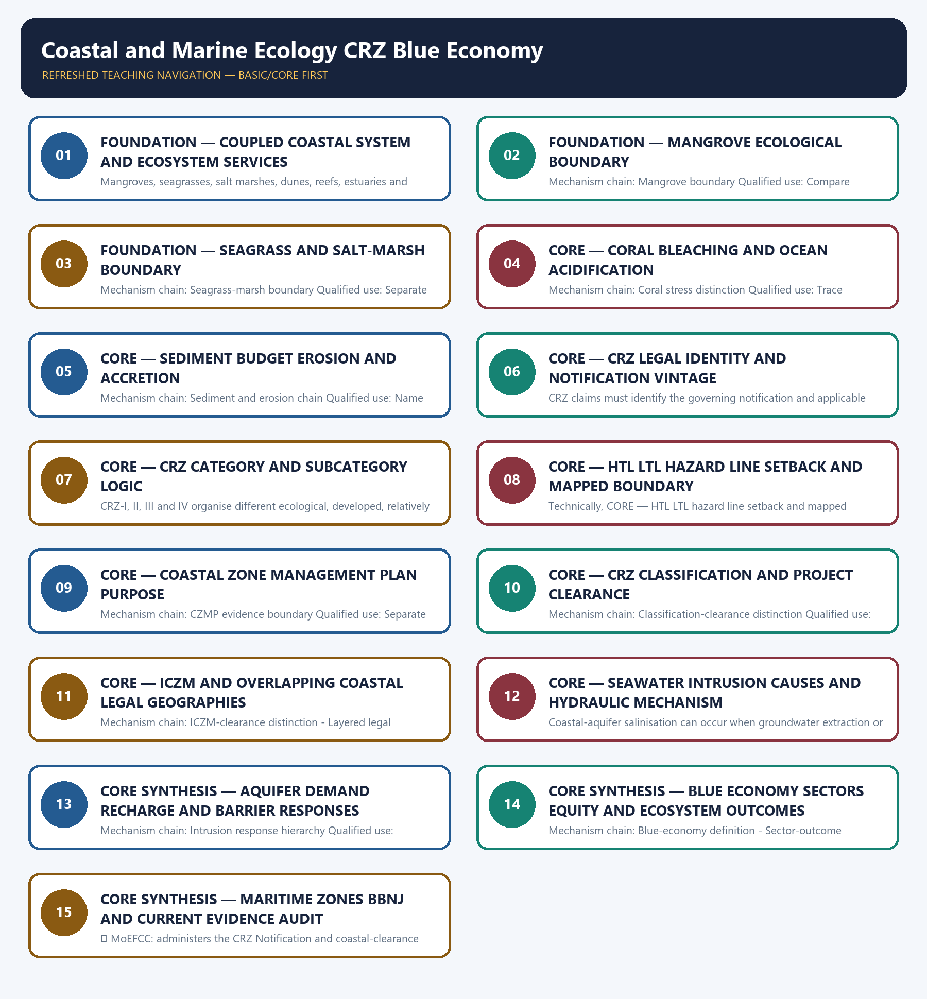

# Coastal and Marine Ecology CRZ Blue Economy — Learner-v2 Complete Learning Session

> **Authoring-only generation:** 2026-09-03. No PDF was rendered and no tracker or index was mutated.

### SOURCE, PROGRESSION AND CURRENT-LINKAGE AUDIT

- **Generation date:** 2026-09-03.
- **Repository-first evidence:** the Basic owner is taught first and preserved in full; the Advanced owner is retained only in the optional final teaching block.
- **OCR evidence:** Repository Markdown was primary. OCR-searchable local official General Studies papers were used only to confirm printed routed demands. No answer key, marking scheme, unsupported page precision, ecological rate, species count, pollution standard, rule threshold, mission outcome or current status was inferred.
- **Qdrant:** not used; repository Markdown and available OCR context were sufficient.
- **PYQ integrity:** Audited ledgers route verified Mains demands on mangroves, coastal sand mining, erosion, oil pollution, dead zones and seawater intrusion, plus objective coastal-ecology demands. No provisional key or current value is inferred.
- **Live-link boundary:** The UN BBNJ page supplied substantive scope and entry-into-force text. MoEFCC CRZ routes failed and the MoES route was blocked; therefore no coastline, mangrove, coral, fisheries, CRZ category or clearance status, Blue Economy output, mission milestone or project outcome is asserted.
- **Fact/inference discipline:** no current-affairs item, PYQ wording, figure or quotation is invented.

### LIVE OFFICIAL-SOURCE ATTEMPT LOG

The checks below were made on 2026-09-03. Substantive official text is used only for the proposition it supports. Stubs, access failures, unrelated pages and thin landing pages are recorded and are not converted into ecological or current-status claims.

- https://moef.gov.in/crz-notifications — attempted 2026-09-03; the official path returned HTTP 404, so no notification amendment, category, boundary or clearance claim was imported.
- https://moef.gov.in/coastal-regulation-zone — attempted 2026-09-03; the official path returned HTTP 404, so current CRZ procedure and CZMP status remain unasserted.
- https://moes.gov.in/schemes/deep-ocean-mission — attempted 2026-09-03; the official route returned HTTP 403, so no mission component, deployment milestone or project outcome was imported.
- https://www.un.org/bbnjagreement/en — attempted 2026-09-03; substantive official text confirmed the Agreement's four issue areas and that it entered into force on 17 January 2026; no India-specific status was inferred.
- https://www.pib.gov.in/indexd.aspx?reg=3&lang=1 — attempted 2026-09-03; no topic-specific coastline, ecosystem, fisheries, CRZ or Blue Economy value was imported.

## BASIC LEARNING SESSION



*Distinct embedded teaching-navigation image. The separate continuous Cārvāka-style flowchart package remains an independent at-a-glance artifact.*

### SESSION 1 — FOUNDATION — COUPLED COASTAL SYSTEM AND ECOSYSTEM SERVICES

#### DEFINITION / WHAT THIS IS CALLED

**Plain-language definition:** A coast is a coupled land-sea system shaped by waves, tides, currents, sediment, freshwater, ecosystems and human use; an administrative coastal zone is not the same thing as the ecological system.

**Technical definition:** Mangroves, seagrasses, salt marshes, dunes, reefs, estuaries and mudflats can support habitat, fisheries, sediment processes, carbon storage and hazard moderation; service magnitude is site-specific.

#### ANSWER-GRABBING OPENING — WRITE/ADAPT IN THE EXAM

> A coast is a coupled land-sea system shaped by waves, tides, currents, sediment, freshwater, ecosystems and human use; an administrative coastal zone is not the same thing as the ecological system.

#### MUST-WRITE KEYWORDS

- **FOUNDATION**
- **Coupled coastal system**
- **ecosystem services**
- **Mechanism chain**
- **Qualified use**
- **A coast**

**How to use them:** Frame the answer through FOUNDATION; define Coupled coastal system, connect ecosystem services with Mechanism chain to explain the mechanism, and use Qualified use for the decisive comparison or qualification.

#### VISUAL FIRST

```text
COUPLED COASTAL SYSTEM AND ECOSYSTEM SERVICES
01. Coastal-system boundary
    |
    v
02. Ecosystem-service portfolio
BOUNDARY -> Do not merge a coastal ecosystem with an administrative CRZ.
```

*This topic-specific rail fixes the evidence sequence and its exam boundary before analysis.*

#### CORE EXPLANATION

A coast is a coupled land-sea system shaped by waves, tides, currents, sediment, freshwater, ecosystems and human use; an administrative coastal zone is not the same thing as the ecological system. Mangroves, seagrasses, salt marshes, dunes, reefs, estuaries and mudflats can support habitat, fisheries, sediment processes, carbon storage and hazard moderation; service magnitude is site-specific.

#### NAMED EVIDENCE AND MECHANISM

- A coast is a coupled land-sea system shaped by waves, tides, currents, sediment, freshwater, ecosystems and human use; an administrative coastal zone is not the same thing as the ecological system.
- Mangroves, seagrasses, salt marshes, dunes, reefs, estuaries and mudflats can support habitat, fisheries, sediment processes, carbon storage and hazard moderation; service magnitude is site-specific.

#### EXAMINER CAUTION

- Do not merge a coastal ecosystem with an administrative CRZ.

#### EXAM LINK

- **Prelims:** Preserve the exact receiving medium, system boundary, measured parameter, actor, process, spatial and temporal scale, rule vintage and scientific or legal status; never turn a context-dependent pattern into a universal rule.
- **Mains:** Define the ecological coast before introducing its administrative regulation.

#### MINI RECAP

- **Mechanism chain:** Coastal-system boundary -> Ecosystem-service portfolio
- **Qualified use:** Define the ecological coast before introducing its administrative regulation.

#### CLOSING RECALL FLOW — FOUNDATION — COUPLED COASTAL SYSTEM AND ECOSYSTEM SERVICES

```text
START / CONCEPT: FOUNDATION — Coupled coastal system and ecosystem services
        |
        v
EXACT TERMS: FOUNDATION · Coupled coastal system · ecosystem services · Mechanism chain · Qualified use · A coast
        |
        v
MECHANISM / ARGUMENT: Mechanism chain: Coastal-system boundary - Ecosystem-service portfolio Qualified use: Define the ecological coast before introducing its administrative regulation.
        |
        v
CONSEQUENCE / CONTRAST: Do not merge a coastal ecosystem with an administrative CRZ.
        |
        v
UPSC TRAP / ANSWER-USE: Do not miss this limiting distinction: mangroves, seagrasses, salt marshes, dunes, reefs, estuaries and mudflats can support habitat, fisheries, sediment...
        |
        v
ANSWER-GRABBING FORMULATION: A coast is a coupled land-sea system shaped by waves, tides, currents, sediment, freshwater, ecosystems and human use; an administrative coastal zone is not the same thing as the ecological system.
```
### SESSION 2 — FOUNDATION — MANGROVE ECOLOGICAL BOUNDARY

#### DEFINITION / WHAT THIS IS CALLED

**Plain-language definition:** Mangroves are intertidal salt-tolerant woody ecosystems with ecological and livelihood functions; a plantation area, legal category or mapped patch is not automatically equivalent to a functioning mangrove system.

**Technical definition:** Mechanism chain: Mangrove boundary Qualified use: Compare habitats by structure, location and services without importing universal values.

#### ANSWER-GRABBING OPENING — WRITE/ADAPT IN THE EXAM

> Mangroves are intertidal salt-tolerant woody ecosystems with ecological and livelihood functions; a plantation area, legal category or mapped patch is not automatically equivalent to a functioning mangrove system.

#### MUST-WRITE KEYWORDS

- **FOUNDATION**
- **Mangrove ecological boundary**
- **Mechanism chain**
- **Qualified use**
- **Mangroves**
- **Mangrove**

**How to use them:** Frame the answer through FOUNDATION; define Mangrove ecological boundary, connect Mechanism chain with Qualified use to explain the mechanism, and use Mangroves for the decisive comparison or qualification.

#### VISUAL FIRST

```text
MANGROVE ECOLOGICAL BOUNDARY
01. Mangrove boundary
BOUNDARY -> Do not assign one service value to all coastal habitats.
```

*This topic-specific rail fixes the evidence sequence and its exam boundary before analysis.*

#### CORE EXPLANATION

Mangroves are intertidal salt-tolerant woody ecosystems with ecological and livelihood functions; a plantation area, legal category or mapped patch is not automatically equivalent to a functioning mangrove system.

#### NAMED EVIDENCE AND MECHANISM

- Mangroves are intertidal salt-tolerant woody ecosystems with ecological and livelihood functions; a plantation area, legal category or mapped patch is not automatically equivalent to a functioning mangrove system.

#### EXAMINER CAUTION

- Do not assign one service value to all coastal habitats.

#### EXAM LINK

- **Prelims:** Preserve the exact receiving medium, system boundary, measured parameter, actor, process, spatial and temporal scale, rule vintage and scientific or legal status; never turn a context-dependent pattern into a universal rule.
- **Mains:** Compare habitats by structure, location and services without importing universal values.

#### MINI RECAP

- **Mechanism chain:** Mangrove boundary
- **Qualified use:** Compare habitats by structure, location and services without importing universal values.

#### CLOSING RECALL FLOW — FOUNDATION — MANGROVE ECOLOGICAL BOUNDARY

```text
START / CONCEPT: FOUNDATION — Mangrove ecological boundary
        |
        v
EXACT TERMS: FOUNDATION · Mangrove ecological boundary · Mechanism chain · Qualified use · Mangroves · Mangrove
        |
        v
MECHANISM / ARGUMENT: Mechanism chain: Mangrove boundary Qualified use: Compare habitats by structure, location and services without importing universal values.
        |
        v
CONSEQUENCE / CONTRAST: Do not assign one service value to all coastal habitats.
        |
        v
UPSC TRAP / ANSWER-USE: Do not miss this limiting distinction: mangroves are intertidal salt-tolerant woody ecosystems with ecological and livelihood functions.
        |
        v
ANSWER-GRABBING FORMULATION: Mangroves are intertidal salt-tolerant woody ecosystems with ecological and livelihood functions; a plantation area, legal category or mapped patch is not automatically equivalent to a functioning mangrove system.
```
### SESSION 3 — FOUNDATION — SEAGRASS AND SALT-MARSH BOUNDARY

#### DEFINITION / WHAT THIS IS CALLED

**Plain-language definition:** Seagrass meadows are submerged flowering-plant ecosystems and salt marshes are vegetated intertidal wetlands; neither should be merged with mangrove forest or coral reef.

**Technical definition:** Mechanism chain: Seagrass-marsh boundary Qualified use: Separate thermal symbiont loss from carbonate-chemistry stress.

#### ANSWER-GRABBING OPENING — WRITE/ADAPT IN THE EXAM

> Seagrass meadows are submerged flowering-plant ecosystems and salt marshes are vegetated intertidal wetlands; neither should be merged with mangrove forest or coral reef.

#### MUST-WRITE KEYWORDS

- **FOUNDATION**
- **Seagrass**
- **salt-marsh boundary**
- **Mechanism chain**
- **Qualified use**
- **Seagrass meadows**

**How to use them:** Frame the answer through FOUNDATION; define Seagrass, connect salt-marsh boundary with Mechanism chain to explain the mechanism, and use Qualified use for the decisive comparison or qualification.

#### VISUAL FIRST

```text
SEAGRASS AND SALT-MARSH BOUNDARY
01. Seagrass-marsh boundary
BOUNDARY -> Do not equate plantation or mapped area with functioning mangrove ecology.
```

*This topic-specific rail fixes the evidence sequence and its exam boundary before analysis.*

#### CORE EXPLANATION

Seagrass meadows are submerged flowering-plant ecosystems and salt marshes are vegetated intertidal wetlands; neither should be merged with mangrove forest or coral reef.

#### NAMED EVIDENCE AND MECHANISM

- Seagrass meadows are submerged flowering-plant ecosystems and salt marshes are vegetated intertidal wetlands; neither should be merged with mangrove forest or coral reef.

#### EXAMINER CAUTION

- Do not equate plantation or mapped area with functioning mangrove ecology.

#### EXAM LINK

- **Prelims:** Preserve the exact receiving medium, system boundary, measured parameter, actor, process, spatial and temporal scale, rule vintage and scientific or legal status; never turn a context-dependent pattern into a universal rule.
- **Mains:** Separate thermal symbiont loss from carbonate-chemistry stress.

#### MINI RECAP

- **Mechanism chain:** Seagrass-marsh boundary
- **Qualified use:** Separate thermal symbiont loss from carbonate-chemistry stress.

#### CLOSING RECALL FLOW — FOUNDATION — SEAGRASS AND SALT-MARSH BOUNDARY

```text
START / CONCEPT: FOUNDATION — Seagrass and salt-marsh boundary
        |
        v
EXACT TERMS: FOUNDATION · Seagrass · salt-marsh boundary · Mechanism chain · Qualified use · Seagrass meadows
        |
        v
MECHANISM / ARGUMENT: Mechanism chain: Seagrass-marsh boundary Qualified use: Separate thermal symbiont loss from carbonate-chemistry stress.
        |
        v
CONSEQUENCE / CONTRAST: Do not equate plantation or mapped area with functioning mangrove ecology.
        |
        v
UPSC TRAP / ANSWER-USE: Do not miss this limiting distinction: do not equate plantation or mapped area with functioning mangrove ecology.
        |
        v
ANSWER-GRABBING FORMULATION: Seagrass meadows are submerged flowering-plant ecosystems and salt marshes are vegetated intertidal wetlands; neither should be merged with mangrove forest or coral reef.
```
### SESSION 4 — CORE — CORAL BLEACHING AND OCEAN ACIDIFICATION

#### DEFINITION / WHAT THIS IS CALLED

**Plain-language definition:** Thermal bleaching involves stress-driven loss of coral symbionts, while ocean acidification alters carbonate chemistry and calcification conditions; they are distinct, compounding processes.

**Technical definition:** Mechanism chain: Coral stress distinction Qualified use: Trace sediment sources, transport, structures and shoreline response.

#### ANSWER-GRABBING OPENING — WRITE/ADAPT IN THE EXAM

> Thermal bleaching involves stress-driven loss of coral symbionts, while ocean acidification alters carbonate chemistry and calcification conditions; they are distinct, compounding processes.

#### MUST-WRITE KEYWORDS

- **Coral bleaching**
- **ocean acidification**
- **Mechanism chain**
- **Qualified use**
- **Thermal**
- **Coral**

**How to use them:** Frame the answer through Coral bleaching; define ocean acidification, connect Mechanism chain with Qualified use to explain the mechanism, and use Thermal for the decisive comparison or qualification.

#### VISUAL FIRST

```text
CORAL BLEACHING AND OCEAN ACIDIFICATION
01. Coral stress distinction
BOUNDARY -> Do not merge seagrass, salt marsh, mangrove and coral reef.
```

*This topic-specific rail fixes the evidence sequence and its exam boundary before analysis.*

#### CORE EXPLANATION

Thermal bleaching involves stress-driven loss of coral symbionts, while ocean acidification alters carbonate chemistry and calcification conditions; they are distinct, compounding processes.

#### NAMED EVIDENCE AND MECHANISM

- Thermal bleaching involves stress-driven loss of coral symbionts, while ocean acidification alters carbonate chemistry and calcification conditions; they are distinct, compounding processes.

#### EXAMINER CAUTION

- Do not merge seagrass, salt marsh, mangrove and coral reef.

#### EXAM LINK

- **Prelims:** Preserve the exact receiving medium, system boundary, measured parameter, actor, process, spatial and temporal scale, rule vintage and scientific or legal status; never turn a context-dependent pattern into a universal rule.
- **Mains:** Trace sediment sources, transport, structures and shoreline response.

#### MINI RECAP

- **Mechanism chain:** Coral stress distinction
- **Qualified use:** Trace sediment sources, transport, structures and shoreline response.

#### CLOSING RECALL FLOW — CORE — CORAL BLEACHING AND OCEAN ACIDIFICATION

```text
START / CONCEPT: CORE — Coral bleaching and ocean acidification
        |
        v
EXACT TERMS: Coral bleaching · ocean acidification · Mechanism chain · Qualified use · Thermal · Coral
        |
        v
MECHANISM / ARGUMENT: Mechanism chain: Coral stress distinction Qualified use: Trace sediment sources, transport, structures and shoreline response.
        |
        v
CONSEQUENCE / CONTRAST: Do not merge seagrass, salt marsh, mangrove and coral reef.
        |
        v
UPSC TRAP / ANSWER-USE: Do not miss this limiting distinction: thermal bleaching involves stress-driven loss of coral symbionts.
        |
        v
ANSWER-GRABBING FORMULATION: Thermal bleaching involves stress-driven loss of coral symbionts, while ocean acidification alters carbonate chemistry and calcification conditions; they are distinct, compounding processes.
```
### SESSION 5 — CORE — SEDIMENT BUDGET EROSION AND ACCRETION

#### DEFINITION / WHAT THIS IS CALLED

**Plain-language definition:** Coastal erosion or accretion reflects sediment supply, waves, currents, storms, river regulation and structures; a shoreline shift cannot be attributed to one driver without site-specific evidence.

**Technical definition:** Mechanism chain: Sediment and erosion chain Qualified use: Name the CRZ legal instrument and notification vintage.

#### ANSWER-GRABBING OPENING — WRITE/ADAPT IN THE EXAM

> Coastal erosion or accretion reflects sediment supply, waves, currents, storms, river regulation and structures; a shoreline shift cannot be attributed to one driver without site-specific evidence.

#### MUST-WRITE KEYWORDS

- **Sediment budget erosion**
- **accretion**
- **Mechanism chain**
- **Qualified use**
- **Coastal**
- **Sediment**

**How to use them:** Frame the answer through Sediment budget erosion; define accretion, connect Mechanism chain with Qualified use to explain the mechanism, and use Coastal for the decisive comparison or qualification.

#### VISUAL FIRST

```text
SEDIMENT BUDGET EROSION AND ACCRETION
01. Sediment and erosion chain
BOUNDARY -> Do not merge coral bleaching with ocean acidification.
```

*This topic-specific rail fixes the evidence sequence and its exam boundary before analysis.*

#### CORE EXPLANATION

Coastal erosion or accretion reflects sediment supply, waves, currents, storms, river regulation and structures; a shoreline shift cannot be attributed to one driver without site-specific evidence.

#### NAMED EVIDENCE AND MECHANISM

- Coastal erosion or accretion reflects sediment supply, waves, currents, storms, river regulation and structures; a shoreline shift cannot be attributed to one driver without site-specific evidence.

#### EXAMINER CAUTION

- Do not merge coral bleaching with ocean acidification.

#### EXAM LINK

- **Prelims:** Preserve the exact receiving medium, system boundary, measured parameter, actor, process, spatial and temporal scale, rule vintage and scientific or legal status; never turn a context-dependent pattern into a universal rule.
- **Mains:** Name the CRZ legal instrument and notification vintage.

#### MINI RECAP

- **Mechanism chain:** Sediment and erosion chain
- **Qualified use:** Name the CRZ legal instrument and notification vintage.

#### CLOSING RECALL FLOW — CORE — SEDIMENT BUDGET EROSION AND ACCRETION

```text
START / CONCEPT: CORE — Sediment budget erosion and accretion
        |
        v
EXACT TERMS: Sediment budget erosion · accretion · Mechanism chain · Qualified use · Coastal · Sediment
        |
        v
MECHANISM / ARGUMENT: Mechanism chain: Sediment and erosion chain Qualified use: Name the CRZ legal instrument and notification vintage.
        |
        v
CONSEQUENCE / CONTRAST: Do not merge coral bleaching with ocean acidification.
        |
        v
UPSC TRAP / ANSWER-USE: Do not miss this limiting distinction: coastal erosion or accretion reflects sediment supply, waves, currents, storms, river regulation and structures.
        |
        v
ANSWER-GRABBING FORMULATION: Coastal erosion or accretion reflects sediment supply, waves, currents, storms, river regulation and structures; a shoreline shift cannot be attributed to one driver without site-specific evidence.
```
### SESSION 6 — CORE — CRZ LEGAL IDENTITY AND NOTIFICATION VINTAGE

#### DEFINITION / WHAT THIS IS CALLED

**Plain-language definition:** Mechanism chain: CRZ legal identity - Notification-vintage boundary Qualified use: Identify category and subcategory before stating any activity rule.

**Technical definition:** CRZ claims must identify the governing notification and applicable amendment or Coastal Zone Management Plan; rules from different vintages cannot be silently combined.

#### ANSWER-GRABBING OPENING — WRITE/ADAPT IN THE EXAM

> Mechanism chain: CRZ legal identity - Notification-vintage boundary Qualified use: Identify category and subcategory before stating any activity rule.

#### MUST-WRITE KEYWORDS

- **CRZ legal identity**
- **notification vintage**
- **Mechanism chain**
- **Qualified use**
- **The Coastal Regulation Zone**
- **Environment**

**How to use them:** Frame the answer through CRZ legal identity; define notification vintage, connect Mechanism chain with Qualified use to explain the mechanism, and use The Coastal Regulation Zone for the decisive comparison or qualification.

#### VISUAL FIRST

```text
CRZ LEGAL IDENTITY AND NOTIFICATION VINTAGE
01. CRZ legal identity
    |
    v
02. Notification-vintage boundary
BOUNDARY -> Do not attribute every shoreline change to sea-level rise.
```

*This topic-specific rail fixes the evidence sequence and its exam boundary before analysis.*

#### CORE EXPLANATION

The Coastal Regulation Zone is an administrative regulatory framework under the Environment (Protection) Act, not an ecosystem type, protected-area designation or maritime entitlement. CRZ claims must identify the governing notification and applicable amendment or Coastal Zone Management Plan; rules from different vintages cannot be silently combined.

#### NAMED EVIDENCE AND MECHANISM

- The Coastal Regulation Zone is an administrative regulatory framework under the Environment (Protection) Act, not an ecosystem type, protected-area designation or maritime entitlement.
- CRZ claims must identify the governing notification and applicable amendment or Coastal Zone Management Plan; rules from different vintages cannot be silently combined.

#### EXAMINER CAUTION

- Do not attribute every shoreline change to sea-level rise.

#### EXAM LINK

- **Prelims:** Preserve the exact receiving medium, system boundary, measured parameter, actor, process, spatial and temporal scale, rule vintage and scientific or legal status; never turn a context-dependent pattern into a universal rule.
- **Mains:** Identify category and subcategory before stating any activity rule.

#### MINI RECAP

- **Mechanism chain:** CRZ legal identity -> Notification-vintage boundary
- **Qualified use:** Identify category and subcategory before stating any activity rule.

#### CLOSING RECALL FLOW — CORE — CRZ LEGAL IDENTITY AND NOTIFICATION VINTAGE

```text
START / CONCEPT: CORE — CRZ legal identity and notification vintage
        |
        v
EXACT TERMS: CRZ legal identity · notification vintage · Mechanism chain · Qualified use · The Coastal Regulation Zone · Environment
        |
        v
MECHANISM / ARGUMENT: CRZ claims must identify the governing notification and applicable amendment or Coastal Zone Management Plan; rules from different vintages cannot be silently combined.
        |
        v
CONSEQUENCE / CONTRAST: The Coastal Regulation Zone is an administrative regulatory framework under the Environment (Protection) Act, not an ecosystem type, protected-area designation or maritime entitlement.
        |
        v
UPSC TRAP / ANSWER-USE: Do not attribute every shoreline change to sea-level rise.
        |
        v
ANSWER-GRABBING FORMULATION: Mechanism chain: CRZ legal identity - Notification-vintage boundary Qualified use: Identify category and subcategory before stating any activity rule.
```
### SESSION 7 — CORE — CRZ CATEGORY AND SUBCATEGORY LOGIC

#### DEFINITION / WHAT THIS IS CALLED

**Plain-language definition:** Mechanism chain: CRZ category boundary Qualified use: Use approved mapping terms rather than a generic shoreline distance.

**Technical definition:** CRZ-I, II, III and IV organise different ecological, developed, relatively undisturbed and water-area contexts, with subcategories and activity rules that require the applicable notification text.

#### ANSWER-GRABBING OPENING — WRITE/ADAPT IN THE EXAM

> Mechanism chain: CRZ category boundary Qualified use: Use approved mapping terms rather than a generic shoreline distance.

#### MUST-WRITE KEYWORDS

- **CRZ category**
- **subcategory logic**
- **Mechanism chain**
- **Qualified use**
- **CRZ-I**
- **II**

**How to use them:** Frame the answer through CRZ category; define subcategory logic, connect Mechanism chain with Qualified use to explain the mechanism, and use CRZ-I for the decisive comparison or qualification.

#### VISUAL FIRST

```text
CRZ CATEGORY AND SUBCATEGORY LOGIC
01. CRZ category boundary
BOUNDARY -> Do not call CRZ a protected-area or maritime-zone designation.
```

*This topic-specific rail fixes the evidence sequence and its exam boundary before analysis.*

#### CORE EXPLANATION

CRZ-I, II, III and IV organise different ecological, developed, relatively undisturbed and water-area contexts, with subcategories and activity rules that require the applicable notification text.

#### NAMED EVIDENCE AND MECHANISM

- CRZ-I, II, III and IV organise different ecological, developed, relatively undisturbed and water-area contexts, with subcategories and activity rules that require the applicable notification text.

#### EXAMINER CAUTION

- Do not call CRZ a protected-area or maritime-zone designation.

#### EXAM LINK

- **Prelims:** Preserve the exact receiving medium, system boundary, measured parameter, actor, process, spatial and temporal scale, rule vintage and scientific or legal status; never turn a context-dependent pattern into a universal rule.
- **Mains:** Use approved mapping terms rather than a generic shoreline distance.

#### MINI RECAP

- **Mechanism chain:** CRZ category boundary
- **Qualified use:** Use approved mapping terms rather than a generic shoreline distance.

#### CLOSING RECALL FLOW — CORE — CRZ CATEGORY AND SUBCATEGORY LOGIC

```text
START / CONCEPT: CORE — CRZ category and subcategory logic
        |
        v
EXACT TERMS: CRZ category · subcategory logic · Mechanism chain · Qualified use · CRZ-I · II
        |
        v
MECHANISM / ARGUMENT: CRZ-I, II, III and IV organise different ecological, developed, relatively undisturbed and water-area contexts, with subcategories and activity rules that require the applicable notification text.
        |
        v
CONSEQUENCE / CONTRAST: Do not call CRZ a protected-area or maritime-zone designation.
        |
        v
UPSC TRAP / ANSWER-USE: Mains: Use approved mapping terms rather than a generic shoreline distance.
        |
        v
ANSWER-GRABBING FORMULATION: Mechanism chain: CRZ category boundary Qualified use: Use approved mapping terms rather than a generic shoreline distance.
```
### SESSION 8 — CORE — HTL LTL HAZARD LINE SETBACK AND MAPPED BOUNDARY

#### DEFINITION / WHAT THIS IS CALLED

**Plain-language definition:** Mechanism chain: HTL-LTL boundary Qualified use: Explain CZMP as regulatory mapping, not a project approval.

**Technical definition:** Technically, CORE — HTL LTL hazard line setback and mapped boundary is analysed by relating HTL LTL hazard line setback to mapped boundary, then testing the relationship through Mechanism chain and Qualified use.

#### ANSWER-GRABBING OPENING — WRITE/ADAPT IN THE EXAM

> Mechanism chain: HTL-LTL boundary Qualified use: Explain CZMP as regulatory mapping, not a project approval.

#### MUST-WRITE KEYWORDS

- **HTL LTL hazard line setback**
- **mapped boundary**
- **Mechanism chain**
- **Qualified use**
- **CRZ**
- **HTL-LTL**

**How to use them:** Frame the answer through HTL LTL hazard line setback; define mapped boundary, connect Mechanism chain with Qualified use to explain the mechanism, and use CRZ for the decisive comparison or qualification.

#### VISUAL FIRST

```text
HTL LTL HAZARD LINE SETBACK AND MAPPED BOUNDARY
01. HTL-LTL boundary
BOUNDARY -> Do not combine CRZ rules from different notification vintages.
```

*This topic-specific rail fixes the evidence sequence and its exam boundary before analysis.*

#### CORE EXPLANATION

High Tide Line, Low Tide Line, hazard line, setback and mapped CRZ boundary perform different functions; a generic distance from the shore cannot replace the approved map and category rule.

#### NAMED EVIDENCE AND MECHANISM

- High Tide Line, Low Tide Line, hazard line, setback and mapped CRZ boundary perform different functions; a generic distance from the shore cannot replace the approved map and category rule.

#### EXAMINER CAUTION

- Do not combine CRZ rules from different notification vintages.

#### EXAM LINK

- **Prelims:** Preserve the exact receiving medium, system boundary, measured parameter, actor, process, spatial and temporal scale, rule vintage and scientific or legal status; never turn a context-dependent pattern into a universal rule.
- **Mains:** Explain CZMP as regulatory mapping, not a project approval.

#### MINI RECAP

- **Mechanism chain:** HTL-LTL boundary
- **Qualified use:** Explain CZMP as regulatory mapping, not a project approval.

#### CLOSING RECALL FLOW — CORE — HTL LTL HAZARD LINE SETBACK AND MAPPED BOUNDARY

```text
START / CONCEPT: CORE — HTL LTL hazard line setback and mapped boundary
        |
        v
EXACT TERMS: HTL LTL hazard line setback · mapped boundary · Mechanism chain · Qualified use · CRZ · HTL-LTL
        |
        v
MECHANISM / ARGUMENT: Mains: Explain CZMP as regulatory mapping, not a project approval.
        |
        v
CONSEQUENCE / CONTRAST: Do not combine CRZ rules from different notification vintages.
        |
        v
UPSC TRAP / ANSWER-USE: Do not miss this limiting distinction: explain CZMP as regulatory mapping, not a project approval.
        |
        v
ANSWER-GRABBING FORMULATION: Mechanism chain: HTL-LTL boundary Qualified use: Explain CZMP as regulatory mapping, not a project approval.
```
### SESSION 9 — CORE — COASTAL ZONE MANAGEMENT PLAN PURPOSE

#### DEFINITION / WHAT THIS IS CALLED

**Plain-language definition:** A Coastal Zone Management Plan maps categories and boundaries for regulatory administration; map approval does not itself grant project clearance or prove ecological condition.

**Technical definition:** Mechanism chain: CZMP evidence boundary Qualified use: Separate classification, appraisal, clearance and compliance monitoring.

#### ANSWER-GRABBING OPENING — WRITE/ADAPT IN THE EXAM

> A Coastal Zone Management Plan maps categories and boundaries for regulatory administration; map approval does not itself grant project clearance or prove ecological condition.

#### MUST-WRITE KEYWORDS

- **Coastal Zone Management Plan purpose**
- **Mechanism chain**
- **Qualified use**
- **Coastal Zone Management Plan**
- **CZMP**
- **Qualified**

**How to use them:** Frame the answer through Coastal Zone Management Plan purpose; define Mechanism chain, connect Qualified use with Coastal Zone Management Plan to explain the mechanism, and use CZMP for the decisive comparison or qualification.

#### VISUAL FIRST

```text
COASTAL ZONE MANAGEMENT PLAN PURPOSE
01. CZMP evidence boundary
BOUNDARY -> Do not state category rules without the applicable subcategory and text.
```

*This topic-specific rail fixes the evidence sequence and its exam boundary before analysis.*

#### CORE EXPLANATION

A Coastal Zone Management Plan maps categories and boundaries for regulatory administration; map approval does not itself grant project clearance or prove ecological condition.

#### NAMED EVIDENCE AND MECHANISM

- A Coastal Zone Management Plan maps categories and boundaries for regulatory administration; map approval does not itself grant project clearance or prove ecological condition.

#### EXAMINER CAUTION

- Do not state category rules without the applicable subcategory and text.

#### EXAM LINK

- **Prelims:** Preserve the exact receiving medium, system boundary, measured parameter, actor, process, spatial and temporal scale, rule vintage and scientific or legal status; never turn a context-dependent pattern into a universal rule.
- **Mains:** Separate classification, appraisal, clearance and compliance monitoring.

#### MINI RECAP

- **Mechanism chain:** CZMP evidence boundary
- **Qualified use:** Separate classification, appraisal, clearance and compliance monitoring.

#### CLOSING RECALL FLOW — CORE — COASTAL ZONE MANAGEMENT PLAN PURPOSE

```text
START / CONCEPT: CORE — Coastal Zone Management Plan purpose
        |
        v
EXACT TERMS: Coastal Zone Management Plan purpose · Mechanism chain · Qualified use · Coastal Zone Management Plan · CZMP · Qualified
        |
        v
MECHANISM / ARGUMENT: Mechanism chain: CZMP evidence boundary Qualified use: Separate classification, appraisal, clearance and compliance monitoring.
        |
        v
CONSEQUENCE / CONTRAST: Do not state category rules without the applicable subcategory and text.
        |
        v
UPSC TRAP / ANSWER-USE: Do not miss this limiting distinction: a Coastal Zone Management Plan maps categories and boundaries for regulatory administration.
        |
        v
ANSWER-GRABBING FORMULATION: A Coastal Zone Management Plan maps categories and boundaries for regulatory administration; map approval does not itself grant project clearance or prove ecological condition.
```
### SESSION 10 — CORE — CRZ CLASSIFICATION AND PROJECT CLEARANCE

#### DEFINITION / WHAT THIS IS CALLED

**Plain-language definition:** CRZ classification determines the applicable regulatory regime, while project appraisal or clearance is a separate decision based on project type, location and procedure.

**Technical definition:** Mechanism chain: Classification-clearance distinction Qualified use: Use ICZM for cumulative ecological, hazard, livelihood and development coordination.

#### ANSWER-GRABBING OPENING — WRITE/ADAPT IN THE EXAM

> CRZ classification determines the applicable regulatory regime, while project appraisal or clearance is a separate decision based on project type, location and procedure.

#### MUST-WRITE KEYWORDS

- **CRZ classification**
- **project clearance**
- **Mechanism chain**
- **Qualified use**
- **CRZ**
- **Classification-clearance**

**How to use them:** Frame the answer through CRZ classification; define project clearance, connect Mechanism chain with Qualified use to explain the mechanism, and use CRZ for the decisive comparison or qualification.

#### VISUAL FIRST

```text
CRZ CLASSIFICATION AND PROJECT CLEARANCE
01. Classification-clearance distinction
BOUNDARY -> Do not replace approved coastal mapping with a generic distance.
```

*This topic-specific rail fixes the evidence sequence and its exam boundary before analysis.*

#### CORE EXPLANATION

CRZ classification determines the applicable regulatory regime, while project appraisal or clearance is a separate decision based on project type, location and procedure.

#### NAMED EVIDENCE AND MECHANISM

- CRZ classification determines the applicable regulatory regime, while project appraisal or clearance is a separate decision based on project type, location and procedure.

#### EXAMINER CAUTION

- Do not replace approved coastal mapping with a generic distance.

#### EXAM LINK

- **Prelims:** Preserve the exact receiving medium, system boundary, measured parameter, actor, process, spatial and temporal scale, rule vintage and scientific or legal status; never turn a context-dependent pattern into a universal rule.
- **Mains:** Use ICZM for cumulative ecological, hazard, livelihood and development coordination.

#### MINI RECAP

- **Mechanism chain:** Classification-clearance distinction
- **Qualified use:** Use ICZM for cumulative ecological, hazard, livelihood and development coordination.

#### CLOSING RECALL FLOW — CORE — CRZ CLASSIFICATION AND PROJECT CLEARANCE

```text
START / CONCEPT: CORE — CRZ classification and project clearance
        |
        v
EXACT TERMS: CRZ classification · project clearance · Mechanism chain · Qualified use · CRZ · Classification-clearance
        |
        v
MECHANISM / ARGUMENT: Mechanism chain: Classification-clearance distinction Qualified use: Use ICZM for cumulative ecological, hazard, livelihood and development coordination.
        |
        v
CONSEQUENCE / CONTRAST: Do not replace approved coastal mapping with a generic distance.
        |
        v
UPSC TRAP / ANSWER-USE: Do not miss this limiting distinction: use ICZM for cumulative ecological, hazard, livelihood and development coordination.
        |
        v
ANSWER-GRABBING FORMULATION: CRZ classification determines the applicable regulatory regime, while project appraisal or clearance is a separate decision based on project type, location and procedure.
```
### SESSION 11 — CORE — ICZM AND OVERLAPPING COASTAL LEGAL GEOGRAPHIES

#### DEFINITION / WHAT THIS IS CALLED

**Plain-language definition:** Integrated Coastal Zone Management coordinates ecosystems, hazards, livelihoods and development across a coastal system; it is broader than approving or rejecting one project.

**Technical definition:** Mechanism chain: ICZM-clearance distinction - Layered legal geography Qualified use: List overlapping designations while preserving each authority and consequence.

#### ANSWER-GRABBING OPENING — WRITE/ADAPT IN THE EXAM

> Mechanism chain: ICZM-clearance distinction - Layered legal geography Qualified use: List overlapping designations while preserving each authority and consequence.

#### MUST-WRITE KEYWORDS

- **ICZM**
- **overlapping coastal legal geographies**
- **Mechanism chain**
- **Qualified use**
- **Integrated Coastal Zone Management**
- **CRZ**

**How to use them:** Frame the answer through ICZM; define overlapping coastal legal geographies, connect Mechanism chain with Qualified use to explain the mechanism, and use Integrated Coastal Zone Management for the decisive comparison or qualification.

#### VISUAL FIRST

```text
ICZM AND OVERLAPPING COASTAL LEGAL GEOGRAPHIES
01. ICZM-clearance distinction
    |
    v
02. Layered legal geography
BOUNDARY -> Do not treat CZMP approval as project clearance.
```

*This topic-specific rail fixes the evidence sequence and its exam boundary before analysis.*

#### CORE EXPLANATION

Integrated Coastal Zone Management coordinates ecosystems, hazards, livelihoods and development across a coastal system; it is broader than approving or rejecting one project. CRZ, protected-area law, Ramsar designation, forest law, port limits, maritime zones and local tenure can overlap, but each has a different authority, boundary and legal consequence.

#### NAMED EVIDENCE AND MECHANISM

- Integrated Coastal Zone Management coordinates ecosystems, hazards, livelihoods and development across a coastal system; it is broader than approving or rejecting one project.
- CRZ, protected-area law, Ramsar designation, forest law, port limits, maritime zones and local tenure can overlap, but each has a different authority, boundary and legal consequence.

#### EXAMINER CAUTION

- Do not treat CZMP approval as project clearance.

#### EXAM LINK

- **Prelims:** Preserve the exact receiving medium, system boundary, measured parameter, actor, process, spatial and temporal scale, rule vintage and scientific or legal status; never turn a context-dependent pattern into a universal rule.
- **Mains:** List overlapping designations while preserving each authority and consequence.

#### MINI RECAP

- **Mechanism chain:** ICZM-clearance distinction -> Layered legal geography
- **Qualified use:** List overlapping designations while preserving each authority and consequence.

#### CLOSING RECALL FLOW — CORE — ICZM AND OVERLAPPING COASTAL LEGAL GEOGRAPHIES

```text
START / CONCEPT: CORE — ICZM and overlapping coastal legal geographies
        |
        v
EXACT TERMS: ICZM · overlapping coastal legal geographies · Mechanism chain · Qualified use · Integrated Coastal Zone Management · CRZ
        |
        v
MECHANISM / ARGUMENT: Integrated Coastal Zone Management coordinates ecosystems, hazards, livelihoods and development across a coastal system; it is broader than approving or rejecting one project.
        |
        v
CONSEQUENCE / CONTRAST: CRZ, protected-area law, Ramsar designation, forest law, port limits, maritime zones and local tenure can overlap, but each has a different authority, boundary and legal consequence.
        |
        v
UPSC TRAP / ANSWER-USE: Do not treat CZMP approval as project clearance.
        |
        v
ANSWER-GRABBING FORMULATION: Mechanism chain: ICZM-clearance distinction - Layered legal geography Qualified use: List overlapping designations while preserving each authority and consequence.
```
### SESSION 12 — CORE — SEAWATER INTRUSION CAUSES AND HYDRAULIC MECHANISM

#### DEFINITION / WHAT THIS IS CALLED

**Plain-language definition:** Mechanism chain: Seawater-intrusion chain Qualified use: Lead seawater intrusion with freshwater-head imbalance and compounding factors.

**Technical definition:** Coastal-aquifer salinisation can occur when groundwater extraction or reduced recharge lowers freshwater head, allowing saline water to move landward or upward; sea-level and local engineering can compound the process.

#### ANSWER-GRABBING OPENING — WRITE/ADAPT IN THE EXAM

> Mechanism chain: Seawater-intrusion chain Qualified use: Lead seawater intrusion with freshwater-head imbalance and compounding factors.

#### MUST-WRITE KEYWORDS

- **Seawater intrusion causes**
- **hydraulic mechanism**
- **Mechanism chain**
- **Qualified use**
- **Coastal-aquifer**
- **Seawater-intrusion**

**How to use them:** Frame the answer through Seawater intrusion causes; define hydraulic mechanism, connect Mechanism chain with Qualified use to explain the mechanism, and use Coastal-aquifer for the decisive comparison or qualification.

#### VISUAL FIRST

```text
SEAWATER INTRUSION CAUSES AND HYDRAULIC MECHANISM
01. Seawater-intrusion chain
BOUNDARY -> Do not merge classification with appraisal or clearance.
```

*This topic-specific rail fixes the evidence sequence and its exam boundary before analysis.*

#### CORE EXPLANATION

Coastal-aquifer salinisation can occur when groundwater extraction or reduced recharge lowers freshwater head, allowing saline water to move landward or upward; sea-level and local engineering can compound the process.

#### NAMED EVIDENCE AND MECHANISM

- Coastal-aquifer salinisation can occur when groundwater extraction or reduced recharge lowers freshwater head, allowing saline water to move landward or upward; sea-level and local engineering can compound the process.

#### EXAMINER CAUTION

- Do not merge classification with appraisal or clearance.

#### EXAM LINK

- **Prelims:** Preserve the exact receiving medium, system boundary, measured parameter, actor, process, spatial and temporal scale, rule vintage and scientific or legal status; never turn a context-dependent pattern into a universal rule.
- **Mains:** Lead seawater intrusion with freshwater-head imbalance and compounding factors.

#### MINI RECAP

- **Mechanism chain:** Seawater-intrusion chain
- **Qualified use:** Lead seawater intrusion with freshwater-head imbalance and compounding factors.

#### CLOSING RECALL FLOW — CORE — SEAWATER INTRUSION CAUSES AND HYDRAULIC MECHANISM

```text
START / CONCEPT: CORE — Seawater intrusion causes and hydraulic mechanism
        |
        v
EXACT TERMS: Seawater intrusion causes · hydraulic mechanism · Mechanism chain · Qualified use · Coastal-aquifer · Seawater-intrusion
        |
        v
MECHANISM / ARGUMENT: Coastal-aquifer salinisation can occur when groundwater extraction or reduced recharge lowers freshwater head, allowing saline water to move landward or upward; sea-level and local engineering can compound the process.
        |
        v
CONSEQUENCE / CONTRAST: Do not merge classification with appraisal or clearance.
        |
        v
UPSC TRAP / ANSWER-USE: Do not miss this limiting distinction: lead seawater intrusion with freshwater-head imbalance and compounding factors.
        |
        v
ANSWER-GRABBING FORMULATION: Mechanism chain: Seawater-intrusion chain Qualified use: Lead seawater intrusion with freshwater-head imbalance and compounding factors.
```
### SESSION 13 — CORE SYNTHESIS — AQUIFER DEMAND RECHARGE AND BARRIER RESPONSES

#### DEFINITION / WHAT THIS IS CALLED

**Plain-language definition:** Responses combine demand management, recharge protection, pumping control, monitoring and site-specific hydraulic barriers; desalination treats supplied water but does not by itself restore aquifer balance.

**Technical definition:** Mechanism chain: Intrusion response hierarchy Qualified use: Organise remedies into demand, recharge, pumping, monitoring and barriers.

#### ANSWER-GRABBING OPENING — WRITE/ADAPT IN THE EXAM

> Responses combine demand management, recharge protection, pumping control, monitoring and site-specific hydraulic barriers; desalination treats supplied water but does not by itself restore aquifer balance.

#### MUST-WRITE KEYWORDS

- **CORE SYNTHESIS**
- **Aquifer demand recharge**
- **barrier responses**
- **Mechanism chain**
- **Qualified use**
- **Responses**

**How to use them:** Frame the answer through CORE SYNTHESIS; define Aquifer demand recharge, connect barrier responses with Mechanism chain to explain the mechanism, and use Qualified use for the decisive comparison or qualification.

#### VISUAL FIRST

```text
AQUIFER DEMAND RECHARGE AND BARRIER RESPONSES
01. Intrusion response hierarchy
BOUNDARY -> Do not reduce ICZM to project clearance.
```

*This topic-specific rail fixes the evidence sequence and its exam boundary before analysis.*

#### CORE EXPLANATION

Responses combine demand management, recharge protection, pumping control, monitoring and site-specific hydraulic barriers; desalination treats supplied water but does not by itself restore aquifer balance.

#### NAMED EVIDENCE AND MECHANISM

- Responses combine demand management, recharge protection, pumping control, monitoring and site-specific hydraulic barriers; desalination treats supplied water but does not by itself restore aquifer balance.

#### EXAMINER CAUTION

- Do not reduce ICZM to project clearance.

#### EXAM LINK

- **Prelims:** Preserve the exact receiving medium, system boundary, measured parameter, actor, process, spatial and temporal scale, rule vintage and scientific or legal status; never turn a context-dependent pattern into a universal rule.
- **Mains:** Organise remedies into demand, recharge, pumping, monitoring and barriers.

#### MINI RECAP

- **Mechanism chain:** Intrusion response hierarchy
- **Qualified use:** Organise remedies into demand, recharge, pumping, monitoring and barriers.

#### CLOSING RECALL FLOW — CORE SYNTHESIS — AQUIFER DEMAND RECHARGE AND BARRIER RESPONSES

```text
START / CONCEPT: CORE SYNTHESIS — Aquifer demand recharge and barrier responses
        |
        v
EXACT TERMS: CORE SYNTHESIS · Aquifer demand recharge · barrier responses · Mechanism chain · Qualified use · Responses
        |
        v
MECHANISM / ARGUMENT: Mechanism chain: Intrusion response hierarchy Qualified use: Organise remedies into demand, recharge, pumping, monitoring and barriers.
        |
        v
CONSEQUENCE / CONTRAST: Do not reduce ICZM to project clearance.
        |
        v
UPSC TRAP / ANSWER-USE: Do not miss this limiting distinction: responses combine demand management, recharge protection, pumping control, monitoring and site-specific hydraulic barriers.
        |
        v
ANSWER-GRABBING FORMULATION: Responses combine demand management, recharge protection, pumping control, monitoring and site-specific hydraulic barriers; desalination treats supplied water but does not by itself restore aquifer balance.
```
### SESSION 14 — CORE SYNTHESIS — BLUE ECONOMY SECTORS EQUITY AND ECOSYSTEM OUTCOMES

#### DEFINITION / WHAT THIS IS CALLED

**Plain-language definition:** A blue economy links ocean-based livelihoods and production with ecosystem health, equity and long-term resource stewardship; economic activity at sea is an opportunity, not proof of sustainability.

**Technical definition:** Mechanism chain: Blue-economy definition - Sector-outcome boundary Qualified use: Evaluate each ocean sector against ecology, livelihoods, equity and cumulative pressure.

#### ANSWER-GRABBING OPENING — WRITE/ADAPT IN THE EXAM

> A blue economy links ocean-based livelihoods and production with ecosystem health, equity and long-term resource stewardship; economic activity at sea is an opportunity, not proof of sustainability.

#### MUST-WRITE KEYWORDS

- **CORE SYNTHESIS**
- **Blue Economy sectors equity**
- **ecosystem outcomes**
- **Mechanism chain**
- **Qualified use**
- **Fisheries**

**How to use them:** Frame the answer through CORE SYNTHESIS; define Blue Economy sectors equity, connect ecosystem outcomes with Mechanism chain to explain the mechanism, and use Qualified use for the decisive comparison or qualification.

#### VISUAL FIRST

```text
BLUE ECONOMY SECTORS EQUITY AND ECOSYSTEM OUTCOMES
01. Blue-economy definition
    |
    v
02. Sector-outcome boundary
BOUNDARY -> Do not merge overlapping legal designations.
```

*This topic-specific rail fixes the evidence sequence and its exam boundary before analysis.*

#### CORE EXPLANATION

A blue economy links ocean-based livelihoods and production with ecosystem health, equity and long-term resource stewardship; economic activity at sea is an opportunity, not proof of sustainability. Fisheries, aquaculture, ports, shipping, tourism, offshore energy, biotechnology and seabed activity have different pressures and governance needs; sector growth is not automatically a sustainable outcome.

#### NAMED EVIDENCE AND MECHANISM

- A blue economy links ocean-based livelihoods and production with ecosystem health, equity and long-term resource stewardship; economic activity at sea is an opportunity, not proof of sustainability.
- Fisheries, aquaculture, ports, shipping, tourism, offshore energy, biotechnology and seabed activity have different pressures and governance needs; sector growth is not automatically a sustainable outcome.

#### EXAMINER CAUTION

- Do not merge overlapping legal designations.

#### EXAM LINK

- **Prelims:** Preserve the exact receiving medium, system boundary, measured parameter, actor, process, spatial and temporal scale, rule vintage and scientific or legal status; never turn a context-dependent pattern into a universal rule.
- **Mains:** Evaluate each ocean sector against ecology, livelihoods, equity and cumulative pressure.

#### MINI RECAP

- **Mechanism chain:** Blue-economy definition -> Sector-outcome boundary
- **Qualified use:** Evaluate each ocean sector against ecology, livelihoods, equity and cumulative pressure.

#### CLOSING RECALL FLOW — CORE SYNTHESIS — BLUE ECONOMY SECTORS EQUITY AND ECOSYSTEM OUTCOMES

```text
START / CONCEPT: CORE SYNTHESIS — Blue Economy sectors equity and ecosystem outcomes
        |
        v
EXACT TERMS: CORE SYNTHESIS · Blue Economy sectors equity · ecosystem outcomes · Mechanism chain · Qualified use · Fisheries
        |
        v
MECHANISM / ARGUMENT: Mechanism chain: Blue-economy definition - Sector-outcome boundary Qualified use: Evaluate each ocean sector against ecology, livelihoods, equity and cumulative pressure.
        |
        v
CONSEQUENCE / CONTRAST: Fisheries, aquaculture, ports, shipping, tourism, offshore energy, biotechnology and seabed activity have different pressures and governance needs; sector growth is not automatically a sustainable outcome.
        |
        v
UPSC TRAP / ANSWER-USE: Do not merge overlapping legal designations.
        |
        v
ANSWER-GRABBING FORMULATION: A blue economy links ocean-based livelihoods and production with ecosystem health, equity and long-term resource stewardship; economic activity at sea is an opportunity, not proof of sustainability.
```
### SESSION 15 — CORE SYNTHESIS — MARITIME ZONES BBNJ AND CURRENT EVIDENCE AUDIT

#### DEFINITION / WHAT THIS IS CALLED

**Plain-language definition:** ❌ CRZ-I is the least protected coastal zone category. - It is the most strictly protected category, covering ecologically sensitive areas and the inter-tidal zone. ❌ The 2019 CRZ Notification increased No Development Zone distances compared to 2011.

**Technical definition:** ✅ MoEFCC: administers the CRZ Notification and coastal-clearance process. ✅ National Coastal Zone Management Authority (NCZMA) / State Coastal Zone Management Authorities (SCZMAs): appraise and monitor CRZ compliance and clearances. ✅ Ministry of Earth Sciences (including National Institute of Ocean Technology, National Centre for Coastal Research): provide scientific/technical inputs on coastal processes and marine ecosystem health. ⚠️ Ministry of Ports, Shipping and Waterways and Ministry of Fisheries, Animal Husbandry and Dairying are key implementing partners for specific Blue Economy sectors.

#### ANSWER-GRABBING OPENING — WRITE/ADAPT IN THE EXAM

> ❌ CRZ-I is the least protected coastal zone category. - It is the most strictly protected category, covering ecologically sensitive areas and the inter-tidal zone. ❌ The 2019 CRZ Notification increased No Development Zone distances compared to 2011.

#### MUST-WRITE KEYWORDS

- **CORE SYNTHESIS**
- **Maritime zones BBNJ**
- **current evidence audit**
- **Mechanism chain**
- **Qualified use**
- **Subject**

**How to use them:** Frame the answer through CORE SYNTHESIS; define Maritime zones BBNJ, connect current evidence audit with Mechanism chain to explain the mechanism, and use Qualified use for the decisive comparison or qualification.

#### VISUAL FIRST

```text
MARITIME ZONES BBNJ AND CURRENT EVIDENCE AUDIT
01. Maritime-zone boundary
    |
    v
02. Current evidence boundary
BOUNDARY -> Do not make sea-level rise the only cause of seawater intrusion.
```

*This topic-specific rail fixes the evidence sequence and its exam boundary before analysis.*

#### CORE EXPLANATION

CRZ regulates specified coastal land and water contexts, the territorial sea and exclusive economic zone arise from maritime law, and areas beyond national jurisdiction have a separate international governance layer. Coastline length, mangrove or coral extent, fish stocks, blue-carbon rates, CRZ category or clearance status, Blue Economy output and project outcomes require dated official maps, surveys, notifications or decisions.

#### NAMED EVIDENCE AND MECHANISM

- CRZ regulates specified coastal land and water contexts, the territorial sea and exclusive economic zone arise from maritime law, and areas beyond national jurisdiction have a separate international governance layer.
- Coastline length, mangrove or coral extent, fish stocks, blue-carbon rates, CRZ category or clearance status, Blue Economy output and project outcomes require dated official maps, surveys, notifications or decisions.

#### EXAMINER CAUTION

- Do not make sea-level rise the only cause of seawater intrusion.

#### EXAM LINK

- **Prelims:** Preserve the exact receiving medium, system boundary, measured parameter, actor, process, spatial and temporal scale, rule vintage and scientific or legal status; never turn a context-dependent pattern into a universal rule.
- **Mains:** Close with maritime jurisdiction and dated official maps, surveys and decisions.

#### MINI RECAP

- **Mechanism chain:** Maritime-zone boundary -> Current evidence boundary
- **Qualified use:** Close with maritime jurisdiction and dated official maps, surveys and decisions.
#### COMPLETE BASIC OWNER EVIDENCE BANK

> **Subject:** Environment and Ecology | **Tier:** Must-Do (foundation) | **GS Paper:** GS-III (Environment) + Prelims, with Geography linkage.
> **Core area:** Coastal ecosystem governance and marine-resource economics.
> **Grounded in:** Coastal Regulation Zone (CRZ) Notification, 2019 (under the Environment (Protection) Act, 1986); India's Blue Economy policy framework; audited UPSC Environment PYQs (2024-2026 Prelims and 2024-2025 Mains).
> ✅ = source-grounded | ⚠️ = analytical linkage | 📰 = dated current-affairs anchor.
> *Companion: `advanced/24_Coastal-and-Marine-Ecology-CRZ-Blue-Economy.md`.*

#### 1. Visual foundation

```text
CRZ NOTIFICATION, 2019 - FOUR ZONE CATEGORIES
CRZ-I   -> Ecologically sensitive areas (mangroves, coral reefs, etc.) and the
             inter-tidal zone - HIGHEST protection, minimal permissible activity
CRZ-II  -> Designated urban/developed coastal areas - regulated construction permitted
CRZ-III -> Rural/relatively undisturbed coastal areas - No Development Zone (NDZ)
             applies close to the shoreline, with distances relaxed vs earlier norms
CRZ-IV  -> Water area from the Low Tide Line to 12 nautical miles (territorial waters)
             and tidal-influenced water bodies - regulates specific marine activities

BLUE ECONOMY = sustainable use of ocean/coastal resources for economic growth
   (fisheries, shipping, tourism, offshore energy, marine biotechnology) WITHOUT
   depleting marine ecosystem health.
```

**Core proposition:** India's coastal governance rests on a graded CRZ zonation (from
strictly protected ecologically sensitive areas to regulated urban and rural coastal zones
and territorial waters) balanced against a Blue Economy policy vision that treats sustainable
ocean-resource use as an economic growth driver — the two must be read together, since
CRZ compliance is the regulatory precondition for legitimate Blue Economy activity.

#### 2. Essential definitions

| Concept | Exam-ready meaning |
|---|---|
| ✅ **Coastal Regulation Zone (CRZ)** | Areas along India's coastline regulated under the Environment (Protection) Act, 1986 to protect coastal ecology while allowing calibrated development. |
| ✅ **CRZ-I** | Ecologically sensitive coastal areas (mangroves, coral reefs, sand dunes, etc.) and the inter-tidal zone, receiving the highest protection. |
| ✅ **No Development Zone (NDZ)** | A buffer distance from the shoreline in CRZ-III (rural coastal) areas within which new construction is restricted, aimed at protecting the immediate coastal zone. |
| ✅ **Blue Economy** | The sustainable use of ocean and coastal resources (fisheries, shipping, ports, tourism, offshore renewable energy, marine biotechnology) for economic growth, improved livelihoods and ocean-ecosystem health. |
| ✅ **Mangrove ecosystem** | A salt-tolerant coastal forest ecosystem at the land-sea interface, providing coastal protection, fish nursery habitat and carbon storage ("blue carbon"). |
| ✅ **Coral reef** | A marine ecosystem built by colonies of coral polyps, among the most biodiverse marine ecosystems, highly sensitive to temperature change (coral bleaching) and pollution. The three classical reef forms are **fringing** (attached to the shore), **barrier** (separated from shore by a lagoon) and **atoll** (a ring enclosing a lagoon). India's four major reef areas are the **Gulf of Mannar, Gulf of Kachchh, Lakshadweep and the Andaman and Nicobar Islands** — Lakshadweep being atoll reefs. |
| ✅ **Seawater (saline) intrusion** | The landward movement of seawater into a coastal freshwater aquifer, driven chiefly by **over-extraction of groundwater** lowering the freshwater head, and compounded by sea-level rise, reduced recharge, tidal-canal/creek modification and aquaculture ponds. Remedies are recharge-side (artificial recharge, check dams, rainwater harvesting), demand-side (extraction regulation, crop shifts) and barrier-based (recharge/injection wells, subsurface barriers). |
| ✅ **BBNJ Agreement (2023)** | The "**High Seas Treaty**" — an implementing agreement under **UNCLOS** on the conservation and sustainable use of **marine biological diversity of areas beyond national jurisdiction**. It covers marine genetic resources and benefit-sharing, area-based management tools including marine protected areas on the high seas, environmental impact assessments, and capacity-building/technology transfer. ⚠️ Verify India's signature/ratification status and the Agreement's entry into force on un.org before asserting them. |
| ✅ **Deep Ocean Mission (2021)** | Ministry of Earth Sciences mission covering deep-sea mining technology, a manned submersible (**Samudrayaan**/*Matsya-6000*), ocean climate-change advisory services, deep-sea biodiversity, offshore energy and desalination, and an advanced marine-station for ocean biology. It is India's principal Blue-Economy science programme. |
| ✅ **Exclusive Economic Zone (EEZ)** | The zone extending to **200 nautical miles** from the baseline, within which a coastal state has sovereign rights over living and non-living resources — the legal basis for most Blue Economy activity. |

#### 3. Topic mechanism

1. The CRZ Notification, 2019 (updating and liberalising the earlier 2011 Notification)
   classifies India's coastline into four zones, each with a different permitted-activity
   regime — from CRZ-I's strict protection of ecologically sensitive areas to CRZ-II's
   regulated urban development and CRZ-III's rural No Development Zone buffer.
2. The 2019 Notification reduced the No Development Zone distance for CRZ-III areas
   compared to the earlier 2011 norms (reflecting a policy shift toward enabling more
   coastal tourism/infrastructure development), while also introducing simplified clearance
   procedures for certain categories of projects, illustrating an explicit development-
   facilitation objective alongside conservation.
3. Coastal and marine ecosystems (mangroves, coral reefs, seagrass meadows, estuaries)
   provide critical ecosystem services — storm-surge/cyclone buffering, fish-nursery
   habitat, carbon sequestration ("blue carbon"), and livelihood support for coastal fishing
   communities — that CRZ regulation aims to protect even as coastal development proceeds.
4. India's Blue Economy policy vision frames the ocean as a growth frontier — covering
   fisheries and aquaculture, shipping and ports, coastal/marine tourism, offshore wind and
   other renewable energy, and marine biotechnology — explicitly premised on sustainable,
   not extractive, use of marine resources.
5. Because coastal ecosystems are simultaneously ecologically sensitive and economically
   valuable (tourism, fisheries, ports, energy), CRZ regulation functions as the governance
   mechanism attempting to reconcile Blue Economy growth ambitions with marine-ecosystem
   protection — a recurring site of policy tension.

#### 4. Institutions and policy tools

- ✅ **MoEFCC:** administers the CRZ Notification and coastal-clearance process.
- ✅ **National Coastal Zone Management Authority (NCZMA) / State Coastal Zone Management
  Authorities (SCZMAs):** appraise and monitor CRZ compliance and clearances.
- ✅ **Ministry of Earth Sciences (including National Institute of Ocean Technology, National
  Centre for Coastal Research):** provide scientific/technical inputs on coastal processes
  and marine ecosystem health.
- ⚠️ Ministry of Ports, Shipping and Waterways and Ministry of Fisheries, Animal Husbandry
  and Dairying are key implementing partners for specific Blue Economy sectors.

#### 5. Indian applications and examples

- ⚠️ The Sundarbans mangrove ecosystem (also a Biosphere Reserve and Ramsar-linked wetland
  system, cross-refer Topic 07) illustrates the overlapping conservation-designation layers
  relevant to India's most significant mangrove landscape.
- ⚠️ Coral reef ecosystems around the Gulf of Mannar, Lakshadweep and Andaman-Nicobar
  Islands face documented coral-bleaching risk linked to rising sea-surface temperatures, an
  Indian manifestation of a global climate-change-linked marine-ecosystem stress.
- ⚠️ Coastal fishing communities' livelihood dependence on healthy nearshore marine
  ecosystems is a recurring factor in CRZ-related policy debates, particularly around
  infrastructure/tourism development versus traditional fishing-ground access.

#### 6. Must-Know Facts for Prelims

- ✅ The CRZ Notification, 2019 classifies India's coastline into four zones: CRZ-I
  (ecologically sensitive/inter-tidal), CRZ-II (urban), CRZ-III (rural, with a No
  Development Zone), and CRZ-IV (territorial waters/tidal water bodies).
- ✅ The 2019 Notification reduced the No Development Zone distance for CRZ-III areas
  compared to the 2011 Notification, reflecting a development-facilitation policy shift.
- ✅ Mangroves provide coastal protection, fish-nursery habitat and carbon sequestration
  ("blue carbon") services.
- ✅ Coral bleaching results primarily from elevated sea-surface temperature stress causing
  corals to expel their symbiotic algae, and is linked to broader climate-change impacts.
- ✅ India's Blue Economy policy vision spans fisheries, shipping/ports, coastal tourism,
  offshore renewable energy and marine biotechnology.
- ✅ **Reef forms:** fringing, barrier and atoll. India's reef areas are the Gulf of Mannar,
  Gulf of Kachchh, Lakshadweep (atolls) and the Andaman and Nicobar Islands.
- ✅ **Seawater intrusion** into coastal aquifers is driven primarily by **groundwater
  over-extraction**, not by sea-level rise alone — the causal ordering matters in an answer.
- ✅ The **BBNJ ("High Seas") Agreement, 2023** is an implementing agreement under **UNCLOS**
  covering marine genetic resources, area-based management tools (including high-seas MPAs),
  EIAs and capacity-building beyond national jurisdiction.
- ✅ The **EEZ extends to 200 nautical miles**; CRZ-IV, by contrast, covers the water area
  from the Low Tide Line up to **12 nautical miles** and tidally influenced water bodies.
- ✅ **MISHTI** targets restoration of about **540 sq km of mangroves across 9 coastal States
  and 4 UTs over 2023-2028**, with an estimated carbon sink of 4.5 million tonnes and around
  22.8 million person-days of employment; the **National Coastal Mission** and **NPCA**
  complete India's coastal-resilience architecture (Economic Survey 2025-26, Ch. 10).

#### 7. UPSC traps

- ❌ CRZ-I is the least protected coastal zone category. -> It is the most strictly
  protected category, covering ecologically sensitive areas and the inter-tidal zone.
- ❌ The 2019 CRZ Notification increased No Development Zone distances compared to 2011. ->
  It reduced them for CRZ-III areas, reflecting a development-facilitation shift.
- ❌ CRZ-IV refers to a land-based coastal zone category like CRZ-I to III. -> It refers to
  the water area from the Low Tide Line to 12 nautical miles and tidal-influenced water
  bodies.
- ❌ Coral bleaching is caused primarily by ocean pollution, unrelated to temperature. -> It
  is primarily caused by elevated sea-surface temperature stress, though pollution can be a
  compounding stressor.
- ❌ Blue Economy refers to unrestricted extraction of ocean resources for maximum economic
  gain. -> It specifically refers to sustainable use of ocean resources balancing economic
  growth with ecosystem health.

#### 8. 📰 Current anchor

- 📰 The CRZ Notification, 2019 remains the current governing coastal-regulation framework;
  verify any subsequent state-specific Coastal Zone Management Plan approval or amendment
  against the latest MoEFCC/NCZMA notification before citing a specific procedural detail.
- 📰 **Mangrove Initiative for Shoreline Habitats & Tangible Incomes (MISHTI)** envisages
  restoration/reforestation of about **540 sq km of mangroves across nine coastal States and
  four Union Territories over 2023-2028**, implemented through convergence with existing
  schemes; it is expected to generate around **22.8 million person-days** of employment and
  create an estimated carbon sink of **4.5 million tonnes** (Economic Survey 2025-26, Ch. 10).
  ⚠️ These are **programme targets/estimates**, not audited achievements.
- 📰 Economic Survey 2025-26 (Ch. 10) describes India's coastal approach as an **integrated
  one linking ecosystem protection with livelihood security and climate adaptation**, run
  through the **National Coastal Mission** (integrated coastal zone management and
  climate-resilient infrastructure), **MISHTI** and the **NPCA**.

⚠️ **Interpretation caution:** specific No Development Zone distances and permitted-activity
details vary by CRZ sub-category and state-specific Coastal Zone Management Plans — cite the
specific notification/plan rather than a single blanket distance figure. Distinguish also
between a **CRZ classification** (regulatory zone under the EPA 1986), a **protected area**
(Wildlife Protection Act), a **Ramsar site** (international designation) and an **EEZ**
(UNCLOS maritime zone) — four different legal orders that can apply to the same stretch of
coast.

#### 9. PYQ application

- ✅ **2025 GS-III direct PYQ (150 words):** “Seawater intrusion in the coastal aquifers is a
  major concern in India. What are the causes of seawater intrusion and the remedial measures
  to combat this hazard?” ⚠️ Note the demand is **causes + remedies**, not a general coastal-
  ecology essay. Lead with **groundwater over-extraction** as the primary driver (with
  sea-level rise, reduced recharge, creek/canal modification and coastal aquaculture as
  compounding factors), then organise remedies as recharge-side, demand-side and
  barrier-based. Link to Topic 14 for the groundwater-governance instruments.
- ✅ **2025 GS-III cross-route (250 words):** the maritime and coastal security question
  (“Why is maritime security vital to protect India's sea trade?”) is primarily an
  Internal-Security/IR demand, but the **coastal ecology and CRZ layer** of any answer on
  coastal infrastructure and port expansion is owned here.
- ⚠️ Recurring Prelims pattern: correctly match CRZ-I through CRZ-IV to their defining
  characteristics and permitted-activity regime.
- ⚠️ Mains linkage: the mangrove/coral-reef ecosystem-service framing is used to argue for
  robust CRZ enforcement as a precondition for genuine Blue Economy sustainability.

#### 10. Mains angles

- ⚠️ Argue that Blue Economy growth ambitions and CRZ ecological protection are
  complementary only if CRZ enforcement remains rigorous — weakening CRZ norms for
  short-term development gain can undermine the very ecosystem services (fisheries,
  storm protection) that Blue Economy sectors depend on long-term.
- ⚠️ Use the coral-bleaching example to connect coastal/marine ecology directly to global
  climate change, integrating this topic with Topics 17-18.
- ⚠️ Conclude with a sustainable-Blue-Economy thesis: genuine Blue Economy growth requires
  treating healthy coastal ecosystems as productive natural capital, not merely space to be
  developed.

> **Answer thesis:** Treat CRZ regulation as the governance precondition for genuine Blue Economy sustainability, and evaluate any CRZ liberalisation or Blue Economy expansion by whether it preserves the ecosystem services (fisheries, storm protection, blue carbon) that both coastal communities and Blue Economy sectors ultimately depend on.

#### 11. Probable questions

- ⚠️ **Prelims:** Distinguish CRZ-I, CRZ-II, CRZ-III and CRZ-IV by their defining
  characteristics.
- ⚠️ **Mains (10 marks):** Explain the ecosystem services provided by mangroves and coral
  reefs, and their relevance to coastal community livelihoods.
- ⚠️ **Mains (15 marks):** Discuss the tension between Blue Economy development ambitions
  and coastal-ecosystem protection under the CRZ Notification, 2019.

#### 12. Study links

- ✅ Advanced companion: `advanced/24_Coastal-and-Marine-Ecology-CRZ-Blue-Economy.md`.
- ✅ `07_Biosphere-Reserves-and-Ramsar-Sites.md` — the Sundarbans' overlapping conservation
  designations.
- ✅ `17_Climate-Change-Science-Greenhouse-Effect.md` — the climate-change link to coral
  bleaching and sea-level rise.
- ✅ Geography companion: `Geography/basic/11_Islands-and-Coral-Reefs.md` — the physical-
  geography basis of coral-reef formation.
<!-- BEGIN GENERATED PYQ INTEGRATION: 2026 -->

#### 2026 PYQ Integration

> **Status:** 2026 question-level PYQ demand is integrated into this owner.
> **Provenance:** Audited local official-paper routing ledgers: `_PYQ-ROUTING-PRELIMS-2026.md`.
> **Answer-key rule:** The 2026 Prelims and CSAT Set-A keys held locally are **provisional**; no option or answer is recorded or inferred in this integration.

- **Year represented:** 2026
- **Paper(s):** Prelims GS-I
- **Routed question demands:** 2

| Year | Paper | Q | PYQ demand (neutral rendering) | Directive / format | Source status | Owner requirement |
|---:|---|---|---|---|---|---|
| 2026 | Prelims GS-I | 23 | Mangrove ecosystem services for coastal climate resilience and livelihoods | Objective question; provisional 2026 Set-A key present locally, answer not inferred | Provisional 2026 Set-A key present locally (`Ans-2026-GS1-Provisional`); key is provisional - no answer letter recorded or inferred here | Cover the named fact/concept and its likely statement-level distinctions. |
| 2026 | Prelims GS-I | 50 | India's Deep Ocean Mission, Samudrayaan, Matsya-6000, and implementing ministry | Objective question; provisional 2026 Set-A key present locally, answer not inferred | Provisional 2026 Set-A key present locally (`Ans-2026-GS1-Provisional`); key is provisional - no answer letter recorded or inferred here | Cover the named fact/concept and its likely statement-level distinctions. |

##### What this owner must now support

- Mangrove ecosystem services for coastal climate resilience and livelihoods
- India's Deep Ocean Mission, Samudrayaan, Matsya-6000, and implementing ministry

> This block integrates the 2026 examinable demand and paper metadata. It is kept separate from the 2018-2023 and 2024-2025 blocks and does not convert a provisionally-keyed, answer-free objective question into a solved answer.
<!-- END GENERATED PYQ INTEGRATION: 2026 -->

<!-- BEGIN GENERATED PYQ INTEGRATION: 2024-2025 -->

#### Recent PYQ Integration (2024-2025)

> **Status:** 2024-2025 question-level PYQ demand is integrated into this owner.
> **Provenance:** Audited local official-paper routing ledgers: `_PYQ-ROUTING-MAINS-GS3-GS4-2024-2025.md`.

- **Years represented:** 2025
- **Paper(s):** GS-III
- **Routed question demands:** 1

| Year | Paper | Q | PYQ demand (neutral rendering) | Directive / format | Source status | Owner requirement |
|---:|---|---|---|---|---|---|
| 2025 | GS-III | 8 | Seawater intrusion in coastal aquifers - causes and remedies | Discuss · 10 marks · 150 words | Routed to owning topic | Prepare context, core dimensions, evidence/examples, counterpoint and a concise conclusion. |

##### What this owner must now support

- Seawater intrusion in coastal aquifers - causes and remedies

> This block integrates the 2024-2025 examinable demand and paper metadata. It is kept separate from the 2018-2023 block and does not convert an unkeyed/answer-free objective question into a solved answer.
<!-- END GENERATED PYQ INTEGRATION: 2024-2025 -->

#### 13. Core answer architecture (10/15/20-mark support)

##### 13.1 Direct demand — seawater intrusion (2025 GS-III, 10 marks)

**Thesis:** seawater intrusion is a hydraulic-balance failure: when freshwater head falls through over-extraction or reduced recharge, saline water moves landward/upward; sea-level rise and coastal engineering compound the risk but should not displace pumping as the primary causal driver.

| Cause | Mechanism | Remedy and qualification |
|---|---|---|
| Groundwater over-extraction | Freshwater head drops and saline interface advances. | Meter/regulate extraction, shift demand/crops and maintain aquifer budgets; desalination supplies water but does not itself restore the aquifer. |
| Reduced recharge/surface sealing and damaged recharge zones | Less freshwater replenishes the coastal aquifer. | Rainwater harvesting, managed aquifer recharge and protection of recharge areas; use only clean, hydrogeologically suitable recharge. |
| Sea-level rise, tidal-creek/canal modification and saline aquaculture leakage | Increase boundary pressure/pathways. | Salinity monitoring, well-field siting, injection/recharge barriers and carefully designed physical barriers; avoid treating a barrier as universal. |

**150-word spine:** define hydraulic gradient → rank causes → group remedies as demand, recharge and barrier/monitoring → close with aquifer-scale governance linked to Topic 14.

##### 13.2 Coastal/Blue Economy 15–20 mark spine

Use `ecosystem service → pressure → legal/institutional response → livelihood/justice → trade-off`. Evidence units: **mangroves/MISHTI** for green coastal infrastructure; **CRZ 2019** for development–buffer tension; **coral bleaching plus acidification** for compounding stress; **Deep Ocean Mission** for innovation with deep-sea ecological uncertainty. Keep CRZ, EEZ, protected area and Ramsar status as separate legal categories.

##### 13.3 Historical coastal-demand bank

| Demand family | Mechanism-led Core route | Evidence/qualification |
|---|---|---|
| Marine dead zones | Nutrient-rich sewage/runoff → algal bloom → microbial decomposition → low dissolved oxygen/hypoxia → fisheries and food-web loss. | Pair wastewater treatment and nutrient stewardship with monitoring; do not call every low-oxygen coastal patch a permanent “dead zone” without measured data. |
| Mangrove depletion | Aquaculture, ports, reclamation and altered freshwater/sediment flows remove a nursery, shoreline-buffer and blue-carbon ecosystem. | **MISHTI** is a dated restoration programme target/estimate, not proof that lost natural mangrove function has already been restored. |
| Coastal sand mining/erosion | Removing sand changes a beach–dune–nearshore sediment budget, weakening natural buffers and affecting habitat; hard structures can transfer erosion down-drift. | Use zonation, sediment-budget assessment, regulated extraction, dune/mangrove restoration and site-specific engineering; do not prescribe seawalls as a universal cure. |
| Oil pollution | Oil coats shore and biota, affects birds/fish and can damage mangroves/coral; response needs containment, recovery, waste handling and habitat restoration. | Prevention, port/vessel compliance and contingency preparedness matter because post-spill cleanup cannot fully reverse ecological injury. |

**Prelims micro-card:** **Biorock** uses a low-voltage electric current around a submerged metal frame to promote mineral accretion that can provide a substrate for coral restoration. It is a restoration technique, not a substitute for reducing heat, acidification and local pollution stress.

<!-- BEGIN GENERATED PYQ INTEGRATION: 2018-2023 -->

#### Historical PYQ Integration (2018-2023)

> **Status:** Question-level PYQ demand is integrated into this owner.
> **Provenance:** Audited local official-paper routing ledgers: `_PYQ-ROUTING-MAINS-GS1-GS2-ESSAY-2018-2023.md`, `_PYQ-ROUTING-MAINS-GS3-GS4-2018-2023.md`, `_PYQ-ROUTING-PRELIMS-2018-2023.md`.
> **Answer-key rule:** The official 2018-2023 Prelims/CSAT keys are not held locally; no option or answer has been inferred.

- **Years represented:** 2018, 2019, 2021, 2022, 2023
- **Paper(s):** GS-I, GS-III, Prelims GS-I
- **Routed question demands:** 7

| Year | Paper | Q | PYQ demand (neutral rendering) | Directive / format | Source status | Owner requirement |
|---:|---|---:|---|---|---|---|
| 2018 | GS-I | 7 | Consequences of spreading marine dead zones | What are the consequences · 10 marks · 150 words | Routed to owning topic | Prepare context, core dimensions, evidence/examples, counterpoint and a concise conclusion. |
| 2019 | GS-I | 5 | Causes of mangrove depletion and their coastal ecology role | Discuss and explain · 10 marks · 150 words | Routed to owning topic | Prepare context, core dimensions, evidence/examples, counterpoint and a concise conclusion. |
| 2019 | GS-III | 7 | Coastal sand mining threats and impacts on Indian coasts | Analyse · 10 marks · 150 words | Routed to owning topic | Prepare context, core dimensions, evidence/examples, counterpoint and a concise conclusion. |
| 2021 | Prelims GS-I | 19 | Blue carbon and coastal ecosystem carbon capture | Objective question; official key unavailable locally | Routed; key unavailable locally | Cover the named fact/concept and its likely statement-level distinctions. |
| 2022 | GS-III | 18 | Causes effects and management techniques for coastal erosion India | Explain · 15 marks · 250 words | Routed to owning topic | Prepare context, core dimensions, evidence/examples, counterpoint and a concise conclusion. |
| 2022 | Prelims GS-I | 49 | Biorock technology application in coral reef restoration | Objective question; official key unavailable locally | Routed; key unavailable locally | Cover the named fact/concept and its likely statement-level distinctions. |
| 2023 | GS-III | 8 | Oil pollution impacts on marine ecosystem and India vulnerability | Discuss · 10 marks · 150 words | Routed to owning topic | Prepare context, core dimensions, evidence/examples, counterpoint and a concise conclusion. |

##### What this owner must now support

- Consequences of spreading marine dead zones
- Causes of mangrove depletion and their coastal ecology role
- Coastal sand mining threats and impacts on Indian coasts
- Blue carbon and coastal ecosystem carbon capture
- Causes effects and management techniques for coastal erosion India
- Biorock technology application in coral reef restoration
- Oil pollution impacts on marine ecosystem and India vulnerability

> The table integrates the examinable demand and paper metadata. It does not turn an unkeyed objective question into a solved answer, and it does not claim that lexical presence alone proves full conceptual sufficiency.
<!-- END GENERATED PYQ INTEGRATION: 2018-2023 -->

#### CLOSING RECALL FLOW — CORE SYNTHESIS — MARITIME ZONES BBNJ AND CURRENT EVIDENCE AUDIT

```text
START / CONCEPT: CORE SYNTHESIS — Maritime zones BBNJ and current evidence audit
        |
        v
EXACT TERMS: CORE SYNTHESIS · Maritime zones BBNJ · current evidence audit · Mechanism chain · Qualified use · Subject
        |
        v
MECHANISM / ARGUMENT: Mechanism chain: Maritime-zone boundary - Current evidence boundary Qualified use: Close with maritime jurisdiction and dated official maps, surveys and decisions.
        |
        v
CONSEQUENCE / CONTRAST: India's reef areas are the Gulf of Mannar, Gulf of Kachchh, Lakshadweep (atolls) and the Andaman and Nicobar Islands. ✅ Seawater intrusion into coastal aquifers is driven primarily by groundwater over-extraction, not by sea-level rise alone — the causal ordering matters in an answer. ✅ The BBNJ ("High Seas") Agreement, 2023 is an implementing agreement under UNCLOS covering marine genetic resources, area-based management tools (including high-seas MPAs), EIAs and capacity-building beyond national jurisdiction. ✅ The EEZ extends to 200 nautical miles; CRZ-IV, by contrast, covers the water area from the Low Tide Line up to 12 nautical miles and tidally influenced water bodies. ✅ MISHTI targets restoration of about 540 sq km of mangroves across 9 coastal States and 4 UTs over 2023-2028, with an estimated carbon sink of 4.5 million tonnes and around 22.8 million person-days of employment; the National Coastal Mission and NPCA complete India's coastal-resilience architecture (Economic Survey 2025-26, Ch.
        |
        v
UPSC TRAP / ANSWER-USE: Link to Topic 14 for the groundwater-governance instruments. (“Why is maritime security vital to protect India's sea trade?”) is primarily an Internal-Security/IR demand, but the coastal ecology and CRZ layer of any answer on coastal infrastructure and port expansion is owned here. ⚠️ Recurring Prelims pattern: correctly match CRZ-I through CRZ-IV to their defining characteristics and permitted-activity regime. ⚠️ Mains linkage: the mangrove/coral-reef ecosystem-service framing is used to argue for robust CRZ enforcement as a precondition for genuine Blue Economy sustainability.
        |
        v
ANSWER-GRABBING FORMULATION: ❌ CRZ-I is the least protected coastal zone category. - It is the most strictly protected category, covering ecologically sensitive areas and the inter-tidal zone. ❌ The 2019 CRZ Notification increased No Development Zone distances compared to 2011.
```
## BASIC MCQS / REMEDIATION

### Q1. Which statement correctly identifies Coastal-system boundary?

A. A coast is a coupled land-sea system shaped by waves, tides, currents, sediment, freshwater, ecosystems and human use; an administrative coastal zone is not the same thing as the ecological system.
B. Mangroves are intertidal salt-tolerant woody ecosystems with ecological and livelihood functions; a plantation area, legal category or mapped patch is not automatically equivalent to a functioning mangrove system.
C. Seagrass meadows are submerged flowering-plant ecosystems and salt marshes are vegetated intertidal wetlands; neither should be merged with mangrove forest or coral reef.
D. Mangroves, seagrasses, salt marshes, dunes, reefs, estuaries and mudflats can support habitat, fisheries, sediment processes, carbon storage and hazard moderation; service magnitude is site-specific.

**Answer: A.**
**Explanation:** A coast is a coupled land-sea system shaped by waves, tides, currents, sediment, freshwater, ecosystems and human use; an administrative coastal zone is not the same thing as the ecological system. The other options belong to different media, parameters, processes, scales, actors, institutions, instruments or status categories.

### Q2. Which option preserves the ecological boundary of Coastal-system boundary?

A. Seagrass meadows are submerged flowering-plant ecosystems and salt marshes are vegetated intertidal wetlands; neither should be merged with mangrove forest or coral reef.
B. A coast is a coupled land-sea system shaped by waves, tides, currents, sediment, freshwater, ecosystems and human use; an administrative coastal zone is not the same thing as the ecological system.
C. Mangroves are intertidal salt-tolerant woody ecosystems with ecological and livelihood functions; a plantation area, legal category or mapped patch is not automatically equivalent to a functioning mangrove system.
D. Thermal bleaching involves stress-driven loss of coral symbionts, while ocean acidification alters carbonate chemistry and calcification conditions; they are distinct, compounding processes.

**Answer: B.**
**Explanation:** A coast is a coupled land-sea system shaped by waves, tides, currents, sediment, freshwater, ecosystems and human use; an administrative coastal zone is not the same thing as the ecological system. The other options belong to different media, parameters, processes, scales, actors, institutions, instruments or status categories.

### Q3. Which statement uses Coastal-system boundary without changing its scale, parameter or status?

A. Thermal bleaching involves stress-driven loss of coral symbionts, while ocean acidification alters carbonate chemistry and calcification conditions; they are distinct, compounding processes.
B. Coastal erosion or accretion reflects sediment supply, waves, currents, storms, river regulation and structures; a shoreline shift cannot be attributed to one driver without site-specific evidence.
C. A coast is a coupled land-sea system shaped by waves, tides, currents, sediment, freshwater, ecosystems and human use; an administrative coastal zone is not the same thing as the ecological system.
D. Seagrass meadows are submerged flowering-plant ecosystems and salt marshes are vegetated intertidal wetlands; neither should be merged with mangrove forest or coral reef.

**Answer: C.**
**Explanation:** A coast is a coupled land-sea system shaped by waves, tides, currents, sediment, freshwater, ecosystems and human use; an administrative coastal zone is not the same thing as the ecological system. The other options belong to different media, parameters, processes, scales, actors, institutions, instruments or status categories.

### Q4. Which option avoids the standard UPSC close-option trap about Coastal-system boundary?

A. The Coastal Regulation Zone is an administrative regulatory framework under the Environment (Protection) Act, not an ecosystem type, protected-area designation or maritime entitlement.
B. Thermal bleaching involves stress-driven loss of coral symbionts, while ocean acidification alters carbonate chemistry and calcification conditions; they are distinct, compounding processes.
C. Coastal erosion or accretion reflects sediment supply, waves, currents, storms, river regulation and structures; a shoreline shift cannot be attributed to one driver without site-specific evidence.
D. A coast is a coupled land-sea system shaped by waves, tides, currents, sediment, freshwater, ecosystems and human use; an administrative coastal zone is not the same thing as the ecological system.

**Answer: D.**
**Explanation:** A coast is a coupled land-sea system shaped by waves, tides, currents, sediment, freshwater, ecosystems and human use; an administrative coastal zone is not the same thing as the ecological system. The other options belong to different media, parameters, processes, scales, actors, institutions, instruments or status categories.

### Q5. Which statement correctly identifies Ecosystem-service portfolio?

A. Mangroves, seagrasses, salt marshes, dunes, reefs, estuaries and mudflats can support habitat, fisheries, sediment processes, carbon storage and hazard moderation; service magnitude is site-specific.
B. Thermal bleaching involves stress-driven loss of coral symbionts, while ocean acidification alters carbonate chemistry and calcification conditions; they are distinct, compounding processes.
C. Seagrass meadows are submerged flowering-plant ecosystems and salt marshes are vegetated intertidal wetlands; neither should be merged with mangrove forest or coral reef.
D. Mangroves are intertidal salt-tolerant woody ecosystems with ecological and livelihood functions; a plantation area, legal category or mapped patch is not automatically equivalent to a functioning mangrove system.

**Answer: A.**
**Explanation:** Mangroves, seagrasses, salt marshes, dunes, reefs, estuaries and mudflats can support habitat, fisheries, sediment processes, carbon storage and hazard moderation; service magnitude is site-specific. The other options belong to different media, parameters, processes, scales, actors, institutions, instruments or status categories.

### Q6. Which option preserves the ecological boundary of Ecosystem-service portfolio?

A. Thermal bleaching involves stress-driven loss of coral symbionts, while ocean acidification alters carbonate chemistry and calcification conditions; they are distinct, compounding processes.
B. Mangroves, seagrasses, salt marshes, dunes, reefs, estuaries and mudflats can support habitat, fisheries, sediment processes, carbon storage and hazard moderation; service magnitude is site-specific.
C. Coastal erosion or accretion reflects sediment supply, waves, currents, storms, river regulation and structures; a shoreline shift cannot be attributed to one driver without site-specific evidence.
D. Seagrass meadows are submerged flowering-plant ecosystems and salt marshes are vegetated intertidal wetlands; neither should be merged with mangrove forest or coral reef.

**Answer: B.**
**Explanation:** Mangroves, seagrasses, salt marshes, dunes, reefs, estuaries and mudflats can support habitat, fisheries, sediment processes, carbon storage and hazard moderation; service magnitude is site-specific. The other options belong to different media, parameters, processes, scales, actors, institutions, instruments or status categories.

### Q7. Which statement uses Ecosystem-service portfolio without changing its scale, parameter or status?

A. Coastal erosion or accretion reflects sediment supply, waves, currents, storms, river regulation and structures; a shoreline shift cannot be attributed to one driver without site-specific evidence.
B. The Coastal Regulation Zone is an administrative regulatory framework under the Environment (Protection) Act, not an ecosystem type, protected-area designation or maritime entitlement.
C. Mangroves, seagrasses, salt marshes, dunes, reefs, estuaries and mudflats can support habitat, fisheries, sediment processes, carbon storage and hazard moderation; service magnitude is site-specific.
D. Thermal bleaching involves stress-driven loss of coral symbionts, while ocean acidification alters carbonate chemistry and calcification conditions; they are distinct, compounding processes.

**Answer: C.**
**Explanation:** Mangroves, seagrasses, salt marshes, dunes, reefs, estuaries and mudflats can support habitat, fisheries, sediment processes, carbon storage and hazard moderation; service magnitude is site-specific. The other options belong to different media, parameters, processes, scales, actors, institutions, instruments or status categories.

### Q8. Which option avoids the standard UPSC close-option trap about Ecosystem-service portfolio?

A. Coastal erosion or accretion reflects sediment supply, waves, currents, storms, river regulation and structures; a shoreline shift cannot be attributed to one driver without site-specific evidence.
B. The Coastal Regulation Zone is an administrative regulatory framework under the Environment (Protection) Act, not an ecosystem type, protected-area designation or maritime entitlement.
C. CRZ claims must identify the governing notification and applicable amendment or Coastal Zone Management Plan; rules from different vintages cannot be silently combined.
D. Mangroves, seagrasses, salt marshes, dunes, reefs, estuaries and mudflats can support habitat, fisheries, sediment processes, carbon storage and hazard moderation; service magnitude is site-specific.

**Answer: D.**
**Explanation:** Mangroves, seagrasses, salt marshes, dunes, reefs, estuaries and mudflats can support habitat, fisheries, sediment processes, carbon storage and hazard moderation; service magnitude is site-specific. The other options belong to different media, parameters, processes, scales, actors, institutions, instruments or status categories.

### Q9. Which statement correctly identifies Mangrove boundary?

A. Mangroves are intertidal salt-tolerant woody ecosystems with ecological and livelihood functions; a plantation area, legal category or mapped patch is not automatically equivalent to a functioning mangrove system.
B. Thermal bleaching involves stress-driven loss of coral symbionts, while ocean acidification alters carbonate chemistry and calcification conditions; they are distinct, compounding processes.
C. Coastal erosion or accretion reflects sediment supply, waves, currents, storms, river regulation and structures; a shoreline shift cannot be attributed to one driver without site-specific evidence.
D. Seagrass meadows are submerged flowering-plant ecosystems and salt marshes are vegetated intertidal wetlands; neither should be merged with mangrove forest or coral reef.

**Answer: A.**
**Explanation:** Mangroves are intertidal salt-tolerant woody ecosystems with ecological and livelihood functions; a plantation area, legal category or mapped patch is not automatically equivalent to a functioning mangrove system. The other options belong to different media, parameters, processes, scales, actors, institutions, instruments or status categories.

### Q10. Which option preserves the ecological boundary of Mangrove boundary?

A. Thermal bleaching involves stress-driven loss of coral symbionts, while ocean acidification alters carbonate chemistry and calcification conditions; they are distinct, compounding processes.
B. Mangroves are intertidal salt-tolerant woody ecosystems with ecological and livelihood functions; a plantation area, legal category or mapped patch is not automatically equivalent to a functioning mangrove system.
C. The Coastal Regulation Zone is an administrative regulatory framework under the Environment (Protection) Act, not an ecosystem type, protected-area designation or maritime entitlement.
D. Coastal erosion or accretion reflects sediment supply, waves, currents, storms, river regulation and structures; a shoreline shift cannot be attributed to one driver without site-specific evidence.

**Answer: B.**
**Explanation:** Mangroves are intertidal salt-tolerant woody ecosystems with ecological and livelihood functions; a plantation area, legal category or mapped patch is not automatically equivalent to a functioning mangrove system. The other options belong to different media, parameters, processes, scales, actors, institutions, instruments or status categories.

### Q11. Which statement uses Mangrove boundary without changing its scale, parameter or status?

A. CRZ claims must identify the governing notification and applicable amendment or Coastal Zone Management Plan; rules from different vintages cannot be silently combined.
B. The Coastal Regulation Zone is an administrative regulatory framework under the Environment (Protection) Act, not an ecosystem type, protected-area designation or maritime entitlement.
C. Mangroves are intertidal salt-tolerant woody ecosystems with ecological and livelihood functions; a plantation area, legal category or mapped patch is not automatically equivalent to a functioning mangrove system.
D. Coastal erosion or accretion reflects sediment supply, waves, currents, storms, river regulation and structures; a shoreline shift cannot be attributed to one driver without site-specific evidence.

**Answer: C.**
**Explanation:** Mangroves are intertidal salt-tolerant woody ecosystems with ecological and livelihood functions; a plantation area, legal category or mapped patch is not automatically equivalent to a functioning mangrove system. The other options belong to different media, parameters, processes, scales, actors, institutions, instruments or status categories.

### Q12. Which option avoids the standard UPSC close-option trap about Mangrove boundary?

A. The Coastal Regulation Zone is an administrative regulatory framework under the Environment (Protection) Act, not an ecosystem type, protected-area designation or maritime entitlement.
B. CRZ claims must identify the governing notification and applicable amendment or Coastal Zone Management Plan; rules from different vintages cannot be silently combined.
C. CRZ-I, II, III and IV organise different ecological, developed, relatively undisturbed and water-area contexts, with subcategories and activity rules that require the applicable notification text.
D. Mangroves are intertidal salt-tolerant woody ecosystems with ecological and livelihood functions; a plantation area, legal category or mapped patch is not automatically equivalent to a functioning mangrove system.

**Answer: D.**
**Explanation:** Mangroves are intertidal salt-tolerant woody ecosystems with ecological and livelihood functions; a plantation area, legal category or mapped patch is not automatically equivalent to a functioning mangrove system. The other options belong to different media, parameters, processes, scales, actors, institutions, instruments or status categories.

### Q13. Which statement correctly identifies Seagrass-marsh boundary?

A. Seagrass meadows are submerged flowering-plant ecosystems and salt marshes are vegetated intertidal wetlands; neither should be merged with mangrove forest or coral reef.
B. Thermal bleaching involves stress-driven loss of coral symbionts, while ocean acidification alters carbonate chemistry and calcification conditions; they are distinct, compounding processes.
C. The Coastal Regulation Zone is an administrative regulatory framework under the Environment (Protection) Act, not an ecosystem type, protected-area designation or maritime entitlement.
D. Coastal erosion or accretion reflects sediment supply, waves, currents, storms, river regulation and structures; a shoreline shift cannot be attributed to one driver without site-specific evidence.

**Answer: A.**
**Explanation:** Seagrass meadows are submerged flowering-plant ecosystems and salt marshes are vegetated intertidal wetlands; neither should be merged with mangrove forest or coral reef. The other options belong to different media, parameters, processes, scales, actors, institutions, instruments or status categories.

### Q14. Which option preserves the ecological boundary of Seagrass-marsh boundary?

A. CRZ claims must identify the governing notification and applicable amendment or Coastal Zone Management Plan; rules from different vintages cannot be silently combined.
B. Seagrass meadows are submerged flowering-plant ecosystems and salt marshes are vegetated intertidal wetlands; neither should be merged with mangrove forest or coral reef.
C. The Coastal Regulation Zone is an administrative regulatory framework under the Environment (Protection) Act, not an ecosystem type, protected-area designation or maritime entitlement.
D. Coastal erosion or accretion reflects sediment supply, waves, currents, storms, river regulation and structures; a shoreline shift cannot be attributed to one driver without site-specific evidence.

**Answer: B.**
**Explanation:** Seagrass meadows are submerged flowering-plant ecosystems and salt marshes are vegetated intertidal wetlands; neither should be merged with mangrove forest or coral reef. The other options belong to different media, parameters, processes, scales, actors, institutions, instruments or status categories.

### Q15. Which statement uses Seagrass-marsh boundary without changing its scale, parameter or status?

A. CRZ claims must identify the governing notification and applicable amendment or Coastal Zone Management Plan; rules from different vintages cannot be silently combined.
B. The Coastal Regulation Zone is an administrative regulatory framework under the Environment (Protection) Act, not an ecosystem type, protected-area designation or maritime entitlement.
C. Seagrass meadows are submerged flowering-plant ecosystems and salt marshes are vegetated intertidal wetlands; neither should be merged with mangrove forest or coral reef.
D. CRZ-I, II, III and IV organise different ecological, developed, relatively undisturbed and water-area contexts, with subcategories and activity rules that require the applicable notification text.

**Answer: C.**
**Explanation:** Seagrass meadows are submerged flowering-plant ecosystems and salt marshes are vegetated intertidal wetlands; neither should be merged with mangrove forest or coral reef. The other options belong to different media, parameters, processes, scales, actors, institutions, instruments or status categories.

### Q16. Which option avoids the standard UPSC close-option trap about Seagrass-marsh boundary?

A. High Tide Line, Low Tide Line, hazard line, setback and mapped CRZ boundary perform different functions; a generic distance from the shore cannot replace the approved map and category rule.
B. CRZ claims must identify the governing notification and applicable amendment or Coastal Zone Management Plan; rules from different vintages cannot be silently combined.
C. CRZ-I, II, III and IV organise different ecological, developed, relatively undisturbed and water-area contexts, with subcategories and activity rules that require the applicable notification text.
D. Seagrass meadows are submerged flowering-plant ecosystems and salt marshes are vegetated intertidal wetlands; neither should be merged with mangrove forest or coral reef.

**Answer: D.**
**Explanation:** Seagrass meadows are submerged flowering-plant ecosystems and salt marshes are vegetated intertidal wetlands; neither should be merged with mangrove forest or coral reef. The other options belong to different media, parameters, processes, scales, actors, institutions, instruments or status categories.

### Q17. Which statement correctly identifies Coral stress distinction?

A. Thermal bleaching involves stress-driven loss of coral symbionts, while ocean acidification alters carbonate chemistry and calcification conditions; they are distinct, compounding processes.
B. Coastal erosion or accretion reflects sediment supply, waves, currents, storms, river regulation and structures; a shoreline shift cannot be attributed to one driver without site-specific evidence.
C. The Coastal Regulation Zone is an administrative regulatory framework under the Environment (Protection) Act, not an ecosystem type, protected-area designation or maritime entitlement.
D. CRZ claims must identify the governing notification and applicable amendment or Coastal Zone Management Plan; rules from different vintages cannot be silently combined.

**Answer: A.**
**Explanation:** Thermal bleaching involves stress-driven loss of coral symbionts, while ocean acidification alters carbonate chemistry and calcification conditions; they are distinct, compounding processes. The other options belong to different media, parameters, processes, scales, actors, institutions, instruments or status categories.

### Q18. Which option preserves the ecological boundary of Coral stress distinction?

A. CRZ-I, II, III and IV organise different ecological, developed, relatively undisturbed and water-area contexts, with subcategories and activity rules that require the applicable notification text.
B. Thermal bleaching involves stress-driven loss of coral symbionts, while ocean acidification alters carbonate chemistry and calcification conditions; they are distinct, compounding processes.
C. The Coastal Regulation Zone is an administrative regulatory framework under the Environment (Protection) Act, not an ecosystem type, protected-area designation or maritime entitlement.
D. CRZ claims must identify the governing notification and applicable amendment or Coastal Zone Management Plan; rules from different vintages cannot be silently combined.

**Answer: B.**
**Explanation:** Thermal bleaching involves stress-driven loss of coral symbionts, while ocean acidification alters carbonate chemistry and calcification conditions; they are distinct, compounding processes. The other options belong to different media, parameters, processes, scales, actors, institutions, instruments or status categories.

### Q19. Which statement uses Coral stress distinction without changing its scale, parameter or status?

A. CRZ claims must identify the governing notification and applicable amendment or Coastal Zone Management Plan; rules from different vintages cannot be silently combined.
B. CRZ-I, II, III and IV organise different ecological, developed, relatively undisturbed and water-area contexts, with subcategories and activity rules that require the applicable notification text.
C. Thermal bleaching involves stress-driven loss of coral symbionts, while ocean acidification alters carbonate chemistry and calcification conditions; they are distinct, compounding processes.
D. High Tide Line, Low Tide Line, hazard line, setback and mapped CRZ boundary perform different functions; a generic distance from the shore cannot replace the approved map and category rule.

**Answer: C.**
**Explanation:** Thermal bleaching involves stress-driven loss of coral symbionts, while ocean acidification alters carbonate chemistry and calcification conditions; they are distinct, compounding processes. The other options belong to different media, parameters, processes, scales, actors, institutions, instruments or status categories.

### Q20. Which option avoids the standard UPSC close-option trap about Coral stress distinction?

A. CRZ-I, II, III and IV organise different ecological, developed, relatively undisturbed and water-area contexts, with subcategories and activity rules that require the applicable notification text.
B. A Coastal Zone Management Plan maps categories and boundaries for regulatory administration; map approval does not itself grant project clearance or prove ecological condition.
C. High Tide Line, Low Tide Line, hazard line, setback and mapped CRZ boundary perform different functions; a generic distance from the shore cannot replace the approved map and category rule.
D. Thermal bleaching involves stress-driven loss of coral symbionts, while ocean acidification alters carbonate chemistry and calcification conditions; they are distinct, compounding processes.

**Answer: D.**
**Explanation:** Thermal bleaching involves stress-driven loss of coral symbionts, while ocean acidification alters carbonate chemistry and calcification conditions; they are distinct, compounding processes. The other options belong to different media, parameters, processes, scales, actors, institutions, instruments or status categories.

### Q21. Which statement correctly identifies Sediment and erosion chain?

A. Coastal erosion or accretion reflects sediment supply, waves, currents, storms, river regulation and structures; a shoreline shift cannot be attributed to one driver without site-specific evidence.
B. CRZ claims must identify the governing notification and applicable amendment or Coastal Zone Management Plan; rules from different vintages cannot be silently combined.
C. CRZ-I, II, III and IV organise different ecological, developed, relatively undisturbed and water-area contexts, with subcategories and activity rules that require the applicable notification text.
D. The Coastal Regulation Zone is an administrative regulatory framework under the Environment (Protection) Act, not an ecosystem type, protected-area designation or maritime entitlement.

**Answer: A.**
**Explanation:** Coastal erosion or accretion reflects sediment supply, waves, currents, storms, river regulation and structures; a shoreline shift cannot be attributed to one driver without site-specific evidence. The other options belong to different media, parameters, processes, scales, actors, institutions, instruments or status categories.

### Q22. Which option preserves the ecological boundary of Sediment and erosion chain?

A. CRZ claims must identify the governing notification and applicable amendment or Coastal Zone Management Plan; rules from different vintages cannot be silently combined.
B. Coastal erosion or accretion reflects sediment supply, waves, currents, storms, river regulation and structures; a shoreline shift cannot be attributed to one driver without site-specific evidence.
C. High Tide Line, Low Tide Line, hazard line, setback and mapped CRZ boundary perform different functions; a generic distance from the shore cannot replace the approved map and category rule.
D. CRZ-I, II, III and IV organise different ecological, developed, relatively undisturbed and water-area contexts, with subcategories and activity rules that require the applicable notification text.

**Answer: B.**
**Explanation:** Coastal erosion or accretion reflects sediment supply, waves, currents, storms, river regulation and structures; a shoreline shift cannot be attributed to one driver without site-specific evidence. The other options belong to different media, parameters, processes, scales, actors, institutions, instruments or status categories.

### Q23. Which statement uses Sediment and erosion chain without changing its scale, parameter or status?

A. A Coastal Zone Management Plan maps categories and boundaries for regulatory administration; map approval does not itself grant project clearance or prove ecological condition.
B. High Tide Line, Low Tide Line, hazard line, setback and mapped CRZ boundary perform different functions; a generic distance from the shore cannot replace the approved map and category rule.
C. Coastal erosion or accretion reflects sediment supply, waves, currents, storms, river regulation and structures; a shoreline shift cannot be attributed to one driver without site-specific evidence.
D. CRZ-I, II, III and IV organise different ecological, developed, relatively undisturbed and water-area contexts, with subcategories and activity rules that require the applicable notification text.

**Answer: C.**
**Explanation:** Coastal erosion or accretion reflects sediment supply, waves, currents, storms, river regulation and structures; a shoreline shift cannot be attributed to one driver without site-specific evidence. The other options belong to different media, parameters, processes, scales, actors, institutions, instruments or status categories.

### Q24. Which option avoids the standard UPSC close-option trap about Sediment and erosion chain?

A. A Coastal Zone Management Plan maps categories and boundaries for regulatory administration; map approval does not itself grant project clearance or prove ecological condition.
B. CRZ classification determines the applicable regulatory regime, while project appraisal or clearance is a separate decision based on project type, location and procedure.
C. High Tide Line, Low Tide Line, hazard line, setback and mapped CRZ boundary perform different functions; a generic distance from the shore cannot replace the approved map and category rule.
D. Coastal erosion or accretion reflects sediment supply, waves, currents, storms, river regulation and structures; a shoreline shift cannot be attributed to one driver without site-specific evidence.

**Answer: D.**
**Explanation:** Coastal erosion or accretion reflects sediment supply, waves, currents, storms, river regulation and structures; a shoreline shift cannot be attributed to one driver without site-specific evidence. The other options belong to different media, parameters, processes, scales, actors, institutions, instruments or status categories.

### Q25. Which statement correctly identifies CRZ legal identity?

A. The Coastal Regulation Zone is an administrative regulatory framework under the Environment (Protection) Act, not an ecosystem type, protected-area designation or maritime entitlement.
B. High Tide Line, Low Tide Line, hazard line, setback and mapped CRZ boundary perform different functions; a generic distance from the shore cannot replace the approved map and category rule.
C. CRZ-I, II, III and IV organise different ecological, developed, relatively undisturbed and water-area contexts, with subcategories and activity rules that require the applicable notification text.
D. CRZ claims must identify the governing notification and applicable amendment or Coastal Zone Management Plan; rules from different vintages cannot be silently combined.

**Answer: A.**
**Explanation:** The Coastal Regulation Zone is an administrative regulatory framework under the Environment (Protection) Act, not an ecosystem type, protected-area designation or maritime entitlement. The other options belong to different media, parameters, processes, scales, actors, institutions, instruments or status categories.

### Q26. Which option preserves the ecological boundary of CRZ legal identity?

A. CRZ-I, II, III and IV organise different ecological, developed, relatively undisturbed and water-area contexts, with subcategories and activity rules that require the applicable notification text.
B. The Coastal Regulation Zone is an administrative regulatory framework under the Environment (Protection) Act, not an ecosystem type, protected-area designation or maritime entitlement.
C. A Coastal Zone Management Plan maps categories and boundaries for regulatory administration; map approval does not itself grant project clearance or prove ecological condition.
D. High Tide Line, Low Tide Line, hazard line, setback and mapped CRZ boundary perform different functions; a generic distance from the shore cannot replace the approved map and category rule.

**Answer: B.**
**Explanation:** The Coastal Regulation Zone is an administrative regulatory framework under the Environment (Protection) Act, not an ecosystem type, protected-area designation or maritime entitlement. The other options belong to different media, parameters, processes, scales, actors, institutions, instruments or status categories.

### Q27. Which statement uses CRZ legal identity without changing its scale, parameter or status?

A. CRZ classification determines the applicable regulatory regime, while project appraisal or clearance is a separate decision based on project type, location and procedure.
B. A Coastal Zone Management Plan maps categories and boundaries for regulatory administration; map approval does not itself grant project clearance or prove ecological condition.
C. The Coastal Regulation Zone is an administrative regulatory framework under the Environment (Protection) Act, not an ecosystem type, protected-area designation or maritime entitlement.
D. High Tide Line, Low Tide Line, hazard line, setback and mapped CRZ boundary perform different functions; a generic distance from the shore cannot replace the approved map and category rule.

**Answer: C.**
**Explanation:** The Coastal Regulation Zone is an administrative regulatory framework under the Environment (Protection) Act, not an ecosystem type, protected-area designation or maritime entitlement. The other options belong to different media, parameters, processes, scales, actors, institutions, instruments or status categories.

### Q28. Which option avoids the standard UPSC close-option trap about CRZ legal identity?

A. Integrated Coastal Zone Management coordinates ecosystems, hazards, livelihoods and development across a coastal system; it is broader than approving or rejecting one project.
B. CRZ classification determines the applicable regulatory regime, while project appraisal or clearance is a separate decision based on project type, location and procedure.
C. A Coastal Zone Management Plan maps categories and boundaries for regulatory administration; map approval does not itself grant project clearance or prove ecological condition.
D. The Coastal Regulation Zone is an administrative regulatory framework under the Environment (Protection) Act, not an ecosystem type, protected-area designation or maritime entitlement.

**Answer: D.**
**Explanation:** The Coastal Regulation Zone is an administrative regulatory framework under the Environment (Protection) Act, not an ecosystem type, protected-area designation or maritime entitlement. The other options belong to different media, parameters, processes, scales, actors, institutions, instruments or status categories.

### Q29. Which statement correctly identifies Notification-vintage boundary?

A. CRZ claims must identify the governing notification and applicable amendment or Coastal Zone Management Plan; rules from different vintages cannot be silently combined.
B. CRZ-I, II, III and IV organise different ecological, developed, relatively undisturbed and water-area contexts, with subcategories and activity rules that require the applicable notification text.
C. A Coastal Zone Management Plan maps categories and boundaries for regulatory administration; map approval does not itself grant project clearance or prove ecological condition.
D. High Tide Line, Low Tide Line, hazard line, setback and mapped CRZ boundary perform different functions; a generic distance from the shore cannot replace the approved map and category rule.

**Answer: A.**
**Explanation:** CRZ claims must identify the governing notification and applicable amendment or Coastal Zone Management Plan; rules from different vintages cannot be silently combined. The other options belong to different media, parameters, processes, scales, actors, institutions, instruments or status categories.

### Q30. Which option preserves the ecological boundary of Notification-vintage boundary?

A. A Coastal Zone Management Plan maps categories and boundaries for regulatory administration; map approval does not itself grant project clearance or prove ecological condition.
B. CRZ claims must identify the governing notification and applicable amendment or Coastal Zone Management Plan; rules from different vintages cannot be silently combined.
C. High Tide Line, Low Tide Line, hazard line, setback and mapped CRZ boundary perform different functions; a generic distance from the shore cannot replace the approved map and category rule.
D. CRZ classification determines the applicable regulatory regime, while project appraisal or clearance is a separate decision based on project type, location and procedure.

**Answer: B.**
**Explanation:** CRZ claims must identify the governing notification and applicable amendment or Coastal Zone Management Plan; rules from different vintages cannot be silently combined. The other options belong to different media, parameters, processes, scales, actors, institutions, instruments or status categories.

### Q31. Which statement uses Notification-vintage boundary without changing its scale, parameter or status?

A. Integrated Coastal Zone Management coordinates ecosystems, hazards, livelihoods and development across a coastal system; it is broader than approving or rejecting one project.
B. CRZ classification determines the applicable regulatory regime, while project appraisal or clearance is a separate decision based on project type, location and procedure.
C. CRZ claims must identify the governing notification and applicable amendment or Coastal Zone Management Plan; rules from different vintages cannot be silently combined.
D. A Coastal Zone Management Plan maps categories and boundaries for regulatory administration; map approval does not itself grant project clearance or prove ecological condition.

**Answer: C.**
**Explanation:** CRZ claims must identify the governing notification and applicable amendment or Coastal Zone Management Plan; rules from different vintages cannot be silently combined. The other options belong to different media, parameters, processes, scales, actors, institutions, instruments or status categories.

### Q32. Which option avoids the standard UPSC close-option trap about Notification-vintage boundary?

A. CRZ, protected-area law, Ramsar designation, forest law, port limits, maritime zones and local tenure can overlap, but each has a different authority, boundary and legal consequence.
B. CRZ classification determines the applicable regulatory regime, while project appraisal or clearance is a separate decision based on project type, location and procedure.
C. Integrated Coastal Zone Management coordinates ecosystems, hazards, livelihoods and development across a coastal system; it is broader than approving or rejecting one project.
D. CRZ claims must identify the governing notification and applicable amendment or Coastal Zone Management Plan; rules from different vintages cannot be silently combined.

**Answer: D.**
**Explanation:** CRZ claims must identify the governing notification and applicable amendment or Coastal Zone Management Plan; rules from different vintages cannot be silently combined. The other options belong to different media, parameters, processes, scales, actors, institutions, instruments or status categories.

### Q33. Which statement correctly identifies CRZ category boundary?

A. CRZ-I, II, III and IV organise different ecological, developed, relatively undisturbed and water-area contexts, with subcategories and activity rules that require the applicable notification text.
B. A Coastal Zone Management Plan maps categories and boundaries for regulatory administration; map approval does not itself grant project clearance or prove ecological condition.
C. High Tide Line, Low Tide Line, hazard line, setback and mapped CRZ boundary perform different functions; a generic distance from the shore cannot replace the approved map and category rule.
D. CRZ classification determines the applicable regulatory regime, while project appraisal or clearance is a separate decision based on project type, location and procedure.

**Answer: A.**
**Explanation:** CRZ-I, II, III and IV organise different ecological, developed, relatively undisturbed and water-area contexts, with subcategories and activity rules that require the applicable notification text. The other options belong to different media, parameters, processes, scales, actors, institutions, instruments or status categories.

### Q34. Which option preserves the ecological boundary of CRZ category boundary?

A. CRZ classification determines the applicable regulatory regime, while project appraisal or clearance is a separate decision based on project type, location and procedure.
B. CRZ-I, II, III and IV organise different ecological, developed, relatively undisturbed and water-area contexts, with subcategories and activity rules that require the applicable notification text.
C. A Coastal Zone Management Plan maps categories and boundaries for regulatory administration; map approval does not itself grant project clearance or prove ecological condition.
D. Integrated Coastal Zone Management coordinates ecosystems, hazards, livelihoods and development across a coastal system; it is broader than approving or rejecting one project.

**Answer: B.**
**Explanation:** CRZ-I, II, III and IV organise different ecological, developed, relatively undisturbed and water-area contexts, with subcategories and activity rules that require the applicable notification text. The other options belong to different media, parameters, processes, scales, actors, institutions, instruments or status categories.

### Q35. Which statement uses CRZ category boundary without changing its scale, parameter or status?

A. Integrated Coastal Zone Management coordinates ecosystems, hazards, livelihoods and development across a coastal system; it is broader than approving or rejecting one project.
B. CRZ, protected-area law, Ramsar designation, forest law, port limits, maritime zones and local tenure can overlap, but each has a different authority, boundary and legal consequence.
C. CRZ-I, II, III and IV organise different ecological, developed, relatively undisturbed and water-area contexts, with subcategories and activity rules that require the applicable notification text.
D. CRZ classification determines the applicable regulatory regime, while project appraisal or clearance is a separate decision based on project type, location and procedure.

**Answer: C.**
**Explanation:** CRZ-I, II, III and IV organise different ecological, developed, relatively undisturbed and water-area contexts, with subcategories and activity rules that require the applicable notification text. The other options belong to different media, parameters, processes, scales, actors, institutions, instruments or status categories.

### Q36. Which option avoids the standard UPSC close-option trap about CRZ category boundary?

A. CRZ, protected-area law, Ramsar designation, forest law, port limits, maritime zones and local tenure can overlap, but each has a different authority, boundary and legal consequence.
B. Coastal-aquifer salinisation can occur when groundwater extraction or reduced recharge lowers freshwater head, allowing saline water to move landward or upward; sea-level and local engineering can compound the process.
C. Integrated Coastal Zone Management coordinates ecosystems, hazards, livelihoods and development across a coastal system; it is broader than approving or rejecting one project.
D. CRZ-I, II, III and IV organise different ecological, developed, relatively undisturbed and water-area contexts, with subcategories and activity rules that require the applicable notification text.

**Answer: D.**
**Explanation:** CRZ-I, II, III and IV organise different ecological, developed, relatively undisturbed and water-area contexts, with subcategories and activity rules that require the applicable notification text. The other options belong to different media, parameters, processes, scales, actors, institutions, instruments or status categories.

### Q37. Which statement correctly identifies HTL-LTL boundary?

A. High Tide Line, Low Tide Line, hazard line, setback and mapped CRZ boundary perform different functions; a generic distance from the shore cannot replace the approved map and category rule.
B. CRZ classification determines the applicable regulatory regime, while project appraisal or clearance is a separate decision based on project type, location and procedure.
C. Integrated Coastal Zone Management coordinates ecosystems, hazards, livelihoods and development across a coastal system; it is broader than approving or rejecting one project.
D. A Coastal Zone Management Plan maps categories and boundaries for regulatory administration; map approval does not itself grant project clearance or prove ecological condition.

**Answer: A.**
**Explanation:** High Tide Line, Low Tide Line, hazard line, setback and mapped CRZ boundary perform different functions; a generic distance from the shore cannot replace the approved map and category rule. The other options belong to different media, parameters, processes, scales, actors, institutions, instruments or status categories.

### Q38. Which option preserves the ecological boundary of HTL-LTL boundary?

A. CRZ classification determines the applicable regulatory regime, while project appraisal or clearance is a separate decision based on project type, location and procedure.
B. High Tide Line, Low Tide Line, hazard line, setback and mapped CRZ boundary perform different functions; a generic distance from the shore cannot replace the approved map and category rule.
C. CRZ, protected-area law, Ramsar designation, forest law, port limits, maritime zones and local tenure can overlap, but each has a different authority, boundary and legal consequence.
D. Integrated Coastal Zone Management coordinates ecosystems, hazards, livelihoods and development across a coastal system; it is broader than approving or rejecting one project.

**Answer: B.**
**Explanation:** High Tide Line, Low Tide Line, hazard line, setback and mapped CRZ boundary perform different functions; a generic distance from the shore cannot replace the approved map and category rule. The other options belong to different media, parameters, processes, scales, actors, institutions, instruments or status categories.

### Q39. Which statement uses HTL-LTL boundary without changing its scale, parameter or status?

A. Coastal-aquifer salinisation can occur when groundwater extraction or reduced recharge lowers freshwater head, allowing saline water to move landward or upward; sea-level and local engineering can compound the process.
B. Integrated Coastal Zone Management coordinates ecosystems, hazards, livelihoods and development across a coastal system; it is broader than approving or rejecting one project.
C. High Tide Line, Low Tide Line, hazard line, setback and mapped CRZ boundary perform different functions; a generic distance from the shore cannot replace the approved map and category rule.
D. CRZ, protected-area law, Ramsar designation, forest law, port limits, maritime zones and local tenure can overlap, but each has a different authority, boundary and legal consequence.

**Answer: C.**
**Explanation:** High Tide Line, Low Tide Line, hazard line, setback and mapped CRZ boundary perform different functions; a generic distance from the shore cannot replace the approved map and category rule. The other options belong to different media, parameters, processes, scales, actors, institutions, instruments or status categories.

### Q40. Which option avoids the standard UPSC close-option trap about HTL-LTL boundary?

A. CRZ, protected-area law, Ramsar designation, forest law, port limits, maritime zones and local tenure can overlap, but each has a different authority, boundary and legal consequence.
B. Responses combine demand management, recharge protection, pumping control, monitoring and site-specific hydraulic barriers; desalination treats supplied water but does not by itself restore aquifer balance.
C. Coastal-aquifer salinisation can occur when groundwater extraction or reduced recharge lowers freshwater head, allowing saline water to move landward or upward; sea-level and local engineering can compound the process.
D. High Tide Line, Low Tide Line, hazard line, setback and mapped CRZ boundary perform different functions; a generic distance from the shore cannot replace the approved map and category rule.

**Answer: D.**
**Explanation:** High Tide Line, Low Tide Line, hazard line, setback and mapped CRZ boundary perform different functions; a generic distance from the shore cannot replace the approved map and category rule. The other options belong to different media, parameters, processes, scales, actors, institutions, instruments or status categories.

### Q41. Which statement correctly identifies CZMP evidence boundary?

A. A Coastal Zone Management Plan maps categories and boundaries for regulatory administration; map approval does not itself grant project clearance or prove ecological condition.
B. CRZ, protected-area law, Ramsar designation, forest law, port limits, maritime zones and local tenure can overlap, but each has a different authority, boundary and legal consequence.
C. CRZ classification determines the applicable regulatory regime, while project appraisal or clearance is a separate decision based on project type, location and procedure.
D. Integrated Coastal Zone Management coordinates ecosystems, hazards, livelihoods and development across a coastal system; it is broader than approving or rejecting one project.

**Answer: A.**
**Explanation:** A Coastal Zone Management Plan maps categories and boundaries for regulatory administration; map approval does not itself grant project clearance or prove ecological condition. The other options belong to different media, parameters, processes, scales, actors, institutions, instruments or status categories.

### Q42. Which option preserves the ecological boundary of CZMP evidence boundary?

A. Coastal-aquifer salinisation can occur when groundwater extraction or reduced recharge lowers freshwater head, allowing saline water to move landward or upward; sea-level and local engineering can compound the process.
B. A Coastal Zone Management Plan maps categories and boundaries for regulatory administration; map approval does not itself grant project clearance or prove ecological condition.
C. Integrated Coastal Zone Management coordinates ecosystems, hazards, livelihoods and development across a coastal system; it is broader than approving or rejecting one project.
D. CRZ, protected-area law, Ramsar designation, forest law, port limits, maritime zones and local tenure can overlap, but each has a different authority, boundary and legal consequence.

**Answer: B.**
**Explanation:** A Coastal Zone Management Plan maps categories and boundaries for regulatory administration; map approval does not itself grant project clearance or prove ecological condition. The other options belong to different media, parameters, processes, scales, actors, institutions, instruments or status categories.

### Q43. Which statement uses CZMP evidence boundary without changing its scale, parameter or status?

A. Responses combine demand management, recharge protection, pumping control, monitoring and site-specific hydraulic barriers; desalination treats supplied water but does not by itself restore aquifer balance.
B. Coastal-aquifer salinisation can occur when groundwater extraction or reduced recharge lowers freshwater head, allowing saline water to move landward or upward; sea-level and local engineering can compound the process.
C. A Coastal Zone Management Plan maps categories and boundaries for regulatory administration; map approval does not itself grant project clearance or prove ecological condition.
D. CRZ, protected-area law, Ramsar designation, forest law, port limits, maritime zones and local tenure can overlap, but each has a different authority, boundary and legal consequence.

**Answer: C.**
**Explanation:** A Coastal Zone Management Plan maps categories and boundaries for regulatory administration; map approval does not itself grant project clearance or prove ecological condition. The other options belong to different media, parameters, processes, scales, actors, institutions, instruments or status categories.

### Q44. Which option avoids the standard UPSC close-option trap about CZMP evidence boundary?

A. Coastal-aquifer salinisation can occur when groundwater extraction or reduced recharge lowers freshwater head, allowing saline water to move landward or upward; sea-level and local engineering can compound the process.
B. A blue economy links ocean-based livelihoods and production with ecosystem health, equity and long-term resource stewardship; economic activity at sea is an opportunity, not proof of sustainability.
C. Responses combine demand management, recharge protection, pumping control, monitoring and site-specific hydraulic barriers; desalination treats supplied water but does not by itself restore aquifer balance.
D. A Coastal Zone Management Plan maps categories and boundaries for regulatory administration; map approval does not itself grant project clearance or prove ecological condition.

**Answer: D.**
**Explanation:** A Coastal Zone Management Plan maps categories and boundaries for regulatory administration; map approval does not itself grant project clearance or prove ecological condition. The other options belong to different media, parameters, processes, scales, actors, institutions, instruments or status categories.

### Q45. Which statement correctly identifies Classification-clearance distinction?

A. CRZ classification determines the applicable regulatory regime, while project appraisal or clearance is a separate decision based on project type, location and procedure.
B. Integrated Coastal Zone Management coordinates ecosystems, hazards, livelihoods and development across a coastal system; it is broader than approving or rejecting one project.
C. CRZ, protected-area law, Ramsar designation, forest law, port limits, maritime zones and local tenure can overlap, but each has a different authority, boundary and legal consequence.
D. Coastal-aquifer salinisation can occur when groundwater extraction or reduced recharge lowers freshwater head, allowing saline water to move landward or upward; sea-level and local engineering can compound the process.

**Answer: A.**
**Explanation:** CRZ classification determines the applicable regulatory regime, while project appraisal or clearance is a separate decision based on project type, location and procedure. The other options belong to different media, parameters, processes, scales, actors, institutions, instruments or status categories.

### Q46. Which option preserves the ecological boundary of Classification-clearance distinction?

A. Coastal-aquifer salinisation can occur when groundwater extraction or reduced recharge lowers freshwater head, allowing saline water to move landward or upward; sea-level and local engineering can compound the process.
B. CRZ classification determines the applicable regulatory regime, while project appraisal or clearance is a separate decision based on project type, location and procedure.
C. Responses combine demand management, recharge protection, pumping control, monitoring and site-specific hydraulic barriers; desalination treats supplied water but does not by itself restore aquifer balance.
D. CRZ, protected-area law, Ramsar designation, forest law, port limits, maritime zones and local tenure can overlap, but each has a different authority, boundary and legal consequence.

**Answer: B.**
**Explanation:** CRZ classification determines the applicable regulatory regime, while project appraisal or clearance is a separate decision based on project type, location and procedure. The other options belong to different media, parameters, processes, scales, actors, institutions, instruments or status categories.

### Q47. Which statement uses Classification-clearance distinction without changing its scale, parameter or status?

A. Coastal-aquifer salinisation can occur when groundwater extraction or reduced recharge lowers freshwater head, allowing saline water to move landward or upward; sea-level and local engineering can compound the process.
B. A blue economy links ocean-based livelihoods and production with ecosystem health, equity and long-term resource stewardship; economic activity at sea is an opportunity, not proof of sustainability.
C. CRZ classification determines the applicable regulatory regime, while project appraisal or clearance is a separate decision based on project type, location and procedure.
D. Responses combine demand management, recharge protection, pumping control, monitoring and site-specific hydraulic barriers; desalination treats supplied water but does not by itself restore aquifer balance.

**Answer: C.**
**Explanation:** CRZ classification determines the applicable regulatory regime, while project appraisal or clearance is a separate decision based on project type, location and procedure. The other options belong to different media, parameters, processes, scales, actors, institutions, instruments or status categories.

### Q48. Which option avoids the standard UPSC close-option trap about Classification-clearance distinction?

A. A blue economy links ocean-based livelihoods and production with ecosystem health, equity and long-term resource stewardship; economic activity at sea is an opportunity, not proof of sustainability.
B. Responses combine demand management, recharge protection, pumping control, monitoring and site-specific hydraulic barriers; desalination treats supplied water but does not by itself restore aquifer balance.
C. Fisheries, aquaculture, ports, shipping, tourism, offshore energy, biotechnology and seabed activity have different pressures and governance needs; sector growth is not automatically a sustainable outcome.
D. CRZ classification determines the applicable regulatory regime, while project appraisal or clearance is a separate decision based on project type, location and procedure.

**Answer: D.**
**Explanation:** CRZ classification determines the applicable regulatory regime, while project appraisal or clearance is a separate decision based on project type, location and procedure. The other options belong to different media, parameters, processes, scales, actors, institutions, instruments or status categories.

### Q49. Which statement correctly identifies ICZM-clearance distinction?

A. Integrated Coastal Zone Management coordinates ecosystems, hazards, livelihoods and development across a coastal system; it is broader than approving or rejecting one project.
B. Coastal-aquifer salinisation can occur when groundwater extraction or reduced recharge lowers freshwater head, allowing saline water to move landward or upward; sea-level and local engineering can compound the process.
C. CRZ, protected-area law, Ramsar designation, forest law, port limits, maritime zones and local tenure can overlap, but each has a different authority, boundary and legal consequence.
D. Responses combine demand management, recharge protection, pumping control, monitoring and site-specific hydraulic barriers; desalination treats supplied water but does not by itself restore aquifer balance.

**Answer: A.**
**Explanation:** Integrated Coastal Zone Management coordinates ecosystems, hazards, livelihoods and development across a coastal system; it is broader than approving or rejecting one project. The other options belong to different media, parameters, processes, scales, actors, institutions, instruments or status categories.

### Q50. Which option preserves the ecological boundary of ICZM-clearance distinction?

A. A blue economy links ocean-based livelihoods and production with ecosystem health, equity and long-term resource stewardship; economic activity at sea is an opportunity, not proof of sustainability.
B. Integrated Coastal Zone Management coordinates ecosystems, hazards, livelihoods and development across a coastal system; it is broader than approving or rejecting one project.
C. Coastal-aquifer salinisation can occur when groundwater extraction or reduced recharge lowers freshwater head, allowing saline water to move landward or upward; sea-level and local engineering can compound the process.
D. Responses combine demand management, recharge protection, pumping control, monitoring and site-specific hydraulic barriers; desalination treats supplied water but does not by itself restore aquifer balance.

**Answer: B.**
**Explanation:** Integrated Coastal Zone Management coordinates ecosystems, hazards, livelihoods and development across a coastal system; it is broader than approving or rejecting one project. The other options belong to different media, parameters, processes, scales, actors, institutions, instruments or status categories.

### Q51. Which statement uses ICZM-clearance distinction without changing its scale, parameter or status?

A. A blue economy links ocean-based livelihoods and production with ecosystem health, equity and long-term resource stewardship; economic activity at sea is an opportunity, not proof of sustainability.
B. Fisheries, aquaculture, ports, shipping, tourism, offshore energy, biotechnology and seabed activity have different pressures and governance needs; sector growth is not automatically a sustainable outcome.
C. Integrated Coastal Zone Management coordinates ecosystems, hazards, livelihoods and development across a coastal system; it is broader than approving or rejecting one project.
D. Responses combine demand management, recharge protection, pumping control, monitoring and site-specific hydraulic barriers; desalination treats supplied water but does not by itself restore aquifer balance.

**Answer: C.**
**Explanation:** Integrated Coastal Zone Management coordinates ecosystems, hazards, livelihoods and development across a coastal system; it is broader than approving or rejecting one project. The other options belong to different media, parameters, processes, scales, actors, institutions, instruments or status categories.

### Q52. Which option avoids the standard UPSC close-option trap about ICZM-clearance distinction?

A. Fisheries, aquaculture, ports, shipping, tourism, offshore energy, biotechnology and seabed activity have different pressures and governance needs; sector growth is not automatically a sustainable outcome.
B. CRZ regulates specified coastal land and water contexts, the territorial sea and exclusive economic zone arise from maritime law, and areas beyond national jurisdiction have a separate international governance layer.
C. A blue economy links ocean-based livelihoods and production with ecosystem health, equity and long-term resource stewardship; economic activity at sea is an opportunity, not proof of sustainability.
D. Integrated Coastal Zone Management coordinates ecosystems, hazards, livelihoods and development across a coastal system; it is broader than approving or rejecting one project.

**Answer: D.**
**Explanation:** Integrated Coastal Zone Management coordinates ecosystems, hazards, livelihoods and development across a coastal system; it is broader than approving or rejecting one project. The other options belong to different media, parameters, processes, scales, actors, institutions, instruments or status categories.

### Q53. Which statement correctly identifies Layered legal geography?

A. CRZ, protected-area law, Ramsar designation, forest law, port limits, maritime zones and local tenure can overlap, but each has a different authority, boundary and legal consequence.
B. A blue economy links ocean-based livelihoods and production with ecosystem health, equity and long-term resource stewardship; economic activity at sea is an opportunity, not proof of sustainability.
C. Coastal-aquifer salinisation can occur when groundwater extraction or reduced recharge lowers freshwater head, allowing saline water to move landward or upward; sea-level and local engineering can compound the process.
D. Responses combine demand management, recharge protection, pumping control, monitoring and site-specific hydraulic barriers; desalination treats supplied water but does not by itself restore aquifer balance.

**Answer: A.**
**Explanation:** CRZ, protected-area law, Ramsar designation, forest law, port limits, maritime zones and local tenure can overlap, but each has a different authority, boundary and legal consequence. The other options belong to different media, parameters, processes, scales, actors, institutions, instruments or status categories.

### Q54. Which option preserves the ecological boundary of Layered legal geography?

A. A blue economy links ocean-based livelihoods and production with ecosystem health, equity and long-term resource stewardship; economic activity at sea is an opportunity, not proof of sustainability.
B. CRZ, protected-area law, Ramsar designation, forest law, port limits, maritime zones and local tenure can overlap, but each has a different authority, boundary and legal consequence.
C. Fisheries, aquaculture, ports, shipping, tourism, offshore energy, biotechnology and seabed activity have different pressures and governance needs; sector growth is not automatically a sustainable outcome.
D. Responses combine demand management, recharge protection, pumping control, monitoring and site-specific hydraulic barriers; desalination treats supplied water but does not by itself restore aquifer balance.

**Answer: B.**
**Explanation:** CRZ, protected-area law, Ramsar designation, forest law, port limits, maritime zones and local tenure can overlap, but each has a different authority, boundary and legal consequence. The other options belong to different media, parameters, processes, scales, actors, institutions, instruments or status categories.

### Q55. Which statement uses Layered legal geography without changing its scale, parameter or status?

A. A blue economy links ocean-based livelihoods and production with ecosystem health, equity and long-term resource stewardship; economic activity at sea is an opportunity, not proof of sustainability.
B. Fisheries, aquaculture, ports, shipping, tourism, offshore energy, biotechnology and seabed activity have different pressures and governance needs; sector growth is not automatically a sustainable outcome.
C. CRZ, protected-area law, Ramsar designation, forest law, port limits, maritime zones and local tenure can overlap, but each has a different authority, boundary and legal consequence.
D. CRZ regulates specified coastal land and water contexts, the territorial sea and exclusive economic zone arise from maritime law, and areas beyond national jurisdiction have a separate international governance layer.

**Answer: C.**
**Explanation:** CRZ, protected-area law, Ramsar designation, forest law, port limits, maritime zones and local tenure can overlap, but each has a different authority, boundary and legal consequence. The other options belong to different media, parameters, processes, scales, actors, institutions, instruments or status categories.

### Q56. Which option avoids the standard UPSC close-option trap about Layered legal geography?

A. CRZ regulates specified coastal land and water contexts, the territorial sea and exclusive economic zone arise from maritime law, and areas beyond national jurisdiction have a separate international governance layer.
B. Fisheries, aquaculture, ports, shipping, tourism, offshore energy, biotechnology and seabed activity have different pressures and governance needs; sector growth is not automatically a sustainable outcome.
C. Coastline length, mangrove or coral extent, fish stocks, blue-carbon rates, CRZ category or clearance status, Blue Economy output and project outcomes require dated official maps, surveys, notifications or decisions.
D. CRZ, protected-area law, Ramsar designation, forest law, port limits, maritime zones and local tenure can overlap, but each has a different authority, boundary and legal consequence.

**Answer: D.**
**Explanation:** CRZ, protected-area law, Ramsar designation, forest law, port limits, maritime zones and local tenure can overlap, but each has a different authority, boundary and legal consequence. The other options belong to different media, parameters, processes, scales, actors, institutions, instruments or status categories.

### Q57. Which statement correctly identifies Seawater-intrusion chain?

A. Coastal-aquifer salinisation can occur when groundwater extraction or reduced recharge lowers freshwater head, allowing saline water to move landward or upward; sea-level and local engineering can compound the process.
B. Responses combine demand management, recharge protection, pumping control, monitoring and site-specific hydraulic barriers; desalination treats supplied water but does not by itself restore aquifer balance.
C. A blue economy links ocean-based livelihoods and production with ecosystem health, equity and long-term resource stewardship; economic activity at sea is an opportunity, not proof of sustainability.
D. Fisheries, aquaculture, ports, shipping, tourism, offshore energy, biotechnology and seabed activity have different pressures and governance needs; sector growth is not automatically a sustainable outcome.

**Answer: A.**
**Explanation:** Coastal-aquifer salinisation can occur when groundwater extraction or reduced recharge lowers freshwater head, allowing saline water to move landward or upward; sea-level and local engineering can compound the process. The other options belong to different media, parameters, processes, scales, actors, institutions, instruments or status categories.

### Q58. Which option preserves the ecological boundary of Seawater-intrusion chain?

A. A blue economy links ocean-based livelihoods and production with ecosystem health, equity and long-term resource stewardship; economic activity at sea is an opportunity, not proof of sustainability.
B. Coastal-aquifer salinisation can occur when groundwater extraction or reduced recharge lowers freshwater head, allowing saline water to move landward or upward; sea-level and local engineering can compound the process.
C. Fisheries, aquaculture, ports, shipping, tourism, offshore energy, biotechnology and seabed activity have different pressures and governance needs; sector growth is not automatically a sustainable outcome.
D. CRZ regulates specified coastal land and water contexts, the territorial sea and exclusive economic zone arise from maritime law, and areas beyond national jurisdiction have a separate international governance layer.

**Answer: B.**
**Explanation:** Coastal-aquifer salinisation can occur when groundwater extraction or reduced recharge lowers freshwater head, allowing saline water to move landward or upward; sea-level and local engineering can compound the process. The other options belong to different media, parameters, processes, scales, actors, institutions, instruments or status categories.

### Q59. Which statement uses Seawater-intrusion chain without changing its scale, parameter or status?

A. Coastline length, mangrove or coral extent, fish stocks, blue-carbon rates, CRZ category or clearance status, Blue Economy output and project outcomes require dated official maps, surveys, notifications or decisions.
B. CRZ regulates specified coastal land and water contexts, the territorial sea and exclusive economic zone arise from maritime law, and areas beyond national jurisdiction have a separate international governance layer.
C. Coastal-aquifer salinisation can occur when groundwater extraction or reduced recharge lowers freshwater head, allowing saline water to move landward or upward; sea-level and local engineering can compound the process.
D. Fisheries, aquaculture, ports, shipping, tourism, offshore energy, biotechnology and seabed activity have different pressures and governance needs; sector growth is not automatically a sustainable outcome.

**Answer: C.**
**Explanation:** Coastal-aquifer salinisation can occur when groundwater extraction or reduced recharge lowers freshwater head, allowing saline water to move landward or upward; sea-level and local engineering can compound the process. The other options belong to different media, parameters, processes, scales, actors, institutions, instruments or status categories.

### Q60. Which option avoids the standard UPSC close-option trap about Seawater-intrusion chain?

A. Coastline length, mangrove or coral extent, fish stocks, blue-carbon rates, CRZ category or clearance status, Blue Economy output and project outcomes require dated official maps, surveys, notifications or decisions.
B. CRZ regulates specified coastal land and water contexts, the territorial sea and exclusive economic zone arise from maritime law, and areas beyond national jurisdiction have a separate international governance layer.
C. A coast is a coupled land-sea system shaped by waves, tides, currents, sediment, freshwater, ecosystems and human use; an administrative coastal zone is not the same thing as the ecological system.
D. Coastal-aquifer salinisation can occur when groundwater extraction or reduced recharge lowers freshwater head, allowing saline water to move landward or upward; sea-level and local engineering can compound the process.

**Answer: D.**
**Explanation:** Coastal-aquifer salinisation can occur when groundwater extraction or reduced recharge lowers freshwater head, allowing saline water to move landward or upward; sea-level and local engineering can compound the process. The other options belong to different media, parameters, processes, scales, actors, institutions, instruments or status categories.

### Q61. Which statement correctly identifies Intrusion response hierarchy?

A. Responses combine demand management, recharge protection, pumping control, monitoring and site-specific hydraulic barriers; desalination treats supplied water but does not by itself restore aquifer balance.
B. CRZ regulates specified coastal land and water contexts, the territorial sea and exclusive economic zone arise from maritime law, and areas beyond national jurisdiction have a separate international governance layer.
C. Fisheries, aquaculture, ports, shipping, tourism, offshore energy, biotechnology and seabed activity have different pressures and governance needs; sector growth is not automatically a sustainable outcome.
D. A blue economy links ocean-based livelihoods and production with ecosystem health, equity and long-term resource stewardship; economic activity at sea is an opportunity, not proof of sustainability.

**Answer: A.**
**Explanation:** Responses combine demand management, recharge protection, pumping control, monitoring and site-specific hydraulic barriers; desalination treats supplied water but does not by itself restore aquifer balance. The other options belong to different media, parameters, processes, scales, actors, institutions, instruments or status categories.

### Q62. Which option preserves the ecological boundary of Intrusion response hierarchy?

A. CRZ regulates specified coastal land and water contexts, the territorial sea and exclusive economic zone arise from maritime law, and areas beyond national jurisdiction have a separate international governance layer.
B. Responses combine demand management, recharge protection, pumping control, monitoring and site-specific hydraulic barriers; desalination treats supplied water but does not by itself restore aquifer balance.
C. Coastline length, mangrove or coral extent, fish stocks, blue-carbon rates, CRZ category or clearance status, Blue Economy output and project outcomes require dated official maps, surveys, notifications or decisions.
D. Fisheries, aquaculture, ports, shipping, tourism, offshore energy, biotechnology and seabed activity have different pressures and governance needs; sector growth is not automatically a sustainable outcome.

**Answer: B.**
**Explanation:** Responses combine demand management, recharge protection, pumping control, monitoring and site-specific hydraulic barriers; desalination treats supplied water but does not by itself restore aquifer balance. The other options belong to different media, parameters, processes, scales, actors, institutions, instruments or status categories.

### Q63. Which statement uses Intrusion response hierarchy without changing its scale, parameter or status?

A. CRZ regulates specified coastal land and water contexts, the territorial sea and exclusive economic zone arise from maritime law, and areas beyond national jurisdiction have a separate international governance layer.
B. Coastline length, mangrove or coral extent, fish stocks, blue-carbon rates, CRZ category or clearance status, Blue Economy output and project outcomes require dated official maps, surveys, notifications or decisions.
C. Responses combine demand management, recharge protection, pumping control, monitoring and site-specific hydraulic barriers; desalination treats supplied water but does not by itself restore aquifer balance.
D. A coast is a coupled land-sea system shaped by waves, tides, currents, sediment, freshwater, ecosystems and human use; an administrative coastal zone is not the same thing as the ecological system.

**Answer: C.**
**Explanation:** Responses combine demand management, recharge protection, pumping control, monitoring and site-specific hydraulic barriers; desalination treats supplied water but does not by itself restore aquifer balance. The other options belong to different media, parameters, processes, scales, actors, institutions, instruments or status categories.

### Q64. Which option avoids the standard UPSC close-option trap about Intrusion response hierarchy?

A. A coast is a coupled land-sea system shaped by waves, tides, currents, sediment, freshwater, ecosystems and human use; an administrative coastal zone is not the same thing as the ecological system.
B. Coastline length, mangrove or coral extent, fish stocks, blue-carbon rates, CRZ category or clearance status, Blue Economy output and project outcomes require dated official maps, surveys, notifications or decisions.
C. Mangroves, seagrasses, salt marshes, dunes, reefs, estuaries and mudflats can support habitat, fisheries, sediment processes, carbon storage and hazard moderation; service magnitude is site-specific.
D. Responses combine demand management, recharge protection, pumping control, monitoring and site-specific hydraulic barriers; desalination treats supplied water but does not by itself restore aquifer balance.

**Answer: D.**
**Explanation:** Responses combine demand management, recharge protection, pumping control, monitoring and site-specific hydraulic barriers; desalination treats supplied water but does not by itself restore aquifer balance. The other options belong to different media, parameters, processes, scales, actors, institutions, instruments or status categories.

### Q65. Which statement correctly identifies Blue-economy definition?

A. A blue economy links ocean-based livelihoods and production with ecosystem health, equity and long-term resource stewardship; economic activity at sea is an opportunity, not proof of sustainability.
B. Coastline length, mangrove or coral extent, fish stocks, blue-carbon rates, CRZ category or clearance status, Blue Economy output and project outcomes require dated official maps, surveys, notifications or decisions.
C. CRZ regulates specified coastal land and water contexts, the territorial sea and exclusive economic zone arise from maritime law, and areas beyond national jurisdiction have a separate international governance layer.
D. Fisheries, aquaculture, ports, shipping, tourism, offshore energy, biotechnology and seabed activity have different pressures and governance needs; sector growth is not automatically a sustainable outcome.

**Answer: A.**
**Explanation:** A blue economy links ocean-based livelihoods and production with ecosystem health, equity and long-term resource stewardship; economic activity at sea is an opportunity, not proof of sustainability. The other options belong to different media, parameters, processes, scales, actors, institutions, instruments or status categories.

### Q66. Which option preserves the ecological boundary of Blue-economy definition?

A. Coastline length, mangrove or coral extent, fish stocks, blue-carbon rates, CRZ category or clearance status, Blue Economy output and project outcomes require dated official maps, surveys, notifications or decisions.
B. A blue economy links ocean-based livelihoods and production with ecosystem health, equity and long-term resource stewardship; economic activity at sea is an opportunity, not proof of sustainability.
C. CRZ regulates specified coastal land and water contexts, the territorial sea and exclusive economic zone arise from maritime law, and areas beyond national jurisdiction have a separate international governance layer.
D. A coast is a coupled land-sea system shaped by waves, tides, currents, sediment, freshwater, ecosystems and human use; an administrative coastal zone is not the same thing as the ecological system.

**Answer: B.**
**Explanation:** A blue economy links ocean-based livelihoods and production with ecosystem health, equity and long-term resource stewardship; economic activity at sea is an opportunity, not proof of sustainability. The other options belong to different media, parameters, processes, scales, actors, institutions, instruments or status categories.

### Q67. Which statement uses Blue-economy definition without changing its scale, parameter or status?

A. Coastline length, mangrove or coral extent, fish stocks, blue-carbon rates, CRZ category or clearance status, Blue Economy output and project outcomes require dated official maps, surveys, notifications or decisions.
B. Mangroves, seagrasses, salt marshes, dunes, reefs, estuaries and mudflats can support habitat, fisheries, sediment processes, carbon storage and hazard moderation; service magnitude is site-specific.
C. A blue economy links ocean-based livelihoods and production with ecosystem health, equity and long-term resource stewardship; economic activity at sea is an opportunity, not proof of sustainability.
D. A coast is a coupled land-sea system shaped by waves, tides, currents, sediment, freshwater, ecosystems and human use; an administrative coastal zone is not the same thing as the ecological system.

**Answer: C.**
**Explanation:** A blue economy links ocean-based livelihoods and production with ecosystem health, equity and long-term resource stewardship; economic activity at sea is an opportunity, not proof of sustainability. The other options belong to different media, parameters, processes, scales, actors, institutions, instruments or status categories.

### Q68. Which option avoids the standard UPSC close-option trap about Blue-economy definition?

A. A coast is a coupled land-sea system shaped by waves, tides, currents, sediment, freshwater, ecosystems and human use; an administrative coastal zone is not the same thing as the ecological system.
B. Mangroves are intertidal salt-tolerant woody ecosystems with ecological and livelihood functions; a plantation area, legal category or mapped patch is not automatically equivalent to a functioning mangrove system.
C. Mangroves, seagrasses, salt marshes, dunes, reefs, estuaries and mudflats can support habitat, fisheries, sediment processes, carbon storage and hazard moderation; service magnitude is site-specific.
D. A blue economy links ocean-based livelihoods and production with ecosystem health, equity and long-term resource stewardship; economic activity at sea is an opportunity, not proof of sustainability.

**Answer: D.**
**Explanation:** A blue economy links ocean-based livelihoods and production with ecosystem health, equity and long-term resource stewardship; economic activity at sea is an opportunity, not proof of sustainability. The other options belong to different media, parameters, processes, scales, actors, institutions, instruments or status categories.

### Q69. Which statement correctly identifies Sector-outcome boundary?

A. Fisheries, aquaculture, ports, shipping, tourism, offshore energy, biotechnology and seabed activity have different pressures and governance needs; sector growth is not automatically a sustainable outcome.
B. CRZ regulates specified coastal land and water contexts, the territorial sea and exclusive economic zone arise from maritime law, and areas beyond national jurisdiction have a separate international governance layer.
C. Coastline length, mangrove or coral extent, fish stocks, blue-carbon rates, CRZ category or clearance status, Blue Economy output and project outcomes require dated official maps, surveys, notifications or decisions.
D. A coast is a coupled land-sea system shaped by waves, tides, currents, sediment, freshwater, ecosystems and human use; an administrative coastal zone is not the same thing as the ecological system.

**Answer: A.**
**Explanation:** Fisheries, aquaculture, ports, shipping, tourism, offshore energy, biotechnology and seabed activity have different pressures and governance needs; sector growth is not automatically a sustainable outcome. The other options belong to different media, parameters, processes, scales, actors, institutions, instruments or status categories.

### Q70. Which option preserves the ecological boundary of Sector-outcome boundary?

A. A coast is a coupled land-sea system shaped by waves, tides, currents, sediment, freshwater, ecosystems and human use; an administrative coastal zone is not the same thing as the ecological system.
B. Fisheries, aquaculture, ports, shipping, tourism, offshore energy, biotechnology and seabed activity have different pressures and governance needs; sector growth is not automatically a sustainable outcome.
C. Coastline length, mangrove or coral extent, fish stocks, blue-carbon rates, CRZ category or clearance status, Blue Economy output and project outcomes require dated official maps, surveys, notifications or decisions.
D. Mangroves, seagrasses, salt marshes, dunes, reefs, estuaries and mudflats can support habitat, fisheries, sediment processes, carbon storage and hazard moderation; service magnitude is site-specific.

**Answer: B.**
**Explanation:** Fisheries, aquaculture, ports, shipping, tourism, offshore energy, biotechnology and seabed activity have different pressures and governance needs; sector growth is not automatically a sustainable outcome. The other options belong to different media, parameters, processes, scales, actors, institutions, instruments or status categories.

### Q71. Which statement uses Sector-outcome boundary without changing its scale, parameter or status?

A. Mangroves are intertidal salt-tolerant woody ecosystems with ecological and livelihood functions; a plantation area, legal category or mapped patch is not automatically equivalent to a functioning mangrove system.
B. Mangroves, seagrasses, salt marshes, dunes, reefs, estuaries and mudflats can support habitat, fisheries, sediment processes, carbon storage and hazard moderation; service magnitude is site-specific.
C. Fisheries, aquaculture, ports, shipping, tourism, offshore energy, biotechnology and seabed activity have different pressures and governance needs; sector growth is not automatically a sustainable outcome.
D. A coast is a coupled land-sea system shaped by waves, tides, currents, sediment, freshwater, ecosystems and human use; an administrative coastal zone is not the same thing as the ecological system.

**Answer: C.**
**Explanation:** Fisheries, aquaculture, ports, shipping, tourism, offshore energy, biotechnology and seabed activity have different pressures and governance needs; sector growth is not automatically a sustainable outcome. The other options belong to different media, parameters, processes, scales, actors, institutions, instruments or status categories.

### Q72. Which option avoids the standard UPSC close-option trap about Sector-outcome boundary?

A. Mangroves, seagrasses, salt marshes, dunes, reefs, estuaries and mudflats can support habitat, fisheries, sediment processes, carbon storage and hazard moderation; service magnitude is site-specific.
B. Mangroves are intertidal salt-tolerant woody ecosystems with ecological and livelihood functions; a plantation area, legal category or mapped patch is not automatically equivalent to a functioning mangrove system.
C. Seagrass meadows are submerged flowering-plant ecosystems and salt marshes are vegetated intertidal wetlands; neither should be merged with mangrove forest or coral reef.
D. Fisheries, aquaculture, ports, shipping, tourism, offshore energy, biotechnology and seabed activity have different pressures and governance needs; sector growth is not automatically a sustainable outcome.

**Answer: D.**
**Explanation:** Fisheries, aquaculture, ports, shipping, tourism, offshore energy, biotechnology and seabed activity have different pressures and governance needs; sector growth is not automatically a sustainable outcome. The other options belong to different media, parameters, processes, scales, actors, institutions, instruments or status categories.

### Q73. Which statement correctly identifies Maritime-zone boundary?

A. CRZ regulates specified coastal land and water contexts, the territorial sea and exclusive economic zone arise from maritime law, and areas beyond national jurisdiction have a separate international governance layer.
B. Mangroves, seagrasses, salt marshes, dunes, reefs, estuaries and mudflats can support habitat, fisheries, sediment processes, carbon storage and hazard moderation; service magnitude is site-specific.
C. A coast is a coupled land-sea system shaped by waves, tides, currents, sediment, freshwater, ecosystems and human use; an administrative coastal zone is not the same thing as the ecological system.
D. Coastline length, mangrove or coral extent, fish stocks, blue-carbon rates, CRZ category or clearance status, Blue Economy output and project outcomes require dated official maps, surveys, notifications or decisions.

**Answer: A.**
**Explanation:** CRZ regulates specified coastal land and water contexts, the territorial sea and exclusive economic zone arise from maritime law, and areas beyond national jurisdiction have a separate international governance layer. The other options belong to different media, parameters, processes, scales, actors, institutions, instruments or status categories.

### Q74. Which option preserves the ecological boundary of Maritime-zone boundary?

A. Mangroves are intertidal salt-tolerant woody ecosystems with ecological and livelihood functions; a plantation area, legal category or mapped patch is not automatically equivalent to a functioning mangrove system.
B. CRZ regulates specified coastal land and water contexts, the territorial sea and exclusive economic zone arise from maritime law, and areas beyond national jurisdiction have a separate international governance layer.
C. A coast is a coupled land-sea system shaped by waves, tides, currents, sediment, freshwater, ecosystems and human use; an administrative coastal zone is not the same thing as the ecological system.
D. Mangroves, seagrasses, salt marshes, dunes, reefs, estuaries and mudflats can support habitat, fisheries, sediment processes, carbon storage and hazard moderation; service magnitude is site-specific.

**Answer: B.**
**Explanation:** CRZ regulates specified coastal land and water contexts, the territorial sea and exclusive economic zone arise from maritime law, and areas beyond national jurisdiction have a separate international governance layer. The other options belong to different media, parameters, processes, scales, actors, institutions, instruments or status categories.

### Q75. Which statement uses Maritime-zone boundary without changing its scale, parameter or status?

A. Mangroves are intertidal salt-tolerant woody ecosystems with ecological and livelihood functions; a plantation area, legal category or mapped patch is not automatically equivalent to a functioning mangrove system.
B. Seagrass meadows are submerged flowering-plant ecosystems and salt marshes are vegetated intertidal wetlands; neither should be merged with mangrove forest or coral reef.
C. CRZ regulates specified coastal land and water contexts, the territorial sea and exclusive economic zone arise from maritime law, and areas beyond national jurisdiction have a separate international governance layer.
D. Mangroves, seagrasses, salt marshes, dunes, reefs, estuaries and mudflats can support habitat, fisheries, sediment processes, carbon storage and hazard moderation; service magnitude is site-specific.

**Answer: C.**
**Explanation:** CRZ regulates specified coastal land and water contexts, the territorial sea and exclusive economic zone arise from maritime law, and areas beyond national jurisdiction have a separate international governance layer. The other options belong to different media, parameters, processes, scales, actors, institutions, instruments or status categories.

### Q76. Which option avoids the standard UPSC close-option trap about Maritime-zone boundary?

A. Seagrass meadows are submerged flowering-plant ecosystems and salt marshes are vegetated intertidal wetlands; neither should be merged with mangrove forest or coral reef.
B. Mangroves are intertidal salt-tolerant woody ecosystems with ecological and livelihood functions; a plantation area, legal category or mapped patch is not automatically equivalent to a functioning mangrove system.
C. Thermal bleaching involves stress-driven loss of coral symbionts, while ocean acidification alters carbonate chemistry and calcification conditions; they are distinct, compounding processes.
D. CRZ regulates specified coastal land and water contexts, the territorial sea and exclusive economic zone arise from maritime law, and areas beyond national jurisdiction have a separate international governance layer.

**Answer: D.**
**Explanation:** CRZ regulates specified coastal land and water contexts, the territorial sea and exclusive economic zone arise from maritime law, and areas beyond national jurisdiction have a separate international governance layer. The other options belong to different media, parameters, processes, scales, actors, institutions, instruments or status categories.

### Q77. Which statement correctly identifies Current evidence boundary?

A. Coastline length, mangrove or coral extent, fish stocks, blue-carbon rates, CRZ category or clearance status, Blue Economy output and project outcomes require dated official maps, surveys, notifications or decisions.
B. Mangroves are intertidal salt-tolerant woody ecosystems with ecological and livelihood functions; a plantation area, legal category or mapped patch is not automatically equivalent to a functioning mangrove system.
C. A coast is a coupled land-sea system shaped by waves, tides, currents, sediment, freshwater, ecosystems and human use; an administrative coastal zone is not the same thing as the ecological system.
D. Mangroves, seagrasses, salt marshes, dunes, reefs, estuaries and mudflats can support habitat, fisheries, sediment processes, carbon storage and hazard moderation; service magnitude is site-specific.

**Answer: A.**
**Explanation:** Coastline length, mangrove or coral extent, fish stocks, blue-carbon rates, CRZ category or clearance status, Blue Economy output and project outcomes require dated official maps, surveys, notifications or decisions. The other options belong to different media, parameters, processes, scales, actors, institutions, instruments or status categories.

### Q78. Which option preserves the ecological boundary of Current evidence boundary?

A. Seagrass meadows are submerged flowering-plant ecosystems and salt marshes are vegetated intertidal wetlands; neither should be merged with mangrove forest or coral reef.
B. Coastline length, mangrove or coral extent, fish stocks, blue-carbon rates, CRZ category or clearance status, Blue Economy output and project outcomes require dated official maps, surveys, notifications or decisions.
C. Mangroves, seagrasses, salt marshes, dunes, reefs, estuaries and mudflats can support habitat, fisheries, sediment processes, carbon storage and hazard moderation; service magnitude is site-specific.
D. Mangroves are intertidal salt-tolerant woody ecosystems with ecological and livelihood functions; a plantation area, legal category or mapped patch is not automatically equivalent to a functioning mangrove system.

**Answer: B.**
**Explanation:** Coastline length, mangrove or coral extent, fish stocks, blue-carbon rates, CRZ category or clearance status, Blue Economy output and project outcomes require dated official maps, surveys, notifications or decisions. The other options belong to different media, parameters, processes, scales, actors, institutions, instruments or status categories.

### Q79. Which statement uses Current evidence boundary without changing its scale, parameter or status?

A. Thermal bleaching involves stress-driven loss of coral symbionts, while ocean acidification alters carbonate chemistry and calcification conditions; they are distinct, compounding processes.
B. Mangroves are intertidal salt-tolerant woody ecosystems with ecological and livelihood functions; a plantation area, legal category or mapped patch is not automatically equivalent to a functioning mangrove system.
C. Coastline length, mangrove or coral extent, fish stocks, blue-carbon rates, CRZ category or clearance status, Blue Economy output and project outcomes require dated official maps, surveys, notifications or decisions.
D. Seagrass meadows are submerged flowering-plant ecosystems and salt marshes are vegetated intertidal wetlands; neither should be merged with mangrove forest or coral reef.

**Answer: C.**
**Explanation:** Coastline length, mangrove or coral extent, fish stocks, blue-carbon rates, CRZ category or clearance status, Blue Economy output and project outcomes require dated official maps, surveys, notifications or decisions. The other options belong to different media, parameters, processes, scales, actors, institutions, instruments or status categories.

### Q80. Which option avoids the standard UPSC close-option trap about Current evidence boundary?

A. Coastal erosion or accretion reflects sediment supply, waves, currents, storms, river regulation and structures; a shoreline shift cannot be attributed to one driver without site-specific evidence.
B. Seagrass meadows are submerged flowering-plant ecosystems and salt marshes are vegetated intertidal wetlands; neither should be merged with mangrove forest or coral reef.
C. Thermal bleaching involves stress-driven loss of coral symbionts, while ocean acidification alters carbonate chemistry and calcification conditions; they are distinct, compounding processes.
D. Coastline length, mangrove or coral extent, fish stocks, blue-carbon rates, CRZ category or clearance status, Blue Economy output and project outcomes require dated official maps, surveys, notifications or decisions.

**Answer: D.**
**Explanation:** Coastline length, mangrove or coral extent, fish stocks, blue-carbon rates, CRZ category or clearance status, Blue Economy output and project outcomes require dated official maps, surveys, notifications or decisions. The other options belong to different media, parameters, processes, scales, actors, institutions, instruments or status categories.

## PYQS AND ANSWER PRACTICE

### AUDITED COASTAL ECOLOGY, CRZ, EROSION, INTRUSION AND BLUE-ECONOMY PYQ OWNERSHIP

Audited ledgers route verified Mains demands on mangroves, coastal sand mining, erosion, oil pollution, dead zones and seawater intrusion, plus objective coastal-ecology demands. No provisional key or current value is inferred.

### OWNER PYQ LEDGER EXTRACTS

#### 9. PYQ application

- ✅ **2025 GS-III direct PYQ (150 words):** “Seawater intrusion in the coastal aquifers is a
  major concern in India. What are the causes of seawater intrusion and the remedial measures
  to combat this hazard?” ⚠️ Note the demand is **causes + remedies**, not a general coastal-
  ecology essay. Lead with **groundwater over-extraction** as the primary driver (with
  sea-level rise, reduced recharge, creek/canal modification and coastal aquaculture as
  compounding factors), then organise remedies as recharge-side, demand-side and
  barrier-based. Link to Topic 14 for the groundwater-governance instruments.
- ✅ **2025 GS-III cross-route (250 words):** the maritime and coastal security question
  (“Why is maritime security vital to protect India's sea trade?”) is primarily an
  Internal-Security/IR demand, but the **coastal ecology and CRZ layer** of any answer on
  coastal infrastructure and port expansion is owned here.
- ⚠️ Recurring Prelims pattern: correctly match CRZ-I through CRZ-IV to their defining
  characteristics and permitted-activity regime.
- ⚠️ Mains linkage: the mangrove/coral-reef ecosystem-service framing is used to argue for
  robust CRZ enforcement as a precondition for genuine Blue Economy sustainability.

#### 2026 PYQ Integration

> **Status:** 2026 question-level PYQ demand is integrated into this owner.
> **Provenance:** Audited local official-paper routing ledgers: `_PYQ-ROUTING-PRELIMS-2026.md`.
> **Answer-key rule:** The 2026 Prelims and CSAT Set-A keys held locally are **provisional**; no option or answer is recorded or inferred in this integration.

- **Year represented:** 2026
- **Paper(s):** Prelims GS-I
- **Routed question demands:** 2

| Year | Paper | Q | PYQ demand (neutral rendering) | Directive / format | Source status | Owner requirement |
|---:|---|---|---|---|---|---|
| 2026 | Prelims GS-I | 23 | Mangrove ecosystem services for coastal climate resilience and livelihoods | Objective question; provisional 2026 Set-A key present locally, answer not inferred | Provisional 2026 Set-A key present locally (`Ans-2026-GS1-Provisional`); key is provisional - no answer letter recorded or inferred here | Cover the named fact/concept and its likely statement-level distinctions. |
| 2026 | Prelims GS-I | 50 | India's Deep Ocean Mission, Samudrayaan, Matsya-6000, and implementing ministry | Objective question; provisional 2026 Set-A key present locally, answer not inferred | Provisional 2026 Set-A key present locally (`Ans-2026-GS1-Provisional`); key is provisional - no answer letter recorded or inferred here | Cover the named fact/concept and its likely statement-level distinctions. |

##### What this owner must now support

- Mangrove ecosystem services for coastal climate resilience and livelihoods
- India's Deep Ocean Mission, Samudrayaan, Matsya-6000, and implementing ministry

> This block integrates the 2026 examinable demand and paper metadata. It is kept separate from the 2018-2023 and 2024-2025 blocks and does not convert a provisionally-keyed, answer-free objective question into a solved answer.
<!-- END GENERATED PYQ INTEGRATION: 2026 -->

<!-- BEGIN GENERATED PYQ INTEGRATION: 2024-2025 -->

#### Recent PYQ Integration (2024-2025)

> **Status:** 2024-2025 question-level PYQ demand is integrated into this owner.
> **Provenance:** Audited local official-paper routing ledgers: `_PYQ-ROUTING-MAINS-GS3-GS4-2024-2025.md`.

- **Years represented:** 2025
- **Paper(s):** GS-III
- **Routed question demands:** 1

| Year | Paper | Q | PYQ demand (neutral rendering) | Directive / format | Source status | Owner requirement |
|---:|---|---|---|---|---|---|
| 2025 | GS-III | 8 | Seawater intrusion in coastal aquifers - causes and remedies | Discuss · 10 marks · 150 words | Routed to owning topic | Prepare context, core dimensions, evidence/examples, counterpoint and a concise conclusion. |

##### What this owner must now support

- Seawater intrusion in coastal aquifers - causes and remedies

> This block integrates the 2024-2025 examinable demand and paper metadata. It is kept separate from the 2018-2023 block and does not convert an unkeyed/answer-free objective question into a solved answer.
<!-- END GENERATED PYQ INTEGRATION: 2024-2025 -->

#### Historical PYQ Integration (2018-2023)

> **Status:** Question-level PYQ demand is integrated into this owner.
> **Provenance:** Audited local official-paper routing ledgers: `_PYQ-ROUTING-MAINS-GS1-GS2-ESSAY-2018-2023.md`, `_PYQ-ROUTING-MAINS-GS3-GS4-2018-2023.md`, `_PYQ-ROUTING-PRELIMS-2018-2023.md`.
> **Answer-key rule:** The official 2018-2023 Prelims/CSAT keys are not held locally; no option or answer has been inferred.

- **Years represented:** 2018, 2019, 2021, 2022, 2023
- **Paper(s):** GS-I, GS-III, Prelims GS-I
- **Routed question demands:** 7

| Year | Paper | Q | PYQ demand (neutral rendering) | Directive / format | Source status | Owner requirement |
|---:|---|---:|---|---|---|---|
| 2018 | GS-I | 7 | Consequences of spreading marine dead zones | What are the consequences · 10 marks · 150 words | Routed to owning topic | Prepare context, core dimensions, evidence/examples, counterpoint and a concise conclusion. |
| 2019 | GS-I | 5 | Causes of mangrove depletion and their coastal ecology role | Discuss and explain · 10 marks · 150 words | Routed to owning topic | Prepare context, core dimensions, evidence/examples, counterpoint and a concise conclusion. |
| 2019 | GS-III | 7 | Coastal sand mining threats and impacts on Indian coasts | Analyse · 10 marks · 150 words | Routed to owning topic | Prepare context, core dimensions, evidence/examples, counterpoint and a concise conclusion. |
| 2021 | Prelims GS-I | 19 | Blue carbon and coastal ecosystem carbon capture | Objective question; official key unavailable locally | Routed; key unavailable locally | Cover the named fact/concept and its likely statement-level distinctions. |
| 2022 | GS-III | 18 | Causes effects and management techniques for coastal erosion India | Explain · 15 marks · 250 words | Routed to owning topic | Prepare context, core dimensions, evidence/examples, counterpoint and a concise conclusion. |
| 2022 | Prelims GS-I | 49 | Biorock technology application in coral reef restoration | Objective question; official key unavailable locally | Routed; key unavailable locally | Cover the named fact/concept and its likely statement-level distinctions. |
| 2023 | GS-III | 8 | Oil pollution impacts on marine ecosystem and India vulnerability | Discuss · 10 marks · 150 words | Routed to owning topic | Prepare context, core dimensions, evidence/examples, counterpoint and a concise conclusion. |

##### What this owner must now support

- Consequences of spreading marine dead zones
- Causes of mangrove depletion and their coastal ecology role
- Coastal sand mining threats and impacts on Indian coasts
- Blue carbon and coastal ecosystem carbon capture
- Causes effects and management techniques for coastal erosion India
- Biorock technology application in coral reef restoration
- Oil pollution impacts on marine ecosystem and India vulnerability

> The table integrates the examinable demand and paper metadata. It does not turn an unkeyed objective question into a solved answer, and it does not claim that lexical presence alone proves full conceptual sufficiency.
<!-- END GENERATED PYQ INTEGRATION: 2018-2023 -->

#### 10. PYQ-based analytical application

- ⚠️ Prelims questions on CRZ categories or coral-bleaching mechanisms should be answered by
  applying the precise zone-definition and dual-stress-mechanism frameworks respectively.
- ⚠️ Mains answers on "coastal governance" or "Blue Economy" should explicitly engage the
  2019 liberalisation's two-sided trade-off and the blue-carbon under-accounting gap to
  demonstrate analytical depth beyond descriptive CRZ-zone listing.

#### Historical PYQ Integration (2018-2023)

> **Status:** Question-level PYQ demand is integrated into this owner.
> **Provenance:** Audited local official-paper routing ledgers: `_PYQ-ROUTING-MAINS-GS1-GS2-ESSAY-2018-2023.md`, `_PYQ-ROUTING-MAINS-GS3-GS4-2018-2023.md`.

- **Years represented:** 2018, 2019, 2022, 2023
- **Paper(s):** GS-I, GS-III
- **Routed question demands:** 5

| Year | Paper | Q | PYQ demand (neutral rendering) | Directive / format | Source status | Owner requirement |
|---:|---|---:|---|---|---|---|
| 2018 | GS-I | 7 | Consequences of spreading marine dead zones | What are the consequences · 10 marks · 150 words | Routed to owning topic | Prepare context, core dimensions, evidence/examples, counterpoint and a concise conclusion. |
| 2019 | GS-I | 5 | Causes of mangrove depletion and their coastal ecology role | Discuss and explain · 10 marks · 150 words | Routed to owning topic | Prepare context, core dimensions, evidence/examples, counterpoint and a concise conclusion. |
| 2019 | GS-III | 7 | Coastal sand mining threats and impacts on Indian coasts | Analyse · 10 marks · 150 words | Routed to owning topic | Prepare context, core dimensions, evidence/examples, counterpoint and a concise conclusion. |
| 2022 | GS-III | 18 | Causes effects and management techniques for coastal erosion India | Explain · 15 marks · 250 words | Routed to owning topic | Prepare context, core dimensions, evidence/examples, counterpoint and a concise conclusion. |
| 2023 | GS-III | 8 | Oil pollution impacts on marine ecosystem and India vulnerability | Discuss · 10 marks · 150 words | Routed to owning topic | Prepare context, core dimensions, evidence/examples, counterpoint and a concise conclusion. |

##### What this owner must now support

- Consequences of spreading marine dead zones
- Causes of mangrove depletion and their coastal ecology role
- Coastal sand mining threats and impacts on Indian coasts
- Causes effects and management techniques for coastal erosion India
- Oil pollution impacts on marine ecosystem and India vulnerability

> The table integrates the examinable demand and paper metadata. It does not turn an unkeyed objective question into a solved answer, and it does not claim that lexical presence alone proves full conceptual sufficiency.
<!-- END GENERATED PYQ INTEGRATION: 2018-2023 -->

### PYQ DEMAND CARD 1 — 2019 GS-I

**Demand:** Discuss causes of mangrove depletion and explain their role in maintaining coastal ecology.

**Status:** Verified routed Mains demand; no current mangrove extent is inferred.

**Model solution:** **Coastal-system boundary:** A coast is a coupled land-sea system shaped by waves, tides, currents, sediment, freshwater, ecosystems and human use; an administrative coastal zone is not the same thing as the ecological system. **Ecosystem-service portfolio:** Mangroves, seagrasses, salt marshes, dunes, reefs, estuaries and mudflats can support habitat, fisheries, sediment processes, carbon storage and hazard moderation; service magnitude is site-specific. **Mangrove boundary:** Mangroves are intertidal salt-tolerant woody ecosystems with ecological and livelihood functions; a plantation area, legal category or mapped patch is not automatically equivalent to a functioning mangrove system. **Sediment and erosion chain:** Coastal erosion or accretion reflects sediment supply, waves, currents, storms, river regulation and structures; a shoreline shift cannot be attributed to one driver without site-specific evidence. **Layered legal geography:** CRZ, protected-area law, Ramsar designation, forest law, port limits, maritime zones and local tenure can overlap, but each has a different authority, boundary and legal consequence. **Current evidence boundary:** Coastline length, mangrove or coral extent, fish stocks, blue-carbon rates, CRZ category or clearance status, Blue Economy output and project outcomes require dated official maps, surveys, notifications or decisions. The answer therefore separates definition, mechanism, evidence and limitation, and does not infer an official model answer or objective key.

### PYQ DEMAND CARD 2 — 2025 GS-III

**Demand:** Explain causes of seawater intrusion in coastal aquifers and remedial measures.

**Status:** Verified routed Mains demand; response is organised by hydraulic mechanism.

**Model solution:** **Seawater-intrusion chain:** Coastal-aquifer salinisation can occur when groundwater extraction or reduced recharge lowers freshwater head, allowing saline water to move landward or upward; sea-level and local engineering can compound the process. **Intrusion response hierarchy:** Responses combine demand management, recharge protection, pumping control, monitoring and site-specific hydraulic barriers; desalination treats supplied water but does not by itself restore aquifer balance. **ICZM-clearance distinction:** Integrated Coastal Zone Management coordinates ecosystems, hazards, livelihoods and development across a coastal system; it is broader than approving or rejecting one project. **Current evidence boundary:** Coastline length, mangrove or coral extent, fish stocks, blue-carbon rates, CRZ category or clearance status, Blue Economy output and project outcomes require dated official maps, surveys, notifications or decisions. The answer therefore separates definition, mechanism, evidence and limitation, and does not infer an official model answer or objective key.

### ORIGINAL MAINS 1 — 10 MARKS

**Question:** Explain the ecological structure and services of major coastal ecosystems. Answer in about 150 words.

**Model thesis:** **Claim:** Coastal-system boundary. **Named evidence/example:** A coast is a coupled land-sea system shaped by waves, tides, currents, sediment, freshwater, ecosystems and human use; an administrative coastal zone is not the same thing as the ecological system. **Analysis:** This identifies the environmental mechanism, system boundary, measured parameter, responsible actor and causal link that make the claim examinable. **Qualification:** The conclusion must retain the source's ecological or regulatory scale, temporal stage, rule vintage, legal status, metric and evidence boundary rather than generalise beyond the owner. **Claim:** Ecosystem-service portfolio. **Named evidence/example:** Mangroves, seagrasses, salt marshes, dunes, reefs, estuaries and mudflats can support habitat, fisheries, sediment processes, carbon storage and hazard moderation; service magnitude is site-specific. **Analysis:** This identifies the environmental mechanism, system boundary, measured parameter, responsible actor and causal link that make the claim examinable. **Qualification:** The conclusion must retain the source's ecological or regulatory scale, temporal stage, rule vintage, legal status, metric and evidence boundary rather than generalise beyond the owner. **Claim:** Mangrove boundary. **Named evidence/example:** Mangroves are intertidal salt-tolerant woody ecosystems with ecological and livelihood functions; a plantation area, legal category or mapped patch is not automatically equivalent to a functioning mangrove system. **Analysis:** This identifies the environmental mechanism, system boundary, measured parameter, responsible actor and causal link that make the claim examinable. **Qualification:** The conclusion must retain the source's ecological or regulatory scale, temporal stage, rule vintage, legal status, metric and evidence boundary rather than generalise beyond the owner. **Claim:** Seagrass-marsh boundary. **Named evidence/example:** Seagrass meadows are submerged flowering-plant ecosystems and salt marshes are vegetated intertidal wetlands; neither should be merged with mangrove forest or coral reef. **Analysis:** This identifies the environmental mechanism, system boundary, measured parameter, responsible actor and causal link that make the claim examinable. **Qualification:** The conclusion must retain the source's ecological or regulatory scale, temporal stage, rule vintage, legal status, metric and evidence boundary rather than generalise beyond the owner. **Claim:** Coral stress distinction. **Named evidence/example:** Thermal bleaching involves stress-driven loss of coral symbionts, while ocean acidification alters carbonate chemistry and calcification conditions; they are distinct, compounding processes. **Analysis:** This identifies the environmental mechanism, system boundary, measured parameter, responsible actor and causal link that make the claim examinable. **Qualification:** The conclusion must retain the source's ecological or regulatory scale, temporal stage, rule vintage, legal status, metric and evidence boundary rather than generalise beyond the owner.

**Claim → named evidence → analysis → qualification:**

- A coast is a coupled land-sea system shaped by waves, tides, currents, sediment, freshwater, ecosystems and human use; an administrative coastal zone is not the same thing as the ecological system.
- Mangroves, seagrasses, salt marshes, dunes, reefs, estuaries and mudflats can support habitat, fisheries, sediment processes, carbon storage and hazard moderation; service magnitude is site-specific.
- Mangroves are intertidal salt-tolerant woody ecosystems with ecological and livelihood functions; a plantation area, legal category or mapped patch is not automatically equivalent to a functioning mangrove system.
- Seagrass meadows are submerged flowering-plant ecosystems and salt marshes are vegetated intertidal wetlands; neither should be merged with mangrove forest or coral reef.
- Thermal bleaching involves stress-driven loss of coral symbionts, while ocean acidification alters carbonate chemistry and calcification conditions; they are distinct, compounding processes.

**Qualified conclusion:** **Claim:** Coastal-system boundary. **Named evidence/example:** A coast is a coupled land-sea system shaped by waves, tides, currents, sediment, freshwater, ecosystems and human use; an administrative coastal zone is not the same thing as the ecological system. **Analysis:** This identifies the environmental mechanism, system boundary, measured parameter, responsible actor and causal link that make the claim examinable. **Qualification:** The conclusion must retain the source's ecological or regulatory scale, temporal stage, rule vintage, legal status, metric and evidence boundary rather than generalise beyond the owner. **Claim:** Ecosystem-service portfolio. **Named evidence/example:** Mangroves, seagrasses, salt marshes, dunes, reefs, estuaries and mudflats can support habitat, fisheries, sediment processes, carbon storage and hazard moderation; service magnitude is site-specific. **Analysis:** This identifies the environmental mechanism, system boundary, measured parameter, responsible actor and causal link that make the claim examinable. **Qualification:** The conclusion must retain the source's ecological or regulatory scale, temporal stage, rule vintage, legal status, metric and evidence boundary rather than generalise beyond the owner. **Claim:** Mangrove boundary. **Named evidence/example:** Mangroves are intertidal salt-tolerant woody ecosystems with ecological and livelihood functions; a plantation area, legal category or mapped patch is not automatically equivalent to a functioning mangrove system. **Analysis:** This identifies the environmental mechanism, system boundary, measured parameter, responsible actor and causal link that make the claim examinable. **Qualification:** The conclusion must retain the source's ecological or regulatory scale, temporal stage, rule vintage, legal status, metric and evidence boundary rather than generalise beyond the owner. **Claim:** Seagrass-marsh boundary. **Named evidence/example:** Seagrass meadows are submerged flowering-plant ecosystems and salt marshes are vegetated intertidal wetlands; neither should be merged with mangrove forest or coral reef. **Analysis:** This identifies the environmental mechanism, system boundary, measured parameter, responsible actor and causal link that make the claim examinable. **Qualification:** The conclusion must retain the source's ecological or regulatory scale, temporal stage, rule vintage, legal status, metric and evidence boundary rather than generalise beyond the owner. **Claim:** Coral stress distinction. **Named evidence/example:** Thermal bleaching involves stress-driven loss of coral symbionts, while ocean acidification alters carbonate chemistry and calcification conditions; they are distinct, compounding processes. **Analysis:** This identifies the environmental mechanism, system boundary, measured parameter, responsible actor and causal link that make the claim examinable. **Qualification:** The conclusion must retain the source's ecological or regulatory scale, temporal stage, rule vintage, legal status, metric and evidence boundary rather than generalise beyond the owner.

### ORIGINAL MAINS 2 — 10 MARKS

**Question:** Distinguish CRZ notification, category, CZMP and project clearance. Answer in about 150 words.

**Model thesis:** **Claim:** CRZ legal identity. **Named evidence/example:** The Coastal Regulation Zone is an administrative regulatory framework under the Environment (Protection) Act, not an ecosystem type, protected-area designation or maritime entitlement. **Analysis:** This identifies the environmental mechanism, system boundary, measured parameter, responsible actor and causal link that make the claim examinable. **Qualification:** The conclusion must retain the source's ecological or regulatory scale, temporal stage, rule vintage, legal status, metric and evidence boundary rather than generalise beyond the owner. **Claim:** Notification-vintage boundary. **Named evidence/example:** CRZ claims must identify the governing notification and applicable amendment or Coastal Zone Management Plan; rules from different vintages cannot be silently combined. **Analysis:** This identifies the environmental mechanism, system boundary, measured parameter, responsible actor and causal link that make the claim examinable. **Qualification:** The conclusion must retain the source's ecological or regulatory scale, temporal stage, rule vintage, legal status, metric and evidence boundary rather than generalise beyond the owner. **Claim:** CRZ category boundary. **Named evidence/example:** CRZ-I, II, III and IV organise different ecological, developed, relatively undisturbed and water-area contexts, with subcategories and activity rules that require the applicable notification text. **Analysis:** This identifies the environmental mechanism, system boundary, measured parameter, responsible actor and causal link that make the claim examinable. **Qualification:** The conclusion must retain the source's ecological or regulatory scale, temporal stage, rule vintage, legal status, metric and evidence boundary rather than generalise beyond the owner. **Claim:** CZMP evidence boundary. **Named evidence/example:** A Coastal Zone Management Plan maps categories and boundaries for regulatory administration; map approval does not itself grant project clearance or prove ecological condition. **Analysis:** This identifies the environmental mechanism, system boundary, measured parameter, responsible actor and causal link that make the claim examinable. **Qualification:** The conclusion must retain the source's ecological or regulatory scale, temporal stage, rule vintage, legal status, metric and evidence boundary rather than generalise beyond the owner. **Claim:** Classification-clearance distinction. **Named evidence/example:** CRZ classification determines the applicable regulatory regime, while project appraisal or clearance is a separate decision based on project type, location and procedure. **Analysis:** This identifies the environmental mechanism, system boundary, measured parameter, responsible actor and causal link that make the claim examinable. **Qualification:** The conclusion must retain the source's ecological or regulatory scale, temporal stage, rule vintage, legal status, metric and evidence boundary rather than generalise beyond the owner.

**Claim → named evidence → analysis → qualification:**

- The Coastal Regulation Zone is an administrative regulatory framework under the Environment (Protection) Act, not an ecosystem type, protected-area designation or maritime entitlement.
- CRZ claims must identify the governing notification and applicable amendment or Coastal Zone Management Plan; rules from different vintages cannot be silently combined.
- CRZ-I, II, III and IV organise different ecological, developed, relatively undisturbed and water-area contexts, with subcategories and activity rules that require the applicable notification text.
- A Coastal Zone Management Plan maps categories and boundaries for regulatory administration; map approval does not itself grant project clearance or prove ecological condition.
- CRZ classification determines the applicable regulatory regime, while project appraisal or clearance is a separate decision based on project type, location and procedure.

**Qualified conclusion:** **Claim:** CRZ legal identity. **Named evidence/example:** The Coastal Regulation Zone is an administrative regulatory framework under the Environment (Protection) Act, not an ecosystem type, protected-area designation or maritime entitlement. **Analysis:** This identifies the environmental mechanism, system boundary, measured parameter, responsible actor and causal link that make the claim examinable. **Qualification:** The conclusion must retain the source's ecological or regulatory scale, temporal stage, rule vintage, legal status, metric and evidence boundary rather than generalise beyond the owner. **Claim:** Notification-vintage boundary. **Named evidence/example:** CRZ claims must identify the governing notification and applicable amendment or Coastal Zone Management Plan; rules from different vintages cannot be silently combined. **Analysis:** This identifies the environmental mechanism, system boundary, measured parameter, responsible actor and causal link that make the claim examinable. **Qualification:** The conclusion must retain the source's ecological or regulatory scale, temporal stage, rule vintage, legal status, metric and evidence boundary rather than generalise beyond the owner. **Claim:** CRZ category boundary. **Named evidence/example:** CRZ-I, II, III and IV organise different ecological, developed, relatively undisturbed and water-area contexts, with subcategories and activity rules that require the applicable notification text. **Analysis:** This identifies the environmental mechanism, system boundary, measured parameter, responsible actor and causal link that make the claim examinable. **Qualification:** The conclusion must retain the source's ecological or regulatory scale, temporal stage, rule vintage, legal status, metric and evidence boundary rather than generalise beyond the owner. **Claim:** CZMP evidence boundary. **Named evidence/example:** A Coastal Zone Management Plan maps categories and boundaries for regulatory administration; map approval does not itself grant project clearance or prove ecological condition. **Analysis:** This identifies the environmental mechanism, system boundary, measured parameter, responsible actor and causal link that make the claim examinable. **Qualification:** The conclusion must retain the source's ecological or regulatory scale, temporal stage, rule vintage, legal status, metric and evidence boundary rather than generalise beyond the owner. **Claim:** Classification-clearance distinction. **Named evidence/example:** CRZ classification determines the applicable regulatory regime, while project appraisal or clearance is a separate decision based on project type, location and procedure. **Analysis:** This identifies the environmental mechanism, system boundary, measured parameter, responsible actor and causal link that make the claim examinable. **Qualification:** The conclusion must retain the source's ecological or regulatory scale, temporal stage, rule vintage, legal status, metric and evidence boundary rather than generalise beyond the owner.

### ORIGINAL MAINS 3 — 15 MARKS

**Question:** Explain coastal erosion through a sediment-budget approach. Answer in about 250 words.

**Model thesis:** **Claim:** Coastal-system boundary. **Named evidence/example:** A coast is a coupled land-sea system shaped by waves, tides, currents, sediment, freshwater, ecosystems and human use; an administrative coastal zone is not the same thing as the ecological system. **Analysis:** This identifies the environmental mechanism, system boundary, measured parameter, responsible actor and causal link that make the claim examinable. **Qualification:** The conclusion must retain the source's ecological or regulatory scale, temporal stage, rule vintage, legal status, metric and evidence boundary rather than generalise beyond the owner. **Claim:** Sediment and erosion chain. **Named evidence/example:** Coastal erosion or accretion reflects sediment supply, waves, currents, storms, river regulation and structures; a shoreline shift cannot be attributed to one driver without site-specific evidence. **Analysis:** This identifies the environmental mechanism, system boundary, measured parameter, responsible actor and causal link that make the claim examinable. **Qualification:** The conclusion must retain the source's ecological or regulatory scale, temporal stage, rule vintage, legal status, metric and evidence boundary rather than generalise beyond the owner. **Claim:** ICZM-clearance distinction. **Named evidence/example:** Integrated Coastal Zone Management coordinates ecosystems, hazards, livelihoods and development across a coastal system; it is broader than approving or rejecting one project. **Analysis:** This identifies the environmental mechanism, system boundary, measured parameter, responsible actor and causal link that make the claim examinable. **Qualification:** The conclusion must retain the source's ecological or regulatory scale, temporal stage, rule vintage, legal status, metric and evidence boundary rather than generalise beyond the owner. **Claim:** Current evidence boundary. **Named evidence/example:** Coastline length, mangrove or coral extent, fish stocks, blue-carbon rates, CRZ category or clearance status, Blue Economy output and project outcomes require dated official maps, surveys, notifications or decisions. **Analysis:** This identifies the environmental mechanism, system boundary, measured parameter, responsible actor and causal link that make the claim examinable. **Qualification:** The conclusion must retain the source's ecological or regulatory scale, temporal stage, rule vintage, legal status, metric and evidence boundary rather than generalise beyond the owner.

**Claim → named evidence → analysis → qualification:**

- A coast is a coupled land-sea system shaped by waves, tides, currents, sediment, freshwater, ecosystems and human use; an administrative coastal zone is not the same thing as the ecological system.
- Coastal erosion or accretion reflects sediment supply, waves, currents, storms, river regulation and structures; a shoreline shift cannot be attributed to one driver without site-specific evidence.
- Integrated Coastal Zone Management coordinates ecosystems, hazards, livelihoods and development across a coastal system; it is broader than approving or rejecting one project.
- Coastline length, mangrove or coral extent, fish stocks, blue-carbon rates, CRZ category or clearance status, Blue Economy output and project outcomes require dated official maps, surveys, notifications or decisions.

**Qualified conclusion:** **Claim:** Coastal-system boundary. **Named evidence/example:** A coast is a coupled land-sea system shaped by waves, tides, currents, sediment, freshwater, ecosystems and human use; an administrative coastal zone is not the same thing as the ecological system. **Analysis:** This identifies the environmental mechanism, system boundary, measured parameter, responsible actor and causal link that make the claim examinable. **Qualification:** The conclusion must retain the source's ecological or regulatory scale, temporal stage, rule vintage, legal status, metric and evidence boundary rather than generalise beyond the owner. **Claim:** Sediment and erosion chain. **Named evidence/example:** Coastal erosion or accretion reflects sediment supply, waves, currents, storms, river regulation and structures; a shoreline shift cannot be attributed to one driver without site-specific evidence. **Analysis:** This identifies the environmental mechanism, system boundary, measured parameter, responsible actor and causal link that make the claim examinable. **Qualification:** The conclusion must retain the source's ecological or regulatory scale, temporal stage, rule vintage, legal status, metric and evidence boundary rather than generalise beyond the owner. **Claim:** ICZM-clearance distinction. **Named evidence/example:** Integrated Coastal Zone Management coordinates ecosystems, hazards, livelihoods and development across a coastal system; it is broader than approving or rejecting one project. **Analysis:** This identifies the environmental mechanism, system boundary, measured parameter, responsible actor and causal link that make the claim examinable. **Qualification:** The conclusion must retain the source's ecological or regulatory scale, temporal stage, rule vintage, legal status, metric and evidence boundary rather than generalise beyond the owner. **Claim:** Current evidence boundary. **Named evidence/example:** Coastline length, mangrove or coral extent, fish stocks, blue-carbon rates, CRZ category or clearance status, Blue Economy output and project outcomes require dated official maps, surveys, notifications or decisions. **Analysis:** This identifies the environmental mechanism, system boundary, measured parameter, responsible actor and causal link that make the claim examinable. **Qualification:** The conclusion must retain the source's ecological or regulatory scale, temporal stage, rule vintage, legal status, metric and evidence boundary rather than generalise beyond the owner.

### ORIGINAL MAINS 4 — 15 MARKS

**Question:** Explain seawater intrusion and an integrated response. Answer in about 250 words.

**Model thesis:** **Claim:** Seawater-intrusion chain. **Named evidence/example:** Coastal-aquifer salinisation can occur when groundwater extraction or reduced recharge lowers freshwater head, allowing saline water to move landward or upward; sea-level and local engineering can compound the process. **Analysis:** This identifies the environmental mechanism, system boundary, measured parameter, responsible actor and causal link that make the claim examinable. **Qualification:** The conclusion must retain the source's ecological or regulatory scale, temporal stage, rule vintage, legal status, metric and evidence boundary rather than generalise beyond the owner. **Claim:** Intrusion response hierarchy. **Named evidence/example:** Responses combine demand management, recharge protection, pumping control, monitoring and site-specific hydraulic barriers; desalination treats supplied water but does not by itself restore aquifer balance. **Analysis:** This identifies the environmental mechanism, system boundary, measured parameter, responsible actor and causal link that make the claim examinable. **Qualification:** The conclusion must retain the source's ecological or regulatory scale, temporal stage, rule vintage, legal status, metric and evidence boundary rather than generalise beyond the owner. **Claim:** ICZM-clearance distinction. **Named evidence/example:** Integrated Coastal Zone Management coordinates ecosystems, hazards, livelihoods and development across a coastal system; it is broader than approving or rejecting one project. **Analysis:** This identifies the environmental mechanism, system boundary, measured parameter, responsible actor and causal link that make the claim examinable. **Qualification:** The conclusion must retain the source's ecological or regulatory scale, temporal stage, rule vintage, legal status, metric and evidence boundary rather than generalise beyond the owner.

**Claim → named evidence → analysis → qualification:**

- Coastal-aquifer salinisation can occur when groundwater extraction or reduced recharge lowers freshwater head, allowing saline water to move landward or upward; sea-level and local engineering can compound the process.
- Responses combine demand management, recharge protection, pumping control, monitoring and site-specific hydraulic barriers; desalination treats supplied water but does not by itself restore aquifer balance.
- Integrated Coastal Zone Management coordinates ecosystems, hazards, livelihoods and development across a coastal system; it is broader than approving or rejecting one project.

**Qualified conclusion:** **Claim:** Seawater-intrusion chain. **Named evidence/example:** Coastal-aquifer salinisation can occur when groundwater extraction or reduced recharge lowers freshwater head, allowing saline water to move landward or upward; sea-level and local engineering can compound the process. **Analysis:** This identifies the environmental mechanism, system boundary, measured parameter, responsible actor and causal link that make the claim examinable. **Qualification:** The conclusion must retain the source's ecological or regulatory scale, temporal stage, rule vintage, legal status, metric and evidence boundary rather than generalise beyond the owner. **Claim:** Intrusion response hierarchy. **Named evidence/example:** Responses combine demand management, recharge protection, pumping control, monitoring and site-specific hydraulic barriers; desalination treats supplied water but does not by itself restore aquifer balance. **Analysis:** This identifies the environmental mechanism, system boundary, measured parameter, responsible actor and causal link that make the claim examinable. **Qualification:** The conclusion must retain the source's ecological or regulatory scale, temporal stage, rule vintage, legal status, metric and evidence boundary rather than generalise beyond the owner. **Claim:** ICZM-clearance distinction. **Named evidence/example:** Integrated Coastal Zone Management coordinates ecosystems, hazards, livelihoods and development across a coastal system; it is broader than approving or rejecting one project. **Analysis:** This identifies the environmental mechanism, system boundary, measured parameter, responsible actor and causal link that make the claim examinable. **Qualification:** The conclusion must retain the source's ecological or regulatory scale, temporal stage, rule vintage, legal status, metric and evidence boundary rather than generalise beyond the owner.

### ORIGINAL MAINS 5 — 20 MARKS

**Question:** Evaluate CRZ and ICZM as complementary but distinct governance instruments. Answer in about 300 words.

**Model thesis:** **Claim:** CRZ legal identity. **Named evidence/example:** The Coastal Regulation Zone is an administrative regulatory framework under the Environment (Protection) Act, not an ecosystem type, protected-area designation or maritime entitlement. **Analysis:** This identifies the environmental mechanism, system boundary, measured parameter, responsible actor and causal link that make the claim examinable. **Qualification:** The conclusion must retain the source's ecological or regulatory scale, temporal stage, rule vintage, legal status, metric and evidence boundary rather than generalise beyond the owner. **Claim:** Notification-vintage boundary. **Named evidence/example:** CRZ claims must identify the governing notification and applicable amendment or Coastal Zone Management Plan; rules from different vintages cannot be silently combined. **Analysis:** This identifies the environmental mechanism, system boundary, measured parameter, responsible actor and causal link that make the claim examinable. **Qualification:** The conclusion must retain the source's ecological or regulatory scale, temporal stage, rule vintage, legal status, metric and evidence boundary rather than generalise beyond the owner. **Claim:** CRZ category boundary. **Named evidence/example:** CRZ-I, II, III and IV organise different ecological, developed, relatively undisturbed and water-area contexts, with subcategories and activity rules that require the applicable notification text. **Analysis:** This identifies the environmental mechanism, system boundary, measured parameter, responsible actor and causal link that make the claim examinable. **Qualification:** The conclusion must retain the source's ecological or regulatory scale, temporal stage, rule vintage, legal status, metric and evidence boundary rather than generalise beyond the owner. **Claim:** HTL-LTL boundary. **Named evidence/example:** High Tide Line, Low Tide Line, hazard line, setback and mapped CRZ boundary perform different functions; a generic distance from the shore cannot replace the approved map and category rule. **Analysis:** This identifies the environmental mechanism, system boundary, measured parameter, responsible actor and causal link that make the claim examinable. **Qualification:** The conclusion must retain the source's ecological or regulatory scale, temporal stage, rule vintage, legal status, metric and evidence boundary rather than generalise beyond the owner. **Claim:** CZMP evidence boundary. **Named evidence/example:** A Coastal Zone Management Plan maps categories and boundaries for regulatory administration; map approval does not itself grant project clearance or prove ecological condition. **Analysis:** This identifies the environmental mechanism, system boundary, measured parameter, responsible actor and causal link that make the claim examinable. **Qualification:** The conclusion must retain the source's ecological or regulatory scale, temporal stage, rule vintage, legal status, metric and evidence boundary rather than generalise beyond the owner. **Claim:** Classification-clearance distinction. **Named evidence/example:** CRZ classification determines the applicable regulatory regime, while project appraisal or clearance is a separate decision based on project type, location and procedure. **Analysis:** This identifies the environmental mechanism, system boundary, measured parameter, responsible actor and causal link that make the claim examinable. **Qualification:** The conclusion must retain the source's ecological or regulatory scale, temporal stage, rule vintage, legal status, metric and evidence boundary rather than generalise beyond the owner. **Claim:** ICZM-clearance distinction. **Named evidence/example:** Integrated Coastal Zone Management coordinates ecosystems, hazards, livelihoods and development across a coastal system; it is broader than approving or rejecting one project. **Analysis:** This identifies the environmental mechanism, system boundary, measured parameter, responsible actor and causal link that make the claim examinable. **Qualification:** The conclusion must retain the source's ecological or regulatory scale, temporal stage, rule vintage, legal status, metric and evidence boundary rather than generalise beyond the owner. **Claim:** Layered legal geography. **Named evidence/example:** CRZ, protected-area law, Ramsar designation, forest law, port limits, maritime zones and local tenure can overlap, but each has a different authority, boundary and legal consequence. **Analysis:** This identifies the environmental mechanism, system boundary, measured parameter, responsible actor and causal link that make the claim examinable. **Qualification:** The conclusion must retain the source's ecological or regulatory scale, temporal stage, rule vintage, legal status, metric and evidence boundary rather than generalise beyond the owner.

**Claim → named evidence → analysis → qualification:**

- The Coastal Regulation Zone is an administrative regulatory framework under the Environment (Protection) Act, not an ecosystem type, protected-area designation or maritime entitlement.
- CRZ claims must identify the governing notification and applicable amendment or Coastal Zone Management Plan; rules from different vintages cannot be silently combined.
- CRZ-I, II, III and IV organise different ecological, developed, relatively undisturbed and water-area contexts, with subcategories and activity rules that require the applicable notification text.
- High Tide Line, Low Tide Line, hazard line, setback and mapped CRZ boundary perform different functions; a generic distance from the shore cannot replace the approved map and category rule.
- A Coastal Zone Management Plan maps categories and boundaries for regulatory administration; map approval does not itself grant project clearance or prove ecological condition.
- CRZ classification determines the applicable regulatory regime, while project appraisal or clearance is a separate decision based on project type, location and procedure.
- Integrated Coastal Zone Management coordinates ecosystems, hazards, livelihoods and development across a coastal system; it is broader than approving or rejecting one project.
- CRZ, protected-area law, Ramsar designation, forest law, port limits, maritime zones and local tenure can overlap, but each has a different authority, boundary and legal consequence.

**Qualified conclusion:** **Claim:** CRZ legal identity. **Named evidence/example:** The Coastal Regulation Zone is an administrative regulatory framework under the Environment (Protection) Act, not an ecosystem type, protected-area designation or maritime entitlement. **Analysis:** This identifies the environmental mechanism, system boundary, measured parameter, responsible actor and causal link that make the claim examinable. **Qualification:** The conclusion must retain the source's ecological or regulatory scale, temporal stage, rule vintage, legal status, metric and evidence boundary rather than generalise beyond the owner. **Claim:** Notification-vintage boundary. **Named evidence/example:** CRZ claims must identify the governing notification and applicable amendment or Coastal Zone Management Plan; rules from different vintages cannot be silently combined. **Analysis:** This identifies the environmental mechanism, system boundary, measured parameter, responsible actor and causal link that make the claim examinable. **Qualification:** The conclusion must retain the source's ecological or regulatory scale, temporal stage, rule vintage, legal status, metric and evidence boundary rather than generalise beyond the owner. **Claim:** CRZ category boundary. **Named evidence/example:** CRZ-I, II, III and IV organise different ecological, developed, relatively undisturbed and water-area contexts, with subcategories and activity rules that require the applicable notification text. **Analysis:** This identifies the environmental mechanism, system boundary, measured parameter, responsible actor and causal link that make the claim examinable. **Qualification:** The conclusion must retain the source's ecological or regulatory scale, temporal stage, rule vintage, legal status, metric and evidence boundary rather than generalise beyond the owner. **Claim:** HTL-LTL boundary. **Named evidence/example:** High Tide Line, Low Tide Line, hazard line, setback and mapped CRZ boundary perform different functions; a generic distance from the shore cannot replace the approved map and category rule. **Analysis:** This identifies the environmental mechanism, system boundary, measured parameter, responsible actor and causal link that make the claim examinable. **Qualification:** The conclusion must retain the source's ecological or regulatory scale, temporal stage, rule vintage, legal status, metric and evidence boundary rather than generalise beyond the owner. **Claim:** CZMP evidence boundary. **Named evidence/example:** A Coastal Zone Management Plan maps categories and boundaries for regulatory administration; map approval does not itself grant project clearance or prove ecological condition. **Analysis:** This identifies the environmental mechanism, system boundary, measured parameter, responsible actor and causal link that make the claim examinable. **Qualification:** The conclusion must retain the source's ecological or regulatory scale, temporal stage, rule vintage, legal status, metric and evidence boundary rather than generalise beyond the owner. **Claim:** Classification-clearance distinction. **Named evidence/example:** CRZ classification determines the applicable regulatory regime, while project appraisal or clearance is a separate decision based on project type, location and procedure. **Analysis:** This identifies the environmental mechanism, system boundary, measured parameter, responsible actor and causal link that make the claim examinable. **Qualification:** The conclusion must retain the source's ecological or regulatory scale, temporal stage, rule vintage, legal status, metric and evidence boundary rather than generalise beyond the owner. **Claim:** ICZM-clearance distinction. **Named evidence/example:** Integrated Coastal Zone Management coordinates ecosystems, hazards, livelihoods and development across a coastal system; it is broader than approving or rejecting one project. **Analysis:** This identifies the environmental mechanism, system boundary, measured parameter, responsible actor and causal link that make the claim examinable. **Qualification:** The conclusion must retain the source's ecological or regulatory scale, temporal stage, rule vintage, legal status, metric and evidence boundary rather than generalise beyond the owner. **Claim:** Layered legal geography. **Named evidence/example:** CRZ, protected-area law, Ramsar designation, forest law, port limits, maritime zones and local tenure can overlap, but each has a different authority, boundary and legal consequence. **Analysis:** This identifies the environmental mechanism, system boundary, measured parameter, responsible actor and causal link that make the claim examinable. **Qualification:** The conclusion must retain the source's ecological or regulatory scale, temporal stage, rule vintage, legal status, metric and evidence boundary rather than generalise beyond the owner.

### ORIGINAL MAINS 6 — 20 MARKS

**Question:** Assess Blue Economy opportunities against ecosystem, livelihood and jurisdictional limits. Answer in about 300 words.

**Model thesis:** **Claim:** Ecosystem-service portfolio. **Named evidence/example:** Mangroves, seagrasses, salt marshes, dunes, reefs, estuaries and mudflats can support habitat, fisheries, sediment processes, carbon storage and hazard moderation; service magnitude is site-specific. **Analysis:** This identifies the environmental mechanism, system boundary, measured parameter, responsible actor and causal link that make the claim examinable. **Qualification:** The conclusion must retain the source's ecological or regulatory scale, temporal stage, rule vintage, legal status, metric and evidence boundary rather than generalise beyond the owner. **Claim:** Coral stress distinction. **Named evidence/example:** Thermal bleaching involves stress-driven loss of coral symbionts, while ocean acidification alters carbonate chemistry and calcification conditions; they are distinct, compounding processes. **Analysis:** This identifies the environmental mechanism, system boundary, measured parameter, responsible actor and causal link that make the claim examinable. **Qualification:** The conclusion must retain the source's ecological or regulatory scale, temporal stage, rule vintage, legal status, metric and evidence boundary rather than generalise beyond the owner. **Claim:** Layered legal geography. **Named evidence/example:** CRZ, protected-area law, Ramsar designation, forest law, port limits, maritime zones and local tenure can overlap, but each has a different authority, boundary and legal consequence. **Analysis:** This identifies the environmental mechanism, system boundary, measured parameter, responsible actor and causal link that make the claim examinable. **Qualification:** The conclusion must retain the source's ecological or regulatory scale, temporal stage, rule vintage, legal status, metric and evidence boundary rather than generalise beyond the owner. **Claim:** Blue-economy definition. **Named evidence/example:** A blue economy links ocean-based livelihoods and production with ecosystem health, equity and long-term resource stewardship; economic activity at sea is an opportunity, not proof of sustainability. **Analysis:** This identifies the environmental mechanism, system boundary, measured parameter, responsible actor and causal link that make the claim examinable. **Qualification:** The conclusion must retain the source's ecological or regulatory scale, temporal stage, rule vintage, legal status, metric and evidence boundary rather than generalise beyond the owner. **Claim:** Sector-outcome boundary. **Named evidence/example:** Fisheries, aquaculture, ports, shipping, tourism, offshore energy, biotechnology and seabed activity have different pressures and governance needs; sector growth is not automatically a sustainable outcome. **Analysis:** This identifies the environmental mechanism, system boundary, measured parameter, responsible actor and causal link that make the claim examinable. **Qualification:** The conclusion must retain the source's ecological or regulatory scale, temporal stage, rule vintage, legal status, metric and evidence boundary rather than generalise beyond the owner. **Claim:** Maritime-zone boundary. **Named evidence/example:** CRZ regulates specified coastal land and water contexts, the territorial sea and exclusive economic zone arise from maritime law, and areas beyond national jurisdiction have a separate international governance layer. **Analysis:** This identifies the environmental mechanism, system boundary, measured parameter, responsible actor and causal link that make the claim examinable. **Qualification:** The conclusion must retain the source's ecological or regulatory scale, temporal stage, rule vintage, legal status, metric and evidence boundary rather than generalise beyond the owner. **Claim:** Current evidence boundary. **Named evidence/example:** Coastline length, mangrove or coral extent, fish stocks, blue-carbon rates, CRZ category or clearance status, Blue Economy output and project outcomes require dated official maps, surveys, notifications or decisions. **Analysis:** This identifies the environmental mechanism, system boundary, measured parameter, responsible actor and causal link that make the claim examinable. **Qualification:** The conclusion must retain the source's ecological or regulatory scale, temporal stage, rule vintage, legal status, metric and evidence boundary rather than generalise beyond the owner.

**Claim → named evidence → analysis → qualification:**

- Mangroves, seagrasses, salt marshes, dunes, reefs, estuaries and mudflats can support habitat, fisheries, sediment processes, carbon storage and hazard moderation; service magnitude is site-specific.
- Thermal bleaching involves stress-driven loss of coral symbionts, while ocean acidification alters carbonate chemistry and calcification conditions; they are distinct, compounding processes.
- CRZ, protected-area law, Ramsar designation, forest law, port limits, maritime zones and local tenure can overlap, but each has a different authority, boundary and legal consequence.
- A blue economy links ocean-based livelihoods and production with ecosystem health, equity and long-term resource stewardship; economic activity at sea is an opportunity, not proof of sustainability.
- Fisheries, aquaculture, ports, shipping, tourism, offshore energy, biotechnology and seabed activity have different pressures and governance needs; sector growth is not automatically a sustainable outcome.
- CRZ regulates specified coastal land and water contexts, the territorial sea and exclusive economic zone arise from maritime law, and areas beyond national jurisdiction have a separate international governance layer.
- Coastline length, mangrove or coral extent, fish stocks, blue-carbon rates, CRZ category or clearance status, Blue Economy output and project outcomes require dated official maps, surveys, notifications or decisions.

**Qualified conclusion:** **Claim:** Ecosystem-service portfolio. **Named evidence/example:** Mangroves, seagrasses, salt marshes, dunes, reefs, estuaries and mudflats can support habitat, fisheries, sediment processes, carbon storage and hazard moderation; service magnitude is site-specific. **Analysis:** This identifies the environmental mechanism, system boundary, measured parameter, responsible actor and causal link that make the claim examinable. **Qualification:** The conclusion must retain the source's ecological or regulatory scale, temporal stage, rule vintage, legal status, metric and evidence boundary rather than generalise beyond the owner. **Claim:** Coral stress distinction. **Named evidence/example:** Thermal bleaching involves stress-driven loss of coral symbionts, while ocean acidification alters carbonate chemistry and calcification conditions; they are distinct, compounding processes. **Analysis:** This identifies the environmental mechanism, system boundary, measured parameter, responsible actor and causal link that make the claim examinable. **Qualification:** The conclusion must retain the source's ecological or regulatory scale, temporal stage, rule vintage, legal status, metric and evidence boundary rather than generalise beyond the owner. **Claim:** Layered legal geography. **Named evidence/example:** CRZ, protected-area law, Ramsar designation, forest law, port limits, maritime zones and local tenure can overlap, but each has a different authority, boundary and legal consequence. **Analysis:** This identifies the environmental mechanism, system boundary, measured parameter, responsible actor and causal link that make the claim examinable. **Qualification:** The conclusion must retain the source's ecological or regulatory scale, temporal stage, rule vintage, legal status, metric and evidence boundary rather than generalise beyond the owner. **Claim:** Blue-economy definition. **Named evidence/example:** A blue economy links ocean-based livelihoods and production with ecosystem health, equity and long-term resource stewardship; economic activity at sea is an opportunity, not proof of sustainability. **Analysis:** This identifies the environmental mechanism, system boundary, measured parameter, responsible actor and causal link that make the claim examinable. **Qualification:** The conclusion must retain the source's ecological or regulatory scale, temporal stage, rule vintage, legal status, metric and evidence boundary rather than generalise beyond the owner. **Claim:** Sector-outcome boundary. **Named evidence/example:** Fisheries, aquaculture, ports, shipping, tourism, offshore energy, biotechnology and seabed activity have different pressures and governance needs; sector growth is not automatically a sustainable outcome. **Analysis:** This identifies the environmental mechanism, system boundary, measured parameter, responsible actor and causal link that make the claim examinable. **Qualification:** The conclusion must retain the source's ecological or regulatory scale, temporal stage, rule vintage, legal status, metric and evidence boundary rather than generalise beyond the owner. **Claim:** Maritime-zone boundary. **Named evidence/example:** CRZ regulates specified coastal land and water contexts, the territorial sea and exclusive economic zone arise from maritime law, and areas beyond national jurisdiction have a separate international governance layer. **Analysis:** This identifies the environmental mechanism, system boundary, measured parameter, responsible actor and causal link that make the claim examinable. **Qualification:** The conclusion must retain the source's ecological or regulatory scale, temporal stage, rule vintage, legal status, metric and evidence boundary rather than generalise beyond the owner. **Claim:** Current evidence boundary. **Named evidence/example:** Coastline length, mangrove or coral extent, fish stocks, blue-carbon rates, CRZ category or clearance status, Blue Economy output and project outcomes require dated official maps, surveys, notifications or decisions. **Analysis:** This identifies the environmental mechanism, system boundary, measured parameter, responsible actor and causal link that make the claim examinable. **Qualification:** The conclusion must retain the source's ecological or regulatory scale, temporal stage, rule vintage, legal status, metric and evidence boundary rather than generalise beyond the owner.

## OPTIONAL ADVANCED DEPTH — NOT REQUIRED FOR A CORE ANSWER

> **Subject:** Environment and Ecology | **Tier:** Advanced | **GS Paper:** GS-III (Environment) + Prelims, with Geography linkage.
> **Core area:** Coastal ecosystem governance and marine-resource economics.
> **Grounded in:** CRZ Notification, 2019 full text and comparison with 2011 Notification; IPCC SROCC (2019) coastal/marine findings; India's draft Blue Economy policy framework documents; audited UPSC Environment PYQs (2024-2026 Prelims and 2024-2025 Mains).
> ✅ = source-grounded | ⚠️ = inference/analysis | 📰 = dated current-affairs anchor.
> *Companion: `basic/24_Coastal-and-Marine-Ecology-CRZ-Blue-Economy.md`.*

#### 1. The 2011-to-2019 CRZ liberalisation: a genuine, two-sided policy shift

⚠️ The advanced-level analytical requirement here is to characterise the 2019 CRZ
Notification's liberalisation (relative to 2011) precisely and even-handedly. The shift —
reduced No Development Zone distances, simplified clearance procedures for specified
project categories, greater flexibility for coastal tourism infrastructure — was explicitly
justified on grounds of enabling coastal-state economic development, tourism-sector growth,
and addressing long-standing complaints from coastal communities that the stricter 2011
norms constrained even small-scale housing/livelihood construction. Critics counter that
reduced buffer distances increase exposure to coastal erosion, storm surge and long-term
sea-level-rise risk, and could weaken protection for ecologically sensitive inter-tidal and
mangrove areas if implementation oversight is not rigorous. A sound Mains answer should
present both the development-facilitation rationale and the ecological/disaster-risk
counter-argument, rather than treating the 2019 changes as an unambiguous improvement or
an unambiguous regression.

#### 2. Blue carbon: the underappreciated climate-mitigation dimension of coastal ecosystems

1. ✅ Mangroves, seagrass meadows and salt marshes ("blue carbon" ecosystems) sequester and
   store carbon at rates that, per unit area, can exceed many terrestrial forest ecosystems,
   particularly in below-ground sediment carbon storage — making their conservation
   directly relevant to climate-mitigation strategy, not solely biodiversity or coastal-
   protection policy.
2. ⚠️ **Analytical significance:** blue-carbon ecosystems are frequently under-accounted for
   in national greenhouse-gas inventories and forest-carbon-sink targets (which have
   historically focused on terrestrial forests, cross-refer Topic 20's LT-LEDS forestry
   pathway) — meaning mangrove degradation represents both a biodiversity/coastal-protection
   loss and an under-recognised carbon-emissions source, a nuance that strengthens the case
   for integrating blue-carbon accounting into India's climate-mitigation strategy.
3. ⚠️ Mangrove degradation for aquaculture (e.g., shrimp farming) or coastal infrastructure
   illustrates a direct economic-versus-blue-carbon trade-off, where short-term aquaculture/
   development revenue is weighed against long-term coastal-protection and carbon-storage
   value — a genuine, quantifiable policy trade-off worth citing explicitly.

#### 3. Ocean acidification and coral-reef ecosystems: a compounding, not singular, stress

- ✅ Coral bleaching results primarily from sea-surface-temperature stress (corals expelling
  their symbiotic zooxanthellae algae under thermal stress), but ✅ ocean acidification
  (from oceans absorbing atmospheric CO₂, cross-refer Topic 02's carbon-cycle discussion)
  independently stresses coral by reducing the availability of carbonate ions corals need
  to build their calcium-carbonate skeletons — meaning coral reefs face a *compounding*
  dual stress (temperature plus acidification) from the same underlying driver (rising
  atmospheric CO₂), rather than a single-mechanism threat.
- ⚠️ **Analytical point:** this compounding-stress framing is important because addressing
  only local stressors (pollution, physical damage) without addressing the global CO₂-driven
  temperature/acidification drivers cannot fully protect reef ecosystems — local marine
  protected areas and pollution control remain valuable (reducing additional, compounding
  local stress) but cannot substitute for global climate mitigation as the ultimate
  determinant of long-term reef survival.

#### 4. Institutional and governance complexity in coastal management

- ✅ CRZ implementation requires coordination between MoEFCC/NCZMA (environmental clearance),
  state Coastal Zone Management Authorities (local zonation/plan implementation), Ministry
  of Ports, Shipping and Waterways (port/shipping infrastructure), and state fisheries
  departments (fishing-community livelihood interests) — a genuinely multi-actor governance
  challenge given the coast's simultaneous ecological, economic and livelihood significance.
- ⚠️ **Documented friction:** coastal-community and fisherfolk organisations have, in various
  states, raised concerns about the adequacy of consultation in Coastal Zone Management Plan
  preparation and about specific infrastructure/tourism projects' potential impact on
  traditional fishing-ground access — echoing the broader public-consultation-quality
  critique seen in the general EIA process (Topic 16), applied specifically to the coastal
  context.

#### 5. Data and conceptual limitations

- ⚠️ Precise blue-carbon storage/sequestration-rate figures for India's specific mangrove
  ecosystems are drawn from site-specific scientific studies rather than a single,
  comprehensive national blue-carbon inventory; cite the specific study when using a
  quantitative blue-carbon claim rather than a generalised global average.
- ⚠️ Coral-reef health/bleaching-extent monitoring in India (Gulf of Mannar, Lakshadweep,
  Andaman-Nicobar) is conducted through periodic scientific surveys (e.g., by marine
  research institutions); citing a specific bleaching-extent percentage should reference the
  specific survey and its year, since bleaching severity varies by thermal-stress event and
  recovers or worsens over subsequent years.
- ⚠️ The precise economic valuation of Blue Economy sectors (fisheries, coastal tourism,
  shipping) in India is compiled from multiple ministry-specific data sources with varying
  methodology; a single unified "Blue Economy GDP contribution" figure should be attributed
  to its specific source and year.

#### 6. Recurring UPSC analytical tensions

| Tension | Balanced framing |
|---|---|
| 2019 CRZ liberalisation's development benefits vs coastal-erosion/disaster-risk concerns | Both the development-facilitation rationale and the ecological/disaster-risk critique are legitimate; outcomes depend on the rigour of subsequent state-level Coastal Zone Management Plan implementation. |
| Blue Economy growth ambitions vs blue-carbon/ecosystem-service preservation | Short-term aquaculture/infrastructure revenue must be weighed against long-term coastal-protection and carbon-storage value from intact mangrove/seagrass ecosystems. |
| Local marine conservation measures vs global climate drivers of reef stress | Local protected-area/pollution-control measures reduce compounding local stress but cannot substitute for global climate mitigation in determining long-term coral-reef survival. |

#### 7. Must-Know Facts for Advanced Prelims

- ✅ The 2019 CRZ Notification's reduced No Development Zone distances and simplified
  clearance procedures reflect a deliberate development-facilitation policy shift from the
  2011 Notification, with documented ecological/disaster-risk counter-arguments.
- ✅ Blue-carbon ecosystems (mangroves, seagrass, salt marshes) can sequester carbon per
  unit area at rates exceeding many terrestrial forests, particularly in below-ground
  sediment storage, and are often under-accounted for in national carbon-sink inventories.
- ✅ Coral reefs face a compounding dual stress from rising atmospheric CO₂ — sea-surface-
  temperature-driven bleaching and independently, ocean-acidification-driven reduced
  carbonate-ion availability for skeleton-building.
- ✅ CRZ implementation requires coordination across multiple central ministries and state
  Coastal Zone Management Authorities, reflecting the coast's simultaneous ecological,
  economic and livelihood significance.

#### 8. Advanced Prelims traps

- ❌ The 2019 CRZ Notification is universally regarded as an unambiguous improvement over
  the 2011 Notification. -> It reflects a genuine, two-sided policy trade-off between
  development facilitation and ecological/disaster-risk protection.
- ❌ Coral bleaching and ocean acidification are the same phenomenon caused by the same
  direct mechanism. -> They are distinct but related stress mechanisms (temperature-driven
  symbiont expulsion versus acidification-driven reduced carbonate-ion availability), both
  ultimately linked to rising atmospheric CO₂.
- ❌ Blue-carbon ecosystems are fully and comprehensively accounted for in India's national
  greenhouse-gas inventory and forest-carbon-sink targets. -> They have historically been
  under-accounted for relative to terrestrial forest carbon, a documented gap.
- ❌ Local marine protected areas alone can fully protect coral reefs from bleaching. ->
  Local measures reduce compounding local stress but cannot substitute for addressing the
  global climate drivers (temperature rise, acidification) of reef stress.

#### 9. 📰 Current anchor — analytical use

| Verified current anchor | Topic-specific analytical use |
|---|---|
| 📰 CRZ Notification, 2019, remains the current governing framework (verify latest state Coastal Zone Management Plan approvals/amendments and their dates before citing specific implementation details). | Use as the current regulatory baseline while presenting the balanced development-versus-ecological-risk critique of its 2011-to-2019 liberalisation for full analytical depth. |
| 📰 **MISHTI** (~540 sq km mangrove restoration, 9 coastal States + 4 UTs, 2023-2028; ~22.8 million person-days; ~4.5 Mt estimated carbon sink), **National Coastal Mission** and **NPCA** — the Survey's stated "integrated approach to coastal and marine resilience, linking ecosystem protection with livelihood security and climate adaptation" (Economic Survey 2025-26, Ch. 10). | The strongest available reframing: mangroves are being funded as **coastal defence infrastructure with a livelihood dividend**, not as a conservation cost. That turns the CRZ development-versus-conservation binary into a **which kind of coastal capital** question — grey (seawalls, embankments) versus green (mangrove, dune, reef). Examiners reward candidates who dissolve a false binary rather than balance it. |
| ✅ **BBNJ ("High Seas") Agreement, 2023** under UNCLOS — covering marine genetic resources and benefit-sharing, area-based management tools including high-seas MPAs, EIA, and capacity-building/technology transfer beyond national jurisdiction. ⚠️ Verify India's signature/ratification status and entry into force before citing. | Completes the marine-governance map that a CRZ-only answer misses: **CRZ governs the coast, the EEZ governs 200 nm, and BBNJ governs beyond it**. It also mirrors the DSI/ABS fight from Topic 22 — marine genetic resources raise exactly the same benefit-sharing question as terrestrial ones. |
| ✅ **Deep Ocean Mission (2021, Ministry of Earth Sciences)** — deep-sea mining technology, the *Matsya-6000* manned submersible under **Samudrayaan**, ocean climate-advisory services, deep-sea biodiversity, offshore energy and desalination. | The uncomfortable but examinable tension: India's flagship Blue-Economy science mission includes **deep-sea mineral exploration**, while the global scientific debate questions whether deep-sea mining can be conducted without irreversible loss of poorly understood benthic ecosystems. A top answer names the tension rather than presenting the Mission as unambiguously "green". |

#### 10. PYQ-based analytical application

- ⚠️ Prelims questions on CRZ categories or coral-bleaching mechanisms should be answered by
  applying the precise zone-definition and dual-stress-mechanism frameworks respectively.
- ⚠️ Mains answers on "coastal governance" or "Blue Economy" should explicitly engage the
  2019 liberalisation's two-sided trade-off and the blue-carbon under-accounting gap to
  demonstrate analytical depth beyond descriptive CRZ-zone listing.

#### 11. Mains-ready framework

**Central thesis:** India's coastal governance faces a genuine, two-sided trade-off between
the 2019 CRZ Notification's development-facilitation liberalisation and legitimate
ecological/disaster-risk concerns, compounded by the historically under-accounted climate-
mitigation value of blue-carbon ecosystems and the compounding (temperature-plus-
acidification) global stress on coral reefs — meaning genuine Blue Economy sustainability
requires integrating blue-carbon accounting into climate policy, rigorous Coastal Zone
Management Plan implementation, and recognition that local conservation measures alone
cannot substitute for global climate mitigation.

1. Present the 2019 CRZ liberalisation's development rationale and ecological/disaster-risk
   counter-argument evenhandedly.
2. Introduce blue-carbon ecosystems' climate-mitigation significance and their historical
   under-accounting in national carbon-sink inventories.
3. Explain coral reefs' compounding dual stress (temperature and acidification) from the
   same underlying atmospheric CO₂ driver.
4. Analyse the multi-actor institutional coordination challenge in coastal governance.
5. Conclude with a recommendation to integrate blue-carbon accounting into climate policy
   and to strengthen Coastal Zone Management Plan implementation rigour for genuine Blue
   Economy sustainability.

#### 12. Probable questions

- ⚠️ **Prelims:** Identify the correct dual-stress mechanism (temperature and acidification)
  affecting coral reefs, both linked to rising atmospheric CO₂.
- ⚠️ **Mains (10 marks):** Why are blue-carbon ecosystems significant for climate-mitigation
  policy, and why have they been historically under-accounted for?
- ⚠️ **Mains (15 marks):** Critically evaluate the 2019 CRZ Notification's liberalisation of
  coastal-development norms against ecological and disaster-risk concerns.

#### 13. Study links

- ✅ Foundation companion: `basic/24_Coastal-and-Marine-Ecology-CRZ-Blue-Economy.md`.
- ✅ `02_Biogeochemical-Cycles-and-Ecological-Pyramids.md` — the carbon-cycle mechanics
  underlying ocean acidification.
- ✅ `20_India-Climate-Policy-NAPCC-Panchamrit-LTLEDS.md` — the forestry/carbon-sink pathway
  that could integrate blue-carbon accounting.
- ✅ `26_Disaster-Management-Framework-and-Sendai.md` — coastal-erosion and cyclone-risk
  linkages relevant to CRZ buffer-distance debates.

<!-- BEGIN GENERATED PYQ INTEGRATION: 2018-2023 -->

#### Historical PYQ Integration (2018-2023)

> **Status:** Question-level PYQ demand is integrated into this owner.
> **Provenance:** Audited local official-paper routing ledgers: `_PYQ-ROUTING-MAINS-GS1-GS2-ESSAY-2018-2023.md`, `_PYQ-ROUTING-MAINS-GS3-GS4-2018-2023.md`.

- **Years represented:** 2018, 2019, 2022, 2023
- **Paper(s):** GS-I, GS-III
- **Routed question demands:** 5

| Year | Paper | Q | PYQ demand (neutral rendering) | Directive / format | Source status | Owner requirement |
|---:|---|---:|---|---|---|---|
| 2018 | GS-I | 7 | Consequences of spreading marine dead zones | What are the consequences · 10 marks · 150 words | Routed to owning topic | Prepare context, core dimensions, evidence/examples, counterpoint and a concise conclusion. |
| 2019 | GS-I | 5 | Causes of mangrove depletion and their coastal ecology role | Discuss and explain · 10 marks · 150 words | Routed to owning topic | Prepare context, core dimensions, evidence/examples, counterpoint and a concise conclusion. |
| 2019 | GS-III | 7 | Coastal sand mining threats and impacts on Indian coasts | Analyse · 10 marks · 150 words | Routed to owning topic | Prepare context, core dimensions, evidence/examples, counterpoint and a concise conclusion. |
| 2022 | GS-III | 18 | Causes effects and management techniques for coastal erosion India | Explain · 15 marks · 250 words | Routed to owning topic | Prepare context, core dimensions, evidence/examples, counterpoint and a concise conclusion. |
| 2023 | GS-III | 8 | Oil pollution impacts on marine ecosystem and India vulnerability | Discuss · 10 marks · 150 words | Routed to owning topic | Prepare context, core dimensions, evidence/examples, counterpoint and a concise conclusion. |

##### What this owner must now support

- Consequences of spreading marine dead zones
- Causes of mangrove depletion and their coastal ecology role
- Coastal sand mining threats and impacts on Indian coasts
- Causes effects and management techniques for coastal erosion India
- Oil pollution impacts on marine ecosystem and India vulnerability

> The table integrates the examinable demand and paper metadata. It does not turn an unkeyed objective question into a solved answer, and it does not claim that lexical presence alone proves full conceptual sufficiency.
<!-- END GENERATED PYQ INTEGRATION: 2018-2023 -->

## CONSOLIDATED REGISTER NOTES

### Coastal and Marine Ecology CRZ Blue Economy: COASTAL ECOSYSTEM, CRZ, CZMP, ICZM AND MARITIME-ZONE MAP

1. **Coastal-system boundary:** A coast is a coupled land-sea system shaped by waves, tides, currents, sediment, freshwater, ecosystems and human use; an administrative coastal zone is not the same thing as the ecological system.
2. **Ecosystem-service portfolio:** Mangroves, seagrasses, salt marshes, dunes, reefs, estuaries and mudflats can support habitat, fisheries, sediment processes, carbon storage and hazard moderation; service magnitude is site-specific.
3. **Mangrove boundary:** Mangroves are intertidal salt-tolerant woody ecosystems with ecological and livelihood functions; a plantation area, legal category or mapped patch is not automatically equivalent to a functioning mangrove system.
4. **Seagrass-marsh boundary:** Seagrass meadows are submerged flowering-plant ecosystems and salt marshes are vegetated intertidal wetlands; neither should be merged with mangrove forest or coral reef.
5. **Coral stress distinction:** Thermal bleaching involves stress-driven loss of coral symbionts, while ocean acidification alters carbonate chemistry and calcification conditions; they are distinct, compounding processes.
6. **Sediment and erosion chain:** Coastal erosion or accretion reflects sediment supply, waves, currents, storms, river regulation and structures; a shoreline shift cannot be attributed to one driver without site-specific evidence.
7. **CRZ legal identity:** The Coastal Regulation Zone is an administrative regulatory framework under the Environment (Protection) Act, not an ecosystem type, protected-area designation or maritime entitlement.
8. **Notification-vintage boundary:** CRZ claims must identify the governing notification and applicable amendment or Coastal Zone Management Plan; rules from different vintages cannot be silently combined.
9. **CRZ category boundary:** CRZ-I, II, III and IV organise different ecological, developed, relatively undisturbed and water-area contexts, with subcategories and activity rules that require the applicable notification text.
10. **HTL-LTL boundary:** High Tide Line, Low Tide Line, hazard line, setback and mapped CRZ boundary perform different functions; a generic distance from the shore cannot replace the approved map and category rule.
11. **CZMP evidence boundary:** A Coastal Zone Management Plan maps categories and boundaries for regulatory administration; map approval does not itself grant project clearance or prove ecological condition.
12. **Classification-clearance distinction:** CRZ classification determines the applicable regulatory regime, while project appraisal or clearance is a separate decision based on project type, location and procedure.
13. **ICZM-clearance distinction:** Integrated Coastal Zone Management coordinates ecosystems, hazards, livelihoods and development across a coastal system; it is broader than approving or rejecting one project.
14. **Layered legal geography:** CRZ, protected-area law, Ramsar designation, forest law, port limits, maritime zones and local tenure can overlap, but each has a different authority, boundary and legal consequence.
15. **Seawater-intrusion chain:** Coastal-aquifer salinisation can occur when groundwater extraction or reduced recharge lowers freshwater head, allowing saline water to move landward or upward; sea-level and local engineering can compound the process.
16. **Intrusion response hierarchy:** Responses combine demand management, recharge protection, pumping control, monitoring and site-specific hydraulic barriers; desalination treats supplied water but does not by itself restore aquifer balance.
17. **Blue-economy definition:** A blue economy links ocean-based livelihoods and production with ecosystem health, equity and long-term resource stewardship; economic activity at sea is an opportunity, not proof of sustainability.
18. **Sector-outcome boundary:** Fisheries, aquaculture, ports, shipping, tourism, offshore energy, biotechnology and seabed activity have different pressures and governance needs; sector growth is not automatically a sustainable outcome.
19. **Maritime-zone boundary:** CRZ regulates specified coastal land and water contexts, the territorial sea and exclusive economic zone arise from maritime law, and areas beyond national jurisdiction have a separate international governance layer.
20. **Current evidence boundary:** Coastline length, mangrove or coral extent, fish stocks, blue-carbon rates, CRZ category or clearance status, Blue Economy output and project outcomes require dated official maps, surveys, notifications or decisions.

### Coastal and Marine Ecology CRZ Blue Economy: VINTAGE, CATEGORY, BOUNDARY, CLEARANCE AND SUSTAINABILITY TRAPS

- Do not merge a coastal ecosystem with an administrative CRZ.
- Do not assign one service value to all coastal habitats.
- Do not equate plantation or mapped area with functioning mangrove ecology.
- Do not merge seagrass, salt marsh, mangrove and coral reef.
- Do not merge coral bleaching with ocean acidification.
- Do not attribute every shoreline change to sea-level rise.
- Do not call CRZ a protected-area or maritime-zone designation.
- Do not combine CRZ rules from different notification vintages.
- Do not state category rules without the applicable subcategory and text.
- Do not replace approved coastal mapping with a generic distance.
- Do not treat CZMP approval as project clearance.
- Do not merge classification with appraisal or clearance.
- Do not reduce ICZM to project clearance.
- Do not merge overlapping legal designations.
- Do not make sea-level rise the only cause of seawater intrusion.
- Do not call desalination aquifer restoration.
- Do not define Blue Economy as unrestricted extraction.
- Do not equate sector growth with sustainability.
- Do not merge CRZ, territorial sea, EEZ and high seas.
- Do not invent coastal, ecosystem, fisheries, CRZ or output values.

### Coastal and Marine Ecology CRZ Blue Economy: COASTAL AND BLUE-ECONOMY ANSWER SPINE

```text
DEFINE ECOLOGICAL COAST AND ADMINISTRATIVE CRZ SEPARATELY
-> MAP HABITATS SEDIMENT CORAL STRESS AND AQUIFER MECHANISMS
-> IDENTIFY NOTIFICATION VINTAGE CATEGORY SUBCATEGORY AND APPROVED CZMP
-> SEPARATE CLASSIFICATION PROJECT CLEARANCE COMPLIANCE AND ICZM
-> TRACE SEAWATER INTRUSION THROUGH FRESHWATER-HEAD IMBALANCE
-> TEST BLUE-ECONOMY SECTORS AGAINST ECOLOGY LIVELIHOODS EQUITY AND JURISDICTION
-> CONCLUDE WITH DATED MAP SURVEY NOTIFICATION DECISION AND OUTCOME EVIDENCE
```

### Coastal and Marine Ecology CRZ Blue Economy: LIVE MAP, ECOSYSTEM, FISHERIES, CRZ, OUTPUT AND PROJECT EVIDENCE BOUNDARY

The UN BBNJ page supplied substantive scope and entry-into-force text. MoEFCC CRZ routes failed and the MoES route was blocked; therefore no coastline, mangrove, coral, fisheries, CRZ category or clearance status, Blue Economy output, mission milestone or project outcome is asserted.

### COMPLETE TOPIC ASCII MASTER FLOW DIAGRAM

**High-yield use:** Follow the panels as one topic-specific conceptual atlas: root question, classifications, processes or arguments, comparisons, objections and a final answer-writing spine. This text-native master is separate from both graphical flowchart artifacts.

#### ASCII MASTER FLOW — PANEL 1/12: Coastal system map

```ascii-master
RIVER AND SEDIMENT -> material reaches the coast
WAVES TIDES CURRENTS -> transport and reshape shoreline
ECOSYSTEMS -> trap sediment buffer hazards support habitat
HUMAN USE -> extraction structures ports settlements and livelihoods
OUTCOME -> coupled land-sea response, not one isolated driver
```

#### ASCII MASTER FLOW — PANEL 2/12: Coastal ecosystem matrix

```ascii-master
MANGROVE -> intertidal woody vegetation
SEAGRASS -> submerged flowering-plant meadow
SALT MARSH -> vegetated intertidal wetland
CORAL REEF -> biogenic marine structure
DUNE MUDFLAT ESTUARY -> distinct sediment and habitat systems
```

#### ASCII MASTER FLOW — PANEL 3/12: Coral dual-stress diagram

```ascii-master
THERMAL STRESS -> symbiont loss and bleaching
ACIDIFICATION -> carbonate chemistry changes
LOCAL POLLUTION -> compounding stress
RECOVERY -> event severity and local condition matter
RULE -> bleaching and acidification are not synonyms
```

#### ASCII MASTER FLOW — PANEL 4/12: Sediment-budget rail

```ascii-master
SOURCE -> rivers cliffs reefs and alongshore supply
TRANSPORT -> waves currents and tides
INTERRUPTION -> dams mining ports and coastal structures
EVENT -> storm and surge redistribution
SHORELINE -> erosion accretion or reorientation
```

#### ASCII MASTER FLOW — PANEL 5/12: CRZ legal hierarchy

```ascii-master
ENVIRONMENT PROTECTION ACT -> enabling legal base
CRZ NOTIFICATION -> national regulatory framework
AMENDMENT -> changes specified provisions
CZMP -> mapped state or UT implementation layer
PROJECT DECISION -> separate appraisal and clearance
```

#### ASCII MASTER FLOW — PANEL 6/12: CRZ category compass

```ascii-master
CRZ I -> ecologically sensitive and intertidal contexts
CRZ II -> developed urban coastal context
CRZ III -> relatively undisturbed rural context
CRZ IV -> specified water-area context
SUBCATEGORY RULE -> official notification controls detail
```

#### ASCII MASTER FLOW — PANEL 7/12: Coastal line firewall

```ascii-master
HTL -> mapped tidal reference
LTL -> mapped lower tidal reference
HAZARD LINE -> hazard-information function
SETBACK OR NDZ -> rule-defined regulatory function
APPROVED MAP -> category boundary evidence
```

#### ASCII MASTER FLOW — PANEL 8/12: CZMP-to-clearance sequence

```ascii-master
CZMP -> category and boundary map
PROJECT LOCATION -> overlaid on approved plan
APPLICABLE RULE -> category subcategory and activity
APPRAISAL OR CLEARANCE -> project-specific decision
COMPLIANCE -> construction and operation monitoring
```

#### ASCII MASTER FLOW — PANEL 9/12: ICZM coordination wheel

```ascii-master
ECOSYSTEMS -> cumulative ecological condition
HAZARDS -> erosion surge flooding and intrusion
LIVELIHOODS -> fishing access tenure and settlements
DEVELOPMENT -> ports tourism energy and infrastructure
COORDINATION -> wider than one project clearance
```

#### ASCII MASTER FLOW — PANEL 10/12: Coastal aquifer mechanism

```ascii-master
OVER EXTRACTION OR LOWER RECHARGE -> freshwater head falls
HYDRAULIC GRADIENT CHANGES -> saline interface moves
SEA LEVEL OR ENGINEERING -> possible compounding pressure
SALINISATION -> wells soils and supply affected
RESPONSE -> demand recharge pumping monitoring and barriers
```

#### ASCII MASTER FLOW — PANEL 11/12: Blue Economy sustainability test

```ascii-master
SECTOR OPPORTUNITY -> fisheries shipping tourism energy or science
ECOSYSTEM PRESSURE -> habitat pollution extraction and carbon
LIVELIHOOD AND EQUITY -> access benefit and displacement
CUMULATIVE GOVERNANCE -> thresholds monitoring and enforcement
VERDICT -> growth is not sustainability without outcomes
```

#### ASCII MASTER FLOW — PANEL 12/12: Coastal answer spine

```ascii-master
DEFINE -> ecological coast and administrative CRZ separately
MAP -> habitat sediment hazard aquifer and livelihood systems
PLACE -> notification CZMP category clearance ICZM and maritime zone
EVALUATE -> sector opportunity against ecosystem and equity outcome
VERIFY -> official map survey notification decision and date
```
