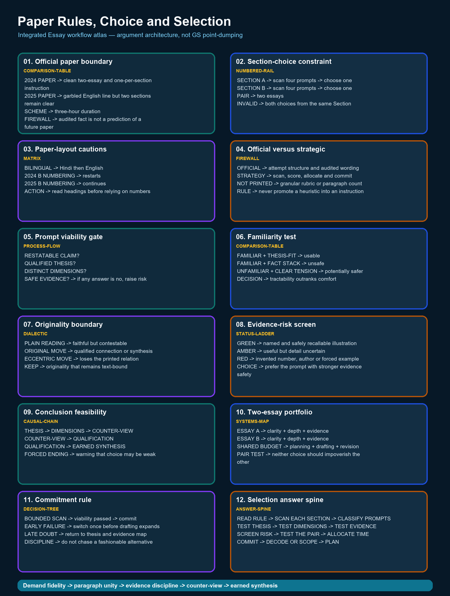

# Paper Rules, Choice and Selection — Complete Essay Knowledge Guide

> Essay-specific learner-v2 contract: one continuous knowledge guide, one question-only workbook and one separate solutions document. No artificial learning-session sequence and no MCQs.

## EASY-FIRST ROUTE AND ESSAY DEMAND

**Purpose:** Paper Rules, Choice and Selection owns one stage of the Essay workflow. Learn the exact demand first, practise the stage in isolation, then reconnect it to thesis, paragraph unity, counter-view and conclusion.

| Stage | Learner question | Output |
|---|---|---|
| Understand | What relationship does the prompt assert? | Plain-language restatement |
| Build | What single qualified thesis controls the response? | Thesis + argument map |
| Develop | What distinct job does each paragraph perform? | Coherent paragraph rail |
| Test | What is the strongest counter-view or limiting condition? | Qualified synthesis |
| Finish | Does the conclusion return to the exact proposition? | Earned close |



*The atlas uses Essay information grammar: demand, idea tree, argument map, evidence, paragraph rail, counter-view and synthesis.*

### Integrated ASCII workflow

```text
ESSAY WORKFLOW — PAPER RULES, CHOICE AND SELECTION
===================================================
PROMPT -> DEMAND -> THESIS -> ARGUMENT JOBS -> EVIDENCE -> COUNTER-VIEW
       -> QUALIFIED SYNTHESIS -> CONCLUSION -> REVISION

PANEL 01/12 — Official paper boundary [comparison-table]
2024 PAPER -> clean two-essay and one-per-section instruction
2025 PAPER -> garbled English line but two sections remain clear
SCHEME -> three-hour duration
FIREWALL -> audited fact is not a prediction of a future paper
  |
  v
PANEL 02/12 — Section-choice constraint [numbered-rail]
SECTION A -> scan four prompts -> choose one
SECTION B -> scan four prompts -> choose one
PAIR -> two essays
INVALID -> both choices from the same Section
  |
  v
PANEL 03/12 — Paper-layout cautions [matrix]
BILINGUAL -> Hindi then English
2024 B NUMBERING -> restarts
2025 B NUMBERING -> continues
ACTION -> read headings before relying on numbers
  |
  v
PANEL 04/12 — Official versus strategic [firewall]
OFFICIAL -> attempt structure and audited wording
STRATEGY -> scan, score, allocate and commit
NOT PRINTED -> granular rubric or paragraph count
RULE -> never promote a heuristic into an instruction
  |
  v
PANEL 05/12 — Prompt viability gate [process-flow]
RESTATABLE CLAIM?
QUALIFIED THESIS?
DISTINCT DIMENSIONS?
SAFE EVIDENCE? -> if any answer is no, raise risk
  |
  v
PANEL 06/12 — Familiarity test [comparison-table]
FAMILIAR + THESIS-FIT -> usable
FAMILIAR + FACT STACK -> unsafe
UNFAMILIAR + CLEAR TENSION -> potentially safer
DECISION -> tractability outranks comfort
  |
  v
PANEL 07/12 — Originality boundary [dialectic]
PLAIN READING -> faithful but contestable
ORIGINAL MOVE -> qualified connection or synthesis
ECCENTRIC MOVE -> loses the printed relation
KEEP -> originality that remains text-bound
  |
  v
PANEL 08/12 — Evidence-risk screen [status-ladder]
GREEN -> named and safely recallable illustration
AMBER -> useful but detail uncertain
RED -> invented number, author or forced example
CHOICE -> prefer the prompt with stronger evidence safety
  |
  v
PANEL 09/12 — Conclusion feasibility [causal-chain]
THESIS -> DIMENSIONS -> COUNTER-VIEW
COUNTER-VIEW -> QUALIFICATION
QUALIFICATION -> EARNED SYNTHESIS
FORCED ENDING -> warning that choice may be weak
  |
  v
PANEL 10/12 — Two-essay portfolio [systems-map]
ESSAY A -> clarity + depth + evidence
ESSAY B -> clarity + depth + evidence
SHARED BUDGET -> planning + drafting + revision
PAIR TEST -> neither choice should impoverish the other
  |
  v
PANEL 11/12 — Commitment rule [decision-tree]
BOUNDED SCAN -> viability passed -> commit
EARLY FAILURE -> switch once before drafting expands
LATE DOUBT -> return to thesis and evidence map
DISCIPLINE -> do not chase a fashionable alternative
  |
  v
PANEL 12/12 — Selection answer spine [answer-spine]
READ RULE -> SCAN EACH SECTION -> CLASSIFY PROMPTS
TEST THESIS -> TEST DIMENSIONS -> TEST EVIDENCE
SCREEN RISK -> TEST THE PAIR -> ALLOCATE TIME
COMMIT -> DECODE OR SCOPE -> PLAN
  |
  v
FINAL CONTROL
One controlling thesis; each paragraph performs a distinct argument job.
Examples prove or qualify a claim; they never replace reasoning.
No invented quotation, statistic, report, author or official rubric.
```

## COMPLETE BASIC KNOWLEDGE

> **Subject:** Essay | **Tier:** Must-Do | **GS Paper:** Essay (General
> Studies Paper — Essay, Mains).
> **Core area:** Paper mechanics; separating audited fact from strategy;
> a simple, risk-aware method for choosing one topic from each Section.
> **Grounded in:** UPSC Essay PYQ corpus — V1 directly verified locally
> for 2018–2025 and V2 carried-forward practice wording for 2013–2017
> (see `../PYQ-Corpus-2013-2025.md`); `../00_Master-Framework.md`
> Sections 1, 3, 11.
> **Research cutoff:** 18 July 2026.
> **Tags:** ✅ verified fact | ⚠️ strategy/inference | 📰 dated anchor | ❌ trap/boundary.
> **Companion:** `../advanced/01_Paper-Rules-Choice-and-Selection.md`

---

## 1. Purpose and scope

This topic answers two questions before any writing begins: *what does
the paper actually require*, and *how should a candidate choose which of
the eight-plus-eight displayed prompts to attempt*? It does not teach
decoding technique (see `02`/`03`) or drafting technique (see `05`–`07`)
— it teaches the upstream decision that determines how easy those later
steps will be.

## 2. Core terms in plain language

- **Section:** a labelled group of four prompts; the candidate must pick
  exactly one topic from each of the two displayed Sections.
- **Prompt:** the single sentence/aphorism or issue-statement to be
  written on — quoted, not paraphrased, when referenced in planning.
- **Thesis-fit:** how easily a prompt yields one qualified, defensible
  central argument (see `05`).
- **Dimension count:** how many genuinely distinct angles (not
  restatements of the same point) a prompt supports (see `04`).
- **Evidence availability:** how many safe, verifiable Indian or global
  illustrations you can actually recall for a prompt (see `12`).

## 3. ✅ Exam facts / source basis

The current corpus ledger records 2018–2025 as **V1 — directly verified
locally** and 2013–2017 as **V2 — carried-forward, not locally
verifiable**. The paper-mechanics facts below are illustrated with the
2024 and 2025 papers, whose printed wording is reproduced in the ledger.

- ✅ **2024 instruction, exactly as printed:** "Write two essays, choosing
  one topic from each of the following Sections A and B, in about
  1000-1200 words each:" followed by the marks line "(125 × 2 = 250)".
- ❌ **2025 instruction is garbled in the printed paper:** "Write two
  essays, choosing one topic from each of the following Sections A as in
  about 1000 – 1200 words each:". ✅ The requirement is still
  unambiguous from the paper's Hindi line and its two printed section
  headings — two essays, one from each of Sections A and B, about
  1000–1200 words each — but do not quote the 2025 line as clean English.
- ✅ **Printed numbering is not a stable convention.** 2024 restarts
  Section B at 1–4; 2025 continues Section B at 5–8. This folder's
  `B5`–`B8` labels are an internal reference scheme, not the 2024 paper's
  printed numbers.
- ✅ Both years display **four prompts per Section**, print each topic
  **bilingually (Hindi then English)**, and require **one topic chosen
  from each Section** — never two from the same Section.
- ❌ **Not printed in either locally held paper:** any "Time Allowed"
  header, a 2025 marks line, an author beside any prompt, or any marking
  rubric/weightage. ✅ The separate official examination scheme supplies
  the **three-hour** Essay duration; no phase split is official.
- See `../PYQ-Corpus-2013-2025.md` for all 100 prompts and each year's
  verification level: V1 for 2018–2025 and V2 for 2013–2017.

⚠️ **Practical consequence for choice:** because the paper's own numbering
and even its instruction line vary year to year, spend the first reading
confirming the *structural* rule (one from each Section) rather than
assuming any layout you have seen in a mock paper.

## 4. The central idea and common misreading

⚠️ **Central idea:** topic choice is a strategic decision made on the
basis of thesis-fit, dimension count and evidence availability — not
simple familiarity. ❌ **Common misreading:** picking a prompt because it
sounds close to a favourite GS subject (e.g. choosing "Empires of the
mind" purely because you like Science & Technology) without first
checking whether you can actually form one qualified thesis and recall
two or three safe illustrations for it. A topic that feels unfamiliar but
decodes cleanly (most aphorisms do, once you apply `02`) is frequently
the safer choice.

## 5. Basic scan questions

Ask these of every displayed prompt within the first few minutes:

1. Can I restate this prompt's core claim in one plain sentence?
2. Is this an aphorism (needs decoding, see `02`) or an issue-statement
   (needs scoping, see `03`)?
3. Can I already name two distinct dimensions for it (see `04`)?
4. Can I already name one Indian illustration that fits without forcing
   it (see `12`)?
5. Does a workable thesis come to mind within about a minute (see `05`)?

## 6. Comparison grid

⚠️ Use a quick grid — not a full essay plan — to compare shortlisted
prompts before committing:

| Candidate prompt | Thesis comes easily? | ≥2 real dimensions? | ≥2 safe illustrations? | Conclusion risk (forced/earned?) |
|---|---|---|---|---|
| e.g. 2024-A3 "Happiness is the path" | Yes — process vs. destination | Individual, policy, consumption | Yes | Earned — flourishing as process |
| e.g. 2024-A2 "Empires of the mind" | Slower — needs "empire" redefined | Education, digital divide, platform power | Partial | Needs care to avoid forced ending |

Score honestly; a prompt with weaker fit in two or more columns is
riskier than it looks at first read.

## 7. India-first illustration starters

⚠️ Before committing to a prompt, recall — do not invent — at least one
Indian illustration per likely dimension: an institution, a policy
episode, a well-known social pattern, or a documented event. If nothing
comes to mind without forcing it, that is itself useful information
about the prompt's risk (see topic `12` for the full verified-example
discipline).

## 8. Thesis options and selection

⚠️ For each shortlisted prompt, draft one candidate thesis sentence
before final choice — not a full outline. Choose the prompt whose thesis
sentence is (a) a genuine claim, not a restatement of the prompt, (b)
qualified (acknowledges a limit or condition), and (c) supportable by
the illustrations recalled in Section 7. Full thesis-construction method
in `05`.

## 8a. Two-essay portfolio gate

⚠️ Choose one prompt from **each** Section, then test the pair before
committing to either draft:

1. Does each essay independently have a qualified thesis, two distinct
   paragraph-clusters and safe evidence?
2. Does either choice consume so much planning time or uncertain recall
   that the other essay will be rushed?
3. Are you relying on the same thin, half-remembered illustration for
   both essays? If so, replace the weaker choice.

The better pair is not necessarily the two most familiar prompts; it is
the pair for which both essays remain defensible under the same time
budget. This is a final gate, not an excuse to over-deliberate.

## 9. Simple essay architecture

⚠️ A brief architecture preview helps the choice: sketch three to four
one-line paragraph clusters per shortlisted prompt (opening idea,
two–three developed dimensions, a synthesis/counter-view paragraph,
closing idea). If a prompt only yields two clusters even after
Section 6's grid, it is under-developed for 1000–1200 words. Full
architecture method in `07`.

## 10. Opening, body and closure moves

⚠️ Check feasibility, not final wording: can you picture a relevant
opening (not a forced anecdote) and a closing that follows naturally from
your draft thesis, without repeating the introduction verbatim? If both
feel forced for a shortlisted prompt, prefer the alternative. Full method
in `06`.

## 11. ❌ Traps and repair moves

- ❌ **Choosing by subject-liking alone.** → Repair: run the Section 5–8
  checks before committing; familiarity without thesis-fit is a false
  signal.
- ❌ **Attempting two prompts from the same Section.** → Repair: confirm
  one-per-Section before writing a single word; this is a hard paper
  rule, not a style choice.
- ❌ **Treating the word-count instruction as approximate.** → Repair:
  plan toward the printed 1000–1200-word range (see `13`) rather than a
  much shorter or longer draft.
- ❌ **Assuming a prompt needs a "clever" or obscure reading.** → Repair:
  a plain, well-qualified reading defended with real illustrations
  outperforms a strained, ornamental interpretation.

## 12. Timed micro-drill and self-check

**5-minute drill:** Using `../README.md`'s full prompt index, pick any
one 2024 Section and one 2025 Section at random. For each of the four
prompts in each, write one line for: thesis-fit, dimension count and one
recalled Indian illustration. Circle the prompt in each Section you would
actually choose, and state why in one sentence.

**Self-check:** Did you choose the most *familiar-sounding* prompt, or
the one that scored best on Sections 5–8's checks? If they differ,
re-examine your reasoning before moving to `02`.

## CORE APPLICATION LAB

### Paragraph unity rail

```text
CLAIM -> NAMED EXAMPLE -> MECHANISM -> LIMIT -> BRIDGE TO NEXT CLAIM
```

A paragraph is not a container for all facts on one dimension. It must advance the thesis through one principal claim, explain the relevance of its evidence and end with a qualification or transition.

### Evidence discipline

- Prefer a modest, accurate example to an impressive but uncertain statistic.
- Do not assign an author to an aphorism unless the audited paper prints one.
- Constitutional provisions, judgments, institutions and programmes must be used for a precise proposition, not as ornamental names.
- Cross-GS knowledge should enrich an argument; it must not turn the essay into a catalogue.

### Counter-view and synthesis

State the strongest objection fairly, show what it changes, retain the part of the thesis that survives and specify the conditions under which the final claim is defensible.

## SOLVED ESSAYS AND MODEL ANSWERS

### APPLICATION CARD 1 — 2024 Essay instructions

**Printed demand:** Write two essays, choosing one topic from each of the following Sections A and B, in about 1000-1200 words each:

**Status:** Exact locally audited instruction; the associated marks line is (125 × 2 = 250).

Use this card only to verify the paper boundary and selection method; it is not a full essay topic.

### SOLVED ESSAY 2 — 2024-A2

#### Prompt

The empires of the futures will be the empires of the mind.

#### Verification and attribution boundary

Exact V1 wording from the local official paper; used as a selection application, not an official model answer. No author is attributed unless the audited paper itself prints one; this model uses no invented quotation, statistic, report or official marking rule.

#### Prompt interpretation

Identify the operative relation, surface its tension, state the scope and preserve one counter-reading. Do not replace the proposition with a broad GS subject label.

#### Central thesis

Future power will depend increasingly on the capacity to create, organise and democratise knowledge, but an empire of the mind is legitimate only when intellectual power enlarges freedom rather than reproducing domination through technology or exclusion.

#### Complete outline

1. **Knowledge as power:** Scientific discovery, education and innovation increasingly determine economic and strategic capability.
2. **Human capital:** A society's schools, universities, skills and public reasoning shape whether demographic scale becomes creative capacity.
3. **Digital power:** Data, algorithms, platforms and artificial intelligence can influence choices without territorial conquest.
4. **Culture and ideas:** Languages, narratives, universities and media create durable influence by shaping what societies consider possible or desirable.
5. **Democratic access:** Knowledge concentration produces a new hierarchy unless digital access, literacy and research opportunities are broadly shared.
6. **Ethical boundary:** Intellectual leadership becomes imperial domination when surveillance, manipulation or monopoly displaces autonomy.

#### Full model essay — 1009 words

The statement, “The empires of the futures will be the empires of the mind.”, is not an invitation to display every fact associated with its nouns. It asks the writer to identify the relationship asserted by the sentence, test that relationship across different settings and arrive at a qualified judgment. Future power will depend increasingly on the capacity to create, organise and democratise knowledge, but an empire of the mind is legitimate only when intellectual power enlarges freedom rather than reproducing domination through technology or exclusion. The essay will therefore move from the central idea to its individual, institutional and public consequences, then confront the strongest limit before returning to an earned synthesis.

To begin with, **knowledge as power** gives the argument a distinct job. Scientific discovery, education and innovation increasingly determine economic and strategic capability. Article 21A and India's public education system show that knowledge power depends on broad access, not elite possession. This example is useful not because it is decorative, but because it shows a mechanism: choices, institutions or incentives convert an abstract proposition into a lived consequence. The paragraph should therefore connect the education illustration back to the controlling thesis. Its limit must also remain visible: one example establishes a plausible route, not a universal law, and a different social position may experience the same process differently.

At the institutional level, **human capital** gives the argument a distinct job. A society's schools, universities, skills and public reasoning shape whether demographic scale becomes creative capacity. ISRO demonstrates how accumulated scientific capability can enlarge strategic autonomy and public confidence. This example is useful not because it is decorative, but because it shows a mechanism: choices, institutions or incentives convert an abstract proposition into a lived consequence. The paragraph should therefore connect the science illustration back to the controlling thesis. Its limit must also remain visible: one example establishes a plausible route, not a universal law, and a different social position may experience the same process differently.

The argument becomes deeper when, **digital power** gives the argument a distinct job. Data, algorithms, platforms and artificial intelligence can influence choices without territorial conquest. India's digital public infrastructure illustrates how code and institutional design can shape everyday economic participation. This example is useful not because it is decorative, but because it shows a mechanism: choices, institutions or incentives convert an abstract proposition into a lived consequence. The paragraph should therefore connect the digital systems illustration back to the controlling thesis. Its limit must also remain visible: one example establishes a plausible route, not a universal law, and a different social position may experience the same process differently.

An Indian illustration clarifies this, **culture and ideas** gives the argument a distinct job. Languages, narratives, universities and media create durable influence by shaping what societies consider possible or desirable. Indian cinema, literature and universities project influence by shaping imagination rather than controlling territory. This example is useful not because it is decorative, but because it shows a mechanism: choices, institutions or incentives convert an abstract proposition into a lived consequence. The paragraph should therefore connect the culture illustration back to the controlling thesis. Its limit must also remain visible: one example establishes a plausible route, not a universal law, and a different social position may experience the same process differently.

Yet breadth without qualification is unsafe, **democratic access** gives the argument a distinct job. Knowledge concentration produces a new hierarchy unless digital access, literacy and research opportunities are broadly shared. The digital divide shows that a knowledge economy can reproduce hierarchy when devices, language and skills remain unequal. This example is useful not because it is decorative, but because it shows a mechanism: choices, institutions or incentives convert an abstract proposition into a lived consequence. The paragraph should therefore connect the exclusion illustration back to the controlling thesis. Its limit must also remain visible: one example establishes a plausible route, not a universal law, and a different social position may experience the same process differently.

A further dimension concerns distribution, **ethical boundary** gives the argument a distinct job. Intellectual leadership becomes imperial domination when surveillance, manipulation or monopoly displaces autonomy. Constitutional liberty and privacy supply limits against surveillance or manipulation by knowledge-rich institutions. This example is useful not because it is decorative, but because it shows a mechanism: choices, institutions or incentives convert an abstract proposition into a lived consequence. The paragraph should therefore connect the ethics illustration back to the controlling thesis. Its limit must also remain visible: one example establishes a plausible route, not a universal law, and a different social position may experience the same process differently.

The strongest counter-view cannot be hidden in a token sentence. Material resources, geography and military capacity will not disappear; knowledge magnifies these assets rather than making them irrelevant. This objection matters because it prevents the essay from turning a suggestive proposition into an absolute one. It also forces a distinction between necessary and sufficient conditions: the central idea may explain an important part of the outcome without exhausting every material, institutional or historical cause. A credible essay absorbs this challenge and narrows its claim rather than dismissing it.

A qualified synthesis now becomes possible. The competing positions are not simply split into a mechanical 'both sides' balance. Instead, the essay asks when the main proposition is persuasive, which safeguards or capabilities make it constructive, and when its apparent wisdom becomes exclusion, passivity or overstatement. This move preserves the moral and philosophical force of the prompt while grounding it in Indian constitutional values, public institutions and everyday experience.

The humane empire of the future should therefore be a republic of minds: innovative yet open, powerful yet accountable, and competitive without closing the gates of knowledge. The conclusion earns its place because it does not add a new catalogue. It returns to the exact proposition after the argument has changed its meaning: the opening claim is now bounded by evidence, counter-view and conditions. That movement from assertion to qualified understanding is what distinguishes an Essay argument from a GS answer arranged under many headings.

#### Paragraph-level reasoning

| Paragraph | Argument job | Construction |
|---:|---|---|
| 1 | Knowledge as power | Distinct claim -> named illustration -> mechanism -> limitation |
| 2 | Human capital | Distinct claim -> named illustration -> mechanism -> limitation |
| 3 | Digital power | Distinct claim -> named illustration -> mechanism -> limitation |
| 4 | Culture and ideas | Distinct claim -> named illustration -> mechanism -> limitation |
| 5 | Democratic access | Distinct claim -> named illustration -> mechanism -> limitation |
| 6 | Ethical boundary | Distinct claim -> named illustration -> mechanism -> limitation |

#### Evidence and example audit

- **Education:** Article 21A and India's public education system show that knowledge power depends on broad access, not elite possession.
- **Science:** ISRO demonstrates how accumulated scientific capability can enlarge strategic autonomy and public confidence.
- **Digital systems:** India's digital public infrastructure illustrates how code and institutional design can shape everyday economic participation.
- **Culture:** Indian cinema, literature and universities project influence by shaping imagination rather than controlling territory.
- **Exclusion:** The digital divide shows that a knowledge economy can reproduce hierarchy when devices, language and skills remain unequal.
- **Ethics:** Constitutional liberty and privacy supply limits against surveillance or manipulation by knowledge-rich institutions.

#### Counterargument and qualified synthesis

**Counter-view:** Material resources, geography and military capacity will not disappear; knowledge magnifies these assets rather than making them irrelevant.

**Synthesis rule:** retain the insight, specify its conditions and show where an unqualified version becomes unjust, ineffective or incomplete.

#### Why this earns marks

- It answers the printed relationship rather than an adjacent topic.
- One thesis controls the outline and every paragraph performs a new job.
- India-centric examples are integrated through analysis, not dumped.
- The counter-view changes the thesis and leads to an earned synthesis.
- The conclusion returns to the prompt at a deeper, qualified level.

#### How to improve under exam conditions

- Replace any example you cannot state safely with a simpler verified one.
- Shorten descriptive setup before cutting analysis or qualification.
- Check that every transition explains why the next paragraph follows.
- Reserve the final minutes for prompt words, paragraph unity and risky attributions.

### SOLVED ESSAY 3 — 2024-B5

#### Prompt

Social media is triggering 'Fear of Missing Out' amongst the youth precipitating depression and loneliness.

#### Verification and attribution boundary

Exact V1 wording from the local official paper; used to contrast issue-prompt tractability with familiarity risk. No author is attributed unless the audited paper itself prints one; this model uses no invented quotation, statistic, report or official marking rule.

#### Prompt interpretation

Identify the operative relation, surface its tension, state the scope and preserve one counter-reading. Do not replace the proposition with a broad GS subject label.

#### Central thesis

Social media can intensify FOMO by turning social comparison into a continuous, quantified and commercially amplified experience, yet youth distress arises from the interaction of platform design, social conditions and individual vulnerability rather than technology alone.

#### Complete outline

1. **Comparison architecture:** Curated highlights make ordinary life appear deficient and convert belonging into a visible competition for attention.
2. **Attention economy:** Notifications, streaks and algorithmic recommendation reward repeated checking and make absence feel like social loss.
3. **Loneliness paradox:** High connectivity can coexist with weak intimacy when interaction is performative, fragmented or measured through public approval.
4. **Unequal vulnerability:** Adolescents facing exclusion, academic pressure or weak support systems may experience the same platforms more harmfully.
5. **Positive capability:** Online communities can also provide expression, learning and support, especially where offline opportunities are limited.
6. **Shared responsibility:** Digital literacy, humane platform design, family communication, counselling and accessible mental-health services must work together.

#### Full model essay — 1022 words

The statement, “Social media is triggering 'Fear of Missing Out' amongst the youth precipitating depression and loneliness.”, is not an invitation to display every fact associated with its nouns. It asks the writer to identify the relationship asserted by the sentence, test that relationship across different settings and arrive at a qualified judgment. Social media can intensify FOMO by turning social comparison into a continuous, quantified and commercially amplified experience, yet youth distress arises from the interaction of platform design, social conditions and individual vulnerability rather than technology alone. The essay will therefore move from the central idea to its individual, institutional and public consequences, then confront the strongest limit before returning to an earned synthesis.

To begin with, **comparison architecture** gives the argument a distinct job. Curated highlights make ordinary life appear deficient and convert belonging into a visible competition for attention. Curated peer feeds in schools and colleges can make ordinary study, friendship and leisure appear inadequate. This example is useful not because it is decorative, but because it shows a mechanism: choices, institutions or incentives convert an abstract proposition into a lived consequence. The paragraph should therefore connect the comparison illustration back to the controlling thesis. Its limit must also remain visible: one example establishes a plausible route, not a universal law, and a different social position may experience the same process differently.

At the institutional level, **attention economy** gives the argument a distinct job. Notifications, streaks and algorithmic recommendation reward repeated checking and make absence feel like social loss. Notifications, streaks and public counts turn attention into a visible contest and make disconnection feel costly. This example is useful not because it is decorative, but because it shows a mechanism: choices, institutions or incentives convert an abstract proposition into a lived consequence. The paragraph should therefore connect the design illustration back to the controlling thesis. Its limit must also remain visible: one example establishes a plausible route, not a universal law, and a different social position may experience the same process differently.

The argument becomes deeper when, **loneliness paradox** gives the argument a distinct job. High connectivity can coexist with weak intimacy when interaction is performative, fragmented or measured through public approval. Online contact can widen networks while still failing to provide the trust and presence associated with close friendship. This example is useful not because it is decorative, but because it shows a mechanism: choices, institutions or incentives convert an abstract proposition into a lived consequence. The paragraph should therefore connect the belonging illustration back to the controlling thesis. Its limit must also remain visible: one example establishes a plausible route, not a universal law, and a different social position may experience the same process differently.

An Indian illustration clarifies this, **unequal vulnerability** gives the argument a distinct job. Adolescents facing exclusion, academic pressure or weak support systems may experience the same platforms more harmfully. Academic pressure, exclusion and weak family support can intensify the same platform experience for some adolescents. This example is useful not because it is decorative, but because it shows a mechanism: choices, institutions or incentives convert an abstract proposition into a lived consequence. The paragraph should therefore connect the vulnerability illustration back to the controlling thesis. Its limit must also remain visible: one example establishes a plausible route, not a universal law, and a different social position may experience the same process differently.

Yet breadth without qualification is unsafe, **positive capability** gives the argument a distinct job. Online communities can also provide expression, learning and support, especially where offline opportunities are limited. Online learning groups and support communities show that digital connection can also reduce isolation. This example is useful not because it is decorative, but because it shows a mechanism: choices, institutions or incentives convert an abstract proposition into a lived consequence. The paragraph should therefore connect the capability illustration back to the controlling thesis. Its limit must also remain visible: one example establishes a plausible route, not a universal law, and a different social position may experience the same process differently.

A further dimension concerns distribution, **shared responsibility** gives the argument a distinct job. Digital literacy, humane platform design, family communication, counselling and accessible mental-health services must work together. Digital literacy, counselling, family dialogue and humane platform design distribute responsibility beyond the individual user. This example is useful not because it is decorative, but because it shows a mechanism: choices, institutions or incentives convert an abstract proposition into a lived consequence. The paragraph should therefore connect the response illustration back to the controlling thesis. Its limit must also remain visible: one example establishes a plausible route, not a universal law, and a different social position may experience the same process differently.

The strongest counter-view cannot be hidden in a token sentence. Blaming social media alone ignores family stress, unemployment, educational pressure and pre-existing mental-health conditions. This objection matters because it prevents the essay from turning a suggestive proposition into an absolute one. It also forces a distinction between necessary and sufficient conditions: the central idea may explain an important part of the outcome without exhausting every material, institutional or historical cause. A credible essay absorbs this challenge and narrows its claim rather than dismissing it.

A qualified synthesis now becomes possible. The competing positions are not simply split into a mechanical 'both sides' balance. Instead, the essay asks when the main proposition is persuasive, which safeguards or capabilities make it constructive, and when its apparent wisdom becomes exclusion, passivity or overstatement. This move preserves the moral and philosophical force of the prompt while grounding it in Indian constitutional values, public institutions and everyday experience.

The answer is neither digital abstinence nor technological fatalism, but an online environment in which connection serves human relationships instead of converting them into an endless status contest. The conclusion earns its place because it does not add a new catalogue. It returns to the exact proposition after the argument has changed its meaning: the opening claim is now bounded by evidence, counter-view and conditions. That movement from assertion to qualified understanding is what distinguishes an Essay argument from a GS answer arranged under many headings.

#### Paragraph-level reasoning

| Paragraph | Argument job | Construction |
|---:|---|---|
| 1 | Comparison architecture | Distinct claim -> named illustration -> mechanism -> limitation |
| 2 | Attention economy | Distinct claim -> named illustration -> mechanism -> limitation |
| 3 | Loneliness paradox | Distinct claim -> named illustration -> mechanism -> limitation |
| 4 | Unequal vulnerability | Distinct claim -> named illustration -> mechanism -> limitation |
| 5 | Positive capability | Distinct claim -> named illustration -> mechanism -> limitation |
| 6 | Shared responsibility | Distinct claim -> named illustration -> mechanism -> limitation |

#### Evidence and example audit

- **Comparison:** Curated peer feeds in schools and colleges can make ordinary study, friendship and leisure appear inadequate.
- **Design:** Notifications, streaks and public counts turn attention into a visible contest and make disconnection feel costly.
- **Belonging:** Online contact can widen networks while still failing to provide the trust and presence associated with close friendship.
- **Vulnerability:** Academic pressure, exclusion and weak family support can intensify the same platform experience for some adolescents.
- **Capability:** Online learning groups and support communities show that digital connection can also reduce isolation.
- **Response:** Digital literacy, counselling, family dialogue and humane platform design distribute responsibility beyond the individual user.

#### Counterargument and qualified synthesis

**Counter-view:** Blaming social media alone ignores family stress, unemployment, educational pressure and pre-existing mental-health conditions.

**Synthesis rule:** retain the insight, specify its conditions and show where an unqualified version becomes unjust, ineffective or incomplete.

#### Why this earns marks

- It answers the printed relationship rather than an adjacent topic.
- One thesis controls the outline and every paragraph performs a new job.
- India-centric examples are integrated through analysis, not dumped.
- The counter-view changes the thesis and leads to an earned synthesis.
- The conclusion returns to the prompt at a deeper, qualified level.

#### How to improve under exam conditions

- Replace any example you cannot state safely with a simpler verified one.
- Shorten descriptive setup before cutting analysis or qualification.
- Check that every transition explains why the next paragraph follows.
- Reserve the final minutes for prompt words, paragraph unity and risky attributions.

## EXECUTABLE EXAM STRATEGY

The printed paper rule controls; the schedule below is a candidate strategy and must be adjusted to handwriting speed.

| Phase | Suggested time | Risk control |
|---|---:|---|
| Read both Sections and choose a pair | 10 minutes | Confirm one prompt from each Section; reject unsafe attribution/data dependence |
| Plan Essay 1 | 15 minutes | Restatement, thesis, 6-8 paragraph jobs, evidence and counter-view |
| Draft Essay 1 | 65 minutes | Keep paragraph unity and transitions visible |
| Revise Essay 1 | 5 minutes | Prompt words, evidence, repetition and conclusion |
| Plan Essay 2 | 15 minutes | Re-run the same gates independently |
| Draft Essay 2 | 65 minutes | Protect analysis from late fact-dumping |
| Revise Essay 2 | 5 minutes | Attribution, coherence and unfinished sentences |

## OPTIONAL ADVANCED DEPTH — NOT REQUIRED FOR A CORE ESSAY

> **Subject:** Essay | **Tier:** Advanced | **GS Paper:** Essay (General
> Studies Paper — Essay, Mains).
> **Core area:** Choice as a portfolio/risk decision; the hidden
> assumptions inside "pick your favourite topic" advice; a decision
> protocol that survives exam-day time pressure.
> **Grounded in:** UPSC Essay PYQ corpus — V1 directly verified locally
> for 2018–2025 and V2 carried-forward practice wording for 2013–2017
> (see `../PYQ-Corpus-2013-2025.md`); `../00_Master-Framework.md`
> Sections 1, 3, 11.
> **Research cutoff:** 18 July 2026.
> **Tags:** ✅ verified fact | ⚠️ strategy/inference | 📰 dated anchor | ❌ trap/boundary.
> **Companion:** `../basic/01_Paper-Rules-Choice-and-Selection.md`

---

## 1. Advanced proposition and boundary

**Proposition:** ⚠️ topic choice is best modelled as a portfolio decision
under time pressure — you are choosing the prompt with the best
expected combination of thesis-clarity, dimension-depth and
evidence-safety, not the prompt with the highest emotional appeal.
**Boundary:** ❌ this topic does not itself decode any single prompt in
depth (that is `02`/`03`) or build a full argument map (`05`/`08`); it
supplies the upstream selection logic those topics assume has already
been run.

## 2. Concept definition and taxonomy

- **Aphorism prompts** (most of both years' Sections): compressed,
  metaphorical, require decoding before dimension-work is possible.
- **Issue-statement prompts** (e.g. 2024-B5 on social media/FOMO): more
  directly empirical/social, require scoping (`03`) rather than
  metaphor-decoding.
- **High-fit prompt:** thesis emerges within about a minute, ≥2 real
  dimensions, ≥2 recallable illustrations, plausible non-forced
  conclusion.
- **Low-fit prompt:** any of the above missing, *or* only recoverable
  with visible strain (a warning sign under time pressure, not merely a
  stylistic weakness).

## 3. Tension pairs and hidden assumptions

- **Interest vs. tractability:** the assumption that liking a subject
  guarantees writing quality is unsafe — interest without a qualified
  thesis produces an enthusiastic but shapeless essay.
- **Familiarity vs. depth:** a "familiar" topic invites GS-answer
  stacking (fact lists) rather than argument; an unfamiliar aphorism
  forces argument-first thinking, which the paper actually rewards.
- **Speed vs. reversibility:** choice happens early and is costly to
  reverse mid-attempt; the hidden assumption in "just start writing" is
  that later correction is cheap — it is not, given the fixed time
  budget (`13`).

## 4. Levels of analysis and temporal-spatial scale

Selection logic should be checked at three levels: (a) the sentence
level — can the prompt's own words support a thesis without distortion;
(b) the essay level — will 10–12 paragraphs (`07`) sustain interest and
argument without repetition; (c) the exam level — does the choice, given
your remaining time budget for both essays (`13`), still allow adequate
planning and revision for the second essay.

## 5. Stakeholder map and distributional effects

The "stakeholders" in a choice decision are internal to the candidate's
own performance: the introduction/conclusion quality, the second essay's
available time, and the risk of an unrecoverable topic-drift mid-draft.
⚠️ Unlike most Essay-topic stakeholder maps (which describe people
affected by a policy), this one describes *trade-offs across the
candidate's own two essays* — time spent over-analysing choice is time
not spent planning either essay.

## 6. Causality, mechanisms and feedback loops

```text
WEAK CHOICE FILTER (familiarity only)
        |
        v
THIN THESIS or GS-STYLE FACT LIST
        |
        v
WEAK PARAGRAPH LINKS (nothing to argue, so paragraphs restate)
        |
        v
FORCED CONCLUSION
```
versus
```text
STRONG CHOICE FILTER (thesis-fit + dimension + evidence check)
        |
        v
QUALIFIED THESIS EMERGES EARLY
        |
        v
ARGUMENT MAP FEASIBLE (05/08)
        |
        v
EARNED, NON-REPETITIVE CONCLUSION
```
⚠️ The feedback loop matters: a weak early choice cannot usually be
repaired by better paragraph-level writing later — the failure
propagates forward through the whole essay.

## 7. Necessary/sufficient conditions and exceptions

Thesis-fit, dimension count and evidence availability are each
**necessary but not individually sufficient** conditions for a good
choice — a prompt can pass all three checks and still fail if the
candidate cannot manage a non-forced conclusion (Section 6 above), which
is why Section 5–8 of the basic file explicitly checks conclusion
feasibility before commitment. ⚠️ **Exception:** under severe time
pressure, a "good enough, fast" choice may beat a marginally better but
slower-to-decide choice — the decision itself has an opportunity cost.

## 8. Paradox, dialectic and counterfactual test

**Paradox:** the topic that feels *hardest* to decode at first glance
(most aphorisms) is often *safer* to write than the topic that feels
easiest (familiar issue-statements), because the aphorism forces
argument-construction from the outset, while the familiar topic invites
fact-stacking that only reveals its thinness at the paragraph-writing
stage. **Counterfactual test:** "If I removed my prior familiarity with
this subject, would the prompt still support a clear thesis and two
distinct dimensions?" If the answer is no, familiarity was doing the
work the prompt itself should be doing.

## 9. Ethical conflict and synthesis

⚠️ There is a minor ethical dimension even here: choosing a topic solely
because it lets you recycle memorised GS content risks an essay that
technically answers a *different, adjacent* question rather than the one
printed — a subtle form of misrepresenting engagement with the actual
prompt. **Synthesis:** treat the prompt's exact wording as the binding
constraint, and treat prior subject knowledge only as a *resource* for
illustrations (`12`), not as a licence to answer a related-but-different
question.

## 10. Evidence/source-risk and India application

✅ Both years' prompts are unattributed and carry printed defects (see
`../README.md`) — an advanced candidate should draw two conclusions from
this. First, the paper is testing original interpretation, not
recall of a "correct," externally sourced reading: there is no canonical
text behind the prompt to be matched against. Second, ❌ a printing defect
is not a cryptic signal — 2024-A2's "empires of the **futures**" is a
slip, not an invitation to write about plural futures, and 2025's garbled
"Sections A as in" instruction line is a typesetting failure, not a change
of rule. Quote as printed; interpret the evident sense. ⚠️ Evidence-risk at
the choice stage means: do not shortlist a prompt whose only available
illustrations are half-remembered statistics you cannot verify under
exam conditions — prefer prompts supportable by institutions, well-known
policy episodes, or documented events you can state without invented
numbers (full discipline in `09`, `12`).

## 11. Advanced structure, paragraph sequencing and style

⚠️ At the choice stage, sequencing is prospective, not yet actual:
mentally sequence three to five paragraph-clusters for each shortlisted
prompt (per `basic/01` Section 9) and check whether the sequence has a
natural progression (cause → consequence → qualification → synthesis)
or whether the clusters are merely parallel restatements of the same
point — the latter signals a thesis that has not yet been sharpened
enough to choose confidently.

## 12. ❌ Failure modes and revision protocol

- ❌ **Sunk-cost persistence:** continuing with a poorly-fitting prompt
  because time was already spent deciding. → Protocol: if Section 6's
  checks fail after five minutes of genuine attempt, switch once, early,
  rather than mid-draft.
- ❌ **Over-deliberation:** spending disproportionate time optimising
  choice at the expense of planning/drafting time. → Protocol: cap
  choice-and-decode time per essay (`13`) and commit once the basic
  checks are passed reasonably well, not perfectly.
- ❌ **Choosing purely to avoid a weaker Section**, ignoring that both
  Sections must still be attempted. → Protocol: apply the same filter to
  all four prompts in *both* Sections before finalising either essay.

## 13. 📰 Dated anchor / practice lab / transfer task

📰 **Dated anchor:** none required for this topic — choice mechanics are
paper-structural, not time-sensitive; do not attach a current-affairs
date merely to satisfy a tagging habit.

**Practice lab:** Using one complete year from
`../PYQ-Corpus-2013-2025.md`,
run the Section 6/Section 7 (basic-file) checks on all eight prompts
from one year within 15 minutes, and record which single prompt you
would commit to and why, in two sentences.

**Transfer task:** Repeat the same 15-minute drill on the other year's
eight prompts on a different day, and compare your reasoning consistency
between the two attempts — log any drift in your criteria in `16`'s
error log.

## CONSOLIDATED REVISION GUIDE

### Rapid recall

### Paper Rules, Choice and Selection: AUDITED PAPER RULES AND DATED BOUNDARY

1. **2024 printed instruction:** The locally audited 2024 paper says: "Write two essays, choosing one topic from each of the following Sections A and B, in about 1000-1200 words each:" and prints "(125 × 2 = 250)".
2. **2025 audited boundary:** The locally audited 2025 English instruction is garbled, but its Hindi line and two section headings still establish two essays, one from each Section, about 1000–1200 words each; that copy prints no marks line.
3. **One-per-section constraint:** The audited 2024 and 2025 papers require one topic from Section A and one from Section B, so selecting two prompts from one Section violates the printed structure.
4. **Four-prompt choice set:** Each audited 2024 and 2025 Section displays four prompts, producing a separate four-way choice within each Section.
5. **Bilingual display:** The audited prompts are printed bilingually, Hindi first and English second; the repository quotes only the audited English line.
6. **Numbering instability:** Printed numbering is not a stable rule: 2024 restarts Section B at 1–4, whereas 2025 continues it at 5–8.
7. **Attribution boundary:** Neither audited 2024 nor 2025 paper prints an author beside any prompt, so selection must not depend on an invented attribution.
8. **Rubric boundary:** The audited papers print no granular marking rubric, examiner weightage or ideal paragraph and example count; internal choice tools are therefore strategy, not official rules.
9. **Duration boundary:** The repository dates the three-hour Essay duration to the official Civil Services Main examination scheme, not to a time header in the locally held 2024–2025 scans.
10. **Rule-strategy firewall:** Official constraints state what must be attempted; topic scanning, time splits, matrices and risk scores are pedagogical strategies that must remain explicitly non-official.
11. **Thesis-fit:** A prompt is high-fit when it quickly yields one contestable, qualified and supportable central claim rather than a restatement or subject label.
12. **Interpretive clarity:** A safe choice allows the candidate to restate the exact proposition and identify whether it needs philosophical decoding, issue scoping or both.
13. **Dimension distinctness:** A viable prompt yields several genuinely different claims or mechanisms; repeated vocabulary around one idea is not multidimensional depth.
14. **Evidence availability:** Selection should favour prompts for which safe, verifiable Indian or global illustrations can be recalled without invented data or forced relevance.
15. **Familiarity limit:** Subject familiarity is useful only when it supports the printed proposition; familiarity alone can trigger a GS-style fact stack on an adjacent topic.
16. **Originality limit:** Originality means a defensible interpretation and synthesis, not an eccentric reading that loses contact with the prompt's words.
17. **Risk screening:** A prompt becomes risky when its thesis is strained, dimensions duplicate, evidence is uncertain, the conclusion is forced or the reading depends on a printing defect.
18. **Two-essay portfolio:** The final choice is a pair decision: both selected prompts must remain defensible under the same total time and evidence budget.
19. **Time allocation:** Choice, planning, drafting and revision allocations are internal execution choices; no phase split should be presented as an official UPSC instruction.
20. **Commitment discipline:** After a bounded scan and viability test, commit before drafting; switch only early when the prompt fails a genuine thesis, dimension or evidence gate.

### Paper Rules, Choice and Selection: CHOICE SIGNALS, FALSE SIGNALS AND RISK FIREWALLS

- Do not convert a locally audited 2024 rule into an unsupported claim about every future paper.
- Do not quote the garbled 2025 English instruction as clean official wording.
- Do not select two prompts from the same Section.
- Do not treat internal B5–B8 labels as stable printed numbering.
- Do not present a choice matrix or time split as an official UPSC rule.
- Do not choose by familiarity, emotional appeal or quotation recognition alone.
- Do not mistake eccentric interpretation for originality.
- Do not commit when evidence depends on half-remembered figures or attributions.
- Do not optimise one essay by leaving the second with an unworkable time budget.
- Do not reverse a viable choice merely because another topic later looks more fashionable.

### Paper Rules, Choice and Selection: TWO-SECTION SELECTION AND COMMITMENT SPINE

```text
CONFIRM THE DATED ONE-PER-SECTION RULE
-> SCAN ALL FOUR PROMPTS IN EACH SECTION
-> CLASSIFY PHILOSOPHICAL ISSUE OR HYBRID
-> TEST THESIS DIMENSIONS EVIDENCE AND CONCLUSION
-> SCREEN ATTRIBUTION PRINTING AND FACT RISK
-> TEST BOTH ESSAYS AGAINST ONE TIME BUDGET
-> COMMIT BEFORE DRAFTING
```

### Paper Rules, Choice and Selection: LIVE UPSC CHECK AND FUTURE-PAPER CAUTION

Rule boundary dated 2026-09-04: use the repository's locally audited 2024–2025 instructions plus the official-scheme duration. Re-check the applicable UPSC notification and paper before asserting a future year's exact rules.

### Final 90-second check

1. Exact proposition answered, not an adjacent GS topic.
2. One qualified thesis controls every paragraph.
3. Examples are accurate, attributable and analytically integrated.
4. Counter-view changes the thesis rather than appearing ceremonially.
5. Transitions explain progression; conclusion returns at a deeper level.
