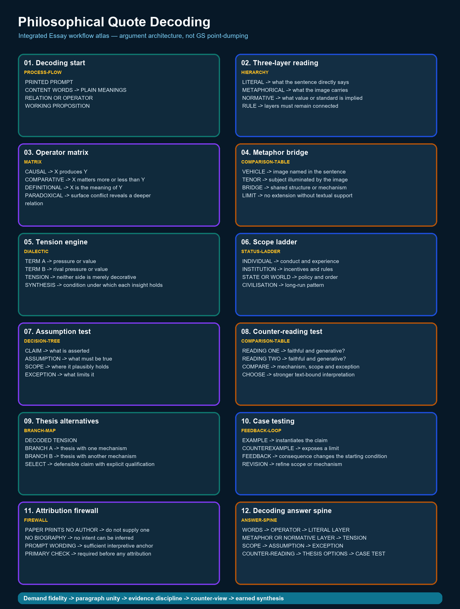

# Philosophical Quote Decoding — Complete Essay Knowledge Guide

> Essay-specific learner-v2 contract: one continuous knowledge guide, one question-only workbook and one separate solutions document. No artificial learning-session sequence and no MCQs.

## EASY-FIRST ROUTE AND ESSAY DEMAND

**Purpose:** Philosophical Quote Decoding owns one stage of the Essay workflow. Learn the exact demand first, practise the stage in isolation, then reconnect it to thesis, paragraph unity, counter-view and conclusion.

| Stage | Learner question | Output |
|---|---|---|
| Understand | What relationship does the prompt assert? | Plain-language restatement |
| Build | What single qualified thesis controls the response? | Thesis + argument map |
| Develop | What distinct job does each paragraph perform? | Coherent paragraph rail |
| Test | What is the strongest counter-view or limiting condition? | Qualified synthesis |
| Finish | Does the conclusion return to the exact proposition? | Earned close |



*The atlas uses Essay information grammar: demand, idea tree, argument map, evidence, paragraph rail, counter-view and synthesis.*

### Integrated ASCII workflow

```text
ESSAY WORKFLOW — PHILOSOPHICAL QUOTE DECODING
==============================================
PROMPT -> DEMAND -> THESIS -> ARGUMENT JOBS -> EVIDENCE -> COUNTER-VIEW
       -> QUALIFIED SYNTHESIS -> CONCLUSION -> REVISION

PANEL 01/12 — Decoding start [process-flow]
PRINTED PROMPT
CONTENT WORDS -> PLAIN MEANINGS
RELATION OR OPERATOR
WORKING PROPOSITION
  |
  v
PANEL 02/12 — Three-layer reading [hierarchy]
LITERAL -> what the sentence directly says
METAPHORICAL -> what the image carries
NORMATIVE -> what value or standard is implied
RULE -> layers must remain connected
  |
  v
PANEL 03/12 — Operator matrix [matrix]
CAUSAL -> X produces Y
COMPARATIVE -> X matters more or less than Y
DEFINITIONAL -> X is the meaning of Y
PARADOXICAL -> surface conflict reveals a deeper relation
  |
  v
PANEL 04/12 — Metaphor bridge [comparison-table]
VEHICLE -> image named in the sentence
TENOR -> subject illuminated by the image
BRIDGE -> shared structure or mechanism
LIMIT -> no extension without textual support
  |
  v
PANEL 05/12 — Tension engine [dialectic]
TERM A -> pressure or value
TERM B -> rival pressure or value
TENSION -> neither side is merely decorative
SYNTHESIS -> condition under which each insight holds
  |
  v
PANEL 06/12 — Scope ladder [status-ladder]
INDIVIDUAL -> conduct and experience
INSTITUTION -> incentives and rules
STATE OR WORLD -> policy and order
CIVILISATION -> long-run pattern
  |
  v
PANEL 07/12 — Assumption test [decision-tree]
CLAIM -> what is asserted
ASSUMPTION -> what must be true
SCOPE -> where it plausibly holds
EXCEPTION -> what limits it
  |
  v
PANEL 08/12 — Counter-reading test [comparison-table]
READING ONE -> faithful and generative?
READING TWO -> faithful and generative?
COMPARE -> mechanism, scope and exception
CHOOSE -> stronger text-bound interpretation
  |
  v
PANEL 09/12 — Thesis alternatives [branch-map]
DECODED TENSION
BRANCH A -> thesis with one mechanism
BRANCH B -> thesis with another mechanism
SELECT -> defensible claim with explicit qualification
  |
  v
PANEL 10/12 — Case testing [feedback-loop]
EXAMPLE -> instantiates the claim
COUNTEREXAMPLE -> exposes a limit
FEEDBACK -> consequence changes the starting condition
REVISION -> refine scope or mechanism
  |
  v
PANEL 11/12 — Attribution firewall [firewall]
PAPER PRINTS NO AUTHOR -> do not supply one
NO BIOGRAPHY -> no intent can be inferred
PROMPT WORDING -> sufficient interpretive anchor
PRIMARY CHECK -> required before any attribution
  |
  v
PANEL 12/12 — Decoding answer spine [answer-spine]
WORDS -> OPERATOR -> LITERAL LAYER
METAPHOR OR NORMATIVE LAYER -> TENSION
SCOPE -> ASSUMPTION -> EXCEPTION
COUNTER-READING -> THESIS OPTIONS -> CASE TEST
  |
  v
FINAL CONTROL
One controlling thesis; each paragraph performs a distinct argument job.
Examples prove or qualify a claim; they never replace reasoning.
No invented quotation, statistic, report, author or official rubric.
```

## COMPLETE BASIC KNOWLEDGE

> **Subject:** Essay | **Tier:** Must-Do | **GS Paper:** Essay (General
> Studies Paper — Essay, Mains).
> **Core area:** Turning a compressed aphorism into a literal meaning, an
> operative tension, a defensible interpretation and a working thesis.
> **Grounded in:** UPSC Essay PYQ corpus — V1 directly verified locally
> for 2018–2025 and V2 carried-forward practice wording for 2013–2017
> (see `../PYQ-Corpus-2013-2025.md`); `../00_Master-Framework.md`
> Section 4.
> **Research cutoff:** 18 July 2026.
> **Tags:** ✅ verified fact | ⚠️ strategy/inference | 📰 dated anchor | ❌ trap/boundary.
> **Companion:** `../advanced/02_Philosophical-Quote-Decoding.md`

---

## 1. Purpose and scope

Most prompts in both audited years are single-sentence aphorisms (e.g.
"Truth knows no color"; "Forests precede civilizations and deserts
follow them"). This topic teaches a repeatable method to move from the
literal sentence to a defensible essay-ready reading. It does not cover
issue-based prompts like 2024-B5 (FOMO) — see `03` — or thesis
construction proper — see `05`.

## 2. Core terms in plain language

- **Literal meaning:** what the sentence says if read with no
  metaphorical extension.
- **Operative tension:** the underlying opposition the aphorism sets up
  (e.g. process vs. destination; restraint vs. action; simplicity vs.
  complexity).
- **Scope of the claim:** who or what the aphorism is really about once
  extended — an individual, an institution, a civilisation, or several
  at once.
- **Defensible interpretation:** a reading you can sustain for 1000–1200
  words without contradicting the sentence's own wording.

## 3. ✅ Exam facts / source basis

- ✅ All 16 recent prompts (2024, 2025) are printed **without any author
  attribution**; the full 100-prompt ledger, with each year's verification
  level, is `../PYQ-Corpus-2013-2025.md`.
- ✅ **Quote the paper, not the tidy version.** Read directly from the
  official PDFs, 2024-A2 prints "The empires of the **futures** will be
  the empires of the mind" and 2024-A3 prints "There is no path to
  happiness**,** Happiness is the path" — plural "futures", and a comma
  rather than a semicolon. Coaching reproductions commonly normalise
  both. ❌ Do not.
- ❌ A printing defect is not a hidden meaning. Decode the evident sense
  of the sentence; an essay arguing that "futures" (plural) signals
  multiple possible futures is answering a question the paper did not ask.
- ⚠️ Because no author is given, this folder treats every prompt as a
  **free-standing proposition to be interpreted on its own terms** —
  there is no "correct," externally sourced reading to recall.

## 3a. Philosophical prompt vs. issue prompt — which method applies

⚠️ Deciding this in the first thirty seconds saves the whole attempt,
because the two prompt types need different first moves.

| | Philosophical prompt (this file, `02`) | Issue prompt (`03`) |
|---|---|---|
| What it presents | A compressed proposition, usually metaphorical or definitional | A named real-world phenomenon plus an asserted causal/evaluative claim |
| Example | 2025-B5 "Muddy water is best cleared by leaving it alone." | 2024-B5, on social media, FOMO and youth distress |
| First move | **Decode** — literal claim, operative tension, scope | **Scope** — bound the specific claim, name the mechanism |
| Main risk | Restating the metaphor instead of interpreting it | Drifting into a GS survey of the subject area |
| What "evidence" does | Tests whether the decoded reading survives real cases | Substantiates or qualifies the asserted causal chain |

❌ The boundary is not always clean: a prompt can be metaphorical in
phrasing and empirical in reference (2024-A1, forests and deserts). ⚠️
Where it is genuinely hybrid, decode first and scope second — decoding a
prompt that needed only scoping costs a minute; scoping a prompt that
needed decoding produces an essay about the wrong subject. `03`,
Section 3a, gives a three-question test for the borderline cases.

## 4. The central idea and common misreading

⚠️ **Central idea:** decoding means finding the *operative tension*, not
just restating the sentence in different words. ❌ **Common misreading:**
treating the aphorism as a trivia prompt requiring a "clever" literary
allusion, or assuming there is one single "official" interpretation to
be guessed and matched — there is not; a well-argued, textually
faithful reading is what the exam rewards.

## 5. Basic decomposition questions

1. What is the literal claim of the sentence?
2. What two ideas or states does the sentence place in relation to each
   other (e.g. forests/deserts; empires/mind; happiness/path)?
3. Is the relation causal ("precede... follow"), definitional ("is the
   path"), or comparative ("less than")?
4. What is the most natural non-literal reading that still respects the
   sentence's own words?
5. What would a *contrary* reading of the same sentence look like — and
   why would the straightforward reading still be more defensible?

## 5a. Claim–assumption–scope–exception test

⚠️ Before treating a reading as your thesis, write four short lines:

| Check | Question |
|---|---|
| **Claim** | What does the aphorism actually assert? |
| **Assumption** | What must be true for that assertion to hold? |
| **Scope** | At which scale or in which situation does it plausibly hold? |
| **Exception** | What counter-case limits it without emptying it of meaning? |

This prevents a universal-sounding aphorism from becoming an absolute
essay. The exception qualifies the claim; it must not replace the claim.

## 6. Dimension-expansion grid

| Prompt (example) | Literal claim | Operative tension | Natural extended reading |
|---|---|---|---|
| 2024-A1 "Forests precede civilizations and deserts follow them." | Ecological sequence: forest → civilisation → desert | Sustainable use vs. extractive overreach | Civilisations that exhaust ecological capital degrade their own foundations |
| 2025-A1 "Truth knows no color." | Truth has no colour/race | Objectivity vs. identity-inflected perception | Standards of evidence should not bend to race, ideology or partisanship |
| 2025-B5 "Muddy water is best cleared by leaving it alone." | Undisturbed water settles and clears | Restraint vs. intervention | Some conflicts/complex problems resolve better through patience than forceful action |

Full method for turning this into a thesis: `05`.

## 7. India-first illustration starters

⚠️ For each decoded tension, recall (not invent) one Indian
institutional, historical or social example that embodies each side of
the tension — e.g. forest-cover policy debates for 2024-A1, or a
documented public-conduct episode for "supreme art of war... without
fighting" (2025-A2). Full verified-example discipline: `12`.

## 8. Thesis options and selection

⚠️ From the decoded tension, draft two or three alternative thesis
sentences, not just one — e.g. for 2024-A3 ("Happiness is the path"): (a)
happiness is a by-product of conduct, not an end-state to be chased; (b)
policy that treats well-being as a future target rather than a present
condition under-serves citizens. Choose the alternative you can qualify
and defend most concretely. Full method: `05`.

## 9. Simple essay architecture

⚠️ A decoded aphorism typically supports: one paragraph establishing the
literal-to-extended reading, two to four paragraphs developing distinct
dimensions of the tension (see `04`), one paragraph testing a
counter-reading (see `08` cross-link to counterargument in that topic),
and a conclusion resolving the tension into a synthesis. Full
architecture: `07`.

## 10. Opening, body and closure moves

⚠️ A safe opening states the literal sentence's tension in your own
words before extending it — this shows the examiner you have engaged
with the actual text, not a generic essay on the "topic area." A safe
closing returns to that same tension, now resolved by your argument.
Full method: `06`.

## 11. ❌ Traps and repair moves

- ❌ **Restating the sentence, not interpreting it.** → Repair: always
  produce the operative tension (Section 5, Q2) before drafting a single
  paragraph.
- ❌ **Inventing an author or source for the aphorism** to sound
  authoritative. → Repair: since no author is printed (Section 3), never
  attribute one; use the prompt's own words as the reference point (full
  discipline: `09`, `16`).
- ❌ **Treating OCR noise as official wording — or "correcting" the paper
  into better English.** Both are the same error in opposite directions.
  → Repair: quote from `../PYQ-Corpus-2013-2025.md`'s V1 rows, which reproduce the
  2018–2025 papers as printed, defects included.
- ❌ **Picking the first metaphorical reading that comes to mind** without
  testing a contrary reading. → Repair: always run Section 5, Q5 before
  committing to a thesis.

## 12. Timed micro-drill and self-check

**5-minute drill:** Pick any prompt from `../README.md`'s index you
have not yet decoded. Write: (a) the literal claim, (b) the operative
tension, (c) two alternative thesis sentences, (d) one contrary reading
you considered and rejected, with a one-line reason.

**Self-check:** Does your thesis sentence use words that only make sense
*because of* the prompt's own wording (a good sign), or could it be
pasted onto almost any prompt about "change" or "society" in general (a
sign of shallow decoding)?

<!-- BEGIN GENERATED PYQ INTEGRATION: 2024-2025 -->
## Recent PYQ Integration (2024-2025)

> **Status:** 2024-2025 question-level PYQ demand is integrated into this owner.
> **Provenance:** Audited local official-paper routing ledgers: `_PYQ-ROUTING-MAINS-GS1-GS2-ESSAY-2024-2025.md`.

- **Years represented:** 2024, 2025
- **Paper(s):** Essay
- **Routed question demands:** 14

| Year | Paper | Q | PYQ demand (exact V1 wording) | Directive / format | Source status | Owner requirement |
|---:|---|---|---|---|---|---|
| 2024 | Essay | Section B - 2 | "Nearly all men can stand adversity, but to test the character, give him power." | Essay · about 1000-1200 words; 2024 paper: 125 marks each | Routed to essay-method owner | Use as a brainstorming/theme test; this owner supplies essay method, not a model essay. |
| 2024 | Essay | Section A - 2 | "The empires of the futures will be the empires of the mind." | Essay · about 1000-1200 words; 2024 paper: 125 marks each | Routed to essay-method owner | Use as a brainstorming/theme test; this owner supplies essay method, not a model essay. |
| 2024 | Essay | Section B - 3 | "All ideas having large consequences are always simple." | Essay · about 1000-1200 words; 2024 paper: 125 marks each | Routed to essay-method owner | Use as a brainstorming/theme test; this owner supplies essay method, not a model essay. |
| 2024 | Essay | Section A - 3 | "There is no path to happiness, Happiness is the path." | Essay · about 1000-1200 words; 2024 paper: 125 marks each | Routed to essay-method owner | Use as a brainstorming/theme test; this owner supplies essay method, not a model essay. |
| 2024 | Essay | Section B - 4 | "The cost of being wrong is less than the cost of doing nothing." | Essay · about 1000-1200 words; 2024 paper: 125 marks each | Routed to essay-method owner | Use as a brainstorming/theme test; this owner supplies essay method, not a model essay. |
| 2024 | Essay | Section A - 4 | "The doubter is a true man of science." | Essay · about 1000-1200 words; 2024 paper: 125 marks each | Routed to essay-method owner | Use as a brainstorming/theme test; this owner supplies essay method, not a model essay. |
| 2025 | Essay | Section A - 1 | "Truth knows no color." | Essay · about 1000–1200 words; marks line not printed locally | Routed to essay-method owner | Use as a brainstorming/theme test; this owner supplies essay method, not a model essay. |
| 2025 | Essay | Section A - 2 | "The supreme art of war is to subdue the enemy without fighting." | Essay · about 1000–1200 words; marks line not printed locally | Routed to essay-method owner | Use as a brainstorming/theme test; this owner supplies essay method, not a model essay. |
| 2025 | Essay | Section A - 3 | "Thought finds a world and creates one also." | Essay · about 1000–1200 words; marks line not printed locally | Routed to essay-method owner | Use as a brainstorming/theme test; this owner supplies essay method, not a model essay. |
| 2025 | Essay | Section A - 4 | "Best lessons are learnt through bitter experiences." | Essay · about 1000–1200 words; marks line not printed locally | Routed to essay-method owner | Use as a brainstorming/theme test; this owner supplies essay method, not a model essay. |
| 2025 | Essay | Section B - 5 | "Muddy water is best cleared by leaving it alone." | Essay · about 1000–1200 words; marks line not printed locally | Routed to essay-method owner | Use as a brainstorming/theme test; this owner supplies essay method, not a model essay. |
| 2025 | Essay | Section B - 6 | "The years teach much which the days never know." | Essay · about 1000–1200 words; marks line not printed locally | Routed to essay-method owner | Use as a brainstorming/theme test; this owner supplies essay method, not a model essay. |
| 2025 | Essay | Section B - 7 | "It is best to see life as a journey, not as a destination." | Essay · about 1000–1200 words; marks line not printed locally | Routed to essay-method owner | Use as a brainstorming/theme test; this owner supplies essay method, not a model essay. |
| 2025 | Essay | Section B - 8 | "Contentment is natural wealth; luxury is artificial poverty." | Essay · about 1000–1200 words; marks line not printed locally | Routed to essay-method owner | Use as a brainstorming/theme test; this owner supplies essay method, not a model essay. |

### What this owner must now support

- "Nearly all men can stand adversity, but to test the character, give him power."
- "The empires of the futures will be the empires of the mind."
- "All ideas having large consequences are always simple."
- "There is no path to happiness, Happiness is the path."
- "The cost of being wrong is less than the cost of doing nothing."
- "The doubter is a true man of science."
- "Truth knows no color."
- "The supreme art of war is to subdue the enemy without fighting."
- "Thought finds a world and creates one also."
- "Best lessons are learnt through bitter experiences."
- "Muddy water is best cleared by leaving it alone."
- "The years teach much which the days never know."
- "It is best to see life as a journey, not as a destination."
- "Contentment is natural wealth; luxury is artificial poverty."

> This block integrates the 2024-2025 examinable demand and paper metadata. It is kept separate from the 2018-2023 block and does not convert an unkeyed/answer-free objective question into a solved answer.
<!-- END GENERATED PYQ INTEGRATION: 2024-2025 -->

## CORE APPLICATION LAB

### Paragraph unity rail

```text
CLAIM -> NAMED EXAMPLE -> MECHANISM -> LIMIT -> BRIDGE TO NEXT CLAIM
```

A paragraph is not a container for all facts on one dimension. It must advance the thesis through one principal claim, explain the relevance of its evidence and end with a qualification or transition.

### Evidence discipline

- Prefer a modest, accurate example to an impressive but uncertain statistic.
- Do not assign an author to an aphorism unless the audited paper prints one.
- Constitutional provisions, judgments, institutions and programmes must be used for a precise proposition, not as ornamental names.
- Cross-GS knowledge should enrich an argument; it must not turn the essay into a catalogue.

### Counter-view and synthesis

State the strongest objection fairly, show what it changes, retain the part of the thesis that survives and specify the conditions under which the final claim is defensible.

## SOLVED ESSAYS AND MODEL ANSWERS

### SOLVED ESSAY 1 — 2024-A3

#### Prompt

There is no path to happiness, Happiness is the path.

#### Verification and attribution boundary

Exact V1 wording, including the printed comma and capitalised second Happiness. No author is attributed unless the audited paper itself prints one; this model uses no invented quotation, statistic, report or official marking rule.

#### Prompt interpretation

Identify the operative relation, surface its tension, state the scope and preserve one counter-reading. Do not replace the proposition with a broad GS subject label.

#### Central thesis

Happiness is not merely a reward postponed until success is achieved; it is a quality of meaningful, ethical and attentive participation in life, though this insight must not romanticise deprivation or deny the material conditions required for dignity.

#### Complete outline

1. **Process over destination:** Goals organise effort, but a life spent treating every present moment as a sacrifice can make achievement emotionally empty.
2. **Meaningful action:** Work, learning and service generate deeper well-being when their daily practice itself expresses purpose.
3. **Relationships:** Trust, friendship and care are lived processes; they cannot be accumulated later like material assets.
4. **Ethical conduct:** Means shape character, so happiness pursued through exploitation or dishonesty undermines itself.
5. **Public policy:** Development must value health, security, community and ecological quality alongside income and output.
6. **Material floor:** Freedom from hunger, violence and preventable illness is essential; inner attitude cannot substitute for justice.

#### Full model essay — 1023 words

The statement, “There is no path to happiness, Happiness is the path.”, is not an invitation to display every fact associated with its nouns. It asks the writer to identify the relationship asserted by the sentence, test that relationship across different settings and arrive at a qualified judgment. Happiness is not merely a reward postponed until success is achieved; it is a quality of meaningful, ethical and attentive participation in life, though this insight must not romanticise deprivation or deny the material conditions required for dignity. The essay will therefore move from the central idea to its individual, institutional and public consequences, then confront the strongest limit before returning to an earned synthesis.

To begin with, **process over destination** gives the argument a distinct job. Goals organise effort, but a life spent treating every present moment as a sacrifice can make achievement emotionally empty. The constitutional idea of dignity reminds public policy that development is lived daily, not merely recorded as a final output. This example is useful not because it is decorative, but because it shows a mechanism: choices, institutions or incentives convert an abstract proposition into a lived consequence. The paragraph should therefore connect the process illustration back to the controlling thesis. Its limit must also remain visible: one example establishes a plausible route, not a universal law, and a different social position may experience the same process differently.

At the institutional level, **meaningful action** gives the argument a distinct job. Work, learning and service generate deeper well-being when their daily practice itself expresses purpose. Self-help groups such as Kudumbashree show how participation, agency and solidarity can make the process of livelihood-building meaningful. This example is useful not because it is decorative, but because it shows a mechanism: choices, institutions or incentives convert an abstract proposition into a lived consequence. The paragraph should therefore connect the work illustration back to the controlling thesis. Its limit must also remain visible: one example establishes a plausible route, not a universal law, and a different social position may experience the same process differently.

The argument becomes deeper when, **relationships** gives the argument a distinct job. Trust, friendship and care are lived processes; they cannot be accumulated later like material assets. Family care, friendship and community service produce value through repeated practice rather than deferred consumption. This example is useful not because it is decorative, but because it shows a mechanism: choices, institutions or incentives convert an abstract proposition into a lived consequence. The paragraph should therefore connect the relationships illustration back to the controlling thesis. Its limit must also remain visible: one example establishes a plausible route, not a universal law, and a different social position may experience the same process differently.

An Indian illustration clarifies this, **ethical conduct** gives the argument a distinct job. Means shape character, so happiness pursued through exploitation or dishonesty undermines itself. Constitutional government links legitimate ends to lawful and accountable means, illustrating that the route shapes the result. This example is useful not because it is decorative, but because it shows a mechanism: choices, institutions or incentives convert an abstract proposition into a lived consequence. The paragraph should therefore connect the means illustration back to the controlling thesis. Its limit must also remain visible: one example establishes a plausible route, not a universal law, and a different social position may experience the same process differently.

Yet breadth without qualification is unsafe, **public policy** gives the argument a distinct job. Development must value health, security, community and ecological quality alongside income and output. Public health, safe neighbourhoods and accessible education create conditions in which people can pursue meaningful lives. This example is useful not because it is decorative, but because it shows a mechanism: choices, institutions or incentives convert an abstract proposition into a lived consequence. The paragraph should therefore connect the policy illustration back to the controlling thesis. Its limit must also remain visible: one example establishes a plausible route, not a universal law, and a different social position may experience the same process differently.

A further dimension concerns distribution, **material floor** gives the argument a distinct job. Freedom from hunger, violence and preventable illness is essential; inner attitude cannot substitute for justice. Hunger, violence and preventable illness show why inner attitude cannot replace justice or basic capability. This example is useful not because it is decorative, but because it shows a mechanism: choices, institutions or incentives convert an abstract proposition into a lived consequence. The paragraph should therefore connect the material floor illustration back to the controlling thesis. Its limit must also remain visible: one example establishes a plausible route, not a universal law, and a different social position may experience the same process differently.

The strongest counter-view cannot be hidden in a token sentence. Some hardship is unavoidable and long-term projects require delayed gratification, so happiness cannot mean constant comfort or pleasure. This objection matters because it prevents the essay from turning a suggestive proposition into an absolute one. It also forces a distinction between necessary and sufficient conditions: the central idea may explain an important part of the outcome without exhausting every material, institutional or historical cause. A credible essay absorbs this challenge and narrows its claim rather than dismissing it.

A qualified synthesis now becomes possible. The competing positions are not simply split into a mechanical 'both sides' balance. Instead, the essay asks when the main proposition is persuasive, which safeguards or capabilities make it constructive, and when its apparent wisdom becomes exclusion, passivity or overstatement. This move preserves the moral and philosophical force of the prompt while grounding it in Indian constitutional values, public institutions and everyday experience.

Happiness becomes the path when purpose, just means and humane relationships inhabit the journey, while society secures the minimum dignity that makes such a journey genuinely possible. The conclusion earns its place because it does not add a new catalogue. It returns to the exact proposition after the argument has changed its meaning: the opening claim is now bounded by evidence, counter-view and conditions. That movement from assertion to qualified understanding is what distinguishes an Essay argument from a GS answer arranged under many headings.

#### Paragraph-level reasoning

| Paragraph | Argument job | Construction |
|---:|---|---|
| 1 | Process over destination | Distinct claim -> named illustration -> mechanism -> limitation |
| 2 | Meaningful action | Distinct claim -> named illustration -> mechanism -> limitation |
| 3 | Relationships | Distinct claim -> named illustration -> mechanism -> limitation |
| 4 | Ethical conduct | Distinct claim -> named illustration -> mechanism -> limitation |
| 5 | Public policy | Distinct claim -> named illustration -> mechanism -> limitation |
| 6 | Material floor | Distinct claim -> named illustration -> mechanism -> limitation |

#### Evidence and example audit

- **Process:** The constitutional idea of dignity reminds public policy that development is lived daily, not merely recorded as a final output.
- **Work:** Self-help groups such as Kudumbashree show how participation, agency and solidarity can make the process of livelihood-building meaningful.
- **Relationships:** Family care, friendship and community service produce value through repeated practice rather than deferred consumption.
- **Means:** Constitutional government links legitimate ends to lawful and accountable means, illustrating that the route shapes the result.
- **Policy:** Public health, safe neighbourhoods and accessible education create conditions in which people can pursue meaningful lives.
- **Material floor:** Hunger, violence and preventable illness show why inner attitude cannot replace justice or basic capability.

#### Counterargument and qualified synthesis

**Counter-view:** Some hardship is unavoidable and long-term projects require delayed gratification, so happiness cannot mean constant comfort or pleasure.

**Synthesis rule:** retain the insight, specify its conditions and show where an unqualified version becomes unjust, ineffective or incomplete.

#### Why this earns marks

- It answers the printed relationship rather than an adjacent topic.
- One thesis controls the outline and every paragraph performs a new job.
- India-centric examples are integrated through analysis, not dumped.
- The counter-view changes the thesis and leads to an earned synthesis.
- The conclusion returns to the prompt at a deeper, qualified level.

#### How to improve under exam conditions

- Replace any example you cannot state safely with a simpler verified one.
- Shorten descriptive setup before cutting analysis or qualification.
- Check that every transition explains why the next paragraph follows.
- Reserve the final minutes for prompt words, paragraph unity and risky attributions.

### SOLVED ESSAY 2 — 2025-B5

#### Prompt

Muddy water is best cleared by leaving it alone.

#### Verification and attribution boundary

Exact V1 wording; the card decodes restraint versus intervention without claiming one official reading. No author is attributed unless the audited paper itself prints one; this model uses no invented quotation, statistic, report or official marking rule.

#### Prompt interpretation

Identify the operative relation, surface its tension, state the scope and preserve one counter-reading. Do not replace the proposition with a broad GS subject label.

#### Central thesis

Restraint can allow disturbed systems to recover when intervention would amplify confusion, but wise non-action is an active judgment about timing and self-restraint, not indifference to injustice or danger.

#### Complete outline

1. **Psychological clarity:** Pausing before reacting allows anger and anxiety to settle, improving judgment and communication.
2. **Conflict resolution:** Cooling-off periods can reduce escalation when each intervention is interpreted as provocation.
3. **Institutions:** Stable rules sometimes work better than constant discretionary interference, which creates uncertainty and rent-seeking.
4. **Ecological recovery:** Natural regeneration can outperform intrusive engineering where ecosystems retain resilience.
5. **Limits of non-action:** Violence, discrimination, epidemics and irreversible ecological damage demand timely intervention.
6. **Criterion for choice:** The decision must compare the harm of intervention with the harm, reversibility and urgency of waiting.

#### Full model essay — 987 words

The statement, “Muddy water is best cleared by leaving it alone.”, is not an invitation to display every fact associated with its nouns. It asks the writer to identify the relationship asserted by the sentence, test that relationship across different settings and arrive at a qualified judgment. Restraint can allow disturbed systems to recover when intervention would amplify confusion, but wise non-action is an active judgment about timing and self-restraint, not indifference to injustice or danger. The essay will therefore move from the central idea to its individual, institutional and public consequences, then confront the strongest limit before returning to an earned synthesis.

To begin with, **psychological clarity** gives the argument a distinct job. Pausing before reacting allows anger and anxiety to settle, improving judgment and communication. A cooling-off pause in mediation can prevent anger from converting a manageable disagreement into permanent hostility. This example is useful not because it is decorative, but because it shows a mechanism: choices, institutions or incentives convert an abstract proposition into a lived consequence. The paragraph should therefore connect the judgment illustration back to the controlling thesis. Its limit must also remain visible: one example establishes a plausible route, not a universal law, and a different social position may experience the same process differently.

At the institutional level, **conflict resolution** gives the argument a distinct job. Cooling-off periods can reduce escalation when each intervention is interpreted as provocation. Stable, known rules often create more confidence than continuous discretionary alteration by authorities. This example is useful not because it is decorative, but because it shows a mechanism: choices, institutions or incentives convert an abstract proposition into a lived consequence. The paragraph should therefore connect the institutions illustration back to the controlling thesis. Its limit must also remain visible: one example establishes a plausible route, not a universal law, and a different social position may experience the same process differently.

The argument becomes deeper when, **institutions** gives the argument a distinct job. Stable rules sometimes work better than constant discretionary interference, which creates uncertainty and rent-seeking. Natural regeneration can restore vegetation where soil, seed banks and community protection remain intact. This example is useful not because it is decorative, but because it shows a mechanism: choices, institutions or incentives convert an abstract proposition into a lived consequence. The paragraph should therefore connect the ecology illustration back to the controlling thesis. Its limit must also remain visible: one example establishes a plausible route, not a universal law, and a different social position may experience the same process differently.

An Indian illustration clarifies this, **ecological recovery** gives the argument a distinct job. Natural regeneration can outperform intrusive engineering where ecosystems retain resilience. An official who waits for verified information may avoid amplifying rumour during a fast-moving crisis. This example is useful not because it is decorative, but because it shows a mechanism: choices, institutions or incentives convert an abstract proposition into a lived consequence. The paragraph should therefore connect the administration illustration back to the controlling thesis. Its limit must also remain visible: one example establishes a plausible route, not a universal law, and a different social position may experience the same process differently.

Yet breadth without qualification is unsafe, **limits of non-action** gives the argument a distinct job. Violence, discrimination, epidemics and irreversible ecological damage demand timely intervention. Communal violence, domestic abuse and irreversible ecological harm demonstrate cases in which delay becomes complicity. This example is useful not because it is decorative, but because it shows a mechanism: choices, institutions or incentives convert an abstract proposition into a lived consequence. The paragraph should therefore connect the limit illustration back to the controlling thesis. Its limit must also remain visible: one example establishes a plausible route, not a universal law, and a different social position may experience the same process differently.

A further dimension concerns distribution, **criterion for choice** gives the argument a distinct job. The decision must compare the harm of intervention with the harm, reversibility and urgency of waiting. The constitutional values of life, equality and due process help distinguish prudent restraint from neglect. This example is useful not because it is decorative, but because it shows a mechanism: choices, institutions or incentives convert an abstract proposition into a lived consequence. The paragraph should therefore connect the criterion illustration back to the controlling thesis. Its limit must also remain visible: one example establishes a plausible route, not a universal law, and a different social position may experience the same process differently.

The strongest counter-view cannot be hidden in a token sentence. Silence can protect the powerful and convert patience into complicity when harm is ongoing or those affected cannot defend themselves. This objection matters because it prevents the essay from turning a suggestive proposition into an absolute one. It also forces a distinction between necessary and sufficient conditions: the central idea may explain an important part of the outcome without exhausting every material, institutional or historical cause. A credible essay absorbs this challenge and narrows its claim rather than dismissing it.

A qualified synthesis now becomes possible. The competing positions are not simply split into a mechanical 'both sides' balance. Instead, the essay asks when the main proposition is persuasive, which safeguards or capabilities make it constructive, and when its apparent wisdom becomes exclusion, passivity or overstatement. This move preserves the moral and philosophical force of the prompt while grounding it in Indian constitutional values, public institutions and everyday experience.

The wisdom of leaving muddy water alone lies not in worshipping passivity but in learning when restraint restores order and when justice requires decisive action. The conclusion earns its place because it does not add a new catalogue. It returns to the exact proposition after the argument has changed its meaning: the opening claim is now bounded by evidence, counter-view and conditions. That movement from assertion to qualified understanding is what distinguishes an Essay argument from a GS answer arranged under many headings.

#### Paragraph-level reasoning

| Paragraph | Argument job | Construction |
|---:|---|---|
| 1 | Psychological clarity | Distinct claim -> named illustration -> mechanism -> limitation |
| 2 | Conflict resolution | Distinct claim -> named illustration -> mechanism -> limitation |
| 3 | Institutions | Distinct claim -> named illustration -> mechanism -> limitation |
| 4 | Ecological recovery | Distinct claim -> named illustration -> mechanism -> limitation |
| 5 | Limits of non-action | Distinct claim -> named illustration -> mechanism -> limitation |
| 6 | Criterion for choice | Distinct claim -> named illustration -> mechanism -> limitation |

#### Evidence and example audit

- **Judgment:** A cooling-off pause in mediation can prevent anger from converting a manageable disagreement into permanent hostility.
- **Institutions:** Stable, known rules often create more confidence than continuous discretionary alteration by authorities.
- **Ecology:** Natural regeneration can restore vegetation where soil, seed banks and community protection remain intact.
- **Administration:** An official who waits for verified information may avoid amplifying rumour during a fast-moving crisis.
- **Limit:** Communal violence, domestic abuse and irreversible ecological harm demonstrate cases in which delay becomes complicity.
- **Criterion:** The constitutional values of life, equality and due process help distinguish prudent restraint from neglect.

#### Counterargument and qualified synthesis

**Counter-view:** Silence can protect the powerful and convert patience into complicity when harm is ongoing or those affected cannot defend themselves.

**Synthesis rule:** retain the insight, specify its conditions and show where an unqualified version becomes unjust, ineffective or incomplete.

#### Why this earns marks

- It answers the printed relationship rather than an adjacent topic.
- One thesis controls the outline and every paragraph performs a new job.
- India-centric examples are integrated through analysis, not dumped.
- The counter-view changes the thesis and leads to an earned synthesis.
- The conclusion returns to the prompt at a deeper, qualified level.

#### How to improve under exam conditions

- Replace any example you cannot state safely with a simpler verified one.
- Shorten descriptive setup before cutting analysis or qualification.
- Check that every transition explains why the next paragraph follows.
- Reserve the final minutes for prompt words, paragraph unity and risky attributions.

### SOLVED ESSAY 3 — 2024-B6

#### Prompt

Nearly all men can stand adversity, but to test the character, give him power.

#### Verification and attribution boundary

Exact V1 wording; no author is attached because the paper prints none. No author is attributed unless the audited paper itself prints one; this model uses no invented quotation, statistic, report or official marking rule.

#### Prompt interpretation

Identify the operative relation, surface its tension, state the scope and preserve one counter-reading. Do not replace the proposition with a broad GS subject label.

#### Central thesis

Adversity reveals endurance, but power more searchingly reveals character because it reduces external restraint and exposes whether authority is treated as public trust, personal entitlement or licence.

#### Complete outline

1. **Freedom of choice:** Power expands the consequences of preference and therefore reveals values that hardship may keep hidden.
2. **Institutional temptation:** Control over appointments, information or resources creates opportunities for favouritism and self-dealing.
3. **Public trust:** Constitutional office is legitimate when authority remains bounded by law, transparency and accountability.
4. **Everyday power:** Character is also tested in families, workplaces and social hierarchies where unequal dependence can be exploited.
5. **Transformative use:** Power can enlarge justice when leaders share credit, protect dissent and strengthen institutions beyond themselves.
6. **Checks and balances:** Good systems do not rely on virtue alone; they limit discretion and make abuse visible and correctable.

#### Full model essay — 1012 words

The statement, “Nearly all men can stand adversity, but to test the character, give him power.”, is not an invitation to display every fact associated with its nouns. It asks the writer to identify the relationship asserted by the sentence, test that relationship across different settings and arrive at a qualified judgment. Adversity reveals endurance, but power more searchingly reveals character because it reduces external restraint and exposes whether authority is treated as public trust, personal entitlement or licence. The essay will therefore move from the central idea to its individual, institutional and public consequences, then confront the strongest limit before returning to an earned synthesis.

To begin with, **freedom of choice** gives the argument a distinct job. Power expands the consequences of preference and therefore reveals values that hardship may keep hidden. Control over public appointments and resources tests whether office is treated as trust or private entitlement. This example is useful not because it is decorative, but because it shows a mechanism: choices, institutions or incentives convert an abstract proposition into a lived consequence. The paragraph should therefore connect the discretion illustration back to the controlling thesis. Its limit must also remain visible: one example establishes a plausible route, not a universal law, and a different social position may experience the same process differently.

At the institutional level, **institutional temptation** gives the argument a distinct job. Control over appointments, information or resources creates opportunities for favouritism and self-dealing. The Right to Information Act, 2005 illustrates an institutional method for making the exercise of authority visible. This example is useful not because it is decorative, but because it shows a mechanism: choices, institutions or incentives convert an abstract proposition into a lived consequence. The paragraph should therefore connect the transparency illustration back to the controlling thesis. Its limit must also remain visible: one example establishes a plausible route, not a universal law, and a different social position may experience the same process differently.

The argument becomes deeper when, **public trust** gives the argument a distinct job. Constitutional office is legitimate when authority remains bounded by law, transparency and accountability. India's constitutional separation of functions and judicial review assume that virtue alone cannot safely contain power. This example is useful not because it is decorative, but because it shows a mechanism: choices, institutions or incentives convert an abstract proposition into a lived consequence. The paragraph should therefore connect the checks illustration back to the controlling thesis. Its limit must also remain visible: one example establishes a plausible route, not a universal law, and a different social position may experience the same process differently.

An Indian illustration clarifies this, **everyday power** gives the argument a distinct job. Character is also tested in families, workplaces and social hierarchies where unequal dependence can be exploited. Workplaces, households and classrooms reveal character whenever one person can reward, silence or exclude another. This example is useful not because it is decorative, but because it shows a mechanism: choices, institutions or incentives convert an abstract proposition into a lived consequence. The paragraph should therefore connect the everyday hierarchy illustration back to the controlling thesis. Its limit must also remain visible: one example establishes a plausible route, not a universal law, and a different social position may experience the same process differently.

Yet breadth without qualification is unsafe, **transformative use** gives the argument a distinct job. Power can enlarge justice when leaders share credit, protect dissent and strengthen institutions beyond themselves. Local representatives who share information and involve gram sabhas show how authority can enlarge collective capability. This example is useful not because it is decorative, but because it shows a mechanism: choices, institutions or incentives convert an abstract proposition into a lived consequence. The paragraph should therefore connect the service illustration back to the controlling thesis. Its limit must also remain visible: one example establishes a plausible route, not a universal law, and a different social position may experience the same process differently.

A further dimension concerns distribution, **checks and balances** gives the argument a distinct job. Good systems do not rely on virtue alone; they limit discretion and make abuse visible and correctable. Independent oversight and reasoned decisions protect both citizens and office-holders from arbitrary rule. This example is useful not because it is decorative, but because it shows a mechanism: choices, institutions or incentives convert an abstract proposition into a lived consequence. The paragraph should therefore connect the institutional design illustration back to the controlling thesis. Its limit must also remain visible: one example establishes a plausible route, not a universal law, and a different social position may experience the same process differently.

The strongest counter-view cannot be hidden in a token sentence. Adversity can also reveal cruelty, solidarity or courage, while even decent individuals may be distorted by institutions that reward abuse. This objection matters because it prevents the essay from turning a suggestive proposition into an absolute one. It also forces a distinction between necessary and sufficient conditions: the central idea may explain an important part of the outcome without exhausting every material, institutional or historical cause. A credible essay absorbs this challenge and narrows its claim rather than dismissing it.

A qualified synthesis now becomes possible. The competing positions are not simply split into a mechanical 'both sides' balance. Instead, the essay asks when the main proposition is persuasive, which safeguards or capabilities make it constructive, and when its apparent wisdom becomes exclusion, passivity or overstatement. This move preserves the moral and philosophical force of the prompt while grounding it in Indian constitutional values, public institutions and everyday experience.

Character under power is proved not by possessing authority modestly in appearance, but by converting authority into accountable service and leaving others more capable of freedom. The conclusion earns its place because it does not add a new catalogue. It returns to the exact proposition after the argument has changed its meaning: the opening claim is now bounded by evidence, counter-view and conditions. That movement from assertion to qualified understanding is what distinguishes an Essay argument from a GS answer arranged under many headings.

#### Paragraph-level reasoning

| Paragraph | Argument job | Construction |
|---:|---|---|
| 1 | Freedom of choice | Distinct claim -> named illustration -> mechanism -> limitation |
| 2 | Institutional temptation | Distinct claim -> named illustration -> mechanism -> limitation |
| 3 | Public trust | Distinct claim -> named illustration -> mechanism -> limitation |
| 4 | Everyday power | Distinct claim -> named illustration -> mechanism -> limitation |
| 5 | Transformative use | Distinct claim -> named illustration -> mechanism -> limitation |
| 6 | Checks and balances | Distinct claim -> named illustration -> mechanism -> limitation |

#### Evidence and example audit

- **Discretion:** Control over public appointments and resources tests whether office is treated as trust or private entitlement.
- **Transparency:** The Right to Information Act, 2005 illustrates an institutional method for making the exercise of authority visible.
- **Checks:** India's constitutional separation of functions and judicial review assume that virtue alone cannot safely contain power.
- **Everyday hierarchy:** Workplaces, households and classrooms reveal character whenever one person can reward, silence or exclude another.
- **Service:** Local representatives who share information and involve gram sabhas show how authority can enlarge collective capability.
- **Institutional design:** Independent oversight and reasoned decisions protect both citizens and office-holders from arbitrary rule.

#### Counterargument and qualified synthesis

**Counter-view:** Adversity can also reveal cruelty, solidarity or courage, while even decent individuals may be distorted by institutions that reward abuse.

**Synthesis rule:** retain the insight, specify its conditions and show where an unqualified version becomes unjust, ineffective or incomplete.

#### Why this earns marks

- It answers the printed relationship rather than an adjacent topic.
- One thesis controls the outline and every paragraph performs a new job.
- India-centric examples are integrated through analysis, not dumped.
- The counter-view changes the thesis and leads to an earned synthesis.
- The conclusion returns to the prompt at a deeper, qualified level.

#### How to improve under exam conditions

- Replace any example you cannot state safely with a simpler verified one.
- Shorten descriptive setup before cutting analysis or qualification.
- Check that every transition explains why the next paragraph follows.
- Reserve the final minutes for prompt words, paragraph unity and risky attributions.

## EXECUTABLE EXAM STRATEGY

The printed paper rule controls; the schedule below is a candidate strategy and must be adjusted to handwriting speed.

| Phase | Suggested time | Risk control |
|---|---:|---|
| Read both Sections and choose a pair | 10 minutes | Confirm one prompt from each Section; reject unsafe attribution/data dependence |
| Plan Essay 1 | 15 minutes | Restatement, thesis, 6-8 paragraph jobs, evidence and counter-view |
| Draft Essay 1 | 65 minutes | Keep paragraph unity and transitions visible |
| Revise Essay 1 | 5 minutes | Prompt words, evidence, repetition and conclusion |
| Plan Essay 2 | 15 minutes | Re-run the same gates independently |
| Draft Essay 2 | 65 minutes | Protect analysis from late fact-dumping |
| Revise Essay 2 | 5 minutes | Attribution, coherence and unfinished sentences |

## OPTIONAL ADVANCED DEPTH — NOT REQUIRED FOR A CORE ESSAY

> **Subject:** Essay | **Tier:** Advanced | **GS Paper:** Essay (General
> Studies Paper — Essay, Mains).
> **Core area:** Decoding aphorisms as compressed propositions with
> hidden scope and assumption structure; testing readings against
> counter-readings and exceptions before committing.
> **Grounded in:** UPSC Essay PYQ corpus — V1 directly verified locally
> for 2018–2025 and V2 carried-forward practice wording for 2013–2017
> (see `../PYQ-Corpus-2013-2025.md`); `../00_Master-Framework.md`
> Section 4.
> **Research cutoff:** 18 July 2026.
> **Tags:** ✅ verified fact | ⚠️ strategy/inference | 📰 dated anchor | ❌ trap/boundary.
> **Companion:** `../basic/02_Philosophical-Quote-Decoding.md`

---

## 1. Advanced proposition and boundary

**Proposition:** ⚠️ an aphorism is best treated as a compressed argument
with an implicit premise, an implicit scope, and an implicit exception
— decoding means making all three explicit before writing. **Boundary:**
❌ this topic does not itself construct the final thesis or argument map
(`05`/`08`) or select illustrations (`12`) — it supplies the reading that
those stages operate on.

## 2. Concept definition and taxonomy

- **Metaphor-carrying aphorism** (e.g. "empires of the mind"; "muddy
  water"): requires identifying the vehicle (empire, water) and the
  tenor (power/knowledge; unresolved conflict/information) separately.
- **Comparative aphorism** (e.g. "the cost of being wrong is less than
  the cost of doing nothing"): requires identifying the two compared
  quantities precisely, not just gesturing at "action is good."
- **Definitional aphorism** (e.g. "happiness is the path"; "contentment
  is natural wealth"): asserts an identity between two concepts and
  should be tested for where the identity holds and where it breaks down.

## 3. Tension pairs and hidden assumptions

⚠️ Every aphorism in the audited corpus carries at least one hidden
assumption worth surfacing:

| Prompt (example) | Hidden assumption | Why it matters |
|---|---|---|
| 2024-A4 "The doubter is a true man of science." | Assumes doubt is disciplined (falsifiable, evidence-seeking), not indiscriminate | Undisciplined doubt (denialism) is not the same phenomenon; conflating them weakens the essay |
| 2024-B7 "All ideas having large consequences are always simple." | Assumes simplicity of the *idea*, not of its *implementation* | An essay that treats "simple" as meaning "easy to execute" misreads the prompt |
| 2025-A2 "Supreme art of war… without fighting." | Assumes "war" and "fighting" can be decoupled — conflict resolved by means other than force | A literal-military-only reading forecloses the richer diplomatic/social reading |

## 4. Levels of analysis and temporal-spatial scale

⚠️ For each aphorism, check whether the operative tension holds at every
scale or only some: individual (a person's private conduct),
institutional (an organisation's incentives), state (public policy), and
civilisational (long-run historical pattern). E.g. 2024-A1 (forests/
deserts) is most defensible at the civilisational/ecological scale;
forcing it onto a purely individual-psychology reading strains the text.

## 5. Stakeholder map and distributional effects

⚠️ Where a prompt has a clear social-policy extension (e.g. the
issue-statement 2024-B5 on FOMO, or the aphorism 2025-A1 on truth/color),
identify who is advantaged and disadvantaged
by each candidate reading — e.g. a reading of "truth knows no color"
that only defends institutional objectivity, without acknowledging that
access to voice and evidence is unevenly distributed, is incomplete; a
synthesis should hold both plural standpoint and common evidentiary
standards together (cross-link `10`).

## 6. Causality, mechanisms and feedback loops

```text
APHORISM'S LITERAL CLAIM
        |
        v
IDENTIFY MECHANISM linking its two terms
 (e.g. exhaustion-of-ecological-capital mechanism for forests->deserts)
        |
        v
TEST MECHANISM AT MULTIPLE SCALES (individual/institution/state/civilisation)
        |
        v
IDENTIFY FEEDBACK  (does the consequence loop back to worsen or correct the cause?)
```
⚠️ A decoding that stops at "mechanism identified" without testing scale
and feedback often yields a single-paragraph insight stretched thin
across 1000+ words — the feedback-loop check is what generates enough
material for a full essay without repetition.

## 7. Necessary/sufficient conditions and exceptions

⚠️ Most aphorisms are stated as universal ("all ideas…always simple";
"nearly all men can stand adversity"), but a defensible essay usually
argues a **near-universal tendency with a stated exception**, not an
absolute law. E.g. for 2024-B7, an advanced reading grants that the
moral/political *core* of a large-consequence idea is often simple
(equality, dignity) while explicitly carving out the exception that
*execution* is rarely simple — this exception is what prevents the essay
from being a naive restatement of the prompt.

## 8. Paradox, dialectic and counterfactual test

**Issue-prompt analogue (2024-B5, FOMO):** connection technology that
promises to reduce isolation can simultaneously produce loneliness — this
is an issue-prompt double effect, not an aphorism to decode. Its
analysis should hold both effects together in the synthesis. **Dialectic:**
thesis (social media connects) → counter-claim (social media isolates
through comparison) → condition/limit (effect depends on use-pattern,
design and social context) → synthesis (agency plus humane platform
design). **Counterfactual test:** "If the mechanism I've identified were
absent, would the aphorism's claim still hold?" — for 2025-B6 ("years
teach… days never know"), remove *reflection*, and mere chronological
age no longer teaches anything, showing reflection (not time alone) is
the true mechanism.

## 9. Ethical conflict and synthesis

⚠️ Several aphorisms compress an ethical conflict: 2024-B6 (power tests
character) sets discretionary power against personal virtue; 2025-B8
(contentment vs. luxury) sets sufficiency against aspiration. An advanced
reading names the values in tension explicitly (accountability vs.
autonomy; sufficiency vs. legitimate aspiration) rather than treating one
side as simply wrong — full framework in `10`.

## 10. Evidence/source-risk and India application

✅ No prompt in either audited year carries a printed author (see
`../README.md`); an advanced candidate should resist the temptation
to attribute a "likely" author from memory, since misattribution is a
credibility risk with no compensating benefit — the prompt's own wording
is sufficient warrant. ⚠️ India-application at the decoding stage means
testing the reading against one recallable Indian case *before*
finalising the thesis, to check the reading is not merely a Western or
abstract-philosophical exercise (`12`).

## 11. Advanced structure, paragraph sequencing and style

⚠️ A decoded aphorism with a tested exception (Section 7) and a paradox
resolved into synthesis (Section 8) naturally sequences into: literal
reading → mechanism → scale-test → exception/counter-case → synthesis —
this sequence should map directly onto paragraph clusters in `07`,
avoiding the common advanced-writer error of over-elaborating the
decoding in prose (spending three paragraphs "explaining what the quote
means" before any argument begins).

## 12. ❌ Failure modes and revision protocol

- ❌ **Over-literal reading** that refuses to extend the metaphor at all
  (e.g. treating "forests precede civilizations" as only about forestry
  policy). → Protocol: always test at least one scale beyond the literal
  (Section 4).
- ❌ **Over-extension** that loses contact with the sentence's own words
  (e.g. turning "muddy water" into an essay solely about foreign
  policy with no reference to restraint/patience). → Protocol: re-anchor
  each paragraph's claim to the literal sentence at least once.
- ❌ **Treating the hidden assumption as the whole thesis** rather than a
  qualification. → Protocol: state the assumption, then still argue a
  substantive claim built on top of it.

## 13. 📰 Dated anchor / practice lab / transfer task

📰 **Dated anchor:** not applicable as a standing fact — decoding
method is stable; do not force a current-affairs date into this topic.

**Practice lab:** Take any three prompts from `../README.md` you find
hardest to decode. For each, write the mechanism (Section 6), one
exception (Section 7) and one paradox or dialectic line (Section 8) in
under 15 minutes total.

**Transfer task:** Re-run the same three prompts a week later without
looking at your first attempt; compare whether your mechanism/exception
identification is consistent, and log any drift in `16`'s error log.

<!-- BEGIN GENERATED PYQ INTEGRATION: 2018-2023 -->
## Historical PYQ Integration (2018-2023)

> **Status:** Question-level PYQ demand is integrated into this owner.
> **Provenance:** Audited local official-paper routing ledgers: `_PYQ-ROUTING-MAINS-GS1-GS2-ESSAY-2018-2023.md`.

- **Years represented:** 2018, 2019, 2020, 2021, 2022, 2023
- **Paper(s):** Essay
- **Routed question demands:** 33

| Year | Paper | Q | PYQ demand (neutral rendering) | Directive / format | Source status | Owner requirement |
|---:|---|---:|---|---|---|---|
| 2018 | Essay | 2 | A good life is one inspired by love and guided by knowledge | Essay · 125 marks · 1000-1200 words | Method routing only; prompt content is not pre-taught anywhere in this kit | Use as a brainstorming/theme test; this owner supplies essay method, not a model essay. |
| 2018 | Essay | 3 | Poverty anywhere is a threat to prosperity everywhere | Essay · 125 marks · 1000-1200 words | Method routing only; prompt content is not pre-taught anywhere in this kit | Use as a brainstorming/theme test; this owner supplies essay method, not a model essay. |
| 2018 | Essay | 5 | Customary morality cannot be a guide to modern life | Essay · 125 marks · 1000-1200 words | Method routing only; section header OCR-read as SECTION-E in this scan | Use as a brainstorming/theme test; this owner supplies essay method, not a model essay. |
| 2018 | Essay | 6 | The past as a permanent dimension of human consciousness and values | Essay · 125 marks · 1000-1200 words | Method routing only; prompt content is not pre-taught anywhere in this kit | Use as a brainstorming/theme test; this owner supplies essay method, not a model essay. |
| 2018 | Essay | 7 | A people that values its privileges above its principles loses both | Essay · 125 marks · 1000-1200 words | Method routing only; prompt content is not pre-taught anywhere in this kit | Use as a brainstorming/theme test; this owner supplies essay method, not a model essay. |
| 2018 | Essay | 8 | Reality does not conform to the ideal but confirms it | Essay · 125 marks · 1000-1200 words | Method routing only; prompt content is not pre-taught anywhere in this kit | Use as a brainstorming/theme test; this owner supplies essay method, not a model essay. |
| 2019 | Essay | 1 | Wisdom finds truth | Essay · 125 marks · 1000-1200 words | Method routing only; prompt content is not pre-taught anywhere in this kit | Use as a brainstorming/theme test; this owner supplies essay method, not a model essay. |
| 2019 | Essay | 2 | Values are not what humanity is but what humanity ought to be | Essay · 125 marks · 1000-1200 words | Method routing only; prompt content is not pre-taught anywhere in this kit | Use as a brainstorming/theme test; this owner supplies essay method, not a model essay. |
| 2019 | Essay | 4 | Courage to accept and dedication to improve as two keys to success | Essay · 125 marks · 1000-1200 words | Method routing only; prompt content is not pre-taught anywhere in this kit | Use as a brainstorming/theme test; this owner supplies essay method, not a model essay. |
| 2020 | Essay | 1 | Life is a long journey between human being and being humane | Essay · 125 marks · 1000-1200 words | Method routing only; prompt content is not pre-taught anywhere in this kit | Use as a brainstorming/theme test; this owner supplies essay method, not a model essay. |
| 2020 | Essay | 2 | Mindful manifesto as the catalyst to a tranquil self | Essay · 125 marks · 1000-1200 words | Method routing only; prompt content is not pre-taught anywhere in this kit | Use as a brainstorming/theme test; this owner supplies essay method, not a model essay. |
| 2020 | Essay | 3 | Ships sink because of the water that gets into them | Essay · 125 marks · 1000-1200 words | Method routing only; prompt content is not pre-taught anywhere in this kit | Use as a brainstorming/theme test; this owner supplies essay method, not a model essay. |
| 2020 | Essay | 4 | Simplicity is the ultimate sophistication | Essay · 125 marks · 1000-1200 words | Method routing only; prompt content is not pre-taught anywhere in this kit | Use as a brainstorming/theme test; this owner supplies essay method, not a model essay. |
| 2020 | Essay | 5 | Culture is what we are, civilization is what we have | Essay · 125 marks · 1000-1200 words | Method routing only; prompt content is not pre-taught anywhere in this kit | Use as a brainstorming/theme test; this owner supplies essay method, not a model essay. |
| 2021 | Essay | 1 | The process of self-discovery as technologically outsourced | Essay · 125 marks · 1000-1200 words | Method routing only; prompt content is not pre-taught anywhere in this kit | Use as a brainstorming/theme test; this owner supplies essay method, not a model essay. |
| 2021 | Essay | 2 | Perception of me as a reflection of you and reaction as awareness | Essay · 125 marks · 1000-1200 words | Method routing only; prompt content is not pre-taught anywhere in this kit | Use as a brainstorming/theme test; this owner supplies essay method, not a model essay. |
| 2021 | Essay | 3 | Philosophy of wantlessness as Utopian and materialism as chimera | Essay · 125 marks · 1000-1200 words | Method routing only; prompt content is not pre-taught anywhere in this kit | Use as a brainstorming/theme test; this owner supplies essay method, not a model essay. |
| 2021 | Essay | 4 | The real is rational and the rational is real | Essay · 125 marks · 1000-1200 words | Method routing only; prompt content is not pre-taught anywhere in this kit | Use as a brainstorming/theme test; this owner supplies essay method, not a model essay. |
| 2021 | Essay | 5 | The hand that rocks the cradle rules the world | Essay · 125 marks · 1000-1200 words | Method routing only; prompt content is not pre-taught anywhere in this kit | Use as a brainstorming/theme test; this owner supplies essay method, not a model essay. |
| 2021 | Essay | 6 | What is research but a blind date with knowledge | Essay · 125 marks · 1000-1200 words | Method routing only; prompt content is not pre-taught anywhere in this kit | Use as a brainstorming/theme test; this owner supplies essay method, not a model essay. |
| 2021 | Essay | 7 | History repeats itself first as tragedy then as farce | Essay · 125 marks · 1000-1200 words | Method routing only; prompt content is not pre-taught anywhere in this kit | Use as a brainstorming/theme test; this owner supplies essay method, not a model essay. |
| 2022 | Essay | 2 | Poets as the unacknowledged legislators of the world | Essay · 125 marks · 1000-1200 words | Method routing only; prompt content is not pre-taught anywhere in this kit | Use as a brainstorming/theme test; this owner supplies essay method, not a model essay. |
| 2022 | Essay | 3 | History as victories of the scientific man over the romantic man | Essay · 125 marks · 1000-1200 words | Method routing only; prompt content is not pre-taught anywhere in this kit | Use as a brainstorming/theme test; this owner supplies essay method, not a model essay. |
| 2022 | Essay | 4 | A ship in harbour is safe but that is not what a ship is for | Essay · 125 marks · 1000-1200 words | Method routing only; prompt content is not pre-taught anywhere in this kit | Use as a brainstorming/theme test; this owner supplies essay method, not a model essay. |
| 2022 | Essay | 5 | The time to repair the roof is when the sun is shining | Essay · 125 marks · 1000-1200 words | Method routing only; prompt content is not pre-taught anywhere in this kit | Use as a brainstorming/theme test; this owner supplies essay method, not a model essay. |
| 2022 | Essay | 6 | You cannot step twice in the same river | Essay · 125 marks · 1000-1200 words | Method routing only; prompt content is not pre-taught anywhere in this kit | Use as a brainstorming/theme test; this owner supplies essay method, not a model essay. |
| 2022 | Essay | 7 | A smile as the chosen vehicle for all ambiguities | Essay · 125 marks · 1000-1200 words | Method routing only; prompt content is not pre-taught anywhere in this kit | Use as a brainstorming/theme test; this owner supplies essay method, not a model essay. |
| 2023 | Essay | 1 | Thinking as a game that needs an opposite team | Essay · 125 marks · 1000-1200 words | Method routing only; prompt content is not pre-taught anywhere in this kit | Use as a brainstorming/theme test; this owner supplies essay method, not a model essay. |
| 2023 | Essay | 2 | Visionary decision-making at the intersection of intuition and logic | Essay · 125 marks · 1000-1200 words | Method routing only; prompt content is not pre-taught anywhere in this kit | Use as a brainstorming/theme test; this owner supplies essay method, not a model essay. |
| 2023 | Essay | 3 | Not all who wander are lost | Essay · 125 marks · 1000-1200 words | Method routing only; prompt content is not pre-taught anywhere in this kit | Use as a brainstorming/theme test; this owner supplies essay method, not a model essay. |
| 2023 | Essay | 4 | Inspiration for creativity from looking for the magical in the mundane | Essay · 125 marks · 1000-1200 words | Method routing only; prompt content is not pre-taught anywhere in this kit | Use as a brainstorming/theme test; this owner supplies essay method, not a model essay. |
| 2023 | Essay | 6 | Mathematics is the music of reason | Essay · 125 marks · 1000-1200 words | Method routing only; prompt content is not pre-taught anywhere in this kit | Use as a brainstorming/theme test; this owner supplies essay method, not a model essay. |
| 2023 | Essay | 8 | Education as what remains after one forgets what was learned | Essay · 125 marks · 1000-1200 words | Method routing only; prompt content is not pre-taught anywhere in this kit | Use as a brainstorming/theme test; this owner supplies essay method, not a model essay. |

### What this owner must now support

- A good life is one inspired by love and guided by knowledge
- Poverty anywhere is a threat to prosperity everywhere
- Customary morality cannot be a guide to modern life
- The past as a permanent dimension of human consciousness and values
- A people that values its privileges above its principles loses both
- Reality does not conform to the ideal but confirms it
- Wisdom finds truth
- Values are not what humanity is but what humanity ought to be
- Courage to accept and dedication to improve as two keys to success
- Life is a long journey between human being and being humane
- Mindful manifesto as the catalyst to a tranquil self
- Ships sink because of the water that gets into them
- Simplicity is the ultimate sophistication
- Culture is what we are, civilization is what we have
- The process of self-discovery as technologically outsourced
- Perception of me as a reflection of you and reaction as awareness
- Philosophy of wantlessness as Utopian and materialism as chimera
- The real is rational and the rational is real
- The hand that rocks the cradle rules the world
- What is research but a blind date with knowledge
- History repeats itself first as tragedy then as farce
- Poets as the unacknowledged legislators of the world
- History as victories of the scientific man over the romantic man
- A ship in harbour is safe but that is not what a ship is for
- The time to repair the roof is when the sun is shining
- You cannot step twice in the same river
- A smile as the chosen vehicle for all ambiguities
- Thinking as a game that needs an opposite team
- Visionary decision-making at the intersection of intuition and logic
- Not all who wander are lost
- Inspiration for creativity from looking for the magical in the mundane
- Mathematics is the music of reason
- Education as what remains after one forgets what was learned

> The table integrates the examinable demand and paper metadata. It does not turn an unkeyed objective question into a solved answer, and it does not claim that lexical presence alone proves full conceptual sufficiency.
<!-- END GENERATED PYQ INTEGRATION: 2018-2023 -->

## CONSOLIDATED REVISION GUIDE

### Rapid recall

### Philosophical Quote Decoding: WORD, OPERATOR AND THREE-LAYER DECODING MAP

1. **Free-standing proposition:** An unattributed philosophical prompt is treated as a proposition to interpret on its own words, not as a quotation-recall test.
2. **Content-word inventory:** Decoding begins by identifying every content word and stating its plain meaning before extending the sentence.
3. **Relation or operator:** The prompt's operative relation may be causal, comparative, conditional, definitional, paradoxical or process-versus-outcome.
4. **Literal layer:** The literal layer records what the sentence says before metaphorical extension and prevents the essay from losing textual contact.
5. **Metaphorical layer:** A metaphor-carrying aphorism requires separating the image or vehicle from the idea or tenor it is used to illuminate.
6. **Normative layer:** The normative layer asks what value, standard, duty or conception of a good life the proposition appears to affirm or question.
7. **Operative tension:** A usable decoding names the opposition or double pull inside the whole sentence, rather than writing generally on one keyword.
8. **Paradox:** An apparent contradiction may disclose a deeper relationship, but it must be explained rather than admired as clever wording.
9. **Scope:** The interpretation should state whether the claim operates at individual, institutional, state, global or civilisational scale and where it does not.
10. **Hidden assumption:** A compressed proposition normally relies on an unstated premise that must be surfaced and tested before becoming a thesis.
11. **Exception:** Universal wording is usually handled as a strong tendency with a defensible exception, not as an absolute law or an empty truism.
12. **Counter-reading:** A serious alternative reading tests whether the preferred interpretation is textually faithful and more generative than its rival.
13. **Thesis alternatives:** Drafting two or three possible theses exposes interpretive choice and prevents premature commitment to the first metaphorical association.
14. **Mechanism:** The decoded relation needs a conceptual or causal mechanism explaining how one term bears on the other.
15. **Scale test:** A reading should be tested across scales and retained only where the prompt's own language can sustain the extension.
16. **Examples:** Examples should instantiate the decoded claim at a chosen scale; they do not substitute for explaining the relation.
17. **Counterexamples:** A counterexample identifies a limit or condition and should qualify the claim without replacing it with the opposite thesis.
18. **Feedback:** Where relevant, trace whether the consequence loops back to reinforce, correct or transform the starting condition.
19. **Attribution firewall:** Do not invent author attribution, a source text or intellectual biography when the paper prints none; prompt wording is sufficient warrant.
20. **Printing-defect firewall:** Reproduce a V1 prompt as printed but interpret its evident sense; a typographical defect is not a secret philosophical signal.

### Philosophical Quote Decoding: SCOPE, ASSUMPTION, EXCEPTION AND ATTRIBUTION FIREWALLS

- Do not write an essay on one attractive keyword while ignoring the relation asserted by the sentence.
- Do not jump from a literal phrase to an unrelated grand theme.
- Do not treat metaphorical, normative and empirical layers as interchangeable.
- Do not mistake paradox-recognition for completed analysis.
- Do not universalise a reading that survives only at one scale.
- Do not let an exception swallow the central proposition.
- Do not accept the first interpretation without a counter-reading.
- Do not use examples as decoration or proof by anecdote.
- Do not invent attribution, biography or contextual intent.
- Do not build meaning from an audited printing defect.

### Philosophical Quote Decoding: COUNTER-READING TO WORKING-THESIS SPINE

```text
COPY THE PROMPT WORDING ACCURATELY
-> DEFINE CONTENT WORDS AND RELATION
-> STATE LITERAL METAPHORICAL AND NORMATIVE LAYERS
-> NAME THE OPERATIVE TENSION
-> TEST SCALE ASSUMPTION AND EXCEPTION
-> COMPARE THESIS ALTERNATIVES
-> USE EXAMPLE COUNTEREXAMPLE AND QUALIFIED SYNTHESIS
```

### Philosophical Quote Decoding: V1 WORDING AND OFFICIAL-SOURCE LIMIT

Official UPSC pages were attempted on 2026-09-04 only to locate paper and notification routes. Exact wording remains controlled by the repository's local V1 audit, and no web attribution or biography was imported.

### Final 90-second check

1. Exact proposition answered, not an adjacent GS topic.
2. One qualified thesis controls every paragraph.
3. Examples are accurate, attributable and analytically integrated.
4. Counter-view changes the thesis rather than appearing ceremonially.
5. Transitions explain progression; conclusion returns at a deeper level.
