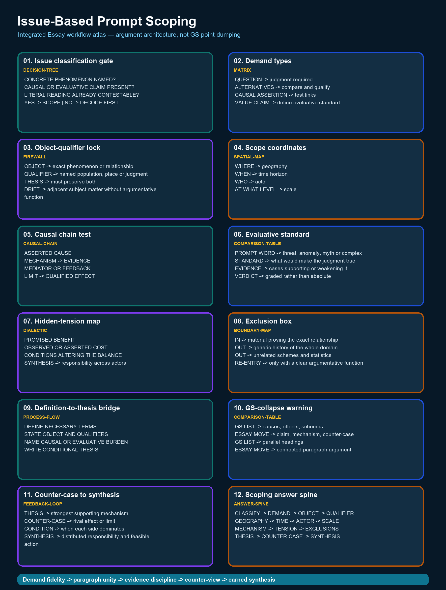

# Issue-Based Prompt Scoping — Complete Essay Knowledge Guide

> Essay-specific learner-v2 contract: one continuous knowledge guide, one question-only workbook and one separate solutions document. No artificial learning-session sequence and no MCQs.

## EASY-FIRST ROUTE AND ESSAY DEMAND

**Purpose:** Issue-Based Prompt Scoping owns one stage of the Essay workflow. Learn the exact demand first, practise the stage in isolation, then reconnect it to thesis, paragraph unity, counter-view and conclusion.

| Stage | Learner question | Output |
|---|---|---|
| Understand | What relationship does the prompt assert? | Plain-language restatement |
| Build | What single qualified thesis controls the response? | Thesis + argument map |
| Develop | What distinct job does each paragraph perform? | Coherent paragraph rail |
| Test | What is the strongest counter-view or limiting condition? | Qualified synthesis |
| Finish | Does the conclusion return to the exact proposition? | Earned close |



*The atlas uses Essay information grammar: demand, idea tree, argument map, evidence, paragraph rail, counter-view and synthesis.*

### Integrated ASCII workflow

```text
ESSAY WORKFLOW — ISSUE-BASED PROMPT SCOPING
============================================
PROMPT -> DEMAND -> THESIS -> ARGUMENT JOBS -> EVIDENCE -> COUNTER-VIEW
       -> QUALIFIED SYNTHESIS -> CONCLUSION -> REVISION

PANEL 01/12 — Issue classification gate [decision-tree]
CONCRETE PHENOMENON NAMED?
CAUSAL OR EVALUATIVE CLAIM PRESENT?
LITERAL READING ALREADY CONTESTABLE?
YES -> SCOPE | NO -> DECODE FIRST
  |
  v
PANEL 02/12 — Demand types [matrix]
QUESTION -> judgment required
ALTERNATIVES -> compare and qualify
CAUSAL ASSERTION -> test links
VALUE CLAIM -> define evaluative standard
  |
  v
PANEL 03/12 — Object-qualifier lock [firewall]
OBJECT -> exact phenomenon or relationship
QUALIFIER -> named population, place or judgment
THESIS -> must preserve both
DRIFT -> adjacent subject matter without argumentative function
  |
  v
PANEL 04/12 — Scope coordinates [spatial-map]
WHERE -> geography
WHEN -> time horizon
WHO -> actor
AT WHAT LEVEL -> scale
  |
  v
PANEL 05/12 — Causal chain test [causal-chain]
ASSERTED CAUSE
MECHANISM -> EVIDENCE
MEDIATOR OR FEEDBACK
LIMIT -> QUALIFIED EFFECT
  |
  v
PANEL 06/12 — Evaluative standard [comparison-table]
PROMPT WORD -> threat, anomaly, myth or complex
STANDARD -> what would make the judgment true
EVIDENCE -> cases supporting or weakening it
VERDICT -> graded rather than absolute
  |
  v
PANEL 07/12 — Hidden-tension map [dialectic]
PROMISED BENEFIT
OBSERVED OR ASSERTED COST
CONDITIONS ALTERING THE BALANCE
SYNTHESIS -> responsibility across actors
  |
  v
PANEL 08/12 — Exclusion box [boundary-map]
IN -> material proving the exact relationship
OUT -> generic history of the whole domain
OUT -> unrelated schemes and statistics
RE-ENTRY -> only with a clear argumentative function
  |
  v
PANEL 09/12 — Definition-to-thesis bridge [process-flow]
DEFINE NECESSARY TERMS
STATE OBJECT AND QUALIFIERS
NAME CAUSAL OR EVALUATIVE BURDEN
WRITE CONDITIONAL THESIS
  |
  v
PANEL 10/12 — GS-collapse warning [comparison-table]
GS LIST -> causes, effects, schemes
ESSAY MOVE -> claim, mechanism, counter-case
GS LIST -> parallel headings
ESSAY MOVE -> connected paragraph argument
  |
  v
PANEL 11/12 — Counter-case to synthesis [feedback-loop]
THESIS -> strongest supporting mechanism
COUNTER-CASE -> rival effect or limit
CONDITION -> when each side dominates
SYNTHESIS -> distributed responsibility and feasible action
  |
  v
PANEL 12/12 — Scoping answer spine [answer-spine]
CLASSIFY -> DEMAND -> OBJECT -> QUALIFIER
GEOGRAPHY -> TIME -> ACTOR -> SCALE
MECHANISM -> TENSION -> EXCLUSIONS
THESIS -> COUNTER-CASE -> SYNTHESIS
  |
  v
FINAL CONTROL
One controlling thesis; each paragraph performs a distinct argument job.
Examples prove or qualify a claim; they never replace reasoning.
No invented quotation, statistic, report, author or official rubric.
```

## COMPLETE BASIC KNOWLEDGE

> **Subject:** Essay | **Tier:** Must-Do | **GS Paper:** Essay (General
> Studies Paper — Essay, Mains).
> **Core area:** Scoping empirical/social-policy prompts (e.g. the FOMO
> prompt) as essays, not GS answers — issue framing, boundary-setting,
> and avoiding scheme-listing.
> **Grounded in:** UPSC Essay PYQ corpus — V1 directly verified locally
> for 2018–2025 and V2 carried-forward practice wording for 2013–2017
> (see `../PYQ-Corpus-2013-2025.md`); `../00_Master-Framework.md`
> Section 4.
> **Research cutoff:** 18 July 2026.
> **Tags:** ✅ verified fact | ⚠️ strategy/inference | 📰 dated anchor | ❌ trap/boundary.
> **Companion:** `../advanced/03_Issue-Based-Prompt-Scoping.md`

---

## 1. Purpose and scope

A clear audited example — 2024-B5, printed as "Social media is triggering
'Fear of Missing Out' amongst the youth precipitating depression and
loneliness" — is an issue-statement rather than a philosophical aphorism:
it names a
real phenomenon, a mechanism and a consequence directly. This topic
teaches how to scope such prompts as an *essay argument*, distinct from
`02`'s aphorism-decoding and distinct from a GS-III/Society answer.

## 2. Core terms in plain language

- **Issue-statement prompt:** a prompt that names a real-world
  phenomenon and asserts a causal or evaluative claim about it, without
  requiring metaphor-decoding.
- **Scope creep:** letting the essay drift into a general survey of the
  subject area (e.g. "social media in India") instead of the specific
  asserted claim.
- **GS-answer collapse:** structuring the essay like a GS-I/II/III
  answer — headings, "causes/effects/measures taken" lists — rather than
  a continuous argued essay.

## 3. ✅ Exam facts / source basis

- ✅ 2024-B5 is printed exactly as: "Social media is triggering 'Fear of
  Missing Out' amongst the youth precipitating depression and
  loneliness." — no author, and **no comma before "precipitating"**
  (widely circulated versions insert one; the paper does not). No further
  qualifying data is attached in the source paper.
- ✅ It is printed as **item 1 of Section B** in the 2024 paper, which
  restarts Section B numbering at 1; `B5` is this folder's internal label
  (see `../README.md`).
- ⚠️ The missing comma slightly changes what is asserted: without it,
  "precipitating depression and loneliness" reads as attached to the FOMO
  it triggers rather than as a separate consequence of social media. ✅
  Either way the essay must engage the *causal chain the sentence asserts*
  — social media → FOMO → depression/loneliness — and ❌ not substitute a
  general discussion of social media's effects.
- ⚠️ Within the 2024–2025 paper pair, this is the only direct,
  unmetaphorical issue-statement; the remaining 15 prompts are decoded
  via `02`. This is **not** a claim about the whole V1 corpus:
  2018–2025 contains further issue and hybrid prompts requiring the same
  method.

## 3a. Is this actually an issue prompt? — a three-question test

⚠️ `basic/02`, Section 3a, gives the full philosophical-vs-issue contrast
table. This section does not repeat it; it supplies the decision procedure
for the one call you have to make under time pressure.

```text
Q1  Does the sentence name a real, nameable phenomenon
    (social media, urbanisation, automation) rather than an abstraction?
        no  -> philosophical prompt: decode it (02)
        yes -> continue
Q2  Does it assert a causal or evaluative claim ABOUT that phenomenon
    ("is triggering", "has lost the ability to", "is a threat to")?
        no  -> a bare topic label, not an issue-statement: treat as a
               scoping-plus-decoding hybrid, decoding first
        yes -> continue
Q3  Would a literal reading of the sentence already give you something
    contestable to argue?
        yes -> issue prompt: scope it (this file)
        no  -> the sentence only looks empirical; decode first (02)
```

⚠️ Q3 is the one candidates skip. 2024-A1 ("Forests precede civilizations
and deserts follow them") passes Q1 and arguably Q2, but fails Q3 — read
literally it is a claim about vegetation sequence that nobody would spend
1000 words contesting. That failure is the signal that the sentence is
carrying a metaphor, and that `02` owns it. ❌ Scoping a prompt that
needed decoding produces a technically accurate essay about the wrong
subject — the most expensive error available at this stage, because it is
invisible until the essay is finished.

## 4. The central idea and common misreading

⚠️ **Central idea:** an issue-based prompt still needs a *thesis*, not
just an accurate description of the phenomenon — the essay must argue
something about the claim (its mechanism, its limits, what follows),
not merely narrate it. ❌ **Common misreading:** treating 2024-B5 as an
invitation to write a GS-III/Society-style answer on social media's
"causes, effects and government measures" complete with scheme names and
headings — this under-uses the essay's actual test of argument and
synthesis.

## 5. Basic decomposition questions

1. What exact claim is being made — connection causes FOMO causes
   depression/loneliness — and is this an absolute or a tendency claim?
2. What is the mechanism linking cause to effect (e.g. social
   comparison, curated self-presentation, algorithmic amplification)?
3. Who is most affected, and does the prompt's "youth" framing hold
   uniformly or need qualification (e.g. by access, platform design,
   family/school context)?
4. What is the strongest counter-case (e.g. social media also enabling
   support communities, information access, civic mobilisation)?
5. What synthesis resolves the tension without denying either the harm
   or the benefit?

## 5a. Causal-evidence-limit chain

⚠️ Treat each asserted causal link as an argument to test, not as a fact
to repeat:

```text
PROMPT CLAIM
  -> plausible mechanism
  -> named, verifiable evidence or illustration
  -> what that evidence supports (not more)
  -> mediator, counter-case or limit
  -> qualified thesis
```

An association is not proof of causation. If you cannot name evidence,
state the mechanism and the limit qualitatively rather than inventing a
statistic or presenting correlation as settled proof.

## 6. Dimension-expansion grid

| Dimension | Content for 2024-B5 |
|---|---|
| Individual/psychological | Social comparison, curated self-image, validation-seeking |
| Family/community | Parental awareness, peer culture, offline-relationship displacement |
| Institutional/platform | Algorithmic design incentives, engagement-maximising features |
| State/policy | Digital literacy programmes, platform accountability debates |
| Ethical/values | Autonomy vs. protection of minors; free expression vs. harm mitigation |

## 7. India-first illustration starters

⚠️ Recall (not invent) a named, verifiable Indian illustration relevant
to youth mental health, digital literacy or student smartphone use. Use
it as functional evidence for one dimension above, not as a
scheme-listing exercise. Full discipline: `12`.

## 8. Thesis options and selection

⚠️ Sample alternative theses for 2024-B5: (a) social media's design, not
connectivity itself, is the primary driver of FOMO-linked distress,
implying design/regulatory responses; (b) FOMO reflects a pre-existing
social-comparison tendency that technology has amplified rather than
created, implying that literacy and self-regulation matter alongside
platform reform. Choose the one you can sustain with real illustrations
and a genuine counter-case. Full method: `05`.

## 9. Simple essay architecture

⚠️ A workable shape: one paragraph framing the phenomenon and its scale
without invented statistics, two to three paragraphs developing distinct
mechanisms/dimensions (Section 6), one paragraph testing the counter-case
(Section 5, Q4), and a synthesis conclusion (agency + literacy + humane
platform design) — not a "conclusion" that merely lists more government
schemes. Full architecture: `07`.

## 10. Opening, body and closure moves

⚠️ A safe opening states the tension (connectivity promising closeness
while producing isolation) in your own words, without a fabricated
anecdote. A safe closing resolves the tension into a forward-looking,
feasible synthesis — not a list of five recommendations in bullet form.
Full method: `06`.

## 11. ❌ Traps and repair moves

- ❌ **Writing a GS-III/Society answer** with headings and a "government
  measures" list. → Repair: keep the piece as one continuous argued
  essay; use `07`'s paragraph-flow method instead of headings.
- ❌ **Treating "youth" as a monolith** ignoring access/context
  variation. → Repair: qualify claims by access, platform design, and
  social context (Section 6).
- ❌ **One-sided moralising against social media** without the
  counter-case. → Repair: always include Section 5's Q4 counter-case
  before the synthesis.
- ❌ **Citing unverifiable statistics** on depression/loneliness rates.
  → Repair: describe mechanism and pattern in qualitative terms rather
  than inventing a number (full discipline: `09`).

## 12. Timed micro-drill and self-check

**5-minute drill:** For 2024-B5, write one sentence each for: the
mechanism, the strongest counter-case, and your chosen thesis. Then
write one Indian illustration you can genuinely recall (not invent) that
functions as evidence for your mechanism.

**Transfer drills — unfamiliar prompts:** These are practice prompts, not
claims supplied as facts.

1. *“Remote work has improved productivity while weakening workplace
   community.”* Identify each causal link, one mediator, one counter-case
   and the qualified thesis.
2. *“When algorithms choose, responsibility does not disappear.”* Decide
   whether the prompt is issue-based, philosophical or hybrid; then map
   mechanism → named evidence → limit before planning dimensions.

**Self-check:** Does your plan contain any heading, numbered list, or
"government schemes" section that belongs in a GS answer rather than a
continuous essay? If yes, remove it and rewrite that portion as
connected prose.

<!-- BEGIN GENERATED PYQ INTEGRATION: 2024-2025 -->
## Recent PYQ Integration (2024-2025)

> **Status:** 2024-2025 question-level PYQ demand is integrated into this owner.
> **Provenance:** Audited local official-paper routing ledgers: `_PYQ-ROUTING-MAINS-GS1-GS2-ESSAY-2024-2025.md`.

- **Years represented:** 2024
- **Paper(s):** Essay
- **Routed question demands:** 2

| Year | Paper | Q | PYQ demand (exact V1 wording) | Directive / format | Source status | Owner requirement |
|---:|---|---|---|---|---|---|
| 2024 | Essay | Section A - 1 | "Forests precede civilizations and deserts follow them." | Essay · about 1000-1200 words; 2024 paper: 125 marks each | Routed to essay-method owner | Use as a brainstorming/theme test; this owner supplies essay method, not a model essay. |
| 2024 | Essay | Section B - 1 | "Social media is triggering ‘Fear of Missing Out’ amongst the youth precipitating depression and loneliness." | Essay · about 1000-1200 words; 2024 paper: 125 marks each | Routed to essay-method owner | Use as a brainstorming/theme test; this owner supplies essay method, not a model essay. |

### What this owner must now support

- "Forests precede civilizations and deserts follow them."
- "Social media is triggering ‘Fear of Missing Out’ amongst the youth
  precipitating depression and loneliness."

> This block integrates the 2024-2025 examinable demand and paper metadata. It is kept separate from the 2018-2023 block and does not convert an unkeyed/answer-free objective question into a solved answer.
<!-- END GENERATED PYQ INTEGRATION: 2024-2025 -->

## CORE APPLICATION LAB

### Paragraph unity rail

```text
CLAIM -> NAMED EXAMPLE -> MECHANISM -> LIMIT -> BRIDGE TO NEXT CLAIM
```

A paragraph is not a container for all facts on one dimension. It must advance the thesis through one principal claim, explain the relevance of its evidence and end with a qualification or transition.

### Evidence discipline

- Prefer a modest, accurate example to an impressive but uncertain statistic.
- Do not assign an author to an aphorism unless the audited paper prints one.
- Constitutional provisions, judgments, institutions and programmes must be used for a precise proposition, not as ornamental names.
- Cross-GS knowledge should enrich an argument; it must not turn the essay into a catalogue.

### Counter-view and synthesis

State the strongest objection fairly, show what it changes, retain the part of the thesis that survives and specify the conditions under which the final claim is defensible.

## SOLVED ESSAYS AND MODEL ANSWERS

### SOLVED ESSAY 1 — 2018-A1

#### Prompt

Alternative technologies for a climate change resilient India.

#### Verification and attribution boundary

Exact V1 wording from the local official paper; used to scope object, qualifier and India boundary. No author is attributed unless the audited paper itself prints one; this model uses no invented quotation, statistic, report or official marking rule.

#### Prompt interpretation

Identify the operative relation, surface its tension, state the scope and preserve one counter-reading. Do not replace the proposition with a broad GS subject label.

#### Central thesis

Alternative technologies can strengthen India's climate resilience when they are locally appropriate, affordable and integrated with institutions and community knowledge; technology is an enabler of adaptation, not a substitute for ecological planning or social justice.

#### Complete outline

1. **Resilient agriculture:** Drought-tolerant crops, micro-irrigation, soil monitoring and weather advisories can reduce climate-sensitive farm losses.
2. **Distributed energy:** Decentralised renewable systems and storage can support essential services when central networks fail.
3. **Water security:** Wastewater reuse, aquifer monitoring, rainwater harvesting and efficient treatment expand local buffers.
4. **Risk information:** Remote sensing, forecasting and last-mile warning systems improve preparedness only when alerts are trusted and actionable.
5. **Climate-resilient settlements:** Cool roofs, passive design, permeable surfaces and nature-based drainage can reduce heat and flood exposure.
6. **Justice and capability:** Open standards, local repair skills, finance and public procurement determine whether vulnerable communities can use the technology.

#### Full model essay — 1006 words

The statement, “Alternative technologies for a climate change resilient India.”, is not an invitation to display every fact associated with its nouns. It asks the writer to identify the relationship asserted by the sentence, test that relationship across different settings and arrive at a qualified judgment. Alternative technologies can strengthen India's climate resilience when they are locally appropriate, affordable and integrated with institutions and community knowledge; technology is an enabler of adaptation, not a substitute for ecological planning or social justice. The essay will therefore move from the central idea to its individual, institutional and public consequences, then confront the strongest limit before returning to an earned synthesis.

To begin with, **resilient agriculture** gives the argument a distinct job. Drought-tolerant crops, micro-irrigation, soil monitoring and weather advisories can reduce climate-sensitive farm losses. Micro-irrigation, soil monitoring and weather advisories can reduce exposure when they fit local crops and water conditions. This example is useful not because it is decorative, but because it shows a mechanism: choices, institutions or incentives convert an abstract proposition into a lived consequence. The paragraph should therefore connect the agriculture illustration back to the controlling thesis. Its limit must also remain visible: one example establishes a plausible route, not a universal law, and a different social position may experience the same process differently.

At the institutional level, **distributed energy** gives the argument a distinct job. Decentralised renewable systems and storage can support essential services when central networks fail. The Ahmedabad Heat Action Plan illustrates how forecasting, public communication and local health protocols can work together. This example is useful not because it is decorative, but because it shows a mechanism: choices, institutions or incentives convert an abstract proposition into a lived consequence. The paragraph should therefore connect the heat illustration back to the controlling thesis. Its limit must also remain visible: one example establishes a plausible route, not a universal law, and a different social position may experience the same process differently.

The argument becomes deeper when, **water security** gives the argument a distinct job. Wastewater reuse, aquifer monitoring, rainwater harvesting and efficient treatment expand local buffers. Odisha's preparedness experience shows that warnings matter only when shelters, local administration and evacuation capacity connect to them. This example is useful not because it is decorative, but because it shows a mechanism: choices, institutions or incentives convert an abstract proposition into a lived consequence. The paragraph should therefore connect the cyclones illustration back to the controlling thesis. Its limit must also remain visible: one example establishes a plausible route, not a universal law, and a different social position may experience the same process differently.

An Indian illustration clarifies this, **risk information** gives the argument a distinct job. Remote sensing, forecasting and last-mile warning systems improve preparedness only when alerts are trusted and actionable. Decentralised solar systems can keep essential services functioning where a central grid is disrupted. This example is useful not because it is decorative, but because it shows a mechanism: choices, institutions or incentives convert an abstract proposition into a lived consequence. The paragraph should therefore connect the energy illustration back to the controlling thesis. Its limit must also remain visible: one example establishes a plausible route, not a universal law, and a different social position may experience the same process differently.

Yet breadth without qualification is unsafe, **climate-resilient settlements** gives the argument a distinct job. Cool roofs, passive design, permeable surfaces and nature-based drainage can reduce heat and flood exposure. Rainwater harvesting, watershed work and mangrove protection combine engineered and nature-based resilience. This example is useful not because it is decorative, but because it shows a mechanism: choices, institutions or incentives convert an abstract proposition into a lived consequence. The paragraph should therefore connect the water and ecology illustration back to the controlling thesis. Its limit must also remain visible: one example establishes a plausible route, not a universal law, and a different social position may experience the same process differently.

A further dimension concerns distribution, **justice and capability** gives the argument a distinct job. Open standards, local repair skills, finance and public procurement determine whether vulnerable communities can use the technology. Local repair skills, affordable finance and public procurement determine whether vulnerable communities can actually use a technology. This example is useful not because it is decorative, but because it shows a mechanism: choices, institutions or incentives convert an abstract proposition into a lived consequence. The paragraph should therefore connect the justice illustration back to the controlling thesis. Its limit must also remain visible: one example establishes a plausible route, not a universal law, and a different social position may experience the same process differently.

The strongest counter-view cannot be hidden in a token sentence. Expensive imported systems, energy-intensive solutions and poorly governed infrastructure can create new dependencies or shift risk elsewhere. This objection matters because it prevents the essay from turning a suggestive proposition into an absolute one. It also forces a distinction between necessary and sufficient conditions: the central idea may explain an important part of the outcome without exhausting every material, institutional or historical cause. A credible essay absorbs this challenge and narrows its claim rather than dismissing it.

A qualified synthesis now becomes possible. The competing positions are not simply split into a mechanical 'both sides' balance. Instead, the essay asks when the main proposition is persuasive, which safeguards or capabilities make it constructive, and when its apparent wisdom becomes exclusion, passivity or overstatement. This move preserves the moral and philosophical force of the prompt while grounding it in Indian constitutional values, public institutions and everyday experience.

India needs not a catalogue of futuristic devices but a resilient technology ecosystem joining science, local institutions, ecological wisdom and equitable access. The conclusion earns its place because it does not add a new catalogue. It returns to the exact proposition after the argument has changed its meaning: the opening claim is now bounded by evidence, counter-view and conditions. That movement from assertion to qualified understanding is what distinguishes an Essay argument from a GS answer arranged under many headings.

#### Paragraph-level reasoning

| Paragraph | Argument job | Construction |
|---:|---|---|
| 1 | Resilient agriculture | Distinct claim -> named illustration -> mechanism -> limitation |
| 2 | Distributed energy | Distinct claim -> named illustration -> mechanism -> limitation |
| 3 | Water security | Distinct claim -> named illustration -> mechanism -> limitation |
| 4 | Risk information | Distinct claim -> named illustration -> mechanism -> limitation |
| 5 | Climate-resilient settlements | Distinct claim -> named illustration -> mechanism -> limitation |
| 6 | Justice and capability | Distinct claim -> named illustration -> mechanism -> limitation |

#### Evidence and example audit

- **Agriculture:** Micro-irrigation, soil monitoring and weather advisories can reduce exposure when they fit local crops and water conditions.
- **Heat:** The Ahmedabad Heat Action Plan illustrates how forecasting, public communication and local health protocols can work together.
- **Cyclones:** Odisha's preparedness experience shows that warnings matter only when shelters, local administration and evacuation capacity connect to them.
- **Energy:** Decentralised solar systems can keep essential services functioning where a central grid is disrupted.
- **Water and ecology:** Rainwater harvesting, watershed work and mangrove protection combine engineered and nature-based resilience.
- **Justice:** Local repair skills, affordable finance and public procurement determine whether vulnerable communities can actually use a technology.

#### Counterargument and qualified synthesis

**Counter-view:** Expensive imported systems, energy-intensive solutions and poorly governed infrastructure can create new dependencies or shift risk elsewhere.

**Synthesis rule:** retain the insight, specify its conditions and show where an unqualified version becomes unjust, ineffective or incomplete.

#### Why this earns marks

- It answers the printed relationship rather than an adjacent topic.
- One thesis controls the outline and every paragraph performs a new job.
- India-centric examples are integrated through analysis, not dumped.
- The counter-view changes the thesis and leads to an earned synthesis.
- The conclusion returns to the prompt at a deeper, qualified level.

#### How to improve under exam conditions

- Replace any example you cannot state safely with a simpler verified one.
- Shorten descriptive setup before cutting analysis or qualification.
- Check that every transition explains why the next paragraph follows.
- Reserve the final minutes for prompt words, paragraph unity and risky attributions.

### SOLVED ESSAY 2 — 2019-B7

#### Prompt

Biased media is a real threat to Indian democracy.

#### Verification and attribution boundary

Exact V1 wording; used to expose the evaluative standards behind real threat and Indian democracy. No author is attributed unless the audited paper itself prints one; this model uses no invented quotation, statistic, report or official marking rule.

#### Prompt interpretation

Identify the operative relation, surface its tension, state the scope and preserve one counter-reading. Do not replace the proposition with a broad GS subject label.

#### Central thesis

Biased media threatens Indian democracy when systematic distortion deprives citizens of reliable information, weakens scrutiny and polarises public reason, although viewpoint diversity must be protected and bias distinguished from mere disagreement.

#### Complete outline

1. **Informed citizenship:** Elections are meaningful only when citizens can evaluate competing claims through sufficiently reliable information.
2. **Accountability:** Selective silence or partisan framing can shield power and make public institutions less answerable.
3. **Polarisation:** Sensational and identity-driven coverage can replace deliberation with permanent mobilisation against imagined enemies.
4. **Ownership and incentives:** Concentrated ownership, advertising dependence and attention metrics can shape editorial priorities without explicit censorship.
5. **Digital amplification:** Algorithmic distribution and misinformation accelerate biased narratives and blur the boundary between journalism and propaganda.
6. **Democratic safeguards:** Independent regulation, transparency, media literacy, plural ownership and strong public-interest journalism must coexist with free expression.

#### Full model essay — 1001 words

The statement, “Biased media is a real threat to Indian democracy.”, is not an invitation to display every fact associated with its nouns. It asks the writer to identify the relationship asserted by the sentence, test that relationship across different settings and arrive at a qualified judgment. Biased media threatens Indian democracy when systematic distortion deprives citizens of reliable information, weakens scrutiny and polarises public reason, although viewpoint diversity must be protected and bias distinguished from mere disagreement. The essay will therefore move from the central idea to its individual, institutional and public consequences, then confront the strongest limit before returning to an earned synthesis.

To begin with, **informed citizenship** gives the argument a distinct job. Elections are meaningful only when citizens can evaluate competing claims through sufficiently reliable information. Article 19(1)(a) protects expression because democratic choice requires citizens to receive and contest information. This example is useful not because it is decorative, but because it shows a mechanism: choices, institutions or incentives convert an abstract proposition into a lived consequence. The paragraph should therefore connect the citizenship illustration back to the controlling thesis. Its limit must also remain visible: one example establishes a plausible route, not a universal law, and a different social position may experience the same process differently.

At the institutional level, **accountability** gives the argument a distinct job. Selective silence or partisan framing can shield power and make public institutions less answerable. Investigative journalism and information obtained through the RTI framework can expose failures that official narratives omit. This example is useful not because it is decorative, but because it shows a mechanism: choices, institutions or incentives convert an abstract proposition into a lived consequence. The paragraph should therefore connect the accountability illustration back to the controlling thesis. Its limit must also remain visible: one example establishes a plausible route, not a universal law, and a different social position may experience the same process differently.

The argument becomes deeper when, **polarisation** gives the argument a distinct job. Sensational and identity-driven coverage can replace deliberation with permanent mobilisation against imagined enemies. Sensational coverage can convert social difference into permanent political suspicion and reward outrage over verification. This example is useful not because it is decorative, but because it shows a mechanism: choices, institutions or incentives convert an abstract proposition into a lived consequence. The paragraph should therefore connect the polarisation illustration back to the controlling thesis. Its limit must also remain visible: one example establishes a plausible route, not a universal law, and a different social position may experience the same process differently.

An Indian illustration clarifies this, **ownership and incentives** gives the argument a distinct job. Concentrated ownership, advertising dependence and attention metrics can shape editorial priorities without explicit censorship. Advertising dependence and attention metrics can shape editorial choices even without direct censorship. This example is useful not because it is decorative, but because it shows a mechanism: choices, institutions or incentives convert an abstract proposition into a lived consequence. The paragraph should therefore connect the incentives illustration back to the controlling thesis. Its limit must also remain visible: one example establishes a plausible route, not a universal law, and a different social position may experience the same process differently.

Yet breadth without qualification is unsafe, **digital amplification** gives the argument a distinct job. Algorithmic distribution and misinformation accelerate biased narratives and blur the boundary between journalism and propaganda. Community radio, regional media and public-interest journalism show why diversity of voice is a democratic resource. This example is useful not because it is decorative, but because it shows a mechanism: choices, institutions or incentives convert an abstract proposition into a lived consequence. The paragraph should therefore connect the plurality illustration back to the controlling thesis. Its limit must also remain visible: one example establishes a plausible route, not a universal law, and a different social position may experience the same process differently.

A further dimension concerns distribution, **democratic safeguards** gives the argument a distinct job. Independent regulation, transparency, media literacy, plural ownership and strong public-interest journalism must coexist with free expression. Transparency of ownership, professional correction, media literacy and independent oversight are safer than state-enforced uniformity. This example is useful not because it is decorative, but because it shows a mechanism: choices, institutions or incentives convert an abstract proposition into a lived consequence. The paragraph should therefore connect the safeguards illustration back to the controlling thesis. Its limit must also remain visible: one example establishes a plausible route, not a universal law, and a different social position may experience the same process differently.

The strongest counter-view cannot be hidden in a token sentence. Government control in the name of neutrality can itself become a greater democratic threat, and complete value-neutrality is neither possible nor desirable. This objection matters because it prevents the essay from turning a suggestive proposition into an absolute one. It also forces a distinction between necessary and sufficient conditions: the central idea may explain an important part of the outcome without exhausting every material, institutional or historical cause. A credible essay absorbs this challenge and narrows its claim rather than dismissing it.

A qualified synthesis now becomes possible. The competing positions are not simply split into a mechanical 'both sides' balance. Instead, the essay asks when the main proposition is persuasive, which safeguards or capabilities make it constructive, and when its apparent wisdom becomes exclusion, passivity or overstatement. This move preserves the moral and philosophical force of the prompt while grounding it in Indian constitutional values, public institutions and everyday experience.

The democratic objective is not a voicelessly neutral press but a plural, transparent and accountable media order in which facts remain contestable without becoming disposable. The conclusion earns its place because it does not add a new catalogue. It returns to the exact proposition after the argument has changed its meaning: the opening claim is now bounded by evidence, counter-view and conditions. That movement from assertion to qualified understanding is what distinguishes an Essay argument from a GS answer arranged under many headings.

#### Paragraph-level reasoning

| Paragraph | Argument job | Construction |
|---:|---|---|
| 1 | Informed citizenship | Distinct claim -> named illustration -> mechanism -> limitation |
| 2 | Accountability | Distinct claim -> named illustration -> mechanism -> limitation |
| 3 | Polarisation | Distinct claim -> named illustration -> mechanism -> limitation |
| 4 | Ownership and incentives | Distinct claim -> named illustration -> mechanism -> limitation |
| 5 | Digital amplification | Distinct claim -> named illustration -> mechanism -> limitation |
| 6 | Democratic safeguards | Distinct claim -> named illustration -> mechanism -> limitation |

#### Evidence and example audit

- **Citizenship:** Article 19(1)(a) protects expression because democratic choice requires citizens to receive and contest information.
- **Accountability:** Investigative journalism and information obtained through the RTI framework can expose failures that official narratives omit.
- **Polarisation:** Sensational coverage can convert social difference into permanent political suspicion and reward outrage over verification.
- **Incentives:** Advertising dependence and attention metrics can shape editorial choices even without direct censorship.
- **Plurality:** Community radio, regional media and public-interest journalism show why diversity of voice is a democratic resource.
- **Safeguards:** Transparency of ownership, professional correction, media literacy and independent oversight are safer than state-enforced uniformity.

#### Counterargument and qualified synthesis

**Counter-view:** Government control in the name of neutrality can itself become a greater democratic threat, and complete value-neutrality is neither possible nor desirable.

**Synthesis rule:** retain the insight, specify its conditions and show where an unqualified version becomes unjust, ineffective or incomplete.

#### Why this earns marks

- It answers the printed relationship rather than an adjacent topic.
- One thesis controls the outline and every paragraph performs a new job.
- India-centric examples are integrated through analysis, not dumped.
- The counter-view changes the thesis and leads to an earned synthesis.
- The conclusion returns to the prompt at a deeper, qualified level.

#### How to improve under exam conditions

- Replace any example you cannot state safely with a simpler verified one.
- Shorten descriptive setup before cutting analysis or qualification.
- Check that every transition explains why the next paragraph follows.
- Reserve the final minutes for prompt words, paragraph unity and risky attributions.

### SOLVED ESSAY 3 — 2024-B5

#### Prompt

Social media is triggering 'Fear of Missing Out' amongst the youth precipitating depression and loneliness.

#### Verification and attribution boundary

Exact V1 wording, including the missing comma before precipitating; used for a causal-chain scoping application. No author is attributed unless the audited paper itself prints one; this model uses no invented quotation, statistic, report or official marking rule.

#### Prompt interpretation

Identify the operative relation, surface its tension, state the scope and preserve one counter-reading. Do not replace the proposition with a broad GS subject label.

#### Central thesis

Social media can intensify FOMO by turning social comparison into a continuous, quantified and commercially amplified experience, yet youth distress arises from the interaction of platform design, social conditions and individual vulnerability rather than technology alone.

#### Complete outline

1. **Comparison architecture:** Curated highlights make ordinary life appear deficient and convert belonging into a visible competition for attention.
2. **Attention economy:** Notifications, streaks and algorithmic recommendation reward repeated checking and make absence feel like social loss.
3. **Loneliness paradox:** High connectivity can coexist with weak intimacy when interaction is performative, fragmented or measured through public approval.
4. **Unequal vulnerability:** Adolescents facing exclusion, academic pressure or weak support systems may experience the same platforms more harmfully.
5. **Positive capability:** Online communities can also provide expression, learning and support, especially where offline opportunities are limited.
6. **Shared responsibility:** Digital literacy, humane platform design, family communication, counselling and accessible mental-health services must work together.

#### Full model essay — 1022 words

The statement, “Social media is triggering 'Fear of Missing Out' amongst the youth precipitating depression and loneliness.”, is not an invitation to display every fact associated with its nouns. It asks the writer to identify the relationship asserted by the sentence, test that relationship across different settings and arrive at a qualified judgment. Social media can intensify FOMO by turning social comparison into a continuous, quantified and commercially amplified experience, yet youth distress arises from the interaction of platform design, social conditions and individual vulnerability rather than technology alone. The essay will therefore move from the central idea to its individual, institutional and public consequences, then confront the strongest limit before returning to an earned synthesis.

To begin with, **comparison architecture** gives the argument a distinct job. Curated highlights make ordinary life appear deficient and convert belonging into a visible competition for attention. Curated peer feeds in schools and colleges can make ordinary study, friendship and leisure appear inadequate. This example is useful not because it is decorative, but because it shows a mechanism: choices, institutions or incentives convert an abstract proposition into a lived consequence. The paragraph should therefore connect the comparison illustration back to the controlling thesis. Its limit must also remain visible: one example establishes a plausible route, not a universal law, and a different social position may experience the same process differently.

At the institutional level, **attention economy** gives the argument a distinct job. Notifications, streaks and algorithmic recommendation reward repeated checking and make absence feel like social loss. Notifications, streaks and public counts turn attention into a visible contest and make disconnection feel costly. This example is useful not because it is decorative, but because it shows a mechanism: choices, institutions or incentives convert an abstract proposition into a lived consequence. The paragraph should therefore connect the design illustration back to the controlling thesis. Its limit must also remain visible: one example establishes a plausible route, not a universal law, and a different social position may experience the same process differently.

The argument becomes deeper when, **loneliness paradox** gives the argument a distinct job. High connectivity can coexist with weak intimacy when interaction is performative, fragmented or measured through public approval. Online contact can widen networks while still failing to provide the trust and presence associated with close friendship. This example is useful not because it is decorative, but because it shows a mechanism: choices, institutions or incentives convert an abstract proposition into a lived consequence. The paragraph should therefore connect the belonging illustration back to the controlling thesis. Its limit must also remain visible: one example establishes a plausible route, not a universal law, and a different social position may experience the same process differently.

An Indian illustration clarifies this, **unequal vulnerability** gives the argument a distinct job. Adolescents facing exclusion, academic pressure or weak support systems may experience the same platforms more harmfully. Academic pressure, exclusion and weak family support can intensify the same platform experience for some adolescents. This example is useful not because it is decorative, but because it shows a mechanism: choices, institutions or incentives convert an abstract proposition into a lived consequence. The paragraph should therefore connect the vulnerability illustration back to the controlling thesis. Its limit must also remain visible: one example establishes a plausible route, not a universal law, and a different social position may experience the same process differently.

Yet breadth without qualification is unsafe, **positive capability** gives the argument a distinct job. Online communities can also provide expression, learning and support, especially where offline opportunities are limited. Online learning groups and support communities show that digital connection can also reduce isolation. This example is useful not because it is decorative, but because it shows a mechanism: choices, institutions or incentives convert an abstract proposition into a lived consequence. The paragraph should therefore connect the capability illustration back to the controlling thesis. Its limit must also remain visible: one example establishes a plausible route, not a universal law, and a different social position may experience the same process differently.

A further dimension concerns distribution, **shared responsibility** gives the argument a distinct job. Digital literacy, humane platform design, family communication, counselling and accessible mental-health services must work together. Digital literacy, counselling, family dialogue and humane platform design distribute responsibility beyond the individual user. This example is useful not because it is decorative, but because it shows a mechanism: choices, institutions or incentives convert an abstract proposition into a lived consequence. The paragraph should therefore connect the response illustration back to the controlling thesis. Its limit must also remain visible: one example establishes a plausible route, not a universal law, and a different social position may experience the same process differently.

The strongest counter-view cannot be hidden in a token sentence. Blaming social media alone ignores family stress, unemployment, educational pressure and pre-existing mental-health conditions. This objection matters because it prevents the essay from turning a suggestive proposition into an absolute one. It also forces a distinction between necessary and sufficient conditions: the central idea may explain an important part of the outcome without exhausting every material, institutional or historical cause. A credible essay absorbs this challenge and narrows its claim rather than dismissing it.

A qualified synthesis now becomes possible. The competing positions are not simply split into a mechanical 'both sides' balance. Instead, the essay asks when the main proposition is persuasive, which safeguards or capabilities make it constructive, and when its apparent wisdom becomes exclusion, passivity or overstatement. This move preserves the moral and philosophical force of the prompt while grounding it in Indian constitutional values, public institutions and everyday experience.

The answer is neither digital abstinence nor technological fatalism, but an online environment in which connection serves human relationships instead of converting them into an endless status contest. The conclusion earns its place because it does not add a new catalogue. It returns to the exact proposition after the argument has changed its meaning: the opening claim is now bounded by evidence, counter-view and conditions. That movement from assertion to qualified understanding is what distinguishes an Essay argument from a GS answer arranged under many headings.

#### Paragraph-level reasoning

| Paragraph | Argument job | Construction |
|---:|---|---|
| 1 | Comparison architecture | Distinct claim -> named illustration -> mechanism -> limitation |
| 2 | Attention economy | Distinct claim -> named illustration -> mechanism -> limitation |
| 3 | Loneliness paradox | Distinct claim -> named illustration -> mechanism -> limitation |
| 4 | Unequal vulnerability | Distinct claim -> named illustration -> mechanism -> limitation |
| 5 | Positive capability | Distinct claim -> named illustration -> mechanism -> limitation |
| 6 | Shared responsibility | Distinct claim -> named illustration -> mechanism -> limitation |

#### Evidence and example audit

- **Comparison:** Curated peer feeds in schools and colleges can make ordinary study, friendship and leisure appear inadequate.
- **Design:** Notifications, streaks and public counts turn attention into a visible contest and make disconnection feel costly.
- **Belonging:** Online contact can widen networks while still failing to provide the trust and presence associated with close friendship.
- **Vulnerability:** Academic pressure, exclusion and weak family support can intensify the same platform experience for some adolescents.
- **Capability:** Online learning groups and support communities show that digital connection can also reduce isolation.
- **Response:** Digital literacy, counselling, family dialogue and humane platform design distribute responsibility beyond the individual user.

#### Counterargument and qualified synthesis

**Counter-view:** Blaming social media alone ignores family stress, unemployment, educational pressure and pre-existing mental-health conditions.

**Synthesis rule:** retain the insight, specify its conditions and show where an unqualified version becomes unjust, ineffective or incomplete.

#### Why this earns marks

- It answers the printed relationship rather than an adjacent topic.
- One thesis controls the outline and every paragraph performs a new job.
- India-centric examples are integrated through analysis, not dumped.
- The counter-view changes the thesis and leads to an earned synthesis.
- The conclusion returns to the prompt at a deeper, qualified level.

#### How to improve under exam conditions

- Replace any example you cannot state safely with a simpler verified one.
- Shorten descriptive setup before cutting analysis or qualification.
- Check that every transition explains why the next paragraph follows.
- Reserve the final minutes for prompt words, paragraph unity and risky attributions.

## EXECUTABLE EXAM STRATEGY

The printed paper rule controls; the schedule below is a candidate strategy and must be adjusted to handwriting speed.

| Phase | Suggested time | Risk control |
|---|---:|---|
| Read both Sections and choose a pair | 10 minutes | Confirm one prompt from each Section; reject unsafe attribution/data dependence |
| Plan Essay 1 | 15 minutes | Restatement, thesis, 6-8 paragraph jobs, evidence and counter-view |
| Draft Essay 1 | 65 minutes | Keep paragraph unity and transitions visible |
| Revise Essay 1 | 5 minutes | Prompt words, evidence, repetition and conclusion |
| Plan Essay 2 | 15 minutes | Re-run the same gates independently |
| Draft Essay 2 | 65 minutes | Protect analysis from late fact-dumping |
| Revise Essay 2 | 5 minutes | Attribution, coherence and unfinished sentences |

## OPTIONAL ADVANCED DEPTH — NOT REQUIRED FOR A CORE ESSAY

> **Subject:** Essay | **Tier:** Advanced | **GS Paper:** Essay (General
> Studies Paper — Essay, Mains).
> **Core area:** The scope-discipline that separates an issue-based essay
> from a GS answer; distributional and mechanism-level analysis of the
> FOMO/social-media prompt as the corpus's clearest test case.
> **Grounded in:** UPSC Essay PYQ corpus — V1 directly verified locally
> for 2018–2025 and V2 carried-forward practice wording for 2013–2017
> (see `../PYQ-Corpus-2013-2025.md`); `../00_Master-Framework.md`
> Section 4.
> **Research cutoff:** 18 July 2026.
> **Tags:** ✅ verified fact | ⚠️ strategy/inference | 📰 dated anchor | ❌ trap/boundary.
> **Companion:** `../basic/03_Issue-Based-Prompt-Scoping.md`

---

## 1. Advanced proposition and boundary

**Proposition:** ⚠️ an issue-based essay prompt differs from a GS answer
not in subject matter but in *test-of-argument* — the examiner already
expects the candidate to know the phenomenon; what is tested is whether
the candidate can build a qualified thesis and a synthesis around it.
**Boundary:** ❌ this topic does not supply the platform-design or
mental-health mechanism content itself in GS depth (owned by
`Indian-Society` and `Science-and-Technology`); it supplies the
essay-specific scoping discipline that keeps that content in service of
an argument.

## 2. Concept definition and taxonomy

- **Issue-statement prompt:** names phenomenon + mechanism + consequence
  in one sentence (2024-B5 is the corpus's example).
- **Scope creep:** essay drifts from the *specific* asserted mechanism
  ("FOMO... precipitating depression and loneliness") into a general
  survey of "social media in society."
- **GS-answer collapse:** headings, "causes/effects/measures" structure,
  and scheme-name lists substituted for continuous argument.
- ⚠️ Note the taxonomy is not unique to 2024-B5 — any future issue-style
  prompt (on, say, urbanisation, automation, or misinformation) should be
  scoped by the same method.

## 3. Tension pairs and hidden assumptions

- **Causal specificity vs. generality:** the prompt asserts a specific
  mechanism (FOMO precipitating depression/loneliness); the hidden
  assumption in a weak essay is that any social-media-related content
  answers the question — it does not, unless it engages that specific
  causal chain.
- **Universality vs. distribution:** "the youth" is treated as
  homogeneous by the prompt's phrasing; an advanced essay should
  interrogate this — access, platform type, family context, and
  pre-existing vulnerability all mediate the effect differently.
- **Correlation vs. mechanism:** a common hidden assumption is that
  observed association between usage and distress implies the causal
  story asserted by the prompt; an advanced essay should explicitly
  discuss plausible mechanism (social comparison, curated
  self-presentation, algorithmic amplification of engagement) rather
  than assert correlation as proof.

## 4. Levels of analysis and temporal-spatial scale

| Level | What the essay should say at this level |
|---|---|
| Individual | Social comparison, self-esteem, validation-seeking behaviour |
| Family/community | Parental mediation, peer culture, offline-relationship displacement |
| Institutional/platform | Design incentives (engagement metrics), content-recommendation systems |
| State/policy | Digital literacy programmes, platform-accountability debate, age-appropriate design |
| Temporal | Whether the effect is a stable feature of always-on connectivity or an artefact of a particular platform-design era, subject to future design change |

## 5. Stakeholder map and distributional effects

⚠️ Distinguish: (a) youth users directly affected; (b) platforms whose
business model may depend on engagement-maximising design; (c) families
and schools bearing mediation responsibility; (d) the state, balancing
free expression against protective regulation. An advanced essay should
show that responsibility is distributed across these actors, rather than
locating blame in only one (e.g. "youth today" moralising, or purely
"Big Tech" moralising) — both are one-sided versions of the same
scope-collapse error.

## 6. Causality, mechanisms and feedback loops

```text
ALGORITHMIC DESIGN (engagement-optimised feeds)
        |
        v
SOCIAL COMPARISON + CURATED SELF-PRESENTATION exposure increases
        |
        v
FOMO / INADEQUACY perception rises
        |
        v
INCREASED USAGE  (seeking validation/relief) <---- FEEDBACK LOOP
        |
        v
DEPRESSION / LONELINESS risk (mediated by support, literacy, context)
```
⚠️ The feedback loop (increased distress driving increased, not
decreased, usage) is the analytically richest part of this prompt —
naming it distinguishes an advanced essay from one that treats the
relationship as simple and linear.

## 7. Necessary/sufficient conditions and exceptions

⚠️ Social media use is not sufficient by itself to cause depression/
loneliness — the mechanism is mediated by design, context, and
pre-existing vulnerability (Section 4); nor is abstinence necessary for
protection — supportive use (e.g. maintaining distant relationships,
accessing peer support) can supply a counter-case. An advanced essay
states this precisely rather than treating the prompt's claim as an
absolute law to be defended or attacked wholesale.

## 8. Paradox, dialectic and counterfactual test

**Paradox:** the same technology that promises connection can produce
isolation — not a contradiction, but a double effect depending on use
pattern and design. **Dialectic:** thesis (connectivity precipitates
distress) → counter-claim (connectivity also provides support,
information and civic voice) → condition (effect depends on design and
use-pattern) → synthesis (agency, literacy and humane platform design as
joint correctives). **Counterfactual test:** "If platforms were designed
without engagement-maximising feeds, would the FOMO mechanism (Section
6) still operate at the same intensity?" — a "no" strengthens the
design-focused thesis; a "largely yes" strengthens a thesis centred on
underlying social-comparison psychology.

## 9. Ethical conflict and synthesis

⚠️ Values in tension: individual autonomy and free expression vs.
protective regulation of minors; platform commercial interest vs. user
well-being; parental oversight vs. adolescent privacy. **Synthesis:**
locate responsibility across the distributed stakeholder map (Section
5) — literacy and self-regulation at the individual/family level,
accountable design at the platform level, and proportionate,
rights-respecting safeguards at the policy level — rather than
resolving the conflict by favouring one actor's interest alone.

## 10. Evidence/source-risk and India application

✅ The prompt itself supplies no statistic and no author; an advanced
essay should resist supplying an invented one either. ⚠️ India
application: use a named, verifiable Indian illustration where available;
otherwise state the policy debate qualitatively without asserting an
unverified national prevalence figure — full discipline in `09`/`12`.

## 11. Advanced structure, paragraph sequencing and style

⚠️ Recommended sequencing: phenomenon and tension (1 paragraph) →
mechanism and feedback loop (Section 6, 2 paragraphs) → distributional
analysis across stakeholders (Section 5, 1–2 paragraphs) → counter-case
and dialectic (Section 8, 1 paragraph) → synthesis and forward-looking
close (1 paragraph). This keeps the essay argumentative throughout,
rather than descriptive-then-prescriptive in the GS-answer style.

## 12. ❌ Failure modes and revision protocol

- ❌ **Full GS-III/Society answer disguised as an essay** (headings,
  scheme lists). → Protocol: remove all headings; verify every paragraph
  contains a claim, not just a fact.
- ❌ **Treating "youth" as undifferentiated.** → Protocol: qualify by
  at least one distributional variable (Section 5) in the essay body.
- ❌ **Correlation-as-causation without mechanism.** → Protocol: state
  the mechanism (Section 6) explicitly before asserting the causal
  claim.
- ❌ **One-sided technology-moralising** (either "social media is simply
  bad" or "concerns are overblown"). → Protocol: always include the
  dialectic step (Section 8) before the conclusion.

## 13. 📰 Dated anchor / practice lab / transfer task

📰 **Dated anchor:** if a genuinely current, dated official statement on
platform regulation or youth digital-safety policy is available and
verifiable at the time of writing, it may be cited with its source and
date; otherwise, describe the policy debate in general, undated terms
rather than inventing a "latest" development.

**Practice lab:** Write the mechanism diagram (Section 6) and the
distributional stakeholder list (Section 5) for 2024-B5 from memory in
under 10 minutes, without consulting this file.

**Transfer task:** Apply the same scoping method (phenomenon → mechanism
→ distribution → dialectic → synthesis) to a hypothetical future
issue-style prompt (e.g. on automation or misinformation) to confirm the
method generalises beyond this one audited prompt.

<!-- BEGIN GENERATED PYQ INTEGRATION: 2018-2023 -->
## Historical PYQ Integration (2018-2023)

> **Status:** Question-level PYQ demand is integrated into this owner.
> **Provenance:** Audited local official-paper routing ledgers: `_PYQ-ROUTING-MAINS-GS1-GS2-ESSAY-2018-2023.md`.

- **Years represented:** 2018, 2019, 2020, 2023
- **Paper(s):** Essay
- **Routed question demands:** 9

| Year | Paper | Q | PYQ demand (neutral rendering) | Directive / format | Source status | Owner requirement |
|---:|---|---:|---|---|---|---|
| 2018 | Essay | 1 | Alternative technologies for a climate change resilient India | Essay · 125 marks · 1000-1200 words | Method routing only; prompt content is not pre-taught anywhere in this kit | Use as a brainstorming/theme test; this owner supplies essay method, not a model essay. |
| 2018 | Essay | 4 | Management of Indian border disputes as a complex task | Essay · 125 marks · 1000-1200 words | Method routing only; prompt content is not pre-taught anywhere in this kit | Use as a brainstorming/theme test; this owner supplies essay method, not a model essay. |
| 2019 | Essay | 5 | South Asian societies woven around plural cultures and identities | Essay · 125 marks · 1000-1200 words | Method routing only; prompt content is not pre-taught anywhere in this kit | Use as a brainstorming/theme test; this owner supplies essay method, not a model essay. |
| 2019 | Essay | 6 | Neglect of primary health care and education as reasons for backwardness | Essay · 125 marks · 1000-1200 words | Method routing only; prompt content is not pre-taught anywhere in this kit | Use as a brainstorming/theme test; this owner supplies essay method, not a model essay. |
| 2019 | Essay | 7 | Biased media as a real threat to Indian democracy | Essay · 125 marks · 1000-1200 words | Method routing only; prompt content is not pre-taught anywhere in this kit | Use as a brainstorming/theme test; this owner supplies essay method, not a model essay. |
| 2019 | Essay | 8 | Rise of Artificial Intelligence, jobless future or reskilling opportunity | Essay · 125 marks · 1000-1200 words | Method routing only; prompt content is not pre-taught anywhere in this kit | Use as a brainstorming/theme test; this owner supplies essay method, not a model essay. |
| 2020 | Essay | 7 | Patriarchy as the least noticed structure of social inequality | Essay · 125 marks · 1000-1200 words | Method routing only; prompt content is not pre-taught anywhere in this kit | Use as a brainstorming/theme test; this owner supplies essay method, not a model essay. |
| 2020 | Essay | 8 | Technology as the silent factor in international relations | Essay · 125 marks · 1000-1200 words | Method routing only; prompt content is not pre-taught anywhere in this kit | Use as a brainstorming/theme test; this owner supplies essay method, not a model essay. |
| 2023 | Essay | 5 | Girls weighed down by restrictions and boys by demands | Essay · 125 marks · 1000-1200 words | Method routing only; prompt content is not pre-taught anywhere in this kit | Use as a brainstorming/theme test; this owner supplies essay method, not a model essay. |

### What this owner must now support

- Alternative technologies for a climate change resilient India
- Management of Indian border disputes as a complex task
- South Asian societies woven around plural cultures and identities
- Neglect of primary health care and education as reasons for backwardness
- Biased media as a real threat to Indian democracy
- Rise of Artificial Intelligence, jobless future or reskilling opportunity
- Patriarchy as the least noticed structure of social inequality
- Technology as the silent factor in international relations
- Girls weighed down by restrictions and boys by demands

> The table integrates the examinable demand and paper metadata. It does not turn an unkeyed objective question into a solved answer, and it does not claim that lexical presence alone proves full conceptual sufficiency.
<!-- END GENERATED PYQ INTEGRATION: 2018-2023 -->

## CONSOLIDATED REVISION GUIDE

### Rapid recall

### Issue-Based Prompt Scoping: DEMAND, OBJECT AND QUALIFIER SCOPE MAP

1. **Issue-statement prompt:** An issue prompt names a real phenomenon and makes a causal, comparative, interrogative or evaluative claim that can be contested without first decoding a dominant metaphor.
2. **Classification gate:** A prompt is scoped as an issue when it names a concrete phenomenon, asserts something about it and already yields a literal contestable proposition.
3. **Directive or demand:** Identify whether the wording asks a question, presents alternatives, asserts causation or makes a value judgment; that demand governs the essay's argumentative burden.
4. **Object:** The object is the precise phenomenon or relationship being examined, not the entire GS subject area surrounding it.
5. **Qualifier:** Words such as Indian, majority, youth, real, complex, alternative or better narrow the claim and must survive in the thesis.
6. **Geography:** State whether the prompt is bounded to India, South Asia, another named region or a wider frame; do not globalise or nationalise it automatically.
7. **Time:** Distinguish a present condition, historical change, future possibility or long-run consequence when the wording supports that temporal boundary.
8. **Actor:** Identify who acts, experiences, decides, benefits or bears cost, and do not treat a broad group such as youth or farmers as homogeneous.
9. **Scale:** Locate the demand at individual, community, institutional, state, regional or global scale before importing examples from another level.
10. **Causal demand:** Where the prompt asserts causation, test each link through mechanism, evidence, mediator and limit instead of merely repeating the causal words.
11. **Evaluative demand:** Where the prompt uses judgment terms such as threat, anomaly, myth, reality or complex, define the standard by which the judgment will be assessed.
12. **Hidden tension:** Issue prompts normally contain a trade-off or double effect that must be made explicit, such as connection versus isolation or automation versus reskilling.
13. **Excluded material:** Write a negative boundary naming adjacent content that will not enter unless it directly advances the exact prompt.
14. **Definition boundary:** Define only the terms needed to fix the proposition; a long textbook background section expands the topic before the thesis is secure.
15. **Thesis boundary:** The thesis must answer the prompt's exact causal or evaluative claim with stated conditions, not announce that the issue has both advantages and disadvantages.
16. **Scope creep:** Scope creep occurs when the response becomes a general survey of the domain instead of testing the prompt's specified relationship.
17. **GS-answer collapse:** A causes-effects-measures or scheme catalogue does not by itself create a sustained Essay argument, even when every listed fact is accurate.
18. **Policy-catalogue avoidance:** Policies and institutions should appear as evidence for a claim, mechanism or synthesis, never as an isolated inventory of government action.
19. **Counter-case:** The strongest rival or beneficial effect should be stated fairly and used to qualify the thesis rather than appended as token balance.
20. **Synthesis:** A good issue essay resolves the tension by distributing responsibility, specifying conditions and connecting feasible institutional action with agency and values.

### Issue-Based Prompt Scoping: GEOGRAPHY, TIME, ACTOR, SCALE AND EXCLUSION FIREWALLS

- Do not scope a metaphor-heavy hybrid as a literal issue statement before decoding it.
- Do not ignore interrogative, causal, comparative or evaluative wording.
- Do not drop qualifiers such as India, youth, majority or long run.
- Do not shift geography, actor, time or scale without explaining the move.
- Do not present association as causation without a mechanism and mediator.
- Do not define the whole subject when only one relationship is contested.
- Do not convert the essay into a scheme or policy catalogue.
- Do not treat a broad social group as internally uniform.
- Do not add a token counterpoint after a one-sided essay.
- Do not end with generic balance; state the conditions of synthesis.

### Issue-Based Prompt Scoping: CAUSAL OR EVALUATIVE THESIS-TO-SYNTHESIS SPINE

```text
CLASSIFY THE PROMPT
-> IDENTIFY DIRECTIVE OR ASSERTED DEMAND
-> LOCK OBJECT QUALIFIER GEOGRAPHY TIME ACTOR AND SCALE
-> TEST CAUSAL LINKS OR EVALUATIVE STANDARD
-> NAME HIDDEN TENSION AND EXCLUDED MATERIAL
-> WRITE A CONDITIONAL THESIS
-> COUNTER-CASE THEN SYNTHESIS WITHOUT POLICY CATALOGUE
```

### Issue-Based Prompt Scoping: V1 ISSUE-PROMPT WORDING AND LIVE-SOURCE BOUNDARY

The 2026-09-04 official-site attempts supplied no new content. Prompt wording and metadata remain bounded by local V1 papers and the audited Essay corpus; issue analysis is explicitly repository-authored method.

### Final 90-second check

1. Exact proposition answered, not an adjacent GS topic.
2. One qualified thesis controls every paragraph.
3. Examples are accurate, attributable and analytically integrated.
4. Counter-view changes the thesis rather than appearing ceremonially.
5. Transitions explain progression; conclusion returns at a deeper level.
