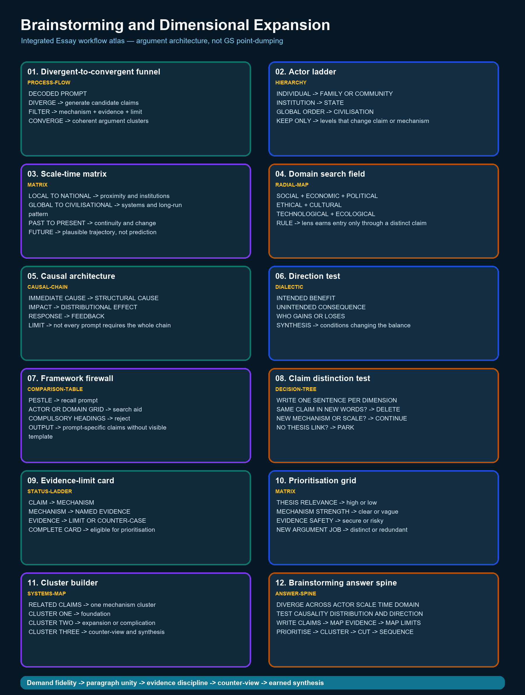

# Brainstorming and Dimensional Expansion — Complete Essay Knowledge Guide

> Essay-specific learner-v2 contract: one continuous knowledge guide, one question-only workbook and one separate solutions document. No artificial learning-session sequence and no MCQs.

## EASY-FIRST ROUTE AND ESSAY DEMAND

**Purpose:** Brainstorming and Dimensional Expansion owns one stage of the Essay workflow. Learn the exact demand first, practise the stage in isolation, then reconnect it to thesis, paragraph unity, counter-view and conclusion.

| Stage | Learner question | Output |
|---|---|---|
| Understand | What relationship does the prompt assert? | Plain-language restatement |
| Build | What single qualified thesis controls the response? | Thesis + argument map |
| Develop | What distinct job does each paragraph perform? | Coherent paragraph rail |
| Test | What is the strongest counter-view or limiting condition? | Qualified synthesis |
| Finish | Does the conclusion return to the exact proposition? | Earned close |



*The atlas uses Essay information grammar: demand, idea tree, argument map, evidence, paragraph rail, counter-view and synthesis.*

### Integrated ASCII workflow

```text
ESSAY WORKFLOW — BRAINSTORMING AND DIMENSIONAL EXPANSION
=========================================================
PROMPT -> DEMAND -> THESIS -> ARGUMENT JOBS -> EVIDENCE -> COUNTER-VIEW
       -> QUALIFIED SYNTHESIS -> CONCLUSION -> REVISION

PANEL 01/12 — Divergent-to-convergent funnel [process-flow]
DECODED PROMPT
DIVERGE -> generate candidate claims
FILTER -> mechanism + evidence + limit
CONVERGE -> coherent argument clusters
  |
  v
PANEL 02/12 — Actor ladder [hierarchy]
INDIVIDUAL -> FAMILY OR COMMUNITY
INSTITUTION -> STATE
GLOBAL ORDER -> CIVILISATION
KEEP ONLY -> levels that change claim or mechanism
  |
  v
PANEL 03/12 — Scale-time matrix [matrix]
LOCAL TO NATIONAL -> proximity and institutions
GLOBAL TO CIVILISATIONAL -> systems and long-run pattern
PAST TO PRESENT -> continuity and change
FUTURE -> plausible trajectory, not prediction
  |
  v
PANEL 04/12 — Domain search field [radial-map]
SOCIAL + ECONOMIC + POLITICAL
ETHICAL + CULTURAL
TECHNOLOGICAL + ECOLOGICAL
RULE -> lens earns entry only through a distinct claim
  |
  v
PANEL 05/12 — Causal architecture [causal-chain]
IMMEDIATE CAUSE -> STRUCTURAL CAUSE
IMPACT -> DISTRIBUTIONAL EFFECT
RESPONSE -> FEEDBACK
LIMIT -> not every prompt requires the whole chain
  |
  v
PANEL 06/12 — Direction test [dialectic]
INTENDED BENEFIT
UNINTENDED CONSEQUENCE
WHO GAINS OR LOSES
SYNTHESIS -> conditions changing the balance
  |
  v
PANEL 07/12 — Framework firewall [comparison-table]
PESTLE -> recall prompt
ACTOR OR DOMAIN GRID -> search aid
COMPULSORY HEADINGS -> reject
OUTPUT -> prompt-specific claims without visible template
  |
  v
PANEL 08/12 — Claim distinction test [decision-tree]
WRITE ONE SENTENCE PER DIMENSION
SAME CLAIM IN NEW WORDS? -> DELETE
NEW MECHANISM OR SCALE? -> CONTINUE
NO THESIS LINK? -> PARK
  |
  v
PANEL 09/12 — Evidence-limit card [status-ladder]
CLAIM -> MECHANISM
MECHANISM -> NAMED EVIDENCE
EVIDENCE -> LIMIT OR COUNTER-CASE
COMPLETE CARD -> eligible for prioritisation
  |
  v
PANEL 10/12 — Prioritisation grid [matrix]
THESIS RELEVANCE -> high or low
MECHANISM STRENGTH -> clear or vague
EVIDENCE SAFETY -> secure or risky
NEW ARGUMENT JOB -> distinct or redundant
  |
  v
PANEL 11/12 — Cluster builder [systems-map]
RELATED CLAIMS -> one mechanism cluster
CLUSTER ONE -> foundation
CLUSTER TWO -> expansion or complication
CLUSTER THREE -> counter-view and synthesis
  |
  v
PANEL 12/12 — Brainstorming answer spine [answer-spine]
DIVERGE ACROSS ACTOR SCALE TIME DOMAIN
TEST CAUSALITY DISTRIBUTION AND DIRECTION
WRITE CLAIMS -> MAP EVIDENCE -> MAP LIMITS
PRIORITISE -> CLUSTER -> CUT -> SEQUENCE
  |
  v
FINAL CONTROL
One controlling thesis; each paragraph performs a distinct argument job.
Examples prove or qualify a claim; they never replace reasoning.
No invented quotation, statistic, report, author or official rubric.
```

## COMPLETE BASIC KNOWLEDGE

> **Subject:** Essay | **Tier:** Must-Do | **GS Paper:** Essay (General
> Studies Paper — Essay, Mains).
> **Core area:** Generating genuinely distinct dimensions from a decoded
> prompt — scale, time, domain and effect-direction — without padding
> with repetitive restatements.
> **Grounded in:** UPSC Essay PYQ corpus — V1 directly verified locally
> for 2018–2025 and V2 carried-forward practice wording for 2013–2017
> (see `../PYQ-Corpus-2013-2025.md`); `../00_Master-Framework.md`
> Section 5.
> **Research cutoff:** 18 July 2026.
> **Tags:** ✅ verified fact | ⚠️ strategy/inference | 📰 dated anchor | ❌ trap/boundary.
> **Companion:** `../advanced/04_Brainstorming-and-Dimensional-Expansion.md`

---

## 1. Purpose and scope

Once a prompt is decoded (`02`/`03`), this topic teaches how to generate
enough genuinely distinct material to sustain 1000–1200 words without
repetition. It does not build the thesis itself (`05`) — it supplies the
raw dimensional material the thesis will select from and organise.

## 2. Core terms in plain language

- **Dimension:** a genuinely distinct angle on the prompt's tension —
  not a rephrasing of an angle already used.
- **Scale axis:** person → family/community → institution → state →
  global order → civilisation.
- **Time axis:** historical origin → present manifestation → plausible
  future trajectory.
- **Domain axis:** material/economic, institutional/governance,
  ethical/values, ecological, digital/technological, cultural.

## 3. ✅ Exam facts / source basis

- ✅ Both audited years supply eight prompts each (four per Section);
  see `../README.md` for verbatim wording. Word range is 1000–1200
  per essay in both years.
- ⚠️ Neither paper specifies how many dimensions or paragraphs an essay
  should contain — this folder's guidance on dimension count is a
  pedagogical heuristic, not an official requirement.

## 4. The central idea and common misreading

⚠️ **Central idea:** expand only until the thesis is well-supported by
two to four genuinely distinct dimensions — quality and distinctness
matter more than quantity. ❌ **Common misreading:** listing every
possible angle mechanically ("past-present-future," "social-economic-
political-environmental") as a template, producing four paragraphs that
say the same thing in different vocabulary.

## 5. Basic decomposition questions

1. Which scale does the prompt's tension operate at most naturally
   (Section 2)?
2. Does the tension look different at an earlier historical moment than
   it does today?
3. Which domain (material, institutional, ethical, ecological, digital,
   cultural) does the prompt's tension most concretely touch?
4. For each candidate dimension, can you state one distinct claim (not
   a restatement of another dimension's claim)?
5. Which two or three dimensions, taken together, best support the
   thesis you are leaning toward (see `05`)?

## 5a. Keep filter: coherence, evidence and limitation

⚠️ Keep a dimension only when it passes every link in this chain:

```text
distinct claim
  -> explains a mechanism
  -> has a named, verifiable illustration
  -> carries a relevant limit or counter-case
  -> moves the same central thesis forward
```

Compare the final link across all kept dimensions. If one dimension does
not help prove the same thesis, it is a parallel mini-essay, not useful
breadth. If the illustration is not recallable safely, park the
dimension rather than padding the essay.

## 6. Dimension-expansion grid

| Prompt (example) | Scale dimension | Time dimension | Domain dimension |
|---|---|---|---|
| 2024-A2 "Empires of the mind" | Individual (education) → institution (research) → state (strategic autonomy) | Industrial-era physical empires → knowledge-era power | Digital/technological (platform power, misinformation) |
| 2025-B8 "Contentment… luxury" | Individual (consumption choices) → society (status competition) | — | Ecological (footprint of consumption); ethical (sufficiency vs. aspiration) |
| 2024-A1 "Forests…deserts" | Civilisation-level | Historical (past extractive civilisations) → present (development choices) → future (regeneration) | Ecological; institutional (policy) |

## 7. India-first illustration starters

⚠️ For each selected dimension, recall one Indian illustration that
makes it concrete rather than abstract — e.g. education/research policy
for the "empires of the mind" institutional dimension, or a documented
consumption/sustainability pattern for the contentment/luxury domain
dimension. Full discipline: `12`.

## 8. Thesis options and selection

⚠️ Use the two to three strongest dimensions (not all available ones) to
build alternative thesis sentences, then pick the one with the most
coherent support. Over-broad brainstorming without a filter is the most
common cause of a diffuse, unfocused essay. Full method: `05`.

## 9. Simple essay architecture

⚠️ Map each selected dimension onto one or two paragraphs in sequence —
typically ordered from the most immediate/individual to the broadest/
civilisational, or vice versa, whichever creates a clearer build toward
the conclusion. Full architecture: `07`.

## 10. Opening, body and closure moves

⚠️ The opening should signal which dimensions the essay will develop
(without a mechanical "in this essay I will discuss..." announcement);
the closure should show how the developed dimensions combine into the
final synthesis. Full method: `06`.

## 11. ❌ Traps and repair moves

- ❌ **Template-driven padding** (mechanically listing
  "social-economic-political-environmental" regardless of fit). →
  Repair: only use a dimension that yields a genuinely distinct claim
  (Section 5, Q4).
- ❌ **Repetition dressed as expansion** (four paragraphs restating the
  same point in different vocabulary). → Repair: before drafting, write
  one claim-sentence per intended paragraph and check none duplicate.
- ❌ **Over-expansion** (eight dimensions, each underdeveloped in one
  or two sentences). → Repair: cut to two-to-four dimensions and develop
  each with mechanism and illustration.

## 12. Timed micro-drill and self-check

**5-minute drill:** For any prompt from `../README.md`, list four
candidate dimensions across scale, time, domain and effect-direction.
Cross out any that would restate another; keep only the genuinely
distinct ones.

**Self-check:** Could you swap the content of two of your "distinct"
dimensions and the essay would read almost the same? If so, one of them
is not actually distinct — replace it.

## CORE APPLICATION LAB

### Paragraph unity rail

```text
CLAIM -> NAMED EXAMPLE -> MECHANISM -> LIMIT -> BRIDGE TO NEXT CLAIM
```

A paragraph is not a container for all facts on one dimension. It must advance the thesis through one principal claim, explain the relevance of its evidence and end with a qualification or transition.

### Evidence discipline

- Prefer a modest, accurate example to an impressive but uncertain statistic.
- Do not assign an author to an aphorism unless the audited paper prints one.
- Constitutional provisions, judgments, institutions and programmes must be used for a precise proposition, not as ornamental names.
- Cross-GS knowledge should enrich an argument; it must not turn the essay into a catalogue.

### Counter-view and synthesis

State the strongest objection fairly, show what it changes, retain the part of the thesis that survives and specify the conditions under which the final claim is defensible.

## SOLVED ESSAYS AND MODEL ANSWERS

### SOLVED ESSAY 1 — 2024-A2

#### Prompt

The empires of the futures will be the empires of the mind.

#### Verification and attribution boundary

Exact V1 wording; used to generate and filter actor, scale, domain and evidence dimensions. No author is attributed unless the audited paper itself prints one; this model uses no invented quotation, statistic, report or official marking rule.

#### Prompt interpretation

Identify the operative relation, surface its tension, state the scope and preserve one counter-reading. Do not replace the proposition with a broad GS subject label.

#### Central thesis

Future power will depend increasingly on the capacity to create, organise and democratise knowledge, but an empire of the mind is legitimate only when intellectual power enlarges freedom rather than reproducing domination through technology or exclusion.

#### Complete outline

1. **Knowledge as power:** Scientific discovery, education and innovation increasingly determine economic and strategic capability.
2. **Human capital:** A society's schools, universities, skills and public reasoning shape whether demographic scale becomes creative capacity.
3. **Digital power:** Data, algorithms, platforms and artificial intelligence can influence choices without territorial conquest.
4. **Culture and ideas:** Languages, narratives, universities and media create durable influence by shaping what societies consider possible or desirable.
5. **Democratic access:** Knowledge concentration produces a new hierarchy unless digital access, literacy and research opportunities are broadly shared.
6. **Ethical boundary:** Intellectual leadership becomes imperial domination when surveillance, manipulation or monopoly displaces autonomy.

#### Full model essay — 1009 words

The statement, “The empires of the futures will be the empires of the mind.”, is not an invitation to display every fact associated with its nouns. It asks the writer to identify the relationship asserted by the sentence, test that relationship across different settings and arrive at a qualified judgment. Future power will depend increasingly on the capacity to create, organise and democratise knowledge, but an empire of the mind is legitimate only when intellectual power enlarges freedom rather than reproducing domination through technology or exclusion. The essay will therefore move from the central idea to its individual, institutional and public consequences, then confront the strongest limit before returning to an earned synthesis.

To begin with, **knowledge as power** gives the argument a distinct job. Scientific discovery, education and innovation increasingly determine economic and strategic capability. Article 21A and India's public education system show that knowledge power depends on broad access, not elite possession. This example is useful not because it is decorative, but because it shows a mechanism: choices, institutions or incentives convert an abstract proposition into a lived consequence. The paragraph should therefore connect the education illustration back to the controlling thesis. Its limit must also remain visible: one example establishes a plausible route, not a universal law, and a different social position may experience the same process differently.

At the institutional level, **human capital** gives the argument a distinct job. A society's schools, universities, skills and public reasoning shape whether demographic scale becomes creative capacity. ISRO demonstrates how accumulated scientific capability can enlarge strategic autonomy and public confidence. This example is useful not because it is decorative, but because it shows a mechanism: choices, institutions or incentives convert an abstract proposition into a lived consequence. The paragraph should therefore connect the science illustration back to the controlling thesis. Its limit must also remain visible: one example establishes a plausible route, not a universal law, and a different social position may experience the same process differently.

The argument becomes deeper when, **digital power** gives the argument a distinct job. Data, algorithms, platforms and artificial intelligence can influence choices without territorial conquest. India's digital public infrastructure illustrates how code and institutional design can shape everyday economic participation. This example is useful not because it is decorative, but because it shows a mechanism: choices, institutions or incentives convert an abstract proposition into a lived consequence. The paragraph should therefore connect the digital systems illustration back to the controlling thesis. Its limit must also remain visible: one example establishes a plausible route, not a universal law, and a different social position may experience the same process differently.

An Indian illustration clarifies this, **culture and ideas** gives the argument a distinct job. Languages, narratives, universities and media create durable influence by shaping what societies consider possible or desirable. Indian cinema, literature and universities project influence by shaping imagination rather than controlling territory. This example is useful not because it is decorative, but because it shows a mechanism: choices, institutions or incentives convert an abstract proposition into a lived consequence. The paragraph should therefore connect the culture illustration back to the controlling thesis. Its limit must also remain visible: one example establishes a plausible route, not a universal law, and a different social position may experience the same process differently.

Yet breadth without qualification is unsafe, **democratic access** gives the argument a distinct job. Knowledge concentration produces a new hierarchy unless digital access, literacy and research opportunities are broadly shared. The digital divide shows that a knowledge economy can reproduce hierarchy when devices, language and skills remain unequal. This example is useful not because it is decorative, but because it shows a mechanism: choices, institutions or incentives convert an abstract proposition into a lived consequence. The paragraph should therefore connect the exclusion illustration back to the controlling thesis. Its limit must also remain visible: one example establishes a plausible route, not a universal law, and a different social position may experience the same process differently.

A further dimension concerns distribution, **ethical boundary** gives the argument a distinct job. Intellectual leadership becomes imperial domination when surveillance, manipulation or monopoly displaces autonomy. Constitutional liberty and privacy supply limits against surveillance or manipulation by knowledge-rich institutions. This example is useful not because it is decorative, but because it shows a mechanism: choices, institutions or incentives convert an abstract proposition into a lived consequence. The paragraph should therefore connect the ethics illustration back to the controlling thesis. Its limit must also remain visible: one example establishes a plausible route, not a universal law, and a different social position may experience the same process differently.

The strongest counter-view cannot be hidden in a token sentence. Material resources, geography and military capacity will not disappear; knowledge magnifies these assets rather than making them irrelevant. This objection matters because it prevents the essay from turning a suggestive proposition into an absolute one. It also forces a distinction between necessary and sufficient conditions: the central idea may explain an important part of the outcome without exhausting every material, institutional or historical cause. A credible essay absorbs this challenge and narrows its claim rather than dismissing it.

A qualified synthesis now becomes possible. The competing positions are not simply split into a mechanical 'both sides' balance. Instead, the essay asks when the main proposition is persuasive, which safeguards or capabilities make it constructive, and when its apparent wisdom becomes exclusion, passivity or overstatement. This move preserves the moral and philosophical force of the prompt while grounding it in Indian constitutional values, public institutions and everyday experience.

The humane empire of the future should therefore be a republic of minds: innovative yet open, powerful yet accountable, and competitive without closing the gates of knowledge. The conclusion earns its place because it does not add a new catalogue. It returns to the exact proposition after the argument has changed its meaning: the opening claim is now bounded by evidence, counter-view and conditions. That movement from assertion to qualified understanding is what distinguishes an Essay argument from a GS answer arranged under many headings.

#### Paragraph-level reasoning

| Paragraph | Argument job | Construction |
|---:|---|---|
| 1 | Knowledge as power | Distinct claim -> named illustration -> mechanism -> limitation |
| 2 | Human capital | Distinct claim -> named illustration -> mechanism -> limitation |
| 3 | Digital power | Distinct claim -> named illustration -> mechanism -> limitation |
| 4 | Culture and ideas | Distinct claim -> named illustration -> mechanism -> limitation |
| 5 | Democratic access | Distinct claim -> named illustration -> mechanism -> limitation |
| 6 | Ethical boundary | Distinct claim -> named illustration -> mechanism -> limitation |

#### Evidence and example audit

- **Education:** Article 21A and India's public education system show that knowledge power depends on broad access, not elite possession.
- **Science:** ISRO demonstrates how accumulated scientific capability can enlarge strategic autonomy and public confidence.
- **Digital systems:** India's digital public infrastructure illustrates how code and institutional design can shape everyday economic participation.
- **Culture:** Indian cinema, literature and universities project influence by shaping imagination rather than controlling territory.
- **Exclusion:** The digital divide shows that a knowledge economy can reproduce hierarchy when devices, language and skills remain unequal.
- **Ethics:** Constitutional liberty and privacy supply limits against surveillance or manipulation by knowledge-rich institutions.

#### Counterargument and qualified synthesis

**Counter-view:** Material resources, geography and military capacity will not disappear; knowledge magnifies these assets rather than making them irrelevant.

**Synthesis rule:** retain the insight, specify its conditions and show where an unqualified version becomes unjust, ineffective or incomplete.

#### Why this earns marks

- It answers the printed relationship rather than an adjacent topic.
- One thesis controls the outline and every paragraph performs a new job.
- India-centric examples are integrated through analysis, not dumped.
- The counter-view changes the thesis and leads to an earned synthesis.
- The conclusion returns to the prompt at a deeper, qualified level.

#### How to improve under exam conditions

- Replace any example you cannot state safely with a simpler verified one.
- Shorten descriptive setup before cutting analysis or qualification.
- Check that every transition explains why the next paragraph follows.
- Reserve the final minutes for prompt words, paragraph unity and risky attributions.

### SOLVED ESSAY 2 — 2025-A3

#### Prompt

Thought finds a world and creates one also.

#### Verification and attribution boundary

Exact V1 wording; used to test double effects, time, scale and convergent clustering. No author is attributed unless the audited paper itself prints one; this model uses no invented quotation, statistic, report or official marking rule.

#### Prompt interpretation

Identify the operative relation, surface its tension, state the scope and preserve one counter-reading. Do not replace the proposition with a broad GS subject label.

#### Central thesis

Thought interprets an inherited reality and simultaneously reshapes it through imagination, institutions and action; its creative power can liberate or dominate depending on evidence, ethics and inclusion.

#### Complete outline

1. **Perception:** Concepts and language organise experience, helping people notice patterns that would otherwise remain invisible.
2. **Scientific discovery:** Inquiry finds structures already present in nature while theories and technologies create new fields of human possibility.
3. **Political imagination:** Ideas such as liberty, equality and constitutionalism first reinterpret injustice and then build institutions to contest it.
4. **Economic creation:** Entrepreneurship and design transform knowledge into products, work and new forms of exchange.
5. **Social construction:** Prejudices and stereotypes also create harmful realities by shaping institutions, expectations and self-belief.
6. **Ethical responsibility:** Because thought has consequences, creativity must remain open to criticism, evidence and those who bear its costs.

#### Full model essay — 1002 words

The statement, “Thought finds a world and creates one also.”, is not an invitation to display every fact associated with its nouns. It asks the writer to identify the relationship asserted by the sentence, test that relationship across different settings and arrive at a qualified judgment. Thought interprets an inherited reality and simultaneously reshapes it through imagination, institutions and action; its creative power can liberate or dominate depending on evidence, ethics and inclusion. The essay will therefore move from the central idea to its individual, institutional and public consequences, then confront the strongest limit before returning to an earned synthesis.

To begin with, **perception** gives the argument a distinct job. Concepts and language organise experience, helping people notice patterns that would otherwise remain invisible. The Constitution first names injustice through liberty, equality and dignity, then creates institutions intended to challenge it. This example is useful not because it is decorative, but because it shows a mechanism: choices, institutions or incentives convert an abstract proposition into a lived consequence. The paragraph should therefore connect the perception illustration back to the controlling thesis. Its limit must also remain visible: one example establishes a plausible route, not a universal law, and a different social position may experience the same process differently.

At the institutional level, **scientific discovery** gives the argument a distinct job. Inquiry finds structures already present in nature while theories and technologies create new fields of human possibility. Indian space research discovers physical realities while also creating new capacities in communication and observation. This example is useful not because it is decorative, but because it shows a mechanism: choices, institutions or incentives convert an abstract proposition into a lived consequence. The paragraph should therefore connect the science illustration back to the controlling thesis. Its limit must also remain visible: one example establishes a plausible route, not a universal law, and a different social position may experience the same process differently.

The argument becomes deeper when, **political imagination** gives the argument a distinct job. Ideas such as liberty, equality and constitutionalism first reinterpret injustice and then build institutions to contest it. The freedom movement reinterpreted colonial rule and converted an idea of self-government into collective action. This example is useful not because it is decorative, but because it shows a mechanism: choices, institutions or incentives convert an abstract proposition into a lived consequence. The paragraph should therefore connect the politics illustration back to the controlling thesis. Its limit must also remain visible: one example establishes a plausible route, not a universal law, and a different social position may experience the same process differently.

An Indian illustration clarifies this, **economic creation** gives the argument a distinct job. Entrepreneurship and design transform knowledge into products, work and new forms of exchange. Design and entrepreneurship turn an imagined solution into new products, services and forms of work. This example is useful not because it is decorative, but because it shows a mechanism: choices, institutions or incentives convert an abstract proposition into a lived consequence. The paragraph should therefore connect the economy illustration back to the controlling thesis. Its limit must also remain visible: one example establishes a plausible route, not a universal law, and a different social position may experience the same process differently.

Yet breadth without qualification is unsafe, **social construction** gives the argument a distinct job. Prejudices and stereotypes also create harmful realities by shaping institutions, expectations and self-belief. Caste and gender stereotypes demonstrate that thought can also create limiting expectations and material exclusion. This example is useful not because it is decorative, but because it shows a mechanism: choices, institutions or incentives convert an abstract proposition into a lived consequence. The paragraph should therefore connect the social construction illustration back to the controlling thesis. Its limit must also remain visible: one example establishes a plausible route, not a universal law, and a different social position may experience the same process differently.

A further dimension concerns distribution, **ethical responsibility** gives the argument a distinct job. Because thought has consequences, creativity must remain open to criticism, evidence and those who bear its costs. Public reasoning, evidence and constitutional morality are needed because ideas reshape lives beyond their authors. This example is useful not because it is decorative, but because it shows a mechanism: choices, institutions or incentives convert an abstract proposition into a lived consequence. The paragraph should therefore connect the responsibility illustration back to the controlling thesis. Its limit must also remain visible: one example establishes a plausible route, not a universal law, and a different social position may experience the same process differently.

The strongest counter-view cannot be hidden in a token sentence. Thought is constrained by material conditions and cannot create reality by wish alone; imagination becomes effective through collective action and institutions. This objection matters because it prevents the essay from turning a suggestive proposition into an absolute one. It also forces a distinction between necessary and sufficient conditions: the central idea may explain an important part of the outcome without exhausting every material, institutional or historical cause. A credible essay absorbs this challenge and narrows its claim rather than dismissing it.

A qualified synthesis now becomes possible. The competing positions are not simply split into a mechanical 'both sides' balance. Instead, the essay asks when the main proposition is persuasive, which safeguards or capabilities make it constructive, and when its apparent wisdom becomes exclusion, passivity or overstatement. This move preserves the moral and philosophical force of the prompt while grounding it in Indian constitutional values, public institutions and everyday experience.

Human progress depends on thought that sees the world honestly, imagines it differently and accepts responsibility for the world its imagination helps produce. The conclusion earns its place because it does not add a new catalogue. It returns to the exact proposition after the argument has changed its meaning: the opening claim is now bounded by evidence, counter-view and conditions. That movement from assertion to qualified understanding is what distinguishes an Essay argument from a GS answer arranged under many headings.

#### Paragraph-level reasoning

| Paragraph | Argument job | Construction |
|---:|---|---|
| 1 | Perception | Distinct claim -> named illustration -> mechanism -> limitation |
| 2 | Scientific discovery | Distinct claim -> named illustration -> mechanism -> limitation |
| 3 | Political imagination | Distinct claim -> named illustration -> mechanism -> limitation |
| 4 | Economic creation | Distinct claim -> named illustration -> mechanism -> limitation |
| 5 | Social construction | Distinct claim -> named illustration -> mechanism -> limitation |
| 6 | Ethical responsibility | Distinct claim -> named illustration -> mechanism -> limitation |

#### Evidence and example audit

- **Perception:** The Constitution first names injustice through liberty, equality and dignity, then creates institutions intended to challenge it.
- **Science:** Indian space research discovers physical realities while also creating new capacities in communication and observation.
- **Politics:** The freedom movement reinterpreted colonial rule and converted an idea of self-government into collective action.
- **Economy:** Design and entrepreneurship turn an imagined solution into new products, services and forms of work.
- **Social construction:** Caste and gender stereotypes demonstrate that thought can also create limiting expectations and material exclusion.
- **Responsibility:** Public reasoning, evidence and constitutional morality are needed because ideas reshape lives beyond their authors.

#### Counterargument and qualified synthesis

**Counter-view:** Thought is constrained by material conditions and cannot create reality by wish alone; imagination becomes effective through collective action and institutions.

**Synthesis rule:** retain the insight, specify its conditions and show where an unqualified version becomes unjust, ineffective or incomplete.

#### Why this earns marks

- It answers the printed relationship rather than an adjacent topic.
- One thesis controls the outline and every paragraph performs a new job.
- India-centric examples are integrated through analysis, not dumped.
- The counter-view changes the thesis and leads to an earned synthesis.
- The conclusion returns to the prompt at a deeper, qualified level.

#### How to improve under exam conditions

- Replace any example you cannot state safely with a simpler verified one.
- Shorten descriptive setup before cutting analysis or qualification.
- Check that every transition explains why the next paragraph follows.
- Reserve the final minutes for prompt words, paragraph unity and risky attributions.

### SOLVED ESSAY 3 — 2023-B5

#### Prompt

Girls are weighed down by restrictions, boys with demands — two equally harmful disciplines.

#### Verification and attribution boundary

Exact V1 wording; used for actor, distribution, direction and redundancy tests. No author is attributed unless the audited paper itself prints one; this model uses no invented quotation, statistic, report or official marking rule.

#### Prompt interpretation

Identify the operative relation, surface its tension, state the scope and preserve one counter-reading. Do not replace the proposition with a broad GS subject label.

#### Central thesis

Patriarchal gender norms harm girls through restricted autonomy and boys through coercive expectations of strength, success and emotional silence; the burdens differ in form and power, so equality requires removing both without falsely equating their consequences.

#### Complete outline

1. **Restrictions on girls:** Control over mobility, education, work, clothing and marriage narrows agency and exposes women to structural dependence.
2. **Demands on boys:** Pressure to earn, dominate, suppress vulnerability and take risks damages mental health and relationships.
3. **Unequal power:** The two disciplines are mutually reinforcing, but restrictions on girls often carry deeper legal, economic and bodily consequences.
4. **Family and education:** Homes and schools reproduce norms through different freedoms, chores, subjects, punishments and career expectations.
5. **Work and care:** Men are pushed toward breadwinning while women carry unpaid care, limiting both shared parenthood and economic equality.
6. **Transformative equality:** Safety, autonomy, emotional literacy, shared care and freedom from rigid roles should be expanded for every gender.

#### Full model essay — 1038 words

The statement, “Girls are weighed down by restrictions, boys with demands — two equally harmful disciplines.”, is not an invitation to display every fact associated with its nouns. It asks the writer to identify the relationship asserted by the sentence, test that relationship across different settings and arrive at a qualified judgment. Patriarchal gender norms harm girls through restricted autonomy and boys through coercive expectations of strength, success and emotional silence; the burdens differ in form and power, so equality requires removing both without falsely equating their consequences. The essay will therefore move from the central idea to its individual, institutional and public consequences, then confront the strongest limit before returning to an earned synthesis.

To begin with, **restrictions on girls** gives the argument a distinct job. Control over mobility, education, work, clothing and marriage narrows agency and exposes women to structural dependence. Articles 14 and 15 provide a constitutional standard against restrictions that deny equal education, mobility or opportunity. This example is useful not because it is decorative, but because it shows a mechanism: choices, institutions or incentives convert an abstract proposition into a lived consequence. The paragraph should therefore connect the girls' autonomy illustration back to the controlling thesis. Its limit must also remain visible: one example establishes a plausible route, not a universal law, and a different social position may experience the same process differently.

At the institutional level, **demands on boys** gives the argument a distinct job. Pressure to earn, dominate, suppress vulnerability and take risks damages mental health and relationships. School and workplace cultures that punish vulnerability can push boys toward silence, risk-taking and narrow ideas of success. This example is useful not because it is decorative, but because it shows a mechanism: choices, institutions or incentives convert an abstract proposition into a lived consequence. The paragraph should therefore connect the boys' burden illustration back to the controlling thesis. Its limit must also remain visible: one example establishes a plausible route, not a universal law, and a different social position may experience the same process differently.

The argument becomes deeper when, **unequal power** gives the argument a distinct job. The two disciplines are mutually reinforcing, but restrictions on girls often carry deeper legal, economic and bodily consequences. Restrictions on girls often carry deeper bodily, legal and economic consequences, so the two burdens cannot be mechanically equated. This example is useful not because it is decorative, but because it shows a mechanism: choices, institutions or incentives convert an abstract proposition into a lived consequence. The paragraph should therefore connect the unequal power illustration back to the controlling thesis. Its limit must also remain visible: one example establishes a plausible route, not a universal law, and a different social position may experience the same process differently.

An Indian illustration clarifies this, **family and education** gives the argument a distinct job. Homes and schools reproduce norms through different freedoms, chores, subjects, punishments and career expectations. Shared household work and equal freedom for children weaken the gendered division between obedience and breadwinning. This example is useful not because it is decorative, but because it shows a mechanism: choices, institutions or incentives convert an abstract proposition into a lived consequence. The paragraph should therefore connect the family illustration back to the controlling thesis. Its limit must also remain visible: one example establishes a plausible route, not a universal law, and a different social position may experience the same process differently.

Yet breadth without qualification is unsafe, **work and care** gives the argument a distinct job. Men are pushed toward breadwinning while women carry unpaid care, limiting both shared parenthood and economic equality. Self-help groups and women-led enterprises demonstrate the gains when agency replaces protective confinement. This example is useful not because it is decorative, but because it shows a mechanism: choices, institutions or incentives convert an abstract proposition into a lived consequence. The paragraph should therefore connect the work illustration back to the controlling thesis. Its limit must also remain visible: one example establishes a plausible route, not a universal law, and a different social position may experience the same process differently.

A further dimension concerns distribution, **transformative equality** gives the argument a distinct job. Safety, autonomy, emotional literacy, shared care and freedom from rigid roles should be expanded for every gender. Emotional literacy, safety, care work and equal responsibility free all genders without erasing unequal structural harms. This example is useful not because it is decorative, but because it shows a mechanism: choices, institutions or incentives convert an abstract proposition into a lived consequence. The paragraph should therefore connect the transformation illustration back to the controlling thesis. Its limit must also remain visible: one example establishes a plausible route, not a universal law, and a different social position may experience the same process differently.

The strongest counter-view cannot be hidden in a token sentence. Calling the disciplines equally harmful must not obscure violence, exclusion and material disadvantage disproportionately borne by girls and women. This objection matters because it prevents the essay from turning a suggestive proposition into an absolute one. It also forces a distinction between necessary and sufficient conditions: the central idea may explain an important part of the outcome without exhausting every material, institutional or historical cause. A credible essay absorbs this challenge and narrows its claim rather than dismissing it.

A qualified synthesis now becomes possible. The competing positions are not simply split into a mechanical 'both sides' balance. Instead, the essay asks when the main proposition is persuasive, which safeguards or capabilities make it constructive, and when its apparent wisdom becomes exclusion, passivity or overstatement. This move preserves the moral and philosophical force of the prompt while grounding it in Indian constitutional values, public institutions and everyday experience.

A just society will neither protect girls by confining them nor prepare boys by hardening them; it will equip all children with autonomy, care and equal responsibility. The conclusion earns its place because it does not add a new catalogue. It returns to the exact proposition after the argument has changed its meaning: the opening claim is now bounded by evidence, counter-view and conditions. That movement from assertion to qualified understanding is what distinguishes an Essay argument from a GS answer arranged under many headings.

#### Paragraph-level reasoning

| Paragraph | Argument job | Construction |
|---:|---|---|
| 1 | Restrictions on girls | Distinct claim -> named illustration -> mechanism -> limitation |
| 2 | Demands on boys | Distinct claim -> named illustration -> mechanism -> limitation |
| 3 | Unequal power | Distinct claim -> named illustration -> mechanism -> limitation |
| 4 | Family and education | Distinct claim -> named illustration -> mechanism -> limitation |
| 5 | Work and care | Distinct claim -> named illustration -> mechanism -> limitation |
| 6 | Transformative equality | Distinct claim -> named illustration -> mechanism -> limitation |

#### Evidence and example audit

- **Girls' autonomy:** Articles 14 and 15 provide a constitutional standard against restrictions that deny equal education, mobility or opportunity.
- **Boys' burden:** School and workplace cultures that punish vulnerability can push boys toward silence, risk-taking and narrow ideas of success.
- **Unequal power:** Restrictions on girls often carry deeper bodily, legal and economic consequences, so the two burdens cannot be mechanically equated.
- **Family:** Shared household work and equal freedom for children weaken the gendered division between obedience and breadwinning.
- **Work:** Self-help groups and women-led enterprises demonstrate the gains when agency replaces protective confinement.
- **Transformation:** Emotional literacy, safety, care work and equal responsibility free all genders without erasing unequal structural harms.

#### Counterargument and qualified synthesis

**Counter-view:** Calling the disciplines equally harmful must not obscure violence, exclusion and material disadvantage disproportionately borne by girls and women.

**Synthesis rule:** retain the insight, specify its conditions and show where an unqualified version becomes unjust, ineffective or incomplete.

#### Why this earns marks

- It answers the printed relationship rather than an adjacent topic.
- One thesis controls the outline and every paragraph performs a new job.
- India-centric examples are integrated through analysis, not dumped.
- The counter-view changes the thesis and leads to an earned synthesis.
- The conclusion returns to the prompt at a deeper, qualified level.

#### How to improve under exam conditions

- Replace any example you cannot state safely with a simpler verified one.
- Shorten descriptive setup before cutting analysis or qualification.
- Check that every transition explains why the next paragraph follows.
- Reserve the final minutes for prompt words, paragraph unity and risky attributions.

## EXECUTABLE EXAM STRATEGY

The printed paper rule controls; the schedule below is a candidate strategy and must be adjusted to handwriting speed.

| Phase | Suggested time | Risk control |
|---|---:|---|
| Read both Sections and choose a pair | 10 minutes | Confirm one prompt from each Section; reject unsafe attribution/data dependence |
| Plan Essay 1 | 15 minutes | Restatement, thesis, 6-8 paragraph jobs, evidence and counter-view |
| Draft Essay 1 | 65 minutes | Keep paragraph unity and transitions visible |
| Revise Essay 1 | 5 minutes | Prompt words, evidence, repetition and conclusion |
| Plan Essay 2 | 15 minutes | Re-run the same gates independently |
| Draft Essay 2 | 65 minutes | Protect analysis from late fact-dumping |
| Revise Essay 2 | 5 minutes | Attribution, coherence and unfinished sentences |

## OPTIONAL ADVANCED DEPTH — NOT REQUIRED FOR A CORE ESSAY

> **Subject:** Essay | **Tier:** Advanced | **GS Paper:** Essay (General
> Studies Paper — Essay, Mains).
> **Core area:** Disciplined dimension-generation using scale,
> time, domain and distributional axes together; detecting and pruning
> false expansion.
> **Grounded in:** UPSC Essay PYQ corpus — V1 directly verified locally
> for 2018–2025 and V2 carried-forward practice wording for 2013–2017
> (see `../PYQ-Corpus-2013-2025.md`); `../00_Master-Framework.md`
> Section 5.
> **Research cutoff:** 18 July 2026.
> **Tags:** ✅ verified fact | ⚠️ strategy/inference | 📰 dated anchor | ❌ trap/boundary.
> **Companion:** `../basic/04_Brainstorming-and-Dimensional-Expansion.md`

---

## 1. Advanced proposition and boundary

**Proposition:** ⚠️ dimensional expansion is a search-and-prune process,
not a listing exercise — the value is in discarding dimensions that
restate an existing claim, not in maximising the count generated.
**Boundary:** ❌ this topic does not itself decide which dimensions to
keep for the final thesis (`05`) or how to sequence them into paragraphs
(`07`) — it supplies a disciplined generation-and-filtering method.

## 2. Concept definition and taxonomy

- **Genuine dimension:** yields a distinct claim, testable independently
  of the other dimensions chosen.
- **False dimension:** a relabelling of an existing dimension in
  different vocabulary (e.g. "social" and "community" angles that
  actually make the same point).
- **Axis:** a generative category (scale, time, domain, distributional
  effect) used to search for dimensions — not itself a dimension.

## 3. Tension pairs and hidden assumptions

- **Breadth vs. depth:** the hidden assumption that more dimensions
  signals more depth is false; four shallow dimensions read as thinner
  than two deeply developed ones.
- **Breadth vs. coherence:** a distinct and more dangerous trade-off than
  breadth vs. depth. Breadth asks *how many* distinct angles the essay
  covers; coherence asks whether those angles **build one argument**. An
  essay can be broad *and* deep and still be incoherent — three
  well-developed dimensions that never speak to each other are three
  essays sharing a title. ⚠️ The diagnostic: state each kept dimension's
  claim in one line, then ask whether the second claim would change if the
  first were false. If not, you have breadth without coherence, and
  `07`'s sequencing will not rescue it — the fix belongs here, at
  selection.
- **Template completeness vs. relevance:** the assumption that every
  axis (scale/time/domain/distribution) must be represented is false —
  some prompts (e.g. 2025-B5, "muddy water") are richer on the
  individual-to-institutional scale axis than on the time axis, and
  forcing a historical dimension can feel manufactured.

## 4. Levels of analysis and temporal-spatial scale

⚠️ Use the scale axis (person → family/community → institution → state
→ global order → civilisation) as the primary generative tool, and treat
time (historical → present → future) and domain (material/
institutional/ethical/ecological/digital/cultural) as secondary filters
applied *within* a chosen scale, not as independent axes to expand
separately — this avoids a combinatorial explosion of thin dimensions.

## 5. Stakeholder map and distributional effects

⚠️ For prompts with a clear social dimension (2024-B5 FOMO, 2025-A1 truth/
color, 2025-B8 contentment/luxury), an advanced expansion should include
at least one **distributional** dimension: who benefits and who bears
the cost of the phenomenon described, disaggregated by at least one
relevant axis (income, access, institutional power) — this is often the
dimension most likely to be missing from a template-driven basic
expansion.

## 6. Causality, mechanisms and feedback loops

```text
CANDIDATE DIMENSION
        |
        v
STATE ITS CLAIM IN ONE SENTENCE
        |
        v
COMPARE against every other kept dimension's claim-sentence
        |
   duplicate? --------------------> DISCARD
        |
        v (distinct)
DOES IT HAVE A MECHANISM AND A RECALLABLE ILLUSTRATION? --no--> WEAKEN/PARK
        |
       yes
        v
KEEP for thesis stage (05)
```
⚠️ This filter should be run explicitly, even briefly, rather than
trusted to intuition — most padding is produced by skipping the
duplicate-claim check under time pressure.

## 7. Necessary/sufficient conditions and exceptions

⚠️ Two to four genuine dimensions are typically *sufficient* to sustain
1000–1200 words when each is developed with mechanism and illustration;
more dimensions are not necessary and often reduce quality by forcing
shallower treatment of each. **Exception:** a prompt with an unusually
rich distributional structure (e.g. 2024-B5) may sustain more dimensions
if each remains genuinely distinct and well-developed.

## 8. Paradox, dialectic and counterfactual test

**Paradox:** the instinct to "cover more ground" for safety often
produces a *less* safe essay, because thin, generic paragraphs are
easier to penalise for vagueness than two or three well-argued ones.
**Counterfactual test:** "If I deleted this dimension entirely, would
the essay lose a genuinely distinct claim, or only lose a restatement?"
If the latter, the dimension was false expansion (Section 2) and should
be cut regardless of how much was already drafted around it.

## 9. Ethical conflict and synthesis

⚠️ There is a minor integrity dimension here: presenting four
paragraphs as covering "multiple dimensions" when they in fact restate
one point risks overstating the essay's actual analytical range — the
discipline of Section 6's filter is also a form of honest
self-presentation, not merely a stylistic preference.

## 10. Evidence/source-risk and India application

⚠️ Each kept dimension should be paired with a recallable, verifiable
Indian illustration before being finalised — a dimension that cannot be
illustrated concretely (Section 6's "weaken/park" branch) is often not
yet ready for the final essay and should either be strengthened with a
real example or set aside. Full discipline: `12`.

## 11. Advanced structure, paragraph sequencing and style

⚠️ Order kept dimensions to build rather than merely list: e.g. for
2024-A2 ("empires of the mind"), sequence individual (education) →
institutional (research capacity) → state (strategic autonomy) → global/
digital (platform power, misinformation) so each paragraph raises the
stakes of the previous one, rather than presenting four parallel,
equally-weighted observations. Full sequencing method: `07`.

## 12. ❌ Failure modes and revision protocol

- ❌ **Mechanical axis-listing** (forcing scale, time, domain, and
  distribution dimensions regardless of fit). → Protocol: only use an
  axis that yields a genuine, illustrable dimension for this specific
  prompt.
- ❌ **Duplicate-claim padding.** → Protocol: run the Section 6 filter
  explicitly before drafting.
- ❌ **Ignoring the distributional axis** on prompts that clearly need
  it (Section 5). → Protocol: check for a missing distributional
  dimension whenever the prompt touches a social phenomenon.

## 13. 📰 Dated anchor / practice lab / transfer task

📰 **Dated anchor:** not applicable — dimensional-expansion method is
stable across prompts and does not require a current-affairs anchor.

**Practice lab:** For 2025-A3 ("Thought finds a world and creates one
also"), generate six candidate dimensions across scale/time/domain/
distribution, then apply Section 6's filter to cut to the three
strongest, stating in one line why each cut dimension was discarded.

**Transfer task:** Repeat the same six-then-cut-to-three process for a
prompt from the other audited year, and compare whether your filtering
criteria (duplicate-claim, mechanism, illustration) were applied
consistently; log any drift in `16`'s error log.

## CONSOLIDATED REVISION GUIDE

### Rapid recall

### Brainstorming and Dimensional Expansion: DIVERGENT AXES AND PROMPT-SPECIFIC SEARCH FIELD

1. **Divergent pass:** Begin by generating a broad pool of possible claims without yet deciding paragraph order, so early preference does not suppress a useful dimension.
2. **Actor axis:** Search across individual, family, community, institution, state and world actors, but keep only levels that change the claim or mechanism.
3. **Scale axis:** Test local, regional, national, global and civilisational scales without assuming that the same proposition operates identically at each level.
4. **Time axis:** Historical origin, present manifestation and plausible future trajectory are prompts for inquiry, not mandatory sections.
5. **Domain axis:** Material, political, economic, social, ethical, technological, ecological and cultural lenses are a search field, not a checklist.
6. **Causality axis:** Generate immediate causes, structural causes, consequences, feedback loops and response choices where the decoded proposition supports them.
7. **Distribution axis:** Ask who gains, loses, decides, bears cost or remains invisible; a distributional claim must still connect to the central proposition.
8. **Direction axis:** Test intended benefits, unintended consequences and double effects rather than assuming every dimension moves in one direction.
9. **PESTLE boundary:** PESTLE or a comparable framework may jog recall, but it is not a compulsory Essay template and should disappear once prompt-specific claims emerge.
10. **Cause-impact-response boundary:** Cause-impact-response can organise an issue prompt, but each part must serve one thesis and must not collapse into a generic GS answer.
11. **Value-institution-technology-environment pass:** Values, institutions, technology and environment are useful cross-checks when they expose different mechanisms, actors or trade-offs.
12. **One-line claim test:** State each candidate dimension as one sentence; if two sentences make the same claim, one is redundant despite different labels.
13. **Mechanism test:** A dimension survives only if it explains how or why the prompt's relationship operates, not merely where the topic can be mentioned.
14. **Evidence map:** Attach a named, verifiable illustration to every kept dimension and park any angle dependent on unsafe recall.
15. **Limit map:** Attach a counter-case, exception or condition to each major dimension so breadth does not become a series of absolutes.
16. **Prioritisation:** Rank candidate dimensions by thesis relevance, mechanism strength, evidence safety and capacity to add a new argumentative job.
17. **Clustering:** Group related claims into paragraph clusters around one mechanism or scale movement instead of assigning one paragraph to every brainstormed word.
18. **Redundancy removal:** Delete a dimension when removing it costs only vocabulary rather than a distinct claim, mechanism or evidentiary function.
19. **Convergent pass:** After divergence, cut to the strongest coherent set and reject angles that form parallel mini-essays under the same title.
20. **Argument sequence:** Order the final clusters so each raises, complicates or qualifies the stakes of the previous one and collectively earns the synthesis.

### Brainstorming and Dimensional Expansion: MECHANISM, EVIDENCE, LIMIT AND REDUNDANCY FIREWALLS

- Do not treat PESTLE, actor lists or domain lists as mandatory headings.
- Do not confuse a new label with a genuinely new claim.
- Do not force a historical, future or global angle where the prompt does not support it.
- Do not keep a dimension that lacks a mechanism.
- Do not keep a dimension whose only evidence is unsafe recall.
- Do not use cause-impact-response as a disguised GS answer.
- Do not mistake breadth for coherence.
- Do not preserve redundant material because time was spent generating it.
- Do not write one thin paragraph for every brainstormed dimension.
- Do not sequence clusters as an unconnected catalogue.

### Brainstorming and Dimensional Expansion: PRIORITISE, CLUSTER, CUT AND SEQUENCE SPINE

```text
START FROM THE DECODED OR SCOPED PROMPT
-> DIVERGE ACROSS ACTOR SCALE TIME DOMAIN AND DIRECTION
-> USE PESTLE ONLY AS A RECALL PROMPT
-> WRITE ONE-LINE CLAIMS
-> MAP MECHANISM EVIDENCE AND LIMIT
-> PRIORITISE CLUSTER AND REMOVE REDUNDANCY
-> SEQUENCE ONE COHERENT ARGUMENT
```

### Brainstorming and Dimensional Expansion: NON-OFFICIAL FRAMEWORK AND LIVE-SOURCE BOUNDARY

The official-site attempts on 2026-09-04 found no official brainstorming framework or dimension count. All axes, PESTLE use, filters and sequencing rules remain explicitly pedagogical and prompt-dependent.

### Final 90-second check

1. Exact proposition answered, not an adjacent GS topic.
2. One qualified thesis controls every paragraph.
3. Examples are accurate, attributable and analytically integrated.
4. Counter-view changes the thesis rather than appearing ceremonially.
5. Transitions explain progression; conclusion returns at a deeper level.
