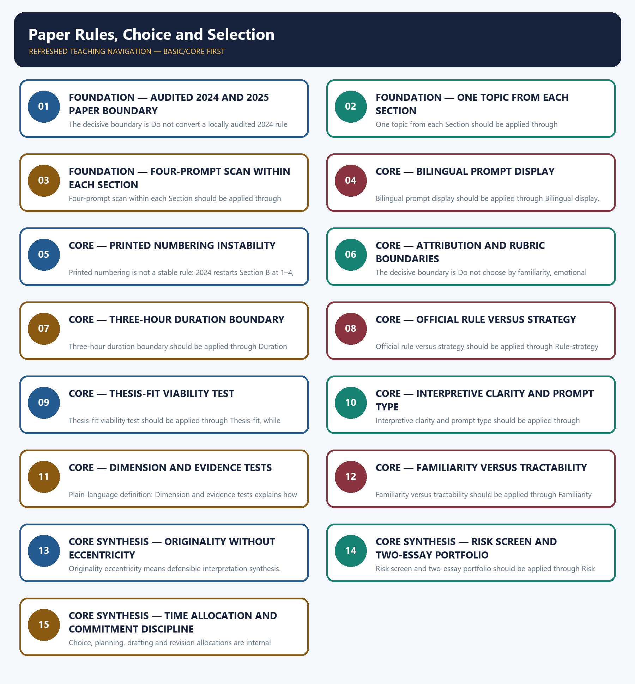

# Paper Rules, Choice and Selection — Learner-v2 Complete Learning Session

> **Authoring-only generation:** 2026-09-04. No PDF was rendered and no tracker or index was mutated.

### SOURCE, PROGRESSION AND OFFICIAL-RULE AUDIT

- **Generation date:** 2026-09-04.
- **Source order:** canonical Basic owner first; Advanced owner second; Essay master framework, README, official-syllabus map, answer-worthiness audit and revision chart next; PYQ corpus and official OCR papers after that; live official UPSC pages only as a final check.
- **Basic/Advanced boundary:** complete Basic teaching remains first and Advanced material remains optional and last.
- **OCR boundary:** Repository Markdown was primary. OCR-searchable official UPSC Essay papers were supplementary only for printed instructions and V1 prompt wording. No author, official model answer, current marks split, phase allocation, paragraph count or scoring rubric was inferred.
- **Qdrant:** not used; repository Markdown and local official papers were sufficient.
- **PYQ integrity:** The cards preserve one exact 2024 instruction and two exact V1 prompts. Their solutions demonstrate selection method only and never claim an official model answer.
- **Live-source boundary:** Rule boundary dated 2026-09-04: use the repository's locally audited 2024–2025 instructions plus the official-scheme duration. Re-check the applicable UPSC notification and paper before asserting a future year's exact rules.
- **No-formula rule:** strategy, heuristics and practice weights are never presented as official UPSC instructions or marking criteria.

### LIVE OFFICIAL-SOURCE ATTEMPT LOG

The checks below were made on 2026-09-04. Substantive official text is used only for the proposition it supports; title-only, blocked or thin pages are recorded and supply no factual claim.

- https://upsc.gov.in/examinations/previous-question-papers — attempted 2026-09-04; the official UPSC index returned an access block to the live fetch, so no new wording or paper rule was imported.
- https://upsc.gov.in/examinations/active-examinations — attempted 2026-09-04; the official UPSC page returned an access block, so the repository's audited rule boundary remains controlling.
- https://upsc.gov.in/sites/default/files/Notif-CSP-2024-Engl-140224.pdf — searched 2026-09-04; the official notification URL was located only as a scheme cross-check route and supplied no unaudited current rule.

## BASIC LEARNING SESSION



*Distinct embedded teaching-navigation image. The separate continuous Cārvāka-style flowchart package remains an independent at-a-glance artifact.*

### SESSION 1 — FOUNDATION — AUDITED 2024 AND 2025 PAPER BOUNDARY

#### DEFINITION / WHAT THIS IS CALLED

**Plain-language definition:** Objective practice: Apply Audited 2024 and 2025 paper boundary by distinguishing the correct Essay-method move from nearby but invalid shortcuts; no factual-trivia recall is being tested.

**Technical definition:** The decisive boundary is Do not convert a locally audited 2024 rule into an unsupported claim about every future paper.

#### ANSWER-GRABBING OPENING — WRITE/ADAPT IN THE EXAM

> Plain-language definition: Audited 2024 and 2025 paper boundary explains how 2024 printed instruction and 2025 audited boundary combine into one usable Essay-planning move.

#### MUST-WRITE KEYWORDS

- **FOUNDATION**
- **Audited 2024**
- **Plain-language definition**
- **Technical definition**
- **Audited**
- **2025 paper boundary**

**How to use them:** Frame the answer through FOUNDATION; define Audited 2024, connect Plain-language definition with Technical definition to explain the mechanism, and use Audited for the decisive comparison or qualification.

#### METHOD MOVE / WHAT THIS DOES

**Plain-language definition:** Audited 2024 and 2025 paper boundary explains how 2024 printed instruction and 2025 audited boundary combine into one usable Essay-planning move.

**Technical definition:** The learner fixes the printed prompt, its relationship or demand, the defensible scope, the argument function and the evidence boundary before drafting prose.

#### ANSWER-GRABBING OPENING — WRITE/ADAPT IN THE EXAM

> Audited 2024 and 2025 paper boundary should be applied through 2024 printed instruction and 2025 audited boundary, while preserving the difference between official paper instruction and strategy, prompt wording and interpretation, example and evidence, breadth and coherence.

#### MUST-WRITE KEYWORDS

- **Audited**
- **paper**
- **boundary**
- **printed**
- **instruction**
- **locally**

**How to use them:** Define the first three terms, trace the relationship with the next two, and attach the final term to the exact claim, example and qualification. Qualification: Do not convert a locally audited 2024 rule into an unsupported claim about every future paper.

#### VISUAL FIRST

```text
AUDITED 2024 AND 2025 PAPER BOUNDARY
01. 2024 printed instruction
    |
    v
02. 2025 audited boundary
STATUS / CATEGORY FIREWALL -> Do not convert a locally audited 2024 rule into an unsupported claim about every future paper.
```

*The rail fixes the prompt-to-argument sequence and claim boundary before explanation.*

#### CORE EXPLANATION

The locally audited 2024 paper says: "Write two essays, choosing one topic from each of the following Sections A and B, in about 1000-1200 words each:" and prints "(125 × 2 = 250)". The locally audited 2025 English instruction is garbled, but its Hindi line and two section headings still establish two essays, one from each Section, about 1000–1200 words each; that copy prints no marks line.

#### SIMPLE SYSTEM EXAMPLE

Read Audited 2024 and 2025 paper boundary as a sequence: identify 2024 printed instruction, follow the method through the printed proposition, and stop before adding a rule, attribution, fact or inference the audited sources do not support.

#### TECHNICAL DISTINCTION

The decisive boundary is Do not convert a locally audited 2024 rule into an unsupported claim about every future paper. This keeps 2024 printed instruction and 2025 audited boundary in the correct prompt, method, argument and evidence category.

#### NAMED EVIDENCE AND MECHANISM

- The locally audited 2024 paper says: "Write two essays, choosing one topic from each of the following Sections A and B, in about 1000-1200 words each:" and prints "(125 × 2 = 250)".
- The locally audited 2025 English instruction is garbled, but its Hindi line and two section headings still establish two essays, one from each Section, about 1000–1200 words each; that copy prints no marks line.

#### EXAMINER CAUTION

- Do not convert a locally audited 2024 rule into an unsupported claim about every future paper.

#### EXAM LINK

- **Objective practice:** Apply Audited 2024 and 2025 paper boundary by distinguishing the correct Essay-method move from nearby but invalid shortcuts; no factual-trivia recall is being tested.
- **Essay application:** State the dated audited boundary before giving any selection advice.

#### MINI RECAP

- **Mechanism chain:** 2024 printed instruction -> 2025 audited boundary
- **Qualified use:** State the dated audited boundary before giving any selection advice.

#### CLOSING RECALL FLOW — FOUNDATION — AUDITED 2024 AND 2025 PAPER BOUNDARY

```text
START / CONCEPT: FOUNDATION — Audited 2024 and 2025 paper boundary
        |
        v
EXACT TERMS: FOUNDATION · Audited 2024 · Plain-language definition · Technical definition · Audited · 2025 paper boundary
        |
        v
MECHANISM / ARGUMENT: Audited 2024 and 2025 paper boundary should be applied through 2024 printed instruction and 2025 audited boundary, while preserving the difference between official paper instruction and strategy, prompt wording and interpretation, example and evidence, breadth and coherence.
        |
        v
CONSEQUENCE / CONTRAST: Read Audited 2024 and 2025 paper boundary as a sequence: identify 2024 printed instruction, follow the method through the printed proposition, and stop before adding a rule, attribution, fact or inference the audited sources do not support.
        |
        v
UPSC TRAP / ANSWER-USE: Objective practice: Apply Audited 2024 and 2025 paper boundary by distinguishing the correct Essay-method move from nearby but invalid shortcuts; no factual-trivia recall is being tested.
        |
        v
ANSWER-GRABBING FORMULATION: Plain-language definition: Audited 2024 and 2025 paper boundary explains how 2024 printed instruction and 2025 audited boundary combine into one usable Essay-planning move.
```
### SESSION 2 — FOUNDATION — ONE TOPIC FROM EACH SECTION

#### DEFINITION / WHAT THIS IS CALLED

**Plain-language definition:** Objective practice: Apply One topic from each Section by distinguishing the correct Essay-method move from nearby but invalid shortcuts; no factual-trivia recall is being tested.

**Technical definition:** One topic from each Section should be applied through One-per-section constraint, while preserving the difference between official paper instruction and strategy, prompt wording and interpretation, example and evidence, breadth and coherence.

#### ANSWER-GRABBING OPENING — WRITE/ADAPT IN THE EXAM

> Plain-language definition: One topic from each Section explains how One-per-section constraint combine into one usable Essay-planning move.

#### MUST-WRITE KEYWORDS

- **FOUNDATION**
- **One topic from each Section**
- **Plain-language definition**
- **Technical definition**
- **from**
- **each**

**How to use them:** Frame the answer through FOUNDATION; define One topic from each Section, connect Plain-language definition with Technical definition to explain the mechanism, and use from for the decisive comparison or qualification.

#### METHOD MOVE / WHAT THIS DOES

**Plain-language definition:** One topic from each Section explains how One-per-section constraint combine into one usable Essay-planning move.

**Technical definition:** The learner fixes the printed prompt, its relationship or demand, the defensible scope, the argument function and the evidence boundary before drafting prose.

#### ANSWER-GRABBING OPENING — WRITE/ADAPT IN THE EXAM

> One topic from each Section should be applied through One-per-section constraint, while preserving the difference between official paper instruction and strategy, prompt wording and interpretation, example and evidence, breadth and coherence.

#### MUST-WRITE KEYWORDS

- **from**
- **each**
- **Section**
- **One-per-section**
- **constraint**
- **audited**

**How to use them:** Define the first three terms, trace the relationship with the next two, and attach the final term to the exact claim, example and qualification. Qualification: Do not quote the garbled 2025 English instruction as clean official wording.

#### VISUAL FIRST

```text
ONE TOPIC FROM EACH SECTION
01. One-per-section constraint
STATUS / CATEGORY FIREWALL -> Do not quote the garbled 2025 English instruction as clean official wording.
```

*The rail fixes the prompt-to-argument sequence and claim boundary before explanation.*

#### CORE EXPLANATION

The audited 2024 and 2025 papers require one topic from Section A and one from Section B, so selecting two prompts from one Section violates the printed structure.

#### SIMPLE SYSTEM EXAMPLE

Read One topic from each Section as a sequence: identify One-per-section constraint, follow the method through the printed proposition, and stop before adding a rule, attribution, fact or inference the audited sources do not support.

#### TECHNICAL DISTINCTION

The decisive boundary is Do not quote the garbled 2025 English instruction as clean official wording. This keeps One-per-section constraint in the correct prompt, method, argument and evidence category.

#### NAMED EVIDENCE AND MECHANISM

- The audited 2024 and 2025 papers require one topic from Section A and one from Section B, so selecting two prompts from one Section violates the printed structure.

#### EXAMINER CAUTION

- Do not quote the garbled 2025 English instruction as clean official wording.

#### EXAM LINK

- **Objective practice:** Apply One topic from each Section by distinguishing the correct Essay-method move from nearby but invalid shortcuts; no factual-trivia recall is being tested.
- **Essay application:** Check the one-per-Section rule before comparing prompt appeal.

#### MINI RECAP

- **Mechanism chain:** One-per-section constraint
- **Qualified use:** Check the one-per-Section rule before comparing prompt appeal.

#### CLOSING RECALL FLOW — FOUNDATION — ONE TOPIC FROM EACH SECTION

```text
START / CONCEPT: FOUNDATION — One topic from each Section
        |
        v
EXACT TERMS: FOUNDATION · One topic from each Section · Plain-language definition · Technical definition · from · each
        |
        v
MECHANISM / ARGUMENT: One topic from each Section should be applied through One-per-section constraint, while preserving the difference between official paper instruction and strategy, prompt wording and interpretation, example and evidence, breadth and coherence.
        |
        v
CONSEQUENCE / CONTRAST: Read One topic from each Section as a sequence: identify One-per-section constraint, follow the method through the printed proposition, and stop before adding a rule, attribution, fact or inference the audited sources do not support.
        |
        v
UPSC TRAP / ANSWER-USE: Objective practice: Apply One topic from each Section by distinguishing the correct Essay-method move from nearby but invalid shortcuts; no factual-trivia recall is being tested.
        |
        v
ANSWER-GRABBING FORMULATION: Plain-language definition: One topic from each Section explains how One-per-section constraint combine into one usable Essay-planning move.
```
### SESSION 3 — FOUNDATION — FOUR-PROMPT SCAN WITHIN EACH SECTION

#### DEFINITION / WHAT THIS IS CALLED

**Plain-language definition:** Objective practice: Apply Four-prompt scan within each Section by distinguishing the correct Essay-method move from nearby but invalid shortcuts; no factual-trivia recall is being tested.

**Technical definition:** Four-prompt scan within each Section should be applied through Four-prompt choice set, while preserving the difference between official paper instruction and strategy, prompt wording and interpretation, example and evidence, breadth and coherence.

#### ANSWER-GRABBING OPENING — WRITE/ADAPT IN THE EXAM

> Plain-language definition: Four-prompt scan within each Section explains how Four-prompt choice set combine into one usable Essay-planning move.

#### MUST-WRITE KEYWORDS

- **FOUNDATION**
- **Four-prompt scan within each Section**
- **Plain-language definition**
- **Technical definition**
- **Four-prompt**
- **scan**

**How to use them:** Frame the answer through FOUNDATION; define Four-prompt scan within each Section, connect Plain-language definition with Technical definition to explain the mechanism, and use Four-prompt for the decisive comparison or qualification.

#### METHOD MOVE / WHAT THIS DOES

**Plain-language definition:** Four-prompt scan within each Section explains how Four-prompt choice set combine into one usable Essay-planning move.

**Technical definition:** The learner fixes the printed prompt, its relationship or demand, the defensible scope, the argument function and the evidence boundary before drafting prose.

#### ANSWER-GRABBING OPENING — WRITE/ADAPT IN THE EXAM

> Four-prompt scan within each Section should be applied through Four-prompt choice set, while preserving the difference between official paper instruction and strategy, prompt wording and interpretation, example and evidence, breadth and coherence.

#### MUST-WRITE KEYWORDS

- **Four-prompt**
- **scan**
- **within**
- **each**
- **Section**
- **choice**

**How to use them:** Define the first three terms, trace the relationship with the next two, and attach the final term to the exact claim, example and qualification. Qualification: Do not select two prompts from the same Section.

#### VISUAL FIRST

```text
FOUR-PROMPT SCAN WITHIN EACH SECTION
01. Four-prompt choice set
STATUS / CATEGORY FIREWALL -> Do not select two prompts from the same Section.
```

*The rail fixes the prompt-to-argument sequence and claim boundary before explanation.*

#### CORE EXPLANATION

Each audited 2024 and 2025 Section displays four prompts, producing a separate four-way choice within each Section.

#### SIMPLE SYSTEM EXAMPLE

Read Four-prompt scan within each Section as a sequence: identify Four-prompt choice set, follow the method through the printed proposition, and stop before adding a rule, attribution, fact or inference the audited sources do not support.

#### TECHNICAL DISTINCTION

The decisive boundary is Do not select two prompts from the same Section. This keeps Four-prompt choice set in the correct prompt, method, argument and evidence category.

#### NAMED EVIDENCE AND MECHANISM

- Each audited 2024 and 2025 Section displays four prompts, producing a separate four-way choice within each Section.

#### EXAMINER CAUTION

- Do not select two prompts from the same Section.

#### EXAM LINK

- **Objective practice:** Apply Four-prompt scan within each Section by distinguishing the correct Essay-method move from nearby but invalid shortcuts; no factual-trivia recall is being tested.
- **Essay application:** Run the same quick viability test on all four prompts in a Section.

#### MINI RECAP

- **Mechanism chain:** Four-prompt choice set
- **Qualified use:** Run the same quick viability test on all four prompts in a Section.

#### CLOSING RECALL FLOW — FOUNDATION — FOUR-PROMPT SCAN WITHIN EACH SECTION

```text
START / CONCEPT: FOUNDATION — Four-prompt scan within each Section
        |
        v
EXACT TERMS: FOUNDATION · Four-prompt scan within each Section · Plain-language definition · Technical definition · Four-prompt · scan
        |
        v
MECHANISM / ARGUMENT: Four-prompt scan within each Section should be applied through Four-prompt choice set, while preserving the difference between official paper instruction and strategy, prompt wording and interpretation, example and evidence, breadth and coherence.
        |
        v
CONSEQUENCE / CONTRAST: Read Four-prompt scan within each Section as a sequence: identify Four-prompt choice set, follow the method through the printed proposition, and stop before adding a rule, attribution, fact or inference the audited sources do not support.
        |
        v
UPSC TRAP / ANSWER-USE: Objective practice: Apply Four-prompt scan within each Section by distinguishing the correct Essay-method move from nearby but invalid shortcuts; no factual-trivia recall is being tested.
        |
        v
ANSWER-GRABBING FORMULATION: Plain-language definition: Four-prompt scan within each Section explains how Four-prompt choice set combine into one usable Essay-planning move.
```
### SESSION 4 — CORE — BILINGUAL PROMPT DISPLAY

#### DEFINITION / WHAT THIS IS CALLED

**Plain-language definition:** Objective practice: Apply Bilingual prompt display by distinguishing the correct Essay-method move from nearby but invalid shortcuts; no factual-trivia recall is being tested.

**Technical definition:** Bilingual prompt display should be applied through Bilingual display, while preserving the difference between official paper instruction and strategy, prompt wording and interpretation, example and evidence, breadth and coherence.

#### ANSWER-GRABBING OPENING — WRITE/ADAPT IN THE EXAM

> Plain-language definition: Bilingual prompt display explains how Bilingual display combine into one usable Essay-planning move.

#### MUST-WRITE KEYWORDS

- **Bilingual prompt display**
- **Plain-language definition**
- **Technical definition**
- **Bilingual**
- **prompt**
- **display**

**How to use them:** Frame the answer through Bilingual prompt display; define Plain-language definition, connect Technical definition with Bilingual to explain the mechanism, and use prompt for the decisive comparison or qualification.

#### METHOD MOVE / WHAT THIS DOES

**Plain-language definition:** Bilingual prompt display explains how Bilingual display combine into one usable Essay-planning move.

**Technical definition:** The learner fixes the printed prompt, its relationship or demand, the defensible scope, the argument function and the evidence boundary before drafting prose.

#### ANSWER-GRABBING OPENING — WRITE/ADAPT IN THE EXAM

> Bilingual prompt display should be applied through Bilingual display, while preserving the difference between official paper instruction and strategy, prompt wording and interpretation, example and evidence, breadth and coherence.

#### MUST-WRITE KEYWORDS

- **Bilingual**
- **prompt**
- **display**
- **audited**
- **prompts**
- **printed**

**How to use them:** Define the first three terms, trace the relationship with the next two, and attach the final term to the exact claim, example and qualification. Qualification: Do not treat internal B5–B8 labels as stable printed numbering.

#### VISUAL FIRST

```text
BILINGUAL PROMPT DISPLAY
01. Bilingual display
STATUS / CATEGORY FIREWALL -> Do not treat internal B5–B8 labels as stable printed numbering.
```

*The rail fixes the prompt-to-argument sequence and claim boundary before explanation.*

#### CORE EXPLANATION

The audited prompts are printed bilingually, Hindi first and English second; the repository quotes only the audited English line.

#### SIMPLE SYSTEM EXAMPLE

Read Bilingual prompt display as a sequence: identify Bilingual display, follow the method through the printed proposition, and stop before adding a rule, attribution, fact or inference the audited sources do not support.

#### TECHNICAL DISTINCTION

The decisive boundary is Do not treat internal B5–B8 labels as stable printed numbering. This keeps Bilingual display in the correct prompt, method, argument and evidence category.

#### NAMED EVIDENCE AND MECHANISM

- The audited prompts are printed bilingually, Hindi first and English second; the repository quotes only the audited English line.

#### EXAMINER CAUTION

- Do not treat internal B5–B8 labels as stable printed numbering.

#### EXAM LINK

- **Objective practice:** Apply Bilingual prompt display by distinguishing the correct Essay-method move from nearby but invalid shortcuts; no factual-trivia recall is being tested.
- **Essay application:** Follow section headings rather than assuming a numbering convention.

#### MINI RECAP

- **Mechanism chain:** Bilingual display
- **Qualified use:** Follow section headings rather than assuming a numbering convention.

#### CLOSING RECALL FLOW — CORE — BILINGUAL PROMPT DISPLAY

```text
START / CONCEPT: CORE — Bilingual prompt display
        |
        v
EXACT TERMS: Bilingual prompt display · Plain-language definition · Technical definition · Bilingual · prompt · display
        |
        v
MECHANISM / ARGUMENT: Bilingual prompt display should be applied through Bilingual display, while preserving the difference between official paper instruction and strategy, prompt wording and interpretation, example and evidence, breadth and coherence.
        |
        v
CONSEQUENCE / CONTRAST: Read Bilingual prompt display as a sequence: identify Bilingual display, follow the method through the printed proposition, and stop before adding a rule, attribution, fact or inference the audited sources do not support.
        |
        v
UPSC TRAP / ANSWER-USE: Objective practice: Apply Bilingual prompt display by distinguishing the correct Essay-method move from nearby but invalid shortcuts; no factual-trivia recall is being tested.
        |
        v
ANSWER-GRABBING FORMULATION: Plain-language definition: Bilingual prompt display explains how Bilingual display combine into one usable Essay-planning move.
```
### SESSION 5 — CORE — PRINTED NUMBERING INSTABILITY

#### DEFINITION / WHAT THIS IS CALLED

**Plain-language definition:** Objective practice: Apply Printed numbering instability by distinguishing the correct Essay-method move from nearby but invalid shortcuts; no factual-trivia recall is being tested.

**Technical definition:** Printed numbering is not a stable rule: 2024 restarts Section B at 1–4, whereas 2025 continues it at 5–8.

#### ANSWER-GRABBING OPENING — WRITE/ADAPT IN THE EXAM

> Plain-language definition: Printed numbering instability explains how Numbering instability combine into one usable Essay-planning move.

#### MUST-WRITE KEYWORDS

- **Printed numbering instability**
- **Plain-language definition**
- **Technical definition**
- **Printed**
- **numbering**
- **instability**

**How to use them:** Frame the answer through Printed numbering instability; define Plain-language definition, connect Technical definition with Printed to explain the mechanism, and use numbering for the decisive comparison or qualification.

#### METHOD MOVE / WHAT THIS DOES

**Plain-language definition:** Printed numbering instability explains how Numbering instability combine into one usable Essay-planning move.

**Technical definition:** The learner fixes the printed prompt, its relationship or demand, the defensible scope, the argument function and the evidence boundary before drafting prose.

#### ANSWER-GRABBING OPENING — WRITE/ADAPT IN THE EXAM

> Printed numbering instability should be applied through Numbering instability, while preserving the difference between official paper instruction and strategy, prompt wording and interpretation, example and evidence, breadth and coherence.

#### MUST-WRITE KEYWORDS

- **Printed**
- **numbering**
- **instability**
- **stable**
- **rule**
- **restarts**

**How to use them:** Define the first three terms, trace the relationship with the next two, and attach the final term to the exact claim, example and qualification. Qualification: Do not present a choice matrix or time split as an official UPSC rule.

#### VISUAL FIRST

```text
PRINTED NUMBERING INSTABILITY
01. Numbering instability
STATUS / CATEGORY FIREWALL -> Do not present a choice matrix or time split as an official UPSC rule.
```

*The rail fixes the prompt-to-argument sequence and claim boundary before explanation.*

#### CORE EXPLANATION

Printed numbering is not a stable rule: 2024 restarts Section B at 1–4, whereas 2025 continues it at 5–8.

#### SIMPLE SYSTEM EXAMPLE

Read Printed numbering instability as a sequence: identify Numbering instability, follow the method through the printed proposition, and stop before adding a rule, attribution, fact or inference the audited sources do not support.

#### TECHNICAL DISTINCTION

The decisive boundary is Do not present a choice matrix or time split as an official UPSC rule. This keeps Numbering instability in the correct prompt, method, argument and evidence category.

#### NAMED EVIDENCE AND MECHANISM

- Printed numbering is not a stable rule: 2024 restarts Section B at 1–4, whereas 2025 continues it at 5–8.

#### EXAMINER CAUTION

- Do not present a choice matrix or time split as an official UPSC rule.

#### EXAM LINK

- **Objective practice:** Apply Printed numbering instability by distinguishing the correct Essay-method move from nearby but invalid shortcuts; no factual-trivia recall is being tested.
- **Essay application:** Use prompt wording without inventing an author or official rubric.

#### MINI RECAP

- **Mechanism chain:** Numbering instability
- **Qualified use:** Use prompt wording without inventing an author or official rubric.

#### CLOSING RECALL FLOW — CORE — PRINTED NUMBERING INSTABILITY

```text
START / CONCEPT: CORE — Printed numbering instability
        |
        v
EXACT TERMS: Printed numbering instability · Plain-language definition · Technical definition · Printed · numbering · instability
        |
        v
MECHANISM / ARGUMENT: Printed numbering instability should be applied through Numbering instability, while preserving the difference between official paper instruction and strategy, prompt wording and interpretation, example and evidence, breadth and coherence.
        |
        v
CONSEQUENCE / CONTRAST: Read Printed numbering instability as a sequence: identify Numbering instability, follow the method through the printed proposition, and stop before adding a rule, attribution, fact or inference the audited sources do not support.
        |
        v
UPSC TRAP / ANSWER-USE: Objective practice: Apply Printed numbering instability by distinguishing the correct Essay-method move from nearby but invalid shortcuts; no factual-trivia recall is being tested.
        |
        v
ANSWER-GRABBING FORMULATION: Plain-language definition: Printed numbering instability explains how Numbering instability combine into one usable Essay-planning move.
```
### SESSION 6 — CORE — ATTRIBUTION AND RUBRIC BOUNDARIES

#### DEFINITION / WHAT THIS IS CALLED

**Plain-language definition:** Objective practice: Apply Attribution and rubric boundaries by distinguishing the correct Essay-method move from nearby but invalid shortcuts; no factual-trivia recall is being tested.

**Technical definition:** The decisive boundary is Do not choose by familiarity, emotional appeal or quotation recognition alone.

#### ANSWER-GRABBING OPENING — WRITE/ADAPT IN THE EXAM

> Plain-language definition: Attribution and rubric boundaries explains how Attribution boundary and Rubric boundary combine into one usable Essay-planning move.

#### MUST-WRITE KEYWORDS

- **Attribution**
- **rubric boundaries**
- **Plain-language definition**
- **Technical definition**
- **rubric**
- **boundaries**

**How to use them:** Frame the answer through Attribution; define rubric boundaries, connect Plain-language definition with Technical definition to explain the mechanism, and use rubric for the decisive comparison or qualification.

#### METHOD MOVE / WHAT THIS DOES

**Plain-language definition:** Attribution and rubric boundaries explains how Attribution boundary and Rubric boundary combine into one usable Essay-planning move.

**Technical definition:** The learner fixes the printed prompt, its relationship or demand, the defensible scope, the argument function and the evidence boundary before drafting prose.

#### ANSWER-GRABBING OPENING — WRITE/ADAPT IN THE EXAM

> Attribution and rubric boundaries should be applied through Attribution boundary and Rubric boundary, while preserving the difference between official paper instruction and strategy, prompt wording and interpretation, example and evidence, breadth and coherence.

#### MUST-WRITE KEYWORDS

- **Attribution**
- **rubric**
- **boundaries**
- **boundary**
- **Neither**
- **audited**

**How to use them:** Define the first three terms, trace the relationship with the next two, and attach the final term to the exact claim, example and qualification. Qualification: Do not choose by familiarity, emotional appeal or quotation recognition alone.

#### VISUAL FIRST

```text
ATTRIBUTION AND RUBRIC BOUNDARIES
01. Attribution boundary
    |
    v
02. Rubric boundary
STATUS / CATEGORY FIREWALL -> Do not choose by familiarity, emotional appeal or quotation recognition alone.
```

*The rail fixes the prompt-to-argument sequence and claim boundary before explanation.*

#### CORE EXPLANATION

Neither audited 2024 nor 2025 paper prints an author beside any prompt, so selection must not depend on an invented attribution. The audited papers print no granular marking rubric, examiner weightage or ideal paragraph and example count; internal choice tools are therefore strategy, not official rules.

#### SIMPLE SYSTEM EXAMPLE

Read Attribution and rubric boundaries as a sequence: identify Attribution boundary, follow the method through the printed proposition, and stop before adding a rule, attribution, fact or inference the audited sources do not support.

#### TECHNICAL DISTINCTION

The decisive boundary is Do not choose by familiarity, emotional appeal or quotation recognition alone. This keeps Attribution boundary and Rubric boundary in the correct prompt, method, argument and evidence category.

#### NAMED EVIDENCE AND MECHANISM

- Neither audited 2024 nor 2025 paper prints an author beside any prompt, so selection must not depend on an invented attribution.
- The audited papers print no granular marking rubric, examiner weightage or ideal paragraph and example count; internal choice tools are therefore strategy, not official rules.

#### EXAMINER CAUTION

- Do not choose by familiarity, emotional appeal or quotation recognition alone.

#### EXAM LINK

- **Objective practice:** Apply Attribution and rubric boundaries by distinguishing the correct Essay-method move from nearby but invalid shortcuts; no factual-trivia recall is being tested.
- **Essay application:** Label every matrix, score and time split as strategy.

#### MINI RECAP

- **Mechanism chain:** Attribution boundary -> Rubric boundary
- **Qualified use:** Label every matrix, score and time split as strategy.

#### CLOSING RECALL FLOW — CORE — ATTRIBUTION AND RUBRIC BOUNDARIES

```text
START / CONCEPT: CORE — Attribution and rubric boundaries
        |
        v
EXACT TERMS: Attribution · rubric boundaries · Plain-language definition · Technical definition · rubric · boundaries
        |
        v
MECHANISM / ARGUMENT: Attribution and rubric boundaries should be applied through Attribution boundary and Rubric boundary, while preserving the difference between official paper instruction and strategy, prompt wording and interpretation, example and evidence, breadth and coherence.
        |
        v
CONSEQUENCE / CONTRAST: Read Attribution and rubric boundaries as a sequence: identify Attribution boundary, follow the method through the printed proposition, and stop before adding a rule, attribution, fact or inference the audited sources do not support.
        |
        v
UPSC TRAP / ANSWER-USE: Objective practice: Apply Attribution and rubric boundaries by distinguishing the correct Essay-method move from nearby but invalid shortcuts; no factual-trivia recall is being tested.
        |
        v
ANSWER-GRABBING FORMULATION: Plain-language definition: Attribution and rubric boundaries explains how Attribution boundary and Rubric boundary combine into one usable Essay-planning move.
```
### SESSION 7 — CORE — THREE-HOUR DURATION BOUNDARY

#### DEFINITION / WHAT THIS IS CALLED

**Plain-language definition:** Objective practice: Apply Three-hour duration boundary by distinguishing the correct Essay-method move from nearby but invalid shortcuts; no factual-trivia recall is being tested.

**Technical definition:** Three-hour duration boundary should be applied through Duration boundary, while preserving the difference between official paper instruction and strategy, prompt wording and interpretation, example and evidence, breadth and coherence.

#### ANSWER-GRABBING OPENING — WRITE/ADAPT IN THE EXAM

> Plain-language definition: Three-hour duration boundary explains how Duration boundary combine into one usable Essay-planning move.

#### MUST-WRITE KEYWORDS

- **Three-hour duration boundary**
- **Plain-language definition**
- **Technical definition**
- **Three-hour**
- **duration**
- **boundary**

**How to use them:** Frame the answer through Three-hour duration boundary; define Plain-language definition, connect Technical definition with Three-hour to explain the mechanism, and use duration for the decisive comparison or qualification.

#### METHOD MOVE / WHAT THIS DOES

**Plain-language definition:** Three-hour duration boundary explains how Duration boundary combine into one usable Essay-planning move.

**Technical definition:** The learner fixes the printed prompt, its relationship or demand, the defensible scope, the argument function and the evidence boundary before drafting prose.

#### ANSWER-GRABBING OPENING — WRITE/ADAPT IN THE EXAM

> Three-hour duration boundary should be applied through Duration boundary, while preserving the difference between official paper instruction and strategy, prompt wording and interpretation, example and evidence, breadth and coherence.

#### MUST-WRITE KEYWORDS

- **Three-hour**
- **duration**
- **boundary**
- **repository**
- **dates**
- **official**

**How to use them:** Define the first three terms, trace the relationship with the next two, and attach the final term to the exact claim, example and qualification. Qualification: Do not mistake eccentric interpretation for originality.

#### VISUAL FIRST

```text
THREE-HOUR DURATION BOUNDARY
01. Duration boundary
STATUS / CATEGORY FIREWALL -> Do not mistake eccentric interpretation for originality.
```

*The rail fixes the prompt-to-argument sequence and claim boundary before explanation.*

#### CORE EXPLANATION

The repository dates the three-hour Essay duration to the official Civil Services Main examination scheme, not to a time header in the locally held 2024–2025 scans.

#### SIMPLE SYSTEM EXAMPLE

Read Three-hour duration boundary as a sequence: identify Duration boundary, follow the method through the printed proposition, and stop before adding a rule, attribution, fact or inference the audited sources do not support.

#### TECHNICAL DISTINCTION

The decisive boundary is Do not mistake eccentric interpretation for originality. This keeps Duration boundary in the correct prompt, method, argument and evidence category.

#### NAMED EVIDENCE AND MECHANISM

- The repository dates the three-hour Essay duration to the official Civil Services Main examination scheme, not to a time header in the locally held 2024–2025 scans.

#### EXAMINER CAUTION

- Do not mistake eccentric interpretation for originality.

#### EXAM LINK

- **Objective practice:** Apply Three-hour duration boundary by distinguishing the correct Essay-method move from nearby but invalid shortcuts; no factual-trivia recall is being tested.
- **Essay application:** Prefer the prompt that produces a qualified claim early.

#### MINI RECAP

- **Mechanism chain:** Duration boundary
- **Qualified use:** Prefer the prompt that produces a qualified claim early.

#### CLOSING RECALL FLOW — CORE — THREE-HOUR DURATION BOUNDARY

```text
START / CONCEPT: CORE — Three-hour duration boundary
        |
        v
EXACT TERMS: Three-hour duration boundary · Plain-language definition · Technical definition · Three-hour · duration · boundary
        |
        v
MECHANISM / ARGUMENT: Three-hour duration boundary should be applied through Duration boundary, while preserving the difference between official paper instruction and strategy, prompt wording and interpretation, example and evidence, breadth and coherence.
        |
        v
CONSEQUENCE / CONTRAST: Read Three-hour duration boundary as a sequence: identify Duration boundary, follow the method through the printed proposition, and stop before adding a rule, attribution, fact or inference the audited sources do not support.
        |
        v
UPSC TRAP / ANSWER-USE: Objective practice: Apply Three-hour duration boundary by distinguishing the correct Essay-method move from nearby but invalid shortcuts; no factual-trivia recall is being tested.
        |
        v
ANSWER-GRABBING FORMULATION: Plain-language definition: Three-hour duration boundary explains how Duration boundary combine into one usable Essay-planning move.
```
### SESSION 8 — CORE — OFFICIAL RULE VERSUS STRATEGY

#### DEFINITION / WHAT THIS IS CALLED

**Plain-language definition:** Objective practice: Apply Official rule versus strategy by distinguishing the correct Essay-method move from nearby but invalid shortcuts; no factual-trivia recall is being tested.

**Technical definition:** Official rule versus strategy should be applied through Rule-strategy firewall, while preserving the difference between official paper instruction and strategy, prompt wording and interpretation, example and evidence, breadth and coherence.

#### ANSWER-GRABBING OPENING — WRITE/ADAPT IN THE EXAM

> Plain-language definition: Official rule versus strategy explains how Rule-strategy firewall combine into one usable Essay-planning move.

#### MUST-WRITE KEYWORDS

- **Official rule versus strategy**
- **Plain-language definition**
- **Technical definition**
- **Official**
- **rule**
- **versus**

**How to use them:** Frame the answer through Official rule versus strategy; define Plain-language definition, connect Technical definition with Official to explain the mechanism, and use rule for the decisive comparison or qualification.

#### METHOD MOVE / WHAT THIS DOES

**Plain-language definition:** Official rule versus strategy explains how Rule-strategy firewall combine into one usable Essay-planning move.

**Technical definition:** The learner fixes the printed prompt, its relationship or demand, the defensible scope, the argument function and the evidence boundary before drafting prose.

#### ANSWER-GRABBING OPENING — WRITE/ADAPT IN THE EXAM

> Official rule versus strategy should be applied through Rule-strategy firewall, while preserving the difference between official paper instruction and strategy, prompt wording and interpretation, example and evidence, breadth and coherence.

#### MUST-WRITE KEYWORDS

- **Official**
- **rule**
- **versus**
- **strategy**
- **Rule-strategy**
- **firewall**

**How to use them:** Define the first three terms, trace the relationship with the next two, and attach the final term to the exact claim, example and qualification. Qualification: Do not commit when evidence depends on half-remembered figures or attributions.

#### VISUAL FIRST

```text
OFFICIAL RULE VERSUS STRATEGY
01. Rule-strategy firewall
STATUS / CATEGORY FIREWALL -> Do not commit when evidence depends on half-remembered figures or attributions.
```

*The rail fixes the prompt-to-argument sequence and claim boundary before explanation.*

#### CORE EXPLANATION

Official constraints state what must be attempted; topic scanning, time splits, matrices and risk scores are pedagogical strategies that must remain explicitly non-official.

#### SIMPLE SYSTEM EXAMPLE

Read Official rule versus strategy as a sequence: identify Rule-strategy firewall, follow the method through the printed proposition, and stop before adding a rule, attribution, fact or inference the audited sources do not support.

#### TECHNICAL DISTINCTION

The decisive boundary is Do not commit when evidence depends on half-remembered figures or attributions. This keeps Rule-strategy firewall in the correct prompt, method, argument and evidence category.

#### NAMED EVIDENCE AND MECHANISM

- Official constraints state what must be attempted; topic scanning, time splits, matrices and risk scores are pedagogical strategies that must remain explicitly non-official.

#### EXAMINER CAUTION

- Do not commit when evidence depends on half-remembered figures or attributions.

#### EXAM LINK

- **Objective practice:** Apply Official rule versus strategy by distinguishing the correct Essay-method move from nearby but invalid shortcuts; no factual-trivia recall is being tested.
- **Essay application:** Classify the prompt before planning dimensions.

#### MINI RECAP

- **Mechanism chain:** Rule-strategy firewall
- **Qualified use:** Classify the prompt before planning dimensions.

#### CLOSING RECALL FLOW — CORE — OFFICIAL RULE VERSUS STRATEGY

```text
START / CONCEPT: CORE — Official rule versus strategy
        |
        v
EXACT TERMS: Official rule versus strategy · Plain-language definition · Technical definition · Official · rule · versus
        |
        v
MECHANISM / ARGUMENT: Official rule versus strategy should be applied through Rule-strategy firewall, while preserving the difference between official paper instruction and strategy, prompt wording and interpretation, example and evidence, breadth and coherence.
        |
        v
CONSEQUENCE / CONTRAST: Read Official rule versus strategy as a sequence: identify Rule-strategy firewall, follow the method through the printed proposition, and stop before adding a rule, attribution, fact or inference the audited sources do not support.
        |
        v
UPSC TRAP / ANSWER-USE: Objective practice: Apply Official rule versus strategy by distinguishing the correct Essay-method move from nearby but invalid shortcuts; no factual-trivia recall is being tested.
        |
        v
ANSWER-GRABBING FORMULATION: Plain-language definition: Official rule versus strategy explains how Rule-strategy firewall combine into one usable Essay-planning move.
```
### SESSION 9 — CORE — THESIS-FIT VIABILITY TEST

#### DEFINITION / WHAT THIS IS CALLED

**Plain-language definition:** Objective practice: Apply Thesis-fit viability test by distinguishing the correct Essay-method move from nearby but invalid shortcuts; no factual-trivia recall is being tested.

**Technical definition:** Thesis-fit viability test should be applied through Thesis-fit, while preserving the difference between official paper instruction and strategy, prompt wording and interpretation, example and evidence, breadth and coherence.

#### ANSWER-GRABBING OPENING — WRITE/ADAPT IN THE EXAM

> Plain-language definition: Thesis-fit viability test explains how Thesis-fit combine into one usable Essay-planning move.

#### MUST-WRITE KEYWORDS

- **Thesis-fit viability test**
- **Plain-language definition**
- **Technical definition**
- **Thesis-fit**
- **viability**
- **test**

**How to use them:** Frame the answer through Thesis-fit viability test; define Plain-language definition, connect Technical definition with Thesis-fit to explain the mechanism, and use viability for the decisive comparison or qualification.

#### METHOD MOVE / WHAT THIS DOES

**Plain-language definition:** Thesis-fit viability test explains how Thesis-fit combine into one usable Essay-planning move.

**Technical definition:** The learner fixes the printed prompt, its relationship or demand, the defensible scope, the argument function and the evidence boundary before drafting prose.

#### ANSWER-GRABBING OPENING — WRITE/ADAPT IN THE EXAM

> Thesis-fit viability test should be applied through Thesis-fit, while preserving the difference between official paper instruction and strategy, prompt wording and interpretation, example and evidence, breadth and coherence.

#### MUST-WRITE KEYWORDS

- **Thesis-fit**
- **viability**
- **test**
- **prompt**
- **high-fit**
- **when**

**How to use them:** Define the first three terms, trace the relationship with the next two, and attach the final term to the exact claim, example and qualification. Qualification: Do not optimise one essay by leaving the second with an unworkable time budget.

#### VISUAL FIRST

```text
THESIS-FIT VIABILITY TEST
01. Thesis-fit
STATUS / CATEGORY FIREWALL -> Do not optimise one essay by leaving the second with an unworkable time budget.
```

*The rail fixes the prompt-to-argument sequence and claim boundary before explanation.*

#### CORE EXPLANATION

A prompt is high-fit when it quickly yields one contestable, qualified and supportable central claim rather than a restatement or subject label.

#### SIMPLE SYSTEM EXAMPLE

Read Thesis-fit viability test as a sequence: identify Thesis-fit, follow the method through the printed proposition, and stop before adding a rule, attribution, fact or inference the audited sources do not support.

#### TECHNICAL DISTINCTION

The decisive boundary is Do not optimise one essay by leaving the second with an unworkable time budget. This keeps Thesis-fit in the correct prompt, method, argument and evidence category.

#### NAMED EVIDENCE AND MECHANISM

- A prompt is high-fit when it quickly yields one contestable, qualified and supportable central claim rather than a restatement or subject label.

#### EXAMINER CAUTION

- Do not optimise one essay by leaving the second with an unworkable time budget.

#### EXAM LINK

- **Objective practice:** Apply Thesis-fit viability test by distinguishing the correct Essay-method move from nearby but invalid shortcuts; no factual-trivia recall is being tested.
- **Essay application:** Demand distinct claims, not renamed repetitions.

#### MINI RECAP

- **Mechanism chain:** Thesis-fit
- **Qualified use:** Demand distinct claims, not renamed repetitions.

#### CLOSING RECALL FLOW — CORE — THESIS-FIT VIABILITY TEST

```text
START / CONCEPT: CORE — Thesis-fit viability test
        |
        v
EXACT TERMS: Thesis-fit viability test · Plain-language definition · Technical definition · Thesis-fit · viability · test
        |
        v
MECHANISM / ARGUMENT: Thesis-fit viability test should be applied through Thesis-fit, while preserving the difference between official paper instruction and strategy, prompt wording and interpretation, example and evidence, breadth and coherence.
        |
        v
CONSEQUENCE / CONTRAST: Read Thesis-fit viability test as a sequence: identify Thesis-fit, follow the method through the printed proposition, and stop before adding a rule, attribution, fact or inference the audited sources do not support.
        |
        v
UPSC TRAP / ANSWER-USE: Objective practice: Apply Thesis-fit viability test by distinguishing the correct Essay-method move from nearby but invalid shortcuts; no factual-trivia recall is being tested.
        |
        v
ANSWER-GRABBING FORMULATION: Plain-language definition: Thesis-fit viability test explains how Thesis-fit combine into one usable Essay-planning move.
```
### SESSION 10 — CORE — INTERPRETIVE CLARITY AND PROMPT TYPE

#### DEFINITION / WHAT THIS IS CALLED

**Plain-language definition:** Objective practice: Apply Interpretive clarity and prompt type by distinguishing the correct Essay-method move from nearby but invalid shortcuts; no factual-trivia recall is being tested.

**Technical definition:** Interpretive clarity and prompt type should be applied through Interpretive clarity, while preserving the difference between official paper instruction and strategy, prompt wording and interpretation, example and evidence, breadth and coherence.

#### ANSWER-GRABBING OPENING — WRITE/ADAPT IN THE EXAM

> Plain-language definition: Interpretive clarity and prompt type explains how Interpretive clarity combine into one usable Essay-planning move.

#### MUST-WRITE KEYWORDS

- **Interpretive clarity**
- **prompt type**
- **Plain-language definition**
- **Technical definition**
- **Interpretive**
- **clarity**

**How to use them:** Frame the answer through Interpretive clarity; define prompt type, connect Plain-language definition with Technical definition to explain the mechanism, and use Interpretive for the decisive comparison or qualification.

#### METHOD MOVE / WHAT THIS DOES

**Plain-language definition:** Interpretive clarity and prompt type explains how Interpretive clarity combine into one usable Essay-planning move.

**Technical definition:** The learner fixes the printed prompt, its relationship or demand, the defensible scope, the argument function and the evidence boundary before drafting prose.

#### ANSWER-GRABBING OPENING — WRITE/ADAPT IN THE EXAM

> Interpretive clarity and prompt type should be applied through Interpretive clarity, while preserving the difference between official paper instruction and strategy, prompt wording and interpretation, example and evidence, breadth and coherence.

#### MUST-WRITE KEYWORDS

- **Interpretive**
- **clarity**
- **prompt**
- **type**
- **safe**
- **choice**

**How to use them:** Define the first three terms, trace the relationship with the next two, and attach the final term to the exact claim, example and qualification. Qualification: Do not reverse a viable choice merely because another topic later looks more fashionable.

#### VISUAL FIRST

```text
INTERPRETIVE CLARITY AND PROMPT TYPE
01. Interpretive clarity
STATUS / CATEGORY FIREWALL -> Do not reverse a viable choice merely because another topic later looks more fashionable.
```

*The rail fixes the prompt-to-argument sequence and claim boundary before explanation.*

#### CORE EXPLANATION

A safe choice allows the candidate to restate the exact proposition and identify whether it needs philosophical decoding, issue scoping or both.

#### SIMPLE SYSTEM EXAMPLE

Read Interpretive clarity and prompt type as a sequence: identify Interpretive clarity, follow the method through the printed proposition, and stop before adding a rule, attribution, fact or inference the audited sources do not support.

#### TECHNICAL DISTINCTION

The decisive boundary is Do not reverse a viable choice merely because another topic later looks more fashionable. This keeps Interpretive clarity in the correct prompt, method, argument and evidence category.

#### NAMED EVIDENCE AND MECHANISM

- A safe choice allows the candidate to restate the exact proposition and identify whether it needs philosophical decoding, issue scoping or both.

#### EXAMINER CAUTION

- Do not reverse a viable choice merely because another topic later looks more fashionable.

#### EXAM LINK

- **Objective practice:** Apply Interpretive clarity and prompt type by distinguishing the correct Essay-method move from nearby but invalid shortcuts; no factual-trivia recall is being tested.
- **Essay application:** Choose only evidence-safe routes that can survive verification.

#### MINI RECAP

- **Mechanism chain:** Interpretive clarity
- **Qualified use:** Choose only evidence-safe routes that can survive verification.

#### CLOSING RECALL FLOW — CORE — INTERPRETIVE CLARITY AND PROMPT TYPE

```text
START / CONCEPT: CORE — Interpretive clarity and prompt type
        |
        v
EXACT TERMS: Interpretive clarity · prompt type · Plain-language definition · Technical definition · Interpretive · clarity
        |
        v
MECHANISM / ARGUMENT: Interpretive clarity and prompt type should be applied through Interpretive clarity, while preserving the difference between official paper instruction and strategy, prompt wording and interpretation, example and evidence, breadth and coherence.
        |
        v
CONSEQUENCE / CONTRAST: Read Interpretive clarity and prompt type as a sequence: identify Interpretive clarity, follow the method through the printed proposition, and stop before adding a rule, attribution, fact or inference the audited sources do not support.
        |
        v
UPSC TRAP / ANSWER-USE: Objective practice: Apply Interpretive clarity and prompt type by distinguishing the correct Essay-method move from nearby but invalid shortcuts; no factual-trivia recall is being tested.
        |
        v
ANSWER-GRABBING FORMULATION: Plain-language definition: Interpretive clarity and prompt type explains how Interpretive clarity combine into one usable Essay-planning move.
```
### SESSION 11 — CORE — DIMENSION AND EVIDENCE TESTS

#### DEFINITION / WHAT THIS IS CALLED

**Plain-language definition:** Objective practice: Apply Dimension and evidence tests by distinguishing the correct Essay-method move from nearby but invalid shortcuts; no factual-trivia recall is being tested.

**Technical definition:** Plain-language definition: Dimension and evidence tests explains how Dimension distinctness and Evidence availability combine into one usable Essay-planning move.

#### ANSWER-GRABBING OPENING — WRITE/ADAPT IN THE EXAM

> Plain-language definition: Dimension and evidence tests explains how Dimension distinctness and Evidence availability combine into one usable Essay-planning move.

#### MUST-WRITE KEYWORDS

- **Dimension**
- **evidence tests**
- **Plain-language definition**
- **Technical definition**
- **tests**
- **distinctness**

**How to use them:** Frame the answer through Dimension; define evidence tests, connect Plain-language definition with Technical definition to explain the mechanism, and use tests for the decisive comparison or qualification.

#### METHOD MOVE / WHAT THIS DOES

**Plain-language definition:** Dimension and evidence tests explains how Dimension distinctness and Evidence availability combine into one usable Essay-planning move.

**Technical definition:** The learner fixes the printed prompt, its relationship or demand, the defensible scope, the argument function and the evidence boundary before drafting prose.

#### ANSWER-GRABBING OPENING — WRITE/ADAPT IN THE EXAM

> Dimension and evidence tests should be applied through Dimension distinctness and Evidence availability, while preserving the difference between official paper instruction and strategy, prompt wording and interpretation, example and evidence, breadth and coherence.

#### MUST-WRITE KEYWORDS

- **Dimension**
- **tests**
- **distinctness**
- **availability**
- **viable**
- **prompt**

**How to use them:** Define the first three terms, trace the relationship with the next two, and attach the final term to the exact claim, example and qualification. Qualification: Do not convert a locally audited 2024 rule into an unsupported claim about every future paper.

#### VISUAL FIRST

```text
DIMENSION AND EVIDENCE TESTS
01. Dimension distinctness
    |
    v
02. Evidence availability
STATUS / CATEGORY FIREWALL -> Do not convert a locally audited 2024 rule into an unsupported claim about every future paper.
```

*The rail fixes the prompt-to-argument sequence and claim boundary before explanation.*

#### CORE EXPLANATION

A viable prompt yields several genuinely different claims or mechanisms; repeated vocabulary around one idea is not multidimensional depth. Selection should favour prompts for which safe, verifiable Indian or global illustrations can be recalled without invented data or forced relevance.

#### SIMPLE SYSTEM EXAMPLE

Read Dimension and evidence tests as a sequence: identify Dimension distinctness, follow the method through the printed proposition, and stop before adding a rule, attribution, fact or inference the audited sources do not support.

#### TECHNICAL DISTINCTION

The decisive boundary is Do not convert a locally audited 2024 rule into an unsupported claim about every future paper. This keeps Dimension distinctness and Evidence availability in the correct prompt, method, argument and evidence category.

#### NAMED EVIDENCE AND MECHANISM

- A viable prompt yields several genuinely different claims or mechanisms; repeated vocabulary around one idea is not multidimensional depth.
- Selection should favour prompts for which safe, verifiable Indian or global illustrations can be recalled without invented data or forced relevance.

#### EXAMINER CAUTION

- Do not convert a locally audited 2024 rule into an unsupported claim about every future paper.

#### EXAM LINK

- **Objective practice:** Apply Dimension and evidence tests by distinguishing the correct Essay-method move from nearby but invalid shortcuts; no factual-trivia recall is being tested.
- **Essay application:** Use familiarity as a resource, never as the selection criterion.

#### MINI RECAP

- **Mechanism chain:** Dimension distinctness -> Evidence availability
- **Qualified use:** Use familiarity as a resource, never as the selection criterion.

#### CLOSING RECALL FLOW — CORE — DIMENSION AND EVIDENCE TESTS

```text
START / CONCEPT: CORE — Dimension and evidence tests
        |
        v
EXACT TERMS: Dimension · evidence tests · Plain-language definition · Technical definition · tests · distinctness
        |
        v
MECHANISM / ARGUMENT: Dimension and evidence tests should be applied through Dimension distinctness and Evidence availability, while preserving the difference between official paper instruction and strategy, prompt wording and interpretation, example and evidence, breadth and coherence.
        |
        v
CONSEQUENCE / CONTRAST: Read Dimension and evidence tests as a sequence: identify Dimension distinctness, follow the method through the printed proposition, and stop before adding a rule, attribution, fact or inference the audited sources do not support.
        |
        v
UPSC TRAP / ANSWER-USE: Objective practice: Apply Dimension and evidence tests by distinguishing the correct Essay-method move from nearby but invalid shortcuts; no factual-trivia recall is being tested.
        |
        v
ANSWER-GRABBING FORMULATION: Plain-language definition: Dimension and evidence tests explains how Dimension distinctness and Evidence availability combine into one usable Essay-planning move.
```
### SESSION 12 — CORE — FAMILIARITY VERSUS TRACTABILITY

#### DEFINITION / WHAT THIS IS CALLED

**Plain-language definition:** Objective practice: Apply Familiarity versus tractability by distinguishing the correct Essay-method move from nearby but invalid shortcuts; no factual-trivia recall is being tested.

**Technical definition:** Familiarity versus tractability should be applied through Familiarity limit, while preserving the difference between official paper instruction and strategy, prompt wording and interpretation, example and evidence, breadth and coherence.

#### ANSWER-GRABBING OPENING — WRITE/ADAPT IN THE EXAM

> Plain-language definition: Familiarity versus tractability explains how Familiarity limit combine into one usable Essay-planning move.

#### MUST-WRITE KEYWORDS

- **Familiarity versus tractability**
- **Plain-language definition**
- **Technical definition**
- **Familiarity**
- **versus**
- **tractability**

**How to use them:** Frame the answer through Familiarity versus tractability; define Plain-language definition, connect Technical definition with Familiarity to explain the mechanism, and use versus for the decisive comparison or qualification.

#### METHOD MOVE / WHAT THIS DOES

**Plain-language definition:** Familiarity versus tractability explains how Familiarity limit combine into one usable Essay-planning move.

**Technical definition:** The learner fixes the printed prompt, its relationship or demand, the defensible scope, the argument function and the evidence boundary before drafting prose.

#### ANSWER-GRABBING OPENING — WRITE/ADAPT IN THE EXAM

> Familiarity versus tractability should be applied through Familiarity limit, while preserving the difference between official paper instruction and strategy, prompt wording and interpretation, example and evidence, breadth and coherence.

#### MUST-WRITE KEYWORDS

- **Familiarity**
- **versus**
- **tractability**
- **Subject**
- **useful**
- **only**

**How to use them:** Define the first three terms, trace the relationship with the next two, and attach the final term to the exact claim, example and qualification. Qualification: Do not quote the garbled 2025 English instruction as clean official wording.

#### VISUAL FIRST

```text
FAMILIARITY VERSUS TRACTABILITY
01. Familiarity limit
STATUS / CATEGORY FIREWALL -> Do not quote the garbled 2025 English instruction as clean official wording.
```

*The rail fixes the prompt-to-argument sequence and claim boundary before explanation.*

#### CORE EXPLANATION

Subject familiarity is useful only when it supports the printed proposition; familiarity alone can trigger a GS-style fact stack on an adjacent topic.

#### SIMPLE SYSTEM EXAMPLE

Read Familiarity versus tractability as a sequence: identify Familiarity limit, follow the method through the printed proposition, and stop before adding a rule, attribution, fact or inference the audited sources do not support.

#### TECHNICAL DISTINCTION

The decisive boundary is Do not quote the garbled 2025 English instruction as clean official wording. This keeps Familiarity limit in the correct prompt, method, argument and evidence category.

#### NAMED EVIDENCE AND MECHANISM

- Subject familiarity is useful only when it supports the printed proposition; familiarity alone can trigger a GS-style fact stack on an adjacent topic.

#### EXAMINER CAUTION

- Do not quote the garbled 2025 English instruction as clean official wording.

#### EXAM LINK

- **Objective practice:** Apply Familiarity versus tractability by distinguishing the correct Essay-method move from nearby but invalid shortcuts; no factual-trivia recall is being tested.
- **Essay application:** Reward textual fidelity and defensible synthesis.

#### MINI RECAP

- **Mechanism chain:** Familiarity limit
- **Qualified use:** Reward textual fidelity and defensible synthesis.

#### CLOSING RECALL FLOW — CORE — FAMILIARITY VERSUS TRACTABILITY

```text
START / CONCEPT: CORE — Familiarity versus tractability
        |
        v
EXACT TERMS: Familiarity versus tractability · Plain-language definition · Technical definition · Familiarity · versus · tractability
        |
        v
MECHANISM / ARGUMENT: Familiarity versus tractability should be applied through Familiarity limit, while preserving the difference between official paper instruction and strategy, prompt wording and interpretation, example and evidence, breadth and coherence.
        |
        v
CONSEQUENCE / CONTRAST: Read Familiarity versus tractability as a sequence: identify Familiarity limit, follow the method through the printed proposition, and stop before adding a rule, attribution, fact or inference the audited sources do not support.
        |
        v
UPSC TRAP / ANSWER-USE: Objective practice: Apply Familiarity versus tractability by distinguishing the correct Essay-method move from nearby but invalid shortcuts; no factual-trivia recall is being tested.
        |
        v
ANSWER-GRABBING FORMULATION: Plain-language definition: Familiarity versus tractability explains how Familiarity limit combine into one usable Essay-planning move.
```
### SESSION 13 — CORE SYNTHESIS — ORIGINALITY WITHOUT ECCENTRICITY

#### DEFINITION / WHAT THIS IS CALLED

**Plain-language definition:** Objective practice: Apply Originality without eccentricity by distinguishing the correct Essay-method move from nearby but invalid shortcuts; no factual-trivia recall is being tested.

**Technical definition:** Originality eccentricity means defensible interpretation synthesis.

#### ANSWER-GRABBING OPENING — WRITE/ADAPT IN THE EXAM

> Plain-language definition: Originality without eccentricity explains how Originality limit combine into one usable Essay-planning move.

#### MUST-WRITE KEYWORDS

- **CORE SYNTHESIS**
- **Originality without eccentricity**
- **Plain-language definition**
- **Technical definition**
- **Originality**
- **eccentricity**

**How to use them:** Frame the answer through CORE SYNTHESIS; define Originality without eccentricity, connect Plain-language definition with Technical definition to explain the mechanism, and use Originality for the decisive comparison or qualification.

#### METHOD MOVE / WHAT THIS DOES

**Plain-language definition:** Originality without eccentricity explains how Originality limit combine into one usable Essay-planning move.

**Technical definition:** The learner fixes the printed prompt, its relationship or demand, the defensible scope, the argument function and the evidence boundary before drafting prose.

#### ANSWER-GRABBING OPENING — WRITE/ADAPT IN THE EXAM

> Originality without eccentricity should be applied through Originality limit, while preserving the difference between official paper instruction and strategy, prompt wording and interpretation, example and evidence, breadth and coherence.

#### MUST-WRITE KEYWORDS

- **Originality**
- **eccentricity**
- **means**
- **defensible**
- **interpretation**
- **synthesis**

**How to use them:** Define the first three terms, trace the relationship with the next two, and attach the final term to the exact claim, example and qualification. Qualification: Do not select two prompts from the same Section.

#### VISUAL FIRST

```text
ORIGINALITY WITHOUT ECCENTRICITY
01. Originality limit
STATUS / CATEGORY FIREWALL -> Do not select two prompts from the same Section.
```

*The rail fixes the prompt-to-argument sequence and claim boundary before explanation.*

#### CORE EXPLANATION

Originality means a defensible interpretation and synthesis, not an eccentric reading that loses contact with the prompt's words.

#### SIMPLE SYSTEM EXAMPLE

Read Originality without eccentricity as a sequence: identify Originality limit, follow the method through the printed proposition, and stop before adding a rule, attribution, fact or inference the audited sources do not support.

#### TECHNICAL DISTINCTION

The decisive boundary is Do not select two prompts from the same Section. This keeps Originality limit in the correct prompt, method, argument and evidence category.

#### NAMED EVIDENCE AND MECHANISM

- Originality means a defensible interpretation and synthesis, not an eccentric reading that loses contact with the prompt's words.

#### EXAMINER CAUTION

- Do not select two prompts from the same Section.

#### EXAM LINK

- **Objective practice:** Apply Originality without eccentricity by distinguishing the correct Essay-method move from nearby but invalid shortcuts; no factual-trivia recall is being tested.
- **Essay application:** Reject choices with multiple unresolved risk signals.

#### MINI RECAP

- **Mechanism chain:** Originality limit
- **Qualified use:** Reject choices with multiple unresolved risk signals.

#### CLOSING RECALL FLOW — CORE SYNTHESIS — ORIGINALITY WITHOUT ECCENTRICITY

```text
START / CONCEPT: CORE SYNTHESIS — Originality without eccentricity
        |
        v
EXACT TERMS: CORE SYNTHESIS · Originality without eccentricity · Plain-language definition · Technical definition · Originality · eccentricity
        |
        v
MECHANISM / ARGUMENT: Originality without eccentricity should be applied through Originality limit, while preserving the difference between official paper instruction and strategy, prompt wording and interpretation, example and evidence, breadth and coherence.
        |
        v
CONSEQUENCE / CONTRAST: Read Originality without eccentricity as a sequence: identify Originality limit, follow the method through the printed proposition, and stop before adding a rule, attribution, fact or inference the audited sources do not support.
        |
        v
UPSC TRAP / ANSWER-USE: Objective practice: Apply Originality without eccentricity by distinguishing the correct Essay-method move from nearby but invalid shortcuts; no factual-trivia recall is being tested.
        |
        v
ANSWER-GRABBING FORMULATION: Plain-language definition: Originality without eccentricity explains how Originality limit combine into one usable Essay-planning move.
```
### SESSION 14 — CORE SYNTHESIS — RISK SCREEN AND TWO-ESSAY PORTFOLIO

#### DEFINITION / WHAT THIS IS CALLED

**Plain-language definition:** Objective practice: Apply Risk screen and two-essay portfolio by distinguishing the correct Essay-method move from nearby but invalid shortcuts; no factual-trivia recall is being tested.

**Technical definition:** Risk screen and two-essay portfolio should be applied through Risk screening and Two-essay portfolio, while preserving the difference between official paper instruction and strategy, prompt wording and interpretation, example and evidence, breadth and coherence.

#### ANSWER-GRABBING OPENING — WRITE/ADAPT IN THE EXAM

> Plain-language definition: Risk screen and two-essay portfolio explains how Risk screening and Two-essay portfolio combine into one usable Essay-planning move.

#### MUST-WRITE KEYWORDS

- **CORE SYNTHESIS**
- **Risk screen**
- **two-essay portfolio**
- **Plain-language definition**
- **Technical definition**
- **Risk**

**How to use them:** Frame the answer through CORE SYNTHESIS; define Risk screen, connect two-essay portfolio with Plain-language definition to explain the mechanism, and use Technical definition for the decisive comparison or qualification.

#### METHOD MOVE / WHAT THIS DOES

**Plain-language definition:** Risk screen and two-essay portfolio explains how Risk screening and Two-essay portfolio combine into one usable Essay-planning move.

**Technical definition:** The learner fixes the printed prompt, its relationship or demand, the defensible scope, the argument function and the evidence boundary before drafting prose.

#### ANSWER-GRABBING OPENING — WRITE/ADAPT IN THE EXAM

> Risk screen and two-essay portfolio should be applied through Risk screening and Two-essay portfolio, while preserving the difference between official paper instruction and strategy, prompt wording and interpretation, example and evidence, breadth and coherence.

#### MUST-WRITE KEYWORDS

- **Risk**
- **screen**
- **two-essay**
- **portfolio**
- **screening**
- **prompt**

**How to use them:** Define the first three terms, trace the relationship with the next two, and attach the final term to the exact claim, example and qualification. Qualification: Do not treat internal B5–B8 labels as stable printed numbering.

#### VISUAL FIRST

```text
RISK SCREEN AND TWO-ESSAY PORTFOLIO
01. Risk screening
    |
    v
02. Two-essay portfolio
STATUS / CATEGORY FIREWALL -> Do not treat internal B5–B8 labels as stable printed numbering.
```

*The rail fixes the prompt-to-argument sequence and claim boundary before explanation.*

#### CORE EXPLANATION

A prompt becomes risky when its thesis is strained, dimensions duplicate, evidence is uncertain, the conclusion is forced or the reading depends on a printing defect. The final choice is a pair decision: both selected prompts must remain defensible under the same total time and evidence budget.

#### SIMPLE SYSTEM EXAMPLE

Read Risk screen and two-essay portfolio as a sequence: identify Risk screening, follow the method through the printed proposition, and stop before adding a rule, attribution, fact or inference the audited sources do not support.

#### TECHNICAL DISTINCTION

The decisive boundary is Do not treat internal B5–B8 labels as stable printed numbering. This keeps Risk screening and Two-essay portfolio in the correct prompt, method, argument and evidence category.

#### NAMED EVIDENCE AND MECHANISM

- A prompt becomes risky when its thesis is strained, dimensions duplicate, evidence is uncertain, the conclusion is forced or the reading depends on a printing defect.
- The final choice is a pair decision: both selected prompts must remain defensible under the same total time and evidence budget.

#### EXAMINER CAUTION

- Do not treat internal B5–B8 labels as stable printed numbering.

#### EXAM LINK

- **Objective practice:** Apply Risk screen and two-essay portfolio by distinguishing the correct Essay-method move from nearby but invalid shortcuts; no factual-trivia recall is being tested.
- **Essay application:** Protect both essays inside one execution budget.

#### MINI RECAP

- **Mechanism chain:** Risk screening -> Two-essay portfolio
- **Qualified use:** Protect both essays inside one execution budget.

#### CLOSING RECALL FLOW — CORE SYNTHESIS — RISK SCREEN AND TWO-ESSAY PORTFOLIO

```text
START / CONCEPT: CORE SYNTHESIS — Risk screen and two-essay portfolio
        |
        v
EXACT TERMS: CORE SYNTHESIS · Risk screen · two-essay portfolio · Plain-language definition · Technical definition · Risk
        |
        v
MECHANISM / ARGUMENT: Risk screen and two-essay portfolio should be applied through Risk screening and Two-essay portfolio, while preserving the difference between official paper instruction and strategy, prompt wording and interpretation, example and evidence, breadth and coherence.
        |
        v
CONSEQUENCE / CONTRAST: Read Risk screen and two-essay portfolio as a sequence: identify Risk screening, follow the method through the printed proposition, and stop before adding a rule, attribution, fact or inference the audited sources do not support.
        |
        v
UPSC TRAP / ANSWER-USE: Objective practice: Apply Risk screen and two-essay portfolio by distinguishing the correct Essay-method move from nearby but invalid shortcuts; no factual-trivia recall is being tested.
        |
        v
ANSWER-GRABBING FORMULATION: Plain-language definition: Risk screen and two-essay portfolio explains how Risk screening and Two-essay portfolio combine into one usable Essay-planning move.
```
### SESSION 15 — CORE SYNTHESIS — TIME ALLOCATION AND COMMITMENT DISCIPLINE

#### DEFINITION / WHAT THIS IS CALLED

**Plain-language definition:** Objective practice: Apply Time allocation and commitment discipline by distinguishing the correct Essay-method move from nearby but invalid shortcuts; no factual-trivia recall is being tested.

**Technical definition:** Choice, planning, drafting and revision allocations are internal execution choices; no phase split should be presented as an official UPSC instruction.

#### ANSWER-GRABBING OPENING — WRITE/ADAPT IN THE EXAM

> Plain-language definition: Time allocation and commitment discipline explains how Time allocation and Commitment discipline combine into one usable Essay-planning move.

#### MUST-WRITE KEYWORDS

- **CORE SYNTHESIS**
- **Time allocation**
- **commitment discipline**
- **Plain-language definition**
- **Technical definition**
- **Time**

**How to use them:** Frame the answer through CORE SYNTHESIS; define Time allocation, connect commitment discipline with Plain-language definition to explain the mechanism, and use Technical definition for the decisive comparison or qualification.

#### METHOD MOVE / WHAT THIS DOES

**Plain-language definition:** Time allocation and commitment discipline explains how Time allocation and Commitment discipline combine into one usable Essay-planning move.

**Technical definition:** The learner fixes the printed prompt, its relationship or demand, the defensible scope, the argument function and the evidence boundary before drafting prose.

#### ANSWER-GRABBING OPENING — WRITE/ADAPT IN THE EXAM

> Time allocation and commitment discipline should be applied through Time allocation and Commitment discipline, while preserving the difference between official paper instruction and strategy, prompt wording and interpretation, example and evidence, breadth and coherence.

#### MUST-WRITE KEYWORDS

- **Time**
- **allocation**
- **commitment**
- **discipline**
- **Choice**
- **planning**

**How to use them:** Define the first three terms, trace the relationship with the next two, and attach the final term to the exact claim, example and qualification. Qualification: Do not present a choice matrix or time split as an official UPSC rule.

#### VISUAL FIRST

```text
TIME ALLOCATION AND COMMITMENT DISCIPLINE
01. Time allocation
    |
    v
02. Commitment discipline
STATUS / CATEGORY FIREWALL -> Do not present a choice matrix or time split as an official UPSC rule.
```

*The rail fixes the prompt-to-argument sequence and claim boundary before explanation.*

#### CORE EXPLANATION

Choice, planning, drafting and revision allocations are internal execution choices; no phase split should be presented as an official UPSC instruction. After a bounded scan and viability test, commit before drafting; switch only early when the prompt fails a genuine thesis, dimension or evidence gate.

#### SIMPLE SYSTEM EXAMPLE

Read Time allocation and commitment discipline as a sequence: identify Time allocation, follow the method through the printed proposition, and stop before adding a rule, attribution, fact or inference the audited sources do not support.

#### TECHNICAL DISTINCTION

The decisive boundary is Do not present a choice matrix or time split as an official UPSC rule. This keeps Time allocation and Commitment discipline in the correct prompt, method, argument and evidence category.

#### NAMED EVIDENCE AND MECHANISM

- Choice, planning, drafting and revision allocations are internal execution choices; no phase split should be presented as an official UPSC instruction.
- After a bounded scan and viability test, commit before drafting; switch only early when the prompt fails a genuine thesis, dimension or evidence gate.

#### EXAMINER CAUTION

- Do not present a choice matrix or time split as an official UPSC rule.

#### EXAM LINK

- **Objective practice:** Apply Time allocation and commitment discipline by distinguishing the correct Essay-method move from nearby but invalid shortcuts; no factual-trivia recall is being tested.
- **Essay application:** Commit after sufficient testing and change only before sunk drafting.

#### MINI RECAP

- **Mechanism chain:** Time allocation -> Commitment discipline
- **Qualified use:** Commit after sufficient testing and change only before sunk drafting.
#### COMPLETE BASIC OWNER EVIDENCE BANK

> **Subject:** Essay | **Tier:** Must-Do | **GS Paper:** Essay (General
> Studies Paper — Essay, Mains).
> **Core area:** Paper mechanics; separating audited fact from strategy;
> a simple, risk-aware method for choosing one topic from each Section.
> **Grounded in:** UPSC Essay PYQ corpus — V1 directly verified locally
> for 2018–2025 and V2 carried-forward practice wording for 2013–2017
> (see `../PYQ-Corpus-2013-2025.md`); `../00_Master-Framework.md`
> Sections 1, 3, 11.
> **Research cutoff:** 18 July 2026.
> **Tags:** ✅ verified fact | ⚠️ strategy/inference | 📰 dated anchor | ❌ trap/boundary.
> **Companion:** `../advanced/01_Paper-Rules-Choice-and-Selection.md`

#### 1. Purpose and scope

This topic answers two questions before any writing begins: *what does
the paper actually require*, and *how should a candidate choose which of
the eight-plus-eight displayed prompts to attempt*? It does not teach
decoding technique (see `02`/`03`) or drafting technique (see `05`–`07`)
— it teaches the upstream decision that determines how easy those later
steps will be.

#### 2. Core terms in plain language

- **Section:** a labelled group of four prompts; the candidate must pick
  exactly one topic from each of the two displayed Sections.
- **Prompt:** the single sentence/aphorism or issue-statement to be
  written on — quoted, not paraphrased, when referenced in planning.
- **Thesis-fit:** how easily a prompt yields one qualified, defensible
  central argument (see `05`).
- **Dimension count:** how many genuinely distinct angles (not
  restatements of the same point) a prompt supports (see `04`).
- **Evidence availability:** how many safe, verifiable Indian or global
  illustrations you can actually recall for a prompt (see `12`).

#### 3. ✅ Exam facts / source basis

The current corpus ledger records 2018–2025 as **V1 — directly verified
locally** and 2013–2017 as **V2 — carried-forward, not locally
verifiable**. The paper-mechanics facts below are illustrated with the
2024 and 2025 papers, whose printed wording is reproduced in the ledger.

- ✅ **2024 instruction, exactly as printed:** "Write two essays, choosing
  one topic from each of the following Sections A and B, in about
  1000-1200 words each:" followed by the marks line "(125 × 2 = 250)".
- ❌ **2025 instruction is garbled in the printed paper:** "Write two
  essays, choosing one topic from each of the following Sections A as in
  about 1000 – 1200 words each:". ✅ The requirement is still
  unambiguous from the paper's Hindi line and its two printed section
  headings — two essays, one from each of Sections A and B, about
  1000–1200 words each — but do not quote the 2025 line as clean English.
- ✅ **Printed numbering is not a stable convention.** 2024 restarts
  Section B at 1–4; 2025 continues Section B at 5–8. This folder's
  `B5`–`B8` labels are an internal reference scheme, not the 2024 paper's
  printed numbers.
- ✅ Both years display **four prompts per Section**, print each topic
  **bilingually (Hindi then English)**, and require **one topic chosen
  from each Section** — never two from the same Section.
- ❌ **Not printed in either locally held paper:** any "Time Allowed"
  header, a 2025 marks line, an author beside any prompt, or any marking
  rubric/weightage. ✅ The separate official examination scheme supplies
  the **three-hour** Essay duration; no phase split is official.
- See `../PYQ-Corpus-2013-2025.md` for all 100 prompts and each year's
  verification level: V1 for 2018–2025 and V2 for 2013–2017.

⚠️ **Practical consequence for choice:** because the paper's own numbering
and even its instruction line vary year to year, spend the first reading
confirming the *structural* rule (one from each Section) rather than
assuming any layout you have seen in a mock paper.

#### 4. The central idea and common misreading

⚠️ **Central idea:** topic choice is a strategic decision made on the
basis of thesis-fit, dimension count and evidence availability — not
simple familiarity. ❌ **Common misreading:** picking a prompt because it
sounds close to a favourite GS subject (e.g. choosing "Empires of the
mind" purely because you like Science & Technology) without first
checking whether you can actually form one qualified thesis and recall
two or three safe illustrations for it. A topic that feels unfamiliar but
decodes cleanly (most aphorisms do, once you apply `02`) is frequently
the safer choice.

#### 5. Basic scan questions

Ask these of every displayed prompt within the first few minutes:

1. Can I restate this prompt's core claim in one plain sentence?
2. Is this an aphorism (needs decoding, see `02`) or an issue-statement
   (needs scoping, see `03`)?
3. Can I already name two distinct dimensions for it (see `04`)?
4. Can I already name one Indian illustration that fits without forcing
   it (see `12`)?
5. Does a workable thesis come to mind within about a minute (see `05`)?

#### 6. Comparison grid

⚠️ Use a quick grid — not a full essay plan — to compare shortlisted
prompts before committing:

| Candidate prompt | Thesis comes easily? | ≥2 real dimensions? | ≥2 safe illustrations? | Conclusion risk (forced/earned?) |
|---|---|---|---|---|
| e.g. 2024-A3 "Happiness is the path" | Yes — process vs. destination | Individual, policy, consumption | Yes | Earned — flourishing as process |
| e.g. 2024-A2 "Empires of the mind" | Slower — needs "empire" redefined | Education, digital divide, platform power | Partial | Needs care to avoid forced ending |

Score honestly; a prompt with weaker fit in two or more columns is
riskier than it looks at first read.

#### 7. India-first illustration starters

⚠️ Before committing to a prompt, recall — do not invent — at least one
Indian illustration per likely dimension: an institution, a policy
episode, a well-known social pattern, or a documented event. If nothing
comes to mind without forcing it, that is itself useful information
about the prompt's risk (see topic `12` for the full verified-example
discipline).

#### 8. Thesis options and selection

⚠️ For each shortlisted prompt, draft one candidate thesis sentence
before final choice — not a full outline. Choose the prompt whose thesis
sentence is (a) a genuine claim, not a restatement of the prompt, (b)
qualified (acknowledges a limit or condition), and (c) supportable by
the illustrations recalled in Section 7. Full thesis-construction method
in `05`.

#### 8a. Two-essay portfolio gate

⚠️ Choose one prompt from **each** Section, then test the pair before
committing to either draft:

1. Does each essay independently have a qualified thesis, two distinct
   paragraph-clusters and safe evidence?
2. Does either choice consume so much planning time or uncertain recall
   that the other essay will be rushed?
3. Are you relying on the same thin, half-remembered illustration for
   both essays? If so, replace the weaker choice.

The better pair is not necessarily the two most familiar prompts; it is
the pair for which both essays remain defensible under the same time
budget. This is a final gate, not an excuse to over-deliberate.

#### 9. Simple essay architecture

⚠️ A brief architecture preview helps the choice: sketch three to four
one-line paragraph clusters per shortlisted prompt (opening idea,
two–three developed dimensions, a synthesis/counter-view paragraph,
closing idea). If a prompt only yields two clusters even after
Section 6's grid, it is under-developed for 1000–1200 words. Full
architecture method in `07`.

#### 10. Opening, body and closure moves

⚠️ Check feasibility, not final wording: can you picture a relevant
opening (not a forced anecdote) and a closing that follows naturally from
your draft thesis, without repeating the introduction verbatim? If both
feel forced for a shortlisted prompt, prefer the alternative. Full method
in `06`.

#### 11. ❌ Traps and repair moves

- ❌ **Choosing by subject-liking alone.** → Repair: run the Section 5–8
  checks before committing; familiarity without thesis-fit is a false
  signal.
- ❌ **Attempting two prompts from the same Section.** → Repair: confirm
  one-per-Section before writing a single word; this is a hard paper
  rule, not a style choice.
- ❌ **Treating the word-count instruction as approximate.** → Repair:
  plan toward the printed 1000–1200-word range (see `13`) rather than a
  much shorter or longer draft.
- ❌ **Assuming a prompt needs a "clever" or obscure reading.** → Repair:
  a plain, well-qualified reading defended with real illustrations
  outperforms a strained, ornamental interpretation.

#### 12. Timed micro-drill and self-check

**5-minute drill:** Using `../README.md`'s full prompt index, pick any
one 2024 Section and one 2025 Section at random. For each of the four
prompts in each, write one line for: thesis-fit, dimension count and one
recalled Indian illustration. Circle the prompt in each Section you would
actually choose, and state why in one sentence.

**Self-check:** Did you choose the most *familiar-sounding* prompt, or
the one that scored best on Sections 5–8's checks? If they differ,
re-examine your reasoning before moving to `02`.

#### CLOSING RECALL FLOW — CORE SYNTHESIS — TIME ALLOCATION AND COMMITMENT DISCIPLINE

```text
START / CONCEPT: CORE SYNTHESIS — Time allocation and commitment discipline
        |
        v
EXACT TERMS: CORE SYNTHESIS · Time allocation · commitment discipline · Plain-language definition · Technical definition · Time
        |
        v
MECHANISM / ARGUMENT: Time allocation and commitment discipline should be applied through Time allocation and Commitment discipline, while preserving the difference between official paper instruction and strategy, prompt wording and interpretation, example and evidence, breadth and coherence.
        |
        v
CONSEQUENCE / CONTRAST: Read Time allocation and commitment discipline as a sequence: identify Time allocation, follow the method through the printed proposition, and stop before adding a rule, attribution, fact or inference the audited sources do not support.
        |
        v
UPSC TRAP / ANSWER-USE: Objective practice: Apply Time allocation and commitment discipline by distinguishing the correct Essay-method move from nearby but invalid shortcuts; no factual-trivia recall is being tested.
        |
        v
ANSWER-GRABBING FORMULATION: Plain-language definition: Time allocation and commitment discipline explains how Time allocation and Commitment discipline combine into one usable Essay-planning move.
```
## BASIC MCQS / REMEDIATION

### Q1. Which option applies 2024 printed instruction as an Essay-method distinction?

A. The locally audited 2024 paper says: "Write two essays, choosing one topic from each of the following Sections A and B, in about 1000-1200 words each:" and prints "(125 × 2 = 250)".
B. Use 2024 printed instruction to add more headings or dimensions without testing coherence.
C. Replace 2024 printed instruction with a familiar adjacent GS topic and maximise factual coverage.
D. Treat 2024 printed instruction as a compulsory UPSC formula even when it distorts the prompt.

**Answer: A.**
**Explanation:** The locally audited 2024 paper says: "Write two essays, choosing one topic from each of the following Sections A and B, in about 1000-1200 words each:" and prints "(125 × 2 = 250)". The other options convert a qualified writing method into an official formula, permit topic drift, or reward quantity without coherence and evidence safety.

### Q2. Which use of 2024 printed instruction stays closest to the printed prompt?

A. Apply 2024 printed instruction only after drafting, when topic drift can no longer be prevented.
B. The locally audited 2024 paper says: "Write two essays, choosing one topic from each of the following Sections A and B, in about 1000-1200 words each:" and prints "(125 × 2 = 250)".
C. Use 2024 printed instruction while dropping the prompt's operator, qualifier or scale.
D. Let a striking anecdote or quotation determine 2024 printed instruction regardless of thesis fit.

**Answer: B.**
**Explanation:** The locally audited 2024 paper says: "Write two essays, choosing one topic from each of the following Sections A and B, in about 1000-1200 words each:" and prints "(125 × 2 = 250)". The other options convert a qualified writing method into an official formula, permit topic drift, or reward quantity without coherence and evidence safety.

### Q3. Which statement preserves the strategy-versus-official-rule boundary for 2024 printed instruction?

A. Support 2024 printed instruction with an unverified statistic, attribution or current claim.
B. Use 2024 printed instruction to avoid stating a serious counter-case or qualification.
C. The locally audited 2024 paper says: "Write two essays, choosing one topic from each of the following Sections A and B, in about 1000-1200 words each:" and prints "(125 × 2 = 250)".
D. Present 2024 printed instruction as an official marking rule rather than a pedagogical scaffold.

**Answer: C.**
**Explanation:** The locally audited 2024 paper says: "Write two essays, choosing one topic from each of the following Sections A and B, in about 1000-1200 words each:" and prints "(125 × 2 = 250)". The other options convert a qualified writing method into an official formula, permit topic drift, or reward quantity without coherence and evidence safety.

### Q4. Which option avoids the standard Essay-method trap about 2024 printed instruction?

A. Maximise the number of outputs produced by 2024 printed instruction, even if they repeat one claim.
B. Allow an exception discovered through 2024 printed instruction to replace the central proposition.
C. Silently tidy the printed prompt before applying 2024 printed instruction to make it easier to answer.
D. The locally audited 2024 paper says: "Write two essays, choosing one topic from each of the following Sections A and B, in about 1000-1200 words each:" and prints "(125 × 2 = 250)".

**Answer: D.**
**Explanation:** The locally audited 2024 paper says: "Write two essays, choosing one topic from each of the following Sections A and B, in about 1000-1200 words each:" and prints "(125 × 2 = 250)". The other options convert a qualified writing method into an official formula, permit topic drift, or reward quantity without coherence and evidence safety.

### Q5. Which option applies 2025 audited boundary as an Essay-method distinction?

A. The locally audited 2025 English instruction is garbled, but its Hindi line and two section headings still establish two essays, one from each Section, about 1000–1200 words each; that copy prints no marks line.
B. Replace 2025 audited boundary with a familiar adjacent GS topic and maximise factual coverage.
C. Use 2025 audited boundary to add more headings or dimensions without testing coherence.
D. Treat 2025 audited boundary as a compulsory UPSC formula even when it distorts the prompt.

**Answer: A.**
**Explanation:** The locally audited 2025 English instruction is garbled, but its Hindi line and two section headings still establish two essays, one from each Section, about 1000–1200 words each; that copy prints no marks line. The other options convert a qualified writing method into an official formula, permit topic drift, or reward quantity without coherence and evidence safety.

### Q6. Which use of 2025 audited boundary stays closest to the printed prompt?

A. Let a striking anecdote or quotation determine 2025 audited boundary regardless of thesis fit.
B. The locally audited 2025 English instruction is garbled, but its Hindi line and two section headings still establish two essays, one from each Section, about 1000–1200 words each; that copy prints no marks line.
C. Use 2025 audited boundary while dropping the prompt's operator, qualifier or scale.
D. Apply 2025 audited boundary only after drafting, when topic drift can no longer be prevented.

**Answer: B.**
**Explanation:** The locally audited 2025 English instruction is garbled, but its Hindi line and two section headings still establish two essays, one from each Section, about 1000–1200 words each; that copy prints no marks line. The other options convert a qualified writing method into an official formula, permit topic drift, or reward quantity without coherence and evidence safety.

### Q7. Which statement preserves the strategy-versus-official-rule boundary for 2025 audited boundary?

A. Support 2025 audited boundary with an unverified statistic, attribution or current claim.
B. Use 2025 audited boundary to avoid stating a serious counter-case or qualification.
C. The locally audited 2025 English instruction is garbled, but its Hindi line and two section headings still establish two essays, one from each Section, about 1000–1200 words each; that copy prints no marks line.
D. Present 2025 audited boundary as an official marking rule rather than a pedagogical scaffold.

**Answer: C.**
**Explanation:** The locally audited 2025 English instruction is garbled, but its Hindi line and two section headings still establish two essays, one from each Section, about 1000–1200 words each; that copy prints no marks line. The other options convert a qualified writing method into an official formula, permit topic drift, or reward quantity without coherence and evidence safety.

### Q8. Which option avoids the standard Essay-method trap about 2025 audited boundary?

A. Maximise the number of outputs produced by 2025 audited boundary, even if they repeat one claim.
B. Allow an exception discovered through 2025 audited boundary to replace the central proposition.
C. Silently tidy the printed prompt before applying 2025 audited boundary to make it easier to answer.
D. The locally audited 2025 English instruction is garbled, but its Hindi line and two section headings still establish two essays, one from each Section, about 1000–1200 words each; that copy prints no marks line.

**Answer: D.**
**Explanation:** The locally audited 2025 English instruction is garbled, but its Hindi line and two section headings still establish two essays, one from each Section, about 1000–1200 words each; that copy prints no marks line. The other options convert a qualified writing method into an official formula, permit topic drift, or reward quantity without coherence and evidence safety.

### Q9. Which option applies One-per-section constraint as an Essay-method distinction?

A. The audited 2024 and 2025 papers require one topic from Section A and one from Section B, so selecting two prompts from one Section violates the printed structure.
B. Treat One-per-section constraint as a compulsory UPSC formula even when it distorts the prompt.
C. Use One-per-section constraint to add more headings or dimensions without testing coherence.
D. Replace One-per-section constraint with a familiar adjacent GS topic and maximise factual coverage.

**Answer: A.**
**Explanation:** The audited 2024 and 2025 papers require one topic from Section A and one from Section B, so selecting two prompts from one Section violates the printed structure. The other options convert a qualified writing method into an official formula, permit topic drift, or reward quantity without coherence and evidence safety.

### Q10. Which use of One-per-section constraint stays closest to the printed prompt?

A. Use One-per-section constraint while dropping the prompt's operator, qualifier or scale.
B. The audited 2024 and 2025 papers require one topic from Section A and one from Section B, so selecting two prompts from one Section violates the printed structure.
C. Let a striking anecdote or quotation determine One-per-section constraint regardless of thesis fit.
D. Apply One-per-section constraint only after drafting, when topic drift can no longer be prevented.

**Answer: B.**
**Explanation:** The audited 2024 and 2025 papers require one topic from Section A and one from Section B, so selecting two prompts from one Section violates the printed structure. The other options convert a qualified writing method into an official formula, permit topic drift, or reward quantity without coherence and evidence safety.

### Q11. Which statement preserves the strategy-versus-official-rule boundary for One-per-section constraint?

A. Present One-per-section constraint as an official marking rule rather than a pedagogical scaffold.
B. Support One-per-section constraint with an unverified statistic, attribution or current claim.
C. The audited 2024 and 2025 papers require one topic from Section A and one from Section B, so selecting two prompts from one Section violates the printed structure.
D. Use One-per-section constraint to avoid stating a serious counter-case or qualification.

**Answer: C.**
**Explanation:** The audited 2024 and 2025 papers require one topic from Section A and one from Section B, so selecting two prompts from one Section violates the printed structure. The other options convert a qualified writing method into an official formula, permit topic drift, or reward quantity without coherence and evidence safety.

### Q12. Which option avoids the standard Essay-method trap about One-per-section constraint?

A. Allow an exception discovered through One-per-section constraint to replace the central proposition.
B. Maximise the number of outputs produced by One-per-section constraint, even if they repeat one claim.
C. Silently tidy the printed prompt before applying One-per-section constraint to make it easier to answer.
D. The audited 2024 and 2025 papers require one topic from Section A and one from Section B, so selecting two prompts from one Section violates the printed structure.

**Answer: D.**
**Explanation:** The audited 2024 and 2025 papers require one topic from Section A and one from Section B, so selecting two prompts from one Section violates the printed structure. The other options convert a qualified writing method into an official formula, permit topic drift, or reward quantity without coherence and evidence safety.

### Q13. Which option applies Four-prompt choice set as an Essay-method distinction?

A. Each audited 2024 and 2025 Section displays four prompts, producing a separate four-way choice within each Section.
B. Use Four-prompt choice set to add more headings or dimensions without testing coherence.
C. Treat Four-prompt choice set as a compulsory UPSC formula even when it distorts the prompt.
D. Replace Four-prompt choice set with a familiar adjacent GS topic and maximise factual coverage.

**Answer: A.**
**Explanation:** Each audited 2024 and 2025 Section displays four prompts, producing a separate four-way choice within each Section. The other options convert a qualified writing method into an official formula, permit topic drift, or reward quantity without coherence and evidence safety.

### Q14. Which use of Four-prompt choice set stays closest to the printed prompt?

A. Apply Four-prompt choice set only after drafting, when topic drift can no longer be prevented.
B. Each audited 2024 and 2025 Section displays four prompts, producing a separate four-way choice within each Section.
C. Let a striking anecdote or quotation determine Four-prompt choice set regardless of thesis fit.
D. Use Four-prompt choice set while dropping the prompt's operator, qualifier or scale.

**Answer: B.**
**Explanation:** Each audited 2024 and 2025 Section displays four prompts, producing a separate four-way choice within each Section. The other options convert a qualified writing method into an official formula, permit topic drift, or reward quantity without coherence and evidence safety.

### Q15. Which statement preserves the strategy-versus-official-rule boundary for Four-prompt choice set?

A. Support Four-prompt choice set with an unverified statistic, attribution or current claim.
B. Use Four-prompt choice set to avoid stating a serious counter-case or qualification.
C. Each audited 2024 and 2025 Section displays four prompts, producing a separate four-way choice within each Section.
D. Present Four-prompt choice set as an official marking rule rather than a pedagogical scaffold.

**Answer: C.**
**Explanation:** Each audited 2024 and 2025 Section displays four prompts, producing a separate four-way choice within each Section. The other options convert a qualified writing method into an official formula, permit topic drift, or reward quantity without coherence and evidence safety.

### Q16. Which option avoids the standard Essay-method trap about Four-prompt choice set?

A. Maximise the number of outputs produced by Four-prompt choice set, even if they repeat one claim.
B. Silently tidy the printed prompt before applying Four-prompt choice set to make it easier to answer.
C. Allow an exception discovered through Four-prompt choice set to replace the central proposition.
D. Each audited 2024 and 2025 Section displays four prompts, producing a separate four-way choice within each Section.

**Answer: D.**
**Explanation:** Each audited 2024 and 2025 Section displays four prompts, producing a separate four-way choice within each Section. The other options convert a qualified writing method into an official formula, permit topic drift, or reward quantity without coherence and evidence safety.

### Q17. Which option applies Bilingual display as an Essay-method distinction?

A. The audited prompts are printed bilingually, Hindi first and English second; the repository quotes only the audited English line.
B. Use Bilingual display to add more headings or dimensions without testing coherence.
C. Replace Bilingual display with a familiar adjacent GS topic and maximise factual coverage.
D. Treat Bilingual display as a compulsory UPSC formula even when it distorts the prompt.

**Answer: A.**
**Explanation:** The audited prompts are printed bilingually, Hindi first and English second; the repository quotes only the audited English line. The other options convert a qualified writing method into an official formula, permit topic drift, or reward quantity without coherence and evidence safety.

### Q18. Which use of Bilingual display stays closest to the printed prompt?

A. Apply Bilingual display only after drafting, when topic drift can no longer be prevented.
B. The audited prompts are printed bilingually, Hindi first and English second; the repository quotes only the audited English line.
C. Use Bilingual display while dropping the prompt's operator, qualifier or scale.
D. Let a striking anecdote or quotation determine Bilingual display regardless of thesis fit.

**Answer: B.**
**Explanation:** The audited prompts are printed bilingually, Hindi first and English second; the repository quotes only the audited English line. The other options convert a qualified writing method into an official formula, permit topic drift, or reward quantity without coherence and evidence safety.

### Q19. Which statement preserves the strategy-versus-official-rule boundary for Bilingual display?

A. Support Bilingual display with an unverified statistic, attribution or current claim.
B. Use Bilingual display to avoid stating a serious counter-case or qualification.
C. The audited prompts are printed bilingually, Hindi first and English second; the repository quotes only the audited English line.
D. Present Bilingual display as an official marking rule rather than a pedagogical scaffold.

**Answer: C.**
**Explanation:** The audited prompts are printed bilingually, Hindi first and English second; the repository quotes only the audited English line. The other options convert a qualified writing method into an official formula, permit topic drift, or reward quantity without coherence and evidence safety.

### Q20. Which option avoids the standard Essay-method trap about Bilingual display?

A. Allow an exception discovered through Bilingual display to replace the central proposition.
B. Silently tidy the printed prompt before applying Bilingual display to make it easier to answer.
C. Maximise the number of outputs produced by Bilingual display, even if they repeat one claim.
D. The audited prompts are printed bilingually, Hindi first and English second; the repository quotes only the audited English line.

**Answer: D.**
**Explanation:** The audited prompts are printed bilingually, Hindi first and English second; the repository quotes only the audited English line. The other options convert a qualified writing method into an official formula, permit topic drift, or reward quantity without coherence and evidence safety.

### Q21. Which option applies Numbering instability as an Essay-method distinction?

A. Printed numbering is not a stable rule: 2024 restarts Section B at 1–4, whereas 2025 continues it at 5–8.
B. Replace Numbering instability with a familiar adjacent GS topic and maximise factual coverage.
C. Treat Numbering instability as a compulsory UPSC formula even when it distorts the prompt.
D. Use Numbering instability to add more headings or dimensions without testing coherence.

**Answer: A.**
**Explanation:** Printed numbering is not a stable rule: 2024 restarts Section B at 1–4, whereas 2025 continues it at 5–8. The other options convert a qualified writing method into an official formula, permit topic drift, or reward quantity without coherence and evidence safety.

### Q22. Which use of Numbering instability stays closest to the printed prompt?

A. Let a striking anecdote or quotation determine Numbering instability regardless of thesis fit.
B. Printed numbering is not a stable rule: 2024 restarts Section B at 1–4, whereas 2025 continues it at 5–8.
C. Use Numbering instability while dropping the prompt's operator, qualifier or scale.
D. Apply Numbering instability only after drafting, when topic drift can no longer be prevented.

**Answer: B.**
**Explanation:** Printed numbering is not a stable rule: 2024 restarts Section B at 1–4, whereas 2025 continues it at 5–8. The other options convert a qualified writing method into an official formula, permit topic drift, or reward quantity without coherence and evidence safety.

### Q23. Which statement preserves the strategy-versus-official-rule boundary for Numbering instability?

A. Support Numbering instability with an unverified statistic, attribution or current claim.
B. Present Numbering instability as an official marking rule rather than a pedagogical scaffold.
C. Printed numbering is not a stable rule: 2024 restarts Section B at 1–4, whereas 2025 continues it at 5–8.
D. Use Numbering instability to avoid stating a serious counter-case or qualification.

**Answer: C.**
**Explanation:** Printed numbering is not a stable rule: 2024 restarts Section B at 1–4, whereas 2025 continues it at 5–8. The other options convert a qualified writing method into an official formula, permit topic drift, or reward quantity without coherence and evidence safety.

### Q24. Which option avoids the standard Essay-method trap about Numbering instability?

A. Maximise the number of outputs produced by Numbering instability, even if they repeat one claim.
B. Allow an exception discovered through Numbering instability to replace the central proposition.
C. Silently tidy the printed prompt before applying Numbering instability to make it easier to answer.
D. Printed numbering is not a stable rule: 2024 restarts Section B at 1–4, whereas 2025 continues it at 5–8.

**Answer: D.**
**Explanation:** Printed numbering is not a stable rule: 2024 restarts Section B at 1–4, whereas 2025 continues it at 5–8. The other options convert a qualified writing method into an official formula, permit topic drift, or reward quantity without coherence and evidence safety.

### Q25. Which option applies Attribution boundary as an Essay-method distinction?

A. Neither audited 2024 nor 2025 paper prints an author beside any prompt, so selection must not depend on an invented attribution.
B. Treat Attribution boundary as a compulsory UPSC formula even when it distorts the prompt.
C. Replace Attribution boundary with a familiar adjacent GS topic and maximise factual coverage.
D. Use Attribution boundary to add more headings or dimensions without testing coherence.

**Answer: A.**
**Explanation:** Neither audited 2024 nor 2025 paper prints an author beside any prompt, so selection must not depend on an invented attribution. The other options convert a qualified writing method into an official formula, permit topic drift, or reward quantity without coherence and evidence safety.

### Q26. Which use of Attribution boundary stays closest to the printed prompt?

A. Apply Attribution boundary only after drafting, when topic drift can no longer be prevented.
B. Neither audited 2024 nor 2025 paper prints an author beside any prompt, so selection must not depend on an invented attribution.
C. Use Attribution boundary while dropping the prompt's operator, qualifier or scale.
D. Let a striking anecdote or quotation determine Attribution boundary regardless of thesis fit.

**Answer: B.**
**Explanation:** Neither audited 2024 nor 2025 paper prints an author beside any prompt, so selection must not depend on an invented attribution. The other options convert a qualified writing method into an official formula, permit topic drift, or reward quantity without coherence and evidence safety.

### Q27. Which statement preserves the strategy-versus-official-rule boundary for Attribution boundary?

A. Present Attribution boundary as an official marking rule rather than a pedagogical scaffold.
B. Use Attribution boundary to avoid stating a serious counter-case or qualification.
C. Neither audited 2024 nor 2025 paper prints an author beside any prompt, so selection must not depend on an invented attribution.
D. Support Attribution boundary with an unverified statistic, attribution or current claim.

**Answer: C.**
**Explanation:** Neither audited 2024 nor 2025 paper prints an author beside any prompt, so selection must not depend on an invented attribution. The other options convert a qualified writing method into an official formula, permit topic drift, or reward quantity without coherence and evidence safety.

### Q28. Which option avoids the standard Essay-method trap about Attribution boundary?

A. Allow an exception discovered through Attribution boundary to replace the central proposition.
B. Silently tidy the printed prompt before applying Attribution boundary to make it easier to answer.
C. Maximise the number of outputs produced by Attribution boundary, even if they repeat one claim.
D. Neither audited 2024 nor 2025 paper prints an author beside any prompt, so selection must not depend on an invented attribution.

**Answer: D.**
**Explanation:** Neither audited 2024 nor 2025 paper prints an author beside any prompt, so selection must not depend on an invented attribution. The other options convert a qualified writing method into an official formula, permit topic drift, or reward quantity without coherence and evidence safety.

### Q29. Which option applies Rubric boundary as an Essay-method distinction?

A. The audited papers print no granular marking rubric, examiner weightage or ideal paragraph and example count; internal choice tools are therefore strategy, not official rules.
B. Treat Rubric boundary as a compulsory UPSC formula even when it distorts the prompt.
C. Use Rubric boundary to add more headings or dimensions without testing coherence.
D. Replace Rubric boundary with a familiar adjacent GS topic and maximise factual coverage.

**Answer: A.**
**Explanation:** The audited papers print no granular marking rubric, examiner weightage or ideal paragraph and example count; internal choice tools are therefore strategy, not official rules. The other options convert a qualified writing method into an official formula, permit topic drift, or reward quantity without coherence and evidence safety.

### Q30. Which use of Rubric boundary stays closest to the printed prompt?

A. Use Rubric boundary while dropping the prompt's operator, qualifier or scale.
B. The audited papers print no granular marking rubric, examiner weightage or ideal paragraph and example count; internal choice tools are therefore strategy, not official rules.
C. Apply Rubric boundary only after drafting, when topic drift can no longer be prevented.
D. Let a striking anecdote or quotation determine Rubric boundary regardless of thesis fit.

**Answer: B.**
**Explanation:** The audited papers print no granular marking rubric, examiner weightage or ideal paragraph and example count; internal choice tools are therefore strategy, not official rules. The other options convert a qualified writing method into an official formula, permit topic drift, or reward quantity without coherence and evidence safety.

### Q31. Which statement preserves the strategy-versus-official-rule boundary for Rubric boundary?

A. Use Rubric boundary to avoid stating a serious counter-case or qualification.
B. Support Rubric boundary with an unverified statistic, attribution or current claim.
C. The audited papers print no granular marking rubric, examiner weightage or ideal paragraph and example count; internal choice tools are therefore strategy, not official rules.
D. Present Rubric boundary as an official marking rule rather than a pedagogical scaffold.

**Answer: C.**
**Explanation:** The audited papers print no granular marking rubric, examiner weightage or ideal paragraph and example count; internal choice tools are therefore strategy, not official rules. The other options convert a qualified writing method into an official formula, permit topic drift, or reward quantity without coherence and evidence safety.

### Q32. Which option avoids the standard Essay-method trap about Rubric boundary?

A. Allow an exception discovered through Rubric boundary to replace the central proposition.
B. Silently tidy the printed prompt before applying Rubric boundary to make it easier to answer.
C. Maximise the number of outputs produced by Rubric boundary, even if they repeat one claim.
D. The audited papers print no granular marking rubric, examiner weightage or ideal paragraph and example count; internal choice tools are therefore strategy, not official rules.

**Answer: D.**
**Explanation:** The audited papers print no granular marking rubric, examiner weightage or ideal paragraph and example count; internal choice tools are therefore strategy, not official rules. The other options convert a qualified writing method into an official formula, permit topic drift, or reward quantity without coherence and evidence safety.

### Q33. Which option applies Duration boundary as an Essay-method distinction?

A. The repository dates the three-hour Essay duration to the official Civil Services Main examination scheme, not to a time header in the locally held 2024–2025 scans.
B. Replace Duration boundary with a familiar adjacent GS topic and maximise factual coverage.
C. Use Duration boundary to add more headings or dimensions without testing coherence.
D. Treat Duration boundary as a compulsory UPSC formula even when it distorts the prompt.

**Answer: A.**
**Explanation:** The repository dates the three-hour Essay duration to the official Civil Services Main examination scheme, not to a time header in the locally held 2024–2025 scans. The other options convert a qualified writing method into an official formula, permit topic drift, or reward quantity without coherence and evidence safety.

### Q34. Which use of Duration boundary stays closest to the printed prompt?

A. Use Duration boundary while dropping the prompt's operator, qualifier or scale.
B. The repository dates the three-hour Essay duration to the official Civil Services Main examination scheme, not to a time header in the locally held 2024–2025 scans.
C. Let a striking anecdote or quotation determine Duration boundary regardless of thesis fit.
D. Apply Duration boundary only after drafting, when topic drift can no longer be prevented.

**Answer: B.**
**Explanation:** The repository dates the three-hour Essay duration to the official Civil Services Main examination scheme, not to a time header in the locally held 2024–2025 scans. The other options convert a qualified writing method into an official formula, permit topic drift, or reward quantity without coherence and evidence safety.

### Q35. Which statement preserves the strategy-versus-official-rule boundary for Duration boundary?

A. Use Duration boundary to avoid stating a serious counter-case or qualification.
B. Present Duration boundary as an official marking rule rather than a pedagogical scaffold.
C. The repository dates the three-hour Essay duration to the official Civil Services Main examination scheme, not to a time header in the locally held 2024–2025 scans.
D. Support Duration boundary with an unverified statistic, attribution or current claim.

**Answer: C.**
**Explanation:** The repository dates the three-hour Essay duration to the official Civil Services Main examination scheme, not to a time header in the locally held 2024–2025 scans. The other options convert a qualified writing method into an official formula, permit topic drift, or reward quantity without coherence and evidence safety.

### Q36. Which option avoids the standard Essay-method trap about Duration boundary?

A. Allow an exception discovered through Duration boundary to replace the central proposition.
B. Silently tidy the printed prompt before applying Duration boundary to make it easier to answer.
C. Maximise the number of outputs produced by Duration boundary, even if they repeat one claim.
D. The repository dates the three-hour Essay duration to the official Civil Services Main examination scheme, not to a time header in the locally held 2024–2025 scans.

**Answer: D.**
**Explanation:** The repository dates the three-hour Essay duration to the official Civil Services Main examination scheme, not to a time header in the locally held 2024–2025 scans. The other options convert a qualified writing method into an official formula, permit topic drift, or reward quantity without coherence and evidence safety.

### Q37. Which option applies Rule-strategy firewall as an Essay-method distinction?

A. Official constraints state what must be attempted; topic scanning, time splits, matrices and risk scores are pedagogical strategies that must remain explicitly non-official.
B. Use Rule-strategy firewall to add more headings or dimensions without testing coherence.
C. Treat Rule-strategy firewall as a compulsory UPSC formula even when it distorts the prompt.
D. Replace Rule-strategy firewall with a familiar adjacent GS topic and maximise factual coverage.

**Answer: A.**
**Explanation:** Official constraints state what must be attempted; topic scanning, time splits, matrices and risk scores are pedagogical strategies that must remain explicitly non-official. The other options convert a qualified writing method into an official formula, permit topic drift, or reward quantity without coherence and evidence safety.

### Q38. Which use of Rule-strategy firewall stays closest to the printed prompt?

A. Use Rule-strategy firewall while dropping the prompt's operator, qualifier or scale.
B. Official constraints state what must be attempted; topic scanning, time splits, matrices and risk scores are pedagogical strategies that must remain explicitly non-official.
C. Apply Rule-strategy firewall only after drafting, when topic drift can no longer be prevented.
D. Let a striking anecdote or quotation determine Rule-strategy firewall regardless of thesis fit.

**Answer: B.**
**Explanation:** Official constraints state what must be attempted; topic scanning, time splits, matrices and risk scores are pedagogical strategies that must remain explicitly non-official. The other options convert a qualified writing method into an official formula, permit topic drift, or reward quantity without coherence and evidence safety.

### Q39. Which statement preserves the strategy-versus-official-rule boundary for Rule-strategy firewall?

A. Use Rule-strategy firewall to avoid stating a serious counter-case or qualification.
B. Support Rule-strategy firewall with an unverified statistic, attribution or current claim.
C. Official constraints state what must be attempted; topic scanning, time splits, matrices and risk scores are pedagogical strategies that must remain explicitly non-official.
D. Present Rule-strategy firewall as an official marking rule rather than a pedagogical scaffold.

**Answer: C.**
**Explanation:** Official constraints state what must be attempted; topic scanning, time splits, matrices and risk scores are pedagogical strategies that must remain explicitly non-official. The other options convert a qualified writing method into an official formula, permit topic drift, or reward quantity without coherence and evidence safety.

### Q40. Which option avoids the standard Essay-method trap about Rule-strategy firewall?

A. Silently tidy the printed prompt before applying Rule-strategy firewall to make it easier to answer.
B. Maximise the number of outputs produced by Rule-strategy firewall, even if they repeat one claim.
C. Allow an exception discovered through Rule-strategy firewall to replace the central proposition.
D. Official constraints state what must be attempted; topic scanning, time splits, matrices and risk scores are pedagogical strategies that must remain explicitly non-official.

**Answer: D.**
**Explanation:** Official constraints state what must be attempted; topic scanning, time splits, matrices and risk scores are pedagogical strategies that must remain explicitly non-official. The other options convert a qualified writing method into an official formula, permit topic drift, or reward quantity without coherence and evidence safety.

### Q41. Which option applies Thesis-fit as an Essay-method distinction?

A. A prompt is high-fit when it quickly yields one contestable, qualified and supportable central claim rather than a restatement or subject label.
B. Treat Thesis-fit as a compulsory UPSC formula even when it distorts the prompt.
C. Replace Thesis-fit with a familiar adjacent GS topic and maximise factual coverage.
D. Use Thesis-fit to add more headings or dimensions without testing coherence.

**Answer: A.**
**Explanation:** A prompt is high-fit when it quickly yields one contestable, qualified and supportable central claim rather than a restatement or subject label. The other options convert a qualified writing method into an official formula, permit topic drift, or reward quantity without coherence and evidence safety.

### Q42. Which use of Thesis-fit stays closest to the printed prompt?

A. Use Thesis-fit while dropping the prompt's operator, qualifier or scale.
B. A prompt is high-fit when it quickly yields one contestable, qualified and supportable central claim rather than a restatement or subject label.
C. Let a striking anecdote or quotation determine Thesis-fit regardless of thesis fit.
D. Apply Thesis-fit only after drafting, when topic drift can no longer be prevented.

**Answer: B.**
**Explanation:** A prompt is high-fit when it quickly yields one contestable, qualified and supportable central claim rather than a restatement or subject label. The other options convert a qualified writing method into an official formula, permit topic drift, or reward quantity without coherence and evidence safety.

### Q43. Which statement preserves the strategy-versus-official-rule boundary for Thesis-fit?

A. Support Thesis-fit with an unverified statistic, attribution or current claim.
B. Use Thesis-fit to avoid stating a serious counter-case or qualification.
C. A prompt is high-fit when it quickly yields one contestable, qualified and supportable central claim rather than a restatement or subject label.
D. Present Thesis-fit as an official marking rule rather than a pedagogical scaffold.

**Answer: C.**
**Explanation:** A prompt is high-fit when it quickly yields one contestable, qualified and supportable central claim rather than a restatement or subject label. The other options convert a qualified writing method into an official formula, permit topic drift, or reward quantity without coherence and evidence safety.

### Q44. Which option avoids the standard Essay-method trap about Thesis-fit?

A. Allow an exception discovered through Thesis-fit to replace the central proposition.
B. Maximise the number of outputs produced by Thesis-fit, even if they repeat one claim.
C. Silently tidy the printed prompt before applying Thesis-fit to make it easier to answer.
D. A prompt is high-fit when it quickly yields one contestable, qualified and supportable central claim rather than a restatement or subject label.

**Answer: D.**
**Explanation:** A prompt is high-fit when it quickly yields one contestable, qualified and supportable central claim rather than a restatement or subject label. The other options convert a qualified writing method into an official formula, permit topic drift, or reward quantity without coherence and evidence safety.

### Q45. Which option applies Interpretive clarity as an Essay-method distinction?

A. A safe choice allows the candidate to restate the exact proposition and identify whether it needs philosophical decoding, issue scoping or both.
B. Use Interpretive clarity to add more headings or dimensions without testing coherence.
C. Treat Interpretive clarity as a compulsory UPSC formula even when it distorts the prompt.
D. Replace Interpretive clarity with a familiar adjacent GS topic and maximise factual coverage.

**Answer: A.**
**Explanation:** A safe choice allows the candidate to restate the exact proposition and identify whether it needs philosophical decoding, issue scoping or both. The other options convert a qualified writing method into an official formula, permit topic drift, or reward quantity without coherence and evidence safety.

### Q46. Which use of Interpretive clarity stays closest to the printed prompt?

A. Let a striking anecdote or quotation determine Interpretive clarity regardless of thesis fit.
B. A safe choice allows the candidate to restate the exact proposition and identify whether it needs philosophical decoding, issue scoping or both.
C. Apply Interpretive clarity only after drafting, when topic drift can no longer be prevented.
D. Use Interpretive clarity while dropping the prompt's operator, qualifier or scale.

**Answer: B.**
**Explanation:** A safe choice allows the candidate to restate the exact proposition and identify whether it needs philosophical decoding, issue scoping or both. The other options convert a qualified writing method into an official formula, permit topic drift, or reward quantity without coherence and evidence safety.

### Q47. Which statement preserves the strategy-versus-official-rule boundary for Interpretive clarity?

A. Use Interpretive clarity to avoid stating a serious counter-case or qualification.
B. Present Interpretive clarity as an official marking rule rather than a pedagogical scaffold.
C. A safe choice allows the candidate to restate the exact proposition and identify whether it needs philosophical decoding, issue scoping or both.
D. Support Interpretive clarity with an unverified statistic, attribution or current claim.

**Answer: C.**
**Explanation:** A safe choice allows the candidate to restate the exact proposition and identify whether it needs philosophical decoding, issue scoping or both. The other options convert a qualified writing method into an official formula, permit topic drift, or reward quantity without coherence and evidence safety.

### Q48. Which option avoids the standard Essay-method trap about Interpretive clarity?

A. Silently tidy the printed prompt before applying Interpretive clarity to make it easier to answer.
B. Allow an exception discovered through Interpretive clarity to replace the central proposition.
C. Maximise the number of outputs produced by Interpretive clarity, even if they repeat one claim.
D. A safe choice allows the candidate to restate the exact proposition and identify whether it needs philosophical decoding, issue scoping or both.

**Answer: D.**
**Explanation:** A safe choice allows the candidate to restate the exact proposition and identify whether it needs philosophical decoding, issue scoping or both. The other options convert a qualified writing method into an official formula, permit topic drift, or reward quantity without coherence and evidence safety.

### Q49. Which option applies Dimension distinctness as an Essay-method distinction?

A. A viable prompt yields several genuinely different claims or mechanisms; repeated vocabulary around one idea is not multidimensional depth.
B. Treat Dimension distinctness as a compulsory UPSC formula even when it distorts the prompt.
C. Replace Dimension distinctness with a familiar adjacent GS topic and maximise factual coverage.
D. Use Dimension distinctness to add more headings or dimensions without testing coherence.

**Answer: A.**
**Explanation:** A viable prompt yields several genuinely different claims or mechanisms; repeated vocabulary around one idea is not multidimensional depth. The other options convert a qualified writing method into an official formula, permit topic drift, or reward quantity without coherence and evidence safety.

### Q50. Which use of Dimension distinctness stays closest to the printed prompt?

A. Use Dimension distinctness while dropping the prompt's operator, qualifier or scale.
B. A viable prompt yields several genuinely different claims or mechanisms; repeated vocabulary around one idea is not multidimensional depth.
C. Let a striking anecdote or quotation determine Dimension distinctness regardless of thesis fit.
D. Apply Dimension distinctness only after drafting, when topic drift can no longer be prevented.

**Answer: B.**
**Explanation:** A viable prompt yields several genuinely different claims or mechanisms; repeated vocabulary around one idea is not multidimensional depth. The other options convert a qualified writing method into an official formula, permit topic drift, or reward quantity without coherence and evidence safety.

### Q51. Which statement preserves the strategy-versus-official-rule boundary for Dimension distinctness?

A. Use Dimension distinctness to avoid stating a serious counter-case or qualification.
B. Support Dimension distinctness with an unverified statistic, attribution or current claim.
C. A viable prompt yields several genuinely different claims or mechanisms; repeated vocabulary around one idea is not multidimensional depth.
D. Present Dimension distinctness as an official marking rule rather than a pedagogical scaffold.

**Answer: C.**
**Explanation:** A viable prompt yields several genuinely different claims or mechanisms; repeated vocabulary around one idea is not multidimensional depth. The other options convert a qualified writing method into an official formula, permit topic drift, or reward quantity without coherence and evidence safety.

### Q52. Which option avoids the standard Essay-method trap about Dimension distinctness?

A. Maximise the number of outputs produced by Dimension distinctness, even if they repeat one claim.
B. Allow an exception discovered through Dimension distinctness to replace the central proposition.
C. Silently tidy the printed prompt before applying Dimension distinctness to make it easier to answer.
D. A viable prompt yields several genuinely different claims or mechanisms; repeated vocabulary around one idea is not multidimensional depth.

**Answer: D.**
**Explanation:** A viable prompt yields several genuinely different claims or mechanisms; repeated vocabulary around one idea is not multidimensional depth. The other options convert a qualified writing method into an official formula, permit topic drift, or reward quantity without coherence and evidence safety.

### Q53. Which option applies Evidence availability as an Essay-method distinction?

A. Selection should favour prompts for which safe, verifiable Indian or global illustrations can be recalled without invented data or forced relevance.
B. Replace Evidence availability with a familiar adjacent GS topic and maximise factual coverage.
C. Treat Evidence availability as a compulsory UPSC formula even when it distorts the prompt.
D. Use Evidence availability to add more headings or dimensions without testing coherence.

**Answer: A.**
**Explanation:** Selection should favour prompts for which safe, verifiable Indian or global illustrations can be recalled without invented data or forced relevance. The other options convert a qualified writing method into an official formula, permit topic drift, or reward quantity without coherence and evidence safety.

### Q54. Which use of Evidence availability stays closest to the printed prompt?

A. Apply Evidence availability only after drafting, when topic drift can no longer be prevented.
B. Selection should favour prompts for which safe, verifiable Indian or global illustrations can be recalled without invented data or forced relevance.
C. Let a striking anecdote or quotation determine Evidence availability regardless of thesis fit.
D. Use Evidence availability while dropping the prompt's operator, qualifier or scale.

**Answer: B.**
**Explanation:** Selection should favour prompts for which safe, verifiable Indian or global illustrations can be recalled without invented data or forced relevance. The other options convert a qualified writing method into an official formula, permit topic drift, or reward quantity without coherence and evidence safety.

### Q55. Which statement preserves the strategy-versus-official-rule boundary for Evidence availability?

A. Present Evidence availability as an official marking rule rather than a pedagogical scaffold.
B. Support Evidence availability with an unverified statistic, attribution or current claim.
C. Selection should favour prompts for which safe, verifiable Indian or global illustrations can be recalled without invented data or forced relevance.
D. Use Evidence availability to avoid stating a serious counter-case or qualification.

**Answer: C.**
**Explanation:** Selection should favour prompts for which safe, verifiable Indian or global illustrations can be recalled without invented data or forced relevance. The other options convert a qualified writing method into an official formula, permit topic drift, or reward quantity without coherence and evidence safety.

### Q56. Which option avoids the standard Essay-method trap about Evidence availability?

A. Maximise the number of outputs produced by Evidence availability, even if they repeat one claim.
B. Allow an exception discovered through Evidence availability to replace the central proposition.
C. Silently tidy the printed prompt before applying Evidence availability to make it easier to answer.
D. Selection should favour prompts for which safe, verifiable Indian or global illustrations can be recalled without invented data or forced relevance.

**Answer: D.**
**Explanation:** Selection should favour prompts for which safe, verifiable Indian or global illustrations can be recalled without invented data or forced relevance. The other options convert a qualified writing method into an official formula, permit topic drift, or reward quantity without coherence and evidence safety.

### Q57. Which option applies Familiarity limit as an Essay-method distinction?

A. Subject familiarity is useful only when it supports the printed proposition; familiarity alone can trigger a GS-style fact stack on an adjacent topic.
B. Replace Familiarity limit with a familiar adjacent GS topic and maximise factual coverage.
C. Treat Familiarity limit as a compulsory UPSC formula even when it distorts the prompt.
D. Use Familiarity limit to add more headings or dimensions without testing coherence.

**Answer: A.**
**Explanation:** Subject familiarity is useful only when it supports the printed proposition; familiarity alone can trigger a GS-style fact stack on an adjacent topic. The other options convert a qualified writing method into an official formula, permit topic drift, or reward quantity without coherence and evidence safety.

### Q58. Which use of Familiarity limit stays closest to the printed prompt?

A. Let a striking anecdote or quotation determine Familiarity limit regardless of thesis fit.
B. Subject familiarity is useful only when it supports the printed proposition; familiarity alone can trigger a GS-style fact stack on an adjacent topic.
C. Apply Familiarity limit only after drafting, when topic drift can no longer be prevented.
D. Use Familiarity limit while dropping the prompt's operator, qualifier or scale.

**Answer: B.**
**Explanation:** Subject familiarity is useful only when it supports the printed proposition; familiarity alone can trigger a GS-style fact stack on an adjacent topic. The other options convert a qualified writing method into an official formula, permit topic drift, or reward quantity without coherence and evidence safety.

### Q59. Which statement preserves the strategy-versus-official-rule boundary for Familiarity limit?

A. Support Familiarity limit with an unverified statistic, attribution or current claim.
B. Use Familiarity limit to avoid stating a serious counter-case or qualification.
C. Subject familiarity is useful only when it supports the printed proposition; familiarity alone can trigger a GS-style fact stack on an adjacent topic.
D. Present Familiarity limit as an official marking rule rather than a pedagogical scaffold.

**Answer: C.**
**Explanation:** Subject familiarity is useful only when it supports the printed proposition; familiarity alone can trigger a GS-style fact stack on an adjacent topic. The other options convert a qualified writing method into an official formula, permit topic drift, or reward quantity without coherence and evidence safety.

### Q60. Which option avoids the standard Essay-method trap about Familiarity limit?

A. Silently tidy the printed prompt before applying Familiarity limit to make it easier to answer.
B. Maximise the number of outputs produced by Familiarity limit, even if they repeat one claim.
C. Allow an exception discovered through Familiarity limit to replace the central proposition.
D. Subject familiarity is useful only when it supports the printed proposition; familiarity alone can trigger a GS-style fact stack on an adjacent topic.

**Answer: D.**
**Explanation:** Subject familiarity is useful only when it supports the printed proposition; familiarity alone can trigger a GS-style fact stack on an adjacent topic. The other options convert a qualified writing method into an official formula, permit topic drift, or reward quantity without coherence and evidence safety.

### Q61. Which option applies Originality limit as an Essay-method distinction?

A. Originality means a defensible interpretation and synthesis, not an eccentric reading that loses contact with the prompt's words.
B. Use Originality limit to add more headings or dimensions without testing coherence.
C. Replace Originality limit with a familiar adjacent GS topic and maximise factual coverage.
D. Treat Originality limit as a compulsory UPSC formula even when it distorts the prompt.

**Answer: A.**
**Explanation:** Originality means a defensible interpretation and synthesis, not an eccentric reading that loses contact with the prompt's words. The other options convert a qualified writing method into an official formula, permit topic drift, or reward quantity without coherence and evidence safety.

### Q62. Which use of Originality limit stays closest to the printed prompt?

A. Let a striking anecdote or quotation determine Originality limit regardless of thesis fit.
B. Originality means a defensible interpretation and synthesis, not an eccentric reading that loses contact with the prompt's words.
C. Use Originality limit while dropping the prompt's operator, qualifier or scale.
D. Apply Originality limit only after drafting, when topic drift can no longer be prevented.

**Answer: B.**
**Explanation:** Originality means a defensible interpretation and synthesis, not an eccentric reading that loses contact with the prompt's words. The other options convert a qualified writing method into an official formula, permit topic drift, or reward quantity without coherence and evidence safety.

### Q63. Which statement preserves the strategy-versus-official-rule boundary for Originality limit?

A. Support Originality limit with an unverified statistic, attribution or current claim.
B. Present Originality limit as an official marking rule rather than a pedagogical scaffold.
C. Originality means a defensible interpretation and synthesis, not an eccentric reading that loses contact with the prompt's words.
D. Use Originality limit to avoid stating a serious counter-case or qualification.

**Answer: C.**
**Explanation:** Originality means a defensible interpretation and synthesis, not an eccentric reading that loses contact with the prompt's words. The other options convert a qualified writing method into an official formula, permit topic drift, or reward quantity without coherence and evidence safety.

### Q64. Which option avoids the standard Essay-method trap about Originality limit?

A. Silently tidy the printed prompt before applying Originality limit to make it easier to answer.
B. Allow an exception discovered through Originality limit to replace the central proposition.
C. Maximise the number of outputs produced by Originality limit, even if they repeat one claim.
D. Originality means a defensible interpretation and synthesis, not an eccentric reading that loses contact with the prompt's words.

**Answer: D.**
**Explanation:** Originality means a defensible interpretation and synthesis, not an eccentric reading that loses contact with the prompt's words. The other options convert a qualified writing method into an official formula, permit topic drift, or reward quantity without coherence and evidence safety.

### Q65. Which option applies Risk screening as an Essay-method distinction?

A. A prompt becomes risky when its thesis is strained, dimensions duplicate, evidence is uncertain, the conclusion is forced or the reading depends on a printing defect.
B. Replace Risk screening with a familiar adjacent GS topic and maximise factual coverage.
C. Use Risk screening to add more headings or dimensions without testing coherence.
D. Treat Risk screening as a compulsory UPSC formula even when it distorts the prompt.

**Answer: A.**
**Explanation:** A prompt becomes risky when its thesis is strained, dimensions duplicate, evidence is uncertain, the conclusion is forced or the reading depends on a printing defect. The other options convert a qualified writing method into an official formula, permit topic drift, or reward quantity without coherence and evidence safety.

### Q66. Which use of Risk screening stays closest to the printed prompt?

A. Let a striking anecdote or quotation determine Risk screening regardless of thesis fit.
B. A prompt becomes risky when its thesis is strained, dimensions duplicate, evidence is uncertain, the conclusion is forced or the reading depends on a printing defect.
C. Apply Risk screening only after drafting, when topic drift can no longer be prevented.
D. Use Risk screening while dropping the prompt's operator, qualifier or scale.

**Answer: B.**
**Explanation:** A prompt becomes risky when its thesis is strained, dimensions duplicate, evidence is uncertain, the conclusion is forced or the reading depends on a printing defect. The other options convert a qualified writing method into an official formula, permit topic drift, or reward quantity without coherence and evidence safety.

### Q67. Which statement preserves the strategy-versus-official-rule boundary for Risk screening?

A. Use Risk screening to avoid stating a serious counter-case or qualification.
B. Support Risk screening with an unverified statistic, attribution or current claim.
C. A prompt becomes risky when its thesis is strained, dimensions duplicate, evidence is uncertain, the conclusion is forced or the reading depends on a printing defect.
D. Present Risk screening as an official marking rule rather than a pedagogical scaffold.

**Answer: C.**
**Explanation:** A prompt becomes risky when its thesis is strained, dimensions duplicate, evidence is uncertain, the conclusion is forced or the reading depends on a printing defect. The other options convert a qualified writing method into an official formula, permit topic drift, or reward quantity without coherence and evidence safety.

### Q68. Which option avoids the standard Essay-method trap about Risk screening?

A. Allow an exception discovered through Risk screening to replace the central proposition.
B. Maximise the number of outputs produced by Risk screening, even if they repeat one claim.
C. Silently tidy the printed prompt before applying Risk screening to make it easier to answer.
D. A prompt becomes risky when its thesis is strained, dimensions duplicate, evidence is uncertain, the conclusion is forced or the reading depends on a printing defect.

**Answer: D.**
**Explanation:** A prompt becomes risky when its thesis is strained, dimensions duplicate, evidence is uncertain, the conclusion is forced or the reading depends on a printing defect. The other options convert a qualified writing method into an official formula, permit topic drift, or reward quantity without coherence and evidence safety.

### Q69. Which option applies Two-essay portfolio as an Essay-method distinction?

A. The final choice is a pair decision: both selected prompts must remain defensible under the same total time and evidence budget.
B. Use Two-essay portfolio to add more headings or dimensions without testing coherence.
C. Treat Two-essay portfolio as a compulsory UPSC formula even when it distorts the prompt.
D. Replace Two-essay portfolio with a familiar adjacent GS topic and maximise factual coverage.

**Answer: A.**
**Explanation:** The final choice is a pair decision: both selected prompts must remain defensible under the same total time and evidence budget. The other options convert a qualified writing method into an official formula, permit topic drift, or reward quantity without coherence and evidence safety.

### Q70. Which use of Two-essay portfolio stays closest to the printed prompt?

A. Let a striking anecdote or quotation determine Two-essay portfolio regardless of thesis fit.
B. The final choice is a pair decision: both selected prompts must remain defensible under the same total time and evidence budget.
C. Use Two-essay portfolio while dropping the prompt's operator, qualifier or scale.
D. Apply Two-essay portfolio only after drafting, when topic drift can no longer be prevented.

**Answer: B.**
**Explanation:** The final choice is a pair decision: both selected prompts must remain defensible under the same total time and evidence budget. The other options convert a qualified writing method into an official formula, permit topic drift, or reward quantity without coherence and evidence safety.

### Q71. Which statement preserves the strategy-versus-official-rule boundary for Two-essay portfolio?

A. Support Two-essay portfolio with an unverified statistic, attribution or current claim.
B. Present Two-essay portfolio as an official marking rule rather than a pedagogical scaffold.
C. The final choice is a pair decision: both selected prompts must remain defensible under the same total time and evidence budget.
D. Use Two-essay portfolio to avoid stating a serious counter-case or qualification.

**Answer: C.**
**Explanation:** The final choice is a pair decision: both selected prompts must remain defensible under the same total time and evidence budget. The other options convert a qualified writing method into an official formula, permit topic drift, or reward quantity without coherence and evidence safety.

### Q72. Which option avoids the standard Essay-method trap about Two-essay portfolio?

A. Allow an exception discovered through Two-essay portfolio to replace the central proposition.
B. Silently tidy the printed prompt before applying Two-essay portfolio to make it easier to answer.
C. Maximise the number of outputs produced by Two-essay portfolio, even if they repeat one claim.
D. The final choice is a pair decision: both selected prompts must remain defensible under the same total time and evidence budget.

**Answer: D.**
**Explanation:** The final choice is a pair decision: both selected prompts must remain defensible under the same total time and evidence budget. The other options convert a qualified writing method into an official formula, permit topic drift, or reward quantity without coherence and evidence safety.

### Q73. Which option applies Time allocation as an Essay-method distinction?

A. Choice, planning, drafting and revision allocations are internal execution choices; no phase split should be presented as an official UPSC instruction.
B. Use Time allocation to add more headings or dimensions without testing coherence.
C. Treat Time allocation as a compulsory UPSC formula even when it distorts the prompt.
D. Replace Time allocation with a familiar adjacent GS topic and maximise factual coverage.

**Answer: A.**
**Explanation:** Choice, planning, drafting and revision allocations are internal execution choices; no phase split should be presented as an official UPSC instruction. The other options convert a qualified writing method into an official formula, permit topic drift, or reward quantity without coherence and evidence safety.

### Q74. Which use of Time allocation stays closest to the printed prompt?

A. Apply Time allocation only after drafting, when topic drift can no longer be prevented.
B. Choice, planning, drafting and revision allocations are internal execution choices; no phase split should be presented as an official UPSC instruction.
C. Use Time allocation while dropping the prompt's operator, qualifier or scale.
D. Let a striking anecdote or quotation determine Time allocation regardless of thesis fit.

**Answer: B.**
**Explanation:** Choice, planning, drafting and revision allocations are internal execution choices; no phase split should be presented as an official UPSC instruction. The other options convert a qualified writing method into an official formula, permit topic drift, or reward quantity without coherence and evidence safety.

### Q75. Which statement preserves the strategy-versus-official-rule boundary for Time allocation?

A. Use Time allocation to avoid stating a serious counter-case or qualification.
B. Support Time allocation with an unverified statistic, attribution or current claim.
C. Choice, planning, drafting and revision allocations are internal execution choices; no phase split should be presented as an official UPSC instruction.
D. Present Time allocation as an official marking rule rather than a pedagogical scaffold.

**Answer: C.**
**Explanation:** Choice, planning, drafting and revision allocations are internal execution choices; no phase split should be presented as an official UPSC instruction. The other options convert a qualified writing method into an official formula, permit topic drift, or reward quantity without coherence and evidence safety.

### Q76. Which option avoids the standard Essay-method trap about Time allocation?

A. Silently tidy the printed prompt before applying Time allocation to make it easier to answer.
B. Maximise the number of outputs produced by Time allocation, even if they repeat one claim.
C. Allow an exception discovered through Time allocation to replace the central proposition.
D. Choice, planning, drafting and revision allocations are internal execution choices; no phase split should be presented as an official UPSC instruction.

**Answer: D.**
**Explanation:** Choice, planning, drafting and revision allocations are internal execution choices; no phase split should be presented as an official UPSC instruction. The other options convert a qualified writing method into an official formula, permit topic drift, or reward quantity without coherence and evidence safety.

### Q77. Which option applies Commitment discipline as an Essay-method distinction?

A. After a bounded scan and viability test, commit before drafting; switch only early when the prompt fails a genuine thesis, dimension or evidence gate.
B. Treat Commitment discipline as a compulsory UPSC formula even when it distorts the prompt.
C. Replace Commitment discipline with a familiar adjacent GS topic and maximise factual coverage.
D. Use Commitment discipline to add more headings or dimensions without testing coherence.

**Answer: A.**
**Explanation:** After a bounded scan and viability test, commit before drafting; switch only early when the prompt fails a genuine thesis, dimension or evidence gate. The other options convert a qualified writing method into an official formula, permit topic drift, or reward quantity without coherence and evidence safety.

### Q78. Which use of Commitment discipline stays closest to the printed prompt?

A. Apply Commitment discipline only after drafting, when topic drift can no longer be prevented.
B. After a bounded scan and viability test, commit before drafting; switch only early when the prompt fails a genuine thesis, dimension or evidence gate.
C. Use Commitment discipline while dropping the prompt's operator, qualifier or scale.
D. Let a striking anecdote or quotation determine Commitment discipline regardless of thesis fit.

**Answer: B.**
**Explanation:** After a bounded scan and viability test, commit before drafting; switch only early when the prompt fails a genuine thesis, dimension or evidence gate. The other options convert a qualified writing method into an official formula, permit topic drift, or reward quantity without coherence and evidence safety.

### Q79. Which statement preserves the strategy-versus-official-rule boundary for Commitment discipline?

A. Use Commitment discipline to avoid stating a serious counter-case or qualification.
B. Present Commitment discipline as an official marking rule rather than a pedagogical scaffold.
C. After a bounded scan and viability test, commit before drafting; switch only early when the prompt fails a genuine thesis, dimension or evidence gate.
D. Support Commitment discipline with an unverified statistic, attribution or current claim.

**Answer: C.**
**Explanation:** After a bounded scan and viability test, commit before drafting; switch only early when the prompt fails a genuine thesis, dimension or evidence gate. The other options convert a qualified writing method into an official formula, permit topic drift, or reward quantity without coherence and evidence safety.

### Q80. Which option avoids the standard Essay-method trap about Commitment discipline?

A. Silently tidy the printed prompt before applying Commitment discipline to make it easier to answer.
B. Maximise the number of outputs produced by Commitment discipline, even if they repeat one claim.
C. Allow an exception discovered through Commitment discipline to replace the central proposition.
D. After a bounded scan and viability test, commit before drafting; switch only early when the prompt fails a genuine thesis, dimension or evidence gate.

**Answer: D.**
**Explanation:** After a bounded scan and viability test, commit before drafting; switch only early when the prompt fails a genuine thesis, dimension or evidence gate. The other options convert a qualified writing method into an official formula, permit topic drift, or reward quantity without coherence and evidence safety.

## PYQS AND ANSWER PRACTICE

### AUDITED TOPIC-SPECIFIC PYQ OWNERSHIP

The cards preserve one exact 2024 instruction and two exact V1 prompts. Their solutions demonstrate selection method only and never claim an official model answer.

### PYQ DEMAND CARD 1 — 2024 Essay instructions

**Demand:** Write two essays, choosing one topic from each of the following Sections A and B, in about 1000-1200 words each:

**Status:** Exact locally audited instruction; the associated marks line is (125 × 2 = 250).

**Model solution:** **2024 printed instruction:** The locally audited 2024 paper says: "Write two essays, choosing one topic from each of the following Sections A and B, in about 1000-1200 words each:" and prints "(125 × 2 = 250)". **One-per-section constraint:** The audited 2024 and 2025 papers require one topic from Section A and one from Section B, so selecting two prompts from one Section violates the printed structure. **Four-prompt choice set:** Each audited 2024 and 2025 Section displays four prompts, producing a separate four-way choice within each Section. **Rule-strategy firewall:** Official constraints state what must be attempted; topic scanning, time splits, matrices and risk scores are pedagogical strategies that must remain explicitly non-official. **Time allocation:** Choice, planning, drafting and revision allocations are internal execution choices; no phase split should be presented as an official UPSC instruction. This is a method-focused decoding or application card, not an official UPSC model answer and not a claim that only one interpretation is valid.

### PYQ DEMAND CARD 2 — 2024-A2 Essay

**Demand:** The empires of the futures will be the empires of the mind.

**Status:** Exact V1 wording from the local official paper; used as a selection application, not an official model answer.

**Model solution:** **Thesis-fit:** A prompt is high-fit when it quickly yields one contestable, qualified and supportable central claim rather than a restatement or subject label. **Interpretive clarity:** A safe choice allows the candidate to restate the exact proposition and identify whether it needs philosophical decoding, issue scoping or both. **Dimension distinctness:** A viable prompt yields several genuinely different claims or mechanisms; repeated vocabulary around one idea is not multidimensional depth. **Evidence availability:** Selection should favour prompts for which safe, verifiable Indian or global illustrations can be recalled without invented data or forced relevance. **Familiarity limit:** Subject familiarity is useful only when it supports the printed proposition; familiarity alone can trigger a GS-style fact stack on an adjacent topic. **Originality limit:** Originality means a defensible interpretation and synthesis, not an eccentric reading that loses contact with the prompt's words. This is a method-focused decoding or application card, not an official UPSC model answer and not a claim that only one interpretation is valid.

### PYQ DEMAND CARD 3 — 2024-B5 Essay

**Demand:** Social media is triggering 'Fear of Missing Out' amongst the youth precipitating depression and loneliness.

**Status:** Exact V1 wording from the local official paper; used to contrast issue-prompt tractability with familiarity risk.

**Model solution:** **Thesis-fit:** A prompt is high-fit when it quickly yields one contestable, qualified and supportable central claim rather than a restatement or subject label. **Interpretive clarity:** A safe choice allows the candidate to restate the exact proposition and identify whether it needs philosophical decoding, issue scoping or both. **Evidence availability:** Selection should favour prompts for which safe, verifiable Indian or global illustrations can be recalled without invented data or forced relevance. **Familiarity limit:** Subject familiarity is useful only when it supports the printed proposition; familiarity alone can trigger a GS-style fact stack on an adjacent topic. **Risk screening:** A prompt becomes risky when its thesis is strained, dimensions duplicate, evidence is uncertain, the conclusion is forced or the reading depends on a printing defect. **Two-essay portfolio:** The final choice is a pair decision: both selected prompts must remain defensible under the same total time and evidence budget. This is a method-focused decoding or application card, not an official UPSC model answer and not a claim that only one interpretation is valid.

### ORIGINAL MAINS 1 — 10 MARKS

**Question:** Separate the audited Essay paper rules from candidate strategy. Answer in about 150 words.

**Model thesis:** **Claim:** 2024 printed instruction. **Named evidence/example:** The locally audited 2024 paper says: "Write two essays, choosing one topic from each of the following Sections A and B, in about 1000-1200 words each:" and prints "(125 × 2 = 250)". **Analysis:** This identifies the exact Essay-method move and shows how it keeps the response tied to the printed proposition rather than an adjacent GS topic. **Qualification:** It remains a repository-audited writing scaffold, not an official UPSC rubric, compulsory formula or model answer. **Claim:** 2025 audited boundary. **Named evidence/example:** The locally audited 2025 English instruction is garbled, but its Hindi line and two section headings still establish two essays, one from each Section, about 1000–1200 words each; that copy prints no marks line. **Analysis:** This identifies the exact Essay-method move and shows how it keeps the response tied to the printed proposition rather than an adjacent GS topic. **Qualification:** It remains a repository-audited writing scaffold, not an official UPSC rubric, compulsory formula or model answer. **Claim:** One-per-section constraint. **Named evidence/example:** The audited 2024 and 2025 papers require one topic from Section A and one from Section B, so selecting two prompts from one Section violates the printed structure. **Analysis:** This identifies the exact Essay-method move and shows how it keeps the response tied to the printed proposition rather than an adjacent GS topic. **Qualification:** It remains a repository-audited writing scaffold, not an official UPSC rubric, compulsory formula or model answer. **Claim:** Duration boundary. **Named evidence/example:** The repository dates the three-hour Essay duration to the official Civil Services Main examination scheme, not to a time header in the locally held 2024–2025 scans. **Analysis:** This identifies the exact Essay-method move and shows how it keeps the response tied to the printed proposition rather than an adjacent GS topic. **Qualification:** It remains a repository-audited writing scaffold, not an official UPSC rubric, compulsory formula or model answer. **Claim:** Rule-strategy firewall. **Named evidence/example:** Official constraints state what must be attempted; topic scanning, time splits, matrices and risk scores are pedagogical strategies that must remain explicitly non-official. **Analysis:** This identifies the exact Essay-method move and shows how it keeps the response tied to the printed proposition rather than an adjacent GS topic. **Qualification:** It remains a repository-audited writing scaffold, not an official UPSC rubric, compulsory formula or model answer.

**Claim → named evidence → analysis → qualification:**

- The locally audited 2024 paper says: "Write two essays, choosing one topic from each of the following Sections A and B, in about 1000-1200 words each:" and prints "(125 × 2 = 250)".
- The locally audited 2025 English instruction is garbled, but its Hindi line and two section headings still establish two essays, one from each Section, about 1000–1200 words each; that copy prints no marks line.
- The audited 2024 and 2025 papers require one topic from Section A and one from Section B, so selecting two prompts from one Section violates the printed structure.
- The repository dates the three-hour Essay duration to the official Civil Services Main examination scheme, not to a time header in the locally held 2024–2025 scans.
- Official constraints state what must be attempted; topic scanning, time splits, matrices and risk scores are pedagogical strategies that must remain explicitly non-official.

**Qualified conclusion:** **Claim:** 2024 printed instruction. **Named evidence/example:** The locally audited 2024 paper says: "Write two essays, choosing one topic from each of the following Sections A and B, in about 1000-1200 words each:" and prints "(125 × 2 = 250)". **Analysis:** This identifies the exact Essay-method move and shows how it keeps the response tied to the printed proposition rather than an adjacent GS topic. **Qualification:** It remains a repository-audited writing scaffold, not an official UPSC rubric, compulsory formula or model answer. **Claim:** 2025 audited boundary. **Named evidence/example:** The locally audited 2025 English instruction is garbled, but its Hindi line and two section headings still establish two essays, one from each Section, about 1000–1200 words each; that copy prints no marks line. **Analysis:** This identifies the exact Essay-method move and shows how it keeps the response tied to the printed proposition rather than an adjacent GS topic. **Qualification:** It remains a repository-audited writing scaffold, not an official UPSC rubric, compulsory formula or model answer. **Claim:** One-per-section constraint. **Named evidence/example:** The audited 2024 and 2025 papers require one topic from Section A and one from Section B, so selecting two prompts from one Section violates the printed structure. **Analysis:** This identifies the exact Essay-method move and shows how it keeps the response tied to the printed proposition rather than an adjacent GS topic. **Qualification:** It remains a repository-audited writing scaffold, not an official UPSC rubric, compulsory formula or model answer. **Claim:** Duration boundary. **Named evidence/example:** The repository dates the three-hour Essay duration to the official Civil Services Main examination scheme, not to a time header in the locally held 2024–2025 scans. **Analysis:** This identifies the exact Essay-method move and shows how it keeps the response tied to the printed proposition rather than an adjacent GS topic. **Qualification:** It remains a repository-audited writing scaffold, not an official UPSC rubric, compulsory formula or model answer. **Claim:** Rule-strategy firewall. **Named evidence/example:** Official constraints state what must be attempted; topic scanning, time splits, matrices and risk scores are pedagogical strategies that must remain explicitly non-official. **Analysis:** This identifies the exact Essay-method move and shows how it keeps the response tied to the printed proposition rather than an adjacent GS topic. **Qualification:** It remains a repository-audited writing scaffold, not an official UPSC rubric, compulsory formula or model answer.

### ORIGINAL MAINS 2 — 10 MARKS

**Question:** Build a concise prompt-selection viability test. Answer in about 150 words.

**Model thesis:** **Claim:** Thesis-fit. **Named evidence/example:** A prompt is high-fit when it quickly yields one contestable, qualified and supportable central claim rather than a restatement or subject label. **Analysis:** This identifies the exact Essay-method move and shows how it keeps the response tied to the printed proposition rather than an adjacent GS topic. **Qualification:** It remains a repository-audited writing scaffold, not an official UPSC rubric, compulsory formula or model answer. **Claim:** Interpretive clarity. **Named evidence/example:** A safe choice allows the candidate to restate the exact proposition and identify whether it needs philosophical decoding, issue scoping or both. **Analysis:** This identifies the exact Essay-method move and shows how it keeps the response tied to the printed proposition rather than an adjacent GS topic. **Qualification:** It remains a repository-audited writing scaffold, not an official UPSC rubric, compulsory formula or model answer. **Claim:** Dimension distinctness. **Named evidence/example:** A viable prompt yields several genuinely different claims or mechanisms; repeated vocabulary around one idea is not multidimensional depth. **Analysis:** This identifies the exact Essay-method move and shows how it keeps the response tied to the printed proposition rather than an adjacent GS topic. **Qualification:** It remains a repository-audited writing scaffold, not an official UPSC rubric, compulsory formula or model answer. **Claim:** Evidence availability. **Named evidence/example:** Selection should favour prompts for which safe, verifiable Indian or global illustrations can be recalled without invented data or forced relevance. **Analysis:** This identifies the exact Essay-method move and shows how it keeps the response tied to the printed proposition rather than an adjacent GS topic. **Qualification:** It remains a repository-audited writing scaffold, not an official UPSC rubric, compulsory formula or model answer.

**Claim → named evidence → analysis → qualification:**

- A prompt is high-fit when it quickly yields one contestable, qualified and supportable central claim rather than a restatement or subject label.
- A safe choice allows the candidate to restate the exact proposition and identify whether it needs philosophical decoding, issue scoping or both.
- A viable prompt yields several genuinely different claims or mechanisms; repeated vocabulary around one idea is not multidimensional depth.
- Selection should favour prompts for which safe, verifiable Indian or global illustrations can be recalled without invented data or forced relevance.

**Qualified conclusion:** **Claim:** Thesis-fit. **Named evidence/example:** A prompt is high-fit when it quickly yields one contestable, qualified and supportable central claim rather than a restatement or subject label. **Analysis:** This identifies the exact Essay-method move and shows how it keeps the response tied to the printed proposition rather than an adjacent GS topic. **Qualification:** It remains a repository-audited writing scaffold, not an official UPSC rubric, compulsory formula or model answer. **Claim:** Interpretive clarity. **Named evidence/example:** A safe choice allows the candidate to restate the exact proposition and identify whether it needs philosophical decoding, issue scoping or both. **Analysis:** This identifies the exact Essay-method move and shows how it keeps the response tied to the printed proposition rather than an adjacent GS topic. **Qualification:** It remains a repository-audited writing scaffold, not an official UPSC rubric, compulsory formula or model answer. **Claim:** Dimension distinctness. **Named evidence/example:** A viable prompt yields several genuinely different claims or mechanisms; repeated vocabulary around one idea is not multidimensional depth. **Analysis:** This identifies the exact Essay-method move and shows how it keeps the response tied to the printed proposition rather than an adjacent GS topic. **Qualification:** It remains a repository-audited writing scaffold, not an official UPSC rubric, compulsory formula or model answer. **Claim:** Evidence availability. **Named evidence/example:** Selection should favour prompts for which safe, verifiable Indian or global illustrations can be recalled without invented data or forced relevance. **Analysis:** This identifies the exact Essay-method move and shows how it keeps the response tied to the printed proposition rather than an adjacent GS topic. **Qualification:** It remains a repository-audited writing scaffold, not an official UPSC rubric, compulsory formula or model answer.

### ORIGINAL MAINS 3 — 15 MARKS

**Question:** Explain why familiarity and originality are insufficient selection criteria. Answer in about 250 words.

**Model thesis:** **Claim:** Familiarity limit. **Named evidence/example:** Subject familiarity is useful only when it supports the printed proposition; familiarity alone can trigger a GS-style fact stack on an adjacent topic. **Analysis:** This identifies the exact Essay-method move and shows how it keeps the response tied to the printed proposition rather than an adjacent GS topic. **Qualification:** It remains a repository-audited writing scaffold, not an official UPSC rubric, compulsory formula or model answer. **Claim:** Originality limit. **Named evidence/example:** Originality means a defensible interpretation and synthesis, not an eccentric reading that loses contact with the prompt's words. **Analysis:** This identifies the exact Essay-method move and shows how it keeps the response tied to the printed proposition rather than an adjacent GS topic. **Qualification:** It remains a repository-audited writing scaffold, not an official UPSC rubric, compulsory formula or model answer. **Claim:** Risk screening. **Named evidence/example:** A prompt becomes risky when its thesis is strained, dimensions duplicate, evidence is uncertain, the conclusion is forced or the reading depends on a printing defect. **Analysis:** This identifies the exact Essay-method move and shows how it keeps the response tied to the printed proposition rather than an adjacent GS topic. **Qualification:** It remains a repository-audited writing scaffold, not an official UPSC rubric, compulsory formula or model answer.

**Claim → named evidence → analysis → qualification:**

- Subject familiarity is useful only when it supports the printed proposition; familiarity alone can trigger a GS-style fact stack on an adjacent topic.
- Originality means a defensible interpretation and synthesis, not an eccentric reading that loses contact with the prompt's words.
- A prompt becomes risky when its thesis is strained, dimensions duplicate, evidence is uncertain, the conclusion is forced or the reading depends on a printing defect.

**Qualified conclusion:** **Claim:** Familiarity limit. **Named evidence/example:** Subject familiarity is useful only when it supports the printed proposition; familiarity alone can trigger a GS-style fact stack on an adjacent topic. **Analysis:** This identifies the exact Essay-method move and shows how it keeps the response tied to the printed proposition rather than an adjacent GS topic. **Qualification:** It remains a repository-audited writing scaffold, not an official UPSC rubric, compulsory formula or model answer. **Claim:** Originality limit. **Named evidence/example:** Originality means a defensible interpretation and synthesis, not an eccentric reading that loses contact with the prompt's words. **Analysis:** This identifies the exact Essay-method move and shows how it keeps the response tied to the printed proposition rather than an adjacent GS topic. **Qualification:** It remains a repository-audited writing scaffold, not an official UPSC rubric, compulsory formula or model answer. **Claim:** Risk screening. **Named evidence/example:** A prompt becomes risky when its thesis is strained, dimensions duplicate, evidence is uncertain, the conclusion is forced or the reading depends on a printing defect. **Analysis:** This identifies the exact Essay-method move and shows how it keeps the response tied to the printed proposition rather than an adjacent GS topic. **Qualification:** It remains a repository-audited writing scaffold, not an official UPSC rubric, compulsory formula or model answer.

### ORIGINAL MAINS 4 — 15 MARKS

**Question:** Design a risk-screening matrix for choosing one prompt from each Section. Answer in about 250 words.

**Model thesis:** **Claim:** One-per-section constraint. **Named evidence/example:** The audited 2024 and 2025 papers require one topic from Section A and one from Section B, so selecting two prompts from one Section violates the printed structure. **Analysis:** This identifies the exact Essay-method move and shows how it keeps the response tied to the printed proposition rather than an adjacent GS topic. **Qualification:** It remains a repository-audited writing scaffold, not an official UPSC rubric, compulsory formula or model answer. **Claim:** Thesis-fit. **Named evidence/example:** A prompt is high-fit when it quickly yields one contestable, qualified and supportable central claim rather than a restatement or subject label. **Analysis:** This identifies the exact Essay-method move and shows how it keeps the response tied to the printed proposition rather than an adjacent GS topic. **Qualification:** It remains a repository-audited writing scaffold, not an official UPSC rubric, compulsory formula or model answer. **Claim:** Dimension distinctness. **Named evidence/example:** A viable prompt yields several genuinely different claims or mechanisms; repeated vocabulary around one idea is not multidimensional depth. **Analysis:** This identifies the exact Essay-method move and shows how it keeps the response tied to the printed proposition rather than an adjacent GS topic. **Qualification:** It remains a repository-audited writing scaffold, not an official UPSC rubric, compulsory formula or model answer. **Claim:** Evidence availability. **Named evidence/example:** Selection should favour prompts for which safe, verifiable Indian or global illustrations can be recalled without invented data or forced relevance. **Analysis:** This identifies the exact Essay-method move and shows how it keeps the response tied to the printed proposition rather than an adjacent GS topic. **Qualification:** It remains a repository-audited writing scaffold, not an official UPSC rubric, compulsory formula or model answer. **Claim:** Risk screening. **Named evidence/example:** A prompt becomes risky when its thesis is strained, dimensions duplicate, evidence is uncertain, the conclusion is forced or the reading depends on a printing defect. **Analysis:** This identifies the exact Essay-method move and shows how it keeps the response tied to the printed proposition rather than an adjacent GS topic. **Qualification:** It remains a repository-audited writing scaffold, not an official UPSC rubric, compulsory formula or model answer.

**Claim → named evidence → analysis → qualification:**

- The audited 2024 and 2025 papers require one topic from Section A and one from Section B, so selecting two prompts from one Section violates the printed structure.
- A prompt is high-fit when it quickly yields one contestable, qualified and supportable central claim rather than a restatement or subject label.
- A viable prompt yields several genuinely different claims or mechanisms; repeated vocabulary around one idea is not multidimensional depth.
- Selection should favour prompts for which safe, verifiable Indian or global illustrations can be recalled without invented data or forced relevance.
- A prompt becomes risky when its thesis is strained, dimensions duplicate, evidence is uncertain, the conclusion is forced or the reading depends on a printing defect.

**Qualified conclusion:** **Claim:** One-per-section constraint. **Named evidence/example:** The audited 2024 and 2025 papers require one topic from Section A and one from Section B, so selecting two prompts from one Section violates the printed structure. **Analysis:** This identifies the exact Essay-method move and shows how it keeps the response tied to the printed proposition rather than an adjacent GS topic. **Qualification:** It remains a repository-audited writing scaffold, not an official UPSC rubric, compulsory formula or model answer. **Claim:** Thesis-fit. **Named evidence/example:** A prompt is high-fit when it quickly yields one contestable, qualified and supportable central claim rather than a restatement or subject label. **Analysis:** This identifies the exact Essay-method move and shows how it keeps the response tied to the printed proposition rather than an adjacent GS topic. **Qualification:** It remains a repository-audited writing scaffold, not an official UPSC rubric, compulsory formula or model answer. **Claim:** Dimension distinctness. **Named evidence/example:** A viable prompt yields several genuinely different claims or mechanisms; repeated vocabulary around one idea is not multidimensional depth. **Analysis:** This identifies the exact Essay-method move and shows how it keeps the response tied to the printed proposition rather than an adjacent GS topic. **Qualification:** It remains a repository-audited writing scaffold, not an official UPSC rubric, compulsory formula or model answer. **Claim:** Evidence availability. **Named evidence/example:** Selection should favour prompts for which safe, verifiable Indian or global illustrations can be recalled without invented data or forced relevance. **Analysis:** This identifies the exact Essay-method move and shows how it keeps the response tied to the printed proposition rather than an adjacent GS topic. **Qualification:** It remains a repository-audited writing scaffold, not an official UPSC rubric, compulsory formula or model answer. **Claim:** Risk screening. **Named evidence/example:** A prompt becomes risky when its thesis is strained, dimensions duplicate, evidence is uncertain, the conclusion is forced or the reading depends on a printing defect. **Analysis:** This identifies the exact Essay-method move and shows how it keeps the response tied to the printed proposition rather than an adjacent GS topic. **Qualification:** It remains a repository-audited writing scaffold, not an official UPSC rubric, compulsory formula or model answer.

### ORIGINAL MAINS 5 — 20 MARKS

**Question:** Analyse topic choice as a two-essay portfolio decision under time pressure. Answer in about 300 words.

**Model thesis:** **Claim:** Thesis-fit. **Named evidence/example:** A prompt is high-fit when it quickly yields one contestable, qualified and supportable central claim rather than a restatement or subject label. **Analysis:** This identifies the exact Essay-method move and shows how it keeps the response tied to the printed proposition rather than an adjacent GS topic. **Qualification:** It remains a repository-audited writing scaffold, not an official UPSC rubric, compulsory formula or model answer. **Claim:** Evidence availability. **Named evidence/example:** Selection should favour prompts for which safe, verifiable Indian or global illustrations can be recalled without invented data or forced relevance. **Analysis:** This identifies the exact Essay-method move and shows how it keeps the response tied to the printed proposition rather than an adjacent GS topic. **Qualification:** It remains a repository-audited writing scaffold, not an official UPSC rubric, compulsory formula or model answer. **Claim:** Risk screening. **Named evidence/example:** A prompt becomes risky when its thesis is strained, dimensions duplicate, evidence is uncertain, the conclusion is forced or the reading depends on a printing defect. **Analysis:** This identifies the exact Essay-method move and shows how it keeps the response tied to the printed proposition rather than an adjacent GS topic. **Qualification:** It remains a repository-audited writing scaffold, not an official UPSC rubric, compulsory formula or model answer. **Claim:** Two-essay portfolio. **Named evidence/example:** The final choice is a pair decision: both selected prompts must remain defensible under the same total time and evidence budget. **Analysis:** This identifies the exact Essay-method move and shows how it keeps the response tied to the printed proposition rather than an adjacent GS topic. **Qualification:** It remains a repository-audited writing scaffold, not an official UPSC rubric, compulsory formula or model answer. **Claim:** Time allocation. **Named evidence/example:** Choice, planning, drafting and revision allocations are internal execution choices; no phase split should be presented as an official UPSC instruction. **Analysis:** This identifies the exact Essay-method move and shows how it keeps the response tied to the printed proposition rather than an adjacent GS topic. **Qualification:** It remains a repository-audited writing scaffold, not an official UPSC rubric, compulsory formula or model answer. **Claim:** Commitment discipline. **Named evidence/example:** After a bounded scan and viability test, commit before drafting; switch only early when the prompt fails a genuine thesis, dimension or evidence gate. **Analysis:** This identifies the exact Essay-method move and shows how it keeps the response tied to the printed proposition rather than an adjacent GS topic. **Qualification:** It remains a repository-audited writing scaffold, not an official UPSC rubric, compulsory formula or model answer.

**Claim → named evidence → analysis → qualification:**

- A prompt is high-fit when it quickly yields one contestable, qualified and supportable central claim rather than a restatement or subject label.
- Selection should favour prompts for which safe, verifiable Indian or global illustrations can be recalled without invented data or forced relevance.
- A prompt becomes risky when its thesis is strained, dimensions duplicate, evidence is uncertain, the conclusion is forced or the reading depends on a printing defect.
- The final choice is a pair decision: both selected prompts must remain defensible under the same total time and evidence budget.
- Choice, planning, drafting and revision allocations are internal execution choices; no phase split should be presented as an official UPSC instruction.
- After a bounded scan and viability test, commit before drafting; switch only early when the prompt fails a genuine thesis, dimension or evidence gate.

**Qualified conclusion:** **Claim:** Thesis-fit. **Named evidence/example:** A prompt is high-fit when it quickly yields one contestable, qualified and supportable central claim rather than a restatement or subject label. **Analysis:** This identifies the exact Essay-method move and shows how it keeps the response tied to the printed proposition rather than an adjacent GS topic. **Qualification:** It remains a repository-audited writing scaffold, not an official UPSC rubric, compulsory formula or model answer. **Claim:** Evidence availability. **Named evidence/example:** Selection should favour prompts for which safe, verifiable Indian or global illustrations can be recalled without invented data or forced relevance. **Analysis:** This identifies the exact Essay-method move and shows how it keeps the response tied to the printed proposition rather than an adjacent GS topic. **Qualification:** It remains a repository-audited writing scaffold, not an official UPSC rubric, compulsory formula or model answer. **Claim:** Risk screening. **Named evidence/example:** A prompt becomes risky when its thesis is strained, dimensions duplicate, evidence is uncertain, the conclusion is forced or the reading depends on a printing defect. **Analysis:** This identifies the exact Essay-method move and shows how it keeps the response tied to the printed proposition rather than an adjacent GS topic. **Qualification:** It remains a repository-audited writing scaffold, not an official UPSC rubric, compulsory formula or model answer. **Claim:** Two-essay portfolio. **Named evidence/example:** The final choice is a pair decision: both selected prompts must remain defensible under the same total time and evidence budget. **Analysis:** This identifies the exact Essay-method move and shows how it keeps the response tied to the printed proposition rather than an adjacent GS topic. **Qualification:** It remains a repository-audited writing scaffold, not an official UPSC rubric, compulsory formula or model answer. **Claim:** Time allocation. **Named evidence/example:** Choice, planning, drafting and revision allocations are internal execution choices; no phase split should be presented as an official UPSC instruction. **Analysis:** This identifies the exact Essay-method move and shows how it keeps the response tied to the printed proposition rather than an adjacent GS topic. **Qualification:** It remains a repository-audited writing scaffold, not an official UPSC rubric, compulsory formula or model answer. **Claim:** Commitment discipline. **Named evidence/example:** After a bounded scan and viability test, commit before drafting; switch only early when the prompt fails a genuine thesis, dimension or evidence gate. **Analysis:** This identifies the exact Essay-method move and shows how it keeps the response tied to the printed proposition rather than an adjacent GS topic. **Qualification:** It remains a repository-audited writing scaffold, not an official UPSC rubric, compulsory formula or model answer.

### ORIGINAL MAINS 6 — 20 MARKS

**Question:** Apply the selection method to one philosophical and one issue-based V1 prompt. Answer in about 300 words.

**Model thesis:** **Claim:** Thesis-fit. **Named evidence/example:** A prompt is high-fit when it quickly yields one contestable, qualified and supportable central claim rather than a restatement or subject label. **Analysis:** This identifies the exact Essay-method move and shows how it keeps the response tied to the printed proposition rather than an adjacent GS topic. **Qualification:** It remains a repository-audited writing scaffold, not an official UPSC rubric, compulsory formula or model answer. **Claim:** Interpretive clarity. **Named evidence/example:** A safe choice allows the candidate to restate the exact proposition and identify whether it needs philosophical decoding, issue scoping or both. **Analysis:** This identifies the exact Essay-method move and shows how it keeps the response tied to the printed proposition rather than an adjacent GS topic. **Qualification:** It remains a repository-audited writing scaffold, not an official UPSC rubric, compulsory formula or model answer. **Claim:** Dimension distinctness. **Named evidence/example:** A viable prompt yields several genuinely different claims or mechanisms; repeated vocabulary around one idea is not multidimensional depth. **Analysis:** This identifies the exact Essay-method move and shows how it keeps the response tied to the printed proposition rather than an adjacent GS topic. **Qualification:** It remains a repository-audited writing scaffold, not an official UPSC rubric, compulsory formula or model answer. **Claim:** Evidence availability. **Named evidence/example:** Selection should favour prompts for which safe, verifiable Indian or global illustrations can be recalled without invented data or forced relevance. **Analysis:** This identifies the exact Essay-method move and shows how it keeps the response tied to the printed proposition rather than an adjacent GS topic. **Qualification:** It remains a repository-audited writing scaffold, not an official UPSC rubric, compulsory formula or model answer. **Claim:** Familiarity limit. **Named evidence/example:** Subject familiarity is useful only when it supports the printed proposition; familiarity alone can trigger a GS-style fact stack on an adjacent topic. **Analysis:** This identifies the exact Essay-method move and shows how it keeps the response tied to the printed proposition rather than an adjacent GS topic. **Qualification:** It remains a repository-audited writing scaffold, not an official UPSC rubric, compulsory formula or model answer. **Claim:** Originality limit. **Named evidence/example:** Originality means a defensible interpretation and synthesis, not an eccentric reading that loses contact with the prompt's words. **Analysis:** This identifies the exact Essay-method move and shows how it keeps the response tied to the printed proposition rather than an adjacent GS topic. **Qualification:** It remains a repository-audited writing scaffold, not an official UPSC rubric, compulsory formula or model answer. **Claim:** Two-essay portfolio. **Named evidence/example:** The final choice is a pair decision: both selected prompts must remain defensible under the same total time and evidence budget. **Analysis:** This identifies the exact Essay-method move and shows how it keeps the response tied to the printed proposition rather than an adjacent GS topic. **Qualification:** It remains a repository-audited writing scaffold, not an official UPSC rubric, compulsory formula or model answer.

**Claim → named evidence → analysis → qualification:**

- A prompt is high-fit when it quickly yields one contestable, qualified and supportable central claim rather than a restatement or subject label.
- A safe choice allows the candidate to restate the exact proposition and identify whether it needs philosophical decoding, issue scoping or both.
- A viable prompt yields several genuinely different claims or mechanisms; repeated vocabulary around one idea is not multidimensional depth.
- Selection should favour prompts for which safe, verifiable Indian or global illustrations can be recalled without invented data or forced relevance.
- Subject familiarity is useful only when it supports the printed proposition; familiarity alone can trigger a GS-style fact stack on an adjacent topic.
- Originality means a defensible interpretation and synthesis, not an eccentric reading that loses contact with the prompt's words.
- The final choice is a pair decision: both selected prompts must remain defensible under the same total time and evidence budget.

**Qualified conclusion:** **Claim:** Thesis-fit. **Named evidence/example:** A prompt is high-fit when it quickly yields one contestable, qualified and supportable central claim rather than a restatement or subject label. **Analysis:** This identifies the exact Essay-method move and shows how it keeps the response tied to the printed proposition rather than an adjacent GS topic. **Qualification:** It remains a repository-audited writing scaffold, not an official UPSC rubric, compulsory formula or model answer. **Claim:** Interpretive clarity. **Named evidence/example:** A safe choice allows the candidate to restate the exact proposition and identify whether it needs philosophical decoding, issue scoping or both. **Analysis:** This identifies the exact Essay-method move and shows how it keeps the response tied to the printed proposition rather than an adjacent GS topic. **Qualification:** It remains a repository-audited writing scaffold, not an official UPSC rubric, compulsory formula or model answer. **Claim:** Dimension distinctness. **Named evidence/example:** A viable prompt yields several genuinely different claims or mechanisms; repeated vocabulary around one idea is not multidimensional depth. **Analysis:** This identifies the exact Essay-method move and shows how it keeps the response tied to the printed proposition rather than an adjacent GS topic. **Qualification:** It remains a repository-audited writing scaffold, not an official UPSC rubric, compulsory formula or model answer. **Claim:** Evidence availability. **Named evidence/example:** Selection should favour prompts for which safe, verifiable Indian or global illustrations can be recalled without invented data or forced relevance. **Analysis:** This identifies the exact Essay-method move and shows how it keeps the response tied to the printed proposition rather than an adjacent GS topic. **Qualification:** It remains a repository-audited writing scaffold, not an official UPSC rubric, compulsory formula or model answer. **Claim:** Familiarity limit. **Named evidence/example:** Subject familiarity is useful only when it supports the printed proposition; familiarity alone can trigger a GS-style fact stack on an adjacent topic. **Analysis:** This identifies the exact Essay-method move and shows how it keeps the response tied to the printed proposition rather than an adjacent GS topic. **Qualification:** It remains a repository-audited writing scaffold, not an official UPSC rubric, compulsory formula or model answer. **Claim:** Originality limit. **Named evidence/example:** Originality means a defensible interpretation and synthesis, not an eccentric reading that loses contact with the prompt's words. **Analysis:** This identifies the exact Essay-method move and shows how it keeps the response tied to the printed proposition rather than an adjacent GS topic. **Qualification:** It remains a repository-audited writing scaffold, not an official UPSC rubric, compulsory formula or model answer. **Claim:** Two-essay portfolio. **Named evidence/example:** The final choice is a pair decision: both selected prompts must remain defensible under the same total time and evidence budget. **Analysis:** This identifies the exact Essay-method move and shows how it keeps the response tied to the printed proposition rather than an adjacent GS topic. **Qualification:** It remains a repository-audited writing scaffold, not an official UPSC rubric, compulsory formula or model answer.

## OPTIONAL ADVANCED DEPTH — NOT REQUIRED FOR A CORE ANSWER

> **Subject:** Essay | **Tier:** Advanced | **GS Paper:** Essay (General
> Studies Paper — Essay, Mains).
> **Core area:** Choice as a portfolio/risk decision; the hidden
> assumptions inside "pick your favourite topic" advice; a decision
> protocol that survives exam-day time pressure.
> **Grounded in:** UPSC Essay PYQ corpus — V1 directly verified locally
> for 2018–2025 and V2 carried-forward practice wording for 2013–2017
> (see `../PYQ-Corpus-2013-2025.md`); `../00_Master-Framework.md`
> Sections 1, 3, 11.
> **Research cutoff:** 18 July 2026.
> **Tags:** ✅ verified fact | ⚠️ strategy/inference | 📰 dated anchor | ❌ trap/boundary.
> **Companion:** `../basic/01_Paper-Rules-Choice-and-Selection.md`

#### 1. Advanced proposition and boundary

**Proposition:** ⚠️ topic choice is best modelled as a portfolio decision
under time pressure — you are choosing the prompt with the best
expected combination of thesis-clarity, dimension-depth and
evidence-safety, not the prompt with the highest emotional appeal.
**Boundary:** ❌ this topic does not itself decode any single prompt in
depth (that is `02`/`03`) or build a full argument map (`05`/`08`); it
supplies the upstream selection logic those topics assume has already
been run.

#### 2. Concept definition and taxonomy

- **Aphorism prompts** (most of both years' Sections): compressed,
  metaphorical, require decoding before dimension-work is possible.
- **Issue-statement prompts** (e.g. 2024-B5 on social media/FOMO): more
  directly empirical/social, require scoping (`03`) rather than
  metaphor-decoding.
- **High-fit prompt:** thesis emerges within about a minute, ≥2 real
  dimensions, ≥2 recallable illustrations, plausible non-forced
  conclusion.
- **Low-fit prompt:** any of the above missing, *or* only recoverable
  with visible strain (a warning sign under time pressure, not merely a
  stylistic weakness).

#### 3. Tension pairs and hidden assumptions

- **Interest vs. tractability:** the assumption that liking a subject
  guarantees writing quality is unsafe — interest without a qualified
  thesis produces an enthusiastic but shapeless essay.
- **Familiarity vs. depth:** a "familiar" topic invites GS-answer
  stacking (fact lists) rather than argument; an unfamiliar aphorism
  forces argument-first thinking, which the paper actually rewards.
- **Speed vs. reversibility:** choice happens early and is costly to
  reverse mid-attempt; the hidden assumption in "just start writing" is
  that later correction is cheap — it is not, given the fixed time
  budget (`13`).

#### 4. Levels of analysis and temporal-spatial scale

Selection logic should be checked at three levels: (a) the sentence
level — can the prompt's own words support a thesis without distortion;
(b) the essay level — will 10–12 paragraphs (`07`) sustain interest and
argument without repetition; (c) the exam level — does the choice, given
your remaining time budget for both essays (`13`), still allow adequate
planning and revision for the second essay.

#### 5. Stakeholder map and distributional effects

The "stakeholders" in a choice decision are internal to the candidate's
own performance: the introduction/conclusion quality, the second essay's
available time, and the risk of an unrecoverable topic-drift mid-draft.
⚠️ Unlike most Essay-topic stakeholder maps (which describe people
affected by a policy), this one describes *trade-offs across the
candidate's own two essays* — time spent over-analysing choice is time
not spent planning either essay.

#### 6. Causality, mechanisms and feedback loops

```text
WEAK CHOICE FILTER (familiarity only)
        |
        v
THIN THESIS or GS-STYLE FACT LIST
        |
        v
WEAK PARAGRAPH LINKS (nothing to argue, so paragraphs restate)
        |
        v
FORCED CONCLUSION
```
versus
```text
STRONG CHOICE FILTER (thesis-fit + dimension + evidence check)
        |
        v
QUALIFIED THESIS EMERGES EARLY
        |
        v
ARGUMENT MAP FEASIBLE (05/08)
        |
        v
EARNED, NON-REPETITIVE CONCLUSION
```
⚠️ The feedback loop matters: a weak early choice cannot usually be
repaired by better paragraph-level writing later — the failure
propagates forward through the whole essay.

#### 7. Necessary/sufficient conditions and exceptions

Thesis-fit, dimension count and evidence availability are each
**necessary but not individually sufficient** conditions for a good
choice — a prompt can pass all three checks and still fail if the
candidate cannot manage a non-forced conclusion (Section 6 above), which
is why Section 5–8 of the basic file explicitly checks conclusion
feasibility before commitment. ⚠️ **Exception:** under severe time
pressure, a "good enough, fast" choice may beat a marginally better but
slower-to-decide choice — the decision itself has an opportunity cost.

#### 8. Paradox, dialectic and counterfactual test

**Paradox:** the topic that feels *hardest* to decode at first glance
(most aphorisms) is often *safer* to write than the topic that feels
easiest (familiar issue-statements), because the aphorism forces
argument-construction from the outset, while the familiar topic invites
fact-stacking that only reveals its thinness at the paragraph-writing
stage. **Counterfactual test:** "If I removed my prior familiarity with
this subject, would the prompt still support a clear thesis and two
distinct dimensions?" If the answer is no, familiarity was doing the
work the prompt itself should be doing.

#### 9. Ethical conflict and synthesis

⚠️ There is a minor ethical dimension even here: choosing a topic solely
because it lets you recycle memorised GS content risks an essay that
technically answers a *different, adjacent* question rather than the one
printed — a subtle form of misrepresenting engagement with the actual
prompt. **Synthesis:** treat the prompt's exact wording as the binding
constraint, and treat prior subject knowledge only as a *resource* for
illustrations (`12`), not as a licence to answer a related-but-different
question.

#### 10. Evidence/source-risk and India application

✅ Both years' prompts are unattributed and carry printed defects (see
`../README.md`) — an advanced candidate should draw two conclusions from
this. First, the paper is testing original interpretation, not
recall of a "correct," externally sourced reading: there is no canonical
text behind the prompt to be matched against. Second, ❌ a printing defect
is not a cryptic signal — 2024-A2's "empires of the **futures**" is a
slip, not an invitation to write about plural futures, and 2025's garbled
"Sections A as in" instruction line is a typesetting failure, not a change
of rule. Quote as printed; interpret the evident sense. ⚠️ Evidence-risk at
the choice stage means: do not shortlist a prompt whose only available
illustrations are half-remembered statistics you cannot verify under
exam conditions — prefer prompts supportable by institutions, well-known
policy episodes, or documented events you can state without invented
numbers (full discipline in `09`, `12`).

#### 11. Advanced structure, paragraph sequencing and style

⚠️ At the choice stage, sequencing is prospective, not yet actual:
mentally sequence three to five paragraph-clusters for each shortlisted
prompt (per `basic/01` Section 9) and check whether the sequence has a
natural progression (cause → consequence → qualification → synthesis)
or whether the clusters are merely parallel restatements of the same
point — the latter signals a thesis that has not yet been sharpened
enough to choose confidently.

#### 12. ❌ Failure modes and revision protocol

- ❌ **Sunk-cost persistence:** continuing with a poorly-fitting prompt
  because time was already spent deciding. → Protocol: if Section 6's
  checks fail after five minutes of genuine attempt, switch once, early,
  rather than mid-draft.
- ❌ **Over-deliberation:** spending disproportionate time optimising
  choice at the expense of planning/drafting time. → Protocol: cap
  choice-and-decode time per essay (`13`) and commit once the basic
  checks are passed reasonably well, not perfectly.
- ❌ **Choosing purely to avoid a weaker Section**, ignoring that both
  Sections must still be attempted. → Protocol: apply the same filter to
  all four prompts in *both* Sections before finalising either essay.

#### 13. 📰 Dated anchor / practice lab / transfer task

📰 **Dated anchor:** none required for this topic — choice mechanics are
paper-structural, not time-sensitive; do not attach a current-affairs
date merely to satisfy a tagging habit.

**Practice lab:** Using one complete year from
`../PYQ-Corpus-2013-2025.md`,
run the Section 6/Section 7 (basic-file) checks on all eight prompts
from one year within 15 minutes, and record which single prompt you
would commit to and why, in two sentences.

**Transfer task:** Repeat the same 15-minute drill on the other year's
eight prompts on a different day, and compare your reasoning consistency
between the two attempts — log any drift in your criteria in `16`'s
error log.

## CONSOLIDATED REGISTER NOTES

### Paper Rules, Choice and Selection: AUDITED PAPER RULES AND DATED BOUNDARY

1. **2024 printed instruction:** The locally audited 2024 paper says: "Write two essays, choosing one topic from each of the following Sections A and B, in about 1000-1200 words each:" and prints "(125 × 2 = 250)".
2. **2025 audited boundary:** The locally audited 2025 English instruction is garbled, but its Hindi line and two section headings still establish two essays, one from each Section, about 1000–1200 words each; that copy prints no marks line.
3. **One-per-section constraint:** The audited 2024 and 2025 papers require one topic from Section A and one from Section B, so selecting two prompts from one Section violates the printed structure.
4. **Four-prompt choice set:** Each audited 2024 and 2025 Section displays four prompts, producing a separate four-way choice within each Section.
5. **Bilingual display:** The audited prompts are printed bilingually, Hindi first and English second; the repository quotes only the audited English line.
6. **Numbering instability:** Printed numbering is not a stable rule: 2024 restarts Section B at 1–4, whereas 2025 continues it at 5–8.
7. **Attribution boundary:** Neither audited 2024 nor 2025 paper prints an author beside any prompt, so selection must not depend on an invented attribution.
8. **Rubric boundary:** The audited papers print no granular marking rubric, examiner weightage or ideal paragraph and example count; internal choice tools are therefore strategy, not official rules.
9. **Duration boundary:** The repository dates the three-hour Essay duration to the official Civil Services Main examination scheme, not to a time header in the locally held 2024–2025 scans.
10. **Rule-strategy firewall:** Official constraints state what must be attempted; topic scanning, time splits, matrices and risk scores are pedagogical strategies that must remain explicitly non-official.
11. **Thesis-fit:** A prompt is high-fit when it quickly yields one contestable, qualified and supportable central claim rather than a restatement or subject label.
12. **Interpretive clarity:** A safe choice allows the candidate to restate the exact proposition and identify whether it needs philosophical decoding, issue scoping or both.
13. **Dimension distinctness:** A viable prompt yields several genuinely different claims or mechanisms; repeated vocabulary around one idea is not multidimensional depth.
14. **Evidence availability:** Selection should favour prompts for which safe, verifiable Indian or global illustrations can be recalled without invented data or forced relevance.
15. **Familiarity limit:** Subject familiarity is useful only when it supports the printed proposition; familiarity alone can trigger a GS-style fact stack on an adjacent topic.
16. **Originality limit:** Originality means a defensible interpretation and synthesis, not an eccentric reading that loses contact with the prompt's words.
17. **Risk screening:** A prompt becomes risky when its thesis is strained, dimensions duplicate, evidence is uncertain, the conclusion is forced or the reading depends on a printing defect.
18. **Two-essay portfolio:** The final choice is a pair decision: both selected prompts must remain defensible under the same total time and evidence budget.
19. **Time allocation:** Choice, planning, drafting and revision allocations are internal execution choices; no phase split should be presented as an official UPSC instruction.
20. **Commitment discipline:** After a bounded scan and viability test, commit before drafting; switch only early when the prompt fails a genuine thesis, dimension or evidence gate.

### Paper Rules, Choice and Selection: CHOICE SIGNALS, FALSE SIGNALS AND RISK FIREWALLS

- Do not convert a locally audited 2024 rule into an unsupported claim about every future paper.
- Do not quote the garbled 2025 English instruction as clean official wording.
- Do not select two prompts from the same Section.
- Do not treat internal B5–B8 labels as stable printed numbering.
- Do not present a choice matrix or time split as an official UPSC rule.
- Do not choose by familiarity, emotional appeal or quotation recognition alone.
- Do not mistake eccentric interpretation for originality.
- Do not commit when evidence depends on half-remembered figures or attributions.
- Do not optimise one essay by leaving the second with an unworkable time budget.
- Do not reverse a viable choice merely because another topic later looks more fashionable.

### Paper Rules, Choice and Selection: TWO-SECTION SELECTION AND COMMITMENT SPINE

```text
CONFIRM THE DATED ONE-PER-SECTION RULE
-> SCAN ALL FOUR PROMPTS IN EACH SECTION
-> CLASSIFY PHILOSOPHICAL ISSUE OR HYBRID
-> TEST THESIS DIMENSIONS EVIDENCE AND CONCLUSION
-> SCREEN ATTRIBUTION PRINTING AND FACT RISK
-> TEST BOTH ESSAYS AGAINST ONE TIME BUDGET
-> COMMIT BEFORE DRAFTING
```

### Paper Rules, Choice and Selection: LIVE UPSC CHECK AND FUTURE-PAPER CAUTION

Rule boundary dated 2026-09-04: use the repository's locally audited 2024–2025 instructions plus the official-scheme duration. Re-check the applicable UPSC notification and paper before asserting a future year's exact rules.

### COMPLETE TOPIC ASCII MASTER FLOW DIAGRAM

**High-yield use:** Follow the panels as one topic-specific conceptual atlas: root question, classifications, processes or arguments, comparisons, objections and a final answer-writing spine. This text-native master is separate from both graphical flowchart artifacts.

#### ASCII MASTER FLOW — PANEL 1/12: Official paper boundary

```ascii-master
2024 PAPER -> clean two-essay and one-per-section instruction
2025 PAPER -> garbled English line but two sections remain clear
SCHEME -> three-hour duration
FIREWALL -> audited fact is not a prediction of a future paper
```

#### ASCII MASTER FLOW — PANEL 2/12: Section-choice constraint

```ascii-master
SECTION A -> scan four prompts -> choose one
SECTION B -> scan four prompts -> choose one
PAIR -> two essays
INVALID -> both choices from the same Section
```

#### ASCII MASTER FLOW — PANEL 3/12: Paper-layout cautions

```ascii-master
BILINGUAL -> Hindi then English
2024 B NUMBERING -> restarts
2025 B NUMBERING -> continues
ACTION -> read headings before relying on numbers
```

#### ASCII MASTER FLOW — PANEL 4/12: Official versus strategic

```ascii-master
OFFICIAL -> attempt structure and audited wording
STRATEGY -> scan, score, allocate and commit
NOT PRINTED -> granular rubric or paragraph count
RULE -> never promote a heuristic into an instruction
```

#### ASCII MASTER FLOW — PANEL 5/12: Prompt viability gate

```ascii-master
RESTATABLE CLAIM?
QUALIFIED THESIS?
DISTINCT DIMENSIONS?
SAFE EVIDENCE? -> if any answer is no, raise risk
```

#### ASCII MASTER FLOW — PANEL 6/12: Familiarity test

```ascii-master
FAMILIAR + THESIS-FIT -> usable
FAMILIAR + FACT STACK -> unsafe
UNFAMILIAR + CLEAR TENSION -> potentially safer
DECISION -> tractability outranks comfort
```

#### ASCII MASTER FLOW — PANEL 7/12: Originality boundary

```ascii-master
PLAIN READING -> faithful but contestable
ORIGINAL MOVE -> qualified connection or synthesis
ECCENTRIC MOVE -> loses the printed relation
KEEP -> originality that remains text-bound
```

#### ASCII MASTER FLOW — PANEL 8/12: Evidence-risk screen

```ascii-master
GREEN -> named and safely recallable illustration
AMBER -> useful but detail uncertain
RED -> invented number, author or forced example
CHOICE -> prefer the prompt with stronger evidence safety
```

#### ASCII MASTER FLOW — PANEL 9/12: Conclusion feasibility

```ascii-master
THESIS -> DIMENSIONS -> COUNTER-VIEW
COUNTER-VIEW -> QUALIFICATION
QUALIFICATION -> EARNED SYNTHESIS
FORCED ENDING -> warning that choice may be weak
```

#### ASCII MASTER FLOW — PANEL 10/12: Two-essay portfolio

```ascii-master
ESSAY A -> clarity + depth + evidence
ESSAY B -> clarity + depth + evidence
SHARED BUDGET -> planning + drafting + revision
PAIR TEST -> neither choice should impoverish the other
```

#### ASCII MASTER FLOW — PANEL 11/12: Commitment rule

```ascii-master
BOUNDED SCAN -> viability passed -> commit
EARLY FAILURE -> switch once before drafting expands
LATE DOUBT -> return to thesis and evidence map
DISCIPLINE -> do not chase a fashionable alternative
```

#### ASCII MASTER FLOW — PANEL 12/12: Selection answer spine

```ascii-master
READ RULE -> SCAN EACH SECTION -> CLASSIFY PROMPTS
TEST THESIS -> TEST DIMENSIONS -> TEST EVIDENCE
SCREEN RISK -> TEST THE PAIR -> ALLOCATE TIME
COMMIT -> DECODE OR SCOPE -> PLAN
```
