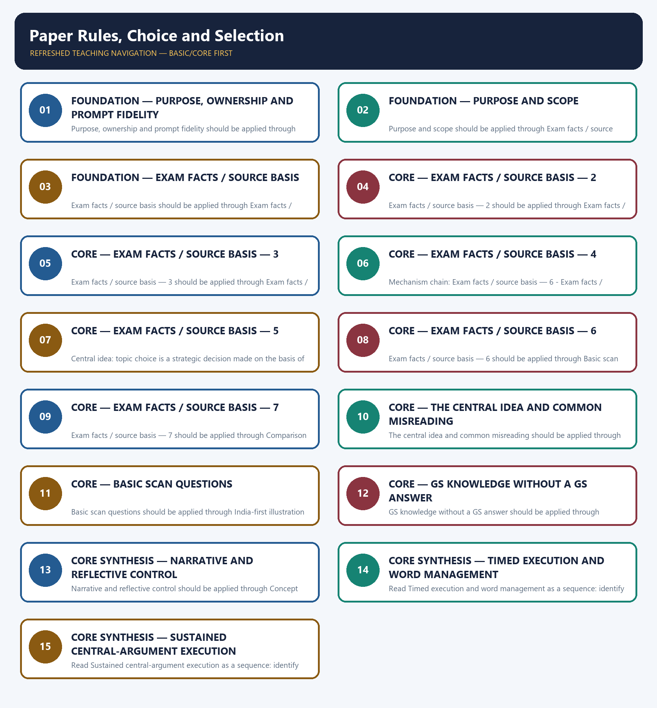

# Paper Rules, Choice and Selection — Learner-v2 Complete Learning Session

> **Authoring-only generation:** 2026-09-06. No PDF was rendered and no tracker or index was mutated.

### SOURCE, PROGRESSION AND OFFICIAL-RULE AUDIT

- **Generation date:** 2026-09-06.
- **Source order:** canonical Basic owner first; Advanced owner second; Essay master framework, README, official-syllabus map, answer-worthiness audit and revision chart next; PYQ corpus and official OCR papers after that; live official UPSC pages only as a final check.
- **Basic/Advanced boundary:** complete Basic teaching remains first and Advanced material remains optional and last.
- **OCR boundary:** Repository Markdown was primary. OCR-searchable official UPSC Essay papers were supplementary only for printed instructions and V1 prompt wording. No author, official model answer, current marks split, phase allocation, paragraph count or scoring rubric was inferred.
- **Qdrant:** not used; repository Markdown and local official papers were sufficient.
- **PYQ integrity:** Three application cards use the repository's explicit V1/V2 status. No unavailable official model answer, marking rubric or attribution is invented.
- **Live-source boundary:** Live source check dated 2026-09-06: official UPSC routes were attempted and access-blocked; blocked pages support no new claim. UN, WHO and IPCC primary pages were separately checked for cross-theme factual boundaries.
- **No-formula rule:** strategy, heuristics and practice weights are never presented as official UPSC instructions or marking criteria.

### LIVE OFFICIAL-SOURCE ATTEMPT LOG

The checks below were made on 2026-09-06. Substantive official text is used only for the proposition it supports; title-only, blocked or thin pages are recorded and supply no factual claim.

- https://upsc.gov.in/examinations/previous-question-papers — attempted 2026-09-06; official page returned HTTP 403 to the live fetch, so it supports no new wording.
- https://upsc.gov.in/examinations/active-examinations — attempted 2026-09-06; official page returned HTTP 403 to the live fetch, so it supports no current-paper inference.
- https://upsc.gov.in/sites/default/files/Notif-CSP-2024-Engl-140224.pdf — searched 2026-09-06; retained only as an official scheme cross-check route, not as an Essay rubric.

## BASIC LEARNING SESSION



*Distinct embedded teaching-navigation image. The separate continuous Cārvāka-style flowchart package remains an independent at-a-glance artifact.*

### SESSION 1 — FOUNDATION — PURPOSE, OWNERSHIP AND PROMPT FIDELITY

#### DEFINITION / WHAT THIS IS CALLED

**Plain-language definition:** Objective practice: Apply Purpose, ownership and prompt fidelity by distinguishing the correct Essay-method move from nearby but invalid shortcuts; no factual-trivia recall is being tested.

**Technical definition:** Purpose, ownership and prompt fidelity should be applied through Purpose and scope and Exam facts / source basis, while preserving the difference between official paper instruction and strategy, prompt wording and interpretation, example and evidence, breadth and coherence.

#### ANSWER-GRABBING OPENING — WRITE/ADAPT IN THE EXAM

> Plain-language definition: Purpose, ownership and prompt fidelity explains how Purpose and scope and Exam facts / source basis combine into one usable Essay-planning move.

#### MUST-WRITE KEYWORDS

- **FOUNDATION**
- **Purpose**
- **ownership**
- **prompt fidelity**
- **Plain-language definition**
- **Technical definition**

**How to use them:** Frame the answer through FOUNDATION; define Purpose, connect ownership with prompt fidelity to explain the mechanism, and use Plain-language definition for the decisive comparison or qualification.

#### METHOD MOVE / WHAT THIS DOES

**Plain-language definition:** Purpose, ownership and prompt fidelity explains how Purpose and scope and Exam facts / source basis combine into one usable Essay-planning move.

**Technical definition:** The learner fixes the printed prompt, its relationship or demand, the defensible scope, the argument function and the evidence boundary before drafting prose.

#### ANSWER-GRABBING OPENING — WRITE/ADAPT IN THE EXAM

> Purpose, ownership and prompt fidelity should be applied through Purpose and scope and Exam facts / source basis, while preserving the difference between official paper instruction and strategy, prompt wording and interpretation, example and evidence, breadth and coherence.

#### MUST-WRITE KEYWORDS

- **Purpose**
- **ownership**
- **prompt**
- **fidelity**
- **scope**
- **Exam**

**How to use them:** Define the first three terms, trace the relationship with the next two, and attach the final term to the exact claim, example and qualification. Qualification: Do not replace paper compliance and risk-aware choice with a generic GS-style catalogue.

#### VISUAL FIRST

```text
PURPOSE, OWNERSHIP AND PROMPT FIDELITY
01. Purpose and scope
    |
    v
02. Exam facts / source basis
STATUS / CATEGORY FIREWALL -> Do not replace paper compliance and risk-aware choice with a generic GS-style catalogue.
```

*The rail fixes the prompt-to-argument sequence and claim boundary before explanation.*

#### CORE EXPLANATION

This topic answers two questions before any writing begins: what does the paper actually require , and how should a candidate choose which of the eight-plus-eight displayed prompts to attempt ? It does not teach decoding technique (see 02/03) or drafting technique (see 05–07) — it teaches the upstream decision that determines how easy those later steps will be. The current corpus ledger records 2018–2025 as V1 — directly verified locally and 2013–2017 as V2 — carried-forward, not locally verifiable . The paper-mechanics facts below are illustrated with the 2024 and 2025 papers, whose printed wording is reproduced in the ledger.

#### SIMPLE SYSTEM EXAMPLE

Read Purpose, ownership and prompt fidelity as a sequence: identify Purpose and scope, follow the method through the printed proposition, and stop before adding a rule, attribution, fact or inference the audited sources do not support.

#### TECHNICAL DISTINCTION

The decisive boundary is Do not replace paper compliance and risk-aware choice with a generic GS-style catalogue. This keeps Purpose and scope and Exam facts / source basis in the correct prompt, method, argument and evidence category.

#### NAMED EVIDENCE AND MECHANISM

- This topic answers two questions before any writing begins: what does the paper actually require , and how should a candidate choose which of the eight-plus-eight displayed prompts to attempt ? It does not teach decoding technique (see 02/03) or drafting technique (see 05–07) — it teaches the upstream decision that determines how easy those later steps will be.
- The current corpus ledger records 2018–2025 as V1 — directly verified locally and 2013–2017 as V2 — carried-forward, not locally verifiable . The paper-mechanics facts below are illustrated with the 2024 and 2025 papers, whose printed wording is reproduced in the ledger.

#### EXAMINER CAUTION

- Do not replace paper compliance and risk-aware choice with a generic GS-style catalogue.

#### EXAM LINK

- **Objective practice:** Apply Purpose, ownership and prompt fidelity by distinguishing the correct Essay-method move from nearby but invalid shortcuts; no factual-trivia recall is being tested.
- **Essay application:** State the exact demand and the bounded writing decision.

#### MINI RECAP

- **Mechanism chain:** Purpose and scope -> Exam facts / source basis
- **Qualified use:** State the exact demand and the bounded writing decision.

#### CLOSING RECALL FLOW — FOUNDATION — PURPOSE, OWNERSHIP AND PROMPT FIDELITY

```text
START / CONCEPT: FOUNDATION — Purpose, ownership and prompt fidelity
        |
        v
EXACT TERMS: FOUNDATION · Purpose · ownership · prompt fidelity · Plain-language definition · Technical definition
        |
        v
MECHANISM / ARGUMENT: Purpose, ownership and prompt fidelity should be applied through Purpose and scope and Exam facts / source basis, while preserving the difference between official paper instruction and strategy, prompt wording and interpretation, example and evidence, breadth and coherence.
        |
        v
CONSEQUENCE / CONTRAST: Read Purpose, ownership and prompt fidelity as a sequence: identify Purpose and scope, follow the method through the printed proposition, and stop before adding a rule, attribution, fact or inference the audited sources do not support.
        |
        v
UPSC TRAP / ANSWER-USE: Objective practice: Apply Purpose, ownership and prompt fidelity by distinguishing the correct Essay-method move from nearby but invalid shortcuts; no factual-trivia recall is being tested.
        |
        v
ANSWER-GRABBING FORMULATION: Plain-language definition: Purpose, ownership and prompt fidelity explains how Purpose and scope and Exam facts / source basis combine into one usable Essay-planning move.
```
### SESSION 2 — FOUNDATION — PURPOSE AND SCOPE

#### DEFINITION / WHAT THIS IS CALLED

**Plain-language definition:** Objective practice: Apply Purpose and scope by distinguishing the correct Essay-method move from nearby but invalid shortcuts; no factual-trivia recall is being tested.

**Technical definition:** Purpose and scope should be applied through Exam facts / source basis — 2, while preserving the difference between official paper instruction and strategy, prompt wording and interpretation, example and evidence, breadth and coherence.

#### ANSWER-GRABBING OPENING — WRITE/ADAPT IN THE EXAM

> Plain-language definition: Purpose and scope explains how Exam facts / source basis — 2 combine into one usable Essay-planning move.

#### MUST-WRITE KEYWORDS

- **FOUNDATION**
- **Purpose**
- **scope**
- **Plain-language definition**
- **Technical definition**
- **Exam**

**How to use them:** Frame the answer through FOUNDATION; define Purpose, connect scope with Plain-language definition to explain the mechanism, and use Technical definition for the decisive comparison or qualification.

#### METHOD MOVE / WHAT THIS DOES

**Plain-language definition:** Purpose and scope explains how Exam facts / source basis — 2 combine into one usable Essay-planning move.

**Technical definition:** The learner fixes the printed prompt, its relationship or demand, the defensible scope, the argument function and the evidence boundary before drafting prose.

#### ANSWER-GRABBING OPENING — WRITE/ADAPT IN THE EXAM

> Purpose and scope should be applied through Exam facts / source basis — 2, while preserving the difference between official paper instruction and strategy, prompt wording and interpretation, example and evidence, breadth and coherence.

#### MUST-WRITE KEYWORDS

- **Purpose**
- **scope**
- **Exam**
- **facts**
- **basis**
- **from**

**How to use them:** Define the first three terms, trace the relationship with the next two, and attach the final term to the exact claim, example and qualification. Qualification: Do not cross the ownership boundary: prompt decoding belongs to 02/03; detailed drafting belongs to 05-08.

#### VISUAL FIRST

```text
PURPOSE AND SCOPE
01. Exam facts / source basis — 2
STATUS / CATEGORY FIREWALL -> Do not cross the ownership boundary: prompt decoding belongs to 02/03; detailed drafting belongs to 05-08.
```

*The rail fixes the prompt-to-argument sequence and claim boundary before explanation.*

#### CORE EXPLANATION

one topic from each of the following Sections A and B, in about 1000-1200 words each:" followed by the marks line "(125 × 2 = 250)".

#### SIMPLE SYSTEM EXAMPLE

Read Purpose and scope as a sequence: identify Exam facts / source basis — 2, follow the method through the printed proposition, and stop before adding a rule, attribution, fact or inference the audited sources do not support.

#### TECHNICAL DISTINCTION

The decisive boundary is Do not cross the ownership boundary: prompt decoding belongs to 02/03; detailed drafting belongs to 05-08. This keeps Exam facts / source basis — 2 in the correct prompt, method, argument and evidence category.

#### NAMED EVIDENCE AND MECHANISM

- one topic from each of the following Sections A and B, in about 1000-1200 words each:" followed by the marks line "(125 × 2 = 250)".

#### EXAMINER CAUTION

- Do not cross the ownership boundary: prompt decoding belongs to 02/03; detailed drafting belongs to 05-08.

#### EXAM LINK

- **Objective practice:** Apply Purpose and scope by distinguishing the correct Essay-method move from nearby but invalid shortcuts; no factual-trivia recall is being tested.
- **Essay application:** Define operative terms before expanding dimensions.

#### MINI RECAP

- **Mechanism chain:** Exam facts / source basis — 2
- **Qualified use:** Define operative terms before expanding dimensions.

#### CLOSING RECALL FLOW — FOUNDATION — PURPOSE AND SCOPE

```text
START / CONCEPT: FOUNDATION — Purpose and scope
        |
        v
EXACT TERMS: FOUNDATION · Purpose · scope · Plain-language definition · Technical definition · Exam
        |
        v
MECHANISM / ARGUMENT: Purpose and scope should be applied through Exam facts / source basis — 2, while preserving the difference between official paper instruction and strategy, prompt wording and interpretation, example and evidence, breadth and coherence.
        |
        v
CONSEQUENCE / CONTRAST: Read Purpose and scope as a sequence: identify Exam facts / source basis — 2, follow the method through the printed proposition, and stop before adding a rule, attribution, fact or inference the audited sources do not support.
        |
        v
UPSC TRAP / ANSWER-USE: Objective practice: Apply Purpose and scope by distinguishing the correct Essay-method move from nearby but invalid shortcuts; no factual-trivia recall is being tested.
        |
        v
ANSWER-GRABBING FORMULATION: Plain-language definition: Purpose and scope explains how Exam facts / source basis — 2 combine into one usable Essay-planning move.
```
### SESSION 3 — FOUNDATION — EXAM FACTS / SOURCE BASIS

#### DEFINITION / WHAT THIS IS CALLED

**Plain-language definition:** Objective practice: Apply Exam facts / source basis by distinguishing the correct Essay-method move from nearby but invalid shortcuts; no factual-trivia recall is being tested.

**Technical definition:** Exam facts / source basis should be applied through Exam facts / source basis — 3, while preserving the difference between official paper instruction and strategy, prompt wording and interpretation, example and evidence, breadth and coherence.

#### ANSWER-GRABBING OPENING — WRITE/ADAPT IN THE EXAM

> Plain-language definition: Exam facts / source basis explains how Exam facts / source basis — 3 combine into one usable Essay-planning move.

#### MUST-WRITE KEYWORDS

- **FOUNDATION**
- **Exam facts / source basis**
- **Plain-language definition**
- **Technical definition**
- **Exam**
- **s**

**How to use them:** Frame the answer through FOUNDATION; define Exam facts / source basis, connect Plain-language definition with Technical definition to explain the mechanism, and use Exam for the decisive comparison or qualification.

#### METHOD MOVE / WHAT THIS DOES

**Plain-language definition:** Exam facts / source basis explains how Exam facts / source basis — 3 combine into one usable Essay-planning move.

**Technical definition:** The learner fixes the printed prompt, its relationship or demand, the defensible scope, the argument function and the evidence boundary before drafting prose.

#### ANSWER-GRABBING OPENING — WRITE/ADAPT IN THE EXAM

> Exam facts / source basis should be applied through Exam facts / source basis — 3, while preserving the difference between official paper instruction and strategy, prompt wording and interpretation, example and evidence, breadth and coherence.

#### MUST-WRITE KEYWORDS

- **Exam**
- **facts**
- **basis**
- **essays**
- **choosing**
- **from**

**How to use them:** Define the first three terms, trace the relationship with the next two, and attach the final term to the exact claim, example and qualification. Qualification: Do not use an example without explaining its argumentative function.

#### VISUAL FIRST

```text
EXAM FACTS / SOURCE BASIS
01. Exam facts / source basis — 3
STATUS / CATEGORY FIREWALL -> Do not use an example without explaining its argumentative function.
```

*The rail fixes the prompt-to-argument sequence and claim boundary before explanation.*

#### CORE EXPLANATION

essays, choosing one topic from each of the following Sections A as in about 1000 – 1200 words each:". The requirement is still unambiguous from the paper's Hindi line and its two printed section headings — two essays, one from each of Sections A and B, about 1000–1200 words each — but do not quote the 2025 line as clean English.

#### SIMPLE SYSTEM EXAMPLE

Read Exam facts / source basis as a sequence: identify Exam facts / source basis — 3, follow the method through the printed proposition, and stop before adding a rule, attribution, fact or inference the audited sources do not support.

#### TECHNICAL DISTINCTION

The decisive boundary is Do not use an example without explaining its argumentative function. This keeps Exam facts / source basis — 3 in the correct prompt, method, argument and evidence category.

#### NAMED EVIDENCE AND MECHANISM

- essays, choosing one topic from each of the following Sections A as in about 1000 – 1200 words each:". The requirement is still unambiguous from the paper's Hindi line and its two printed section headings — two essays, one from each of Sections A and B, about 1000–1200 words each — but do not quote the 2025 line as clean English.

#### EXAMINER CAUTION

- Do not use an example without explaining its argumentative function.

#### EXAM LINK

- **Objective practice:** Apply Exam facts / source basis by distinguishing the correct Essay-method move from nearby but invalid shortcuts; no factual-trivia recall is being tested.
- **Essay application:** Build one qualified thesis and keep it visible.

#### MINI RECAP

- **Mechanism chain:** Exam facts / source basis — 3
- **Qualified use:** Build one qualified thesis and keep it visible.

#### CLOSING RECALL FLOW — FOUNDATION — EXAM FACTS / SOURCE BASIS

```text
START / CONCEPT: FOUNDATION — Exam facts / source basis
        |
        v
EXACT TERMS: FOUNDATION · Exam facts / source basis · Plain-language definition · Technical definition · Exam · s
        |
        v
MECHANISM / ARGUMENT: Exam facts / source basis should be applied through Exam facts / source basis — 3, while preserving the difference between official paper instruction and strategy, prompt wording and interpretation, example and evidence, breadth and coherence.
        |
        v
CONSEQUENCE / CONTRAST: Objective practice: Apply Exam facts / source basis by distinguishing the correct Essay-method move from nearby but invalid shortcuts; no factual-trivia recall is being tested.
        |
        v
UPSC TRAP / ANSWER-USE: Read Exam facts / source basis as a sequence: identify Exam facts / source basis — 3, follow the method through the printed proposition, and stop before adding a rule, attribution, fact or inference the audited sources do not support.
        |
        v
ANSWER-GRABBING FORMULATION: Plain-language definition: Exam facts / source basis explains how Exam facts / source basis — 3 combine into one usable Essay-planning move.
```
### SESSION 4 — CORE — EXAM FACTS / SOURCE BASIS — 2

#### DEFINITION / WHAT THIS IS CALLED

**Plain-language definition:** Objective practice: Apply Exam facts / source basis — 2 by distinguishing the correct Essay-method move from nearby but invalid shortcuts; no factual-trivia recall is being tested.

**Technical definition:** Exam facts / source basis — 2 should be applied through Exam facts / source basis — 4, while preserving the difference between official paper instruction and strategy, prompt wording and interpretation, example and evidence, breadth and coherence.

#### ANSWER-GRABBING OPENING — WRITE/ADAPT IN THE EXAM

> Plain-language definition: Exam facts / source basis — 2 explains how Exam facts / source basis — 4 combine into one usable Essay-planning move.

#### MUST-WRITE KEYWORDS

- **Exam facts / source basis**
- **Plain-language definition**
- **Technical definition**
- **Exam**
- **s**
- **basis**

**How to use them:** Frame the answer through Exam facts / source basis; define Plain-language definition, connect Technical definition with Exam to explain the mechanism, and use s for the decisive comparison or qualification.

#### METHOD MOVE / WHAT THIS DOES

**Plain-language definition:** Exam facts / source basis — 2 explains how Exam facts / source basis — 4 combine into one usable Essay-planning move.

**Technical definition:** The learner fixes the printed prompt, its relationship or demand, the defensible scope, the argument function and the evidence boundary before drafting prose.

#### ANSWER-GRABBING OPENING — WRITE/ADAPT IN THE EXAM

> Exam facts / source basis — 2 should be applied through Exam facts / source basis — 4, while preserving the difference between official paper instruction and strategy, prompt wording and interpretation, example and evidence, breadth and coherence.

#### MUST-WRITE KEYWORDS

- **Exam**
- **facts**
- **basis**
- **Section**
- **continues**
- **This**

**How to use them:** Define the first three terms, trace the relationship with the next two, and attach the final term to the exact claim, example and qualification. Qualification: Do not treat a pedagogical scaffold as an official UPSC marking rule.

#### VISUAL FIRST

```text
EXAM FACTS / SOURCE BASIS — 2
01. Exam facts / source basis — 4
STATUS / CATEGORY FIREWALL -> Do not treat a pedagogical scaffold as an official UPSC marking rule.
```

*The rail fixes the prompt-to-argument sequence and claim boundary before explanation.*

#### CORE EXPLANATION

Section B at 1–4; 2025 continues Section B at 5–8. This folder's B5–B8 labels are an internal reference scheme, not the 2024 paper's printed numbers.

#### SIMPLE SYSTEM EXAMPLE

Read Exam facts / source basis — 2 as a sequence: identify Exam facts / source basis — 4, follow the method through the printed proposition, and stop before adding a rule, attribution, fact or inference the audited sources do not support.

#### TECHNICAL DISTINCTION

The decisive boundary is Do not treat a pedagogical scaffold as an official UPSC marking rule. This keeps Exam facts / source basis — 4 in the correct prompt, method, argument and evidence category.

#### NAMED EVIDENCE AND MECHANISM

- Section B at 1–4; 2025 continues Section B at 5–8. This folder's B5–B8 labels are an internal reference scheme, not the 2024 paper's printed numbers.

#### EXAMINER CAUTION

- Do not treat a pedagogical scaffold as an official UPSC marking rule.

#### EXAM LINK

- **Objective practice:** Apply Exam facts / source basis — 2 by distinguishing the correct Essay-method move from nearby but invalid shortcuts; no factual-trivia recall is being tested.
- **Essay application:** Give every paragraph one argumentative job.

#### MINI RECAP

- **Mechanism chain:** Exam facts / source basis — 4
- **Qualified use:** Give every paragraph one argumentative job.

#### CLOSING RECALL FLOW — CORE — EXAM FACTS / SOURCE BASIS — 2

```text
START / CONCEPT: CORE — Exam facts / source basis — 2
        |
        v
EXACT TERMS: Exam facts / source basis · Plain-language definition · Technical definition · Exam · s · basis
        |
        v
MECHANISM / ARGUMENT: Exam facts / source basis — 2 should be applied through Exam facts / source basis — 4, while preserving the difference between official paper instruction and strategy, prompt wording and interpretation, example and evidence, breadth and coherence.
        |
        v
CONSEQUENCE / CONTRAST: Objective practice: Apply Exam facts / source basis — 2 by distinguishing the correct Essay-method move from nearby but invalid shortcuts; no factual-trivia recall is being tested.
        |
        v
UPSC TRAP / ANSWER-USE: Read Exam facts / source basis — 2 as a sequence: identify Exam facts / source basis — 4, follow the method through the printed proposition, and stop before adding a rule, attribution, fact or inference the audited sources do not support.
        |
        v
ANSWER-GRABBING FORMULATION: Plain-language definition: Exam facts / source basis — 2 explains how Exam facts / source basis — 4 combine into one usable Essay-planning move.
```
### SESSION 5 — CORE — EXAM FACTS / SOURCE BASIS — 3

#### DEFINITION / WHAT THIS IS CALLED

**Plain-language definition:** Objective practice: Apply Exam facts / source basis — 3 by distinguishing the correct Essay-method move from nearby but invalid shortcuts; no factual-trivia recall is being tested.

**Technical definition:** Exam facts / source basis — 3 should be applied through Exam facts / source basis — 5, while preserving the difference between official paper instruction and strategy, prompt wording and interpretation, example and evidence, breadth and coherence.

#### ANSWER-GRABBING OPENING — WRITE/ADAPT IN THE EXAM

> Plain-language definition: Exam facts / source basis — 3 explains how Exam facts / source basis — 5 combine into one usable Essay-planning move.

#### MUST-WRITE KEYWORDS

- **Exam facts / source basis**
- **Plain-language definition**
- **Technical definition**
- **Exam**
- **s**
- **basis**

**How to use them:** Frame the answer through Exam facts / source basis; define Plain-language definition, connect Technical definition with Exam to explain the mechanism, and use s for the decisive comparison or qualification.

#### METHOD MOVE / WHAT THIS DOES

**Plain-language definition:** Exam facts / source basis — 3 explains how Exam facts / source basis — 5 combine into one usable Essay-planning move.

**Technical definition:** The learner fixes the printed prompt, its relationship or demand, the defensible scope, the argument function and the evidence boundary before drafting prose.

#### ANSWER-GRABBING OPENING — WRITE/ADAPT IN THE EXAM

> Exam facts / source basis — 3 should be applied through Exam facts / source basis — 5, while preserving the difference between official paper instruction and strategy, prompt wording and interpretation, example and evidence, breadth and coherence.

#### MUST-WRITE KEYWORDS

- **Exam**
- **facts**
- **basis**
- **bilingually**
- **Hindi**
- **then**

**How to use them:** Define the first three terms, trace the relationship with the next two, and attach the final term to the exact claim, example and qualification. Qualification: Do not let a counter-view replace the thesis; use it to qualify the thesis.

#### VISUAL FIRST

```text
EXAM FACTS / SOURCE BASIS — 3
01. Exam facts / source basis — 5
STATUS / CATEGORY FIREWALL -> Do not let a counter-view replace the thesis; use it to qualify the thesis.
```

*The rail fixes the prompt-to-argument sequence and claim boundary before explanation.*

#### CORE EXPLANATION

bilingually (Hindi then English) , and require one topic chosen from each Section — never two from the same Section.

#### SIMPLE SYSTEM EXAMPLE

Read Exam facts / source basis — 3 as a sequence: identify Exam facts / source basis — 5, follow the method through the printed proposition, and stop before adding a rule, attribution, fact or inference the audited sources do not support.

#### TECHNICAL DISTINCTION

The decisive boundary is Do not let a counter-view replace the thesis; use it to qualify the thesis. This keeps Exam facts / source basis — 5 in the correct prompt, method, argument and evidence category.

#### NAMED EVIDENCE AND MECHANISM

- bilingually (Hindi then English) , and require one topic chosen from each Section — never two from the same Section.

#### EXAMINER CAUTION

- Do not let a counter-view replace the thesis; use it to qualify the thesis.

#### EXAM LINK

- **Objective practice:** Apply Exam facts / source basis — 3 by distinguishing the correct Essay-method move from nearby but invalid shortcuts; no factual-trivia recall is being tested.
- **Essay application:** Join a named illustration to its mechanism.

#### MINI RECAP

- **Mechanism chain:** Exam facts / source basis — 5
- **Qualified use:** Join a named illustration to its mechanism.

#### CLOSING RECALL FLOW — CORE — EXAM FACTS / SOURCE BASIS — 3

```text
START / CONCEPT: CORE — Exam facts / source basis — 3
        |
        v
EXACT TERMS: Exam facts / source basis · Plain-language definition · Technical definition · Exam · s · basis
        |
        v
MECHANISM / ARGUMENT: Exam facts / source basis — 3 should be applied through Exam facts / source basis — 5, while preserving the difference between official paper instruction and strategy, prompt wording and interpretation, example and evidence, breadth and coherence.
        |
        v
CONSEQUENCE / CONTRAST: Objective practice: Apply Exam facts / source basis — 3 by distinguishing the correct Essay-method move from nearby but invalid shortcuts; no factual-trivia recall is being tested.
        |
        v
UPSC TRAP / ANSWER-USE: Read Exam facts / source basis — 3 as a sequence: identify Exam facts / source basis — 5, follow the method through the printed proposition, and stop before adding a rule, attribution, fact or inference the audited sources do not support.
        |
        v
ANSWER-GRABBING FORMULATION: Plain-language definition: Exam facts / source basis — 3 explains how Exam facts / source basis — 5 combine into one usable Essay-planning move.
```
### SESSION 6 — CORE — EXAM FACTS / SOURCE BASIS — 4

#### DEFINITION / WHAT THIS IS CALLED

**Plain-language definition:** Objective practice: Apply Exam facts / source basis — 4 by distinguishing the correct Essay-method move from nearby but invalid shortcuts; no factual-trivia recall is being tested.

**Technical definition:** Mechanism chain: Exam facts / source basis — 6 - Exam facts / source basis — 7 Qualified use: Use a counter-case to refine, not derail, the thesis.

#### ANSWER-GRABBING OPENING — WRITE/ADAPT IN THE EXAM

> Plain-language definition: Exam facts / source basis — 4 explains how Exam facts / source basis — 6 and Exam facts / source basis — 7 combine into one usable Essay-planning move.

#### MUST-WRITE KEYWORDS

- **Exam facts / source basis**
- **Plain-language definition**
- **Technical definition**
- **Exam**
- **s**
- **basis**

**How to use them:** Frame the answer through Exam facts / source basis; define Plain-language definition, connect Technical definition with Exam to explain the mechanism, and use s for the decisive comparison or qualification.

#### METHOD MOVE / WHAT THIS DOES

**Plain-language definition:** Exam facts / source basis — 4 explains how Exam facts / source basis — 6 and Exam facts / source basis — 7 combine into one usable Essay-planning move.

**Technical definition:** The learner fixes the printed prompt, its relationship or demand, the defensible scope, the argument function and the evidence boundary before drafting prose.

#### ANSWER-GRABBING OPENING — WRITE/ADAPT IN THE EXAM

> Exam facts / source basis — 4 should be applied through Exam facts / source basis — 6 and Exam facts / source basis — 7, while preserving the difference between official paper instruction and strategy, prompt wording and interpretation, example and evidence, breadth and coherence.

#### MUST-WRITE KEYWORDS

- **Exam**
- **facts**
- **basis**
- **header**
- **marks**
- **line**

**How to use them:** Define the first three terms, trace the relationship with the next two, and attach the final term to the exact claim, example and qualification. Qualification: Do not use an unverified quotation, statistic, attribution or anecdote.

#### VISUAL FIRST

```text
EXAM FACTS / SOURCE BASIS — 4
01. Exam facts / source basis — 6
    |
    v
02. Exam facts / source basis — 7
STATUS / CATEGORY FIREWALL -> Do not use an unverified quotation, statistic, attribution or anecdote.
```

*The rail fixes the prompt-to-argument sequence and claim boundary before explanation.*

#### CORE EXPLANATION

header, a 2025 marks line, an author beside any prompt, or any marking rubric/weightage. The separate official examination scheme supplies the three-hour Essay duration; no phase split is official. Practical consequence for choice: because the paper's own numbering and even its instruction line vary year to year, spend the first reading confirming the structural rule (one from each Section) rather than assuming any layout you have seen in a mock paper.

#### SIMPLE SYSTEM EXAMPLE

Read Exam facts / source basis — 4 as a sequence: identify Exam facts / source basis — 6, follow the method through the printed proposition, and stop before adding a rule, attribution, fact or inference the audited sources do not support.

#### TECHNICAL DISTINCTION

The decisive boundary is Do not use an unverified quotation, statistic, attribution or anecdote. This keeps Exam facts / source basis — 6 and Exam facts / source basis — 7 in the correct prompt, method, argument and evidence category.

#### NAMED EVIDENCE AND MECHANISM

- header, a 2025 marks line, an author beside any prompt, or any marking rubric/weightage. The separate official examination scheme supplies the three-hour Essay duration; no phase split is official.
- Practical consequence for choice: because the paper's own numbering and even its instruction line vary year to year, spend the first reading confirming the structural rule (one from each Section) rather than assuming any layout you have seen in a mock paper.

#### EXAMINER CAUTION

- Do not use an unverified quotation, statistic, attribution or anecdote.

#### EXAM LINK

- **Objective practice:** Apply Exam facts / source basis — 4 by distinguishing the correct Essay-method move from nearby but invalid shortcuts; no factual-trivia recall is being tested.
- **Essay application:** Use a counter-case to refine, not derail, the thesis.

#### MINI RECAP

- **Mechanism chain:** Exam facts / source basis — 6 -> Exam facts / source basis — 7
- **Qualified use:** Use a counter-case to refine, not derail, the thesis.

#### CLOSING RECALL FLOW — CORE — EXAM FACTS / SOURCE BASIS — 4

```text
START / CONCEPT: CORE — Exam facts / source basis — 4
        |
        v
EXACT TERMS: Exam facts / source basis · Plain-language definition · Technical definition · Exam · s · basis
        |
        v
MECHANISM / ARGUMENT: Objective practice: Apply Exam facts / source basis — 4 by distinguishing the correct Essay-method move from nearby but invalid shortcuts; no factual-trivia recall is being tested.
        |
        v
CONSEQUENCE / CONTRAST: Mechanism chain: Exam facts / source basis — 6 - Exam facts / source basis — 7 Qualified use: Use a counter-case to refine, not derail, the thesis.
        |
        v
UPSC TRAP / ANSWER-USE: Exam facts / source basis — 4 should be applied through Exam facts / source basis — 6 and Exam facts / source basis — 7, while preserving the difference between official paper instruction and strategy, prompt wording and interpretation, example and evidence, breadth and coherence.
        |
        v
ANSWER-GRABBING FORMULATION: Plain-language definition: Exam facts / source basis — 4 explains how Exam facts / source basis — 6 and Exam facts / source basis — 7 combine into one usable Essay-planning move.
```
### SESSION 7 — CORE — EXAM FACTS / SOURCE BASIS — 5

#### DEFINITION / WHAT THIS IS CALLED

**Plain-language definition:** Objective practice: Apply Exam facts / source basis — 5 by distinguishing the correct Essay-method move from nearby but invalid shortcuts; no factual-trivia recall is being tested.

**Technical definition:** Central idea: topic choice is a strategic decision made on the basis of thesis-fit, dimension count and evidence availability — not simple familiarity.

#### ANSWER-GRABBING OPENING — WRITE/ADAPT IN THE EXAM

> Plain-language definition: Exam facts / source basis — 5 explains how The central idea and common misreading combine into one usable Essay-planning move.

#### MUST-WRITE KEYWORDS

- **Exam facts / source basis**
- **Plain-language definition**
- **Technical definition**
- **Exam**
- **s**
- **basis**

**How to use them:** Frame the answer through Exam facts / source basis; define Plain-language definition, connect Technical definition with Exam to explain the mechanism, and use s for the decisive comparison or qualification.

#### METHOD MOVE / WHAT THIS DOES

**Plain-language definition:** Exam facts / source basis — 5 explains how The central idea and common misreading combine into one usable Essay-planning move.

**Technical definition:** The learner fixes the printed prompt, its relationship or demand, the defensible scope, the argument function and the evidence boundary before drafting prose.

#### ANSWER-GRABBING OPENING — WRITE/ADAPT IN THE EXAM

> Exam facts / source basis — 5 should be applied through The central idea and common misreading, while preserving the difference between official paper instruction and strategy, prompt wording and interpretation, example and evidence, breadth and coherence.

#### MUST-WRITE KEYWORDS

- **Exam**
- **facts**
- **basis**
- **central**
- **idea**
- **common**

**How to use them:** Define the first three terms, trace the relationship with the next two, and attach the final term to the exact claim, example and qualification. Qualification: Do not multiply dimensions that repeat the same claim in new vocabulary.

#### VISUAL FIRST

```text
EXAM FACTS / SOURCE BASIS — 5
01. The central idea and common misreading
STATUS / CATEGORY FIREWALL -> Do not multiply dimensions that repeat the same claim in new vocabulary.
```

*The rail fixes the prompt-to-argument sequence and claim boundary before explanation.*

#### CORE EXPLANATION

Central idea: topic choice is a strategic decision made on the basis of thesis-fit, dimension count and evidence availability — not simple familiarity. Common misreading: picking a prompt because it sounds close to a favourite GS subject (e.g. choosing "Empires of the mind" purely because you like Science & Technology) without first checking whether you can actually form one qualified thesis and recall two or three safe illustrations for it. A topic that feels unfamiliar but decodes cleanly (most aphorisms do, once you apply 02) is frequently the safer choice.

#### SIMPLE SYSTEM EXAMPLE

Read Exam facts / source basis — 5 as a sequence: identify The central idea and common misreading, follow the method through the printed proposition, and stop before adding a rule, attribution, fact or inference the audited sources do not support.

#### TECHNICAL DISTINCTION

The decisive boundary is Do not multiply dimensions that repeat the same claim in new vocabulary. This keeps The central idea and common misreading in the correct prompt, method, argument and evidence category.

#### NAMED EVIDENCE AND MECHANISM

- Central idea: topic choice is a strategic decision made on the basis of thesis-fit, dimension count and evidence availability — not simple familiarity. Common misreading: picking a prompt because it sounds close to a favourite GS subject (e.g. choosing "Empires of the mind" purely because you like Science & Technology) without first checking whether you can actually form one qualified thesis and recall two or three safe illustrations for it. A topic that feels unfamiliar but decodes cleanly (most aphorisms do, once you apply 02) is frequently the safer choice.

#### EXAMINER CAUTION

- Do not multiply dimensions that repeat the same claim in new vocabulary.

#### EXAM LINK

- **Objective practice:** Apply Exam facts / source basis — 5 by distinguishing the correct Essay-method move from nearby but invalid shortcuts; no factual-trivia recall is being tested.
- **Essay application:** Sequence paragraphs through explicit logical bridges.

#### MINI RECAP

- **Mechanism chain:** The central idea and common misreading
- **Qualified use:** Sequence paragraphs through explicit logical bridges.

#### CLOSING RECALL FLOW — CORE — EXAM FACTS / SOURCE BASIS — 5

```text
START / CONCEPT: CORE — Exam facts / source basis — 5
        |
        v
EXACT TERMS: Exam facts / source basis · Plain-language definition · Technical definition · Exam · s · basis
        |
        v
MECHANISM / ARGUMENT: Exam facts / source basis — 5 should be applied through The central idea and common misreading, while preserving the difference between official paper instruction and strategy, prompt wording and interpretation, example and evidence, breadth and coherence.
        |
        v
CONSEQUENCE / CONTRAST: Objective practice: Apply Exam facts / source basis — 5 by distinguishing the correct Essay-method move from nearby but invalid shortcuts; no factual-trivia recall is being tested.
        |
        v
UPSC TRAP / ANSWER-USE: Read Exam facts / source basis — 5 as a sequence: identify The central idea and common misreading, follow the method through the printed proposition, and stop before adding a rule, attribution, fact or inference the audited sources do not support.
        |
        v
ANSWER-GRABBING FORMULATION: Plain-language definition: Exam facts / source basis — 5 explains how The central idea and common misreading combine into one usable Essay-planning move.
```
### SESSION 8 — CORE — EXAM FACTS / SOURCE BASIS — 6

#### DEFINITION / WHAT THIS IS CALLED

**Plain-language definition:** Objective practice: Apply Exam facts / source basis — 6 by distinguishing the correct Essay-method move from nearby but invalid shortcuts; no factual-trivia recall is being tested.

**Technical definition:** Exam facts / source basis — 6 should be applied through Basic scan questions, while preserving the difference between official paper instruction and strategy, prompt wording and interpretation, example and evidence, breadth and coherence.

#### ANSWER-GRABBING OPENING — WRITE/ADAPT IN THE EXAM

> Plain-language definition: Exam facts / source basis — 6 explains how Basic scan questions combine into one usable Essay-planning move.

#### MUST-WRITE KEYWORDS

- **Exam facts / source basis**
- **Plain-language definition**
- **Technical definition**
- **Exam**
- **s**
- **basis**

**How to use them:** Frame the answer through Exam facts / source basis; define Plain-language definition, connect Technical definition with Exam to explain the mechanism, and use s for the decisive comparison or qualification.

#### METHOD MOVE / WHAT THIS DOES

**Plain-language definition:** Exam facts / source basis — 6 explains how Basic scan questions combine into one usable Essay-planning move.

**Technical definition:** The learner fixes the printed prompt, its relationship or demand, the defensible scope, the argument function and the evidence boundary before drafting prose.

#### ANSWER-GRABBING OPENING — WRITE/ADAPT IN THE EXAM

> Exam facts / source basis — 6 should be applied through Basic scan questions, while preserving the difference between official paper instruction and strategy, prompt wording and interpretation, example and evidence, breadth and coherence.

#### MUST-WRITE KEYWORDS

- **Exam**
- **facts**
- **basis**
- **Basic**
- **scan**
- **questions**

**How to use them:** Define the first three terms, trace the relationship with the next two, and attach the final term to the exact claim, example and qualification. Qualification: Do not end with aspiration unsupported by the preceding argument.

#### VISUAL FIRST

```text
EXAM FACTS / SOURCE BASIS — 6
01. Basic scan questions
STATUS / CATEGORY FIREWALL -> Do not end with aspiration unsupported by the preceding argument.
```

*The rail fixes the prompt-to-argument sequence and claim boundary before explanation.*

#### CORE EXPLANATION

1. Can I restate this prompt's core claim in one plain sentence? 2. Is this an aphorism (needs decoding, see 02) or an issue-statement (needs scoping, see 03)? 3. Can I already name two distinct dimensions for it (see 04)? 4. Can I already name one Indian illustration that fits without forcing it (see 12)? 5. Does a workable thesis come to mind within about a minute (see 05)?

#### SIMPLE SYSTEM EXAMPLE

Read Exam facts / source basis — 6 as a sequence: identify Basic scan questions, follow the method through the printed proposition, and stop before adding a rule, attribution, fact or inference the audited sources do not support.

#### TECHNICAL DISTINCTION

The decisive boundary is Do not end with aspiration unsupported by the preceding argument. This keeps Basic scan questions in the correct prompt, method, argument and evidence category.

#### NAMED EVIDENCE AND MECHANISM

- 1. Can I restate this prompt's core claim in one plain sentence? 2. Is this an aphorism (needs decoding, see 02) or an issue-statement (needs scoping, see 03)? 3. Can I already name two distinct dimensions for it (see 04)? 4. Can I already name one Indian illustration that fits without forcing it (see 12)? 5. Does a workable thesis come to mind within about a minute (see 05)?

#### EXAMINER CAUTION

- Do not end with aspiration unsupported by the preceding argument.

#### EXAM LINK

- **Objective practice:** Apply Exam facts / source basis — 6 by distinguishing the correct Essay-method move from nearby but invalid shortcuts; no factual-trivia recall is being tested.
- **Essay application:** Move across actor, scale and time only when the claim changes.

#### MINI RECAP

- **Mechanism chain:** Basic scan questions
- **Qualified use:** Move across actor, scale and time only when the claim changes.

#### CLOSING RECALL FLOW — CORE — EXAM FACTS / SOURCE BASIS — 6

```text
START / CONCEPT: CORE — Exam facts / source basis — 6
        |
        v
EXACT TERMS: Exam facts / source basis · Plain-language definition · Technical definition · Exam · s · basis
        |
        v
MECHANISM / ARGUMENT: Exam facts / source basis — 6 should be applied through Basic scan questions, while preserving the difference between official paper instruction and strategy, prompt wording and interpretation, example and evidence, breadth and coherence.
        |
        v
CONSEQUENCE / CONTRAST: Read Exam facts / source basis — 6 as a sequence: identify Basic scan questions, follow the method through the printed proposition, and stop before adding a rule, attribution, fact or inference the audited sources do not support.
        |
        v
UPSC TRAP / ANSWER-USE: Objective practice: Apply Exam facts / source basis — 6 by distinguishing the correct Essay-method move from nearby but invalid shortcuts; no factual-trivia recall is being tested.
        |
        v
ANSWER-GRABBING FORMULATION: Plain-language definition: Exam facts / source basis — 6 explains how Basic scan questions combine into one usable Essay-planning move.
```
### SESSION 9 — CORE — EXAM FACTS / SOURCE BASIS — 7

#### DEFINITION / WHAT THIS IS CALLED

**Plain-language definition:** Objective practice: Apply Exam facts / source basis — 7 by distinguishing the correct Essay-method move from nearby but invalid shortcuts; no factual-trivia recall is being tested.

**Technical definition:** Exam facts / source basis — 7 should be applied through Comparison grid, while preserving the difference between official paper instruction and strategy, prompt wording and interpretation, example and evidence, breadth and coherence.

#### ANSWER-GRABBING OPENING — WRITE/ADAPT IN THE EXAM

> Plain-language definition: Exam facts / source basis — 7 explains how Comparison grid combine into one usable Essay-planning move.

#### MUST-WRITE KEYWORDS

- **Exam facts / source basis**
- **Plain-language definition**
- **Technical definition**
- **Exam**
- **s**
- **basis**

**How to use them:** Frame the answer through Exam facts / source basis; define Plain-language definition, connect Technical definition with Exam to explain the mechanism, and use s for the decisive comparison or qualification.

#### METHOD MOVE / WHAT THIS DOES

**Plain-language definition:** Exam facts / source basis — 7 explains how Comparison grid combine into one usable Essay-planning move.

**Technical definition:** The learner fixes the printed prompt, its relationship or demand, the defensible scope, the argument function and the evidence boundary before drafting prose.

#### ANSWER-GRABBING OPENING — WRITE/ADAPT IN THE EXAM

> Exam facts / source basis — 7 should be applied through Comparison grid, while preserving the difference between official paper instruction and strategy, prompt wording and interpretation, example and evidence, breadth and coherence.

#### MUST-WRITE KEYWORDS

- **Exam**
- **facts**
- **basis**
- **Comparison**
- **grid**
- **quick**

**How to use them:** Define the first three terms, trace the relationship with the next two, and attach the final term to the exact claim, example and qualification. Qualification: Do not sacrifice the second essay's time budget to perfect the first.

#### VISUAL FIRST

```text
EXAM FACTS / SOURCE BASIS — 7
01. Comparison grid
STATUS / CATEGORY FIREWALL -> Do not sacrifice the second essay's time budget to perfect the first.
```

*The rail fixes the prompt-to-argument sequence and claim boundary before explanation.*

#### CORE EXPLANATION

Use a quick grid — not a full essay plan — to compare shortlisted prompts before committing

#### SIMPLE SYSTEM EXAMPLE

Read Exam facts / source basis — 7 as a sequence: identify Comparison grid, follow the method through the printed proposition, and stop before adding a rule, attribution, fact or inference the audited sources do not support.

#### TECHNICAL DISTINCTION

The decisive boundary is Do not sacrifice the second essay's time budget to perfect the first. This keeps Comparison grid in the correct prompt, method, argument and evidence category.

#### NAMED EVIDENCE AND MECHANISM

- Use a quick grid — not a full essay plan — to compare shortlisted prompts before committing

#### EXAMINER CAUTION

- Do not sacrifice the second essay's time budget to perfect the first.

#### EXAM LINK

- **Objective practice:** Apply Exam facts / source basis — 7 by distinguishing the correct Essay-method move from nearby but invalid shortcuts; no factual-trivia recall is being tested.
- **Essay application:** Use ethical nuance without moralising.

#### MINI RECAP

- **Mechanism chain:** Comparison grid
- **Qualified use:** Use ethical nuance without moralising.

#### CLOSING RECALL FLOW — CORE — EXAM FACTS / SOURCE BASIS — 7

```text
START / CONCEPT: CORE — Exam facts / source basis — 7
        |
        v
EXACT TERMS: Exam facts / source basis · Plain-language definition · Technical definition · Exam · s · basis
        |
        v
MECHANISM / ARGUMENT: Exam facts / source basis — 7 should be applied through Comparison grid, while preserving the difference between official paper instruction and strategy, prompt wording and interpretation, example and evidence, breadth and coherence.
        |
        v
CONSEQUENCE / CONTRAST: Read Exam facts / source basis — 7 as a sequence: identify Comparison grid, follow the method through the printed proposition, and stop before adding a rule, attribution, fact or inference the audited sources do not support.
        |
        v
UPSC TRAP / ANSWER-USE: Objective practice: Apply Exam facts / source basis — 7 by distinguishing the correct Essay-method move from nearby but invalid shortcuts; no factual-trivia recall is being tested.
        |
        v
ANSWER-GRABBING FORMULATION: Plain-language definition: Exam facts / source basis — 7 explains how Comparison grid combine into one usable Essay-planning move.
```
### SESSION 10 — CORE — THE CENTRAL IDEA AND COMMON MISREADING

#### DEFINITION / WHAT THIS IS CALLED

**Plain-language definition:** Objective practice: Apply The central idea and common misreading by distinguishing the correct Essay-method move from nearby but invalid shortcuts; no factual-trivia recall is being tested.

**Technical definition:** The central idea and common misreading should be applied through Comparison grid — 2, while preserving the difference between official paper instruction and strategy, prompt wording and interpretation, example and evidence, breadth and coherence.

#### ANSWER-GRABBING OPENING — WRITE/ADAPT IN THE EXAM

> Plain-language definition: The central idea and common misreading explains how Comparison grid — 2 combine into one usable Essay-planning move.

#### MUST-WRITE KEYWORDS

- **The central idea**
- **common misreading**
- **Plain-language definition**
- **Technical definition**
- **central**
- **idea**

**How to use them:** Frame the answer through The central idea; define common misreading, connect Plain-language definition with Technical definition to explain the mechanism, and use central for the decisive comparison or qualification.

#### METHOD MOVE / WHAT THIS DOES

**Plain-language definition:** The central idea and common misreading explains how Comparison grid — 2 combine into one usable Essay-planning move.

**Technical definition:** The learner fixes the printed prompt, its relationship or demand, the defensible scope, the argument function and the evidence boundary before drafting prose.

#### ANSWER-GRABBING OPENING — WRITE/ADAPT IN THE EXAM

> The central idea and common misreading should be applied through Comparison grid — 2, while preserving the difference between official paper instruction and strategy, prompt wording and interpretation, example and evidence, breadth and coherence.

#### MUST-WRITE KEYWORDS

- **central**
- **idea**
- **common**
- **misreading**
- **Comparison**
- **grid**

**How to use them:** Define the first three terms, trace the relationship with the next two, and attach the final term to the exact claim, example and qualification. Qualification: Do not mistake novelty of phrasing for originality of thought.

#### VISUAL FIRST

```text
THE CENTRAL IDEA AND COMMON MISREADING
01. Comparison grid — 2
STATUS / CATEGORY FIREWALL -> Do not mistake novelty of phrasing for originality of thought.
```

*The rail fixes the prompt-to-argument sequence and claim boundary before explanation.*

#### CORE EXPLANATION

Score honestly; a prompt with weaker fit in two or more columns is riskier than it looks at first read.

#### SIMPLE SYSTEM EXAMPLE

Read The central idea and common misreading as a sequence: identify Comparison grid — 2, follow the method through the printed proposition, and stop before adding a rule, attribution, fact or inference the audited sources do not support.

#### TECHNICAL DISTINCTION

The decisive boundary is Do not mistake novelty of phrasing for originality of thought. This keeps Comparison grid — 2 in the correct prompt, method, argument and evidence category.

#### NAMED EVIDENCE AND MECHANISM

- Score honestly; a prompt with weaker fit in two or more columns is riskier than it looks at first read.

#### EXAMINER CAUTION

- Do not mistake novelty of phrasing for originality of thought.

#### EXAM LINK

- **Objective practice:** Apply The central idea and common misreading by distinguishing the correct Essay-method move from nearby but invalid shortcuts; no factual-trivia recall is being tested.
- **Essay application:** Preserve factual and quotation integrity.

#### MINI RECAP

- **Mechanism chain:** Comparison grid — 2
- **Qualified use:** Preserve factual and quotation integrity.

#### CLOSING RECALL FLOW — CORE — THE CENTRAL IDEA AND COMMON MISREADING

```text
START / CONCEPT: CORE — The central idea and common misreading
        |
        v
EXACT TERMS: The central idea · common misreading · Plain-language definition · Technical definition · central · idea
        |
        v
MECHANISM / ARGUMENT: The central idea and common misreading should be applied through Comparison grid — 2, while preserving the difference between official paper instruction and strategy, prompt wording and interpretation, example and evidence, breadth and coherence.
        |
        v
CONSEQUENCE / CONTRAST: Read The central idea and common misreading as a sequence: identify Comparison grid — 2, follow the method through the printed proposition, and stop before adding a rule, attribution, fact or inference the audited sources do not support.
        |
        v
UPSC TRAP / ANSWER-USE: Objective practice: Apply The central idea and common misreading by distinguishing the correct Essay-method move from nearby but invalid shortcuts; no factual-trivia recall is being tested.
        |
        v
ANSWER-GRABBING FORMULATION: Plain-language definition: The central idea and common misreading explains how Comparison grid — 2 combine into one usable Essay-planning move.
```
### SESSION 11 — CORE — BASIC SCAN QUESTIONS

#### DEFINITION / WHAT THIS IS CALLED

**Plain-language definition:** Objective practice: Apply Basic scan questions by distinguishing the correct Essay-method move from nearby but invalid shortcuts; no factual-trivia recall is being tested.

**Technical definition:** Basic scan questions should be applied through India-first illustration starters and Thesis options and selection, while preserving the difference between official paper instruction and strategy, prompt wording and interpretation, example and evidence, breadth and coherence.

#### ANSWER-GRABBING OPENING — WRITE/ADAPT IN THE EXAM

> Plain-language definition: Basic scan questions explains how India-first illustration starters and Thesis options and selection combine into one usable Essay-planning move.

#### MUST-WRITE KEYWORDS

- **Basic scan questions**
- **Plain-language definition**
- **Technical definition**
- **Basic**
- **scan**
- **questions**

**How to use them:** Frame the answer through Basic scan questions; define Plain-language definition, connect Technical definition with Basic to explain the mechanism, and use scan for the decisive comparison or qualification.

#### METHOD MOVE / WHAT THIS DOES

**Plain-language definition:** Basic scan questions explains how India-first illustration starters and Thesis options and selection combine into one usable Essay-planning move.

**Technical definition:** The learner fixes the printed prompt, its relationship or demand, the defensible scope, the argument function and the evidence boundary before drafting prose.

#### ANSWER-GRABBING OPENING — WRITE/ADAPT IN THE EXAM

> Basic scan questions should be applied through India-first illustration starters and Thesis options and selection, while preserving the difference between official paper instruction and strategy, prompt wording and interpretation, example and evidence, breadth and coherence.

#### MUST-WRITE KEYWORDS

- **Basic**
- **scan**
- **questions**
- **India-first**
- **illustration**
- **starters**

**How to use them:** Define the first three terms, trace the relationship with the next two, and attach the final term to the exact claim, example and qualification. Qualification: Do not replace paper compliance and risk-aware choice with a generic GS-style catalogue.

#### VISUAL FIRST

```text
BASIC SCAN QUESTIONS
01. India-first illustration starters
    |
    v
02. Thesis options and selection
STATUS / CATEGORY FIREWALL -> Do not replace paper compliance and risk-aware choice with a generic GS-style catalogue.
```

*The rail fixes the prompt-to-argument sequence and claim boundary before explanation.*

#### CORE EXPLANATION

Before committing to a prompt, recall — do not invent — at least one Indian illustration per likely dimension: an institution, a policy episode, a well-known social pattern, or a documented event. If nothing comes to mind without forcing it, that is itself useful information about the prompt's risk (see topic 12 for the full verified-example discipline). For each shortlisted prompt, draft one candidate thesis sentence before final choice — not a full outline. Choose the prompt whose thesis sentence is (a) a genuine claim, not a restatement of the prompt, (b) qualified (acknowledges a limit or condition), and (c) supportable by the illustrations recalled in Section 7. Full thesis-construction method in 05.

#### SIMPLE SYSTEM EXAMPLE

Read Basic scan questions as a sequence: identify India-first illustration starters, follow the method through the printed proposition, and stop before adding a rule, attribution, fact or inference the audited sources do not support.

#### TECHNICAL DISTINCTION

The decisive boundary is Do not replace paper compliance and risk-aware choice with a generic GS-style catalogue. This keeps India-first illustration starters and Thesis options and selection in the correct prompt, method, argument and evidence category.

#### NAMED EVIDENCE AND MECHANISM

- Before committing to a prompt, recall — do not invent — at least one Indian illustration per likely dimension: an institution, a policy episode, a well-known social pattern, or a documented event. If nothing comes to mind without forcing it, that is itself useful information about the prompt's risk (see topic 12 for the full verified-example discipline).
- For each shortlisted prompt, draft one candidate thesis sentence before final choice — not a full outline. Choose the prompt whose thesis sentence is (a) a genuine claim, not a restatement of the prompt, (b) qualified (acknowledges a limit or condition), and (c) supportable by the illustrations recalled in Section 7. Full thesis-construction method in 05.

#### EXAMINER CAUTION

- Do not replace paper compliance and risk-aware choice with a generic GS-style catalogue.

#### EXAM LINK

- **Objective practice:** Apply Basic scan questions by distinguishing the correct Essay-method move from nearby but invalid shortcuts; no factual-trivia recall is being tested.
- **Essay application:** Import GS knowledge selectively and analytically.

#### MINI RECAP

- **Mechanism chain:** India-first illustration starters -> Thesis options and selection
- **Qualified use:** Import GS knowledge selectively and analytically.

#### CLOSING RECALL FLOW — CORE — BASIC SCAN QUESTIONS

```text
START / CONCEPT: CORE — Basic scan questions
        |
        v
EXACT TERMS: Basic scan questions · Plain-language definition · Technical definition · Basic · scan · questions
        |
        v
MECHANISM / ARGUMENT: Basic scan questions should be applied through India-first illustration starters and Thesis options and selection, while preserving the difference between official paper instruction and strategy, prompt wording and interpretation, example and evidence, breadth and coherence.
        |
        v
CONSEQUENCE / CONTRAST: Read Basic scan questions as a sequence: identify India-first illustration starters, follow the method through the printed proposition, and stop before adding a rule, attribution, fact or inference the audited sources do not support.
        |
        v
UPSC TRAP / ANSWER-USE: Objective practice: Apply Basic scan questions by distinguishing the correct Essay-method move from nearby but invalid shortcuts; no factual-trivia recall is being tested.
        |
        v
ANSWER-GRABBING FORMULATION: Plain-language definition: Basic scan questions explains how India-first illustration starters and Thesis options and selection combine into one usable Essay-planning move.
```
### SESSION 12 — CORE — GS KNOWLEDGE WITHOUT A GS ANSWER

#### DEFINITION / WHAT THIS IS CALLED

**Plain-language definition:** Objective practice: Apply GS knowledge without a GS answer by distinguishing the correct Essay-method move from nearby but invalid shortcuts; no factual-trivia recall is being tested.

**Technical definition:** GS knowledge without a GS answer should be applied through Advanced proposition and boundary, while preserving the difference between official paper instruction and strategy, prompt wording and interpretation, example and evidence, breadth and coherence.

#### ANSWER-GRABBING OPENING — WRITE/ADAPT IN THE EXAM

> Plain-language definition: GS knowledge without a GS answer explains how Advanced proposition and boundary combine into one usable Essay-planning move.

#### MUST-WRITE KEYWORDS

- **GS knowledge without a GS answer**
- **Plain-language definition**
- **Technical definition**
- **knowledge**
- **Advanced**
- **proposition**

**How to use them:** Frame the answer through GS knowledge without a GS answer; define Plain-language definition, connect Technical definition with knowledge to explain the mechanism, and use Advanced for the decisive comparison or qualification.

#### METHOD MOVE / WHAT THIS DOES

**Plain-language definition:** GS knowledge without a GS answer explains how Advanced proposition and boundary combine into one usable Essay-planning move.

**Technical definition:** The learner fixes the printed prompt, its relationship or demand, the defensible scope, the argument function and the evidence boundary before drafting prose.

#### ANSWER-GRABBING OPENING — WRITE/ADAPT IN THE EXAM

> GS knowledge without a GS answer should be applied through Advanced proposition and boundary, while preserving the difference between official paper instruction and strategy, prompt wording and interpretation, example and evidence, breadth and coherence.

#### MUST-WRITE KEYWORDS

- **knowledge**
- **Advanced**
- **proposition**
- **boundary**
- **choice**
- **best**

**How to use them:** Define the first three terms, trace the relationship with the next two, and attach the final term to the exact claim, example and qualification. Qualification: Do not cross the ownership boundary: prompt decoding belongs to 02/03; detailed drafting belongs to 05-08.

#### VISUAL FIRST

```text
GS KNOWLEDGE WITHOUT A GS ANSWER
01. Advanced proposition and boundary
STATUS / CATEGORY FIREWALL -> Do not cross the ownership boundary: prompt decoding belongs to 02/03; detailed drafting belongs to 05-08.
```

*The rail fixes the prompt-to-argument sequence and claim boundary before explanation.*

#### CORE EXPLANATION

Proposition: topic choice is best modelled as a portfolio decision under time pressure — you are choosing the prompt with the best expected combination of thesis-clarity, dimension-depth and evidence-safety, not the prompt with the highest emotional appeal. Boundary: this topic does not itself decode any single prompt in depth (that is 02/03) or build a full argument map (05/08); it supplies the upstream selection logic those topics assume has already been run.

#### SIMPLE SYSTEM EXAMPLE

Read GS knowledge without a GS answer as a sequence: identify Advanced proposition and boundary, follow the method through the printed proposition, and stop before adding a rule, attribution, fact or inference the audited sources do not support.

#### TECHNICAL DISTINCTION

The decisive boundary is Do not cross the ownership boundary: prompt decoding belongs to 02/03; detailed drafting belongs to 05-08. This keeps Advanced proposition and boundary in the correct prompt, method, argument and evidence category.

#### NAMED EVIDENCE AND MECHANISM

- Proposition: topic choice is best modelled as a portfolio decision under time pressure — you are choosing the prompt with the best expected combination of thesis-clarity, dimension-depth and evidence-safety, not the prompt with the highest emotional appeal. Boundary: this topic does not itself decode any single prompt in depth (that is 02/03) or build a full argument map (05/08); it supplies the upstream selection logic those topics assume has already been run.

#### EXAMINER CAUTION

- Do not cross the ownership boundary: prompt decoding belongs to 02/03; detailed drafting belongs to 05-08.

#### EXAM LINK

- **Objective practice:** Apply GS knowledge without a GS answer by distinguishing the correct Essay-method move from nearby but invalid shortcuts; no factual-trivia recall is being tested.
- **Essay application:** Use narrative or analogy only when it advances the proposition.

#### MINI RECAP

- **Mechanism chain:** Advanced proposition and boundary
- **Qualified use:** Use narrative or analogy only when it advances the proposition.

#### CLOSING RECALL FLOW — CORE — GS KNOWLEDGE WITHOUT A GS ANSWER

```text
START / CONCEPT: CORE — GS knowledge without a GS answer
        |
        v
EXACT TERMS: GS knowledge without a GS answer · Plain-language definition · Technical definition · knowledge · Advanced · proposition
        |
        v
MECHANISM / ARGUMENT: GS knowledge without a GS answer should be applied through Advanced proposition and boundary, while preserving the difference between official paper instruction and strategy, prompt wording and interpretation, example and evidence, breadth and coherence.
        |
        v
CONSEQUENCE / CONTRAST: Read GS knowledge without a GS answer as a sequence: identify Advanced proposition and boundary, follow the method through the printed proposition, and stop before adding a rule, attribution, fact or inference the audited sources do not support.
        |
        v
UPSC TRAP / ANSWER-USE: Objective practice: Apply GS knowledge without a GS answer by distinguishing the correct Essay-method move from nearby but invalid shortcuts; no factual-trivia recall is being tested.
        |
        v
ANSWER-GRABBING FORMULATION: Plain-language definition: GS knowledge without a GS answer explains how Advanced proposition and boundary combine into one usable Essay-planning move.
```
### SESSION 13 — CORE SYNTHESIS — NARRATIVE AND REFLECTIVE CONTROL

#### DEFINITION / WHAT THIS IS CALLED

**Plain-language definition:** Objective practice: Apply Narrative and reflective control by distinguishing the correct Essay-method move from nearby but invalid shortcuts; no factual-trivia recall is being tested.

**Technical definition:** Narrative and reflective control should be applied through Concept definition and taxonomy, while preserving the difference between official paper instruction and strategy, prompt wording and interpretation, example and evidence, breadth and coherence.

#### ANSWER-GRABBING OPENING — WRITE/ADAPT IN THE EXAM

> Plain-language definition: Narrative and reflective control explains how Concept definition and taxonomy combine into one usable Essay-planning move.

#### MUST-WRITE KEYWORDS

- **CORE SYNTHESIS**
- **Narrative**
- **reflective control**
- **Plain-language definition**
- **Technical definition**
- **reflective**

**How to use them:** Frame the answer through CORE SYNTHESIS; define Narrative, connect reflective control with Plain-language definition to explain the mechanism, and use Technical definition for the decisive comparison or qualification.

#### METHOD MOVE / WHAT THIS DOES

**Plain-language definition:** Narrative and reflective control explains how Concept definition and taxonomy combine into one usable Essay-planning move.

**Technical definition:** The learner fixes the printed prompt, its relationship or demand, the defensible scope, the argument function and the evidence boundary before drafting prose.

#### ANSWER-GRABBING OPENING — WRITE/ADAPT IN THE EXAM

> Narrative and reflective control should be applied through Concept definition and taxonomy, while preserving the difference between official paper instruction and strategy, prompt wording and interpretation, example and evidence, breadth and coherence.

#### MUST-WRITE KEYWORDS

- **Narrative**
- **reflective**
- **control**
- **definition**
- **taxonomy**
- **visible**

**How to use them:** Define the first three terms, trace the relationship with the next two, and attach the final term to the exact claim, example and qualification. Qualification: Do not use an example without explaining its argumentative function.

#### VISUAL FIRST

```text
NARRATIVE AND REFLECTIVE CONTROL
01. Concept definition and taxonomy
STATUS / CATEGORY FIREWALL -> Do not use an example without explaining its argumentative function.
```

*The rail fixes the prompt-to-argument sequence and claim boundary before explanation.*

#### CORE EXPLANATION

with visible strain (a warning sign under time pressure, not merely a stylistic weakness).

#### SIMPLE SYSTEM EXAMPLE

Read Narrative and reflective control as a sequence: identify Concept definition and taxonomy, follow the method through the printed proposition, and stop before adding a rule, attribution, fact or inference the audited sources do not support.

#### TECHNICAL DISTINCTION

The decisive boundary is Do not use an example without explaining its argumentative function. This keeps Concept definition and taxonomy in the correct prompt, method, argument and evidence category.

#### NAMED EVIDENCE AND MECHANISM

- with visible strain (a warning sign under time pressure, not merely a stylistic weakness).

#### EXAMINER CAUTION

- Do not use an example without explaining its argumentative function.

#### EXAM LINK

- **Objective practice:** Apply Narrative and reflective control by distinguishing the correct Essay-method move from nearby but invalid shortcuts; no factual-trivia recall is being tested.
- **Essay application:** Protect balance, originality and coherence together.

#### MINI RECAP

- **Mechanism chain:** Concept definition and taxonomy
- **Qualified use:** Protect balance, originality and coherence together.

#### CLOSING RECALL FLOW — CORE SYNTHESIS — NARRATIVE AND REFLECTIVE CONTROL

```text
START / CONCEPT: CORE SYNTHESIS — Narrative and reflective control
        |
        v
EXACT TERMS: CORE SYNTHESIS · Narrative · reflective control · Plain-language definition · Technical definition · reflective
        |
        v
MECHANISM / ARGUMENT: Narrative and reflective control should be applied through Concept definition and taxonomy, while preserving the difference between official paper instruction and strategy, prompt wording and interpretation, example and evidence, breadth and coherence.
        |
        v
CONSEQUENCE / CONTRAST: Read Narrative and reflective control as a sequence: identify Concept definition and taxonomy, follow the method through the printed proposition, and stop before adding a rule, attribution, fact or inference the audited sources do not support.
        |
        v
UPSC TRAP / ANSWER-USE: Objective practice: Apply Narrative and reflective control by distinguishing the correct Essay-method move from nearby but invalid shortcuts; no factual-trivia recall is being tested.
        |
        v
ANSWER-GRABBING FORMULATION: Plain-language definition: Narrative and reflective control explains how Concept definition and taxonomy combine into one usable Essay-planning move.
```
### SESSION 14 — CORE SYNTHESIS — TIMED EXECUTION AND WORD MANAGEMENT

#### DEFINITION / WHAT THIS IS CALLED

**Plain-language definition:** Objective practice: Apply Timed execution and word management by distinguishing the correct Essay-method move from nearby but invalid shortcuts; no factual-trivia recall is being tested.

**Technical definition:** Read Timed execution and word management as a sequence: identify Tension pairs and hidden assumptions, follow the method through the printed proposition, and stop before adding a rule, attribution, fact or inference the audited sources do not support.

#### ANSWER-GRABBING OPENING — WRITE/ADAPT IN THE EXAM

> Plain-language definition: Timed execution and word management explains how Tension pairs and hidden assumptions and Tension pairs and hidden assumptions — 2 combine into one usable Essay-planning move.

#### MUST-WRITE KEYWORDS

- **CORE SYNTHESIS**
- **Timed execution**
- **word management**
- **Plain-language definition**
- **Technical definition**
- **Timed**

**How to use them:** Frame the answer through CORE SYNTHESIS; define Timed execution, connect word management with Plain-language definition to explain the mechanism, and use Technical definition for the decisive comparison or qualification.

#### METHOD MOVE / WHAT THIS DOES

**Plain-language definition:** Timed execution and word management explains how Tension pairs and hidden assumptions and Tension pairs and hidden assumptions — 2 combine into one usable Essay-planning move.

**Technical definition:** The learner fixes the printed prompt, its relationship or demand, the defensible scope, the argument function and the evidence boundary before drafting prose.

#### ANSWER-GRABBING OPENING — WRITE/ADAPT IN THE EXAM

> Timed execution and word management should be applied through Tension pairs and hidden assumptions and Tension pairs and hidden assumptions — 2, while preserving the difference between official paper instruction and strategy, prompt wording and interpretation, example and evidence, breadth and coherence.

#### MUST-WRITE KEYWORDS

- **Timed**
- **execution**
- **word**
- **management**
- **Tension**
- **pairs**

**How to use them:** Define the first three terms, trace the relationship with the next two, and attach the final term to the exact claim, example and qualification. Qualification: Do not treat a pedagogical scaffold as an official UPSC marking rule.

#### VISUAL FIRST

```text
TIMED EXECUTION AND WORD MANAGEMENT
01. Tension pairs and hidden assumptions
    |
    v
02. Tension pairs and hidden assumptions — 2
STATUS / CATEGORY FIREWALL -> Do not treat a pedagogical scaffold as an official UPSC marking rule.
```

*The rail fixes the prompt-to-argument sequence and claim boundary before explanation.*

#### CORE EXPLANATION

guarantees writing quality is unsafe — interest without a qualified thesis produces an enthusiastic but shapeless essay. stacking (fact lists) rather than argument; an unfamiliar aphorism forces argument-first thinking, which the paper actually rewards.

#### SIMPLE SYSTEM EXAMPLE

Read Timed execution and word management as a sequence: identify Tension pairs and hidden assumptions, follow the method through the printed proposition, and stop before adding a rule, attribution, fact or inference the audited sources do not support.

#### TECHNICAL DISTINCTION

The decisive boundary is Do not treat a pedagogical scaffold as an official UPSC marking rule. This keeps Tension pairs and hidden assumptions and Tension pairs and hidden assumptions — 2 in the correct prompt, method, argument and evidence category.

#### NAMED EVIDENCE AND MECHANISM

- guarantees writing quality is unsafe — interest without a qualified thesis produces an enthusiastic but shapeless essay.
- stacking (fact lists) rather than argument; an unfamiliar aphorism forces argument-first thinking, which the paper actually rewards.

#### EXAMINER CAUTION

- Do not treat a pedagogical scaffold as an official UPSC marking rule.

#### EXAM LINK

- **Objective practice:** Apply Timed execution and word management by distinguishing the correct Essay-method move from nearby but invalid shortcuts; no factual-trivia recall is being tested.
- **Essay application:** Fit planning, drafting and revision inside the paper budget.

#### MINI RECAP

- **Mechanism chain:** Tension pairs and hidden assumptions -> Tension pairs and hidden assumptions — 2
- **Qualified use:** Fit planning, drafting and revision inside the paper budget.

#### CLOSING RECALL FLOW — CORE SYNTHESIS — TIMED EXECUTION AND WORD MANAGEMENT

```text
START / CONCEPT: CORE SYNTHESIS — Timed execution and word management
        |
        v
EXACT TERMS: CORE SYNTHESIS · Timed execution · word management · Plain-language definition · Technical definition · Timed
        |
        v
MECHANISM / ARGUMENT: Read Timed execution and word management as a sequence: identify Tension pairs and hidden assumptions, follow the method through the printed proposition, and stop before adding a rule, attribution, fact or inference the audited sources do not support.
        |
        v
CONSEQUENCE / CONTRAST: Objective practice: Apply Timed execution and word management by distinguishing the correct Essay-method move from nearby but invalid shortcuts; no factual-trivia recall is being tested.
        |
        v
UPSC TRAP / ANSWER-USE: Timed execution and word management should be applied through Tension pairs and hidden assumptions and Tension pairs and hidden assumptions — 2, while preserving the difference between official paper instruction and strategy, prompt wording and interpretation, example and evidence, breadth and coherence.
        |
        v
ANSWER-GRABBING FORMULATION: Plain-language definition: Timed execution and word management explains how Tension pairs and hidden assumptions and Tension pairs and hidden assumptions — 2 combine into one usable Essay-planning move.
```
### SESSION 15 — CORE SYNTHESIS — SUSTAINED CENTRAL-ARGUMENT EXECUTION

#### DEFINITION / WHAT THIS IS CALLED

**Plain-language definition:** Objective practice: Apply Sustained central-argument execution by distinguishing the correct Essay-method move from nearby but invalid shortcuts; no factual-trivia recall is being tested.

**Technical definition:** Read Sustained central-argument execution as a sequence: identify Tension pairs and hidden assumptions — 3, follow the method through the printed proposition, and stop before adding a rule, attribution, fact or inference the audited sources do not support.

#### ANSWER-GRABBING OPENING — WRITE/ADAPT IN THE EXAM

> Plain-language definition: Sustained central-argument execution explains how Tension pairs and hidden assumptions — 3 and Levels of analysis and temporal-spatial scale combine into one usable Essay-planning move.

#### MUST-WRITE KEYWORDS

- **CORE SYNTHESIS**
- **Sustained central-argument execution**
- **Plain-language definition**
- **Technical definition**
- **Sustained**
- **central-argument**

**How to use them:** Frame the answer through CORE SYNTHESIS; define Sustained central-argument execution, connect Plain-language definition with Technical definition to explain the mechanism, and use Sustained for the decisive comparison or qualification.

#### METHOD MOVE / WHAT THIS DOES

**Plain-language definition:** Sustained central-argument execution explains how Tension pairs and hidden assumptions — 3 and Levels of analysis and temporal-spatial scale combine into one usable Essay-planning move.

**Technical definition:** The learner fixes the printed prompt, its relationship or demand, the defensible scope, the argument function and the evidence boundary before drafting prose.

#### ANSWER-GRABBING OPENING — WRITE/ADAPT IN THE EXAM

> Sustained central-argument execution should be applied through Tension pairs and hidden assumptions — 3 and Levels of analysis and temporal-spatial scale, while preserving the difference between official paper instruction and strategy, prompt wording and interpretation, example and evidence, breadth and coherence.

#### MUST-WRITE KEYWORDS

- **Sustained**
- **central-argument**
- **execution**
- **Tension**
- **pairs**
- **hidden**

**How to use them:** Define the first three terms, trace the relationship with the next two, and attach the final term to the exact claim, example and qualification. Qualification: Do not let a counter-view replace the thesis; use it to qualify the thesis.

#### VISUAL FIRST

```text
SUSTAINED CENTRAL-ARGUMENT EXECUTION
01. Tension pairs and hidden assumptions — 3
    |
    v
02. Levels of analysis and temporal-spatial scale
STATUS / CATEGORY FIREWALL -> Do not let a counter-view replace the thesis; use it to qualify the thesis.
```

*The rail fixes the prompt-to-argument sequence and claim boundary before explanation.*

#### CORE EXPLANATION

reverse mid-attempt; the hidden assumption in "just start writing" is that later correction is cheap — it is not, given the fixed time budget (13). Selection logic should be checked at three levels: (a) the sentence level — can the prompt's own words support a thesis without distortion; (b) the essay level — will 10–12 paragraphs (07) sustain interest and argument without repetition; (c) the exam level — does the choice, given your remaining time budget for both essays (13), still allow adequate planning and revision for the second essay.

#### SIMPLE SYSTEM EXAMPLE

Read Sustained central-argument execution as a sequence: identify Tension pairs and hidden assumptions — 3, follow the method through the printed proposition, and stop before adding a rule, attribution, fact or inference the audited sources do not support.

#### TECHNICAL DISTINCTION

The decisive boundary is Do not let a counter-view replace the thesis; use it to qualify the thesis. This keeps Tension pairs and hidden assumptions — 3 and Levels of analysis and temporal-spatial scale in the correct prompt, method, argument and evidence category.

#### NAMED EVIDENCE AND MECHANISM

- reverse mid-attempt; the hidden assumption in "just start writing" is that later correction is cheap — it is not, given the fixed time budget (13).
- Selection logic should be checked at three levels: (a) the sentence level — can the prompt's own words support a thesis without distortion; (b) the essay level — will 10–12 paragraphs (07) sustain interest and argument without repetition; (c) the exam level — does the choice, given your remaining time budget for both essays (13), still allow adequate planning and revision for the second essay.

#### EXAMINER CAUTION

- Do not let a counter-view replace the thesis; use it to qualify the thesis.

#### EXAM LINK

- **Objective practice:** Apply Sustained central-argument execution by distinguishing the correct Essay-method move from nearby but invalid shortcuts; no factual-trivia recall is being tested.
- **Essay application:** Return to a transformed thesis in the conclusion.

#### MINI RECAP

- **Mechanism chain:** Tension pairs and hidden assumptions — 3 -> Levels of analysis and temporal-spatial scale
- **Qualified use:** Return to a transformed thesis in the conclusion.
#### COMPLETE BASIC OWNER EVIDENCE BANK

> **Subject:** Essay | **Tier:** Must-Do | **GS Paper:** Essay (General
> Studies Paper — Essay, Mains).
> **Core area:** Paper mechanics; separating audited fact from strategy;
> a simple, risk-aware method for choosing one topic from each Section.
> **Grounded in:** UPSC Essay PYQ corpus — V1 directly verified locally
> for 2018–2025 and V2 carried-forward practice wording for 2013–2017
> (see `../PYQ-Corpus-2013-2025.md`); `../00_Master-Framework.md`
> Sections 1, 3, 11.
> **Research cutoff:** 18 July 2026.
> **Tags:** ✅ verified fact | ⚠️ strategy/inference | 📰 dated anchor | ❌ trap/boundary.
> **Companion:** `../advanced/01_Paper-Rules-Choice-and-Selection.md`

#### 1. Purpose and scope

This topic answers two questions before any writing begins: *what does
the paper actually require*, and *how should a candidate choose which of
the eight-plus-eight displayed prompts to attempt*? It does not teach
decoding technique (see `02`/`03`) or drafting technique (see `05`–`07`)
— it teaches the upstream decision that determines how easy those later
steps will be.

#### 2. Core terms in plain language

- **Section:** a labelled group of four prompts; the candidate must pick
  exactly one topic from each of the two displayed Sections.
- **Prompt:** the single sentence/aphorism or issue-statement to be
  written on — quoted, not paraphrased, when referenced in planning.
- **Thesis-fit:** how easily a prompt yields one qualified, defensible
  central argument (see `05`).
- **Dimension count:** how many genuinely distinct angles (not
  restatements of the same point) a prompt supports (see `04`).
- **Evidence availability:** how many safe, verifiable Indian or global
  illustrations you can actually recall for a prompt (see `12`).

#### 3. ✅ Exam facts / source basis

The current corpus ledger records 2018–2025 as **V1 — directly verified
locally** and 2013–2017 as **V2 — carried-forward, not locally
verifiable**. The paper-mechanics facts below are illustrated with the
2024 and 2025 papers, whose printed wording is reproduced in the ledger.

- ✅ **2024 instruction, exactly as printed:** "Write two essays, choosing
  one topic from each of the following Sections A and B, in about
  1000-1200 words each:" followed by the marks line "(125 × 2 = 250)".
- ❌ **2025 instruction is garbled in the printed paper:** "Write two
  essays, choosing one topic from each of the following Sections A as in
  about 1000 – 1200 words each:". ✅ The requirement is still
  unambiguous from the paper's Hindi line and its two printed section
  headings — two essays, one from each of Sections A and B, about
  1000–1200 words each — but do not quote the 2025 line as clean English.
- ✅ **Printed numbering is not a stable convention.** 2024 restarts
  Section B at 1–4; 2025 continues Section B at 5–8. This folder's
  `B5`–`B8` labels are an internal reference scheme, not the 2024 paper's
  printed numbers.
- ✅ Both years display **four prompts per Section**, print each topic
  **bilingually (Hindi then English)**, and require **one topic chosen
  from each Section** — never two from the same Section.
- ❌ **Not printed in either locally held paper:** any "Time Allowed"
  header, a 2025 marks line, an author beside any prompt, or any marking
  rubric/weightage. ✅ The separate official examination scheme supplies
  the **three-hour** Essay duration; no phase split is official.
- See `../PYQ-Corpus-2013-2025.md` for all 100 prompts and each year's
  verification level: V1 for 2018–2025 and V2 for 2013–2017.

⚠️ **Practical consequence for choice:** because the paper's own numbering
and even its instruction line vary year to year, spend the first reading
confirming the *structural* rule (one from each Section) rather than
assuming any layout you have seen in a mock paper.

#### 4. The central idea and common misreading

⚠️ **Central idea:** topic choice is a strategic decision made on the
basis of thesis-fit, dimension count and evidence availability — not
simple familiarity. ❌ **Common misreading:** picking a prompt because it
sounds close to a favourite GS subject (e.g. choosing "Empires of the
mind" purely because you like Science & Technology) without first
checking whether you can actually form one qualified thesis and recall
two or three safe illustrations for it. A topic that feels unfamiliar but
decodes cleanly (most aphorisms do, once you apply `02`) is frequently
the safer choice.

#### 5. Basic scan questions

Ask these of every displayed prompt within the first few minutes:

1. Can I restate this prompt's core claim in one plain sentence?
2. Is this an aphorism (needs decoding, see `02`) or an issue-statement
   (needs scoping, see `03`)?
3. Can I already name two distinct dimensions for it (see `04`)?
4. Can I already name one Indian illustration that fits without forcing
   it (see `12`)?
5. Does a workable thesis come to mind within about a minute (see `05`)?

#### 6. Comparison grid

⚠️ Use a quick grid — not a full essay plan — to compare shortlisted
prompts before committing:

| Candidate prompt | Thesis comes easily? | ≥2 real dimensions? | ≥2 safe illustrations? | Conclusion risk (forced/earned?) |
|---|---|---|---|---|
| e.g. 2024-A3 "Happiness is the path" | Yes — process vs. destination | Individual, policy, consumption | Yes | Earned — flourishing as process |
| e.g. 2024-A2 "Empires of the mind" | Slower — needs "empire" redefined | Education, digital divide, platform power | Partial | Needs care to avoid forced ending |

Score honestly; a prompt with weaker fit in two or more columns is
riskier than it looks at first read.

#### 7. India-first illustration starters

⚠️ Before committing to a prompt, recall — do not invent — at least one
Indian illustration per likely dimension: an institution, a policy
episode, a well-known social pattern, or a documented event. If nothing
comes to mind without forcing it, that is itself useful information
about the prompt's risk (see topic `12` for the full verified-example
discipline).

#### 8. Thesis options and selection

⚠️ For each shortlisted prompt, draft one candidate thesis sentence
before final choice — not a full outline. Choose the prompt whose thesis
sentence is (a) a genuine claim, not a restatement of the prompt, (b)
qualified (acknowledges a limit or condition), and (c) supportable by
the illustrations recalled in Section 7. Full thesis-construction method
in `05`.

#### 8a. Two-essay portfolio gate

⚠️ Choose one prompt from **each** Section, then test the pair before
committing to either draft:

1. Does each essay independently have a qualified thesis, two distinct
   paragraph-clusters and safe evidence?
2. Does either choice consume so much planning time or uncertain recall
   that the other essay will be rushed?
3. Are you relying on the same thin, half-remembered illustration for
   both essays? If so, replace the weaker choice.

The better pair is not necessarily the two most familiar prompts; it is
the pair for which both essays remain defensible under the same time
budget. This is a final gate, not an excuse to over-deliberate.

#### 9. Simple essay architecture

⚠️ A brief architecture preview helps the choice: sketch three to four
one-line paragraph clusters per shortlisted prompt (opening idea,
two–three developed dimensions, a synthesis/counter-view paragraph,
closing idea). If a prompt only yields two clusters even after
Section 6's grid, it is under-developed for 1000–1200 words. Full
architecture method in `07`.

#### 10. Opening, body and closure moves

⚠️ Check feasibility, not final wording: can you picture a relevant
opening (not a forced anecdote) and a closing that follows naturally from
your draft thesis, without repeating the introduction verbatim? If both
feel forced for a shortlisted prompt, prefer the alternative. Full method
in `06`.

#### 11. ❌ Traps and repair moves

- ❌ **Choosing by subject-liking alone.** → Repair: run the Section 5–8
  checks before committing; familiarity without thesis-fit is a false
  signal.
- ❌ **Attempting two prompts from the same Section.** → Repair: confirm
  one-per-Section before writing a single word; this is a hard paper
  rule, not a style choice.
- ❌ **Treating the word-count instruction as approximate.** → Repair:
  plan toward the printed 1000–1200-word range (see `13`) rather than a
  much shorter or longer draft.
- ❌ **Assuming a prompt needs a "clever" or obscure reading.** → Repair:
  a plain, well-qualified reading defended with real illustrations
  outperforms a strained, ornamental interpretation.

#### 12. Timed micro-drill and self-check

**5-minute drill:** Using `../README.md`'s full prompt index, pick any
one 2024 Section and one 2025 Section at random. For each of the four
prompts in each, write one line for: thesis-fit, dimension count and one
recalled Indian illustration. Circle the prompt in each Section you would
actually choose, and state why in one sentence.

**Self-check:** Did you choose the most *familiar-sounding* prompt, or
the one that scored best on Sections 5–8's checks? If they differ,
re-examine your reasoning before moving to `02`.

#### Semantic-completeness repair — 6 September 2026

##### Hostile coverage verdict and ownership

This owner is responsible for **paper compliance and risk-aware choice**. Its irreducible coverage is:
official instruction; strategic heuristic; two-essay portfolio; early commitment. The canonical boundary is explicit:
prompt decoding belongs to 02/03; detailed drafting belongs to 05-08. Cross-topic material may supply evidence, but it must not displace
this topic's writing skill or convert the essay into a GS answer.

##### Prompt-fidelity and central-argument gate

Before drafting, restate the exact prompt, identify its keywords, relation,
scope and hidden assumption, then write one qualified thesis. Every paragraph
must perform a distinct argumentative job for that thesis through
**claim → named evidence/example → analysis → qualification → link**.
Narrative, analogy and reflection are admissible only when they advance that
argument. A list of sectors, schemes or facts is not an essay.

##### Theme-transfer and originality gate

Transfer GS knowledge selectively across these recurring Essay domains:
philosophical/abstract; society and social justice; polity, democracy and governance; economy and development; science and technology; environment; education and health; women and youth; culture and history; international relations and peace; ethics and values. For each chosen lens, explain the mechanism and distribution of
effects, test a counter-case and return to the proposition. Originality means
a faithful but non-obvious connection, distinction or synthesis; it does not
mean eccentric interpretation, ornamental quotation or invented anecdote.

##### Model-answer and execution gate

A complete 1000–1200-word practice essay should normally establish the problem,
define operative terms, state the central thesis, develop three to five linked
argument clusters, steelman the strongest objection, synthesize rather than
split the difference, and conclude by deepening the opening claim. Planning,
drafting and revision must fit the shared three-hour, two-essay budget. Exact
time splits remain strategy, not an official UPSC rule.

##### Verification and source-status gate

Facts, constitutional or legal references, schemes, events, data, scientific
claims, thinker attributions and quotations require a traceable source and
access date. If exact wording or attribution is not verified, paraphrase it and
label it as interpretation. The locally audited 2018–2025 Essay papers remain
V1; 2013–2017 prompts remain V2 until checked against official papers. Failed
or blocked live retrievals support no claim.

#### CLOSING RECALL FLOW — CORE SYNTHESIS — SUSTAINED CENTRAL-ARGUMENT EXECUTION

```text
START / CONCEPT: CORE SYNTHESIS — Sustained central-argument execution
        |
        v
EXACT TERMS: CORE SYNTHESIS · Sustained central-argument execution · Plain-language definition · Technical definition · Sustained · central-argument
        |
        v
MECHANISM / ARGUMENT: Read Sustained central-argument execution as a sequence: identify Tension pairs and hidden assumptions — 3, follow the method through the printed proposition, and stop before adding a rule, attribution, fact or inference the audited sources do not support.
        |
        v
CONSEQUENCE / CONTRAST: Objective practice: Apply Sustained central-argument execution by distinguishing the correct Essay-method move from nearby but invalid shortcuts; no factual-trivia recall is being tested.
        |
        v
UPSC TRAP / ANSWER-USE: Sustained central-argument execution should be applied through Tension pairs and hidden assumptions — 3 and Levels of analysis and temporal-spatial scale, while preserving the difference between official paper instruction and strategy, prompt wording and interpretation, example and evidence, breadth and coherence.
        |
        v
ANSWER-GRABBING FORMULATION: Plain-language definition: Sustained central-argument execution explains how Tension pairs and hidden assumptions — 3 and Levels of analysis and temporal-spatial scale combine into one usable Essay-planning move.
```
## BASIC MCQS / REMEDIATION

### Q1. Which option applies Purpose and scope as an Essay-method distinction?

A. This topic answers two questions before any writing begins: what does the paper actually require , and how should a candidate choose which of the eight-plus-eight displayed prompts to attempt ? It does not teach decoding technique (see 02/03) or drafting technique (see 05–07) — it teaches the upstream decision that determines how easy those later steps will be.
B. Use Purpose and scope to add more headings or dimensions without testing coherence.
C. Replace Purpose and scope with a familiar adjacent GS topic and maximise factual coverage.
D. Treat Purpose and scope as a compulsory UPSC formula even when it distorts the prompt.

**Answer: A.**
**Explanation:** This topic answers two questions before any writing begins: what does the paper actually require , and how should a candidate choose which of the eight-plus-eight displayed prompts to attempt ? It does not teach decoding technique (see 02/03) or drafting technique (see 05–07) — it teaches the upstream decision that determines how easy those later steps will be. The other options convert a qualified writing method into an official formula, permit topic drift, or reward quantity without coherence and evidence safety.

### Q2. Which use of Purpose and scope stays closest to the printed prompt?

A. Apply Purpose and scope only after drafting, when topic drift can no longer be prevented.
B. This topic answers two questions before any writing begins: what does the paper actually require , and how should a candidate choose which of the eight-plus-eight displayed prompts to attempt ? It does not teach decoding technique (see 02/03) or drafting technique (see 05–07) — it teaches the upstream decision that determines how easy those later steps will be.
C. Use Purpose and scope while dropping the prompt's operator, qualifier or scale.
D. Let a striking anecdote or quotation determine Purpose and scope regardless of thesis fit.

**Answer: B.**
**Explanation:** This topic answers two questions before any writing begins: what does the paper actually require , and how should a candidate choose which of the eight-plus-eight displayed prompts to attempt ? It does not teach decoding technique (see 02/03) or drafting technique (see 05–07) — it teaches the upstream decision that determines how easy those later steps will be. The other options convert a qualified writing method into an official formula, permit topic drift, or reward quantity without coherence and evidence safety.

### Q3. Which statement preserves the strategy-versus-official-rule boundary for Purpose and scope?

A. Support Purpose and scope with an unverified statistic, attribution or current claim.
B. Use Purpose and scope to avoid stating a serious counter-case or qualification.
C. This topic answers two questions before any writing begins: what does the paper actually require , and how should a candidate choose which of the eight-plus-eight displayed prompts to attempt ? It does not teach decoding technique (see 02/03) or drafting technique (see 05–07) — it teaches the upstream decision that determines how easy those later steps will be.
D. Present Purpose and scope as an official marking rule rather than a pedagogical scaffold.

**Answer: C.**
**Explanation:** This topic answers two questions before any writing begins: what does the paper actually require , and how should a candidate choose which of the eight-plus-eight displayed prompts to attempt ? It does not teach decoding technique (see 02/03) or drafting technique (see 05–07) — it teaches the upstream decision that determines how easy those later steps will be. The other options convert a qualified writing method into an official formula, permit topic drift, or reward quantity without coherence and evidence safety.

### Q4. Which option avoids the standard Essay-method trap about Purpose and scope?

A. Maximise the number of outputs produced by Purpose and scope, even if they repeat one claim.
B. Allow an exception discovered through Purpose and scope to replace the central proposition.
C. Silently tidy the printed prompt before applying Purpose and scope to make it easier to answer.
D. This topic answers two questions before any writing begins: what does the paper actually require , and how should a candidate choose which of the eight-plus-eight displayed prompts to attempt ? It does not teach decoding technique (see 02/03) or drafting technique (see 05–07) — it teaches the upstream decision that determines how easy those later steps will be.

**Answer: D.**
**Explanation:** This topic answers two questions before any writing begins: what does the paper actually require , and how should a candidate choose which of the eight-plus-eight displayed prompts to attempt ? It does not teach decoding technique (see 02/03) or drafting technique (see 05–07) — it teaches the upstream decision that determines how easy those later steps will be. The other options convert a qualified writing method into an official formula, permit topic drift, or reward quantity without coherence and evidence safety.

### Q5. Which option applies Exam facts / source basis as an Essay-method distinction?

A. The current corpus ledger records 2018–2025 as V1 — directly verified locally and 2013–2017 as V2 — carried-forward, not locally verifiable . The paper-mechanics facts below are illustrated with the 2024 and 2025 papers, whose printed wording is reproduced in the ledger.
B. Replace Exam facts / source basis with a familiar adjacent GS topic and maximise factual coverage.
C. Use Exam facts / source basis to add more headings or dimensions without testing coherence.
D. Treat Exam facts / source basis as a compulsory UPSC formula even when it distorts the prompt.

**Answer: A.**
**Explanation:** The current corpus ledger records 2018–2025 as V1 — directly verified locally and 2013–2017 as V2 — carried-forward, not locally verifiable . The paper-mechanics facts below are illustrated with the 2024 and 2025 papers, whose printed wording is reproduced in the ledger. The other options convert a qualified writing method into an official formula, permit topic drift, or reward quantity without coherence and evidence safety.

### Q6. Which use of Exam facts / source basis stays closest to the printed prompt?

A. Let a striking anecdote or quotation determine Exam facts / source basis regardless of thesis fit.
B. The current corpus ledger records 2018–2025 as V1 — directly verified locally and 2013–2017 as V2 — carried-forward, not locally verifiable . The paper-mechanics facts below are illustrated with the 2024 and 2025 papers, whose printed wording is reproduced in the ledger.
C. Use Exam facts / source basis while dropping the prompt's operator, qualifier or scale.
D. Apply Exam facts / source basis only after drafting, when topic drift can no longer be prevented.

**Answer: B.**
**Explanation:** The current corpus ledger records 2018–2025 as V1 — directly verified locally and 2013–2017 as V2 — carried-forward, not locally verifiable . The paper-mechanics facts below are illustrated with the 2024 and 2025 papers, whose printed wording is reproduced in the ledger. The other options convert a qualified writing method into an official formula, permit topic drift, or reward quantity without coherence and evidence safety.

### Q7. Which statement preserves the strategy-versus-official-rule boundary for Exam facts / source basis?

A. Support Exam facts / source basis with an unverified statistic, attribution or current claim.
B. Use Exam facts / source basis to avoid stating a serious counter-case or qualification.
C. The current corpus ledger records 2018–2025 as V1 — directly verified locally and 2013–2017 as V2 — carried-forward, not locally verifiable . The paper-mechanics facts below are illustrated with the 2024 and 2025 papers, whose printed wording is reproduced in the ledger.
D. Present Exam facts / source basis as an official marking rule rather than a pedagogical scaffold.

**Answer: C.**
**Explanation:** The current corpus ledger records 2018–2025 as V1 — directly verified locally and 2013–2017 as V2 — carried-forward, not locally verifiable . The paper-mechanics facts below are illustrated with the 2024 and 2025 papers, whose printed wording is reproduced in the ledger. The other options convert a qualified writing method into an official formula, permit topic drift, or reward quantity without coherence and evidence safety.

### Q8. Which option avoids the standard Essay-method trap about Exam facts / source basis?

A. Maximise the number of outputs produced by Exam facts / source basis, even if they repeat one claim.
B. Allow an exception discovered through Exam facts / source basis to replace the central proposition.
C. Silently tidy the printed prompt before applying Exam facts / source basis to make it easier to answer.
D. The current corpus ledger records 2018–2025 as V1 — directly verified locally and 2013–2017 as V2 — carried-forward, not locally verifiable . The paper-mechanics facts below are illustrated with the 2024 and 2025 papers, whose printed wording is reproduced in the ledger.

**Answer: D.**
**Explanation:** The current corpus ledger records 2018–2025 as V1 — directly verified locally and 2013–2017 as V2 — carried-forward, not locally verifiable . The paper-mechanics facts below are illustrated with the 2024 and 2025 papers, whose printed wording is reproduced in the ledger. The other options convert a qualified writing method into an official formula, permit topic drift, or reward quantity without coherence and evidence safety.

### Q9. Which option applies Exam facts / source basis — 2 as an Essay-method distinction?

A. one topic from each of the following Sections A and B, in about 1000-1200 words each:" followed by the marks line "(125 × 2 = 250)".
B. Treat Exam facts / source basis — 2 as a compulsory UPSC formula even when it distorts the prompt.
C. Use Exam facts / source basis — 2 to add more headings or dimensions without testing coherence.
D. Replace Exam facts / source basis — 2 with a familiar adjacent GS topic and maximise factual coverage.

**Answer: A.**
**Explanation:** one topic from each of the following Sections A and B, in about 1000-1200 words each:" followed by the marks line "(125 × 2 = 250)". The other options convert a qualified writing method into an official formula, permit topic drift, or reward quantity without coherence and evidence safety.

### Q10. Which use of Exam facts / source basis — 2 stays closest to the printed prompt?

A. Use Exam facts / source basis — 2 while dropping the prompt's operator, qualifier or scale.
B. one topic from each of the following Sections A and B, in about 1000-1200 words each:" followed by the marks line "(125 × 2 = 250)".
C. Let a striking anecdote or quotation determine Exam facts / source basis — 2 regardless of thesis fit.
D. Apply Exam facts / source basis — 2 only after drafting, when topic drift can no longer be prevented.

**Answer: B.**
**Explanation:** one topic from each of the following Sections A and B, in about 1000-1200 words each:" followed by the marks line "(125 × 2 = 250)". The other options convert a qualified writing method into an official formula, permit topic drift, or reward quantity without coherence and evidence safety.

### Q11. Which statement preserves the strategy-versus-official-rule boundary for Exam facts / source basis — 2?

A. Present Exam facts / source basis — 2 as an official marking rule rather than a pedagogical scaffold.
B. Support Exam facts / source basis — 2 with an unverified statistic, attribution or current claim.
C. one topic from each of the following Sections A and B, in about 1000-1200 words each:" followed by the marks line "(125 × 2 = 250)".
D. Use Exam facts / source basis — 2 to avoid stating a serious counter-case or qualification.

**Answer: C.**
**Explanation:** one topic from each of the following Sections A and B, in about 1000-1200 words each:" followed by the marks line "(125 × 2 = 250)". The other options convert a qualified writing method into an official formula, permit topic drift, or reward quantity without coherence and evidence safety.

### Q12. Which option avoids the standard Essay-method trap about Exam facts / source basis — 2?

A. Allow an exception discovered through Exam facts / source basis — 2 to replace the central proposition.
B. Maximise the number of outputs produced by Exam facts / source basis — 2, even if they repeat one claim.
C. Silently tidy the printed prompt before applying Exam facts / source basis — 2 to make it easier to answer.
D. one topic from each of the following Sections A and B, in about 1000-1200 words each:" followed by the marks line "(125 × 2 = 250)".

**Answer: D.**
**Explanation:** one topic from each of the following Sections A and B, in about 1000-1200 words each:" followed by the marks line "(125 × 2 = 250)". The other options convert a qualified writing method into an official formula, permit topic drift, or reward quantity without coherence and evidence safety.

### Q13. Which option applies Exam facts / source basis — 3 as an Essay-method distinction?

A. essays, choosing one topic from each of the following Sections A as in about 1000 – 1200 words each:". The requirement is still unambiguous from the paper's Hindi line and its two printed section headings — two essays, one from each of Sections A and B, about 1000–1200 words each — but do not quote the 2025 line as clean English.
B. Use Exam facts / source basis — 3 to add more headings or dimensions without testing coherence.
C. Treat Exam facts / source basis — 3 as a compulsory UPSC formula even when it distorts the prompt.
D. Replace Exam facts / source basis — 3 with a familiar adjacent GS topic and maximise factual coverage.

**Answer: A.**
**Explanation:** essays, choosing one topic from each of the following Sections A as in about 1000 – 1200 words each:". The requirement is still unambiguous from the paper's Hindi line and its two printed section headings — two essays, one from each of Sections A and B, about 1000–1200 words each — but do not quote the 2025 line as clean English. The other options convert a qualified writing method into an official formula, permit topic drift, or reward quantity without coherence and evidence safety.

### Q14. Which use of Exam facts / source basis — 3 stays closest to the printed prompt?

A. Apply Exam facts / source basis — 3 only after drafting, when topic drift can no longer be prevented.
B. essays, choosing one topic from each of the following Sections A as in about 1000 – 1200 words each:". The requirement is still unambiguous from the paper's Hindi line and its two printed section headings — two essays, one from each of Sections A and B, about 1000–1200 words each — but do not quote the 2025 line as clean English.
C. Let a striking anecdote or quotation determine Exam facts / source basis — 3 regardless of thesis fit.
D. Use Exam facts / source basis — 3 while dropping the prompt's operator, qualifier or scale.

**Answer: B.**
**Explanation:** essays, choosing one topic from each of the following Sections A as in about 1000 – 1200 words each:". The requirement is still unambiguous from the paper's Hindi line and its two printed section headings — two essays, one from each of Sections A and B, about 1000–1200 words each — but do not quote the 2025 line as clean English. The other options convert a qualified writing method into an official formula, permit topic drift, or reward quantity without coherence and evidence safety.

### Q15. Which statement preserves the strategy-versus-official-rule boundary for Exam facts / source basis — 3?

A. Support Exam facts / source basis — 3 with an unverified statistic, attribution or current claim.
B. Use Exam facts / source basis — 3 to avoid stating a serious counter-case or qualification.
C. essays, choosing one topic from each of the following Sections A as in about 1000 – 1200 words each:". The requirement is still unambiguous from the paper's Hindi line and its two printed section headings — two essays, one from each of Sections A and B, about 1000–1200 words each — but do not quote the 2025 line as clean English.
D. Present Exam facts / source basis — 3 as an official marking rule rather than a pedagogical scaffold.

**Answer: C.**
**Explanation:** essays, choosing one topic from each of the following Sections A as in about 1000 – 1200 words each:". The requirement is still unambiguous from the paper's Hindi line and its two printed section headings — two essays, one from each of Sections A and B, about 1000–1200 words each — but do not quote the 2025 line as clean English. The other options convert a qualified writing method into an official formula, permit topic drift, or reward quantity without coherence and evidence safety.

### Q16. Which option avoids the standard Essay-method trap about Exam facts / source basis — 3?

A. Maximise the number of outputs produced by Exam facts / source basis — 3, even if they repeat one claim.
B. Silently tidy the printed prompt before applying Exam facts / source basis — 3 to make it easier to answer.
C. Allow an exception discovered through Exam facts / source basis — 3 to replace the central proposition.
D. essays, choosing one topic from each of the following Sections A as in about 1000 – 1200 words each:". The requirement is still unambiguous from the paper's Hindi line and its two printed section headings — two essays, one from each of Sections A and B, about 1000–1200 words each — but do not quote the 2025 line as clean English.

**Answer: D.**
**Explanation:** essays, choosing one topic from each of the following Sections A as in about 1000 – 1200 words each:". The requirement is still unambiguous from the paper's Hindi line and its two printed section headings — two essays, one from each of Sections A and B, about 1000–1200 words each — but do not quote the 2025 line as clean English. The other options convert a qualified writing method into an official formula, permit topic drift, or reward quantity without coherence and evidence safety.

### Q17. Which option applies Exam facts / source basis — 4 as an Essay-method distinction?

A. Section B at 1–4; 2025 continues Section B at 5–8. This folder's B5–B8 labels are an internal reference scheme, not the 2024 paper's printed numbers.
B. Use Exam facts / source basis — 4 to add more headings or dimensions without testing coherence.
C. Replace Exam facts / source basis — 4 with a familiar adjacent GS topic and maximise factual coverage.
D. Treat Exam facts / source basis — 4 as a compulsory UPSC formula even when it distorts the prompt.

**Answer: A.**
**Explanation:** Section B at 1–4; 2025 continues Section B at 5–8. This folder's B5–B8 labels are an internal reference scheme, not the 2024 paper's printed numbers. The other options convert a qualified writing method into an official formula, permit topic drift, or reward quantity without coherence and evidence safety.

### Q18. Which use of Exam facts / source basis — 4 stays closest to the printed prompt?

A. Apply Exam facts / source basis — 4 only after drafting, when topic drift can no longer be prevented.
B. Section B at 1–4; 2025 continues Section B at 5–8. This folder's B5–B8 labels are an internal reference scheme, not the 2024 paper's printed numbers.
C. Use Exam facts / source basis — 4 while dropping the prompt's operator, qualifier or scale.
D. Let a striking anecdote or quotation determine Exam facts / source basis — 4 regardless of thesis fit.

**Answer: B.**
**Explanation:** Section B at 1–4; 2025 continues Section B at 5–8. This folder's B5–B8 labels are an internal reference scheme, not the 2024 paper's printed numbers. The other options convert a qualified writing method into an official formula, permit topic drift, or reward quantity without coherence and evidence safety.

### Q19. Which statement preserves the strategy-versus-official-rule boundary for Exam facts / source basis — 4?

A. Support Exam facts / source basis — 4 with an unverified statistic, attribution or current claim.
B. Use Exam facts / source basis — 4 to avoid stating a serious counter-case or qualification.
C. Section B at 1–4; 2025 continues Section B at 5–8. This folder's B5–B8 labels are an internal reference scheme, not the 2024 paper's printed numbers.
D. Present Exam facts / source basis — 4 as an official marking rule rather than a pedagogical scaffold.

**Answer: C.**
**Explanation:** Section B at 1–4; 2025 continues Section B at 5–8. This folder's B5–B8 labels are an internal reference scheme, not the 2024 paper's printed numbers. The other options convert a qualified writing method into an official formula, permit topic drift, or reward quantity without coherence and evidence safety.

### Q20. Which option avoids the standard Essay-method trap about Exam facts / source basis — 4?

A. Allow an exception discovered through Exam facts / source basis — 4 to replace the central proposition.
B. Silently tidy the printed prompt before applying Exam facts / source basis — 4 to make it easier to answer.
C. Maximise the number of outputs produced by Exam facts / source basis — 4, even if they repeat one claim.
D. Section B at 1–4; 2025 continues Section B at 5–8. This folder's B5–B8 labels are an internal reference scheme, not the 2024 paper's printed numbers.

**Answer: D.**
**Explanation:** Section B at 1–4; 2025 continues Section B at 5–8. This folder's B5–B8 labels are an internal reference scheme, not the 2024 paper's printed numbers. The other options convert a qualified writing method into an official formula, permit topic drift, or reward quantity without coherence and evidence safety.

### Q21. Which option applies Exam facts / source basis — 5 as an Essay-method distinction?

A. bilingually (Hindi then English) , and require one topic chosen from each Section — never two from the same Section.
B. Replace Exam facts / source basis — 5 with a familiar adjacent GS topic and maximise factual coverage.
C. Treat Exam facts / source basis — 5 as a compulsory UPSC formula even when it distorts the prompt.
D. Use Exam facts / source basis — 5 to add more headings or dimensions without testing coherence.

**Answer: A.**
**Explanation:** bilingually (Hindi then English) , and require one topic chosen from each Section — never two from the same Section. The other options convert a qualified writing method into an official formula, permit topic drift, or reward quantity without coherence and evidence safety.

### Q22. Which use of Exam facts / source basis — 5 stays closest to the printed prompt?

A. Let a striking anecdote or quotation determine Exam facts / source basis — 5 regardless of thesis fit.
B. bilingually (Hindi then English) , and require one topic chosen from each Section — never two from the same Section.
C. Use Exam facts / source basis — 5 while dropping the prompt's operator, qualifier or scale.
D. Apply Exam facts / source basis — 5 only after drafting, when topic drift can no longer be prevented.

**Answer: B.**
**Explanation:** bilingually (Hindi then English) , and require one topic chosen from each Section — never two from the same Section. The other options convert a qualified writing method into an official formula, permit topic drift, or reward quantity without coherence and evidence safety.

### Q23. Which statement preserves the strategy-versus-official-rule boundary for Exam facts / source basis — 5?

A. Support Exam facts / source basis — 5 with an unverified statistic, attribution or current claim.
B. Present Exam facts / source basis — 5 as an official marking rule rather than a pedagogical scaffold.
C. bilingually (Hindi then English) , and require one topic chosen from each Section — never two from the same Section.
D. Use Exam facts / source basis — 5 to avoid stating a serious counter-case or qualification.

**Answer: C.**
**Explanation:** bilingually (Hindi then English) , and require one topic chosen from each Section — never two from the same Section. The other options convert a qualified writing method into an official formula, permit topic drift, or reward quantity without coherence and evidence safety.

### Q24. Which option avoids the standard Essay-method trap about Exam facts / source basis — 5?

A. Maximise the number of outputs produced by Exam facts / source basis — 5, even if they repeat one claim.
B. Allow an exception discovered through Exam facts / source basis — 5 to replace the central proposition.
C. Silently tidy the printed prompt before applying Exam facts / source basis — 5 to make it easier to answer.
D. bilingually (Hindi then English) , and require one topic chosen from each Section — never two from the same Section.

**Answer: D.**
**Explanation:** bilingually (Hindi then English) , and require one topic chosen from each Section — never two from the same Section. The other options convert a qualified writing method into an official formula, permit topic drift, or reward quantity without coherence and evidence safety.

### Q25. Which option applies Exam facts / source basis — 6 as an Essay-method distinction?

A. header, a 2025 marks line, an author beside any prompt, or any marking rubric/weightage. The separate official examination scheme supplies the three-hour Essay duration; no phase split is official.
B. Treat Exam facts / source basis — 6 as a compulsory UPSC formula even when it distorts the prompt.
C. Replace Exam facts / source basis — 6 with a familiar adjacent GS topic and maximise factual coverage.
D. Use Exam facts / source basis — 6 to add more headings or dimensions without testing coherence.

**Answer: A.**
**Explanation:** header, a 2025 marks line, an author beside any prompt, or any marking rubric/weightage. The separate official examination scheme supplies the three-hour Essay duration; no phase split is official. The other options convert a qualified writing method into an official formula, permit topic drift, or reward quantity without coherence and evidence safety.

### Q26. Which use of Exam facts / source basis — 6 stays closest to the printed prompt?

A. Apply Exam facts / source basis — 6 only after drafting, when topic drift can no longer be prevented.
B. header, a 2025 marks line, an author beside any prompt, or any marking rubric/weightage. The separate official examination scheme supplies the three-hour Essay duration; no phase split is official.
C. Use Exam facts / source basis — 6 while dropping the prompt's operator, qualifier or scale.
D. Let a striking anecdote or quotation determine Exam facts / source basis — 6 regardless of thesis fit.

**Answer: B.**
**Explanation:** header, a 2025 marks line, an author beside any prompt, or any marking rubric/weightage. The separate official examination scheme supplies the three-hour Essay duration; no phase split is official. The other options convert a qualified writing method into an official formula, permit topic drift, or reward quantity without coherence and evidence safety.

### Q27. Which statement preserves the strategy-versus-official-rule boundary for Exam facts / source basis — 6?

A. Present Exam facts / source basis — 6 as an official marking rule rather than a pedagogical scaffold.
B. Use Exam facts / source basis — 6 to avoid stating a serious counter-case or qualification.
C. header, a 2025 marks line, an author beside any prompt, or any marking rubric/weightage. The separate official examination scheme supplies the three-hour Essay duration; no phase split is official.
D. Support Exam facts / source basis — 6 with an unverified statistic, attribution or current claim.

**Answer: C.**
**Explanation:** header, a 2025 marks line, an author beside any prompt, or any marking rubric/weightage. The separate official examination scheme supplies the three-hour Essay duration; no phase split is official. The other options convert a qualified writing method into an official formula, permit topic drift, or reward quantity without coherence and evidence safety.

### Q28. Which option avoids the standard Essay-method trap about Exam facts / source basis — 6?

A. Allow an exception discovered through Exam facts / source basis — 6 to replace the central proposition.
B. Silently tidy the printed prompt before applying Exam facts / source basis — 6 to make it easier to answer.
C. Maximise the number of outputs produced by Exam facts / source basis — 6, even if they repeat one claim.
D. header, a 2025 marks line, an author beside any prompt, or any marking rubric/weightage. The separate official examination scheme supplies the three-hour Essay duration; no phase split is official.

**Answer: D.**
**Explanation:** header, a 2025 marks line, an author beside any prompt, or any marking rubric/weightage. The separate official examination scheme supplies the three-hour Essay duration; no phase split is official. The other options convert a qualified writing method into an official formula, permit topic drift, or reward quantity without coherence and evidence safety.

### Q29. Which option applies Exam facts / source basis — 7 as an Essay-method distinction?

A. Practical consequence for choice: because the paper's own numbering and even its instruction line vary year to year, spend the first reading confirming the structural rule (one from each Section) rather than assuming any layout you have seen in a mock paper.
B. Treat Exam facts / source basis — 7 as a compulsory UPSC formula even when it distorts the prompt.
C. Use Exam facts / source basis — 7 to add more headings or dimensions without testing coherence.
D. Replace Exam facts / source basis — 7 with a familiar adjacent GS topic and maximise factual coverage.

**Answer: A.**
**Explanation:** Practical consequence for choice: because the paper's own numbering and even its instruction line vary year to year, spend the first reading confirming the structural rule (one from each Section) rather than assuming any layout you have seen in a mock paper. The other options convert a qualified writing method into an official formula, permit topic drift, or reward quantity without coherence and evidence safety.

### Q30. Which use of Exam facts / source basis — 7 stays closest to the printed prompt?

A. Use Exam facts / source basis — 7 while dropping the prompt's operator, qualifier or scale.
B. Practical consequence for choice: because the paper's own numbering and even its instruction line vary year to year, spend the first reading confirming the structural rule (one from each Section) rather than assuming any layout you have seen in a mock paper.
C. Apply Exam facts / source basis — 7 only after drafting, when topic drift can no longer be prevented.
D. Let a striking anecdote or quotation determine Exam facts / source basis — 7 regardless of thesis fit.

**Answer: B.**
**Explanation:** Practical consequence for choice: because the paper's own numbering and even its instruction line vary year to year, spend the first reading confirming the structural rule (one from each Section) rather than assuming any layout you have seen in a mock paper. The other options convert a qualified writing method into an official formula, permit topic drift, or reward quantity without coherence and evidence safety.

### Q31. Which statement preserves the strategy-versus-official-rule boundary for Exam facts / source basis — 7?

A. Use Exam facts / source basis — 7 to avoid stating a serious counter-case or qualification.
B. Support Exam facts / source basis — 7 with an unverified statistic, attribution or current claim.
C. Practical consequence for choice: because the paper's own numbering and even its instruction line vary year to year, spend the first reading confirming the structural rule (one from each Section) rather than assuming any layout you have seen in a mock paper.
D. Present Exam facts / source basis — 7 as an official marking rule rather than a pedagogical scaffold.

**Answer: C.**
**Explanation:** Practical consequence for choice: because the paper's own numbering and even its instruction line vary year to year, spend the first reading confirming the structural rule (one from each Section) rather than assuming any layout you have seen in a mock paper. The other options convert a qualified writing method into an official formula, permit topic drift, or reward quantity without coherence and evidence safety.

### Q32. Which option avoids the standard Essay-method trap about Exam facts / source basis — 7?

A. Allow an exception discovered through Exam facts / source basis — 7 to replace the central proposition.
B. Silently tidy the printed prompt before applying Exam facts / source basis — 7 to make it easier to answer.
C. Maximise the number of outputs produced by Exam facts / source basis — 7, even if they repeat one claim.
D. Practical consequence for choice: because the paper's own numbering and even its instruction line vary year to year, spend the first reading confirming the structural rule (one from each Section) rather than assuming any layout you have seen in a mock paper.

**Answer: D.**
**Explanation:** Practical consequence for choice: because the paper's own numbering and even its instruction line vary year to year, spend the first reading confirming the structural rule (one from each Section) rather than assuming any layout you have seen in a mock paper. The other options convert a qualified writing method into an official formula, permit topic drift, or reward quantity without coherence and evidence safety.

### Q33. Which option applies The central idea and common misreading as an Essay-method distinction?

A. Central idea: topic choice is a strategic decision made on the basis of thesis-fit, dimension count and evidence availability — not simple familiarity. Common misreading: picking a prompt because it sounds close to a favourite GS subject (e.g. choosing "Empires of the mind" purely because you like Science & Technology) without first checking whether you can actually form one qualified thesis and recall two or three safe illustrations for it. A topic that feels unfamiliar but decodes cleanly (most aphorisms do, once you apply 02) is frequently the safer choice.
B. Replace The central idea and common misreading with a familiar adjacent GS topic and maximise factual coverage.
C. Use The central idea and common misreading to add more headings or dimensions without testing coherence.
D. Treat The central idea and common misreading as a compulsory UPSC formula even when it distorts the prompt.

**Answer: A.**
**Explanation:** Central idea: topic choice is a strategic decision made on the basis of thesis-fit, dimension count and evidence availability — not simple familiarity. Common misreading: picking a prompt because it sounds close to a favourite GS subject (e.g. choosing "Empires of the mind" purely because you like Science & Technology) without first checking whether you can actually form one qualified thesis and recall two or three safe illustrations for it. A topic that feels unfamiliar but decodes cleanly (most aphorisms do, once you apply 02) is frequently the safer choice. The other options convert a qualified writing method into an official formula, permit topic drift, or reward quantity without coherence and evidence safety.

### Q34. Which use of The central idea and common misreading stays closest to the printed prompt?

A. Use The central idea and common misreading while dropping the prompt's operator, qualifier or scale.
B. Central idea: topic choice is a strategic decision made on the basis of thesis-fit, dimension count and evidence availability — not simple familiarity. Common misreading: picking a prompt because it sounds close to a favourite GS subject (e.g. choosing "Empires of the mind" purely because you like Science & Technology) without first checking whether you can actually form one qualified thesis and recall two or three safe illustrations for it. A topic that feels unfamiliar but decodes cleanly (most aphorisms do, once you apply 02) is frequently the safer choice.
C. Let a striking anecdote or quotation determine The central idea and common misreading regardless of thesis fit.
D. Apply The central idea and common misreading only after drafting, when topic drift can no longer be prevented.

**Answer: B.**
**Explanation:** Central idea: topic choice is a strategic decision made on the basis of thesis-fit, dimension count and evidence availability — not simple familiarity. Common misreading: picking a prompt because it sounds close to a favourite GS subject (e.g. choosing "Empires of the mind" purely because you like Science & Technology) without first checking whether you can actually form one qualified thesis and recall two or three safe illustrations for it. A topic that feels unfamiliar but decodes cleanly (most aphorisms do, once you apply 02) is frequently the safer choice. The other options convert a qualified writing method into an official formula, permit topic drift, or reward quantity without coherence and evidence safety.

### Q35. Which statement preserves the strategy-versus-official-rule boundary for The central idea and common misreading?

A. Use The central idea and common misreading to avoid stating a serious counter-case or qualification.
B. Present The central idea and common misreading as an official marking rule rather than a pedagogical scaffold.
C. Central idea: topic choice is a strategic decision made on the basis of thesis-fit, dimension count and evidence availability — not simple familiarity. Common misreading: picking a prompt because it sounds close to a favourite GS subject (e.g. choosing "Empires of the mind" purely because you like Science & Technology) without first checking whether you can actually form one qualified thesis and recall two or three safe illustrations for it. A topic that feels unfamiliar but decodes cleanly (most aphorisms do, once you apply 02) is frequently the safer choice.
D. Support The central idea and common misreading with an unverified statistic, attribution or current claim.

**Answer: C.**
**Explanation:** Central idea: topic choice is a strategic decision made on the basis of thesis-fit, dimension count and evidence availability — not simple familiarity. Common misreading: picking a prompt because it sounds close to a favourite GS subject (e.g. choosing "Empires of the mind" purely because you like Science & Technology) without first checking whether you can actually form one qualified thesis and recall two or three safe illustrations for it. A topic that feels unfamiliar but decodes cleanly (most aphorisms do, once you apply 02) is frequently the safer choice. The other options convert a qualified writing method into an official formula, permit topic drift, or reward quantity without coherence and evidence safety.

### Q36. Which option avoids the standard Essay-method trap about The central idea and common misreading?

A. Allow an exception discovered through The central idea and common misreading to replace the central proposition.
B. Silently tidy the printed prompt before applying The central idea and common misreading to make it easier to answer.
C. Maximise the number of outputs produced by The central idea and common misreading, even if they repeat one claim.
D. Central idea: topic choice is a strategic decision made on the basis of thesis-fit, dimension count and evidence availability — not simple familiarity. Common misreading: picking a prompt because it sounds close to a favourite GS subject (e.g. choosing "Empires of the mind" purely because you like Science & Technology) without first checking whether you can actually form one qualified thesis and recall two or three safe illustrations for it. A topic that feels unfamiliar but decodes cleanly (most aphorisms do, once you apply 02) is frequently the safer choice.

**Answer: D.**
**Explanation:** Central idea: topic choice is a strategic decision made on the basis of thesis-fit, dimension count and evidence availability — not simple familiarity. Common misreading: picking a prompt because it sounds close to a favourite GS subject (e.g. choosing "Empires of the mind" purely because you like Science & Technology) without first checking whether you can actually form one qualified thesis and recall two or three safe illustrations for it. A topic that feels unfamiliar but decodes cleanly (most aphorisms do, once you apply 02) is frequently the safer choice. The other options convert a qualified writing method into an official formula, permit topic drift, or reward quantity without coherence and evidence safety.

### Q37. Which option applies Basic scan questions as an Essay-method distinction?

A. 1. Can I restate this prompt's core claim in one plain sentence? 2. Is this an aphorism (needs decoding, see 02) or an issue-statement (needs scoping, see 03)? 3. Can I already name two distinct dimensions for it (see 04)? 4. Can I already name one Indian illustration that fits without forcing it (see 12)? 5. Does a workable thesis come to mind within about a minute (see 05)?
B. Use Basic scan questions to add more headings or dimensions without testing coherence.
C. Treat Basic scan questions as a compulsory UPSC formula even when it distorts the prompt.
D. Replace Basic scan questions with a familiar adjacent GS topic and maximise factual coverage.

**Answer: A.**
**Explanation:** 1. Can I restate this prompt's core claim in one plain sentence? 2. Is this an aphorism (needs decoding, see 02) or an issue-statement (needs scoping, see 03)? 3. Can I already name two distinct dimensions for it (see 04)? 4. Can I already name one Indian illustration that fits without forcing it (see 12)? 5. Does a workable thesis come to mind within about a minute (see 05)? The other options convert a qualified writing method into an official formula, permit topic drift, or reward quantity without coherence and evidence safety.

### Q38. Which use of Basic scan questions stays closest to the printed prompt?

A. Use Basic scan questions while dropping the prompt's operator, qualifier or scale.
B. 1. Can I restate this prompt's core claim in one plain sentence? 2. Is this an aphorism (needs decoding, see 02) or an issue-statement (needs scoping, see 03)? 3. Can I already name two distinct dimensions for it (see 04)? 4. Can I already name one Indian illustration that fits without forcing it (see 12)? 5. Does a workable thesis come to mind within about a minute (see 05)?
C. Apply Basic scan questions only after drafting, when topic drift can no longer be prevented.
D. Let a striking anecdote or quotation determine Basic scan questions regardless of thesis fit.

**Answer: B.**
**Explanation:** 1. Can I restate this prompt's core claim in one plain sentence? 2. Is this an aphorism (needs decoding, see 02) or an issue-statement (needs scoping, see 03)? 3. Can I already name two distinct dimensions for it (see 04)? 4. Can I already name one Indian illustration that fits without forcing it (see 12)? 5. Does a workable thesis come to mind within about a minute (see 05)? The other options convert a qualified writing method into an official formula, permit topic drift, or reward quantity without coherence and evidence safety.

### Q39. Which statement preserves the strategy-versus-official-rule boundary for Basic scan questions?

A. Use Basic scan questions to avoid stating a serious counter-case or qualification.
B. Support Basic scan questions with an unverified statistic, attribution or current claim.
C. 1. Can I restate this prompt's core claim in one plain sentence? 2. Is this an aphorism (needs decoding, see 02) or an issue-statement (needs scoping, see 03)? 3. Can I already name two distinct dimensions for it (see 04)? 4. Can I already name one Indian illustration that fits without forcing it (see 12)? 5. Does a workable thesis come to mind within about a minute (see 05)?
D. Present Basic scan questions as an official marking rule rather than a pedagogical scaffold.

**Answer: C.**
**Explanation:** 1. Can I restate this prompt's core claim in one plain sentence? 2. Is this an aphorism (needs decoding, see 02) or an issue-statement (needs scoping, see 03)? 3. Can I already name two distinct dimensions for it (see 04)? 4. Can I already name one Indian illustration that fits without forcing it (see 12)? 5. Does a workable thesis come to mind within about a minute (see 05)? The other options convert a qualified writing method into an official formula, permit topic drift, or reward quantity without coherence and evidence safety.

### Q40. Which option avoids the standard Essay-method trap about Basic scan questions?

A. Silently tidy the printed prompt before applying Basic scan questions to make it easier to answer.
B. Maximise the number of outputs produced by Basic scan questions, even if they repeat one claim.
C. Allow an exception discovered through Basic scan questions to replace the central proposition.
D. 1. Can I restate this prompt's core claim in one plain sentence? 2. Is this an aphorism (needs decoding, see 02) or an issue-statement (needs scoping, see 03)? 3. Can I already name two distinct dimensions for it (see 04)? 4. Can I already name one Indian illustration that fits without forcing it (see 12)? 5. Does a workable thesis come to mind within about a minute (see 05)?

**Answer: D.**
**Explanation:** 1. Can I restate this prompt's core claim in one plain sentence? 2. Is this an aphorism (needs decoding, see 02) or an issue-statement (needs scoping, see 03)? 3. Can I already name two distinct dimensions for it (see 04)? 4. Can I already name one Indian illustration that fits without forcing it (see 12)? 5. Does a workable thesis come to mind within about a minute (see 05)? The other options convert a qualified writing method into an official formula, permit topic drift, or reward quantity without coherence and evidence safety.

### Q41. Which option applies Comparison grid as an Essay-method distinction?

A. Use a quick grid — not a full essay plan — to compare shortlisted prompts before committing
B. Treat Comparison grid as a compulsory UPSC formula even when it distorts the prompt.
C. Replace Comparison grid with a familiar adjacent GS topic and maximise factual coverage.
D. Use Comparison grid to add more headings or dimensions without testing coherence.

**Answer: A.**
**Explanation:** Use a quick grid — not a full essay plan — to compare shortlisted prompts before committing The other options convert a qualified writing method into an official formula, permit topic drift, or reward quantity without coherence and evidence safety.

### Q42. Which use of Comparison grid stays closest to the printed prompt?

A. Use Comparison grid while dropping the prompt's operator, qualifier or scale.
B. Use a quick grid — not a full essay plan — to compare shortlisted prompts before committing
C. Let a striking anecdote or quotation determine Comparison grid regardless of thesis fit.
D. Apply Comparison grid only after drafting, when topic drift can no longer be prevented.

**Answer: B.**
**Explanation:** Use a quick grid — not a full essay plan — to compare shortlisted prompts before committing The other options convert a qualified writing method into an official formula, permit topic drift, or reward quantity without coherence and evidence safety.

### Q43. Which statement preserves the strategy-versus-official-rule boundary for Comparison grid?

A. Support Comparison grid with an unverified statistic, attribution or current claim.
B. Use Comparison grid to avoid stating a serious counter-case or qualification.
C. Use a quick grid — not a full essay plan — to compare shortlisted prompts before committing
D. Present Comparison grid as an official marking rule rather than a pedagogical scaffold.

**Answer: C.**
**Explanation:** Use a quick grid — not a full essay plan — to compare shortlisted prompts before committing The other options convert a qualified writing method into an official formula, permit topic drift, or reward quantity without coherence and evidence safety.

### Q44. Which option avoids the standard Essay-method trap about Comparison grid?

A. Allow an exception discovered through Comparison grid to replace the central proposition.
B. Maximise the number of outputs produced by Comparison grid, even if they repeat one claim.
C. Silently tidy the printed prompt before applying Comparison grid to make it easier to answer.
D. Use a quick grid — not a full essay plan — to compare shortlisted prompts before committing

**Answer: D.**
**Explanation:** Use a quick grid — not a full essay plan — to compare shortlisted prompts before committing The other options convert a qualified writing method into an official formula, permit topic drift, or reward quantity without coherence and evidence safety.

### Q45. Which option applies Comparison grid — 2 as an Essay-method distinction?

A. Score honestly; a prompt with weaker fit in two or more columns is riskier than it looks at first read.
B. Use Comparison grid — 2 to add more headings or dimensions without testing coherence.
C. Treat Comparison grid — 2 as a compulsory UPSC formula even when it distorts the prompt.
D. Replace Comparison grid — 2 with a familiar adjacent GS topic and maximise factual coverage.

**Answer: A.**
**Explanation:** Score honestly; a prompt with weaker fit in two or more columns is riskier than it looks at first read. The other options convert a qualified writing method into an official formula, permit topic drift, or reward quantity without coherence and evidence safety.

### Q46. Which use of Comparison grid — 2 stays closest to the printed prompt?

A. Let a striking anecdote or quotation determine Comparison grid — 2 regardless of thesis fit.
B. Score honestly; a prompt with weaker fit in two or more columns is riskier than it looks at first read.
C. Apply Comparison grid — 2 only after drafting, when topic drift can no longer be prevented.
D. Use Comparison grid — 2 while dropping the prompt's operator, qualifier or scale.

**Answer: B.**
**Explanation:** Score honestly; a prompt with weaker fit in two or more columns is riskier than it looks at first read. The other options convert a qualified writing method into an official formula, permit topic drift, or reward quantity without coherence and evidence safety.

### Q47. Which statement preserves the strategy-versus-official-rule boundary for Comparison grid — 2?

A. Use Comparison grid — 2 to avoid stating a serious counter-case or qualification.
B. Present Comparison grid — 2 as an official marking rule rather than a pedagogical scaffold.
C. Score honestly; a prompt with weaker fit in two or more columns is riskier than it looks at first read.
D. Support Comparison grid — 2 with an unverified statistic, attribution or current claim.

**Answer: C.**
**Explanation:** Score honestly; a prompt with weaker fit in two or more columns is riskier than it looks at first read. The other options convert a qualified writing method into an official formula, permit topic drift, or reward quantity without coherence and evidence safety.

### Q48. Which option avoids the standard Essay-method trap about Comparison grid — 2?

A. Silently tidy the printed prompt before applying Comparison grid — 2 to make it easier to answer.
B. Allow an exception discovered through Comparison grid — 2 to replace the central proposition.
C. Maximise the number of outputs produced by Comparison grid — 2, even if they repeat one claim.
D. Score honestly; a prompt with weaker fit in two or more columns is riskier than it looks at first read.

**Answer: D.**
**Explanation:** Score honestly; a prompt with weaker fit in two or more columns is riskier than it looks at first read. The other options convert a qualified writing method into an official formula, permit topic drift, or reward quantity without coherence and evidence safety.

### Q49. Which option applies India-first illustration starters as an Essay-method distinction?

A. Before committing to a prompt, recall — do not invent — at least one Indian illustration per likely dimension: an institution, a policy episode, a well-known social pattern, or a documented event. If nothing comes to mind without forcing it, that is itself useful information about the prompt's risk (see topic 12 for the full verified-example discipline).
B. Treat India-first illustration starters as a compulsory UPSC formula even when it distorts the prompt.
C. Replace India-first illustration starters with a familiar adjacent GS topic and maximise factual coverage.
D. Use India-first illustration starters to add more headings or dimensions without testing coherence.

**Answer: A.**
**Explanation:** Before committing to a prompt, recall — do not invent — at least one Indian illustration per likely dimension: an institution, a policy episode, a well-known social pattern, or a documented event. If nothing comes to mind without forcing it, that is itself useful information about the prompt's risk (see topic 12 for the full verified-example discipline). The other options convert a qualified writing method into an official formula, permit topic drift, or reward quantity without coherence and evidence safety.

### Q50. Which use of India-first illustration starters stays closest to the printed prompt?

A. Use India-first illustration starters while dropping the prompt's operator, qualifier or scale.
B. Before committing to a prompt, recall — do not invent — at least one Indian illustration per likely dimension: an institution, a policy episode, a well-known social pattern, or a documented event. If nothing comes to mind without forcing it, that is itself useful information about the prompt's risk (see topic 12 for the full verified-example discipline).
C. Let a striking anecdote or quotation determine India-first illustration starters regardless of thesis fit.
D. Apply India-first illustration starters only after drafting, when topic drift can no longer be prevented.

**Answer: B.**
**Explanation:** Before committing to a prompt, recall — do not invent — at least one Indian illustration per likely dimension: an institution, a policy episode, a well-known social pattern, or a documented event. If nothing comes to mind without forcing it, that is itself useful information about the prompt's risk (see topic 12 for the full verified-example discipline). The other options convert a qualified writing method into an official formula, permit topic drift, or reward quantity without coherence and evidence safety.

### Q51. Which statement preserves the strategy-versus-official-rule boundary for India-first illustration starters?

A. Use India-first illustration starters to avoid stating a serious counter-case or qualification.
B. Support India-first illustration starters with an unverified statistic, attribution or current claim.
C. Before committing to a prompt, recall — do not invent — at least one Indian illustration per likely dimension: an institution, a policy episode, a well-known social pattern, or a documented event. If nothing comes to mind without forcing it, that is itself useful information about the prompt's risk (see topic 12 for the full verified-example discipline).
D. Present India-first illustration starters as an official marking rule rather than a pedagogical scaffold.

**Answer: C.**
**Explanation:** Before committing to a prompt, recall — do not invent — at least one Indian illustration per likely dimension: an institution, a policy episode, a well-known social pattern, or a documented event. If nothing comes to mind without forcing it, that is itself useful information about the prompt's risk (see topic 12 for the full verified-example discipline). The other options convert a qualified writing method into an official formula, permit topic drift, or reward quantity without coherence and evidence safety.

### Q52. Which option avoids the standard Essay-method trap about India-first illustration starters?

A. Maximise the number of outputs produced by India-first illustration starters, even if they repeat one claim.
B. Allow an exception discovered through India-first illustration starters to replace the central proposition.
C. Silently tidy the printed prompt before applying India-first illustration starters to make it easier to answer.
D. Before committing to a prompt, recall — do not invent — at least one Indian illustration per likely dimension: an institution, a policy episode, a well-known social pattern, or a documented event. If nothing comes to mind without forcing it, that is itself useful information about the prompt's risk (see topic 12 for the full verified-example discipline).

**Answer: D.**
**Explanation:** Before committing to a prompt, recall — do not invent — at least one Indian illustration per likely dimension: an institution, a policy episode, a well-known social pattern, or a documented event. If nothing comes to mind without forcing it, that is itself useful information about the prompt's risk (see topic 12 for the full verified-example discipline). The other options convert a qualified writing method into an official formula, permit topic drift, or reward quantity without coherence and evidence safety.

### Q53. Which option applies Thesis options and selection as an Essay-method distinction?

A. For each shortlisted prompt, draft one candidate thesis sentence before final choice — not a full outline. Choose the prompt whose thesis sentence is (a) a genuine claim, not a restatement of the prompt, (b) qualified (acknowledges a limit or condition), and (c) supportable by the illustrations recalled in Section 7. Full thesis-construction method in 05.
B. Replace Thesis options and selection with a familiar adjacent GS topic and maximise factual coverage.
C. Treat Thesis options and selection as a compulsory UPSC formula even when it distorts the prompt.
D. Use Thesis options and selection to add more headings or dimensions without testing coherence.

**Answer: A.**
**Explanation:** For each shortlisted prompt, draft one candidate thesis sentence before final choice — not a full outline. Choose the prompt whose thesis sentence is (a) a genuine claim, not a restatement of the prompt, (c) qualified (acknowledges a limit or condition), and (b) supportable by the illustrations recalled in Section 7. Full thesis-construction method in 05. The other options convert a qualified writing method into an official formula, permit topic drift, or reward quantity without coherence and evidence safety.

### Q54. Which use of Thesis options and selection stays closest to the printed prompt?

A. Apply Thesis options and selection only after drafting, when topic drift can no longer be prevented.
B. For each shortlisted prompt, draft one candidate thesis sentence before final choice — not a full outline. Choose the prompt whose thesis sentence is (a) a genuine claim, not a restatement of the prompt, (b) qualified (acknowledges a limit or condition), and (c) supportable by the illustrations recalled in Section 7. Full thesis-construction method in 05.
C. Let a striking anecdote or quotation determine Thesis options and selection regardless of thesis fit.
D. Use Thesis options and selection while dropping the prompt's operator, qualifier or scale.

**Answer: B.**
**Explanation:** For each shortlisted prompt, draft one candidate thesis sentence before final choice — not a full outline. Choose the prompt whose thesis sentence is (a) a genuine claim, not a restatement of the prompt, (b) qualified (acknowledges a limit or condition), and (d) supportable by the illustrations recalled in Section 7. Full thesis-construction method in 05. The other options convert a qualified writing method into an official formula, permit topic drift, or reward quantity without coherence and evidence safety.

### Q55. Which statement preserves the strategy-versus-official-rule boundary for Thesis options and selection?

A. Present Thesis options and selection as an official marking rule rather than a pedagogical scaffold.
B. Support Thesis options and selection with an unverified statistic, attribution or current claim.
C. For each shortlisted prompt, draft one candidate thesis sentence before final choice — not a full outline. Choose the prompt whose thesis sentence is (a) a genuine claim, not a restatement of the prompt, (b) qualified (acknowledges a limit or condition), and (c) supportable by the illustrations recalled in Section 7. Full thesis-construction method in 05.
D. Use Thesis options and selection to avoid stating a serious counter-case or qualification.

**Answer: C.**
**Explanation:** For each shortlisted prompt, draft one candidate thesis sentence before final choice — not a full outline. Choose the prompt whose thesis sentence is (a) a genuine claim, not a restatement of the prompt, (d) qualified (acknowledges a limit or condition), and (c) supportable by the illustrations recalled in Section 7. Full thesis-construction method in 05. The other options convert a qualified writing method into an official formula, permit topic drift, or reward quantity without coherence and evidence safety.

### Q56. Which option avoids the standard Essay-method trap about Thesis options and selection?

A. Maximise the number of outputs produced by Thesis options and selection, even if they repeat one claim.
B. Allow an exception discovered through Thesis options and selection to replace the central proposition.
C. Silently tidy the printed prompt before applying Thesis options and selection to make it easier to answer.
D. For each shortlisted prompt, draft one candidate thesis sentence before final choice — not a full outline. Choose the prompt whose thesis sentence is (a) a genuine claim, not a restatement of the prompt, (b) qualified (acknowledges a limit or condition), and (c) supportable by the illustrations recalled in Section 7. Full thesis-construction method in 05.

**Answer: D.**
**Explanation:** For each shortlisted prompt, draft one candidate thesis sentence before final choice — not a full outline. Choose the prompt whose thesis sentence is (a) a genuine claim, not a restatement of the prompt, (b) qualified (acknowledges a limit or condition), and (c) supportable by the illustrations recalled in Section 7. Full thesis-construction method in 05. The other options convert a qualified writing method into an official formula, permit topic drift, or reward quantity without coherence and evidence safety.

### Q57. Which option applies Advanced proposition and boundary as an Essay-method distinction?

A. Proposition: topic choice is best modelled as a portfolio decision under time pressure — you are choosing the prompt with the best expected combination of thesis-clarity, dimension-depth and evidence-safety, not the prompt with the highest emotional appeal. Boundary: this topic does not itself decode any single prompt in depth (that is 02/03) or build a full argument map (05/08); it supplies the upstream selection logic those topics assume has already been run.
B. Replace Advanced proposition and boundary with a familiar adjacent GS topic and maximise factual coverage.
C. Treat Advanced proposition and boundary as a compulsory UPSC formula even when it distorts the prompt.
D. Use Advanced proposition and boundary to add more headings or dimensions without testing coherence.

**Answer: A.**
**Explanation:** Proposition: topic choice is best modelled as a portfolio decision under time pressure — you are choosing the prompt with the best expected combination of thesis-clarity, dimension-depth and evidence-safety, not the prompt with the highest emotional appeal. Boundary: this topic does not itself decode any single prompt in depth (that is 02/03) or build a full argument map (05/08); it supplies the upstream selection logic those topics assume has already been run. The other options convert a qualified writing method into an official formula, permit topic drift, or reward quantity without coherence and evidence safety.

### Q58. Which use of Advanced proposition and boundary stays closest to the printed prompt?

A. Let a striking anecdote or quotation determine Advanced proposition and boundary regardless of thesis fit.
B. Proposition: topic choice is best modelled as a portfolio decision under time pressure — you are choosing the prompt with the best expected combination of thesis-clarity, dimension-depth and evidence-safety, not the prompt with the highest emotional appeal. Boundary: this topic does not itself decode any single prompt in depth (that is 02/03) or build a full argument map (05/08); it supplies the upstream selection logic those topics assume has already been run.
C. Apply Advanced proposition and boundary only after drafting, when topic drift can no longer be prevented.
D. Use Advanced proposition and boundary while dropping the prompt's operator, qualifier or scale.

**Answer: B.**
**Explanation:** Proposition: topic choice is best modelled as a portfolio decision under time pressure — you are choosing the prompt with the best expected combination of thesis-clarity, dimension-depth and evidence-safety, not the prompt with the highest emotional appeal. Boundary: this topic does not itself decode any single prompt in depth (that is 02/03) or build a full argument map (05/08); it supplies the upstream selection logic those topics assume has already been run. The other options convert a qualified writing method into an official formula, permit topic drift, or reward quantity without coherence and evidence safety.

### Q59. Which statement preserves the strategy-versus-official-rule boundary for Advanced proposition and boundary?

A. Support Advanced proposition and boundary with an unverified statistic, attribution or current claim.
B. Use Advanced proposition and boundary to avoid stating a serious counter-case or qualification.
C. Proposition: topic choice is best modelled as a portfolio decision under time pressure — you are choosing the prompt with the best expected combination of thesis-clarity, dimension-depth and evidence-safety, not the prompt with the highest emotional appeal. Boundary: this topic does not itself decode any single prompt in depth (that is 02/03) or build a full argument map (05/08); it supplies the upstream selection logic those topics assume has already been run.
D. Present Advanced proposition and boundary as an official marking rule rather than a pedagogical scaffold.

**Answer: C.**
**Explanation:** Proposition: topic choice is best modelled as a portfolio decision under time pressure — you are choosing the prompt with the best expected combination of thesis-clarity, dimension-depth and evidence-safety, not the prompt with the highest emotional appeal. Boundary: this topic does not itself decode any single prompt in depth (that is 02/03) or build a full argument map (05/08); it supplies the upstream selection logic those topics assume has already been run. The other options convert a qualified writing method into an official formula, permit topic drift, or reward quantity without coherence and evidence safety.

### Q60. Which option avoids the standard Essay-method trap about Advanced proposition and boundary?

A. Silently tidy the printed prompt before applying Advanced proposition and boundary to make it easier to answer.
B. Maximise the number of outputs produced by Advanced proposition and boundary, even if they repeat one claim.
C. Allow an exception discovered through Advanced proposition and boundary to replace the central proposition.
D. Proposition: topic choice is best modelled as a portfolio decision under time pressure — you are choosing the prompt with the best expected combination of thesis-clarity, dimension-depth and evidence-safety, not the prompt with the highest emotional appeal. Boundary: this topic does not itself decode any single prompt in depth (that is 02/03) or build a full argument map (05/08); it supplies the upstream selection logic those topics assume has already been run.

**Answer: D.**
**Explanation:** Proposition: topic choice is best modelled as a portfolio decision under time pressure — you are choosing the prompt with the best expected combination of thesis-clarity, dimension-depth and evidence-safety, not the prompt with the highest emotional appeal. Boundary: this topic does not itself decode any single prompt in depth (that is 02/03) or build a full argument map (05/08); it supplies the upstream selection logic those topics assume has already been run. The other options convert a qualified writing method into an official formula, permit topic drift, or reward quantity without coherence and evidence safety.

### Q61. Which option applies Concept definition and taxonomy as an Essay-method distinction?

A. with visible strain (a warning sign under time pressure, not merely a stylistic weakness).
B. Use Concept definition and taxonomy to add more headings or dimensions without testing coherence.
C. Replace Concept definition and taxonomy with a familiar adjacent GS topic and maximise factual coverage.
D. Treat Concept definition and taxonomy as a compulsory UPSC formula even when it distorts the prompt.

**Answer: A.**
**Explanation:** with visible strain (a warning sign under time pressure, not merely a stylistic weakness). The other options convert a qualified writing method into an official formula, permit topic drift, or reward quantity without coherence and evidence safety.

### Q62. Which use of Concept definition and taxonomy stays closest to the printed prompt?

A. Let a striking anecdote or quotation determine Concept definition and taxonomy regardless of thesis fit.
B. with visible strain (a warning sign under time pressure, not merely a stylistic weakness).
C. Use Concept definition and taxonomy while dropping the prompt's operator, qualifier or scale.
D. Apply Concept definition and taxonomy only after drafting, when topic drift can no longer be prevented.

**Answer: B.**
**Explanation:** with visible strain (a warning sign under time pressure, not merely a stylistic weakness). The other options convert a qualified writing method into an official formula, permit topic drift, or reward quantity without coherence and evidence safety.

### Q63. Which statement preserves the strategy-versus-official-rule boundary for Concept definition and taxonomy?

A. Support Concept definition and taxonomy with an unverified statistic, attribution or current claim.
B. Present Concept definition and taxonomy as an official marking rule rather than a pedagogical scaffold.
C. with visible strain (a warning sign under time pressure, not merely a stylistic weakness).
D. Use Concept definition and taxonomy to avoid stating a serious counter-case or qualification.

**Answer: C.**
**Explanation:** with visible strain (a warning sign under time pressure, not merely a stylistic weakness). The other options convert a qualified writing method into an official formula, permit topic drift, or reward quantity without coherence and evidence safety.

### Q64. Which option avoids the standard Essay-method trap about Concept definition and taxonomy?

A. Silently tidy the printed prompt before applying Concept definition and taxonomy to make it easier to answer.
B. Allow an exception discovered through Concept definition and taxonomy to replace the central proposition.
C. Maximise the number of outputs produced by Concept definition and taxonomy, even if they repeat one claim.
D. with visible strain (a warning sign under time pressure, not merely a stylistic weakness).

**Answer: D.**
**Explanation:** with visible strain (a warning sign under time pressure, not merely a stylistic weakness). The other options convert a qualified writing method into an official formula, permit topic drift, or reward quantity without coherence and evidence safety.

### Q65. Which option applies Tension pairs and hidden assumptions as an Essay-method distinction?

A. guarantees writing quality is unsafe — interest without a qualified thesis produces an enthusiastic but shapeless essay.
B. Replace Tension pairs and hidden assumptions with a familiar adjacent GS topic and maximise factual coverage.
C. Use Tension pairs and hidden assumptions to add more headings or dimensions without testing coherence.
D. Treat Tension pairs and hidden assumptions as a compulsory UPSC formula even when it distorts the prompt.

**Answer: A.**
**Explanation:** guarantees writing quality is unsafe — interest without a qualified thesis produces an enthusiastic but shapeless essay. The other options convert a qualified writing method into an official formula, permit topic drift, or reward quantity without coherence and evidence safety.

### Q66. Which use of Tension pairs and hidden assumptions stays closest to the printed prompt?

A. Let a striking anecdote or quotation determine Tension pairs and hidden assumptions regardless of thesis fit.
B. guarantees writing quality is unsafe — interest without a qualified thesis produces an enthusiastic but shapeless essay.
C. Apply Tension pairs and hidden assumptions only after drafting, when topic drift can no longer be prevented.
D. Use Tension pairs and hidden assumptions while dropping the prompt's operator, qualifier or scale.

**Answer: B.**
**Explanation:** guarantees writing quality is unsafe — interest without a qualified thesis produces an enthusiastic but shapeless essay. The other options convert a qualified writing method into an official formula, permit topic drift, or reward quantity without coherence and evidence safety.

### Q67. Which statement preserves the strategy-versus-official-rule boundary for Tension pairs and hidden assumptions?

A. Use Tension pairs and hidden assumptions to avoid stating a serious counter-case or qualification.
B. Support Tension pairs and hidden assumptions with an unverified statistic, attribution or current claim.
C. guarantees writing quality is unsafe — interest without a qualified thesis produces an enthusiastic but shapeless essay.
D. Present Tension pairs and hidden assumptions as an official marking rule rather than a pedagogical scaffold.

**Answer: C.**
**Explanation:** guarantees writing quality is unsafe — interest without a qualified thesis produces an enthusiastic but shapeless essay. The other options convert a qualified writing method into an official formula, permit topic drift, or reward quantity without coherence and evidence safety.

### Q68. Which option avoids the standard Essay-method trap about Tension pairs and hidden assumptions?

A. Allow an exception discovered through Tension pairs and hidden assumptions to replace the central proposition.
B. Maximise the number of outputs produced by Tension pairs and hidden assumptions, even if they repeat one claim.
C. Silently tidy the printed prompt before applying Tension pairs and hidden assumptions to make it easier to answer.
D. guarantees writing quality is unsafe — interest without a qualified thesis produces an enthusiastic but shapeless essay.

**Answer: D.**
**Explanation:** guarantees writing quality is unsafe — interest without a qualified thesis produces an enthusiastic but shapeless essay. The other options convert a qualified writing method into an official formula, permit topic drift, or reward quantity without coherence and evidence safety.

### Q69. Which option applies Tension pairs and hidden assumptions — 2 as an Essay-method distinction?

A. stacking (fact lists) rather than argument; an unfamiliar aphorism forces argument-first thinking, which the paper actually rewards.
B. Use Tension pairs and hidden assumptions — 2 to add more headings or dimensions without testing coherence.
C. Treat Tension pairs and hidden assumptions — 2 as a compulsory UPSC formula even when it distorts the prompt.
D. Replace Tension pairs and hidden assumptions — 2 with a familiar adjacent GS topic and maximise factual coverage.

**Answer: A.**
**Explanation:** stacking (fact lists) rather than argument; an unfamiliar aphorism forces argument-first thinking, which the paper actually rewards. The other options convert a qualified writing method into an official formula, permit topic drift, or reward quantity without coherence and evidence safety.

### Q70. Which use of Tension pairs and hidden assumptions — 2 stays closest to the printed prompt?

A. Let a striking anecdote or quotation determine Tension pairs and hidden assumptions — 2 regardless of thesis fit.
B. stacking (fact lists) rather than argument; an unfamiliar aphorism forces argument-first thinking, which the paper actually rewards.
C. Use Tension pairs and hidden assumptions — 2 while dropping the prompt's operator, qualifier or scale.
D. Apply Tension pairs and hidden assumptions — 2 only after drafting, when topic drift can no longer be prevented.

**Answer: B.**
**Explanation:** stacking (fact lists) rather than argument; an unfamiliar aphorism forces argument-first thinking, which the paper actually rewards. The other options convert a qualified writing method into an official formula, permit topic drift, or reward quantity without coherence and evidence safety.

### Q71. Which statement preserves the strategy-versus-official-rule boundary for Tension pairs and hidden assumptions — 2?

A. Support Tension pairs and hidden assumptions — 2 with an unverified statistic, attribution or current claim.
B. Present Tension pairs and hidden assumptions — 2 as an official marking rule rather than a pedagogical scaffold.
C. stacking (fact lists) rather than argument; an unfamiliar aphorism forces argument-first thinking, which the paper actually rewards.
D. Use Tension pairs and hidden assumptions — 2 to avoid stating a serious counter-case or qualification.

**Answer: C.**
**Explanation:** stacking (fact lists) rather than argument; an unfamiliar aphorism forces argument-first thinking, which the paper actually rewards. The other options convert a qualified writing method into an official formula, permit topic drift, or reward quantity without coherence and evidence safety.

### Q72. Which option avoids the standard Essay-method trap about Tension pairs and hidden assumptions — 2?

A. Allow an exception discovered through Tension pairs and hidden assumptions — 2 to replace the central proposition.
B. Silently tidy the printed prompt before applying Tension pairs and hidden assumptions — 2 to make it easier to answer.
C. Maximise the number of outputs produced by Tension pairs and hidden assumptions — 2, even if they repeat one claim.
D. stacking (fact lists) rather than argument; an unfamiliar aphorism forces argument-first thinking, which the paper actually rewards.

**Answer: D.**
**Explanation:** stacking (fact lists) rather than argument; an unfamiliar aphorism forces argument-first thinking, which the paper actually rewards. The other options convert a qualified writing method into an official formula, permit topic drift, or reward quantity without coherence and evidence safety.

### Q73. Which option applies Tension pairs and hidden assumptions — 3 as an Essay-method distinction?

A. reverse mid-attempt; the hidden assumption in "just start writing" is that later correction is cheap — it is not, given the fixed time budget (13).
B. Use Tension pairs and hidden assumptions — 3 to add more headings or dimensions without testing coherence.
C. Treat Tension pairs and hidden assumptions — 3 as a compulsory UPSC formula even when it distorts the prompt.
D. Replace Tension pairs and hidden assumptions — 3 with a familiar adjacent GS topic and maximise factual coverage.

**Answer: A.**
**Explanation:** reverse mid-attempt; the hidden assumption in "just start writing" is that later correction is cheap — it is not, given the fixed time budget (13). The other options convert a qualified writing method into an official formula, permit topic drift, or reward quantity without coherence and evidence safety.

### Q74. Which use of Tension pairs and hidden assumptions — 3 stays closest to the printed prompt?

A. Apply Tension pairs and hidden assumptions — 3 only after drafting, when topic drift can no longer be prevented.
B. reverse mid-attempt; the hidden assumption in "just start writing" is that later correction is cheap — it is not, given the fixed time budget (13).
C. Use Tension pairs and hidden assumptions — 3 while dropping the prompt's operator, qualifier or scale.
D. Let a striking anecdote or quotation determine Tension pairs and hidden assumptions — 3 regardless of thesis fit.

**Answer: B.**
**Explanation:** reverse mid-attempt; the hidden assumption in "just start writing" is that later correction is cheap — it is not, given the fixed time budget (13). The other options convert a qualified writing method into an official formula, permit topic drift, or reward quantity without coherence and evidence safety.

### Q75. Which statement preserves the strategy-versus-official-rule boundary for Tension pairs and hidden assumptions — 3?

A. Use Tension pairs and hidden assumptions — 3 to avoid stating a serious counter-case or qualification.
B. Support Tension pairs and hidden assumptions — 3 with an unverified statistic, attribution or current claim.
C. reverse mid-attempt; the hidden assumption in "just start writing" is that later correction is cheap — it is not, given the fixed time budget (13).
D. Present Tension pairs and hidden assumptions — 3 as an official marking rule rather than a pedagogical scaffold.

**Answer: C.**
**Explanation:** reverse mid-attempt; the hidden assumption in "just start writing" is that later correction is cheap — it is not, given the fixed time budget (13). The other options convert a qualified writing method into an official formula, permit topic drift, or reward quantity without coherence and evidence safety.

### Q76. Which option avoids the standard Essay-method trap about Tension pairs and hidden assumptions — 3?

A. Silently tidy the printed prompt before applying Tension pairs and hidden assumptions — 3 to make it easier to answer.
B. Maximise the number of outputs produced by Tension pairs and hidden assumptions — 3, even if they repeat one claim.
C. Allow an exception discovered through Tension pairs and hidden assumptions — 3 to replace the central proposition.
D. reverse mid-attempt; the hidden assumption in "just start writing" is that later correction is cheap — it is not, given the fixed time budget (13).

**Answer: D.**
**Explanation:** reverse mid-attempt; the hidden assumption in "just start writing" is that later correction is cheap — it is not, given the fixed time budget (13). The other options convert a qualified writing method into an official formula, permit topic drift, or reward quantity without coherence and evidence safety.

### Q77. Which option applies Levels of analysis and temporal-spatial scale as an Essay-method distinction?

A. Selection logic should be checked at three levels: (a) the sentence level — can the prompt's own words support a thesis without distortion; (b) the essay level — will 10–12 paragraphs (07) sustain interest and argument without repetition; (c) the exam level — does the choice, given your remaining time budget for both essays (13), still allow adequate planning and revision for the second essay.
B. Treat Levels of analysis and temporal-spatial scale as a compulsory UPSC formula even when it distorts the prompt.
C. Replace Levels of analysis and temporal-spatial scale with a familiar adjacent GS topic and maximise factual coverage.
D. Use Levels of analysis and temporal-spatial scale to add more headings or dimensions without testing coherence.

**Answer: A.**
**Explanation:** Selection logic should be checked at three levels: (a) the sentence level — can the prompt's own words support a thesis without distortion; (b) the essay level — will 10–12 paragraphs (07) sustain interest and argument without repetition; (c) the exam level — does the choice, given your remaining time budget for both essays (13), still allow adequate planning and revision for the second essay. The other options convert a qualified writing method into an official formula, permit topic drift, or reward quantity without coherence and evidence safety.

### Q78. Which use of Levels of analysis and temporal-spatial scale stays closest to the printed prompt?

A. Apply Levels of analysis and temporal-spatial scale only after drafting, when topic drift can no longer be prevented.
B. Selection logic should be checked at three levels: (a) the sentence level — can the prompt's own words support a thesis without distortion; (b) the essay level — will 10–12 paragraphs (07) sustain interest and argument without repetition; (c) the exam level — does the choice, given your remaining time budget for both essays (13), still allow adequate planning and revision for the second essay.
C. Use Levels of analysis and temporal-spatial scale while dropping the prompt's operator, qualifier or scale.
D. Let a striking anecdote or quotation determine Levels of analysis and temporal-spatial scale regardless of thesis fit.

**Answer: B.**
**Explanation:** Selection logic should be checked at three levels: (a) the sentence level — can the prompt's own words support a thesis without distortion; (b) the essay level — will 10–12 paragraphs (07) sustain interest and argument without repetition; (c) the exam level — does the choice, given your remaining time budget for both essays (13), still allow adequate planning and revision for the second essay. The other options convert a qualified writing method into an official formula, permit topic drift, or reward quantity without coherence and evidence safety.

### Q79. Which statement preserves the strategy-versus-official-rule boundary for Levels of analysis and temporal-spatial scale?

A. Use Levels of analysis and temporal-spatial scale to avoid stating a serious counter-case or qualification.
B. Present Levels of analysis and temporal-spatial scale as an official marking rule rather than a pedagogical scaffold.
C. Selection logic should be checked at three levels: (a) the sentence level — can the prompt's own words support a thesis without distortion; (b) the essay level — will 10–12 paragraphs (07) sustain interest and argument without repetition; (c) the exam level — does the choice, given your remaining time budget for both essays (13), still allow adequate planning and revision for the second essay.
D. Support Levels of analysis and temporal-spatial scale with an unverified statistic, attribution or current claim.

**Answer: C.**
**Explanation:** Selection logic should be checked at three levels: (b) the sentence level — can the prompt's own words support a thesis without distortion; (a) the essay level — will 10–12 paragraphs (07) sustain interest and argument without repetition; (c) the exam level — does the choice, given your remaining time budget for both essays (13), still allow adequate planning and revision for the second essay. The other options convert a qualified writing method into an official formula, permit topic drift, or reward quantity without coherence and evidence safety.

### Q80. Which option avoids the standard Essay-method trap about Levels of analysis and temporal-spatial scale?

A. Silently tidy the printed prompt before applying Levels of analysis and temporal-spatial scale to make it easier to answer.
B. Maximise the number of outputs produced by Levels of analysis and temporal-spatial scale, even if they repeat one claim.
C. Allow an exception discovered through Levels of analysis and temporal-spatial scale to replace the central proposition.
D. Selection logic should be checked at three levels: (a) the sentence level — can the prompt's own words support a thesis without distortion; (b) the essay level — will 10–12 paragraphs (07) sustain interest and argument without repetition; (c) the exam level — does the choice, given your remaining time budget for both essays (13), still allow adequate planning and revision for the second essay.

**Answer: D.**
**Explanation:** Selection logic should be checked at three levels: (b) the sentence level — can the prompt's own words support a thesis without distortion; (c) the essay level — will 10–12 paragraphs (07) sustain interest and argument without repetition; (a) the exam level — does the choice, given your remaining time budget for both essays (13), still allow adequate planning and revision for the second essay. The other options convert a qualified writing method into an official formula, permit topic drift, or reward quantity without coherence and evidence safety.

## PYQS AND ANSWER PRACTICE

### AUDITED TOPIC-SPECIFIC PYQ OWNERSHIP

Three application cards use the repository's explicit V1/V2 status. No unavailable official model answer, marking rubric or attribution is invented.

### PYQ DEMAND CARD 1 — 2024-A3 Essay

**Demand:** There is no path to happiness, Happiness is the path.

**Status:** Exact V1 wording from a local official paper.

**Model solution:** **Working thesis:** Happiness is not merely a reward postponed until success is achieved; it is a quality of meaningful, ethical and attentive participation in life, though this insight must not romanticise deprivation or deny the material conditions required for dignity. **Process over destination:** Goals organise effort, but a life spent treating every present moment as a sacrifice can make achievement emotionally empty. **Meaningful action:** Work, learning and service generate deeper well-being when their daily practice itself expresses purpose. **Relationships:** Trust, friendship and care are lived processes; they cannot be accumulated later like material assets. **Ethical conduct:** Means shape character, so happiness pursued through exploitation or dishonesty undermines itself. **Counter-view:** Some hardship is unavoidable and long-term projects require delayed gratification, so happiness cannot mean constant comfort or pleasure. This is a repository-authored answer route, not an official model answer.

### PYQ DEMAND CARD 2 — 2025-A3 Essay

**Demand:** Thought finds a world and creates one also.

**Status:** Exact V1 wording from a local official paper.

**Model solution:** **Working thesis:** Thought interprets an inherited reality and simultaneously reshapes it through imagination, institutions and action; its creative power can liberate or dominate depending on evidence, ethics and inclusion. **Perception:** Concepts and language organise experience, helping people notice patterns that would otherwise remain invisible. **Scientific discovery:** Inquiry finds structures already present in nature while theories and technologies create new fields of human possibility. **Political imagination:** Ideas such as liberty, equality and constitutionalism first reinterpret injustice and then build institutions to contest it. **Economic creation:** Entrepreneurship and design transform knowledge into products, work and new forms of exchange. **Counter-view:** Thought is constrained by material conditions and cannot create reality by wish alone; imagination becomes effective through collective action and institutions. This is a repository-authored answer route, not an official model answer.

### PYQ DEMAND CARD 3 — 2024-B7 Essay

**Demand:** All ideas having large consequences are always simple.

**Status:** Exact V1 wording from a local official paper.

**Model solution:** **Working thesis:** Ideas with large consequences often possess a simple moral or conceptual core, yet their effects depend on complex institutions, incentives and interpretation; simplicity can guide action, but simplification can also conceal harm. **Moral clarity:** Liberty, equality and dignity are simple orienting ideas that expose elaborate forms of domination. **Scientific elegance:** A compact principle can organise diverse observations without making implementation effortless. **Political mobilisation:** Simple language can make collective purposes intelligible and actionable. **Institutional complexity:** Constitutional values require procedures, checks and administrative capacity to survive conflict. **Counter-view:** Some transformative changes emerge from accumulated practice rather than one identifiable simple idea, and apparently simple doctrines may hide contested assumptions. This is a repository-authored answer route, not an official model answer.

### COMPLETE MODEL ESSAYS


#### COMPLETE MODEL ESSAY 1 — 2024-A3

**Prompt:** There is no path to happiness, Happiness is the path.

**Verification:** V1 — directly verified from a local official UPSC paper.

**Model essay (1018 words):**

“There is no path to happiness, Happiness is the path.” is not a decorative slogan but a proposition about how human choices, institutions and consequences relate. Happiness is not merely a reward postponed until success is achieved; it is a quality of meaningful, ethical and attentive participation in life, though this insight must not romanticise deprivation or deny the material conditions required for dignity. This reading keeps the discussion centred on the prompt while using official instruction, strategic heuristic, two-essay portfolio, early commitment as a method rather than as visible scaffolding.

At the level of the person, **process over destination** clarifies the proposition. Goals organise effort, but a life spent treating every present moment as a sacrifice can make achievement emotionally empty. A useful illustration is India's constitutional commitment to justice, liberty, equality and fraternity; its value lies not in name-dropping but in showing how an idea becomes capability, incentive, restraint or exclusion. Yet the illustration must remain proportionate: it supports this part of the argument and cannot by itself prove a universal claim. The paragraph therefore returns to the central thesis and prepares the next change of scale.

The personal insight becomes social, **meaningful action** clarifies the proposition. Work, learning and service generate deeper well-being when their daily practice itself expresses purpose. A useful illustration is local-government and cooperative experience; its value lies not in name-dropping but in showing how an idea becomes capability, incentive, restraint or exclusion. Yet the illustration must remain proportionate: it supports this part of the argument and cannot by itself prove a universal claim. The paragraph therefore returns to the central thesis and prepares the next change of scale.

Institutions then determine, **relationships** clarifies the proposition. Trust, friendship and care are lived processes; they cannot be accumulated later like material assets. A useful illustration is constitutional equality and the work of Indian social reformers who expanded women's education and agency; its value lies not in name-dropping but in showing how an idea becomes capability, incentive, restraint or exclusion. Yet the illustration must remain proportionate: it supports this part of the argument and cannot by itself prove a universal claim. The paragraph therefore returns to the central thesis and prepares the next change of scale.

The argument also changes across time, **ethical conduct** clarifies the proposition. Means shape character, so happiness pursued through exploitation or dishonesty undermines itself. A useful illustration is India's constitutional commitment to justice, liberty, equality and fraternity; its value lies not in name-dropping but in showing how an idea becomes capability, incentive, restraint or exclusion. Yet the illustration must remain proportionate: it supports this part of the argument and cannot by itself prove a universal claim. The paragraph therefore returns to the central thesis and prepares the next change of scale.

An Indian and democratic perspective adds, **public policy** clarifies the proposition. Development must value health, security, community and ecological quality alongside income and output. A useful illustration is the Chipko tradition of community stewardship and the IPCC's evidence-led climate-risk framework; its value lies not in name-dropping but in showing how an idea becomes capability, incentive, restraint or exclusion. Yet the illustration must remain proportionate: it supports this part of the argument and cannot by itself prove a universal claim. The paragraph therefore returns to the central thesis and prepares the next change of scale.

The widest test is ethical and intergenerational, **material floor** clarifies the proposition. Freedom from hunger, violence and preventable illness is essential; inner attitude cannot substitute for justice. A useful illustration is the constitutional commitment to dignity together with WHO's recognition of health as a fundamental right; its value lies not in name-dropping but in showing how an idea becomes capability, incentive, restraint or exclusion. Yet the illustration must remain proportionate: it supports this part of the argument and cannot by itself prove a universal claim. The paragraph therefore returns to the central thesis and prepares the next change of scale.

A serious essay must now confront the strongest objection. Some hardship is unavoidable and long-term projects require delayed gratification, so happiness cannot mean constant comfort or pleasure. This objection deserves to be stated in its strongest form because a weak caricature produces only a ceremonial rebuttal. It changes the argument by identifying the condition under which the prompt fails, becomes incomplete or generates unequal costs. The response is therefore not to abandon the thesis, but to qualify its reach, specify safeguards and distinguish a defensible principle from its simplistic imitation.

The synthesis follows from that qualification. Individual agency matters, but institutions shape the options within which agency operates. Material capacity matters, but dignity and justice determine whether capacity is worthwhile. National action matters, but ecological and international interdependence prevent self-contained solutions. This is why GS knowledge must enter the essay as analysed evidence rather than as a catalogue of constitutional articles, schemes, reports or sectors.

India makes this synthesis concrete because diversity, unequal capability and democratic aspiration coexist at every scale. The Constitution's language of justice, liberty, equality and fraternity supplies a normative direction, but constitutional vocabulary earns its place only when the essay explains a mechanism: how rights restrain power, how public capability widens agency, how local participation corrects distant administration, or how scientific temper enables revision. Likewise, an example from social reform, cooperative action, public health, education, technology or ecology should illuminate one claim rather than stand as a miniature GS note. This discipline allows an India-centric essay to remain reflective and universal without becoming abstract, celebratory or scheme-heavy. It also preserves balance by connecting aspiration to capacity, rights to remedies, and public purpose to accountable implementation.

Happiness becomes the path when purpose, just means and humane relationships inhabit the journey, while society secures the minimum dignity that makes such a journey genuinely possible. The prompt is thus neither accepted as an absolute nor dissolved into a balanced list. Its insight survives in a more precise form: one that connects character with institutions, freedom with responsibility, innovation with justice, and present action with the future. That sustained central argument gives the essay coherence, while careful evidence, transitions and qualification give it credibility.

### ORIGINAL MAINS 1 — 10 MARKS

**Question:** Define the core writing problem in Paper Rules, Choice and Selection. Answer in about 150 words.

**Model thesis:** **Claim:** Purpose and scope. **Named evidence/example:** This topic answers two questions before any writing begins: what does the paper actually require , and how should a candidate choose which of the eight-plus-eight displayed prompts to attempt ? It does not teach decoding technique (see 02/03) or drafting technique (see 05–07) — it teaches the upstream decision that determines how easy those later steps will be. **Analysis:** This identifies the exact Essay-method move and shows how it keeps the response tied to the printed proposition rather than an adjacent GS topic. **Qualification:** It remains a repository-audited writing scaffold, not an official UPSC rubric, compulsory formula or model answer. **Claim:** Exam facts / source basis. **Named evidence/example:** The current corpus ledger records 2018–2025 as V1 — directly verified locally and 2013–2017 as V2 — carried-forward, not locally verifiable . The paper-mechanics facts below are illustrated with the 2024 and 2025 papers, whose printed wording is reproduced in the ledger. **Analysis:** This identifies the exact Essay-method move and shows how it keeps the response tied to the printed proposition rather than an adjacent GS topic. **Qualification:** It remains a repository-audited writing scaffold, not an official UPSC rubric, compulsory formula or model answer.

**Claim → named evidence → analysis → qualification:**

- This topic answers two questions before any writing begins: what does the paper actually require , and how should a candidate choose which of the eight-plus-eight displayed prompts to attempt ? It does not teach decoding technique (see 02/03) or drafting technique (see 05–07) — it teaches the upstream decision that determines how easy those later steps will be.
- The current corpus ledger records 2018–2025 as V1 — directly verified locally and 2013–2017 as V2 — carried-forward, not locally verifiable . The paper-mechanics facts below are illustrated with the 2024 and 2025 papers, whose printed wording is reproduced in the ledger.

**Qualified conclusion:** **Claim:** Purpose and scope. **Named evidence/example:** This topic answers two questions before any writing begins: what does the paper actually require , and how should a candidate choose which of the eight-plus-eight displayed prompts to attempt ? It does not teach decoding technique (see 02/03) or drafting technique (see 05–07) — it teaches the upstream decision that determines how easy those later steps will be. **Analysis:** This identifies the exact Essay-method move and shows how it keeps the response tied to the printed proposition rather than an adjacent GS topic. **Qualification:** It remains a repository-audited writing scaffold, not an official UPSC rubric, compulsory formula or model answer. **Claim:** Exam facts / source basis. **Named evidence/example:** The current corpus ledger records 2018–2025 as V1 — directly verified locally and 2013–2017 as V2 — carried-forward, not locally verifiable . The paper-mechanics facts below are illustrated with the 2024 and 2025 papers, whose printed wording is reproduced in the ledger. **Analysis:** This identifies the exact Essay-method move and shows how it keeps the response tied to the printed proposition rather than an adjacent GS topic. **Qualification:** It remains a repository-audited writing scaffold, not an official UPSC rubric, compulsory formula or model answer.

### ORIGINAL MAINS 2 — 10 MARKS

**Question:** Distinguish the valid method from its closest misuse in Paper Rules, Choice and Selection. Answer in about 150 words.

**Model thesis:** **Claim:** Exam facts / source basis — 2. **Named evidence/example:** one topic from each of the following Sections A and B, in about 1000-1200 words each:" followed by the marks line "(125 × 2 = 250)". **Analysis:** This identifies the exact Essay-method move and shows how it keeps the response tied to the printed proposition rather than an adjacent GS topic. **Qualification:** It remains a repository-audited writing scaffold, not an official UPSC rubric, compulsory formula or model answer. **Claim:** Exam facts / source basis — 3. **Named evidence/example:** essays, choosing one topic from each of the following Sections A as in about 1000 – 1200 words each:". The requirement is still unambiguous from the paper's Hindi line and its two printed section headings — two essays, one from each of Sections A and B, about 1000–1200 words each — but do not quote the 2025 line as clean English. **Analysis:** This identifies the exact Essay-method move and shows how it keeps the response tied to the printed proposition rather than an adjacent GS topic. **Qualification:** It remains a repository-audited writing scaffold, not an official UPSC rubric, compulsory formula or model answer.

**Claim → named evidence → analysis → qualification:**

- one topic from each of the following Sections A and B, in about 1000-1200 words each:" followed by the marks line "(125 × 2 = 250)".
- essays, choosing one topic from each of the following Sections A as in about 1000 – 1200 words each:". The requirement is still unambiguous from the paper's Hindi line and its two printed section headings — two essays, one from each of Sections A and B, about 1000–1200 words each — but do not quote the 2025 line as clean English.

**Qualified conclusion:** **Claim:** Exam facts / source basis — 2. **Named evidence/example:** one topic from each of the following Sections A and B, in about 1000-1200 words each:" followed by the marks line "(125 × 2 = 250)". **Analysis:** This identifies the exact Essay-method move and shows how it keeps the response tied to the printed proposition rather than an adjacent GS topic. **Qualification:** It remains a repository-audited writing scaffold, not an official UPSC rubric, compulsory formula or model answer. **Claim:** Exam facts / source basis — 3. **Named evidence/example:** essays, choosing one topic from each of the following Sections A as in about 1000 – 1200 words each:". The requirement is still unambiguous from the paper's Hindi line and its two printed section headings — two essays, one from each of Sections A and B, about 1000–1200 words each — but do not quote the 2025 line as clean English. **Analysis:** This identifies the exact Essay-method move and shows how it keeps the response tied to the printed proposition rather than an adjacent GS topic. **Qualification:** It remains a repository-audited writing scaffold, not an official UPSC rubric, compulsory formula or model answer.

### ORIGINAL MAINS 3 — 15 MARKS

**Question:** Apply Paper Rules, Choice and Selection to one philosophical UPSC Essay prompt. Answer in about 250 words.

**Model thesis:** **Claim:** Exam facts / source basis — 4. **Named evidence/example:** Section B at 1–4; 2025 continues Section B at 5–8. This folder's B5–B8 labels are an internal reference scheme, not the 2024 paper's printed numbers. **Analysis:** This identifies the exact Essay-method move and shows how it keeps the response tied to the printed proposition rather than an adjacent GS topic. **Qualification:** It remains a repository-audited writing scaffold, not an official UPSC rubric, compulsory formula or model answer. **Claim:** Exam facts / source basis — 5. **Named evidence/example:** bilingually (Hindi then English) , and require one topic chosen from each Section — never two from the same Section. **Analysis:** This identifies the exact Essay-method move and shows how it keeps the response tied to the printed proposition rather than an adjacent GS topic. **Qualification:** It remains a repository-audited writing scaffold, not an official UPSC rubric, compulsory formula or model answer. **Claim:** Exam facts / source basis — 6. **Named evidence/example:** header, a 2025 marks line, an author beside any prompt, or any marking rubric/weightage. The separate official examination scheme supplies the three-hour Essay duration; no phase split is official. **Analysis:** This identifies the exact Essay-method move and shows how it keeps the response tied to the printed proposition rather than an adjacent GS topic. **Qualification:** It remains a repository-audited writing scaffold, not an official UPSC rubric, compulsory formula or model answer. **Claim:** Exam facts / source basis — 7. **Named evidence/example:** Practical consequence for choice: because the paper's own numbering and even its instruction line vary year to year, spend the first reading confirming the structural rule (one from each Section) rather than assuming any layout you have seen in a mock paper. **Analysis:** This identifies the exact Essay-method move and shows how it keeps the response tied to the printed proposition rather than an adjacent GS topic. **Qualification:** It remains a repository-audited writing scaffold, not an official UPSC rubric, compulsory formula or model answer.

**Claim → named evidence → analysis → qualification:**

- Section B at 1–4; 2025 continues Section B at 5–8. This folder's B5–B8 labels are an internal reference scheme, not the 2024 paper's printed numbers.
- bilingually (Hindi then English) , and require one topic chosen from each Section — never two from the same Section.
- header, a 2025 marks line, an author beside any prompt, or any marking rubric/weightage. The separate official examination scheme supplies the three-hour Essay duration; no phase split is official.
- Practical consequence for choice: because the paper's own numbering and even its instruction line vary year to year, spend the first reading confirming the structural rule (one from each Section) rather than assuming any layout you have seen in a mock paper.

**Qualified conclusion:** **Claim:** Exam facts / source basis — 4. **Named evidence/example:** Section B at 1–4; 2025 continues Section B at 5–8. This folder's B5–B8 labels are an internal reference scheme, not the 2024 paper's printed numbers. **Analysis:** This identifies the exact Essay-method move and shows how it keeps the response tied to the printed proposition rather than an adjacent GS topic. **Qualification:** It remains a repository-audited writing scaffold, not an official UPSC rubric, compulsory formula or model answer. **Claim:** Exam facts / source basis — 5. **Named evidence/example:** bilingually (Hindi then English) , and require one topic chosen from each Section — never two from the same Section. **Analysis:** This identifies the exact Essay-method move and shows how it keeps the response tied to the printed proposition rather than an adjacent GS topic. **Qualification:** It remains a repository-audited writing scaffold, not an official UPSC rubric, compulsory formula or model answer. **Claim:** Exam facts / source basis — 6. **Named evidence/example:** header, a 2025 marks line, an author beside any prompt, or any marking rubric/weightage. The separate official examination scheme supplies the three-hour Essay duration; no phase split is official. **Analysis:** This identifies the exact Essay-method move and shows how it keeps the response tied to the printed proposition rather than an adjacent GS topic. **Qualification:** It remains a repository-audited writing scaffold, not an official UPSC rubric, compulsory formula or model answer. **Claim:** Exam facts / source basis — 7. **Named evidence/example:** Practical consequence for choice: because the paper's own numbering and even its instruction line vary year to year, spend the first reading confirming the structural rule (one from each Section) rather than assuming any layout you have seen in a mock paper. **Analysis:** This identifies the exact Essay-method move and shows how it keeps the response tied to the printed proposition rather than an adjacent GS topic. **Qualification:** It remains a repository-audited writing scaffold, not an official UPSC rubric, compulsory formula or model answer.

### ORIGINAL MAINS 4 — 15 MARKS

**Question:** Apply Paper Rules, Choice and Selection to one issue-based or hybrid UPSC Essay prompt. Answer in about 250 words.

**Model thesis:** **Claim:** The central idea and common misreading. **Named evidence/example:** Central idea: topic choice is a strategic decision made on the basis of thesis-fit, dimension count and evidence availability — not simple familiarity. Common misreading: picking a prompt because it sounds close to a favourite GS subject (e.g. choosing "Empires of the mind" purely because you like Science & Technology) without first checking whether you can actually form one qualified thesis and recall two or three safe illustrations for it. A topic that feels unfamiliar but decodes cleanly (most aphorisms do, once you apply 02) is frequently the safer choice. **Analysis:** This identifies the exact Essay-method move and shows how it keeps the response tied to the printed proposition rather than an adjacent GS topic. **Qualification:** It remains a repository-audited writing scaffold, not an official UPSC rubric, compulsory formula or model answer. **Claim:** Basic scan questions. **Named evidence/example:** 1. Can I restate this prompt's core claim in one plain sentence? 2. Is this an aphorism (needs decoding, see 02) or an issue-statement (needs scoping, see 03)? 3. Can I already name two distinct dimensions for it (see 04)? 4. Can I already name one Indian illustration that fits without forcing it (see 12)? 5. Does a workable thesis come to mind within about a minute (see 05)? **Analysis:** This identifies the exact Essay-method move and shows how it keeps the response tied to the printed proposition rather than an adjacent GS topic. **Qualification:** It remains a repository-audited writing scaffold, not an official UPSC rubric, compulsory formula or model answer. **Claim:** Comparison grid. **Named evidence/example:** Use a quick grid — not a full essay plan — to compare shortlisted prompts before committing **Analysis:** This identifies the exact Essay-method move and shows how it keeps the response tied to the printed proposition rather than an adjacent GS topic. **Qualification:** It remains a repository-audited writing scaffold, not an official UPSC rubric, compulsory formula or model answer. **Claim:** Comparison grid — 2. **Named evidence/example:** Score honestly; a prompt with weaker fit in two or more columns is riskier than it looks at first read. **Analysis:** This identifies the exact Essay-method move and shows how it keeps the response tied to the printed proposition rather than an adjacent GS topic. **Qualification:** It remains a repository-audited writing scaffold, not an official UPSC rubric, compulsory formula or model answer.

**Claim → named evidence → analysis → qualification:**

- Central idea: topic choice is a strategic decision made on the basis of thesis-fit, dimension count and evidence availability — not simple familiarity. Common misreading: picking a prompt because it sounds close to a favourite GS subject (e.g. choosing "Empires of the mind" purely because you like Science & Technology) without first checking whether you can actually form one qualified thesis and recall two or three safe illustrations for it. A topic that feels unfamiliar but decodes cleanly (most aphorisms do, once you apply 02) is frequently the safer choice.
- 1. Can I restate this prompt's core claim in one plain sentence? 2. Is this an aphorism (needs decoding, see 02) or an issue-statement (needs scoping, see 03)? 3. Can I already name two distinct dimensions for it (see 04)? 4. Can I already name one Indian illustration that fits without forcing it (see 12)? 5. Does a workable thesis come to mind within about a minute (see 05)?
- Use a quick grid — not a full essay plan — to compare shortlisted prompts before committing
- Score honestly; a prompt with weaker fit in two or more columns is riskier than it looks at first read.

**Qualified conclusion:** **Claim:** The central idea and common misreading. **Named evidence/example:** Central idea: topic choice is a strategic decision made on the basis of thesis-fit, dimension count and evidence availability — not simple familiarity. Common misreading: picking a prompt because it sounds close to a favourite GS subject (e.g. choosing "Empires of the mind" purely because you like Science & Technology) without first checking whether you can actually form one qualified thesis and recall two or three safe illustrations for it. A topic that feels unfamiliar but decodes cleanly (most aphorisms do, once you apply 02) is frequently the safer choice. **Analysis:** This identifies the exact Essay-method move and shows how it keeps the response tied to the printed proposition rather than an adjacent GS topic. **Qualification:** It remains a repository-audited writing scaffold, not an official UPSC rubric, compulsory formula or model answer. **Claim:** Basic scan questions. **Named evidence/example:** 1. Can I restate this prompt's core claim in one plain sentence? 2. Is this an aphorism (needs decoding, see 02) or an issue-statement (needs scoping, see 03)? 3. Can I already name two distinct dimensions for it (see 04)? 4. Can I already name one Indian illustration that fits without forcing it (see 12)? 5. Does a workable thesis come to mind within about a minute (see 05)? **Analysis:** This identifies the exact Essay-method move and shows how it keeps the response tied to the printed proposition rather than an adjacent GS topic. **Qualification:** It remains a repository-audited writing scaffold, not an official UPSC rubric, compulsory formula or model answer. **Claim:** Comparison grid. **Named evidence/example:** Use a quick grid — not a full essay plan — to compare shortlisted prompts before committing **Analysis:** This identifies the exact Essay-method move and shows how it keeps the response tied to the printed proposition rather than an adjacent GS topic. **Qualification:** It remains a repository-audited writing scaffold, not an official UPSC rubric, compulsory formula or model answer. **Claim:** Comparison grid — 2. **Named evidence/example:** Score honestly; a prompt with weaker fit in two or more columns is riskier than it looks at first read. **Analysis:** This identifies the exact Essay-method move and shows how it keeps the response tied to the printed proposition rather than an adjacent GS topic. **Qualification:** It remains a repository-audited writing scaffold, not an official UPSC rubric, compulsory formula or model answer.

### ORIGINAL MAINS 5 — 20 MARKS

**Question:** Evaluate the limits, counter-cases and repair protocol for Paper Rules, Choice and Selection. Answer in about 300 words.

**Model thesis:** **Claim:** India-first illustration starters. **Named evidence/example:** Before committing to a prompt, recall — do not invent — at least one Indian illustration per likely dimension: an institution, a policy episode, a well-known social pattern, or a documented event. If nothing comes to mind without forcing it, that is itself useful information about the prompt's risk (see topic 12 for the full verified-example discipline). **Analysis:** This identifies the exact Essay-method move and shows how it keeps the response tied to the printed proposition rather than an adjacent GS topic. **Qualification:** It remains a repository-audited writing scaffold, not an official UPSC rubric, compulsory formula or model answer. **Claim:** Thesis options and selection. **Named evidence/example:** For each shortlisted prompt, draft one candidate thesis sentence before final choice — not a full outline. Choose the prompt whose thesis sentence is (a) a genuine claim, not a restatement of the prompt, (b) qualified (acknowledges a limit or condition), and (c) supportable by the illustrations recalled in Section 7. Full thesis-construction method in 05. **Analysis:** This identifies the exact Essay-method move and shows how it keeps the response tied to the printed proposition rather than an adjacent GS topic. **Qualification:** It remains a repository-audited writing scaffold, not an official UPSC rubric, compulsory formula or model answer. **Claim:** Advanced proposition and boundary. **Named evidence/example:** Proposition: topic choice is best modelled as a portfolio decision under time pressure — you are choosing the prompt with the best expected combination of thesis-clarity, dimension-depth and evidence-safety, not the prompt with the highest emotional appeal. Boundary: this topic does not itself decode any single prompt in depth (that is 02/03) or build a full argument map (05/08); it supplies the upstream selection logic those topics assume has already been run. **Analysis:** This identifies the exact Essay-method move and shows how it keeps the response tied to the printed proposition rather than an adjacent GS topic. **Qualification:** It remains a repository-audited writing scaffold, not an official UPSC rubric, compulsory formula or model answer. **Claim:** Concept definition and taxonomy. **Named evidence/example:** with visible strain (a warning sign under time pressure, not merely a stylistic weakness). **Analysis:** This identifies the exact Essay-method move and shows how it keeps the response tied to the printed proposition rather than an adjacent GS topic. **Qualification:** It remains a repository-audited writing scaffold, not an official UPSC rubric, compulsory formula or model answer. **Claim:** Tension pairs and hidden assumptions. **Named evidence/example:** guarantees writing quality is unsafe — interest without a qualified thesis produces an enthusiastic but shapeless essay. **Analysis:** This identifies the exact Essay-method move and shows how it keeps the response tied to the printed proposition rather than an adjacent GS topic. **Qualification:** It remains a repository-audited writing scaffold, not an official UPSC rubric, compulsory formula or model answer.

**Claim → named evidence → analysis → qualification:**

- Before committing to a prompt, recall — do not invent — at least one Indian illustration per likely dimension: an institution, a policy episode, a well-known social pattern, or a documented event. If nothing comes to mind without forcing it, that is itself useful information about the prompt's risk (see topic 12 for the full verified-example discipline).
- For each shortlisted prompt, draft one candidate thesis sentence before final choice — not a full outline. Choose the prompt whose thesis sentence is (a) a genuine claim, not a restatement of the prompt, (b) qualified (acknowledges a limit or condition), and (c) supportable by the illustrations recalled in Section 7. Full thesis-construction method in 05.
- Proposition: topic choice is best modelled as a portfolio decision under time pressure — you are choosing the prompt with the best expected combination of thesis-clarity, dimension-depth and evidence-safety, not the prompt with the highest emotional appeal. Boundary: this topic does not itself decode any single prompt in depth (that is 02/03) or build a full argument map (05/08); it supplies the upstream selection logic those topics assume has already been run.
- with visible strain (a warning sign under time pressure, not merely a stylistic weakness).
- guarantees writing quality is unsafe — interest without a qualified thesis produces an enthusiastic but shapeless essay.

**Qualified conclusion:** **Claim:** India-first illustration starters. **Named evidence/example:** Before committing to a prompt, recall — do not invent — at least one Indian illustration per likely dimension: an institution, a policy episode, a well-known social pattern, or a documented event. If nothing comes to mind without forcing it, that is itself useful information about the prompt's risk (see topic 12 for the full verified-example discipline). **Analysis:** This identifies the exact Essay-method move and shows how it keeps the response tied to the printed proposition rather than an adjacent GS topic. **Qualification:** It remains a repository-audited writing scaffold, not an official UPSC rubric, compulsory formula or model answer. **Claim:** Thesis options and selection. **Named evidence/example:** For each shortlisted prompt, draft one candidate thesis sentence before final choice — not a full outline. Choose the prompt whose thesis sentence is (a) a genuine claim, not a restatement of the prompt, (b) qualified (acknowledges a limit or condition), and (c) supportable by the illustrations recalled in Section 7. Full thesis-construction method in 05. **Analysis:** This identifies the exact Essay-method move and shows how it keeps the response tied to the printed proposition rather than an adjacent GS topic. **Qualification:** It remains a repository-audited writing scaffold, not an official UPSC rubric, compulsory formula or model answer. **Claim:** Advanced proposition and boundary. **Named evidence/example:** Proposition: topic choice is best modelled as a portfolio decision under time pressure — you are choosing the prompt with the best expected combination of thesis-clarity, dimension-depth and evidence-safety, not the prompt with the highest emotional appeal. Boundary: this topic does not itself decode any single prompt in depth (that is 02/03) or build a full argument map (05/08); it supplies the upstream selection logic those topics assume has already been run. **Analysis:** This identifies the exact Essay-method move and shows how it keeps the response tied to the printed proposition rather than an adjacent GS topic. **Qualification:** It remains a repository-audited writing scaffold, not an official UPSC rubric, compulsory formula or model answer. **Claim:** Concept definition and taxonomy. **Named evidence/example:** with visible strain (a warning sign under time pressure, not merely a stylistic weakness). **Analysis:** This identifies the exact Essay-method move and shows how it keeps the response tied to the printed proposition rather than an adjacent GS topic. **Qualification:** It remains a repository-audited writing scaffold, not an official UPSC rubric, compulsory formula or model answer. **Claim:** Tension pairs and hidden assumptions. **Named evidence/example:** guarantees writing quality is unsafe — interest without a qualified thesis produces an enthusiastic but shapeless essay. **Analysis:** This identifies the exact Essay-method move and shows how it keeps the response tied to the printed proposition rather than an adjacent GS topic. **Qualification:** It remains a repository-audited writing scaffold, not an official UPSC rubric, compulsory formula or model answer.

### ORIGINAL MAINS 6 — 20 MARKS

**Question:** Construct an examiner-ready answer architecture using Paper Rules, Choice and Selection. Answer in about 300 words.

**Model thesis:** **Claim:** Purpose and scope. **Named evidence/example:** This topic answers two questions before any writing begins: what does the paper actually require , and how should a candidate choose which of the eight-plus-eight displayed prompts to attempt ? It does not teach decoding technique (see 02/03) or drafting technique (see 05–07) — it teaches the upstream decision that determines how easy those later steps will be. **Analysis:** This identifies the exact Essay-method move and shows how it keeps the response tied to the printed proposition rather than an adjacent GS topic. **Qualification:** It remains a repository-audited writing scaffold, not an official UPSC rubric, compulsory formula or model answer. **Claim:** Exam facts / source basis — 4. **Named evidence/example:** Section B at 1–4; 2025 continues Section B at 5–8. This folder's B5–B8 labels are an internal reference scheme, not the 2024 paper's printed numbers. **Analysis:** This identifies the exact Essay-method move and shows how it keeps the response tied to the printed proposition rather than an adjacent GS topic. **Qualification:** It remains a repository-audited writing scaffold, not an official UPSC rubric, compulsory formula or model answer. **Claim:** The central idea and common misreading. **Named evidence/example:** Central idea: topic choice is a strategic decision made on the basis of thesis-fit, dimension count and evidence availability — not simple familiarity. Common misreading: picking a prompt because it sounds close to a favourite GS subject (e.g. choosing "Empires of the mind" purely because you like Science & Technology) without first checking whether you can actually form one qualified thesis and recall two or three safe illustrations for it. A topic that feels unfamiliar but decodes cleanly (most aphorisms do, once you apply 02) is frequently the safer choice. **Analysis:** This identifies the exact Essay-method move and shows how it keeps the response tied to the printed proposition rather than an adjacent GS topic. **Qualification:** It remains a repository-audited writing scaffold, not an official UPSC rubric, compulsory formula or model answer. **Claim:** India-first illustration starters. **Named evidence/example:** Before committing to a prompt, recall — do not invent — at least one Indian illustration per likely dimension: an institution, a policy episode, a well-known social pattern, or a documented event. If nothing comes to mind without forcing it, that is itself useful information about the prompt's risk (see topic 12 for the full verified-example discipline). **Analysis:** This identifies the exact Essay-method move and shows how it keeps the response tied to the printed proposition rather than an adjacent GS topic. **Qualification:** It remains a repository-audited writing scaffold, not an official UPSC rubric, compulsory formula or model answer. **Claim:** Tension pairs and hidden assumptions. **Named evidence/example:** guarantees writing quality is unsafe — interest without a qualified thesis produces an enthusiastic but shapeless essay. **Analysis:** This identifies the exact Essay-method move and shows how it keeps the response tied to the printed proposition rather than an adjacent GS topic. **Qualification:** It remains a repository-audited writing scaffold, not an official UPSC rubric, compulsory formula or model answer. **Claim:** Tension pairs and hidden assumptions — 2. **Named evidence/example:** stacking (fact lists) rather than argument; an unfamiliar aphorism forces argument-first thinking, which the paper actually rewards. **Analysis:** This identifies the exact Essay-method move and shows how it keeps the response tied to the printed proposition rather than an adjacent GS topic. **Qualification:** It remains a repository-audited writing scaffold, not an official UPSC rubric, compulsory formula or model answer. **Claim:** Tension pairs and hidden assumptions — 3. **Named evidence/example:** reverse mid-attempt; the hidden assumption in "just start writing" is that later correction is cheap — it is not, given the fixed time budget (13). **Analysis:** This identifies the exact Essay-method move and shows how it keeps the response tied to the printed proposition rather than an adjacent GS topic. **Qualification:** It remains a repository-audited writing scaffold, not an official UPSC rubric, compulsory formula or model answer. **Claim:** Levels of analysis and temporal-spatial scale. **Named evidence/example:** Selection logic should be checked at three levels: (a) the sentence level — can the prompt's own words support a thesis without distortion; (b) the essay level — will 10–12 paragraphs (07) sustain interest and argument without repetition; (c) the exam level — does the choice, given your remaining time budget for both essays (13), still allow adequate planning and revision for the second essay. **Analysis:** This identifies the exact Essay-method move and shows how it keeps the response tied to the printed proposition rather than an adjacent GS topic. **Qualification:** It remains a repository-audited writing scaffold, not an official UPSC rubric, compulsory formula or model answer.

**Claim → named evidence → analysis → qualification:**

- This topic answers two questions before any writing begins: what does the paper actually require , and how should a candidate choose which of the eight-plus-eight displayed prompts to attempt ? It does not teach decoding technique (see 02/03) or drafting technique (see 05–07) — it teaches the upstream decision that determines how easy those later steps will be.
- Section B at 1–4; 2025 continues Section B at 5–8. This folder's B5–B8 labels are an internal reference scheme, not the 2024 paper's printed numbers.
- Central idea: topic choice is a strategic decision made on the basis of thesis-fit, dimension count and evidence availability — not simple familiarity. Common misreading: picking a prompt because it sounds close to a favourite GS subject (e.g. choosing "Empires of the mind" purely because you like Science & Technology) without first checking whether you can actually form one qualified thesis and recall two or three safe illustrations for it. A topic that feels unfamiliar but decodes cleanly (most aphorisms do, once you apply 02) is frequently the safer choice.
- Before committing to a prompt, recall — do not invent — at least one Indian illustration per likely dimension: an institution, a policy episode, a well-known social pattern, or a documented event. If nothing comes to mind without forcing it, that is itself useful information about the prompt's risk (see topic 12 for the full verified-example discipline).
- guarantees writing quality is unsafe — interest without a qualified thesis produces an enthusiastic but shapeless essay.
- stacking (fact lists) rather than argument; an unfamiliar aphorism forces argument-first thinking, which the paper actually rewards.
- reverse mid-attempt; the hidden assumption in "just start writing" is that later correction is cheap — it is not, given the fixed time budget (13).
- Selection logic should be checked at three levels: (a) the sentence level — can the prompt's own words support a thesis without distortion; (b) the essay level — will 10–12 paragraphs (07) sustain interest and argument without repetition; (c) the exam level — does the choice, given your remaining time budget for both essays (13), still allow adequate planning and revision for the second essay.

**Qualified conclusion:** **Claim:** Purpose and scope. **Named evidence/example:** This topic answers two questions before any writing begins: what does the paper actually require , and how should a candidate choose which of the eight-plus-eight displayed prompts to attempt ? It does not teach decoding technique (see 02/03) or drafting technique (see 05–07) — it teaches the upstream decision that determines how easy those later steps will be. **Analysis:** This identifies the exact Essay-method move and shows how it keeps the response tied to the printed proposition rather than an adjacent GS topic. **Qualification:** It remains a repository-audited writing scaffold, not an official UPSC rubric, compulsory formula or model answer. **Claim:** Exam facts / source basis — 4. **Named evidence/example:** Section B at 1–4; 2025 continues Section B at 5–8. This folder's B5–B8 labels are an internal reference scheme, not the 2024 paper's printed numbers. **Analysis:** This identifies the exact Essay-method move and shows how it keeps the response tied to the printed proposition rather than an adjacent GS topic. **Qualification:** It remains a repository-audited writing scaffold, not an official UPSC rubric, compulsory formula or model answer. **Claim:** The central idea and common misreading. **Named evidence/example:** Central idea: topic choice is a strategic decision made on the basis of thesis-fit, dimension count and evidence availability — not simple familiarity. Common misreading: picking a prompt because it sounds close to a favourite GS subject (e.g. choosing "Empires of the mind" purely because you like Science & Technology) without first checking whether you can actually form one qualified thesis and recall two or three safe illustrations for it. A topic that feels unfamiliar but decodes cleanly (most aphorisms do, once you apply 02) is frequently the safer choice. **Analysis:** This identifies the exact Essay-method move and shows how it keeps the response tied to the printed proposition rather than an adjacent GS topic. **Qualification:** It remains a repository-audited writing scaffold, not an official UPSC rubric, compulsory formula or model answer. **Claim:** India-first illustration starters. **Named evidence/example:** Before committing to a prompt, recall — do not invent — at least one Indian illustration per likely dimension: an institution, a policy episode, a well-known social pattern, or a documented event. If nothing comes to mind without forcing it, that is itself useful information about the prompt's risk (see topic 12 for the full verified-example discipline). **Analysis:** This identifies the exact Essay-method move and shows how it keeps the response tied to the printed proposition rather than an adjacent GS topic. **Qualification:** It remains a repository-audited writing scaffold, not an official UPSC rubric, compulsory formula or model answer. **Claim:** Tension pairs and hidden assumptions. **Named evidence/example:** guarantees writing quality is unsafe — interest without a qualified thesis produces an enthusiastic but shapeless essay. **Analysis:** This identifies the exact Essay-method move and shows how it keeps the response tied to the printed proposition rather than an adjacent GS topic. **Qualification:** It remains a repository-audited writing scaffold, not an official UPSC rubric, compulsory formula or model answer. **Claim:** Tension pairs and hidden assumptions — 2. **Named evidence/example:** stacking (fact lists) rather than argument; an unfamiliar aphorism forces argument-first thinking, which the paper actually rewards. **Analysis:** This identifies the exact Essay-method move and shows how it keeps the response tied to the printed proposition rather than an adjacent GS topic. **Qualification:** It remains a repository-audited writing scaffold, not an official UPSC rubric, compulsory formula or model answer. **Claim:** Tension pairs and hidden assumptions — 3. **Named evidence/example:** reverse mid-attempt; the hidden assumption in "just start writing" is that later correction is cheap — it is not, given the fixed time budget (13). **Analysis:** This identifies the exact Essay-method move and shows how it keeps the response tied to the printed proposition rather than an adjacent GS topic. **Qualification:** It remains a repository-audited writing scaffold, not an official UPSC rubric, compulsory formula or model answer. **Claim:** Levels of analysis and temporal-spatial scale. **Named evidence/example:** Selection logic should be checked at three levels: (a) the sentence level — can the prompt's own words support a thesis without distortion; (b) the essay level — will 10–12 paragraphs (07) sustain interest and argument without repetition; (c) the exam level — does the choice, given your remaining time budget for both essays (13), still allow adequate planning and revision for the second essay. **Analysis:** This identifies the exact Essay-method move and shows how it keeps the response tied to the printed proposition rather than an adjacent GS topic. **Qualification:** It remains a repository-audited writing scaffold, not an official UPSC rubric, compulsory formula or model answer.

## OPTIONAL ADVANCED DEPTH — NOT REQUIRED FOR A CORE ANSWER

> **Subject:** Essay | **Tier:** Advanced | **GS Paper:** Essay (General
> Studies Paper — Essay, Mains).
> **Core area:** Choice as a portfolio/risk decision; the hidden
> assumptions inside "pick your favourite topic" advice; a decision
> protocol that survives exam-day time pressure.
> **Grounded in:** UPSC Essay PYQ corpus — V1 directly verified locally
> for 2018–2025 and V2 carried-forward practice wording for 2013–2017
> (see `../PYQ-Corpus-2013-2025.md`); `../00_Master-Framework.md`
> Sections 1, 3, 11.
> **Research cutoff:** 18 July 2026.
> **Tags:** ✅ verified fact | ⚠️ strategy/inference | 📰 dated anchor | ❌ trap/boundary.
> **Companion:** `../basic/01_Paper-Rules-Choice-and-Selection.md`

#### 1. Advanced proposition and boundary

**Proposition:** ⚠️ topic choice is best modelled as a portfolio decision
under time pressure — you are choosing the prompt with the best
expected combination of thesis-clarity, dimension-depth and
evidence-safety, not the prompt with the highest emotional appeal.
**Boundary:** ❌ this topic does not itself decode any single prompt in
depth (that is `02`/`03`) or build a full argument map (`05`/`08`); it
supplies the upstream selection logic those topics assume has already
been run.

#### 2. Concept definition and taxonomy

- **Aphorism prompts** (most of both years' Sections): compressed,
  metaphorical, require decoding before dimension-work is possible.
- **Issue-statement prompts** (e.g. 2024-B5 on social media/FOMO): more
  directly empirical/social, require scoping (`03`) rather than
  metaphor-decoding.
- **High-fit prompt:** thesis emerges within about a minute, ≥2 real
  dimensions, ≥2 recallable illustrations, plausible non-forced
  conclusion.
- **Low-fit prompt:** any of the above missing, *or* only recoverable
  with visible strain (a warning sign under time pressure, not merely a
  stylistic weakness).

#### 3. Tension pairs and hidden assumptions

- **Interest vs. tractability:** the assumption that liking a subject
  guarantees writing quality is unsafe — interest without a qualified
  thesis produces an enthusiastic but shapeless essay.
- **Familiarity vs. depth:** a "familiar" topic invites GS-answer
  stacking (fact lists) rather than argument; an unfamiliar aphorism
  forces argument-first thinking, which the paper actually rewards.
- **Speed vs. reversibility:** choice happens early and is costly to
  reverse mid-attempt; the hidden assumption in "just start writing" is
  that later correction is cheap — it is not, given the fixed time
  budget (`13`).

#### 4. Levels of analysis and temporal-spatial scale

Selection logic should be checked at three levels: (a) the sentence
level — can the prompt's own words support a thesis without distortion;
(b) the essay level — will 10–12 paragraphs (`07`) sustain interest and
argument without repetition; (c) the exam level — does the choice, given
your remaining time budget for both essays (`13`), still allow adequate
planning and revision for the second essay.

#### 5. Stakeholder map and distributional effects

The "stakeholders" in a choice decision are internal to the candidate's
own performance: the introduction/conclusion quality, the second essay's
available time, and the risk of an unrecoverable topic-drift mid-draft.
⚠️ Unlike most Essay-topic stakeholder maps (which describe people
affected by a policy), this one describes *trade-offs across the
candidate's own two essays* — time spent over-analysing choice is time
not spent planning either essay.

#### 6. Causality, mechanisms and feedback loops

```text
WEAK CHOICE FILTER (familiarity only)
        |
        v
THIN THESIS or GS-STYLE FACT LIST
        |
        v
WEAK PARAGRAPH LINKS (nothing to argue, so paragraphs restate)
        |
        v
FORCED CONCLUSION
```
versus
```text
STRONG CHOICE FILTER (thesis-fit + dimension + evidence check)
        |
        v
QUALIFIED THESIS EMERGES EARLY
        |
        v
ARGUMENT MAP FEASIBLE (05/08)
        |
        v
EARNED, NON-REPETITIVE CONCLUSION
```
⚠️ The feedback loop matters: a weak early choice cannot usually be
repaired by better paragraph-level writing later — the failure
propagates forward through the whole essay.

#### 7. Necessary/sufficient conditions and exceptions

Thesis-fit, dimension count and evidence availability are each
**necessary but not individually sufficient** conditions for a good
choice — a prompt can pass all three checks and still fail if the
candidate cannot manage a non-forced conclusion (Section 6 above), which
is why Section 5–8 of the basic file explicitly checks conclusion
feasibility before commitment. ⚠️ **Exception:** under severe time
pressure, a "good enough, fast" choice may beat a marginally better but
slower-to-decide choice — the decision itself has an opportunity cost.

#### 8. Paradox, dialectic and counterfactual test

**Paradox:** the topic that feels *hardest* to decode at first glance
(most aphorisms) is often *safer* to write than the topic that feels
easiest (familiar issue-statements), because the aphorism forces
argument-construction from the outset, while the familiar topic invites
fact-stacking that only reveals its thinness at the paragraph-writing
stage. **Counterfactual test:** "If I removed my prior familiarity with
this subject, would the prompt still support a clear thesis and two
distinct dimensions?" If the answer is no, familiarity was doing the
work the prompt itself should be doing.

#### 9. Ethical conflict and synthesis

⚠️ There is a minor ethical dimension even here: choosing a topic solely
because it lets you recycle memorised GS content risks an essay that
technically answers a *different, adjacent* question rather than the one
printed — a subtle form of misrepresenting engagement with the actual
prompt. **Synthesis:** treat the prompt's exact wording as the binding
constraint, and treat prior subject knowledge only as a *resource* for
illustrations (`12`), not as a licence to answer a related-but-different
question.

#### 10. Evidence/source-risk and India application

✅ Both years' prompts are unattributed and carry printed defects (see
`../README.md`) — an advanced candidate should draw two conclusions from
this. First, the paper is testing original interpretation, not
recall of a "correct," externally sourced reading: there is no canonical
text behind the prompt to be matched against. Second, ❌ a printing defect
is not a cryptic signal — 2024-A2's "empires of the **futures**" is a
slip, not an invitation to write about plural futures, and 2025's garbled
"Sections A as in" instruction line is a typesetting failure, not a change
of rule. Quote as printed; interpret the evident sense. ⚠️ Evidence-risk at
the choice stage means: do not shortlist a prompt whose only available
illustrations are half-remembered statistics you cannot verify under
exam conditions — prefer prompts supportable by institutions, well-known
policy episodes, or documented events you can state without invented
numbers (full discipline in `09`, `12`).

#### 11. Advanced structure, paragraph sequencing and style

⚠️ At the choice stage, sequencing is prospective, not yet actual:
mentally sequence three to five paragraph-clusters for each shortlisted
prompt (per `basic/01` Section 9) and check whether the sequence has a
natural progression (cause → consequence → qualification → synthesis)
or whether the clusters are merely parallel restatements of the same
point — the latter signals a thesis that has not yet been sharpened
enough to choose confidently.

#### 12. ❌ Failure modes and revision protocol

- ❌ **Sunk-cost persistence:** continuing with a poorly-fitting prompt
  because time was already spent deciding. → Protocol: if Section 6's
  checks fail after five minutes of genuine attempt, switch once, early,
  rather than mid-draft.
- ❌ **Over-deliberation:** spending disproportionate time optimising
  choice at the expense of planning/drafting time. → Protocol: cap
  choice-and-decode time per essay (`13`) and commit once the basic
  checks are passed reasonably well, not perfectly.
- ❌ **Choosing purely to avoid a weaker Section**, ignoring that both
  Sections must still be attempted. → Protocol: apply the same filter to
  all four prompts in *both* Sections before finalising either essay.

#### 13. 📰 Dated anchor / practice lab / transfer task

📰 **Dated anchor:** none required for this topic — choice mechanics are
paper-structural, not time-sensitive; do not attach a current-affairs
date merely to satisfy a tagging habit.

**Practice lab:** Using one complete year from
`../PYQ-Corpus-2013-2025.md`,
run the Section 6/Section 7 (basic-file) checks on all eight prompts
from one year within 15 minutes, and record which single prompt you
would commit to and why, in two sentences.

**Transfer task:** Repeat the same 15-minute drill on the other year's
eight prompts on a different day, and compare your reasoning consistency
between the two attempts — log any drift in your criteria in `16`'s
error log.

## CONSOLIDATED REGISTER NOTES

### Paper Rules, Choice and Selection: OWNED SKILL AND PROMPT-FIDELITY CONTROLS

1. **Purpose and scope:** This topic answers two questions before any writing begins: what does the paper actually require , and how should a candidate choose which of the eight-plus-eight displayed prompts to attempt ? It does not teach decoding technique (see 02/03) or drafting technique (see 05–07) — it teaches the upstream decision that determines how easy those later steps will be.
2. **Exam facts / source basis:** The current corpus ledger records 2018–2025 as V1 — directly verified locally and 2013–2017 as V2 — carried-forward, not locally verifiable . The paper-mechanics facts below are illustrated with the 2024 and 2025 papers, whose printed wording is reproduced in the ledger.
3. **Exam facts / source basis — 2:** one topic from each of the following Sections A and B, in about 1000-1200 words each:" followed by the marks line "(125 × 2 = 250)".
4. **Exam facts / source basis — 3:** essays, choosing one topic from each of the following Sections A as in about 1000 – 1200 words each:". The requirement is still unambiguous from the paper's Hindi line and its two printed section headings — two essays, one from each of Sections A and B, about 1000–1200 words each — but do not quote the 2025 line as clean English.
5. **Exam facts / source basis — 4:** Section B at 1–4; 2025 continues Section B at 5–8. This folder's B5–B8 labels are an internal reference scheme, not the 2024 paper's printed numbers.
6. **Exam facts / source basis — 5:** bilingually (Hindi then English) , and require one topic chosen from each Section — never two from the same Section.
7. **Exam facts / source basis — 6:** header, a 2025 marks line, an author beside any prompt, or any marking rubric/weightage. The separate official examination scheme supplies the three-hour Essay duration; no phase split is official.
8. **Exam facts / source basis — 7:** Practical consequence for choice: because the paper's own numbering and even its instruction line vary year to year, spend the first reading confirming the structural rule (one from each Section) rather than assuming any layout you have seen in a mock paper.
9. **The central idea and common misreading:** Central idea: topic choice is a strategic decision made on the basis of thesis-fit, dimension count and evidence availability — not simple familiarity. Common misreading: picking a prompt because it sounds close to a favourite GS subject (e.g. choosing "Empires of the mind" purely because you like Science & Technology) without first checking whether you can actually form one qualified thesis and recall two or three safe illustrations for it. A topic that feels unfamiliar but decodes cleanly (most aphorisms do, once you apply 02) is frequently the safer choice.
10. **Basic scan questions:** 1. Can I restate this prompt's core claim in one plain sentence? 2. Is this an aphorism (needs decoding, see 02) or an issue-statement (needs scoping, see 03)? 3. Can I already name two distinct dimensions for it (see 04)? 4. Can I already name one Indian illustration that fits without forcing it (see 12)? 5. Does a workable thesis come to mind within about a minute (see 05)?
11. **Comparison grid:** Use a quick grid — not a full essay plan — to compare shortlisted prompts before committing
12. **Comparison grid — 2:** Score honestly; a prompt with weaker fit in two or more columns is riskier than it looks at first read.
13. **India-first illustration starters:** Before committing to a prompt, recall — do not invent — at least one Indian illustration per likely dimension: an institution, a policy episode, a well-known social pattern, or a documented event. If nothing comes to mind without forcing it, that is itself useful information about the prompt's risk (see topic 12 for the full verified-example discipline).
14. **Thesis options and selection:** For each shortlisted prompt, draft one candidate thesis sentence before final choice — not a full outline. Choose the prompt whose thesis sentence is (a) a genuine claim, not a restatement of the prompt, (b) qualified (acknowledges a limit or condition), and (c) supportable by the illustrations recalled in Section 7. Full thesis-construction method in 05.
15. **Advanced proposition and boundary:** Proposition: topic choice is best modelled as a portfolio decision under time pressure — you are choosing the prompt with the best expected combination of thesis-clarity, dimension-depth and evidence-safety, not the prompt with the highest emotional appeal. Boundary: this topic does not itself decode any single prompt in depth (that is 02/03) or build a full argument map (05/08); it supplies the upstream selection logic those topics assume has already been run.
16. **Concept definition and taxonomy:** with visible strain (a warning sign under time pressure, not merely a stylistic weakness).
17. **Tension pairs and hidden assumptions:** guarantees writing quality is unsafe — interest without a qualified thesis produces an enthusiastic but shapeless essay.
18. **Tension pairs and hidden assumptions — 2:** stacking (fact lists) rather than argument; an unfamiliar aphorism forces argument-first thinking, which the paper actually rewards.
19. **Tension pairs and hidden assumptions — 3:** reverse mid-attempt; the hidden assumption in "just start writing" is that later correction is cheap — it is not, given the fixed time budget (13).
20. **Levels of analysis and temporal-spatial scale:** Selection logic should be checked at three levels: (a) the sentence level — can the prompt's own words support a thesis without distortion; (b) the essay level — will 10–12 paragraphs (07) sustain interest and argument without repetition; (c) the exam level — does the choice, given your remaining time budget for both essays (13), still allow adequate planning and revision for the second essay.

### Paper Rules, Choice and Selection: ARGUMENT, EVIDENCE AND COHERENCE FIREWALLS

- Do not replace paper compliance and risk-aware choice with a generic GS-style catalogue.
- Do not cross the ownership boundary: prompt decoding belongs to 02/03; detailed drafting belongs to 05-08.
- Do not use an example without explaining its argumentative function.
- Do not treat a pedagogical scaffold as an official UPSC marking rule.
- Do not let a counter-view replace the thesis; use it to qualify the thesis.
- Do not use an unverified quotation, statistic, attribution or anecdote.
- Do not multiply dimensions that repeat the same claim in new vocabulary.
- Do not end with aspiration unsupported by the preceding argument.
- Do not sacrifice the second essay's time budget to perfect the first.
- Do not mistake novelty of phrasing for originality of thought.

### Paper Rules, Choice and Selection: EXAM-EXECUTION AND ANSWER-WRITING SPINE

```text
READ THE EXACT PROMPT
-> DEFINE KEYWORDS RELATION SCOPE AND ASSUMPTION
-> FORM ONE QUALIFIED THESIS
-> BRAINSTORM THEN CUT TO DISTINCT ARGUMENT JOBS
-> MAP CLAIM EVIDENCE ANALYSIS QUALIFICATION AND LINK
-> STEELMAN COUNTER-VIEW
-> SYNTHESIZE AND RETURN TO THE CENTRAL ARGUMENT
-> REVISE FOR FIDELITY FACTS COHERENCE AND TIME
```

### Paper Rules, Choice and Selection: SOURCE STATUS, CROSS-LINKS AND REVISION TRIGGERS

Live source check dated 2026-09-06: official UPSC routes were attempted and access-blocked; blocked pages support no new claim. UN, WHO and IPCC primary pages were separately checked for cross-theme factual boundaries.

### COMPLETE TOPIC ASCII MASTER FLOW DIAGRAM

**High-yield use:** Follow the panels as one topic-specific conceptual atlas: root question, classifications, processes or arguments, comparisons, objections and a final answer-writing spine. This text-native master is separate from both graphical flowchart artifacts.

#### ASCII MASTER FLOW — PANEL 1/12: Official paper boundary

```ascii-master
2024 PAPER -> clean two-essay and one-per-section instruction
2025 PAPER -> garbled English line but two sections remain clear
SCHEME -> three-hour duration
FIREWALL -> audited fact is not a prediction of a future paper
```

#### ASCII MASTER FLOW — PANEL 2/12: Section-choice constraint

```ascii-master
SECTION A -> scan four prompts -> choose one
SECTION B -> scan four prompts -> choose one
PAIR -> two essays
INVALID -> both choices from the same Section
```

#### ASCII MASTER FLOW — PANEL 3/12: Paper-layout cautions

```ascii-master
BILINGUAL -> Hindi then English
2024 B NUMBERING -> restarts
2025 B NUMBERING -> continues
ACTION -> read headings before relying on numbers
```

#### ASCII MASTER FLOW — PANEL 4/12: Official versus strategic

```ascii-master
OFFICIAL -> attempt structure and audited wording
STRATEGY -> scan, score, allocate and commit
NOT PRINTED -> granular rubric or paragraph count
RULE -> never promote a heuristic into an instruction
```

#### ASCII MASTER FLOW — PANEL 5/12: Prompt viability gate

```ascii-master
RESTATABLE CLAIM?
QUALIFIED THESIS?
DISTINCT DIMENSIONS?
SAFE EVIDENCE? -> if any answer is no, raise risk
```

#### ASCII MASTER FLOW — PANEL 6/12: Familiarity test

```ascii-master
FAMILIAR + THESIS-FIT -> usable
FAMILIAR + FACT STACK -> unsafe
UNFAMILIAR + CLEAR TENSION -> potentially safer
DECISION -> tractability outranks comfort
```

#### ASCII MASTER FLOW — PANEL 7/12: Originality boundary

```ascii-master
PLAIN READING -> faithful but contestable
ORIGINAL MOVE -> qualified connection or synthesis
ECCENTRIC MOVE -> loses the printed relation
KEEP -> originality that remains text-bound
```

#### ASCII MASTER FLOW — PANEL 8/12: Evidence-risk screen

```ascii-master
GREEN -> named and safely recallable illustration
AMBER -> useful but detail uncertain
RED -> invented number, author or forced example
CHOICE -> prefer the prompt with stronger evidence safety
```

#### ASCII MASTER FLOW — PANEL 9/12: Conclusion feasibility

```ascii-master
THESIS -> DIMENSIONS -> COUNTER-VIEW
COUNTER-VIEW -> QUALIFICATION
QUALIFICATION -> EARNED SYNTHESIS
FORCED ENDING -> warning that choice may be weak
```

#### ASCII MASTER FLOW — PANEL 10/12: Two-essay portfolio

```ascii-master
ESSAY A -> clarity + depth + evidence
ESSAY B -> clarity + depth + evidence
SHARED BUDGET -> planning + drafting + revision
PAIR TEST -> neither choice should impoverish the other
```

#### ASCII MASTER FLOW — PANEL 11/12: Commitment rule

```ascii-master
BOUNDED SCAN -> viability passed -> commit
EARLY FAILURE -> switch once before drafting expands
LATE DOUBT -> return to thesis and evidence map
DISCIPLINE -> do not chase a fashionable alternative
```

#### ASCII MASTER FLOW — PANEL 12/12: Selection answer spine

```ascii-master
READ RULE -> SCAN EACH SECTION -> CLASSIFY PROMPTS
TEST THESIS -> TEST DIMENSIONS -> TEST EVIDENCE
SCREEN RISK -> TEST THE PAIR -> ALLOCATE TIME
COMMIT -> DECODE OR SCOPE -> PLAN
```
