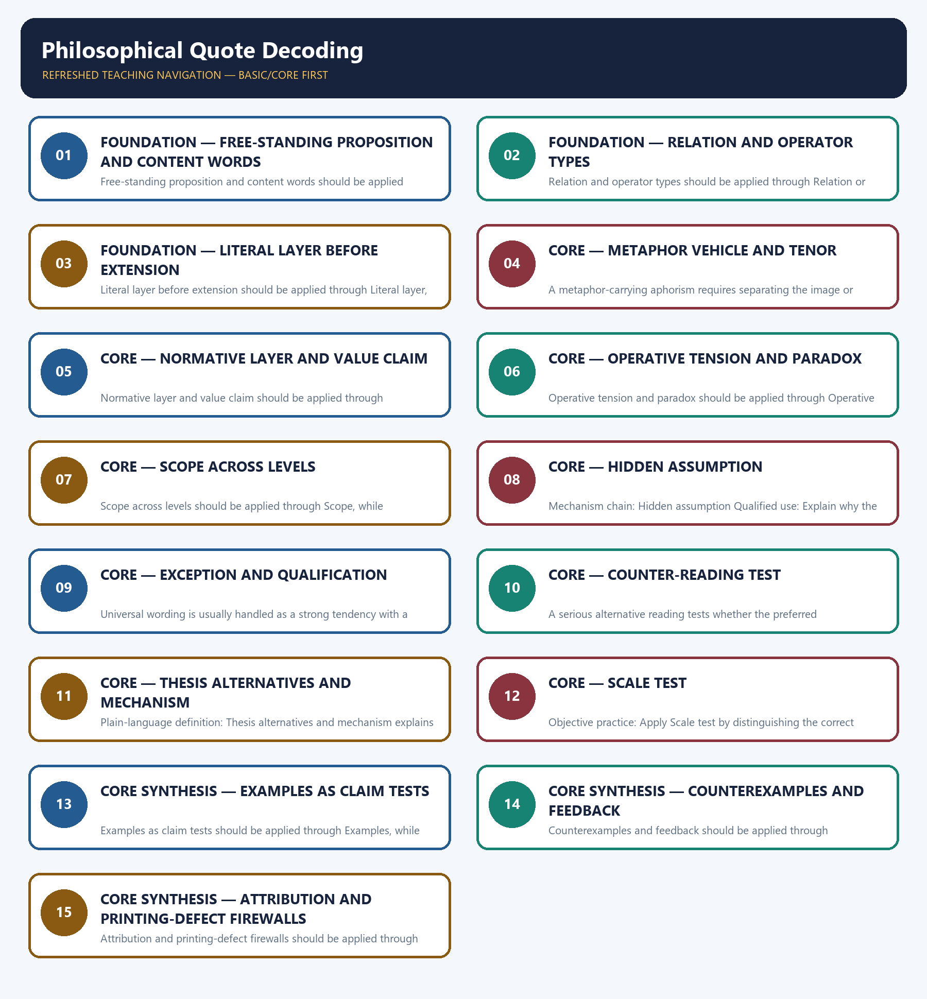

# Philosophical Quote Decoding — Learner-v2 Complete Learning Session

> **Authoring-only generation:** 2026-09-04. No PDF was rendered and no tracker or index was mutated.

### SOURCE, PROGRESSION AND OFFICIAL-RULE AUDIT

- **Generation date:** 2026-09-04.
- **Source order:** canonical Basic owner first; Advanced owner second; Essay master framework, README, official-syllabus map, answer-worthiness audit and revision chart next; PYQ corpus and official OCR papers after that; live official UPSC pages only as a final check.
- **Basic/Advanced boundary:** complete Basic teaching remains first and Advanced material remains optional and last.
- **OCR boundary:** Repository Markdown was primary. OCR-searchable official UPSC Essay papers were supplementary only for printed instructions and V1 prompt wording. No author, official model answer, current marks split, phase allocation, paragraph count or scoring rubric was inferred.
- **Qdrant:** not used; repository Markdown and local official papers were sufficient.
- **PYQ integrity:** The three cards use exact V1 prompt wording from 2024–2025 and provide method-focused decoding only. No official model answer, author or unique canonical interpretation is claimed.
- **Live-source boundary:** Official UPSC pages were attempted on 2026-09-04 only to locate paper and notification routes. Exact wording remains controlled by the repository's local V1 audit, and no web attribution or biography was imported.
- **No-formula rule:** strategy, heuristics and practice weights are never presented as official UPSC instructions or marking criteria.

### LIVE OFFICIAL-SOURCE ATTEMPT LOG

The checks below were made on 2026-09-04. Substantive official text is used only for the proposition it supports; title-only, blocked or thin pages are recorded and supply no factual claim.

- https://upsc.gov.in/examinations/previous-question-papers — attempted 2026-09-04; the official page was access-blocked, so exact prompt wording continues to come only from the repository's V1 paper audit.
- https://upsc.gov.in/examinations/active-examinations — attempted 2026-09-04; the official page was access-blocked and supplied no attribution, interpretation or current paper instruction.
- https://upsc.gov.in/sites/default/files/Notif-CSP-2024-Engl-140224.pdf — searched 2026-09-04; the official notification route was logged but was not used to attach authors or canonical meanings to prompts.

## BASIC LEARNING SESSION



*Distinct embedded teaching-navigation image. The separate continuous Cārvāka-style flowchart package remains an independent at-a-glance artifact.*

### SESSION 1 — FOUNDATION — FREE-STANDING PROPOSITION AND CONTENT WORDS

#### DEFINITION / WHAT THIS IS CALLED

**Plain-language definition:** Objective practice: Apply Free-standing proposition and content words by distinguishing the correct Essay-method move from nearby but invalid shortcuts; no factual-trivia recall is being tested.

**Technical definition:** Free-standing proposition and content words should be applied through Free-standing proposition and Content-word inventory, while preserving the difference between official paper instruction and strategy, prompt wording and interpretation, example and evidence, breadth and coherence.

#### ANSWER-GRABBING OPENING — WRITE/ADAPT IN THE EXAM

> Plain-language definition: Free-standing proposition and content words explains how Free-standing proposition and Content-word inventory combine into one usable Essay-planning move.

#### MUST-WRITE KEYWORDS

- **FOUNDATION**
- **Free-standing proposition**
- **content words**
- **Plain-language definition**
- **Technical definition**
- **Free-standing**

**How to use them:** Frame the answer through FOUNDATION; define Free-standing proposition, connect content words with Plain-language definition to explain the mechanism, and use Technical definition for the decisive comparison or qualification.

#### METHOD MOVE / WHAT THIS DOES

**Plain-language definition:** Free-standing proposition and content words explains how Free-standing proposition and Content-word inventory combine into one usable Essay-planning move.

**Technical definition:** The learner fixes the printed prompt, its relationship or demand, the defensible scope, the argument function and the evidence boundary before drafting prose.

#### ANSWER-GRABBING OPENING — WRITE/ADAPT IN THE EXAM

> Free-standing proposition and content words should be applied through Free-standing proposition and Content-word inventory, while preserving the difference between official paper instruction and strategy, prompt wording and interpretation, example and evidence, breadth and coherence.

#### MUST-WRITE KEYWORDS

- **Free-standing**
- **proposition**
- **content**
- **words**
- **Content-word**
- **inventory**

**How to use them:** Define the first three terms, trace the relationship with the next two, and attach the final term to the exact claim, example and qualification. Qualification: Do not write an essay on one attractive keyword while ignoring the relation asserted by the sentence.

#### VISUAL FIRST

```text
FREE-STANDING PROPOSITION AND CONTENT WORDS
01. Free-standing proposition
    |
    v
02. Content-word inventory
STATUS / CATEGORY FIREWALL -> Do not write an essay on one attractive keyword while ignoring the relation asserted by the sentence.
```

*The rail fixes the prompt-to-argument sequence and claim boundary before explanation.*

#### CORE EXPLANATION

An unattributed philosophical prompt is treated as a proposition to interpret on its own words, not as a quotation-recall test. Decoding begins by identifying every content word and stating its plain meaning before extending the sentence.

#### SIMPLE SYSTEM EXAMPLE

Read Free-standing proposition and content words as a sequence: identify Free-standing proposition, follow the method through the printed proposition, and stop before adding a rule, attribution, fact or inference the audited sources do not support.

#### TECHNICAL DISTINCTION

The decisive boundary is Do not write an essay on one attractive keyword while ignoring the relation asserted by the sentence. This keeps Free-standing proposition and Content-word inventory in the correct prompt, method, argument and evidence category.

#### NAMED EVIDENCE AND MECHANISM

- An unattributed philosophical prompt is treated as a proposition to interpret on its own words, not as a quotation-recall test.
- Decoding begins by identifying every content word and stating its plain meaning before extending the sentence.

#### EXAMINER CAUTION

- Do not write an essay on one attractive keyword while ignoring the relation asserted by the sentence.

#### EXAM LINK

- **Objective practice:** Apply Free-standing proposition and content words by distinguishing the correct Essay-method move from nearby but invalid shortcuts; no factual-trivia recall is being tested.
- **Essay application:** Begin with the printed proposition, not a remembered author.

#### MINI RECAP

- **Mechanism chain:** Free-standing proposition -> Content-word inventory
- **Qualified use:** Begin with the printed proposition, not a remembered author.

#### CLOSING RECALL FLOW — FOUNDATION — FREE-STANDING PROPOSITION AND CONTENT WORDS

```text
START / CONCEPT: FOUNDATION — Free-standing proposition and content words
        |
        v
EXACT TERMS: FOUNDATION · Free-standing proposition · content words · Plain-language definition · Technical definition · Free-standing
        |
        v
MECHANISM / ARGUMENT: Free-standing proposition and content words should be applied through Free-standing proposition and Content-word inventory, while preserving the difference between official paper instruction and strategy, prompt wording and interpretation, example and evidence, breadth and coherence.
        |
        v
CONSEQUENCE / CONTRAST: Read Free-standing proposition and content words as a sequence: identify Free-standing proposition, follow the method through the printed proposition, and stop before adding a rule, attribution, fact or inference the audited sources do not support.
        |
        v
UPSC TRAP / ANSWER-USE: Objective practice: Apply Free-standing proposition and content words by distinguishing the correct Essay-method move from nearby but invalid shortcuts; no factual-trivia recall is being tested.
        |
        v
ANSWER-GRABBING FORMULATION: Plain-language definition: Free-standing proposition and content words explains how Free-standing proposition and Content-word inventory combine into one usable Essay-planning move.
```
### SESSION 2 — FOUNDATION — RELATION AND OPERATOR TYPES

#### DEFINITION / WHAT THIS IS CALLED

**Plain-language definition:** Objective practice: Apply Relation and operator types by distinguishing the correct Essay-method move from nearby but invalid shortcuts; no factual-trivia recall is being tested.

**Technical definition:** Relation and operator types should be applied through Relation or operator, while preserving the difference between official paper instruction and strategy, prompt wording and interpretation, example and evidence, breadth and coherence.

#### ANSWER-GRABBING OPENING — WRITE/ADAPT IN THE EXAM

> Plain-language definition: Relation and operator types explains how Relation or operator combine into one usable Essay-planning move.

#### MUST-WRITE KEYWORDS

- **FOUNDATION**
- **Relation**
- **operator types**
- **Plain-language definition**
- **Technical definition**
- **operator**

**How to use them:** Frame the answer through FOUNDATION; define Relation, connect operator types with Plain-language definition to explain the mechanism, and use Technical definition for the decisive comparison or qualification.

#### METHOD MOVE / WHAT THIS DOES

**Plain-language definition:** Relation and operator types explains how Relation or operator combine into one usable Essay-planning move.

**Technical definition:** The learner fixes the printed prompt, its relationship or demand, the defensible scope, the argument function and the evidence boundary before drafting prose.

#### ANSWER-GRABBING OPENING — WRITE/ADAPT IN THE EXAM

> Relation and operator types should be applied through Relation or operator, while preserving the difference between official paper instruction and strategy, prompt wording and interpretation, example and evidence, breadth and coherence.

#### MUST-WRITE KEYWORDS

- **Relation**
- **operator**
- **types**
- **prompt's**
- **operative**
- **causal**

**How to use them:** Define the first three terms, trace the relationship with the next two, and attach the final term to the exact claim, example and qualification. Qualification: Do not jump from a literal phrase to an unrelated grand theme.

#### VISUAL FIRST

```text
RELATION AND OPERATOR TYPES
01. Relation or operator
STATUS / CATEGORY FIREWALL -> Do not jump from a literal phrase to an unrelated grand theme.
```

*The rail fixes the prompt-to-argument sequence and claim boundary before explanation.*

#### CORE EXPLANATION

The prompt's operative relation may be causal, comparative, conditional, definitional, paradoxical or process-versus-outcome.

#### SIMPLE SYSTEM EXAMPLE

Read Relation and operator types as a sequence: identify Relation or operator, follow the method through the printed proposition, and stop before adding a rule, attribution, fact or inference the audited sources do not support.

#### TECHNICAL DISTINCTION

The decisive boundary is Do not jump from a literal phrase to an unrelated grand theme. This keeps Relation or operator in the correct prompt, method, argument and evidence category.

#### NAMED EVIDENCE AND MECHANISM

- The prompt's operative relation may be causal, comparative, conditional, definitional, paradoxical or process-versus-outcome.

#### EXAMINER CAUTION

- Do not jump from a literal phrase to an unrelated grand theme.

#### EXAM LINK

- **Objective practice:** Apply Relation and operator types by distinguishing the correct Essay-method move from nearby but invalid shortcuts; no factual-trivia recall is being tested.
- **Essay application:** Define the sentence's own terms before importing themes.

#### MINI RECAP

- **Mechanism chain:** Relation or operator
- **Qualified use:** Define the sentence's own terms before importing themes.

#### CLOSING RECALL FLOW — FOUNDATION — RELATION AND OPERATOR TYPES

```text
START / CONCEPT: FOUNDATION — Relation and operator types
        |
        v
EXACT TERMS: FOUNDATION · Relation · operator types · Plain-language definition · Technical definition · operator
        |
        v
MECHANISM / ARGUMENT: Relation and operator types should be applied through Relation or operator, while preserving the difference between official paper instruction and strategy, prompt wording and interpretation, example and evidence, breadth and coherence.
        |
        v
CONSEQUENCE / CONTRAST: Read Relation and operator types as a sequence: identify Relation or operator, follow the method through the printed proposition, and stop before adding a rule, attribution, fact or inference the audited sources do not support.
        |
        v
UPSC TRAP / ANSWER-USE: Objective practice: Apply Relation and operator types by distinguishing the correct Essay-method move from nearby but invalid shortcuts; no factual-trivia recall is being tested.
        |
        v
ANSWER-GRABBING FORMULATION: Plain-language definition: Relation and operator types explains how Relation or operator combine into one usable Essay-planning move.
```
### SESSION 3 — FOUNDATION — LITERAL LAYER BEFORE EXTENSION

#### DEFINITION / WHAT THIS IS CALLED

**Plain-language definition:** Objective practice: Apply Literal layer before extension by distinguishing the correct Essay-method move from nearby but invalid shortcuts; no factual-trivia recall is being tested.

**Technical definition:** Literal layer before extension should be applied through Literal layer, while preserving the difference between official paper instruction and strategy, prompt wording and interpretation, example and evidence, breadth and coherence.

#### ANSWER-GRABBING OPENING — WRITE/ADAPT IN THE EXAM

> Plain-language definition: Literal layer before extension explains how Literal layer combine into one usable Essay-planning move.

#### MUST-WRITE KEYWORDS

- **FOUNDATION**
- **Literal layer before extension**
- **Plain-language definition**
- **Technical definition**
- **Literal**
- **layer**

**How to use them:** Frame the answer through FOUNDATION; define Literal layer before extension, connect Plain-language definition with Technical definition to explain the mechanism, and use Literal for the decisive comparison or qualification.

#### METHOD MOVE / WHAT THIS DOES

**Plain-language definition:** Literal layer before extension explains how Literal layer combine into one usable Essay-planning move.

**Technical definition:** The learner fixes the printed prompt, its relationship or demand, the defensible scope, the argument function and the evidence boundary before drafting prose.

#### ANSWER-GRABBING OPENING — WRITE/ADAPT IN THE EXAM

> Literal layer before extension should be applied through Literal layer, while preserving the difference between official paper instruction and strategy, prompt wording and interpretation, example and evidence, breadth and coherence.

#### MUST-WRITE KEYWORDS

- **Literal**
- **layer**
- **extension**
- **records**
- **what**
- **sentence**

**How to use them:** Define the first three terms, trace the relationship with the next two, and attach the final term to the exact claim, example and qualification. Qualification: Do not treat metaphorical, normative and empirical layers as interchangeable.

#### VISUAL FIRST

```text
LITERAL LAYER BEFORE EXTENSION
01. Literal layer
STATUS / CATEGORY FIREWALL -> Do not treat metaphorical, normative and empirical layers as interchangeable.
```

*The rail fixes the prompt-to-argument sequence and claim boundary before explanation.*

#### CORE EXPLANATION

The literal layer records what the sentence says before metaphorical extension and prevents the essay from losing textual contact.

#### SIMPLE SYSTEM EXAMPLE

Read Literal layer before extension as a sequence: identify Literal layer, follow the method through the printed proposition, and stop before adding a rule, attribution, fact or inference the audited sources do not support.

#### TECHNICAL DISTINCTION

The decisive boundary is Do not treat metaphorical, normative and empirical layers as interchangeable. This keeps Literal layer in the correct prompt, method, argument and evidence category.

#### NAMED EVIDENCE AND MECHANISM

- The literal layer records what the sentence says before metaphorical extension and prevents the essay from losing textual contact.

#### EXAMINER CAUTION

- Do not treat metaphorical, normative and empirical layers as interchangeable.

#### EXAM LINK

- **Objective practice:** Apply Literal layer before extension by distinguishing the correct Essay-method move from nearby but invalid shortcuts; no factual-trivia recall is being tested.
- **Essay application:** State exactly what relation the sentence asserts.

#### MINI RECAP

- **Mechanism chain:** Literal layer
- **Qualified use:** State exactly what relation the sentence asserts.

#### CLOSING RECALL FLOW — FOUNDATION — LITERAL LAYER BEFORE EXTENSION

```text
START / CONCEPT: FOUNDATION — Literal layer before extension
        |
        v
EXACT TERMS: FOUNDATION · Literal layer before extension · Plain-language definition · Technical definition · Literal · layer
        |
        v
MECHANISM / ARGUMENT: Literal layer before extension should be applied through Literal layer, while preserving the difference between official paper instruction and strategy, prompt wording and interpretation, example and evidence, breadth and coherence.
        |
        v
CONSEQUENCE / CONTRAST: Read Literal layer before extension as a sequence: identify Literal layer, follow the method through the printed proposition, and stop before adding a rule, attribution, fact or inference the audited sources do not support.
        |
        v
UPSC TRAP / ANSWER-USE: Objective practice: Apply Literal layer before extension by distinguishing the correct Essay-method move from nearby but invalid shortcuts; no factual-trivia recall is being tested.
        |
        v
ANSWER-GRABBING FORMULATION: Plain-language definition: Literal layer before extension explains how Literal layer combine into one usable Essay-planning move.
```
### SESSION 4 — CORE — METAPHOR VEHICLE AND TENOR

#### DEFINITION / WHAT THIS IS CALLED

**Plain-language definition:** Objective practice: Apply Metaphor vehicle and tenor by distinguishing the correct Essay-method move from nearby but invalid shortcuts; no factual-trivia recall is being tested.

**Technical definition:** A metaphor-carrying aphorism requires separating the image or vehicle from the idea or tenor it is used to illuminate.

#### ANSWER-GRABBING OPENING — WRITE/ADAPT IN THE EXAM

> Plain-language definition: Metaphor vehicle and tenor explains how Metaphorical layer combine into one usable Essay-planning move.

#### MUST-WRITE KEYWORDS

- **Metaphor vehicle**
- **tenor**
- **Plain-language definition**
- **Technical definition**
- **Metaphor**
- **vehicle**

**How to use them:** Frame the answer through Metaphor vehicle; define tenor, connect Plain-language definition with Technical definition to explain the mechanism, and use Metaphor for the decisive comparison or qualification.

#### METHOD MOVE / WHAT THIS DOES

**Plain-language definition:** Metaphor vehicle and tenor explains how Metaphorical layer combine into one usable Essay-planning move.

**Technical definition:** The learner fixes the printed prompt, its relationship or demand, the defensible scope, the argument function and the evidence boundary before drafting prose.

#### ANSWER-GRABBING OPENING — WRITE/ADAPT IN THE EXAM

> Metaphor vehicle and tenor should be applied through Metaphorical layer, while preserving the difference between official paper instruction and strategy, prompt wording and interpretation, example and evidence, breadth and coherence.

#### MUST-WRITE KEYWORDS

- **Metaphor**
- **vehicle**
- **tenor**
- **Metaphorical**
- **layer**
- **metaphor-carrying**

**How to use them:** Define the first three terms, trace the relationship with the next two, and attach the final term to the exact claim, example and qualification. Qualification: Do not mistake paradox-recognition for completed analysis.

#### VISUAL FIRST

```text
METAPHOR VEHICLE AND TENOR
01. Metaphorical layer
STATUS / CATEGORY FIREWALL -> Do not mistake paradox-recognition for completed analysis.
```

*The rail fixes the prompt-to-argument sequence and claim boundary before explanation.*

#### CORE EXPLANATION

A metaphor-carrying aphorism requires separating the image or vehicle from the idea or tenor it is used to illuminate.

#### SIMPLE SYSTEM EXAMPLE

Read Metaphor vehicle and tenor as a sequence: identify Metaphorical layer, follow the method through the printed proposition, and stop before adding a rule, attribution, fact or inference the audited sources do not support.

#### TECHNICAL DISTINCTION

The decisive boundary is Do not mistake paradox-recognition for completed analysis. This keeps Metaphorical layer in the correct prompt, method, argument and evidence category.

#### NAMED EVIDENCE AND MECHANISM

- A metaphor-carrying aphorism requires separating the image or vehicle from the idea or tenor it is used to illuminate.

#### EXAMINER CAUTION

- Do not mistake paradox-recognition for completed analysis.

#### EXAM LINK

- **Objective practice:** Apply Metaphor vehicle and tenor by distinguishing the correct Essay-method move from nearby but invalid shortcuts; no factual-trivia recall is being tested.
- **Essay application:** Use the literal meaning as a continuing anchor.

#### MINI RECAP

- **Mechanism chain:** Metaphorical layer
- **Qualified use:** Use the literal meaning as a continuing anchor.

#### CLOSING RECALL FLOW — CORE — METAPHOR VEHICLE AND TENOR

```text
START / CONCEPT: CORE — Metaphor vehicle and tenor
        |
        v
EXACT TERMS: Metaphor vehicle · tenor · Plain-language definition · Technical definition · Metaphor · vehicle
        |
        v
MECHANISM / ARGUMENT: Metaphor vehicle and tenor should be applied through Metaphorical layer, while preserving the difference between official paper instruction and strategy, prompt wording and interpretation, example and evidence, breadth and coherence.
        |
        v
CONSEQUENCE / CONTRAST: Read Metaphor vehicle and tenor as a sequence: identify Metaphorical layer, follow the method through the printed proposition, and stop before adding a rule, attribution, fact or inference the audited sources do not support.
        |
        v
UPSC TRAP / ANSWER-USE: Objective practice: Apply Metaphor vehicle and tenor by distinguishing the correct Essay-method move from nearby but invalid shortcuts; no factual-trivia recall is being tested.
        |
        v
ANSWER-GRABBING FORMULATION: Plain-language definition: Metaphor vehicle and tenor explains how Metaphorical layer combine into one usable Essay-planning move.
```
### SESSION 5 — CORE — NORMATIVE LAYER AND VALUE CLAIM

#### DEFINITION / WHAT THIS IS CALLED

**Plain-language definition:** Objective practice: Apply Normative layer and value claim by distinguishing the correct Essay-method move from nearby but invalid shortcuts; no factual-trivia recall is being tested.

**Technical definition:** Normative layer and value claim should be applied through Normative layer, while preserving the difference between official paper instruction and strategy, prompt wording and interpretation, example and evidence, breadth and coherence.

#### ANSWER-GRABBING OPENING — WRITE/ADAPT IN THE EXAM

> Plain-language definition: Normative layer and value claim explains how Normative layer combine into one usable Essay-planning move.

#### MUST-WRITE KEYWORDS

- **Normative layer**
- **value claim**
- **Plain-language definition**
- **Technical definition**
- **Normative**
- **layer**

**How to use them:** Frame the answer through Normative layer; define value claim, connect Plain-language definition with Technical definition to explain the mechanism, and use Normative for the decisive comparison or qualification.

#### METHOD MOVE / WHAT THIS DOES

**Plain-language definition:** Normative layer and value claim explains how Normative layer combine into one usable Essay-planning move.

**Technical definition:** The learner fixes the printed prompt, its relationship or demand, the defensible scope, the argument function and the evidence boundary before drafting prose.

#### ANSWER-GRABBING OPENING — WRITE/ADAPT IN THE EXAM

> Normative layer and value claim should be applied through Normative layer, while preserving the difference between official paper instruction and strategy, prompt wording and interpretation, example and evidence, breadth and coherence.

#### MUST-WRITE KEYWORDS

- **Normative**
- **layer**
- **value**
- **asks**
- **what**
- **standard**

**How to use them:** Define the first three terms, trace the relationship with the next two, and attach the final term to the exact claim, example and qualification. Qualification: Do not universalise a reading that survives only at one scale.

#### VISUAL FIRST

```text
NORMATIVE LAYER AND VALUE CLAIM
01. Normative layer
STATUS / CATEGORY FIREWALL -> Do not universalise a reading that survives only at one scale.
```

*The rail fixes the prompt-to-argument sequence and claim boundary before explanation.*

#### CORE EXPLANATION

The normative layer asks what value, standard, duty or conception of a good life the proposition appears to affirm or question.

#### SIMPLE SYSTEM EXAMPLE

Read Normative layer and value claim as a sequence: identify Normative layer, follow the method through the printed proposition, and stop before adding a rule, attribution, fact or inference the audited sources do not support.

#### TECHNICAL DISTINCTION

The decisive boundary is Do not universalise a reading that survives only at one scale. This keeps Normative layer in the correct prompt, method, argument and evidence category.

#### NAMED EVIDENCE AND MECHANISM

- The normative layer asks what value, standard, duty or conception of a good life the proposition appears to affirm or question.

#### EXAMINER CAUTION

- Do not universalise a reading that survives only at one scale.

#### EXAM LINK

- **Objective practice:** Apply Normative layer and value claim by distinguishing the correct Essay-method move from nearby but invalid shortcuts; no factual-trivia recall is being tested.
- **Essay application:** Separate the metaphor's image from its argued subject.

#### MINI RECAP

- **Mechanism chain:** Normative layer
- **Qualified use:** Separate the metaphor's image from its argued subject.

#### CLOSING RECALL FLOW — CORE — NORMATIVE LAYER AND VALUE CLAIM

```text
START / CONCEPT: CORE — Normative layer and value claim
        |
        v
EXACT TERMS: Normative layer · value claim · Plain-language definition · Technical definition · Normative · layer
        |
        v
MECHANISM / ARGUMENT: Normative layer and value claim should be applied through Normative layer, while preserving the difference between official paper instruction and strategy, prompt wording and interpretation, example and evidence, breadth and coherence.
        |
        v
CONSEQUENCE / CONTRAST: Read Normative layer and value claim as a sequence: identify Normative layer, follow the method through the printed proposition, and stop before adding a rule, attribution, fact or inference the audited sources do not support.
        |
        v
UPSC TRAP / ANSWER-USE: Objective practice: Apply Normative layer and value claim by distinguishing the correct Essay-method move from nearby but invalid shortcuts; no factual-trivia recall is being tested.
        |
        v
ANSWER-GRABBING FORMULATION: Plain-language definition: Normative layer and value claim explains how Normative layer combine into one usable Essay-planning move.
```
### SESSION 6 — CORE — OPERATIVE TENSION AND PARADOX

#### DEFINITION / WHAT THIS IS CALLED

**Plain-language definition:** Objective practice: Apply Operative tension and paradox by distinguishing the correct Essay-method move from nearby but invalid shortcuts; no factual-trivia recall is being tested.

**Technical definition:** Operative tension and paradox should be applied through Operative tension and Paradox, while preserving the difference between official paper instruction and strategy, prompt wording and interpretation, example and evidence, breadth and coherence.

#### ANSWER-GRABBING OPENING — WRITE/ADAPT IN THE EXAM

> Plain-language definition: Operative tension and paradox explains how Operative tension and Paradox combine into one usable Essay-planning move.

#### MUST-WRITE KEYWORDS

- **Operative tension**
- **paradox**
- **Plain-language definition**
- **Technical definition**
- **Operative**
- **tension**

**How to use them:** Frame the answer through Operative tension; define paradox, connect Plain-language definition with Technical definition to explain the mechanism, and use Operative for the decisive comparison or qualification.

#### METHOD MOVE / WHAT THIS DOES

**Plain-language definition:** Operative tension and paradox explains how Operative tension and Paradox combine into one usable Essay-planning move.

**Technical definition:** The learner fixes the printed prompt, its relationship or demand, the defensible scope, the argument function and the evidence boundary before drafting prose.

#### ANSWER-GRABBING OPENING — WRITE/ADAPT IN THE EXAM

> Operative tension and paradox should be applied through Operative tension and Paradox, while preserving the difference between official paper instruction and strategy, prompt wording and interpretation, example and evidence, breadth and coherence.

#### MUST-WRITE KEYWORDS

- **Operative**
- **tension**
- **paradox**
- **usable**
- **decoding**
- **names**

**How to use them:** Define the first three terms, trace the relationship with the next two, and attach the final term to the exact claim, example and qualification. Qualification: Do not let an exception swallow the central proposition.

#### VISUAL FIRST

```text
OPERATIVE TENSION AND PARADOX
01. Operative tension
    |
    v
02. Paradox
STATUS / CATEGORY FIREWALL -> Do not let an exception swallow the central proposition.
```

*The rail fixes the prompt-to-argument sequence and claim boundary before explanation.*

#### CORE EXPLANATION

A usable decoding names the opposition or double pull inside the whole sentence, rather than writing generally on one keyword. An apparent contradiction may disclose a deeper relationship, but it must be explained rather than admired as clever wording.

#### SIMPLE SYSTEM EXAMPLE

Read Operative tension and paradox as a sequence: identify Operative tension, follow the method through the printed proposition, and stop before adding a rule, attribution, fact or inference the audited sources do not support.

#### TECHNICAL DISTINCTION

The decisive boundary is Do not let an exception swallow the central proposition. This keeps Operative tension and Paradox in the correct prompt, method, argument and evidence category.

#### NAMED EVIDENCE AND MECHANISM

- A usable decoding names the opposition or double pull inside the whole sentence, rather than writing generally on one keyword.
- An apparent contradiction may disclose a deeper relationship, but it must be explained rather than admired as clever wording.

#### EXAMINER CAUTION

- Do not let an exception swallow the central proposition.

#### EXAM LINK

- **Objective practice:** Apply Operative tension and paradox by distinguishing the correct Essay-method move from nearby but invalid shortcuts; no factual-trivia recall is being tested.
- **Essay application:** Name the value judgment without turning it into moralising.

#### MINI RECAP

- **Mechanism chain:** Operative tension -> Paradox
- **Qualified use:** Name the value judgment without turning it into moralising.

#### CLOSING RECALL FLOW — CORE — OPERATIVE TENSION AND PARADOX

```text
START / CONCEPT: CORE — Operative tension and paradox
        |
        v
EXACT TERMS: Operative tension · paradox · Plain-language definition · Technical definition · Operative · tension
        |
        v
MECHANISM / ARGUMENT: Operative tension and paradox should be applied through Operative tension and Paradox, while preserving the difference between official paper instruction and strategy, prompt wording and interpretation, example and evidence, breadth and coherence.
        |
        v
CONSEQUENCE / CONTRAST: Read Operative tension and paradox as a sequence: identify Operative tension, follow the method through the printed proposition, and stop before adding a rule, attribution, fact or inference the audited sources do not support.
        |
        v
UPSC TRAP / ANSWER-USE: Objective practice: Apply Operative tension and paradox by distinguishing the correct Essay-method move from nearby but invalid shortcuts; no factual-trivia recall is being tested.
        |
        v
ANSWER-GRABBING FORMULATION: Plain-language definition: Operative tension and paradox explains how Operative tension and Paradox combine into one usable Essay-planning move.
```
### SESSION 7 — CORE — SCOPE ACROSS LEVELS

#### DEFINITION / WHAT THIS IS CALLED

**Plain-language definition:** Objective practice: Apply Scope across levels by distinguishing the correct Essay-method move from nearby but invalid shortcuts; no factual-trivia recall is being tested.

**Technical definition:** Scope across levels should be applied through Scope, while preserving the difference between official paper instruction and strategy, prompt wording and interpretation, example and evidence, breadth and coherence.

#### ANSWER-GRABBING OPENING — WRITE/ADAPT IN THE EXAM

> Plain-language definition: Scope across levels explains how Scope combine into one usable Essay-planning move.

#### MUST-WRITE KEYWORDS

- **Scope across levels**
- **Plain-language definition**
- **Technical definition**
- **Scope**
- **across**
- **levels**

**How to use them:** Frame the answer through Scope across levels; define Plain-language definition, connect Technical definition with Scope to explain the mechanism, and use across for the decisive comparison or qualification.

#### METHOD MOVE / WHAT THIS DOES

**Plain-language definition:** Scope across levels explains how Scope combine into one usable Essay-planning move.

**Technical definition:** The learner fixes the printed prompt, its relationship or demand, the defensible scope, the argument function and the evidence boundary before drafting prose.

#### ANSWER-GRABBING OPENING — WRITE/ADAPT IN THE EXAM

> Scope across levels should be applied through Scope, while preserving the difference between official paper instruction and strategy, prompt wording and interpretation, example and evidence, breadth and coherence.

#### MUST-WRITE KEYWORDS

- **Scope**
- **across**
- **levels**
- **interpretation**
- **should**
- **state**

**How to use them:** Define the first three terms, trace the relationship with the next two, and attach the final term to the exact claim, example and qualification. Qualification: Do not accept the first interpretation without a counter-reading.

#### VISUAL FIRST

```text
SCOPE ACROSS LEVELS
01. Scope
STATUS / CATEGORY FIREWALL -> Do not accept the first interpretation without a counter-reading.
```

*The rail fixes the prompt-to-argument sequence and claim boundary before explanation.*

#### CORE EXPLANATION

The interpretation should state whether the claim operates at individual, institutional, state, global or civilisational scale and where it does not.

#### SIMPLE SYSTEM EXAMPLE

Read Scope across levels as a sequence: identify Scope, follow the method through the printed proposition, and stop before adding a rule, attribution, fact or inference the audited sources do not support.

#### TECHNICAL DISTINCTION

The decisive boundary is Do not accept the first interpretation without a counter-reading. This keeps Scope in the correct prompt, method, argument and evidence category.

#### NAMED EVIDENCE AND MECHANISM

- The interpretation should state whether the claim operates at individual, institutional, state, global or civilisational scale and where it does not.

#### EXAMINER CAUTION

- Do not accept the first interpretation without a counter-reading.

#### EXAM LINK

- **Objective practice:** Apply Scope across levels by distinguishing the correct Essay-method move from nearby but invalid shortcuts; no factual-trivia recall is being tested.
- **Essay application:** Turn the sentence into a contestable tension.

#### MINI RECAP

- **Mechanism chain:** Scope
- **Qualified use:** Turn the sentence into a contestable tension.

#### CLOSING RECALL FLOW — CORE — SCOPE ACROSS LEVELS

```text
START / CONCEPT: CORE — Scope across levels
        |
        v
EXACT TERMS: Scope across levels · Plain-language definition · Technical definition · Scope · across · levels
        |
        v
MECHANISM / ARGUMENT: Scope across levels should be applied through Scope, while preserving the difference between official paper instruction and strategy, prompt wording and interpretation, example and evidence, breadth and coherence.
        |
        v
CONSEQUENCE / CONTRAST: Read Scope across levels as a sequence: identify Scope, follow the method through the printed proposition, and stop before adding a rule, attribution, fact or inference the audited sources do not support.
        |
        v
UPSC TRAP / ANSWER-USE: Objective practice: Apply Scope across levels by distinguishing the correct Essay-method move from nearby but invalid shortcuts; no factual-trivia recall is being tested.
        |
        v
ANSWER-GRABBING FORMULATION: Plain-language definition: Scope across levels explains how Scope combine into one usable Essay-planning move.
```
### SESSION 8 — CORE — HIDDEN ASSUMPTION

#### DEFINITION / WHAT THIS IS CALLED

**Plain-language definition:** Objective practice: Apply Hidden assumption by distinguishing the correct Essay-method move from nearby but invalid shortcuts; no factual-trivia recall is being tested.

**Technical definition:** Mechanism chain: Hidden assumption Qualified use: Explain why the apparent contradiction is analytically useful.

#### ANSWER-GRABBING OPENING — WRITE/ADAPT IN THE EXAM

> Plain-language definition: Hidden assumption explains how Hidden assumption combine into one usable Essay-planning move.

#### MUST-WRITE KEYWORDS

- **Hidden assumption**
- **Plain-language definition**
- **Technical definition**
- **Hidden**
- **assumption**
- **compressed**

**How to use them:** Frame the answer through Hidden assumption; define Plain-language definition, connect Technical definition with Hidden to explain the mechanism, and use assumption for the decisive comparison or qualification.

#### METHOD MOVE / WHAT THIS DOES

**Plain-language definition:** Hidden assumption explains how Hidden assumption combine into one usable Essay-planning move.

**Technical definition:** The learner fixes the printed prompt, its relationship or demand, the defensible scope, the argument function and the evidence boundary before drafting prose.

#### ANSWER-GRABBING OPENING — WRITE/ADAPT IN THE EXAM

> Hidden assumption should be applied through Hidden assumption, while preserving the difference between official paper instruction and strategy, prompt wording and interpretation, example and evidence, breadth and coherence.

#### MUST-WRITE KEYWORDS

- **Hidden**
- **assumption**
- **compressed**
- **proposition**
- **normally**
- **relies**

**How to use them:** Define the first three terms, trace the relationship with the next two, and attach the final term to the exact claim, example and qualification. Qualification: Do not use examples as decoration or proof by anecdote.

#### VISUAL FIRST

```text
HIDDEN ASSUMPTION
01. Hidden assumption
STATUS / CATEGORY FIREWALL -> Do not use examples as decoration or proof by anecdote.
```

*The rail fixes the prompt-to-argument sequence and claim boundary before explanation.*

#### CORE EXPLANATION

A compressed proposition normally relies on an unstated premise that must be surfaced and tested before becoming a thesis.

#### SIMPLE SYSTEM EXAMPLE

Read Hidden assumption as a sequence: identify Hidden assumption, follow the method through the printed proposition, and stop before adding a rule, attribution, fact or inference the audited sources do not support.

#### TECHNICAL DISTINCTION

The decisive boundary is Do not use examples as decoration or proof by anecdote. This keeps Hidden assumption in the correct prompt, method, argument and evidence category.

#### NAMED EVIDENCE AND MECHANISM

- A compressed proposition normally relies on an unstated premise that must be surfaced and tested before becoming a thesis.

#### EXAMINER CAUTION

- Do not use examples as decoration or proof by anecdote.

#### EXAM LINK

- **Objective practice:** Apply Hidden assumption by distinguishing the correct Essay-method move from nearby but invalid shortcuts; no factual-trivia recall is being tested.
- **Essay application:** Explain why the apparent contradiction is analytically useful.

#### MINI RECAP

- **Mechanism chain:** Hidden assumption
- **Qualified use:** Explain why the apparent contradiction is analytically useful.

#### CLOSING RECALL FLOW — CORE — HIDDEN ASSUMPTION

```text
START / CONCEPT: CORE — Hidden assumption
        |
        v
EXACT TERMS: Hidden assumption · Plain-language definition · Technical definition · Hidden · assumption · compressed
        |
        v
MECHANISM / ARGUMENT: Hidden assumption should be applied through Hidden assumption, while preserving the difference between official paper instruction and strategy, prompt wording and interpretation, example and evidence, breadth and coherence.
        |
        v
CONSEQUENCE / CONTRAST: Read Hidden assumption as a sequence: identify Hidden assumption, follow the method through the printed proposition, and stop before adding a rule, attribution, fact or inference the audited sources do not support.
        |
        v
UPSC TRAP / ANSWER-USE: Objective practice: Apply Hidden assumption by distinguishing the correct Essay-method move from nearby but invalid shortcuts; no factual-trivia recall is being tested.
        |
        v
ANSWER-GRABBING FORMULATION: Plain-language definition: Hidden assumption explains how Hidden assumption combine into one usable Essay-planning move.
```
### SESSION 9 — CORE — EXCEPTION AND QUALIFICATION

#### DEFINITION / WHAT THIS IS CALLED

**Plain-language definition:** Objective practice: Apply Exception and qualification by distinguishing the correct Essay-method move from nearby but invalid shortcuts; no factual-trivia recall is being tested.

**Technical definition:** Universal wording is usually handled as a strong tendency with a defensible exception, not as an absolute law or an empty truism.

#### ANSWER-GRABBING OPENING — WRITE/ADAPT IN THE EXAM

> Plain-language definition: Exception and qualification explains how Exception combine into one usable Essay-planning move.

#### MUST-WRITE KEYWORDS

- **Exception**
- **qualification**
- **Plain-language definition**
- **Technical definition**
- **Universal**
- **wording**

**How to use them:** Frame the answer through Exception; define qualification, connect Plain-language definition with Technical definition to explain the mechanism, and use Universal for the decisive comparison or qualification.

#### METHOD MOVE / WHAT THIS DOES

**Plain-language definition:** Exception and qualification explains how Exception combine into one usable Essay-planning move.

**Technical definition:** The learner fixes the printed prompt, its relationship or demand, the defensible scope, the argument function and the evidence boundary before drafting prose.

#### ANSWER-GRABBING OPENING — WRITE/ADAPT IN THE EXAM

> Exception and qualification should be applied through Exception, while preserving the difference between official paper instruction and strategy, prompt wording and interpretation, example and evidence, breadth and coherence.

#### MUST-WRITE KEYWORDS

- **Exception**
- **qualification**
- **Universal**
- **wording**
- **usually**
- **handled**

**How to use them:** Define the first three terms, trace the relationship with the next two, and attach the final term to the exact claim, example and qualification. Qualification: Do not invent attribution, biography or contextual intent.

#### VISUAL FIRST

```text
EXCEPTION AND QUALIFICATION
01. Exception
STATUS / CATEGORY FIREWALL -> Do not invent attribution, biography or contextual intent.
```

*The rail fixes the prompt-to-argument sequence and claim boundary before explanation.*

#### CORE EXPLANATION

Universal wording is usually handled as a strong tendency with a defensible exception, not as an absolute law or an empty truism.

#### SIMPLE SYSTEM EXAMPLE

Read Exception and qualification as a sequence: identify Exception, follow the method through the printed proposition, and stop before adding a rule, attribution, fact or inference the audited sources do not support.

#### TECHNICAL DISTINCTION

The decisive boundary is Do not invent attribution, biography or contextual intent. This keeps Exception in the correct prompt, method, argument and evidence category.

#### NAMED EVIDENCE AND MECHANISM

- Universal wording is usually handled as a strong tendency with a defensible exception, not as an absolute law or an empty truism.

#### EXAMINER CAUTION

- Do not invent attribution, biography or contextual intent.

#### EXAM LINK

- **Objective practice:** Apply Exception and qualification by distinguishing the correct Essay-method move from nearby but invalid shortcuts; no factual-trivia recall is being tested.
- **Essay application:** Extend only to scales the wording can support.

#### MINI RECAP

- **Mechanism chain:** Exception
- **Qualified use:** Extend only to scales the wording can support.

#### CLOSING RECALL FLOW — CORE — EXCEPTION AND QUALIFICATION

```text
START / CONCEPT: CORE — Exception and qualification
        |
        v
EXACT TERMS: Exception · qualification · Plain-language definition · Technical definition · Universal · wording
        |
        v
MECHANISM / ARGUMENT: Exception and qualification should be applied through Exception, while preserving the difference between official paper instruction and strategy, prompt wording and interpretation, example and evidence, breadth and coherence.
        |
        v
CONSEQUENCE / CONTRAST: Read Exception and qualification as a sequence: identify Exception, follow the method through the printed proposition, and stop before adding a rule, attribution, fact or inference the audited sources do not support.
        |
        v
UPSC TRAP / ANSWER-USE: Objective practice: Apply Exception and qualification by distinguishing the correct Essay-method move from nearby but invalid shortcuts; no factual-trivia recall is being tested.
        |
        v
ANSWER-GRABBING FORMULATION: Plain-language definition: Exception and qualification explains how Exception combine into one usable Essay-planning move.
```
### SESSION 10 — CORE — COUNTER-READING TEST

#### DEFINITION / WHAT THIS IS CALLED

**Plain-language definition:** Objective practice: Apply Counter-reading test by distinguishing the correct Essay-method move from nearby but invalid shortcuts; no factual-trivia recall is being tested.

**Technical definition:** A serious alternative reading tests whether the preferred interpretation is textually faithful and more generative than its rival.

#### ANSWER-GRABBING OPENING — WRITE/ADAPT IN THE EXAM

> Plain-language definition: Counter-reading test explains how Counter-reading combine into one usable Essay-planning move.

#### MUST-WRITE KEYWORDS

- **Counter-reading test**
- **Plain-language definition**
- **Technical definition**
- **Counter-reading**
- **test**
- **serious**

**How to use them:** Frame the answer through Counter-reading test; define Plain-language definition, connect Technical definition with Counter-reading to explain the mechanism, and use test for the decisive comparison or qualification.

#### METHOD MOVE / WHAT THIS DOES

**Plain-language definition:** Counter-reading test explains how Counter-reading combine into one usable Essay-planning move.

**Technical definition:** The learner fixes the printed prompt, its relationship or demand, the defensible scope, the argument function and the evidence boundary before drafting prose.

#### ANSWER-GRABBING OPENING — WRITE/ADAPT IN THE EXAM

> Counter-reading test should be applied through Counter-reading, while preserving the difference between official paper instruction and strategy, prompt wording and interpretation, example and evidence, breadth and coherence.

#### MUST-WRITE KEYWORDS

- **Counter-reading**
- **test**
- **serious**
- **alternative**
- **reading**
- **tests**

**How to use them:** Define the first three terms, trace the relationship with the next two, and attach the final term to the exact claim, example and qualification. Qualification: Do not build meaning from an audited printing defect.

#### VISUAL FIRST

```text
COUNTER-READING TEST
01. Counter-reading
STATUS / CATEGORY FIREWALL -> Do not build meaning from an audited printing defect.
```

*The rail fixes the prompt-to-argument sequence and claim boundary before explanation.*

#### CORE EXPLANATION

A serious alternative reading tests whether the preferred interpretation is textually faithful and more generative than its rival.

#### SIMPLE SYSTEM EXAMPLE

Read Counter-reading test as a sequence: identify Counter-reading, follow the method through the printed proposition, and stop before adding a rule, attribution, fact or inference the audited sources do not support.

#### TECHNICAL DISTINCTION

The decisive boundary is Do not build meaning from an audited printing defect. This keeps Counter-reading in the correct prompt, method, argument and evidence category.

#### NAMED EVIDENCE AND MECHANISM

- A serious alternative reading tests whether the preferred interpretation is textually faithful and more generative than its rival.

#### EXAMINER CAUTION

- Do not build meaning from an audited printing defect.

#### EXAM LINK

- **Objective practice:** Apply Counter-reading test by distinguishing the correct Essay-method move from nearby but invalid shortcuts; no factual-trivia recall is being tested.
- **Essay application:** Make the premise visible and test it.

#### MINI RECAP

- **Mechanism chain:** Counter-reading
- **Qualified use:** Make the premise visible and test it.

#### CLOSING RECALL FLOW — CORE — COUNTER-READING TEST

```text
START / CONCEPT: CORE — Counter-reading test
        |
        v
EXACT TERMS: Counter-reading test · Plain-language definition · Technical definition · Counter-reading · test · serious
        |
        v
MECHANISM / ARGUMENT: Counter-reading test should be applied through Counter-reading, while preserving the difference between official paper instruction and strategy, prompt wording and interpretation, example and evidence, breadth and coherence.
        |
        v
CONSEQUENCE / CONTRAST: Read Counter-reading test as a sequence: identify Counter-reading, follow the method through the printed proposition, and stop before adding a rule, attribution, fact or inference the audited sources do not support.
        |
        v
UPSC TRAP / ANSWER-USE: Objective practice: Apply Counter-reading test by distinguishing the correct Essay-method move from nearby but invalid shortcuts; no factual-trivia recall is being tested.
        |
        v
ANSWER-GRABBING FORMULATION: Plain-language definition: Counter-reading test explains how Counter-reading combine into one usable Essay-planning move.
```
### SESSION 11 — CORE — THESIS ALTERNATIVES AND MECHANISM

#### DEFINITION / WHAT THIS IS CALLED

**Plain-language definition:** Objective practice: Apply Thesis alternatives and mechanism by distinguishing the correct Essay-method move from nearby but invalid shortcuts; no factual-trivia recall is being tested.

**Technical definition:** Plain-language definition: Thesis alternatives and mechanism explains how Thesis alternatives and Mechanism combine into one usable Essay-planning move.

#### ANSWER-GRABBING OPENING — WRITE/ADAPT IN THE EXAM

> Plain-language definition: Thesis alternatives and mechanism explains how Thesis alternatives and Mechanism combine into one usable Essay-planning move.

#### MUST-WRITE KEYWORDS

- **Thesis alternatives**
- **Plain-language definition**
- **Technical definition**
- **Thesis**
- **alternatives**
- **Drafting**

**How to use them:** Frame the answer through Thesis alternatives; define Plain-language definition, connect Technical definition with Thesis to explain the mechanism, and use alternatives for the decisive comparison or qualification.

#### METHOD MOVE / WHAT THIS DOES

**Plain-language definition:** Thesis alternatives and mechanism explains how Thesis alternatives and Mechanism combine into one usable Essay-planning move.

**Technical definition:** The learner fixes the printed prompt, its relationship or demand, the defensible scope, the argument function and the evidence boundary before drafting prose.

#### ANSWER-GRABBING OPENING — WRITE/ADAPT IN THE EXAM

> Thesis alternatives and mechanism should be applied through Thesis alternatives and Mechanism, while preserving the difference between official paper instruction and strategy, prompt wording and interpretation, example and evidence, breadth and coherence.

#### MUST-WRITE KEYWORDS

- **Thesis**
- **alternatives**
- **mechanism**
- **Drafting**
- **three**
- **possible**

**How to use them:** Define the first three terms, trace the relationship with the next two, and attach the final term to the exact claim, example and qualification. Qualification: Do not write an essay on one attractive keyword while ignoring the relation asserted by the sentence.

#### VISUAL FIRST

```text
THESIS ALTERNATIVES AND MECHANISM
01. Thesis alternatives
    |
    v
02. Mechanism
STATUS / CATEGORY FIREWALL -> Do not write an essay on one attractive keyword while ignoring the relation asserted by the sentence.
```

*The rail fixes the prompt-to-argument sequence and claim boundary before explanation.*

#### CORE EXPLANATION

Drafting two or three possible theses exposes interpretive choice and prevents premature commitment to the first metaphorical association. The decoded relation needs a conceptual or causal mechanism explaining how one term bears on the other.

#### SIMPLE SYSTEM EXAMPLE

Read Thesis alternatives and mechanism as a sequence: identify Thesis alternatives, follow the method through the printed proposition, and stop before adding a rule, attribution, fact or inference the audited sources do not support.

#### TECHNICAL DISTINCTION

The decisive boundary is Do not write an essay on one attractive keyword while ignoring the relation asserted by the sentence. This keeps Thesis alternatives and Mechanism in the correct prompt, method, argument and evidence category.

#### NAMED EVIDENCE AND MECHANISM

- Drafting two or three possible theses exposes interpretive choice and prevents premature commitment to the first metaphorical association.
- The decoded relation needs a conceptual or causal mechanism explaining how one term bears on the other.

#### EXAMINER CAUTION

- Do not write an essay on one attractive keyword while ignoring the relation asserted by the sentence.

#### EXAM LINK

- **Objective practice:** Apply Thesis alternatives and mechanism by distinguishing the correct Essay-method move from nearby but invalid shortcuts; no factual-trivia recall is being tested.
- **Essay application:** Qualify universal language without dissolving it.

#### MINI RECAP

- **Mechanism chain:** Thesis alternatives -> Mechanism
- **Qualified use:** Qualify universal language without dissolving it.

#### CLOSING RECALL FLOW — CORE — THESIS ALTERNATIVES AND MECHANISM

```text
START / CONCEPT: CORE — Thesis alternatives and mechanism
        |
        v
EXACT TERMS: Thesis alternatives · Plain-language definition · Technical definition · Thesis · alternatives · Drafting
        |
        v
MECHANISM / ARGUMENT: Thesis alternatives and mechanism should be applied through Thesis alternatives and Mechanism, while preserving the difference between official paper instruction and strategy, prompt wording and interpretation, example and evidence, breadth and coherence.
        |
        v
CONSEQUENCE / CONTRAST: Read Thesis alternatives and mechanism as a sequence: identify Thesis alternatives, follow the method through the printed proposition, and stop before adding a rule, attribution, fact or inference the audited sources do not support.
        |
        v
UPSC TRAP / ANSWER-USE: Objective practice: Apply Thesis alternatives and mechanism by distinguishing the correct Essay-method move from nearby but invalid shortcuts; no factual-trivia recall is being tested.
        |
        v
ANSWER-GRABBING FORMULATION: Plain-language definition: Thesis alternatives and mechanism explains how Thesis alternatives and Mechanism combine into one usable Essay-planning move.
```
### SESSION 12 — CORE — SCALE TEST

#### DEFINITION / WHAT THIS IS CALLED

**Plain-language definition:** Mechanism chain: Scale test Qualified use: Prefer the reading that is faithful, defensible and generative.

**Technical definition:** Objective practice: Apply Scale test by distinguishing the correct Essay-method move from nearby but invalid shortcuts; no factual-trivia recall is being tested.

#### ANSWER-GRABBING OPENING — WRITE/ADAPT IN THE EXAM

> Plain-language definition: Scale test explains how Scale test combine into one usable Essay-planning move.

#### MUST-WRITE KEYWORDS

- **Scale test**
- **Plain-language definition**
- **Technical definition**
- **Scale**
- **test**
- **reading**

**How to use them:** Frame the answer through Scale test; define Plain-language definition, connect Technical definition with Scale to explain the mechanism, and use test for the decisive comparison or qualification.

#### METHOD MOVE / WHAT THIS DOES

**Plain-language definition:** Scale test explains how Scale test combine into one usable Essay-planning move.

**Technical definition:** The learner fixes the printed prompt, its relationship or demand, the defensible scope, the argument function and the evidence boundary before drafting prose.

#### ANSWER-GRABBING OPENING — WRITE/ADAPT IN THE EXAM

> Scale test should be applied through Scale test, while preserving the difference between official paper instruction and strategy, prompt wording and interpretation, example and evidence, breadth and coherence.

#### MUST-WRITE KEYWORDS

- **Scale**
- **test**
- **reading**
- **should**
- **tested**
- **across**

**How to use them:** Define the first three terms, trace the relationship with the next two, and attach the final term to the exact claim, example and qualification. Qualification: Do not jump from a literal phrase to an unrelated grand theme.

#### VISUAL FIRST

```text
SCALE TEST
01. Scale test
STATUS / CATEGORY FIREWALL -> Do not jump from a literal phrase to an unrelated grand theme.
```

*The rail fixes the prompt-to-argument sequence and claim boundary before explanation.*

#### CORE EXPLANATION

A reading should be tested across scales and retained only where the prompt's own language can sustain the extension.

#### SIMPLE SYSTEM EXAMPLE

Read Scale test as a sequence: identify Scale test, follow the method through the printed proposition, and stop before adding a rule, attribution, fact or inference the audited sources do not support.

#### TECHNICAL DISTINCTION

The decisive boundary is Do not jump from a literal phrase to an unrelated grand theme. This keeps Scale test in the correct prompt, method, argument and evidence category.

#### NAMED EVIDENCE AND MECHANISM

- A reading should be tested across scales and retained only where the prompt's own language can sustain the extension.

#### EXAMINER CAUTION

- Do not jump from a literal phrase to an unrelated grand theme.

#### EXAM LINK

- **Objective practice:** Apply Scale test by distinguishing the correct Essay-method move from nearby but invalid shortcuts; no factual-trivia recall is being tested.
- **Essay application:** Prefer the reading that is faithful, defensible and generative.

#### MINI RECAP

- **Mechanism chain:** Scale test
- **Qualified use:** Prefer the reading that is faithful, defensible and generative.

#### CLOSING RECALL FLOW — CORE — SCALE TEST

```text
START / CONCEPT: CORE — Scale test
        |
        v
EXACT TERMS: Scale test · Plain-language definition · Technical definition · Scale · test · reading
        |
        v
MECHANISM / ARGUMENT: Mechanism chain: Scale test Qualified use: Prefer the reading that is faithful, defensible and generative.
        |
        v
CONSEQUENCE / CONTRAST: Scale test should be applied through Scale test, while preserving the difference between official paper instruction and strategy, prompt wording and interpretation, example and evidence, breadth and coherence.
        |
        v
UPSC TRAP / ANSWER-USE: Read Scale test as a sequence: identify Scale test, follow the method through the printed proposition, and stop before adding a rule, attribution, fact or inference the audited sources do not support.
        |
        v
ANSWER-GRABBING FORMULATION: Plain-language definition: Scale test explains how Scale test combine into one usable Essay-planning move.
```
### SESSION 13 — CORE SYNTHESIS — EXAMPLES AS CLAIM TESTS

#### DEFINITION / WHAT THIS IS CALLED

**Plain-language definition:** Objective practice: Apply Examples as claim tests by distinguishing the correct Essay-method move from nearby but invalid shortcuts; no factual-trivia recall is being tested.

**Technical definition:** Examples as claim tests should be applied through Examples, while preserving the difference between official paper instruction and strategy, prompt wording and interpretation, example and evidence, breadth and coherence.

#### ANSWER-GRABBING OPENING — WRITE/ADAPT IN THE EXAM

> Plain-language definition: Examples as claim tests explains how Examples combine into one usable Essay-planning move.

#### MUST-WRITE KEYWORDS

- **CORE SYNTHESIS**
- **Examples as claim tests**
- **Plain-language definition**
- **Technical definition**
- **Examples**
- **tests**

**How to use them:** Frame the answer through CORE SYNTHESIS; define Examples as claim tests, connect Plain-language definition with Technical definition to explain the mechanism, and use Examples for the decisive comparison or qualification.

#### METHOD MOVE / WHAT THIS DOES

**Plain-language definition:** Examples as claim tests explains how Examples combine into one usable Essay-planning move.

**Technical definition:** The learner fixes the printed prompt, its relationship or demand, the defensible scope, the argument function and the evidence boundary before drafting prose.

#### ANSWER-GRABBING OPENING — WRITE/ADAPT IN THE EXAM

> Examples as claim tests should be applied through Examples, while preserving the difference between official paper instruction and strategy, prompt wording and interpretation, example and evidence, breadth and coherence.

#### MUST-WRITE KEYWORDS

- **Examples**
- **tests**
- **should**
- **instantiate**
- **decoded**
- **chosen**

**How to use them:** Define the first three terms, trace the relationship with the next two, and attach the final term to the exact claim, example and qualification. Qualification: Do not treat metaphorical, normative and empirical layers as interchangeable.

#### VISUAL FIRST

```text
EXAMPLES AS CLAIM TESTS
01. Examples
STATUS / CATEGORY FIREWALL -> Do not treat metaphorical, normative and empirical layers as interchangeable.
```

*The rail fixes the prompt-to-argument sequence and claim boundary before explanation.*

#### CORE EXPLANATION

Examples should instantiate the decoded claim at a chosen scale; they do not substitute for explaining the relation.

#### SIMPLE SYSTEM EXAMPLE

Read Examples as claim tests as a sequence: identify Examples, follow the method through the printed proposition, and stop before adding a rule, attribution, fact or inference the audited sources do not support.

#### TECHNICAL DISTINCTION

The decisive boundary is Do not treat metaphorical, normative and empirical layers as interchangeable. This keeps Examples in the correct prompt, method, argument and evidence category.

#### NAMED EVIDENCE AND MECHANISM

- Examples should instantiate the decoded claim at a chosen scale; they do not substitute for explaining the relation.

#### EXAMINER CAUTION

- Do not treat metaphorical, normative and empirical layers as interchangeable.

#### EXAM LINK

- **Objective practice:** Apply Examples as claim tests by distinguishing the correct Essay-method move from nearby but invalid shortcuts; no factual-trivia recall is being tested.
- **Essay application:** Compare thesis options before choosing one.

#### MINI RECAP

- **Mechanism chain:** Examples
- **Qualified use:** Compare thesis options before choosing one.

#### CLOSING RECALL FLOW — CORE SYNTHESIS — EXAMPLES AS CLAIM TESTS

```text
START / CONCEPT: CORE SYNTHESIS — Examples as claim tests
        |
        v
EXACT TERMS: CORE SYNTHESIS · Examples as claim tests · Plain-language definition · Technical definition · Examples · tests
        |
        v
MECHANISM / ARGUMENT: Examples as claim tests should be applied through Examples, while preserving the difference between official paper instruction and strategy, prompt wording and interpretation, example and evidence, breadth and coherence.
        |
        v
CONSEQUENCE / CONTRAST: Read Examples as claim tests as a sequence: identify Examples, follow the method through the printed proposition, and stop before adding a rule, attribution, fact or inference the audited sources do not support.
        |
        v
UPSC TRAP / ANSWER-USE: Objective practice: Apply Examples as claim tests by distinguishing the correct Essay-method move from nearby but invalid shortcuts; no factual-trivia recall is being tested.
        |
        v
ANSWER-GRABBING FORMULATION: Plain-language definition: Examples as claim tests explains how Examples combine into one usable Essay-planning move.
```
### SESSION 14 — CORE SYNTHESIS — COUNTEREXAMPLES AND FEEDBACK

#### DEFINITION / WHAT THIS IS CALLED

**Plain-language definition:** Objective practice: Apply Counterexamples and feedback by distinguishing the correct Essay-method move from nearby but invalid shortcuts; no factual-trivia recall is being tested.

**Technical definition:** Counterexamples and feedback should be applied through Counterexamples and Feedback, while preserving the difference between official paper instruction and strategy, prompt wording and interpretation, example and evidence, breadth and coherence.

#### ANSWER-GRABBING OPENING — WRITE/ADAPT IN THE EXAM

> Plain-language definition: Counterexamples and feedback explains how Counterexamples and Feedback combine into one usable Essay-planning move.

#### MUST-WRITE KEYWORDS

- **CORE SYNTHESIS**
- **Counterexamples**
- **feedback**
- **Plain-language definition**
- **Technical definition**
- **counterexample**

**How to use them:** Frame the answer through CORE SYNTHESIS; define Counterexamples, connect feedback with Plain-language definition to explain the mechanism, and use Technical definition for the decisive comparison or qualification.

#### METHOD MOVE / WHAT THIS DOES

**Plain-language definition:** Counterexamples and feedback explains how Counterexamples and Feedback combine into one usable Essay-planning move.

**Technical definition:** The learner fixes the printed prompt, its relationship or demand, the defensible scope, the argument function and the evidence boundary before drafting prose.

#### ANSWER-GRABBING OPENING — WRITE/ADAPT IN THE EXAM

> Counterexamples and feedback should be applied through Counterexamples and Feedback, while preserving the difference between official paper instruction and strategy, prompt wording and interpretation, example and evidence, breadth and coherence.

#### MUST-WRITE KEYWORDS

- **Counterexamples**
- **feedback**
- **counterexample**
- **identifies**
- **condition**
- **should**

**How to use them:** Define the first three terms, trace the relationship with the next two, and attach the final term to the exact claim, example and qualification. Qualification: Do not mistake paradox-recognition for completed analysis.

#### VISUAL FIRST

```text
COUNTEREXAMPLES AND FEEDBACK
01. Counterexamples
    |
    v
02. Feedback
STATUS / CATEGORY FIREWALL -> Do not mistake paradox-recognition for completed analysis.
```

*The rail fixes the prompt-to-argument sequence and claim boundary before explanation.*

#### CORE EXPLANATION

A counterexample identifies a limit or condition and should qualify the claim without replacing it with the opposite thesis. Where relevant, trace whether the consequence loops back to reinforce, correct or transform the starting condition.

#### SIMPLE SYSTEM EXAMPLE

Read Counterexamples and feedback as a sequence: identify Counterexamples, follow the method through the printed proposition, and stop before adding a rule, attribution, fact or inference the audited sources do not support.

#### TECHNICAL DISTINCTION

The decisive boundary is Do not mistake paradox-recognition for completed analysis. This keeps Counterexamples and Feedback in the correct prompt, method, argument and evidence category.

#### NAMED EVIDENCE AND MECHANISM

- A counterexample identifies a limit or condition and should qualify the claim without replacing it with the opposite thesis.
- Where relevant, trace whether the consequence loops back to reinforce, correct or transform the starting condition.

#### EXAMINER CAUTION

- Do not mistake paradox-recognition for completed analysis.

#### EXAM LINK

- **Objective practice:** Apply Counterexamples and feedback by distinguishing the correct Essay-method move from nearby but invalid shortcuts; no factual-trivia recall is being tested.
- **Essay application:** Use cases and counter-cases to test mechanism and limits.

#### MINI RECAP

- **Mechanism chain:** Counterexamples -> Feedback
- **Qualified use:** Use cases and counter-cases to test mechanism and limits.

#### CLOSING RECALL FLOW — CORE SYNTHESIS — COUNTEREXAMPLES AND FEEDBACK

```text
START / CONCEPT: CORE SYNTHESIS — Counterexamples and feedback
        |
        v
EXACT TERMS: CORE SYNTHESIS · Counterexamples · feedback · Plain-language definition · Technical definition · counterexample
        |
        v
MECHANISM / ARGUMENT: Counterexamples and feedback should be applied through Counterexamples and Feedback, while preserving the difference between official paper instruction and strategy, prompt wording and interpretation, example and evidence, breadth and coherence.
        |
        v
CONSEQUENCE / CONTRAST: Read Counterexamples and feedback as a sequence: identify Counterexamples, follow the method through the printed proposition, and stop before adding a rule, attribution, fact or inference the audited sources do not support.
        |
        v
UPSC TRAP / ANSWER-USE: Objective practice: Apply Counterexamples and feedback by distinguishing the correct Essay-method move from nearby but invalid shortcuts; no factual-trivia recall is being tested.
        |
        v
ANSWER-GRABBING FORMULATION: Plain-language definition: Counterexamples and feedback explains how Counterexamples and Feedback combine into one usable Essay-planning move.
```
### SESSION 15 — CORE SYNTHESIS — ATTRIBUTION AND PRINTING-DEFECT FIREWALLS

#### DEFINITION / WHAT THIS IS CALLED

**Plain-language definition:** Objective practice: Apply Attribution and printing-defect firewalls by distinguishing the correct Essay-method move from nearby but invalid shortcuts; no factual-trivia recall is being tested.

**Technical definition:** Attribution and printing-defect firewalls should be applied through Attribution firewall and Printing-defect firewall, while preserving the difference between official paper instruction and strategy, prompt wording and interpretation, example and evidence, breadth and coherence.

#### ANSWER-GRABBING OPENING — WRITE/ADAPT IN THE EXAM

> Plain-language definition: Attribution and printing-defect firewalls explains how Attribution firewall and Printing-defect firewall combine into one usable Essay-planning move.

#### MUST-WRITE KEYWORDS

- **CORE SYNTHESIS**
- **Attribution**
- **printing-defect firewalls**
- **Plain-language definition**
- **Technical definition**
- **printing-defect**

**How to use them:** Frame the answer through CORE SYNTHESIS; define Attribution, connect printing-defect firewalls with Plain-language definition to explain the mechanism, and use Technical definition for the decisive comparison or qualification.

#### METHOD MOVE / WHAT THIS DOES

**Plain-language definition:** Attribution and printing-defect firewalls explains how Attribution firewall and Printing-defect firewall combine into one usable Essay-planning move.

**Technical definition:** The learner fixes the printed prompt, its relationship or demand, the defensible scope, the argument function and the evidence boundary before drafting prose.

#### ANSWER-GRABBING OPENING — WRITE/ADAPT IN THE EXAM

> Attribution and printing-defect firewalls should be applied through Attribution firewall and Printing-defect firewall, while preserving the difference between official paper instruction and strategy, prompt wording and interpretation, example and evidence, breadth and coherence.

#### MUST-WRITE KEYWORDS

- **Attribution**
- **printing-defect**
- **firewalls**
- **firewall**
- **invent**
- **author**

**How to use them:** Define the first three terms, trace the relationship with the next two, and attach the final term to the exact claim, example and qualification. Qualification: Do not universalise a reading that survives only at one scale.

#### VISUAL FIRST

```text
ATTRIBUTION AND PRINTING-DEFECT FIREWALLS
01. Attribution firewall
    |
    v
02. Printing-defect firewall
STATUS / CATEGORY FIREWALL -> Do not universalise a reading that survives only at one scale.
```

*The rail fixes the prompt-to-argument sequence and claim boundary before explanation.*

#### CORE EXPLANATION

Do not invent author attribution, a source text or intellectual biography when the paper prints none; prompt wording is sufficient warrant. Reproduce a V1 prompt as printed but interpret its evident sense; a typographical defect is not a secret philosophical signal.

#### SIMPLE SYSTEM EXAMPLE

Read Attribution and printing-defect firewalls as a sequence: identify Attribution firewall, follow the method through the printed proposition, and stop before adding a rule, attribution, fact or inference the audited sources do not support.

#### TECHNICAL DISTINCTION

The decisive boundary is Do not universalise a reading that survives only at one scale. This keeps Attribution firewall and Printing-defect firewall in the correct prompt, method, argument and evidence category.

#### NAMED EVIDENCE AND MECHANISM

- Do not invent author attribution, a source text or intellectual biography when the paper prints none; prompt wording is sufficient warrant.
- Reproduce a V1 prompt as printed but interpret its evident sense; a typographical defect is not a secret philosophical signal.

#### EXAMINER CAUTION

- Do not universalise a reading that survives only at one scale.

#### EXAM LINK

- **Objective practice:** Apply Attribution and printing-defect firewalls by distinguishing the correct Essay-method move from nearby but invalid shortcuts; no factual-trivia recall is being tested.
- **Essay application:** Quote exactly while refusing invented context.

#### MINI RECAP

- **Mechanism chain:** Attribution firewall -> Printing-defect firewall
- **Qualified use:** Quote exactly while refusing invented context.
#### COMPLETE BASIC OWNER EVIDENCE BANK

> **Subject:** Essay | **Tier:** Must-Do | **GS Paper:** Essay (General
> Studies Paper — Essay, Mains).
> **Core area:** Turning a compressed aphorism into a literal meaning, an
> operative tension, a defensible interpretation and a working thesis.
> **Grounded in:** UPSC Essay PYQ corpus — V1 directly verified locally
> for 2018–2025 and V2 carried-forward practice wording for 2013–2017
> (see `../PYQ-Corpus-2013-2025.md`); `../00_Master-Framework.md`
> Section 4.
> **Research cutoff:** 18 July 2026.
> **Tags:** ✅ verified fact | ⚠️ strategy/inference | 📰 dated anchor | ❌ trap/boundary.
> **Companion:** `../advanced/02_Philosophical-Quote-Decoding.md`

#### 1. Purpose and scope

Most prompts in both audited years are single-sentence aphorisms (e.g.
"Truth knows no color"; "Forests precede civilizations and deserts
follow them"). This topic teaches a repeatable method to move from the
literal sentence to a defensible essay-ready reading. It does not cover
issue-based prompts like 2024-B5 (FOMO) — see `03` — or thesis
construction proper — see `05`.

#### 2. Core terms in plain language

- **Literal meaning:** what the sentence says if read with no
  metaphorical extension.
- **Operative tension:** the underlying opposition the aphorism sets up
  (e.g. process vs. destination; restraint vs. action; simplicity vs.
  complexity).
- **Scope of the claim:** who or what the aphorism is really about once
  extended — an individual, an institution, a civilisation, or several
  at once.
- **Defensible interpretation:** a reading you can sustain for 1000–1200
  words without contradicting the sentence's own wording.

#### 3. ✅ Exam facts / source basis

- ✅ All 16 recent prompts (2024, 2025) are printed **without any author
  attribution**; the full 100-prompt ledger, with each year's verification
  level, is `../PYQ-Corpus-2013-2025.md`.
- ✅ **Quote the paper, not the tidy version.** Read directly from the
  official PDFs, 2024-A2 prints "The empires of the **futures** will be
  the empires of the mind" and 2024-A3 prints "There is no path to
  happiness**,** Happiness is the path" — plural "futures", and a comma
  rather than a semicolon. Coaching reproductions commonly normalise
  both. ❌ Do not.
- ❌ A printing defect is not a hidden meaning. Decode the evident sense
  of the sentence; an essay arguing that "futures" (plural) signals
  multiple possible futures is answering a question the paper did not ask.
- ⚠️ Because no author is given, this folder treats every prompt as a
  **free-standing proposition to be interpreted on its own terms** —
  there is no "correct," externally sourced reading to recall.

#### 3a. Philosophical prompt vs. issue prompt — which method applies

⚠️ Deciding this in the first thirty seconds saves the whole attempt,
because the two prompt types need different first moves.

| | Philosophical prompt (this file, `02`) | Issue prompt (`03`) |
|---|---|---|
| What it presents | A compressed proposition, usually metaphorical or definitional | A named real-world phenomenon plus an asserted causal/evaluative claim |
| Example | 2025-B5 "Muddy water is best cleared by leaving it alone." | 2024-B5, on social media, FOMO and youth distress |
| First move | **Decode** — literal claim, operative tension, scope | **Scope** — bound the specific claim, name the mechanism |
| Main risk | Restating the metaphor instead of interpreting it | Drifting into a GS survey of the subject area |
| What "evidence" does | Tests whether the decoded reading survives real cases | Substantiates or qualifies the asserted causal chain |

❌ The boundary is not always clean: a prompt can be metaphorical in
phrasing and empirical in reference (2024-A1, forests and deserts). ⚠️
Where it is genuinely hybrid, decode first and scope second — decoding a
prompt that needed only scoping costs a minute; scoping a prompt that
needed decoding produces an essay about the wrong subject. `03`,
Section 3a, gives a three-question test for the borderline cases.

#### 4. The central idea and common misreading

⚠️ **Central idea:** decoding means finding the *operative tension*, not
just restating the sentence in different words. ❌ **Common misreading:**
treating the aphorism as a trivia prompt requiring a "clever" literary
allusion, or assuming there is one single "official" interpretation to
be guessed and matched — there is not; a well-argued, textually
faithful reading is what the exam rewards.

#### 5. Basic decomposition questions

1. What is the literal claim of the sentence?
2. What two ideas or states does the sentence place in relation to each
   other (e.g. forests/deserts; empires/mind; happiness/path)?
3. Is the relation causal ("precede... follow"), definitional ("is the
   path"), or comparative ("less than")?
4. What is the most natural non-literal reading that still respects the
   sentence's own words?
5. What would a *contrary* reading of the same sentence look like — and
   why would the straightforward reading still be more defensible?

#### 5a. Claim–assumption–scope–exception test

⚠️ Before treating a reading as your thesis, write four short lines:

| Check | Question |
|---|---|
| **Claim** | What does the aphorism actually assert? |
| **Assumption** | What must be true for that assertion to hold? |
| **Scope** | At which scale or in which situation does it plausibly hold? |
| **Exception** | What counter-case limits it without emptying it of meaning? |

This prevents a universal-sounding aphorism from becoming an absolute
essay. The exception qualifies the claim; it must not replace the claim.

#### 6. Dimension-expansion grid

| Prompt (example) | Literal claim | Operative tension | Natural extended reading |
|---|---|---|---|
| 2024-A1 "Forests precede civilizations and deserts follow them." | Ecological sequence: forest → civilisation → desert | Sustainable use vs. extractive overreach | Civilisations that exhaust ecological capital degrade their own foundations |
| 2025-A1 "Truth knows no color." | Truth has no colour/race | Objectivity vs. identity-inflected perception | Standards of evidence should not bend to race, ideology or partisanship |
| 2025-B5 "Muddy water is best cleared by leaving it alone." | Undisturbed water settles and clears | Restraint vs. intervention | Some conflicts/complex problems resolve better through patience than forceful action |

Full method for turning this into a thesis: `05`.

#### 7. India-first illustration starters

⚠️ For each decoded tension, recall (not invent) one Indian
institutional, historical or social example that embodies each side of
the tension — e.g. forest-cover policy debates for 2024-A1, or a
documented public-conduct episode for "supreme art of war... without
fighting" (2025-A2). Full verified-example discipline: `12`.

#### 8. Thesis options and selection

⚠️ From the decoded tension, draft two or three alternative thesis
sentences, not just one — e.g. for 2024-A3 ("Happiness is the path"): (a)
happiness is a by-product of conduct, not an end-state to be chased; (b)
policy that treats well-being as a future target rather than a present
condition under-serves citizens. Choose the alternative you can qualify
and defend most concretely. Full method: `05`.

#### 9. Simple essay architecture

⚠️ A decoded aphorism typically supports: one paragraph establishing the
literal-to-extended reading, two to four paragraphs developing distinct
dimensions of the tension (see `04`), one paragraph testing a
counter-reading (see `08` cross-link to counterargument in that topic),
and a conclusion resolving the tension into a synthesis. Full
architecture: `07`.

#### 10. Opening, body and closure moves

⚠️ A safe opening states the literal sentence's tension in your own
words before extending it — this shows the examiner you have engaged
with the actual text, not a generic essay on the "topic area." A safe
closing returns to that same tension, now resolved by your argument.
Full method: `06`.

#### 11. ❌ Traps and repair moves

- ❌ **Restating the sentence, not interpreting it.** → Repair: always
  produce the operative tension (Section 5, Q2) before drafting a single
  paragraph.
- ❌ **Inventing an author or source for the aphorism** to sound
  authoritative. → Repair: since no author is printed (Section 3), never
  attribute one; use the prompt's own words as the reference point (full
  discipline: `09`, `16`).
- ❌ **Treating OCR noise as official wording — or "correcting" the paper
  into better English.** Both are the same error in opposite directions.
  → Repair: quote from `../PYQ-Corpus-2013-2025.md`'s V1 rows, which reproduce the
  2018–2025 papers as printed, defects included.
- ❌ **Picking the first metaphorical reading that comes to mind** without
  testing a contrary reading. → Repair: always run Section 5, Q5 before
  committing to a thesis.

#### 12. Timed micro-drill and self-check

**5-minute drill:** Pick any prompt from `../README.md`'s index you
have not yet decoded. Write: (a) the literal claim, (b) the operative
tension, (c) two alternative thesis sentences, (d) one contrary reading
you considered and rejected, with a one-line reason.

**Self-check:** Does your thesis sentence use words that only make sense
*because of* the prompt's own wording (a good sign), or could it be
pasted onto almost any prompt about "change" or "society" in general (a
sign of shallow decoding)?

<!-- BEGIN GENERATED PYQ INTEGRATION: 2024-2025 -->

#### CLOSING RECALL FLOW — CORE SYNTHESIS — ATTRIBUTION AND PRINTING-DEFECT FIREWALLS

```text
START / CONCEPT: CORE SYNTHESIS — Attribution and printing-defect firewalls
        |
        v
EXACT TERMS: CORE SYNTHESIS · Attribution · printing-defect firewalls · Plain-language definition · Technical definition · printing-defect
        |
        v
MECHANISM / ARGUMENT: Attribution and printing-defect firewalls should be applied through Attribution firewall and Printing-defect firewall, while preserving the difference between official paper instruction and strategy, prompt wording and interpretation, example and evidence, breadth and coherence.
        |
        v
CONSEQUENCE / CONTRAST: Read Attribution and printing-defect firewalls as a sequence: identify Attribution firewall, follow the method through the printed proposition, and stop before adding a rule, attribution, fact or inference the audited sources do not support.
        |
        v
UPSC TRAP / ANSWER-USE: Objective practice: Apply Attribution and printing-defect firewalls by distinguishing the correct Essay-method move from nearby but invalid shortcuts; no factual-trivia recall is being tested.
        |
        v
ANSWER-GRABBING FORMULATION: Plain-language definition: Attribution and printing-defect firewalls explains how Attribution firewall and Printing-defect firewall combine into one usable Essay-planning move.
```
## BASIC MCQS / REMEDIATION

### Q1. Which option applies Free-standing proposition as an Essay-method distinction?

A. An unattributed philosophical prompt is treated as a proposition to interpret on its own words, not as a quotation-recall test.
B. Treat Free-standing proposition as a compulsory UPSC formula even when it distorts the prompt.
C. Replace Free-standing proposition with a familiar adjacent GS topic and maximise factual coverage.
D. Use Free-standing proposition to add more headings or dimensions without testing coherence.

**Answer: A.**
**Explanation:** An unattributed philosophical prompt is treated as a proposition to interpret on its own words, not as a quotation-recall test. The other options convert a qualified writing method into an official formula, permit topic drift, or reward quantity without coherence and evidence safety.

### Q2. Which use of Free-standing proposition stays closest to the printed prompt?

A. Apply Free-standing proposition only after drafting, when topic drift can no longer be prevented.
B. An unattributed philosophical prompt is treated as a proposition to interpret on its own words, not as a quotation-recall test.
C. Use Free-standing proposition while dropping the prompt's operator, qualifier or scale.
D. Let a striking anecdote or quotation determine Free-standing proposition regardless of thesis fit.

**Answer: B.**
**Explanation:** An unattributed philosophical prompt is treated as a proposition to interpret on its own words, not as a quotation-recall test. The other options convert a qualified writing method into an official formula, permit topic drift, or reward quantity without coherence and evidence safety.

### Q3. Which statement preserves the strategy-versus-official-rule boundary for Free-standing proposition?

A. Support Free-standing proposition with an unverified statistic, attribution or current claim.
B. Present Free-standing proposition as an official marking rule rather than a pedagogical scaffold.
C. An unattributed philosophical prompt is treated as a proposition to interpret on its own words, not as a quotation-recall test.
D. Use Free-standing proposition to avoid stating a serious counter-case or qualification.

**Answer: C.**
**Explanation:** An unattributed philosophical prompt is treated as a proposition to interpret on its own words, not as a quotation-recall test. The other options convert a qualified writing method into an official formula, permit topic drift, or reward quantity without coherence and evidence safety.

### Q4. Which option avoids the standard Essay-method trap about Free-standing proposition?

A. Silently tidy the printed prompt before applying Free-standing proposition to make it easier to answer.
B. Maximise the number of outputs produced by Free-standing proposition, even if they repeat one claim.
C. Allow an exception discovered through Free-standing proposition to replace the central proposition.
D. An unattributed philosophical prompt is treated as a proposition to interpret on its own words, not as a quotation-recall test.

**Answer: D.**
**Explanation:** An unattributed philosophical prompt is treated as a proposition to interpret on its own words, not as a quotation-recall test. The other options convert a qualified writing method into an official formula, permit topic drift, or reward quantity without coherence and evidence safety.

### Q5. Which option applies Content-word inventory as an Essay-method distinction?

A. Decoding begins by identifying every content word and stating its plain meaning before extending the sentence.
B. Replace Content-word inventory with a familiar adjacent GS topic and maximise factual coverage.
C. Use Content-word inventory to add more headings or dimensions without testing coherence.
D. Treat Content-word inventory as a compulsory UPSC formula even when it distorts the prompt.

**Answer: A.**
**Explanation:** Decoding begins by identifying every content word and stating its plain meaning before extending the sentence. The other options convert a qualified writing method into an official formula, permit topic drift, or reward quantity without coherence and evidence safety.

### Q6. Which use of Content-word inventory stays closest to the printed prompt?

A. Use Content-word inventory while dropping the prompt's operator, qualifier or scale.
B. Decoding begins by identifying every content word and stating its plain meaning before extending the sentence.
C. Let a striking anecdote or quotation determine Content-word inventory regardless of thesis fit.
D. Apply Content-word inventory only after drafting, when topic drift can no longer be prevented.

**Answer: B.**
**Explanation:** Decoding begins by identifying every content word and stating its plain meaning before extending the sentence. The other options convert a qualified writing method into an official formula, permit topic drift, or reward quantity without coherence and evidence safety.

### Q7. Which statement preserves the strategy-versus-official-rule boundary for Content-word inventory?

A. Support Content-word inventory with an unverified statistic, attribution or current claim.
B. Use Content-word inventory to avoid stating a serious counter-case or qualification.
C. Decoding begins by identifying every content word and stating its plain meaning before extending the sentence.
D. Present Content-word inventory as an official marking rule rather than a pedagogical scaffold.

**Answer: C.**
**Explanation:** Decoding begins by identifying every content word and stating its plain meaning before extending the sentence. The other options convert a qualified writing method into an official formula, permit topic drift, or reward quantity without coherence and evidence safety.

### Q8. Which option avoids the standard Essay-method trap about Content-word inventory?

A. Maximise the number of outputs produced by Content-word inventory, even if they repeat one claim.
B. Allow an exception discovered through Content-word inventory to replace the central proposition.
C. Silently tidy the printed prompt before applying Content-word inventory to make it easier to answer.
D. Decoding begins by identifying every content word and stating its plain meaning before extending the sentence.

**Answer: D.**
**Explanation:** Decoding begins by identifying every content word and stating its plain meaning before extending the sentence. The other options convert a qualified writing method into an official formula, permit topic drift, or reward quantity without coherence and evidence safety.

### Q9. Which option applies Relation or operator as an Essay-method distinction?

A. The prompt's operative relation may be causal, comparative, conditional, definitional, paradoxical or process-versus-outcome.
B. Replace Relation or operator with a familiar adjacent GS topic and maximise factual coverage.
C. Treat Relation or operator as a compulsory UPSC formula even when it distorts the prompt.
D. Use Relation or operator to add more headings or dimensions without testing coherence.

**Answer: A.**
**Explanation:** The prompt's operative relation may be causal, comparative, conditional, definitional, paradoxical or process-versus-outcome. The other options convert a qualified writing method into an official formula, permit topic drift, or reward quantity without coherence and evidence safety.

### Q10. Which use of Relation or operator stays closest to the printed prompt?

A. Let a striking anecdote or quotation determine Relation or operator regardless of thesis fit.
B. The prompt's operative relation may be causal, comparative, conditional, definitional, paradoxical or process-versus-outcome.
C. Apply Relation or operator only after drafting, when topic drift can no longer be prevented.
D. Use Relation or operator while dropping the prompt's operator, qualifier or scale.

**Answer: B.**
**Explanation:** The prompt's operative relation may be causal, comparative, conditional, definitional, paradoxical or process-versus-outcome. The other options convert a qualified writing method into an official formula, permit topic drift, or reward quantity without coherence and evidence safety.

### Q11. Which statement preserves the strategy-versus-official-rule boundary for Relation or operator?

A. Support Relation or operator with an unverified statistic, attribution or current claim.
B. Present Relation or operator as an official marking rule rather than a pedagogical scaffold.
C. The prompt's operative relation may be causal, comparative, conditional, definitional, paradoxical or process-versus-outcome.
D. Use Relation or operator to avoid stating a serious counter-case or qualification.

**Answer: C.**
**Explanation:** The prompt's operative relation may be causal, comparative, conditional, definitional, paradoxical or process-versus-outcome. The other options convert a qualified writing method into an official formula, permit topic drift, or reward quantity without coherence and evidence safety.

### Q12. Which option avoids the standard Essay-method trap about Relation or operator?

A. Silently tidy the printed prompt before applying Relation or operator to make it easier to answer.
B. Maximise the number of outputs produced by Relation or operator, even if they repeat one claim.
C. Allow an exception discovered through Relation or operator to replace the central proposition.
D. The prompt's operative relation may be causal, comparative, conditional, definitional, paradoxical or process-versus-outcome.

**Answer: D.**
**Explanation:** The prompt's operative relation may be causal, comparative, conditional, definitional, paradoxical or process-versus-outcome. The other options convert a qualified writing method into an official formula, permit topic drift, or reward quantity without coherence and evidence safety.

### Q13. Which option applies Literal layer as an Essay-method distinction?

A. The literal layer records what the sentence says before metaphorical extension and prevents the essay from losing textual contact.
B. Treat Literal layer as a compulsory UPSC formula even when it distorts the prompt.
C. Replace Literal layer with a familiar adjacent GS topic and maximise factual coverage.
D. Use Literal layer to add more headings or dimensions without testing coherence.

**Answer: A.**
**Explanation:** The literal layer records what the sentence says before metaphorical extension and prevents the essay from losing textual contact. The other options convert a qualified writing method into an official formula, permit topic drift, or reward quantity without coherence and evidence safety.

### Q14. Which use of Literal layer stays closest to the printed prompt?

A. Use Literal layer while dropping the prompt's operator, qualifier or scale.
B. The literal layer records what the sentence says before metaphorical extension and prevents the essay from losing textual contact.
C. Apply Literal layer only after drafting, when topic drift can no longer be prevented.
D. Let a striking anecdote or quotation determine Literal layer regardless of thesis fit.

**Answer: B.**
**Explanation:** The literal layer records what the sentence says before metaphorical extension and prevents the essay from losing textual contact. The other options convert a qualified writing method into an official formula, permit topic drift, or reward quantity without coherence and evidence safety.

### Q15. Which statement preserves the strategy-versus-official-rule boundary for Literal layer?

A. Present Literal layer as an official marking rule rather than a pedagogical scaffold.
B. Support Literal layer with an unverified statistic, attribution or current claim.
C. The literal layer records what the sentence says before metaphorical extension and prevents the essay from losing textual contact.
D. Use Literal layer to avoid stating a serious counter-case or qualification.

**Answer: C.**
**Explanation:** The literal layer records what the sentence says before metaphorical extension and prevents the essay from losing textual contact. The other options convert a qualified writing method into an official formula, permit topic drift, or reward quantity without coherence and evidence safety.

### Q16. Which option avoids the standard Essay-method trap about Literal layer?

A. Allow an exception discovered through Literal layer to replace the central proposition.
B. Silently tidy the printed prompt before applying Literal layer to make it easier to answer.
C. Maximise the number of outputs produced by Literal layer, even if they repeat one claim.
D. The literal layer records what the sentence says before metaphorical extension and prevents the essay from losing textual contact.

**Answer: D.**
**Explanation:** The literal layer records what the sentence says before metaphorical extension and prevents the essay from losing textual contact. The other options convert a qualified writing method into an official formula, permit topic drift, or reward quantity without coherence and evidence safety.

### Q17. Which option applies Metaphorical layer as an Essay-method distinction?

A. A metaphor-carrying aphorism requires separating the image or vehicle from the idea or tenor it is used to illuminate.
B. Use Metaphorical layer to add more headings or dimensions without testing coherence.
C. Treat Metaphorical layer as a compulsory UPSC formula even when it distorts the prompt.
D. Replace Metaphorical layer with a familiar adjacent GS topic and maximise factual coverage.

**Answer: A.**
**Explanation:** A metaphor-carrying aphorism requires separating the image or vehicle from the idea or tenor it is used to illuminate. The other options convert a qualified writing method into an official formula, permit topic drift, or reward quantity without coherence and evidence safety.

### Q18. Which use of Metaphorical layer stays closest to the printed prompt?

A. Let a striking anecdote or quotation determine Metaphorical layer regardless of thesis fit.
B. A metaphor-carrying aphorism requires separating the image or vehicle from the idea or tenor it is used to illuminate.
C. Use Metaphorical layer while dropping the prompt's operator, qualifier or scale.
D. Apply Metaphorical layer only after drafting, when topic drift can no longer be prevented.

**Answer: B.**
**Explanation:** A metaphor-carrying aphorism requires separating the image or vehicle from the idea or tenor it is used to illuminate. The other options convert a qualified writing method into an official formula, permit topic drift, or reward quantity without coherence and evidence safety.

### Q19. Which statement preserves the strategy-versus-official-rule boundary for Metaphorical layer?

A. Support Metaphorical layer with an unverified statistic, attribution or current claim.
B. Use Metaphorical layer to avoid stating a serious counter-case or qualification.
C. A metaphor-carrying aphorism requires separating the image or vehicle from the idea or tenor it is used to illuminate.
D. Present Metaphorical layer as an official marking rule rather than a pedagogical scaffold.

**Answer: C.**
**Explanation:** A metaphor-carrying aphorism requires separating the image or vehicle from the idea or tenor it is used to illuminate. The other options convert a qualified writing method into an official formula, permit topic drift, or reward quantity without coherence and evidence safety.

### Q20. Which option avoids the standard Essay-method trap about Metaphorical layer?

A. Maximise the number of outputs produced by Metaphorical layer, even if they repeat one claim.
B. Silently tidy the printed prompt before applying Metaphorical layer to make it easier to answer.
C. Allow an exception discovered through Metaphorical layer to replace the central proposition.
D. A metaphor-carrying aphorism requires separating the image or vehicle from the idea or tenor it is used to illuminate.

**Answer: D.**
**Explanation:** A metaphor-carrying aphorism requires separating the image or vehicle from the idea or tenor it is used to illuminate. The other options convert a qualified writing method into an official formula, permit topic drift, or reward quantity without coherence and evidence safety.

### Q21. Which option applies Normative layer as an Essay-method distinction?

A. The normative layer asks what value, standard, duty or conception of a good life the proposition appears to affirm or question.
B. Replace Normative layer with a familiar adjacent GS topic and maximise factual coverage.
C. Use Normative layer to add more headings or dimensions without testing coherence.
D. Treat Normative layer as a compulsory UPSC formula even when it distorts the prompt.

**Answer: A.**
**Explanation:** The normative layer asks what value, standard, duty or conception of a good life the proposition appears to affirm or question. The other options convert a qualified writing method into an official formula, permit topic drift, or reward quantity without coherence and evidence safety.

### Q22. Which use of Normative layer stays closest to the printed prompt?

A. Apply Normative layer only after drafting, when topic drift can no longer be prevented.
B. The normative layer asks what value, standard, duty or conception of a good life the proposition appears to affirm or question.
C. Use Normative layer while dropping the prompt's operator, qualifier or scale.
D. Let a striking anecdote or quotation determine Normative layer regardless of thesis fit.

**Answer: B.**
**Explanation:** The normative layer asks what value, standard, duty or conception of a good life the proposition appears to affirm or question. The other options convert a qualified writing method into an official formula, permit topic drift, or reward quantity without coherence and evidence safety.

### Q23. Which statement preserves the strategy-versus-official-rule boundary for Normative layer?

A. Use Normative layer to avoid stating a serious counter-case or qualification.
B. Support Normative layer with an unverified statistic, attribution or current claim.
C. The normative layer asks what value, standard, duty or conception of a good life the proposition appears to affirm or question.
D. Present Normative layer as an official marking rule rather than a pedagogical scaffold.

**Answer: C.**
**Explanation:** The normative layer asks what value, standard, duty or conception of a good life the proposition appears to affirm or question. The other options convert a qualified writing method into an official formula, permit topic drift, or reward quantity without coherence and evidence safety.

### Q24. Which option avoids the standard Essay-method trap about Normative layer?

A. Maximise the number of outputs produced by Normative layer, even if they repeat one claim.
B. Allow an exception discovered through Normative layer to replace the central proposition.
C. Silently tidy the printed prompt before applying Normative layer to make it easier to answer.
D. The normative layer asks what value, standard, duty or conception of a good life the proposition appears to affirm or question.

**Answer: D.**
**Explanation:** The normative layer asks what value, standard, duty or conception of a good life the proposition appears to affirm or question. The other options convert a qualified writing method into an official formula, permit topic drift, or reward quantity without coherence and evidence safety.

### Q25. Which option applies Operative tension as an Essay-method distinction?

A. A usable decoding names the opposition or double pull inside the whole sentence, rather than writing generally on one keyword.
B. Treat Operative tension as a compulsory UPSC formula even when it distorts the prompt.
C. Use Operative tension to add more headings or dimensions without testing coherence.
D. Replace Operative tension with a familiar adjacent GS topic and maximise factual coverage.

**Answer: A.**
**Explanation:** A usable decoding names the opposition or double pull inside the whole sentence, rather than writing generally on one keyword. The other options convert a qualified writing method into an official formula, permit topic drift, or reward quantity without coherence and evidence safety.

### Q26. Which use of Operative tension stays closest to the printed prompt?

A. Use Operative tension while dropping the prompt's operator, qualifier or scale.
B. A usable decoding names the opposition or double pull inside the whole sentence, rather than writing generally on one keyword.
C. Apply Operative tension only after drafting, when topic drift can no longer be prevented.
D. Let a striking anecdote or quotation determine Operative tension regardless of thesis fit.

**Answer: B.**
**Explanation:** A usable decoding names the opposition or double pull inside the whole sentence, rather than writing generally on one keyword. The other options convert a qualified writing method into an official formula, permit topic drift, or reward quantity without coherence and evidence safety.

### Q27. Which statement preserves the strategy-versus-official-rule boundary for Operative tension?

A. Use Operative tension to avoid stating a serious counter-case or qualification.
B. Present Operative tension as an official marking rule rather than a pedagogical scaffold.
C. A usable decoding names the opposition or double pull inside the whole sentence, rather than writing generally on one keyword.
D. Support Operative tension with an unverified statistic, attribution or current claim.

**Answer: C.**
**Explanation:** A usable decoding names the opposition or double pull inside the whole sentence, rather than writing generally on one keyword. The other options convert a qualified writing method into an official formula, permit topic drift, or reward quantity without coherence and evidence safety.

### Q28. Which option avoids the standard Essay-method trap about Operative tension?

A. Maximise the number of outputs produced by Operative tension, even if they repeat one claim.
B. Silently tidy the printed prompt before applying Operative tension to make it easier to answer.
C. Allow an exception discovered through Operative tension to replace the central proposition.
D. A usable decoding names the opposition or double pull inside the whole sentence, rather than writing generally on one keyword.

**Answer: D.**
**Explanation:** A usable decoding names the opposition or double pull inside the whole sentence, rather than writing generally on one keyword. The other options convert a qualified writing method into an official formula, permit topic drift, or reward quantity without coherence and evidence safety.

### Q29. Which option applies Paradox as an Essay-method distinction?

A. An apparent contradiction may disclose a deeper relationship, but it must be explained rather than admired as clever wording.
B. Replace Paradox with a familiar adjacent GS topic and maximise factual coverage.
C. Treat Paradox as a compulsory UPSC formula even when it distorts the prompt.
D. Use Paradox to add more headings or dimensions without testing coherence.

**Answer: A.**
**Explanation:** An apparent contradiction may disclose a deeper relationship, but it must be explained rather than admired as clever wording. The other options convert a qualified writing method into an official formula, permit topic drift, or reward quantity without coherence and evidence safety.

### Q30. Which use of Paradox stays closest to the printed prompt?

A. Apply Paradox only after drafting, when topic drift can no longer be prevented.
B. An apparent contradiction may disclose a deeper relationship, but it must be explained rather than admired as clever wording.
C. Use Paradox while dropping the prompt's operator, qualifier or scale.
D. Let a striking anecdote or quotation determine Paradox regardless of thesis fit.

**Answer: B.**
**Explanation:** An apparent contradiction may disclose a deeper relationship, but it must be explained rather than admired as clever wording. The other options convert a qualified writing method into an official formula, permit topic drift, or reward quantity without coherence and evidence safety.

### Q31. Which statement preserves the strategy-versus-official-rule boundary for Paradox?

A. Present Paradox as an official marking rule rather than a pedagogical scaffold.
B. Support Paradox with an unverified statistic, attribution or current claim.
C. An apparent contradiction may disclose a deeper relationship, but it must be explained rather than admired as clever wording.
D. Use Paradox to avoid stating a serious counter-case or qualification.

**Answer: C.**
**Explanation:** An apparent contradiction may disclose a deeper relationship, but it must be explained rather than admired as clever wording. The other options convert a qualified writing method into an official formula, permit topic drift, or reward quantity without coherence and evidence safety.

### Q32. Which option avoids the standard Essay-method trap about Paradox?

A. Maximise the number of outputs produced by Paradox, even if they repeat one claim.
B. Silently tidy the printed prompt before applying Paradox to make it easier to answer.
C. Allow an exception discovered through Paradox to replace the central proposition.
D. An apparent contradiction may disclose a deeper relationship, but it must be explained rather than admired as clever wording.

**Answer: D.**
**Explanation:** An apparent contradiction may disclose a deeper relationship, but it must be explained rather than admired as clever wording. The other options convert a qualified writing method into an official formula, permit topic drift, or reward quantity without coherence and evidence safety.

### Q33. Which option applies Scope as an Essay-method distinction?

A. The interpretation should state whether the claim operates at individual, institutional, state, global or civilisational scale and where it does not.
B. Replace Scope with a familiar adjacent GS topic and maximise factual coverage.
C. Use Scope to add more headings or dimensions without testing coherence.
D. Treat Scope as a compulsory UPSC formula even when it distorts the prompt.

**Answer: A.**
**Explanation:** The interpretation should state whether the claim operates at individual, institutional, state, global or civilisational scale and where it does not. The other options convert a qualified writing method into an official formula, permit topic drift, or reward quantity without coherence and evidence safety.

### Q34. Which use of Scope stays closest to the printed prompt?

A. Use Scope while dropping the prompt's operator, qualifier or scale.
B. The interpretation should state whether the claim operates at individual, institutional, state, global or civilisational scale and where it does not.
C. Let a striking anecdote or quotation determine Scope regardless of thesis fit.
D. Apply Scope only after drafting, when topic drift can no longer be prevented.

**Answer: B.**
**Explanation:** The interpretation should state whether the claim operates at individual, institutional, state, global or civilisational scale and where it does not. The other options convert a qualified writing method into an official formula, permit topic drift, or reward quantity without coherence and evidence safety.

### Q35. Which statement preserves the strategy-versus-official-rule boundary for Scope?

A. Present Scope as an official marking rule rather than a pedagogical scaffold.
B. Support Scope with an unverified statistic, attribution or current claim.
C. The interpretation should state whether the claim operates at individual, institutional, state, global or civilisational scale and where it does not.
D. Use Scope to avoid stating a serious counter-case or qualification.

**Answer: C.**
**Explanation:** The interpretation should state whether the claim operates at individual, institutional, state, global or civilisational scale and where it does not. The other options convert a qualified writing method into an official formula, permit topic drift, or reward quantity without coherence and evidence safety.

### Q36. Which option avoids the standard Essay-method trap about Scope?

A. Maximise the number of outputs produced by Scope, even if they repeat one claim.
B. Allow an exception discovered through Scope to replace the central proposition.
C. Silently tidy the printed prompt before applying Scope to make it easier to answer.
D. The interpretation should state whether the claim operates at individual, institutional, state, global or civilisational scale and where it does not.

**Answer: D.**
**Explanation:** The interpretation should state whether the claim operates at individual, institutional, state, global or civilisational scale and where it does not. The other options convert a qualified writing method into an official formula, permit topic drift, or reward quantity without coherence and evidence safety.

### Q37. Which option applies Hidden assumption as an Essay-method distinction?

A. A compressed proposition normally relies on an unstated premise that must be surfaced and tested before becoming a thesis.
B. Treat Hidden assumption as a compulsory UPSC formula even when it distorts the prompt.
C. Use Hidden assumption to add more headings or dimensions without testing coherence.
D. Replace Hidden assumption with a familiar adjacent GS topic and maximise factual coverage.

**Answer: A.**
**Explanation:** A compressed proposition normally relies on an unstated premise that must be surfaced and tested before becoming a thesis. The other options convert a qualified writing method into an official formula, permit topic drift, or reward quantity without coherence and evidence safety.

### Q38. Which use of Hidden assumption stays closest to the printed prompt?

A. Apply Hidden assumption only after drafting, when topic drift can no longer be prevented.
B. A compressed proposition normally relies on an unstated premise that must be surfaced and tested before becoming a thesis.
C. Let a striking anecdote or quotation determine Hidden assumption regardless of thesis fit.
D. Use Hidden assumption while dropping the prompt's operator, qualifier or scale.

**Answer: B.**
**Explanation:** A compressed proposition normally relies on an unstated premise that must be surfaced and tested before becoming a thesis. The other options convert a qualified writing method into an official formula, permit topic drift, or reward quantity without coherence and evidence safety.

### Q39. Which statement preserves the strategy-versus-official-rule boundary for Hidden assumption?

A. Use Hidden assumption to avoid stating a serious counter-case or qualification.
B. Support Hidden assumption with an unverified statistic, attribution or current claim.
C. A compressed proposition normally relies on an unstated premise that must be surfaced and tested before becoming a thesis.
D. Present Hidden assumption as an official marking rule rather than a pedagogical scaffold.

**Answer: C.**
**Explanation:** A compressed proposition normally relies on an unstated premise that must be surfaced and tested before becoming a thesis. The other options convert a qualified writing method into an official formula, permit topic drift, or reward quantity without coherence and evidence safety.

### Q40. Which option avoids the standard Essay-method trap about Hidden assumption?

A. Allow an exception discovered through Hidden assumption to replace the central proposition.
B. Maximise the number of outputs produced by Hidden assumption, even if they repeat one claim.
C. Silently tidy the printed prompt before applying Hidden assumption to make it easier to answer.
D. A compressed proposition normally relies on an unstated premise that must be surfaced and tested before becoming a thesis.

**Answer: D.**
**Explanation:** A compressed proposition normally relies on an unstated premise that must be surfaced and tested before becoming a thesis. The other options convert a qualified writing method into an official formula, permit topic drift, or reward quantity without coherence and evidence safety.

### Q41. Which option applies Exception as an Essay-method distinction?

A. Universal wording is usually handled as a strong tendency with a defensible exception, not as an absolute law or an empty truism.
B. Replace Exception with a familiar adjacent GS topic and maximise factual coverage.
C. Use Exception to add more headings or dimensions without testing coherence.
D. Treat Exception as a compulsory UPSC formula even when it distorts the prompt.

**Answer: A.**
**Explanation:** Universal wording is usually handled as a strong tendency with a defensible exception, not as an absolute law or an empty truism. The other options convert a qualified writing method into an official formula, permit topic drift, or reward quantity without coherence and evidence safety.

### Q42. Which use of Exception stays closest to the printed prompt?

A. Use Exception while dropping the prompt's operator, qualifier or scale.
B. Universal wording is usually handled as a strong tendency with a defensible exception, not as an absolute law or an empty truism.
C. Let a striking anecdote or quotation determine Exception regardless of thesis fit.
D. Apply Exception only after drafting, when topic drift can no longer be prevented.

**Answer: B.**
**Explanation:** Universal wording is usually handled as a strong tendency with a defensible exception, not as an absolute law or an empty truism. The other options convert a qualified writing method into an official formula, permit topic drift, or reward quantity without coherence and evidence safety.

### Q43. Which statement preserves the strategy-versus-official-rule boundary for Exception?

A. Use Exception to avoid stating a serious counter-case or qualification.
B. Present Exception as an official marking rule rather than a pedagogical scaffold.
C. Universal wording is usually handled as a strong tendency with a defensible exception, not as an absolute law or an empty truism.
D. Support Exception with an unverified statistic, attribution or current claim.

**Answer: C.**
**Explanation:** Universal wording is usually handled as a strong tendency with a defensible exception, not as an absolute law or an empty truism. The other options convert a qualified writing method into an official formula, permit topic drift, or reward quantity without coherence and evidence safety.

### Q44. Which option avoids the standard Essay-method trap about Exception?

A. Maximise the number of outputs produced by Exception, even if they repeat one claim.
B. Allow an exception discovered through Exception to replace the central proposition.
C. Silently tidy the printed prompt before applying Exception to make it easier to answer.
D. Universal wording is usually handled as a strong tendency with a defensible exception, not as an absolute law or an empty truism.

**Answer: D.**
**Explanation:** Universal wording is usually handled as a strong tendency with a defensible exception, not as an absolute law or an empty truism. The other options convert a qualified writing method into an official formula, permit topic drift, or reward quantity without coherence and evidence safety.

### Q45. Which option applies Counter-reading as an Essay-method distinction?

A. A serious alternative reading tests whether the preferred interpretation is textually faithful and more generative than its rival.
B. Use Counter-reading to add more headings or dimensions without testing coherence.
C. Treat Counter-reading as a compulsory UPSC formula even when it distorts the prompt.
D. Replace Counter-reading with a familiar adjacent GS topic and maximise factual coverage.

**Answer: A.**
**Explanation:** A serious alternative reading tests whether the preferred interpretation is textually faithful and more generative than its rival. The other options convert a qualified writing method into an official formula, permit topic drift, or reward quantity without coherence and evidence safety.

### Q46. Which use of Counter-reading stays closest to the printed prompt?

A. Use Counter-reading while dropping the prompt's operator, qualifier or scale.
B. A serious alternative reading tests whether the preferred interpretation is textually faithful and more generative than its rival.
C. Let a striking anecdote or quotation determine Counter-reading regardless of thesis fit.
D. Apply Counter-reading only after drafting, when topic drift can no longer be prevented.

**Answer: B.**
**Explanation:** A serious alternative reading tests whether the preferred interpretation is textually faithful and more generative than its rival. The other options convert a qualified writing method into an official formula, permit topic drift, or reward quantity without coherence and evidence safety.

### Q47. Which statement preserves the strategy-versus-official-rule boundary for Counter-reading?

A. Present Counter-reading as an official marking rule rather than a pedagogical scaffold.
B. Use Counter-reading to avoid stating a serious counter-case or qualification.
C. A serious alternative reading tests whether the preferred interpretation is textually faithful and more generative than its rival.
D. Support Counter-reading with an unverified statistic, attribution or current claim.

**Answer: C.**
**Explanation:** A serious alternative reading tests whether the preferred interpretation is textually faithful and more generative than its rival. The other options convert a qualified writing method into an official formula, permit topic drift, or reward quantity without coherence and evidence safety.

### Q48. Which option avoids the standard Essay-method trap about Counter-reading?

A. Maximise the number of outputs produced by Counter-reading, even if they repeat one claim.
B. Allow an exception discovered through Counter-reading to replace the central proposition.
C. Silently tidy the printed prompt before applying Counter-reading to make it easier to answer.
D. A serious alternative reading tests whether the preferred interpretation is textually faithful and more generative than its rival.

**Answer: D.**
**Explanation:** A serious alternative reading tests whether the preferred interpretation is textually faithful and more generative than its rival. The other options convert a qualified writing method into an official formula, permit topic drift, or reward quantity without coherence and evidence safety.

### Q49. Which option applies Thesis alternatives as an Essay-method distinction?

A. Drafting two or three possible theses exposes interpretive choice and prevents premature commitment to the first metaphorical association.
B. Replace Thesis alternatives with a familiar adjacent GS topic and maximise factual coverage.
C. Treat Thesis alternatives as a compulsory UPSC formula even when it distorts the prompt.
D. Use Thesis alternatives to add more headings or dimensions without testing coherence.

**Answer: A.**
**Explanation:** Drafting two or three possible theses exposes interpretive choice and prevents premature commitment to the first metaphorical association. The other options convert a qualified writing method into an official formula, permit topic drift, or reward quantity without coherence and evidence safety.

### Q50. Which use of Thesis alternatives stays closest to the printed prompt?

A. Use Thesis alternatives while dropping the prompt's operator, qualifier or scale.
B. Drafting two or three possible theses exposes interpretive choice and prevents premature commitment to the first metaphorical association.
C. Apply Thesis alternatives only after drafting, when topic drift can no longer be prevented.
D. Let a striking anecdote or quotation determine Thesis alternatives regardless of thesis fit.

**Answer: B.**
**Explanation:** Drafting two or three possible theses exposes interpretive choice and prevents premature commitment to the first metaphorical association. The other options convert a qualified writing method into an official formula, permit topic drift, or reward quantity without coherence and evidence safety.

### Q51. Which statement preserves the strategy-versus-official-rule boundary for Thesis alternatives?

A. Present Thesis alternatives as an official marking rule rather than a pedagogical scaffold.
B. Support Thesis alternatives with an unverified statistic, attribution or current claim.
C. Drafting two or three possible theses exposes interpretive choice and prevents premature commitment to the first metaphorical association.
D. Use Thesis alternatives to avoid stating a serious counter-case or qualification.

**Answer: C.**
**Explanation:** Drafting two or three possible theses exposes interpretive choice and prevents premature commitment to the first metaphorical association. The other options convert a qualified writing method into an official formula, permit topic drift, or reward quantity without coherence and evidence safety.

### Q52. Which option avoids the standard Essay-method trap about Thesis alternatives?

A. Allow an exception discovered through Thesis alternatives to replace the central proposition.
B. Silently tidy the printed prompt before applying Thesis alternatives to make it easier to answer.
C. Maximise the number of outputs produced by Thesis alternatives, even if they repeat one claim.
D. Drafting two or three possible theses exposes interpretive choice and prevents premature commitment to the first metaphorical association.

**Answer: D.**
**Explanation:** Drafting two or three possible theses exposes interpretive choice and prevents premature commitment to the first metaphorical association. The other options convert a qualified writing method into an official formula, permit topic drift, or reward quantity without coherence and evidence safety.

### Q53. Which option applies Mechanism as an Essay-method distinction?

A. The decoded relation needs a conceptual or causal mechanism explaining how one term bears on the other.
B. Use Mechanism to add more headings or dimensions without testing coherence.
C. Treat Mechanism as a compulsory UPSC formula even when it distorts the prompt.
D. Replace Mechanism with a familiar adjacent GS topic and maximise factual coverage.

**Answer: A.**
**Explanation:** The decoded relation needs a conceptual or causal mechanism explaining how one term bears on the other. The other options convert a qualified writing method into an official formula, permit topic drift, or reward quantity without coherence and evidence safety.

### Q54. Which use of Mechanism stays closest to the printed prompt?

A. Apply Mechanism only after drafting, when topic drift can no longer be prevented.
B. The decoded relation needs a conceptual or causal mechanism explaining how one term bears on the other.
C. Let a striking anecdote or quotation determine Mechanism regardless of thesis fit.
D. Use Mechanism while dropping the prompt's operator, qualifier or scale.

**Answer: B.**
**Explanation:** The decoded relation needs a conceptual or causal mechanism explaining how one term bears on the other. The other options convert a qualified writing method into an official formula, permit topic drift, or reward quantity without coherence and evidence safety.

### Q55. Which statement preserves the strategy-versus-official-rule boundary for Mechanism?

A. Present Mechanism as an official marking rule rather than a pedagogical scaffold.
B. Support Mechanism with an unverified statistic, attribution or current claim.
C. The decoded relation needs a conceptual or causal mechanism explaining how one term bears on the other.
D. Use Mechanism to avoid stating a serious counter-case or qualification.

**Answer: C.**
**Explanation:** The decoded relation needs a conceptual or causal mechanism explaining how one term bears on the other. The other options convert a qualified writing method into an official formula, permit topic drift, or reward quantity without coherence and evidence safety.

### Q56. Which option avoids the standard Essay-method trap about Mechanism?

A. Silently tidy the printed prompt before applying Mechanism to make it easier to answer.
B. Allow an exception discovered through Mechanism to replace the central proposition.
C. Maximise the number of outputs produced by Mechanism, even if they repeat one claim.
D. The decoded relation needs a conceptual or causal mechanism explaining how one term bears on the other.

**Answer: D.**
**Explanation:** The decoded relation needs a conceptual or causal mechanism explaining how one term bears on the other. The other options convert a qualified writing method into an official formula, permit topic drift, or reward quantity without coherence and evidence safety.

### Q57. Which option applies Scale test as an Essay-method distinction?

A. A reading should be tested across scales and retained only where the prompt's own language can sustain the extension.
B. Treat Scale test as a compulsory UPSC formula even when it distorts the prompt.
C. Replace Scale test with a familiar adjacent GS topic and maximise factual coverage.
D. Use Scale test to add more headings or dimensions without testing coherence.

**Answer: A.**
**Explanation:** A reading should be tested across scales and retained only where the prompt's own language can sustain the extension. The other options convert a qualified writing method into an official formula, permit topic drift, or reward quantity without coherence and evidence safety.

### Q58. Which use of Scale test stays closest to the printed prompt?

A. Let a striking anecdote or quotation determine Scale test regardless of thesis fit.
B. A reading should be tested across scales and retained only where the prompt's own language can sustain the extension.
C. Use Scale test while dropping the prompt's operator, qualifier or scale.
D. Apply Scale test only after drafting, when topic drift can no longer be prevented.

**Answer: B.**
**Explanation:** A reading should be tested across scales and retained only where the prompt's own language can sustain the extension. The other options convert a qualified writing method into an official formula, permit topic drift, or reward quantity without coherence and evidence safety.

### Q59. Which statement preserves the strategy-versus-official-rule boundary for Scale test?

A. Present Scale test as an official marking rule rather than a pedagogical scaffold.
B. Use Scale test to avoid stating a serious counter-case or qualification.
C. A reading should be tested across scales and retained only where the prompt's own language can sustain the extension.
D. Support Scale test with an unverified statistic, attribution or current claim.

**Answer: C.**
**Explanation:** A reading should be tested across scales and retained only where the prompt's own language can sustain the extension. The other options convert a qualified writing method into an official formula, permit topic drift, or reward quantity without coherence and evidence safety.

### Q60. Which option avoids the standard Essay-method trap about Scale test?

A. Allow an exception discovered through Scale test to replace the central proposition.
B. Silently tidy the printed prompt before applying Scale test to make it easier to answer.
C. Maximise the number of outputs produced by Scale test, even if they repeat one claim.
D. A reading should be tested across scales and retained only where the prompt's own language can sustain the extension.

**Answer: D.**
**Explanation:** A reading should be tested across scales and retained only where the prompt's own language can sustain the extension. The other options convert a qualified writing method into an official formula, permit topic drift, or reward quantity without coherence and evidence safety.

### Q61. Which option applies Examples as an Essay-method distinction?

A. Examples should instantiate the decoded claim at a chosen scale; they do not substitute for explaining the relation.
B. Replace Examples with a familiar adjacent GS topic and maximise factual coverage.
C. Use Examples to add more headings or dimensions without testing coherence.
D. Treat Examples as a compulsory UPSC formula even when it distorts the prompt.

**Answer: A.**
**Explanation:** Examples should instantiate the decoded claim at a chosen scale; they do not substitute for explaining the relation. The other options convert a qualified writing method into an official formula, permit topic drift, or reward quantity without coherence and evidence safety.

### Q62. Which use of Examples stays closest to the printed prompt?

A. Let a striking anecdote or quotation determine Examples regardless of thesis fit.
B. Examples should instantiate the decoded claim at a chosen scale; they do not substitute for explaining the relation.
C. Apply Examples only after drafting, when topic drift can no longer be prevented.
D. Use Examples while dropping the prompt's operator, qualifier or scale.

**Answer: B.**
**Explanation:** Examples should instantiate the decoded claim at a chosen scale; they do not substitute for explaining the relation. The other options convert a qualified writing method into an official formula, permit topic drift, or reward quantity without coherence and evidence safety.

### Q63. Which statement preserves the strategy-versus-official-rule boundary for Examples?

A. Support Examples with an unverified statistic, attribution or current claim.
B. Present Examples as an official marking rule rather than a pedagogical scaffold.
C. Examples should instantiate the decoded claim at a chosen scale; they do not substitute for explaining the relation.
D. Use Examples to avoid stating a serious counter-case or qualification.

**Answer: C.**
**Explanation:** Examples should instantiate the decoded claim at a chosen scale; they do not substitute for explaining the relation. The other options convert a qualified writing method into an official formula, permit topic drift, or reward quantity without coherence and evidence safety.

### Q64. Which option avoids the standard Essay-method trap about Examples?

A. Silently tidy the printed prompt before applying Examples to make it easier to answer.
B. Maximise the number of outputs produced by Examples, even if they repeat one claim.
C. Allow an exception discovered through Examples to replace the central proposition.
D. Examples should instantiate the decoded claim at a chosen scale; they do not substitute for explaining the relation.

**Answer: D.**
**Explanation:** Examples should instantiate the decoded claim at a chosen scale; they do not substitute for explaining the relation. The other options convert a qualified writing method into an official formula, permit topic drift, or reward quantity without coherence and evidence safety.

### Q65. Which option applies Counterexamples as an Essay-method distinction?

A. A counterexample identifies a limit or condition and should qualify the claim without replacing it with the opposite thesis.
B. Treat Counterexamples as a compulsory UPSC formula even when it distorts the prompt.
C. Replace Counterexamples with a familiar adjacent GS topic and maximise factual coverage.
D. Use Counterexamples to add more headings or dimensions without testing coherence.

**Answer: A.**
**Explanation:** A counterexample identifies a limit or condition and should qualify the claim without replacing it with the opposite thesis. The other options convert a qualified writing method into an official formula, permit topic drift, or reward quantity without coherence and evidence safety.

### Q66. Which use of Counterexamples stays closest to the printed prompt?

A. Apply Counterexamples only after drafting, when topic drift can no longer be prevented.
B. A counterexample identifies a limit or condition and should qualify the claim without replacing it with the opposite thesis.
C. Use Counterexamples while dropping the prompt's operator, qualifier or scale.
D. Let a striking anecdote or quotation determine Counterexamples regardless of thesis fit.

**Answer: B.**
**Explanation:** A counterexample identifies a limit or condition and should qualify the claim without replacing it with the opposite thesis. The other options convert a qualified writing method into an official formula, permit topic drift, or reward quantity without coherence and evidence safety.

### Q67. Which statement preserves the strategy-versus-official-rule boundary for Counterexamples?

A. Support Counterexamples with an unverified statistic, attribution or current claim.
B. Use Counterexamples to avoid stating a serious counter-case or qualification.
C. A counterexample identifies a limit or condition and should qualify the claim without replacing it with the opposite thesis.
D. Present Counterexamples as an official marking rule rather than a pedagogical scaffold.

**Answer: C.**
**Explanation:** A counterexample identifies a limit or condition and should qualify the claim without replacing it with the opposite thesis. The other options convert a qualified writing method into an official formula, permit topic drift, or reward quantity without coherence and evidence safety.

### Q68. Which option avoids the standard Essay-method trap about Counterexamples?

A. Allow an exception discovered through Counterexamples to replace the central proposition.
B. Maximise the number of outputs produced by Counterexamples, even if they repeat one claim.
C. Silently tidy the printed prompt before applying Counterexamples to make it easier to answer.
D. A counterexample identifies a limit or condition and should qualify the claim without replacing it with the opposite thesis.

**Answer: D.**
**Explanation:** A counterexample identifies a limit or condition and should qualify the claim without replacing it with the opposite thesis. The other options convert a qualified writing method into an official formula, permit topic drift, or reward quantity without coherence and evidence safety.

### Q69. Which option applies Feedback as an Essay-method distinction?

A. Where relevant, trace whether the consequence loops back to reinforce, correct or transform the starting condition.
B. Replace Feedback with a familiar adjacent GS topic and maximise factual coverage.
C. Treat Feedback as a compulsory UPSC formula even when it distorts the prompt.
D. Use Feedback to add more headings or dimensions without testing coherence.

**Answer: A.**
**Explanation:** Where relevant, trace whether the consequence loops back to reinforce, correct or transform the starting condition. The other options convert a qualified writing method into an official formula, permit topic drift, or reward quantity without coherence and evidence safety.

### Q70. Which use of Feedback stays closest to the printed prompt?

A. Let a striking anecdote or quotation determine Feedback regardless of thesis fit.
B. Where relevant, trace whether the consequence loops back to reinforce, correct or transform the starting condition.
C. Apply Feedback only after drafting, when topic drift can no longer be prevented.
D. Use Feedback while dropping the prompt's operator, qualifier or scale.

**Answer: B.**
**Explanation:** Where relevant, trace whether the consequence loops back to reinforce, correct or transform the starting condition. The other options convert a qualified writing method into an official formula, permit topic drift, or reward quantity without coherence and evidence safety.

### Q71. Which statement preserves the strategy-versus-official-rule boundary for Feedback?

A. Support Feedback with an unverified statistic, attribution or current claim.
B. Present Feedback as an official marking rule rather than a pedagogical scaffold.
C. Where relevant, trace whether the consequence loops back to reinforce, correct or transform the starting condition.
D. Use Feedback to avoid stating a serious counter-case or qualification.

**Answer: C.**
**Explanation:** Where relevant, trace whether the consequence loops back to reinforce, correct or transform the starting condition. The other options convert a qualified writing method into an official formula, permit topic drift, or reward quantity without coherence and evidence safety.

### Q72. Which option avoids the standard Essay-method trap about Feedback?

A. Silently tidy the printed prompt before applying Feedback to make it easier to answer.
B. Allow an exception discovered through Feedback to replace the central proposition.
C. Maximise the number of outputs produced by Feedback, even if they repeat one claim.
D. Where relevant, trace whether the consequence loops back to reinforce, correct or transform the starting condition.

**Answer: D.**
**Explanation:** Where relevant, trace whether the consequence loops back to reinforce, correct or transform the starting condition. The other options convert a qualified writing method into an official formula, permit topic drift, or reward quantity without coherence and evidence safety.

### Q73. Which option applies Attribution firewall as an Essay-method distinction?

A. Do not invent author attribution, a source text or intellectual biography when the paper prints none; prompt wording is sufficient warrant.
B. Treat Attribution firewall as a compulsory UPSC formula even when it distorts the prompt.
C. Use Attribution firewall to add more headings or dimensions without testing coherence.
D. Replace Attribution firewall with a familiar adjacent GS topic and maximise factual coverage.

**Answer: A.**
**Explanation:** Do not invent author attribution, a source text or intellectual biography when the paper prints none; prompt wording is sufficient warrant. The other options convert a qualified writing method into an official formula, permit topic drift, or reward quantity without coherence and evidence safety.

### Q74. Which use of Attribution firewall stays closest to the printed prompt?

A. Apply Attribution firewall only after drafting, when topic drift can no longer be prevented.
B. Do not invent author attribution, a source text or intellectual biography when the paper prints none; prompt wording is sufficient warrant.
C. Let a striking anecdote or quotation determine Attribution firewall regardless of thesis fit.
D. Use Attribution firewall while dropping the prompt's operator, qualifier or scale.

**Answer: B.**
**Explanation:** Do not invent author attribution, a source text or intellectual biography when the paper prints none; prompt wording is sufficient warrant. The other options convert a qualified writing method into an official formula, permit topic drift, or reward quantity without coherence and evidence safety.

### Q75. Which statement preserves the strategy-versus-official-rule boundary for Attribution firewall?

A. Use Attribution firewall to avoid stating a serious counter-case or qualification.
B. Support Attribution firewall with an unverified statistic, attribution or current claim.
C. Do not invent author attribution, a source text or intellectual biography when the paper prints none; prompt wording is sufficient warrant.
D. Present Attribution firewall as an official marking rule rather than a pedagogical scaffold.

**Answer: C.**
**Explanation:** Do not invent author attribution, a source text or intellectual biography when the paper prints none; prompt wording is sufficient warrant. The other options convert a qualified writing method into an official formula, permit topic drift, or reward quantity without coherence and evidence safety.

### Q76. Which option avoids the standard Essay-method trap about Attribution firewall?

A. Allow an exception discovered through Attribution firewall to replace the central proposition.
B. Maximise the number of outputs produced by Attribution firewall, even if they repeat one claim.
C. Silently tidy the printed prompt before applying Attribution firewall to make it easier to answer.
D. Do not invent author attribution, a source text or intellectual biography when the paper prints none; prompt wording is sufficient warrant.

**Answer: D.**
**Explanation:** Do not invent author attribution, a source text or intellectual biography when the paper prints none; prompt wording is sufficient warrant. The other options convert a qualified writing method into an official formula, permit topic drift, or reward quantity without coherence and evidence safety.

### Q77. Which option applies Printing-defect firewall as an Essay-method distinction?

A. Reproduce a V1 prompt as printed but interpret its evident sense; a typographical defect is not a secret philosophical signal.
B. Replace Printing-defect firewall with a familiar adjacent GS topic and maximise factual coverage.
C. Use Printing-defect firewall to add more headings or dimensions without testing coherence.
D. Treat Printing-defect firewall as a compulsory UPSC formula even when it distorts the prompt.

**Answer: A.**
**Explanation:** Reproduce a V1 prompt as printed but interpret its evident sense; a typographical defect is not a secret philosophical signal. The other options convert a qualified writing method into an official formula, permit topic drift, or reward quantity without coherence and evidence safety.

### Q78. Which use of Printing-defect firewall stays closest to the printed prompt?

A. Use Printing-defect firewall while dropping the prompt's operator, qualifier or scale.
B. Reproduce a V1 prompt as printed but interpret its evident sense; a typographical defect is not a secret philosophical signal.
C. Apply Printing-defect firewall only after drafting, when topic drift can no longer be prevented.
D. Let a striking anecdote or quotation determine Printing-defect firewall regardless of thesis fit.

**Answer: B.**
**Explanation:** Reproduce a V1 prompt as printed but interpret its evident sense; a typographical defect is not a secret philosophical signal. The other options convert a qualified writing method into an official formula, permit topic drift, or reward quantity without coherence and evidence safety.

### Q79. Which statement preserves the strategy-versus-official-rule boundary for Printing-defect firewall?

A. Use Printing-defect firewall to avoid stating a serious counter-case or qualification.
B. Support Printing-defect firewall with an unverified statistic, attribution or current claim.
C. Reproduce a V1 prompt as printed but interpret its evident sense; a typographical defect is not a secret philosophical signal.
D. Present Printing-defect firewall as an official marking rule rather than a pedagogical scaffold.

**Answer: C.**
**Explanation:** Reproduce a V1 prompt as printed but interpret its evident sense; a typographical defect is not a secret philosophical signal. The other options convert a qualified writing method into an official formula, permit topic drift, or reward quantity without coherence and evidence safety.

### Q80. Which option avoids the standard Essay-method trap about Printing-defect firewall?

A. Maximise the number of outputs produced by Printing-defect firewall, even if they repeat one claim.
B. Allow an exception discovered through Printing-defect firewall to replace the central proposition.
C. Silently tidy the printed prompt before applying Printing-defect firewall to make it easier to answer.
D. Reproduce a V1 prompt as printed but interpret its evident sense; a typographical defect is not a secret philosophical signal.

**Answer: D.**
**Explanation:** Reproduce a V1 prompt as printed but interpret its evident sense; a typographical defect is not a secret philosophical signal. The other options convert a qualified writing method into an official formula, permit topic drift, or reward quantity without coherence and evidence safety.

## PYQS AND ANSWER PRACTICE

### AUDITED TOPIC-SPECIFIC PYQ OWNERSHIP

The three cards use exact V1 prompt wording from 2024–2025 and provide method-focused decoding only. No official model answer, author or unique canonical interpretation is claimed.

### PYQ DEMAND CARD 1 — 2024-A3 Essay

**Demand:** There is no path to happiness, Happiness is the path.

**Status:** Exact V1 wording, including the printed comma and capitalised second Happiness.

**Model solution:** **Content-word inventory:** Decoding begins by identifying every content word and stating its plain meaning before extending the sentence. **Relation or operator:** The prompt's operative relation may be causal, comparative, conditional, definitional, paradoxical or process-versus-outcome. **Literal layer:** The literal layer records what the sentence says before metaphorical extension and prevents the essay from losing textual contact. **Operative tension:** A usable decoding names the opposition or double pull inside the whole sentence, rather than writing generally on one keyword. **Hidden assumption:** A compressed proposition normally relies on an unstated premise that must be surfaced and tested before becoming a thesis. **Exception:** Universal wording is usually handled as a strong tendency with a defensible exception, not as an absolute law or an empty truism. **Thesis alternatives:** Drafting two or three possible theses exposes interpretive choice and prevents premature commitment to the first metaphorical association. **Printing-defect firewall:** Reproduce a V1 prompt as printed but interpret its evident sense; a typographical defect is not a secret philosophical signal. This is a method-focused decoding or application card, not an official UPSC model answer and not a claim that only one interpretation is valid.

### PYQ DEMAND CARD 2 — 2025-B5 Essay

**Demand:** Muddy water is best cleared by leaving it alone.

**Status:** Exact V1 wording; the card decodes restraint versus intervention without claiming one official reading.

**Model solution:** **Literal layer:** The literal layer records what the sentence says before metaphorical extension and prevents the essay from losing textual contact. **Metaphorical layer:** A metaphor-carrying aphorism requires separating the image or vehicle from the idea or tenor it is used to illuminate. **Operative tension:** A usable decoding names the opposition or double pull inside the whole sentence, rather than writing generally on one keyword. **Scope:** The interpretation should state whether the claim operates at individual, institutional, state, global or civilisational scale and where it does not. **Counter-reading:** A serious alternative reading tests whether the preferred interpretation is textually faithful and more generative than its rival. **Mechanism:** The decoded relation needs a conceptual or causal mechanism explaining how one term bears on the other. **Counterexamples:** A counterexample identifies a limit or condition and should qualify the claim without replacing it with the opposite thesis. This is a method-focused decoding or application card, not an official UPSC model answer and not a claim that only one interpretation is valid.

### PYQ DEMAND CARD 3 — 2024-B6 Essay

**Demand:** Nearly all men can stand adversity, but to test the character, give him power.

**Status:** Exact V1 wording; no author is attached because the paper prints none.

**Model solution:** **Free-standing proposition:** An unattributed philosophical prompt is treated as a proposition to interpret on its own words, not as a quotation-recall test. **Relation or operator:** The prompt's operative relation may be causal, comparative, conditional, definitional, paradoxical or process-versus-outcome. **Normative layer:** The normative layer asks what value, standard, duty or conception of a good life the proposition appears to affirm or question. **Operative tension:** A usable decoding names the opposition or double pull inside the whole sentence, rather than writing generally on one keyword. **Hidden assumption:** A compressed proposition normally relies on an unstated premise that must be surfaced and tested before becoming a thesis. **Exception:** Universal wording is usually handled as a strong tendency with a defensible exception, not as an absolute law or an empty truism. **Scale test:** A reading should be tested across scales and retained only where the prompt's own language can sustain the extension. **Attribution firewall:** Do not invent author attribution, a source text or intellectual biography when the paper prints none; prompt wording is sufficient warrant. This is a method-focused decoding or application card, not an official UPSC model answer and not a claim that only one interpretation is valid.

### ORIGINAL MAINS 1 — 10 MARKS

**Question:** Distinguish literal, metaphorical and normative layers in philosophical prompts. Answer in about 150 words.

**Model thesis:** **Claim:** Literal layer. **Named evidence/example:** The literal layer records what the sentence says before metaphorical extension and prevents the essay from losing textual contact. **Analysis:** This identifies the exact Essay-method move and shows how it keeps the response tied to the printed proposition rather than an adjacent GS topic. **Qualification:** It remains a repository-audited writing scaffold, not an official UPSC rubric, compulsory formula or model answer. **Claim:** Metaphorical layer. **Named evidence/example:** A metaphor-carrying aphorism requires separating the image or vehicle from the idea or tenor it is used to illuminate. **Analysis:** This identifies the exact Essay-method move and shows how it keeps the response tied to the printed proposition rather than an adjacent GS topic. **Qualification:** It remains a repository-audited writing scaffold, not an official UPSC rubric, compulsory formula or model answer. **Claim:** Normative layer. **Named evidence/example:** The normative layer asks what value, standard, duty or conception of a good life the proposition appears to affirm or question. **Analysis:** This identifies the exact Essay-method move and shows how it keeps the response tied to the printed proposition rather than an adjacent GS topic. **Qualification:** It remains a repository-audited writing scaffold, not an official UPSC rubric, compulsory formula or model answer.

**Claim → named evidence → analysis → qualification:**

- The literal layer records what the sentence says before metaphorical extension and prevents the essay from losing textual contact.
- A metaphor-carrying aphorism requires separating the image or vehicle from the idea or tenor it is used to illuminate.
- The normative layer asks what value, standard, duty or conception of a good life the proposition appears to affirm or question.

**Qualified conclusion:** **Claim:** Literal layer. **Named evidence/example:** The literal layer records what the sentence says before metaphorical extension and prevents the essay from losing textual contact. **Analysis:** This identifies the exact Essay-method move and shows how it keeps the response tied to the printed proposition rather than an adjacent GS topic. **Qualification:** It remains a repository-audited writing scaffold, not an official UPSC rubric, compulsory formula or model answer. **Claim:** Metaphorical layer. **Named evidence/example:** A metaphor-carrying aphorism requires separating the image or vehicle from the idea or tenor it is used to illuminate. **Analysis:** This identifies the exact Essay-method move and shows how it keeps the response tied to the printed proposition rather than an adjacent GS topic. **Qualification:** It remains a repository-audited writing scaffold, not an official UPSC rubric, compulsory formula or model answer. **Claim:** Normative layer. **Named evidence/example:** The normative layer asks what value, standard, duty or conception of a good life the proposition appears to affirm or question. **Analysis:** This identifies the exact Essay-method move and shows how it keeps the response tied to the printed proposition rather than an adjacent GS topic. **Qualification:** It remains a repository-audited writing scaffold, not an official UPSC rubric, compulsory formula or model answer.

### ORIGINAL MAINS 2 — 10 MARKS

**Question:** Explain the role of relation or operator in decoding an aphorism. Answer in about 150 words.

**Model thesis:** **Claim:** Content-word inventory. **Named evidence/example:** Decoding begins by identifying every content word and stating its plain meaning before extending the sentence. **Analysis:** This identifies the exact Essay-method move and shows how it keeps the response tied to the printed proposition rather than an adjacent GS topic. **Qualification:** It remains a repository-audited writing scaffold, not an official UPSC rubric, compulsory formula or model answer. **Claim:** Relation or operator. **Named evidence/example:** The prompt's operative relation may be causal, comparative, conditional, definitional, paradoxical or process-versus-outcome. **Analysis:** This identifies the exact Essay-method move and shows how it keeps the response tied to the printed proposition rather than an adjacent GS topic. **Qualification:** It remains a repository-audited writing scaffold, not an official UPSC rubric, compulsory formula or model answer. **Claim:** Operative tension. **Named evidence/example:** A usable decoding names the opposition or double pull inside the whole sentence, rather than writing generally on one keyword. **Analysis:** This identifies the exact Essay-method move and shows how it keeps the response tied to the printed proposition rather than an adjacent GS topic. **Qualification:** It remains a repository-audited writing scaffold, not an official UPSC rubric, compulsory formula or model answer.

**Claim → named evidence → analysis → qualification:**

- Decoding begins by identifying every content word and stating its plain meaning before extending the sentence.
- The prompt's operative relation may be causal, comparative, conditional, definitional, paradoxical or process-versus-outcome.
- A usable decoding names the opposition or double pull inside the whole sentence, rather than writing generally on one keyword.

**Qualified conclusion:** **Claim:** Content-word inventory. **Named evidence/example:** Decoding begins by identifying every content word and stating its plain meaning before extending the sentence. **Analysis:** This identifies the exact Essay-method move and shows how it keeps the response tied to the printed proposition rather than an adjacent GS topic. **Qualification:** It remains a repository-audited writing scaffold, not an official UPSC rubric, compulsory formula or model answer. **Claim:** Relation or operator. **Named evidence/example:** The prompt's operative relation may be causal, comparative, conditional, definitional, paradoxical or process-versus-outcome. **Analysis:** This identifies the exact Essay-method move and shows how it keeps the response tied to the printed proposition rather than an adjacent GS topic. **Qualification:** It remains a repository-audited writing scaffold, not an official UPSC rubric, compulsory formula or model answer. **Claim:** Operative tension. **Named evidence/example:** A usable decoding names the opposition or double pull inside the whole sentence, rather than writing generally on one keyword. **Analysis:** This identifies the exact Essay-method move and shows how it keeps the response tied to the printed proposition rather than an adjacent GS topic. **Qualification:** It remains a repository-audited writing scaffold, not an official UPSC rubric, compulsory formula or model answer.

### ORIGINAL MAINS 3 — 15 MARKS

**Question:** Show how scope, assumption and exception convert a universal prompt into a defensible reading. Answer in about 250 words.

**Model thesis:** **Claim:** Scope. **Named evidence/example:** The interpretation should state whether the claim operates at individual, institutional, state, global or civilisational scale and where it does not. **Analysis:** This identifies the exact Essay-method move and shows how it keeps the response tied to the printed proposition rather than an adjacent GS topic. **Qualification:** It remains a repository-audited writing scaffold, not an official UPSC rubric, compulsory formula or model answer. **Claim:** Hidden assumption. **Named evidence/example:** A compressed proposition normally relies on an unstated premise that must be surfaced and tested before becoming a thesis. **Analysis:** This identifies the exact Essay-method move and shows how it keeps the response tied to the printed proposition rather than an adjacent GS topic. **Qualification:** It remains a repository-audited writing scaffold, not an official UPSC rubric, compulsory formula or model answer. **Claim:** Exception. **Named evidence/example:** Universal wording is usually handled as a strong tendency with a defensible exception, not as an absolute law or an empty truism. **Analysis:** This identifies the exact Essay-method move and shows how it keeps the response tied to the printed proposition rather than an adjacent GS topic. **Qualification:** It remains a repository-audited writing scaffold, not an official UPSC rubric, compulsory formula or model answer. **Claim:** Scale test. **Named evidence/example:** A reading should be tested across scales and retained only where the prompt's own language can sustain the extension. **Analysis:** This identifies the exact Essay-method move and shows how it keeps the response tied to the printed proposition rather than an adjacent GS topic. **Qualification:** It remains a repository-audited writing scaffold, not an official UPSC rubric, compulsory formula or model answer.

**Claim → named evidence → analysis → qualification:**

- The interpretation should state whether the claim operates at individual, institutional, state, global or civilisational scale and where it does not.
- A compressed proposition normally relies on an unstated premise that must be surfaced and tested before becoming a thesis.
- Universal wording is usually handled as a strong tendency with a defensible exception, not as an absolute law or an empty truism.
- A reading should be tested across scales and retained only where the prompt's own language can sustain the extension.

**Qualified conclusion:** **Claim:** Scope. **Named evidence/example:** The interpretation should state whether the claim operates at individual, institutional, state, global or civilisational scale and where it does not. **Analysis:** This identifies the exact Essay-method move and shows how it keeps the response tied to the printed proposition rather than an adjacent GS topic. **Qualification:** It remains a repository-audited writing scaffold, not an official UPSC rubric, compulsory formula or model answer. **Claim:** Hidden assumption. **Named evidence/example:** A compressed proposition normally relies on an unstated premise that must be surfaced and tested before becoming a thesis. **Analysis:** This identifies the exact Essay-method move and shows how it keeps the response tied to the printed proposition rather than an adjacent GS topic. **Qualification:** It remains a repository-audited writing scaffold, not an official UPSC rubric, compulsory formula or model answer. **Claim:** Exception. **Named evidence/example:** Universal wording is usually handled as a strong tendency with a defensible exception, not as an absolute law or an empty truism. **Analysis:** This identifies the exact Essay-method move and shows how it keeps the response tied to the printed proposition rather than an adjacent GS topic. **Qualification:** It remains a repository-audited writing scaffold, not an official UPSC rubric, compulsory formula or model answer. **Claim:** Scale test. **Named evidence/example:** A reading should be tested across scales and retained only where the prompt's own language can sustain the extension. **Analysis:** This identifies the exact Essay-method move and shows how it keeps the response tied to the printed proposition rather than an adjacent GS topic. **Qualification:** It remains a repository-audited writing scaffold, not an official UPSC rubric, compulsory formula or model answer.

### ORIGINAL MAINS 4 — 15 MARKS

**Question:** Design a counter-reading test for selecting among thesis alternatives. Answer in about 250 words.

**Model thesis:** **Claim:** Counter-reading. **Named evidence/example:** A serious alternative reading tests whether the preferred interpretation is textually faithful and more generative than its rival. **Analysis:** This identifies the exact Essay-method move and shows how it keeps the response tied to the printed proposition rather than an adjacent GS topic. **Qualification:** It remains a repository-audited writing scaffold, not an official UPSC rubric, compulsory formula or model answer. **Claim:** Thesis alternatives. **Named evidence/example:** Drafting two or three possible theses exposes interpretive choice and prevents premature commitment to the first metaphorical association. **Analysis:** This identifies the exact Essay-method move and shows how it keeps the response tied to the printed proposition rather than an adjacent GS topic. **Qualification:** It remains a repository-audited writing scaffold, not an official UPSC rubric, compulsory formula or model answer. **Claim:** Mechanism. **Named evidence/example:** The decoded relation needs a conceptual or causal mechanism explaining how one term bears on the other. **Analysis:** This identifies the exact Essay-method move and shows how it keeps the response tied to the printed proposition rather than an adjacent GS topic. **Qualification:** It remains a repository-audited writing scaffold, not an official UPSC rubric, compulsory formula or model answer. **Claim:** Counterexamples. **Named evidence/example:** A counterexample identifies a limit or condition and should qualify the claim without replacing it with the opposite thesis. **Analysis:** This identifies the exact Essay-method move and shows how it keeps the response tied to the printed proposition rather than an adjacent GS topic. **Qualification:** It remains a repository-audited writing scaffold, not an official UPSC rubric, compulsory formula or model answer.

**Claim → named evidence → analysis → qualification:**

- A serious alternative reading tests whether the preferred interpretation is textually faithful and more generative than its rival.
- Drafting two or three possible theses exposes interpretive choice and prevents premature commitment to the first metaphorical association.
- The decoded relation needs a conceptual or causal mechanism explaining how one term bears on the other.
- A counterexample identifies a limit or condition and should qualify the claim without replacing it with the opposite thesis.

**Qualified conclusion:** **Claim:** Counter-reading. **Named evidence/example:** A serious alternative reading tests whether the preferred interpretation is textually faithful and more generative than its rival. **Analysis:** This identifies the exact Essay-method move and shows how it keeps the response tied to the printed proposition rather than an adjacent GS topic. **Qualification:** It remains a repository-audited writing scaffold, not an official UPSC rubric, compulsory formula or model answer. **Claim:** Thesis alternatives. **Named evidence/example:** Drafting two or three possible theses exposes interpretive choice and prevents premature commitment to the first metaphorical association. **Analysis:** This identifies the exact Essay-method move and shows how it keeps the response tied to the printed proposition rather than an adjacent GS topic. **Qualification:** It remains a repository-audited writing scaffold, not an official UPSC rubric, compulsory formula or model answer. **Claim:** Mechanism. **Named evidence/example:** The decoded relation needs a conceptual or causal mechanism explaining how one term bears on the other. **Analysis:** This identifies the exact Essay-method move and shows how it keeps the response tied to the printed proposition rather than an adjacent GS topic. **Qualification:** It remains a repository-audited writing scaffold, not an official UPSC rubric, compulsory formula or model answer. **Claim:** Counterexamples. **Named evidence/example:** A counterexample identifies a limit or condition and should qualify the claim without replacing it with the opposite thesis. **Analysis:** This identifies the exact Essay-method move and shows how it keeps the response tied to the printed proposition rather than an adjacent GS topic. **Qualification:** It remains a repository-audited writing scaffold, not an official UPSC rubric, compulsory formula or model answer.

### ORIGINAL MAINS 5 — 20 MARKS

**Question:** Decode one paradoxical prompt from literal wording to a qualified working thesis. Answer in about 300 words.

**Model thesis:** **Claim:** Content-word inventory. **Named evidence/example:** Decoding begins by identifying every content word and stating its plain meaning before extending the sentence. **Analysis:** This identifies the exact Essay-method move and shows how it keeps the response tied to the printed proposition rather than an adjacent GS topic. **Qualification:** It remains a repository-audited writing scaffold, not an official UPSC rubric, compulsory formula or model answer. **Claim:** Relation or operator. **Named evidence/example:** The prompt's operative relation may be causal, comparative, conditional, definitional, paradoxical or process-versus-outcome. **Analysis:** This identifies the exact Essay-method move and shows how it keeps the response tied to the printed proposition rather than an adjacent GS topic. **Qualification:** It remains a repository-audited writing scaffold, not an official UPSC rubric, compulsory formula or model answer. **Claim:** Literal layer. **Named evidence/example:** The literal layer records what the sentence says before metaphorical extension and prevents the essay from losing textual contact. **Analysis:** This identifies the exact Essay-method move and shows how it keeps the response tied to the printed proposition rather than an adjacent GS topic. **Qualification:** It remains a repository-audited writing scaffold, not an official UPSC rubric, compulsory formula or model answer. **Claim:** Operative tension. **Named evidence/example:** A usable decoding names the opposition or double pull inside the whole sentence, rather than writing generally on one keyword. **Analysis:** This identifies the exact Essay-method move and shows how it keeps the response tied to the printed proposition rather than an adjacent GS topic. **Qualification:** It remains a repository-audited writing scaffold, not an official UPSC rubric, compulsory formula or model answer. **Claim:** Paradox. **Named evidence/example:** An apparent contradiction may disclose a deeper relationship, but it must be explained rather than admired as clever wording. **Analysis:** This identifies the exact Essay-method move and shows how it keeps the response tied to the printed proposition rather than an adjacent GS topic. **Qualification:** It remains a repository-audited writing scaffold, not an official UPSC rubric, compulsory formula or model answer. **Claim:** Hidden assumption. **Named evidence/example:** A compressed proposition normally relies on an unstated premise that must be surfaced and tested before becoming a thesis. **Analysis:** This identifies the exact Essay-method move and shows how it keeps the response tied to the printed proposition rather than an adjacent GS topic. **Qualification:** It remains a repository-audited writing scaffold, not an official UPSC rubric, compulsory formula or model answer. **Claim:** Exception. **Named evidence/example:** Universal wording is usually handled as a strong tendency with a defensible exception, not as an absolute law or an empty truism. **Analysis:** This identifies the exact Essay-method move and shows how it keeps the response tied to the printed proposition rather than an adjacent GS topic. **Qualification:** It remains a repository-audited writing scaffold, not an official UPSC rubric, compulsory formula or model answer. **Claim:** Thesis alternatives. **Named evidence/example:** Drafting two or three possible theses exposes interpretive choice and prevents premature commitment to the first metaphorical association. **Analysis:** This identifies the exact Essay-method move and shows how it keeps the response tied to the printed proposition rather than an adjacent GS topic. **Qualification:** It remains a repository-audited writing scaffold, not an official UPSC rubric, compulsory formula or model answer.

**Claim → named evidence → analysis → qualification:**

- Decoding begins by identifying every content word and stating its plain meaning before extending the sentence.
- The prompt's operative relation may be causal, comparative, conditional, definitional, paradoxical or process-versus-outcome.
- The literal layer records what the sentence says before metaphorical extension and prevents the essay from losing textual contact.
- A usable decoding names the opposition or double pull inside the whole sentence, rather than writing generally on one keyword.
- An apparent contradiction may disclose a deeper relationship, but it must be explained rather than admired as clever wording.
- A compressed proposition normally relies on an unstated premise that must be surfaced and tested before becoming a thesis.
- Universal wording is usually handled as a strong tendency with a defensible exception, not as an absolute law or an empty truism.
- Drafting two or three possible theses exposes interpretive choice and prevents premature commitment to the first metaphorical association.

**Qualified conclusion:** **Claim:** Content-word inventory. **Named evidence/example:** Decoding begins by identifying every content word and stating its plain meaning before extending the sentence. **Analysis:** This identifies the exact Essay-method move and shows how it keeps the response tied to the printed proposition rather than an adjacent GS topic. **Qualification:** It remains a repository-audited writing scaffold, not an official UPSC rubric, compulsory formula or model answer. **Claim:** Relation or operator. **Named evidence/example:** The prompt's operative relation may be causal, comparative, conditional, definitional, paradoxical or process-versus-outcome. **Analysis:** This identifies the exact Essay-method move and shows how it keeps the response tied to the printed proposition rather than an adjacent GS topic. **Qualification:** It remains a repository-audited writing scaffold, not an official UPSC rubric, compulsory formula or model answer. **Claim:** Literal layer. **Named evidence/example:** The literal layer records what the sentence says before metaphorical extension and prevents the essay from losing textual contact. **Analysis:** This identifies the exact Essay-method move and shows how it keeps the response tied to the printed proposition rather than an adjacent GS topic. **Qualification:** It remains a repository-audited writing scaffold, not an official UPSC rubric, compulsory formula or model answer. **Claim:** Operative tension. **Named evidence/example:** A usable decoding names the opposition or double pull inside the whole sentence, rather than writing generally on one keyword. **Analysis:** This identifies the exact Essay-method move and shows how it keeps the response tied to the printed proposition rather than an adjacent GS topic. **Qualification:** It remains a repository-audited writing scaffold, not an official UPSC rubric, compulsory formula or model answer. **Claim:** Paradox. **Named evidence/example:** An apparent contradiction may disclose a deeper relationship, but it must be explained rather than admired as clever wording. **Analysis:** This identifies the exact Essay-method move and shows how it keeps the response tied to the printed proposition rather than an adjacent GS topic. **Qualification:** It remains a repository-audited writing scaffold, not an official UPSC rubric, compulsory formula or model answer. **Claim:** Hidden assumption. **Named evidence/example:** A compressed proposition normally relies on an unstated premise that must be surfaced and tested before becoming a thesis. **Analysis:** This identifies the exact Essay-method move and shows how it keeps the response tied to the printed proposition rather than an adjacent GS topic. **Qualification:** It remains a repository-audited writing scaffold, not an official UPSC rubric, compulsory formula or model answer. **Claim:** Exception. **Named evidence/example:** Universal wording is usually handled as a strong tendency with a defensible exception, not as an absolute law or an empty truism. **Analysis:** This identifies the exact Essay-method move and shows how it keeps the response tied to the printed proposition rather than an adjacent GS topic. **Qualification:** It remains a repository-audited writing scaffold, not an official UPSC rubric, compulsory formula or model answer. **Claim:** Thesis alternatives. **Named evidence/example:** Drafting two or three possible theses exposes interpretive choice and prevents premature commitment to the first metaphorical association. **Analysis:** This identifies the exact Essay-method move and shows how it keeps the response tied to the printed proposition rather than an adjacent GS topic. **Qualification:** It remains a repository-audited writing scaffold, not an official UPSC rubric, compulsory formula or model answer.

### ORIGINAL MAINS 6 — 20 MARKS

**Question:** Examine how examples, counterexamples and feedback loops test a philosophical interpretation. Answer in about 300 words.

**Model thesis:** **Claim:** Mechanism. **Named evidence/example:** The decoded relation needs a conceptual or causal mechanism explaining how one term bears on the other. **Analysis:** This identifies the exact Essay-method move and shows how it keeps the response tied to the printed proposition rather than an adjacent GS topic. **Qualification:** It remains a repository-audited writing scaffold, not an official UPSC rubric, compulsory formula or model answer. **Claim:** Scale test. **Named evidence/example:** A reading should be tested across scales and retained only where the prompt's own language can sustain the extension. **Analysis:** This identifies the exact Essay-method move and shows how it keeps the response tied to the printed proposition rather than an adjacent GS topic. **Qualification:** It remains a repository-audited writing scaffold, not an official UPSC rubric, compulsory formula or model answer. **Claim:** Examples. **Named evidence/example:** Examples should instantiate the decoded claim at a chosen scale; they do not substitute for explaining the relation. **Analysis:** This identifies the exact Essay-method move and shows how it keeps the response tied to the printed proposition rather than an adjacent GS topic. **Qualification:** It remains a repository-audited writing scaffold, not an official UPSC rubric, compulsory formula or model answer. **Claim:** Counterexamples. **Named evidence/example:** A counterexample identifies a limit or condition and should qualify the claim without replacing it with the opposite thesis. **Analysis:** This identifies the exact Essay-method move and shows how it keeps the response tied to the printed proposition rather than an adjacent GS topic. **Qualification:** It remains a repository-audited writing scaffold, not an official UPSC rubric, compulsory formula or model answer. **Claim:** Feedback. **Named evidence/example:** Where relevant, trace whether the consequence loops back to reinforce, correct or transform the starting condition. **Analysis:** This identifies the exact Essay-method move and shows how it keeps the response tied to the printed proposition rather than an adjacent GS topic. **Qualification:** It remains a repository-audited writing scaffold, not an official UPSC rubric, compulsory formula or model answer.

**Claim → named evidence → analysis → qualification:**

- The decoded relation needs a conceptual or causal mechanism explaining how one term bears on the other.
- A reading should be tested across scales and retained only where the prompt's own language can sustain the extension.
- Examples should instantiate the decoded claim at a chosen scale; they do not substitute for explaining the relation.
- A counterexample identifies a limit or condition and should qualify the claim without replacing it with the opposite thesis.
- Where relevant, trace whether the consequence loops back to reinforce, correct or transform the starting condition.

**Qualified conclusion:** **Claim:** Mechanism. **Named evidence/example:** The decoded relation needs a conceptual or causal mechanism explaining how one term bears on the other. **Analysis:** This identifies the exact Essay-method move and shows how it keeps the response tied to the printed proposition rather than an adjacent GS topic. **Qualification:** It remains a repository-audited writing scaffold, not an official UPSC rubric, compulsory formula or model answer. **Claim:** Scale test. **Named evidence/example:** A reading should be tested across scales and retained only where the prompt's own language can sustain the extension. **Analysis:** This identifies the exact Essay-method move and shows how it keeps the response tied to the printed proposition rather than an adjacent GS topic. **Qualification:** It remains a repository-audited writing scaffold, not an official UPSC rubric, compulsory formula or model answer. **Claim:** Examples. **Named evidence/example:** Examples should instantiate the decoded claim at a chosen scale; they do not substitute for explaining the relation. **Analysis:** This identifies the exact Essay-method move and shows how it keeps the response tied to the printed proposition rather than an adjacent GS topic. **Qualification:** It remains a repository-audited writing scaffold, not an official UPSC rubric, compulsory formula or model answer. **Claim:** Counterexamples. **Named evidence/example:** A counterexample identifies a limit or condition and should qualify the claim without replacing it with the opposite thesis. **Analysis:** This identifies the exact Essay-method move and shows how it keeps the response tied to the printed proposition rather than an adjacent GS topic. **Qualification:** It remains a repository-audited writing scaffold, not an official UPSC rubric, compulsory formula or model answer. **Claim:** Feedback. **Named evidence/example:** Where relevant, trace whether the consequence loops back to reinforce, correct or transform the starting condition. **Analysis:** This identifies the exact Essay-method move and shows how it keeps the response tied to the printed proposition rather than an adjacent GS topic. **Qualification:** It remains a repository-audited writing scaffold, not an official UPSC rubric, compulsory formula or model answer.

## OPTIONAL ADVANCED DEPTH — NOT REQUIRED FOR A CORE ANSWER

> **Subject:** Essay | **Tier:** Advanced | **GS Paper:** Essay (General
> Studies Paper — Essay, Mains).
> **Core area:** Decoding aphorisms as compressed propositions with
> hidden scope and assumption structure; testing readings against
> counter-readings and exceptions before committing.
> **Grounded in:** UPSC Essay PYQ corpus — V1 directly verified locally
> for 2018–2025 and V2 carried-forward practice wording for 2013–2017
> (see `../PYQ-Corpus-2013-2025.md`); `../00_Master-Framework.md`
> Section 4.
> **Research cutoff:** 18 July 2026.
> **Tags:** ✅ verified fact | ⚠️ strategy/inference | 📰 dated anchor | ❌ trap/boundary.
> **Companion:** `../basic/02_Philosophical-Quote-Decoding.md`

#### 1. Advanced proposition and boundary

**Proposition:** ⚠️ an aphorism is best treated as a compressed argument
with an implicit premise, an implicit scope, and an implicit exception
— decoding means making all three explicit before writing. **Boundary:**
❌ this topic does not itself construct the final thesis or argument map
(`05`/`08`) or select illustrations (`12`) — it supplies the reading that
those stages operate on.

#### 2. Concept definition and taxonomy

- **Metaphor-carrying aphorism** (e.g. "empires of the mind"; "muddy
  water"): requires identifying the vehicle (empire, water) and the
  tenor (power/knowledge; unresolved conflict/information) separately.
- **Comparative aphorism** (e.g. "the cost of being wrong is less than
  the cost of doing nothing"): requires identifying the two compared
  quantities precisely, not just gesturing at "action is good."
- **Definitional aphorism** (e.g. "happiness is the path"; "contentment
  is natural wealth"): asserts an identity between two concepts and
  should be tested for where the identity holds and where it breaks down.

#### 3. Tension pairs and hidden assumptions

⚠️ Every aphorism in the audited corpus carries at least one hidden
assumption worth surfacing:

| Prompt (example) | Hidden assumption | Why it matters |
|---|---|---|
| 2024-A4 "The doubter is a true man of science." | Assumes doubt is disciplined (falsifiable, evidence-seeking), not indiscriminate | Undisciplined doubt (denialism) is not the same phenomenon; conflating them weakens the essay |
| 2024-B7 "All ideas having large consequences are always simple." | Assumes simplicity of the *idea*, not of its *implementation* | An essay that treats "simple" as meaning "easy to execute" misreads the prompt |
| 2025-A2 "Supreme art of war… without fighting." | Assumes "war" and "fighting" can be decoupled — conflict resolved by means other than force | A literal-military-only reading forecloses the richer diplomatic/social reading |

#### 4. Levels of analysis and temporal-spatial scale

⚠️ For each aphorism, check whether the operative tension holds at every
scale or only some: individual (a person's private conduct),
institutional (an organisation's incentives), state (public policy), and
civilisational (long-run historical pattern). E.g. 2024-A1 (forests/
deserts) is most defensible at the civilisational/ecological scale;
forcing it onto a purely individual-psychology reading strains the text.

#### 5. Stakeholder map and distributional effects

⚠️ Where a prompt has a clear social-policy extension (e.g. the
issue-statement 2024-B5 on FOMO, or the aphorism 2025-A1 on truth/color),
identify who is advantaged and disadvantaged
by each candidate reading — e.g. a reading of "truth knows no color"
that only defends institutional objectivity, without acknowledging that
access to voice and evidence is unevenly distributed, is incomplete; a
synthesis should hold both plural standpoint and common evidentiary
standards together (cross-link `10`).

#### 6. Causality, mechanisms and feedback loops

```text
APHORISM'S LITERAL CLAIM
        |
        v
IDENTIFY MECHANISM linking its two terms
 (e.g. exhaustion-of-ecological-capital mechanism for forests->deserts)
        |
        v
TEST MECHANISM AT MULTIPLE SCALES (individual/institution/state/civilisation)
        |
        v
IDENTIFY FEEDBACK  (does the consequence loop back to worsen or correct the cause?)
```
⚠️ A decoding that stops at "mechanism identified" without testing scale
and feedback often yields a single-paragraph insight stretched thin
across 1000+ words — the feedback-loop check is what generates enough
material for a full essay without repetition.

#### 7. Necessary/sufficient conditions and exceptions

⚠️ Most aphorisms are stated as universal ("all ideas…always simple";
"nearly all men can stand adversity"), but a defensible essay usually
argues a **near-universal tendency with a stated exception**, not an
absolute law. E.g. for 2024-B7, an advanced reading grants that the
moral/political *core* of a large-consequence idea is often simple
(equality, dignity) while explicitly carving out the exception that
*execution* is rarely simple — this exception is what prevents the essay
from being a naive restatement of the prompt.

#### 8. Paradox, dialectic and counterfactual test

**Issue-prompt analogue (2024-B5, FOMO):** connection technology that
promises to reduce isolation can simultaneously produce loneliness — this
is an issue-prompt double effect, not an aphorism to decode. Its
analysis should hold both effects together in the synthesis. **Dialectic:**
thesis (social media connects) → counter-claim (social media isolates
through comparison) → condition/limit (effect depends on use-pattern,
design and social context) → synthesis (agency plus humane platform
design). **Counterfactual test:** "If the mechanism I've identified were
absent, would the aphorism's claim still hold?" — for 2025-B6 ("years
teach… days never know"), remove *reflection*, and mere chronological
age no longer teaches anything, showing reflection (not time alone) is
the true mechanism.

#### 9. Ethical conflict and synthesis

⚠️ Several aphorisms compress an ethical conflict: 2024-B6 (power tests
character) sets discretionary power against personal virtue; 2025-B8
(contentment vs. luxury) sets sufficiency against aspiration. An advanced
reading names the values in tension explicitly (accountability vs.
autonomy; sufficiency vs. legitimate aspiration) rather than treating one
side as simply wrong — full framework in `10`.

#### 10. Evidence/source-risk and India application

✅ No prompt in either audited year carries a printed author (see
`../README.md`); an advanced candidate should resist the temptation
to attribute a "likely" author from memory, since misattribution is a
credibility risk with no compensating benefit — the prompt's own wording
is sufficient warrant. ⚠️ India-application at the decoding stage means
testing the reading against one recallable Indian case *before*
finalising the thesis, to check the reading is not merely a Western or
abstract-philosophical exercise (`12`).

#### 11. Advanced structure, paragraph sequencing and style

⚠️ A decoded aphorism with a tested exception (Section 7) and a paradox
resolved into synthesis (Section 8) naturally sequences into: literal
reading → mechanism → scale-test → exception/counter-case → synthesis —
this sequence should map directly onto paragraph clusters in `07`,
avoiding the common advanced-writer error of over-elaborating the
decoding in prose (spending three paragraphs "explaining what the quote
means" before any argument begins).

#### 12. ❌ Failure modes and revision protocol

- ❌ **Over-literal reading** that refuses to extend the metaphor at all
  (e.g. treating "forests precede civilizations" as only about forestry
  policy). → Protocol: always test at least one scale beyond the literal
  (Section 4).
- ❌ **Over-extension** that loses contact with the sentence's own words
  (e.g. turning "muddy water" into an essay solely about foreign
  policy with no reference to restraint/patience). → Protocol: re-anchor
  each paragraph's claim to the literal sentence at least once.
- ❌ **Treating the hidden assumption as the whole thesis** rather than a
  qualification. → Protocol: state the assumption, then still argue a
  substantive claim built on top of it.

#### 13. 📰 Dated anchor / practice lab / transfer task

📰 **Dated anchor:** not applicable as a standing fact — decoding
method is stable; do not force a current-affairs date into this topic.

**Practice lab:** Take any three prompts from `../README.md` you find
hardest to decode. For each, write the mechanism (Section 6), one
exception (Section 7) and one paradox or dialectic line (Section 8) in
under 15 minutes total.

**Transfer task:** Re-run the same three prompts a week later without
looking at your first attempt; compare whether your mechanism/exception
identification is consistent, and log any drift in `16`'s error log.

<!-- BEGIN GENERATED PYQ INTEGRATION: 2018-2023 -->

## CONSOLIDATED REGISTER NOTES

### Philosophical Quote Decoding: WORD, OPERATOR AND THREE-LAYER DECODING MAP

1. **Free-standing proposition:** An unattributed philosophical prompt is treated as a proposition to interpret on its own words, not as a quotation-recall test.
2. **Content-word inventory:** Decoding begins by identifying every content word and stating its plain meaning before extending the sentence.
3. **Relation or operator:** The prompt's operative relation may be causal, comparative, conditional, definitional, paradoxical or process-versus-outcome.
4. **Literal layer:** The literal layer records what the sentence says before metaphorical extension and prevents the essay from losing textual contact.
5. **Metaphorical layer:** A metaphor-carrying aphorism requires separating the image or vehicle from the idea or tenor it is used to illuminate.
6. **Normative layer:** The normative layer asks what value, standard, duty or conception of a good life the proposition appears to affirm or question.
7. **Operative tension:** A usable decoding names the opposition or double pull inside the whole sentence, rather than writing generally on one keyword.
8. **Paradox:** An apparent contradiction may disclose a deeper relationship, but it must be explained rather than admired as clever wording.
9. **Scope:** The interpretation should state whether the claim operates at individual, institutional, state, global or civilisational scale and where it does not.
10. **Hidden assumption:** A compressed proposition normally relies on an unstated premise that must be surfaced and tested before becoming a thesis.
11. **Exception:** Universal wording is usually handled as a strong tendency with a defensible exception, not as an absolute law or an empty truism.
12. **Counter-reading:** A serious alternative reading tests whether the preferred interpretation is textually faithful and more generative than its rival.
13. **Thesis alternatives:** Drafting two or three possible theses exposes interpretive choice and prevents premature commitment to the first metaphorical association.
14. **Mechanism:** The decoded relation needs a conceptual or causal mechanism explaining how one term bears on the other.
15. **Scale test:** A reading should be tested across scales and retained only where the prompt's own language can sustain the extension.
16. **Examples:** Examples should instantiate the decoded claim at a chosen scale; they do not substitute for explaining the relation.
17. **Counterexamples:** A counterexample identifies a limit or condition and should qualify the claim without replacing it with the opposite thesis.
18. **Feedback:** Where relevant, trace whether the consequence loops back to reinforce, correct or transform the starting condition.
19. **Attribution firewall:** Do not invent author attribution, a source text or intellectual biography when the paper prints none; prompt wording is sufficient warrant.
20. **Printing-defect firewall:** Reproduce a V1 prompt as printed but interpret its evident sense; a typographical defect is not a secret philosophical signal.

### Philosophical Quote Decoding: SCOPE, ASSUMPTION, EXCEPTION AND ATTRIBUTION FIREWALLS

- Do not write an essay on one attractive keyword while ignoring the relation asserted by the sentence.
- Do not jump from a literal phrase to an unrelated grand theme.
- Do not treat metaphorical, normative and empirical layers as interchangeable.
- Do not mistake paradox-recognition for completed analysis.
- Do not universalise a reading that survives only at one scale.
- Do not let an exception swallow the central proposition.
- Do not accept the first interpretation without a counter-reading.
- Do not use examples as decoration or proof by anecdote.
- Do not invent attribution, biography or contextual intent.
- Do not build meaning from an audited printing defect.

### Philosophical Quote Decoding: COUNTER-READING TO WORKING-THESIS SPINE

```text
COPY THE PROMPT WORDING ACCURATELY
-> DEFINE CONTENT WORDS AND RELATION
-> STATE LITERAL METAPHORICAL AND NORMATIVE LAYERS
-> NAME THE OPERATIVE TENSION
-> TEST SCALE ASSUMPTION AND EXCEPTION
-> COMPARE THESIS ALTERNATIVES
-> USE EXAMPLE COUNTEREXAMPLE AND QUALIFIED SYNTHESIS
```

### Philosophical Quote Decoding: V1 WORDING AND OFFICIAL-SOURCE LIMIT

Official UPSC pages were attempted on 2026-09-04 only to locate paper and notification routes. Exact wording remains controlled by the repository's local V1 audit, and no web attribution or biography was imported.

### COMPLETE TOPIC ASCII MASTER FLOW DIAGRAM

**High-yield use:** Follow the panels as one topic-specific conceptual atlas: root question, classifications, processes or arguments, comparisons, objections and a final answer-writing spine. This text-native master is separate from both graphical flowchart artifacts.

#### ASCII MASTER FLOW — PANEL 1/12: Decoding start

```ascii-master
PRINTED PROMPT
CONTENT WORDS -> PLAIN MEANINGS
RELATION OR OPERATOR
WORKING PROPOSITION
```

#### ASCII MASTER FLOW — PANEL 2/12: Three-layer reading

```ascii-master
LITERAL -> what the sentence directly says
METAPHORICAL -> what the image carries
NORMATIVE -> what value or standard is implied
RULE -> layers must remain connected
```

#### ASCII MASTER FLOW — PANEL 3/12: Operator matrix

```ascii-master
CAUSAL -> X produces Y
COMPARATIVE -> X matters more or less than Y
DEFINITIONAL -> X is the meaning of Y
PARADOXICAL -> surface conflict reveals a deeper relation
```

#### ASCII MASTER FLOW — PANEL 4/12: Metaphor bridge

```ascii-master
VEHICLE -> image named in the sentence
TENOR -> subject illuminated by the image
BRIDGE -> shared structure or mechanism
LIMIT -> no extension without textual support
```

#### ASCII MASTER FLOW — PANEL 5/12: Tension engine

```ascii-master
TERM A -> pressure or value
TERM B -> rival pressure or value
TENSION -> neither side is merely decorative
SYNTHESIS -> condition under which each insight holds
```

#### ASCII MASTER FLOW — PANEL 6/12: Scope ladder

```ascii-master
INDIVIDUAL -> conduct and experience
INSTITUTION -> incentives and rules
STATE OR WORLD -> policy and order
CIVILISATION -> long-run pattern
```

#### ASCII MASTER FLOW — PANEL 7/12: Assumption test

```ascii-master
CLAIM -> what is asserted
ASSUMPTION -> what must be true
SCOPE -> where it plausibly holds
EXCEPTION -> what limits it
```

#### ASCII MASTER FLOW — PANEL 8/12: Counter-reading test

```ascii-master
READING ONE -> faithful and generative?
READING TWO -> faithful and generative?
COMPARE -> mechanism, scope and exception
CHOOSE -> stronger text-bound interpretation
```

#### ASCII MASTER FLOW — PANEL 9/12: Thesis alternatives

```ascii-master
DECODED TENSION
BRANCH A -> thesis with one mechanism
BRANCH B -> thesis with another mechanism
SELECT -> defensible claim with explicit qualification
```

#### ASCII MASTER FLOW — PANEL 10/12: Case testing

```ascii-master
EXAMPLE -> instantiates the claim
COUNTEREXAMPLE -> exposes a limit
FEEDBACK -> consequence changes the starting condition
REVISION -> refine scope or mechanism
```

#### ASCII MASTER FLOW — PANEL 11/12: Attribution firewall

```ascii-master
PAPER PRINTS NO AUTHOR -> do not supply one
NO BIOGRAPHY -> no intent can be inferred
PROMPT WORDING -> sufficient interpretive anchor
PRIMARY CHECK -> required before any attribution
```

#### ASCII MASTER FLOW — PANEL 12/12: Decoding answer spine

```ascii-master
WORDS -> OPERATOR -> LITERAL LAYER
METAPHOR OR NORMATIVE LAYER -> TENSION
SCOPE -> ASSUMPTION -> EXCEPTION
COUNTER-READING -> THESIS OPTIONS -> CASE TEST
```
