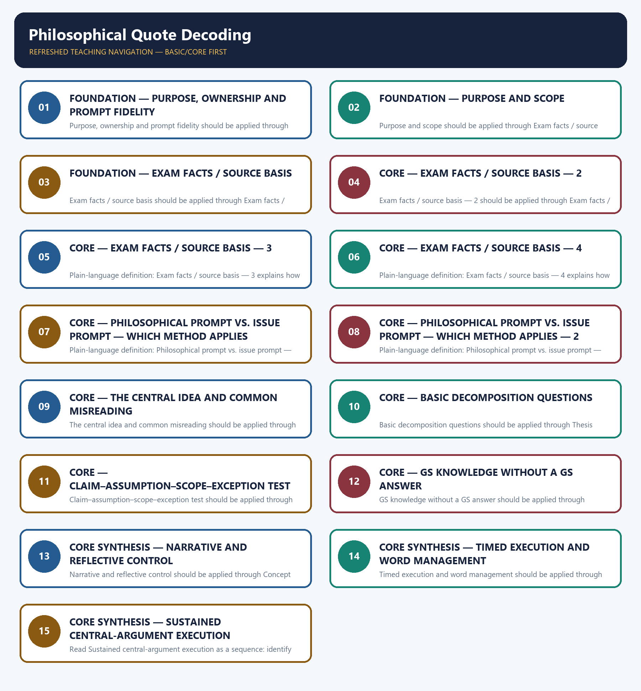

# Philosophical Quote Decoding — Learner-v2 Complete Learning Session

> **Authoring-only generation:** 2026-09-06. No PDF was rendered and no tracker or index was mutated.

### SOURCE, PROGRESSION AND OFFICIAL-RULE AUDIT

- **Generation date:** 2026-09-06.
- **Source order:** canonical Basic owner first; Advanced owner second; Essay master framework, README, official-syllabus map, answer-worthiness audit and revision chart next; PYQ corpus and official OCR papers after that; live official UPSC pages only as a final check.
- **Basic/Advanced boundary:** complete Basic teaching remains first and Advanced material remains optional and last.
- **OCR boundary:** Repository Markdown was primary. OCR-searchable official UPSC Essay papers were supplementary only for printed instructions and V1 prompt wording. No author, official model answer, current marks split, phase allocation, paragraph count or scoring rubric was inferred.
- **Qdrant:** not used; repository Markdown and local official papers were sufficient.
- **PYQ integrity:** Three application cards use the repository's explicit V1/V2 status. No unavailable official model answer, marking rubric or attribution is invented.
- **Live-source boundary:** Live source check dated 2026-09-06: official UPSC routes were attempted and access-blocked; blocked pages support no new claim. UN, WHO and IPCC primary pages were separately checked for cross-theme factual boundaries.
- **No-formula rule:** strategy, heuristics and practice weights are never presented as official UPSC instructions or marking criteria.

### LIVE OFFICIAL-SOURCE ATTEMPT LOG

The checks below were made on 2026-09-06. Substantive official text is used only for the proposition it supports; title-only, blocked or thin pages are recorded and supply no factual claim.

- https://upsc.gov.in/examinations/previous-question-papers — attempted 2026-09-06; official page returned HTTP 403 to the live fetch, so it supports no new wording.
- https://upsc.gov.in/examinations/active-examinations — attempted 2026-09-06; official page returned HTTP 403 to the live fetch, so it supports no current-paper inference.
- https://upsc.gov.in/sites/default/files/Notif-CSP-2024-Engl-140224.pdf — searched 2026-09-06; retained only as an official scheme cross-check route, not as an Essay rubric.

## BASIC LEARNING SESSION



*Distinct embedded teaching-navigation image. The separate continuous Cārvāka-style flowchart package remains an independent at-a-glance artifact.*

### SESSION 1 — FOUNDATION — PURPOSE, OWNERSHIP AND PROMPT FIDELITY

#### DEFINITION / WHAT THIS IS CALLED

**Plain-language definition:** Objective practice: Apply Purpose, ownership and prompt fidelity by distinguishing the correct Essay-method move from nearby but invalid shortcuts; no factual-trivia recall is being tested.

**Technical definition:** Purpose, ownership and prompt fidelity should be applied through Purpose and scope and Exam facts / source basis, while preserving the difference between official paper instruction and strategy, prompt wording and interpretation, example and evidence, breadth and coherence.

#### ANSWER-GRABBING OPENING — WRITE/ADAPT IN THE EXAM

> Plain-language definition: Purpose, ownership and prompt fidelity explains how Purpose and scope and Exam facts / source basis combine into one usable Essay-planning move.

#### MUST-WRITE KEYWORDS

- **FOUNDATION**
- **Purpose**
- **ownership**
- **prompt fidelity**
- **Plain-language definition**
- **Technical definition**

**How to use them:** Frame the answer through FOUNDATION; define Purpose, connect ownership with prompt fidelity to explain the mechanism, and use Plain-language definition for the decisive comparison or qualification.

#### METHOD MOVE / WHAT THIS DOES

**Plain-language definition:** Purpose, ownership and prompt fidelity explains how Purpose and scope and Exam facts / source basis combine into one usable Essay-planning move.

**Technical definition:** The learner fixes the printed prompt, its relationship or demand, the defensible scope, the argument function and the evidence boundary before drafting prose.

#### ANSWER-GRABBING OPENING — WRITE/ADAPT IN THE EXAM

> Purpose, ownership and prompt fidelity should be applied through Purpose and scope and Exam facts / source basis, while preserving the difference between official paper instruction and strategy, prompt wording and interpretation, example and evidence, breadth and coherence.

#### MUST-WRITE KEYWORDS

- **Purpose**
- **ownership**
- **prompt**
- **fidelity**
- **scope**
- **Exam**

**How to use them:** Define the first three terms, trace the relationship with the next two, and attach the final term to the exact claim, example and qualification. Qualification: Do not replace literal, conceptual and relational decoding of aphorisms with a generic GS-style catalogue.

#### VISUAL FIRST

```text
PURPOSE, OWNERSHIP AND PROMPT FIDELITY
01. Purpose and scope
    |
    v
02. Exam facts / source basis
STATUS / CATEGORY FIREWALL -> Do not replace literal, conceptual and relational decoding of aphorisms with a generic GS-style catalogue.
```

*The rail fixes the prompt-to-argument sequence and claim boundary before explanation.*

#### CORE EXPLANATION

Most prompts in both audited years are single-sentence aphorisms (e.g. "Truth knows no color"; "Forests precede civilizations and deserts follow them"). This topic teaches a repeatable method to move from the literal sentence to a defensible essay-ready reading. It does not cover issue-based prompts like 2024-B5 (FOMO) — see 03 — or thesis construction proper — see 05. attribution ; the full 100-prompt ledger, with each year's verification level, is ../PYQ-Corpus-2013-2025.md.

#### SIMPLE SYSTEM EXAMPLE

Read Purpose, ownership and prompt fidelity as a sequence: identify Purpose and scope, follow the method through the printed proposition, and stop before adding a rule, attribution, fact or inference the audited sources do not support.

#### TECHNICAL DISTINCTION

The decisive boundary is Do not replace literal, conceptual and relational decoding of aphorisms with a generic GS-style catalogue. This keeps Purpose and scope and Exam facts / source basis in the correct prompt, method, argument and evidence category.

#### NAMED EVIDENCE AND MECHANISM

- Most prompts in both audited years are single-sentence aphorisms (e.g. "Truth knows no color"; "Forests precede civilizations and deserts follow them"). This topic teaches a repeatable method to move from the literal sentence to a defensible essay-ready reading. It does not cover issue-based prompts like 2024-B5 (FOMO) — see 03 — or thesis construction proper — see 05.
- attribution ; the full 100-prompt ledger, with each year's verification level, is ../PYQ-Corpus-2013-2025.md.

#### EXAMINER CAUTION

- Do not replace literal, conceptual and relational decoding of aphorisms with a generic GS-style catalogue.

#### EXAM LINK

- **Objective practice:** Apply Purpose, ownership and prompt fidelity by distinguishing the correct Essay-method move from nearby but invalid shortcuts; no factual-trivia recall is being tested.
- **Essay application:** State the exact demand and the bounded writing decision.

#### MINI RECAP

- **Mechanism chain:** Purpose and scope -> Exam facts / source basis
- **Qualified use:** State the exact demand and the bounded writing decision.

#### CLOSING RECALL FLOW — FOUNDATION — PURPOSE, OWNERSHIP AND PROMPT FIDELITY

```text
START / CONCEPT: FOUNDATION — Purpose, ownership and prompt fidelity
        |
        v
EXACT TERMS: FOUNDATION · Purpose · ownership · prompt fidelity · Plain-language definition · Technical definition
        |
        v
MECHANISM / ARGUMENT: Purpose, ownership and prompt fidelity should be applied through Purpose and scope and Exam facts / source basis, while preserving the difference between official paper instruction and strategy, prompt wording and interpretation, example and evidence, breadth and coherence.
        |
        v
CONSEQUENCE / CONTRAST: Read Purpose, ownership and prompt fidelity as a sequence: identify Purpose and scope, follow the method through the printed proposition, and stop before adding a rule, attribution, fact or inference the audited sources do not support.
        |
        v
UPSC TRAP / ANSWER-USE: Objective practice: Apply Purpose, ownership and prompt fidelity by distinguishing the correct Essay-method move from nearby but invalid shortcuts; no factual-trivia recall is being tested.
        |
        v
ANSWER-GRABBING FORMULATION: Plain-language definition: Purpose, ownership and prompt fidelity explains how Purpose and scope and Exam facts / source basis combine into one usable Essay-planning move.
```
### SESSION 2 — FOUNDATION — PURPOSE AND SCOPE

#### DEFINITION / WHAT THIS IS CALLED

**Plain-language definition:** Objective practice: Apply Purpose and scope by distinguishing the correct Essay-method move from nearby but invalid shortcuts; no factual-trivia recall is being tested.

**Technical definition:** Purpose and scope should be applied through Exam facts / source basis — 2, while preserving the difference between official paper instruction and strategy, prompt wording and interpretation, example and evidence, breadth and coherence.

#### ANSWER-GRABBING OPENING — WRITE/ADAPT IN THE EXAM

> Plain-language definition: Purpose and scope explains how Exam facts / source basis — 2 combine into one usable Essay-planning move.

#### MUST-WRITE KEYWORDS

- **FOUNDATION**
- **Purpose**
- **scope**
- **Plain-language definition**
- **Technical definition**
- **Exam**

**How to use them:** Frame the answer through FOUNDATION; define Purpose, connect scope with Plain-language definition to explain the mechanism, and use Technical definition for the decisive comparison or qualification.

#### METHOD MOVE / WHAT THIS DOES

**Plain-language definition:** Purpose and scope explains how Exam facts / source basis — 2 combine into one usable Essay-planning move.

**Technical definition:** The learner fixes the printed prompt, its relationship or demand, the defensible scope, the argument function and the evidence boundary before drafting prose.

#### ANSWER-GRABBING OPENING — WRITE/ADAPT IN THE EXAM

> Purpose and scope should be applied through Exam facts / source basis — 2, while preserving the difference between official paper instruction and strategy, prompt wording and interpretation, example and evidence, breadth and coherence.

#### MUST-WRITE KEYWORDS

- **Purpose**
- **scope**
- **Exam**
- **facts**
- **basis**
- **official**

**How to use them:** Define the first three terms, trace the relationship with the next two, and attach the final term to the exact claim, example and qualification. Qualification: Do not cross the ownership boundary: issue-led empirical scoping belongs to 03.

#### VISUAL FIRST

```text
PURPOSE AND SCOPE
01. Exam facts / source basis — 2
STATUS / CATEGORY FIREWALL -> Do not cross the ownership boundary: issue-led empirical scoping belongs to 03.
```

*The rail fixes the prompt-to-argument sequence and claim boundary before explanation.*

#### CORE EXPLANATION

official PDFs, 2024-A2 prints "The empires of the futures will be the empires of the mind" and 2024-A3 prints "There is no path to happiness , Happiness is the path" — plural "futures", and a comma rather than a semicolon. Coaching reproductions commonly normalise both. Do not.

#### SIMPLE SYSTEM EXAMPLE

Read Purpose and scope as a sequence: identify Exam facts / source basis — 2, follow the method through the printed proposition, and stop before adding a rule, attribution, fact or inference the audited sources do not support.

#### TECHNICAL DISTINCTION

The decisive boundary is Do not cross the ownership boundary: issue-led empirical scoping belongs to 03. This keeps Exam facts / source basis — 2 in the correct prompt, method, argument and evidence category.

#### NAMED EVIDENCE AND MECHANISM

- official PDFs, 2024-A2 prints "The empires of the futures will be the empires of the mind" and 2024-A3 prints "There is no path to happiness , Happiness is the path" — plural "futures", and a comma rather than a semicolon. Coaching reproductions commonly normalise both. Do not.

#### EXAMINER CAUTION

- Do not cross the ownership boundary: issue-led empirical scoping belongs to 03.

#### EXAM LINK

- **Objective practice:** Apply Purpose and scope by distinguishing the correct Essay-method move from nearby but invalid shortcuts; no factual-trivia recall is being tested.
- **Essay application:** Define operative terms before expanding dimensions.

#### MINI RECAP

- **Mechanism chain:** Exam facts / source basis — 2
- **Qualified use:** Define operative terms before expanding dimensions.

#### CLOSING RECALL FLOW — FOUNDATION — PURPOSE AND SCOPE

```text
START / CONCEPT: FOUNDATION — Purpose and scope
        |
        v
EXACT TERMS: FOUNDATION · Purpose · scope · Plain-language definition · Technical definition · Exam
        |
        v
MECHANISM / ARGUMENT: Purpose and scope should be applied through Exam facts / source basis — 2, while preserving the difference between official paper instruction and strategy, prompt wording and interpretation, example and evidence, breadth and coherence.
        |
        v
CONSEQUENCE / CONTRAST: Read Purpose and scope as a sequence: identify Exam facts / source basis — 2, follow the method through the printed proposition, and stop before adding a rule, attribution, fact or inference the audited sources do not support.
        |
        v
UPSC TRAP / ANSWER-USE: Objective practice: Apply Purpose and scope by distinguishing the correct Essay-method move from nearby but invalid shortcuts; no factual-trivia recall is being tested.
        |
        v
ANSWER-GRABBING FORMULATION: Plain-language definition: Purpose and scope explains how Exam facts / source basis — 2 combine into one usable Essay-planning move.
```
### SESSION 3 — FOUNDATION — EXAM FACTS / SOURCE BASIS

#### DEFINITION / WHAT THIS IS CALLED

**Plain-language definition:** Objective practice: Apply Exam facts / source basis by distinguishing the correct Essay-method move from nearby but invalid shortcuts; no factual-trivia recall is being tested.

**Technical definition:** Exam facts / source basis should be applied through Exam facts / source basis — 3, while preserving the difference between official paper instruction and strategy, prompt wording and interpretation, example and evidence, breadth and coherence.

#### ANSWER-GRABBING OPENING — WRITE/ADAPT IN THE EXAM

> Plain-language definition: Exam facts / source basis explains how Exam facts / source basis — 3 combine into one usable Essay-planning move.

#### MUST-WRITE KEYWORDS

- **FOUNDATION**
- **Exam facts / source basis**
- **Plain-language definition**
- **Technical definition**
- **Exam**
- **s**

**How to use them:** Frame the answer through FOUNDATION; define Exam facts / source basis, connect Plain-language definition with Technical definition to explain the mechanism, and use Exam for the decisive comparison or qualification.

#### METHOD MOVE / WHAT THIS DOES

**Plain-language definition:** Exam facts / source basis explains how Exam facts / source basis — 3 combine into one usable Essay-planning move.

**Technical definition:** The learner fixes the printed prompt, its relationship or demand, the defensible scope, the argument function and the evidence boundary before drafting prose.

#### ANSWER-GRABBING OPENING — WRITE/ADAPT IN THE EXAM

> Exam facts / source basis should be applied through Exam facts / source basis — 3, while preserving the difference between official paper instruction and strategy, prompt wording and interpretation, example and evidence, breadth and coherence.

#### MUST-WRITE KEYWORDS

- **Exam**
- **facts**
- **basis**
- **sentence**
- **arguing**
- **that**

**How to use them:** Define the first three terms, trace the relationship with the next two, and attach the final term to the exact claim, example and qualification. Qualification: Do not use an example without explaining its argumentative function.

#### VISUAL FIRST

```text
EXAM FACTS / SOURCE BASIS
01. Exam facts / source basis — 3
STATUS / CATEGORY FIREWALL -> Do not use an example without explaining its argumentative function.
```

*The rail fixes the prompt-to-argument sequence and claim boundary before explanation.*

#### CORE EXPLANATION

of the sentence; an essay arguing that "futures" (plural) signals multiple possible futures is answering a question the paper did not ask.

#### SIMPLE SYSTEM EXAMPLE

Read Exam facts / source basis as a sequence: identify Exam facts / source basis — 3, follow the method through the printed proposition, and stop before adding a rule, attribution, fact or inference the audited sources do not support.

#### TECHNICAL DISTINCTION

The decisive boundary is Do not use an example without explaining its argumentative function. This keeps Exam facts / source basis — 3 in the correct prompt, method, argument and evidence category.

#### NAMED EVIDENCE AND MECHANISM

- of the sentence; an essay arguing that "futures" (plural) signals multiple possible futures is answering a question the paper did not ask.

#### EXAMINER CAUTION

- Do not use an example without explaining its argumentative function.

#### EXAM LINK

- **Objective practice:** Apply Exam facts / source basis by distinguishing the correct Essay-method move from nearby but invalid shortcuts; no factual-trivia recall is being tested.
- **Essay application:** Build one qualified thesis and keep it visible.

#### MINI RECAP

- **Mechanism chain:** Exam facts / source basis — 3
- **Qualified use:** Build one qualified thesis and keep it visible.

#### CLOSING RECALL FLOW — FOUNDATION — EXAM FACTS / SOURCE BASIS

```text
START / CONCEPT: FOUNDATION — Exam facts / source basis
        |
        v
EXACT TERMS: FOUNDATION · Exam facts / source basis · Plain-language definition · Technical definition · Exam · s
        |
        v
MECHANISM / ARGUMENT: Exam facts / source basis should be applied through Exam facts / source basis — 3, while preserving the difference between official paper instruction and strategy, prompt wording and interpretation, example and evidence, breadth and coherence.
        |
        v
CONSEQUENCE / CONTRAST: Objective practice: Apply Exam facts / source basis by distinguishing the correct Essay-method move from nearby but invalid shortcuts; no factual-trivia recall is being tested.
        |
        v
UPSC TRAP / ANSWER-USE: Read Exam facts / source basis as a sequence: identify Exam facts / source basis — 3, follow the method through the printed proposition, and stop before adding a rule, attribution, fact or inference the audited sources do not support.
        |
        v
ANSWER-GRABBING FORMULATION: Plain-language definition: Exam facts / source basis explains how Exam facts / source basis — 3 combine into one usable Essay-planning move.
```
### SESSION 4 — CORE — EXAM FACTS / SOURCE BASIS — 2

#### DEFINITION / WHAT THIS IS CALLED

**Plain-language definition:** Objective practice: Apply Exam facts / source basis — 2 by distinguishing the correct Essay-method move from nearby but invalid shortcuts; no factual-trivia recall is being tested.

**Technical definition:** Exam facts / source basis — 2 should be applied through Exam facts / source basis — 4, while preserving the difference between official paper instruction and strategy, prompt wording and interpretation, example and evidence, breadth and coherence.

#### ANSWER-GRABBING OPENING — WRITE/ADAPT IN THE EXAM

> Plain-language definition: Exam facts / source basis — 2 explains how Exam facts / source basis — 4 combine into one usable Essay-planning move.

#### MUST-WRITE KEYWORDS

- **Exam facts / source basis**
- **Plain-language definition**
- **Technical definition**
- **Exam**
- **s**
- **basis**

**How to use them:** Frame the answer through Exam facts / source basis; define Plain-language definition, connect Technical definition with Exam to explain the mechanism, and use s for the decisive comparison or qualification.

#### METHOD MOVE / WHAT THIS DOES

**Plain-language definition:** Exam facts / source basis — 2 explains how Exam facts / source basis — 4 combine into one usable Essay-planning move.

**Technical definition:** The learner fixes the printed prompt, its relationship or demand, the defensible scope, the argument function and the evidence boundary before drafting prose.

#### ANSWER-GRABBING OPENING — WRITE/ADAPT IN THE EXAM

> Exam facts / source basis — 2 should be applied through Exam facts / source basis — 4, while preserving the difference between official paper instruction and strategy, prompt wording and interpretation, example and evidence, breadth and coherence.

#### MUST-WRITE KEYWORDS

- **Exam**
- **facts**
- **basis**
- **free-standing**
- **proposition**
- **interpreted**

**How to use them:** Define the first three terms, trace the relationship with the next two, and attach the final term to the exact claim, example and qualification. Qualification: Do not treat a pedagogical scaffold as an official UPSC marking rule.

#### VISUAL FIRST

```text
EXAM FACTS / SOURCE BASIS — 2
01. Exam facts / source basis — 4
STATUS / CATEGORY FIREWALL -> Do not treat a pedagogical scaffold as an official UPSC marking rule.
```

*The rail fixes the prompt-to-argument sequence and claim boundary before explanation.*

#### CORE EXPLANATION

free-standing proposition to be interpreted on its own terms — there is no "correct," externally sourced reading to recall.

#### SIMPLE SYSTEM EXAMPLE

Read Exam facts / source basis — 2 as a sequence: identify Exam facts / source basis — 4, follow the method through the printed proposition, and stop before adding a rule, attribution, fact or inference the audited sources do not support.

#### TECHNICAL DISTINCTION

The decisive boundary is Do not treat a pedagogical scaffold as an official UPSC marking rule. This keeps Exam facts / source basis — 4 in the correct prompt, method, argument and evidence category.

#### NAMED EVIDENCE AND MECHANISM

- free-standing proposition to be interpreted on its own terms — there is no "correct," externally sourced reading to recall.

#### EXAMINER CAUTION

- Do not treat a pedagogical scaffold as an official UPSC marking rule.

#### EXAM LINK

- **Objective practice:** Apply Exam facts / source basis — 2 by distinguishing the correct Essay-method move from nearby but invalid shortcuts; no factual-trivia recall is being tested.
- **Essay application:** Give every paragraph one argumentative job.

#### MINI RECAP

- **Mechanism chain:** Exam facts / source basis — 4
- **Qualified use:** Give every paragraph one argumentative job.

#### CLOSING RECALL FLOW — CORE — EXAM FACTS / SOURCE BASIS — 2

```text
START / CONCEPT: CORE — Exam facts / source basis — 2
        |
        v
EXACT TERMS: Exam facts / source basis · Plain-language definition · Technical definition · Exam · s · basis
        |
        v
MECHANISM / ARGUMENT: Exam facts / source basis — 2 should be applied through Exam facts / source basis — 4, while preserving the difference between official paper instruction and strategy, prompt wording and interpretation, example and evidence, breadth and coherence.
        |
        v
CONSEQUENCE / CONTRAST: Objective practice: Apply Exam facts / source basis — 2 by distinguishing the correct Essay-method move from nearby but invalid shortcuts; no factual-trivia recall is being tested.
        |
        v
UPSC TRAP / ANSWER-USE: Read Exam facts / source basis — 2 as a sequence: identify Exam facts / source basis — 4, follow the method through the printed proposition, and stop before adding a rule, attribution, fact or inference the audited sources do not support.
        |
        v
ANSWER-GRABBING FORMULATION: Plain-language definition: Exam facts / source basis — 2 explains how Exam facts / source basis — 4 combine into one usable Essay-planning move.
```
### SESSION 5 — CORE — EXAM FACTS / SOURCE BASIS — 3

#### DEFINITION / WHAT THIS IS CALLED

**Plain-language definition:** Objective practice: Apply Exam facts / source basis — 3 by distinguishing the correct Essay-method move from nearby but invalid shortcuts; no factual-trivia recall is being tested.

**Technical definition:** Plain-language definition: Exam facts / source basis — 3 explains how Philosophical prompt vs. issue prompt — which method applies combine into one usable Essay-planning move.

#### ANSWER-GRABBING OPENING — WRITE/ADAPT IN THE EXAM

> Plain-language definition: Exam facts / source basis — 3 explains how Philosophical prompt vs. issue prompt — which method applies combine into one usable Essay-planning move.

#### MUST-WRITE KEYWORDS

- **Exam facts / source basis**
- **Plain-language definition**
- **Technical definition**
- **Exam**
- **s**
- **basis**

**How to use them:** Frame the answer through Exam facts / source basis; define Plain-language definition, connect Technical definition with Exam to explain the mechanism, and use s for the decisive comparison or qualification.

#### METHOD MOVE / WHAT THIS DOES

**Plain-language definition:** Exam facts / source basis — 3 explains how Philosophical prompt vs. issue prompt — which method applies combine into one usable Essay-planning move.

**Technical definition:** The learner fixes the printed prompt, its relationship or demand, the defensible scope, the argument function and the evidence boundary before drafting prose.

#### ANSWER-GRABBING OPENING — WRITE/ADAPT IN THE EXAM

> Exam facts / source basis — 3 should be applied through Philosophical prompt vs. issue prompt — which method applies, while preserving the difference between official paper instruction and strategy, prompt wording and interpretation, example and evidence, breadth and coherence.

#### MUST-WRITE KEYWORDS

- **Exam**
- **facts**
- **basis**
- **Philosophical**
- **prompt**
- **issue**

**How to use them:** Define the first three terms, trace the relationship with the next two, and attach the final term to the exact claim, example and qualification. Qualification: Do not let a counter-view replace the thesis; use it to qualify the thesis.

#### VISUAL FIRST

```text
EXAM FACTS / SOURCE BASIS — 3
01. Philosophical prompt vs. issue prompt — which method applies
STATUS / CATEGORY FIREWALL -> Do not let a counter-view replace the thesis; use it to qualify the thesis.
```

*The rail fixes the prompt-to-argument sequence and claim boundary before explanation.*

#### CORE EXPLANATION

Deciding this in the first thirty seconds saves the whole attempt, because the two prompt types need different first moves.

#### SIMPLE SYSTEM EXAMPLE

Read Exam facts / source basis — 3 as a sequence: identify Philosophical prompt vs. issue prompt — which method applies, follow the method through the printed proposition, and stop before adding a rule, attribution, fact or inference the audited sources do not support.

#### TECHNICAL DISTINCTION

The decisive boundary is Do not let a counter-view replace the thesis; use it to qualify the thesis. This keeps Philosophical prompt vs. issue prompt — which method applies in the correct prompt, method, argument and evidence category.

#### NAMED EVIDENCE AND MECHANISM

- Deciding this in the first thirty seconds saves the whole attempt, because the two prompt types need different first moves.

#### EXAMINER CAUTION

- Do not let a counter-view replace the thesis; use it to qualify the thesis.

#### EXAM LINK

- **Objective practice:** Apply Exam facts / source basis — 3 by distinguishing the correct Essay-method move from nearby but invalid shortcuts; no factual-trivia recall is being tested.
- **Essay application:** Join a named illustration to its mechanism.

#### MINI RECAP

- **Mechanism chain:** Philosophical prompt vs. issue prompt — which method applies
- **Qualified use:** Join a named illustration to its mechanism.

#### CLOSING RECALL FLOW — CORE — EXAM FACTS / SOURCE BASIS — 3

```text
START / CONCEPT: CORE — Exam facts / source basis — 3
        |
        v
EXACT TERMS: Exam facts / source basis · Plain-language definition · Technical definition · Exam · s · basis
        |
        v
MECHANISM / ARGUMENT: Objective practice: Apply Exam facts / source basis — 3 by distinguishing the correct Essay-method move from nearby but invalid shortcuts; no factual-trivia recall is being tested.
        |
        v
CONSEQUENCE / CONTRAST: Exam facts / source basis — 3 should be applied through Philosophical prompt vs. issue prompt — which method applies, while preserving the difference between official paper instruction and strategy, prompt wording and interpretation, example and evidence, breadth and coherence.
        |
        v
UPSC TRAP / ANSWER-USE: Read Exam facts / source basis — 3 as a sequence: identify Philosophical prompt vs. issue prompt — which method applies, follow the method through the printed proposition, and stop before adding a rule, attribution, fact or inference the audited sources do not support.
        |
        v
ANSWER-GRABBING FORMULATION: Plain-language definition: Exam facts / source basis — 3 explains how Philosophical prompt vs. issue prompt — which method applies combine into one usable Essay-planning move.
```
### SESSION 6 — CORE — EXAM FACTS / SOURCE BASIS — 4

#### DEFINITION / WHAT THIS IS CALLED

**Plain-language definition:** Objective practice: Apply Exam facts / source basis — 4 by distinguishing the correct Essay-method move from nearby but invalid shortcuts; no factual-trivia recall is being tested.

**Technical definition:** Plain-language definition: Exam facts / source basis — 4 explains how Philosophical prompt vs. issue prompt — which method applies — 2 and The central idea and common misreading combine into one usable Essay-planning move.

#### ANSWER-GRABBING OPENING — WRITE/ADAPT IN THE EXAM

> Plain-language definition: Exam facts / source basis — 4 explains how Philosophical prompt vs. issue prompt — which method applies — 2 and The central idea and common misreading combine into one usable Essay-planning move.

#### MUST-WRITE KEYWORDS

- **Exam facts / source basis**
- **Plain-language definition**
- **Technical definition**
- **Exam**
- **s**
- **basis**

**How to use them:** Frame the answer through Exam facts / source basis; define Plain-language definition, connect Technical definition with Exam to explain the mechanism, and use s for the decisive comparison or qualification.

#### METHOD MOVE / WHAT THIS DOES

**Plain-language definition:** Exam facts / source basis — 4 explains how Philosophical prompt vs. issue prompt — which method applies — 2 and The central idea and common misreading combine into one usable Essay-planning move.

**Technical definition:** The learner fixes the printed prompt, its relationship or demand, the defensible scope, the argument function and the evidence boundary before drafting prose.

#### ANSWER-GRABBING OPENING — WRITE/ADAPT IN THE EXAM

> Exam facts / source basis — 4 should be applied through Philosophical prompt vs. issue prompt — which method applies — 2 and The central idea and common misreading, while preserving the difference between official paper instruction and strategy, prompt wording and interpretation, example and evidence, breadth and coherence.

#### MUST-WRITE KEYWORDS

- **Exam**
- **facts**
- **basis**
- **Philosophical**
- **prompt**
- **issue**

**How to use them:** Define the first three terms, trace the relationship with the next two, and attach the final term to the exact claim, example and qualification. Qualification: Do not use an unverified quotation, statistic, attribution or anecdote.

#### VISUAL FIRST

```text
EXAM FACTS / SOURCE BASIS — 4
01. Philosophical prompt vs. issue prompt — which method applies — 2
    |
    v
02. The central idea and common misreading
STATUS / CATEGORY FIREWALL -> Do not use an unverified quotation, statistic, attribution or anecdote.
```

*The rail fixes the prompt-to-argument sequence and claim boundary before explanation.*

#### CORE EXPLANATION

The boundary is not always clean: a prompt can be metaphorical in phrasing and empirical in reference (2024-A1, forests and deserts). Where it is genuinely hybrid, decode first and scope second — decoding a prompt that needed only scoping costs a minute; scoping a prompt that needed decoding produces an essay about the wrong subject. 03, Section 3a, gives a three-question test for the borderline cases. Central idea: decoding means finding the operative tension , not just restating the sentence in different words. Common misreading: treating the aphorism as a trivia prompt requiring a "clever" literary allusion, or assuming there is one single "official" interpretation to be guessed and matched — there is not; a well-argued, textually faithful reading is what the exam rewards.

#### SIMPLE SYSTEM EXAMPLE

Read Exam facts / source basis — 4 as a sequence: identify Philosophical prompt vs. issue prompt — which method applies — 2, follow the method through the printed proposition, and stop before adding a rule, attribution, fact or inference the audited sources do not support.

#### TECHNICAL DISTINCTION

The decisive boundary is Do not use an unverified quotation, statistic, attribution or anecdote. This keeps Philosophical prompt vs. issue prompt — which method applies — 2 and The central idea and common misreading in the correct prompt, method, argument and evidence category.

#### NAMED EVIDENCE AND MECHANISM

- The boundary is not always clean: a prompt can be metaphorical in phrasing and empirical in reference (2024-A1, forests and deserts). Where it is genuinely hybrid, decode first and scope second — decoding a prompt that needed only scoping costs a minute; scoping a prompt that needed decoding produces an essay about the wrong subject. 03, Section 3a, gives a three-question test for the borderline cases.
- Central idea: decoding means finding the operative tension , not just restating the sentence in different words. Common misreading: treating the aphorism as a trivia prompt requiring a "clever" literary allusion, or assuming there is one single "official" interpretation to be guessed and matched — there is not; a well-argued, textually faithful reading is what the exam rewards.

#### EXAMINER CAUTION

- Do not use an unverified quotation, statistic, attribution or anecdote.

#### EXAM LINK

- **Objective practice:** Apply Exam facts / source basis — 4 by distinguishing the correct Essay-method move from nearby but invalid shortcuts; no factual-trivia recall is being tested.
- **Essay application:** Use a counter-case to refine, not derail, the thesis.

#### MINI RECAP

- **Mechanism chain:** Philosophical prompt vs. issue prompt — which method applies — 2 -> The central idea and common misreading
- **Qualified use:** Use a counter-case to refine, not derail, the thesis.

#### CLOSING RECALL FLOW — CORE — EXAM FACTS / SOURCE BASIS — 4

```text
START / CONCEPT: CORE — Exam facts / source basis — 4
        |
        v
EXACT TERMS: Exam facts / source basis · Plain-language definition · Technical definition · Exam · s · basis
        |
        v
MECHANISM / ARGUMENT: Objective practice: Apply Exam facts / source basis — 4 by distinguishing the correct Essay-method move from nearby but invalid shortcuts; no factual-trivia recall is being tested.
        |
        v
CONSEQUENCE / CONTRAST: Exam facts / source basis — 4 should be applied through Philosophical prompt vs. issue prompt — which method applies — 2 and The central idea and common misreading, while preserving the difference between official paper instruction and strategy, prompt wording and interpretation, example and evidence, breadth and coherence.
        |
        v
UPSC TRAP / ANSWER-USE: Read Exam facts / source basis — 4 as a sequence: identify Philosophical prompt vs. issue prompt — which method applies — 2, follow the method through the printed proposition, and stop before adding a rule, attribution, fact or inference the audited sources do not support.
        |
        v
ANSWER-GRABBING FORMULATION: Plain-language definition: Exam facts / source basis — 4 explains how Philosophical prompt vs. issue prompt — which method applies — 2 and The central idea and common misreading combine into one usable Essay-planning move.
```
### SESSION 7 — CORE — PHILOSOPHICAL PROMPT VS. ISSUE PROMPT — WHICH METHOD APPLIES

#### DEFINITION / WHAT THIS IS CALLED

**Plain-language definition:** Objective practice: Apply Philosophical prompt vs. issue prompt — which method applies by distinguishing the correct Essay-method move from nearby but invalid shortcuts; no factual-trivia recall is being tested.

**Technical definition:** Plain-language definition: Philosophical prompt vs. issue prompt — which method applies explains how Basic decomposition questions combine into one usable Essay-planning move.

#### ANSWER-GRABBING OPENING — WRITE/ADAPT IN THE EXAM

> Plain-language definition: Philosophical prompt vs. issue prompt — which method applies explains how Basic decomposition questions combine into one usable Essay-planning move.

#### MUST-WRITE KEYWORDS

- **Philosophical prompt vs. issue prompt**
- **which method applies**
- **Plain-language definition**
- **Technical definition**
- **Philosophical**
- **prompt**

**How to use them:** Frame the answer through Philosophical prompt vs. issue prompt; define which method applies, connect Plain-language definition with Technical definition to explain the mechanism, and use Philosophical for the decisive comparison or qualification.

#### METHOD MOVE / WHAT THIS DOES

**Plain-language definition:** Philosophical prompt vs. issue prompt — which method applies explains how Basic decomposition questions combine into one usable Essay-planning move.

**Technical definition:** The learner fixes the printed prompt, its relationship or demand, the defensible scope, the argument function and the evidence boundary before drafting prose.

#### ANSWER-GRABBING OPENING — WRITE/ADAPT IN THE EXAM

> Philosophical prompt vs. issue prompt — which method applies should be applied through Basic decomposition questions, while preserving the difference between official paper instruction and strategy, prompt wording and interpretation, example and evidence, breadth and coherence.

#### MUST-WRITE KEYWORDS

- **Philosophical**
- **prompt**
- **issue**
- **method**
- **applies**
- **Basic**

**How to use them:** Define the first three terms, trace the relationship with the next two, and attach the final term to the exact claim, example and qualification. Qualification: Do not multiply dimensions that repeat the same claim in new vocabulary.

#### VISUAL FIRST

```text
PHILOSOPHICAL PROMPT VS. ISSUE PROMPT — WHICH METHOD APPLIES
01. Basic decomposition questions
STATUS / CATEGORY FIREWALL -> Do not multiply dimensions that repeat the same claim in new vocabulary.
```

*The rail fixes the prompt-to-argument sequence and claim boundary before explanation.*

#### CORE EXPLANATION

1. What is the literal claim of the sentence? 2. What two ideas or states does the sentence place in relation to each other (e.g. forests/deserts; empires/mind; happiness/path)? 3. Is the relation causal ("precede... follow"), definitional ("is the path"), or comparative ("less than")? 4. What is the most natural non-literal reading that still respects the sentence's own words? 5. What would a contrary reading of the same sentence look like — and why would the straightforward reading still be more defensible?

#### SIMPLE SYSTEM EXAMPLE

Read Philosophical prompt vs. issue prompt — which method applies as a sequence: identify Basic decomposition questions, follow the method through the printed proposition, and stop before adding a rule, attribution, fact or inference the audited sources do not support.

#### TECHNICAL DISTINCTION

The decisive boundary is Do not multiply dimensions that repeat the same claim in new vocabulary. This keeps Basic decomposition questions in the correct prompt, method, argument and evidence category.

#### NAMED EVIDENCE AND MECHANISM

- 1. What is the literal claim of the sentence? 2. What two ideas or states does the sentence place in relation to each other (e.g. forests/deserts; empires/mind; happiness/path)? 3. Is the relation causal ("precede... follow"), definitional ("is the path"), or comparative ("less than")? 4. What is the most natural non-literal reading that still respects the sentence's own words? 5. What would a contrary reading of the same sentence look like — and why would the straightforward reading still be more defensible?

#### EXAMINER CAUTION

- Do not multiply dimensions that repeat the same claim in new vocabulary.

#### EXAM LINK

- **Objective practice:** Apply Philosophical prompt vs. issue prompt — which method applies by distinguishing the correct Essay-method move from nearby but invalid shortcuts; no factual-trivia recall is being tested.
- **Essay application:** Sequence paragraphs through explicit logical bridges.

#### MINI RECAP

- **Mechanism chain:** Basic decomposition questions
- **Qualified use:** Sequence paragraphs through explicit logical bridges.

#### CLOSING RECALL FLOW — CORE — PHILOSOPHICAL PROMPT VS. ISSUE PROMPT — WHICH METHOD APPLIES

```text
START / CONCEPT: CORE — Philosophical prompt vs. issue prompt — which method applies
        |
        v
EXACT TERMS: Philosophical prompt vs. issue prompt · which method applies · Plain-language definition · Technical definition · Philosophical · prompt
        |
        v
MECHANISM / ARGUMENT: Philosophical prompt vs. issue prompt — which method applies should be applied through Basic decomposition questions, while preserving the difference between official paper instruction and strategy, prompt wording and interpretation, example and evidence, breadth and coherence.
        |
        v
CONSEQUENCE / CONTRAST: Objective practice: Apply Philosophical prompt vs. issue prompt — which method applies by distinguishing the correct Essay-method move from nearby but invalid shortcuts; no factual-trivia recall is being tested.
        |
        v
UPSC TRAP / ANSWER-USE: Read Philosophical prompt vs. issue prompt — which method applies as a sequence: identify Basic decomposition questions, follow the method through the printed proposition, and stop before adding a rule, attribution, fact or inference the audited sources do not support.
        |
        v
ANSWER-GRABBING FORMULATION: Plain-language definition: Philosophical prompt vs. issue prompt — which method applies explains how Basic decomposition questions combine into one usable Essay-planning move.
```
### SESSION 8 — CORE — PHILOSOPHICAL PROMPT VS. ISSUE PROMPT — WHICH METHOD APPLIES — 2

#### DEFINITION / WHAT THIS IS CALLED

**Plain-language definition:** Objective practice: Apply Philosophical prompt vs. issue prompt — which method applies — 2 by distinguishing the correct Essay-method move from nearby but invalid shortcuts; no factual-trivia recall is being tested.

**Technical definition:** Plain-language definition: Philosophical prompt vs. issue prompt — which method applies — 2 explains how Claim–assumption–scope–exception test combine into one usable Essay-planning move.

#### ANSWER-GRABBING OPENING — WRITE/ADAPT IN THE EXAM

> Plain-language definition: Philosophical prompt vs. issue prompt — which method applies — 2 explains how Claim–assumption–scope–exception test combine into one usable Essay-planning move.

#### MUST-WRITE KEYWORDS

- **Philosophical prompt vs. issue prompt**
- **which method applies**
- **Plain-language definition**
- **Technical definition**
- **Philosophical**
- **prompt**

**How to use them:** Frame the answer through Philosophical prompt vs. issue prompt; define which method applies, connect Plain-language definition with Technical definition to explain the mechanism, and use Philosophical for the decisive comparison or qualification.

#### METHOD MOVE / WHAT THIS DOES

**Plain-language definition:** Philosophical prompt vs. issue prompt — which method applies — 2 explains how Claim–assumption–scope–exception test combine into one usable Essay-planning move.

**Technical definition:** The learner fixes the printed prompt, its relationship or demand, the defensible scope, the argument function and the evidence boundary before drafting prose.

#### ANSWER-GRABBING OPENING — WRITE/ADAPT IN THE EXAM

> Philosophical prompt vs. issue prompt — which method applies — 2 should be applied through Claim–assumption–scope–exception test, while preserving the difference between official paper instruction and strategy, prompt wording and interpretation, example and evidence, breadth and coherence.

#### MUST-WRITE KEYWORDS

- **Philosophical**
- **prompt**
- **issue**
- **method**
- **applies**
- **assumption**

**How to use them:** Define the first three terms, trace the relationship with the next two, and attach the final term to the exact claim, example and qualification. Qualification: Do not end with aspiration unsupported by the preceding argument.

#### VISUAL FIRST

```text
PHILOSOPHICAL PROMPT VS. ISSUE PROMPT — WHICH METHOD APPLIES — 2
01. Claim–assumption–scope–exception test
STATUS / CATEGORY FIREWALL -> Do not end with aspiration unsupported by the preceding argument.
```

*The rail fixes the prompt-to-argument sequence and claim boundary before explanation.*

#### CORE EXPLANATION

This prevents a universal-sounding aphorism from becoming an absolute essay. The exception qualifies the claim; it must not replace the claim.

#### SIMPLE SYSTEM EXAMPLE

Read Philosophical prompt vs. issue prompt — which method applies — 2 as a sequence: identify Claim–assumption–scope–exception test, follow the method through the printed proposition, and stop before adding a rule, attribution, fact or inference the audited sources do not support.

#### TECHNICAL DISTINCTION

The decisive boundary is Do not end with aspiration unsupported by the preceding argument. This keeps Claim–assumption–scope–exception test in the correct prompt, method, argument and evidence category.

#### NAMED EVIDENCE AND MECHANISM

- This prevents a universal-sounding aphorism from becoming an absolute essay. The exception qualifies the claim; it must not replace the claim.

#### EXAMINER CAUTION

- Do not end with aspiration unsupported by the preceding argument.

#### EXAM LINK

- **Objective practice:** Apply Philosophical prompt vs. issue prompt — which method applies — 2 by distinguishing the correct Essay-method move from nearby but invalid shortcuts; no factual-trivia recall is being tested.
- **Essay application:** Move across actor, scale and time only when the claim changes.

#### MINI RECAP

- **Mechanism chain:** Claim–assumption–scope–exception test
- **Qualified use:** Move across actor, scale and time only when the claim changes.

#### CLOSING RECALL FLOW — CORE — PHILOSOPHICAL PROMPT VS. ISSUE PROMPT — WHICH METHOD APPLIES — 2

```text
START / CONCEPT: CORE — Philosophical prompt vs. issue prompt — which method applies — 2
        |
        v
EXACT TERMS: Philosophical prompt vs. issue prompt · which method applies · Plain-language definition · Technical definition · Philosophical · prompt
        |
        v
MECHANISM / ARGUMENT: Philosophical prompt vs. issue prompt — which method applies — 2 should be applied through Claim–assumption–scope–exception test, while preserving the difference between official paper instruction and strategy, prompt wording and interpretation, example and evidence, breadth and coherence.
        |
        v
CONSEQUENCE / CONTRAST: Objective practice: Apply Philosophical prompt vs. issue prompt — which method applies — 2 by distinguishing the correct Essay-method move from nearby but invalid shortcuts; no factual-trivia recall is being tested.
        |
        v
UPSC TRAP / ANSWER-USE: Read Philosophical prompt vs. issue prompt — which method applies — 2 as a sequence: identify Claim–assumption–scope–exception test, follow the method through the printed proposition, and stop before adding a rule, attribution, fact or inference the audited sources do not support.
        |
        v
ANSWER-GRABBING FORMULATION: Plain-language definition: Philosophical prompt vs. issue prompt — which method applies — 2 explains how Claim–assumption–scope–exception test combine into one usable Essay-planning move.
```
### SESSION 9 — CORE — THE CENTRAL IDEA AND COMMON MISREADING

#### DEFINITION / WHAT THIS IS CALLED

**Plain-language definition:** Objective practice: Apply The central idea and common misreading by distinguishing the correct Essay-method move from nearby but invalid shortcuts; no factual-trivia recall is being tested.

**Technical definition:** The central idea and common misreading should be applied through India-first illustration starters, while preserving the difference between official paper instruction and strategy, prompt wording and interpretation, example and evidence, breadth and coherence.

#### ANSWER-GRABBING OPENING — WRITE/ADAPT IN THE EXAM

> Plain-language definition: The central idea and common misreading explains how India-first illustration starters combine into one usable Essay-planning move.

#### MUST-WRITE KEYWORDS

- **The central idea**
- **common misreading**
- **Plain-language definition**
- **Technical definition**
- **central**
- **idea**

**How to use them:** Frame the answer through The central idea; define common misreading, connect Plain-language definition with Technical definition to explain the mechanism, and use central for the decisive comparison or qualification.

#### METHOD MOVE / WHAT THIS DOES

**Plain-language definition:** The central idea and common misreading explains how India-first illustration starters combine into one usable Essay-planning move.

**Technical definition:** The learner fixes the printed prompt, its relationship or demand, the defensible scope, the argument function and the evidence boundary before drafting prose.

#### ANSWER-GRABBING OPENING — WRITE/ADAPT IN THE EXAM

> The central idea and common misreading should be applied through India-first illustration starters, while preserving the difference between official paper instruction and strategy, prompt wording and interpretation, example and evidence, breadth and coherence.

#### MUST-WRITE KEYWORDS

- **central**
- **idea**
- **common**
- **misreading**
- **India-first**
- **illustration**

**How to use them:** Define the first three terms, trace the relationship with the next two, and attach the final term to the exact claim, example and qualification. Qualification: Do not sacrifice the second essay's time budget to perfect the first.

#### VISUAL FIRST

```text
THE CENTRAL IDEA AND COMMON MISREADING
01. India-first illustration starters
STATUS / CATEGORY FIREWALL -> Do not sacrifice the second essay's time budget to perfect the first.
```

*The rail fixes the prompt-to-argument sequence and claim boundary before explanation.*

#### CORE EXPLANATION

For each decoded tension, recall (not invent) one Indian institutional, historical or social example that embodies each side of the tension — e.g. forest-cover policy debates for 2024-A1, or a documented public-conduct episode for "supreme art of war... without fighting" (2025-A2). Full verified-example discipline: 12.

#### SIMPLE SYSTEM EXAMPLE

Read The central idea and common misreading as a sequence: identify India-first illustration starters, follow the method through the printed proposition, and stop before adding a rule, attribution, fact or inference the audited sources do not support.

#### TECHNICAL DISTINCTION

The decisive boundary is Do not sacrifice the second essay's time budget to perfect the first. This keeps India-first illustration starters in the correct prompt, method, argument and evidence category.

#### NAMED EVIDENCE AND MECHANISM

- For each decoded tension, recall (not invent) one Indian institutional, historical or social example that embodies each side of the tension — e.g. forest-cover policy debates for 2024-A1, or a documented public-conduct episode for "supreme art of war... without fighting" (2025-A2). Full verified-example discipline: 12.

#### EXAMINER CAUTION

- Do not sacrifice the second essay's time budget to perfect the first.

#### EXAM LINK

- **Objective practice:** Apply The central idea and common misreading by distinguishing the correct Essay-method move from nearby but invalid shortcuts; no factual-trivia recall is being tested.
- **Essay application:** Use ethical nuance without moralising.

#### MINI RECAP

- **Mechanism chain:** India-first illustration starters
- **Qualified use:** Use ethical nuance without moralising.

#### CLOSING RECALL FLOW — CORE — THE CENTRAL IDEA AND COMMON MISREADING

```text
START / CONCEPT: CORE — The central idea and common misreading
        |
        v
EXACT TERMS: The central idea · common misreading · Plain-language definition · Technical definition · central · idea
        |
        v
MECHANISM / ARGUMENT: The central idea and common misreading should be applied through India-first illustration starters, while preserving the difference between official paper instruction and strategy, prompt wording and interpretation, example and evidence, breadth and coherence.
        |
        v
CONSEQUENCE / CONTRAST: Read The central idea and common misreading as a sequence: identify India-first illustration starters, follow the method through the printed proposition, and stop before adding a rule, attribution, fact or inference the audited sources do not support.
        |
        v
UPSC TRAP / ANSWER-USE: Objective practice: Apply The central idea and common misreading by distinguishing the correct Essay-method move from nearby but invalid shortcuts; no factual-trivia recall is being tested.
        |
        v
ANSWER-GRABBING FORMULATION: Plain-language definition: The central idea and common misreading explains how India-first illustration starters combine into one usable Essay-planning move.
```
### SESSION 10 — CORE — BASIC DECOMPOSITION QUESTIONS

#### DEFINITION / WHAT THIS IS CALLED

**Plain-language definition:** Objective practice: Apply Basic decomposition questions by distinguishing the correct Essay-method move from nearby but invalid shortcuts; no factual-trivia recall is being tested.

**Technical definition:** Basic decomposition questions should be applied through Thesis options and selection, while preserving the difference between official paper instruction and strategy, prompt wording and interpretation, example and evidence, breadth and coherence.

#### ANSWER-GRABBING OPENING — WRITE/ADAPT IN THE EXAM

> Plain-language definition: Basic decomposition questions explains how Thesis options and selection combine into one usable Essay-planning move.

#### MUST-WRITE KEYWORDS

- **Basic decomposition questions**
- **Plain-language definition**
- **Technical definition**
- **Basic**
- **decomposition**
- **questions**

**How to use them:** Frame the answer through Basic decomposition questions; define Plain-language definition, connect Technical definition with Basic to explain the mechanism, and use decomposition for the decisive comparison or qualification.

#### METHOD MOVE / WHAT THIS DOES

**Plain-language definition:** Basic decomposition questions explains how Thesis options and selection combine into one usable Essay-planning move.

**Technical definition:** The learner fixes the printed prompt, its relationship or demand, the defensible scope, the argument function and the evidence boundary before drafting prose.

#### ANSWER-GRABBING OPENING — WRITE/ADAPT IN THE EXAM

> Basic decomposition questions should be applied through Thesis options and selection, while preserving the difference between official paper instruction and strategy, prompt wording and interpretation, example and evidence, breadth and coherence.

#### MUST-WRITE KEYWORDS

- **Basic**
- **decomposition**
- **questions**
- **Thesis**
- **options**
- **selection**

**How to use them:** Define the first three terms, trace the relationship with the next two, and attach the final term to the exact claim, example and qualification. Qualification: Do not mistake novelty of phrasing for originality of thought.

#### VISUAL FIRST

```text
BASIC DECOMPOSITION QUESTIONS
01. Thesis options and selection
STATUS / CATEGORY FIREWALL -> Do not mistake novelty of phrasing for originality of thought.
```

*The rail fixes the prompt-to-argument sequence and claim boundary before explanation.*

#### CORE EXPLANATION

From the decoded tension, draft two or three alternative thesis sentences, not just one — e.g. for 2024-A3 ("Happiness is the path"): (a) happiness is a by-product of conduct, not an end-state to be chased; (b) policy that treats well-being as a future target rather than a present condition under-serves citizens. Choose the alternative you can qualify and defend most concretely. Full method: 05.

#### SIMPLE SYSTEM EXAMPLE

Read Basic decomposition questions as a sequence: identify Thesis options and selection, follow the method through the printed proposition, and stop before adding a rule, attribution, fact or inference the audited sources do not support.

#### TECHNICAL DISTINCTION

The decisive boundary is Do not mistake novelty of phrasing for originality of thought. This keeps Thesis options and selection in the correct prompt, method, argument and evidence category.

#### NAMED EVIDENCE AND MECHANISM

- From the decoded tension, draft two or three alternative thesis sentences, not just one — e.g. for 2024-A3 ("Happiness is the path"): (a) happiness is a by-product of conduct, not an end-state to be chased; (b) policy that treats well-being as a future target rather than a present condition under-serves citizens. Choose the alternative you can qualify and defend most concretely. Full method: 05.

#### EXAMINER CAUTION

- Do not mistake novelty of phrasing for originality of thought.

#### EXAM LINK

- **Objective practice:** Apply Basic decomposition questions by distinguishing the correct Essay-method move from nearby but invalid shortcuts; no factual-trivia recall is being tested.
- **Essay application:** Preserve factual and quotation integrity.

#### MINI RECAP

- **Mechanism chain:** Thesis options and selection
- **Qualified use:** Preserve factual and quotation integrity.

#### CLOSING RECALL FLOW — CORE — BASIC DECOMPOSITION QUESTIONS

```text
START / CONCEPT: CORE — Basic decomposition questions
        |
        v
EXACT TERMS: Basic decomposition questions · Plain-language definition · Technical definition · Basic · decomposition · questions
        |
        v
MECHANISM / ARGUMENT: Basic decomposition questions should be applied through Thesis options and selection, while preserving the difference between official paper instruction and strategy, prompt wording and interpretation, example and evidence, breadth and coherence.
        |
        v
CONSEQUENCE / CONTRAST: Read Basic decomposition questions as a sequence: identify Thesis options and selection, follow the method through the printed proposition, and stop before adding a rule, attribution, fact or inference the audited sources do not support.
        |
        v
UPSC TRAP / ANSWER-USE: Objective practice: Apply Basic decomposition questions by distinguishing the correct Essay-method move from nearby but invalid shortcuts; no factual-trivia recall is being tested.
        |
        v
ANSWER-GRABBING FORMULATION: Plain-language definition: Basic decomposition questions explains how Thesis options and selection combine into one usable Essay-planning move.
```
### SESSION 11 — CORE — CLAIM–ASSUMPTION–SCOPE–EXCEPTION TEST

#### DEFINITION / WHAT THIS IS CALLED

**Plain-language definition:** Objective practice: Apply Claim–assumption–scope–exception test by distinguishing the correct Essay-method move from nearby but invalid shortcuts; no factual-trivia recall is being tested.

**Technical definition:** Claim–assumption–scope–exception test should be applied through Simple essay architecture and Opening, body and closure moves, while preserving the difference between official paper instruction and strategy, prompt wording and interpretation, example and evidence, breadth and coherence.

#### ANSWER-GRABBING OPENING — WRITE/ADAPT IN THE EXAM

> Plain-language definition: Claim–assumption–scope–exception test explains how Simple essay architecture and Opening, body and closure moves combine into one usable Essay-planning move.

#### MUST-WRITE KEYWORDS

- **Claim**
- **assumption**
- **scope**
- **exception test**
- **Plain-language definition**
- **Technical definition**

**How to use them:** Frame the answer through Claim; define assumption, connect scope with exception test to explain the mechanism, and use Plain-language definition for the decisive comparison or qualification.

#### METHOD MOVE / WHAT THIS DOES

**Plain-language definition:** Claim–assumption–scope–exception test explains how Simple essay architecture and Opening, body and closure moves combine into one usable Essay-planning move.

**Technical definition:** The learner fixes the printed prompt, its relationship or demand, the defensible scope, the argument function and the evidence boundary before drafting prose.

#### ANSWER-GRABBING OPENING — WRITE/ADAPT IN THE EXAM

> Claim–assumption–scope–exception test should be applied through Simple essay architecture and Opening, body and closure moves, while preserving the difference between official paper instruction and strategy, prompt wording and interpretation, example and evidence, breadth and coherence.

#### MUST-WRITE KEYWORDS

- **assumption**
- **scope**
- **exception**
- **test**
- **Simple**
- **architecture**

**How to use them:** Define the first three terms, trace the relationship with the next two, and attach the final term to the exact claim, example and qualification. Qualification: Do not replace literal, conceptual and relational decoding of aphorisms with a generic GS-style catalogue.

#### VISUAL FIRST

```text
CLAIM–ASSUMPTION–SCOPE–EXCEPTION TEST
01. Simple essay architecture
    |
    v
02. Opening, body and closure moves
STATUS / CATEGORY FIREWALL -> Do not replace literal, conceptual and relational decoding of aphorisms with a generic GS-style catalogue.
```

*The rail fixes the prompt-to-argument sequence and claim boundary before explanation.*

#### CORE EXPLANATION

A decoded aphorism typically supports: one paragraph establishing the literal-to-extended reading, two to four paragraphs developing distinct dimensions of the tension (see 04), one paragraph testing a counter-reading (see 08 cross-link to counterargument in that topic), and a conclusion resolving the tension into a synthesis. Full architecture: 07. A safe opening states the literal sentence's tension in your own words before extending it — this shows the examiner you have engaged with the actual text, not a generic essay on the "topic area." A safe closing returns to that same tension, now resolved by your argument. Full method: 06.

#### SIMPLE SYSTEM EXAMPLE

Read Claim–assumption–scope–exception test as a sequence: identify Simple essay architecture, follow the method through the printed proposition, and stop before adding a rule, attribution, fact or inference the audited sources do not support.

#### TECHNICAL DISTINCTION

The decisive boundary is Do not replace literal, conceptual and relational decoding of aphorisms with a generic GS-style catalogue. This keeps Simple essay architecture and Opening, body and closure moves in the correct prompt, method, argument and evidence category.

#### NAMED EVIDENCE AND MECHANISM

- A decoded aphorism typically supports: one paragraph establishing the literal-to-extended reading, two to four paragraphs developing distinct dimensions of the tension (see 04), one paragraph testing a counter-reading (see 08 cross-link to counterargument in that topic), and a conclusion resolving the tension into a synthesis. Full architecture: 07.
- A safe opening states the literal sentence's tension in your own words before extending it — this shows the examiner you have engaged with the actual text, not a generic essay on the "topic area." A safe closing returns to that same tension, now resolved by your argument. Full method: 06.

#### EXAMINER CAUTION

- Do not replace literal, conceptual and relational decoding of aphorisms with a generic GS-style catalogue.

#### EXAM LINK

- **Objective practice:** Apply Claim–assumption–scope–exception test by distinguishing the correct Essay-method move from nearby but invalid shortcuts; no factual-trivia recall is being tested.
- **Essay application:** Import GS knowledge selectively and analytically.

#### MINI RECAP

- **Mechanism chain:** Simple essay architecture -> Opening, body and closure moves
- **Qualified use:** Import GS knowledge selectively and analytically.

#### CLOSING RECALL FLOW — CORE — CLAIM–ASSUMPTION–SCOPE–EXCEPTION TEST

```text
START / CONCEPT: CORE — Claim–assumption–scope–exception test
        |
        v
EXACT TERMS: Claim · assumption · scope · exception test · Plain-language definition · Technical definition
        |
        v
MECHANISM / ARGUMENT: Claim–assumption–scope–exception test should be applied through Simple essay architecture and Opening, body and closure moves, while preserving the difference between official paper instruction and strategy, prompt wording and interpretation, example and evidence, breadth and coherence.
        |
        v
CONSEQUENCE / CONTRAST: Read Claim–assumption–scope–exception test as a sequence: identify Simple essay architecture, follow the method through the printed proposition, and stop before adding a rule, attribution, fact or inference the audited sources do not support.
        |
        v
UPSC TRAP / ANSWER-USE: Objective practice: Apply Claim–assumption–scope–exception test by distinguishing the correct Essay-method move from nearby but invalid shortcuts; no factual-trivia recall is being tested.
        |
        v
ANSWER-GRABBING FORMULATION: Plain-language definition: Claim–assumption–scope–exception test explains how Simple essay architecture and Opening, body and closure moves combine into one usable Essay-planning move.
```
### SESSION 12 — CORE — GS KNOWLEDGE WITHOUT A GS ANSWER

#### DEFINITION / WHAT THIS IS CALLED

**Plain-language definition:** Objective practice: Apply GS knowledge without a GS answer by distinguishing the correct Essay-method move from nearby but invalid shortcuts; no factual-trivia recall is being tested.

**Technical definition:** GS knowledge without a GS answer should be applied through Advanced proposition and boundary, while preserving the difference between official paper instruction and strategy, prompt wording and interpretation, example and evidence, breadth and coherence.

#### ANSWER-GRABBING OPENING — WRITE/ADAPT IN THE EXAM

> Plain-language definition: GS knowledge without a GS answer explains how Advanced proposition and boundary combine into one usable Essay-planning move.

#### MUST-WRITE KEYWORDS

- **GS knowledge without a GS answer**
- **Plain-language definition**
- **Technical definition**
- **knowledge**
- **Advanced**
- **proposition**

**How to use them:** Frame the answer through GS knowledge without a GS answer; define Plain-language definition, connect Technical definition with knowledge to explain the mechanism, and use Advanced for the decisive comparison or qualification.

#### METHOD MOVE / WHAT THIS DOES

**Plain-language definition:** GS knowledge without a GS answer explains how Advanced proposition and boundary combine into one usable Essay-planning move.

**Technical definition:** The learner fixes the printed prompt, its relationship or demand, the defensible scope, the argument function and the evidence boundary before drafting prose.

#### ANSWER-GRABBING OPENING — WRITE/ADAPT IN THE EXAM

> GS knowledge without a GS answer should be applied through Advanced proposition and boundary, while preserving the difference between official paper instruction and strategy, prompt wording and interpretation, example and evidence, breadth and coherence.

#### MUST-WRITE KEYWORDS

- **knowledge**
- **Advanced**
- **proposition**
- **boundary**
- **aphorism**
- **best**

**How to use them:** Define the first three terms, trace the relationship with the next two, and attach the final term to the exact claim, example and qualification. Qualification: Do not cross the ownership boundary: issue-led empirical scoping belongs to 03.

#### VISUAL FIRST

```text
GS KNOWLEDGE WITHOUT A GS ANSWER
01. Advanced proposition and boundary
STATUS / CATEGORY FIREWALL -> Do not cross the ownership boundary: issue-led empirical scoping belongs to 03.
```

*The rail fixes the prompt-to-argument sequence and claim boundary before explanation.*

#### CORE EXPLANATION

Proposition: an aphorism is best treated as a compressed argument with an implicit premise, an implicit scope, and an implicit exception — decoding means making all three explicit before writing. Boundary: this topic does not itself construct the final thesis or argument map (05/08) or select illustrations (12) — it supplies the reading that those stages operate on.

#### SIMPLE SYSTEM EXAMPLE

Read GS knowledge without a GS answer as a sequence: identify Advanced proposition and boundary, follow the method through the printed proposition, and stop before adding a rule, attribution, fact or inference the audited sources do not support.

#### TECHNICAL DISTINCTION

The decisive boundary is Do not cross the ownership boundary: issue-led empirical scoping belongs to 03. This keeps Advanced proposition and boundary in the correct prompt, method, argument and evidence category.

#### NAMED EVIDENCE AND MECHANISM

- Proposition: an aphorism is best treated as a compressed argument with an implicit premise, an implicit scope, and an implicit exception — decoding means making all three explicit before writing. Boundary: this topic does not itself construct the final thesis or argument map (05/08) or select illustrations (12) — it supplies the reading that those stages operate on.

#### EXAMINER CAUTION

- Do not cross the ownership boundary: issue-led empirical scoping belongs to 03.

#### EXAM LINK

- **Objective practice:** Apply GS knowledge without a GS answer by distinguishing the correct Essay-method move from nearby but invalid shortcuts; no factual-trivia recall is being tested.
- **Essay application:** Use narrative or analogy only when it advances the proposition.

#### MINI RECAP

- **Mechanism chain:** Advanced proposition and boundary
- **Qualified use:** Use narrative or analogy only when it advances the proposition.

#### CLOSING RECALL FLOW — CORE — GS KNOWLEDGE WITHOUT A GS ANSWER

```text
START / CONCEPT: CORE — GS knowledge without a GS answer
        |
        v
EXACT TERMS: GS knowledge without a GS answer · Plain-language definition · Technical definition · knowledge · Advanced · proposition
        |
        v
MECHANISM / ARGUMENT: GS knowledge without a GS answer should be applied through Advanced proposition and boundary, while preserving the difference between official paper instruction and strategy, prompt wording and interpretation, example and evidence, breadth and coherence.
        |
        v
CONSEQUENCE / CONTRAST: Read GS knowledge without a GS answer as a sequence: identify Advanced proposition and boundary, follow the method through the printed proposition, and stop before adding a rule, attribution, fact or inference the audited sources do not support.
        |
        v
UPSC TRAP / ANSWER-USE: Objective practice: Apply GS knowledge without a GS answer by distinguishing the correct Essay-method move from nearby but invalid shortcuts; no factual-trivia recall is being tested.
        |
        v
ANSWER-GRABBING FORMULATION: Plain-language definition: GS knowledge without a GS answer explains how Advanced proposition and boundary combine into one usable Essay-planning move.
```
### SESSION 13 — CORE SYNTHESIS — NARRATIVE AND REFLECTIVE CONTROL

#### DEFINITION / WHAT THIS IS CALLED

**Plain-language definition:** Objective practice: Apply Narrative and reflective control by distinguishing the correct Essay-method move from nearby but invalid shortcuts; no factual-trivia recall is being tested.

**Technical definition:** Narrative and reflective control should be applied through Concept definition and taxonomy, while preserving the difference between official paper instruction and strategy, prompt wording and interpretation, example and evidence, breadth and coherence.

#### ANSWER-GRABBING OPENING — WRITE/ADAPT IN THE EXAM

> Plain-language definition: Narrative and reflective control explains how Concept definition and taxonomy combine into one usable Essay-planning move.

#### MUST-WRITE KEYWORDS

- **CORE SYNTHESIS**
- **Narrative**
- **reflective control**
- **Plain-language definition**
- **Technical definition**
- **reflective**

**How to use them:** Frame the answer through CORE SYNTHESIS; define Narrative, connect reflective control with Plain-language definition to explain the mechanism, and use Technical definition for the decisive comparison or qualification.

#### METHOD MOVE / WHAT THIS DOES

**Plain-language definition:** Narrative and reflective control explains how Concept definition and taxonomy combine into one usable Essay-planning move.

**Technical definition:** The learner fixes the printed prompt, its relationship or demand, the defensible scope, the argument function and the evidence boundary before drafting prose.

#### ANSWER-GRABBING OPENING — WRITE/ADAPT IN THE EXAM

> Narrative and reflective control should be applied through Concept definition and taxonomy, while preserving the difference between official paper instruction and strategy, prompt wording and interpretation, example and evidence, breadth and coherence.

#### MUST-WRITE KEYWORDS

- **Narrative**
- **reflective**
- **control**
- **definition**
- **taxonomy**
- **water**

**How to use them:** Define the first three terms, trace the relationship with the next two, and attach the final term to the exact claim, example and qualification. Qualification: Do not use an example without explaining its argumentative function.

#### VISUAL FIRST

```text
NARRATIVE AND REFLECTIVE CONTROL
01. Concept definition and taxonomy
STATUS / CATEGORY FIREWALL -> Do not use an example without explaining its argumentative function.
```

*The rail fixes the prompt-to-argument sequence and claim boundary before explanation.*

#### CORE EXPLANATION

water"): requires identifying the vehicle (empire, water) and the tenor (power/knowledge; unresolved conflict/information) separately.

#### SIMPLE SYSTEM EXAMPLE

Read Narrative and reflective control as a sequence: identify Concept definition and taxonomy, follow the method through the printed proposition, and stop before adding a rule, attribution, fact or inference the audited sources do not support.

#### TECHNICAL DISTINCTION

The decisive boundary is Do not use an example without explaining its argumentative function. This keeps Concept definition and taxonomy in the correct prompt, method, argument and evidence category.

#### NAMED EVIDENCE AND MECHANISM

- water"): requires identifying the vehicle (empire, water) and the tenor (power/knowledge; unresolved conflict/information) separately.

#### EXAMINER CAUTION

- Do not use an example without explaining its argumentative function.

#### EXAM LINK

- **Objective practice:** Apply Narrative and reflective control by distinguishing the correct Essay-method move from nearby but invalid shortcuts; no factual-trivia recall is being tested.
- **Essay application:** Protect balance, originality and coherence together.

#### MINI RECAP

- **Mechanism chain:** Concept definition and taxonomy
- **Qualified use:** Protect balance, originality and coherence together.

#### CLOSING RECALL FLOW — CORE SYNTHESIS — NARRATIVE AND REFLECTIVE CONTROL

```text
START / CONCEPT: CORE SYNTHESIS — Narrative and reflective control
        |
        v
EXACT TERMS: CORE SYNTHESIS · Narrative · reflective control · Plain-language definition · Technical definition · reflective
        |
        v
MECHANISM / ARGUMENT: Narrative and reflective control should be applied through Concept definition and taxonomy, while preserving the difference between official paper instruction and strategy, prompt wording and interpretation, example and evidence, breadth and coherence.
        |
        v
CONSEQUENCE / CONTRAST: Read Narrative and reflective control as a sequence: identify Concept definition and taxonomy, follow the method through the printed proposition, and stop before adding a rule, attribution, fact or inference the audited sources do not support.
        |
        v
UPSC TRAP / ANSWER-USE: Objective practice: Apply Narrative and reflective control by distinguishing the correct Essay-method move from nearby but invalid shortcuts; no factual-trivia recall is being tested.
        |
        v
ANSWER-GRABBING FORMULATION: Plain-language definition: Narrative and reflective control explains how Concept definition and taxonomy combine into one usable Essay-planning move.
```
### SESSION 14 — CORE SYNTHESIS — TIMED EXECUTION AND WORD MANAGEMENT

#### DEFINITION / WHAT THIS IS CALLED

**Plain-language definition:** Objective practice: Apply Timed execution and word management by distinguishing the correct Essay-method move from nearby but invalid shortcuts; no factual-trivia recall is being tested.

**Technical definition:** Timed execution and word management should be applied through Concept definition and taxonomy — 2 and Concept definition and taxonomy — 3, while preserving the difference between official paper instruction and strategy, prompt wording and interpretation, example and evidence, breadth and coherence.

#### ANSWER-GRABBING OPENING — WRITE/ADAPT IN THE EXAM

> Plain-language definition: Timed execution and word management explains how Concept definition and taxonomy — 2 and Concept definition and taxonomy — 3 combine into one usable Essay-planning move.

#### MUST-WRITE KEYWORDS

- **CORE SYNTHESIS**
- **Timed execution**
- **word management**
- **Plain-language definition**
- **Technical definition**
- **Timed**

**How to use them:** Frame the answer through CORE SYNTHESIS; define Timed execution, connect word management with Plain-language definition to explain the mechanism, and use Technical definition for the decisive comparison or qualification.

#### METHOD MOVE / WHAT THIS DOES

**Plain-language definition:** Timed execution and word management explains how Concept definition and taxonomy — 2 and Concept definition and taxonomy — 3 combine into one usable Essay-planning move.

**Technical definition:** The learner fixes the printed prompt, its relationship or demand, the defensible scope, the argument function and the evidence boundary before drafting prose.

#### ANSWER-GRABBING OPENING — WRITE/ADAPT IN THE EXAM

> Timed execution and word management should be applied through Concept definition and taxonomy — 2 and Concept definition and taxonomy — 3, while preserving the difference between official paper instruction and strategy, prompt wording and interpretation, example and evidence, breadth and coherence.

#### MUST-WRITE KEYWORDS

- **Timed**
- **execution**
- **word**
- **management**
- **definition**
- **taxonomy**

**How to use them:** Define the first three terms, trace the relationship with the next two, and attach the final term to the exact claim, example and qualification. Qualification: Do not treat a pedagogical scaffold as an official UPSC marking rule.

#### VISUAL FIRST

```text
TIMED EXECUTION AND WORD MANAGEMENT
01. Concept definition and taxonomy — 2
    |
    v
02. Concept definition and taxonomy — 3
STATUS / CATEGORY FIREWALL -> Do not treat a pedagogical scaffold as an official UPSC marking rule.
```

*The rail fixes the prompt-to-argument sequence and claim boundary before explanation.*

#### CORE EXPLANATION

the cost of doing nothing"): requires identifying the two compared quantities precisely, not just gesturing at "action is good." is natural wealth"): asserts an identity between two concepts and should be tested for where the identity holds and where it breaks down.

#### SIMPLE SYSTEM EXAMPLE

Read Timed execution and word management as a sequence: identify Concept definition and taxonomy — 2, follow the method through the printed proposition, and stop before adding a rule, attribution, fact or inference the audited sources do not support.

#### TECHNICAL DISTINCTION

The decisive boundary is Do not treat a pedagogical scaffold as an official UPSC marking rule. This keeps Concept definition and taxonomy — 2 and Concept definition and taxonomy — 3 in the correct prompt, method, argument and evidence category.

#### NAMED EVIDENCE AND MECHANISM

- the cost of doing nothing"): requires identifying the two compared quantities precisely, not just gesturing at "action is good."
- is natural wealth"): asserts an identity between two concepts and should be tested for where the identity holds and where it breaks down.

#### EXAMINER CAUTION

- Do not treat a pedagogical scaffold as an official UPSC marking rule.

#### EXAM LINK

- **Objective practice:** Apply Timed execution and word management by distinguishing the correct Essay-method move from nearby but invalid shortcuts; no factual-trivia recall is being tested.
- **Essay application:** Fit planning, drafting and revision inside the paper budget.

#### MINI RECAP

- **Mechanism chain:** Concept definition and taxonomy — 2 -> Concept definition and taxonomy — 3
- **Qualified use:** Fit planning, drafting and revision inside the paper budget.

#### CLOSING RECALL FLOW — CORE SYNTHESIS — TIMED EXECUTION AND WORD MANAGEMENT

```text
START / CONCEPT: CORE SYNTHESIS — Timed execution and word management
        |
        v
EXACT TERMS: CORE SYNTHESIS · Timed execution · word management · Plain-language definition · Technical definition · Timed
        |
        v
MECHANISM / ARGUMENT: Objective practice: Apply Timed execution and word management by distinguishing the correct Essay-method move from nearby but invalid shortcuts; no factual-trivia recall is being tested.
        |
        v
CONSEQUENCE / CONTRAST: Timed execution and word management should be applied through Concept definition and taxonomy — 2 and Concept definition and taxonomy — 3, while preserving the difference between official paper instruction and strategy, prompt wording and interpretation, example and evidence, breadth and coherence.
        |
        v
UPSC TRAP / ANSWER-USE: Read Timed execution and word management as a sequence: identify Concept definition and taxonomy — 2, follow the method through the printed proposition, and stop before adding a rule, attribution, fact or inference the audited sources do not support.
        |
        v
ANSWER-GRABBING FORMULATION: Plain-language definition: Timed execution and word management explains how Concept definition and taxonomy — 2 and Concept definition and taxonomy — 3 combine into one usable Essay-planning move.
```
### SESSION 15 — CORE SYNTHESIS — SUSTAINED CENTRAL-ARGUMENT EXECUTION

#### DEFINITION / WHAT THIS IS CALLED

**Plain-language definition:** Objective practice: Apply Sustained central-argument execution by distinguishing the correct Essay-method move from nearby but invalid shortcuts; no factual-trivia recall is being tested.

**Technical definition:** Read Sustained central-argument execution as a sequence: identify Tension pairs and hidden assumptions, follow the method through the printed proposition, and stop before adding a rule, attribution, fact or inference the audited sources do not support.

#### ANSWER-GRABBING OPENING — WRITE/ADAPT IN THE EXAM

> Plain-language definition: Sustained central-argument execution explains how Tension pairs and hidden assumptions and Levels of analysis and temporal-spatial scale combine into one usable Essay-planning move.

#### MUST-WRITE KEYWORDS

- **CORE SYNTHESIS**
- **Sustained central-argument execution**
- **Plain-language definition**
- **Technical definition**
- **Sustained**
- **central-argument**

**How to use them:** Frame the answer through CORE SYNTHESIS; define Sustained central-argument execution, connect Plain-language definition with Technical definition to explain the mechanism, and use Sustained for the decisive comparison or qualification.

#### METHOD MOVE / WHAT THIS DOES

**Plain-language definition:** Sustained central-argument execution explains how Tension pairs and hidden assumptions and Levels of analysis and temporal-spatial scale combine into one usable Essay-planning move.

**Technical definition:** The learner fixes the printed prompt, its relationship or demand, the defensible scope, the argument function and the evidence boundary before drafting prose.

#### ANSWER-GRABBING OPENING — WRITE/ADAPT IN THE EXAM

> Sustained central-argument execution should be applied through Tension pairs and hidden assumptions and Levels of analysis and temporal-spatial scale, while preserving the difference between official paper instruction and strategy, prompt wording and interpretation, example and evidence, breadth and coherence.

#### MUST-WRITE KEYWORDS

- **Sustained**
- **central-argument**
- **execution**
- **Tension**
- **pairs**
- **hidden**

**How to use them:** Define the first three terms, trace the relationship with the next two, and attach the final term to the exact claim, example and qualification. Qualification: Do not let a counter-view replace the thesis; use it to qualify the thesis.

#### VISUAL FIRST

```text
SUSTAINED CENTRAL-ARGUMENT EXECUTION
01. Tension pairs and hidden assumptions
    |
    v
02. Levels of analysis and temporal-spatial scale
STATUS / CATEGORY FIREWALL -> Do not let a counter-view replace the thesis; use it to qualify the thesis.
```

*The rail fixes the prompt-to-argument sequence and claim boundary before explanation.*

#### CORE EXPLANATION

Every aphorism in the audited corpus carries at least one hidden assumption worth surfacing For each aphorism, check whether the operative tension holds at every scale or only some: individual (a person's private conduct), institutional (an organisation's incentives), state (public policy), and civilisational (long-run historical pattern). E.g. 2024-A1 (forests/ deserts) is most defensible at the civilisational/ecological scale; forcing it onto a purely individual-psychology reading strains the text.

#### SIMPLE SYSTEM EXAMPLE

Read Sustained central-argument execution as a sequence: identify Tension pairs and hidden assumptions, follow the method through the printed proposition, and stop before adding a rule, attribution, fact or inference the audited sources do not support.

#### TECHNICAL DISTINCTION

The decisive boundary is Do not let a counter-view replace the thesis; use it to qualify the thesis. This keeps Tension pairs and hidden assumptions and Levels of analysis and temporal-spatial scale in the correct prompt, method, argument and evidence category.

#### NAMED EVIDENCE AND MECHANISM

- Every aphorism in the audited corpus carries at least one hidden assumption worth surfacing
- For each aphorism, check whether the operative tension holds at every scale or only some: individual (a person's private conduct), institutional (an organisation's incentives), state (public policy), and civilisational (long-run historical pattern). E.g. 2024-A1 (forests/ deserts) is most defensible at the civilisational/ecological scale; forcing it onto a purely individual-psychology reading strains the text.

#### EXAMINER CAUTION

- Do not let a counter-view replace the thesis; use it to qualify the thesis.

#### EXAM LINK

- **Objective practice:** Apply Sustained central-argument execution by distinguishing the correct Essay-method move from nearby but invalid shortcuts; no factual-trivia recall is being tested.
- **Essay application:** Return to a transformed thesis in the conclusion.

#### MINI RECAP

- **Mechanism chain:** Tension pairs and hidden assumptions -> Levels of analysis and temporal-spatial scale
- **Qualified use:** Return to a transformed thesis in the conclusion.
#### COMPLETE BASIC OWNER EVIDENCE BANK

> **Subject:** Essay | **Tier:** Must-Do | **GS Paper:** Essay (General
> Studies Paper — Essay, Mains).
> **Core area:** Turning a compressed aphorism into a literal meaning, an
> operative tension, a defensible interpretation and a working thesis.
> **Grounded in:** UPSC Essay PYQ corpus — V1 directly verified locally
> for 2018–2025 and V2 carried-forward practice wording for 2013–2017
> (see `../PYQ-Corpus-2013-2025.md`); `../00_Master-Framework.md`
> Section 4.
> **Research cutoff:** 18 July 2026.
> **Tags:** ✅ verified fact | ⚠️ strategy/inference | 📰 dated anchor | ❌ trap/boundary.
> **Companion:** `../advanced/02_Philosophical-Quote-Decoding.md`

#### 1. Purpose and scope

Most prompts in both audited years are single-sentence aphorisms (e.g.
"Truth knows no color"; "Forests precede civilizations and deserts
follow them"). This topic teaches a repeatable method to move from the
literal sentence to a defensible essay-ready reading. It does not cover
issue-based prompts like 2024-B5 (FOMO) — see `03` — or thesis
construction proper — see `05`.

#### 2. Core terms in plain language

- **Literal meaning:** what the sentence says if read with no
  metaphorical extension.
- **Operative tension:** the underlying opposition the aphorism sets up
  (e.g. process vs. destination; restraint vs. action; simplicity vs.
  complexity).
- **Scope of the claim:** who or what the aphorism is really about once
  extended — an individual, an institution, a civilisation, or several
  at once.
- **Defensible interpretation:** a reading you can sustain for 1000–1200
  words without contradicting the sentence's own wording.

#### 3. ✅ Exam facts / source basis

- ✅ All 16 recent prompts (2024, 2025) are printed **without any author
  attribution**; the full 100-prompt ledger, with each year's verification
  level, is `../PYQ-Corpus-2013-2025.md`.
- ✅ **Quote the paper, not the tidy version.** Read directly from the
  official PDFs, 2024-A2 prints "The empires of the **futures** will be
  the empires of the mind" and 2024-A3 prints "There is no path to
  happiness**,** Happiness is the path" — plural "futures", and a comma
  rather than a semicolon. Coaching reproductions commonly normalise
  both. ❌ Do not.
- ❌ A printing defect is not a hidden meaning. Decode the evident sense
  of the sentence; an essay arguing that "futures" (plural) signals
  multiple possible futures is answering a question the paper did not ask.
- ⚠️ Because no author is given, this folder treats every prompt as a
  **free-standing proposition to be interpreted on its own terms** —
  there is no "correct," externally sourced reading to recall.

#### 3a. Philosophical prompt vs. issue prompt — which method applies

⚠️ Deciding this in the first thirty seconds saves the whole attempt,
because the two prompt types need different first moves.

| | Philosophical prompt (this file, `02`) | Issue prompt (`03`) |
|---|---|---|
| What it presents | A compressed proposition, usually metaphorical or definitional | A named real-world phenomenon plus an asserted causal/evaluative claim |
| Example | 2025-B5 "Muddy water is best cleared by leaving it alone." | 2024-B5, on social media, FOMO and youth distress |
| First move | **Decode** — literal claim, operative tension, scope | **Scope** — bound the specific claim, name the mechanism |
| Main risk | Restating the metaphor instead of interpreting it | Drifting into a GS survey of the subject area |
| What "evidence" does | Tests whether the decoded reading survives real cases | Substantiates or qualifies the asserted causal chain |

❌ The boundary is not always clean: a prompt can be metaphorical in
phrasing and empirical in reference (2024-A1, forests and deserts). ⚠️
Where it is genuinely hybrid, decode first and scope second — decoding a
prompt that needed only scoping costs a minute; scoping a prompt that
needed decoding produces an essay about the wrong subject. `03`,
Section 3a, gives a three-question test for the borderline cases.

#### 4. The central idea and common misreading

⚠️ **Central idea:** decoding means finding the *operative tension*, not
just restating the sentence in different words. ❌ **Common misreading:**
treating the aphorism as a trivia prompt requiring a "clever" literary
allusion, or assuming there is one single "official" interpretation to
be guessed and matched — there is not; a well-argued, textually
faithful reading is what the exam rewards.

#### 5. Basic decomposition questions

1. What is the literal claim of the sentence?
2. What two ideas or states does the sentence place in relation to each
   other (e.g. forests/deserts; empires/mind; happiness/path)?
3. Is the relation causal ("precede... follow"), definitional ("is the
   path"), or comparative ("less than")?
4. What is the most natural non-literal reading that still respects the
   sentence's own words?
5. What would a *contrary* reading of the same sentence look like — and
   why would the straightforward reading still be more defensible?

#### 5a. Claim–assumption–scope–exception test

⚠️ Before treating a reading as your thesis, write four short lines:

| Check | Question |
|---|---|
| **Claim** | What does the aphorism actually assert? |
| **Assumption** | What must be true for that assertion to hold? |
| **Scope** | At which scale or in which situation does it plausibly hold? |
| **Exception** | What counter-case limits it without emptying it of meaning? |

This prevents a universal-sounding aphorism from becoming an absolute
essay. The exception qualifies the claim; it must not replace the claim.

#### 6. Dimension-expansion grid

| Prompt (example) | Literal claim | Operative tension | Natural extended reading |
|---|---|---|---|
| 2024-A1 "Forests precede civilizations and deserts follow them." | Ecological sequence: forest → civilisation → desert | Sustainable use vs. extractive overreach | Civilisations that exhaust ecological capital degrade their own foundations |
| 2025-A1 "Truth knows no color." | Truth has no colour/race | Objectivity vs. identity-inflected perception | Standards of evidence should not bend to race, ideology or partisanship |
| 2025-B5 "Muddy water is best cleared by leaving it alone." | Undisturbed water settles and clears | Restraint vs. intervention | Some conflicts/complex problems resolve better through patience than forceful action |

Full method for turning this into a thesis: `05`.

#### 7. India-first illustration starters

⚠️ For each decoded tension, recall (not invent) one Indian
institutional, historical or social example that embodies each side of
the tension — e.g. forest-cover policy debates for 2024-A1, or a
documented public-conduct episode for "supreme art of war... without
fighting" (2025-A2). Full verified-example discipline: `12`.

#### 8. Thesis options and selection

⚠️ From the decoded tension, draft two or three alternative thesis
sentences, not just one — e.g. for 2024-A3 ("Happiness is the path"): (a)
happiness is a by-product of conduct, not an end-state to be chased; (b)
policy that treats well-being as a future target rather than a present
condition under-serves citizens. Choose the alternative you can qualify
and defend most concretely. Full method: `05`.

#### 9. Simple essay architecture

⚠️ A decoded aphorism typically supports: one paragraph establishing the
literal-to-extended reading, two to four paragraphs developing distinct
dimensions of the tension (see `04`), one paragraph testing a
counter-reading (see `08` cross-link to counterargument in that topic),
and a conclusion resolving the tension into a synthesis. Full
architecture: `07`.

#### 10. Opening, body and closure moves

⚠️ A safe opening states the literal sentence's tension in your own
words before extending it — this shows the examiner you have engaged
with the actual text, not a generic essay on the "topic area." A safe
closing returns to that same tension, now resolved by your argument.
Full method: `06`.

#### 11. ❌ Traps and repair moves

- ❌ **Restating the sentence, not interpreting it.** → Repair: always
  produce the operative tension (Section 5, Q2) before drafting a single
  paragraph.
- ❌ **Inventing an author or source for the aphorism** to sound
  authoritative. → Repair: since no author is printed (Section 3), never
  attribute one; use the prompt's own words as the reference point (full
  discipline: `09`, `16`).
- ❌ **Treating OCR noise as official wording — or "correcting" the paper
  into better English.** Both are the same error in opposite directions.
  → Repair: quote from `../PYQ-Corpus-2013-2025.md`'s V1 rows, which reproduce the
  2018–2025 papers as printed, defects included.
- ❌ **Picking the first metaphorical reading that comes to mind** without
  testing a contrary reading. → Repair: always run Section 5, Q5 before
  committing to a thesis.

#### 12. Timed micro-drill and self-check

**5-minute drill:** Pick any prompt from `../README.md`'s index you
have not yet decoded. Write: (a) the literal claim, (b) the operative
tension, (c) two alternative thesis sentences, (d) one contrary reading
you considered and rejected, with a one-line reason.

**Self-check:** Does your thesis sentence use words that only make sense
*because of* the prompt's own wording (a good sign), or could it be
pasted onto almost any prompt about "change" or "society" in general (a
sign of shallow decoding)?

<!-- BEGIN GENERATED PYQ INTEGRATION: 2024-2025 -->

#### Semantic-completeness repair — 6 September 2026

##### Hostile coverage verdict and ownership

This owner is responsible for **literal, conceptual and relational decoding of aphorisms**. Its irreducible coverage is:
keywords; metaphor; hidden premise; tension; qualified reading. The canonical boundary is explicit:
issue-led empirical scoping belongs to 03. Cross-topic material may supply evidence, but it must not displace
this topic's writing skill or convert the essay into a GS answer.

##### Prompt-fidelity and central-argument gate

Before drafting, restate the exact prompt, identify its keywords, relation,
scope and hidden assumption, then write one qualified thesis. Every paragraph
must perform a distinct argumentative job for that thesis through
**claim → named evidence/example → analysis → qualification → link**.
Narrative, analogy and reflection are admissible only when they advance that
argument. A list of sectors, schemes or facts is not an essay.

##### Theme-transfer and originality gate

Transfer GS knowledge selectively across these recurring Essay domains:
philosophical/abstract; society and social justice; polity, democracy and governance; economy and development; science and technology; environment; education and health; women and youth; culture and history; international relations and peace; ethics and values. For each chosen lens, explain the mechanism and distribution of
effects, test a counter-case and return to the proposition. Originality means
a faithful but non-obvious connection, distinction or synthesis; it does not
mean eccentric interpretation, ornamental quotation or invented anecdote.

##### Model-answer and execution gate

A complete 1000–1200-word practice essay should normally establish the problem,
define operative terms, state the central thesis, develop three to five linked
argument clusters, steelman the strongest objection, synthesize rather than
split the difference, and conclude by deepening the opening claim. Planning,
drafting and revision must fit the shared three-hour, two-essay budget. Exact
time splits remain strategy, not an official UPSC rule.

##### Verification and source-status gate

Facts, constitutional or legal references, schemes, events, data, scientific
claims, thinker attributions and quotations require a traceable source and
access date. If exact wording or attribution is not verified, paraphrase it and
label it as interpretation. The locally audited 2018–2025 Essay papers remain
V1; 2013–2017 prompts remain V2 until checked against official papers. Failed
or blocked live retrievals support no claim.

#### CLOSING RECALL FLOW — CORE SYNTHESIS — SUSTAINED CENTRAL-ARGUMENT EXECUTION

```text
START / CONCEPT: CORE SYNTHESIS — Sustained central-argument execution
        |
        v
EXACT TERMS: CORE SYNTHESIS · Sustained central-argument execution · Plain-language definition · Technical definition · Sustained · central-argument
        |
        v
MECHANISM / ARGUMENT: Read Sustained central-argument execution as a sequence: identify Tension pairs and hidden assumptions, follow the method through the printed proposition, and stop before adding a rule, attribution, fact or inference the audited sources do not support.
        |
        v
CONSEQUENCE / CONTRAST: Objective practice: Apply Sustained central-argument execution by distinguishing the correct Essay-method move from nearby but invalid shortcuts; no factual-trivia recall is being tested.
        |
        v
UPSC TRAP / ANSWER-USE: Sustained central-argument execution should be applied through Tension pairs and hidden assumptions and Levels of analysis and temporal-spatial scale, while preserving the difference between official paper instruction and strategy, prompt wording and interpretation, example and evidence, breadth and coherence.
        |
        v
ANSWER-GRABBING FORMULATION: Plain-language definition: Sustained central-argument execution explains how Tension pairs and hidden assumptions and Levels of analysis and temporal-spatial scale combine into one usable Essay-planning move.
```
## BASIC MCQS / REMEDIATION

### Q1. Which option applies Purpose and scope as an Essay-method distinction?

A. Most prompts in both audited years are single-sentence aphorisms (e.g. "Truth knows no color"; "Forests precede civilizations and deserts follow them"). This topic teaches a repeatable method to move from the literal sentence to a defensible essay-ready reading. It does not cover issue-based prompts like 2024-B5 (FOMO) — see 03 — or thesis construction proper — see 05.
B. Treat Purpose and scope as a compulsory UPSC formula even when it distorts the prompt.
C. Replace Purpose and scope with a familiar adjacent GS topic and maximise factual coverage.
D. Use Purpose and scope to add more headings or dimensions without testing coherence.

**Answer: A.**
**Explanation:** Most prompts in both audited years are single-sentence aphorisms (e.g. "Truth knows no color"; "Forests precede civilizations and deserts follow them"). This topic teaches a repeatable method to move from the literal sentence to a defensible essay-ready reading. It does not cover issue-based prompts like 2024-B5 (FOMO) — see 03 — or thesis construction proper — see 05. The other options convert a qualified writing method into an official formula, permit topic drift, or reward quantity without coherence and evidence safety.

### Q2. Which use of Purpose and scope stays closest to the printed prompt?

A. Apply Purpose and scope only after drafting, when topic drift can no longer be prevented.
B. Most prompts in both audited years are single-sentence aphorisms (e.g. "Truth knows no color"; "Forests precede civilizations and deserts follow them"). This topic teaches a repeatable method to move from the literal sentence to a defensible essay-ready reading. It does not cover issue-based prompts like 2024-B5 (FOMO) — see 03 — or thesis construction proper — see 05.
C. Use Purpose and scope while dropping the prompt's operator, qualifier or scale.
D. Let a striking anecdote or quotation determine Purpose and scope regardless of thesis fit.

**Answer: B.**
**Explanation:** Most prompts in both audited years are single-sentence aphorisms (e.g. "Truth knows no color"; "Forests precede civilizations and deserts follow them"). This topic teaches a repeatable method to move from the literal sentence to a defensible essay-ready reading. It does not cover issue-based prompts like 2024-B5 (FOMO) — see 03 — or thesis construction proper — see 05. The other options convert a qualified writing method into an official formula, permit topic drift, or reward quantity without coherence and evidence safety.

### Q3. Which statement preserves the strategy-versus-official-rule boundary for Purpose and scope?

A. Support Purpose and scope with an unverified statistic, attribution or current claim.
B. Present Purpose and scope as an official marking rule rather than a pedagogical scaffold.
C. Most prompts in both audited years are single-sentence aphorisms (e.g. "Truth knows no color"; "Forests precede civilizations and deserts follow them"). This topic teaches a repeatable method to move from the literal sentence to a defensible essay-ready reading. It does not cover issue-based prompts like 2024-B5 (FOMO) — see 03 — or thesis construction proper — see 05.
D. Use Purpose and scope to avoid stating a serious counter-case or qualification.

**Answer: C.**
**Explanation:** Most prompts in both audited years are single-sentence aphorisms (e.g. "Truth knows no color"; "Forests precede civilizations and deserts follow them"). This topic teaches a repeatable method to move from the literal sentence to a defensible essay-ready reading. It does not cover issue-based prompts like 2024-B5 (FOMO) — see 03 — or thesis construction proper — see 05. The other options convert a qualified writing method into an official formula, permit topic drift, or reward quantity without coherence and evidence safety.

### Q4. Which option avoids the standard Essay-method trap about Purpose and scope?

A. Silently tidy the printed prompt before applying Purpose and scope to make it easier to answer.
B. Maximise the number of outputs produced by Purpose and scope, even if they repeat one claim.
C. Allow an exception discovered through Purpose and scope to replace the central proposition.
D. Most prompts in both audited years are single-sentence aphorisms (e.g. "Truth knows no color"; "Forests precede civilizations and deserts follow them"). This topic teaches a repeatable method to move from the literal sentence to a defensible essay-ready reading. It does not cover issue-based prompts like 2024-B5 (FOMO) — see 03 — or thesis construction proper — see 05.

**Answer: D.**
**Explanation:** Most prompts in both audited years are single-sentence aphorisms (e.g. "Truth knows no color"; "Forests precede civilizations and deserts follow them"). This topic teaches a repeatable method to move from the literal sentence to a defensible essay-ready reading. It does not cover issue-based prompts like 2024-B5 (FOMO) — see 03 — or thesis construction proper — see 05. The other options convert a qualified writing method into an official formula, permit topic drift, or reward quantity without coherence and evidence safety.

### Q5. Which option applies Exam facts / source basis as an Essay-method distinction?

A. attribution ; the full 100-prompt ledger, with each year's verification level, is ../PYQ-Corpus-2013-2025.md.
B. Replace Exam facts / source basis with a familiar adjacent GS topic and maximise factual coverage.
C. Use Exam facts / source basis to add more headings or dimensions without testing coherence.
D. Treat Exam facts / source basis as a compulsory UPSC formula even when it distorts the prompt.

**Answer: A.**
**Explanation:** attribution ; the full 100-prompt ledger, with each year's verification level, is ../PYQ-Corpus-2013-2025.md. The other options convert a qualified writing method into an official formula, permit topic drift, or reward quantity without coherence and evidence safety.

### Q6. Which use of Exam facts / source basis stays closest to the printed prompt?

A. Use Exam facts / source basis while dropping the prompt's operator, qualifier or scale.
B. attribution ; the full 100-prompt ledger, with each year's verification level, is ../PYQ-Corpus-2013-2025.md.
C. Let a striking anecdote or quotation determine Exam facts / source basis regardless of thesis fit.
D. Apply Exam facts / source basis only after drafting, when topic drift can no longer be prevented.

**Answer: B.**
**Explanation:** attribution ; the full 100-prompt ledger, with each year's verification level, is ../PYQ-Corpus-2013-2025.md. The other options convert a qualified writing method into an official formula, permit topic drift, or reward quantity without coherence and evidence safety.

### Q7. Which statement preserves the strategy-versus-official-rule boundary for Exam facts / source basis?

A. Support Exam facts / source basis with an unverified statistic, attribution or current claim.
B. Use Exam facts / source basis to avoid stating a serious counter-case or qualification.
C. attribution ; the full 100-prompt ledger, with each year's verification level, is ../PYQ-Corpus-2013-2025.md.
D. Present Exam facts / source basis as an official marking rule rather than a pedagogical scaffold.

**Answer: C.**
**Explanation:** attribution ; the full 100-prompt ledger, with each year's verification level, is ../PYQ-Corpus-2013-2025.md. The other options convert a qualified writing method into an official formula, permit topic drift, or reward quantity without coherence and evidence safety.

### Q8. Which option avoids the standard Essay-method trap about Exam facts / source basis?

A. Maximise the number of outputs produced by Exam facts / source basis, even if they repeat one claim.
B. Allow an exception discovered through Exam facts / source basis to replace the central proposition.
C. Silently tidy the printed prompt before applying Exam facts / source basis to make it easier to answer.
D. attribution ; the full 100-prompt ledger, with each year's verification level, is ../PYQ-Corpus-2013-2025.md.

**Answer: D.**
**Explanation:** attribution ; the full 100-prompt ledger, with each year's verification level, is ../PYQ-Corpus-2013-2025.md. The other options convert a qualified writing method into an official formula, permit topic drift, or reward quantity without coherence and evidence safety.

### Q9. Which option applies Exam facts / source basis — 2 as an Essay-method distinction?

A. official PDFs, 2024-A2 prints "The empires of the futures will be the empires of the mind" and 2024-A3 prints "There is no path to happiness , Happiness is the path" — plural "futures", and a comma rather than a semicolon. Coaching reproductions commonly normalise both. Do not.
B. Replace Exam facts / source basis — 2 with a familiar adjacent GS topic and maximise factual coverage.
C. Treat Exam facts / source basis — 2 as a compulsory UPSC formula even when it distorts the prompt.
D. Use Exam facts / source basis — 2 to add more headings or dimensions without testing coherence.

**Answer: A.**
**Explanation:** official PDFs, 2024-A2 prints "The empires of the futures will be the empires of the mind" and 2024-A3 prints "There is no path to happiness , Happiness is the path" — plural "futures", and a comma rather than a semicolon. Coaching reproductions commonly normalise both. Do not. The other options convert a qualified writing method into an official formula, permit topic drift, or reward quantity without coherence and evidence safety.

### Q10. Which use of Exam facts / source basis — 2 stays closest to the printed prompt?

A. Let a striking anecdote or quotation determine Exam facts / source basis — 2 regardless of thesis fit.
B. official PDFs, 2024-A2 prints "The empires of the futures will be the empires of the mind" and 2024-A3 prints "There is no path to happiness , Happiness is the path" — plural "futures", and a comma rather than a semicolon. Coaching reproductions commonly normalise both. Do not.
C. Apply Exam facts / source basis — 2 only after drafting, when topic drift can no longer be prevented.
D. Use Exam facts / source basis — 2 while dropping the prompt's operator, qualifier or scale.

**Answer: B.**
**Explanation:** official PDFs, 2024-A2 prints "The empires of the futures will be the empires of the mind" and 2024-A3 prints "There is no path to happiness , Happiness is the path" — plural "futures", and a comma rather than a semicolon. Coaching reproductions commonly normalise both. Do not. The other options convert a qualified writing method into an official formula, permit topic drift, or reward quantity without coherence and evidence safety.

### Q11. Which statement preserves the strategy-versus-official-rule boundary for Exam facts / source basis — 2?

A. Support Exam facts / source basis — 2 with an unverified statistic, attribution or current claim.
B. Present Exam facts / source basis — 2 as an official marking rule rather than a pedagogical scaffold.
C. official PDFs, 2024-A2 prints "The empires of the futures will be the empires of the mind" and 2024-A3 prints "There is no path to happiness , Happiness is the path" — plural "futures", and a comma rather than a semicolon. Coaching reproductions commonly normalise both. Do not.
D. Use Exam facts / source basis — 2 to avoid stating a serious counter-case or qualification.

**Answer: C.**
**Explanation:** official PDFs, 2024-A2 prints "The empires of the futures will be the empires of the mind" and 2024-A3 prints "There is no path to happiness , Happiness is the path" — plural "futures", and a comma rather than a semicolon. Coaching reproductions commonly normalise both. Do not. The other options convert a qualified writing method into an official formula, permit topic drift, or reward quantity without coherence and evidence safety.

### Q12. Which option avoids the standard Essay-method trap about Exam facts / source basis — 2?

A. Silently tidy the printed prompt before applying Exam facts / source basis — 2 to make it easier to answer.
B. Maximise the number of outputs produced by Exam facts / source basis — 2, even if they repeat one claim.
C. Allow an exception discovered through Exam facts / source basis — 2 to replace the central proposition.
D. official PDFs, 2024-A2 prints "The empires of the futures will be the empires of the mind" and 2024-A3 prints "There is no path to happiness , Happiness is the path" — plural "futures", and a comma rather than a semicolon. Coaching reproductions commonly normalise both. Do not.

**Answer: D.**
**Explanation:** official PDFs, 2024-A2 prints "The empires of the futures will be the empires of the mind" and 2024-A3 prints "There is no path to happiness , Happiness is the path" — plural "futures", and a comma rather than a semicolon. Coaching reproductions commonly normalise both. Do not. The other options convert a qualified writing method into an official formula, permit topic drift, or reward quantity without coherence and evidence safety.

### Q13. Which option applies Exam facts / source basis — 3 as an Essay-method distinction?

A. of the sentence; an essay arguing that "futures" (plural) signals multiple possible futures is answering a question the paper did not ask.
B. Treat Exam facts / source basis — 3 as a compulsory UPSC formula even when it distorts the prompt.
C. Replace Exam facts / source basis — 3 with a familiar adjacent GS topic and maximise factual coverage.
D. Use Exam facts / source basis — 3 to add more headings or dimensions without testing coherence.

**Answer: A.**
**Explanation:** of the sentence; an essay arguing that "futures" (plural) signals multiple possible futures is answering a question the paper did not ask. The other options convert a qualified writing method into an official formula, permit topic drift, or reward quantity without coherence and evidence safety.

### Q14. Which use of Exam facts / source basis — 3 stays closest to the printed prompt?

A. Use Exam facts / source basis — 3 while dropping the prompt's operator, qualifier or scale.
B. of the sentence; an essay arguing that "futures" (plural) signals multiple possible futures is answering a question the paper did not ask.
C. Apply Exam facts / source basis — 3 only after drafting, when topic drift can no longer be prevented.
D. Let a striking anecdote or quotation determine Exam facts / source basis — 3 regardless of thesis fit.

**Answer: B.**
**Explanation:** of the sentence; an essay arguing that "futures" (plural) signals multiple possible futures is answering a question the paper did not ask. The other options convert a qualified writing method into an official formula, permit topic drift, or reward quantity without coherence and evidence safety.

### Q15. Which statement preserves the strategy-versus-official-rule boundary for Exam facts / source basis — 3?

A. Present Exam facts / source basis — 3 as an official marking rule rather than a pedagogical scaffold.
B. Support Exam facts / source basis — 3 with an unverified statistic, attribution or current claim.
C. of the sentence; an essay arguing that "futures" (plural) signals multiple possible futures is answering a question the paper did not ask.
D. Use Exam facts / source basis — 3 to avoid stating a serious counter-case or qualification.

**Answer: C.**
**Explanation:** of the sentence; an essay arguing that "futures" (plural) signals multiple possible futures is answering a question the paper did not ask. The other options convert a qualified writing method into an official formula, permit topic drift, or reward quantity without coherence and evidence safety.

### Q16. Which option avoids the standard Essay-method trap about Exam facts / source basis — 3?

A. Allow an exception discovered through Exam facts / source basis — 3 to replace the central proposition.
B. Silently tidy the printed prompt before applying Exam facts / source basis — 3 to make it easier to answer.
C. Maximise the number of outputs produced by Exam facts / source basis — 3, even if they repeat one claim.
D. of the sentence; an essay arguing that "futures" (plural) signals multiple possible futures is answering a question the paper did not ask.

**Answer: D.**
**Explanation:** of the sentence; an essay arguing that "futures" (plural) signals multiple possible futures is answering a question the paper did not ask. The other options convert a qualified writing method into an official formula, permit topic drift, or reward quantity without coherence and evidence safety.

### Q17. Which option applies Exam facts / source basis — 4 as an Essay-method distinction?

A. free-standing proposition to be interpreted on its own terms — there is no "correct," externally sourced reading to recall.
B. Use Exam facts / source basis — 4 to add more headings or dimensions without testing coherence.
C. Treat Exam facts / source basis — 4 as a compulsory UPSC formula even when it distorts the prompt.
D. Replace Exam facts / source basis — 4 with a familiar adjacent GS topic and maximise factual coverage.

**Answer: A.**
**Explanation:** free-standing proposition to be interpreted on its own terms — there is no "correct," externally sourced reading to recall. The other options convert a qualified writing method into an official formula, permit topic drift, or reward quantity without coherence and evidence safety.

### Q18. Which use of Exam facts / source basis — 4 stays closest to the printed prompt?

A. Let a striking anecdote or quotation determine Exam facts / source basis — 4 regardless of thesis fit.
B. free-standing proposition to be interpreted on its own terms — there is no "correct," externally sourced reading to recall.
C. Use Exam facts / source basis — 4 while dropping the prompt's operator, qualifier or scale.
D. Apply Exam facts / source basis — 4 only after drafting, when topic drift can no longer be prevented.

**Answer: B.**
**Explanation:** free-standing proposition to be interpreted on its own terms — there is no "correct," externally sourced reading to recall. The other options convert a qualified writing method into an official formula, permit topic drift, or reward quantity without coherence and evidence safety.

### Q19. Which statement preserves the strategy-versus-official-rule boundary for Exam facts / source basis — 4?

A. Support Exam facts / source basis — 4 with an unverified statistic, attribution or current claim.
B. Use Exam facts / source basis — 4 to avoid stating a serious counter-case or qualification.
C. free-standing proposition to be interpreted on its own terms — there is no "correct," externally sourced reading to recall.
D. Present Exam facts / source basis — 4 as an official marking rule rather than a pedagogical scaffold.

**Answer: C.**
**Explanation:** free-standing proposition to be interpreted on its own terms — there is no "correct," externally sourced reading to recall. The other options convert a qualified writing method into an official formula, permit topic drift, or reward quantity without coherence and evidence safety.

### Q20. Which option avoids the standard Essay-method trap about Exam facts / source basis — 4?

A. Maximise the number of outputs produced by Exam facts / source basis — 4, even if they repeat one claim.
B. Silently tidy the printed prompt before applying Exam facts / source basis — 4 to make it easier to answer.
C. Allow an exception discovered through Exam facts / source basis — 4 to replace the central proposition.
D. free-standing proposition to be interpreted on its own terms — there is no "correct," externally sourced reading to recall.

**Answer: D.**
**Explanation:** free-standing proposition to be interpreted on its own terms — there is no "correct," externally sourced reading to recall. The other options convert a qualified writing method into an official formula, permit topic drift, or reward quantity without coherence and evidence safety.

### Q21. Which option applies Philosophical prompt vs. issue prompt — which method applies as an Essay-method distinction?

A. Deciding this in the first thirty seconds saves the whole attempt, because the two prompt types need different first moves.
B. Replace Philosophical prompt vs. issue prompt — which method applies with a familiar adjacent GS topic and maximise factual coverage.
C. Use Philosophical prompt vs. issue prompt — which method applies to add more headings or dimensions without testing coherence.
D. Treat Philosophical prompt vs. issue prompt — which method applies as a compulsory UPSC formula even when it distorts the prompt.

**Answer: A.**
**Explanation:** Deciding this in the first thirty seconds saves the whole attempt, because the two prompt types need different first moves. The other options convert a qualified writing method into an official formula, permit topic drift, or reward quantity without coherence and evidence safety.

### Q22. Which use of Philosophical prompt vs. issue prompt — which method applies stays closest to the printed prompt?

A. Apply Philosophical prompt vs. issue prompt — which method applies only after drafting, when topic drift can no longer be prevented.
B. Deciding this in the first thirty seconds saves the whole attempt, because the two prompt types need different first moves.
C. Use Philosophical prompt vs. issue prompt — which method applies while dropping the prompt's operator, qualifier or scale.
D. Let a striking anecdote or quotation determine Philosophical prompt vs. issue prompt — which method applies regardless of thesis fit.

**Answer: B.**
**Explanation:** Deciding this in the first thirty seconds saves the whole attempt, because the two prompt types need different first moves. The other options convert a qualified writing method into an official formula, permit topic drift, or reward quantity without coherence and evidence safety.

### Q23. Which statement preserves the strategy-versus-official-rule boundary for Philosophical prompt vs. issue prompt — which method applies?

A. Use Philosophical prompt vs. issue prompt — which method applies to avoid stating a serious counter-case or qualification.
B. Support Philosophical prompt vs. issue prompt — which method applies with an unverified statistic, attribution or current claim.
C. Deciding this in the first thirty seconds saves the whole attempt, because the two prompt types need different first moves.
D. Present Philosophical prompt vs. issue prompt — which method applies as an official marking rule rather than a pedagogical scaffold.

**Answer: C.**
**Explanation:** Deciding this in the first thirty seconds saves the whole attempt, because the two prompt types need different first moves. The other options convert a qualified writing method into an official formula, permit topic drift, or reward quantity without coherence and evidence safety.

### Q24. Which option avoids the standard Essay-method trap about Philosophical prompt vs. issue prompt — which method applies?

A. Maximise the number of outputs produced by Philosophical prompt vs. issue prompt — which method applies, even if they repeat one claim.
B. Allow an exception discovered through Philosophical prompt vs. issue prompt — which method applies to replace the central proposition.
C. Silently tidy the printed prompt before applying Philosophical prompt vs. issue prompt — which method applies to make it easier to answer.
D. Deciding this in the first thirty seconds saves the whole attempt, because the two prompt types need different first moves.

**Answer: D.**
**Explanation:** Deciding this in the first thirty seconds saves the whole attempt, because the two prompt types need different first moves. The other options convert a qualified writing method into an official formula, permit topic drift, or reward quantity without coherence and evidence safety.

### Q25. Which option applies Philosophical prompt vs. issue prompt — which method applies — 2 as an Essay-method distinction?

A. The boundary is not always clean: a prompt can be metaphorical in phrasing and empirical in reference (2024-A1, forests and deserts). Where it is genuinely hybrid, decode first and scope second — decoding a prompt that needed only scoping costs a minute; scoping a prompt that needed decoding produces an essay about the wrong subject. 03, Section 3a, gives a three-question test for the borderline cases.
B. Treat Philosophical prompt vs. issue prompt — which method applies — 2 as a compulsory UPSC formula even when it distorts the prompt.
C. Use Philosophical prompt vs. issue prompt — which method applies — 2 to add more headings or dimensions without testing coherence.
D. Replace Philosophical prompt vs. issue prompt — which method applies — 2 with a familiar adjacent GS topic and maximise factual coverage.

**Answer: A.**
**Explanation:** The boundary is not always clean: a prompt can be metaphorical in phrasing and empirical in reference (2024-A1, forests and deserts). Where it is genuinely hybrid, decode first and scope second — decoding a prompt that needed only scoping costs a minute; scoping a prompt that needed decoding produces an essay about the wrong subject. 03, Section 3a, gives a three-question test for the borderline cases. The other options convert a qualified writing method into an official formula, permit topic drift, or reward quantity without coherence and evidence safety.

### Q26. Which use of Philosophical prompt vs. issue prompt — which method applies — 2 stays closest to the printed prompt?

A. Use Philosophical prompt vs. issue prompt — which method applies — 2 while dropping the prompt's operator, qualifier or scale.
B. The boundary is not always clean: a prompt can be metaphorical in phrasing and empirical in reference (2024-A1, forests and deserts). Where it is genuinely hybrid, decode first and scope second — decoding a prompt that needed only scoping costs a minute; scoping a prompt that needed decoding produces an essay about the wrong subject. 03, Section 3a, gives a three-question test for the borderline cases.
C. Apply Philosophical prompt vs. issue prompt — which method applies — 2 only after drafting, when topic drift can no longer be prevented.
D. Let a striking anecdote or quotation determine Philosophical prompt vs. issue prompt — which method applies — 2 regardless of thesis fit.

**Answer: B.**
**Explanation:** The boundary is not always clean: a prompt can be metaphorical in phrasing and empirical in reference (2024-A1, forests and deserts). Where it is genuinely hybrid, decode first and scope second — decoding a prompt that needed only scoping costs a minute; scoping a prompt that needed decoding produces an essay about the wrong subject. 03, Section 3a, gives a three-question test for the borderline cases. The other options convert a qualified writing method into an official formula, permit topic drift, or reward quantity without coherence and evidence safety.

### Q27. Which statement preserves the strategy-versus-official-rule boundary for Philosophical prompt vs. issue prompt — which method applies — 2?

A. Use Philosophical prompt vs. issue prompt — which method applies — 2 to avoid stating a serious counter-case or qualification.
B. Present Philosophical prompt vs. issue prompt — which method applies — 2 as an official marking rule rather than a pedagogical scaffold.
C. The boundary is not always clean: a prompt can be metaphorical in phrasing and empirical in reference (2024-A1, forests and deserts). Where it is genuinely hybrid, decode first and scope second — decoding a prompt that needed only scoping costs a minute; scoping a prompt that needed decoding produces an essay about the wrong subject. 03, Section 3a, gives a three-question test for the borderline cases.
D. Support Philosophical prompt vs. issue prompt — which method applies — 2 with an unverified statistic, attribution or current claim.

**Answer: C.**
**Explanation:** The boundary is not always clean: a prompt can be metaphorical in phrasing and empirical in reference (2024-A1, forests and deserts). Where it is genuinely hybrid, decode first and scope second — decoding a prompt that needed only scoping costs a minute; scoping a prompt that needed decoding produces an essay about the wrong subject. 03, Section 3a, gives a three-question test for the borderline cases. The other options convert a qualified writing method into an official formula, permit topic drift, or reward quantity without coherence and evidence safety.

### Q28. Which option avoids the standard Essay-method trap about Philosophical prompt vs. issue prompt — which method applies — 2?

A. Maximise the number of outputs produced by Philosophical prompt vs. issue prompt — which method applies — 2, even if they repeat one claim.
B. Silently tidy the printed prompt before applying Philosophical prompt vs. issue prompt — which method applies — 2 to make it easier to answer.
C. Allow an exception discovered through Philosophical prompt vs. issue prompt — which method applies — 2 to replace the central proposition.
D. The boundary is not always clean: a prompt can be metaphorical in phrasing and empirical in reference (2024-A1, forests and deserts). Where it is genuinely hybrid, decode first and scope second — decoding a prompt that needed only scoping costs a minute; scoping a prompt that needed decoding produces an essay about the wrong subject. 03, Section 3a, gives a three-question test for the borderline cases.

**Answer: D.**
**Explanation:** The boundary is not always clean: a prompt can be metaphorical in phrasing and empirical in reference (2024-A1, forests and deserts). Where it is genuinely hybrid, decode first and scope second — decoding a prompt that needed only scoping costs a minute; scoping a prompt that needed decoding produces an essay about the wrong subject. 03, Section 3a, gives a three-question test for the borderline cases. The other options convert a qualified writing method into an official formula, permit topic drift, or reward quantity without coherence and evidence safety.

### Q29. Which option applies The central idea and common misreading as an Essay-method distinction?

A. Central idea: decoding means finding the operative tension , not just restating the sentence in different words. Common misreading: treating the aphorism as a trivia prompt requiring a "clever" literary allusion, or assuming there is one single "official" interpretation to be guessed and matched — there is not; a well-argued, textually faithful reading is what the exam rewards.
B. Replace The central idea and common misreading with a familiar adjacent GS topic and maximise factual coverage.
C. Treat The central idea and common misreading as a compulsory UPSC formula even when it distorts the prompt.
D. Use The central idea and common misreading to add more headings or dimensions without testing coherence.

**Answer: A.**
**Explanation:** Central idea: decoding means finding the operative tension , not just restating the sentence in different words. Common misreading: treating the aphorism as a trivia prompt requiring a "clever" literary allusion, or assuming there is one single "official" interpretation to be guessed and matched — there is not; a well-argued, textually faithful reading is what the exam rewards. The other options convert a qualified writing method into an official formula, permit topic drift, or reward quantity without coherence and evidence safety.

### Q30. Which use of The central idea and common misreading stays closest to the printed prompt?

A. Apply The central idea and common misreading only after drafting, when topic drift can no longer be prevented.
B. Central idea: decoding means finding the operative tension , not just restating the sentence in different words. Common misreading: treating the aphorism as a trivia prompt requiring a "clever" literary allusion, or assuming there is one single "official" interpretation to be guessed and matched — there is not; a well-argued, textually faithful reading is what the exam rewards.
C. Use The central idea and common misreading while dropping the prompt's operator, qualifier or scale.
D. Let a striking anecdote or quotation determine The central idea and common misreading regardless of thesis fit.

**Answer: B.**
**Explanation:** Central idea: decoding means finding the operative tension , not just restating the sentence in different words. Common misreading: treating the aphorism as a trivia prompt requiring a "clever" literary allusion, or assuming there is one single "official" interpretation to be guessed and matched — there is not; a well-argued, textually faithful reading is what the exam rewards. The other options convert a qualified writing method into an official formula, permit topic drift, or reward quantity without coherence and evidence safety.

### Q31. Which statement preserves the strategy-versus-official-rule boundary for The central idea and common misreading?

A. Present The central idea and common misreading as an official marking rule rather than a pedagogical scaffold.
B. Support The central idea and common misreading with an unverified statistic, attribution or current claim.
C. Central idea: decoding means finding the operative tension , not just restating the sentence in different words. Common misreading: treating the aphorism as a trivia prompt requiring a "clever" literary allusion, or assuming there is one single "official" interpretation to be guessed and matched — there is not; a well-argued, textually faithful reading is what the exam rewards.
D. Use The central idea and common misreading to avoid stating a serious counter-case or qualification.

**Answer: C.**
**Explanation:** Central idea: decoding means finding the operative tension , not just restating the sentence in different words. Common misreading: treating the aphorism as a trivia prompt requiring a "clever" literary allusion, or assuming there is one single "official" interpretation to be guessed and matched — there is not; a well-argued, textually faithful reading is what the exam rewards. The other options convert a qualified writing method into an official formula, permit topic drift, or reward quantity without coherence and evidence safety.

### Q32. Which option avoids the standard Essay-method trap about The central idea and common misreading?

A. Maximise the number of outputs produced by The central idea and common misreading, even if they repeat one claim.
B. Silently tidy the printed prompt before applying The central idea and common misreading to make it easier to answer.
C. Allow an exception discovered through The central idea and common misreading to replace the central proposition.
D. Central idea: decoding means finding the operative tension , not just restating the sentence in different words. Common misreading: treating the aphorism as a trivia prompt requiring a "clever" literary allusion, or assuming there is one single "official" interpretation to be guessed and matched — there is not; a well-argued, textually faithful reading is what the exam rewards.

**Answer: D.**
**Explanation:** Central idea: decoding means finding the operative tension , not just restating the sentence in different words. Common misreading: treating the aphorism as a trivia prompt requiring a "clever" literary allusion, or assuming there is one single "official" interpretation to be guessed and matched — there is not; a well-argued, textually faithful reading is what the exam rewards. The other options convert a qualified writing method into an official formula, permit topic drift, or reward quantity without coherence and evidence safety.

### Q33. Which option applies Basic decomposition questions as an Essay-method distinction?

A. 1. What is the literal claim of the sentence? 2. What two ideas or states does the sentence place in relation to each other (e.g. forests/deserts; empires/mind; happiness/path)? 3. Is the relation causal ("precede... follow"), definitional ("is the path"), or comparative ("less than")? 4. What is the most natural non-literal reading that still respects the sentence's own words? 5. What would a contrary reading of the same sentence look like — and why would the straightforward reading still be more defensible?
B. Replace Basic decomposition questions with a familiar adjacent GS topic and maximise factual coverage.
C. Use Basic decomposition questions to add more headings or dimensions without testing coherence.
D. Treat Basic decomposition questions as a compulsory UPSC formula even when it distorts the prompt.

**Answer: A.**
**Explanation:** 1. What is the literal claim of the sentence? 2. What two ideas or states does the sentence place in relation to each other (e.g. forests/deserts; empires/mind; happiness/path)? 3. Is the relation causal ("precede... follow"), definitional ("is the path"), or comparative ("less than")? 4. What is the most natural non-literal reading that still respects the sentence's own words? 5. What would a contrary reading of the same sentence look like — and why would the straightforward reading still be more defensible? The other options convert a qualified writing method into an official formula, permit topic drift, or reward quantity without coherence and evidence safety.

### Q34. Which use of Basic decomposition questions stays closest to the printed prompt?

A. Use Basic decomposition questions while dropping the prompt's operator, qualifier or scale.
B. 1. What is the literal claim of the sentence? 2. What two ideas or states does the sentence place in relation to each other (e.g. forests/deserts; empires/mind; happiness/path)? 3. Is the relation causal ("precede... follow"), definitional ("is the path"), or comparative ("less than")? 4. What is the most natural non-literal reading that still respects the sentence's own words? 5. What would a contrary reading of the same sentence look like — and why would the straightforward reading still be more defensible?
C. Let a striking anecdote or quotation determine Basic decomposition questions regardless of thesis fit.
D. Apply Basic decomposition questions only after drafting, when topic drift can no longer be prevented.

**Answer: B.**
**Explanation:** 1. What is the literal claim of the sentence? 2. What two ideas or states does the sentence place in relation to each other (e.g. forests/deserts; empires/mind; happiness/path)? 3. Is the relation causal ("precede... follow"), definitional ("is the path"), or comparative ("less than")? 4. What is the most natural non-literal reading that still respects the sentence's own words? 5. What would a contrary reading of the same sentence look like — and why would the straightforward reading still be more defensible? The other options convert a qualified writing method into an official formula, permit topic drift, or reward quantity without coherence and evidence safety.

### Q35. Which statement preserves the strategy-versus-official-rule boundary for Basic decomposition questions?

A. Present Basic decomposition questions as an official marking rule rather than a pedagogical scaffold.
B. Support Basic decomposition questions with an unverified statistic, attribution or current claim.
C. 1. What is the literal claim of the sentence? 2. What two ideas or states does the sentence place in relation to each other (e.g. forests/deserts; empires/mind; happiness/path)? 3. Is the relation causal ("precede... follow"), definitional ("is the path"), or comparative ("less than")? 4. What is the most natural non-literal reading that still respects the sentence's own words? 5. What would a contrary reading of the same sentence look like — and why would the straightforward reading still be more defensible?
D. Use Basic decomposition questions to avoid stating a serious counter-case or qualification.

**Answer: C.**
**Explanation:** 1. What is the literal claim of the sentence? 2. What two ideas or states does the sentence place in relation to each other (e.g. forests/deserts; empires/mind; happiness/path)? 3. Is the relation causal ("precede... follow"), definitional ("is the path"), or comparative ("less than")? 4. What is the most natural non-literal reading that still respects the sentence's own words? 5. What would a contrary reading of the same sentence look like — and why would the straightforward reading still be more defensible? The other options convert a qualified writing method into an official formula, permit topic drift, or reward quantity without coherence and evidence safety.

### Q36. Which option avoids the standard Essay-method trap about Basic decomposition questions?

A. Maximise the number of outputs produced by Basic decomposition questions, even if they repeat one claim.
B. Allow an exception discovered through Basic decomposition questions to replace the central proposition.
C. Silently tidy the printed prompt before applying Basic decomposition questions to make it easier to answer.
D. 1. What is the literal claim of the sentence? 2. What two ideas or states does the sentence place in relation to each other (e.g. forests/deserts; empires/mind; happiness/path)? 3. Is the relation causal ("precede... follow"), definitional ("is the path"), or comparative ("less than")? 4. What is the most natural non-literal reading that still respects the sentence's own words? 5. What would a contrary reading of the same sentence look like — and why would the straightforward reading still be more defensible?

**Answer: D.**
**Explanation:** 1. What is the literal claim of the sentence? 2. What two ideas or states does the sentence place in relation to each other (e.g. forests/deserts; empires/mind; happiness/path)? 3. Is the relation causal ("precede... follow"), definitional ("is the path"), or comparative ("less than")? 4. What is the most natural non-literal reading that still respects the sentence's own words? 5. What would a contrary reading of the same sentence look like — and why would the straightforward reading still be more defensible? The other options convert a qualified writing method into an official formula, permit topic drift, or reward quantity without coherence and evidence safety.

### Q37. Which option applies Claim–assumption–scope–exception test as an Essay-method distinction?

A. This prevents a universal-sounding aphorism from becoming an absolute essay. The exception qualifies the claim; it must not replace the claim.
B. Treat Claim–assumption–scope–exception test as a compulsory UPSC formula even when it distorts the prompt.
C. Use Claim–assumption–scope–exception test to add more headings or dimensions without testing coherence.
D. Replace Claim–assumption–scope–exception test with a familiar adjacent GS topic and maximise factual coverage.

**Answer: A.**
**Explanation:** This prevents a universal-sounding aphorism from becoming an absolute essay. The exception qualifies the claim; it must not replace the claim. The other options convert a qualified writing method into an official formula, permit topic drift, or reward quantity without coherence and evidence safety.

### Q38. Which use of Claim–assumption–scope–exception test stays closest to the printed prompt?

A. Apply Claim–assumption–scope–exception test only after drafting, when topic drift can no longer be prevented.
B. This prevents a universal-sounding aphorism from becoming an absolute essay. The exception qualifies the claim; it must not replace the claim.
C. Let a striking anecdote or quotation determine Claim–assumption–scope–exception test regardless of thesis fit.
D. Use Claim–assumption–scope–exception test while dropping the prompt's operator, qualifier or scale.

**Answer: B.**
**Explanation:** This prevents a universal-sounding aphorism from becoming an absolute essay. The exception qualifies the claim; it must not replace the claim. The other options convert a qualified writing method into an official formula, permit topic drift, or reward quantity without coherence and evidence safety.

### Q39. Which statement preserves the strategy-versus-official-rule boundary for Claim–assumption–scope–exception test?

A. Use Claim–assumption–scope–exception test to avoid stating a serious counter-case or qualification.
B. Support Claim–assumption–scope–exception test with an unverified statistic, attribution or current claim.
C. This prevents a universal-sounding aphorism from becoming an absolute essay. The exception qualifies the claim; it must not replace the claim.
D. Present Claim–assumption–scope–exception test as an official marking rule rather than a pedagogical scaffold.

**Answer: C.**
**Explanation:** This prevents a universal-sounding aphorism from becoming an absolute essay. The exception qualifies the claim; it must not replace the claim. The other options convert a qualified writing method into an official formula, permit topic drift, or reward quantity without coherence and evidence safety.

### Q40. Which option avoids the standard Essay-method trap about Claim–assumption–scope–exception test?

A. Allow an exception discovered through Claim–assumption–scope–exception test to replace the central proposition.
B. Maximise the number of outputs produced by Claim–assumption–scope–exception test, even if they repeat one claim.
C. Silently tidy the printed prompt before applying Claim–assumption–scope–exception test to make it easier to answer.
D. This prevents a universal-sounding aphorism from becoming an absolute essay. The exception qualifies the claim; it must not replace the claim.

**Answer: D.**
**Explanation:** This prevents a universal-sounding aphorism from becoming an absolute essay. The exception qualifies the claim; it must not replace the claim. The other options convert a qualified writing method into an official formula, permit topic drift, or reward quantity without coherence and evidence safety.

### Q41. Which option applies India-first illustration starters as an Essay-method distinction?

A. For each decoded tension, recall (not invent) one Indian institutional, historical or social example that embodies each side of the tension — e.g. forest-cover policy debates for 2024-A1, or a documented public-conduct episode for "supreme art of war... without fighting" (2025-A2). Full verified-example discipline: 12.
B. Replace India-first illustration starters with a familiar adjacent GS topic and maximise factual coverage.
C. Use India-first illustration starters to add more headings or dimensions without testing coherence.
D. Treat India-first illustration starters as a compulsory UPSC formula even when it distorts the prompt.

**Answer: A.**
**Explanation:** For each decoded tension, recall (not invent) one Indian institutional, historical or social example that embodies each side of the tension — e.g. forest-cover policy debates for 2024-A1, or a documented public-conduct episode for "supreme art of war... without fighting" (2025-A2). Full verified-example discipline: 12. The other options convert a qualified writing method into an official formula, permit topic drift, or reward quantity without coherence and evidence safety.

### Q42. Which use of India-first illustration starters stays closest to the printed prompt?

A. Use India-first illustration starters while dropping the prompt's operator, qualifier or scale.
B. For each decoded tension, recall (not invent) one Indian institutional, historical or social example that embodies each side of the tension — e.g. forest-cover policy debates for 2024-A1, or a documented public-conduct episode for "supreme art of war... without fighting" (2025-A2). Full verified-example discipline: 12.
C. Let a striking anecdote or quotation determine India-first illustration starters regardless of thesis fit.
D. Apply India-first illustration starters only after drafting, when topic drift can no longer be prevented.

**Answer: B.**
**Explanation:** For each decoded tension, recall (not invent) one Indian institutional, historical or social example that embodies each side of the tension — e.g. forest-cover policy debates for 2024-A1, or a documented public-conduct episode for "supreme art of war... without fighting" (2025-A2). Full verified-example discipline: 12. The other options convert a qualified writing method into an official formula, permit topic drift, or reward quantity without coherence and evidence safety.

### Q43. Which statement preserves the strategy-versus-official-rule boundary for India-first illustration starters?

A. Use India-first illustration starters to avoid stating a serious counter-case or qualification.
B. Present India-first illustration starters as an official marking rule rather than a pedagogical scaffold.
C. For each decoded tension, recall (not invent) one Indian institutional, historical or social example that embodies each side of the tension — e.g. forest-cover policy debates for 2024-A1, or a documented public-conduct episode for "supreme art of war... without fighting" (2025-A2). Full verified-example discipline: 12.
D. Support India-first illustration starters with an unverified statistic, attribution or current claim.

**Answer: C.**
**Explanation:** For each decoded tension, recall (not invent) one Indian institutional, historical or social example that embodies each side of the tension — e.g. forest-cover policy debates for 2024-A1, or a documented public-conduct episode for "supreme art of war... without fighting" (2025-A2). Full verified-example discipline: 12. The other options convert a qualified writing method into an official formula, permit topic drift, or reward quantity without coherence and evidence safety.

### Q44. Which option avoids the standard Essay-method trap about India-first illustration starters?

A. Maximise the number of outputs produced by India-first illustration starters, even if they repeat one claim.
B. Allow an exception discovered through India-first illustration starters to replace the central proposition.
C. Silently tidy the printed prompt before applying India-first illustration starters to make it easier to answer.
D. For each decoded tension, recall (not invent) one Indian institutional, historical or social example that embodies each side of the tension — e.g. forest-cover policy debates for 2024-A1, or a documented public-conduct episode for "supreme art of war... without fighting" (2025-A2). Full verified-example discipline: 12.

**Answer: D.**
**Explanation:** For each decoded tension, recall (not invent) one Indian institutional, historical or social example that embodies each side of the tension — e.g. forest-cover policy debates for 2024-A1, or a documented public-conduct episode for "supreme art of war... without fighting" (2025-A2). Full verified-example discipline: 12. The other options convert a qualified writing method into an official formula, permit topic drift, or reward quantity without coherence and evidence safety.

### Q45. Which option applies Thesis options and selection as an Essay-method distinction?

A. From the decoded tension, draft two or three alternative thesis sentences, not just one — e.g. for 2024-A3 ("Happiness is the path"): (a) happiness is a by-product of conduct, not an end-state to be chased; (b) policy that treats well-being as a future target rather than a present condition under-serves citizens. Choose the alternative you can qualify and defend most concretely. Full method: 05.
B. Use Thesis options and selection to add more headings or dimensions without testing coherence.
C. Treat Thesis options and selection as a compulsory UPSC formula even when it distorts the prompt.
D. Replace Thesis options and selection with a familiar adjacent GS topic and maximise factual coverage.

**Answer: A.**
**Explanation:** From the decoded tension, draft two or three alternative thesis sentences, not just one — e.g. for 2024-A3 ("Happiness is the path"): (a) happiness is a by-product of conduct, not an end-state to be chased; (c) policy that treats well-being as a future target rather than a present condition under-serves citizens. Choose the alternative you can qualify and defend most concretely. Full method: 05. The other options convert a qualified writing method into an official formula, permit topic drift, or reward quantity without coherence and evidence safety.

### Q46. Which use of Thesis options and selection stays closest to the printed prompt?

A. Use Thesis options and selection while dropping the prompt's operator, qualifier or scale.
B. From the decoded tension, draft two or three alternative thesis sentences, not just one — e.g. for 2024-A3 ("Happiness is the path"): (a) happiness is a by-product of conduct, not an end-state to be chased; (b) policy that treats well-being as a future target rather than a present condition under-serves citizens. Choose the alternative you can qualify and defend most concretely. Full method: 05.
C. Let a striking anecdote or quotation determine Thesis options and selection regardless of thesis fit.
D. Apply Thesis options and selection only after drafting, when topic drift can no longer be prevented.

**Answer: B.**
**Explanation:** From the decoded tension, draft two or three alternative thesis sentences, not just one — e.g. for 2024-A3 ("Happiness is the path"): (d) happiness is a by-product of conduct, not an end-state to be chased; (b) policy that treats well-being as a future target rather than a present condition under-serves citizens. Choose the alternative you can qualify and defend most concretely. Full method: 05. The other options convert a qualified writing method into an official formula, permit topic drift, or reward quantity without coherence and evidence safety.

### Q47. Which statement preserves the strategy-versus-official-rule boundary for Thesis options and selection?

A. Present Thesis options and selection as an official marking rule rather than a pedagogical scaffold.
B. Use Thesis options and selection to avoid stating a serious counter-case or qualification.
C. From the decoded tension, draft two or three alternative thesis sentences, not just one — e.g. for 2024-A3 ("Happiness is the path"): (a) happiness is a by-product of conduct, not an end-state to be chased; (b) policy that treats well-being as a future target rather than a present condition under-serves citizens. Choose the alternative you can qualify and defend most concretely. Full method: 05.
D. Support Thesis options and selection with an unverified statistic, attribution or current claim.

**Answer: C.**
**Explanation:** From the decoded tension, draft two or three alternative thesis sentences, not just one — e.g. for 2024-A3 ("Happiness is the path"): (a) happiness is a by-product of conduct, not an end-state to be chased; (b) policy that treats well-being as a future target rather than a present condition under-serves citizens. Choose the alternative you can qualify and defend most concretely. Full method: 05. The other options convert a qualified writing method into an official formula, permit topic drift, or reward quantity without coherence and evidence safety.

### Q48. Which option avoids the standard Essay-method trap about Thesis options and selection?

A. Maximise the number of outputs produced by Thesis options and selection, even if they repeat one claim.
B. Allow an exception discovered through Thesis options and selection to replace the central proposition.
C. Silently tidy the printed prompt before applying Thesis options and selection to make it easier to answer.
D. From the decoded tension, draft two or three alternative thesis sentences, not just one — e.g. for 2024-A3 ("Happiness is the path"): (a) happiness is a by-product of conduct, not an end-state to be chased; (b) policy that treats well-being as a future target rather than a present condition under-serves citizens. Choose the alternative you can qualify and defend most concretely. Full method: 05.

**Answer: D.**
**Explanation:** From the decoded tension, draft two or three alternative thesis sentences, not just one — e.g. for 2024-A3 ("Happiness is the path"): (a) happiness is a by-product of conduct, not an end-state to be chased; (b) policy that treats well-being as a future target rather than a present condition under-serves citizens. Choose the alternative you can qualify and defend most concretely. Full method: 05. The other options convert a qualified writing method into an official formula, permit topic drift, or reward quantity without coherence and evidence safety.

### Q49. Which option applies Simple essay architecture as an Essay-method distinction?

A. A decoded aphorism typically supports: one paragraph establishing the literal-to-extended reading, two to four paragraphs developing distinct dimensions of the tension (see 04), one paragraph testing a counter-reading (see 08 cross-link to counterargument in that topic), and a conclusion resolving the tension into a synthesis. Full architecture: 07.
B. Replace Simple essay architecture with a familiar adjacent GS topic and maximise factual coverage.
C. Treat Simple essay architecture as a compulsory UPSC formula even when it distorts the prompt.
D. Use Simple essay architecture to add more headings or dimensions without testing coherence.

**Answer: A.**
**Explanation:** A decoded aphorism typically supports: one paragraph establishing the literal-to-extended reading, two to four paragraphs developing distinct dimensions of the tension (see 04), one paragraph testing a counter-reading (see 08 cross-link to counterargument in that topic), and a conclusion resolving the tension into a synthesis. Full architecture: 07. The other options convert a qualified writing method into an official formula, permit topic drift, or reward quantity without coherence and evidence safety.

### Q50. Which use of Simple essay architecture stays closest to the printed prompt?

A. Use Simple essay architecture while dropping the prompt's operator, qualifier or scale.
B. A decoded aphorism typically supports: one paragraph establishing the literal-to-extended reading, two to four paragraphs developing distinct dimensions of the tension (see 04), one paragraph testing a counter-reading (see 08 cross-link to counterargument in that topic), and a conclusion resolving the tension into a synthesis. Full architecture: 07.
C. Apply Simple essay architecture only after drafting, when topic drift can no longer be prevented.
D. Let a striking anecdote or quotation determine Simple essay architecture regardless of thesis fit.

**Answer: B.**
**Explanation:** A decoded aphorism typically supports: one paragraph establishing the literal-to-extended reading, two to four paragraphs developing distinct dimensions of the tension (see 04), one paragraph testing a counter-reading (see 08 cross-link to counterargument in that topic), and a conclusion resolving the tension into a synthesis. Full architecture: 07. The other options convert a qualified writing method into an official formula, permit topic drift, or reward quantity without coherence and evidence safety.

### Q51. Which statement preserves the strategy-versus-official-rule boundary for Simple essay architecture?

A. Present Simple essay architecture as an official marking rule rather than a pedagogical scaffold.
B. Support Simple essay architecture with an unverified statistic, attribution or current claim.
C. A decoded aphorism typically supports: one paragraph establishing the literal-to-extended reading, two to four paragraphs developing distinct dimensions of the tension (see 04), one paragraph testing a counter-reading (see 08 cross-link to counterargument in that topic), and a conclusion resolving the tension into a synthesis. Full architecture: 07.
D. Use Simple essay architecture to avoid stating a serious counter-case or qualification.

**Answer: C.**
**Explanation:** A decoded aphorism typically supports: one paragraph establishing the literal-to-extended reading, two to four paragraphs developing distinct dimensions of the tension (see 04), one paragraph testing a counter-reading (see 08 cross-link to counterargument in that topic), and a conclusion resolving the tension into a synthesis. Full architecture: 07. The other options convert a qualified writing method into an official formula, permit topic drift, or reward quantity without coherence and evidence safety.

### Q52. Which option avoids the standard Essay-method trap about Simple essay architecture?

A. Allow an exception discovered through Simple essay architecture to replace the central proposition.
B. Silently tidy the printed prompt before applying Simple essay architecture to make it easier to answer.
C. Maximise the number of outputs produced by Simple essay architecture, even if they repeat one claim.
D. A decoded aphorism typically supports: one paragraph establishing the literal-to-extended reading, two to four paragraphs developing distinct dimensions of the tension (see 04), one paragraph testing a counter-reading (see 08 cross-link to counterargument in that topic), and a conclusion resolving the tension into a synthesis. Full architecture: 07.

**Answer: D.**
**Explanation:** A decoded aphorism typically supports: one paragraph establishing the literal-to-extended reading, two to four paragraphs developing distinct dimensions of the tension (see 04), one paragraph testing a counter-reading (see 08 cross-link to counterargument in that topic), and a conclusion resolving the tension into a synthesis. Full architecture: 07. The other options convert a qualified writing method into an official formula, permit topic drift, or reward quantity without coherence and evidence safety.

### Q53. Which option applies Opening, body and closure moves as an Essay-method distinction?

A. A safe opening states the literal sentence's tension in your own words before extending it — this shows the examiner you have engaged with the actual text, not a generic essay on the "topic area." A safe closing returns to that same tension, now resolved by your argument. Full method: 06.
B. Use Opening, body and closure moves to add more headings or dimensions without testing coherence.
C. Treat Opening, body and closure moves as a compulsory UPSC formula even when it distorts the prompt.
D. Replace Opening, body and closure moves with a familiar adjacent GS topic and maximise factual coverage.

**Answer: A.**
**Explanation:** A safe opening states the literal sentence's tension in your own words before extending it — this shows the examiner you have engaged with the actual text, not a generic essay on the "topic area." A safe closing returns to that same tension, now resolved by your argument. Full method: 06. The other options convert a qualified writing method into an official formula, permit topic drift, or reward quantity without coherence and evidence safety.

### Q54. Which use of Opening, body and closure moves stays closest to the printed prompt?

A. Apply Opening, body and closure moves only after drafting, when topic drift can no longer be prevented.
B. A safe opening states the literal sentence's tension in your own words before extending it — this shows the examiner you have engaged with the actual text, not a generic essay on the "topic area." A safe closing returns to that same tension, now resolved by your argument. Full method: 06.
C. Let a striking anecdote or quotation determine Opening, body and closure moves regardless of thesis fit.
D. Use Opening, body and closure moves while dropping the prompt's operator, qualifier or scale.

**Answer: B.**
**Explanation:** A safe opening states the literal sentence's tension in your own words before extending it — this shows the examiner you have engaged with the actual text, not a generic essay on the "topic area." A safe closing returns to that same tension, now resolved by your argument. Full method: 06. The other options convert a qualified writing method into an official formula, permit topic drift, or reward quantity without coherence and evidence safety.

### Q55. Which statement preserves the strategy-versus-official-rule boundary for Opening, body and closure moves?

A. Present Opening, body and closure moves as an official marking rule rather than a pedagogical scaffold.
B. Support Opening, body and closure moves with an unverified statistic, attribution or current claim.
C. A safe opening states the literal sentence's tension in your own words before extending it — this shows the examiner you have engaged with the actual text, not a generic essay on the "topic area." A safe closing returns to that same tension, now resolved by your argument. Full method: 06.
D. Use Opening, body and closure moves to avoid stating a serious counter-case or qualification.

**Answer: C.**
**Explanation:** A safe opening states the literal sentence's tension in your own words before extending it — this shows the examiner you have engaged with the actual text, not a generic essay on the "topic area." A safe closing returns to that same tension, now resolved by your argument. Full method: 06. The other options convert a qualified writing method into an official formula, permit topic drift, or reward quantity without coherence and evidence safety.

### Q56. Which option avoids the standard Essay-method trap about Opening, body and closure moves?

A. Silently tidy the printed prompt before applying Opening, body and closure moves to make it easier to answer.
B. Allow an exception discovered through Opening, body and closure moves to replace the central proposition.
C. Maximise the number of outputs produced by Opening, body and closure moves, even if they repeat one claim.
D. A safe opening states the literal sentence's tension in your own words before extending it — this shows the examiner you have engaged with the actual text, not a generic essay on the "topic area." A safe closing returns to that same tension, now resolved by your argument. Full method: 06.

**Answer: D.**
**Explanation:** A safe opening states the literal sentence's tension in your own words before extending it — this shows the examiner you have engaged with the actual text, not a generic essay on the "topic area." A safe closing returns to that same tension, now resolved by your argument. Full method: 06. The other options convert a qualified writing method into an official formula, permit topic drift, or reward quantity without coherence and evidence safety.

### Q57. Which option applies Advanced proposition and boundary as an Essay-method distinction?

A. Proposition: an aphorism is best treated as a compressed argument with an implicit premise, an implicit scope, and an implicit exception — decoding means making all three explicit before writing. Boundary: this topic does not itself construct the final thesis or argument map (05/08) or select illustrations (12) — it supplies the reading that those stages operate on.
B. Treat Advanced proposition and boundary as a compulsory UPSC formula even when it distorts the prompt.
C. Replace Advanced proposition and boundary with a familiar adjacent GS topic and maximise factual coverage.
D. Use Advanced proposition and boundary to add more headings or dimensions without testing coherence.

**Answer: A.**
**Explanation:** Proposition: an aphorism is best treated as a compressed argument with an implicit premise, an implicit scope, and an implicit exception — decoding means making all three explicit before writing. Boundary: this topic does not itself construct the final thesis or argument map (05/08) or select illustrations (12) — it supplies the reading that those stages operate on. The other options convert a qualified writing method into an official formula, permit topic drift, or reward quantity without coherence and evidence safety.

### Q58. Which use of Advanced proposition and boundary stays closest to the printed prompt?

A. Let a striking anecdote or quotation determine Advanced proposition and boundary regardless of thesis fit.
B. Proposition: an aphorism is best treated as a compressed argument with an implicit premise, an implicit scope, and an implicit exception — decoding means making all three explicit before writing. Boundary: this topic does not itself construct the final thesis or argument map (05/08) or select illustrations (12) — it supplies the reading that those stages operate on.
C. Use Advanced proposition and boundary while dropping the prompt's operator, qualifier or scale.
D. Apply Advanced proposition and boundary only after drafting, when topic drift can no longer be prevented.

**Answer: B.**
**Explanation:** Proposition: an aphorism is best treated as a compressed argument with an implicit premise, an implicit scope, and an implicit exception — decoding means making all three explicit before writing. Boundary: this topic does not itself construct the final thesis or argument map (05/08) or select illustrations (12) — it supplies the reading that those stages operate on. The other options convert a qualified writing method into an official formula, permit topic drift, or reward quantity without coherence and evidence safety.

### Q59. Which statement preserves the strategy-versus-official-rule boundary for Advanced proposition and boundary?

A. Present Advanced proposition and boundary as an official marking rule rather than a pedagogical scaffold.
B. Use Advanced proposition and boundary to avoid stating a serious counter-case or qualification.
C. Proposition: an aphorism is best treated as a compressed argument with an implicit premise, an implicit scope, and an implicit exception — decoding means making all three explicit before writing. Boundary: this topic does not itself construct the final thesis or argument map (05/08) or select illustrations (12) — it supplies the reading that those stages operate on.
D. Support Advanced proposition and boundary with an unverified statistic, attribution or current claim.

**Answer: C.**
**Explanation:** Proposition: an aphorism is best treated as a compressed argument with an implicit premise, an implicit scope, and an implicit exception — decoding means making all three explicit before writing. Boundary: this topic does not itself construct the final thesis or argument map (05/08) or select illustrations (12) — it supplies the reading that those stages operate on. The other options convert a qualified writing method into an official formula, permit topic drift, or reward quantity without coherence and evidence safety.

### Q60. Which option avoids the standard Essay-method trap about Advanced proposition and boundary?

A. Allow an exception discovered through Advanced proposition and boundary to replace the central proposition.
B. Silently tidy the printed prompt before applying Advanced proposition and boundary to make it easier to answer.
C. Maximise the number of outputs produced by Advanced proposition and boundary, even if they repeat one claim.
D. Proposition: an aphorism is best treated as a compressed argument with an implicit premise, an implicit scope, and an implicit exception — decoding means making all three explicit before writing. Boundary: this topic does not itself construct the final thesis or argument map (05/08) or select illustrations (12) — it supplies the reading that those stages operate on.

**Answer: D.**
**Explanation:** Proposition: an aphorism is best treated as a compressed argument with an implicit premise, an implicit scope, and an implicit exception — decoding means making all three explicit before writing. Boundary: this topic does not itself construct the final thesis or argument map (05/08) or select illustrations (12) — it supplies the reading that those stages operate on. The other options convert a qualified writing method into an official formula, permit topic drift, or reward quantity without coherence and evidence safety.

### Q61. Which option applies Concept definition and taxonomy as an Essay-method distinction?

A. water"): requires identifying the vehicle (empire, water) and the tenor (power/knowledge; unresolved conflict/information) separately.
B. Replace Concept definition and taxonomy with a familiar adjacent GS topic and maximise factual coverage.
C. Use Concept definition and taxonomy to add more headings or dimensions without testing coherence.
D. Treat Concept definition and taxonomy as a compulsory UPSC formula even when it distorts the prompt.

**Answer: A.**
**Explanation:** water"): requires identifying the vehicle (empire, water) and the tenor (power/knowledge; unresolved conflict/information) separately. The other options convert a qualified writing method into an official formula, permit topic drift, or reward quantity without coherence and evidence safety.

### Q62. Which use of Concept definition and taxonomy stays closest to the printed prompt?

A. Let a striking anecdote or quotation determine Concept definition and taxonomy regardless of thesis fit.
B. water"): requires identifying the vehicle (empire, water) and the tenor (power/knowledge; unresolved conflict/information) separately.
C. Apply Concept definition and taxonomy only after drafting, when topic drift can no longer be prevented.
D. Use Concept definition and taxonomy while dropping the prompt's operator, qualifier or scale.

**Answer: B.**
**Explanation:** water"): requires identifying the vehicle (empire, water) and the tenor (power/knowledge; unresolved conflict/information) separately. The other options convert a qualified writing method into an official formula, permit topic drift, or reward quantity without coherence and evidence safety.

### Q63. Which statement preserves the strategy-versus-official-rule boundary for Concept definition and taxonomy?

A. Support Concept definition and taxonomy with an unverified statistic, attribution or current claim.
B. Present Concept definition and taxonomy as an official marking rule rather than a pedagogical scaffold.
C. water"): requires identifying the vehicle (empire, water) and the tenor (power/knowledge; unresolved conflict/information) separately.
D. Use Concept definition and taxonomy to avoid stating a serious counter-case or qualification.

**Answer: C.**
**Explanation:** water"): requires identifying the vehicle (empire, water) and the tenor (power/knowledge; unresolved conflict/information) separately. The other options convert a qualified writing method into an official formula, permit topic drift, or reward quantity without coherence and evidence safety.

### Q64. Which option avoids the standard Essay-method trap about Concept definition and taxonomy?

A. Silently tidy the printed prompt before applying Concept definition and taxonomy to make it easier to answer.
B. Maximise the number of outputs produced by Concept definition and taxonomy, even if they repeat one claim.
C. Allow an exception discovered through Concept definition and taxonomy to replace the central proposition.
D. water"): requires identifying the vehicle (empire, water) and the tenor (power/knowledge; unresolved conflict/information) separately.

**Answer: D.**
**Explanation:** water"): requires identifying the vehicle (empire, water) and the tenor (power/knowledge; unresolved conflict/information) separately. The other options convert a qualified writing method into an official formula, permit topic drift, or reward quantity without coherence and evidence safety.

### Q65. Which option applies Concept definition and taxonomy — 2 as an Essay-method distinction?

A. the cost of doing nothing"): requires identifying the two compared quantities precisely, not just gesturing at "action is good."
B. Treat Concept definition and taxonomy — 2 as a compulsory UPSC formula even when it distorts the prompt.
C. Replace Concept definition and taxonomy — 2 with a familiar adjacent GS topic and maximise factual coverage.
D. Use Concept definition and taxonomy — 2 to add more headings or dimensions without testing coherence.

**Answer: A.**
**Explanation:** the cost of doing nothing"): requires identifying the two compared quantities precisely, not just gesturing at "action is good." The other options convert a qualified writing method into an official formula, permit topic drift, or reward quantity without coherence and evidence safety.

### Q66. Which use of Concept definition and taxonomy — 2 stays closest to the printed prompt?

A. Apply Concept definition and taxonomy — 2 only after drafting, when topic drift can no longer be prevented.
B. the cost of doing nothing"): requires identifying the two compared quantities precisely, not just gesturing at "action is good."
C. Use Concept definition and taxonomy — 2 while dropping the prompt's operator, qualifier or scale.
D. Let a striking anecdote or quotation determine Concept definition and taxonomy — 2 regardless of thesis fit.

**Answer: B.**
**Explanation:** the cost of doing nothing"): requires identifying the two compared quantities precisely, not just gesturing at "action is good." The other options convert a qualified writing method into an official formula, permit topic drift, or reward quantity without coherence and evidence safety.

### Q67. Which statement preserves the strategy-versus-official-rule boundary for Concept definition and taxonomy — 2?

A. Support Concept definition and taxonomy — 2 with an unverified statistic, attribution or current claim.
B. Use Concept definition and taxonomy — 2 to avoid stating a serious counter-case or qualification.
C. the cost of doing nothing"): requires identifying the two compared quantities precisely, not just gesturing at "action is good."
D. Present Concept definition and taxonomy — 2 as an official marking rule rather than a pedagogical scaffold.

**Answer: C.**
**Explanation:** the cost of doing nothing"): requires identifying the two compared quantities precisely, not just gesturing at "action is good." The other options convert a qualified writing method into an official formula, permit topic drift, or reward quantity without coherence and evidence safety.

### Q68. Which option avoids the standard Essay-method trap about Concept definition and taxonomy — 2?

A. Allow an exception discovered through Concept definition and taxonomy — 2 to replace the central proposition.
B. Maximise the number of outputs produced by Concept definition and taxonomy — 2, even if they repeat one claim.
C. Silently tidy the printed prompt before applying Concept definition and taxonomy — 2 to make it easier to answer.
D. the cost of doing nothing"): requires identifying the two compared quantities precisely, not just gesturing at "action is good."

**Answer: D.**
**Explanation:** the cost of doing nothing"): requires identifying the two compared quantities precisely, not just gesturing at "action is good." The other options convert a qualified writing method into an official formula, permit topic drift, or reward quantity without coherence and evidence safety.

### Q69. Which option applies Concept definition and taxonomy — 3 as an Essay-method distinction?

A. is natural wealth"): asserts an identity between two concepts and should be tested for where the identity holds and where it breaks down.
B. Replace Concept definition and taxonomy — 3 with a familiar adjacent GS topic and maximise factual coverage.
C. Treat Concept definition and taxonomy — 3 as a compulsory UPSC formula even when it distorts the prompt.
D. Use Concept definition and taxonomy — 3 to add more headings or dimensions without testing coherence.

**Answer: A.**
**Explanation:** is natural wealth"): asserts an identity between two concepts and should be tested for where the identity holds and where it breaks down. The other options convert a qualified writing method into an official formula, permit topic drift, or reward quantity without coherence and evidence safety.

### Q70. Which use of Concept definition and taxonomy — 3 stays closest to the printed prompt?

A. Let a striking anecdote or quotation determine Concept definition and taxonomy — 3 regardless of thesis fit.
B. is natural wealth"): asserts an identity between two concepts and should be tested for where the identity holds and where it breaks down.
C. Apply Concept definition and taxonomy — 3 only after drafting, when topic drift can no longer be prevented.
D. Use Concept definition and taxonomy — 3 while dropping the prompt's operator, qualifier or scale.

**Answer: B.**
**Explanation:** is natural wealth"): asserts an identity between two concepts and should be tested for where the identity holds and where it breaks down. The other options convert a qualified writing method into an official formula, permit topic drift, or reward quantity without coherence and evidence safety.

### Q71. Which statement preserves the strategy-versus-official-rule boundary for Concept definition and taxonomy — 3?

A. Support Concept definition and taxonomy — 3 with an unverified statistic, attribution or current claim.
B. Present Concept definition and taxonomy — 3 as an official marking rule rather than a pedagogical scaffold.
C. is natural wealth"): asserts an identity between two concepts and should be tested for where the identity holds and where it breaks down.
D. Use Concept definition and taxonomy — 3 to avoid stating a serious counter-case or qualification.

**Answer: C.**
**Explanation:** is natural wealth"): asserts an identity between two concepts and should be tested for where the identity holds and where it breaks down. The other options convert a qualified writing method into an official formula, permit topic drift, or reward quantity without coherence and evidence safety.

### Q72. Which option avoids the standard Essay-method trap about Concept definition and taxonomy — 3?

A. Silently tidy the printed prompt before applying Concept definition and taxonomy — 3 to make it easier to answer.
B. Allow an exception discovered through Concept definition and taxonomy — 3 to replace the central proposition.
C. Maximise the number of outputs produced by Concept definition and taxonomy — 3, even if they repeat one claim.
D. is natural wealth"): asserts an identity between two concepts and should be tested for where the identity holds and where it breaks down.

**Answer: D.**
**Explanation:** is natural wealth"): asserts an identity between two concepts and should be tested for where the identity holds and where it breaks down. The other options convert a qualified writing method into an official formula, permit topic drift, or reward quantity without coherence and evidence safety.

### Q73. Which option applies Tension pairs and hidden assumptions as an Essay-method distinction?

A. Every aphorism in the audited corpus carries at least one hidden assumption worth surfacing
B. Treat Tension pairs and hidden assumptions as a compulsory UPSC formula even when it distorts the prompt.
C. Use Tension pairs and hidden assumptions to add more headings or dimensions without testing coherence.
D. Replace Tension pairs and hidden assumptions with a familiar adjacent GS topic and maximise factual coverage.

**Answer: A.**
**Explanation:** Every aphorism in the audited corpus carries at least one hidden assumption worth surfacing The other options convert a qualified writing method into an official formula, permit topic drift, or reward quantity without coherence and evidence safety.

### Q74. Which use of Tension pairs and hidden assumptions stays closest to the printed prompt?

A. Apply Tension pairs and hidden assumptions only after drafting, when topic drift can no longer be prevented.
B. Every aphorism in the audited corpus carries at least one hidden assumption worth surfacing
C. Let a striking anecdote or quotation determine Tension pairs and hidden assumptions regardless of thesis fit.
D. Use Tension pairs and hidden assumptions while dropping the prompt's operator, qualifier or scale.

**Answer: B.**
**Explanation:** Every aphorism in the audited corpus carries at least one hidden assumption worth surfacing The other options convert a qualified writing method into an official formula, permit topic drift, or reward quantity without coherence and evidence safety.

### Q75. Which statement preserves the strategy-versus-official-rule boundary for Tension pairs and hidden assumptions?

A. Use Tension pairs and hidden assumptions to avoid stating a serious counter-case or qualification.
B. Support Tension pairs and hidden assumptions with an unverified statistic, attribution or current claim.
C. Every aphorism in the audited corpus carries at least one hidden assumption worth surfacing
D. Present Tension pairs and hidden assumptions as an official marking rule rather than a pedagogical scaffold.

**Answer: C.**
**Explanation:** Every aphorism in the audited corpus carries at least one hidden assumption worth surfacing The other options convert a qualified writing method into an official formula, permit topic drift, or reward quantity without coherence and evidence safety.

### Q76. Which option avoids the standard Essay-method trap about Tension pairs and hidden assumptions?

A. Allow an exception discovered through Tension pairs and hidden assumptions to replace the central proposition.
B. Maximise the number of outputs produced by Tension pairs and hidden assumptions, even if they repeat one claim.
C. Silently tidy the printed prompt before applying Tension pairs and hidden assumptions to make it easier to answer.
D. Every aphorism in the audited corpus carries at least one hidden assumption worth surfacing

**Answer: D.**
**Explanation:** Every aphorism in the audited corpus carries at least one hidden assumption worth surfacing The other options convert a qualified writing method into an official formula, permit topic drift, or reward quantity without coherence and evidence safety.

### Q77. Which option applies Levels of analysis and temporal-spatial scale as an Essay-method distinction?

A. For each aphorism, check whether the operative tension holds at every scale or only some: individual (a person's private conduct), institutional (an organisation's incentives), state (public policy), and civilisational (long-run historical pattern). E.g. 2024-A1 (forests/ deserts) is most defensible at the civilisational/ecological scale; forcing it onto a purely individual-psychology reading strains the text.
B. Replace Levels of analysis and temporal-spatial scale with a familiar adjacent GS topic and maximise factual coverage.
C. Use Levels of analysis and temporal-spatial scale to add more headings or dimensions without testing coherence.
D. Treat Levels of analysis and temporal-spatial scale as a compulsory UPSC formula even when it distorts the prompt.

**Answer: A.**
**Explanation:** For each aphorism, check whether the operative tension holds at every scale or only some: individual (a person's private conduct), institutional (an organisation's incentives), state (public policy), and civilisational (long-run historical pattern). E.g. 2024-A1 (forests/ deserts) is most defensible at the civilisational/ecological scale; forcing it onto a purely individual-psychology reading strains the text. The other options convert a qualified writing method into an official formula, permit topic drift, or reward quantity without coherence and evidence safety.

### Q78. Which use of Levels of analysis and temporal-spatial scale stays closest to the printed prompt?

A. Use Levels of analysis and temporal-spatial scale while dropping the prompt's operator, qualifier or scale.
B. For each aphorism, check whether the operative tension holds at every scale or only some: individual (a person's private conduct), institutional (an organisation's incentives), state (public policy), and civilisational (long-run historical pattern). E.g. 2024-A1 (forests/ deserts) is most defensible at the civilisational/ecological scale; forcing it onto a purely individual-psychology reading strains the text.
C. Apply Levels of analysis and temporal-spatial scale only after drafting, when topic drift can no longer be prevented.
D. Let a striking anecdote or quotation determine Levels of analysis and temporal-spatial scale regardless of thesis fit.

**Answer: B.**
**Explanation:** For each aphorism, check whether the operative tension holds at every scale or only some: individual (a person's private conduct), institutional (an organisation's incentives), state (public policy), and civilisational (long-run historical pattern). E.g. 2024-A1 (forests/ deserts) is most defensible at the civilisational/ecological scale; forcing it onto a purely individual-psychology reading strains the text. The other options convert a qualified writing method into an official formula, permit topic drift, or reward quantity without coherence and evidence safety.

### Q79. Which statement preserves the strategy-versus-official-rule boundary for Levels of analysis and temporal-spatial scale?

A. Use Levels of analysis and temporal-spatial scale to avoid stating a serious counter-case or qualification.
B. Support Levels of analysis and temporal-spatial scale with an unverified statistic, attribution or current claim.
C. For each aphorism, check whether the operative tension holds at every scale or only some: individual (a person's private conduct), institutional (an organisation's incentives), state (public policy), and civilisational (long-run historical pattern). E.g. 2024-A1 (forests/ deserts) is most defensible at the civilisational/ecological scale; forcing it onto a purely individual-psychology reading strains the text.
D. Present Levels of analysis and temporal-spatial scale as an official marking rule rather than a pedagogical scaffold.

**Answer: C.**
**Explanation:** For each aphorism, check whether the operative tension holds at every scale or only some: individual (a person's private conduct), institutional (an organisation's incentives), state (public policy), and civilisational (long-run historical pattern). E.g. 2024-A1 (forests/ deserts) is most defensible at the civilisational/ecological scale; forcing it onto a purely individual-psychology reading strains the text. The other options convert a qualified writing method into an official formula, permit topic drift, or reward quantity without coherence and evidence safety.

### Q80. Which option avoids the standard Essay-method trap about Levels of analysis and temporal-spatial scale?

A. Maximise the number of outputs produced by Levels of analysis and temporal-spatial scale, even if they repeat one claim.
B. Allow an exception discovered through Levels of analysis and temporal-spatial scale to replace the central proposition.
C. Silently tidy the printed prompt before applying Levels of analysis and temporal-spatial scale to make it easier to answer.
D. For each aphorism, check whether the operative tension holds at every scale or only some: individual (a person's private conduct), institutional (an organisation's incentives), state (public policy), and civilisational (long-run historical pattern). E.g. 2024-A1 (forests/ deserts) is most defensible at the civilisational/ecological scale; forcing it onto a purely individual-psychology reading strains the text.

**Answer: D.**
**Explanation:** For each aphorism, check whether the operative tension holds at every scale or only some: individual (a person's private conduct), institutional (an organisation's incentives), state (public policy), and civilisational (long-run historical pattern). E.g. 2024-A1 (forests/ deserts) is most defensible at the civilisational/ecological scale; forcing it onto a purely individual-psychology reading strains the text. The other options convert a qualified writing method into an official formula, permit topic drift, or reward quantity without coherence and evidence safety.

## PYQS AND ANSWER PRACTICE

### AUDITED TOPIC-SPECIFIC PYQ OWNERSHIP

Three application cards use the repository's explicit V1/V2 status. No unavailable official model answer, marking rubric or attribution is invented.

### PYQ DEMAND CARD 1 — 2025-A3 Essay

**Demand:** Thought finds a world and creates one also.

**Status:** Exact V1 wording from a local official paper.

**Model solution:** **Working thesis:** Thought interprets an inherited reality and simultaneously reshapes it through imagination, institutions and action; its creative power can liberate or dominate depending on evidence, ethics and inclusion. **Perception:** Concepts and language organise experience, helping people notice patterns that would otherwise remain invisible. **Scientific discovery:** Inquiry finds structures already present in nature while theories and technologies create new fields of human possibility. **Political imagination:** Ideas such as liberty, equality and constitutionalism first reinterpret injustice and then build institutions to contest it. **Economic creation:** Entrepreneurship and design transform knowledge into products, work and new forms of exchange. **Counter-view:** Thought is constrained by material conditions and cannot create reality by wish alone; imagination becomes effective through collective action and institutions. This is a repository-authored answer route, not an official model answer.

### PYQ DEMAND CARD 2 — 2024-B5 Essay

**Demand:** Social media is triggering 'Fear of Missing Out' amongst the youth precipitating depression and loneliness.

**Status:** Exact V1 wording from a local official paper.

**Model solution:** **Working thesis:** Social media can intensify FOMO by turning social comparison into a continuous, quantified and commercially amplified experience, yet youth distress arises from the interaction of platform design, social conditions and individual vulnerability rather than technology alone. **Comparison architecture:** Curated highlights make ordinary life appear deficient and convert belonging into a visible competition for attention. **Attention economy:** Notifications, streaks and algorithmic recommendation reward repeated checking and make absence feel like social loss. **Loneliness paradox:** High connectivity can coexist with weak intimacy when interaction is performative, fragmented or measured through public approval. **Unequal vulnerability:** Adolescents facing exclusion, academic pressure or weak support systems may experience the same platforms more harmfully. **Counter-view:** Blaming social media alone ignores family stress, unemployment, educational pressure and pre-existing mental-health conditions. This is a repository-authored answer route, not an official model answer.

### PYQ DEMAND CARD 3 — 2025-A1 Essay

**Demand:** Truth knows no color.

**Status:** Exact V1 wording from a local official paper.

**Model solution:** **Working thesis:** Truth should not vary with identity or power, yet access to evidence and credibility is socially unequal; a just search for truth therefore combines common standards with attention to excluded experience. **Evidence:** Public claims need reasons and verification that remain open to challenge. **Equality:** The identity of a speaker should neither disqualify testimony nor exempt it from scrutiny. **History:** Dominant institutions have sometimes silenced evidence carried by marginal groups. **Science:** Reproducibility and correction protect inquiry from authority and prejudice. **Counter-view:** Claims of colour-blind neutrality can preserve unequal power when the conditions of testimony and investigation are ignored. This is a repository-authored answer route, not an official model answer.

### COMPLETE MODEL ESSAYS


#### COMPLETE MODEL ESSAY 1 — 2025-A3

**Prompt:** Thought finds a world and creates one also.

**Verification:** V1 — directly verified from a local official UPSC paper.

**Model essay (1000 words):**

“Thought finds a world and creates one also.” is not a decorative slogan but a proposition about how human choices, institutions and consequences relate. Thought interprets an inherited reality and simultaneously reshapes it through imagination, institutions and action; its creative power can liberate or dominate depending on evidence, ethics and inclusion. This reading keeps the discussion centred on the prompt while using keywords, metaphor, hidden premise, tension, qualified reading as a method rather than as visible scaffolding.

At the level of the person, **perception** clarifies the proposition. Concepts and language organise experience, helping people notice patterns that would otherwise remain invisible. A useful illustration is India's constitutional commitment to justice, liberty, equality and fraternity; its value lies not in name-dropping but in showing how an idea becomes capability, incentive, restraint or exclusion. Yet the illustration must remain proportionate: it supports this part of the argument and cannot by itself prove a universal claim. The paragraph therefore returns to the central thesis and prepares the next change of scale.

The personal insight becomes social, **scientific discovery** clarifies the proposition. Inquiry finds structures already present in nature while theories and technologies create new fields of human possibility. A useful illustration is the Universal Declaration of Human Rights and its common standard of equal dignity; its value lies not in name-dropping but in showing how an idea becomes capability, incentive, restraint or exclusion. Yet the illustration must remain proportionate: it supports this part of the argument and cannot by itself prove a universal claim. The paragraph therefore returns to the central thesis and prepares the next change of scale.

Institutions then determine, **political imagination** clarifies the proposition. Ideas such as liberty, equality and constitutionalism first reinterpret injustice and then build institutions to contest it. A useful illustration is India's constitutional system of limited office, judicial review and public accountability; its value lies not in name-dropping but in showing how an idea becomes capability, incentive, restraint or exclusion. Yet the illustration must remain proportionate: it supports this part of the argument and cannot by itself prove a universal claim. The paragraph therefore returns to the central thesis and prepares the next change of scale.

The argument also changes across time, **economic creation** clarifies the proposition. Entrepreneurship and design transform knowledge into products, work and new forms of exchange. A useful illustration is India's constitutional commitment to justice, liberty, equality and fraternity; its value lies not in name-dropping but in showing how an idea becomes capability, incentive, restraint or exclusion. Yet the illustration must remain proportionate: it supports this part of the argument and cannot by itself prove a universal claim. The paragraph therefore returns to the central thesis and prepares the next change of scale.

An Indian and democratic perspective adds, **social construction** clarifies the proposition. Prejudices and stereotypes also create harmful realities by shaping institutions, expectations and self-belief. A useful illustration is India's self-help-group and cooperative experience, which converts association into practical capability; its value lies not in name-dropping but in showing how an idea becomes capability, incentive, restraint or exclusion. Yet the illustration must remain proportionate: it supports this part of the argument and cannot by itself prove a universal claim. The paragraph therefore returns to the central thesis and prepares the next change of scale.

The widest test is ethical and intergenerational, **ethical responsibility** clarifies the proposition. Because thought has consequences, creativity must remain open to criticism, evidence and those who bear its costs. A useful illustration is India's educational, scientific and public-health institutions; its value lies not in name-dropping but in showing how an idea becomes capability, incentive, restraint or exclusion. Yet the illustration must remain proportionate: it supports this part of the argument and cannot by itself prove a universal claim. The paragraph therefore returns to the central thesis and prepares the next change of scale.

A serious essay must now confront the strongest objection. Thought is constrained by material conditions and cannot create reality by wish alone; imagination becomes effective through collective action and institutions. This objection deserves to be stated in its strongest form because a weak caricature produces only a ceremonial rebuttal. It changes the argument by identifying the condition under which the prompt fails, becomes incomplete or generates unequal costs. The response is therefore not to abandon the thesis, but to qualify its reach, specify safeguards and distinguish a defensible principle from its simplistic imitation.

The synthesis follows from that qualification. Individual agency matters, but institutions shape the options within which agency operates. Material capacity matters, but dignity and justice determine whether capacity is worthwhile. National action matters, but ecological and international interdependence prevent self-contained solutions. This is why GS knowledge must enter the essay as analysed evidence rather than as a catalogue of constitutional articles, schemes, reports or sectors.

India makes this synthesis concrete because diversity, unequal capability and democratic aspiration coexist at every scale. The Constitution's language of justice, liberty, equality and fraternity supplies a normative direction, but constitutional vocabulary earns its place only when the essay explains a mechanism: how rights restrain power, how public capability widens agency, how local participation corrects distant administration, or how scientific temper enables revision. Likewise, an example from social reform, cooperative action, public health, education, technology or ecology should illuminate one claim rather than stand as a miniature GS note. This discipline allows an India-centric essay to remain reflective and universal without becoming abstract, celebratory or scheme-heavy. It also preserves balance by connecting aspiration to capacity, rights to remedies, and public purpose to accountable implementation.

Human progress depends on thought that sees the world honestly, imagines it differently and accepts responsibility for the world its imagination helps produce. The prompt is thus neither accepted as an absolute nor dissolved into a balanced list. Its insight survives in a more precise form: one that connects character with institutions, freedom with responsibility, innovation with justice, and present action with the future. That sustained central argument gives the essay coherence, while careful evidence, transitions and qualification give it credibility.

### ORIGINAL MAINS 1 — 10 MARKS

**Question:** Define the core writing problem in Philosophical Quote Decoding. Answer in about 150 words.

**Model thesis:** **Claim:** Purpose and scope. **Named evidence/example:** Most prompts in both audited years are single-sentence aphorisms (e.g. "Truth knows no color"; "Forests precede civilizations and deserts follow them"). This topic teaches a repeatable method to move from the literal sentence to a defensible essay-ready reading. It does not cover issue-based prompts like 2024-B5 (FOMO) — see 03 — or thesis construction proper — see 05. **Analysis:** This identifies the exact Essay-method move and shows how it keeps the response tied to the printed proposition rather than an adjacent GS topic. **Qualification:** It remains a repository-audited writing scaffold, not an official UPSC rubric, compulsory formula or model answer. **Claim:** Exam facts / source basis. **Named evidence/example:** attribution ; the full 100-prompt ledger, with each year's verification level, is ../PYQ-Corpus-2013-2025.md. **Analysis:** This identifies the exact Essay-method move and shows how it keeps the response tied to the printed proposition rather than an adjacent GS topic. **Qualification:** It remains a repository-audited writing scaffold, not an official UPSC rubric, compulsory formula or model answer.

**Claim → named evidence → analysis → qualification:**

- Most prompts in both audited years are single-sentence aphorisms (e.g. "Truth knows no color"; "Forests precede civilizations and deserts follow them"). This topic teaches a repeatable method to move from the literal sentence to a defensible essay-ready reading. It does not cover issue-based prompts like 2024-B5 (FOMO) — see 03 — or thesis construction proper — see 05.
- attribution ; the full 100-prompt ledger, with each year's verification level, is ../PYQ-Corpus-2013-2025.md.

**Qualified conclusion:** **Claim:** Purpose and scope. **Named evidence/example:** Most prompts in both audited years are single-sentence aphorisms (e.g. "Truth knows no color"; "Forests precede civilizations and deserts follow them"). This topic teaches a repeatable method to move from the literal sentence to a defensible essay-ready reading. It does not cover issue-based prompts like 2024-B5 (FOMO) — see 03 — or thesis construction proper — see 05. **Analysis:** This identifies the exact Essay-method move and shows how it keeps the response tied to the printed proposition rather than an adjacent GS topic. **Qualification:** It remains a repository-audited writing scaffold, not an official UPSC rubric, compulsory formula or model answer. **Claim:** Exam facts / source basis. **Named evidence/example:** attribution ; the full 100-prompt ledger, with each year's verification level, is ../PYQ-Corpus-2013-2025.md. **Analysis:** This identifies the exact Essay-method move and shows how it keeps the response tied to the printed proposition rather than an adjacent GS topic. **Qualification:** It remains a repository-audited writing scaffold, not an official UPSC rubric, compulsory formula or model answer.

### ORIGINAL MAINS 2 — 10 MARKS

**Question:** Distinguish the valid method from its closest misuse in Philosophical Quote Decoding. Answer in about 150 words.

**Model thesis:** **Claim:** Exam facts / source basis — 2. **Named evidence/example:** official PDFs, 2024-A2 prints "The empires of the futures will be the empires of the mind" and 2024-A3 prints "There is no path to happiness , Happiness is the path" — plural "futures", and a comma rather than a semicolon. Coaching reproductions commonly normalise both. Do not. **Analysis:** This identifies the exact Essay-method move and shows how it keeps the response tied to the printed proposition rather than an adjacent GS topic. **Qualification:** It remains a repository-audited writing scaffold, not an official UPSC rubric, compulsory formula or model answer. **Claim:** Exam facts / source basis — 3. **Named evidence/example:** of the sentence; an essay arguing that "futures" (plural) signals multiple possible futures is answering a question the paper did not ask. **Analysis:** This identifies the exact Essay-method move and shows how it keeps the response tied to the printed proposition rather than an adjacent GS topic. **Qualification:** It remains a repository-audited writing scaffold, not an official UPSC rubric, compulsory formula or model answer.

**Claim → named evidence → analysis → qualification:**

- official PDFs, 2024-A2 prints "The empires of the futures will be the empires of the mind" and 2024-A3 prints "There is no path to happiness , Happiness is the path" — plural "futures", and a comma rather than a semicolon. Coaching reproductions commonly normalise both. Do not.
- of the sentence; an essay arguing that "futures" (plural) signals multiple possible futures is answering a question the paper did not ask.

**Qualified conclusion:** **Claim:** Exam facts / source basis — 2. **Named evidence/example:** official PDFs, 2024-A2 prints "The empires of the futures will be the empires of the mind" and 2024-A3 prints "There is no path to happiness , Happiness is the path" — plural "futures", and a comma rather than a semicolon. Coaching reproductions commonly normalise both. Do not. **Analysis:** This identifies the exact Essay-method move and shows how it keeps the response tied to the printed proposition rather than an adjacent GS topic. **Qualification:** It remains a repository-audited writing scaffold, not an official UPSC rubric, compulsory formula or model answer. **Claim:** Exam facts / source basis — 3. **Named evidence/example:** of the sentence; an essay arguing that "futures" (plural) signals multiple possible futures is answering a question the paper did not ask. **Analysis:** This identifies the exact Essay-method move and shows how it keeps the response tied to the printed proposition rather than an adjacent GS topic. **Qualification:** It remains a repository-audited writing scaffold, not an official UPSC rubric, compulsory formula or model answer.

### ORIGINAL MAINS 3 — 15 MARKS

**Question:** Apply Philosophical Quote Decoding to one philosophical UPSC Essay prompt. Answer in about 250 words.

**Model thesis:** **Claim:** Exam facts / source basis — 4. **Named evidence/example:** free-standing proposition to be interpreted on its own terms — there is no "correct," externally sourced reading to recall. **Analysis:** This identifies the exact Essay-method move and shows how it keeps the response tied to the printed proposition rather than an adjacent GS topic. **Qualification:** It remains a repository-audited writing scaffold, not an official UPSC rubric, compulsory formula or model answer. **Claim:** Philosophical prompt vs. issue prompt — which method applies. **Named evidence/example:** Deciding this in the first thirty seconds saves the whole attempt, because the two prompt types need different first moves. **Analysis:** This identifies the exact Essay-method move and shows how it keeps the response tied to the printed proposition rather than an adjacent GS topic. **Qualification:** It remains a repository-audited writing scaffold, not an official UPSC rubric, compulsory formula or model answer. **Claim:** Philosophical prompt vs. issue prompt — which method applies — 2. **Named evidence/example:** The boundary is not always clean: a prompt can be metaphorical in phrasing and empirical in reference (2024-A1, forests and deserts). Where it is genuinely hybrid, decode first and scope second — decoding a prompt that needed only scoping costs a minute; scoping a prompt that needed decoding produces an essay about the wrong subject. 03, Section 3a, gives a three-question test for the borderline cases. **Analysis:** This identifies the exact Essay-method move and shows how it keeps the response tied to the printed proposition rather than an adjacent GS topic. **Qualification:** It remains a repository-audited writing scaffold, not an official UPSC rubric, compulsory formula or model answer. **Claim:** The central idea and common misreading. **Named evidence/example:** Central idea: decoding means finding the operative tension , not just restating the sentence in different words. Common misreading: treating the aphorism as a trivia prompt requiring a "clever" literary allusion, or assuming there is one single "official" interpretation to be guessed and matched — there is not; a well-argued, textually faithful reading is what the exam rewards. **Analysis:** This identifies the exact Essay-method move and shows how it keeps the response tied to the printed proposition rather than an adjacent GS topic. **Qualification:** It remains a repository-audited writing scaffold, not an official UPSC rubric, compulsory formula or model answer.

**Claim → named evidence → analysis → qualification:**

- free-standing proposition to be interpreted on its own terms — there is no "correct," externally sourced reading to recall.
- Deciding this in the first thirty seconds saves the whole attempt, because the two prompt types need different first moves.
- The boundary is not always clean: a prompt can be metaphorical in phrasing and empirical in reference (2024-A1, forests and deserts). Where it is genuinely hybrid, decode first and scope second — decoding a prompt that needed only scoping costs a minute; scoping a prompt that needed decoding produces an essay about the wrong subject. 03, Section 3a, gives a three-question test for the borderline cases.
- Central idea: decoding means finding the operative tension , not just restating the sentence in different words. Common misreading: treating the aphorism as a trivia prompt requiring a "clever" literary allusion, or assuming there is one single "official" interpretation to be guessed and matched — there is not; a well-argued, textually faithful reading is what the exam rewards.

**Qualified conclusion:** **Claim:** Exam facts / source basis — 4. **Named evidence/example:** free-standing proposition to be interpreted on its own terms — there is no "correct," externally sourced reading to recall. **Analysis:** This identifies the exact Essay-method move and shows how it keeps the response tied to the printed proposition rather than an adjacent GS topic. **Qualification:** It remains a repository-audited writing scaffold, not an official UPSC rubric, compulsory formula or model answer. **Claim:** Philosophical prompt vs. issue prompt — which method applies. **Named evidence/example:** Deciding this in the first thirty seconds saves the whole attempt, because the two prompt types need different first moves. **Analysis:** This identifies the exact Essay-method move and shows how it keeps the response tied to the printed proposition rather than an adjacent GS topic. **Qualification:** It remains a repository-audited writing scaffold, not an official UPSC rubric, compulsory formula or model answer. **Claim:** Philosophical prompt vs. issue prompt — which method applies — 2. **Named evidence/example:** The boundary is not always clean: a prompt can be metaphorical in phrasing and empirical in reference (2024-A1, forests and deserts). Where it is genuinely hybrid, decode first and scope second — decoding a prompt that needed only scoping costs a minute; scoping a prompt that needed decoding produces an essay about the wrong subject. 03, Section 3a, gives a three-question test for the borderline cases. **Analysis:** This identifies the exact Essay-method move and shows how it keeps the response tied to the printed proposition rather than an adjacent GS topic. **Qualification:** It remains a repository-audited writing scaffold, not an official UPSC rubric, compulsory formula or model answer. **Claim:** The central idea and common misreading. **Named evidence/example:** Central idea: decoding means finding the operative tension , not just restating the sentence in different words. Common misreading: treating the aphorism as a trivia prompt requiring a "clever" literary allusion, or assuming there is one single "official" interpretation to be guessed and matched — there is not; a well-argued, textually faithful reading is what the exam rewards. **Analysis:** This identifies the exact Essay-method move and shows how it keeps the response tied to the printed proposition rather than an adjacent GS topic. **Qualification:** It remains a repository-audited writing scaffold, not an official UPSC rubric, compulsory formula or model answer.

### ORIGINAL MAINS 4 — 15 MARKS

**Question:** Apply Philosophical Quote Decoding to one issue-based or hybrid UPSC Essay prompt. Answer in about 250 words.

**Model thesis:** **Claim:** Basic decomposition questions. **Named evidence/example:** 1. What is the literal claim of the sentence? 2. What two ideas or states does the sentence place in relation to each other (e.g. forests/deserts; empires/mind; happiness/path)? 3. Is the relation causal ("precede... follow"), definitional ("is the path"), or comparative ("less than")? 4. What is the most natural non-literal reading that still respects the sentence's own words? 5. What would a contrary reading of the same sentence look like — and why would the straightforward reading still be more defensible? **Analysis:** This identifies the exact Essay-method move and shows how it keeps the response tied to the printed proposition rather than an adjacent GS topic. **Qualification:** It remains a repository-audited writing scaffold, not an official UPSC rubric, compulsory formula or model answer. **Claim:** Claim–assumption–scope–exception test. **Named evidence/example:** This prevents a universal-sounding aphorism from becoming an absolute essay. The exception qualifies the claim; it must not replace the claim. **Analysis:** This identifies the exact Essay-method move and shows how it keeps the response tied to the printed proposition rather than an adjacent GS topic. **Qualification:** It remains a repository-audited writing scaffold, not an official UPSC rubric, compulsory formula or model answer. **Claim:** India-first illustration starters. **Named evidence/example:** For each decoded tension, recall (not invent) one Indian institutional, historical or social example that embodies each side of the tension — e.g. forest-cover policy debates for 2024-A1, or a documented public-conduct episode for "supreme art of war... without fighting" (2025-A2). Full verified-example discipline: 12. **Analysis:** This identifies the exact Essay-method move and shows how it keeps the response tied to the printed proposition rather than an adjacent GS topic. **Qualification:** It remains a repository-audited writing scaffold, not an official UPSC rubric, compulsory formula or model answer. **Claim:** Thesis options and selection. **Named evidence/example:** From the decoded tension, draft two or three alternative thesis sentences, not just one — e.g. for 2024-A3 ("Happiness is the path"): (a) happiness is a by-product of conduct, not an end-state to be chased; (b) policy that treats well-being as a future target rather than a present condition under-serves citizens. Choose the alternative you can qualify and defend most concretely. Full method: 05. **Analysis:** This identifies the exact Essay-method move and shows how it keeps the response tied to the printed proposition rather than an adjacent GS topic. **Qualification:** It remains a repository-audited writing scaffold, not an official UPSC rubric, compulsory formula or model answer.

**Claim → named evidence → analysis → qualification:**

- 1. What is the literal claim of the sentence? 2. What two ideas or states does the sentence place in relation to each other (e.g. forests/deserts; empires/mind; happiness/path)? 3. Is the relation causal ("precede... follow"), definitional ("is the path"), or comparative ("less than")? 4. What is the most natural non-literal reading that still respects the sentence's own words? 5. What would a contrary reading of the same sentence look like — and why would the straightforward reading still be more defensible?
- This prevents a universal-sounding aphorism from becoming an absolute essay. The exception qualifies the claim; it must not replace the claim.
- For each decoded tension, recall (not invent) one Indian institutional, historical or social example that embodies each side of the tension — e.g. forest-cover policy debates for 2024-A1, or a documented public-conduct episode for "supreme art of war... without fighting" (2025-A2). Full verified-example discipline: 12.
- From the decoded tension, draft two or three alternative thesis sentences, not just one — e.g. for 2024-A3 ("Happiness is the path"): (a) happiness is a by-product of conduct, not an end-state to be chased; (b) policy that treats well-being as a future target rather than a present condition under-serves citizens. Choose the alternative you can qualify and defend most concretely. Full method: 05.

**Qualified conclusion:** **Claim:** Basic decomposition questions. **Named evidence/example:** 1. What is the literal claim of the sentence? 2. What two ideas or states does the sentence place in relation to each other (e.g. forests/deserts; empires/mind; happiness/path)? 3. Is the relation causal ("precede... follow"), definitional ("is the path"), or comparative ("less than")? 4. What is the most natural non-literal reading that still respects the sentence's own words? 5. What would a contrary reading of the same sentence look like — and why would the straightforward reading still be more defensible? **Analysis:** This identifies the exact Essay-method move and shows how it keeps the response tied to the printed proposition rather than an adjacent GS topic. **Qualification:** It remains a repository-audited writing scaffold, not an official UPSC rubric, compulsory formula or model answer. **Claim:** Claim–assumption–scope–exception test. **Named evidence/example:** This prevents a universal-sounding aphorism from becoming an absolute essay. The exception qualifies the claim; it must not replace the claim. **Analysis:** This identifies the exact Essay-method move and shows how it keeps the response tied to the printed proposition rather than an adjacent GS topic. **Qualification:** It remains a repository-audited writing scaffold, not an official UPSC rubric, compulsory formula or model answer. **Claim:** India-first illustration starters. **Named evidence/example:** For each decoded tension, recall (not invent) one Indian institutional, historical or social example that embodies each side of the tension — e.g. forest-cover policy debates for 2024-A1, or a documented public-conduct episode for "supreme art of war... without fighting" (2025-A2). Full verified-example discipline: 12. **Analysis:** This identifies the exact Essay-method move and shows how it keeps the response tied to the printed proposition rather than an adjacent GS topic. **Qualification:** It remains a repository-audited writing scaffold, not an official UPSC rubric, compulsory formula or model answer. **Claim:** Thesis options and selection. **Named evidence/example:** From the decoded tension, draft two or three alternative thesis sentences, not just one — e.g. for 2024-A3 ("Happiness is the path"): (a) happiness is a by-product of conduct, not an end-state to be chased; (b) policy that treats well-being as a future target rather than a present condition under-serves citizens. Choose the alternative you can qualify and defend most concretely. Full method: 05. **Analysis:** This identifies the exact Essay-method move and shows how it keeps the response tied to the printed proposition rather than an adjacent GS topic. **Qualification:** It remains a repository-audited writing scaffold, not an official UPSC rubric, compulsory formula or model answer.

### ORIGINAL MAINS 5 — 20 MARKS

**Question:** Evaluate the limits, counter-cases and repair protocol for Philosophical Quote Decoding. Answer in about 300 words.

**Model thesis:** **Claim:** Simple essay architecture. **Named evidence/example:** A decoded aphorism typically supports: one paragraph establishing the literal-to-extended reading, two to four paragraphs developing distinct dimensions of the tension (see 04), one paragraph testing a counter-reading (see 08 cross-link to counterargument in that topic), and a conclusion resolving the tension into a synthesis. Full architecture: 07. **Analysis:** This identifies the exact Essay-method move and shows how it keeps the response tied to the printed proposition rather than an adjacent GS topic. **Qualification:** It remains a repository-audited writing scaffold, not an official UPSC rubric, compulsory formula or model answer. **Claim:** Opening, body and closure moves. **Named evidence/example:** A safe opening states the literal sentence's tension in your own words before extending it — this shows the examiner you have engaged with the actual text, not a generic essay on the "topic area." A safe closing returns to that same tension, now resolved by your argument. Full method: 06. **Analysis:** This identifies the exact Essay-method move and shows how it keeps the response tied to the printed proposition rather than an adjacent GS topic. **Qualification:** It remains a repository-audited writing scaffold, not an official UPSC rubric, compulsory formula or model answer. **Claim:** Advanced proposition and boundary. **Named evidence/example:** Proposition: an aphorism is best treated as a compressed argument with an implicit premise, an implicit scope, and an implicit exception — decoding means making all three explicit before writing. Boundary: this topic does not itself construct the final thesis or argument map (05/08) or select illustrations (12) — it supplies the reading that those stages operate on. **Analysis:** This identifies the exact Essay-method move and shows how it keeps the response tied to the printed proposition rather than an adjacent GS topic. **Qualification:** It remains a repository-audited writing scaffold, not an official UPSC rubric, compulsory formula or model answer. **Claim:** Concept definition and taxonomy. **Named evidence/example:** water"): requires identifying the vehicle (empire, water) and the tenor (power/knowledge; unresolved conflict/information) separately. **Analysis:** This identifies the exact Essay-method move and shows how it keeps the response tied to the printed proposition rather than an adjacent GS topic. **Qualification:** It remains a repository-audited writing scaffold, not an official UPSC rubric, compulsory formula or model answer. **Claim:** Concept definition and taxonomy — 2. **Named evidence/example:** the cost of doing nothing"): requires identifying the two compared quantities precisely, not just gesturing at "action is good." **Analysis:** This identifies the exact Essay-method move and shows how it keeps the response tied to the printed proposition rather than an adjacent GS topic. **Qualification:** It remains a repository-audited writing scaffold, not an official UPSC rubric, compulsory formula or model answer.

**Claim → named evidence → analysis → qualification:**

- A decoded aphorism typically supports: one paragraph establishing the literal-to-extended reading, two to four paragraphs developing distinct dimensions of the tension (see 04), one paragraph testing a counter-reading (see 08 cross-link to counterargument in that topic), and a conclusion resolving the tension into a synthesis. Full architecture: 07.
- A safe opening states the literal sentence's tension in your own words before extending it — this shows the examiner you have engaged with the actual text, not a generic essay on the "topic area." A safe closing returns to that same tension, now resolved by your argument. Full method: 06.
- Proposition: an aphorism is best treated as a compressed argument with an implicit premise, an implicit scope, and an implicit exception — decoding means making all three explicit before writing. Boundary: this topic does not itself construct the final thesis or argument map (05/08) or select illustrations (12) — it supplies the reading that those stages operate on.
- water"): requires identifying the vehicle (empire, water) and the tenor (power/knowledge; unresolved conflict/information) separately.
- the cost of doing nothing"): requires identifying the two compared quantities precisely, not just gesturing at "action is good."

**Qualified conclusion:** **Claim:** Simple essay architecture. **Named evidence/example:** A decoded aphorism typically supports: one paragraph establishing the literal-to-extended reading, two to four paragraphs developing distinct dimensions of the tension (see 04), one paragraph testing a counter-reading (see 08 cross-link to counterargument in that topic), and a conclusion resolving the tension into a synthesis. Full architecture: 07. **Analysis:** This identifies the exact Essay-method move and shows how it keeps the response tied to the printed proposition rather than an adjacent GS topic. **Qualification:** It remains a repository-audited writing scaffold, not an official UPSC rubric, compulsory formula or model answer. **Claim:** Opening, body and closure moves. **Named evidence/example:** A safe opening states the literal sentence's tension in your own words before extending it — this shows the examiner you have engaged with the actual text, not a generic essay on the "topic area." A safe closing returns to that same tension, now resolved by your argument. Full method: 06. **Analysis:** This identifies the exact Essay-method move and shows how it keeps the response tied to the printed proposition rather than an adjacent GS topic. **Qualification:** It remains a repository-audited writing scaffold, not an official UPSC rubric, compulsory formula or model answer. **Claim:** Advanced proposition and boundary. **Named evidence/example:** Proposition: an aphorism is best treated as a compressed argument with an implicit premise, an implicit scope, and an implicit exception — decoding means making all three explicit before writing. Boundary: this topic does not itself construct the final thesis or argument map (05/08) or select illustrations (12) — it supplies the reading that those stages operate on. **Analysis:** This identifies the exact Essay-method move and shows how it keeps the response tied to the printed proposition rather than an adjacent GS topic. **Qualification:** It remains a repository-audited writing scaffold, not an official UPSC rubric, compulsory formula or model answer. **Claim:** Concept definition and taxonomy. **Named evidence/example:** water"): requires identifying the vehicle (empire, water) and the tenor (power/knowledge; unresolved conflict/information) separately. **Analysis:** This identifies the exact Essay-method move and shows how it keeps the response tied to the printed proposition rather than an adjacent GS topic. **Qualification:** It remains a repository-audited writing scaffold, not an official UPSC rubric, compulsory formula or model answer. **Claim:** Concept definition and taxonomy — 2. **Named evidence/example:** the cost of doing nothing"): requires identifying the two compared quantities precisely, not just gesturing at "action is good." **Analysis:** This identifies the exact Essay-method move and shows how it keeps the response tied to the printed proposition rather than an adjacent GS topic. **Qualification:** It remains a repository-audited writing scaffold, not an official UPSC rubric, compulsory formula or model answer.

### ORIGINAL MAINS 6 — 20 MARKS

**Question:** Construct an examiner-ready answer architecture using Philosophical Quote Decoding. Answer in about 300 words.

**Model thesis:** **Claim:** Purpose and scope. **Named evidence/example:** Most prompts in both audited years are single-sentence aphorisms (e.g. "Truth knows no color"; "Forests precede civilizations and deserts follow them"). This topic teaches a repeatable method to move from the literal sentence to a defensible essay-ready reading. It does not cover issue-based prompts like 2024-B5 (FOMO) — see 03 — or thesis construction proper — see 05. **Analysis:** This identifies the exact Essay-method move and shows how it keeps the response tied to the printed proposition rather than an adjacent GS topic. **Qualification:** It remains a repository-audited writing scaffold, not an official UPSC rubric, compulsory formula or model answer. **Claim:** Exam facts / source basis — 4. **Named evidence/example:** free-standing proposition to be interpreted on its own terms — there is no "correct," externally sourced reading to recall. **Analysis:** This identifies the exact Essay-method move and shows how it keeps the response tied to the printed proposition rather than an adjacent GS topic. **Qualification:** It remains a repository-audited writing scaffold, not an official UPSC rubric, compulsory formula or model answer. **Claim:** Basic decomposition questions. **Named evidence/example:** 1. What is the literal claim of the sentence? 2. What two ideas or states does the sentence place in relation to each other (e.g. forests/deserts; empires/mind; happiness/path)? 3. Is the relation causal ("precede... follow"), definitional ("is the path"), or comparative ("less than")? 4. What is the most natural non-literal reading that still respects the sentence's own words? 5. What would a contrary reading of the same sentence look like — and why would the straightforward reading still be more defensible? **Analysis:** This identifies the exact Essay-method move and shows how it keeps the response tied to the printed proposition rather than an adjacent GS topic. **Qualification:** It remains a repository-audited writing scaffold, not an official UPSC rubric, compulsory formula or model answer. **Claim:** Simple essay architecture. **Named evidence/example:** A decoded aphorism typically supports: one paragraph establishing the literal-to-extended reading, two to four paragraphs developing distinct dimensions of the tension (see 04), one paragraph testing a counter-reading (see 08 cross-link to counterargument in that topic), and a conclusion resolving the tension into a synthesis. Full architecture: 07. **Analysis:** This identifies the exact Essay-method move and shows how it keeps the response tied to the printed proposition rather than an adjacent GS topic. **Qualification:** It remains a repository-audited writing scaffold, not an official UPSC rubric, compulsory formula or model answer. **Claim:** Concept definition and taxonomy — 2. **Named evidence/example:** the cost of doing nothing"): requires identifying the two compared quantities precisely, not just gesturing at "action is good." **Analysis:** This identifies the exact Essay-method move and shows how it keeps the response tied to the printed proposition rather than an adjacent GS topic. **Qualification:** It remains a repository-audited writing scaffold, not an official UPSC rubric, compulsory formula or model answer. **Claim:** Concept definition and taxonomy — 3. **Named evidence/example:** is natural wealth"): asserts an identity between two concepts and should be tested for where the identity holds and where it breaks down. **Analysis:** This identifies the exact Essay-method move and shows how it keeps the response tied to the printed proposition rather than an adjacent GS topic. **Qualification:** It remains a repository-audited writing scaffold, not an official UPSC rubric, compulsory formula or model answer. **Claim:** Tension pairs and hidden assumptions. **Named evidence/example:** Every aphorism in the audited corpus carries at least one hidden assumption worth surfacing **Analysis:** This identifies the exact Essay-method move and shows how it keeps the response tied to the printed proposition rather than an adjacent GS topic. **Qualification:** It remains a repository-audited writing scaffold, not an official UPSC rubric, compulsory formula or model answer. **Claim:** Levels of analysis and temporal-spatial scale. **Named evidence/example:** For each aphorism, check whether the operative tension holds at every scale or only some: individual (a person's private conduct), institutional (an organisation's incentives), state (public policy), and civilisational (long-run historical pattern). E.g. 2024-A1 (forests/ deserts) is most defensible at the civilisational/ecological scale; forcing it onto a purely individual-psychology reading strains the text. **Analysis:** This identifies the exact Essay-method move and shows how it keeps the response tied to the printed proposition rather than an adjacent GS topic. **Qualification:** It remains a repository-audited writing scaffold, not an official UPSC rubric, compulsory formula or model answer.

**Claim → named evidence → analysis → qualification:**

- Most prompts in both audited years are single-sentence aphorisms (e.g. "Truth knows no color"; "Forests precede civilizations and deserts follow them"). This topic teaches a repeatable method to move from the literal sentence to a defensible essay-ready reading. It does not cover issue-based prompts like 2024-B5 (FOMO) — see 03 — or thesis construction proper — see 05.
- free-standing proposition to be interpreted on its own terms — there is no "correct," externally sourced reading to recall.
- 1. What is the literal claim of the sentence? 2. What two ideas or states does the sentence place in relation to each other (e.g. forests/deserts; empires/mind; happiness/path)? 3. Is the relation causal ("precede... follow"), definitional ("is the path"), or comparative ("less than")? 4. What is the most natural non-literal reading that still respects the sentence's own words? 5. What would a contrary reading of the same sentence look like — and why would the straightforward reading still be more defensible?
- A decoded aphorism typically supports: one paragraph establishing the literal-to-extended reading, two to four paragraphs developing distinct dimensions of the tension (see 04), one paragraph testing a counter-reading (see 08 cross-link to counterargument in that topic), and a conclusion resolving the tension into a synthesis. Full architecture: 07.
- the cost of doing nothing"): requires identifying the two compared quantities precisely, not just gesturing at "action is good."
- is natural wealth"): asserts an identity between two concepts and should be tested for where the identity holds and where it breaks down.
- Every aphorism in the audited corpus carries at least one hidden assumption worth surfacing
- For each aphorism, check whether the operative tension holds at every scale or only some: individual (a person's private conduct), institutional (an organisation's incentives), state (public policy), and civilisational (long-run historical pattern). E.g. 2024-A1 (forests/ deserts) is most defensible at the civilisational/ecological scale; forcing it onto a purely individual-psychology reading strains the text.

**Qualified conclusion:** **Claim:** Purpose and scope. **Named evidence/example:** Most prompts in both audited years are single-sentence aphorisms (e.g. "Truth knows no color"; "Forests precede civilizations and deserts follow them"). This topic teaches a repeatable method to move from the literal sentence to a defensible essay-ready reading. It does not cover issue-based prompts like 2024-B5 (FOMO) — see 03 — or thesis construction proper — see 05. **Analysis:** This identifies the exact Essay-method move and shows how it keeps the response tied to the printed proposition rather than an adjacent GS topic. **Qualification:** It remains a repository-audited writing scaffold, not an official UPSC rubric, compulsory formula or model answer. **Claim:** Exam facts / source basis — 4. **Named evidence/example:** free-standing proposition to be interpreted on its own terms — there is no "correct," externally sourced reading to recall. **Analysis:** This identifies the exact Essay-method move and shows how it keeps the response tied to the printed proposition rather than an adjacent GS topic. **Qualification:** It remains a repository-audited writing scaffold, not an official UPSC rubric, compulsory formula or model answer. **Claim:** Basic decomposition questions. **Named evidence/example:** 1. What is the literal claim of the sentence? 2. What two ideas or states does the sentence place in relation to each other (e.g. forests/deserts; empires/mind; happiness/path)? 3. Is the relation causal ("precede... follow"), definitional ("is the path"), or comparative ("less than")? 4. What is the most natural non-literal reading that still respects the sentence's own words? 5. What would a contrary reading of the same sentence look like — and why would the straightforward reading still be more defensible? **Analysis:** This identifies the exact Essay-method move and shows how it keeps the response tied to the printed proposition rather than an adjacent GS topic. **Qualification:** It remains a repository-audited writing scaffold, not an official UPSC rubric, compulsory formula or model answer. **Claim:** Simple essay architecture. **Named evidence/example:** A decoded aphorism typically supports: one paragraph establishing the literal-to-extended reading, two to four paragraphs developing distinct dimensions of the tension (see 04), one paragraph testing a counter-reading (see 08 cross-link to counterargument in that topic), and a conclusion resolving the tension into a synthesis. Full architecture: 07. **Analysis:** This identifies the exact Essay-method move and shows how it keeps the response tied to the printed proposition rather than an adjacent GS topic. **Qualification:** It remains a repository-audited writing scaffold, not an official UPSC rubric, compulsory formula or model answer. **Claim:** Concept definition and taxonomy — 2. **Named evidence/example:** the cost of doing nothing"): requires identifying the two compared quantities precisely, not just gesturing at "action is good." **Analysis:** This identifies the exact Essay-method move and shows how it keeps the response tied to the printed proposition rather than an adjacent GS topic. **Qualification:** It remains a repository-audited writing scaffold, not an official UPSC rubric, compulsory formula or model answer. **Claim:** Concept definition and taxonomy — 3. **Named evidence/example:** is natural wealth"): asserts an identity between two concepts and should be tested for where the identity holds and where it breaks down. **Analysis:** This identifies the exact Essay-method move and shows how it keeps the response tied to the printed proposition rather than an adjacent GS topic. **Qualification:** It remains a repository-audited writing scaffold, not an official UPSC rubric, compulsory formula or model answer. **Claim:** Tension pairs and hidden assumptions. **Named evidence/example:** Every aphorism in the audited corpus carries at least one hidden assumption worth surfacing **Analysis:** This identifies the exact Essay-method move and shows how it keeps the response tied to the printed proposition rather than an adjacent GS topic. **Qualification:** It remains a repository-audited writing scaffold, not an official UPSC rubric, compulsory formula or model answer. **Claim:** Levels of analysis and temporal-spatial scale. **Named evidence/example:** For each aphorism, check whether the operative tension holds at every scale or only some: individual (a person's private conduct), institutional (an organisation's incentives), state (public policy), and civilisational (long-run historical pattern). E.g. 2024-A1 (forests/ deserts) is most defensible at the civilisational/ecological scale; forcing it onto a purely individual-psychology reading strains the text. **Analysis:** This identifies the exact Essay-method move and shows how it keeps the response tied to the printed proposition rather than an adjacent GS topic. **Qualification:** It remains a repository-audited writing scaffold, not an official UPSC rubric, compulsory formula or model answer.

## OPTIONAL ADVANCED DEPTH — NOT REQUIRED FOR A CORE ANSWER

> **Subject:** Essay | **Tier:** Advanced | **GS Paper:** Essay (General
> Studies Paper — Essay, Mains).
> **Core area:** Decoding aphorisms as compressed propositions with
> hidden scope and assumption structure; testing readings against
> counter-readings and exceptions before committing.
> **Grounded in:** UPSC Essay PYQ corpus — V1 directly verified locally
> for 2018–2025 and V2 carried-forward practice wording for 2013–2017
> (see `../PYQ-Corpus-2013-2025.md`); `../00_Master-Framework.md`
> Section 4.
> **Research cutoff:** 18 July 2026.
> **Tags:** ✅ verified fact | ⚠️ strategy/inference | 📰 dated anchor | ❌ trap/boundary.
> **Companion:** `../basic/02_Philosophical-Quote-Decoding.md`

#### 1. Advanced proposition and boundary

**Proposition:** ⚠️ an aphorism is best treated as a compressed argument
with an implicit premise, an implicit scope, and an implicit exception
— decoding means making all three explicit before writing. **Boundary:**
❌ this topic does not itself construct the final thesis or argument map
(`05`/`08`) or select illustrations (`12`) — it supplies the reading that
those stages operate on.

#### 2. Concept definition and taxonomy

- **Metaphor-carrying aphorism** (e.g. "empires of the mind"; "muddy
  water"): requires identifying the vehicle (empire, water) and the
  tenor (power/knowledge; unresolved conflict/information) separately.
- **Comparative aphorism** (e.g. "the cost of being wrong is less than
  the cost of doing nothing"): requires identifying the two compared
  quantities precisely, not just gesturing at "action is good."
- **Definitional aphorism** (e.g. "happiness is the path"; "contentment
  is natural wealth"): asserts an identity between two concepts and
  should be tested for where the identity holds and where it breaks down.

#### 3. Tension pairs and hidden assumptions

⚠️ Every aphorism in the audited corpus carries at least one hidden
assumption worth surfacing:

| Prompt (example) | Hidden assumption | Why it matters |
|---|---|---|
| 2024-A4 "The doubter is a true man of science." | Assumes doubt is disciplined (falsifiable, evidence-seeking), not indiscriminate | Undisciplined doubt (denialism) is not the same phenomenon; conflating them weakens the essay |
| 2024-B7 "All ideas having large consequences are always simple." | Assumes simplicity of the *idea*, not of its *implementation* | An essay that treats "simple" as meaning "easy to execute" misreads the prompt |
| 2025-A2 "Supreme art of war… without fighting." | Assumes "war" and "fighting" can be decoupled — conflict resolved by means other than force | A literal-military-only reading forecloses the richer diplomatic/social reading |

#### 4. Levels of analysis and temporal-spatial scale

⚠️ For each aphorism, check whether the operative tension holds at every
scale or only some: individual (a person's private conduct),
institutional (an organisation's incentives), state (public policy), and
civilisational (long-run historical pattern). E.g. 2024-A1 (forests/
deserts) is most defensible at the civilisational/ecological scale;
forcing it onto a purely individual-psychology reading strains the text.

#### 5. Stakeholder map and distributional effects

⚠️ Where a prompt has a clear social-policy extension (e.g. the
issue-statement 2024-B5 on FOMO, or the aphorism 2025-A1 on truth/color),
identify who is advantaged and disadvantaged
by each candidate reading — e.g. a reading of "truth knows no color"
that only defends institutional objectivity, without acknowledging that
access to voice and evidence is unevenly distributed, is incomplete; a
synthesis should hold both plural standpoint and common evidentiary
standards together (cross-link `10`).

#### 6. Causality, mechanisms and feedback loops

```text
APHORISM'S LITERAL CLAIM
        |
        v
IDENTIFY MECHANISM linking its two terms
 (e.g. exhaustion-of-ecological-capital mechanism for forests->deserts)
        |
        v
TEST MECHANISM AT MULTIPLE SCALES (individual/institution/state/civilisation)
        |
        v
IDENTIFY FEEDBACK  (does the consequence loop back to worsen or correct the cause?)
```
⚠️ A decoding that stops at "mechanism identified" without testing scale
and feedback often yields a single-paragraph insight stretched thin
across 1000+ words — the feedback-loop check is what generates enough
material for a full essay without repetition.

#### 7. Necessary/sufficient conditions and exceptions

⚠️ Most aphorisms are stated as universal ("all ideas…always simple";
"nearly all men can stand adversity"), but a defensible essay usually
argues a **near-universal tendency with a stated exception**, not an
absolute law. E.g. for 2024-B7, an advanced reading grants that the
moral/political *core* of a large-consequence idea is often simple
(equality, dignity) while explicitly carving out the exception that
*execution* is rarely simple — this exception is what prevents the essay
from being a naive restatement of the prompt.

#### 8. Paradox, dialectic and counterfactual test

**Issue-prompt analogue (2024-B5, FOMO):** connection technology that
promises to reduce isolation can simultaneously produce loneliness — this
is an issue-prompt double effect, not an aphorism to decode. Its
analysis should hold both effects together in the synthesis. **Dialectic:**
thesis (social media connects) → counter-claim (social media isolates
through comparison) → condition/limit (effect depends on use-pattern,
design and social context) → synthesis (agency plus humane platform
design). **Counterfactual test:** "If the mechanism I've identified were
absent, would the aphorism's claim still hold?" — for 2025-B6 ("years
teach… days never know"), remove *reflection*, and mere chronological
age no longer teaches anything, showing reflection (not time alone) is
the true mechanism.

#### 9. Ethical conflict and synthesis

⚠️ Several aphorisms compress an ethical conflict: 2024-B6 (power tests
character) sets discretionary power against personal virtue; 2025-B8
(contentment vs. luxury) sets sufficiency against aspiration. An advanced
reading names the values in tension explicitly (accountability vs.
autonomy; sufficiency vs. legitimate aspiration) rather than treating one
side as simply wrong — full framework in `10`.

#### 10. Evidence/source-risk and India application

✅ No prompt in either audited year carries a printed author (see
`../README.md`); an advanced candidate should resist the temptation
to attribute a "likely" author from memory, since misattribution is a
credibility risk with no compensating benefit — the prompt's own wording
is sufficient warrant. ⚠️ India-application at the decoding stage means
testing the reading against one recallable Indian case *before*
finalising the thesis, to check the reading is not merely a Western or
abstract-philosophical exercise (`12`).

#### 11. Advanced structure, paragraph sequencing and style

⚠️ A decoded aphorism with a tested exception (Section 7) and a paradox
resolved into synthesis (Section 8) naturally sequences into: literal
reading → mechanism → scale-test → exception/counter-case → synthesis —
this sequence should map directly onto paragraph clusters in `07`,
avoiding the common advanced-writer error of over-elaborating the
decoding in prose (spending three paragraphs "explaining what the quote
means" before any argument begins).

#### 12. ❌ Failure modes and revision protocol

- ❌ **Over-literal reading** that refuses to extend the metaphor at all
  (e.g. treating "forests precede civilizations" as only about forestry
  policy). → Protocol: always test at least one scale beyond the literal
  (Section 4).
- ❌ **Over-extension** that loses contact with the sentence's own words
  (e.g. turning "muddy water" into an essay solely about foreign
  policy with no reference to restraint/patience). → Protocol: re-anchor
  each paragraph's claim to the literal sentence at least once.
- ❌ **Treating the hidden assumption as the whole thesis** rather than a
  qualification. → Protocol: state the assumption, then still argue a
  substantive claim built on top of it.

#### 13. 📰 Dated anchor / practice lab / transfer task

📰 **Dated anchor:** not applicable as a standing fact — decoding
method is stable; do not force a current-affairs date into this topic.

**Practice lab:** Take any three prompts from `../README.md` you find
hardest to decode. For each, write the mechanism (Section 6), one
exception (Section 7) and one paradox or dialectic line (Section 8) in
under 15 minutes total.

**Transfer task:** Re-run the same three prompts a week later without
looking at your first attempt; compare whether your mechanism/exception
identification is consistent, and log any drift in `16`'s error log.

<!-- BEGIN GENERATED PYQ INTEGRATION: 2018-2023 -->

## CONSOLIDATED REGISTER NOTES

### Philosophical Quote Decoding: OWNED SKILL AND PROMPT-FIDELITY CONTROLS

1. **Purpose and scope:** Most prompts in both audited years are single-sentence aphorisms (e.g. "Truth knows no color"; "Forests precede civilizations and deserts follow them"). This topic teaches a repeatable method to move from the literal sentence to a defensible essay-ready reading. It does not cover issue-based prompts like 2024-B5 (FOMO) — see 03 — or thesis construction proper — see 05.
2. **Exam facts / source basis:** attribution ; the full 100-prompt ledger, with each year's verification level, is ../PYQ-Corpus-2013-2025.md.
3. **Exam facts / source basis — 2:** official PDFs, 2024-A2 prints "The empires of the futures will be the empires of the mind" and 2024-A3 prints "There is no path to happiness , Happiness is the path" — plural "futures", and a comma rather than a semicolon. Coaching reproductions commonly normalise both. Do not.
4. **Exam facts / source basis — 3:** of the sentence; an essay arguing that "futures" (plural) signals multiple possible futures is answering a question the paper did not ask.
5. **Exam facts / source basis — 4:** free-standing proposition to be interpreted on its own terms — there is no "correct," externally sourced reading to recall.
6. **Philosophical prompt vs. issue prompt — which method applies:** Deciding this in the first thirty seconds saves the whole attempt, because the two prompt types need different first moves.
7. **Philosophical prompt vs. issue prompt — which method applies — 2:** The boundary is not always clean: a prompt can be metaphorical in phrasing and empirical in reference (2024-A1, forests and deserts). Where it is genuinely hybrid, decode first and scope second — decoding a prompt that needed only scoping costs a minute; scoping a prompt that needed decoding produces an essay about the wrong subject. 03, Section 3a, gives a three-question test for the borderline cases.
8. **The central idea and common misreading:** Central idea: decoding means finding the operative tension , not just restating the sentence in different words. Common misreading: treating the aphorism as a trivia prompt requiring a "clever" literary allusion, or assuming there is one single "official" interpretation to be guessed and matched — there is not; a well-argued, textually faithful reading is what the exam rewards.
9. **Basic decomposition questions:** 1. What is the literal claim of the sentence? 2. What two ideas or states does the sentence place in relation to each other (e.g. forests/deserts; empires/mind; happiness/path)? 3. Is the relation causal ("precede... follow"), definitional ("is the path"), or comparative ("less than")? 4. What is the most natural non-literal reading that still respects the sentence's own words? 5. What would a contrary reading of the same sentence look like — and why would the straightforward reading still be more defensible?
10. **Claim–assumption–scope–exception test:** This prevents a universal-sounding aphorism from becoming an absolute essay. The exception qualifies the claim; it must not replace the claim.
11. **India-first illustration starters:** For each decoded tension, recall (not invent) one Indian institutional, historical or social example that embodies each side of the tension — e.g. forest-cover policy debates for 2024-A1, or a documented public-conduct episode for "supreme art of war... without fighting" (2025-A2). Full verified-example discipline: 12.
12. **Thesis options and selection:** From the decoded tension, draft two or three alternative thesis sentences, not just one — e.g. for 2024-A3 ("Happiness is the path"): (a) happiness is a by-product of conduct, not an end-state to be chased; (b) policy that treats well-being as a future target rather than a present condition under-serves citizens. Choose the alternative you can qualify and defend most concretely. Full method: 05.
13. **Simple essay architecture:** A decoded aphorism typically supports: one paragraph establishing the literal-to-extended reading, two to four paragraphs developing distinct dimensions of the tension (see 04), one paragraph testing a counter-reading (see 08 cross-link to counterargument in that topic), and a conclusion resolving the tension into a synthesis. Full architecture: 07.
14. **Opening, body and closure moves:** A safe opening states the literal sentence's tension in your own words before extending it — this shows the examiner you have engaged with the actual text, not a generic essay on the "topic area." A safe closing returns to that same tension, now resolved by your argument. Full method: 06.
15. **Advanced proposition and boundary:** Proposition: an aphorism is best treated as a compressed argument with an implicit premise, an implicit scope, and an implicit exception — decoding means making all three explicit before writing. Boundary: this topic does not itself construct the final thesis or argument map (05/08) or select illustrations (12) — it supplies the reading that those stages operate on.
16. **Concept definition and taxonomy:** water"): requires identifying the vehicle (empire, water) and the tenor (power/knowledge; unresolved conflict/information) separately.
17. **Concept definition and taxonomy — 2:** the cost of doing nothing"): requires identifying the two compared quantities precisely, not just gesturing at "action is good."
18. **Concept definition and taxonomy — 3:** is natural wealth"): asserts an identity between two concepts and should be tested for where the identity holds and where it breaks down.
19. **Tension pairs and hidden assumptions:** Every aphorism in the audited corpus carries at least one hidden assumption worth surfacing
20. **Levels of analysis and temporal-spatial scale:** For each aphorism, check whether the operative tension holds at every scale or only some: individual (a person's private conduct), institutional (an organisation's incentives), state (public policy), and civilisational (long-run historical pattern). E.g. 2024-A1 (forests/ deserts) is most defensible at the civilisational/ecological scale; forcing it onto a purely individual-psychology reading strains the text.

### Philosophical Quote Decoding: ARGUMENT, EVIDENCE AND COHERENCE FIREWALLS

- Do not replace literal, conceptual and relational decoding of aphorisms with a generic GS-style catalogue.
- Do not cross the ownership boundary: issue-led empirical scoping belongs to 03.
- Do not use an example without explaining its argumentative function.
- Do not treat a pedagogical scaffold as an official UPSC marking rule.
- Do not let a counter-view replace the thesis; use it to qualify the thesis.
- Do not use an unverified quotation, statistic, attribution or anecdote.
- Do not multiply dimensions that repeat the same claim in new vocabulary.
- Do not end with aspiration unsupported by the preceding argument.
- Do not sacrifice the second essay's time budget to perfect the first.
- Do not mistake novelty of phrasing for originality of thought.

### Philosophical Quote Decoding: EXAM-EXECUTION AND ANSWER-WRITING SPINE

```text
READ THE EXACT PROMPT
-> DEFINE KEYWORDS RELATION SCOPE AND ASSUMPTION
-> FORM ONE QUALIFIED THESIS
-> BRAINSTORM THEN CUT TO DISTINCT ARGUMENT JOBS
-> MAP CLAIM EVIDENCE ANALYSIS QUALIFICATION AND LINK
-> STEELMAN COUNTER-VIEW
-> SYNTHESIZE AND RETURN TO THE CENTRAL ARGUMENT
-> REVISE FOR FIDELITY FACTS COHERENCE AND TIME
```

### Philosophical Quote Decoding: SOURCE STATUS, CROSS-LINKS AND REVISION TRIGGERS

Live source check dated 2026-09-06: official UPSC routes were attempted and access-blocked; blocked pages support no new claim. UN, WHO and IPCC primary pages were separately checked for cross-theme factual boundaries.

### COMPLETE TOPIC ASCII MASTER FLOW DIAGRAM

**High-yield use:** Follow the panels as one topic-specific conceptual atlas: root question, classifications, processes or arguments, comparisons, objections and a final answer-writing spine. This text-native master is separate from both graphical flowchart artifacts.

#### ASCII MASTER FLOW — PANEL 1/12: Philosophical Quote Decoding: Prompt and scope

```ascii-master
PURPOSE AND SCOPE -> Most prompts in both audited years are single-senten
EXAM FACTS / SOURCE BASIS -> attribution ; the full 100-prompt ledger, with each 
EXAM FACTS / SOURCE BASIS — 2 -> official PDFs, 2024-A2 prints "The empires of the fu
EXAM FACTS / SOURCE BASIS — 3 -> of the sentence; an essay arguing that "futures" (pl
VERDICT 1 -> Prompt and scope must preserve prompt, thesis, evidence and qualification.
```

#### ASCII MASTER FLOW — PANEL 2/12: Philosophical Quote Decoding: Concept hierarchy

```ascii-master
EXAM FACTS / SOURCE BASIS — 2 -> official PDFs, 2024-A2 prints "The empires of the fu
EXAM FACTS / SOURCE BASIS — 3 -> of the sentence; an essay arguing that "futures" (pl
EXAM FACTS / SOURCE BASIS — 4 -> free-standing proposition to be interpreted on its o
PHILOSOPHICAL PROMPT VS. ISSUE PRO -> Deciding this in the first thirty seconds saves the 
VERDICT 2 -> Concept hierarchy must preserve prompt, thesis, evidence and qualification.
```

#### ASCII MASTER FLOW — PANEL 3/12: Philosophical Quote Decoding: Dimension matrix

```ascii-master
EXAM FACTS / SOURCE BASIS — 4 -> free-standing proposition to be interpreted on its o
PHILOSOPHICAL PROMPT VS. ISSUE PRO -> Deciding this in the first thirty seconds saves the 
PHILOSOPHICAL PROMPT VS. ISSUE PRO -> The boundary is not always clean: a prompt can be me
THE CENTRAL IDEA AND COMMON MISREA -> Central idea: decoding means finding the operative t
VERDICT 3 -> Dimension matrix must preserve prompt, thesis, evidence and qualification.
```

#### ASCII MASTER FLOW — PANEL 4/12: Philosophical Quote Decoding: Decision gate

```ascii-master
PHILOSOPHICAL PROMPT VS. ISSUE PRO -> The boundary is not always clean: a prompt can be me
THE CENTRAL IDEA AND COMMON MISREA -> Central idea: decoding means finding the operative t
BASIC DECOMPOSITION QUESTIONS -> 1. What is the literal claim of the sentence? 2. Wha
CLAIM–ASSUMPTION–SCOPE–EXCEPTION T -> This prevents a universal-sounding aphorism from bec
VERDICT 4 -> Decision gate must preserve prompt, thesis, evidence and qualification.
```

#### ASCII MASTER FLOW — PANEL 5/12: Philosophical Quote Decoding: Mechanism chain

```ascii-master
BASIC DECOMPOSITION QUESTIONS -> 1. What is the literal claim of the sentence? 2. Wha
CLAIM–ASSUMPTION–SCOPE–EXCEPTION T -> This prevents a universal-sounding aphorism from bec
INDIA-FIRST ILLUSTRATION STARTERS -> For each decoded tension, recall (not invent) one In
THESIS OPTIONS AND SELECTION -> From the decoded tension, draft two or three alterna
VERDICT 5 -> Mechanism chain must preserve prompt, thesis, evidence and qualification.
```

#### ASCII MASTER FLOW — PANEL 6/12: Philosophical Quote Decoding: Counter-view and synthesis

```ascii-master
INDIA-FIRST ILLUSTRATION STARTERS -> For each decoded tension, recall (not invent) one In
THESIS OPTIONS AND SELECTION -> From the decoded tension, draft two or three alterna
SIMPLE ESSAY ARCHITECTURE -> A decoded aphorism typically supports: one paragraph
OPENING, BODY AND CLOSURE MOVES -> A safe opening states the literal sentence's tension
VERDICT 6 -> Counter-view and synthesis must preserve prompt, thesis, evidence and qualification.
```

#### ASCII MASTER FLOW — PANEL 7/12: Philosophical Quote Decoding: Close-option distinctions

```ascii-master
SIMPLE ESSAY ARCHITECTURE -> A decoded aphorism typically supports: one paragraph
OPENING, BODY AND CLOSURE MOVES -> A safe opening states the literal sentence's tension
ADVANCED PROPOSITION AND BOUNDARY -> Proposition: an aphorism is best treated as a compre
CONCEPT DEFINITION AND TAXONOMY -> water"): requires identifying the vehicle (empire, w
VERDICT 7 -> Close-option distinctions must preserve prompt, thesis, evidence and qualification.
```

#### ASCII MASTER FLOW — PANEL 8/12: Philosophical Quote Decoding: Evidence-status ladder

```ascii-master
ADVANCED PROPOSITION AND BOUNDARY -> Proposition: an aphorism is best treated as a compre
CONCEPT DEFINITION AND TAXONOMY -> water"): requires identifying the vehicle (empire, w
CONCEPT DEFINITION AND TAXONOMY —  -> the cost of doing nothing"): requires identifying th
CONCEPT DEFINITION AND TAXONOMY —  -> is natural wealth"): asserts an identity between two
VERDICT 8 -> Evidence-status ladder must preserve prompt, thesis, evidence and qualification.
```

#### ASCII MASTER FLOW — PANEL 9/12: Philosophical Quote Decoding: Cross-scale system

```ascii-master
CONCEPT DEFINITION AND TAXONOMY —  -> the cost of doing nothing"): requires identifying th
CONCEPT DEFINITION AND TAXONOMY —  -> is natural wealth"): asserts an identity between two
TENSION PAIRS AND HIDDEN ASSUMPTIO -> Every aphorism in the audited corpus carries at leas
LEVELS OF ANALYSIS AND TEMPORAL-SP -> For each aphorism, check whether the operative tensi
VERDICT 9 -> Cross-scale system must preserve prompt, thesis, evidence and qualification.
```

#### ASCII MASTER FLOW — PANEL 10/12: Philosophical Quote Decoding: Argument architecture

```ascii-master
TENSION PAIRS AND HIDDEN ASSUMPTIO -> Every aphorism in the audited corpus carries at leas
LEVELS OF ANALYSIS AND TEMPORAL-SP -> For each aphorism, check whether the operative tensi
PURPOSE AND SCOPE -> Most prompts in both audited years are single-senten
EXAM FACTS / SOURCE BASIS -> attribution ; the full 100-prompt ledger, with each 
VERDICT 10 -> Argument architecture must preserve prompt, thesis, evidence and qualification.
```

#### ASCII MASTER FLOW — PANEL 11/12: Philosophical Quote Decoding: Failure and repair gate

```ascii-master
PURPOSE AND SCOPE -> Most prompts in both audited years are single-senten
EXAM FACTS / SOURCE BASIS -> attribution ; the full 100-prompt ledger, with each 
EXAM FACTS / SOURCE BASIS — 2 -> official PDFs, 2024-A2 prints "The empires of the fu
EXAM FACTS / SOURCE BASIS — 3 -> of the sentence; an essay arguing that "futures" (pl
VERDICT 11 -> Failure and repair gate must preserve prompt, thesis, evidence and qualification.
```

#### ASCII MASTER FLOW — PANEL 12/12: Philosophical Quote Decoding: Complete answer spine

```ascii-master
EXAM FACTS / SOURCE BASIS — 2 -> official PDFs, 2024-A2 prints "The empires of the fu
EXAM FACTS / SOURCE BASIS — 3 -> of the sentence; an essay arguing that "futures" (pl
EXAM FACTS / SOURCE BASIS — 4 -> free-standing proposition to be interpreted on its o
PHILOSOPHICAL PROMPT VS. ISSUE PRO -> Deciding this in the first thirty seconds saves the 
VERDICT 12 -> Complete answer spine must preserve prompt, thesis, evidence and qualification.
```
